# Passkeys, WebAuthn and FIDO2: Complete Technical Deep Dive

---

## Table of Contents

1. [History and Overview](#1-history-and-overview)
2. [The Phishing Problem Passwords Cannot Solve](#2-the-phishing-problem-passwords-cannot-solve)
3. [What a Passkey Actually Is (and Is Not)](#3-what-a-passkey-actually-is-and-is-not)
4. [The FIDO2 Stack: WebAuthn plus CTAP2](#4-the-fido2-stack-webauthn-plus-ctap2)
5. [Key Participants and Roles](#5-key-participants-and-roles)
6. [The Registration Ceremony, Field by Field](#6-the-registration-ceremony-field-by-field)
7. [The Authentication Ceremony, Field by Field](#7-the-authentication-ceremony-field-by-field)
8. [Challenge, Origin Binding, and Why the Phish Fails](#8-challenge-origin-binding-and-why-the-phish-fails)
9. [Credential IDs and the Key Pair Per Relying Party](#9-credential-ids-and-the-key-pair-per-relying-party)
10. [Discoverable Credentials and Resident Keys](#10-discoverable-credentials-and-resident-keys)
11. [User Verification versus User Presence](#11-user-verification-versus-user-presence)
12. [Authenticator Types: Platform, Roaming, Hybrid](#12-authenticator-types-platform-roaming-hybrid)
13. [The Hybrid Transport, Byte by Byte](#13-the-hybrid-transport-byte-by-byte)
14. [Attestation, and Why Most Relying Parties Ignore It](#14-attestation-and-why-most-relying-parties-ignore-it)
15. [Synced Passkeys: Apple, Google, Microsoft](#15-synced-passkeys-apple-google-microsoft)
16. [Account Recovery: The Remaining Weak Point](#16-account-recovery-the-remaining-weak-point)
17. [Enterprise Deployment and Device-Bound Keys](#17-enterprise-deployment-and-device-bound-keys)
18. [Migration from Passwords and TOTP](#18-migration-from-passwords-and-totp)
19. [Economics: What It Costs and Who Pays](#19-economics-what-it-costs-and-who-pays)
20. [Security and Risk: The Real Threat Model](#20-security-and-risk-the-real-threat-model)
21. [Regulation and Compliance](#21-regulation-and-compliance)
22. [Comparisons and Alternatives](#22-comparisons-and-alternatives)
23. [One Account, Traced End to End](#23-one-account-traced-end-to-end)
24. [Modern Developments](#24-modern-developments)
25. [Appendix](#25-appendix)
26. [Key Takeaways](#26-key-takeaways)

---

## 1. History and Overview

Passkeys are the first authentication technology in thirty years that removes the shared secret rather than protecting it better. A password, a one-time code, a security question and a push approval are all things the user knows or receives, and all of them can be handed to the wrong party. A passkey is a private key that never leaves the authenticator and only produces a signature when the browser confirms which website is asking.

That single design decision, origin binding enforced by software the attacker does not control, is the whole product. Everything else is packaging.

```mermaid
%%{init: {'theme': 'base', 'themeVariables': {'primaryColor': '#e3f2fd', 'primaryBorderColor': '#1565c0', 'lineColor': '#37474f'}}}%%

graph LR
    subgraph Era1["Hardware Era<br/>2013-2016"]
        direction TB
        E1A["Feb 2013: FIDO Alliance launches.<br/>Goal: kill the shared secret,<br/>keep the key on the device."]
        E1B["9 Oct 2014: U2F 1.0 Proposed Standard.<br/>A second factor only. One button,<br/>one key-wrapped credential,<br/>origin bound by the browser."]
        E1C["8 Dec 2014: UAF 1.0 Proposed Standard.<br/>Passwordless, but a separate<br/>protocol with no browser API."]
        E1D["12 Nov 2015: FIDO 2.0 submitted<br/>to the W3C. The browser API<br/>becomes someone else's problem."]
    end

    subgraph Era2["Standards Era<br/>2017-2021"]
        direction TB
        E2A["27 Sep 2017: CTAP 2.0.<br/>CBOR over USB HID, NFC and BLE.<br/>Discoverable credentials and<br/>user verification arrive."]
        E2B["4 Mar 2019: WebAuthn Level 1<br/>becomes a W3C Recommendation.<br/>navigator.credentials.create()<br/>is now a web platform feature."]
        E2C["8 Apr 2021: WebAuthn Level 2.<br/>Apple attestation format,<br/>large blob, credential properties."]
        E2D["15 Jun 2021: CTAP 2.1.<br/>Credential management, enterprise<br/>attestation, credProtect, always-UV."]
    end

    subgraph Era3["Passkey Era<br/>2022-2024"]
        direction TB
        E3A["5 May 2022: Apple, Google and<br/>Microsoft commit to syncing FIDO<br/>credentials and to cross-device<br/>sign-in. The word 'passkey' ships."]
        E3B["2022-2023: iCloud Keychain,<br/>Google Password Manager and<br/>Windows Hello carry passkeys.<br/>The credential stops being<br/>a property of one device."]
        E3C["Oct 2024: Credential Exchange<br/>Protocol and Format drafts.<br/>Portability between providers<br/>becomes a stated goal."]
    end

    subgraph Era4["Scale Era<br/>2025-2026"]
        direction TB
        E4A["14 Jul 2025: CTAP 2.2.<br/>Hybrid transport, JSON message<br/>encoding, third-party payment,<br/>persistent PIN/UV tokens."]
        E4B["31 Jul 2025: NIST SP 800-63B-4.<br/>Syncable authenticators allowed<br/>at AAL2, forbidden at AAL3."]
        E4C["7 May 2026: FIDO Alliance counts<br/>5 billion passkeys in use,<br/>90% consumer awareness."]
        E4D["25 Aug 2026: WebAuthn Level 3<br/>becomes a W3C Recommendation.<br/>Signal methods, related origins,<br/>conditional create, hints."]
    end

    Era1 --> Era2 --> Era3 --> Era4

    style Era1 fill:#eceff1,stroke:#37474f,stroke-width:2px
    style Era2 fill:#e3f2fd,stroke:#1565c0,stroke-width:2px
    style Era3 fill:#e8f5e9,stroke:#2e7d32,stroke-width:2px
    style Era4 fill:#fff3e0,stroke:#e65100,stroke-width:2px
```

### 1.1 The Alliance Starts With the Wrong Product

The FIDO Alliance launched in February 2013 with a passwordless protocol nobody could deploy, and succeeded with the second-factor protocol it shipped as a consolation.

Universal Authentication Framework, UAF 1.0, reached Proposed Standard on 8 December 2014. It was a complete passwordless design: local biometric, device-resident key, no password anywhere. It also required a native client on every platform, because no browser exposed an API for it. Adoption stalled at a handful of Japanese and Korean carriers.

Universal Second Factor, U2F 1.0, reached Proposed Standard two months earlier, on 9 October 2014. It was deliberately small. One USB device, one button, one credential per website, and a browser that told the device which website was asking. Google shipped it in Chrome and inside its own workforce, and it worked.

U2F proved the mechanism that matters. The website's identity is bound into the signature by the browser, not by the user.

### 1.2 The W3C Takes the API

FIDO 2.0 was submitted to the World Wide Web Consortium on 12 November 2015, and the Web Authentication Working Group turned it into a browser API over the following three years.

Web Authentication Level 1 became a W3C Recommendation on 4 March 2019. Level 2 followed on 8 April 2021, adding the Apple attestation format, the large blob extension and credential properties. Level 3 became a Recommendation on 25 August 2026, adding signal methods, related origin requests, JSON serialisation helpers, conditional mediation for registration, and the backup eligibility and backup state flags that make synced credentials legible to a server.

The FIDO Alliance kept the other half. Client to Authenticator Protocol 2.0 reached Proposed Standard on 27 September 2017, 2.1 on 15 June 2021, and 2.2 on 14 July 2025. CTAP defines how a browser talks to a device over USB, NFC, Bluetooth Low Energy or, since 2.2, over the internet with a Bluetooth proximity check.

FIDO2 is the pair. WebAuthn is the API a website calls; CTAP2 is the protocol a browser speaks to hardware. Neither is useful alone.

### 1.3 Passkeys Are a Product Decision, Not a Protocol Change

On 5 May 2022 Apple, Google and Microsoft jointly committed to two capabilities, and neither of them required a new specification.

The first was that a FIDO credential could be synchronised across a user's devices by the platform, so that losing a phone did not mean losing every account. The second was that a phone could authenticate a sign-in happening on a nearby computer, across operating systems and browsers.

The word "passkey" arrived with that announcement. It names a discoverable WebAuthn credential that a user can rely on being available, whether because it syncs, because it is backed up, or because it can be reached from another device. The wire protocol did not change. What changed is who is responsible for the key surviving.

That reassignment of responsibility is the reason passkeys reached consumer scale and U2F never did. It also created every open problem in this document.

### 1.4 Scale Today

The FIDO Alliance estimates 5 billion passkeys in active use as of 7 May 2026, from its State of Passkeys 2026 report.

The same report, based on a Sapio Research survey of 11,000 adults across ten countries in April 2026 with a margin of error of 0.9 percentage points, finds 90% of consumers aware of passkeys, 75% having enabled one on at least one account, and 49% using them regularly where offered. A parallel survey of 1,400 decision-makers at organisations with 500 or more employees, margin of error 2.6 points, finds 68% deploying or piloting passkeys for employee sign-in, 82% naming fully passwordless as the goal, and 28% having reached it. It also finds 57% of organisations still using a phishable method as the primary employee sign-in.

Operator numbers are more useful than survey numbers. Microsoft reported on 1 May 2025 that roughly one million passkeys are registered daily across Microsoft accounts, that passkey sign-in succeeds about 98% of the time against 32% for passwords, and that passkey sign-in is eight times faster than a password plus a second factor. Google reported on 2 May 2024 that passkeys had been used to authenticate more than one billion times across over 400 million Google accounts in about a year. WhatsApp shipped passkey-encrypted chat backups in November 2025, extending passkeys from sign-in to key custody.

The supply side is smaller and countable. The FIDO Metadata Service BLOB number 277, retrieved on 31 August 2026, carries 509 authenticator entries: 339 FIDO2, 135 U2F and 35 UAF. Of those, 385 carry a current status of FIDO_CERTIFIED and 124 do not.

Five billion credentials. Five hundred and nine authenticator models. The asymmetry is the point: almost all passkeys now live in software the operating system vendor writes.

---

## 2. The Phishing Problem Passwords Cannot Solve

A password is a bearer token the user is trained to type into whatever asks. Every defence built on top of that fact fails in the same way, because none of them changes the fact.

### 2.1 The Failure Mode Is Structural, Not Behavioural

Phishing works because the human cannot reliably distinguish `micros0ft-login.com` from `login.microsoftonline.com`, and because the secret is equally valid wherever it is typed.

Consider the four defences deployed at scale, in order of how much they cost to break.

**SMS one-time codes.** The code is a shared secret with a five-minute lifetime. An adversary-in-the-middle proxy relays it in seconds. Separately, a SIM swap moves the delivery channel to the attacker without touching the account at all.

**Time-based one-time passwords, RFC 6238.** The seed is shared at enrolment, and the six-digit output is a bearer token exactly like the password. A proxy that renders a pixel-perfect copy of the real login page collects the password and the code together, and forwards both within the code's validity window.

**Push approvals.** The user is asked to approve a login they did not start. Attackers send the prompt repeatedly until someone taps approve. Number matching reduces the rate but does not change the category, because the user is still the one deciding what the prompt refers to.

**Certificate warnings and domain vigilance.** These place the burden on the person least equipped to carry it, at the moment they are most rushed.

The common defect is that authentication is a conversation between the user and whatever website they are looking at, with the user as the only judge of which website that is. Every phishing kit exploits exactly that.

Reverse-proxy phishing kits industrialised the attack. A kit stands between the victim and the genuine site, forwards every field in real time, harvests the password, the one-time code and the session cookie the real site issues on success. The victim sees a working login. The attacker keeps the session.

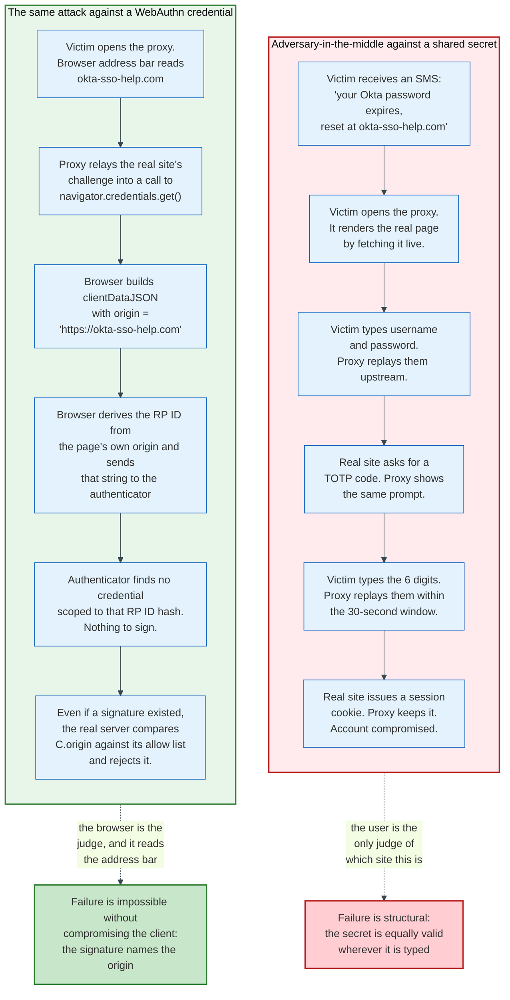

### 2.2 The Cloudflare Case, July 2022

The clearest published test of the mechanism is Cloudflare's account of an SMS phishing campaign against its own staff on 20 July 2022.

Over 100 SMS messages went to Cloudflare employees and their family members at 22:49 UTC. At least 76 employees received the text. Three of them opened the phishing page and entered their credentials. The site relayed the credentials to the attacker over Telegram in real time, and was built to relay a time-based code as well.

Zero accounts were compromised. Every Cloudflare employee holds a FIDO2 security key, and the key implements origin binding. The attacker held a valid username and a valid password, and could not complete a sign-in, because Cloudflare issues no phishable second factor and the hardware would not sign for a domain that was not Cloudflare's.

The number that matters is three. Three trained employees at a security company fell for the message, and the control that saved the company assumed they would.

### 2.3 The Cost Side

Attack volume against passwords is now counted per second. Microsoft reported observing roughly 7,000 password attacks per second in 2024, more than double the 2023 rate. Volume at that scale makes the per-attempt cost of guessing effectively zero.

Credential abuse led the Verizon Data Breach Investigations Report's initial-access table for years, and the 2026 edition ends that run. Exploitation of a software vulnerability reaches 31% of breaches and becomes the leading initial access vector, while credential abuse falls to 13%. The ranking changed. The 13% did not disappear.

The FIDO Alliance publishes vendor-reported outcomes from passkey deployments: Yubico citing a 99.99% reduction in exposure to phishing and credential theft, Amazon citing sign-in six times faster, Google citing a four-fold improvement in sign-in success rate against passwords, CVS Health citing a 98% reduction in mobile account takeover fraud, Air New Zealand citing a 50% reduction in login abandonment, and an 81% reduction in login-related help desk incidents. These are self-reported figures from parties with an interest, and should be read as directional rather than measured.

The mechanism claim is the one that survives scrutiny. A credential that will not sign for the wrong origin cannot be phished by a proxy, and that is arithmetic rather than opinion.

---

## 3. What a Passkey Actually Is (and Is Not)

A passkey is a discoverable WebAuthn credential: an asymmetric key pair, generated by an authenticator, scoped to exactly one relying party identifier, retrievable by the authenticator without the server first naming it.

Three properties, each of which does specific work. Asymmetric, so the server stores only a public key and a breach of the server yields nothing usable. Scoped, so the credential is invisible and unusable outside the domain it was made for. Discoverable, so the user can sign in without first typing a username.

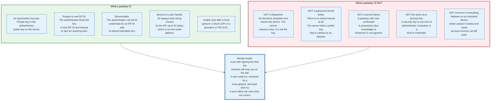

### 3.1 The Two Misconceptions Worth Correcting Explicitly

**Misconception one: a passkey sends the user's biometric to the website.** It does not, and the specification gives the server no field in which it could arrive. The registration response carries the client data the browser built, and an attestation object holding the format identifier, the authenticator data and an optional attestation statement. The credential ID and the public key sit inside the authenticator data, reached through convenience accessors rather than as separate response members. That authenticator data contains a 32-byte hash of the relying party identifier, one byte of flags, a four-byte counter, and the attested credential data. There is no biometric field, no template, no image and no score.

What the fingerprint does is unlock the private key locally. On an iPhone the match happens in the Secure Enclave; on Android in the Trusted Execution Environment or a StrongBox secure element; on a YubiKey Bio on the key's own matcher. The result crosses the boundary as a single bit: the UV flag, bit 2 of the flags byte. One bit, not a template.

**Misconception two: a passkey is just a second factor, or just a better password.** It is neither. It is not a second factor because the specification treats the local gesture as part of the same ceremony: an authenticator that sets the UV bit has verified the user, and a relying party that requires `userVerification: "required"` gets possession of the authenticator and verification of the human in one signature. Adding a password on top does not increase assurance. It re-adds the phishable factor the passkey removed.

It is not a better password because there is no secret to store. A password database breach at a relying party yields hashes to crack. A passkey database breach yields public keys, which are already public by construction. This changes the economics of the whole class: there is nothing worth stealing on the server side.

### 3.2 The Terminology That Trips People

"Passkey" is a product word laid over a set of specification words, and the mapping is not one to one.

| Product word | Specification term | Precise meaning |
|---|---|---|
| **Passkey** | Discoverable credential (client-side discoverable public key credential source) | A credential the authenticator can find given only an RP ID |
| **Synced passkey** | Multi-device credential | Backup eligibility flag BE is set; the private key can exist on more than one device |
| **Device-bound passkey** | Single-device credential | BE flag clear; the private key cannot leave the authenticator |
| **Resident key** | Older name for discoverable credential | Same thing; the CTAP option key is still `rk` |
| **Security key** | Roaming authenticator, cross-platform attachment | A physical device reached over USB, NFC or BLE |
| **Windows Hello, Touch ID, Face ID** | Platform authenticator, user verification method | The local gesture, not the credential |
| **Non-discoverable credential** | Server-side credential | The RP must supply the credential ID in `allowCredentials` |

The most consequential confusion in deployment is between "roaming authenticator" and "device-bound passkey." A YubiKey holds device-bound passkeys and is a roaming authenticator. Microsoft Authenticator holds device-bound passkeys and is a platform authenticator. Attachment and bindedness are independent axes.

### 3.3 The Simplest Accurate Mental Model

Think of the authenticator as a keyring where every key is stamped with the hash of exactly one domain, and of the browser as a doorman who reads the address bar and hands over only the key stamped with that domain's hash.

The doorman is the security boundary. If the doorman is honest, phishing is impossible, because the attacker's domain hashes to a value no key on the ring carries. If the doorman is compromised, which means malware inside the browser or the operating system, the model degrades to whatever the platform can enforce on its own.

That is the whole trust argument. It is short because it has to be.

---

## 4. The FIDO2 Stack: WebAuthn plus CTAP2

FIDO2 is two specifications with a client in the middle, and the client is where the security lives.

```mermaid
%%{init: {'theme': 'base', 'themeVariables': {'primaryColor': '#e3f2fd', 'primaryBorderColor': '#1565c0', 'lineColor': '#37474f'}}}%%

flowchart TB
    subgraph RP["Relying party: the website"]
        direction TB
        Server["RP server<br/>Generates the challenge.<br/>Stores credential records:<br/>id, publicKey, signCount,<br/>uvInitialized, transports,<br/>backupEligible, backupState."]
        JS["Page JavaScript<br/>navigator.credentials.create()<br/>navigator.credentials.get()"]
    end

    subgraph Client["WebAuthn client: browser or OS platform"]
        direction TB
        Origin["Origin check<br/>Reads the actual origin.<br/>Validates rp.id is a registrable<br/>suffix of it, or matches a<br/>related origin from<br/>/.well-known/webauthn"]
        CD["Builds CollectedClientData:<br/>type, challenge, origin,<br/>crossOrigin, topOrigin.<br/>Serialises to clientDataJSON,<br/>hashes with SHA-256."]
        Sel["Authenticator selection UI<br/>and credential picker.<br/>Applies hints, attachment,<br/>residentKey, userVerification."]
    end

    subgraph CTAP["CTAP2: client to authenticator"]
        direction TB
        Cmd["CBOR commands<br/>0x01 authenticatorMakeCredential<br/>0x02 authenticatorGetAssertion<br/>0x04 authenticatorGetInfo<br/>0x06 authenticatorClientPIN<br/>0x0A authenticatorCredentialManagement"]
        Tr["Transports, the six WebAuthn values<br/>usb: CTAPHID, 64-byte frames<br/>nfc: ISO 7816 APDUs<br/>ble: FIDO GATT service<br/>smart-card: ISO 7816 over a reader<br/>hybrid: QR + BLE + WebSocket<br/>internal: platform IPC"]
    end

    subgraph Auth["Authenticator"]
        direction TB
        Store["Credentials map:<br/>(rpId, userHandle) to<br/>public key credential source"]
        Crypto["Key generation and signing.<br/>ES256 by default.<br/>Keys in a Secure Enclave,<br/>TEE, StrongBox, secure element<br/>or a software vault."]
        UVM["User verification:<br/>biometric matcher, PIN,<br/>or screen lock."]
    end

    Server -->|"challenge, rp, user,<br/>pubKeyCredParams"| JS
    JS -->|"PublicKeyCredentialCreationOptions"| Origin
    Origin --> CD --> Sel
    Sel --> Cmd
    Cmd --> Tr
    Tr --> Store
    Store --> Crypto
    Crypto --> UVM
    UVM -->|"authData, signature,<br/>attStmt"| Tr
    Tr -->|"PublicKeyCredential"| JS
    JS -->|"clientDataJSON,<br/>attestationObject or<br/>authenticatorData + signature"| Server

    style RP fill:#e8f5e9,stroke:#2e7d32,stroke-width:2px
    style Client fill:#e3f2fd,stroke:#1565c0,stroke-width:3px
    style CTAP fill:#fff3e0,stroke:#e65100,stroke-width:2px
    style Auth fill:#f3e5f5,stroke:#4a148c,stroke-width:2px
```

### 4.1 Who Enforces What

The division of labour is precise, and getting it wrong is the source of most implementation bugs.

**The relying party server** generates a cryptographically random challenge, stores the credential record, and verifies the assertion. It is the only party that knows what origins are legitimate for it, and the only party that can decide whether a signature counter regression matters.

**The client**, meaning the browser or the operating system's credential manager, decides which relying party identifier a page is allowed to claim. This is the load-bearing check. A page at `https://shop.example.com` may claim an RP ID of `shop.example.com` or `example.com`, but not `example.org` and not `com`. The client refuses anything else with a `SecurityError`. Nothing the page does can bypass it.

**The authenticator** stores the key, applies the credential protection policy, performs the user gesture, and signs. It never sees the origin string. It receives the RP ID as a text string, checks it against the credentials it holds, and hashes it itself to build `authenticatorData`.

That last point is the one people miss. The authenticator cannot verify the origin, because it never receives one. It trusts the client to have derived the RP ID from a real origin. This is why a compromised client breaks the model and a compromised network does not.

### 4.2 What CTAP2 Adds Over WebAuthn

WebAuthn describes an abstract authenticator model. CTAP2 is a concrete instantiation, and it carries a set of capabilities the web API alone does not express.

The `authenticatorGetInfo` command, 0x04, returns a CBOR map that tells the client what the device can do. Its members include `versions` (0x01), an array containing strings such as `FIDO_2_1`, `FIDO_2_0` and `U2F_V2`; `extensions` (0x02); `aaguid` (0x03), the 16-byte model identifier; `options` (0x04); `maxMsgSize` (0x05); `pinUvAuthProtocols` (0x06); `maxCredentialCountInList` (0x07); `maxCredentialIdLength` (0x08); `transports` (0x09); `algorithms` (0x0A); `maxSerializedLargeBlobArray` (0x0B), which must be at least 1024 bytes if present; `forcePINChange` (0x0C); `minPINLength` (0x0D), defaulting to at least 4 Unicode code points; `firmwareVersion` (0x0E); `maxCredBlobLength` (0x0F), at least 32 bytes if present; and `maxRPIDsForSetMinPINLength` (0x10).

CTAP2 also owns credential management, biometric enrolment, PIN setting and change, large blob storage, and the authenticator configuration commands that let an enterprise turn on always-require-user-verification and set a minimum PIN length before handing keys to staff. None of that is reachable from a web page, by design.

---

## 5. Key Participants and Roles

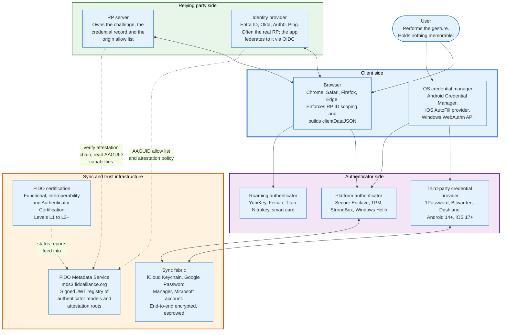

### 5.1 The Actors

| Role | What it does | Examples | Holds the private key? |
|---|---|---|---|
| **User** | Performs the authorisation gesture | Anyone | No |
| **Relying party** | Issues the challenge, stores the public key, verifies the signature | Any website or app | No |
| **Identity provider** | Acts as the relying party on behalf of many applications | Entra ID, Okta, Auth0, Google Workspace | No |
| **WebAuthn client** | Enforces RP ID scoping, builds and hashes client data, drives the picker | Chrome, Safari, Firefox, Edge, native platform APIs | No |
| **Platform authenticator** | Generates and holds keys inside the device | Secure Enclave, TPM 2.0, Android StrongBox, Windows Hello | Yes |
| **Roaming authenticator** | Same, in a separate physical device | YubiKey 5, Feitian, Google Titan, Nitrokey | Yes |
| **Credential provider** | Third-party passkey store plugged into the OS | 1Password, Bitwarden, Dashlane, NordPass | Yes |
| **Sync fabric** | Encrypts, backs up and distributes private keys across a user's devices | iCloud Keychain, Google Password Manager, Microsoft account | Holds ciphertext only |
| **FIDO Metadata Service** | Publishes a signed registry of authenticator models, capabilities and attestation roots | `mds3.fidoalliance.org` | No |
| **Certification body** | Tests authenticators and assigns Authenticator Certification Levels | FIDO Alliance accredited labs | No |

### 5.2 The Two Roles That Decide Whether a Deployment Works

**The client is the security boundary, and the relying party cannot inspect it.** A relying party receives a signature and an origin string, and has no way to know whether the browser that produced them was genuine. Everything it can check, it checks after the fact. This is why the specification's threat model excludes a compromised client, and why device management, not WebAuthn, is the answer to malware.

**The sync fabric is the availability boundary, and the relying party does not choose it.** When a user registers a synced passkey, the durability of that credential is a property of Apple's, Google's or Microsoft's escrow design, not of the relying party's. A relying party that has never read the escrow design has outsourced its account recovery policy without noticing. Section 15 sets out what those designs actually are.

### 5.3 Where the Identity Provider Sits

In enterprise deployments the relying party is almost never the application. It is the identity provider, and the RP ID is the identity provider's domain.

An employee signing into a payroll system gets redirected to Entra ID or Okta, authenticates there with a passkey scoped to `login.microsoftonline.com` or a tenant domain, and returns with an OIDC token. The payroll system never sees a WebAuthn ceremony. This matters for three reasons: the passkey count per employee is one rather than one per app, the phishing-resistance policy is enforced centrally through conditional access, and a compromise of the identity provider session is a compromise of every downstream application at once.

Passkeys move the phishing problem to the front door. They do not remove the front door.

---

## 6. The Registration Ceremony, Field by Field

Registration produces one artefact the server keeps forever: a credential record. Everything in the ceremony exists to make that record trustworthy.

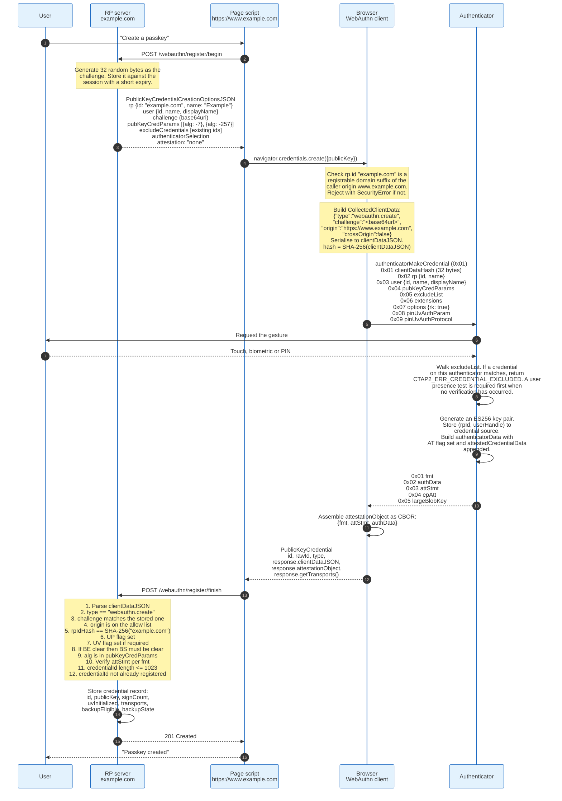

### 6.1 The Options Object

`PublicKeyCredentialCreationOptions` is the server's entire instruction set. In WebAuthn Level 3 the dictionary is:

```
dictionary PublicKeyCredentialCreationOptions {
    required PublicKeyCredentialRpEntity   rp;
    required PublicKeyCredentialUserEntity user;
    required BufferSource                  challenge;
    required sequence<PublicKeyCredentialParameters> pubKeyCredParams;
    unsigned long                          timeout;
    sequence<PublicKeyCredentialDescriptor> excludeCredentials = [];
    AuthenticatorSelectionCriteria         authenticatorSelection;
    sequence<DOMString>                    hints = [];
    DOMString                              attestation = "none";
    sequence<DOMString>                    attestationFormats = [];
    AuthenticationExtensionsClientInputs   extensions;
};
```

Field by field, with the decisions that matter.

**`rp.id`** is the scope of the credential and the single most consequential value in the object. If omitted it defaults to the caller origin's effective domain. Setting it to a registrable parent domain, `example.com` from a page on `www.example.com`, makes the credential usable across all subdomains. Setting it too narrowly, `www.example.com`, permanently excludes `app.example.com`. The value cannot be changed later without re-registering every credential. `rp.name` is deprecated in Level 3.

**`user.id`** is an opaque `BufferSource` of at most 64 bytes, and the specification is explicit that it must not contain personally identifying information. It is the user handle, returned to the relying party during a discoverable-credential assertion, and it is the key on which an authenticator overwrites credentials: a second registration with the same `rp.id` and the same `user.id` replaces the first on that authenticator. Use a random UUID or an internal account identifier. Never use the email address.

**`challenge`** must be at least 16 bytes of cryptographically random data, single use, bound to the session, and expired quickly. The specification's security considerations section is unambiguous that a predictable or reused challenge defeats replay protection.

**`pubKeyCredParams`** is an ordered list of COSE algorithm identifiers. In practice `-7` (ES256, ECDSA over P-256 with SHA-256) and `-257` (RS256, RSASSA-PKCS1-v1_5 with SHA-256) cover essentially everything, with `-8` (EdDSA) supported by some hardware. Level 3 adds a recommendation against offering `-9`, `-51`, `-52` and `-19`.

**`excludeCredentials`** carries the credential IDs already registered for this user. An authenticator that finds one of its own credentials in that list returns `CTAP2_ERR_CREDENTIAL_EXCLUDED`, which the client surfaces as an `InvalidStateError`. This is how a site prevents a user from creating a third passkey on the same phone without realising it. Omitting it is a common bug and produces duplicate credentials that confuse the picker.

**`authenticatorSelection`** carries four members: `authenticatorAttachment` (`platform` or `cross-platform`), `residentKey` (`discouraged`, `preferred`, `required`), the deprecated boolean `requireResidentKey`, and `userVerification` (`required`, `preferred` default, `discouraged`). For a passkey deployment the correct values are `residentKey: "required"` and `userVerification: "required"`.

**`hints`** is new in Level 3 and expresses preference without constraint: `security-key`, `client-device`, `hybrid`. Unlike `authenticatorAttachment` it does not exclude anything, it only reorders the picker.

**`attestation`** defaults to `"none"`. Section 14 explains why almost nobody changes it.

### 6.2 clientDataJSON

The client, not the page, constructs this object and the authenticator never sees it in plaintext. Only its SHA-256 hash crosses to the authenticator.

```json
{
  "type": "webauthn.create",
  "challenge": "hR7v3Qm2ZK1cN8pXfL0aTyWbE4sJgU9dOiVxHnMr6Ac",
  "origin": "https://www.example.com",
  "crossOrigin": false
}
```

`type` is `webauthn.create` for registration and `webauthn.get` for authentication, and exists to stop an attacker substituting one signature for the other. `challenge` is the base64url encoding of the server's bytes. `origin` is the full origin of the calling page, scheme and host and port, written by the client. `crossOrigin` is true when the call came from an iframe that is not same-origin with its ancestors. `topOrigin`, added in Level 3, names the top-level page when `crossOrigin` is true.

`origin` is the field that kills phishing. The relying party compares it to a list it controls.

### 6.3 The attestationObject

The response's `attestationObject` is a CBOR map with exactly three keys.

```
{
  "fmt":      "packed",
  "attStmt":  { "alg": -7, "sig": h'3045...', "x5c": [ h'308202...' ] },
  "authData": h'49960DE5880E8C687434170F6476605B8FE4AEB9A28632C7995CF3BA831D9763 45 00000000 ...'
}
```

`authData` is the structure the signature covers, and it is worth reading as bytes.

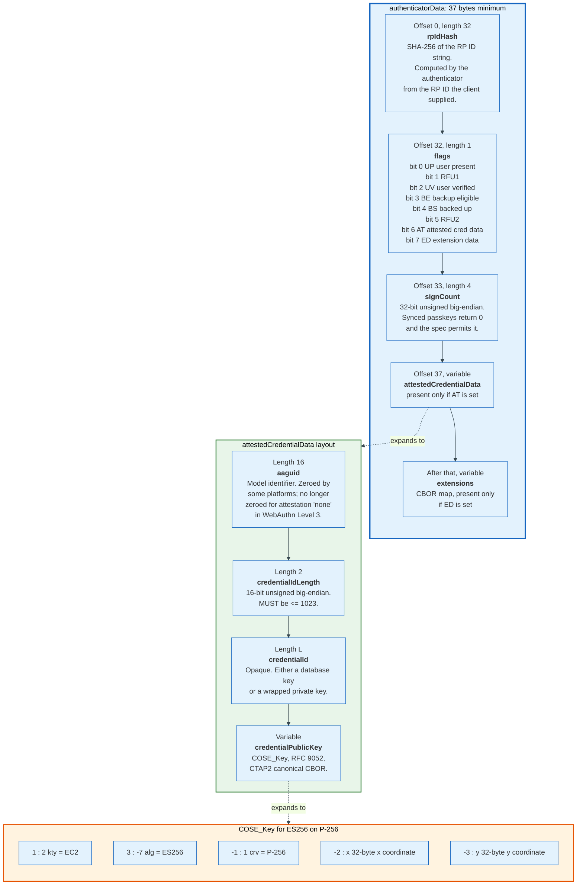

Two consequences follow from the layout. The structure describes its own length, so a parser that reads 37 bytes and stops is correct whenever AT and ED are clear. And determining where the COSE key ends requires a CBOR parser, because the key is the last field and has no explicit length, which is why hand-rolled WebAuthn parsers so often fail on RSA keys.

### 6.4 The Twenty-Nine Verification Steps

WebAuthn Level 3 section 7.1 sets out the registration verification algorithm in twenty-nine steps. The load-bearing ones, in order:

1. Decode `clientDataJSON` as UTF-8 and parse it as JSON.
2. Verify `C.type` is `webauthn.create`.
3. Verify `C.challenge` equals the base64url encoding of the issued challenge.
4. Verify `C.origin` is an expected origin.
5. If `C.crossOrigin` is true, verify the relying party expects this credential to be created in a cross-origin iframe. If `C.topOrigin` is present, verify it against the pages the relying party expects to be framed within.
6. Compute `hash = SHA-256(clientDataJSON)`.
7. CBOR-decode `attestationObject` into `fmt`, `authData`, `attStmt`.
8. Verify `authData.rpIdHash` equals `SHA-256(rpId)` for the expected RP ID.
9. Unless mediation was `conditional`, verify the UP bit is set.
10. If user verification is required, verify the UV bit is set.
11. If the BE bit is clear, verify the BS bit is clear. This combination is invalid and signals a broken authenticator.
12. Verify the `alg` in the credential public key is one the server offered.
13. Verify `attStmt` per the format's own procedure, then assess trustworthiness against relying-party policy.
14. Verify `credentialId` is at most 1023 bytes.
15. Verify `credentialId` is not already registered to any user. The specification's rationale is explicit: an attacker who obtains a victim's credential ID and public key could otherwise register them as their own and force the victim into the attacker's account.
16. Create the credential record: `type`, `id`, `publicKey`, `signCount`, `uvInitialized`, `transports`, `backupEligible`, `backupState`.

Step 11 and step 15 are the two most commonly skipped, and step 15 is the one with a named attack behind it.

---

## 7. The Authentication Ceremony, Field by Field

Authentication is registration without the key generation and without the attestation. The signature covers two things and only two things.

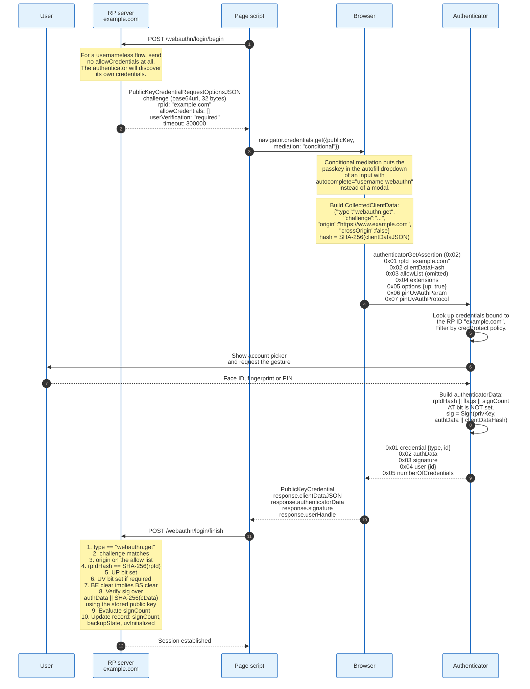

### 7.1 The Request Options

```
dictionary PublicKeyCredentialRequestOptions {
    required BufferSource                   challenge;
    unsigned long                           timeout;
    DOMString                               rpId;
    sequence<PublicKeyCredentialDescriptor> allowCredentials = [];
    DOMString                               userVerification = "preferred";
    sequence<DOMString>                     hints = [];
    AuthenticationExtensionsClientInputs    extensions;
};
```

`allowCredentials` is the field that decides which product this is. Populated, it produces a two-step flow: the user identifies themselves, the server looks up their credential IDs, the authenticator is told exactly what to use. Empty, it produces a passkey flow: the authenticator discovers its own credentials for the RP ID and shows a picker, and the user never types a username.

Leaving it empty also leaks less. A populated `allowCredentials` tells anyone who can ask whether a given username has a registered credential, which is an account enumeration oracle.

### 7.2 What Is Actually Signed

The assertion signature covers the concatenation of two byte strings and nothing else:

```
sig = Sign(credentialPrivateKey, authenticatorData || SHA-256(clientDataJSON))
```

`authenticatorData` here is 37 bytes when no extensions are present: the 32-byte RP ID hash, one byte of flags, and the four-byte counter. `clientDataJSON` is the client's serialisation carrying the type, the challenge and the origin.

So the signature transitively commits to: which relying party (via `rpIdHash`), which ceremony (via `type`), which session (via `challenge`), which origin (via `origin`), whether a human was present (via UP), whether a human was verified (via UV), and whether the credential is synced (via BE and BS).

Seven bindings in 37 bytes plus a JSON blob. That density is the whole design.

### 7.3 Signature Counter, and Why It Mostly Does Not Work Any More

The four-byte `signCount` was designed to detect cloned authenticators. The authenticator increments it on each assertion, the relying party stores the last value, and a value that fails to increase suggests two copies of the same private key in circulation.

The specification permits an authenticator to leave the counter at zero permanently, and every synced passkey provider does, because a counter cannot be kept consistent across devices that sign offline. Level 3 states the rule plainly: if both the received counter and the stored counter are zero, skip the check entirely.

A relying party that hard-fails on a non-increasing counter will break for every synced passkey. The correct handling is: if either value is non-zero and the new value is not greater than the stored one, treat it as a risk signal and feed it into scoring, not as an authentication failure. The counter survives as a useful signal only for hardware roaming authenticators.

---

## 8. Challenge, Origin Binding, and Why the Phish Fails

Three independent bindings defeat three independent attacks, and each is checked by a different party.

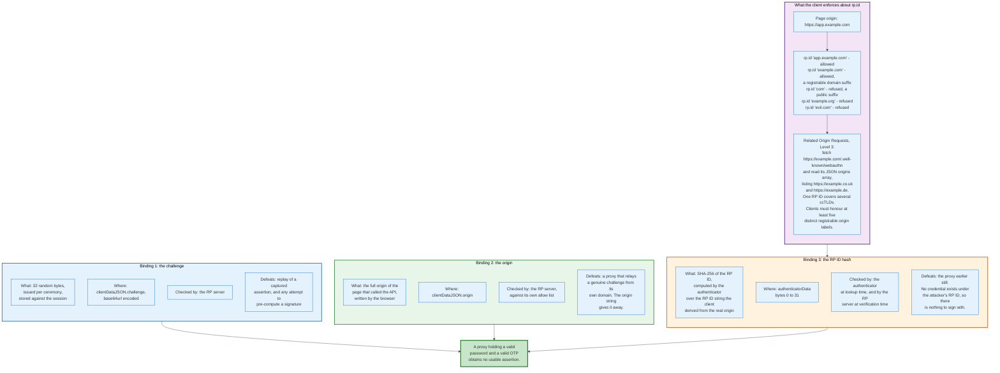

### 8.1 The Attack, Traced

Take a working reverse-proxy phishing kit and point it at a relying party that uses passkeys.

The victim opens `https://okta-sso-help.com`. The proxy fetches the genuine login page, receives a genuine challenge, and relays the WebAuthn options to the victim's browser. Everything up to this point works exactly as it does against a password.

The victim's browser now calls `navigator.credentials.get()`. It writes `"origin": "https://okta-sso-help.com"` into `clientDataJSON`, because that is where the page is. It derives the RP ID from that origin, because the page cannot claim `okta.com` from a domain it does not control. It sends that string to the authenticator.

The authenticator looks up credentials scoped to the RP ID `okta-sso-help.com`, hashing it to build the `rpIdHash` it would sign over, and finds none. The ceremony fails with no credential available, and the user sees an empty picker rather than a prompt.

Suppose the attacker has also registered a passkey on the victim's device for its own domain, through some earlier trick. The signature it obtains carries `origin: "https://okta-sso-help.com"` and an RP ID hash for the attacker's domain. The genuine server compares both against its own values and rejects.

There is no configuration, no user decision and no timing window in which this attack succeeds. That is what "phishing-resistant" means as a technical claim.

### 8.2 What Origin Binding Does Not Cover

Origin binding protects the authentication event. It does not protect what happens after it.

An attacker who obtains the session cookie by other means, through malware, a cross-site scripting flaw or an OAuth consent phish, holds an authenticated session that no WebAuthn property revokes. Token binding, which would have tied the session to the client's key, was removed from WebAuthn and marked reserved in Level 3. The current answers are short session lifetimes, device-bound session credentials at the transport layer, and step-up re-authentication with a fresh WebAuthn assertion before sensitive operations.

Re-authentication with a fresh challenge is the practical control, and it is cheap because the user gesture is one touch.

### 8.3 Related Origin Requests

WebAuthn Level 3 adds a bounded escape hatch for organisations that operate the same service on several domains.

A relying party with the RP ID `example.com` publishes a JSON document at `https://example.com/.well-known/webauthn` containing an `origins` array. A client that receives a ceremony from `https://example.co.uk` claiming `rp.id` of `example.com` fetches that document, without credentials and without a referrer, requires a 200 status and a content type of `application/json`, and checks the caller origin against the list.

The client supports at least five distinct registrable origin labels, and section 5.11 tells client policy to set an upper limit above that to prevent abuse, which stops the mechanism from turning one RP ID into an unbounded credential-sharing pool. This solves the country-domain problem, `example.de` and `example.fr` sharing credentials with `example.com`, without reopening the phishing hole.

---

## 9. Credential IDs and the Key Pair Per Relying Party

Every credential is a key pair bound to a triple: the relying party identifier, the user handle, and the authenticator that made it. Change any one of the three and the result is a different credential.

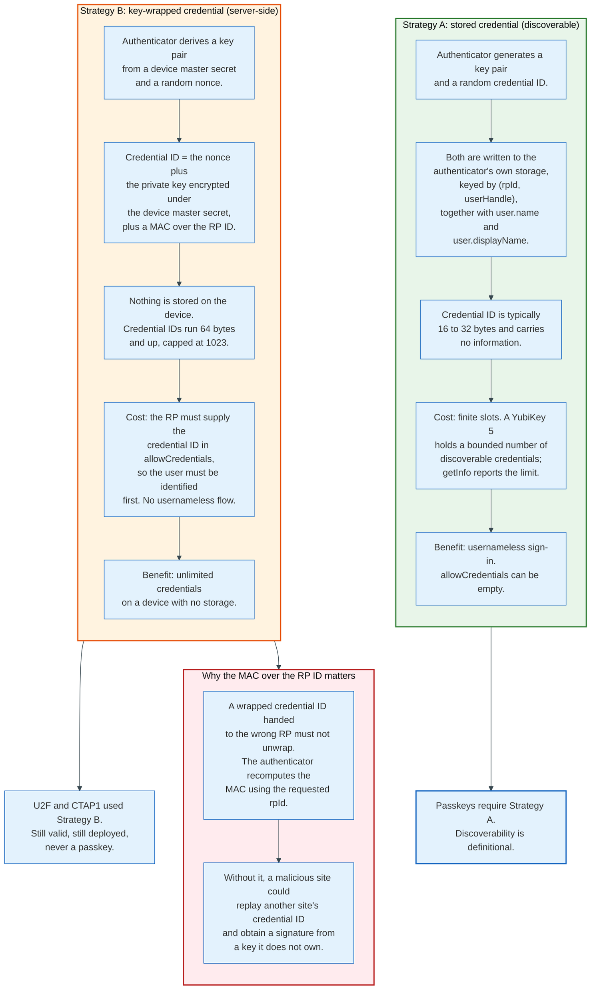

### 9.1 The Credential ID Is Opaque, and the Relying Party Must Treat It So

WebAuthn says the credential ID is at most 1023 bytes and says nothing else about it. It may be a database key. It may be an encrypted private key with a MAC. It may be a counter. A relying party that parses it, infers length semantics from it, or assumes a fixed size is writing a bug that will surface the first time a user brings a different authenticator.

Store it as bytes. Compare it as bytes. Index it as bytes.

Two practical consequences. Databases that declare the column as `VARCHAR(255)` truncate credentials from key-wrapping authenticators and produce sign-in failures that look like signature errors. And relying parties that base64-encode without the URL-safe alphabet break the `id` field, which the specification defines as base64url of `rawId`.

### 9.2 One Key Pair Per Relying Party Is a Privacy Property

The specification requires the authenticator to generate a fresh key pair for each credential, and the key is used only in ceremonies naming its RP ID. Two relying parties therefore see two unrelated public keys from the same device.

This is unlinkability by construction. Without it, a single public key presented to many sites would be a supercookie better than any tracking identifier: stable, unclearable and cryptographically verifiable.

The exception is attestation, and it is the reason attestation is a privacy problem rather than a free security win. An attestation certificate is shared across a batch of devices precisely so that it does not identify one. Section 14 covers the arithmetic.

### 9.3 excludeCredentials and the Duplicate Problem

Passing `excludeCredentials` on registration is how a relying party avoids stacking multiple credentials for one user on one authenticator.

The authenticator walks the list after the user-verification step, not before it, and if it holds any credential named in the list it returns `CTAP2_ERR_CREDENTIAL_EXCLUDED`. Where the ceremony produced no user interaction, CTAP 2.2 requires a user presence test before the error is returned, so that the error cannot leak the presence of a credential to a page the user never touched. The browser surfaces the result as an `InvalidStateError`, which the specification suggests treating as "use a different authenticator."

There is a subtlety worth knowing. `excludeCredentials` only excludes credentials held by the authenticator being used. It cannot prevent a user registering a second passkey on a second device, which is the intended behaviour. What it prevents is silent duplication on the same device, which produces a picker with two identical-looking entries and a support ticket.

---

## 10. Discoverable Credentials and Resident Keys

A discoverable credential is one the authenticator can find given only the RP ID. That is the entire definition, and every passkey user experience follows from it.

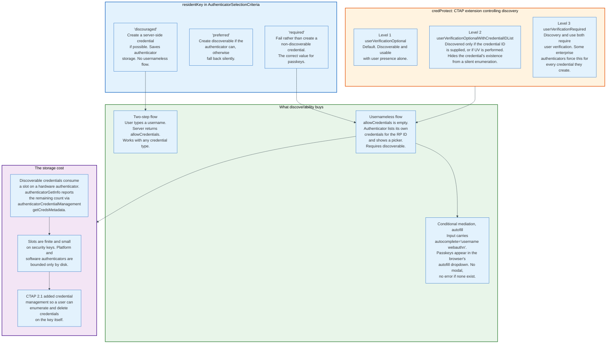

### 10.1 The CTAP Side

In CTAP the option key is `rk`, defaulting to false, and the specification's own terminology for the alternative is "server-side credential," which is clearer than "non-resident."

A server-side credential is defined by the requirement that the relying party supply its credential ID in `allowList`. A discoverable credential is defined by the authenticator being able to find it without one. The specification is careful to note that this definition says nothing about whether the credential is statefully stored: an authenticator could in principle enumerate wrapped credentials. In practice discoverable means stored.

### 10.2 Conditional Mediation Is the Feature Users Notice

Conditional mediation, standardised in Level 3 for both `get()` and `create()`, is what makes passkeys feel like autofill rather than like a security product.

The page marks an input with `autocomplete="username webauthn"` and calls `navigator.credentials.get()` with `mediation: "conditional"`. The call does not throw and does not show a modal. If the browser holds a passkey for the origin, it offers it inside the ordinary autofill dropdown alongside saved passwords. If it does not, nothing happens and the password field works as before.

Conditional mediation for `create()` is the mirror image: the browser may offer to save a passkey after a successful password sign-in, without interrupting the user with a dialogue they did not ask for. This is the single highest-yield mechanism for passkey adoption on an existing account base, because it converts users at the moment they have already proven who they are.

### 10.3 credProtect and the Enumeration Question

The `credProtect` extension, defined in CTAP, attaches a protection policy to a credential at creation and persists it.

Level 1, `userVerificationOptional`, is the CTAP 2.0 default and permits discovery and use with a touch alone. Level 2, `userVerificationOptionalWithCredentialIDList`, makes the credential discoverable only when its ID is supplied or when user verification is performed, which prevents a hostile page from enumerating which sites a user holds credentials for. Level 3, `userVerificationRequired`, requires user verification for both discovery and use.

The extension carries a companion boolean, `enforceCredentialProtectionPolicy`. When true, the platform is instructed to fail rather than create a credential on an authenticator that cannot honour the requested policy. Some high-security authenticators are configured to force level 3 on every credential regardless of what the relying party asks, and they report the level they actually applied in the extension output.

---

## 11. User Verification versus User Presence

Two bits in the flags byte carry two completely different claims, and conflating them is the most common source of assurance-level errors in production.

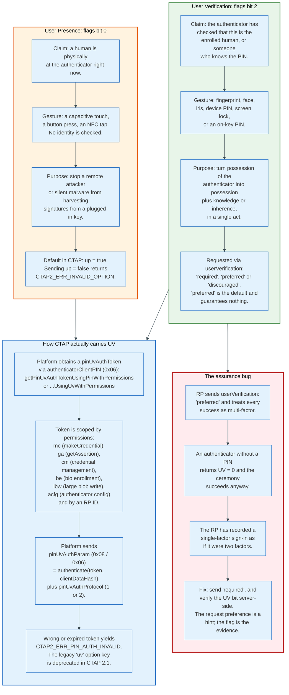

### 11.1 The Rule

User presence is a liveness check with no identity claim attached. User verification is an identity claim made by the authenticator, on evidence the relying party never sees.

A relying party that wants single-factor convenience sends `userVerification: "discouraged"` and accepts UP alone. A relying party that wants phishing-resistant multi-factor sends `"required"` and rejects any assertion with the UV bit clear. The middle value, `"preferred"`, is the default and means "attempt verification where possible", which is exactly the wrong semantics for a policy decision.

The verification step is server-side and non-negotiable. WebAuthn Level 3 section 7.2 step 17 directs the relying party to determine whether user verification is required, to verify the UV bit is set when it is, and otherwise to ignore the flag's value. Step 18 is a different rule: BE clear implies BS clear.

### 11.2 uvInitialized and the Credential Record

Level 3 introduces a field in the credential record called `uvInitialized`, set from the UV flag at registration.

Its purpose is to record whether this credential was ever created under user verification. A credential registered with UV clear and later used with UV set can have `uvInitialized` upgraded, but the specification says that upgrade should itself require authorisation by an additional factor equivalent to user verification. Without that rule, an attacker with brief physical access to an unlocked authenticator could silently promote a single-factor credential into one the server treats as multi-factor.

### 11.3 What a Biometric Actually Proves Here

The biometric proves possession of the authenticator, not identity to the relying party.

The matcher runs locally. Its output is a boolean the authenticator uses to release the key and set one bit. A relying party has no way to know whether the gesture was a face, a fingerprint or a four-digit PIN, and no way to know the false accept rate of the sensor. Level 3 removed the `uvm` extension, which had attempted to report the user verification method, because in practice it was not implemented consistently enough to be relied upon.

If a relying party needs to know the strength of the local verification, its only route is attestation plus the FIDO Metadata Service entry for the AAGUID, which reports `userVerificationDetails`, `matcherProtection` and `keyProtection`. That is a heavyweight dependency for a small amount of information, which is another reason attestation stays switched off in consumer deployments.

---

## 12. Authenticator Types: Platform, Roaming, Hybrid

WebAuthn defines two attachment values and six transport values, and the two vocabularies do not line up. CTAP reuses the WebAuthn transport strings in its `transports` (0x09) getInfo member rather than defining its own. Attachment describes where the authenticator lives. Transport describes how bytes reach it.

```mermaid
%%{init: {'theme': 'base', 'themeVariables': {'primaryColor': '#e3f2fd', 'primaryBorderColor': '#1565c0', 'lineColor': '#37474f'}}}%%

flowchart TB
    subgraph Plat["Platform authenticator: attachment 'platform'"]
        direction TB
        PL1["Built into the device the user<br/>is signing in on. Transport<br/>value 'internal'."]
        PL2["Apple: Secure Enclave, keys<br/>generated in and never leaving<br/>the coprocessor. Touch ID,<br/>Face ID or Optic ID unlocks."]
        PL3["Android: TEE or a StrongBox<br/>secure element. Screen lock or<br/>biometric unlocks. Google<br/>Password Manager syncs."]
        PL4["Windows: Windows Hello backed<br/>by TPM 2.0, or a passkey in<br/>the Microsoft account."]
        PL5["Cannot be moved to another<br/>device except through the<br/>vendor's sync fabric."]
    end

    subgraph Roam["Roaming authenticator: attachment 'cross-platform'"]
        direction TB
        RO1["A separate physical device.<br/>Transports 'usb', 'nfc', 'ble',<br/>'smart-card'."]
        RO2["USB HID: CTAPHID framing.<br/>64-byte packets, init packet<br/>carries CID, CMD, BCNTH, BCNTL;<br/>continuation packets carry CID<br/>and a 7-bit sequence number.<br/>Max payload 7609 bytes."]
        RO3["NFC: ISO 7816 APDUs.<br/>Tap and hold, no cable."]
        RO4["BLE: the FIDO GATT service.<br/>Requires pairing; largely<br/>displaced by hybrid."]
        RO5["Keys never leave the device.<br/>Loss of the device is loss<br/>of every credential on it."]
    end

    subgraph Hyb["Hybrid: transport 'hybrid'"]
        direction TB
        HY1["A phone acts as an authenticator<br/>for a sign-in happening on a<br/>different machine."]
        HY2["Three channels at once:<br/>a QR code carries the key<br/>material, a BLE advert proves<br/>proximity, a WebSocket tunnel<br/>carries the CTAP messages."]
        HY3["Standardised in CTAP 2.2,<br/>14 July 2025. Previously<br/>known as caBLE v2."]
        HY4["The BLE step is not optional.<br/>It is what stops a remote attacker<br/>displaying a QR code to the user."]
    end

    subgraph Prov["Third-party credential provider"]
        direction TB
        PR1["A password manager registered<br/>with the OS as a passkey store.<br/>Android 14+ Credential Manager,<br/>iOS 17+ AutoFill provider."]
        PR2["1Password, Bitwarden, Dashlane,<br/>NordPass, Enpass. Appears to the<br/>relying party as a platform<br/>authenticator with its own AAGUID."]
        PR3["Syncs through the vendor's own<br/>vault rather than the OS vendor's."]
    end

    Plat --> Trade["The trade in one line:<br/>platform is convenient and<br/>tied to an ecosystem, roaming<br/>is portable and losable,<br/>hybrid is a bridge, provider<br/>is a choice of custodian."]
    Roam --> Trade
    Hyb --> Trade
    Prov --> Trade

    style Plat fill:#e8f5e9,stroke:#2e7d32,stroke-width:2px
    style Roam fill:#fff3e0,stroke:#e65100,stroke-width:2px
    style Hyb fill:#e3f2fd,stroke:#1565c0,stroke-width:2px
    style Prov fill:#f3e5f5,stroke:#4a148c,stroke-width:2px
    style Trade fill:#eceff1,stroke:#37474f,stroke-width:3px
```

### 12.1 The USB HID Framing, Because It Explains the Size Limits

CTAPHID maps CTAP messages onto fixed-size HID reports, and the framing explains several limits developers hit.

An initialization packet is: bytes 0 to 3 the channel identifier CID, byte 4 the command with bit 7 set, byte 5 the high byte of the payload length BCNTH, byte 6 the low byte BCNTL, and the remainder payload. A continuation packet is: bytes 0 to 3 the CID, byte 4 a sequence number from 0x00 to 0x7F with bit 7 cleared, and the remainder payload.

With the 64-byte packet size of a full-speed USB device, the maximum message payload is `64 - 7 + 128 * (64 - 5) = 7609` bytes. That ceiling is why `maxMsgSize` exists in the getInfo response, and why an `allowCredentials` list with several hundred entries fails on a hardware key rather than on a phone.

The mandatory CTAPHID commands are `CTAPHID_PING` (0x01), `CTAPHID_MSG` (0x03), `CTAPHID_INIT` (0x06), `CTAPHID_CBOR` (0x10), `CTAPHID_CANCEL` (0x11), `CTAPHID_KEEPALIVE` (0x3B) and `CTAPHID_ERROR` (0x3F). A client allocates a channel by sending `CTAPHID_INIT` on the broadcast channel `0xFFFFFFFF` and receiving a fresh 32-bit CID.

### 12.2 What the Attachment Choice Actually Decides

`authenticatorAttachment: "platform"` restricts the picker to the device in front of the user. `"cross-platform"` restricts it to security keys and hybrid. Omitting it allows both.

The right default for a consumer service is to omit it, and to use `hints` instead when guidance is needed. Restricting to `"platform"` produces a service that cannot be accessed from a shared or borrowed machine. Restricting to `"cross-platform"` produces a service that requires the user to own hardware.

For a high-assurance enterprise deployment the calculation inverts, and section 17 covers it.

---

## 13. The Hybrid Transport, Byte by Byte

Hybrid, standardised in CTAP 2.2 on 14 July 2025 and known before that as caBLE v2, lets a phone authenticate a sign-in on a laptop. It is the most intricate part of the stack and the least understood.

The design problem is specific. A tunnel over the internet is easy. Proving that the phone and the laptop are in the same room, without pairing them, is not. Hybrid solves it by splitting the two jobs: a WebSocket carries the messages, and a Bluetooth Low Energy advertisement carries the proof of proximity.

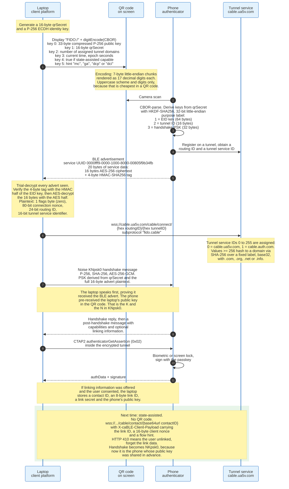

### 13.1 Why Each Piece Exists

**The QR code carries key material, not a URL.** Its contents are a canonical CBOR map holding a 33-byte compressed P-256 public key and a 16-byte secret. The digit encoding, seven-byte chunks rendered as seventeen decimal digits, exists because QR codes encode numeric data far more densely than arbitrary bytes. Trailing partial chunks of 1 to 6 bytes take 3, 5, 8, 10, 13 or 15 digits respectively.

The specification also GREASEs the map, adding a random unknown key roughly one time in four, to force parsers to tolerate fields added later. That is a lesson learned from TLS.

**The BLE advertisement is the proximity proof and nothing else.** Twenty bytes of service data under a fixed UUID: sixteen bytes of AES ciphertext and a four-byte HMAC tag. The specification is explicit that a wide-block mode would have been preferable and that no standard one exists, so it uses a single AES block with a truncated MAC. It avoids a keystream mode deliberately, because two phones scanning the same QR code would otherwise reuse a keystream.

The plaintext is a flags byte, an 80-bit connection nonce, a 24-bit routing ID and a 16-bit tunnel service identifier. The connection nonce is the value that proves the laptop heard the advert, and it is folded into the handshake pre-shared key.

**The tunnel service is untrusted plumbing.** The tunnel ID is derived from the QR secret alone and never from the BLE nonce, specifically so that the tunnel service cannot brute-force the nonce from the tunnel ID it sees. The service learns that two parties are talking and nothing about what they say, because the Noise handshake establishes an authenticated, forward-secure channel over the top.

**The Noise pattern encodes who knew what in advance.** In the QR flow the laptop has published its public key in the QR code, so the pattern is KNpsk0: the initiator's static key is Known to the responder, the responder's is Not transmitted, and a pre-shared key is mixed in at position zero. In the state-assisted flow the roles invert, because it is now the phone whose key the laptop cached, and the pattern becomes NKpsk0.

### 13.2 The Downgrade Attack That Was Not

In July 2025 the threat actor tracked as PoisonSeed ran a phishing campaign against Okta and Microsoft 365 portals that appeared to defeat FIDO keys, and the correction is more instructive than the original claim.

Expel published the analysis on 17 July 2025. The phishing site relayed the victim's password to the genuine portal in real time, then asked the genuine portal for a cross-device sign-in, received a hybrid QR code, and displayed it on the phishing page. The victim, expecting to scan a QR code as part of a normal cross-device flow, scanned it. On the face of it the attacker had converted a phishing-resistant credential into a remotely approvable one.

On 25 July 2025 Expel published a retraction saying the attack failed. The hybrid transport requires the authenticator to receive a BLE advertisement from the machine that displayed the QR code, and the attacker's server was not in the room. Okta's logs showed password authentication succeeding and every subsequent challenge failing. The attacker never obtained access.

The correct reading is that the BLE proximity requirement is load-bearing, not decorative, and that a hybrid implementation which skipped it would be genuinely phishable. The specification's own rationale says as much: without a proof of proximity a website could display a QR code and persuade the user to scan it, so the authenticator demands that the client platform prove reception of a Bluetooth advertisement.

The residual risk is behavioural rather than cryptographic. Users trained to scan QR codes during sign-in are being trained on a pattern that looks identical whether or not the proximity check is enforced. Enterprises reduce that exposure by restricting cross-device flows and by monitoring for registrations from unfamiliar locations.

---

## 14. Attestation, and Why Most Relying Parties Ignore It

Attestation is a statement, signed by a key the manufacturer put in the device, asserting that this credential was generated by an authenticator of a particular make and model. It answers one question, which is what hardware this is.

Almost nobody asks.

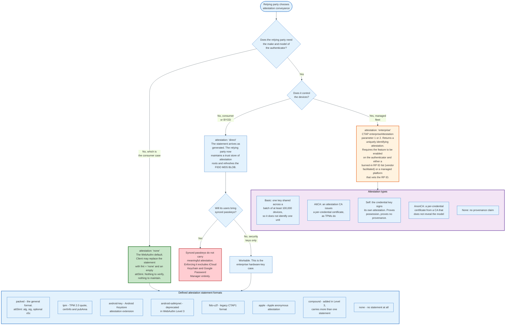

### 14.1 The Four Reasons Attestation Stays Off

**The default is off, and the default is correct for most services.** `attestation` defaults to `"none"` in `PublicKeyCredentialCreationOptions`. A relying party that never sets the field never sees an attestation statement and never has to verify one.

**Attestation is a privacy liability.** An attestation certificate that identified one device would be a hardware serial number handed to every website. The specification therefore requires basic attestation keys to be shared across a batch, and FIDO guidance sets that batch at 100,000 or more units. The result is a statement that names the model and says nothing about the unit, which is precisely the intended trade and also precisely why it answers fewer questions than people expect.

**Synced passkeys do not carry it.** Microsoft's own documentation states the position flatly: synced passkeys do not support attestation, and a relying party that enforces attestation cannot guarantee any attribute about a passkey, including whether it is synced or device-bound. Apple's `apple` format is an anonymous attestation. Google Password Manager passkeys arrive without a useful provenance claim. Enforcing attestation in a consumer deployment excludes the two largest passkey providers on earth.

**Verification is an ongoing operational cost.** Doing it properly means fetching the FIDO Metadata Service BLOB from `mds3.fidoalliance.org`, validating its signature against the GlobalSign R46 root, parsing several hundred entries, tracking status reports for revocations and compromises, and refreshing monthly. Microsoft, which does this at scale, ingests the BLOB monthly and warns vendors of up to a four-week delay between appearing in MDS and being recognised by Entra ID.

### 14.2 What the Metadata Service Actually Contains

The MDS BLOB is a single signed JWT. Retrieved on 31 August 2026 it is BLOB number 277, with a `nextUpdate` of 1 September 2026, carrying 509 entries: 339 with protocol family `fido2`, 135 `u2f` and 35 `uaf`. Of those entries, 385 carry a most recent status of `FIDO_CERTIFIED` and 124 do not.

Each entry keys on an AAGUID for FIDO2 devices and carries a metadata statement. A representative statement includes `description`, `authenticatorVersion`, `protocolFamily`, `attestationTypes`, `userVerificationDetails`, `keyProtection` (values such as `hardware`, `secure_element`, `remote_handle`), `matcherProtection` (such as `on_chip`), `attachmentHint`, and for FIDO2 devices an `authenticatorGetInfo` block reproducing what the device reports.

That is the data a relying party is buying when it turns attestation on: a claim about key protection and matcher protection, tied to a model, backed by a certification programme.

### 14.3 Enterprise Attestation

Enterprise attestation inverts the privacy trade deliberately, and CTAP gates it carefully.

An authenticator signals support through the `ep` option in its getInfo response, and the feature must be explicitly enabled through `authenticatorConfig` (0x0D). The platform then passes `enterpriseAttestation` (0x0A) on `authenticatorMakeCredential` with a value of 1 or 2.

Value 1 is vendor-facilitated: the authenticator returns a uniquely identifying attestation only if the request's `rp.id` matches a non-updateable list burned into the device by the vendor on the enterprise's instruction. Value 2 is platform-managed: the platform is enterprise-managed, has already vetted the RP ID against local policy, and the authenticator returns the attestation without consulting any internal list. An authenticator that supports only the vendor-facilitated variant may treat 2 as 1. If the authenticator declines, the parameter is treated as absent and an ordinary attestation is returned; the response reports what happened through `epAtt` (0x04).

This is how an organisation gets serial-number-level device tracking without that capability leaking to the public web. It only works on hardware bought for the purpose.

---

## 15. Synced Passkeys: Apple, Google, Microsoft

Synced passkeys move the private key off one device and into an end-to-end encrypted fabric. That solves device loss and creates an escrow problem, and each vendor solved the escrow problem differently.

```mermaid
%%{init: {'theme': 'base', 'themeVariables': {'primaryColor': '#e3f2fd', 'primaryBorderColor': '#1565c0', 'lineColor': '#37474f'}}}%%

flowchart TB
    subgraph Apple["Apple: iCloud Keychain"]
        direction TB
        A1["Syncing identity: a P-384 key pair<br/>per device, stored in that device's<br/>keychain. Each device keeps a<br/>signed list of the others.<br/>Lists live in CloudKit."]
        A2["Legacy syncing circle: the public<br/>key is placed in a circle signed<br/>twice, once by the syncing identity<br/>and once by a P-256 key derived<br/>from the Apple Account password."]
        A3["Joining: either sponsorship by an<br/>existing device, which issues a<br/>signed voucher, or keychain recovery."]
        A4["Only items marked<br/>kSecAttrSynchronizable sync.<br/>Third-party app keychain items<br/>do not sync by default."]
        A5["Escrow: the keychain is wrapped in<br/>an asymmetric keybag, itself wrapped<br/>with the iCloud Security Code and<br/>with the public key of an HSM cluster."]
        A6["Recovery requires the Apple Account<br/>password, an SMS reply to a<br/>registered number, and the security<br/>code (or, with two-factor accounts,<br/>the device passcode).<br/>The code is proven via SRP;<br/>Apple never receives it."]
        A7["Ten attempts. On the tenth failure<br/>the HSM cluster destroys the escrow<br/>record and the keychain is gone.<br/>The admin cards that could change<br/>the HSM firmware were destroyed."]
        A1 --> A2 --> A3 --> A4 --> A5 --> A6 --> A7
    end

    subgraph Google["Google: Google Password Manager"]
        direction TB
        G1["Private keys are uploaded only in<br/>encrypted form, under a key that<br/>exists only on the user's devices.<br/>At rest on device they are encrypted<br/>with a hardware-protected key."]
        G2["A screen lock is mandatory to create<br/>or use a GPM passkey. It is both the<br/>local gate and the recovery factor."]
        G3["New device by transfer: the<br/>end-to-end encryption keys move<br/>directly from the old device."]
        G4["New device without transfer:<br/>the user enters the screen lock<br/>PIN, pattern or password of an<br/>existing device that held the keys."]
        G5["The verification data lives in<br/>secure hardware enclaves on Google<br/>servers. Google cannot read the<br/>screen lock and cannot exceed the<br/>attempt cap even internally."]
        G6["At most 10 consecutive failures per<br/>device, sometimes fewer. Other devices'<br/>screen locks remain usable. Changing an<br/>existing device's screen lock resets<br/>the counter for that device."]
        G7["A removed screen lock stays valid<br/>for recovery for up to 64 days.<br/>Changing it instead of removing it<br/>revokes the old one immediately."]
        G1 --> G2 --> G3 --> G4 --> G5 --> G6 --> G7
    end

    subgraph MS["Microsoft"]
        direction TB
        M1["Two products. Device-bound passkeys<br/>in Microsoft Authenticator, stored in<br/>the Secure Enclave or Secure Element,<br/>and Windows Hello backed by TPM 2.0."]
        M2["Synced passkeys in the Microsoft<br/>account, and synced passkeys accepted<br/>by Entra ID under a passkey profile<br/>from March 2026."]
        M3["Roughly one million passkeys are<br/>registered daily across Microsoft<br/>accounts, reported 1 May 2025."]
        M1 --> M2 --> M3
    end

    subgraph Signal["What the relying party can see"]
        direction TB
        S1["BE flag, authData bit 3:<br/>this credential is backup eligible.<br/>Fixed at registration. Never changes."]
        S2["BS flag, authData bit 4:<br/>this credential is currently<br/>backed up. Changes between<br/>ceremonies. Store it, and compare<br/>it when backup state drives policy."]
        S3["BE clear with BS set is invalid.<br/>The RP must reject it."]
        S4["That is the entire visibility.<br/>There is no field naming the<br/>provider, and no attestation to<br/>prove one."]
        S1 --> S2 --> S3 --> S4
    end

    Apple --> Signal
    Google --> Signal
    MS --> Signal

    style Apple fill:#e3f2fd,stroke:#1565c0,stroke-width:2px
    style Google fill:#e8f5e9,stroke:#2e7d32,stroke-width:2px
    style MS fill:#fff3e0,stroke:#e65100,stroke-width:2px
    style Signal fill:#f3e5f5,stroke:#4a148c,stroke-width:3px
```

### 15.1 The Common Shape

All three fabrics do the same four things. They generate the private key on a device, encrypt it under a key derived from a user-held secret, store the ciphertext in the vendor's cloud, and gate recovery of the derived key on a rate-limited check performed in hardware the vendor cannot override.

The differences are in the user-held secret and in the counter. Apple uses the iCloud Security Code, or the device passcode for two-factor accounts, and allows ten attempts before destroying the record permanently. Google uses the screen lock of another device that already held the keys, and enforces a cap of at most ten consecutive failures in secure hardware enclaves, with the cap resettable by changing that device's screen lock.

Both designs place the same bet: that a four-to-six-digit secret is safe if and only if the guess counter is enforced somewhere the vendor's own staff cannot reach. Apple destroyed the administrative cards that would allow the HSM firmware to change. Google states that the secure hardware enforces the limit even against an internal attacker.

That bet is the foundation of every synced passkey on earth. It is a good bet and it is not a proof.

### 15.2 What the Relying Party Learns, and It Is Not Much

Two bits. BE, bit 3 of the flags byte, says the credential is backup eligible and is fixed for the lifetime of the credential. BS, bit 4, says it is currently backed up and may change between ceremonies.

WebAuthn Level 3 makes exactly one of the three obvious rules unconditional. The relying party must reject the impossible combination of BE clear with BS set, in section 7.1 step 17 and section 7.2 step 18. Storing both flags in the credential record is RECOMMENDED, listed among the items needed to implement every step of sections 7.1 and 7.2. Comparing the received values against the stored ones on every assertion is conditional, and section 7.2 step 19 opens by scoping it to a relying party that uses backup state in its business logic or policy.

What the relying party does with the information is policy. A bank might require a second, device-bound credential for high-value operations when BE is set, or prompt a user whose BS has gone from set to clear to enrol a backup.

There is no field that names the provider. There is no reliable attestation to prove one. A relying party that wants to know whether a credential lives in iCloud Keychain or in a browser extension is, in the general case, out of luck.

### 15.3 Third-Party Providers and Portability

Android 14 and iOS 17 opened the passkey store to third parties, and 1Password, Bitwarden, Dashlane, NordPass and Enpass took it. To a relying party these appear as platform authenticators with their own AAGUIDs, syncing through their own vaults.

Portability between providers is the unfinished half. The FIDO Alliance's Credential Provider Special Interest Group, which includes 1Password, Apple, Bitwarden, Dashlane, Enpass, Google, Microsoft, NordPass, Okta, Samsung and SK Telecom, published two draft specifications on 14 October 2024. The Credential Exchange Format defines what a credential looks like when it moves; the Credential Exchange Protocol defines how the move happens.

Only one has shipped. CXF reached Proposed Standard on 14 August 2025 with an errata on 9 March 2026. CXP remains at its working draft of 3 October 2024, a document that describes itself as not intended as a basis for implementations.

The practical position as of August 2026 is that the format for exporting passkeys is standardised and the secure channel for moving them is not. Users can leave a provider in principle. In practice they mostly re-register.

---

## 16. Account Recovery: The Remaining Weak Point

A phishing-resistant credential with a phishable recovery path is a phishable account. This is the most important sentence in the document and the one most deployments have not internalised.

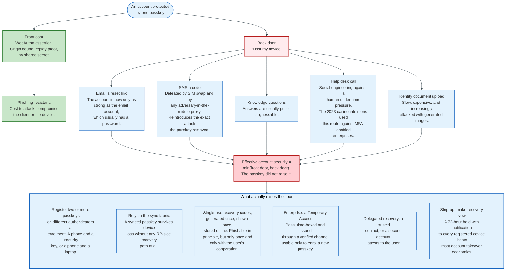

### 16.1 The Arithmetic

An attacker chooses the cheapest path into an account. If the passkey costs a client compromise and the recovery flow costs a phishing email, the account costs a phishing email.

Every control on the front door is therefore worth exactly nothing unless the back door is raised to match. Deployments that keep an SMS reset flow "just in case" have kept the SIM swap, the adversary-in-the-middle relay and the one-time-code phish, and have paid the full engineering cost of passkeys to remove none of them.

### 16.2 What Synced Passkeys Change

Synced passkeys do genuinely reduce the frequency with which recovery is needed, and that is their principal contribution.

A user who loses a phone and buys a new one signs into their Apple Account or Google Account, satisfies that platform's recovery check, and their passkeys reappear. The relying party is never involved. This is why passkey deployments on top of the major sync fabrics report fewer support tickets than device-bound deployments.

It also relocates the risk rather than removing it. The recovery flow that matters is now the platform's, and the relying party has no visibility into it and no vote. If an attacker takes over a Google Account, every passkey in that Google Password Manager is theirs. The single most valuable account in a user's life is now the one holding the keys to the rest.

### 16.3 The Enterprise Answer

Enterprises solve recovery by having an identity-proofing process, which consumers do not.

Microsoft Entra ID issues a Temporary Access Pass: a time-limited passcode, granted by an administrator, usable to register a new strong credential and nothing else. The equivalent pattern elsewhere is a supervised in-person or video enrolment. Both work because the organisation already knows who the employee is and can verify them out of band.

The correct enterprise policy is two device-bound authenticators per user from day one, typically a security key kept at the desk and a second in a drawer, plus a documented re-enrolment process with a human check. That is more expensive than an SMS reset. It is also the only configuration where "phishing-resistant" describes the account rather than one of its doors.

### 16.4 The Consumer Answer, Which Is Weaker

For consumer services the honest recommendation is to enrol more than one passkey and to keep an email-based reset flow that is itself protected by a passkey.

Enrolling a second passkey at registration, on a different device or a security key, is the highest-value prompt a consumer service can add, and it is almost universally skipped because it adds friction to the moment of signup. The compromise most services reach is to allow an email reset and to protect the email account with a passkey, which does not remove the dependency but does at least push it to a provider that has invested in the problem.

Recovery is where passkey deployments actually fail. Not in the cryptography.

---

## 17. Enterprise Deployment and Device-Bound Keys

Enterprises want the opposite of what consumers want: not portability, but proof that a specific approved device holds the key.

### 17.1 The Policy Surface

Microsoft Entra ID's passkey configuration, generally available as passkey profiles from March 2026, is the most detailed published example of what enterprise passkey policy looks like.

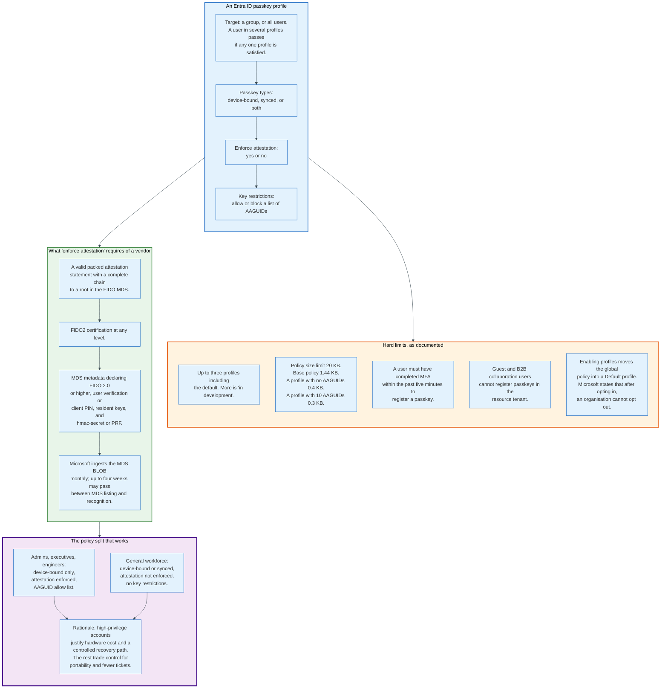

Two of those limits shape the rollout order. Enabling profiles migrates the existing global passkey policy into a Default profile automatically, and Microsoft's documentation states that after opting in an organisation cannot opt out, so the migration is a one-way door taken before any profile is designed.

The warning Microsoft attaches to key restrictions is worth quoting in effect: AAGUID lists are a policy guide rather than a strict security control when attestation is not enforced, because without attestation the AAGUID is an unverified self-report. An organisation that blocks AAGUIDs while leaving attestation off has built a speed bump, not a wall.

### 17.2 Device-Bound Keys and AAL3

The regulatory driver for device-bound keys is NIST Special Publication 800-63B revision 4, published 31 July 2025.

It states that syncable authenticators shall not be used at Authenticator Assurance Level 3, because AAL3 requires a cryptographic authenticator with a non-exportable private key, and a syncable authenticator by definition exports its key to a sync fabric. Syncable authenticators remain permitted at AAL1 and AAL2, where key exportability is allowed. AAL2 requires that phishing-resistant options be available but does not mandate their use; AAL3 mandates phishing resistance and non-exportability together.

The practical consequence is a two-tier deployment in any organisation with AAL3 obligations: hardware security keys with attestation for the accounts that need AAL3, and synced passkeys for everyone else. That is exactly the split Entra ID's profile model is built to express.

### 17.3 The Device-Bound Public Key Extension, Which Did Not Ship

There was an attempt to get the best of both. The `devicePubKey` extension proposed that a synced credential could additionally produce a signature from a second, non-exportable key unique to the device performing the ceremony, letting a relying party recognise individual devices behind a synced credential.

It is not in WebAuthn Level 3. The Level 3 change list does not include it, and the specification carries no such extension. The idea remains attractive and unshipped, which means that as of August 2026 there is no standard way to get device identity out of a synced passkey.

Organisations that need device identity use device compliance signals from an MDM platform, or Entra's own device registration, and correlate them with the sign-in outside WebAuthn entirely.

### 17.4 Provisioning at Scale

The operational problem with hardware keys is not cost, it is enrolment. A new employee needs a key with a PIN set and a credential registered before their first sign-in, and the classic flow requires the employee to be present.

Entra ID's answer, in preview as of the March 2026 documentation, is administrator provisioning through Microsoft Graph: the administrator requests `creationOptions` for a target user, uses a CTAP-capable client to provision the credential onto a key and set its PIN, and registers the resulting credential with Entra ID on the user's behalf. It requires the Authentication Administrator role or an application with `UserAuthenticationMethod.ReadWrite.All`.

This closes the bootstrapping gap that has kept hardware-key deployments small: the ability to ship a pre-enrolled key to a new hire.

---

## 18. Migration from Passwords and TOTP

Adding passkeys to an existing service is a five-phase programme, and the last phase is the only one that delivers the security benefit.

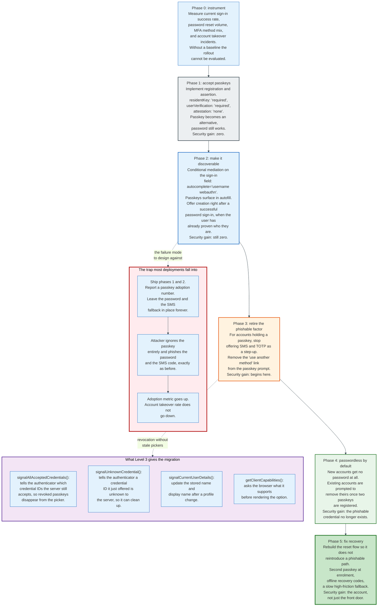

### 18.1 The Downgrade Problem Stated Plainly

An account that accepts both a passkey and a password is exactly as strong as the password.

The attacker does not have to defeat the passkey. They phish the password, and if a second factor is required they phish that too, using the same proxy that worked before passkeys existed. The passkey sits unused on the user's phone while the account is taken over.

This is not a hypothetical. It is the default configuration of most passkey deployments shipped between 2023 and 2026, because removing the password breaks users who have not enrolled and support organisations are unwilling to accept that cost.

The number that matters, therefore, is not how many users have registered a passkey. It is what percentage of successful sign-ins used one, and what percentage of accounts can no longer be accessed with a phishable credential. Those two numbers are usually far apart.

### 18.2 Replacing TOTP Specifically

TOTP, RFC 6238, is the credential most often left in place, and it is the weakest link once passwords are gone.

The seed is a shared secret established at enrolment, usually by displaying a QR code containing an `otpauth://` URI. Anyone who captures that QR code holds the credential forever. The six-digit output is a bearer token with a 30-second window, and a proxy relays it comfortably inside that window.

TOTP has exactly one advantage over a passkey: it works offline, on any device, with no platform dependency, and it can be backed up by writing down the seed. That is a real property and it is why TOTP survives in environments with poor connectivity or with users who refuse platform accounts.

The migration pattern that works is to treat TOTP as the fallback of last resort rather than the primary second factor: keep it for accounts that cannot use a passkey, remove it from any account that has two passkeys registered, and never offer it as an alternative on the same prompt as a passkey, because a "use another method" link is an invitation to downgrade.

### 18.3 Bootstrapping and Account Linking

The best moment to ask is immediately after a successful password sign-in, because the user has proven who they are and is not yet doing anything else.

Level 3's conditional mediation for `create()` is designed for exactly this. The browser may offer to save a passkey without a modal dialogue, in the same way it offers to save a password. Adoption rates from an interstitial prompt at that moment are the highest of any placement, and the friction cost is one tap.

Two implementation details prevent most of the support load. Pass `excludeCredentials` with every credential the user already has, so a second registration on the same device fails cleanly rather than creating a duplicate. And name the credential in the UI using the transports the browser reports, so a user with three passkeys can tell which is which.

---

## 19. Economics: What It Costs and Who Pays

Passkeys are unusual in that the party who benefits most, the relying party, pays almost nothing for the infrastructure, and the party who pays for the infrastructure, the platform vendor, charges nothing for it.

### 19.1 What Each Party Spends

**The relying party pays engineering time and nothing else.** There is no per-authentication fee, no certificate to buy, no membership to join. A WebAuthn implementation is a challenge endpoint, a verification endpoint, a credential table and a set of UI states. Libraries exist for every major language. The cost is measured in engineer-weeks, and the recurring cost is close to zero.

The real relying-party cost is elsewhere: rebuilding account recovery, supporting a picker users have not seen before, and handling the long tail of browsers and authenticators that behave slightly differently. Those are product costs, not infrastructure costs.

**The platform vendor pays for the sync fabric and charges nothing.** Apple, Google and Microsoft each run an end-to-end encrypted key store with hardware-backed escrow, globally, at consumer scale, as a free feature. The commercial logic is retention: passkeys make the ecosystem stickier, because a user with 200 passkeys in iCloud Keychain has a switching cost that did not exist when the credential was a password typed into a browser.

**The user pays nothing for synced passkeys and 35 to 119 euros for hardware.** Retrieved from the Yubico store on 31 August 2026, prices including VAT are 35.09 euros for a Security Key NFC, 70.18 euros for a YubiKey 5 NFC or 5C NFC, and 118.58 euros for a YubiKey Bio FIDO Edition. A second key for backup doubles that.

**The identity provider charges per monthly active user, and passkeys are not a line item.** Auth0's published pricing as of August 2026 runs from a free tier up to 25,000 monthly active users, to B2C Essentials at 35 US dollars a month for 500 users and B2C Professional at 240 dollars a month for the same 500, with B2B Essentials at 150 dollars a month for 500 and volumes above 30,000 monthly active users priced on request. Passkeys are listed as included on every tier including the free one. Microsoft Entra ID states that passkeys are available in all editions including Entra ID Free with no additional licence.

Passkey support has become table stakes for identity vendors, which means it is bundled rather than priced.

### 19.2 Where the Savings Show Up

The measurable return is in support cost and conversion, not in breach avoidance, because breach avoidance is a counterfactual nobody can invoice.

The FIDO Alliance publishes vendor-reported figures: an 81% reduction in login-related help desk incidents, Dashlane reporting a 70% increase in sign-in conversion rate, Air New Zealand reporting a 50% reduction in login abandonment, Amazon reporting sign-in six times faster. Among the 945 organisations in its 2026 workforce survey that have begun a rollout, 47% cite improved security confidence, 45% faster employee logins, 43% improved employee satisfaction and 35% fewer password reset tickets. The base is the rollout population, not all 1,400 decision-makers surveyed.

Microsoft's own operational figures are the cleanest available: a passkey sign-in succeeds about 98% of the time against 32% for a password, and completes eight times faster than a password plus a second factor. A three-fold improvement in first-attempt success is a direct reduction in abandoned sessions and reset tickets.

These are self-reported by parties selling the technology. The direction is consistent across independent reporters, which is the most that can honestly be said.

### 19.3 The Cost Nobody Budgets For

Account recovery redesign is the largest unbudgeted line in a passkey programme.

Removing the password removes the reset flow that every support process was built around. What replaces it is either a platform dependency the organisation does not control, a hardware distribution programme with logistics, or a human verification process with staffing. All three cost more than an automated email reset, and all three are discovered after the engineering work is done.

An organisation that budgets for the WebAuthn implementation and not for the recovery redesign will ship phases 1 and 2 of the migration and stop, which is the outcome described in section 18.1.

---

## 20. Security and Risk: The Real Threat Model

Passkeys close one class of attack completely and leave several others untouched. Stating both precisely is more useful than any adjective.

```mermaid
%%{init: {'theme': 'base', 'themeVariables': {'primaryColor': '#e3f2fd', 'primaryBorderColor': '#1565c0', 'lineColor': '#37474f'}}}%%

flowchart TB
    subgraph Closed["Closed by construction"]
        direction TB
        C1["Credential phishing<br/>No secret exists to type<br/>into the wrong site."]
        C2["Adversary-in-the-middle proxy<br/>The origin in clientDataJSON<br/>names the proxy. The RP rejects."]
        C3["Credential stuffing and<br/>password reuse<br/>There is no password to reuse."]
        C4["Server-side credential theft<br/>The database holds public keys.<br/>They are already public."]
        C5["Replay of a captured assertion<br/>The challenge is single use<br/>and session bound."]
        C6["Brute force and spraying<br/>There is no guessable secret."]
    end

    subgraph Open["Still open"]
        direction TB
        O1["Malware on an unlocked device<br/>An attacker who controls the OS<br/>controls the gesture and can drive<br/>the ceremony. The spec excludes<br/>a compromised client from its<br/>threat model."]
        O2["Session token theft<br/>An assertion establishes a session.<br/>Stealing the cookie afterwards<br/>bypasses authentication entirely.<br/>Token binding was removed and<br/>marked reserved in Level 3."]
        O3["Account recovery<br/>See section 16. The dominant<br/>real-world route."]
        O4["Consent phishing<br/>The user is tricked into granting<br/>an OAuth scope to a hostile app.<br/>No authentication is defeated;<br/>authorisation is given away."]
        O5["Coercion and shoulder surfing<br/>A biometric or a PIN observed<br/>or compelled in person."]
        O6["Sync fabric account takeover<br/>Compromise the Apple, Google or<br/>Microsoft account and inherit<br/>every synced passkey."]
        O7["Malicious or compromised RP<br/>Origin binding protects the user<br/>from impostors, not from the<br/>site they meant to visit."]
    end

    subgraph Weak["Weak or misunderstood controls"]
        direction TB
        K1["Signature counter<br/>Zero on every synced passkey.<br/>A risk signal for hardware keys,<br/>never an authentication decision."]
        K2["Attestation<br/>Names a model, not a unit.<br/>Absent on synced passkeys."]
        K3["AAGUID without attestation<br/>An unverified self-report.<br/>A policy guide, not a control."]
        K4["userVerification 'preferred'<br/>Guarantees nothing. Check the<br/>UV flag, not the request."]
    end

    Closed --> Net["Net effect: the attacker's<br/>cheapest path moves from<br/>'send an email' to<br/>'compromise a device or<br/>a recovery flow'.<br/>That is a large economic shift<br/>and not an absolute one."]
    Open --> Net
    Weak --> Net

    style Closed fill:#c8e6c9,stroke:#2e7d32,stroke-width:2px
    style Open fill:#ffebee,stroke:#b71c1c,stroke-width:2px
    style Weak fill:#fff3e0,stroke:#e65100,stroke-width:2px
    style Net fill:#e3f2fd,stroke:#1565c0,stroke-width:3px
```

### 20.1 The Specification's Own Exclusions

WebAuthn's security considerations are explicit that a compromised client platform is outside the model. The authenticator receives an RP ID string it cannot independently verify, and trusts the client to have derived it from a real origin. If the client lies, the authenticator signs for the wrong site.

This is not a flaw so much as a boundary. Every authentication protocol that runs on a general-purpose computer has the same boundary, and pretending otherwise produces bad security decisions. The mitigations live at a different layer: device management, application allowlisting, hardened browsers, and for the highest-value cases a separate roaming authenticator whose display shows what it is signing.

### 20.2 The Attacks Actually Seen in the Wild

Three patterns dominate the reporting through 2026.

**Downgrade to a phishable fallback.** The attacker phishes the password and whatever second factor the site still accepts, and never touches the passkey. This is not a passkey attack; it is a deployment attack, and it is by far the most common.

**Cross-device flow abuse.** The PoisonSeed campaign of July 2025, described in section 13.2, relayed a genuine hybrid QR code through a phishing page. Expel's own follow-up on 25 July 2025 established that the attack failed against a correct implementation, because the BLE proximity requirement was enforced. The lasting significance is that it identified the exact assumption the whole hybrid design rests on.

**Recovery flow abuse.** Help desk social engineering against organisations with strong MFA was the entry route in several high-profile 2023 intrusions, and nothing about passkeys changes it.

Notably absent from the list: any published break of the WebAuthn signature scheme, and any published case of a synced passkey being extracted from a sync fabric.

### 20.3 What to Monitor

A relying party running passkeys should alert on four things.

Registrations from an origin or geography that does not match the user's history, which is the signal that would catch an attacker enrolling their own credential after a session compromise. Assertions where the BS flag has changed state, which indicates the credential moved into or out of backup. Signature counter regressions on credentials whose stored counter is non-zero, which is the residual clone signal for hardware keys. And any use of a recovery path, which should be treated as a security event rather than a support event.

The last one is the one that pays.

---

## 21. Regulation and Compliance

Four regulatory regimes decide where passkeys can and cannot be used, and they disagree about synced credentials.

### 21.1 NIST SP 800-63B Revision 4

Published 31 July 2025, revision 4 rewrote the authentication guidance around phishing resistance.

It reframes what earlier revisions called verifier impersonation as phishing, and defines phishing resistance as preventing disclosure of authentication secrets to an impostor verifier without relying on user vigilance. The mechanisms that qualify are channel binding and verifier name binding. WebAuthn's origin binding is the latter.

The consequential rule is on syncable authenticators. Revision 4 states that syncable authenticators shall not be used at AAL3, because AAL3 requires a cryptographic authenticator with a non-exportable private key, and permits them at AAL1 and AAL2. AAL2 requires that phishing-resistant options be offered; AAL3 requires phishing resistance and non-exportability together. Appendix B of the document sets out requirements for how a sync fabric manages authentication secrets.

For a US federal-facing service the practical reading is: synced passkeys for AAL2, hardware for AAL3, and a policy engine that can tell the difference using the BE flag.

### 21.2 PSD2 Strong Customer Authentication

Commission Delegated Regulation (EU) 2018/389, applicable from 14 September 2019, is the regulatory technical standard for strong customer authentication in European payments, and it fits WebAuthn imperfectly.

Article 4 requires authentication based on two or more elements from the categories of knowledge, possession and inherence, combined to generate an authentication code, with the code unforgeable and not derivable from previous codes. A WebAuthn assertion with the UV flag set satisfies this cleanly: possession of the authenticator, plus inherence or knowledge through the local verification, producing a signature that is single use because the challenge is.

Article 5 is the harder one. For remote electronic payments the code must be specific to the amount and the payee, the payer must be made aware of both, and any change to either must invalidate the code. WebAuthn has no amount field and no payee field. The standard technique is to make the challenge a hash of the transaction details and to display those details outside the authenticator, which satisfies the specificity requirement but leaves the "made aware" requirement to the merchant's or bank's own user interface rather than to a trusted display.

The W3C Secure Payment Confirmation specification exists to close that gap, and CTAP 2.2 added the `thirdPartyPayment` extension to support it. A credential created with `thirdPartyPayment: true` is marked as usable for payment authentication initiated by a party that is not the relying party, and the authenticator persists and reports that property on every assertion. The client is responsible for showing the transaction details in a browser-controlled dialogue that the merchant page cannot forge.

### 21.3 The Rest

**CISA** classifies FIDO/WebAuthn and PIV as the phishing-resistant forms of multi-factor authentication in its published guidance to US federal agencies, and recommends moving off SMS and push.

**PCI DSS 4.0** requires multi-factor authentication for all access into the cardholder data environment and for all administrative access, without mandating a particular technology. A passkey with user verification satisfies it and removes the password from scope.

**eIDAS 2 and the European Digital Identity Wallet** sit adjacent rather than on top. The wallet is a credential presentation system, not an authentication protocol, and the connection point is the W3C Digital Credentials API. CTAP 2.2's hybrid QR code already carries hint values `dcp` for credential presentation and `dci` for credential issuance alongside `mc` and `ga`, which is the clearest signal that the FIDO transport is being reused for identity documents.

**Sector mandates on SMS.** Financial regulators in several jurisdictions have moved to eliminate SMS one-time passwords as an acceptable factor. Where those mandates land, passkeys are the only widely deployed replacement that satisfies both the phishing-resistance requirement and the consumer usability requirement at once.

---

## 22. Comparisons and Alternatives

```mermaid
%%{init: {'theme': 'base', 'themeVariables': {'primaryColor': '#e3f2fd', 'primaryBorderColor': '#1565c0', 'lineColor': '#37474f'}}}%%

flowchart TB
    subgraph Phishable["Phishable: a secret the user can hand over"]
        direction TB
        PH1["Password<br/>Shared secret. Reused, guessable,<br/>breached in bulk."]
        PH2["SMS OTP<br/>Bearer token. SIM swap,<br/>SS7 interception, real-time relay."]
        PH3["Email magic link<br/>Bearer token in the least<br/>protected channel a user owns."]
        PH4["TOTP, RFC 6238<br/>Shared seed, 6-digit bearer token,<br/>30-second relay window."]
        PH5["Push approval<br/>User approves a prompt they did<br/>not start. Fatigue attacks."]
        PH6["Push with number matching<br/>Lowers the rate. Same category."]
    end

    subgraph Resistant["Phishing-resistant: origin bound"]
        direction TB
        PR1["U2F / CTAP1 security key<br/>Second factor only. No usernameless<br/>flow. Still origin bound."]
        PR2["Device-bound passkey<br/>Non-exportable key. AAL3 eligible.<br/>Loss of the device is loss of<br/>the credential."]
        PR3["Synced passkey<br/>Exportable to a sync fabric.<br/>AAL2 ceiling. Survives device loss."]
        PR4["Smart card / PIV / CAC<br/>Certificate-based, TLS client auth.<br/>Origin bound through the TLS<br/>connection. Heavy PKI."]
    end

    subgraph Choose["When to choose which"]
        direction TB
        CH1["Consumer service, mass market:<br/>synced passkey, with a second<br/>passkey encouraged at enrolment."]
        CH2["Employee sign-in, general staff:<br/>synced or device-bound passkey<br/>under an IdP policy."]
        CH3["Administrator or executive:<br/>device-bound passkey on attested<br/>hardware, two keys per person."]
        CH4["Air-gapped or classified:<br/>PIV or a FIPS-validated<br/>hardware authenticator."]
        CH5["Offline, low-connectivity, or<br/>users who refuse a platform account:<br/>TOTP remains the honest answer."]
        CH6["Machine-to-machine:<br/>none of the above. Use mTLS<br/>or a workload identity."]
    end

    Phishable -->|"relay through a proxy<br/>defeats every one"| Resistant
    Resistant --> Choose

    style Phishable fill:#ffebee,stroke:#b71c1c,stroke-width:2px
    style Resistant fill:#e8f5e9,stroke:#2e7d32,stroke-width:2px
    style Choose fill:#e3f2fd,stroke:#1565c0,stroke-width:3px
```

### 22.1 The Comparison Table

| Method | Phishing-resistant | Shared secret | Survives device loss | Server breach exposes | NIST AAL ceiling | User cost |
|---|---|---|---|---|---|---|
| **Password** | No | Yes | Yes | Hashes to crack | AAL1 | Zero |
| **SMS OTP** | No | Yes, per code | Yes, via the number | Phone numbers | AAL2 with a password, discouraged | Zero |
| **Email magic link** | No | Yes, per link | Yes | Nothing | AAL1 | Zero |
| **TOTP (RFC 6238)** | No | Yes, the seed | Only if the seed was backed up | Seeds, which are full credentials | AAL2 with a password | Zero |
| **Push approval** | No | No, but approvable | Yes, via re-enrolment | Nothing | AAL2 | Zero |
| **U2F security key** | Yes | No | No | Public keys | AAL2 as a second factor, AAL3 with a password | 25 to 70 EUR |
| **Device-bound passkey** | Yes | No | No | Public keys | AAL3 | 0 to 119 EUR |
| **Synced passkey** | Yes | No | Yes | Public keys | AAL2 | Zero |
| **PIV / smart card** | Yes | No | No | Public keys and certificates | AAL3 | Card plus a PKI |

### 22.2 The Honest Case for Each Alternative

**TOTP still has a job.** It is the only method in the table that works with no network, no platform account and no vendor relationship, and whose credential can be backed up by writing 32 characters on paper. For a user in a low-connectivity environment, or one who declines to hold an Apple, Google or Microsoft account, TOTP is not a legacy choice, it is the only one that functions.

**Smart cards still have a job.** In environments with an existing PKI, an issued identity card and a physical access system that already uses it, PIV integrates authentication with identity in a way passkeys do not. The cost is the PKI, which is substantial and already sunk.

**Passwords still have a job in exactly one place.** As a recovery factor of last resort behind a slow, high-friction flow that alerts every registered device. Nowhere else.

**The case against synced passkeys is narrow and real.** They cannot reach AAL3, they place the account's fate in a platform vendor's recovery process, and they carry no attestation. For the top few percent of accounts by value, device-bound hardware remains the answer, and the extra 70 euros is not the binding constraint.

---

## 23. One Account, Traced End to End

Take a concrete account and follow it from registration to a cross-device sign-in, with real values.

**The setup.** A relying party at `https://www.example.com` with an RP ID of `example.com`. A user with the internal account identifier `a3f1c8e2-5b74-4d19-9e0a-7c2f6b81d4e5`, which the relying party uses directly as the 16-byte user handle. The user is on an iPhone running Safari.

**Step 1: the server issues options.** The server generates 32 random bytes, stores them against the session with a 300-second expiry, and returns:

```json
{
  "rp":   { "id": "example.com", "name": "Example" },
  "user": { "id": "o_HI4lt0TRmeCnwva4HU5Q",
            "name": "rosa@example.net",
            "displayName": "Rosa Klebb" },
  "challenge": "hR7v3Qm2ZK1cN8pXfL0aTyWbE4sJgU9dOiVxHnMr6Ac",
  "pubKeyCredParams": [ {"type":"public-key","alg":-7},
                        {"type":"public-key","alg":-257} ],
  "excludeCredentials": [],
  "authenticatorSelection": { "residentKey": "required",
                              "userVerification": "required" },
  "attestation": "none",
  "timeout": 300000
}
```

The `user.id` is the base64url encoding of the 16 raw bytes of that UUID, not of its textual form. Encoding the string instead is a common bug that pushes the handle to 36 bytes for no benefit.

**Step 2: Safari checks the scope.** The page origin is `https://www.example.com`. The requested `rp.id` is `example.com`. That is a registrable domain suffix of the origin's effective domain and is not a public suffix, so the call proceeds. Had the page requested `example.org`, Safari would reject with a `SecurityError` before any authenticator was contacted.

**Step 3: Safari builds client data.**

```json
{"type":"webauthn.create","challenge":"hR7v3Qm2ZK1cN8pXfL0aTyWbE4sJgU9dOiVxHnMr6Ac","origin":"https://www.example.com","crossOrigin":false}
```

It computes `SHA-256` over those exact bytes and passes the 32-byte digest to the authenticator along with the RP ID string `example.com`, from which the authenticator derives the `rpIdHash`.

**Step 4: the Secure Enclave signs.** Face ID succeeds. A P-256 key pair is generated. The authenticator returns authenticator data whose first bytes are the 32-byte RP ID hash, followed by a flags byte of `0x5D`.

That byte decomposes as: bit 0 set, user present; bit 2 set, user verified; bit 3 set, backup eligible, because this is an iCloud Keychain passkey; bit 4 set, currently backed up; bit 6 set, attested credential data included. Bits 1, 5 and 7 clear. `0b01011101` is `0x5D`.

The next four bytes are `00 00 00 00`, the signature counter, permanently zero because a synced credential cannot maintain a consistent count.

**Step 5: the server verifies and stores.** It checks the type, the challenge, the origin against its allow list, the RP ID hash, the UP and UV bits, the BE and BS consistency, and the algorithm. `fmt` is `none`, so there is no attestation statement to validate. It stores the credential record:

| Field | Value |
|---|---|
| `id` | the 20-byte credential ID as bytes |
| `publicKey` | the COSE_Key: `{1:2, 3:-7, -1:1, -2:<32 bytes>, -3:<32 bytes>}` |
| `signCount` | 0 |
| `uvInitialized` | true |
| `transports` | `["internal","hybrid"]` |
| `backupEligible` | true |
| `backupState` | true |

`transports` reporting `hybrid` is the server's signal that this credential can be reached from another machine, which matters for the picker copy at sign-in.

**Step 6: sign-in on a laptop, six weeks later.** The user opens `https://www.example.com` on a Windows laptop that has never seen this account. The page calls `navigator.credentials.get()` with an empty `allowCredentials`, `userVerification: "required"`, and a fresh 32-byte challenge.

Windows finds no local credential for `example.com`. It offers "use a phone or tablet" and displays a QR code beginning `FIDO:/` followed by roughly 170 decimal digits: a CBOR map carrying a 33-byte compressed P-256 public key, a 16-byte secret, the count of assigned tunnel domains, the current epoch time, a state-assist flag and the hint `ga`.

**Step 7: the hybrid handshake.** The iPhone scans the code, derives a 64-byte EID key, a 16-byte tunnel ID and a 32-byte pre-shared key from the QR secret using HKDF-SHA256 with purpose labels 1, 2 and 3. It connects to a tunnel service, obtains a routing ID, and begins advertising over BLE under UUID `0000fff9-0000-1000-8000-00805f9b34fb` with 20 bytes of service data.

The laptop trial-decrypts every matching advert, verifies the 4-byte HMAC tag, AES-decrypts the 16-byte block, and recovers a flags byte of zero, an 80-bit connection nonce, a 24-bit routing ID and a 16-bit tunnel service identifier of 0, which decodes to `cable.ua5v.com`. It opens `wss://cable.ua5v.com/cable/connect/<hex routing ID>/<hex tunnel ID>` with subprotocol `fido.cable` and sends the first Noise KNpsk0 message.

**Step 8: the assertion.** Inside the encrypted tunnel the laptop sends `authenticatorGetAssertion` (0x02) with `rpId` `example.com` and the client data hash. The phone finds the credential, prompts for Face ID, and signs.

The returned authenticator data is 37 bytes: the RP ID hash, a flags byte of `0x1D` (UP, UV, BE, BS set; AT clear because this is an assertion), and four zero bytes. The signature covers `authData || SHA-256(clientDataJSON)`.

**Step 9: the server verifies.** Type is `webauthn.get`. The challenge matches. The origin is `https://www.example.com`, written by the laptop's browser, not by the phone. The RP ID hash matches. UP and UV are set. BE matches the stored `backupEligible`. The signature verifies against the stored public key. Both counters are zero, so the counter check is skipped entirely, exactly as Level 3 requires.

Session established. Total user actions: scan a code, look at a phone.

**Step 10: the linking decision.** The phone offers to remember the laptop. If the user accepts, the laptop stores a contact ID, an 8-byte link ID, a link secret and the phone's public key. The next sign-in skips the QR code: the laptop connects to `/cable/contact/<base64url contact ID>` with an `X-caBLE-Client-Payload` header carrying the link ID, a fresh 16-byte nonce and the hint `ga`, and the handshake runs as NKpsk0 instead of KNpsk0. If the user later unlinks the laptop, the tunnel service returns HTTP 410 and the laptop discards the stored link data.

---

## 24. Modern Developments

### 24.1 WebAuthn Level 3, 25 August 2026

Level 3 became a W3C Recommendation on 25 August 2026, and its additions are almost entirely about operating passkeys at scale rather than about cryptography.

**Signal methods** let a relying party tell an authenticator what it now believes. `signalAllAcceptedCredentials()` lists the credential IDs still valid for a user, so the picker stops offering revoked ones. `signalUnknownCredential()` reports that a credential just offered is unknown to the server, letting the authenticator clean up. `signalCurrentUserDetails()` refreshes the stored name and display name after a profile change. Before these existed, a passkey deleted server-side stayed visible in the user's picker forever, producing a sign-in attempt that could only fail.

**Related origin requests**, described in section 8.3, let one RP ID cover several domains through a `/.well-known/webauthn` document.

**JSON serialisation** arrived as `PublicKeyCredential.toJSON()`, `parseCreationOptionsFromJSON()` and `parseRequestOptionsFromJSON()`, ending the era in which every relying party wrote its own base64url conversion layer between the server's JSON and the browser's `ArrayBuffer`s.

**Conditional mediation for `create()`** allows a browser to offer passkey creation without a modal, the mechanism described in section 18.3.

**`hints`** expresses a preference for `security-key`, `client-device` or `hybrid` without excluding the alternatives, replacing the blunt `authenticatorAttachment` for most cases.

**BE and BS flags** were formally assigned, along with the rule that BE clear implies BS clear, giving relying parties their only standard visibility into whether a credential is synced.

**`getClientCapabilities()`** lets a page ask what the browser supports before rendering an option that will fail.

Deprecations matter too. `rp.name` is deprecated. The `android-safetynet` attestation format is deprecated. `tokenBinding` is marked reserved. The `uvm` extension, which tried to report the user verification method, was removed outright. In-field language and direction metadata are no longer recommended.

### 24.2 CTAP 2.2, 14 July 2025

CTAP 2.2 standardised the hybrid transport that had shipped as caBLE v2, added an optional JSON message encoding alongside CBOR, added persistent PIN/UV auth tokens, extended credential management, and introduced two extensions worth noting.

`hmac-secret-mc` lets an authenticator evaluate the HMAC secret during `authenticatorMakeCredential` rather than requiring a subsequent assertion, which removes a round trip for applications that derive an encryption key from a credential at creation time.

`thirdPartyPayment` marks a credential as usable for payment authentication initiated by a party that is not the relying party, which is the authenticator-side plumbing for W3C Secure Payment Confirmation and, by extension, for PSD2 dynamic linking.

### 24.3 The PRF Extension and Encryption Keys From Passkeys

The `prf` extension exposes a pseudo-random function bound to a credential, mapping an input of any length to a 32-byte output. It is modelled on CTAP's `hmac-secret` but hashes the caller's input with a context string so that WebAuthn cannot be used to evaluate the underlying PRF at arbitrary points.

The motivating use is a symmetric encryption key that only exists when the user authenticates. An end-to-end encrypted application can derive a data key from a PRF output, meaning the data is inaccessible without an assertion from the credential. Evaluating the PRF at two inputs in a single assertion allows key rotation: encrypt under the new output, discard the old input.

This is the mechanism by which passkeys become relevant to encrypted storage rather than only to sign-in, and it is why Microsoft requires `hmac-secret` or `prf` support in the metadata of any authenticator it will attest, since Windows uses it for offline unlock.

### 24.4 Credential Portability, Half Shipped

The Credential Exchange work described in section 15.3 is the industry's answer to the charge that passkeys lock users into a platform.

Its status as of August 2026 is uneven. The Credential Exchange Format reached Proposed Standard on 14 August 2025 and received an errata on 9 March 2026. The Credential Exchange Protocol, which defines the secure channel over which credentials actually move, remains at a working draft dated 3 October 2024 that explicitly disclaims suitability as an implementation basis.

Format without protocol is a data model nobody can safely use. Until CXP reaches Proposed Standard, moving a passkey library between providers is a vendor-specific operation or a re-registration exercise.

### 24.5 Convergence With Digital Identity

The clearest signal of where the transport is going sits in the CTAP 2.2 hybrid QR code, in key 5, the flow hint.

Its defined values are `ga` for `getAssertion`, `mc` for `makeCredential`, `dcp` for credential presentation and `dci` for credential issuance, with the last two referring to the W3C Digital Credentials API. The same QR code, the same BLE proximity proof and the same Noise tunnel that carry a passkey assertion are being reused to carry a driving licence or a national identity credential from a phone to a laptop.

That is a substantial reuse of infrastructure and a substantial expansion of what the phone in a user's pocket is being asked to hold.

### 24.6 What Changed in the Last Two Years

- **14 October 2024**: FIDO Alliance publishes the first Credential Exchange Protocol and Format drafts, with 1Password, Apple, Bitwarden, Dashlane, Enpass, Google, Microsoft, NordPass, Okta, Samsung and SK Telecom participating.
- **1 May 2025**: Microsoft reports roughly one million passkey registrations per day and moves new Microsoft accounts to passwordless by default.
- **14 July 2025**: CTAP 2.2 reaches Proposed Standard, standardising hybrid transport.
- **17 to 25 July 2025**: the PoisonSeed campaign is reported as a FIDO downgrade, then retracted after the attack is established to have failed against the BLE proximity check.
- **31 July 2025**: NIST SP 800-63B revision 4 published, barring syncable authenticators from AAL3.
- **14 August 2025**: Credential Exchange Format reaches Proposed Standard.
- **10 November 2025**: WhatsApp ships passkey-encrypted chat backups, extending passkeys from sign-in to key custody.
- **March 2026**: Entra ID passkey profiles reach general availability, with device-bound and synced passkey types as separate policy controls.
- **9 March 2026**: errata published for the Credential Exchange Format.
- **7 May 2026**: FIDO Alliance reports 5 billion passkeys in use and 90% consumer awareness.
- **25 August 2026**: WebAuthn Level 3 becomes a W3C Recommendation.

### 24.7 Where This Is Heading

Four directions are visible and reasonably safe to state.

**Passwords stop being offered before they stop existing.** Microsoft's passwordless-by-default posture for new accounts is the template: the credential is not removed from old accounts, it simply stops being created for new ones, and the population with a phishable credential shrinks by attrition. Expect the same pattern at every large consumer service.

**Recovery becomes the standards work.** Everything in this document that is genuinely unsolved is a recovery problem. The specifications have covered authentication thoroughly and enrolment adequately and recovery not at all, and that is where the attacks are.

**Portability arrives or the lock-in argument wins.** CXF without CXP is not portability. Either the protocol ships and passkeys become movable, or the practical position remains that changing credential provider means re-registering everywhere, which is a real cost that regulators in Europe are unlikely to ignore indefinitely.

**The transport outgrows authentication.** The `dcp` and `dci` hints in the hybrid QR code are a statement of intent. The proximity-proven tunnel between a phone and a nearby computer is useful for far more than sign-in, and the FIDO transport is the only widely deployed one that exists.

---

## 25. Appendix

### 25.1 Key Terminology

| Term | Meaning |
|---|---|
| **AAGUID** | Authenticator Attestation Globally Unique Identifier. A 128-bit value identifying the make and model of an authenticator. Unverified unless attestation is used. |
| **AAL** | Authenticator Assurance Level, from NIST SP 800-63B. AAL1, AAL2 and AAL3 in increasing strength. |
| **Assertion** | The output of an authentication ceremony: authenticator data, a signature, and optionally a user handle. |
| **Attestation** | A signed statement about the provenance of a credential, asserting the authenticator's make and model. |
| **Attestation object** | A CBOR map with keys `fmt`, `attStmt` and `authData`, returned at registration. |
| **`authenticatorData`** | The signed contextual bindings: RP ID hash, flags, signature counter, and optionally attested credential data and extensions. At least 37 bytes. |
| **BE / BS** | Backup Eligibility and Backup State, flags bits 3 and 4. BE is fixed at registration; BS may change. |
| **caBLE** | Cloud Assisted Bluetooth Low Energy. The former name of the hybrid transport. |
| **Ceremony** | A complete registration or authentication interaction, spanning server, client and authenticator. |
| **`clientDataJSON`** | The client's serialisation of type, challenge, origin, crossOrigin and topOrigin. Hashed with SHA-256 and signed over. |
| **COSE** | CBOR Object Signing and Encryption, RFC 9052 and RFC 9053. The public key encoding used by WebAuthn. |
| **`credProtect`** | A CTAP extension setting a credential protection policy of level 1, 2 or 3. |
| **Credential ID** | An opaque byte string of at most 1023 bytes identifying a credential. Either a database key or a wrapped private key. |
| **Credential record** | The server-side state for one credential: id, publicKey, signCount, uvInitialized, transports, backupEligible, backupState. |
| **CTAP** | Client to Authenticator Protocol. CTAP1 is U2F; CTAP2 is the CBOR protocol used by FIDO2. |
| **CTAPHID** | The USB HID framing for CTAP. 64-byte packets, maximum message payload 7609 bytes. |
| **CXF / CXP** | Credential Exchange Format and Credential Exchange Protocol. The portability specifications. |
| **Discoverable credential** | A credential the authenticator can find given only an RP ID. Formerly "resident key". |
| **ES256** | COSE algorithm -7. ECDSA over P-256 with SHA-256. The default passkey algorithm. |
| **FIDO2** | The pairing of W3C WebAuthn with FIDO CTAP2. |
| **Hybrid transport** | Cross-device authentication using a QR code, a BLE proximity proof and a WebSocket tunnel. Standardised in CTAP 2.2. |
| **MDS** | FIDO Metadata Service. A signed JWT registry of authenticator models, capabilities and attestation roots at `mds3.fidoalliance.org`. |
| **Origin binding** | The property that a signature commits to the origin of the calling page, written by the client. |
| **Passkey** | A discoverable WebAuthn credential a user can rely on being available. |
| **Platform authenticator** | An authenticator built into the device. Attachment value `platform`, transport `internal`. |
| **PRF extension** | A WebAuthn extension exposing a per-credential pseudo-random function producing 32-byte outputs. |
| **`pinUvAuthToken`** | A CTAP session token, scoped by permissions and RP ID, proving that user verification occurred. |
| **Roaming authenticator** | A separate physical authenticator. Attachment value `cross-platform`. |
| **RP ID** | Relying Party Identifier. A domain string that scopes a credential. Hashed with SHA-256 into `authenticatorData`. |
| **Server-side credential** | A non-discoverable credential whose ID must be supplied in `allowCredentials`. |
| **Signature counter** | A 32-bit big-endian value intended to detect cloning. Zero on synced passkeys. |
| **Sync fabric** | The end-to-end encrypted service that backs up and distributes passkeys across a user's devices. |
| **U2F** | Universal Second Factor. The FIDO 1.0 second-factor protocol, now CTAP1. |
| **UP / UV** | User Presence and User Verification, flags bits 0 and 2. Presence is a touch; verification is an identity check. |
| **User handle** | An opaque byte string of at most 64 bytes identifying the user account. Must not contain personal information. |
| **WebAuthn** | Web Authentication. The W3C browser API. Level 1 in 2019, Level 2 in 2021, Level 3 in 2026. |

### 25.2 Architecture Diagrams

| Diagram | Source | Description |
|---|---|---|
| Evolution Timeline | [`diagrams/evolution-timeline.mmd`](diagrams/evolution-timeline.mmd) | From the FIDO Alliance in 2013 to WebAuthn Level 3 in 2026 |
| Phishing Anatomy | [`diagrams/phishing-anatomy.mmd`](diagrams/phishing-anatomy.mmd) | An adversary-in-the-middle attack against a shared secret, and against a WebAuthn credential |
| What a Passkey Is | [`diagrams/what-a-passkey-is.mmd`](diagrams/what-a-passkey-is.mmd) | The five things a passkey is and the five it is not |
| FIDO2 Stack | [`diagrams/fido2-stack.mmd`](diagrams/fido2-stack.mmd) | Relying party, client, CTAP2 and authenticator, and who enforces what |
| Participants | [`diagrams/participants.mmd`](diagrams/participants.mmd) | Every actor in a passkey deployment and how they relate |
| Registration Ceremony | [`diagrams/registration-ceremony.mmd`](diagrams/registration-ceremony.mmd) | `navigator.credentials.create()` traced field by field |
| Authenticator Data Layout | [`diagrams/authenticator-data-layout.mmd`](diagrams/authenticator-data-layout.mmd) | The 37-byte structure, the flags byte, attested credential data and the COSE key |
| Authentication Ceremony | [`diagrams/authentication-ceremony.mmd`](diagrams/authentication-ceremony.mmd) | `navigator.credentials.get()` traced field by field |
| Origin Binding | [`diagrams/origin-binding.mmd`](diagrams/origin-binding.mmd) | The three bindings, who checks each, and the RP ID scoping rules |
| Credential ID Strategies | [`diagrams/credential-id-strategies.mmd`](diagrams/credential-id-strategies.mmd) | Stored credentials against key-wrapped credentials |
| Discoverable Credentials | [`diagrams/discoverable-credentials.mmd`](diagrams/discoverable-credentials.mmd) | The residentKey values, the flows they enable, and credProtect |
| User Verification versus Presence | [`diagrams/uv-vs-up.mmd`](diagrams/uv-vs-up.mmd) | Two flag bits, two claims, and the assurance bug they cause |
| Authenticator Types | [`diagrams/authenticator-types.mmd`](diagrams/authenticator-types.mmd) | Platform, roaming, hybrid and third-party credential providers |
| Hybrid Transport | [`diagrams/hybrid-transport.mmd`](diagrams/hybrid-transport.mmd) | The QR code, the BLE advert, the tunnel and the Noise handshake |
| Attestation Decision | [`diagrams/attestation-decision.mmd`](diagrams/attestation-decision.mmd) | Which conveyance to choose, the formats, and the attestation types |
| Sync Fabric | [`diagrams/sync-fabric.mmd`](diagrams/sync-fabric.mmd) | Apple, Google and Microsoft escrow designs, and what the relying party can see |
| Recovery Attack Surface | [`diagrams/recovery-attack-surface.mmd`](diagrams/recovery-attack-surface.mmd) | Why the back door sets the account's real strength |
| Enterprise Policy | [`diagrams/enterprise-policy.mmd`](diagrams/enterprise-policy.mmd) | Entra ID passkey profiles, attestation enforcement and the two-tier split |
| Migration Path | [`diagrams/migration-path.mmd`](diagrams/migration-path.mmd) | Five phases, the trap in the middle, and the Level 3 tooling |
| Threat Model | [`diagrams/threat-model.mmd`](diagrams/threat-model.mmd) | What passkeys close, what stays open, and which controls are weaker than they look |
| Comparison | [`diagrams/comparison.mmd`](diagrams/comparison.mmd) | Phishable methods against phishing-resistant ones, and when to choose which |

### 25.3 COSE Algorithm Identifiers Used by WebAuthn

| `alg` | Name | Algorithm | Notes |
|---|---|---|---|
| `-7` | ES256 | ECDSA on P-256 with SHA-256 | The default. Supported everywhere. |
| `-8` | EdDSA | Ed25519 | Supported by some hardware authenticators. |
| `-257` | RS256 | RSASSA-PKCS1-v1_5 with SHA-256 | Required for Windows Hello on older TPMs. |
| `-35` | ES384 | ECDSA on P-384 with SHA-384 | Rare. |
| `-36` | ES512 | ECDSA on P-521 with SHA-512 | Rare. |
| `-37` | PS256 | RSASSA-PSS with SHA-256 | Occasionally seen from TPMs. |
| `-9`, `-51`, `-52` | ESP256, ESP384, ESP512 | ECDSA with explicit point form | Level 3 requires uncompressed points and recommends against offering these. |

Offering `[-7, -257]` covers essentially the whole installed base.

### 25.4 CTAP2 Command and Parameter Reference

| Command | Code | Purpose |
|---|---|---|
| `authenticatorMakeCredential` | `0x01` | Create a credential |
| `authenticatorGetAssertion` | `0x02` | Produce an assertion |
| `authenticatorGetInfo` | `0x04` | Report capabilities |
| `authenticatorClientPIN` | `0x06` | Set, change and use the PIN; obtain a `pinUvAuthToken` |
| `authenticatorReset` | `0x07` | Factory reset |
| `authenticatorGetNextAssertion` | `0x08` | Retrieve further assertions when several credentials match |
| `authenticatorBioEnrollment` | `0x09` | Enrol and manage fingerprints |
| `authenticatorCredentialManagement` | `0x0A` | Enumerate and delete discoverable credentials |
| `authenticatorSelection` | `0x0B` | Ask the user to select this authenticator |
| `authenticatorLargeBlobs` | `0x0C` | Read and write the serialised large-blob array |
| `authenticatorConfig` | `0x0D` | Enable enterprise attestation, always-UV, minimum PIN length |

**`authenticatorMakeCredential` parameters**: `clientDataHash` `0x01`, `rp` `0x02`, `user` `0x03`, `pubKeyCredParams` `0x04`, `excludeList` `0x05`, `extensions` `0x06`, `options` `0x07`, `pinUvAuthParam` `0x08`, `pinUvAuthProtocol` `0x09`, `enterpriseAttestation` `0x0A`, `attestationFormatsPreference` `0x0B`.

**`authenticatorMakeCredential` response**: `fmt` `0x01`, `authData` `0x02`, `attStmt` `0x03`, `epAtt` `0x04`, `largeBlobKey` `0x05`, `unsignedExtensionOutputs` `0x06`.

**`authenticatorGetAssertion` parameters**: `rpId` `0x01`, `clientDataHash` `0x02`, `allowList` `0x03`, `extensions` `0x04`, `options` `0x05`, `pinUvAuthParam` `0x06`, `pinUvAuthProtocol` `0x07`.

**`authenticatorGetAssertion` response**: `credential` `0x01`, `authData` `0x02`, `signature` `0x03`, `user` `0x04`, `numberOfCredentials` `0x05`.

### 25.5 The Flags Byte

| Bit | Mask | Name | Meaning |
|---|---|---|---|
| 0 | `0x01` | UP | User present. A gesture occurred. |
| 1 | `0x02` | RFU1 | Reserved. Must be zero. |
| 2 | `0x04` | UV | User verified. The authenticator checked the human. |
| 3 | `0x08` | BE | Backup eligible. Fixed at registration. |
| 4 | `0x10` | BS | Backed up now. May change. |
| 5 | `0x20` | RFU2 | Reserved. Must be zero. |
| 6 | `0x40` | AT | Attested credential data is present. Registration only. |
| 7 | `0x80` | ED | Extension data is present. |

Common values: `0x01` presence only; `0x05` presence and verification; `0x1D` presence, verification, backup eligible, backed up; `0x45` presence, verification and attested credential data; `0x5D` all of those plus backup eligible and backed up, which is a typical synced passkey registration.

### 25.6 Attestation Statement Formats

| `fmt` | Produced by | Notes |
|---|---|---|
| `packed` | Most FIDO2 security keys | `attStmt` carries `alg`, `sig` and optionally `x5c`. The general-purpose format. |
| `tpm` | Windows Hello on TPM 2.0 | Carries `certInfo` and `pubArea` from the TPM quote. |
| `android-key` | Android Keystore | Provenance from the Android key attestation certificate extension. |
| `android-safetynet` | Older Android | Deprecated in WebAuthn Level 3. |
| `fido-u2f` | CTAP1 devices | Legacy. Signature format differs from the modern one. |
| `apple` | Apple platform authenticators | Anonymous attestation. Identifies the platform, not the unit. |
| `compound` | Level 3 | Carries more than one attestation statement. |
| `none` | Anything, when conveyance is `none` | Empty `attStmt`. The default. |

### 25.7 Common Implementation Errors

| Error | Symptom | Fix |
|---|---|---|
| `rp.id` set to the full host | Credentials unusable on other subdomains, permanently | Set it to the registrable parent domain from the start |
| `user.id` set to the email address | Personal data in an opaque field; handle changes when the email does | Use a random 16-byte identifier |
| `excludeCredentials` omitted | Duplicate credentials on one device, confusing picker | Send every known credential ID |
| Credential ID column too narrow | Key-wrapping authenticators fail at registration | Store up to 1023 bytes |
| Hard failure on non-increasing `signCount` | Every synced passkey breaks | Skip the check when both values are zero; otherwise score, do not block |
| `userVerification: "preferred"` treated as MFA | Single-factor sign-ins recorded as two factors | Send `"required"` and verify the UV bit server-side |
| Challenge reused or predictable | Replay becomes possible | 16 or more random bytes, single use, session bound, short expiry |
| Base64 instead of base64url | `id` fields fail to round-trip | Use the URL-safe alphabet without padding |
| BE clear with BS set accepted | Malformed authenticator data accepted | Reject the combination |
| Attestation enforced on a consumer service | iCloud Keychain and Google Password Manager excluded | Use `attestation: "none"` unless the deployment controls the hardware |

---

## 26. Key Takeaways

**1. The mechanism is origin binding, and it is enforced by the browser, not the user.** A WebAuthn signature commits to the origin of the calling page, written by the client from the address bar. A phishing proxy cannot forge it, and a user cannot be tricked into overriding it. Everything else in the design serves this one property.

**2. A passkey is a discoverable credential, not a stored password and not a biometric.** The server holds a public key. The private key never leaves the authenticator. The fingerprint never leaves the device and reaches the server as exactly one bit, UV, bit 2 of the flags byte.

**3. Three bindings in 37 bytes plus a JSON object.** The RP ID hash names the site, the challenge names the session, the origin names the page, and the UP and UV bits name what the human did. A relying party that checks all of them is done; one that skips the origin check has built nothing.

**4. Synced passkeys traded key non-exportability for availability, and NIST priced the trade.** SP 800-63B revision 4, published 31 July 2025, permits syncable authenticators at AAL2 and forbids them at AAL3. That single rule shapes every enterprise deployment into two tiers.

**5. The escrow design is the security model for five billion credentials.** Apple wraps the keychain to an HSM cluster public key and destroys the record after ten failed attempts, with the administrative cards that could change the firmware destroyed. Google enforces at most ten screen-lock attempts in secure hardware enclaves, with a removed screen lock still valid for recovery for up to 64 days. Both bets rest on a guess counter no employee can override.

**6. Attestation answers a question almost nobody is asking.** The default conveyance is `none`. Attestation identifies a model, never a unit, by design. Synced passkeys do not carry it. Enforcing it in a consumer deployment excludes iCloud Keychain and Google Password Manager, which is most of the installed base.

**7. Account recovery is where deployments actually fail.** A phishing-resistant credential with an SMS reset behind it is an SMS-protected account. The engineering cost of WebAuthn is small and the cost of rebuilding recovery is large, which is why the second one is usually skipped.

**8. Leaving the password enabled leaves the attack.** The attacker phishes the password and the fallback factor and never touches the passkey. The metric worth reporting is not passkey registrations, it is the share of accounts that can no longer be reached with a phishable credential.

**9. Hybrid works because of Bluetooth, not because of the QR code.** The proximity advert is what stops a remote attacker relaying a genuine QR code. The July 2025 PoisonSeed campaign tried exactly that, and Expel's own correction on 25 July 2025 established that it failed for precisely this reason.

**10. The signature counter is dead for passkeys and alive for hardware.** Every synced provider returns zero, and WebAuthn Level 3 tells relying parties to skip the check when both values are zero. It survives only as a clone signal on roaming authenticators.

**11. Portability is half built.** The Credential Exchange Format reached Proposed Standard on 14 August 2025. The Credential Exchange Protocol, which defines how credentials actually move, remains a working draft from 3 October 2024 that disclaims implementation. Users can leave a provider in theory.

**12. Adoption is now a distribution question, not a technology one.** Five billion passkeys exist because three companies put a credential store in every phone and laptop they ship. Five hundred and nine authenticator models are listed in the FIDO Metadata Service. The specification was finished years before either number mattered.

---

*Specification claims in this document are taken from W3C Web Authentication Level 3 (Recommendation, 25 August 2026), FIDO CTAP 2.2 (Proposed Standard, 14 July 2025), and the FIDO Metadata Service BLOB number 277 retrieved on 31 August 2026. Adoption figures are attributed to their publishers with the date they were measured; survey figures are self-reported and vendor deployment figures are reported by parties with a commercial interest in them.*
