# PKI and Certificates: Complete Technical Deep Dive

---

## Table of Contents

1. [History and Overview](#1-history-and-overview)
2. [What a Certificate Actually Is (and Is Not)](#2-what-a-certificate-actually-is-and-is-not)
3. [Asymmetric Cryptography as the Trust Primitive](#3-asymmetric-cryptography-as-the-trust-primitive)
4. [Key Participants and Roles](#4-key-participants-and-roles)
5. [The X.509 Certificate, Field by Field](#5-the-x509-certificate-field-by-field)
6. [The Extensions That Decide Validation](#6-the-extensions-that-decide-validation)
7. [Chains, Cross-Signing, and Path Validation](#7-chains-cross-signing-and-path-validation)
8. [Root Stores and Who Controls Them](#8-root-stores-and-who-controls-them)
9. [Certificate Authorities and the Intermediate Hierarchy](#9-certificate-authorities-and-the-intermediate-hierarchy)
10. [DV, OV, and EV: What Each Level Actually Proves](#10-dv-ov-and-ev-what-each-level-actually-proves)
11. [Domain Control Validation](#11-domain-control-validation)
12. [ACME and Let's Encrypt](#12-acme-and-lets-encrypt)
13. [Revocation, and Why It Is Broken](#13-revocation-and-why-it-is-broken)
14. [Certificate Transparency](#14-certificate-transparency)
15. [Name Constraints and Technically Constrained Sub-CAs](#15-name-constraints-and-technically-constrained-sub-cas)
16. [CA Compromise and Distrust Events](#16-ca-compromise-and-distrust-events)
17. [Private PKI and Mutual TLS](#17-private-pki-and-mutual-tls)
18. [One Certificate, Traced End to End](#18-one-certificate-traced-end-to-end)
19. [Economics: What PKI Costs and Who Pays](#19-economics-what-pki-costs-and-who-pays)
20. [Regulation and Compliance](#20-regulation-and-compliance)
21. [Comparisons and Alternatives](#21-comparisons-and-alternatives)
22. [Post-Quantum Certificates](#22-post-quantum-certificates)
23. [Modern Developments](#23-modern-developments)
24. [Appendix](#24-appendix)
25. [Key Takeaways](#25-key-takeaways)

---

> **Scope note.** This document covers the certificates and the infrastructure that issues, publishes, and revokes them. It does not cover the TLS handshake that consumes them. Record layer framing, key exchange, cipher suite negotiation, session resumption, and the handshake messages themselves are in [`networking-and-protocols/tls-and-ssl`](../../networking-and-protocols/tls-and-ssl/). Where the two touch, this document points there rather than repeating it.

---

## 1. History and Overview

The Web PKI is a 1988 directory authentication scheme that was repurposed for the internet in 1995 and has been under continuous repair ever since. Every mechanism in this document exists because a specific thing broke.

The repairs follow one shape. A design assumption that was reasonable for a corporate X.500 directory turns out to be catastrophic when the relying party is four billion people, someone demonstrates it, and the industry bolts on a countermeasure that becomes mandatory five years later. Prevention keeps failing. Detection keeps working.

```mermaid
%%{init: {'theme': 'base', 'themeVariables': {'primaryColor': '#e3f2fd', 'primaryBorderColor': '#1565c0', 'lineColor': '#37474f'}}}%%

graph LR
    subgraph Era1["Standards Era<br/>1988-1998"]
        direction TB
        E1A["1988: CCITT X.509 v1 ships as<br/>the authentication framework for<br/>the X.500 directory. Names are<br/>Distinguished Names. There is<br/>no internet in the design."]
        E1B["1993: X.509 v2 adds unique<br/>identifiers. Nobody uses them.<br/>They are banned by the Baseline<br/>Requirements today."]
        E1C["1996: X.509 v3 adds extensions.<br/>This is the version every<br/>certificate on the web uses,<br/>encoded as INTEGER 2."]
        E1D["1995-1999: Netscape ships SSL<br/>with a hardcoded list of CAs.<br/>VeriSign, Thawte and RSA<br/>Data Security are the first<br/>commercial trust anchors."]
    end

    subgraph Era2["PKIX Era<br/>1999-2010"]
        direction TB
        E2A["Jan 1999: RFC 2459, the first<br/>IETF profile of X.509 for the<br/>internet. Replaced by RFC 3280<br/>in 2002 and RFC 5280 in 2008."]
        E2B["1999: OCSP, RFC 2560.<br/>A per-certificate status query<br/>that will fail for privacy,<br/>latency and soft-fail reasons."]
        E2C["2000: RFC 2818 says the<br/>subjectAltName extension<br/>supersedes commonName<br/>for hostname matching."]
        E2D["2002-2011: browser bugs that<br/>ignore basicConstraints turn<br/>any leaf into a CA. Internet<br/>Explorer in 2002, iOS in 2011."]
    end

    subgraph Era3["Governance Era<br/>2005-2015"]
        direction TB
        E3A["2005: the CA/Browser Forum<br/>forms. Browsers get a seat<br/>at the table that writes<br/>the issuance rules."]
        E3B["2007: EV Guidelines. Legal<br/>identity verification in<br/>exchange for a green bar."]
        E3C["Jul 2011: Baseline Requirements<br/>v1.0 adopted. For the first time<br/>every publicly trusted TLS<br/>certificate has a written rulebook."]
        E3D["Aug 2011: DigiNotar. One<br/>compromised CA issues at least<br/>531 fraudulent certificates and<br/>leaves browser trust stores<br/>within days. Apple takes<br/>until 13 Oct 2011."]
    end

    subgraph Era4["Transparency and Automation Era<br/>2013-2020"]
        direction TB
        E4A["Jun 2013: RFC 6962 defines<br/>Certificate Transparency.<br/>Misissuance becomes a<br/>public, append-only fact."]
        E4B["Sep 2015: Let's Encrypt issues<br/>its first publicly trusted<br/>certificate. The price of a<br/>DV certificate goes to zero."]
        E4C["2016-2018: WoSign, StartCom<br/>and Symantec are distrusted.<br/>Symantec sells its CA business<br/>to DigiCert rather than rebuild."]
        E4D["Mar 2019: RFC 8555 standardises<br/>ACME. Certificates stop being<br/>a purchase and become an<br/>API call."]
    end

    subgraph Era5["Agility Era<br/>2022-2026"]
        direction TB
        E5A["Sep 2022: the Chrome Root Store<br/>launches on Windows and macOS.<br/>Linux, ChromeOS and Android<br/>follow in 2023. Chrome for iOS<br/>never gets it."]
        E5B["Mar 2024: SC-063 takes effect.<br/>OCSP becomes optional,<br/>CRLs become mandatory."]
        E5C["Aug 2024 to Dec 2026: SC-067<br/>phases in Multi-Perspective<br/>Issuance Corroboration, from<br/>two remote perspectives to five."]
        E5D["Apr 2025: SC-081v3 sets the<br/>lifetime schedule. 398 days<br/>until Mar 2026, 200 days today,<br/>100 from Mar 2027,<br/>47 from Mar 2029."]
        E5E["Feb 2026: Chrome opens a second,<br/>separate root program for<br/>post-quantum Merkle Tree<br/>Certificates. Classical X.509<br/>with PQ keys is refused."]
    end

    Era1 --> Era2 --> Era3 --> Era4 --> Era5

    style Era1 fill:#eceff1,stroke:#37474f,stroke-width:2px
    style Era2 fill:#e3f2fd,stroke:#1565c0,stroke-width:2px
    style Era3 fill:#fff3e0,stroke:#e65100,stroke-width:2px
    style Era4 fill:#e8f5e9,stroke:#2e7d32,stroke-width:3px
    style Era5 fill:#f3e5f5,stroke:#4a148c,stroke-width:3px
```

### 1.1 X.509 Was Not Designed for the Internet

X.509 arrives in 1988 as part of the CCITT X.500 directory standard, and it solves a problem nobody on the web has.

X.500 imagines a global hierarchical directory of named entities. Every entity has a Distinguished Name, an ordered sequence of attribute-value pairs like `C=US, O=Example Corp, CN=Alice`. X.509 defines how to authenticate access to that directory: bind a public key to a Distinguished Name, sign the binding, and let the reader verify it. There are no hostnames in the design, because there is no web.

Version 2, in 1993, adds `issuerUniqueID` and `subjectUniqueID`. Nobody uses them, and the Baseline Requirements now forbid them outright. Version 3, in 1996, adds arbitrary extensions, and that is the version the entire internet runs on. Every publicly trusted TLS certificate encodes `version` as the integer 2, meaning v3.

The extension mechanism is what saved the format. It is also what made it complicated.

### 1.2 Netscape Hardcodes a List

The commercial Web PKI begins as a hardcoded array in a browser binary, and its structure has not fundamentally changed.

Netscape ships SSL in 1995 with a list of trusted certificate authorities compiled into the product. RSA Data Security, VeriSign, and Thawte are the early anchors. The decision that shapes everything after is that any CA in the list may vouch for any name. There is no partitioning by domain, by country, or by use.

That property is what makes the system work at all, because a browser can validate a site it has never seen. It is also the property every subsequent security mechanism is trying to walk back.

The IETF profiles X.509 for internet use in RFC 2459 in January 1999, revises it as RFC 3280 in 2002, and settles on RFC 5280 in May 2008. RFC 5280 is still the normative document, more than eighteen years later.

### 1.3 The Governance Layer Arrives Late

Certificate authorities operated for sixteen years before anyone wrote down what they were required to do.

The CA/Browser Forum forms in 2005 as a venue where CAs and browser vendors negotiate. Its first product, the Extended Validation Guidelines in 2007, trades legal identity verification for a green address bar. Its second and far more consequential product, the Baseline Requirements version 1.0, is adopted on 22 November 2011 and takes effect on 1 July 2012. Before that date there was no industry-wide rule about how a CA had to verify a domain, how long a certificate could live, or how much entropy a serial number needed.

The Forum's structure is where the leverage sits. A ballot needs separate majorities from the Certificate Issuer class and the Certificate Consumer class, and the consumer class is ten browser and software vendors: 360 Browser, Apple, Brave, Cisco, Comodo Security Solutions, Google, Microsoft, Mozilla, Opera, and QikFox. Four of those ten also run the root programs that make any rule enforceable, so a bloc that carries the consumer class can stop any change that would bind roughly eighty CA owners.

### 1.4 Detection Replaces Prevention

Certificate Transparency is the single largest architectural change to the Web PKI, and it works by giving up on preventing misissuance.

DigiNotar is breached in July 2011 and issues at least 531 fraudulent certificates, including one for Google that is used against roughly 300,000 users in Iran over almost two months. Nothing in the certificate format could have stopped it. What caught it was a hardcoded pin in Chrome for Google's own domains, a mechanism that does not generalise to every site on the web.

RFC 6962, published in June 2013, states the alternative: require every CA to publish every certificate it issues into an append-only public log. Misissuance is not prevented. It becomes a permanent, cryptographically verifiable public record that the victim can watch for. Nine years later, Certificate Transparency is what makes graduated CA distrust possible at all, because it turns issuance time into a fact rather than a claim.

### 1.5 Automation Eats the Market

The price of a domain-validated certificate went to zero in 2015, and the entire commercial structure of the industry reorganised around that.

Let's Encrypt, operated by the nonprofit Internet Security Research Group, issues its first publicly trusted certificate on 14 September 2015. The point was never the price. The point was the protocol: ACME, standardised as RFC 8555 in March 2019, turns certificate issuance from a purchase with a human in the loop into an idempotent API call.

The measured effect is unambiguous. ISRG reports that 39% of page loads were encrypted when Let's Encrypt started. In August 2026 the same telemetry, weighted by normalised page loads, puts it at 83.2% globally and 95.9% in the United States. Let's Encrypt itself reports 673,868,725 active certificates covering 690,467,368 fully qualified domain names and 222,128,233 registered domains as of 29 August 2026, issuing 7,877,712 certificates that day.

### 1.6 Scale Today

The Web PKI is now a system of roughly a hundred trust anchors, one dominant issuer, and a compliance regime that runs on public bug reports.

| Measure | Value | As of |
|---|---|---|
| TLS-capable roots in the Chrome Root Store | 100, from 44 CA owners | 29 Aug 2026 |
| TLS-capable roots in Mozilla NSS | 138, from 47 CA owners | 29 Aug 2026 |
| TLS-capable roots in Apple's store | 121, from 39 CA owners | 29 Aug 2026 |
| TLS-capable roots in the Microsoft store | 203, from 64 CA owners | 29 Aug 2026 |
| Let's Encrypt active certificates | 673,868,725 | 29 Aug 2026 |
| Let's Encrypt certificates issued in one day | 7,877,712 | 29 Aug 2026 |
| Let's Encrypt share of websites | 64.4% of all sites, 67.7% of sites with a certificate | 30 Aug 2026 |
| Recognised Certificate Transparency logs | 48, across 8 operators, 22 of them tiled | 29 Aug 2026 |
| Entries in one CT log shard (Sycamore 2026h2) | 713,547,422 | 30 Aug 2026 |
| Mozilla CA Program compliance bugs opened | 106 in 2022, 133 in 2023, 236 in 2024, 223 in 2025, 228 in Jan to Aug 2026 | 30 Aug 2026 |
| Maximum publicly trusted certificate lifetime | 200 days since 15 Mar 2026, falling to 100 on 15 Mar 2027 | current BR 2.2.9 |
| Firefox CRLite full revocation filter | 7,102,847 bytes plus a 1,834,919-byte compatibility filter | 30 Aug 2026 |

One CA issues certificates for roughly two thirds of the web. Ninety-nine others exist so that the first one is not a single point of failure, and so that the parts of the internet that need an organisation's legal name in a certificate can buy one.

---

## 2. What a Certificate Actually Is (and Is Not)

A certificate is a signed assertion that a particular public key belongs to a particular set of names during a particular window of time. That is the whole thing. Every other property people attribute to certificates is something else in the stack.

### 2.1 The Precise Definition

An X.509 v3 certificate is a DER-encoded ASN.1 structure containing a to-be-signed body, an algorithm identifier, and a signature over the DER bytes of that body. The body binds a `subjectPublicKeyInfo` to a `subject` name and a `subjectAltName` list, bounded by `notBefore` and `notAfter`, and issued by a named `issuer`.

Three properties follow directly, and they are the only three.

**Authenticity of the binding.** A relying party that trusts the issuer's key can confirm that the issuer asserted this key belongs to these names. It cannot confirm anything the issuer did not assert.

**Temporal scope.** The assertion has a start and an end. After `notAfter`, the assertion is void whether or not anyone revoked it. This is why shortening lifetimes is the industry's answer to broken revocation.

**Namespace scope.** The assertion covers the names in `subjectAltName` and nothing else. Wildcards extend it by exactly one label at the leftmost position.

### 2.2 What It Is Not

**Not encryption.** A certificate encrypts nothing. It carries a public key that a TLS handshake uses to authenticate a key exchange, and the key exchange produces the symmetric keys that do the encrypting. In TLS 1.3 the certificate key only ever signs a transcript hash; it never transports a secret. Delete every certificate on earth and TLS still negotiates an encrypted channel, just an unauthenticated one that any active attacker can sit inside. The mechanics of that are in [`networking-and-protocols/tls-and-ssl`](../../networking-and-protocols/tls-and-ssl/).

**Not proof of identity, for the overwhelming majority of certificates.** A domain-validated certificate proves that at one moment, someone could serve a token at a URL under the name or publish a DNS record for it. It asserts nothing about who that someone is. A certificate for `paypa1-secure-login.com` is technically flawless. Phishing sites obtain valid certificates in seconds and always have.

**Not something a root signs.** Roots do not sign server certificates. A root signs intermediates, which sign servers. A root's own signature is never verified by anyone in normal operation, because it is self-signed and a self-signature proves nothing. The root is trusted because its bytes are in the relying party's trust store, not because of any cryptography attached to it.

**Not permanent.** Every certificate expires, and the maximum lifetime is collapsing on a published schedule: 398 days until 15 March 2026, 200 days now, 100 days from 15 March 2027, 47 days from 15 March 2029.

**Not revocable in any way a relying party can depend on.** Section 13 works through why in detail. The short version: browsers cannot afford to hard-fail on a revocation check, so an attacker holding a stolen key simply blocks the check.

### 2.3 The Two Misconceptions Worth Correcting Directly

**Misconception one: the padlock means the site is legitimate.** It means the connection reaches the name in the address bar and that the name was validated by a trusted CA. It is a statement about the pipe, not about the contents or the operator. Extended Validation certificates were the attempt to make it a statement about the operator, and every major browser removed the special user interface for EV in 2019 after research showed users did not notice it and after researchers demonstrated legally registered lookalike company names. Universal encryption turned out to be worth far more than an identity ritual that never stopped a phisher.

**Misconception two: revocation works.** It mostly does not, and the industry has stopped pretending. OCSP became optional for public CAs on 15 March 2024. Let's Encrypt shut its OCSP responders down entirely on 6 August 2025 after serving more than four billion requests a day. Chrome does not perform online revocation checks by default and ships CRLSets, which the Chromium documentation describes as containing "a subset of the certificates identified as revoked." Firefox ships CRLite, which does cover everything, and it works only because Certificate Transparency guarantees the input set is complete. The real answer the industry chose is expiry.

### 2.4 The Simplest Accurate Mental Model

A certificate is a notarised business card with an expiry date, and the notary's stamp is only worth something because a browser vendor decided to recognise that notary.

Everything else follows. The stamp does not establish that the cardholder is honest. Recognition can be withdrawn, and when it is, every card that notary ever stamped becomes worthless. Notaries are audited annually against their own written procedures, which catches sloppiness and misses fraud. And because any notary can stamp any name, the security of the system is the security of the least careful notary in the list.

---

## 3. Asymmetric Cryptography as the Trust Primitive

Public key cryptography does not create trust. It moves the problem from "does this key belong to this server" to "does this key belong to this certificate authority", and that second problem is tractable because there are about a hundred certificate authorities and billions of servers.

```mermaid
%%{init: {'theme': 'base', 'themeVariables': {'primaryColor': '#e3f2fd', 'primaryBorderColor': '#1565c0', 'lineColor': '#37474f'}}}%%

flowchart TB
    subgraph Prim["The primitive: a signature is a claim anyone can check"]
        direction TB
        P1["A key pair is two numbers.<br/>The private key signs.<br/>The public key verifies.<br/>Deriving one from the other<br/>is the hard problem."]
        P2["RSA rests on integer factoring.<br/>ECDSA rests on the elliptic curve<br/>discrete logarithm. Shor's algorithm<br/>breaks both, which is why the<br/>whole stack has an expiry date."]
        P3["Sign: hash the message, then<br/>transform the hash with the<br/>private key. Verify: recompute<br/>the hash and check the transform<br/>with the public key."]
        P1 --> P2 --> P3
    end

    subgraph Gap["The gap the primitive cannot close"]
        direction TB
        G1["A signature proves the signer<br/>held the private key.<br/>It says nothing about<br/>who the signer is."]
        G2["A server can hand a browser<br/>any public key and prove it<br/>holds the matching private key.<br/>So can an attacker."]
        G3["Key exchange without<br/>authentication is secure against<br/>a passive eavesdropper and<br/>useless against an active one."]
        G1 --> G2 --> G3
    end

    subgraph Fix["The certificate closes it by delegation"]
        direction TB
        F1["A certificate is a signed<br/>statement: this public key<br/>belongs to these names,<br/>between these two times."]
        F2["The relying party does not<br/>have to know the server.<br/>It has to know the issuer,<br/>which it does, because the<br/>issuer's key shipped with<br/>the software."]
        F3["Trust does not become<br/>unnecessary. It moves.<br/>From n servers to<br/>roughly 100 root CAs."]
        F1 --> F2 --> F3
    end

    subgraph Cost["What the move costs"]
        direction TB
        C1["Any trusted CA can issue for<br/>any name. The security of<br/>the web equals the security<br/>of the weakest trusted CA."]
        C2["100 TLS roots in the Chrome<br/>Root Store from 44 owners,<br/>203 in the Microsoft store<br/>from 64 owners, as of<br/>29 Aug 2026."]
        C3["Every later mechanism in this<br/>document exists to shrink that<br/>blast radius: name constraints,<br/>CAA, Certificate Transparency,<br/>short lifetimes, distrust."]
        C1 --> C2 --> C3
    end

    Prim --> Gap --> Fix --> Cost

    style Prim fill:#e3f2fd,stroke:#1565c0,stroke-width:2px
    style Gap fill:#ffebee,stroke:#c62828,stroke-width:2px
    style Fix fill:#e8f5e9,stroke:#2e7d32,stroke-width:3px
    style Cost fill:#fff3e0,stroke:#e65100,stroke-width:2px
```

### 3.1 What a Signature Proves

A digital signature proves that whoever produced it held a specific private key at the time of production, and that the signed bytes have not changed. It proves nothing else.

The mechanics: hash the message with a collision-resistant function, then apply a private-key operation to the hash. RSA raises the padded hash to the private exponent modulo n. ECDSA produces a pair of integers derived from a per-signature nonce and the private scalar. Verification recomputes the hash and checks the relationship using the public key.

The Baseline Requirements permit exactly two families for publicly trusted TLS. RSA keys must have a modulus of at least 2048 bits, evenly divisible by 8, with an odd public exponent of 3 or more and preferably between 2^16+1 and 2^256-1. ECDSA keys must be a valid point on NIST P-256, P-384, or P-521. Nothing else is allowed, which is a deliberate narrowing from the algorithm zoo of the 1990s.

The security assumption is what dates the system. RSA rests on the difficulty of factoring; ECDSA rests on the elliptic curve discrete logarithm. Shor's algorithm solves both in polynomial time on a sufficiently large quantum computer. That is why section 22 exists.

### 3.2 The Gap the Primitive Cannot Close

An unauthenticated key exchange is secure against a passive eavesdropper and useless against an active one, and this is the entire reason certificates exist.

Two parties who have never met can agree a shared secret over a hostile network. What they cannot do is know who is on the other end. An attacker in the middle runs one exchange with each side, decrypts everything, and re-encrypts it. Both sides see a perfectly good encrypted connection.

Closing that gap requires the client to already know something. The certificate is the mechanism for making "already know something" scale: instead of knowing every server's key, the client knows a small set of issuer keys, and the issuers vouch for the servers.

### 3.3 The Cost of the Delegation

The delegation buys scale and pays for it with a uniform blast radius, and every mechanism invented since 2011 is an attempt to reduce that radius without giving up the scale.

Because any trusted CA may issue for any name, the security of every site equals the security of the weakest trusted CA. In 2011 ENISA put the number of CAs a browser trusted at roughly 600. In August 2026 the Chrome Root Store holds 100 TLS roots from 44 owners and the Microsoft store holds 203 from 64. The number came down. The structural property did not.

The countermeasures, in the order they arrived, are: technically constrained sub-CAs with name constraints, which bound a delegated issuer to a namespace; CAA records, which let a domain owner name the CAs allowed to issue for it; Certificate Transparency, which makes issuance public; multi-perspective validation, which makes network-level attacks on issuance harder; short lifetimes, which bound the useful life of a stolen certificate; and root program distrust, which ends a CA's future.

None of them removes the property. All of them make exploiting it noisier.

---

## 4. Key Participants and Roles

The Web PKI has five groups of participants, and only one of them holds real power. Browser root programs decide who is trusted; everyone else operates inside that decision.

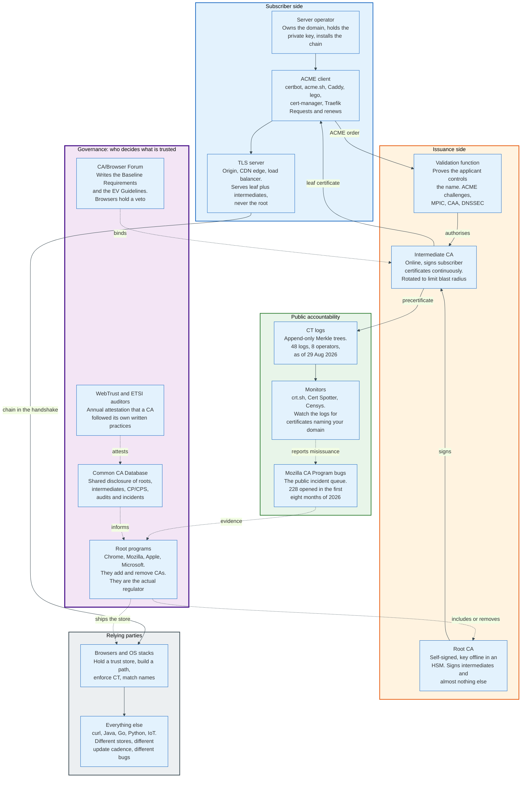

### 4.1 The Actors

| Role | What it does | Examples | Holds a private key that matters? |
|---|---|---|---|
| **Subscriber** | Owns the domain, holds the server private key, installs the chain | Every site operator | Yes, the server key |
| **ACME client** | Requests, renews, and installs certificates automatically | certbot, acme.sh, Caddy, lego, cert-manager, Traefik | Holds the account key and often the server key |
| **Root CA** | Self-signed trust anchor. Signs intermediates and little else | ISRG Root X1, DigiCert Global Root G2 | Yes, offline in an HSM |
| **Intermediate CA** | Signs subscriber certificates continuously | Let's Encrypt YE1 and YE2, DigiCert G2 issuing CAs | Yes, online in an HSM |
| **Validation function** | Proves the applicant controls the name | ACME challenges, MPIC perspectives, CAA lookups | No |
| **Root program** | Adds and removes CAs from a trust store | Chrome, Mozilla, Apple, Microsoft | No, but signs the store |
| **CA/Browser Forum** | Writes the Baseline Requirements and EV Guidelines | Server Certificate Working Group | No |
| **CCADB** | Shared disclosure database for roots, audits, incidents | Run by Mozilla, used by all four programs | No |
| **Auditor** | Annual attestation against WebTrust or ETSI criteria | Big Four firms, ETSI-accredited bodies | No |
| **CT log** | Publishes an append-only record of issuance | Google Argon, Let's Encrypt Sycamore and Willow, Geomys Tuscolo | Yes, to sign SCTs and tree heads |
| **CT monitor** | Alerts a domain owner to certificates naming their domain | crt.sh, SSLMate Cert Spotter, Censys | No |
| **Relying party** | Builds a path, matches the name, enforces policy | Browsers, curl, Java, Go, IoT firmware | No |

### 4.2 The Root Programs Are the Regulator

No government licenses a certificate authority for the public web. Four companies decide, and they decide unilaterally.

A CA that misbehaves is not fined and is not prosecuted. It is removed from a trust store, and every certificate it ever issued stops working in that client. The Chrome Root Program Policy states the test plainly: a CA certificate must "provide value to Chrome end users that exceeds the risk of their continued inclusion." That is a discretionary standard with no appeal.

The power is genuinely unusual. It was granted by no legislature, it has not been tested in court, and the European Union's response to it, examined in section 20, is the only serious attempt so far to constrain it.

### 4.3 The Enforcement Loop Runs on Public Bug Reports

The compliance machinery of the Web PKI is a public Bugzilla component, and its volume is the best available proxy for how the ecosystem is behaving.

A misissuance is reported, usually by a researcher or a competing CA, into Mozilla's CA Program component. The CA must file a preliminary incident report within 72 hours, a full report with root cause analysis, and weekly updates until closure. The reports are public, permanent, and read by every root program.

Volume, counted directly from Bugzilla on 30 August 2026: 106 bugs opened in 2022, 133 in 2023, 236 in 2024, 223 in 2025, and 228 in the first eight months of 2026. The jump between 2023 and 2024 is not a collapse in CA quality. It is the arrival of automated linting and third-party monitoring that finds profile violations nobody used to notice.

Roughly one compliance incident a day, every day, across the industry. That is the actual operating state.

### 4.4 The Relying Party Nobody Designs For

The Web PKI is engineered for browsers and consumed by everything else, and the gap between those two populations is where most real-world PKI failures happen.

Browsers update every four weeks, carry their own trust store, enforce Certificate Transparency, and can ship a filter of every known revocation. A payment terminal, an industrial controller, a set-top box, or a Java 8 application server does none of those things. It has a trust store that was frozen at build time, no CT enforcement, and often no revocation checking at all.

Two consequences follow. First, a new root is useless on the installed base for years, which is why cross-signing exists and why Let's Encrypt kept an IdenTrust cross-signature for nearly a decade. Second, policy changes aimed at browsers, such as 47-day certificate lifetimes, land hardest on devices that were never designed to renew anything.

---

## 5. The X.509 Certificate, Field by Field

A certificate is three fields at the top level and ten inside the signed body. Learning those thirteen names is most of what it takes to read any certificate ever issued.

```mermaid
%%{init: {'theme': 'base', 'themeVariables': {'primaryColor': '#e3f2fd', 'primaryBorderColor': '#1565c0', 'lineColor': '#37474f'}}}%%

flowchart TB
    subgraph Outer["Certificate, the outer SEQUENCE, RFC 5280 section 4.1"]
        direction TB
        O1["Certificate ::= SEQUENCE {<br/>  tbsCertificate     TBSCertificate,<br/>  signatureAlgorithm AlgorithmIdentifier,<br/>  signatureValue     BIT STRING }"]
        O2["The signature covers the DER<br/>bytes of tbsCertificate exactly<br/>as they appear on the wire.<br/>Re-encoding breaks it. Parsers<br/>must keep the original bytes."]
        O3["signatureAlgorithm MUST be<br/>byte-for-byte identical to<br/>tbsCertificate.signature.<br/>A mismatch is a rejection,<br/>and was an attack in the 1990s."]
        O1 --> O2 --> O3
    end

    subgraph TBS["TBSCertificate, the part that is signed"]
        direction TB
        T1["version [0] EXPLICIT<br/>INTEGER 2, meaning v3.<br/>Every publicly trusted TLS<br/>certificate is v3."]
        T2["serialNumber INTEGER<br/>Non-sequential, greater than 0,<br/>less than 2^159, at least<br/>64 bits from a CSPRNG.<br/>The rule exists because of the<br/>2008 MD5 chosen-prefix collision."]
        T3["signature AlgorithmIdentifier<br/>Repeated inside so the<br/>signature covers it."]
        T4["issuer Name<br/>Must byte-match the subject<br/>of the issuing certificate."]
        T5["validity SEQUENCE<br/>notBefore within 48 hours of<br/>signing. notAfter capped at<br/>200 days, 100 from 15 Mar 2027,<br/>47 from 15 Mar 2029.<br/>UTCTime before 2050,<br/>GeneralizedTime after."]
        T6["subject Name<br/>For a DV certificate this is<br/>empty or a single commonName<br/>that no client reads."]
        T7["subjectPublicKeyInfo<br/>AlgorithmIdentifier plus key bits.<br/>RSA at least 2048 bits, or<br/>P-256, P-384, P-521.<br/>Nothing else is permitted."]
        T8["issuerUniqueID [1] and<br/>subjectUniqueID [2]<br/>Two separate fields, both<br/>MUST NOT be present.<br/>Dead since X.509 v2."]
        T9["extensions [3] EXPLICIT<br/>Where all the work happens.<br/>See the extension map."]
        T1 --> T2 --> T3 --> T4 --> T5 --> T6 --> T7 --> T8 --> T9
    end

    subgraph Real["A live certificate, letsencrypt.org, read 30 Aug 2026"]
        direction TB
        R1["serialNumber<br/>0505bb29efe3ee152ba3e9e6872810b5feb9<br/>18 bytes of encoding, not 18 bytes<br/>of entropy: the low 7 bits of the<br/>last byte tag the CRL shard.<br/>Still far over the 64 CSPRNG<br/>bits the BRs require"]
        R2["issuer C=US, O=Let's Encrypt, CN=YE2<br/>subject CN=letsencrypt.org"]
        R3["validity 2026-07-06 15:24:34Z to<br/>2026-10-04 15:24:33Z<br/>90 days minus one second"]
        R4["subjectPublicKeyInfo<br/>id-ecPublicKey, prime256v1,<br/>a 65-byte uncompressed point"]
        R5["Whole certificate: 1,098 bytes DER.<br/>Four-certificate chain:<br/>3,576 bytes on the wire."]
        R1 --> R2 --> R3 --> R4 --> R5
    end

    Outer --> TBS --> Real

    style Outer fill:#e3f2fd,stroke:#1565c0,stroke-width:2px
    style TBS fill:#fff3e0,stroke:#e65100,stroke-width:3px
    style Real fill:#e8f5e9,stroke:#2e7d32,stroke-width:2px
```

### 5.1 The Outer Structure

RFC 5280 section 4.1 defines the outer `SEQUENCE`:

```
Certificate  ::=  SEQUENCE  {
     tbsCertificate       TBSCertificate,
     signatureAlgorithm   AlgorithmIdentifier,
     signatureValue       BIT STRING  }
```

Three details in that structure cause real bugs.

The signature covers the DER encoding of `tbsCertificate` exactly as it appears on the wire. A parser that decodes and re-encodes a certificate will produce different bytes for any structure with an ambiguous encoding, and the signature will fail. Every correct implementation preserves the original byte range.

`signatureAlgorithm` in the outer structure must be byte-for-byte identical to `tbsCertificate.signature` inside. The duplication exists so the algorithm is covered by the signature. A mismatch means an attacker changed the outer copy, and it is a hard rejection.

`signatureValue` is a `BIT STRING`, not an `OCTET STRING`, which means it carries a leading unused-bits octet that is always zero. A hand-written parser that treats it as an `OCTET STRING` reads the signature one byte off and fails every verification.

### 5.2 The Signed Body

```
TBSCertificate  ::=  SEQUENCE  {
     version         [0]  EXPLICIT Version DEFAULT v1,
     serialNumber         CertificateSerialNumber,
     signature            AlgorithmIdentifier,
     issuer               Name,
     validity             Validity,
     subject              Name,
     subjectPublicKeyInfo SubjectPublicKeyInfo,
     issuerUniqueID  [1]  IMPLICIT UniqueIdentifier OPTIONAL,
     subjectUniqueID [2]  IMPLICIT UniqueIdentifier OPTIONAL,
     extensions      [3]  EXPLICIT Extensions OPTIONAL }
```

**`version`** is `INTEGER 2`, meaning v3. Encoded with an explicit context tag `[0]`, so the raw bytes are `A0 03 02 01 02`. Any publicly trusted TLS certificate that is not v3 is malformed.

**`serialNumber`** is an `INTEGER` that must be non-sequential, greater than zero, less than 2^159, and contain at least 64 bits of output from a cryptographically secure random number generator. That rule exists because in 2008 Sotirov, Stevens and colleagues built a rogue CA certificate using an MD5 chosen-prefix collision against a CA that used sequential serials and predictable timestamps. Predictability was the vulnerability, not the hash alone. Ballot 164 made 64 bits of CSPRNG output mandatory from 30 September 2016.

**`signature`** repeats the algorithm identifier so it falls inside the signed body.

**`issuer`** is a `Name`, a `SEQUENCE OF RelativeDistinguishedName`. It must byte-match the `subject` of the issuing certificate. Byte-match, not semantically match. Two DNs that a human would call identical but that differ in string encoding, `PrintableString` versus `UTF8String`, do not chain.

**`validity`** is two `Time` values, each a `CHOICE` between `UTCTime` and `GeneralizedTime`. RFC 5280 requires `UTCTime` for dates before 2050 and `GeneralizedTime` after, which is why almost every certificate today uses the two-digit-year `UTCTime` form `YYMMDDHHMMSSZ`. The Baseline Requirements add that `notBefore` must be within 48 hours of the actual signing operation, closing the backdating loophole that WoSign exploited in 2016.

**`subject`** is another `Name`. For a domain-validated certificate the Baseline Requirements now mark `commonName` as NOT RECOMMENDED and forbid every other attribute except `countryName`. A modern DV certificate frequently has a subject of `CN=example.com` and nothing else, and no client reads it.

**`subjectPublicKeyInfo`** is an `AlgorithmIdentifier` plus the key as a `BIT STRING`. For P-256 this is 65 bytes of uncompressed point, a `0x04` prefix followed by two 32-byte coordinates.

**`issuerUniqueID`** and **`subjectUniqueID`** must not be present. They are X.509 v2 vestiges that no software uses.

**`extensions`** carries everything that actually governs validation, and section 6 covers it.

### 5.3 Certificate Lifetimes, on a Published Schedule

The maximum validity period of a publicly trusted TLS certificate is falling by roughly a factor of eight over three years, and the schedule is already binding law inside the Baseline Requirements.

Ballot SC-081v3 passed on 11 April 2025 and took effect on 16 May 2025. Two sections of Baseline Requirements version 2.2.9, effective 6 August 2026, carry the schedule: section 6.3.2 sets the validity ceilings, and section 4.2.1 sets the matching domain and IP validation data reuse periods. Together they read:

| Issued on or after | Issued before | Maximum validity period | Maximum domain validation data reuse |
|---|---|---|---|
| | 15 Mar 2026 | 398 days | 398 days |
| 15 Mar 2026 | 15 Mar 2027 | 200 days | 200 days |
| 15 Mar 2027 | 15 Mar 2029 | 100 days | 100 days |
| 15 Mar 2029 | | 47 days | 10 days |

A day is defined as exactly 86,400 seconds, and any fraction over that counts as an additional day. The Baseline Requirements therefore advise issuing one day under the cap, and CAs do: a 90-day Let's Encrypt certificate is 90 days minus one second.

The arithmetic at the end state is what forces automation. At a 47-day maximum with a 10-day validation reuse window, keeping one name continuously covered requires roughly 8 issuances and roughly 37 domain validations per year. No human does that. That is the intended effect: the stated purpose of the ballot includes forcing enough agility that a future cryptographic transition does not take a decade.

A separate definition matters here. A **short-lived subscriber certificate** is one with a validity period of 10 days or less for certificates issued before 15 March 2026, and 7 days or less after. Short-lived certificates need no CRL Distribution Points extension at all, and a CA may decline to support revoking them.

### 5.4 Encoding, and Why DER Specifically

Distinguished Encoding Rules exist because a signature over a structure requires exactly one valid byte representation of that structure.

ASN.1 Basic Encoding Rules allow several encodings of the same value. DER removes the choice: definite-length form only, the shortest possible length encoding, `SET OF` elements sorted by their encoded value, boolean TRUE as `0xFF` and nothing else. Every publicly trusted certificate is DER.

PEM is not an alternative encoding. It is base64 of the DER with header and footer lines, and it exists so certificates survive being pasted into email and configuration files.

The sizes are small and worth internalising. Measured on the live `letsencrypt.org` chain on 30 August 2026, the server sends four certificates: the leaf is 1,098 bytes of DER, the YE2 intermediate is 656 bytes, the Root YE cross-signature by ISRG Root X2 is 682 bytes, and the ISRG Root X2 cross-signature by ISRG Root X1 is 1,140 bytes. The whole served chain is 3,576 bytes. The shortest path a client with Root YE actually needs, leaf plus YE2, is 1,754 bytes. Section 22 explains why those numbers are the central constraint on post-quantum migration.

---

## 6. The Extensions That Decide Validation

Twelve extensions determine whether a certificate validates, what it is valid for, and where a client goes for more information. Everything else in the certificate is metadata.

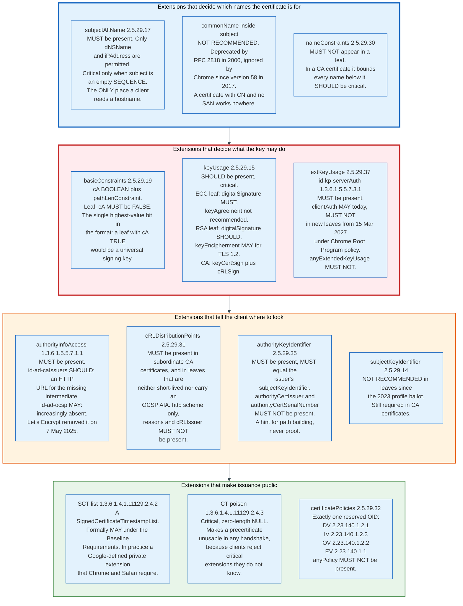

### 6.1 Names: subjectAltName and the Death of commonName

`subjectAltName`, OID 2.5.29.17, is the only place a TLS client reads a hostname, and this has been true in every major browser since 2017.

The Baseline Requirements make it mandatory in subscriber certificates, require at least one `dNSName` or `iPAddress`, and forbid every other `GeneralName` type: no `rfc822Name`, no `uniformResourceIdentifier`, no `otherName`, no `directoryName`. It is marked critical if and only if the `subject` field is an empty `SEQUENCE`.

The historical alternative, `commonName` inside the subject Distinguished Name, was deprecated by RFC 2818 in May 2000 and ignored by Chrome from version 58 in April 2017. A certificate with a common name and no SAN works nowhere today. The Baseline Requirements now list `commonName` as NOT RECOMMENDED and require that, if present, its value be derived from a SAN entry.

Name matching rules are narrow and worth stating exactly. A wildcard is permitted only in the leftmost label and matches exactly one label: `*.example.com` matches `www.example.com`, does not match `example.com`, and does not match `a.b.example.com`. `www.*.com` is invalid. Wildcards spanning a public suffix, such as `*.co.uk`, must not be issued, and CAs enforce that against the Public Suffix List. Internationalised names are stored as A-labels, the ASCII `xn--` punycode form, and the client converts the requested name the same way before comparing.

### 6.2 Power: basicConstraints, keyUsage, extKeyUsage

`basicConstraints`, OID 2.5.29.19, carries the single highest-value bit in the entire format.

The structure is a boolean `cA` and an optional `pathLenConstraint` integer. If `cA` is FALSE or the extension is absent, the certificate cannot sign other certificates. For a subscriber certificate the Baseline Requirements say `cA` MUST be FALSE and `pathLenConstraint` MUST NOT be present. `pathLenConstraint` on a CA certificate limits how many non-self-issued intermediates may follow it: a value of 0 means the CA may issue only end-entity certificates.

The reason this bit matters more than any other is what happens when a client forgets to check it. A leaf certificate with `cA` unchecked becomes a universal signing key: anyone who can obtain a certificate for a domain they own can then mint certificates for every domain on earth. Internet Explorer 5 and 6 had this bug, disclosed by Mike Benham on Bugtraq in August 2002. Apple had it again in iOS through 4.3.4, fixed in 4.3.5 as CVE-2011-0228, nine years later.

`keyUsage`, OID 2.5.29.15, is a `BIT STRING` and SHOULD be present and critical in a subscriber certificate. The permitted values differ by key type:

| Key type | `digitalSignature` | `keyEncipherment` | `keyAgreement` | `keyCertSign` / `cRLSign` |
|---|---|---|---|---|
| RSA leaf | Permitted, SHOULD | Permitted, MAY (TLS 1.2 only) | Forbidden | Forbidden |
| ECC leaf | Permitted, MUST | Forbidden | Permitted but NOT RECOMMENDED | Forbidden |
| CA certificate | Permitted | Forbidden | Forbidden | Required |

The `keyEncipherment` bit is a fossil of RSA key transport, which TLS 1.3 removed entirely. It survives only for TLS 1.2 with static RSA cipher suites.

`extKeyUsage`, OID 2.5.29.37, restricts what the key may be used for. A TLS server certificate MUST assert `id-kp-serverAuth`, 1.3.6.1.5.5.7.3.1. It MUST NOT assert `id-kp-codeSigning`, `id-kp-emailProtection`, `id-kp-timeStamping`, `id-kp-OCSPSigning`, or `anyExtendedKeyUsage`, 2.5.29.37.0.

`id-kp-clientAuth` is being removed from the public Web PKI on a schedule with three steps. Chrome Root Program Policy version 1.8 requires a subordinate CA under a new applicant root, disclosed to CCADB on or after 15 June 2025, to assert `serverAuth` alone; extends the same rule to subordinate CAs under roots already in the store from 15 June 2026; and requires every newly issued subscriber certificate under any Chrome-trusted hierarchy to assert `serverAuth` exclusively from 15 March 2027. Let's Encrypt's Generation Y intermediates, generated in September 2025, already omit `clientAuth` entirely, which technically prevents them from ever issuing a client certificate.

### 6.3 Location: AIA, CRLDP, and the Key Identifiers

`authorityInfoAccess`, OID 1.3.6.1.5.5.7.1.1, is mandatory in subscriber certificates and carries at most two kinds of URL.

`id-ad-caIssuers`, 1.3.6.1.5.5.7.48.2, SHOULD be present and points to the issuing CA's certificate over HTTP. This is what lets a client repair a chain when a misconfigured server omits its intermediate, and it is why such misconfigurations often work in browsers and fail in curl.

`id-ad-ocsp`, 1.3.6.1.5.5.7.48.1, MAY be present and points to an OCSP responder. It is disappearing. Let's Encrypt removed it from newly issued certificates on 7 May 2025. The live `letsencrypt.org` certificate read on 30 August 2026 carries only a `caIssuers` URL, `http://ye2.i.lencr.org/`.

`cRLDistributionPoints`, OID 2.5.29.31, MUST be present in subordinate CA certificates and in subscriber certificates that are neither short-lived nor carry an OCSP AIA. Since Let's Encrypt dropped OCSP, that condition now describes essentially all of its 90-day certificates. The extension must contain at least one `DistributionPoint` whose `distributionPoint` is a `fullName` of `uniformResourceIdentifier` type with an `http` scheme. `reasons` and `cRLIssuer` MUST NOT be present.

`authorityKeyIdentifier`, OID 2.5.29.35, must be present and must equal the issuer's `subjectKeyIdentifier`. `authorityCertIssuer` and `authorityCertSerialNumber` MUST NOT be present. This is a hint that speeds up path building and is never proof of anything; a client that trusts the AKI without verifying the signature has no security at all.

`subjectKeyIdentifier`, OID 2.5.29.14, is now NOT RECOMMENDED in subscriber certificates, a change from the 2023 certificate profile ballot. It remains required in CA certificates, where it is the anchor the AKI points at.

### 6.4 Transparency: SCTs, Poison, and Policies

The SCT list extension, OID 1.3.6.1.4.1.11129.2.4.2, is formally optional and practically mandatory.

Its value is an `OCTET STRING` containing a `SignedCertificateTimestampList` as defined in RFC 6962 section 3.3. The Baseline Requirements say it MAY be present. Chrome and Safari will not accept a publicly trusted certificate without enough SCTs to satisfy their policies, so every public CA embeds them. A private extension defined by Google in a Google-owned OID arc is a de facto requirement for the public web.

The CT poison extension, OID 1.3.6.1.4.1.11129.2.4.3, is a critical extension with a NULL value whose entire purpose is to be unrecognisable. Section 14 explains the trick it enables.

`certificatePolicies`, OID 2.5.29.32, must contain exactly one reserved CA/Browser Forum policy identifier, and that OID is the machine-readable statement of validation level:

| Validation level | Reserved policy OID |
|---|---|
| Domain Validated | 2.23.140.1.2.1 |
| Organization Validated | 2.23.140.1.2.2 |
| Individual Validated | 2.23.140.1.2.3 |
| Extended Validation | 2.23.140.1.1 |

`anyPolicy` MUST NOT be present. Policy qualifiers are NOT RECOMMENDED, and the only permitted one is `id-qt-cps`, 1.3.6.1.5.5.7.2.1, an HTTP or HTTPS URL for the CA's Certification Practice Statement.

`nameConstraints`, OID 2.5.29.30, MUST NOT appear in a subscriber certificate and is the subject of section 15.

---

## 7. Chains, Cross-Signing, and Path Validation

Path validation is a graph search, not a walk down a list, and every implementation that treats it as a list eventually causes an outage.

```mermaid
%%{init: {'theme': 'base', 'themeVariables': {'primaryColor': '#e3f2fd', 'primaryBorderColor': '#1565c0', 'lineColor': '#37474f'}}}%%

flowchart TB
    subgraph Graph["The real graph, letsencrypt.org as served on 30 Aug 2026"]
        direction TB
        Leaf["Leaf<br/>subject CN=letsencrypt.org<br/>issuer CN=YE2<br/>ECDSA P-256, 1,098 bytes"]
        Int["Intermediate<br/>subject CN=YE2, O=Let's Encrypt<br/>issuer CN=Root YE, O=ISRG<br/>cA TRUE, pathlen 0<br/>EKU serverAuth only<br/>valid 2025-09-03 to 2028-09-02"]
        RootYE["ISRG Root YE<br/>ECDSA P-384<br/>New Generation Y root,<br/>generated Sep 2025, awaiting<br/>inclusion in the trust stores"]
        X2["Root YE cross-signed by<br/>ISRG Root X2, issued 2026-05-13<br/>Bridges the new root to an<br/>anchor that already ships"]
        X1["ISRG Root X2 cross-signed by<br/>ISRG Root X1. Subject key<br/>ECDSA P-384, signed sha256WithRSA<br/>valid 2026-05-13 to 2032-09-02<br/>1,140 bytes. Chains to the RSA 4096<br/>ISRG Root X1 already in every store"]

        Leaf -->|"signed by"| Int
        Int -->|"signed by"| RootYE
        RootYE -->|"also certified by"| X2
        X2 -->|"also certified by"| X1
    end

    subgraph Paths["Three valid paths, one leaf"]
        direction TB
        PA["Path A: Leaf, YE2, Root YE<br/>Works once Root YE ships"]
        PB["Path B: Leaf, YE2, Root YE,<br/>Root X2 cross-sign<br/>Works on clients that have X2"]
        PC["Path C: Leaf, YE2, Root YE,<br/>Root X2 cross-sign,<br/>Root X1 cross-sign<br/>Works almost everywhere"]
        PA --> PB --> PC
    end

    subgraph Algo["RFC 5280 section 6.1, what the client actually runs"]
        direction TB
        A1["Initialise eleven state variables:<br/>valid_policy_tree, permitted_subtrees,<br/>excluded_subtrees, explicit_policy,<br/>inhibit_anyPolicy, policy_mapping,<br/>working_public_key and its algorithm<br/>and parameters, working_issuer_name,<br/>max_path_length"]
        A2["For each certificate, in order:<br/>verify the signature with the<br/>issuer's working public key"]
        A3["Check notBefore is not in the<br/>future and notAfter is not in<br/>the past, at every level"]
        A4["Check the subject name and every<br/>subjectAltName against<br/>permitted_subtrees and<br/>excluded_subtrees"]
        A5["Check basicConstraints cA is TRUE<br/>and max_path_length is not<br/>exhausted for every non-leaf"]
        A6["Check keyUsage asserts keyCertSign<br/>on every CA certificate"]
        A7["Wrap up: match a SAN dNSName<br/>against the requested host,<br/>wildcards only at the leftmost<br/>label and only one label deep"]
        A8["Check CT policy: 2 SCTs from<br/>distinct logs for lifetimes of<br/>180 days or less, 3 above,<br/>from at least 2 operators"]
        A9["Check revocation with whatever<br/>data the client already has.<br/>Not a fetch. A lookup."]
        A1 --> A2 --> A3 --> A4 --> A5 --> A6 --> A7 --> A8 --> A9
    end

    subgraph Fail["Where implementations break"]
        direction TB
        F1["Treating the chain as a linked<br/>list. The server's ordering is<br/>a hint, not the answer."]
        F2["Stopping at the first expired<br/>anchor. This is the 30 Sep 2021<br/>DST Root CA X3 outage:<br/>OpenSSL 1.0.2 stopped,<br/>modern stacks backtracked."]
        F3["Ignoring basicConstraints.<br/>Internet Explorer 5 and 6 in 2002,<br/>iOS through 4.3.4 in 2011<br/>CVE-2011-0228."]
        F4["Reading commonName when SAN<br/>is present, or accepting a<br/>null byte inside a name.<br/>CVE-2009-2408."]
        F1 --> F2 --> F3 --> F4
    end

    Graph --> Paths --> Algo --> Fail

    style Graph fill:#e3f2fd,stroke:#1565c0,stroke-width:3px
    style Paths fill:#e8f5e9,stroke:#2e7d32,stroke-width:2px
    style Algo fill:#fff3e0,stroke:#e65100,stroke-width:2px
    style Fail fill:#ffebee,stroke:#c62828,stroke-width:2px
```

### 7.1 The Chain the Server Sends Is a Suggestion

A TLS server sends its leaf certificate followed by whatever intermediates it was configured with, and the client is free to ignore the ordering and find its own path.

The reason multiple paths exist is cross-signing. A CA can have several roots. It can have its own new root cross-signed by an older, more widely deployed root. It can rotate keys while keeping the same subject name. Each of those creates an additional edge in the graph, and a given leaf frequently has three or more valid paths to three different trust anchors, with different clients holding different anchors.

The live `letsencrypt.org` chain read on 30 August 2026 shows all of this in four certificates:

| Position | Subject | Issuer | Key | Validity |
|---|---|---|---|---|
| Leaf | `CN=letsencrypt.org` | `CN=YE2, O=Let's Encrypt, C=US` | ECDSA P-256 | 2026-07-06 to 2026-10-04 |
| Intermediate | `CN=YE2, O=Let's Encrypt, C=US` | `CN=Root YE, O=ISRG, C=US` | ECDSA P-384 | 2025-09-03 to 2028-09-02 |
| Cross-sign | `CN=Root YE, O=ISRG, C=US` | `CN=ISRG Root X2, O=Internet Security Research Group` | ECDSA P-384 | 2026-05-13 to 2032-09-02 |
| Cross-sign | `CN=ISRG Root X2` | `CN=ISRG Root X1` | ECDSA P-384 | 2026-05-13 to 2032-09-02 |

Read that bottom-up and the design intent is obvious. ISRG generated the Generation Y hierarchy in a September 2025 ceremony and submitted the new roots to the Apple, Chrome, Microsoft, and Mozilla programs. Until those roots ship in enough devices, every path has to reach an anchor that already exists, so Root YE is cross-signed by Root X2, which is cross-signed by Root X1, an RSA 4096 root that is in every trust store on earth.

X1's certificate says 2035 and its trust does not. Chrome removes any root whose key material is more than fifteen years old, a rule stated in section 8.3 and in Chrome Root Program Policy version 1.8 section 1.3.1.2. ISRG Root X1's key was generated on 4 June 2015, so Let's Encrypt's own certificates page lists it as trusted until 4 June 2030 rather than until the 4 June 2035 written in the `notAfter` field. That five-year gap is the deadline the whole Generation Y cross-signing design is racing.

A modern client with Root YE stops after two certificates. An older client walks all four. Both succeed, from the same bytes on the wire.

### 7.2 The Algorithm, RFC 5280 Section 6.1

Path validation initialises eleven state variables and then processes certificates in order from the trust anchor to the leaf.

The state variables are `valid_policy_tree`, `permitted_subtrees`, `excluded_subtrees`, `explicit_policy`, `inhibit_anyPolicy`, `policy_mapping`, `working_public_key`, `working_public_key_algorithm`, `working_public_key_parameters`, `working_issuer_name`, and `max_path_length`. The certificate policy machinery, four of those eleven, is almost entirely unused on the public web and is a common source of interoperability bugs in enterprise deployments that do use it.

Per certificate, the client checks: the signature verifies under `working_public_key`; the current time falls between `notBefore` and `notAfter`; the certificate is not revoked according to whatever revocation data the client holds; the issuer name matches `working_issuer_name`. Then, for every certificate that is not the last: `basicConstraints` asserts `cA` TRUE; `max_path_length` is not exhausted; `keyUsage` asserts `keyCertSign`; and every subject name and `subjectAltName` entry falls inside `permitted_subtrees` and outside `excluded_subtrees`.

After the chain validates, the client does the part RFC 5280 does not specify: match a `dNSName` in the leaf's `subjectAltName` against the name the user asked for, then enforce Certificate Transparency policy, then apply whatever revocation data it has.

### 7.3 The Outage That Teaches the Lesson

On 30 September 2021, DST Root CA X3 expired and broke a large fraction of the non-browser internet, and the certificates involved were all perfectly valid.

Let's Encrypt had cross-signed ISRG Root X1 with IdenTrust's DST Root CA X3 so that Android devices which had never received a trust store update could still build a path. When DST Root CA X3 expired, servers were still sending the cross-signed chain. Clients that implemented path building as a single-path walk found the expired root, stopped, and failed. Clients that implemented a proper search backtracked, found ISRG Root X1 directly in their own trust store, and succeeded.

OpenSSL 1.0.2 was in the first category. OpenSSL 1.1.0 and later, and every browser, were in the second.

The generalisable rules are two. A validator must be able to try alternative paths rather than failing at the first dead end. And a server should send the chain that maximises the number of clients that can build any path, which is frequently not the shortest chain.

### 7.4 Where Validation Has Historically Been Broken

Four classes of validation bug recur often enough to be worth naming.

**Ignoring `basicConstraints`.** Turns any leaf into a CA. Internet Explorer 5 and 6 in 2002, iOS through 4.3.4 in 2011.

**Name confusion.** Moxie Marlinspike's 2009 null-prefix attack, CVE-2009-2408, used a common name of `www.paypal.com\0.attacker.com`, which some CAs would issue and some clients would compare with C string functions that stopped at the null byte.

**Trusting hints as proof.** Selecting an issuer by `authorityKeyIdentifier` and skipping the signature check.

**Skipping the whole thing.** The most common real-world failure by volume is application code that disables verification to make a development environment work and ships that way. No specification protects against this.

---

## 8. Root Stores and Who Controls Them

Four organisations decide which certificate authorities the internet trusts, they publish their criteria, and the criteria are getting stricter every year.

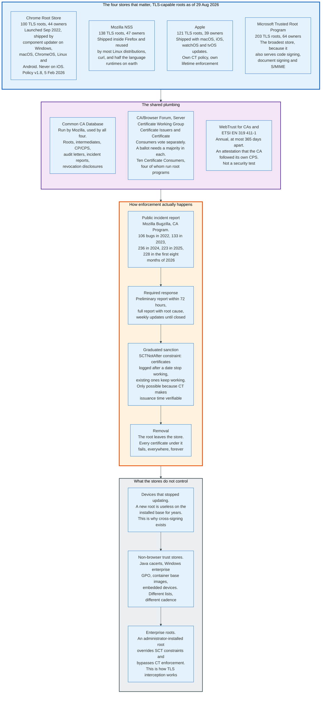

### 8.1 The Four Stores, Counted

The stores overlap heavily but are not identical, and the differences matter for anyone who has to support more than one client.

Counted from the CCADB root inclusion report on 29 August 2026, restricted to roots whose intended use includes TLS server authentication:

| Store | TLS roots included | Distinct CA owners | Notes |
|---|---|---|---|
| **Chrome Root Store** | 100 | 44 | Launched September 2022 on Windows and macOS, rolling out in Chrome 105 and on by default in Chrome 108. ChromeOS, Linux, and Android followed in Chrome 114, Android by default in 115. Apple policy prevents it on Chrome for iOS. Policy v1.8, dated 5 February 2026 |
| **Mozilla NSS** | 138 | 47 | Shipped in Firefox and reused by most Linux distributions, curl, and many language runtimes |
| **Apple** | 121 | 39 | Shipped with OS updates. Separate CT policy and separate lifetime enforcement |
| **Microsoft** | 203 | 64 | The broadest, because it also serves code signing, document signing, and S/MIME |

Across all four programs and all use cases, the CCADB report lists 356 root certificates from 84 distinct CA owners. Restricting to TLS leaves 218 roots.

Chrome's store is the strictest and the newest. Before Chrome 105 in September 2022, Chrome used the host platform's trust store everywhere, which meant its security depended on decisions made by Microsoft and Apple. Desktop Linux and ChromeOS kept the platform store until Chrome 114 in mid-2023, and Chrome for iOS still uses Apple's, because Apple's own policies forbid a browser shipping its own verifier there. Building its own store is what made SCT-based distrust and dedicated-hierarchy requirements possible.

### 8.2 Getting In

The barrier to entry for a new certificate authority is not technical. It is a multi-year compliance and propagation process.

The Chrome Root Program's applicant requirements are representative. An applicant must generate root key material in an audited ceremony within the previous five years, with a Qualified Auditor's attestation. It must complete at least one full audit covering a minimum 180-day period of operation before applying. It must maintain a consolidated, publicly available CP/CPS focused exclusively on TLS server authentication. It must adhere to the CCADB policy, undergo recurring complete audits at most 365 days apart, and operate a hierarchy dedicated to TLS.

Then it waits. A root that is accepted still has to propagate into shipped software, and devices that stopped receiving updates never get it. This is why cross-signing exists, and it is why Let's Encrypt maintained an IdenTrust cross-signature from 2015 until 2024 despite having its own root in every major store since 2018.

### 8.3 Getting Out

Removal is the only sanction, and the root programs have built a graduated version of it that does not break the present.

The blunt instrument is deletion: the root leaves the store, and every certificate under it fails immediately, everywhere, forever. That is what happened to DigiNotar in 2011, and it is why the Dutch government's own services broke.

The precise instrument is an **SCT constraint**. Chrome distrusts certificates under a named root whose earliest Signed Certificate Timestamp is dated after a cutoff, and leaves everything logged before that cutoff working until it expires naturally. Entrust and AffirmTrust roots got this treatment with a cutoff of 11 November 2024. Chunghwa Telecom and NETLOCK got it in 2025 with a cutoff of 31 July 2025.

The mechanism only works because Certificate Transparency exists. Without a public log, "when was this certificate issued" is a `notBefore` field the CA wrote itself, and a CA facing distrust would simply backdate. With CT, issuance time is signed by third parties. WoSign backdated certificates in 2016 and was caught precisely because the embedded SCTs contradicted the `notBefore`.

Chrome also removes roots on a timer regardless of behaviour: any root CA certificate whose key material was generated more than 15 years ago is removed on an ongoing basis. Long-lived trust anchors are treated as a risk in themselves.

### 8.4 What the Root Stores Do Not Control

Three populations sit outside root program authority, and they are where most of the internet's certificate validation actually happens.

**Frozen trust stores.** Java `cacerts` files baked into container images, embedded device firmware, and appliances that stopped receiving updates. A distrust decision reaches none of them.

**Enterprise-installed roots.** An administrator-installed root overrides SCT constraints and bypasses Certificate Transparency enforcement entirely. This is the documented, intended mechanism by which TLS interception proxies work, and it is also the largest hole in every transparency guarantee in this document.

**Non-browser default stores.** Debian's `ca-certificates` package, the Python `certifi` bundle, and Go's platform-dependent fallbacks all derive from Mozilla NSS with their own lag and their own local edits.

---

## 9. Certificate Authorities and the Intermediate Hierarchy

A certificate authority sells one thing: the willingness of four browser vendors to include its root in a trust store. Everything else is operations around a key that must never leak.

```mermaid
%%{init: {'theme': 'base', 'themeVariables': {'primaryColor': '#e3f2fd', 'primaryBorderColor': '#1565c0', 'lineColor': '#37474f'}}}%%

flowchart TB
    subgraph Ceremony["Root key generation, the one irreversible event"]
        direction TB
        K1["Scripted ceremony, video recorded,<br/>witnessed by a qualified auditor,<br/>multi-person control with n-of-m<br/>key shares held on smartcards"]
        K2["Key generated inside a FIPS 140<br/>Level 3 or Common Criteria EAL 4+<br/>hardware security module and<br/>never leaves it in the clear"]
        K3["Chrome requires applicant root key<br/>material generated within the<br/>previous five years, and removes<br/>any root whose key is more than<br/>15 years old"]
        K1 --> K2 --> K3
    end

    subgraph Tiers["Why the hierarchy has tiers"]
        direction TB
        Root["Root CA<br/>Self-signed. Key powered off,<br/>in a safe, in a cage.<br/>Signs only intermediates, OCSP<br/>responder certificates and<br/>infrastructure certificates.<br/>Validity typically 15 to 25 years"]
        Inter["Intermediate CA<br/>Key online in an HSM, signing<br/>continuously. Compromise is<br/>survivable: revoke it, publish<br/>a new one, keep the root.<br/>Chrome policy 1.3.1.3: SHOULD be<br/>at most three years, and a new<br/>one SHOULD ship every year"]
        Leaf["Subscriber certificate<br/>cA FALSE. 90 days today at<br/>Let's Encrypt, 45 by 2028,<br/>47 days maximum industry-wide<br/>from 15 Mar 2029"]
        Root -->|"signs, rarely"| Inter
        Inter -->|"signs, constantly"| Leaf
    end

    subgraph Anti["Anti-fragility measures the root programs now push"]
        direction TB
        A1["Random intermediate selection<br/>Let's Encrypt keeps two active<br/>intermediates per root plus a<br/>silent backup, and picks between<br/>the active pair at random,<br/>to break anyone who pins one"]
        A2["Dedicated TLS hierarchies<br/>No S/MIME, no code signing under<br/>the same root. Existing multi-purpose<br/>roots phase out of the Chrome<br/>Root Store by end of 2027"]
        A3["Shorter subordinate lifetimes<br/>and faster key rotation, so a<br/>compromised issuing key covers<br/>a smaller shard of the corpus"]
        A4["Cross-signing<br/>The same subject and key certified<br/>by a second issuer, so old devices<br/>and new devices can each find<br/>a path they trust"]
        A1 --> A2 --> A3 --> A4
    end

    subgraph Real["Let's Encrypt Generation Y, generated Sep 2025"]
        direction TB
        R1["ISRG Root YR, RSA 4096, 20 years<br/>ISRG Root YE, ECDSA P-384<br/>Both cross-signed by their<br/>Generation X predecessors"]
        R2["Six intermediates: YR1, YR2, YR3<br/>under YR, and YE1, YE2, YE3<br/>under YE. Four active, two held<br/>in reserve. None carries the<br/>clientAuth EKU"]
        R3["Submitted to the Apple, Chrome,<br/>Microsoft and Mozilla root<br/>programs. Until they ship,<br/>every path runs through the<br/>old roots by cross-signature"]
        R1 --> R2 --> R3
    end

    Ceremony --> Tiers --> Anti --> Real

    style Ceremony fill:#ffebee,stroke:#c62828,stroke-width:2px
    style Tiers fill:#e3f2fd,stroke:#1565c0,stroke-width:3px
    style Anti fill:#fff3e0,stroke:#e65100,stroke-width:2px
    style Real fill:#e8f5e9,stroke:#2e7d32,stroke-width:2px
```

### 9.1 Why the Hierarchy Has Tiers

The root key is offline because a compromised root is unrecoverable and a compromised intermediate is merely expensive.

A root CA key lives in a hardware security module validated to FIPS 140 Level 3 or an equivalent Common Criteria profile, generated in a scripted ceremony that is video recorded and witnessed by a qualified auditor, under n-of-m multi-person control with key shares on separate smartcards. Between ceremonies the module is powered off, in a safe, in a cage, in a facility with its own access controls.

The Baseline Requirements permit a root key to sign only four things: self-signed certificates representing the root itself, subordinate CA and cross-certified subordinate CA certificates, infrastructure certificates for administrative roles and internal CA devices, and OCSP response verification certificates. Everything a subscriber sees is signed by an intermediate.

An intermediate key is online, in an HSM, signing millions of certificates. If it is compromised, the CA revokes it, publishes a new one, and the root survives. That is the entire architectural argument for the tier.

### 9.2 The Modern Anti-Fragility Measures

Root programs now actively push CAs toward more, shorter-lived, more disposable intermediates, reversing two decades of practice.

**Randomised intermediate selection.** Let's Encrypt keeps four intermediates in active rotation, two under each root, and holds a fifth and a sixth in reserve. The selection is not free: the subscriber's key type picks the root, so an ECDSA request is issued from an ECDSA intermediate and an RSA request from an RSA one, and the CA then picks at random between that root's two active intermediates. The stated purpose is to discourage anyone from pinning a specific intermediate, because pinning turns a routine CA rotation into an outage.

**Dedicated TLS hierarchies.** Chrome has required TLS-only hierarchies for new applicants since September 2022 and is phasing out existing multi-purpose roots, with completion expected by the end of 2027. The argument is that balancing S/MIME, code signing, and TLS requirements in one hierarchy adds complexity that produces incidents.

**Shorter subordinate lifetimes and faster rotation.** Chrome Root Program Policy version 1.8, section 1.3.1.3, says subordinate CA certificates SHOULD have a maximum validity period of three years and that CA owners SHOULD create and deploy new subordinate CA certificates at least once every year, so that a compromised issuing key covers a smaller shard of the corpus. Today many intermediates are valid for a decade or more, and revoking one can require replacing hundreds of millions of certificates.

### 9.3 A Real Hierarchy: Let's Encrypt Generation Y

Let's Encrypt generated a complete replacement hierarchy in September 2025, and its design choices are a summary of current best practice.

Two new roots: **ISRG Root YR**, RSA 4096, valid for twenty years, and **ISRG Root YE**, ECDSA P-384. Both mirror their Generation X predecessors, with cosmetic changes such as shortening the organisation name from "Internet Security Research Group" to "ISRG" to save bytes in every chain. Both are cross-signed by the roots they will eventually replace.

Six intermediates: YR1, YR2, and YR3 under Root YR, and YE1, YE2, and YE3 under Root YE. Four are in active rotation, YR1, YR2, YE1, and YE2; YR3 and YE3 hold valid certificates and issue nothing, so a compromise of an active pair can be answered by promoting a reserve rather than by a new ceremony. Two changes from the previous generation. The numbering is now per-root rather than global, which makes it possible to add post-quantum key types later without renumbering. And none of the six carries the `clientAuth` Extended Key Usage, which makes it technically impossible for them to issue a TLS client authentication certificate, ahead of the Chrome requirement that lands in 2027.

The live YE2 intermediate read on 30 August 2026 confirms the profile: `basicConstraints` critical with `cA:TRUE, pathlen:0`; `keyUsage` critical with `digitalSignature, keyCertSign, cRLSign`; `extKeyUsage` with `serverAuth` alone; validity 3 September 2025 to 2 September 2028, exactly three years.

### 9.4 The Market

One nonprofit issues certificates for roughly two thirds of the web, and the commercial CAs live on the segment that wants an organisation's legal name in the certificate.

W3Techs, surveying on 30 August 2026, reports Let's Encrypt on 64.4% of all websites, a 67.7% share of sites that have a certificate at all. GlobalSign follows at 20.3% absolute and 21.4% share, then Sectigo at 4.8%, the GoDaddy group at 3.5%, the DigiCert group at 1.6%, Actalis at 0.6%, Certum at 0.5%, and Secom Trust at 0.2%. Every remaining authority, SSL.com included, sits at or below 0.1%.

Two caveats on those numbers. W3Techs attributes certificates by the authority behind the chain, which groups several brands and resold hierarchies under one name, so the GlobalSign figure includes issuance from hierarchies that chain to GlobalSign roots rather than certificates GlobalSign sold. And market share by site count is not market share by revenue: free DV certificates dominate the count and produce no revenue at all.

---

## 10. DV, OV, and EV: What Each Level Actually Proves

The three validation levels differ in what the CA checks about the applicant, not in what the certificate protects. The Baseline Requirements say this outright: all subscriber certificate types "provide the same level of assurance of the device identity."

### 10.1 The Four Types

There are four types, not three. Individual Validated is rare enough that most people forget it exists.

| Type | Reserved policy OID | What the CA verifies | Subject attributes permitted | Typical issuance time |
|---|---|---|---|---|
| **Domain Validated (DV)** | 2.23.140.1.2.1 | Control of each name, at one moment | `countryName` MAY, `commonName` NOT RECOMMENDED, everything else forbidden | Seconds |
| **Individual Validated (IV)** | 2.23.140.1.2.3 | Control of names plus a natural person's identity | `givenName`, `surname`, locality attributes | Days |
| **Organization Validated (OV)** | 2.23.140.1.2.2 | Control of names plus the organisation's legal existence and address | `organizationName` MUST, `countryName` MUST, one of `stateOrProvinceName` or `localityName` MUST | Hours to days |
| **Extended Validation (EV)** | 2.23.140.1.1 | Everything in OV plus physical existence, operational existence, a verified communication channel, and the authority of named individuals | OV set plus jurisdiction attributes and a registration number | Days to weeks |

### 10.2 What DV Actually Proves

A domain-validated certificate proves that at one moment in time, someone could make a specific change to a resource under the name. That is the whole claim.

It does not establish who that someone is, whether they still control the name, whether they are entitled to it, or whether the site is honest. A DV certificate for `secure-bank-login-verify.com` is issued in seconds and is completely valid.

That is a deliberate design choice, not a gap. The alternative, manual identity verification for every site, cost money, took days, and demonstrably did not stop phishing. Choosing universal encryption over an identity ritual is the trade that took HTTPS from 39% of page loads at Let's Encrypt's launch to 83.2%.

### 10.3 What EV Actually Requires

EV is the most demanding validation regime in commercial PKI, and browsers stopped showing it to users.

The EV Guidelines require a CA to verify, before issuance: the applicant's legal existence and identity through an Incorporating or Registration Agency; its physical existence at a business address; its operational existence, meaning the ability to engage in business; a reliable means of communication with the named subject; control of every domain name in the certificate; and the name, title, and authority of the Contract Signer, the Certificate Approver, and the Certificate Requester, with confirmation that a Contract Signer signed the Subscriber Agreement and a Certificate Approver approved the request.

Operational existence alone requires one of four proofs: three years of records at an Incorporating or Registration Agency, a listing in a Qualified Independent Information Source or Qualified Independent Tax Information Source, authenticated documentation of an active demand deposit account received directly from a regulated financial institution, or a Verified Professional Letter attesting to that account.

The certificate carries jurisdiction attributes with Microsoft-arc OIDs: `jurisdictionLocalityName` 1.3.6.1.4.1.311.60.2.1.1, `jurisdictionStateOrProvinceName` 1.3.6.1.4.1.311.60.2.1.2, and `jurisdictionCountryName` 1.3.6.1.4.1.311.60.2.1.3.

That is a serious amount of work. It produced a green bar that users did not notice, and researchers demonstrated that registering a company with a confusing name in a permissive jurisdiction defeated the visual signal. Every major browser removed the EV user interface in 2019. The information is still in the certificate; nothing surfaces it by default.

### 10.4 What the Levels Are Worth Now

The market prices validation effort, and the prices show what the effort is worth to buyers.

SSL.com's published list prices on 30 August 2026: DV single-domain from 36.75 USD per year, OV single-domain from 48.40 USD, OV wildcard from 224.25 USD, EV single-domain from 239.50 USD, EV multi-domain from 319.20 USD. Warranties scale with the level: 10,000 USD for DV, 50,000 to 250,000 USD for OV, 1,750,000 USD for EV.

The warranty is worth reading carefully. It is an insurance product covering the subscriber and, in some CPS texts, relying parties, against losses caused by CA error. Claims are rare and the payout conditions are narrow. It is a sales device far more than a risk transfer mechanism.

Two facts frame the whole question. Let's Encrypt issues DV certificates for free and covers 64.4% of all websites. The remaining commercial market exists because some buyers need an organisation name inside the certificate for a compliance checklist, a partner integration, an internal policy, or a European regulatory regime that gives QWACs a legal status the browsers dispute. Section 20 covers that last case.

The certificate lifetime collapse also compresses the OV and EV businesses in a specific way. Subject identity information may be reused for 825 days for certificates issued before 15 March 2026, and only 398 days after. Domain validation reuse falls to 10 days in 2029. An OV or EV customer who used to re-verify their organisation every two years will re-verify annually, and will re-validate domains on a schedule that requires automation the manual OV and EV workflow was never built for.

---

## 11. Domain Control Validation

Domain control validation is the actual security boundary of the Web PKI. Everything else, the audits, the transparency logs, the trust store policies, is there to catch the cases where it fails.

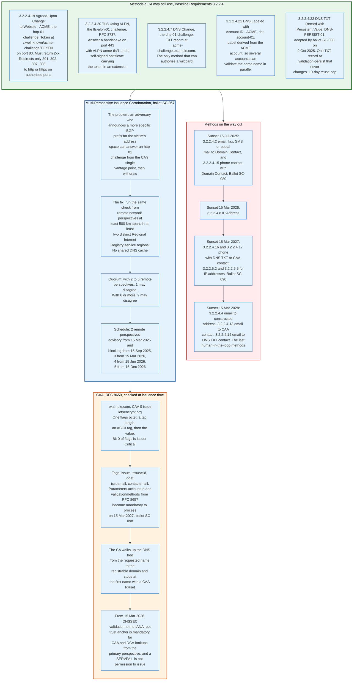

### 11.1 The Methods That Survive

The Baseline Requirements enumerate the permitted methods in section 3.2.2.4, and the list is shrinking deliberately toward automated, cryptographically checkable ones.

**`3.2.2.4.19` Agreed-Upon Change to Website - ACME.** The `http-01` challenge from RFC 8555 section 8.3. The applicant serves a token at `http://<domain>/.well-known/acme-challenge/<token>` on port 80. The CA must receive a 2xx status. Redirects are permitted only via HTTP 301, 302, 307, or 308, only to `http` or `https` URLs, and only to authorised ports. The token may not be older than 30 days.

**`3.2.2.4.20` TLS Using ALPN.** The `tls-alpn-01` challenge from RFC 8737. The applicant answers a TLS connection on port 443 negotiating ALPN protocol `acme-tls/1` and presents a self-signed certificate containing the token in a dedicated extension. It never touches HTTP.

**`3.2.2.4.7` DNS Change.** The `dns-01` challenge. A TXT record at `_acme-challenge.<domain>`. This is the only method that can authorise a wildcard certificate, because a wildcard covers names that cannot each be individually proven.

**`3.2.2.4.21` DNS Labeled with Account ID - ACME.** The `dns-account-01` challenge, where the DNS label is derived from the ACME account identifier. This lets several accounts validate the same name in parallel without stepping on each other's records, which matters for large hosting platforms.

**`3.2.2.4.22` DNS TXT Record with Persistent Value.** Added by ballot SC-088 on 9 October 2025. A TXT record at `_validation-persist.<Authorization Domain Name>` whose RDATA follows the CAA `issue-value` syntax from RFC 8659, names an Issuer Domain Name the CA has disclosed, and carries a mandatory `accounturi` parameter identifying the requesting ACME account plus an optional `persistUntil` UNIX timestamp. An example from the Baseline Requirements text:

```
_validation-persist.example.com IN TXT "authority.example; accounturi=https://authority.example/acct/123; persistUntil=1782424856"
```

The point is that the record never changes. An operator sets it once and can then automate renewal without giving the ACME client write access to DNS or to the web server. Validation data from this method is capped at a 10-day reuse period regardless of the general schedule.

### 11.2 The Methods Being Removed

Every validation method that relies on a human reading a message is being sunset, on a published timetable.

| Effective | Methods removed | Ballot |
|---|---|---|
| 15 Jul 2025 | 3.2.2.4.2 email, fax, SMS, or postal mail to Domain Contact; 3.2.2.4.15 phone contact with Domain Contact | SC-080 |
| 15 Mar 2026 | 3.2.2.4.8 IP Address | Baseline Requirements section 1.2.2 |
| 15 Mar 2027 | 3.2.2.4.16 and 3.2.2.4.17 phone contact with DNS TXT or CAA phone contact; 3.2.2.5.2 and 3.2.2.5.5 for IP addresses; 3.2.2.5.3 reverse address lookup | SC-090, SC-091 |
| 15 Mar 2028 | 3.2.2.4.4 email to constructed address; 3.2.2.4.13 email to DNS CAA contact; 3.2.2.4.14 email to DNS TXT contact | SC-090 |

The Chrome Root Program's stated reasoning is that these methods "only demonstrate that an applicant can interact with a contact associated with the domain, rather than proving direct administrative control over the domain's infrastructure", and that they inherit the vulnerabilities of their channels: BGP hijacking, SIM swapping, and opportunistic TLS downgrade on mail transport.

The SSL.com incident of April 2025 is the exact failure mode. A researcher put `myusername@aliyun.com` in a `_validation-contactemail` TXT record for a test domain, completed the `3.2.2.4.14` email challenge from that mailbox, and SSL.com added `aliyun.com` itself, the domain part of the approver's address, to the account's list of verified domains. The researcher then obtained valid certificates for `aliyun.com` and `www.aliyun.com`. SSL.com disabled the method within hours, found ten further affected certificates, and revoked all eleven. The method is scheduled for removal in March 2028 anyway.

### 11.3 Multi-Perspective Issuance Corroboration

A CA validating a domain from one network location can be fooled by anyone who can hijack a route to that domain, so the Baseline Requirements now require agreement from several places at once.

The attack is concrete. An adversary announces a more specific BGP prefix covering the victim's IP space, answers an `http-01` challenge from the CA's single vantage point, obtains a certificate, and withdraws the announcement. Total exposure: a few minutes. The certificate is valid for months.

Ballot SC-067 passed on 2 August 2024 and phases in the countermeasure. Remote network perspectives must be at least 500 kilometres apart in a straight line, measured at the point where their DNS resolvers hand queries to the network. Results must not be reused or cached between perspectives, specifically so an adversary cannot poison one shared DNS cache and have it count twice. The quorum rules allow 1 non-corroboration with 2 to 5 remote perspectives, and 2 with 6 or more.

The schedule:

| Effective | Remote perspectives required | Enforcement |
|---|---|---|
| 15 Mar 2025 | 2 | Advisory. The CA may issue despite failing quorum |
| 15 Sep 2025 | 2 | Blocking. Quorum failure means no issuance |
| 15 Mar 2026 | 3 | Blocking, plus at least 2 distinct Regional Internet Registry service regions |
| 15 Jun 2026 | 4 | Blocking, 2 RIR regions |
| 15 Dec 2026 | 5 | Blocking, 2 RIR regions |

Forcing agreement from five perspectives on at least two continents means an adversary must hijack globally, which is loud, short-lived, and visible in every route collector on the internet.

### 11.4 CAA

CAA lets a domain owner name the certificate authorities allowed to issue for it, and it binds only CAs that follow the rules.

The record format from RFC 8659 is one flags octet, a tag length octet, an ASCII tag, and a value. Bit 0 of the flags is the Issuer Critical flag: a CA must not issue if the relevant RRset contains a critical property with a tag it does not understand. In presentation form:

```
example.com.  CAA 0 issue "letsencrypt.org"
example.com.  CAA 0 issuewild ";"
example.com.  CAA 0 iodef "mailto:security@example.com"
```

The CA walks up the DNS tree from the requested name to the registrable domain and uses the first name with a CAA RRset. CAA checking has been mandatory since ballot 187 took effect on 8 September 2017.

Two changes are landing now. From 15 March 2026, DNSSEC validation back to the IANA root trust anchor is mandatory for all DNS queries used in CAA lookups and domain validation from the primary perspective, CAs may not use local policy to disable it, and a DNSSEC validation error such as SERVFAIL must not be treated as permission to issue. From 15 March 2027, under ballot SC-098, CAs must process the RFC 8657 `accounturi` and `validationmethods` parameters, which let a domain owner restrict issuance not just to a CA but to a specific ACME account and a specific challenge type.

CAA is advisory in exactly one sense: it binds only compliant CAs. Ignoring it is a Baseline Requirements violation, which becomes an incident report, which is how CAs lose their place in a trust store. The enforcement chain runs through the root programs, not through cryptography.

---

## 12. ACME and Let's Encrypt

ACME turned a certificate from a purchase into an idempotent API call, and that change did more for web encryption than any protocol improvement in the same period.

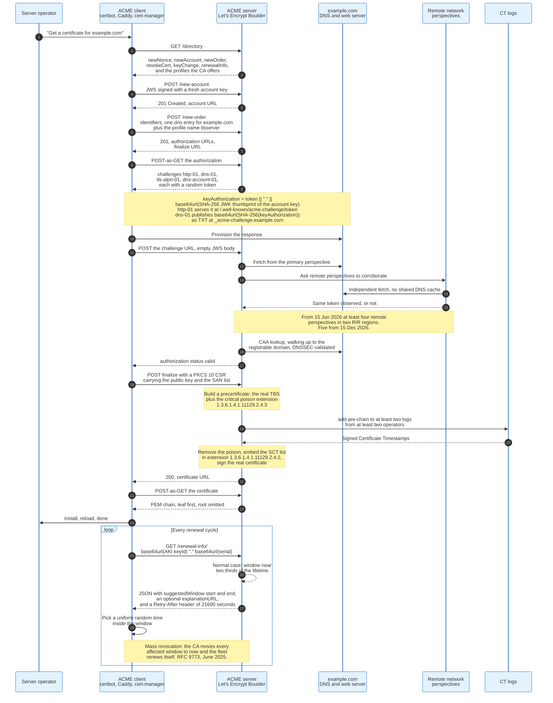

### 12.1 The Protocol

ACME, RFC 8555, published March 2019, is JSON over HTTPS with every request signed as a JWS under the client's account key.

The resource model is small. A **directory** lists the endpoints. An **account** is created by POSTing a JWS signed with a freshly generated account key; the key is the identity, and there is no password. An **order** names the identifiers the client wants certified. Each identifier gets an **authorization**, which offers several **challenges**. Finalising an order means POSTing a PKCS 10 certificate signing request, and the server responds with a URL from which the certificate is fetched.

Two mechanics are worth stating exactly.

**Key authorization.** Every challenge in RFC 8555 uses a string built as:

```
keyAuthorization = token || '.' || base64url(Thumbprint(accountKey))
```

where `Thumbprint` is the RFC 7638 JWK thumbprint computed with SHA-256. For `http-01` the client serves that string. For `dns-01` the client publishes the base64url encoding of `SHA-256(keyAuthorization)` as a TXT record. Binding the token to the account key is what prevents an attacker who observes a token from using it with a different account.

**POST-as-GET.** ACME has no unauthenticated read of protected resources. A client "gets" an authorization or a certificate by POSTing a JWS with an empty payload. This exists so that a passive observer cannot enumerate a CA's issuance by guessing URLs.

### 12.2 ACME Renewal Information

ARI, RFC 9773, published June 2025, turns mass revocation from an email campaign into a scheduled event.

The client constructs a certificate identifier by concatenating the base64url encoding of the `keyIdentifier` from the certificate's Authority Key Identifier extension, a period, and the base64url encoding of the DER-encoded serial number without its tag and length bytes, with trailing `=` padding stripped from both halves. It then GETs that path under the server's `renewalInfo` URL. The response is a JSON object with a `suggestedWindow` containing `start` and `end` timestamps and an optional `explanationURL`, plus a `Retry-After` header.

The recommended client algorithm in RFC 9773 section 4.2 is six steps: fetch the window; pick a uniformly random time inside it; renew immediately if that time is already past; otherwise schedule renewal for exactly that time if the client can; otherwise renew immediately if the time falls before the client's next normal wake-up; otherwise sleep until `Retry-After` and return to the first step. The third step is the one that matters during an incident, because it is what makes a window the CA has moved to the present fire at once.

Two things fall out. In normal operation the CA spreads renewal load across the window, eliminating the thundering herd that hard-coded thresholds create. In an incident the CA moves every affected certificate's window to now, and the fleet re-issues itself without a human reading an email.

The motivating incident was Let's Encrypt's March 2020 mass revocation of roughly three million certificates caused by a CAA rechecking bug, when the only channel available for "renew this immediately" was email to whatever address happened to be on file. Ballot SC-089, adopted 23 July 2025 and effective 25 August 2025, completes the picture by requiring every publicly trusted TLS CA to document, maintain, and annually test a mass revocation plan in section 5.7.1 of its CPS.

Shopify published a production account in March 2026: its certificate system for millions of merchant custom domains previously renewed at a static 30 days before expiry with a random 0 to 72 hour jitter, and replaced that with ARI polling, which it describes as removing the need for local randomisation and for hard-coded expiry thresholds entirely.

### 12.3 Let's Encrypt, in Numbers

Let's Encrypt is the largest certificate authority in history by issuance volume, and it is a nonprofit with a small engineering team.

| Metric | Value | As of |
|---|---|---|
| Certificates issued in one day | 7,877,712 | 29 Aug 2026 |
| Active certificates | 673,868,725 | 29 Aug 2026 |
| Active fully qualified domain names | 690,467,368 | 29 Aug 2026 |
| Active registered domains | 222,128,233 | 29 Aug 2026 |
| Active certificates one year earlier | 622,528,311 | 29 Aug 2025 |
| Active certificates five years earlier | 136,635,753 | 29 Aug 2020 |
| Active certificates ten years earlier | 5,527,300 | 29 Aug 2016 |
| Websites served, reported by ISRG | 492 million to 762 million during 2025 | Dec 2025 |
| Total certificates issued since 2015 | Over seven billion | Dec 2025 |

The growth arithmetic is instructive. Active certificates grew 8.2% year on year to August 2026 and 393% over five years. ISRG's own reading is that recent growth tracks the growth of the web itself rather than continued displacement of paid certificates, because the displacement already happened.

### 12.4 The Lifetime Reduction, and What It Forces

Let's Encrypt is cutting its own certificate lifetime in half ahead of the industry requirement, and publishing the dates years in advance so clients can adapt.

| Date | Change |
|---|---|
| 13 May 2026 | The opt-in `tlsserver` ACME profile switches to 45-day certificates |
| 10 Feb 2027 | The default `classic` profile switches to 64-day certificates with a 10-day authorization reuse period |
| 16 Feb 2028 | The `classic` profile switches to 45-day certificates with a **7-hour** authorization reuse period |

A 7-hour authorization reuse period is the number that changes how people build systems. It means domain control is proven, in effect, on every issuance. Manual renewal is not slow at that cadence; it is impossible.

Two products already exist for operators who want to go further. The `shortlived` profile issues certificates valid for 160 hours, just over six days, generally available since 15 January 2026. And Let's Encrypt issues certificates for IP addresses, first issued on 1 July 2025 and generally available in January 2026, for both IPv4 and IPv6. IP address certificates must use the short-lived profile, because an IP address is a more transient assignment than a domain name and warrants more frequent revalidation.

DNS-PERSIST-01 is the mechanism intended to make that cadence bearable. Since the validation TXT record never changes, an operator can provision it once, by hand if necessary, and then automate renewal indefinitely without granting the ACME client credentials to DNS or to the web server.

---

## 13. Revocation, and Why It Is Broken

Revocation in the Web PKI has never worked as designed, and the industry's answer is not to fix it but to make certificates expire faster than a revocation could propagate.

```mermaid
%%{init: {'theme': 'base', 'themeVariables': {'primaryColor': '#e3f2fd', 'primaryBorderColor': '#1565c0', 'lineColor': '#37474f'}}}%%

flowchart TB
    subgraph CRL["1. CRL, RFC 5280 section 5"]
        direction TB
        R1["A signed list of revoked serial<br/>numbers with thisUpdate,<br/>nextUpdate, a monotonically<br/>increasing cRLNumber, and a<br/>reasonCode per entry"]
        R2["Republish at least every 4 days,<br/>or 7 if the certificates carry an<br/>OCSP AIA, and within 24 hours of<br/>recording a revocation.<br/>CA CRLs: every 12 months"]
        R3["Sharded, because a full list for<br/>a large CA is unusable. A live<br/>Let's Encrypt shard read on<br/>30 Aug 2026: 58,275 bytes,<br/>1,491 serials, one of at least<br/>58 shards for one intermediate"]
        R4["Mandatory for public TLS CAs<br/>since 15 Mar 2024, ballot SC-063"]
        R1 --> R2 --> R3 --> R4
    end

    subgraph OCSP["2. OCSP, RFC 6960"]
        direction TB
        O1["The client sends a CertID:<br/>hashAlgorithm, issuerNameHash,<br/>issuerKeyHash, serialNumber.<br/>The responder signs<br/>good, revoked or unknown"]
        O2["Privacy failure: the responder<br/>and every observer learn which<br/>site the user is visiting, by IP,<br/>at the moment of the visit"]
        O3["Soft-fail failure: hard-fail breaks<br/>the web during any responder<br/>outage, so every browser soft-fails,<br/>so an attacker with a stolen key<br/>just drops the OCSP traffic"]
        O4["Cost failure: Let's Encrypt was<br/>serving over 4 billion OCSP<br/>requests a day at the start of<br/>2025. 180 million an hour.<br/>50,000 a second"]
        O5["Optional since 15 Mar 2024.<br/>Let's Encrypt stopped issuing<br/>Must-Staple on 7 May 2025,<br/>dropped the OCSP AIA the same<br/>day, and shut the responders<br/>down on 6 Aug 2025"]
        O1 --> O2 --> O3 --> O4 --> O5
    end

    subgraph Staple["3. Stapling and Must-Staple"]
        direction TB
        S1["OCSP stapling: the server fetches<br/>its own signed status and attaches<br/>it to the handshake through the<br/>status_request extension, RFC 6066.<br/>Fixes privacy and latency"]
        S2["Does not fix the attacker, because<br/>omitting the staple is legal and<br/>a client that hard-failed on a<br/>missing staple would break the web"]
        S3["Must-Staple, RFC 7633:<br/>id-pe-tlsfeature 1.3.6.1.5.5.7.1.24,<br/>value SEQUENCE OF INTEGER<br/>containing 5, the status_request<br/>extension number. Omission<br/>becomes fatal"]
        S4["Almost nobody deployed it,<br/>because a stapling failure then<br/>takes the site down. Dead in<br/>the public Web PKI"]
        S1 --> S2 --> S3 --> S4
    end

    subgraph Push["4. Ship the answer to the client instead"]
        direction TB
        P1["Chrome CRLSets: a curated<br/>emergency blocklist built by<br/>crawling CCADB-disclosed CRLs.<br/>A subset, explicitly not complete.<br/>Chrome does not perform online<br/>OCSP or CRL checks by default"]
        P2["Firefox CRLite: a cascade of<br/>probabilistic filters covering<br/>every known revocation, built<br/>from CT plus CRLs"]
        P3["Measured on 30 Aug 2026:<br/>full filter 7,102,847 bytes plus<br/>a 1,834,919-byte compatibility<br/>filter, rebuilt roughly every<br/>six weeks. Deltas twice a day,<br/>190 to 206 kB each"]
        P1 --> P2 --> P3
    end

    subgraph Short["5. The answer the industry actually chose"]
        direction TB
        T1["Make the certificate expire faster<br/>than a revocation could propagate.<br/>200 days now, 100 from<br/>15 Mar 2027, 47 from 15 Mar 2029"]
        T2["Short-lived subscriber certificates<br/>need no CRLDP at all: 10 days or<br/>less until 15 Mar 2026, 7 days<br/>or less after. Let's Encrypt<br/>issues a 160-hour profile"]
        T3["ARI, RFC 9773, turns bulk<br/>revocation into a scheduled<br/>renewal instead of a lookup.<br/>Ballot SC-089 makes an annually<br/>tested mass revocation plan<br/>mandatory from 1 Dec 2025"]
        T1 --> T2 --> T3
    end

    CRL --> OCSP --> Staple --> Push --> Short

    style CRL fill:#eceff1,stroke:#37474f,stroke-width:2px
    style OCSP fill:#ffebee,stroke:#c62828,stroke-width:2px
    style Staple fill:#fff3e0,stroke:#e65100,stroke-width:2px
    style Push fill:#e8f5e9,stroke:#2e7d32,stroke-width:2px
    style Short fill:#e3f2fd,stroke:#1565c0,stroke-width:3px
```

### 13.1 CRLs

A Certificate Revocation List is a signed list of revoked serial numbers, and its problem has always been size.

The structure carries `thisUpdate`, `nextUpdate`, a monotonically increasing `cRLNumber`, and per-entry a serial number, a revocation date, and a `reasonCode`. Since ballot SC-061, effective 15 July 2023, new entries must carry a reason code.

The Baseline Requirements set the cadence precisely. A CA issuing subscriber certificates must publish a new CRL at least every 7 days if all its certificates carry an OCSP AIA pointer, and at least every 4 days otherwise, and within 24 hours of recording any revocation. A CA issuing CA certificates must publish at least every 12 months and within 24 hours of a revocation. CRLs must be reachable over a publicly accessible HTTP URL.

Sharding is what makes this tractable. Ballot SC-058, effective 11 December 2022, requires the `distributionPoint` field in the Issuing Distribution Point extension of sharded CRLs so a client can tell which shard it is holding. A live example, fetched on 30 August 2026 from `http://ye2.c.lencr.org/58.crl`: 58,275 bytes, 1,491 revoked serial numbers, `thisUpdate` 30 August 2026 22:18:55 UTC, `nextUpdate` 8 September 2026, `cRLNumber` 1788128335315951296, and an Issuing Distribution Point marked critical and scoped to user certificates only. The filename implies at least 58 shards for that one intermediate.

CRLs became mandatory for publicly trusted TLS CAs on 15 March 2024 under ballot SC-063. Browsers still do not download them at handshake time.

### 13.2 Why OCSP Failed

OCSP failed for three independent reasons, each sufficient on its own, and the industry retired it rather than repair it.

The protocol itself is simple. The client sends a `CertID` containing a hash algorithm, the hash of the issuer's Distinguished Name, the hash of the issuer's public key, and the serial number. The responder returns a signed `BasicOCSPResponse` containing a `ResponderID`, a `producedAt` time, and per certificate a status of `good`, `revoked`, or `unknown` with `thisUpdate` and `nextUpdate`. The Baseline Requirements require subscriber responses to have a validity interval between 8 hours and 10 days and to be available within 15 minutes of issuance.

**Privacy.** An OCSP request names one certificate serial and arrives from the user's IP address. The responder, and every network observer, learns which site the user is visiting at the moment they visit it. That is precisely the information TLS exists to conceal.

**Soft-fail.** If the responder is unreachable, the client has two options. Hard-fail makes every site behind that CA unreachable during any responder outage, and responders do go down. Soft-fail proceeds. Every browser chose soft-fail, which means an attacker holding a stolen key just drops the OCSP traffic. Adam Langley's description of soft-fail revocation checking as a seatbelt that snaps in an accident has held up for more than a decade.

**Cost.** ISRG reported that at the start of 2025 Let's Encrypt was serving over four billion OCSP requests per day: 180 million per hour, roughly 50,000 per second, globally distributed, low latency, signed. For a CA that charges nothing, that cost is unbounded in the size of the web.

The retreat, dated: ballot SC-063 passed August 2023 and took effect 15 March 2024, making OCSP optional and CRLs mandatory. Let's Encrypt stopped issuing Must-Staple certificates and removed the OCSP AIA from new certificates on 7 May 2025, and shut its responders down on 6 August 2025. Chrome removes support for SCTs delivered inside stapled OCSP responses in version 148.

### 13.3 Stapling and Must-Staple

OCSP stapling fixes privacy and latency and does not fix security, because omitting the staple is legal.

Stapling inverts the fetch. The server periodically retrieves its own signed status and attaches it to the handshake through the `status_request` extension from RFC 6066. The client never contacts the responder, so the privacy leak disappears and the blocking round trip disappears. What remains is that an attacker with a stolen key simply does not staple, and a client that hard-failed on a missing staple would break every server that does not support stapling.

RFC 7633 defines the fix. The `id-pe-tlsfeature` extension, OID 1.3.6.1.5.5.7.1.24, carries a `SEQUENCE OF INTEGER` of TLS extension numbers the server commits to supporting. Containing the value 5, `status_request`, makes it fatal for that certificate to be presented without a stapled response. This is "OCSP Must-Staple".

Almost nobody deployed it, for a reason that is obvious in hindsight. Must-Staple converts every stapling failure, every responder outage, every clock skew problem, into a hard site outage. Operators traded a theoretical security gain for a real availability risk and declined. Let's Encrypt stopped issuing Must-Staple certificates on 7 May 2025. In the public Web PKI the mechanism is dead.

### 13.4 Pushing the Answer to the Client

Both browser strategies that actually work abandon per-connection lookups and ship revocation data to the client in advance.

**Chrome CRLSets.** Chrome does not perform online OCSP or CRL checks by default. It ships a component-updated blocklist built by crawling CRLs disclosed to CCADB and discovered through Certificate Transparency, fetched at most every few hours and verified against the signing certificate. The Chromium documentation is explicit that CRLSets are "the primary means by which Chrome quickly blocks certificates in emergency situations" and that they contain "a subset of the certificates identified as revoked". Completeness is not the goal.

**Firefox CRLite.** CRLite is a cascade of probabilistic filters covering every known revocation. Build a filter over the revoked set, which produces false positives on some non-revoked certificates; build a second filter over exactly those false positives, which produces false negatives on some revoked certificates; build a third over those. The cascade terminates because each level is far smaller than the last, and a lookup walks the levels until one answers definitively. It works only because Certificate Transparency guarantees the client knows the complete universe of issued certificates.

The current sizes, read from Firefox Remote Settings on 30 August 2026: the full filter published 18 July 2026 is 7,102,847 bytes, with a 1,834,919-byte compatibility filter alongside it, and 172 delta updates published since. Recent deltas run 190,842 to 205,815 bytes for the default filter and 116,471 to 122,058 bytes for the compatibility filter, published roughly twice a day. A Firefox client therefore downloads on the order of 400 kilobytes a day and holds an answer for every revocation on the public web without ever making a network request during a handshake.

### 13.5 The Answer the Industry Actually Chose

Shorter lifetimes are the revocation mechanism, and everything else is now a backstop.

A 47-day certificate cannot be misused for longer than 47 days regardless of whether anyone revokes it. A 160-hour certificate cannot be misused for longer than six days. The Baseline Requirements make this explicit: a short-lived subscriber certificate, 10 days or less before 15 March 2026 and 7 days or less after, needs no CRL Distribution Points extension at all, and a CA may decline to support revoking it.

Let's Encrypt's own statement of the reasoning is direct: revocation is unreliable, so many relying parties stay vulnerable until the certificate expires, and short-lived certificates shrink that window.

The remaining hard case is bulk replacement after a CA-side error. That case is now handled by ARI plus a mandatory, annually tested mass revocation plan, which turns "revoke three million certificates" from a crisis into a scheduled drill.

---

## 14. Certificate Transparency

Certificate Transparency does not prevent misissuance. It makes misissuance permanently and publicly discoverable, and that turns out to be enough to change CA behaviour.

```mermaid
%%{init: {'theme': 'base', 'themeVariables': {'primaryColor': '#e3f2fd', 'primaryBorderColor': '#1565c0', 'lineColor': '#37474f'}}}%%

flowchart TB
    subgraph Why["Why it exists"]
        direction TB
        W1["Aug 2011: DigiNotar is breached.<br/>A fraudulent *.google.com<br/>certificate is used against<br/>roughly 300,000 Iranian users<br/>for almost two months"]
        W2["Detection came from Chrome's<br/>hardcoded pin on Google domains.<br/>Pinning does not scale to<br/>the whole web and was itself<br/>removed after HPKP failed"]
        W3["The insight: a CA that must<br/>publish every certificate it<br/>issues cannot issue one in<br/>secret. Detection replaces<br/>prevention"]
        W1 --> W2 --> W3
    end

    subgraph Log["The log, RFC 6962 and RFC 9162"]
        direction TB
        L1["An append-only Merkle hash tree.<br/>Leaves are certificates and<br/>precertificates in submission<br/>order. Logs are sharded by the<br/>expiry year of what they accept"]
        L2["Signed Tree Head: the log signs<br/>tree size, root hash and timestamp"]
        L3["Inclusion proof: log(n) hashes<br/>showing one leaf is in a given STH"]
        L4["Consistency proof: log(n) hashes<br/>showing an older STH is a prefix<br/>of a newer one. This is what makes<br/>a rewritten history detectable"]
        L5["Maximum Merge Delay, 24 hours<br/>by convention. Exceeding it is a<br/>compliance failure, and it is the<br/>reason the Static CT API<br/>abolishes the concept"]
        L1 --> L2 --> L3 --> L4 --> L5
    end

    subgraph Pre["The precertificate trick"]
        direction TB
        P1["Chicken and egg: the SCT must be<br/>inside the certificate, but the<br/>log needs the certificate before<br/>it can issue an SCT"]
        P2["Sign a precertificate, identical<br/>to the real one except for the<br/>CRITICAL poison extension<br/>1.3.6.1.4.1.11129.2.4.3"]
        P3["Every conforming client rejects a<br/>critical extension it does not<br/>understand, so a precertificate<br/>can never be used in a handshake"]
        P4["Log it, collect the SCTs, remove<br/>the poison, insert the SCT list,<br/>sign the real certificate.<br/>From 15 Jun 2026 Chrome requires<br/>logging before the final<br/>certificate is signed"]
        P1 --> P2 --> P3 --> P4
    end

    subgraph SCT["The SCT and how it travels"]
        direction TB
        S1["struct: sct_version, LogID<br/>(SHA-256 of the log's<br/>SubjectPublicKeyInfo), uint64<br/>timestamp in milliseconds,<br/>CtExtensions, then a signature<br/>over all of it plus the entry"]
        S2["Delivery 1: embedded in the<br/>certificate, extension<br/>1.3.6.1.4.1.11129.2.4.2.<br/>Almost all real traffic"]
        S3["Delivery 2: TLS extension 18,<br/>signed_certificate_timestamp"]
        S4["Delivery 3: inside a stapled OCSP<br/>response. Chrome drops support<br/>for this in version 148"]
        S1 --> S2
        S1 --> S3
        S1 --> S4
    end

    subgraph Policy["What clients require"]
        direction TB
        Pol1["Chrome: at least one embedded SCT<br/>from a Qualified, Usable or ReadOnly<br/>log. 2 SCTs from distinct logs for<br/>a lifetime of 180 days or less,<br/>3 above, from at least 2 distinct<br/>operators. CT enforcement disables<br/>itself if the log list is more<br/>than 70 days stale"]
        Pol2["Apple: at least 2 SCTs, at least<br/>one from an RFC 6962 log,<br/>2 embedded for 180 days or less<br/>and 3 for 181 to 398 days,<br/>with a per-operator cap"]
        Pol3["48 recognised logs across 8<br/>operators on 29 Aug 2026:<br/>Google, Cloudflare, DigiCert,<br/>Sectigo, Let's Encrypt, TrustAsia,<br/>Geomys, IPng Networks"]
    end

    subgraph Static["The Static CT API, the scaling fix"]
        direction TB
        St1["Same RFC 6962 write path,<br/>add-chain and add-pre-chain.<br/>A completely different read path:<br/>static tiles of 256 entries<br/>served from object storage"]
        St2["Kills the relational database.<br/>Let's Encrypt reported RFC 6962<br/>shards of 7 to 10 TB each and<br/>annual cloud costs approaching<br/>seven figures"]
        St3["Kills the Maximum Merge Delay.<br/>The SCT carries a leaf_index<br/>extension, a big-endian 40-bit<br/>integer, so the entry's position<br/>is known at issuance"]
        St4["Let's Encrypt made its RFC 6962<br/>logs read-only on 30 Nov 2025 and<br/>shut them down on 28 Feb 2026.<br/>22 of the 48 recognised logs<br/>are now tiled"]
        St1 --> St2 --> St3 --> St4
    end

    subgraph Scale["Scale, measured 30 Aug 2026"]
        direction TB
        Sc1["Sycamore 2026h2, one shard of<br/>one Let's Encrypt log:<br/>713,547,422 entries"]
        Sc2["Willow 2026h2: 688,055,204<br/>Tuscolo 2026h2: 557,794,253"]
        Sc3["Every publicly trusted certificate<br/>on the web appears in at least<br/>two of these, by policy"]
        Sc1 --> Sc2 --> Sc3
    end

    Why --> Log --> Pre --> SCT --> Policy --> Static --> Scale

    style Why fill:#ffebee,stroke:#c62828,stroke-width:2px
    style Log fill:#e3f2fd,stroke:#1565c0,stroke-width:2px
    style Pre fill:#fff3e0,stroke:#e65100,stroke-width:3px
    style SCT fill:#e8f5e9,stroke:#2e7d32,stroke-width:2px
    style Policy fill:#f3e5f5,stroke:#4a148c,stroke-width:2px
    style Static fill:#e0f7fa,stroke:#00695c,stroke-width:2px
    style Scale fill:#eceff1,stroke:#37474f,stroke-width:2px
```

### 14.1 The Log

A CT log is an append-only Merkle hash tree whose leaves are certificates and precertificates in submission order, and whose root the log signs.

Four objects define the guarantees. A **Signed Tree Head** is the log's signature over a tree size, a root hash, and a timestamp. An **inclusion proof** is the O(log n) sibling hashes that show a given leaf is in a given tree head. A **consistency proof** is the O(log n) hashes showing that an older tree head is a prefix of a newer one, which is what makes a rewritten history detectable. And the **Maximum Merge Delay**, conventionally 24 hours, is the window inside which a log promises to incorporate a submitted entry.

Logs are sharded by the expiry period of the certificates they accept, typically a half-year, so an operator can retire a whole shard once its contents have all expired.

### 14.2 The Precertificate Trick

The SCT must be inside the certificate, and the log needs the certificate before it can issue the SCT. The resolution is a certificate deliberately built to be unusable.

The CA signs a **precertificate**: byte-identical to the intended final certificate except that it carries the CT poison extension, OID 1.3.6.1.4.1.11129.2.4.3, marked critical with a NULL value. RFC 5280 requires every conforming client to reject a certificate containing a critical extension it does not recognise, so no client will ever accept a precertificate in a handshake. The CA submits it to logs, collects Signed Certificate Timestamps, removes the poison, inserts the SCT list extension, and signs the real certificate.

The log stores a `PreCert` structure containing `issuer_key_hash`, the SHA-256 of the issuing CA's `SubjectPublicKeyInfo`, and the `TBSCertificate` with the signature and the poison extension stripped. That is exactly what can be reconstructed from the final certificate by removing the SCT list, which is how a monitor matches a logged precertificate to the certificate a server actually serves.

Chrome tightens this from 15 June 2026: all TLS server authentication precertificates must be logged to at least one recognised Usable or Qualified log **before** the corresponding final certificate is issued.

### 14.3 The SCT

A Signed Certificate Timestamp is a log's signed promise to include an entry, and it is small enough to travel inside the certificate.

```
struct {
    Version sct_version;
    LogID id;                  // SHA-256 of the log's SubjectPublicKeyInfo
    uint64 timestamp;          // milliseconds since the epoch
    CtExtensions extensions;
    digitally-signed struct {
        Version sct_version;
        SignatureType signature_type = certificate_timestamp;
        uint64 timestamp;
        LogEntryType entry_type;
        select(entry_type) {
            case x509_entry:   ASN.1Cert;
            case precert_entry: PreCert;
        } signed_entry;
        CtExtensions extensions;
    };
} SignedCertificateTimestamp;
```

Three delivery paths exist. Embedded in the certificate through extension 1.3.6.1.4.1.11129.2.4.2, which is what essentially all real traffic uses. Through TLS extension 18, `signed_certificate_timestamp`, which requires server support that most servers lack. And inside a stapled OCSP response, which Chrome drops in version 148.

### 14.4 What Clients Require

Chrome and Apple each publish a CT policy, and they differ enough that a CA must satisfy both.

**Chrome.** At least one embedded SCT from a log that is Qualified, Usable, or ReadOnly at the time of the check. Embedded SCTs from at least N distinct logs that were Qualified, Usable, ReadOnly, or Retired at check time, where N is 2 for a certificate lifetime of 180 days or less and 3 above. Among those, at least two from distinct log operators. For SCTs delivered over TLS, at least two from currently valid logs and at least two distinct operators. Chrome publishes a fresh log list daily and disables CT enforcement entirely if the freshest list it holds is more than 70 days old, which is a deliberate safety valve so that new logs can reliably become Usable.

**Apple.** At least two SCTs, at least one of which comes from a log implementing RFC 6962. Either two SCTs from currently approved logs with at least one delivered by TLS extension or OCSP stapling, or at least one embedded SCT from a currently approved log plus enough embedded SCTs by lifetime: 2 from distinct logs for 180 days or less with at most 1 per operator counting, and 3 for 181 to 398 days with at most 2 per operator counting.

The log ecosystem on 29 August 2026, from Chrome's log list version 89.34: 48 recognised logs across 8 operators. Google runs 10, Sectigo 8, DigiCert 6, IPng Networks 7, Let's Encrypt 7, TrustAsia 4, Geomys 4, and Cloudflare 2. Twenty-two of the 48 implement the tiled Static CT API.

### 14.5 The Static CT API

The original CT design does not scale, and the fix replaces the read path with static files in object storage.

Let's Encrypt stated the problem precisely when announcing the end of life of its RFC 6962 logs. Log data lived in a relational database, sharded first by year and then by half-year; each shard reached 7 to 10 terabytes; a test log had already failed against a 16 TiB MySQL limit; annual cloud costs for the logs were approaching seven figures; and clients trying to download a whole log overloaded the database, so rate limits were imposed, so downloading a whole log became impractical, which defeats the purpose of a transparency log.

The Static CT API, proposed by Filippo Valsorda in 2023 and originally called the Sunlight API, keeps the RFC 6962 write path unchanged. `add-chain`, `add-pre-chain`, and `get-roots` work exactly as before and produce RFC 6962 signatures, so no submitter and no TLS client needs to change. The read path becomes static tiles of 256 elements each, served from a bucket.

It also eliminates the Maximum Merge Delay. A Static API log must include a `leaf_index` extension in the SCT: extension type 0, five bytes of big-endian unsigned integer giving the entry's zero-based position in the log. The position is known at issuance, so there is no promise to break. The live `letsencrypt.org` certificate carries exactly this, an SCT extension of `00 00 05 00 26 D8 5D 88`, which decodes as leaf index 651,713,928.

Let's Encrypt made its RFC 6962 logs read-only on 30 November 2025 and shut them down entirely on 28 February 2026.

### 14.6 Scale, and Monitors

The logs now hold hundreds of millions of entries per six-month shard, and the whole point is that anybody can read them.

Tree sizes read directly from log checkpoints on 30 August 2026: Let's Encrypt Sycamore 2026h2 holds 713,547,422 entries, Willow 2026h2 holds 688,055,204, and Geomys Tuscolo 2026h2 holds 557,794,253. Each of those is one shard of one log, covering certificates that expire in the second half of 2026.

Monitors are the consumer side. crt.sh, SSLMate Cert Spotter, and Censys ingest the logs and let a domain owner ask a question no other mechanism in the PKI answers: has anyone, anywhere, issued a certificate for my name. That question is the entire value proposition. Certificate Transparency did not stop DigiNotar. It would have made DigiNotar visible on day one instead of day fifty.

---

## 15. Name Constraints and Technically Constrained Sub-CAs

Name constraints are the only mechanism in X.509 that directly limits which names a CA may certify, and they are the least deployed mechanism in the format.

```mermaid
%%{init: {'theme': 'base', 'themeVariables': {'primaryColor': '#e3f2fd', 'primaryBorderColor': '#1565c0', 'lineColor': '#37474f'}}}%%

flowchart TB
    subgraph Def["What the extension is, RFC 5280 section 4.2.1.10"]
        direction TB
        D1["nameConstraints, OID 2.5.29.30.<br/>Legal only in a CA certificate.<br/>Conforming CAs MUST mark it<br/>critical. The Baseline Requirements<br/>relax that to SHOULD, because<br/>some legacy stacks reject it"]
        D2["permittedSubtrees and<br/>excludedSubtrees, each a<br/>SEQUENCE OF GeneralSubtree.<br/>minimum MUST be 0 and<br/>maximum MUST be absent"]
        D3["A constraint applies only when<br/>a name of that type is present.<br/>If no name of the type appears,<br/>the certificate is acceptable.<br/>This is the trap: constrain dNSName<br/>and forget iPAddress and the<br/>sub-CA can issue for any IP"]
        D4["Excluded beats permitted.<br/>Any name matching excludedSubtrees<br/>is invalid regardless of<br/>permittedSubtrees"]
        D1 --> D2 --> D3 --> D4
    end

    subgraph Rules["How the Baseline Requirements close the trap"]
        direction TB
        B1["A Technically Constrained TLS<br/>Subordinate CA MUST have<br/>permittedSubtrees containing at<br/>least one dNSName, one iPAddress<br/>and one directoryName GeneralSubtree,<br/>unless that whole name type is<br/>excluded instead"]
        B2["To exclude all IPv4, put an<br/>iPAddress of 8 zero octets in<br/>excludedSubtrees, which is<br/>0.0.0.0/0. For IPv6, 32 zero<br/>octets, which is ::/0"]
        B3["To exclude all DNS names, put a<br/>zero-length dNSName in<br/>excludedSubtrees"]
        B4["Every dNSName in permittedSubtrees<br/>must itself be validated: the CA<br/>confirms the applicant registered<br/>the domain or is authorised by<br/>the registrant"]
        B1 --> B2 --> B3 --> B4
    end

    subgraph Effect["What it buys"]
        direction TB
        E1["A technically constrained sub-CA<br/>does not have to be disclosed in<br/>CCADB or separately audited,<br/>because it cannot harm anyone<br/>outside its own namespace"]
        E2["An enterprise can be handed a<br/>publicly trusted issuing CA<br/>limited to its own domains,<br/>rather than a private root<br/>every device must install"]
        E3["A government can be included as<br/>a trust anchor for its own<br/>country-code namespace without<br/>being able to issue for<br/>anyone else's"]
        E1 --> E2 --> E3
    end

    subgraph Reality["Why it is used far less than it should be"]
        direction TB
        Y1["Client support is uneven.<br/>RFC 5280 requires processing<br/>only for directoryName, and<br/>merely recommends it for<br/>dNSName, rfc822Name, iPAddress<br/>and uniformResourceIdentifier"]
        Y2["URI name constraints in particular<br/>are so poorly supported that the<br/>SPIFFE X.509-SVID specification<br/>declines to require them,<br/>despite wanting them"]
        Y3["A critical extension that an old<br/>client cannot parse turns into a<br/>hard failure, so CAs mark it<br/>non-critical, so a client that<br/>ignores it silently accepts<br/>an unconstrained certificate"]
        Y4["The result: the mechanism that<br/>would most directly shrink the<br/>blast radius of a CA compromise<br/>is the one the ecosystem<br/>deploys least"]
        Y1 --> Y2 --> Y3 --> Y4
    end

    Def --> Rules --> Effect --> Reality

    style Def fill:#e3f2fd,stroke:#1565c0,stroke-width:2px
    style Rules fill:#fff3e0,stroke:#e65100,stroke-width:3px
    style Effect fill:#e8f5e9,stroke:#2e7d32,stroke-width:2px
    style Reality fill:#ffebee,stroke:#c62828,stroke-width:2px
```

### 15.1 The Extension

`nameConstraints`, OID 2.5.29.30, appears only in a CA certificate and bounds every subject name and `subjectAltName` entry in every certificate beneath it.

The structure is two optional sets, `permittedSubtrees` and `excludedSubtrees`, each a `SEQUENCE OF GeneralSubtree`. Within this profile `minimum` must be 0 and `maximum` must be absent. RFC 5280 requires conforming CAs to mark the extension critical; the Baseline Requirements relax that to SHOULD, permitting non-critical for compatibility with legacy applications that cannot parse it.

Three matching rules define the semantics.

**Excluded beats permitted.** Any name matching a restriction in `excludedSubtrees` is invalid regardless of what `permittedSubtrees` says.

**Constraints apply only to name types that are present.** If no name of a constrained type appears in a certificate, that certificate is acceptable with respect to that constraint. This is the trap: constrain `dNSName` and omit `iPAddress`, and a subordinate CA can still issue for any IP address on the internet.

**Name constraints do not apply to self-issued certificates** unless the self-issued certificate is the last in the path, which exists so a CA can perform key rollover without tripping its own constraints.

For DNS names, a constraint of `example.com` matches `example.com` and every subdomain. For URIs and email addresses the constraint applies to the host part, and a leading period means "one or more labels may be prepended": `.example.com` matches `host.example.com` and `my.host.example.com` but not `example.com` itself.

### 15.2 How the Baseline Requirements Close the Trap

A Technically Constrained TLS Subordinate CA has a precise definition, and it exists so that such a CA can be exempted from public disclosure and separate audit.

Baseline Requirements section 7.1.2.5.2 requires that `permittedSubtrees` contain at least one `GeneralSubtree` for **both** `dNSName` and `iPAddress`, unless that entire name type is excluded instead, plus at least one `directoryName` subtree. The exclusion encodings are specific:

- To exclude all DNS names: a zero-length `dNSName` in `excludedSubtrees`.
- To exclude all IPv4: an `iPAddress` of 8 zero octets, which encodes `0.0.0.0/0`.
- To exclude all IPv6: an `iPAddress` of 32 zero octets, which encodes `::/0`.

Every `dNSName` in `permittedSubtrees` must itself be validated. The CA must confirm that the applicant registered the domain or is authorised by the registrant to act on its behalf, using the same section 3.2.2.4 methods used for a subscriber certificate. Every `iPAddress` range must be confirmed as assigned to the applicant.

The payoff is that a technically constrained sub-CA does not need to be disclosed in CCADB or separately audited, because by construction it cannot harm anyone outside its own namespace.

### 15.3 What It Buys, and Why It Is Rare

Name constraints are the most direct answer to the "any CA can issue for any name" problem, and the ecosystem barely uses them.

The uses are obvious once stated. An enterprise can hold a publicly trusted issuing CA restricted to its own domains, rather than distributing a private root to every device. A national or regional authority can be trusted for its own namespace without gaining the power to issue for anyone else's. A hosting provider can be delegated issuance for its customers' names without becoming a universal CA.

Three things block it.

**Uneven client support.** RFC 5280 requires applications to process name constraints on the `directoryName` form and merely says they SHOULD process them on `rfc822Name`, `uniformResourceIdentifier`, `dNSName`, and `iPAddress`. A specification that says SHOULD produces implementations that do not.

**The criticality dilemma.** A critical extension that an old client cannot parse causes a hard rejection, which is an outage. So CAs mark it non-critical, so a client that does not implement it silently ignores the constraint, which means the constraint provides no security against exactly the clients most likely to be attacked.

**Ecosystem inertia in adjacent standards.** The SPIFFE X.509-SVID specification wants URI name constraints, says so explicitly, and then declines to require them because support "in the wild" is so poor that requiring them would break path validation.

The result is a mechanism that would most directly shrink the blast radius of a CA compromise, standardised since 2008, deployed least of anything in this document.

---

## 16. CA Compromise and Distrust Events

Certificate authorities are removed from trust stores for three reasons: they were broken into, they were incompetent and hid it, or they accumulated enough small failures that the root programs stopped believing their commitments. Only the first is rare.

```mermaid
%%{init: {'theme': 'base', 'themeVariables': {'primaryColor': '#e3f2fd', 'primaryBorderColor': '#1565c0', 'lineColor': '#37474f'}}}%%

flowchart TB
    subgraph Dig["DigiNotar, 2011: compromise"]
        direction TB
        DG1["10 Jul 2011: an intruder issues a<br/>wildcard certificate for Google<br/>from DigiNotar's systems"]
        DG2["19 Jul 2011: DigiNotar detects the<br/>intrusion. It tells nobody"]
        DG3["28 Aug 2011: Iranian users report<br/>certificate errors. Chrome's<br/>hardcoded pin on Google domains<br/>catches it. The certificate<br/>is posted publicly"]
        DG4["Fox-IT finds roughly 300,000 OCSP<br/>requests from Iranian addresses<br/>for the rogue certificate.<br/>At least 531 fraudulent<br/>certificates in total"]
        DG5["29 Aug to 13 Oct 2011: every<br/>browser and OS removes the roots.<br/>Apple patches iOS only on<br/>13 Oct with iOS 5"]
        DG6["20 Sep 2011: DigiNotar files for<br/>bankruptcy. The Dutch government<br/>had taken over operations on<br/>3 Sep. Failure to disclose<br/>killed the company, not<br/>the breach itself"]
        DG1 --> DG2 --> DG3 --> DG4 --> DG5 --> DG6
    end

    subgraph Wo["WoSign and StartCom, 2015-2017: incompetence plus concealment"]
        direction TB
        W1["Jan to Apr 2015, the any-port bug:<br/>WoSign let an applicant nominate<br/>any port for HTTP validation.<br/>A researcher opened a port above<br/>50,000 on a university host and<br/>got a certificate. 72 certificates<br/>issued this way"]
        W2["Jun 2015, the subdomain bugs:<br/>control of any subdomain yielded<br/>the base domain, and arbitrary<br/>unvalidated names could be added<br/>after validation. A researcher<br/>used schrauger.github.io to obtain<br/>certificates for github.com,<br/>github.io and www.github.io.<br/>33 certificates"]
        W3["Jan 2016, backdating: 3 SHA-1<br/>certificates carry a Dec 2015<br/>notBefore and embedded SCTs<br/>dated Jan 2016. The SCTs prove<br/>the real signing date. 62 more<br/>share a notBefore of Sunday<br/>20 Dec 2015, a non-working day<br/>in China. Backdating evaded<br/>browser SHA-1 blocks"]
        W4["Nov 2015: WoSign buys StartCom<br/>and denies it for a year.<br/>Concealment, not the bugs,<br/>is what the root programs cite"]
        W5["Oct 2016 onward: Mozilla, Apple,<br/>Google and Microsoft distrust<br/>both CAs by notBefore date.<br/>Neither returns"]
        W1 --> W2 --> W3 --> W4 --> W5
    end

    subgraph Sym["Symantec, 2015-2018: scale plus delegation"]
        direction TB
        S1["2009 to 2015: test certificates<br/>issued for domains Symantec did not<br/>control, including google.com,<br/>without validation. Three employees<br/>dismissed"]
        S2["Jan 2017: CrossCert, a Korean<br/>registration authority with<br/>independent issuance rights under<br/>Symantec intermediates, is found<br/>to have misissued. 127 confirmed<br/>cases. Symantec revalidates<br/>10,000-plus CrossCert certificates<br/>and 20,000-plus from other RAs"]
        S3["The finding that mattered: the only<br/>control checking whether the RAs<br/>followed the rules was the annual<br/>WebTrust audit, and the audits<br/>had missed it"]
        S4["Sep 2017: graduated distrust plan.<br/>Chrome 66 in Apr 2018 drops<br/>certificates issued before<br/>1 Jun 2016. Chrome 70 in Oct 2018<br/>drops the rest"]
        S5["Oct 2017: rather than rebuild,<br/>Symantec sells the CA business<br/>to DigiCert. The largest CA on<br/>the web at the time changes<br/>owner to survive"]
        S1 --> S2 --> S3 --> S4 --> S5
    end

    subgraph Modern["The modern instrument: SCT-based distrust"]
        direction TB
        M1["Jun 2024: Chrome announces distrust<br/>of nine Entrust and AffirmTrust roots<br/>for certificates whose earliest SCT<br/>is after 11 Nov 2024. Cited reason:<br/>six years of compliance failures and<br/>unmet improvement commitments"]
        M2["2025: Chrome applies the same<br/>instrument to Chunghwa Telecom<br/>and NETLOCK for certificates<br/>with SCTs after 31 Jul 2025"]
        M3["Why it works: the constraint is<br/>keyed on the SCT timestamp, which<br/>Certificate Transparency makes<br/>a verifiable fact rather than a<br/>self-asserted field. Existing<br/>certificates keep working.<br/>The CA has no future"]
        M4["Apr 2025: an SSL.com DCV bug lets a<br/>researcher obtain a certificate for<br/>aliyun.com by putting a personal<br/>address in a validation TXT record.<br/>11 certificates misissued, all<br/>revoked, the method disabled<br/>within hours"]
        M1 --> M2 --> M3 --> M4
    end

    Dig --> Wo --> Sym --> Modern

    style Dig fill:#ffebee,stroke:#c62828,stroke-width:3px
    style Wo fill:#fff3e0,stroke:#e65100,stroke-width:2px
    style Sym fill:#f3e5f5,stroke:#4a148c,stroke-width:2px
    style Modern fill:#e8f5e9,stroke:#2e7d32,stroke-width:3px
```

### 16.1 DigiNotar, 2011: Compromise Plus Concealment

DigiNotar was destroyed by not telling anyone, not by being breached.

The sequence. On 10 July 2011 an intruder with access to DigiNotar's systems issues a wildcard certificate for Google. On 19 July 2011 DigiNotar detects an intrusion into its certificate authority infrastructure. It does not disclose. On 28 August 2011 users on multiple Iranian internet service providers see certificate errors, the fraudulent certificate is posted publicly, and Chrome's hardcoded pin on Google domains is what surfaces it.

The scale. Fox-IT's investigation for the Dutch government found roughly 300,000 OCSP requests from Iranian IP addresses for the rogue certificate, which it used as a proxy for the number of intercepted users. Google blacklisted 247 certificates in Chromium initially; the final known total of misissued certificates is at least 531. DigiNotar could not produce a complete list of what had been issued.

The response. Root removal by every browser and operating system on or around 29 August 2011. Apple did not patch iOS until 13 October 2011, with iOS 5. The Dutch government took over operational management on 3 September. DigiNotar filed for bankruptcy on 20 September 2011.

Two secondary effects mattered as much as the primary one. DigiNotar also operated intermediates under the Dutch government's PKIoverheid programme, chaining to the "Staat der Nederlanden" roots, so removing DigiNotar broke the Dutch tax authority and the national identity platform DigiD. And ENISA's post-mortem noted that browsers at the time trusted roughly 600 CAs, that each was a single point of failure, and that a CA the size of Comodo, which held roughly a quarter of the SSL market and had suffered a similar attack in March 2011, would have been effectively too large to remove.

### 16.2 WoSign and StartCom, 2015 to 2017: Incompetence Plus Concealment

WoSign was distrusted for a pattern of validation bugs, and what made the pattern fatal was the concealment around it.

**The any-port bug, January to April 2015.** WoSign's free certificate system let the applicant choose any port for HTTP-based domain validation. A researcher opened a port above 50,000 on a university host and obtained a certificate for the university. Ports above 1024 are unprivileged, so this proved control of a process, not of the host. WoSign eventually identified 72 certificates issued this way, and then conceded it had not recorded which port was used for validation, so the list could not be guaranteed complete.

**The subdomain bugs, June 2015.** Two distinct flaws. Proving control of `<subdomain>.example.tld` also granted a certificate for `example.tld`. And arbitrary domains could be added to a request after validation had completed. A researcher who controlled `schrauger.github.io` obtained certificates for `github.com`, `github.io`, and `www.github.io`. He had discovered the first bug accidentally while requesting `med.ucf.edu` and receiving `www.ucf.edu`. WoSign's own post-incident classification: 21 certificates from the first bug, 12 from the second. The `ucf.edu` certificate was still unrevoked almost a year later.

**Backdating, January 2016.** WoSign issued SHA-1 certificates after the browser cutoff of 1 January 2016 and set `notBefore` to December 2015 to evade it. The proof is Certificate Transparency: three certificates have `notBefore` dates in December 2015 and embedded SCTs timestamped in January 2016, and an embedded SCT must exist before the final certificate is signed. Circumstantial analysis found 62 more certificates with a `notBefore` of Sunday 20 December 2015, a non-working day in China, in a corpus whose issuance otherwise fell almost entirely on Chinese working days.

**The acquisition, November 2015.** WoSign bought StartCom and denied it for roughly a year. The root programs' distrust statements cite the concealment as heavily as the technical failures.

Mozilla, Apple, Google, and Microsoft distrusted both CAs from October 2016 onward, keyed on `notBefore` dates. Neither returned.

### 16.3 Symantec, 2015 to 2018: Scale Plus Delegation

Symantec was the largest CA on the web and was distrusted for failures at organisations it had delegated issuance to.

**Test certificates, 2009 to 2015.** Symantec issued test certificates in publicly trusted hierarchies containing domains it did not own, including `google.com` and domains belonging to Opera Software. Some were logged in Certificate Transparency, which is how they surfaced. Three employees were dismissed. Symantec's own root cause analysis named three causes: continuing to issue test certificates for unregistered domains after ballot 112 removed that authorisation in April 2014, quality assurance staff having access to legacy tools that bypassed authentication review, and authentication personnel not consistently following verification steps for internal requests.

**CrossCert, January 2017.** Symantec ran a Registration Authority programme in which partner companies had independent authority to issue certificates under Symantec intermediates, with nothing in the certificates identifying which RA had issued them. A Korean RA, CrossCert, was found to have misissued: unvalidated domain names, typos in domain names, bogus locality and organisation fields, and compliance flags overridden by CrossCert employees with no Symantec process reviewing the override logs. The confirmed count reached 127. Symantec shut the entire RA programme down and committed to revalidating more than 10,000 CrossCert certificates and any of the more than 20,000 issued by other RAs found to have deficient validation.

The finding that generalises is in Mozilla's write-up: the only control that checked whether the RAs were actually following the rules was the annual WebTrust audit, and the audits had missed it. Auditing against a CA's own written practices catches process drift and does not catch delegated fraud.

**The distrust.** A consensus plan among browser vendors was published in September 2017. Chrome 66, reaching stable around 17 April 2018, removed trust in Symantec certificates issued before 1 June 2016. Chrome 70, around 23 October 2018, removed trust in the rest. Firefox followed the same shape with versions 60 and 63. Symantec transitioned issuance to DigiCert infrastructure by 1 December 2017 and sold the CA business outright rather than rebuild it.

The largest certificate authority on the web changed owner to survive a distrust decision by browsers.

### 16.4 The Modern Instrument

Distrust today is applied by Signed Certificate Timestamp date, which lets a root program end a CA's future without breaking anyone's present.

Chrome announced on 27 June 2024 that TLS server certificates validating to nine named Entrust and AffirmTrust roots would no longer be trusted by default if their earliest SCT is dated after 11 November 2024, in Chrome 131 and later. Certificates logged on or before that instant continue to work until they expire. The stated reason: "a pattern of compliance failures, unmet improvement commitments, and the absence of tangible, measurable progress in response to publicly disclosed incident reports" over six years.

The same instrument was applied in 2025 to Chunghwa Telecom and NETLOCK, with a cutoff of 31 July 2025.

Two properties make this work. Existing subscribers are not broken, so the root program is not deterred by collateral damage. And the cutoff is enforceable only because Certificate Transparency turns issuance time into a third-party-signed fact rather than a `notBefore` field the CA controls. WoSign proved what happens without that.

There is one override. An administrator-installed enterprise root or an explicitly trusted certificate bypasses the SCT constraint entirely.

### 16.5 The Steady-State Failure Mode

Most CA incidents today are not compromises. They are profile violations, revocation delays, and disclosure failures found by automated linting and third-party monitoring.

The April 2025 SSL.com incident is the archetype. A researcher reported that SSL.com's implementation of validation method 3.2.2.4.14, "Email to DNS TXT Contact", added the domain part of the approver's email address to the account's verified domain list. Putting `myusername@aliyun.com` in a validation TXT record for an unrelated test domain, completing the challenge from that mailbox, and then requesting a certificate for `aliyun.com` produced one.

The response is the ecosystem working as designed. SSL.com acknowledged the bug the same day, disabled the method for all TLS certificates within hours, filed a preliminary report within 72 hours as required, scanned its entire issuance corpus with that method, found ten more misissued certificates, revoked all eleven within 24 hours of identification, and published the crt.sh links for every one under public pressure from a competing CA's compliance officer in the same bug thread.

Eleven certificates. A public bug thread. A method disabled. This is what the compliance regime looks like when it works, and it happens roughly once a day: 228 CA Program bugs opened between 1 January and 30 August 2026.

---

## 17. Private PKI and Mutual TLS

A private PKI is not a smaller Web PKI. The operator owns both ends, which removes every external constraint and every external safety net at the same time.

```mermaid
%%{init: {'theme': 'base', 'themeVariables': {'primaryColor': '#e3f2fd', 'primaryBorderColor': '#1565c0', 'lineColor': '#37474f'}}}%%

flowchart TB
    subgraph Diff["Private PKI is not a smaller Web PKI"]
        direction TB
        D1["Public: the relying party is the<br/>whole internet, so the trust store<br/>is imposed by four vendors and the<br/>rulebook is written in a forum"]
        D2["Private: the operator owns both<br/>ends. It chooses the trust anchor,<br/>the profile, the lifetime and the<br/>revocation model, and it is the<br/>only party that suffers if<br/>it gets them wrong"]
        D3["Consequences: no CT requirement,<br/>no CAA, no 47-day cap, no public<br/>incident reporting, and no<br/>external party to catch a<br/>mistake before it matters"]
        D1 --> D2 --> D3
    end

    subgraph Mtls["Mutual TLS: the client presents one too"]
        direction TB
        T1["The server sends CertificateRequest.<br/>The client answers with a Certificate<br/>and a CertificateVerify signature<br/>over the handshake transcript"]
        T2["Authentication becomes symmetric.<br/>The network address stops being<br/>an identity and the certificate<br/>becomes one"]
        T3["Authorisation is separate and is<br/>where deployments fail. A valid<br/>certificate from your own CA means<br/>the peer is inside the perimeter,<br/>not that it may call this endpoint"]
        T4["The Chrome Root Program is removing<br/>clientAuth from the public Web PKI:<br/>new subordinate CAs serverAuth-only<br/>from 15 Jun 2026, new leaves<br/>from 15 Mar 2027. Public and<br/>private mTLS are being separated<br/>by policy"]
        T1 --> T2 --> T3 --> T4
    end

    subgraph Spiffe["SPIFFE: identity as a URI in the SAN"]
        direction TB
        S1["An X.509-SVID carries exactly one<br/>URI SAN, spiffe://trust-domain/path.<br/>More than one URI SAN and the<br/>validator MUST reject it"]
        S2["Leaf: cA FALSE, keyUsage critical<br/>with digitalSignature, EKU with both<br/>serverAuth and clientAuth, URI SAN<br/>marked critical when subject is empty"]
        S3["Signing certificate: keyCertSign,<br/>cA TRUE, SPIFFE ID without a<br/>path component. Never used<br/>for authentication itself"]
        S4["Leaf validation adds three checks<br/>on top of RFC 5280: cA is FALSE,<br/>the scheme is spiffe, and the<br/>SPIFFE ID has a non-root path"]
        S5["The trust bundle is JWKS, not a<br/>PEM file: entries with use set to<br/>x509-svid and the DER certificate<br/>in x5c. Rotation is a<br/>bundle fetch, not a redeploy"]
        S1 --> S2 --> S3 --> S4 --> S5
    end

    subgraph Ops["What running one costs and how it fails"]
        direction TB
        O1["AWS Private CA, Aug 2026 list price:<br/>400 USD per CA per month in<br/>general-purpose mode, 50 USD in<br/>short-lived mode. Certificates<br/>0.75 USD each for the first 1,000,<br/>0.35 to 10,000, then 0.001.<br/>Short-lived mode: 0.058 flat"]
        O2["Self-hosted: cert-manager,<br/>CNCF-graduated 12 Nov 2024,<br/>step-ca, Vault PKI, SPIRE,<br/>CNCF-graduated 20 Sep 2022"]
        O3["Failure mode one: the expired<br/>internal root. Nothing warns you,<br/>because nothing external is<br/>watching, and every service<br/>fails at the same instant"]
        O4["Failure mode two: cA TRUE by<br/>copy-paste, or an intermediate with<br/>no name constraints handed to a<br/>team, which turns an internal<br/>CA into a universal one<br/>inside the perimeter"]
        O1 --> O2 --> O3 --> O4
    end

    Diff --> Mtls --> Spiffe --> Ops

    style Diff fill:#e3f2fd,stroke:#1565c0,stroke-width:2px
    style Mtls fill:#e8f5e9,stroke:#2e7d32,stroke-width:3px
    style Spiffe fill:#fff3e0,stroke:#e65100,stroke-width:2px
    style Ops fill:#eceff1,stroke:#37474f,stroke-width:2px
```

### 17.1 What Changes When the Operator Owns the Trust Store

Public PKI is governed because the relying party is the whole internet. Private PKI is governed by nobody because the relying party is the operator itself.

| Property | Public Web PKI | Private PKI |
|---|---|---|
| Trust anchor | Chosen by four root programs | Chosen by the operator |
| Rulebook | CA/Browser Forum Baseline Requirements | Whatever the operator writes |
| Maximum lifetime | 200 days, 47 from 2029 | Unbounded, commonly minutes to hours |
| Transparency | Certificate Transparency, mandatory in practice | None |
| Issuance restriction | CAA, checked at issuance | Whatever the CA software enforces |
| Name space | Public DNS names and public IPs only | Internal names, SPIFFE URIs, anything |
| Audit | Annual WebTrust or ETSI | Internal, if at all |
| Failure discovery | Public monitors, competing CAs, researchers | Nobody outside the organisation is looking |

The last row is the important one. A public CA that misissues gets a Bugzilla thread within hours. A private CA that misissues gets nothing, because nobody outside the organisation can see the issuance and nobody inside is monitoring for it.

### 17.2 Mutual TLS

Mutual TLS makes the client present a certificate too, which turns authentication symmetric and moves identity off the network address.

The mechanics belong to the handshake and are covered in [`networking-and-protocols/tls-and-ssl`](../../networking-and-protocols/tls-and-ssl/). In outline: the server sends a `CertificateRequest`, the client responds with a `Certificate` and a `CertificateVerify` signature over the handshake transcript, and the server validates that chain against its own trust store.

Two design points recur in every real deployment.

**Authentication is not authorisation.** A valid certificate from your internal CA proves the peer is inside the perimeter. It does not prove the peer may call this endpoint. Every serious mTLS deployment carries a second layer that maps a certificate identity to a permission set, and the deployments that skip it have built a flat network with extra steps.

**Client certificate lifetimes are the operational problem.** A server certificate lives on a handful of hosts an operator controls. Client certificates live on every workload, and there may be a hundred thousand of them. The only workable answer is issuance so automated that the certificate lifetime can drop to hours, which is why the tooling in this space is built around a local agent rather than a renewal cron job.

The public and private worlds are also being separated by policy. Chrome requires new subordinate CAs under Chrome-trusted roots to assert `serverAuth` alone from 15 June 2026, and every newly issued subscriber certificate to do the same from 15 March 2027. Let's Encrypt announced in May 2025 that it would end TLS client authentication certificate support during 2026, and its Generation Y intermediates already omit the `clientAuth` EKU. Using a publicly trusted certificate for client authentication is ending.

### 17.3 SPIFFE: Identity as a URI

SPIFFE encodes workload identity as a URI in the Subject Alternative Name, and it constrains the certificate profile tightly enough to be validated mechanically.

An X.509-SVID carries **exactly one** URI SAN of the form `spiffe://trust-domain/path`. A validator encountering more than one URI SAN must reject the document, because multiple SPIFFE IDs make auditing and authorisation logic ambiguous. The certificate may carry any number of other SAN types, including DNS names, so the same certificate can serve ordinary TLS.

The profile:

- **Leaf SVID.** `cA` FALSE. `keyUsage` present and critical, with `digitalSignature` set and `keyCertSign` and `cRLSign` absent. `extKeyUsage` SHOULD be present with both `id-kp-serverAuth` and `id-kp-clientAuth`. The SPIFFE ID must have a non-root path component. If `subject` is omitted, the SAN extension must be critical.
- **Signing certificate.** `cA` TRUE, `keyCertSign` set, `cRLSign` optional. If it carries a SPIFFE ID, that ID must have no path component. Signing certificates must never be used for authentication themselves.

Leaf validation adds three checks on top of RFC 5280 path validation: `cA` is FALSE and neither `keyCertSign` nor `cRLSign` is set; the URI scheme is `spiffe`; and the SPIFFE ID has a non-root path.

The trust bundle is a JWKS document rather than a PEM file. Each CA certificate is a JWK entry with `use` set to `x509-svid`, no `kid`, and the DER certificate base64-encoded in `x5c`. Rotation is a bundle fetch, which is what allows trust domains to rotate their roots without redeploying anything.

SPIFFE and SPIRE graduated in the CNCF on 20 September 2022. cert-manager, the dominant Kubernetes certificate controller, graduated on 12 November 2024, timed to KubeCon North America.

### 17.4 What It Costs and How It Fails

Running a private CA is cheap in software and expensive in the failure modes nobody is watching for.

AWS Private CA list prices on 30 August 2026 give the clearest published cost model:

| Item | Price |
|---|---|
| General-purpose mode CA | 400 USD per CA per month |
| Short-lived certificate mode CA, 7-day maximum validity | 50 USD per CA per month |
| General-purpose certificates, first 1,000 per month per region | 0.75 USD each |
| General-purpose certificates, 1,001 to 10,000 | 0.35 USD each |
| General-purpose certificates, above 10,000 | 0.001 USD each |
| Short-lived mode certificates | 0.058 USD each |
| OCSP response generation | 0.06 USD per certificate per month, only if queried |
| OCSP queries | 0.20 USD per 100,000 |

Two general-purpose CAs in one region issuing 20,000 certificates in a month cost 4,710 USD. One short-lived CA issuing 17,000 costs 1,036 USD. The pricing structure encodes the same conclusion the public PKI reached independently: short-lived certificates are cheaper because they eliminate the revocation infrastructure.

The self-hosted alternatives are cert-manager, HashiCorp Vault's PKI secrets engine, Smallstep's `step-ca`, and SPIRE. Software cost, zero. Operational cost, entirely in the failure modes.

Two failure modes dominate.

**The expired internal root.** A ten-year root nobody diarised, no external monitor watching, and every service in the estate fails at the same instant. There is no equivalent of a CT monitor or an expiry notification service, because the certificates are not public.

**`cA: TRUE` by copy-paste.** An intermediate handed to a team without name constraints, or a leaf profile copied from a CA profile. Inside the perimeter, that turns one team's issuing key into a universal signing key for the whole internal namespace, and nothing detects it.

---

## 18. One Certificate, Traced End to End

This section follows a single real certificate, read live from `letsencrypt.org` on 30 August 2026, from issuance to validation.

### 18.1 Issuance

The order is placed by an ACME client against Let's Encrypt's Boulder implementation, and every step maps to a section above.

1. The client POSTs `/new-order` naming ten identifiers: `letsencrypt.org`, `www.letsencrypt.org`, `letsencrypt.com`, `www.letsencrypt.com`, `lencr.org`, `www.lencr.org`, `cp.letsencrypt.org`, `cps.letsencrypt.org`, `cp.root-x1.letsencrypt.org`, and `cps.root-x1.letsencrypt.org`.
2. Boulder returns an authorization per identifier, each with challenges and a random token.
3. The client provisions responses. The key authorization for each is `token || "." || base64url(SHA-256 JWK thumbprint of the account key)`.
4. Boulder validates from its primary network perspective and requires corroboration from remote perspectives at least 500 kilometres apart. Since 15 June 2026 that means at least four remote perspectives in at least two Regional Internet Registry service regions.
5. Boulder performs a DNSSEC-validated CAA lookup, walking up to the registrable domain.
6. The client POSTs the finalize URL with a PKCS 10 CSR carrying the P-256 public key and the SAN list.
7. Boulder builds a precertificate: the intended `TBSCertificate` plus the critical poison extension 1.3.6.1.4.1.11129.2.4.3.
8. Boulder submits the precertificate to CT logs and receives SCTs. The certificate carries two, timestamped 6 July 2026 at 16:23:04.810 UTC and 16:23:05.726 UTC, from two different logs.
9. Boulder removes the poison, embeds the SCT list in extension 1.3.6.1.4.1.11129.2.4.2, and signs the real certificate with ECDSA-with-SHA384 under the YE2 intermediate key.
10. The client fetches the PEM chain and installs it.

Elapsed time between the first SCT and the second: 916 milliseconds.

### 18.2 The Resulting Certificate

Every field below is read from the live certificate, not constructed.

| Field | Value |
|---|---|
| `version` | 3, encoded as INTEGER 2 |
| `serialNumber` | `05:05:bb:29:ef:e3:ee:15:2b:a3:e9:e6:87:28:10:b5:fe:b9`, 18 bytes |
| `signatureAlgorithm` | `ecdsa-with-SHA384` |
| `issuer` | `C=US, O=Let's Encrypt, CN=YE2` |
| `notBefore` | 6 Jul 2026 15:24:34 UTC |
| `notAfter` | 4 Oct 2026 15:24:33 UTC |
| `subject` | `CN=letsencrypt.org` |
| `subjectPublicKeyInfo` | `id-ecPublicKey`, `prime256v1`, 65-byte uncompressed point |
| `keyUsage` | critical, `Digital Signature` only |
| `extKeyUsage` | `TLS Web Server Authentication` only |
| `basicConstraints` | critical, `CA:FALSE` |
| `subjectKeyIdentifier` | `01:EB:C6:26:00:9E:FE:A5:D0:0A:8C:A1:95:94:F5:44:90:36:D1:9E` |
| `authorityKeyIdentifier` | `B9:59:F2:8E:CF:22:F0:86:D3:37:48:FF:76:14:18:BA:82:D8:55:87` |
| `authorityInfoAccess` | `CA Issuers - URI:http://ye2.i.lencr.org/` and nothing else |
| `subjectAltName` | 10 `dNSName` entries |
| `certificatePolicies` | `2.23.140.1.2.1`, Domain Validated |
| `cRLDistributionPoints` | `http://ye2.c.lencr.org/58.crl` |
| SCT list | 2 embedded SCTs |
| Total size | 1,098 bytes DER |

Four things in that table are the whole document in miniature.

The **validity period is 90 days minus one second**, because a day is 86,400 seconds and a full 90 days would round up to 91.

There is **no OCSP URL**. Let's Encrypt removed it on 7 May 2025, which is exactly why the CRL Distribution Points extension is mandatory here: the certificate is not short-lived and has no OCSP pointer.

The **second SCT carries an extension**, `00 00 05 00 26 D8 5D 88`. Extension type 0 is `leaf_index`, length 5, value `0x0026D85D88` equals 651,713,928. That is a Static CT API log telling the CA exactly where in the tree the entry sits, at issuance time, which is why that log has no Maximum Merge Delay to violate.

The **policy OID is 2.23.140.1.2.1**. Domain Validated. Ten names, no organisation, no legal identity asserted, and the subject field carries nothing a client reads.

### 18.3 Validation, at the Client

A browser receiving this certificate performs the following, in order.

1. **Build a path.** The server sends four certificates totalling 3,576 bytes: the 1,098-byte leaf, the 656-byte YE2, the 682-byte Root YE cross-signature by ISRG Root X2, and the 1,140-byte ISRG Root X2 cross-signature by ISRG Root X1. A client holding ISRG Root YE stops after two, at 1,754 bytes. A client holding only ISRG Root X1 uses all four.
2. **Verify each signature.** Three ECDSA-with-SHA384 verifications for the shortest path, four for the longest.
3. **Check validity windows.** The leaf expires 4 October 2026. YE2 expires 2 September 2028. Both cross-signatures expire 2 September 2032. Root X1's certificate expires 4 June 2035, but Chrome's fifteen-year root term limit retires the key on 4 June 2030.
4. **Check `basicConstraints`.** YE2 asserts `CA:TRUE, pathlen:0`, which permits it to issue this leaf and forbids it from issuing another CA. The leaf asserts `CA:FALSE`.
5. **Check `keyUsage`.** YE2 asserts `keyCertSign`. The leaf asserts `digitalSignature`, which is what ECDSA authentication in TLS 1.3 requires.
6. **Check `extKeyUsage`.** `serverAuth` at both levels.
7. **Match the name.** `letsencrypt.org` appears as a `dNSName` in the leaf's SAN list. No wildcard is involved.
8. **Check CT policy.** Two embedded SCTs from two distinct logs. The certificate lifetime is 90 days, which is 180 days or less, so Chrome requires 2 from distinct logs and at least 2 distinct operators. Satisfied.
9. **Check revocation.** Firefox consults its CRLite filter, downloaded in advance. Chrome consults its CRLSet. Neither makes a network request. Neither fetches `http://ye2.c.lencr.org/58.crl`, which on 30 August 2026 contained 1,491 revoked serials in 58,275 bytes.

Then the TLS handshake proceeds. What happens next is in [`networking-and-protocols/tls-and-ssl`](../../networking-and-protocols/tls-and-ssl/).

### 18.4 What Happens at Renewal

The client polls ARI and renews inside the window the CA suggests.

The ARI identifier for this certificate is the base64url encoding of the AKI key identifier `B959F28ECF22F086D33748FF761418BA82D85587`, a period, and the base64url encoding of the DER serial number, with padding stripped. The client GETs that path under Boulder's `renewalInfo` URL, receives a `suggestedWindow`, and picks a uniformly random instant inside it.

If Let's Encrypt discovers tomorrow that it must replace every certificate issued by YE2, it moves every affected window to now, and several hundred million certificates renew themselves without anyone reading an email.

---

## 19. Economics: What PKI Costs and Who Pays

The Web PKI costs almost nothing to run at the certificate authority and a great deal to run at every subscriber. The costs moved from purchase price to operational tooling.

### 19.1 The Cost of Being a Certificate Authority

The largest CA in history runs on a nonprofit budget of single-digit millions of dollars a year.

ISRG, the nonprofit that operates Let's Encrypt, files an IRS Form 990 every year. The most recent one carrying financial data on ProPublica covers the 2024 tax year and reports 7,925,896 USD of expenses against 9,563,960 USD of revenue. The two years before it report 7,807,889 USD of expenses for 2023 and 6,501,908 USD for 2022, so the total grows by roughly 10% a year. Its 2025 annual report attributes 50.8% of expenses to Let's Encrypt itself, with the rest going to the Divvi Up privacy project, advancement, operations and administration, and the Prossimo memory-safety project. That percentage rests on unaudited January to October 2025 figures, and its own footnote says so.

No audited 2025 total is public, so the exact Let's Encrypt line is not known. The order of magnitude is what matters and it is not in doubt: a certificate authority serving 690 million fully qualified domain names and issuing nearly eight million certificates a day runs on single-digit millions of dollars a year, roughly half of an eight-million-dollar nonprofit.

Revenue comes from sponsorships at 40%, grants at 24%, individual contributions at 23%, Divvi Up at 9%, and interest and dividends at 4%. Nobody pays per certificate.

The cost structure that did bite was Certificate Transparency, not issuance. Let's Encrypt reported annual cloud costs for its RFC 6962 logs "approaching seven figures", driven by relational database shards of 7 to 10 terabytes each, and rebuilt the read path as static tiles specifically to remove that cost. It also reported serving more than four billion OCSP requests a day at the start of 2025 and cited both privacy and disproportionate cost when it shut the service down.

### 19.2 The Commercial Market

Commercial CAs sell validation labour and warranty, and the price ladder tracks how much human work each level requires.

SSL.com's published prices on 30 August 2026, which are representative of the mid-market:

| Product | Validation | Warranty | From, per year |
|---|---|---|---|
| Basic | DV | 10,000 USD | 36.75 USD |
| High Assurance | OV | 50,000 USD | 48.40 USD |
| Premium, 3 domains | OV | 250,000 USD | 74.25 USD |
| Multi-Domain UCC/SAN | OV | 250,000 USD | 141.60 USD |
| Wildcard | OV | 250,000 USD | 224.25 USD |
| Enterprise EV | EV | 1,750,000 USD | 239.50 USD |
| Enterprise EV UCC/SAN | EV | 1,750,000 USD | 319.20 USD |

The DV price of 36.75 USD exists in a market where the same product is free from Let's Encrypt, Google Trust Services, and ZeroSSL. What is being sold at that price is a support contract, a management console, and a vendor relationship, not the certificate.

### 19.3 Where the Real Money Goes

The cost of PKI has moved from the certificate to the lifecycle management around it, and the lifetime schedule is accelerating that move.

Consider an enterprise with 5,000 internal and external certificates. Under the 398-day regime that ended in March 2026, that is roughly 5,000 renewals a year, or 20 a working day. Under the 200-day cap in force today it is roughly 9,100 a year, or 37 a working day. At the 47-day maximum arriving in March 2029 the same estate needs roughly 8 renewals per certificate per year, close to 40,000 a year and about 160 a working day. At a 10-day domain validation reuse period it also performs roughly 185,000 domain validations a year. The estate did not grow. The cadence multiplied by eight.

No amount of headcount makes that work. It creates the certificate lifecycle management category: discovery tools that find certificates nobody documented, inventory systems, automated renewal orchestration, and monitoring that alerts before expiry rather than after.

The published cost signals point the same direction. AWS Private CA charges 400 USD per month for a general-purpose CA and 50 USD for one restricted to 7-day certificates, and 0.75 USD versus 0.058 USD per certificate at low volume. The eight-fold price difference is not the certificate. It is the revocation infrastructure the short-lived mode does not need.

### 19.4 Who Actually Pays

The subscriber pays, and mostly in engineering time rather than money.

For a site using Let's Encrypt with a well-supported ACME client, the marginal cost of HTTPS is now near zero and the marginal cost of an outage from a failed renewal is the whole cost. For a large enterprise, the cost is a certificate lifecycle programme. For an embedded device manufacturer, the cost is designing a product that can renew a certificate over a decade of field life, which many do not, which is why the non-browser internet lags the browser internet by years on every PKI change in this document.

The browser vendors pay for the root programs and the transparency infrastructure, and they get to write the rules in exchange. Whether that is a fair trade is the subject of section 20.

---

## 20. Regulation and Compliance

The Web PKI is governed by private contract and browser policy, with one jurisdiction actively trying to change that.

### 20.1 The Baseline Requirements as the Operative Law

The CA/Browser Forum's TLS Baseline Requirements are the document a CA is actually bound by, and adherence is enforced by trust store removal rather than by any legal instrument.

Version 2.2.9 took effect on 6 August 2026. The dates already in force and the ones a CA is currently working toward:

| Effective | Requirement |
|---|---|
| 15 Mar 2025 | Pre-issuance linting of the to-be-signed certificate is mandatory |
| 15 Mar 2025 | Multi-Perspective Issuance Corroboration begins |
| 15 Jul 2025 | Methods 3.2.2.4.2 and 3.2.2.4.15 may no longer be used |
| 1 Dec 2025 | CAs must assert a mass revocation plan in section 5.7.1 of their CPS |
| 15 Mar 2026 | DNSSEC validation mandatory for CAA and DCV lookups; a SERVFAIL is not permission to issue |
| 15 Mar 2026 | Maximum subscriber validity 200 days; domain validation reuse 200 days; subject identity reuse 398 days |
| 15 Mar 2026 | Precertificate Signing CAs may no longer be used |
| 15 Jul 2026 | Audit logs of verification activity must record specified fields |
| 15 Sep 2026 | All remaining use of SHA-1 in certificates and CRLs sunsets |
| 15 Nov 2026 | Authorization Domain Names must be derived per validation method |
| 15 Mar 2027 | Maximum validity 100 days; RFC 8657 CAA parameters must be processed |
| 15 Mar 2028 | Email-based validation methods 3.2.2.4.4, 3.2.2.4.13, and 3.2.2.4.14 sunset |
| 15 Mar 2029 | Maximum validity 47 days; domain validation reuse 10 days |

Ballots pass at a rate of roughly one a month. Between January 2025 and July 2026 the Forum adopted SC-083, SC-084, SC-081, SC-085, SC-089, SC-092, SC-088, SC-086, SC-091, SC-090, SC-094, SC-096, SC-097, SC-095, SC-099, SC-098, and SC-101.

### 20.2 Audits

Two audit schemes exist, both are annual, and both attest to process compliance rather than security.

**WebTrust for Certification Authorities**, administered by CPA Canada, and its companion programmes for the Baseline Requirements, Network Security, EV, and Code Signing. **ETSI EN 319 411-1** and its companions, used predominantly in Europe and required for eIDAS trust service providers.

The Chrome Root Program requires recurring complete audits at most 365 days apart, and requires a new applicant to supply at least one complete audit covering a minimum 180-day period of operation before applying. Audit letters are disclosed through CCADB.

The structural limitation is documented by the Symantec case. Symantec's own defence was that WebTrust audit monitoring should have been sufficient and that its auditors failed to notice the problems at CrossCert. Mozilla's conclusion was that CrossCert and many other RA partners had significantly deficient or heavily qualified audits, and that the absence of similar problems elsewhere was luck. An audit against a CA's written practices catches drift from those practices. It does not catch practices that are themselves inadequate, and it does not catch fraud at a delegated party.

### 20.3 eIDAS 2.0 and the QWAC Fight

The European Union has legislated that browsers must recognise a category of certificate for identity purposes, and the browser vendors dispute the security model.

Regulation (EU) 2024/1183 of 11 April 2024 amends the eIDAS regulation and replaces Article 45 of Regulation (EU) 910/2014. The operative text:

> **Article 45(1a).** Qualified certificates for website authentication issued in accordance with paragraph 1 of this Article shall be recognised by providers of web-browsers. Providers of web-browsers shall ensure that the identity data attested in the certificate and additional attested attributes are displayed in a user-friendly manner. Providers of web-browsers shall ensure support and interoperability with qualified certificates for website authentication referred to in paragraph 1 of this Article, with the exception of microenterprises or small enterprises [...] during the first five years of operating as providers of web-browsing services.

> **Article 45(1b).** Qualified certificates for website authentication shall not be subject to any mandatory requirements other than the requirements laid down in paragraph 1.

The new Article 45a governs what a browser may do about a QWAC it distrusts. A browser must not take measures contrary to its Article 45 obligations. By derogation, and "only in the event of substantiated concerns related to security breaches or the loss of integrity of an identified certificate or set of certificates", it may take precautionary measures. If it does, it must notify the Commission, the competent supervisory body, the entity the certificate was issued to, and the qualified trust service provider, in writing and without undue delay, with a description of the measures. The supervisory body then investigates, and if the outcome is not withdrawal of qualified status, it "shall request that provider to put an end to the precautionary measures".

The Commission was required by Article 45(2) to establish a list of reference standards for QWACs by implementing act by 21 May 2025.

The dispute is structural rather than technical. The Web PKI's enforcement mechanism is unilateral, fast removal by a root program. Article 45a replaces that with a notification-and-investigation process in which a supervisory body can order the browser to restore trust. Recital 65 explicitly preserves browsers' freedom to "ensure web security, domain authentication and the encryption of web traffic in a manner and by means of technology that they consider to be the most appropriate", which is the compromise language, and reading Article 45(1b) and Recital 65 together is where the disagreement lives.

The practical outcome so far is that browsers recognise QWACs for the identity display obligation without granting them a role in TLS server authentication decisions. Whether that satisfies Article 45 is unresolved as of August 2026.

### 20.4 Sector and National PKIs

Several closed PKIs operate under their own rules and never touch a browser trust store.

The US Federal PKI runs a bridge CA architecture for government identity credentials. The US Department of Defense operates its own root for the Common Access Card. Payment networks operate their own hierarchies for EMV and for PCI-scoped interfaces. National identity schemes across Europe, India, and elsewhere run PKIs whose trust anchors are distributed by the state.

The recurring failure mode is the same everywhere: an organisation with a closed PKI wants its certificates to work in browsers, applies for public trust, and discovers that the public rulebook is written for a different threat model and forbids most of what its internal PKI does. The Chrome requirement for TLS-dedicated hierarchies is exactly this line being drawn harder.

---

## 21. Comparisons and Alternatives

Every alternative to the certificate authority model trades one set of problems for another, and none has displaced it on the open web.

### 21.1 The Alternatives

| Model | How trust is established | Where it works | Why it did not replace CAs |
|---|---|---|---|
| **Web PKI (X.509 + CA)** | A trusted third party vouches for a name-to-key binding | The open web | Incumbent. Any CA can issue for any name |
| **DANE (RFC 6698)** | The domain owner publishes the key in DNS, protected by DNSSEC | Email transport (MTA-STS competitor), some enterprise | Requires DNSSEC deployment; browsers declined because DNSSEC validation adds a blocking lookup and registrar key handling is a new single point of failure |
| **Certificate pinning (HPKP)** | The site tells the browser which keys to accept in future | Nowhere. Removed | Operators bricked their own sites, and a hostile pin was a lasting denial of service. Removed from Chrome in version 72, January 2019 |
| **Application-level pinning** | The app ships the expected key or CA | Mobile apps, IoT | Works because the vendor controls both ends. Breaks on rotation. Not applicable to the open web |
| **Web of trust (PGP)** | Peers sign each other's keys | Never at scale | No path-finding at internet scale, no revocation story, no usable UX |
| **SSH TOFU** | Trust the key on first use, alert on change | SSH | Cannot secure a first connection to a stranger, which is what the web is |
| **Blockchain naming (ENS, Namecoin)** | The name-to-key binding is on a public ledger | Small niches | Solves publication, not validation. Nothing verifies that the ledger entry corresponds to a real-world entity |
| **SPIFFE / private CA** | The operator issues identities to its own workloads | Service meshes, internal infrastructure | Only works when one party controls both ends |
| **Merkle Tree Certificates** | The CA certifies by logging, and cosigners attest to the log | In development | Not deployed yet. Section 22 |

### 21.2 Why DANE Is the Interesting Failure

DANE eliminates the certificate authority entirely and lost anyway, and the reasons are instructive.

RFC 6698 defines a `TLSA` DNS record that publishes the expected certificate or public key for a service, secured by DNSSEC. If it worked, a domain owner would need no CA at all, and the "any CA can issue for any name" problem would disappear.

Browsers declined for three reasons. DNSSEC validation adds a blocking lookup chain to connection setup. DNSSEC deployment among second-level domains has remained low for two decades. And DNSSEC moves the single point of failure to the registry and registrar, which are not obviously more trustworthy than the CA ecosystem and are considerably more exposed to government compulsion, since a TLD registry is a national asset in most countries.

DANE succeeded in exactly the place where the objections do not apply: SMTP transport between mail servers, where there is no interactive latency budget and the operators are sophisticated.

### 21.3 The Pinning Lesson

HTTP Public Key Pinning is the clearest example in this document of a security mechanism whose failure mode was worse than the attack it prevented.

HPKP let a site publish the hashes of public keys a browser should accept for a period. It stopped a rogue CA cold. It also let an operator brick their own domain by pinning a key they then lost, and it created "RansomPKP", where an attacker who briefly compromised a site could pin a key the real owner did not control and deny service for the pin's lifetime.

Chrome deprecated it in version 67 in May 2018 and removed it in version 72, which shipped in January 2019. What replaced it is mandatory Certificate Transparency enforcement, which achieves the same goal, catching a rogue issuance, without letting a site render itself unreachable.

The general lesson is one the industry has now internalised: any PKI mechanism whose failure mode is a hard outage will not be deployed, no matter how good its security properties. Must-Staple died for the same reason. Name constraints are under-deployed for the same reason.

---

## 22. Post-Quantum Certificates

The Web PKI cannot adopt post-quantum signatures by substitution, because the signatures are too large for the handshake. The plan is to change the certificate format instead.

```mermaid
%%{init: {'theme': 'base', 'themeVariables': {'primaryColor': '#e3f2fd', 'primaryBorderColor': '#1565c0', 'lineColor': '#37474f'}}}%%

flowchart TB
    subgraph Size["The arithmetic that rules out a drop-in replacement"]
        direction TB
        Z1["Today: ECDSA P-256 signature<br/>64 bytes, public key 64 bytes.<br/>RSA-2048 signature 256 bytes,<br/>public key 256 bytes"]
        Z2["ML-DSA-44, FIPS 204, published<br/>13 Aug 2024: signature 2,420 bytes,<br/>public key 1,312 bytes.<br/>ML-DSA-65: 3,309 and 1,952"]
        Z3["A Web PKI handshake carries<br/>roughly five signatures and two<br/>public keys. Even with a directly<br/>trusted intermediate, two SCTs<br/>plus a leaf signature add<br/>7,260 bytes with ML-DSA-44<br/>and 9,927 with ML-DSA-65"]
        Z4["Measured reference point: the live<br/>letsencrypt.org chain is 3,576 bytes<br/>across four certificates, and<br/>1,754 for the two a modern<br/>client needs. A single ML-DSA-44<br/>signature is larger than the<br/>entire leaf it would replace"]
        Z5["Consequence: Chrome states it has<br/>no immediate plan to add traditional<br/>X.509 certificates containing<br/>post-quantum cryptography to the<br/>Chrome Root Store, and will do<br/>so only as a last resort"]
        Z1 --> Z2 --> Z3 --> Z4 --> Z5
    end

    subgraph MTC["Merkle Tree Certificates, draft-ietf-plants-merkle-tree-certs"]
        direction TB
        M1["Invert Certificate Transparency.<br/>Today a CA signs, then logs.<br/>An MTC CA certifies by logging,<br/>then has the log cosigned"]
        M2["The CA runs append-only issuance<br/>logs. It adds a TBSCertificateLogEntry,<br/>signs a checkpoint describing the<br/>whole tree, and signs subtrees<br/>covering the recent additions"]
        M3["Cosigners, including independent<br/>mirrors, verify the log is<br/>append-only and cosign the<br/>checkpoints and subtrees"]
        M4["A standalone certificate is<br/>the TBSCertificate, an inclusion<br/>proof to a subtree, and the<br/>cosignatures on that subtree"]
        M5["A landmark-relative certificate<br/>drops the signatures entirely:<br/>an inclusion proof to a landmark<br/>subtree the client already holds.<br/>Smaller than today's chain,<br/>with post-quantum security"]
        M6["Log entries hold hashes instead of<br/>public keys and carry no signatures,<br/>so log size does not scale with<br/>algorithm size. Expired entries<br/>can be pruned"]
        M1 --> M2 --> M3 --> M4 --> M5 --> M6
    end

    subgraph Stages["Chromium's four-stage roadmap, 27 Feb 2026"]
        direction TB
        G1["Stage 1: add post-quantum options<br/>without removing classical ones.<br/>No security benefit yet, because<br/>an attacker targets the weakest<br/>option the client accepts"]
        G2["Stage 2: per-site opt-in.<br/>A Require-Post-Quantum response<br/>header analogous to HSTS,<br/>with a preload list.<br/>Explicitly a stopgap"]
        G3["Stage 3: require a post-quantum<br/>PKI. Trust only PQ CAs, still<br/>allow classical TLS keys signed<br/>by them. Downgrade protection<br/>without waiting for every server<br/>to rotate its key"]
        G4["Stage 4: require post-quantum<br/>TLS keys. Far future,<br/>needs every server migrated"]
        G1 --> G2 --> G3 --> G4
    end

    subgraph Neg["What makes the transition survivable"]
        direction TB
        N1["Certificate negotiation.<br/>signature_algorithms picks classical<br/>or PQ TLS keys. Trust anchor<br/>negotiation, draft-ietf-tls-<br/>trust-anchor-ids, picks which<br/>CA's certificate to send"]
        N2["ACME extensions provision two<br/>certificates for the same key,<br/>so the intermediate state can<br/>be automated with no change<br/>to the serving software"]
        N3["Feb 2026: Chrome opens the Chrome<br/>Quantum-resistant Root Program,<br/>a separate store listing MTC CA<br/>operators and mirroring operators<br/>in cosigners.json.<br/>Draft policy v0.3.0, 14 Aug 2026"]
        N4["Jun 2026: Let's Encrypt commits to<br/>MTCs, targeting a staging<br/>environment in late 2026 and<br/>production in 2027"]
        N1 --> N2 --> N3 --> N4
    end

    subgraph Clock["The clock everyone is working against"]
        direction TB
        C1["NSA CNSA 2.0 has directed national<br/>security systems toward post-quantum<br/>algorithms on a 2030 to 2035<br/>schedule since 2022"]
        C2["NIST IR 8547, still an initial<br/>public draft as of Aug 2026,<br/>would deprecate RSA-2048 and<br/>P-256 after 2030 and disallow<br/>them after 2035"]
        C3["Google has said it will migrate<br/>its services by 2029.<br/>Cloudflare has made a<br/>parallel commitment"]
        C1 --> C2 --> C3
    end

    Size --> MTC --> Stages --> Neg --> Clock

    style Size fill:#ffebee,stroke:#c62828,stroke-width:3px
    style MTC fill:#e8f5e9,stroke:#2e7d32,stroke-width:3px
    style Stages fill:#e3f2fd,stroke:#1565c0,stroke-width:2px
    style Neg fill:#fff3e0,stroke:#e65100,stroke-width:2px
    style Clock fill:#eceff1,stroke:#37474f,stroke-width:2px
```

### 22.1 The Size Problem

The arithmetic rules out a drop-in replacement, and everything else in this section follows from it.

| Algorithm | Public key | Signature |
|---|---|---|
| ECDSA P-256 | 64 bytes | 64 bytes |
| Ed25519 | 32 bytes | 64 bytes |
| RSA-2048 | 256 bytes | 256 bytes |
| ML-DSA-44 (FIPS 204) | 1,312 bytes | 2,420 bytes |
| ML-DSA-65 (FIPS 204) | 1,952 bytes | 3,309 bytes |

A Web PKI handshake carries roughly five signatures and two public keys: the leaf's key, the leaf's signature from the intermediate, the intermediate's key, the intermediate's signature from the root, two SCT signatures, and the server's `CertificateVerify`. The Merkle Tree Certificates draft computes that even with a directly trusted intermediate, two SCTs plus a leaf certificate signature add 7,260 bytes of authentication overhead with ML-DSA-44 and 9,927 bytes with ML-DSA-65.

Set that against the measurement from section 5: the entire live `letsencrypt.org` chain, four certificates, is 3,576 bytes, and the two certificates a client holding ISRG Root YE actually needs are 1,754 bytes. A single ML-DSA-44 signature is larger than the entire leaf certificate it would replace.

Cloudflare's research established that at that scale a measurable share of TLS connections fail outright on real networks, and the rest get slower. Chrome's published position is unambiguous: it "has no immediate plan to add traditional X.509 certificates containing post-quantum cryptography to the Chrome Root Store and will only do so as a last resort."

Note the asymmetry with key exchange. Store-now-decrypt-later attacks make post-quantum key agreement urgent today, and browsers deployed hybrid post-quantum key exchange years ago. Forging a signature requires a quantum computer at the moment of the connection, so authentication is a slower-burning problem. It is also the harder one, because it requires changing the entire certificate ecosystem rather than one handshake extension. Key exchange is covered in [`networking-and-protocols/tls-and-ssl`](../../networking-and-protocols/tls-and-ssl/).

### 22.2 Merkle Tree Certificates

Merkle Tree Certificates invert Certificate Transparency: instead of signing a certificate and then logging it, the CA certifies by logging and then has the log cosigned.

The draft, `draft-ietf-plants-merkle-tree-certs`, is at revision 05 as of 6 July 2026, authored by David Benjamin and Devon O'Brien of Google and Apple, Bas Westerbaan and Luke Valenta of Cloudflare, and Filippo Valsorda of Geomys, in the IETF's PLANTS working group.

The issuance flow:

1. The authenticating party requests a certificate, typically over ACME, and the CA validates the request with ordinary ACME challenges.
2. The CA appends a `TBSCertificateLogEntry` to an **issuance log**, an append-only Merkle tree containing only entries the CA itself added.
3. The CA signs a **checkpoint** describing the current state of the log, which certifies that it issued every entry in the tree, and signs **subtrees** covering the entries added since the last checkpoint, which keeps inclusion proofs short.
4. The CA submits the new log state to **cosigners**, including independent mirrors, which verify the log is append-only and cosign the checkpoints and subtrees.
5. A **standalone certificate** is the `TBSCertificate`, an inclusion proof to a subtree, and the cosignatures on that subtree.
6. Monitors observe the issuance logs exactly as they observe CT logs today.

The optimisation that makes it smaller than today's PKI is the **landmark-relative certificate**. Certain tree sizes are designated landmarks, and the landmark subtrees are predistributed to clients out of band. A certificate relative to a landmark the client already holds is an inclusion proof and nothing else: no signatures at all. In the common case the entire authentication path is one signature, one public key, and one inclusion proof, which is smaller than a classical chain despite using post-quantum algorithms.

Three structural properties follow. Log entries hold hashes instead of public keys and carry no signatures, so log storage does not scale with algorithm size. Long-expired entries can be pruned without breaking existing clients, so log size follows a retention policy rather than growing forever as lifetimes shrink. And transparency stops being an add-on: a certificate cannot exist outside the Merkle tree, so there is nothing left for SCTs to attest to.

### 22.3 The Roadmap

Chromium published a four-stage transition plan on 27 February 2026, and the stages exist because downgrade protection is the hard part.

**Stage 1: add post-quantum options.** Support post-quantum authentication alongside classical without removing anything. This gives no security benefit, because an attacker with a quantum computer targets the weakest option the client accepts, and a compromised classical CA lets them forge a certificate for any site regardless of what that site uses.

**Stage 2: opt-in individual sites.** A `Require-Post-Quantum` HTTP response header analogous to HSTS, with `max-age` and `includeSubDomains`, plus a preload list. The Chromium document lists ten distinct risks and describes the whole mechanism as a stopgap: a stateful header cannot protect the first connection; a preload list grows past a usable size once a meaningful share of the web is post-quantum capable; a stateful deployment that regresses locks users out; a preload deployment that regresses cannot be withdrawn quickly; the state is scoped like a cookie rather than like an origin; `includeSubDomains` breaks subdomains that are not ready; `includeSubDomains` needs its own header rather than reusing the HSTS one; the stored state is a cross-site correlation signal; TLS interception proxies that are not post-quantum capable break clients that picked up the header elsewhere; and non-browser clients implement none of it.

**Stage 3: require a post-quantum PKI.** Trust only post-quantum CAs, while still accepting classical TLS keys in certificates those CAs sign. This gives stateless downgrade protection without waiting for every server to rotate its key, and it is achievable because there are far fewer CAs than servers and issuance is already automated. A server can transition without touching its key material at all: the CA issues a post-quantum-signed certificate over the server's existing classical key, paired with a classical certificate for legacy clients.

**Stage 4: require post-quantum TLS keys.** Far future. Requires every server to have migrated.

Two negotiation mechanisms make the intermediate states possible. `signature_algorithms` selects whether the server uses a classical or post-quantum TLS key. Trust anchor negotiation, `draft-ietf-tls-trust-anchor-ids`, at revision 04 as of 30 April 2026, selects which CA's certificate the server should send, so a server can hold both a classical and a post-quantum credential and serve the right one to each client. ACME extensions such as ACME Profile Sets let a CA provision both certificates for the same key without any change to the serving software.

### 22.4 Where This Stands in August 2026

Chrome has opened a second, entirely separate root program for post-quantum certificates, and Let's Encrypt has committed to the same design.

The **Chrome Quantum-resistant Root Program** was announced in February 2026. Its draft policy is at version 0.3.0, last updated 14 August 2026. Structurally it is unlike a conventional root store: rather than a list of X.509 trust anchors, the Chrome Quantum-resistant Root Store lists **MTC CA Operators**, which perform domain control validation and generate Merkle trees, and **Mirroring Operators**, which replicate and cosign log views to guarantee transparency and split-view resistance. The membership list is published as `cosigners.json`. Inclusion in the existing Chrome Root Store neither guarantees nor is required for inclusion in the new one.

Let's Encrypt announced on 3 June 2026 that Merkle Tree Certificates are its chosen path, targeting a staging environment issuing MTCs in late 2026 and a production environment in 2027, and noting that issuing MTCs at its scale requires changes throughout its stack: issuance infrastructure, the ACME protocol its subscribers use, revocation tooling, and transparency log infrastructure.

Cloudflare and Chrome are running a feasibility experiment with MTCs against real internet traffic.

The clock everyone is working to: the NSA's CNSA 2.0 suite has directed national security systems toward post-quantum algorithms on a 2030 to 2035 schedule since 2022. NIST IR 8547, which would deprecate RSA-2048 and ECDSA P-256 after 2030 and disallow them after 2035, was published as an initial public draft on 12 November 2024 with comments closing 10 January 2025, and remains a draft as of August 2026. FIPS 204, which standardises ML-DSA, was published on 13 August 2024. Google has stated it will migrate its services by 2029, and Cloudflare has made a parallel commitment.

---

## 23. Modern Developments

Four things changed between 2024 and August 2026, and each of them pushes the same direction: less human involvement, shorter-lived artefacts, more public verifiability.

### 23.1 Lifetimes Collapse and Automation Becomes Mandatory in Practice

The 47-day maximum arriving in March 2029 is the single change with the widest operational blast radius, and it was passed unanimously by the parties it binds.

Ballot SC-081v3 passed on 11 April 2025. The published schedule is in section 5.3. Let's Encrypt is moving faster than required: 45-day certificates on its opt-in `tlsserver` profile from 13 May 2026, a 64-day default with 10-day authorization reuse from 10 February 2027, and a 45-day default with a **7-hour** authorization reuse period from 16 February 2028.

Two supporting mechanisms landed alongside it. ARI, RFC 9773, published June 2025, so that clients renew when the CA says rather than on a hard-coded threshold. And DNS-PERSIST-01, ballot SC-088 adopted 9 October 2025, so that domain control can be proven from a static DNS record and an operator can automate renewal without granting the ACME client write access to DNS.

Native ACME support is also arriving in the servers themselves. NGINX shipped native ACME support in September 2025, following Caddy, which has obtained and renewed certificates automatically by default for a decade.

### 23.2 Validation Gets Harder to Attack

Domain control validation has acquired three new defensive layers in eighteen months, all mandatory.

**Multi-perspective corroboration**, phasing from two remote perspectives in March 2025 to five by December 2026, defeating localised BGP attacks on issuance.

**Mandatory DNSSEC validation** for CAA and domain validation lookups from 15 March 2026, with an explicit rule that a validation failure is not permission to issue.

**Method sunsets**, removing every human-in-the-loop channel by March 2028.

The Chrome Root Program's next target, published but not yet a requirement, is **verifiable and reproducible domain control validation**: making the proof of domain control publicly and persistently available so that any party can retroactively verify a validation was legitimate. The stated benefit is that if a CA later discovers a bug in its validation logic, certificates whose validations were externally corroborated would not need mass revocation.

### 23.3 Transparency Rebuilds Its Own Plumbing

Certificate Transparency outgrew its original design and replaced the read path without changing the write path.

The Static CT API turns a log's read side into static tiles of 256 entries in object storage, eliminates the Maximum Merge Delay by putting a `leaf_index` in the SCT, and cuts operating costs by orders of magnitude. Twenty-two of the 48 Chrome-recognised logs are now tiled. Let's Encrypt made its RFC 6962 logs read-only on 30 November 2025 and shut them down on 28 February 2026.

Two new log operators appeared in the process, Geomys and IPng Networks, which is the first meaningful diversification of the log ecosystem in years and is a direct consequence of the cost reduction.

### 23.4 The Hierarchy Gets Narrower and More Disposable

The Web PKI is being split from a general-purpose identity infrastructure into a single-purpose TLS server authentication infrastructure.

Multi-purpose roots leave the Chrome Root Store by the end of 2027. New subordinate CAs must be `serverAuth`-only from 15 June 2026 and new subscriber certificates from 15 March 2027. Root keys older than 15 years are removed on an ongoing basis. SHA-1 disappears from every certificate and CRL by 15 September 2026. Precertificate Signing CAs are prohibited from 15 March 2026.

The direction is deliberate. Every exemption for legacy infrastructure is being closed, because, as the Chrome Root Program puts it, vulnerabilities "do not respect historical exemptions".

### 23.5 What to Watch Next

Five threads will determine what the Web PKI looks like in 2030.

**Whether Merkle Tree Certificates ship.** Let's Encrypt targets staging in late 2026 and production in 2027. Chrome has a draft policy and a separate root store. If it works, the certificate format changes for the first time since 1996.

**Whether the 47-day deadline holds.** March 2029 assumes that the long tail of appliances, load balancers, and embedded devices becomes capable of automated renewal. Nothing about that is guaranteed.

**Whether the eIDAS QWAC obligations are reconciled with root program authority.** Unresolved as of August 2026.

**Whether reproducible domain control validation becomes a requirement.** It would be the first mechanism that lets an outside party verify a validation decision after the fact.

**Whether name constraints finally get deployed.** Every other tool for reducing blast radius has been strengthened. This one has not.

---

## 24. Appendix

### 24.1 Key Terminology

| Term | Meaning |
|---|---|
| **ACME** | Automated Certificate Management Environment, RFC 8555. The protocol that turns issuance into an API call |
| **ADN** | Authorization Domain Name. The name a CA actually validates, which may be a parent of the requested name |
| **AIA** | Authority Information Access, OID 1.3.6.1.5.5.7.1.1. Carries `caIssuers` and optionally `OCSP` URLs |
| **AKI** | Authority Key Identifier, OID 2.5.29.35. Identifies the issuer's key. A path-building hint, never proof |
| **ARI** | ACME Renewal Information, RFC 9773. The CA tells the client when to renew |
| **ASN.1** | Abstract Syntax Notation One. The type language X.509 is defined in |
| **Baseline Requirements** | The CA/Browser Forum document that binds every publicly trusted TLS CA. Version 2.2.9 as of 6 Aug 2026 |
| **basicConstraints** | OID 2.5.29.19. Carries the `cA` boolean and `pathLenConstraint` |
| **CAA** | Certification Authority Authorization, RFC 8659. A DNS record naming which CAs may issue for a name |
| **CCADB** | Common CA Database. Shared disclosure system used by all four root programs |
| **CP/CPS** | Certificate Policy and Certification Practice Statement. What a CA says it does, and what auditors check against |
| **CRL** | Certificate Revocation List. A signed list of revoked serial numbers |
| **CRLite** | Firefox's filter cascade covering every known revocation, shipped to clients in advance |
| **CRLSet** | Chrome's curated emergency revocation blocklist. Explicitly a subset |
| **Cross-signing** | The same subject and key certified by a second issuer, creating an additional path to a different trust anchor |
| **CSR** | Certificate Signing Request, PKCS 10. Carries the public key and requested names, signed by the private key |
| **CT** | Certificate Transparency, RFC 6962 and RFC 9162. Append-only public logs of issuance |
| **DCV** | Domain Control Validation. The check that the applicant controls the name |
| **DER** | Distinguished Encoding Rules. The canonical binary encoding of ASN.1 that signatures are computed over |
| **dns-01** | The ACME challenge proving control through a TXT record at `_acme-challenge.<domain>` |
| **DNS-PERSIST-01** | Baseline Requirements method 3.2.2.4.22. A TXT record at `_validation-persist` that never changes |
| **DV / IV / OV / EV** | Domain, Individual, Organization, and Extended Validation. Policy OIDs 2.23.140.1.2.1, .3, .2, and 2.23.140.1.1 |
| **EKU** | Extended Key Usage, OID 2.5.29.37. `id-kp-serverAuth` is 1.3.6.1.5.5.7.3.1 |
| **HSM** | Hardware Security Module. Where a CA private key lives and never leaves |
| **http-01** | The ACME challenge serving a token at `/.well-known/acme-challenge/<token>` on port 80 |
| **Key authorization** | `token || "." || base64url(SHA-256 JWK thumbprint of the ACME account key)` |
| **Landmark** | In Merkle Tree Certificates, a designated tree size predistributed to clients, enabling signature-free certificates |
| **MMD** | Maximum Merge Delay. The window in which a CT log promises to include a submitted entry. Eliminated by the Static CT API |
| **ML-DSA** | Module-Lattice Digital Signature Algorithm, FIPS 204, published 13 Aug 2024. 1,312-byte key, 2,420-byte signature at level 44 |
| **MPIC** | Multi-Perspective Issuance Corroboration. Validating from several network locations at once |
| **MTC** | Merkle Tree Certificate. A certificate that is an inclusion proof into a CA-operated append-only log |
| **Must-Staple** | The `id-pe-tlsfeature` extension, OID 1.3.6.1.5.5.7.1.24, containing 5. Makes a missing OCSP staple fatal. Effectively dead |
| **Name constraints** | OID 2.5.29.30. Bounds the namespace a CA certificate may certify |
| **OCSP** | Online Certificate Status Protocol, RFC 6960. Optional for public TLS CAs since 15 Mar 2024 |
| **Path validation** | RFC 5280 section 6.1. A graph search over eleven state variables, not a walk down a list |
| **PEM** | Base64 of DER with header and footer lines. A transport encoding, not a format |
| **Precertificate** | A certificate carrying the critical poison extension 1.3.6.1.4.1.11129.2.4.3, unusable in any handshake, logged to obtain SCTs |
| **QWAC** | Qualified Certificate for Website Authentication, defined by eIDAS. Browsers must recognise it for identity display under Article 45(1a) |
| **Root program** | A browser or OS vendor's process for including and removing CAs. The actual regulator of the Web PKI |
| **SAN** | Subject Alternative Name, OID 2.5.29.17. The only place a TLS client reads a hostname |
| **SCT** | Signed Certificate Timestamp. A CT log's signed promise to include an entry |
| **Short-lived certificate** | 10 days or less before 15 Mar 2026, 7 days or less after. Requires no CRLDP |
| **SPIFFE / SVID** | A workload identity framework, and its X.509 form: exactly one URI SAN of `spiffe://trust-domain/path` |
| **Static CT API** | The tiled read path for CT logs. Same RFC 6962 write path, static tiles of 256 entries, no MMD |
| **STH** | Signed Tree Head. A log's signature over tree size, root hash, and timestamp |
| **tls-alpn-01** | The ACME challenge answered by a TLS handshake with ALPN `acme-tls/1` on port 443 |
| **Trust anchor** | A certificate a relying party trusts because it is in the trust store, not because of any signature on it |
| **Trust store** | The set of trust anchors a relying party holds. Shipped by a root program |
| **X.509** | The certificate format. v3, from 1996, is what the internet uses. Profiled for the internet by RFC 5280 |

### 24.2 Architecture Diagrams

| Diagram | Source | Description |
|---|---|---|
| Evolution Timeline | [`diagrams/evolution-timeline.mmd`](diagrams/evolution-timeline.mmd) | X.509 from the 1988 directory standard to the 2026 post-quantum root program |
| Trust Primitive | [`diagrams/trust-primitive.mmd`](diagrams/trust-primitive.mmd) | What a signature proves, what it cannot, and what delegating to a CA costs |
| Participants | [`diagrams/participants.mmd`](diagrams/participants.mmd) | Subscribers, CAs, root programs, transparency, and relying parties |
| X.509 Structure | [`diagrams/x509-structure.mmd`](diagrams/x509-structure.mmd) | The outer SEQUENCE, the signed body field by field, and a live certificate |
| Extensions Map | [`diagrams/extensions-map.mmd`](diagrams/extensions-map.mmd) | The twelve extensions that decide names, powers, locations, and transparency |
| Path Validation | [`diagrams/path-validation.mmd`](diagrams/path-validation.mmd) | Cross-signing as a graph, the RFC 5280 algorithm, and where validators break |
| Root Store Governance | [`diagrams/root-store-governance.mmd`](diagrams/root-store-governance.mmd) | The four stores, the shared plumbing, and how enforcement actually happens |
| CA Hierarchy | [`diagrams/ca-hierarchy.mmd`](diagrams/ca-hierarchy.mmd) | Key ceremonies, why the hierarchy has tiers, and Let's Encrypt Generation Y |
| DCV and CAA | [`diagrams/dcv-and-caa.mmd`](diagrams/dcv-and-caa.mmd) | Surviving validation methods, the sunset schedule, MPIC, and CAA |
| ACME Issuance Flow | [`diagrams/acme-issuance-flow.mmd`](diagrams/acme-issuance-flow.mmd) | Order to installation, including CT logging and ARI-driven renewal |
| Revocation Landscape | [`diagrams/revocation-landscape.mmd`](diagrams/revocation-landscape.mmd) | CRL, OCSP, stapling, client-side filters, and short lifetimes |
| CT Architecture | [`diagrams/ct-architecture.mmd`](diagrams/ct-architecture.mmd) | Logs, the precertificate trick, SCTs, client policies, and the Static CT API |
| Name Constraints | [`diagrams/name-constraints.mmd`](diagrams/name-constraints.mmd) | The extension, the Baseline Requirements profile, and why it is under-deployed |
| Distrust Timeline | [`diagrams/distrust-timeline.mmd`](diagrams/distrust-timeline.mmd) | DigiNotar, WoSign, Symantec, and SCT-based distrust |
| mTLS and Private PKI | [`diagrams/mtls-private-pki.mmd`](diagrams/mtls-private-pki.mmd) | What changes when the operator owns the trust store, SPIFFE, and operational costs |
| Post-Quantum Transition | [`diagrams/pqc-transition.mmd`](diagrams/pqc-transition.mmd) | The size problem, Merkle Tree Certificates, and the four-stage roadmap |

### 24.3 Extension Reference

| Extension | OID | Presence in a subscriber certificate | Critical |
|---|---|---|---|
| `authorityInformationAccess` | 1.3.6.1.5.5.7.1.1 | MUST | No |
| `authorityKeyIdentifier` | 2.5.29.35 | MUST | No |
| `certificatePolicies` | 2.5.29.32 | MUST | No |
| `extKeyUsage` | 2.5.29.37 | MUST | No |
| `subjectAltName` | 2.5.29.17 | MUST | Only if `subject` is empty |
| `keyUsage` | 2.5.29.15 | SHOULD | Yes |
| `basicConstraints` | 2.5.29.19 | MAY, `cA` MUST be FALSE | Yes |
| `cRLDistributionPoints` | 2.5.29.31 | MUST unless short-lived or carrying an OCSP AIA | No |
| SCT list | 1.3.6.1.4.1.11129.2.4.2 | MAY by the BRs, required by Chrome and Apple policy | No |
| `subjectKeyIdentifier` | 2.5.29.14 | NOT RECOMMENDED | No |
| `nameConstraints` | 2.5.29.30 | MUST NOT | n/a |
| CT poison | 1.3.6.1.4.1.11129.2.4.3 | Precertificates only | Yes |

### 24.4 Specification Reference

| Specification | What it defines |
|---|---|
| ITU-T X.509 | The certificate and CRL format |
| RFC 5280 | The internet profile of X.509 and the path validation algorithm |
| RFC 6960 | OCSP |
| RFC 6066 | The TLS `status_request` extension, used for stapling |
| RFC 7633 | The TLS Feature extension, `id-pe-tlsfeature`, used for Must-Staple |
| RFC 6962 | Certificate Transparency version 1 |
| RFC 9162 | Certificate Transparency version 2 |
| RFC 8555 | ACME |
| RFC 8737 | The ACME `tls-alpn-01` challenge |
| RFC 8657 | CAA `accounturi` and `validationmethods` parameters |
| RFC 8659 | CAA |
| RFC 9773 | ACME Renewal Information |
| RFC 7638 | JWK thumbprint, used in ACME key authorizations |
| C2SP static-ct-api | The tiled Certificate Transparency read path |
| FIPS 204 | ML-DSA, the post-quantum signature scheme |
| `draft-ietf-plants-merkle-tree-certs` | Merkle Tree Certificates |
| `draft-ietf-tls-trust-anchor-ids` | Trust anchor negotiation in TLS |
| `draft-ietf-acme-profiles` | ACME certificate profile selection |
| CA/B Forum TLS Baseline Requirements | The operative rulebook for public TLS CAs |
| CA/B Forum EV Guidelines | Extended Validation verification requirements |
| SPIFFE X509-SVID | Workload identity encoded as a URI SAN |

### 24.5 Recent CA/Browser Forum Ballots

| Ballot | Description | Adopted | Effective |
|---|---|---|---|
| SC-062 | Certificate profiles update | 22 Apr 2023 | 15 Sep 2023 |
| SC-063 | Make OCSP optional, require CRLs, incentivise automation | 17 Aug 2023 | 15 Mar 2024 |
| SC-067 | Require Multi-Perspective Issuance Corroboration | 2 Aug 2024 | 6 Sep 2024 |
| SC-075 | Pre-signing linting | 28 Jun 2024 | 6 Aug 2024 |
| SC-080 | Strengthen WHOIS lookups, sunset methods 3.2.2.4.2 and 3.2.2.4.15 | 7 Nov 2024 | 16 Dec 2024 |
| SC-081 | Schedule of reducing validity and data reuse periods | 11 Apr 2025 | 16 May 2025 |
| SC-085 | Require DNSSEC validation for CAA and DCV lookups | 19 Jun 2025 | 21 Jul 2025 |
| SC-089 | Mass revocation planning | 23 Jul 2025 | 25 Aug 2025 |
| SC-092 | Sunset Precertificate Signing CAs | 3 Oct 2025 | 4 Nov 2025 |
| SC-088 | DNS TXT Record with Persistent Value DCV method | 9 Oct 2025 | 10 Nov 2025 |
| SC-091 | Sunset reverse address lookup, add persistent DCV for IP addresses | 13 Nov 2025 | 16 Dec 2025 |
| SC-090 | Gradually sunset remaining email, phone, and crossover methods | 20 Nov 2025 | 12 Jan 2026 |
| SC-097 | Sunset all remaining SHA-1 in certificates and CRLs | 24 Feb 2026 | 25 Feb 2026 |
| SC-099 | Improve recording of validation method | 18 Apr 2026 | 19 May 2026 |
| SC-098 | Process RFC 8657 CAA parameters | 13 May 2026 | 16 Jun 2026 |
| SC-101 | Clarify Authorization Domain Names | 2 Jul 2026 | 6 Aug 2026 |

### 24.6 Reading a Certificate with OpenSSL

```
# Fetch a live chain
echo | openssl s_client -connect example.com:443 -servername example.com -showcerts

# Decode a certificate
openssl x509 -in cert.pem -noout -text

# Just the fields that matter
openssl x509 -in cert.pem -noout -subject -issuer -dates -serial -ext subjectAltName,basicConstraints,keyUsage,extendedKeyUsage

# Measure the DER size
openssl x509 -in cert.pem -outform DER | wc -c

# Decode a CRL
openssl crl -inform DER -in shard.crl -noout -text

# Verify a chain against a specific anchor
openssl verify -CAfile root.pem -untrusted intermediates.pem leaf.pem
```

---

## 25. Key Takeaways

**1. A certificate binds a key to a name for a period of time, and nothing else.** It does not encrypt, it does not establish identity for the overwhelming majority of issuance, and it does not prove the operator is honest. Every other property people attribute to certificates lives somewhere else in the stack.

**2. The root programs are the regulator, and no government appointed them.** Four organisations decide which CAs the internet trusts. The standard is discretionary: a CA must provide value that exceeds the risk of its inclusion. There is no appeal, and the only serious attempt to constrain that power is the European Union's eIDAS Article 45, which remains unreconciled with it as of August 2026.

**3. Detection beat prevention, decisively.** Certificate Transparency does not stop misissuance. It makes misissuance a permanent public record, and that single change enabled complete revocation coverage in Firefox, SCT-keyed graduated distrust, the detection of WoSign's backdating, and the whole modern compliance regime. Prevention mechanisms that fail closed, such as HPKP and Must-Staple, are dead.

**4. Revocation does not work, and the industry stopped pretending in March 2024.** OCSP is optional, Let's Encrypt shut its responders after four billion requests a day, browsers do not check online, and the real answer is expiry. A 47-day certificate cannot be abused for longer than 47 days regardless of what any revocation list says.

**5. Certificate lifetimes are collapsing by roughly a factor of eight, on a published schedule, and this forces automation everywhere.** 398 days until March 2026, 200 days now, 100 in March 2027, 47 in March 2029, with domain validation reuse falling to 10 days. Let's Encrypt goes further: a 7-hour authorization reuse period by February 2028. That is not a faster manual process. It is the end of manual processes.

**6. Domain control validation is the actual security boundary, and it is being hardened by removing humans.** Every email and phone method is sunset by March 2028. Validation must be corroborated from five geographically separated network perspectives by December 2026. DNSSEC validation becomes mandatory in March 2026. The SSL.com incident of April 2025, where an email approver's own domain was added to a verified list, is exactly the class of failure being designed out.

**7. Path validation is a graph search, and treating it as a list causes outages.** Cross-signing means one leaf commonly has three or more valid paths to different anchors held by different clients. The 30 September 2021 DST Root CA X3 expiry broke every validator that stopped at the first dead end and broke none that backtracked.

**8. Name constraints are the most direct fix for the "any CA can issue for any name" problem and the least deployed thing in this document.** RFC 5280 has had them since 2008. Support is uneven, marking them critical risks outages on old clients, and marking them non-critical means the clients that ignore them get no protection at all.

**9. The economics are inverted from what people expect.** The largest CA in history is a division of a nonprofit whose entire 2024 expenses were 7,925,896 USD, and Let's Encrypt is a little over half of that on the organisation's own unaudited 2025 split. No audited 2025 total is published, so the exact figure is not known. The commercial market sells validation labour and warranties, not certificates. The real cost of PKI now sits with subscribers, in lifecycle tooling, and it is growing by roughly a factor of eight as lifetimes shrink.

**10. Private PKI removes every constraint and every safety net at the same time.** No CT, no CAA, no lifetime cap, no external monitor, no public incident report. The two failure modes that recur are the expired internal root that nobody diarised and the intermediate handed out without name constraints, and nothing outside the organisation will catch either.

**11. Post-quantum signatures cannot be dropped into X.509, so the certificate format is changing instead.** A single ML-DSA-44 signature at 2,420 bytes is larger than the entire 1,098-byte leaf certificate it would replace, and a naive migration adds 7,260 bytes of authentication overhead per handshake. Chrome has stated it will add post-quantum X.509 to its root store only as a last resort, opened a separate quantum-resistant root program in February 2026, and is betting on Merkle Tree Certificates. Let's Encrypt targets production in 2027.

**12. The system works because it is publicly auditable, not because it is well designed.** A 1988 directory authentication format, retrofitted with twelve extensions, governed by a private forum, enforced by four browser vendors through a public bug tracker that logs roughly one CA incident a day. It is held together by transparency logs and the credible threat of removal. That is the actual architecture.

---

*Figures in this document are drawn from primary sources: the CA/Browser Forum Baseline Requirements version 2.2.9, the Chrome Root Program Policy version 1.8, the CCADB root inclusion report, Let's Encrypt's published statistics feed, Mozilla's CA Program Bugzilla component, Firefox Remote Settings, Chrome's Certificate Transparency log list, live certificate and CRL fetches, and the relevant RFCs and IETF drafts. Measurements were taken between 29 and 30 August 2026. Policy dates are stable; volume statistics move daily.*
