# SAML and Enterprise SSO: Complete Technical Deep Dive

---

## Table of Contents

1. [History and Overview](#1-history-and-overview)
2. [What SAML Is, and What It Is Not](#2-what-saml-is-and-what-it-is-not)
3. [The Federation Model and Its Three Roles](#3-the-federation-model-and-its-three-roles)
4. [Anatomy of a SAML Assertion](#4-anatomy-of-a-saml-assertion)
5. [Bindings: How the Bytes Actually Move](#5-bindings-how-the-bytes-actually-move)
6. [Profiles: The Rules That Make Bindings Useful](#6-profiles-the-rules-that-make-bindings-useful)
7. [SP-Initiated SSO, Traced End to End](#7-sp-initiated-sso-traced-end-to-end)
8. [IdP-Initiated SSO, and Why It Is Discouraged](#8-idp-initiated-sso-and-why-it-is-discouraged)
9. [XML Signatures and Canonicalisation](#9-xml-signatures-and-canonicalisation)
10. [XML Signature Wrapping, and How Libraries Got It Wrong](#10-xml-signature-wrapping-and-how-libraries-got-it-wrong)
11. [Metadata Exchange and Certificate Rotation](#11-metadata-exchange-and-certificate-rotation)
12. [Sessions and Single Logout](#12-sessions-and-single-logout)
13. [Just-in-Time Provisioning and SCIM](#13-just-in-time-provisioning-and-scim)
14. [Attribute Mapping and Role Assignment](#14-attribute-mapping-and-role-assignment)
15. [Security and Risk Beyond the Signature](#15-security-and-risk-beyond-the-signature)
16. [Economics: What Federation Costs and Who Pays](#16-economics-what-federation-costs-and-who-pays)
17. [SAML Compared With OIDC and the Alternatives](#17-saml-compared-with-oidc-and-the-alternatives)
18. [Enterprise Deployments: Okta, Entra ID, Ping, ADFS](#18-enterprise-deployments-okta-entra-id-ping-adfs)
19. [Regulation and Compliance](#19-regulation-and-compliance)
20. [Modern Developments](#20-modern-developments)
21. [Appendix](#21-appendix)
22. [Key Takeaways](#22-key-takeaways)

---

## 1. History and Overview

SAML exists because browser cookies are scoped to a single origin and enterprise software is not. A user authenticated at `login.acme.example` cannot present that proof to `app.example-crm.com`, because the browser will not send the cookie across the domain boundary. Every cross-domain single sign-on system is an answer to that one constraint, and SAML is the answer that the enterprise software industry standardised on.

The constraint is browser policy, not cryptography. Everything else follows.

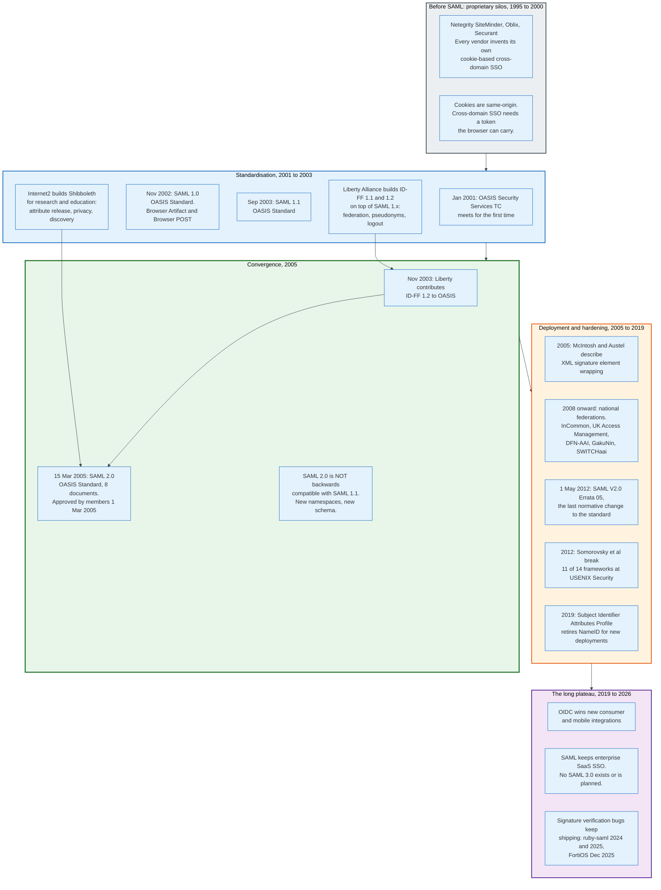

### 1.1 Before the Standard, 1995 to 2000

Cross-domain single sign-on was a product category before it was a protocol. Netegrity SiteMinder, Oblix, and Securant each shipped a proprietary web access management system in the late 1990s, and each solved the cross-domain problem with a private token format understood only by that vendor's agents. A customer who bought SiteMinder could federate with a partner who also bought SiteMinder. Anyone else negotiated a custom integration.

The commercial pressure to standardise came from the buyers, not the vendors. Large enterprises acquiring other large enterprises found themselves with two incompatible access management estates and no way to merge them short of ripping one out.

### 1.2 SAML 1.0 and 1.1, 2001 to 2003

The OASIS Security Services Technical Committee met for the first time in January 2001 with a charter to define an XML framework for exchanging authentication and authorisation information. SAML 1.0 became an OASIS Standard in November 2002. SAML 1.1 followed in September 2003.

SAML 1.x defined assertions, a request and response protocol, and two browser profiles: Browser Artifact and Browser POST. It did not define single logout, it did not define metadata, and it had no concept of a persistent pseudonymous identifier. It also did not define an authentication request. In SAML 1.x, the service provider could not ask the identity provider for a login. The flow started at the identity provider and only at the identity provider.

That omission is the reason SAML 1.x deployments were rare outside a handful of large enterprises. A protocol that cannot start from the application is a protocol the application cannot use.

### 1.3 Liberty Alliance and Shibboleth Fill the Gaps

Two projects extended SAML 1.x in incompatible directions, and SAML 2.0 is the merger of both.

The Liberty Alliance, a consortium founded in 2001 by Sun Microsystems and roughly 30 other companies as a counterweight to Microsoft Passport, published Identity Federation Framework 1.1 and then 1.2 on top of SAML 1.x. ID-FF added the authentication request, account linking through opaque pseudonyms, single logout, and identity provider discovery. In November 2003 Liberty contributed ID-FF 1.2 to OASIS as input to the next SAML version.

Internet2 built Shibboleth for the research and education sector, where the requirement was inverted. Universities wanted to buy access to journal databases without telling the publisher which student was reading what. Shibboleth therefore treated attribute release as the primary operation and identity as optional, and it built per-service-provider release policies and discovery services to support it.

The two projects wanted different things from the same substrate. Liberty wanted federation between commercial partners. Shibboleth wanted privacy-preserving attribute exchange between institutions. SAML 2.0 took both.

### 1.4 SAML 2.0, 15 March 2005

SAML 2.0 is an OASIS Standard approved by the OASIS membership on 1 March 2005 and published on 15 March 2005. It consists of eight normative documents, and the split matters because implementers routinely cite the wrong one.

| Document | Identifier | What it defines |
|----------|-----------|-----------------|
| **Core** | `saml-core-2.0-os` | Assertion syntax, the protocol messages, the XML signature profile, the identifier URIs |
| **Bindings** | `saml-bindings-2.0-os` | How messages travel: Redirect, POST, Artifact, SOAP, PAOS, URI |
| **Profiles** | `saml-profiles-2.0-os` | Which bindings combine with which messages to accomplish a task, and the processing rules |
| **Metadata** | `saml-metadata-2.0-os` | The configuration document format that establishes trust |
| **Authentication Context** | `saml-authn-context-2.0-os` | 25 classes describing how the user was authenticated, one of which is an `unspecified` value |
| **Conformance** | `saml-conformance-2.0-os` | The operational modes an implementation may claim |
| **Glossary** | `saml-glossary-2.0-os` | Terminology |
| **Security and Privacy Considerations** | `saml-sec-consider-2.0-os` | The threat model the authors had in mind |

The editors of the core specification are Scott Cantor of Internet2, John Kemp of Nokia, Rob Philpott of RSA Security, and Eve Maler of Sun Microsystems. The contributor list spans AOL, Boeing, IBM, Hewlett-Packard, Entrust, Neustar, NTT, and a dozen others, which is a fair summary of who cared about enterprise identity in 2004.

SAML 2.0 is not backwards compatible with SAML 1.1. The namespaces changed, the schema changed, and a SAML 1.1 assertion is not a valid SAML 2.0 assertion. Deployments ran both in parallel for years.

### 1.5 The Long Plateau, 2012 to 2026

The last normative change to SAML 2.0 is Errata 05, an OASIS Approved Errata dated 1 May 2012, edited by Scott Cantor. Since then the standard itself has not moved. On 8 July 2023 OASIS closed the Security Services Technical Committee outright, which removes the body that could have moved it. The specification set now has no owner.

There is no SAML 3.0. There is no work item to produce one. The specification set from 2005, with one errata document from 2012, is what every product implements in August 2026.

What has moved is the surrounding practice. The Kantara Initiative published the SAML V2.0 Implementation Profile for Federation Interoperability, version 1.1 dated 18 December 2019, which mandates SHA-256, requires automatic metadata refresh, and requires support for multiple signing keys per role so that certificate rotation stops causing outages. OASIS published the SAML V2.0 Subject Identifier Attributes Profile as Committee Specification 01 on 16 January 2019, which effectively retires the `NameID` construct in favour of two ordinary attributes. The IETF has an Internet-Draft, `draft-young-md-query-saml`, profiling a metadata query protocol so that federations of thousands of entities do not have to distribute one enormous aggregate file.

The standard is frozen. The deployment profile is not.

### 1.6 Scale Today

SAML's installed base is best measured in two places, because the commercial and academic worlds count differently.

In research and education, eduGAIN, the interfederation service that links national academic federations, lists 84 participant federations with 8 more in the candidate stage, measured on 30 August 2026. InCommon, the United States federation, publishes metadata for 2,498 entities on that date: 587 identity providers and 1,911 service providers. Every one of those entities is a SAML 2.0 deployment, and the metadata is exchanged automatically rather than by hand.

In commercial software, the number is not published in that form, because no central registry exists. What is observable is vendor scale. Okta reported revenue of 2.919 billion dollars for the fiscal year ended 31 January 2026, and 805 million dollars in the quarter ended 31 July 2026, up 10.6 percent on the same quarter a year earlier. Ping Identity, private since Thoma Bravo closed its 2.8 billion dollar acquisition on 18 October 2022 and merged in ForgeRock for 2.3 billion dollars on 23 August 2023, states that it has over 3 billion identities under management. Microsoft ships Entra ID with every Microsoft 365 tenant, which makes it the largest SAML identity provider by user count without anyone having chosen it as such.

The pattern across both worlds is the same. SAML wins where the counterparty is an organisation rather than a person.

---
## 2. What SAML Is, and What It Is Not

### 2.1 The Precise Definition

SAML is an XML vocabulary for one party to make signed statements about a subject, plus a set of rules for moving those statements through a web browser. That is the whole of it.

The vocabulary defines three statement types. An authentication statement says "this subject authenticated to me at this instant, by this method." An attribute statement says "this subject has these named values." An authorisation decision statement says "this subject may perform this action on this resource," and is deprecated in practice because XACML does the job better. Enterprise SSO uses the first two and ignores the third.

The transport rules exist because the two parties never talk directly. In the profile that carries almost all production traffic, the identity provider and the service provider exchange nothing over the network. The browser carries every message, one HTTP redirect or form POST at a time. That is why every message is signed, why every assertion carries a hard expiry measured in minutes, and why the recipient URL is written inside the document.

The simplest accurate mental model: a SAML assertion is a notarised letter of introduction, handed to the bearer, addressed to one named recipient, valid for five minutes.

### 2.2 What SAML Is Not

**SAML is not an authentication protocol.** It carries the result of an authentication that happened somewhere else. The specification says nothing about how the identity provider establishes who the user is, and the `AuthnContextClassRef` element exists precisely because SAML has to describe an authentication method it does not define. An identity provider may use a password, a smart card, Kerberos, a passkey, or a coin toss. SAML transports the claim, not the check.

**SAML is not encryption, and base64 is not either.** A `SAMLResponse` form field is base64-encoded XML that any user can decode with one command. The signature provides integrity and origin authentication, not confidentiality. Confidentiality comes from TLS on the wire and, optionally, from `EncryptedAssertion` or `EncryptedID`, which apply XML Encryption so that an intermediary cannot read the contents. Most commercial deployments never turn assertion encryption on, which means the user can read every attribute their employer releases about them. That is usually acceptable and occasionally is not.

**SAML is not authorisation.** The assertion carries attributes. What those attributes mean, and which of them grant which privilege, is a decision the service provider makes locally using configuration the identity provider never sees. A group named `crm-admins` in the assertion confers administrative rights only because someone configured the service provider to read it that way.

**SAML is not a session protocol.** After the service provider consumes an assertion it sets its own cookie and the assertion is finished. There is no keepalive, no refresh, no revocation channel. The `SessionNotOnOrAfter` attribute is a hint the service provider may honour or ignore. This single fact explains why Single Logout does not work and why deprovisioning needs a second protocol.

**SAML is not a directory.** It moves a snapshot of attributes at the moment of login and nothing else. It cannot list users, cannot detect a leaver, and cannot answer a query. That gap is what SCIM fills.

**SAML 2.0 is not an evolution of SAML 1.1.** Different namespaces, different schema, no wire compatibility. A product that claims SAML support without a version number says nothing.

### 2.3 The Fundamental Trade

SAML makes one trade and every property follows from it: the browser is the transport, so trust must live entirely inside the document.

Because there is no channel between the parties, there is no way to ask a question. The service provider cannot call the identity provider to check whether an assertion is genuine, whether it has already been used, or whether the user is still employed. Everything the service provider needs must be inside the signed bytes it holds: who issued it, who it is for, where it must be delivered, when it stops being valid, and which request it answers.

The consequence is a document format that carries its own security context. The consequence of that is XML with a signature over a subtree. And the consequence of that is the entire class of attacks in section 10.

---

## 3. The Federation Model and Its Three Roles

Federation means that authentication happens in one security domain and is accepted in another, without the second domain holding a credential for the user. Three roles participate, and the specification names them precisely.

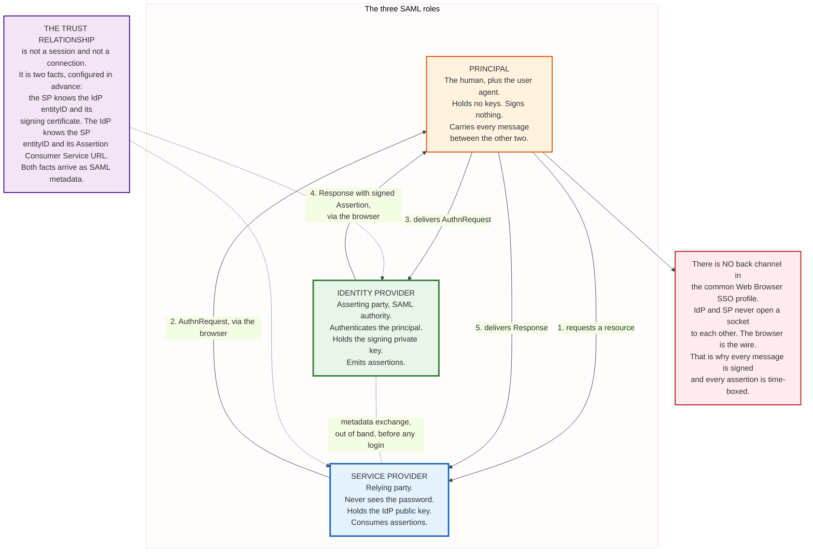

### 3.1 The Principal

The principal is the entity the statements are about, which in practice is a human plus the browser acting for them. The principal holds no keys, signs nothing, and verifies nothing.

The principal is also the transport. In the Web Browser SSO profile the browser physically carries every protocol message, which means the user agent sees every assertion in full and can modify it before delivering it. The protocol assumes exactly this and defends against it with signatures. A design that assumed a trustworthy user agent would need no signatures at all.

### 3.2 The Identity Provider

The identity provider, called the asserting party or SAML authority in the specification, authenticates the principal and issues assertions. It holds the signing private key. It maintains the session that makes the second and subsequent logins silent.

The identity provider is the concentration of risk in the entire model. Every service provider that trusts it accepts, without further checking, any statement it signs about any user. Section 15 covers what happens when that key leaves the building.

### 3.3 The Service Provider

The service provider, called the relying party, consumes assertions and grants access. It never sees the password. It holds the identity provider's public key and a small amount of configuration.

The service provider carries the entire burden of validation, and the specification is explicit about what that means. Section 4.1.4.3 of the Profiles document lists what a service provider MUST do on receiving a Response, regardless of binding: verify the signatures, verify that `Recipient` matches the assertion consumer service URL the message arrived at, verify that `NotOnOrAfter` has not passed subject to allowable clock skew, and verify that `InResponseTo` equals the ID of its own original `AuthnRequest` unless the response is unsolicited, in which case the attribute MUST NOT be present.

Every SAML authentication bypass in the record is a service provider skipping one of those checks.

### 3.4 The Trust Relationship Is a File, Not a Connection

The trust between an identity provider and a service provider is not a session, a socket, or a certificate chain to a public root. It is a small set of facts each side configures about the other, in advance.

The service provider needs three things: the identity provider's `entityID`, the URL of its single sign-on service, and the public key that will verify assertion signatures. The identity provider needs two: the service provider's `entityID`, which will appear in the `AudienceRestriction`, and its assertion consumer service URL, which will appear in `Recipient` and which is where the Response gets delivered.

Those five facts arrive in a SAML metadata document. Section 11 covers the format and the operational problem of keeping it current.

Trust in SAML is bilateral by default. Each pair of entities is configured independently, which is why onboarding a new SaaS application to a corporate identity provider is a ticket rather than a lookup. Multilateral federations, of the kind eduGAIN operates, replace the per-pair configuration with a signed aggregate that every member consumes. The protocol is identical. Only the operating model differs.

### 3.5 Roles Are Per Transaction, Not Per Product

A single deployment routinely plays both roles, and the specification treats the roles as independent.

Microsoft Entra ID acts as an identity provider to a thousand SaaS applications and as a service provider to an on-premises AD FS instance in the same tenant. Okta acts as an identity provider to customer applications and as a service provider when a customer chains it behind their own directory. A SAML metadata document expresses this directly: one `EntityDescriptor` may contain both an `IDPSSODescriptor` and an `SPSSODescriptor`.

The chain matters for a reason that is easy to miss. When identity provider A federates to identity provider B which federates to the application, the application's `AudienceRestriction` names only the last hop. It has no protocol-level visibility into who authenticated the user two hops back, beyond the advisory `AuthenticatingAuthority` element inside `AuthnContext`, which almost nothing populates and almost nothing reads.

Federation composes. Assurance does not.

---
## 4. Anatomy of a SAML Assertion

The assertion is the only object in SAML that carries value. Everything else is envelope.

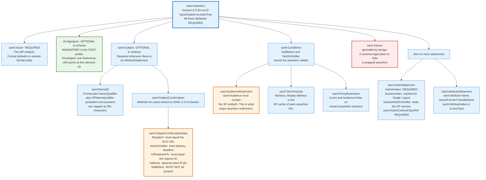

### 4.1 The Container

`AssertionType` requires exactly three attributes and permits a fixed sequence of children. The schema, from section 2.3.3 of the core specification:

```xml
<complexType name="AssertionType">
  <sequence>
    <element ref="saml:Issuer"/>
    <element ref="ds:Signature" minOccurs="0"/>
    <element ref="saml:Subject" minOccurs="0"/>
    <element ref="saml:Conditions" minOccurs="0"/>
    <element ref="saml:Advice" minOccurs="0"/>
    <choice minOccurs="0" maxOccurs="unbounded">
      <element ref="saml:Statement"/>
      <element ref="saml:AuthnStatement"/>
      <element ref="saml:AuthzDecisionStatement"/>
      <element ref="saml:AttributeStatement"/>
    </choice>
  </sequence>
  <attribute name="Version" type="string" use="required"/>
  <attribute name="ID" type="ID" use="required"/>
  <attribute name="IssueInstant" type="dateTime" use="required"/>
</complexType>
```

Three details in that fragment shape everything downstream.

`ID` is typed `xs:ID`, which derives from `xs:NCName` and therefore cannot begin with a digit. Every SAML implementation prefixes its identifiers with an underscore for that reason, and `_8f3c2b1a4d5e6f7089abcdef01234567` is the canonical shape. The identifier must be unique and unguessable, because it is both the replay-cache key and the target of the signature reference.

`ds:Signature` is `minOccurs="0"`. The assertion is optionally signed at the schema level. The Web Browser SSO profile then requires it: section 4.1.4.5 states that if the HTTP POST binding is used to deliver the Response, the enclosed assertions MUST be signed. Schema optionality plus profile obligation is a recurring SAML pattern, and it is the reason so many libraries accepted unsigned assertions for years without failing schema validation.

`Advice` is the third detail, and it is a loaded gun. The specification says advice may be ignored by applications that do not understand it. It is an `xs:any` extension point. It is therefore a schema-legal place to park a second, fully signed assertion, which is exactly what a signature wrapping attack needs.

### 4.2 The Subject and Its Confirmation

`Subject` names the principal and states the conditions under which the bearer may claim to be that principal.

```xml
<saml:Subject>
  <saml:NameID Format="urn:oasis:names:tc:SAML:1.1:nameid-format:emailAddress">
    dana.okoro@acme.example
  </saml:NameID>
  <saml:SubjectConfirmation Method="urn:oasis:names:tc:SAML:2.0:cm:bearer">
    <saml:SubjectConfirmationData
        NotOnOrAfter="2026-08-31T09:19:41Z"
        Recipient="https://app.example-crm.com/saml/acs"
        InResponseTo="_8f3c2b1a4d5e6f7089abcdef01234567"/>
  </saml:SubjectConfirmation>
</saml:Subject>
```

The confirmation method `urn:oasis:names:tc:SAML:2.0:cm:bearer` means what it says: whoever holds this assertion is treated as the subject. There is no proof of possession, no key, no challenge. The three attributes in `SubjectConfirmationData` are the entire defence, and each blocks a specific attack.

`Recipient` blocks assertion redirection. Without it, an assertion issued for one service provider could be replayed at another that trusts the same identity provider. The service provider MUST check that the value equals the assertion consumer service URL the message actually arrived at, not merely a URL it recognises.

`NotOnOrAfter` blocks long-window replay. It is typically five minutes. The profile forbids a `NotBefore` attribute here, because a delivery window that has not opened yet is meaningless for a bearer token.

`InResponseTo` blocks login CSRF. It must equal the `ID` of the `AuthnRequest` the service provider issued, and the service provider must have that identifier in its own state. In an unsolicited Response the attribute MUST NOT be present, which is the protocol admitting that IdP-initiated SSO has no CSRF defence.

An optional `Address` attribute pins the assertion to a client IP. Almost nobody uses it. Corporate egress addresses change, mobile users roam between networks, and the failure mode is a support ticket rather than a security event.

### 4.3 Name Identifier Formats

The `Format` attribute on `NameID` selects one of eight identifiers defined in section 8.3 of the core specification.

| Format URI | Meaning | Practical use |
|---|---|---|
| `urn:oasis:names:tc:SAML:1.1:nameid-format:unspecified` | Interpretation left to the implementation | Common in commercial SaaS, and a source of ambiguity |
| `urn:oasis:names:tc:SAML:1.1:nameid-format:emailAddress` | An RFC 2822 `addr-spec` | The most widely deployed value, and the most dangerous |
| `urn:oasis:names:tc:SAML:1.1:nameid-format:X509SubjectName` | A `ds:X509SubjectName` string | Rare, appears with client certificate authentication |
| `urn:oasis:names:tc:SAML:1.1:nameid-format:WindowsDomainQualifiedName` | `DomainName\UserName` | Legacy AD FS integrations |
| `urn:oasis:names:tc:SAML:2.0:nameid-format:kerberos` | `name[/instance]@REALM` | Rare |
| `urn:oasis:names:tc:SAML:2.0:nameid-format:entity` | A system entity, not a person | The default `Format` for `Issuer` |
| `urn:oasis:names:tc:SAML:2.0:nameid-format:persistent` | An opaque pairwise pseudonym, maximum 256 characters | The privacy-preserving choice, standard in academic federations |
| `urn:oasis:names:tc:SAML:2.0:nameid-format:transient` | An opaque one-session value, maximum 256 characters | Anonymous access to a licensed resource |

The `persistent` format is the one the specification cares most about. It requires pseudo-random values with no discernible correspondence to the subject's real identifier, and it uses two qualifiers: `NameQualifier` names the identity provider that created the value, and `SPNameQualifier` names the service provider or affiliation it was created for. The result is a pairwise pseudonym. Two service providers holding assertions about the same human cannot correlate them.

The `emailAddress` format is the one everyone actually uses, and it is the wrong choice for a durable account key. Email addresses change when people marry, when a company rebrands its domain, and when an employee moves between business units. Every such change orphans the local account, and the service provider then either creates a duplicate or hand-merges the two.

That failure is why OASIS published the SAML V2.0 Subject Identifier Attributes Profile, Committee Specification 01, on 16 January 2019. It defines two ordinary SAML attributes rather than a `NameID` format:

- `urn:oasis:names:tc:SAML:attribute:subject-id`, a general purpose identifier of the form `uniqueID@scope`, where each half is 1 to 127 characters and comparison is case insensitive.
- `urn:oasis:names:tc:SAML:attribute:pairwise-id`, syntactically identical but with values that vary per relying party.

The rationale in the specification is blunt: deployment experience has shown that use of the `NameID` feature is confusing in many implementations, and the `persistent` format is impossible to use safely with case-insensitive applications without an additional profiling layer. Fourteen years after the standard shipped, its own committee routed around one of its core constructs.

### 4.4 Conditions

`Conditions` bounds validity, and its processing rules are strict in a way most implementations get right and a few do not.

```xml
<saml:Conditions NotBefore="2026-08-31T09:14:41Z"
                 NotOnOrAfter="2026-08-31T09:19:41Z">
  <saml:AudienceRestriction>
    <saml:Audience>https://app.example-crm.com/saml/metadata</saml:Audience>
  </saml:AudienceRestriction>
</saml:Conditions>
```

`AudienceRestriction` is the second half of the anti-redirection defence, and it operates at a different layer than `Recipient`. `Recipient` names a URL and is checked against where the message landed. `Audience` names an `entityID` and is checked against who the service provider believes itself to be. A service provider that runs several assertion consumer service endpoints for different tenants needs both checks, because either one alone leaves a gap.

`OneTimeUse` states that the assertion must not be retained for future use. It is advisory and unenforceable on its own, because the recipient cannot prove to itself that it has not seen a document before without keeping state. Real replay defence is the identifier cache described in section 4.1.4.5 of the Profiles document: the service provider maintains the set of used `ID` values for as long as the assertion would remain valid under `NotOnOrAfter`.

`ProxyRestriction` caps how many further assertions may be derived from this one and to which audiences. In a two-hop federation chain it is the only tool that limits onward issuance. It is rarely populated.

The evaluation rules have three outcomes rather than two: Valid, Invalid, and Indeterminate. If a service provider encounters a `Condition` element it does not understand, the result is Indeterminate, and the specification requires it to reject the assertion just as if it were malformed. A relying party that silently ignores unknown conditions is non-conformant, and this is a common implementation shortcut.

### 4.5 The Authentication Statement

`AuthnStatement` reports the authentication event.

```xml
<saml:AuthnStatement AuthnInstant="2026-08-31T09:14:41Z"
                     SessionIndex="_a71c4b9e2f0d3856"
                     SessionNotOnOrAfter="2026-08-31T17:14:41Z">
  <saml:AuthnContext>
    <saml:AuthnContextClassRef>
      urn:oasis:names:tc:SAML:2.0:ac:classes:PasswordProtectedTransport
    </saml:AuthnContextClassRef>
  </saml:AuthnContext>
</saml:AuthnStatement>
```

`AuthnInstant` is required and is the time of the authentication, not the time the assertion was issued. The difference matters. If a user authenticated at the identity provider four hours ago and now visits a new application, the assertion is fresh but the `AuthnInstant` is four hours old. A service provider with a step-up requirement checks `AuthnInstant`, not `IssueInstant`, and sends a new `AuthnRequest` with `ForceAuthn="true"` when the authentication is too old.

`SessionIndex` is the handle that makes Single Logout addressable. The Profiles document is explicit: if the identity provider supports the Single Logout profile, every authentication statement MUST include a `SessionIndex`. The service provider stores it alongside the `NameID` and quotes both back in a `LogoutRequest`.

`SessionNotOnOrAfter` is a recommendation about when the service provider's own session should end. The profile says the security context SHOULD be discarded once this time is reached. It is the closest thing SAML has to a revocation signal, and it is entirely advisory.

`AuthnContextClassRef` names how the user authenticated. The Authentication Context specification defines 25 classes, from `InternetProtocol`, which asserts nothing more than an IP address, through `Password`, `PasswordProtectedTransport`, `Kerberos`, `TLSClient`, `SmartcardPKI`, `TimeSyncToken`, and `X509`, to an `unspecified` value. A service provider that requires multi-factor authentication states this by putting a `RequestedAuthnContext` in its `AuthnRequest` with `Comparison="exact"` and then checking what came back.

The 25 classes date from 2005 and have not been extended. They contain no value for a FIDO2 passkey, no value for a push notification, and no value for a hardware-bound biometric. Every identity provider therefore invents its own URIs. Microsoft uses `http://schemas.microsoft.com/claims/multipleauthn`, and other vendors use their own. Any service provider that wants portable step-up logic ends up maintaining a per-identity-provider table of strings.

That table is the single clearest piece of evidence that the standard stopped moving in 2012.

---
## 5. Bindings: How the Bytes Actually Move

A binding maps a SAML message onto a transport. The Bindings document defines six, and enterprise SSO uses three.

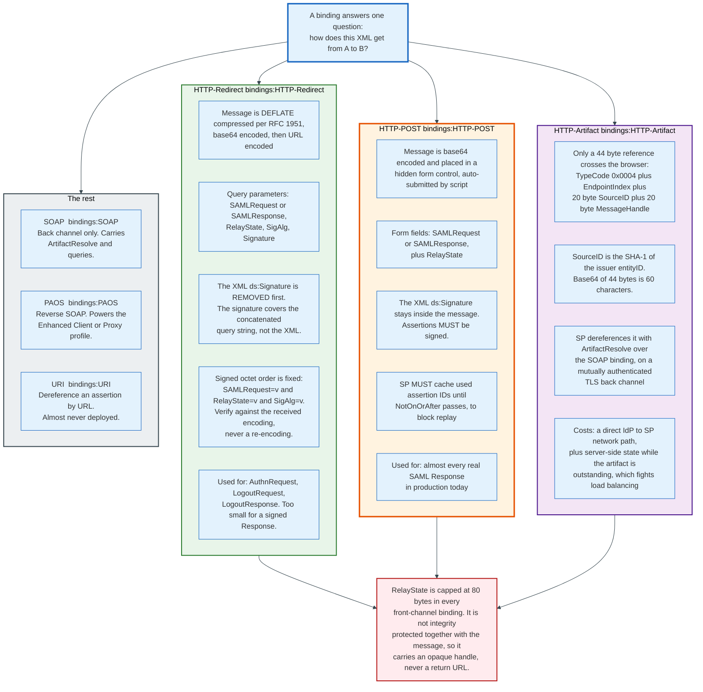

### 5.1 HTTP Redirect

Identifier: `urn:oasis:names:tc:SAML:2.0:bindings:HTTP-Redirect`.

The message is compressed, encoded, and placed in a query string. The exact sequence, from section 3.4.4.1 of the Bindings document:

1. Remove any `ds:Signature` element from the message.
2. Apply DEFLATE compression as specified in RFC 1951 to the remaining XML.
3. Base64-encode the compressed data per RFC 2045, stripping all whitespace.
4. URL-encode the result and place it in a query parameter named `SAMLRequest` or `SAMLResponse`.
5. If RelayState accompanies it, URL-encode that and place it in a parameter named `RelayState`.
6. If the message was signed, sign the encoded form as described below.

The signature is not an XML signature. It is a raw signature over a concatenation of query parameters in a fixed order, with the algorithm named in a separate parameter:

```
SAMLRequest=value&RelayState=value&SigAlg=value
```

Three properties of that construction trip implementers. The order is fixed regardless of the order the parameters appear in the received URL, so a verifier must reassemble the string. The signature covers only those parameters, so anything else in the query string is unauthenticated. And URL encoding is not canonical, so the verifier MUST verify against the exact bytes it received rather than a re-encoding of the decoded values. The specification states this explicitly, and getting it wrong produces intermittent verification failures that depend on which HTTP library normalised what.

The binding mandates support for `http://www.w3.org/2000/09/xmldsig#dsa-sha1` and `http://www.w3.org/2000/09/xmldsig#rsa-sha1`. Both are obsolete. Every current deployment uses `http://www.w3.org/2001/04/xmldsig-more#rsa-sha256`, which the Kantara interoperability profile requires.

Redirect exists because of size. Take the `AuthnRequest` from section 7 of this document: 889 bytes of XML compresses under raw DEFLATE to 443 bytes, becomes 592 base64 characters, and 634 characters once URL-encoded. Add the 66-character endpoint, a 16-character RelayState, the 63-character encoded `SigAlg` URI, the parameter names, and a URL-encoded base64 signature from a 2048-bit RSA key, which runs to roughly 369 characters, and the whole URL is about 1,192 characters. That fits.

A signed Response does not fit. A realistic signed assertion is roughly 7,000 bytes of XML, which is about 9,300 base64 characters before URL encoding. Internet Explorer capped URLs at 2,083 characters, and while modern browsers are more generous, intermediate proxies and server header buffers are not. The Bindings document says the same thing in specification language: messages that contain signed content SHOULD NOT be encoded using this mechanism.

The Profiles document does not leave the division to arithmetic. Section 4.1.2, step 5, says the Response may use HTTP POST or HTTP Artifact and that the HTTP Redirect binding MUST NOT be used, giving URL length as the reason. Redirect carries requests. POST carries responses.

### 5.2 HTTP POST

Identifier: `urn:oasis:names:tc:SAML:2.0:bindings:HTTP-POST`.

The message is base64-encoded and placed in a hidden form control named `SAMLRequest` or `SAMLResponse`, in a form whose `action` is the recipient endpoint and whose `method` is `POST`. RelayState, if present, goes in a second hidden control. The document must be valid XHTML.

The form is submitted by client-side script, which the specification permits and every implementation uses:

```html
<form method="post" action="https://app.example-crm.com/saml/acs">
  <input type="hidden" name="SAMLResponse" value="PHNhbWxwOlJlc3BvbnNlIHhtbG5z..."/>
  <input type="hidden" name="RelayState" value="a7f3c9d2e1b04856"/>
  <noscript><input type="submit" value="Continue"/></noscript>
</form>
<script>document.forms[0].submit();</script>
```

Unlike Redirect, POST keeps the XML signature inside the message. That is the significant difference. In POST the signature protects the document structure, and the document structure is attacker-visible and attacker-modifiable, which is where signature wrapping lives.

The profile adds two obligations for POST specifically. Assertions MUST be signed. And the service provider MUST prevent replay by maintaining the set of used assertion `ID` values for the length of time the assertion remains valid under `NotOnOrAfter`. A five-minute window with a shared cache is enough. A five-minute window with a per-process in-memory cache behind a load balancer is not, and this is a real and common bug in horizontally scaled service providers.

### 5.3 HTTP Artifact

Identifier: `urn:oasis:names:tc:SAML:2.0:bindings:HTTP-Artifact`.

Only a reference passes through the browser. The recipient then fetches the real message over a back channel.

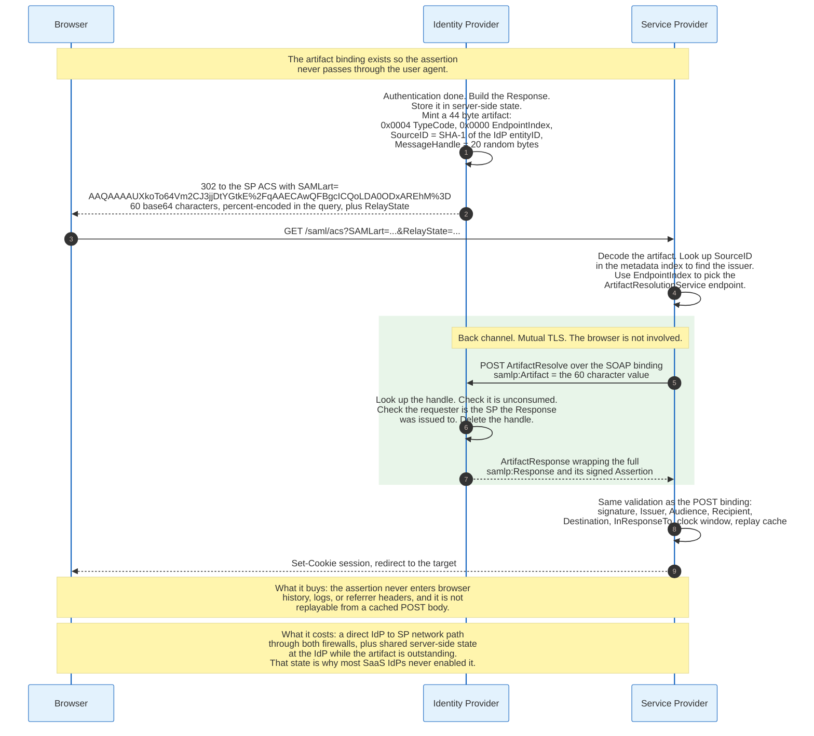

The artifact is a fixed 44-byte structure for the single type SAML 2.0 defines, `urn:oasis:names:tc:SAML:2.0:artifact-04`:

```
SAML_artifact    := B64(TypeCode EndpointIndex RemainingArtifact)
TypeCode         := 0x0004
EndpointIndex    := Byte1 Byte2
RemainingArtifact:= SourceID MessageHandle
SourceID         := 20-byte sequence
MessageHandle    := 20-byte sequence
```

`SourceID` is the raw SHA-1 hash of the artifact issuer's `entityID`, not hex-encoded. The issuer of a Response artifact is the identity provider, so the hash is taken over the identity provider's `entityID` and never the service provider's. `MessageHandle` is at least 16 bytes from a cryptographically strong random source, padded to 20. `EndpointIndex` selects which `ArtifactResolutionService` endpoint in the issuer's metadata to call.

Worked out for the issuing identity provider `http://www.okta.com/exk1fx2q9nZa7HkPr0h8`, the SHA-1 is `00145e4a13a3ae159b6089de38c3b581ad904fea`, and the complete 44-byte artifact base64-encodes to 60 characters:

```
AAQAAAAUXkoTo64Vm2CJ3jjDtYGtkE/qAAECAwQFBgcICQoLDA0ODxAREhM=
```

It travels in a query parameter named `SAMLart` on a GET, where the `/` and the trailing `=` are percent-encoded to `%2F` and `%3D`, or in a hidden form control of the same name on a POST. The recipient decodes it, uses `SourceID` to find the issuer in its metadata index, uses `EndpointIndex` to find the resolution endpoint, and sends a `samlp:ArtifactResolve` over the SOAP binding. The Profiles document requires that exchange to be mutually authenticated, integrity protected, and confidential, and requires the identity provider to hand the message only to the service provider it was issued to.

Artifact buys real security. The assertion never enters browser history, never appears in a `Referer` header, never sits in a proxy log, and cannot be replayed from a cached POST body. A stolen artifact is worthless, because resolving it requires a client certificate and because the handle is single use.

Artifact costs real operations, and that is why it lost. It needs a direct network path from the service provider to the identity provider, through both organisations' firewalls, with a mutually authenticated TLS relationship that is separate from the SAML trust. It needs the identity provider to hold server-side state for every outstanding artifact, shared across its cluster. The Bindings document flags this itself: the artifact issuer must maintain state while the artifact is pending, which has implications for load-balanced environments.

Multi-tenant SaaS identity providers refused to take on either cost. Artifact survives in government and higher education deployments, where the parties are institutions with negotiated network connectivity, and it is effectively absent from commercial SaaS SSO.

### 5.4 SOAP, PAOS, and URI

Three further bindings exist and appear rarely.

The SOAP binding, `urn:oasis:names:tc:SAML:2.0:bindings:SOAP`, is a back-channel binding over SOAP 1.1. It carries `ArtifactResolve`, `AttributeQuery`, `AuthnQuery`, and back-channel `LogoutRequest`. The browser is not involved.

The reverse SOAP binding, `urn:oasis:names:tc:SAML:2.0:bindings:PAOS`, inverts the SOAP roles so that an HTTP client can act as a SOAP responder. It exists to support the Enhanced Client or Proxy profile, which lets a non-browser client such as a desktop mail application participate in SAML SSO. ECP is the only reason SAML works at all for thick clients, and it is deployed almost exclusively in research and education, where Shibboleth and simpleSAMLphp support it.

The URI binding retrieves an assertion by dereferencing a URL. It is almost never deployed.

### 5.5 RelayState, and What It Is For

RelayState is capped at 80 bytes in every front-channel binding, and the cap is a design statement.

The specification requires the responder to return the exact value it received. It also warns, in section 3.5.5.2 of the Bindings document, that an attacker can recombine a valid SAML message with a different RelayState value, because the two are integrity protected separately if at all. Producers and consumers are told not to associate sensitive state with the value without additional precautions.

Eighty bytes will not hold a return URL of any length, and the specification never intended it to. The correct pattern is an opaque handle: the service provider stores the target URL, the pending request identifier, and any CSRF token in server-side state, keyed by a random 80-byte-or-shorter handle, and puts only the handle on the wire.

The incorrect and widespread pattern is to put the return URL in RelayState directly. That turns RelayState into an open redirect parameter that survives a round trip through the identity provider and comes back looking authenticated. Every service provider that does this needs an allowlist on the value, and many do not have one.

---
## 6. Profiles: The Rules That Make Bindings Useful

A profile combines messages, bindings, and processing rules into something that accomplishes a task. Bindings say how bytes move. Profiles say which bytes, in which order, and what the recipient must check.

### 6.1 The Profile Catalogue

| Profile | Identifier | What it does | Deployment reality |
|---|---|---|---|
| **Web Browser SSO** | `...:profiles:SSO:browser` | Browser-mediated login using `AuthnRequest` and `Response` | Effectively all enterprise SAML traffic |
| **Enhanced Client or Proxy** | `...:profiles:SSO:ecp` | SSO for non-browser clients over PAOS | Research and education only |
| **Identity Provider Discovery** | `...:profiles:SSO:idp-discovery` | A common-domain cookie that remembers which IdP the user came from | Superseded by per-application IdP configuration and by discovery services |
| **Single Logout** | `...:profiles:SSO:logout` | Terminate the IdP session and every SP session | Implemented widely, works rarely. See section 12 |
| **Name Identifier Management** | `...:profiles:SSO:nameid-mgmt` | Change or terminate a persistent identifier | Almost never deployed |
| **Artifact Resolution** | `...:profiles:artifact` | Dereference an artifact into a message | Used only alongside the artifact binding |
| **Assertion Query and Request** | `...:profiles:query` | Pull attributes on demand over a back channel | Shibboleth attribute queries, rare elsewhere |
| **Name Identifier Mapping** | `...:profiles:nameid-mapping` | Translate an identifier between two SP namespaces | Almost never deployed |

Five attribute profiles also exist, in sections 8.1 to 8.5 of the Profiles document: Basic, X.500/LDAP, UUID, DCE PAC, and XACML. The X.500/LDAP profile matters because it defines how to carry a directory attribute as a SAML attribute using its OID as the `Name` and its LDAP name as the `FriendlyName`, which is what academic federations do.

### 6.2 The Web Browser SSO Profile

Everything in commercial enterprise SSO reduces to this one profile, and its processing rules are the only part of SAML that a service provider implementer must know by heart.

The Profiles document, section 4.1.4.2, states what an identity provider must produce:

- The Response must contain at least one `Assertion`, and each assertion's `Issuer` must carry the identity provider's `entityID` with `Format` omitted or set to `nameid-format:entity`.
- The set of assertions must contain at least one `AuthnStatement` reflecting the authentication.
- At least one assertion containing an `AuthnStatement` must have a `Subject` with a `SubjectConfirmation` whose `Method` is `urn:oasis:names:tc:SAML:2.0:cm:bearer`.
- That bearer confirmation must contain `SubjectConfirmationData` with a `Recipient` equal to the service provider's assertion consumer service URL and a `NotOnOrAfter` limiting delivery. It must not contain `NotBefore`. If the message answers an `AuthnRequest`, `InResponseTo` must match that request's `ID`.
- Any assertion with a bearer confirmation must contain an `AudienceRestriction` naming the service provider's unique identifier as an `Audience`.
- If the identity provider supports Single Logout, the authentication statements must include a `SessionIndex`.

Section 4.1.4.3 states what the service provider must do, regardless of binding, in eight bullets. Verify any signatures present on the assertions or the response. Verify `Recipient` in any bearer `SubjectConfirmationData` against the assertion consumer service URL the message arrived at. Verify `NotOnOrAfter` against the clock, allowing for skew. Verify `InResponseTo` against a request it issued, or confirm the attribute is absent for an unsolicited response. Verify that any assertions relied upon are valid in other respects. Optionally check the user agent's client address against an `Address` attribute if one is present. Discard any assertion whose confirmation requirements cannot be met, and do not use it to establish a security context. And discard the security context once `SessionNotOnOrAfter` is reached, unless the profile is repeated.

Eight bullets: five MUSTs, one MAY, and two SHOULDs. The list has not changed since 2005. It is also not sufficient on its own. It never names the `Destination` check that SAMLBind 3.5.5.2 makes mandatory for signed messages, and it never says that the element the claims code reads must be the element the signature covered. The full checklist a service provider needs is the ten-item list in appendix 21.3, and every published SAML authentication bypass omits one of those ten.

### 6.3 The AuthnRequest and Its Options

`AuthnRequest` extends `RequestAbstractType` and adds seven attributes and five child elements, all optional in the general case.

| Attribute | Type | Effect |
|---|---|---|
| `ForceAuthn` | boolean, default false | The IdP must authenticate the user directly rather than reuse an existing session |
| `IsPassive` | boolean, default false | The IdP and the user agent must not visibly take control of the interface |
| `AssertionConsumerServiceURL` | anyURI | Where to send the Response, by value |
| `AssertionConsumerServiceIndex` | unsignedShort | Where to send the Response, by reference into metadata. Mutually exclusive with the URL form |
| `ProtocolBinding` | anyURI | Which binding to use for the Response |
| `AttributeConsumingServiceIndex` | unsignedShort | Which set of requested attributes the SP wants, by reference into metadata |
| `ProviderName` | string | A human-readable name for display |

`ForceAuthn` and `IsPassive` together express step-up and silent-check semantics. `IsPassive="true"` with no existing session produces a Response with the second-level status `urn:oasis:names:tc:SAML:2.0:status:NoPassive`, which is how a service provider probes for a session without interrupting the user.

`AssertionConsumerServiceURL` deserves attention because it is a redirection risk. It tells the identity provider where to deliver the assertion. The specification requires the responder to ensure by some means that the value is in fact associated with the requester, and names two mechanisms: metadata, or a signature on the `AuthnRequest`. An identity provider that accepts an arbitrary `AssertionConsumerServiceURL` from an unsigned request will deliver a valid assertion to an attacker-chosen endpoint. Some products have shipped that way.

The child elements shape the assertion. `NameIDPolicy` requests a `Format`, an `SPNameQualifier`, and an `AllowCreate` flag that defaults to false, meaning the identity provider may only issue an identifier it has already established. `RequestedAuthnContext` names acceptable authentication context classes with a `Comparison` of exact, minimum, maximum, or better. `Scoping` lists trusted identity providers for proxying, with a `ProxyCount`.

### 6.4 Status Codes

Responses carry a two-level status. The top level is one of four values: `Success`, `Requester`, `Responder`, or `VersionMismatch`. The second level explains.

| Second-level code | Meaning |
|---|---|
| `...:status:AuthnFailed` | The IdP could not authenticate the principal |
| `...:status:InvalidAttrNameOrValue` | An unrecognised attribute name or value in a query |
| `...:status:InvalidNameIDPolicy` | The requested `NameIDPolicy` cannot be satisfied |
| `...:status:NoAuthnContext` | The requested authentication context cannot be met |
| `...:status:NoAvailableIDP` | Proxying failed, no IdP could be contacted |
| `...:status:NoPassive` | `IsPassive` was set and no session exists |
| `...:status:NoSupportedIDP` | Proxying failed, none of the listed IdPs are supported |
| `...:status:PartialLogout` | Logout succeeded for some session participants and not others |
| `...:status:ProxyCountExceeded` | The proxy hop limit is exhausted |
| `...:status:RequestDenied` | The responder refuses to process the request |
| `...:status:UnknownPrincipal` | The subject is not known to the IdP |

The operationally significant ones are `AuthnFailed`, `NoPassive`, and `PartialLogout`. Almost every service provider maps all failures to a generic error page, which is a defensible security decision and a support burden, because an administrator debugging a broken integration cannot tell whether the user typed the wrong password or the attribute release policy is empty.

---

## 7. SP-Initiated SSO, Traced End to End

This section carries one login all the way through, with real values.

The cast: a user, `dana.okoro@acme.example`. A service provider, entityID `https://app.example-crm.com/saml/metadata`, assertion consumer service at `https://app.example-crm.com/saml/acs`. An identity provider hosted at `acme.okta.com`, with a single sign-on endpoint at `https://acme.okta.com/app/acme_crm_1/exk1fx2q9nZa7HkPr0h8/sso/saml`. Metadata was exchanged during onboarding, weeks earlier.

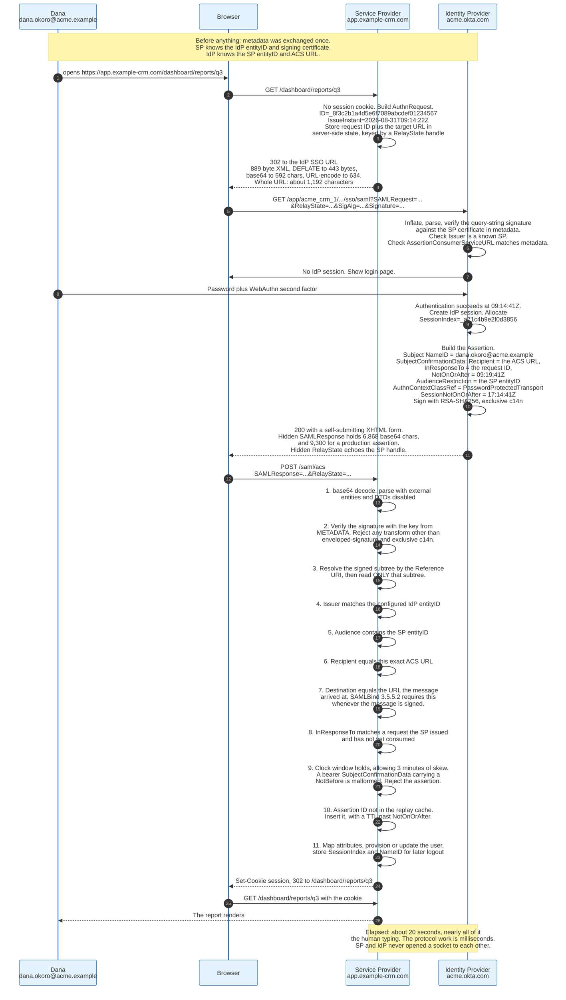

### 7.1 Step 1: The Unauthenticated Request

Dana opens `https://app.example-crm.com/dashboard/reports/q3`. The service provider finds no session cookie and decides to start SSO.

Before it emits anything, it stores state: the target URL `/dashboard/reports/q3`, a freshly generated request identifier, and a timestamp. It keys that state by a random handle, and only the handle goes on the wire as RelayState. This is the pattern section 5.5 describes, and it is what keeps RelayState from becoming an open redirect.

### 7.2 Step 2: The AuthnRequest

The service provider builds 889 bytes of XML:

```xml
<samlp:AuthnRequest
    xmlns:samlp="urn:oasis:names:tc:SAML:2.0:protocol"
    xmlns:saml="urn:oasis:names:tc:SAML:2.0:assertion"
    ID="_8f3c2b1a4d5e6f7089abcdef01234567"
    Version="2.0"
    IssueInstant="2026-08-31T09:14:22Z"
    Destination="https://acme.okta.com/app/acme_crm_1/exk1fx2q9nZa7HkPr0h8/sso/saml"
    ProtocolBinding="urn:oasis:names:tc:SAML:2.0:bindings:HTTP-POST"
    AssertionConsumerServiceURL="https://app.example-crm.com/saml/acs">
  <saml:Issuer>https://app.example-crm.com/saml/metadata</saml:Issuer>
  <samlp:NameIDPolicy
      Format="urn:oasis:names:tc:SAML:1.1:nameid-format:emailAddress"
      AllowCreate="true"/>
  <samlp:RequestedAuthnContext Comparison="exact">
    <saml:AuthnContextClassRef>
      urn:oasis:names:tc:SAML:2.0:ac:classes:PasswordProtectedTransport
    </saml:AuthnContextClassRef>
  </samlp:RequestedAuthnContext>
</samlp:AuthnRequest>
```

Note what the request does: it asks for an email-format identifier, permits the identity provider to create one if none exists, requires the authentication context to be exactly `PasswordProtectedTransport`, names where the answer must be delivered, and names which binding to use for the answer. `Comparison="exact"` forbids anything else, including a stronger context, and SAMLCore 3.3.2.2.1 makes it the default when the attribute is omitted. `Comparison="minimum"` is how a service provider asks for that class or anything the identity provider ranks above it, and it is almost always the intended semantics. `Destination` is present so that the identity provider can confirm the message was meant for it.

The encoding chain produces exact numbers. 889 bytes of XML. Raw DEFLATE per RFC 1951 compresses it to 443 bytes, a reduction of 50 percent, which is what happens when a document is 40 percent namespace URIs. Base64 expands that to 592 characters. URL encoding expands it again to 634. Add the 66-character endpoint, the parameter names, a 16-character RelayState, the 63-character encoded `SigAlg` URI, and the RSA-2048 signature, whose 344 base64 characters reach roughly 369 once URL-encoded, and the redirect URL is about 1,192 characters:

```
https://acme.okta.com/app/acme_crm_1/exk1fx2q9nZa7HkPr0h8/sso/saml
  ?SAMLRequest=jZJPb%2BIwEMW%2FSuR7YickQKwGiaWqirRto1L2sJfKJANY...
  &RelayState=a7f3c9d2e1b04856
  &SigAlg=http%3A%2F%2Fwww.w3.org%2F2001%2F04%2Fxmldsig-more%23rsa-sha256
  &Signature=NOTAREALSIGNATUREBUTTHEREALONEWOULDGOHERE...
```

The service provider returns `302 Found` with that URL in `Location`.

### 7.3 Step 3: The Identity Provider Validates the Request

The identity provider URL-decodes, base64-decodes, and inflates the parameter. It then checks four things.

The `Issuer` names a service provider it knows. The query-string signature verifies against that service provider's signing certificate from metadata, reassembled in the required parameter order. The `Destination`, if present, matches this endpoint. And the `AssertionConsumerServiceURL` matches an endpoint registered in the service provider's metadata, which is the check that stops assertion delivery to an attacker-chosen URL.

If any check fails the identity provider returns a Response with a `Requester` status. It does not proceed.

### 7.4 Step 4: Authentication

No identity provider session exists, so the identity provider shows a login page. Dana enters a password and completes a WebAuthn challenge. Authentication succeeds at `09:14:41Z`, nineteen seconds after the request was issued.

The assertion will nonetheless report `PasswordProtectedTransport`. The request named that class with `Comparison="exact"`, and SAMLCore 3.3.2.2.1 requires the returned context to be an exact match of one of the classes specified. A hardware second factor occurred and the protocol carries no way to say so. Section 20.3 explains why the 25 standard classes have no vocabulary for it.

The identity provider creates its own session, sets its own cookie on `acme.okta.com`, and allocates a session index: `_a71c4b9e2f0d3856`. That index is the only thing the service provider will ever be able to quote back when it wants to log out.

### 7.5 Step 5: The Response

The identity provider builds the Response and signs the assertion inside it.

```xml
<samlp:Response
    xmlns:samlp="urn:oasis:names:tc:SAML:2.0:protocol"
    xmlns:saml="urn:oasis:names:tc:SAML:2.0:assertion"
    ID="_c0ffee11223344556677889900aabbcc"
    InResponseTo="_8f3c2b1a4d5e6f7089abcdef01234567"
    Version="2.0"
    IssueInstant="2026-08-31T09:14:41Z"
    Destination="https://app.example-crm.com/saml/acs">
  <saml:Issuer>http://www.okta.com/exk1fx2q9nZa7HkPr0h8</saml:Issuer>
  <samlp:Status>
    <samlp:StatusCode Value="urn:oasis:names:tc:SAML:2.0:status:Success"/>
  </samlp:Status>
  <saml:Assertion ID="_deadbeef00112233445566778899aabb"
                  Version="2.0"
                  IssueInstant="2026-08-31T09:14:41Z">
    <saml:Issuer>http://www.okta.com/exk1fx2q9nZa7HkPr0h8</saml:Issuer>
    <ds:Signature xmlns:ds="http://www.w3.org/2000/09/xmldsig#">
      <ds:SignedInfo>
        <ds:CanonicalizationMethod Algorithm="http://www.w3.org/2001/10/xml-exc-c14n#"/>
        <ds:SignatureMethod Algorithm="http://www.w3.org/2001/04/xmldsig-more#rsa-sha256"/>
        <ds:Reference URI="#_deadbeef00112233445566778899aabb">
          <ds:Transforms>
            <ds:Transform Algorithm="http://www.w3.org/2000/09/xmldsig#enveloped-signature"/>
            <ds:Transform Algorithm="http://www.w3.org/2001/10/xml-exc-c14n#"/>
          </ds:Transforms>
          <ds:DigestMethod Algorithm="http://www.w3.org/2001/04/xmlenc#sha256"/>
          <ds:DigestValue>9pXk...=</ds:DigestValue>
        </ds:Reference>
      </ds:SignedInfo>
      <ds:SignatureValue>QmFzZTY0...</ds:SignatureValue>
      <ds:KeyInfo><ds:X509Data><ds:X509Certificate>MIIDpDCC...</ds:X509Certificate></ds:X509Data></ds:KeyInfo>
    </ds:Signature>
    <saml:Subject>
      <saml:NameID Format="urn:oasis:names:tc:SAML:1.1:nameid-format:emailAddress">
        dana.okoro@acme.example
      </saml:NameID>
      <saml:SubjectConfirmation Method="urn:oasis:names:tc:SAML:2.0:cm:bearer">
        <saml:SubjectConfirmationData
            NotOnOrAfter="2026-08-31T09:19:41Z"
            Recipient="https://app.example-crm.com/saml/acs"
            InResponseTo="_8f3c2b1a4d5e6f7089abcdef01234567"/>
      </saml:SubjectConfirmation>
    </saml:Subject>
    <saml:Conditions NotBefore="2026-08-31T09:14:41Z"
                     NotOnOrAfter="2026-08-31T09:19:41Z">
      <saml:AudienceRestriction>
        <saml:Audience>https://app.example-crm.com/saml/metadata</saml:Audience>
      </saml:AudienceRestriction>
    </saml:Conditions>
    <saml:AuthnStatement AuthnInstant="2026-08-31T09:14:41Z"
                         SessionIndex="_a71c4b9e2f0d3856"
                         SessionNotOnOrAfter="2026-08-31T17:14:41Z">
      <saml:AuthnContext>
        <saml:AuthnContextClassRef>
          urn:oasis:names:tc:SAML:2.0:ac:classes:PasswordProtectedTransport
        </saml:AuthnContextClassRef>
      </saml:AuthnContext>
    </saml:AuthnStatement>
    <saml:AttributeStatement>
      <saml:Attribute Name="email" NameFormat="urn:oasis:names:tc:SAML:2.0:attrname-format:unspecified">
        <saml:AttributeValue>dana.okoro@acme.example</saml:AttributeValue>
      </saml:Attribute>
      <saml:Attribute Name="Groups" NameFormat="urn:oasis:names:tc:SAML:2.0:attrname-format:unspecified">
        <saml:AttributeValue>crm-admins</saml:AttributeValue>
        <saml:AttributeValue>finance-readonly</saml:AttributeValue>
      </saml:Attribute>
    </saml:AttributeStatement>
  </saml:Assertion>
</samlp:Response>
```

Two structural facts are worth reading off that document. The signature sits inside the `Assertion` and its `Reference URI` points at the `Assertion` ID, so the `Response` wrapper is unsigned. And the multi-valued `Groups` attribute repeats `AttributeValue` rather than joining values with a delimiter, which is correct and which many service providers still parse as a comma-separated string.

The document above is 3,421 bytes with the digest, signature and certificate elided. Filling those three in adds 44 base64 characters for the SHA-256 digest, 344 for the RSA-2048 signature, and roughly 1,370 for a DER-encoded X.509 certificate, which brings it to about 5,150 bytes and 6,868 base64 characters. A production assertion carrying a dozen attributes reaches 7,000 bytes and 9,300 characters. Either figure is far past any URL limit, which is why the binding is POST.

### 7.6 Step 6: Validation at the Service Provider

The service provider runs ten checks in this order, then applies the identity, and the order matters because it fails cheap before it fails expensive.

1. **Decode and parse.** Base64 decode. Parse with external entity resolution disabled, DTD processing disabled, and entity expansion limited. A SAML endpoint is an unauthenticated XML parser exposed to the internet, and XXE and billion-laughs both apply.
2. **Verify the signature.** Locate `ds:Signature`, resolve its `Reference URI` to an element, re-apply the transforms, re-digest, and check the digest. Then canonicalise `SignedInfo` and check `SignatureValue` using the public key from **metadata**, not from the `KeyInfo` in the document. Reject any transform other than enveloped-signature and exclusive canonicalisation before applying it.
3. **Use only the verified element.** From here on, read claims from the element the `Reference URI` identified and from nothing else. This is the step whose absence produces signature wrapping.
4. **Check the issuer.** The assertion's `Issuer` equals the configured identity provider `entityID`, exactly, as a string.
5. **Check the audience.** `Audience` contains this service provider's own `entityID`.
6. **Check the recipient.** `Recipient` equals the exact URL this request arrived at, scheme, host, port, and path.
7. **Check the destination.** If the `Response` or the assertion carries a `Destination` attribute, it MUST equal the URL this message arrived at. SAMLBind 3.5.5.2 requires the attribute to be present and requires the recipient to verify it whenever the message is signed, which under the POST profile it always is. The Response in section 7.5 carries `Destination="https://app.example-crm.com/saml/acs"` for exactly this check.
8. **Check the correlation.** `InResponseTo` matches a request identifier in the service provider's own pending state, and that entry has not already been consumed. Delete it now.
9. **Check the clock.** `IssueInstant`, `Conditions/NotBefore`, `Conditions/NotOnOrAfter`, and `SubjectConfirmationData/NotOnOrAfter` all hold, with a skew allowance. A bearer `SubjectConfirmationData` carrying a `NotBefore` at all is malformed under SAMLProf 4.1.4.2 and the assertion is rejected. Library defaults for skew vary from zero to five minutes. Every minute of allowance widens the replay window by a minute.
10. **Check for replay.** The assertion `ID` is not in the shared replay cache. Insert it with a time to live past `NotOnOrAfter`. Shared means shared across every process behind the load balancer.
11. **Apply the identity.** Map attributes to local fields, create or update the account, assign roles from `Groups`, and persist `NameID` and `SessionIndex` for a future `LogoutRequest`.

Only then does the service provider set its own session cookie and redirect to the stored target.

### 7.7 The Timing Budget

The elapsed wall-clock time is about 20 seconds, and 19 of those are Dana typing a password and touching a security key. The protocol work is milliseconds: one DEFLATE, one base64 round trip, two signature operations, and a handful of string comparisons.

The point of that arithmetic is that SAML's cost is never CPU. It is the five configuration facts that have to be right on both sides, and the fact that a certificate somewhere expires in two years.

---
## 8. IdP-Initiated SSO, and Why It Is Discouraged

IdP-initiated SSO is the same Response with one attribute removed, and the missing attribute removes the only defence against login CSRF.

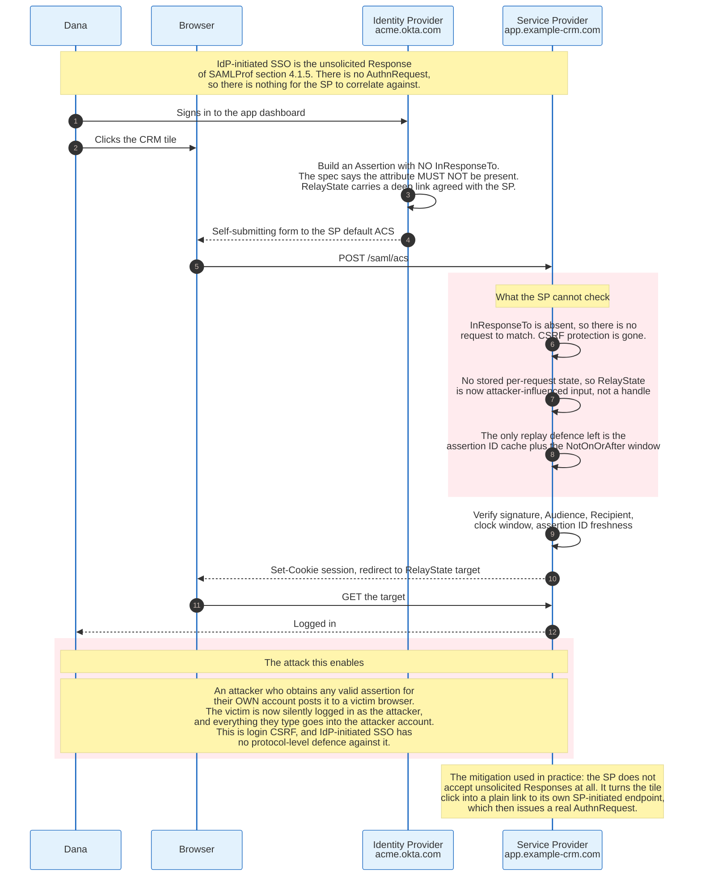

### 8.1 What the Specification Says

Section 4.1.5 of the Profiles document permits an identity provider to initiate the profile by delivering an unsolicited `Response` to a service provider. It then imposes two constraints. The Response must not contain an `InResponseTo` attribute, nor should any bearer `SubjectConfirmationData` contain one. And if metadata is in use, the Response should be delivered to the assertion consumer service endpoint marked as default.

The specification also notes that the identity provider may include a binding-specific RelayState value indicating, by mutual agreement, how to handle subsequent interactions with the user agent, and that this may be a URL at the service provider.

Read carefully, that paragraph is a statement that the correlation and the state handling both move from protocol to agreement.

### 8.2 What Breaks

Three defences disappear together.

**Correlation is gone.** The service provider has no pending request to match. It cannot tell whether this assertion arrived because the user clicked something or because an attacker submitted a form. Every other check still runs, and every other check still passes, because the assertion is genuine.

**RelayState becomes untrusted input.** In the SP-initiated flow, RelayState is a handle into the service provider's own state, and any value that does not resolve is rejected. Unsolicited, there is no state to resolve against, so the service provider has to interpret the value directly. If it treats it as a redirect target, it is now an open redirect that arrives at the end of a successful login.

**The replay window is the only remaining limit.** With `InResponseTo` present, an assertion is bound to one specific pending request and is useless the moment that request is consumed. Without it, the assertion is valid for anyone who can deliver it to the endpoint within the `NotOnOrAfter` window, subject only to the assertion ID cache.

### 8.3 The Attack

The attack is login CSRF, and it inverts the usual direction of harm.

An attacker registers a legitimate account at the identity provider, or is a legitimate employee. They initiate an IdP-initiated login to the target application and capture the resulting `SAMLResponse` before their own browser posts it. They then embed that value in a form on a page the victim visits, and auto-submit it.

The victim's browser posts a valid, correctly signed assertion for the attacker's account. The service provider validates everything, finds no fault, and issues the victim a session as the attacker. The victim continues working. Every document they upload, every note they write, every credential they store lands in the attacker's account.

The attacker does not steal a session. They donate one.

### 8.4 Why It Persists

IdP-initiated SSO survives for a product reason, not a technical one. Identity providers sell an application dashboard: a page of tiles the user clicks to reach each application. A tile that posts an assertion directly is one click. A tile that redirects to the application's own login entry point, which then issues an `AuthnRequest`, is also one click, but it requires the application to expose such an endpoint and requires the identity provider to know its URL.

The correct pattern costs one extra configuration field and one extra redirect. Deep-link tiles work either way.

Modern practice is converging on that pattern. Service providers increasingly refuse unsolicited responses outright, and identity providers increasingly ship the redirect-to-SP-endpoint tile as the default. A service provider that must accept unsolicited responses should at minimum tighten the delivery window well below five minutes, require a shared cluster-wide replay cache, restrict RelayState to a strict allowlist of paths, and log every unsolicited acceptance separately so the anomaly is visible.

---

## 9. XML Signatures and Canonicalisation

XML signatures are the reason SAML works and the reason SAML breaks. Understanding the difference requires understanding what is actually signed.

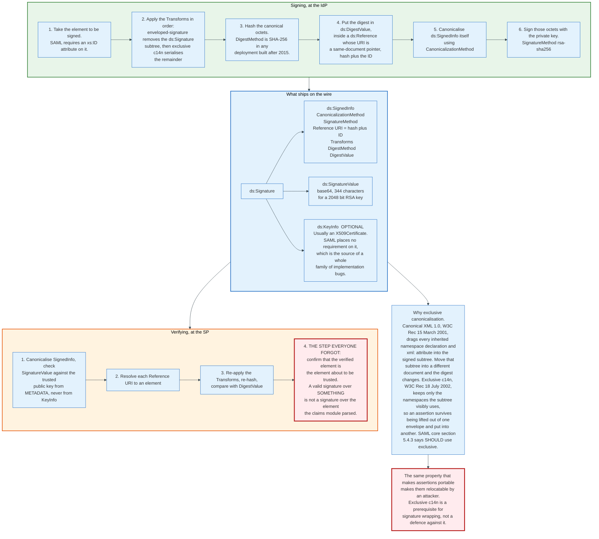

### 9.1 The Specifications

XML Signature Syntax and Processing originates as a joint W3C and IETF effort. RFC 3275, published March 2002 by Eastlake, Reagle, and Solo, obsoletes RFC 3075 and carries the same content as the W3C Recommendation. The current W3C version is XML Signature Syntax and Processing Version 1.1, a Recommendation of 11 April 2013, which adds SHA-256 and ECDSA and deprecates SHA-1.

Canonicalisation has three relevant documents. Canonical XML Version 1.0 is a W3C Recommendation of 15 March 2001. Exclusive XML Canonicalization Version 1.0 is a W3C Recommendation of 18 July 2002. Canonical XML Version 1.1 is a W3C Recommendation of 2 May 2008.

SAML core section 5.4 constrains all of this. Enveloped signatures only. Exactly one `ds:Reference`, containing a same-document reference to the `ID` attribute of the root element being signed, so that an `ID` of `foo` produces a `URI` of `#foo`. Exclusive canonicalisation SHOULD be used both as the `CanonicalizationMethod` and as a `Transform`. Transforms other than enveloped-signature and exclusive c14n SHOULD NOT appear, and verifiers MAY reject signatures containing others.

### 9.2 Why Canonicalisation Exists

XML has many byte sequences that mean the same thing, and a hash function does not know that.

`<a b="1" c="2"/>` and `<a c="2" b="1"/>` are the same element with the same attributes and different bytes. Attribute order is not significant in XML. Neither is the choice between `<a></a>` and `<a/>`, nor the amount of whitespace inside a tag, nor whether a namespace is declared on the element or inherited from an ancestor, nor whether a character is written literally or as a numeric reference.

Canonicalisation defines one byte sequence per document, so that a signature survives any transformation that preserves meaning. It sorts attributes, expands empty elements, normalises line endings to a single character, replaces character references with characters, and fixes the namespace declarations that appear.

### 9.3 Why SAML Uses the Exclusive Variant

Canonical XML 1.0 pulls the ancestor context into the signed subtree. Every namespace declaration in scope, and every `xml:` attribute such as `xml:lang` or `xml:base`, is inherited into the canonical form of the subtree even if the subtree never uses it.

That behaviour makes a signed assertion fragile. An assertion signed inside a `samlp:Response` inherits whatever namespace declarations that `Response` carries. Move the same assertion into a SOAP envelope with different declarations and the canonical form changes, the digest changes, and the signature fails. The assertion is correct, unmodified, and unverifiable.

Exclusive canonicalisation, from the 2002 Recommendation, keeps only the namespace declarations the subtree visibly utilises. An element visibly utilises a prefix if its own qualified name or one of its attributes uses that prefix. Everything else is dropped. The signed subtree becomes context-independent, which is what allows a SAML assertion to be issued once and embedded in a `Response`, a SOAP header, or a WS-Security token without re-signing.

That portability is a genuine achievement and it is also the enabling condition for signature wrapping. If moving a signed element invalidated its signature, the entire attack class would not exist. SAML deliberately chose the property that makes assertions relocatable, and then relied on implementations to check where the element ended up.

Most of them did not.

### 9.4 The Verification Sequence, and the Step That Is Missing

A conforming verifier performs four operations. Canonicalise `SignedInfo` and check `SignatureValue` against a trusted public key. Resolve each `Reference URI` to an element. Re-apply the `Transforms` and re-digest. Compare digests.

Four operations produce one boolean: this document contains a signature that is valid over some element.

That boolean is not the question the application is asking. The application is asking whether the specific assertion it is about to trust is the one that was signed. Nothing in the XML Signature specification connects those two questions, and nothing in SAML core does either. The connection is the implementer's job, and it is invisible in every library API that returns `verify() -> bool`.

Somorovsky and colleagues named this precisely in 2012: a relying party is two modules, a signature verification module and a claims processing module, and they typically exchange only a boolean about validity. Both modules have different views of the assertion. The attack surface is the gap between the views.

### 9.5 KeyInfo Is Not a Trust Anchor

`ds:KeyInfo` is optional in the XML Signature schema, and SAML core section 5.4.5 says SAML imposes no restrictions on its use and that it may be absent.

In practice identity providers embed their X.509 certificate there, which is convenient and misleading. A signature that verifies against a certificate carried inside the same document proves only that whoever wrote the document also had a private key. It proves nothing about which private key.

The correct behaviour is to take the public key from the identity provider's metadata, held out of band, and use `KeyInfo` at most as a hint for selecting among several configured keys. A service provider that trusts `KeyInfo` accepts assertions signed by anyone. Somorovsky lists this as an explicit finding: it is essential to check that the signature was created with a trustworthy key, or the attacker can forge a signature with any arbitrary key and embed the corresponding certificate in `KeyInfo`.

Products have shipped with that bug. It is the simplest possible SAML authentication bypass and it requires no cleverness at all.

### 9.6 Encryption, and the Break Nobody Cites

SAML defines three encrypted forms and constrains the algorithm on none of them. That omission is the whole story of this subsection.

SAMLCore section 6 lists what may be encrypted. An entire `<Assertion>` becomes `<EncryptedAssertion>`, section 2.3.4. A `<BaseID>` or `<NameID>` becomes `<EncryptedID>`, section 2.2.4. An `<Attribute>` becomes `<EncryptedAttribute>`, section 2.7.3.2. All three share the type `EncryptedElementType`, which holds exactly one required `<xenc:EncryptedData>` and zero or more `<xenc:EncryptedKey>`. The ciphertext replaces the plaintext in the same location in the document, and the schema is written so the result still validates.

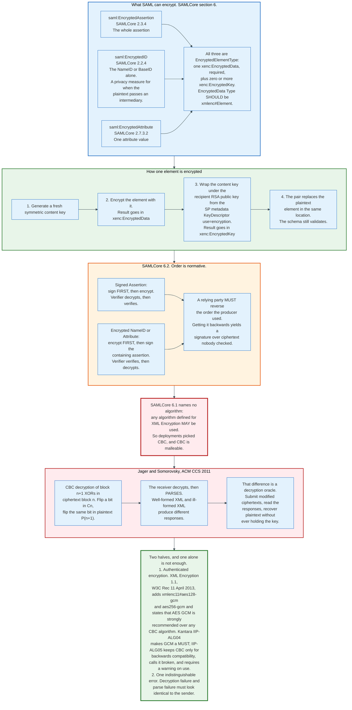

The construction is hybrid encryption, the same shape as TLS. A fresh symmetric content key encrypts the element. The recipient's RSA public key, published in the service provider's metadata as a `KeyDescriptor` with `use="encryption"`, wraps that content key into the `<xenc:EncryptedKey>`. Each wrapped key SHOULD carry a `Recipient` attribute naming the entity it was encrypted for, which is how one assertion is delivered to several parties. `EncryptedData/@Type` SHOULD be `http://www.w3.org/2001/04/xmlenc#Element`, and encrypted identifiers MUST produce a unique ciphertext per operation so that the same subject is not trackable across encryptions.

Ordering is normative and implementers reverse it. SAMLCore 6.2 requires that a signed `<Assertion>` be signed first and encrypted second, so the verifier decrypts and then verifies. It requires the opposite for `<BaseID>`, `<NameID>` and `<Attribute>`: encrypt first, then sign the containing assertion, so the verifier verifies and then decrypts. The rule is that a relying party performs validation and decryption in the reverse order of signing and encryption. Get it backwards and the signature covers ciphertext that nothing has authenticated.

The algorithm hole is in SAMLCore 6.1, one sentence long: any of the algorithms defined for use with XML Encryption MAY be used. SAML names no mandatory-to-implement cipher, no forbidden cipher, and no mode. Deployments took the 2002 default, AES in CBC mode, and kept it.

CBC in XML Encryption was broken in 2011. Tibor Jager and Juraj Somorovsky presented an adaptive chosen-ciphertext attack at the ACM Conference on Computer and Communications Security, pages 413 to 422, in the same research group whose 2012 SAML signature work section 10 covers at length. The mechanism has two parts. CBC is malleable: flipping a bit in ciphertext block n flips the same bit in plaintext block n+1, so an attacker who cannot decrypt can still make targeted, predictable edits to the plaintext. And the receiver does not stop at decryption, it parses. Well-formed XML and ill-formed XML produce different responses, so the receiver becomes a decryption oracle. Repeated submission recovers the plaintext of an encrypted assertion without the key.

The fix has two halves and neither works alone. Authenticated encryption removes the malleability: XML Encryption Version 1.1, a W3C Recommendation of 11 April 2013, adds `http://www.w3.org/2009/xmlenc11#aes128-gcm` and `#aes256-gcm` and states that AES GCM is strongly recommended over any CBC block encryption algorithm, on the grounds that recent cryptanalysis casts doubt on CBC's ability to protect plaintext under XML Encryption. Uniform error handling removes the oracle: decryption failure, parse failure, and validation failure must be indistinguishable to whoever sent the message. The Kantara interoperability profile encodes the first half as a requirement. IIP-ALG04 makes both GCM URIs mandatory to support. IIP-ALG05 keeps `#aes128-cbc` and `#aes256-cbc` as MAY, for backwards compatibility only, states that they are known to be broken, and requires implementations that support them to warn on use. IIP-ALG06 requires RSA-OAEP for key transport with SHA-256 as a supported digest.

Most commercial SAML deployments never turn encryption on, and how many is not published anywhere. The reasoning is mechanical rather than lazy. TLS already protects the assertion between the identity provider and the browser and between the browser and the service provider, and the only intermediary is the user's own user agent, which already knows the user's identity. Encryption adds a second key pair, a second expiry date, and a second rotation dance to a protocol whose most common outage is a certificate expiring. Research federations enable it anyway, because their assertions carry directory attributes subject to a release policy and the front channel is not always the subject's own device.

A document that spends two sections on the signature break and none on the encryption break has an asymmetric threat model. This one no longer does.

---

## 10. XML Signature Wrapping, and How Libraries Got It Wrong

XML signature wrapping is a twenty-year-old attack class that keeps producing new critical vulnerabilities, because the underlying design gap has never been closed.

```mermaid
%%{init: {'theme': 'base', 'themeVariables': {'primaryColor': '#e3f2fd', 'primaryBorderColor': '#1565c0', 'lineColor': '#37474f'}}}%%

flowchart TB
    Cause["ROOT CAUSE<br/>A relying party is two modules with one boolean<br/>between them. The signature module answers<br/>'is some signature in this document valid?'<br/>The claims module asks 'who is the user?'<br/>Nothing forces them to look at the same element."]

    subgraph Pre["What the attacker needs"]
        P1["One valid signed assertion.<br/>Their OWN. It may be expired."]
        P2["No network position. No private key.<br/>No TLS interception.<br/>Register as a normal customer<br/>of the identity provider."]
    end

    subgraph Orig["Original document, signed and honest"]
        O1["samlp:Response<br/>  saml:Assertion ID=abc<br/>    ds:Signature Reference URI=hash-abc<br/>    Subject NameID=mallory@evil.example"]
    end

    subgraph Att["Wrapped document, still cryptographically valid"]
        A1["samlp:Response<br/>  saml:Assertion ID=evil<br/>    Subject NameID=ceo@acme.example<br/>    saml:Advice<br/>      saml:Assertion ID=abc<br/>        ds:Signature Reference URI=hash-abc"]
        A2["The digest still matches: the signed<br/>subtree is byte-identical, and exclusive<br/>c14n makes it position independent.<br/>The signature module says VALID.<br/>The claims module reads the FIRST<br/>Assertion and sees the CEO."]
    end

    Cause --> Pre --> Orig --> Att

    subgraph Vars["The permutation space, Somorovsky et al 2012"]
        V1["Same level, 6 permutations:<br/>evil assertion, real assertion,<br/>signature as siblings"]
        V2["Two levels, 12 permutations:<br/>one nested inside the other"]
        V3["Three levels, 6 permutations:<br/>full chain of nesting"]
        V4["Hiding places that survive schema<br/>validation: saml:Advice, ds:Object,<br/>samlp:Extensions. All are xs:any."]
    end

    Att --> Vars

    subgraph Result["Measured outcome, USENIX Security 2012"]
        R1["14 frameworks analysed.<br/>11 broken. Roughly 80 percent."]
        R2["Broken: Salesforce, Shibboleth via OpenSAML,<br/>IBM XS40, OpenAM, Higgins, Apache Axis2,<br/>JOSSO, Guanxi, OIOSAML, WSO2,<br/>the OneLogin toolkits"]
        R3["3 of the 14 skipped signature<br/>verification entirely when the<br/>Signature element was simply deleted"]
        R4["Salesforce patched by rejecting any<br/>message with more than one Assertion.<br/>The authors then broke the patch by<br/>hiding the original assertion inside<br/>the Audience element."]
    end

    Vars --> Result

    subgraph Fix["What actually works"]
        F1["Process only what was verified.<br/>The verifier returns the ELEMENT,<br/>not a boolean. The claims module<br/>reads nothing else."]
        F2["One parse. One DOM. Never re-serialise<br/>and re-parse between verify and use."]
        F3["Reject documents with more than one<br/>Assertion, and reject Assertions that<br/>are not direct children of Response"]
        F4["Schema-validate against a hardened<br/>schema with the extension points removed"]
        F5["Never take the key from ds:KeyInfo.<br/>Take it from metadata."]
    end

    Result --> Fix

    style Cause fill:#ffebee,stroke:#b71c1c,stroke-width:3px
    style Orig fill:#e8f5e9,stroke:#2e7d32,stroke-width:2px
    style Att fill:#ffebee,stroke:#b71c1c,stroke-width:2px
    style Vars fill:#fff3e0,stroke:#e65100,stroke-width:2px
    style Result fill:#f3e5f5,stroke:#4a148c,stroke-width:2px
    style Fix fill:#e8f5e9,stroke:#2e7d32,stroke-width:3px
```

### 10.1 The Mechanism

The attacker needs one thing: a single valid signed assertion. Their own is fine. An expired one is fine.

They restructure the document so that the element the signature covers is not the element the application reads. The signed assertion is moved somewhere that survives schema validation, and a forged assertion is inserted where the application looks. The digest still matches, because the signed subtree is byte-identical and exclusive canonicalisation made it position-independent.

An abbreviated example. The original document:

```xml
<samlp:Response>
  <saml:Assertion ID="abc">
    <ds:Signature><ds:SignedInfo>
      <ds:Reference URI="#abc">...</ds:Reference>
    </ds:SignedInfo>...</ds:Signature>
    <saml:Subject><saml:NameID>mallory@evil.example</saml:NameID></saml:Subject>
  </saml:Assertion>
</samlp:Response>
```

The wrapped version:

```xml
<samlp:Response>
  <saml:Assertion ID="evil">
    <saml:Subject><saml:NameID>ceo@acme.example</saml:NameID></saml:Subject>
    <saml:Advice>
      <saml:Assertion ID="abc">
        <ds:Signature><ds:SignedInfo>
          <ds:Reference URI="#abc">...</ds:Reference>
        </ds:SignedInfo>...</ds:Signature>
        <saml:Subject><saml:NameID>mallory@evil.example</saml:NameID></saml:Subject>
      </saml:Assertion>
    </saml:Advice>
  </saml:Assertion>
</samlp:Response>
```

The signature module resolves `#abc`, finds the original assertion inside `Advice`, re-digests it, and reports valid. The claims module calls something equivalent to `response.getAssertion(0)` or evaluates the XPath `/samlp:Response/saml:Assertion[1]`, finds the forged assertion, and reads the chief executive's identifier.

Both modules are correct. The system is broken.

### 10.2 The Permutation Space

Somorovsky, Mayer, Schwenk, Kampmann, and Jensen enumerated the variants at USENIX Security 2012 in "On Breaking SAML: Be Whoever You Want to Be." Their taxonomy has three tiers based on how deeply the elements nest.

Placing the evil assertion, the original assertion, and the signature at the same level yields 6 permutations. None is SAML-conformant, because the signature no longer signs its parent element, but all of them digest correctly and any implementation that does not check conformance accepts them. Placing them at two levels yields 12 permutations. Three levels yields 6 more.

The hiding places all come from `xs:any` extension points in the schema. `saml:Advice` is designed to be ignorable. `ds:Object` inside the signature accepts arbitrary content. `samlp:Extensions` accepts arbitrary namespace-qualified content. When `processContents="lax"` is set and no schema is available for the injected namespace, the validator declares the content valid without checking it.

### 10.3 The 2012 Measurement

The paper analysed 14 frameworks and providers over 18 months and found critical vulnerabilities in 11 of them, roughly 80 percent.

| Framework | Type | Where it is used |
|---|---|---|
| Salesforce | Web SSO | Cloud CRM |
| OpenSAML | Web SSO | Shibboleth, SuisseID |
| IBM XS40 | Web services | Enterprise XML security gateway |
| OpenAM | Web SSO | Formerly Sun OpenSSO |
| Higgins 1.x | Web SSO | Eclipse identity project |
| Apache Axis2 | Web services | WSO2 web services |
| JOSSO | Web SSO | Motorola, NEC, Red Hat |
| Guanxi | Web SSO | Sakai Project |
| OIOSAML | Web SSO | Danish eGovernment |
| WSO2 | Web SSO | eBay, Deutsche Bank, HP |
| OneLogin toolkits | Web SSO | WordPress, Joomla, Drupal, SugarCRM |

Three of the 14 were vulnerable to signature exclusion, the simplest failure of all: delete the `ds:Signature` element entirely and the framework skips verification because it only validates a signature that it finds. Apache Axis2 went further and never validated the assertion signature at all, even when present, because it only checked the signature over the SOAP body.

The paper also demonstrated a failure mode that contradicts the usual intuition. Signing the whole document does not fix it. Guanxi, JOSSO, and WSO2 all signed the entire protocol binding element and all were broken by moving the legitimate root into a `ds:Object` inside the original signature and putting the forged content in a new root.

The most instructive episode is Salesforce. After the initial report, Salesforce shipped a countermeasure: reject any message containing more than one `Assertion` element. Manual testing found nothing further and the interface was considered fixed. Months later the authors returned with an automated permutation tool and broke it again, by hiding the original signed assertion inside the `saml:Audience` element, where it was still one `Assertion` by the schema's counting but two by any reasonable reading.

A countermeasure that a human cannot exhaustively verify is a countermeasure that has not been verified.

### 10.4 The 2018 Variant: Comment Truncation

Six years later a different mechanism produced the same result, and it required no wrapping at all.

```mermaid
%%{init: {'theme': 'base', 'themeVariables': {'primaryColor': '#e3f2fd', 'primaryBorderColor': '#1565c0', 'lineColor': '#37474f'}}}%%

flowchart TB
    Setup["SETUP, February 2018.<br/>The attacker controls the domain evil.example<br/>and registers a legitimate account at the IdP<br/>with the identifier ceo@acme.example.evil.example.<br/>They receive a genuine, correctly signed assertion."]

    Orig["ORIGINAL, signed by the IdP<br/>NameID element contains one text node:<br/>ceo@acme.example.evil.example"]

    Mod["MODIFIED, by the attacker.<br/>An XML comment is inserted mid-string:<br/>ceo@acme.example then a comment then .evil.example<br/>The element now has TWO text nodes<br/>with a comment node between them."]

    subgraph Two["Two components, two answers"]
        Sig["SIGNATURE MODULE<br/>Canonicalises with the non-comment variant<br/>of exclusive c14n, which DELETES comment nodes<br/>and concatenates the remaining text.<br/>Sees: ceo@acme.example.evil.example<br/>Digest matches. VERDICT: VALID."]
        Claims["CLAIMS MODULE<br/>Reads the NameID through a DOM helper<br/>that returns the FIRST text node child,<br/>not the concatenation of all of them.<br/>Sees: ceo@acme.example<br/>VERDICT: this is the chief executive."]
    end

    Setup --> Orig --> Mod --> Two

    Why["WHY IT WORKED<br/>Nothing here is a cryptographic failure. The<br/>signature is genuine and the canonicalisation is<br/>correct. The bug is that two libraries in the same<br/>process disagree on what the text content of an<br/>element is, and only one of them is authoritative."]

    Two --> Why

    subgraph CVEs["Disclosed 27 February 2018"]
        C1["CVE-2017-11427  OneLogin python-saml 2.3.0 and earlier"]
        C2["CVE-2017-11428  OneLogin ruby-saml 1.6.0 and earlier"]
        C3["CVE-2017-11429  Clever saml2-js 2.0 and earlier"]
        C4["CVE-2017-11430  omniauth-saml 1.9.0 and earlier"]
        C5["CVE-2018-0489  Shibboleth XMLTooling-C before 1.6.4,<br/>an incomplete fix for CVE-2018-0486"]
    end

    Why --> CVEs

    Echo["THE PATTERN REPEATS.<br/>March 2025: CVE-2025-25291 and CVE-2025-25292.<br/>ruby-saml verifies the signature with REXML and<br/>reads the claims with Nokogiri. The two parsers<br/>build different trees from the same bytes, so the<br/>same XPath selects different elements. Same class,<br/>different pair of libraries, seven years later.<br/>Fixed in 1.12.4 and 1.18.0."]

    CVEs --> Echo

    style Setup fill:#eceff1,stroke:#37474f,stroke-width:2px
    style Mod fill:#ffebee,stroke:#b71c1c,stroke-width:2px
    style Sig fill:#e8f5e9,stroke:#2e7d32,stroke-width:2px
    style Claims fill:#ffebee,stroke:#b71c1c,stroke-width:3px
    style Why fill:#fff3e0,stroke:#e65100,stroke-width:3px
    style Echo fill:#f3e5f5,stroke:#4a148c,stroke-width:2px
```

The attacker registers a legitimate identity provider account whose identifier is a superstring of the victim's: `ceo@acme.example.evil.example`, where `evil.example` is a domain they control. They receive a genuinely signed assertion. They then insert an XML comment into the middle of the `NameID` text:

```xml
<saml:NameID>ceo@acme.example<!---->.evil.example</saml:NameID>
```

Canonical XML without comments deletes comment nodes and concatenates the remaining character data, so the canonical form is unchanged and the digest still matches. The signature module says valid.

The claims module reads the element through a DOM helper that returns the first text node child rather than the concatenation of all of them. One text node has become two. The helper returns `ceo@acme.example`.

Nothing cryptographic failed. Two libraries in the same process disagreed about what the text content of an element is, and the wrong one was authoritative.

Disclosed on 27 February 2018, the finding produced five CVEs across four ecosystems:

| CVE | Library | Affected versions |
|---|---|---|
| CVE-2017-11427 | OneLogin `python-saml` | 2.3.0 and earlier |
| CVE-2017-11428 | OneLogin `ruby-saml` | 1.6.0 and earlier |
| CVE-2017-11429 | Clever `saml2-js` | 2.0 and earlier |
| CVE-2017-11430 | `omniauth-saml` | 1.9.0 and earlier |
| CVE-2018-0489 | Shibboleth `XMLTooling-C` | before 1.6.4, an incomplete fix for CVE-2018-0486 |

The Shibboleth advisory of the same date states that all supported and unsupported platforms are affected and that updating the Xerces-C parser alone does not mitigate it.

### 10.5 The 2024 and 2025 Recurrence

The class did not close. It changed libraries.

CVE-2024-45409, published 10 September 2024, affects `ruby-saml` at 1.12.2 and earlier, and from 1.13.0 up to but not including 1.17.0. The CVE prose says "12.2", which is a typo for 1.12.2; the machine-readable ranges in the same record read `< 1.12.3` and `1.13.0 to < 1.17.0`. The library did not properly verify the signature of the SAML Response, so an unauthenticated attacker holding any document signed by the identity provider could forge a Response with arbitrary contents and log in as any user. Fixed in 1.17.0 and 1.12.3. GitLab shipped the affected library.

CVE-2025-25291 and CVE-2025-25292, both published 12 March 2025, are the same class through a new door. `ruby-saml` verified the signature using REXML and read the claims using Nokogiri. The two parsers build different document structures from identical input, so the same XPath expression selects different elements in each. That is a signature wrapping attack executed entirely through parser disagreement, with no unusual document structure required. An attacker holding one valid signature created with the response-signing key could forge assertions impersonating any user. Fixed in 1.12.4 and 1.18.0, reported through a bug bounty on 4 November 2024 and disclosed after a coordinated fix.

The class dates from 2005, when McIntosh and Austel described XML signature element wrapping. It has produced critical authentication bypasses in 2012, 2018, 2024, and 2025, in different languages, in different libraries, at different companies.

### 10.6 What Actually Fixes It

Four defences work, and only the first one is structural.

**Process only what was verified.** The verification function returns the element, not a boolean. The claims module reads that element and nothing else. This is the see-what-is-signed approach from the 2012 paper, and it eliminates the gap rather than narrowing it. Every other defence is a filter that someone will eventually find a way around, as Salesforce discovered.

**One parse, one tree.** Never verify against one parse of the bytes and read against another. That single rule would have prevented CVE-2025-25291 entirely. If a library uses two XML implementations, it has a parser differential whether or not anyone has found it yet.

**Structural strictness.** Reject any Response containing more than one `Assertion`. Require the assertion to be a direct child of `Response`. Schema-validate against a hardened schema with the `xs:any` extension points removed, accepting the performance cost. Reject documents that contain a `ds:Object` or that place a signature anywhere other than as a direct child of the element it references.

**Trust the metadata, not the document.** Take the verification key from configuration. Reject unsigned assertions by default. The Kantara interoperability profile requires that service providers be able to reject unsigned responses and says they should do so by default.

The persistence of this attack class across two decades has one structural explanation. XML Signature signs a tree and lets the signer choose which part. JSON Web Signature, which OpenID Connect uses, signs a byte string with no choice at all. That difference is the single strongest technical argument for OIDC over SAML, and it has nothing to do with JSON being nicer than XML.

---
## 11. Metadata Exchange and Certificate Rotation

Metadata is the configuration file that establishes trust, and the way an organisation distributes it decides whether certificate rotation is routine or an outage.

```mermaid
%%{init: {'theme': 'base', 'themeVariables': {'primaryColor': '#e3f2fd', 'primaryBorderColor': '#1565c0', 'lineColor': '#37474f'}}}%%

flowchart TB
    subgraph Doc["What a metadata document carries"]
        M1["md:EntityDescriptor<br/>entityID  required, a URI of at most<br/>1024 characters, and the primary key<br/>of the whole trust relationship"]
        M2["validUntil  absolute expiry<br/>cacheDuration  an xs:duration<br/>The root element MUST carry one of them."]
        M3["md:IDPSSODescriptor<br/>WantAuthnRequestsSigned<br/>md:SingleSignOnService endpoints<br/>md:SingleLogoutService endpoints"]
        M4["md:SPSSODescriptor<br/>AuthnRequestsSigned<br/>WantAssertionsSigned<br/>md:AssertionConsumerService, indexed,<br/>with one marked isDefault<br/>md:AttributeConsumingService"]
        M5["md:KeyDescriptor use=signing<br/>md:KeyDescriptor use=encryption<br/>Zero or more of each. The plural<br/>is what makes rotation possible."]
        M6["ds:Signature over the whole document.<br/>Without it, metadata is just a<br/>file of unknown provenance."]
    end

    subgraph Dist["Three ways to distribute it"]
        D1["MANUAL<br/>Paste XML into a form, or upload a<br/>certificate and type three URLs.<br/>What almost every SaaS SP does.<br/>Rotation becomes a support ticket."]
        D2["WELL-KNOWN URL<br/>Publish at a stable HTTPS URL,<br/>refetch on cacheDuration.<br/>Works. Fails at federation scale:<br/>N times M fetches."]
        D3["MDQ, the Metadata Query Protocol<br/>GET base plus entities plus identifier.<br/>The identifier may be the entityID<br/>percent-encoded, or the transformed<br/>form: the literal sha1 in braces followed<br/>by 40 lower-case hex digits of<br/>SHA-1 over the entityID.<br/>Content-Type application/samlmetadata+xml"]
    end

    Doc --> Dist

    subgraph Fed["Federation scale, measured 30 August 2026"]
        F1["eduGAIN: 84 participant federations,<br/>8 more in the candidate stage"]
        F2["InCommon alone: 2,498 entities,<br/>587 identity providers and<br/>1,911 service providers"]
        F3["A bilateral model needs an operator<br/>action per pair. A federation operator<br/>signs one aggregate, or answers<br/>one MDQ query at a time."]
    end

    Dist --> Fed

    subgraph Rot["Certificate rotation, the correct sequence"]
        R1["T minus 30 days: publish the NEW<br/>certificate as a SECOND KeyDescriptor<br/>with use=signing. Keep signing with<br/>the old key."]
        R2["T minus 30 to T: consumers refresh<br/>metadata and now hold both keys.<br/>The Kantara interoperability profile<br/>requires trying each key in turn."]
        R3["T: switch the signing key.<br/>Nothing breaks, because every<br/>consumer already trusts both."]
        R4["T plus 30 days: remove the old<br/>KeyDescriptor from metadata."]
        R1 --> R2 --> R3 --> R4
    end

    Fed --> Rot

    Fail["THE FAILURE MODE, and it is the single<br/>most common SAML outage.<br/>The SP pinned one certificate by hand at<br/>onboarding. It never refetches metadata. The<br/>IdP certificate expires, usually after the<br/>vendor default of two or three years, and every<br/>login fails at once with a signature error. There<br/>is no warning because certificate expiry is<br/>invisible to both the login flow and the<br/>uptime monitor until the moment it fires."]

    Rot --> Fail

    style Doc fill:#e3f2fd,stroke:#1565c0,stroke-width:2px
    style Dist fill:#fff3e0,stroke:#e65100,stroke-width:2px
    style Fed fill:#f3e5f5,stroke:#4a148c,stroke-width:2px
    style Rot fill:#e8f5e9,stroke:#2e7d32,stroke-width:3px
    style Fail fill:#ffebee,stroke:#b71c1c,stroke-width:3px
```

### 11.1 The Document

An `md:EntityDescriptor` describes one SAML entity. Its `entityID` attribute is required, is typed as a URI limited to 1024 characters, and is the primary key of every trust relationship the entity has.

```xml
<md:EntityDescriptor
    xmlns:md="urn:oasis:names:tc:SAML:2.0:metadata"
    entityID="https://app.example-crm.com/saml/metadata"
    validUntil="2026-12-31T00:00:00Z"
    cacheDuration="PT12H">
  <md:SPSSODescriptor
      protocolSupportEnumeration="urn:oasis:names:tc:SAML:2.0:protocol"
      AuthnRequestsSigned="true"
      WantAssertionsSigned="true">
    <md:KeyDescriptor use="signing">
      <ds:KeyInfo><ds:X509Data><ds:X509Certificate>MIIC...</ds:X509Certificate></ds:X509Data></ds:KeyInfo>
    </md:KeyDescriptor>
    <md:KeyDescriptor use="encryption">
      <ds:KeyInfo><ds:X509Data><ds:X509Certificate>MIIC...</ds:X509Certificate></ds:X509Data></ds:KeyInfo>
    </md:KeyDescriptor>
    <md:SingleLogoutService
        Binding="urn:oasis:names:tc:SAML:2.0:bindings:HTTP-Redirect"
        Location="https://app.example-crm.com/saml/slo"/>
    <md:AssertionConsumerService index="0" isDefault="true"
        Binding="urn:oasis:names:tc:SAML:2.0:bindings:HTTP-POST"
        Location="https://app.example-crm.com/saml/acs"/>
  </md:SPSSODescriptor>
</md:EntityDescriptor>
```

Three attributes on that document carry more weight than their size suggests.

`validUntil` is an absolute expiry and `cacheDuration` is an `xs:duration`. The specification requires that a metadata instance used as a root element carry at least one of them, and recommends that only the root carry either. Kantara's interoperability profile goes further: metadata with a missing or expired `validUntil` MUST be rejected. That turns metadata into a document with a shelf life, which is exactly the property that forces consumers to refresh.

`protocolSupportEnumeration` is required on every role descriptor and must include `urn:oasis:names:tc:SAML:2.0:protocol` for a SAML 2.0 entity. It is how a consumer distinguishes a SAML 2.0 role from a SAML 1.1 or WS-Federation role in the same file.

`AuthnRequestsSigned` and `WantAssertionsSigned` on the SP side, and `WantAuthnRequestsSigned` on the IdP side, declare intent rather than enforce it. They default to false when omitted, and the difference between "I sign my requests" and "I require signed requests" is exactly one word in the attribute name. Misreading it is a common onboarding error.

`md:KeyDescriptor` takes `use="signing"` or `use="encryption"`, and it is `minOccurs="0" maxOccurs="unbounded"`. That plurality is the whole basis of safe key rotation and it is the single most under-used feature in the specification.

`md:AssertionConsumerService` is an indexed endpoint. The `index` attribute lets an `AuthnRequest` select an endpoint by number rather than by URL, and `isDefault` names where unsolicited responses go. At most one may be default.

### 11.2 Three Ways to Distribute It

**Manual configuration** is what almost every commercial SaaS service provider does. An administrator downloads XML from one console and uploads it to another, or reads three URLs and a certificate off one screen and types them into another. It works exactly once. There is no refresh, so the configuration is a snapshot of one moment, and every later change becomes a coordinated maintenance window between two organisations.

**A well-known URL** publishes metadata at a stable HTTPS address and expects consumers to refetch on `cacheDuration`. This is what Shibboleth, simpleSAMLphp, and most self-hosted deployments do. It works, and it scales linearly with the number of relationships. In a federation of N identity providers and M service providers it produces N times M periodic fetches.

**The Metadata Query Protocol** replaces the aggregate with a lookup. `draft-young-md-query`, revision 25 dated 12 June 2026, defines the transport: a request is the base URL, the string `entities/`, and a percent-encoded identifier, so a base of `http://example.org/mdq/` and an identifier of `foo` produce `http://example.org/mdq/entities/foo`. The SAML profile, `draft-young-md-query-saml`, adds two rules that matter. The response media type is `application/samlmetadata+xml`. And a responder must accept a transformed identifier: the literal string `sha1` in braces, followed by the 40 lower-case hexadecimal digits of the SHA-1 hash of the `entityID`. For `http://example.org/service` the draft gives the worked value `{sha1}11d72e8cf351eb6c75c721e838f469677ab41bdb`.

The transformed form exists because the artifact binding already carries a SHA-1 of the `entityID` as its `SourceID`, and a recipient holding only that hash has no way to recover the original URI. MDQ lets it look up the entity anyway.

The security posture of MDQ is explicit about SHA-1's weakness. The draft notes that SHA-1 has weak collision resistance but that no attacks are known on its second preimage resistance, which is the property this use actually depends on, and it forbids SHA-1 as a digest algorithm for signing the metadata itself.

### 11.3 Federation Scale Decides the Choice

Bilateral configuration is tolerable at ten relationships and impossible at a thousand.

InCommon publishes metadata for 2,498 entities as of 30 August 2026: 587 identity providers and 1,911 service providers. If every pair configured each other by hand, the number of administrative actions would be in the hundreds of thousands. Instead the federation operator vets each entity once, signs one aggregate or answers one MDQ query at a time, and every member validates a single signature against a single federation key.

eduGAIN then links 84 such national federations, with 8 more in the candidate stage on the same date. The result is a trust graph an individual member could not enumerate, operated as a small number of signed files.

Commercial SSO has no equivalent. Each SaaS vendor maintains its own bilateral configuration with each customer's identity provider, which is why onboarding a new application takes a ticket, a screenshot, and a certificate paste, and why the same work is repeated at every one of that vendor's customers.

### 11.4 Certificate Rotation, Done Correctly

The correct rotation sequence uses the plurality of `KeyDescriptor` and takes about sixty days.

**T minus 30 days.** Generate the new key pair. Publish the new certificate as a **second** `KeyDescriptor` with `use="signing"`, alongside the existing one. Keep signing with the old key. Nothing changes on the wire.

**T minus 30 to T.** Consumers refresh metadata on their `cacheDuration` and now hold both certificates. Kantara requirement IIP-MD07 states that implementations must consume and use multiple signing keys per role descriptor and, when verifying, attempt each key in sequence. A conforming consumer is now ready for either signature.

**T.** Switch the signing key. No consumer notices, because every one of them already trusts the new certificate.

**T plus 30 days.** Remove the old `KeyDescriptor`. Rotation is complete with zero downtime and no coordinated maintenance window.

The same pattern applies to encryption keys in the other direction. Kantara requires service providers to be configurable with at least two decryption keys, so that the identity provider can switch encryption certificates without a flag day.

### 11.5 Certificate Rotation, As Actually Practised

The common failure is not subtle and it is the single most frequent SAML outage.

A service provider onboards by pasting one certificate into a text field. It never refetches metadata, because it was never given a metadata URL, only a certificate. Two or three years later, on the vendor's default certificate lifetime, that certificate expires. Every login to that application fails simultaneously with a signature validation error.

Three properties make it worse than an ordinary expiry. It is invisible until it fires, because nothing in the login flow reads the certificate expiry date and no uptime monitor tests a certificate that is not used for TLS. It affects every user at once, because there is no gradual rollout. And the fix requires two organisations to act in sequence, because the identity provider must publish a new certificate and the service provider must install it, and the people who did the original integration have usually left.

The mitigations are unglamorous. Consume metadata from a URL rather than a file, and honour `cacheDuration`. Where the counterparty offers only manual configuration, record the certificate expiry in a calendar with an alert at 60 days, and treat that alert as an incident ticket rather than a reminder. Where the product supports multiple signing certificates, always configure two.

The SaaS identity providers moved to multi-year lifetimes for exactly this reason, which trades a frequent small problem for a rare large one. AD FS went the other way, keeping a one-year default and automating the rollover in metadata, which trades a rare large problem for a frequent small one. Neither is good. The design that works is automatic metadata refresh, and the reason it is not universal is that it requires the service provider to build a scheduled fetcher for something that appears to be a one-time configuration step.

---

## 12. Sessions and Single Logout

SAML establishes sessions and cannot end them. The Single Logout profile is a serious attempt to fix that, and it fails for structural reasons that no implementation can repair.

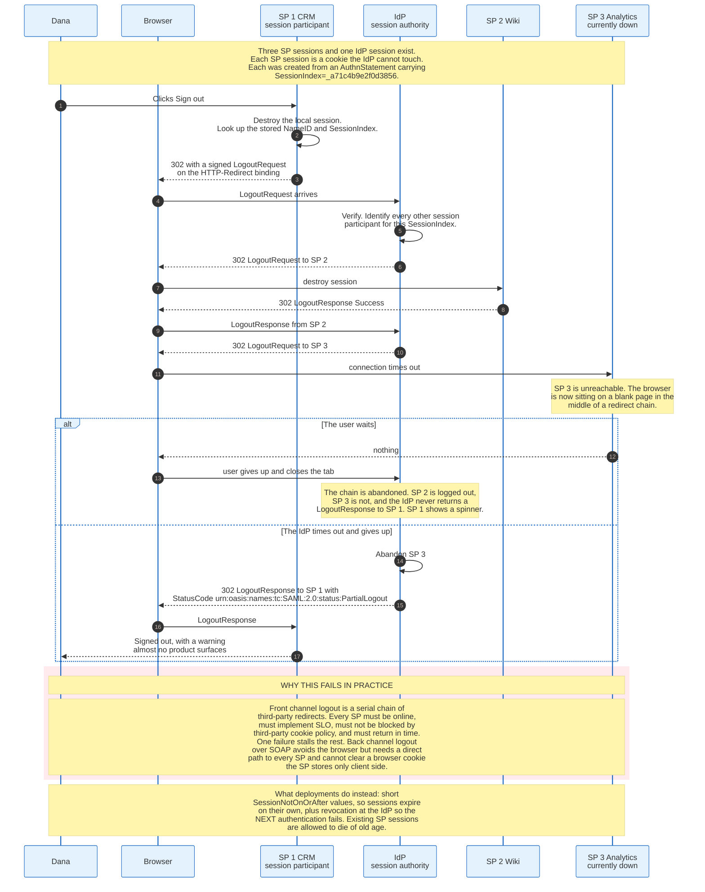

### 12.1 What a Session Actually Is

After a successful assertion, three independent sessions exist and none of them can see the others.

The identity provider holds a session with the browser, usually a cookie on its own domain, which is what makes the second and subsequent logins silent. Each service provider holds its own session, its own cookie, on its own domain, with its own lifetime. And the assertion that created each service provider session is finished, consumed, and cached only as a replay-prevention identifier.

There is no channel between them. The identity provider cannot read or delete a cookie on `app.example-crm.com`. The service provider cannot ask the identity provider whether the user is still valid. Both facts follow directly from the browser being the transport.

The only thread connecting them is `SessionIndex`, the opaque string in the `AuthnStatement` that both sides retain.

### 12.2 The Single Logout Protocol

The profile identifier is `urn:oasis:names:tc:SAML:2.0:profiles:SSO:logout`. It names two roles: the identity provider is the session authority, and each service provider is a session participant.

A `LogoutRequest` names the subject and, optionally, one or more `SessionIndex` values. A `LogoutResponse` returns a status. Both may travel on any front-channel binding, Redirect, POST, or Artifact, or on the SOAP back channel.

The five-step template from section 4.4.2 of the Profiles document:

1. A session participant sends a `LogoutRequest` to the identity provider.
2. The identity provider determines which other participants are in the session.
3. The identity provider sends a `LogoutRequest` to each of them.
4. Each terminates its local session and returns a `LogoutResponse`.
5. The identity provider returns a `LogoutResponse` to the original requester.

Steps 3 and 4 repeat once per participant. The identity provider may also initiate at step 2 and skip step 5.

### 12.3 Why the Front Channel Fails

Front-channel logout is a serial chain of third-party redirects driven by one browser, and every link can break.

**Every participant must be reachable.** One service provider that is down, slow, or behind a network partition stalls the chain. The browser sits on a blank page in the middle of somebody else's redirect.

**Every participant must implement it.** Single Logout is optional. How many commercial SaaS applications publish no `SingleLogoutService` endpoint at all has never been measured publicly. Those sessions simply survive.

**Third-party cookie policy breaks it.** The chain works by loading each service provider's logout endpoint in a context that is cross-site relative to the identity provider. Browser vendors have spent a decade restricting exactly that. Safari's Intelligent Tracking Prevention, Firefox's Total Cookie Protection, and Chrome's partitioning work all treat the pattern as tracking, because mechanically it is indistinguishable from tracking. Hidden-iframe logout, the technique used to parallelise the chain, is the most affected.

**The user can abandon it.** Nothing forces the browser to complete a redirect chain. A closed tab leaves some participants logged out, some logged in, and the original requester waiting.

**Errors are unactionable.** The protocol has a status code for exactly this situation, `urn:oasis:names:tc:SAML:2.0:status:PartialLogout`. Almost no product surfaces it to the user, because a message reporting that four of six applications are logged out while declining to name the other two is not a message anyone wants to write.

### 12.4 Why the Back Channel Also Fails

Back-channel logout sends `LogoutRequest` over SOAP directly from the identity provider to each service provider, bypassing the browser entirely. It solves reachability ordering and browser policy, and it introduces two problems of its own.

It needs a direct network path from the identity provider to every service provider, with mutual authentication. In a corporate identity provider talking to fifty internet SaaS applications, that is fifty outbound integrations that do not otherwise exist.

More fundamentally, it cannot clear a cookie. The service provider can mark its server-side session record invalid, and many do. If the service provider keeps session state only in a signed client-side cookie, which is a common stateless design, there is nothing on the server to invalidate and the back channel achieves nothing.

### 12.5 What Deployments Do Instead

Production systems have largely stopped trying to make logout synchronous and have made sessions short instead.

`SessionNotOnOrAfter` in the `AuthnStatement` sets an upper bound the service provider should honour. Setting it to a few hours means an orphaned session dies on its own. Combined with revocation at the identity provider, so that the next authentication fails, the result is a bounded window rather than an immediate cut.

Continuous access evaluation, which several vendors ship under different names, is the other direction: the service provider re-checks with the identity provider out of band and terminates its own session on a signal. That is not SAML. It is a proprietary side channel bolted on beside it, and it works only where one vendor controls both ends.

The honest summary for anyone designing an SSO deployment: treat logout as best-effort and design the session lifetime as if logout does not exist. For high-assurance environments, the workable pattern is short service provider sessions plus a short `SessionNotOnOrAfter`, plus revocation at the identity provider, plus device management for the case where the browser itself is the risk.

Single Logout does not log the user out. It asks politely, in series, and reports partial success.

---
## 13. Just-in-Time Provisioning and SCIM

An assertion arrives only when someone logs in, and a departed employee never logs in again. That single asymmetry is why authentication alone can never deprovision an account, and why every serious SSO deployment runs a second protocol.

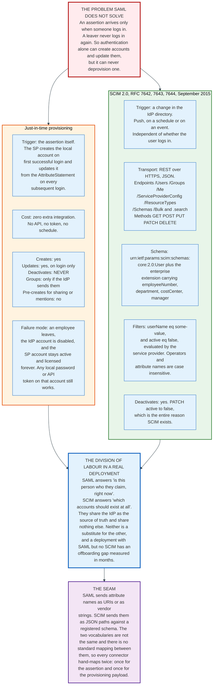

### 13.1 Just-in-Time Provisioning

Just-in-time provisioning creates the local account from the assertion itself, on first successful login, and refreshes it from the `AttributeStatement` on every subsequent login.

It costs nothing to integrate. No API, no credential, no schedule, no additional network path. The service provider already parses attributes to establish the session, and creating a row in a users table from the same data is a small increment.

It does four things well and one thing not at all.

| Operation | Just-in-time |
|---|---|
| Create an account on first login | Yes |
| Update profile fields on each login | Yes, if the SP applies them every time |
| Assign roles from group attributes | Yes, if the IdP releases them |
| Pre-create an account for sharing or mentions | No, the user must log in first |
| **Deactivate a leaver** | **Never** |

The gap is not a bug in any implementation. The protocol has no message that means "this user is gone," and no reason to send one, because the trigger for every SAML message is a user action and a departed user takes no actions.

The failure that follows is concrete. An employee leaves. Their identity provider account is disabled within the hour, and SSO to every application stops. Their accounts at those applications remain active, remain licensed, and remain in every access review as apparently legitimate users. Any local password they set before SSO was enforced still works. Any API token they generated still works. Any integration they configured still runs.

The gap is measured in months, because it closes only when someone runs a manual review.

### 13.2 SCIM 2.0

The System for Cross-domain Identity Management fills that gap with a directory push. Three RFCs, all published in September 2015, define it:

| RFC | Title | Content |
|---|---|---|
| **RFC 7642** | Definitions, Overview, Concepts, and Requirements | The use cases and the model |
| **RFC 7643** | Core Schema | The `User` and `Group` resources and the enterprise extension |
| **RFC 7644** | Protocol | The REST binding, endpoints, filtering, and bulk operations |

The editors are drawn from Oracle, SailPoint, Cisco, Nexus Technology, and Salesforce, which is a fair map of who needed the problem solved.

SCIM is REST over HTTPS with JSON bodies. RFC 7644 defines eight endpoints:

| Endpoint | Methods | Purpose |
|---|---|---|
| `/Users` | GET, POST, PUT, PATCH, DELETE | Retrieve, add, modify users |
| `/Groups` | GET, POST, PUT, PATCH, DELETE | Retrieve, add, modify groups |
| `/Me` | GET, POST, PUT, PATCH, DELETE | Alias for the authenticated subject |
| `/ServiceProviderConfig` | GET | Which optional features this provider supports |
| `/ResourceTypes` | GET | Which resource types exist |
| `/Schemas` | GET | The schemas the provider understands |
| `/Bulk` | POST | Batched operations |
| `[prefix]/.search` | POST | Query with a body rather than a query string, for long filters |

The core user schema is `urn:ietf:params:scim:schemas:core:2.0:User`, carrying `userName`, `name`, `emails`, `active`, `groups`, and roughly twenty other attributes. The enterprise extension, `urn:ietf:params:scim:schemas:extension:enterprise:2.0:User`, adds `employeeNumber`, `costCenter`, `organization`, `division`, `department`, and `manager`. Those are the fields an HR-driven identity programme actually cares about.

Filtering uses a small expression language against attribute names, with case-insensitive names and operators, so `filter=userName Eq "john"` and `filter=Username eq "john"` are the same query. Providers advertise whether they support filtering at all through `/ServiceProviderConfig`.

The operation that matters most is one line:

```http
PATCH /v2/Users/2819c223-7f76-453a-919d-413861904646
Content-Type: application/scim+json

{
  "schemas": ["urn:ietf:params:scim:api:messages:2.0:PatchOp"],
  "Operations": [{ "op": "replace", "path": "active", "value": false }]
}
```

Setting `active` to false is the entire reason SCIM exists. Everything else is convenience.

### 13.3 How the Two Divide the Work

SAML answers a question about right now: is this person who they claim to be, at this instant, and what do we know about them. SCIM answers a question about state: which accounts should exist at all, and which should be disabled.

They share the identity provider as the source of truth and share nothing else. Neither substitutes for the other. A deployment with SAML and no SCIM has an offboarding gap. A deployment with SCIM and no SAML has correct account lifecycle and local passwords.

The seam between them is unglamorous and real. SAML sends attribute names as URIs, or as OIDs with friendly names, or as arbitrary vendor strings. SCIM sends them as JSON paths against a registered schema. There is no standard mapping between the two vocabularies. Every connector therefore hand-maps twice: once for the assertion attributes and once for the provisioning payload, and the two mappings drift.

### 13.4 What Stalls SCIM Adoption

SCIM is a decade old and its adoption trails SAML, for reasons that are commercial rather than technical. No public registry counts SCIM endpoints the way InCommon counts SAML entities, so the size of the gap has never been measured.

SCIM requires the service provider to build and operate an authenticated write API with rate limiting, idempotency, conflict handling, and an audit trail. SAML requires it to parse an XML document. The engineering cost is an order of magnitude apart.

SCIM is also usually gated behind a higher pricing tier than SSO, and often a higher one still. A customer who has already paid the SSO uplift discovers a second uplift for provisioning, and frequently declines, which leaves the offboarding gap open for commercial reasons.

And SCIM has real interoperability variance. The specification makes filtering, bulk operations, `PATCH` semantics, and sorting all optional, discoverable through `/ServiceProviderConfig`. Identity providers therefore ship a per-application connector rather than a generic client, which reproduces exactly the per-integration cost that a standard was supposed to remove.

The 2015 RFCs are still the base, but the working group has moved. RFC 9865, October 2025, adds cursor-based pagination and formally updates RFC 7643 and RFC 7644. RFC 9944 and RFC 9967, both May 2026, add a device schema and a profile for Security Event Tokens, and RFC 9967 also updates both 2015 standards-track documents. Nothing has obsoleted RFC 7642, 7643 or 7644, so a deployed SCIM client written against the 2015 text still interoperates. What has changed is that pagination and asynchronous requests now have a specified answer instead of a per-vendor one.

---

## 14. Attribute Mapping and Role Assignment

Attribute mapping is where a federation stops being a protocol problem and becomes an authorisation problem, and it is where most real SSO incidents originate.

```mermaid
%%{init: {'theme': 'base', 'themeVariables': {'primaryColor': '#e3f2fd', 'primaryBorderColor': '#1565c0', 'lineColor': '#37474f'}}}%%

flowchart LR
    subgraph Src["Source of truth"]
        AD["Active Directory / LDAP<br/>sAMAccountName, mail,<br/>memberOf, department,<br/>employeeID, userPrincipalName"]
        HR["HR system<br/>job code, cost centre,<br/>start date, termination date"]
    end

    subgraph IdPside["Identity provider: the release policy"]
        Pol["Per-SP attribute release.<br/>The IdP decides what each SP is<br/>allowed to learn about the user.<br/>This is a privacy control, not<br/>a plumbing detail."]
        Fmt["Name format, chosen per deployment:<br/>attrname-format:uri, the URN style<br/>used by research federations<br/>attrname-format:basic, short names<br/>attrname-format:unspecified,<br/>the default and the usual choice<br/>for commercial SaaS"]
    end

    subgraph Wire["What travels in the AttributeStatement"]
        W1["Name=urn:oid:0.9.2342.19200300.100.1.3<br/>FriendlyName=mail<br/>Value=dana.okoro@acme.example"]
        W2["Name=urn:oid:1.3.6.1.4.1.5923.1.1.1.9<br/>FriendlyName=eduPersonScopedAffiliation<br/>Value=member@acme.example"]
        W3["Name=Groups  unspecified format<br/>Value=crm-admins<br/>Value=finance-readonly<br/>Multi-valued means repeating<br/>saml:AttributeValue, not a<br/>comma separated string"]
    end

    subgraph SPside["Service provider: mapping and authorisation"]
        M1["Map: wire name to local field.<br/>The SP configuration decides that<br/>the attribute named Groups is the<br/>role source."]
        M2["Authorise: crm-admins becomes the<br/>Administrator role. finance-readonly<br/>becomes a scoped viewer."]
        M3["Decide the collision policy.<br/>Is the assertion authoritative, or<br/>does a locally granted role survive<br/>a login that no longer carries it?"]
    end

    AD --> Pol
    HR --> Pol
    Pol --> Fmt
    Fmt --> W1
    Fmt --> W2
    Fmt --> W3
    W1 --> M1
    W2 --> M1
    W3 --> M1
    M1 --> M2 --> M3

    subgraph Traps["The four traps"]
        T1["THE IDENTIFIER TRAP<br/>Mapping accounts on an email address<br/>breaks the day someone changes their<br/>name. Map on an opaque, immutable,<br/>never-reused value. That is what<br/>subject-id and pairwise-id, OASIS<br/>Committee Specification 01 of<br/>16 January 2019, exist to provide."]
        T2["THE PRIVILEGE TRAP<br/>If the assertion is authoritative for<br/>roles, whoever edits an AD group edits<br/>production access. Group membership<br/>is now a privileged operation and<br/>usually is not treated as one."]
        T3["THE DRIFT TRAP<br/>If the SP only applies roles at account<br/>creation, a demotion in the directory<br/>never reaches the application. Apply<br/>the mapping on EVERY login."]
        T4["THE OVERSHARE TRAP<br/>An IdP that releases every attribute to<br/>every SP turns each SaaS breach into a<br/>directory leak. Release the minimum,<br/>per SP, and audit the list."]
    end

    M3 --> Traps

    style Src fill:#eceff1,stroke:#37474f,stroke-width:2px
    style IdPside fill:#e8f5e9,stroke:#2e7d32,stroke-width:2px
    style Wire fill:#e3f2fd,stroke:#1565c0,stroke-width:2px
    style SPside fill:#fff3e0,stroke:#e65100,stroke-width:2px
    style Traps fill:#ffebee,stroke:#b71c1c,stroke-width:3px
```

### 14.1 The Three Name Formats

`saml:Attribute` carries `Name`, an optional `NameFormat`, and an optional `FriendlyName`. Section 8.2 of the core specification defines three formats.

`urn:oasis:names:tc:SAML:2.0:attrname-format:unspecified` is the default when `NameFormat` is omitted. The name is any string and its meaning is a matter of agreement. Commercial SaaS uses this almost exclusively, with names like `email`, `firstName`, and `Groups`.

`urn:oasis:names:tc:SAML:2.0:attrname-format:uri` requires the name to be a URI reference. Research and education federations use it, with OIDs from the eduPerson and inetOrgPerson schemas:

```xml
<saml:Attribute
    Name="urn:oid:0.9.2342.19200300.100.1.3"
    NameFormat="urn:oasis:names:tc:SAML:2.0:attrname-format:uri"
    FriendlyName="mail">
  <saml:AttributeValue>dana.okoro@acme.example</saml:AttributeValue>
</saml:Attribute>
```

`urn:oasis:names:tc:SAML:2.0:attrname-format:basic` restricts the name to the `xs:Name` primitive type. It sees little use.

`FriendlyName` is human-readable and explicitly non-normative: the specification says its value MUST NOT be used as a basis for formally identifying SAML attributes. Service providers that key their mapping on `FriendlyName` rather than `Name` break the first time an identity provider changes a label.

### 14.2 Multi-Valued Attributes

An attribute with several values repeats `AttributeValue`:

```xml
<saml:Attribute Name="Groups">
  <saml:AttributeValue>crm-admins</saml:AttributeValue>
  <saml:AttributeValue>finance-readonly</saml:AttributeValue>
</saml:Attribute>
```

The specification recommends exactly this and adds that if any value carries an `xsi:type`, all of them must carry the identical type. It also defines the empty and null cases precisely: an attribute with no values omits `AttributeValue` entirely, and a null value is an empty element carrying `xsi:nil="true"`.

A group named `Sales, EMEA` is unambiguous in the repeated form and ambiguous in a comma-joined string. Service providers that concatenate values into one string and split on a delimiter get this wrong, and the bug surfaces the first time a customer creates a group with a comma in its name.

### 14.3 Attribute Release Is a Privacy Control

The identity provider decides, per service provider, which attributes to send. That decision is a privacy control, and the two halves of the SAML world treat it very differently.

Academic federations built the whole model around minimal release. A university sends a journal publisher `eduPersonScopedAffiliation` with the value `member@acme.example` and nothing else, which proves entitlement without identifying the reader. `eduPersonTargetedID`, and its modern replacement `pairwise-id`, give the publisher a stable per-publisher pseudonym so it can maintain preferences without ever learning who the user is.

Commercial deployments default to releasing everything, because the SaaS application asks for it and the administrator configuring the integration wants the login to work on the first attempt. The result is that every SaaS breach becomes a partial directory disclosure: names, email addresses, departments, employee numbers, and manager relationships, for every user who ever logged in.

Metadata offers the mechanism to do better. `md:AttributeConsumingService` lets a service provider declare, in its own metadata, exactly which attributes it requires and which it merely desires, using `md:RequestedAttribute` with an `isRequired` flag. An identity provider can then release the required set and withhold the rest. The mechanism is well specified, well supported in Shibboleth, and almost entirely unused in commercial SSO.

### 14.4 Roles From Groups

The dominant pattern maps a group attribute to a local role, and it has three failure modes.

**Group membership becomes a privileged operation, silently.** If the service provider treats `crm-admins` in the assertion as conferring administrator rights, then anyone who can add a member to that directory group can grant production administrative access. In most organisations, directory group membership is delegated to help desk staff and managers, and it is not audited at the same level as an application role change. The privilege escalation path runs through a system that nobody thinks of as part of the application.

**Roles drift when they are applied only at creation.** A service provider that assigns roles during just-in-time account creation and never again will keep granting administrative access after the directory demotes the user. The correct behaviour is to recompute roles on every login and treat the assertion as authoritative. That in turn requires deciding what happens to roles granted locally in the application, which is a policy question the protocol cannot answer.

**Group names collide across tenants and change over time.** A group named `admins` means different things in different business units. A group renamed during a reorganisation orphans every mapping that referenced it by name. Mapping on a stable group identifier rather than a display name avoids the second problem and not the first.

### 14.5 The Identifier Trap

The single most consequential attribute decision is which value keys the local account, and the common answer is wrong.

Mapping on email address breaks whenever an email address changes, which happens on marriage, on a legal name change, on a domain migration after an acquisition, and on any correction of a typo made during onboarding. Each change orphans the existing account. The service provider then either creates a duplicate, leaving the original with its data and its permissions intact, or requires a manual merge.

Worse, email addresses get reused. An organisation that reassigns `sales@acme.example` or recycles a departed employee's address hands the new holder the old holder's account.

The correct key is opaque, immutable, and never reused. `NameID` with the `persistent` format provides one, at up to 256 characters, with `NameQualifier` and `SPNameQualifier` establishing which pair it belongs to. The 2019 Subject Identifier Attributes Profile provides two cleaner ones, `subject-id` and `pairwise-id`, in the form `uniqueID@scope`, with case-insensitive comparison and a defined character set.

The practical guidance is short. Key the account on an opaque identifier. Carry the email address as an ordinary attribute and update it on every login. Never make a human-readable string the primary key of anything.

---
## 15. Security and Risk Beyond the Signature

Signature wrapping gets the attention. The rest of the SAML threat model is larger, and most of it is configuration rather than cryptography.

### 15.1 The Threat Model

| Attack | Mechanism | Defence |
|---|---|---|
| **Signature exclusion** | Delete `ds:Signature`. A verifier that only validates a signature it finds skips validation entirely | Require a signature. Fail closed |
| **Signature wrapping** | Move the signed element so the claims module reads a different one | Process only the verified element. One parse |
| **Comment truncation** | Split a text node with a comment so the DOM reader sees a prefix | Read the full concatenated text content |
| **Parser differential** | Verify with one XML parser, read with another | Never use two XML implementations in one path |
| **Untrusted `KeyInfo`** | Sign with an attacker key and embed the matching certificate | Take the key from metadata only |
| **Assertion replay** | Resubmit a captured assertion within its window | Shared replay cache keyed on assertion `ID` |
| **Assertion redirection** | Present an assertion issued for SP A to SP B | Check `Audience` and `Recipient` |
| **Login CSRF** | Post the attacker's own assertion into a victim browser | Require `InResponseTo`. Refuse unsolicited responses |
| **Open redirect via RelayState** | Put a URL in RelayState and have the SP redirect to it | RelayState is an opaque handle, or allowlist the target |
| **XXE and entity expansion** | The SAML endpoint is an unauthenticated XML parser | Disable external entities and DTDs. Cap expansion |
| **XSLT in `Transform`** | XML Signature permits an XSLT transform, which is code execution | Reject any transform other than enveloped-signature and exclusive c14n |
| **Golden SAML** | Steal the signing private key and mint assertions | HSM-backed keys. Rotation. Cross-log correlation |
| **Metadata poisoning** | Supply attacker-controlled metadata during onboarding | Signed metadata. Reject expired `validUntil` |
| **XML Encryption chosen-ciphertext** | CBC mode in XML Encryption is malleable, and a distinguishable parse error acts as a decryption oracle | Require AES-GCM, per Kantara IIP-ALG04. Return one indistinguishable error |
| **Clock skew abuse** | A generous skew allowance widens every validity window | Keep skew at or under 3 minutes. Use NTP |

The table has fifteen rows. Two of them deserve emphasis because they are not obvious.

The XSLT transform is a code-execution primitive hiding inside a signature format. XML Signature permits arbitrary transforms in a `ds:Reference`, and one of the standard transform algorithms is XSLT. A verifier that applies transforms before deciding whether it trusts them is executing attacker-supplied code during signature validation. SAML core section 5.4.4 says signatures should not contain transforms other than enveloped-signature and exclusive c14n, and that verifiers MAY reject others. MAY is doing a great deal of work in that sentence. The correct behaviour is to reject, unconditionally.

Clock skew is a quiet risk multiplier. A five-minute assertion with three minutes of allowed skew is an eight-minute replay window. A deployment that sets skew to fifteen minutes because two servers drifted once has a twenty-minute window, and nobody will ever revisit the setting.

### 15.2 Golden SAML and Silver SAML

The most severe attack on a SAML federation does not attack SAML at all. It steals the key.

```mermaid
%%{init: {'theme': 'base', 'themeVariables': {'primaryColor': '#e3f2fd', 'primaryBorderColor': '#1565c0', 'lineColor': '#37474f'}}}%%

flowchart TB
    Premise["THE STRUCTURAL FACT<br/>An SP trusts an assertion because of one thing:<br/>a signature it can verify with the public key in<br/>metadata. Whoever holds the matching private key<br/>IS the identity provider, for every SP in the<br/>federation, for every user, with any attributes."]

    subgraph Golden["Golden SAML, named by CyberArk in 2017"]
        G1["1. Compromise the AD FS server, or the<br/>host holding its token-signing private key,<br/>or a backup of it"]
        G2["2. Extract the token-signing certificate<br/>and private key"]
        G3["3. Mint assertions offline. Any NameID,<br/>any groups, any AuthnContext, any<br/>SessionIndex, any validity window."]
        G4["4. Present them to every relying party<br/>that federates with that AD FS"]
    end

    subgraph Silver["Silver SAML, Semperis, 29 February 2024"]
        S1["Same forging technique, no AD FS needed.<br/>Targets Entra ID applications configured with<br/>an EXTERNALLY generated signing certificate"]
        S2["The private key exists outside the IdP:<br/>in a key vault, on a build agent, in a<br/>ticket attachment, on an admin laptop"]
        S3["Whoever obtains that key can sign responses<br/>the SP will accept, without ever touching<br/>the identity provider"]
    end

    Premise --> Golden
    Premise --> Silver

    Real["OBSERVED IN THE WILD<br/>MITRE catalogues this in ATT and CK as<br/>T1606.002, Forge Web Credentials: SAML Tokens. APT29 used<br/>stolen SAML signing certificates during the<br/>SolarWinds compromise disclosed in December 2020.<br/>AADInternals ships the capability as a function call."]

    Golden --> Real
    Silver --> Real

    subgraph Why["Why the usual controls do not fire"]
        W1["MFA is bypassed. The forged assertion simply<br/>asserts that MFA happened."]
        W2["Password resets do nothing. No password<br/>is involved."]
        W3["Disabling the account at the IdP does nothing.<br/>The attacker is not asking the IdP."]
        W4["IdP sign-in logs stay clean. There is no<br/>sign-in event, because no sign-in occurred.<br/>The only trace is at the SP."]
        W5["The forged token can carry an arbitrary<br/>NotOnOrAfter, so it need not look fresh."]
    end

    Real --> Why

    subgraph Def["What actually reduces the blast radius"]
        D1["Keep the signing key in an HSM or a<br/>managed key service that never exports it"]
        D2["Let the IdP generate its own certificates.<br/>Never import an externally generated one."]
        D3["Rotate signing certificates on a schedule<br/>the metadata already supports, so a stolen<br/>key has a short useful life"]
        D4["Alert on SP-side authentications that have<br/>no matching IdP sign-in event. Correlating<br/>the two logs is the only reliable detection."]
        D5["Treat the AD FS server and the key vault<br/>as tier zero, at the same level as a<br/>domain controller"]
    end

    Why --> Def

    style Premise fill:#ffebee,stroke:#b71c1c,stroke-width:3px
    style Golden fill:#fff3e0,stroke:#e65100,stroke-width:2px
    style Silver fill:#f3e5f5,stroke:#4a148c,stroke-width:2px
    style Real fill:#ffebee,stroke:#b71c1c,stroke-width:2px
    style Why fill:#eceff1,stroke:#37474f,stroke-width:2px
    style Def fill:#e8f5e9,stroke:#2e7d32,stroke-width:3px
```

A service provider accepts an assertion for one reason: a signature it can verify with the public key in metadata. Whoever holds the matching private key is the identity provider, for every service provider in the federation, for every user, with any attributes and any authentication context they choose to assert.

CyberArk named the technique Golden SAML in 2017. The attacker compromises the AD FS server, or a host holding its token-signing private key, or a backup, and extracts the key. From then on they mint assertions offline. MITRE ATT&CK catalogues it as T1606.002, Forge Web Credentials: SAML Tokens, and notes that the adversary needs either the organisation's token-signing certificate or sufficient permission to establish a new federation trust with their own AD FS server. APT29 used stolen SAML signing certificates during the SolarWinds compromise disclosed in December 2020. The tooling is public: AADInternals ships the capability as a function call.

Semperis published Silver SAML on 29 February 2024, which applies the same forging technique to Entra ID without needing AD FS at all. It applies to applications configured with an externally generated signing certificate rather than one Entra ID produced itself. The private key then exists outside the identity provider, in a key vault, on a build agent, in a ticket attachment, or on an administrator's laptop, and anyone who obtains it can sign responses that Entra ID's relying parties accept. Organisations that migrated off AD FS after SolarWinds and imported their existing certificates recreated the exposure they were escaping.

The reason this is worse than a stolen password is that none of the usual controls fire.

Multi-factor authentication is bypassed, because the forged assertion asserts that MFA occurred. Password resets do nothing, because no password is involved. Disabling the account at the identity provider does nothing, because the attacker never contacts the identity provider. And the identity provider's sign-in logs stay clean, because there is no sign-in event to log. The only trace exists at the service provider, in the form of a session that began without a corresponding authentication upstream.

Detection therefore requires correlating two log sources that most organisations never join: service provider session-start events and identity provider sign-in events. An authentication at the service provider with no matching upstream sign-in is the signal. It is also the only signal.

The defences are all about the key. Keep the signing key in a hardware security module or a managed key service that never exports it. Let the identity provider generate its own certificates and never import an externally generated one. Rotate signing certificates on the schedule metadata already supports, so that a stolen key expires. Treat the federation server and the key vault as tier zero, at the same level as a domain controller.

### 15.3 The Product Vulnerability Record

SAML signature validation bugs in shipped products have a long and continuous record, and several have been exploited in the wild.

| CVE | Product | Mechanism | Notes |
|---|---|---|---|
| **CVE-2020-2021** | Palo Alto PAN-OS | Improper signature verification when "Validate Identity Provider Certificate" is unchecked | Affects PAN-OS 8.1 before 8.1.15, 9.0 before 9.0.9, 9.1 before 9.1.3, all of 8.0. Added to the CISA Known Exploited Vulnerabilities catalogue on 25 March 2022 |
| **CVE-2022-23131** | Zabbix Frontend | With SAML SSO enabled, the session-stored user login was not verified, so session data could be modified | Unauthenticated privilege escalation to admin. KEV 22 February 2022 |
| **CVE-2022-27518** | Citrix ADC and Gateway | Unauthenticated remote code execution when configured as a SAML SP or IdP | KEV 13 December 2022 |
| **CVE-2024-21893** | Ivanti Connect Secure | Server-side request forgery in the SAML component | KEV 31 January 2024 |
| **CVE-2024-45409** | `ruby-saml` | Response signature not properly verified. Any document signed by the IdP allows forging arbitrary Responses | Affects `< 1.12.3` and `1.13.0` to `< 1.17.0`. Fixed in 1.12.3 and 1.17.0. Shipped in GitLab |
| **CVE-2025-25291 and CVE-2025-25292** | `ruby-saml` | REXML and Nokogiri parser differential enables signature wrapping | Fixed in 1.12.4 and 1.18.0, 12 March 2025 |
| **CVE-2025-59718** | Fortinet FortiOS, FortiProxy, FortiSwitchManager | Improper verification of cryptographic signature allows an unauthenticated attacker to bypass FortiCloud SSO login via a crafted SAML response | Published 9 December 2025. Added to KEV on 16 December 2025 |

The Fortinet entry is the one to hold on to. In December 2025, twenty years after the standard was published and thirteen years after the USENIX paper, a major security vendor shipped a SAML signature verification bypass across four product lines, and it was exploited in the wild within a week of disclosure.

The pattern is not that developers are careless. It is that the API surface of every XML signature library invites the mistake, by returning a boolean where it should return an element.

### 15.4 The Operational Risks Nobody Models

Three risks appear in every mature SAML deployment and in no threat model.

**The identity provider is a single point of failure with no fallback.** When it is unreachable, nobody can log in to anything. The mitigation is a break-glass local administrator account per application, with a long random password in a physical safe, tested quarterly. Most organisations discover the need for this during the outage.

**The certificate expiry is a scheduled outage nobody scheduled.** Covered in section 11.5. It is the most common SAML incident by frequency and it is entirely preventable.

**Attribute release is a data flow nobody inventoried.** Every SaaS vendor with an SSO integration holds a copy of whichever directory attributes the identity provider releases. That set is configured once, per integration, usually by whoever set up the integration, and is almost never reviewed. It is a data protection obligation and it lives in a configuration screen.

---

## 16. Economics: What Federation Costs and Who Pays

SAML is a free open standard, and enterprise single sign-on is one of the most reliably profitable line items in enterprise software. Both statements are true, and the gap between them is the interesting part.

### 16.1 The Identity Provider Side

Identity providers charge per user per month, and the SSO capability itself is at the bottom of the price list.

Okta lists a Starter suite at 6 dollars per user per month including single sign-on and multi-factor authentication, a Core Essentials suite at 14 dollars, and an Essentials suite at 17 dollars adding adaptive multi-factor authentication and lifecycle management, with a 1,500 dollar annual contract minimum for Okta Workforce Identity. Professional and Enterprise tiers are quoted rather than listed.

Microsoft prices Entra ID P1 at 7 dollars per user per month on an annual commitment, Entra ID P2 at 10 dollars, and Entra ID Governance at 7 dollars. A free tier ships with every Microsoft cloud subscription and includes single sign-on across SaaS applications.

The revenue those prices produce is substantial. Okta reported 2.919 billion dollars of revenue for the fiscal year ended 31 January 2026, up from 2.610 billion the year before, and 805 million dollars in the quarter ended 31 July 2026, 10.6 percent above the same quarter a year earlier. Ping Identity, taken private by Thoma Bravo for approximately 2.8 billion dollars in a transaction that closed on 18 October 2022 and merged with ForgeRock, acquired for 2.3 billion dollars on 23 August 2023, states that it has over 3 billion identities under management.

Microsoft's identity revenue is not disclosed separately. Entra ID ships inside Microsoft 365, which is the largest bundle in enterprise software, and the free tier's inclusion of SaaS single sign-on is a competitive weapon aimed directly at the standalone vendors.

### 16.2 The Service Provider Side, and the SSO Tax

The economics on the application side are the opposite shape. Supporting SAML costs a vendor a bounded engineering investment, and vendors charge for it as though it were an ongoing service.

The pattern is documented by the SSO Wall of Shame at sso.tax, which catalogues vendors that gate single sign-on behind a higher tier. Its methodology ignores free tiers and single-person plans and prices a team of five or more. The listed increases span three orders of magnitude:

| Vendor | Base price | SSO-enabled price | Increase |
|---|---|---|---|
| Railway | 20 dollars | 2,000 dollars | 9,900 percent |
| Mixpanel | 20 dollars per month | 833 dollars per month | 4,065 percent |
| ReadMe | 99 dollars per project per month | 3,000 dollars per project per month | 2,930 percent |
| GitHub | 4 dollars per user per month | 21 dollars per user per month | 425 percent |
| Figma | 12 dollars per user per month | 45 dollars per user per month | 275 percent |
| Asana | 25 dollars per user per month | 60 dollars per user per month | 140 percent |

The vendor argument is that SSO is bundled with other enterprise features, that enterprise customers have higher support costs, and that price discrimination by segment is ordinary business. The counter-argument is that single sign-on is the control that removes shared passwords, enforces multi-factor authentication, and enables offboarding, and that pricing it out of reach of a fifteen-person company produces measurably worse security across the market.

Both arguments are correct. The market has not resolved them, and the practical consequence is that many small organisations run without SSO on applications where they would use it if it were included.

The marginal engineering cost is worth stating plainly, because it is the number the pricing does not reflect. A service provider implementing SAML needs an assertion consumer service endpoint, an XML signature verification path, a metadata document, a replay cache, an attribute mapping layer, and a configuration screen. That is a few weeks of work for a competent team using a maintained library, plus ongoing maintenance measured in days per year. The recurring cost is dominated by customer support for misconfigured integrations, which is real and which scales with the number of customers rather than the price charged.

### 16.3 The Federation Model, Where Nobody Charges

Research and education federations run the same protocol on a completely different economic basis.

InCommon charges member institutions an annual fee and provides vetting, metadata aggregation, and signing. eduGAIN charges participating federations nothing for interfederation and is funded through the GÉANT project. There is no per-user pricing, no per-application pricing, and no SSO tax. A university joins once and reaches thousands of services.

The comparison is instructive rather than moralising. The federation model works because the operator is a neutral non-profit whose members are also its owners, and because the entities are institutions that can be vetted once. The commercial model works because each vendor sells to each customer independently. Neither model can be transplanted, and the difference in per-integration cost between them is roughly two orders of magnitude.

### 16.4 The Total Cost of an Enterprise SSO Programme

For a 5,000-person company, the visible cost is the identity provider licence, roughly 420,000 dollars per year at 7 dollars per user per month. That is usually the smaller half.

The other half is distributed and invisible. It is the uplift on every SaaS contract where SSO sits in a higher tier. It is the integration labour: a day or two per application for a well-behaved vendor, a week for a badly documented one, multiplied by the number of applications a company that size runs, which is routinely in the hundreds and which no vendor publishes as a benchmark. It is the second integration for SCIM, where SCIM is available and paid for. It is the certificate rotation calendar. And it is the help desk load from the failure modes in this document.

None of that appears in the identity provider's pricing page, and all of it appears in the identity team's headcount.

---
## 17. SAML Compared With OIDC and the Alternatives

SAML and OpenID Connect solve the same problem with different encodings, and the choice between them in 2026 is settled by who the counterparty is rather than by which is better.

```mermaid
%%{init: {'theme': 'base', 'themeVariables': {'primaryColor': '#e3f2fd', 'primaryBorderColor': '#1565c0', 'lineColor': '#37474f'}}}%%

flowchart TB
    Start["Choosing between SAML and OpenID Connect"]

    Q1{"Is the relying party a<br/>native mobile app or a<br/>single-page application?"}
    Q2{"Does the integration also need<br/>delegated API access, meaning a<br/>token the client presents to a<br/>resource server on the user's behalf?"}
    Q3{"Is the buyer an enterprise IT team<br/>that already runs an IdP and expects<br/>a metadata URL and a certificate?"}
    Q4{"Does the counterparty run a<br/>research or education federation,<br/>or a government federation?"}

    OIDC["USE OPENID CONNECT<br/>JSON and JWT over HTTP. Compact enough<br/>for a mobile redirect. PKCE, RFC 7636,<br/>handles public clients with no secret.<br/>Discovery and JWKS make key rotation<br/>automatic. The ID token and the access<br/>token are separate objects with<br/>separate purposes."]

    SAML["USE SAML 2.0<br/>The enterprise default since 2005.<br/>Attribute release policy is per SP and<br/>expressive. Metadata carries endpoints,<br/>keys, and intent in one signed file.<br/>Federations of thousands of entities run<br/>on it. Every enterprise IdP supports it."]

    Both["SUPPORT BOTH<br/>What every serious B2B SaaS vendor does.<br/>The protocols are a thin layer over the<br/>same session-establishment logic, so the<br/>marginal cost of the second one is small<br/>compared with the cost of losing a deal<br/>because a customer's IdP speaks the<br/>other one."]

    Start --> Q1
    Q1 -->|yes| OIDC
    Q1 -->|no| Q2
    Q2 -->|yes| OIDC
    Q2 -->|no| Q3
    Q3 -->|yes| SAML
    Q3 -->|no| Q4
    Q4 -->|yes| SAML
    Q4 -->|no| Both

    subgraph Diff["The differences that actually matter"]
        D1["ENCODING<br/>SAML: XML, canonicalised, signed as a tree.<br/>OIDC: JSON, base64url, signed as a byte string.<br/>Signing a tree is why signature wrapping<br/>exists. Signing a string is why it does not."]
        D2["KEY DISTRIBUTION<br/>SAML: metadata, often pasted by hand once.<br/>OIDC: a JWKS URL polled continuously, with<br/>a kid header naming the key. Rotation is<br/>routine in one and an outage in the other."]
        D3["TOKEN SIZE<br/>SAML Response: roughly 7 KB of XML, about<br/>9,300 base64 characters. Must go by POST.<br/>OIDC ID token: typically under 1 KB."]
        D4["WHAT THE PROTOCOL ANSWERS<br/>SAML: who is this and what the IdP knows<br/>about them, in one signed document.<br/>OIDC: who is this, plus here is a<br/>separate credential for calling APIs."]
        D5["LOGOUT<br/>Both are weak. SAML Single Logout is a<br/>serial front-channel chain. OIDC has four<br/>competing logout specifications and the<br/>front-channel ones are being broken by<br/>third-party cookie removal."]
        D6["STATUS<br/>SAML 2.0 has had no normative change since<br/>Errata 05 on 1 May 2012. There is no SAML 3.0.<br/>OIDC continues to gain extensions. Stability<br/>is a feature in one context and a symptom<br/>in the other."]
    end

    SAML --> Diff
    OIDC --> Diff
    Both --> Diff

    style Start fill:#e3f2fd,stroke:#1565c0,stroke-width:3px
    style SAML fill:#e3f2fd,stroke:#1565c0,stroke-width:2px
    style OIDC fill:#e8f5e9,stroke:#2e7d32,stroke-width:2px
    style Both fill:#fff3e0,stroke:#e65100,stroke-width:3px
    style Diff fill:#f3e5f5,stroke:#4a148c,stroke-width:2px
```

### 17.1 The Structural Comparison

| Dimension | SAML 2.0 | OpenID Connect 1.0 |
|---|---|---|
| **Published** | 15 March 2005, OASIS. Last change Errata 05, 1 May 2012 | 2014, OpenID Foundation. Still extended |
| **Built on** | XML, XML Signature, XML Encryption, SOAP | OAuth 2.0, JSON, JWT, JWS |
| **Token** | `saml:Assertion`, roughly 7 KB, about 9,300 base64 characters | ID token, typically under 1 KB |
| **Signature scope** | An element chosen by the signer, inside a tree | The whole compact serialisation, as a byte string |
| **Canonicalisation** | Required, and the source of an attack class | None needed |
| **Key distribution** | Metadata, often pasted once by hand | JWKS URL, polled, with a `kid` header selecting the key |
| **Discovery** | SAML metadata, or MDQ | `/.well-known/openid-configuration` |
| **Front-channel transport** | HTTP POST form, or DEFLATE plus base64 in a URL | Query or fragment parameters, or a form post |
| **Delegated API access** | Not addressed | The access token, which is the point of OAuth |
| **Mobile and single-page apps** | Awkward. No public-client story | First class. PKCE, RFC 7636 |
| **Logout** | Single Logout profile, serial front channel | Four competing specifications, front-channel variants breaking |
| **Attribute release policy** | Per service provider, expressive, standardised in metadata | Scopes and claims, less expressive per relying party |
| **Federation scale** | eduGAIN links 84 federations. InCommon carries 2,498 entities | OpenID Federation is still emerging |

### 17.2 The Difference That Matters Most

XML Signature signs a subtree that the signer selects. JSON Web Signature signs the entire compact serialisation as an opaque byte string.

That single design difference removes the whole signature-wrapping class. There is no reference URI to resolve, no transform to apply, no canonicalisation to disagree about, and no possibility that the verified object differs from the parsed object. A JWS is either the bytes that were signed or it is invalid.

Every other advantage OIDC has over SAML is smaller than that one. Compactness matters for mobile. JWKS matters for rotation. PKCE matters for public clients. None of them is a twenty-year record of critical authentication bypasses.

### 17.3 Where SAML Still Wins

SAML holds three positions and will hold them for years.

**Enterprise SaaS SSO.** Every corporate identity provider speaks SAML, every enterprise buyer's security questionnaire asks for it, and the integration pattern is understood by every IT administrator. A B2B vendor that supports only OIDC will lose deals to procurement teams who cannot tell the difference and will not be argued with.

**Research and education federations.** eduGAIN, InCommon, and the national federations are built on SAML metadata, attribute release policy, and the entity model. Nothing in the OIDC ecosystem yet matches signed metadata aggregates for tens of thousands of entities, and the OpenID Federation work that aims to is not deployed at that scale.

**Expressive per-relying-party attribute policy.** SAML's `AttributeConsumingService` and `RequestedAttribute` machinery, plus the identity provider release policies that Shibboleth pioneered, give finer control than OAuth scopes over exactly which attributes each service provider learns. Where privacy is the driving requirement rather than convenience, this matters.

### 17.4 The Older Alternatives

Three predecessors and neighbours still appear in real estates.

**WS-Federation** is the Microsoft-aligned alternative, published as an OASIS standard in 2009, and it is what AD FS spoke natively before SAML support became routine. It carries a SAML assertion inside a different envelope with different query parameters. It survives in older SharePoint and .NET applications and in nothing new.

**Kerberos** solves single sign-on inside a network boundary and does it better than SAML does, with mutual authentication and no bearer token. It does not cross organisational boundaries and it does not work through a browser to an internet service. Integrated Windows Authentication is Kerberos, and it is the reason a domain-joined workstation reaches an intranet application with no prompt at all.

**LDAP bind** is not single sign-on. The application collects the password and validates it against the directory, which means the application sees the credential, which is the exact problem federation exists to solve. It remains extremely common in on-premises software.

### 17.5 The Practical Recommendation

A business-to-business software vendor supports both. The marginal cost of the second protocol is small, because both are thin layers over the same session-establishment logic, and the cost of not supporting the one a customer's identity provider prefers is a lost deal.

OIDC is the choice for anything new where one party controls both ends, for mobile, for public clients, and for anything that also needs delegated API access.

SAML is the choice when the counterparty is an enterprise IT department that expects a metadata URL and a certificate, or a research federation. It comes with a frozen specification and a documented attack surface. The three operational rules that follow from that are unglamorous: use a maintained library, pin its version, and subscribe to its advisories. Section 10 explains why verification code written from the specification alone fails.

---

## 18. Enterprise Deployments: Okta, Entra ID, Ping, ADFS

Four identity providers carry most enterprise SAML traffic, and each has a distinct model with distinct failure modes. No registry counts commercial SAML connections, so their combined share is not a published number.

### 18.1 The Comparison

| | **Okta Workforce Identity** | **Microsoft Entra ID** | **Ping Identity** | **AD FS** |
|---|---|---|---|---|
| **Model** | Multi-tenant SaaS | Multi-tenant SaaS, bundled with Microsoft 365 | Software and SaaS, on-premises or cloud | On-premises Windows Server role |
| **Ownership** | Public, NASDAQ. FY2026 revenue 2.919 bn USD to 31 Jan 2026 | Microsoft | Private, Thoma Bravo since 18 Oct 2022. Merged with ForgeRock 23 Aug 2023 | Included with Windows Server at no extra licence |
| **SAML role** | IdP and SP | IdP and SP | IdP and SP | IdP and SP |
| **Signing key custody** | Okta generates and holds it | Entra ID generates by default. Externally generated certificates are permitted and are the Silver SAML exposure | Customer-managed, HSM supported | Customer-managed on the AD FS server. The Golden SAML target |
| **Certificate lifetime default** | Multi-year, per application | Three years for an app-specific certificate | Configurable | Typically one year with auto-rollover |
| **Metadata** | Per-application metadata URL | Per-application federation metadata URL | Full metadata support including MDQ in some products | Per-relying-party, plus a farm-level federation metadata endpoint |
| **Provisioning** | SCIM plus a large connector library | SCIM plus the application gallery | SCIM plus directory synchronisation | None. AD FS authenticates and does not provision |
| **Typical failure** | Attribute mapping and group filter expressions | Claims rule syntax when migrating from AD FS, and app-specific certificate expiry | Complexity of a highly configurable product | Certificate rollover and single points of failure in the farm |

### 18.2 Okta

Okta's model is a per-application configuration object. Each SAML application in an Okta tenant carries its own `entityID`, its own signing certificate, its own attribute statement definition, and its own group filter.

The per-application certificate is the operationally significant choice. It means a certificate expiry breaks one application rather than all of them, which limits the blast radius and multiplies the number of expiry dates to track. An administrator with 200 SAML applications has 200 certificates.

Attribute statements in Okta are expression-based, which is expressive and is where most misconfiguration lives. A group attribute is typically defined with a filter such as a regular expression over group names, and a filter that matches too broadly releases directory structure the application should not see.

Okta's scale as an identity provider is visible in its financials rather than in a published user count: 2.919 billion dollars of revenue in the fiscal year ended 31 January 2026, and 805 million dollars in the quarter ended 31 July 2026, 10.6 percent above the same quarter a year earlier.

### 18.3 Microsoft Entra ID

Entra ID, renamed from Azure Active Directory in July 2023, is the largest SAML identity provider by user count because it ships with Microsoft 365 rather than because organisations chose it as an identity provider.

Its SAML support is per-enterprise-application, with a claims mapping policy per app, an app-specific signing certificate with a three-year default lifetime, and a federation metadata URL. The free tier includes single sign-on to SaaS applications, which places a floor under the market. Conditional Access, which is the policy engine most customers actually buy, sits in P1 at 7 dollars per user per month and P2 at 10 dollars.

Two Entra-specific behaviours matter for a SAML integration. First, `federatedIdpMfaBehavior` controls whether Entra ID accepts a federated identity provider's assertion that multi-factor authentication occurred, re-runs MFA itself, or redirects back to the federated provider to perform it. Setting it to `rejectMfaByFederatedIdp` closes the path where a compromised upstream provider simply claims MFA happened. Second, Entra ID permits an externally generated token-signing certificate for an application, and that is precisely the configuration Silver SAML exploits. The correct default is to let Entra ID generate its own.

Microsoft's own documentation now treats AD FS as a system to migrate away from, recommending password hash synchronisation for cloud authentication and publishing a decommissioning guide for AD FS.

### 18.4 Ping Identity

Ping Identity is the enterprise-configurable option, aimed at organisations that need to express policy the SaaS products will not express.

PingFederate is the federation server, deployable on-premises or in a customer's cloud, with the signing key under customer control and hardware security module support. PingOne is the SaaS platform. The ForgeRock acquisition, completed on 23 August 2023 for 2.3 billion dollars under Thoma Bravo ownership, added directory, access management, and identity governance products, and the combined company states that it has over 3 billion identities under management.

The trade Ping makes is configurability against complexity. A PingFederate deployment can implement almost any federation topology, including multi-hop proxying, token exchange between protocols, and per-partner adapters. It also requires an engineer who understands those things, which is a cost the SaaS options do not impose.

Ping is the common choice where the customer must hold its own signing keys for regulatory reasons, where the topology involves several upstream directories, or where a bank or a government body will not put an identity provider outside its own perimeter.

### 18.5 Active Directory Federation Services

AD FS is the most widely deployed on-premises SAML identity provider and the one every migration plan is trying to remove.

It is a Windows Server role, included at no additional licence cost, which is the entire reason for its ubiquity. An organisation that already ran Active Directory could add federation without a purchase order. It supports SAML 2.0 and WS-Federation, and its configuration model is a relying party trust per application with a set of claims rules written in a domain-specific language.

Three properties define the AD FS experience.

**The claims rule language is unlike anything else.** Rules are written in a syntax specific to AD FS, transforming incoming claims into outgoing ones. Migrating an AD FS estate to a cloud identity provider means translating every rule, and the translation is manual because the semantics do not map one to one.

**The token-signing certificate is the Golden SAML target.** It lives on the AD FS server, and whoever obtains it becomes the identity provider for every relying party in the farm. This is not a vulnerability in AD FS. It is the consequence of holding a signing key on a Windows server that is reachable from the internal network.

**Certificate rollover is automatic and still breaks things.** AD FS generates self-signed token-signing certificates with a one-year default lifetime and rolls them over automatically, publishing both the current and the next certificate in its federation metadata. A relying party that consumes metadata handles the rollover transparently. A relying party that had one certificate pasted into a form does not, and that is the single most common AD FS incident.

Microsoft's current guidance is to migrate to cloud authentication and decommission AD FS. Organisations that cannot, because they have applications requiring on-premises federation or because a regulator requires local key custody, keep it and treat the AD FS servers as tier zero infrastructure.

---
## 19. Regulation and Compliance

No regulation mandates SAML. Several mandate the properties SAML is used to deliver, and the compliance argument for SSO is made in terms of access control rather than protocol.

### 19.1 Who Governs the Specification

SAML 2.0 is an OASIS Standard, produced by the Security Services Technical Committee, which OASIS closed on 8 July 2023. No committee now owns the specification, and no body can issue further errata against it. OASIS is a member-funded consortium, not a treaty body and not a regulator. Its standards are voluntary and its intellectual property policy for the SAML work is royalty-free.

The dependent specifications sit with two other bodies. XML Signature and the canonicalisation algorithms are W3C Recommendations, with XML Signature also published as RFC 3275 by the IETF. SCIM sits with the IETF. RFC 7642 is Informational; RFC 7643 and RFC 7644 are Proposed Standards.

Interoperability profiles come from elsewhere again. The Kantara Initiative publishes the SAML V2.0 Implementation Profile for Federation Interoperability, version 1.1 of 18 December 2019, which is the document a procurement team should cite when it wants concrete requirements rather than "supports SAML." Its requirements include mandatory SHA-256 digest and RSA-SHA256 signature support, mandatory metadata consumption over HTTP on a recurring basis with automatic application, mandatory rejection of metadata with a missing or expired `validUntil`, and mandatory support for multiple signing and encryption keys per role descriptor.

### 19.2 The Frameworks That Drive Adoption

| Framework | What it requires | How SSO satisfies it |
|---|---|---|
| **SOC 2, Common Criteria CC6** | Logical access controls, provisioning and deprovisioning, periodic access review | Central authentication, one place to disable a user, one place to enumerate access |
| **ISO 27001 Annex A** | Access control policy, user access management, privileged access management | Same, with the identity provider as the evidence source |
| **NIST SP 800-63B** | Authenticator assurance levels 1 to 3, session management, reauthentication | `AuthnContextClassRef` and `ForceAuthn` express the requirement. The 25 SAML classes do not map cleanly to the three AAL levels |
| **PCI DSS 4.0** | Multi-factor authentication for all access into the cardholder data environment, unique IDs, no shared accounts | Enforced once at the identity provider rather than per application |
| **HIPAA Security Rule** | Unique user identification, automatic logoff, audit controls | Central identifier and central authentication logs. Automatic logoff is a service provider session setting, not a SAML feature |
| **GDPR** | Lawful basis and data minimisation for personal data transfers | Attribute release is a personal data flow. Section 14.3 |
| **FedRAMP** | Federal identity, credential, and access management alignment | SAML is the assumed protocol in most federal agency federations |

Two of those rows are worth expanding.

**NIST SP 800-63B and authentication context.** The guideline defines three authenticator assurance levels. SAML's 25 authentication context classes predate them by a decade and do not map onto them. There is no class for a FIDO2 authenticator, no class for a push notification, and no class distinguishing a phishing-resistant factor from a phishable one. Every identity provider invents URIs to fill the gap, so any service provider enforcing an assurance requirement across multiple identity providers maintains a lookup table of vendor-specific strings.

**GDPR and attribute release.** Each attribute an identity provider releases to a service provider is a transfer of personal data, and the set is configured once per integration, usually by whoever built it. Article 5 data minimisation applies. The mechanism to comply already exists in the specification: `RequestedAttribute` with `isRequired`, and per-service-provider release policy. Almost no commercial deployment uses it, which makes the attribute release configuration screen a compliance artefact that nobody has classified as one.

### 19.3 Sector-Specific Federations

Several sectors run governed federations where membership itself is the compliance boundary.

InCommon, operated by Internet2, vets United States research and education institutions and publishes their metadata. Membership carries obligations, including the Baseline Expectations for Trust in Federation. eduGAIN links 84 such national federations as of 30 August 2026, with a policy framework each participant signs.

Government federations follow the same shape with stronger vetting. National eID federations across the European Union, the United Kingdom Access Management Federation, and agency-level federations in the United States all run SAML 2.0 with locally defined deployment profiles that narrow the specification considerably: mandatory encryption, mandatory persistent identifiers, mandatory metadata refresh, and specified algorithms.

The pattern that generalises: SAML alone specifies too many options to be interoperable. Every serious deployment is a profile that removes choices.

---

## 20. Modern Developments

The specification has been frozen since 2012. What has changed since is the environment it runs in.

### 20.1 The Standard Stopped, the Profiles Did Not

Three documents published after the standard froze define what a competent SAML deployment looks like in 2026.

The SAML V2.0 Subject Identifier Attributes Profile, OASIS Committee Specification 01 of 16 January 2019, replaces `NameID` with two ordinary attributes, `subject-id` and `pairwise-id`, on the grounds that deployment experience showed `NameID` to be confusing and the `persistent` format impossible to use safely with case-insensitive applications.

The Kantara SAML V2.0 Implementation Profile for Federation Interoperability, version 1.1 of 18 December 2019, converts a decade of operational pain into testable requirements, most importantly automatic metadata refresh and multiple keys per role descriptor.

The Metadata Query Protocol drafts, `draft-young-md-query` revision 25 of 12 June 2026 and its SAML profile at the same revision and date, replace federation-scale aggregate files with per-entity lookups, including the SHA-1 transformed identifier form that lets a recipient resolve an entity it knows only by artifact `SourceID`.

None of these changes the wire protocol. All of them change whether a deployment survives contact with reality.

### 20.2 Browser Privacy Changes Are Eroding the Front Channel

The most consequential external change is that browsers are dismantling the cross-site mechanisms SAML front-channel flows rely on.

Single Logout depends on loading third-party endpoints in a cross-site context, which is mechanically identical to tracking. Safari's Intelligent Tracking Prevention and Firefox's Total Cookie Protection already break the iframe-based variants, and cookie partitioning work in Chrome affects the rest. The top-level redirect chain still functions, because a full-page navigation is not a third-party request, which is why the surviving implementations are the slow serial ones rather than the fast parallel ones.

The SAML Identity Provider Discovery profile is affected more directly, because it is built on a literal common-domain cookie shared between entities. That mechanism is dead in current browsers, and discovery now happens through hosted discovery services or through per-application configuration that hard-codes the identity provider.

### 20.3 Phishing-Resistant Authentication Sits Awkwardly

Passkeys and FIDO2 have moved from novelty to default at the identity provider, and SAML has no vocabulary for them.

A user who authenticates with a hardware-bound passkey gets an assertion whose `AuthnContextClassRef` is whatever the identity provider chose to invent, because none of the 25 standard classes describes it. A service provider that wants to require phishing-resistant authentication must therefore know each identity provider's private URI.

The consequence is that the strongest authentication improvement of the last decade is invisible to the protocol that carries its result. Service providers enforce it through identity provider policy configuration rather than through anything in the assertion.

### 20.4 The Vulnerability Class Refuses to Close

The record since 2024 is short and consistent.

CVE-2024-45409, September 2024, `ruby-saml` fails to properly verify Response signatures. CVE-2025-25291 and CVE-2025-25292, March 2025, `ruby-saml` again, this time through a parser differential between REXML and Nokogiri that enables signature wrapping without an unusual document structure. CVE-2025-59718, published 9 December 2025 and added to the CISA Known Exploited Vulnerabilities catalogue on 16 December 2025, an unauthenticated SAML signature verification bypass across FortiOS, FortiProxy, and FortiSwitchManager.

Twenty years after publication, thirteen years after the definitive academic treatment, the same class produces exploited-in-the-wild vulnerabilities in shipping security products. The cause is structural: a signature format that lets the signer choose the scope, verified through APIs that return a boolean.

### 20.5 Where This Goes

Four things are reasonably safe to state.

**SAML does not get replaced, it gets bypassed.** New integrations go to OIDC. Existing integrations stay. The installed base declines by attrition over a period measured in decades, not years, because the cost of re-integrating a working SSO connection is real and the benefit is invisible to the business.

**The identity provider becomes the policy engine and the protocol becomes plumbing.** Conditional access, device posture, risk scoring, and continuous evaluation all live at the identity provider and are expressed to the application as a yes or a no. The protocol carrying that yes matters less every year.

**Deprovisioning gets the attention authentication got.** The offboarding gap in section 13.1 is now the visible weakness in most estates, and SCIM adoption is the response. Whether SCIM is the right answer is a separate question from whether the gap needs closing.

**The library, not the protocol, is the risk that needs managing.** For anyone operating a SAML service provider today, the highest-value security action is not a protocol decision. It is pinning a maintained library, subscribing to its advisories, and having a patch path that can ship in hours rather than weeks. Three of the last four serious SAML incidents were library bugs, and in each case the fix was a version bump.

---
## 21. Appendix

### 21.1 Key Terminology

| Term | Meaning |
|------|---------|
| **ACS** | Assertion Consumer Service. The service provider endpoint that receives a `Response`. Its URL appears in `Recipient` and in `AssertionConsumerServiceURL` |
| **Assertion** | The signed XML document carrying statements about a subject. The only object in SAML that carries value |
| **AttributeConsumingService** | A metadata element in which a service provider declares which attributes it requires and which it desires |
| **AudienceRestriction** | A condition naming the `entityID` the assertion is for. The defence against assertion redirection |
| **AuthnContextClassRef** | A URI describing how the principal authenticated. 25 classes defined in 2005, none covering modern factors |
| **AuthnRequest** | The message a service provider sends to start SP-initiated SSO |
| **Bearer** | Confirmation method `urn:oasis:names:tc:SAML:2.0:cm:bearer`. Whoever holds the assertion is treated as the subject |
| **Binding** | A mapping from a SAML message onto a transport. Redirect, POST, Artifact, SOAP, PAOS, URI |
| **c14n** | Canonicalisation. Producing one byte sequence per logical XML document so that a hash is stable |
| **entityID** | The URI that uniquely names a SAML entity. At most 1024 characters. The primary key of every trust relationship |
| **Exclusive c14n** | `http://www.w3.org/2001/10/xml-exc-c14n#`. Keeps only namespaces the subtree visibly uses, making a signed subtree portable |
| **Golden SAML** | Forging assertions with a stolen identity provider signing key. MITRE ATT&CK T1606.002 |
| **IdP** | Identity Provider. The asserting party. Authenticates the principal and signs assertions |
| **InResponseTo** | The attribute correlating a Response to the `AuthnRequest` that caused it. Absent in unsolicited responses |
| **JIT provisioning** | Creating or updating a local account from the assertion at login time. Cannot deprovision |
| **KeyInfo** | The optional XML Signature element carrying key material. Never a trust anchor |
| **MDQ** | Metadata Query Protocol. Per-entity metadata lookup over HTTP, replacing large aggregates |
| **Metadata** | The signed configuration document that establishes trust: `entityID`, endpoints, keys, and intent |
| **NameID** | The subject identifier, with one of eight `Format` values. Superseded for new work by `subject-id` and `pairwise-id` |
| **PAOS** | Reverse SOAP binding. Supports the Enhanced Client or Proxy profile for non-browser clients |
| **pairwise-id** | An attribute defined in 2019 giving a per-relying-party pseudonymous identifier of the form `uniqueID@scope` |
| **persistent** | The `NameID` format for an opaque, stable, pairwise pseudonym. Maximum 256 characters |
| **Principal** | The subject of the assertion. In web SSO, a human plus a browser |
| **Profile** | A combination of messages, bindings, and processing rules that accomplishes a task |
| **RelayState** | An opaque value, at most 80 bytes, echoed by the responder. Should be a handle, never a URL |
| **Replay cache** | The set of consumed assertion `ID` values, retained until `NotOnOrAfter`. Must be shared across a cluster |
| **SCIM** | System for Cross-domain Identity Management. RFC 7642, 7643, 7644, September 2015. The provisioning half of SSO |
| **SessionIndex** | The opaque handle linking an identity provider session to a service provider session. Required for Single Logout |
| **SessionNotOnOrAfter** | The advisory time at which the service provider should discard its session |
| **Silver SAML** | Forging Entra ID assertions using an externally generated signing certificate. Semperis, 29 February 2024 |
| **SLO** | Single Logout. The profile that terminates every session in a federation, and mostly does not |
| **SourceID** | The 20-byte raw SHA-1 of an issuer `entityID`, carried inside a type 0x0004 artifact |
| **SP** | Service Provider. The relying party. Consumes assertions and grants access |
| **subject-id** | The general-purpose opaque subject identifier attribute defined in 2019 |
| **Transient** | The `NameID` format for a one-session opaque value. Maximum 256 characters |
| **XSW** | XML Signature Wrapping. Restructuring a document so the verified element is not the processed element |

### 21.2 Architecture Diagrams

| Diagram | Source | Description |
|---------|--------|-------------|
| Federation Timeline | [`diagrams/federation-timeline.mmd`](diagrams/federation-timeline.mmd) | SAML from the pre-standard silos of 1995 to the frozen standard of 2026 |
| Three Roles | [`diagrams/three-roles.mmd`](diagrams/three-roles.mmd) | Principal, identity provider, service provider, and why the trust is a file rather than a connection |
| Assertion Anatomy | [`diagrams/assertion-anatomy.mmd`](diagrams/assertion-anatomy.mmd) | Every element of a SAML assertion and what each one defends against |
| Bindings Comparison | [`diagrams/bindings-comparison.mmd`](diagrams/bindings-comparison.mmd) | Redirect, POST, Artifact, and the rest, with encoding rules and size limits |
| Artifact Binding Flow | [`diagrams/artifact-binding-flow.mmd`](diagrams/artifact-binding-flow.mmd) | The 44-byte reference and the SOAP back channel that resolves it |
| SP-Initiated Flow | [`diagrams/sp-initiated-flow.mmd`](diagrams/sp-initiated-flow.mmd) | One login traced end to end with real values and real byte counts |
| IdP-Initiated Flow | [`diagrams/idp-initiated-flow.mmd`](diagrams/idp-initiated-flow.mmd) | The unsolicited Response and the login CSRF it enables |
| XML Signature Structure | [`diagrams/xml-signature-structure.mmd`](diagrams/xml-signature-structure.mmd) | Signing, wire format, verification, and the verification step everyone skipped |
| Assertion Encryption | [`diagrams/assertion-encryption.mmd`](diagrams/assertion-encryption.mmd) | The three encrypted forms, the signing and encryption order rule, and the 2011 CBC break |
| Signature Wrapping Attack | [`diagrams/signature-wrapping-attack.mmd`](diagrams/signature-wrapping-attack.mmd) | The mechanism, the permutation space, the 2012 measurement, and what fixes it |
| Comment Truncation Attack | [`diagrams/comment-truncation-attack.mmd`](diagrams/comment-truncation-attack.mmd) | The 2018 CVEs and the 2025 parser-differential recurrence |
| Metadata and Rotation | [`diagrams/metadata-and-rotation.mmd`](diagrams/metadata-and-rotation.mmd) | Metadata contents, three distribution models, and the sixty-day rotation sequence |
| Single Logout Flow | [`diagrams/single-logout-flow.mmd`](diagrams/single-logout-flow.mmd) | The five-step profile and its practical failure modes |
| JIT versus SCIM | [`diagrams/jit-vs-scim.mmd`](diagrams/jit-vs-scim.mmd) | Why authentication cannot deprovision, and what SCIM adds |
| Attribute Mapping | [`diagrams/attribute-mapping.mmd`](diagrams/attribute-mapping.mmd) | Directory to assertion to local role, and the four traps on the way |
| Golden SAML Attack | [`diagrams/golden-saml-attack.mmd`](diagrams/golden-saml-attack.mmd) | Signing key theft, Silver SAML, and why the usual controls do not fire |
| SAML versus OIDC | [`diagrams/saml-vs-oidc.mmd`](diagrams/saml-vs-oidc.mmd) | A decision tree plus the six differences that actually matter |

### 21.3 Reference Tables

**The OASIS SAML 2.0 specification set, all dated 15 March 2005**

| Short name | Document identifier |
|---|---|
| SAMLCore | `saml-core-2.0-os` |
| SAMLBind | `saml-bindings-2.0-os` |
| SAMLProf | `saml-profiles-2.0-os` |
| SAMLMeta | `saml-metadata-2.0-os` |
| SAMLAuthnCxt | `saml-authn-context-2.0-os` |
| SAMLConform | `saml-conformance-2.0-os` |
| SAMLGloss | `saml-glossary-2.0-os` |
| SAMLSec | `saml-sec-consider-2.0-os` |

Plus SAML Version 2.0 Errata 05, OASIS Approved Errata, 1 May 2012. The Security Services Technical Committee that produced all of it was closed by OASIS on 8 July 2023.

**Binding identifiers**

| Binding | URI |
|---|---|
| SOAP | `urn:oasis:names:tc:SAML:2.0:bindings:SOAP` |
| Reverse SOAP | `urn:oasis:names:tc:SAML:2.0:bindings:PAOS` |
| HTTP Redirect | `urn:oasis:names:tc:SAML:2.0:bindings:HTTP-Redirect` |
| HTTP POST | `urn:oasis:names:tc:SAML:2.0:bindings:HTTP-POST` |
| HTTP Artifact | `urn:oasis:names:tc:SAML:2.0:bindings:HTTP-Artifact` |
| URI | `urn:oasis:names:tc:SAML:2.0:bindings:URI` |
| DEFLATE encoding | `urn:oasis:names:tc:SAML:2.0:bindings:URL-Encoding:DEFLATE` |

**Namespaces**

| Prefix | Namespace URI |
|---|---|
| `saml` | `urn:oasis:names:tc:SAML:2.0:assertion` |
| `samlp` | `urn:oasis:names:tc:SAML:2.0:protocol` |
| `md` | `urn:oasis:names:tc:SAML:2.0:metadata` |
| `ds` | `http://www.w3.org/2000/09/xmldsig#` |
| `xenc` | `http://www.w3.org/2001/04/xmlenc#` |
| `xenc11` | `http://www.w3.org/2009/xmlenc11#` |

**Algorithm identifiers, current practice**

| Purpose | URI | Status |
|---|---|---|
| Digest | `http://www.w3.org/2001/04/xmlenc#sha256` | Required by the Kantara interoperability profile |
| Signature | `http://www.w3.org/2001/04/xmldsig-more#rsa-sha256` | Required by the Kantara interoperability profile |
| Signature, ECDSA | `http://www.w3.org/2001/04/xmldsig-more#ecdsa-sha256` | Recommended, not required |
| Canonicalisation | `http://www.w3.org/2001/10/xml-exc-c14n#` | SHOULD, per SAML core 5.4.3 |
| Transform | `http://www.w3.org/2000/09/xmldsig#enveloped-signature` | One of only two transforms that should appear |
| Signature, legacy | `http://www.w3.org/2000/09/xmldsig#rsa-sha1` | Mandated by the 2005 bindings document. Obsolete |
| Block encryption | `http://www.w3.org/2009/xmlenc11#aes128-gcm` and `#aes256-gcm` | MUST support, per Kantara IIP-ALG04 |
| Block encryption, legacy | `http://www.w3.org/2001/04/xmlenc#aes128-cbc` and `#aes256-cbc` | MAY support for backwards compatibility, per IIP-ALG05. Known broken. Warn on use |
| Key transport | `http://www.w3.org/2001/04/xmlenc#rsa-oaep-mgf1p` and `http://www.w3.org/2009/xmlenc11#rsa-oaep` | MUST support, per IIP-ALG06, with `xmlenc#sha256` as a digest |

**The service provider validation checklist**

1. Parse with external entities, DTDs, and unbounded entity expansion disabled.
2. Verify the signature. Use the key from metadata, not from `KeyInfo`. Reject any transform other than enveloped-signature and exclusive canonicalisation before applying it.
3. Operate only on the element the signature reference identified.
4. `Issuer` equals the configured identity provider `entityID`.
5. `Audience` contains this service provider's own `entityID`.
6. `Recipient` equals the exact URL the message arrived at.
7. `Destination`, if present on the `Response` or the assertion, equals the URL the message arrived at. SAMLBind 3.5.5.2 makes this mandatory whenever the message is signed.
8. `InResponseTo` matches an unconsumed pending request, or is absent for a deliberately accepted unsolicited response.
9. `NotBefore` and `NotOnOrAfter` hold on `Conditions`, and `NotOnOrAfter` holds on the bearer `SubjectConfirmationData`. Reject any bearer `SubjectConfirmationData` that carries a `NotBefore` at all, because SAMLProf 4.1.4.2 forbids it. Skew at or under three minutes.
10. The assertion `ID` is not in the shared, cluster-wide replay cache. Insert it.

These ten are the canonical list. Section 6.2 explains why the eight bullets of SAMLProf 4.1.4.3 are not enough on their own, and section 7.6 walks the same ten in sequence with real values.

**Primary sources**

- OASIS SAML 2.0 specification set, 15 March 2005, and Errata 05, 1 May 2012.
- W3C XML Signature Syntax and Processing Version 1.1, Recommendation, 11 April 2013. RFC 3275, March 2002.
- W3C Exclusive XML Canonicalization Version 1.0, Recommendation, 18 July 2002. Canonical XML Version 1.1, Recommendation, 2 May 2008.
- RFC 7642, RFC 7643, RFC 7644, System for Cross-domain Identity Management, September 2015. RFC 7642 is Informational; the other two are Proposed Standards.
- RFC 9865, Cursor-Based Pagination of SCIM Resources, October 2025. RFC 9944, Device Schema Extensions to the SCIM Model, May 2026. RFC 9967, SCIM Profile for Security Event Tokens, May 2026.
- W3C XML Encryption Syntax and Processing Version 1.1, Recommendation, 11 April 2013.
- Jager and Somorovsky, "How to Break XML Encryption," ACM Conference on Computer and Communications Security, 2011, pages 413 to 422.
- Somorovsky, Mayer, Schwenk, Kampmann, Jensen, "On Breaking SAML: Be Whoever You Want to Be," USENIX Security Symposium, 2012.
- OASIS SAML V2.0 Subject Identifier Attributes Profile Version 1.0, Committee Specification 01, 16 January 2019.
- Kantara Initiative SAML V2.0 Implementation Profile for Federation Interoperability, version 1.1, 18 December 2019.
- `draft-young-md-query-25` and `draft-young-md-query-saml-25`, both 12 June 2026.
- MITRE ATT&CK T1606.002, Forge Web Credentials: SAML Tokens.
- CISA Known Exploited Vulnerabilities catalogue, version 2026.08.27.

---

## 22. Key Takeaways

**SAML exists because cookies are same-origin and enterprises are not.** Every property of the protocol follows from the browser being the transport: signatures on every message, five-minute validity windows, the recipient URL written inside the document, and no channel between the two servers.

**The assertion is the product and everything else is envelope.** A signed XML document, addressed to one named audience, deliverable to one named URL, valid for a few minutes, describing an authentication that happened somewhere else.

**SAML does not authenticate anyone.** It carries the result of an authentication it does not define. It is also not encryption, not authorisation, not a session protocol, and not a directory. Four separate misconceptions, each of which produces a different production incident.

**Ten checks decide whether a service provider is secure.** Safe parsing, signature with a metadata key and restricted transforms, using the verified element rather than the parsed one, issuer, audience, recipient, destination, correlation, clock, and replay. Appendix 21.3 lists them in order. Every published SAML authentication bypass is one of those ten, omitted.

**Signing a tree was the original sin.** XML Signature lets the signer choose which subtree is covered, and exclusive canonicalisation makes that subtree portable. The combination produced signature wrapping in 2005, broke 11 of 14 frameworks in 2012, produced five CVEs through XML comments in 2018, and was still producing exploited-in-the-wild bypasses in December 2025. JSON Web Signature signs a byte string and has none of it.

**The verified element must be the processed element.** That is the whole defence. A library API that returns a boolean instead of an element is inviting the bug, and it has been inviting it for twenty years.

**Metadata makes rotation routine or makes it an outage.** `KeyDescriptor` is `maxOccurs="unbounded"` for a reason. Publish the new certificate 30 days early, switch, remove the old one 30 days later, and nothing breaks. Paste one certificate into a form at onboarding and every login fails simultaneously two years later.

**Single Logout does not log the user out.** It is a serial chain of third-party redirects that requires every participant to be online, to have implemented an optional profile, and to survive browser cookie policy. Design the session lifetime as if logout does not exist.

**Authentication cannot deprovision.** An assertion arrives only when someone logs in, and a leaver never logs in again. SCIM, RFC 7642 through 7644, exists to set `active` to false. A deployment with SAML and no SCIM has an offboarding gap measured in months.

**Key the account on an opaque identifier, never an email address.** Email addresses change on marriage, on domain migration, and on typo correction, and they get reused. `subject-id` and `pairwise-id`, published in 2019, exist because `NameID` proved too confusing to use safely.

**Whoever holds the signing key is the identity provider.** Golden SAML bypasses multi-factor authentication, survives password resets and account disablement, and leaves no trace in identity provider sign-in logs. Detection requires correlating service provider sessions against identity provider sign-ins, and nothing else works.

**The standard has not changed since 1 May 2012 and there is no SAML 3.0.** New integrations go to OIDC. Existing integrations stay for decades. For anyone running a service provider today, the highest-value security action is not a protocol decision but a dependency one: pin a maintained library, subscribe to its advisories, and be able to ship a patch in hours.
