# Central Banking and Monetary Policy: Complete Technical Deep Dive

---

## Table of Contents

1. [History and Overview](#1-history-and-overview)
2. [The Balance Sheet Is the Machine](#2-the-balance-sheet-is-the-machine)
3. [Reserves Are Not Deposits](#3-reserves-are-not-deposits)
4. [Key Participants and Roles](#4-key-participants-and-roles)
5. [Corridor and Floor - Two Ways to Set a Price](#5-corridor-and-floor---two-ways-to-set-a-price)
6. [How the Fed Actually Sets Rates Today](#6-how-the-fed-actually-sets-rates-today)
7. [Open Market Operations and the Standing Repo Facility](#7-open-market-operations-and-the-standing-repo-facility)
8. [Quantitative Easing and Tightening, Mechanically](#8-quantitative-easing-and-tightening-mechanically)
9. [A Worked Example - Tracing One Week in August 2026](#9-a-worked-example---tracing-one-week-in-august-2026)
10. [Transmission to the Real Economy](#10-transmission-to-the-real-economy)
11. [The ECB - Three Rates, Twenty-One Balance Sheets](#11-the-ecb---three-rates-twenty-one-balance-sheets)
12. [TARGET Balances](#12-target-balances)
13. [Mandates - Dual, Single, and the Third Goal](#13-mandates---dual-single-and-the-third-goal)
14. [Forward Guidance](#14-forward-guidance)
15. [Lender of Last Resort and Bagehot's Rule](#15-lender-of-last-resort-and-bagehots-rule)
16. [September 2019 - The Floor Fails](#16-september-2019---the-floor-fails)
17. [March 2020 - Dealer of Last Resort](#17-march-2020---dealer-of-last-resort)
18. [Central Bank Digital Currency](#18-central-bank-digital-currency)
19. [The Economics - What It Costs and Who Pays](#19-the-economics---what-it-costs-and-who-pays)
20. [Comparisons - Fed, ECB, Bank of England, Bank of Japan](#20-comparisons---fed-ecb-bank-of-england-bank-of-japan)
21. [Modern Developments](#21-modern-developments)
22. [Appendix](#22-appendix)
23. [Key Takeaways](#23-key-takeaways)

---

## 1. History and Overview

A central bank is the institution whose liabilities everyone else settles in, and every other function it has was bolted on later. Sveriges Riksbank in 1668 and the Bank of England in 1694 were founded as commercial ventures with government privileges. They became central banks by accident, because their notes were the ones other banks chose to hold, and because a bank whose notes everyone holds ends up as the last place to borrow when nobody else will lend.

Everything in this document follows from that one property. Settlement finality creates the rate-setting power, the lender of last resort role, and the balance sheet that carries both.

```mermaid
%%{init: {'theme': 'base', 'themeVariables': {'primaryColor': '#e3f2fd', 'primaryBorderColor': '#1565c0', 'lineColor': '#37474f'}}}%%

graph LR
    subgraph Era1["Origins<br/>1668-1913"]
        direction TB
        E1A["1668: Sveriges Riksbank,<br/>the first central bank,<br/>born from a failed note issuer"]
        E1B["1694: Bank of England chartered<br/>to fund a war, becomes the<br/>bankers' bank by accident"]
        E1C["1873: Bagehot publishes<br/>Lombard Street and writes<br/>the lender of last resort rule"]
        E1D["1913: Federal Reserve Act,<br/>after the Panic of 1907<br/>was stopped by one private banker"]
    end

    subgraph Era2["The Scarce Reserve Era<br/>1914-2007"]
        direction TB
        E2A["Reserve requirements bind.<br/>Banks hold the minimum and<br/>trade the rest overnight"]
        E2B["The Desk fine-tunes the<br/>supply of reserves daily to<br/>hit a fed funds target"]
        E2C["1977: Federal Reserve Act 2A<br/>writes maximum employment,<br/>stable prices, moderate long rates"]
        E2D["1998-2007: excess reserves<br/>run near 2 billion USD.<br/>Tiny quantities, precise control"]
    end

    subgraph Era3["The Crisis Break<br/>2008-2014"]
        direction TB
        E3A["Oct 2008: Fed begins paying<br/>interest on reserves.<br/>The corridor floor becomes a floor"]
        E3B["Dec 2008: rate hits zero.<br/>Quantity replaces price as<br/>the active instrument"]
        E3C["2008-2014: QE1, QE2,<br/>Operation Twist, QE3.<br/>Reserves peak near 2.8 trillion USD"]
        E3D["Dec 2012: the Evans rule.<br/>Forward guidance moves from<br/>dates to economic thresholds"]
    end

    subgraph Era4["Ample Reserves<br/>2015-2021"]
        direction TB
        E4A["2015: liftoff executed with<br/>IOER and ON RRP, not by<br/>draining reserves"]
        E4B["Sep 2019: repo spike.<br/>SOFR prints above 5 percent.<br/>Reserves were not ample enough"]
        E4C["Mar 2020: balance sheet goes<br/>from 4.16 to 7.17 trillion USD<br/>in fifteen weeks"]
        E4D["Jul 2021: standing repo facility<br/>made permanent. The ceiling<br/>stops being improvised"]
    end

    subgraph Era5["Normalisation and After<br/>2022-2026"]
        direction TB
        E5A["Apr 2022: balance sheet peaks<br/>at 8.97 trillion USD"]
        E5B["2022-2025: QT removes<br/>2.43 trillion USD. ON RRP drains<br/>from 2.55 trillion to zero"]
        E5C["Aug 2025: framework revision<br/>drops average inflation targeting<br/>and the shortfalls language"]
        E5D["Dec 2025: runoff ends,<br/>bill purchases resume,<br/>SRF becomes uncapped full allotment"]
    end

    Era1 --> Era2 --> Era3 --> Era4 --> Era5

    style Era1 fill:#eceff1,stroke:#37474f,stroke-width:2px
    style Era2 fill:#e8f5e9,stroke:#2e7d32,stroke-width:2px
    style Era3 fill:#ffebee,stroke:#c62828,stroke-width:2px
    style Era4 fill:#fff3e0,stroke:#e65100,stroke-width:2px
    style Era5 fill:#e3f2fd,stroke:#1565c0,stroke-width:3px
```

### 1.1 The Function Arrives Before the Institution

The lender of last resort was described before any central bank agreed to be one.

Walter Bagehot published *Lombard Street* in 1873, after the Overend, Gurney and Company failure of 1866 had shown that the Bank of England's reserve was the only reserve in the system while the Bank still denied having any special obligation. Bagehot's argument was that the denial was unsustainable. The Bank held the country's banking reserve whether it wanted to or not, and in a panic it therefore had to lend. His two rules, quoted precisely in section 15, are that the loans be made at a very high rate of interest and that they be made on all good banking securities and as largely as the public asks for them.

The United States took another forty years and two more panics. The Panic of 1907 was halted by J. P. Morgan personally organising a private rescue pool, which made the case for a public institution better than any argument. The Federal Reserve Act was signed on 23 December 1913, creating twelve regional Reserve Banks under a Washington board, a compromise between the money-centre banks who wanted one central bank and a Congress that would not tolerate one.

The design still shows. The Federal Open Market Committee has twelve voting seats, seven for governors and five for Reserve Bank presidents, of whom the president of the Federal Reserve Bank of New York votes permanently and the other four rotate. Interest on reserve balances is set by the Board of Governors, not by the FOMC, because the two authorities come from different sections of different statutes. The system is not tidy. It is the fossil of a political bargain.

### 1.2 The Scarce Reserve Era, 1914 to 2007

For most of the twentieth century, a central bank set interest rates by rationing a commodity it alone produced.

Banks were required to hold reserves against deposits. Reserve requirement ratios on net transaction accounts in the United States ran to 10 percent above the low reserve tranche and 3 percent within it. A bank short of reserves at the end of the day had to borrow them from a bank with a surplus, and the price of that overnight loan was the federal funds rate. The Open Market Trading Desk in New York hit its target by adjusting the total supply of reserves in the system, buying or selling securities each morning against a forecast of currency demand, the Treasury's cash balance, and float.

The quantities involved were tiny. Excess reserves in the American banking system ran near 2 billion dollars for most of the decade before 2007. The Desk was moving a few billion dollars a day to steer a rate that priced trillions of dollars of credit, and it worked because reserves were scarce enough that the demand curve was steep. A small change in quantity produced a large change in price.

That is the corridor system, and it died on a specific date.

### 1.3 The Break, 2008 to 2014

In October 2008 the Federal Reserve began paying interest on reserve balances, and the mechanics of monetary policy changed permanently.

The immediate reason was that emergency lending was flooding the system with reserves. Under the old framework, that flood would have pushed the federal funds rate to zero regardless of what the FOMC wanted. Paying interest on reserves put a floor under the rate that did not depend on the quantity of reserves outstanding. The Fed could then lend as much as it liked without losing rate control.

Then the target range went to zero, and quantity became the active instrument. Three rounds of large-scale asset purchases plus the maturity extension programme took the balance sheet from 868,875 million dollars on 27 June 2007 to 4,497,660 million dollars on 31 December 2014. Reserves peaked at 2,813,751 million dollars on 3 September 2014.

The corridor was not restored afterwards. Restoring it would have required draining thousands of billions of dollars of reserves, and by 2015 nobody wanted to. The Fed executed its first rate rise in December 2015 using administered rates rather than quantity, and every rate decision since has worked the same way.

### 1.4 Ample Reserves, and Its One Failure Mode

The floor system has one requirement and it is not a small one. Reserves must stay abundant enough that the banking system's demand curve for them is flat.

The Fed discovered where that boundary sits on 17 September 2019, when the effective federal funds rate printed at 2.30 percent against a target range topping out at 2.25 percent, and the Secured Overnight Financing Rate rose above 5 percent on fully collateralised overnight lending. Reserves had fallen about 120 billion dollars over two business days to under 1.4 trillion dollars. Section 16 traces that episode in detail.

The response produced the standing repo facility, made permanent in July 2021, which converts the ceiling from an improvised intervention into a published rate anyone eligible can hit twice a day.

### 1.5 The Pandemic and Its Reversal

The Federal Reserve's balance sheet went from 4,158,637 million dollars on 26 February 2020 to 7,168,936 million dollars on 10 June 2020. That is 3.01 trillion dollars added in fifteen weeks.

The purchases were not stimulus in the ordinary sense. In March 2020 the Treasury market, the deepest market in the world, stopped functioning: investors sold Treasuries to raise cash rather than buying them for safety, and dealers could not absorb the flow. The Fed bought because nobody else could. Section 17 covers the sequence and the nine Section 13(3) facilities that ran alongside it.

The balance sheet peaked at 8,965,487 million dollars on 13 April 2022 and then fell for three and a half years to 6,535,781 million dollars on 3 December 2025, a reduction of 2.43 trillion dollars achieved almost entirely by letting securities mature rather than by selling them.

### 1.6 Where Things Stand, August 2026

The current configuration is a floor system running with reserves that the Fed judges ample and is actively topping up.

| Item | Level | As of |
|------|-------|-------|
| **FOMC target range** | 3.50 to 3.75 percent | Set 10 Dec 2025, held through 29 Jul 2026 |
| **Interest on reserve balances** | 3.65 percent | Effective 11 Dec 2025 |
| **ON RRP offering rate** | 3.50 percent | Effective 11 Dec 2025 |
| **Standing repo rate** | 3.75 percent | Effective 11 Dec 2025 |
| **Primary credit rate** | 3.75 percent | Effective 11 Dec 2025 |
| **Effective federal funds rate** | 3.63 percent, volume 111 bn USD | 27 Aug 2026 |
| **SOFR** | 3.64 percent, volume 2,836 bn USD | 27 Aug 2026 |
| **Total assets** | 6,730,912 mn USD, Wednesday level | 26 Aug 2026 |
| **Reserve balances** | 2,924,936 mn USD, weekly average | 26 Aug 2026 |
| **ON RRP take-up** | 175 mn USD | 28 Aug 2026 |
| **Deferred asset** | 233,518 mn USD | 26 Aug 2026 |

Two entries in that table are worth pausing on. The ON RRP facility absorbed 2,553,716 million dollars at its peak on 30 December 2022 and now takes 175 million dollars, a fall of more than 99.99 percent. And the balance sheet has grown 195 billion dollars since the December 2025 trough, because the FOMC directed the Desk to buy Treasury bills to keep reserves ample as currency and the Treasury's cash balance grow.

The Fed is expanding its balance sheet while holding policy steady. Those two facts are not in tension, and understanding why they are not is most of what section 8 is about.

---

## 2. The Balance Sheet Is the Machine

A central bank is a balance sheet with a legal monopoly on one line of it. Everything else follows from arithmetic.

```mermaid
%%{init: {'theme': 'base', 'themeVariables': {'primaryColor': '#e3f2fd', 'primaryBorderColor': '#1565c0', 'lineColor': '#37474f'}}}%%

flowchart LR
    subgraph Assets["ASSETS - what the Fed owns<br/>26 August 2026, H.4.1 Table 5"]
        direction TB
        A1["US Treasury securities<br/>4,546,169 million USD<br/>bills, notes, bonds, TIPS,<br/>held outright in SOMA"]
        A2["Agency MBS<br/>1,913,585 million USD<br/>Fannie, Freddie, Ginnie<br/>guaranteed pools"]
        A3["Repurchase agreements<br/>3 million USD<br/>the standing repo facility<br/>is idle on a normal day"]
        A4["Loans<br/>primary credit 4,890 million USD<br/>the discount window,<br/>near its structural floor"]
        A5["Gold certificates, SDRs,<br/>premises, FX holdings,<br/>Central Bank Liquidity Swaps"]
    end

    subgraph Liabs["LIABILITIES - what the Fed owes<br/>same date, Wednesday levels"]
        direction TB
        L1["Federal Reserve notes<br/>2,426,366 million USD<br/>currency in circulation adds<br/>53,354 of Treasury coin"]
        L2["Reserve balances<br/>2,916,824 million USD<br/>the settlement asset.<br/>Paid 3.65 percent IORB"]
        L3["Reverse repurchase agreements<br/>356,158 million USD<br/>mostly foreign official accounts,<br/>ON RRP take-up near zero"]
        L4["Treasury General Account<br/>959,435 million USD<br/>the government's checking account.<br/>Pays no interest"]
        L5["Capital, other liabilities,<br/>deferred asset of 233,518 million USD<br/>carried as negative earnings<br/>remittances due to Treasury"]
    end

    Assets ---|"Total assets<br/>6,730,912 million USD"| Liabs

    subgraph Rule["The identity that governs everything"]
        direction TB
        R1["Reserves = Assets - notes - TGA<br/>- reverse repos - other deposits<br/>- capital and other liabilities"]
        R2["The Fed controls assets.<br/>It does not control currency demand<br/>or the Treasury's cash balance."]
        R3["Those uncontrolled items are<br/>autonomous factors. They move<br/>reserves without any policy decision."]
        R4["A 100 billion USD tax date<br/>drains 100 billion USD of reserves<br/>on the same day, with no vote taken."]
    end

    Liabs --> Rule

    style Assets fill:#e8f5e9,stroke:#2e7d32,stroke-width:2px
    style Liabs fill:#e3f2fd,stroke:#1565c0,stroke-width:3px
    style Rule fill:#fff3e0,stroke:#e65100,stroke-width:2px
```

### 2.1 The Two Sides

On the asset side the Federal Reserve held 4,546,169 million dollars of United States Treasury securities and 1,913,585 million dollars of agency mortgage-backed securities on 26 August 2026, plus gold certificates, special drawing rights, foreign currency holdings, Reserve Bank premises, and whatever loans the discount window and the standing repo facility happened to have outstanding. Primary credit stood at 4,890 million dollars. Repurchase agreements stood at 3 million dollars.

On the liability side sat 2,426,366 million dollars of Federal Reserve notes, 2,916,824 million dollars of reserve balances, 356,158 million dollars of reverse repurchase agreements, and a Treasury General Account of 959,435 million dollars. Total assets were 6,730,912 million dollars.

Those are Wednesday levels from Table 5 of the release. Table 1 publishes weekly averages of daily figures instead, and on that basis reserve balances were 2,924,936 million dollars, the Treasury General Account 950,736 million, and currency in circulation 2,476,144 million.

Currency in circulation is the wider measure. It adds 53,354 million dollars of Treasury-issued coin, an obligation of the Treasury rather than of the Federal Reserve, so the two are not interchangeable in any calculation of what the Fed owes. This section and section 4 work in Wednesday levels, because the identity below closes only on that basis. Everywhere else the document quotes the weekly average of 2,924,936 million dollars, the figure the release leads with. One release, two columns, and the arithmetic notices.

Reserve balances and Federal Reserve notes are the same thing in two physical forms. Both are direct liabilities of the central bank. One is electronic and available only to institutions with a master account. The other is paper and available to anybody. Neither can default in its own unit of account, because the issuer creates that unit.

### 2.2 The Identity That Governs Everything

Reserves are a residual, and this single fact explains most of what looks mysterious about central bank operations.

Rearranged from the balance sheet identity:

```
Reserve balances = Total assets
                 - Federal Reserve notes
                 - Treasury General Account
                 - Reverse repurchase agreements
                 - Other and foreign official deposits
                 - Capital and other liabilities
                 + Negative earnings remittances due to Treasury
```

Plugging in the Wednesday 26 August 2026 levels, in millions of dollars: 6,730,912 of total assets, less 2,426,366 of Federal Reserve notes, less 959,435 in the Treasury General Account, less 356,158 of reverse repurchase agreements, less 240,454 of other deposits and 9,459 of foreign official deposits, less 55,734 of capital, other liabilities and deferred availability cash items, plus the 233,518 negative earnings-remittances liability, leaves 2,916,824 of reserve balances.

The last term adds rather than subtracts because a deferred asset is carried as remittances owed to the Treasury and not yet paid, which is a liability with a minus sign in front of it. Drop it and the identity misses by 233,518.

The Fed chooses the first term. It does not choose the others. Currency in circulation is whatever the public demands, delivered on request through banks. The Treasury General Account is whatever the Treasury decides to hold, driven by tax dates and debt issuance. Reverse repos are whatever counterparties bring. These are the autonomous factors, and they move reserves without any policy decision being made.

That is why a quarterly corporate tax date drains reserves on a schedule the FOMC does not control. On 16 September 2019 tax payments plus a 54 billion dollar Treasury settlement removed more than 100 billion dollars of reserves in two days. No vote was taken. The plumbing did it.

### 2.3 What a Central Bank Is

**A central bank is the issuer of the settlement asset.** When two banks square a payment, the entry that finally extinguishes the obligation is a movement between reserve accounts. There is nothing above it to settle in. This is what "final" means, and it is the property that makes central bank money different in kind rather than in degree from every other kind.

**A central bank is a price setter in one market and a price taker in every other.** It fixes the overnight rate at which it will lend and borrow. It does not fix the ten-year yield, the mortgage rate, the exchange rate, or the price of eggs. It influences those through the transmission channels in section 10, with lags of twelve to twenty-four months and considerable slippage.

**A central bank is a fiscal agent.** The Treasury General Account is the United States government's checking account, held at the Fed, and the Reserve Banks process the government's payments. This is administratively mundane and monetarily consequential, because the Treasury's cash management moves reserves by hundreds of billions of dollars.

**A central bank is a bank supervisor, in most jurisdictions.** The Federal Reserve supervises bank holding companies and state member banks. The European Central Bank has supervised significant euro area banks since 2014. The overlap between supervision and lending exists because the institution that must decide whether a bank is solvent enough to lend to in a panic is better off having examined it beforehand.

### 2.4 What a Central Bank Is Not

**Not a bank in the ordinary sense.** It does not intermediate between savers and borrowers, does not fund itself in markets, and cannot run out of the thing it owes. Its capital constraint is legal and reputational, not financial.

**Not the government's funding source, in any system that works.** The Federal Reserve buys Treasury securities in the secondary market, from dealers and investors, not at auction from the Treasury. The distinction sounds legalistic and is not. It means the price of new debt is set by a competitive auction the Fed does not participate in.

**Not insolvent when its equity goes negative.** The Fed's deferred asset stood at 233,518 million dollars on 26 August 2026, which in plain terms means the Fed has run cumulative losses of that size and is not remitting anything to the Treasury until they are worked off. It has continued to conduct policy throughout, because a central bank's liabilities are settled by issuing more of them. A commercial firm in that position is bankrupt. A central bank in that position has an accounting entry. Section 19 works through why.

**Not in control of the money supply.** It controls the supply of one component of it, base money, and even then only partly, since currency demand is not its decision. Broad money is created by commercial bank lending, which is section 3.

**Not a single decision maker.** The FOMC votes on the target range. The Board of Governors votes separately on interest on reserve balances. Twelve Reserve Bank boards request the discount rate, which the Board approves. Splitting the authorities was deliberate, and it means an implementation note after each meeting has to record several separate votes.

### 2.5 The Simplest Accurate Mental Model

Think of the central bank as running a deposit account and an overdraft facility for the banking system, at prices it sets.

It pays a published rate on balances left with it. It charges a published rate on funds borrowed from it against collateral. No bank will lend to another bank below the deposit rate, because the central bank will take the money at that rate with no credit risk. No bank will pay much above the lending rate, because the central bank will lend at that rate against collateral it already holds.

The market rate is trapped between the two. Everything else in this document is a detail of how the trap is built, who is allowed inside it, and what happens when it leaks.

---

## 3. Reserves Are Not Deposits

The most consequential misconception in monetary economics is that reserves and deposits are the same substance in different places. They are two different liabilities of two different issuers, and they circulate in two separate systems that touch at exactly one point.

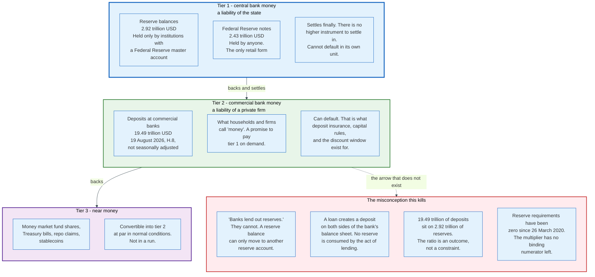

### 3.1 The Two Circuits

A reserve balance is a claim on the Federal Reserve, held by an institution with a master account. On 26 August 2026 there were 2,924,936 million dollars of them. A reserve balance can move to another reserve account. That is the only thing it can do. It cannot be withdrawn in cash by a household, cannot be paid to a supplier, and cannot leave the reserve system.

A deposit is a claim on a commercial bank, held by anybody the bank will open an account for. On 19 August 2026 American commercial banks owed 19,492,400 million dollars of them, not seasonally adjusted. A deposit can be spent, transferred, or converted into currency.

The two circuits meet when a customer withdraws banknotes. The bank hands over Federal Reserve notes and its reserve balance falls. Nothing else converts one into the other.

The arithmetic makes the point better than the argument. Deposits of 19.49 trillion dollars, not seasonally adjusted, sit on reserves of 2.92 trillion dollars. The ratio is roughly 6.7 to 1, and it is an outcome rather than a constraint, because reserve requirement ratios have been zero since 26 March 2020.

### 3.2 The Misconception, Stated Precisely and Corrected

**The claim: banks lend out their reserves, and more reserves therefore means more lending.**

This is wrong at the level of mechanics, not of interpretation. When a bank makes a loan it credits the borrower's deposit account and books a loan asset. Both entries are new. No reserve balance is consumed by the act of lending, because the loan proceeds are a deposit, and a deposit is the bank's own liability.

Reserves are consumed only when the borrower spends the money at a firm that banks somewhere else, and then only the net position between the two banks moves. If a bank's customers pay each other, the bank needs no reserves at all for the transaction.

The Bank of England put this in writing in its Quarterly Bulletin of 2014 Q1, in an article titled *Money creation in the modern economy* by Michael McLeay, Amar Radia and Ryland Thomas, published on 14 March 2014. It states that the majority of money in the modern economy is created by commercial banks making loans, and that the money multiplier is not how the process works. That paper is the standard citation because it is a central bank contradicting the textbook description of its own operations.

**What actually constrains bank lending:** the price and expected return of loans, the bank's capital ratio and leverage ratio, its liquidity coverage requirement, its risk appetite, and the demand for credit. Reserves appear nowhere on that list.

### 3.3 The Second Misconception

**The claim: quantitative easing prints money, and the money then chases goods.**

Also wrong, and for a related reason. When the Fed buys a Treasury note from a pension fund, the fund gets a deposit at its bank and the bank gets a reserve balance. Broad money rises by the size of the purchase. Base money rises by the same amount. But the pension fund did not become richer. It swapped one asset for another at market price.

What changed is the composition of what the private sector holds: less duration, more money. That is a portfolio rebalancing effect, and it works by pushing the price of duration up and its yield down, which is the point. It is not the arrival of new purchasing power.

The evidence sits in the numbers. Between 2008 and 2014 the Fed added roughly 3.6 trillion dollars to its balance sheet and core inflation ran below the 2 percent target for most of that period. In 2021 and 2022 inflation rose sharply, and the balance sheet expansion of 2020 was one contributor among several, alongside fiscal transfers directly into household bank accounts, supply chain disruption, and an energy shock. Reserves alone do not do this. Reserves that a bank cannot spend cannot bid for goods.

### 3.4 Who Can Hold What

The access question determines the structure of the money market, and most people assume the access is wider than it is.

| Instrument | Who may hold it | Rate paid, Aug 2026 |
|------------|-----------------|---------------------|
| **Reserve balances** | Depository institutions with a Federal Reserve master account | 3.65 percent |
| **Federal Reserve notes** | Anybody | Zero |
| **ON RRP** | Primary dealers, designated banks, GSEs, roughly 110 money market funds run by 28 investment managers | 3.50 percent |
| **Treasury General Account** | The United States Treasury only | Zero |
| **Foreign official reverse repo** | Foreign central banks and international institutions | Published separately |
| **Bank deposits** | Anybody the bank accepts | Whatever the bank offers |

The gap between rows two and six is where the whole floor system lives. Money market funds hold trillions of dollars and cannot earn interest on reserve balances, because they are not depository institutions. Counterparty status runs to the named fund rather than to its manager, which is why the list carries roughly 110 entries against 28 investment management firms. Without the ON RRP they would have to place cash in the repo market at whatever rate they could get, which in a cash glut is well below the Fed's target. The ON RRP exists to give non-banks a floor, and that is why its take-up ballooned to 2.55 trillion dollars in 2022 and collapsed to nothing by 2026: it is a shock absorber for surplus cash, not a policy instrument in its own right.

### 3.5 Why the Distinction Has Practical Consequences

Three concrete consequences follow from keeping the two circuits separate.

**A central bank cannot force banks to lend by giving them reserves.** Japan demonstrated this for two decades. Reserves accumulate at the central bank because there is nowhere else for them to go, and if loan demand is absent or capital is short, they simply sit.

**A digital run on a bank does not destroy deposits, it moves them.** When Silicon Valley Bank's depositors withdrew in March 2023, the money went to other banks and to money market funds. Aggregate deposits fell somewhat as funds moved into money market funds, which then placed the cash in the ON RRP, converting commercial bank money into central bank money. That conversion is the defining feature of a retail-accessible central bank liability, and it is the reason holding limits dominate every CBDC design discussion in section 18.

**The size of the balance sheet is not the stance of policy.** The Fed is buying Treasury bills in 2026 while holding the target range unchanged. Buying bills to offset currency growth keeps reserves ample. It does not ease policy, because policy is the price of overnight money and the price has not moved.

---

## 4. Key Participants and Roles

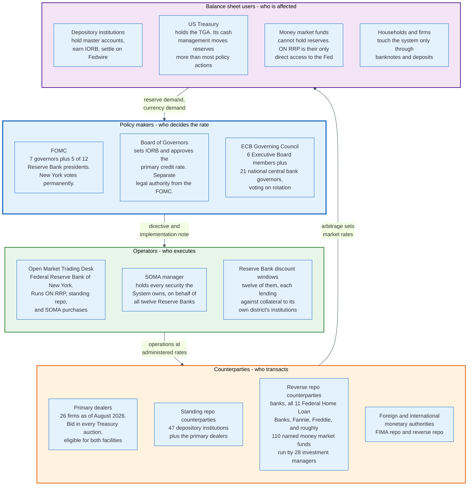

### 4.1 The Actors

| Role | What it does | Who, in the United States | Holds reserves? |
|------|--------------|---------------------------|-----------------|
| **Rate-setting committee** | Votes the target range and the directive | FOMC, twelve voters | No |
| **Administered rate authority** | Sets IORB, approves the discount rate | Board of Governors, seven seats | No |
| **Operating desk** | Executes every operation | Open Market Trading Desk, FRBNY | Acts for SOMA |
| **Portfolio** | Holds every security the System owns | System Open Market Account | n/a |
| **Lending window** | Extends collateralised credit to banks | Twelve Reserve Bank discount windows | n/a |
| **Primary dealers** | Bid in Treasury auctions, transact with the Desk | 26 firms, Aug 2026 | Only if bank-affiliated |
| **Standing repo counterparties** | Draw reserves against collateral | 47 depository institutions plus dealers | Yes |
| **Reverse repo counterparties** | Place cash with the Fed | Banks, GSEs, roughly 110 money funds | Money funds do not |
| **Fiscal principal** | Holds the government's cash | United States Treasury, via the TGA | Not reserves |
| **Payment operator** | Settles interbank payments in reserves | Fedwire Funds Service, FedNow, NSS | n/a |

### 4.2 The Three Roles That Decide Whether Rate Control Works

**The Federal Home Loan Banks set the effective federal funds rate, and almost nobody outside the money market knows it.** The fed funds market today is not banks lending reserves to banks. It is overwhelmingly the eleven Federal Home Loan Banks lending their end-of-day cash to United States branches of foreign banks. The FHLBs are government-sponsored enterprises with reserve accounts but no eligibility for interest on reserve balances, so they will accept anything above zero. The foreign bank branches that borrow from them do earn interest on reserve balances, so they pocket the spread. On 27 August 2026 that trade printed the effective federal funds rate at 3.63 percent against interest on reserve balances of 3.65 percent, on total volume of 111 billion dollars.

The rate the FOMC targets is produced by a two basis point arbitrage in a market where genuine bank-to-bank lending is close to extinct. The Fed keeps targeting it because it has decades of history and a legal footing, not because it measures anything important. SOFR, at 2,836 billion dollars of daily volume on the same date, is the rate that actually prices credit.

**The Treasury's cash manager moves reserves more than the Desk does.** The Treasury General Account swung from 439,365 million dollars on 26 February 2020 to a peak of 1,816,687 million dollars on 29 July 2020, and stood at 959,435 million dollars on 26 August 2026. Every dollar moving into the TGA is a dollar of reserves leaving the banking system. Debt ceiling episodes make this worse, because the Treasury first spends its balance down and then rebuilds it in a rush, injecting and then draining hundreds of billions of dollars on a political timetable.

**The tri-party custodian settles both standing facilities.** Every standing repo and every reverse repo the Desk conducts is cleared and settled on the tri-party repo platform operated by BNY, which takes custody of the securities, values them, applies margin, and settles on its own books. The central bank's ceiling and floor both run through one private clearing bank's infrastructure. That is a concentration of operational dependency that appears in no policy statement.

### 4.3 The Access Question

Who may hold a Federal Reserve master account is a live political fight dressed as an administrative matter.

A master account is the only way to hold reserves, settle on Fedwire, and earn interest on reserve balances. The Federal Reserve published Guidelines for Evaluating Account and Services Requests in 2022, establishing a tiered review in which a federally insured institution gets the lightest scrutiny and a novel charter without federal deposit insurance gets the heaviest. Fintechs, payment institutions, and crypto-adjacent banks with state charters have applied and, in several cases, litigated.

The economics of the decision are unavoidable. An institution with a master account holds the safest asset that exists and earns 3.65 percent on it with no credit risk and no capital charge. An institution without one holds a deposit at a commercial bank, earns less, and carries that bank's credit risk. Granting access is granting a subsidy. Refusing it is preserving an incumbent's moat. Both statements are true and the Fed has to choose between them one applicant at a time.

---

## 5. Corridor and Floor - Two Ways to Set a Price

Every operating framework in the world is a corridor, a floor, or a hybrid, and the choice is a choice about whether to control quantity or price.

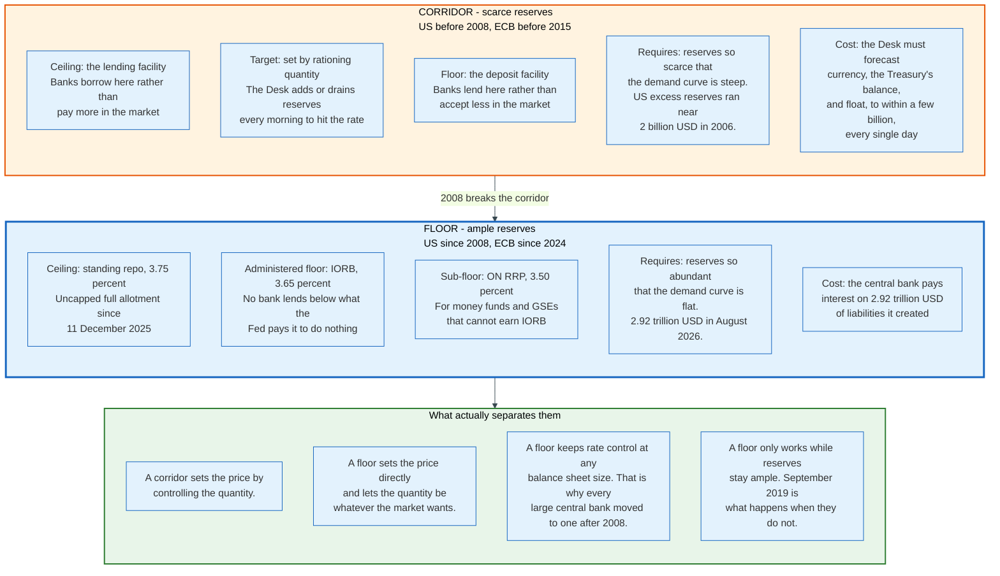

### 5.1 The Corridor

A corridor sets a lending rate above the target and a deposit rate below it, then rations the quantity of reserves so that the market clears in the middle.

The lending facility is the ceiling. No bank pays another bank more than the central bank charges, because the central bank will lend against collateral at that price. The deposit facility is the floor. No bank accepts less than the central bank pays. Between them the market rate is determined by how scarce reserves are, and the central bank makes them exactly scarce enough by forecasting demand and supplying the matching quantity every morning.

Corridors are elegant and demanding. The Desk had to forecast currency in circulation, the Treasury's balance, and float to within a few billion dollars a day. When the forecast was wrong the rate missed. The framework also collapses the moment the central bank needs to expand its balance sheet for any other reason, which is exactly what happened in 2008.

The European Central Bank ran a corridor 200 basis points wide, with each standing facility 100 basis points from the main refinancing rate. By June 2024 it had tightened to 75 basis points, the deposit facility 50 below the main refinancing rate and the marginal lending facility 25 above. The Federal Reserve ran a corridor with an implicit floor at zero, because until October 2008 it paid nothing on reserves at all.

### 5.2 The Floor

A floor sets the deposit rate at or near the target and supplies more reserves than the system needs, so that the marginal reserve is worth exactly what the central bank pays for it.

The demand curve for reserves is downward sloping and has a kink. To the left of the kink, reserves are scarce and small quantity changes move the rate a lot. To the right, reserves are abundant and quantity changes move the rate not at all. A floor system operates to the right of the kink, on purpose, with a margin.

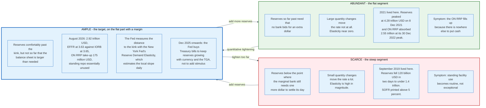

The advantage is that rate control becomes independent of balance sheet size. The central bank can buy 3 trillion dollars of assets in fifteen weeks, as it did in 2020, without losing control of the overnight rate. That property is why every major central bank adopted a floor after 2008 and why none has gone back.

The cost is that the central bank pays interest on a very large stock of liabilities it created. At 3.65 percent on 2,924,936 million dollars, interest on reserve balances runs at roughly 107 billion dollars a year. Section 19 traces where that money comes from and who ultimately bears it.

### 5.3 The Two Failure Modes

**Drift too far right and the floor leaks downward.** With enough surplus cash, non-banks that cannot earn interest on reserve balances bid rates down below the target range. The ON RRP exists to catch exactly this, which is why its take-up peaked at 2,553,716 million dollars on 30 December 2022, when money market funds had more cash than the private repo market could absorb.

**Drift too far left and the floor leaks upward.** This is September 2019. When reserves fall below the kink, the overnight rate escapes the range on the upside, and the ceiling has to be built in a hurry. The standing repo facility exists to catch exactly this.

A functioning floor system therefore needs both a sub-floor for non-banks and a ceiling for banks. The Fed has both. The current configuration is 3.50 percent on the ON RRP, 3.65 percent on reserves, 3.75 percent on standing repo, with the target range of 3.50 to 3.75 percent wrapped around them.

### 5.4 The ECB Chose a Third Answer

The European Central Bank concluded a review of its operational framework, announced in December 2022, on 13 March 2024 and picked a design neither purely corridor nor purely floor.

The deposit facility rate remains the rate that steers the stance. But rather than flooding the system with reserves, the ECB narrowed the spread between the main refinancing operations rate and the deposit facility rate from 50 basis points to 15 basis points, effective 18 September 2024, and kept main refinancing operations as weekly fixed-rate tenders with full allotment against broad collateral.

The logic is that a 15 basis point spread makes borrowing from the central bank cheap enough that banks will take what they need every week, so money market rates sit near the deposit facility rate without the central bank having to guess the right quantity. It is demand-driven rather than supply-driven. The Governing Council committed to reviewing the key parameters in 2026 and to introducing structural longer-term refinancing operations and a structural portfolio of securities once the balance sheet starts growing again.

Section 11 covers the mechanics. The relevant comparison is that the Fed guarantees the floor by making reserves abundant, while the ECB guarantees it by making borrowing cheap. Both hit the same target. One requires a large balance sheet and the other requires banks to keep coming to the window.

---

## 6. How the Fed Actually Sets Rates Today

The Federal Reserve does not set the federal funds rate. It sets three administered rates and a range, and the market rate lands where arbitrage puts it.

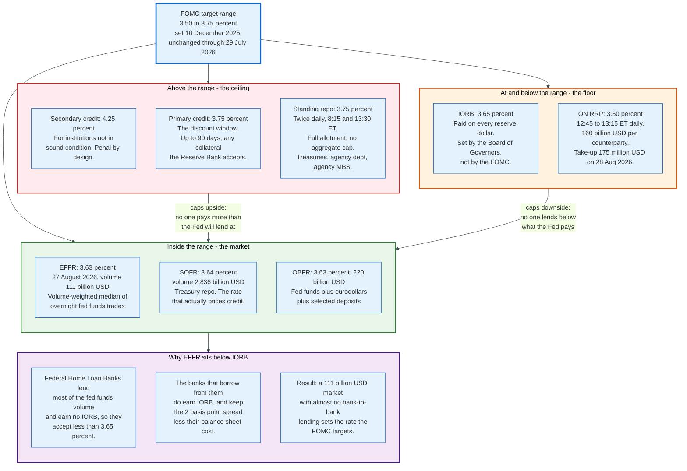

### 6.1 The Implementation Note, Line by Line

Every FOMC meeting produces a statement and an implementation note. The statement is for the public. The note is the instruction, and it is short enough to quote in full structure. The directive issued on 29 July 2026 told the Desk to:

- "Undertake open market operations as necessary to maintain the federal funds rate in a target range of 3-1/2 to 3-3/4 percent."
- "Conduct standing overnight repurchase agreement operations at a rate of 3.75 percent."
- "Conduct standing overnight reverse repurchase agreement operations at an offering rate of 3.5 percent and with a per-counterparty limit of $160 billion per day."
- "When appropriate, increase the System Open Market Account holdings of securities through purchases of Treasury bills and, if needed, other Treasury securities with remaining maturities of 3 years or less to maintain an ample level of reserves."
- "Roll over at auction all principal payments from the Federal Reserve's holdings of Treasury securities. Reinvest all principal payments from the Federal Reserve's holdings of agency securities into Treasury bills."

Alongside the directive, the Board of Governors voted separately to maintain interest on reserve balances at 3.65 percent effective 30 July 2026, and separately again to approve the primary credit rate at 3.75 percent. Three votes, three legal authorities, one policy stance.

### 6.2 IORB, the Rate That Does the Work

Interest on reserve balances is the anchor, and it is a single number applied to every reserve dollar.

The Board sets it under authority granted by the Financial Services Regulatory Relief Act of 2006 and accelerated to October 2008 by the Emergency Economic Stabilization Act. There is no tiering: a bank with 500 billion dollars of reserves earns the same rate on the last dollar as on the first. The Fed abandoned the earlier distinction between required and excess reserve rates in July 2021, once reserve requirements had been zero for over a year, and consolidated to one rate.

At 3.65 percent on 2,924,936 million dollars, the annual run rate is roughly 107 billion dollars.

IORB is set at 3.65 percent inside a target range of 3.50 to 3.75 percent. It sits 10 basis points below the top of the range, which is a calibration choice rather than a rule. The Fed has adjusted the offset several times since 2018, generally to keep the effective rate comfortably inside the range as conditions changed.

### 6.3 ON RRP, the Sub-Floor

The overnight reverse repurchase agreement facility exists because the largest holders of short-term cash in the American financial system are not banks.

A money market fund cannot hold reserves. Under the ON RRP it can lend cash to the Fed overnight against Treasury collateral drawn from SOMA, at 3.50 percent, in size up to 160 billion dollars per counterparty per day. Operations run every business day from 12:45 to 13:15 Eastern Time on the Desk's FedTrade Plus system. Propositions come in minimum sizes of 1 million dollars and increments of 1 million dollars. Each counterparty submits one proposition at a rate not exceeding the offering rate.

Allocation is straightforward as long as the facility is undersubscribed, which in practice it always is. If total propositions are at or below the value of available SOMA Treasury securities, every counterparty is awarded at the offering rate. In the event of oversubscription, awards go at a stop-out rate determined by working up the submitted rates until the size limit binds, with pro rata allocation at the margin. The aggregate limit is not a chosen number, it is the value of Treasury securities held outright in SOMA that are not committed to foreign official reverse repos, securities lending, or term operations, and are not close to maturity.

Settlement runs through BNY as tri-party agent, with counterparties expected to deliver funds by 16:30 Eastern Time.

The balance sheet effect is a swap between two liabilities. Cash leaves the counterparty's bank, so reserves fall, and the ON RRP liability rises by the same amount. Total assets are unchanged, because a security sold under a repurchase agreement stays on the books as an asset.

Take-up is the tell. The facility absorbed 2,553,716 million dollars on 30 December 2022 and 175 million dollars on 28 August 2026. Cash that once had nowhere to go now has somewhere better: Treasury bills, private repo, and bank deposits all pay more than 3.50 percent. The facility drained itself, exactly as designed, and its emptiness is the clearest single indicator that quantitative tightening removed the surplus rather than the necessary.

### 6.4 The Standing Repo Facility, the Ceiling

The standing repo facility, which the New York Fed now calls standing repo operations, lets an eligible institution turn Treasury or agency collateral into reserves at a published rate, twice a day, without asking permission.

Current parameters, per the New York Fed's FAQ of 12 December 2025:

| Parameter | Value |
|-----------|-------|
| **Morning operation** | 08:15 to 08:30 Eastern Time |
| **Afternoon operation** | 13:30 to 13:45 Eastern Time |
| **Rate** | 3.75 percent, fixed, set by the FOMC |
| **Format** | Full allotment. All propositions awarded at the rate |
| **Proposition limit** | 40 billion dollars per eligible security type per operation, in 1 million dollar increments |
| **Aggregate limit** | None, since 11 December 2025 |
| **Eligible collateral** | US Treasuries, agency debt, agency mortgage-backed securities |
| **Counterparties** | 26 primary dealers plus 47 standing repo counterparties |
| **Settlement** | Same-day, BNY tri-party conventions, funds generally within thirty minutes of close |
| **Platform** | FedTrade Plus |

Three of those rows changed on 11 December 2025 and they matter. Before that date the facility ran as an auction with a minimum bid rate of 4.0 percent and an aggregate operation limit of 500 billion dollars. After it, the facility runs at a fixed rate with no aggregate cap and full allotment.

The change removes the last reason a treasurer might hesitate. Under a capped auction, a bank could not be certain of getting funded, which means it could not treat the facility as a reliable backstop and had to hold precautionary reserves instead. Under uncapped full allotment, the reserve is the facility. That is a meaningful reduction in the level of reserves the system needs to hold, which is precisely why the Fed made the change while it was trying to work out how far the balance sheet could shrink.

Collateral substitution follows tri-party convention and runs one way. A trade struck against agency MBS may be settled with agency MBS, agency debt, or Treasuries. A trade struck against agency debt may be settled with agency debt or Treasuries. A trade struck against Treasuries may be settled with Treasuries only.

### 6.5 Why the Effective Rate Sits Below IORB

On 27 August 2026 the effective federal funds rate printed at 3.63 percent while the Fed paid 3.65 percent on reserves. A rate below the risk-free administered rate looks like an arbitrage left on the table. It is not.

The lenders in the federal funds market are overwhelmingly Federal Home Loan Banks, which hold reserve accounts but are statutorily ineligible for interest on reserve balances. Their alternative to lending fed funds is earning zero. They will therefore lend at anything above zero, and they lend at whatever the borrowers will pay.

The borrowers are mostly United States branches of foreign banks, which do earn interest on reserve balances and face lower balance sheet charges than domestic banks because of how leverage ratios are calculated across jurisdictions. They borrow at 3.63 percent, hold the proceeds as reserves earning 3.65 percent, and keep 2 basis points.

The spread is not larger because competition among the borrowers compresses it, and not smaller because the balance sheet cost of the trade is not zero. Quarter-end and year-end distort it visibly, when balance sheet reporting dates make the trade temporarily expensive.

The distribution reported alongside the rate shows how narrow the market is. On 27 August 2026 the first percentile printed at 3.60 percent, the twenty-fifth at 3.62, the seventy-fifth at 3.63, and the ninety-ninth at 3.66. Ninety-eight percent of the volume traded within 6 basis points.

### 6.6 The Rates Around It

Five overnight reference rates are published daily by the New York Fed, and their volumes say more than their levels.

| Rate | Level, 27 Aug 2026 | Volume, bn USD | What it measures |
|------|--------------------|----------------|------------------|
| **EFFR** | 3.63 percent | 111 | Unsecured overnight fed funds, volume-weighted median |
| **OBFR** | 3.63 percent | 220 | Fed funds plus eurodollars plus selected deposits |
| **SOFR** | 3.64 percent | 2,836 | Broad Treasury repo, tri-party plus FICC cleared |
| **BGCR** | 3.62 percent | 1,198 | Broad general collateral repo |
| **TGCR** | 3.62 percent | 1,176 | Tri-party general collateral repo |

SOFR trades twenty-five times the volume of the rate the FOMC targets. It replaced dollar LIBOR as the reference for United States floating-rate lending and derivatives. When a corporate loan or an interest rate swap reprices in the United States in 2026, it references SOFR, not the federal funds rate.

The federal funds rate survives as the policy target for institutional reasons: it is what the FOMC's directive names, what decades of research measure, and what the futures market prices. Nothing about the transmission mechanism runs through it any more.

---

## 7. Open Market Operations and the Standing Repo Facility

An open market operation is the central bank buying or selling securities to change the quantity of reserves. In a floor system it is no longer the way the rate is set, and it has become the way the balance sheet is sized.

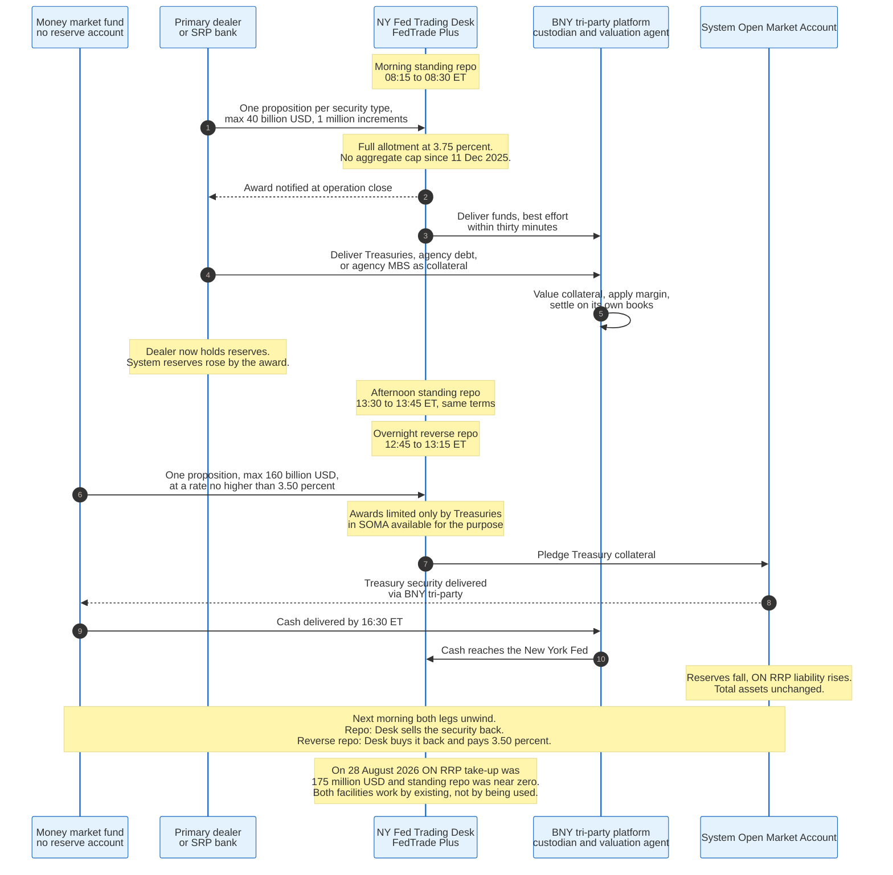

### 7.1 Permanent and Temporary

Operations come in two kinds and the distinction is the maturity of the transaction.

**Permanent operations** are outright purchases or sales of securities into or out of the System Open Market Account. They change the size of the balance sheet until the security matures. This is the mechanism behind quantitative easing, quantitative tightening, and the reserve-management bill purchases the Desk has been running since December 2025.

**Temporary operations** are repurchase agreements and reverse repurchase agreements, which unwind the next business day. They change the composition of the balance sheet's liability side and the level of reserves for one day at a time. The standing repo facility and the ON RRP are both temporary operations, made standing rather than episodic.

Before 2008 the Desk ran temporary operations every morning to fine-tune the reserve supply. It no longer needs to, because a floor system does not require fine tuning. The two standing facilities now run daily as backstops that mostly go unused.

### 7.2 The Anatomy of a Standing Repo Draw

A concrete sequence, using round numbers.

A regional bank finds itself short of reserves at 08:00 Eastern Time. Its customers made large outgoing payments the previous afternoon and its overnight funding sources are quoting above 3.75 percent. It holds Treasury notes in its securities portfolio.

At 08:15 the morning standing repo operation opens on FedTrade Plus. The bank submits one proposition for 3 billion dollars against Treasury collateral, at the operation rate of 3.75 percent. The operation closes at 08:30. Because the format is full allotment, the proposition is awarded in full, and the bank is notified immediately.

The Desk positions funds on the BNY tri-party platform, generally within thirty minutes of the close. BNY takes custody of the bank's Treasuries, values them, applies the appropriate margin, and settles the transaction on its own books. The bank's reserve balance rises by 3 billion dollars.

The next business day the trade unwinds after the afternoon operation and before the tri-party market closes. The bank repays 3 billion dollars plus one day of interest at 3.75 percent, which on a 360-day actual basis is 312,500 dollars. It gets its Treasuries back.

Systemically, reserves rose 3 billion dollars for one day and the Fed's assets rose by the same amount as a repurchase agreement. On 26 August 2026 the entire outstanding repo line on the Fed's balance sheet was 3 million dollars, which means essentially nobody used the facility that week.

### 7.3 Why an Unused Facility Is a Working Facility

The standing repo facility does its job by existing, and the evidence is the absence of transactions.

A bank that knows it can convert Treasuries into reserves at 3.75 percent, in unlimited size, twice a day, does not need to hold extra reserves against the possibility of a bad afternoon. It can hold Treasuries instead, which pay more. The facility therefore reduces the aggregate demand for reserves, which lets the Fed run a smaller balance sheet at the same level of comfort.

The obstacle is stigma. A bank that borrows from the central bank worries that someone will notice and conclude it is in trouble. The Fed has attacked this on several fronts: the counterparty list is public, the results are published only in aggregate by security type, individual counterparty data is released two years later under Section 11 of the Federal Reserve Act as amended by Dodd-Frank, and settlement runs through the same tri-party plumbing as an ordinary market repo. The New York Fed also surveys primary dealers on their willingness to use the facility and publishes the results, which is an unusual thing for a central bank to do and reflects how seriously it takes the problem.

The counterparty list has grown steadily. First Citizens joined in January 2024, then Ally, State Street and Zions on 5 March 2024, with M&T and USAA following on 28 March, then Fifth Third and Navy Federal Credit Union in April 2024, MUFG, Regions and Huntington in May 2024, Capital One in July 2024, RBC in April 2025, BMO in June 2025, East West in August 2025, Santander, Comerica and First Horizon in November 2025, of which Comerica dropped off on 2 February 2026 when it merged into Fifth Third, Standard Chartered in February 2026, two TD entities in June 2026, and DZ Bank and Old National in August 2026. Forty-seven institutions plus twenty-six primary dealers as of 31 August 2026.

### 7.4 Reserve-Management Purchases

Since 11 December 2025 the Desk has been buying Treasury bills, and the reason has nothing to do with stimulus.

Currency in circulation grows roughly in line with nominal income. On 26 August 2026 it stood at 2,476,144 million dollars. Every additional banknote the public demands is a liability the Fed must issue, and issuing it drains a reserve dollar unless the Fed adds an asset to match. The Treasury General Account behaves similarly, absorbing reserves whenever the government's cash balance rises.

If the Fed held its assets constant while currency grew, reserves would decline every year by the growth in currency plus the drift in the Treasury's balance. Given enough time this would walk the system back to the left of the demand curve kink and reproduce September 2019.

The fix is to grow the asset side at the pace of the autonomous factors. The Desk buys Treasury bills, which are short, liquid, and carry almost no duration risk, so the purchases add reserves without changing the term premium the private sector faces. That is the difference between reserve management and quantitative easing, and it is a real difference rather than a rhetorical one: the first is designed to be duration-neutral, the second is designed to remove duration from the market.

Between 3 December 2025 and 26 August 2026, total assets rose from 6,535,781 million dollars to 6,730,912 million dollars, an increase of 195,131 million dollars. Reserves over the same period rose from 2,858,284 million dollars to 2,924,936 million dollars, an increase of 66,652 million dollars. The difference went into currency and the Treasury's balance, which is the whole point.

---

## 8. Quantitative Easing and Tightening, Mechanically

Quantitative easing is the purchase of longer-dated securities financed by creating reserves. Everything contested about it concerns why that should matter, not what it does to the ledger.

```mermaid
%%{init: {'theme': 'base', 'themeVariables': {'primaryColor': '#e3f2fd', 'primaryBorderColor': '#1565c0', 'lineColor': '#37474f'}}}%%

flowchart TB
    subgraph QE["QUANTITATIVE EASING - three balance sheets move at once"]
        direction TB
        Q1["Step 1. The Desk buys a 10 year<br/>Treasury note from a pension fund<br/>through a primary dealer.<br/>Face 100 million USD."]
        Q2["Step 2. Fed assets rise 100 million.<br/>Fed liabilities rise 100 million,<br/>as a new reserve balance credited<br/>to the pension fund's bank."]
        Q3["Step 3. The bank's assets rise<br/>100 million in reserves.<br/>Its liabilities rise 100 million<br/>as a deposit for the pension fund."]
        Q4["Step 4. The pension fund swapped<br/>a bond for a deposit.<br/>Its net worth is unchanged.<br/>Its portfolio duration fell."]
        Q5["Net effect: the private sector holds<br/>less duration and more money.<br/>No new net financial wealth<br/>was created by the purchase."]
    end

    subgraph QT["QUANTITATIVE TIGHTENING - passive runoff, not selling"]
        direction TB
        T1["Step 1. A Treasury note in SOMA<br/>matures. Treasury pays the Fed."]
        T2["Step 2. To pay, Treasury draws<br/>down the TGA at the Fed,<br/>or issues new debt the private<br/>sector buys with reserves."]
        T3["Step 3. Fed assets fall.<br/>Either the TGA falls, or reserves fall.<br/>Which one depends entirely<br/>on Treasury's issuance choice."]
        T4["Step 4. Caps controlled the pace:<br/>60 billion USD a month for Treasuries<br/>in 2022, cut to 25 in June 2024,<br/>to 5 in April 2025, to zero in December 2025."]
        T5["Net effect from Apr 2022 to Dec 2025:<br/>8.97 trillion USD down to 6.54 trillion.<br/>A 2.43 trillion USD reduction<br/>with almost no outright sales."]
    end

    subgraph Truth["What QE is and is not"]
        direction TB
        X1["IS: an asset swap that shortens<br/>the duration the public must hold<br/>and pays for it with reserves"]
        X2["IS: a signal, because the size and<br/>pace tell the market how long<br/>the policy rate will stay low"]
        X3["IS NOT: printing money.<br/>Reserves cannot leave the reserve<br/>system and cannot buy groceries."]
        X4["IS NOT: deficit financing.<br/>The Fed buys in the secondary market<br/>and remits its profits back to Treasury,<br/>which makes the trade fiscally circular."]
    end

    QE --> Truth
    QT --> Truth

    style QE fill:#e8f5e9,stroke:#2e7d32,stroke-width:2px
    style QT fill:#fff3e0,stroke:#e65100,stroke-width:2px
    style Truth fill:#e3f2fd,stroke:#1565c0,stroke-width:3px
```

### 8.1 The Ledger Entries

Follow 100 million dollars of face value through three balance sheets.

**Before.** A pension fund holds a 10-year Treasury note worth 100 million dollars. Its bank has some quantity of reserves. The Fed holds whatever it holds.

**The trade.** The Desk buys the note through a primary dealer at the market price. Settlement moves the security to SOMA and moves cash the other way.

**After, at the Fed.** Assets rise 100 million dollars in Treasury securities. Liabilities rise 100 million dollars in reserve balances, credited to the pension fund's bank.

**After, at the bank.** Assets rise 100 million dollars in reserves. Liabilities rise 100 million dollars, as a deposit credited to the pension fund. The bank's balance sheet grew by 100 million dollars and its capital did not, so its leverage ratio fell. This is not a side effect. It is a binding constraint that shaped how much QE banks were willing to intermediate in 2020.

**After, at the pension fund.** It holds 100 million dollars of deposits instead of 100 million dollars of Treasuries. Net worth unchanged. Portfolio duration reduced to zero on that position.

The fund now holds an asset yielding 3.65 percent minus the bank's spread instead of one yielding whatever the 10-year yielded. If its mandate requires duration or yield, it must buy something else, which pushes up the price of that something else. That chain is the portfolio balance channel and it is the main mechanism QE is supposed to work through.

### 8.2 The Four Claimed Channels

**Portfolio balance.** Removing duration from the market forces private investors into other long assets, compressing term premia across the curve. This is the mechanism with the strongest theoretical footing and the widest range of empirical estimates.

**Signalling.** Buying long bonds is costly to reverse, so announcing a purchase programme is a credible statement that the policy rate will stay low long enough for the purchases to make sense. Some of the measured effect of QE is really a change in the expected path of short rates.

**Market functioning.** In March 2020 the Fed bought because the Treasury market had stopped clearing. That is not portfolio balance and not signalling. It is a dealer of last resort operation, and it works within days rather than quarters.

**Bank lending.** Reserves land at banks, which are then supposed to lend more. The evidence here is weakest, for the reasons in section 3. Banks do not lend reserves, and a bank whose balance sheet just grew by an unwanted deposit may want to lend less rather than more.

### 8.3 Quantitative Tightening Is Not QE in Reverse

The asymmetry is structural, not rhetorical.

QE was an active purchase programme with announced monthly amounts, executed at chosen times. QT was passive runoff: securities matured and were not reinvested, up to a monthly cap. The Fed sold almost nothing outright. It just stopped replacing what rolled off.

The Treasury caps ran at 60 billion dollars a month through most of the programme, were cut to 25 billion dollars a month from June 2024, cut again to 5 billion dollars a month from April 2025, and set to zero on 1 December 2025. The agency securities cap ran at 35 billion dollars a month throughout and was likewise removed on 1 December 2025, with agency principal now reinvested into Treasury bills rather than into agency MBS.

That last change converts the portfolio without a single sale. The Fed still holds 1,913,585 million dollars of agency mortgage-backed securities as of 26 August 2026, and by reinvesting their principal into Treasury bills rather than into more MBS, it is gradually converting the portfolio to Treasuries without selling anything. Prepayments on a 30-year mortgage pool are slow when rates are above the coupon, so this will take a long time.

### 8.4 Who Loses the Reserves

The second asymmetry is that QE reliably creates reserves while QT does not reliably destroy them.

When a Treasury security in SOMA matures, the Treasury pays the Fed. It can do so from its account at the Fed, which reduces the Treasury General Account and leaves reserves untouched. Or it can issue new debt to the private sector, which is paid for with reserves and reduces reserves.

Which happens depends on the Treasury's issuance decisions and on who buys the new debt. From 2022 to 2024 the answer was mostly money market funds, buying Treasury bills with cash they pulled out of the ON RRP. Between 13 April 2022 and 27 December 2023 the Fed's balance sheet fell 1,252,706 million dollars, ON RRP take-up fell 996,686 million dollars, and reserves fell only 377,185 million dollars. Four fifths of the balance sheet reduction came out of the facility rather than out of the banking system.

The numbers are exact enough to check. On 13 April 2022 total assets were 8,965,487 million dollars, reserves 3,823,644 million dollars, ON RRP take-up 1,815,555 million dollars. On 3 December 2025 total assets were 6,535,781 million dollars, reserves 2,858,284 million dollars, ON RRP take-up 2,514 million dollars. Assets fell 2,429,706 million dollars. Reserves fell 965,360 million dollars. The ON RRP gave up 1,813,041 million dollars.

The ON RRP was the shock absorber. Once it emptied, further balance sheet reduction had to come out of reserves directly, which is precisely why the Fed stopped when it did.

### 8.5 What QE Is Not

**Not printing money in the sense people mean.** It creates reserves, which are money only for banks and cannot leave the reserve system. Broad money rises when the seller was a non-bank, and by exactly the price paid, but no new net wealth is created because an asset was exchanged for it.

**Not monetary financing of the deficit.** The Fed buys in the secondary market, at prices set in auctions it does not participate in. It also remits its net income to the Treasury, which means the interest the Treasury pays on Fed-held debt comes straight back. That circularity is real and it is also why a central bank running losses stops the flow, as section 19 explains.

**Not free.** The Fed funded long assets with overnight liabilities. When short rates rose above the average yield on the portfolio, the position went cash-flow negative. The cumulative loss is the 233,518 million dollar deferred asset on the balance sheet as of 26 August 2026. That is a real transfer from the taxpayer to bank shareholders and money fund investors, and it was the foreseeable consequence of a duration mismatch.

**Not permanent.** The balance sheet fell 2.43 trillion dollars between April 2022 and December 2025 without a market crisis. That is the strongest available evidence that the exit is operationally feasible, if slow.

---

## 9. A Worked Example - Tracing One Week in August 2026

Abstractions about reserves become clear when the numbers are real. This section carries the week ending 26 August 2026 through the balance sheet and the money market.

### 9.1 The Starting Position

Federal Reserve balance sheet, in millions of dollars, from the H.4.1 released 27 August 2026 and the two prior weeks. Reserve balances and the Treasury General Account are weekly averages of daily figures from Table 1, which is the basis on which a change from week to week is comparable. Total assets, reverse repos and the deferred asset are Wednesday levels from Table 5. The Wednesday level of the Treasury General Account on 26 August 2026 was 959,435 million dollars, which is the figure sections 2 and 4 use.

| Item | 12 Aug 2026 | 19 Aug 2026 | 26 Aug 2026 | Change over two weeks |
|------|-------------|-------------|-------------|-----------------------|
| **Total assets** | 6,759,955 | 6,745,699 | 6,730,912 | -29,043 |
| **Reserve balances** | 2,944,059 | 2,935,287 | 2,924,936 | -19,123 |
| **Treasury General Account** | 963,950 | 953,612 | 950,736 | -13,214 |
| **Reverse repos, total** | not shown | 373,686 | 356,158 | -17,528 over one week |
| **Deferred asset** | not shown | -232,955 | -233,518 | -563 over one week |

Total assets fell 29,043 million dollars over two weeks. Reserves fell 19,123 million dollars. The Treasury spent down 13,214 million dollars of its account, which pushed reserves up. Total reverse repurchase agreements fell 17,528 million dollars in the final week, which also pushed reserves up. Currency in circulation and the remaining liability lines absorbed the difference, and reserves ended the two weeks 19,123 million dollars lower. The two offsets cover different windows, one two weeks and one a single week, so they do not net against the asset decline directly.

### 9.2 The Rates That Week

| Rate | 27 Aug 2026 | Position relative to policy |
|------|-------------|------------------------------|
| **Target range** | 3.50 to 3.75 percent | Set by the FOMC |
| **IORB** | 3.65 percent | 10 bp below the top of the range |
| **EFFR** | 3.63 percent | 2 bp below IORB, 13 bp above the bottom |
| **OBFR** | 3.63 percent | Level with EFFR |
| **SOFR** | 3.64 percent | 1 bp above EFFR, 11 bp below the standing repo rate |
| **TGCR** | 3.62 percent | 3 bp below the standing repo rate |
| **ON RRP** | 3.50 percent | Bottom of the range |
| **Standing repo** | 3.75 percent | Top of the range |

Everything traded in a 3 basis point band, comfortably inside a 25 basis point range, with both standing facilities essentially idle. ON RRP take-up on 28 August 2026 was 175 million dollars. The Fed's repurchase agreement line on 26 August 2026 was 3 million dollars.

That is what a working floor system looks like. The market rate sits just under the administered floor, the ceiling is untouched, and the sub-floor catches nothing because nobody needs it.

### 9.3 Tracing a Single Payment

Follow 500 million dollars from a corporate treasurer to the government.

**09:15 Eastern.** A corporation instructs its bank to pay 500 million dollars of estimated federal tax.

**09:16.** The bank debits the corporate deposit account. Its deposit liabilities fall 500 million dollars. Nothing has happened to reserves yet.

**09:17.** The bank submits a Fedwire Funds Service payment order to the Treasury's account. Fedwire settles gross, in real time, in central bank money, with finality on receipt.

**09:17 and change.** The Fed debits the bank's reserve account by 500 million dollars and credits the Treasury General Account by 500 million dollars.

**Net effect on the Fed's balance sheet.** Total assets unchanged. Reserve balances fall 500 million dollars. Treasury General Account rises 500 million dollars. One liability became another liability.

**Net effect on the banking system.** Reserves are 500 million dollars lower. No bank made a decision that caused this. The money left the banking system entirely and now sits at the central bank in an account only the Treasury can draw on.

Multiplied by the volume of a quarterly corporate tax date, that is the September 2019 problem. On 16 September 2019 the tax date and a 54 billion dollar Treasury settlement together drained more than 100 billion dollars of reserves in two days, from a starting level of 1,456,796 million dollars. That was enough to break rate control.

### 9.4 What Would Have Happened in 2019 With Today's Toolkit

The same drain today would be absorbed rather than transmitted, and the difference is entirely the standing repo facility.

A dealer short of cash on the morning of 17 September 2019 had no published place to convert Treasuries into reserves. The Desk had to announce an operation mid-morning after the rate had already broken out of the range. The same dealer in August 2026 submits a proposition at 08:15, receives full allotment at 3.75 percent, and settles within thirty minutes.

The arithmetic of the ceiling is the point. Any counterparty holding Treasuries will not pay materially more than 3.75 percent for overnight cash, because the Fed will lend at 3.75 percent against those Treasuries in unlimited size. SOFR at 5 percent, as printed on 17 September 2019, cannot happen while the facility exists and is used, which is why the Fed spent five years reducing the reasons not to use it.

### 9.5 The Interest Bill for That Week

Running the floor costs money, and the week's arithmetic shows how much.

Reserve balances of 2,924,936 million dollars at 3.65 percent, over seven days on a 360-day basis, is:

```
2,924,936,000,000 x 0.0365 x 7 / 360 = 2,076,000,000 approximately
```

Roughly 2.08 billion dollars of interest paid to banks in one week, or about 107 billion dollars annualised. Add the 356,158 million dollars of reverse repurchase agreements, of which 355,456 million is foreign official and 702 million is ON RRP, and total interest paid on liabilities runs near 120 billion dollars a year at current rates.

Against that, SOMA earns the coupon on 4,546,169 million dollars of Treasuries and 1,913,585 million dollars of agency MBS, much of it bought when yields were far lower. The gap is what produced the deferred asset, and section 19 works through the accounting.

---

## 10. Transmission to the Real Economy

Monetary policy moves one overnight rate. Everything the public cares about is downstream of that through six channels, all of them slow and none of them reliable in isolation.

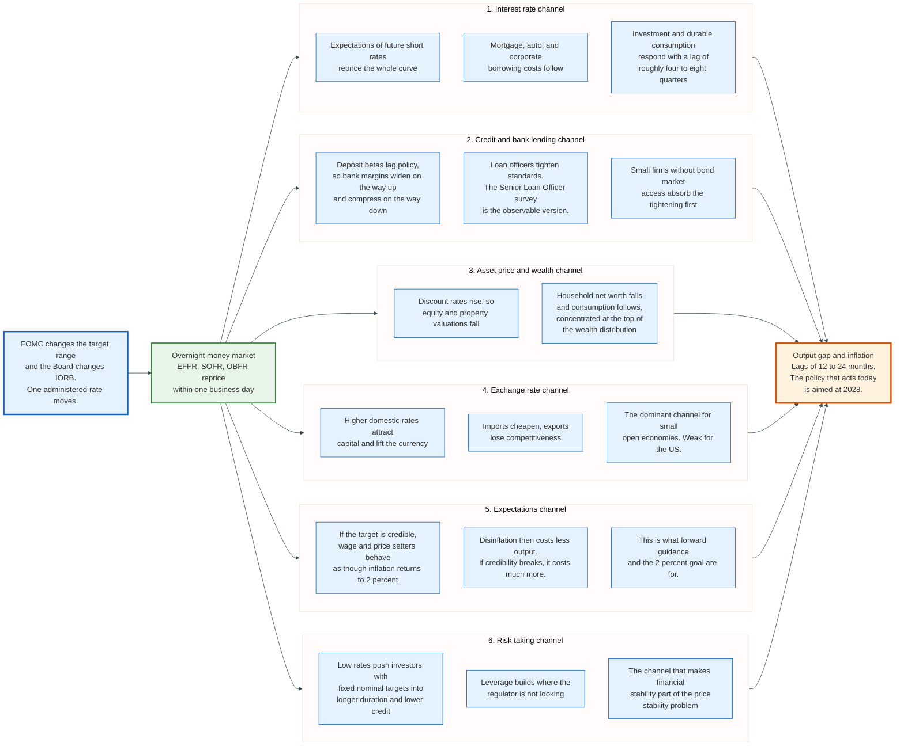

### 10.1 The Interest Rate Channel

A change in the overnight rate propagates along the curve through expectations of future overnight rates, and the long end moves only as much as the expected path moves.

This is why a 25 basis point cut can raise ten-year yields. If the cut is read as an admission that inflation will be tolerated, the term premium widens and the long rate rises even as the short rate falls. The central bank controls the front end. It negotiates with the market over the rest.

Borrowing costs for households and firms are set off the long end more than the short. A thirty-year fixed mortgage in the United States prices off the ten-year Treasury plus a mortgage spread. Corporate investment hurdle rates price off comparable maturities. The lag from a policy change to a measurable effect on investment and durable consumption runs roughly four to eight quarters.

### 10.2 The Credit and Bank Lending Channel

Banks reprice loans faster than deposits, which means the direction of policy changes bank profitability before it changes bank behaviour.

The deposit beta, the fraction of a policy rate change that passes through to deposit rates, has historically run between 0.2 and 0.6 depending on competition and the type of deposit. When rates rise, net interest margins widen. When they fall, margins compress. In 2022 and 2023 the beta rose faster than banks expected, as depositors moved cash into money market funds paying the ON RRP rate, which is one reason the deposit outflows of March 2023 were as fast as they were.

Beyond price, banks tighten non-price terms: loan-to-value limits, covenants, and outright refusal. The Federal Reserve's Senior Loan Officer Opinion Survey on Bank Lending Practices measures this quarterly, and its net tightening index leads credit growth by several quarters. Firms without access to bond markets feel this first, which is why monetary tightening falls disproportionately on small business.

### 10.3 The Asset Price and Wealth Channel

Every asset is a claim on future cash flows discounted at some rate, so raising the discount rate lowers every valuation simultaneously.

Equity and property values fall, household net worth falls, and consumption follows with a marginal propensity to consume out of wealth that empirical estimates put in the range of 2 to 5 cents per dollar. The effect is concentrated where the wealth is, which is the top of the distribution, so the channel moves more aggregate spending than its distributional reach suggests.

Housing is the clearest case, because the price effect and the interest rate effect compound. A higher mortgage rate lowers what a buyer can borrow at a given payment, which lowers what they will bid, which lowers the price, which lowers the wealth of everyone who already owns.

### 10.4 The Exchange Rate Channel

Higher domestic rates attract capital, lift the currency, cheapen imports, and reduce the price competitiveness of exports.

This channel dominates in small open economies. For an economy where imports are 40 percent of consumption, an exchange rate move passes into consumer prices within quarters. It is comparatively weak in the United States, where imports are a smaller share of consumption and where much of world trade is invoiced in dollars, so a stronger dollar does less to the import price index than the textbook predicts.

### 10.5 The Expectations Channel

If everyone believes inflation will be 2 percent, wage and price setting behaves as though it will be, and the belief becomes self-confirming.

This is the cheapest channel and the only one with no lag, which is why central banks spend so much effort on credibility and why the 2 percent number is defended more stubbornly than its analytical basis warrants. A credible target lets a central bank tolerate a supply shock without responding to it, because the shock passes through relative prices rather than into wage bargaining.

The failure mode is visible in the historical record. When inflation expectations de-anchored in the 1970s, restoring them cost the Volcker disinflation: the federal funds rate above 19 percent and two recessions. The whole apparatus of inflation targeting, forward guidance, and published projections exists to avoid ever paying that price again.

### 10.6 The Risk Taking Channel

Low policy rates push investors with fixed nominal return targets into longer duration and worse credit, and the leverage that results is where the next crisis usually originates.

An insurer with 5 percent guaranteed liabilities and a 2 percent bond market does not stop needing 5 percent. It buys illiquid credit, private debt, and leverage. A pension fund with a discount rate assumption buys duration with borrowed money, which is precisely what produced the September 2022 gilt crisis when the Bank of England had to intervene to stop liability-driven investment funds from being forced into a self-reinforcing sale of the assets they were hedging with.

This is the channel that makes financial stability inseparable from monetary policy. A central bank cannot set the price of leverage without also setting the incentive to take it.

### 10.7 The Lag Problem

Everything above operates on a delay of twelve to twenty-four months, which means every policy decision is aimed at conditions that do not yet exist.

The consequence is that a central bank responding to current inflation is always late, and one responding to forecast inflation is always vulnerable to being wrong about the forecast. The 2021 and 2022 episode is the textbook case in both directions: the initial characterisation of inflation as transitory rested on a supply-shock forecast that proved wrong, and the subsequent tightening then arrived into an economy where the shock was already fading.

There is no version of this problem that a better model solves. It is structural, and the honest framing is that monetary policy is a decision made under uncertainty about a target eighteen months away, with an instrument whose effect is uncertain in both size and timing.

---

## 11. The ECB - Three Rates, Twenty-One Balance Sheets

The European Central Bank sets three policy rates rather than one, because it kept a corridor structure while moving the steering point to the bottom of it.

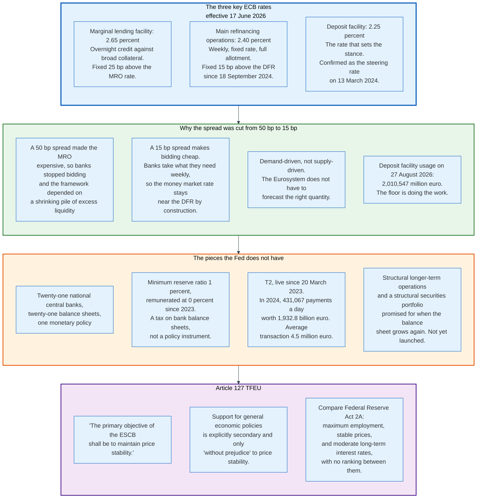

### 11.1 The Three Rates

Effective 17 June 2026, and quoted directly from the ECB's own table of key interest rates:

| Rate | Level | What it is |
|------|-------|------------|
| **Marginal lending facility** | 2.65 percent | Overnight credit against broad collateral, on demand |
| **Main refinancing operations** | 2.40 percent | Weekly refinancing, fixed rate, full allotment, broad collateral |
| **Deposit facility** | 2.25 percent | Overnight deposits with the Eurosystem, at a pre-set rate |

The spreads are fixed by design. The main refinancing rate sits 15 basis points above the deposit facility rate, and the marginal lending rate sits 25 basis points above the main refinancing rate. Move one and all three move together, which is why an ECB rate decision is always reported as a single number even though three rates change.

The most recent move raised all three by 25 basis points from the levels effective 11 June 2025, which were 2.00, 2.15 and 2.40 percent. Before that the sequence ran downward from 18 December 2024, when the deposit facility stood at 3.00 percent.

### 11.2 Why the Deposit Rate Steers

The Governing Council decided in March 2024 to continue steering the monetary policy stance through the deposit facility rate, formalising a practice that had held since excess liquidity became large.

The reason is arithmetic. With 2,010,547 million euro sitting in the deposit facility on 27 August 2026, no bank in the euro area lends to another bank below the deposit facility rate, because the Eurosystem will take the money at that rate with no credit risk and no operational effort. The deposit facility is therefore the floor, and short-term money market rates including the euro short-term rate trade in its immediate vicinity.

The main refinancing rate matters as the price of getting reserves rather than as the price of holding them, which is the opposite of the pre-2008 arrangement.

### 11.3 The 15 Basis Point Decision

The narrowing of the main refinancing spread is the largest design change in European monetary policy since the crisis: a cut from 50 basis points to 15 basis points, effective with the sixth reserve maintenance period of 2024, beginning 18 September 2024.

The Governing Council's stated reasoning, published on 13 March 2024, is that the narrower spread "will incentivise bidding in the weekly operations, so that short-term money market rates are likely to evolve in the vicinity of the DFR, and it will limit the potential scope for volatility in short-term money market rates. At the same time, it will leave room for money market activity and provide incentives for banks to seek market-based funding solutions."

The design principle underneath it is that liquidity provision should be demand-driven. Rather than the central bank guessing how many reserves the system needs and supplying that amount, banks take what they need each week at a price only 15 basis points above what they earn on it. The Eurosystem does not have to forecast, and it does not have to hold a large securities portfolio to keep the floor intact.

The same statement kept the minimum reserve ratio at 1 percent and its remuneration at 0 percent, preserving a small unremunerated levy on euro area bank balance sheets. It also promised structural longer-term refinancing operations and a structural portfolio of securities "at a later stage, once the Eurosystem balance sheet begins to grow durably again," and committed the Governing Council to reviewing the key parameters of the framework in 2026.

### 11.4 The Structural Difference From the Fed

The Fed provides reserves by owning assets. The Eurosystem provides them by lending to banks. That is the deepest difference between the two institutions and it explains most of the operational divergence.

A Fed reserve balance is created when the Desk buys a Treasury. It stays in existence until the Fed sells or lets the security run off. The banking system cannot give the reserves back. An ECB reserve balance is created when a bank borrows in a refinancing operation, and it disappears when the bank repays. The banking system controls the quantity.

The consequence is that the Eurosystem's balance sheet is self-liquidating in a way the Fed's is not. When the targeted longer-term refinancing operations matured in 2023 and 2024, euro area excess liquidity fell by hundreds of billions of euro without the ECB selling anything or making any decision at all. The Fed had to run quantitative tightening for three and a half years to achieve a comparable reduction.

The offsetting cost is that the Eurosystem's collateral framework has to be enormous and carefully risk-managed, because it accepts a very broad range of assets from a very heterogeneous group of counterparties across twenty-one countries with twenty-one legal systems. Bulgaria adopted the euro on 1 January 2026 and the Bulgarian National Bank joined the Eurosystem on the same date.

### 11.5 T2, the Plumbing Underneath

The rates only matter if payments settle, and in the euro area they settle in T2.

T2 replaced TARGET2 on 20 March 2023, consolidating the real-time gross settlement system with the common components shared across T2S for securities and TIPS for instant payments. It settles in euro and, since April 2025, in Danish krone. It serves 69 ancillary systems.

Daily averages for 2024, the latest year the ECB publishes: 431,067 payments worth 1,932.8 billion euro, plus 11,425 payments worth 1,641.9 billion Danish krone. The average transaction value was 4.5 million euro. In 2024, 70 percent of T2 payments were 50,000 euro or less and 9.2 percent were 1 million euro or more, which is the standard shape for a wholesale system that also carries retail batches. Of all payments in 2024, 99.7 percent settled in under two minutes, 0.1 percent between two and five minutes, and 0.2 percent took longer.

---

## 12. TARGET Balances

A TARGET balance is the accumulated net flow of central bank money between one national central bank and the rest of the Eurosystem. It is a bookkeeping consequence of having one currency and twenty-one balance sheets, and it is the single most misread number in European monetary economics.

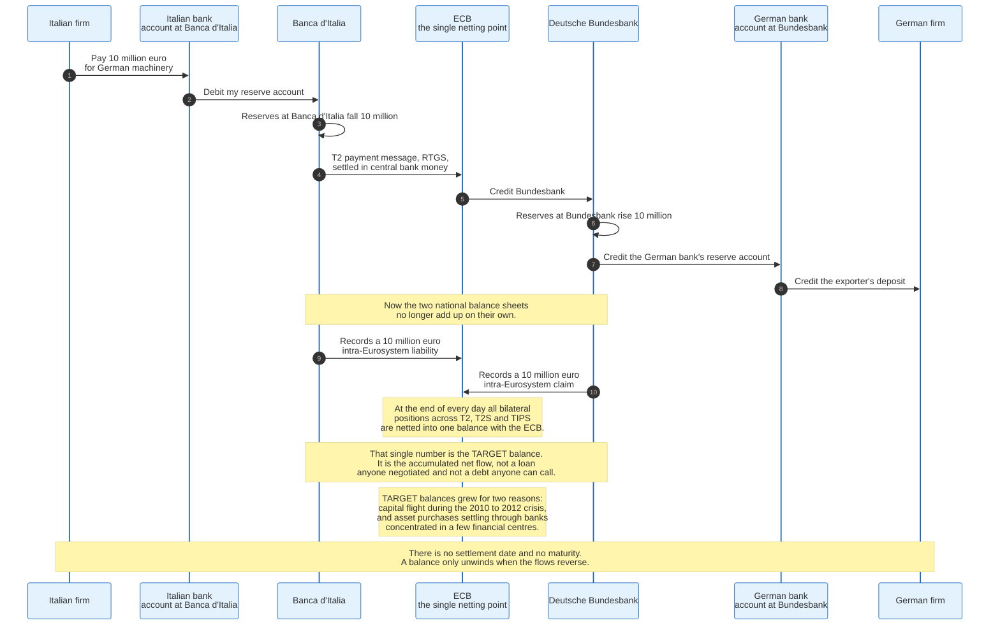

### 12.1 How One Arises

Follow ten million euro from an Italian importer to a German exporter.

The Italian firm's bank debits its customer and instructs a payment through T2. Its reserve account at Banca d'Italia falls by ten million euro. The German exporter's bank receives the funds, and its reserve account at the Deutsche Bundesbank rises by ten million euro.

The euro area's aggregate reserves have not changed. But Banca d'Italia's balance sheet now has ten million euro less on its liability side than its assets support, and the Bundesbank has ten million euro more. The gap is bridged with an intra-Eurosystem entry: Banca d'Italia records a liability to the Eurosystem, the Bundesbank records a claim on it.

At the end of every business day, all bilateral positions across T2, T2S and TIPS are netted into a single balance with the ECB, so that each national central bank has exactly one intra-Eurosystem position rather than twenty. That single number is the TARGET balance.

### 12.2 What It Is Not

**Not a loan anyone negotiated.** No credit committee approved it, no term was agreed, and no interest rate was bargained. It is remunerated at the main refinancing rate, uniformly, by rule.

**Not a debt that can be called.** There is no maturity date. A balance shrinks only when the underlying flows reverse.

**Not, by itself, evidence of a balance of payments crisis.** Balances grew for two distinct reasons and only one of them was stress. Between 2010 and 2012 they grew because private capital fled the periphery and central bank credit replaced it, which was a crisis symptom. From 2015 they grew again because the asset purchase programmes settled through banks concentrated in a handful of financial centres, so a Bundesbank claim could arise from the Bank of Greece buying a bond from a London-based seller who banks in Frankfurt. That second mechanism carries no distress content at all.

**Not a measure of any one country's solvency.** The counterparty is the Eurosystem, not another member state.

### 12.3 What the Balances Do Reveal

They reveal where central bank money accumulates, and that is genuinely informative.

A persistently large negative balance means an economy's banks are funding themselves at their own central bank rather than in the market, which is a signal about market access. A persistently large positive balance means an economy's banks are the ones holding the resulting reserves, which is a signal about where the currency union's safe-asset demand concentrates.

The mechanism also carries an unresolved question about redenomination risk. If a country left the euro, its TARGET liability would become a claim in a currency that no longer existed for the debtor, and the loss would be shared across the remaining members in proportion to their ECB capital keys. Nobody has ever had to work out the answer in practice, and no legal instrument settles it in advance. That is why the topic is politically radioactive despite being, in normal times, an accounting residual.

---

## 13. Mandates - Dual, Single, and the Third Goal

The Federal Reserve's mandate is not dual. It has three statutory goals, and the third one is quietly ignored.

### 13.1 What the Statute Actually Says

Section 2A of the Federal Reserve Act, added by act of 16 November 1977 and codified at 12 USC 225a, reads in full:

> "The Board of Governors of the Federal Reserve System and the Federal Open Market Committee shall maintain long run growth of the monetary and credit aggregates commensurate with the economy's long run potential to increase production, so as to promote effectively the goals of maximum employment, stable prices, and moderate long-term interest rates."

Three goals: maximum employment, stable prices, and moderate long-term interest rates. Every FOMC statement says "maximum employment and price stability" and stops. The third goal is treated as implied by the first two, on the reasoning that stable prices produce moderate long rates, which is defensible and is also not what the statute says.

Two further features of the text repay attention. The goals are unranked, unlike the ECB's, and the operative instruction is about "monetary and credit aggregates," a framing that no central bank has used operationally since the early 1980s. The statute describes a monetarist policy the Fed does not run, in service of three goals of which it publicly pursues two.

### 13.2 What the ECB's Says

Article 127(1) of the Treaty on the Functioning of the European Union ranks its objectives explicitly:

> "The primary objective of the European System of Central Banks shall be to maintain price stability. Without prejudice to the objective of price stability, the ESCB shall support the general economic policies in the Union with a view to contributing to the achievement of the objectives of the Union."

"Without prejudice" is the operative phrase. Employment support is permitted only where it does not conflict with price stability, and the ECB may not trade one against the other. The clause also grounds the ECB's argument that its secondary objective covers the green transition, which is why the March 2024 operational framework statement lists climate considerations among its design principles.

### 13.3 Does the Difference Matter in Practice

Less than the drafting suggests, and more than nothing.

Both institutions target 2 percent inflation over the medium term. Both tightened aggressively in 2022 and 2023, and both eased afterwards. The ECB's deposit facility rate went from 4.00 percent in September 2023 to 2.00 percent in June 2025 and back to 2.25 percent in June 2026. The Fed's target range went from 5.25 to 5.50 percent in July 2023 to 3.50 to 3.75 percent in December 2025. Different mandates, similar behaviour.

The difference shows up at the margin, in how each institution talks about a trade-off. A dual mandate lets the Fed say openly that it is weighing employment risk against inflation risk. A hierarchical mandate obliges the ECB to argue that whatever it is doing serves price stability, which sometimes requires strained reasoning about medium-term horizons.

### 13.4 The 2025 Framework Revision

On 22 August 2025 the FOMC released a revised Statement on Longer-Run Goals and Monetary Policy Strategy, concluding the second of its five-yearly reviews. Three changes matter.

**Flexible average inflation targeting was dropped.** The 2020 statement committed to achieving "inflation that averages 2 percent over time" and, after periods below target, to aiming "for inflation moderately above 2 percent for some time." Neither formulation appears in the 2025 text. The Committee now simply reaffirms 2 percent as the longer-run goal and says it "is prepared to act forcefully to ensure that longer-term inflation expectations remain well anchored."

**The shortfalls language was dropped.** The 2020 statement said policy would be informed by "shortfalls of employment from its maximum level," an asymmetry that ruled out tightening merely because employment was strong. The 2025 statement returns to symmetric language, with the qualification that "the Committee recognizes that employment may at times run above real-time assessments of maximum employment without necessarily creating risks to price stability."

**Financial stability was written in.** The revised text states that "sustainably achieving maximum employment and price stability depends on a stable financial system" and that policy decisions therefore reflect "risks to the financial system that could impede the attainment of the Committee's goals."

The honest reading is that the 2020 framework was designed for a decade of inflation running below target and did not survive contact with a decade that did not. The Committee also committed to reviewing the framework roughly every five years and to reaffirming the statement each January, which it did effective 27 January 2026.

---

## 14. Forward Guidance

Forward guidance is the practice of committing to a future policy path in order to move the long rates that today's overnight rate cannot reach. It is monetary policy conducted by press release.

### 14.1 Why It Exists

At the effective lower bound the policy rate cannot fall further, but expectations of future policy rates still can.

A ten-year yield is roughly the average expected overnight rate over ten years plus a term premium. If the central bank convinces the market that overnight rates will stay at zero for four years rather than one, the ten-year yield falls even though today's rate has not moved. That is the entire mechanism, and it works only to the extent the commitment is believed.

### 14.2 The Four Generations

**Open-ended, from December 2008.** The FOMC said conditions were likely to warrant exceptionally low rates "for some time." Vague, weakly binding, and easily read as a forecast rather than a commitment.

**Calendar-based, from August 2011.** The Committee said rates would stay low "at least through mid-2013," later extended to late 2014 and then to mid-2015. Precise, and precisely wrong as a design: a date-based commitment cannot distinguish between staying low because the economy is weak and staying low because the central bank promised to.

**Threshold-based, from December 2012.** The Evans rule, named for the Chicago Fed president who proposed it. The statement of 12 December 2012 said the exceptionally low range would be appropriate "at least as long as the unemployment rate remains above 6-1/2 percent, inflation between one and two years ahead is projected to be no more than a half percentage point above the Committee's 2 percent longer-run goal, and longer-term inflation expectations continue to be well anchored." The Committee explicitly noted it viewed "these thresholds as consistent with its earlier date-based guidance."

State-contingent guidance is analytically superior because it ties policy to outcomes rather than to the calendar. It also creates a communication problem the Fed discovered quickly: unemployment fell through 6.5 percent in 2014 without the Committee wanting to raise rates, and the thresholds had to be walked back as "not automatic triggers."

**Outcome-based, from September 2020.** The Committee said it would keep rates near zero "until labor market conditions have reached levels consistent with the Committee's assessments of maximum employment and inflation has risen to 2 percent and is on track to moderately exceed 2 percent for some time." That was the operational form of flexible average inflation targeting, and it was retired with the framework in August 2025.

### 14.3 The Dot Plot

The Fed has published a Summary of Economic Projections four times a year since November 2007. In January 2012 it added a chart of each participant's assessment of the appropriate federal funds rate at the end of each of the next several years and in the longer run. That chart is the dot plot, and it was bolted onto a publication that already existed.

It is the most-watched and least-understood document in monetary policy. Each dot is one participant's individual projection conditional on their own forecast. It is anonymous, it is not a vote, it is not a commitment, and it includes non-voting Reserve Bank presidents. Markets nonetheless trade it as a forecast of the committee's intentions, which is why every chair since its introduction has spent press conference time explaining that it is not one.

The persistent problem with forward guidance in all its forms is that it works by being believed and breaks by being believed. A committee that promises to hold rates until an outcome arrives has bound itself in exactly the circumstances where new information suggests it should not be bound. That tension has no clean resolution, which is why the current framework is deliberately vaguer than its predecessor.

---

## 15. Lender of Last Resort and Bagehot's Rule

The lender of last resort function is the oldest thing a central bank does and the least changed. Bagehot described it in 1873 and the description still governs.

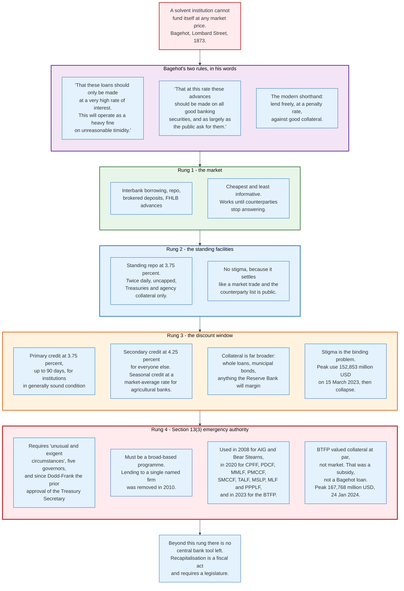

### 15.1 The Rule, in Bagehot's Words

*Lombard Street* gives two rules for lending in a panic. The first:

> "That these loans should only be made at a very high rate of interest. This will operate as a heavy fine on unreasonable timidity, and will prevent the greatest number of applications by persons who do not require it."

The second:

> "That at this rate these advances should be made on all good banking securities, and as largely as the public ask for them. The reason is plain. The object is to stay alarm, and nothing therefore should be done to cause alarm. But the way to cause alarm is to refuse some one who has good security to offer."

Bagehot's own summary of the combination is blunt: "Very large loans at very high rates are the best remedy for the worst malady of the money market."

The modern shorthand is lend freely, at a penalty rate, against good collateral. Each of the three clauses does distinct work. Freely, so the panic stops. At a penalty rate, so nobody borrows out of convenience and everybody repays as soon as they can. Against good collateral, so the central bank is lending against illiquidity rather than gifting against insolvency.

### 15.2 The Escalation Ladder

An institution short of funding moves down a ladder of increasing cost and decreasing anonymity.

**Rung one, the market.** Interbank borrowing, repo, brokered deposits, Federal Home Loan Bank advances. Cheapest, and the first to disappear.

**Rung two, the standing repo facility.** 3.75 percent, twice a day, uncapped full allotment, Treasury and agency collateral only. Settles like a market trade through BNY tri-party. Designed to carry no stigma.

**Rung three, the discount window.** Primary credit at 3.75 percent for institutions in generally sound condition, up to 90 days. Secondary credit at 4.25 percent for those that do not qualify. Seasonal credit at a floating rate, set as an average of selected market rates and reset every two weeks, for small agricultural and tourism-dependent banks with predictable swings. That rate tracks the market rather than the primary credit rate, so it is the only discount window rate the Board does not fix by announcement. Collateral is far broader than the standing repo facility accepts: whole commercial loans, consumer loans, municipal bonds, anything a Reserve Bank will value and margin under Operating Circular 10.

**Rung four, Section 13(3).** Emergency lending to non-banks, requiring "unusual and exigent circumstances," an affirmative vote of at least five governors, and since the Dodd-Frank Act of 2010 the prior approval of the Secretary of the Treasury. The 2010 amendments also require any Section 13(3) programme to be broad-based rather than aimed at a single named firm, closing off the route used for Bear Stearns and AIG in 2008. Nine programmes ran under the authority in 2020: CPFF, PDCF, MMLF, PMCCF, SMCCF, TALF, MSLP, MLF and PPPLF.

### 15.3 The Stigma Problem

The discount window is the best-designed lending facility in the world and it barely works, because borrowing from it is read as an admission of failure.

The evidence is a spike and a collapse. Primary credit outstanding hit 152,853 million dollars on 15 March 2023, in the week Silicon Valley Bank and Signature Bank failed. It stood at 4,890 million dollars on 26 August 2026. Banks that need the window in a crisis avoid it in normal times, which means they are not operationally ready when they do need it, which makes the eventual use slower and more visible.

The Federal Reserve has been attacking this in four ways. Discount Window Direct, an online portal for pledging collateral and requesting advances, now has 1,600 depository institutions signed up. Supervisors have pressed banks to test the window periodically rather than treat it as theoretical. Collateral margins were revised into a simplified display effective 1 July 2026. And the Borrower in Custody programme, which lets a bank pledge loans held on its own premises rather than delivering them, is being made easier to join, with changes announced on 6 August 2026 and launching in September.

None of this solves stigma. Stigma is solved by making borrowing normal, and borrowing becomes normal only if enough institutions do it that no signal can be extracted from any one of them doing it. That is a coordination problem, and central banks have not found a way out of it in a century and a half.

### 15.4 Where the Rule Was Broken

The Bank Term Funding Program, announced on 12 March 2023 after the Silicon Valley Bank failure, was not a Bagehot facility, and the departure was deliberate.

The BTFP lent for up to one year against Treasury and agency collateral valued at par rather than at market. That is the crucial detail. The banks in trouble held long bonds bought at low yields and worth far less than par after the 2022 rate rises. Valuing that collateral at par meant lending more than the collateral was worth, which is a subsidy rather than a secured loan.

The design also created an arbitrage. When short-term rates fell relative to the one-year overnight index swap rate the facility priced off, banks could borrow at a rate below what they earned on the resulting reserves. Take-up peaked at 167,768 million dollars on 24 January 2024, well after the crisis had passed, and the Fed adjusted the rate and then closed the programme to new loans on 11 March 2024. The balance ran to zero as the final loans matured.

The honest assessment is that the BTFP stopped the run and cost something to do it. The something was a departure from the collateral rule that Bagehot put first for a reason, and it establishes a precedent that the next set of banks holding underwater bonds will remember.

### 15.5 What the Function Cannot Do

A lender of last resort solves illiquidity. It cannot solve insolvency, and the boundary between the two is not observable in real time.

An institution that cannot fund itself because markets have panicked is illiquid, and lending against its good assets fixes it. An institution that cannot fund itself because its assets are worth less than its liabilities is insolvent, and lending to it converts a private loss into a public one while delaying the resolution.

In a panic the two look identical from the outside, and the central bank has hours to decide. The institutional answer is supervision: the reason central banks examine banks is so that when the phone rings at 3am they already have an opinion. The answer is imperfect, and every crisis produces at least one case where the wrong call was made in one direction or the other.

---

## 16. September 2019 - The Floor Fails

On 17 September 2019 the effective federal funds rate printed above the top of the FOMC's target range for the first time in the floor system's history, and the Secured Overnight Financing Rate rose above 5 percent on fully collateralised overnight lending. The Fed lost control of the rate it exists to control.

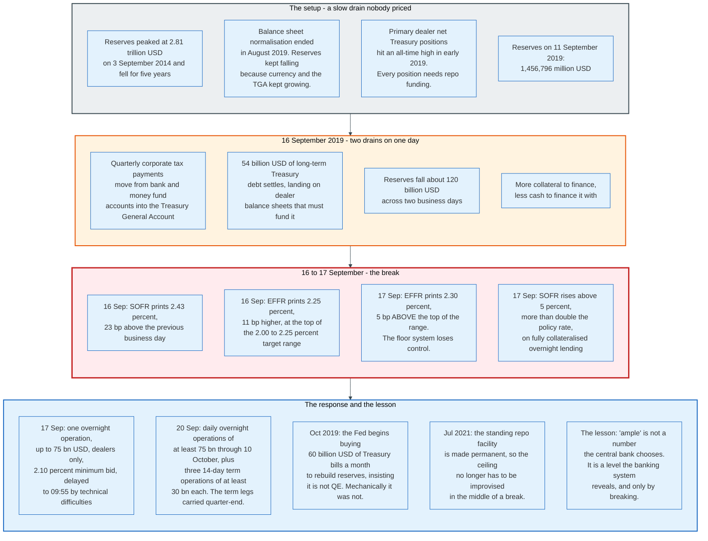

### 16.1 The Setup

Reserves had been falling for five years, gradually and then suddenly.

They peaked at 2,813,751 million dollars on 3 September 2014. Over the following three years they declined because the Fed's non-reserve liabilities grew: currency in circulation, the Treasury General Account, and foreign official reverse repos all expanded while total assets stood still. In October 2017 the Fed began actively reducing its securities holdings, adding a second source of decline. That balance sheet normalisation programme concluded in August 2019, but reserves kept falling because the autonomous factors kept growing.

The other half of the setup was on the dealer side. Net Treasury positions held by primary dealers reached an all-time high in early 2019. Every one of those positions has to be financed in the repo market, every night, which meant the demand for cash in repo was structurally larger than it had been.

Reserves stood at 1,456,796 million dollars on 11 September 2019.

### 16.2 The Trigger

Two drains landed on 16 September 2019.

Quarterly corporate tax payments came due, moving cash out of bank deposits and money market fund accounts and into the Treasury General Account. That is a straight transfer of reserves from the banking system to the Fed's own liability line, and it is entirely predictable in timing and roughly predictable in size.

The same day, 54 billion dollars of long-term Treasury debt settled. The dealers who bought at auction had to pay for it and then finance it, which increased their borrowing demand in repo at the same moment cash was leaving the market.

Reserves fell about 120 billion dollars over two business days. The Fed's own analysis, published as a FEDS Note in February 2020 by Sriya Anbil, Alyssa Anderson and Zeynep Senyuz, notes that a drop of 100 billion dollars over a day or two was not itself unusual, but "such a drop had not occurred at such a low level of aggregate reserves previously."

### 16.3 The Break

Monday 16 September: SOFR printed at 2.43 percent, 23 basis points above the previous business day's 2.20 percent. The effective federal funds rate printed at 2.25 percent, 11 basis points higher and exactly at the top of the FOMC's 2.00 to 2.25 percent target range.

Tuesday 17 September: the effective federal funds rate printed at 2.30 percent, 5 basis points above the top of the range. SOFR rose above 5 percent.

The second number is the one that should be surprising. SOFR measures overnight lending secured by Treasury securities, which is the closest thing to a risk-free rate that exists in private markets. It printed at more than double the policy rate. Cash was not available at a reasonable price even to borrowers offering the best collateral in the world.

Reserves stood at 1,394,122 million dollars on 18 September 2019.

### 16.4 The Response

The New York Fed announced an overnight repurchase agreement operation on the morning of 17 September, for up to 75 billion dollars against Treasury, agency debt and agency mortgage-backed collateral, open to primary dealers only, at a minimum bid rate of 2.10 percent and with a 10 billion dollar limit on any one proposition. Technical difficulties pushed the operation from 09:30 to 09:55.

Overnight operations alone did not fix it. On 20 September the Desk committed to daily overnight operations of at least 75 billion dollars through 10 October and to three 14-day term operations of at least 30 billion dollars each on 24, 26 and 27 September. The term operations are what carried the system over quarter-end. The distribution of rates in both the repo market and the fed funds market reverted close to their normal patterns over the following days.

In October 2019 the Fed began purchasing Treasury bills at a pace of 60 billion dollars a month to rebuild reserves, and insisted repeatedly that this was not quantitative easing. The insistence was mechanically correct. Treasury bills carry essentially no duration, so buying them adds reserves without removing term premium from the market, which is the opposite of what QE is for. That distinction is the same one the Desk is running under today, seven years later.

In July 2021 the standing repo facility was made permanent, converting the ceiling from an improvised operation into a published rate.

### 16.5 The Lesson

The lesson is that "ample" is not a level a central bank can choose. It is a level the banking system reveals, and the only way to find it is to cross it.

Several structural factors had raised the level of reserves banks wanted to hold, and none of them appeared in the aggregate data. The liquidity coverage ratio requires high-quality liquid assets, and reserves are the highest quality available. Intraday payment requirements under Fedwire mean a large bank must fund enormous gross flows even when its net position is flat. Resolution planning and internal liquidity stress testing added further buffers. And reserves are distributed unevenly, so an aggregate that looks adequate can conceal individual institutions that are short.

The Fed's answer since has been to stop relying on the aggregate. The New York Fed publishes a Reserve Demand Elasticity measure that estimates the local slope of the demand curve from daily data, giving a running read on how close the system is to the kink rather than a guess about the level. Combined with an uncapped standing repo facility, that is a substantially better position than 2019.

Whether it is good enough is not yet established, because the system has not been tested at low reserve levels since the facility became uncapped.

---

## 17. March 2020 - Dealer of Last Resort

In March 2020 the deepest financial market in the world stopped clearing, and the Federal Reserve responded by becoming its buyer. This was not stimulus and understanding why matters.

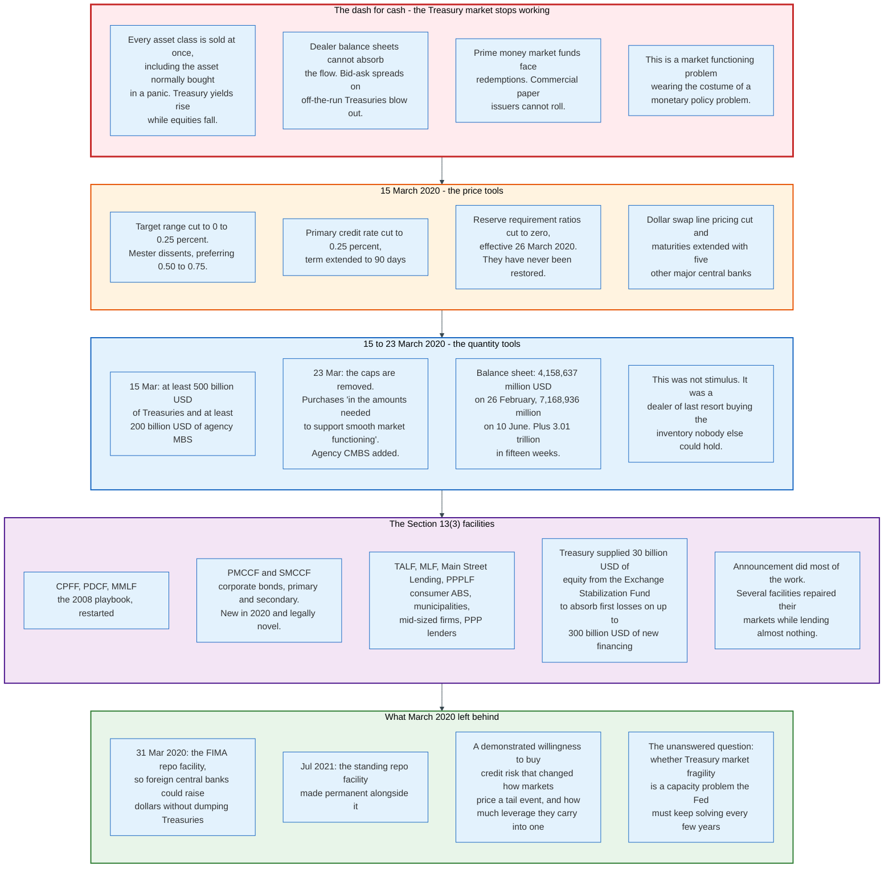

### 17.1 The Problem

In an ordinary crisis investors sell risky assets and buy Treasuries. In March 2020 they sold everything, including Treasuries, because what they needed was cash.

Foreign central banks sold Treasuries to raise dollars for their own banking systems. Levered relative-value funds unwound basis trades that had been financed in repo. Bond mutual funds sold liquid assets to meet redemptions. Corporations drew down credit lines and parked the proceeds. All of this hit dealer balance sheets simultaneously, and dealers constrained by post-crisis leverage rules could not expand to absorb it.

The symptom was Treasury yields rising while equities fell, an inversion of the normal flight-to-quality relationship, with bid-ask spreads on off-the-run Treasuries widening to levels not seen since 2008.

### 17.2 The Price Tools, 15 March 2020

The FOMC met on a Sunday and cut the target range to 0 to 0.25 percent. Loretta Mester dissented, supporting all the market-functioning actions but preferring a cut to 0.50 to 0.75 percent.

Alongside it, the Board cut the primary credit rate to 0.25 percent and extended the term of discount window loans to 90 days. It reduced reserve requirement ratios to zero effective 26 March 2020, eliminating reserve requirements for all depository institutions. They have never been restored. And in coordination with five other major central banks it cut the pricing on standing dollar liquidity swap lines and extended their maturities.

### 17.3 The Quantity Tools, 15 to 23 March 2020

The 15 March statement committed to increasing Treasury holdings "by at least 500 billion" dollars and agency mortgage-backed securities holdings "by at least 200 billion" dollars over coming months.

It was not enough, and it was superseded within eight days. The 23 March announcement removed the caps entirely, committing the FOMC to purchase Treasury securities and agency mortgage-backed securities "in the amounts needed to support smooth market functioning and effective transmission of monetary policy to broader financial conditions and the economy," and adding agency commercial mortgage-backed securities to the eligible set.

The phrase "in the amounts needed to support smooth market functioning" is the tell. This was a market repair operation described in monetary policy language, and the balance sheet shows the scale.

| Date | Total assets, mn USD | Reserve balances, mn USD |
|------|----------------------|--------------------------|
| 26 Feb 2020 | 4,158,637 | 1,626,469 |
| 11 Mar 2020 | 4,311,911 | 1,744,525 |
| 18 Mar 2020 | 4,668,212 | 1,895,588 |
| 25 Mar 2020 | 5,254,278 | 2,186,971 |
| 10 Jun 2020 | 7,168,936 | 3,182,228 |

Total assets rose 3,010,299 million dollars in fifteen weeks. Reserves rose 1,555,759 million dollars over the same period, the difference going into the Treasury General Account, which climbed to a peak of 1,816,687 million dollars on 29 July 2020 as the government pre-funded fiscal support.

### 17.4 The Section 13(3) Facilities

Nine emergency facilities were established or reactivated, and the Treasury supplied 30 billion dollars of equity from the Exchange Stabilization Fund to absorb first losses on programmes intended to provide up to 300 billion dollars of new financing.

| Facility | What it did | Status |
|----------|-------------|--------|
| **CPFF** | Bought commercial paper from issuers | 2008 playbook, reactivated |
| **PDCF** | Lent to primary dealers against broad collateral | 2008 playbook, reactivated |
| **MMLF** | Financed asset purchases from money market funds | 2008 playbook, reactivated, widened to municipal VRDNs and bank CDs |
| **PMCCF** | Bought new corporate bonds and loans | New in 2020 |
| **SMCCF** | Bought outstanding corporate bonds and bond ETFs | New in 2020 |
| **TALF** | Financed AAA-rated ABS backed by student, auto, credit card and SBA loans | 2008 playbook, reactivated |
| **MLF** | Bought municipal notes | New in 2020 |
| **Main Street** | Lent to small and mid-sized businesses | New in 2020 |
| **PPPLF** | Lent to Paycheck Protection Program lenders against those loans at face value | New in 2020, and the most heavily drawn |

The corporate credit facilities were legally novel and politically contentious, because a central bank buying corporate bonds is allocating credit to named private firms. The Fed's defence was that it bought broad indices and ETFs rather than picking issuers, and that the alternative was a corporate funding freeze in the middle of a public health emergency.

Several of the facilities lent almost nothing. The announcement itself repaired the market: corporate bond issuance reopened within weeks of the PMCCF and SMCCF being announced, before either bought anything meaningful. A credible commitment to buy can substitute for buying, which is the same property that makes forward guidance work and the same property that makes it dangerous, because the commitment has to be believed and therefore has to be honoured.

### 17.5 What March 2020 Left Behind

**The FIMA repo facility**, announced 31 March 2020 and later made standing, lets foreign central banks and international monetary authorities borrow dollars against Treasury securities held in custody at the New York Fed. Its purpose is to give them an alternative to selling Treasuries into a market that cannot absorb the sales, which removes one of the amplifying mechanisms of March 2020.

**The standing repo facility**, made permanent in July 2021 alongside it, does the same job for domestic counterparties.

**A demonstrated reaction function.** Markets now price a Fed that will buy corporate credit in a crisis. That expectation changes how much leverage and illiquidity investors are willing to carry into normal times, which is the moral hazard cost of the intervention and is not measurable.

**An unanswered question about Treasury market capacity.** The market broke in 2019, in 2020, and showed strain again in 2022 and 2023. The structural issue is that the stock of Treasury debt has grown much faster than dealer intermediation capacity, which is constrained by leverage rules. Proposals have included exempting Treasuries from the supplementary leverage ratio and expanding central clearing of Treasury cash and repo transactions. Neither fully closes the gap, and the alternative is a central bank that steps in every few years.

---

## 18. Central Bank Digital Currency

Executive Order 14178 defines a central bank digital currency as "a form of digital money or monetary value, denominated in the national unit of account, that is a direct liability of the central bank." The order says nothing about who holds it, which is the whole difficulty: on that wording a reserve balance qualifies, and reserve balances have existed for a century. The contested instrument is the one held by someone who is not a bank.

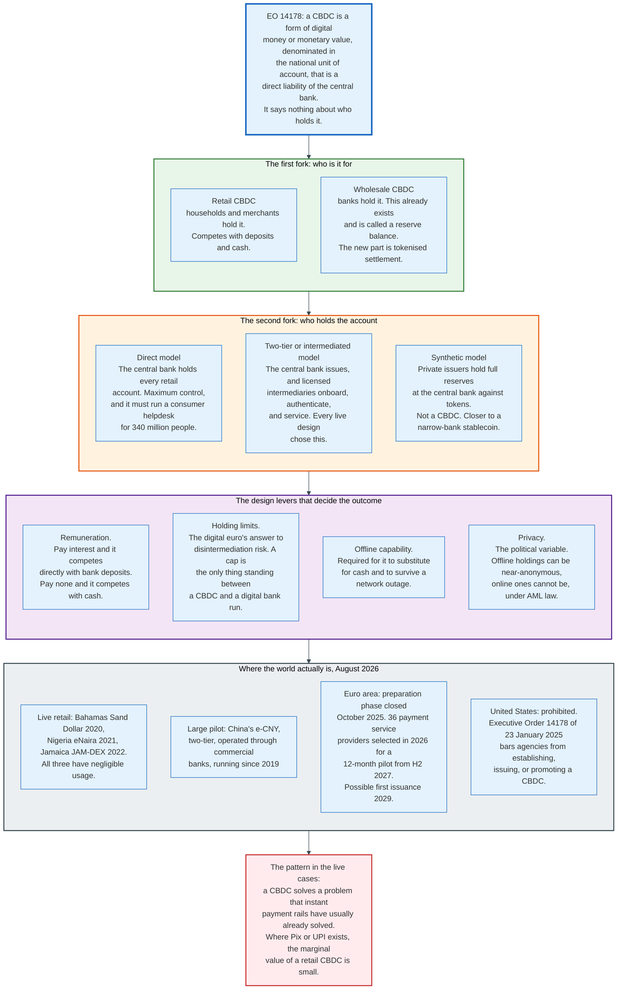

### 18.1 The First Fork - Retail or Wholesale

**Wholesale CBDC already exists and is called a reserve balance.** Banks hold central bank money electronically and have done for decades. What the term usually means in practice is tokenised settlement, where the central bank liability lives on a distributed ledger so it can settle atomically against tokenised securities or foreign currency. That is a plumbing upgrade to an existing arrangement, and it is where most serious central bank experimentation now sits.

**Retail CBDC is the contested one.** It gives households and merchants a direct claim on the central bank, competing with commercial bank deposits and with cash.

### 18.2 The Second Fork - Who Holds the Account

**Direct model.** The central bank holds every retail account. Maximum control, complete transaction visibility, and a requirement that the central bank operate consumer onboarding, identity verification, dispute resolution, and a helpdesk for the entire population. No major economy has proposed this seriously.

**Two-tier or intermediated model.** The central bank issues the liability and runs the settlement ledger. Licensed intermediaries handle onboarding, authentication, wallets, and customer service. Every live implementation and every serious design proposal has chosen this, for the obvious reason that the existing distribution network is a resource and rebuilding it is not.

**Synthetic model.** Private issuers hold full reserves at the central bank against tokens they issue. This is not a CBDC, because the holder's claim is on the issuer rather than on the central bank. It is closer to a narrow bank, and it is the structure that regulated stablecoin frameworks approximate.

### 18.3 The Design Levers

Four choices determine whether a retail CBDC is a payment instrument or a bank run waiting to happen.

**Remuneration.** Pay interest and the CBDC competes directly with bank deposits, potentially disintermediating the banking system in normal times. Pay none and it competes with cash, which is a much smaller target. Every current retail design pays nothing.

**Holding limits.** A cap on how much any individual may hold is the primary defence against disintermediation. It is also the design element most likely to make the product unattractive. The digital euro project has spent years on this trade-off without publishing a final number.

**Offline capability.** Required if the instrument is to substitute for cash, and required if it is to work during a network outage. It is also the only realistic route to genuine transaction privacy, because an offline transfer between two devices need not be reported to any ledger.

**Privacy.** The political variable, and the one that killed the American project. Online transactions cannot be anonymous under anti-money-laundering law, which means a retail CBDC creates a record of retail payments that some entity can access. Where the boundary sits is a legislative question, not a technical one.

### 18.4 Where the World Is, August 2026

**Live retail CBDCs exist and are barely used.** The Bahamas launched the Sand Dollar in October 2020, Nigeria launched the eNaira in October 2021, and Jamaica launched JAM-DEX in July 2022. All three are fully operational and all three have adoption far below expectations. The pattern in each case is the same: the instrument solves a problem that mobile money or card acceptance had already partly solved, and no user has a reason to switch.

**China's e-CNY is the largest pilot.** It uses a two-tier architecture in which the People's Bank of China issues and commercial banks distribute, has run since 2019, and has been extended across a growing list of cities and use cases. It coexists with Alipay and WeChat Pay. The instrument was launched into a market where private digital payments were already close to universal.

**The euro area is furthest along among large advanced economies.** The preparation phase ran from November 2023 to October 2025, and on its conclusion the Governing Council decided to move to the next phase, focused on technical readiness and supporting the legislative process. A draft rulebook has been developed. Providers for the digital euro platform have been selected, including private firms chosen through public tender and six national central banks delivering key components. Following a call for expressions of interest in March 2026, more than 50 payment service providers applied to join the pilot and 36 were selected from across the euro area, including Adyen, Deutsche Bank, Nexi, Revolut, Stripe, SumUp, UniCredit and Worldline. The pilot is planned to start in the second half of 2027 and run for twelve months. The ECB aims to be ready for a possible first issuance during 2029, assuming the digital euro Regulation is adopted in 2026. The decision to issue will only be taken once the legislative process completes.

**The United States has prohibited it.** Executive Order 14178, signed 23 January 2025 and published 31 January 2025, states the policy of "taking measures to protect Americans from the risks of Central Bank Digital Currencies (CBDCs), which threaten the stability of the financial system, individual privacy, and the sovereignty of the United States, including by prohibiting the establishment, issuance, circulation, and use of a CBDC within the jurisdiction of the United States." Section 5 provides that "except to the extent required by law, agencies are hereby prohibited from undertaking any action to establish, issue, or promote CBDCs within the jurisdiction of the United States or abroad," and requires any ongoing agency initiative to be terminated immediately. The same order revoked Executive Order 14067 of March 2022 and directed the Treasury to revoke its 2022 Framework for International Engagement on Digital Assets.

### 18.5 The Uncomfortable Finding

The live cases suggest a retail CBDC solves a problem that fast payment rails have usually already solved.

Brazil's Pix moved 79.8 billion payments in 2025, per Banco Central do Brasil's Pix statistics, without being a central bank liability held by the public. India's UPI moved 23.2 billion payments in May 2026 alone, per the National Payments Corporation of India's UPI ecosystem statistics. Both give households instant, free, universally reachable account-to-account payments, which is the benefit list most retail CBDC proposals lead with. Neither required anybody to hold a claim on the central bank.

What a retail CBDC adds beyond a good instant payment system is a settlement asset that cannot default and does not depend on a commercial bank remaining solvent. That is a genuine benefit and it is also the exact mechanism by which a CBDC accelerates a bank run: in a panic, converting deposits into central bank money is precisely what depositors want to do, and a CBDC makes it a phone tap.

Holding limits are the industry's answer. A holding limit is also an admission that the instrument is being deliberately made worse in order to be safe, which is an unusual foundation for a consumer product.

---

## 19. The Economics - What It Costs and Who Pays

A central bank has no customers and charges almost nothing. Its economics are the spread between what it earns on assets it acquired by creating money and what it pays on the money it created.

### 19.1 Seigniorage, the Original Business Model

The oldest source of central bank income is issuing a liability that pays no interest and buying an asset that does.

The Federal Reserve had 2,426,366 million dollars of notes in circulation on 26 August 2026. It pays nothing on them. The securities it holds against them earn a coupon. That spread is seigniorage, and it is pure profit for as long as the public wants to hold banknotes.

The historical arrangement was that this profit went to the government. The Federal Reserve remits its net income to the Treasury after covering operating expenses, paying a statutory dividend to member banks, and maintaining a small surplus. Between 2011 and 2021 those remittances ran from 54.9 billion dollars in 2019 to 107.4 billion dollars in 2021, which made the Fed one of the largest single contributors to federal revenue.

### 19.2 What Broke It

A floor system with a large balance sheet converts the business model from seigniorage on banknotes to a leveraged carry trade, and carry trades lose money when the funding rate rises.

The Fed bought long-duration Treasuries and mortgage-backed securities between 2020 and 2022 at yields that were, at the time, historically low. It funded them with reserves and reverse repos that reprice overnight. When the FOMC raised the target range from 0 to 0.25 percent in March 2022 to 5.25 to 5.50 percent by July 2023, the funding cost rose by more than five percentage points while the asset yield did not move, because the assets were already bought.

The result was negative net income beginning in September 2022. The Fed's accounting treatment is to record the shortfall as a deferred asset, described on the H.4.1 as negative earnings remittances due to the United States Treasury. It represents the amount of future net income the Fed must earn before it resumes remitting anything.

| Date | Deferred asset, mn USD |
|------|------------------------|
| 31 Aug 2022 | +1,024 (still remitting) |
| 30 Aug 2023 | -95,121 |
| 28 Aug 2024 | -193,347 |
| 27 Aug 2025 | -240,589 |
| 28 Jan 2026 | -245,927 (peak) |
| 26 Aug 2026 | -233,518 |

The peak was 245,927 million dollars on 28 January 2026. By 26 August 2026 it had fallen to 233,518 million dollars, which means the Fed is once again earning positive net income and paying the balance down. Three cuts in the target range during 2025 reduced the funding cost while the portfolio yield slowly rose as low-coupon securities matured and were replaced.

### 19.3 Who Actually Pays

The deferred asset is a transfer, and it is worth being precise about the direction.

The Treasury did not receive roughly 246 billion dollars of remittances it would otherwise have received, which means the federal deficit was that much larger and the public debt that much higher. The money went to holders of reserve balances and reverse repos: commercial banks, foreign banks operating in the United States, government-sponsored enterprises, and money market funds and their investors.

It is a transfer from taxpayers to the holders of central bank liabilities. It was also the predictable consequence of a deliberate policy choice. Buying long assets funded overnight is a duration mismatch, and a duration mismatch loses money when short rates rise. The Fed understood this when it made the purchases and judged that the macroeconomic benefit exceeded the fiscal cost.

Whether that judgement was right is a separate question from whether the loss was a surprise. It was not a surprise.

### 19.4 Why This Is Not Insolvency

A commercial firm with negative equity and no path to profitability is bankrupt. A central bank in the same position is an accounting curiosity, and the reason is mechanical.

The Fed's liabilities are settled by issuing more Fed liabilities. A reserve balance is redeemed by crediting another reserve balance, or by handing over Federal Reserve notes, which are also Fed liabilities. There is no instrument in which the Fed can be forced to pay and which it cannot create. It cannot be illiquid in its own currency and cannot be forced into default by a creditor.

Negative capital does have two real consequences, and neither is solvency.

**Political.** A central bank that stops remitting to the Treasury and pays 107 billion dollars a year to banks instead is politically exposed, particularly when it is simultaneously asking those banks to hold more capital. The Fed's independence rests on a legislature that could amend the Federal Reserve Act at any time, and a visible transfer to bank shareholders makes amendment easier to argue for.

**Behavioural.** A central bank worried about its income statement may hesitate to do what policy requires. This is the argument for keeping central bank capital adequate and for indemnity arrangements: the Bank of England's asset purchase facility is indemnified by HM Treasury precisely so that losses are recognised as fiscal rather than monetary, which removes the incentive to hesitate.

The euro area faces the same arithmetic with an extra complication. Losses accrue at the national central banks in proportion to their capital keys, which means a Eurosystem loss shows up in twenty-one separate national budgets and twenty-one separate national parliaments.

### 19.5 Operating Costs

The operational side of a central bank is small against the balance sheet it runs.

The Federal Reserve System's costs are staff, supervision and regulation, currency production paid to the Bureau of Engraving and Printing, and the payment services it operates: Fedwire Funds, Fedwire Securities, the National Settlement Service, FedACH, FedNow, and check services.

Payment services are legally required to recover their costs over the long run under the Monetary Control Act of 1980, and are priced accordingly. This makes the Fed a fee-charging service provider in competition with private operators such as The Clearing House, which is an unusual position for a regulator and one Congress created deliberately, on the view that a public option keeps access from depending on a competitor's goodwill.

None of this is material against a balance sheet of 6.73 trillion dollars. A hundred basis points of movement in the portfolio's value dwarfs the entire operating budget.

---

## 20. Comparisons - Fed, ECB, Bank of England, Bank of Japan

Four central banks, four frameworks, one target number. Comparing them exposes which design choices are structural and which are habit.

### 20.1 The Comparison Table

| Dimension | Federal Reserve | European Central Bank | Bank of England | Bank of Japan |
|-----------|-----------------|----------------------|-----------------|---------------|
| **Mandate** | Maximum employment, stable prices, moderate long-term rates. Unranked | Price stability primary, other objectives without prejudice | Price stability, subject to that supporting government economic policy | Price stability, with financial system stability |
| **Inflation target** | 2 percent PCE, longer run | 2 percent HICP, medium term, symmetric | 2 percent CPI, set annually by the Chancellor | 2 percent CPI |
| **Policy rate, Aug 2026** | 3.50 to 3.75 percent target range | 2.25 percent deposit facility | 3.75 percent Bank Rate | Uncollateralised overnight call rate around 1.00 percent from 17 Jun 2026, basic loan rate 1.25 percent |
| **Number of policy rates** | One range plus three administered rates | Three, with fixed spreads | One Bank Rate, paid on all reserves | One call rate target, plus a complementary deposit facility rate and a basic loan rate |
| **Framework** | Floor with abundant reserves | Floor with demand-driven liquidity, 15 bp MRO spread | Floor, moving to repo-led demand-driven provision | Floor, one rate on excess current account balances since March 2024 |
| **Liquidity provision** | Outright asset holdings | Weekly and three-month fixed-rate full-allotment lending | Short-Term Repo and Indexed Long-Term Repo | Outright JGB holdings |
| **Reserve requirement** | Zero since 26 Mar 2020 | 1 percent, remunerated at 0 percent | None | Applies, no tiering since March 2024 |
| **Balance sheet direction** | Growing again via bill purchases since Dec 2025 | Running off APP and PEPP | Reducing, including active gilt sales | Reducing JGB purchases |
| **Decision body** | FOMC, 12 votes | Governing Council, 6 plus 21 on rotation | MPC, 9 members | Policy Board, 9 members |
| **Loss treatment** | Deferred asset on its own balance sheet | Losses at national central banks by capital key | Indemnified by HM Treasury | Provisioning |

### 20.2 The One Structural Difference

The Fed owns its reserves into existence. The ECB lends them into existence. The Bank of England is moving from the first model to the second.

That single difference generates most of the rest. A Fed reserve balance persists until the Fed sells or lets an asset run off, so shrinking the balance sheet requires an active programme lasting years. A Eurosystem reserve balance disappears when the borrowing bank repays, so shrinking happens automatically when operations mature. The Fed needs quantitative tightening. The ECB mostly needs to wait.

The Bank of England published its intention to move to a repo-led framework, in which reserves are supplied on demand through the Short-Term Repo facility and the Indexed Long-Term Repo rather than held down as a stock of purchased gilts. The reasoning matches the ECB's: a demand-driven system does not require the central bank to guess the right quantity, and it lets the balance sheet be as large as the banking system needs and no larger.

The Bank of England is also alone among the four in conducting active sales of its asset portfolio rather than relying only on maturities, and alone in having a Treasury indemnity that makes the resulting losses explicitly fiscal.

### 20.3 The Mandate Difference in Practice

Behaviour has converged more than the legal texts suggest.

All four target 2 percent. All four tightened sharply in 2022 and 2023 and eased afterwards. The most recent divergence is directional rather than doctrinal: the ECB raised its three rates by 25 basis points effective 17 June 2026 after a year on hold, the Bank of Japan raised its call rate target to around 1.00 percent and its basic loan rate to 1.25 percent on the same date, the Bank of England held Bank Rate at 3.75 percent on 30 July 2026, and the FOMC held its range at 3.50 to 3.75 percent on 29 July 2026.

Where mandates bite is in what a central bank may say. The Fed can state openly that it is balancing employment risk against inflation risk, because the statute lists both. The ECB must frame any employment consideration as serving price stability, because the Treaty ranks them. The Bank of England's remit is set annually in a letter from the Chancellor of the Exchequer, which makes its objectives explicitly political in a way the other three are not.

### 20.4 The Framework a Central Bank Would Choose Today

For a central bank designing from scratch in 2026, the evidence points in a fairly clear direction.

**Choose a floor, not a corridor.** Rate control that survives an arbitrary balance sheet size is worth the interest expense, and the interest expense is only a problem when the portfolio is long and the funding is short.

**Supply reserves by lending, not by owning.** Demand-driven provision means never having to guess the right quantity and never having to run a multi-year unwind programme. It also puts the central bank's counterparty and collateral frameworks at the centre of the design, which is where the risk actually lives.

**Build the ceiling before it is needed.** An uncapped, fixed-rate, full-allotment standing facility with a public counterparty list is the single cheapest piece of insurance available, and September 2019 is what its absence costs.

**Keep the duration mismatch small.** If asset purchases are needed, buying short assets adds reserves without creating a carry trade that loses money when rates rise. The 233,518 million dollar deferred asset is the price of not doing this.

---

## 21. Modern Developments

### 21.1 What Changed in the Last Three Years

- **July 2023**: the FOMC reaches 5.25 to 5.50 percent, the peak of the tightening cycle.
- **13 March 2024**: the ECB concludes its operational framework review, confirming the deposit facility rate as the steering rate and cutting the main refinancing spread from 50 to 15 basis points.
- **11 March 2024**: the Bank Term Funding Program closes to new loans, having peaked at 167,768 million dollars on 24 January 2024.
- **June 2024**: the Fed cuts its Treasury runoff cap from 60 to 25 billion dollars a month.
- **18 September 2024**: the narrower ECB spread takes effect, and the three key rates move to 3.50, 3.65 and 3.90 percent.
- **23 January 2025**: Executive Order 14178 prohibits United States agencies from establishing, issuing or promoting a CBDC.
- **April 2025**: the Fed cuts its Treasury runoff cap again, from 25 to 5 billion dollars a month.
- **11 June 2025**: the ECB reaches its cycle low of 2.00 percent on the deposit facility.
- **22 August 2025**: the FOMC releases a revised Statement on Longer-Run Goals, dropping average inflation targeting and the shortfalls language.
- **October 2025**: the ECB's digital euro preparation phase closes and the Governing Council decides to move to the next phase.
- **29 October 2025**: the FOMC announces that balance sheet runoff will end on 1 December 2025.
- **10 December 2025**: the FOMC cuts to 3.50 to 3.75 percent, directs the Desk to begin buying Treasury bills to maintain ample reserves, and converts standing repo operations to a fixed rate with no aggregate limit.
- **11 December 2025**: uncapped full-allotment standing repo operations begin on FedTrade Plus, with a 40 billion dollar proposition limit per security type per operation.
- **March 2026**: the ECB issues a call for expressions of interest for the digital euro pilot; more than 50 payment service providers apply.
- **17 June 2026**: the ECB raises its three key rates by 25 basis points to 2.25, 2.40 and 2.65 percent. The Bank of Japan raises its call rate target to around 1.00 percent and its basic loan rate to 1.25 percent.
- **July 2026**: the ECB selects 36 payment service providers for the digital euro pilot. The Fed holds its range for a fourth consecutive meeting.
- **August 2026**: the Fed's balance sheet reaches 6,730,912 million dollars, up 195 billion dollars from the December 2025 trough, with reserves at 2,924,936 million dollars.

### 21.2 The Live Questions

**How large should the balance sheet be.** The Fed stopped shrinking at 6.54 trillion dollars and started growing again, which is a revealed preference rather than an announced target. Nobody knows the minimum level of reserves consistent with rate control, because it is a function of regulation, payment volumes, and the distribution of reserves across institutions, all of which move.

**Whether the standing repo facility is enough.** The facility became uncapped in December 2025 and has been essentially unused since, which means it has not been tested in the conditions it exists for. The New York Fed's own primary dealer survey suggests willingness to use it has improved. Willingness under calm conditions and willingness in a squeeze are different measurements.

**Whether the Treasury market can intermediate its own size.** The stock of Treasury debt has grown far faster than dealer balance sheet capacity, and the market has strained in 2019, 2020, 2022 and 2023. Central clearing of Treasury cash and repo transactions is being phased in. Leverage ratio relief for Treasury holdings has been proposed repeatedly. Neither closes the gap, and the fallback is a central bank that becomes the buyer every few years.

**Whether tokenised settlement replaces the current plumbing.** Wholesale CBDC experiments, tokenised deposits, and regulated stablecoins all propose settling on programmable ledgers. The central bank question underneath is whether the final settlement asset moves onto those ledgers or stays where it is with a bridge attached. No jurisdiction has committed.

**Whether independence survives the loss.** A central bank that stops remitting to the Treasury, pays 107 billion dollars a year to banks, and carries a 233 billion dollar deferred asset is an easier target than one that sends money to the government every year. The Federal Reserve Act can be amended by simple legislation.

### 21.3 Where This Is Heading

Four directions are visible and reasonably safe to state.

**Floors are permanent.** No major central bank has proposed returning to a corridor, and the reason is that a floor is the only framework that keeps rate control while the balance sheet does whatever financial stability requires.

**Liquidity provision moves from owning to lending.** The ECB has committed to it, the Bank of England is executing it, and the Fed's uncapped standing repo facility is a step in the same direction. The endpoint is a smaller securities portfolio and a larger, more heavily used set of lending facilities.

**Standing facilities get cheaper to use and harder to stigmatise.** Public counterparty lists, aggregate-only results, delayed disclosure, market-standard settlement, and online portals are all attempts at the same thing. The problem is not solved and the effort will continue, because the alternative is holding a permanently larger stock of reserves.

**Retail CBDC advances in Europe and nowhere else among the large economies.** The euro area has a legislative process, a pilot, and a target date. The United States has a prohibition. China has a large pilot that coexists with private payment apps. The rest of the world is mostly watching, and the live examples give them little reason to hurry.

---

## 22. Appendix

### 22.1 Key Terminology

| Term | Meaning |
|------|---------|
| **Administered rate** | A rate the central bank sets by announcement rather than by market clearing. IORB, ON RRP, the standing repo rate, and the primary credit rate are all administered. |
| **Ample reserves** | A level of reserves on the flat part of the demand curve, with margin, so that quantity changes do not move the overnight rate. |
| **Autonomous factors** | Balance sheet items that change reserves without a policy decision: currency in circulation, the Treasury General Account, float, and foreign official deposits. |
| **BGCR** | Broad General Collateral Rate. Overnight Treasury repo excluding certain specials. |
| **BTFP** | Bank Term Funding Program. March 2023 to March 2024. Lent for up to a year against collateral valued at par rather than market. |
| **Corridor system** | A framework with a lending rate above the target and a deposit rate below it, in which reserves are rationed so the market clears in the middle. |
| **Deferred asset** | Cumulative Federal Reserve losses, carried as negative earnings remittances due to the Treasury. 233,518 million dollars on 26 August 2026. |
| **Deposit facility rate** | The ECB rate on overnight deposits with the Eurosystem. The rate that sets the euro area policy stance. 2.25 percent from 17 June 2026. |
| **Discount window** | The Federal Reserve's collateralised lending facility for depository institutions. Primary credit 3.75 percent, secondary credit 4.25 percent, seasonal credit at an average of selected market rates reset fortnightly. |
| **EFFR** | Effective Federal Funds Rate. Volume-weighted median of overnight unsecured fed funds transactions. 3.63 percent on 111 billion dollars, 27 August 2026. |
| **Fedwire Funds Service** | The Federal Reserve's real-time gross settlement system for large-value payments in reserves. |
| **Floor system** | A framework in which the deposit rate is set at or near the target and reserves are abundant, so quantity does not affect the rate. |
| **Forward guidance** | Communication about the future policy path, used to move long rates when the overnight rate cannot move. |
| **IORB** | Interest on Reserve Balances. One rate paid on every reserve dollar, set by the Board of Governors. 3.65 percent from 11 December 2025. |
| **Marginal lending facility** | The ECB's overnight credit facility, fixed 25 basis points above the main refinancing rate. |
| **Master account** | An account at a Federal Reserve Bank. The only way to hold reserves, settle on Fedwire, and earn IORB. |
| **MRO** | Main Refinancing Operations. The ECB's weekly fixed-rate full-allotment lending, 15 basis points above the deposit facility rate since 18 September 2024. |
| **OBFR** | Overnight Bank Funding Rate. Fed funds plus eurodollars plus selected deposits. |
| **ON RRP** | Overnight Reverse Repurchase Agreement facility. Lets non-banks lend to the Fed overnight against Treasury collateral. 3.50 percent, 160 billion dollar per-counterparty limit. |
| **Primary dealer** | A trading counterparty of the New York Fed, obliged to bid in Treasury auctions. 26 firms in August 2026. |
| **QE** | Quantitative Easing. Purchase of longer-dated securities financed by creating reserves, intended to compress term premia. |
| **QT** | Quantitative Tightening. Reduction of the securities portfolio, in the Fed's 2022 to 2025 programme almost entirely by letting holdings mature. |
| **Reserve balance** | A deposit at a Federal Reserve Bank. The settlement asset of the United States financial system. 2,924,936 million dollars on 26 August 2026, weekly average; 2,916,824 million on the Wednesday. |
| **Reserve Demand Elasticity** | A New York Fed measure estimating the local slope of the reserve demand curve, used to judge how close the system is to scarcity. |
| **Section 13(3)** | The Federal Reserve Act provision permitting emergency lending to non-banks in unusual and exigent circumstances, requiring five governors and, since 2010, Treasury approval. |
| **Seigniorage** | Income from issuing non-interest-bearing liabilities and holding interest-bearing assets against them. |
| **SOFR** | Secured Overnight Financing Rate. Broad Treasury repo. 3.64 percent on 2,836 billion dollars, 27 August 2026. |
| **SOMA** | System Open Market Account. The portfolio holding every security the Federal Reserve System owns. |
| **SRF / SRP** | Standing Repo Facility, called standing repo operations by the New York Fed. Fixed rate 3.75 percent, twice daily, uncapped full allotment since 11 December 2025. |
| **T2** | The Eurosystem's real-time gross settlement system, live since 20 March 2023, replacing TARGET2. |
| **TARGET balance** | A national central bank's net intra-Eurosystem position, netted daily into a single balance with the ECB. |
| **TGA** | Treasury General Account. The United States government's account at the Fed. 959,435 million dollars on 26 August 2026, Wednesday level; 950,736 million as a weekly average. |
| **TGCR** | Tri-Party General Collateral Rate. Overnight tri-party Treasury repo. |
| **Tri-party repo** | A repo settled on a clearing bank's books, with the clearing bank holding custody, valuing collateral, and applying margin. BNY settles both Fed standing facilities. |

### 22.2 Architecture Diagrams

| Diagram | Source | Description |
|---------|--------|-------------|
| Evolution Timeline | [`diagrams/evolution-timeline.mmd`](diagrams/evolution-timeline.mmd) | Central banking from 1668 to the 2026 return to balance sheet growth |
| Balance Sheet Anatomy | [`diagrams/balance-sheet-anatomy.mmd`](diagrams/balance-sheet-anatomy.mmd) | Both sides of the Fed's balance sheet with August 2026 figures, and the identity that makes reserves a residual |
| Money Hierarchy | [`diagrams/money-hierarchy.mmd`](diagrams/money-hierarchy.mmd) | Central bank money, commercial bank money, near money, and the arrow that does not exist |
| Participants | [`diagrams/participants.mmd`](diagrams/participants.mmd) | Who decides, who executes, who transacts, and who is affected |
| Corridor versus Floor | [`diagrams/corridor-vs-floor.mmd`](diagrams/corridor-vs-floor.mmd) | The two operating frameworks and what each one costs |
| Reserve Demand Curve | [`diagrams/reserve-demand-curve.mmd`](diagrams/reserve-demand-curve.mmd) | Scarce, ample, and abundant, with the numbers that define each region |
| Rate Control Stack | [`diagrams/rate-control-stack.mmd`](diagrams/rate-control-stack.mmd) | Every administered and market rate in August 2026, and why EFFR sits below IORB |
| Facility Operations Flow | [`diagrams/facility-operations-flow.mmd`](diagrams/facility-operations-flow.mmd) | A standing repo draw and an ON RRP placement, end to end through BNY tri-party |
| QE and QT Mechanics | [`diagrams/qe-qt-mechanics.mmd`](diagrams/qe-qt-mechanics.mmd) | Three balance sheets moving at once, and why the reverse is not symmetric |
| Transmission Channels | [`diagrams/transmission-channels.mmd`](diagrams/transmission-channels.mmd) | Six channels from one overnight rate to output and inflation |
| ECB Framework | [`diagrams/ecb-framework.mmd`](diagrams/ecb-framework.mmd) | Three rates, fixed spreads, and the 15 basis point decision |
| TARGET Balances | [`diagrams/target-balances.mmd`](diagrams/target-balances.mmd) | How a cross-border payment becomes an intra-Eurosystem claim |
| Lender of Last Resort Ladder | [`diagrams/lolr-ladder.mmd`](diagrams/lolr-ladder.mmd) | Bagehot's rules and the four rungs from market funding to Section 13(3) |
| September 2019 Repo | [`diagrams/sept-2019-repo.mmd`](diagrams/sept-2019-repo.mmd) | The setup, the trigger, the break, and what it produced |
| March 2020 Response | [`diagrams/march-2020-response.mmd`](diagrams/march-2020-response.mmd) | Price tools, quantity tools, the nine facilities, and what stayed |
| CBDC Designs | [`diagrams/cbdc-designs.mmd`](diagrams/cbdc-designs.mmd) | Retail versus wholesale, direct versus intermediated, and where each jurisdiction landed |

### 22.3 Federal Reserve Balance Sheet Reference Points

All figures in millions of dollars, from the H.4.1 weekly release.

| Date | Total assets | Reserve balances | ON RRP take-up | TGA | Note |
|------|--------------|------------------|----------------|-----|------|
| 28 Aug 2019 | 3,759,946 | 1,498,680 | 4,255 | 145,957 | Before the repo break |
| 11 Sep 2019 | 3,769,673 | 1,456,796 | 3,612 | 185,342 | Week of the tax date |
| 18 Sep 2019 | 3,844,695 | 1,394,122 | 18,910 | 250,226 | After the break |
| 26 Feb 2020 | 4,158,637 | 1,626,469 | 2,300 | 439,365 | Before the pandemic response |
| 25 Mar 2020 | 5,254,278 | 2,186,971 | 97,411 | 390,252 | Two weeks in |
| 10 Jun 2020 | 7,168,936 | 3,182,228 | 12 | 1,506,558 | Fifteen weeks in |
| 8 Dec 2021 | 8,664,524 | 4,275,806 | 1,484,192 | 115,117 | Reserve peak |
| 13 Apr 2022 | 8,965,487 | 3,823,644 | 1,815,555 | 547,308 | Balance sheet peak |
| 28 Dec 2022 | 8,551,169 | 3,017,889 | 2,293,003 | 427,926 | Week of the ON RRP peak |
| 30 Dec 2022 | not shown | not shown | 2,553,716 | not shown | ON RRP daily peak |
| 27 Dec 2023 | 7,712,781 | 3,446,459 | 818,869 | 731,405 | Midway through QT |
| 29 Oct 2025 | 6,587,034 | 2,848,021 | not shown | 957,990 | Reserve trough |
| 3 Dec 2025 | 6,535,781 | 2,858,284 | 2,514 | 937,167 | Balance sheet trough |
| 26 Aug 2026 | 6,730,912 | 2,924,936 | 702 | 950,736 | Current |

Every column is in millions of dollars. ON RRP take-up is the daily overnight figure for that date, from the New York Fed's operation results. Reserve balances and the Treasury General Account are weekly averages of daily figures from Table 1 of the H.4.1, so the series is comparable across dates. Total assets are Wednesday levels from Table 5. On the Wednesday basis, 26 August 2026 reserve balances were 2,916,824 million dollars and the Treasury General Account 959,435 million.

### 22.4 Facility Parameter Reference, August 2026

| Facility | Rate | Hours, Eastern | Limit | Collateral | Settlement |
|----------|------|----------------|-------|------------|------------|
| **ON RRP** | 3.50 percent | 12:45 to 13:15 | 160 bn USD per counterparty | Treasuries from SOMA | BNY tri-party, funds by 16:30 |
| **Standing repo, morning** | 3.75 percent | 08:15 to 08:30 | 40 bn USD per security type | Treasuries, agency debt, agency MBS | BNY tri-party, same day |
| **Standing repo, afternoon** | 3.75 percent | 13:30 to 13:45 | 40 bn USD per security type | Treasuries, agency debt, agency MBS | BNY tri-party, same day |
| **Primary credit** | 3.75 percent | Reserve Bank hours | None fixed | Broad, per Operating Circular 10 | Direct to master account |
| **Secondary credit** | 4.25 percent | Reserve Bank hours | Case by case | Broad | Direct to master account |
| **Seasonal credit** | Average of selected market rates, reset fortnightly | Reserve Bank hours | Formula based | Broad | Direct to master account |

### 22.5 Key Rate History, 2024 to 2026

| Effective date | Fed target range | IORB | ON RRP | Standing repo | Primary credit |
|----------------|------------------|------|--------|---------------|----------------|
| 19 Sep 2024 | 4.75 to 5.00 | 4.90 | 4.80 | 5.00 min bid, 500 bn cap | 5.00 |
| 8 Nov 2024 | 4.50 to 4.75 | 4.65 | 4.55 | 4.75 min bid, 500 bn cap | 4.75 |
| 19 Dec 2024 | 4.25 to 4.50 | 4.40 | 4.25 | 4.50 min bid, 500 bn cap | 4.50 |
| 18 Sep 2025 | 4.00 to 4.25 | 4.15 | 4.00 | 4.25 min bid, 500 bn cap | 4.25 |
| 30 Oct 2025 | 3.75 to 4.00 | 3.90 | 3.75 | 4.00 min bid, 500 bn cap | 4.00 |
| 11 Dec 2025 | 3.50 to 3.75 | 3.65 | 3.50 | 3.75 fixed, no cap | 3.75 |
| 29 Jan 2026 | 3.50 to 3.75 | 3.65 | 3.50 | 3.75 fixed, no cap | 3.75 |
| 30 Jul 2026 | 3.50 to 3.75 | 3.65 | 3.50 | 3.75 fixed, no cap | 3.75 |

### 22.6 ECB Key Rate History, 2024 to 2026

| Effective date | Deposit facility | Main refinancing | Marginal lending | Spread, MRO over DFR |
|----------------|------------------|------------------|------------------|----------------------|
| 12 Jun 2024 | 3.75 | 4.25 | 4.50 | 50 bp |
| 18 Sep 2024 | 3.50 | 3.65 | 3.90 | 15 bp |
| 23 Oct 2024 | 3.25 | 3.40 | 3.65 | 15 bp |
| 18 Dec 2024 | 3.00 | 3.15 | 3.40 | 15 bp |
| 5 Feb 2025 | 2.75 | 2.90 | 3.15 | 15 bp |
| 12 Mar 2025 | 2.50 | 2.65 | 2.90 | 15 bp |
| 23 Apr 2025 | 2.25 | 2.40 | 2.65 | 15 bp |
| 11 Jun 2025 | 2.00 | 2.15 | 2.40 | 15 bp |
| 17 Jun 2026 | 2.25 | 2.40 | 2.65 | 15 bp |

### 22.7 Primary Source Index

| Source | What it carries | Frequency |
|--------|-----------------|-----------|
| **H.4.1, Factors Affecting Reserve Balances** | The Fed's full balance sheet, including the deferred asset | Weekly, Thursday |
| **H.3, Aggregate Reserves** | Reserve balances and the monetary base | Weekly |
| **H.8, Assets and Liabilities of Commercial Banks** | Deposits, loans, and securities at commercial banks | Weekly |
| **FOMC implementation note** | The directive, IORB, ON RRP, standing repo, and primary credit rates | After each meeting |
| **Summary of Economic Projections** | Participant projections including the dot plot | Four times a year |
| **New York Fed reference rates** | EFFR, OBFR, SOFR, BGCR, TGCR with volumes and percentiles | Daily |
| **New York Fed repo and reverse repo results** | Operation-level take-up by security type | Daily |
| **New York Fed FAQ documents** | Facility parameters, counterparty rules, settlement mechanics | On change |
| **ECB key interest rates table** | The three rates with effective dates back to 1999 | On change |
| **ECB Governing Council statements** | Framework decisions, including 13 March 2024 | Episodic |
| **Statement on Longer-Run Goals** | The Fed's strategy framework | Reaffirmed each January, reviewed every five years |

---

## 23. Key Takeaways

**1. A central bank is a balance sheet with a monopoly on the settlement asset.** Every other function follows. It sets rates because it issues the thing banks settle in, lends in a crisis because it is the only entity that cannot run out, and finances governments only in systems that have decided to break the separation.

**2. Reserves are not deposits and cannot become deposits.** Reserves move only between reserve accounts. Deposits are commercial bank liabilities created when banks lend. On 26 August 2026 there were 2.92 trillion dollars of reserves under 19.49 trillion dollars of deposits, and the ratio is an outcome rather than a constraint, because reserve requirements have been zero since 26 March 2020.

**3. The Fed does not set the federal funds rate.** It sets IORB at 3.65 percent, the ON RRP at 3.50 percent, and the standing repo rate at 3.75 percent, and the market rate lands between them. On 27 August 2026 the effective federal funds rate printed at 3.63 percent, produced by Federal Home Loan Banks lending to foreign bank branches in a 111 billion dollar market. SOFR, at 2,836 billion dollars, is the rate that actually prices credit.

**4. A floor system trades interest expense for rate control at any balance sheet size.** Rate control no longer depends on balance sheet size, which is what let the Fed add 3.01 trillion dollars in fifteen weeks in 2020 without losing the rate. The bill is roughly 107 billion dollars a year in interest on reserves.

**5. "Ample" is a level the banking system reveals, not one the central bank chooses.** In September 2019 reserves of about 1.4 trillion dollars turned out to be too few, and SOFR printed above 5 percent against a policy rate of 2.25 percent. The uncapped standing repo facility exists so that the discovery does not have to happen through a break.

**6. QE is an asset swap, not printing money.** It exchanges duration for reserves, which compresses term premia and signals the future path of short rates. It creates no net financial wealth, and the reserves it creates cannot leave the reserve system.

**7. QT is not QE in reverse.** QE was active purchase; QT was passive runoff under monthly caps. Between April 2022 and December 2025 the balance sheet fell 2.43 trillion dollars. ON RRP balances fell 1.81 trillion and reserves fell 0.97 trillion. Those two exceed the asset decline because the Treasury General Account rose 0.39 trillion over the same period and drained reserves on its own account. Once the ON RRP emptied, further reduction hit reserves directly, and the programme stopped.

**8. The bill for the duration mismatch is 233,518 million dollars.** The Fed bought long assets and funded them overnight. When the funding cost rose above the asset yield in September 2022, net income went negative and remittances to the Treasury stopped. The deferred asset peaked at 245,927 million dollars on 28 January 2026 and is now falling. This is a transfer from taxpayers to holders of central bank liabilities, and it was entirely foreseeable.

**9. Negative capital is not insolvency for a central bank.** Its liabilities are settled by issuing more of its liabilities. The real consequences are political and behavioural rather than financial, which is why the Bank of England's asset purchases are indemnified by the Treasury and the Fed's are not.

**10. The dual mandate has three goals.** Federal Reserve Act Section 2A names maximum employment, stable prices, and moderate long-term interest rates, unranked. The ECB's Article 127 ranks price stability first and everything else "without prejudice" to it. Behaviour has converged more than the texts suggest.

**11. Bagehot's rule has survived 153 years because it prices the problem correctly.** Lend freely so the panic stops, at a penalty rate so nobody borrows casually, against good collateral so the loan addresses illiquidity rather than insolvency. The Bank Term Funding Program broke the third clause by valuing collateral at par, stopped the run, and set a precedent.

**12. Stigma is the unsolved problem in central bank lending.** Discount window primary credit hit 152,853 million dollars on 15 March 2023 and stood at 4,890 million dollars on 26 August 2026. A facility nobody will use in normal times is a facility nobody is operationally ready to use in a crisis, and 150 years of institutional effort have not fixed it.

**13. The ECB solves the same problem with a different lever.** The Fed makes reserves abundant by owning assets. The Eurosystem makes borrowing cheap, at 15 basis points over the deposit rate since 18 September 2024, and lets banks take what they need. The second design self-liquidates and needs no multi-year unwind programme.

**14. TARGET balances are an accounting residual with a political shadow.** They record where central bank money accumulated across twenty-one national balance sheets. They are not loans, have no maturity, and cannot be called. The only genuinely unresolved question about them is what would happen on a euro exit, and no instrument answers it.

**15. Retail CBDC solves a problem that instant payment rails usually already solved.** Pix, UPI, and their equivalents deliver instant, free, universally reachable payments without anyone holding a claim on the central bank. What a CBDC adds is a default-proof settlement asset, which is also the exact mechanism by which it accelerates a bank run. Holding limits are the answer, and a holding limit is an admission that the product is being deliberately constrained to be safe.

---

*Figures in this document are drawn from Federal Reserve H.4.1, H.3 and H.8 releases, FOMC statements and implementation notes, New York Fed reference rates and operating policy statements, European Central Bank publications, and Bank of England and Bank of Japan releases, and reflect data available as of 31 August 2026. Rates and balance sheet levels move; the mechanisms described here do not.*
