# Commercial Banks: Complete Technical Deep Dive

---

## Table of Contents

1. [History and Overview](#1-history-and-overview)
2. [What a Bank Actually Is (and Is Not)](#2-what-a-bank-actually-is-and-is-not)
3. [Loans Create Deposits](#3-loans-create-deposits)
4. [The Reserve Requirement's Road to Zero](#4-the-reserve-requirements-road-to-zero)
5. [Key Participants and Roles](#5-key-participants-and-roles)
6. [Reading the Balance Sheet: A Worked Bank](#6-reading-the-balance-sheet-a-worked-bank)
7. [Capital: The Solvency Constraint](#7-capital-the-solvency-constraint)
8. [Liquidity: The Timing Constraint](#8-liquidity-the-timing-constraint)
9. [Net Interest Margin: How the Spread Is Earned](#9-net-interest-margin-how-the-spread-is-earned)
10. [Maturity and Liquidity Transformation](#10-maturity-and-liquidity-transformation)
11. [Interest Rate Risk and the Death of Silicon Valley Bank](#11-interest-rate-risk-and-the-death-of-silicon-valley-bank)
12. [The Run Dynamic and Deposit Stickiness](#12-the-run-dynamic-and-deposit-stickiness)
13. [The Discount Window and Its Stigma](#13-the-discount-window-and-its-stigma)
14. [Credit Risk: Underwriting and Provisioning under CECL](#14-credit-risk-underwriting-and-provisioning-under-cecl)
15. [Fee Income: The Third of Revenue That Is Not Spread](#15-fee-income-the-third-of-revenue-that-is-not-spread)
16. [The Correspondent Banking Network](#16-the-correspondent-banking-network)
17. [Regulation, Supervision, and the Tiering Problem](#17-regulation-supervision-and-the-tiering-problem)
18. [Economics: What It Costs to Run a Bank](#18-economics-what-it-costs-to-run-a-bank)
19. [Comparisons and Alternatives](#19-comparisons-and-alternatives)
20. [Modern Developments](#20-modern-developments)
21. [Appendix](#21-appendix)
22. [Key Takeaways](#22-key-takeaways)

---

## 1. History and Overview

A commercial bank is a balance sheet with a licence, and every fact in this document follows from that sentence. It borrows short, at par, from people who can demand their money back at any moment. It lends long, at risk, to people who cannot repay early without penalty. The gap between those two statements is where the profit comes from, and it is also where every banking crisis in history has come from.

The business has not changed since the fourteenth century. The regulation has changed constantly.

### 1.1 The Shape Was Set Before the Rules Were

Deposit banking predates central banking by roughly four hundred years, which is why the rules read as retrofits. Florentine and Venetian houses in the 1300s took deposits, made loans, and settled between each other by transferring ledger entries rather than coin. The Medici bank ran branches across Europe in the fifteenth century and cleared between them on its own books. Everything that follows is elaboration.

Three innovations turned that into modern banking. The Bank of Amsterdam, founded in 1609, created a deposit that was a claim on a public institution rather than on a merchant, which made it transferable at par. The Bank of England, founded in 1694, discovered that a note issued against government debt would circulate as money. And the Suffolk Bank system in Boston in the 1820s demonstrated that a clearing house could discipline note issuance more effectively than a legislature.

The United States then spent a century deciding whether to have a central bank at all. The First Bank of the United States was chartered in 1791 and allowed to lapse in 1811. The Second was chartered in 1816, denied a new charter by Andrew Jackson's veto on 10 July 1832, and expired in 1836. The National Bank Acts of 1863 and 1864 created the Office of the Comptroller of the Currency and a class of federally chartered banks, but no lender of last resort. Between 1863 and 1913 the country had banking panics in 1873, 1884, 1890, 1893, and 1907.

The Panic of 1907 produced the Federal Reserve. The failures of 1930 to 1933 produced deposit insurance.

### 1.2 The Two Inventions That Made Deposits Behave

Two twentieth-century inventions define modern banking, and both are answers to the same problem. The problem is that a demandable claim on an illiquid portfolio is unstable by construction.

**The lender of last resort** arrived with the Federal Reserve Act of 1913. Walter Bagehot had written the rule in 1873: in a panic, lend freely, at a high rate, against good collateral. A solvent bank that cannot convert good assets to cash quickly enough should be able to borrow against those assets rather than sell them into a falling market. The Federal Reserve's discount window is the institutional form of that sentence.

**Deposit insurance** arrived with the Banking Act of 1933, which created the Federal Deposit Insurance Corporation. It works by removing the incentive to run. A depositor whose balance is guaranteed has no reason to be first in the queue, so the queue does not form. The initial coverage limit was 2,500 dollars. It has been raised repeatedly and now stands at 250,000 dollars per depositor, per insured bank, per ownership category, a level made permanent by the Dodd-Frank Act in 2010.

Both inventions work. Both have a hole in them, and the hole is the same one: they protect the depositors who were never going to run, and they do less for the ones who were.

### 1.3 The Structural Story Is Consolidation

The number of American bank charters has fallen every year for four decades, and this single fact explains more about the industry than any regulation. FDIC historical statistics count more than 14,000 commercial bank charters in the mid-1980s. As of 30 June 2026 the total across commercial banks and savings institutions is 4,238, of which 3,728 are commercial banks and 510 are savings institutions.

The decline is steady and almost entirely driven by mergers rather than failures. In the second quarter of 2026 alone, four banks opened, 36 merged into other banks, four were sold to institutions outside the FDIC's insurance fund, and one failed. The charter count fell by 41 over the quarter, from 4,279 to 4,238; those four categories account for 37 of the decline and the FDIC does not itemise the rest. One quarter, forty-one fewer banks.

The reason is fixed cost. A compliance function, a core banking contract, a cybersecurity programme, and a mobile app cost roughly the same whether they support 400 million dollars of assets or 40 billion. Two forces removed the barriers that had preserved small banks: the Riegle-Neal Interstate Banking and Branching Efficiency Act of 1994 eliminated the prohibition on interstate branching, and the Gramm-Leach-Bliley Act of 1999 repealed the Glass-Steagall separation of commercial and investment banking.

### 1.4 Scale Today

The US banking industry is 26.5 trillion dollars of assets held by 4,238 charters, of which 18 charters hold 63.7 percent. These are the figures from the FDIC's Quarterly Banking Profile for the second quarter of 2026.

| Metric | 2026 Q2 | Note |
|--------|---------|------|
| **Total assets** | 26.46 trn USD | Up 5.9% year on year |
| **Total loans and leases** | 13.94 trn USD | 52.7% of assets |
| **Securities** | 5.82 trn USD | 22.0% of assets |
| **Total deposits** | 20.72 trn USD | 78.3% of assets |
| **Uninsured deposits** | 7.61 trn USD | Q4 2025 level, Fed Financial Stability Report, May 2026. The FDIC reports uninsured domestic deposits rising 317.4 bn in 2026 Q2 |
| **Total equity capital** | 2.63 trn USD | 9.92% of assets |
| **Quarterly net income** | 90.1 bn USD | Return on assets 1.37% |
| **Net interest income** | 197.4 bn USD | 67% of net operating revenue |
| **Noninterest income** | 96.1 bn USD | 33% of net operating revenue |
| **Net interest margin** | 3.32% | Yield 5.35%, cost of funding 2.03% |
| **Allowance for credit losses** | 223.9 bn USD | 172.7% of noncurrent loans |
| **Net charge-off rate** | 0.57% | Annualised |
| **Unrealised losses on securities** | 326.7 bn USD | 5.5% of amortised cost |
| **Number of institutions** | 4,238 | Down from 4,839 in 2021 |
| **Problem banks** | 47 | 1.1% of charters |
| **Deposit Insurance Fund** | 161.1 bn USD | Reserve ratio 1.48% |
| **Notional derivatives** | 305.4 trn USD | Concentrated in a handful of dealers |
| **Trust and custody assets** | 43.5 trn USD | Off balance sheet, not the bank's |

The most revealing line in that table is unrealised losses on securities. Unrealised losses of 326.7 billion dollars sit against equity capital of 2.63 trillion. That is 12.4 percent of the industry's book equity in a number that appears in no bank's regulatory capital ratio, for most banks, unless the securities are sold.

Two banks failed in 2026 through 30 June, two in 2025, two in 2024, and five in 2023. The 2023 number is small and the assets behind it were not: Silicon Valley Bank held 209.0 billion dollars at its last call report, and its holding company approximately 212 billion.

---

## 2. What a Bank Actually Is (and Is Not)

A bank is three simultaneous transformations performed on one balance sheet. Strip away the branches, the apps, the wealth division, and the card portfolio, and this is what remains.

```mermaid
%%{init: {'theme': 'base', 'themeVariables': {'primaryColor': '#e3f2fd', 'primaryBorderColor': '#1565c0', 'lineColor': '#37474f'}}}%%

flowchart LR
    subgraph Assets["ASSETS - what the bank owns and is owed<br/>US industry total: 26.46 trn USD, 2026 Q2"]
        direction TB
        A1["Loans and leases<br/>13.94 trn, 53% of assets<br/>illiquid, long-dated, credit risk"]
        A2["Securities<br/>5.82 trn, 22%<br/>AFS marked to market,<br/>HTM carried at cost"]
        A3["Cash and reserves at the Fed<br/>settlement asset, IORB earning"]
        A4["Trading assets, fed funds sold,<br/>reverse repo, premises,<br/>goodwill 462 bn"]
    end

    subgraph Liab["LIABILITIES - what the bank owes<br/>9.92 percent of the sheet is equity"]
        direction TB
        L1["Deposits<br/>20.72 trn, 78% of assets<br/>payable on demand at par<br/>uninsured portion is the run risk"]
        L2["Other borrowed funds<br/>2.17 trn, incl. FHLB advances 532 bn"]
        L3["Subordinated debt 51 bn<br/>counts as tier 2 capital"]
        L4["Other liabilities 893 bn"]
    end

    subgraph Eq["EQUITY - the loss absorber"]
        direction TB
        E1["Total equity capital<br/>2.63 trn, 9.92% of assets"]
        E2["CET1 = equity minus goodwill,<br/>intangibles, DTAs and,<br/>for the largest banks, AOCI"]
    end

    subgraph OBS["OFF BALANCE SHEET - obligations without a line"]
        direction TB
        O1["Unused loan commitments<br/>11.34 trn"]
        O2["Derivatives notional<br/>305.4 trn"]
        O3["Trust and custody assets<br/>43.5 trn, not the bank's"]
    end

    Assets --> Liab
    Liab --> Eq
    Assets -.-> OBS

    Note1["A bank is a leveraged bond fund<br/>funded by demandable claims.<br/>Every question about banking is a<br/>question about one of these boxes."]

    Eq --- Note1

    style Assets fill:#e3f2fd,stroke:#1565c0,stroke-width:3px
    style Liab fill:#fff3e0,stroke:#e65100,stroke-width:3px
    style Eq fill:#e8f5e9,stroke:#2e7d32,stroke-width:3px
    style OBS fill:#eceff1,stroke:#37474f,stroke-width:2px
    style Note1 fill:#fce4ec,stroke:#880e4f,stroke-width:2px
```

### 2.1 The Three Transformations

**Maturity transformation.** The bank issues claims with a contractual maturity of zero and holds assets with an average life measured in years. A 30-year fixed mortgage is funded by a checking account that can be emptied before lunch. This is the transformation that produces most of the profit and all of the fragility.

**Liquidity transformation.** The bank issues claims that are money, spendable at par, instantly, anywhere, and holds assets that are not money and cannot be sold at par on demand. A commercial real estate loan to a mid-sized landlord has no market on a Tuesday afternoon. A checking balance does.

**Credit transformation.** The bank issues risk-free claims, guaranteed to 250,000 dollars by an agency of the United States government, and holds risky ones. Depositors bear none of the credit risk in the loan book. Equity holders bear all of it, up to 9.92 percent of assets, and after that the FDIC does.

The bank makes money by charging for all three at once. The spread it earns is compensation for maturity risk, liquidity risk, and credit risk bundled into a single number: the net interest margin.

### 2.2 The Balance Sheet Is the Whole Object

Every line on a bank's balance sheet is a claim, and the direction of the claim determines which side it sits on. This inverts the intuition of anyone who has not worked in banking.

**Your deposit is the bank's liability.** When you put 10,000 dollars in a checking account, you have not stored anything. You have lent the bank 10,000 dollars, unsecured, at a rate it chooses, repayable on demand. The bank owes you. It does not hold your money in a box with your name on it, and it never did. The FDIC's guarantee exists precisely because the deposit is an unsecured claim on a leveraged institution.

**Your loan is the bank's asset.** When the bank lends you 400,000 dollars for a house, that promise to repay is property the bank owns, carries at amortised cost, can sell, can pledge, and against which it must hold capital.

The asset side of the US industry as of 30 June 2026 is 13.94 trillion dollars of loans, 5.82 trillion of securities, and roughly 6.5 trillion of everything else, including trading assets, reverse repurchase agreements, premises, and 462 billion dollars of goodwill from past acquisitions. The liability side is 20.72 trillion of deposits, 2.17 trillion of other borrowed funds including 532 billion of Federal Home Loan Bank advances, 51 billion of subordinated debt, and 893 billion of miscellaneous liabilities.

Assets minus liabilities is 2.63 trillion dollars of equity. Every argument about bank regulation is an argument about how big that number should be and what may be counted in it.

### 2.3 What a Bank Is Not

**Not a warehouse for money.** There is no vault holding depositor balances. Cash in vaults and reserves at the Federal Reserve are a small fraction of deposits, and they are the bank's assets, not the depositors'. This is the single most common misconception in banking, and it is the source of the second one.

**Not an intermediary that lends out deposits.** This is the misconception that matters, and Section 3 is entirely devoted to it. The bank does not collect savings and pass them on. It creates a deposit at the instant it creates a loan, on both sides of its own balance sheet, out of nothing but a ledger entry. Aggregate saving does not increase the funds available to lend. The Bank of England said this in plain language in its 2014 Quarterly Bulletin: "the act of lending creates deposits, the reverse of the sequence typically described in textbooks."

**Not constrained by reserves.** The US required reserve ratio has been zero percent since 26 March 2020. Lending did not become unbounded. The Bank of England has no formal reserve requirement today and abandoned its last one in 1981. Its banks lend anyway. What constrains lending is the price of funding, the availability of profitable borrowers, capital adequacy, and liquidity regulation, in roughly that order.

**Not holding capital in reserve.** Capital is not a pot of money. It sits on the right-hand side of the balance sheet as a funding source, not on the left as an asset. A bank cannot "use its capital" to pay a depositor, any more than a homeowner can pay the electricity bill with home equity. Section 7 covers this.

**Not risk-free because it is insured.** Deposit insurance covers 250,000 dollars per depositor, per bank, per ownership category. Roughly 7.6 trillion dollars of US deposits, measured at the end of 2025, exceed that limit. Those balances are unsecured claims on a leveraged institution, and their holders behave accordingly.

**Not a single business.** The 4,238 US charters include a 60 million dollar bank in a farm county whose entire loan book is agricultural real estate, and a trillion-dollar dealer whose derivatives notional exceeds the world's GDP. They share a rulebook and almost nothing else. The industry's net interest margin of 3.32 percent is an average of 3.99 percent at banks below 100 million dollars in assets and 2.94 percent at banks above 250 billion.

### 2.4 The Simplest Accurate Mental Model

A bank is a leveraged bond fund whose investors can redeem at par, instantly, and whose portfolio cannot be sold at par at all. That is the model. Everything else is detail.

Read it twice and the entire regulatory apparatus falls out of it. Capital rules exist because the portfolio can lose value. Liquidity rules exist because redemptions can outrun sales. Deposit insurance exists because redemptions are contagious. The discount window exists because the portfolio is good collateral even when it is bad merchandise. Supervision exists because none of the previous four are self-enforcing.

---

## 3. Loans Create Deposits

Banks create money when they lend, and the deposit is the money. This is not a heterodox opinion. It is the operating description published by the Bank of England, the mechanical consequence of double-entry bookkeeping, and the way every bank's core system actually posts the transaction.

The textbook says the opposite. The textbook is wrong.

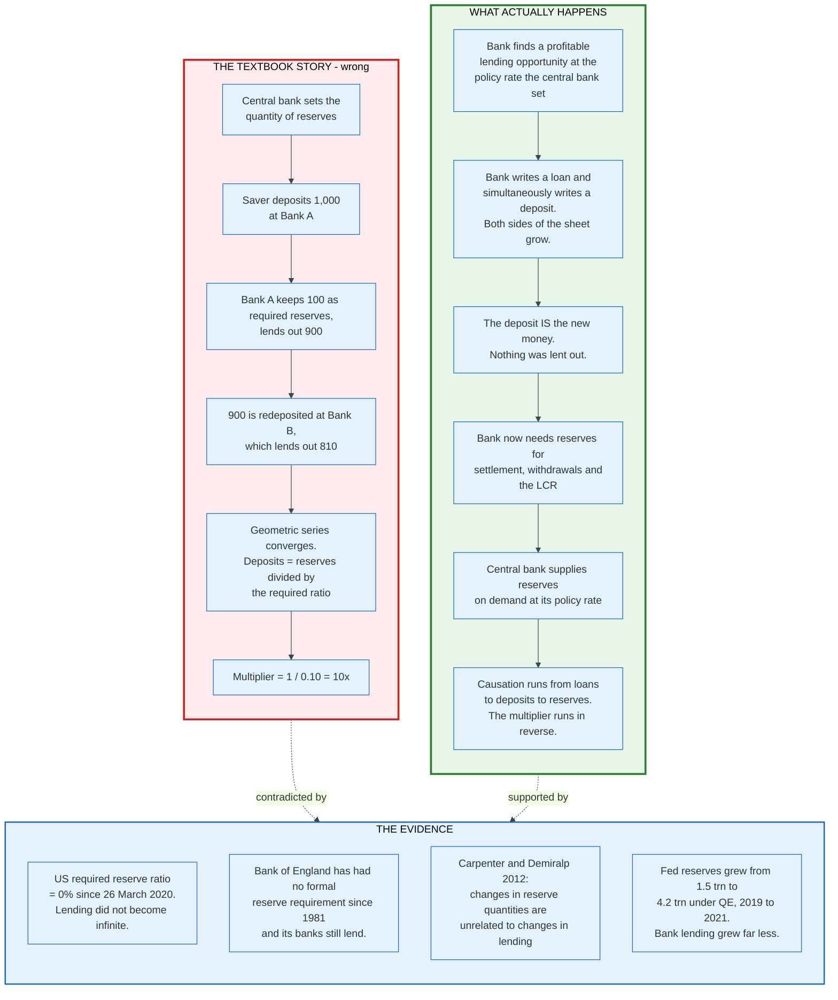
```mermaid
%%{init: {'theme': 'base', 'themeVariables': {'primaryColor': '#e3f2fd', 'primaryBorderColor': '#1565c0', 'lineColor': '#37474f'}}}%%

flowchart TB
    subgraph Textbook["THE TEXTBOOK STORY - wrong"]
        direction TB
        T1["Central bank sets the<br/>quantity of reserves"]
        T2["Saver deposits 1,000<br/>at Bank A"]
        T3["Bank A keeps 100 as required reserves,<br/>lends out 900"]
        T4["900 is redeposited at Bank B,<br/>which lends out 810"]
        T5["Geometric series converges.<br/>Deposits = reserves divided by<br/>the required ratio"]
        T6["Multiplier = 1 / 0.10 = 10x"]
        T1 --> T2 --> T3 --> T4 --> T5 --> T6
    end

    subgraph Reality["WHAT ACTUALLY HAPPENS"]
        direction TB
        R1["Bank finds a profitable<br/>lending opportunity at the<br/>policy rate the central bank set"]
        R2["Bank writes a loan and<br/>simultaneously writes a deposit.<br/>Both sides of the sheet grow."]
        R3["The deposit IS the new money.<br/>Nothing was lent out."]
        R4["Bank now needs reserves for<br/>settlement, withdrawals and<br/>the LCR"]
        R5["Central bank supplies reserves<br/>on demand at its policy rate"]
        R6["Causation runs from loans<br/>to deposits to reserves.<br/>The multiplier runs in reverse."]
        R1 --> R2 --> R3 --> R4 --> R5 --> R6
    end

    subgraph Evidence["THE EVIDENCE"]
        direction TB
        E1["US required reserve ratio<br/>= 0% since 26 March 2020.<br/>Lending did not become infinite."]
        E2["Bank of England has had no formal<br/>reserve requirement since 1981<br/>and its banks still lend."]
        E3["Carpenter and Demiralp 2012:<br/>changes in reserve quantities are<br/>unrelated to changes in lending"]
        E4["Fed reserves grew from 1.5 trn to<br/>4.2 trn under QE, 2019 to 2021.<br/>Bank lending grew far less."]
    end

    Textbook -.contradicted by.-> Evidence
    Reality -.supported by.-> Evidence

    style Textbook fill:#ffebee,stroke:#c62828,stroke-width:3px
    style Reality fill:#e8f5e9,stroke:#2e7d32,stroke-width:3px
    style Evidence fill:#e3f2fd,stroke:#1565c0,stroke-width:2px
```

### 3.1 The Money Multiplier Story, Stated Fairly

The money multiplier account has four steps and it is taught in every introductory macroeconomics course. Stated fairly, it runs like this.

The central bank sets the quantity of base money. A saver deposits 1,000 dollars at Bank A. Bank A is required to hold 10 percent as reserves, so it keeps 100 and lends 900. That 900 is spent and redeposited at Bank B, which keeps 90 and lends 810. The geometric series converges, total deposits reach 10,000 dollars, and the multiplier equals one divided by the required reserve ratio.

Two claims are embedded in that story. First, banks lend out deposits that already exist. Second, the quantity of reserves determines the quantity of deposits, so a central bank controls broad money by controlling base money.

Both claims are false, and the Bank of England's 2014 Quarterly Bulletin article "Money creation in the modern economy" says so directly: "While the money multiplier theory can be a useful way of introducing money and banking in economic textbooks, it is not an accurate description of how money is created in reality. Rather than controlling the quantity of reserves, central banks today typically implement monetary policy by setting the price of reserves, that is, interest rates."

### 3.2 What the Ledger Actually Does

Follow a single mortgage through a single bank's general ledger and the mechanism is unmistakable. Meridian National Bank, the 10 billion dollar institution used as the worked example throughout this document, originates a 400,000 dollar mortgage.

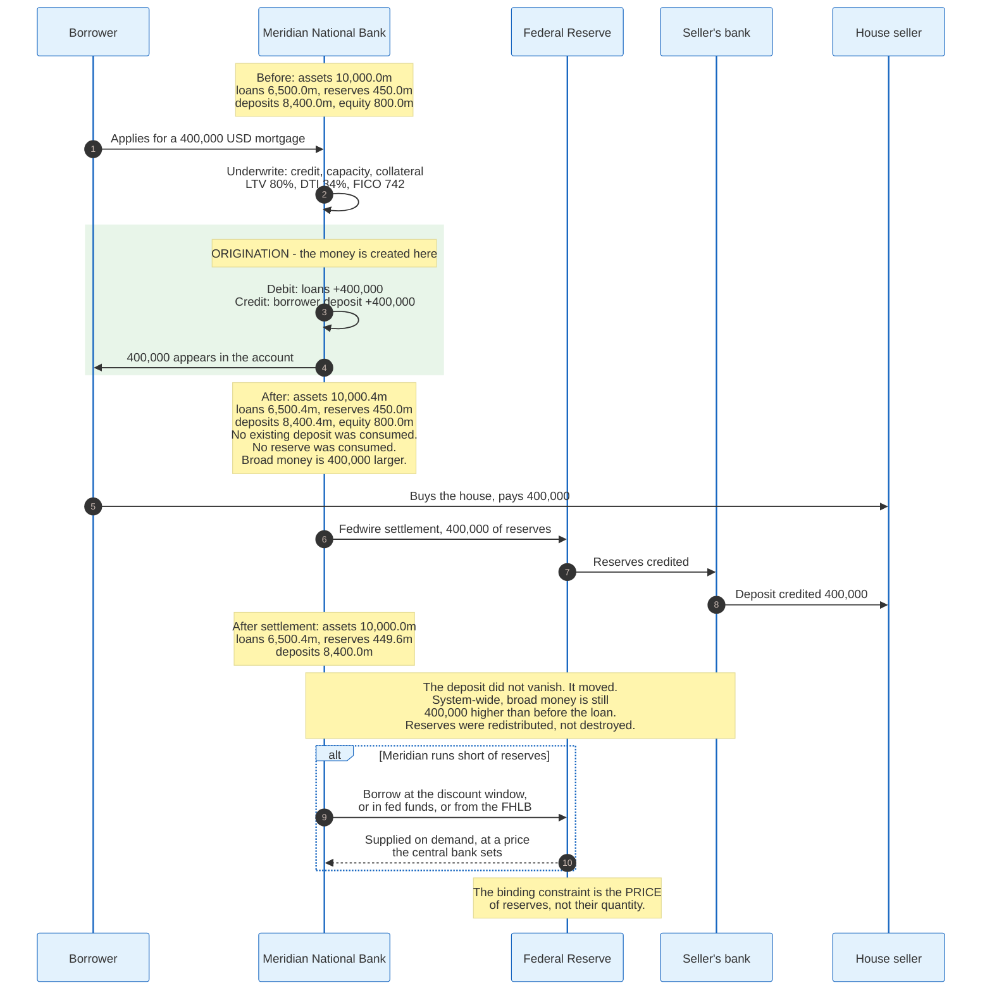
```mermaid
%%{init: {'theme': 'base', 'themeVariables': {'primaryColor': '#e3f2fd', 'primaryBorderColor': '#1565c0', 'lineColor': '#37474f'}}}%%

sequenceDiagram
    autonumber
    participant B as Borrower
    participant MB as Meridian National Bank
    participant Fed as Federal Reserve
    participant SB as Seller's bank
    participant S as House seller

    Note over MB: Before: assets 10,000.0m<br/>loans 6,500.0m, reserves 450.0m<br/>deposits 8,400.0m, equity 800.0m

    B->>MB: Applies for a 400,000 USD mortgage
    MB->>MB: Underwrite: credit, capacity, collateral<br/>LTV 80%, DTI 34%, FICO 742

    rect rgb(232, 245, 233)
    Note over MB: ORIGINATION - the money is created here
    MB->>MB: Debit: loans +400,000<br/>Credit: borrower deposit +400,000
    MB->>B: 400,000 appears in the account
    end

    Note over MB: After: assets 10,000.4m<br/>loans 6,500.4m, reserves 450.0m<br/>deposits 8,400.4m, equity 800.0m<br/>No existing deposit was consumed.<br/>No reserve was consumed.<br/>Broad money is 400,000 larger.

    B->>S: Buys the house, pays 400,000
    MB->>Fed: Fedwire settlement, 400,000 of reserves
    Fed->>SB: Reserves credited
    SB->>S: Deposit credited 400,000

    Note over MB: After settlement: assets 10,000.0m<br/>loans 6,500.4m, reserves 449.6m<br/>deposits 8,400.0m

    Note over MB,SB: The deposit did not vanish. It moved.<br/>System-wide, broad money is still<br/>400,000 higher than before the loan.<br/>Reserves were redistributed, not destroyed.

    alt Meridian runs short of reserves
        MB->>Fed: Borrow at the discount window,<br/>or in fed funds, or from the FHLB
        Fed-->>MB: Supplied on demand, at a price<br/>the central bank sets
    end

    Note over Fed: The binding constraint is the PRICE<br/>of reserves, not their quantity.
```

**Before origination.** Meridian holds 10,000.0 million dollars of assets: 6,500.0 million of loans, 450.0 million of reserves at the Federal Reserve, 2,550.0 million of securities, and 500.0 million of everything else. It owes 8,400.0 million of deposits and 800.0 million of equity, plus 800.0 million of other liabilities.

**At origination.** The core system posts two entries and only two. It debits loans by 400,000 dollars and credits the borrower's deposit account by 400,000 dollars. The balance sheet is now 10,000.4 million on both sides.

Nothing was moved. No saver's balance fell. No reserve was consumed. Meridian's reserve position is exactly what it was five seconds earlier: 450.0 million dollars. Broad money in the economy is 400,000 dollars larger than it was, and the increase is the deposit the bank just wrote.

**At settlement.** The borrower buys a house and pays the seller, who banks elsewhere. Meridian's deposit liability falls to 8,400.0 million and it settles by sending 400,000 dollars of reserves over Fedwire. Meridian now holds 449.6 million of reserves and 6,500.4 million of loans. Its balance sheet is back to 10,000.0 million.

**System-wide.** The seller's bank gained 400,000 dollars of reserves and 400,000 dollars of deposits. The deposit did not disappear. It relocated. Total reserves in the banking system are unchanged, because reserves only move between accounts at the Federal Reserve and are only created or destroyed by the Federal Reserve itself.

Broad money is 400,000 dollars higher and has stayed higher. The loan created it.

### 3.3 The Direction of Causation

Causation runs from lending to deposits to reserves, which is the exact reverse of the multiplier. The Bank of England states the sequence: "Banks first decide how much to lend depending on the profitable lending opportunities available to them, which will, crucially, depend on the interest rate set by the Bank of England. It is these lending decisions that determine how many bank deposits are created by the banking system. The amount of bank deposits in turn influences how much central bank money banks want to hold in reserve."

The empirical work agrees. Carpenter and Demiralp tested whether changes in the quantity of reserves predict changes in bank lending in the United States and found no such relationship, first in a 2010 Federal Reserve Board working paper and then in the Journal of Macroeconomics in 2012. It is the 2012 version the Bank of England cites, at footnote 6, to exactly this point: "Carpenter and Demiralp (2012) show that changes in quantities of reserves are unrelated to changes in quantities of loans in the United States."

The natural experiment is more persuasive than any regression. Between 2019 and 2021, quantitative easing raised reserve balances at the Federal Reserve from well under 2 trillion dollars to more than 4 trillion. If reserves multiplied into deposits at a fixed ratio, bank lending should have exploded. Bank credit grew, but nothing remotely like tenfold. Reserves sat where they were put. They earn interest on reserve balances and their holders were content.

### 3.4 What Actually Constrains a Bank

Four constraints bind, and none of them is the quantity of reserves.

**Profitable demand.** A bank cannot lend to borrowers who do not want to borrow or who will not repay. This is the first-order constraint in every recession and it appears in no regulatory document.

**The competitive loss of the deposit.** An individual bank that lends aggressively creates deposits that immediately leave for other banks, taking reserves with them. It must then fund the gap in the wholesale market at a price it does not set. This is why an individual bank feels as though it lends out its deposits even though the system does not. The Bank of England makes the same point: cutting loan rates to win volume "affects the profitability of making a loan for an individual bank."

**Liquidity regulation.** New lending consumes required stable funding under the NSFR and generates undrawn commitments that carry outflow assumptions under the LCR. These are genuine, quantified, binding constraints on the composition and growth of a large bank's balance sheet. Section 8 works the arithmetic.

**Capital.** Every new loan adds risk-weighted assets and therefore consumes capital at the bank's marginal CET1 ratio. A 100 percent risk-weighted commercial loan of 100 million dollars at a 10 percent CET1 target consumes 10 million dollars of common equity that has to come from somewhere. This is the constraint regulators actually use to control lending, and it is why the capital debate is a lending debate.

### 3.5 Money Is Also Destroyed

Repayment destroys money, and this is the half of the mechanism that is almost never taught. When the borrower repays 400,000 dollars of principal, the bank debits the deposit and credits the loan. Both sides of the balance sheet shrink. The deposit ceases to exist. Broad money falls by 400,000 dollars.

Aggregate broad money therefore reflects the net of new lending against repayment, plus government deficits, plus central bank asset purchases, minus the issuance of long-term bank liabilities. A banking system in which repayment exceeds origination is a system in which the money supply is contracting, which is what happened in the United States between 2022 and 2023 and is the mechanism by which credit contractions become monetary contractions.

Deleveraging is not a metaphor. It is money disappearing.

---

## 4. The Reserve Requirement's Road to Zero

The United States eliminated reserve requirements on 26 March 2020, and almost nothing happened. That non-event is the strongest available evidence that the requirement had not been doing the job attributed to it for decades.

### 4.1 What It Was

A reserve requirement obliges a bank to hold a specified fraction of its transaction deposits as reserves at the central bank or as vault cash. Regulation D, at 12 CFR Part 204, implemented the requirement in the United States under authority granted by the Federal Reserve Act.

The structure until March 2020 was tiered. Net transaction accounts up to the reserve requirement exemption amount carried a zero percent ratio. Amounts up to the low reserve tranche carried three percent. Amounts above the tranche carried ten percent. Both thresholds were indexed annually. Had the schedule remained in force, the 2026 figures would be an exemption amount of 39.2 million dollars and a low reserve tranche of 674.1 million. The Federal Reserve still indexes and publishes both every January for a requirement that no longer exists.

The requirement was computed over a maintenance period, not continuously, and could be satisfied on average. That alone tells you it was never a liquidity buffer. A buffer you may drain on Tuesday and refill on Thursday does not protect anyone on Wednesday.

### 4.2 Why It Stopped Mattering

The requirement became irrelevant when the Federal Reserve started paying interest on reserves and stopped rationing them. Two changes did it.

In October 2008 the Federal Reserve began paying interest on reserve balances, under authority accelerated by the Emergency Economic Stabilization Act. That converted reserves from a costly regulatory obligation into an interest-bearing asset. A bank holding excess reserves was no longer forgoing income.

Then quantitative easing flooded the system. By the time reserve requirements were eliminated, the aggregate quantity of reserves exceeded aggregate required reserves by more than an order of magnitude. A constraint that binds nowhere is not a constraint. As of the week ended 26 August 2026, reserve balances held at Federal Reserve Banks stood at 2,925 billion dollars against a total Federal Reserve balance sheet of 6,731 billion.

The Federal Reserve's own explanation for the March 2020 change was that the requirement no longer played a role in implementing monetary policy, and that eliminating it would support lending. The Board's statement is unambiguous: the action "eliminated reserve requirements for all depository institutions."

### 4.3 What Replaced It

Three things do the work reserve requirements were once imagined to do, and all three are more precise.

**Interest on reserve balances sets the floor.** The Federal Reserve now operates an ample-reserves regime in which the policy rate is administered rather than rationed. Reserves are supplied elastically and the interest rate on them anchors short-term money market rates. The quantity is a residual; the price is the instrument.

**The liquidity coverage ratio does the buffer job.** A 30-day stress requirement calibrated to a specified pattern of outflows is a far better liquidity constraint than a fixed percentage of a single deposit category computed on a two-week average. Reserves at the Federal Reserve are Level 1 high-quality liquid assets with no haircut, so banks hold them anyway.

**Capital requirements do the lending-restraint job.** A risk-weighted capital charge prices lending by its riskiness. A flat reserve ratio priced deposits by their type, which is a different and less useful thing.

### 4.4 The Misconception to Retire

"Fractional reserve banking" describes an accounting fact, not a mechanism, and the phrase does more harm than good. It is true that banks hold reserves smaller than their deposits. It does not follow that the reserve ratio determines the deposit quantity, that reserves are lent out, or that a bank must find reserves before it can make a loan.

A US bank in 2026 faces a required reserve ratio of exactly zero. It still cannot lend without limit, because capital, liquidity rules, funding cost, and creditworthy demand all bind before any reserve constraint would. The Bank of England makes the same observation about its own system: "reserve requirements are not an important aspect of monetary policy frameworks in most advanced economies today," and it has none of its own, having dropped its last formal ratio in 1981.

The ratio is zero. The lending is not infinite. That should settle it.

---

## 5. Key Participants and Roles

A US bank answers to at least four authorities, funds itself from at least five sources, and outsources its general ledger to one of three vendors. Knowing which is which explains most of what looks like inconsistency in the industry.

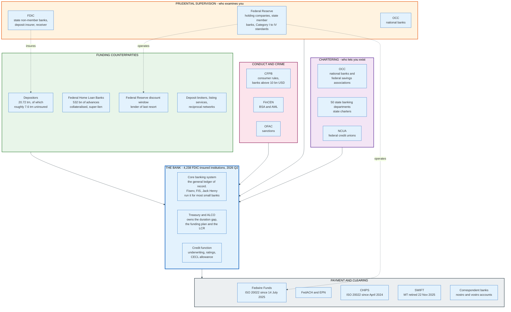
```mermaid
%%{init: {'theme': 'base', 'themeVariables': {'primaryColor': '#e3f2fd', 'primaryBorderColor': '#1565c0', 'lineColor': '#37474f'}}}%%

flowchart TB
    subgraph Charter["CHARTERING - who lets you exist"]
        OCC["OCC<br/>national banks and<br/>federal savings associations"]
        State["50 state banking departments<br/>state charters"]
        NCUA["NCUA<br/>federal credit unions"]
    end

    subgraph Prudential["PRUDENTIAL SUPERVISION - who examines you"]
        Fed["Federal Reserve<br/>holding companies, state member<br/>banks, Category I to IV standards"]
        FDIC2["FDIC<br/>state non-member banks,<br/>deposit insurer, receiver"]
        OCC2["OCC<br/>national banks"]
    end

    subgraph Conduct["CONDUCT AND CRIME"]
        CFPB["CFPB<br/>consumer rules,<br/>banks above 10 bn USD"]
        FinCEN["FinCEN<br/>BSA and AML"]
        OFAC["OFAC<br/>sanctions"]
    end

    subgraph Bank["THE BANK - 4,238 FDIC-insured institutions, 2026 Q2"]
        Core["Core banking system<br/>the general ledger of record.<br/>Fiserv, FIS, Jack Henry<br/>run it for most small banks"]
        Treasury["Treasury and ALCO<br/>owns the duration gap,<br/>the funding plan and the LCR"]
        Credit["Credit function<br/>underwriting, ratings,<br/>CECL allowance"]
    end

    subgraph Funding["FUNDING COUNTERPARTIES"]
        Depositors["Depositors<br/>20.72 trn, of which<br/>roughly 7.6 trn uninsured"]
        FHLB["Federal Home Loan Banks<br/>532 bn of advances<br/>collateralised, super-lien"]
        DW["Federal Reserve discount window<br/>lender of last resort"]
        Brokers["Deposit brokers, listing services,<br/>reciprocal networks"]
    end

    subgraph Rails["PAYMENT AND CLEARING"]
        Fedwire["Fedwire Funds<br/>ISO 20022 since 14 July 2025"]
        ACH["FedACH and EPN"]
        CHIPS["CHIPS<br/>ISO 20022 since April 2024"]
        SWIFTn["SWIFT<br/>MT retired 22 Nov 2025"]
        Corr["Correspondent banks<br/>nostro and vostro accounts"]
    end

    Charter --> Bank
    Prudential --> Bank
    Conduct --> Bank
    Funding --> Bank
    Bank --> Rails

    FDIC2 -.insures.-> Depositors
    Fed -.operates.-> DW
    Fed -.operates.-> Fedwire

    style Bank fill:#e3f2fd,stroke:#1565c0,stroke-width:3px
    style Prudential fill:#fff3e0,stroke:#e65100,stroke-width:2px
    style Charter fill:#f3e5f5,stroke:#4a148c,stroke-width:2px
    style Funding fill:#e8f5e9,stroke:#2e7d32,stroke-width:2px
    style Rails fill:#eceff1,stroke:#37474f,stroke-width:2px
    style Conduct fill:#fce4ec,stroke:#880e4f,stroke-width:2px
```

### 5.1 The Actors

| Role | What it does | Examples | Holds the bank's money? |
|------|--------------|----------|--------------------------|
| **Chartering authority** | Grants the licence to take deposits | OCC for national banks; 50 state banking departments | No |
| **Primary federal regulator** | Examines, rates, issues enforcement orders | OCC, Federal Reserve, FDIC | No |
| **Holding company supervisor** | Supervises the parent and its non-bank subsidiaries | Federal Reserve, always | No |
| **Deposit insurer and receiver** | Insures deposits, resolves failures | FDIC | Yes, via the DIF |
| **Consumer conduct regulator** | Enforces consumer financial law | CFPB above 10 bn USD; primary regulator below | No |
| **Financial crime authorities** | BSA, AML, sanctions | FinCEN, OFAC | No |
| **Depositors** | Provide 78% of funding | Retail, corporate, municipal, financial | Yes, they are creditors |
| **Federal Home Loan Bank** | Collateralised term and overnight funding | 11 regional FHLBanks | Yes, secured |
| **Discount window** | Lender of last resort | 12 Federal Reserve Banks | Yes, secured |
| **Correspondent banks** | Access to currencies and rails the bank lacks | JPMorgan, Citi, BNY, Deutsche | Yes, in nostro accounts |
| **Core banking provider** | Runs the general ledger and the deposit system | Fiserv, FIS, Jack Henry | No |
| **Rating agencies** | Price the bank's wholesale funding | Moody's, S&P, Fitch, KBRA | No |
| **Auditors and the FASB** | Determine what the numbers say | Big Four; FASB writes ASC 326 | No |

### 5.2 The Dual Banking System

The United States lets a bank choose its own primary federal regulator by choosing its charter, and this is not an accident of history but a deliberate design. A national bank is chartered and examined by the OCC. A state-chartered bank that joins the Federal Reserve System is examined by the Federal Reserve. A state-chartered bank that does not join is examined by the FDIC. All three are supervised for consumer compliance by the CFPB above 10 billion dollars in assets and by their primary regulator below it.

Every bank holding company, regardless of the bank's charter, is supervised by the Federal Reserve. That is why the Federal Reserve wrote the post-mortem on Silicon Valley Bank even though SVB itself was a California state-chartered member bank.

Charter conversion is legal, occasionally used, and politically sensitive. The competitive dynamic it creates is the reason the phrase "regulatory arbitrage" enters most discussions of US banking supervision within five minutes.

### 5.3 The Two Participants That Decide Whether a Small Bank Can Do Anything

**The core banking provider is the hidden gatekeeper.** Most US banks do not run their own general ledger. They rent it from Fiserv, FIS, or Jack Henry, and public figures for the exact share are not available, and whether a 400 million dollar community bank can offer real-time payments, or same-day ACH, or an API for a fintech partner, is decided by that vendor's roadmap rather than by the bank. Core conversion contracts run five to seven years with deconversion fees that can exceed a year of the bank's net income. Concentration in core banking is the single largest practical constraint on product capability at small US banks, and it appears in no regulatory diagram.

**The Federal Home Loan Bank system is the shadow liquidity facility.** Eleven regional FHLBanks lend to members against collateral, at rates below unsecured wholesale funding, with no stigma and a statutory super-lien that puts them ahead of the FDIC in a receivership. Advances stood at 532.4 billion dollars at the end of June 2026, up 11.4 percent year on year. Banks go to the FHLB first and to the discount window last, which is exactly the wrong order from a systemic point of view and exactly the right order from any individual bank's.

### 5.4 The Holding Company Structure

Almost every US bank of consequence sits inside a holding company, and the reason is that the holding company can do things the bank cannot. It can own broker-dealers, insurance agencies, and asset managers. It can issue debt and downstream the proceeds as equity into the bank. It is the entity that files the FR Y-9C, takes the stress test, and is the point of resolution under a single-point-of-entry strategy.

Sections 23A and 23B of the Federal Reserve Act, implemented by Regulation W at 12 CFR 223, are the wall between the bank and its affiliates. They cap covered transactions with any single affiliate at 10 percent of the bank's capital and surplus, cap all affiliates in aggregate at 20 percent, require collateral on extensions of credit, and require market terms. The purpose is to stop the insured, subsidised bank from being drained to support the uninsured, unsubsidised businesses next to it.

The subsidy is real. That is why the wall is.

---

## 6. Reading the Balance Sheet: A Worked Bank

Everything in the rest of this document is computed on one hypothetical institution, so the numbers connect. Meridian National Bank is a 10 billion dollar national bank with a conventional commercial mix. Its ratios are chosen to land near the industry averages published by the FDIC for the second quarter of 2026, so the arithmetic here transfers.

### 6.1 The Balance Sheet

| Assets | USD millions | Liabilities and equity | USD millions |
|--------|-------------:|------------------------|-------------:|
| Reserves at the Federal Reserve | 450 | Noninterest-bearing demand deposits | 1,700 |
| US Treasury securities, AFS | 700 | Interest-bearing savings and MMDA | 2,400 |
| Agency MBS, AFS | 500 | Retail time deposits | 1,100 |
| Agency MBS, HTM | 1,350 | Operational corporate deposits | 1,400 |
| Loans, gross | 6,500 | Non-operational corporate deposits | 1,400 |
| Less: allowance for credit losses | (85) | Brokered and other deposits | 400 |
| **Net loans** | **6,415** | **Total deposits** | **8,400** |
| Goodwill and other intangibles | 120 | FHLB advances | 500 |
| Premises and other assets | 465 | Other borrowings and subordinated debt | 200 |
| | | Other liabilities | 100 |
| | | **Total liabilities** | **9,200** |
| | | Total equity capital | 800 |
| **Total assets** | **10,000** | **Total liabilities and equity** | **10,000** |

The loan book breaks down as 2,000 million of first-lien qualifying one-to-four family residential mortgages, 1,900 million of commercial real estate that is not high-volatility, 1,600 million of commercial and industrial loans, 700 million of consumer and card, and 300 million of high-volatility commercial real estate construction.

The deposit book splits along the lines the liquidity rules care about, and Section 8.2 prices each line. An operational deposit is a balance a company leaves because its payroll file, lockbox and vendor payment mandates run through Meridian, and 300 million of that 1,400 sits within the 250,000 dollar insurance limit. A non-operational corporate deposit is a balance parked for yield, and 1,200 million of that 1,400 is uninsured. Of the 4,100 million of retail demand, savings and money market balances, 3,000 million qualifies as stable under the LCR definition. Of the 1,100 million of retail time deposits, 150 million matures inside 30 days. Of the 500 million of FHLB advances, 160 million matures inside 30 days against Level 2A collateral.

Equity is 8.0 percent of assets, against an industry figure of 9.92 percent. Meridian is slightly more levered than average and considerably less levered than a bank in 2007.

### 6.2 The Income Statement, Annualised

| Line | USD millions | Note |
|------|-------------:|------|
| Interest on loans, 6,500 at 6.30% | 409.5 | |
| Interest on securities, 2,550 at 3.10% | 79.1 | Bought when rates were lower |
| Interest on reserves, 450 at 4.15% | 18.7 | IORB, risk-free |
| **Total interest income** | **507.3** | Yield on earning assets 5.34% |
| Interest on deposits, 6,700 at 2.35% | 157.5 | 1,700 of demand deposits pay nothing |
| Interest on FHLB advances, 500 at 4.50% | 22.5 | |
| Interest on other borrowings, 200 at 5.75% | 11.5 | |
| **Total interest expense** | **191.5** | Cost of funding earning assets 2.02% |
| **Net interest income** | **315.8** | **NIM 3.32%** |
| Noninterest income | 138.0 | 30.4% of net operating revenue |
| Provision for credit losses | (29.0) | |
| Noninterest expense | (272.0) | Efficiency ratio 59.9% |
| Pre-tax income | 152.8 | |
| Tax at 21% | (32.1) | |
| **Net income** | **120.7** | ROA 1.21%, ROE 15.1% |

Earning assets are 9,500 million: loans of 6,500, securities of 2,550, and reserves of 450. Goodwill, premises, and other assets earn nothing, which is why the efficiency ratio matters and why goodwill from acquisitions is deducted from regulatory capital.

### 6.3 What This Bank Is Exposed To

Four exposures follow directly from those two tables, and the rest of the document takes them one at a time.

Meridian holds 2,550 million dollars of securities bought at lower rates, yielding 3.10 percent against a 4.15 percent risk-free rate. That is an unrealised loss, and Section 11 sizes it. It holds 6,500 million dollars of loans against an 85 million dollar allowance, a coverage ratio of 1.31 percent, and Section 14 explains how that number is set. It funds 6,415 million of net loans with deposits that can leave the same afternoon, and Sections 10 and 12 cover what that means. And it holds 800 million dollars of equity against 6,785 million dollars of risk-weighted assets, which Section 7 computes.

Everything a bank is worried about is on that page.

---

## 7. Capital: The Solvency Constraint

Capital answers exactly one question: if the assets lose value, is there anything left for the depositors? It answers no other question, and treating it as though it answers a liquidity question is the second great misconception of banking.

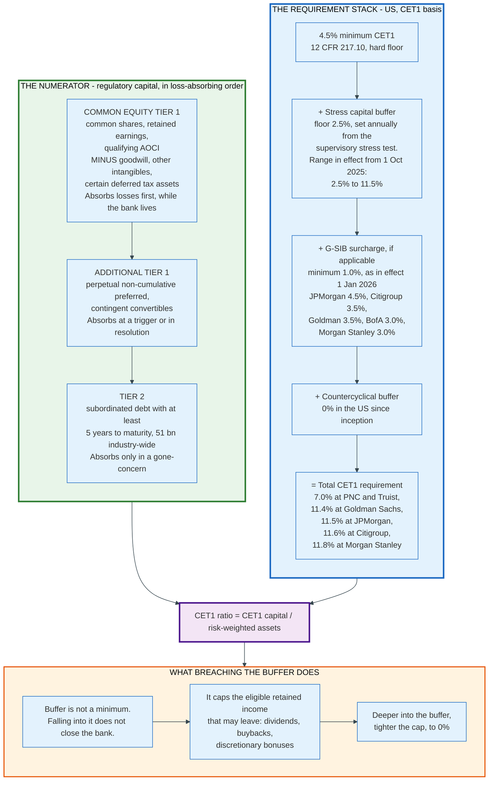
```mermaid
%%{init: {'theme': 'base', 'themeVariables': {'primaryColor': '#e3f2fd', 'primaryBorderColor': '#1565c0', 'lineColor': '#37474f'}}}%%

flowchart TB
    subgraph Numerator["THE NUMERATOR - regulatory capital, in loss-absorbing order"]
        direction TB
        CET1["COMMON EQUITY TIER 1<br/>common shares, retained earnings,<br/>qualifying AOCI<br/>MINUS goodwill, other intangibles,<br/>certain deferred tax assets<br/>Absorbs losses first, while the bank lives"]
        AT1["ADDITIONAL TIER 1<br/>perpetual non-cumulative preferred,<br/>contingent convertibles<br/>Absorbs at a trigger or in resolution"]
        T2["TIER 2<br/>subordinated debt with at least<br/>5 years to maturity, 51 bn industry-wide<br/>Absorbs only in a gone-concern"]
        CET1 --> AT1 --> T2
    end

    subgraph Stack["THE REQUIREMENT STACK - US, CET1 basis"]
        direction TB
        S1["4.5% minimum CET1<br/>12 CFR 217.10, hard floor"]
        S2["+ Stress capital buffer<br/>floor 2.5%, set annually from the<br/>supervisory stress test.<br/>Range in effect from 1 Oct 2025:<br/>2.5% to 11.5%"]
        S3["+ G-SIB surcharge, if applicable<br/>minimum 1.0%, as in effect 1 Jan 2026<br/>JPMorgan 4.5%, Citigroup 3.5%,<br/>Goldman 3.5%, BofA 3.0%,<br/>Morgan Stanley 3.0%"]
        S4["+ Countercyclical buffer<br/>0% in the US since inception"]
        S5["= Total CET1 requirement<br/>7.0% at PNC and Truist,<br/>11.4% at Goldman Sachs,<br/>11.5% at JPMorgan,<br/>11.6% at Citigroup,<br/>11.8% at Morgan Stanley"]
        S1 --> S2 --> S3 --> S4 --> S5
    end

    subgraph Consequence["WHAT BREACHING THE BUFFER DOES"]
        C1["Buffer is not a minimum.<br/>Falling into it does not close the bank."]
        C2["It caps the eligible retained income<br/>that may leave: dividends, buybacks,<br/>discretionary bonuses"]
        C3["Deeper into the buffer,<br/>tighter the cap, to 0%"]
        C1 --> C2 --> C3
    end

    Numerator --> Ratio["CET1 ratio = CET1 capital / risk-weighted assets"]
    Stack --> Ratio
    Ratio --> Consequence

    style Numerator fill:#e8f5e9,stroke:#2e7d32,stroke-width:3px
    style Stack fill:#e3f2fd,stroke:#1565c0,stroke-width:3px
    style Consequence fill:#fff3e0,stroke:#e65100,stroke-width:2px
    style Ratio fill:#f3e5f5,stroke:#4a148c,stroke-width:3px
```

### 7.1 Capital Is Funding, Not an Asset

Capital sits on the right-hand side of the balance sheet. It is a source of funds that does not have to be repaid on any date and does not have to be paid a contractual return. That property, and only that property, is what makes it absorb losses.

A bank cannot spend its capital. When a loan is charged off, the accounting entry reduces assets and reduces equity by the same amount. Equity absorbed the loss by shrinking. No cash moved. If you want to know whether a bank can pay a departing depositor, the capital ratio tells you nothing at all, which is Section 8's subject.

The phrase "banks must hold capital" is therefore misleading and universal. A more accurate phrasing is that banks must fund a specified fraction of their risk-weighted assets with instruments that do not have to be repaid.

### 7.2 The Three Tiers

Regulatory capital is ranked by how reliably it absorbs losses while the bank is still operating.

**Common equity tier 1** is common shares, retained earnings, and qualifying accumulated other comprehensive income, less goodwill, other intangibles, and certain deferred tax assets. It absorbs losses first, continuously, and without any trigger event. It is the only tier that matters in a going concern, which is why every meaningful requirement is expressed as a CET1 ratio.

**Additional tier 1** is perpetual, non-cumulative preferred stock and contingent convertible instruments. It absorbs losses at a contractual trigger or in resolution. Its usefulness is contested: Credit Suisse's AT1 instruments were written down to zero in March 2023 while shareholders received value, which inverted the expected hierarchy and repriced the entire asset class.

**Tier 2** is subordinated debt with at least five years to maturity, amortised in the final five years. It absorbs losses only in liquidation. US banks held 51 billion dollars of subordinated debt at the end of June 2026, a small number relative to the 2.63 trillion of equity.

Meridian's CET1 is total equity of 800 million less goodwill and intangibles of 120 million, which is 680 million dollars. It has no AT1 and no tier 2.

### 7.3 Risk-Weighted Assets

RWA is the denominator, and it exists because a dollar of Treasury bills and a dollar of construction lending are not the same risk. The US standardised approach at 12 CFR 217.32 assigns a fixed percentage to each exposure category and multiplies.

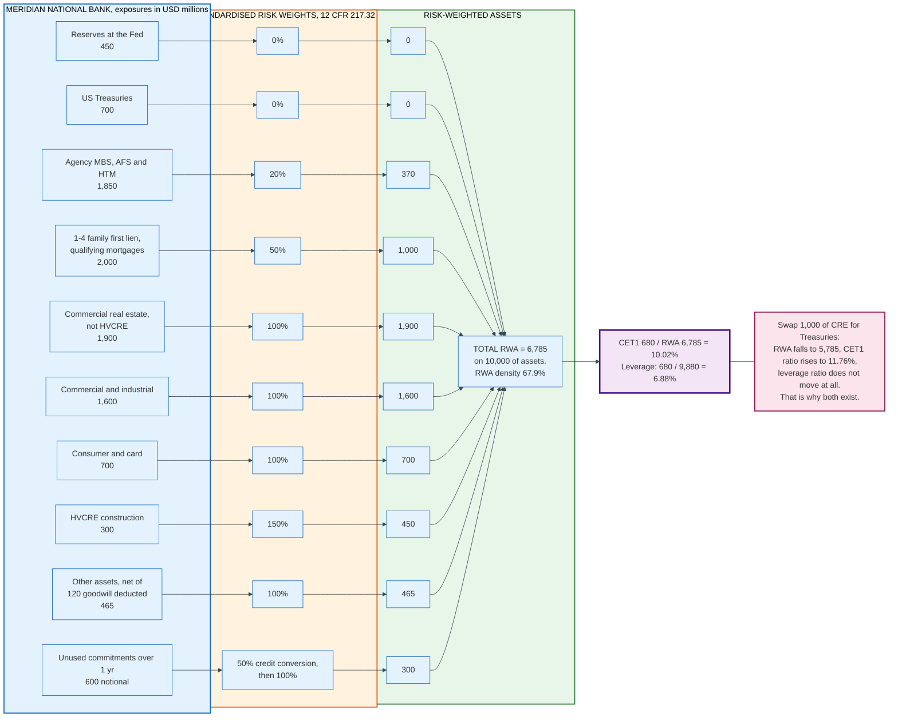
```mermaid
%%{init: {'theme': 'base', 'themeVariables': {'primaryColor': '#e3f2fd', 'primaryBorderColor': '#1565c0', 'lineColor': '#37474f'}}}%%

flowchart LR
    subgraph Book["MERIDIAN NATIONAL BANK, exposures in USD millions"]
        direction TB
        B1["Reserves at the Fed<br/>450"]
        B2["US Treasuries<br/>700"]
        B3["Agency MBS, AFS and HTM<br/>1,850"]
        B4["1-4 family first lien,<br/>qualifying mortgages<br/>2,000"]
        B5["Commercial real estate,<br/>not HVCRE<br/>1,900"]
        B6["Commercial and industrial<br/>1,600"]
        B7["Consumer and card<br/>700"]
        B8["HVCRE construction<br/>300"]
        B9["Other assets, net of<br/>120 goodwill deducted<br/>465"]
        B10["Unused commitments over 1 yr<br/>600 notional"]
    end

    subgraph Weights["US STANDARDISED RISK WEIGHTS, 12 CFR 217.32"]
        direction TB
        W1["0%"]
        W2["0%"]
        W3["20%"]
        W4["50%"]
        W5["100%"]
        W6["100%"]
        W7["100%"]
        W8["150%"]
        W9["100%"]
        W10["50% credit conversion,<br/>then 100%"]
    end

    subgraph RWA["RISK-WEIGHTED ASSETS"]
        direction TB
        R1["0"]
        R2["0"]
        R3["370"]
        R4["1,000"]
        R5["1,900"]
        R6["1,600"]
        R7["700"]
        R8["450"]
        R9["465"]
        R10["300"]
        Total["TOTAL RWA = 6,785<br/>on 10,000 of assets.<br/>RWA density 67.9%"]
    end

    B1 --> W1 --> R1
    B2 --> W2 --> R2
    B3 --> W3 --> R3
    B4 --> W4 --> R4
    B5 --> W5 --> R5
    B6 --> W6 --> R6
    B7 --> W7 --> R7
    B8 --> W8 --> R8
    B9 --> W9 --> R9
    B10 --> W10 --> R10

    R1 --> Total
    R2 --> Total
    R3 --> Total
    R4 --> Total
    R5 --> Total
    R6 --> Total
    R7 --> Total
    R8 --> Total
    R9 --> Total
    R10 --> Total

    Total --> Out["CET1 680 / RWA 6,785 = 10.02%<br/>Leverage: 680 / 9,880 = 6.88%"]

    Note["Swap 1,000 of CRE for Treasuries:<br/>RWA falls to 5,785, CET1 ratio rises to 11.76%,<br/>leverage ratio does not move at all.<br/>That is why both exist."]

    Out --- Note

    style Book fill:#e3f2fd,stroke:#1565c0,stroke-width:2px
    style Weights fill:#fff3e0,stroke:#e65100,stroke-width:2px
    style RWA fill:#e8f5e9,stroke:#2e7d32,stroke-width:2px
    style Out fill:#f3e5f5,stroke:#4a148c,stroke-width:3px
    style Note fill:#fce4ec,stroke:#880e4f,stroke-width:2px
```

| Exposure | US standardised risk weight |
|----------|------------------------------|
| Cash, reserves at the Federal Reserve, US Treasuries | 0% |
| US government agency exposures with a direct guarantee | 0% |
| GSE debt securities, Fannie Mae and Freddie Mac | 20% |
| US depository institutions and credit unions | 20% |
| US public sector entity general obligations | 20% |
| US public sector entity revenue obligations | 50% |
| First-lien qualifying residential mortgages | 50% |
| Statutory multifamily mortgages, pre-sold construction | 50% |
| Corporate exposures, C and I, non-qualifying mortgages | 100% |
| Junior-lien residential mortgages | 100% |
| High-volatility commercial real estate | 150% |
| Past-due unsecured exposures | 150% |
| Sovereign exposures in default | 150% |

Applying that table to Meridian gives risk-weighted assets of 6,785 million dollars on 10,000 million of total assets, a density of 67.9 percent. Reserves and Treasuries contribute zero. Agency MBS at 20 percent contributes 370. Residential mortgages at 50 percent contribute 1,000. Commercial real estate, C and I, consumer, and other assets at 100 percent contribute 4,665. The HVCRE construction book at 150 percent contributes 450. Six hundred million dollars of unused commitments with more than one year of original maturity convert at 50 percent and then risk-weight at 100 percent, adding 300.

Two features of that table are worth naming. First, sovereign debt in the issuer's own currency is weighted at zero everywhere, which is a political decision rather than an empirical one. Second, the US does not use external credit ratings, because Section 939A of the Dodd-Frank Act prohibited federal agencies from relying on them. Basel's international standardised approach does use ratings, weighting corporate exposures from 20 percent at AAA to 150 percent below BB minus, and residential mortgages from 20 percent below 50 percent loan-to-value to 70 percent above 100 percent.

### 7.4 The Requirement Stack

Minimum ratios are set at 12 CFR 217.10 and then built on. The minimum CET1 ratio is 4.5 percent of risk-weighted assets, the minimum tier 1 ratio is 6.0 percent, the minimum total capital ratio is 8.0 percent, and the minimum leverage ratio is 4.0 percent of average total consolidated assets.

Above the minimums sit the buffers. The stress capital buffer replaced the fixed capital conservation buffer for large banks in 2020 and is recalculated from the annual supervisory stress test, with a floor of 2.5 percent. The G-SIB surcharge applies to the eight US global systemically important banks, with a floor of 1.0 percent. The countercyclical capital buffer has been set at zero in the United States since it was created.

The requirements the Federal Reserve published in June 2026 illustrate the spread. The Board voted on 4 February 2026 to hold the stress capital buffers at the levels set on 1 October 2025 until 2027 while it reworks its stress test models, so every buffer below is a 2025 number. The G-SIB surcharges are not frozen: they update annually in the first quarter, and the column below is the surcharge in effect on 1 January 2026.

| Bank | Minimum CET1 | Stress capital buffer | G-SIB surcharge | Total CET1 requirement |
|------|-------------:|----------------------:|----------------:|-----------------------:|
| Morgan Stanley | 4.5% | 4.3% | 3.0% | **11.8%** |
| Citigroup | 4.5% | 3.6% | 3.5% | **11.6%** |
| JPMorgan Chase | 4.5% | 2.5% | 4.5% | **11.5%** |
| Goldman Sachs | 4.5% | 3.4% | 3.5% | **11.4%** |
| Bank of America | 4.5% | 2.5% | 3.0% | **10.0%** |
| Capital One | 4.5% | 4.5% | n/a | **9.0%** |
| Wells Fargo | 4.5% | 2.5% | 1.5% | **8.5%** |
| Bank of New York Mellon | 4.5% | 2.5% | 1.5% | **8.5%** |
| State Street | 4.5% | 2.5% | 1.0% | **8.0%** |
| U.S. Bancorp | 4.5% | 2.6% | n/a | **7.1%** |
| PNC, Truist, Northern Trust, Schwab, Regions, Huntington, American Express | 4.5% | 2.5% | n/a | **7.0%** |
| DB USA Corporation | 4.5% | 11.5% | n/a | **16.0%** |

The range from 7.0 percent to 16.0 percent is the whole argument about stress testing in one column. Two banks with similar businesses can face requirements 400 basis points apart because a supervisory model projected different losses.

The freeze explains which totals moved and which did not. Goldman Sachs went from 10.9 percent to 11.4 percent between the 2025 and 2026 tables because its G-SIB surcharge stepped from 3.0 to 3.5 percent on 1 January 2026, not because any stress test found anything. Every stress capital buffer in the table is unchanged from 2025.

**Breaching a buffer does not close a bank.** This is the point most often misunderstood about capital requirements. Falling below the minimum triggers prompt corrective action under 12 U.S.C. 1831o and can end in receivership. Falling into the buffer zone triggers automatic limits on the maximum payout ratio: the fraction of eligible retained income that may leave as dividends, buybacks, and discretionary bonuses. Deeper into the buffer, tighter the cap, down to zero. The buffer is a usable resource whose price is a suspension of distributions, and it was designed to be used.

### 7.5 The Leverage Ratio and Why It Is Not Redundant

The leverage ratio ignores risk weights entirely, and that is its purpose. It is tier 1 capital divided by average total consolidated assets, with no weighting, and it exists as a backstop against the risk-weighted framework being gamed or simply being wrong.

Meridian's leverage ratio is 680 million of tier 1 capital divided by 9,880 million of assets net of the goodwill deduction, or 6.88 percent, against a 4.0 percent minimum. Its CET1 ratio is 10.02 percent against a 7.0 percent requirement. Neither binds.

Now watch what happens when the two diverge. Suppose Meridian sells 1,000 million dollars of commercial real estate loans and buys Treasuries. Risk-weighted assets fall from 6,785 to 5,785, so the CET1 ratio rises from 10.02 percent to 11.76 percent. The leverage ratio does not move at all, because total assets are unchanged.

That divergence is the entire justification for having both. The risk-weighted ratio rewards holding safe assets, which is correct until the model's definition of safe is wrong. The leverage ratio penalises holding any assets at all, which is crude but unfoolable. Greek sovereign debt carried a zero risk weight straight through its 2012 restructuring, and euro-area sovereign exposures denominated and funded in euros still carry it under Article 114(4) of the Capital Requirements Regulation. AAA-rated subprime securitisation tranches carried a 20 percent weight until Section 939A of the Dodd-Frank Act forced credit ratings out of the US capital rules altogether. In both cases the leverage ratio was the only constraint that noticed anything.

The United States adds two further layers. The supplementary leverage ratio uses a Basel exposure measure that includes off-balance-sheet items and has a 3 percent minimum. The enhanced supplementary leverage ratio applied a fixed 5 percent standard at G-SIB holding companies and a 6 percent well-capitalised threshold at their insured depository subsidiaries until 1 April 2026, when a final rule adopted on 1 December 2025 at 90 FR 55248 replaced both. In their place sits a leverage buffer equal to 50 percent of the firm's method 1 G-SIB surcharge, capped at 1 percentage point for the depository subsidiaries and uncapped at the holding company, in each case above the same 3 percent minimum. Method 1 is the Basel measure built on size, interconnectedness, substitutability, complexity and cross-jurisdictional activity. Method 2 swaps substitutability for short-term wholesale funding, usually produces the higher number, and is the one that sets the surcharge column in Section 7.4, so the leverage buffer is not half of that column. The agencies estimate the change cuts the supplementary leverage requirement by 23 percent on average at the holding companies and by 37 percent at the major covered depository institutions, and firms could adopt it early from 1 January 2026.

The stated purpose is to make the leverage ratio stop binding. The agencies found the supplementary leverage ratio was the binding tier 1 constraint for almost all G-SIBs, which is the opposite of a backstop.

The community bank leverage ratio is the opposite trade. A qualifying bank below 10 billion dollars may elect a single leverage ratio and stop computing risk-based capital altogether. The agencies finalised a reduction from 9 percent to 8 percent effective 1 July 2026 and extended the grace period for temporary non-compliance from two quarters to four. For a 400 million dollar bank, this removes an entire reporting apparatus.

---

## 8. Liquidity: The Timing Constraint

Liquidity answers a different question from capital, on a different timescale, about a different side of the balance sheet. Capital asks whether the assets are worth more than the liabilities over years. Liquidity asks whether the bank can produce cash this afternoon.

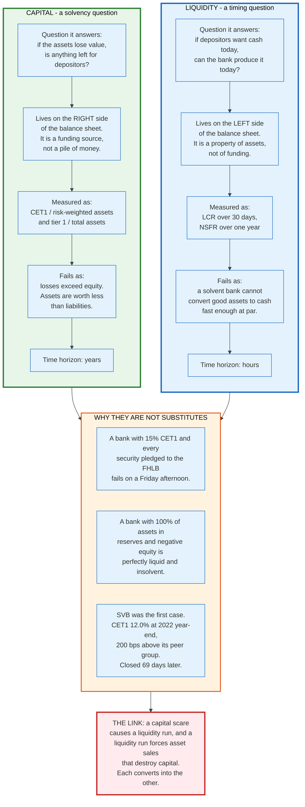
```mermaid
%%{init: {'theme': 'base', 'themeVariables': {'primaryColor': '#e3f2fd', 'primaryBorderColor': '#1565c0', 'lineColor': '#37474f'}}}%%

flowchart TB
    subgraph Cap["CAPITAL - a solvency question"]
        direction TB
        CQ["Question it answers:<br/>if the assets lose value,<br/>is anything left for depositors?"]
        CW["Lives on the RIGHT side<br/>of the balance sheet.<br/>It is a funding source,<br/>not a pile of money."]
        CM["Measured as:<br/>CET1 / risk-weighted assets<br/>and tier 1 / total assets"]
        CF["Fails as:<br/>losses exceed equity.<br/>Assets are worth less<br/>than liabilities."]
        CT["Time horizon: years"]
        CQ --> CW --> CM --> CF --> CT
    end

    subgraph Liq["LIQUIDITY - a timing question"]
        direction TB
        LQ["Question it answers:<br/>if depositors want cash today,<br/>can the bank produce it today?"]
        LW["Lives on the LEFT side<br/>of the balance sheet.<br/>It is a property of assets,<br/>not of funding."]
        LM["Measured as:<br/>LCR over 30 days,<br/>NSFR over one year"]
        LF["Fails as:<br/>a solvent bank cannot<br/>convert good assets to cash<br/>fast enough at par."]
        LT["Time horizon: hours"]
        LQ --> LW --> LM --> LF --> LT
    end

    subgraph Cross["WHY THEY ARE NOT SUBSTITUTES"]
        X1["A bank with 15% CET1 and every<br/>security pledged to the FHLB<br/>fails on a Friday afternoon."]
        X2["A bank with 100% of assets in<br/>reserves and negative equity is<br/>perfectly liquid and insolvent."]
        X3["SVB was the first case.<br/>CET1 12.0% at 2022 year-end,<br/>200 bps above its peer group.<br/>Closed 69 days later."]
    end

    Cap --> Cross
    Liq --> Cross

    Cross --> Link["THE LINK: a capital scare<br/>causes a liquidity run, and a<br/>liquidity run forces asset sales<br/>that destroy capital.<br/>Each converts into the other."]

    style Cap fill:#e8f5e9,stroke:#2e7d32,stroke-width:3px
    style Liq fill:#e3f2fd,stroke:#1565c0,stroke-width:3px
    style Cross fill:#fff3e0,stroke:#e65100,stroke-width:2px
    style Link fill:#ffebee,stroke:#c62828,stroke-width:3px
```

### 8.1 Why They Are Not Substitutes

A bank fails for liquidity reasons while solvent, and it fails for solvency reasons while liquid. Both happen.

Consider a bank with a 15 percent CET1 ratio, no credit losses, and every eligible security pledged to the Federal Home Loan Bank against outstanding advances. On a Friday afternoon, 8 percent of its deposits leave. It has no unencumbered collateral to pledge at the discount window, no HQLA to sell, and no way to call a commercial loan early. It closes. Its capital ratio at the moment of closure is 15 percent.

Now consider a bank that holds 100 percent of its assets as reserves at the Federal Reserve and has lost more than its equity on a legacy portfolio it already wrote off. It can pay every depositor instantly, and it is insolvent.

Neither ratio substitutes for the other, because they measure different objects. Capital measures the right-hand side. Liquidity measures the left.

The two are nevertheless coupled, and the coupling is what makes banking crises fast. A capital scare produces a liquidity run. A liquidity run forces asset sales at distressed prices. Those sales realise losses and destroy capital. Each failure mode converts into the other, usually within days.

### 8.2 The Liquidity Coverage Ratio

The LCR requires a bank to hold enough assets it can sell or pledge immediately to survive 30 days of a specified stress. The rule is Regulation WW at 12 CFR Part 249, and the stress is a table of assumed outflow percentages written by regulators.

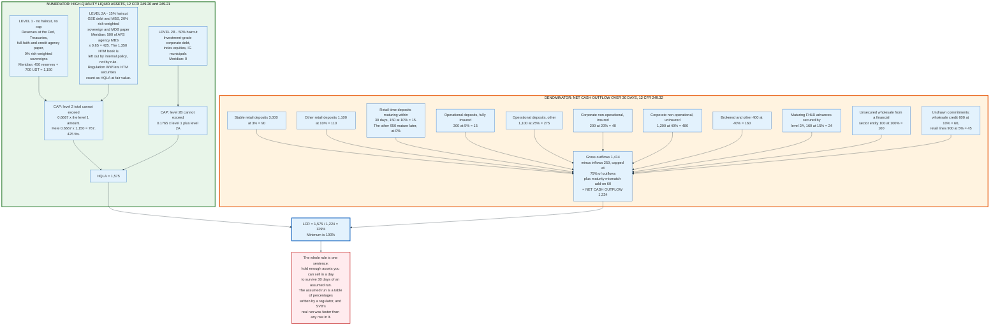
```mermaid
%%{init: {'theme': 'base', 'themeVariables': {'primaryColor': '#e3f2fd', 'primaryBorderColor': '#1565c0', 'lineColor': '#37474f'}}}%%

flowchart TB
    subgraph HQLA["NUMERATOR: HIGH-QUALITY LIQUID ASSETS, 12 CFR 249.20 and 249.21"]
        direction TB
        L1["LEVEL 1 - no haircut, no cap<br/>Reserves at the Fed, Treasuries,<br/>full-faith-and-credit agency paper,<br/>0% risk-weighted sovereigns<br/>Meridian: 450 reserves + 700 UST = 1,150"]
        L2A["LEVEL 2A - 15% haircut<br/>GSE debt and MBS, 20% risk-weighted<br/>sovereign and MDB paper<br/>Meridian: 500 of AFS agency MBS<br/>x 0.85 = 425. The 1,350 HTM book is<br/>left out by internal policy, not by rule.<br/>Regulation WW lets HTM securities<br/>count as HQLA at fair value."]
        L2B["LEVEL 2B - 50% haircut<br/>Investment-grade corporate debt,<br/>index equities, IG municipals<br/>Meridian: 0"]
        CAP1["CAP: level 2 total cannot exceed<br/>0.6667 x the level 1 amount.<br/>Here 0.6667 x 1,150 = 767.<br/>425 fits."]
        CAP2["CAP: level 2B cannot exceed<br/>0.1765 x level 1 plus level 2A"]
        L1 --> CAP1
        L2A --> CAP1
        L2B --> CAP2
        CAP1 --> HTOT["HQLA = 1,575"]
        CAP2 --> HTOT
    end

    subgraph OUT["DENOMINATOR: NET CASH OUTFLOW OVER 30 DAYS, 12 CFR 249.32"]
        direction TB
        O1["Stable retail deposits 3,000 at 3% = 90"]
        O2["Other retail deposits 1,100 at 10% = 110"]
        O3["Retail time deposits maturing within<br/>30 days, 150 at 10% = 15.<br/>The other 950 mature later, at 0%"]
        O4["Operational deposits, fully insured<br/>300 at 5% = 15"]
        O5["Operational deposits, other<br/>1,100 at 25% = 275"]
        O6["Corporate non-operational, insured<br/>200 at 20% = 40"]
        O7["Corporate non-operational, uninsured<br/>1,200 at 40% = 480"]
        O8["Brokered and other 400 at 40% = 160"]
        O9["Maturing FHLB advances secured by<br/>level 2A, 160 at 15% = 24"]
        O10["Unsecured wholesale from a financial<br/>sector entity 100 at 100% = 100"]
        O11["Undrawn commitments:<br/>wholesale credit 600 at 10% = 60,<br/>retail lines 900 at 5% = 45"]
        OTOT["Gross outflows 1,414<br/>minus inflows 250, capped at<br/>75% of outflows<br/>plus maturity mismatch add-on 60<br/>= NET CASH OUTFLOW 1,224"]
        O1 --> OTOT
        O2 --> OTOT
        O3 --> OTOT
        O4 --> OTOT
        O5 --> OTOT
        O6 --> OTOT
        O7 --> OTOT
        O8 --> OTOT
        O9 --> OTOT
        O10 --> OTOT
        O11 --> OTOT
    end

    HTOT --> RES["LCR = 1,575 / 1,224 = 129%<br/>Minimum is 100%"]
    OTOT --> RES

    RES --> Point["The whole rule is one sentence:<br/>hold enough assets you can sell in a day<br/>to survive 30 days of an assumed run.<br/>The assumed run is a table of percentages<br/>written by a regulator, and SVB's<br/>real run was faster than any row in it."]

    style HQLA fill:#e8f5e9,stroke:#2e7d32,stroke-width:3px
    style OUT fill:#fff3e0,stroke:#e65100,stroke-width:3px
    style RES fill:#e3f2fd,stroke:#1565c0,stroke-width:3px
    style Point fill:#ffebee,stroke:#c62828,stroke-width:2px
```

The numerator is high-quality liquid assets. Level 1 assets take no haircut and include reserves at Federal Reserve Banks, US Treasury securities, and sovereign paper carrying a zero percent risk weight. Level 2A assets take a 15 percent haircut and include GSE debt and mortgage-backed securities and sovereign paper at 20 percent risk weight. Level 2B assets take a 50 percent haircut and include investment-grade corporate debt, publicly traded index equities, and investment-grade municipal obligations.

Two caps limit the lower grades. Level 2 assets in total may not exceed 0.6667 times the Level 1 amount, which is the algebraic form of a 40 percent cap on total HQLA. Level 2B may not exceed 0.1765 times the sum of Level 1 and Level 2A, which is the 15 percent cap.

The denominator is total net cash outflow over 30 days. The outflow rates at 12 CFR 249.32 are the interesting part, because they are the regulator's explicit theory of which deposits run.

| Funding category | Assumed 30-day outflow |
|------------------|-----------------------:|
| Stable retail deposits | 3% |
| Other retail deposits | 10% |
| Retail time deposits maturing beyond 30 days | 0% |
| Operational deposits, fully insured | 5% |
| Operational deposits, other | 25% |
| Brokered reciprocal deposits, fully insured | 10% |
| Affiliated sweep deposits, fully insured | 10% |
| Unaffiliated sweep deposits | 25% |
| Non-operational wholesale from non-financials, fully insured | 20% |
| Non-operational wholesale from non-financials, uninsured | 40% |
| Brokered deposits maturing within 30 days | 100% |
| Unsecured wholesale funding from a financial sector entity | 100% |
| Secured funding against Level 1 collateral | 0% |
| Secured funding against Level 2A collateral | 15% |
| Secured funding against Level 2B collateral | 50% |
| Secured funding against non-HQLA collateral | 100% |
| Undrawn committed credit lines to retail | 5% |
| Undrawn committed credit lines to non-financial wholesale | 10% |
| Undrawn committed liquidity facilities to non-financial wholesale | 30% |
| Undrawn committed credit lines to financial sector entities | 40% |
| Undrawn committed liquidity facilities to financial sector entities | 100% |

Inflows may be netted against outflows but only up to 75 percent of gross outflows, so a bank cannot claim to be liquid on the strength of expected receipts alone. The US rule adds a maturity mismatch add-on that captures the peak cumulative net outflow on any single day within the 30, which prevents a bank from passing on average while failing on day nine.

Meridian's LCR works out at 1,575 million dollars of HQLA against 1,224 million of net outflows, or 129 percent. The diagram above carries the arithmetic line by line, and every line traces back to a row of the balance sheet in Section 6.1.

One line in that calculation is a choice rather than a rule. Meridian counts only its 500 million dollars of available-for-sale agency MBS as Level 2A and leaves the 1,350 million held-to-maturity book out. Regulation WW does not require that. Accounting classification is not a disqualifier under 12 CFR 249.20 to 249.22, which test liquidity, marketability and encumbrance, and the Federal Reserve's May 2026 Financial Stability Report records that held-to-maturity securities count towards the liquidity coverage ratio at fair value while regulatory capital still carries them at book. Counting the HTM book would put Level 2A at 1,850 times 0.85, or 1,572, capped at 767 by the Level 2 cap, lifting HQLA to 1,917 and the ratio to 157 percent. Meridian excludes it because selling any part of it taints the whole portfolio, which Section 10.3 works through, so it treats the book as unsellable whatever the rule permits. A conservative policy, and an expensive one.

Note what the outflow table encodes. An uninsured corporate deposit is assumed to run at 40 percent over 30 days. Silicon Valley Bank's uninsured deposits ran at something close to 100 percent over 24 hours. The table is a theory of depositor behaviour, and in March 2023 the theory was falsified.

### 8.3 The Net Stable Funding Ratio

The NSFR is the one-year version of the same idea and it is the only rule that directly prices maturity transformation. It became effective in the United States on 1 July 2021.

```mermaid
%%{init: {'theme': 'base', 'themeVariables': {'primaryColor': '#e3f2fd', 'primaryBorderColor': '#1565c0', 'lineColor': '#37474f'}}}%%

flowchart LR
    subgraph ASF["AVAILABLE STABLE FUNDING - how sticky the liabilities are<br/>12 CFR 249.104"]
        direction TB
        A100["100% - regulatory capital,<br/>any liability with 1 year or more<br/>remaining maturity"]
        A95["95% - stable retail deposits,<br/>qualifying sweep deposits"]
        A90["90% - other retail deposits,<br/>fully insured brokered reciprocal"]
        A50["50% - unsecured wholesale from<br/>non-financial entities under 1 year,<br/>operational deposits,<br/>financial-sector funding 6 to 12 months"]
        A0["0% - funding from financial<br/>entities under 6 months,<br/>open-maturity liabilities,<br/>trade date payables"]
    end

    subgraph RSF["REQUIRED STABLE FUNDING - how illiquid the assets are"]
        direction TB
        R0["0% - reserves at the Fed,<br/>claims on Reserve Banks under 6 months"]
        R5["5% - level 1 liquid assets<br/>other than reserves"]
        R15["15% - level 2A liquid assets"]
        R50["50% - level 2B, and non-HQLA<br/>with 6 to 12 months remaining"]
        R65["65% - qualifying residential mortgages<br/>and 50% risk-weighted loans, over 1 year"]
        R85["85% - most other loans<br/>with over 1 year remaining"]
        R100["100% - defaulted assets, premises,<br/>anything unencumberable"]
    end

    ASF --> Ratio["NSFR = ASF / RSF<br/>must be at least 100%"]
    RSF --> Ratio

    Ratio --> Meaning["WHAT IT ENFORCES:<br/>the longer the asset, the longer<br/>the funding behind it must be.<br/>The LCR is a 30-day rule.<br/>This is the one-year version."]

    Meaning --> Hist["Effective in the US on 1 July 2021.<br/>It is the constraint that most directly<br/>prices maturity transformation,<br/>and the one that binds least often,<br/>because deposits get a 90 to 95% ASF factor<br/>whether or not they behave that way."]

    style ASF fill:#e8f5e9,stroke:#2e7d32,stroke-width:3px
    style RSF fill:#fff3e0,stroke:#e65100,stroke-width:3px
    style Ratio fill:#e3f2fd,stroke:#1565c0,stroke-width:3px
    style Hist fill:#fce4ec,stroke:#880e4f,stroke-width:2px
```

Available stable funding is each liability multiplied by a factor reflecting how long it is likely to stay. Regulatory capital and any liability with a year or more remaining gets 100 percent. Stable retail deposits get 95 percent. Other retail deposits get 90 percent. Unsecured wholesale funding from non-financial entities maturing in under a year, and operational deposits, get 50 percent. Funding from financial entities maturing in under six months gets zero.

Required stable funding is each asset multiplied by a factor reflecting how hard it is to monetise. Reserves at the Federal Reserve get zero. Other Level 1 assets get 5 percent. Level 2A gets 15 percent. Qualifying residential mortgages and other 50 percent risk-weighted loans with over a year remaining get 65 percent. Most other long-dated loans get 85 percent. Defaulted assets and premises get 100 percent.

The ratio must be at least 100 percent. The mechanism is direct: extending the asset side forces the bank to lengthen the liability side, and lengthening the liability side costs money because depositors demand compensation for locking up funds.

The NSFR is the rule that binds least often, and the reason is structural. Retail deposits receive a 90 to 95 percent stable funding factor whether or not they behave that way, because the rule was calibrated on the historical behaviour of insured retail balances. A bank funded by concentrated uninsured corporate deposits can pass the NSFR comfortably while holding funding that will vanish in a day.

### 8.4 Who Is Actually Subject to These Rules

The LCR and NSFR do not apply to most US banks. The 2019 tailoring rule scoped them by category.

Category I and II firms face the full LCR and full NSFR. Category III firms face the full requirements, or a reduced version at 85 percent if weighted short-term wholesale funding is below 75 billion dollars. Category IV firms, which are holding companies between 100 and 250 billion dollars in assets, face a reduced 70 percent LCR and NSFR only if their weighted short-term wholesale funding reaches 50 billion dollars, and face neither otherwise. Everything below 100 billion dollars faces no quantitative liquidity requirement at all, only supervisory expectations for liquidity risk management under the interagency guidance of 2010.

Silicon Valley Bank was a Category IV firm and was not subject to the LCR. Whether the LCR would have saved it is genuinely unclear: a 40 percent assumed outflow on uninsured corporate deposits, applied to a base that was 94 percent uninsured, would have required substantial HQLA, but the actual outflow was faster and larger than the rule contemplates.

Meridian, at 10 billion dollars, is subject to none of this. It computes an LCR because its board and its examiners expect it to, not because Regulation WW reaches it.

---

## 9. Net Interest Margin: How the Spread Is Earned

Net interest margin is net interest income divided by average earning assets, and it is the single number that describes a bank's core business. The US industry reported 3.32 percent for the second quarter of 2026.

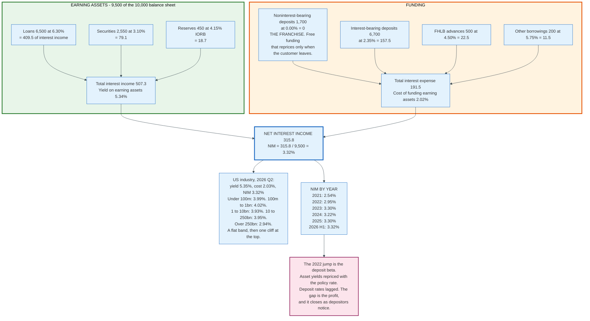
```mermaid
%%{init: {'theme': 'base', 'themeVariables': {'primaryColor': '#e3f2fd', 'primaryBorderColor': '#1565c0', 'lineColor': '#37474f'}}}%%

flowchart TB
    subgraph Earn["EARNING ASSETS - 9,500 of the 10,000 balance sheet"]
        direction TB
        E1["Loans 6,500 at 6.30%<br/>= 409.5 of interest income"]
        E2["Securities 2,550 at 3.10%<br/>= 79.1"]
        E3["Reserves 450 at 4.15% IORB<br/>= 18.7"]
        ETOT["Total interest income 507.3<br/>Yield on earning assets 5.34%"]
        E1 --> ETOT
        E2 --> ETOT
        E3 --> ETOT
    end

    subgraph Fund["FUNDING"]
        direction TB
        F1["Noninterest-bearing deposits 1,700<br/>at 0.00% = 0<br/>THE FRANCHISE. Free funding<br/>that reprices only when<br/>the customer leaves."]
        F2["Interest-bearing deposits 6,700<br/>at 2.35% = 157.5"]
        F3["FHLB advances 500 at 4.50% = 22.5"]
        F4["Other borrowings 200 at 5.75% = 11.5"]
        FTOT["Total interest expense 191.5<br/>Cost of funding earning assets 2.02%"]
        F1 --> FTOT
        F2 --> FTOT
        F3 --> FTOT
        F4 --> FTOT
    end

    ETOT --> NIM["NET INTEREST INCOME 315.8<br/>NIM = 315.8 / 9,500 = 3.32%"]
    FTOT --> NIM

    NIM --> Ind["US industry, 2026 Q2:<br/>yield 5.35%, cost 2.03%, NIM 3.32%<br/>Under 100m: 3.99%. 100m to 1bn: 4.02%.<br/>1 to 10bn: 3.93%. 10 to 250bn: 3.95%.<br/>Over 250bn: 2.94%.<br/>A flat band, then one cliff at the top."]

    NIM --> Cycle["NIM BY YEAR<br/>2021: 2.54%<br/>2022: 2.95%<br/>2023: 3.30%<br/>2024: 3.22%<br/>2025: 3.30%<br/>2026 H1: 3.32%"]

    Cycle --> Beta["The 2022 jump is the deposit beta.<br/>Asset yields repriced with the policy rate.<br/>Deposit rates lagged. The gap is the profit,<br/>and it closes as depositors notice."]

    style Earn fill:#e8f5e9,stroke:#2e7d32,stroke-width:3px
    style Fund fill:#fff3e0,stroke:#e65100,stroke-width:3px
    style NIM fill:#e3f2fd,stroke:#1565c0,stroke-width:3px
    style Beta fill:#fce4ec,stroke:#880e4f,stroke-width:2px
```

### 9.1 The Arithmetic

NIM decomposes into exactly two components, and the FDIC publishes both. In the second quarter of 2026, the yield on earning assets was 5.35 percent and the cost of funding earning assets was 2.03 percent. The difference is 3.32 percent.

Note what the denominator is. Cost of funding is expressed per dollar of earning assets, not per dollar of interest-bearing liabilities, which is why NIM is not simply the average loan rate minus the average deposit rate. A bank with a large base of noninterest-bearing deposits gets that funding at zero and spreads the cost of its remaining funding across the whole earning asset base.

Meridian's version: 507.3 million of interest income on 9,500 million of earning assets gives a 5.34 percent yield. Interest expense of 191.5 million over the same 9,500 million gives a 2.02 percent cost. NIM is 3.32 percent, and 1,700 million dollars of demand deposits paying nothing are what makes it that instead of 2.9 percent.

### 9.2 NIM Is Flat Until the Very Top

The industry average conceals a step, not a gradient. Every size bucket below 250 billion dollars earns between 3.93 and 4.02 percent. Only the largest banks break the pattern, at 2.94 percent, and because they hold 63.7 percent of the assets they drag the all-institution average down to 3.32 percent.

| Asset size | NIM, 2026 Q2 | Yield on earning assets | Cost of funding |
|------------|-------------:|------------------------:|----------------:|
| Under 100 m USD | 3.99% | 5.47% | 1.48% |
| 100 m to 1 bn USD | 4.02% | 5.77% | 1.75% |
| 1 bn to 10 bn USD | 3.93% | 5.84% | 1.91% |
| 10 bn to 250 bn USD | 3.95% | 6.02% | 2.07% |
| Over 250 bn USD | 2.94% | 5.00% | 2.06% |
| **All institutions** | **3.32%** | **5.35%** | **2.03%** |

Small banks earn a wider spread than the giants and roughly the same spread as each other. They lend to borrowers with fewer alternatives at higher rates, they fund with local core deposits that reprice slowly, and they hold less of their balance sheet in low-yielding securities and trading assets. The largest banks earn a narrower spread on an enormously larger book and make up the difference in fee income: noninterest income to assets is 1.48 percent at banks over 250 billion dollars and 1.21 percent at banks between 100 million and 1 billion.

The cliff at the top is a mix effect, not a management failure. The largest banks hold trading assets, reverse repurchase agreements and reserve balances that yield less than a community bank's loan book, and they fund a larger share of the sheet in the wholesale market where the rate is quoted rather than set. Their yield on earning assets is 5.00 percent against 5.84 percent at banks between 1 and 10 billion. Their cost of funding is 2.06 percent against 1.91 percent. Both halves move the wrong way at once.

### 9.3 The Rate Cycle Moves NIM, With a Lag

NIM by year shows the mechanism clearly.

| Year | Industry NIM |
|------|-------------:|
| 2021 | 2.54% |
| 2022 | 2.95% |
| 2023 | 3.30% |
| 2024 | 3.22% |
| 2025 | 3.30% |
| 2026 H1 | 3.32% |

The jump from 2.54 percent to 3.30 percent between 2021 and 2023 is not a change in the banking business. It is the deposit beta.

Deposit beta is the share of a policy rate change that passes through into deposit rates. When the Federal Reserve raised the target range by 525 basis points between March 2022 and July 2023, floating-rate loans and newly purchased securities repriced almost immediately, while deposit rates on checking and savings accounts moved a fraction of the way. That gap, held open for four to six quarters, is where the 76 basis points of NIM expansion came from.

Beta rises over the cycle as depositors notice. It is highest for corporate treasurers with sweep arrangements, lowest for small retail balances in transaction accounts, and it steps discontinuously when a money market fund yields 200 basis points more than a savings account and the depositor learns this from a headline rather than from their bank.

The 2022 to 2023 cycle was unusual in one respect worth naming: deposits could move faster than in any previous cycle, because moving them required an app rather than a branch visit. Whether measured deposit betas were higher than in past cycles is contested in the research literature, and this document does not have a settled figure for it.

### 9.4 What a Bank Actually Controls

Three levers move NIM, and only one is fully within management's control.

**Asset mix.** Shifting from securities to loans raises the yield. Meridian earns 6.30 percent on loans and 3.10 percent on securities, so moving 500 million dollars from securities to loans adds 16 million dollars of annual interest income, or 17 basis points of NIM. It also adds 500 million dollars of risk-weighted assets, consumes capital, and raises the required stable funding factor from 5 or 15 percent to 85 percent.

**Funding mix.** Noninterest-bearing deposits are the most valuable liability in banking and the hardest to buy. They cannot be won with a rate, because they pay no rate. They are won with a service: payroll, treasury management, merchant acquiring, a trust relationship. Section 15 explains why banks buy fee businesses that look unrelated to lending.

**Rate positioning.** A bank chooses how much of its assets float and how much of its liabilities reprice, and that choice is the duration gap. It is the only lever that can destroy the bank, and Section 10 is about it.

---

## 10. Maturity and Liquidity Transformation

Maturity transformation is the business, not a side effect of it, and this is the point at which most explanations of banking go soft. The bank is deliberately short-funded and long-invested. It is paid for that position. It is destroyed by that position when it is wrong about how long the funding lasts.

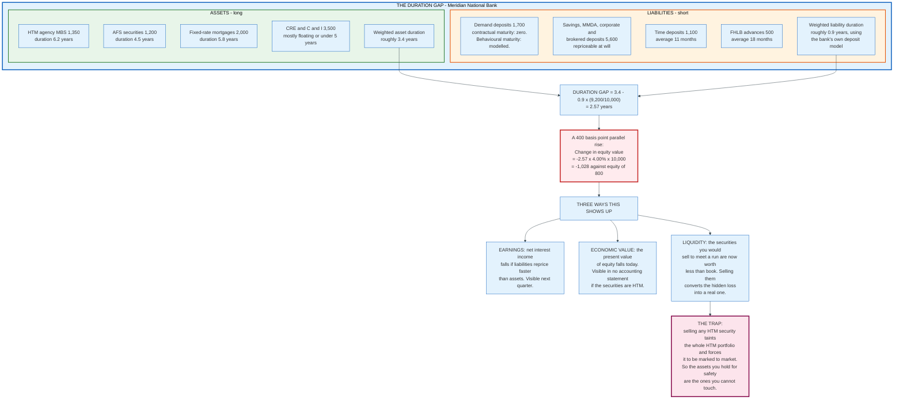
```mermaid
%%{init: {'theme': 'base', 'themeVariables': {'primaryColor': '#e3f2fd', 'primaryBorderColor': '#1565c0', 'lineColor': '#37474f'}}}%%

flowchart TB
    subgraph Gap["THE DURATION GAP - Meridian National Bank"]
        direction LR
        subgraph AssetSide["ASSETS - long"]
            AS1["HTM agency MBS 1,350<br/>duration 6.2 years"]
            AS2["AFS securities 1,200<br/>duration 4.5 years"]
            AS3["Fixed-rate mortgages 2,000<br/>duration 5.8 years"]
            AS4["CRE and C and I 3,500<br/>mostly floating or under 5 years"]
            ASD["Weighted asset duration<br/>roughly 3.4 years"]
        end
        subgraph LiabSide["LIABILITIES - short"]
            LS1["Demand deposits 1,700<br/>contractual maturity: zero.<br/>Behavioural maturity: modelled."]
            LS2["Savings, MMDA, corporate and<br/>brokered deposits 5,600<br/>repriceable at will"]
            LS3["Time deposits 1,100<br/>average 11 months"]
            LS4["FHLB advances 500<br/>average 18 months"]
            LSD["Weighted liability duration<br/>roughly 0.9 years, using<br/>the bank's own deposit model"]
        end
    end

    ASD --> Calc["DURATION GAP = 3.4 - 0.9 x (9,200/10,000)<br/>= 2.57 years"]
    LSD --> Calc

    Calc --> Shock["A 400 basis point parallel rise:<br/>Change in equity value<br/>= -2.57 x 4.00% x 10,000<br/>= -1,028 against equity of 800"]

    Shock --> Three["THREE WAYS THIS SHOWS UP"]

    Three --> W1["EARNINGS: net interest income<br/>falls if liabilities reprice faster<br/>than assets. Visible next quarter."]
    Three --> W2["ECONOMIC VALUE: the present value<br/>of equity falls today.<br/>Visible in no accounting statement<br/>if the securities are HTM."]
    Three --> W3["LIQUIDITY: the securities you would<br/>sell to meet a run are now worth<br/>less than book. Selling them<br/>converts the hidden loss<br/>into a real one."]

    W3 --> Trap["THE TRAP:<br/>selling any HTM security taints<br/>the whole HTM portfolio and forces<br/>it to be marked to market.<br/>So the assets you hold for safety<br/>are the ones you cannot touch."]

    style Gap fill:#e3f2fd,stroke:#1565c0,stroke-width:3px
    style AssetSide fill:#e8f5e9,stroke:#2e7d32,stroke-width:2px
    style LiabSide fill:#fff3e0,stroke:#e65100,stroke-width:2px
    style Shock fill:#ffebee,stroke:#c62828,stroke-width:3px
    style Trap fill:#fce4ec,stroke:#880e4f,stroke-width:3px
```

### 10.1 Measuring the Gap

Duration measures the percentage change in an instrument's value for a one percentage point change in yield. A bond with a duration of 6.2 years loses roughly 6.2 percent of its value when yields rise by 100 basis points. Duration is the correct unit for interest rate risk because it converts a maturity into a price sensitivity.

Meridian's asset duration is roughly 3.4 years. Its held-to-maturity agency MBS carry 6.2 years, its available-for-sale securities 4.5 years, its fixed-rate residential mortgages 5.8 years, and its commercial book is much shorter because most of it floats or reprices within five years.

Its liability duration is roughly 0.9 years, and this number is not observed. It is modelled. Demand deposits have a contractual maturity of zero and a behavioural maturity that the bank estimates from its own history: how long a checking balance actually stays, how it responds to rate changes, how much of it is a stable core. Every bank runs a non-maturity deposit model. Every such model is an assumption presented as a measurement.

The duration gap is asset duration minus liability duration scaled by the liability share of the balance sheet: 3.4 minus 0.9 times 0.92, which is 2.57 years. A 400 basis point parallel rise in rates reduces the economic value of equity by roughly 2.57 times 4.00 percent times 10,000 million, which is 1,028 million dollars against equity of 800 million.

That calculation is not a projection of what will happen. It is a statement of what is already true if rates move, and it is the number that no accounting statement reports.

### 10.2 Three Places the Same Risk Appears

Interest rate risk shows up in three different measurements that a bank's asset-liability committee looks at separately, and the difference between them is why a bank can appear safe on one and be dead on another.

**Earnings at risk.** Simulate net interest income over the next twelve to twenty-four months under rate shocks. This is what management reports to the board because it maps directly to the income statement. It is also short-sighted: it looks one to two years out and a 6.2 year duration mismatch does not fit in that window.

**Economic value of equity.** Discount all future cash flows on both sides of the balance sheet and take the difference. This captures the full duration exposure. It is also the measure most sensitive to the deposit model, because the value of non-maturity deposits depends entirely on how long you assume they stay.

**Liquidity value.** What the assets would actually fetch if sold today. This is where the other two collide, because a bank forced to sell converts an unrealised economic loss into a realised accounting loss and a capital hit.

Silicon Valley Bank's management was focused on the first measure. The Federal Reserve's post-mortem states it directly: "SVBFG management was focused on the short-run impact on profits" and "took steps to maintain short-term profits rather than effectively manage the underlying balance sheet risks."

### 10.3 The Accounting Choice That Hides the Loss

Where a security sits in the accounting classification determines whether its loss is visible, and the classification is chosen by the bank at purchase.

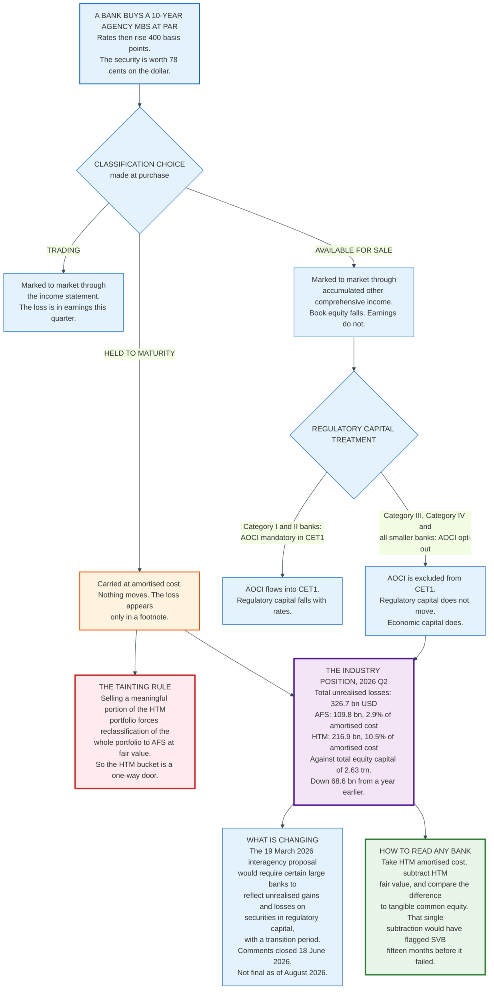
```mermaid
%%{init: {'theme': 'base', 'themeVariables': {'primaryColor': '#e3f2fd', 'primaryBorderColor': '#1565c0', 'lineColor': '#37474f'}}}%%

flowchart TB
    Buy["A BANK BUYS A 10-YEAR AGENCY MBS AT PAR<br/>Rates then rise 400 basis points.<br/>The security is worth 78 cents on the dollar."]

    Buy --> Class{"CLASSIFICATION CHOICE<br/>made at purchase"}

    Class -->|"TRADING"| Tr["Marked to market through<br/>the income statement.<br/>The loss is in earnings this quarter."]

    Class -->|"AVAILABLE FOR SALE"| Afs["Marked to market through<br/>accumulated other comprehensive income.<br/>Book equity falls. Earnings do not."]

    Class -->|"HELD TO MATURITY"| Htm["Carried at amortised cost.<br/>Nothing moves. The loss appears<br/>only in a footnote."]

    Afs --> Opt{"REGULATORY CAPITAL TREATMENT"}

    Opt -->|"Category I and II banks:<br/>AOCI mandatory in CET1"| Inc["AOCI flows into CET1.<br/>Regulatory capital falls with rates."]

    Opt -->|"Category III, Category IV and<br/>all smaller banks: AOCI opt-out"| Exc["AOCI is excluded from CET1.<br/>Regulatory capital does not move.<br/>Economic capital does."]

    Htm --> Taint["THE TAINTING RULE<br/>Selling a meaningful portion of the HTM<br/>portfolio forces reclassification of the<br/>whole portfolio to AFS at fair value.<br/>So the HTM bucket is a one-way door."]

    Exc --> Result
    Htm --> Result

    Result["THE INDUSTRY POSITION, 2026 Q2<br/>Total unrealised losses: 326.7 bn USD<br/>AFS: 109.8 bn, 2.9% of amortised cost<br/>HTM: 216.9 bn, 10.5% of amortised cost<br/>Against total equity capital of 2.63 trn.<br/>Down 68.6 bn from a year earlier."]

    Result --> Fix["WHAT IS CHANGING<br/>The 19 March 2026 interagency proposal<br/>would require certain large banks to<br/>reflect unrealised gains and losses on<br/>securities in regulatory capital,<br/>with a transition period.<br/>Comments closed 18 June 2026.<br/>Not final as of August 2026."]

    Result --> Read["HOW TO READ ANY BANK<br/>Take HTM amortised cost, subtract HTM<br/>fair value, and compare the difference<br/>to tangible common equity. That single<br/>subtraction would have flagged SVB<br/>fifteen months before it failed."]

    style Buy fill:#e3f2fd,stroke:#1565c0,stroke-width:2px
    style Htm fill:#fff3e0,stroke:#e65100,stroke-width:2px
    style Taint fill:#ffebee,stroke:#c62828,stroke-width:3px
    style Result fill:#f3e5f5,stroke:#4a148c,stroke-width:3px
    style Read fill:#e8f5e9,stroke:#2e7d32,stroke-width:3px
```

**Trading** securities are marked to market through the income statement. The loss appears in earnings this quarter.

**Available for sale** securities are marked to market through accumulated other comprehensive income. Book equity falls. Earnings do not.

**Held to maturity** securities are carried at amortised cost. Nothing moves anywhere. The unrealised loss appears only in a financial statement footnote.

Regulatory capital adds a second layer, and it reaches fewer banks than most summaries suggest. Category I and II banking organisations must include AOCI in CET1, so their regulatory capital falls when rates rise. Every other bank may elect the AOCI opt-out at 12 CFR 217.22(b)(2), which excludes unrealised gains and losses on AFS securities from CET1 entirely. The opt-out is confined to institutions that are not advanced approaches institutions, and the 2019 tailoring rule narrowed advanced approaches to Categories I and II, so it extended the opt-out to Category III rather than removing it. The rule text names Category III and Category IV expressly when it sets the deadline for making the election. For an electing bank, regulatory capital does not move when rates do. Economic capital does.

Held-to-maturity classification carries a further consequence that turns it into a one-way door. Selling a more than insignificant portion of the HTM portfolio taints the classification and forces the entire portfolio to be reclassified as available for sale at fair value. The Federal Reserve's SVB review states the constraint plainly: "if a bank sells a portion of its HTM portfolio, the entire portfolio would be required to be reclassified as AFS and marked to market."

So the assets a bank holds for safety are the ones it cannot touch in a crisis without recognising every loss at once.

### 10.4 The Industry Position

US banks held 326.7 billion dollars of unrealised losses on securities as of 30 June 2026, equal to 5.5 percent of amortised cost. The split matters more than the total.

| | Unrealised loss | As % of amortised cost | Change from a year earlier |
|---|---:|---:|---:|
| Available for sale | 109.8 bn USD | 2.9% | Down 33.9 bn, 23.6% |
| Held to maturity | 216.9 bn USD | 10.5% | Down 34.7 bn, 13.8% |
| **Total** | **326.7 bn USD** | **5.5%** | **Down 68.6 bn, 17.4%** |

Two-thirds of the loss sits in the bucket where it does not appear on any balance sheet. The HTM portfolio is 10.5 percent underwater against 2.9 percent for AFS, which is exactly what you would expect: banks moved long-duration securities into HTM as rates rose, precisely so the loss would stop being visible.

The Federal Reserve's May 2026 Financial Stability Report describes the consequence for the largest banks: "Many U.S. G-SIBs continued to hold a significant portion of their HQLA in HTM securities, primarily in long-duration agency mortgage-backed securities. Because current market prices for these instruments remained well below their original book values, selling them would require banks to recognize that gap on their balance sheets. Consequently, to generate liquidity from these holdings without impacting regulatory capital, these banks would likely rely on repo market access rather than outright asset sales."

That sentence describes a permanent structural preference for secured borrowing over asset sales, created entirely by an accounting rule.

### 10.5 The Single Calculation That Reads Any Bank

Take held-to-maturity amortised cost from the securities footnote. Subtract held-to-maturity fair value from the same footnote. Compare the difference to tangible common equity.

Apply it to Silicon Valley Bank at 31 December 2022 and the answer is that unrealised losses across the securities portfolio approached the firm's tangible common equity. That subtraction was available to anyone with the 10-K, fifteen months before the failure, and Section 11 is what happened when the market performed it.

---

## 11. Interest Rate Risk and the Death of Silicon Valley Bank

Silicon Valley Bank had a 12 percent common equity tier 1 ratio at the end of 2022, 200 basis points above its peer group, and was closed 69 days later. It is the cleanest available demonstration that capital adequacy and survival are different properties.

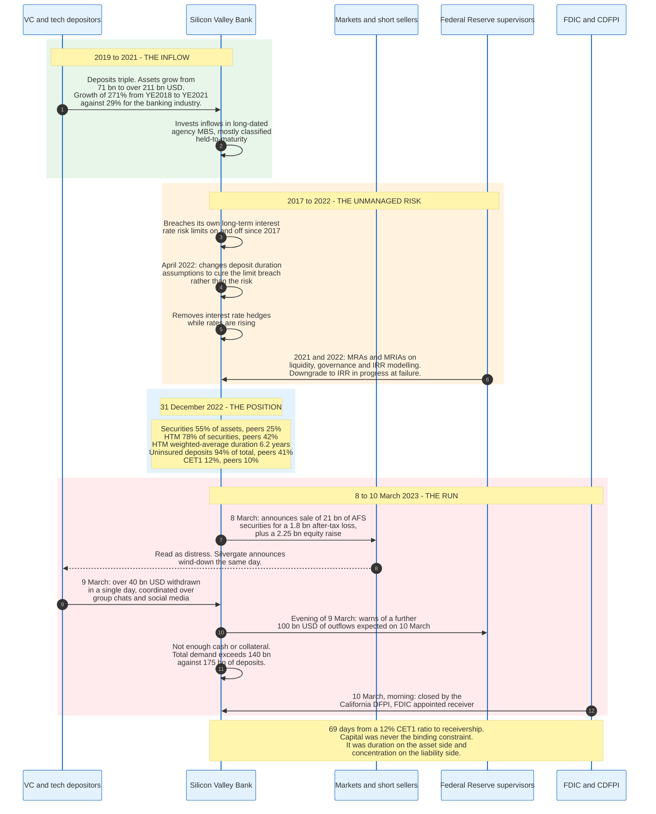
```mermaid
%%{init: {'theme': 'base', 'themeVariables': {'primaryColor': '#e3f2fd', 'primaryBorderColor': '#1565c0', 'lineColor': '#37474f'}}}%%

sequenceDiagram
    autonumber
    participant VC as VC and tech depositors
    participant SVB as Silicon Valley Bank
    participant Mkt as Markets and short sellers
    participant Sup as Federal Reserve supervisors
    participant FDIC as FDIC and CDFPI

    rect rgb(232, 245, 233)
    Note over VC,SVB: 2019 to 2021 - THE INFLOW
    VC->>SVB: Deposits triple. Assets grow from<br/>71 bn to over 211 bn USD.<br/>Growth of 271% from YE2018 to YE2021<br/>against 29% for the banking industry.
    SVB->>SVB: Invests inflows in long-dated<br/>agency MBS, mostly classified<br/>held-to-maturity
    end

    rect rgb(255, 243, 224)
    Note over SVB,Sup: 2017 to 2022 - THE UNMANAGED RISK
    SVB->>SVB: Breaches its own long-term interest<br/>rate risk limits on and off since 2017
    SVB->>SVB: April 2022: changes deposit duration<br/>assumptions to cure the limit breach<br/>rather than the risk
    SVB->>SVB: Removes interest rate hedges<br/>while rates are rising
    Sup->>SVB: 2021 and 2022: MRAs and MRIAs on<br/>liquidity, governance and IRR modelling.<br/>Downgrade to IRR in progress at failure.
    end

    rect rgb(227, 242, 253)
    Note over SVB: 31 December 2022 - THE POSITION
    Note over SVB: Securities 55% of assets, peers 25%<br/>HTM 78% of securities, peers 42%<br/>HTM weighted-average duration 6.2 years<br/>Uninsured deposits 94% of total, peers 41%<br/>CET1 12%, peers 10%
    end

    rect rgb(255, 235, 238)
    Note over SVB,FDIC: 8 to 10 March 2023 - THE RUN
    SVB->>Mkt: 8 March: announces sale of 21 bn of AFS<br/>securities for a 1.8 bn after-tax loss,<br/>plus a 2.25 bn equity raise
    Mkt-->>VC: Read as distress. Silvergate announces<br/>wind-down the same day.
    VC->>SVB: 9 March: over 40 bn USD withdrawn<br/>in a single day, coordinated over<br/>group chats and social media
    SVB->>Sup: Evening of 9 March: warns of a further<br/>100 bn USD of outflows expected on 10 March
    SVB->>SVB: Not enough cash or collateral.<br/>Total demand exceeds 140 bn<br/>against 175 bn of deposits.
    FDIC->>SVB: 10 March, morning: closed by the<br/>California DFPI, FDIC appointed receiver
    end

    Note over SVB,FDIC: 69 days from a 12% CET1 ratio to receivership.<br/>Capital was never the binding constraint.<br/>It was duration on the asset side and<br/>concentration on the liability side.
```

### 11.1 The Position

SVB's balance sheet was an outlier on every dimension that mattered, and the Federal Reserve's April 2023 review quantifies each one against the peer group of US holding companies above 100 billion dollars in assets.

| Metric, 2022 Q4 | SVB Financial Group | Large bank peers |
|-----------------|--------------------:|-----------------:|
| Loans as a percentage of total assets | 35% | 58% |
| Securities as a percentage of total assets | 55% | 25% |
| Held-to-maturity as a percentage of total securities | 78% | 42% |
| Deposits as a percentage of total liabilities | 89% | 82% |
| **Uninsured deposits as a percentage of total deposits** | **94%** | **41%** |
| Common equity tier 1 as a percentage of RWA | 12% | 10% |

Read that table as a single sentence. SVB held more than twice the peer share of assets in securities, nearly twice the peer share of those securities in the bucket it could not sell, and more than twice the peer share of deposits in the category that runs. Its capital ratio was the best number on the page.

The held-to-maturity portfolio carried a weighted-average duration of 6.2 years as of 31 December 2022, and the majority of it was agency mortgage-backed securities with a maturity of ten years or more.

### 11.2 How the Position Was Built

SVB tripled in size in two years and invested the inflow at the bottom of the rate cycle. Between 2019 and 2021 its assets grew from 71 billion dollars to more than 211 billion, an increase of 198 percent. The Federal Reserve's own framing runs over a longer window and is starker: SVBFG's assets grew 271 percent from year-end 2018 to year-end 2021, against 29 percent for the banking industry.

The deposits came from venture-backed technology companies that had just raised capital and had nowhere else to put it. They were large, uninsured, concentrated in one sector, and held by clients who shared investors, board members, and group chats. SVB invested them in long-dated agency MBS classified as held to maturity.

The rate environment then reversed. Rising rates hit SVB twice: net interest income came under pressure as funding costs rose, and the value of the securities fell. The Federal Reserve's review notes both channels.

### 11.3 The Risk Management Failure

SVB breached its own interest rate risk limits repeatedly and then changed the limits. The Federal Reserve's review states the sequence with unusual bluntness.

"SVBFG had breached its long-term IRR limits on and off since 2017 because of the structural mismatch between long-duration securities and short-duration deposits. In April 2022, SVBFG made counterintuitive modeling assumptions about the duration of deposits to address the limit breach rather than managing the actual risk. Over the same period, SVBFG also removed interest rate hedges that would have protected against rising interest rates."

Three separate failures are in that paragraph. The limit was breached for five years. The response was to change the deposit duration assumption, which is the least observable input in the model, rather than to change the position. And the hedges that would have offset the exposure were removed while rates were rising.

Supervisors had found the problems. The review records a Matter Requiring Attention on interest rate risk simulation and modelling issued on 15 November 2022, and notes that a supervisory downgrade related to interest rate risk was in progress when the firm failed. Findings existed. Consequences did not follow fast enough.

### 11.4 The 69 Days

**8 March 2023.** SVB announced a balance sheet restructuring: a completed sale of 21 billion dollars of available-for-sale securities at a 1.8 billion dollar after-tax loss, a plan to increase term borrowings from 15 billion to 30 billion dollars, and a 2.25 billion dollar equity offering. It also guided investors to lower 2023 income. Silvergate Capital announced its intention to wind down the same day.

The announcement was intended to reassure. It did the opposite, because it converted a footnote into a transaction. Selling securities at a loss to fund outflows is what a bank does when it has run out of other options, and every uninsured depositor read it that way.

**9 March 2023.** Total deposit outflow exceeded 40 billion dollars in a single day. The Federal Reserve's review attributes the speed to "a concentrated network of venture capital investors and technology firms that withdrew their deposits in a coordinated manner with unprecedented speed," fuelled by social media.

**Evening of 9 March into 10 March.** SVB told supervisors it expected more than 100 billion dollars of additional outflows during the day on 10 March. Against a deposit base of roughly 175 billion dollars, that is a demand for something close to 80 percent of the bank's funding inside 48 hours. It did not have enough cash or collateral.

**Morning of 10 March 2023.** The California Department of Financial Protection and Innovation closed the bank and appointed the FDIC as receiver.

### 11.5 What the Case Actually Proves

Four conclusions follow from the arithmetic and none of them require hindsight.

**Capital ratios do not measure interest rate risk.** SVB's CET1 ratio of 12 percent was computed on risk-weighted assets in which agency MBS carry a 20 percent weight and Treasuries carry zero. The framework is calibrated for credit risk. Duration risk is not in the denominator, and for a Category IV firm with an AOCI opt-out it is not in the numerator either.

**The accounting classification was load-bearing.** Had the securities been available for sale with AOCI flowing into capital, the losses would have been visible in the capital ratio quarter by quarter from mid-2022. The HTM designation and the opt-out together kept a 15 billion dollar hole out of every headline ratio.

**Uninsured concentration is the transmission mechanism.** A 94 percent uninsured deposit base held by a homogeneous, densely networked client group is not a funding profile. It is a single counterparty wearing many names.

**Supervision found the problem and did not force the fix.** The Federal Reserve's own review concludes that "supervisors did not take sufficient steps to ensure that Silicon Valley Bank fixed those problems quickly enough." Detection was not the failure. Escalation was.

### 11.6 Running Meridian Through the Same Shock

Apply a 400 basis point rise to Meridian's securities book. Weighted duration across the 2,550 million dollar portfolio is roughly 5.4 years, giving a value decline of about 21.6 percent, or 551 million dollars.

Against CET1 of 680 million dollars, that unrealised loss is 81 percent of the bank's regulatory capital. Because Meridian is a small bank with an AOCI opt-out, its reported CET1 ratio stays at 10.02 percent. Nothing in its regulatory filings changes.

Now force a sale. Liquidating the 1,200 million dollar AFS portfolio realises roughly 216 million dollars of pre-tax loss. CET1 falls to 464 million and the ratio falls to 6.84 percent, below the 7.0 percent required to make distributions without restriction. One transaction moves the bank from comfortable to constrained, and the transaction was forced by a liquidity need that the capital ratio never described.

That is the SVB shape, at one-twentieth the size.

---

## 12. The Run Dynamic and Deposit Stickiness

A bank run is a coordination problem with a dominant strategy, and understanding that one sentence is worth more than any amount of narrative about panic. It is not irrational. It is the opposite.

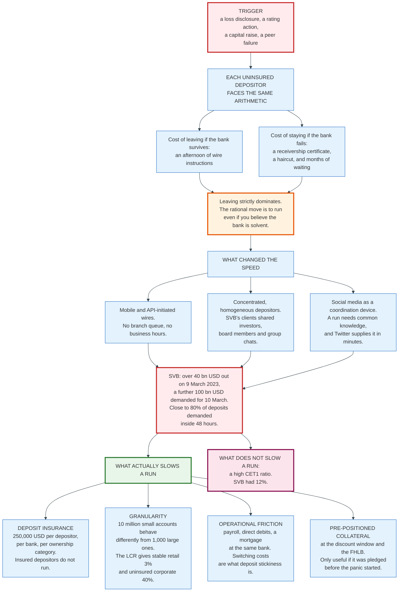
```mermaid
%%{init: {'theme': 'base', 'themeVariables': {'primaryColor': '#e3f2fd', 'primaryBorderColor': '#1565c0', 'lineColor': '#37474f'}}}%%

flowchart TB
    Trigger["TRIGGER<br/>a loss disclosure, a rating action,<br/>a capital raise, a peer failure"]

    Trigger --> Calc["EACH UNINSURED DEPOSITOR<br/>FACES THE SAME ARITHMETIC"]

    Calc --> Q1["Cost of leaving if the bank survives:<br/>an afternoon of wire instructions"]
    Calc --> Q2["Cost of staying if the bank fails:<br/>a receivership certificate,<br/>a haircut, and months of waiting"]

    Q1 --> Dom["Leaving strictly dominates.<br/>The rational move is to run<br/>even if you believe the bank is solvent."]
    Q2 --> Dom

    Dom --> Speed["WHAT CHANGED THE SPEED"]

    Speed --> S1["Mobile and API-initiated wires.<br/>No branch queue, no business hours."]
    Speed --> S2["Concentrated, homogeneous depositors.<br/>SVB's clients shared investors,<br/>board members and group chats."]
    Speed --> S3["Social media as a coordination device.<br/>A run needs common knowledge,<br/>and Twitter supplies it in minutes."]

    S1 --> Result["SVB: over 40 bn USD out on 9 March 2023,<br/>a further 100 bn USD demanded for 10 March.<br/>Close to 80% of deposits demanded<br/>inside 48 hours."]
    S2 --> Result
    S3 --> Result

    Result --> Defence["WHAT ACTUALLY SLOWS A RUN"]

    Defence --> D1["DEPOSIT INSURANCE<br/>250,000 USD per depositor,<br/>per bank, per ownership category.<br/>Insured depositors do not run."]
    Defence --> D2["GRANULARITY<br/>10 million small accounts behave<br/>differently from 1,000 large ones.<br/>The LCR gives stable retail 3%<br/>and uninsured corporate 40%."]
    Defence --> D3["OPERATIONAL FRICTION<br/>payroll, direct debits, a mortgage<br/>at the same bank. Switching costs<br/>are what deposit stickiness is."]
    Defence --> D4["PRE-POSITIONED COLLATERAL<br/>at the discount window and the FHLB.<br/>Only useful if it was pledged<br/>before the panic started."]

    Fail["WHAT DOES NOT SLOW A RUN:<br/>a high CET1 ratio.<br/>SVB had 12%."]

    Result --> Fail

    style Trigger fill:#ffebee,stroke:#c62828,stroke-width:3px
    style Dom fill:#fff3e0,stroke:#e65100,stroke-width:3px
    style Result fill:#ffebee,stroke:#c62828,stroke-width:3px
    style Defence fill:#e8f5e9,stroke:#2e7d32,stroke-width:3px
    style Fail fill:#fce4ec,stroke:#880e4f,stroke-width:3px
```

### 12.1 The Arithmetic Each Depositor Faces

An uninsured depositor holding 8 million dollars at a bank facing questions runs the following calculation.

The bank survives and the depositor leaves: an afternoon of wire instructions. The bank survives and the depositor stays: nothing gained. The bank fails and the depositor left: nothing lost. The bank fails and the depositor stayed: a receivership certificate for an uncertain fraction of 7.75 million dollars, payable over months.

Leaving dominates staying in every state of the world. The depositor does not need to believe the bank is insolvent. The depositor only needs to believe that enough other depositors might act, which is why runs become self-fulfilling: the belief that others will run is sufficient reason to run, regardless of the underlying asset quality. Diamond and Dybvig formalised this in 1983 and won a Nobel Prize for it in 2022, five months before SVB demonstrated it.

Deposit insurance breaks the logic by removing the loss from the failure state. An insured depositor is paid in full, typically by the next business day, so there is no advantage to being early. That is why insured deposits do not run and uninsured deposits do.

### 12.2 What Changed the Speed

The speed of a run is set by the friction between deciding to leave and the money leaving, and that friction has collapsed.

**Initiation is instant.** A corporate treasurer moves 40 million dollars from a phone. There is no branch, no queue, no business-hours constraint, and no human who might ask a question. Where Continental Illinois in 1984 lost its funding over a period of days, SVB lost more than 40 billion dollars in one.

**Coordination is instant.** A run requires common knowledge, which historically was produced by a visible queue outside a branch. Social media and closed group chats produce it faster and at greater range. The Federal Reserve's review names this mechanism explicitly.

**Concentration multiplies both.** SVB's depositors were not 175 billion dollars of independent decisions. They were a network of venture funds and their portfolio companies, sharing board members and investors, receiving the same advice within the same hour. The correlation coefficient between their withdrawal decisions was close to one.

### 12.3 What Deposit Stickiness Actually Is

Deposit stickiness is switching cost, not loyalty, and treating it as loyalty produces bad models.

```mermaid
%%{init: {'theme': 'base', 'themeVariables': {'primaryColor': '#e3f2fd', 'primaryBorderColor': '#1565c0', 'lineColor': '#37474f'}}}%%

flowchart LR
    subgraph Sticky["STICKIEST - lowest cost, lowest flight risk"]
        direction TB
        S1["Noninterest-bearing operating accounts<br/>with payroll and direct debits attached<br/>LCR outflow: 3% if insured retail,<br/>5% if a fully insured operational deposit"]
        S2["Insured retail savings and checking<br/>with an established relationship<br/>LCR outflow: 3% stable, 10% other<br/>NSFR ASF factor: 95% and 90%"]
        S3["Operational wholesale deposits from<br/>cash-management and custody clients<br/>LCR outflow: 25%<br/>Earned by selling a service,<br/>not by paying a rate"]
    end

    subgraph Mid["MIDDLE"]
        direction TB
        M1["Retail time deposits<br/>Contractually locked but repriced<br/>at every maturity"]
        M2["Reciprocal deposits<br/>Fully insured through a network,<br/>10% LCR outflow if fully covered,<br/>but more expensive than core"]
    end

    subgraph Hot["HOTTEST - highest cost, highest flight risk"]
        direction TB
        H1["Uninsured corporate non-operational<br/>LCR outflow: 40%<br/>The category that killed SVB<br/>at 94% of its deposit base"]
        H2["Brokered deposits maturing<br/>within 30 days<br/>LCR outflow: 100%<br/>NSFR ASF factor: 0% under 6 months"]
        H3["Unsecured wholesale funding from<br/>a financial sector entity<br/>LCR outflow: 100%"]
    end

    Sticky --> Mid --> Hot

    subgraph Reality["WHAT DEPOSIT STICKINESS ACTUALLY IS"]
        R1["Not loyalty. Switching cost."]
        R2["The number of automatic payments<br/>that would break, the number of<br/>counterparties that would need<br/>new instructions, the number of<br/>hours it takes to move."]
        R3["A depositor with one relationship<br/>and a mobile app leaves in 90 seconds.<br/>A treasurer with 400 vendor mandates<br/>takes six weeks."]
        R4["This is why banks buy fee businesses.<br/>Trust, payroll and cash management are<br/>purchased deposit duration."]
        R1 --> R2 --> R3 --> R4
    end

    Hot -.- Reality

    subgraph Beta["THE OTHER HALF: DEPOSIT BETA"]
        B1["Beta = the share of a policy rate<br/>change that passes into deposit rates"]
        B2["Low beta widens the margin.<br/>Industry NIM rose from 2.54% in 2021<br/>to 3.30% in 2023 largely on lag."]
        B3["Beta is low until it is not.<br/>The same account that repriced slowly<br/>on the way up leaves instantly when<br/>a money market fund pays 200 bp more."]
        B1 --> B2 --> B3
    end

    Reality --- Beta

    style Sticky fill:#e8f5e9,stroke:#2e7d32,stroke-width:3px
    style Mid fill:#fff3e0,stroke:#e65100,stroke-width:2px
    style Hot fill:#ffebee,stroke:#c62828,stroke-width:3px
    style Reality fill:#e3f2fd,stroke:#1565c0,stroke-width:3px
    style Beta fill:#f3e5f5,stroke:#4a148c,stroke-width:2px
```

A deposit is sticky in proportion to the number of things that break if it moves. A consumer with a single savings balance and a mobile app leaves in ninety seconds. A corporate treasurer with 400 vendor payment mandates, a payroll file, a lockbox, three positive-pay arrangements, and a revolving credit facility at the same institution takes six weeks and a project plan.

The regulatory outflow assumptions encode this. Stable retail deposits get 3 percent. Fully insured operational deposits get 5 percent. Other operational deposits get 25 percent. Uninsured non-operational corporate money gets 40 percent. Brokered deposits maturing within 30 days get 100 percent. The gradient tracks entanglement, not sentiment.

Three levers actually buy stickiness.

**Deposit insurance.** Coverage is 250,000 dollars per depositor, per insured bank, per ownership category. A depositor can multiply coverage across categories, and reciprocal deposit networks exist to spread balances across many banks so that a large deposit becomes fully insured. Reciprocal deposits get a 10 percent LCR outflow if fully covered, against 40 percent uninsured. The Federal Reserve's May 2026 Financial Stability Report notes that since 2023, regional banks have relied more on reciprocal and brokered deposits, which are fully or largely insured but "more expensive than traditional core insured deposits and may not be as stable during times of stress."

**Granularity.** Ten million accounts averaging 2,000 dollars behave like a statistical process. One thousand accounts averaging 20 million dollars behave like a phone tree. Same total, entirely different liability.

**Operational entanglement.** Payroll, treasury services, custody, and trust relationships are sold at thin margins because their real product is deposit duration. Section 15 makes this argument in full.

### 12.4 The Industry Position Today

Uninsured deposits stood at 7,608 billion dollars at the end of 2025, according to the Federal Reserve's May 2026 Financial Stability Report, growing 7.7 percent over the year against a long-run average of 10.6 percent. Total runnable money-like liabilities, which include money market fund shares, repurchase agreements, and commercial paper alongside uninsured deposits, stood at 27,033 billion dollars, or 86 percent of GDP at the end of 2025.

The Report characterises uninsured deposits as a share of bank assets as "in line with levels seen through the mid-2010s and significantly lower than their peak level in 2022." Banks reduced their uninsured concentration after 2023, which is the correct response and also a costly one, because insured funding is more expensive.

In the second quarter of 2026, domestic deposits grew 0.8 percent, the eighth consecutive quarterly increase, and the growth was driven by uninsured deposits rising 317.4 billion dollars.

The category that caused the 2023 failures is growing again.

---

## 13. The Discount Window and Its Stigma

The discount window is a fully functional lender of last resort that banks will not use, and that is a design failure rather than a behavioural quirk. A facility that carries a reputational penalty for using it is not available in the moment it is needed.

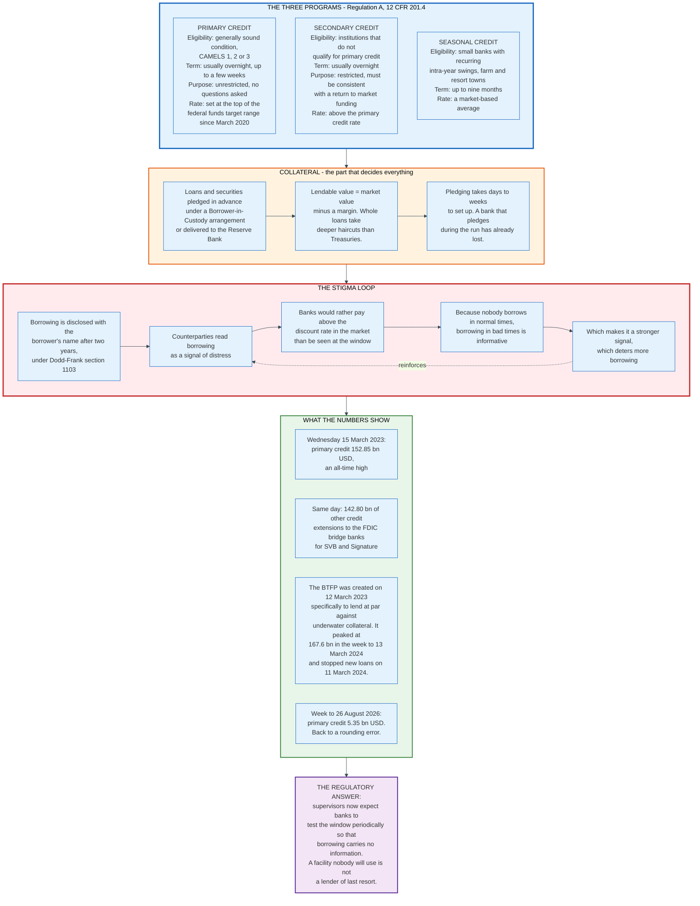
```mermaid
%%{init: {'theme': 'base', 'themeVariables': {'primaryColor': '#e3f2fd', 'primaryBorderColor': '#1565c0', 'lineColor': '#37474f'}}}%%

flowchart TB
    subgraph Programs["THE THREE PROGRAMS - Regulation A, 12 CFR 201.4"]
        direction TB
        P1["PRIMARY CREDIT<br/>Eligibility: generally sound condition,<br/>CAMELS 1, 2 or 3<br/>Term: usually overnight, up to a few weeks<br/>Purpose: unrestricted, no questions asked<br/>Rate: set at the top of the<br/>federal funds target range since March 2020"]
        P2["SECONDARY CREDIT<br/>Eligibility: institutions that do not<br/>qualify for primary credit<br/>Term: usually overnight<br/>Purpose: restricted, must be consistent<br/>with a return to market funding<br/>Rate: above the primary credit rate"]
        P3["SEASONAL CREDIT<br/>Eligibility: small banks with recurring<br/>intra-year swings, farm and resort towns<br/>Term: up to nine months<br/>Rate: a market-based average"]
    end

    subgraph Collateral["COLLATERAL - the part that decides everything"]
        C1["Loans and securities pledged in advance<br/>under a Borrower-in-Custody arrangement<br/>or delivered to the Reserve Bank"]
        C2["Lendable value = market value<br/>minus a margin. Whole loans take<br/>deeper haircuts than Treasuries."]
        C3["Pledging takes days to weeks<br/>to set up. A bank that pledges<br/>during the run has already lost."]
        C1 --> C2 --> C3
    end

    subgraph Stigma["THE STIGMA LOOP"]
        S1["Borrowing is disclosed with the<br/>borrower's name after two years,<br/>under Dodd-Frank section 1103"]
        S2["Counterparties read borrowing<br/>as a signal of distress"]
        S3["Banks would rather pay above the<br/>discount rate in the market<br/>than be seen at the window"]
        S4["Because nobody borrows in normal times,<br/>borrowing in bad times is informative"]
        S5["Which makes it a stronger signal,<br/>which deters more borrowing"]
        S1 --> S2 --> S3 --> S4 --> S5
        S5 -.reinforces.-> S2
    end

    subgraph Evidence["WHAT THE NUMBERS SHOW"]
        E1["Wednesday 15 March 2023:<br/>primary credit 152.85 bn USD,<br/>an all-time high"]
        E2["Same day: 142.80 bn of other credit<br/>extensions to the FDIC bridge banks<br/>for SVB and Signature"]
        E3["The BTFP was created on 12 March 2023<br/>specifically to lend at par against<br/>underwater collateral. It peaked at<br/>167.6 bn in the week to 13 March 2024<br/>and stopped new loans on 11 March 2024."]
        E4["Week to 26 August 2026:<br/>primary credit 5.35 bn USD.<br/>Back to a rounding error."]
    end

    Programs --> Collateral
    Collateral --> Stigma
    Stigma --> Evidence

    Evidence --> Fix["THE REGULATORY ANSWER:<br/>supervisors now expect banks to<br/>test the window periodically so that<br/>borrowing carries no information.<br/>A facility nobody will use is not<br/>a lender of last resort."]

    style Programs fill:#e3f2fd,stroke:#1565c0,stroke-width:3px
    style Collateral fill:#fff3e0,stroke:#e65100,stroke-width:2px
    style Stigma fill:#ffebee,stroke:#c62828,stroke-width:3px
    style Evidence fill:#e8f5e9,stroke:#2e7d32,stroke-width:2px
    style Fix fill:#f3e5f5,stroke:#4a148c,stroke-width:2px
```

### 13.1 The Three Programs

Regulation A, at 12 CFR 201.4, establishes three credit programs with different eligibility and different prices.

**Primary credit** is for depository institutions in generally sound financial condition, which in practice means a CAMELS composite rating of 1, 2, or 3. It is usually overnight and may extend to a few weeks. It carries no restriction on purpose: the Federal Reserve's stated design is a backup funding source with minimal administrative burden. Since March 2020 the primary credit rate has been set at the top of the FOMC's target range for the federal funds rate, meaning the window is priced at the ceiling of the policy corridor rather than at a punitive spread above it.

**Secondary credit** is for institutions that do not qualify for primary credit. It is priced above the primary rate, is usually overnight, and comes with a restriction: the extension must be consistent with a timely return to market funding. Borrowing here is a supervisory event.

**Seasonal credit** is for small institutions with recurring intra-year funding swings, typically agricultural and tourism-dependent banks. It runs for up to nine months at a rate based on an average of market rates.

### 13.2 Collateral Is the Whole Game

A discount window loan is fully secured, and the constraint is not the Federal Reserve's willingness to lend but the borrower's readiness to pledge.

Eligible collateral spans a wide range: Treasury and agency securities, municipal bonds, corporate bonds, and whole loans including commercial, residential, consumer, and agricultural. Each receives a lendable value equal to market value less a margin, with deeper haircuts on assets that are harder to value. Whole loans can be pledged under a Borrower-in-Custody arrangement in which the loans stay at the bank subject to inspection and control requirements.

Setting up a pledging arrangement takes days to weeks. Testing that it works takes an actual transaction. A bank that begins pledging collateral during a run has already lost, and this is the practical failure that supervisors now push hardest on.

### 13.3 The Stigma Loop

Stigma is self-reinforcing and the loop is short. Because nobody borrows in normal times, borrowing is informative. Because borrowing is informative, counterparties read it as distress. Because counterparties read it as distress, banks pay above the discount rate in the market rather than be seen at the window. Because they do that, nobody borrows in normal times.

Disclosure sharpens it. Section 1103 of the Dodd-Frank Act requires the Federal Reserve to publish the identity of discount window borrowers, the amounts, and the terms, with a two-year lag. The lag was intended to reduce stigma. It converted an immediate reputational cost into a delayed one, which changes the timing but not the existence.

The strongest evidence that stigma is real is the observed price. During periods of money market stress, banks have paid more for unsecured overnight funding than the primary credit rate at which they could have borrowed secured. That is a directly observable premium paid to avoid the window.

### 13.4 What the Numbers Show

Primary credit outstanding on Wednesday 15 March 2023 reached 152,853 million dollars, an all-time high for the facility, and the surrounding lines on the same H.4.1 release tell the rest of the story.

| Line, Wednesday 15 March 2023 | USD millions |
|-------------------------------|-------------:|
| Primary credit | 152,853 |
| Secondary credit | 0 |
| Seasonal credit | 4 |
| Paycheck Protection Program Liquidity Facility | 10,549 |
| Bank Term Funding Program | 11,943 |
| Other credit extensions, to the FDIC bridge banks | 142,800 |
| **Total loans** | **318,148** |

The six components sum to 318,149; the release reports 318,148 because it totals unrounded figures. The line the Federal Reserve labels "Loans" is the sum of all six, PPPLF included, which is why the discount window programs alone do not reconcile to it.

Secondary credit was zero at the height of the worst banking stress since 2008. No institution was willing to admit to being in the category that needs it.

The Bank Term Funding Program was created on 12 March 2023 for one reason: to lend against collateral at par rather than at market value, so that a bank could borrow the full face amount of an underwater Treasury or agency security. It reached 11.9 billion dollars by 15 March 2023 and peaked at a weekly average of 167.6 billion in the week ended 13 March 2024 and stopped making new loans on 11 March 2024. Its final months included banks borrowing at a rate below the interest rate on reserves, which is a pure arbitrage and not a liquidity need.

The contrast with normal conditions is total. In the week ended 26 August 2026, primary credit outstanding averaged 5,346 million dollars against a Federal Reserve balance sheet of 6,731 billion. The lender of last resort is essentially idle.

### 13.5 The Fix Nobody Has Landed

Supervisors now expect banks to treat the discount window as part of their contingency funding plan, to pre-position collateral, and to test borrowing periodically so that a draw carries no information. That is the correct answer in principle: if every bank borrows a token amount every quarter, borrowing stops being a signal.

The problem is that it requires collective action. A single bank that starts testing the window while its peers do not has not eliminated the signal, it has sent one. Making periodic use mandatory would solve it and would also convert a voluntary facility into a supervisory requirement, which raises its own objections.

As of August 2026 the stigma is unresolved. It is the most consequential unfixed problem in bank liquidity, because every liquidity rule in the framework assumes a functioning lender of last resort behind it, and the facility is functioning in every respect except that nobody will use it.

---

## 14. Credit Risk: Underwriting and Provisioning under CECL

Credit risk is the risk a bank is best equipped to handle and the one that regulation has spent the most effort on, which is why it almost never kills a modern bank on its own. Losses on loans are slow, visible, and reserved against in advance. Losses on duration are fast, hidden, and not.

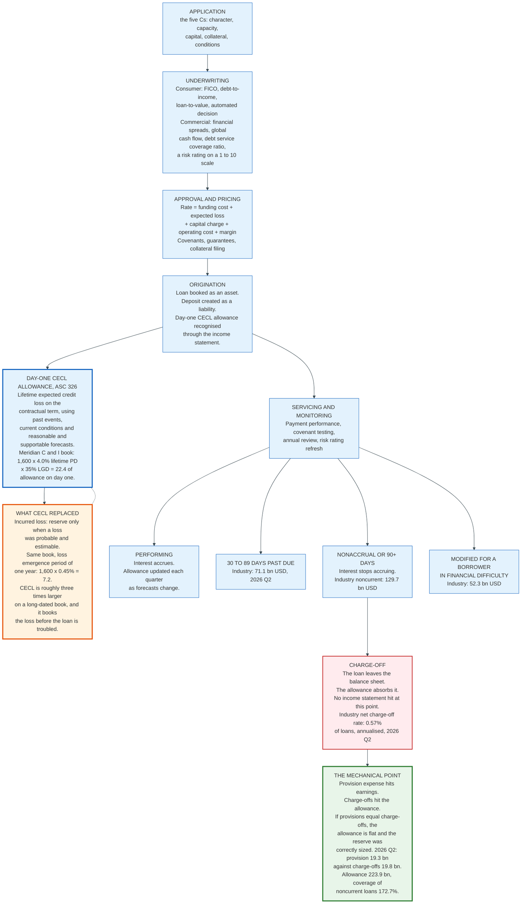
```mermaid
%%{init: {'theme': 'base', 'themeVariables': {'primaryColor': '#e3f2fd', 'primaryBorderColor': '#1565c0', 'lineColor': '#37474f'}}}%%

flowchart TB
    A["APPLICATION<br/>the five Cs: character, capacity,<br/>capital, collateral, conditions"]

    A --> B["UNDERWRITING<br/>Consumer: FICO, debt-to-income,<br/>loan-to-value, automated decision<br/>Commercial: financial spreads, global<br/>cash flow, debt service coverage ratio,<br/>a risk rating on a 1 to 10 scale"]

    B --> C["APPROVAL AND PRICING<br/>Rate = funding cost + expected loss<br/>+ capital charge + operating cost + margin<br/>Covenants, guarantees, collateral filing"]

    C --> D["ORIGINATION<br/>Loan booked as an asset.<br/>Deposit created as a liability.<br/>Day-one CECL allowance recognised<br/>through the income statement."]

    D --> E["DAY-ONE CECL ALLOWANCE, ASC 326<br/>Lifetime expected credit loss on the<br/>contractual term, using past events,<br/>current conditions and reasonable and<br/>supportable forecasts.<br/>Meridian C and I book: 1,600 x 4.0% lifetime PD<br/>x 35% LGD = 22.4 of allowance on day one."]

    E --> F["WHAT CECL REPLACED<br/>Incurred loss: reserve only when a loss<br/>was probable and estimable.<br/>Same book, loss emergence period of<br/>one year: 1,600 x 0.45% = 7.2.<br/>CECL is roughly three times larger<br/>on a long-dated book, and it books<br/>the loss before the loan is troubled."]

    D --> G["SERVICING AND MONITORING<br/>Payment performance, covenant testing,<br/>annual review, risk rating refresh"]

    G --> H1["PERFORMING<br/>Interest accrues.<br/>Allowance updated each quarter<br/>as forecasts change."]
    G --> H2["30 TO 89 DAYS PAST DUE<br/>Industry: 71.1 bn USD, 2026 Q2"]
    G --> H3["NONACCRUAL OR 90+ DAYS<br/>Interest stops accruing.<br/>Industry noncurrent: 129.7 bn USD"]
    G --> H4["MODIFIED FOR A BORROWER<br/>IN FINANCIAL DIFFICULTY<br/>Industry: 52.3 bn USD"]

    H3 --> I["CHARGE-OFF<br/>The loan leaves the balance sheet.<br/>The allowance absorbs it.<br/>No income statement hit at this point.<br/>Industry net charge-off rate: 0.57%<br/>of loans, annualised, 2026 Q2"]

    I --> J["THE MECHANICAL POINT<br/>Provision expense hits earnings.<br/>Charge-offs hit the allowance.<br/>If provisions equal charge-offs, the<br/>allowance is flat and the reserve was<br/>correctly sized. 2026 Q2: provision 19.3 bn<br/>against charge-offs 19.8 bn.<br/>Allowance 223.9 bn, coverage of<br/>noncurrent loans 172.7%."]

    F -.- E

    style E fill:#e3f2fd,stroke:#1565c0,stroke-width:3px
    style F fill:#fff3e0,stroke:#e65100,stroke-width:3px
    style I fill:#ffebee,stroke:#c62828,stroke-width:2px
    style J fill:#e8f5e9,stroke:#2e7d32,stroke-width:3px
```

### 14.1 Underwriting

Underwriting answers whether the borrower will repay and what happens if they do not, and it is conducted very differently at the two ends of the loan book.

**Consumer lending is statistical.** A mortgage decision is a function of a credit score, a loan-to-value ratio, a debt-to-income ratio, documented income, and property valuation. Most of it is automated. Qualified mortgages under the Ability-to-Repay rule at 12 CFR 1026.43 must clear a price-based threshold on the spread between the loan's annual percentage rate and the average prime offer rate, the benchmark the CFPB publishes for the rate a well-qualified borrower gets. That test replaced the old 43 percent debt-to-income cap and Appendix Q in the CFPB's December 2020 final rule, with mandatory compliance from 1 October 2022. Qualified status also bars negative amortisation, interest-only periods, balloon payments and terms beyond 30 years, and it buys a safe harbour from ability-to-repay liability below the higher-priced threshold and a rebuttable presumption above it. It buys nothing in the capital rules. The 50 percent risk weight is a separate provision, 12 CFR 217.32(g), and it turns on the exposure being a first lien, prudently underwritten, owner-occupied or rented, not 90 days past due and not restructured. A non-qualified mortgage can carry 50 percent and a qualified one can carry 100 percent.

**Commercial lending is judgmental.** A commercial credit is assessed on the five Cs: character, capacity, capital, collateral, and conditions. The bank spreads three years of financial statements, computes a debt service coverage ratio, tests global cash flow across all the borrower's entities, values the collateral, and assigns an internal risk rating on a scale typically running from 1 to 10 with the pass grades in the first five or six. The rating drives pricing, approval authority, monitoring frequency, and the allowance.

Pricing is built up rather than quoted: funding cost, plus expected loss, plus a charge for the capital the exposure consumes, plus operating cost, plus a target margin. Meridian's 6.30 percent average loan yield decomposes roughly into a 2.02 percent funding cost, 45 basis points of expected loss, a capital charge of around 100 basis points on a 100 percent risk-weighted exposure at a 10 percent CET1 target, and the remainder in operating cost and margin.

### 14.2 CECL: The Standard and the Change

CECL requires a bank to book the expected credit losses over a loan's entire remaining life on the day it is originated. It is Accounting Standards Update 2016-13, codified as ASC 326, and it replaced the incurred loss model.

The measurement objective is the net amount expected to be collected, based on past events, current conditions, and reasonable and supportable forecasts. Scope covers loans held for investment, held-to-maturity debt securities, trade receivables, and off-balance-sheet credit exposures such as commitments and standby letters of credit. Available-for-sale debt securities are handled under a separate impairment approach.

Effective dates followed the FASB's usual tiering, and were extended twice. SEC filers other than smaller reporting companies adopted for fiscal years beginning after 15 December 2019. All other entities, including smaller reporting companies, private companies, and not-for-profits, adopted for fiscal years beginning after 15 December 2022. Banking agencies permitted a transition arrangement to phase in the day-one regulatory capital effect. The FDIC notes that beginning in 2024, almost all insured institutions had adopted the standard.

**What changed is timing, not total losses.** Under the incurred loss model, a bank reserved only when a loss was probable and reasonably estimable at the reporting date, typically over a loss emergence period of around a year. Under CECL, the bank reserves for the whole expected life at origination. Over the life of a loan the cumulative provision is the same. The difference is that CECL front-loads it.

Take Meridian's commercial and industrial book: 1,600 million dollars, weighted-average remaining life of 3.2 years, lifetime probability of default of 4.0 percent, and loss given default of 35 percent. The CECL allowance is 1,600 times 4.0 percent times 35 percent, or 22.4 million dollars. Under an incurred loss model with an annualised loss rate of 0.45 percent over a one-year emergence period, the same book would carry 7.2 million dollars. CECL is roughly three times larger on a long-dated book.

The consequence is procyclicality in a new place. A bank that grows its loan book must book the lifetime allowance immediately, so growth depresses earnings before it produces them. And when the forecast deteriorates, the allowance jumps for loans that are still performing, which is why provision expense moves faster than charge-offs at the turn of a cycle.

### 14.3 The Mechanics of Provision, Allowance, and Charge-Off

Three distinct concepts get conflated constantly, and the distinction is mechanical.

**Provision** is an income statement expense. It is the amount added to the allowance this period.

**Allowance for credit losses** is a contra-asset on the balance sheet. It reduces the carrying value of loans.

**Charge-off** removes an uncollectible loan from the balance sheet by reducing gross loans and reducing the allowance by the same amount. It does not touch the income statement at all, because the loss was already expensed when the provision was booked.

The relationship is: closing allowance equals opening allowance, plus provision, minus net charge-offs. When provision equals net charge-offs, the allowance is flat and the reserve was correctly sized. When provision exceeds charge-offs, the bank is building reserve, either because the book is growing or the forecast is worsening.

The US industry in the second quarter of 2026 booked 19.3 billion dollars of provision against 19.8 billion dollars of net charge-offs, leaving the allowance essentially flat at 223.9 billion dollars.

### 14.4 The Industry's Credit Position

| Metric, 2026 Q2 | Value |
|-----------------|------:|
| Total loans and leases | 13.94 trn USD |
| Allowance for credit losses | 223.9 bn USD, 1.61% of loans |
| 30 to 89 days past due | 71.1 bn USD |
| Noncurrent loans, 90+ days or nonaccrual | 129.7 bn USD |
| Past-due and nonaccrual rate | 1.44% |
| Reserve coverage of noncurrent loans | 172.7% |
| Quarterly net charge-off rate, annualised | 0.57% |
| Restructured for borrowers in financial difficulty | 52.3 bn USD |

Sector-level past-due and nonaccrual rates in the same quarter: credit cards 2.81 percent, one-to-four family residential 2.00 percent, nonfarm nonresidential commercial real estate 1.52 percent, and commercial and industrial 1.27 percent. Non-owner-occupied commercial real estate at banks above 250 billion dollars in assets ran at 3.08 percent, against 1.31 percent at banks between 10 and 250 billion and 1.10 percent at banks between 1 and 10 billion. The FDIC records that rate falling for a seventh consecutive quarter from a peak of 4.99 percent in the third quarter of 2024, and still far above the pre-pandemic average of 0.59 percent. That is where the office exposure sits.

The fastest-growing loan categories in the year to June 2026 were loans to nondepository financial institutions, up 279.1 billion dollars or 22.4 percent, and loans to purchase or carry securities including margin loans, up 131.3 billion dollars or 29.7 percent. Both are lending to the financial sector rather than to the real economy, and both are the channel by which bank balance sheets are connected to private credit funds and to leveraged market positions.

That is where the next credit surprise is most likely to originate, and it is not a category most people watching bank credit are watching.

---

## 15. Fee Income: The Third of Revenue That Is Not Spread

Noninterest income was 96.1 billion dollars in the second quarter of 2026 against net interest income of 197.4 billion, so exactly one-third of US bank revenue does not come from the spread. It is also the part of the business that varies most across institutions.

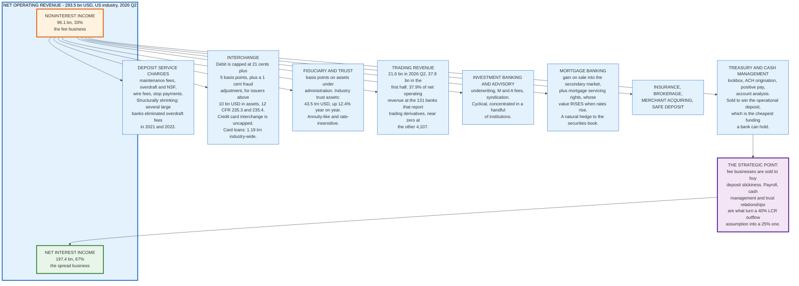
```mermaid
%%{init: {'theme': 'base', 'themeVariables': {'primaryColor': '#e3f2fd', 'primaryBorderColor': '#1565c0', 'lineColor': '#37474f'}}}%%

flowchart TB
    subgraph Rev["NET OPERATING REVENUE - 293.5 bn USD, US industry, 2026 Q2"]
        direction LR
        NII["NET INTEREST INCOME<br/>197.4 bn, 67%<br/>the spread business"]
        NonII["NONINTEREST INCOME<br/>96.1 bn, 33%<br/>the fee business"]
    end

    NonII --> F1["DEPOSIT SERVICE CHARGES<br/>maintenance fees, overdraft and NSF,<br/>wire fees, stop payments.<br/>Structurally shrinking: several large<br/>banks eliminated overdraft fees<br/>in 2021 and 2022."]

    NonII --> F2["INTERCHANGE<br/>Debit is capped at 21 cents plus<br/>5 basis points, plus a 1 cent fraud<br/>adjustment, for issuers above<br/>10 bn USD in assets, 12 CFR 235.3 and 235.4.<br/>Credit card interchange is uncapped.<br/>Card loans: 1.19 trn industry-wide."]

    NonII --> F3["FIDUCIARY AND TRUST<br/>basis points on assets under<br/>administration. Industry trust assets:<br/>43.5 trn USD, up 12.4% year on year.<br/>Annuity-like and rate-insensitive."]

    NonII --> F4["TRADING REVENUE<br/>21.6 bn in 2026 Q2, 37.9 bn in the<br/>first half. 37.9% of net operating<br/>revenue at the 131 banks that report<br/>trading derivatives, near zero at<br/>the other 4,107."]

    NonII --> F5["INVESTMENT BANKING AND ADVISORY<br/>underwriting, M and A fees, syndication.<br/>Cyclical, concentrated in a handful<br/>of institutions."]

    NonII --> F6["MORTGAGE BANKING<br/>gain on sale into the secondary market,<br/>plus mortgage servicing rights, whose<br/>value RISES when rates rise.<br/>A natural hedge to the securities book."]

    NonII --> F7["TREASURY AND CASH MANAGEMENT<br/>lockbox, ACH origination, positive pay,<br/>account analysis.<br/>Sold to win the operational deposit,<br/>which is the cheapest funding<br/>a bank can hold."]

    NonII --> F8["INSURANCE, BROKERAGE,<br/>MERCHANT ACQUIRING, SAFE DEPOSIT"]

    F7 --> Loop["THE STRATEGIC POINT:<br/>fee businesses are sold to buy<br/>deposit stickiness. Payroll, cash<br/>management and trust relationships<br/>are what turn a 40% LCR outflow<br/>assumption into a 25% one."]

    Loop --> NII

    style Rev fill:#e3f2fd,stroke:#1565c0,stroke-width:3px
    style NII fill:#e8f5e9,stroke:#2e7d32,stroke-width:3px
    style NonII fill:#fff3e0,stroke:#e65100,stroke-width:3px
    style Loop fill:#f3e5f5,stroke:#4a148c,stroke-width:3px
```

### 15.1 The Lines

**Service charges on deposit accounts.** Monthly maintenance fees, overdraft and non-sufficient-funds charges, wire fees, stop payments, and account analysis charges on commercial accounts. This line is structurally shrinking. Several large banks eliminated or sharply reduced overdraft fees in 2021 and 2022 under competitive and regulatory pressure, and the direction of travel has been one way since.

**Interchange.** The fee an issuer receives when its card is used. Debit interchange is capped by Regulation II at 12 CFR 235.3 for issuers with 10 billion dollars or more in assets: 21 cents per transaction plus 5 basis points of transaction value, plus a 1 cent fraud-prevention adjustment under 12 CFR 235.4 for issuers meeting the fraud standards. The current text of the regulation still carries those figures as of August 2026; a Federal Reserve proposal published in October 2023 to lower the cap has not been reflected in the rule. Credit card interchange is not capped, which is why credit card lending, at 1.19 trillion dollars industry-wide, is the most profitable consumer product in banking on a revenue-per-dollar basis and also the one with the highest charge-off rate.

**Fiduciary and trust income.** Basis points charged on assets under administration or management. US banks administered 43.5 trillion dollars of trust assets at the end of June 2026, up 12.4 percent year on year. These assets are not on the bank's balance sheet and carry no capital charge. The revenue is annuity-like and largely rate-insensitive, which is why custody and trust banks trade at different multiples from lenders.

**Trading revenue.** 21.6 billion dollars across the industry in the second quarter of 2026 and 37.9 billion across the first half, up 30.6 percent on the same quarter of 2025. It represented 37.9 percent of net operating revenue at the 131 institutions that report trading derivatives and close to zero at the other 4,107 charters. This is the line that makes industry averages misleading.

**Investment banking and advisory.** Underwriting, merger advice, and loan syndication fees. Highly cyclical and concentrated in a handful of firms.

**Mortgage banking.** Gain on sale when loans are originated and sold into the secondary market, plus the value of mortgage servicing rights retained. MSRs have an unusual property: their value rises when interest rates rise, because prepayments slow and the servicing stream lasts longer. That makes them a natural partial hedge against the loss on a fixed-rate securities portfolio, and it is one of the few structural hedges available on a bank balance sheet.

**Treasury and cash management.** Lockbox, ACH origination, positive pay, controlled disbursement, and account reconciliation, sold to commercial clients.

**Insurance, brokerage, merchant acquiring, and everything else.**

### 15.2 Why Banks Buy Businesses That Look Unrelated

Fee businesses are bought to purchase deposit stickiness, and this is the strategic logic that ties Section 15 back to Section 12.

A treasury management relationship generates fee revenue. It also generates an operational deposit, which the LCR treats at a 25 percent outflow rate rather than 40 percent, and which the NSFR treats at a 50 percent available stable funding factor. More importantly, it generates entanglement: the client's payroll file, vendor mandates, and reconciliation processes are wired into the bank. Moving the deposit means moving the operation.

The same logic runs through custody, trust, and merchant acquiring. In each case the fee is the visible product and the deposit is the real one. A bank that wins a corporate cash management mandate has bought a liability that behaves like term funding while being priced like a checking account.

This is also why fee income is not a diversification story in the way it is usually described. The businesses are not independent of the lending business. They are the mechanism that funds it.

### 15.3 The Cost Side

Noninterest expense was 164.3 billion dollars in the second quarter of 2026, up 10.0 percent year on year, and the composition tells you where banks are spending.

Salaries and employee benefits rose 6.6 percent year on year. "All other" noninterest expense, which the FDIC notes includes data processing, advertising and marketing, legal fees, and consulting and advisory fees, rose 14.7 percent, more than twice as fast. Employment across the industry fell 1.3 percent year on year to 2,034,151 full-time equivalents.

Fewer people, much more technology and outside advice. That is the shape of the cost base now.

The efficiency ratio, noninterest expense divided by net operating revenue, is the standard measure. The industry ran at 55.38 percent in the second quarter of 2026. Meridian at 59.9 percent is typical of a 10 billion dollar commercial bank. A high-performing large bank runs in the low fifties; a trust bank with high fee income and high compensation can run in the seventies and still earn a good return on equity.

---

## 16. The Correspondent Banking Network

Correspondent banking is how a bank operates in a currency whose home payment rail it cannot reach, and it is the oldest piece of infrastructure still in daily use. It is also shrinking, in a way that removes entire countries from the international payment system.

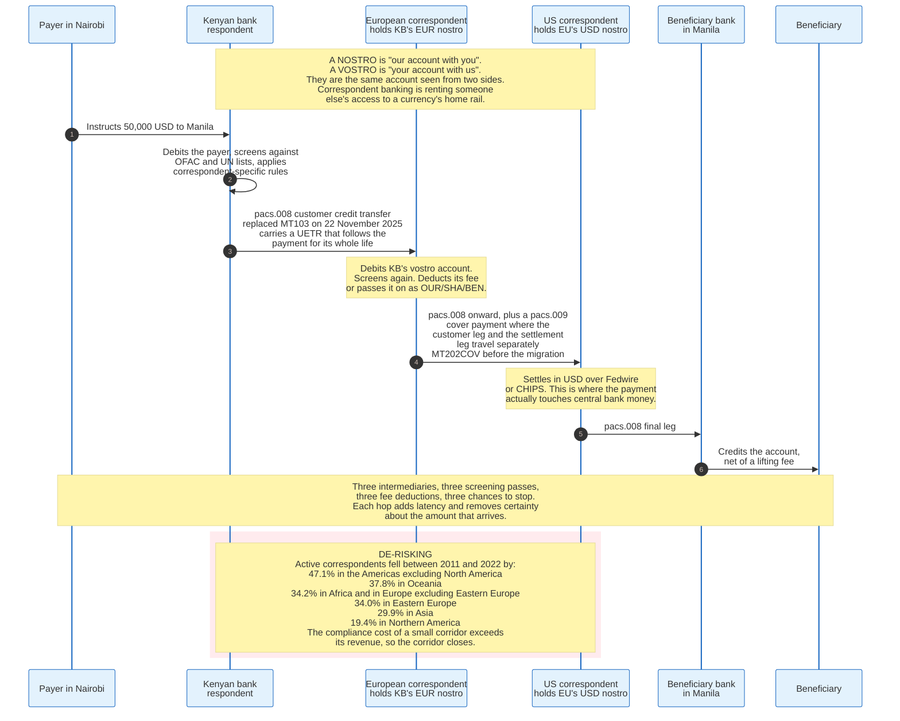
```mermaid
%%{init: {'theme': 'base', 'themeVariables': {'primaryColor': '#e3f2fd', 'primaryBorderColor': '#1565c0', 'lineColor': '#37474f'}}}%%

sequenceDiagram
    autonumber
    participant P as Payer in Nairobi
    participant KB as Kenyan bank<br/>respondent
    participant EU as European correspondent<br/>holds KB's EUR nostro
    participant US as US correspondent<br/>holds EU's USD nostro
    participant BB as Beneficiary bank<br/>in Manila
    participant Ben as Beneficiary

    Note over KB,US: A NOSTRO is "our account with you".<br/>A VOSTRO is "your account with us".<br/>They are the same account seen from two sides.<br/>Correspondent banking is renting someone<br/>else's access to a currency's home rail.

    P->>KB: Instructs 50,000 USD to Manila
    KB->>KB: Debits the payer, screens against<br/>OFAC and UN lists, applies<br/>correspondent-specific rules

    KB->>EU: pacs.008 customer credit transfer<br/>replaced MT103 on 22 November 2025<br/>carries a UETR that follows the<br/>payment for its whole life
    Note over EU: Debits KB's vostro account.<br/>Screens again. Deducts its fee<br/>or passes it on as OUR/SHA/BEN.

    EU->>US: pacs.008 onward, plus a pacs.009<br/>cover payment where the<br/>customer leg and the settlement<br/>leg travel separately<br/>MT202COV before the migration
    Note over US: Settles in USD over Fedwire<br/>or CHIPS. This is where the payment<br/>actually touches central bank money.

    US->>BB: pacs.008 final leg
    BB->>Ben: Credits the account,<br/>net of a lifting fee

    Note over P,Ben: Three intermediaries, three screening passes,<br/>three fee deductions, three chances to stop.<br/>Each hop adds latency and removes certainty<br/>about the amount that arrives.

    rect rgb(255, 235, 238)
    Note over KB,US: DE-RISKING<br/>Active correspondents fell between 2011 and 2022 by:<br/>47.1% in the Americas excluding North America<br/>37.8% in Oceania<br/>34.2% in Africa and in Europe excluding Eastern Europe<br/>34.0% in Eastern Europe<br/>29.9% in Asia<br/>19.4% in Northern America<br/>The compliance cost of a small corridor exceeds<br/>its revenue, so the corridor closes.
    end
```

### 16.1 Nostro and Vostro

A correspondent relationship is a pair of account entries, and the two Latin terms describe the same account from opposite sides.

A **nostro** account is "our account with you": the account a Kenyan bank holds in US dollars at a New York bank. On the Kenyan bank's books it is an asset denominated in a foreign currency. A **vostro** account is "your account with us": the same account, on the New York bank's books, where it is a liability denominated in its home currency.

The Kenyan bank cannot settle dollars on Fedwire or CHIPS, because it has no Federal Reserve master account and is not a CHIPS participant. It rents access. Its dollar balance is a deposit at a US bank, and every dollar payment it makes is an instruction to that US bank to move money on its behalf.

That structure has three consequences. The respondent bank's dollar liquidity is a deposit at a commercial bank, not central bank money, and therefore carries counterparty risk. The correspondent must perform AML and sanctions screening on payments whose underlying customers it has never met. And the correspondent can end the relationship, at which point the respondent loses access to the dollar.

### 16.2 The Message Chain

A cross-border payment traverses multiple institutions, each of which reprocesses it. The messages changed formats in November 2025.

The SWIFT MT to ISO 20022 migration for cross-border payments began coexistence in March 2023 and ended on 22 November 2025, retiring the MT category 1 and 2 payment messages. The mapping is direct: MT103, the single customer credit transfer, became `pacs.008`. MT202, the general financial institution transfer, became `pacs.009`. MT202COV, the cover payment that accompanies a customer transfer travelling by a different route, became the `pacs.009 COV` variant. MT910 and MT900 confirmations became `camt.054`.

Domestic rails moved on their own schedules. CHIPS migrated to ISO 20022 in April 2024. The Fedwire Funds Service completed a single-day cutover on 14 July 2025.

The unique end-to-end transaction reference, or UETR, is the identifier that ties the chain together. Introduced with SWIFT gpi and mandatory on customer payment messages since November 2018, it is a 128-bit UUID that stays with the payment through every intermediary, which is what makes end-to-end tracking possible for the first time in the network's history.

The cost of the chain is structural. Each intermediary screens the payment against its own sanctions lists, applies its own rules, and deducts its own fee. Three hops means three screening passes, three fee deductions, and three points at which the payment can stop. Whether the beneficiary receives the full amount depends on the charge instruction, OUR, SHA, or BEN, which determines who bears the intermediary fees.

### 16.3 De-Risking

The number of active correspondent relationships has fallen for more than a decade, and the decline is concentrated in exactly the places that can least afford it. The CPMI publishes the data from SWIFT messaging, and the cumulative change in active correspondents between 2011 and 2022 is unambiguous.

| Region | Change in active correspondents, 2011 to 2022 |
|--------|----------------------------------------------:|
| Americas excluding North America | -47.1% |
| Oceania | -37.8% |
| Africa | -34.2% |
| Europe excluding Eastern Europe | -34.2% |
| Eastern Europe | -34.0% |
| Asia | -29.9% |
| Northern America | -19.4% |

The mechanism is arithmetic, not malice. The compliance cost of maintaining a relationship with a small bank in a jurisdiction with weak AML supervision is fixed and substantial: enhanced due diligence under Section 312 of the USA PATRIOT Act, ongoing transaction monitoring, periodic reviews, and the tail risk of an enforcement action measured in hundreds of millions of dollars. The revenue from a corridor carrying a few hundred payments a month does not cover it. So the correspondent exits.

The result is that entire countries lose the ability to move dollars, remittance corridors close or move to informal channels, and the cost of the remaining routes rises. The World Bank, IMF, and FATF have all criticised de-risking as an unintended consequence of AML enforcement, and the FSB has run a correspondent banking coordination group since 2015. The trend has slowed. It has not reversed.

The dollar's share of the value of transfers carried in SWIFT messages was 50.9 percent as of December 2022, against 27.3 percent for the euro and 4.3 percent for sterling. That concentration is why access to a US correspondent is not one option among many.

---

## 17. Regulation, Supervision, and the Tiering Problem

Bank regulation is a set of rules. Bank supervision is a set of humans reading a bank's files and deciding whether to escalate. The 2023 failures were a supervision problem, not a rules problem, and the distinction is the most important one in this section.

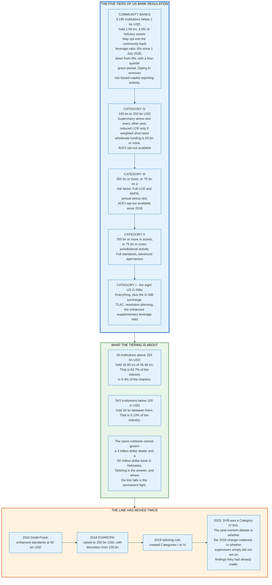
```mermaid
%%{init: {'theme': 'base', 'themeVariables': {'primaryColor': '#e3f2fd', 'primaryBorderColor': '#1565c0', 'lineColor': '#37474f'}}}%%

flowchart TB
    subgraph Tiers["THE FIVE TIERS OF US BANK REGULATION"]
        direction TB
        T5["COMMUNITY BANKS<br/>3,190 institutions below 1 bn USD<br/>hold 1.06 trn, 4.0% of industry assets<br/>May opt into the community bank<br/>leverage ratio: 8% since 1 July 2026,<br/>down from 9%, with a four-quarter<br/>grace period. Opting in removes<br/>risk-based capital reporting entirely."]
        T4["CATEGORY IV<br/>100 bn to 250 bn USD<br/>Supervisory stress test every other year,<br/>reduced LCR only if weighted short-term<br/>wholesale funding is 50 bn or more,<br/>AOCI opt-out available"]
        T3["CATEGORY III<br/>250 bn or more, or 75 bn on a<br/>risk factor. Full LCR and NSFR,<br/>annual stress test,<br/>AOCI opt-out available since 2019"]
        T2["CATEGORY II<br/>700 bn or more in assets,<br/>or 75 bn in cross-jurisdictional activity.<br/>Full standards, advanced approaches"]
        T1["CATEGORY I - the eight US G-SIBs<br/>Everything, plus the G-SIB surcharge,<br/>TLAC, resolution planning,<br/>the enhanced supplementary leverage ratio"]
        T5 --> T4 --> T3 --> T2 --> T1
    end

    subgraph Scale["WHAT THE TIERING IS ABOUT"]
        S1["18 institutions above 250 bn USD<br/>hold 16.85 trn of 26.46 trn.<br/>That is 63.7% of the industry<br/>in 0.4% of the charters."]
        S2["543 institutions below 100 m USD<br/>hold 34 bn between them.<br/>That is 0.13% of the industry."]
        S3["The same rulebook cannot govern<br/>a 3 trillion dollar dealer and a<br/>60 million dollar bank in Nebraska.<br/>Tailoring is the answer, and where<br/>the line falls is the permanent fight."]
    end

    subgraph History["THE LINE HAS MOVED TWICE"]
        H1["2010 Dodd-Frank:<br/>enhanced standards at 50 bn USD"]
        H2["2018 EGRRCPA:<br/>raised to 250 bn USD, with<br/>discretion from 100 bn"]
        H3["2019 tailoring rule:<br/>created Categories I to IV"]
        H4["2023: SVB was a Category IV firm.<br/>The post-mortem debate is whether<br/>the 2018 change mattered, or whether<br/>supervisors simply did not act on<br/>findings they had already made."]
        H1 --> H2 --> H3 --> H4
    end

    Tiers --> Scale
    Scale --> History

    style Tiers fill:#e3f2fd,stroke:#1565c0,stroke-width:3px
    style Scale fill:#e8f5e9,stroke:#2e7d32,stroke-width:2px
    style History fill:#fff3e0,stroke:#e65100,stroke-width:2px
```

### 17.1 The Rules

| Framework | Citation | What it does |
|-----------|----------|--------------|
| Capital adequacy | 12 CFR 217 (Fed, Regulation Q), 12 CFR 3 (OCC), 12 CFR 324 (FDIC) | CET1, tier 1, total capital, leverage, risk weights, buffers |
| Liquidity | 12 CFR 249 (Regulation WW) | LCR and NSFR |
| Enhanced prudential standards | 12 CFR 252 (Regulation YY) | Stress testing, risk committees, single-counterparty limits, resolution planning |
| Discount window | 12 CFR 201 (Regulation A) | Primary, secondary, seasonal credit |
| Reserve requirements | 12 CFR 204 (Regulation D) | Zero since 26 March 2020 |
| Affiliate transactions | 12 CFR 223 (Regulation W) | Sections 23A and 23B limits |
| Debit interchange | 12 CFR 235 (Regulation II) | 21 cents plus 5 bps plus 1 cent |
| Prompt corrective action | 12 U.S.C. 1831o | Mandatory supervisory action by capital category |
| Credit loss accounting | FASB ASC 326 (ASU 2016-13) | CECL |
| Bank Secrecy Act | 31 CFR Chapter X | AML program, SARs, CTRs |

### 17.2 The Tiering Problem

The same rulebook cannot govern a 3 trillion dollar dealer and a 60 million dollar bank in Nebraska, and the asset distribution shows why.

| Asset size | Institutions | Total assets | Share of industry assets |
|------------|-------------:|-------------:|-------------------------:|
| Under 100 m USD | 543 | 34.0 bn USD | 0.13% |
| 100 m to 1 bn USD | 2,647 | 1,024.0 bn USD | 3.87% |
| 1 bn to 10 bn USD | 890 | 2,480.2 bn USD | 9.37% |
| 10 bn to 250 bn USD | 140 | 6,071.0 bn USD | 22.94% |
| Over 250 bn USD | 18 | 16,853.0 bn USD | 63.69% |
| **All** | **4,238** | **26,462.2 bn USD** | **100%** |

Eighteen institutions hold 63.7 percent of the assets in 0.4 percent of the charters. Five hundred and forty-three institutions hold 0.13 percent between them.

The line has moved twice. The Dodd-Frank Act in 2010 applied enhanced prudential standards at 50 billion dollars in assets. The Economic Growth, Regulatory Relief, and Consumer Protection Act of 2018 raised the automatic threshold to 250 billion, with discretion for the Federal Reserve to apply standards from 100 billion. The 2019 tailoring rule then created Categories I through IV, mapping requirements to size, cross-jurisdictional activity, short-term wholesale funding, non-bank assets, and off-balance-sheet exposure.

Silicon Valley Bank was a Category IV firm when it failed. Whether the 2018 change was causal is contested. What is not contested is that supervisors had issued findings on SVB's liquidity, governance, and interest rate risk modelling and had not forced remediation. The Federal Reserve's own review says so.

### 17.3 Supervision: CAMELS and the Escalation Ladder

Supervisory ratings are the mechanism by which findings become consequences, and the ladder is short.

CAMELS is the composite rating assigned to a bank on six components: capital adequacy, asset quality, management, earnings, liquidity, and sensitivity to market risk. Each is rated 1 to 5, as is the composite. A composite of 1 or 2 is satisfactory. A 3 is a bank under pressure. A 4 or 5 puts the bank on the FDIC's Problem Bank List, which held 47 institutions at the end of June 2026, or 1.1 percent of charters, within what the FDIC describes as the normal range of 1 to 2 percent for non-crisis periods.

Findings escalate through a defined sequence: a Matter Requiring Attention, then a Matter Requiring Immediate Attention, then a formal enforcement action, which may be a memorandum of understanding, a written agreement, a consent order, or a cease-and-desist order. Prompt corrective action under 12 U.S.C. 1831o then imposes mandatory restrictions once capital falls through defined thresholds, ending in receivership for a critically undercapitalised institution.

Firms above 100 billion dollars are additionally rated under the Large Financial Institution rating system on capital planning and positions, liquidity risk management and positions, and governance and controls. A firm must be rated at least Conditionally Meets Expectations on all three to be considered well managed.

### 17.4 Basel and Where It Stands

Basel III finalisation, published by the Basel Committee in December 2017 as BCBS d424, is the international standard the US has not yet implemented.

Its main components are a revised standardised approach for credit risk with greater risk sensitivity, constraints on internal model use including the removal of the advanced internal ratings-based approach for some exposure classes, a single revised standardised measurement approach for operational risk, a leverage ratio buffer for G-SIBs calibrated at 50 percent of each firm's higher-loss-absorbency requirement, and an output floor.

The output floor is the piece with the most force. It requires that a bank's total risk-weighted assets computed using internal models be at least 72.5 percent of what the standardised approaches would produce. The Committee's original calibration phased it in from 50 percent on 1 January 2022 to 72.5 percent on 1 January 2027, and jurisdictions have implemented on later schedules of their own.

Implementation as of 30 September 2025, per the Basel Committee's own reporting: the revised credit risk and operational risk standards are in force in roughly 80 percent of member jurisdictions, the CVA standard in nearly 70 percent, and the market risk standards in nearly 40 percent.

The United States is not among them. The agencies proposed an implementation in July 2023, re-proposed elements of it, and on 19 March 2026 issued a new set of three proposals to modernise the capital framework: one for Category I and II banks that would collapse the current dual calculation into a single set of calculations and implement the final Basel III components, one for most other banks realigning capital requirements for traditional lending and modifying the treatment of mortgage servicing and origination, and one from the Federal Reserve alone revising how systemic risk is measured for the G-SIB surcharge. The agencies stated that overall capital in the banking system "would modestly decrease." Comments closed on 18 June 2026. No final rule as of August 2026.

The second proposal contains the provision that matters most for Section 10: it would require certain large banks, with a transition period, to reflect unrealised gains and losses on securities in regulatory capital. That is the direct legislative answer to SVB, three years later, and it is still a proposal.

---

## 18. Economics: What It Costs to Run a Bank

A bank's economics are a leverage story with a fixed-cost problem attached. Return on assets is low and stable. Return on equity is what shareholders see, and it exists only because assets are ten times equity.

### 18.1 The Two Return Numbers

Return on assets across US banks was 1.37 percent in the second quarter of 2026 and return on equity was 13.76 percent. The relationship between them is the leverage multiplier: 1.37 times roughly 10 equals 13.7.

That is the whole business model expressed in one multiplication. A bank earns a little over a penny per dollar of assets and turns it into fourteen cents per dollar of equity by holding ten dollars of assets for every dollar of equity. Reducing leverage reduces ROE proportionally, which is why every capital increase is contested and why the industry's arguments against higher requirements are arguments about the denominator rather than about safety.

Return on assets by year: 1.23 percent in 2021, 1.11 percent in 2022, 1.09 percent in 2023, 1.12 percent in 2024, 1.20 percent in 2025, and 1.32 percent annualised in the first half of 2026. The number is remarkably stable across rate cycles and credit cycles. Return on equity over the same period ranged from 11.35 percent to 13.11 percent.

### 18.2 Where the Money Comes From and Goes

For the US industry in the second quarter of 2026, in billions of dollars:

| Line | Amount |
|------|-------:|
| Total interest income | 318.4 |
| Less total interest expense | (121.0) |
| **Net interest income** | **197.4** |
| Plus noninterest income | 96.1 |
| **Net operating revenue** | **293.5** |
| Less noninterest expense | (164.3) |
| Less provision for credit losses | (19.3) |
| Plus securities gains | 5.5 |
| Less income taxes | (25.2) |
| **Net income** | **90.1** |

Two-thirds of revenue is spread. Fifty-six percent of revenue goes to operating costs. Provisions consume 6.6 percent. Taxes take 8.6 percent. What is left is 30.7 percent of revenue, which on 26.5 trillion dollars of assets is 1.37 percent annualised.

Cash dividends in the first half of 2026 were 152.5 billion dollars against net income of 170.6 billion, a payout ratio of 89 percent, leaving 18.1 billion of retained earnings. That is a mature industry returning nearly all of its earnings, which is also why capital ratios fall when assets grow: the second quarter of 2026 saw the tier 1 risk-based capital ratio decline 17 basis points to 13.75 percent and the leverage ratio decline 17 basis points to 8.98 percent, purely because assets grew faster than capital accreted.

### 18.3 The Fixed-Cost Problem

Scale economies in banking are severe and they are the reason the charter count keeps falling. The cost of a compliance function, a BSA program, a cybersecurity capability, a core banking contract, and a mobile app does not scale with assets. It scales with the existence of the bank.

Look at noninterest expense to assets by size in the second quarter of 2026: 4.14 percent at banks under 100 million dollars, 3.23 percent between 100 million and 1 billion, 2.78 percent between 1 and 10 billion, 2.98 percent between 10 and 250 billion, and 2.24 percent above 250 billion. The smallest banks spend nearly twice as much per dollar of assets as the largest.

They compensate with a wider margin, 3.99 percent against 2.94 percent, and they end up at a similar return on assets: 1.10 percent for the smallest against 1.33 percent for the largest. But the smallest banks earn 7.68 percent on equity against 14.24 percent at the largest, because they hold more equity per dollar of assets and cannot lever the thinner result.

That gap is the consolidation engine. A 60 million dollar bank earning 7.7 percent on equity, facing a core system upgrade and a cybersecurity investment, sells.

### 18.4 Who Pays for Deposit Insurance

Deposit insurance is funded by the banks, and the arithmetic is set by a statutory target. The Deposit Insurance Fund held 161.1 billion dollars at 30 June 2026 with a reserve ratio of 1.48 percent, up 5 basis points in the quarter. The reserve ratio is the fund balance divided by estimated insured deposits, and the Federal Deposit Insurance Act sets a statutory minimum designated reserve ratio of 1.35 percent, and the FDIC's Board sets the actual target above it.

Assessments are risk-based. A bank's rate depends on its capital, its supervisory rating, and a set of financial ratios, so a well-rated, well-capitalised bank pays materially less per dollar of assets than a problem bank. Large institutions above 10 billion dollars are scored under a separate methodology.

The 2023 failures produced a special assessment on the industry to recover the cost of the systemic risk determination that protected uninsured depositors at Silicon Valley Bank and Signature Bank. The assessment was allocated primarily to large banks based on their own uninsured deposits, on the reasoning that those banks were the principal beneficiaries of the decision.

---

## 19. Comparisons and Alternatives

Several institutions perform parts of what a bank does, and the differences are instructive because each alternative drops one of the three transformations.

| Institution | Takes demandable deposits | Makes loans | Insured | Access to central bank | Capital requirement |
|-------------|:---:|:---:|:---:|:---:|---|
| **Commercial bank** | Yes | Yes | FDIC, 250k | Discount window, master account | CET1, leverage, LCR, NSFR |
| **Credit union** | Yes | Yes | NCUA, 250k | Yes, via the Fed | Net worth ratio, risk-based |
| **Savings institution** | Yes | Yes, mortgage-weighted | FDIC, 250k | Yes | Same as banks |
| **Industrial loan company** | Yes | Yes | FDIC, 250k | Yes | Bank rules, but the parent escapes Fed supervision |
| **Money market fund** | Shares, not deposits | No, buys securities | No | No | None; SEC liquidity and maturity rules |
| **Narrow bank proposal** | Yes | No | Would be | Would need a master account | Trivially safe, no credit provision |
| **Neobank / fintech** | No, passes through | Sometimes, via a partner | Via the partner bank | No | None of its own |
| **Private credit fund** | No, locked capital | Yes | No | No | None; leverage set by lenders |
| **Stablecoin issuer** | Redeemable tokens | No, holds reserves | No | No | Reserve composition rules |

### 19.1 What Each Alternative Drops

**Money market funds drop credit and maturity transformation.** They hold short-dated, high-quality paper and pass through the return. They are genuinely safer than banks and they still ran in 2008 and in March 2020, because a floating claim on a portfolio that everyone wants to exit at once is still runnable. Government money market funds held 6,375 billion dollars at the end of 2025 and grew 13.1 percent over the year.

**Narrow banks drop lending entirely.** A narrow bank takes deposits and holds only reserves at the central bank. It cannot fail. It also provides no credit to the economy, and the Federal Reserve has resisted granting master accounts to institutions with this model, on the argument that it would draw deposits away from lending banks and complicate monetary policy implementation.

**Neobanks drop the balance sheet.** Most consumer fintech products marketed as bank accounts are pass-through arrangements in which a licensed partner bank holds the money and the fintech provides the interface. The consumer's insurance runs to the partner bank, and it depends on the fintech's ledger being accurate enough to identify who owns what. The Synapse failure in 2024 demonstrated what happens when it is not.

**Private credit funds drop demandable funding.** They make the same loans banks make, funded by committed capital with lock-ups instead of deposits. That removes the run risk and the deposit insurance subsidy in one move. It also removes the cheap funding, which is why private credit charges more. Loans from banks to nondepository financial institutions grew 22.4 percent in the year to June 2026 to reach a total that makes the boundary between the two sectors substantially less clean than the comparison suggests.

**Stablecoin issuers drop lending and keep the payment function.** A fully reserved stablecoin is close to a narrow bank in token form. The Federal Reserve's May 2026 Financial Stability Report notes that "stablecoin growth moderated in recent months" and counts stablecoins among runnable money-like liabilities.

### 19.2 When You Would Choose Each

A depositor who wants a payment account, insurance, and a relationship uses a bank. A treasurer with 400 million dollars who wants the money safe rather than insured uses a government money market fund, because 250,000 dollars of coverage is irrelevant at that size and a fund holding Treasuries is a better claim than an unsecured deposit. A borrower who cannot meet bank underwriting standards, or who wants speed and structural flexibility more than price, uses private credit. A consumer who wants a better interface uses a neobank and, whether they know it or not, uses a bank underneath it.

The bank's genuine advantage is that it is the only one of these that can create a deposit. Everything else has to find the money first.

---

## 20. Modern Developments

### 20.1 The Capital Framework Is Being Rewritten Downward

The direction of US capital regulation reversed between 2023 and 2026. The July 2023 Basel III endgame proposal would have raised capital requirements for the largest banks substantially. The 19 March 2026 proposals state that "the amount of overall capital in the banking system would modestly decrease."

Two of the specific changes are already law and one is not. The enhanced supplementary leverage ratio was finalised on 1 December 2025 and took effect on 1 April 2026: the fixed 5 percent standard at G-SIB holding companies and the 6 percent well-capitalised threshold at their depository subsidiaries became a leverage buffer set at half of each firm's method 1 G-SIB surcharge, capped at 1 percentage point at the depository institutions. The agencies estimate the recalibration cuts the supplementary leverage requirement by 23 percent on average at the holding companies and 37 percent at the major covered depository institutions. The community bank leverage ratio fell from 9 percent to 8 percent effective 1 July 2026, with the grace period for temporary non-compliance extended from two quarters to four. The March 2026 proposals would rework risk weights for traditional lending and for mortgage servicing, and they are still proposals.

Running the other direction, the same proposals would require certain large banks to reflect unrealised securities gains and losses in regulatory capital, closing the gap that hid SVB's position.

### 20.2 Stress Testing Is Being Rebuilt

The Federal Reserve is reworking the models that set the stress capital buffer, and it has frozen requirements while it does. The Board proposed on 17 April 2025 to average stress test results over two consecutive years to reduce volatility in capital requirements. On 4 February 2026 it voted to maintain the stress capital buffer requirements in effect since 1 October 2025 until 2027, "when new requirements can be calculated based on models that take public feedback into consideration."

The 2026 stress test, published on 24 June 2026, tested 32 banks against a severely adverse scenario with a 39 percent decline in commercial real estate prices, a 30 percent decline in house prices, and unemployment peaking at 10 percent. Aggregate CET1 fell 1.6 percentage points and all 32 banks stayed above their minimum requirements. Total projected losses were nearly 708 billion dollars: 203.0 billion on credit cards, 158.2 billion on commercial and industrial loans, and 76.5 billion on commercial real estate.

The result did not change any bank's capital requirement, by design.

### 20.3 Payment Rails Finished Their Format Migration

The largest technical change to bank payment infrastructure in decades completed in 2025. CHIPS migrated to ISO 20022 in April 2024. The Fedwire Funds Service completed a single-day cutover on 14 July 2025. SWIFT's cross-border MT coexistence period ended on 22 November 2025.

The practical effect is structured party data instead of free-text address lines, which improves sanctions screening precision, reduces false positives, and makes straight-through processing achievable on the receiving side. The Federal Reserve has scheduled a further Fedwire Funds release, moved from November 2026 to November 2027.

### 20.4 Bank Lending to the Financial Sector Is the Growth Story

The fastest-growing categories on bank balance sheets are not loans to households or operating companies. In the year to June 2026, loans to nondepository financial institutions grew 279.1 billion dollars, or 22.4 percent, and loans to purchase or carry securities including margin loans grew 131.3 billion dollars, or 29.7 percent. Total loan growth was 6.8 percent.

The banking system is increasingly financing the non-bank financial system rather than lending directly. That transfers the credit decision to the fund and leaves the bank with a secured claim on a portfolio it did not underwrite. The Federal Reserve's May 2026 Financial Stability Report notes that some private credit vehicles faced increased redemption requests and that most exercised their right to limit redemptions.

### 20.5 Deregulatory Motion Across the Board

Beyond capital, a series of 2025 and 2026 actions have narrowed the supervisory perimeter. The agencies removed references to reputation risk from supervisory materials in 2025 and proposed codifying that removal in February 2026. The Federal Reserve proposed amendments to anti-money-laundering program requirements on 7 July 2026, proposed modernising rules for mutual banking organisations and for extensions of credit to insiders on 31 July 2026, and joined a proposal to rescind the 2023 Community Reinvestment Act rule in July 2025.

### 20.6 What Has Not Been Fixed

Three problems identified in 2023 remain open as of August 2026.

**Discount window stigma.** Unresolved. Primary credit outstanding averaged 5.3 billion dollars in the week to 26 August 2026, against a peak of 152.9 billion in March 2023 and secondary credit of exactly zero at the height of that stress.

**The speed of modern runs.** The LCR's outflow assumptions were calibrated on a 30-day horizon. SVB's run happened in 24 hours. No rule change has adjusted the horizon, and the Federal Reserve's SVB review recommended re-evaluating the stability of uninsured deposits in both bank and supervisory liquidity models.

**Held-to-maturity accounting.** 216.9 billion dollars of unrealised losses sit in the bucket that does not appear on any balance sheet. The proposal to bring securities gains and losses into regulatory capital for certain large banks has not been finalised.

---

## 21. Appendix

### 21.1 Key Terminology

| Term | Definition |
|------|------------|
| **Allowance for credit losses (ACL)** | Contra-asset reducing the carrying value of loans, sized under CECL at lifetime expected loss |
| **AOCI** | Accumulated other comprehensive income; where unrealised gains and losses on AFS securities sit |
| **AFS** | Available for sale; securities marked to market through AOCI rather than earnings |
| **ASF** | Available stable funding; the NSFR numerator, liabilities weighted by expected persistence |
| **AT1** | Additional tier 1 capital; perpetual preferred and contingent convertibles |
| **Basel III endgame** | The December 2017 finalisation of Basel III, BCBS d424, not yet implemented in the US |
| **BTFP** | Bank Term Funding Program; the March 2023 facility lending at par against underwater collateral |
| **CAMELS** | Supervisory rating on capital, assets, management, earnings, liquidity, sensitivity to market risk |
| **CBLR** | Community bank leverage ratio; an opt-in single-ratio regime, 8% from 1 July 2026 |
| **CECL** | Current expected credit loss; ASC 326, lifetime expected loss recognised at origination |
| **CET1** | Common equity tier 1; the highest-quality regulatory capital |
| **Charge-off** | Removal of an uncollectible loan against the allowance; no income statement effect |
| **Correspondent bank** | A bank providing another bank with access to a currency or rail it cannot reach directly |
| **Deposit beta** | The share of a policy rate change that passes into deposit rates |
| **Duration** | Percentage change in value per one percentage point change in yield |
| **Duration gap** | Asset duration minus liability duration scaled by the liability share of the balance sheet |
| **eSLR** | Enhanced supplementary leverage ratio; since 1 April 2026 a leverage buffer of half the firm's method 1 G-SIB surcharge, capped at 1% at depository subsidiaries, replacing the fixed 5% and 6% standards |
| **FHLB** | Federal Home Loan Bank; collateralised funding with a statutory super-lien |
| **G-SIB surcharge** | Additional CET1 required of global systemically important banks, minimum 1.0% |
| **HQLA** | High-quality liquid assets; the LCR numerator, in Levels 1, 2A and 2B |
| **HTM** | Held to maturity; securities carried at amortised cost, with a tainting rule on sale |
| **HVCRE** | High-volatility commercial real estate; 150% risk weight |
| **IORB** | Interest on reserve balances; the administered rate paid on reserves |
| **LCR** | Liquidity coverage ratio; HQLA over 30-day net cash outflow, minimum 100% |
| **Leverage ratio** | Tier 1 capital over average total consolidated assets, unweighted, minimum 4% |
| **MRA / MRIA** | Matter Requiring Attention / Immediate Attention; supervisory findings |
| **MSR** | Mortgage servicing right; an asset whose value rises when rates rise |
| **NIM** | Net interest margin; net interest income over average earning assets |
| **Noncurrent loans** | 90 or more days past due, or in nonaccrual status |
| **Nostro / vostro** | The same correspondent account seen from the respondent's and the correspondent's books |
| **NSFR** | Net stable funding ratio; ASF over RSF, minimum 100% |
| **Operational deposit** | A wholesale deposit tied to a clearing, custody or cash management service; 25% LCR outflow |
| **PCA** | Prompt corrective action; mandatory supervisory measures by capital category, 12 U.S.C. 1831o |
| **Provision** | Income statement expense that adds to the allowance |
| **Reserve ratio (DIF)** | Deposit Insurance Fund balance over estimated insured deposits; 1.48% at 30 June 2026 |
| **RSF** | Required stable funding; the NSFR denominator, assets weighted by illiquidity |
| **RWA** | Risk-weighted assets; the denominator of every risk-based capital ratio |
| **SCB** | Stress capital buffer; set annually from the supervisory stress test, floor 2.5% |
| **SLR** | Supplementary leverage ratio; tier 1 over a Basel exposure measure, minimum 3% |
| **Stable retail deposit** | Insured retail deposit with an established relationship; 3% LCR outflow, 95% NSFR ASF |
| **Tainting** | Reclassification of an entire HTM portfolio to AFS triggered by selling part of it |
| **Tier 2** | Subordinated debt with at least five years to maturity; absorbs losses only in liquidation |
| **UETR** | Unique end-to-end transaction reference; the UUID that follows a cross-border payment |

### 21.2 Diagram Index

| Diagram | Source | What it shows |
|---------|--------|---------------|
| Bank Balance Sheet | [`diagrams/bank-balance-sheet.mmd`](diagrams/bank-balance-sheet.mmd) | The whole object: assets, liabilities, equity, and what sits off it |
| Money Multiplier vs Reality | [`diagrams/money-multiplier-vs-reality.mmd`](diagrams/money-multiplier-vs-reality.mmd) | The textbook story, the actual mechanism, and the evidence separating them |
| Loans Create Deposits | [`diagrams/loans-create-deposits.mmd`](diagrams/loans-create-deposits.mmd) | A 400,000 dollar mortgage through the ledger, origination to settlement |
| Participants | [`diagrams/participants.mmd`](diagrams/participants.mmd) | Chartering, supervision, funding sources, and payment rails |
| Capital Stack | [`diagrams/capital-stack.mmd`](diagrams/capital-stack.mmd) | CET1, AT1, tier 2, and the requirement stack from 4.5% upward |
| Risk-Weighted Assets | [`diagrams/risk-weighted-assets.mmd`](diagrams/risk-weighted-assets.mmd) | Exposure by exposure, from 10,000 of assets to 6,785 of RWA |
| Capital vs Liquidity | [`diagrams/capital-vs-liquidity.mmd`](diagrams/capital-vs-liquidity.mmd) | Two constraints, two sides of the sheet, two timescales |
| LCR Mechanics | [`diagrams/lcr-mechanics.mmd`](diagrams/lcr-mechanics.mmd) | HQLA levels and caps against the full 30-day outflow table |
| NSFR Mechanics | [`diagrams/nsfr-mechanics.mmd`](diagrams/nsfr-mechanics.mmd) | ASF and RSF factors and what the one-year rule enforces |
| Net Interest Margin | [`diagrams/net-interest-margin.mmd`](diagrams/net-interest-margin.mmd) | Yield minus cost of funding, by size and across the rate cycle |
| Maturity Transformation | [`diagrams/maturity-transformation.mmd`](diagrams/maturity-transformation.mmd) | The duration gap and the three places the same risk appears |
| AOCI and HTM | [`diagrams/aoci-and-htm.mmd`](diagrams/aoci-and-htm.mmd) | How classification decides whether a loss is visible |
| SVB Timeline | [`diagrams/svb-timeline.mmd`](diagrams/svb-timeline.mmd) | 2019 to 10 March 2023, with the peer comparison at each stage |
| Run Dynamics | [`diagrams/run-dynamics.mmd`](diagrams/run-dynamics.mmd) | The dominant strategy, what accelerated it, and what slows it |
| Deposit Stickiness | [`diagrams/deposit-stickiness.mmd`](diagrams/deposit-stickiness.mmd) | The funding ladder from 3% to 100% outflow, and deposit beta |
| Discount Window | [`diagrams/discount-window.mmd`](diagrams/discount-window.mmd) | Three programs, collateral mechanics, and the stigma loop |
| Loan Lifecycle and CECL | [`diagrams/loan-lifecycle-cecl.mmd`](diagrams/loan-lifecycle-cecl.mmd) | Application to charge-off, with CECL against the incurred loss model |
| Revenue Lines | [`diagrams/revenue-lines.mmd`](diagrams/revenue-lines.mmd) | The 96.1 billion of noninterest income broken into its lines |
| Correspondent Banking | [`diagrams/correspondent-banking.mmd`](diagrams/correspondent-banking.mmd) | A dollar payment through three intermediaries, and de-risking |
| Regulatory Tiers | [`diagrams/regulatory-tiers.mmd`](diagrams/regulatory-tiers.mmd) | Categories I to IV, the CBLR, and where the threshold has moved |

### 21.3 The Worked Bank in One Table

Meridian National Bank, all figures in USD millions unless stated.

| Item | Value |
|------|------:|
| Total assets | 10,000 |
| Gross loans | 6,500 |
| Securities, AFS | 1,200 |
| Securities, HTM | 1,350 |
| Reserves at the Fed | 450 |
| Earning assets | 9,500 |
| Total deposits | 8,400 |
| Noninterest-bearing deposits | 1,700 |
| Total equity | 800 |
| Goodwill and intangibles | 120 |
| **CET1 capital** | **680** |
| **Risk-weighted assets** | **6,785** |
| **CET1 ratio** | **10.02%** |
| **Leverage ratio** | **6.88%** |
| HQLA | 1,575 |
| 30-day net cash outflow | 1,224 |
| **LCR** | **129%** |
| Total interest income | 507.3 |
| Total interest expense | 191.5 |
| **Net interest income** | **315.8** |
| **Net interest margin** | **3.32%** |
| Allowance for credit losses | 85 |
| Allowance as % of gross loans | 1.31% |
| Asset duration | ~3.4 years |
| Liability duration | ~0.9 years |
| **Duration gap** | **2.57 years** |
| Loss on securities from a 400 bp rate rise | 551, or 81% of CET1 |
| CET1 ratio if the AFS book is liquidated | 6.84% |

### 21.4 US Regulatory Reference

| Requirement | Threshold | Citation |
|-------------|-----------|----------|
| Minimum CET1 ratio | 4.5% of RWA | 12 CFR 217.10 |
| Minimum tier 1 ratio | 6.0% of RWA | 12 CFR 217.10 |
| Minimum total capital ratio | 8.0% of RWA | 12 CFR 217.10 |
| Minimum leverage ratio | 4.0% of average assets | 12 CFR 217.10 |
| Supplementary leverage ratio | 3.0% | 12 CFR 217.10 |
| Enhanced SLR leverage buffer, G-SIB holding company | 50% of the firm's method 1 G-SIB surcharge, above the 3.0% SLR minimum, from 1 April 2026 | 12 CFR 217.11 |
| Enhanced SLR leverage buffer, covered depository institution | 50% of the parent's method 1 surcharge, capped at 1.0%, above the 3.0% SLR minimum, from 1 April 2026 | 12 CFR 3, 12 CFR 324 |
| Stress capital buffer floor | 2.5% | 12 CFR 225.8 |
| G-SIB surcharge floor | 1.0% | 12 CFR 217 subpart H |
| Community bank leverage ratio | 8.0% from 1 July 2026 | 12 CFR 217.12 |
| LCR minimum | 100% | 12 CFR 249 subpart B |
| NSFR minimum | 100% | 12 CFR 249 subpart K |
| Reserve requirement | 0% | 12 CFR 204 |
| Deposit insurance limit | 250,000 USD per depositor, per bank, per ownership category | 12 U.S.C. 1821 |
| Debit interchange cap | 21 cents + 5 bps + 1 cent | 12 CFR 235.3, 235.4 |
| Affiliate transaction limit, single affiliate | 10% of capital and surplus | 12 CFR 223 |
| Affiliate transaction limit, all affiliates | 20% of capital and surplus | 12 CFR 223 |

### 21.5 Primary Sources

- FDIC, *Quarterly Banking Profile*, Second Quarter 2026, and the accompanying Chairman's statement and press release
- Federal Reserve, *Review of the Federal Reserve's Supervision and Regulation of Silicon Valley Bank*, 28 April 2023
- Federal Reserve, *Financial Stability Report*, May 2026
- Federal Reserve, H.4.1 *Factors Affecting Reserve Balances*, releases of 16 March 2023, 18 January 2024, 14 March 2024, and 27 August 2026
- Federal Reserve, H.8 *Assets and Liabilities of Commercial Banks in the United States*, week ended 19 August 2026
- Federal Reserve, *Large Bank Capital Requirements*, June 2026
- Federal Reserve, press releases of 27 June 2025, 25 November 2025, 4 February 2026, 19 March 2026, 23 April 2026, and 24 June 2026
- Bank of England, "Money creation in the modern economy", *Quarterly Bulletin* 2014 Q1
- Basel Committee on Banking Supervision, *Basel III: Finalising post-crisis reforms*, BCBS d424, December 2017
- "Regulatory Capital Rule: Modifications to the Enhanced Supplementary Leverage Ratio Standards", final rule, 90 FR 55248, 1 December 2025
- CFPB, *Qualified Mortgage Definition under the Truth in Lending Act (Regulation Z): General QM Loan Definition*, final rule, 10 December 2020
- CPMI, *Correspondent banking chartpack*, end-2022 data
- 12 CFR Parts 201, 204, 217, 223, 235, 249, and 252
- FASB Accounting Standards Update 2016-13, codified at ASC 326

---

## 22. Key Takeaways

**1. A bank is a leveraged bond fund whose investors can redeem at par, instantly, and whose portfolio cannot be sold at par at all.** Every capital rule, liquidity rule, insurance scheme, and supervisory practice in this document is a patch on that one sentence. The US industry holds 26.46 trillion dollars of assets against 2.63 trillion of equity, funded by 20.72 trillion of deposits that can leave the same afternoon.

**2. Loans create deposits, not the other way round.** The bank writes both sides of the entry at once. No saver's balance is consumed, no reserve is spent, and broad money is larger the moment the loan is booked. Repayment destroys the money again. The Bank of England published this in 2014 in plain language, and it is the operating description that every core banking system implements.

**3. The money multiplier is not a description of anything.** The US required reserve ratio has been zero since 26 March 2020 and lending did not become unbounded. The Bank of England has had no formal reserve requirement since 1981. Reserves are supplied on demand at a price the central bank sets, and causation runs from lending to deposits to reserves.

**4. Capital and liquidity are different constraints and neither substitutes for the other.** Capital lives on the right side of the balance sheet and answers whether the assets are worth more than the liabilities over years. Liquidity lives on the left and answers whether cash can be produced this afternoon. SVB had a 12 percent CET1 ratio, 200 basis points above its peers, and was closed 69 days later.

**5. Risk weights are a theory of risk, and the theory is about credit.** Meridian's 10,000 million dollar balance sheet produces 6,785 million of risk-weighted assets, and the calculation contains no term for duration. The leverage ratio exists because the risk-weighted framework has been wrong before, on Greek sovereigns and on AAA subprime, and the unweighted ratio was the only constraint that noticed.

**6. The accounting classification decides whether a loss is visible.** 216.9 billion dollars of the industry's 326.7 billion dollars of unrealised securities losses sit in held-to-maturity, where they appear in a footnote and nowhere else. Selling any of it taints the whole portfolio. The assets a bank holds for safety are the ones it cannot touch.

**7. Net interest margin is a lag, not a spread.** The industry's NIM rose from 2.54 percent in 2021 to 3.30 percent in 2023 because asset yields repriced with the policy rate and deposit rates did not. That gap is deposit beta, it closes as depositors notice, and it is why a rate cycle looks like a change in the banking business when it is a change in customer inattention.

**8. A run is a dominant strategy, and the depositor does not have to believe the bank is insolvent to play it.** Leaving costs an afternoon; staying through a failure costs a receivership certificate. Deposit insurance breaks the logic by removing the loss from the failure state, which is why insured deposits do not run and the 7.6 trillion dollars of uninsured deposits do.

**9. Modern runs move faster than any rule contemplates.** SVB lost more than 40 billion dollars on 9 March 2023 and faced demands for a further 100 billion on 10 March, against a deposit base of roughly 175 billion. The LCR is calibrated over 30 days with a 40 percent outflow assumption on uninsured corporate money. The horizon has not been changed.

**10. The lender of last resort works and nobody will use it.** Primary credit peaked at 152.85 billion dollars on 15 March 2023 while secondary credit stood at exactly zero, and averaged 5.35 billion in the week to 26 August 2026. Stigma is self-reinforcing: because nobody borrows in calm times, borrowing in bad times is informative, which deters borrowing. Every liquidity rule assumes a functioning backstop behind it.

**11. CECL changed the timing of losses, not their size.** Lifetime expected loss booked at origination is roughly three times an incurred loss reserve on a long-dated book. Provision hits earnings, charge-offs hit the allowance, and when the two are equal the reserve was correctly sized. In the second quarter of 2026 the industry booked 19.3 billion of provision against 19.8 billion of charge-offs.

**12. Fee income is bought to purchase deposit stickiness.** One-third of US bank revenue is noninterest income, and the treasury management, custody, and trust businesses that generate it are sold at thin margins because their real product is a liability that behaves like term funding while being priced like a checking account.

**13. Correspondent banking is contracting where it is most needed.** Active correspondents fell 47.1 percent in the Americas excluding North America between 2011 and 2022, and 34.2 percent in Africa. The mechanism is arithmetic: the fixed compliance cost of a small corridor exceeds its revenue, so the corridor closes.

**14. Consolidation is a fixed-cost story and it has not stopped.** The charter count fell from 4,839 in 2021 to 4,238 at 30 June 2026, and 36 banks merged in the second quarter of 2026 alone. Banks under 100 million dollars spend 4.14 percent of assets on operating costs against 2.24 percent above 250 billion, and earn 7.68 percent on equity against 14.24 percent.

**15. The regulatory direction reversed between 2023 and 2026.** The July 2023 Basel III endgame proposal would have raised capital at the largest banks. The 19 March 2026 proposals state that overall capital would modestly decrease. The one provision running the other way, requiring large banks to reflect unrealised securities losses in regulatory capital, is the direct answer to SVB and is still a proposal.

---

*Figures in this document are drawn from FDIC, Federal Reserve, Basel Committee, and CPMI publications and reflect data available as of August 2026. Balance sheet and income statement figures for the US banking industry are as of 30 June 2026 unless otherwise stated. Regulatory thresholds move; the citations are to the provisions that carry them.*
