# Core Banking Systems: Complete Technical Deep Dive

---

## Table of Contents

1. [History and Overview](#1-history-and-overview)
2. [What a Core Banking System Actually Is (and Is Not)](#2-what-a-core-banking-system-actually-is-and-is-not)
3. [Key Participants and Roles](#3-key-participants-and-roles)
4. [The General Ledger and Double-Entry as Software](#4-the-general-ledger-and-double-entry-as-software)
5. [The Data Model: Customer, Account, Product, Transaction](#5-the-data-model-customer-account-product-transaction)
6. [The Customer Information File](#6-the-customer-information-file)
7. [How a Transaction Posts, Step by Step](#7-how-a-transaction-posts-step-by-step)
8. [Real-Time Posting, Memo Posting, and Shadow Balances](#8-real-time-posting-memo-posting-and-shadow-balances)
9. [Batch End-of-Day and Why It Still Exists](#9-batch-end-of-day-and-why-it-still-exists)
10. [Interest Accrual, Capitalisation, and Posting Order](#10-interest-accrual-capitalisation-and-posting-order)
11. [Technical Architecture: Mainframe, Midrange, and Cloud-Native](#11-technical-architecture-mainframe-midrange-and-cloud-native)
12. [Ledger Consistency and Idempotency for Payment Posting](#12-ledger-consistency-and-idempotency-for-payment-posting)
13. [Multi-Currency and Multi-Entity](#13-multi-currency-and-multi-entity)
14. [The Vendor Landscape and Its Four Generations](#14-the-vendor-landscape-and-its-four-generations)
15. [API Layers, Coexistence, and the Strangler Pattern](#15-api-layers-coexistence-and-the-strangler-pattern)
16. [Core Migration and How It Fails](#16-core-migration-and-how-it-fails)
17. [Regulatory Reporting Extraction](#17-regulatory-reporting-extraction)
18. [Economics: What It Costs to Run and Who Pays](#18-economics-what-it-costs-to-run-and-who-pays)
19. [Banking-as-a-Service Built on Top](#19-banking-as-a-service-built-on-top)
20. [Security and Operational Risk](#20-security-and-operational-risk)
21. [Comparisons and Alternatives](#21-comparisons-and-alternatives)
22. [Modern Developments](#22-modern-developments)
23. [Appendix](#23-appendix)
24. [Key Takeaways](#24-key-takeaways)

---

## 1. History and Overview

A core banking system is the ledger that decides how much money an account has, and every bank has had one since 1959, whether it ran on paper, on a mainframe, or on Kubernetes. The technology changed four times. The job never did.

That job is narrow and absolute. Record every claim a customer has on the bank, apply every debit and credit in a defined order, prove that the books balance at the end of each day, and produce the numbers the regulator asks for. Everything else a bank sells sits on top of that.

```mermaid
%%{init: {'theme': 'base', 'themeVariables': {'primaryColor': '#e3f2fd', 'primaryBorderColor': '#1565c0', 'lineColor': '#37474f'}}}%%

graph LR
    subgraph Era0["Machine accounting<br/>1955-1963"]
        direction TB
        E0A["1955: SRI demonstrates ERMA<br/>for Bank of America"]
        E0B["1958: MICR E-13B adopted<br/>as an ABA standard"]
        E0C["1959: GE-100 production<br/>ERMA units installed.<br/>Batch begins as a<br/>hardware constraint."]
    end

    subgraph Era1["Mainframe batch<br/>1964-1987"]
        direction TB
        E1A["1964: IBM System/360<br/>announced, 7 April"]
        E1B["1968: Systematics founded.<br/>IMS ships with Apollo."]
        E1C["1969: CICS released, 8 July.<br/>The transaction monitor<br/>that still runs the biggest banks."]
        E1D["1976: Jack Henry founded<br/>1977: Hogan packages a core<br/>1983: DB2 ships"]
    end

    subgraph Era2["Midrange and client-server<br/>1988-2005"]
        direction TB
        E2A["1988: Globus, the ancestor<br/>of Temenos T24.<br/>AS/400 launched."]
        E2B["1997: i-flex FLEXCUBE<br/>1999: Infosys Finacle"]
        E2C["2003: Temenos T24 released,<br/>30 September"]
        E2D["Products become parameters<br/>rather than code"]
    end

    subgraph Era3["Consolidation and real time<br/>2006-2015"]
        direction TB
        E3A["2009: FIS acquires Metavante<br/>for 2.94bn USD"]
        E3B["2013: Fiserv acquires<br/>Open Solutions, gains DNA"]
        E3C["Three vendors supply most<br/>US community bank cores"]
    end

    subgraph Era4["Cloud-native<br/>2011-2026"]
        direction TB
        E4A["2011: Mambu founded in Berlin<br/>2014: Thought Machine founded"]
        E4B["2016: 10x, Finxact and<br/>Pismo all founded"]
        E4C["2022: Fiserv acquires Finxact<br/>2023: Visa agrees to buy Pismo<br/>for 1bn USD, 28 June"]
        E4D["2026: BIAN Service Landscape 14.0<br/>rationalises service domains<br/>and deepens ISO 20022 mapping.<br/>No top-ten US bank has left<br/>its mainframe core."]
    end

    Era0 --> Era1 --> Era2 --> Era3
    Era3 -.overlaps from 2011.-> Era4

    style Era0 fill:#eceff1,stroke:#37474f,stroke-width:2px
    style Era1 fill:#fff3e0,stroke:#e65100,stroke-width:2px
    style Era2 fill:#f3e5f5,stroke:#4a148c,stroke-width:2px
    style Era3 fill:#e8f5e9,stroke:#2e7d32,stroke-width:2px
    style Era4 fill:#e3f2fd,stroke:#1565c0,stroke-width:3px
```

### 1.1 ERMA Automates the Ledger, in 1959

The first computerised core banking system was built because Bank of America ran out of bookkeepers.

By the early 1950s a branch clerk could post roughly 250 to 300 accounts an hour by hand, and California's deposit growth was outrunning the supply of clerks. Bank of America commissioned the Stanford Research Institute to build a machine. The Electronic Recording Machine, Accounting, known as ERMA, was demonstrated as a prototype in 1955, engineered into production by General Electric as the GE-100 series, and installed from 1959.

ERMA settled two things that outlasted the hardware. It read account numbers off the bottom of a cheque using magnetically encoded characters, a scheme the American Bankers Association standardised as MICR E-13B in 1958 and which still appears on every US cheque. And it processed the day's work as a batch, because a tape drive is a sequential device and sorting the day's items before applying them is the only economical way to use one.

Batch was a hardware constraint in 1959. It became an accounting convention. The convention outlived the constraint by sixty-seven years and counting.

### 1.2 The Mainframe Core Becomes a Product, 1964 to 1987

Banks stopped writing their own ledgers when IBM made one architecture universal.

The System/360, announced on 7 April 1964, gave every bank the same instruction set, the same peripherals, and the same upgrade path. IBM followed it with the pieces a ledger needs: IMS in 1968 for hierarchical data at volume, CICS on 8 July 1969 as the transaction monitor that lets thousands of terminals share one program address space, and DB2 in 1983 for relational storage. COBOL, standardised as ANSI X3.23 in 1968 and as ISO 1989 from 1978 onward, supplied the one feature a money program cannot do without: fixed-point decimal arithmetic that does not drift.

Software houses packaged the result. Systematics, founded in Little Rock in 1968, sold both the software and the operation of it, inventing the service bureau model that still dominates US community banking. Hogan Systems packaged a mainframe core in 1977. Jack Henry, founded in Monett, Missouri in 1976, aimed at the smaller end. Kirchman, ITI, and Broadway and Seymour filled in the middle.

The consequence is a market structure, not a technology. A bank that buys its ledger cannot change its ledger faster than its vendor changes it.

### 1.3 Midrange and Client-Server Split the Market, 1988 to 2005

The second generation arrived when a bank could run a core on something smaller than a mainframe.

IBM's AS/400, launched in 1988 and later renamed IBM i, put an integrated database, a single-level store, and a batch scheduler in a box a 500-million-dollar bank could afford. Jack Henry built SilverLake and CIF 20/20 on it, and both still run there. In Europe and Asia the same period produced platforms designed for many currencies and many jurisdictions from the start: Globus in 1988, which Temenos took over after its founding in November 1993 and rebuilt as T24 on 30 September 2003; i-flex FLEXCUBE in 1997, now Oracle; Infosys Finacle in 1999; TCS BaNCS.

The design difference between the American and the international cores is still visible. US cores model one country's products in depth. International cores model many countries' products shallowly and push the depth into parameters.

### 1.4 Consolidation and Real Time, 2006 to 2015

The US core market became an oligopoly through acquisition, not competition.

FIS bought Metavante in 2009 for 2.94 billion dollars in stock, absorbing the IBS core. Fiserv bought Open Solutions in 2013 for 55 million dollars plus assumed debt, absorbing DNA. Jack Henry bought Symitar in 2000, which gave it the credit union market. By the mid-2010s three firms supplied core processing to most of the 6,255 FDIC-insured institutions that filed at 31 December 2015 and most US credit unions [S8].

That concentration has an operational consequence measured every time a new payment rail launches. A community bank's ability to offer instant payments is decided by whether its core vendor has built, priced, and scheduled the module, not by the bank.

The same decade turned real-time posting from a differentiator into an expectation. Fiserv's DNA, built on .NET and SQL Server, and FIS Profile, built on M, both post as the transaction arrives rather than waiting for the nightly cycle, and both spread through the US community and digital bank market in this window. The accounting day survived. The wait for the balance to move did not.

### 1.5 Cloud-Native Cores, 2011 to 2026

The fourth generation rewrote the ledger as a distributed system and sold it as a subscription.

Mambu was founded in Berlin in 2011 by Frederik Pfisterer, Eugene Danilkis, and Sofia Nunes, starting from microfinance and now claiming hundreds of customers across more than 65 countries. Thought Machine was founded in London in 2014 by Paul Taylor and sells Vault Core to Lloyds, Standard Chartered, Intesa Sanpaolo, SEB, and Atom Bank. Neither firm publishes revenue, a client count, or a valuation, so their scale is not knowable from public sources. 10x, Finxact, and Pismo were all founded in 2016. Fiserv bought Finxact in 2022. Visa agreed to buy Pismo for 1 billion dollars in cash on 28 June 2023.

The incumbents responded by building their own: FIS Modern Banking Platform, Fiserv CoreAdvance, and the Jack Henry Platform, which the firm's fiscal 2026 annual report describes as a public-cloud-native set of services including general ledger and deposit servicing.

Nobody has yet migrated a top-ten US bank off its mainframe core. That is the whole story of the last decade in one sentence.

### 1.6 Scale Today

| Vendor | Latest reported revenue | Period | Core platforms | Latest disclosed scale indicator |
|--------|------------------------|--------|----------------|-------|
| **Fiserv** | 21.19 bn USD total | FY2025 | DNA, Finxact, Premier, CoreAdvance, Portico, Signature | Financial Solutions segment 9.66 bn USD |
| **FIS** | 10.68 bn USD total | FY2025 | Systematics, IBS, Horizon, AffinityEdge, Modern Banking Platform | Banking Solutions segment 7.29 bn USD |
| **Jack Henry** | 2.54 bn USD total | FY ended 30 Jun 2026 | SilverLake, CIF 20/20, Core Director, Symitar | Serves over 7,200 institutions and corporates |
| **Temenos** | 1.09 bn USD total | FY2025 | Transact (T24), Temenos Digital, Payments | Over 950 core banking and 600 digital clients; 150+ countries in which clients are present [S7] |
| **Thought Machine** | Not disclosed | - | Vault Core, Vault Payments | Private. Publishes no revenue. Named clients include Lloyds, Standard Chartered, Intesa Sanpaolo, SEB, and Atom Bank. |
| **Mambu** | Not disclosed | - | Mambu SaaS core | Private. Publishes no revenue and no client count. States hundreds of customers across 65+ countries. |

Sources for the table: Fiserv Form 10-K FY2025 [S5]; FIS Form 10-K FY2025 [S6]; Jack Henry Form 10-K for the year ended 30 June 2026 [S4]; Temenos Annual Report and Accounts 2025 and temenos.com/about-us [S7]. Thought Machine and Mambu are private and publish neither revenue nor a client count.

Jack Henry's numbers give the cleanest unit economics in the industry, because it publishes both revenue and client count. 2.544 billion dollars across more than 7,200 institutions is roughly 353,000 dollars per institution per year, across core processing, payments, and digital combined [S4].

That is what a bank pays to not write its own ledger.

---

## 2. What a Core Banking System Actually Is (and Is Not)

### 2.1 The Definition

A core banking system is the authoritative double-entry ledger of customer accounts, plus the product engine that decides what each account does, plus the scheduler that closes the accounting day.

Three components, and all three are required.

**The ledger** records every movement as balanced journal entries and holds the balance of every account. It is the system of record. If the ledger and any other system disagree, the ledger is right by definition and the other system is reconciled to it.

**The product engine** turns a parameter set into behaviour. A savings product is not code; it is a row of parameters saying which interest formula applies, on which day count basis, accrued at what frequency, capitalised on which cycle, with which fees, which limits, and which general ledger codes. Two banks running identical software sell different products because their parameters differ.

**The scheduler** runs everything that happens because time passed rather than because a customer did something: interest accrual, fee assessment, maturity, dormancy, statement cycles, and the date roll that closes one accounting day and opens the next.

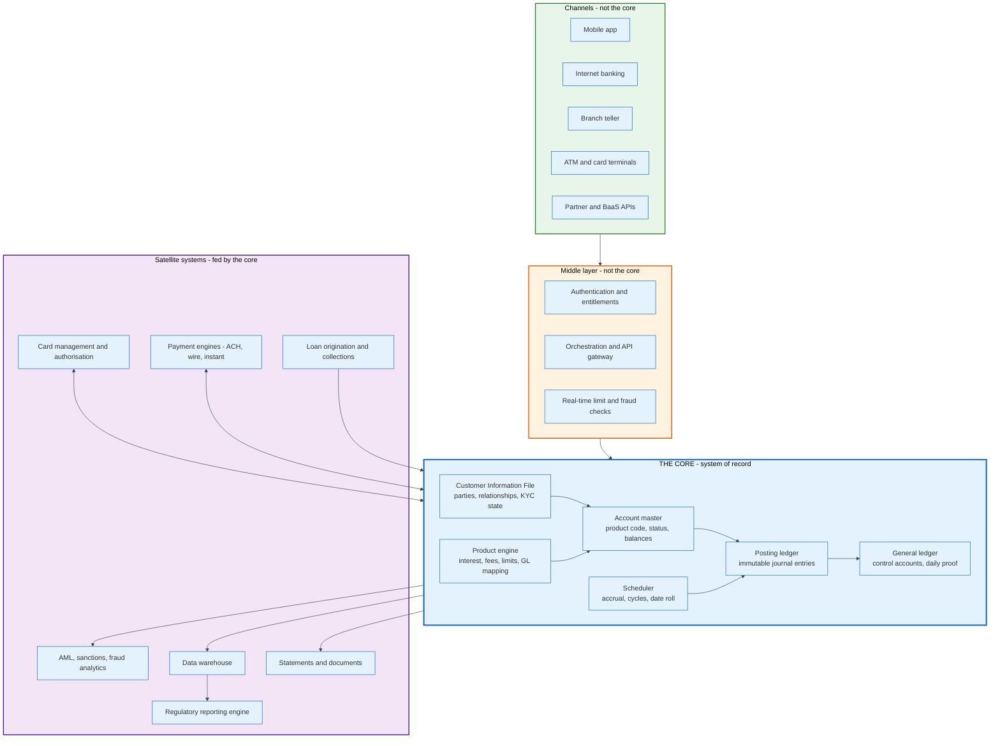

### 2.2 What It Is Not

**Not the banking app.** The app is a view. Every balance a customer sees is a projection of the core's state, often cached, often computed differently from the core's own arithmetic. When an app shows a balance the core disagrees with, the core wins and the customer is told the app was wrong.

**Not the payment rail.** ACH, Fedwire, CHIPS, SEPA, FedNow, and RTP move value between banks. The core moves value between accounts inside one bank. A payment engine sits between them, translating a `pacs.008` or an ACH entry detail record into a posting instruction the core understands. Confusing the two is the most common architectural error in fintech design documents.

**Not a general ledger product.** A general ledger holds a few thousand control accounts and produces financial statements. A core holds tens of millions of customer subledger accounts and summarises them into those control accounts once a day. SAP, Oracle Financials, and Workday are general ledgers. They are not cores, and a bank running one still needs a core.

**Not a database.** A relational database enforces referential integrity. A core enforces accounting integrity, entitlement, product behaviour, regulatory holds, and time. The database is the smallest part of it.

**Not one system.** The phrase "the core" is singular and almost always describes three or four systems: a deposit core, a lending core, a card platform, and sometimes a separate trade or treasury system. A mid-size bank commonly runs two deposit cores because it acquired another bank and never merged them.

### 2.3 Three Misconceptions Worth Killing

**Misconception 1: the core is where the money is.** The core holds no money. It holds a record of claims. A customer's 1,203.40 dollars is a liability of the bank to the customer, recorded as a credit balance in a subledger. The corresponding asset sits elsewhere: reserves at the central bank, loans, or securities. This distinction is not pedantic. It explains why a core outage does not destroy money, why a bank failure is a claims problem rather than a data problem, and why a banking-as-a-service ledger that disagrees with the bank's own records leaves depositors holding a claim nobody can size.

**Misconception 2: legacy cores post in batch, modern cores post in real time.** Both halves are wrong. A 1980s mainframe core memo-posts card authorisations in milliseconds and has done so since the ATM arrived. A cloud-native core still cuts an accounting day, still accrues interest on a schedule, and still runs batch-shaped jobs, they are simply called scheduled events. The real distinction is not real time versus batch. It is when a movement becomes an accounting fact, and every core in existence separates the two.

**Misconception 3: core migration is a data migration.** Data migration is the easy half and the half that gets budgeted. The hard half is behaviour equivalence: reproducing thirty years of interest formulas, fee waivers, rounding rules, posting orders, and grandfathered products on a new engine so that no customer's balance changes by a cent on cutover weekend. TSB's 2018 failure was not caused by lost data. It was caused by a platform that could not carry the load and had never been tested in the configuration it was deployed in.

### 2.4 The Simplest Accurate Mental Model

A core banking system is an append-only journal of balanced entries, plus a set of stored procedures that generate entries when a customer acts or when a clock ticks, plus a nightly job that proves the journal sums to zero and hands the summary to the general ledger.

Everything else in this document is detail on those three sentences.

---

## 3. Key Participants and Roles

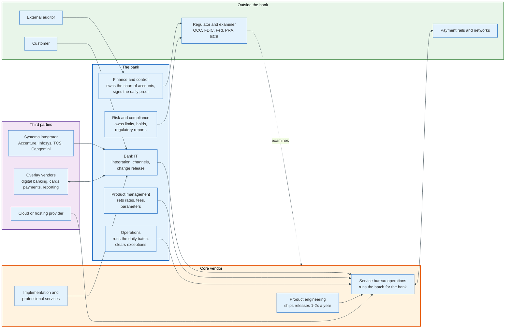

### 3.1 The Actors

| Role | What it does | Owns which decision |
|------|--------------|---------------------|
| **Finance and control** | Defines the chart of accounts, signs the daily general ledger proof | Whether the books balance |
| **Operations** | Runs or monitors the nightly batch, clears rejects and suspense | Whether the day closes |
| **Product management** | Sets rates, fees, tiers, and parameters on product templates | What the customer is charged |
| **Risk and compliance** | Sets limits, holds, sanctions blocking, and reporting rules | What is allowed to post |
| **Bank IT** | Integrates channels, schedules releases, owns the API layer | What the core is connected to |
| **Core vendor engineering** | Ships releases, typically one or two major versions a year | What the software can do |
| **Service bureau operations** | Runs the core on the vendor's hardware for the bank | Whether the batch finishes on time |
| **Systems integrator** | Delivers migrations and large parameter changes | Whether a programme lands |
| **Regulator** | Examines the bank and, in the US, examines the vendor directly | Whether the arrangement is permitted |

### 3.2 The Regulator Examines the Vendor

The regulator examines the core vendor directly, not only the bank that hires it. Coordination runs through the Federal Financial Institutions Examination Council, an interagency body of the federal banking regulators.

Under the Bank Service Company Act, a service provider performing bank functions is subject to examination by the federal banking agencies. Fiserv's fiscal 2025 annual report states that it is "considered to be a significant service provider under the Bank Service Company Act" and is therefore examined by the Federal Reserve Board, the FDIC, and the OCC under principles set by the FFIEC [S5]. Jack Henry's fiscal 2026 annual report states that its private cloud services are examined by those agencies under the same Act, that the agencies issue reports of examination, and that state banking authorities examine on occasion [S4].

The FFIEC names the programmes rather than the firms. The largest processors fall under the Multi-Regional Data Processing Servicers programme, which the handbook reserves for providers running mission-critical applications for a large number of institutions regulated by more than one agency, or operating from data centres in several regions. That programme produces a single report of examination covering the servicer and its client institutions [S12]. The report goes to the client banks, not to the public.

This is why a core vendor behaves like a regulated entity even though it holds no licence. Its controls are examined, its incident reports are read by supervisors, and its clients' examiners ask about it by name.

### 3.3 The Two Roles That Decide Whether a Core Programme Succeeds

**Finance owns the chart of accounts, and therefore owns the migration.** Every product parameter set terminates in a general ledger mapping. If the new core's chart of accounts is not a faithful re-expression of the old one, the daily proof fails, the Call Report does not tie, and the auditor will not sign. Programmes that treat the chart of accounts as a downstream detail discover it as a critical path item six weeks before cutover.

**Operations owns the batch window, and therefore owns the go-live date.** The migration weekend is a batch run: extract, transform, load, reconcile, and prove. It has a hard end, because the branches open on Monday. TSB's programme had never achieved a clean migration acceptance cycle before it went live, a point the Financial Conduct Authority made explicitly in its final notice.

---

## 4. The General Ledger and Double-Entry as Software

### 4.1 The Rule the Whole System Enforces

Double-entry bookkeeping states one invariant: for every journal, the sum of debits equals the sum of credits, in every currency, at every instant. A core banking system is a machine for enforcing that invariant across tens of millions of accounts at thousands of postings per second.

The accounting equation behind it is assets equal liabilities plus equity. For a bank, a customer's deposit is a liability, so a customer account carries a credit-normal balance. A loan the bank has made is an asset, so a loan account carries a debit-normal balance. Cash in a vault, reserves at the central bank, and securities are assets.

Debits and credits are direction flags, not value judgements. A debit increases a debit-normal account and decreases a credit-normal one. A credit does the reverse. When a customer withdraws 100 dollars from a current account, the core debits the customer's liability account by 100 and credits the cash or settlement asset account by 100. The customer has less. The bank's books still balance.

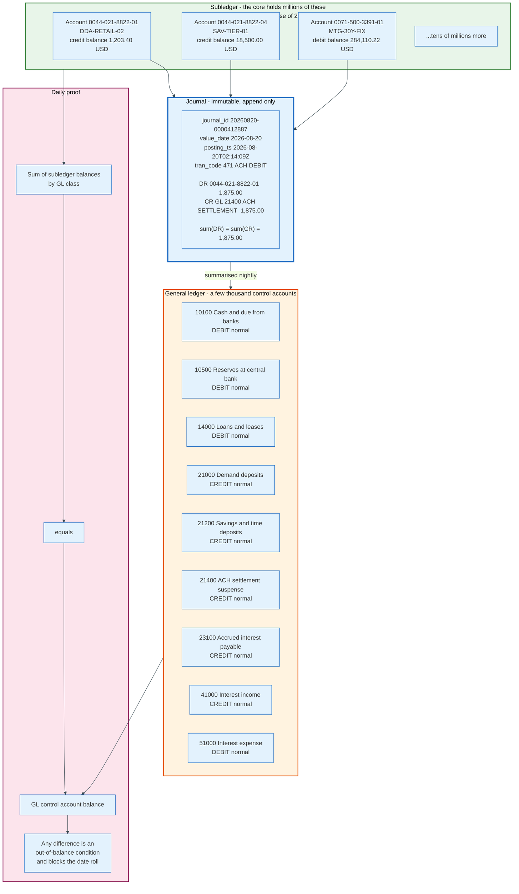

### 4.2 The Journal Entry, Field by Field

A posting in a core banking ledger carries more fields than a general-purpose accounting system needs, and each extra field exists because a regulator or a dispute required it.

| Field | Type | What it is for |
|-------|------|----------------|
| `journal_id` | Unique key | Groups the balanced set of entries. Nothing posts alone. |
| `entry_seq` | Integer | Position within the journal. Determines display order. |
| `account_id` | Account or GL code | Which subledger or control account moves |
| `dr_cr` | Enum | Direction flag |
| `amount` | Fixed-point decimal | Never a float. Stored as minor units or packed decimal. |
| `currency` | ISO 4217 code | Balancing is per currency, never across currencies |
| `value_date` | Date | The date used for interest. Can be in the past. |
| `posting_date` | Date | The accounting day the entry belongs to |
| `booking_ts` | Timestamp | When the system actually wrote it |
| `tran_code` | 3 or 4 digits | The instruction: which GL mapping, which sign, which fee, which hold |
| `source_system` | Enum | Card platform, ACH engine, teller, batch, correction |
| `external_ref` | String | The rail's identifier, for tracing and idempotency |
| `reversal_of` | Journal id or null | Corrections are new entries, never edits |
| `entity_id` | Legal entity | Which set of books this belongs to |
| `narrative` | Text | What the customer sees on the statement |

Three of those fields carry most of the complexity.

**Value date versus posting date.** Value date decides interest. Posting date decides which day's books the entry lands in. They diverge routinely: a cheque deposited on Friday may be value-dated Friday but posted Monday, and a payment correction posted today may carry a value date from three days ago. Back-value posting forces the core to recompute interest already accrued, which is why interest accrual in a real core reads a balance history table rather than a single current balance.

**Transaction code.** The `tran_code` is the core's instruction set. A four-digit code encodes the general ledger mapping on both legs, whether the entry reduces available balance immediately or only on settlement, whether it is reversible and by whom, which fee schedule it triggers, which statement narrative appears, which funds-availability hold category applies, and whether it counts toward a regulatory transaction limit. Banks configure hundreds of them. Migrating a core means mapping every one to a new code and proving the mapping.

**Reversal, not deletion.** A core never updates or deletes a posted entry. A mistake is corrected by posting a contra entry that references the original. This is an audit requirement and also a practical one: the statement the customer already received cannot be unsent.

### 4.3 Balances Are Derived, Not Stored (Mostly)

A ledger that stores only entries must sum them to answer a balance query, and a ledger that stores only balances cannot answer what happened. Real cores do both.

The standard structure is a running balance on the account master, plus a dated balance history table holding the closing balance for each accounting day, plus the journal. The running balance answers the teller's question in one read. The history table answers the interest engine's question, which is what the balance was on each of the last thirty-one days. The journal answers the auditor's question and lets both of the others be rebuilt.

The invariant that must hold: replaying the journal from the account's opening date reproduces the running balance exactly. Cores verify this on a sample every night. Cloud-native cores make it stronger. Thought Machine's Vault Core treats the postings ledger as immutable and derives balances from it, keyed by a coordinate of address, asset, denomination, and phase, which means a balance is never written independently of the entries that produce it.

### 4.4 The Daily Proof

The general ledger proof is the control that makes the whole structure trustworthy, and it is the reason the batch cannot be skipped.

At the end of each accounting day the core sums every subledger balance by general ledger class and compares each total to the corresponding control account. Demand deposit subledger balances must equal general ledger account 21000. Loan subledger balances must equal 14000. If any class is out of balance by a cent, the condition is logged, operations investigates, and in a well-run bank the date roll does not complete until the difference is explained or booked to a difference account.

Out-of-balance conditions are common and usually boring. A batch job aborted halfway. A file was loaded twice. An entry posted to a general ledger code with no subledger counterpart. What matters is that the check runs daily rather than quarterly, because the cost of finding an error grows with the number of days of entries stacked on top of it.

Finance signs the proof. That signature is the point of the whole exercise.

---

## 5. The Data Model: Customer, Account, Product, Transaction

### 5.1 The Four Entities

Every core banking system, from a 1975 COBOL system to a 2026 cloud-native one, models the same four entities and the relationships between them.

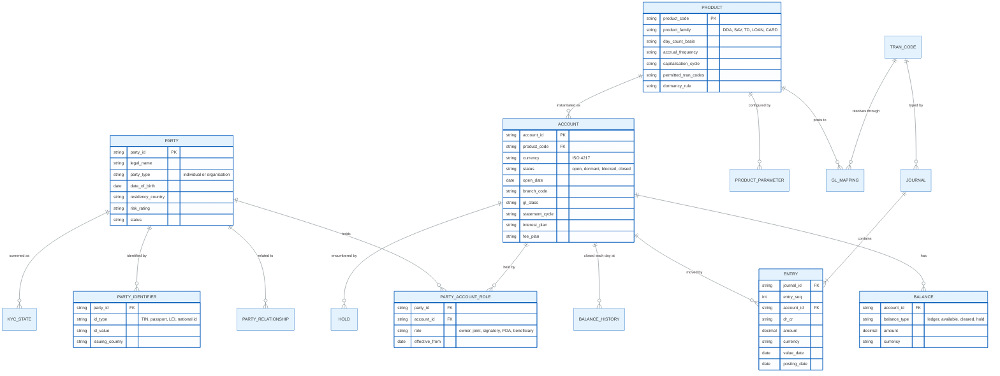

### 5.2 The Account Identifier

The account number is not a surrogate key. It is a routing address, and its structure carries meaning that outlives the system that generated it.

Legacy US cores commonly compose an account number from branch, product class, a serial number, and a check digit, which is why an account number tells an experienced operator which branch opened it. The check digit is usually modulus 10 or modulus 11 over a weighted sum, catching single-digit typos and most transpositions.

The international standard is IBAN, ISO 13616, at most 34 characters: a two-letter ISO 3166 country code, two check digits, and a country-defined basic bank account number. The check digits use the mod-97-10 algorithm from ISO 7064: move the first four characters to the end, convert letters to numbers with A equal to 10 through Z equal to 35, and take the whole thing modulo 97. A valid IBAN gives 1. `GB29NWBK60161331926819` gives 1.

Institution identifiers follow the same pattern of embedded meaning. A BIC under ISO 9362 is 8 or 11 characters: four for the institution, two for the country, two for the location, and an optional three for the branch. A US routing transit number is nine digits with a weighted checksum of 3, 7, 1 repeated, and its first two digits once encoded which Federal Reserve district processed the item.

### 5.3 Products Are Parameters, Not Code

The single design decision that separates a core banking system from a bespoke ledger is that products are data.

A product definition in a core is a parameter set. A representative deposit product carries:

| Parameter | Example value | Effect |
|-----------|---------------|--------|
| `day_count_basis` | ACT/365 | Divisor in the daily interest formula |
| `accrual_frequency` | Daily | How often interest is calculated |
| `capitalisation_cycle` | Monthly, last calendar day | When accrued interest is credited to the customer |
| `rate_type` | Tiered by balance | Whether one rate or a table applies |
| `rate_tiers` | 0 to 9,999.99 at 0.50%, 10,000+ at 4.10% | The table |
| `tier_method` | Whole balance at highest tier reached | Whether tiers are marginal or absolute |
| `min_balance_for_interest` | 100.00 | Below which no interest accrues |
| `permitted_tran_codes` | 101, 102, 205, 471, 610 | What may post to it |
| `overdraft_permitted` | No | Whether the balance may go negative |
| `nsf_fee` | 35.00 | Charged when an item is returned |
| `statement_cycle` | Monthly, cycle day 12 | When the statement is cut |
| `dormancy_days` | 730 | After which the account is flagged dormant |
| `escheatment_years` | 3 or 5, by state | When unclaimed balances go to the state |
| `gl_principal` | 21200 | Where the balance summarises |
| `gl_interest_expense` | 51000 | Where the daily accrual expense lands |
| `gl_interest_payable` | 23100 | Where the unpaid accrual accumulates |

Two consequences follow. A bank can launch a product without a software release, which is the entire commercial promise of packaged core banking. And a bank accumulates product variants for decades, because closing a product to new business does not close the accounts already on it. A thirty-year-old bank commonly runs several hundred distinct product configurations, most of them with fewer than a thousand accounts, and every one of them has to be reproduced on migration.

That long tail is the true cost of a core migration, and it is almost never in the first estimate.

### 5.4 Balance Types

A single account has several balances at once, and confusing them produces most customer complaints in retail banking.

| Balance | Definition | Who uses it |
|---------|-----------|-------------|
| **Ledger balance** | Sum of all posted entries. The accounting truth. | General ledger, statements, regulatory reports |
| **Available balance** | Ledger balance minus holds, minus memo debits, plus uncollected credits that policy releases, plus any overdraft line | Authorisation decisions, ATM, app display |
| **Cleared or collected balance** | Ledger balance minus funds not yet collected under the funds-availability policy | Funds availability decisions |
| **Minimum balance for the cycle** | Lowest ledger balance during the statement period | Fee waivers and tier qualification |
| **Average daily balance** | Sum of daily ledger balances divided by days in the period | Interest calculation under one of the two permitted methods |
| **Float** | Difference between ledger and collected balance | Treasury, and historically a source of bank income |

The formula banks actually run for available balance, expressed generically:

```
available = ledger_balance
          + credits_released_by_availability_policy
          - authorisation_holds
          - memo_posted_debits
          - regulatory_or_legal_holds
          + overdraft_limit_available
```

Every term in that expression is a separate table with its own expiry rules, and the reason a customer sees one number in the app and a different one on the statement is that the app shows the top line and the statement shows the first term.

---

## 6. The Customer Information File

### 6.1 Why It Exists

The customer information file exists because a bank must be able to answer one question that account-centric systems cannot: what is our total relationship with this person.

Before the CIF, each product system carried its own copy of the customer. A mortgage system knew a borrower. A deposit system knew a depositor. Nothing knew they were the same person. Banks built the CIF in the 1970s and 1980s as a central party record with the account systems pointing at it, and it is now the entity around which the rest of the core is organised.

Four separate obligations now depend on it.

**Large exposure and concentration limits.** Prudential rules cap a bank's exposure to a single counterparty or a group of connected counterparties. Computing that requires a party record and a connected-party graph, not a list of accounts.

**Anti-money-laundering.** Customer due diligence, beneficial ownership identification, sanctions screening, and suspicious activity monitoring are all party-level, not account-level. Under the US beneficial ownership rule, a bank must identify natural persons owning 25% or more of a legal entity customer, which is a relationship record.

**Deposit insurance.** Coverage limits apply per depositor per ownership category, not per account. The FDIC's ability to compute coverage in a failure depends on the bank's records identifying owners and ownership categories, which is exactly what the CIF holds.

**The customer experience.** A bank that cannot recognise a thirty-year customer applying for a new product is selling to a stranger.

### 6.2 What Is In It

| Element | Content | Complication |
|---------|---------|--------------|
| **Party record** | Legal name, type, date of birth or incorporation, residency | Names are not unique and not stable |
| **Identifiers** | Tax identification number, passport, national id, LEI | Different jurisdictions, different formats, some optional |
| **Addresses** | Residential, mailing, registered, with effective dates | Free text in older systems, unvalidated |
| **Contact points** | Phone, email, with verification status | The attack surface for account takeover |
| **KYC state** | Verification level, documents held, refresh due date, risk rating | Expires and must be re-collected |
| **Screening state** | Sanctions, PEP, adverse media hit history and dispositions | Must be re-run when lists change, not only at onboarding |
| **Relationships** | Party to party: guarantor, group parent, beneficial owner, connected | The graph the exposure rules need |
| **Roles on accounts** | Owner, joint owner, signatory, power of attorney, beneficiary | Many-to-many, time-bounded |
| **Preferences and consents** | Marketing, data sharing, statement delivery | Now regulated in its own right |

### 6.3 The Golden Record Problem

Most banks have more than one customer information file, and reconciling them is a permanent programme rather than a project.

Duplicates arise structurally. A customer opens a savings account in 1998 and a mortgage in 2011 with a different address and a hyphenated surname. An acquisition brings 400,000 parties whose identifiers were captured under a different standard. A digital onboarding flow creates a party before verification completes and again after.

The techniques are standard and imperfect: deterministic matching on strong identifiers such as a tax identification number, probabilistic matching on name, date of birth, and address with a scored threshold, and a survivorship policy deciding which field wins when two records merge. The hard part is not matching. It is unmerging, because a wrongly merged pair of customers exposes one person's data to another, and the audit trail must support reversing the merge without losing entries posted in the interim.

A merged party record must never move money. Every serious implementation keeps the merge at the party layer and leaves account identifiers untouched, precisely so that a bad merge is a data incident rather than a financial one.

---

## 7. How a Transaction Posts, Step by Step

### 7.1 The Worked Example

Follow one account through one day. The values below are carried through the rest of this document.

- Bank: a 12 billion dollar US retail bank, core running as a service bureau on the vendor's hardware
- Party: `P00418822`, an individual, KYC verified, risk rating low
- Current account: `0044-021-8822-01`, product `DDA-RETAIL-02`, currency USD, opened 2014-03-06
- Savings account: `0044-021-8822-04`, product `SAV-TIER-01`, currency USD
- Ledger balance on the current account at the close of Monday 2026-08-17: **1,203.40 USD**
- Savings balance: **18,500.00 USD** at 4.10% on the top tier
- No holds, no overdraft line

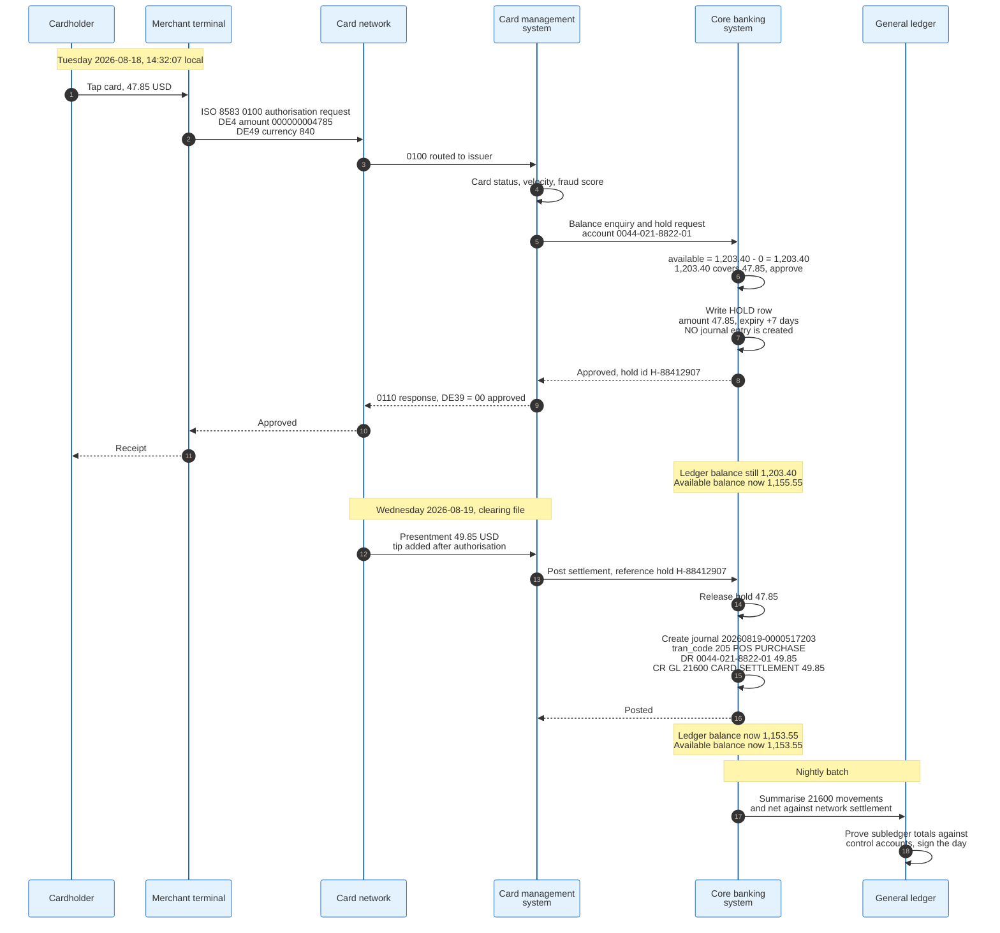

### 7.2 The Sequence in Words

**Step 1: authorisation arrives.** The merchant's terminal sends an ISO 8583 `0100` message. The fields that matter are DE 2 the primary account number, DE 3 the processing code, DE 4 the transaction amount as a 12-digit right-justified integer in the currency's minor units, DE 7 the transmission date and time, DE 11 the systems trace audit number, DE 37 the retrieval reference number, DE 41 the terminal id, DE 49 the ISO 4217 numeric currency code, and DE 39 in the response carrying the action code. 47.85 dollars travels as `000000004785`.

**Step 2: the card platform decides what it can decide alone.** Card status, velocity rules, and fraud scoring happen on the card management system, which for most banks is a separate platform from the core. If the card platform holds a shadow balance it may approve without touching the core at all.

**Step 3: the core places a hold.** This is the important step, and the one most descriptions get wrong. The core writes a hold row, not a journal entry. The ledger balance does not move. Available balance drops to 1,155.55. No accounting has happened, because no money has moved between banks; a card authorisation is a promise that funds will be there.

**Step 4: the hold ages.** Authorisation holds expire, typically after three to seven days depending on merchant category, and cores enforce the expiry on the nightly cycle. A restaurant hold and a hotel hold have different expiry parameters because a hotel presents a different amount days later.

**Step 5: presentment arrives and the entry posts.** The clearing file brings 49.85 dollars, more than the authorised amount because a tip was added. The core releases the 47.85 hold and posts the real entry: debit the customer account 49.85, credit the card settlement suspense account 49.85. The ledger balance becomes 1,153.55. This is the first moment the transaction exists in the accounting sense.

**Step 6: settlement clears the suspense.** The card network settles with the bank on a net basis. The bank's operations team, or an automated matching process, clears the settlement suspense account against the network's settlement advice. Anything unmatched stays in suspense and is aged.

**Step 7: the day proves and rolls.** The nightly batch summarises subledger movement into general ledger control accounts, runs the proof, and rolls the accounting date.

### 7.3 The Failure Paths Are the Design

The happy path is six lines of pseudocode. Everything expensive lives in the alternatives.

**The hold that never settles.** A merchant authorises and never presents. The hold expires and the money returns to available balance. If the core's expiry job fails to run, customers see money that is theirs held hostage, which is a top-three complaint category in retail banking.

**The presentment with no hold.** Offline authorisations, contactless transactions below floor limits, and transit deferred authorisations arrive with no prior hold. The core posts against whatever balance exists and creates an overdraft if there is not enough.

**The presentment larger than the hold.** Tips, fuel pumps, and hotels. The core must post the presented amount, not the held amount, releasing the whole hold and letting the excess fall against available balance. The mirror case, a presentment smaller than the hold, leaves a residual encumbrance that has to be dropped rather than left to age.

**The duplicate presentment.** A network file replayed after a failed transfer. The core must recognise the retrieval reference number as already posted and reject the second copy. Section 12 covers the mechanism.

**The chargeback.** A reversal posted weeks later against a statement already sent, carrying a value date in a closed accounting period. The core posts it in the current period with the historical value date, which changes interest that has already been accrued and paid.

The last case is why banks with an interest-bearing current account run a back-value interest adjustment job. It is also why cores keep balance history rather than only a current balance.

---

## 8. Real-Time Posting, Memo Posting, and Shadow Balances

### 8.1 Three Different Things Called "the Balance"

A core banking system separates the moment a customer's spending power changes from the moment the books change, and it needs three mechanisms to do so.

**Memo posting** records a provisional movement that reduces available balance without creating a journal entry. It is a row in a pending file with an amount, a source, and an expiry. Memo posts came from the ATM: a customer who withdraws 200 dollars at 9pm on Saturday must not be able to withdraw the same 200 dollars at another machine at 9:05pm, and the nightly batch will not run until Monday.

**Holds** are the same idea applied to authorisations and to legal or regulatory encumbrances. A card authorisation hold, a garnishment, a sanctions freeze, and an uncollected-funds hold are all holds with different expiry rules and different override authorities.

**Shadow balances** are copies of the balance held outside the core so something can answer while the core cannot. They exist for two reasons: the batch window, during which the core is closed for update, and 24x7 payment rails, which demand an answer at 03:00 on a Sunday.

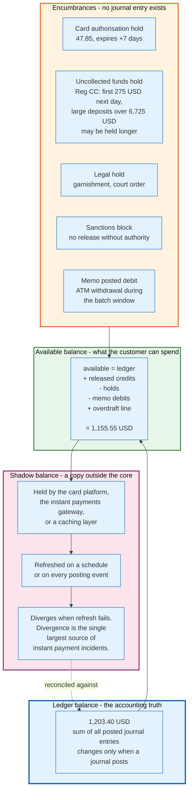

### 8.2 Funds Availability Is a Legal Constraint, Not a Product Choice

In the United States, how long a bank may hold a deposited cheque is set by Regulation CC, 12 CFR part 229, which implements the Expedited Funds Availability Act. The core enforces it through hold categories attached to transaction codes.

The dollar thresholds are adjusted for inflation every five years. Following a 21.8% rise in the CPI-W between July 2018 and July 2023, the Federal Reserve Board and the CFPB set the following amounts effective 1 July 2025 [S3]:

| Threshold | Amount from 1 July 2025 | Previous |
|-----------|------------------------|----------|
| Minimum available next business day, 229.10(c)(1)(vii) | 275 USD | 225 USD |
| Cash withdrawal amount, 229.12(d) | 550 USD | 450 USD |
| New-account amount, 229.13(a)(1)(ii) | 6,725 USD | 5,525 USD |
| Large-deposit threshold, 229.13(b) | 6,725 USD | 5,525 USD |
| Repeatedly overdrawn threshold, 229.13(d)(2) | 6,725 USD | 5,525 USD |

A core that cannot express "make the first 275 dollars available next business day and hold the remainder under the large-deposit exception" cannot be sold to a US bank. This is the clearest example of a general principle: a core banking system is a regulation compiler, and its parameter set is shaped by statute.

### 8.3 What Actually Changed With 24x7 Rails

Instant payment schemes did not force banks to abandon batch. They forced banks to stop going offline.

The distinction matters. An accounting day still begins and ends. Interest still accrues on a schedule. What changed is that the core must accept postings continuously across the boundary, which requires one of three designs.

**Design A: extend the shadow.** The core closes for a window, an external balance service keeps serving the rails from a shadow balance, and postings queue for replay when the core reopens. Cheapest to build. It is also the design behind most instant payment outages, because a queue that grows faster than it drains produces a backlog, and a shadow balance that stops being refreshed starts approving payments the ledger cannot fund.

**Design B: split the ledger by time.** The core accepts postings continuously and assigns them to the next accounting day once the cut-off passes. The batch runs against a frozen snapshot of the previous day while the live ledger keeps moving. This is what most modernised mainframe cores do, and it requires the balance history table to support two open days at once.

**Design C: no window at all.** Accrual and cycle work runs as scheduled events against the live ledger, with the accounting day defined as a timestamp boundary rather than a period of unavailability. Cloud-native cores are built this way. They still have an accounting day. They just never close the doors.

The engineering claim that a modern core "has no batch" describes Design C and is usually an overstatement of it. Vault Core, Mambu, and Finxact all run scheduled work on a defined cycle. The work did not disappear. The outage did.

---

## 9. Batch End-of-Day and Why It Still Exists

### 9.1 The Five Reasons Batch Survives

Nightly batch processing survives in 2026 not because banks failed to modernise but because five separate forces each require a moment at which the day stops.

**Accounting periods are days.** Interest, fees, accruals, and financial statements are all defined on a daily cycle. Something has to draw the line, and drawing it requires knowing that no more items will arrive for that line.

**Order matters and order needs a complete set.** Fees, overdrafts, and returned items depend on the sequence in which items are applied. A deterministic sequence is only achievable once the set of items is closed. This is the reason posting order is a documented bank policy rather than an implementation detail.

**Set operations beat row operations by orders of magnitude.** Accruing interest on 40 million accounts is one pass over a table, not 40 million transactions. A mainframe core doing this in a batch window uses a fraction of the resource that the equivalent event-driven work would consume.

**External files have cut-offs.** ACH files arrive in windows. Card networks deliver clearing files once a day. Cheque presentment arrives from the exchange. Fedwire closes. The core cannot complete a day before its inputs stop arriving.

**Regulatory snapshots are day-end.** The balance that appears on a Call Report, a liquidity return, or a deposit insurance calculation is a day-end balance. Regulators define the observation point, and it is the close of business.

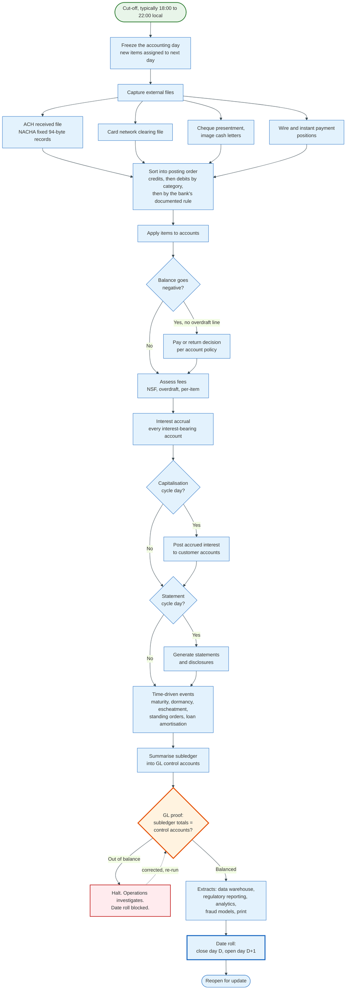

### 9.2 The Job Chain

A production end-of-day at a mid-size retail bank is between 200 and 900 individual jobs with an explicit dependency graph, scheduled by a controller such as IBM Workload Scheduler, Control-M, or the vendor's own. The chain above compresses it.

The properties that matter operationally:

**Restartability.** Every job must be restartable from a checkpoint without double-applying its effects. A job that posts entries and then fails must either have committed nothing or be able to identify what it already committed. This is idempotency applied to batch, and it is the reason cores write control records tracking the last successfully processed key.

**Critical path.** The chain has a longest path, and the batch window has a hard end because branches open. Operations tracks the critical path job by job, and a job that runs 40 minutes late at 01:00 is a business incident at 06:00.

**The window shrinks structurally.** Every new market, product, channel, and rail adds work to the same window while extending the hours in which the bank must be available. A bank operating in one time zone with a 22:00 cut-off and a 06:00 open has eight hours. The same bank operating in three time zones has considerably less, and no amount of hardware buys back a window that has been consumed by opening hours.

### 9.3 What Happens When the Batch Does Not Finish

Batch overrun is the most common serious incident in core banking, and its consequences cascade in a fixed order.

Statements do not print. Interest is not credited on the day it was disclosed. The data warehouse extract is missing, so overnight fraud models score against stale data. ACH files are not generated in time for the origination window, so outbound payments are late by a full business day. The regulatory extract is missing, and if the day is a quarter end that becomes a filing problem. Branches open with yesterday's balances.

Recovery has two shapes. Either the batch is restarted from its last checkpoint and finishes late, which is the good case, or the day is abandoned and re-run, which means two accounting days must be processed in one window the following night. Banks that fall two days behind rarely catch up without a weekend.

This is why the date roll is the most heavily monitored job in a bank.

---

## 10. Interest Accrual, Capitalisation, and Posting Order

### 10.1 Accrual Is a Daily Expense, Capitalisation Is a Customer Event

Interest arrives on a customer's statement once a month and appears in the bank's profit and loss statement every day. Separating those two events is the core's job.

**Accrual** computes the interest earned for one day and posts it to the general ledger without touching the customer's balance. For a deposit, the entry is a debit to interest expense and a credit to accrued interest payable. For a loan, it is a debit to accrued interest receivable and a credit to interest income. The customer sees nothing.

**Capitalisation**, also called crediting or interest posting, moves the accumulated accrual into the customer's account on the cycle date. For a deposit, the entry is a debit to accrued interest payable and a credit to the customer's account. The profit and loss statement already absorbed the cost, one day at a time.

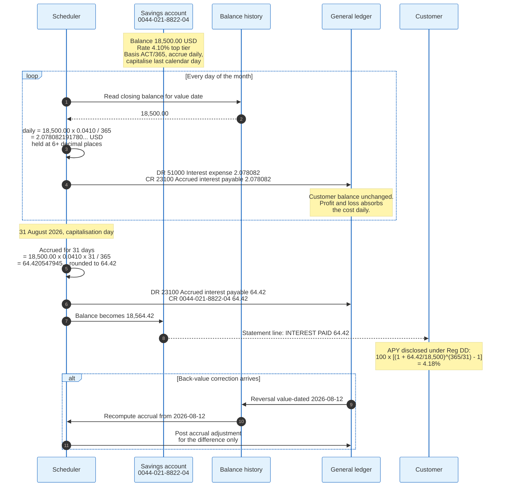

### 10.2 The Arithmetic, With Real Numbers

Daily accrual on the savings account, at ACT/365:

```
daily interest = balance x annual rate / day count basis
               = 18,500.00 x 0.0410 / 365
               = 2.078082191780821...  USD per day
```

Over the 31 days of August 2026:

```
accrued = 18,500.00 x 0.0410 x 31 / 365
        = 64.4205479452...  rounded to 64.42 USD
```

Cores hold the accrual at higher precision than the currency's minor unit, typically six to ten decimal places, and round only at capitalisation. Rounding daily would cost the customer money: 2.078082 rounded to 2.08 for 31 days gives 64.48, six cents more than the correct figure, and rounded to 2.07 gives 64.17, twenty-five cents less. Over 4 million accounts, a systematic quarter-cent per account per day is a reportable misstatement.

Regulation DD, 12 CFR part 1030, prescribes how the resulting rate must be disclosed. The annual percentage yield formula is:

```
APY = 100 x [ (1 + Interest / Principal) ^ (365 / Days in term) - 1 ]
```

Applying it: 100 x [(1 + 64.42/18,500)^(365/31) - 1] = 4.18%. The nominal rate is 4.10%; the disclosed yield is higher because monthly capitalisation compounds.

### 10.3 Day Count Conventions

The divisor in the accrual formula is a contractual term, not a convention the software picks, and cores implement all of the common ones.

| Basis | Numerator | Denominator | Typical use |
|-------|-----------|-------------|-------------|
| **ACT/365 fixed** | Actual days | 365 always | Sterling deposits, many retail products |
| **ACT/360** | Actual days | 360 always | US commercial loans, money markets. Yields 365/360 = 1.39% more interest than ACT/365 at the same nominal rate |
| **ACT/ACT** | Actual days | 365 or 366 | Government bonds |
| **30/360** | Days assuming 30-day months | 360 | US corporate bonds, some mortgages |
| **30E/360** | European 30/360 variant | 360 | European bonds |

The ACT/360 line is the one that surprises people. A commercial loan quoted at 6.00% on an ACT/360 basis charges an effective 6.083% over a 365-day year, because interest accrues for 365 days but each day is priced as one three-hundred-and-sixtieth of the annual rate.

### 10.4 Loans Add Non-Accrual

Lending products add a rule that has no deposit equivalent: interest stops accruing when the loan stops performing.

Under US supervisory guidance, a loan is generally placed on non-accrual when it is 90 days or more past due, unless it is both well secured and in the process of collection. Placing a loan on non-accrual has two mechanical effects in the core. Future accrual stops. And interest previously accrued but not collected in the current year is reversed against interest income.

This is a core banking behaviour with a direct earnings consequence, computed by a batch job, and it is a standard examination item. A core that cannot apply non-accrual status automatically forces a bank to do it on a spreadsheet, which is exactly the finding an examiner writes up.

Expected credit loss accounting, CECL in the United States and IFRS 9 elsewhere, sits on top of this and is generally computed outside the core in a dedicated engine, fed by the core's loan-level extract.

### 10.5 Posting Order Costs Real Money

The order in which a day's items are applied changes how many overdraft fees a customer pays, and only the order changes. The end balance is identical.

Take the worked example forward one day. The current account closes Wednesday at 1,153.55, after the card presentment of section 7 has posted. On Thursday 2026-08-20 the following items present, and a direct deposit of 2,410.00 arrives in the same ACH file as the debits.

| Item | Amount | Type |
|------|--------|------|
| Payroll credit | 2,410.00 | ACH credit |
| Mortgage payment | 1,875.00 | ACH debit |
| Cheque 1041 | 220.00 | Cheque |
| Card presentment | 12.60 | POS |

The mortgage debit is the journal drawn in section 4.1: journal 20260820-0000412887, transaction code 471, debit the current account 1,875.00, credit general ledger 21400.

**Policy A, credits first then debits low to high:**

```
1,153.55 + 2,410.00 = 3,563.55
3,563.55 -    12.60 = 3,550.95
3,550.95 -   220.00 = 3,330.95
3,330.95 - 1,875.00 = 1,455.95     no negative balance, 0 fees
```

**Policy B, debits high to low then credits:**

```
1,153.55 - 1,875.00 =  -721.45     overdraft item 1
 -721.45 -   220.00 =  -941.45     overdraft item 2
 -941.45 -    12.60 =  -954.05     overdraft item 3
 -954.05 + 2,410.00 = 1,455.95
                      three fees at 35.00 = 105.00
                      closing balance 1,350.95
```

Same items, same day, same 1,455.95 before fees. The difference is 105.00 dollars, created entirely by a sort order.

US banks were sued over this at scale. In *Gutierrez v. Wells Fargo Bank* [S15], the United States District Court for the Northern District of California found in 2010 that Wells Fargo's high-to-low posting of debit card transactions was unfair under California law and ordered 203 million dollars in restitution. On appeal in December 2012 the Ninth Circuit held that federal banking law preempted a state challenge to the posting order itself, while allowing the claim that the bank had misdescribed the practice to customers, and the restitution award was reinstated on remand. US Bank settled a comparable class action for 55 million dollars on 16 January 2014.

Separately, a Federal Reserve rule effective July 2010 barred banks from charging overdraft fees on ATM and one-time debit card transactions unless the customer had affirmatively opted in.

Posting order is now a documented, disclosed, and examined bank policy, implemented as a sort key in a batch job. It is the clearest case in this document of a line of code with a direct consumer-protection consequence.

---

## 11. Technical Architecture: Mainframe, Midrange, and Cloud-Native

### 11.1 The Mainframe Core

The mainframe core is the architecture that runs the largest banks, and its components have been stable for four decades.

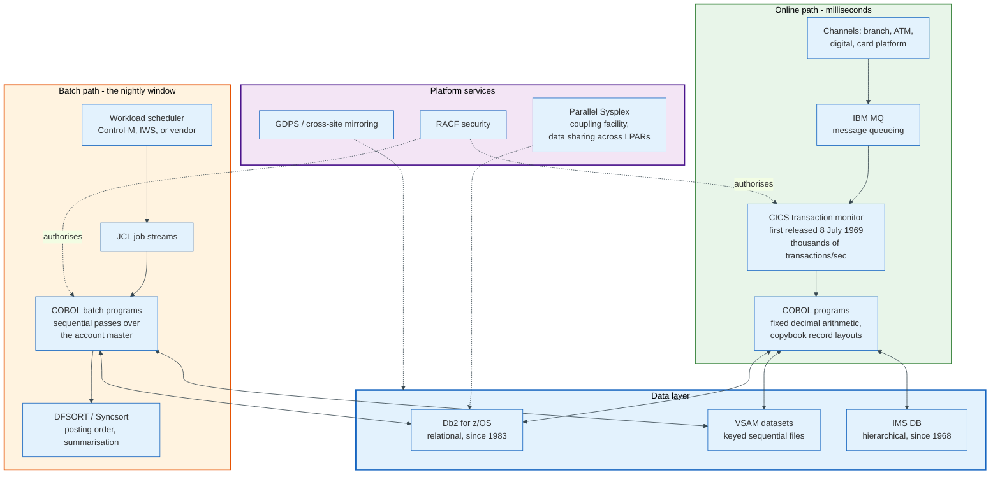

### 11.2 Why COBOL Persists, in One Data Type

The reason banks still run COBOL is not inertia alone. It is decimal arithmetic.

IEEE 754 binary floating point cannot represent 0.1 exactly. In double precision, 0.1 plus 0.2 is 0.30000000000000004. A ledger that accumulates that error across billions of postings produces a general ledger that does not prove, and there is no acceptable tolerance for a bank's books.

COBOL solved this in 1959 with fixed-point decimal declared in the picture clause and stored in packed decimal, called `COMP-3` on IBM systems. Packed decimal stores two decimal digits per byte, with the low-order nibble of the last byte holding the sign: hexadecimal `C` for positive, `D` for negative, `F` for unsigned.

A field declared `PIC S9(7)V99 COMP-3` holds nine digits plus a sign in five bytes. The value 1203.40 is stored as:

```
digits:   0 0 0 1 2 0 3 4 0   sign: C
nibbles:  0 0 | 0 1 | 2 0 | 3 4 | 0 C
bytes:    0x00  0x01  0x20  0x34  0x0C
```

A field declared `PIC S9(13)V99 COMP-3` holds fifteen digits plus a sign in eight bytes, which is enough for 99,999,999,999,999.99.

Every modern language has a decimal type now. Java has `BigDecimal`, Python has `decimal.Decimal`, C# has `decimal`, and PostgreSQL has `NUMERIC`. The argument for COBOL is no longer the data type; it is the forty years of tested behaviour written on top of it. But the data type is why the code was written in COBOL in the first place, and it is the first thing a rewrite has to get right.

Two other mainframe details matter for anyone integrating with a core.

**EBCDIC, not ASCII.** Mainframe character data uses EBCDIC code pages, typically 037 or 1047. Extracts must be transcoded, and the transcoding is not a simple table for packed decimal or binary fields, which must be unpacked before conversion.

**Copybooks are the schema.** A COBOL copybook defines a fixed-width record layout with byte offsets. There is no self-describing format, no header row, and no type metadata in the file. An extract file is unreadable without its copybook, which is why copybook inventory is a first-week task on any core migration and why banks lose the ability to read their own archives.

### 11.3 The Midrange Core

IBM i, launched as the AS/400 in 1988, hosts a large share of US community bank cores. Jack Henry's SilverLake System runs there and serves banks with assets from 1 billion to 55 billion dollars, in use at over 500 banks, which the firm states is roughly 13% of US banks under 55 billion dollars in assets. CIF 20/20 and Core Director serve smaller institutions, each supporting around 200 banks. Symitar, formerly Episys, serves over 700 credit unions with assets from 21 million to over 36 billion dollars [S4].

The platform's characteristic is integration: the database, the security model, the job scheduler, and the runtime are one product rather than five, which is why a 400-million-dollar bank can run a core with three people in operations.

A third lineage is worth naming because it is invisible from outside. FIS Profile is written in M, also called MUMPS, a language designed for medical record systems in 1966 and running on GT.M. Its data model is a sparse, persistent, hierarchical array, and it is fast at exactly the access pattern a core needs. Profile was one of the first cores to post in real time rather than batch, which is why it ended up under several large digital banks.

### 11.4 The Cloud-Native Core

The fourth generation replaced the transaction monitor with a service mesh and the copybook with a schema registry, and kept the double-entry invariant unchanged.

The common architecture: stateless services in Java, Kotlin, or Go; an event log, usually Kafka, as the integration backbone; a partitioned datastore, PostgreSQL or Cassandra, sharded by account; Kubernetes for orchestration; and a product layer expressed as configuration or code deployed independently of the platform.

Thought Machine's Vault Core is the most explicit about the product layer. Financial products are written as smart contracts in Python. The contract exposes hooks that the platform calls at defined points in a posting's life: a hook before a posting is accepted, which may reject it but not alter it; a hook after acceptance, which can generate further postings such as a fee; and a scheduled hook for time-driven work such as accrual. Balances are addressed by a coordinate of account address, asset, denomination, and posting phase, where the phases separate committed movements from pending incoming and pending outgoing amounts. That phase model is the authorisation hold from section 8, expressed as a first-class ledger concept rather than a side table.

Mambu takes the opposite position on the same problem. It exposes configuration rather than code, which is faster to change and less expressive, and it targets lenders and deposit-takers who want a product live in weeks.

Both make the same architectural bet: that the ledger should be a small, fast, boring component, and that everything variable should be pushed into a layer above it that can be deployed on its own schedule.

### 11.5 Throughput and the Real Bottleneck

Core banking throughput is not limited by total transactions per second. It is limited by contention on individual accounts.

A large retail core sustains thousands of postings per second and peaks on predictable days: the first and fifteenth of the month for payroll and benefits, the last business day of the month for direct debits, and the days around major holidays. Total volume is a capacity planning problem with a known answer.

The hard limit is a single hot account. A card settlement suspense account, a nostro account, an ACH settlement account, or a large merchant's operating account receives postings from every transaction in its category. Every posting to that account must serialise against every other, because the balance is a single value with an ordering requirement. Sharding by account identifier, the standard technique for scaling a ledger horizontally, gives no relief for the one account that receives ten thousand postings a second.

The standard mitigations are all forms of the same idea: reduce the number of writes to the hot row. Aggregate the day's movements into a single summary posting. Split the account into an array of sub-balances that sum to the total. Post to a per-shard accumulator and net at end of day. All three trade real-time visibility of that one balance for throughput, and all three are used in production.

Anybody sizing a ledger should measure the hottest account, not the average.

---

## 12. Ledger Consistency and Idempotency for Payment Posting

### 12.1 The Problem in One Sentence

A payment message may be delivered more than once, and the money must move exactly once.

Everything in this section follows from that. Networks retry. Files get replayed. A response gets lost after the effect happened. A batch job aborts halfway and is restarted. In every one of those cases the ledger receives an instruction it has already executed, and it must recognise it.

Exactly-once delivery does not exist over a network. Exactly-once effect at the ledger does, and it is achieved by combining at-least-once delivery with an idempotent receiver.

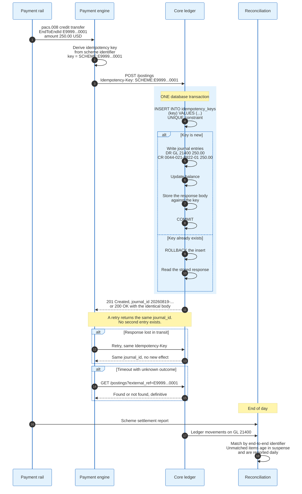

### 12.2 Idempotency Done Correctly

The idempotency key is a client-supplied identifier that names an intended effect, and its correctness depends on one detail that implementations routinely get wrong.

**The uniqueness check and the effect must commit in the same transaction.** A design that checks whether the key exists, and then, if not, applies the posting, has a race: two concurrent retries both see no key and both post. The correct shape is to attempt the insert of the key first and let the database's unique constraint decide, inside the same transaction that writes the entries. The loser of the race gets a constraint violation, rolls back, and reads the stored response.

**The stored response matters as much as the stored key.** A retry must return the same answer, not merely avoid a second effect. Storing the response body against the key is what makes the caller's retry loop terminate correctly.

**The key must be derived, not generated.** If the payment engine generates a fresh random key on every attempt, idempotency is defeated. The key has to be a deterministic function of the payment: the scheme's end-to-end identifier, the ACH trace number, the card retrieval reference number, or a hash of the immutable fields.

The relevant identifiers by rail:

| Rail | Natural idempotency key | Where it lives |
|------|------------------------|----------------|
| **ISO 20022 credit transfer** | `EndToEndId`, or `UETR` for tracked payments | `pacs.008` message |
| **ACH (US)** | Trace number, 15 digits: 8-digit ODFI routing prefix plus 7-digit sequence | NACHA entry detail record, positions 80 to 94 |
| **Card** | Retrieval reference number plus systems trace audit number | ISO 8583 DE 37 and DE 11 |
| **Fedwire** | Input message accountability data (IMAD) | Fedwire message header |
| **Pix** | End-to-end identifier: `E` plus ISPB, timestamp, suffix | Pix message |
| **Internal transfer** | Client-supplied UUID | API header |

There is an IETF effort to standardise the HTTP header, the Idempotency-Key header field draft in the HTTPAPI working group, still a draft rather than an RFC at revision 07 of 18 April 2026 [S14], and Stripe's implementation is the de facto reference that most fintech APIs copy.

### 12.3 Why Banks Avoid Two-Phase Commit

The textbook answer to "make two systems agree" is a distributed transaction. Banks do not use one for payments, for two concrete reasons.

**Nobody will enlist.** A two-phase commit requires every participant to run a transaction manager that will prepare, hold locks, and await a coordinator's decision. A card network, an ACH operator, and a correspondent bank will not do this. The protocol only works inside one organisation's boundary, and payments cross it by definition.

**The coordinator becomes the failure mode.** If the coordinator fails after prepare and before commit, participants hold locks indefinitely. In a ledger, holding a lock on a hot settlement account for an unbounded period is an outage.

What banks use instead is a reservation protocol, which is the same shape as a card authorisation and the same shape as the pending phases in a modern core:

1. **Reserve.** Reduce available balance, create a hold, write nothing to the general ledger. The reservation carries an expiry.
2. **Confirm.** On the counterparty's acceptance, convert the reservation into a posted journal entry.
3. **Release.** On rejection or expiry, drop the reservation. No accounting entry ever existed.

The expiry is what makes this safe. A reservation that is never confirmed does not need a coordinator to clean it up, because it cleans itself up. This is a saga with a timeout, and it is the pattern behind card authorisations, instant payment holds, and Vault Core's pending-in and pending-out phases alike.

### 12.4 The Outbox Pattern

Publishing an event about a posting and writing the posting are two operations that must not diverge, and the outbox pattern is how cores make them atomic.

The mechanism: within the same database transaction that writes the journal entries, insert a row into an outbox table describing the event. A separate publisher process reads the outbox and emits to Kafka or a message queue, marking rows as published. If the publisher fails, the row is still there. If it publishes twice, consumers deduplicate on the event's identifier.

This removes the classic bug in which a bank posts a payment, fails to publish the notification, and leaves the customer's app showing a stale balance while the ledger has moved. It also removes the worse inverse: publishing the notification and then failing to commit the posting.

### 12.5 Reconciliation Is the Actual Control

A ledger is not correct because the code is correct. It is correct because it is reconciled every day against an independent record, and the difference is investigated.

Four reconciliations run daily in every bank:

**Internal proof.** Subledger totals against general ledger control accounts, described in section 4.4. Catches anything the core did to itself.

**Network settlement.** Card settlement suspense against the network's settlement advice. ACH settlement against the operator's file. Wire settlement against the Fedwire statement of account. Catches anything the rail and the bank disagree about.

**Nostro reconciliation.** The bank's record of its account at a correspondent against the correspondent's statement, delivered as `camt.053`. Catches anything two banks disagree about.

**Suspense ageing.** Every unmatched item is parked in a suspense account with a date. The ageing report is a supervised metric, because a suspense account with items older than thirty days is either an operational failure or a place where fraud hides.

The design rule that follows: build the reconciliation before the feature. A payment flow shipped without a daily reconciliation is not a payment flow, it is a source of unexplained differences that will be discovered by an auditor in a quarter's time and cost more to unwind than the feature earned.

---

## 13. Multi-Currency and Multi-Entity

### 13.1 One Account, One Currency

The first rule of multi-currency in a core banking system is that an account holds exactly one currency, and a "multi-currency account" is a presentation layer over a group of single-currency accounts sharing an identifier.

The reason is the balancing invariant. Debits equal credits per currency, never across currencies. Allowing a single account to hold two currencies would mean either summing incommensurable amounts or carrying a rate inside the balance, and both break the proof.

An exchange is therefore two postings and a spread, not one posting with a conversion:

```
Customer sells 1,000.00 EUR, buys USD, rate 1.0850, spread already applied

Leg 1 (EUR book):   DR  customer EUR account          1,000.00 EUR
                    CR  GL 31100 FX position EUR      1,000.00 EUR

Leg 2 (USD book):   DR  GL 31150 FX position USD      1,085.00 USD
                    CR  customer USD account          1,085.00 USD

Each leg balances within its own currency.
The two legs are linked by a deal reference, not by an arithmetic identity.
```

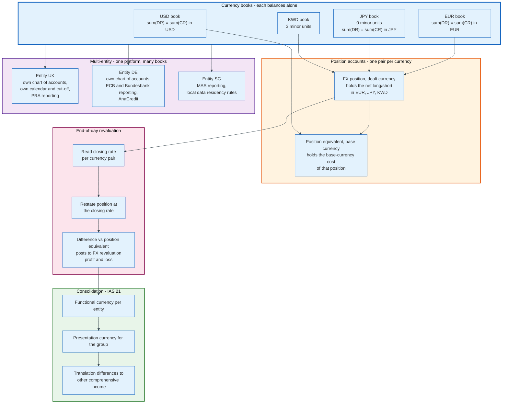

### 13.2 Position and Revaluation

A bank that holds balances in a currency other than its functional currency carries market risk, and the core measures it through position accounts.

Every foreign currency transaction posts to two paired general ledger accounts: a position account in the dealt currency, holding the net long or short amount, and a position-equivalent account in the base currency, holding what that position cost. At end of day the revaluation job reads the closing rate, restates the position at that rate, and posts the difference to a foreign exchange revaluation line in the profit and loss statement. Temenos Transact implements this with explicit position and position-equivalent categories; the concept is universal even where the naming is not.

IAS 21 governs the accounting. Each entity has a functional currency, the currency of its primary economic environment. Monetary items are translated at the closing rate with differences going to profit or loss. On consolidation into the group's presentation currency, translation differences go to other comprehensive income rather than profit or loss.

### 13.3 Minor Units and Rounding

Currencies do not all have two decimal places, and a core that assumes they do produces wrong amounts.

ISO 4217 assigns each currency a minor unit exponent. The Japanese yen and the Korean won have 0, so 1,000 JPY is 1000 minor units and there is no such thing as half a yen. Most currencies have 2. The Kuwaiti dinar, the Bahraini dinar, the Omani rial, and the Tunisian dinar have 3. The Chilean unidad de fomento has 4.

The engineering rule that follows: store money as an integer count of minor units together with its currency code, never as a decimal fraction and never as a float. `{"amount": 118540, "currency": "USD"}` is 1,185.40 dollars. `{"amount": 118540, "currency": "JPY"}` is 118,540 yen. The same integer means different things, which is why the currency code must travel with the amount everywhere, including in every internal API.

Rounding rules are contractual. Half-up is common in retail banking, banker's rounding, or round-half-to-even, is common in interest and tax calculations because it does not bias a large population of roundings upward. Which one applies is a product parameter, and changing it mid-life on a portfolio is a customer-remediation event.

### 13.4 Multi-Entity

A banking group running one core instance for several legal entities needs five things scoped to the entity, and getting any one of them wrong causes a regulatory problem rather than a technical one.

| Scoped to the entity | Why |
|----------------------|-----|
| **Chart of accounts** | Each entity files its own financial statements and its own regulatory returns |
| **Accounting calendar and cut-off** | Local holidays and local business-day conventions differ, and the accounting day is per entity |
| **Reference data** | Product catalogues, fee schedules, and rate tables are set by local product managers and local law |
| **Reporting extraction** | The UK entity reports to the PRA, the German entity to the ECB and Bundesbank, the Singapore entity to MAS |
| **Data access and residency** | Several jurisdictions require that customer data be stored locally and that local supervisors have direct access |

The last row is the one that breaks single-instance designs. A group that wants one global core for efficiency runs into local rules that require data to remain in-country, and the resolution is usually a regional instance per jurisdiction cluster with a consolidation layer above. That is more expensive than one instance and less expensive than one per country, and it is where most large international banks have landed.

---

## 14. The Vendor Landscape and Its Four Generations

### 14.1 The Generations

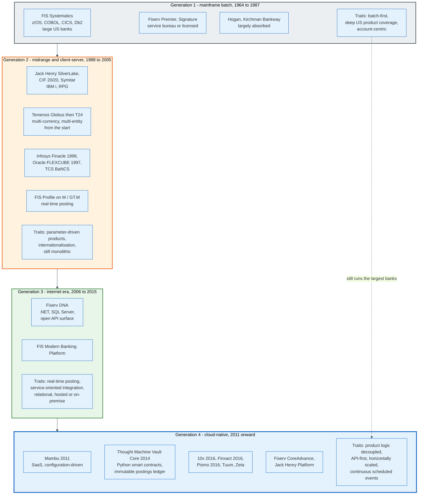

### 14.2 The Vendors, Compared

| Vendor | Core products | Platform | Delivery | Scale |
|--------|--------------|----------|----------|-------|
| **FIS** | Systematics, IBS, Horizon, AffinityEdge, Modern Banking Platform | z/OS, IBM i, distributed | Licensed, hosted, outsourced | 10.68 bn USD revenue FY2025; Banking Solutions 7.29 bn USD |
| **Fiserv** | DNA, Finxact, Premier, CoreAdvance, Portico, Signature | Windows, IBM i, cloud | Primarily outsourced service | 21.19 bn USD revenue FY2025; Financial Solutions 9.66 bn USD |
| **Jack Henry** | SilverLake, CIF 20/20, Core Director, Symitar | IBM i; Jack Henry Platform is public cloud | On-premise, private cloud, public cloud | 2.54 bn USD FY2026; over 7,200 institutions |
| **Temenos** | Transact (T24), Digital, Payments | Java, multiple databases, cloud or on-premise | Licensed, SaaS | 1.09 bn USD FY2025; over 950 core banking and 600 digital clients [S7] |
| **Infosys Finacle** | Finacle Core Banking | Java, Oracle or others | Licensed, cloud | Used by banks in over 100 countries as of 2020 |
| **Oracle** | FLEXCUBE, Banking Cloud Services | Java, Oracle Database | Licensed, cloud | Wide international footprint |
| **TCS** | BaNCS | Java | Licensed, cloud | Wide international footprint |
| **Mambu** | Mambu core | SaaS only, AWS | SaaS subscription | Revenue not disclosed; states hundreds of customers across 65+ countries |
| **Thought Machine** | Vault Core, Vault Payments | Kubernetes, any major cloud | SaaS or client-hosted | Lloyds, Standard Chartered, Intesa Sanpaolo, SEB, Atom, Lunar, JPMorgan |
| **Pismo** | Core banking and card issuer processing | Cloud-native, API | SaaS | Acquired by Visa for 1 bn USD, announced 28 June 2023 |

Sources: Fiserv Form 10-K FY2025 [S5]; FIS Form 10-K FY2025 [S6]; Jack Henry Form 10-K for the year ended 30 June 2026 [S4]; Temenos Annual Report and Accounts 2025 [S7]. Figures for Infosys, Oracle, TCS, Mambu, Thought Machine, and Pismo are the vendors' own published descriptions, not audited disclosures.

### 14.3 What Actually Distinguishes Them

Four questions separate any two core banking products, and they matter more than the marketing categories.

**Where does product logic live?** In compiled platform code, in a parameter table, or in customer-written code deployed separately. Generation 1 puts it in code. Generation 2 puts it in parameters. Vault puts it in customer-written Python contracts. The further out it lives, the faster a product changes and the more the bank owns the risk of getting it wrong.

**Is the posting ledger immutable?** Older cores update a balance and write a history record. Newer ones treat the postings ledger as the only writable structure and derive every balance. Immutability makes auditing and back-value correction cleaner and makes hot-account contention worse.

**Is the accounting day a period of unavailability?** Design A, B, or C from section 8.3. This single answer determines whether a bank can join a 24x7 rail without building a shadow balance.

**Who runs it?** A licensed on-premise deployment, a vendor-hosted private cloud, a vendor-run service bureau, or a multi-tenant SaaS. In the United States the outsourced service bureau dominates the community bank market, which is why the vendor's release schedule is the bank's release schedule.

### 14.4 The Concentration Problem

The US core banking market is concentrated enough that vendor roadmaps function as national payments policy.

4,238 FDIC-insured institutions are active as of the FDIC's 28 August 2026 index [S8], plus several thousand credit unions, and the overwhelming majority of them rent their core rather than run their own. Jack Henry alone serves over 7,200 banks, credit unions, and corporate entities. When the Federal Reserve launched FedNow on 20 July 2023, the practical constraint on reach was not bank willingness; it was whether the bank's core provider had built, priced, and scheduled instant payment support.

The same concentration produces the other well-known effect: switching costs. Contracts run five to seven years, Jack Henry states six years at inception for its cloud services, and deconversion fees for leaving early are set high enough to be a deterrent in themselves. The market is sticky by design, and the stickiness is a contract term rather than a technical one.

---

## 15. API Layers, Coexistence, and the Strangler Pattern

### 15.1 What an API Layer in Front of a Core Actually Does

The API layer in front of a core banking system is not a thin translation of core functions into REST. It is a semantic gap-filler, and it usually does four jobs the core cannot.

**Protocol translation.** The core speaks CICS transactions over MQ, or a proprietary socket protocol, or fixed-width files. The layer speaks HTTP with JSON, or gRPC, and maps between them. This includes character set translation from EBCDIC and unpacking of packed decimal fields.

**Composition.** A single business action such as "open an account" touches the customer information file, the account master, the product engine, the card platform, and the document system. The core exposes five calls. The layer exposes one, and owns the compensation logic when call four fails after calls one to three succeeded.

**Rate and load protection.** A mainframe core is sized for a known transaction profile. A public API can be hit at any rate. The layer caches read-heavy data such as balances and product catalogues, applies quotas, and shields the core from traffic patterns it was never sized for. Every cache introduces the shadow balance problem from section 8.

**Semantic normalisation.** Two cores in the same bank represent an account status with different code lists. The layer publishes one vocabulary. This is what BIAN standardises. Its Service Landscape release 14.0, published in February 2026, rationalises the service domain definitions, removes redundant service operations, adds domains in payments and insurance, and strengthens the mapping to ISO 20022. BIAN last published totals at release 11.0 in December 2022: 322 service domains, over 5,000 service definitions, and roughly 250 semantic APIs. It has published no updated total since [S11].

### 15.2 The Strangler Pattern, and Its Precondition

The strangler fig pattern replaces a system incrementally by routing traffic away from it capability by capability, and it works for core banking only under a condition most descriptions omit.

Martin Fowler named the pattern after strangler figs he saw in Queensland in 2001; his rewritten article carries the date 22 August 2024 [S13]. The fig germinates in a host tree's canopy, grows down to the ground, and eventually replaces the tree it grew on. Applied to software: put a facade in front of the legacy system, route one capability at a time to a new implementation, and delete the legacy path last.

The precondition for a ledger is that there must never be two systems of record for the same balance. This rules out the naive application of the pattern. A bank cannot route "read balance" to the new core and "post transaction" to the old one, because the new core would then be reading a balance it does not own. The seam has to be a partition of the accounts themselves, not a partition of the functions over them.

Three seams work in practice.

**By product.** Move all savings accounts to the new core; leave current accounts on the old one. Clean, because a product is a coherent set of behaviours, and each account has exactly one system of record. The routing key is the product code.

**By customer segment or brand.** Move a digital brand or a newly acquired portfolio. Clean for the same reason. Used when a bank launches a new brand on a new core and migrates back-book customers later.

**By new business only.** Every account opened after a date goes to the new core, and the back book stays until it runs off. Slowest, safest, and the only approach that never migrates a balance.

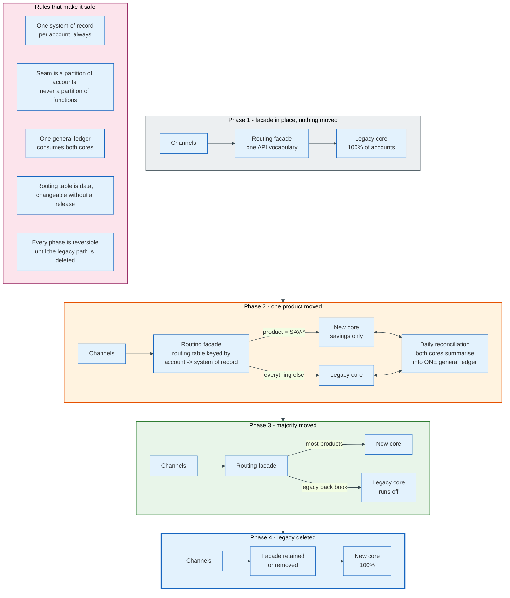

### 15.3 Transitional Architecture Is Not Waste

Coexistence requires code that will be deleted, and the instinct to avoid building it is the most reliable way to force a big-bang migration.

The transitional components are specific: a routing table mapping accounts to systems of record, a dual-write or dual-read comparison harness that runs both cores against the same input and reports differences, a general ledger consolidation layer that accepts summaries from two cores and proves them as one, a reconciliation between the two cores' views of any shared reference data, and a reverse-migration path for accounts that have to move back.

Fowler's article makes the point that transitional architecture appears wasteful but reduces risk and delivers value earlier than a full replacement. In core banking the calculation is starker, because the alternative to transitional architecture is a single weekend on which the whole bank moves.

That weekend is the subject of the next section.

---

## 16. Core Migration and How It Fails

### 16.1 The Approaches

| Approach | Description | Risk profile | Example |
|----------|-------------|--------------|---------|
| **Big bang** | Everything moves in one cutover event | Highest. One weekend decides the outcome. No partial rollback once customers transact. | TSB, April 2018 |
| **Phased by product or segment** | Accounts move in tranches over months or years | Moderate. Each tranche is small; coexistence cost is real. | Most large-bank programmes |
| **Greenfield launch, back book stays** | Build a new bank on a new core; the legacy portfolio never moves | Low technical risk, high commercial cost. Two banks to run, indefinitely. | Chase UK on Vault Core, launched 2021 |
| **Run off** | New business only on the new core; old book decays | Lowest. Slowest. The legacy system survives for a decade. | Common for closed lending books |

A fifth pattern gets described more often than it gets finished: greenfield then migrate, in which an incumbent stands up a parallel bank on a new core and moves its existing customers into it. It carries the commercial cost of running two banks and the behaviour-equivalence problem of a phased migration at the same time. No top-ten US bank has completed one.

### 16.2 Why Migrations Fail

Six causes recur, and only one of them is about data.

**Behaviour equivalence, not data equivalence.** The new core must reproduce the old core's arithmetic exactly. Same interest to the cent, same fee on the same day, same posting order, same rounding. A bank with thirty years of history has hundreds of product variants, many closed to new business but still populated. Each has to be reproduced and proved. This is the largest single work package and it is routinely underestimated because it is invisible in a requirements document.

**Data quality that was never tested.** Fields that were never validated because no code ever read them. Dates of birth recorded as 01/01/1900. Addresses in free text with the postcode in the wrong line. Accounts with no owner because a party record was deleted in 2003. The old core tolerated all of it. The new core has constraints.

**Testing compressed at the end.** Functional testing overruns, and non-functional testing, the testing of load, capacity, and failover, is the only remaining slack. It gets cut. This is precisely what the Financial Conduct Authority found at TSB.

**Environment inequivalence.** Testing in an environment that differs from production means the tests do not test production. TSB and its supplier conducted the majority of non-functional testing in the production environment itself, because no pre-production environment was available, which limited what could be tested and how.

**Governance that cannot say no.** A public migration date creates commitment. TSB decided on 20 September 2017 that its plan needed replanning and announced a Q1 2018 migration date nine days later, before the replanning was complete.

**Contingency planning sized for the wrong event.** Every migration plans for the migration failing. Fewer plan for the migration succeeding technically and then failing under load, which produces a different incident with different demands: contact centres, branch queues, and complaint handling rather than a rollback.

### 16.3 TSB, April 2018

TSB's migration is the best-documented core banking failure in the world, because two regulators published their findings.

```mermaid
%%{init: {'theme': 'base', 'themeVariables': {'primaryColor': '#e3f2fd', 'primaryBorderColor': '#1565c0', 'lineColor': '#37474f'}}}%%

flowchart TB
    A["June 2014<br/>TSB divested from Lloyds Banking Group.<br/>Continues to use the LBG IT platform<br/>under an outsourcing agreement<br/>with an option to July 2024"]
    B["July 2015<br/>Sabadell acquires TSB.<br/>Deal rationale includes returns from<br/>migrating TSB to Sabadell's Proteo platform.<br/>Target: end of 2017"]
    C["2015-2017<br/>SABIS, a Sabadell subsidiary, designs,<br/>builds and tests Proteo4UK:<br/>a new UK build, not the proven Spanish one"]
    D["March 2016<br/>Integrated Master Plan adopts the<br/>end-2017 target despite already<br/>running months late"]
    E["20 Sept 2017<br/>Board told migration cannot complete<br/>in November 2017.<br/>Programme resolves to re-plan."]
    F["29 Sept 2017<br/>Nine days later, and before re-planning<br/>concludes, TSB publicly announces<br/>migration in Q1 2018"]
    G["End Feb 2018<br/>A decision taken outside the appropriate<br/>governance forum reduces the scope of<br/>Active-Active non-functional testing<br/>on the digital channels' data centres"]
    H["Testing environments<br/>Most non-functional testing runs in the<br/>PRODUCTION environment because no<br/>pre-production environment exists"]
    I["April 2018<br/>Functional and non-functional testing run<br/>in parallel to meet the date.<br/>No clean migration acceptance cycle<br/>was ever achieved."]
    J["20-22 April 2018<br/>Main Migration Event.<br/>Corporate systems, customer services<br/>and customer data move to Proteo4UK"]
    K["22 April 2018 onward<br/>Data centre component configuration<br/>fault takes internet and mobile<br/>banking down for periods"]
    L["23 April 2018<br/>Digital failure cascades to telephony.<br/>69,000 calls by 14:00.<br/>IVR configuration leaves only about 25%<br/>of planned telephone line capacity."]
    M["Branch queues build.<br/>Data breaches: some customers see<br/>other customers' account detail.<br/>Payment, CASS, Bacs, CHAPS and<br/>Faster Payments issues follow."]
    N["10 December 2018<br/>TSB returns to business as usual.<br/>Roughly 33 weeks after cutover."]
    O["Outcome<br/>225,492 complaints between 22 Apr 2018<br/>and 7 Apr 2019, about 4.3% of a<br/>5.2 million customer base.<br/>32,705,762 GBP paid in redress."]
    P["20 December 2022<br/>FCA fines TSB 29.75 m GBP,<br/>reduced from 42.50 m for settlement.<br/>With the PRA penalty the total<br/>reported is 48.65 m GBP."]

    A --> B --> C --> D --> E --> F --> G
    G --> I
    H --> I
    I --> J --> K --> L --> M --> N --> O --> P

    style G fill:#ffebee,stroke:#c62828,stroke-width:3px
    style H fill:#ffebee,stroke:#c62828,stroke-width:2px
    style I fill:#ffebee,stroke:#c62828,stroke-width:3px
    style J fill:#fff3e0,stroke:#e65100,stroke-width:3px
    style P fill:#e3f2fd,stroke:#1565c0,stroke-width:2px
```

The facts, from the FCA's final notice of 20 December 2022 [S1]:

- TSB had approximately **5.2 million customers** during the relevant period.
- The Main Migration Event ran over the weekend of **20 to 22 April 2018**.
- Problems began from an early point after go-live on 22 April and included data breaches, digital banking failures, telephone banking failures, branch technology failures, and consequential payment and debit card problems.
- On **23 April 2018**, 69,000 calls had been received by 14:00. A configuration problem on the interactive voice response lines left roughly **25%** of the planned telephone line capacity available.
- TSB did not return to business as usual until **10 December 2018**.
- Between 22 April 2018 and 7 April 2019, TSB received **225,492 complaints**, about **4.3%** of its customer base, and paid **32,705,762 GBP** in redress.
- The FCA imposed a penalty of **29.75 million GBP**, discounted 30% from 42.50 million for settlement at stage 1. The PRA imposed a separate penalty [S2]; the combined figure reported at the time was **48.65 million GBP**.
- TSB's chief information officer was separately fined **81,000 GBP** in 2023, reduced from 116,600 GBP.

The two causal findings that generalise to any core migration:

**The Active-Active testing decision.** A decision taken around the end of February 2018, outside the appropriate governance forum, reduced the scope of a type of non-functional testing on the digital channels across TSB's data centres. The FCA states that had this testing been conducted, a configuration problem in certain data centre components, the problem that took internet and mobile banking down after go-live, would likely have been found. The risks of not conducting the test were not identified or reported, because the decision was treated as purely technical.

**No clean migration acceptance cycle.** TSB went live without ever having completed a clean migration acceptance cycle, the test that proves the extract, transform, and load process produces correct data. Functional and non-functional testing ran in parallel into April 2018 to meet the deadline.

One line summarises both. A technical decision that removes a test is a risk decision, and it belongs in the governance forum that owns risk.

### 16.4 What Success Looks Like

Successful core migrations share four properties, and none of them is a technology choice.

**A date that can move.** Programmes that announce a public date before completing planning lose the ability to stop. Programmes that keep the date internal until testing is complete keep it.

**A clean rehearsal before go-live.** At least one complete migration rehearsal, on production-equivalent infrastructure, with the resulting data reconciled to the cent, and no open defects above an agreed severity.

**A rollback that has been executed, not written.** A rollback plan tested only on paper is a document. A rollback rehearsed end-to-end is a control.

**Load testing in the deployed configuration.** Not in a simplified environment, not with a subset of components, and not with a synthetic profile that omits the failure cascade. TSB's failure was not a data failure. It was a capacity and configuration failure in a configuration that had not been tested.

---

## 17. Regulatory Reporting Extraction

### 17.1 The Core Is the Source, Not the Reporter

Regulatory reports are not produced by the core banking system. They are produced by a reporting engine fed from a nightly extract, and the gap between what the core holds and what the report needs is where most reporting failures live.

The standard pipeline: core, then an overnight extract, then an operational data store or data warehouse holding account-level and transaction-level history, then a regulatory reporting engine that applies the taxonomy and the validation rules, then a submission in the regulator's format. Vendors in the last stage include Nasdaq AxiomSL, which carried the Adenza brand until Nasdaq completed that acquisition in November 2023, Wolters Kluwer OneSumX, Moody's, and Regnology.

Two controls make it credible. The report must tie to the general ledger, because the regulator can compare the two. And the extract must be reproducible: running last quarter's extract again must produce last quarter's numbers, which requires the warehouse to hold history rather than only current state.

### 17.2 The US Reports

| Report | Filer | Frequency | What it needs from the core |
|--------|-------|-----------|----------------------------|
| **FFIEC 031** | Banks with foreign offices | Quarterly | Balance sheet and income by category, domestic and foreign |
| **FFIEC 041** | Domestic-only banks | Quarterly | Same, domestic only |
| **FFIEC 051** | Smaller domestic institutions | Quarterly | A reduced schedule set |
| **FR Y-9C** | Bank holding companies | Quarterly | Consolidated holding-company financials |
| **FR Y-14M** | Large holding companies under stress testing | Monthly | Loan-level data, not aggregates |
| **FR 2052a** | Large banking organisations | Daily for the largest | Liquidity flows by counterparty and maturity bucket |
| **FinCEN SAR and CTR** | All banks | Event-driven | Party, account, and transaction detail |

The Call Report is filed quarterly, generally within 30 days of quarter end, and the schedules that hurt are the granular ones: RC-C for loans by category, RC-E for deposits by type, and RC-O for the deposit insurance assessment base, which requires deposits classified by ownership category rather than by product.

The structural problem is granularity. A Call Report asks for aggregates and a core can produce them. FR Y-14M asks for loan-level records with attributes such as credit score at origination, loan-to-value ratio, and property type. If the core never captured an attribute, no extract can produce it, and the bank has to source it from the origination system, a vendor, or a manual file. That is how a reporting requirement becomes a data-capture project in the origination platform.

### 17.3 The European Reports

Europe collects more, at finer granularity, in a machine-readable taxonomy.

**COREP and FINREP** are the common reporting and financial reporting frameworks defined by European Banking Authority implementing technical standards, submitted in XBRL against the EBA's Data Point Model. Every cell in every template has a defined semantic identity, and the validation rules are published, which means a submission is machine-checked before a human reads it.

**AnaCredit**, established by Regulation (EU) 2016/867 of the European Central Bank, collects loan-by-loan data on credit granted to legal entities, with a reporting threshold of 25,000 euro of exposure per debtor per institution. It requires roughly ten linked datasets covering the counterparty, the instrument, the protection, the accounting treatment, and the default status. A bank cannot satisfy it from a general ledger. It needs the loan subledger with attributes attached.

**BCBS 239**, the Basel Committee's Principles for effective risk data aggregation and risk reporting, published on 9 January 2013, sets 14 principles covering governance, data architecture, accuracy, completeness, timeliness, and adaptability, with globally systemically important banks expected to comply by January 2016. The Committee has repeatedly reported that compliance remains incomplete more than a decade later, which is the single best summary of how hard it is to aggregate risk data across a bank's account systems.

### 17.4 Why the Extract Is Hard

Four properties of a core make regulatory extraction more difficult than it looks.

**The core stores current state and a rolling history, not a full time series.** Cores purge. A five-year-old closed account may exist only in an archive, and the archive may be in a format that needs a copybook nobody has.

**Classification is not stored where the report needs it.** A deposit's insurance ownership category, a loan's regulatory asset class, and a counterparty's sector code are frequently derived rather than stored, and the derivation logic lives in the reporting engine. Two engines can derive differently from the same extract.

**Point-in-time is not the same as as-of.** A report as of 30 June must reflect what was known on 30 June, not what is known today after corrections were posted. Back-value entries and reversals mean the extract must be able to reconstruct the position as at a date, which requires bitemporal history: what the balance was, and when the system believed it.

**Multi-entity and multi-core.** A group with three cores must consolidate three extracts with three chart-of-accounts mappings before any report is possible, and the consolidation is where the differences accumulate.

---

## 18. Economics: What It Costs to Run and Who Pays

### 18.1 How Vendors Price

Core banking pricing is a per-account subscription with transaction surcharges, wrapped in a long contract, and published prices do not exist because every contract is negotiated and confidential.

The components that appear in essentially every contract:

| Component | Basis | Notes |
|-----------|-------|-------|
| **Core processing fee** | Per account per month, tiered by volume | The base. Declines per unit as the bank grows, which favours incumbents. |
| **Transaction fees** | Per item: ACH, card, wire, instant payment, statement | Where growth revenue comes from |
| **Module licences** | Per module: online banking, bill pay, cards, treasury | Unbundled deliberately |
| **Implementation** | Fixed fee or time and materials | One-off, often 1x to 2x the first year's recurring fee |
| **Custom development** | Day rate | The mechanism by which a bank's core diverges from the vendor's baseline |
| **Deconversion fee** | Fixed or formula, payable on exit | The switching cost, and often the largest single number in the contract |
| **Contract term** | Five to seven years, auto-renewing | Jack Henry states six years at inception for cloud services |

The revealed price is easier to compute than the quoted one. Jack Henry's fiscal 2026 revenue of 2.544 billion dollars across more than 7,200 institutions and corporate entities averages roughly 353,000 dollars per client per year, covering core processing, payments, and digital together [S4]. The distribution behind that average is wide, because the client base runs from de novo banks to institutions with 55 billion dollars in assets.

The contract shape is stated in the same filing. Clients that outsource their core processing "typically sign contracts for six years that include 'per account' fees and minimum guaranteed payments during the contract period" [S4]. Two things follow. The bank pays per account, so it pays for growth. The bank pays a floor whether or not it grows.

Two structural facts follow from the pricing model.

**Growth is priced, so the vendor participates in the bank's success.** A bank that doubles its accounts pays materially more, without the vendor doing materially more work. This is why core contracts are renegotiated at growth inflection points rather than at renewal.

**Exit is priced, so the market is sticky.** A deconversion fee plus a migration programme plus the operational risk of section 16 sets a floor on the benefit a competing vendor has to promise. Most banks find that floor higher than the benefit, which is the whole explanation for why mainframe cores persist.

Deconversion is large enough to show up in the vendor's income statement. Jack Henry booked 16.6 million dollars of deconversion revenue in its Core segment in fiscal 2026, 13.7 million in Payments, and 12.2 million in Complementary: 42.5 million dollars in total, 1.7% of group revenue, earned entirely from clients leaving [S4]. Departures are a product line.

### 18.2 What It Costs a Bank to Run One

The bank's own cost sits in four buckets. One can be derived to a figure from public filings, one can be anchored to a public headcount range, and two carry no public price at all, which this section states rather than fills with an estimate.

**Vendor fees: roughly 480,000 dollars per core client per year at Jack Henry.** The Core segment took 768.5 million dollars in the year ended 30 June 2026 [S4]. The install base behind that number is disclosed by product in the same filing: over 500 SilverLake banks, over 200 CIF 20/20 banks, approximately 200 Core Director banks, and over 700 Symitar credit unions, so at least 1,600 institutions. Divide and core processing alone runs to roughly 480,000 dollars per institution per year, against roughly 353,000 dollars per client per year averaged across all four segments and all 7,200-plus clients. The two figures do not conflict. Core clients are the larger clients, and they also buy payments and complementary products on top. What is not public at any vendor is the rate underneath: the per-account-per-month price is negotiated and confidential, and no published benchmark for it exists.

**Infrastructure: priced off the batch peak, not the average.** For a self-hosted mainframe core, IBM Z software carries a monthly licence charge computed from the rolling four-hour average of processing capacity consumed, measured in millions of service units, with the highest such average in the month setting the bill for the month. Take a core whose workload idles at 400 MSU through the day and peaks at 1,200 MSU during the 02:00 batch. The bank is billed on 1,200. Moving 300 MSU of that batch outside the peak four hours cuts billed capacity by a quarter without removing a single unit of work, which is why batch window engineering is a finance exercise as much as an operations one. IBM's newer Tailored Fit Pricing sells annual consumption instead of monthly peak and removes that incentive. IBM does not publish a price per MSU under either model, so the absolute cost of a given capacity cannot be derived from public sources. The mechanism can.

**People: the bank total is public, the core share is not.** Thirty-two FDIC-insured banks held between 10 and 15 billion dollars in assets at 30 June 2026, with a median of 1,047 full-time equivalent staff and quartiles at 564 and 1,404 [S8]. How many of those sit in core operations, batch monitoring, exception clearing, parameter administration, integration engineering, and testing is not broken out in the Call Report, in the FDIC's published series, or in any vendor filing. The shape is legible even where the number is not. The batch window needs overnight cover, exception queues need clearing before the branches open, and parameter changes need a second pair of eyes, which sets a floor of a handful of staff on a rota rather than one administrator. That floor is the reason the outsourced service bureau wins the small end: below a certain asset size the bank cannot staff a rota at all.

**Change: a vendor revenue line, with no published day rate.** Every regulatory change, every product change, and every rail integration lands as a change request, and the vendor prices it. Jack Henry attributes part of its fiscal 2026 Core segment growth to "a rise in consulting, work orders, and release revenue" [S4], which is the bank's change budget seen from the other side of the invoice. Professional services day rates are not published by any core vendor. Banks that cannot buy vendor capacity build around the core instead, which is how a bank ends up with a payment engine, a fee engine, and a limits engine that duplicate core functions.

One bucket is priced per account. One is priced per peak. The other two are priced per negotiation.

### 18.3 Build Versus Buy

A small number of banks write their own core, and the decision rule that separates them from the rest is legible.

Monzo and Starling in the United Kingdom, Nubank in Brazil, and several others built their own ledgers because their product roadmap was their business, and because a vendor release cycle of one or two major versions a year was incompatible with weekly shipping. They were also greenfield, which removes the hardest half of the problem: there was no back book to migrate.

The rule: build when the ledger's behaviour is the product and the bank has no legacy portfolio. Buy when the ledger's behaviour is table stakes and the bank has thirty years of accounts. A bank in the second position that decides to build is really deciding to run a migration programme and a software company at the same time.

The incumbents have taken the third path, which is to buy a cloud-native core and put it beside the old one. Fiserv acquired Finxact in 2022 and now describes its embedded finance offering as built on a ledger powered by Finxact. Visa acquired Pismo for 1 billion dollars in 2023. FIS built Modern Banking Platform. Jack Henry is building the Jack Henry Platform on public cloud with general ledger and deposit servicing as discrete services.

Buying the fourth generation is cheaper than writing it. Migrating to it is the part nobody has finished.

---

## 19. Banking-as-a-Service Built on Top

### 19.1 The Stack

Banking-as-a-service is a chartered bank renting out its licence, its payment access, and its deposit insurance to a non-bank, with a middleware layer in between doing the account keeping.

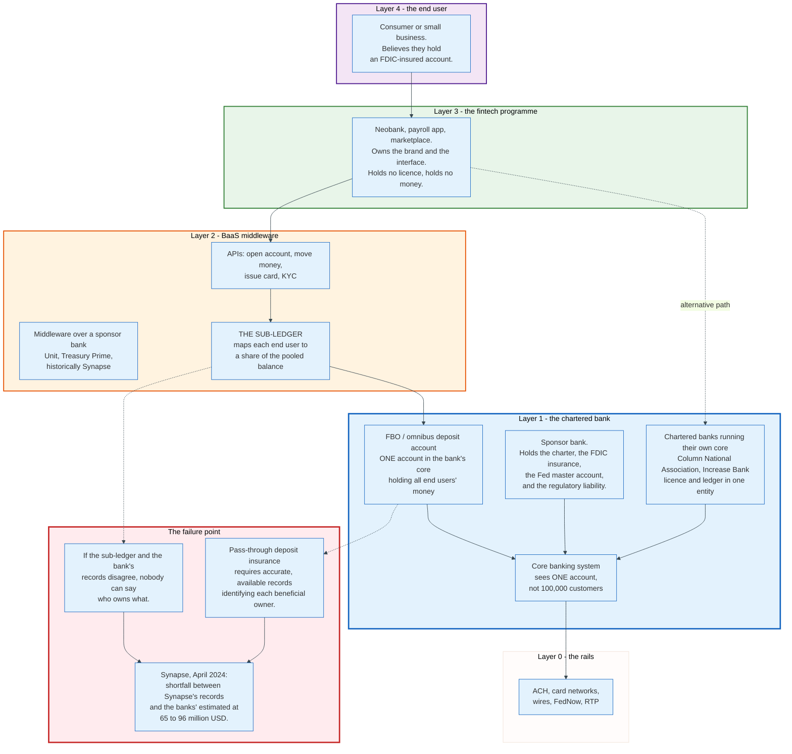

### 19.2 The FBO Structure and What It Hides

The mechanism that makes banking-as-a-service work is the pooled custodial account, and it is also the mechanism that failed.

A sponsor bank opens one deposit account titled "for the benefit of" the end customers of a programme. All of the programme's customer money sits in that one account. The bank's core banking system sees a single account with a single balance, and it applies interest, reporting, and reconciliation to that single account. The identity of the thousands of individual owners lives in a sub-ledger held by the middleware or the fintech, outside the bank's core.

Pass-through deposit insurance depends on that sub-ledger being accurate and available. The FDIC insures the beneficial owners rather than the account holder only if the records identify the owners and their interests, and only if those records can be obtained.

The structure creates three exposures.

**The bank does not hold the ledger of record for its own depositors.** It holds a balance. Somebody else holds the breakdown.

**Reconciliation between the sub-ledger and the bank account was not, until recently, a supervisory requirement with a defined frequency.** Two records that are never compared drift.

**The end user's mental model is wrong.** The customer believes they have a bank account. They have a beneficial interest in a pooled account, administered by a company that is not a bank and cannot be resolved by the FDIC.

### 19.3 Synapse

Synapse Financial Technologies filed for Chapter 11 bankruptcy in April 2024, and the resulting shortfall demonstrated every exposure above at once.

The facts as reported in the bankruptcy [S16]: the trustee estimated a shortfall between Synapse's records and those of the partner banks of **65 million to 96 million dollars**. Synapse served roughly **10 million** retail end users indirectly through around **100** fintech partnerships. Four banking partners were named: Evolve Bank & Trust, AMG National Trust Bank, American Bank North America, and Lineage Bank. Former FDIC Chair Jelena McWilliams was appointed trustee.

The clearest single number comes from one programme. Yotta Savings reported that **13,725** of its former customers lost deposited money, and its customers received approximately **11.8 million dollars** against **64.9 million dollars** in total deposits, a recovery of roughly **18%**.

No bank failed. No deposit insurance was triggered, because deposit insurance covers a bank failure, not a middleware failure. The money was not stolen in any simple sense; the records of who owned what could not be reconstructed.

### 19.4 The Regulatory Response

The FDIC proposed a rule directly aimed at the ledger, and as of August 2026 it has not been finalised.

**Recordkeeping for Custodial Accounts**, published in the Federal Register at 89 FR 80135 on 2 October 2024 [S9], would require insured depository institutions offering custodial deposit accounts with transactional features to maintain records identifying the beneficial owners and their interests, with the stated purpose of enabling the FDIC to make deposit insurance determinations promptly and pay claims as soon as possible if the institution fails. The comment period, originally closing 2 December 2024, was extended to 16 January 2025 by a notice at 89 FR 91586 of 20 November 2024 [S9]. No final rule had been published as of August 2026.

The supervisory position around it hardened faster than the rulemaking. The Federal Reserve, FDIC, and OCC issued interagency guidance on third-party relationships in June 2023, and enforcement actions against sponsor banks over programme oversight, AML, and reconciliation have run continuously since.

### 19.5 What the Failure Teaches About Cores

One rule generalises out of the Synapse episode, and it applies well beyond banking-as-a-service.

Whoever holds the ledger of record holds the risk. If the entity with the licence and the insurance does not hold the account-level ledger, then the protection the licence provides does not reach the person who thinks they have it. The fix is architectural rather than contractual: put the beneficial-owner ledger inside the bank's core, or at minimum reconcile it to the bank's records daily with a defined break-resolution process.

The vendors have noticed. Fiserv describes its embedded finance offering as built on a ledger powered by Finxact recording transactions between parties, which is a statement that the ledger belongs at the bank. Column and Increase each acquired a chartered bank and run their own core inside it, rather than building middleware over someone else's. FDIC records date Column National Association, certificate 58224 in Salt Lake City, to 28 March 2006, and Increase Bank, certificate 35261 in Longview, Washington, to 17 April 2000. Neither charter is new [S8]. The market is moving the sub-ledger back inside the perimeter, which is where it was before 2015.

---

## 20. Security and Operational Risk

### 20.1 The Threat Model

The core banking system's threat model is dominated by authorised insiders and by integration points, not by external intrusion into the ledger itself.

**Insider posting fraud.** A user with entitlement to post a journal entry can move money. The controls are maker-checker dual authorisation above thresholds, transaction code entitlements per role, teller and officer limits, and daily review of overrides. The classic pattern is small entries to a suspense account, which is why suspense ageing is a monitored control rather than an accounting nicety.

**Batch file tampering.** An ACH origination file or a card settlement file is a plain fixed-width file, and until it is signed and checksummed it is an instruction anyone with filesystem access can edit. Controls are file hash verification, dual control on file release, and totals reconciliation between the originating system and the file.

**Privilege escalation through integration accounts.** Service accounts used by channel systems accumulate entitlements over years. An account created in 2009 for a decommissioned system that still has posting rights is a standard audit finding.

**Ransomware on the batch chain.** The core itself is usually well protected. The scheduler, the file transfer servers, and the print stream are less so, and encrypting them stops the bank as effectively as encrypting the database.

**Third-party access.** Vendors, service bureaus, and integrators hold credentials into production. Each is a path, and each is why the FFIEC examines significant service providers directly.

### 20.2 The Controls That Matter

| Control | What it prevents |
|---------|------------------|
| **Maker-checker** | Single-person money movement above a threshold |
| **Transaction code entitlement** | A teller posting a general ledger correction |
| **Daily GL proof** | An error accumulating unnoticed across days |
| **Suspense ageing** | Money parked where nobody is looking |
| **Dormant account controls** | Reactivation without customer contact |
| **Override reporting** | Limits bypassed routinely rather than exceptionally |
| **Segregation of parameter change from posting** | A product manager changing a fee and then reversing their own fee |
| **Immutable journal** | Retrospective editing of history |

### 20.3 Availability and Recovery

Recovering a core banking system means recovering to a consistent accounting state, which is harder than recovering a database.

The difficulty is the batch. A database restored to a point in the middle of a batch run is internally consistent and accounting-inconsistent: some accounts have been accrued and others have not, some fees are assessed and others are pending. The standard practice is to recover to the last completed batch checkpoint and re-run forward, which requires that the input files be retained and that every job be restartable.

Recovery time and recovery point objectives for a core are typically measured in single-digit hours and near-zero data loss respectively, achieved with synchronous replication to a second site. Mainframe deployments use cross-site mirroring with a coupling facility; cloud-native deployments use multi-zone replication with a quorum write.

Operational resilience became a regulatory obligation rather than a good practice in this decade. The EU's Digital Operational Resilience Act, Regulation (EU) 2022/2554, applies from 17 January 2025 and imposes requirements on ICT risk management, incident reporting, testing, and oversight of critical ICT third-party providers, with a designation regime for the largest of them. The United Kingdom's operational resilience rules require firms to set impact tolerances for important business services and to be able to remain within them, with a compliance date of 31 March 2025, and the UK has a separate regime for critical third parties.

Both regimes point at the same fact. A core banking vendor serving thousands of banks is systemically relevant, and supervisors have decided to say so in writing.

### 20.4 Known Incidents

The public record of core banking failures is thin because most incidents are resolved without a regulatory notice. Three are documented well enough to learn from.

**TSB, April 2018.** Covered in section 16.3. Migration into an untested configuration, cascading failure, 225,492 complaints, 32.7 million GBP redress, 29.75 million GBP FCA penalty.

**Batch overrun incidents.** Every large bank has them and almost none are published. The pattern is consistent: a job runs long, the window closes, branches open on stale balances, and payment files miss their origination window by a business day.

**Synapse, April 2024.** Covered in section 19.3. Not a core banking outage at all, which is the point: the ledger was outside the bank, and no core banking control applied to it.

---

## 21. Comparisons and Alternatives

### 21.1 Core Architectures Compared

| Dimension | Mainframe monolith | Midrange packaged | Cloud-native vendor | Built in-house |
|-----------|-------------------|-------------------|---------------------|----------------|
| **Typical user** | Top 50 banks | Community and regional banks | Digital banks, new brands, ambitious incumbents | Neobanks with engineering as the product |
| **Product change** | Vendor release cycle, months | Parameter change, days to weeks | Code or config deploy, days | Same day |
| **Posting model** | Memo post plus nightly batch | Memo post plus nightly batch, some real time | Continuous posting, scheduled events | Continuous |
| **Accounting day** | A window of unavailability | A window, shrinking | A timestamp boundary | A timestamp boundary |
| **Scaling** | Vertical, with data sharing across a sysplex | Vertical | Horizontal by account shard | Horizontal |
| **Hot account contention** | Serialised, mitigated by summarisation | Serialised | Still serialised. Sharding does not help. | Still serialised |
| **Cost shape** | Large fixed, capacity-based licensing | Per account per month | Per account per month, consumption elements | Headcount |
| **Regulatory reporting** | Mature extracts, decades of tooling | Mature extracts | Newer, more work required | Built from scratch |
| **Key risk** | Skills and vendor concentration | Vendor roadmap dependence | Maturity in edge products and reporting | Everything is your problem |

### 21.2 When Each Choice Is Right

**Keep the mainframe** when the portfolio is large, the products are stable, and the regulatory reporting is deep. The cost of migration exceeds the benefit for most large banks with commodity retail products, and the honest answer is that nobody has migrated a top-ten US bank off one.

**Buy a midrange or packaged core** when the bank is small enough that operations is three people and the product set is standard. The service bureau model exists for exactly this case and is the reason most US community banks have working payments at all.

**Buy a cloud-native core** when launching a new brand, entering a new market, or building a product whose economics depend on iteration speed. Chase UK launched on Vault Core in 2021 as a greenfield, which is the pattern.

**Build** when the ledger's behaviour is the product and there is no back book. Monzo, Starling, and Nubank cleared that bar. A bank with a thirty-year portfolio does not.

### 21.3 The Composable Alternative

A fourth position has emerged that is neither buy nor build: assemble a core from independently replaceable components.

The idea, standardised by BIAN and marketed as coreless banking, is that a bank buys a ledger from one vendor, a product engine from another, a payments engine from a third, and a customer data platform from a fourth, joined by a semantic API layer. BIAN's Service Landscape 14.0, released in February 2026, provides the vocabulary and deepens the mapping to ISO 20022. The last published counts are those of release 11.0 in December 2022: 322 service domains, over 5,000 service definitions, and roughly 250 semantic APIs [S11].

The argument for it is replaceability. The argument against it is that the accounting invariant crosses component boundaries, and a distributed double-entry ledger is harder than a single one for the reasons in section 12. The compromise most banks reach is a single ledger with everything else componentised, which is exactly what Vault Core's three-layer split and the Jack Henry Platform's service decomposition describe.

The ledger is the part that does not decompose.

---

## 22. Modern Developments

### 22.1 What Changed in the Last Three Years

**Cloud-native cores reached production at systemically important banks.** Thought Machine's client list includes Lloyds, Standard Chartered, Intesa Sanpaolo, SEB, and JPMorgan Chase. That is a different claim from the 2019 position, when cloud-native cores ran digital brands and nothing else. The migration of a back book at that scale is still the unsolved problem.

**The incumbents bought or built the fourth generation.** Fiserv acquired Finxact in 2022 and now offers CoreAdvance. Visa acquired Pismo for 1 billion dollars, announced 28 June 2023 and closed in January 2024. FIS ships Modern Banking Platform. Jack Henry is building the Jack Henry Platform on public cloud, with general ledger, deposit servicing, wire transfers, and exception item processing as discrete services.

**ISO 20022 arrived at the core's doorstep.** The Fedwire Funds Service moved to ISO 20022 on 14 July 2025, and the coexistence period for cross-border Swift MT messages ended on 22 November 2025. Cores that consumed a 6-field wire record now consume a structured message with defined party, purpose, and remittance elements, which is an integration change and a data-capture change at the same time.

**Banking-as-a-service was repriced by the Synapse failure.** The sub-ledger has started moving back inside the bank perimeter, and the FDIC's October 2024 recordkeeping proposal, still unfinalised, would make that a rule rather than a preference.

**Tokenised deposits entered the regulatory agenda.** The FDIC proposed a rule at 91 FR 18534 on 10 April 2026 [S10] implementing GENIUS Act requirements for permitted payment stablecoin issuers and insured depository institutions, clarifying deposit insurance coverage for stablecoin reserve deposits and the treatment of tokenised deposits. A tokenised deposit is a claim on a bank recorded on a distributed ledger, which raises the question of which ledger is the system of record. The regulatory answer being drafted is that the bank's ledger remains the record and the token is a representation of it.

### 22.2 Where It Is Heading

**AI applied to the COBOL problem.** Vendors including IBM ship tooling that translates COBOL to Java with model assistance. The bottleneck is not translation; it is the absence of a specification. Forty years of behaviour is documented only in the code, and translating code you do not understand produces a system whose failures you also do not understand. The plausible near-term application is comprehension, not rewriting: generating specifications and tests from legacy code so that a rewrite has a target to hit.

**The accounting day as the last constraint.** Every other batch justification from section 9 has a modern answer. Set operations can stream. External files can be replaced by APIs. Order can be established by sequence numbers rather than by a sort at cut-off. What remains is that accounting periods are days and regulators observe day-end. That is a legal and accounting fact, not a technical one, and it will not be engineered away.

**Real-time regulatory reporting.** Supervisors have been moving from periodic aggregate reports toward granular and more frequent collection for a decade: AnaCredit loan-by-loan, FR 2052a daily, FR Y-14M monthly. The direction is toward the supervisor pulling from the bank's data rather than the bank pushing a report, and that requires the core's extract to be continuously available rather than nightly.

**Concentration as a supervisory concern.** DORA's critical ICT third-party oversight regime and the UK's critical third parties regime both exist because a handful of firms supply the ledgers of thousands of banks. Direct supervision of core vendors, already the practice in the United States under the Bank Service Company Act, is becoming the practice in Europe and the United Kingdom too.

---

## 23. Appendix

### 23.1 Key Terminology

| Term | Meaning |
|------|---------|
| **Accrual** | Daily calculation of interest earned or owed, posted to the general ledger without touching the customer's balance |
| **Available balance** | Ledger balance adjusted for holds, memo posts, uncollected funds, and any overdraft line. What the customer can spend. |
| **BIAN** | Banking Industry Architecture Network. Publishes the Service Landscape, at release 14.0 in February 2026. Last published counts are release 11.0's, December 2022: 322 service domains. |
| **Capitalisation** | Posting accumulated accrued interest into the customer's account on the cycle date |
| **CIF** | Customer Information File. The central party record linking a customer to every account and relationship. |
| **COMP-3** | COBOL packed decimal. Two digits per byte, sign in the last nibble: C positive, D negative, F unsigned. |
| **Copybook** | A COBOL record layout definition. Without it, a fixed-width extract file is unreadable. |
| **Day count basis** | The divisor in an interest formula. ACT/365, ACT/360, ACT/ACT, 30/360. |
| **Deconversion fee** | The contractual charge for leaving a core vendor. The industry's principal switching cost. |
| **EOD** | End of day. The batch cycle that closes an accounting day and rolls the date. |
| **FBO account** | For Benefit Of. A pooled custodial deposit account holding many end users' funds under one account at a bank. |
| **General ledger proof** | Nightly check that subledger balances by class equal the corresponding control accounts |
| **Hold** | An encumbrance reducing available balance with no journal entry: card authorisation, legal, sanctions, uncollected funds |
| **Idempotency key** | A client-supplied identifier naming an intended effect, so that a retry produces no second effect |
| **Ledger balance** | The sum of all posted entries. The accounting truth. |
| **Memo post** | A provisional movement that reduces available balance before any journal entry exists |
| **Minor unit** | The smallest denomination of a currency. Exponent 0 for JPY and KRW, 2 for USD and EUR, 3 for KWD and BHD. |
| **Non-accrual** | Status applied to a loan, generally at 90 days past due, that stops interest accrual and reverses accrued but uncollected interest |
| **Outbox pattern** | Writing an event row in the same transaction as the ledger entry, then publishing it separately, so the two cannot diverge |
| **Posting order** | The sequence in which a day's items are applied. Determines how many overdraft fees are charged. |
| **Product** | A parameter set defining interest, fees, limits, cycles, and general ledger mapping. Data, not code. |
| **Shadow balance** | A copy of a balance held outside the core so something can answer while the core cannot |
| **Strangler pattern** | Incremental replacement by routing capability away from a legacy system, named by Martin Fowler after strangler figs |
| **Subledger** | The detailed account-level ledger. Summarises into general ledger control accounts. |
| **Suspense account** | Where unmatched money sits pending investigation. Its ageing profile is a supervised control. |
| **Tran code** | A 3 or 4 digit code that determines a posting's general ledger mapping, sign, holds, fees, narrative, and reversibility |
| **Value date** | The date used for interest. May differ from the posting date and may be in the past. |

### 23.2 Architecture Diagrams

| Diagram | Source | Description |
|---------|--------|-------------|
| Evolution Timeline | [`diagrams/evolution-timeline.mmd`](diagrams/evolution-timeline.mmd) | Four generations of core banking from ERMA in 1955 to BIAN 14.0 in 2026 |
| Core Banking Perimeter | [`diagrams/core-banking-perimeter.mmd`](diagrams/core-banking-perimeter.mmd) | What is inside the core, what is a channel, and what is a satellite |
| Participants | [`diagrams/participants.mmd`](diagrams/participants.mmd) | Bank roles, vendor roles, integrators, and supervisors |
| Double-Entry Ledger | [`diagrams/double-entry-ledger.mmd`](diagrams/double-entry-ledger.mmd) | Subledger, journal, general ledger, and the daily proof |
| Account Data Model | [`diagrams/account-data-model.mmd`](diagrams/account-data-model.mmd) | Party, account, product, journal, and the relationships between them |
| Posting Lifecycle | [`diagrams/posting-lifecycle.mmd`](diagrams/posting-lifecycle.mmd) | A card purchase from ISO 8583 authorisation to general ledger proof |
| Shadow Balance | [`diagrams/shadow-balance.mmd`](diagrams/shadow-balance.mmd) | Ledger balance, encumbrances, available balance, and copies outside the core |
| End-of-Day Batch | [`diagrams/end-of-day-batch.mmd`](diagrams/end-of-day-batch.mmd) | The nightly job chain from cut-off to date roll |
| Interest Accrual | [`diagrams/interest-accrual.mmd`](diagrams/interest-accrual.mmd) | Daily accrual, monthly capitalisation, and back-value correction |
| Mainframe Architecture | [`diagrams/mainframe-architecture.mmd`](diagrams/mainframe-architecture.mmd) | CICS, COBOL, Db2, VSAM, JCL, and the online and batch paths |
| Idempotent Posting | [`diagrams/idempotent-posting.mmd`](diagrams/idempotent-posting.mmd) | Idempotency keys, retries, timeouts, and daily reconciliation |
| Multi-Currency Books | [`diagrams/multi-currency-books.mmd`](diagrams/multi-currency-books.mmd) | Currency books, position accounts, revaluation, and multi-entity scoping |
| Vendor Generations | [`diagrams/vendor-generations.mmd`](diagrams/vendor-generations.mmd) | Four generations of core banking vendors and what distinguishes them |
| Strangler Migration | [`diagrams/strangler-migration.mmd`](diagrams/strangler-migration.mmd) | Four phases of incremental core replacement and the rules that make it safe |
| TSB Failure Chain | [`diagrams/tsb-failure-chain.mmd`](diagrams/tsb-failure-chain.mmd) | The 2018 migration from divestment to a 48.65 million GBP penalty |
| BaaS Stack | [`diagrams/baas-stack.mmd`](diagrams/baas-stack.mmd) | The four layers of banking-as-a-service and where Synapse broke |

### 23.3 Reference Tables

**ISO standards a core banking system implements**

| Standard | Subject | Where it appears |
|----------|---------|------------------|
| ISO 4217 | Currency codes and minor unit exponents | Every amount, every balance |
| ISO 3166 | Country codes | Party records, IBAN prefixes |
| ISO 9362 | Business Identifier Code (BIC) | Correspondent banking, payment routing |
| ISO 13616 | IBAN, maximum 34 characters | Account identification outside the US |
| ISO 7064 | Check character systems, mod-97-10 | IBAN check digits |
| ISO 8583 | Card transaction messages | Authorisation and clearing |
| ISO 20022 | Financial messaging, XML and JSON | Payments, statements (`camt.053`), reporting |
| ISO 17442 | Legal Entity Identifier (LEI) | Corporate party records, regulatory reporting |
| ISO/IEC 1989 | COBOL, editions 1985, 2002, 2014, 2023 | The language most legacy cores are written in |

**Common general ledger classes in a retail bank**

| Range | Class | Normal balance |
|-------|-------|----------------|
| 10000-19999 | Assets: cash, reserves, loans, securities, premises | Debit |
| 20000-29999 | Liabilities: deposits, borrowings, accrued interest payable, settlement suspense | Credit |
| 30000-39999 | Equity and positions | Credit |
| 40000-49999 | Income: interest income, fee income | Credit |
| 50000-59999 | Expense: interest expense, operating expense, provisions | Debit |

**Balance formula reference**

```
ledger_balance    = sum of all posted journal entries on the account
available_balance = ledger_balance
                  + credits released by the funds availability policy
                  - authorisation holds
                  - memo posted debits
                  - legal and regulatory holds
                  + overdraft limit available

daily_accrual     = balance x annual_rate / day_count_basis
APY               = 100 x [ (1 + interest/principal)^(365/days_in_term) - 1 ]
```

**Regulation CC thresholds effective 1 July 2025**

| Provision | Amount |
|-----------|--------|
| Minimum available next business day, 12 CFR 229.10(c)(1)(vii) | 275 USD |
| Cash withdrawal amount, 229.12(d) | 550 USD |
| New-account amount, 229.13(a)(1)(ii) | 6,725 USD |
| Large-deposit threshold, 229.13(b) | 6,725 USD |
| Repeatedly overdrawn threshold, 229.13(d)(2) | 6,725 USD |

### 23.4 Sources

Every figure marked with a bracketed tag in the text comes from one of the documents below. Where a number carries no tag, it is either arithmetic performed in this document or a fact whose source is named in the sentence itself.

| Tag | Source |
|-----|--------|
| **[S1]** | Financial Conduct Authority, Final Notice: TSB Bank plc, 20 December 2022 |
| **[S2]** | Prudential Regulation Authority, Final Notice: TSB Bank plc, 20 December 2022 |
| **[S3]** | Board of Governors of the Federal Reserve System and Consumer Financial Protection Bureau, Availability of Funds and Collection of Checks, final rule, 89 FR 43737, 20 May 2024, effective 1 July 2025 (Federal Register document 2024-10844) |
| **[S4]** | Jack Henry & Associates, Inc., Form 10-K for the fiscal year ended 30 June 2026, filed 28 August 2026 (accession 0000779152-26-000067) |
| **[S5]** | Fiserv, Inc., Form 10-K for the year ended 31 December 2025, filed 19 February 2026 (accession 0000798354-26-000009) |
| **[S6]** | Fidelity National Information Services, Inc., Form 10-K for the year ended 31 December 2025, filed 24 February 2026 (accession 0001136893-26-000013) |
| **[S7]** | Temenos AG, Annual Report and Accounts 2025, published March 2026; and the Temenos corporate page temenos.com/about-us |
| **[S8]** | FDIC BankFind Suite institution and financial data, api.fdic.gov, institution index of 28 August 2026 and financial data through the 30 June 2026 report date |
| **[S9]** | FDIC, Recordkeeping for Custodial Accounts, proposed rule, 89 FR 80135, 2 October 2024 (document 2024-22565), and Extension of Comment Period, 89 FR 91586, 20 November 2024 (document 2024-27097) |
| **[S10]** | FDIC, GENIUS Act Requirements and Standards for FDIC-Supervised Permitted Payment Stablecoin Issuers and Insured Depository Institutions, proposed rule, 91 FR 18534, 10 April 2026 (document 2026-06974) |
| **[S11]** | BIAN, Service Landscape release notes, release 11.0 of December 2022 and release 14.0 of February 2026 |
| **[S12]** | FFIEC IT Examination Handbook, Supervision of Technology Service Providers booklet, Supervisory Programs, MDPS Program |
| **[S13]** | Martin Fowler, "StranglerFigApplication", martinfowler.com, dated 22 August 2024 |
| **[S14]** | IETF HTTPAPI working group, draft-ietf-httpapi-idempotency-key-header, revision 07 of 18 April 2026, a draft and not an RFC |
| **[S15]** | *Gutierrez v. Wells Fargo Bank, N.A.*, United States District Court for the Northern District of California, 2010; Ninth Circuit opinion, December 2012 |
| **[S16]** | Chapter 11 filings and trustee reports in *In re Synapse Financial Technologies, Inc.*, United States Bankruptcy Court for the Central District of California, 2024 |

Three claims in this document are stated as unknown rather than estimated, because no public source carries them: the per-account-per-month core processing rate charged by any vendor, IBM's price per MSU for Z software licensing, and the share of a bank's headcount that sits in core operations.

---

## 24. Key Takeaways

**1. A core banking system is three things, and all three are required.** An authoritative double-entry ledger, a product engine that turns parameters into behaviour, and a scheduler that closes the accounting day. Remove any one and it is not a core.

**2. The core holds no money.** It holds a record of claims. A customer's balance is a liability of the bank, recorded as a credit in a subledger. This is why a core outage is a service failure and not a solvency event, and why a sub-ledger held outside a bank leaves depositors with a claim nobody can size.

**3. Batch survives because accounting periods are days, not because banks failed to modernise.** Interest accrues daily, order matters and order needs a complete set, external files have cut-offs, and regulators observe day-end. Instant payment rails removed the outage, not the accounting day. Every cloud-native core still runs scheduled work on a defined cycle.

**4. Available balance and ledger balance are different numbers, and the difference is the product.** Holds, memo posts, and funds-availability rules sit between them, and Regulation CC dictates the timing in the United States: the first 275 dollars next business day since 1 July 2025, with a large-deposit exception above 6,725 dollars.

**5. Posting order is a line of code with a consumer-protection consequence.** Same items, same day, same closing balance: high-to-low sorting produced 105 dollars in fees in the worked example and low-to-high produced none. A federal court ordered 203 million dollars in restitution over the practice in 2010.

**6. Exactly-once delivery does not exist; exactly-once effect does.** The mechanism is an idempotency key derived from the payment's own identifier, inserted under a unique constraint in the same database transaction as the ledger entries, with the response stored against the key. Every other design has a race.

**7. Reconciliation, not code correctness, is what makes a ledger trustworthy.** The daily general ledger proof, network settlement matching, nostro reconciliation, and suspense ageing are the controls. A payment flow shipped without a daily reconciliation is a source of unexplained differences with a delayed discovery date.

**8. Core migration fails on behaviour equivalence, not data migration.** Reproducing hundreds of grandfathered product variants to the cent is the largest work package and the least visible in a plan. Data migration is the half that gets budgeted.

**9. TSB's 2018 failure was a testing decision made outside a governance forum.** The scope of Active-Active non-functional testing on the data centres was reduced around February 2018, treated as a purely technical matter, and the FCA concluded the resulting data centre configuration fault would likely have been found had the test run. 225,492 complaints, 32.7 million GBP in redress, and a 48.65 million GBP combined penalty followed [S1] [S2].

**10. Vendor concentration is the practical constraint on US payments innovation.** Three firms supply core processing to most of the 4,238 FDIC-insured institutions active as of 28 August 2026 and most credit unions [S8]. Whether a community bank can offer instant payments is decided by its vendor's roadmap, and the switching cost is a contract term rather than a technical one.

**11. Whoever holds the ledger of record holds the risk.** Synapse's collapse in April 2024 left a 65 to 96 million dollar gap between its records and its partner banks', with one programme's customers recovering about 18% of deposits. No bank failed and no deposit insurance applied, because the ledger that mattered was outside the bank.

**12. The hardest scaling problem in a ledger is one account, not total throughput.** A settlement suspense account or a large merchant account serialises every posting against every other, and sharding by account gives no relief. Size the hottest row, not the average.

---

*Figures in this document are drawn from the documents listed in section 23.4 and reflect information available as of 31 August 2026. Vendor revenues and client counts are as last reported; regulatory thresholds are as currently in force.*
