# Credit Scoring: Complete Technical Deep Dive

---

## Table of Contents

1. [History and Overview](#1-history-and-overview)
2. [What a Credit Score Measures, and What It Does Not](#2-what-a-credit-score-measures-and-what-it-does-not)
3. [Key Participants and Roles](#3-key-participants-and-roles)
4. [The Furnisher Data Pipeline](#4-the-furnisher-data-pipeline)
5. [Metro 2: The Wire Format](#5-metro-2-the-wire-format)
6. [The Tradeline, Field by Field](#6-the-tradeline-field-by-field)
7. [The Credit File and the Retention Clock](#7-the-credit-file-and-the-retention-clock)
8. [FICO: Composition and the Version Zoo](#8-fico-composition-and-the-version-zoo)
9. [VantageScore: The Competitor](#9-vantagescore-the-competitor)
10. [The Score Distribution and What Each Band Prices](#10-the-score-distribution-and-what-each-band-prices)
11. [Scorecards and Logistic Regression](#11-scorecards-and-logistic-regression)
12. [Reject Inference: The Missing Half of the Data](#12-reject-inference-the-missing-half-of-the-data)
13. [Machine Learning and the Explainability Requirement](#13-machine-learning-and-the-explainability-requirement)
14. [Adverse Action Notices under ECOA and Regulation B](#14-adverse-action-notices-under-ecoa-and-regulation-b)
15. [Disparate Impact and Fair Lending Testing](#15-disparate-impact-and-fair-lending-testing)
16. [Thin Files, Credit Invisibles, and Alternative Data](#16-thin-files-credit-invisibles-and-alternative-data)
17. [The FCRA Dispute Process and e-OSCAR](#17-the-fcra-dispute-process-and-e-oscar)
18. [Security and Risk: The Equifax Breach of 2017](#18-security-and-risk-the-equifax-breach-of-2017)
19. [Economics: Who Pays for What](#19-economics-who-pays-for-what)
20. [Credit Scoring Outside the United States](#20-credit-scoring-outside-the-united-states)
21. [A Worked End-to-End Example](#21-a-worked-end-to-end-example)
22. [Modern Developments](#22-modern-developments)
23. [Appendix](#23-appendix)
24. [Key Takeaways](#24-key-takeaways)

---

## 1. History and Overview

A credit score is a rank ordering of default probability computed from a credit file, and every institution in this document exists to make that one computation possible at scale. The bureaus collect the data. The furnishers supply it. The scoring companies model it. The regulators police what may enter the model and what must be told to the person it was run against.

The order matters. Data collection came first, by seventy years.

### 1.1 The Bureaus Predate the Score

Credit reporting in the United States began as local merchant cooperatives keeping ledgers on who paid. Retail Credit Company was founded in Atlanta in 1899 and became Equifax in 1975. TransUnion was incorporated in 1968 as the holding company for a railcar leasing business and bought the Credit Bureau of Cook County the following year. Experian traces its US business to TRW's information systems division, sold in 1996 and renamed.

What those firms sold before computers was narrative. A credit report was a typed file describing a person's payment record, employment, and, routinely, their drinking habits, marital arrangements, and political associations. The information was subjective, unverifiable, and never shown to the subject.

Congress ended that in 1970. The Fair Credit Reporting Act, 15 U.S.C. 1681 et seq., gave consumers the right to see their file, dispute it, and have obsolete information removed. It also, by defining what a consumer reporting agency may report, forced the industry toward facts that could be verified from a creditor's own books. The subjective file died because it could not survive a dispute.

Standardisation followed automation, not the other way round.

### 1.2 Fair, Isaac Builds the Scorecard

Fair, Isaac and Company was founded in 1956 by engineer Bill Fair and mathematician Earl Isaac, and sold its first credit scorecard in 1958. The product was not a score. It was a points table: a lender's own historical applications, split into good and bad outcomes, with each application characteristic assigned points chosen so that the total separated the two groups.

The insight was statistical rather than financial. A loan officer forms a judgement from a handful of facts weighted by memory. A scorecard weights every fact by its measured association with default in a real sample. The scorecard wins not because it is clever but because it is consistent.

Fair, Isaac and Equifax launched the first general-purpose bureau score, the FICO Score, in 1989. Before that, every scorecard was built on one lender's own applicants and worked only for that lender. A bureau score is built on the bureau's file and works for anyone who can pull the file. That change turned scoring from a lending technique into an industry.

The FICO Score is now used by 90 percent of top US lenders, on FICO's own account, and has been made available in more than 40 other countries.

### 1.3 Regulation Arrives in Two Waves

Two statutes bound the system, four years apart, and they answer different questions.

**The Fair Credit Reporting Act of 1970** governs the data. It defines who may obtain a consumer report and for what permissible purpose, what furnishers owe in accuracy, how long adverse information may be reported, and how a consumer disputes an entry. Major amendments came in 1996 and again in the Fair and Accurate Credit Transactions Act of 2003, which added free annual reports, fraud alerts, and the requirement at 15 U.S.C. 1681g(f) that a consumer requesting a score be told the key factors that lowered it.

**The Equal Credit Opportunity Act of 1974** governs the decision. It makes it unlawful to discriminate against a credit applicant on a prohibited basis, and it requires a creditor taking adverse action to state the specific principal reasons. Regulation B, now 12 CFR part 1002, implements it. ECOA is why a credit score model may not contain race, sex, or national origin as a variable, and why age may be used only inside a model that meets a formal statistical standard.

Between them, these two statutes explain almost every design constraint in the rest of this document. FCRA decides what data exists. ECOA decides what may be done with it.

### 1.4 Scale Today

The system is enormous, concentrated, and cheap to run per unit.

| Measure | Figure | As of |
|---|---|---|
| Adults with a credit file at each nationwide agency | Over 200 million | CFPB, December 2012 |
| Furnishers reporting to each nationwide agency | Approximately 10,000 | CFPB, December 2012 |
| Tradelines updated per month, per agency | Over 1.3 billion | CFPB, December 2012 |
| Share of tradelines from the top 10 furnishers | Approximately 57% | CFPB, December 2012 |
| Average obligations per credit file | 13 (9 cards, 4 installment) | CFPB, December 2012 |
| Equifax revenue | 6,075 million USD (FY2025); 1,700 million in Q2 2026, up 11% | Q2 2026 |
| TransUnion revenue | 4,576 million USD (FY2025) | FY2025 |
| Experian revenue | 8,445 million USD (year to 31 March 2026) | FY2026 |
| FICO revenue | 1,991 million USD (FY to 30 September 2025); guidance 2.53 billion for FY2026 | July 2026 |
| FICO Scores segment revenue | 458.9 million USD in Q3 FY2026, up 41% | Quarter to 30 June 2026 |
| Average US FICO Score | 714 | April 2026 |

The three nationwide agencies together earn roughly 19 billion dollars a year. The company that computes the number everyone argues about earns about one tenth of that.

---

## 2. What a Credit Score Measures, and What It Does Not

### 2.1 The Precise Definition

A credit score is a monotone transformation of an estimated probability that a consumer becomes seriously delinquent on some obligation within a fixed future window, computed only from data in a credit file at one credit reporting agency, at one instant.

Every clause in that sentence carries weight.

**Estimated probability of a defined bad outcome.** The outcome is not "default" in the abstract. VantageScore 4.0 defines a bad account as one reaching 90 or more days past due within the performance period, with mortgage originations flagged bad at 60 days. FICO's published definition of its general-purpose score uses a similar 90-day standard. Change the definition and you change the model.

**A fixed future window.** VantageScore 4.0 was built by observing files at one date and their performance 24 months later. A score is a 24-month forecast, not a permanent property.

**Only credit file data.** Income, employment, assets, education, and net worth are not in a bureau credit file and therefore cannot be in a bureau score. This is a data constraint before it is a policy one.

**At one agency, at one instant.** The three agencies hold different data. The same model run on three files returns three numbers.

### 2.2 Misconception One: A Score Is Not a Measure of Ability to Pay

The most common error is to read a score as a summary of financial strength. It is not, and cannot be, because the inputs do not include income.

A surgeon earning 900,000 dollars a year who misses two card payments will score below a warehouse worker earning 38,000 dollars who has never missed one. The model is measuring the observed frequency with which people who look like this, in the file, go 90 days past due. That frequency is dominated by payment behaviour, not by capacity.

FICO's own August 2026 consumer research found that 65 percent of Americans either incorrectly believe income factors into a credit score or are unsure. The misconception is close to universal.

Lenders do use income. They use it in the debt-to-income ratio, in the affordability test, and in the underwriting policy that sits on top of the score. The score is one input among several, and it is the only one that comes from outside the lender.

### 2.3 Misconception Two: There Is No Such Thing as "Your Credit Score"

There is no single number. There is a matrix of numbers, and the cell that matters depends on who is pulling and why.

The dimensions are model developer (FICO or VantageScore), model version (FICO 2 through 10T, VantageScore 3.0 or 4.0), industry variant (auto, bankcard, or general), and bureau (Equifax, Experian, TransUnion). A mortgage lender running a tri-merge pulls FICO Score 2 from Experian, FICO Score 5 from Equifax, and FICO Score 4 from TransUnion, then takes the middle of the three. A card issuer probably runs FICO Score 8 Bankcard. A free consumer app probably shows VantageScore 3.0.

These are different models trained on different samples with different score-to-odds calibrations. A 40-point gap between two of them is unremarkable. VantageScore's own testing found 92.2 percent of consumers score within a 40-point range across all three agencies when the same model is run simultaneously, which means roughly one consumer in thirteen falls outside even that band with the model held constant.

### 2.4 What a Score Cannot Do

**It cannot predict an absolute default rate.** VantageScore states this explicitly in its user guide: "The model is not designed for predicting absolute default rates for the purposes of financial forecasting." A score ranks. A lender's own calibration on its own book converts a rank into an expected loss.

**It cannot see anything nobody reported.** Furnishing is voluntary. A landlord who never reports rent, a utility that reports only charge-offs, an employer, a bank account: none of these appear unless someone chooses to send them.

**It cannot distinguish inability from unwillingness.** A missed payment caused by hospitalisation and a missed payment caused by indifference produce identical Metro 2 records.

**It is not a decision.** The score is an input. The approve or decline sits with the lender's policy, and the reason given to the applicant must describe what the lender actually considered, not merely that a score was too low.

### 2.5 The Odds-to-Score Relationship

A score is linear in the log of the odds, and this is the single most useful fact about the object.

Scorecards are built so that

```
score = offset + factor * ln(odds)
factor = PDO / ln(2)
```

where `odds` is the ratio of goods to bads at that score and `PDO` is the chosen number of points that doubles the odds. Pick PDO = 20 and a base of 600 points at 50:1 odds, and the card reads: 600 points is 50:1, 620 is 100:1, 640 is 200:1, 580 is 25:1.

Two consequences follow. Points are not linear in risk, so a 20-point move at the bottom of the range removes far more expected loss than a 20-point move at the top. And a score is only interpretable against the calibration of the model that produced it, which is why comparing a FICO 8 to a VantageScore 4.0 is meaningless even though both run 300 to 850.

---

## 3. Key Participants and Roles

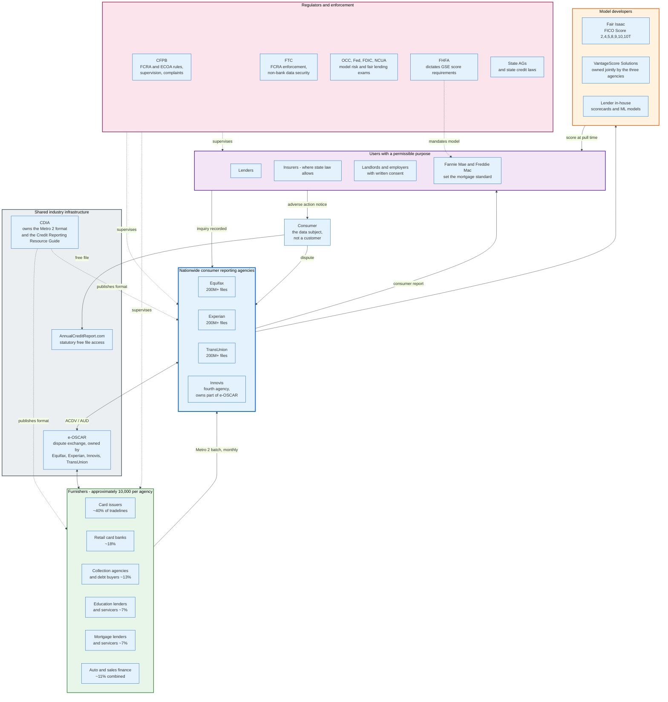

### 3.1 The Actors

| Role | What it does | Holds the data? | Paid by |
|---|---|---|---|
| **Furnisher** | Sends account data monthly in Metro 2; investigates disputes under 15 U.S.C. 1681s-2(b) | Yes, its own | Nobody; it pays its own reporting costs |
| **Nationwide consumer reporting agency** | Matches incoming records to files, assembles reports, sells access | Yes, the aggregate | Users, per pull |
| **Model developer** | Builds and licenses the scoring algorithm | No | Royalty per score |
| **User** | Pulls the report and score under a permissible purpose, makes the decision | No | Pays per pull and per score |
| **Reseller** | Repackages reports from all three agencies into a tri-merge | No | Lenders |
| **Consumer** | The data subject; has dispute and access rights but no ownership | No | Nothing for statutory access |
| **Regulator** | Writes and enforces FCRA and ECOA rules | No | Public funds |

### 3.2 The Two Roles That Determine Whether the System Works

**The furnisher is the only source of truth, and it participates voluntarily.** No US statute compels a creditor to report. The CFPB's 2012 market study put it plainly: reporting to credit bureaus by creditors is voluntary and historically has been. Card issuers report consumer cards almost universally and small business cards far less often, even when those cards were underwritten on the owner's personal credit. Every gap in a credit file traces back to a furnisher's decision not to send something.

**The consumer is the data subject and not the customer.** This is the structural fact behind almost every complaint in the system. The agency's revenue comes from the lender pulling the file, not from the person the file describes. The consumer's rights are statutory rather than contractual, which is why they are enumerated in a federal statute with specific day counts rather than negotiated.

### 3.3 Where VantageScore Sits

VantageScore Solutions LLC is owned jointly by Equifax, Experian, and TransUnion, and was created in 2006 to compete with FICO. That ownership produces its defining technical property: the same model, with the same characteristic definitions, is deployed at all three agencies, whereas a FICO Score is a separate model build per agency. It also produces its defining commercial problem, which is that the three firms that own it also resell its competitor.

---

## 4. The Furnisher Data Pipeline

The pipeline is a monthly batch job, and almost every property of the credit system follows from that sentence.

```mermaid
%%{init: {'theme': 'base', 'themeVariables': {'primaryColor': '#e3f2fd', 'primaryBorderColor': '#1565c0', 'lineColor': '#37474f'}}}%%

flowchart LR
    subgraph Source["Furnisher systems"]
        Core["Servicing platform<br/>balances, payments,<br/>delinquency buckets"]
        Cycle["Cycle close<br/>statement date per account"]
    end

    subgraph Build["Metro 2 file construction"]
        Extract["Extract as-of snapshot<br/>Date of Account Information"]
        Map["Map internal status to<br/>Account Status code<br/>11, 71, 78, 80, 82, 83, 84, 93, 97"]
        Seg["Attach segments<br/>J1/J2 co-obligors, K1 original creditor,<br/>K2 sold-to, K3 MERS, K4 balloon,<br/>L1 account number change, N1 employer"]
        Hdr["Header record<br/>reporter name, activity date,<br/>per-agency program identifiers"]
        Trl["Trailer record<br/>counts by status code,<br/>counts by segment type"]
    end

    subgraph Transmit["Transmission"]
        SFTP["Encrypted transfer to each agency<br/>character or packed format"]
    end

    subgraph Agency["Agency ingestion"]
        Edit["Format and edit checks<br/>reject file or reject records"]
        Match["Matching<br/>name, address, SSN, DOB, phone"]
        Post["Post to file<br/>flat file or PIN-linked relational"]
        Frag["Unmatched goes to a fragment file<br/>or a new file is created"]
    end

    Core --> Cycle --> Extract --> Map --> Seg --> Hdr --> Trl --> SFTP --> Edit --> Match --> Post
    Match -.no confident match.-> Frag
    Frag -.later identifier links them.-> Post

    style Source fill:#e8f5e9,stroke:#2e7d32,stroke-width:2px
    style Build fill:#fff3e0,stroke:#e65100,stroke-width:2px
    style Transmit fill:#eceff1,stroke:#37474f,stroke-width:2px
    style Agency fill:#e3f2fd,stroke:#1565c0,stroke-width:3px
```

### 4.1 Furnishing Is Voluntary, Concentrated, and Batched

Three properties define the supply side.

**Voluntary.** The FCRA imposes accuracy duties on anyone who does furnish, at 15 U.S.C. 1681s-2(a), and dispute-investigation duties at 1681s-2(b). It imposes no duty to furnish at all. A lender that reports nothing has no FCRA furnisher liability.

**Concentrated.** For each nationwide agency, the top 10 furnishers supply approximately 57 percent of tradelines, the top 50 supply 72 percent, and the top 100 supply 76 percent. Roughly 9,900 remaining furnishers account for less than a quarter. A single large issuer changing its reporting practice moves the national score distribution.

**Batched.** Furnishers report monthly, in files transmitted electronically. There is no real-time update path in the standard. An account that goes 30 days past due on 3 March may not appear as delinquent in any credit file until the April cycle lands, and may not be visible to a lender pulling on 25 March at all.

### 4.2 The Composition of the Data

Tradelines are not evenly distributed across products. Per the CFPB's market study, approximately 40 percent of all tradelines in an agency's file are bank card accounts. Of the remainder, 18 percent come from banks issuing retail cards, 13 percent are collection accounts reported by agencies and debt buyers, 7 percent from education lenders and servicers, 7 percent from sales finance, 7 percent from mortgage lenders and servicers, 4 percent from auto lenders, and 4 percent from other creditors.

Revolving credit is nearly 60 percent of the file. That is why utilisation dominates the score after payment history.

### 4.3 Matching: The Step Nobody Sees

An incoming Metro 2 record carries a name, an address, and usually a Social Security number and date of birth. The agency must decide which of its 200 million-plus files that record belongs to. There is no authoritative third-party identity register to check against.

The scale of the ambiguity is arithmetic. The 2000 Census counted more than 2.3 million Americans named Smith, 1.8 million named Johnson, 1 million named Davis, 850,000 named Garcia, and 600,000 named Lee. Add a father and son at one address who share a first and last name and differ only in a middle name that neither uses on applications, and the match becomes a probability rather than a lookup.

The agencies solve it in two architecturally different ways.

**Flat file.** Each consumer is linked to one file, and matching logic distinguishes files using name, address, SSN, and date of birth. When a record arrives with identifiers that do not resolve, the system can create a fragment: a second, partial file for the same human being. Fragments merge only when a later record supplies the linking identifier.

**PIN linking.** A unique personal identification number links records across separate inquiry, tradeline, employment, public record, and address databases in a relational store. Each incoming record is assigned to the PIN that best matches its header information, and the consumer report is assembled in real time at pull time by joining on the PIN.

The CFPB has no data on which architecture is more accurate. Both fail in the same two directions: a record attached to the wrong file, or a record split off into a fragment nobody sees.

### 4.4 The Two Failure Modes

**Mixed file.** Another person's tradeline lands in your file. This is the failure that produces the most severe consumer harm because a single charge-off can move a score by 100 points or more.

**Fragmented file.** Your tradelines split across two files, and a lender pulls the one with less history. A thin file produced this way is indistinguishable, to the model, from a genuinely thin one.

Both failures breach the same duty. 15 U.S.C. 1681e(b) requires an agency preparing a consumer report to "follow reasonable procedures to assure maximum possible accuracy of the information concerning the individual about whom the report relates." That standard, not the dispute process in 1681i, is what mixed-file litigation is brought under, and it is the only provision in the FCRA that reaches the matching algorithm itself. The dispute duty attaches after a consumer notices the error. The accuracy duty attaches before.

The FTC's national accuracy study, published in February 2013 under Section 319 of the FACT Act, gave the first controlled measurement. Of 1,001 participants reviewing 2,968 reports, 26 percent identified at least one potentially material error. After the dispute process, 21 percent had a modification to at least one report, 13 percent saw a score change, and for over half of those the maximum change was under 20 points. For 5.2 percent of participants, the correction moved them into a better credit risk tier.

One consumer in twenty was being priced in the wrong band because of a reporting error.

---

## 5. Metro 2: The Wire Format

Metro 2 is a fixed-width, positionally addressed record format published by the Consumer Data Industry Association, and it is the only way most furnishers talk to the bureaus. It is not an API, not XML, and not JSON. It is a byte layout the CDIA introduced in 1997 to replace the earlier Metro Format, and it has changed slowly since. Its shape explains why credit data has the granularity it has and no more. The CDIA publishes no dated history of the format, so the 1997 date rests on secondary industry accounts rather than on the association's own record.

Access to the specification, the Credit Reporting Resource Guide, is restricted by the CDIA to furnishers, their data processors, software vendors, and the agencies themselves. The format is a de facto public standard that is not publicly published.

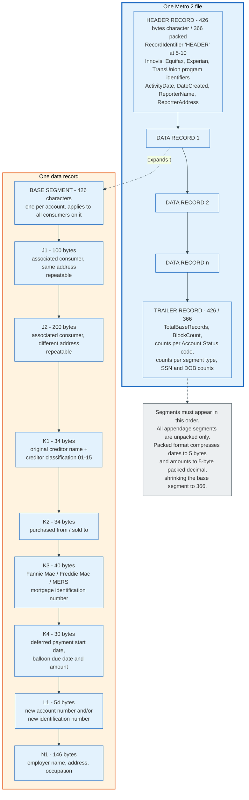

### 5.1 File Structure

A file is a header record, one data record per account, and a trailer record. In character format every record is 426 bytes; in packed format the header, base segment, and trailer shrink to 366 bytes because dates compress to 5 bytes and money fields to 5-byte packed decimal. Appendage segments are unpacked in both cases.

The header carries four separate program identifiers, one per agency, because a furnisher is assigned a different identifier by each. Equifax, Innovis, and TransUnion take 10 characters each. Experian takes 5.

The trailer is a self-check. It carries `TotalBaseRecords`, `BlockCount`, the count of J1 and J2 segments, the count of every appendage type, and a separate count for each Account Status code the file contains: `TotalStatusCode11`, `TotalStatusCode71`, `TotalStatusCode78`, `TotalStatusCode97`, `TotalStatusCodeDA`, `TotalStatusCodeDF`, and so on. It also counts how many Social Security numbers and dates of birth appear in the base segments, the J1 segments, and the J2 segments separately. A file whose trailer disagrees with its contents is rejected.

### 5.2 The Base Segment, Field by Field

426 characters, positionally addressed. Positions below are 1-indexed and inclusive.

| Pos | Len | Field | Notes |
|---|---|---|---|
| 1-4 | 4 | Record Descriptor Word | Record length; a Block Descriptor Word may precede it |
| 5 | 1 | Processing Indicator | |
| 6-19 | 14 | Time Stamp | |
| 20 | 1 | Correction Indicator | 0 = original, 1 = replacement of a previously reported record |
| 21-40 | 20 | Identification Number | The furnisher's agency-assigned reporter ID |
| 41-42 | 2 | Cycle Identifier | Which billing cycle within the month |
| 43-72 | 30 | Consumer Account Number | Must be stable; changes require an L1 segment |
| 73 | 1 | Portfolio Type | C, I, M, O, R (and L for lease) |
| 74-75 | 2 | Account Type | Two-character product code, e.g. 18 credit card, 26 conventional real estate mortgage |
| 76-83 | 8 | Date Opened | MMDDYYYY |
| 84-92 | 9 | Credit Limit | Zero-filled; the utilisation denominator |
| 93-101 | 9 | Highest Credit or Original Loan Amount | Fallback denominator when no limit is reported |
| 102-104 | 3 | Terms Duration | Months, or LOC, 001, REV |
| 105 | 1 | Terms Frequency | D, P, W, B, E, M, L, Q, T, S, Y |
| 106-114 | 9 | Scheduled Monthly Payment Amount | |
| 115-123 | 9 | Actual Payment Amount | The trended-data field; often unreported on cards |
| 124-125 | 2 | **Account Status** | The single most consequential field |
| 126 | 1 | Payment Rating | Required for Account Status 05, 13, 65, 88, 89, 94 and 95; blank for every other status. Carries the delinquency level at the time the account closed, transferred, or was paid |
| 127-150 | 24 | **Payment History Profile** | 24 months, most recent first |
| 151-152 | 2 | Special Comment | Narrative qualifier, e.g. forbearance, disaster |
| 153-154 | 2 | Compliance Condition Code | Dispute flags: XB, XH, XR and others |
| 155-163 | 9 | Current Balance | |
| 164-172 | 9 | Amount Past Due | |
| 173-181 | 9 | Original Charge-Off Amount | |
| 182-189 | 8 | Date of Account Information | The as-of date for the whole record |
| 190-197 | 8 | **Date of First Delinquency** | Reported as 30 days after the due date of the first missed payment; zero filled when the account cures. Starts the seven-year FCRA purge clock |
| 198-205 | 8 | Date Closed | |
| 206-213 | 8 | Date of Last Payment | |
| 214 | 1 | Interest Type Indicator | F fixed, V variable |
| 215-231 | 17 | Reserved | |
| 232-256 | 25 | Surname | |
| 257-276 | 20 | First Name | |
| 277-296 | 20 | Middle Name | |
| 297 | 1 | Generation Code | J, S, 2 through 9 |
| 298-306 | 9 | Social Security Number | |
| 307-314 | 8 | Date of Birth | |
| 315-324 | 10 | Telephone Number | |
| 325 | 1 | **ECOA Code** | Liability of this consumer for this account |
| 326-327 | 2 | Consumer Information Indicator | Bankruptcy chapter and status, and similar |
| 328-329 | 2 | Country Code | |
| 330-361 | 32 | First Line of Address | |
| 362-393 | 32 | Second Line of Address | |
| 394-413 | 20 | City | |
| 414-415 | 2 | State | |
| 416-424 | 9 | Zip Code | |
| 425 | 1 | Address Indicator | C confirmed, Y known, N not confirmed, M military, S secondary, B business, U undeliverable, D default, P bill payer |
| 426 | 1 | Residence Code | O owns, R rents |

Four fields carry nearly all the score signal: Account Status, Payment History Profile, Current Balance, and Credit Limit. The rest is identity, routing, and legal qualification.

### 5.3 Account Status Codes

| Code | Meaning |
|---|---|
| 05 | Account transferred to another office or sold to another lender |
| 11 | Current account, 0 to 29 days past due |
| 13 | Paid and closed, zero balance |
| 61 | Paid in full, was a voluntary surrender |
| 62 | Paid in full, was a collection account |
| 63 | Paid in full, was a repossession |
| 64 | Paid in full, was a charge-off |
| 65 | Paid in full, foreclosure was started |
| 71 | 30 to 59 days past due |
| 78 | 60 to 89 days past due |
| 80 | 90 to 119 days past due |
| 82 | 120 to 149 days past due |
| 83 | 150 to 179 days past due |
| 84 | 180 or more days past due |
| 88 | Claim filed with government for the insured portion |
| 89 | Deed received in lieu of foreclosure |
| 93 | Account assigned to collection |
| 94 | Foreclosure completed |
| 95 | Voluntary surrender |
| 96 | Merchandise repossessed |
| 97 | Unpaid balance reported as a loss, charge-off |
| DA | Delete entire account for reasons other than fraud |
| DF | Delete entire account due to confirmed fraud |

Note the gaps. There is no code for 30 to 59 days on an account that has already charged off, and no code that distinguishes a payment missed through hardship from one missed through neglect. The Special Comment field carries qualifiers such as forbearance or disaster, but the Account Status itself is a bucket count of days.

Note also DA and DF. Deletion is a first-class operation in the format, and the trailer counts both separately, because a furnisher deleting an account for fraud is legally distinct from one deleting it for any other reason.

### 5.4 The Payment History Profile

24 characters, one per month, most recent month leftmost. The leftmost byte carries the Account Status reported in the previous cycle, so the profile lags the Account Status field by one month by design. The furnisher restates the whole 24-month history every cycle, so the field is a rolling window rather than an append.

| Char | Meaning |
|---|---|
| 0 | Current, 0 payments past due |
| 1 | 30 to 59 days past due |
| 2 | 60 to 89 days |
| 3 | 90 to 119 days |
| 4 | 120 to 149 days |
| 5 | 150 to 179 days |
| 6 | 180 or more days |
| B | No payment history available prior to this time |
| D | No payment history available this month |
| E | Zero balance and current |
| G | Collection |
| H | Foreclosure completed |
| J | Voluntary surrender |
| K | Repossession |
| L | Charge-off |
| Z | Too new to rate |
| (blank) | No payment history available prior to this time, collections and debt payer |

The 24-character limit is the reason bureau trended data starts at 24 months and stops there. The format cannot express month 25.

### 5.5 ECOA Codes

The ECOA Code at position 325 answers a legal question, not a statistical one: is this consumer liable for this debt?

| Code | Meaning |
|---|---|
| 1 | Individual, sole responsibility |
| 2 | Joint contractual liability, each fully liable for the whole balance |
| 3 | Authorized user, permitted to use, signed nothing, owes nothing |
| 5 | Co-maker or guarantor |
| 7 | Maker of a business obligation with a personal guarantee |
| T | Association with the account terminated |
| W | Business or commercial credit |
| X | Consumer deceased |
| Z | Delete this consumer from the account, keep the tradeline |

Code 3 is the mechanism behind authorized-user tradeline sale, sometimes called piggybacking. An account with a long clean history reports to the authorized user's file even though that person never signed and owes nothing. FICO Score 8 and later versions apply logic intended to reduce the benefit where the relationship appears artificial, but the tradeline is still legitimately reported under the format.

### 5.6 Compliance Condition Codes

The Compliance Condition Code at positions 153-154 is how a furnisher tells the world that an account is under dispute. It exists because 15 U.S.C. 1681s-2(a)(3) requires a furnisher notified of a dispute to report that fact.

| Code | Meaning |
|---|---|
| XA | Account closed at consumer's request |
| XB | Account information disputed by consumer under FCRA or FDCPA |
| XC | FCRA investigation complete, consumer disagrees |
| XD | Closed at consumer's request and disputed under FCRA |
| XE | Closed at consumer's request and FCRA investigation complete, consumer disagrees |
| XF | Account in dispute under the Fair Credit Billing Act |
| XG | FCBA dispute complete, consumer disagrees |
| XH | Account previously in dispute, investigation complete |
| XJ | Closed at consumer's request and disputed under the FCBA |
| XR | Remove the most recently reported compliance condition code |

XB has an effect the format does not describe: most scoring models exclude a disputed tradeline from the calculation while the flag is set. VantageScore 4.0's exclusion list names disputed trades and disputed collections explicitly, and roughly 32 percent of all trades are excluded from scoring for one reason or another. A disputed charge-off can therefore raise a score temporarily and drop it again when the furnisher clears the flag with XR or XH. This is not a loophole the format intends. It is a side effect of a compliance flag being visible to a model.

### 5.7 Appendage Segments

| Segment | Bytes | Carries |
|---|---|---|
| J1 | 100 | Associated consumer at the same address: name, SSN, DOB, phone, ECOA code |
| J2 | 200 | Associated consumer at a different address: the J1 fields plus a full address block |
| K1 | 34 | Original creditor name plus a creditor classification, 01 retail through 15 check guarantee |
| K2 | 34 | Purchased from or sold to, with indicator 1 from, 2 to, 9 remove prior K2 |
| K3 | 40 | Agency identifier 0 not applicable, 1 Fannie Mae, 2 Freddie Mac, plus loan and MERS identifiers |
| K4 | 30 | Specialized payment: 1 balloon or 2 deferred, with dates and balloon amount |
| L1 | 54 | Change indicator 1 account number, 2 identification number, 3 both, plus the new values |
| N1 | 146 | Employer name, address, and occupation |

K1 is why a collection account can name the original creditor. Without it, a consumer sees a debt buyer's name and no way to connect it to the medical bill or phone contract it came from.

L1 is the account-number continuity mechanism. Changing the Consumer Account Number without an L1 causes the agency to treat the record as a new account, which duplicates the tradeline and resets its apparent age. It is one of the most common furnishing errors.

---

## 6. The Tradeline, Field by Field

A tradeline is one account as one furnisher reports it, restated in full every month. The word "update" is misleading. Each Metro 2 record is a complete snapshot as of the Date of Account Information, and it replaces what came before.

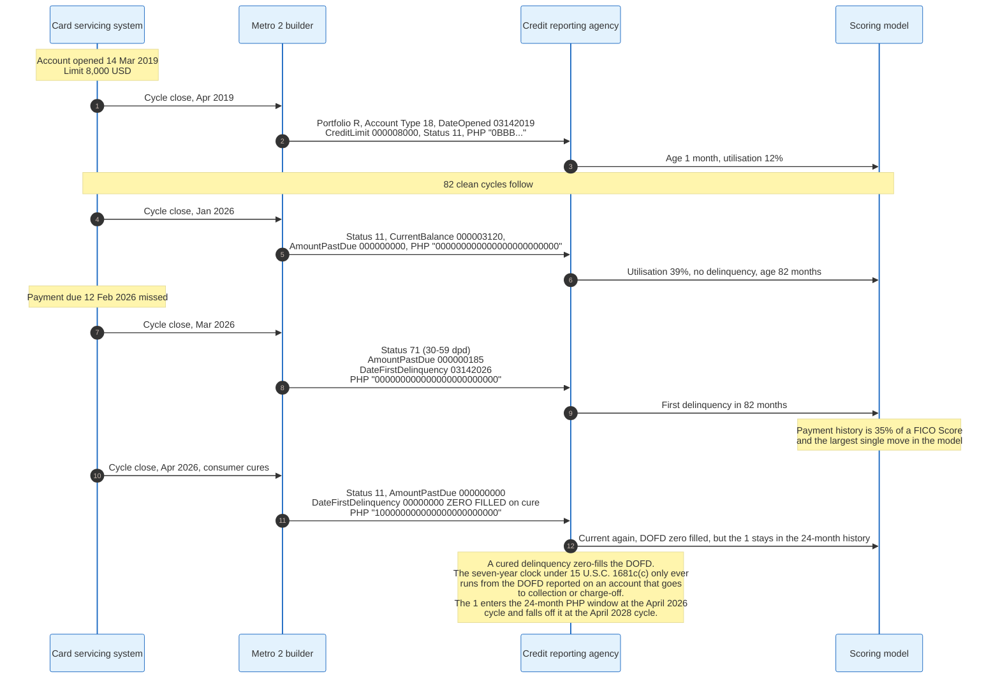

### 6.1 How Each Field Gets Its Value

**Date Opened** comes from the origination record and never changes. It drives length of credit history, 15 percent of a FICO Score.

**Credit Limit** is the utilisation denominator. Where a furnisher reports no limit, models fall back to Highest Credit. A card issuer that stops reporting limits inflates the apparent utilisation of every account it services, which is why the practice draws supervisory attention.

**Current Balance** is a point-in-time snapshot taken at cycle close, not an average and not the balance after payment. A consumer who pays the statement in full every month still reports a positive balance, because the snapshot is taken before the payment posts. This is the mechanical reason people who never carry debt still show utilisation.

**Actual Payment Amount** is the field that makes trended data possible. It distinguishes a consumer paying 3,000 dollars against a 3,000 dollar balance from one paying the 90 dollar minimum. Coverage is the problem: VantageScore found actual payment data available for only 56 percent of bankcard loans in 2016, against 97 to 100 percent for mortgage, installment, and auto.

**Account Status** is the current-condition bucket. It is what a human reads on a credit report as "current" or "120 days late."

**Payment History Profile** is the 24-month restatement, and its leftmost byte carries the Account Status reported in the previous cycle, not the current one. A furnisher that shifts the window one month early, or fails to shift it at all, produces the mismatch that agency edit checks reject.

**Date of First Delinquency** is the most legally loaded field in the record. Two mechanical rules govern it. The reported date is 30 days after the due date of the first missed payment, not the due date, and it is zero filled the moment a delinquent account becomes current, restarting only if the account goes delinquent again. Under 15 U.S.C. 1681c(c), the seven-year reporting period for a collection or charge-off begins 180 days after the commencement of the delinquency that immediately preceded that action. A furnisher that re-dates the DOFD when selling a debt restarts a clock that Congress fixed, which is the classic re-ageing violation.

**ECOA Code** determines whose file the tradeline lands in and whether it is treated as the consumer's own obligation.

### 6.2 What the Format Cannot Say

Metro 2 has no field for the interest rate charged. None for the reason a payment was missed. None for whether a balance is a purchase or a cash advance. None for the merchant. The credit file is a record of obligation and performance, not of behaviour.

This is why cash flow underwriting, covered in section 16, requires data from outside the bureau system entirely. The information a lender wants about spending stability simply does not exist in the format.

---

## 7. The Credit File and the Retention Clock

A credit report is assembled at pull time from four kinds of record: tradelines, inquiries, public records, and identifying header information. Each has its own lifetime.

### 7.1 Statutory Retention Periods

15 U.S.C. 1681c(a) sets the outer limits.

| Item | Maximum reporting period | Clock starts |
|---|---|---|
| Bankruptcy under Title 11 | 10 years | Date of entry of the order for relief or adjudication |
| Civil suits, civil judgments, records of arrest | 7 years, or the governing statute of limitations if longer | Date of entry |
| Paid tax liens | 7 years | Date of payment |
| Accounts placed for collection or charged to profit and loss | 7 years | 180 days after the commencement of the delinquency that preceded the action |
| Any other adverse item | 7 years | Date of the item |
| Criminal convictions | No limit | Not applicable |

Two exceptions matter. Under 1681c(b), none of the paragraph (1) through (5) limits apply to a credit transaction of 150,000 dollars or more, life insurance underwriting of 150,000 dollars or more, or employment at an annual salary of 75,000 dollars or more. A jumbo mortgage lender may lawfully see a 12-year-old judgment.

Positive information has no statutory limit. A closed account in good standing may be reported indefinitely, and the agencies typically retain it for about ten years, which is why closing an old card does not immediately shorten a credit history.

### 7.2 Public Records Have Largely Left the File

The National Consumer Assistance Plan, agreed by the three agencies with 31 state attorneys general and announced in 2015, imposed minimum identifying-information and update-frequency standards on public record data. Civil judgments and most tax liens could not meet them. The practical result was the removal of nearly all civil judgments and tax liens from consumer credit files by 2018.

VantageScore 4.0 was explicitly redesigned around this. Its user guide records that public record attributes were rebuilt to accommodate the reduced volume while still using public records where present, and that reduced derogatory public record information was one of the model's design constraints.

The lesson generalises. A scoring model is a function of a data supply, and a change in what the industry chooses to collect is a change in the model's inputs whether the modeller wants it or not.

### 7.3 Inquiries

A hard inquiry is recorded when a consumer applies for credit. It remains visible on a report for two years and affects a FICO Score for one. Its typical cost is under five points.

Rate shopping is handled by two mechanisms that operate together. A 30-day buffer means mortgage, auto, and student loan inquiries made in the 30 days before a score is calculated are ignored entirely. A deduplication window then collapses multiple inquiries of the same type into one: 14 days in older FICO versions, 45 days in newer ones. A consumer visiting eight auto lenders in a week is scored as having applied once.

A soft inquiry, such as a consumer checking their own file or a lender prescreening, is not visible to other lenders and never affects a score. FICO's August 2026 consumer research found 27 percent of Americans still believe checking your own score lowers it.

---

## 8. FICO: Composition and the Version Zoo

### 8.1 The Five Factors

```mermaid
%%{init: {'theme': 'base', 'themeVariables': {'primaryColor': '#e3f2fd', 'primaryBorderColor': '#1565c0', 'lineColor': '#37474f'}}}%%

flowchart TB
    subgraph FICO["FICO Score - general population weights"]
        PH["PAYMENT HISTORY - 35%<br/>on-time record, severity of any lateness,<br/>recency, how many accounts affected,<br/>collections, charge-offs, public records"]
        AO["AMOUNTS OWED - 30%<br/>revolving utilisation overall and per card,<br/>number of accounts with balances,<br/>installment balance vs original amount"]
        LEN["LENGTH OF CREDIT HISTORY - 15%<br/>age of oldest account,<br/>age of newest account,<br/>average age of all accounts"]
        MIX["CREDIT MIX - 10%<br/>cards, retail, installment,<br/>finance company, mortgage"]
        NEW["NEW CREDIT - 10%<br/>recently opened accounts,<br/>hard inquiries, time since last inquiry"]
    end

    subgraph Not["NOT in the model - by law or by absence of data"]
        Prohibited["Race, colour, religion,<br/>national origin, sex, marital status<br/>PROHIBITED by ECOA"]
        AgeRule["Age - allowed ONLY inside an<br/>empirically derived, demonstrably and<br/>statistically sound system, 12 CFR 1002.2(p),<br/>and never as a negative for elderly applicants"]
        NoData["Income, employment, assets,<br/>education, savings balances<br/>NOT IN A CREDIT FILE"]
        Excluded["Soft inquiries, own-file checks,<br/>prescreen offers, insurance and<br/>employment inquiries<br/>EXCLUDED BY DESIGN"]
    end

    Weights["The percentages are population averages.<br/>For an individual file, the mix shifts:<br/>a thin file leans harder on length and new credit;<br/>a file with a recent charge-off leans almost<br/>entirely on payment history."]

    FICO --> Weights
    Not -.never reaches.-> FICO

    style FICO fill:#e3f2fd,stroke:#1565c0,stroke-width:3px
    style Not fill:#fce4ec,stroke:#880e4f,stroke-width:2px
    style Weights fill:#eceff1,stroke:#37474f,stroke-width:1px
```

The published weights are population averages and FICO says so directly: the importance of these categories can be different for an individual profile, and exact impacts vary with the complete report. The 35 percent is the average share of score variance attributable to payment history across everybody, not a fixed coefficient applied to one person.

For a thin file, length of history and new credit carry disproportionate weight because there is little payment history to weigh. For a file with a 90-day delinquency last month, payment history dominates almost everything else.

### 8.2 The Version Problem

FICO does not deploy one model. It deploys a lattice of them, and which cell you land in is decided by the lender's pull, not by you.

| Use | Experian | Equifax | TransUnion |
|---|---|---|---|
| Mortgage, GSE-eligible | FICO Score 2 | FICO Score 5 | FICO Score 4 |
| General purpose, most widely used | FICO Score 8, FICO Score 9 | FICO Score 8, 9 | FICO Score 8, 9 |
| Auto lending | Auto Score 9, 8, 2 | Auto Score 9, 8, 5 | Auto Score 9, 8, 4 |
| Credit cards | Bankcard Score 9, 8, 3, 2 | Bankcard Score 9, 8, 5 | Bankcard Score 9, 8, 4 |
| Newest general models | FICO Score 10, 10 T | 10, 10 T | 10, 10 T |

The mortgage row is the anomaly and it is deliberate. Fannie Mae and Freddie Mac have required what the industry calls Classic FICO, meaning the version-2, version-4, and version-5 models, for decades. Those models were built on data from the late 1990s. A tri-merge pulls all three, and the lender uses the middle score of the three, or for joint applications the lower of the two borrowers' middle scores.

The mortgage market therefore prices risk with models that predate the products, the crisis, and the data-suppression changes described in section 7.2. The reason is not technical. It is that changing the requirement forces every originator, servicer, insurer, rating agency, and investor to re-underwrite their models simultaneously.

### 8.3 What Each Version Changed

**FICO Score 8**, released in 2009, is still the most widely used general-purpose version. It reduced the impact of small-balance collections under 100 dollars, increased sensitivity to high utilisation on individual cards, and made authorized-user tradelines harder to abuse.

**FICO Score 9**, released in 2014, made three changes with clear policy intent: paid collections of any kind stop counting against the score, unpaid medical collections are weighted less heavily than non-medical ones, and rental payment history is included when it appears in the file.

**FICO Score 10** is the current general-purpose model. **FICO Score 10 T** is the same model with trended data added, reading 24 or more months of balance and payment trajectory rather than only the current month.

The distinction between 10 and 10 T is the distinction between a photograph and a video. Two consumers with a 4,000 dollar balance on an 8,000 dollar limit score identically under a static model. Under 10 T, the one who has been paying the balance down from 7,000 and the one who has been running it up from 1,000 do not.

### 8.4 FICO 10 T in the Mortgage Market

FICO Score 10 T entered mortgage through price first and eligibility second. On 22 April 2026 FHFA and HUD announced that the Federal Housing Administration, Fannie Mae and Freddie Mac all adopt VantageScore 4.0 and FICO Score 10 T for mortgage underwriting, and that the enterprises are updating their selling guides. Before that date 10 T reached lenders only as a free add-on to the Classic score they already bought.

As of 28 July 2026, more than 70 mortgage lenders had signed on to the FICO Score 10 T Free Access Program, which delivers 10 T alongside the Classic FICO score a lender already buys, at no additional FICO fee. Participating lenders represent 586 billion dollars in annual originations and 1.865 trillion dollars in servicing portfolios. FICO claims 10 T enables up to 5 percent more approvals at the same risk level, or up to a 17 percent reduction in delinquencies at the same approval rate.

An independent head-to-head study by the actuarial firm Milliman, released 4 May 2026, examined nearly 20 million mortgages originated between 2011 and 2023 and found FICO Score 10 T more predictive than VantageScore 4.0 across all mortgage types, with the advantage exceeding 8 percent in FHA lending and reaching 7.4 percent in the 2023 GSE vintage. Fannie Mae and Freddie Mac released historical FICO Score 10 T data in mid-2026, which is the precondition for any lender rebuilding its own models around it.

Free distribution plus published performance plus historical data is a standard playbook for displacing an incumbent standard. It is the same playbook FICO used against judgemental underwriting in the 1980s.

---

## 9. VantageScore: The Competitor

VantageScore Solutions was created in 2006 by the three nationwide agencies and owns the intellectual property in the VantageScore models. VantageScore 4.0 launched in autumn 2017. Its user guide is unusually candid about construction, which makes it the best publicly documented modern bureau score.

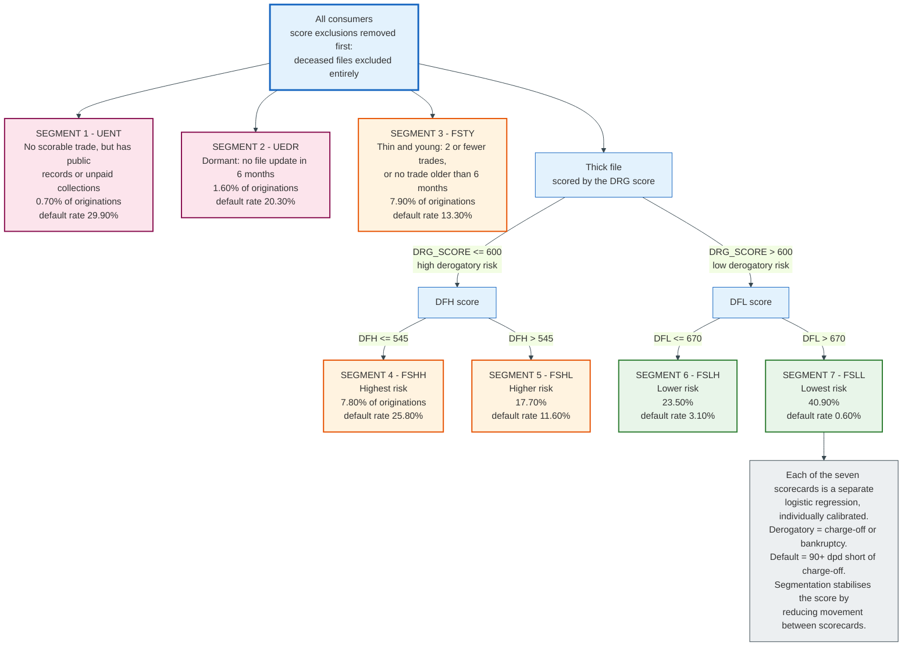

### 9.1 How It Was Built

The development sample was 45 million anonymised credit files, 15 million contributed simultaneously by each agency, observed between June 2014 and June 2016. Half was used for development and half retained as a holdout.

The performance definition is 24 months forward from the observation date, evaluated on one randomly selected account per file. Good means no delinquency greater than 30 days past due in the window. Bad means 90 or more days past due, except that mortgage originations are bad at 60 days. Accounts hitting exactly 60 days and no worse are indeterminate and were excluded from development, though retained in validation. The through-the-door population was 90 percent good, 8 percent bad, and 2 percent indeterminate, and the development dataset was stratified to a 3:1 good-to-bad ratio.

Modellers designed roughly 2,000 behavioural attributes and selected approximately 120 through a stepwise discriminant process. Around 32 percent of trades were excluded from scoring altogether: disputed trades and collections, medical trades, commercial trades, checking trades, child support, insurance claims pending, victim statement trades, bankruptcy-of-other-party trades, and refinanced, transferred, or sold collections.

### 9.2 Trended Data

VantageScore 4.0 was the first generic risk score to use tri-agency levelled trended data. Attributes span 3, 6, 12, and 24 month windows across first mortgage, all mortgages, home equity, installment, personal installment, auto, student loan, bankcard, revolving, and retail, and measure behaviours such as slope of balance, start-to-end percentage change in balance, average excess payment over the amount due, average monthly utilisation, and time since most recently over limit.

The performance gain concentrates where static models are weakest. Trended attributes improved predictive performance by 19.5 percent for superprime existing accounts and 13.8 percent for prime existing accounts, against 0.9 percent and 4.7 percent for subprime. A static model already separates a subprime population easily. Finding the future bads inside an overwhelmingly good population is the hard problem, and trajectory is what solves it.

In prime scorecards, 55 percent of trended attribute contribution comes from 24-month windows and 37 percent of behaviour weight from payment behaviour. In subprime scorecards, the windows collapse to 3 and 6 months and the behaviours to balance and utilisation only.

### 9.3 Factor Contribution and Performance

VantageScore reports contribution by decomposing each consumer's points above the 300 floor and averaging across the holdout population.

| Factor | Contribution |
|---|---|
| Payment history | 41% |
| Utilisation, percent of credit limit used | 20% |
| Age and type of credit | 20% |
| New credit | 11% |
| Balances | 6% |
| Available credit | 2% |

Overall Gini on the holdout is 83.3 for account management and 71.2 for originations. By industry, originations Gini runs from 73.1 for mortgage and 72.7 for auto down to 65.8 for student loan and 62.2 for credit union lending.

The model carries 89 adverse action reason code statements written in plain English and 93 positive reason code statements, and it is odds-aligned with VantageScore 3.0 so that a lender's existing cutoffs transfer.

### 9.4 The FHFA Decision

On 8 July 2025, FHFA Director William J. Pulte announced that Fannie Mae and Freddie Mac would allow lenders to use VantageScore 4.0, with no requirement to build new infrastructure, and that the tri-merge requirement stays.

Two things happened in that sentence. VantageScore 4.0 became eligible for the largest credit market in the United States for the first time. And the bi-merge proposal, under which lenders would have supplied credit reports from two agencies rather than three, was abandoned. The 2022 plan had been to move to FICO 10 T and VantageScore 4.0 on a bi-merge basis; what shipped was optional VantageScore 4.0 on a tri-merge basis.

That decision leaves lenders with two models where they had one. Neither is mandatory, and the incumbent stays the default. A second announcement nine months later adds a third, covered in section 22.1.

### 9.5 FICO Against VantageScore

| Dimension | FICO Score | VantageScore 4.0 |
|---|---|---|
| Ownership | Fair Isaac, independent | Joint venture of the three agencies |
| Model at each agency | Separate build per agency | One model, levelled attributes, deployed identically |
| Range | 300-850 (versions 8, 9, 10, 10 T) | 300-850 |
| Minimum scoring criteria | Roughly one account 6 months old and one update in 6 months | Scores dormant and no-usable-trade files |
| Reject inference | Not publicly documented | Explicitly none used |
| Trended data | FICO Score 10 T | 4.0, all versions since 2017 |
| Mortgage eligibility at the GSEs | Classic FICO 2/4/5, plus FICO Score 10 T eligible since the 22 April 2026 FHFA and HUD announcement | 4.0 permitted since 8 July 2025, adopted by FHA, Fannie Mae and Freddie Mac on 22 April 2026 |
| Market position | Used by 90% of top US lenders | Widely used in free consumer apps, growing in lending |

---

## 10. The Score Distribution and What Each Band Prices

### 10.1 The Distribution

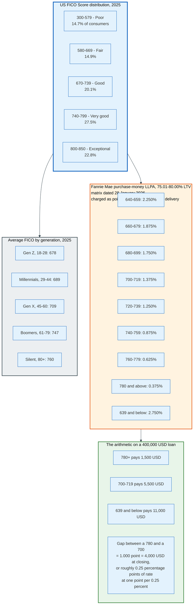

Two series measure the national average, on two cadences, and they are not interchangeable. FICO's own series stands at 714 in April 2026, unchanged since October 2025 and down one point year over year. Experian computes its own series annually, and it falls from 715 in 2024 to 713 in 2025, the first annual decline since 2013. Neither publisher gives a citable peak reading, so the height of the pre-2025 top is not stated here.

The cause of the fall is identifiable and narrow. Federal student loan delinquencies resumed reporting after the pandemic-era pause. FICO's Fall 2026 report counts approximately 3.2 million consumers with a payment due who had a recent student loan delinquency, and those consumers saw an average 38-point year-over-year score decline. Consumers without a recent delinquency gained 16 points over the same period.

A national average moved by one point conceals a 54-point spread between two groups.

### 10.2 What Each Band Actually Buys

The clearest published price schedule in US consumer credit is Fannie Mae's Loan-Level Price Adjustment matrix. It is a grid of upfront fees, expressed as a percentage of the loan amount, charged at delivery based on representative credit score and loan-to-value ratio. Lenders convert them into rate.

Purchase-money loans with terms greater than 15 years, at 75.01 to 80.00 percent LTV, per the matrix dated 28 January 2026:

| Representative credit score | LLPA |
|---|---|
| 780 and above | 0.375% |
| 760-779 | 0.625% |
| 740-759 | 0.875% |
| 720-739 | 1.250% |
| 700-719 | 1.375% |
| 680-699 | 1.750% |
| 660-679 | 1.875% |
| 640-659 | 2.250% |
| 639 and below | 2.750% |

The grid is a step function, not a curve. A borrower at 779 pays 0.625 percent and a borrower at 780 pays 0.375 percent. On a 400,000 dollar loan that one point of score is worth 1,000 dollars at closing. There is no economic theory under which the 780th point of a credit score is worth 1,000 dollars and the 779th is worth nothing. The cliff exists because a grid is easier to administer than a continuous function, and because everyone downstream, from mortgage insurers to rating agencies, needs the same buckets.

Cliffs also explain why score improvement services exist. Moving a borrower from 738 to 740 before closing is worth 0.375 percent of the loan, and nothing else in the transaction has that return on effort.

### 10.3 Delinquency by Band

The point of the bands is that they separate outcomes, and current data shows they still do.

FICO's Fall 2026 report finds early-stage mortgage delinquency eased from 1.42 percent to 1.35 percent year over year and auto 30-day delinquency improved five basis points to 2.6 percent. But subsequent 90-day-plus delinquency rates for both mortgage and auto rose exclusively in the lowest score bands and held flat across every higher band. Mortgage balances for borrowers with FICO Scores below 620 have grown 43 percent since April 2019 and auto balances for the lowest-scoring borrowers 36 percent, both outpacing the 30 percent inflation rate over the same period.

Experian's 2025 figures put overall consumer delinquency at 2.21 percent 30 or more days past due, 1.47 percent at 60 or more, and 1.02 percent at 90 or more, with an average card balance of 6,768 dollars and average utilisation of 29.1 percent.

---

## 11. Scorecards and Logistic Regression

Under every bureau score and most lender-built models sits the same object: a scorecard produced by logistic regression on binned, weight-of-evidence-transformed variables. The technique is sixty years old, it is not the most accurate method available, and it remains dominant for a reason that has nothing to do with accuracy.

```mermaid
%%{init: {'theme': 'base', 'themeVariables': {'primaryColor': '#e3f2fd', 'primaryBorderColor': '#1565c0', 'lineColor': '#37474f'}}}%%

flowchart TB
    S1["1. DEFINE THE TARGET<br/>Observation date, performance window,<br/>good / bad / indeterminate definition.<br/>VantageScore 4.0: 24 months,<br/>bad = 90+ dpd, mortgage originations 60+,<br/>indeterminate = exactly 60 dpd, excluded"]

    S2["2. ASSEMBLE THE SAMPLE<br/>Through-the-door population if available,<br/>booked accounts if not.<br/>Stratify: VantageScore used 3:1 good to bad.<br/>Split development / holdout, 50/50"]

    S3["3. ENGINEER ATTRIBUTES<br/>Record type x industry x behaviour x function.<br/>VantageScore designed ~2,000 attributes<br/>across trade, inquiry, collection, public record<br/>and mortgage, auto, bankcard, student, retail"]

    S4["4. BIN EACH ATTRIBUTE<br/>Coarse classify continuous variables<br/>into monotone risk bands.<br/>Utilisation 0%, 1-9%, 10-29%,<br/>30-49%, 50-74%, 75-89%, 90%+"]

    S5["5. WEIGHT OF EVIDENCE<br/>WOE_i = ln( (goods_i / total goods) /<br/>(bads_i / total bads) )<br/>Replaces the raw value with a<br/>log-odds contribution, linearises the<br/>relationship, handles missing as its own bin"]

    S6["6. INFORMATION VALUE<br/>IV = sum over bins of<br/>(g_i - b_i) * WOE_i<br/>Conventional screen:<br/>&lt;0.02 useless, 0.02-0.1 weak,<br/>0.1-0.3 medium, 0.3-0.5 strong,<br/>&gt;0.5 suspiciously strong, check for leakage"]

    S7["7. SELECT AND FIT<br/>Stepwise or discriminant selection<br/>down to ~120 attributes.<br/>Resolve multicollinearity.<br/>Logistic regression:<br/>ln(p/(1-p)) = b0 + sum b_j * WOE_j"]

    S8["8. SCALE TO POINTS<br/>score = offset + factor * ln(odds)<br/>factor = PDO / ln(2)<br/>Example: PDO 20, 600 pts at 50:1<br/>factor = 28.85, offset = 487.12<br/>Points per bin = -(b_j * WOE_ij) * factor"]

    S9["9. SEGMENT<br/>Separate scorecard per population<br/>where the relationships differ.<br/>VantageScore 4.0 uses seven"]

    S10["10. VALIDATE<br/>KS statistic, Gini / AUC on holdout,<br/>out-of-time validation,<br/>score-to-odds calibration curve,<br/>population stability index in production"]

    S11["11. REVALIDATE PERIODICALLY<br/>12 CFR 1002.2(p)(1)(iv) requires it.<br/>Comment 2(p)-2: analyse delinquency rate<br/>per score interval, or population stability<br/>over time. Creditor must revalidate on<br/>its OWN data when available"]

    S1 --> S2 --> S3 --> S4 --> S5 --> S6 --> S7 --> S8 --> S9 --> S10 --> S11
    S11 -.if predictive ability lost.-> S3

    style S1 fill:#e8f5e9,stroke:#2e7d32,stroke-width:2px
    style S5 fill:#e3f2fd,stroke:#1565c0,stroke-width:3px
    style S7 fill:#e3f2fd,stroke:#1565c0,stroke-width:3px
    style S8 fill:#fff3e0,stroke:#e65100,stroke-width:2px
    style S11 fill:#fce4ec,stroke:#880e4f,stroke-width:2px
```

### 11.1 Defining the Target

Everything starts with a binary label, and the label is a choice rather than a fact.

The modeller picks an observation date, a performance window, and a rule that converts an account's behaviour in that window into good, bad, or indeterminate. VantageScore 4.0's rule is stated above. Indeterminates are excluded from fitting because they weaken the contrast the model is trying to learn, but retained in validation because they exist in production.

The performance window trades bias against staleness. A 12-month window produces a model quickly but misses slow-developing defaults. A 36-month window captures more but requires data from three years ago, by which time the lending environment has changed. Twenty-four months is the industry compromise, and it is why the 24-character Payment History Profile field is the length it is.

### 11.2 Binning and Weight of Evidence

Raw attributes go into bins before they go into the model, and this is the step that gives scorecards their properties.

Coarse classification splits a continuous attribute such as revolving utilisation into a small number of bands chosen so that risk moves monotonically across them and each band holds enough observations to estimate stably. Missing values become their own bin rather than being imputed, which matters enormously in credit data where "no mortgage reported" is informative and "mortgage balance unknown" is not the same thing as zero.

Each bin is then replaced by its weight of evidence:

```
WOE_i = ln( (goods_i / total_goods) / (bads_i / total_bads) )
```

A bin with proportionally more goods than bads gets a positive WOE. A bin with more bads gets a negative one. The transformation does four things at once: it linearises a possibly non-monotone relationship, it puts every attribute on the same log-odds scale, it makes outliers harmless because they land in an end bin, and it makes the resulting model directly interpretable, since each bin's point contribution is a single number a human can read off a table.

That last property is the reason the technique survives. A scorecard is a lookup table. An examiner can read it.

### 11.3 Information Value

Information value screens attributes before fitting:

```
IV = sum over bins of ( (goods_i/total_goods) - (bads_i/total_bads) ) * WOE_i
```

The conventional interpretation is that IV below 0.02 means the attribute is useless, 0.02 to 0.1 weak, 0.1 to 0.3 medium, 0.3 to 0.5 strong, and above 0.5 suspicious. An IV above 0.5 usually means the attribute encodes the outcome. An attribute such as "number of accounts currently 90 days past due" will have an enormous IV and no predictive value at origination, because it is the target wearing a disguise.

### 11.4 The Regression and the Scaling

The selected WOE-transformed attributes go into a logistic regression:

```
ln( p / (1 - p) ) = b0 + b1*WOE_1 + b2*WOE_2 + ... + bk*WOE_k
```

The output is a log-odds, and the scaling step converts it into points. With PDO of 20 points and a base of 600 points at odds of 50:1:

```
factor = 20 / ln(2)  = 28.8539
offset = 600 - 28.8539 * ln(50) = 600 - 112.88 = 487.12
score  = 487.12 + 28.8539 * ln(odds)
```

Points for a single bin are then `-(b_j * WOE_ij) * factor`, distributed across attributes so that the totals sum to the score. The result is the artefact everyone recognises: a table where "utilisation 10 to 29 percent" is worth 42 points and "one account 30 days past due in the last 12 months" is worth minus 61.

VantageScore uses a 300 to 850 range with 300 as the floor, and computes each factor's contribution by dividing that factor's points by the total points above the floor. A consumer at 700 has earned 400 points above the floor; an attribute worth 100 of them contributes 25 percent.

### 11.5 Segmentation

One scorecard cannot serve a population whose risk relationships differ. Utilisation means something different on a file with two accounts than on one with twenty.

The standard answer is segmentation: split the population and fit a separate scorecard to each part. VantageScore 4.0 uses seven segments, chosen by a hybrid of business logic and empirical scores. Three internally developed scores do the splitting. A derogatory score separates high from low likelihood of charge-off or bankruptcy at a threshold of 600, and two default scores then split each side at 545 and 670 respectively, producing four thick-file segments. Three further segments handle thin-and-young files, dormant files, and files with no usable trades.

The design has a second purpose beyond fit. Using scores rather than hard attribute rules to assign segments reduces how often a consumer jumps between scorecards from month to month, which is what makes the final score stable.

### 11.6 Validating a Scorecard

Three measures and one production monitor.

**KS statistic**, the maximum vertical distance between the cumulative distributions of goods and bads. It answers where the model separates best.

**Gini coefficient or AUC**, a rank-ordering measure over the whole range. VantageScore 4.0's holdout Gini is 83.3 for account management and 71.2 for originations. Account management scores higher because a model watching an existing account sees recent behaviour on that account; an originations model sees only the rest of the file.

**Calibration**, the check that the score-to-odds relationship holds in the holdout. A model can rank perfectly and still be badly calibrated, in which case cutoffs set on the development sample price the wrong risk.

**Population stability index**, computed in production by comparing the current score or attribute distribution to the development distribution. A PSI above roughly 0.25 on any major attribute means the applicant population has shifted and the model is being asked about people it was not built on.

### 11.7 Revalidation Is a Legal Obligation

Regulation B makes model maintenance a compliance requirement, not just good practice. 12 CFR 1002.2(p)(1) defines an empirically derived, demonstrably and statistically sound credit scoring system as one that is based on an empirical comparison of creditworthy and non-creditworthy applicants who applied within a reasonable preceding period, developed for the creditor's legitimate business interests, developed and validated using accepted statistical principles, and periodically revalidated and adjusted as necessary to maintain predictive ability.

The official interpretation adds detail. The regulation does not set a revalidation frequency; the system must be revalidated often enough to keep meeting recognised professional statistical standards. Suggested methods are analysing the loan portfolio to determine the delinquency rate for each score interval, or analysing population stability over time to detect deviations of recent applications from the validation population. A creditor is responsible for ensuring its system is validated and revalidated on the creditor's own data.

The stakes are specific. Only a system meeting the 1002.2(p) standard may use age as a predictive factor. A judgmental system may consider age only as a pertinent element of creditworthiness. And under comment 2(p)-4, besides age, no other prohibited basis may be used as a variable at all.

---

## 12. Reject Inference: The Missing Half of the Data

An origination scorecard is trained on people the lender approved, and used on people the lender has not yet decided about. Those are different populations, and the difference is not random.

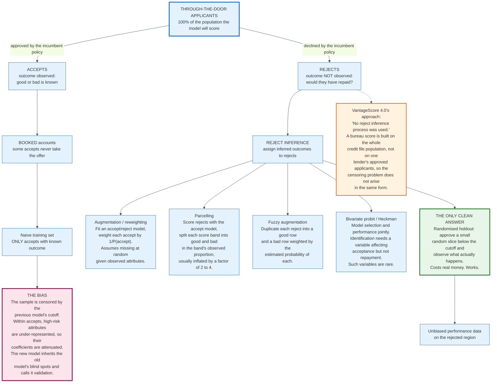

### 12.1 The Problem Stated Precisely

Let A be the event that an applicant was approved and Y the repayment outcome. The model needs P(Y = bad | X) over all applicants. The training data supplies P(Y = bad | X, A = 1). These are equal only if approval is independent of the outcome given X, and approval was made by a model that used X precisely because X predicts the outcome.

The consequence is not merely reduced accuracy. It is systematically attenuated coefficients on the attributes the old policy used hardest, because the accepted sample has been pruned of exactly the cases those attributes were meant to catch. Retraining on accepts alone reproduces the incumbent cutoff and calls it validation.

### 12.2 The Methods and What They Assume

**Augmentation, or reweighting.** Fit a model predicting acceptance from the same attributes, then weight each accepted observation by the inverse of its estimated probability of acceptance. Cheap, standard, and valid only under missing at random given the observed attributes. If the old decision used anything not in X, including a human override, the assumption fails.

**Parcelling.** Score the rejects with the accept-only model, then within each score band assign goods and bads in the band's observed proportion, usually inflated by a factor of two to four to reflect that rejects were rejected for a reason. The inflation factor is a judgement call and it drives the result.

**Fuzzy augmentation.** Duplicate each reject into two rows, one labelled good and one bad, with fractional weights equal to the estimated probabilities. Smoother than parcelling and resting on the same assumption.

**Bivariate probit with sample selection.** Model the acceptance decision and the repayment outcome jointly with correlated errors, in the Heckman tradition. Statistically principled and identified only if there is a variable that affects acceptance but not repayment. In credit, almost nothing qualifies.

**Randomised holdout.** Approve a small random sample of applicants below the cutoff and observe the outcome. This is the only method that produces genuinely unbiased data on the rejected region, and it is the only one that costs money. A lender approving 2 percent of its rejects at an expected 25 percent bad rate is buying information with charge-offs.

### 12.3 Why Bureau Scores Sidestep It

VantageScore 4.0's user guide states flatly: "No reject inference process was used." That is not carelessness. A bureau score is developed on a random sample of credit files across the whole population, not on one lender's approved applicants, so the outcome is observed for everyone who has an account with anyone. The censoring that afflicts a lender's own scorecard does not arise in the same form.

The residual censoring is different and rarely discussed: a consumer with no credit file at all has no observable outcome anywhere. That population is section 16.

---

## 13. Machine Learning and the Explainability Requirement

Gradient-boosted trees beat logistic regression on credit data. They also break the thing the law requires. That tension defines the last decade of model development in lending.

```mermaid
%%{init: {'theme': 'base', 'themeVariables': {'primaryColor': '#e3f2fd', 'primaryBorderColor': '#1565c0', 'lineColor': '#37474f'}}}%%

flowchart TB
    subgraph Model["The model choice"]
        Logit["LOGISTIC REGRESSION ON WOE BINS<br/>+ reason codes fall out of the points table<br/>+ monotone by construction<br/>+ examiner can read it<br/>- misses interactions unless hand-coded<br/>- lower AUC"]
        GBM["GRADIENT-BOOSTED TREES / NEURAL NETS<br/>+ captures interactions automatically<br/>+ higher AUC, typically 1 to 4 Gini points<br/>- no native reason codes<br/>- non-monotone unless constrained<br/>- opaque without post-hoc tooling"]
    end

    subgraph Law["What the law requires regardless"]
        ECOA["ECOA 15 U.S.C. 1691(d)(3) and<br/>12 CFR 1002.9(b)(2):<br/>reasons must be SPECIFIC, indicate the<br/>PRINCIPAL reasons, and 'relate to and<br/>accurately describe the factors actually<br/>considered or scored by a creditor'"]
        FCRA["FCRA 15 U.S.C. 1681g(f)(1)(C):<br/>key factors that adversely affected the<br/>score, at most 4, listed in order of<br/>importance by effect on the score.<br/>Inquiries exempt from the cap, 1681g(f)(9)"]
        RegB["12 CFR 1002.2(p): age is usable only in an<br/>empirically derived, demonstrably and<br/>statistically sound system.<br/>Comment 2(p)-4: besides age, no other<br/>prohibited basis may be used as a variable."]
    end

    subgraph Bridge["Making a GBM comply"]
        Mono["MONOTONIC CONSTRAINTS<br/>Force each feature's effect to run one way.<br/>Costs a little AUC. Buys defensibility:<br/>'more delinquency never helps' is provable."]
        SHAP["SHAPLEY ATTRIBUTION<br/>Per-applicant contribution of each feature.<br/>Additive, sums exactly to the prediction.<br/>Rank features, map top 4 to reason text."]
        Base["THE BASELINE PROBLEM<br/>SHAP explains against a reference point.<br/>Against the population mean, the reasons<br/>differ from those against the approval cutoff.<br/>The choice of baseline changes the notice.<br/>The statute does not name a baseline."]
        Map["REASON CODE MAPPING<br/>Model features are engineered attributes<br/>('utilisation slope, 6 months, bankcard').<br/>Notices must be readable.<br/>The mapping table is where compliance<br/>lives, and where it usually fails."]
        Mono --> SHAP --> Base --> Map
    end

    Logit -.higher accuracy available.-> GBM
    GBM --> Bridge
    Law -.constrains.-> Bridge
    Map --> Notice["Adverse action notice<br/>with 4 specific principal reasons"]

    style Model fill:#e3f2fd,stroke:#1565c0,stroke-width:2px
    style Law fill:#fce4ec,stroke:#880e4f,stroke-width:3px
    style Bridge fill:#fff3e0,stroke:#e65100,stroke-width:2px
    style Notice fill:#e8f5e9,stroke:#2e7d32,stroke-width:2px
```

### 13.1 Where the Accuracy Comes From

Tree ensembles find interactions a linear model has to be told about. Utilisation of 85 percent means one thing on a file with a 15-year history and no delinquency, and something else on an 8-month-old file. A logistic model captures that only if a modeller creates the interaction term. A boosted tree splits on both variables and finds it.

The gain is real but modest, typically one to four Gini points over a well-built scorecard on the same data. It is largest exactly where scorecards are weakest, in thin files and in the prime population where bads are rare.

VantageScore 4.0 itself uses machine learning, but in a specific and limited role: attribute design for the universe expansion population. Multi-dimensional attributes for consumers with sparse files were developed using ML techniques, then incorporated into structured scorecards fitted by logistic regression. FCRA-compliant reason codes were assigned to each attribute.

That is the compromise the industry converged on. Use ML to find features. Use logistic regression to combine them. The reason codes then fall out of the points table as they always did.

### 13.2 The Constraint the Law Imposes

ECOA does not care how a model works. It cares what the applicant is told.

Section 701(d)(3) of ECOA and 12 CFR 1002.9(b)(2) require that a statement of reasons be specific, indicate the principal reasons, and that the reasons disclosed relate to and accurately describe the factors actually considered or scored by the creditor. A creditor cannot satisfy this by saying the score was too low or that internal standards were not met.

The CFPB spelled this out for algorithmic models in Circular 2022-03, issued in 2022, which answered the question of whether creditors using complex algorithms that prevent accurate identification of specific reasons must still comply. The answer was yes: "A creditor cannot justify noncompliance with ECOA and Regulation B's requirements based on the mere fact that the technology it employs to evaluate applications is too complicated or opaque to understand."

Circular 2023-03, issued 19 September 2023, closed the obvious workaround. It held that creditors may not rely on the checklist of reasons in Regulation B's sample forms if those reasons do not specifically and accurately indicate the principal reasons, nor rely on overly broad or vague reasons that obscure the specific ones.

Both circulars were withdrawn by the CFPB on 12 May 2025, along with fourteen other circulars and a long list of bulletins and advisory opinions, on the stated ground that guidance should not create binding obligations outside notice-and-comment rulemaking. The withdrawal removed the Bureau's interpretive statements. It did not amend 15 U.S.C. 1691(d)(3) or 12 CFR 1002.9(b)(2), which still say what they said. A creditor whose notice does not accurately describe the factors it scored is still exposed to private litigation and to prudential examination.

### 13.3 SHAP and Its Quiet Problem

The standard tool for turning a tree ensemble into reason codes is Shapley value attribution: for each applicant, distribute the difference between the model's prediction and a reference value across the input features, in a way that is additive and satisfies a small set of fairness axioms. Rank the features by negative contribution, take the top four, map them to reason text.

The problem is the reference value, and it is not a technicality.

Shapley attribution explains a prediction relative to a baseline. Choose the population mean as the baseline and the explanation answers "why is this applicant riskier than average." Choose the approval cutoff and it answers "why did this applicant fall short of approval." Choose a matched cohort and it answers a third question. The three produce different top-four lists for the same applicant.

ECOA requires the principal reasons for the adverse action. The action was taken at the cutoff, which argues for the cutoff as the baseline. No statute, regulation, or official interpretation says so. The choice is left to the creditor's model risk documentation, and it materially changes what the consumer is told.

### 13.4 Monotonic Constraints

The practical fix that most lenders adopt is to constrain the model rather than only explain it. Modern gradient boosting libraries let a modeller declare that a feature's effect must be monotone in one direction. Declare that more delinquency never improves the prediction, that higher utilisation never improves it, that longer history never worsens it.

Three benefits follow. The model cannot produce the absurd local behaviour that unconstrained trees sometimes do, where paying off a card lowers a score. Reason codes become defensible because the direction of every effect is known in advance. And the counterfactual advice implied by a notice, that reducing your balance would help, becomes true rather than merely plausible.

The cost is a small amount of accuracy. Most lenders pay it, because a model that cannot explain itself in a courtroom is worth less than one that can.

---

## 14. Adverse Action Notices under ECOA and Regulation B

The adverse action notice is where the entire apparatus becomes visible to the person it was run against. It is also the most litigated document in consumer lending.

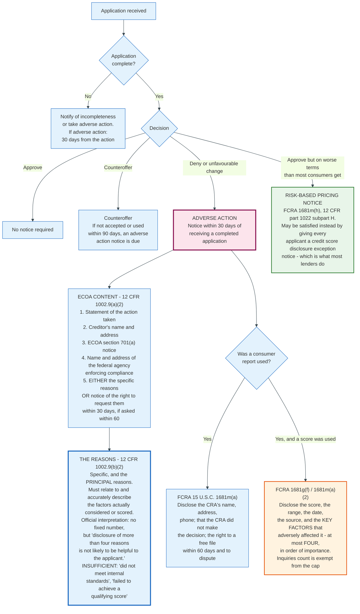

### 14.1 The Timing Rules

12 CFR 1002.9(a)(1) sets four deadlines, and they attach to different events.

- 30 days after receiving a completed application, to notify of approval, counteroffer, or adverse action.
- 30 days after taking adverse action on an incomplete application.
- 30 days after taking adverse action on an existing account.
- 90 days after notifying an applicant of a counteroffer, if the applicant does not expressly accept or use the credit offered.

The phrase "completed application" does the work. The clock does not start until the creditor has everything it regularly obtains and considers. A creditor that keeps asking for documents keeps the clock stopped, which is why 1002.9(c) separately requires notice of incompleteness.

### 14.2 The Content

An ECOA adverse action notice must contain a statement of the action taken, the creditor's name and address, the ECOA section 701(a) anti-discrimination notice, and the name and address of the federal agency that administers compliance for that creditor. It must then contain either a statement of the specific reasons, or a disclosure of the applicant's right to obtain those reasons if they ask within 60 days, with the creditor's response due within 30 days of the request.

Almost every creditor gives the reasons up front, because the alternative requires operating a second process.

### 14.3 The Four-Reason Convention

Regulation B does not cap the number of reasons. Its official interpretation says the regulation does not mandate a specific number, but disclosure of more than four reasons is not likely to be helpful to the applicant.

The FCRA does cap. 15 U.S.C. 1681g(f)(1)(C) requires disclosure of all the key factors that adversely affected the credit score, the total of which shall generally not exceed four, with one carve-out at 1681g(f)(9): if a key factor is the number of inquiries, it must be disclosed without regard to the numerical limit. So a score disclosure can contain five factors, and the fifth is always inquiries.

"Key factors" is defined at 1681g(f)(2)(B) as all relevant elements or reasons adversely affecting the credit score for the particular individual, listed in the order of their importance based on their effect on the score. Order is mandatory, which is the single hardest requirement to satisfy from an ensemble model.

### 14.4 The Two Statutes Overlap and Do Not Merge

A denial based on a credit report triggers obligations under both statutes, and they require different things.

ECOA requires the principal reasons for the creditor's decision. FCRA requires the key factors that lowered the score. These are not the same list. A creditor may decline an applicant whose score was acceptable because the debt-to-income ratio was 51 percent. The ECOA reason is excessive obligations in relation to income. The FCRA key factors describe the score, which was not the binding constraint.

Most creditors use a combined form. The CFPB's sample forms in appendix C to Regulation B are designed for that, and Circular 2023-03 existed precisely because creditors were using the checklist on those forms as a safe harbour when the checked box did not describe the real reason.

### 14.5 Risk-Based Pricing

A creditor that approves an applicant on materially worse terms than it grants to a substantial proportion of consumers must give a risk-based pricing notice under 15 U.S.C. 1681m(h) and 12 CFR part 1022 subpart H.

Determining who is materially worse off requires either a credit score proxy method or a tiered pricing method, both of which are administratively awkward. Subpart H therefore offers exceptions: a creditor that provides a credit score disclosure notice to every consumer who applies need not identify who was priced worse. Most lenders take the exception, which is why an approved borrower routinely receives a notice showing their score, its range, and the key factors, even though nothing adverse happened.

---

## 15. Disparate Impact and Fair Lending Testing

### 15.1 Two Theories, One Statute

ECOA prohibits discrimination on a prohibited basis. Courts and regulators have recognised two ways to prove it.

**Disparate treatment** means treating an applicant differently because of a protected characteristic, whether overtly or through a facially neutral proxy applied with discriminatory intent. This theory is uncontroversial.

**Disparate impact**, historically called the effects test in Regulation B, means a facially neutral policy that produces a significantly adverse effect on a protected class, is not justified by business necessity, or is justified but a less discriminatory alternative exists that serves the same purpose. This theory is the one under active reconstruction.

```mermaid
%%{init: {'theme': 'base', 'themeVariables': {'primaryColor': '#e3f2fd', 'primaryBorderColor': '#1565c0', 'lineColor': '#37474f'}}}%%

flowchart TB
    subgraph Data["Step 1: get the protected class, which you are not allowed to collect"]
        NoAsk["ECOA / Reg B 1002.5(b) generally bars a<br/>creditor from asking about race, colour,<br/>religion, national origin or sex except<br/>for HMDA-covered mortgage lending"]
        HMDA["MORTGAGE: HMDA supplies actual<br/>race, ethnicity and sex on the application"]
        BISG["NON-MORTGAGE: proxy.<br/>Bayesian Improved Surname Geocoding<br/>combines a surname-race distribution<br/>from the Census with a census-tract<br/>race distribution to produce a<br/>probability vector per applicant"]
        NoAsk --> HMDA
        NoAsk --> BISG
    end

    subgraph Test["Step 2: measure the outcome gap"]
        AIR["ADVERSE IMPACT RATIO<br/>AIR = approval rate of protected group /<br/>approval rate of control group.<br/>The 'four-fifths rule' flag at AIR &lt; 0.80 is<br/>an EEOC employment convention borrowed<br/>into lending; it is a screen, not a standard"]
        SMD["Standardised mean difference of score<br/>between groups; Kolmogorov-Smirnov<br/>on the score distributions"]
        Bias["Chi-square calibration test.<br/>VantageScore's method: within each score<br/>band, test whether the group's actual<br/>default probability differs significantly<br/>from the population's. Critical value 8.844<br/>at 95%. One failing band flags the model."]
    end

    subgraph Just["Step 3: business necessity"]
        Nec["Is the model empirically derived,<br/>demonstrably and statistically sound<br/>under 12 CFR 1002.2(p)?<br/>Is each attribute documented as<br/>predictive and logically related<br/>to creditworthiness?"]
    end

    subgraph LDA["Step 4: less discriminatory alternative search"]
        Drop["Drop or cap the highest-disparity<br/>attributes one at a time,<br/>measure AUC lost and AIR gained"]
        Adv["Adversarial de-biasing:<br/>train the risk model against a<br/>discriminator trying to recover<br/>the protected class from the score"]
        Front["Build the accuracy-versus-fairness<br/>frontier and pick a point.<br/>Document why that point."]
        Drop --> Front
        Adv --> Front
    end

    Data --> Test --> Just --> LDA

    subgraph Now["Step 5: what changed, 2025 to 2026"]
        EO["EO 14281, 23 April 2025<br/>'Restoring Equality of Opportunity and<br/>Meritocracy'. Policy to eliminate<br/>disparate-impact liability to the maximum<br/>degree possible. Agencies deprioritise<br/>enforcement. Within 45 days, DOJ, HUD,<br/>CFPB and FTC to evaluate pending ECOA<br/>and Fair Housing Act matters relying on it."]
        Rule["CFPB final rule, published 22 April 2026,<br/>effective 21 July 2026.<br/>12 CFR 1002.6(a) now reads: 'The Act does<br/>not provide that the effects test applies for<br/>determining whether there is discrimination<br/>in violation of the Act.'"]
        Left["What survives: disparate treatment;<br/>state UDAP and state fair lending laws;<br/>private ECOA litigation, where courts<br/>decide the question, not the Bureau;<br/>and every lender's own model risk<br/>documentation obligations."]
        EO --> Rule --> Left
    end

    LDA --> Now

    style Data fill:#e3f2fd,stroke:#1565c0,stroke-width:2px
    style Test fill:#fff3e0,stroke:#e65100,stroke-width:2px
    style Just fill:#e8f5e9,stroke:#2e7d32,stroke-width:2px
    style LDA fill:#eceff1,stroke:#37474f,stroke-width:2px
    style Now fill:#fce4ec,stroke:#880e4f,stroke-width:3px
```

### 15.2 The Data Problem That Defines the Practice

A creditor cannot test for disparate impact without knowing who is in a protected class, and Regulation B generally forbids it from asking. 12 CFR 1002.5(b) bars a creditor from inquiring about race, colour, religion, national origin, or sex, with a mortgage exception created by HMDA reporting requirements.

Mortgage lenders therefore have real demographic data. Everyone else uses a proxy. The standard method is Bayesian Improved Surname Geocoding: combine the Census Bureau's distribution of race conditional on surname with the distribution of race conditional on census tract, and produce a probability vector for each applicant. The CFPB itself used BISG in auto lending enforcement, and the method's error rate has been contested ever since.

VantageScore's own bias testing uses a coarser proxy still: ethnicity appended from census data at the zip code level.

The practical consequence is that fair lending testing outside mortgage is testing against an estimate of who the applicant is. Any measured disparity carries the proxy's error, and any defence can attack the proxy.

### 15.3 What Testing Measures

**Adverse impact ratio.** The approval rate of the protected group divided by the approval rate of the control group. A ratio below 0.80, the four-fifths rule, is conventionally treated as a flag. The four-fifths rule comes from the EEOC's 1978 Uniform Guidelines on Employee Selection Procedures and was borrowed into lending. It is a screening threshold with no statutory force in credit.

**Calibration by group.** VantageScore's published method is the clearest documented example. Score bands are constructed with sufficient sample, and within each band a chi-square test compares the protected group's actual default probability to the whole population's. The critical value is set at 95 percent confidence, 8.844 in the published bankcard table. If any single band fails, the model is flagged as biased overall. VantageScore reports that African-American and Hispanic-American default curves for bankcard and first mortgage products were not statistically different from the population.

Calibration and approval-rate parity are different properties, and a model can satisfy one and fail the other. A score that is perfectly calibrated within every group will still approve fewer members of a group whose underlying score distribution is lower. This is not a bug in the test. It is the reason the legal question is about the policy and its justification, not about the model's arithmetic.

### 15.4 The Less Discriminatory Alternative Search

Where disparate impact is a live theory, the third stage of the burden-shifting framework asks whether a less discriminatory alternative exists that serves the creditor's legitimate purpose. Operationally, that is a search.

The mechanical version drops or caps the attributes with the largest measured disparity, one at a time, and records the AUC lost against the AIR gained. The sophisticated version trains the risk model jointly with an adversary attempting to recover the protected class from the model's output, penalising the risk model when the adversary succeeds. Either way the product is a frontier of models trading accuracy against measured disparity, and a documented choice of one point on it.

The documentation is the deliverable. A lender that never searched cannot show that no alternative existed.

### 15.5 The 2025 to 2026 Reversal

The legal foundation for that search changed twice in fourteen months.

Executive Order 14281, signed 23 April 2025 and published 28 April 2025, states the policy of the United States "to eliminate the use of disparate-impact liability in all contexts to the maximum degree possible." It directs all agencies to deprioritise enforcement of statutes and regulations to the extent they include disparate-impact liability, and requires the Attorney General, HUD, the CFPB Director, the FTC Chair, and other agencies enforcing ECOA or the Fair Housing Act to evaluate all pending proceedings resting on disparate-impact theories within 45 days.

The CFPB then finalised the rule. Published 22 April 2026 and effective 21 July 2026, the amendment revises 12 CFR 1002.6(a) to add a single sentence: "The Act does not provide that the 'effects test' applies for determining whether there is discrimination in violation of the Act." The same rule narrows 1002.4(b) on discouragement to statements a creditor knows or should know would cause a reasonable person to believe the creditor would deny or grant on worse terms because of a prohibited basis characteristic, and its new 1002.8(b)(3) bars the for-profit special purpose credit programs described in 1002.8(a)(3) from using race, colour, national origin, or sex, or any combination of them, as a common characteristic or factor in determining eligibility.

Three things survive the change. Disparate treatment liability is untouched. Private ECOA litigation continues, and whether ECOA supports an effects test is ultimately a question for courts rather than for the Bureau's regulation. And state fair lending and unfair-practices statutes are unaffected by a federal regulation, which is why the CFPB's separate FCRA preemption interpretive rule of 28 October 2025, asserting that FCRA broadly preempts state credit reporting laws, matters to the same lenders for a different reason.

Fair lending testing has not stopped inside banks. Prudential examiners still expect it, model risk management still requires it, and litigation risk has not gone anywhere. What changed is which federal agency will bring a case.

---

## 16. Thin Files, Credit Invisibles, and Alternative Data

### 16.1 The Population Without a Score

The credit system's largest structural failure is that it cannot evaluate someone it has never seen.

The CFPB's May 2015 Data Point put numbers on it. As of 2010, 26 million US consumers were credit invisible, meaning they had no credit record at a nationwide agency, representing about 11 percent of the adult population. A further 19 million, 8.3 percent, had records treated as unscorable by a commercially available model: 9.9 million because the record contained too few or too new accounts, and 9.6 million because it had gone stale with no recent activity.

The distribution is not uniform. Almost 30 percent of consumers in low-income neighbourhoods were credit invisible and another 15 percent unscored, against 4 percent and 5 percent in upper-income neighbourhoods. About 15 percent of Black and Hispanic consumers were credit invisible against 9 percent of White and Asian consumers, with an additional 13 percent of Black and 12 percent of Hispanic consumers unscored against 7 percent of White consumers. The gaps appear in the youngest age groups and persist thereafter.

In June 2025 the CFPB published a technical correction. One agency's data submissions had excluded categories of records, and the corrected result is that the original credit invisible estimate should be roughly cut in half, with an almost commensurate increase in the count of records that were unscored. The composition changed; the total population outside the scoring system did not shrink by nearly as much. People the system cannot evaluate turn out more often to have a file that a model declines to score than no file at all.

That distinction matters operationally. A consumer with no file needs data creation. A consumer with an unscorable file needs a model willing to score sparse data, which is a modelling problem with a known solution.

### 16.2 The Alternative Data Landscape

```mermaid
%%{init: {'theme': 'base', 'themeVariables': {'primaryColor': '#e3f2fd', 'primaryBorderColor': '#1565c0', 'lineColor': '#37474f'}}}%%

flowchart TB
    subgraph Trad["Traditional bureau data"]
        T1["Tradelines, inquiries,<br/>public records, collections"]
    end

    subgraph Inside["Alternative data that enters the credit file itself"]
        Rent["RENT<br/>Reported by landlords and rent-reporting<br/>services as a tradeline. FICO Score 9 and<br/>later use it when present. Coverage is thin:<br/>most landlords are individuals, not furnishers."]
        Util["UTILITIES AND TELECOM<br/>Usually reported only when charged off,<br/>which makes utility data purely negative<br/>in most files. Some state laws restrict<br/>positive furnishing."]
        Boost["EXPERIAN BOOST<br/>Consumer connects a bank account;<br/>Experian scans 2 years of history for<br/>qualifying bills with at least 3 payments<br/>in 6 months including 1 in the last 3,<br/>and adds them to the Experian file only.<br/>Affects Experian-based scores only."]
    end

    subgraph Outside["Alternative data that never enters the file"]
        Cash["CASH FLOW UNDERWRITING<br/>Consumer-permissioned bank transaction data<br/>via open banking. Inflow stability, income<br/>regularity, balance volatility, overdraft<br/>frequency, discretionary spend ratio.<br/>Lives at the lender, not the bureau."]
        Ultra["ULTRAFICO SCORE<br/>General availability 20 May 2026.<br/>FICO Score plus consumer-permissioned<br/>cash flow data through Plaid's network of<br/>more than 12,000 financial institutions.<br/>Delivered on the 300-850 scale so existing<br/>lender cutoffs still apply."]
        Other["Telco and pay-TV payment records,<br/>property and asset records,<br/>education and occupation data,<br/>marketplace and gig income feeds"]
    end

    subgraph Results["Measured effect"]
        R1["UltraFICO: 7% relative increase in approvals<br/>at no incremental risk; 15% relative<br/>performance lift for prime applicants with<br/>limited credit histories; 79% of non-prime<br/>applicants with a history of positive<br/>account balances score higher"]
        R2["VantageScore 4.0 universe expansion:<br/>scores roughly 40 million more consumers<br/>than models requiring 6 months of history<br/>and a 6-month update. Dormant-consumer<br/>performance lift over VantageScore 3.0:<br/>16.6% bankcard originations, 12.5% auto"]
    end

    subgraph Limits["What alternative data does not fix"]
        L1["ECOA still applies. A cash flow attribute<br/>correlated with a prohibited basis is<br/>still an ECOA problem."]
        L2["Adverse action reasons must still be<br/>specific and accurate. 'Irregular deposit<br/>pattern' has to be explainable."]
        L3["Data is consumer-permissioned, so<br/>coverage is self-selected. People who<br/>decline to connect an account are<br/>scored without it."]
        L4["It creates no history for someone with<br/>no bank account. 'Unbanked' and<br/>'credit invisible' overlap heavily."]
    end

    Trad --> Inside
    Trad --> Outside
    Inside --> Results
    Outside --> Results
    Results --> Limits

    style Trad fill:#e3f2fd,stroke:#1565c0,stroke-width:2px
    style Inside fill:#e8f5e9,stroke:#2e7d32,stroke-width:2px
    style Outside fill:#fff3e0,stroke:#e65100,stroke-width:2px
    style Results fill:#eceff1,stroke:#37474f,stroke-width:2px
    style Limits fill:#fce4ec,stroke:#880e4f,stroke-width:3px
```

### 16.3 Cash Flow Underwriting

Cash flow underwriting reads a consumer's bank transactions rather than their credit file. The attributes are different in kind: net inflow stability over three, six, and twelve months, the regularity of deposits, minimum and average balances, the frequency of non-sufficient funds events, and the share of outflows that are non-discretionary.

Two properties make it useful where bureau data is not. It exists for anyone with a bank account, including consumers who have never borrowed. And it is current to the day rather than to the last monthly furnishing cycle.

Two properties limit it. It is consumer-permissioned, so the population that supplies it is self-selected, and a lender must have a policy for applicants who decline. And it does not exist for the unbanked, a population that overlaps heavily with the credit invisible.

The clearest recent implementation is the next-generation UltraFICO Score, generally available from 20 May 2026, built by FICO with Plaid. It combines the FICO Score with consumer-permissioned bank data drawn from Plaid's network of more than 12,000 financial institutions, reading cash inflows and outflows, account balance stability, and spending behaviour, and returns a single number on the standard 300 to 850 scale.

The scale choice is the product decision. A lender's entire policy stack, its cutoffs, its pricing tiers, its capital models, and its investor covenants are all expressed in FICO points. A new score on a new scale requires all of that to be rebuilt. A new score on the old scale can be dropped in.

FICO's published results are a 7 percent relative increase in approvals with no incremental risk, a 15 percent relative performance lift for prime applicants with limited credit histories, and 79 percent of non-prime applicants with a history of positive account balances scoring higher.

### 16.4 Rent, Utilities, and the Furnishing Gap

Rent is the largest recurring payment most consumers make and the least reported.

The obstacle is structural rather than technical. Metro 2 has an account type for residential rental and the CDIA publishes industry guidance for it. What is missing is furnishers. A large property management company can become a furnisher and absorb the compliance obligations of 15 U.S.C. 1681s-2, including investigating every dispute. An individual landlord with four units cannot. Third-party rent reporting services exist to sit between them, and they typically report to one or two agencies rather than all three, which produces exactly the inter-agency divergence described in section 2.3.

Utilities are worse. Most utility furnishing is negative-only: the account appears in a credit file when it is charged off and never when it is paid. A data source that can only hurt is worse than no data source for the population it is supposed to help, and several state laws restrict positive utility furnishing outright.

Experian Boost works around the furnishing problem by inverting who supplies the data. The consumer connects a bank or card account, Experian scans up to two years of payment history for qualifying bills with at least three payments in the last six months including one in the last three, and adds them to the Experian file. The mechanism is legitimate and its reach is bounded: it affects the Experian file only, so it moves Experian-based scores and leaves Equifax and TransUnion untouched.

### 16.5 Model-Side Universe Expansion

The other route to scoring the unscorable is to build a model that tolerates sparse files.

VantageScore 4.0 devotes two of its seven scorecards to this. Segment 2 handles dormant consumers with no file update in six months. Segment 1 handles consumers with no usable trades who nonetheless have public records or unpaid collections. Machine learning was used to design multi-dimensional attributes capturing behaviour in sparse files, and the performance definition was widened to increase the volume of usable performance trades.

The gain is measurable. Against VantageScore 3.0, the dormant-consumer scorecard delivers a 16.6 percent performance lift on bankcard originations and 12.5 percent on auto. Overall, the model scores approximately 40 million more consumers than conventional models requiring six months of history and a recent update.

The caution is also measurable, and it is in VantageScore's own segment table. The universe expansion segments carry originations default rates of 29.90 percent for no-usable-trade files and 20.30 percent for dormant files, against 0.60 percent for the lowest-risk thick-file segment. Scoring more people is not the same as approving more people. It gives a lender a number where it previously had none, and the number is often bad.

---

## 17. The FCRA Dispute Process and e-OSCAR

### 17.1 The Statutory Clock

15 U.S.C. 1681i is one of the most precisely timed provisions in US consumer law, and every actor in the chain works to its deadlines.

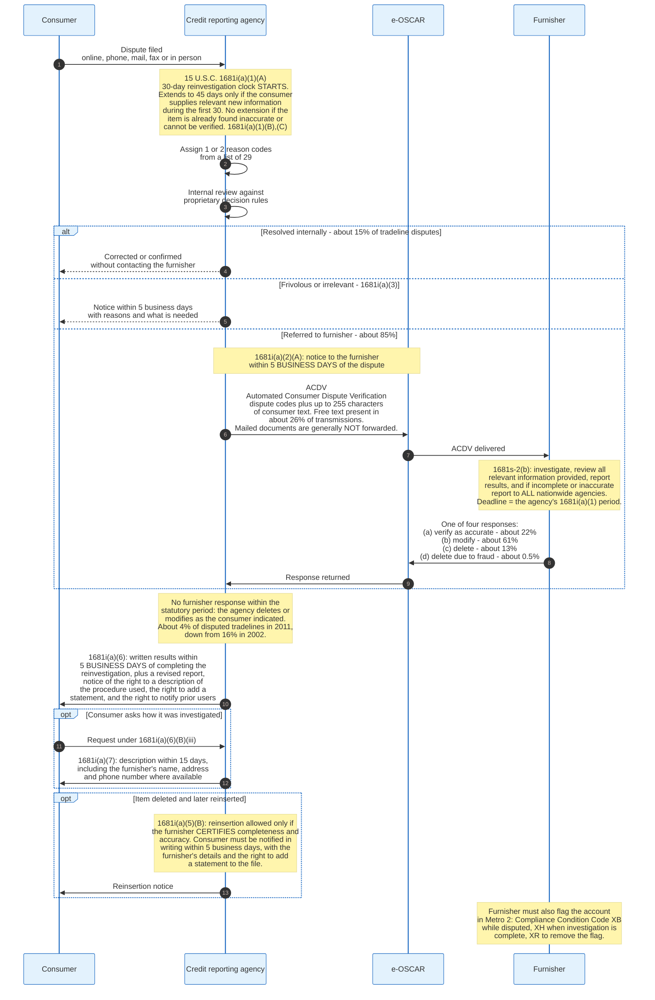

### 17.2 The ACDV

The dispute travels as a structured record, not as a letter.

e-OSCAR is the industry's automated dispute exchange. It began in 1993 as a system run by the Associated Credit Bureaus, now the CDIA. The internet-based version launched in 2001, and Online Data Exchange was created in 2006 to operate it independently. It is built and owned by four companies: Equifax, Experian, Innovis, and TransUnion. In 2011, 16,000 furnishers connected through it.

The record type that carries a consumer dispute to a furnisher is the Automated Consumer Dispute Verification, or ACDV. It contains the tradeline identifiers, one or two dispute reason codes selected from a list of 29, and a free-form text field of up to 255 characters. The companion record type, the Automated Universal Dataform or AUD, lets a furnisher push a correction to an agency without a dispute having been filed.

Two properties of the ACDV drive most of the criticism of the system. Free-form text was present in only about 26 percent of transmissions on the CFPB's 2012 measurement, so most furnishers receive a code and nothing else. And documentation a consumer mails to an agency, such as a cancelled cheque or a settlement letter, is generally not forwarded to the furnisher at all. The furnisher investigates by comparing a two-digit code against its own records, which is the same records that produced the disputed entry.

### 17.3 Outcomes

The CDIA's reported outcomes for a 120-day period in 2012, on tradeline disputes referred to furnishers: 22 percent verified the original data as accurate, 61 percent modified a tradeline or other item, 13 percent deleted an item, and 0.5 percent deleted due to fraud. A further 4 percent of disputed tradelines were deleted or modified by the agency because the furnisher did not respond within the statutory period, down from 16 percent in 2002.

The 61 percent modification rate reads as vindication and mostly is not. Many large furnishers automatically refresh a tradeline with current account information on receiving a dispute, regardless of whether they think anything was wrong. A modification does not imply agreement.

Volume distribution matters too. Items reported by collection agencies have the highest dispute rate at about 1.1 percent of the tradelines they furnish per year, and almost 40 percent of all disputes handled by the agencies trace to collection items. Collections are 13 percent of tradelines and 40 percent of disputes.

### 17.4 The Volume Problem, 2023 to 2025

The dispute system is now being used at a volume it was not designed for, and the CFPB's own complaint database shows the shape of it.

| Year | Total CFPB complaints | Credit or consumer reporting | Share |
|---|---|---|---|
| 2023 | 1,293,802 | 1,048,299 | 81.0% |
| 2024 | 2,739,723 | 2,370,336 | 86.5% |
| 2025 | 5,452,110 | 4,818,219 | 88.4% |

Complaints quadrupled in two years and credit reporting drove almost all of it. In 2025, complaints naming the three agencies were 1,683,209 against Equifax, 1,604,549 against TransUnion, and 1,390,979 against Experian. The next largest are not agencies at all: Block, Inc. at 48,119 and Capital One at 34,191, then CBC Companies at 30,852, each roughly two orders of magnitude below any bureau. By issue, 2,839,440 complaints concerned incorrect information on a report, 1,103,477 concerned improper use of a report, and 868,652 concerned a problem with a company's investigation into an existing problem. All company and issue counts are as measured on 31 August 2026; the database is refreshed continuously and the numbers drift upward as late-filed 2025 complaints publish.

Two mechanisms are pushing the number up. Genuine reporting problems rose as pandemic-era accommodations unwound and student loan delinquencies resumed. And credit repair operations file disputes and complaints in bulk on behalf of clients, often identical form text against all three agencies simultaneously, which is why a single consumer can generate three complaints and dozens of disputed items.

The FCRA gives agencies a valve for the second problem. 1681i(a)(3) allows termination of a reinvestigation the agency reasonably determines is frivolous or irrelevant, including where the consumer fails to supply sufficient information, on notice to the consumer within five business days. Using that valve at scale, against disputes that are formulaic but not necessarily meritless, is the live compliance question in the industry.

---

## 18. Security and Risk: The Equifax Breach of 2017

A credit reporting agency's database is the single richest identity dataset in the country, assembled without the subject's consent and monetised without their participation. In 2017 one of them lost it.

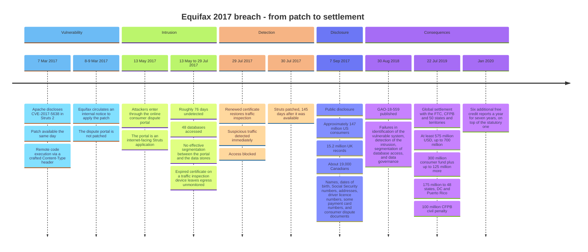

### 18.1 The Mechanism

CVE-2017-5638 is a remote code execution flaw in the Jakarta Multipart parser of Apache Struts 2. A crafted `Content-Type` header containing an Object-Graph Navigation Language expression is evaluated by the server, executing arbitrary commands as the web application's user. Apache disclosed it and shipped a patch on 7 March 2017.

Equifax circulated an internal directive to patch. The internet-facing consumer dispute portal, an application built on Struts, was not patched. Attackers entered through it on 13 May 2017.

Three failures then compounded the first. There was no effective segmentation between the web application and the databases behind it, so a foothold in one application reached 48 separate databases. Credentials found in plaintext on the compromised system opened those databases. And an expired certificate on a network traffic inspection device meant outbound traffic was not being decrypted or examined, so the exfiltration ran unobserved for roughly 76 days. Renewing that certificate on 29 July 2017 produced immediate detection.

The GAO's report, GAO-18-559, published 30 August 2018, categorised the failures as identification, detection, segmentation of database access, and data governance. None of the four is exotic. All four are on every security control baseline in existence.

### 18.2 The Scale and the Consequence

Approximately 147 million US consumers were affected, along with 15.2 million UK records and roughly 19,000 Canadians. The data included names, dates of birth, Social Security numbers, addresses, and driver licence numbers, plus payment card numbers for a smaller group and images of documents consumers had uploaded to the dispute portal.

The July 2019 global settlement with the FTC, the CFPB, and 50 states and territories required Equifax to pay at least 575 million dollars and potentially up to 700 million: 300 million into a consumer restitution fund for credit monitoring and out-of-pocket losses, with up to 125 million more if that proved insufficient, 175 million to 48 states, the District of Columbia and Puerto Rico, and 100 million to the CFPB as a civil penalty. From January 2020 Equifax was required to provide every US consumer with six additional free credit reports a year for seven years.

### 18.3 What the Breach Revealed About the Model

The structural lesson is not about Struts.

A Social Security number is used simultaneously as an identifier and as an authenticator. As an identifier it must be shared with every furnisher, every lender, and every agency. As an authenticator it must be secret. Those requirements are incompatible, and the breach demonstrated the incompatibility at national scale: 147 million people had their primary authentication credential published, and no mechanism exists to reissue it.

The market consequence was close to nil. Equifax's revenue in 2017 was 3.36 billion dollars. In FY2025 it was 6.075 billion. The company acquired a Mexican credit bureau for 750 million dollars in July 2026. A firm whose customers are lenders and whose data subjects are not its customers faces no consumer churn, because the consumers were never able to leave.

The regulatory consequence was the security freeze. The Economic Growth, Regulatory Relief, and Consumer Protection Act of 2018 required the nationwide agencies to provide free security freezes and unfreezes to all consumers, nationally. Before 2018, a freeze cost a fee in most states. A control that existed and was priced out of use became free because 147 million files leaked.

---

## 19. Economics: Who Pays for What

Credit scoring runs on a two-sided imbalance: the party the data describes pays nothing and controls nothing, and the party that uses it pays per pull.

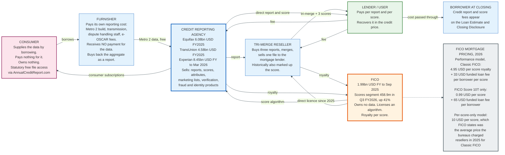

### 19.1 The Data Is Free and the Access Is Not

Furnishers give their data away. They pay to build Metro 2 files, to transmit them, to staff dispute investigations, and to connect to e-OSCAR, and they receive no payment for the content. What they get instead is access to everyone else's contribution, which they then buy back as a consumer report.

This is a classic contributory data model, and TransUnion describes it in exactly those terms in its 10-K: the company operates primarily on contributory data models in which it typically obtains updated information at little or no cost.

The model is stable because defection is self-defeating. A furnisher that stops contributing degrades the resource it depends on, and the largest furnishers are also the largest users.

### 19.2 What a Score Costs

Mortgage is the only segment with published per-unit prices, because FICO published them in 2025 when it began licensing directly to tri-merge resellers.

Under the FICO Mortgage Direct License Program, a reseller may calculate and deliver FICO Scores itself rather than buying them through the agencies. FICO's stated pricing:

| Option | Per-score royalty | Funded loan fee |
|---|---|---|
| Classic FICO, performance model | 4.95 USD per score | 33 USD per borrower per score |
| FICO Score 10 T only, performance model | 0.99 USD per score | 65 USD per borrower |
| Per-score-only model | 10 USD per score | None |

FICO states that 4.95 dollars represents a 50 percent reduction against the average per-score fee the agencies previously charged resellers, by removing the agency markup, and that 10 dollars was the average price the agencies charged for Classic FICO in 2025. Buying Classic FICO under the performance model includes FICO Score 10 T at no extra charge.

The funded loan fee is the structurally interesting part. It shifts revenue from the moment a score is pulled to the moment a loan closes, replacing the fees previously charged for re-issuing scores during a single origination. FICO's justification is that the score has downstream utility for mortgage insurers, the GSEs, investors, and rating agencies, all of whom consume it after closing without paying for it.

The program had reached 73.1 percent of total mortgage reseller volume by August 2026. The effect is visible in FICO's accounts: Scores segment revenue rose 41 percent year over year in the quarter to 30 June 2026, with B2B up 49 percent, which FICO attributes primarily to a higher mortgage origination scores unit price.

TransUnion's 2025 10-K lists "uncertainty related to Fair Isaac Corporation's new Mortgage Direct License Program" as a named risk factor. The score vendor disintermediating the data vendors is a live commercial event, not a hypothetical one.

### 19.3 A Tri-Merge, Priced

A mortgage tri-merge contains three credit reports and three FICO Scores. On the per-score-only model at 10 dollars a score, the score component alone is 30 dollars per borrower, before the reports and before the reseller's processing. On a joint application, double it. These charges appear to the borrower on the Loan Estimate and the Closing Disclosure as a credit report fee.

The 2022 to 2025 increases in this line item are the direct cause of the mortgage industry's campaign for score competition, and of the FHFA's July 2025 decision to permit VantageScore 4.0.

### 19.4 The Consumer Side

The agencies sell subscriptions back to the people whose data they hold. Credit monitoring, identity protection, and score access are a material revenue line, and TransUnion's Credit Essentials product offers a free tier with a daily report and score and a paid tier with three-bureau reports and identity protection.

Free statutory access exists in parallel. AnnualCreditReport.com is the FACT Act channel for the free annual file from each agency, and the agencies have offered weekly free reports through it since 2020. Equifax additionally owes six extra free reports a year through 2026 under the breach settlement, seven years from the January 2020 start.

The economics of the consumer side are unusual. The product is the consumer's own information, sold back to them, and the free statutory alternative is deliberately austere: it delivers the report and not the score, because a score is not statutorily free.

---

## 20. Credit Scoring Outside the United States

The US system is not the international norm. It is one design point among several, and the variables that differ are ownership, mandate, and what is legally allowed to be reported.

### 20.1 The Four Models

| Model | Who runs the register | Reporting | Examples |
|---|---|---|---|
| **Private, voluntary, full-file** | Competing private bureaus | Voluntary, positive and negative | United States, United Kingdom, Canada, Australia since 2018 |
| **Private, mandated, full-file** | Private bureaus under a regulator's rules | Compulsory, on a fixed cycle | India |
| **Public credit register** | The central bank | Compulsory for regulated lenders | China, Portugal, France, Belgium, most of the euro area for corporate exposures |
| **Negative-only** | Private bureaus, restricted by law | Defaults only, positive data prohibited or opt-in | Historically much of Latin America and southern Europe |

The negative-only model is the one with the clearest failure mode. If only defaults are reported, a consumer with a perfect payment record is indistinguishable from one with no record at all. Brazil's move to a positive register, the Cadastro Positivo, and Australia's move to comprehensive credit reporting in 2018 were both responses to that specific defect.

### 20.2 Germany: SCHUFA and the GDPR Question

SCHUFA Holding AG is Germany's dominant credit bureau, and its Basisscore is expressed as a percentage rather than a three-digit number. Its data sources include banks, telecoms, retailers, and public insolvency registers.

The consequential recent development is legal rather than technical. On 7 December 2023 the Court of Justice of the European Union decided Case C-634/21, SCHUFA Holding (Scoring). The question referred was whether a credit bureau computing a probability value is itself engaged in automated individual decision-making under Article 22(1) of the GDPR, or whether only the lender who acts on it is.

The Court ruled that the automated establishment, by a credit information agency, of a probability value concerning a person's ability to meet future payment commitments constitutes automated individual decision-making within the meaning of Article 22(1), where a third party to which that value is transmitted draws strongly on it to establish, implement, or terminate a contractual relationship with that person.

The reasoning is a plugging of a protection gap. If only the lender were the decision-maker, the bureau would not owe the Article 15(1)(h) right to meaningful information about the logic involved, and the lender could not provide it because the lender does not have it. The consumer would have a right against nobody.

The practical effect is that the score itself, computed by the bureau, is the regulated decision in the European Union. There is no equivalent doctrine in the United States, where FCRA regulates the accuracy of the data and ECOA regulates the creditor's decision, and nothing regulates the model developer as a decision-maker.

### 20.3 India: Mandated Reporting on a Fortnightly Cycle

India has four credit information companies licensed under the Credit Information Companies (Regulation) Act, 2005: TransUnion CIBIL, Equifax, Experian, and CRIF High Mark. The CIBIL Score runs 300 to 900.

What distinguishes India is that reporting is compulsory and fast. On 8 August 2024 the Reserve Bank of India issued circular DoR.FIN.REC.No.32/20.16.056/2024-25, exercising its power under section 11(1) of CICRA 2005, directing that credit information companies and credit institutions keep credit information updated on a fortnightly basis, as on the 15th and the last day of each month, or at shorter intervals if mutually agreed. Credit institutions must submit within seven calendar days of the end of the fortnight, and the companies must ingest the data within five calendar days of receipt, revised down from seven. The instructions took effect on 1 January 2025, and the companies must report non-compliant institutions to the RBI's Department of Supervision every six months.

The stated rationale is that faster digital underwriting requires more current reports. The contrast with the United States is exact: a US furnisher reports monthly, on no statutory deadline, with no supervisory list of laggards, because no US statute requires furnishing at all.

TransUnion's own 10-K notes the operational consequence of India's environment. In the absence of a comprehensive national identifier at the time it built the business, TransUnion created a matching algorithm to construct the credit database, and supplements it with the national voters' registry, a fraud registry, a property registry, and a tax identifier database.

### 20.4 The United Kingdom

The United Kingdom hosts the same three agencies as the United States, plus Crediva, and each publishes its own consumer-facing score on its own scale. Those numbers are marketing artefacts. Lenders run their own scorecards on the underlying bureau data and rarely use a bureau's consumer score.

Two data sources are distinctive. The electoral roll is a primary identity verification source, and being unregistered materially damages a UK credit assessment in a way that has no US analogue. County Court Judgments are recorded in a public register and appear on credit files for six years.

The UK's reporting horizon is six years for most adverse information rather than the US seven.

### 20.5 China

China's credit reporting is anchored by a public register. The People's Bank of China operates the Credit Reference Center, a state-run credit information system to which regulated financial institutions must report, covering both natural persons and enterprises. Private market-based personal credit reporting is licensed separately and narrowly; Baihang Credit was licensed in 2018 as the first personal credit reporting company covering non-bank internet lenders.

The persistent Western misconception is worth correcting explicitly. The PBOC credit reporting system is a financial credit register in the same family as the Banque de France's or the Banco de Portugal's. It is not the Social Credit System, which is a separate and heterogeneous set of administrative and corporate compliance ratings run by different agencies for different purposes. Conflating the two produces a description of Chinese credit scoring that is wrong in both directions: it overstates what the financial register does and understates how conventional it is.

Sesame Credit, operated by Ant Group, is likewise not a credit bureau score. It is a private platform rating used chiefly to waive deposits within its own ecosystem, and Chinese regulators have progressively constrained its use in lending.

### 20.6 What Travels and What Does Not

The scoring mathematics travels perfectly. Weight of evidence, logistic regression, and points-to-double-the-odds scaling are used identically in Mumbai, Frankfurt, and San Francisco.

The data does not travel at all. A credit file is a national artefact, built on national identifiers, national furnishing rules, and national retention periods. An immigrant with a 20-year flawless record in one country arrives in another as credit invisible. Several firms have tried to build cross-border credit file portability; none has produced a widely adopted product, because the receiving country's lenders have no way to validate a foreign file and no regulator will let them rely on one.

---

## 21. A Worked End-to-End Example

One account, one missed payment, and the whole system in sequence. All values are illustrative but internally consistent with the formats and rules described above.

### 21.1 The Starting Position

D. Alvarez holds a Meridian Bank credit card opened 14 March 2019 with an 8,000 dollar limit. In January 2026 the balance is 3,120 dollars, the account has never been late, and the Experian FICO Score 8 is 712.

The January Metro 2 base segment Meridian sends to each agency, at the fields that matter:

```
pos 43-72   Consumer Account Number    414720000000188341
pos 73      Portfolio Type             R
pos 74-75   Account Type               18
pos 76-83   Date Opened                03142019
pos 84-92   Credit Limit               000008000
pos 102-104 Terms Duration             REV
pos 105     Terms Frequency            M
pos 106-114 Scheduled Monthly Payment  000000094
pos 115-123 Actual Payment Amount      000000250
pos 124-125 Account Status             11
pos 127-150 Payment History Profile    000000000000000000000000
pos 155-163 Current Balance            000003120
pos 164-172 Amount Past Due            000000000
pos 182-189 Date of Account Info       01312026
pos 190-197 Date of First Delinquency  00000000
pos 325     ECOA Code                  1
```

Utilisation is 3,120 / 8,000 = 39.0 percent. Age of the account is 82 months.

### 21.2 The Missed Payment

The 12 February 2026 payment is not made. At the March cycle close Meridian reports:

```
pos 124-125 Account Status             71          (30 to 59 days past due)
pos 127-150 Payment History Profile    000000000000000000000000
pos 155-163 Current Balance            000003205
pos 164-172 Amount Past Due            000000185
pos 182-189 Date of Account Info       03312026
pos 190-197 Date of First Delinquency  03142026
```

The Date of First Delinquency is 14 March 2026, thirty days after the 12 February due date, per the Metro 2 reporting hierarchy, not the due date itself. Under 15 U.S.C. 1681c(c) it is the anchor for the seven-year clock if this delinquency ever leads to a collection or charge-off. It is zero filled again the moment the account is brought current.

The Payment History Profile does not move yet. Its leftmost byte carries the status reported in the previous cycle, and February was current, so the March record still shows 24 zeros. The 1 appears in the leftmost position at the April cycle, one month after the status field has already gone to 71.

### 21.3 The Score Effect

A first delinquency on a clean file is the largest single move available in a credit score, because payment history is 35 percent of a FICO Score and the model is measuring both severity and recency.

FICO's own published damage-point estimates put a bankcard 30-day delinquency at a 90 to 110 point drop for a consumer at 780 and 60 to 80 points at 680. At 712, Alvarez lands between them. Take a 75-point drop: the FICO Score 8 falls from 712 to 637.

Note what this does to the band. 712 sits in the 700 to 719 bucket. 637 sits below 640. Which band the mortgage grid reads is a separate question, because the mortgage grid does not read FICO Score 8.

### 21.4 The Application

In April 2026 Alvarez applies for a 400,000 dollar purchase mortgage at 80 percent loan-to-value. The lender pulls a tri-merge: FICO Score 2 from Experian, FICO Score 5 from Equifax, FICO Score 4 from TransUnion, and takes the middle. These are three separate model builds on three separate agency development samples with three separate score-to-odds calibrations, and none of them is the FICO Score 8 that fell to 637. Identical input records do not produce identical outputs from different functions. Section 2.3 calls a 40-point gap between two of them unremarkable. Assume the middle score lands in the low 640s.

Against the Fannie Mae purchase-money LLPA grid at 75.01 to 80.00 percent LTV, matrix dated 28 January 2026:

| Score band | LLPA | Cost on 400,000 USD |
|---|---|---|
| 700-719 (before) | 1.375% | 5,500 USD |
| 640-659 (after) | 2.250% | 9,000 USD |
| **Difference** | **0.875 points** | **3,500 USD** |

One missed 94 dollar payment, 185 dollars past due by the March cycle, costs 3,500 dollars at closing, or roughly 0.22 percentage points of rate at the industry rule of thumb of one discount point, meaning 1 percent of the loan amount, per 0.25 percentage points of rate. Had the middle score landed at 639 instead of 641 the same delinquency would cost 5,500 dollars, because the grid drops to 2.750 percent below 640. Two points of score, 2,000 dollars.

### 21.5 The Denial and the Notice

The lender declines, citing the credit score and a debt-to-income ratio of 46 percent. Within 30 days of the completed application, under 12 CFR 1002.9(a)(1)(i), it sends a combined ECOA and FCRA notice containing:

- The statement of action taken, the lender's name and address, the ECOA section 701(a) notice, and the address of the federal agency administering compliance.
- The principal reasons, specific and accurate, in the lender's own decision terms. Here: delinquent past or present credit obligations; proportion of total obligations to income.
- Under 15 U.S.C. 1681m(a), the agencies' names, addresses, and telephone numbers, a statement that the agencies did not make the decision, and notice of the right to a free file within 60 days and to dispute.
- Under 15 U.S.C. 1681g(f) and 1681m(a)(2), the score used, its range, the date, the source, and the key factors that adversely affected it, at most four, in order of importance by effect on the score. Here: serious delinquency; proportion of balances to credit limits on revolving accounts is too high; length of time accounts have been established; number of accounts with balances.

The ECOA reasons and the FCRA key factors are different lists describing different things. The first describes why the lender said no. The second describes why the score is what it is.

### 21.6 The Dispute

Alvarez has a bank record showing the February payment was sent on 10 February and misapplied by Meridian to a closed account.

On 20 April Alvarez files a dispute with Experian. The clock under 1681i(a)(1)(A) starts that day and runs 30 days. Experian assigns dispute reason codes, cannot resolve it internally, and within five business days transmits an ACDV to Meridian carrying the tradeline identifiers, the codes, and up to 255 characters of Alvarez's text. The bank statement Alvarez mailed is not forwarded.

Meridian investigates under 15 U.S.C. 1681s-2(b), finds the misapplication, and returns response type (b), modify. It corrects Account Status to 11, blanks the Amount Past Due, resets the Payment History Profile to 24 zeros, and zero fills the Date of First Delinquency. Because the information was inaccurate, 1681s-2(b)(1)(D) requires Meridian to report the correction to every nationwide agency it furnishes to, not only Experian. In its next Metro 2 cycle it sets the Compliance Condition Code to XH, investigation complete, and in the cycle after that to XR to remove the flag.

Experian sends written results within five business days of completing the reinvestigation, with a revised report and notice of Alvarez's right to a description of the procedure used, which Experian must supply within 15 days if requested.

The Experian score returns to approximately 712. Equifax and TransUnion follow when Meridian's corrected file reaches them, which takes until their next monthly cycle.

Elapsed time from missed payment to full correction at Experian: roughly fifteen weeks. The payment is missed on 12 February, the dispute is filed on 20 April, sixty-seven days later, the reinvestigation runs up to thirty days from that date, and written results follow within five business days of completion. Equifax and TransUnion take longer still, because they pick up Meridian's corrected record on their next monthly cycle. The mortgage application was already declined.

---

## 22. Modern Developments

### 22.1 The Mortgage Score Standard Is Finally Moving

For three decades the GSEs required Classic FICO and nothing else. Two changes in fourteen months ended that.

On 8 July 2025 the FHFA directed that Fannie Mae and Freddie Mac allow lenders to use VantageScore 4.0, on the existing tri-merge infrastructure, killing the bi-merge proposal that had been scheduled for the end of 2025.

On 22 April 2026 FHFA and HUD went further. FHA, Fannie Mae and Freddie Mac all adopted VantageScore 4.0 and FICO Score 10 T, the enterprises updated their selling guides, and the enterprises began accepting VantageScore-underwritten loans from approved lenders immediately. Lenders now choose among three models rather than one.

FICO reached that outcome by giving 10 T away first: more than 70 lenders in the Free Access Program as of July 2026, representing 586 billion dollars of annual originations, receiving 10 T alongside the Classic score at no additional FICO fee. Fannie Mae and Freddie Mac released historical 10 T data in mid-2026, which lets lenders and investors rebuild their own models on it.

The three-decade standard did not fall to a better model. It fell to a pricing dispute.

### 22.2 FICO Disintermediates the Bureaus

The FICO Mortgage Direct License Program, launched in 2025, lets tri-merge resellers calculate and deliver FICO Scores directly, eliminating the agencies' markup on the score. By August 2026 it accounted for 73.1 percent of total mortgage reseller volume, with Cotality, Ascend Companies, Xactus, CIC Credit, Informative Research, and MeridianLink all participating.

The revenue effect on FICO is immediate: Scores segment revenue up 41 percent year over year in the quarter to 30 June 2026, B2B up 49 percent, driven by a higher mortgage origination scores unit price. The effect on the agencies appears in TransUnion's 10-K risk factors.

### 22.3 The Regulatory Retreat

The federal posture on credit scoring reversed between 2025 and 2026.

- 12 May 2025: the CFPB withdraws 16 circulars and dozens of bulletins and advisory opinions, including Circular 2022-03 and Circular 2023-03 on adverse action from complex algorithms.
- 11 July 2025: the Eastern District of Texas vacates the CFPB's medical debt rule in Cornerstone Credit Union League v. CFPB, holding it exceeded the Bureau's FCRA authority. The rule, published 14 January 2025 and effective 17 March 2025 after a stay to 15 June, would have removed the regulatory exception permitting creditors to obtain and use medical debt information and barred agencies from furnishing it.
- 28 October 2025: the CFPB issues an interpretive rule holding that FCRA generally preempts state laws touching broad areas of credit reporting, replacing a July 2022 interpretive rule withdrawn in May 2025.
- 22 April 2026: the CFPB finalises the Regulation B amendments removing the effects test, effective 21 July 2026.

The medical debt outcome deserves a note. The rule is gone, but the three agencies had already removed paid medical collections, imposed a one-year waiting period before reporting unpaid ones, and stopped reporting medical collections under 500 dollars, between 2022 and 2023, voluntarily. FICO Score 9 and later already discount medical collections. Most of what the rule would have done had already happened commercially.

### 22.4 Cash Flow Data Becomes a Product

Consumer-permissioned bank data moved from pilot to product in 2026. The next-generation UltraFICO Score, generally available 20 May 2026, delivers a FICO Score augmented with Plaid-sourced cash flow signals on the standard 300 to 850 scale, with published lifts of 7 percent more approvals at no incremental risk and 15 percent relative performance improvement for prime applicants with limited histories.

The open question is the regulatory plumbing. The CFPB's Personal Financial Data Rights rule under section 1033 of the Dodd-Frank Act, which governs how consumers authorise access to their bank data, was reopened for reconsideration in a proposal published 22 August 2025. Cash flow underwriting depends on that access existing, being cheap, and being legally settled.

### 22.5 The Delinquency Cycle Turns

The score distribution is being reshaped by student loans.

Experian's national average FICO Score falls from 715 in 2024 to 713 in 2025, the first annual decline since 2013. FICO publishes a separate series twice a year, and it stands at 714 in April 2026, flat since October 2025. FICO attributes the stabilisation to student loan delinquency reporting maturing after the pandemic pause ended, alongside improving delinquency across every major loan type.

Beneath the flat average, the divergence widens. Approximately 3.2 million consumers with a student loan payment due had a recent delinquency and lost an average 38 points year over year. Consumers without one gained 16 points. Mortgage balances for borrowers below 620 grew 43 percent since April 2019 against 30 percent inflation, and subsequent 90-day-plus delinquency rose exclusively in the lowest score bands.

A national average that does not move is not evidence that nothing is happening.

### 22.6 Where This Goes

Three trajectories are visible and one is not.

**Trended data becomes the default.** VantageScore 4.0 has had it since 2017, FICO 10 T is being given away to get it adopted, and the measured lift concentrates exactly where lenders make money, in the prime population.

**Cash flow data enters the mainstream through the score, not around it.** The UltraFICO design, delivering an augmented score on the existing scale, is the pattern that works, because it requires no lender to rebuild a policy stack.

**The score vendor and the data vendors are now competitors.** FICO licensing directly to resellers, and the agencies owning VantageScore, put every party on both sides of the table.

**What is not visible is whether the credit invisible population gets solved.** Every mechanism in section 16 helps someone who already has a bank account, a landlord willing to report, or a sparse file. None of them creates a record for a person with none of those things, and no market participant is paid to.

---

## 23. Appendix

### 23.1 Key Terminology

| Term | Definition |
|---|---|
| **ACDV** | Automated Consumer Dispute Verification; the e-OSCAR record carrying a consumer dispute from an agency to a furnisher, with dispute codes and up to 255 characters of free text |
| **Adverse action** | A denial or revocation of credit, a change in terms unfavourable to the applicant, or a refusal to grant credit in substantially the amount requested; defined at 12 CFR 1002.2(c) |
| **AIR** | Adverse impact ratio; the protected group's approval rate divided by the control group's, conventionally flagged below 0.80 |
| **AUD** | Automated Universal Dataform; the e-OSCAR record a furnisher uses to push a correction without a dispute having been filed |
| **Base segment** | The 426-character Metro 2 record carrying one account's data, applying to all consumers on the account |
| **BISG** | Bayesian Improved Surname Geocoding; a method combining surname and census-tract race distributions to produce a probability of protected class membership where the creditor may not ask |
| **Compliance Condition Code** | Metro 2 positions 153-154; the dispute and legal flag field, values XA through XR |
| **CRRG** | Credit Reporting Resource Guide; the CDIA's Metro 2 specification, access-restricted to furnishers, processors, vendors, and agencies |
| **Credit invisible** | A consumer with no credit record at a nationwide consumer reporting agency |
| **DOFD** | Date of First Delinquency; Metro 2 positions 190-197, the anchor for the seven-year FCRA reporting clock under 15 U.S.C. 1681c(c) |
| **e-OSCAR** | The automated dispute exchange built and owned by Equifax, Experian, Innovis, and TransUnion |
| **ECOA Code** | Metro 2 position 325; the consumer's legal relationship to the account: 1 individual, 2 joint, 3 authorized user, 5 co-maker, 7 maker, T terminated, W business, X deceased, Z delete consumer |
| **EDDSS** | Empirically derived, demonstrably and statistically sound; the 12 CFR 1002.2(p) standard a scoring system must meet to use age as a predictive factor |
| **Effects test** | Regulation B's historical term for disparate impact; removed from 12 CFR 1002.6(a) by the final rule effective 21 July 2026 |
| **Furnisher** | Any entity that reports consumer account information to a consumer reporting agency; subject to 15 U.S.C. 1681s-2 |
| **Gini** | A rank-ordering performance measure equal to 2 x AUC minus 1; VantageScore 4.0 holdout Gini is 83.3 account management, 71.2 originations |
| **Hard inquiry** | A credit pull recorded when a consumer applies for credit; visible for two years, affects a FICO Score for one |
| **Information value** | A scorecard attribute screening statistic; conventionally below 0.02 useless, 0.1 to 0.3 medium, above 0.5 suspicious |
| **Key factors** | FCRA 15 U.S.C. 1681g(f)(2)(B); all relevant elements adversely affecting a credit score, in order of importance, capped at four except for inquiries |
| **KS statistic** | The maximum vertical distance between the cumulative distributions of goods and bads |
| **LLPA** | Loan-Level Price Adjustment; Fannie Mae's upfront fee grid by representative credit score and loan-to-value |
| **Metro 2** | The CDIA's fixed-width credit reporting format; 426 characters unpacked, 366 packed |
| **Mixed file** | A credit file containing another person's tradelines, produced by a matching error |
| **NCRA** | Nationwide consumer reporting agency; in this document and in CFPB usage, Equifax, Experian and TransUnion. Innovis participates in Metro 2 and part-owns e-OSCAR but is not counted among the three |
| **PDO** | Points to Double the Odds; the scaling constant in `factor = PDO / ln(2)` |
| **Payment History Profile** | Metro 2 positions 127-150; 24 characters of monthly performance, most recent leftmost, the leftmost byte carrying the previous cycle's Account Status |
| **PINning** | An agency data architecture linking records to a personal identification number across relational databases rather than to a single flat file |
| **PSI** | Population stability index; a production monitor comparing current attribute or score distributions to the development distribution |
| **Reject inference** | Techniques for assigning inferred outcomes to declined applicants so that a model is not fitted only on the approved population |
| **Representative credit score** | The score a mortgage lender uses after a tri-merge; the middle of the three, or the lower borrower's middle score on a joint application |
| **SHAP** | Shapley additive explanation; per-applicant feature attribution used to derive reason codes from tree ensembles |
| **Special Comment Code** | Metro 2 positions 151-152; a narrative qualifier such as forbearance or disaster |
| **Thin file** | A credit record with too few or too new accounts to be scored by a conventional model |
| **Tradeline** | One account as one furnisher reports it, restated in full each cycle |
| **Trended data** | Balance, payment, and utilisation trajectory over 24 months, as against a single current-month snapshot |
| **Tri-merge** | A mortgage credit report combining files and scores from all three nationwide agencies |
| **Universe expansion** | Scoring consumers that conventional models exclude: dormant files, files with no usable trades, thin and young files |
| **Weight of evidence** | `ln((goods_i/total goods)/(bads_i/total bads))`; the log-odds transformation applied to a binned attribute |

### 23.2 Diagram Index

| Diagram | Source | What it shows |
|---|---|---|
| Participants | [`diagrams/participants.mmd`](diagrams/participants.mmd) | Furnishers, agencies, model developers, users, regulators, and shared infrastructure |
| Furnisher Pipeline | [`diagrams/furnisher-pipeline.mmd`](diagrams/furnisher-pipeline.mmd) | Cycle close to Metro 2 build to agency matching, and where fragments form |
| Metro 2 Record Structure | [`diagrams/metro2-record-structure.mmd`](diagrams/metro2-record-structure.mmd) | Header, base segment, J through N appendages, trailer, with byte lengths |
| Tradeline Lifecycle | [`diagrams/tradeline-lifecycle.mmd`](diagrams/tradeline-lifecycle.mmd) | One card account from origination through a missed payment and cure, at field level |
| FICO Factor Weights | [`diagrams/fico-factor-weights.mmd`](diagrams/fico-factor-weights.mmd) | The five factors, and what is excluded by law versus by absence of data |
| VantageScore Segmentation | [`diagrams/vantagescore-segmentation.mmd`](diagrams/vantagescore-segmentation.mmd) | The seven scorecards, the DRG, DFH and DFL thresholds, and each segment's default rate |
| Score Bands and Pricing | [`diagrams/score-bands-pricing.mmd`](diagrams/score-bands-pricing.mmd) | The 2025 score distribution against the Fannie Mae LLPA grid, with the arithmetic |
| Scorecard Construction | [`diagrams/scorecard-construction.mmd`](diagrams/scorecard-construction.mmd) | Target definition through binning, WOE, IV, logistic regression, scaling and revalidation |
| Reject Inference | [`diagrams/reject-inference.mmd`](diagrams/reject-inference.mmd) | The censoring problem and five methods, with what each assumes |
| ML and Explainability | [`diagrams/ml-explainability.mmd`](diagrams/ml-explainability.mmd) | Where accuracy comes from, what the law requires, and the SHAP baseline problem |
| Adverse Action Flow | [`diagrams/adverse-action-flow.mmd`](diagrams/adverse-action-flow.mmd) | Application to notice, with ECOA and FCRA content requirements side by side |
| Fair Lending Testing | [`diagrams/fair-lending-testing.mmd`](diagrams/fair-lending-testing.mmd) | Proxy construction, disparity measurement, business necessity, LDA search, and the 2025-2026 reversal |
| Alternative Data | [`diagrams/alternative-data.mmd`](diagrams/alternative-data.mmd) | Sources that enter the credit file, sources that never do, measured effects, and limits |
| Dispute Flow | [`diagrams/dispute-flow.mmd`](diagrams/dispute-flow.mmd) | The FCRA dispute sequence with every statutory clock and the four furnisher responses |
| Equifax Breach Timeline | [`diagrams/equifax-breach-timeline.mmd`](diagrams/equifax-breach-timeline.mmd) | CVE-2017-5638 to the 2019 settlement, with dwell time and the four GAO failure categories |
| Money Flow | [`diagrams/money-flow.mmd`](diagrams/money-flow.mmd) | Who pays whom, and FICO's published 2026 mortgage score pricing |

### 23.3 Metro 2 Reference Tables

**Portfolio Type, position 73**

| Code | Meaning |
|---|---|
| C | Line of credit |
| I | Installment |
| M | Mortgage |
| O | Open |
| R | Revolving |
| L | Lease |

**Terms Frequency, position 105**

| Code | Meaning | Code | Meaning |
|---|---|---|---|
| D | Deferred | L | Bimonthly |
| P | Single payment loan | Q | Quarterly |
| W | Weekly | T | Tri-annually |
| B | Biweekly | S | Semiannually |
| E | Semimonthly | Y | Annually |
| M | Monthly | | |

**Payment Rating, position 126** (reported only for Account Status 05, 13, 65, 88, 89, 94 and 95; blank otherwise)

| Code | Meaning |
|---|---|
| 0 | Current, 0 to 29 days past due |
| 1 | 30 to 59 days |
| 2 | 60 to 89 days |
| 3 | 90 to 119 days |
| 4 | 120 to 149 days |
| 5 | 150 to 179 days |
| 6 | 180 or more days |
| G | Collection |
| L | Charge-off |

**Creditor Classification, K1 segment**

| Code | Meaning | Code | Meaning |
|---|---|---|---|
| 01 | Retail | 09 | Rental or leasing |
| 02 | Medical or health care | 10 | Utilities |
| 03 | Oil company | 11 | Cable or cellular |
| 04 | Government | 12 | Financial |
| 05 | Personal services | 13 | Credit union |
| 06 | Insurance | 14 | Automotive |
| 07 | Educational | 15 | Check guarantee |
| 08 | Banking | | |

**Header record layout, character format**

| Pos | Len | Field |
|---|---|---|
| 1-4 | 4 | Record Descriptor Word |
| 5-10 | 6 | Record Identifier |
| 11-12 | 2 | Cycle Identifier |
| 13-22 | 10 | Innovis Program Identifier |
| 23-32 | 10 | Equifax Program Identifier |
| 33-37 | 5 | Experian Program Identifier |
| 38-47 | 10 | TransUnion Program Identifier |
| 48-55 | 8 | Activity Date |
| 56-63 | 8 | Date Created |
| 64-71 | 8 | Program Date |
| 72-79 | 8 | Program Revision Date |
| 80-119 | 40 | Reporter Name |
| 120-215 | 96 | Reporter Address |
| 216-225 | 10 | Reporter Telephone Number |
| 226-265 | 40 | Software Vendor Name |
| 266-270 | 5 | Software Version Number |
| 271-280 | 10 | PRBC Program Identifier |
| 281-426 | 146 | Reserved |

### 23.4 Statutory and Regulatory Reference

| Provision | Citation | What it does |
|---|---|---|
| Permissible purpose | 15 U.S.C. 1681b | Limits who may obtain a consumer report and why |
| Obsolete information | 15 U.S.C. 1681c(a) | 10 years for bankruptcy, 7 for most adverse items |
| Running of the 7-year period | 15 U.S.C. 1681c(c) | Starts 180 days after the delinquency preceding collection or charge-off |
| High-value exemption | 15 U.S.C. 1681c(b) | Limits do not apply above 150,000 USD credit or 75,000 USD salary |
| Agency accuracy duty | 15 U.S.C. 1681e(b) | Reasonable procedures to assure maximum possible accuracy; the standard governing matching and mixed files |
| File disclosure | 15 U.S.C. 1681g | Consumer's right to the file |
| Score disclosure and key factors | 15 U.S.C. 1681g(f) | Score, range, date, source, at most 4 key factors in order |
| Home loan score disclosure | 15 U.S.C. 1681g(g) | Notice to the Home Loan Applicant |
| Dispute reinvestigation | 15 U.S.C. 1681i | 30 days, extendable to 45; 5 business days to notify the furnisher; 5 to report results |
| Adverse action by users | 15 U.S.C. 1681m(a) | Agency identification, right to a free file and to dispute |
| Risk-based pricing | 15 U.S.C. 1681m(h) | Notice when terms are materially worse; 12 CFR 1022 subpart H |
| Furnisher accuracy | 15 U.S.C. 1681s-2(a) | Prohibition on furnishing known inaccuracies |
| Furnisher dispute duties | 15 U.S.C. 1681s-2(b) | Investigate, review, report, and correct to all nationwide agencies |
| ECOA prohibited bases | 15 U.S.C. 1691(a) | Race, colour, religion, national origin, sex, marital status, age, public assistance income, exercise of CCPA rights |
| ECOA statement of reasons | 15 U.S.C. 1691(d)(2), (d)(3) | Specific principal reasons required |
| Reg B credit scoring definition | 12 CFR 1002.2(p) | The EDDSS standard and the age exception |
| Reg B inquiry restrictions | 12 CFR 1002.5(b) | Bars asking about most protected characteristics outside mortgage |
| Reg B evaluation of applications | 12 CFR 1002.6(a) | As amended effective 21 July 2026, states the effects test does not apply |
| Reg B special purpose credit programs | 12 CFR 1002.8 | As amended, new 1002.8(b)(3) bars race, colour, national origin and sex as a common characteristic or factor determining eligibility for the for-profit programs described in 1002.8(a)(3) |
| Reg B notification | 12 CFR 1002.9 | 30-day and 90-day clocks and required content |
| Reg B self-testing privilege | 12 CFR 1002.15 | Protects fair lending self-tests from discovery, as amended |
| Regulation V medical information | 12 CFR 1022.30 | The prohibition and its exceptions; the 2025 amendments were vacated |
| Disparate impact policy | Executive Order 14281, 23 April 2025 | Directs agencies to deprioritise disparate-impact enforcement |

### 23.5 Primary Sources

- Consumer Financial Protection Bureau, *Key Dimensions and Processes in the U.S. Credit Reporting System*, December 2012
- Consumer Financial Protection Bureau, *Data Point: Credit Invisibles*, May 2015, and *Technical correction and update to the CFPB's credit invisibles estimate*, 23 June 2025
- Consumer Financial Protection Bureau, Circular 2022-03 (2022) and Circular 2023-03, released 19 September 2023, both withdrawn at 90 FR 20084, 12 May 2025
- Consumer Financial Protection Bureau, *Equal Credit Opportunity Act (Regulation B)*, final rule, 91 FR 21620, 22 April 2026, effective 21 July 2026
- Consumer Financial Protection Bureau, *Prohibition on Creditors and Consumer Reporting Agencies Concerning Medical Information (Regulation V)*, final rule, published 14 January 2025; vacated 11 July 2025 in *Cornerstone Credit Union League v. CFPB*, E.D. Tex. No. 4:25-cv-00016
- Consumer Financial Protection Bureau, *Fair Credit Reporting Act; Preemption of State Laws*, interpretive rule, 90 FR 48710, 28 October 2025
- Consumer Financial Protection Bureau, Consumer Complaint Database, aggregate counts for calendar years 2023, 2024 and 2025
- Executive Order 14281, *Restoring Equality of Opportunity and Meritocracy*, 23 April 2025, 90 FR 17537
- Federal Trade Commission, *Report to Congress Under Section 319 of the Fair and Accurate Credit Transactions Act of 2003*, February 2013
- Federal Trade Commission, *Equifax to Pay $575 Million as Part of Settlement with FTC, CFPB, and States Related to 2017 Data Breach*, 22 July 2019
- Government Accountability Office, *Data Protection: Actions Taken by Equifax and Federal Agencies in Response to the 2017 Breach*, GAO-18-559, 30 August 2018
- Federal Housing Finance Agency, statement of Director William J. Pulte permitting VantageScore 4.0 at Fannie Mae and Freddie Mac, 8 July 2025
- Federal Housing Finance Agency and Department of Housing and Urban Development, *Homebuying Advances into New Era of Credit Score Competition*, 22 April 2026
- Fannie Mae, *Loan-Level Price Adjustment Matrix*, matrix dated 28 January 2026
- VantageScore Solutions, *VantageScore 4.0 User Guide*, revised September 2022
- FICO, *FICO Score Credit Insights Report*, Fall 2026 edition, 25 August 2026
- FICO, *FICO Score 10T Adoption Momentum Surpasses 70 Mortgage Lenders*, 28 July 2026
- FICO, *Next-Generation UltraFICO Score Now Available*, 20 May 2026
- Fair Isaac Corporation, published damage-point estimates for a bankcard 30-day delinquency by starting score, first released 2011 and reprinted in FICO consumer education material
- FICO, *FICO Mortgage Direct License Program* pricing disclosure, ficoscore.com
- FICO, *Fair Isaac Corporation Announces Earnings of $10.45 per Share for Third Quarter Fiscal 2026*, 29 July 2026
- myFICO, *What's in my FICO Scores* and *Credit Checks and Inquiries*
- Reserve Bank of India, *Frequency of reporting of credit information by Credit Institutions to Credit Information Companies*, DoR.FIN.REC.No.32/20.16.056/2024-25, 8 August 2024
- Court of Justice of the European Union, Case C-634/21, *SCHUFA Holding (Scoring)*, judgment of 7 December 2023
- Consumer Data Industry Association, Metro 2 Format overview and access policy
- TransUnion, Form 10-K for the year ended 31 December 2025
- 15 U.S.C. 1681 et seq.; 15 U.S.C. 1691 et seq.; 12 CFR parts 1002 and 1022
- moov-io/metro2, an Apache-licensed open-source Metro 2 parser, for field offsets and code constants

---

## 24. Key Takeaways

**1. A credit score is a 24-month forecast of one specific bad outcome, computed from one agency's file, and nothing more.** VantageScore 4.0 defines bad as 90 or more days past due within 24 months, with mortgage originations flagged at 60. Change the outcome definition, the window, or the agency and the number changes. It contains no income, no assets, and no employment, because a credit file contains none of those things. FICO's own research finds 65 percent of Americans believe otherwise or are unsure.

**2. There is no such thing as your credit score.** A mortgage lender pulls FICO Score 2, 4, and 5 from three agencies and takes the middle. A card issuer probably pulls FICO Score 8 Bankcard. A free app shows VantageScore 3.0. VantageScore's own testing found 92.2 percent of consumers score within 40 points across the three agencies with the model held constant, meaning roughly one in thirteen falls outside even that band.

**3. The data supply is voluntary, concentrated, and monthly.** No US statute compels a creditor to furnish. The top 10 furnishers supply about 57 percent of each agency's 1.3 billion tradelines. Reporting is a batch job, so a delinquency incurred on 3 March may not be visible anywhere until April. India, by contrast, mandates fortnightly reporting within seven calendar days, effective 1 January 2025.

**4. Metro 2 is the constraint nobody sees.** A 426-character fixed-width record with 24 characters of payment history is why bureau trended data starts at 24 months and stops there, why there is no interest rate in a credit file, and why a missed payment caused by hospitalisation and one caused by neglect produce identical records. The format has no field for either.

**5. Four fields carry almost all the signal.** Account Status, Payment History Profile, Current Balance, and Credit Limit. Everything else in the base segment is identity, routing, or legal qualification. A furnisher that stops reporting credit limits inflates apparent utilisation across its whole portfolio.

**6. Matching is probabilistic and it fails in two directions.** With over 200 million files per agency, 2.3 million people named Smith, and no authoritative identity register, records land on the wrong file or split into fragments. The FTC's controlled study found 26 percent of participants identified a potentially material error, and 5.2 percent were in the wrong risk tier because of one.

**7. Under every bureau score is a logistic regression on weight-of-evidence bins, and it survives because it is readable.** Gradient-boosted trees are one to four Gini points better. Scorecards remain dominant because reason codes fall out of the points table, monotonicity is guaranteed by construction, and an examiner can read the model. VantageScore 4.0 uses ML for attribute design and logistic regression for the fit, which is the compromise the industry converged on.

**8. Scores are linear in log-odds, which is why score bands price in steps and why the steps are arbitrary.** `score = offset + factor * ln(odds)`, `factor = PDO / ln(2)`. On the Fannie Mae grid, a borrower at 779 pays 0.625 percent and one at 780 pays 0.375 percent. On a 400,000 dollar loan that single point is worth 1,000 dollars, and no theory of risk supports it. Grids exist because everyone downstream needs the same buckets.

**9. Reject inference is the hardest unsolved problem in lender-built scorecards, and bureau scores dodge it.** A model trained on approvals reproduces the incumbent cutoff and calls it validation. Every inference method except a randomised holdout rests on an untestable assumption, and the randomised holdout costs charge-offs. VantageScore 4.0 states plainly that no reject inference was used, because a bureau model is built on the whole file population.

**10. Explainability is a legal requirement, not an engineering preference, and the SHAP baseline is an unresolved compliance question.** ECOA requires specific principal reasons that accurately describe the factors actually scored. Shapley attribution explains against a reference point, and choosing the population mean instead of the approval cutoff changes what the consumer is told. No statute names a baseline.

**11. The federal posture on fair lending reversed in fourteen months.** Executive Order 14281 of 23 April 2025 directs agencies to eliminate disparate-impact liability to the maximum degree possible. The CFPB's final rule effective 21 July 2026 adds to 12 CFR 1002.6(a) that the Act does not provide that the effects test applies. Disparate treatment, private litigation, state law, and prudential model risk expectations all survive.

**12. The dispute system was designed for 8 million contacts a year and is now handling multiples of that.** CFPB complaints rose from 1.29 million in 2023 to 5.45 million in 2025, with credit reporting at 88.4 percent of the total and 1.68 million naming Equifax alone. The furnisher receives a two-digit code and, 26 percent of the time, 255 characters of text. Mailed documentation is generally not forwarded.

**13. The Equifax breach proved that a Social Security number cannot be both an identifier and an authenticator.** An unpatched Struts vulnerability, 145 days after the patch shipped, plus no segmentation and an expired inspection certificate, produced 76 days of undetected exfiltration and 147 million exposed files. The settlement cost up to 700 million dollars. Equifax's revenue has since risen from 3.36 billion to 6.08 billion, because the people harmed were never its customers.

**14. The mortgage score standard fell to a pricing dispute, not to a better model.** Classic FICO, built on 1990s data, held the GSE requirement for three decades. FHFA permitted VantageScore 4.0 on 8 July 2025 after FICO's mortgage score price rose, and on 22 April 2026 FHFA and HUD added both VantageScore 4.0 and FICO Score 10 T at FHA, Fannie Mae and Freddie Mac. FICO now licenses directly to resellers at 4.95 dollars per Classic score plus a 33 dollar funded loan fee, has captured 73.1 percent of reseller volume, and grew Scores revenue 41 percent year over year.

**15. Alternative data helps people who already have something, and nobody is paid to solve the rest.** Cash flow underwriting needs a bank account. Rent reporting needs a landlord willing to accept FCRA furnisher liability. Experian Boost moves one agency's file only. Universe expansion scorecards produce a number where there was none, and for the no-usable-trade segment that number carries a 29.90 percent originations default rate. Scoring more people is not approving more people.

---

*Figures in this document are drawn from CFPB, FTC, GAO, FHFA, Federal Register, Reserve Bank of India, CJEU, FICO, VantageScore, Fannie Mae, and SEC filings, and reflect data available as of August 2026. Where a figure moves over time, the measurement date is given with it. Metro 2 field offsets and code constants are taken from the moov-io/metro2 open-source implementation and cross-checked against published code tables; the authoritative specification is the CDIA's Credit Reporting Resource Guide, which is not publicly available. Regulatory citations are to the provisions as they stand after the Regulation B amendments effective 21 July 2026.*
