# Deposit Insurance: Complete Technical Deep Dive

---

## Table of Contents

1. [History and Overview](#1-history-and-overview)
2. [What Deposit Insurance Actually Is (and Is Not)](#2-what-deposit-insurance-actually-is-and-is-not)
3. [The Run Problem and the Moral Hazard It Creates](#3-the-run-problem-and-the-moral-hazard-it-creates)
4. [Key Participants and Roles](#4-key-participants-and-roles)
5. [Coverage Mechanics: Ownership Categories and the Arithmetic of 250,000](#5-coverage-mechanics-ownership-categories-and-the-arithmetic-of-250000)
6. [The Deposit Insurance Fund](#6-the-deposit-insurance-fund)
7. [Risk-Based Pricing: How a Bank's Premium Is Computed](#7-risk-based-pricing-how-a-banks-premium-is-computed)
8. [The Resolution Toolkit](#8-the-resolution-toolkit)
9. [The Friday Night Close, Hour by Hour](#9-the-friday-night-close-hour-by-hour)
10. [Deposit Insurance Determination and the Data Problem](#10-deposit-insurance-determination-and-the-data-problem)
11. [Least-Cost Resolution and the Systemic Risk Exception](#11-least-cost-resolution-and-the-systemic-risk-exception)
12. [March 2023: SVB, Signature, and First Republic](#12-march-2023-svb-signature-and-first-republic)
13. [The Special Assessment](#13-the-special-assessment)
14. [Who Actually Bears Losses](#14-who-actually-bears-losses)
15. [The FDIC and NCUA Split](#15-the-fdic-and-ncua-split)
16. [Europe: The Deposit Guarantee Schemes Directive](#16-europe-the-deposit-guarantee-schemes-directive)
17. [The United Kingdom: FSCS](#17-the-united-kingdom-fscs)
18. [Engineering Coverage Above the Cap](#18-engineering-coverage-above-the-cap)
19. [Comparisons and Alternatives](#19-comparisons-and-alternatives)
20. [Modern Developments](#20-modern-developments)
21. [Appendix](#21-appendix)
22. [Key Takeaways](#22-key-takeaways)

---

## 1. History and Overview

Deposit insurance converts a bank's most fragile liability into its most stable one, and every country that has adopted it did so after a banking panic rather than before one. The United States created the Federal Deposit Insurance Corporation in 1933, after roughly 9,000 banks had already suspended operations in four years. The instrument is not clever. It is a promise, backed by a government, that a depositor gets their money whether or not the bank has it.

That promise has a price, and the entire technical apparatus in this document exists to charge it, cap it, and collect it back.

```mermaid
%%{init: {'theme': 'base', 'themeVariables': {'primaryColor': '#e3f2fd', 'primaryBorderColor': '#1565c0', 'lineColor': '#37474f'}}}%%

graph LR
    subgraph Era1["Panic and Founding<br/>1908-1935"]
        direction TB
        E1A["1908-1930: eight states run their own<br/>deposit guarantee funds.<br/>All of them fail."]
        E1B["1930-1933: about 1,350, 2,300, 1,450<br/>and 4,000 bank suspensions per year.<br/>3,800 of the 1933 total by March 16."]
        E1C["16 Jun 1933: Banking Act of 1933<br/>creates the FDIC and a Temporary Fund<br/>effective 1 Jan 1934 at 2,500 USD"]
        E1D["1 Jul 1934: limit to 5,000 USD.<br/>3 Jul 1934: first payout, Fon Du Lac<br/>State Bank, East Peoria, Illinois"]
        E1E["23 Aug 1935: Banking Act of 1935<br/>makes the FDIC permanent"]
    end

    subgraph Era2["The Ratchet<br/>1950-1980"]
        direction TB
        E2A["21 Sep 1950: 10,000 USD.<br/>Federal Deposit Insurance Act<br/>consolidates FDIC authority"]
        E2B["16 Oct 1966: 15,000 USD<br/>23 Dec 1969: 20,000 USD"]
        E2C["28 Oct 1974: 40,000 USD"]
        E2D["10 Nov 1978: IRA and Keogh<br/>coverage to 100,000 USD"]
        E2E["31 Mar 1980: DIDMCA<br/>takes the general limit to 100,000 USD"]
    end

    subgraph Era3["The Bill Arrives<br/>1980-1993"]
        direction TB
        E3A["Thrift failures: 11 in 1980,<br/>73 in 1982, 185 in 1988"]
        E3B["Mar and May 1985: Ohio and Maryland<br/>private state funds go insolvent"]
        E3C["9 Aug 1989: FIRREA abolishes FSLIC,<br/>creates the RTC with 50 bn USD,<br/>splits BIF and SAIF"]
        E3D["1991: FDICIA adds prompt corrective<br/>action and the least-cost test.<br/>1993: national depositor preference"]
    end

    subgraph Era4["Crisis Pricing<br/>2006-2010"]
        direction TB
        E4A["8 Feb 2006: Reform Act enacted.<br/>31 Mar 2006: BIF and SAIF merge into the DIF.<br/>1 Apr 2006: retirement accounts<br/>to 250,000 USD"]
        E4B["11 Jul 2008: IndyMac fails,<br/>31 bn USD assets.<br/>25 Sep 2008: WaMu, 307 bn USD"]
        E4C["3 Oct 2008: EESA lifts the limit<br/>to 250,000 USD temporarily.<br/>14 Oct 2008: TAGP guarantees<br/>non-interest transaction accounts"]
        E4D["21 Jul 2010: Dodd-Frank makes<br/>250,000 USD permanent, retroactive<br/>to 1 Jan 2008, minimum reserve<br/>ratio to 1.35 percent"]
    end

    subgraph Era5["Speed and Reform<br/>2023-2026"]
        direction TB
        E5A["10-12 Mar 2023: SVB and Signature fail.<br/>Systemic risk exception protects<br/>all depositors"]
        E5B["1 May 2023: First Republic fails and<br/>is resolved on a least-cost basis"]
        E5C["16 Nov 2023: special assessment rule.<br/>1 Apr 2024: new trust coverage rule"]
        E5D["1 Dec 2025: UK FSCS limit to 120,000 GBP.<br/>30 Mar 2026: EU adopts DGSD3"]
        E5E["Jun-Aug 2026: FDIC proposes lower<br/>assessments and implements a<br/>30 bn USD reciprocal deposit cap"]
    end

    Era1 --> Era2 --> Era3 --> Era4 --> Era5

    style Era1 fill:#e3f2fd,stroke:#1565c0,stroke-width:2px
    style Era2 fill:#e8f5e9,stroke:#2e7d32,stroke-width:2px
    style Era3 fill:#fff3e0,stroke:#e65100,stroke-width:2px
    style Era4 fill:#f3e5f5,stroke:#4a148c,stroke-width:2px
    style Era5 fill:#fce4ec,stroke:#880e4f,stroke-width:3px
```

### 1.1 The Problem Congress Was Solving

Federal deposit insurance was adopted because the alternative had been tried and had failed at every level of government. Eight states ran deposit guarantee funds between 1908 and 1930, and every one of them collapsed, because a state fund insures banks that all fail at once when the state's crop or its industry fails. Geographic concentration is fatal to an insurance pool.

The federal panic was larger and faster. Bank suspensions ran to about 1,350 in 1930, 2,300 in 1931, 1,450 in 1932, and 4,000 in 1933, of which 3,800 occurred by 16 March. The Banking Act of 1933, signed on 16 June 1933, created the FDIC and a Temporary Federal Deposit Insurance Fund effective 1 January 1934 with a basic coverage level of 2,500 dollars. That level held for exactly six months. The Act of 16 June 1934 raised it to 5,000 dollars with effect from 1 July 1934, which is why the FDIC's own limit table footnotes the initial level as "2,500 dollars from January 1 to June 30, 1934". The Banking Act of 1935, signed 23 August 1935, made the arrangement permanent.

The first payout came fast. Fon Du Lac State Bank of East Peoria, Illinois failed on 28 May 1934, and the FDIC paid its insured depositors on 3 July 1934.

### 1.2 The Coverage Limit Ratchets Upward and Never Down

The standard limit has been raised seven times in ninety-two years and cut zero times. Two further increases, in 1978 and 2006, applied only to retirement accounts and are shown separately below. Each increase was justified by inflation, by parity with a competing charter type, or by a crisis.

| Effective | Limit | Instrument |
|-----------|-------|------------|
| 1 Jan 1934 | 2,500 USD | Banking Act of 1933, Temporary Fund |
| 1 Jul 1934 | 5,000 USD | Act of 16 June 1934 amending the Banking Act of 1933 |
| 21 Sep 1950 | 10,000 USD | Federal Deposit Insurance Act of 1950 |
| 16 Oct 1966 | 15,000 USD | Public Law 89-695 |
| 23 Dec 1969 | 20,000 USD | Public Law 91-151 |
| 28 Oct 1974 | 40,000 USD | Public Law 93-495 |
| 10 Nov 1978 | 100,000 USD for IRAs and Keoghs only | FIRIRCA of 1978 |
| 31 Mar 1980 | 100,000 USD general | DIDMCA |
| 1 Apr 2006 | 250,000 USD for certain retirement accounts | Federal Deposit Insurance Reform Act of 2005, Pub. L. 109-171, enacted 8 Feb 2006 |
| 3 Oct 2008 | 250,000 USD general, temporary | Emergency Economic Stabilization Act |
| 21 Jul 2010 | 250,000 USD permanent, retroactive to 1 Jan 2008 | Dodd-Frank Act |

The 1950 increase carried an explicit rationale that reads the same way every time: by 1950 the 5,000 dollar limit provided half the protection it had in 1934, and after the increase almost 99 percent of accounts in insured banks were fully protected. The 1980 jump from 40,000 to 100,000 dollars was different. It was inserted into a deregulation statute with little analysis, at the same moment that interest rate ceilings were being dismantled and thrifts were being allowed into commercial lending. That combination is the single most expensive policy decision in the history of American deposit insurance.

### 1.3 The Savings and Loan Crisis Prices the Guarantee

The 1980s demonstrated what deposit insurance costs when the insurer prices it at a flat rate and the supervisor looks away. Federally insured thrift failures ran to 11 in 1980, 73 in 1982, and 185 in 1988, on the FDIC's own count in History of the Eighties: Lessons for the Future, volume 1, chapter 4. The private state funds went first: Ohio's cooperative insurance fund went insolvent in March 1985 and Maryland's in May 1985.

FIRREA, signed 9 August 1989, abolished the Federal Savings and Loan Insurance Corporation, moved thrift insurance to the FDIC as the Savings Association Insurance Fund, renamed the FDIC's existing fund the Bank Insurance Fund, and created the Resolution Trust Corporation with initial funding of 50 billion dollars: 18.8 billion from the Treasury, 1.2 billion from Federal Home Loan Bank system members, and 30 billion raised through a bond issue. The new corporation took over the failed thrift caseload from that point.

The regulatory response is the framework still in force. FDICIA in 1991 introduced prompt corrective action, which forces supervisory intervention at defined capital thresholds, and the least-cost test, which forbids the FDIC from protecting uninsured depositors unless doing so is the cheapest option. National depositor preference followed in 1993. Risk-based assessment pricing began in 1993 as well.

Flat-rate insurance died in the 1980s. Everything since is an attempt to make the premium respond to the risk.

### 1.4 Scale Today

The FDIC insures a shrinking number of institutions holding a growing pile of deposits, and the uninsured share of those deposits is growing faster than the insured share.

| Measure | Value | As of |
|---------|-------|-------|
| FDIC-insured institutions | 4,238 (3,728 commercial banks, 510 savings institutions) | 30 Jun 2026 |
| Total deposit liabilities after exclusions | 19.588 trillion USD | 30 Jun 2026 |
| Estimated insured deposits | 10.895 trillion USD, 55.62 percent | 30 Jun 2026 |
| Estimated uninsured deposits | 8.693 trillion USD, 44.38 percent | 30 Jun 2026 |
| Deposit Insurance Fund balance | 161.147 billion USD | 30 Jun 2026 |
| DIF reserve ratio | 1.48 percent | 30 Jun 2026 |
| Assessment base | 23.086 trillion USD | 30 Jun 2026 |
| Problem institutions | 47 | 30 Jun 2026 |
| Failures in the first half of 2026 | 2 | 30 Jun 2026 |

Uninsured deposits grew 10.93 percent in the year to 30 June 2026 while insured deposits grew 1.76 percent. In the second quarter of 2023 the uninsured share was 40.94 percent, the oldest quarter the FDIC prints in the current Table I-C. Three years later it is 44.38 percent. The system is insuring a smaller fraction of the money it is meant to stabilise.

That single trend explains most of the policy activity described in the rest of this document.

---

## 2. What Deposit Insurance Actually Is (and Is Not)

### 2.1 The Precise Definition

Deposit insurance is a statutory obligation of a government agency to pay a depositor the balance of their deposits at a failed insured institution, up to a statutory maximum, computed separately for each legally recognised ownership capacity, funded by premiums levied on insured institutions rather than by taxation.

Four words in that sentence do all the work. **Statutory** means the obligation is created by law, not contract, so a depositor never signs anything and cannot opt out. **Insured institution** means coverage attaches to the charter, not to the brand, the app, or the holding company. **Maximum** means the standard maximum deposit insurance amount, currently 250,000 dollars in the United States. **Ownership capacity** means the same person can hold multiple separately insured positions at one bank, which is where almost every popular misunderstanding starts.

### 2.2 Misconception One: The Limit Is Not a Per-Person Cap

The most common error is reading 250,000 dollars as a ceiling on how much one person can insure at one bank. It is not. The statute insures each depositor, per insured bank, **per ownership category**, and the categories multiply.

A married couple at a single bank can hold 250,000 dollars each in single accounts, 500,000 dollars jointly, 250,000 dollars each in self-directed retirement accounts, and up to 1.25 million dollars each in trust deposits naming five or more beneficiaries. That is 4 million dollars of fully insured deposits for two people at one institution, before any business entity is involved. Section 5 works the arithmetic.

The limit constrains the naive depositor. It does not constrain the informed one.

### 2.3 Misconception Two: The Fund Is Not Taxpayer Money

The Deposit Insurance Fund holds 161.1 billion dollars as of 30 June 2026, and every dollar of it came from assessments on insured banks plus interest earned on Treasury securities. The FDIC is required to invest the fund exclusively in obligations of the United States, under 12 U.S.C. 1823(a) and 12 U.S.C. 1821(d)(4)(A)(iii). No appropriation funds it.

The FDIC does hold a 100 billion dollar line of credit with the Treasury under section 14 of the Federal Deposit Insurance Act, raised from 30 billion by Dodd-Frank, and between 20 May 2009 and 31 December 2010 it could be lifted as high as 500 billion dollars on a two-thirds vote of both the FDIC and Federal Reserve boards. The line is a liquidity facility, not a subsidy. Borrowings are repaid from assessments.

The savings and loan crisis is the counterexample people are thinking of, and it involved a different insurer. The FSLIC, not the FDIC, exhausted its fund, and Congress appropriated money to clean it up. The FDIC's own fund went negative during 2009 and 2010 and was rebuilt with special and prepaid assessments on banks. No taxpayer money has ever paid an FDIC insurance claim.

### 2.4 Misconception Three: Most Depositors Never Get a Cheque

The mental model of deposit insurance is a government clerk mailing a cheque. That happens rarely. In the overwhelming majority of failures the FDIC sells the deposit franchise to another bank over a weekend, and on Monday morning the depositor's account exists at a different institution with the same balance, the same account number in most cases, and a working debit card. There is no claim, no form, and no interruption.

The cheque path, a deposit payout, is what happens when no acquirer bids. It is the resolution method of last resort, and it is expensive precisely because it destroys the franchise value that an acquirer would have paid for.

### 2.5 What It Is Not

**Not a guarantee that the bank survives.** Deposit insurance protects a liability, not an institution. Shareholders are wiped out, unsecured debtholders take losses, and senior management is removed. The March 2023 joint statement said this in one line: "Shareholders and certain unsecured debtholders will not be protected."

**Not insurance in the actuarial sense.** A real insurer prices a policy against the expected loss on that policy and can decline to write it. The FDIC cannot decline, its premium is levied on the bank rather than the depositor, and the same agency that writes the policy also resolves the claim, sells the assets, and sets the loss. It is a mandatory mutual guarantee scheme with a supervisory arm attached.

**Not coverage of investment products.** Stocks, bonds, mutual funds, annuities, life insurance, municipal securities, cryptoassets, and the contents of a safe deposit box are outside the definition of a deposit. Treasury securities held in a brokerage account at a bank are not insured by the FDIC either, because they are already obligations of the United States.

**Not automatic for money held through an intermediary.** A fintech that sweeps customer cash into a partner bank obtains pass-through coverage only if the fiduciary relationship is disclosed in the bank's own deposit account records and the beneficial interests are ascertainable. When the ledger is wrong, the coverage does not repair it. Section 18 covers this in detail.

**Not a solution to a solvent bank's liquidity problem.** Insurance pays after a failure. It does nothing for a bank that is losing deposits today. That is the discount window's job.

---

## 3. The Run Problem and the Moral Hazard It Creates

### 3.1 Why Banks Are Runnable

A bank funds illiquid long assets with liabilities payable on demand at par, and that mismatch is the product rather than a flaw. Depositors want money that is safe, spendable today, and earning something. Borrowers want money for thirty years. The bank stands between them and earns the spread for absorbing the timing difference.

The arrangement has two stable outcomes rather than one. Douglas Diamond and Philip Dybvig formalised this in "Bank Runs, Deposit Insurance, and Liquidity," *Journal of Political Economy* volume 91, number 3, June 1983, pages 401 to 419. Their model has a demand deposit contract served sequentially: first in line is paid in full, and the queue is paid until the assets run out. In the good equilibrium, only depositors with a genuine need for cash withdraw, and the bank meets them. In the bad equilibrium, every depositor expects everyone else to withdraw, so withdrawing first is rational even for a depositor with no need for cash, and the bank is liquidated at fire-sale prices. Both are self-fulfilling. Nothing about the bank's asset quality distinguishes them.

Deposit insurance selects the good equilibrium by breaking the queue. If the depositor is paid whether they arrive first or last, the incentive to arrive first disappears, and the bad equilibrium stops existing for insured balances. The insurer usually never has to pay, because the promise removes the event that would trigger payment.

That is the whole mechanism. A guarantee that is credible costs nothing most of the time.

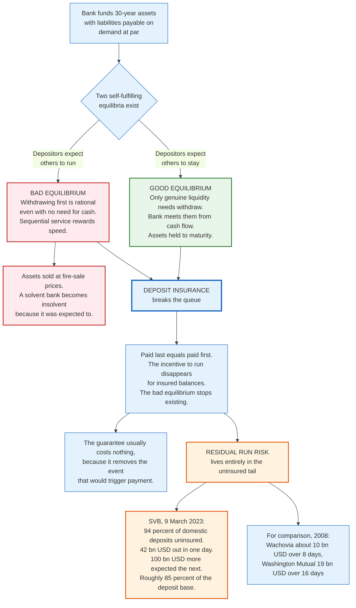

### 3.2 Where the Run Risk Went

Insurance did not remove run risk. It concentrated it in the uninsured tail, and the uninsured tail is now 8.693 trillion dollars, or 44.38 percent of deposit liabilities as of 30 June 2026.

Silicon Valley Bank is the extreme case and the instructive one. At year-end 2022 SVB reported on its Call Report that 94 percent of its domestic deposits were uninsured. On 9 March 2023, 42 billion dollars left in a single day, and management expected more than 100 billion dollars to leave the next day, which together is roughly 85 percent of the deposit base. The comparison the Federal Reserve drew in its own post-mortem is the useful one: Wachovia lost about 10 billion dollars over eight days in 2008, and Washington Mutual 19 billion dollars over sixteen days.

The speed change has two causes and neither is deposit insurance. Uninsured business depositors were coordinated by a small number of venture capital firms and by social media, and the mechanics of moving 10 million dollars had shifted from a phone call and a wire form to an app. The run function got a faster clock.

### 3.3 Moral Hazard, Precisely Stated

Deposit insurance destroys the depositor's incentive to monitor the bank, which destroys the bank's cost-of-funds penalty for taking risk. That is the entire moral hazard, and it operates through a specific channel.

An uninsured depositor demands a higher rate from a riskier bank, or leaves. An insured depositor is indifferent, because their claim is on the government rather than on the bank's assets. A bank funded entirely by insured deposits therefore faces a flat funding cost regardless of what it does with the money. Since equity holders capture the upside and the insurer absorbs the downside beyond the equity, the value-maximising strategy for a thinly capitalised insured bank is to take the largest risk the supervisor will tolerate. The technical name is a put option on the deposit insurer, struck at the bank's asset value, with the equity holders long the option and the fund short it.

The savings and loan crisis is the empirical demonstration. Raise coverage to 100,000 dollars, remove interest rate ceilings so a thrift can bid for brokered money nationally, allow the thrift to lend that money into commercial real estate it does not understand, and price the insurance at a flat rate that does not respond to any of it. The put option gets exercised.

### 3.4 The Six Counterweights

Every element of modern deposit insurance regulation is a brake on the mechanism in 3.3, and it is worth naming them as a set rather than treating them as unrelated rules.

**Risk-based pricing.** Since 1993 the premium responds to the bank's financial ratios and supervisory rating, so the funding cost regains some sensitivity to risk. Section 7 gives the formula.

**Capital requirements.** Equity is the deductible on the insurance policy. More equity means the shareholders lose more before the fund loses anything, which shortens the put option.

**Prompt corrective action.** Section 38 of the FDI Act forces escalating supervisory constraints as capital falls through defined thresholds, and requires the institution to be closed while it still has positive tangible equity where possible. The point is to close a bank before the fund is out of the money.

**Brokered deposit restrictions.** Section 29 of the FDI Act prohibits an undercapitalised institution from accepting brokered deposits without a waiver, and caps the rate it may offer. This severs the specific channel through which the 1980s thrifts levered the guarantee, which was buying insured money at a national rate to fund assets nobody else would.

**Supervision and examination.** The substitute for depositor monitoring is a government examiner reading the loan file.

**The least-cost test and uninsured exposure.** Uninsured depositors are the last remaining private monitors, and the least-cost test preserves their exposure by forbidding the FDIC from protecting them unless it is also the cheapest option. Section 11 shows the arithmetic and its uncomfortable consequence.

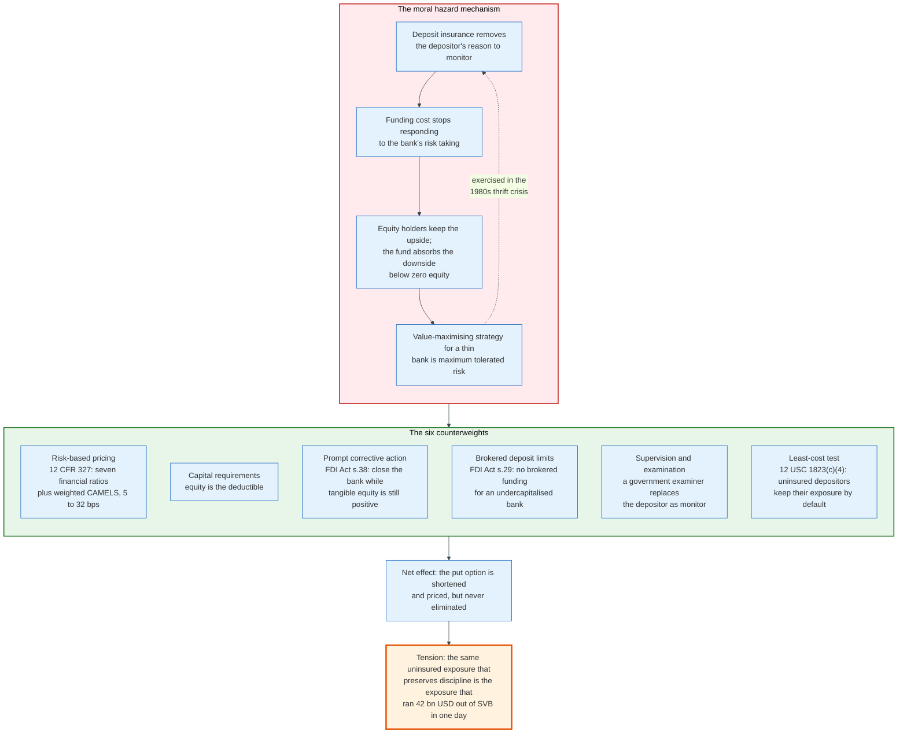

### 3.5 The Unresolved Trade

The two problems pull in opposite directions and no jurisdiction has solved both. Raising coverage removes run risk and increases moral hazard. Lowering it restores discipline and increases run risk. The FDIC's Options for Deposit Insurance Reform, published 1 May 2023, concluded that fully insuring all deposits would increase the size of the fund needed to hit any given reserve ratio by about 70 to 80 percent before accounting for the deposit inflows it would attract.

The report's preferred answer was neither pole. It was targeted coverage: much higher or unlimited insurance for business payment accounts, and the existing limit for everything else, on the reasoning that a payroll account is not an investment decision and its holder was never going to exert market discipline anyway. The identified obstacle is definitional. Distinguishing a payment account from a savings account in a way that banks and depositors cannot game is unsolved, and Congress has not acted.

---

## 4. Key Participants and Roles

### 4.1 The Actors

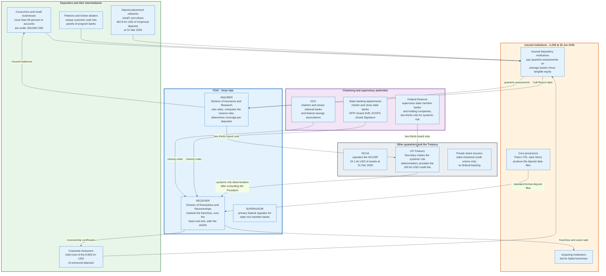

| Role | What it does | Who | Holds the risk? |
|------|--------------|-----|-----------------|
| **Insurer** | Sets assessment rates, computes coverage per depositor, pays claims | FDIC Division of Insurance and Research | Yes, through the DIF |
| **Receiver** | Takes title to the failed bank, markets it, sells the assets, pays dividends | FDIC Division of Resolutions and Receiverships | No, acts for the claimants |
| **Chartering authority** | Issues the closing order and appoints the receiver | OCC for national banks and federal thrifts; the state banking department otherwise | No |
| **Primary federal regulator** | Examines, assigns CAMELS ratings, triggers prompt corrective action | OCC, Federal Reserve, or FDIC | No |
| **Systemic risk approvers** | Authorise a departure from the least-cost test | Two-thirds of the FDIC Board, two-thirds of the Federal Reserve Board, the Treasury Secretary after consulting the President | No |
| **Insured institution** | Pays the assessment, maintains the deposit records | 4,238 banks and savings institutions | Yes, through assessments and special assessments |
| **Acquiring institution** | Bids for the deposit franchise and asset pools | Any bank the FDIC qualifies, plus nonbanks for asset pools since 2026 | Yes, on what it buys |
| **Uninsured depositor** | The last private monitor of bank risk | Corporate treasurers, municipalities, wealthy households | Yes, first after equity and sub debt |
| **Deposit placement network** | Splits a large deposit into insured slices across member banks | IntraFi and competitors | No |
| **Core processor** | Produces the deposit data the FDIC needs to compute coverage | Fiserv, FIS, Jack Henry | No |
| **Share insurer** | Insures credit union shares | NCUA through the NCUSIF; private insurers for some state charters | Yes |

### 4.2 The Three Hats Problem

The FDIC is simultaneously the insurer, the receiver, and for state non-member banks the supervisor, and those roles have conflicting objectives. As insurer it wants the smallest possible loss to the fund. As receiver it owes a duty to all claimants of the failed bank, including uninsured depositors and general creditors. As supervisor it decided how much risk the bank was allowed to take before it failed.

The conflict is most visible in the least-cost test. The receiver runs a bidding process whose outcome determines whether uninsured depositors are paid, but the statute directs the choice on the insurer's criterion alone. A bid that pays uninsured depositors in full and costs the fund 4.0 million dollars more than the alternative loses, no matter how many local businesses the alternative destroys. The FDIC's own leadership has asked Congress for a de minimis exception to soften this. Section 11 works the example.

### 4.3 The Core Processor Is the Hidden Dependency

Roughly the entire community banking sector rents its core banking system rather than running one. That vendor decides whether the bank can produce a deposit file in the FDIC's standard format on a Friday night, whether the file reconciles to the general ledger, and how long it takes to apply provisional holds. When a small bank fails, the practical determinant of how fast depositors get their money is not the FDIC's systems. It is whether the vendor's extract works.

The FDIC's 2026 assessment proposal makes this explicit for large banks by offering a discount of up to one basis point for demonstrating that a virtual data room can be populated quickly, or for giving the FDIC advance access to internal and third-party systems. The agency is now willing to pay banks to make their own failure cheaper.

---

## 5. Coverage Mechanics: Ownership Categories and the Arithmetic of 250,000

### 5.1 The Rule in One Sentence

Coverage is computed per depositor, per insured bank, per ownership category, and all deposits in the same category at the same bank are added together before the limit is applied. The rules live in 12 CFR part 330. The limit is the standard maximum deposit insurance amount, abbreviated SMDIA throughout the regulation, currently 250,000 dollars.

The categories are not a menu the depositor chooses from. They are legal characterisations of who owns the money, derived from the bank's deposit account records under 12 CFR 330.5(a). If the records are clear and unambiguous, they bind the depositor and the FDIC will look at nothing else.

### 5.2 The Categories and Their Codes

Every large bank tags each account with a three-to-five character ownership right and capacity code drawn from appendix A to 12 CFR part 370. The codes are the operational form of the coverage rules, and they appear in every deposit file the FDIC ingests.

The codes are a file format, not a list of coverage categories. Since 1 April 2024 the FDIC recognises thirteen ownership categories, down from fourteen, because the trust rule merged revocable and irrevocable trusts into one. The sixteen codes below map onto those thirteen categories. One cross-reference in the regulation is stale: appendix A to part 370 still cites the repealed 12 CFR 330.13 for the `IRR` code, and the operative rule for irrevocable trust deposits is 330.10.

| Code | Category | Regulation | Coverage |
|------|----------|-----------|----------|
| `SGL` | Single account | 330.6 | 250,000 USD per owner, aggregating individual, sole proprietorship, community property in one name, and decedent estate accounts |
| `JNT` | Joint account | 330.9 | 250,000 USD per co-owner across all qualifying joint accounts at the bank |
| `REV` | Revocable trust, formal or payable-on-death | 330.10 | 250,000 USD per eligible beneficiary per grantor, maximum 5 beneficiaries |
| `IRR` | Irrevocable trust | 330.10, cited in appendix A as the repealed 330.13 | Aggregated with revocable trust deposits from the same grantor under the same 5-beneficiary cap |
| `CRA` | Certain retirement accounts | 330.14(b)-(c) | 250,000 USD per owner, for self-directed IRAs, section 457 plans, individual account plans, and section 401(d) plans |
| `EBP` | Employee benefit plan | 330.14 | 250,000 USD per participant's non-contingent interest |
| `BUS` | Corporation, partnership, unincorporated association | 330.11 | 250,000 USD per entity, separate from the owners' personal accounts |
| `GOV1` | Public unit time and savings, in-state | 330.15 | 250,000 USD per official custodian |
| `GOV2` | Public unit demand deposits, in-state | 330.15 | 250,000 USD per official custodian, separate from GOV1 |
| `GOV3` | Public unit deposits, out-of-state | 330.15 | 250,000 USD per official custodian across all account types |
| `MSA` | Mortgage servicing account | 330.7(d) | 250,000 USD per mortgagor for principal and interest paid in |
| `PBA` | Public bond account | 330.15(c) | 250,000 USD per bondholder |
| `DIT` | Bank as trustee of an irrevocable trust | 330.12 | 250,000 USD per beneficiary |
| `ANC` | Annuity contract account | 330.8 | 250,000 USD per annuitant |
| `BIA` | Bureau of Indian Affairs custodial account | 330.7(e) | 250,000 USD per individual |
| `DOE` | Department of Energy bank deposit assistance | Part 370 appendix A | 250,000 USD |

### 5.3 Joint Accounts: The Arithmetic the Regulation Itself Uses

A joint account qualifies only if all co-owners are natural persons, each has signed a signature card or the alternative evidence test in 330.9(c)(4) is met, and each has withdrawal rights on the same basis. Each co-owner's interests across all qualifying joint accounts at the bank are added together, and the total is insured to 250,000 dollars.

The regulation supplies its own worked example, which is the fastest way to see the aggregation rule bite. Three accounts at one bank:

- A and B hold 150,000 dollars, so A's share is 75,000 and B's is 75,000
- A and C hold 200,000 dollars, so A's share is 100,000 and C's is 100,000
- A, B and C hold 375,000 dollars, so each share is 125,000

A's combined joint interest is 75,000 plus 100,000 plus 125,000, which is 300,000 dollars. A is insured for 250,000 and uninsured for 50,000. B's combined interest is 200,000 and is fully insured. C's is 225,000 and is fully insured. The same 725,000 dollars of deposits produces a 50,000 dollar uninsured exposure that belongs to exactly one of the three people, and none of them would guess which without doing the sum.

Interests are presumed equal unless the deposit records say otherwise, and the conjunction used in the account title, "and" or "or", makes no difference.

### 5.4 The Trust Rule That Changed on 1 April 2024

The trust category is the one that changed most recently and the one that produces the largest single-category coverage. The final rule was adopted on 21 January 2022 and published at 87 FR 4470 on 28 January 2022, with an effective date of 1 April 2024 to give banks time to reconfigure their systems.

Before the change, formal revocable trusts, informal payable-on-death accounts, and irrevocable trusts sat in separate categories with different and genuinely difficult rules, including a five-beneficiary threshold above which coverage depended on the proportional interests written into the trust instrument. The FDIC had to read trust documents to determine coverage, which is slow work on a Friday night.

The current rule in 12 CFR 330.10 is a single arithmetic statement. Trust deposits are insured up to the SMDIA multiplied by the number of beneficiaries identified by each grantor, capped at five beneficiaries. That is a maximum of 1.25 million dollars per grantor per bank. Revocable and irrevocable trust deposits from the same grantor are aggregated before the cap is applied. Deposits from multiple grantors in one trust are presumed to be owned in equal shares unless the records say otherwise.

Three exclusions matter in practice. The grantor is never an eligible beneficiary of their own trust. A contingent beneficiary, one who takes only if a named beneficiary dies first, does not count. And where a trust instrument directs funds into new trusts on the grantor's death, those future trusts are treated as distribution mechanisms rather than beneficiaries, so the FDIC counts the natural persons or charities at the end of the chain.

### 5.5 A Worked Coverage Example

Consider the Delgado household holding deposits at a single insured bank. Maria and Luis are married with three children. Maria owns a construction company organised as a limited liability company that has elected corporate treatment.

| Account | Category | Balance | Insured | Uninsured |
|---------|----------|---------|---------|-----------|
| Maria, individual checking and savings | `SGL` | 250,000 USD | 250,000 | 0 |
| Luis, individual checking | `SGL` | 250,000 USD | 250,000 | 0 |
| Maria and Luis, joint money market | `JNT` | 500,000 USD | 500,000 (250,000 each) | 0 |
| Maria, self-directed IRA | `CRA` | 250,000 USD | 250,000 | 0 |
| Luis, self-directed IRA | `CRA` | 250,000 USD | 250,000 | 0 |
| Maria's revocable living trust, three children as beneficiaries | `REV` | 750,000 USD | 750,000 | 0 |
| Luis's payable-on-death account, three children as beneficiaries | `REV` | 800,000 USD | 750,000 | 50,000 |
| Delgado Construction LLC operating account | `BUS` | 250,000 USD | 250,000 | 0 |
| **Total** | | **3,300,000 USD** | **3,250,000** | **50,000** |

One household, one bank, 3.3 million dollars, and 98.5 percent of it insured. The single uninsured exposure comes from Luis's trust deposit exceeding three beneficiaries times 250,000 dollars. Adding two more beneficiaries would lift his trust cap from 750,000 to 1.25 million dollars and insure the whole balance.

Note what the arithmetic does not require. No deposit was moved to another bank, no network was used, and no fee was paid. The multiplication is a property of the statute.

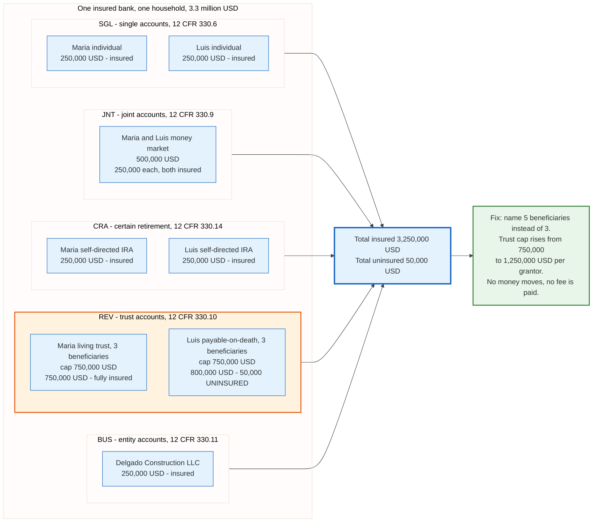

### 5.6 Pass-Through Coverage and Its Conditions

Money deposited by an agent for a principal is insured as if the principal had deposited it directly, under 12 CFR 330.7(a). This is what makes fintech accounts, escrow accounts, title company accounts, and brokerage sweeps insurable at all. It is also conditional, and the conditions are where things break.

Two requirements must hold. First, under 330.5(b)(1), the fiduciary relationship must be expressly disclosed in the bank's own deposit account records, with an exception where the account title itself makes the capacity obvious, such as an account held by a named escrow agent or title company. Second, under 330.5(b)(2), the details of the relationship and each party's interest must be ascertainable either from the bank's records or from records the depositor or its record-keeper maintains in good faith in the ordinary course of business.

For multi-tier arrangements, 330.5(b)(3) offers two compliant patterns. Either every level of the chain is disclosed on the bank's records with the names and interests at each level, or the bank's records disclose that multiple levels exist and each level's record-keeper discloses the next. The rule adds one line that decides most disputes: no party in the chain may claim fiduciary capacity unless the possible existence of that relationship was revealed at some previous level.

Mortgage servicing gets a bespoke rule in 330.7(d) because the alternative would be absurd. Principal and interest collected from mortgagors is insured up to 250,000 dollars per mortgagor based on the cumulative amount paid in, without reference to any other account the mortgagor holds. Tax and insurance escrow is treated as an ordinary agency account and passed through to each mortgagor's ownership interest.

---

## 6. The Deposit Insurance Fund

### 6.1 What the Fund Is

The Deposit Insurance Fund is a balance of United States Treasury securities plus cash, held by the FDIC, against which insurance losses are charged. It was created on 31 March 2006 by the merger of the Bank Insurance Fund and the Savings Association Insurance Fund under the Federal Deposit Insurance Reform Act of 2005, enacted 8 February 2006 as title II of the Deficit Reduction Act of 2005, Public Law 109-171. The retirement-account coverage increase in the same statute took effect the following day, 1 April 2006.

At 30 June 2026 the fund stood at 161.147 billion dollars, having grown by 3.733 billion in the quarter. The components of that quarter tell you exactly how a deposit insurance fund earns its keep.

| Line item, Q2 2026 | Amount |
|--------------------|--------|
| Beginning fund balance | 157,414 million USD |
| Assessments earned | +2,895 million USD |
| Interest earned on investment securities | +1,280 million USD |
| Operating expenses | -506 million USD |
| Provision for insurance losses | +287 million USD (a release) |
| All other income, net | +16 million USD |
| Unrealised loss on available-for-sale securities | -239 million USD |
| **Ending fund balance** | **161,147 million USD** |

Two observations. Interest income is 44 percent of assessment income, so the fund is now a meaningful bond portfolio in its own right. And the fund carries its own mark-to-market interest rate risk on that portfolio, which is the same exposure that destroyed Silicon Valley Bank, at a scale that moves the balance by a few hundred million dollars a quarter.

### 6.2 The Reserve Ratio and Its Denominator

The reserve ratio is the fund balance divided by estimated insured deposits. At 30 June 2026 it was 1.48 percent: 161.147 billion over 10.895 trillion.

The statutory minimum is 1.35 percent, raised from 1.15 percent by Dodd-Frank, which also removed the statutory maximum. The FDIC's designated long-term target is 2 percent, which is a Board policy rather than a statutory requirement.

The ratio's recent path shows how badly a denominator shock can distort a solvency measure. The FDIC crossed 1.35 percent in the third quarter of 2018. It fell back below the minimum in 2020, not because the fund shrank but because pandemic-era stimulus flooded banks with deposits and inflated the denominator. The FDIC adopted a restoration plan in September 2020 when the ratio hit 1.30 percent, then raised assessment rates by two basis points across the entire industry effective 1 January 2023, published at 87 FR 64314 on 24 October 2022. The ratio returned above 1.35 percent during 2025 and reached 1.48 percent by June 2026, its highest level in the twenty years the FDIC publishes for the DIF. The published series begins in the first quarter of 2006, when the fund was created, so there is no comparable DIF ratio before that date.

The reserve ratio has a structural weakness worth stating plainly. Its numerator is a fund and its denominator is insured deposits, but the fund's exposure is to losses on failed banks' assets, which scale with total assets rather than with insured deposits. Since 2011 the FDIC has priced assessments on average consolidated total assets minus average tangible equity, which was 23.086 trillion dollars at 30 June 2026, more than double the insured deposit base. The system prices on one measure and reports adequacy on another.

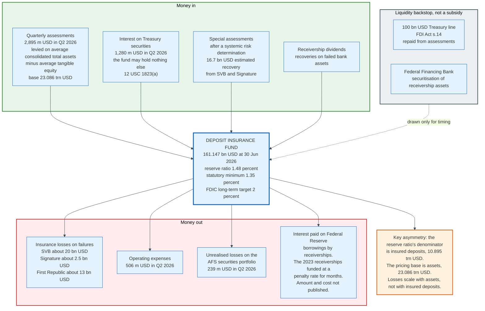

### 6.3 Liquidity Is a Separate Problem from Solvency

A fund of 161 billion dollars does not mean the FDIC can write 161 billion dollars of cheques on a Monday morning. Receiverships need cash immediately and recover it over years, and the mismatch was the largest operational surprise of 2023.

The 2023 receiverships funded themselves at a penalty rate from the Federal Reserve for months while their assets were sold down. The FDIC securitised positions through the Federal Financing Bank twice, and the first securitisation did not happen until six months after the failures. The agency is now working with the Federal Financing Bank on a permanent facility so that securitisation can happen on resolution weekend or within days, because Federal Financing Bank funding is cheaper than penalty-rate borrowing from the Federal Reserve. The FDIC has not published the total borrowed or the interest paid, so the cost of that six-month delay is not known.

The direction of the cost is known even where its size is not. Every month of penalty-rate funding is charged to the receivership, and every dollar the receivership pays in interest is a dollar the deposit claim class does not recover.

---

## 7. Risk-Based Pricing: How a Bank's Premium Is Computed

### 7.1 The Assessment Base

Every insured institution pays a quarterly assessment computed as a rate times a base. Since Dodd-Frank the base has been average consolidated total assets minus average tangible equity, with adjustments for bankers' banks and custodial banks. Before 2011 it was domestic deposits.

The change matters more than it sounds. Pricing on assets rather than deposits shifted the burden from small deposit-funded banks toward large institutions funded by wholesale borrowing and derivatives, because the numerator now includes everything the bank owns rather than only the part depositors funded. It also aligned the base with the thing that actually generates losses.

### 7.2 The Financial Ratios Method for Small Banks

An established small institution's initial base assessment rate is a linear function of seven Call Report ratios and a weighted CAMELS score, under 12 CFR 327.16(a). The formula is fully specified in the regulation, which means any bank can compute its own premium exactly.

The rate in basis points equals a uniform amount plus the sum of each risk measure times its pricing multiplier. With the reserve ratio below 2 percent, the schedule at 12 CFR 327.10(b) is in effect and the uniform amount is 9.352.

| Risk measure | Pricing multiplier |
|--------------|-------------------|
| Leverage ratio, percent | -1.264 |
| Net income before taxes / total assets, percent | -0.720 |
| Nonperforming loans and leases / gross assets, percent | 0.942 |
| Other real estate owned / gross assets, percent | 0.533 |
| Brokered deposit ratio, percent | 0.264 |
| One year asset growth, percent | 0.061 |
| Loan mix index | 0.081 |
| Weighted average CAMELS component rating | 1.519 |

The weighted CAMELS score is not the composite rating. It is built from the six component ratings with fixed weights: capital adequacy 25 percent, asset quality 20 percent, management 25 percent, earnings 10 percent, liquidity 10 percent, and sensitivity to market risk 10 percent. Management and capital together carry half the weight.

The loan mix index is a portfolio risk score. Each loan category's share of total assets is multiplied by a weighted charge-off rate fixed in 12 CFR 327.16(a), and the products are summed. The rates are absolute numbers written into the regulation, not normalised against any reference category, and there are eleven of them.

| Loan category, 12 CFR 327.16(a) | Weighted charge-off rate |
|---------------------------------|--------------------------|
| Construction and development | 4.4965840 |
| Commercial and industrial | 1.5984506 |
| Leases | 1.4974551 |
| Other consumer | 1.4559717 |
| Real estate loans residual | 1.0169338 |
| Multifamily residential | 0.8847597 |
| Nonfarm nonresidential | 0.7286274 |
| 1-4 family residential | 0.6973778 |
| Loans to depository banks | 0.5760532 |
| Agriculture | 0.2432737 |
| Agricultural real estate | 0.2376712 |

Construction and development lending carries 6.4 times the weight of a 1-4 family residential loan and 2.8 times the weight of a commercial and industrial loan. That ratio is the 1980s and the 2008 crisis compressed into a coefficient.

The categories are Call Report line items rather than economic labels, which is why there is no credit card row and no second-lien row. Credit card balances fall into other consumer at 1.4559717. A real estate loan secured by none of the five named property types falls into real estate loans residual at 1.0169338. A bank that reclassifies a loan between two categories moves its own premium by the difference between two published numbers, which is why the classification is examined.

### 7.3 A Worked Assessment

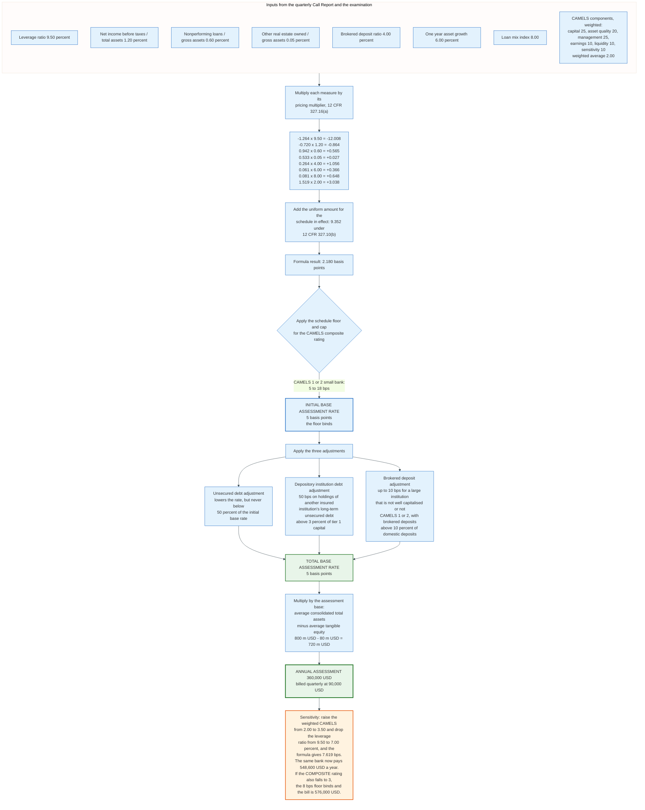

Take a hypothetical community bank with 800 million dollars of average consolidated total assets, 80 million dollars of average tangible equity, and a CAMELS composite rating of 2.

| Measure | Value | Multiplier | Contribution |
|---------|-------|-----------|-------------|
| Uniform amount | | | +9.352 |
| Leverage ratio | 9.50 percent | -1.264 | -12.008 |
| Net income before taxes / total assets | 1.20 percent | -0.720 | -0.864 |
| Nonperforming loans / gross assets | 0.60 percent | 0.942 | +0.565 |
| Other real estate owned / gross assets | 0.05 percent | 0.533 | +0.027 |
| Brokered deposit ratio | 4.00 percent | 0.264 | +1.056 |
| One year asset growth | 6.00 percent | 0.061 | +0.366 |
| Loan mix index | 8.00 | 0.081 | +0.648 |
| Weighted average CAMELS | 2.00 | 1.519 | +3.038 |
| **Formula result** | | | **2.180 basis points** |

The formula produces 2.180 basis points, and the bank does not pay that. The schedule sets a floor of 5 basis points on the initial base assessment rate for a CAMELS 1 or 2 rated established small institution, so the rate is 5 basis points. The assessment base is 800 million minus 80 million, which is 720 million dollars. The annual assessment is 0.0005 times 720 million, or 360,000 dollars, billed as 90,000 dollars a quarter.

The floor binds for well-run small banks, which is deliberate. A fund cannot be built out of premiums that go to zero when nothing is failing, and everything is always fine until it is not.

Now change two inputs. Raise the weighted CAMELS score from 2.00 to 3.50 and drop the leverage ratio from 9.50 to 7.00 percent. The CAMELS contribution rises to 5.317 and the leverage contribution rises from -12.008 to -8.848, moving the formula result to 7.619 basis points: 9.352 minus 8.848 minus 0.864 plus 0.565 plus 0.027 plus 1.056 plus 0.366 plus 0.648 plus 5.317. That is above the 5 basis point floor, so it binds nothing, and the same bank now pays 548,600 dollars a year.

Two mechanisms can produce the downgrade, and they cost different amounts. The weighted CAMELS score is a component average and moves the formula continuously, which is the 7.619 basis point path above. The composite rating is a separate judgement, and if it also falls to 3 the schedule's floor for a CAMELS 3 small institution rises from 5 to 8 basis points, which binds over the formula and puts the bill at 576,000 dollars. A supervisory downgrade is a real and immediate cash cost either way, which is the entire design intent.

### 7.4 The Rate Schedules

With the reserve ratio below 2 percent, the schedule effective from the first assessment period of 2023 applies. It embeds the two basis point increase adopted in October 2022.

| Institution category | Initial base rate | Total base rate after adjustments |
|---------------------|-------------------|-----------------------------------|
| Small, CAMELS composite 1 or 2 | 5 to 18 bps | 2.5 to 18 bps |
| Small, CAMELS composite 3 | 8 to 32 bps | 4 to 32 bps |
| Small, CAMELS composite 4 or 5 | 18 to 32 bps | 13 to 32 bps |
| Large and highly complex | 5 to 32 bps | 2.5 to 42 bps |

Three adjustments sit between the initial and total rates. The **unsecured debt adjustment** lowers the rate for institutions funded with long-term unsecured debt, on the reasoning that such debt absorbs loss ahead of the fund, subject to a floor of 50 percent of the initial base rate. The **depository institution debt adjustment** applies a 50 basis point charge on holdings of another insured institution's long-term unsecured debt above 3 percent of tier 1 capital, which prices the contagion the fund would otherwise absorb, and it can push a large bank above the 42 basis point maximum of the schedule now in effect. The **brokered deposit adjustment** adds up to 10 basis points for a large institution that is not well capitalised or not CAMELS 1 or 2 and whose brokered deposits exceed 10 percent of domestic deposits.

### 7.5 The Large Bank Scorecard and the Loss Severity Measure

Institutions above 10 billion dollars in assets are priced by a scorecard rather than the ratios method, combining a performance score with a loss severity score. The scorecard has not been materially updated since 2011.

The loss severity measure is the more interesting half, because it is a standardised stress test of what the fund would lose if this specific bank failed tomorrow. Appendix D to subpart A of 12 CFR part 327 specifies it exactly. Runoff assumptions are applied to the liability side:

| Liability type | Runoff rate |
|----------------|-------------|
| Insured deposits | -10 percent, meaning they grow |
| Uninsured deposits | 58 percent |
| Foreign deposits | 80 percent |
| Federal funds purchased | 100 percent |
| Repurchase agreements | 75 percent |
| Trading liabilities | 50 percent |
| Unsecured borrowings maturing within one year | 75 percent |
| Secured borrowings maturing within one year | 25 percent |
| Subordinated debt and limited-life preferred | 15 percent |

Assets are then reduced pro rata across thirteen named categories until the leverage ratio reaches 2 percent, loss rates are applied by asset category, and any shortfall against domestic deposits is divided by current domestic deposits to give the loss severity ratio, averaged over the three most recent quarters.

The 58 percent uninsured deposit runoff assumption is worth holding up against March 2023. Silicon Valley Bank lost roughly 85 percent of its deposit base in two days. The regulation's stress assumption was not conservative enough by a wide margin, and it has not been changed.

### 7.6 The June 2026 Proposal

On 25 June 2026 the FDIC Board approved a proposal to revise the assessment framework, with a 60-day comment period. Three changes.

The threshold separating small from large institutions rises from 10 billion to 30 billion dollars in assets, and will be adjusted every four years by a predetermined indexing methodology. Initial base assessment rates fall by two basis points for small institutions and one basis point for large and highly complex institutions. And a new resolution readiness adjustment offers large and highly complex institutions a downward adjustment of up to one basis point: half a basis point for demonstrating the ability to populate a virtual data room quickly, and half a basis point for giving the FDIC temporary access to internal systems or third-party service providers so it can build data access infrastructure in advance of a failure.

The stated rationale for the rate cut is the growth in the fund, with the FDIC continuing toward its 2 percent target on a trajectory resembling the pre-2022 path. The rationale for the readiness adjustment is arithmetic rather than philosophy. A bank that can be marketed and sold quickly costs the fund less, so it should pay less.

---

## 8. The Resolution Toolkit

### 8.1 The Four Methods

The FDIC has four ways to resolve a failed bank, and the choice among them is constrained by the least-cost test rather than by preference.

**Purchase and assumption.** An acquiring bank assumes some or all of the deposit liabilities and buys some or all of the assets. This is the default and covers the overwhelming majority of failures. Variants differ along three axes: whether all deposits or only insured deposits are assumed, how much of the asset side the acquirer takes, and whether the FDIC shares in losses on the acquired loans.

**Bridge bank.** The FDIC charters a new national bank, transfers the failed institution's business into it, and operates it while a buyer is found. The authority sits in section 11(n) of the FDI Act, added by the Competitive Equality Banking Act of 1987. A bridge bank may run for up to two years with three one-year extensions.

**Deposit payout.** The FDIC pays insured depositors directly, by cheque or by transferring the insured balances to another institution, and liquidates the assets itself. Where the institution has transaction accounts that need to keep functioning, the FDIC may charter a deposit insurance national bank to hold the insured deposits for a limited period, which is what happened to Silicon Valley Bank on 10 March 2023.

**Open bank assistance.** Direct support to a bank that has not failed. FDICIA effectively eliminated this in 1991 by requiring the least-cost test, and it is available in practice only under a systemic risk determination.

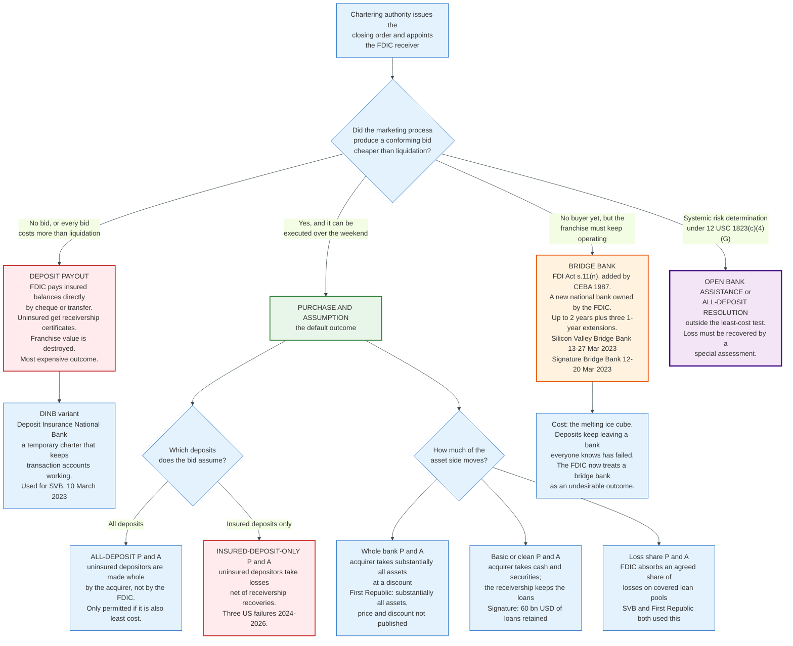

### 8.2 The Anatomy of a Bid

A resolution bid is not a price. It is a package of five terms, and the FDIC converts the package into a single number: cost to the fund.

**Deposit premium.** A percentage of the assumed deposits that the acquirer pays for the franchise. Coleman County State Bank paid 5.16 percent for the insured deposits of The Santa Anna National Bank in June 2025. First Bank and Trust paid 6.67 percent for the insured deposits of The First National Bank of Lindsay in October 2024. Millennium Bank paid 4.61 percent for all the deposits of Pulaski Savings Bank in January 2025. For very large failures the premium is usually zero, as it was for both First Republic and Signature.

**Asset discount.** The amount below book value at which the acquirer takes the assets. First Citizens bought roughly 72 billion dollars of Silicon Valley Bridge Bank's assets at a 16.5 billion dollar discount. Flagstar bought 12.9 billion dollars of Signature loans at a 2.7 billion dollar discount. Both figures are in the FDIC's own press releases. For First Republic the FDIC published no discount at all, only that JPMorgan bought substantially all of the assets.

**Loss share.** The FDIC agrees to reimburse an agreed percentage of losses on defined loan pools, usually single-family residential and commercial loans, in exchange for a smaller upfront discount. This converts a certain cost today into a contingent cost over five to ten years, and it exists because acquirers price unknown credit risk expensively.

**Purchase money notes.** The receivership lends the acquirer part of the purchase price, which lets a smaller institution bid on a larger book.

**Equity appreciation instruments.** Warrants or appreciation rights in the acquirer's stock. First Citizens granted the FDIC equity appreciation rights in First Citizens BancShares common stock worth up to 500 million dollars.

First Republic shows how little of a competitive process reaches the public record. The FDIC's press release of 1 May 2023 says the bidding was competitive, that JPMorgan Chase assumed all of the deposits and purchased substantially all of the assets, that the FDIC and JPMorgan entered a loss-share arrangement on single-family residential and commercial loans, that the estimated cost to the fund is about 13 billion dollars, and that the transaction was consistent with the least-cost requirements of the FDI Act. It names no other bidder, gives no bid count, no asset discount, and no deposit premium.

The gap between what the FDIC decides and what it publishes is the point. The agency converts every bid into a single present-value cost and keeps the losing numbers, so the only externally checkable figure in the largest bank failure since 2008 is the 13 billion dollar loss to the fund.

### 8.3 Why the FDIC Now Dislikes Bridge Banks

A bridge bank keeps the lights on, and it also keeps a failed institution's franchise decaying in public. The FDIC's own assessment after 2023 was blunt: a post-failure bridge bank is generally a costly, undesirable outcome, because both Silicon Valley Bridge Bank and Signature Bridge Bank suffered continued deposit outflows and value destruction while the FDIC ran them.

The agency changed its resolution planning rule in April 2025 to stop requiring large banks to write plans built around a bridge bank strategy, replacing that with a description of resolution strategies that could reasonably be executed. The stated preference is now a weekend sale, with short-term operational continuity as a secondary objective only if an immediate sale is impossible.

---

## 9. The Friday Night Close, Hour by Hour

### 9.1 Why Friday

Banks fail on Friday afternoons because a resolution needs two nights and a full day of processing before customers need their money again. The chartering authority controls the timing, and it schedules the closing so that the FDIC gets the weekend.

The exception proves the rule. Signature Bank was closed on Sunday 12 March 2023 because it had lost 20 percent of its deposits in hours on Friday and ended that day with a negative balance at the Federal Reserve. When a bank cannot open on Monday under any circumstances, the calendar stops mattering.

### 9.2 The Worked Example: Meridian State Bank

Follow one hypothetical failure end to end with concrete values. Meridian State Bank is a state-chartered commercial bank with 412 million dollars of total assets and 381 million dollars of total deposits, of which 358 million dollars are insured and 23 million dollars are uninsured, spread across about forty business accounts. A loan review in April finds 61 million dollars of concealed losses in a construction and development portfolio. The composite CAMELS rating goes to 5. Tangible equity goes negative in May.

| Stage | Date and time | What happens |
|-------|--------------|--------------|
| Referral | Week 1, Monday | The primary federal regulator notifies the FDIC that failure is likely. The FDIC's Division of Resolutions and Receiverships opens a file and sends the bank an information request. |
| Data room | Weeks 1 to 3 | The bank populates a virtual data room: loan tapes, deposit files, contracts, litigation, IT inventory, lease schedules. Quality of this data is the single largest driver of the eventual bid spread. |
| Valuation | Weeks 2 to 4 | The FDIC values the franchise and each asset pool, and computes the liquidation benchmark: what the receivership would realise if nobody bid. |
| Marketing | Week 4 | A bid package goes to qualified institutions under non-disclosure agreements. Fourteen institutions are approached. Five sign. |
| Due diligence | Weeks 4 to 6 | Bidders review the data room and, for larger deals, visit the bank. |
| Bid deadline | Week 6, Thursday 17:00 | Three conforming bids arrive. |
| Least-cost test | Week 6, Thursday night to Friday morning | Each bid is converted to a present-value cost to the fund and compared with the liquidation benchmark. |
| Board action | Week 6, Friday morning | The FDIC Board or its delegate approves the winning bid. |
| **Closing** | **Friday 16:30 local** | The state banking commissioner issues the closing order and appoints the FDIC receiver under section 11(c) of the FDI Act. The FDIC Cutoff Point is established under 12 CFR 360.8(b)(1). |
| Entry | Friday 16:30 to 17:00 | Closing teams enter the main office and every branch simultaneously. Doors lock. The closing manager reads the order to staff. The FDIC signs a receipt for the institution's books and records. |
| Cut the wires | Friday 16:30 to 17:00 | Outbound wire and ACH connections are severed. Anything settling after the FDIC Cutoff Point is handled under 12 CFR 360.8(b)(2), which applies the earlier of the transaction type's normal cutoff time and the FDIC Cutoff Point, so no new liabilities are created and none are extinguished after the receivership begins. |
| End of day | Friday 18:00 to 23:00 | The bank runs its normal end-of-day cycle to produce close-of-business account balances, using the earlier of each transaction type's normal cutoff time and the FDIC Cutoff Point, under 12 CFR 360.8(b)(2) and (3). |
| Data extract | Friday 23:00 to Saturday 04:00 | The core processor produces the deposit and customer files in the FDIC's standard format. Totals must reconcile to the subsidiary system control totals. |
| Insurance determination | Saturday 04:00 to 08:00 | Balances are aggregated by ownership right and capacity. Accounts that cannot be determined go to the pending file with a reason code. |
| **Provisional holds** | **Saturday by 09:00 local** | For institutions covered by 12 CFR 360.9, an automated process must be capable of applying holds by 9 a.m. local time the day after the cutoff point. Meridian holds 381 million dollars of deposits, below the rule's 2 billion dollar threshold, so nothing automated is required and the FDIC applies holds by hand to the forty uninsured accounts. |
| Conversion | Saturday 08:00 to 20:00 | Teller systems cut over to the acquirer. Signature cards are re-executed. Cash is counted, safe deposit boxes inventoried, loan files boxed. |
| Notification | Saturday | The FDIC posts the press release and opens its call centre. Depositors with balances above the limit are directed to the account summary showing their determination. |
| Rehearsal | Sunday | Acquirer staff train on the converted systems. Branch signage changes. |
| **Reopen** | **Monday 09:00** | Branches open as the acquirer. Cheques written on Meridian clear. Debit cards work. Direct deposits post. |

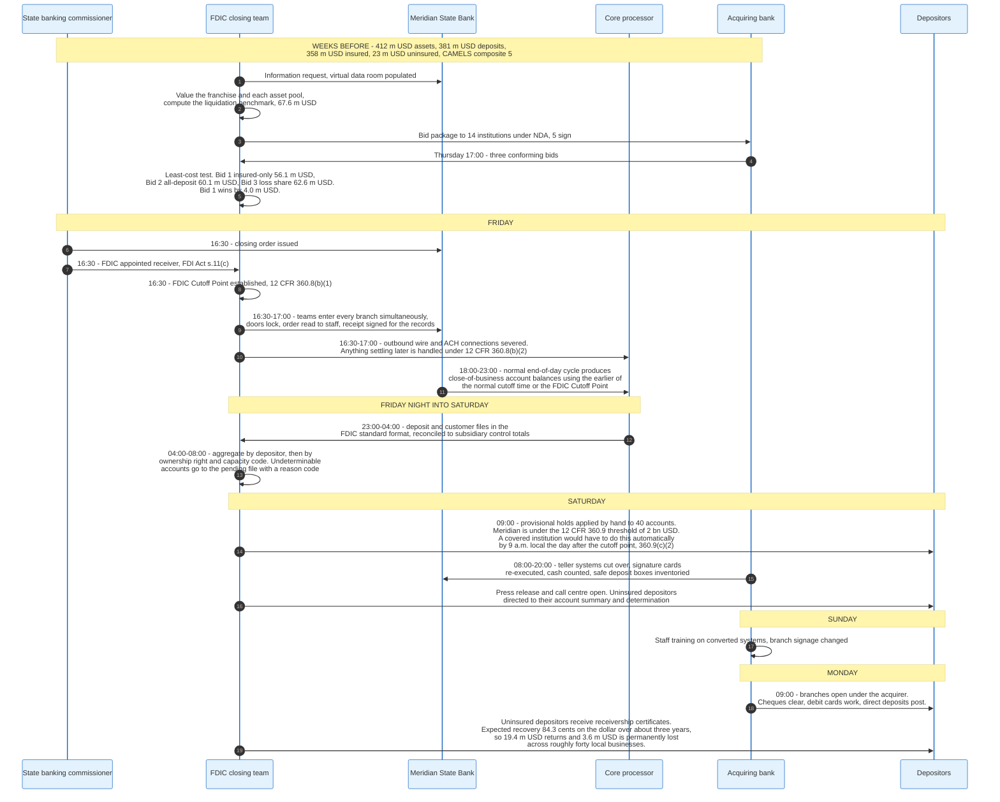

### 9.3 The Least-Cost Arithmetic in the Example

Three bids arrive, and the arithmetic that ranks them turns on two variables the bid letter does not state directly: how much of the asset side each acquirer takes, and what it pays for it. Meridian's 412 million dollars of book assets split into a 120 million dollar construction and development pool, which the concealed losses have reduced to 48 million dollars of realisable value, and 292 million dollars of everything else, which the FDIC estimates would fetch 270 million dollars in a receivership sale. Administrative expenses of the receivership are 9 million dollars. Deposit claims total 381 million dollars: the FDIC's subrogated claim of 358 million plus 23 million of uninsured balances.

| Option | Structure | Assets assumed, book | Price paid | Deposit premium | Cost to the fund |
|--------|-----------|----------------------|-----------|-----------------|------------------|
| Liquidation benchmark | Payout, FDIC sells everything itself | none | none | none | 67.6 million USD |
| Bid 1 | Insured-deposit-only purchase and assumption | 292 m USD, all but the C&D pool | 276 m USD, a 16 m USD discount | 1.75 percent on 358 m USD, 6.3 m USD | **56.1 million USD** |
| Bid 2 | All-deposit purchase and assumption | 292 m USD, all but the C&D pool | 280 m USD, a 12 m USD discount | 0.50 percent on 381 m USD, 1.9 m USD | 60.1 million USD |
| Bid 3 | Whole-bank purchase and assumption with 50 percent loss share on the C&D pool | 412 m USD, everything | 346 m USD, a 66 m USD discount | 0.90 percent on 381 m USD, 3.4 m USD | 62.6 million USD |

Each row derives from the same four steps: value what reaches the receivership, subtract expenses, distribute the remainder pro rata across the deposit class, and charge the fund with whatever its own 358 million dollar claim fails to recover.

**Liquidation benchmark, 67.6 million dollars.** The receivership realises 270 million on the general book and 48 million on the C&D pool, 318 million in all. After 9 million of expenses it distributes 309 million across 381 million of claims, a recovery of 81.10 percent. The FDIC's 358 million claim returns 290.4 million, so the fund loses 67.6 million and the uninsured lose 4.3 million.

**Bid 1, 56.1 million dollars.** The acquirer pays 276 million for the general book, 6 million above what the FDIC thinks it could get, and 6.3 million for the franchise. The receivership keeps the C&D pool, realises 48 million, pays the 9 million of expenses, and distributes 321.3 million across the same 381 million of claims, a recovery of 84.33 percent. The fund recovers 301.9 million of its 358 million and loses 56.1 million. The uninsured recover 19.4 million of 23 million and lose 3.6 million.

**Bid 2, 60.1 million dollars.** The acquirer assumes all 381 million of deposits, so the fund funds the gap between the liabilities transferred and the value transferred with them: 381 minus 280 minus 1.9, which is 99.1 million. The receivership's retained C&D pool then returns 48 million less 9 million of expenses to the FDIC, now the sole claimant on the deposit class. The fund loses 60.1 million and no uninsured depositor loses anything.

**Bid 3, 62.6 million dollars.** The acquirer takes the whole 412 million book at a 66 million discount and assumes all deposits, so the fund pays 31.6 million on the day. It then adds the 22 million present value of its half share of losses on the construction and development pool, plus the 9 million of receivership expenses, which no asset now remains to cover. A loss share converts a certain cost today into a contingent cost over years, and the contingent leg is what makes Bid 3 the most expensive of the three.

Bid 1 wins because it costs the fund least. The consequence is precise. The 23 million dollars of uninsured deposits are not assumed, those depositors receive receivership certificates, and 3.6 million dollars is a permanent loss spread across forty local businesses.

The difference between Bid 1 and Bid 2 is 4.0 million dollars. That is 0.0025 percent of the Deposit Insurance Fund's 161.1 billion dollar balance. The statute does not permit the FDIC to weigh 4.0 million dollars of fund cost against forty businesses missing payroll, because the least-cost test admits only one criterion. Section 11 returns to this.

### 9.4 What the Depositor Experiences

For an insured depositor at a bank resolved by purchase and assumption, the experience is a change of logo. The account number usually survives, the balance is identical to the cent including accrued interest through the closing date, the debit card keeps working over the weekend in most conversions, and direct deposits post on Monday. The FDIC's standing claim is that no depositor has lost a penny of insured deposits since 1933, and the operational reason that claim holds is this weekend process rather than the guarantee itself.

For an uninsured depositor at an insured-deposit-only resolution, the experience is a receivership certificate, a wait, and a series of dividend payments over years. For an uninsured depositor at Silicon Valley Bank, the experience was two days of believing they had lost most of their operating cash, then a Sunday evening press release saying otherwise.

For a depositor at a payout, the FDIC pays insurance within a few days of the closing, usually the next business day, by cheque or by transfer to an account at another institution.

---

## 10. Deposit Insurance Determination and the Data Problem

### 10.1 The Constraint

Paying insured depositors on Monday requires knowing, by Saturday morning, exactly how much of each account is insured. That is not a lookup. It requires aggregating every account a person holds at the bank, sorting the aggregate by ownership capacity, identifying beneficiaries of trust accounts and participants in employee benefit plans, applying the per-category limits, and doing this for every depositor at once.

A bank with 30,000 accounts can be processed by hand over a weekend. A bank with 30 million cannot. Two regulations exist to solve this at scale, and they apply to different populations.

### 10.2 12 CFR 360.9: The Standard Data Format and Provisional Holds

Published at 73 FR 41180 on 17 July 2008, section 360.9 covers institutions with at least 2 billion dollars in deposits and either 250,000 or more deposit accounts or 20 billion dollars or more in total assets. Its purpose, in the regulation's own words, is to allow the deposit and other operations of a large institution to continue functioning on the day following failure.

It imposes two capabilities. First, an ability to provide the FDIC, in a standard format at the close of any day's business, with depositor and customer data for all deposit accounts in domestic and foreign offices and for the interest-bearing investment vehicles connected to sweep and automated credit arrangements. The data must reconcile to the institution's subsidiary system control totals.

Second, an automated process for placing provisional holds. A provisional hold is an effective restriction on access to some or all of an account after failure, and the system must be capable of applying them no later than 9 a.m. local time on the day following the FDIC Cutoff Point. The algorithm the FDIC specifies is parametric rather than fixed:

- Accounts below an FDIC-set balance threshold are exempt entirely. The threshold can be any amount including zero.
- For accounts above the threshold, the hold equals the balance above the threshold multiplied by an FDIC-set hold percentage, which can be anywhere from zero to one hundred percent.
- Both parameters may differ across four categories, defined the way the institution customarily defines them: consumer transaction, consumer non-transaction, non-consumer transaction, and non-consumer non-transaction.
- Foreign office deposits and international banking facility deposits get a percentage applied to the entire balance, potentially a different percentage, and without category variation.
- The interest-bearing investment vehicle of a sweep or automated credit arrangement gets its own threshold and percentage, which may vary by the type of vehicle.

Removal must work in batch, and during the same processing cycle the system must be able to apply debits, credits, or additional holds from files the FDIC supplies. A manual removal path is also required for case-by-case release.

The design intent is a dial rather than a switch. If the FDIC's early estimate is that uninsured depositors will recover 80 cents, it can set a 20 percent hold on balances above 250,000 dollars and release the rest immediately, so a business with 3 million dollars at the failed bank has 2.85 million dollars available on Monday rather than nothing.

### 10.3 12 CFR 370: Recordkeeping for Timely Determination

Published at 81 FR 87734 on 5 December 2016, part 370 covers institutions with 2 million or more deposit accounts. It goes further than 360.9 by requiring the institution's own IT system to compute deposit insurance, not merely to export the data.

A covered institution must maintain, in its deposit account records, the ownership right and capacity code for each account and the information needed to calculate coverage, and its IT system must be able to produce four pipe-delimited output files. No leading or trailing padding. The unique identifier links all four.

**Customer File.** One record per unique customer. Fields include `CS__Unique__ID`, `CS__Govt__ID`, `CS__Govt__ID__Type` with permitted values `SSN`, `TIN`, `DL`, `ML`, `PPT`, `AID`, `OTH`; `CS__Type` with values `IND`, `BUS`, `TRT`, `NFP`, `GOV`, `OTH`; name and address fields; `CS__Outstanding__Debt__Flag`; and `CS__Security__Pledge__Flag`. The last two exist because a depositor who also owes the bank money may have their claim offset. `OTH` carries more weight than its position in the list suggests: it is the catch-all that lets an unclassifiable customer still be typed, which keeps the record valid rather than pushing the customer's accounts into the pending file for want of an attribute.

**Account File.** One record per account, linked by `CS__Unique__ID`. Fields include `DP__Acct__Identifier`, `DP__Right__Capacity`, `DP__Prod__Cat` with values `DDA`, `NOW`, `MMA`, `SAV`, `CDS`; `DP__Allocated__Amt`, `DP__Acc__Int`, `DP__Total__PI`, `DP__Hold__Amount`, `DP__Insured__Amount`, `DP__Uninsured__Amount`, `DP__Prepaid__Account__Flag`, `DP__PT__Account__Flag`, and `DP__PT__Trans__Flag`. The bank computes the insured and uninsured split itself.

**Account Participant File.** One record per participant, linked by `CS__Unique__ID` and `DP__Acct__Identifier`. This is where trust beneficiaries, employee benefit plan participants, bondholders, mortgagors, and official custodians are enumerated, with `AP__Allocated__Amount`, `AP__Participant__ID`, `AP__Participant__Type`, and their own government identification. Without this file, a trust account cannot be scored against the five-beneficiary cap.

**Pending File.** One record per account whose coverage cannot be computed, carrying a `Pending__Reason` code so the FDIC knows whom to contact and for what. For accounts on the bank's own records the codes are `A` for agency or custodian, `B` for beneficiary, `OI` for official item, and `RAC` for a missing right and capacity code. For accounts held under the alternative recordkeeping option the codes are `ARB` and `ARBN` for brokered deposits placed by depository and non-depository organisations, `ARCRA` for certain retirement accounts, `AREBP` for employee benefit plans, `ARM` for mortgage servicing principal and interest, `ARTR` for trust accounts, and `ARO` for other deposits.

The alternative recordkeeping option is the practical concession. A bank does not have to know the beneficiaries of a trust account or the participants in a brokered deposit placement, provided it flags the account with the right pending code so the FDIC can go and get the data from whoever does hold it.

Covered institutions must certify compliance annually and file a deposit insurance coverage summary report showing account counts and dollar amounts by ownership code, the count and value of fully insured accounts, the count and uninsured value of partially insured accounts, and the accounts the system cannot compute at all. The FDIC tests compliance no more often than every three years, unless the institution's systems, deposit operations, or financial condition change materially.

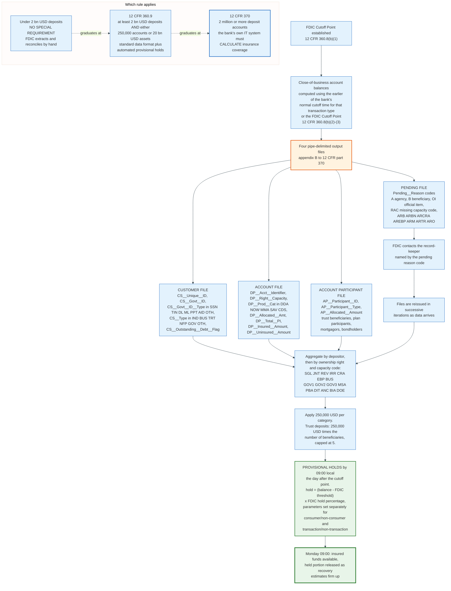

### 10.4 The Rule That May Be Withdrawn

Part 370 was written to fix an FDIC problem by shifting work to banks. The original concern in 2016 was the FDIC's own capacity to process very large volumes of deposit account records fast enough after a failure, and the regulation's answer was to require the largest institutions to build parallel insurance determination systems.

The FDIC modernised its claims processing systems in 2021 and has since tested its ability to ingest, process, aggregate, and determine coverage for large account volumes. In June 2026 the agency said publicly that it is actively considering replacing part 370, for institutions currently subject to it, with a modified version of section 360.9 that keeps the standardised depositor record requirements and drops the requirement to build and maintain an independent insurance determination system.

The reasoning is that the FDIC makes the determination, the FDIC maintains the systems that apply the rules, and the regulation should reflect that. It is a rare instance of a supervisor withdrawing a burden because it solved its own problem.

---

## 11. Least-Cost Resolution and the Systemic Risk Exception

### 11.1 The Statutory Test

Section 13(c)(4) of the FDI Act, codified at 12 U.S.C. 1823(c)(4), requires the FDIC to choose the resolution option whose total expenditures are least costly to the Deposit Insurance Fund. The comparison is made on a present-value basis using realistic discount rates, and the FDIC must document its assumptions about interest rates, asset recovery rates, and contingent liabilities and retain that documentation for at least five years.

Liquidation is the benchmark. Any assisted transaction must beat what the receivership would realise by selling the assets and paying insured depositors directly. Determinations under the paragraph are made in the sole discretion of the FDIC.

The consequence follows mechanically. Uninsured depositors are protected only when protecting them happens to be cheaper, which is true when an acquirer will pay enough of a premium for the whole deposit book to more than offset the extra liability. That is common for large banks with valuable franchises and uncommon for small banks with concealed fraud.

### 11.2 The Exception

Subparagraph (G) of the same section permits a departure. Three approvals are required in sequence. The FDIC Board must recommend the action by a vote of at least two-thirds of its members. The Board of Governors of the Federal Reserve System must do the same by at least two-thirds. And the Secretary of the Treasury, in consultation with the President, must then determine that compliance with the least-cost requirement would have serious adverse effects on economic conditions or financial stability, and that the action would avoid or mitigate those effects.

The accountability provisions are strict. The Secretary must document the determination. The Comptroller General audits it within 60 days and again at 180 days. The Treasury notifies Congress within three days. And the FDIC must recover any resulting loss to the fund through a special assessment on insured depository institutions or their holding companies, weighted toward the institutions that benefited from the assistance.

The exception has been used sparingly. It featured in the 2008 crisis, and before March 2023 it had not been invoked for more than a decade.

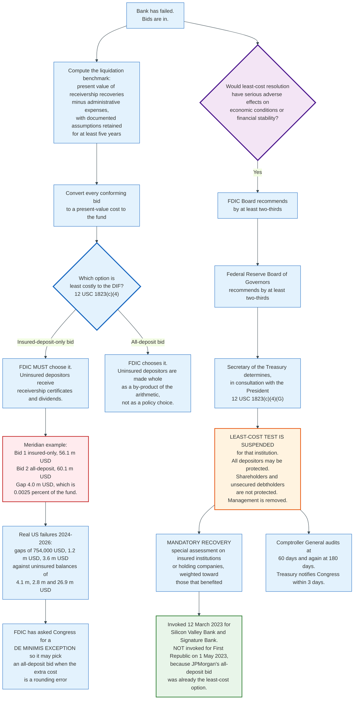

### 11.3 The Two-Tier Problem

The least-cost test produces an outcome that is defensible in each individual case and indefensible as a pattern. Uninsured depositors at very large banks are protected because the systemic risk exception exists for institutions whose failure threatens stability. Uninsured depositors at very small banks are not, because a small failure never qualifies and the arithmetic almost always favours the insured-only bid.

The FDIC has published the numbers. Over the three years to June 2026, three failures imposed losses on uninsured depositors. In each case the difference between the winning insured-deposit-only bid and the lowest-cost all-deposit bid was 754,000 dollars, 1.2 million dollars, and 3.6 million dollars respectively. The uninsured deposits at those banks at closing totalled 4.1 million, 2.8 million, and 26.9 million dollars. The current estimated cost of covering uninsured deposits at Silicon Valley Bank alone is 16.6 billion dollars.

Making every uninsured depositor at all three small banks whole would have cost the fund less than one twentieth of one percent of what covering SVB's uninsured depositors cost, and less than one two-hundredth of one percent of the fund's net worth.

The FDIC's proposed fix is narrow. It has asked Congress for a de minimis exception permitting it to choose a resolution that is not the least costly when the difference is very small in dollar or percentage terms. The argument is partly about fairness of perception and partly about a category of cost the least-cost test cannot count: contagion. A small-town bank failure that wipes out forty local businesses has a cost to the fund through the health of community banking that no present-value model captures.

---

## 12. March 2023: SVB, Signature, and First Republic

### 12.1 The Sequence

Three banks failed in fifty-two days, two of them over one weekend, and the response permanently changed how the industry thinks about uninsured deposit concentration.

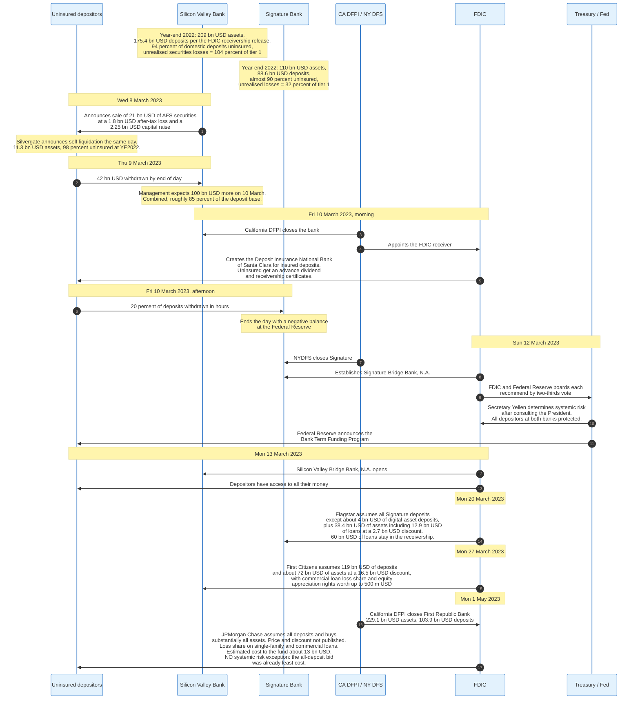

### 12.2 The Numbers

| | Silicon Valley Bank | Signature Bank | First Republic Bank |
|---|---|---|---|
| Closed | 10 Mar 2023 | 12 Mar 2023 | 1 May 2023 |
| Closing authority | California DFPI | New York DFS | California DFPI |
| Total assets | 209 bn USD (YE2022) | 110 bn USD (YE2022) | 229.1 bn USD (13 Apr 2023) |
| Total deposits | 175.4 bn USD (YE2022) | 88.6 bn USD (YE2022) | 103.9 bn USD assumed |
| Uninsured share | 94 percent of domestic deposits | almost 90 percent | not disclosed by the FDIC at closing |
| Unrealised securities losses | 104 percent of tier 1 capital | 32 percent of tier 1 capital | not disclosed by the FDIC at closing |
| Interim structure | DINB, then bridge bank | Bridge bank | None, direct sale |
| Acquirer | First Citizens, 27 Mar 2023 | Flagstar, 20 Mar 2023 | JPMorgan Chase, 1 May 2023 |
| Assets purchased | about 72 bn USD at a 16.5 bn USD discount | 38.4 bn USD, incl. 12.9 bn USD of loans at a 2.7 bn USD discount | substantially all; price and discount not published |
| Deposits not assumed | none | about 4 bn USD of digital-asset deposits, paid directly | none |
| Systemic risk exception | Yes | Yes | No |
| Estimated cost to the DIF | about 20 bn USD | about 2.5 bn USD | about 13 bn USD |

Two notes on the first column. The FDIC's receivership press release of 10 March 2023 gives Silicon Valley Bank 209.0 billion dollars of total assets and 175.4 billion dollars of total deposits as of 31 December 2022, and that is the figure the resolution was sized against. The FDIC's Options for Deposit Insurance Reform, published seven weeks later, gives 191 billion dollars of deposits for the same date. The two numbers have never been reconciled in print, and the receivership figure is the operative one.

The First Republic column is thinner than the other two because the FDIC published less. No systemic risk determination was made, so no uninsured-deposit figure entered the public record at closing, and the press release gives only the 13 billion dollar cost estimate.

### 12.3 Who Bore the Losses

The allocation is the most important and least understood part of the episode.

**Uninsured depositors bore nothing at SVB and Signature.** The systemic risk determination made them whole. This was announced on Sunday 12 March, two days after SVB's uninsured depositors had been told they would receive an advance dividend and a receivership certificate.

**Uninsured depositors bore nothing at First Republic either,** but for a completely different reason. JPMorgan's bid assumed all deposits and was the least-cost option, so no exception was needed. The FDIC's press release specifically noted the transaction was consistent with the least-cost requirements of the FDI Act.

**Shareholders were wiped out at all three.** So were certain unsecured debtholders. Senior management was removed. The joint statement of 12 March said this explicitly.

**The Deposit Insurance Fund bore all of it initially,** roughly 35.5 billion dollars across the three failures.

**Large banks bore the SVB and Signature portion afterwards.** The special assessment recovered the cost attributable to protecting uninsured depositors, currently estimated at 16.7 billion dollars. Because that recovery was accounted for as it was collected, the SVB and Signature losses did not permanently reduce the fund's net worth or the reserve ratio.

**The fund bore First Republic permanently.** Its roughly 13 billion dollar cost was a least-cost resolution, so no special assessment applied. The FDIC's own position is that the reduction in the fund's net worth from 2023 was primarily the result of First Republic rather than the two banks that got the headlines.

**No taxpayer bore anything.** The receiverships funded themselves by borrowing from the Federal Reserve at a penalty rate, which is a loan rather than a transfer, and the interest cost fell on the fund. The FDIC has not published the amount borrowed or the interest paid.

### 12.4 What the Episode Actually Demonstrated

Three lessons emerged that are visible in every subsequent regulatory action.

**The uninsured deposit runoff assumption in the pricing model was wrong by a wide margin.** Appendix D to 12 CFR part 327 assumes 58 percent of uninsured deposits run in a failure scenario. SVB lost or expected to lose roughly 85 percent of its entire deposit base in two days.

**Bridge banks destroy value.** Both bridge banks continued losing deposits while the FDIC operated them, and the FDIC has since reoriented its resolution planning away from bridge bank strategies entirely.

**The FDIC's information was worse than its authority.** The agency could resolve the banks. It could not do so quickly at a good price, because the data rooms were thin and the bidding windows were compressed. Every 2025 and 2026 reform, from virtual data room testing to the resolution readiness assessment discount to the nonbank bidder pre-qualification pilot, addresses that specific gap.

---

## 13. The Special Assessment

### 13.1 The Obligation

A systemic risk determination is not free money. Section 13(c)(4)(G)(ii) of the FDI Act requires the FDIC to recover any resulting loss to the fund through one or more special assessments on insured depository institutions or their holding companies, and directs the FDIC to consider the types of institutions that benefited from the action when setting the terms.

That sentence forced a design question with a political answer: who benefited. The FDIC's answer was the banks holding large uninsured deposit balances, because those are the banks whose depositors would have run next.

### 13.2 The Design

The final rule was approved on 16 November 2023 and took effect on 1 April 2024. Its base is not assets, not deposits, and not risk. It is estimated uninsured deposits as reported on the 31 December 2022 Call Report, less the first 5 billion dollars, computed at the banking organisation level so that a group cannot split the exclusion across its charters.

The annual rate was set at approximately 13.4 basis points, collected quarterly at roughly 3.36 basis points over an anticipated eight quarterly assessment periods, beginning with the first quarterly assessment period of 2024 and first payable on 28 June 2024.

The incidence follows mechanically from the base. At adoption, 114 banking organisations would pay. Forty-eight of them had total assets above 50 billion dollars and 66 had assets between 5 and 50 billion dollars. No banking organisation with total assets under 5 billion dollars paid anything. At the proposal stage the FDIC estimated that banks above 50 billion dollars would pay more than 95 percent of the total.

### 13.3 Where It Stands

The estimate has moved. When the systemic risk determination was made, the loss attributable to protecting uninsured depositors was put at approximately 15.8 billion dollars. By the November 2023 final rule it was 16.3 billion dollars. As of the most recent FDIC statement the figure is approximately 16.7 billion dollars, and the FDIC notes it is adjusted periodically as the receiverships sell assets, satisfy liabilities, and incur expenses.

Two FDIC figures sit close together and are computed on different bases. The 16.7 billion dollars is the special assessment page's total loss attributable to protecting uninsured depositors at Silicon Valley Bank and Signature Bank together. Chairman Hill separately put the current estimate for covering uninsured deposits at Silicon Valley Bank alone at 16.6 billion dollars in June 2026. The FDIC has published no reconciliation between them, and the 16.7 billion dollar number is the one the special assessment collects against.

Eight quarterly collection periods have been invoiced, running from the first quarter of 2024 through the fourth quarter of 2025, with the final invoice payable on 30 March 2026. The population settled at 141 insured depository institutions across 110 banking organisations with more than 5 billion dollars of estimated uninsured deposits. In December 2025 the FDIC adopted an interim final rule amending the collection, and the rate for the eighth collection quarter was cut to 2.97 basis points from the 3.36 basis points applied in the first seven.

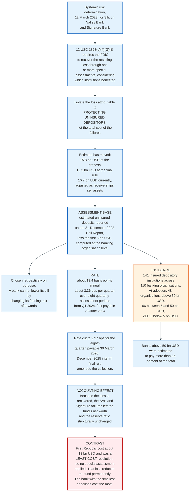

### 13.4 What the Special Assessment Reveals About the System

Three structural points fall out of the design.

**The base was chosen retroactively and deliberately.** Using uninsured deposits as of 31 December 2022, more than ten months before the rule was adopted, made the base unavoidable. A bank could not reduce its assessment by changing its funding mix after the fact. That is good rulemaking and it also means the assessment is a tax on a past state of the world rather than a price on current behaviour.

**The systemic risk exception costs large banks, not taxpayers, and not small banks.** The 5 billion dollar exclusion put the entire burden on institutions that themselves carry large uninsured balances. Community banks paid nothing toward a decision made to protect the depositors of two banks they do not compete with.

**The mechanism cleanly separates the two kinds of loss.** Because the special assessment recovers the SVB and Signature losses, those failures left the fund's net worth and reserve ratio structurally unchanged. First Republic's roughly 13 billion dollars, resolved under the least-cost test, did not qualify for recovery and permanently reduced the fund. The bank that generated the smallest headlines cost the fund the most.

---

## 14. Who Actually Bears Losses

### 14.1 The Claim Priority

When the FDIC is appointed receiver, the failed bank's assets are distributed under a statutory waterfall in 12 U.S.C. 1821(d)(11), which was rewritten by the Omnibus Budget Reconciliation Act of 1993 to create national depositor preference.

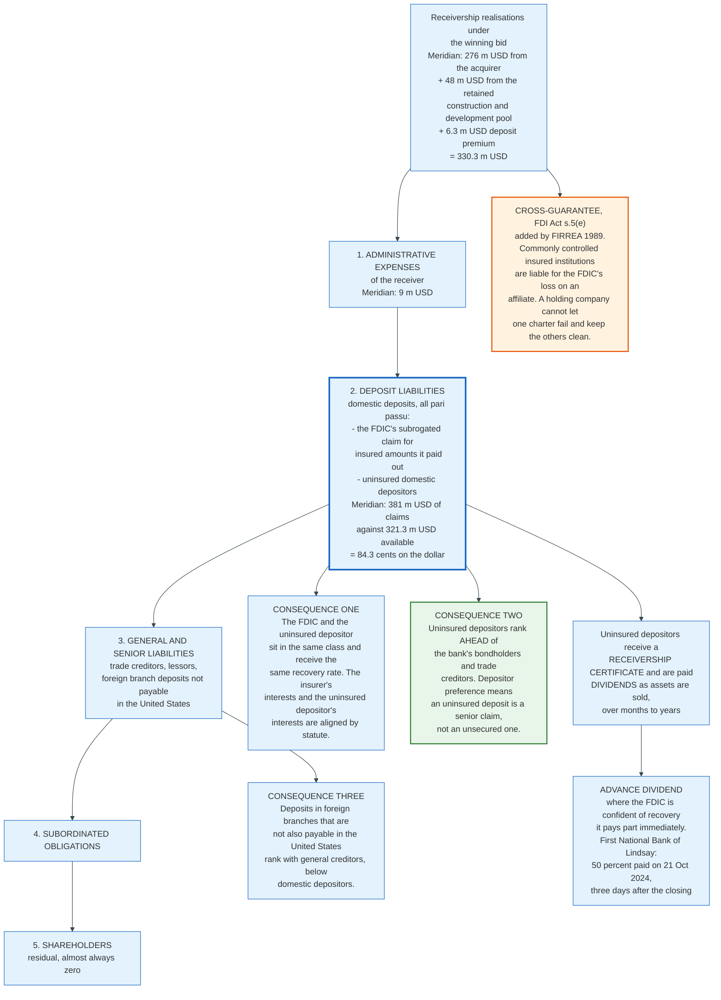

The order is administrative expenses of the receiver, then deposit liabilities, then general and senior liabilities, then subordinated obligations, then shareholders.

Two features of that ordering deserve emphasis. Deposit liabilities are one class, and the FDIC's subrogated claim for what it paid insured depositors sits in it alongside the uninsured depositors' claims for what they were not paid. Both recover at the same rate. And the deposit class ranks above general creditors, which means an uninsured deposit is a senior unsecured claim on the bank rather than an ordinary one. A corporate treasurer holding 5 million dollars in a deposit account is structurally better placed than a bondholder holding 5 million dollars of the same bank's senior notes.

### 14.2 What Recent Uninsured Depositors Actually Received

Four recent US failures are worth putting side by side. Three of them imposed real losses on uninsured depositors, and those three share a pattern: a small bank, an insured-deposit-only resolution, and a cost to the fund far larger than the uninsured balances at stake. Fraud was alleged or suspected at Lindsay, Pulaski and Santa Anna. The FDIC has published no such finding for Community Bank and Trust. Pulaski is in the table because all of its deposits were assumed, which is what a loss-free small-bank resolution looks like.

| Bank | Closed | Assets | Deposits | Uninsured | Resolution | Cost to DIF |
|------|--------|--------|----------|-----------|-----------|-------------|
| The First National Bank of Lindsay, OK | 18 Oct 2024 | 107.8 m USD | 97.5 m USD | about 4.1 m USD (7.1 m USD estimated at closing) | Insured deposits assumed by First Bank and Trust at a 6.67 percent premium; 50 percent advance dividend on 21 Oct 2024 | about 43 m USD, alleged fraud |
| Pulaski Savings Bank, IL | 17 Jan 2025 | 49.5 m USD | 42.7 m USD | not published | All deposits assumed by Millennium Bank at a 4.61 percent premium | 28.5 m USD, suspected fraud |
| The Santa Anna National Bank, TX | 27 Jun 2025 | 63.8 m USD | 53.8 m USD | about 2.8 m USD | Insured deposits assumed by Coleman County State Bank at a 5.16 percent premium | 23.7 m USD, suspected fraud |
| Community Bank and Trust, West Georgia | 1 May 2026 | 288 m USD | 268 m USD | about 27 m USD | Substantially all insured deposits assumed by Anchor Bank | about 97 m USD |

One figure in the table moved after the closing. The FDIC's closing-day estimate of uninsured deposits at Lindsay was 7.1 million dollars, made while the amount above the limit was still being determined. It settled at 4.1 million dollars once the determination was complete, and section 11.3 uses the settled number.

The arithmetic in the last row is worth pausing on. A 288 million dollar bank cost the fund 97 million dollars, which is 34 percent of its assets. Failures with concealed losses are expensive relative to their size, because those losses are discovered rather than gradually provisioned, and because there is nothing left to sell.

### 14.3 Cross-Guarantee Liability

Section 5(e) of the FDI Act, added by FIRREA in 1989, makes any insured depository institution liable for the FDIC's loss on a commonly controlled insured institution. A holding company with five bank charters cannot let one fail and keep the other four whole. The provision exists because in the 1980s that is exactly what holding companies tried to do.

---

## 15. The FDIC and NCUA Split

### 15.1 Two Regimes, One Number

Credit union shares are insured to 250,000 dollars per member, per credit union, per ownership category, by the National Credit Union Share Insurance Fund, which Congress created in 1970 under Public Law 91-468 and which is administered by the National Credit Union Administration. The limit tracks the FDIC's, the ownership categories are broadly parallel, and both funds carry the full faith and credit of the United States.

The word "shares" rather than "deposits" is not decoration. A credit union member is an owner, and their account is legally an equity share in a cooperative. Insurance makes the share behave like a deposit anyway.

### 15.2 The One Percent Capitalisation Deposit

The structural difference between the two funds is how they are capitalised, and it is large.

The FDIC's Deposit Insurance Fund is entirely retained earnings. Assessments are paid and gone. A bank that pays 360,000 dollars a year in premiums has an expense, not an asset.

The NCUSIF is capitalised primarily by a refundable deposit. Every federally insured credit union deposits and maintains 1 percent of its insured shares with the fund, carries that deposit as an asset on its own balance sheet, and gets it back if it leaves the system or if insured shares shrink. The Federal Credit Union Act defines the equity ratio at 12 U.S.C. 1782(h)(2) as the sum of those 1 percent capitalisation deposits and the fund's retained earnings, net of certain liabilities, divided by aggregate insured shares.

The proportions follow from the definition rather than from a disclosure. At 31 December 2025 the NCUSIF held 24.1 billion dollars of total assets and reported an equity ratio of 1.30 percent. The capitalisation deposits equal 1 percent of insured shares by rule, so they are 1.00 divided by 1.30, or 76.9 percent, of the fund, and cumulative results of operations are the remaining 23.1 percent. More than three quarters of the credit union insurance fund is money that belongs to the credit unions.

### 15.3 The Consequences of That Difference

**The NCUSIF grows automatically with insured shares.** As shares grow, credit unions must top up their 1 percent deposits, so the numerator and denominator of the equity ratio move together. The FDIC has no such mechanism, which is why pandemic deposit inflows pushed the DIF reserve ratio below its statutory minimum without any loss occurring.

**The NCUA charges no premium most years.** The NCUA Board sets a normal operating level between 1.20 and 1.50 percent, currently 1.33 percent. When the equity ratio sits at or above that level, no premium is charged, and any excess is distributed back to credit unions. The FDIC charges every quarter regardless of the reserve ratio.

**The NCUSIF's statutory floor is a trigger rather than a target.** If the equity ratio falls below 1.20 percent, or is projected to within six months, the NCUA must charge a premium or adopt a restoration plan.

**The NCUSIF's ratio is measured semiannually,** on 30 June and 31 December, against the FDIC's quarterly measurement.

### 15.4 Current Numbers Side by Side

| Measure | FDIC DIF | NCUA NCUSIF |
|---------|----------|-------------|
| Fund size | 161.147 bn USD | 24.1 bn USD total assets |
| As of | 30 Jun 2026 | 31 Dec 2025, the most recent published quarter |
| Capitalisation | 100 percent retained earnings | 76.9 percent refundable 1 percent deposits, 23.1 percent retained earnings, derived from the equity ratio |
| Ratio | 1.48 percent reserve ratio | 1.30 percent equity ratio |
| Ratio denominator | Estimated insured deposits, 10.895 trn USD | Aggregate insured shares |
| Statutory floor | 1.35 percent minimum reserve ratio | 1.20 percent equity ratio |
| Target | 2 percent designated reserve ratio | 1.33 percent normal operating level, Board-set within 1.20 to 1.50 |
| Measurement frequency | Quarterly | Semiannual |
| Premiums when above target | Charged every quarter | Not charged; excess is distributed |
| Recent failures | 2 in the first half of 2026 | 0 in the fourth quarter of 2025 |
| Supervisory tail | 47 problem institutions | 653 CAMELS 3 credit unions with 170.5 bn USD of assets; 117 CAMELS 4 and 5 with 13.6 bn USD |

The two columns are measured on different clocks, and that is a fact about the regimes rather than about the table. The FDIC reports quarterly and had published second-quarter 2026 data by August 2026. The NCUA's most recent Share Insurance Fund release covers the fourth quarter of 2025 and was issued on 5 March 2026, so no 2026 quarter is available for the credit union side.

### 15.5 Privately Insured Credit Unions

A small number of state-chartered credit unions are not federally insured at all. They carry share insurance from a private company, typically at a comparable dollar limit, without any federal backing. Section 43 of the FDI Act requires such institutions to disclose conspicuously that they are not federally insured and that the federal government does not guarantee the depositor will get their money back.

The historical record on private deposit insurance is uniformly bad. Every state fund that existed before 1933 failed, and Ohio's and Maryland's private funds both went insolvent in 1985. The failure mode is always the same: the insured institutions are geographically or sectorally correlated, so the pool and its members fail together.

---

## 16. Europe: The Deposit Guarantee Schemes Directive

### 16.1 Harmonisation in Three Waves

The European Union does not operate a deposit guarantee scheme. It requires each member state to operate one, and it harmonises the terms. That distinction explains most of the differences from the American system.

**Directive 94/19/EC** established the first minimum coverage level across the single market. It was not enough to prevent depositors moving money across borders during 2008.

**Directive 2009/14/EC** raised the minimum to 50,000 euro in 2009 and to 100,000 euro from 31 December 2010, as an emergency response.

**Directive 2014/49/EU**, usually called DGSD2, is the framework most practitioners know. Its core provisions:

- **Coverage of 100,000 euro** per depositor per credit institution, under Article 6(1).
- **Repayment within seven working days** under Article 8, phased down from 20 working days: 20 until 31 December 2018, 15 from 2019 to 2020, 10 from 2021 to 2023, and 7 from 2024.
- **An ex-ante target of 0.8 percent of covered deposits** by 3 July 2024, under Article 10(2). Note the denominator: covered deposits, not assets.
- **Risk-based contributions** under Article 13, based on the amount of covered deposits and the degree of risk incurred by the member.
- **Temporary high balances** above 100,000 euro under Article 6(2), for deposits arising from residential property transactions, defined life events, or insurance benefits, protected for at least three months and no more than twelve, with member states setting the terms.
- **Exclusions** in Article 5(1) covering deposits of credit institutions, investment firms, financial institutions, insurance companies, pension funds, public authorities, and deposits linked to money laundering.

### 16.2 DGSD3: Directive (EU) 2026/804

The crisis management and deposit insurance review the European Commission proposed on 18 April 2023 was adopted as Directive (EU) 2026/804 on 30 March 2026 and published in the Official Journal on 20 April 2026. Member states transpose it on the timetable set in the directive's final articles, which this document does not reproduce.

The substantive changes:

**The 100,000 euro headline stays.** The revision did not raise the general limit.

**Temporary high balances are harmonised.** Instead of each member state choosing terms within a three to twelve month window, the directive sets 500,000 euro for six months as the harmonised protection, and up to 2,500,000 euro for six months where an individual's private residential property transaction is involved, covering both sale proceeds and purchase deposits.

**Coverage extends to two previously excluded populations.** Non-profit institutions controlled by central or state governments are brought in, and client funds held by payment institutions, e-money institutions, and investment firms on behalf of identifiable clients are protected provided safeguarding requirements are met. This is the European answer to the same problem the FDIC's custodial account proposal addresses.

**Payout mechanics are tightened.** Seven working days remains the standard, with up to 20 working days for temporary high balances and beneficiary accounts requiring verification, and credit transfer becomes the default reimbursement method for amounts above 10,000 euro.

**Deposit guarantee scheme funds gain a resolution role.** A scheme may contribute to resolution financing under Article 109 of the Bank Recovery and Resolution Directive, may finance preventive measures and alternative measures in insolvency subject to safeguards, and where a transfer strategy is used it obtains a claim against the residual entity ranking pari passu with covered deposits.

The EBA is mandated to write 12 technical standards and guidelines under the new directive. The first four went out for consultation on 23 July 2026, covering depositor information sheets, information exchange between institutions, schemes and authorities, the treatment of client fund payouts, and how schemes should invest their available financial means. Comments close on 23 October 2026.

### 16.3 What Europe Still Does Not Have

**A single fund.** The European Deposit Insurance Scheme, proposed in 2015 to mutualise national schemes at the banking union level, has never been adopted. A depositor in the euro area is protected by their own member state's scheme, backed by their own member state's fiscal capacity. That is the structural difference from a single national insurer, and it is the reason a euro deposit is not fungible across borders in a crisis.

**A resolver that is also the insurer.** In most member states the deposit guarantee scheme pays out and the resolution authority resolves. The FDIC does both, which is why the American weekend sale model has no direct European equivalent.

**A pricing base tied to assets.** Europe prices contributions against covered deposits and sets its target the same way. The FDIC abandoned that alignment in 2011 for the reason set out in section 6.2.

---

## 17. The United Kingdom: FSCS

### 17.1 The Scheme

The Financial Services Compensation Scheme was created under the Financial Services and Markets Act 2000 and began operating on 1 December 2001. It is a single compensation body covering deposits, insurance, investments, and pensions, which is unusual. Most countries run separate schemes for each.

Deposit protection is per eligible person, per authorised firm, and the operative unit is the banking licence rather than the brand. Several high street brands operating under one licence share a single limit, which is a recurring source of consumer surprise and the reason FSCS publishes a brand lookup.

### 17.2 The Limit and Its History

The limit was 85,000 pounds from 30 January 2017, having been 75,000 pounds from 1 January 2016. On 1 December 2025 the Prudential Regulation Authority raised it to 120,000 pounds. Temporary high balance protection was raised at the same time to 1.4 million pounds for six months from the date the money was first deposited, covering proceeds from a property sale, redundancy, inheritance, and similar life events.

Payout is within seven working days of the firm's failure for standard claims. Temporary high balance claims and other complex cases take longer because they require evidence.

### 17.3 Ex-Post Funding

The sharpest structural difference from the American system is that the United Kingdom does not pre-fund deposit protection. There is no British Deposit Insurance Fund.

FSCS is funded by a levy on firms authorised by the Financial Conduct Authority and the Prudential Regulation Authority, raised annually against actual and forecast compensation costs. The levy is divided into funding classes, and Deposits is one of them. Each firm's contribution is proportional to the protected business it does within its class, so a bank's deposit levy scales with its protected deposits relative to the industry's.

A separate deposit acceptors' contribution class exists as a backstop rather than as an ordinary class. It sits in the retail pool at FEES 6 Annex 2 of the FCA handbook alongside six other classes, and it is levied only when another class reaches its own limit and the pool is triggered. Deposit takers then help pay for failures in investment or insurance intermediation, which is the British answer to the same cross-subsidy question the FDIC settled by putting every insured bank in one fund.

The trade-off is exact. Ex-post funding avoids the cost of holding 161 billion dollars of idle Treasury securities and avoids charging premiums in years when nothing fails. It also means the money is collected from surviving banks at precisely the moment those banks are least able to pay, which is the procyclicality problem the FDIC's designated reserve ratio exists to avoid.

Both models have been tested. The FDIC's fund went negative in 2009 and had to raise special and prepaid assessments anyway. The FSCS levied its way through the failures of Bradford and Bingley, Icesave, and Kaupthing Singer and Friedlander with Bank of England and Treasury bridging. Neither model survives a large failure without a liquidity backstop from the state.

---

## 18. Engineering Coverage Above the Cap

### 18.1 Three Mechanisms, Increasing Complexity

The 250,000 dollar limit is soft. There are three legitimate, widely used ways to hold far more than that fully insured, and they differ in who does the work and where the operational risk sits.

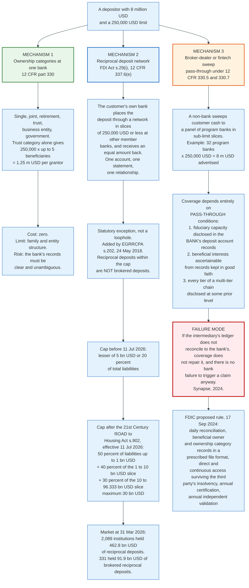

### 18.2 Reciprocal Deposits: The Mechanism

A reciprocal deposit network solves a specific problem. A business with 8 million dollars wants full insurance and a single banking relationship with its local bank. Its local bank wants to keep the 8 million dollars on its balance sheet, because deposits are its funding.

The network reconciles those wants by swapping. The bank submits the 8 million dollars into the network, which places it in slices of 250,000 dollars or less at 32 other member banks. Simultaneously, other member banks send 8 million dollars of their own customers' money back. The originating bank's balance sheet is unchanged in size. The customer holds one account at one bank, receives one statement, and is fully insured because the money legally sits at 32 institutions in insurable slices.

IntraFi is the largest operator, running CDARS for time deposits and ICS for demand and money market balances, along with sweep and repo products. The firm states that more than 3,000 financial institutions use its network. The FDIC's own count is the harder number: 2,089 of 4,278 insured institutions, or 49 percent, reported reciprocal deposits at 31 March 2026.

### 18.3 The Statutory Treatment and the 2026 Expansion

Reciprocal deposits were treated as brokered deposits until 2018, which mattered because section 29 of the FDI Act restricts brokered deposits at less-than-well-capitalised banks and because the brokered deposit ratio raises a bank's assessment rate under 12 CFR 327.16.

Section 202 of the Economic Growth, Regulatory Relief, and Consumer Protection Act, enacted 24 May 2018, added section 29(i) creating a limited exception. Reciprocal deposits of a qualifying agent institution are not treated as obtained through a deposit broker, up to a cap. Until 2026 that general cap was the lesser of 5 billion dollars or 20 percent of the agent institution's total liabilities, implemented at 12 CFR 337.6(e).

Section 902 of the 21st Century ROAD to Housing Act, effective 11 July 2026, replaced the flat cap with a tiered calculation. The FDIC approved an interim final rule implementing it on 27 August 2026, published as FIL-52-2026, with comments due 30 days after Federal Register publication. The general cap is now the sum of:

- 50 percent of the portion of total liabilities at or below 1,000,000,000 dollars
- plus 40 percent of the portion above 1,000,000,000 and at or below 10,000,000,000 dollars
- plus 30 percent of the portion above 10,000,000,000 and at or below 96,333,333,333 dollars

The maximum is therefore 30 billion dollars, reached at 96.33 billion dollars of total liabilities. The FDIC's own worked example: an agent institution with 25 billion dollars of total liabilities has a general cap of 0.5 times 1 billion plus 0.4 times 9 billion plus 0.3 times 15 billion, which is 8.6 billion dollars.

The rule also loosened eligibility. The definition of agent institution now includes 3-rated, well capitalised institutions, where previously it required a composite condition of outstanding or good.

The market context in the same document: as of 31 March 2026 there were 4,278 FDIC-insured institutions. Of these, 1,971 reported brokered deposits totalling 1.204 trillion dollars, and 2,089 reported reciprocal deposits totalling 462.8 billion dollars, of which 331 institutions reported 91.9 billion dollars classified as brokered reciprocal deposits. The rule's effect is to reclassify part of that 91.9 billion dollars out of the brokered category, which lowers assessment rates for a small number of banks and removes a supervisory constraint for others.

### 18.4 Sweep Programs and the Pass-Through Failure Mode

A broker-dealer or fintech sweep works differently. The customer's relationship is with a non-bank, and that non-bank distributes cash across a panel of program banks. Wealthfront advertises up to 8 million dollars of FDIC insurance for an individual account and 16 million dollars for a joint account through up to 32 program banks, each carrying its own 250,000 dollar limit. The arithmetic is exactly 32 times 250,000.

The coverage is real, and it is conditional on the pass-through requirements in section 5.6. The bank's deposit account records must disclose the fiduciary capacity, and the beneficial interests must be ascertainable from records maintained in good faith in the ordinary course of business, by the depositor or by someone who has undertaken to maintain them.

Synapse's collapse in 2024 demonstrated what happens when the second condition fails. The intermediary's ledger did not reconcile to the partner banks' records, so nobody could say with confidence how much of the pooled balance belonged to which end customer. Two things follow, and both are widely misunderstood. Deposit insurance does not fix a reconciliation failure, because the insurance computes coverage from records that do not exist. And deposit insurance was never triggered at all, because the partner banks did not fail. The intermediary did.

The FDIC proposed a rule on 17 September 2024 aimed at exactly this. It would require an insured institution holding custodial accounts with transactional features to maintain records identifying each beneficial owner, the balance attributable to each, and the ownership category in which the funds are held, in a file format the rule prescribes; to reconcile those balances no less frequently than as of the close of business daily; to have direct, continuous, and unrestricted access to the beneficial owner records including in the event of the third party's business interruption, insolvency, or bankruptcy; to submit an annual certification of compliance and testing to the FDIC and its primary federal regulator; and to obtain an annual independent validation of the third party's recordkeeping. The proposal exempts categories where separate recordkeeping already applies, where transactional activity is minimal, or where history shows no problem.

The FDIC withdrew four unrelated proposed rules on 3 March 2025, including the August 2024 brokered deposits proposal, on the reasoning that it would have significantly disrupted the deposit landscape. The custodial account recordkeeping proposal was not among the four withdrawn.

### 18.5 The Honest Summary

Insured coverage above the cap is available to anyone willing to do the paperwork, and the amount of paperwork scales inversely with sophistication. A household can reach several million dollars by naming beneficiaries correctly. A business can reach tens of millions through a reciprocal network with one bank relationship. A firm placing money through a fintech can reach 8 million dollars by clicking a box, and inherits an operational dependency on a ledger it cannot inspect.

The FDIC's own analysis makes the policy point cleanly: the presence of brokered deposits, sweeps, and reciprocal deposits demonstrates that the current system already provides insurance coverage far above the limit for large depositors, but access to it differs across depositors based on awareness and on legal, financial, and regulatory expertise. The limit is not really 250,000 dollars. It is 250,000 dollars for people who do not know how the rules work.

---

## 19. Comparisons and Alternatives

### 19.1 Four Regimes Side by Side

```mermaid
%%{init: {'theme': 'base', 'themeVariables': {'primaryColor': '#e3f2fd', 'primaryBorderColor': '#1565c0', 'lineColor': '#37474f'}}}%%

flowchart TB
    subgraph US["UNITED STATES - FDIC"]
        direction TB
        US1["250,000 USD per depositor,<br/>per bank, per ownership category"]
        US2["PRE-FUNDED<br/>161.1 bn USD, 100 percent retained earnings"]
        US3["Priced on ASSETS<br/>average consolidated total assets<br/>minus average tangible equity"]
        US4["Target: 1.35 percent statutory minimum,<br/>2 percent Board target,<br/>measured against INSURED DEPOSITS"]
        US5["The insurer is also the RECEIVER.<br/>Weekend sale is the default outcome."]
        US6["Payout in practice: next business day,<br/>usually as a transfer to an acquirer"]
    end

    subgraph CU["UNITED STATES - NCUA"]
        direction TB
        CU1["250,000 USD per member,<br/>per credit union, per category"]
        CU2["PRE-FUNDED<br/>24.1 bn USD at 31 Dec 2025, of which<br/>76.9 percent is a REFUNDABLE 1 percent<br/>deposit that credit unions carry as an asset"]
        CU3["No ongoing premium when the equity<br/>ratio is at or above the normal<br/>operating level; excess is distributed"]
        CU4["Floor 1.20 percent, normal operating<br/>level 1.33 percent, measured against<br/>INSURED SHARES, semiannually"]
        CU5["NCUA is insurer, supervisor<br/>and liquidating agent"]
    end

    subgraph EU["EUROPEAN UNION - DGSD3"]
        direction TB
        EU1["100,000 EUR per depositor per<br/>credit institution.<br/>Directive (EU) 2026/804,<br/>adopted 30 March 2026"]
        EU2["NATIONAL schemes, not one fund.<br/>No European Deposit Insurance Scheme<br/>despite a 2015 proposal."]
        EU3["PRE-FUNDED to 0.8 percent of<br/>COVERED DEPOSITS, risk-based<br/>contributions under Article 13"]
        EU4["Temporary high balances harmonised at<br/>500,000 EUR for six months, and up to<br/>2,500,000 EUR for private residential<br/>property transactions"]
        EU5["Scheme and resolution authority are<br/>usually SEPARATE bodies.<br/>DGS funds may finance transfers<br/>and preventive measures."]
        EU6["Payout within 7 working days,<br/>up to 20 for high balances;<br/>credit transfer by default above 10,000 EUR"]
    end

    subgraph UK["UNITED KINGDOM - FSCS"]
        direction TB
        UK1["120,000 GBP per eligible person<br/>per banking LICENCE, not per brand.<br/>Raised from 85,000 GBP<br/>on 1 December 2025"]
        UK2["EX-POST FUNDED.<br/>No standing deposit fund.<br/>A levy on authorised firms is raised<br/>after the failure."]
        UK3["Funding classes including Deposits,<br/>plus a deposit acceptors' contribution class<br/>levied only when the retail pool is triggered"]
        UK4["Temporary high balances<br/>1.4 m GBP for six months"]
        UK5["Covers deposits, insurance, investments<br/>and pensions in ONE scheme.<br/>Resolution sits with the Bank of England."]
        UK6["Payout within 7 working days"]
    end

    US --> Trade["THE SHARED TRADE-OFF<br/>Pre-funding costs idle money every year<br/>and avoids charging survivors in a crisis.<br/>Ex-post funding costs nothing in calm years<br/>and bills the weakest banks at the worst moment.<br/>Neither model survives a large failure<br/>without a state liquidity backstop."]
    CU --> Trade
    EU --> Trade
    UK --> Trade

    style US fill:#e3f2fd,stroke:#1565c0,stroke-width:2px
    style CU fill:#e8f5e9,stroke:#2e7d32,stroke-width:2px
    style EU fill:#fff3e0,stroke:#e65100,stroke-width:2px
    style UK fill:#f3e5f5,stroke:#4a148c,stroke-width:2px
    style Trade fill:#eceff1,stroke:#37474f,stroke-width:3px
```

| Dimension | FDIC | NCUA | EU under DGSD3 | UK FSCS |
|-----------|------|------|----------------|---------|
| Limit | 250,000 USD | 250,000 USD | 100,000 EUR | 120,000 GBP |
| Unit of coverage | Depositor, bank, ownership category | Member, credit union, category | Depositor, credit institution | Eligible person, banking licence |
| Funding | Pre-funded, retained earnings | Pre-funded, 76.9 percent refundable deposits | Pre-funded, national schemes | Ex-post levy |
| Target | 1.35 percent minimum, 2 percent goal, on insured deposits | 1.33 percent normal operating level on insured shares | 0.8 percent of covered deposits | No target, no fund |
| Pricing base | Assets minus tangible equity | 1 percent of insured shares plus earnings | Covered deposits, risk-adjusted | Protected deposits within the class |
| Payout deadline | Next business day in practice | Next business day in practice | 7 working days | 7 working days |
| Temporary high balances | None | None | 500,000 EUR, or 2.5 m EUR for property, 6 months | 1.4 m GBP, 6 months |
| Insurer resolves the bank | Yes | Yes | Usually no | No |
| Coverage above the cap | Systemic risk exception only | No equivalent | No equivalent | No equivalent |

### 19.2 The Alternatives to Deposit Insurance

Every alternative to deposit insurance has been proposed repeatedly and each fails on a different dimension.

**Narrow banking.** Require deposits to be backed one for one by central bank reserves or Treasury bills. This removes run risk completely, because the assets are always worth the liabilities. It also removes the bank, since maturity transformation is the service. The credit currently funded by deposits would migrate to institutions outside the guarantee, and the run problem would migrate with it.

**Collateralisation.** Require deposits above the limit to be secured by pledged assets. This already exists for public unit deposits in most states and works well. It does not scale, because collateral pledged to depositors is collateral not available to the Federal Home Loan Banks or the discount window, and a bank has only so much of it. Universal collateralisation would make uninsured deposits senior secured claims and make every other creditor structurally subordinate.

**Government money market funds and Treasury bills.** A treasurer who wants a safe 50 million dollar position can buy bills. Many do. The friction is operational rather than economic: bills do not clear payroll, and a money market fund settles on a different schedule from a payment. The FDIC's own report notes that full deposit insurance would cause significant disruption to the asset markets for which deposits are a substitute, which is the same observation running in reverse.

**Unlimited coverage.** The cleanest solution to run risk and the worst for moral hazard. The FDIC estimated it would increase the fund needed to reach any given reserve ratio by about 70 to 80 percent before accounting for the deposit inflows it would attract, requiring significantly higher assessments. It also removes depositor discipline entirely, which for the largest banks means removing the last private constraint on risk-taking.

**Targeted coverage.** Higher or unlimited coverage for business payment accounts only. This was the FDIC's preferred option in Options for Deposit Insurance Reform, 1 May 2023, on three grounds: it is difficult for a business to spread a payment account across many banks, payment accounts rarely involve the risk-return trade-off that makes market discipline desirable, and losses on payment accounts spill directly into payroll and other businesses. The unsolved problem is definitional. Distinguishing a payment account from a savings account requires criteria that are easily accessible, clearly defined, and hard to game, and the report is explicit that banks will innovate around any distinction, offering loyalty points instead of interest or sweep arrangements that convert one account type into another overnight.

**Convertibility limits on large uninsured deposits.** Require notice periods or impose gates on very large withdrawals. This attacks run risk directly without expanding coverage, and the FDIC lists it as a complementary tool. It also makes an uninsured deposit less like money, which reduces its usefulness for exactly the treasurers who hold it.

### 19.3 When Each Regime's Design Choice Pays Off

Pre-funding wins when failures are correlated. The FDIC absorbed three failures in the first half of 2023 and still ended March 2023 with 116.071 billion dollars in the fund, without levying a single ordinary assessment increase during the crisis. Ex-post funding wins when failures are rare and the industry is profitable, because the money stays productive in the meantime.

Pricing on assets wins when the loss driver is the asset side, which it always is. Pricing on covered deposits wins when the objective is a scheme that is simple, comparable across countries, and cheap for regulators to verify.

Separating the insurer from the resolver wins when the resolution authority needs to impose losses on creditors other than depositors, which is the European bail-in model. Combining them wins on speed, which is why the American weekend sale exists and the European equivalent generally does not.

---

## 20. Modern Developments

### 20.1 What Changed in the Last Three Years

**Coverage rules simplified.** The trust account rule effective 1 April 2024 collapsed three difficult categories into one arithmetic statement: 250,000 dollars times the number of beneficiaries, capped at five, aggregating revocable and irrevocable trusts from the same grantor.

**Loss recovery from large banks became routine.** The special assessment following the March 2023 systemic risk determination has run through eight quarterly collection periods, recovering approximately 16.7 billion dollars from 141 institutions across 110 banking organisations, all with more than 5 billion dollars of estimated uninsured deposits at year-end 2022.

**The FDIC turned toward its own operations rather than banks'.** The pattern across 2025 and 2026 announcements is consistent: the agency concluded that its constraint in 2023 was information and speed rather than legal authority, and it has been fixing that instead of writing new requirements. Claims processing was modernised in 2021 and has since been tested against large account volumes, which is the stated reason the agency is now willing to withdraw part 370.

**Nonbank capital was let into the bidding process.** The FDIC rescinded the 2009 Statement of Policy on Qualifications for Failed Bank Acquisitions, published at 91 FR 13847 on 23 March 2026, removing restrictions on private investors buying failed banks. A pre-qualification pilot for nonbank bidders on asset pools began in January 2026, drawing on firms that participated in the April 2024 Republic First Bank failure and the 2023 Signature asset sales, with seller financing available. The FDIC has been discussing with the OCC and the Federal Reserve an emergency exception allowing a nonbank to set up a shelf charter rapidly after a sudden failure.

**Receivership liquidity is being restructured.** The 2023 receiverships funded themselves at a penalty rate from the Federal Reserve while their assets were sold down. The FDIC is working with the Federal Financing Bank to build a permanent facility so receivership assets can be securitised on resolution weekend or within days, rather than six months later as happened in 2023.

**The brokered deposit proposal died.** The FDIC withdrew its August 2024 brokered deposits proposal on 3 March 2025 along with three unrelated rules, saying it would have significantly disrupted many aspects of the deposit landscape.

**Reciprocal deposits expanded sharply.** The 21st Century ROAD to Housing Act, effective 11 July 2026, raised the maximum reciprocal deposit exception from 5 billion to 30 billion dollars and replaced the flat cap with a tiered formula. The FDIC's implementing interim final rule was approved 27 August 2026.

**Europe finished a three-year legislative cycle.** Directive (EU) 2026/804 was adopted 30 March 2026 and published 20 April 2026, harmonising temporary high balances, extending coverage to client funds and certain public authorities, and giving deposit guarantee schemes a defined role in funding resolution transfers.

**The United Kingdom raised its limit for the first time since 2017,** to 120,000 pounds effective 1 December 2025, with temporary high balances at 1.4 million pounds.

### 20.2 What Is Being Proposed Now

**Lower assessments and a higher large-bank threshold.** The 25 June 2026 proposal raises the large bank scorecard threshold from 10 billion to 30 billion dollars with four-yearly indexing, cuts initial base rates by two basis points for small institutions and one for large and highly complex ones, and introduces a resolution readiness adjustment worth up to one basis point: half for demonstrating rapid virtual data room population, half for granting the FDIC advance systems access.

**Replacing part 370.** The FDIC is considering replacing the 2 million account recordkeeping rule with a modified section 360.9 that keeps standardised depositor records and drops the requirement for banks to maintain independent insurance determination systems, on the grounds that the FDIC's own capacity constraint no longer exists.

**Narrowing the qualified financial contracts rule.** Part 371 gives an institution in troubled condition 270 days to produce comprehensive derivative and repo records. Firms routinely take over a year, the data does not answer the question it was designed for, and none of the three banks that failed in 2023 was subject to the rule. The FDIC wants a narrower, faster, more targeted set of data aimed at the 24-hour termination decision.

**A de minimis exception to the least-cost test.** The FDIC has asked Congress for authority to pick a resolution that is not the least costly when the difference is very small in dollar or percentage terms, to reduce the perception of a two-tier deposit insurance regime.

**Modernising the large bank scorecard,** which has not been materially updated since 2011 and which still assumes 58 percent uninsured deposit runoff.

### 20.3 The Two Unresolved Questions

**Whether the limit or the categories should change.** The 250,000 dollar limit has been fixed since 2008 and was set retroactive to 1 January 2008 by a 2010 statute. Prices have risen substantially since. The FDIC's 2023 report concluded that raising the limit by an order of magnitude, even to millions of dollars, would be insufficient to cover many of the largest uninsured accounts whose sudden withdrawal could destabilise segments of the banking system, and that small and medium businesses holding balances modestly above the limit would benefit but the aggregate effect would be small. Targeted coverage of business payment accounts remains the FDIC's preferred direction and Congress has not acted on it.

**Whether uninsured deposits can be made unrunnable without being made insured.** This is the harder question, and every current tool is indirect. Higher liquidity requirements make a bank able to meet an outflow. Better supervision makes the outflow less likely. Faster resolution makes it less damaging. None of them changes the fact that 8.693 trillion dollars of uninsured deposits are payable on demand, at par, to holders who can now move them from a phone in seconds, and that the share of deposits in that position has grown every year since 2022.

---

## 21. Appendix

### 21.1 Key Terminology

| Term | Meaning |
|------|---------|
| **Advance dividend** | A partial payment to uninsured depositors made before the receivership is wound up, based on the FDIC's early estimate of recoveries. |
| **Agent institution** | A bank qualified to use the reciprocal deposit exception under FDI Act section 29(i). Since the 2026 interim final rule, includes 3-rated, well capitalised institutions. |
| **Assessment base** | Average consolidated total assets minus average tangible equity, with adjustments for bankers' banks and custodial banks. 23.086 trillion USD at 30 June 2026. |
| **Bridge bank** | A national bank chartered and owned by the FDIC to hold a failed institution's business while a buyer is found. FDI Act section 11(n), added by CEBA 1987. |
| **CAMELS** | Capital adequacy, Asset quality, Management, Earnings, Liquidity, Sensitivity to market risk. Rated 1 to 5; component ratings drive the assessment formula. |
| **Close-of-business account balance** | The end-of-day ledger balance on the day of failure, computed using the earlier of the bank's normal cutoff time for that transaction type or the FDIC Cutoff Point. 12 CFR 360.8(b)(3). |
| **Covered deposits** | The European term for insured deposits. Used as the denominator of the 0.8 percent DGS target. |
| **Deposit broker** | Under FDI Act section 29, a person engaged in placing deposits with insured institutions for third parties. Brokered status restricts an undercapitalised bank and raises a large bank's assessment. |
| **DGSD3** | Directive (EU) 2026/804, adopted 30 March 2026, amending Directive 2014/49/EU on deposit guarantee schemes. |
| **DIF** | Deposit Insurance Fund. Created 31 March 2006 by merging the Bank Insurance Fund and the Savings Association Insurance Fund. |
| **DINB** | Deposit Insurance National Bank. A temporary charter holding a failed bank's insured deposits so transaction accounts keep working. Used for SVB on 10 March 2023. |
| **Equity ratio** | The NCUSIF's solvency measure: 1 percent capitalisation deposits plus retained earnings, over aggregate insured shares. 12 U.S.C. 1782(h)(2). |
| **FDIC Cutoff Point** | The moment the FDIC establishes after being appointed receiver and taking control. 12 CFR 360.8(b)(1). |
| **Least-cost test** | The requirement in 12 U.S.C. 1823(c)(4) that the FDIC choose the resolution option least costly to the DIF, on a present-value basis. |
| **Loan mix index** | A portfolio risk score in the small bank assessment formula: each of eleven loan categories, as a share of total assets, times the weighted charge-off rate fixed for it in 12 CFR 327.16(a). |
| **Loss severity measure** | The standardised failure simulation in appendix D to 12 CFR part 327 subpart A, used in the large bank scorecard. |
| **National depositor preference** | The 1993 amendment placing domestic deposit liabilities ahead of general creditors in the receivership waterfall. 12 U.S.C. 1821(d)(11). |
| **NCUSIF** | National Credit Union Share Insurance Fund. Created 1970 under Public Law 91-468. |
| **Normal operating level** | The NCUA Board's target equity ratio, set between 1.20 and 1.50 percent. Currently 1.33 percent. |
| **Ownership category** | A legally recognised capacity in which deposits are held. Coverage is computed separately for each. 12 CFR part 330. |
| **Part 370** | 12 CFR part 370, requiring institutions with 2 million or more deposit accounts to calculate deposit insurance internally and emit four standard files. 81 FR 87734. |
| **Pass-through coverage** | Insurance of funds deposited by an agent for a principal as if the principal deposited them directly. Conditional on records under 12 CFR 330.5. |
| **Provisional hold** | An effective restriction on access to part of an account after a failure, applied by an automated process under 12 CFR 360.9(c). |
| **Purchase and assumption** | The default resolution: an acquirer assumes deposit liabilities and buys assets. Priced through a deposit premium and an asset discount. |
| **Receivership certificate** | The claim an uninsured depositor holds against the receivership for the amount not covered or assumed. |
| **Reciprocal deposits** | Deposits received by a bank through a placement network in the same amount and maturity as deposits it placed at other network banks. |
| **Reserve ratio** | DIF balance divided by estimated insured deposits. 1.48 percent at 30 June 2026. |
| **SMDIA** | Standard maximum deposit insurance amount. 250,000 USD since 2008, made permanent in 2010. |
| **Special assessment** | The mandatory levy under 12 U.S.C. 1823(c)(4)(G)(ii) to recover a loss caused by a systemic risk determination. |
| **Systemic risk exception** | The suspension of the least-cost test, requiring two-thirds votes of the FDIC and Federal Reserve boards and a Treasury determination made in consultation with the President. |
| **Temporary high balance** | Coverage above the normal limit for a defined period after a life event or property transaction. Exists in the EU and UK; not in the US. |

### 21.2 Architecture Diagrams

| Diagram | Source | Description |
|---------|--------|-------------|
| Evolution Timeline | [`diagrams/evolution-timeline.mmd`](diagrams/evolution-timeline.mmd) | Ninety years of coverage limits, statutes and crises from 1908 to 2026 |
| Run Dynamics | [`diagrams/run-dynamics.mmd`](diagrams/run-dynamics.mmd) | The two equilibria of a demand deposit contract and where run risk went |
| Moral Hazard Loop | [`diagrams/moral-hazard-loop.mmd`](diagrams/moral-hazard-loop.mmd) | The mechanism deposit insurance creates and the six counterweights |
| Participants | [`diagrams/participants.mmd`](diagrams/participants.mmd) | Every actor in the system and the FDIC's three conflicting hats |
| Coverage Worked Example | [`diagrams/coverage-worked-example.mmd`](diagrams/coverage-worked-example.mmd) | 3.3 million USD at one bank, and the single uninsured 50,000 USD |
| Assessment Pricing | [`diagrams/assessment-pricing.mmd`](diagrams/assessment-pricing.mmd) | How a small bank's quarterly premium is computed from Call Report data |
| DIF Flows | [`diagrams/dif-flows.mmd`](diagrams/dif-flows.mmd) | Money in and out of the Deposit Insurance Fund, with the reserve ratio asymmetry |
| Resolution Toolkit | [`diagrams/resolution-toolkit.mmd`](diagrams/resolution-toolkit.mmd) | Payout, purchase and assumption, bridge bank, and the systemic risk path |
| Friday Night Timeline | [`diagrams/friday-night-timeline.mmd`](diagrams/friday-night-timeline.mmd) | The closing weekend hour by hour, from the closing order to Monday opening |
| Determination Pipeline | [`diagrams/determination-pipeline.mmd`](diagrams/determination-pipeline.mmd) | The four output files, the ownership codes, and the provisional hold formula |
| Least-Cost Test | [`diagrams/least-cost-test.mmd`](diagrams/least-cost-test.mmd) | The statutory comparison, the systemic risk exception, and the two-tier problem |
| March 2023 Timeline | [`diagrams/march-2023-timeline.mmd`](diagrams/march-2023-timeline.mmd) | SVB, Signature and First Republic as a sequence with figures |
| Special Assessment | [`diagrams/special-assessment.mmd`](diagrams/special-assessment.mmd) | How the 16.7 billion USD is computed, allocated and collected |
| Claim Priority | [`diagrams/claim-priority.mmd`](diagrams/claim-priority.mmd) | The receivership waterfall and what national depositor preference means |
| Coverage Above the Cap | [`diagrams/coverage-above-cap.mmd`](diagrams/coverage-above-cap.mmd) | Ownership categories, reciprocal networks, and fintech sweeps compared |
| Global Comparison | [`diagrams/global-comparison.mmd`](diagrams/global-comparison.mmd) | FDIC, NCUA, EU DGSD3 and UK FSCS side by side |

### 21.3 Coverage Limit History

| Effective date | Limit | Statute |
|----------------|-------|---------|
| 1 Jan 1934 | 2,500 USD | Banking Act of 1933, Temporary Fund |
| 1 Jul 1934 | 5,000 USD | Act of 16 June 1934 amending the Banking Act of 1933 |
| 21 Sep 1950 | 10,000 USD | Federal Deposit Insurance Act of 1950 |
| 16 Oct 1966 | 15,000 USD | Public Law 89-695 |
| 23 Dec 1969 | 20,000 USD | Public Law 91-151 |
| 28 Oct 1974 | 40,000 USD | Public Law 93-495 |
| 10 Nov 1978 | 100,000 USD, IRAs and Keoghs only | FIRIRCA of 1978 |
| 31 Mar 1980 | 100,000 USD general | DIDMCA |
| 1 Apr 2006 | 250,000 USD, certain retirement accounts | Federal Deposit Insurance Reform Act of 2005, Pub. L. 109-171, enacted 8 Feb 2006 |
| 3 Oct 2008 | 250,000 USD, temporary | Emergency Economic Stabilization Act |
| 21 Jul 2010 | 250,000 USD, permanent and retroactive to 1 Jan 2008 | Dodd-Frank Act |

### 21.4 Ownership Right and Capacity Codes

| Code | Category | Regulation |
|------|----------|-----------|
| `SGL` | Single account | 12 CFR 330.6 |
| `JNT` | Joint account | 12 CFR 330.9 |
| `REV` | Revocable trust account | 12 CFR 330.10 |
| `IRR` | Irrevocable trust account | 12 CFR 330.10; appendix A still cites the repealed 12 CFR 330.13 |
| `CRA` | Certain other retirement accounts | 12 CFR 330.14(b)-(c) |
| `EBP` | Employee benefit plan account | 12 CFR 330.14 |
| `BUS` | Business or organisation account | 12 CFR 330.11 |
| `GOV1` | Public unit time and savings, in-state | 12 CFR 330.15 |
| `GOV2` | Public unit demand deposits, in-state | 12 CFR 330.15 |
| `GOV3` | Public unit deposits, out-of-state | 12 CFR 330.15 |
| `MSA` | Mortgage servicing account | 12 CFR 330.7(d) |
| `PBA` | Public bond account | 12 CFR 330.15(c) |
| `DIT` | Insured institution as trustee of an irrevocable trust | 12 CFR 330.12 |
| `ANC` | Annuity contract account | 12 CFR 330.8 |
| `BIA` | Bureau of Indian Affairs custodial account | 12 CFR 330.7(e) |
| `DOE` | Department of Energy bank deposit assistance | Part 370 appendix A |

### 21.5 Pending File Reason Codes

| Code | Meaning |
|------|---------|
| `A` | Agency or custodian relationship, beneficial owners not on the bank's records |
| `B` | Beneficiary information missing |
| `OI` | Official item, such as a cashier's cheque or money order |
| `RAC` | Right and capacity code could not be assigned |
| `ARB` | Brokered deposits placed by a depository organisation, under alternative recordkeeping |
| `ARBN` | Brokered deposits placed by a non-depository organisation, under alternative recordkeeping |
| `ARCRA` | Certain retirement accounts, under alternative recordkeeping |
| `AREBP` | Employee benefit plan accounts, under alternative recordkeeping |
| `ARM` | Mortgage servicing principal and interest, under alternative recordkeeping |
| `ARTR` | Trust accounts, under alternative recordkeeping |
| `ARO` | Other deposits, under alternative recordkeeping |

### 21.6 Assessment Rate Schedule in Effect

Applies from the first assessment period of 2023 while the reserve ratio is below 2 percent. All figures are annual basis points.

| Institution category | Initial base rate | Total base rate after adjustments |
|---------------------|-------------------|-----------------------------------|
| Established small, CAMELS composite 1 or 2 | 5 to 18 | 2.5 to 18 |
| Established small, CAMELS composite 3 | 8 to 32 | 4 to 32 |
| Established small, CAMELS composite 4 or 5 | 18 to 32 | 13 to 32 |
| Large and highly complex | 5 to 32 | 2.5 to 42 |

Uniform amounts by schedule: 7.352 under 12 CFR 327.10(a), 9.352 under 327.10(b), 6.188 under 327.10(c), 4.870 under 327.10(d).

### 21.7 Loss Severity Runoff Assumptions

From appendix D to subpart A of 12 CFR part 327. A negative rate implies growth.

| Liability type | Runoff rate |
|----------------|-------------|
| Insured deposits | -10 percent |
| Uninsured deposits | 58 percent |
| Foreign deposits | 80 percent |
| Federal funds purchased | 100 percent |
| Repurchase agreements | 75 percent |
| Trading liabilities | 50 percent |
| Unsecured borrowings, one year or less | 75 percent |
| Secured borrowings, one year or less | 25 percent |
| Subordinated debt and limited-life preferred stock | 15 percent |

### 21.8 Selected Statutory and Regulatory Citations

| Citation | Subject |
|----------|---------|
| 12 U.S.C. 1821(d)(11) | Receivership claim priority, national depositor preference |
| 12 U.S.C. 1821(d)(4)(A)(iii) | Investment of receivership and fund monies |
| 12 U.S.C. 1823(a) | The DIF may hold only United States obligations |
| 12 U.S.C. 1823(c)(4) | Least-cost resolution requirement |
| 12 U.S.C. 1823(c)(4)(G) | Systemic risk exception and mandatory special assessment |
| 12 U.S.C. 1824 | FDIC borrowing authority, 100 billion USD Treasury line |
| 12 U.S.C. 1782(h)(2) | NCUSIF equity ratio definition |
| 12 U.S.C. 1831f | Brokered deposits, FDI Act section 29 |
| 12 CFR part 327 | Assessments, rate schedules, scorecards, loss severity |
| 12 CFR part 330 | Deposit insurance coverage and ownership categories |
| 12 CFR 337.6(e) | Limited exception for reciprocal deposits |
| 12 CFR 360.8 | Determining account balances at a failed institution |
| 12 CFR 360.9 | Large-bank determination modernisation, provisional holds |
| 12 CFR part 370 | Recordkeeping for timely deposit insurance determination |
| 12 CFR part 371 | Recordkeeping for qualified financial contracts |
| Directive 2014/49/EU | EU deposit guarantee schemes, DGSD2 |
| Directive (EU) 2026/804 | EU deposit guarantee schemes revision, DGSD3 |

### 21.9 Sources

Regulatory citations are given inline throughout. Data figures come from the documents below, and the third column names the numbers that rest on each one.

| Source | Date | Figures it carries |
|--------|------|--------------------|
| FDIC, Quarterly Banking Profile, Second Quarter 2026, Table I-C | Aug 2026 | Every Deposit Insurance Fund line item in 1.4 and 6.1: beginning balance 157,414 m USD, assessments 2,895 m, interest 1,280 m, operating expenses 506 m, provision release 287 m, other 16 m, unrealised loss 239 m, ending balance 161,147 m; the 1.48 percent reserve ratio; insured deposits 10,895,042 m; uninsured 8,693,129 m; total liabilities after exclusions 19,588,171 m; assessment base 23,085,643 m; 47 problem banks; 4,238 institutions; the 40.94 percent uninsured share for the second quarter of 2023 |
| FDIC, Options for Deposit Insurance Reform | 1 May 2023 | The seven increases to the standard limit and Table 3.1; the 2,500 dollar limit running from 1 January to 30 June 1934; Silvergate at 98 percent uninsured at year-end 2022; the 70 to 80 percent increase in fund size under full coverage; the reduction from fourteen ownership categories to thirteen; the targeted coverage preference and its definitional obstacle |
| FDIC press release PR-23-016, Silicon Valley Bank | 10 Mar 2023 | 209.0 bn USD of assets and 175.4 bn USD of deposits at 31 December 2022; the Deposit Insurance National Bank of Santa Clara |
| FDIC press releases PR-23-018 and PR-23-021, Signature Bank and Flagstar | 12 and 20 Mar 2023 | The bridge bank; 38.4 bn USD of assets including 12.9 bn USD of loans at a 2.7 bn USD discount; about 4 bn USD of digital-asset deposits not assumed; 60 bn USD of loans retained |
| FDIC press release PR-23-023, First Citizens and Silicon Valley Bridge Bank | 27 Mar 2023 | 119 bn USD of deposits and about 72 bn USD of assets at a 16.5 bn USD discount; equity appreciation rights worth up to 500 m USD |
| FDIC press release PR-23-034, First Republic Bank | 1 May 2023 | 229.1 bn USD of assets and 103.9 bn USD of deposits at 13 April 2023; all deposits and substantially all assets assumed; loss share on single-family and commercial loans; about 13 bn USD of cost; consistency with the least-cost test. The release names no other bidder and gives no price, discount or premium |
| FDIC, special assessment rule and collection page | 16 Nov 2023 and after | 16.7 bn USD of loss attributable to protecting uninsured depositors; 3.36 bps for quarters one to seven and 2.97 bps for the eighth; first collection 28 June 2024 and final 30 March 2026; 141 insured depository institutions across 110 banking organisations; the December 2025 interim final rule |
| FDIC, FIL-52-2026 and its Federal Register notice on reciprocal deposits | 27 Aug 2026 | The 50/40/30 tiered cap, the 30 bn USD maximum at 96,333,333,333 USD of liabilities, the 8.6 bn USD worked example, the 11 July 2026 effective date, the prior lesser-of-5-bn-or-20-percent cap, the extension to 3-rated well capitalised agent institutions, and the 31 March 2026 market data: 4,278 institutions, 1,971 with 1.204 trn USD of brokered deposits, 2,089 with 462.8 bn USD of reciprocal deposits, 331 with 91.9 bn USD of brokered reciprocal |
| Travis Hill, "Rethinking Resolution Readiness: Learning from Experience and Sharpening Focus" | 9 Jun 2026 | The de minimis exception request; bid gaps of 754,000, 1.2 m and 3.6 m USD against uninsured balances of 4.1 m, 2.8 m and 26.9 m USD; the 16.6 bn USD current estimate for Silicon Valley Bank alone; the plan to replace part 370 with a modified 360.9; the Federal Financing Bank facility; the January 2026 nonbank bidder pilot; the narrowing of part 371; the resolution readiness adjustment |
| Federal Reserve, Review of the Supervision and Regulation of Silicon Valley Bank | 28 Apr 2023 | 94 percent of domestic deposits uninsured; unrealised losses at 104 percent of tier 1; 42 bn USD out on 9 March and more than 100 bn USD expected on 10 March; Wachovia at about 10 bn USD over 8 days and Washington Mutual at 19 bn USD over 16 days |
| FDIC press releases for Lindsay, Pulaski, Santa Anna and Community Bank and Trust | Oct 2024 to May 2026 | Every figure in the 14.2 table, including the 7.1 m USD closing-day estimate for Lindsay and the deposit premiums of 6.67, 4.61 and 5.16 percent |
| NCUA, Share Insurance Fund results for the fourth quarter of 2025 | 5 Mar 2026 | 24.1 bn USD of total assets; the 1.30 percent equity ratio; 653 CAMELS 3 credit unions with 170.5 bn USD; 117 CAMELS 4 and 5 with 13.6 bn USD; zero failures in the quarter |
| Directive (EU) 2026/804, OJ L, 2026/804 | Adopted 30 Mar 2026, published 20 Apr 2026 | The directive's identity and dates; the 500,000 EUR and 2,500,000 EUR temporary high balances; the client fund and non-profit extensions; the seven and twenty working day payout rules; the resolution financing role |
| European Banking Authority consultation package under DGSD3 | Opened 23 Jul 2026, closes 23 Oct 2026 | The first four technical standards and their subject matter |
| FSCS and FCA handbook FEES 6 | Current | The 120,000 GBP limit from 1 December 2025, up from 85,000 GBP from 30 January 2017; the 1.4 m GBP temporary high balance; the funding class structure and the deposit acceptors' contribution class in FEES 6 Annex 2 |
| FDIC, History of the Eighties: Lessons for the Future, volume 1, chapter 4 | 1997 | Thrift failure counts of 11 in 1980, 73 in 1982 and 185 in 1988; the Ohio and Maryland fund insolvencies of March and May 1985 |
| 12 CFR parts 327, 330, 337, 360, 370 and 371 | Current | Every pricing multiplier, uniform amount, loan mix index charge-off rate, runoff assumption, ownership capacity code, output file field and pending reason code |

Three figures in this document could not be tied to a published source and are marked as unknown in the text rather than estimated: the amount the 2023 receiverships borrowed from the Federal Reserve and the interest they paid; the price and discount at which JPMorgan Chase bought First Republic's assets; and First Republic's uninsured deposit share and unrealised securities losses at closing.

---

## 22. Key Takeaways

**1. Deposit insurance works by removing the reason to run, not by paying claims.** The guarantee is almost never exercised on insured balances, because a depositor who knows they will be paid last has no reason to arrive first. The cost of the promise is borne mostly through the moral hazard it creates rather than through the losses it pays.

**2. The 250,000 dollar limit is not a per-person cap and never was.** Coverage is per depositor, per bank, per ownership category, and the categories multiply. Two adults with three children can hold 3 million dollars fully insured at a single institution using nothing but the statute, and 4 million if each names five beneficiaries. The limit binds only the depositor who does not know the rules.

**3. Uninsured deposits are 44.38 percent of the system and growing faster than insured ones.** At 30 June 2026 they stood at 8.693 trillion dollars against 10.895 trillion insured, up 10.93 percent year on year against 1.76 percent. Every unresolved policy question in this document is a consequence of that ratio.

**4. The fund is pre-funded, bank-financed, and invested exclusively in Treasuries.** 161.147 billion dollars at 30 June 2026, a reserve ratio of 1.48 percent, a statutory minimum of 1.35 percent, and a Board target of 2 percent. No taxpayer money has ever paid an FDIC insurance claim, and the fund's own bond portfolio now generates 44 cents of interest income for every dollar of assessment income.

**5. Pricing is formulaic and fully published, which means every bank can compute its own premium.** Seven Call Report ratios plus a weighted CAMELS score times fixed multipliers plus a uniform amount, floored and capped by supervisory rating. In the loan mix index a construction and development loan carries a weighted charge-off rate of 4.4965840 against 0.6973778 for a 1-4 family residential loan, a ratio of 6.4 to 1. A supervisory downgrade shows up in cash within a quarter.

**6. Resolution is a marketing exercise with a statutory tiebreak.** The FDIC values the franchise, runs a competitive bidding process, converts every bid into a present-value cost to the fund, and must take the cheapest. The weekend exists because the conversion of a failed bank's systems to an acquirer's takes two nights and a day, and the depositor experience is a change of logo rather than a claim.

**7. The least-cost test produces a two-tier outcome that nobody designed.** Uninsured depositors at systemically important banks are protected through the exception; uninsured depositors at small banks are not, because the exception never applies and the arithmetic almost always favours the insured-only bid. The measured gaps at three recent failures were 754,000 dollars, 1.2 million dollars, and 3.6 million dollars, against 16.6 billion dollars for covering Silicon Valley Bank's uninsured depositors.

**8. The systemic risk exception is expensive and self-financing.** Two-thirds votes of the FDIC and Federal Reserve boards plus a Treasury determination suspend the least-cost test, and the statute then forces recovery through a special assessment. Sixteen point seven billion dollars has been collected from 141 institutions across eight quarters, which is why the SVB and Signature losses left the reserve ratio structurally unchanged and First Republic's 13 billion dollars did not.

**9. Speed broke the assumptions.** The loss severity model in 12 CFR part 327 assumes 58 percent of uninsured deposits run in a failure. Silicon Valley Bank lost or expected to lose roughly 85 percent of its entire deposit base in two days, against 19 billion dollars over sixteen days for Washington Mutual in 2008. The regulation has not been updated.

**10. Coverage above the cap is a product, not a loophole.** Reciprocal deposit networks moved 462.8 billion dollars as of 31 March 2026 under a statutory exception whose cap Congress raised from 5 billion to 30 billion dollars in July 2026. Fintech sweeps advertise 8 million dollars of coverage by dividing across 32 program banks. Both are legal, both depend on records the depositor cannot inspect, and Synapse showed what happens when those records are wrong.

**11. Pre-funding and ex-post funding are the same bet with different timing.** The FDIC holds 161 billion dollars of idle Treasuries so it never has to bill a bank during a crisis. The FSCS holds nothing and bills survivors afterwards. The FDIC's fund still went negative in 2009 and the FSCS still needed Treasury bridging in 2008. Neither model survives a large failure without a liquidity backstop from the state.

**12. Every jurisdiction converged on the same number and diverged on everything else.** 250,000 dollars, 100,000 euro, and 120,000 pounds are within a factor of three of each other, and the design underneath is not comparable: whether the insurer resolves the bank, whether the fund is pre-funded, whether the pricing base is assets or covered deposits, and whether a life event buys temporary extra coverage. The limit is the part everyone copies. The mechanism is the part that decides what happens on the Friday night.

---

*Figures in this document are attributed to their source documents in section 21.9 and reflect data available as of August 2026. Fund balances, reserve ratios and loss estimates move quarterly. Statutory limits and regulatory formulas move rarely.*
