# Clearing and Settlement: Complete Technical Deep Dive

---

## Table of Contents

1. [History and Overview](#1-history-and-overview)
2. [The Gap Between Trade and Settlement](#2-the-gap-between-trade-and-settlement)
3. [Key Participants and Roles](#3-key-participants-and-roles)
4. [Novation and the Central Counterparty](#4-novation-and-the-central-counterparty)
5. [DTCC: Three Companies, Three Jobs](#5-dtcc-three-companies-three-jobs)
6. [Continuous Net Settlement and the Netting Ratio](#6-continuous-net-settlement-and-the-netting-ratio)
7. [Delivery versus Payment: Three Models and Which One Is Real](#7-delivery-versus-payment-three-models-and-which-one-is-real)
8. [The Depository: Immobilisation, Dematerialisation, and Street Name](#8-the-depository-immobilisation-dematerialisation-and-street-name)
9. [Margin at the CCP](#9-margin-at-the-ccp)
10. [The Default Waterfall and the Guarantee Fund](#10-the-default-waterfall-and-the-guarantee-fund)
11. [Liquidity: Net Debit Caps, the Collateral Monitor, and Supplemental Deposits](#11-liquidity-net-debit-caps-the-collateral-monitor-and-supplemental-deposits)
12. [A Worked Settlement, End to End](#12-a-worked-settlement-end-to-end)
13. [T+2 to T+1: 28 May 2024 and What It Cost](#13-t2-to-t1-28-may-2024-and-what-it-cost)
14. [Settlement Fails, Buy-Ins, and Settlement Discipline](#14-settlement-fails-buy-ins-and-settlement-discipline)
15. [Corporate Actions Processing](#15-corporate-actions-processing)
16. [Cross-Border Settlement: ICSDs, T2S, and the Bridge](#16-cross-border-settlement-icsds-t2s-and-the-bridge)
17. [The Economics: What It Costs and Who Pays](#17-the-economics-what-it-costs-and-who-pays)
18. [Regulation and Compliance](#18-regulation-and-compliance)
19. [Atomic Settlement: The Case For and Against](#19-atomic-settlement-the-case-for-and-against)
20. [Modern Developments](#20-modern-developments)
21. [Appendix](#21-appendix)
22. [Key Takeaways](#22-key-takeaways)

---

## 1. History and Overview

Clearing and settlement exist because a trade and a delivery are two different events, and the market has never found a way to make them the same event without giving something up. A trade is a promise: price, quantity, counterparty, agreed in microseconds. Settlement is the performance of that promise: securities into one account, cash into another, irrevocably. Everything between the two is an industry.

The gap used to be five business days in the United States. Since 28 May 2024 it is one.

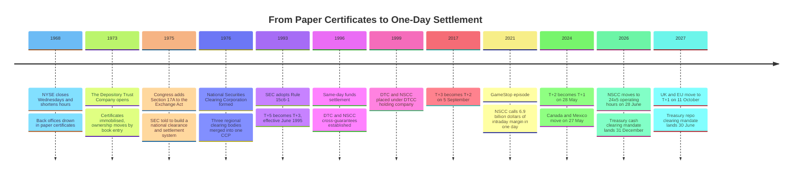
```mermaid
%%{init: {'theme': 'base', 'themeVariables': {'primaryColor': '#e3f2fd', 'primaryBorderColor': '#1565c0', 'lineColor': '#37474f'}}}%%

timeline
    title From Paper Certificates to One-Day Settlement
    1968 : NYSE closes Wednesdays and shortens hours
         : Back offices drown in paper certificates
    1973 : The Depository Trust Company opens
         : Certificates immobilised, ownership moves by book entry
    1975 : Congress adds Section 17A to the Exchange Act
         : SEC told to build a national clearance and settlement system
    1976 : National Securities Clearing Corporation formed
         : Three regional clearing bodies merged into one CCP
    1993 : SEC adopts Rule 15c6-1
         : T+5 becomes T+3, effective June 1995
    1996 : Same-day funds settlement
         : DTC and NSCC cross-guarantees established
    1999 : DTC and NSCC placed under DTCC holding company
    2017 : T+3 becomes T+2 on 5 September
    2021 : GameStop episode
         : NSCC calls 6.9 billion dollars of intraday margin in one day
    2024 : T+2 becomes T+1 on 28 May
         : Canada and Mexico move on 27 May
    2026 : NSCC moves to 24x5 operating hours on 28 June
         : Treasury cash clearing mandate lands 31 December
    2027 : UK and EU move to T+1 on 11 October
         : Treasury repo clearing mandate lands 30 June
```

### 1.1 The Paperwork Crisis Built the System

The modern American clearing and settlement system was built in response to an operational collapse, not a financial one. Trading volume on the New York Stock Exchange roughly tripled through the late 1960s while settlement still meant a messenger physically carrying engraved certificates and signed stock powers between broker back offices. Certificates were lost, misdelivered, and forged. Fails to deliver accumulated into the billions. In the second half of 1968 the exchange shortened its trading hours and closed on Wednesdays so that back offices could catch up.

Firms failed on operations alone. Congress responded twice: with the Securities Investor Protection Act of 1970, which created a fund to make customers of failed brokers whole, and with the Securities Acts Amendments of 1975, which added Section 17A to the Securities Exchange Act of 1934. Section 17A instructs the Commission to facilitate a national system for the prompt and accurate clearance and settlement of securities transactions, and it is still the statutory hook for every rule in this document. Section 17A(b)(3)(F) requires a registered clearing agency's rules to be designed to promote prompt and accurate clearance and settlement and to assure the safeguarding of securities and funds in its custody or control.

The infrastructure arrived first. The Depository Trust Company opened in 1973 as a successor to the NYSE's Central Certificate Service, taking certificates off the street and into a vault so that ownership could change by book entry. The National Securities Clearing Corporation was formed in 1976 out of the clearing operations of the NYSE, the American Stock Exchange, and the National Association of Securities Dealers. One depository, one central counterparty.

That division of labour is still the architecture. It is also the single fact most often misunderstood about the American market.

### 1.2 The Cycle Shortens Three Times in Thirty Years

The settlement cycle is a regulatory variable, not a technical constant, and the Commission has shortened it three times by rule.

| Date | Cycle | Instrument |
|------|-------|------------|
| Before June 1995 | T+5 | Market practice |
| 7 June 1995 | T+3 | Rule 15c6-1, adopted October 1993 |
| 5 September 2017 | T+2 | Amendment to Rule 15c6-1 |
| 28 May 2024 | T+1 | Release No. 34-96930, 88 FR 13872, adopted 15 February 2023 |

Each step removed a day of counterparty exposure and removed a day of slack from every process that fed settlement. The 2024 step was the first that removed the whole of the post-trade day, which is why it forced changes that T+3 and T+2 did not.

**Two other jurisdictions follow on a fourth date, set by their own regulators rather than by the Commission.** Canada and Mexico moved on 27 May 2024, one day earlier than the United States, because 27 May was a US holiday. The United Kingdom will mandate T+1 from 11 October 2027 through the Central Securities Depositories (Amendment) (Intended Settlement Date) Regulations, published in draft in November 2025. The European Union will move on the same date, a target ESMA recommended in its November 2024 report and confirmed through 2026.

### 1.3 Scale, as Last Disclosed

The numbers explain why nobody redesigns this system casually, and each one carries the date on which it was published rather than today's date. Post-trade utilities disclose on a lag, and several of the load-bearing figures below are two to four years old. Where a figure has not been refreshed in a source cited here, the vintage says so.

| Measure | Figure | As of, and source |
|---------|--------|-------------------|
| DTC non-money-market transaction value | 97.2 trillion USD | 12 months to 31 December 2023, DTC disclosures |
| DTC money market instrument value | 97.0 trillion USD | 12 months to 31 December 2023, DTC disclosures |
| DTC average daily non-MMI volume | 1.5 million transactions, 389.1 billion USD | 12 months to 31 December 2023, DTC disclosures |
| DTC peak daily non-MMI volume | 2.4 million transactions, 949.7 billion USD | 19 December 2023, DTC disclosures |
| NSCC average daily value cleared | 2.191 trillion USD | Q2 2022, DTCC CPMI-IOSCO quantitative disclosure, quoted at 88 FR 13921 |
| NSCC netting effect on payments | 98% reduction, average | DTCC white paper, February 2021, quoted at 88 FR 13921 |
| DTCC aggregate clearing fund requirement | 96.3 billion USD, up 30.7 billion year on year | 30 June 2025, FSOC 2025 Annual Report, p. 53 |
| DTC Participants Fund, required | 1.15 billion USD: 450 million Core, 700 million Liquidity | DTC Settlement Service Guide, as of 10 June 2026 |
| DTC Participants Fund, cash deposited | 1.98 billion USD | 30 June 2022, DTC Disclosure Framework, March 2023 |
| DTC committed line of credit | 1.9 billion USD | DTC Disclosure Framework, March 2023 |
| T2S daily settlement | around 800,000 transactions, 24 CSDs from 23 countries | ECB T2S page, retrieved August 2026 |
| Deutsche Boerse group CSD assets under custody | 17.3 trillion EUR average, up 8% year on year | Q2 2026, Deutsche Boerse Half-yearly financial report 2026, p. 12 |

Two of those numbers together contain the entire argument of this document. NSCC cleared an average of 2.191 trillion dollars a day in the second quarter of 2022, and netting cuts the payments that must actually be exchanged by about 98 percent, leaving an average net settlement obligation near 44 billion dollars. The system moves 2 percent of what it promises.

The ratio is the durable fact; the level is four years old. DTCC has not republished a more recent average daily cleared value in any source cited here, so the arithmetic below runs on the Q2 2022 figure and says so each time it does.

That is the product.

---

## 2. The Gap Between Trade and Settlement

Clearing is everything that happens to a trade between execution and settlement, and settlement is the final, irrevocable exchange of securities for cash. The two words are used interchangeably in casual speech and refer to different companies, different risks, and different rulebooks in practice.

```mermaid
%%{init: {'theme': 'base', 'themeVariables': {'primaryColor': '#e3f2fd', 'primaryBorderColor': '#1565c0', 'lineColor': '#37474f'}}}%%

flowchart LR
    subgraph T0["Trade Date - the promise"]
        Exec["Execution<br/>price and quantity agreed<br/>in microseconds"]
        Lock["Locked-in trade data<br/>sent by exchange or QSR<br/>to NSCC's UTC system"]
    end

    subgraph Gap["The gap - one business day"]
        Risk["The counterparty may disappear<br/>before delivery.<br/>Four mechanisms decide who bears that risk."]
        Fill1["Novation<br/>CCP becomes buyer to every seller"]
        Fill2["Margin<br/>collateral sized to a 99% loss"]
        Fill3["Netting<br/>obligations collapse by 98% of value"]
        Fill4["Default waterfall<br/>who pays if margin is not enough"]
    end

    subgraph T1["Settlement Date - the delivery"]
        Sec["Securities move<br/>book entry at DTC"]
        Cash["Cash moves<br/>net, via Fedwire NSS"]
        Final["Final and irrevocable"]
    end

    Exec --> Lock --> Risk
    Risk --> Fill1 --> Fill2 --> Fill3 --> Fill4
    Fill4 --> Sec
    Fill4 --> Cash
    Sec --> Final
    Cash --> Final

    style T0 fill:#e3f2fd,stroke:#1565c0,stroke-width:2px
    style Gap fill:#fff3e0,stroke:#e65100,stroke-width:3px
    style T1 fill:#e8f5e9,stroke:#2e7d32,stroke-width:2px
```

### 2.1 What Clearing Is

Clearing is the process of turning a bilateral promise into a settleable obligation, and it does five distinct jobs.

**Comparison and validation.** Both sides must agree on what was traded. On US exchanges this is done for them: exchanges and qualified special representatives submit trades already matched, called locked-in trades, to NSCC's Universal Trade Capture system, which validates and reports them. For institutional trades executed off a locked-in venue, matching is a separate industry: allocation from the investment adviser, confirmation from the broker, affirmation by the custodian or adviser.

**Novation.** The central counterparty steps between the two members and becomes buyer to every seller and seller to every buyer. This is the legal event that everything else depends on.

**Netting.** Once the CCP is everyone's counterparty, obligations in the same security become fungible and can be collapsed into one net position per member per issue.

**Risk management.** The CCP now owns the risk it removed from members, so it margins the exposure daily and intraday, stress tests it, and maintains a waterfall of resources for the case where margin is not enough.

**Delivery instruction.** Clearing ends by telling the depository what to move.

### 2.2 What Settlement Is

Settlement is the moment the securities and the cash actually change hands, and it happens at two different places for the two legs.

At DTC, securities move by book entry between participant accounts. At the Federal Reserve, money moves between settling banks through the National Settlement Service. The link between them is not simultaneity but rule: under NSCC Rule 12, a delivery of CNS securities is not final until the obligation to pay for those securities is satisfied.

Finality has a legal definition, not an operational one. In the United States that definition rests on the depository's rules, the Uniform Commercial Code, and, for systemically important utilities, Title VIII of the Dodd-Frank Act. In the European Union it rests on Directive 98/26/EC, the Settlement Finality Directive, which protects transfer orders entered into a designated system from being unwound by insolvency proceedings.

### 2.3 Misconception One: The CCP Removes Counterparty Risk

The most common claim about central clearing is that it eliminates counterparty risk. It does not. It replaces many small, opaque, bilateral exposures with one large, transparent, mutualised exposure to a single institution that cannot be allowed to fail.

Consider what actually changes. Before novation, a member that buys 120,000 shares is exposed to the particular firm that sold them. After novation, that member is exposed to NSCC, and NSCC is exposed to every member at once. The aggregate quantity of risk in the system falls, because netting cancels offsetting positions and because the CCP margins what remains. The distribution of risk changes far more than the quantity: it concentrates.

This is why a CCP is regulated as a utility rather than as a firm, why the Financial Stability Oversight Council designated eight financial market utilities as systemically important in July 2012, and why Rule 17ad-22 runs to thousands of words about stress testing. The eight are NSCC, DTC, FICC, the Chicago Mercantile Exchange, ICE Clear Credit, the Options Clearing Corporation, CLS Bank International, and The Clearing House Payments Company, which operates CHIPS. DTC is on that list, which matters: the depository carries the heightened standards too, for holding the assets rather than for guaranteeing the trades.

Concentration is the price of netting. It is a good trade, and it is a trade.

### 2.4 Misconception Two: The Clearing House Holds the Securities

NSCC does not hold securities. DTC does. They are separate legal entities with separate rulebooks, separate risk models, separate funds, and separate regulators' filings, and conflating them makes the whole architecture unreadable.

NSCC is a central counterparty. It has no vault. What it has is a position in every member's obligations and an account at DTC, numbered 888, through which CNS deliveries pass. DTC is a central securities depository and a limited purpose trust company. It holds the assets, it services them, and it does not guarantee anybody's trade.

The distinction has a practical consequence that appears later in this document. CNS deliveries at DTC move free of payment. The securities leg and the money leg of a cleared equity trade are settled by two different companies through two different mechanisms and are joined only by a rule.

### 2.5 The Simplest Accurate Mental Model

Think of three ledgers and one clock.

The first ledger is the CCP's, which records who owes what to the CCP after netting, and is rewritten every night. The second is the depository's, which records who holds what, and is the only place ownership actually lives. The third is the central bank's, which records the cash, and is the only place a payment becomes final.

The clock is the settlement cycle. Shortening it reduces the risk carried on the first ledger and increases the pressure on everything that must be finished before the second ledger opens.

---

## 3. Key Participants and Roles

A dozen kinds of firm touch a settling trade, and only four of them take principal risk. The rest match, hold, instruct, or supervise, and their failures show up as fails rather than as losses.

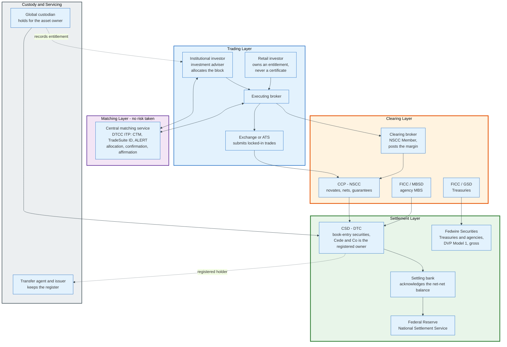
```mermaid
%%{init: {'theme': 'base', 'themeVariables': {'primaryColor': '#e3f2fd', 'primaryBorderColor': '#1565c0', 'lineColor': '#37474f'}}}%%

flowchart TB
    subgraph Trading["Trading Layer"]
        Inv["Institutional investor<br/>investment adviser<br/>allocates the block"]
        Retail["Retail investor<br/>owns an entitlement,<br/>never a certificate"]
        Exch["Exchange or ATS<br/>submits locked-in trades"]
        EB["Executing broker"]
    end

    subgraph Match["Matching Layer - no risk taken"]
        CMSP["Central matching service<br/>DTCC ITP: CTM, TradeSuite ID, ALERT<br/>allocation, confirmation, affirmation"]
    end

    subgraph Clearing["Clearing Layer"]
        CB["Clearing broker<br/>NSCC Member,<br/>posts the margin"]
        CCP["CCP - NSCC<br/>novates, nets, guarantees"]
        FICCG["FICC / GSD<br/>Treasuries"]
        FICCM["FICC / MBSD<br/>agency MBS"]
    end

    subgraph Settle["Settlement Layer"]
        CSD["CSD - DTC<br/>book-entry securities,<br/>Cede and Co is the registered owner"]
        Fed2["Fedwire Securities<br/>Treasuries and agencies,<br/>DVP Model 1, gross"]
        SB["Settling bank<br/>acknowledges the net-net balance"]
        Fed["Federal Reserve<br/>National Settlement Service"]
    end

    subgraph Custody["Custody and Servicing"]
        Cust["Global custodian<br/>holds for the asset owner"]
        TA["Transfer agent and issuer<br/>keeps the register"]
    end

    Inv --> EB
    Retail --> EB
    EB --> Exch
    Inv <--> CMSP
    EB <--> CMSP
    Exch --> CCP
    EB --> CB
    CB --> CCP
    CCP --> CSD
    FICCG --> Fed2
    FICCM --> CSD
    Cust --> CSD
    CSD --> SB
    SB --> Fed
    CSD -.registered holder.-> TA
    Cust -.records entitlement.-> Inv

    style Trading fill:#e3f2fd,stroke:#1565c0,stroke-width:2px
    style Match fill:#f3e5f5,stroke:#4a148c,stroke-width:2px
    style Clearing fill:#fff3e0,stroke:#e65100,stroke-width:3px
    style Settle fill:#e8f5e9,stroke:#2e7d32,stroke-width:3px
    style Custody fill:#eceff1,stroke:#37474f,stroke-width:2px
```

### 3.1 The Actors

| Role | What it does | Takes principal risk? | Examples |
|------|--------------|----------------------|----------|
| **Executing broker** | Executes the order, owes the client best execution | Yes, briefly | Any registered broker-dealer |
| **Clearing broker** | Member of the CCP, posts margin, settles | Yes | Broker-dealers and banks admitted as NSCC members |
| **Central counterparty** | Novates, nets, guarantees, margins | Yes, by design | NSCC, FICC, OCC, LCH, Eurex Clearing |
| **Central securities depository** | Holds securities, moves them by book entry, services them | No, but extends intraday credit | DTC, Euroclear Bank, Clearstream, CDS |
| **Central matching service** | Matches allocations and confirmations, sends settlement instructions | No | DTCC ITP: CTM, TradeSuite ID, ALERT |
| **Custodian** | Holds assets for the investor, affirms trades, processes corporate actions | No | BNY, State Street, JPMorgan, Citi |
| **Settling bank** | Pays or receives the participant's net-net balance at the Fed | Yes, for its participants | Large custody and clearing banks |
| **Transfer agent** | Maintains the issuer's register, pays the registered holder | No | Computershare, Equiniti, EQ |
| **Investment adviser** | Allocates blocks to client accounts, must keep allocation records | No | Any registered adviser |
| **Regulator and overseer** | Writes and enforces the standards | No | SEC, Federal Reserve, ESMA, Bank of England |

### 3.2 The Two Roles That Decide Whether Settlement Works

**The affirming party is the bottleneck in institutional flow.** A block trade for an institution is not settleable until the adviser has allocated it across client accounts, the broker has confirmed the economics, and someone has affirmed the confirmation. Up to 70 percent of institutional trades are affirmed by custodians rather than by advisers, on the estimates the Commission cited in the T+1 adopting release at 88 FR 13923. That is a ceiling, not a central estimate. Under T+2, an unaffirmed trade at the end of trade date was an annoyance. Under T+1, it is a trade that cannot go into the night cycle.

**The settling bank is the chokepoint in money.** A DTC participant does not pay DTC. Its settling bank does, and a settling bank may act for many participants at both DTC and NSCC. Balances at the two clearing agencies are aggregated for common settling banks into a single consolidated debit or credit, then paid through the Federal Reserve's National Settlement Service. A settling bank may refuse to settle for a participant, and it may set that participant's net debit cap lower than DTC's own calculation, though never higher.

One bank declining to acknowledge one participant's balance at 4:15 p.m. is the fastest route from an operational problem to a default.

### 3.3 The Layer That Takes No Risk and Still Matters

DTCC ITP is not a clearing agency in the risk sense, and its structure shows what the matching layer actually is. In an application for exemption from clearing agency registration, noticed at 91 FR 55933 on 31 August 2026, DTCC ITP described three core services: CTM, a central matching platform for allocations and block-level trade data; TradeSuite ID, a confirmation and affirmation service that sends settlement instructions to DTC or NSCC once the parties match on the financial terms; and ALERT, a global database of standing settlement instructions and account data.

ITP states that it does not bear credit or liquidity risk, does not hold funds or securities, and does not perform final settlement. It is pure plumbing. It is also the layer where a T+1 failure usually starts, because a trade with a stale standing settlement instruction in ALERT becomes a settlement instruction to the wrong account, and there is no longer a spare day to notice.

Match to Instruct, an optional CTM workflow, creates the TradeSuite ID confirmation on the broker's behalf and auto-affirms when the institution's data matches. That single automation is most of what made same-day affirmation feasible at scale.

---

## 4. Novation and the Central Counterparty

Novation is the legal substitution of one contract for two, and it is the event that makes central clearing possible. Before novation, member A has a contract with member B. After novation, A has a contract with the CCP and B has a contract with the CCP, and the original contract is extinguished.

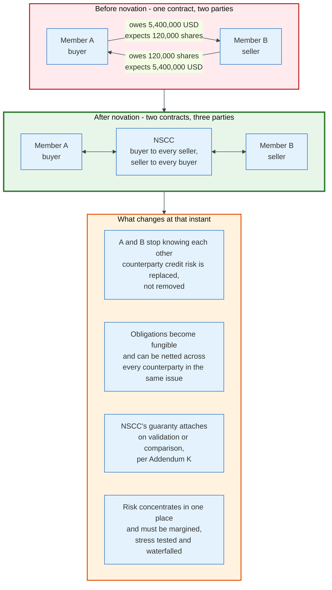
```mermaid
%%{init: {'theme': 'base', 'themeVariables': {'primaryColor': '#e3f2fd', 'primaryBorderColor': '#1565c0', 'lineColor': '#37474f'}}}%%

flowchart TB
    subgraph Before["Before novation - one contract, two parties"]
        A1["Member A<br/>buyer"] -- "owes 5,400,000 USD<br/>expects 120,000 shares" --> B1["Member B<br/>seller"]
        B1 -- "owes 120,000 shares<br/>expects 5,400,000 USD" --> A1
    end

    subgraph After["After novation - two contracts, three parties"]
        A2["Member A<br/>buyer"] <--> CCP2["NSCC<br/>buyer to every seller,<br/>seller to every buyer"]
        CCP2 <--> B2["Member B<br/>seller"]
    end

    Before --> After

    subgraph Effects["What changes at that instant"]
        E1["A and B stop knowing each other<br/>counterparty credit risk is replaced,<br/>not removed"]
        E2["Obligations become fungible<br/>and can be netted across<br/>every counterparty in the same issue"]
        E3["NSCC's guaranty attaches<br/>on validation or comparison,<br/>per Addendum K"]
        E4["Risk concentrates in one place<br/>and must be margined,<br/>stress tested and waterfalled"]
    end

    After --> Effects

    style Before fill:#ffebee,stroke:#b71c1c,stroke-width:2px
    style After fill:#e8f5e9,stroke:#2e7d32,stroke-width:3px
    style Effects fill:#fff3e0,stroke:#e65100,stroke-width:2px
```

### 4.1 Buyer to Every Seller

The Commission's own definition, in Rule 17ad-22(a), is precise: a central counterparty is a clearing agency that interposes itself between the counterparties to securities transactions, acting functionally as the buyer to every seller and the seller to every buyer.

Three consequences follow immediately.

**Anonymity becomes possible.** Members stop needing to assess each other's credit, which is what allows an anonymous order book to exist. A market where you must know your counterparty's balance sheet before you cross a spread is a dealer market, not an exchange.

**Netting becomes possible.** Obligations to a single counterparty in the same security are fungible. Obligations to forty different counterparties are not. Multilateral netting is a consequence of novation, not an alternative to it.

**Risk becomes measurable.** The CCP knows every position it faces. It can compute one number per member per day and demand collateral against it.

### 4.2 When the Guaranty Attaches

The timing of the CCP's guarantee is the detail that distinguishes people who have read the rulebook from people who have not.

NSCC's guaranty is set out in Addendum K of its rules. For CNS transactions the guaranty attaches at the point the trade has been validated by NSCC, for locked-in submissions, or validated and compared, for bilateral submissions. It runs through the close of business on the contractual settlement date. In practice, for exchange-executed equity trades submitted locked-in, this means the guarantee attaches within seconds of the trade reaching NSCC's Universal Trade Capture system.

This was not always so. NSCC accelerated its trade guaranty in a 2016 rule filing approved by the Commission in December 2016, moving the attachment point from midnight of the day after trade date to the point of validation or comparison. The change removed roughly a day of unguaranteed exposure between members.

It also created an exposure the CCP has to manage. As NSCC told the Commission in 2026, the guaranty attaches immediately upon trade validation, which may occur before NSCC has collected the member's Required Fund Deposit at the start of the following day. The CCP is on risk before it is paid.

### 4.3 What Is Not Novated

Not everything NSCC touches is guaranteed, and the exceptions are informative.

Balance order transactions are compared by NSCC but settle between members, at DTC or elsewhere, or through the Envelope Settlement Service for physical deliveries. NSCC does not act as CCP for them. Netted member-to-member foreign security receive and deliver instructions are explicitly not guaranteed by NSCC, and if a member fails to pay the associated cash adjustment, the instructions issued that day for that member are void.

For securities financing transactions, novation is staged. The off-leg of an eligible one-day SFT is novated to NSCC when its on-leg settles at DTC or when the on-leg settlement obligation is discharged. A bilaterally initiated SFT is novated when NSCC issues the report confirming it.

The rule is general: a CCP guarantees what it can margin and control, and declines what it cannot.

---

## 5. DTCC: Three Companies, Three Jobs

The Depository Trust and Clearing Corporation is a holding company, formed in 1999, that owns the American market's central counterparty, its central securities depository, and its matching utility. It is owned by the firms that use it. It is not a single system, and treating it as one is the fastest way to misread how American settlement works.

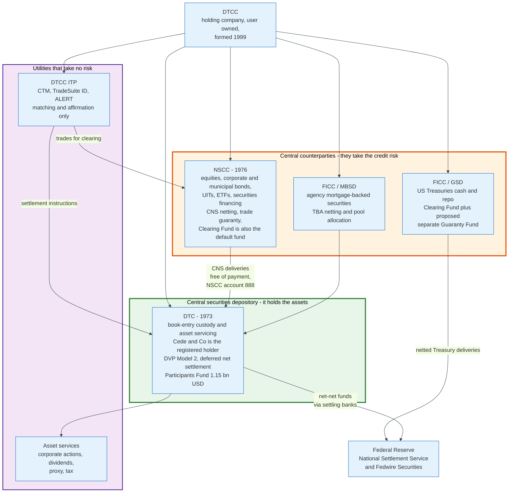
```mermaid
%%{init: {'theme': 'base', 'themeVariables': {'primaryColor': '#e3f2fd', 'primaryBorderColor': '#1565c0', 'lineColor': '#37474f'}}}%%

flowchart TB
    DTCC["DTCC<br/>holding company, user owned,<br/>formed 1999"]

    subgraph CCPs["Central counterparties - they take the credit risk"]
        NSCC["NSCC - 1976<br/>equities, corporate and municipal bonds,<br/>UITs, ETFs, securities financing<br/>CNS netting, trade guaranty,<br/>Clearing Fund is also the default fund"]
        FICCG["FICC / GSD<br/>US Treasuries cash and repo<br/>Clearing Fund plus proposed<br/>separate Guaranty Fund"]
        FICCM["FICC / MBSD<br/>agency mortgage-backed securities<br/>TBA netting and pool allocation"]
    end

    subgraph CSDs["Central securities depository - it holds the assets"]
        DTC["DTC - 1973<br/>book-entry custody and asset servicing<br/>Cede and Co is the registered holder<br/>DVP Model 2, deferred net settlement<br/>Participants Fund 1.15 bn USD"]
    end

    subgraph NonRisk["Utilities that take no risk"]
        ITP["DTCC ITP<br/>CTM, TradeSuite ID, ALERT<br/>matching and affirmation only"]
        Serv["Asset services<br/>corporate actions, dividends,<br/>proxy, tax"]
    end

    Ext["Federal Reserve<br/>National Settlement Service<br/>and Fedwire Securities"]

    DTCC --> NSCC
    DTCC --> FICCG
    DTCC --> FICCM
    DTCC --> DTC
    DTCC --> ITP
    DTC --> Serv

    NSCC -- "CNS deliveries<br/>free of payment,<br/>NSCC account 888" --> DTC
    FICCG -- "netted Treasury deliveries" --> Ext
    FICCM --> DTC
    DTC -- "net-net funds<br/>via settling banks" --> Ext
    ITP -- "settlement instructions" --> DTC
    ITP -- "trades for clearing" --> NSCC

    style CCPs fill:#fff3e0,stroke:#e65100,stroke-width:3px
    style CSDs fill:#e8f5e9,stroke:#2e7d32,stroke-width:3px
    style NonRisk fill:#f3e5f5,stroke:#4a148c,stroke-width:2px
```

### 5.1 NSCC: The Central Counterparty

NSCC clears substantially all broker-to-broker trades in US equities, corporate bonds, municipal bonds, unit investment trusts, and exchange-traded funds. It novates transactions, becoming buyer to every seller and seller to every buyer, and guarantees settlement of the novated transactions.

Its core services are:

- **Universal Trade Capture (UTC)**, which validates and records trade data from exchanges and qualified special representatives. Until June 2026 it ran from 1:30 a.m. to 11:30 p.m. Eastern Time each business day. Since 28 June 2026 it runs on a 24x5 model, open from Sunday 8:00 p.m. to Friday 8:00 p.m.
- **Continuous Net Settlement (CNS)**, the netting and settlement engine described in Section 6.
- **The Obligation Warehouse**, which holds non-CNS obligations and unmatched or failed items for later matching and settlement.
- **Correspondent Clearing**, which lets a member execute for another member and net itself out of the resulting position.
- **The SFT Clearing Service**, which novates securities financing transactions, and **ACATS**, which moves whole customer accounts between brokers.

NSCC's risk resources sit in one place: the Clearing Fund. As NSCC's own disclosure framework puts it, the Clearing Fund in the aggregate serves as NSCC's default fund. There is no second, separately labelled guarantee fund at NSCC. That single design choice distinguishes it from most derivatives CCPs and is examined in Section 10.

### 5.2 DTC: The Central Securities Depository

DTC holds the securities and moves them. It is a limited purpose trust company, a member of the Federal Reserve System, and the registered owner, through its nominee Cede and Co, of the great majority of publicly traded US shares.

DTC's functions divide into three.

**Custody.** Securities are deposited by participants and held in fungible bulk, which means no individual certificate or share is identifiable to any particular participant. Each participant owns a pro rata interest in the total position in each issue.

**Settlement.** DTC processes deliver orders, payment orders, pledges, and CNS movements through a night cycle that begins the evening before settlement date and a day cycle that runs on settlement date itself. DTC describes its own design precisely: a DVP Model 2, deferred net settlement system.

**Asset servicing.** Dividends, interest, redemptions, reorganisations, tender offers, and proxy distribution all pass through DTC, because DTC's nominee is the registered holder that the issuer actually pays.

### 5.3 FICC: The Fixed Income Half

FICC clears US government securities and agency mortgage-backed securities through two divisions. The Government Securities Division clears and nets cash Treasury purchases and sales and Treasury repo. The Mortgage-Backed Securities Division clears to-be-announced trades and manages pool allocation.

FICC matters more each year for a regulatory reason. In December 2023 the Commission adopted rules requiring covered clearing agencies in the Treasury market to have policies requiring members to submit for clearing all repo and reverse repo collateralised by Treasuries, all purchases and sales by interdealer brokers, and all purchases and sales between a member and a registered broker-dealer or government securities dealer. Compliance dates were extended in February 2025 to 31 December 2026 for cash Treasuries and 30 June 2027 for Treasury repo.

The scale of what that will pull into clearing is visible in the numbers the Commission cited when it adopted the rules: 70 to 80 percent of the Treasury funding market and at least 80 percent of the cash market were uncleared.

### 5.4 What Sits Between Them

The DTC and NSCC systems are joined by cross-guarantees that date from the move to same-day funds settlement in 1996, and what is guaranteed is collateral value rather than the movements themselves. NSCC guarantees to DTC the value of securities delivered out of a participant's account as CNS short covers, at the prior day's closing price, less a haircut where the securities were not received versus payment, so the deliverer's collateral monitor is credited rather than depleted. DTC guarantees to NSCC replacement collateral for long allocations that may be redelivered intraday, and processes such a redelivery only if the participant has substitute collateral available. The purpose is collateral continuity: a debit created in DTC's system stays collateralised even when the securities backing it leave for the CNS system.

A separate cross-guaranty agreement runs between NSCC, DTC, FICC, and the Options Clearing Corporation, under which each agrees to pay the others for the unsatisfied obligations of a common defaulting participant to the extent it holds excess resources of that participant. No party ever pays out of pocket, and no party can recover more than its loss.

That agreement is the reason a broker's default at one utility does not have to become a scramble at the other three.

---

## 6. Continuous Net Settlement and the Netting Ratio

Continuous Net Settlement is the mechanism that turns hundreds of millions of daily trade obligations into a small number of deliveries, and it is the single largest efficiency in the American market. It works by netting today's settling trades against yesterday's open positions, continuously, with the CCP as the contra side to everything.

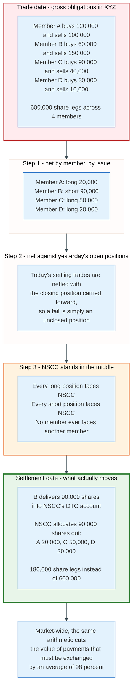
```mermaid
%%{init: {'theme': 'base', 'themeVariables': {'primaryColor': '#e3f2fd', 'primaryBorderColor': '#1565c0', 'lineColor': '#37474f'}}}%%

flowchart TB
    subgraph Gross["Trade date - gross obligations in XYZ"]
        G["Member A buys 120,000 and sells 100,000<br/>Member B buys 60,000 and sells 150,000<br/>Member C buys 90,000 and sells 40,000<br/>Member D buys 30,000 and sells 10,000<br/><br/>600,000 share legs across 4 members"]
    end

    subgraph Step1["Step 1 - net by member, by issue"]
        N["Member A: long 20,000<br/>Member B: short 90,000<br/>Member C: long 50,000<br/>Member D: long 20,000"]
    end

    subgraph Step2["Step 2 - net against yesterday's open positions"]
        O["Today's settling trades are netted with<br/>the closing position carried forward,<br/>so a fail is simply an unclosed position"]
    end

    subgraph Step3["Step 3 - NSCC stands in the middle"]
        M["Every long position faces NSCC<br/>Every short position faces NSCC<br/>No member ever faces another member"]
    end

    subgraph Move["Settlement date - what actually moves"]
        S["B delivers 90,000 shares<br/>into NSCC's DTC account<br/><br/>NSCC allocates 90,000 shares out:<br/>A 20,000, C 50,000, D 20,000<br/><br/>180,000 share legs instead of 600,000"]
    end

    Gross --> Step1 --> Step2 --> Step3 --> Move

    Note["Market-wide, the same arithmetic cuts<br/>the value of payments that must be exchanged<br/>by an average of 98 percent"]
    Move --> Note

    style Gross fill:#ffebee,stroke:#b71c1c,stroke-width:2px
    style Step3 fill:#fff3e0,stroke:#e65100,stroke-width:2px
    style Move fill:#e8f5e9,stroke:#2e7d32,stroke-width:3px
```

### 6.1 The Mechanism

NSCC's own procedure describes CNS as an ongoing accounting system that nets today's settling trades with yesterday's closing positions, producing a new short or long position per security issue for each member, with the corporation always the contra side.

Four properties follow from that sentence.

**Netting is by issue, not by trade.** All compared and recorded transactions in a CNS-eligible security for a given settlement date collapse into one net long, net short, or flat position per member.

**Fails are not exceptions.** A position that does not settle simply remains open and is netted with tomorrow's trades in the same issue. There is no separate failed-trade queue for CNS positions; the fail is the position.

**Positions are securities, not trades.** A long position is the quantity NSCC owes the member. A short position is the quantity the member owes NSCC. The member's counterparty is never another member.

**Money is decoupled.** Money settlement is not associated with individual security movements. It is the result of comparing the member's closing money balance to the closing net market value of its CNS account.

### 6.2 The Allocation Algorithm

When members deliver short positions into CNS, NSCC must decide which long positions get filled. The order is set by rule and is worth knowing, because it is the mechanism by which a buyer can jump the queue.

Long positions are allocated in descending priority:

1. Positions in a CNS reorganisation sub-account.
2. Positions against which buy-in intent notices are due to expire that day but were not filled the previous day.
3. Positions against which buy-in intent notices are due to expire the following day.
4. Positions in the component securities of index receipts.
5. Priority levels set by standing priority requests, as modified by priority overrides.

Within a priority group during the day cycle, the oldest position is allocated first, where age is the number of consecutive days the position has been long, irrespective of quantity. During the night cycle, allocation may be further optimised by the depository to maximise the number of transactions that settle.

Delivery into CNS is automatic and the member controls it by exemption. A Level 1 exemption tells NSCC not to settle a nominated quantity of a short position from the member's depository account. Members must file standing exemption instructions, and a Same Day Settling Exemption is mandatory for trades compared on settlement date that create or increase a short position. Members override an exemption by submitting a deliver order at DTC with the receiver designated as 888.

That number, 888, is NSCC's participant account at DTC. It is where every CNS delivery in the United States lands.

### 6.3 The Netting Ratio, With Arithmetic

Take four members trading a single security on one day.

| Member | Buys | Sells | Net position |
|--------|------|-------|--------------|
| A | 120,000 | 100,000 | Long 20,000 |
| B | 60,000 | 150,000 | Short 90,000 |
| C | 90,000 | 40,000 | Long 50,000 |
| D | 30,000 | 10,000 | Long 20,000 |
| **Total** | **300,000** | **300,000** | **Balanced** |

Gross obligations total 600,000 share legs. After netting, 90,000 shares move from B into NSCC's account and 90,000 shares move out to A, C, and D. Total movement: 180,000 share legs, a 70 percent reduction, in four instructions rather than up to twelve bilateral ones.

That is the effect in one security among four members. Across the whole market and all issues, DTCC reports that centralised multilateral netting reduces the value of payments that must be exchanged each day by an average of 98 percent. The Commission did the arithmetic explicitly in the T+1 adopting release at 88 FR 13921: NSCC cleared an average of approximately 2.191 trillion dollars each day in the second quarter of 2022, which at a 2 percent residual implies an average net settlement obligation of approximately 43.82 billion dollars. That is the most recent NSCC daily cleared value cited in this document, and it is a Q2 2022 figure.

Netting is not a rounding improvement. It is a fifty-fold compression of the payment system's load.

### 6.4 Why the Netting Ratio Is Also a Risk Number

The netting ratio is quoted as an efficiency statistic and functions as a risk statistic. NSCC's exposure is not the gross traded value; it is the value of what remains after netting, marked to market, over the interval to close-out. Everything the CCP does to size margin starts from that residual.

It also explains the shape of a bad day. Volume spikes raise gross value, but the netting ratio holds roughly steady, so residual exposure grows in proportion. What actually breaks margin models is not volume but dispersion: a day when everyone is on the same side of the same names, so positions stop offsetting and the residual grows faster than the gross.

January 2021 was that day.

---

## 7. Delivery versus Payment: Three Models and Which One Is Real

Delivery versus payment is the linking of a securities transfer to a funds transfer so that one occurs if and only if the other occurs. It exists to eliminate principal risk, which is the risk of delivering the asset and not being paid, or paying and not receiving the asset.

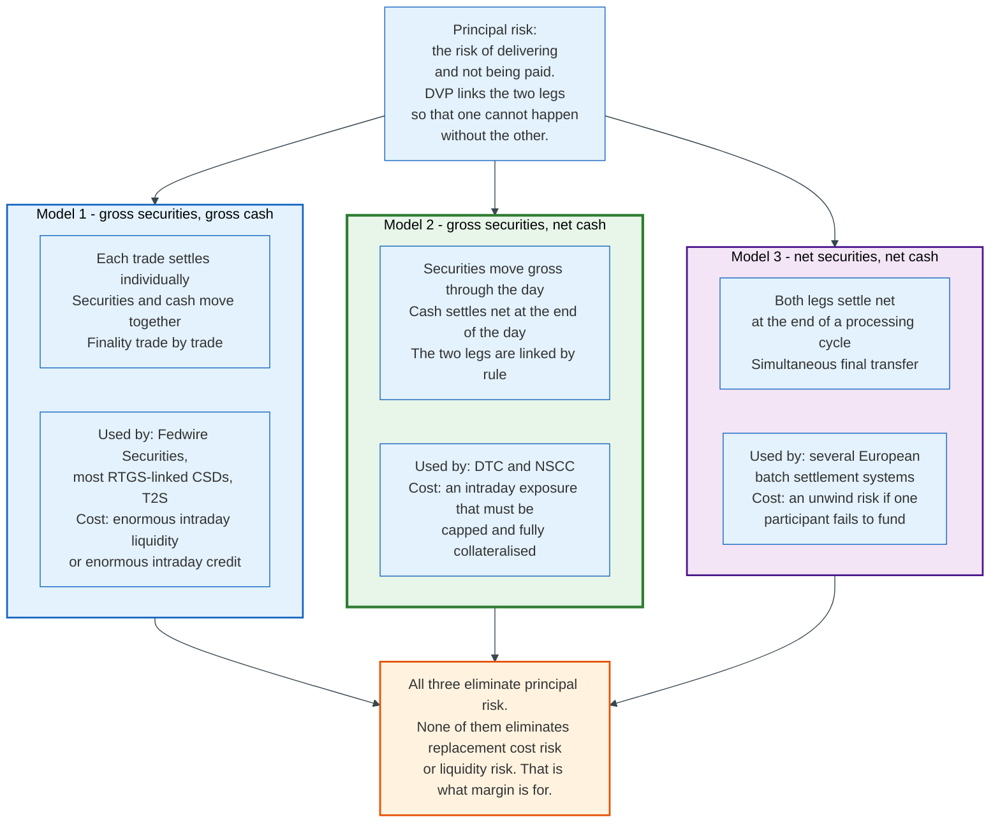
```mermaid
%%{init: {'theme': 'base', 'themeVariables': {'primaryColor': '#e3f2fd', 'primaryBorderColor': '#1565c0', 'lineColor': '#37474f'}}}%%

flowchart TB
    Q["Principal risk:<br/>the risk of delivering<br/>and not being paid.<br/>DVP links the two legs<br/>so that one cannot happen<br/>without the other."]

    subgraph M1["Model 1 - gross securities, gross cash"]
        A1["Each trade settles individually<br/>Securities and cash move together<br/>Finality trade by trade"]
        B1["Used by: Fedwire Securities,<br/>most RTGS-linked CSDs, T2S<br/>Cost: enormous intraday liquidity<br/>or enormous intraday credit"]
    end

    subgraph M2["Model 2 - gross securities, net cash"]
        A2["Securities move gross through the day<br/>Cash settles net at the end of the day<br/>The two legs are linked by rule"]
        B2["Used by: DTC and NSCC<br/>Cost: an intraday exposure that must be<br/>capped and fully collateralised"]
    end

    subgraph M3["Model 3 - net securities, net cash"]
        A3["Both legs settle net<br/>at the end of a processing cycle<br/>Simultaneous final transfer"]
        B3["Used by: several European<br/>batch settlement systems<br/>Cost: an unwind risk if one<br/>participant fails to fund"]
    end

    Q --> M1
    Q --> M2
    Q --> M3

    Warn["All three eliminate principal risk.<br/>None of them eliminates replacement cost risk<br/>or liquidity risk. That is what margin is for."]
    M1 --> Warn
    M2 --> Warn
    M3 --> Warn

    style M1 fill:#e3f2fd,stroke:#1565c0,stroke-width:2px
    style M2 fill:#e8f5e9,stroke:#2e7d32,stroke-width:3px
    style M3 fill:#f3e5f5,stroke:#4a148c,stroke-width:2px
    style Warn fill:#fff3e0,stroke:#e65100,stroke-width:2px
```

### 7.1 The 1992 Taxonomy That Everyone Still Uses

The Bank for International Settlements published *Delivery versus payment in securities settlement systems* in September 1992, and its three-model taxonomy remains the standard vocabulary.

**Model 1** settles transfer instructions for both securities and funds on a trade-by-trade gross basis, with final transfer of securities occurring at the same time as final transfer of funds. Fedwire Securities works this way for Treasuries. So does TARGET2-Securities, which settles delivery versus payment in central bank money.

**Model 2** settles securities transfer instructions gross, with final transfer of securities occurring throughout the processing cycle, but settles funds on a net basis with final transfer at the end of the cycle.

**Model 3** settles both securities and funds on a net basis, with final transfers of both occurring at the end of the processing cycle.

The report's own conclusion is the part usually skipped. The study group found that the degree of protection against replacement cost risk and liquidity risk depends more on the specific risk management safeguards a system uses than on which model it employs. Model 1 eliminates principal risk and demands either substantial money balances or substantial intraday credit. Model 3 eliminates principal risk and can create credit risk of the same magnitude through the back door if a participant cannot fund its net debit.

Choosing a model does not settle the risk question. It relocates it.

### 7.2 What DTC and NSCC Actually Are

Both DTC and NSCC classify themselves as DVP Model 2, and their own words are worth quoting because the classification is frequently reported wrongly.

DTC's disclosure framework states that its delivery and settlement system is a DVP Model 2, deferred net settlement system. During the day, debits and credits are entered into each participant's settlement account, netted intraday, and resolved into one end-of-day obligation.

NSCC's disclosure framework reaches the same classification by a different route: securities transfers settle gross intraday through DTC, funds transfers settle net at the end of the day through the Federal Reserve's National Settlement Service, and the two obligations are linked by the NSCC rules. Under NSCC Rule 12, a delivery of CNS securities is not final until the obligation to pay for those securities is satisfied.

The operational detail that confuses people is real and is not a contradiction: CNS deliveries made through DTC are made free of payment. The securities leg carries no cash. The cash is settled separately, net, at the end of the day, and the legal link that makes it delivery versus payment is a rule rather than a simultaneous debit.

### 7.3 The Cost of Each Model

| Model | Liquidity demand | Failure mode | Where it is used |
|-------|-----------------|--------------|------------------|
| **Model 1** | Highest: every trade must be funded as it settles | Gridlock and high fail rates without intraday credit | Fedwire Securities, T2S, most RTGS-linked CSDs |
| **Model 2** | Moderate: only the end-of-day net must be funded | An intraday exposure that must be capped and collateralised | DTC, NSCC |
| **Model 3** | Lowest | Unwind risk: one participant's failure to fund can force removal of its transactions from the batch | Several European batch systems historically |

Model 2 is the compromise the American market chose, and the whole apparatus of net debit caps and the collateral monitor described in Section 11 exists to make it safe. The system extends intraday credit to participants and then insists that the credit be fully collateralised at every instant.

That is the deal: liquidity now, collateral always.

---

## 8. The Depository: Immobilisation, Dematerialisation, and Street Name

A central securities depository exists to stop certificates moving, and everything about how modern investors hold securities follows from that. The two techniques for stopping the movement are different, and the difference is exact.

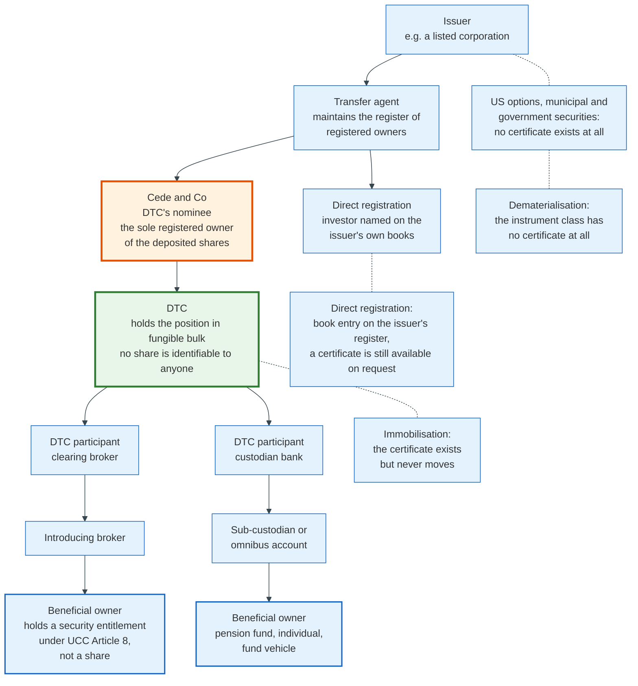
```mermaid
%%{init: {'theme': 'base', 'themeVariables': {'primaryColor': '#e3f2fd', 'primaryBorderColor': '#1565c0', 'lineColor': '#37474f'}}}%%

flowchart TB
    Issuer["Issuer<br/>e.g. a listed corporation"]
    TA["Transfer agent<br/>maintains the register of<br/>registered owners"]
    Cede["Cede and Co<br/>DTC's nominee<br/>the sole registered owner<br/>of the deposited shares"]
    DTC["DTC<br/>holds the position in fungible bulk<br/>no share is identifiable to anyone"]
    P1["DTC participant<br/>clearing broker"]
    P2["DTC participant<br/>custodian bank"]
    B1["Introducing broker"]
    Cust2["Sub-custodian or<br/>omnibus account"]
    E1["Beneficial owner<br/>holds a security entitlement<br/>under UCC Article 8,<br/>not a share"]
    E2["Beneficial owner<br/>pension fund, individual,<br/>fund vehicle"]
    DRS["Direct registration<br/>investor named on the<br/>issuer's own books"]
    Demat["US options, municipal and<br/>government securities:<br/>no certificate exists at all"]

    Issuer --> TA
    TA --> Cede
    TA --> DRS
    Cede --> DTC
    DTC --> P1
    DTC --> P2
    P1 --> B1
    P2 --> Cust2
    B1 --> E1
    Cust2 --> E2

    Note1["Immobilisation:<br/>the certificate exists<br/>but never moves"]
    Note2["Direct registration:<br/>book entry on the issuer's register,<br/>a certificate is still available on request"]
    Note3["Dematerialisation:<br/>the instrument class has<br/>no certificate at all"]
    DTC -.- Note1
    DRS -.- Note2
    Demat -.- Note3
    Issuer -.- Demat

    style Cede fill:#fff3e0,stroke:#e65100,stroke-width:3px
    style DTC fill:#e8f5e9,stroke:#2e7d32,stroke-width:3px
    style E1 fill:#e3f2fd,stroke:#1565c0,stroke-width:2px
    style E2 fill:#e3f2fd,stroke:#1565c0,stroke-width:2px
```

### 8.1 Immobilisation Is Not Dematerialisation

The Commission's own definitions are the cleanest available.

**Immobilisation** occurs where the underlying certificate is kept in a securities depository, or held in custody for the depository by the issuer's transfer agent, and transfers of ownership are recorded through electronic book-entry movements between the depository's participants' accounts. The certificate still exists. It simply never goes anywhere.

**Dematerialisation** occurs where there are no paper certificates available at all, and all transfers of ownership are made through book-entry movements.

Securities are **partially immobilised**, which is the case for most US equities traded on an exchange, when the street name positions are immobilised at the depository but certificates remain available to investors who register directly on the issuer's books.

Most US options, municipal, government, and many debt securities are dematerialised. Many equity and some debt securities remain immobilised or partially immobilised at DTC. Most equities not on deposit at DTC but publicly traded remain fully certificated.

Europe went further and earlier in places. Dematerialisation is mandatory for transferable securities admitted to trading on EU venues under the CSD Regulation's Article 3 book-entry requirement, which is why the certificate question is largely moot there and still live in the United States.

### 8.2 Cede and Co and the Chain of Entitlements

Cede and Co is DTC's nominee, and it appears in an issuer's stock records as the sole registered owner of the securities deposited at DTC. That is the pivot of the whole American holding system.

DTC holds the deposited securities in fungible bulk, meaning no specifically identifiable shares are owned by any DTC participant. Each participant owns a pro rata interest in the aggregate number of shares of a particular issuer held at DTC, and each customer of a participant owns a pro rata interest in the shares in which the participant has an interest.

What an ordinary investor owns is therefore not a share. It is a security entitlement against a securities intermediary under Article 8 of the Uniform Commercial Code, a package of rights created by the account agreement and by statute rather than by the issuer's register. The investor has a pro rata property interest in the financial assets the intermediary holds, and rights exercisable against that intermediary and nobody else.

There is one alternative. The Direct Registration System, approved by the Commission in 1996, lets an investor be registered on the issuer's books without a certificate, retaining the rights of a registered owner without the responsibility of safeguarding paper.

### 8.3 The Consequences of Street Name

Holding through intermediaries is efficient and it introduces four problems that will not go away.

**The issuer cannot see its shareholders.** The register says Cede and Co. Issuers reach beneficial owners through a search process that runs down the chain of intermediaries, and only for the subset who do not object to disclosure. Objecting beneficial owners are reachable only through their intermediary.

**Voting runs through a chain and can break.** Each intermediary in the chain forwards proxy materials and tallies instructions from its own customers. Over-voting, where an intermediary submits more votes than the shares it holds, is a structural artefact of a chain that lends and re-lends the same positions.

**Corporate actions must be allocated, not paid.** The issuer pays one registered holder. Everything after that is allocation down a chain, described in Section 15.

**Investor protection depends on the intermediary.** The entitlement is a claim on the broker or bank. It is why SIPC exists, why the customer protection rule under Exchange Act Rule 15c3-3 exists, and why the question of segregation is more than paperwork. DTC's Memo Segregation function lets a participant protect fully paid customer securities, including anticipated receipts, from automatic redelivery.

Street name is not a scandal. It is the price of book-entry settlement, and the alternative, direct registration for everyone, would move the settlement problem to the transfer agents rather than solve it.

---

## 9. Margin at the CCP

Margin is the collateral a central counterparty collects so that a defaulting member's own resources pay for its own default. It comes in two conceptual flavours and, at NSCC, roughly a dozen practical components.

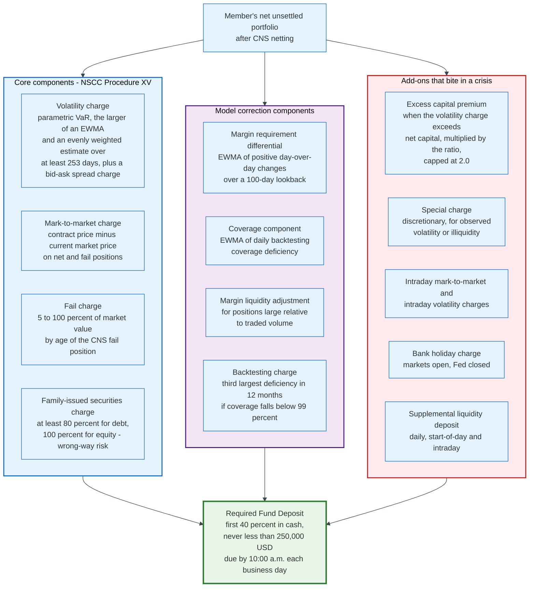
```mermaid
%%{init: {'theme': 'base', 'themeVariables': {'primaryColor': '#e3f2fd', 'primaryBorderColor': '#1565c0', 'lineColor': '#37474f'}}}%%

flowchart TB
    Port["Member's net unsettled portfolio<br/>after CNS netting"]

    subgraph Core["Core components - NSCC Procedure XV"]
        Vol["Volatility charge<br/>parametric VaR, the larger of an EWMA<br/>and an evenly weighted estimate over<br/>at least 253 days, plus a bid-ask spread charge"]
        MTM["Mark-to-market charge<br/>contract price minus current market price<br/>on net and fail positions"]
        Fail["Fail charge<br/>5 to 100 percent of market value<br/>by age of the CNS fail position"]
        Fam["Family-issued securities charge<br/>at least 80 percent for debt,<br/>100 percent for equity - wrong-way risk"]
    end

    subgraph Adj["Model correction components"]
        MRD["Margin requirement differential<br/>EWMA of positive day-over-day changes<br/>over a 100-day lookback"]
        Cov["Coverage component<br/>EWMA of daily backtesting<br/>coverage deficiency"]
        Liq["Margin liquidity adjustment<br/>for positions large relative<br/>to traded volume"]
        BT["Backtesting charge<br/>third largest deficiency in 12 months<br/>if coverage falls below 99 percent"]
    end

    subgraph Add["Add-ons that bite in a crisis"]
        ECP["Excess capital premium<br/>when the volatility charge exceeds<br/>net capital, multiplied by the ratio,<br/>capped at 2.0"]
        Special["Special charge<br/>discretionary, for observed<br/>volatility or illiquidity"]
        Intra["Intraday mark-to-market and<br/>intraday volatility charges"]
        Hol["Bank holiday charge<br/>markets open, Fed closed"]
        SLD["Supplemental liquidity deposit<br/>daily, start-of-day and intraday"]
    end

    RFD["Required Fund Deposit<br/>first 40 percent in cash,<br/>never less than 250,000 USD<br/>due by 10:00 a.m. each business day"]

    Port --> Core --> RFD
    Port --> Adj --> RFD
    Port --> Add --> RFD

    style Core fill:#e3f2fd,stroke:#1565c0,stroke-width:2px
    style Adj fill:#f3e5f5,stroke:#4a148c,stroke-width:2px
    style Add fill:#ffebee,stroke:#b71c1c,stroke-width:2px
    style RFD fill:#e8f5e9,stroke:#2e7d32,stroke-width:3px
```

### 9.1 Initial and Variation, Defined Properly

**Initial margin** covers potential future exposure: the loss the CCP might suffer between the last margin collection and the close-out of the defaulter's positions. It is forward-looking, model-driven, and not mutualised. Rule 17ad-22(a) defines potential future exposure as the maximum exposure estimated to occur at a future point with a single-tailed confidence level of at least 99 percent.

**Variation margin** covers current exposure: the loss already realised because prices moved. It is backward-looking, arithmetic rather than modelled, and settles the mark-to-market between the CCP and the member.

Rule 17ad-22(e)(6) requires a CCP to mark participant positions to market and collect margin at least daily, monitor intraday exposures on an ongoing basis, and have the authority and operational capacity to make intraday margin calls as frequently as circumstances warrant, including when risk thresholds are breached or when cleared products display elevated volatility. Where a CCP declines to make an intraday call, it must document the decision.

In European law the parameters are explicit. Commission Delegated Regulation (EU) No 153/2013 requires confidence intervals of at least 99.5 percent for OTC derivatives and 99 percent for other instruments, with liquidation periods of at least five business days for OTC derivatives and two business days for everything else. It also requires an anti-procyclicality measure: a margin buffer of at least 25 percent that can be temporarily exhausted, or at least 25 percent weight on stressed observations, or margins not lower than those from a ten-year volatility lookback.

### 9.2 The NSCC Clearing Fund, Component by Component

NSCC's Required Fund Deposit is calculated daily under Procedure XV. The main components:

- **Volatility charge.** A parametric value-at-risk calculation. The core parametric estimation is the higher of an exponentially weighted moving average volatility estimate with a decay factor of less than one, and an evenly weighted estimate using a lookback of not less than 253 days. A bid-ask spread risk charge is added, calibrated separately for large and medium capitalisation equities, small caps, micro caps, and exchange-traded products. A gap risk haircut applies when the two largest non-diversified positions exceed a concentration threshold of no more than 30 percent of the portfolio, at not less than 5 percent for the largest and not less than 2.5 percent for the second.
- **Illiquid and hard-to-model positions.** Illiquid securities are grouped by price level and charged the highest of 10 percent, a percentage benchmarked to the 99.5th percentile of the historical three-day return over at least five years, and a percentage benchmarked to the 99th percentile including half the estimated bid-ask spread. Unit investment trusts carry a floor of 2 percent. Corporate and municipal bonds are charged at not less than 2 percent, calibrated to at least a 99th percentile over a lookback of at least ten years.
- **Mark-to-market.** The net debit of the difference between contract price and current market price on net and fail positions.
- **Fail charge.** Between 5 percent and 100 percent of the current market value of a CNS fail position, escalating with the number of business days the fail has been outstanding.
- **Family-issued securities charge.** Not less than 80 percent for long positions in a member's own family's fixed income securities and 100 percent for equity. This is wrong-way risk priced at its true value: collateral that becomes worthless exactly when it is needed.
- **Margin requirement differential.** The exponentially weighted moving average of daily positive changes over a 100-day lookback in the member's mark-to-market and volatility components, times a backtested multiplier.
- **Coverage component.** The EWMA of the member's daily backtesting coverage deficiency over 100 days.
- **Backtesting charge.** Generally the member's third largest deficiency in the previous twelve months, applied when trailing twelve-month backtesting coverage falls below the 99 percent target.
- **Excess capital premium.** Charged when the volatility charge divided by net capital exceeds 1.0, calculated as the excess multiplied by that ratio, with the ratio capped at 2.0.
- **Bank holiday charge.** Collected the business day before a day when equity markets trade but the Federal Reserve is closed, because margin cannot be collected on such a day.

The first 40 percent of a member's Required Fund Deposit, excluding any Required SFT Deposit, must be in cash, and never less than 250,000 dollars. For a small member the 250,000 dollar minimum contribution binds and the percentage does not. The remainder may be evidenced by open account indebtedness secured by pledged Eligible Clearing Fund Securities, valued at current market value less a haircut, remarked at least daily. The cash share of the Clearing Fund in aggregate is disclosed quarterly by DTCC and is not stated here. Deficits are due each business day, typically by 10:00 a.m.

### 9.3 The Worked Case: January 2021

The clearest illustration of CCP margin under stress is documented in the Commission staff's October 2021 report on the GameStop episode, and the numbers are specific.

On 27 January 2021, NSCC made intraday margin calls on 36 clearing members totalling 6.9 billion dollars, bringing total required margin across all members to 25.5 billion dollars. Of the 6.9 billion, 2.1 billion was intraday mark-to-market and the remaining 4.8 billion was a special charge levied on 18 members in response to unusual volatility in specific securities. All 18 met it. A nineteenth member was assessed and offset its exposure with a transfer from an affiliate.

The following day, NSCC waived the excess capital premium for all members, exercising the discretion its rules give it, on the grounds that members' excess-risk-to-capital ratios were driven by extreme volatility in individual equities rather than by their own actions. The staff report states that absent the waiver, one retail broker-dealer would have faced an additional excess capital premium of more than double its 1.4 billion dollar margin requirement on 28 January 2021. The waiver was removed on 2 February 2021.

Several brokers restricted opening transactions in the affected stocks. The Commission's staff recorded that this was a broker-dealer decision, and that NSCC's rules do not give it the ability to instruct members to stop trading a symbol.

Two general lessons survive the specifics. Margin models are procyclical by construction, because volatility inputs rise with volatility. And the discretion a CCP holds to waive a charge is itself a risk decision with distributional consequences, made in hours, under pressure, by a private institution.

---

## 10. The Default Waterfall and the Guarantee Fund

The default waterfall is the ordered list of resources a central counterparty consumes when a member fails and its own collateral is not enough. Its purpose is to make the sequence known in advance, so that no participant discovers its exposure during a crisis.

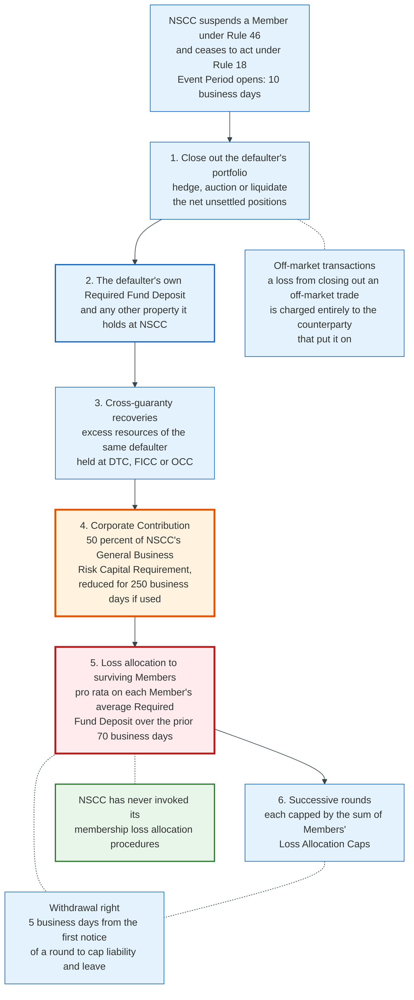
```mermaid
%%{init: {'theme': 'base', 'themeVariables': {'primaryColor': '#e3f2fd', 'primaryBorderColor': '#1565c0', 'lineColor': '#37474f'}}}%%

flowchart TB
    Event["NSCC suspends a Member under Rule 46<br/>and ceases to act under Rule 18<br/>Event Period opens: 10 business days"]

    S1["1. Close out the defaulter's portfolio<br/>hedge, auction or liquidate<br/>the net unsettled positions"]
    S2["2. The defaulter's own Required Fund Deposit<br/>and any other property it holds at NSCC"]
    S3["3. Cross-guaranty recoveries<br/>excess resources of the same defaulter<br/>held at DTC, FICC or OCC"]
    S4["4. Corporate Contribution<br/>50 percent of NSCC's General Business<br/>Risk Capital Requirement,<br/>reduced for 250 business days if used"]
    S5["5. Loss allocation to surviving Members<br/>pro rata on each Member's average Required<br/>Fund Deposit over the prior 70 business days"]
    S6["6. Successive rounds<br/>each capped by the sum of Members'<br/>Loss Allocation Caps"]
    Exit["Withdrawal right<br/>5 business days from the first notice<br/>of a round to cap liability and leave"]

    Event --> S1 --> S2 --> S3 --> S4 --> S5 --> S6
    S5 -.- Exit
    S6 -.- Exit

    Off["Off-market transactions<br/>a loss from closing out an off-market trade<br/>is charged entirely to the counterparty<br/>that put it on"]
    S1 -.- Off

    Fact["NSCC has never invoked its<br/>membership loss allocation procedures"]
    S5 -.- Fact

    style S2 fill:#e3f2fd,stroke:#1565c0,stroke-width:2px
    style S4 fill:#fff3e0,stroke:#e65100,stroke-width:3px
    style S5 fill:#ffebee,stroke:#b71c1c,stroke-width:3px
    style Fact fill:#e8f5e9,stroke:#2e7d32,stroke-width:2px
```

### 10.1 The NSCC Sequence

NSCC's waterfall lives in Rule 4 and the order is explicit.

**Step one: close out the portfolio.** NSCC suspends the member under Rule 46, which is titled Restrictions on Access to Services and authorises suspension alone, and then ceases to act for it under Rule 18, Procedures for When the Corporation Ceases to Act, liquidating, hedging, or auctioning the net unsettled positions. Rule 46 Section 3 makes the handover explicit: on a summary suspension the corporation shall cease to act for such participant in accordance with Rule 18. The proceeds of that close-out are the first source of recovery, and the size of the eventual loss is set here.

**Step two: the defaulter pays.** Each member is obligated to NSCC for the entire amount of any loss arising from its own default. Its Required Fund Deposit and other property held at NSCC are applied first.

**Step three: cross-guaranty recoveries.** Under the agreement among NSCC, DTC, FICC, and OCC, each clearing agency pays the others for the unsatisfied obligations of a common defaulting participant to the extent it holds excess resources of that participant.

**Step four: the Corporate Contribution.** NSCC applies an amount equal to 50 percent of its General Business Risk Capital Requirement as of the end of the calendar quarter preceding the event period. That capital requirement is, at a minimum, the regulatory capital NSCC must hold under Rule 17ad-22(e)(15). If the Corporate Contribution is used, the amount available for any further event period in the following 250 business days is reduced to the unused remainder.

**Step five: loss allocation to survivors.** Remaining losses are charged ratably to members that were members on the first day of the event period. Each member's share is its average Required Fund Deposit over the 70 business days preceding the event period, divided by the sum of those averages across all members subject to allocation. Payment is due on the second business day after the notice.

**Step six: further rounds.** Loss allocation proceeds in rounds, each capped by the sum of affected members' Loss Allocation Caps. A member's cap is the greater of its Required Fund Deposit on the first day of the event period and its 70-day average.

### 10.2 The Two Mechanisms That Make It Bearable

**The event period.** Defaults and declared non-default loss events occurring within ten business days are grouped into a single event period for the purpose of applying loss allocation limits. Without this, a cascade of related failures could be treated as separate events and re-run the whole waterfall each time.

**The withdrawal right.** A member has five business days from the first loss allocation notice of a round to notify NSCC that it elects to withdraw from membership, thereby capping its liability at its Loss Allocation Cap. It must then cease submitting transactions that would settle after its withdrawal date and comply with the wind-down provisions.

The withdrawal right is the reason loss mutualisation at a securities CCP is not unlimited. It is also a coordination hazard: a member's rational response to a first-round notice may be to leave, and if enough members leave, the loss concentrates on those who stay.

One rule sits outside the waterfall. Where a loss arises from closing out an off-market transaction in a defaulter's portfolio, it is allocated directly and entirely to the member that was the counterparty to that trade, unless the defaulter had already met all applicable intraday mark-to-market charges on it. Putting on a wildly off-market trade with a firm about to default is not a risk the membership will share.

### 10.3 Clearing Fund or Guarantee Fund

Most derivatives CCPs run two prefunded pools: initial margin, which belongs to the member that posted it and is not mutualised, and a default fund or guarantee fund, which is mutualised. NSCC runs one. Its disclosure framework states that the Clearing Fund in the aggregate serves as NSCC's default fund.

FICC is in the process of changing this at its Government Securities Division. In a rule filing noticed at 91 FR 51762 on 11 August 2026, with a parallel advance notice at 91 FR 51787, FICC proposed a new GSD Rule 4A establishing a Guaranty Fund separate from the Clearing Fund. The Guaranty Fund would be sized monthly to cover the stress test deficiency arising from the default of the two netting member affiliated families that would cause the largest aggregate credit exposure in extreme but plausible market conditions, a Cover 2 standard, with intramonth resizing if thresholds are breached and all deposits in cash.

The purpose is legal as much as prudential. Separating the funds lets FICC treat Clearing Fund deposits as initial margin, exclude them from loss mutualisation, and support bankruptcy-remote treatment, which in turn affects members' capital treatment of the collateral they post. The same filing would remove FICC's authority to borrow non-defaulting members' Clearing Fund cash for liquidity, replacing it with authority to exchange a member's cash deposit for Treasury securities.

### 10.4 The Regulatory Floor

Rule 17ad-22(e)(4) sets the prefunded resource standard for US covered clearing agencies. Sub-paragraph (iii) requires resources sufficient to cover the default of the participant family that would cause the largest aggregate credit exposure in extreme but plausible market conditions, the Cover 1 standard. Sub-paragraph (ii) raises that to Cover 2, the two largest participant families, for a CCP that is systemically important in multiple jurisdictions or involved in activities with a more complex risk profile. Sub-paragraph (iv) requires those resources to be prefunded, excluding assessment powers.

Under EMIR, the CCP must contribute its own money before touching survivors': Article 35 of Delegated Regulation (EU) No 153/2013 requires dedicated own resources equal to at least 25 percent of the CCP's minimum capital, shown separately on the balance sheet and revised annually. That is the European version of the Corporate Contribution, and it is calibrated to capital rather than to the size of the default fund.

One fact should anchor the whole section. NSCC's disclosure framework states that NSCC has never invoked its membership loss allocation procedures. The waterfall has never gone past the defaulter's own money.

---

## 11. Liquidity: Net Debit Caps, the Collateral Monitor, and Supplemental Deposits

A settlement system fails for lack of cash long before it fails for lack of solvency, and the controls that manage this are separate from margin. Margin answers the question of who pays for a loss. Liquidity answers the question of whether settlement completes today.

```mermaid
%%{init: {'theme': 'base', 'themeVariables': {'primaryColor': '#e3f2fd', 'primaryBorderColor': '#1565c0', 'lineColor': '#37474f'}}}%%

flowchart TB
    DO["Valued delivery arrives at DTC<br/>deliverer's securities against<br/>receiver's settlement debit"]

    subgraph Tests["Four tests, every transaction, before completion"]
        T1["1. The deliverer holds the position"]
        T2["2. The deliverer's collateral monitor<br/>stays non-negative"]
        T3["3. The receiver's collateral monitor<br/>stays non-negative"]
        T4["4. The receiver's net debit<br/>stays within its net debit cap"]
    end

    Pass["Complete: debit the receiver,<br/>credit the deliverer"]
    Pend["Recycle queue<br/>waits for credits, or for look-ahead<br/>to pair it with an offsetting delivery"]
    Drop["3:10 p.m. valued recycle cutoff<br/>whatever has not completed is dropped<br/>and must be re-entered another day"]

    DO --> Tests
    Tests -- "all four hold" --> Pass
    Tests -- "any one breaks" --> Pend
    Pend --> Pass
    Pend --> Drop

    subgraph Cap["How the net debit cap is set"]
        C1["Three highest intraday net debit peaks<br/>over a rolling 70 business days"]
        C2["Average them, multiply by a factor<br/>on a sliding scale between 1 and 2:<br/>smaller peaks attract larger factors"]
        C3["Capped by DTC's established maximum,<br/>the same maximum for an unaffiliated participant<br/>and for an affiliated family aggregate"]
        C4["A settling bank may set a lower cap.<br/>It may never set a higher one."]
        C1 --> C2 --> C3 --> C4
    end

    subgraph Mon["How the collateral monitor works"]
        M1["Opens the day credited with the<br/>participant's Participants Fund deposit"]
        M2["Collateral value equals market value<br/>less a haircut of 2 to 100 percent,<br/>prior day's closing price"]
        M3["DTC worked example:<br/>10,000 USD market value, 10 percent haircut,<br/>9,000 USD collateral, 8,000 USD debit,<br/>monitor stands at 1,000 USD"]
        M1 --> M2 --> M3
    end

    subgraph NSCCside["The CCP's version of the same problem"]
        L1["Rule 17ad-22 e 7:<br/>liquid resources for same-day settlement<br/>after the largest participant family defaults"]
        L2["Qualifying liquid resources:<br/>Clearing Fund cash, a committed 364-day facility,<br/>commercial paper and extendable notes,<br/>senior unsecured notes"]
        L3["Rule 4A Supplemental Liquidity Deposit:<br/>daily liquidity need minus those resources,<br/>determined every business day,<br/>wired in cash within one hour of notice"]
        L1 --> L2 --> L3
    end

    Cap -.- T4
    Mon -.- T2
    Mon -.- T3

    style Tests fill:#fff3e0,stroke:#e65100,stroke-width:3px
    style Pass fill:#e8f5e9,stroke:#2e7d32,stroke-width:2px
    style Drop fill:#ffebee,stroke:#b71c1c,stroke-width:2px
    style Cap fill:#e3f2fd,stroke:#1565c0,stroke-width:2px
    style Mon fill:#e3f2fd,stroke:#1565c0,stroke-width:2px
    style NSCCside fill:#f3e5f5,stroke:#4a148c,stroke-width:2px
```

### 11.1 DTC's Two Controls

DTC extends intraday credit by design: a participant receives securities against a debit that will not be funded until the end of the day. Two controls make that safe, and they generate four tests that run against every transaction before it completes.

**The net debit cap** limits the settlement net debit a participant can incur at any point in the processing day. It is recalculated daily from the participant's own history: the system records the three highest intraday net debit peaks over a rolling 70-business-day period, averages them, and multiplies by a factor on a sliding scale between 1 and 2, where smaller average peaks attract larger factors. The result is capped by DTC's own established maximum, which DTC determines from time to time on its liquidity resources, related costs, and projected benefits to participants, and always sets below its total available liquidity. A settling bank may set a lower cap for a participant it settles for, but never a higher one.

**One maximum now governs three cases alike.** The Settlement Service Guide as of 10 June 2026 provides that the net debit cap of an unaffiliated participant, the net debit cap of a participant of an affiliated family, and the aggregate affiliated family net debit cap may none of them exceed DTC's maximum. The guide does not publish the dollar amount. The last figures DTC published are 1.8 billion dollars for an individual participant and 2.85 billion for an affiliated family, as of 30 June 2022, in the March 2023 Disclosure Framework, under the earlier structure of two separate maxima. The only number in the rules that now bounds the maximum is the 2.85 billion ceiling on the Liquidity Fund overage described below.

**The collateral monitor** ensures the debit is always covered. At the opening of each business day the participant's collateral monitor is credited with its Participants Fund deposit. At all times it reflects the amount by which collateral in the account exceeds the net debit in the settlement account. DTC's own worked example: collateral securities with a market value of 10,000 dollars and a 10 percent haircut give a collateral value of 9,000 dollars; with a debit of 8,000 dollars, the collateral monitor stands at 1,000 dollars.

Haircuts run from 2 percent to 100 percent, are based on the prior day's closing price, and are set at least as conservatively as the haircuts imposed by DTC's line-of-credit banks. Securities the lenders will not accept receive a 100 percent haircut and no collateral value at all.

Four conditions send a transaction to the recycle queue rather than completing it: the deliverer has insufficient position; completing would make the deliverer's collateral monitor negative; completing would make the receiver's collateral monitor negative; or completing would push the receiver's net settlement obligation past its net debit cap. A transaction that trips any of the four does not fail. It recycles in a pending queue until credits arrive. DTC's look-ahead process can complete a pending delivery by pairing it with an offsetting one, calculating the net effect across all participants involved and completing all of them at once if no control is breached. At approximately 3:10 p.m., the valued recycle cutoff, whatever has not completed is dropped.

### 11.2 DTC's Liquidity Resources

DTC maintains a cash Participants Fund. Each participant deposits a minimum of 7,500 dollars, and most deposit more, based on the average of their six highest intraday net debit peaks over a rolling 60-business-day period. The aggregate required deposit is 1.15 billion dollars, split into a Core Fund of 450 million and a Liquidity Fund of 700 million. The Liquidity Fund is allocated proportionately among unaffiliated participants whose net debit caps exceed 2.15 billion dollars and participants whose affiliated family's aggregate net debit cap exceeds the same threshold, in proportion to the overage, which is the amount by which the cap exceeds 2.15 billion dollars up to and including 2.85 billion. Each participant also holds a Required Preferred Stock Investment with a minimum par value of 2,500 dollars.

Alongside the fund, DTC maintains a committed line of credit with a consortium of lenders for 1.9 billion dollars. Any borrowing must be secured by collateral of the defaulting participant. Together the fund and the facility are sized so that DTC can complete settlement among non-defaulting participants if the participant or affiliated family with the largest settlement obligation defaults.

A participant can also increase its own capacity intraday by wiring a settlement progress payment to DTC's account at the Federal Reserve Bank of New York, which credits both the settlement account and the collateral monitor.

### 11.3 NSCC's Supplemental Liquidity Deposits

NSCC's liquidity problem is different: it must be able to pay for the securities it is contractually obliged to receive when a member fails. Rule 17ad-22(e)(7) requires it to hold liquid resources sufficient to effect same-day settlement of payment obligations following the default of the participant family generating the largest aggregate payment obligation, again a Cover 1 standard.

NSCC's qualifying liquid resources are the cash in the Clearing Fund, a committed 364-day credit facility with a consortium of lenders, proceeds from its commercial paper and extendable note programme, and proceeds from its senior unsecured notes.

When a member's activity generates a liquidity need beyond those resources, Rule 4A requires a Supplemental Liquidity Deposit. On each business day NSCC determines the Daily Liquidity Need of every unaffiliated member and affiliated family, and the 30 or fewer with the largest needs over a 24-month lookback are Supplemental Liquidity Providers for that day. The obligation is that provider's Daily Liquidity Need minus the qualifying liquid resources available to NSCC that day under stressed assumptions. NSCC determines SLD Obligations every business day, start-of-day from observed Daily Liquidity Needs and intraday from projected ones, and a provider must wire the cash within one hour of notice unless NSCC prescribes another time. There is no options expiration activity period in the rule.

The Commission approved NSCC's rewrite of that calculation in an order published on 18 August 2026 at 91 FR 53454, and the amended rule is in the NSCC Rules as of 13 August 2026. Under Rule 4A Section 6 as now in force, where two or more providers present a Daily Liquidity Need resulting in an SLD Obligation, each is charged its pro rata share of the largest SLD Obligation calculated for that business day, whether start-of-day or intraday, and NSCC may instead collect the full individual obligations if it determines that doing so is necessary for the protection of the corporation, participants, investors, or creditors. Section 5 folds a member's projected trading and settlement activity, information from the Options Clearing Corporation and index receipt agents, projected netting on open positions, and anticipated deliveries from free inventory into the intraday projection. No 2 billion dollar allocation threshold appears anywhere in Rule 4A.

Liquidity risk management is the part of clearing that ordinary market participants never see and that determines whether a bad Friday becomes a bad quarter.

---

## 12. A Worked Settlement, End to End

The following example carries one member's activity through a complete cycle with concrete values. Prices and members are illustrative; every mechanism, deadline, and formula is taken from the rulebooks cited in this document.

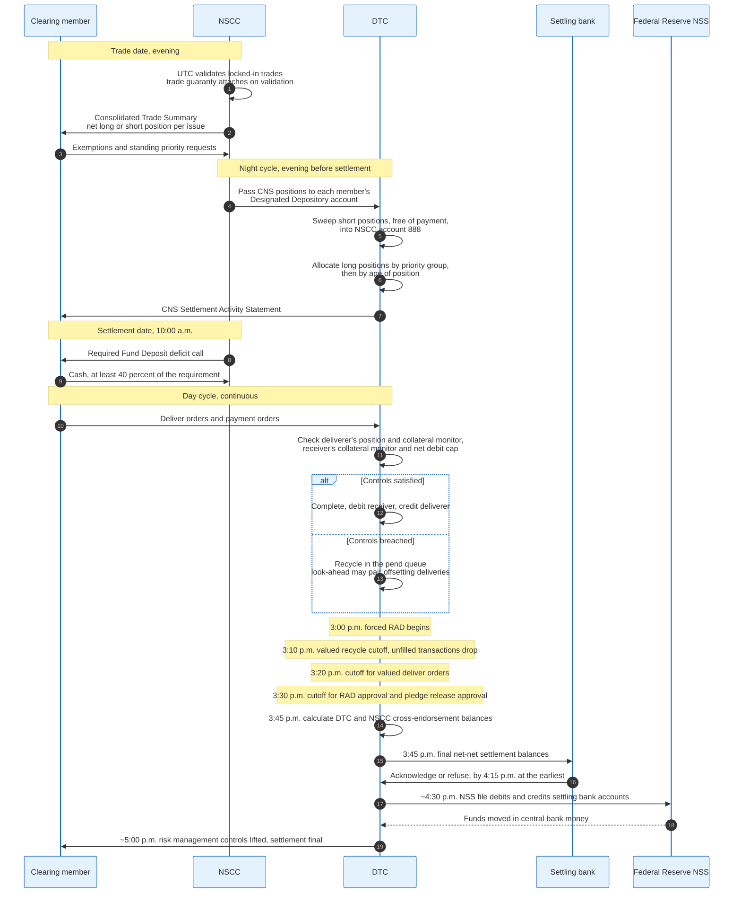
```mermaid
%%{init: {'theme': 'base', 'themeVariables': {'primaryColor': '#e3f2fd', 'primaryBorderColor': '#1565c0', 'lineColor': '#37474f'}}}%%

sequenceDiagram
    autonumber
    participant M as Clearing member
    participant N as NSCC
    participant D as DTC
    participant SB as Settling bank
    participant F as Federal Reserve NSS

    Note over M,N: Trade date, evening
    N->>N: UTC validates locked-in trades<br/>trade guaranty attaches on validation
    N->>M: Consolidated Trade Summary<br/>net long or short position per issue
    M->>N: Exemptions and standing priority requests

    Note over N,D: Night cycle, evening before settlement
    N->>D: Pass CNS positions to each member's<br/>Designated Depository account
    D->>D: Sweep short positions, free of payment,<br/>into NSCC account 888
    D->>D: Allocate long positions by priority group,<br/>then by age of position
    D->>M: CNS Settlement Activity Statement

    Note over M,N: Settlement date, 10:00 a.m.
    N->>M: Required Fund Deposit deficit call
    M->>N: Cash, at least 40 percent of the requirement

    Note over M,D: Day cycle, continuous
    M->>D: Deliver orders and payment orders
    D->>D: Check deliverer's position and collateral monitor,<br/>receiver's collateral monitor and net debit cap
    alt Controls satisfied
        D->>D: Complete, debit receiver, credit deliverer
    else Controls breached
        D->>D: Recycle in the pend queue<br/>look-ahead may pair offsetting deliveries
    end

    Note over D: 3:00 p.m. forced RAD begins
    Note over D: 3:10 p.m. valued recycle cutoff, unfilled transactions drop
    Note over D: 3:20 p.m. cutoff for valued deliver orders
    Note over D: 3:30 p.m. cutoff for RAD approval and pledge release approval
    D->>D: 3:45 p.m. calculate DTC and NSCC cross-endorsement balances
    D->>SB: 3:45 p.m. final net-net settlement balances
    SB->>D: Acknowledge or refuse, by 4:15 p.m. at the earliest
    D->>F: ~4:30 p.m. NSS file debits and credits settling bank accounts
    F-->>D: Funds moved in central bank money
    D->>M: ~5:00 p.m. risk management controls lifted, settlement final
```

### 12.1 Trade Date: Monday

Member A, a clearing broker and NSCC full-service member, trades security XYZ on Monday:

- Buys 120,000 shares at 45.00 dollars, contract value 5,400,000 dollars.
- Sells 100,000 shares at 45.10 dollars, contract value 4,510,000 dollars.

Both trades execute on exchanges and arrive at NSCC as locked-in data through Universal Trade Capture. Validation occurs within seconds, and under Addendum K NSCC's trade guaranty attaches at that point. Member A no longer has a counterparty. It has a position against NSCC.

CNS nets the two trades by issue. Member A's net settling position is **long 20,000 shares**, with net contract money owed of **890,000 dollars**. Member A had no open XYZ position carried forward, so the CNS position for Tuesday's settlement is long 20,000.

By the evening, NSCC issues the Consolidated Trade Summary showing that position. Member A submits its exemptions for the short positions it does not wish to settle, and its standing priority requests are already on file.

### 12.2 Trade Date Evening: Margin Is Computed

XYZ closes Monday at 44.20 dollars. Member A's CNS position is marked:

- Market value of the long position: 20,000 x 44.20 = **884,000 dollars**.
- Contract money owed: **890,000 dollars**.
- Mark-to-market: 884,000 - 890,000 = **negative 6,000 dollars**, a net debit added to the Required Fund Deposit.

Suppose the parametric volatility model, run on Member A's whole portfolio, attributes a volatility charge of **83,980 dollars** to this position, which is 9.5 percent of its market value. Add a margin requirement differential of **4,200 dollars**, the exponentially weighted average of positive day-over-day changes in the volatility and mark-to-market components over the previous 100 days.

Contribution to Member A's Required Fund Deposit from this position: 6,000 + 83,980 + 4,200 = **94,180 dollars**.

Member A's volatility charge across its whole book divided by its net capital is 0.7, below 1.0, so no excess capital premium applies. If XYZ tripled overnight and the ratio went to 1.6, the excess capital premium would be the excess of the volatility charge over net capital multiplied by 1.6, and NSCC would collect it the same morning.

The first 40 percent of the total requirement must be in cash, and never less than 250,000 dollars. Any deficit is due by 10:00 a.m. Tuesday.

### 12.3 Monday Night: The Night Cycle

NSCC passes every member's CNS positions to its Designated Depository, which for almost all members is DTC. In the night cycle, DTC sweeps shares from short members' accounts into NSCC's account 888, free of payment, subject to each member's exemptions. Member B, short 90,000 XYZ, has the shares and they move.

NSCC then instructs DTC to deliver those 90,000 shares from account 888 to the long members. Allocation runs by priority group. No reorganisation sub-account positions and no buy-in intent notices exist in XYZ, so allocation falls through to standing priority requests, and within a group DTC's night-cycle optimisation decides which longs are filled, maximising the number of transactions that settle. Had no optimisation run, the oldest position would have been filled first, as in the day cycle. Member A receives its 20,000 shares.

Member A's CNS Settlement Activity Statement, available Tuesday morning, shows a receipt of 20,000 XYZ, free, with a current market value shown for information only.

### 12.4 Tuesday: The Day Cycle and the Money

Member A now needs to deliver 20,000 XYZ to its own customer's custodian, which is not an NSCC member and settles at DTC bilaterally. Member A submits a valued deliver order. DTC checks four things before completing: that Member A has the position, that completing would not turn Member A's own collateral monitor negative, that it would not turn the receiving custodian's collateral monitor negative, and that it would not push the custodian's net settlement obligation past its net debit cap. Any one of the four sends the delivery to the recycle queue until credits arrive. The deliverer-side collateral test is the one most often forgotten, and it bites when the collateral value of the securities going out exceeds the settlement value coming back in.

Meanwhile, money settlement at NSCC is computed on the whole CNS account, not per trade: the closing money balance against the closing net market value. Member A's cash obligation to NSCC for the day nets its XYZ activity with everything else it settled.

The end-of-day sequence is fixed:

| Time (ET) | Event |
|-----------|-------|
| 3:00 p.m. | Forced RAD period begins: all valued transactions require the receiver's approval |
| 3:10 p.m. | Valued recycle cutoff; unfilled valued transactions drop |
| 3:20 p.m. | Cutoff for entering valued deliver orders, payment orders, and pledges |
| 3:30 p.m. | Cutoff for RAD approval or cancellation of valued transactions and for pledgee approval of valued pledge release requests |
| 3:45 p.m. | DTC calculates DTC and NSCC cross-endorsement balances and finalises settlement balances for participants and settling banks |
| 4:15 p.m. or 30 minutes after balances are published, whichever is later | Settling bank acknowledgment cutoff |
| approximately 4:30 p.m. | DTC processes the NSS file with the Federal Reserve Bank of New York |
| approximately 5:00 p.m. | Risk management controls lifted |

For a settling bank acting for both DTC and NSCC participants, the DTC and NSCC net-net balances are aggregated into a single consolidated debit or credit before the NSS instruction. If NSS is unavailable, banks in net-net debit must remit by Fedwire by the later of 5:00 p.m. or one hour after balances are first published, and in any case before Fedwire closes.

Once all net-net debits are received and DTC releases its risk management controls, settlement is final.

### 12.5 What the Example Costs

Under the 2026 NSCC fee schedule, clearance activity is billed on both sides of the netting.

- Into the net: 0.44 dollars per million of gross positions before netting. Member A's gross XYZ value is 5,400,000 + 4,510,000 = 9.91 million dollars, so **4.36 dollars**.
- Out of the net: 2.16 dollars per million of net positions after netting. Member A's net position is 890,000 dollars, so **1.92 dollars**.

Total NSCC clearance fee for a 9.91 million dollar trading day in one security: **6.28 dollars**, plus a participant fee of 300 dollars per month for each account number, charged under Addendum A section V.A for participation in the Trade Processing System.

That is about 63 dollars per 100 million dollars of gross value traded. The expensive part of central clearing is the collateral, not the fee.

---

## 13. T+2 to T+1: 28 May 2024 and What It Cost

The United States shortened its standard settlement cycle from two business days to one on 28 May 2024, under amendments to Exchange Act Rule 15c6-1 adopted on 15 February 2023 in Release No. 34-96930, published at 88 FR 13872 on 6 March 2023. The rule change was four sentences. The operational change was the removal of an entire business day from post-trade processing.

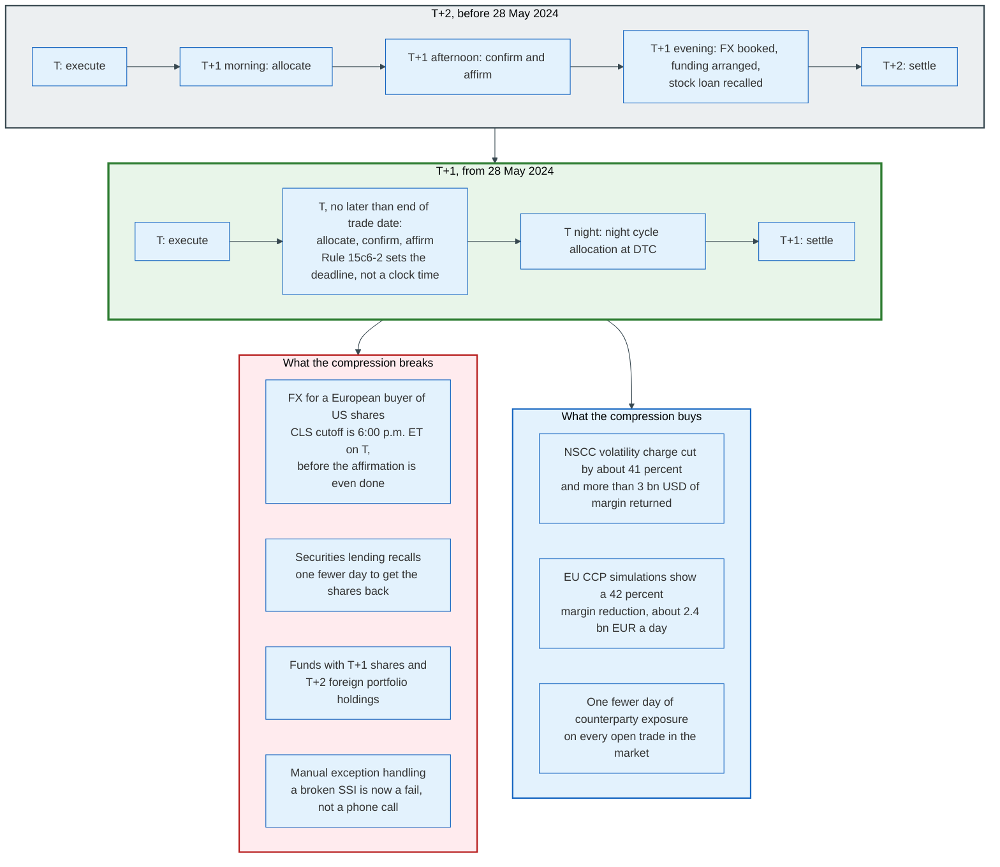
```mermaid
%%{init: {'theme': 'base', 'themeVariables': {'primaryColor': '#e3f2fd', 'primaryBorderColor': '#1565c0', 'lineColor': '#37474f'}}}%%

flowchart TB
    subgraph Old["T+2, before 28 May 2024"]
        O1["T: execute"]
        O2["T+1 morning: allocate"]
        O3["T+1 afternoon: confirm and affirm"]
        O4["T+1 evening: FX booked, funding arranged,<br/>stock loan recalled"]
        O5["T+2: settle"]
        O1 --> O2 --> O3 --> O4 --> O5
    end

    subgraph New["T+1, from 28 May 2024"]
        N1["T: execute"]
        N2["T, no later than end of trade date:<br/>allocate, confirm, affirm<br/>Rule 15c6-2 sets the deadline, not a clock time"]
        N3["T night: night cycle allocation at DTC"]
        N4["T+1: settle"]
        N1 --> N2 --> N3 --> N4
    end

    subgraph Casualties["What the compression breaks"]
        C1["FX for a European buyer of US shares<br/>CLS cutoff is 6:00 p.m. ET on T,<br/>before the affirmation is even done"]
        C2["Securities lending recalls<br/>one fewer day to get the shares back"]
        C3["Funds with T+1 shares and<br/>T+2 foreign portfolio holdings"]
        C4["Manual exception handling<br/>a broken SSI is now a fail, not a phone call"]
    end

    subgraph Prizes["What the compression buys"]
        P1["NSCC volatility charge cut by about 41 percent<br/>and more than 3 bn USD of margin returned"]
        P2["EU CCP simulations show a 42 percent<br/>margin reduction, about 2.4 bn EUR a day"]
        P3["One fewer day of counterparty exposure<br/>on every open trade in the market"]
    end

    Old --> New
    New --> Casualties
    New --> Prizes

    style Old fill:#eceff1,stroke:#37474f,stroke-width:2px
    style New fill:#e8f5e9,stroke:#2e7d32,stroke-width:3px
    style Casualties fill:#ffebee,stroke:#b71c1c,stroke-width:2px
    style Prizes fill:#e3f2fd,stroke:#1565c0,stroke-width:2px
```

### 13.1 What the Rule Actually Says

Four separate rules changed, and only the first is famous.

- **Rule 15c6-1(a)** shortens the standard settlement cycle for most broker-dealer transactions from T+2 to T+1. Paragraph (b) excludes security-based swaps. Paragraph (c) shortens the cycle for firm commitment offerings priced after 4:30 p.m. Eastern from T+4 to T+2.
- **Rule 15c6-2** requires a broker-dealer, for transactions with institutional customers, either to enter written agreements or to establish, maintain, and enforce written policies and procedures reasonably designed to ensure allocations, confirmations, and affirmations are completed as soon as technologically practicable and no later than the end of trade date.
- **Rule 17Ad-27** requires clearing agencies providing central matching services to have policies designed to facilitate straight-through processing and to file an annual report on progress, including affirmation rate data.
- **Advisers Act Rule 204-2** requires registered investment advisers to make and keep records of allocations, confirmations, and affirmations.

The design is deliberate. Shortening the cycle without forcing same-day affirmation would simply have converted a scheduling problem into a fails problem. The Commission cited data showing that only about 68 percent of trades achieved affirmation by 12:00 midnight at the end of trade date, short of the industry best practice of an affirmed confirmation by the end of trade date. The release states the same figure twice, once with the midnight cut-off at 88 FR 13920 and once as affirmation on trade date at 88 FR 13922.

### 13.2 What Broke and What Was Fixed

**Foreign exchange became the hard constraint.** A European institution buying US shares must fund in dollars. Under T+2 the FX trade could be executed on T+1. Under T+1 it must be executed on trade date, and the CLS submission deadline for standard FX settlement falls at 6:00 p.m. Eastern, which is before many affirmations complete. The workarounds are prefunding in dollars, executing FX before knowing the exact allocation, or settling FX bilaterally outside CLS and accepting principal risk.

**Securities lending recalls lost a day.** A lender who sells a security must recall the loan in time for the borrower to return it. The Commission noted in the adopting release that the recall period tracks the standard settlement cycle, and that shortening the cycle shortens the recall window correspondingly.

**Cross-border misalignment became structural.** Between 28 May 2024 and 11 October 2027, a European investor buys US shares that settle on T+1 while holding European assets that settle on T+2. Funds must bridge the mismatch with cash buffers or credit lines. This is the strongest single argument the EU and UK made for aligning their own move.

**Exception handling stopped being manual.** Under T+2 a broken standing settlement instruction could be repaired by a phone call the next morning. Under T+1 it is a fail. That is why ALERT and automated SSI enrichment moved from convenience to necessity.

### 13.3 What It Was Forecast to Buy

The benefit shows up in margin, and the figures in circulation are forecasts made before the move rather than measurements taken after it.

For the United States, DTCC forecast a reduction of 41 percent in the volatility component of NSCC margin, worth more than 3 billion dollars returned to members. ESMA's November 2024 report records that forecast.

**The realised figure is not established here, and the reason is a confound rather than an absence of data.** US T+1 has been live since 28 May 2024. DTCC's aggregate clearing fund requirements rose over the same period, reaching 96.3 billion dollars at 30 June 2025, but the FSOC attributes that rise to FICC's Government Securities Division building for the Treasury clearing mandate. That is a different clearing agency, a different product, and a different cause. No source cited in this document separates the realised NSCC equity margin effect from the FICC build-up.

The 41 percent is a forecast. It is quoted here as one.

For the European Union, CCP simulations reported to ESMA showed margin reductions across relevant products of 42 percent, representing about 2.4 billion euro of margin that would not be called daily under T+1. Roughly 80 percent of that benefit comes from equities and most of the remainder from government bonds, with individual CCP results ranging between 38 percent and 49 percent, and reductions reaching up to 70 percent on days with extraordinary trading activity or option expiries.

The simulations also showed that daily margin calls do not fall in number under T+1 but vary more in size, which is a collateral management problem for clearing members rather than a saving.

### 13.4 The Rest of the World Follows

The United Kingdom will mandate T+1 from 11 October 2027. The Accelerated Settlement Taskforce, chaired by Charlie Geffen, reported on 28 March 2024 recommending a move no later than the end of 2027. A Technical Group chaired by Andrew Douglas published an implementation plan on 6 February 2025 with 12 critical and 26 highly recommended actions and named 11 October 2027 as the date. HM Treasury published a draft statutory instrument, the Central Securities Depositories (Amendment) (Intended Settlement Date) Regulations, in November 2025 and invited technical comments by 27 February 2026.

The European Union moves on the same date. ESMA recommended it, the European Commission, the ECB, and ESMA established a T+1 Coordination Committee chaired by ESMA's chair with an Industry Committee alongside it, and the amendments to the CSDR settlement discipline regulatory technical standards were adopted by the Commission on 6 July 2026. Publication in the Official Journal is expected from October 2026, with first application on 7 December 2026 for the new allocation and confirmation requirements. T2S implementation includes five specific testing windows, with the user testing environment available for market-wide testing between 5 April and 1 October 2027.

One issue was still open in July 2026: some CSDs expect to be late implementing automated buyer protection, the mechanism by which a buyer with an unsettled trade over a corporate action election can still exercise the election.

---

## 14. Settlement Fails, Buy-Ins, and Settlement Discipline

A settlement fail is the non-delivery of securities on the intended settlement date, and it is a normal operating state rather than an emergency. What differs between markets is not whether fails happen but who pays for them and what forces them to end.

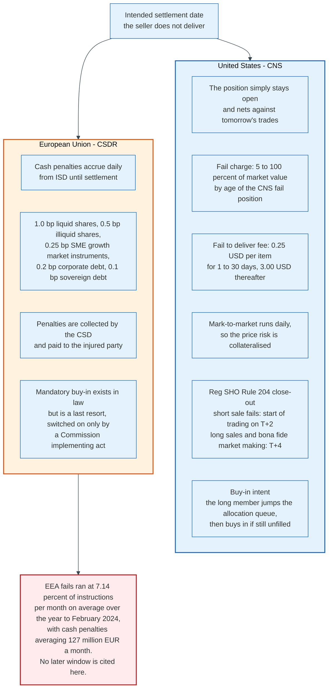
```mermaid
%%{init: {'theme': 'base', 'themeVariables': {'primaryColor': '#e3f2fd', 'primaryBorderColor': '#1565c0', 'lineColor': '#37474f'}}}%%

flowchart TB
    ISD["Intended settlement date<br/>the seller does not deliver"]

    subgraph US["United States - CNS"]
        U1["The position simply stays open<br/>and nets against tomorrow's trades"]
        U2["Fail charge: 5 to 100 percent of market value<br/>by age of the CNS fail position"]
        U3["Fail to deliver fee: 0.25 USD per item<br/>for 1 to 30 days, 3.00 USD thereafter"]
        U4["Mark-to-market runs daily,<br/>so the price risk is collateralised"]
        U5["Reg SHO Rule 204 close-out<br/>short sale fails: start of trading on T+2<br/>long sales and bona fide market making: T+4"]
        U6["Buy-in intent<br/>the long member jumps the allocation queue,<br/>then buys in if still unfilled"]
    end

    subgraph EU["European Union - CSDR"]
        E1["Cash penalties accrue daily<br/>from ISD until settlement"]
        E2["1.0 bp liquid shares, 0.5 bp illiquid shares,<br/>0.25 bp SME growth market instruments,<br/>0.2 bp corporate debt, 0.1 bp sovereign debt"]
        E3["Penalties are collected by the CSD<br/>and paid to the injured party"]
        E4["Mandatory buy-in exists in law<br/>but is a last resort, switched on only by<br/>a Commission implementing act"]
    end

    ISD --> US
    ISD --> EU

    Cost["EEA fails ran at 7.14 percent of instructions<br/>per month on average over the year to February 2024,<br/>with cash penalties averaging 127 million EUR a month.<br/>No later window is cited here."]
    EU --> Cost

    style US fill:#e3f2fd,stroke:#1565c0,stroke-width:2px
    style EU fill:#fff3e0,stroke:#e65100,stroke-width:2px
    style Cost fill:#ffebee,stroke:#b71c1c,stroke-width:2px
```

### 14.1 How a Fail Behaves in CNS

In CNS, a fail is simply a position that stays open. The system nets today's settling trades with yesterday's closing positions, so an unsettled short position rolls forward and nets against the next day's activity in the same issue. No separate re-instruction is required, and no counterparty is left waiting on a specific trade, because the counterparty is NSCC.

Three mechanisms price and pressure the fail.

**The fail charge.** NSCC applies a clearing fund charge calculated by multiplying the current market value of each CNS fail position by a percentage ranging from 5 percent to 100 percent, based on the number of business days the position has been outstanding.

**The fee.** The 2026 NSCC fee schedule charges 0.25 dollars per item short in CNS for 1 to 30 days at close of business, and 3.00 dollars per item thereafter.

**Daily mark-to-market.** Fail positions are marked with the rest of the CNS account, so price risk on an aged fail is collateralised, not accumulated.

### 14.2 Buy-Ins in the United States

The buy-in is the long member's remedy: it goes into the market, buys the securities, and charges the difference to the failing side. In CNS the process runs through NSCC rather than between members.

A member submits a buy-in intent. That does two things. It moves the member's long position to a higher rank in the allocation algorithm than any standing priority request or override, so the position is filled first from whatever securities arrive. And it starts a clock; if the position is still open when the intent expires, the buy-in executes. Positions against expiring buy-in intents sit at the top of the priority order the following day if they were not filled.

Separately, Regulation SHO imposes a mandatory close-out that is not optional and does not depend on anyone's remedy. Under Rule 204, a participant with a fail-to-deliver position must close it out by purchasing or borrowing securities of like kind and quantity. For fails resulting from short sales, the deadline is the beginning of regular trading hours on the settlement day following settlement date, which under T+1 is T+2. For fails from long sales or bona fide market making, the deadline is the beginning of regular trading hours on the third consecutive settlement day after settlement date, which under T+1 is T+4, one day earlier than under T+2.

### 14.3 The European Approach: Cash Penalties

The European Union chose to price fails rather than force them to close, and the CSD Regulation's settlement discipline regime is the most detailed such scheme anywhere.

Commission Delegated Regulation (EU) 2017/389 sets the daily penalty rates applied to the value of the failed instruction:

| Type of fail | Rate per day |
|--------------|--------------|
| Shares with a liquid market | 1.0 basis point |
| Shares without a liquid market | 0.5 basis point |
| Instruments on SME growth markets, other than debt | 0.25 basis point |
| Sovereign, central bank, local authority, multilateral development bank, EFSF and ESM debt | 0.10 basis point |
| Other debt instruments | 0.20 basis point |
| Debt instruments on SME growth markets | 0.15 basis point |
| All other financial instruments | 0.5 basis point |
| Fail due to lack of cash | Central bank overnight credit rate, floored at zero |

Penalties are calculated and collected by the CSD and paid to the injured participant. They run from the intended settlement date until the instruction settles or is cancelled.

The results are public and unflattering, and they are also dated. Over the twelve months from March 2023 to February 2024, the most recent window reproduced here from ESMA's analysis of CSDR settlement fail reporting, an average of 7.14 percent of the total number of settlement instructions failed each month at EEA level, and cash penalties averaged 127,258,663 euro a month. Fails varied by asset class by a factor of eight. Sovereign bonds ran near 2 percent of the value and 2.5 percent of the volume of instructions. Exchange-traded funds ran at roughly 15 percent of value and 20 percent of volume in June 2024, and averaged 17.32 percent of monthly ETF instruction volume between June 2023 and May 2024. ESMA publishes the series periodically; no window after February 2024 is cited here, so those percentages describe 2023 and 2024 rather than the position today.

### 14.4 Why Mandatory Buy-Ins Were Shelved

CSDR originally contained three settlement discipline pillars: reporting, cash penalties, and mandatory buy-ins. Only the first two ever came into force.

Regulation (EU) 2023/2845, the CSDR Refit, made mandatory buy-ins a measure of last resort. They may be switched on only by a Commission implementing act, and only when two conditions are met at the same time: other measures such as cash penalties and suspension of persistently failing participants have not produced a sustainable reduction in fails, and the level of fails has or is likely to have a negative effect on Union financial stability. Before acting, the Commission must consult the European Systemic Risk Board and request a cost-benefit analysis from ESMA.

The reasoning was that a forced buy-in in an illiquid instrument transfers a price risk to the failing party that can exceed the value of the trade, and in stressed conditions can make market makers withdraw from quoting rather than risk being bought in. The industry argued this for years. The Refit conceded it.

The general lesson is that fails are an inventory problem, and a system that punishes them severely gets fewer fails and less liquidity. Pricing them is the compromise, and 7.14 percent of instructions a month, over the year to February 2024, is what that compromise looked like.

---

## 15. Corporate Actions Processing

A corporate action is any event initiated by an issuer that changes the securities it has issued or distributes something to their holders, and processing one correctly is harder than settling a trade. The reason is structural: the issuer pays one registered holder, and everything after that is allocation down a chain of intermediaries who each know only their own customers.

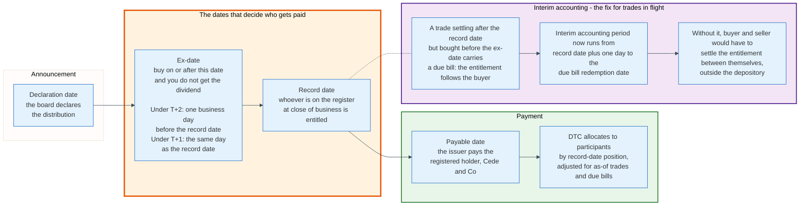
```mermaid
%%{init: {'theme': 'base', 'themeVariables': {'primaryColor': '#e3f2fd', 'primaryBorderColor': '#1565c0', 'lineColor': '#37474f'}}}%%

flowchart LR
    subgraph Decl["Announcement"]
        D1["Declaration date<br/>the board declares<br/>the distribution"]
    end

    subgraph Key["The dates that decide who gets paid"]
        D2["Ex-date<br/>buy on or after this date<br/>and you do not get the dividend<br/><br/>Under T+2: one business day<br/>before the record date<br/>Under T+1: the same day<br/>as the record date"]
        D3["Record date<br/>whoever is on the register<br/>at close of business is entitled"]
    end

    subgraph Pay["Payment"]
        D4["Payable date<br/>the issuer pays the<br/>registered holder, Cede and Co"]
        D5["DTC allocates to participants<br/>by record-date position,<br/>adjusted for as-of trades and due bills"]
    end

    subgraph Interim["Interim accounting - the fix for trades in flight"]
        I1["A trade settling after the record date<br/>but bought before the ex-date carries<br/>a due bill: the entitlement follows the buyer"]
        I2["Interim accounting period now runs from<br/>record date plus one day to the<br/>due bill redemption date"]
        I3["Without it, buyer and seller would have to<br/>settle the entitlement between themselves,<br/>outside the depository"]
    end

    D1 --> D2 --> D3 --> D4 --> D5
    D3 -.- I1
    I1 --> I2 --> I3

    style Key fill:#fff3e0,stroke:#e65100,stroke-width:3px
    style Interim fill:#f3e5f5,stroke:#4a148c,stroke-width:2px
    style Pay fill:#e8f5e9,stroke:#2e7d32,stroke-width:2px
```

### 15.1 The Dates That Decide Entitlement

Four dates govern a distribution.

**Declaration date**, when the issuer's board declares it. **Record date**, when whoever is on the register at close of business is entitled. **Ex-date**, the date from which a buyer no longer receives the distribution. **Payable date**, when the issuer pays.

The ex-date is a function of the settlement cycle, and the move to T+1 changed it. Under T+2, the ex-date fell one business day before the record date, because a buyer on the day before the record date would not settle until after it. Under T+1, a buyer on the record date settles on the day after, so the ex-date now equals the record date. DTC's Corporate Actions Distributions Service Guide now treats an ex-date equal to the record date as the standard case and captures no interim activity for it, and keeps a separate procedure for the late or irregular ex-date that a listed exchange declares to be not equal to the record date. The filing that made the change is published at 89 FR 21557 on 28 March 2024.

The entitlement boundary moved by a day, and it moved by a phrase swap inside a service guide rather than by a rule with a comment period.

### 15.2 Interim Accounting and Due Bills

Trades in flight across a record date create a problem, and the depository solves it systematically so that buyers and sellers do not have to.

A trade that settles after the record date but was executed before the ex-date entitles the buyer to the distribution, even though the seller is the holder of record. Absent intervention, the entitlement would travel with a due bill, an instrument the seller owes the buyer, settled between them outside the depository.

DTC's interim accounting process does it inside the depository. During the interim accounting period, DTC handles entitlements and allocations for both the buyer and the seller of transactions submitted to CNS. Under T+1 the interim accounting period runs from record date plus one day up to the due bill redemption date, which is typically the ex-date for equities and payable date minus one day for debt.

Interim accounting also handles the awkward cases: a late or irregular ex-date declared by the listed exchange, and an unscheduled market closure that pushes an ex-date to the next open day, which is usually the record date. Both are common enough to be documented processes rather than exceptions.

Within CNS itself, dividends are credited or charged according to the security positions existing on record date, automatically updated for as-of trades and due bill activity. Interest follows the position on the day before payable date. Stock splits follow the position on due bill redemption date.

### 15.3 The Two Families of Action

**Mandatory actions** happen to the holder: cash dividends, stock dividends, stock splits, mergers where no election exists, redemptions, name changes, reverse splits, liquidations. Processing them is a distribution problem: identify positions on record date, compute entitlements, allocate, and handle fractional entitlements and withholding tax.

**Voluntary actions** require the holder to choose: tender offers, exchange offers, rights subscriptions, elective dividends, conversion of convertible securities. Processing them is a communication and deadline problem: the election must travel down the chain to the beneficial owner and the instruction must travel back up before the agent's deadline, which is often earlier than the offer's public deadline.

The pricing at NSCC reflects the difference in effort. Under the 2026 fee schedule, a mandatory reorganisation costs 2.50 dollars for each position affected by a merger, redemption, name change, reverse split, or liquidation. A voluntary reorganisation costs 15.00 dollars per input or add submitted for the long broker and 35.00 dollars per reorg for the short broker.

### 15.4 Messaging and the Standards Problem

Corporate actions messaging runs on ISO standards, and the industry is in the middle of a long migration between two of them. ISO 15022 messages, the MT 56x series in the securities family, carry announcements, entitlements, and instructions in the format most custodians still use. ISO 20022 messages, the seev series, are the replacement and carry a richer, XML-based structure that can represent options and conditions the older format flattens.

The underlying difficulty is not the format. It is that the source data is a legal document written in prose by an issuer's counsel, and turning it into a structured message is an interpretive act. Custodians commonly take announcements from several data vendors and compare them, because the same event described by two vendors can produce two different entitlements. That reconciliation is the reason corporate actions remain the most manual, most operationally risky part of post-trade processing.

Under T+1 it also became a settlement problem. Buyer protection, the mechanism by which a buyer whose trade has not yet settled can still make an election on a voluntary event, has to work faster in a compressed cycle. The EU T+1 Coordination Committee noted in July 2026 that delays by some CSDs in implementing automated buyer protection add uncertainty to handling it in a T+1 environment, with liquidity implications in specific cases.

---

## 16. Cross-Border Settlement: ICSDs, T2S, and the Bridge

Cross-border settlement is expensive because there is no global depository, and every solution to that fact is a way of putting an intermediary between an investor in one legal system and a register in another.

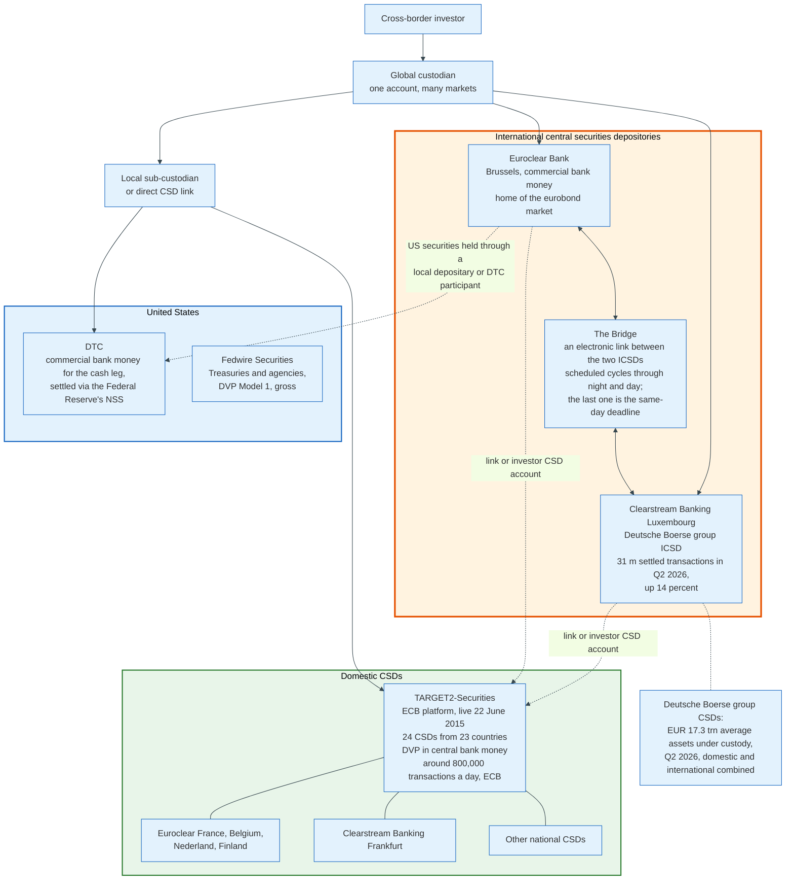
```mermaid
%%{init: {'theme': 'base', 'themeVariables': {'primaryColor': '#e3f2fd', 'primaryBorderColor': '#1565c0', 'lineColor': '#37474f'}}}%%

flowchart TB
    subgraph ICSD["International central securities depositories"]
        EB["Euroclear Bank<br/>Brussels, commercial bank money<br/>home of the eurobond market"]
        CB["Clearstream Banking Luxembourg<br/>Deutsche Boerse group ICSD<br/>31 m settled transactions in Q2 2026,<br/>up 14 percent"]
        Bridge["The Bridge<br/>an electronic link between the two ICSDs<br/>scheduled cycles through night and day;<br/>the last one is the same-day deadline"]
        EB <--> Bridge <--> CB
    end

    GrpNote["Deutsche Boerse group CSDs:<br/>EUR 17.3 trn average assets under custody,<br/>Q2 2026, domestic and international combined"]
    CB -.- GrpNote

    subgraph Domestic["Domestic CSDs"]
        T2S["TARGET2-Securities<br/>ECB platform, live 22 June 2015<br/>24 CSDs from 23 countries<br/>DVP in central bank money<br/>around 800,000 transactions a day, ECB"]
        Euro["Euroclear France, Belgium,<br/>Nederland, Finland"]
        Clear["Clearstream Banking Frankfurt"]
        Other["Other national CSDs"]
        T2S --- Euro
        T2S --- Clear
        T2S --- Other
    end

    subgraph US["United States"]
        DTC["DTC<br/>commercial bank money for the cash leg,<br/>settled via the Federal Reserve's NSS"]
        Fed["Fedwire Securities<br/>Treasuries and agencies,<br/>DVP Model 1, gross"]
    end

    Inv["Cross-border investor"]
    GC["Global custodian<br/>one account, many markets"]
    Sub["Local sub-custodian<br/>or direct CSD link"]

    Inv --> GC --> Sub
    Sub --> T2S
    Sub --> DTC
    GC --> EB
    GC --> CB
    EB -.->|"link or investor CSD account"| T2S
    CB -.->|"link or investor CSD account"| T2S
    EB -.->|"US securities held through a<br/>local depositary or DTC participant"| DTC

    style ICSD fill:#fff3e0,stroke:#e65100,stroke-width:3px
    style Domestic fill:#e8f5e9,stroke:#2e7d32,stroke-width:2px
    style US fill:#e3f2fd,stroke:#1565c0,stroke-width:2px
```

### 16.1 What an ICSD Is and Why It Exists

An international central securities depository is a depository that settles securities issued in multiple jurisdictions, in multiple currencies, in commercial bank money, and lends against the positions it holds. Two dominate: Euroclear Bank in Brussels and Clearstream Banking Luxembourg, owned by Deutsche Boerse.

Both were created for the same reason. The eurobond market of the late 1960s issued bearer securities that belonged to no single national system, and there was no domestic depository capable of holding them. Euroclear was founded in 1968 by Morgan Guaranty's Brussels office; Cedel, which became Clearstream, followed in 1970. The ICSDs held the physical bonds and settled trades in them by book entry, which is the same immobilisation move DTC made for American equities in 1973.

The important structural difference from a domestic CSD is the balance sheet. Euroclear Bank and Clearstream Banking Luxembourg are banks. They settle the cash leg in commercial bank money on their own books, they extend credit against securities, and they run triparty collateral businesses. A domestic CSD settling on T2S settles in central bank money and takes no credit risk of that kind.

Scale, where it is disclosed: Deutsche Boerse's Half-yearly financial report 2026 states at page 12 that assets under custody at its domestic and international central securities depositories reached a record average of 17.3 trillion euro in the second quarter of 2026, an 8 percent increase year on year; that the volume of assets held for collateral management exceeded 1 trillion euro for the first time in June 2026; and that the volume of settled transactions at its ICSD rose 14 percent to 31 million in the quarter. The 17.3 trillion figure is group-wide across both CSDs, not the Luxembourg ICSD's own custody balance.

### 16.2 The Bridge

The Bridge is the electronic link between Euroclear Bank and Clearstream Banking Luxembourg that lets a participant of one settle against a participant of the other. Without it, the two ICSDs would be separate liquidity pools in the same instruments, and every cross-ICSD trade would require a physical or custodial transfer.

The mechanism is a set of scheduled settlement cycles through the night and day in which each ICSD sends the other its instructions, receives the counterpart instructions, and settles the matched pairs across the linked accounts. The commercially important property is not the technology but the last cycle: after it closes, a trade against the other ICSD no longer settles that day, whatever either participant does. Euroclear Bank and Clearstream publish the cycle timetable in their own operational schedules and revise it with each release. The current count and times are not reproduced here, because a stale timetable is worse than none.

### 16.3 TARGET2-Securities

T2S is the Eurosystem's answer to fragmentation: rather than link CSDs to each other, move their settlement onto one platform that settles in central bank money.

It went live on 22 June 2015. It settles delivery versus payment in central bank money, in euro and Danish krone, for 24 CSDs from 23 European countries. The ECB's own figure for throughput is an average of around 800,000 securities transactions a day, in both currencies. The ECB does not state a daily settled value on that page, and no figure for it is asserted here.

The design separates roles cleanly. CSDs keep the legal relationship with issuers and participants, the notary function, and asset servicing. T2S runs the settlement engine and holds the dedicated cash accounts. A bank can therefore reach many European markets through one settlement interface while keeping local CSD accounts for custody and corporate actions.

T2S also carries the operational risk of European T+1. The migration requires two change requests to T2S, both under implementation as of July 2026, and a set of testing windows in 2027. A possible postponement of the T2S delivery-versus-payment cut-off to 17:00 remained under consultation in mid-2026 and was noted as not required for the T+1 transition itself.

### 16.4 Why Cross-Border Still Costs More

Four costs survive every integration effort.

**The chain is longer.** An investor reaches a foreign security through a global custodian, a sub-custodian or a direct CSD link, and the local depository. Every link adds an account, a reconciliation, and a cut-off time.

**Legal systems differ.** What an entitlement is, when a transfer becomes final, and what happens on the insolvency of an intermediary are answered by different laws in each jurisdiction. The Settlement Finality Directive harmonises finality within the EU. It does not harmonise the property law underneath it.

**Cut-offs do not align.** The gap between a European settlement deadline and an American one is the reason cross-border fails cluster in specific instruments and specific hours, and the reason the T+1 misalignment between the US and Europe from May 2024 to October 2027 is treated as a live risk rather than an inconvenience.

**Cash is a second problem.** Settling securities in one currency and funding in another adds an FX leg with its own settlement risk, its own cut-off, and, for anything outside CLS, its own principal risk.

---

## 17. The Economics: What It Costs and Who Pays

Clearing and settlement is priced as a utility, not as a product, and the fee is a small fraction of the true cost of using the system. The large cost is collateral.

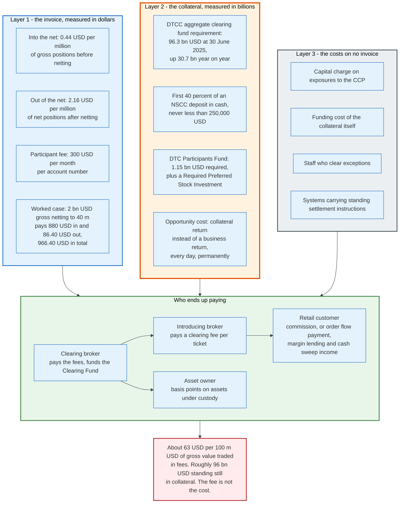
```mermaid
%%{init: {'theme': 'base', 'themeVariables': {'primaryColor': '#e3f2fd', 'primaryBorderColor': '#1565c0', 'lineColor': '#37474f'}}}%%

flowchart TB
    subgraph Fees["Layer 1 - the invoice, measured in dollars"]
        F1["Into the net: 0.44 USD per million<br/>of gross positions before netting"]
        F2["Out of the net: 2.16 USD per million<br/>of net positions after netting"]
        F3["Participant fee: 300 USD per month<br/>per account number"]
        F4["Worked case: 2 bn USD gross netting to 40 m<br/>pays 880 USD in and 86.40 USD out,<br/>966.40 USD in total"]
    end

    subgraph Coll["Layer 2 - the collateral, measured in billions"]
        C1["DTCC aggregate clearing fund requirement:<br/>96.3 bn USD at 30 June 2025,<br/>up 30.7 bn year on year"]
        C2["First 40 percent of an NSCC deposit in cash,<br/>never less than 250,000 USD"]
        C3["DTC Participants Fund: 1.15 bn USD required,<br/>plus a Required Preferred Stock Investment"]
        C4["Opportunity cost: collateral return<br/>instead of a business return,<br/>every day, permanently"]
    end

    subgraph Hidden["Layer 3 - the costs on no invoice"]
        H1["Capital charge on exposures to the CCP"]
        H2["Funding cost of the collateral itself"]
        H3["Staff who clear exceptions"]
        H4["Systems carrying standing settlement instructions"]
    end

    subgraph Inc["Who ends up paying"]
        I1["Clearing broker<br/>pays the fees, funds the Clearing Fund"]
        I2["Introducing broker<br/>pays a clearing fee per ticket"]
        I3["Retail customer<br/>commission, or order flow payment,<br/>margin lending and cash sweep income"]
        I4["Asset owner<br/>basis points on assets under custody"]
        I1 --> I2 --> I3
        I1 --> I4
    end

    Fees --> Inc
    Coll --> Inc
    Hidden --> Inc

    Punch["About 63 USD per 100 m USD of gross value traded<br/>in fees. Roughly 96 bn USD standing still<br/>in collateral. The fee is not the cost."]
    Inc --> Punch

    style Fees fill:#e3f2fd,stroke:#1565c0,stroke-width:2px
    style Coll fill:#fff3e0,stroke:#e65100,stroke-width:3px
    style Hidden fill:#eceff1,stroke:#37474f,stroke-width:2px
    style Inc fill:#e8f5e9,stroke:#2e7d32,stroke-width:2px
    style Punch fill:#ffebee,stroke:#b71c1c,stroke-width:2px
```

### 17.1 The Fee Layer

DTCC's clearing agencies are owned by their users and operate on a cost-recovery basis, returning excess revenue through discounts and rebates. The published schedules are specific enough to compute exactly what a trading day costs.

From the 2026 NSCC fee schedule:

| Fee | Amount | Basis |
|-----|--------|-------|
| Clearance activity, into the net | 0.44 USD | Per million dollars of gross positions before netting |
| Clearance activity, out of the net | 2.16 USD | Per million dollars of net positions after netting |
| Participant fee, Trade Processing System | 300.00 USD | Per month, per account number assigned to a member |
| Fail to deliver to CNS | 0.25 USD | Per item short 1 to 30 days at close of business |
| Fail to deliver to CNS | 3.00 USD | Per item short more than 30 days |
| CNS buy-in | 5.00 USD | Per notice of intent and retransmission, charged to originator and short broker |
| Mandatory reorganisation | 2.50 USD | Per position affected |
| Voluntary reorganisation, long broker | 15.00 USD | Per input or add submitted |
| Voluntary reorganisation, short broker | 35.00 USD | Per reorg |
| Non-CNS balance orders and special trades | 0.40 USD | Per receive and deliver order |
| SFT transaction input | 1.00 USD | Per side of each new SFT submitted |
| SFT loan notional value rate | 0.14 USD | Per million of outstanding SFT notional balance |
| ACATS settled positions | 0.06 USD | Per item settled by the receiving firm |

The structure rewards netting twice. A member pays 0.44 dollars per million on the way in and 2.16 dollars per million on the way out, so a portfolio that nets down by 98 percent pays the higher rate on 2 percent of its value. A member with 2 billion dollars of gross clearance value netting to 40 million pays 880 dollars into the net and 86.40 dollars out of it, a total of 966.40 dollars.

### 17.2 The Collateral Layer

The real cost is the money that sits still. The FSOC 2025 Annual Report records at page 53 that DTCC's aggregate clearing fund requirements across its three clearing services totalled 96.3 billion dollars as of 30 June 2025, up 30.7 billion dollars from 28 June 2024 and at an all-time high, driven by FICC's Government Securities Division in response to the size of the Treasury market and to firms moving ahead of the clearing expansion.

That is 96.3 billion dollars of members' cash and Treasuries earning a collateral return rather than a business return, as at 30 June 2025. The first 40 percent of an NSCC member's Required Fund Deposit, and never less than 250,000 dollars, must be cash. Add DTC's Participants Fund, 1.15 billion dollars required and 1.98 billion dollars on deposit at 30 June 2022, and the Required Preferred Stock Investment on top.

This is why the forecast margin saving from T+1 was the headline benefit rather than a footnote. A 41 percent cut in the NSCC volatility component, the figure DTCC forecast before the move, is worth more than 3 billion dollars against a collateral pool of that size, and no plausible change to a fee schedule reaches the same order of magnitude. Fees are measured in tens of dollars per hundred million traded. Collateral is measured in billions standing still.

### 17.3 Who Actually Pays

The chain of incidence is short and it ends with the investor.

The clearing broker pays NSCC's fees and funds the Clearing Fund. It charges the introducing broker a clearing fee per ticket. The introducing broker either charges the customer a commission or, in a zero-commission model, recovers the cost from payment for order flow, margin lending, and cash sweep income. The custodian charges the asset owner basis points on assets under custody, which covers settlement, corporate actions, and reporting.

The costs that do not appear on any invoice are larger than the ones that do: the funding cost of collateral, the capital charge on exposures to the CCP, the staff who clear exceptions, and the systems that carry standing settlement instructions.

### 17.4 The Vendor Layer

Around the utilities sits a commercial industry. Matching and standing settlement instruction data is sold by DTCC ITP and its competitors. Reconciliation, corporate actions data, tax reclaim, and collateral optimisation are software markets. Custody itself is a scale business run on net interest income and securities lending revenue as much as on custody fees.

The economics of the whole layer are unusual because the core utilities are not trying to maximise profit and the vendors around them are. That produces a stable centre and a competitive, consolidating periphery.

---

## 18. Regulation and Compliance

Clearing and settlement is regulated as infrastructure, which means the rules are about resilience rather than conduct, and the standards are internationally coordinated.

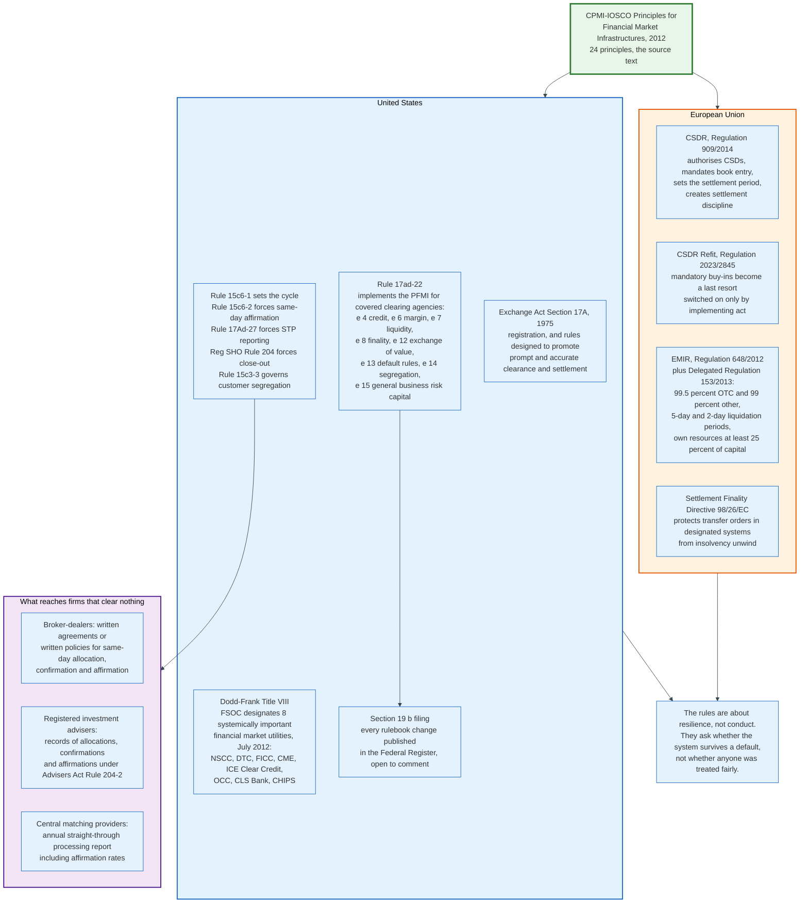
```mermaid
%%{init: {'theme': 'base', 'themeVariables': {'primaryColor': '#e3f2fd', 'primaryBorderColor': '#1565c0', 'lineColor': '#37474f'}}}%%

flowchart TB
    PFMI["CPMI-IOSCO Principles for<br/>Financial Market Infrastructures, 2012<br/>24 principles, the source text"]

    subgraph US["United States"]
        S17A["Exchange Act Section 17A, 1975<br/>registration, and rules designed to promote<br/>prompt and accurate clearance and settlement"]
        R22["Rule 17ad-22<br/>implements the PFMI for covered clearing agencies:<br/>e 4 credit, e 6 margin, e 7 liquidity,<br/>e 8 finality, e 12 exchange of value,<br/>e 13 default rules, e 14 segregation,<br/>e 15 general business risk capital"]
        T8["Dodd-Frank Title VIII<br/>FSOC designates 8 systemically important<br/>financial market utilities, July 2012:<br/>NSCC, DTC, FICC, CME, ICE Clear Credit,<br/>OCC, CLS Bank, CHIPS"]
        Cyc["Rule 15c6-1 sets the cycle<br/>Rule 15c6-2 forces same-day affirmation<br/>Rule 17Ad-27 forces STP reporting<br/>Reg SHO Rule 204 forces close-out<br/>Rule 15c3-3 governs customer segregation"]
        S19["Section 19 b filing<br/>every rulebook change published<br/>in the Federal Register, open to comment"]
    end

    subgraph EU["European Union"]
        CSDR["CSDR, Regulation 909/2014<br/>authorises CSDs, mandates book entry,<br/>sets the settlement period,<br/>creates settlement discipline"]
        Refit["CSDR Refit, Regulation 2023/2845<br/>mandatory buy-ins become a last resort<br/>switched on only by implementing act"]
        EMIR["EMIR, Regulation 648/2012<br/>plus Delegated Regulation 153/2013:<br/>99.5 percent OTC and 99 percent other,<br/>5-day and 2-day liquidation periods,<br/>own resources at least 25 percent of capital"]
        SFD["Settlement Finality Directive 98/26/EC<br/>protects transfer orders in designated systems<br/>from insolvency unwind"]
    end

    subgraph Reach["What reaches firms that clear nothing"]
        B1["Broker-dealers: written agreements or<br/>written policies for same-day allocation,<br/>confirmation and affirmation"]
        B2["Registered investment advisers:<br/>records of allocations, confirmations<br/>and affirmations under Advisers Act Rule 204-2"]
        B3["Central matching providers:<br/>annual straight-through processing report<br/>including affirmation rates"]
    end

    PFMI --> US
    PFMI --> EU
    R22 --> S19
    Cyc --> Reach

    Note["The rules are about resilience, not conduct.<br/>They ask whether the system survives a default,<br/>not whether anyone was treated fairly."]
    US --> Note
    EU --> Note

    style US fill:#e3f2fd,stroke:#1565c0,stroke-width:2px
    style EU fill:#fff3e0,stroke:#e65100,stroke-width:2px
    style Reach fill:#f3e5f5,stroke:#4a148c,stroke-width:2px
    style PFMI fill:#e8f5e9,stroke:#2e7d32,stroke-width:3px
```

### 18.1 The International Baseline

The CPMI-IOSCO Principles for Financial Market Infrastructures, published in 2012, are the source text. Twenty-four principles cover legal basis, governance, credit risk, collateral, margin, default management, general business risk, operational risk, access, links, and disclosure. National regulators implement them, and FMIs publish disclosure frameworks organised principle by principle, which is why the DTC and NSCC documents cited throughout this research are structured the way they are.

### 18.2 The United States

**Section 17A of the Exchange Act** requires clearing agencies to register with the Commission and requires their rules to be designed to promote the prompt and accurate clearance and settlement of securities transactions and to assure the safeguarding of securities and funds in their custody or control.

**Rule 17ad-22** implements the PFMI for covered clearing agencies. The provisions that matter most:

| Provision | Requirement |
|-----------|-------------|
| (e)(4)(i) | Cover credit exposure to each participant fully with a high degree of confidence |
| (e)(4)(ii) | Cover 2 for CCPs systemically important in multiple jurisdictions or with a more complex risk profile |
| (e)(4)(iii) | Cover 1 for all other CCPs |
| (e)(4)(iv) | Resources must be prefunded, excluding assessment powers |
| (e)(4)(vi) | Daily stress testing, monthly comprehensive review of scenarios and assumptions |
| (e)(6) | Risk-based margin: at least daily marks, intraday monitoring, authority to make intraday calls, documented decisions not to call |
| (e)(7) | Liquid resources for same-day settlement under Cover 1 stress |
| (e)(8) | Define the point at which settlement is final, no later than the end of the day on which the payment or obligation is due |
| (e)(12) | Eliminate principal risk by conditioning the final settlement of one obligation upon the final settlement of the other |
| (e)(13) | Participant default rules and procedures, tested with participants at least annually |
| (e)(14) | Segregation and portability of participants' customer positions and collateral, for CCPs clearing security-based swaps or with a more complex risk profile |
| (e)(15) | General business risk capital |

**Title VIII of the Dodd-Frank Act** allows the Financial Stability Oversight Council to designate systemically important financial market utilities, bringing them under heightened standards and Federal Reserve involvement. The Council designated eight in July 2012: NSCC, DTC, FICC, CME, ICE Clear Credit, OCC, CLS Bank International, and The Clearing House Payments Company, which operates CHIPS. Both DTCC clearing agencies described in this document are designated, and so is the depository.

**Rule 15c6-1** sets the settlement cycle. **Rule 15c6-2** requires same-day allocation, confirmation, and affirmation policies. **Rule 17Ad-27** requires straight-through processing policies and annual reporting from central matching service providers. **Regulation SHO Rule 204** requires close-out of fails to deliver. **Rule 15c3-3** governs the custody and segregation of customer securities.

Every proposed rule change by NSCC, DTC, or FICC is filed with the Commission under Section 19(b), published in the Federal Register, and open to comment. That is why the rulebooks are unusually transparent, and why this research can cite the mechanics of an intraday margin charge from a public document.

### 18.3 The European Union

**The CSD Regulation**, Regulation (EU) No 909/2014, authorises and supervises central securities depositories, mandates book-entry form for transferable securities admitted to EU trading venues, sets the standard settlement period, and creates the settlement discipline regime. **Regulation (EU) 2023/2845**, the CSDR Refit, revised the settlement discipline regime and made mandatory buy-ins a last resort.

**EMIR**, Regulation (EU) No 648/2012, authorises and supervises central counterparties, and **Commission Delegated Regulation (EU) No 153/2013** sets the quantitative standards: confidence intervals of 99.5 percent for OTC derivatives and 99 percent for other instruments, liquidation periods of at least five and two business days respectively, anti-procyclicality measures, and dedicated own resources of at least 25 percent of minimum capital in the default waterfall.

**The Settlement Finality Directive**, Directive 98/26/EC, protects transfer orders in designated systems from insolvency unwind, and is the legal foundation that makes netting enforceable across member states.

### 18.4 Compliance Obligations That Reach Ordinary Firms

Three requirements now reach firms that are not clearing agencies at all.

Broker-dealers must have written agreements or written policies designed to complete allocations, confirmations, and affirmations by end of trade date. Registered investment advisers must make and keep records of allocations, confirmations, and affirmations. And central matching service providers must file annual straight-through processing reports covering matters including affirmation rates for institutional and prime broker flows.

Post-trade compliance used to be an operations matter. It is now a rules matter with an examination trail.

---

## 19. Atomic Settlement: The Case For and Against

Atomic settlement is the simultaneous, conditional exchange of two assets such that either both legs transfer or neither does, executed trade by trade, usually on a shared ledger. It is the logical endpoint of shortening the settlement cycle, and the arguments against it are stronger than its advocates concede and weaker than incumbents claim.

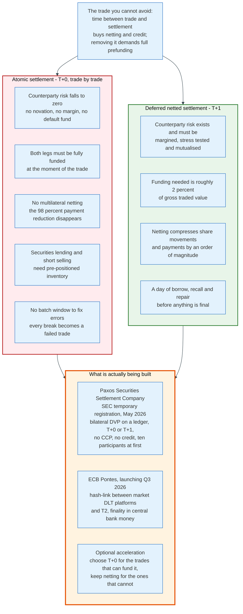
```mermaid
%%{init: {'theme': 'base', 'themeVariables': {'primaryColor': '#e3f2fd', 'primaryBorderColor': '#1565c0', 'lineColor': '#37474f'}}}%%

flowchart TB
    Choice["The trade you cannot avoid:<br/>time between trade and settlement<br/>buys netting and credit;<br/>removing it demands full prefunding"]

    subgraph Atomic["Atomic settlement - T+0, trade by trade"]
        A1["Counterparty risk falls to zero<br/>no novation, no margin, no default fund"]
        A2["Both legs must be fully funded<br/>at the moment of the trade"]
        A3["No multilateral netting<br/>the 98 percent payment reduction disappears"]
        A4["Securities lending and short selling<br/>need pre-positioned inventory"]
        A5["No batch window to fix errors<br/>every break becomes a failed trade"]
    end

    subgraph Deferred["Deferred netted settlement - T+1"]
        D1["Counterparty risk exists and must be<br/>margined, stress tested and mutualised"]
        D2["Funding needed is roughly 2 percent<br/>of gross traded value"]
        D3["Netting compresses share movements<br/>and payments by an order of magnitude"]
        D4["A day of borrow, recall and repair<br/>before anything is final"]
    end

    subgraph Middle["What is actually being built"]
        M1["Paxos Securities Settlement Company<br/>SEC temporary registration, May 2026<br/>bilateral DVP on a ledger, T+0 or T+1,<br/>no CCP, no credit, ten participants at first"]
        M2["ECB Pontes, launching Q3 2026<br/>hash-link between market DLT platforms<br/>and T2, finality in central bank money"]
        M3["Optional acceleration<br/>choose T+0 for the trades that can fund it,<br/>keep netting for the ones that cannot"]
    end

    Choice --> Atomic
    Choice --> Deferred
    Atomic --> Middle
    Deferred --> Middle

    style Atomic fill:#ffebee,stroke:#b71c1c,stroke-width:2px
    style Deferred fill:#e8f5e9,stroke:#2e7d32,stroke-width:2px
    style Middle fill:#fff3e0,stroke:#e65100,stroke-width:3px
```

### 19.1 The Case For

**Principal risk falls to zero without a guarantor.** DVP achieved through a conditional transfer needs no CCP guarantee, no margin, and no default fund, because there is no interval during which one party has performed and the other has not.

**Capital is released.** The 96.3 billion dollars of clearing fund requirements across DTCC's clearing services at 30 June 2025, as reported by the FSOC, exists to cover exposures that only exist because settlement is deferred. Remove the deferral and the exposure disappears with it.

**Reconciliation collapses.** If all parties read the same record, the industry's largest operational cost, comparing versions of the same position across firms, becomes unnecessary.

**Corporate actions become computable.** An entitlement calculated from a single authoritative position record is an arithmetic problem rather than an allocation problem down a chain.

**Settlement time stops being a policy variable.** Under atomic settlement, T+0, T+1, and T+2 are choices per trade rather than a market-wide regime.

### 19.2 The Case Against

**Netting disappears, and netting is the product.** Multilateral netting reduces the value of payments that must be exchanged each day by an average of 98 percent. Atomic settlement requires every trade to be funded in full at execution. Applied to NSCC's average daily cleared value of 2.191 trillion dollars in the second quarter of 2022, the funding requirement rises from roughly 44 billion dollars to the full gross amount. No market has that much idle cash and no central bank wants it to.

**Securities must be pre-positioned.** A seller must hold the exact securities at the moment of the trade. That is incompatible with intraday market making, with short selling, and with any strategy where inventory is sourced during the day. The systems that make those work, securities lending and the fail as a temporary credit, both depend on the gap that atomic settlement removes.

**There is no window in which to fix errors.** A settlement cycle is also an error-correction cycle. Under T+1 the industry still has a night. Under T+0 a wrong standing settlement instruction is a failed trade at the moment of execution.

**Liquidity risk replaces credit risk.** This is the BIS point from 1992, restated. Model 1 gross settlement eliminates principal risk and requires participants to maintain substantial money balances or receive substantial credit, and if balances are insufficient, high fail rates result. Atomicity does not abolish the trade-off; it selects the corner of it with the highest liquidity cost.

**Someone must still be the register.** A ledger that records ownership is a central securities depository whatever its data structure. It needs a legal basis for finality, a rulebook, an insolvency-proof status, and a supervisor. The technology changes the implementation, not the institution.

### 19.3 What Is Actually Being Built

Two developments in 2026 show the shape of the compromise.

**Paxos Securities Settlement Company** received temporary registration as a clearing agency from the Commission in an order published at 91 FR 32151 on 29 May 2026, to operate as a central securities depository and settlement service. Its design is instructive precisely because of what it gives up. It conducts delivery-versus-payment settlement bilaterally between pre-determined counterparty pairs, settling on a net basis per pair unless both elect gross. It does not serve as a central counterparty and extends no intraday or overnight credit, so participants have credit exposure only to counterparties they approve in advance and none to PSSC itself. Participants may settle on trade date, T+1, or any later agreed business day, and must have securities or cash in their PSSC accounts by a daily settlement cut-off of 3:10 p.m. During a ramp-up period, PSSC will not commence operations sooner than ten months from approval and will limit participation to ten firms with no enhanced netting across pairs for at least twelve months.

Read the terms carefully and the trade is explicit. No CCP means no novation, no margin, and no mutualised loss. It also means no multilateral netting, bilateral credit exposure that participants must approve one by one, and full prefunding by the cut-off.

**The ECB's Pontes** takes the opposite approach: keep central bank money and add interoperability. Pontes is the Eurosystem's DLT solution linking market DLT platforms to TARGET Services for wholesale settlement in central bank money, with initial launch planned for the third quarter of 2026. It offers a dual settlement model, with cash tokens on the Eurosystem DLT platform or settlement in T2, and achieves delivery versus payment across platforms through a Hash-Link protocol that enforces all-or-none settlement. Final settlement in central bank money is achieved once the corresponding transaction completes in T2.

That is atomicity as a coordination protocol between systems rather than as a property of one ledger. It preserves the thing central banks will not give up, which is that the cash leg is a claim on the central bank.

### 19.4 The Honest Conclusion

Atomic settlement is not a replacement for clearing. It is a different point on the same trade-off curve, and the curve has not moved since 1992: time between trade and settlement buys netting and credit, and buying it back costs liquidity.

The likely outcome is optionality rather than replacement. Trades that can be prefunded settle instantly, because for them the liquidity cost is zero and the risk saving is real. Trades that depend on inventory sourced during the day keep the cycle, the netting, and the CCP. Whether the two can coexist without fragmenting liquidity is the open question, and no market has answered it at scale.

---

## 20. Modern Developments

Four things are changing in American post-trade at once: Treasury clearing expands, the clearing day lengthens, FICC separates margin from mutualised loss, and T+1 goes global. Each is a rule change already adopted or already filed, not a forecast.

### 20.1 Treasury Clearing Expands

The largest structural change in American post-trade is the mandate to centrally clear US Treasury cash and repo transactions. The Commission adopted the Treasury clearing rules on 13 December 2023, requiring covered clearing agencies in the Treasury market to have policies requiring members to submit for clearing all repo and reverse repo collateralised by Treasuries, all purchases and sales by interdealer brokers, and purchases and sales between a member and a registered broker-dealer, government securities broker, or government securities dealer, with exemptions for central banks, sovereigns, international financial institutions, and natural persons. The rules also require separate calculation and collection of house and customer margin, and permit broker-dealers to include customer margin on deposit at a Treasury CCP as a debit in the customer reserve formula.

Compliance dates, as modified in February 2025: 31 December 2026 for cash Treasuries and 30 June 2027 for repo.

Competition arrived with the mandate. FICC was the only Treasury CCP when the rules were adopted. CME, through a new entity called CME Securities Clearing, was granted registration as a clearing agency in an order published at 90 FR 55926 on 4 December 2025, and ICE has formally applied through ICE Clear Credit. Multiple CCPs clearing the same product creates operational redundancy and splits netting sets, which is a genuine trade-off rather than a clear improvement.

### 20.2 The Clearing Day Gets Longer

NSCC moved to a 24x5 operating model on 28 June 2026, following Commission approval in an order published at 91 FR 32491 on 1 June 2026. Universal Trade Capture now accepts trades for any valid trade date from Sunday 8:00 p.m. to Friday 8:00 p.m., supporting pre-market, core, post-market, and overnight trading sessions. Previously UTC ran from 1:30 a.m. to 11:30 p.m.

The risk question the change raises is precise. NSCC's trade guaranty attaches on validation, which for an overnight trade happens many hours before the next start-of-day margin collection at 10:00 a.m. NSCC's answer is the margin requirement differential charge, computed from day-over-day positive changes in the member's start-of-day volatility and mark-to-market components over a 100-day lookback. The order states that the charge captures the accumulated trades of the entire day up to the final Good Night Message, which closes the Trade Processing Date at approximately 12:00 a.m. Two clocks run in that window and they are not the same clock. An overnight trade arriving before midnight lands in the next morning's start-of-day margin call. A trade arriving after it misses start-of-day margin and falls into intraday monitoring under Procedure XV Section I(B)(5). NSCC's designated time for accepting trades for the following trade date is a third time, around 8:00 p.m., and it governs submission rather than margin. NSCC committed to file further risk management enhancements before exchanges go live with 24x5 trading if it determines they are needed.

The trading side is moving in parallel. The Commission granted 24X National Exchange temporary conditional exemptive relief at 91 FR 52756 on 14 August 2026 in connection with an overnight market session, conditioned on the availability of consolidated market data during those hours.

Overnight trading and a settlement system that closes are not compatible for long.

### 20.3 FICC Separates Margin from Mutualised Loss

FICC's proposed GSD Guaranty Fund, noticed at 91 FR 51762 on 11 August 2026, would give the Government Securities Division a separate, cash-only default fund sized to a Cover 2 standard, allow Clearing Fund deposits to be treated as initial margin excluded from loss mutualisation, and support bankruptcy-remote treatment of those deposits. It would also remove FICC's authority to borrow non-defaulting members' Clearing Fund cash and replace it with authority to exchange a member's cash for Treasury securities, and eliminate fixed minimum Required Fund Deposit amounts.

The change matters beyond FICC. Whether posted margin is mutualised determines its capital treatment for the member posting it, and as Treasury clearing volumes multiply, that treatment becomes a first-order cost.

### 20.4 T+1 Goes Global

The EU and UK moves on 11 October 2027 are on track and increasingly specific. The European Commission adopted the amendments to the CSDR settlement discipline regulatory technical standards on 6 July 2026, subject to a three-month scrutiny period, with Official Journal publication expected from October 2026 and first application on 7 December 2026. ESMA's revised guidelines on allocation and confirmation are expected at the same time. The second EU industry readiness survey, presented in July 2026, reported that 83 percent of respondents are actively engaged on T+1.

Switzerland, and other European markets outside the EU, are coordinating on the same date. The purpose is to avoid the misalignment that Europe has lived with since May 2024.

### 20.5 Tokenisation Enters the Regulated Perimeter

The pattern across 2025 and 2026 is that tokenised settlement is arriving through registration rather than around it. Paxos Securities Settlement Company holds temporary registration as a clearing agency. The ECB is building Pontes for central bank money settlement against DLT platforms and running Appia as its broader tokenisation workstream. The EU's DLT Pilot Regime provides an authorisation route for DLT settlement systems and DLT trading and settlement systems, and Pontes explicitly lists their operators among eligible market DLT operators.

None of these replaces a CCP. Each is a settlement venue that accepts the funding cost of gross settlement in exchange for removing the credit layer.

---

## 21. Appendix

### 21.1 Key Terminology

| Term | Meaning |
|------|---------|
| **Affirmation** | The institution's or custodian's agreement to a broker's confirmation, the step that makes an institutional trade settleable |
| **Balance order** | An NSCC-compared obligation that settles between members rather than through CNS, and is not guaranteed by NSCC |
| **Buy-in intent** | Notice by a long member that raises its position in the CNS allocation queue and starts the clock to a buy-in |
| **Cede and Co** | DTC's nominee, the registered owner on issuer registers of securities deposited at DTC |
| **Clearing Fund** | NSCC's margin, which in aggregate also serves as its default fund |
| **CNS** | Continuous Net Settlement, NSCC's netting and settlement engine |
| **Collateral monitor** | DTC control that ensures a participant's collateral always exceeds its net settlement debit |
| **Corporate Contribution** | NSCC's own capital in the waterfall, equal to 50 percent of its General Business Risk Capital Requirement |
| **Cover 1 / Cover 2** | Prefunded resources sufficient for the default of the largest, or the two largest, participant families in extreme but plausible conditions |
| **CSD** | Central securities depository, which holds securities and moves them by book entry |
| **Dematerialisation** | No certificate exists at all; ownership is purely a book entry |
| **DVP** | Delivery versus payment: securities transfer if and only if funds transfer |
| **Due bill** | The obligation to pass a distribution to a buyer whose trade settles after the record date |
| **Exemption** | A member's instruction telling NSCC not to settle a nominated quantity of a short CNS position |
| **Fungible bulk** | The holding of securities such that no specific units are identifiable to any account holder |
| **ICSD** | International central securities depository: Euroclear Bank and Clearstream Banking Luxembourg |
| **Immobilisation** | The certificate exists and is held permanently at the depository; ownership moves by book entry |
| **Interim accounting** | DTC's process for allocating distributions on trades in flight over a record date |
| **Locked-in trade** | A trade submitted already matched by an exchange or qualified special representative |
| **Loss Allocation Cap** | The maximum a surviving NSCC member can be charged in a loss allocation round before withdrawing |
| **Net debit cap** | The maximum settlement net debit a DTC participant may incur at any point in the day |
| **Novation** | Substituting the CCP as counterparty to both sides of a trade, extinguishing the original contract |
| **NSS** | The Federal Reserve's National Settlement Service, through which DTC settles net-net balances |
| **Potential future exposure** | Maximum exposure at a future point at a confidence level of at least 99 percent |
| **RAD** | Receiver Authorized Delivery, DTC's control letting a receiver approve transactions before completion |
| **Recycle queue** | Where a DTC transaction waits when it would breach a risk control |
| **Required Fund Deposit** | A member's daily NSCC margin requirement, the first 40 percent in cash and never less than 250,000 dollars |
| **Security entitlement** | The UCC Article 8 property right an investor holds against its intermediary |
| **Settling bank** | The bank that pays or receives a participant's net-net settlement balance |
| **SLD** | Supplemental Liquidity Deposit, cash NSCC collects each business day from the providers whose daily liquidity need exceeds its qualifying liquid resources |
| **SSI** | Standing settlement instruction: where a counterparty wants its securities and cash delivered |
| **Street name** | Holding securities through an intermediary rather than in the investor's own name |
| **T2S** | TARGET2-Securities, the Eurosystem's securities settlement platform |
| **Trade guaranty** | NSCC's guarantee of settlement, attaching on validation or comparison under Addendum K |
| **UTC** | Universal Trade Capture, NSCC's trade validation and reporting system |
| **Volatility charge** | The value-at-risk component of NSCC's margin, usually the largest |

### 21.2 Architecture Diagrams

| Diagram | Source | Description |
|---------|--------|-------------|
| Settlement Cycle Timeline | [`diagrams/settlement-cycle-timeline.mmd`](diagrams/settlement-cycle-timeline.mmd) | From the 1968 paperwork crisis to T+1 in Europe in 2027 |
| Trade to Settlement Gap | [`diagrams/trade-to-settlement-gap.mmd`](diagrams/trade-to-settlement-gap.mmd) | What fills the interval between execution and delivery |
| Participants | [`diagrams/participants.mmd`](diagrams/participants.mmd) | Actors across trading, matching, clearing, settlement, and custody |
| Novation | [`diagrams/novation.mmd`](diagrams/novation.mmd) | One contract becomes two, and what changes at that instant |
| DTCC Entities | [`diagrams/dtcc-entities.mmd`](diagrams/dtcc-entities.mmd) | NSCC, DTC, FICC, and DTCC ITP, and what each does |
| CNS Netting | [`diagrams/cns-netting.mmd`](diagrams/cns-netting.mmd) | Multilateral netting worked through four members in one security |
| DVP Models | [`diagrams/dvp-models.mmd`](diagrams/dvp-models.mmd) | The BIS 1992 taxonomy and the liquidity cost of each model |
| Holding Chain | [`diagrams/holding-chain.mmd`](diagrams/holding-chain.mmd) | Issuer to Cede and Co to DTC to intermediary to beneficial owner |
| Margin Components | [`diagrams/margin-components.mmd`](diagrams/margin-components.mmd) | Every component of an NSCC Required Fund Deposit |
| Default Waterfall | [`diagrams/default-waterfall.mmd`](diagrams/default-waterfall.mmd) | NSCC's Rule 4 loss allocation sequence |
| Liquidity Controls | [`diagrams/liquidity-controls.mmd`](diagrams/liquidity-controls.mmd) | The four tests before a DTC delivery completes, and how the cap and monitor are set |
| Settlement Day Timeline | [`diagrams/settlement-day-timeline.mmd`](diagrams/settlement-day-timeline.mmd) | Night cycle, day cycle, cut-offs, and NSS money settlement |
| T+1 Compression | [`diagrams/t1-compression.mmd`](diagrams/t1-compression.mmd) | What the removal of one day broke and what it bought |
| Fail Lifecycle | [`diagrams/fail-lifecycle.mmd`](diagrams/fail-lifecycle.mmd) | US fail charges and close-outs against EU cash penalties |
| Corporate Action Dates | [`diagrams/corporate-action-dates.mmd`](diagrams/corporate-action-dates.mmd) | Ex-date, record date, payable date, and interim accounting |
| Cross-Border Settlement | [`diagrams/cross-border-settlement.mmd`](diagrams/cross-border-settlement.mmd) | ICSDs, the Bridge, T2S, and the US |
| Cost Stack | [`diagrams/cost-stack.mmd`](diagrams/cost-stack.mmd) | Fees, collateral, hidden costs, and who ends up paying |
| Regulatory Map | [`diagrams/regulatory-map.mmd`](diagrams/regulatory-map.mmd) | PFMI, Rule 17ad-22, Title VIII, CSDR, EMIR, and what reaches ordinary firms |
| Atomic Trade-Off | [`diagrams/atomic-tradeoff.mmd`](diagrams/atomic-tradeoff.mmd) | Netting against atomicity, and what is being built between them |

### 21.3 Reference Tables

**US settlement cycle history**

| Effective | Cycle | Authority |
|-----------|-------|-----------|
| Pre-1995 | T+5 | Market practice |
| 7 June 1995 | T+3 | Rule 15c6-1, adopted October 1993 |
| 5 September 2017 | T+2 | Amendment to Rule 15c6-1 |
| 28 May 2024 | T+1 | Release No. 34-96930 |

**CSDR cash penalty rates, Delegated Regulation (EU) 2017/389**

| Instrument | Basis points per day |
|-----------|----------------------|
| Liquid shares | 1.0 |
| Illiquid shares | 0.5 |
| SME growth market instruments, non-debt | 0.25 |
| Sovereign and equivalent debt | 0.10 |
| Other debt | 0.20 |
| SME growth market debt | 0.15 |
| All other financial instruments | 0.5 |
| Lack of cash | Central bank overnight rate, floored at zero |

**Key DTC settlement day cut-offs, Eastern Time**

| Time | Event |
|------|-------|
| 3:00 p.m. | Forced RAD begins; SFT input closes |
| 3:10 p.m. | Valued recycle cutoff; unfilled valued transactions drop |
| 3:15 p.m. | Cutoff for government deposits and withdrawals |
| 3:20 p.m. | Cutoff for valued deliver orders, payment orders, pledges |
| 3:30 p.m. | Cutoff for RAD approval or cancellation of valued transactions and pledgee approval of valued pledge release requests |
| 3:45 p.m. | DTC and NSCC cross-endorsement balances calculated, then settlement balances finalised for participants and settling banks |
| 4:15 p.m. or later | Settling bank acknowledgment cutoff |
| ~4:30 p.m. | NSS file processed with the Federal Reserve Bank of New York |
| 5:00 p.m. | Risk management controls lifted |
| 6:35 p.m. | Recycle cutoff for free transactions |
| 11:00 p.m. | Night deliver order cutoff |

**Regulatory margin parameters compared**

| Parameter | United States, Rule 17ad-22 | European Union, Delegated Regulation 153/2013 |
|-----------|----------------------------|-----------------------------------------------|
| Confidence level | At least 99 percent for potential future exposure | 99.5 percent OTC derivatives, 99 percent other |
| Liquidation period | Interval between last margin collection and close-out | At least 5 business days OTC derivatives, 2 business days other |
| Prefunded resources | Cover 1, or Cover 2 for multi-jurisdiction or complex CCPs | Cover 1, or Cover 2 where required |
| CCP own resources | Corporate Contribution set by CCP rules | At least 25 percent of minimum capital |
| Anti-procyclicality | Model review and backtesting requirements | 25 percent buffer, 25 percent stressed weight, or 10-year lookback |

**Primary sources, with the version each claim rests on**

Every rule text, dollar figure, and clock time in this document is quoted from one of the versions below. Rulebooks change between versions, so the as-of date is part of the citation rather than a courtesy.

| Document | Version relied on | Where |
|----------|-------------------|-------|
| NSCC Rules and Procedures: Rule 4, Rule 4A, Rule 18, Rule 46, Procedure VII, Procedure XV, Addendum A, Addendum K | As of 13 August 2026 | dtcc.com/-/media/Files/Downloads/legal/rules/nscc_rules.pdf |
| DTC Settlement Service Guide | As of 10 June 2026 | dtcc.com/-/media/Files/Downloads/legal/service-guides/Settlement.pdf |
| DTC Corporate Actions Distributions Service Guide | As of 6 May 2026 | dtcc.com legal service guides |
| DTC Disclosure Framework for Covered Clearing Agencies and FMIs | March 2023, data as of 30 June 2022 | dtcc.com/-/media/Files/Downloads/legal/policy-and-compliance/DTC_Disclosure_Framework.pdf |
| NSCC Disclosure Framework for Covered Clearing Agencies and FMIs | March 2023 | dtcc.com/-/media/Files/Downloads/legal/policy-and-compliance/NSCC_Disclosure_Framework.pdf |
| DTCC CPMI-IOSCO Public Quantitative Disclosure | Q2 2022, as quoted in the T+1 adopting release | dtcc.com/-/media/Files/Downloads/legal/policy-and-compliance/CPMI-IOSCO-Quantitative-Disclosure-Results-2022Q2-1.pdf |
| Shortening the Securities Transaction Settlement Cycle, Release No. 34-96930 | 88 FR 13872, 6 March 2023 | federalregister.gov |
| 17 CFR 240.17ad-22 | Current | ecfr.gov |
| Delivery versus payment in securities settlement systems, CPMI | September 1992 | bis.org |
| Regulation (EU) No 909/2014, Regulation (EU) 2023/2845, Delegated Regulation (EU) 2017/389, Delegated Regulation (EU) No 153/2013 | Consolidated texts | eur-lex.europa.eu |
| ESMA report on shortening the settlement cycle | November 2024 | esma.europa.eu |
| Staff Report on Equity and Options Market Structure Conditions in Early 2021 | October 2021 | sec.gov |
| FSOC 2025 Annual Report | 2025, clearing fund figures at p. 53 | home.treasury.gov/system/files/261/FSOC2025AnnualReport.pdf |
| Deutsche Boerse Half-yearly financial report 2026 | Q2 2026, Securities Services at p. 12 | deutsche-boerse.com investor relations |
| ECB TARGET2-Securities | Page retrieved August 2026 | ecb.europa.eu/paym/target/t2s |

**Federal Register citations for the 2026 and 2025 filings named in this document**

| Filing | Citation | Published | Section |
|--------|----------|-----------|---------|
| DTCC ITP LLC, notice of application for exemption from clearing agency registration | 91 FR 55933 | 31 August 2026 | 3.3 |
| NSCC, order approving proposed rule change to enhance the Supplemental Liquidity Deposit rules, methodology and processes | 91 FR 53454 | 18 August 2026 | 11.3 |
| NSCC, notice of filing of that Supplemental Liquidity Deposit change | 91 FR 41128 | 6 July 2026 | 11.3 |
| NSCC, order approving proposed rule change concerning extended trading hours, the 24x5 model | 91 FR 32491 | 1 June 2026 | 20.2 |
| NSCC, notice of filing of that extended trading hours change | 91 FR 20507 | 16 April 2026 | 20.2 |
| FICC, notice of filing to establish a Guaranty Fund at the Government Securities Division | 91 FR 51762 | 11 August 2026 | 10.3, 20.3 |
| FICC, advance notice for the same Guaranty Fund | 91 FR 51787 | 11 August 2026 | 20.3 |
| Paxos Securities Settlement Company LLC, order granting temporary registration as a clearing agency | 91 FR 32151 | 29 May 2026 | 19.3 |
| CME Securities Clearing Inc., order granting registration as a clearing agency | 90 FR 55926 | 4 December 2025 | 20.1 |
| 24X National Exchange LLC, order granting temporary conditional exemptive relief for the overnight session | 91 FR 52756 | 14 August 2026 | 20.2 |
| DTC, notice amending the Corporate Actions Distributions Service Guide and the Settlement Service Guide for T+1 | 89 FR 21557 | 28 March 2024 | 15.1, 15.2 |

**What this document does not establish**

Three figures a reader might expect are absent, and the absence is deliberate rather than an oversight.

The current NSCC average daily cleared value is not stated. The most recent figure traceable to a named source is 2.191 trillion dollars for the second quarter of 2022, quoted in the T+1 adopting release. DTCC publishes quarterly quantitative disclosures; none later than Q2 2022 is cited here.

The realised margin effect of US T+1 is not stated. DTCC's 41 percent forecast for the NSCC volatility component is a pre-implementation estimate, and no source cited here separates the realised NSCC equity margin change since 28 May 2024 from the FICC Government Securities Division build-up that dominates the aggregate.

The current Bridge cycle count between Euroclear Bank and Clearstream is not stated. The two ICSDs publish the timetable in their own operational schedules and revise it with each release.

---

## 22. Key Takeaways

**Clearing and settlement exist because a trade and a delivery are different events.** Everything in this document is a way of managing the interval between them, and every design choice trades counterparty risk against liquidity.

**Netting is the product.** Multilateral netting reduces the value of payments that must be exchanged each day by an average of 98 percent. NSCC cleared an average of 2.191 trillion dollars a day in the second quarter of 2022 and settled around 44 billion. Any proposal that removes netting must explain where the other 98 percent of funding comes from.

**Novation relocates risk; it does not delete it.** The CCP becomes buyer to every seller, which is why anonymous markets and netting are possible, and why the CCP must be margined, stress tested, and treated as a utility that cannot fail.

**NSCC and DTC are different companies doing different jobs.** NSCC novates, nets, and guarantees. DTC holds and moves. CNS deliveries at DTC are free of payment, and the two legs are joined by NSCC Rule 12 rather than by simultaneity. Both classify themselves as DVP Model 2, deferred net settlement.

**Margin is a dozen components, not one number.** Volatility, mark-to-market, fails, family-issued securities, margin requirement differential, coverage, backtesting, excess capital premium, bank holiday, intraday, and supplemental liquidity. The first 40 percent must be cash, never less than 250,000 dollars, and it is due by 10:00 a.m.

**The waterfall has an order and a cap.** Close-out proceeds, the defaulter's deposit, cross-guaranty recoveries, 50 percent of NSCC's General Business Risk Capital Requirement, then survivors pro rata on their 70-day average deposits, in capped rounds with a five-day withdrawal right. NSCC has never invoked loss allocation.

**T+1 removed a day and moved the pressure upstream.** Rule 15c6-1 shortened the cycle on 28 May 2024, and Rule 15c6-2 forced allocation, confirmation, and affirmation onto trade date because otherwise the cycle change would just have produced fails. The forecast payoff was about a 41 percent cut in the NSCC volatility component and more than 3 billion dollars returned; EU CCP simulations show 42 percent and about 2.4 billion euro a day. Both are pre-implementation estimates, and no realised US figure separated from the Treasury clearing build-up is cited here.

**Fails are priced, not prevented.** In CNS a fail is an open position that nets forward, charged 5 to 100 percent of market value by age. In the EU it accrues cash penalties from 0.1 to 1.0 basis points a day, and over the year to February 2024 an average of 7.14 percent of EEA instructions failed each month. Mandatory buy-ins remain in EU law as a last resort that has never been switched on.

**Street name is the price of book-entry settlement.** Cede and Co is the registered owner, DTC holds in fungible bulk, and the investor owns a security entitlement under UCC Article 8 rather than a share. Issuer visibility, proxy voting, and corporate action allocation all inherit that structure.

**Atomic settlement is a different point on the same curve.** Paxos Securities Settlement Company's SEC registration shows the terms explicitly: no CCP, no credit, no multilateral netting, full prefunding by a 3:10 p.m. cut-off, and ten participants to start. The ECB's Pontes takes the other route, hash-linking DLT platforms to T2 so that finality stays in central bank money. Neither abolishes the trade-off the BIS described in 1992.
