# FIX Protocol and Trading Infrastructure: Complete Technical Deep Dive

---

## Table of Contents

1. [History and Overview](#1-history-and-overview)
2. [What FIX Is, and What It Is Not](#2-what-fix-is-and-what-it-is-not)
3. [Key Participants and Roles](#3-key-participants-and-roles)
4. [The Wire Format: Tag Equals Value](#4-the-wire-format-tag-equals-value)
5. [The Standard Header, the Trailer, and the Checksum](#5-the-standard-header-the-trailer-and-the-checksum)
6. [The Session Layer](#6-the-session-layer)
7. [The Application Layer: Orders, Executions, Cancels](#7-the-application-layer-orders-executions-cancels)
8. [ExecType and OrdStatus: The Order State Machine](#8-exectype-and-ordstatus-the-order-state-machine)
9. [A Worked Order, End to End](#9-a-worked-order-end-to-end)
10. [Beyond Tag Value: FIXML, FAST, SBE, FIXP](#10-beyond-tag-value-fixml-fast-sbe-fixp)
11. [Native Binary Venue Protocols, and Why Venues Left Tag Value](#11-native-binary-venue-protocols-and-why-venues-left-tag-value)
12. [Market Data: FIX Versus Native Binary](#12-market-data-fix-versus-native-binary)
13. [Drop Copy and the Post-Trade Chain](#13-drop-copy-and-the-post-trade-chain)
14. [Order Management Against Execution Management](#14-order-management-against-execution-management)
15. [Certification and Onboarding With a Venue](#15-certification-and-onboarding-with-a-venue)
16. [Latency Budgets, End to End](#16-latency-budgets-end-to-end)
17. [Technical Architecture: Engines, Sessions, Physical Plant](#17-technical-architecture-engines-sessions-physical-plant)
18. [Economics: What It Costs to Run and Who Pays](#18-economics-what-it-costs-to-run-and-who-pays)
19. [Security and Risk](#19-security-and-risk)
20. [Regulation and Compliance](#20-regulation-and-compliance)
21. [Comparisons and Alternatives](#21-comparisons-and-alternatives)
22. [Modern Developments](#22-modern-developments)
23. [Appendix](#23-appendix)
24. [Key Takeaways](#24-key-takeaways)

---

## 1. History and Overview

FIX exists because in 1992 a fund manager could not send an order to a broker without a telephone call. The Financial Information eXchange specification was authored that year by Robert Lamoureux at Fidelity Investments and Chris Morstatt at Salomon Brothers, to replace equity order information that had been "communicated verbally over the telephone" with machine-readable messages. The problem was not speed. The problem was that a spoken order gets misheard, mistyped, and lost, and nobody can prove afterwards what was said.

Thirty-four years later the same protocol carries the order flow of the world's institutional markets. The FIX Trading Community, the non-profit that maintains it, calls what it stewards "a global, open standard that enables financial institutions to communicate trading information quickly, accurately and securely." It publishes no count of connected firms and no count of messages, and no other body publishes one. The size of the installed base is not known. What is known is that almost every message on it still starts with the three ASCII characters `8=F`.


### 1.1 The Version Line

FIX grew by accretion, and the version numbers record which asset class was being bolted on at the time.

| Version | Year | What it changed |
|---------|------|-----------------|
| **FIX 1.0** | 1992 | Point-to-point prototype between Fidelity and Salomon Brothers |
| **FIX 2.7** | 1994 | First multi-firm circulation |
| **FIX 3.0** | 1995 | Broader message set, still equities only |
| **FIX 4.0** | 1996 | First version deployed at scale across US equities |
| **FIX 4.1** | 1998 | Cleanups to the session layer and order handling |
| **FIX 4.2** | 2000 | The workhorse. Still the version most US equity exchanges accept. |
| **FIX 4.3** | 2001 | Fixed income, foreign exchange, and derivatives fields |
| **FIX 4.4** | 2003 | Confirmation, trade capture, positions, collateral. The most widely deployed version in institutional flow. |
| **FIX 5.0 and FIXT 1.1** | 2006 | Session layer split out of the application layer and versioned separately |
| **FIX 5.0 SP1** | 2008 | Service pack |
| **FIX 5.0 SP2** | 2009 | Service pack. The last numbered application release. |
| **FIX Latest** | Continuous | Numbered releases replaced by Extension Packs applied to a rolling baseline |

The years above are the community's published release years rather than dates stamped on the specification files, which carry re-issue dates: the FIX 4.4 release notes on the FIX Trading Community site show a last-updated date of 24 July 2017 for a specification first issued in 2003.

The break at 5.0 matters more than the number suggests. Through 4.2 the specification was monolithic: the rules for logging on and the rules for placing an order lived in one document and shipped together, so a firm that wanted one new order field had to negotiate a version upgrade for the whole session. FIX 5.0 separated the two. FIXT 1.1 became the session layer, versioned on its own, and `ApplVerID` (tag 1128) let a single session carry messages from several application versions at once.

Almost nobody upgraded. The installed base stayed on 4.2 and 4.4, which is why a 2026 order to Cboe's US equities markets still travels over "a subset of the FIX 4.2 protocol," in Cboe's own words.

### 1.2 The Move to Continuous Release

The community stopped numbering application releases after 5.0 SP2 and moved to Extension Packs. An Extension Pack is a bundle of additions to the field dictionary and message set, published as soon as the Global Technical Committee approves it, and applied to a rolling baseline called FIX Latest. FIX Latest means, precisely, the protocol up to and including the most recent Extension Pack.

As of August 2026 the highest published pack is EP309, Equity Issuance Phase 1A. EP308 adds derivative event types, EP307 extends securities lending, EP306 is the June 2026 errata bundle, and EP305 standardises how venues communicate outages. The reference browser for FIX Latest EP309 was generated on 31 July 2026.

The tooling changed with it. FIXimate, the field and message browser two generations of implementers grew up with, retired on 27 August 2026 and now redirects to Orchimate, which serves the same content out of FIX Orchestra files rather than hand-maintained HTML.

### 1.3 Scale Today

Message volume is the wrong measure of FIX's importance, and no authoritative count of it exists. The FIX Trading Community publishes neither a firm count nor a message count. What the market publishes is capacity rather than usage: the CTA Plan, which operates the consolidated tape for US listed equities, states a current capacity of 2,700,000 messages per 100 milliseconds on the quote feed and 425,000 on the trade feed, which is 27 million and 4.25 million messages a second. Those feeds are not FIX. They size the market that FIX orders enter.

The right measure is dependency, not throughput. No buy-side order reaches a broker, no algorithm reports a child fill, no allocation reaches a custodian, and no compliance system sees a trade, unless something in the chain speaks FIX. The dependency runs deeper than the market data path, where FIX lost. Order flow is where it won, and order flow is where it stayed.

---

## 2. What FIX Is, and What It Is Not

### 2.1 The Three Layers

FIX is three separable things that are usually discussed as one, and separating them is the whole trick to understanding the protocol.

**A field dictionary and message catalogue.** A numbered field dictionary and, in FIX 4.4, exactly 93 message types, each field carrying a defined data type, a defined meaning, and in many cases an enumerated code list. `54=1` means buy. `39=2` means the order is filled. This is the semantic layer, and it is the part that is actually called FIX.

**A session protocol.** Rules for logging on, numbering messages, detecting gaps, replaying lost messages, and deciding when a counterparty has gone silent. In FIX 4.x this rode inside the same specification; from FIX 5.0 it is FIXT 1.1, and for latency-sensitive links it is FIXP.

**An encoding.** How the fields become bytes. `tag=value` is the original and still the default, but FIXML, FAST, SBE, JSON, Google Protocol Buffers, and ASN.1 are all defined mappings of the same semantics.

Most arguments about "moving off FIX" are arguments about the third layer only. CME's iLink 3 is SBE-encoded, FIXP-sessioned, and semantically FIX. It is less FIX-like on the wire and no less FIX in meaning.

### 2.2 What FIX Is Not

**Not a network.** FIX defines no transport. In practice it runs over TCP, and in practice over a private extranet or a cross connect in a colocation facility rather than the public internet, but nothing in the specification says so. The protocol will run over anything that delivers an ordered byte stream.

**Not encrypted.** `EncryptMethod` (tag 98) exists and its only value used in the field is `0`, meaning none. FIX carries no confidentiality of its own. Where confidentiality is required it comes from TLS underneath, for which the community publishes FIXS, the standard for securing FIX sessions with Transport Layer Security. FIXS 1.0 reached draft standard on 5 January 2018 and technical standard on 19 February 2021, and version 1.1 Release Candidate 1 followed in February 2025. A FIX session with `98=0` over an unencrypted link puts account numbers, order sizes, and client identifiers on the wire in ASCII.

**Not a settlement system.** FIX carries the instruction and the report of the execution. It does not move securities and it does not move cash. Those happen at a central counterparty, a central securities depository, and a custodian, reached by different messages on different rails, usually ISO 15022 or ISO 20022 over Swift.

**Not a matching engine, and not an order book.** FIX is how a participant talks to the venue that has the book. The order book is the venue's, always. A great many integration bugs come from client code that believes its local copy of the order is authoritative. It is not. The `ExecutionReport` is.

**Not machine-optimised.** The wire format was designed in 1992 for a world where the constraint was human debuggability and cross-vendor interoperability, not nanoseconds. Every price is an ASCII string. Every field boundary requires a scan. This was a correct decision then and it is why latency-sensitive venues eventually left the encoding while keeping the semantics.

**Not one protocol in practice.** There is no such thing as a generic FIX connection. Every counterparty publishes rules of engagement describing which subset of which version it supports, which fields are mandatory beyond the specification, which values it rejects, and which custom tags above 5000 it requires. Two counterparties both claiming FIX 4.2 support will not interoperate without a certification cycle. This is the single most consistently underestimated fact about the protocol.

### 2.3 The Simplest Accurate Mental Model

FIX is a numbered vocabulary plus a delivery guarantee.

The vocabulary lets two firms that have never met agree what "buy 10,000 shares at limit 187.45, day order" means, without either firm shipping code to the other. The delivery guarantee, which is what the session layer provides, means that either both sides agree on exactly which messages were exchanged, or the session dies loudly. There is no third state where the two sides quietly disagree about whether an order exists.

That second property is the reason the protocol survived. Speed can be bought. Agreement about what happened cannot.

---

## 3. Key Participants and Roles

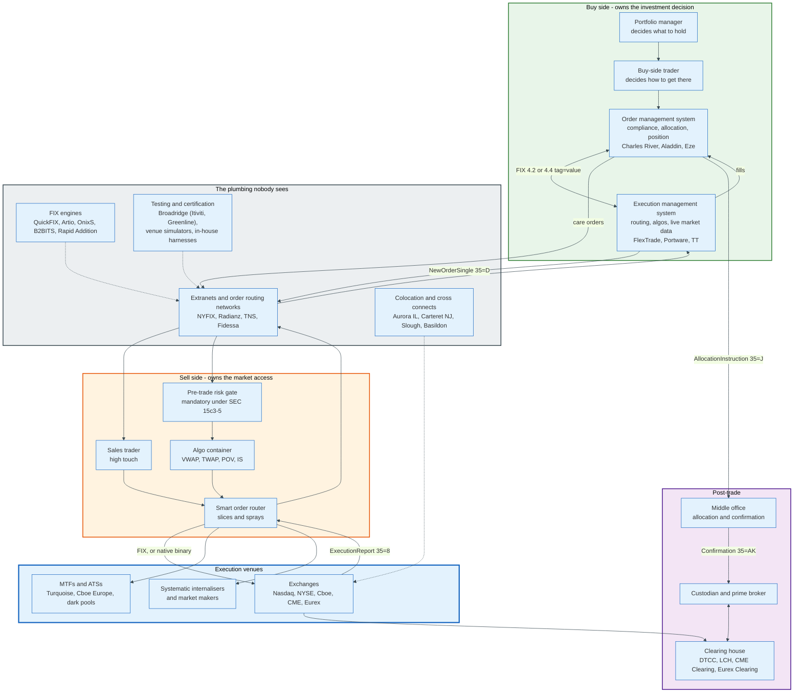

### 3.1 The Actors

| Role | What it does | Examples | Speaks FIX? |
|------|--------------|----------|-------------|
| **Buy-side trader** | Turns a portfolio decision into orders | Asset managers, hedge funds, pension funds | Through the OMS or EMS |
| **Order management system** | Compliance, staging, allocation, book of record | Charles River, Aladdin, SS and C Eze, Bloomberg AIM | Yes, usually 4.2 or 4.4 |
| **Execution management system** | Routing, algorithms, live depth, child orders | FlexTrade, Portware, TT, Bloomberg EMSX | Yes, both directions |
| **Sell-side broker** | Provides market access, capital, and algorithms | Bulge and regional brokers, agency-only firms | Yes, on both sides |
| **Smart order router** | Splits a parent order across venues | Broker-built or licensed | Yes, or native binary to venues |
| **Pre-trade risk gate** | Blocks orders that breach credit or fat-finger limits | Broker-owned, mandatory under SEC Rule 15c3-5 | Sits inline on the FIX path |
| **Exchange or MTF** | Runs the matching engine and the book | Nasdaq, NYSE, Cboe, LSEG, CME, Eurex | FIX for entry, native binary for speed |
| **Market maker** | Quotes two-sided prices continuously | Citadel Securities, Jane Street, Optiver, IMC | Native binary almost exclusively |
| **Clearing member** | Guarantees a client's trades to the CCP | Futures commission merchants, general clearing members | Consumes drop copy |
| **Central counterparty** | Novates and nets the trades | DTCC, LCH, CME Clearing, Eurex Clearing | FIXML, and ISO messages |
| **Custodian** | Holds the assets and settles | State Street, BNY, Northern Trust, Citi | ISO 15022 and 20022, plus FIX confirmations |
| **FIX engine vendor** | Sells the session implementation | QuickFIX, Artio, OnixS, B2BITS, Rapid Addition | It is the implementation |
| **Network and extranet** | Carries the sessions between firms | Radianz, TNS, Fidessa, Bloomberg, direct cross connects | Transports it |
| **Certification vendor** | Tests a link before it goes live | Broadridge, which absorbed Itiviti and with it the Greenline and VeriFIX line, plus venue-supplied simulators and in-house harnesses | Simulates both sides |

### 3.2 The Two Roles That Determine Whether an Integration Works

**The counterparty's rules-of-engagement author is the real specification.** FIX Trading Community documents describe what is legal. The counterparty's document describes what is accepted. A field the specification marks optional is frequently mandatory at the venue, a code list the specification leaves open is frequently restricted to four values, and tags above 5000 appear that exist nowhere in the standard. Where the two documents disagree, the counterparty wins, every time.

**The certification engineer is the gate.** No production session opens until a human at the counterparty has watched a test session execute a scripted list of scenarios and signed off. That person's queue length, not the code, is what determines when a new broker link goes live. Onboarding timelines of four to twelve weeks are normal and are almost entirely queue time.

### 3.3 The Asymmetry Nobody Draws

The buy side has one order. The sell side has many.

A buy-side firm sends a parent order for 10,000 shares and expects a manageable stream of reports back. The broker turns that into child orders across five venues, each generating its own acknowledgements, fills, cancels, and rejects, and then compresses the result back into the reports the client sees. A broker handles far more messages than the client sees, and the multiple is set by how finely the algorithm slices. No broker or venue publishes a child-orders-per-parent figure, so the multiple is not known.

That asymmetry is why FIX engine performance is a sell-side problem and a buy-side afterthought. It is also why the sell side moved to binary encodings first.

---

## 4. The Wire Format: Tag Equals Value

A FIX message is a sequence of `tag=value` pairs, each terminated by a single byte, ASCII `0x01`, called SOH. That is the entire format.

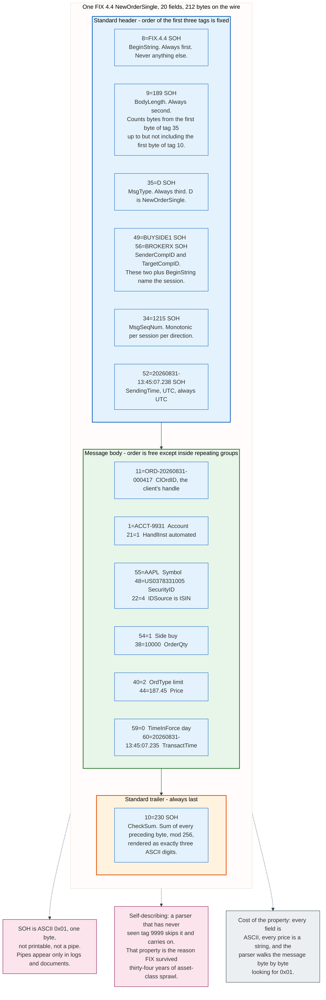

### 4.1 The Rules

**Every field is `tag=value` followed by SOH.** The tag is an unsigned integer with no leading zeros. The value is ASCII. The delimiter is one byte, `0x01`, chosen in 1992 because it is a control character that cannot appear in ordinary text, so no escaping is ever needed.

**SOH is not a pipe.** Every FIX document, log viewer, and tutorial on earth renders SOH as `|` because `0x01` is invisible in a terminal. There is no pipe on the wire. Writing a parser that splits on `|` produces something that works perfectly against documentation and fails against every real counterparty.

**Fields may repeat only inside repeating groups.** A group is introduced by a count field, and the first field of each entry is fixed by the specification. `NoAllocs` (tag 78) says how many allocation entries follow, and each entry must begin with `AllocAccount` (tag 79). Getting the group's first field wrong is not a warning; the parser loses track of where the group ends and misreads everything after it.

**Order is free outside the header, the trailer, and groups.** Tags 8, 9, and 35 must be the first three fields in that order. Tag 10 must be last. Everything else may appear in any order, and many counterparties nonetheless emit a fixed order and expect one, because their parsers are positional in practice even when the specification says they should not be.

**Values are strings, including numbers.** `44=187.45` is six ASCII characters, not an IEEE 754 double and not a scaled integer. The specification's `Price` type is a decimal string of arbitrary precision, and the correct implementation converts it to a fixed-point decimal, never to a float. Firms that parse prices into doubles discover the problem when a limit at 187.45 becomes 187.44999999999999 in a comparison.

### 4.2 A Real NewOrderSingle

Here is a complete, valid FIX 4.4 order to buy 10,000 AAPL at a limit of 187.45, day order. SOH is shown as `|`, and the byte counts below are for the real message with `0x01`.

```
8=FIX.4.4|9=189|35=D|49=BUYSIDE1|56=BROKERX|34=1215|52=20260831-13:45:07.238|
11=ORD-20260831-000417|1=ACCT-9931|21=1|55=AAPL|48=US0378331005|22=4|54=1|
60=20260831-13:45:07.235|38=10000|40=2|44=187.45|59=0|10=230|
```

Field by field:

| Tag | Name | Value | Meaning |
|-----|------|-------|---------|
| 8 | BeginString | `FIX.4.4` | Protocol version. Always the first field. |
| 9 | BodyLength | `189` | Bytes from the start of tag 35 to the byte before tag 10. Always second. |
| 35 | MsgType | `D` | NewOrderSingle. Always third. |
| 49 | SenderCompID | `BUYSIDE1` | Who is sending |
| 56 | TargetCompID | `BROKERX` | Who should receive |
| 34 | MsgSeqNum | `1215` | Sequence number for this session and direction |
| 52 | SendingTime | `20260831-13:45:07.238` | UTC, format `YYYYMMDD-HH:MM:SS.sss` |
| 11 | ClOrdID | `ORD-20260831-000417` | The client's unique handle for this order |
| 1 | Account | `ACCT-9931` | Which account the order belongs to |
| 21 | HandlInst | `1` | Automated execution, private, no broker intervention |
| 55 | Symbol | `AAPL` | Ticker |
| 48 | SecurityID | `US0378331005` | The ISIN |
| 22 | SecurityIDSource | `4` | Says tag 48 holds an ISIN |
| 54 | Side | `1` | Buy. `2` is sell, `5` is sell short. |
| 60 | TransactTime | `20260831-13:45:07.235` | When the client created the order, not when it sent it |
| 38 | OrderQty | `10000` | Shares |
| 40 | OrdType | `2` | Limit. `1` is market, `3` is stop, `4` is stop limit. |
| 44 | Price | `187.45` | The limit |
| 59 | TimeInForce | `0` | Day. `1` is GTC, `3` is IOC, `4` is FOK. |
| 10 | CheckSum | `230` | Three digits, always last |

The message is 212 bytes on the wire. Twenty fields, of which eight belong to the session, seven in the header and the checksum in the trailer, and twelve to the order.

### 4.3 Data Types That Cause Trouble

| Type | Format | Where it bites |
|------|--------|----------------|
| `UTCTimestamp` | `YYYYMMDD-HH:MM:SS[.sss]` | Always UTC. Sub-second precision is optional in FIX 4.4 and mandatory at most venues. Some venues want microseconds, some nanoseconds. |
| `Price` and `Qty` | Decimal string, sign optional, no exponent | Never parse into a binary float. Trailing zeros are legal and not significant. |
| `char` and enumerated `char` | One character | Code lists are case-sensitive. `39=A` is PendingNew. `39=a` is nothing. |
| `MultipleValueString` | Space-separated values in one field | `ExecInst` (tag 18) can be `18=G 6`, two instructions in one field. Splitting on SOH alone misses this. |
| `data` fields | Length field then raw bytes | `RawDataLength` (95) then `RawData` (96). The raw bytes may legally contain `0x01`, so the parser must use the length, not the delimiter. |
| `Boolean` | `Y` or `N` | Not `1` and `0`, not `true` and `false`. |

The `data` field rule is the one that produces the ugliest bugs. A parser that scans for SOH to find field boundaries will corrupt itself the first time it sees a `RawData` field containing `0x01`, and `RawData` is exactly where firms put signed authentication blobs.

---

## 5. The Standard Header, the Trailer, and the Checksum

Every FIX message carries the same header and the same trailer, and three of those fields have positional rules that no other fields have.

### 5.1 The Header

The FIX 4.4 standard header begins with three fields in a fixed order.

| Tag | Field | Rule |
|-----|-------|------|
| **8** | `BeginString` | First field of every message. Format `FIX.4.4`, or `FIXT.1.1` for sessions using the separated session layer. |
| **9** | `BodyLength` | Second field of every message. Count of bytes from the first byte of tag 35 up to and including the SOH before tag 10. |
| **35** | `MsgType` | Third field of every message. One or two characters. |

After those three come `SenderCompID` (49), `TargetCompID` (56), `MsgSeqNum` (34), and `SendingTime` (52), all mandatory, plus optional routing fields such as `OnBehalfOfCompID` (115) and `DeliverToCompID` (128), which exist so an order routing network can carry a message on behalf of a firm it is not.

From FIXT 1.1 onwards the header may also carry `ApplVerID` (1128), naming the application version of this particular message. That is what makes one session able to carry FIX 4.4 orders and FIX 5.0 SP2 post-trade messages simultaneously.

### 5.2 BodyLength Is a Framing Device, Not a Validation

`BodyLength` exists so a reader can find the end of a message on a stream without scanning for a terminator. The read loop is: read until the second SOH, parse tag 9, read exactly that many more bytes, then read the seven bytes of `10=nnn` plus SOH.

The count excludes tags 8 and 9 and excludes the checksum field. For the order above, it runs from the `3` of `35=D` to the SOH that precedes `10=`, and equals 189.

The consequence of getting it wrong is worse than a rejected message. A `BodyLength` that is too small leaves the parser positioned inside the previous message, so every subsequent message is misframed and the session collapses. Engines therefore treat a `BodyLength` mismatch as a transport-level failure, not an application error.

### 5.3 The Checksum

`CheckSum` (tag 10) is the sum of the ASCII value of every byte in the message before it, taken modulo 256, and rendered as exactly three decimal digits with leading zeros.

For the order above:

```
sum of all bytes from '8' of 8=FIX.4.4 through the SOH before 10=  -> 230 (mod 256)
CheckSum field  -> 10=230<SOH>
```

Three properties follow. The result is always three characters, so `10=002` is correct and `10=2` is not. The algorithm detects transposition poorly and truncation well, which is the failure mode a byte stream actually produces. And it costs a byte-wise addition over the whole message, which at high message rates is a measurable cost that binary encodings do not pay at all.

The checksum is a framing check, not integrity protection. It stops a corrupted or truncated message from being processed. It stops nothing that an attacker does deliberately, because an attacker recomputes it.

### 5.4 The Trailer

The trailer is `SignatureLength` (93), `Signature` (89), and `CheckSum` (10). Tag 10 must be last. The signature fields exist in the specification and are almost never used, because firms that want message authentication get it from TLS and from private connectivity rather than from a field the specification leaves undefined.

---

## 6. The Session Layer

The session layer's job is narrow and absolute: both sides agree on exactly which messages were exchanged, or the session dies. It achieves that with a sequence number, a heartbeat, and a replay mechanism.

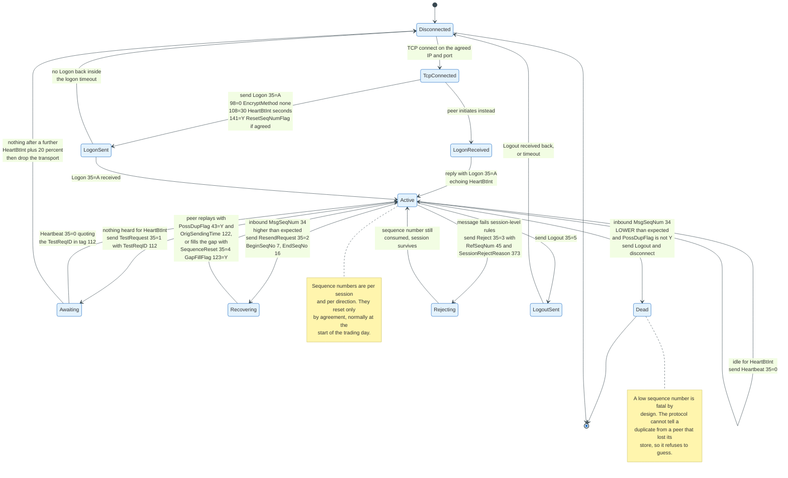

### 6.1 The Session Messages

FIX 4.4 defines seven administrative messages. Every one of them is a session concern and none of them means anything to a trading application.

| MsgType | Name | Purpose |
|---------|------|---------|
| `A` | **Logon** | Opens the session, agrees the heartbeat interval, optionally resets sequence numbers |
| `0` | **Heartbeat** | Proves the session is alive when nothing else is being sent |
| `1` | **TestRequest** | Demands a heartbeat quoting a specific `TestReqID` (112) |
| `2` | **ResendRequest** | Asks the peer to replay a range of sequence numbers |
| `3` | **Reject** | Session-level rejection: the message broke a protocol rule |
| `4` | **SequenceReset** | Skips a range of sequence numbers, with or without claiming they were sent |
| `5` | **Logout** | Closes the session cleanly |

### 6.2 Logon

The initiator connects the TCP socket and sends `Logon`. The acceptor replies with its own `Logon`. Until that reply arrives, no application message may be sent.

```
8=FIX.4.4|9=106|35=A|49=BUYSIDE1|56=BROKERX|34=1|52=20260831-12:59:58.004|
98=0|108=30|141=Y|553=BUYSIDE1_UAT|554=********|10=091|
```

The fields that matter:

- **`EncryptMethod` (98)** is mandatory and in practice always `0`, meaning no FIX-level encryption. Confidentiality comes from TLS or from a private circuit.
- **`HeartBtInt` (108)** is the heartbeat interval in seconds, and both sides must use the same value. Thirty seconds is the common institutional setting; venues on latency-sensitive links use lower values.
- **`ResetSeqNumFlag` (141)** set to `Y` resets both directions to 1. Whether it is used at every logon or only at the start of the trading day is a bilateral agreement, and getting it wrong produces a session that logs on and immediately disconnects.
- **`Username` (553)** and **`Password` (554)** carry credentials. The FIX 4.4 specification notes directly that minimal security exists without transport-level encryption, which is an accurate description of sending a password as ASCII in a field.
- **`NextExpectedMsgSeqNum` (789)**, added in FIX 4.4, lets the logon itself declare which sequence number the sender expects next, so a gap can be resolved during logon rather than through a separate `ResendRequest`.

### 6.3 Sequence Numbers

Every message carries `MsgSeqNum` (34). The counter is per session, per direction, starts at 1, and increases by exactly one per message with no exceptions. Administrative messages consume sequence numbers exactly as application messages do.

Three cases, and only three:

**Expected.** Process the message and increment.

**Higher than expected.** A gap exists. Do not process the message. Queue it, send a `ResendRequest`, and process nothing new until the gap closes.

**Lower than expected, without `PossDupFlag` (43) set to `Y`.** This is fatal by design. The specification directs the receiver to log an error, send a `Logout`, and disconnect. It does not direct the receiver to guess, because the protocol cannot distinguish a peer that is replaying from a peer that lost its message store, and one of those two situations means duplicate orders.

Firms restarting a FIX engine from an empty store is the most common cause of that fatal case, and it is the reason a FIX engine's message store is not an optimisation but a correctness requirement.

### 6.4 Heartbeats and Test Requests

`HeartBtInt` sets the contract: send something at least every interval. If you have nothing to send, send a `Heartbeat` (35=0).

If nothing arrives from the peer for one interval, send a `TestRequest` (35=1) carrying a `TestReqID` (112). The peer must reply with a `Heartbeat` echoing that ID in tag 112. If nothing comes back after roughly another interval plus a tolerance, conventionally 20 percent, drop the transport.

The design point is that TCP does not tell you the peer is dead. A TCP connection with a hung application on the far end stays open indefinitely and accepts writes into a buffer nobody reads. The heartbeat exists because a socket being open is not evidence that a counterparty is alive.

### 6.5 Gap Fill and Resend

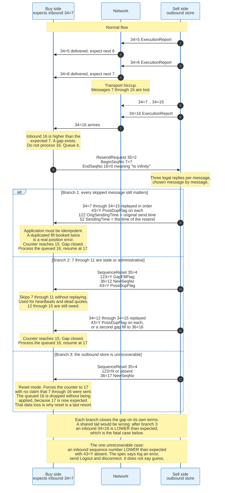

When a gap opens, the receiver sends `ResendRequest` (35=2) with `BeginSeqNo` (7) and `EndSeqNo` (16). `EndSeqNo` of `0` means "everything from BeginSeqNo onwards."

The sender then chooses, message by message, between three responses.

**Replay the original.** Resend the message with `PossDupFlag` (43) set to `Y`, `OrigSendingTime` (122) set to the original send time, and `SendingTime` (52) set to now. The application on the receiving side must be idempotent, because a replayed `ExecutionReport` that gets booked twice is a real position error.

**Gap fill.** Send `SequenceReset` (35=4) with `GapFillFlag` (123) set to `Y`, `NewSeqNo` (36) set to the number after the skipped range, and `PossDupFlag` set to `Y`. This says: those messages existed, they no longer matter, move your counter forward. It is the correct answer for heartbeats, for stale quotes, and for market data that has been superseded.

**Reset.** Send `SequenceReset` with `GapFillFlag` absent or `N` and `NewSeqNo` set forward. This makes no claim that anything was sent and simply forces the counter. It is a recovery tool of last resort, used when a store is unrecoverable, and it is the mechanism by which real message loss gets papered over during a production incident.

**`PossResend` (tag 97) is the other duplicate flag and is not the same thing.** `PossDupFlag` says the session may have delivered this sequence number before, so the receiver dedupes at the session layer on `ExecID`. `PossResend` says the application is resending the same business content under a fresh sequence number, so the session layer sees nothing wrong and the receiver must decide from `ClOrdID` or `ExecID` whether it has already acted on it. The case that bites is an order management system retrying an order after an ambiguous timeout: the retry is a new message with a new sequence number and `97=Y`, and a client that dedupes only on `43` books it twice.

The distinction between gap fill and reset is the single most misimplemented part of the FIX session layer. Gap fill is routine and safe. Reset destroys the guarantee the session layer exists to provide.

### 6.6 Reject Versus Business Message Reject

Two different rejections exist and they mean different things.

**`Reject` (35=3)** is session-level. The message broke a protocol rule: a required tag was missing, a tag was undefined for that message type, a value was outside the enumeration, the message type is unsupported. It carries `RefSeqNum` (45) pointing at the offending message and `SessionRejectReason` (373) giving the machine-readable cause. The sequence number is still consumed. The session survives.

**`BusinessMessageReject` (35=j)** is application-level. The message was syntactically valid and the application refuses it: unknown security, unsupported product, conditionally required field missing for this business case. It carries `RefMsgType` (372) and `BusinessRejectReason` (380).

A third rejection is neither of these. An order that is refused for a trading reason is not rejected with `35=3` or `35=j`. It is refused with an `ExecutionReport` carrying `ExecType` `8` and `OrdStatus` `8`. The distinction is that a session reject means "I could not understand you," a business reject means "I understood and cannot process this," and an execution report with `39=8` means "I understood, I processed it, and the answer is no."

Clients that treat all three identically end up with orders in an unknown state, because the first two do not create an order and the third does and then terminates it.

---

## 7. The Application Layer: Orders, Executions, Cancels

Six message types carry almost all order flow. Everything else in the 93-message FIX 4.4 catalogue is either post-trade, market data, reference data, or a specialisation of these six.

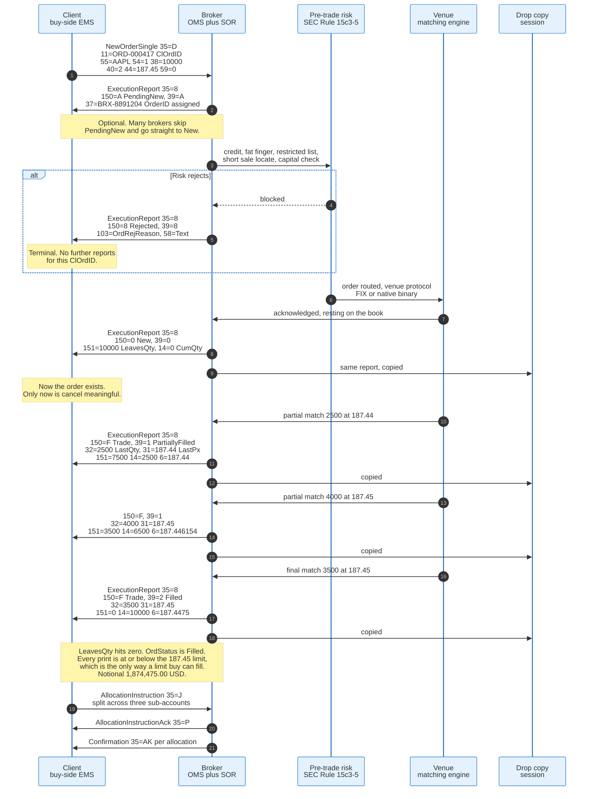

### 7.1 The Six

| MsgType | Name | Direction | What it does |
|---------|------|-----------|--------------|
| `D` | **NewOrderSingle** | Client to broker | Places one order |
| `8` | **ExecutionReport** | Broker to client | Reports every state change: acknowledged, filled, cancelled, rejected, replaced |
| `F` | **OrderCancelRequest** | Client to broker | Asks to cancel |
| `G` | **OrderCancelReplaceRequest** | Client to broker | Asks to amend, atomically |
| `9` | **OrderCancelReject** | Broker to client | Refuses a cancel or an amend |
| `H` | **OrderStatusRequest** | Client to broker | Asks for the current state of one order |

The asymmetry is deliberate. The client sends requests. The broker sends the truth. There is no message by which a client tells a broker what an order's state is.

### 7.2 NewOrderSingle

`NewOrderSingle` in FIX 4.4 has four unconditionally required fields beyond the header: `ClOrdID` (11), `Side` (54), `TransactTime` (60), and `OrdType` (40), plus the `Instrument` component and the `OrderQtyData` component. Everything else in the message, including `Price`, is conditionally required or optional in the specification and mandatory in practice at any given counterparty.

The fields that carry the actual instruction:

| Tag | Field | Common values |
|-----|-------|---------------|
| 11 | `ClOrdID` | Client's unique identifier. Must be unique per session per day at minimum, and unique for all time at strict counterparties. |
| 54 | `Side` | `1` buy, `2` sell, `3` buy minus, `4` sell plus, `5` sell short, `6` sell short exempt |
| 38 | `OrderQty` | Total order size. Always total, never remainder. |
| 40 | `OrdType` | `1` market, `2` limit, `3` stop, `4` stop limit, `P` pegged |
| 44 | `Price` | Required when `OrdType` is `2` or `4` |
| 99 | `StopPx` | Required when `OrdType` is `3` or `4` |
| 59 | `TimeInForce` | `0` day, `1` GTC, `2` at the opening, `3` IOC, `4` FOK, `6` GTD |
| 18 | `ExecInst` | Space-separated instructions. `G` all or none, `6` participate do not initiate. |
| 21 | `HandlInst` | `1` automated private, `2` automated public, `3` manual |
| 110 | `MinQty` | Minimum acceptable fill |
| 111 | `MaxFloor` | Displayed quantity for an iceberg |
| 210 | `MaxShow` | The same concept, used by some venues instead of 111 |
| 100 | `ExDestination` | Where to route |
| 528 | `OrderCapacity` | `A` agency, `P` principal, `R` riskless principal |
| 847 | `TargetStrategy` | Which broker algorithm to use |
| 849 | `ParticipationRate` | Mandatory when the strategy is a percentage-of-volume algorithm |

`ClOrdID` deserves attention out of proportion to its size. It is the client's only handle on the order until the broker returns `OrderID` (37), it must change on every amendment, and the previous value moves into `OrigClOrdID` (41). A client that reuses a `ClOrdID` after a reject has produced an ambiguity that neither side can resolve from the message stream.

### 7.3 ExecutionReport

`ExecutionReport` is the single most important message in FIX and it does far more than report executions. It reports every state change of an order, including the ones where nothing traded.

The unconditionally required fields in FIX 4.4 are `OrderID` (37), `ExecID` (17), `ExecType` (150), `OrdStatus` (39), `LeavesQty` (151), `CumQty` (14), `AvgPx` (6), plus `Side` and the `Instrument` component.

| Tag | Field | Semantics |
|-----|-------|-----------|
| 37 | `OrderID` | The broker's identifier. Assigned once, never changes for the life of the order chain. |
| 11 | `ClOrdID` | The client's identifier for the request that produced this report |
| 41 | `OrigClOrdID` | The previous `ClOrdID`, present on reports for cancels and replaces |
| 17 | `ExecID` | Unique identifier for this report. Used to deduplicate. |
| 150 | `ExecType` | What THIS report is |
| 39 | `OrdStatus` | What the ORDER is, now |
| 32 | `LastQty` | Quantity on this fill. Absent or zero when nothing traded. |
| 31 | `LastPx` | Price of this fill |
| 151 | `LeavesQty` | Quantity still working. Zero means the order is done. |
| 14 | `CumQty` | Total filled so far |
| 6 | `AvgPx` | Volume-weighted average of all fills so far |
| 30 | `LastMkt` | Where this fill happened, as a market identifier code |
| 103 | `OrdRejReason` | Why, when `ExecType` is `8` |
| 58 | `Text` | Free text. Never parse it; it is for humans. |

The arithmetic is a contract, not a convention. `LeavesQty` equals `OrderQty` minus `CumQty` under normal circumstances, with defined exceptions when the order is cancelled, expired, or rejected, in which case `LeavesQty` is zero and `CumQty` retains whatever filled. `AvgPx` is the volume-weighted mean of all fills. A client that recomputes these from the fill stream and disagrees with the broker has found either a bug or a dropped message, and must reconcile rather than choose.

### 7.4 Cancel and Cancel-Replace

`OrderCancelRequest` (35=F) carries `OrigClOrdID` (41) naming the order to cancel, a fresh `ClOrdID` (11) for the cancel request itself, and normally `OrderID` (37). `OrderCancelReplaceRequest` (35=G) carries the same identifiers plus the complete new order parameters.

Three rules govern cancels and amendments, and all three are counterintuitive.

**`OrderQty` on a replace is the total order size, not the remainder.** An order for 10,000 that has filled 7,500 and is being repriced still carries `38=10000`. Sending `38=2500` reduces the order to 2,500 total, of which 7,500 are already done, which most venues treat as an instruction to cancel the remainder. This mistake is common, and it is expensive because it silently does something plausible instead of failing.

**A cancel carries the order quantity, and it is the original total.** FIX 4.4 marks the `OrderQtyData` component required on `OrderCancelRequest`, exactly as on `OrderCancelReplaceRequest`. `38=OrderQty` on a cancel is the size of the order being cancelled, not the quantity the client wants removed. FIX has no partial cancel. Reducing an order is a replace with a smaller total, and a cancel that omits tag 38 is rejected at certification for a missing required field.

**A cancel or replace is a request, not an instruction.** The venue owns the book. Between the client sending a cancel and the venue applying it, the order can fill. The correct response then is an `ExecutionReport` showing the fill and an `OrderCancelReject` explaining that the cancel was too late.

`OrderCancelReject` (35=9) carries `CxlRejResponseTo` (434), which says whether it is rejecting a cancel or a replace, `CxlRejReason` (102), and `OrdStatus` (39). That last field lets the client resynchronise without asking, because the reject tells it what the order's state actually is.

### 7.5 The Rest of the Catalogue

The remaining FIX 4.4 messages fall into five families.

**Lists and baskets.** `NewOrderList` (E), `ListStatus` (N), `ListExecute` (L), `BidRequest` (k) and `BidResponse` (l) support programme trading, where a basket of hundreds of names is priced and executed as one unit.

**Quoting.** `QuoteRequest` (R), `Quote` (S), `MassQuote` (i), `QuoteCancel` (Z), `RFQRequest` (AH). This is the request-for-quote world of fixed income, swaps, and FX, where there is no continuous order book and a price exists only when a dealer makes one.

**Reference data.** `SecurityDefinitionRequest` (c), `SecurityDefinition` (d), `SecurityList` (y), `TradingSessionStatus` (h). How a client learns what instruments exist and whether the market is open.

**Market data.** `MarketDataRequest` (V), `MarketDataSnapshotFullRefresh` (W), `MarketDataIncrementalRefresh` (X), `MarketDataRequestReject` (Y).

**Post-trade.** `AllocationInstruction` (J), `AllocationInstructionAck` (P), `Confirmation` (AK), `ConfirmationAck` (AU), `TradeCaptureReport` (AE), `SettlementInstructions` (T), `PositionReport` (AP), `CollateralReport` (BA).

That last family is where FIX overlaps with the clearing and settlement world, and it is the family most often implemented in FIXML rather than tag=value.

---

## 8. ExecType and OrdStatus: The Order State Machine

`ExecType` (150) describes the report. `OrdStatus` (39) describes the order. Conflating them is the most common defect in FIX integrations, and the specification says so directly: `ExecType` "describes the specific Execution Report" while "`OrdStatus` will always identify the current order status."

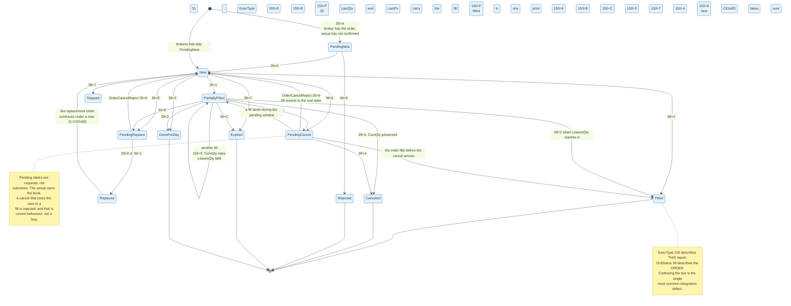

### 8.1 The Two Code Lists

`ExecType` (150) in FIX 4.4:

| Code | Meaning |
|------|---------|
| `0` | New |
| `1` | Partial fill (deprecated in 4.4 in favour of `F`) |
| `2` | Fill (deprecated in 4.4 in favour of `F`) |
| `3` | Done for day |
| `4` | Canceled |
| `5` | Replaced |
| `6` | Pending Cancel |
| `7` | Stopped |
| `8` | Rejected |
| `9` | Suspended |
| `A` | Pending New |
| `B` | Calculated |
| `C` | Expired |
| `D` | Restated |
| `E` | Pending Replace |
| `F` | Trade |
| `G` | Trade Correct |
| `H` | Trade Cancel |
| `I` | Order Status |

`OrdStatus` (39) in FIX 4.4:

| Code | Meaning |
|------|---------|
| `0` | New |
| `1` | Partially filled |
| `2` | Filled |
| `3` | Done for day |
| `4` | Canceled |
| `5` | Replaced. Withdrawn in FIX 4.4 under Appendix 6-F, and absent from the 4.4 dictionary. A replacement is reported with `150=5` while `39` carries the post-replacement state, `0` or `1`. |
| `6` | Pending Cancel |
| `7` | Stopped |
| `8` | Rejected |
| `9` | Suspended |
| `A` | Pending New |
| `B` | Calculated |
| `C` | Expired |
| `D` | Accepted for bidding |
| `E` | Pending Replace |

The lists look almost identical and are not. `ExecType` has `F`, `G`, `H` and `I` for trade, trade correct, trade cancel and order status, none of which are order states. `OrdStatus` has `D` for accepted for bidding, which is not a report type. That near-overlap is exactly why the two get confused.

FIX 4.2 splits the same information across two fields, which matters because 4.2 is the version most US equity exchanges still accept. `ExecTransType` (tag 20) is mandatory on every 4.2 `ExecutionReport` and takes `0` new, `1` cancel, `2` correct and `3` status. `ExecType` in 4.2 carries only the order event, so one `150` value means different things depending on tag 20: `150=2` with `20=0` is a fill, and `150=2` with `20=1` is the bust of a fill already reported. FIX 4.3 folded the distinction into `ExecType` as `G` trade correct, `H` trade cancel and `I` order status, and removed tag 20 from the dictionary. Code facing a 4.2 counterparty must read tag 20. Code facing 4.4 must not expect it.

### 8.2 Reading a Report Correctly

The rule is mechanical.

A report with `150=F` and `39=1` says: this report is a trade, and after it the order is partially filled. A report with `150=F` and `39=2` says: this report is a trade, and after it the order is complete. Both reports look identical except for one character, and that character determines whether the client keeps waiting.

A report with `150=6` and `39=6` says: this report acknowledges a cancel request, and the order is now pending cancel. Nothing has been cancelled yet. A client that treats `150=6` as a cancellation removes the order from its blotter and then receives a fill for an order it believes is gone.

A report with `150=I` and `39=1` is the answer to an `OrderStatusRequest`. It is not a state change. Nothing happened. It reports the existing state, and a client that treats it as a new event double counts.

The rules that follow from this:

- **Drive state from `OrdStatus`, not from `ExecType`.**
- **Drive position from `LastQty` and `LastPx`, and only on reports where `ExecType` is `F`, `1`, or `2`.**
- **Reconcile with `CumQty`, `LeavesQty`, and `AvgPx` on every report.** They are the broker's arithmetic and they are authoritative.
- **Deduplicate on `ExecID` (17).** Session replay will deliver the same report twice, legitimately.

### 8.3 Pending States and the Race

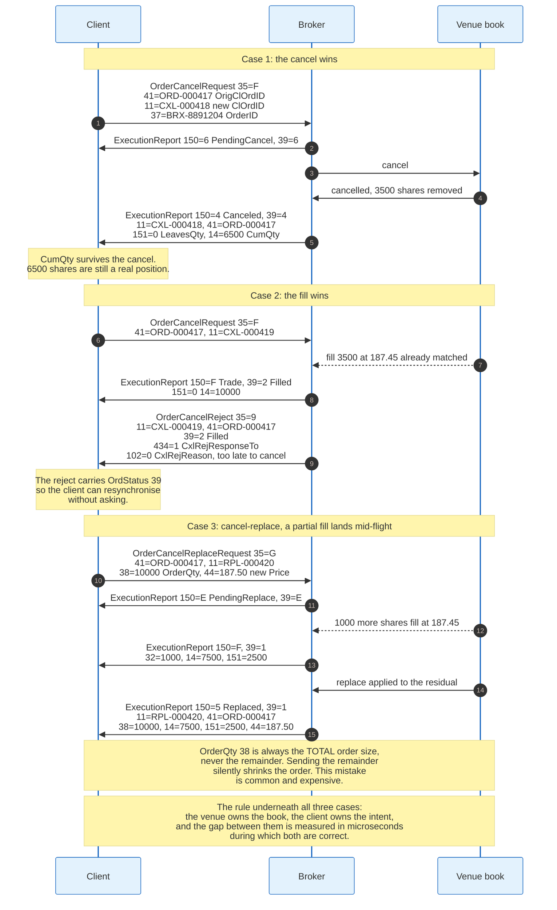

Pending states exist because the client and the venue are separated by a network with a latency of microseconds to milliseconds, during which both hold a correct but different view of the order.

The sequence for a cancel that succeeds: client sends `35=F`, broker replies `150=6, 39=6`, venue cancels, broker sends `150=4, 39=4` with `LeavesQty` zero and `CumQty` unchanged. The filled quantity survives the cancel. Cancelling an order does not undo the part that traded.

The sequence for a cancel that loses: client sends `35=F`, the order fills at the venue before the cancel arrives, broker sends `150=F, 39=2` for the fill and then `35=9 OrderCancelReject` with `102=0` meaning too late to cancel and `39=2` telling the client the order is filled.

The sequence for a replace with a fill in flight is the ugliest of the three, because the report ordering is not guaranteed to match the client's mental model. A client may receive `150=E, 39=E` pending replace, then `150=F, 39=1` for a fill on the original, then `150=5` replaced, and must apply all three to arrive at the right position. Systems that assume the pending state blocks fills get this wrong.

### 8.4 Restatements

`ExecType` `D`, Restated, is the escape hatch. It reports a change to an order that the client did not request: a corporate action adjusting the price, a venue reducing the quantity to a lot size, a broker's algorithm repricing a child order, or a system-initiated modification after a market halt. `ExecRestatementReason` (378) says why.

Restatements are rare and are the reason a client cannot assume its order parameters are the ones it sent. The `ExecutionReport` is the record. The order the client sent is only a request.

---

## 9. A Worked Order, End to End

One order, from logon to allocation, with every number consistent.

```mermaid
%%{init: {'theme': 'base', 'themeVariables': {'primaryColor': '#e3f2fd', 'primaryBorderColor': '#1565c0', 'lineColor': '#37474f'}}}%%

flowchart TB
    subgraph S1["12:59:58 UTC - session comes up"]
        A1["8=FIX.4.4 | 9=106 | 35=A | 49=BUYSIDE1 | 56=BROKERX<br/>34=1 | 52=20260831-12:59:58.004<br/>98=0 | 108=30 | 141=Y | 553=BUYSIDE1_UAT | 10=091"]
        A2["Broker echoes Logon with 108=30.<br/>Both sides now owe a message<br/>every 30 seconds."]
    end

    subgraph S2["13:45:07.238 - the order, 212 bytes"]
        B1["8=FIX.4.4 | 9=189 | 35=D | 49=BUYSIDE1 | 56=BROKERX<br/>34=1215 | 52=20260831-13:45:07.238<br/>11=ORD-20260831-000417 | 1=ACCT-9931 | 21=1<br/>55=AAPL | 48=US0378331005 | 22=4<br/>54=1 | 60=20260831-13:45:07.235<br/>38=10000 | 40=2 | 44=187.45 | 59=0 | 10=230"]
        B2["BodyLength 189 counts from the<br/>3 of 35=D to the SOH before 10=.<br/>CheckSum 230 is the byte sum mod 256."]
    end

    subgraph S3["13:45:07.301 - acknowledgement, 262 bytes"]
        C1["8=FIX.4.4 | 9=239 | 35=8 | 34=3382<br/>37=BRX-8891204 | 11=ORD-20260831-000417<br/>17=BRX-EXEC-55120001 | 150=0 New | 39=0 New<br/>151=10000 | 14=0 | 6=0 | 10=118"]
        C2["OrderID 37 is the broker's handle and<br/>never changes. ClOrdID 11 is the client's<br/>and changes on every amendment."]
    end

    subgraph S4["13:45:09 to 13:47 - three fills"]
        D1["150=F 39=1<br/>32=2500 31=187.44<br/>14=2500 151=7500 6=187.440000"]
        D2["150=F 39=1<br/>32=4000 31=187.45<br/>14=6500 151=3500 6=187.446154"]
        D3["150=F 39=2 Filled<br/>32=3500 31=187.45<br/>14=10000 151=0 6=187.447500"]
    end

    subgraph S5["Arithmetic the client must reproduce exactly"]
        E1["CumQty 14 = sum of LastQty 32<br/>2500 + 4000 + 3500 = 10000"]
        E2["LeavesQty 151 = OrderQty 38 - CumQty 14<br/>10000 - 10000 = 0"]
        E3["AvgPx 6 = notional / CumQty<br/>1,874,475.00 / 10000 = 187.447500"]
        E4["Terminal when 151 reaches 0<br/>with 39=2. No further reports."]
    end

    subgraph S6["Post trade"]
        F1["35=J AllocationInstruction<br/>4000 / 3500 / 2500 across<br/>three sub-accounts"]
        F2["35=P AllocationInstructionAck<br/>then 35=AK Confirmation per account"]
        F3["Drop copy session carried every<br/>35=8 in parallel to compliance<br/>and the risk desk"]
    end

    S1 --> S2 --> S3 --> S4 --> S5 --> S6

    style S1 fill:#eceff1,stroke:#37474f,stroke-width:2px
    style S2 fill:#e3f2fd,stroke:#1565c0,stroke-width:3px
    style S3 fill:#e8f5e9,stroke:#2e7d32,stroke-width:2px
    style S4 fill:#fff3e0,stroke:#e65100,stroke-width:2px
    style S5 fill:#f3e5f5,stroke:#4a148c,stroke-width:2px
    style S6 fill:#fce4ec,stroke:#880e4f,stroke-width:2px
```

### 9.1 Setup

A buy-side firm, CompID `BUYSIDE1`, connects to broker `BROKERX` over a TCP session on a private extranet at 12:59:58 UTC on 31 August 2026. The order is 10,000 shares of Apple Inc., ISIN `US0378331005`, buy, limit 187.45, day, for account `ACCT-9931`.

### 9.2 Logon, 12:59:58.004

```
8=FIX.4.4|9=106|35=A|49=BUYSIDE1|56=BROKERX|34=1|52=20260831-12:59:58.004|
98=0|108=30|141=Y|553=BUYSIDE1_UAT|554=********|10=091|
```

`141=Y` resets both sequence counters to 1. `108=30` commits both sides to sending something every 30 seconds. The broker echoes `Logon` with the same `HeartBtInt`, and the session is up. 129 bytes.

### 9.3 The Order, 13:45:07.238

```
8=FIX.4.4|9=189|35=D|49=BUYSIDE1|56=BROKERX|34=1215|52=20260831-13:45:07.238|
11=ORD-20260831-000417|1=ACCT-9931|21=1|55=AAPL|48=US0378331005|22=4|54=1|
60=20260831-13:45:07.235|38=10000|40=2|44=187.45|59=0|10=230|
```

212 bytes. `BodyLength` 189, `CheckSum` 230. `TransactTime` is 3 milliseconds before `SendingTime`, which is the client's own processing latency and is exactly the sort of thing regulators later ask about.

### 9.4 Acknowledgement, 13:45:07.301

```
8=FIX.4.4|9=239|35=8|49=BROKERX|56=BUYSIDE1|34=3382|52=20260831-13:45:07.301|
37=BRX-8891204|11=ORD-20260831-000417|17=BRX-EXEC-55120001|150=0|39=0|
1=ACCT-9931|55=AAPL|54=1|38=10000|40=2|44=187.45|59=0|32=0|31=0|151=10000|
14=0|6=0|60=20260831-13:45:07.299|10=118|
```

262 bytes. `150=0` and `39=0` both say New. The broker has assigned `OrderID` `BRX-8891204`, which will identify this order for the rest of its life regardless of how many times the `ClOrdID` changes. `LeavesQty` is the full 10,000 and `CumQty` is zero. Round trip from send to acknowledgement is 63 milliseconds, which is a normal institutional number and roughly three orders of magnitude slower than a colocated path.

### 9.5 First Fill, 13:45:09.884

```
8=FIX.4.4|9=262|35=8|49=BROKERX|56=BUYSIDE1|34=3383|52=20260831-13:45:09.884|
37=BRX-8891204|11=ORD-20260831-000417|17=BRX-EXEC-55120002|150=F|39=1|
1=ACCT-9931|55=AAPL|54=1|38=10000|40=2|44=187.45|59=0|32=2500|31=187.44|
151=7500|14=2500|6=187.44|30=XNAS|60=20260831-13:45:09.882|10=141|
```

285 bytes. `150=F` says this report is a trade. `39=1` says the order is now partially filled. `LastQty` 2,500 at `LastPx` 187.44, one cent better than the limit. `LeavesQty` 7,500, `CumQty` 2,500, `AvgPx` 187.44. `LastMkt` `XNAS` is the market identifier code for Nasdaq.

### 9.6 The Rest of the Fills

| Time | ExecType | OrdStatus | LastQty | LastPx | CumQty | LeavesQty | AvgPx |
|------|----------|-----------|---------|--------|--------|-----------|-------|
| 13:45:09.884 | `F` | `1` | 2,500 | 187.44 | 2,500 | 7,500 | 187.440000 |
| 13:46:12.507 | `F` | `1` | 4,000 | 187.45 | 6,500 | 3,500 | 187.446154 |
| 13:47:03.219 | `F` | `2` | 3,500 | 187.45 | 10,000 | 0 | 187.447500 |

The arithmetic the client must reproduce exactly:

```
CumQty    = 2500 + 4000 + 3500                              = 10,000
notional  = 2500(187.44) + 4000(187.45) + 3500(187.45)      = 1,874,475.00
AvgPx     = 1,874,475.00 / 10,000                           = 187.447500
LeavesQty = OrderQty - CumQty = 10,000 - 10,000             = 0
```

`LeavesQty` reaching zero with `OrdStatus` `2` is terminal. No further `ExecutionReport` will arrive for this order unless the broker sends a trade correct (`150=G`) or trade cancel (`150=H`), which happens when the venue busts a trade.

### 9.7 Allocation

The 10,000 shares belong to three funds. The buy side sends `AllocationInstruction` (35=J) with `NoAllocs` (78) equal to 3 and three entries, each beginning with `AllocAccount` (79):

| AllocAccount (79) | AllocQty (80) | Implied notional at 187.4475 |
|-------------------|---------------|------------------------------|
| `FUND-ALPHA` | 4,000 | 749,790.00 |
| `FUND-BETA` | 3,500 | 656,066.25 |
| `FUND-GAMMA` | 2,500 | 468,618.75 |
| **Total** | **10,000** | **1,874,475.00** |

The broker replies `AllocationInstructionAck` (35=P) and then one `Confirmation` (35=AK) per account, each carrying the gross amount, the commission, the fees, and the net money that will actually settle. The buy side affirms with `ConfirmationAck` (35=AU). From there the flow leaves FIX and becomes settlement instructions to a custodian, normally over ISO 15022 or ISO 20022.

### 9.8 What the Drop Copy Saw

In parallel, a second FIX session carried every one of those `ExecutionReport` messages to the broker's compliance surveillance system, the client's risk desk, and the clearing member. That session sent no orders and could not have. It is read-only by construction.

---

## 10. Beyond Tag Value: FIXML, FAST, SBE, FIXP

The FIX semantics survived. The 1992 encoding did not, at least not everywhere. Four alternative encodings and one alternative session layer exist, and each was built to fix a specific measurable problem with `tag=value`.

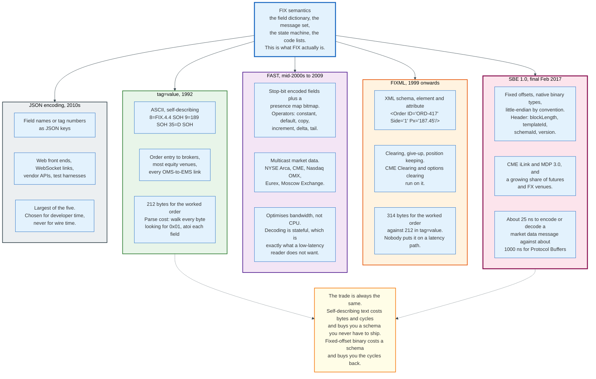

### 10.1 The Problem With Tag Equals Value

Three costs, all of them arithmetic rather than aesthetic.

**Bytes.** The worked order above is 212 bytes for 20 fields. Tag names, equals signs, delimiters, and ASCII digits account for most of it. The information content is a side, a quantity, a price, an instrument, and a few flags.

**Parse cost.** Reading `Price` requires scanning forward for the byte sequence `4`, `4`, `=`, confirming it is a field start and not the tail of another value, then reading digits until SOH, then converting a decimal string to a number. Every field costs a scan and a conversion. In a fixed-offset binary format, reading `Price` is one aligned 64-bit load.

**Checksum cost.** Tag 10 requires summing every byte of every message. That is a linear pass over the message that binary encodings simply do not perform.

None of these matter at 100 messages per second. All of them matter at the rate a US consolidated equity feed is built to carry, which the CTA Plan publishes as 2,700,000 messages per 100 milliseconds on the quote feed, or 27 million a second.

### 10.2 FIXML

FIXML expresses FIX messages as XML with a published schema. Fields become attributes or elements, components become nested elements, and repeating groups become repeated child elements.

FIXML exists for a world where the constraint is validation and integration rather than latency: clearing, give-up processing, position keeping, and collateral management. Clearing houses adopted it because an XML schema can be validated by tooling that a middle-office team already owns, and because a clearing message is processed once per trade rather than once per market data tick.

The cost is size, and the size is measurable. Here is the section 4.2 order encoded in FIXML 4.4, using the schema's abbreviated names:

```xml
<FIXML xmlns="http://www.fixprotocol.org/FIXML-4-4" v="4.4" r="20030618" s="20040109">
<Order ClOrdID="ORD-20260831-000417" Acct="ACCT-9931" HdlInst="1" Side="1" TxnTm="2026-08-31T13:45:07.235" OrdTyp="2" Px="187.45" TmInForce="0">
<Instrmt Sym="AAPL" ID="US0378331005" Src="4"/>
<OrdQty Qty="10000"/>
</Order>
</FIXML>
```

That is 314 bytes with the line breaks stripped, against 212 for the same order in `tag=value` and 78 for the SBE schema in section 10.4. FIXML costs 1.48 times `tag=value` and 4.0 times SBE. The multiple is smaller than XML's reputation suggests, because the FIXML schema uses abbreviated names, `TmInForce` rather than `TimeInForce`. The 86-byte opening `FIXML` tag and its 8-byte close are 94 bytes of envelope that do not grow with the message, leaving 220 bytes of order against 212 in `tag=value`. The multiple does grow with repeating groups, because every group entry repeats its element name where `tag=value` repeats only digits. Nobody puts it on an order entry path.

### 10.3 FAST

FAST, FIX Adapted for STreaming, compresses market data on the wire. It came out of a market data optimisation effort in the mid-2000s, and the 1.2 extension that enabled FIX-over-FAST was published in February 2009, a date the FIX Over FAST implementation guide states directly. The community's standards page lists specification version 1.1 and extension version 1.2 with no dates attached, so the earlier milestone years are not established here.

Three mechanisms do the work.

**Stop-bit encoding.** Integers are written seven bits per byte, with the high bit of the final byte set to mark the end. Small numbers take one byte.

**The presence map.** A bitmap at the front of each message says which fields are actually present on the wire. Fields that can be derived are not transmitted at all.

**Field operators.** Each field in a template is annotated with an operator that says how to derive its value when it is absent: `constant` (never transmitted), `default` (transmitted only when it differs), `copy` (same as the previous message), `increment` (previous plus one, which handles sequence numbers), `delta` (transmitted as a difference, which handles prices), and `tail` (only the changing suffix, which handles instrument symbols).

The result is a stream where a market data message that differs from the previous one in two fields transmits roughly two fields. NYSE Arca, CME Group, Nasdaq OMX, Eurex, the Shanghai Stock Exchange, and Moscow Exchange all deployed it.

FAST optimises the wrong axis for the decade that followed. It minimises bandwidth by making decoding stateful: the decoder must retain the previous message to reconstruct the current one, and it must walk the presence map bit by bit. That is more CPU work, not less. Once 10 gigabit links became cheap and CPU cycles became the binding constraint, the trade inverted, and SBE was designed to invert with it.

### 10.4 Simple Binary Encoding

SBE is the FIX standard for fixed-offset binary encoding, developed by the High Performance Working Group. Version 1.0 was promoted to final specification on 9 February 2017, republished with errata on 27 July 2018 and again in November 2020. The reference repository's summary text says February 2016, and its own release history refutes it: Release Candidate 4 was published in February 2016 and the final tag in February 2017, which is the interval the promotion criteria of six months' public review and two interoperable implementations require.

Version 2.0 has not converged. Release Candidate 1 was approved for public review on 16 August 2018, Release Candidate 2 on 15 August 2019, and Release Candidate 3 followed and remains the current candidate. SBE 2.0 has never been promoted to a technical standard, which is why deployed schemas still carry the 1.0 eight-octet header rather than the twelve-octet 2.0 one. Eight years in candidate is the answer to whether 2.0 is coming.

```mermaid
%%{init: {'theme': 'base', 'themeVariables': {'primaryColor': '#e3f2fd', 'primaryBorderColor': '#1565c0', 'lineColor': '#37474f'}}}%%

flowchart TB
    subgraph Frame["Simple Open Framing Header - 6 bytes, always big-endian"]
        SF1["Message_Length : uint32 : 4 bytes<br/>total octets including this header"]
        SF2["Encoding_Type : uint16 : 2 bytes<br/>0x5BE0 = SBE big-endian<br/>0xEB50 = SBE little-endian"]
    end

    subgraph Hdr["SBE message header - 8 bytes in deployed schemas"]
        H1["blockLength : uint16 : offset 0<br/>size of the fixed root block,<br/>excluding groups and var-length data"]
        H2["templateId : uint16 : offset 2<br/>which message this is"]
        H3["schemaId : uint16 : offset 4<br/>which schema defines it"]
        H4["version : uint16 : offset 6<br/>which version of that schema"]
    end

    subgraph Root["Root block - fixed offsets, no delimiters, no scanning"]
        R1["ClOrdID : char[20] : offset 0"]
        R2["Account : char[12] : offset 20"]
        R3["SecurityID : int64 : offset 32"]
        R4["Side : uint8 : offset 40"]
        R5["OrderQty : uint32 : offset 41"]
        R6["OrdType : uint8 : offset 45"]
        R7["Price : mantissa int64, exponent constant -2 : offset 46"]
        R8["TimeInForce : uint8 : offset 54"]
        R9["TransactTime : uint64 nanoseconds : offset 55"]
        R10["HandlInst : uint8 : offset 63"]
    end

    subgraph Tail["Then, in this order and only this order"]
        T1["Repeating groups<br/>each with a dimension header:<br/>blockLength uint16 + numInGroup uint16"]
        T2["Variable-length data fields<br/>length prefix then octets"]
    end

    Frame --> Hdr --> Root --> Tail

    subgraph Math["The arithmetic that justifies the schema"]
        M1["Root block = 20+12+8+1+4+1+8+1+8+1 = 64 bytes"]
        M2["Total = 6 SOFH + 8 header + 64 block = 78 bytes"]
        M3["Same order in FIX 4.4 tag=value = 212 bytes"]
        M4["Reduction = 63 percent on the wire"]
        M5["Reading Price is one 64-bit load at a<br/>known offset. In tag=value it is a scan<br/>for '44=', then a string-to-decimal<br/>conversion, then a scale."]
    end

    Root -.-> Math

    style Frame fill:#eceff1,stroke:#37474f,stroke-width:2px
    style Hdr fill:#e3f2fd,stroke:#1565c0,stroke-width:3px
    style Root fill:#e8f5e9,stroke:#2e7d32,stroke-width:2px
    style Tail fill:#fff3e0,stroke:#e65100,stroke-width:2px
    style Math fill:#fce4ec,stroke:#880e4f,stroke-width:2px
```

The design principles, in the specification's own framing, are direct data access without transformation or conditional logic, achieved through native binary datatypes rather than printable characters, fixed positions and fixed-length fields, and simple types derived from native binaries such as prices and timestamps.

**Framing.** SBE messages are framed by the Simple Open Framing Header: a `uint32` total message length and a `uint16` encoding type identifier, both big-endian, six bytes in total. The registered encoding type values for SBE are `0x5BE0` for big-endian and `0xEB50` for little-endian.

**The message header.** Deployed schemas use four fields: `blockLength` (`uint16`, offset 0), `templateId` (`uint16`, offset 2), `schemaId` (`uint16`, offset 4), and `version` (`uint16`, offset 6). `blockLength` is the total space reserved for the root level of the message, excluding repeating groups and variable-length fields. The SBE 2.0 recommended header adds `numGroups` and `numVarDataFields`, taking the header to twelve octets.

**The body order is fixed and mandatory.** Fixed-length fields first, then repeating groups, then variable-length data fields. Each repeating group carries a dimension header of `blockLength` and `numInGroup`.

**No schema on the wire.** The message carries `schemaId` and `version`, not the field definitions. Both sides must hold the same XML message schema, obtained out of band. This is the entire trade: SBE gives up self-description to buy fixed offsets.

The measured effect is large. Martin Thompson's published benchmark of the reference implementation reports a typical market data message encoded or decoded in approximately 25 nanoseconds against approximately 1,000 nanoseconds for the same message under Google Protocol Buffers, with market data encode throughput of 34,079 operations per millisecond against 2,089 for optimised Protocol Buffers.

Applying the same schema to the worked order gives concrete numbers. A root block of `ClOrdID` as `char[20]`, `Account` as `char[12]`, `SecurityID` as `int64`, `Side` as `uint8`, `OrderQty` as `uint32`, `OrdType` as `uint8`, `Price` as an `int64` mantissa with a constant exponent, `TimeInForce` as `uint8`, `TransactTime` as `uint64` nanoseconds, and `HandlInst` as `uint8` totals 64 bytes. Adding the 8-byte SBE header and the 6-byte framing header gives 78 bytes, against 212 for the same order in FIX 4.4 `tag=value`. That is a 63 percent reduction on the wire and a much larger reduction in cycles.

### 10.5 FIXP

FIXP, the FIX Performance session layer, replaces the FIX session layer for links where the session itself is on the latency path. Version 1.0 was approved as a technical standard on 15 April 2021, with a 1.1 draft standard approved earlier, on 18 April 2019, adding guidance for WebSocket transport.

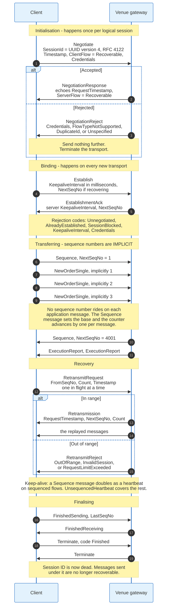

Four design choices separate it from the FIX session layer.

**Sequence numbers are implicit.** A `Sequence` message declares `NextSeqNo`, and every application message after it is implicitly numbered, incrementing by one. No sequence number rides on each application message. On a link carrying a hundred thousand orders a second, that removes a field from every message and a write from every send path.

**Delivery guarantees are selectable per flow.** `Recoverable` guarantees exactly-once delivery with retransmission. `Idempotent` guarantees at-most-once, notifying the sender of gaps but leaving recovery to the application. `Unsequenced` is best effort. `None` restricts the flow to one direction. A market data multicast flow, an order entry flow, and an acknowledgement flow can each pick the guarantee they actually need instead of paying for the strongest one.

**Session identity is separated from transport binding.** `Negotiate` and `NegotiationResponse` establish a logical session identified by a UUID version 4 as defined in RFC 4122, assigned by the client. `Establish` and `EstablishmentAck` bind that session to a particular transport connection. A dropped TCP connection is re-bound with a new `Establish` rather than renegotiated, and the session's sequencing survives.

**It is encoding-agnostic.** FIXP session messages need not share an encoding with the application messages they carry, and framing headers allow mixed encodings inside one session.

The full session message set is `Negotiate`, `NegotiationResponse`, `NegotiationReject`, `Topic`, `MessageTemplate`, `Establish`, `EstablishmentAck`, `EstablishmentReject`, `Sequence`, `Context`, `UnsequencedHeartbeat`, `RetransmitRequest`, `Retransmission`, `RetransmitReject`, `Terminate`, `FinishedSending`, and `FinishedReceiving`, plus `Applied` and `NotApplied` for idempotent flows.

Keep-alive works differently too. On sequenced flows the `Sequence` message doubles as the heartbeat, so a link that is idle sends the message it would have sent anyway. Only unsequenced flows need `UnsequencedHeartbeat`.

### 10.6 The Others

**JSON encoding** maps FIX fields to JSON keys, either by tag number or by name. It exists for web front ends, WebSocket links, and vendor REST APIs, and it is the largest of the encodings by bytes. It is chosen for developer time, never for wire time.

**Google Protocol Buffers and ASN.1** have published mappings. They exist for interoperability with systems that already standardised on those serialisations rather than because either offers an advantage over SBE for FIX semantics.

**FIX Orchestra** is not an encoding but the thing that makes the others tractable. Released as a draft standard on 5 December 2018 and promoted to a technical standard on 17 February 2021, with version 1.1 in release candidate since November 2023 and Release Candidate 3 published in June 2026, it expresses a counterparty's rules of engagement in machine-readable form: which messages, which fields, which values, which conditional requirements. The FIX Latest EP309 reference published on 31 July 2026 is an Orchestra file, and Orchimate, which replaced FIXimate on 27 August 2026, is a browser over Orchestra content. The practical promise is that a counterparty's specification can generate a test harness and a code stub instead of being read by a human and implemented by hand.

---

## 11. Native Binary Venue Protocols, and Why Venues Left Tag Value

Exchanges left `tag=value` for order entry because the cost of parsing it appears once per message on a path built for millions of messages a second, and because they could: an exchange has captive counterparties who will implement whatever it publishes.

### 11.1 The Case, in the Venue's Own Words

Cboe publishes two binary order entry specifications for its Titanium US equities platform: BOE version 2.4.56, dated 4 August 2026, and the newer BOEv3. The 2.4.56 document states the argument plainly. Message encoding, decoding, and parsing "are simpler to code and can be optimized to use less CPU and memory at runtime." Order state transitions are "simple and unambiguous" and "easy to apply to a Member's representation of an order." And the session-level protocol covering "login, sequencing, replay of missed messages, logout" is straightforward to implement.

Cboe also documents a detail that reveals the priority: BOE uses little-endian byte order, "not network byte order." Network byte order is big-endian by convention and costs a byte swap on x86. Cboe removed the byte swap.

Cboe continues to offer FIX. Members use "a subset of the FIX 4.2 protocol for order entry and drop copies" across BYX, BZX, EDGA, and EDGX. Both protocols exist because both audiences exist, and Cboe notes that feature parity between them is a goal rather than a guarantee. Cboe now publishes BOE, BOEv3 and the FIX 4.2 subset side by side, all against the same matching engines. Three order entry protocols, one book.

### 11.2 Nasdaq OUCH

OUCH is Nasdaq's native order entry protocol. The current specification is OUCH 5.0, updated October 2025. Nasdaq describes it as "the low-level native protocol for connecting to NASDAQ," designed "to offer the maximum possible performance at the cost of flexibility and ease of use."

Every message type has a fixed length. All numeric fields are big-endian binary. Prices are integers with four implied decimal places, and the maximum supported price is 199,999.9900, encoded as `7735939C` hexadecimal. A price of `7FFFFFFF` hexadecimal, equal to 214,748.3647, is the sentinel that flags an order as a market order.

The Enter Order message, type `O`, has a 47-byte fixed portion followed by an optional appendage:

| Field | Offset | Length | Notes |
|-------|--------|--------|-------|
| Type | 0 | 1 | `O` |
| UserRefNum | 1 | 4 | Day-unique, strictly increasing per OUCH account |
| Side | 5 | 1 | `B` buy, `S` sell, `T` sell short, `E` sell short exempt |
| Quantity | 6 | 4 | Greater than zero, less than 1,000,000 |
| Symbol | 10 | 8 | Left justified, space padded |
| Price | 18 | 8 | Four implied decimals |
| TimeInForce | 26 | 1 | Corresponds to `TimeInForce` (59) in Nasdaq's FIX |
| Display | 27 | 1 | `Y` visible, `N` hidden, `A` attributable |
| Capacity | 28 | 1 | `A` agency, `P` principal, `R` riskless, `O` other |
| InterMarket Sweep Eligibility | 29 | 1 | `Y` or `N` |
| CrossType | 30 | 1 | Continuous, opening, closing, halt/IPO, supplemental, retail, extended, after hours |
| ClOrdID | 31 | 14 | Not checked for day uniqueness |
| Appendage Length | 45 | 2 | Length of the optional TagValue block |
| Optional Appendage | 47 | variable | MinQty, MaxFloor, PegOffset, DiscretionPrice, PostOnly, ExpireTime and more |

The design decision that best captures the philosophy is the treatment of inbound messages. Nasdaq states that host-bound messages are "inherently non-guaranteed, even if they are carried by a lower level protocol that guarantees delivery (like TCP/IP sockets)," and that they are therefore "designed so that they can be benignly resent for robust recovery from connection and application failures." A client unsure whether an order arrived resends it. Uniqueness is enforced by `UserRefNum`, which must be strictly increasing, and the system ignores any new order request with a `UserRefNum` lower than the last one processed, "assuming they are retransmissions." Idempotency is pushed into a monotonic counter rather than into a session protocol.

The `TimeInForce` field carries a comment that says everything about the relationship between native protocols and FIX: it "Corresponds to TimeInForce (59) in Nasdaq FIX." The semantics are FIX. The bytes are not.

### 11.3 CME iLink and MDP 3.0

CME's order entry and market data both run on SBE. Market data is MDP 3.0, SBE-encoded over UDP multicast with a separate recovery channel. Order entry moved from `tag=value` FIX on iLink 2 to SBE over FIXP on iLink 3, which is the clearest single example of the pattern: keep the FIX semantics, replace the session layer with FIXP and the encoding with SBE.

### 11.4 What Venues Kept

No venue replaced the FIX semantics. Every native binary protocol maps its fields back to FIX tags in its own documentation, because the client systems on the other end are FIX systems and the mapping is what makes the protocol adoptable. A firm that already models orders as `ClOrdID`, `Side`, `OrdType`, `TimeInForce`, `OrdStatus`, and `ExecType` can write an OUCH or BOE adapter in weeks. A firm facing genuinely novel semantics could not.

The lesson generalises. Semantics are expensive to change because they live in every system that touches an order. Encodings are cheap to change because they live in one adapter. Every successful protocol migration in this field has changed the encoding and preserved the semantics.

---

## 12. Market Data: FIX Versus Native Binary

FIX lost market data and won order entry, and the reason is the shape of the traffic rather than the shape of the protocol.

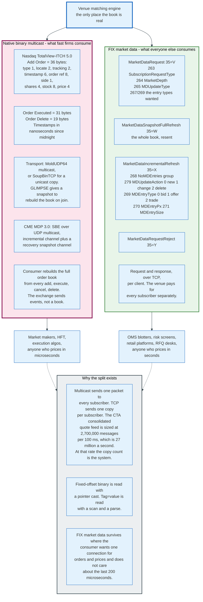

### 12.1 The FIX Market Data Messages

FIX defines a complete market data subscription protocol.

`MarketDataRequest` (35=V) carries `MDReqID` (262), `SubscriptionRequestType` (263) selecting snapshot, snapshot plus updates, or unsubscribe, `MarketDepth` (264) where `0` means full book and `1` means top of book, `MDUpdateType` (265) selecting full refresh or incremental, a repeating group of `MDEntryType` (269) values naming what is wanted, and a repeating group of instruments.

`MarketDataSnapshotFullRefresh` (35=W) returns the whole book. `MarketDataIncrementalRefresh` (35=X) returns changes, in a `NoMDEntries` (268) repeating group where each entry carries `MDUpdateAction` (279) with `0` for new, `1` for change and `2` for delete, `MDEntryType` (269) with `0` for bid, `1` for offer and `2` for trade, `MDEntryPx` (270), `MDEntrySize` (271), and optionally `MDEntryID` (278) and `MDEntryPositionNo` (290) for order-level books. `MarketDataRequestReject` (35=Y) refuses a subscription.

It works. It is used. And on any venue where the message rate is high, it is not what fast participants consume.

### 12.2 The Three Reasons Native Binary Won

**Multicast versus unicast.** FIX runs over TCP, which is point to point. A venue with N market data subscribers sends N copies of every update. A UDP multicast feed sends one packet the network replicates, once, regardless of N. No venue publishes its subscriber count, so the multiple is not known. The message rate is published: the CTA Plan sizes its consolidated quote feed at 2,700,000 messages per 100 milliseconds, or 27 million a second. Multiply 27 million by any plausible N and unicast stops being an optimisation problem. It becomes the difference between a feasible and an infeasible system.

**Fixed offsets versus scanning.** Nasdaq's TotalView-ITCH 5.0 Add Order message is 36 bytes: message type at offset 0 length 1, stock locate at 1 length 2, tracking number at 3 length 2, timestamp at 5 length 6, order reference number at 11 length 8, buy/sell indicator at 19 length 1, shares at 20 length 4, stock symbol at 24 length 8, and price at 32 length 4. Reading the price is a load at offset 32. Order Executed is 31 bytes, Order Cancel is 23, Order Delete is 19, and Order Replace is 35.

**Stock locate codes instead of symbols.** ITCH assigns each instrument a small integer at the start of each day, communicated in the Stock Directory message, deliberately designed "as an array index for rapidly looking up instrument details." The locate code appears in every message at the same offset, so a consumer filtering for one instrument compares two bytes at a known position rather than eight bytes of space-padded ASCII.

### 12.3 What a Native Feed Actually Sends

ITCH does not send a book. It sends the events that construct one, and the consumer maintains the book.

Add Order says an order joined the book. Order Executed says shares traded against a resting order, identified by its day-unique order reference number, and carries a Match Number. Order Cancel reduces the displayed size. Order Delete removes the order entirely. Order Replace removes the old order reference and issues a new one, and the specification notes that side, symbol and attribution cannot change on a replace, so those fields are omitted and the consumer must retain them from the original Add Order.

Timestamps are nanoseconds since midnight, carried in six bytes. All integers are big-endian. Prices are integers with an implied precision, where a `Price(4)` field has four decimal places and the maximum value is 200,000.0000, encoded as `77359400` hexadecimal.

Transport is MoldUDP64 multicast, or SoupBinTCP for a guaranteed unicast copy, with a service called GLIMPSE providing a book snapshot so that a consumer joining mid-day can synchronise. Nasdaq also ships an FPGA version of the feed from its Carteret, New Jersey facility, unshaped at the network level, requiring subscribers to have a 10 or 40 gigabit connection into that data centre.

### 12.4 Where FIX Market Data Still Wins

Three cases, and all three are about operational cost rather than speed.

**One session for everything.** A client that already has a FIX session to a broker for orders can request market data over the same session, with the same credentials, the same monitoring, and the same support contact. Adding a multicast feed means a new network path, a new feed handler, a new book builder, and a new source of production incidents.

**Request-driven consumption.** A blotter showing 40 instruments does not want a firehose of every instrument on the exchange. FIX subscriptions are per instrument, so the client receives what it asked for. A native feed is all or nothing and filtering is the consumer's problem.

**Products with no continuous book.** Fixed income, swaps, and much of FX have no order book to stream. Prices exist when a dealer quotes them, and the FIX quoting messages, `QuoteRequest` (R), `Quote` (S), and `MassQuote` (i), are the natural fit. There is no native binary alternative because there is no firehose to compress.

The split is stable. Firms that price in microseconds take the binary feed. Firms that price in seconds take FIX. Both are correct for their use.

---

## 13. Drop Copy and the Post-Trade Chain

A drop copy is a read-only FIX session that receives a copy of execution reports for orders it did not send. It exists so that the system which trades is not the only system that can see what was traded.

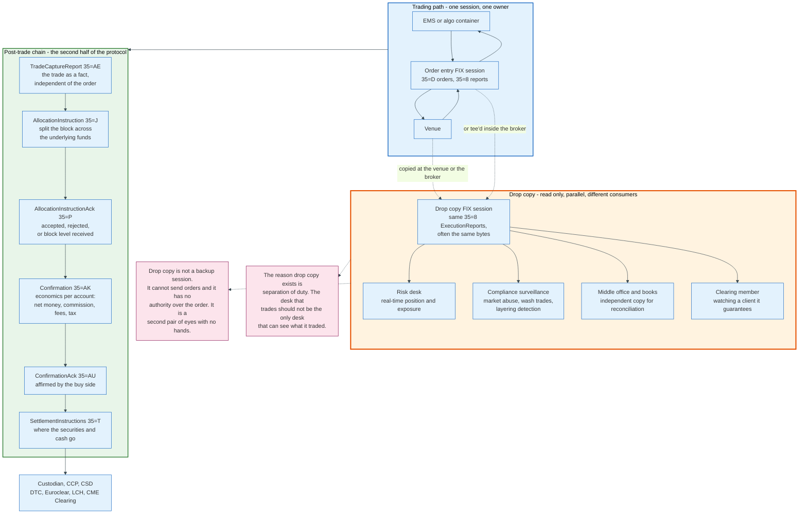

### 13.1 What a Drop Copy Is

Mechanically, it is an ordinary FIX session: same logon, same sequence numbers, same heartbeats. The differences are in what it carries and what it may do.

**It carries `ExecutionReport` messages, and normally nothing else.** Some venues add `TradeCaptureReport` (35=AE). Most restrict the message set to `35=8` plus session messages.

**It cannot send orders.** The session is configured at the counterparty to reject any inbound application message. A drop copy user has no authority over the order, which is precisely the property that makes it useful for control.

**It is sourced from the venue or from the broker, and the source matters.** A venue-sourced drop copy shows what the venue did. A broker-sourced drop copy shows what the broker reported. When they disagree, the difference is the broker's own handling, and finding that difference is one reason firms take both.

**It may be pointed at a different firm entirely.** A clearing member takes drop copy of a client it guarantees. A prime broker takes drop copy of a hedge fund it finances. In those cases the reader is not the trader and has a direct financial interest in seeing the flow in real time.

### 13.2 Who Consumes It, and Why

| Consumer | What it does with the copy |
|----------|---------------------------|
| **Risk desk** | Real-time position and exposure, independent of the trading system's own view |
| **Compliance surveillance** | Detects wash trades, layering, spoofing, and front running against a feed the trading desk does not control |
| **Middle office** | Independent record for reconciliation against the trading system at end of day |
| **Clearing member** | Watches the exposure it guarantees, and can pull the plug on a client in real time |
| **Prime broker** | Monitors a financed client's positions intraday |
| **Regulatory reporting** | Feeds transaction reporting systems from a source separate from the trader's |
| **Disaster recovery** | A second copy of the order state, which is not the same as a backup session but is often used as one |

The separation-of-duty argument is the one that survives audit. A surveillance system that reads from the trading system's own database can be defeated by anyone who can write to that database. A surveillance system reading a drop copy from the venue cannot.

### 13.3 The Post-Trade Chain in FIX

FIX carries post-trade as well as pre-trade, and this half of the protocol is less known because a different team implements it.

**`TradeCaptureReport` (35=AE)** reports a trade as a fact, decoupled from the order that produced it. It exists because some trades have no FIX order behind them: a voice trade, a trade agreed bilaterally and entered into an exchange for clearing, an allocation of a block from a prior day. `TradeCaptureReportRequest` (AD) asks for them, `TradeCaptureReportAck` (AR) acknowledges.

**`AllocationInstruction` (35=J)** splits a block into accounts. Its central repeating group is introduced by `NoAllocs` (78), and each entry starts with `AllocAccount` (79) and carries `AllocQty` (80). This is where a single 10,000 share execution becomes three positions in three funds.

**`AllocationInstructionAck` (35=P)** and **`AllocationReport` (35=AS)** carry acceptance or rejection, per block and per account.

**`Confirmation` (35=AK)** states the economics for one account: gross amount, commission, fees, taxes, accrued interest for bonds, and net money. It is the message the buy side checks before affirming.

**`ConfirmationAck` (35=AU)** is the affirmation. Once affirmed, the trade is ready to settle.

**`SettlementInstructions` (35=T)** tells the counterparty where securities and cash should go.

### 13.4 Where FIX Stops

FIX stops at the boundary of the settlement infrastructure. The custodian, the central securities depository, and the central counterparty run on ISO 15022 and increasingly ISO 20022 over Swift, not on FIX. Clearing houses that accept FIXML accept it for trade registration and position management, not for settlement.

The practical result is a translation layer in every institutional middle office, converting FIX confirmations into ISO settlement instructions. That layer is a permanent feature of the landscape, and no standards effort has removed it.

---

## 14. Order Management Against Execution Management

An order management system owns the record of the order. An execution management system owns the decision about how to work it. The difference is not a feature list, it is which question each system is built to answer.

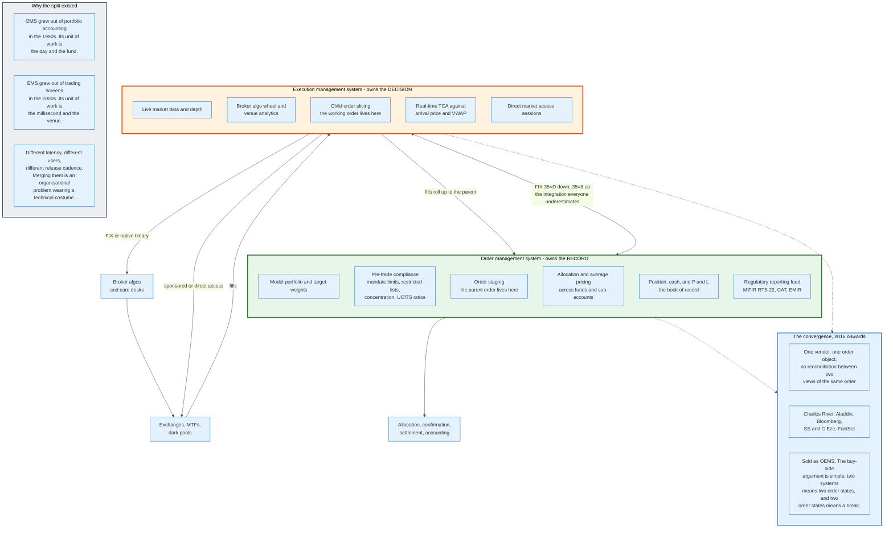

### 14.1 The Two Systems

| | Order management system | Execution management system |
|---|---|---|
| **Unit of work** | The parent order, the fund, the day | The child order, the venue, the millisecond |
| **Primary user** | Portfolio manager, compliance, middle office | Trader |
| **Owns** | Positions, cash, the book of record | Live market state and routing decisions |
| **Core function** | Pre-trade compliance, staging, allocation, accounting | Market data, algorithms, slicing, real-time TCA |
| **Latency tolerance** | Hundreds of milliseconds to seconds | Microseconds to milliseconds |
| **Historical origin** | Portfolio accounting systems, 1990s | Trading screens and direct market access, 2000s |
| **Typical vendors** | Charles River, BlackRock Aladdin, SS and C Eze, Bloomberg AIM | FlexTrade, Portware, Trading Technologies, Bloomberg EMSX |

### 14.2 The Flow Between Them

The OMS holds the parent order after compliance clears it and passes it to the EMS over FIX, normally 4.2 or 4.4. The EMS works it, generating child orders to brokers and venues, and reports fills back to the OMS over the same session. The OMS aggregates the fills into the parent, computes the average price, and allocates.

That FIX hop between two systems inside the same firm is the integration most often underestimated. It is a real FIX session with real sequence numbers, real gap recovery, and real certification, and it fails in exactly the ways an external session fails. Firms that treat it as an internal API discover during their first production incident that it is not.

### 14.3 Why They Were Ever Separate

Three reasons, all structural rather than technical.

**Different latency requirements.** A compliance check that takes 200 milliseconds is fine on a parent order and fatal on a child order. Putting both in one process means the slow path constrains the fast path.

**Different release cadence.** A trader wants a new venue supported this week. A compliance officer wants the mandate rule engine unchanged for a year. These are incompatible release schedules for one codebase.

**Different buyers.** The OMS was sold to the chief operating officer, the EMS to the head of trading. Vendors optimised for whoever signed.

### 14.4 The Convergence

The OEMS, a single system covering both, has been the direction of travel since roughly 2015. The buy-side argument is one sentence: two systems means two representations of the same order, and two representations means a reconciliation break.

The breaks are real. A fill that reaches the EMS and fails to reach the OMS leaves the firm with a position it does not know it has. A cancel processed in the OMS but not the EMS leaves an order working that the compliance system believes is dead. Every buy-side operations team has a list of these.

The counter-argument is equally simple. A single system is a single point of failure, a single vendor relationship, and a single release cadence for two teams with different needs. Firms with genuinely low-latency execution keep the EMS separate for the same reason they keep the risk gate in hardware.

The market has settled on a split by firm type rather than a winner. Long-only managers with high compliance burden and modest latency needs take the OEMS. Multi-strategy and quantitative firms keep them apart.

---

## 15. Certification and Onboarding With a Venue

No FIX session goes to production without certification, and certification is why a new broker connection takes four to twelve weeks rather than an afternoon.

### 15.1 Why Certification Exists

There is no generic FIX connection. Every counterparty publishes rules of engagement that narrow the standard: which version, which message types, which fields are mandatory beyond the specification, which enumerated values are accepted, which custom tags are required, and what the session parameters are. Two firms both implementing FIX 4.4 correctly against the standard will fail to interoperate, because the standard is permissive and the counterparties are not.

Certification is the process of proving, message by message, that a client's implementation matches the counterparty's specific document.

### 15.2 The Stages

| Stage | What happens | Typical duration |
|-------|-------------|------------------|
| **Commercial and legal** | Contracts, exchange membership or sponsored access agreement, market data licence | Weeks to months, and often the longest step |
| **Documentation** | The counterparty issues its rules of engagement, session parameters, and test scripts | Days |
| **Connectivity** | Cross connect, extranet circuit, or VPN provisioned; IP allowlists on both sides; firewall rules | 1 to 4 weeks, often gated by a third-party network provider |
| **Session establishment in UAT** | Logon works, heartbeats flow, sequence numbers reset correctly | Hours to days |
| **Scripted certification** | The counterparty's script is executed and observed | 1 to 5 sessions |
| **Sign-off** | A human at the counterparty confirms every scenario passed | Days to weeks, dominated by queue time |
| **Production enablement** | CompIDs issued for production, limits configured, go-live window agreed | Days |

### 15.3 What a Certification Script Contains

The script is a list of scenarios the client must demonstrate, and it is longer than most implementers expect because it is dominated by failure paths.

**Session scenarios.** Logon with the agreed `HeartBtInt`. Respond correctly to a `TestRequest`. Detect a gap and issue a `ResendRequest`. Handle a `SequenceReset` with `GapFillFlag` set. Handle a `SequenceReset` in reset mode. Recover after a mid-session disconnect without resetting sequence numbers. Log out cleanly. Handle a `Logout` initiated by the counterparty.

**Order scenarios.** Place a limit order and receive the acknowledgement. Place a market order. Place each supported `TimeInForce`. Receive a partial fill, then a full fill, and demonstrate correct `CumQty`, `LeavesQty`, and `AvgPx` after each. Place an order that will be rejected and handle `39=8` correctly.

**Cancel and amend scenarios.** Cancel a working order. Cancel an order that has already filled and handle the `OrderCancelReject`. Amend price. Amend quantity, demonstrating that `OrderQty` is sent as the total. Amend an order that fills mid-amendment.

**Failure scenarios.** Send a malformed message and handle the `Reject` (35=3). Send a valid message the counterparty cannot process and handle the `BusinessMessageReject` (35=j). Handle a duplicate `ExecutionReport` delivered by session replay without double counting.

**End of day.** Demonstrate correct handling of `DoneForDay` (`39=3`) and of orders expiring at the close.

### 15.4 The Environments

Three environments are normal and each catches different problems.

**Development or simulation**, often a vendor or venue-supplied simulator rather than the counterparty's live system, used to get message formats right before consuming the counterparty's engineers' time.

**User acceptance testing**, the counterparty's real system with test instruments and test accounts, where certification is performed. UAT usually runs on a schedule that does not match production hours, which is why certification windows are scarce.

**Production**, with new CompIDs, real limits, and normally a staged go-live: a small number of orders on day one, a defined ramp, and a rollback plan.

### 15.5 What Actually Delays It

The code is rarely the constraint. In order of how much time they consume: legal and commercial agreements, network provisioning by a third party, the counterparty's certification queue, market data licensing where a feed is involved, and finally the client's own implementation.

Firms that budget for this as an engineering project consistently miss the date, because most of the elapsed time is spent waiting for people who do not work for them.

---

## 16. Latency Budgets, End to End

Latency in trading is two entirely different problems wearing the same word. One is measured in nanoseconds and the other in seconds, and they belong to different firms.

```mermaid
%%{init: {'theme': 'base', 'themeVariables': {'primaryColor': '#e3f2fd', 'primaryBorderColor': '#1565c0', 'lineColor': '#37474f'}}}%%

flowchart TB
    subgraph Colo["Colocated tick to trade - the fast path, same data centre"]
        direction TB
        L1["Market data packet leaves the venue switch<br/>t = 0"]
        L2["Cross connect, a few metres of fibre<br/>+ 0.1 to 0.5 us"]
        L3["NIC to application<br/>kernel bypass 1 to 3 us<br/>plain sockets 10 to 30 us<br/>FPGA on the wire 0.05 to 0.5 us"]
        L4["Decode: SBE or ITCH read at a fixed offset<br/>+ 0.025 us<br/>tag=value parse and convert<br/>+ 2 to 10 us"]
        L5["Book update and strategy decision<br/>+ 0.2 to 5 us in software"]
        L6["Encode the order and write to the NIC<br/>+ 0.5 to 3 us"]
        L7["Wire to the venue gateway<br/>+ 0.1 to 0.5 us"]
        L8["Gateway, risk check, matching engine<br/>venue-owned, typically tens of microseconds"]
        L1 --> L2 --> L3 --> L4 --> L5 --> L6 --> L7 --> L8
    end

    subgraph Inst["Institutional order path - the slow path, and it does not matter"]
        direction TB
        I1["PM decision to OMS<br/>seconds to hours"]
        I2["Compliance check in the OMS<br/>10 to 500 ms"]
        I3["OMS to EMS FIX hop<br/>1 to 20 ms across a corporate network"]
        I4["EMS to broker over an extranet<br/>2 to 40 ms depending on geography"]
        I5["Broker risk gate, SEC 15c3-5<br/>0.1 to 5 ms"]
        I6["Broker algo schedules child orders<br/>seconds to hours by design"]
        I7["Child order to venue<br/>0.05 to 2 ms"]
        I1 --> I2 --> I3 --> I4 --> I5 --> I6 --> I7
    end

    subgraph Geo["Geography, which no engineering removes"]
        G1["Light in vacuum: 3.34 us per km<br/>Light in single-mode fibre: 4.90 us per km"]
        G2["Aurora IL to Carteret NJ,<br/>great circle 1,186 km"]
        G3["Fibre, allowing 15 percent route slack:<br/>6.7 ms one way, 13.4 ms round trip"]
        G4["Microwave line of sight, straight path:<br/>3.96 ms one way, 7.9 ms round trip"]
        G5["IEX inserts exactly 350 us in each<br/>direction with a 38-mile fibre coil,<br/>SEC approved 17 June 2016"]
    end

    subgraph Clock["What the regulator requires you to measure"]
        R1["MiFID II RTS 25, venues with<br/>gateway-to-gateway latency at or below 1 ms:<br/>100 us maximum divergence from UTC,<br/>1 us timestamp granularity"]
        R2["Members doing high frequency algorithmic<br/>trading: 100 us divergence, 1 us granularity"]
        R3["Any other trading activity:<br/>1 ms divergence, 1 ms granularity"]
        R4["Voice and RFQ with human intervention:<br/>1 second, 1 second"]
    end

    Colo -.-> Geo
    Inst -.-> Geo
    Geo -.-> Clock

    style Colo fill:#fce4ec,stroke:#880e4f,stroke-width:3px
    style Inst fill:#e8f5e9,stroke:#2e7d32,stroke-width:2px
    style Geo fill:#e3f2fd,stroke:#1565c0,stroke-width:2px
    style Clock fill:#fff3e0,stroke:#e65100,stroke-width:2px
```

### 16.1 The Colocated Path

A market maker's tick-to-trade loop lives inside one data centre and its budget is dominated by things that are not the network.

| Stage | Typical cost | Notes |
|-------|-------------|-------|
| Cross connect, a few metres of fibre | 0.1 to 0.5 us | At 4.90 us per km, 50 metres costs 0.25 us |
| Network interface to application | 0.05 to 0.5 us on FPGA<br/>1 to 3 us with kernel bypass<br/>10 to 30 us with plain sockets | The single largest software choice |
| Decode | ~0.025 us for SBE or ITCH<br/>2 to 10 us for `tag=value` | SBE benchmark: about 25 ns per market data message |
| Book update and decision | 0.2 to 5 us | Depends entirely on strategy complexity |
| Encode and write | 0.5 to 3 us | |
| Wire to the venue gateway | 0.1 to 0.5 us | |
| Venue gateway, risk check, matching engine | Venue-owned | Not under the participant's control |

The arithmetic that drives every architecture decision on this path: a `tag=value` decode costing 5 microseconds is larger than the entire rest of the software budget. That single number is why order entry at latency-sensitive venues is binary.

### 16.2 The Institutional Path

An asset manager's order takes a route where none of the above matters.

| Stage | Typical cost |
|-------|-------------|
| Portfolio decision to order staged in the OMS | Seconds to hours |
| Pre-trade compliance evaluation | 10 to 500 ms |
| OMS to EMS FIX hop across a corporate network | 1 to 20 ms |
| EMS to broker across an extranet | 2 to 40 ms, dominated by geography |
| Broker pre-trade risk gate, mandatory under SEC Rule 15c3-5 | 0.1 to 5 ms |
| Broker algorithm schedules child orders | Seconds to hours, by design |
| Child order to venue | 0.05 to 2 ms |

The worked example in section 9 showed 63 milliseconds from order send to acknowledgement, which is unremarkable for this path and roughly a thousand times the colocated budget. It does not matter, because the order is being worked over an hour and the execution price is determined by the algorithm's schedule rather than by 63 milliseconds.

### 16.3 The Floor That Engineering Cannot Move

Light in vacuum covers one kilometre in 3.34 microseconds. Light in single-mode fibre, with a refractive index near 1.47, covers it in 4.90 microseconds. Those two numbers bound everything.

The Chicago to New Jersey corridor is the canonical example, because CME's matching engine sits in Aurora, Illinois and the US equity and options venues sit in northern New Jersey. The great circle distance from Aurora to Carteret is 1,186 kilometres. That gives:

```
vacuum, one way        1,186 km x 3.34 us/km  =  3.96 ms
fibre, straight line   1,186 km x 4.90 us/km  =  5.81 ms
fibre, 15% route slack 1,364 km x 4.90 us/km  =  6.68 ms one way, 13.4 ms round trip
microwave, straight    1,186 km at near c     =  3.96 ms one way, 7.9 ms round trip
```

Microwave beats fibre on this route for two reasons that compound: radio travels through air at very nearly the speed of light in vacuum while light in glass travels at 68 percent of it, and a microwave path is a straight line between towers while fibre follows railways and highways. The gap is roughly 5 milliseconds on the round trip, which is why the corridor has microwave, millimetre wave, and at times balloon-borne relay networks built across it.

### 16.4 Deliberate Latency

Not all latency is accidental. IEX inserts exactly 350 microseconds in each direction using a 38-mile coil of optical fibre placed in front of its matching engine, giving a 700 microsecond round trip. The SEC approved IEX as a national securities exchange on 17 June 2016 under Release No. 34-78101, with the speed bump in place. The purpose is to ensure the exchange's own pegged orders can reprice against a market data update before an incoming order can act on it, which removes a specific category of latency arbitrage.

The speed bump demonstrates something the rest of this section implies: latency is a design parameter, not a constant, and a venue can spend it deliberately to change who wins.

### 16.5 What the Regulator Requires You to Measure

MiFID II RTS 25, Commission Delegated Regulation (EU) 2017/574, sets the clock accuracy required to timestamp reportable events. The thresholds are the clearest published statement of what regulators consider fast.

For operators of trading venues:

| Gateway-to-gateway latency of the system | Maximum divergence from UTC | Timestamp granularity |
|---|---|---|
| Greater than 1 millisecond | 1 millisecond | 1 millisecond or better |
| 1 millisecond or less | 100 microseconds | 1 microsecond or better |

For members and participants:

| Type of trading activity | Maximum divergence from UTC | Timestamp granularity |
|---|---|---|
| High frequency algorithmic trading | 100 microseconds | 1 microsecond or better |
| Any other trading activity | 1 millisecond | 1 millisecond or better |
| Voice trading systems | 1 second | 1 second or better |
| Request for quote with human intervention | 1 second | 1 second or better |
| Negotiated transactions | 1 second | 1 second or better |

Two consequences follow. A firm doing high frequency algorithmic trading in Europe must hold its clocks within 100 microseconds of UTC, traceable, which in practice means GPS or Precision Time Protocol infrastructure rather than NTP. And the regulation encodes the assumption that a fast venue's gateway-to-gateway latency is at or below one millisecond, which is a public statement of what "fast" meant when the rule was written.

---

## 17. Technical Architecture: Engines, Sessions, Physical Plant

A FIX deployment is three things: an engine, a set of sessions, and the physical path they run over. Each fails differently.

### 17.1 The FIX Engine

A FIX engine implements the session layer and hands parsed application messages to the trading system. Its responsibilities are narrow and unforgiving.

**The message store.** Every outbound message must be persisted before it is sent, because the peer may request a resend of any message from the current session at any time. An engine that cannot replay message 4,217 cannot honour a `ResendRequest` and must fall back to a sequence reset, which discards the guarantee the session layer exists to provide. The store is therefore on the critical path of every send, and its write latency is the engine's latency floor. Implementations range from a memory-mapped append-only file to a full database, and the memory-mapped file wins on latency by a wide margin.

**Sequence number persistence.** Inbound and outbound counters must survive a process restart. An engine restarting with counters at zero produces the fatal low-sequence-number case described in section 6, and the peer disconnects.

**Timers.** Heartbeat, test request, and logon timeouts must fire accurately under load. An engine that misses heartbeat deadlines because its garbage collector paused it will be disconnected by a counterparty that is behaving correctly.

**Validation.** Required fields present, tags defined for the message type, values inside enumerations, repeating groups well formed, checksum correct, body length correct. Engines differ in how much of this they do and how much they push to the application, and that difference is a common source of surprise during certification.

The commonly deployed engines are QuickFIX and its language ports as the open-source baseline, Artio for low-latency Java, and commercial engines from OnixS, B2BITS, Rapid Addition, and Itiviti. The commercial argument is not features but certification history: a vendor engine has already passed certification at hundreds of counterparties, and the counterparty's engineer recognises the log format.

### 17.2 Session Design

A session is identified by the triple of `BeginString`, `SenderCompID`, and `TargetCompID`. Everything else about a deployment follows from how those triples are allocated.

**One session per counterparty per purpose.** Order flow, drop copy, and market data run on separate sessions even to the same counterparty, because they have different failure tolerances and different consumers.

**Sub-IDs for logical separation.** `SenderSubID` (50) and `TargetSubID` (57) subdivide a session, letting one connection carry flow for several desks or strategies without separate logons. Whether a counterparty supports them is a rules-of-engagement question.

**Sequence reset policy.** Whether counters reset at each logon, at the start of each trading day, or never is bilaterally agreed and must be identical on both sides. A mismatch produces a session that connects and immediately disconnects, and it is the single most common go-live failure.

**Scheduled sessions.** Most institutional sessions have a defined trading day, logging on before the open and out after the close. The engine must know the schedule, because a logon outside the window is rejected and a session left up over the weekend accumulates the operational risk of an unattended connection.

### 17.3 Physical Plant

**Colocation.** Participants that care about microseconds rent rack space in the venue's own data centre: Aurora, Illinois for CME, Carteret and Mahwah, New Jersey for Nasdaq and NYSE, Basildon for ICE Futures Europe, Slough for LSEG. The venue sells cross connects with standardised cable lengths, because unequal cable lengths would confer an advantage measurable in tens of nanoseconds.

**Extranets.** Institutional order flow runs over managed financial extranets rather than the public internet: Radianz, TNS, and broker-operated networks. The reason is not latency but accountability. When a session drops, one company owns the whole path and can be called.

**Order routing networks.** A layer above the extranet, these carry FIX between firms without either side maintaining a session to the other, using `OnBehalfOfCompID` (115) and `DeliverToCompID` (128) so the network can relay on a firm's behalf. NYFIX was the archetype. The commercial value is that a buy-side firm maintains one session to the network instead of forty sessions to forty brokers.

**Kernel bypass and hardware.** On the fast path, the operating system's network stack is removed. Solarflare Onload, Mellanox VMA, and DPDK move packet handling into user space. Beyond that, the entire path from wire to order can live in an FPGA, where a market data update triggers an order without a general-purpose CPU touching it.

### 17.4 Failure Modes That Actually Happen

**Slow consumer.** A client that reads its socket slower than the broker writes to it causes TCP backpressure, which causes the broker's send buffer to fill, which causes the broker's engine to stall. Every venue has limits on how far behind a session may fall before it is disconnected.

**Message store exhaustion.** A store that fills mid-session leaves the engine unable to persist outbound messages, at which point it must stop sending rather than send something it cannot replay.

**Clock drift.** `SendingTime` (52) outside the counterparty's tolerance, typically two minutes, produces a session-level reject. Under MiFID II the tolerance for reportable timestamps is far tighter.

**Sequence number divergence after a failover.** A hot standby that has not replicated the outbound counter comes up with a lower number, and the peer disconnects. Replicating sequence state is the hardest part of making a FIX engine highly available, and it is why many firms accept a manual failover with a reset instead.

---

## 18. Economics: What It Costs to Run and Who Pays

FIX itself is free. The specification is published at no charge by a non-profit. Everything around it is not.

### 18.1 What Firms Actually Buy

| Cost | Who pays | What drives it |
|------|----------|----------------|
| **FIX engine licence** | Every firm running sessions | Per session, per server, or per site, depending on vendor |
| **OMS or EMS licence** | Buy side | Assets under management, seat count, or order volume |
| **Certification and onboarding effort** | Both sides of every new link | Engineering weeks plus counterparty queue time |
| **Extranet or network circuit** | Both sides | Bandwidth, redundancy, and geography |
| **Colocation rack and power** | Latency-sensitive participants | Rack units and kilowatts in a facility with no substitutes |
| **Cross connects** | Colocated participants | Per connection, per month, at the venue's tariff |
| **Market data licence** | Every consumer | Per feed, per user, plus non-display and redistribution fees |
| **Exchange membership or sponsored access** | Anyone reaching a venue | Annual membership plus per-trade fees |
| **Clock synchronisation infrastructure** | Anyone under RTS 25 | GPS receivers, PTP grandmasters, monitoring |
| **Surveillance and reporting systems** | Regulated firms | Trade volume and jurisdiction count |

The pattern is that the protocol is free and the connectivity is not. That is not accidental. A standard that is free to implement produces many implementations, and many implementations produce demand for the connectivity, certification, and data that are not free.

### 18.2 How Vendors Price It

**FIX engines** are priced per session or per deployment, with support and certification assistance sold alongside. The open-source alternative, QuickFIX, is genuinely free and genuinely used, and the reason firms pay anyway is that a vendor engine arrives with a certification track record and an escalation path at three in the morning.

**OMS and EMS vendors** price on the size of the firm rather than usage, because their value is measured in compliance coverage and trader productivity rather than messages. Contracts are multi-year and switching costs are high, which is the source of the consolidation in that market.

**Venues** price connectivity, not protocol. A member pays for ports, cross connects, and colocation whether it speaks FIX or a native binary protocol, and a native binary port frequently costs the same as a FIX port. The venue's incentive to offer binary is throughput on its own matching engine, not port revenue.

**Market data** is the largest recurring line for most firms and is priced by a taxonomy of unusual complexity: display versus non-display, professional versus non-professional users, internal use versus redistribution, derived data, and per-application licences. It is also the line most likely to grow without any change in what the firm does.

### 18.3 The Cost of Not Standardising

The counterfactual is the useful way to see FIX's value. Before it, each broker-to-client link was a bespoke integration: a private message format, a private state machine, and a project per pair. A buy-side firm connecting to 40 brokers faced 40 integrations, and each broker faced one per client.

FIX turned an order-of-n-squared problem into an order-of-n problem, imperfectly. Certification still costs weeks per link because counterparties customise. But a certification against a documented subset of a shared standard is weeks, and a bespoke integration was months.

The residual cost of that imperfection is exactly what FIX Orchestra targets: if rules of engagement are machine-readable, the certification effort per link collapses towards the effort of running a generated test suite.

---

## 19. Security and Risk

### 19.1 The Threat Model

FIX was designed for private circuits between known counterparties, and its security properties reflect that assumption.

**No confidentiality of its own.** `EncryptMethod` (98) is set to `0` on essentially every production session. Account identifiers, order sizes, prices, and client codes travel as ASCII. Confidentiality is entirely the transport's job, and where the transport is a private circuit rather than TLS, it is the circuit's job.

**Weak authentication.** `Username` (553) and `Password` (554) in the `Logon` message are the standard mechanism, and the FIX 4.4 specification itself notes that minimal security exists without transport-level encryption. Real authentication in production comes from three things the protocol does not define: the CompID pair, the source IP allowlist, and mutual TLS certificates where FIXS is implemented.

**No integrity protection.** The checksum detects corruption and truncation. It stops nothing deliberate, because an attacker recomputes it. `Signature` (89) exists in the trailer and is essentially unused.

**Replay is a protocol feature.** `PossDupFlag` (43) and the resend mechanism exist so messages can legitimately be re-delivered. An attacker who can inject into the stream does not need to forge anything novel; a replayed order with the right sequence number is a valid order.

### 19.2 What Actually Defends a Session

| Control | What it stops |
|---------|--------------|
| **Private connectivity** | Anyone not on the circuit. The dominant control in practice. |
| **TLS, per FIXS** | Interception and modification on shared paths |
| **IP allowlisting** | Connections from anywhere the counterparty does not expect |
| **CompID validation** | A session claiming to be a firm it is not |
| **Sequence number continuity** | Injected and replayed messages, provided both sides enforce the fatal-low-sequence rule |
| **Pre-trade risk limits** | Orders that are authentic and catastrophic |
| **Kill switch** | Everything, once someone notices |

The order of that table is the order of effectiveness, and the first entry does most of the work. FIX's security model is, honestly stated, a private network plus a pre-trade risk gate.

### 19.3 The Risk That Matters More Than Security

The dominant operational risk in FIX infrastructure is not an attacker. It is a correct-looking message sent by a system that has lost track of its own state.

**Runaway algorithms.** An algorithm with a bad state machine sends orders as fast as its session allows. Knight Capital took a pre-tax loss the firm reported at approximately 440 million dollars on 1 August 2012, after a deployment left superseded code active on one of eight servers, which began sending orders no human had authorised. Nothing about the FIX layer was wrong. Every message was well formed, correctly sequenced, and authentic.

**Duplicate order submission.** A retry after an ambiguous timeout, without idempotency, produces two live orders where the client believes there is one.

**Fat finger.** A quantity typed with an extra zero is a valid FIX message.

**State divergence.** A client whose order state disagrees with the broker's cancels an order that is already filled, or leaves working an order it believes is dead.

The controls are correspondingly operational rather than cryptographic. SEC Rule 15c3-5, the Market Access Rule, requires broker-dealers providing market access to maintain risk controls that are applied before an order reaches a venue, and it explicitly prohibits the unfiltered "naked access" arrangements that previously let a client's orders reach an exchange without passing through the broker's systems. That rule, more than any protocol change, defines the security posture of the modern order path: a mandatory inline gate that the client cannot bypass.

Beyond it sit throttles on message rate per session, maximum order value and quantity limits, price collars rejecting orders far from the last trade, duplicate detection on `ClOrdID`, self-trade prevention at the venue, and a kill switch that cancels every working order and disables the session.

### 19.4 Known Failure Patterns

**Knight Capital, 1 August 2012.** A repurposed flag in a deployment activated dormant code on one of eight servers. The loss, reported by the firm at approximately 440 million dollars, accrued in roughly 45 minutes. Cause: deployment process, not protocol.

**Flash crash conditions generally.** Cascading algorithmic behaviour where each participant's controls are individually correct. No FIX session misbehaved in any of these events.

**Sequence number resets in production.** The routine incident nobody publishes. A firm restarts an engine, loses its store, and forces a reset, after which the two sides disagree about which messages were exchanged and reconciliation happens by hand at end of day.

---

## 20. Regulation and Compliance

Regulation drives more FIX field additions than trading innovation does. Almost every recent Extension Pack traces to a reporting obligation.

### 20.1 The Rules That Shape the Protocol

| Regulation | Jurisdiction | Effect on FIX |
|-----------|--------------|---------------|
| **MiFID II and MiFIR** | European Union, from 3 January 2018 | Transaction reporting fields, algorithm and trader identification, timestamp precision, venue transparency flags |
| **RTS 25** (EU 2017/574) | European Union | Clock synchronisation to 100 microseconds and 1 microsecond granularity for high frequency trading |
| **RTS 22** | European Union | 65 transaction report fields, many populated from FIX order and execution data |
| **SEC Rule 15c3-5** | United States, from 2011 | Mandatory pre-trade risk controls inline on the order path; no unfiltered market access |
| **Consolidated Audit Trail** | United States | Order event reporting across the full lifecycle, sourced from order and execution records |
| **Regulation NMS** | United States | Order protection and routing obligations reflected in order handling and `ExDestination` |
| **EMIR** | European Union | Derivative trade reporting, largely post-trade rather than FIX |
| **Dodd-Frank Title VII** | United States | Swap execution facility reporting and clearing flows |

### 20.2 What This Puts in the Messages

Regulatory identification fields now travel with orders as a matter of course.

**Party identification.** The `Parties` component with `PartyID` (448), `PartyIDSource` (447), and `PartyRole` (452) carries the legal entity identifier of the client, the identity of the person or algorithm that made the investment decision, and the identity of the person or algorithm responsible for execution. MiFID II made the last two mandatory, which is why an order now has to say which algorithm sent it.

**Order and trade capacity.** `OrderCapacity` (528) distinguishing agency, principal, and riskless principal, because the reporting treatment differs.

**Timestamps at the required granularity.** `TransactTime` (60) and `SendingTime` (52) carried to microseconds or nanoseconds where RTS 25 requires it.

**Venue and waiver flags.** Identification of the trading venue by market identifier code, and of any pre-trade transparency waiver used.

### 20.3 The Reporting Chain

The pattern is consistent across jurisdictions. FIX carries the order and execution data. A separate reporting system extracts, enriches, and submits it, in a different format, to a repository or regulator. FIX is the source, not the reporting channel.

That indirection is why drop copy matters for compliance. A reporting system fed from a drop copy is fed from a source the trading desk does not control, which is what an auditor wants to see.

### 20.4 The Standards Body as a Regulatory Interface

The FIX Trading Community works as a venue where regulators and participants meet, and its output rather than its charter is the evidence. EP305 standardises how venues communicate outages. On 11 August 2026 the community published a broader push on standardised outage communications and a call for a global approach to artificial intelligence aligned with IOSCO, and on 20 August 2026 a call for tokenised asset standardisation. The community publishes no sentence of its own describing this role, so the record of what it produced has to carry the claim.

The mechanism is worth noting because it is unusual. A regulator that wants a new data point in the order flow does not write a message format. It states the requirement, and an Extension Pack appears.

---

## 21. Comparisons and Alternatives

### 21.1 FIX Against the Other Financial Message Standards

| Standard | Domain | Encoding | Latency profile | Relationship to FIX |
|----------|--------|----------|-----------------|--------------------|
| **FIX** | Front office: orders, executions, quotes, allocations | `tag=value`, FIXML, SBE, JSON | Microseconds to milliseconds | The subject |
| **ISO 15022** | Securities settlement and custody | Structured text blocks over Swift | Minutes to hours | Downstream. FIX confirmations translate into it. |
| **ISO 20022** | Payments, settlement, reporting, increasingly everything | XML, with an ASN.1 and JSON variant | Seconds to hours | Downstream and adjacent. Replacing ISO 15022. |
| **Swift MT and MX** | Interbank messaging | Text and ISO 20022 XML | Minutes | Different layer entirely. Swift settles nothing on the FIX path. |
| **FpML** | OTC derivatives contract terms | XML | Not latency sensitive | Complementary. FIX carries the trade, FpML the contract. |
| **Native venue binary** | One venue's order entry and market data | Fixed-offset binary | Nanoseconds to microseconds | Encodes FIX semantics in venue-specific bytes |

The clean division is that FIX ends when the trade is agreed and the settlement standards begin when it must be delivered. The two worlds meet in the middle office and the meeting is a translation.

### 21.2 The Encoding Choice, Decided

| If your constraint is | Choose | Because |
|----------------------|--------|---------|
| Interoperating with an unknown counterparty | `tag=value` | Self-describing, universally implemented, debuggable in a log |
| Order entry to a latency-sensitive venue | Whatever the venue publishes | You do not have a choice, and it will be binary |
| Building your own high-throughput internal link | SBE over FIXP | Fixed offsets, implicit sequencing, selectable delivery guarantees |
| Multicast market data with bandwidth constraints | FAST, or SBE | FAST for bytes, SBE for cycles |
| Clearing and position management | FIXML | Schema validation matters more than size |
| A web or mobile front end | JSON | Developer time dominates |

### 21.3 What a 2026 Redesign Would Change

A protocol designed today would keep the semantics and replace almost everything else, and the split is informative.

The encoding would be binary with a schema from the start, because the tooling to distribute and version schemas exists now and did not in 1992. The session layer would be FIXP-shaped: implicit sequencing, selectable delivery guarantees, session identity separate from transport binding. Security would be mandatory TLS with mutual certificates rather than a `Password` field. And the rules of engagement would be machine-readable from day one, which is precisely what Orchestra is retrofitting.

What would not change is the semantic model. `ClOrdID` and `OrderID` as separate identifiers owned by separate parties, `ExecType` separate from `OrdStatus`, `CumQty` and `LeavesQty` and `AvgPx` as a contract the broker maintains, and the `ExecutionReport` as the single authoritative record of order state, are a correct model of the problem. Every native binary protocol reimplements them.

---

## 22. Modern Developments

### 22.1 What Changed in the Last Five Years

- **April 2021**: FIXP 1.0 approved as a technical standard, giving the industry a binary session layer with a published specification rather than one venue's private design.
- **Continuous, since roughly 2017**: FIX Latest replaces numbered releases. Extension Packs publish as soon as the Global Technical Committee approves them.
- **October 2025**: Nasdaq publishes an update to the OUCH 5.0 order entry specification, whose message set includes modify, mass cancel, and AIQ self-match prevention.
- **June 2026**: EP306 publishes the FIX Latest errors and omissions bundle.
- **31 July 2026**: FIX Latest EP309 reference published, adding equity issuance order identification.
- **11 August 2026**: The community publishes work on standardised outage communications, following EP305, and on a global approach to artificial intelligence aligned with IOSCO.
- **20 August 2026**: The community issues a call for tokenised asset standardisation.
- **25 August 2026**: An industry roadmap for the electronification of equity issuance is published, which is what EP309 supports at the message level.
- **27 August 2026**: FIXimate retires. Orchimate becomes the reference browser, served from FIX Orchestra files.

### 22.2 The Direction of Travel

**Machine-readable rules of engagement.** The migration from FIXimate to Orchimate is the visible half of a larger shift. When a counterparty's specification is an Orchestra file rather than a PDF, a client can generate validation logic, a test harness, and a code stub from it. The certification bottleneck described in section 15 is a human reading a document; Orchestra is the attempt to remove the human from the reading.

**Binary as the default for new venues.** No venue launched in the last decade has made `tag=value` its primary order entry protocol. FIX remains as the compatibility path for the long tail of participants, and it will remain for a long time, because the long tail is large and has no reason to move.

**Post-trade electronification.** The messages that carry allocation, confirmation, and settlement instruction are the least automated part of the FIX estate and the part with the most manual intervention remaining. EP307 on securities lending and the equity issuance work are both attempts to extend the protocol into workflows that are still partly telephone and spreadsheet.

**Tokenised assets.** The community's August 2026 call for tokenised asset standardisation is the early stage of the question of whether an order for a tokenised security is an ordinary FIX order with new reference data, or something that needs a different settlement model in the message. The answer is not yet decided.

**Outage communication.** EP305 and the follow-on work standardise how a venue tells participants that it is degraded, which sounds administrative and is not. In an outage, the expensive failures come from participants who cannot tell whether their orders are live, and a standard message beats an email.

### 22.3 What Is Not Changing

Tag equals value is not going away. It carries the OMS-to-EMS link at essentially every buy-side firm, it carries order flow to every broker, and Cboe's US equities markets still take a subset of FIX 4.2 in 2026. A format that is thirty-four years old, universally implemented, and adequate for the latency requirements of most institutional order flow does not get replaced. It gets supplemented.

---

## 23. Appendix

### 23.1 Key Terminology

| Term | Meaning |
|------|---------|
| **ApplVerID** | Tag 1128. Names the application version of one message, so a FIXT session can carry several. |
| **BeginString** | Tag 8. The version identifier, always the first field. `FIX.4.4` or `FIXT.1.1`. |
| **BodyLength** | Tag 9. Byte count from the start of tag 35 to the SOH before tag 10. A framing device. |
| **BOE** | Binary Order Entry. Cboe's native order entry protocol, little-endian by design. |
| **CheckSum** | Tag 10. Sum of all preceding bytes modulo 256, three digits, always last. |
| **ClOrdID** | Tag 11. The client's identifier for an order. Changes on every amendment. |
| **CompID** | `SenderCompID` (49) and `TargetCompID` (56). With `BeginString` they identify a session. |
| **Drop copy** | A read-only FIX session receiving execution reports for orders it did not send. |
| **ExecID** | Tag 17. Unique identifier for one execution report. Used to deduplicate. |
| **ExecTransType** | Tag 20. FIX 4.2 only, mandatory on every 4.2 `ExecutionReport`. Says whether a report is new, a cancel, a correction, or a status. Replaced by `ExecType` `G`, `H` and `I` from FIX 4.3. |
| **ExecType** | Tag 150. What this particular execution report is. Not the order's state. |
| **Extension Pack** | A bundle of additions to FIX Latest, published on approval. EP309 is the highest as of August 2026. |
| **FAST** | FIX Adapted for STreaming. Stop-bit encoding plus a presence map plus field operators. Optimises bandwidth. |
| **FIXML** | XML encoding of FIX messages. Used in clearing and position management. |
| **FIXP** | FIX Performance session layer. Implicit sequencing, selectable delivery guarantees. Standard from April 2021. |
| **FIXS** | FIX over TLS. Technical standard since 19 February 2021. Version 1.1 Release Candidate 1 published February 2025. |
| **FIXT 1.1** | The session layer split out of FIX 5.0, versioned independently of the message set. |
| **GapFillFlag** | Tag 123. On a `SequenceReset`, `Y` means the skipped messages existed and no longer matter. |
| **HeartBtInt** | Tag 108. Heartbeat interval in seconds, agreed at logon, identical on both sides. |
| **ITCH** | Nasdaq's native market data protocol. Fixed-length binary messages describing order book events. |
| **LeavesQty** | Tag 151. Quantity still working. Zero means the order is done. |
| **MoldUDP64** | Nasdaq's sequenced multicast transport for ITCH. |
| **MsgSeqNum** | Tag 34. Per session, per direction, starts at 1, never skips. |
| **OEMS** | A single system covering both order management and execution management. |
| **OrdStatus** | Tag 39. The order's current state. Not what this report is. |
| **Orchestra** | Machine-readable rules of engagement. Draft standard 5 December 2018, technical standard 17 February 2021, version 1.1 Release Candidate 3 published June 2026. |
| **Orchimate** | The FIX reference browser that replaced FIXimate on 27 August 2026. |
| **OrderID** | Tag 37. The broker's identifier. Assigned once, never changes. |
| **OrigClOrdID** | Tag 41. The previous `ClOrdID`, on cancels and replaces. |
| **OUCH** | Nasdaq's native order entry protocol. Fixed-length binary, big-endian. |
| **PossDupFlag** | Tag 43. `Y` means this message may already have been delivered. |
| **PossResend** | Tag 97. `Y` means the application is resending content already sent under a different sequence number. Dedupe at the application layer, not the session layer. |
| **Rules of engagement** | A counterparty's document narrowing the standard to what it actually accepts. The real specification. |
| **SBE** | Simple Binary Encoding. Fixed offsets, native types, no schema on the wire. Final February 2017, errata November 2020. Version 2.0 is still a release candidate. |
| **SOFH** | Simple Open Framing Header. `uint32` length plus `uint16` encoding type, six bytes, big-endian. |
| **SOH** | ASCII `0x01`. The field delimiter. Not a pipe. |
| **SoupBinTCP** | Nasdaq's sequenced, guaranteed unicast transport. |
| **Tag** | A field's number. `44` is `Price`. |
| **TestReqID** | Tag 112. The token a `TestRequest` demands back in a `Heartbeat`. |

### 23.2 Architecture Diagrams

| Diagram | Source | Description |
|---------|--------|-------------|
| Evolution Timeline | [`diagrams/evolution-timeline.mmd`](diagrams/evolution-timeline.mmd) | FIX from the 1992 Fidelity and Salomon prototype to Orchimate in August 2026 |
| Participants | [`diagrams/participants.mmd`](diagrams/participants.mmd) | Buy side, sell side, venues, post-trade, and the plumbing between them |
| Message Anatomy | [`diagrams/message-anatomy.mmd`](diagrams/message-anatomy.mmd) | Header, body, and trailer of a real 212-byte NewOrderSingle |
| Session State Machine | [`diagrams/session-state-machine.mmd`](diagrams/session-state-machine.mmd) | Logon through logout, including the fatal low-sequence case |
| Sequence Gap Recovery | [`diagrams/sequence-gap-recovery.mmd`](diagrams/sequence-gap-recovery.mmd) | Resend request, replay with PossDupFlag, gap fill, and reset |
| Order Lifecycle | [`diagrams/order-lifecycle.mmd`](diagrams/order-lifecycle.mmd) | NewOrderSingle to final fill with the drop copy running in parallel |
| OrdStatus State Machine | [`diagrams/ordstatus-state-machine.mmd`](diagrams/ordstatus-state-machine.mmd) | Every OrdStatus transition with the ExecType that carries it |
| Cancel Replace Race | [`diagrams/cancel-replace-race.mmd`](diagrams/cancel-replace-race.mmd) | Three outcomes when a cancel and a fill cross on the wire |
| Worked Order Flow | [`diagrams/worked-order-flow.mmd`](diagrams/worked-order-flow.mmd) | One order end to end with every byte count and every number reconciled |
| Encoding Comparison | [`diagrams/encoding-comparison.mmd`](diagrams/encoding-comparison.mmd) | tag=value, FIXML, FAST, SBE, and JSON against the same semantics |
| SBE Wire Layout | [`diagrams/sbe-wire-layout.mmd`](diagrams/sbe-wire-layout.mmd) | Framing header, message header, root block, and the 78 against 212 byte arithmetic |
| FIXP Session | [`diagrams/fixp-session.mmd`](diagrams/fixp-session.mmd) | Negotiate, establish, implicit sequencing, retransmission, and finalisation |
| Market Data Paths | [`diagrams/market-data-paths.mmd`](diagrams/market-data-paths.mmd) | Native binary multicast against FIX subscription, and who takes which |
| Drop Copy and Post Trade | [`diagrams/drop-copy-post-trade.mmd`](diagrams/drop-copy-post-trade.mmd) | The read-only session and the allocation to settlement chain |
| OMS and EMS Architecture | [`diagrams/oms-ems-architecture.mmd`](diagrams/oms-ems-architecture.mmd) | Who owns the record, who owns the decision, and why they converged |
| Latency Budget | [`diagrams/latency-budget.mmd`](diagrams/latency-budget.mmd) | Colocated tick to trade, institutional path, geography, and RTS 25 |

### 23.3 Session Message Reference

| MsgType | Message | Key fields |
|---------|---------|-----------|
| `A` | Logon | 98 EncryptMethod, 108 HeartBtInt, 141 ResetSeqNumFlag, 553 Username, 554 Password, 789 NextExpectedMsgSeqNum |
| `0` | Heartbeat | 112 TestReqID when replying to a TestRequest |
| `1` | TestRequest | 112 TestReqID |
| `2` | ResendRequest | 7 BeginSeqNo, 16 EndSeqNo where 0 means infinity |
| `3` | Reject | 45 RefSeqNum, 371 RefTagID, 372 RefMsgType, 373 SessionRejectReason |
| `4` | SequenceReset | 36 NewSeqNo, 123 GapFillFlag, 43 PossDupFlag |
| `5` | Logout | 58 Text |
| `j` | BusinessMessageReject | 45 RefSeqNum, 372 RefMsgType, 380 BusinessRejectReason |

### 23.4 Order Message Reference

| MsgType | Message | Required beyond the header in FIX 4.4 |
|---------|---------|----------------------------------------|
| `D` | NewOrderSingle | 11 ClOrdID, 54 Side, 60 TransactTime, 40 OrdType, Instrument, OrderQtyData |
| `8` | ExecutionReport | 37 OrderID, 17 ExecID, 150 ExecType, 39 OrdStatus, 151 LeavesQty, 14 CumQty, 6 AvgPx, 54 Side, Instrument |
| `F` | OrderCancelRequest | 41 OrigClOrdID, 11 ClOrdID, 54 Side, 60 TransactTime, Instrument, OrderQtyData |
| `G` | OrderCancelReplaceRequest | 41 OrigClOrdID, 11 ClOrdID, 54 Side, 60 TransactTime, 40 OrdType, Instrument, OrderQtyData |
| `9` | OrderCancelReject | 37 OrderID, 11 ClOrdID, 41 OrigClOrdID, 39 OrdStatus, 434 CxlRejResponseTo |
| `H` | OrderStatusRequest | 11 ClOrdID, 54 Side, Instrument |

### 23.5 Common Field Reference

| Tag | Field | Type | Notes |
|-----|-------|------|-------|
| 1 | Account | String | |
| 6 | AvgPx | Price | Volume-weighted mean of all fills |
| 11 | ClOrdID | String | Client's handle. Changes on amendment. |
| 14 | CumQty | Qty | Total filled |
| 17 | ExecID | String | Deduplication key |
| 18 | ExecInst | MultipleValueString | Space-separated |
| 21 | HandlInst | char | 1 automated private, 2 automated public, 3 manual |
| 22 | SecurityIDSource | String | 1 CUSIP, 2 SEDOL, 4 ISIN, 8 exchange symbol |
| 30 | LastMkt | Exchange | Market identifier code of the fill |
| 31 | LastPx | Price | Price of this fill |
| 32 | LastQty | Qty | Quantity of this fill |
| 37 | OrderID | String | Broker's handle. Never changes. |
| 38 | OrderQty | Qty | Always total, never remainder |
| 39 | OrdStatus | char | The order's state |
| 40 | OrdType | char | 1 market, 2 limit, 3 stop, 4 stop limit, P pegged |
| 41 | OrigClOrdID | String | Previous ClOrdID |
| 44 | Price | Price | Decimal string. Never a binary float. |
| 54 | Side | char | 1 buy, 2 sell, 5 sell short |
| 55 | Symbol | String | |
| 58 | Text | String | For humans only |
| 59 | TimeInForce | char | 0 day, 1 GTC, 3 IOC, 4 FOK, 6 GTD |
| 60 | TransactTime | UTCTimestamp | When the event occurred, not when it was sent |
| 99 | StopPx | Price | Required for stop and stop limit |
| 103 | OrdRejReason | int | Why an order was rejected |
| 110 | MinQty | Qty | |
| 111 | MaxFloor | Qty | Iceberg display size |
| 150 | ExecType | char | What this report is |
| 151 | LeavesQty | Qty | Still working |
| 448 | PartyID | String | With 447 and 452, carries regulatory identification |
| 528 | OrderCapacity | char | A agency, P principal, R riskless principal |

### 23.6 Native Protocol Byte Layouts, for Comparison

Nasdaq TotalView-ITCH 5.0, Add Order without MPID attribution, 36 bytes:

| Field | Offset | Length | Type |
|-------|--------|--------|------|
| Message Type | 0 | 1 | `A` |
| Stock Locate | 1 | 2 | Integer |
| Tracking Number | 3 | 2 | Integer |
| Timestamp | 5 | 6 | Nanoseconds since midnight |
| Order Reference Number | 11 | 8 | Integer |
| Buy/Sell Indicator | 19 | 1 | `B` or `S` |
| Shares | 20 | 4 | Integer |
| Stock | 24 | 8 | Alpha, right padded |
| Price | 32 | 4 | Price with 4 implied decimals |

Other ITCH message sizes: Add Order with MPID attribution 40 bytes, Order Executed 31 bytes, Order Executed With Price 36 bytes, Order Cancel 23 bytes, Order Delete 19 bytes, Order Replace 35 bytes.

### 23.7 Clock Accuracy Under MiFID II RTS 25

Operators of trading venues:

| Gateway-to-gateway latency | Maximum divergence from UTC | Granularity |
|---|---|---|
| Greater than 1 ms | 1 ms | 1 ms or better |
| 1 ms or less | 100 us | 1 us or better |

Members and participants:

| Trading activity | Maximum divergence from UTC | Granularity |
|---|---|---|
| High frequency algorithmic trading | 100 us | 1 us or better |
| Any other trading activity | 1 ms | 1 ms or better |
| Voice trading | 1 s | 1 s or better |
| Request for quote with human intervention | 1 s | 1 s or better |
| Negotiated transactions | 1 s | 1 s or better |

### 23.8 Latency Arithmetic Reference

| Quantity | Value |
|----------|-------|
| Speed of light in vacuum | 299,792 km/s, 3.34 us per km |
| Speed of light in single-mode fibre, n approximately 1.47 | 203,940 km/s, 4.90 us per km |
| Aurora IL to Carteret NJ, great circle | 1,186 km |
| Fibre one way with 15 percent route slack | 6.68 ms |
| Fibre round trip with 15 percent route slack | 13.4 ms |
| Microwave one way, straight path | 3.96 ms |
| Microwave round trip, straight path | 7.9 ms |
| IEX speed bump, each direction | 350 us, via a 38-mile fibre coil |
| SBE market data encode or decode | approximately 25 ns |
| Google Protocol Buffers, same message | approximately 1,000 ns |

---

## 24. Key Takeaways

**1. FIX is three separable layers, and only one of them is contested.** The field dictionary and message semantics, the session protocol, and the encoding are independent. Every argument about firms "leaving FIX" is an argument about the encoding. CME's iLink 3 is SBE bytes over a FIXP session carrying FIX semantics, and it is more FIX than not.

**2. The wire format is `tag=value` terminated by ASCII `0x01`, and the pipe is a fiction.** Every document renders SOH as `|` because `0x01` is invisible. There is no pipe on the wire, and a parser that splits on one works against documentation and fails against every counterparty.

**3. Three fields have positional rules and the rest do not.** Tags 8, 9, and 35 must be the first three in that order, and tag 10 must be last. `BodyLength` is a framing device that lets a reader find message boundaries without scanning; `CheckSum` is a truncation detector, not integrity protection.

**4. The session layer's guarantee is agreement, not delivery.** Either both sides agree on exactly which messages were exchanged, or the session dies loudly. An inbound sequence number lower than expected without `PossDupFlag` is fatal by design, because the protocol cannot distinguish a replay from a lost message store and refuses to guess.

**5. `ExecType` describes the report and `OrdStatus` describes the order.** This is the single most common integration defect. `150=6` with `39=6` means a cancel has been acknowledged and nothing has been cancelled. Drive state from tag 39, drive position from `LastQty` on reports where `ExecType` is a trade, and reconcile with `CumQty`, `LeavesQty`, and `AvgPx` every time.

**6. `OrderQty` on an amendment is the total order size, never the remainder.** An order for 10,000 that has filled 7,500 still carries `38=10000` on a replace. Sending `38=2500` silently shrinks the order, which is worse than an error because it does something plausible.

**7. There is no generic FIX connection.** Every counterparty publishes rules of engagement narrowing the standard, and where the standard and that document disagree, the document wins. Two firms both implementing FIX 4.4 correctly will not interoperate without certification. Onboarding takes four to twelve weeks, and most of that is legal agreements, network provisioning, and the counterparty's certification queue rather than code.

**8. Venues left `tag=value` for order entry because parsing it is a per-message cost on a path that runs millions of messages a second.** Cboe's own specification says binary "can be optimized to use less CPU and memory at runtime" and that BOE uses little-endian byte order rather than network byte order, which removes a byte swap. Nasdaq's OUCH offers "the maximum possible performance at the cost of flexibility and ease of use." Neither venue changed the semantics, because the semantics live in every client system and the encoding lives in one adapter.

**9. FIX lost market data on network topology, not on protocol design.** TCP is point to point, so a FIX feed sends one copy per subscriber; UDP multicast sends one packet the network replicates. Add fixed-offset binary, a 36-byte ITCH Add Order read at known offsets, and integer instrument locate codes designed as array indices, and the gap is structural. FIX market data survives where the consumer wants one session for orders and prices and does not care about the last 200 microseconds.

**10. SBE trades self-description for fixed offsets, and the measured gain is roughly forty times on latency and sixteen times on throughput.** A market data message encodes or decodes in about 25 nanoseconds against about 1,000 for Protocol Buffers, and market data encode throughput is 34,079 messages per millisecond against 2,089. The same worked order that takes 212 bytes in FIX 4.4 takes 78 in a plausible SBE schema, a 63 percent reduction. The cost is that both sides must hold the same schema, obtained out of band.

**11. FIXP fixes the session layer the same way SBE fixed the encoding.** Sequence numbers become implicit, declared once by a `Sequence` message rather than carried on every message. Delivery guarantees become selectable per flow: recoverable, idempotent, unsequenced, or none. Session identity, a UUID version 4, is separated from transport binding, so a dropped TCP connection is re-bound rather than renegotiated.

**12. Drop copy is a read-only session and a control, not a backup.** It carries execution reports to consumers who did not send the orders: risk, compliance, the clearing member, the prime broker. It cannot send orders, which is the property that makes it usable as evidence. A surveillance system reading the trading system's own database can be defeated by anyone who can write to that database.

**13. Latency in trading is two different problems.** A colocated tick-to-trade loop is single-digit microseconds and is dominated by network stack choice and decode cost, which is why a 5 microsecond `tag=value` parse is disqualifying. An institutional order path is tens of milliseconds and does not care, because the execution price is set by an algorithm's schedule over an hour. Both are correct engineering for their problem.

**14. Geography is the floor, and it is arithmetic.** Light covers a kilometre in 3.34 microseconds in vacuum and 4.90 in fibre. Aurora to Carteret is 1,186 kilometres, so a fibre round trip is about 13.4 milliseconds and a straight microwave path about 7.9. No amount of software recovers that 5 milliseconds, which is why the corridor is full of towers.

**15. FIX's security model is a private network plus a pre-trade risk gate.** `EncryptMethod` is `0` in production, the password is an ASCII field, the checksum stops corruption and nothing deliberate, and replay is a protocol feature. What actually defends a session is private connectivity, IP allowlisting, CompID validation, TLS where FIXS is implemented, and above all the inline risk controls that SEC Rule 15c3-5 makes mandatory. The Knight Capital loss on 1 August 2012 involved no malformed message; every order was well formed, correctly sequenced, and authentic.

**16. Regulation, not trading innovation, drives most new fields.** MiFID II put the identity of the algorithm that made the decision into the order. RTS 25 put clock accuracy of 100 microseconds and granularity of 1 microsecond onto high frequency participants. The Consolidated Audit Trail put full lifecycle event reporting onto US firms. The standards body's role has become an interface: a regulator states a requirement and an Extension Pack appears.

**17. The protocol is free and everything around it is not.** The specification costs nothing. Engines, order and execution management systems, extranets, colocation, cross connects, market data licences, exchange membership, clock infrastructure, and certification effort are the actual bill. That is the durable shape of the business: a free standard produces many implementations, and many implementations produce demand for the connectivity and data that are not free.

**18. The next constraint being attacked is the specification itself.** FIXimate retired on 27 August 2026 in favour of Orchimate, served from FIX Orchestra files. When a counterparty's rules of engagement are machine-readable rather than a PDF, the certification bottleneck stops being a human reading a document. That is the last large source of friction in a protocol whose wire format was settled in 1992.

---

*Specification claims in this document are drawn from FIX Trading Community publications, the SBE and FIXP standard repositories, Nasdaq and Cboe technical specifications, and EU Commission Delegated Regulation 2017/574, and reflect the position as of August 2026. Byte counts, body lengths, checksums, and average prices in the worked example were computed from the messages as printed. Version release years for FIX 2.7 through 5.0 SP2 are the community's published release years rather than dates stamped on the current specification files.*
