# High-Frequency Trading: Complete Technical Deep Dive

---

## Table of Contents

1. [History and Overview](#1-history-and-overview)
2. [What High-Frequency Trading Actually Is (and Is Not)](#2-what-high-frequency-trading-actually-is-and-is-not)
3. [Key Participants and Roles](#3-key-participants-and-roles)
4. [The Physics: Distance, Glass, and Air](#4-the-physics-distance-glass-and-air)
5. [Colocation and the Equalised Cable](#5-colocation-and-the-equalised-cable)
6. [The Latency Stack from Wire to Decision](#6-the-latency-stack-from-wire-to-decision)
7. [Market Data at Line Rate: Building the Book in Hardware](#7-market-data-at-line-rate-building-the-book-in-hardware)
8. [Tick-to-Trade: Where the Nanoseconds Go](#8-tick-to-trade-where-the-nanoseconds-go)
9. [A Worked Example: One Race, End to End](#9-a-worked-example-one-race-end-to-end)
10. [Electronic Market Making](#10-electronic-market-making)
11. [Adverse Selection and Inventory Risk](#11-adverse-selection-and-inventory-risk)
12. [Latency Arbitration and the Race](#12-latency-arbitration-and-the-race)
13. [Statistical Arbitrage and Index Arbitrage](#13-statistical-arbitrage-and-index-arbitrage)
14. [Order Anticipation, Momentum Ignition, and Quote Stuffing](#14-order-anticipation-momentum-ignition-and-quote-stuffing)
15. [Speed Bumps: IEX's Coil and What Followed](#15-speed-bumps-iexs-coil-and-what-followed)
16. [The Maker-Taker Fee Model and Its Distortions](#16-the-maker-taker-fee-model-and-its-distortions)
17. [Economics: What It Costs to Run the Stack, and Who Pays](#17-economics-what-it-costs-to-run-the-stack-and-who-pays)
18. [Risk Controls and the Market Access Rule](#18-risk-controls-and-the-market-access-rule)
19. [Knight Capital, 1 August 2012, Dissected](#19-knight-capital-1-august-2012-dissected)
20. [Regulation: Reg SCI, MiFID II, and the Rest](#20-regulation-reg-sci-mifid-ii-and-the-rest)
21. [The Profitability Decline](#21-the-profitability-decline)
22. [Comparisons: Across Asset Classes and Across Borders](#22-comparisons-across-asset-classes-and-across-borders)
23. [Modern Developments](#23-modern-developments)
24. [Appendix](#24-appendix)
25. [Key Takeaways](#25-key-takeaways)

---

## 1. History and Overview

High-frequency trading is the industrialisation of a job that has existed since markets had floors: stand between a buyer and a seller, quote both sides, and get paid the difference. What changed is the clock. The job that a New York Stock Exchange specialist did in seconds is now done in nanoseconds by a field-programmable gate array in a cage 40 metres from the matching engine, and the competitive question stopped being who knows the most and became who arrives first.

Everything in this document follows from that substitution. Speed is not a strategy. It is the price of admission to strategies that are otherwise ordinary.

This document assumes the order book. The data structure, the priority rules, the matching loop, and the market data feeds are covered in [capital-markets/stock-exchanges](../stock-exchanges/README.md), and this document cross-references that material rather than repeating it.

```mermaid
%%{init: {'theme': 'base', 'themeVariables': {'primaryColor': '#e3f2fd', 'primaryBorderColor': '#1565c0', 'lineColor': '#37474f'}}}%%

timeline
    title From the specialist's post to the nanosecond
    section Electronic plumbing
        1971 : Nasdaq opens as a quotation display : dealers quote, a computer shows the quotes
        1997 : SEC order handling rules put ECN quotes on the public tape : electronic venues become quotable
        1998 : Regulation ATS legalises the electronic communication network
        2001 : Decimalisation cuts the tick from 1/16 dollar to one cent : the spread stops being a subsidy
    section The arms race opens
        2005 : Regulation NMS adopted 9 June : Rule 611 forces every venue to be reachable
        2007 : Reg NMS trading phase completes 8 October : fragmentation becomes mandatory
        2009 : Peak estimated US equity HFT revenue : 7.2 billion dollars by one estimate
        2010 : Spread Networks fibre cuts Chicago to New Jersey to 6.65 ms in August : publicly estimated at 300 million dollars
        2010 : Flash crash 6 May : the SEC and CFTC begin studying automated liquidity
        2010 : SEC Concept Release 34-61358 names four HFT strategy families
    section Speed saturates
        2011 : Microwave links begin operating : 4.5 ms and falling
        2012 : Knight Capital loses 460 million dollars in 45 minutes on 1 August
        2012 : Nasdaq imposes the Excess Order Fee on order entry ratios above 100 to 1
        2013 : Well-designed microwave reaches 4.03 ms : 0.1 ms above the 3.93 ms speed-of-light limit
        2014 : Regulation SCI adopted 19 November : exchange technology becomes a filed obligation
        2016 : IEX approved 17 June with a 350-microsecond coil
    section Maturity and contraction
        2018 : MiFID II applies from 3 January : algorithm registration, clock sync to 100 microseconds
        2020 : SEC disapproves Cboe EDGA's asymmetric 4 ms speed bump on 21 February
        2021 : IEX removes its outbound coil in February : outbound falls from 350 to 37 microseconds
        2024 : SEC adopts a 10-mil access fee cap and a half-penny tick on 18 September
        2025 : SEC withdraws the Reg SCI expansion, Reg Best Execution and the Order Competition Rule on 17 June
        2025 : D.C. Circuit denies the petition against the 2024 tick and fee amendments on 14 October
        2026 : SEC defers the 10-mil fee cap and half-penny tick to November 2027 on 11 June
        2026 : SEC proposes rescinding Rule 611 on 17 June, citing the latency arms race by name
```

### 1.1 The Specialist Was the First Market Maker, and the Only One With Obligations

The New York Stock Exchange specialist held a monopoly on a stock in exchange for a duty, and the modern electronic market maker inherited the monopoly's economics without the duty. A specialist saw every order in the book, quoted a two-sided market, and was obliged to trade against imbalances to keep the market orderly. The SEC's 2010 concept release records the substitution in its own words: proprietary firms "largely have replaced more traditional types of liquidity providers in the equity markets, such as exchange specialists on manual trading floors," and those firms "generally are not given special time and place privileges in exchange trading (nor are they subject to the affirmative and negative trading obligations that have accompanied such privileges)."

Two regulatory changes made the replacement possible. Decimalisation in 2001 cut the minimum price increment from one sixteenth of a dollar, 6.25 cents, to one cent, which destroyed the economics of holding inventory for hours and rewarded firms that could turn over a position in seconds. Regulation NMS in 2005 required every trading centre to avoid executing at a price inferior to another venue's protected quotation, which forced every serious participant to connect to every venue and made the relative speed of those connections a first-order commercial variable.

The SEC now says this out loud. In its 17 June 2026 proposal to rescind the trade-through rule, Release 34-105655, the Commission writes that Rule 611 "has contributed to the fragmentation of displayed liquidity across numerous order books," that this "in turn creates latency arbitrage opportunities and has incentivized massive investment in low-latency infrastructure," and that market participants "are locked in a technology and latency arms race for speed."

The regulator built the racetrack. Twenty-one years later it proposed closing it.

### 1.2 The Latency Epochs on the Chicago Route

The single best-documented piece of HFT infrastructure history is the link between the Chicago futures market and the New Jersey equity market, because academic researchers reconstructed it from tick data. Laughlin, Aguirre and Grundfest measured the response, on Nasdaq's Carteret matching engine in New Jersey, of seven exchange-traded products and equities (SPY, XLF, SDS, VXX, TLT, GLD and AIG) to price changes in the E-mini S&P 500 future at CME's Aurora, Illinois data centre across 558 trading days, and dated each technology transition. Carteret is where the response was measured, not where the instruments are listed.

The two venues are 1,179 kilometres apart. Light in vacuum covers that in 3.93 milliseconds, and that number is the floor against which every investment is measured.

| Epoch | Technology | One-way latency | Excess over 3.93 ms |
|---|---|---|---|
| To April 2010 | Ordinary fibre routes | 7.25 to 7.95 ms | 3.32 to 4.02 ms |
| Late 2010 | Latency-optimised fibre on a straighter right of way | approximately 6.65 ms | 2.72 ms |
| From March 2011 | Line-of-sight microwave | falling through the 4.5 ms range | approximately 0.6 ms |
| Best engineered microwave | Optimised routing and radios | approximately 4.03 ms | 0.10 ms |

The paper priced the last two rows. It reconstructed 15 fully licensed microwave paths, roughly one twentieth of all microwave path-miles licensed in the United States over the preceding two years, estimated the capital cost at 8 million dollars per link, and put the aggregate spend to move from 6.65 ms to about 4.1 ms at 160 million dollars. A further 5 million dollars of engineering would close most of the remaining 0.1 ms.

The authors also note the limit of the exercise. A signal beamed straight through the Earth would save about 1 kilometre, or roughly 3 microseconds. There is no further route to buy.

### 1.3 Scale Today

No regulator publishes a share of United States equity volume attributable to high-frequency trading, and any single number quoted for it is an estimate rather than a measurement. The SEC's 2010 concept release said estimates "vary widely, though they typically are 50% of total volume or higher" and has not updated the figure. What is measured, and measured well, is narrower and more useful.

The Financial Conduct Authority obtained the London Stock Exchange's full message data under Section 165 of the Financial Services and Markets Act, covering 43 trading days from 17 August to 16 October 2015 and roughly 2.2 billion messages across the FTSE 350. From that data:

- The average FTSE 100 symbol has **537 latency-arbitrage races per day**, about one race per minute per symbol.
- The modal race is decided by **5 to 10 microseconds**; for FTSE 100 symbols the mean gap between the winner and the first loser is **81 microseconds** and the median is 49 (FCA Table 5.2 reports 80.81 and 48.50; the full FTSE 350 sample gives 78.65 and 45.60).
- **22% of FTSE 100 daily trading volume** executes inside races.
- The **top three firms win 54% of races and lose 63%**; the top six win 82% and lose 85% (FCA section 5.2; the paper's executive summary rounds the same figures to about 55% and 66%, and 82% and 87%).
- The average race is worth **0.48 ticks, about 1.20 basis points, roughly 2 pounds sterling**.
- The **latency-arbitrage tax**, race profits divided by trading volume, is **0.42 basis points**, against an average value-weighted effective spread of just over 3 basis points.
- Eliminating latency arbitrage would cut the cost of liquidity by an estimated **17%**, with global annual sums at stake of about **5 billion US dollars**.

Do the arithmetic on the time. At 537 races of 81 microseconds each, races occupy 43.5 milliseconds of a 30,600-second trading day, or 0.00014% of it. Into that fraction of the day falls 22% of the volume.

That ratio is the entire subject of this document.

---

## 2. What High-Frequency Trading Actually Is (and Is Not)

### 2.1 The Definition That Regulators Actually Use

High-frequency trading has no United States statutory definition, and exactly one binding definition anywhere: Article 4(1)(40) of MiFID II, Directive 2014/65/EU. That article defines a "high-frequency algorithmic trading technique" as an algorithmic trading technique with three simultaneous characteristics:

- **(a) Latency-minimising infrastructure**, including at least one of colocation, proximity hosting, or high-speed direct electronic access.
- **(b) System determination of order initiation, generation, routing or execution** without human intervention for individual orders.
- **(c) High message intraday rates** consisting of orders, quotes or cancellations.

Article 19 of Commission Delegated Regulation (EU) 2017/565 puts a number on (c). A high message intraday rate means the submission, on average, of **at least 2 messages per second in any single financial instrument** on a venue, or **at least 4 messages per second across all instruments** on a venue. Messages sent by a firm's direct electronic access clients are excluded from the provider's count. Venues must make those estimates available to firms **on request**, monthly, two weeks after each calendar month end, computed over the preceding twelve months. Article 19(5) is a pull obligation, not a push one: a firm that never asks is never told.

Two messages per second is a low bar. That is deliberate: the definition is a regulatory perimeter, not a description of the frontier. A firm quoting two-sided markets in 500 instruments will clear it before breakfast.

The SEC's 2010 concept release lists five characteristics "often attributed to proprietary firms engaged in HFT" without adopting them as a rule: extraordinarily high-speed order generation, use of colocation and individual data feeds to minimise latency, very short holding periods, numerous orders cancelled shortly after submission, and ending the day close to flat.

```mermaid
%%{init: {'theme': 'base', 'themeVariables': {'primaryColor': '#e3f2fd', 'primaryBorderColor': '#1565c0', 'lineColor': '#37474f'}}}%%

flowchart TB
    subgraph IS["What HFT IS: a technology class, not a strategy"]
        I1["Latency-minimising infrastructure<br/>colocation, proximity hosting,<br/>or high-speed direct electronic access<br/>MiFID II Art 4(1)(40)(a)"]
        I2["No human in the loop per order<br/>the system decides initiation,<br/>generation, routing, execution<br/>Art 4(1)(40)(b)"]
        I3["High message intraday rate<br/>2 msg/s per instrument or<br/>4 msg/s across instruments<br/>Reg (EU) 2017/565 Art 19"]
        I4["Proprietary capital<br/>flat or hedged overnight,<br/>holding periods measured in<br/>microseconds to minutes"]
    end

    subgraph NOT["What HFT is NOT"]
        N1["NOT a strategy.<br/>Market making, stat arb, index arb<br/>and latency arbitrage are<br/>four different businesses<br/>that share one technology stack."]
        N2["NOT the same as algorithmic trading.<br/>A VWAP schedule for a pension fund<br/>is algorithmic and slow.<br/>It is the customer, not the competitor."]
        N3["NOT front-running.<br/>Front-running requires a client order<br/>and a duty. A proprietary firm<br/>inferring a large buyer from public<br/>prints owes that buyer nothing."]
        N4["NOT profitable because it is fast.<br/>Speed does not create the spread.<br/>It reduces the probability of being<br/>picked off while quoting it."]
        N5["NOT a defined offence.<br/>'Quote stuffing' appears in no<br/>US rule. Spoofing does:<br/>7 U.S.C. 6c(a)(5)(C)."]
    end

    subgraph DEF["The one binding definition"]
        D1["MiFID II Directive 2014/65/EU<br/>Article 4(1)(40).<br/>All three limbs must hold.<br/>Consequence: authorisation is required<br/>even for a pure proprietary firm<br/>otherwise exempt under Art 2(1)(d)."]
    end

    IS --> DEF
    NOT -.contrast.-> IS

    style IS fill:#e8f5e9,stroke:#2e7d32,stroke-width:2px
    style NOT fill:#ffebee,stroke:#c62828,stroke-width:2px
    style DEF fill:#e3f2fd,stroke:#1565c0,stroke-width:3px
```

### 2.2 HFT Is a Technology Class, Not a Strategy

The most common error in writing about high-frequency trading is treating it as a single activity with a single profit and loss statement. It is not. It is a shared infrastructure stack used by at least four businesses with different risk profiles, different counterparties, and different regulatory treatment.

**Electronic market making** posts two-sided quotes and earns the spread plus any liquidity rebate. It is short volatility and long the flow.

**Latency arbitration** takes liquidity against quotes that have not yet been updated. It is a pure speed contest and is zero-sum against the market maker on the other side.

**Statistical arbitrage** holds correlated positions across instruments and earns mean reversion. It is the least speed-sensitive of the four and the most capital-intensive.

**Index and exchange-traded product arbitrage** enforces the price relationship between a basket and its components. It is mechanical and its economics are set by creation and redemption costs.

The same firm often runs all four. The same firm, in the same second, can be the market maker who gets sniped in one symbol and the sniper in another. The FCA data shows exactly this: the top three firms lose more races than they win, because winning a race means taking liquidity and losing one means having your quote taken.

Calling that firm "an HFT" describes its plumbing, not its position.

### 2.3 Speed Is Not the Source of the Profit

The most durable misconception is that high-frequency traders profit from speed. They do not. They profit from the spread, from rebates, and from mean reversion. Speed is a cost that reduces the rate at which those profits are taken away.

The mechanism is adverse selection. A market maker posting a two-sided quote is offering a free option to the rest of the market: anyone who knows the price is about to move can take the stale side. That option has a price, and the market maker must charge it inside the spread. Every microsecond of latency reduction shrinks the window in which the option is live, which lets the market maker quote a narrower spread and still break even.

The arithmetic is in the FCA data. Price impact from trading in races is about 31% of all price impact and about 33% of the effective spread. Remove the races and roughly a third of the compensation the market maker needs disappears with them, which is where the estimated 17% reduction in the cost of liquidity comes from.

Speed buys the right to not be robbed. Nothing more.

### 2.4 Cancellation Rates Are Not Evidence of Anything

Order-to-trade ratios above 100 to 1 are normal, expected, and largely benign, and the persistent framing of high cancellation rates as manipulative confuses a symptom with an offence. A market maker quoting 500 instruments two-sided must re-price every quote whenever the underlying reference moves. A single move in the S&P 500 future triggers a cancel and replace in every correlated instrument. The message count is a function of the number of instruments and the volatility of the reference, not of intent.

The SEC noticed this in 2010, describing passive market making as generating "an enormous volume of orders and high cancellation rates of 90% or more" with durations "often of a second or less," and did not propose to prohibit it.

What regulators did instead was price the externality. Nasdaq's Excess Order Fee, in force since 2012, charges only for orders that are both numerous and priced away from the market. MiFID II requires venues to compute an order-to-trade ratio per member per instrument and to enforce a maximum. Neither regime bans cancellation. Both make wasteful cancellation cost money.

### 2.5 Order Anticipation Is Not Front-Running

Front-running is a breach of duty by an agent who trades ahead of a client order. A proprietary firm that infers, from public prints and public quotes, that somebody is working a large buy order, and buys ahead of it, has no client, no duty, and no confidential information.

The SEC drew the distinction explicitly in the 2010 concept release, quoting a market structure treatise that "order anticipators are parasitic traders" while separately noting that "there is an important distinction between using tools such as pinging orders as part of a normal search for liquidity with which to trade and using such tools to detect and trade in front of large trading interest."

The Commission has never adopted a rule against order anticipation. It has adopted rules that make the underlying inference harder: minimum quantity, hidden and reserve order types, and the midpoint peg all exist to make a large order less visible. The remedy for order anticipation is order handling, not prohibition.

---

## 3. Key Participants and Roles

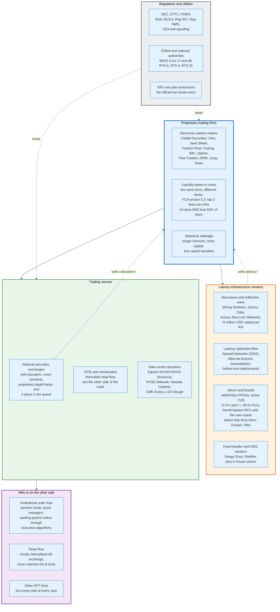

### 3.1 The Actors

| Role | What it does | Revenue source | Regulated as |
|---|---|---|---|
| **Electronic market maker** | Posts two-sided quotes across many instruments and venues | Spread capture, liquidity rebates, exchange incentive programmes | Broker-dealer, and market maker where registered |
| **Liquidity taker in races** | Sends immediate-or-cancel orders against stale quotes | The difference between the stale price and the new one | Broker-dealer, no quoting obligation |
| **Statistical arbitrageur** | Holds correlated positions across instruments and venues | Mean reversion, basis convergence | Broker-dealer or exempt proprietary trader |
| **Wholesaler / internaliser** | Executes retail orders against its own book | Spread capture on uninformed flow, minus payment for order flow | Broker-dealer, OTC market maker |
| **Exchange** | Runs the matching engine, sells access and data | Transaction fees, colocation, connectivity, proprietary feeds, SIP revenue share | SCI self-regulatory organisation |
| **Data centre operator** | Provides the building, power, and cross connects | Rack space and cross connect fees | Not regulated as a market participant |
| **Wireless network operator** | Runs licensed microwave and millimetre wave paths | Subscription per route per feed | Licensed by the spectrum regulator, not the securities regulator |
| **Hardware vendor** | Sells FPGAs, kernel-bypass NICs, Layer 1 switches | Capital sale plus support | Not regulated |
| **Clearing broker** | Guarantees settlement, extends intraday credit | Financing spread, clearing fees | Broker-dealer, clearing member |

### 3.2 The Two Roles That Decide Whether a Firm Is Competitive

**The exchange is the landlord and the counterparty's landlord too.** An exchange sells the cabinet, the cross connect, the port, the market data feed, and the fee tier, and it sells all of them to every competitor on published terms. Under Section 6(b)(5) of the Exchange Act and MiFID II Article 48(8), colocation rules must be transparent, fair and non-discriminatory. The consequence is that no participant can buy an advantage the others cannot buy. Competition therefore moves to what cannot be bought: the code, the silicon, and the model.

**The clearing broker sets the maximum size of the mistake.** A proprietary firm trades on capital that its clearing broker guarantees, and the pre-trade risk controls required by SEC Rule 15c3-5 sit at the boundary between them. Those controls are the difference between a bad day and a Knight Capital. Section 19 dissects what happens when they are not linked to order entry.

### 3.3 The Vendor Layer Nobody Sees

The proprietary firms build their own strategies and almost none of their own physics. Microwave capacity between Aurora and Secaucus is bought from a handful of operators on a subscription, priced per route per data feed, and sold to every firm that will pay. Layer 1 switches, kernel-bypass network cards and FPGA accelerator boards come from a small number of vendors with published specifications.

That concentration is the reason the arms race converged. When the fastest available path, the fastest available switch, and the fastest available network card are all commercially available to everyone, the remaining differentiation is engineering discipline, and engineering discipline has a floor.

Section 21 shows what that floor did to industry revenue.

---

## 4. The Physics: Distance, Glass, and Air

### 4.1 The Three Speeds That Matter

Every latency decision in this document reduces to a choice among three propagation speeds, and the arithmetic is fixed by the refractive index of the medium.

| Medium | Refractive index | Propagation speed | Time per kilometre | Distance per nanosecond |
|---|---|---|---|---|
| Vacuum | 1.0000 | 299,792 km/s | 3.336 microseconds | 29.98 cm |
| Air, at radio frequencies | approximately 1.0003 | approximately 299,700 km/s | approximately 3.337 microseconds | approximately 29.97 cm |
| Hollow-core fibre | approximately 1.0003 | approximately 299,700 km/s | approximately 3.34 microseconds | approximately 30 cm |
| Standard single-mode silica fibre at 1550 nm | approximately 1.468 | approximately 204,200 km/s | approximately 4.90 microseconds | 20.4 cm |

Silica costs 47% more time per kilometre than air. Microsoft states that its hollow-core fibre is "47% faster than standard silica glass," which is the same arithmetic seen from the other side, and reports a loss of under 0.11 dB/km at 1550 nm achieved in early 2024, described as the lowest optical fibre loss recorded.

Two consequences follow. Over any distance where a straight radio path exists, microwave beats fibre by roughly a third of the flight time. Over any distance where it does not, hollow-core fibre recovers most of that gap in a cable.

### 4.2 The Chicago Route, Priced

The epoch table in Section 1.2 prices the route and the Layer 0 block of the latency-stack diagram in Section 6.1 carries the arithmetic. This section explains why the ranking in that table is the way round it is.

Microwave wins because it goes straight and fibre does not. A fibre route follows rights of way that already exist, which means railways, highways, and pipeline corridors, and it is therefore substantially longer than the great circle. A microwave path is a sequence of line-of-sight hops between towers, and over flat terrain the hop length is limited to roughly 70 kilometres by the Earth's curvature and the Fresnel zone clearance required at the operating frequency. Twenty or more hops span the 1,200 kilometres.

Microwave loses on capacity and on weather. A licensed 4 GHz path carries megabits, not gigabits, which means the wireless link cannot carry a full depth-of-book feed and instead carries a heavily compressed subset: a handful of instruments, top of book only, sometimes a single bit indicating direction. Heavy rain attenuates the signal, and every serious operator runs fibre as the failover.

The design that results is hybrid by necessity. The signal that matters travels by air. The data that is merely useful travels by glass.

### 4.3 Millimetre Wave and the Last Kilometre

Millimetre wave links, operating in the 70 to 80 GHz bands, carry more capacity than microwave over shorter distances, and they solve a different problem: the hop between data centres inside the same metropolitan area. The three principal New Jersey equity venues are separated by tens of kilometres, and the SEC put a figure on one pair in its 2026 rescission proposal.

Secaucus to Mahwah is approximately 21 miles. The Commission computed the vacuum flight time as approximately 113 microseconds and described it as "setting a lower bound on travel time" for a quote message. In standard single-mode fibre the same 33.8 kilometres takes approximately 166 microseconds, so the Commission's vacuum bound sits 47% below the fibre time. That is the same silica penalty as everywhere else in this document. A wireless path recovers most of the difference.

The same release cites Nasdaq's own published estimate of inter-venue geographic latency by fibre as being on the order of **143 to 304 microseconds**. That range is the reason a firm cannot treat the National Best Bid and Offer as a single instantaneous fact. Three venues, three arrival times, three different beliefs about the state of the market at any given instant.

### 4.4 Hollow-Core Fibre

Hollow-core fibre guides light through air inside a structured glass cladding rather than through the glass itself, which recovers almost the whole 47% speed penalty of silica while keeping the operational properties of a cable. It is the only technology that improves fibre latency without shortening the route.

The engineering constraint was always loss. Solid silica fibre reaches roughly 0.15 dB/km; early hollow-core fibre was an order of magnitude worse, which made it useless beyond a few kilometres. Microsoft reports achieving under 0.11 dB/km at 1550 nm in early 2024, crossing below conventional silica, and states that hollow-core can extend transmission distance up to 1.5 times relative to standard single-mode fibre.

For trading, the relevant deployments are short and metropolitan: the run between a colocation facility and a wireless tower, or between two data centres in the same complex. On a 30-kilometre metro hop, replacing silica with hollow-core saves approximately 47 microseconds. That is 28% of the 166-microsecond Secaucus-to-Mahwah fibre budget, and roughly 470 times a 100-nanosecond tick-to-trade path.

---

## 5. Colocation and the Equalised Cable

### 5.1 What Colocation Actually Buys

Colocation is rack space inside the building that houses the matching engine, sold by the exchange, with a cross connect to the exchange's customer-facing switches. It buys three things: the elimination of wide-area propagation delay, a deterministic and monitored network path, and access to the exchange's own multicast market data at the earliest point it exists.

It does not buy a shorter cable than the next customer, and that is the point of this section.

NYSE's published colocation pricing is filed with the SEC and is therefore exact. Under NYSE's proposal in SR-NYSE-2026-28, filed 2 June 2026 and noticed on 16 June 2026 in Release 34-105703, expected to become operative no later than 31 October 2026, the two Partial Cabinet Solution bundles are:

| Bundle | Contents | Initial charge | Monthly charge |
|---|---|---|---|
| **Option A** | 2 kW partial cabinet, 1 Liquidity Center Network connection (10 Gb LX or 40 Gb), 1 IP network connection (10 Gb or 40 Gb), 2 NMS Network connections (10 Gb or 40 Gb each), 2 fibre cross connections, and either the Network Time Protocol feed or Precision Timing Protocol | 10,000 USD | 16,500 USD |
| **Option B** (proposed) | 4 kW partial cabinet, same connectivity | 12,000 USD | 19,000 USD |

Option A runs 198,000 dollars a year on top of the initial charge. That is one exchange, one bundle, at the smallest available power draw. A firm that quotes United States equities seriously is in Carteret, Mahwah, Secaucus and Chicago simultaneously, and pays a comparable bill at each.

The market is also resold. NYSE reported that, as of 30 April 2026, its Hosting Users, meaning colocated firms that host other entities in their own space, reported 57 Hosted Users. A firm too small to justify a cabinet rents a slice of somebody else's.

### 5.2 The Equalised Cable

The problem colocation creates is geometric. A data hall is a large room, the exchange's switches sit somewhere in it, and a cabinet by the wall is physically farther from those switches than a cabinet next to them. At 20.4 centimetres per nanosecond in fibre, a 40-metre difference in cable run is 196 nanoseconds each way, which is 49 times the 4-nanosecond port-to-port latency of a Layer 1 switch. Left uncorrected, the floor plan would decide the race.

Exchanges therefore equalise the cable, and two documented designs exist.

**Pad every run to the worst case.** Cboe's SEC filings describe the method precisely: the exchange "equalizes physical connectivity in the data center for its primary system by taking the farthest possible distance that a Cboe market participant cage may exist from the Exchange's customer-facing switches and using that distance as the cable length for any cross-connect." Every cross connect is the same length, and that length is the longest one the room can produce. The customer next to the switch gets a coil of slack.

**Route everything through an equidistant cabling cabinet.** BOX's BSTX filing, approved by the SEC in February 2022, describes a dedicated cabinet containing equal-length spools of fibre connecting to every participant cabinet in the data centre, with equidistant cross connects from that cabinet to the cabinet hosting the exchange systems. Every participant reaches the exchange through the same intermediate point, over the same length of glass, regardless of where their equipment sits.

The Commission's stated rationale, in approving the BSTX design, was that the arrangement "would prevent BSTX Participants located in closer proximity to the cabinet hosting the BSTX System and market data distribution system from having a shorter path to connect to BSTX's systems."

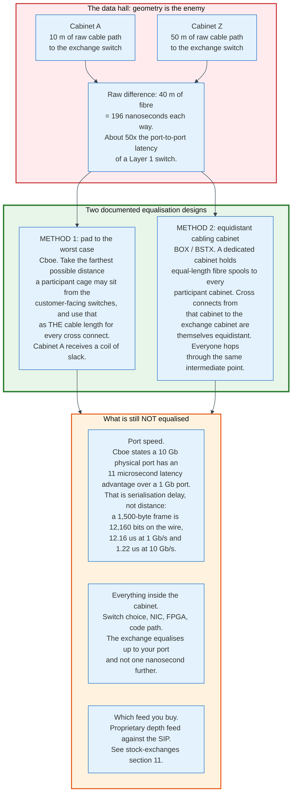

### 5.3 What Equalisation Does Not Cover

Equalisation stops at the port, and three advantages survive it.

**Port speed is not equalised, and the exchange says so.** Cboe's filing states that "10 Gb Physical Ports have an 11 microsecond latency advantage over 1 Gb Physical Ports" and that, apart from this, "there are no other means to receive a latency advantage as compared to another market participant in the new connectivity structure."

That 11 microseconds is serialisation delay and it is computable exactly. A 1,500-byte Ethernet frame carries 12,000 bits of frame plus 64 bits of preamble and start-of-frame delimiter plus a 96-bit inter-frame gap, which is 12,160 bit times. At 1 Gb/s that is 12.16 microseconds of wire time; at 10 Gb/s it is 1.216 microseconds. The difference is 10.94 microseconds. The exchange's published figure is arithmetic, not measurement.

**Everything inside the cabinet is the customer's problem.** The exchange guarantees an equal path to your port. What happens between that port and your decision is Section 6.

**Feed choice is not equalised either.** A firm that subscribes to the exchange's proprietary depth feed sees the book before a firm relying on the consolidated tape, and no amount of cable equalisation changes that. The mechanics of the gap are in [stock-exchanges section 11](../stock-exchanges/README.md#11-market-data-proprietary-depth-feeds-the-sip-and-the-latency-gap).

### 5.4 Proximity Hosting and the Grey Zone

Proximity hosting is rack space in a nearby building rather than the exchange's own hall, and MiFID II Article 4(1)(40)(a) treats it as equivalent to colocation for the purpose of defining a high-frequency algorithmic trading technique. Its role in practice is to house the wireless termination equipment and the cross-venue infrastructure that the exchange will not host, and to give firms a neutral meeting point.

The concentration this produces is extreme. United States equity price formation happens across three New Jersey data centre sites and one in Illinois, and the Commission counts the New Jersey ones the same way: Release 34-105655 states that "Equity exchanges are located at three data centers in Mahwah, Carteret, and Secaucus, New Jersey." Secaucus is a campus rather than a single building, spanning Equinix NY4, NY5 and NY6. CME Aurora is the fourth site, and Section 13.2 shows it leads the other three. Every serious participant is in all four. Every latency argument in this document is an argument about the wires between four addresses.

---

## 6. The Latency Stack from Wire to Decision

### 6.1 The Path a Packet Takes

A market data update arrives as an Ethernet frame on a fibre and must become an order on the same fibre. Between those two events sit six layers, and each has been attacked in turn.

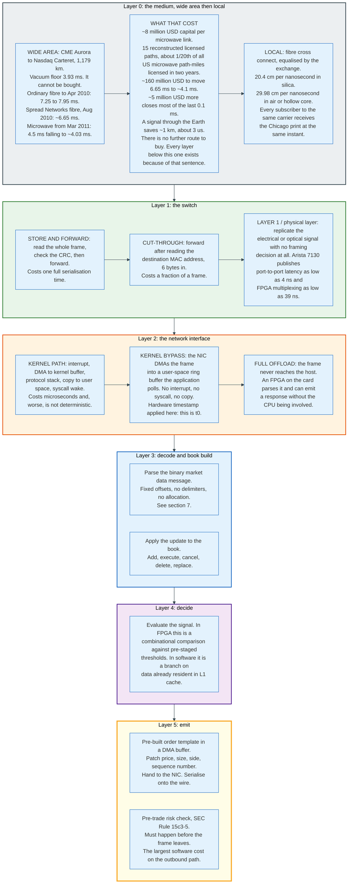

### 6.2 Switching: Store and Forward, Cut-Through, Layer 1

A switch chooses how much of a frame to read before it starts forwarding, and that choice is the whole of its latency.

**Store and forward** buffers the entire frame, verifies the frame check sequence, then transmits. It costs one full serialisation time plus processing: for a 1,500-byte frame at 10 Gb/s, at least 1.2 microseconds. It is correct and slow.

**Cut-through** reads the 6-byte destination MAC address and begins transmitting on the outbound port immediately. It costs the serialisation of a few bytes plus the lookup, typically a few hundred nanoseconds, and it forwards corrupt frames because it has not read the checksum yet.

**Layer 1 switching** makes no framing decision at all. The device replicates the signal from an input port to one or more output ports at the physical layer, which means it does not know what a frame is and cannot introduce a queue. Arista publishes port-to-port latency for its 7130 series "as low as 4 nanoseconds" and FPGA-based multiplexing "as low as 39 ns," with sub-nanosecond timestamping.

Four nanoseconds is 1.2 metres of fibre. At that point the switch has stopped being a latency component and become a piece of cable that can fan out.

The trading use of Layer 1 devices is fan-out and aggregation. One market data feed must reach eight strategy servers: a Layer 1 broadcast device replicates it to all eight simultaneously, with identical latency to each, which removes both the delay and the ordering question. In the other direction, eight servers must share one exchange port: a Layer 1 multiplexer merges them, and the 39-nanosecond figure is the cost of that merge.

### 6.3 Kernel Bypass

The operating system network stack is the largest avoidable latency in a software trading system, and removing it is the single highest-value change a firm makes.

The default path is expensive in three separate ways. The network card raises an interrupt, which forces a context switch. The kernel copies the packet from the card's DMA region into a socket buffer, then copies it again into the application's buffer on the `recv` syscall. And the application must be scheduled to run, which introduces a delay that depends on what else the machine is doing.

Kernel bypass removes all three. The card writes the frame directly into a memory region mapped into the application's address space, and the application spins on that region in a busy loop rather than sleeping on a syscall. There is no interrupt, no copy, and no scheduler involvement. The cost is a CPU core burned continuously on polling, which is a trivial price.

Four families of implementation exist:

- **Vendor user-space stacks** such as Solarflare Onload and TCPDirect, which intercept the standard socket API so an existing application gains bypass without a rewrite, and Mellanox VMA.
- **Poll-mode driver frameworks** such as DPDK, which give the application raw frames and require it to implement its own protocol handling.
- **RDMA and its derivatives**, which push the transport into the card.
- **Kernel-native fast paths** such as `AF_XDP` and `io_uring`, which reduce rather than eliminate the kernel's involvement and are used where full bypass is operationally unacceptable.

The hardware timestamp taken at the card is the other half of the value. Every latency statistic a firm publishes internally is measured from the moment the network card saw the first bit, because that is the only point both the firm and the exchange can agree on. The FCA's methodology makes the same choice for the same reason, recording messages on the external side of the exchange firewall through an optical tap, at 100-nanosecond precision, because that is "the point at which messages are no longer under the control of market participants."

### 6.4 FPGA Execution

A field-programmable gate array removes the CPU from the decision path entirely, and the reason it wins is not clock speed. A modern server CPU runs at 3 to 5 GHz and an FPGA fabric at 200 to 500 MHz. The FPGA wins on three other properties.

**It is a pipeline, not a loop.** A CPU fetches an instruction, decodes it, executes it, and moves on, processing the message in sequence. An FPGA implements the parse, the book update, the comparison, and the order construction as physically separate circuits operating simultaneously on different bytes of the same frame. The order can begin transmitting before the incoming frame has finished arriving.

**It is deterministic.** There is no cache, no branch predictor, no scheduler, no interrupt, no garbage collector, and no other tenant. The same input takes the same number of clock cycles every time. For a market maker whose risk is defined by the tail of the latency distribution rather than its mean, determinism matters more than the mean.

**It sits on the wire.** An FPGA on the network card processes bytes as they arrive from the transceiver. There is no bus transfer to a host, no memory hierarchy, and no software.

The cost is expressive power. Hardware description languages are unforgiving, compilation takes hours, and complex logic consumes area that may not exist on the part. Firms therefore split the work: the FPGA handles the narrow, latency-critical decision, and the CPU handles everything else.

The standard architecture is a **fast path and a slow path**. The FPGA holds a small set of pre-armed conditions, typically a price threshold, a side, a size, and an enable bit, all written by the CPU in advance. When an incoming message satisfies a condition, the FPGA emits a pre-built order in nanoseconds. Meanwhile the CPU consumes the same feed, runs the real model, and rewrites the FPGA's conditions for the next event.

The FPGA never decides what to trade. It decides only when to fire a decision the CPU already made.

---

## 7. Market Data at Line Rate: Building the Book in Hardware

### 7.1 The Feed Is Designed for a Machine

Exchange binary market data protocols are designed to be parsed without parsing, and every structural choice in them exists to remove work from the consumer. The full message reference for Nasdaq's TotalView-ITCH is in [stock-exchanges section 22.3](../stock-exchanges/README.md#22-appendix); this section covers why the format looks the way it does.

**Fixed length per message type.** Every ITCH message type has a single length. A consumer that has read the one-byte type code knows exactly how many further bytes to expect and where every field sits. There is no scanning for delimiters and no length arithmetic.

**Fixed field offsets across types.** Nasdaq places the 2-byte Stock Locate code at the same offset in every message type. A subscriber filtering for a subset of instruments compares two bytes at a known position and discards the rest of the message without decoding it. In an FPGA that is a single comparator on a fixed byte lane.

**Integer instrument identifiers.** The FCA's description of the London Stock Exchange native protocol makes the same point from the exchange side: a native binary message uses `133215` for Vodafone rather than the text `VOD`, because "the use of InstrumentID 133215 rather than VOD for Vodafone will be quicker for the exchange to read than converting the text."

**No delimiters.** The FCA contrasts the two LSE interfaces directly. A FIX new order is a tag-value string carrying a numeric tag on every field and delimited by ASCII SOH (0x01), a non-printing byte that printed examples replace with a pipe. Its body is 156 bytes in the FCA's example, which is the value of tag 9 and excludes the `8=` header and the `10=` checksum trailer. The native binary equivalent is an undelimited byte string in which "the binary format protocol stipulates the order, and the starting and ending bytes of each parameter." The exchange offers both and states plainly that native is faster.

The whole format is a contract that says: you will never need to look at a byte you do not care about.

### 7.2 Building the Book at Line Rate

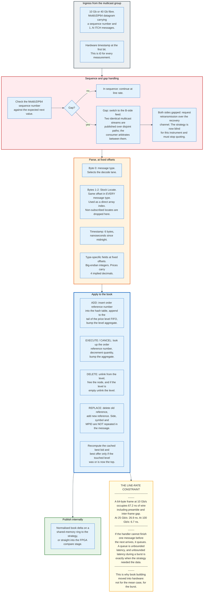

The constraint that forces hardware is the burst, not the average. A feed handler is sized not by its mean message rate but by the rate during the worst microsecond of the day, because that microsecond is when the price moved and the strategy needed to act. A handler that falls behind does not merely become slow: it becomes slow precisely when latency is most expensive, which is the definition of a system that fails when it matters.

The arithmetic is unforgiving. At 10 Gb/s a minimum-size 64-byte Ethernet frame occupies 672 bit times, counting the 7-byte preamble, the 1-byte start-of-frame delimiter and the 96-bit inter-frame gap, which is 67.2 nanoseconds of wire time. At 25 Gb/s it is 26.9 nanoseconds and at 100 Gb/s it is 6.7 nanoseconds. A software handler that takes 200 nanoseconds per message is already behind on the second back-to-back message, and falls a further 133 nanoseconds behind on every message after it. The backlog is bounded only by the length of the burst.

An FPGA handler processes at the arrival rate by construction. The parse for message N+1 is in a different pipeline stage from the book update for message N, and both advance every clock.

### 7.3 Feed Arbitration and the Gap

Every serious exchange feed is published twice over disjoint network paths, conventionally called the A side and the B side, and the consumer's job is to take whichever copy of each sequence number arrives first. This is arbitration, and it is where a large fraction of practical latency is won or lost.

The mechanism is simple and the discipline is not. Maintain the next expected sequence number. Accept a datagram from either side if its sequence matches. Discard duplicates. If a gap appears on one side, the other side usually fills it within microseconds, because the two paths are independent. If both sides gap, the consumer must request retransmission over a separate recovery channel, and that request takes milliseconds.

A firm that is blind on an instrument must stop quoting it. This is not optional prudence: quoting into a book you cannot see is the definition of offering a free option. The firms that survived the flash crash of 6 May 2010 were largely the ones whose systems detected data quality problems and withdrew, a sequence reconstructed in [stock-exchanges section 17](../stock-exchanges/README.md#17-the-may-2010-flash-crash-reconstructed).

### 7.4 What Never Reaches the Public Feed

The public market data feed is not a complete record of what happened, and the omissions are exactly the events that define a race.

The FCA states the point precisely. Messages telling a participant that their cancel arrived too late, or that their immediate-or-cancel order failed to execute, are "sent on to the relevant participants who either failed to cancel or failed to execute an immediate-or-cancel, but do not get sent on to public market data feeds because they do not affect the state of the order book."

That single design decision is why latency arbitrage was unmeasurable for a decade. A race has one winner and several losers. The winner's trade prints. The losers' failed attempts are private messages that vanish. Reconstructing the race from public data is reconstructing a footrace from a photograph of the finish line, taken after everyone but the winner has left.

The FCA could measure races only because it compelled the exchange to hand over the message data under statute.

---

## 8. Tick-to-Trade: Where the Nanoseconds Go

### 8.1 Defining the Measurement

Tick-to-trade is the elapsed time from the first bit of a market data message arriving at the firm's network card to the first bit of the resulting order leaving it. Both endpoints are hardware timestamps on the firm's own equipment, which is the only definition two parties can agree on, and it deliberately excludes everything outside the cabinet.

It excludes the exchange's own processing. Nasdaq told the SEC in 2016 that the throughput time of its system is 40 microseconds, and states that colocated round-trip order-to-acknowledgement and market-data order-to-tick latency is "sub-50 microseconds." Those numbers are an order of magnitude larger than any modern tick-to-trade figure, which tells you where the remaining engineering effort is not.

It also excludes the propagation to the exchange, which the exchange has equalised anyway.

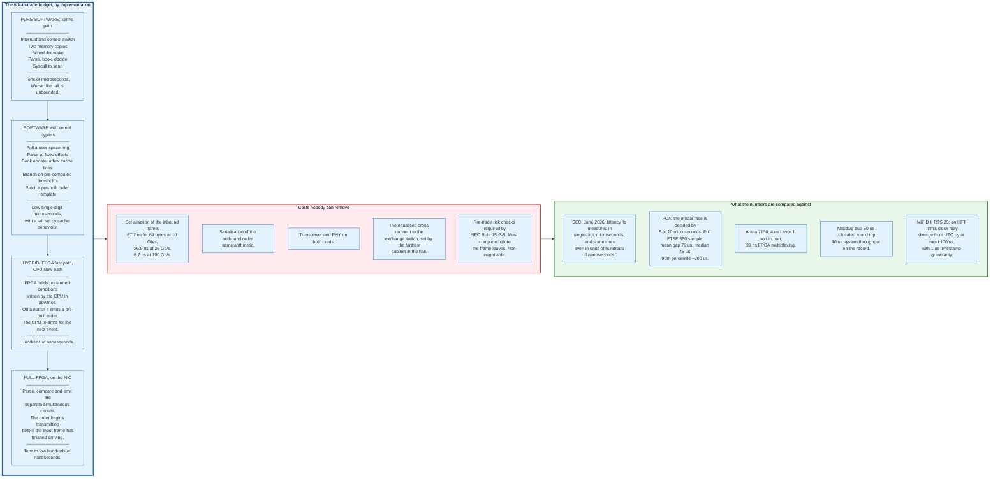

### 8.2 An Illustrative Tick-to-Trade Budget

No firm publishes a line-item tick-to-trade budget, so the table below is an engineering reconstruction rather than a measurement. Every line is derived from figures already established in this document: IEEE 802.3 framing arithmetic, published transceiver and PHY latencies for 10GBASE-R, and a 320 MHz FPGA fabric giving roughly 3 nanoseconds per clock cycle. The purpose is to show where the time goes, not to claim any firm hits these numbers.

The stimulus is a single 64-byte MoldUDP64 datagram carrying one ITCH message on a 10 Gb/s link. Wire time is 0.8 nanoseconds per byte. The decision needs the price field, which sits about 48 bytes into the frame.

| Stage | FPGA on the network card | Software with kernel bypass | Irreducible? |
|---|---|---|---|
| Optical receive, SerDes, 64b/66b decode, MAC, inbound | 30 ns | 30 ns | Yes, set by the transceiver and PHY silicon |
| Wire time until the last byte the decision needs has arrived | 38 ns | 38 ns | Yes, this is serialisation |
| Frame reaches the application: DMA into the user ring plus descriptor write | 0 ns, the frame never leaves the card | 700 ns | No |
| Poll loop observes the new descriptor | 0 ns | 100 ns, half a 200 ns poll interval | No |
| MoldUDP64 sequence check and ITCH type dispatch | 6 ns, 2 cycles | 150 ns | No |
| Stock Locate filter, 2 bytes at a fixed offset | 3 ns, 1 cycle | included above | No |
| Book update for the touched price level | 12 ns, 4 cycles, on-chip RAM | 250 ns, a few cache lines | No |
| Threshold comparison against pre-armed conditions | 3 ns, 1 cycle, combinational | 50 ns, a predicted branch | No |
| Rule 15c3-5 pre-trade checks against limit registers | 6 ns, 2 cycles, combinational | 150 ns, cache-resident limits | Legally, yes. Its cost, no |
| Patch the pre-built order template and hand it over | 6 ns, 2 cycles | 250 ns, plus a doorbell write | No |
| Outbound DMA read of the template | 0 ns | 700 ns | No |
| Outbound MAC, PHY and first bit onto the fibre | 30 ns | 30 ns | Yes, same silicon as the first line |
| **Total, first bit in to first bit out** | **134 ns** | **2,448 ns** | |

Three readings follow from that table.

**The FPGA path is 18 times faster and the difference is entirely the host.** Every line that differs is a line involving the PCIe bus, main memory, or a CPU pipeline. Remove the host and the budget collapses by a factor of eighteen. The parse, the book update and the risk check together cost 27 nanoseconds in gates and 550 nanoseconds in code.

**In the FPGA budget, 73% of the time is physics.** The transceiver, the PHY and the wire cost 98 nanoseconds of the 134, and nothing a firm buys reduces them. In the software budget the same 98 nanoseconds is 4% of the total. The software column still has 96% to give. The FPGA column has 27%.

**The risk check is the only line that cannot be deleted on principle.** Every other line is an engineering choice. Rule 15c3-5 requires that the check complete before the order leaves, and Section 18.3 sets out how firms compress it to 6 nanoseconds.

The diagram above lists four tiers, and this table is the second and the fourth of them. The kernel path adds an interrupt, two memory copies and a scheduler wake to the software column, which pushes it into the tens of microseconds and makes its tail unbounded. A hybrid that keeps the book in software and arms an FPGA comparator lands between the two columns, in the hundreds of nanoseconds, because it pays the host cost once per re-arm rather than once per message.

### 8.3 The Published Reference Points

Firms do not publish their tick-to-trade figures, and any specific nanosecond count attributed to a named firm in the trade press is a marketing claim rather than an audited measurement. What is on the public record fixes the scale from both ends.

| Measurement | Figure | Source |
|---|---|---|
| Layer 1 switch port to port | as low as **4 ns** | Arista 7130 series specification |
| FPGA-based multiplexing | as low as **39 ns** | Arista 7130 series specification |
| 64-byte frame serialisation at 100 Gb/s | **6.7 ns** | Arithmetic from IEEE 802.3 framing |
| 64-byte frame serialisation at 10 Gb/s | **67.2 ns** | Arithmetic from IEEE 802.3 framing |
| Current competitive latency | "single-digit microseconds, and sometimes even hundreds of nanoseconds" | SEC Release 34-105655, 17 June 2026 |
| Modal latency-arbitrage race margin | **5 to 10 microseconds** | FCA Occasional Paper 50 |
| Mean race margin, winner to first loser | **79 microseconds** full sample, **81** for FTSE 100 | FCA Occasional Paper 50, Table 5.2 |
| 1 Gb versus 10 Gb port disadvantage | **11 microseconds** | Cboe SEC rule filing |
| Nasdaq colocated round trip | **sub-50 microseconds** | Nasdaq colocation documentation |
| Nasdaq system throughput time | **40 microseconds** | SEC Release 34-78102, 23 June 2016 |
| IEX inbound coil delay | **350 microseconds** | IEX Rule 11.510 |
| Maximum clock divergence for an HFT firm | **100 microseconds** | Delegated Regulation (EU) 2017/574, Annex Table 2 |

Read that table top to bottom and the shape of the modern problem appears. The switch costs 4 nanoseconds and the exchange costs 40 microseconds, a ratio of ten thousand to one. Nobody is optimising the switch because it is interesting. They are optimising it because it is the only part left that they control.

### 8.4 Determinism Beats the Mean

The number that matters to a market maker is not the average tick-to-trade but the 99.99th percentile, and the two are optimised by different techniques.

The reason is asymmetric. A market maker who is 100 nanoseconds faster than average on a quiet tick gains nothing, because nothing is happening. A market maker who is 50 microseconds slower than usual during the one burst of the day when the reference price gapped is the one holding a stale quote when everybody else's cancel arrives. Latency cost is concentrated in the tail, and so is the loss.

Everything in a low-latency system is therefore built to remove variance rather than to reduce the mean. Memory is pre-allocated so nothing ever calls the allocator. Cores are isolated from the scheduler and interrupts are steered away from them. Hyper-threading is disabled so no sibling thread competes for the pipeline. Power management is disabled so the clock never drops. Data structures are laid out so hot fields share cache lines and cold fields do not. Order templates are pre-built and pre-registered with the network card so the send path is a patch and a doorbell write.

An FPGA takes this to the limit by construction: it has no allocator, no cache, no scheduler, and no other tenant, so its 99.99th percentile equals its mean.

### 8.5 Time Synchronisation

A trading system cannot measure its own latency without a clock that agrees with everyone else's, and MiFID II turned that engineering necessity into a legal obligation.

Commission Delegated Regulation (EU) 2017/574, the clock synchronisation regulatory technical standard applying from 3 January 2018, requires business clocks to be synchronised to UTC as issued by timing centres listed in the Bureau International des Poids et Mesures annual report, or to UTC disseminated by satellite provided the offset is removed. Its Annex sets the accuracy:

| Party | Condition | Maximum divergence from UTC | Timestamp granularity |
|---|---|---|---|
| Trading venue | Gateway-to-gateway latency of 1 ms or less | **100 microseconds** | 1 microsecond or better |
| Trading venue | Gateway-to-gateway latency above 1 ms | 1 millisecond | 1 millisecond or better |
| Venue member | Using a high-frequency algorithmic trading technique | **100 microseconds** | 1 microsecond or better |
| Venue member | Any other trading activity | 1 millisecond | 1 millisecond or better |
| Venue member | Voice, request for quote with human response, negotiated | 1 second | 1 second or better |

The regulation also defines gateway-to-gateway latency exactly: "the time measured from the moment a message is received by an outer gateway of the trading venue's system, sent through the order submission protocol, processed by the matching engine, and then sent back until an acknowledgement is sent from the gateway."

Article 4 requires a documented system of traceability to UTC, the ability to identify the exact point at which a timestamp is applied, evidence that the point remains consistent, and an annual compliance review. In practice this means a GPS-disciplined grandmaster clock in the cabinet, Precision Time Protocol distribution over the local network with hardware timestamping at every hop, and a monitoring system that alarms on drift.

NYSE sells the input directly. Its colocation bundle includes "either the Network Time Protocol Feed or Precision Timing Protocol."

---

## 9. A Worked Example: One Race, End to End

### 9.1 The Setup

This example carries one price move from Chicago to New Jersey and through six firms' systems, using measured infrastructure figures and an illustrative instrument. The latency components are taken from the sources cited earlier in this document. The prices, sizes and firm names are constructed to make the arithmetic legible.

The instrument is a liquid exchange-traded fund tracking the S&P 500, quoted 500.00 bid, 500.01 offered, with 2,000 shares displayed on each side across three venues. The reference is the E-mini S&P 500 future at CME Aurora. Six firms quote the ETF and all six also run a taking strategy. Every one of them subscribes to the same wireless feed from Chicago.

At T+0, a large buy order lifts the E-mini offer in Aurora. Fair value for the ETF has just moved up by 1.2 cents. Every resting 500.01 offer in New Jersey is now stale and worth taking.

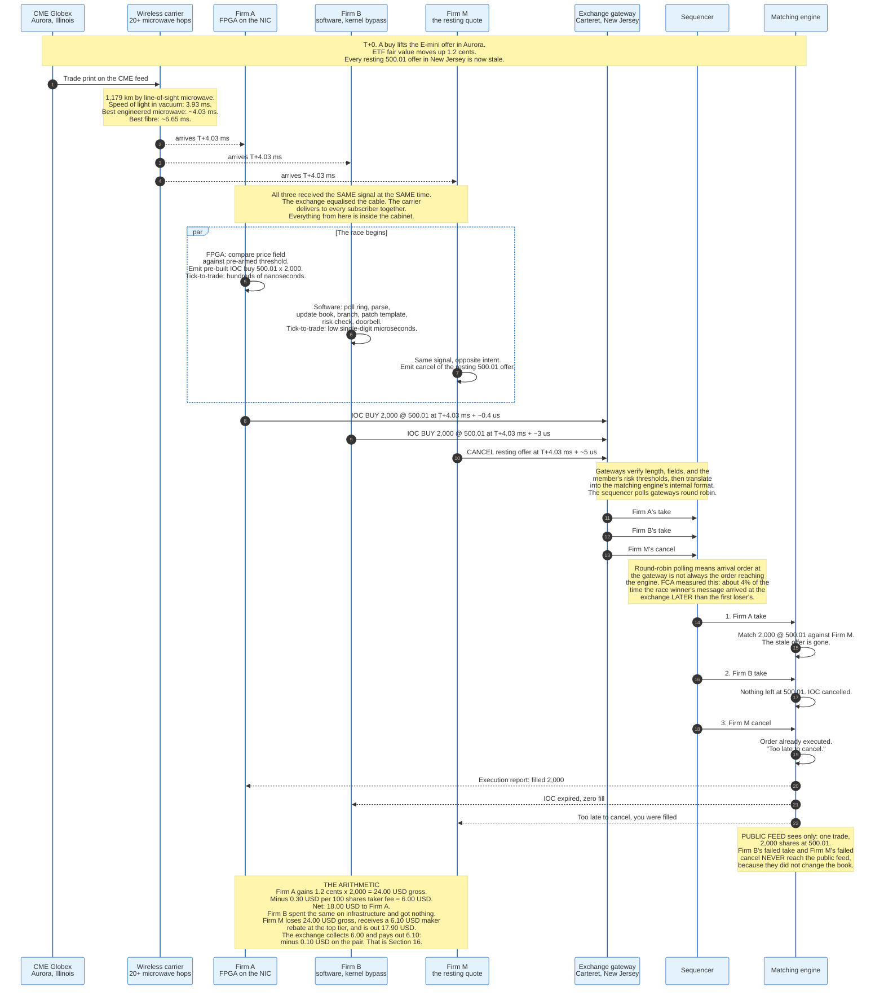

### 9.2 What the Example Shows

**The 4.03 milliseconds do not decide the race.** Every participant subscribes to the same wireless carrier and receives the print at the same instant. The wide-area link is a fixed cost of being in the game, not a source of edge. The race is decided by what happens between the network card and the wire, a window of a few microseconds.

**The public tape records one trade and hides the contest.** Three messages entered the exchange within 5 microseconds of each other. One executed. The other two produced private messages that never reach the consolidated feed. An analyst reconstructing this event from public data sees a single 2,000-share print at 500.01 and no evidence that anything unusual happened.

**Four percent of the time the fast firm loses anyway.** The FCA measured this directly: because the sequencer polls gateways in round-robin order, "about 4% of the time the winner's message actually arrives to the exchange slightly later than the first loser's message, but nevertheless gets processed first." The last few nanoseconds of the arms race are competing against a coin flip inside the exchange.

**The transfer is small and the aggregate is not.** Firm A nets 18.00 dollars, Firm M is out 17.90 after its rebate, and the exchange is 0.10 dollars short on the pair. The FCA's measured average race is worth about 2 pounds sterling, or 0.48 ticks. Multiply by 537 races per symbol per day across every liquid instrument in every market and the total reaches an estimated 5 billion US dollars a year globally.

**The market maker's response is mechanical.** Firm M cannot stop being sniped. It can only price the expected loss into its quote. That is the subject of Section 11, and it is the mechanism by which a contest between six proprietary firms becomes a cost borne by a pension fund.

### 9.3 The Same Event Under Four Speed Bumps

Change one variable and the outcome inverts.

| Venue design | What happens to the same event |
|---|---|
| **No delay** (Nasdaq, NYSE, Cboe) | Firm A wins. Firm M is filled at a stale price. |
| **IEX, 350 microsecond inbound coil** | All three inbound messages are delayed 350 microseconds. IEX's own matching engine takes market data feeds **without** the delay, so by the time the takes arrive the exchange has already repriced its discretionary and pegged orders. Firm A's take arrives against a quote that is no longer stale. |
| **NYSE American 2017 to 2019, symmetric 350 microsecond delay** | Inbound and outbound are both delayed, and inbound data feeds are not. Same protective effect for pegged interest, but the exchange also delayed its own outbound proprietary feed, which made it slower for everyone. Decommissioned in November 2019. |
| **Cboe EDGA LP2 as proposed, 4 millisecond asymmetric delay** | Only Firm A's and Firm B's taking orders are delayed. Firm M's cancel is not. Firm M cancels comfortably inside the window and Firm A executes nothing. The SEC disapproved this on 21 February 2020. |

Section 15 explains why the Commission approved the first delay and rejected the third.

---

## 10. Electronic Market Making

### 10.1 The Business

An electronic market maker posts a bid and an offer in an instrument, buys at the bid, sells at the offer, and earns the difference, and the entire discipline is about making sure the buys and the sells arrive in roughly equal numbers. Nothing else about the business is complicated. Everything else about it is hard.

The scale is what distinguishes the modern version. Virtu Financial's 2014 registration statement described making markets "in more than 10,000 securities and other financial instruments on more than 210 unique exchanges, markets and liquidity pools in 30 countries." A single firm quotes two sides of ten thousand books simultaneously, and re-prices all of them whenever a common factor moves.

Diversification is the product. Virtu disclosed that in the year ended 31 December 2013 no single geography or asset class contributed more than 30% of adjusted net trading income, and that from 1 January 2009 through 31 December 2013 the firm had **one losing trading day out of 1,238**. That statistic is frequently misread as evidence of an unfair advantage. It is evidence of the law of large numbers applied to a very large number of very small, weakly correlated bets.

### 10.2 The Quoting Loop

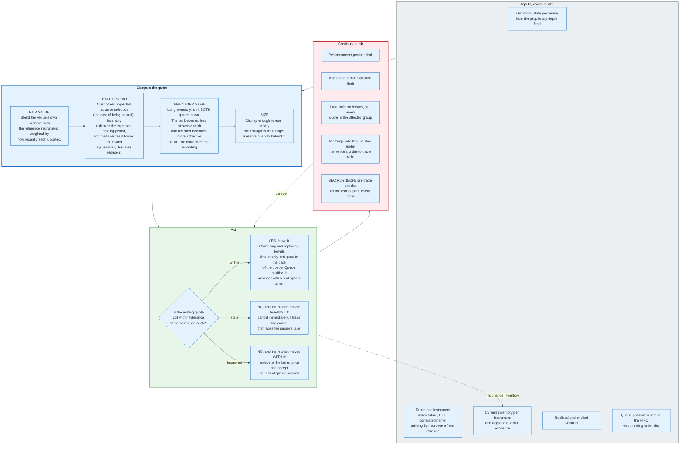

### 10.3 Queue Position Is an Asset

Time priority converts arrival order into an option, and a market maker manages that option as carefully as it manages inventory. On a price-time venue, an order at the front of a 50,000-share queue at the best bid will be filled before an order behind it, which means the front order captures the spread while the back order captures only the risk of being run over.

Two consequences follow that shape observable behaviour.

**Cancel-and-replace is expensive even when it is free.** Nasdaq's OUCH specification states that a Replace Order Request always assigns a new timestamp for time priority. Improving a quote by one tick therefore costs the entire accumulated queue position. A market maker will hold a slightly mispriced quote rather than forfeit the front of the queue, and the tolerance band in the diagram above exists for exactly this reason.

**Post-only order types exist to protect the asset.** An order that would remove liquidity pays the taker fee and gains nothing; a post-only order either rests or is rejected. Every major venue offers one.

The order types that implement all this, and the priority rules they interact with, are covered in [stock-exchanges sections 5 and 6](../stock-exchanges/README.md#5-order-types-and-time-in-force).

### 10.4 Obligations, Where They Exist

Most electronic market makers in United States equities quote voluntarily, and most European ones do not have that option.

MiFID II Article 17(3) requires any investment firm engaging in algorithmic trading to pursue a market making strategy to carry out that market making "continuously during a specified proportion of the trading venue's trading hours, except under exceptional circumstances," to enter into a binding written agreement with the venue specifying those obligations, and to maintain systems ensuring it meets them at all times.

Article 17(4) defines when a firm is deemed to be pursuing a market making strategy: when, dealing on own account, it posts "firm, simultaneous two-way quotes of comparable size and at competitive prices" in one or more instruments on one or more venues, "with the result of providing liquidity on a regular and frequent basis to the overall market."

Article 48(2) puts the mirror obligation on the venue: it must have written agreements with all firms pursuing a market making strategy, and schemes ensuring enough firms participate. Article 48(3) requires the agreement to specify the obligations and any rebates or other incentives offered in exchange.

Article 48(9) closes the loop on fees, requiring venues to impose "market making obligations in individual shares or a suitable basket of shares in exchange for any rebates that are granted."

Europe therefore prices the rebate against a duty. The United States, outside the New York Stock Exchange's Designated Market Maker structure and a handful of supplemental liquidity programmes, does not.

---

## 11. Adverse Selection and Inventory Risk

### 11.1 The Two Risks Are Different and Are Often Confused

A market maker carries exactly two risks, and conflating them produces bad models and bad regulation.

**Adverse selection** is the risk of trading with somebody who knows something. When a market maker is filled, the fill itself is information: the counterparty chose to trade at that price, and the market maker did not. If the counterparty is better informed, the price will move against the market maker immediately after the fill. This is the risk that Glosten and Milgrom formalised in 1985, showing that a spread exists even in a competitive, risk-neutral, zero-cost market purely because some counterparties are informed.

**Inventory risk** is the risk of holding a position while the price moves for reasons unrelated to the trade. A market maker who buys 10,000 shares and cannot sell them for an hour is exposed to whatever happens in that hour. This is the risk that Ho and Stoll modelled in 1981 and that Avellaneda and Stoikov turned into a practical quoting rule in 2008.

The distinction matters because the remedies are opposite. Adverse selection is reduced by being faster, by quoting smaller, and by pulling quotes when the reference moves. Inventory risk is reduced by trading more, by skewing quotes to attract the offsetting side, and by hedging in a correlated instrument.

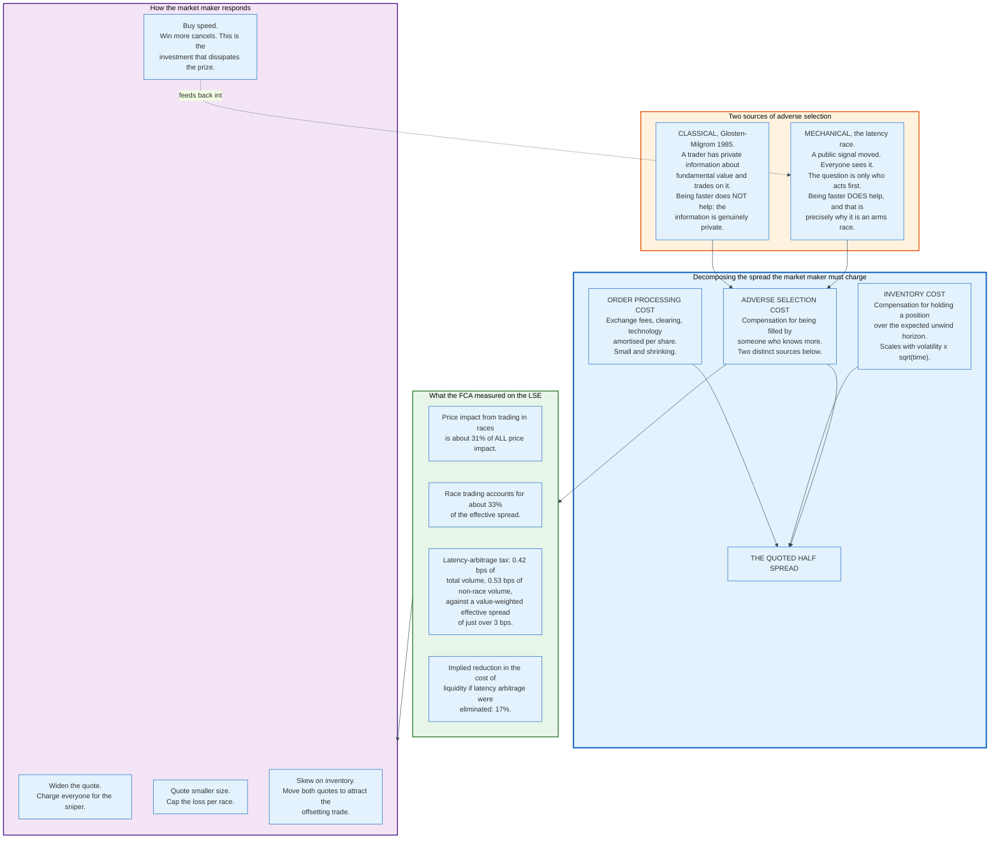

### 11.2 The Stale Quote Is a Free Option

The cleanest way to understand a resting limit order is as an option the market maker has written and given away.

A resting offer at 500.01 grants every other participant the right, but not the obligation, to buy 2,000 shares at that price for as long as the order rests. If fair value rises above 500.01, exercising is profitable. The market maker receives no premium for writing this option; the only compensation is the spread earned on the trades where nobody exercises.

Three variables set the option's value, and the market maker controls two of them.

**Volatility of the underlying** is not controllable. Higher volatility means a higher probability the price crosses the strike, which is why spreads widen in fast markets. This is mechanical, not opportunistic.

**Time to expiry** is the time between the reference price moving and the market maker's cancel reaching the matching engine. This is exactly the tick-to-trade latency of Section 8, and it is why a firm will spend millions to remove microseconds. Halving the latency halves the option's life.

**Size** is the notional. Displaying 2,000 shares writes an option on 2,000 shares.

Budish, Cramton and Shim formalised this in 2015 and drew the conclusion the FCA later measured: in a model with endogenous investment in speed, there is an equivalence among the latency arbitrage prize, the socially wasteful investment in speed, and the higher cost of liquidity borne by investors. Every dollar of race profit is a dollar spent on speed and a dollar charged back through the spread.

### 11.3 Inventory Skew, Worked

The response to inventory is arithmetic and it is visible in the book if you know to look for it.

Take an ETF with a fair value of 500.005 and a market maker whose baseline half spread is 0.5 cents, giving a quote of 500.00 bid, 500.01 offered. The firm's position limit is 20,000 shares.

The firm is then filled on the bid for 10,000 shares and is long half its limit. It does not want the next trade to be another buy. So it shifts the entire quote down by a skew proportional to the inventory: with a maximum skew of 1 cent at the position limit, a half-full position produces a 0.5 cent shift.

| State | Inventory | Bid | Offer | Effect |
|---|---|---|---|---|
| Flat | 0 | 500.00 | 500.01 | Symmetric, equally likely to buy or sell |
| Long half the limit | +10,000 | 499.995 | 500.005 | Bid is now below the old fair value and unattractive to hit; offer is at the old fair value and attractive to lift |
| Long the full limit | +20,000 | 499.99 | 500.00 | Bid is no longer competitive; the offer is inside the old spread and will be taken |
| Short half the limit | -10,000 | 500.005 | 500.015 | Mirror image |

The firm never sends an order to unwind. It changes the price at which other people are willing to do the unwinding for it, and it collects a spread on the way out instead of paying one. That is the difference between a market maker and a directional trader holding the same position.

### 11.4 Why Speed Bumps Are an Adverse Selection Argument

Every speed bump proposal in Section 15 is an argument about which of the two risks a venue should socialise.

The claim made by IEX, by NYSE American, and by Cboe EDGA was identical in structure: liquidity providers face an asymmetric risk because the market can move while their quote is posted, and a delay that prevents a taker from acting on that move before the provider can cancel reduces that risk, which allows the provider to quote tighter and larger.

The Commission accepted the argument once and rejected it once, and the difference was symmetry. Section 15 sets out why.

---

## 12. Latency Arbitration and the Race

### 12.1 The Mechanism

Latency arbitration is the practice of trading against a quote that has not yet been updated to reflect public information, and it is the only strategy in this document that is purely a function of speed.

The setup is always the same. A public signal moves. Some participants see it and act; others see it and act more slowly. The resting quotes of the slow participants are, for a few microseconds, priced off the old signal. Taking those quotes is riskless in the sense that matters: the information is already public, the direction is known, and the only uncertainty is whether somebody else gets there first.

Budish, Cramton and Shim characterised this as the defining pathology of the continuous limit order book. The book processes messages serially in time priority, which means that whenever a public signal moves, there is a race, and the race is not to be informed but to be first.

The FCA's contribution was to measure it, and the measurement required message data because the losers leave no trace in the order book.

### 12.2 What the Data Shows

```mermaid
%%{init: {'theme': 'base', 'themeVariables': {'primaryColor': '#e3f2fd', 'primaryBorderColor': '#1565c0', 'lineColor': '#37474f'}}}%%

flowchart TB
    subgraph Data["The dataset: FCA Occasional Paper 50"]
        D1["London Stock Exchange message data,<br/>obtained under FSMA Section 165.<br/>43 trading days, 17 Aug to 16 Oct 2015.<br/>FTSE 350. ~15,000 symbol-days.<br/>~2.2 billion messages,<br/>~150,000 per symbol-day."]
        D2["Timestamped at an optical tap on the<br/>OUTSIDE of the exchange firewall,<br/>to 100 nanosecond precision.<br/>This is the point at which a message<br/>leaves the participant's control."]
        D3["Includes FAILED takes and FAILED cancels.<br/>Neither appears in order book data.<br/>Without them the race is invisible."]
    end

    subgraph Freq["Frequency"]
        F1["537 races per FTSE 100 symbol per day.<br/>About one per minute per symbol."]
        F2["22% of FTSE 100 daily volume<br/>executes inside a race."]
        F3["Mean 3.46 messages per race:<br/>3.07 takes and 0.40 cancels.<br/>The median race has ZERO cancels.<br/>Maximum observed: 29 race messages<br/>within 500 microseconds, not 29 firms."]
    end

    subgraph Speed["Speed"]
        S1["MODAL margin: 5 to 10 microseconds."]
        S2["MEAN margin: 79 microseconds,<br/>MEDIAN 46, full FTSE 350 sample.<br/>FTSE 100 alone: mean 81, median 49.<br/>90th percentile: ~200 microseconds.<br/>Truncated at 500 microseconds."]
        S3["About 4% of the time the winner's<br/>message reached the exchange AFTER<br/>the first loser's, and was still<br/>processed first. Round-robin gateway<br/>polling, not skill."]
    end

    subgraph Conc["Concentration"]
        C1["Top 3 firms WIN 54% of races."]
        C2["Top 3 firms LOSE 63% of races.<br/>The same firms. Winning means taking,<br/>losing means being taken."]
        C3["Top 6 firms: 82% of wins,<br/>85% of losses.<br/>FCA section 5.2. The executive summary<br/>rounds these to 55/66 and 82/87."]
    end

    subgraph Money["Money"]
        M1["Average FTSE 100 race: 0.48 ticks,<br/>1.20 basis points, about 2 GBP.<br/>90th percentile: 2.5 ticks, about 8 GBP.<br/>Both rows from Table 5.5 Panel A."]
        M2["Latency-arbitrage tax:<br/>0.42 bps of all volume,<br/>0.53 bps of non-race volume."]
        M3["UK annual sums at stake: ~60 million GBP.<br/>Global equity markets: ~5 billion USD."]
        M4["Implied cut in the cost of liquidity<br/>if eliminated: 17%."]
    end

    Data --> Freq --> Speed --> Conc --> Money

    style Data fill:#eceff1,stroke:#37474f,stroke-width:2px
    style Freq fill:#e3f2fd,stroke:#1565c0,stroke-width:2px
    style Speed fill:#fff3e0,stroke:#e65100,stroke-width:3px
    style Conc fill:#f3e5f5,stroke:#4a148c,stroke-width:2px
    style Money fill:#e8f5e9,stroke:#2e7d32,stroke-width:2px
```

Three findings in that data deserve emphasis because they contradict the usual framing.

**The median race has zero cancels.** Of 3.46 messages in an average race, 3.07 are takes and only 0.40 are cancels. The market maker usually does not even try. The race is mostly snipers competing against each other for the right to hit a quote that is not being defended.

**The winners and the losers are the same firms.** The top three firms win 54% of races and lose 63% of them. This is not a contest between predatory high-frequency traders and defenceless investors. It is a contest among a handful of proprietary firms who are simultaneously on both sides, and whose net position in the aggregate is far smaller than either gross figure.

**The margin is often meaningless.** A modal race decided by 5 to 10 microseconds, with 4% of outcomes decided by the exchange's own round-robin polling, is a contest in which the last increment of investment buys a probability, not an outcome.

### 12.3 Why the Prize Does Not Shrink

The counterintuitive result in the theory, confirmed by the data, is that the size of the latency arbitrage prize does not fall as everybody gets faster.

The reason is that the prize depends on the *dispersion* of speeds, not on the absolute level. If every firm halves its latency, the race is still decided, still by the same margin relative to the field, and still for the same expected value per race. The number of races may change with volatility, but the arms race itself does not consume the prize by making everyone fast.

What the arms race does consume is the profit. Budish, Cramton and Shim show that in equilibrium the investment in speed dissipates the rents entirely. Firms spend up to the point where the marginal dollar of speed buys a marginal dollar of expected race profit. The prize persists; the profit converges on zero; and the cost stays in the spread.

That is the shape of Section 21.

### 12.4 The Structural Fix Nobody Adopted

The remedy proposed alongside the diagnosis was the frequent batch auction: replace continuous serial processing with discrete auctions at short intervals, perhaps every 100 milliseconds, in which all orders received during the interval clear at a single price.

The mechanism removes the race by construction. If every order arriving within an interval is treated as simultaneous, arriving 5 microseconds earlier confers no advantage. Speed continues to matter for reacting within an interval but stops determining who wins a tie.

No major equity venue has adopted it. Two obstacles have proved decisive. Under Regulation NMS, a batch auction venue's quote might not qualify as an "automated quotation" under Rule 600(b)(6), which requires immediate automatic execution, and a non-automated quote is not protected. And the participants who would fund the transition are, as the FCA observes, "the parties in the speed race, who then have significant incentive to preserve the status quo."

The proposal to rescind Rule 611 in June 2026 would remove the first obstacle. It does nothing about the second.

---

## 13. Statistical Arbitrage and Index Arbitrage

### 13.1 Index Arbitrage Is Mechanical

Index arbitrage enforces a price relationship between a basket and its components, and it is the least discretionary strategy in this document because the relationship is defined by a contract rather than estimated from data.

An S&P 500 exchange-traded fund holds the 500 constituent stocks in known weights. Its net asset value is therefore a computable function of 500 prices. The E-mini S&P 500 future settles against the same index. Three instruments track one quantity, and any deviation among them is arbitrageable subject to transaction costs.

Two mechanisms enforce the relationship, operating on different timescales.

**Continuous quoting** is the fast leg. A market maker quotes the ETF, computes fair value continuously from the future and the constituents, and takes any quote that is outside the no-arbitrage band. This is the mechanism in the worked example of Section 9 and it operates in microseconds.

**Creation and redemption** is the slow leg. An authorised participant delivers the basket of underlying shares to the fund and receives ETF shares, or the reverse, typically at end of day. This is what makes the fast leg riskless: the arbitrageur is not betting that the deviation closes, it is buying an instrument it can exchange for another at a fixed ratio.

The economics are set by the creation and redemption cost, not by speed. Speed determines which of several competing arbitrageurs captures the deviation; the size of the band it can be captured within is set by the friction of the slow leg.

### 13.2 The Chicago Lead

The empirical fact that organises index arbitrage in United States equities is that price discovery happens in Chicago first, and it is measurable.

Laughlin, Aguirre and Grundfest correlated price-changing trades in the near-month E-mini at Aurora with liquidity and trade responses in SPY, XLF, SDS, VXX, TLT, AIG and GLD at Nasdaq's Carteret matching engine, across 558 trading days, and found a consistent response peak at a lag corresponding to the prevailing communication latency. As that latency fell from the 7 to 8 millisecond bin to roughly 4 milliseconds, the response peak moved with it.

The E-mini contract is the reason. It is traded at CME, valued at 50 dollars times the index level, and carries dollar volumes that make it the cheapest way to express a view on United States equity market risk. An institution repositioning its equity exposure does it in the future, and the cash market finds out afterwards.

The corollary is that the Chicago-to-New Jersey link is not a luxury for an index arbitrageur. It is the input.

### 13.3 Statistical Arbitrage Is the Slow Cousin

Statistical arbitrage trades an estimated relationship rather than a contractual one, and every step of it is arithmetic on a residual. Index arbitrage knows its fair value from a prospectus. Statistical arbitrage estimates its fair value from a regression, and the estimate is the risk.

**Step one estimates the hedge ratio.** Two instruments are cointegrated when some linear combination of their prices is stationary even though each price wanders without bound. Regress the log price of instrument P on the log price of instrument Q over a trailing window, conventionally 60 trading days, and keep the slope. Call it beta. The spread is then defined as `s = log(P) - beta * log(Q)`, and beta is the number of dollars of Q that hedge one dollar of P.

**Step two normalises the residual into a signal.** Compute the mean and the standard deviation of `s` over the same trailing window, and define `z = (s - mean(s)) / sd(s)`. The signal is measured in standard deviations of its own recent history, which makes it comparable across pairs with different volatilities. That normalisation is the whole reason the strategy can run across thousands of pairs at once.

**Step three fixes the rules before the trade.** Enter when the absolute value of `z` reaches 2.0, selling the rich leg and buying the cheap one. Exit when it falls to 0.25. Stop out when it reaches 4.0. The stop is not a price stop. It is a stop against the hypothesis: a spread that keeps widening after four standard deviations is evidence that the relationship the regression found has ended.

**Step four sizes both legs at the hedge ratio.** The position is dollar-neutral after scaling by beta, so a move in the common factor cancels and only the residual is left.

Work one trade through, with constructed prices chosen to make the arithmetic legible.

| Quantity | Value |
|---|---|
| P last | 100.00 USD |
| Q last | 50.00 USD |
| Hedge ratio beta, from the 60-day regression | 0.85 |
| Standard deviation of the spread over the window | 0.0120 log units |
| Spread today, against its 60-day mean | +0.0240 log units |
| Signal `z` | +2.00, an entry |
| Short leg | Sell 10,000 P at 100.00 = 1,000,000 USD |
| Long leg | Buy 17,000 Q at 50.00 = 850,000 USD, which is 0.85 x 1,000,000 |
| Gross notional deployed | 1,850,000 USD |

Three days later the spread has reverted to +0.0030, so `z` is 0.25 and the exit triggers. Profit on a beta-scaled pair is the short notional times the change in the spread: 1,000,000 multiplied by 0.0210 gives **21,000 USD** gross.

Then subtract the frictions, which is where the strategy differs from every microsecond strategy in this document.

| Line | Amount |
|---|---|
| Gross reversion profit | +21,000.00 USD |
| Effective spread paid on entry, 1 basis point on 1,850,000 | -185.00 USD |
| Effective spread paid on exit, 1 basis point on 1,850,000 | -185.00 USD |
| Exchange and clearing fees, 27,000 shares each way at 0.0015 USD net | -81.00 USD |
| Net carry over 3 days: 5.0% financing on the 850,000 long against a 4.5% rebate on the 1,000,000 short | +20.55 USD |
| **Net** | **+20,569.55 USD** |

The costs are 2% of the gross. In a latency-arbitrage race the taker fee alone is 25% of the gross prize, which is the arithmetic difference between a strategy that holds for three days and one that holds for three microseconds.

**The failure mode is that the relationship was never there.** A cointegration test run over 60 days across thousands of candidate pairs will report significance in pairs that have no economic link, at whatever rate the significance level allows, and the strategy will then trade a coincidence. The second failure mode is a relationship that was real and has ended: a merger, an index reconstitution, a dividend cut, an accounting restatement. In both cases the spread does not revert, it trends, and the position gets larger in exactly the direction that hurts. The stop at 4.0 standard deviations is the only defence, and it converts an unbounded loss into a bounded one without ever telling the trader which of the two failures occurred.

No published dataset reports a hit rate for this strategy. Firms estimate their own, and the estimate is the product.

Three properties distinguish it from the strategies above.

**Holding periods are minutes to days, not microseconds.** Speed determines the quality of the entry, not the existence of the opportunity. A statistical arbitrageur that is 10 microseconds slower loses a small amount of edge on each fill; a latency arbitrageur that is 10 microseconds slower earns nothing at all.

**Capital is the binding constraint.** Positions are held, financed, and margined. Under Regulation T strategy-based margin each leg of the worked trade attracts 50%, so 925,000 dollars of equity supports 1,850,000 dollars of gross notional; a risk-based portfolio margin regime charges against the net risk of the pair instead, and the binding limit becomes the firm's own risk budget rather than the broker's rule. A market maker ends the day flat and finances nothing. A statistical arbitrageur ends it with a book and pays for it.

**The risk is model risk.** The SEC's 2010 concept release described arbitrage strategies as generally involving "positions that are substantially hedged across different products or markets, though the hedged positions may last for several days or more," and noted that the hedge is what distinguishes them from directional trading.

The reason statistical arbitrage appears in a document about high-frequency trading is that the firms overlap. The same infrastructure that supports a market making desk supports a statistical arbitrage desk at near zero marginal cost, and the two hedge each other's risk: market making is short volatility, statistical arbitrage is long mean reversion, and a firm running both has a smoother book than either alone.

---

## 14. Order Anticipation, Momentum Ignition, and Quote Stuffing

### 14.1 The SEC's Taxonomy

The SEC's 2010 Concept Release on Equity Market Structure, Release 34-61358, remains the only official taxonomy of proprietary trading strategies, and it divides them into four families: passive market making, arbitrage, structural, and directional. The directional family splits into two strategies the Commission singled out as potentially harmful: order anticipation and momentum ignition.

The taxonomy is worth stating in the Commission's own terms because every subsequent regulatory argument uses it.

**Passive market making**, in the Commission's description, "primarily involves the submission of non-marketable resting orders (bids and offers) that provide liquidity to the marketplace at specified prices," with profits "from earning the spread by buying at the bid and selling at the offer and capturing any liquidity rebates."

**Arbitrage** captures pricing relationships between related instruments and across venues. The Commission asked specifically whether these strategies "significantly depend on latencies among trading center data feeds and the consolidated market data feeds."

**Structural** strategies "exploit structural vulnerabilities in the market or in certain market participants." The Commission's own example is latency arbitrage: firms "by obtaining the fastest delivery of market data through co-location arrangements and individual trading center data feeds ... theoretically could profit by identifying market participants who are offering executions at stale prices."

**Directional** strategies take an unhedged position on an expected price move.

### 14.2 Order Anticipation

Order anticipation is the practice of detecting a large order being worked in the market and trading ahead of its remaining execution, and it is legal, disliked, and structurally difficult to prohibit.

The Commission's description is that the strategy "involves any means to ascertain the existence of a large buyer (seller) that does not involve unlawful activity," and it quoted a 2003 market structure treatise describing order anticipators as "parasitic traders."

The detection methods are ordinary. A parent order sliced into child orders leaves a footprint: repeated fills of similar size at similar intervals, persistent one-sided pressure, a quote that keeps refreshing at the same price. Pinging with immediate-or-cancel orders searches for hidden liquidity. None of this requires confidential information.

Three defences exist and all three are order handling rather than regulation.

**Randomise the footprint.** Vary the child order size, the interval, and the venue. The worked example in [stock-exchanges section 8](../stock-exchanges/README.md#8-a-worked-example-one-order-through-the-whole-stack) carries a 50,000-share parent order through the market in which no venue ever sees an instruction larger than 2,000 shares.

**Hide the size.** Reserve and iceberg orders display a fraction of the true quantity, and Nasdaq's `RandomReserves` option randomises the refresh size so the displayed portion does not betray a constant.

**Do not display at all.** Midpoint pegs and dark venues execute without a public quote. The cost is a lower fill probability.

The Commission asked in 2010 whether order anticipation "significantly detracts from market quality," took comment, and adopted nothing.

### 14.3 Momentum Ignition

Momentum ignition is the deliberate initiation of a price move in order to trigger other participants' algorithms and then trade against the resulting flow, and it shades into manipulation at a boundary the Commission described but did not draw.

The Commission's 2010 framing distinguished it from ordinary directional trading by intent: the trader is not predicting a move but causing one. The Commission noted that some conduct associated with momentum ignition, such as spreading false rumours, is already unlawful, and asked whether the rest should be.

The related and better-defined offence is spoofing, and there the law is explicit. Section 4c(a)(5)(C) of the Commodity Exchange Act, added by the Dodd-Frank Act and codified at 7 U.S.C. 6c(a)(5)(C), prohibits "bidding or offering with the intent to cancel the bid or offer before execution."

The first case under that provision established the pattern. On 22 July 2013 the CFTC settled with Panther Energy Trading LLC and Michael J. Coscia over conduct between 8 August and 18 October 2011 in 18 futures contracts across four CME Group exchanges, including crude oil, natural gas, corn, soybeans, wheat, metals, interest rates, stock indices and currencies. The algorithm placed a small order it intended to execute, then several large orders at escalating prices "with the intent that they be canceled before these orders were actually executed." When the small order filled, the large orders were cancelled and the sequence ran in reverse. The settlement imposed a 1.4 million dollar civil penalty, 1.4 million dollars of disgorgement, and a one-year trading ban.

The equity analogue is layering, and FINRA reached it first. In September 2010 FINRA sanctioned Trillium Brokerage Services, its director of trading, its chief compliance officer and nine traders a total of 2.26 million dollars for an illicit equities trading strategy of the same shape.

The line the enforcement cases draw is intent to cancel, not speed. A firm that cancels 99% of its orders because the reference moved is doing its job. A firm that enters orders it never intends to execute in order to move the price is committing a defined offence, whether it does so in microseconds or in minutes.

### 14.4 Quote Stuffing Is Not a Legal Category

Quote stuffing, the deliberate flooding of a venue with messages in order to slow other participants' feed handlers, appears in no United States rule, has produced no enforcement action under that name, and has never been shown to occur at scale in published regulatory data.

The term entered the discussion through market data analysis around 2010 and appears in the SEC's concept release only through the general question of whether the Commission should consider "a minimum requirement on the duration of orders (such as one second) before they can be cancelled."

What regulators did instead was price message traffic and cap the ratio.

**Nasdaq's Excess Order Fee**, in force since 2012, charges per market participant identifier per month. Its construction is precise and worth stating in full because it is the clearest existing statement of what an exchange considers wasteful.

The Order Entry Ratio is the ratio of a Weighted Order Total to the greater of one or the number of displayed, non-marketable orders that executed in whole or in part. The Weighted Order Total counts displayed non-marketable orders with a factor based on distance from the National Best Bid and Offer at entry:

| Order's price versus the NBBO at entry | Weighting factor |
|---|---|
| Less than 0.20% away | 0x |
| 0.20% to 0.99% away | 1x |
| 1.00% to 1.99% away | 2x |
| 2.00% or more away | 3x |

Orders at or near the inside are weighted zero and cost nothing, however many are sent. Orders far from the market are weighted three times. Orders sent by a registered market maker in a security in which it is registered are excluded from both sides of the ratio. Participant identifiers averaging fewer than 100,000 weighted orders a day in the month are exempt entirely.

The fee applies only above a ratio of 100 to 1, and only to the excess:

| Order Entry Ratio | Applicable rate per excess weighted order |
|---|---|
| 101 to 1,000 | 0.005 USD |
| More than 1,000 | 0.01 USD |

Nasdaq's own worked example: a member enters 35,000,000 displayed liquidity-providing orders, of which 20,000,000 are excluded as registered market maker flow. Of the remaining 15,000,000, some 10,000,000 are at the NBBO and weighted zero, and 5,000,000 are 1.50% away and weighted 2x. The Weighted Order Total is 10,000,000. Ninety thousand orders executed. The ratio is 10,000,000 divided by 90,000, or 111. The Weighted Order Total that would produce a ratio of exactly 100 is 9,000,000, so the excess is 1,000,000 weighted orders, and the fee is 1,000,000 times 0.005 dollars, or 5,000 dollars for the month.

Nasdaq stated its purpose plainly: the fee is aimed at participants who "flood the market with orders that are rapidly cancelled or that are priced away from the inside market," it targets "a relatively small number of market participants," and "NASDAQ does not expect to earn significant revenues from the fee."

**MiFID II** takes the same approach with a mandate rather than a fee. Article 48(6) requires regulated markets to have systems "to limit the ratio of unexecuted orders to transactions that may be entered into the system by a member or participant." Commission Delegated Regulation (EU) 2017/566 sets the methodology: venues must compute the ratio at least at the end of every trading session, per member, per instrument, in both volume terms and number terms, as (total orders divided by total transactions) minus one. Its Annex specifies the counting per order type, and the counting encodes the same judgement Nasdaq's weighting does:

| Order type | Orders counted |
|---|---|
| Limit, add, delete | 1 |
| Limit modify | 2, because a modification is a cancellation plus an insertion |
| Quote | 2, one per side |
| Quote modify | 4 |
| Iceberg or reserve | 1 |
| Peg | 1 entered, plus potentially unlimited venue-generated updates as it tracks the best bid and offer, which are **not** counted |

Cancellations following an auction uncrossing, a loss of venue connectivity, or the use of a kill functionality are excluded from the count entirely.

Article 48(9) then permits venues to charge more for cancelled orders than for executed ones, to calibrate the charge by how long the order rested, and to impose "a higher fee on participants placing a high ratio of cancelled orders to executed orders and on those operating a high-frequency algorithmic trading technique."

Neither regime prohibits message traffic. Both make the participant who generates it pay for the capacity it consumes, which is the correct treatment of a congestion externality and a very different thing from an anti-manipulation rule.

---

## 15. Speed Bumps: IEX's Coil and What Followed

### 15.1 The Coil

The Investors Exchange delays every inbound message by 350 microseconds using 38 miles of optical fibre coiled in a box, and the SEC approved the design on 17 June 2016 after a contested proceeding that lasted more than a year.

The mechanism is described in IEX's own rules and in the Commission's Form 1 approval order. Participants connect to IEX at a Point-of-Presence, and every inbound communication from the POP to the trading system "traverses the IEX 'coil' which is a box containing approximately 38 miles of compactly coiled optical fiber cable." The time to traverse the coil plus the geographic distribution and related networking "equates to an equivalent 350 microseconds of latency." All inbound messages traverse it identically, "regardless of the type of message or whether the Participant is seeking to buy, sell, make or take liquidity."

Check the arithmetic. Thirty-eight miles is 61.2 kilometres. At 4.90 microseconds per kilometre in single-mode fibre, the coil alone supplies 299.5 microseconds. The remaining 50 microseconds is the physical distance between the two buildings plus the switches in between.

The property that makes the coil work is not the delay itself. It is what the delay does not apply to.

**Inbound orders and cancellations are delayed. Inbound market data from other venues is not.** IEX's matching engine receives other exchanges' feeds without passing through the coil. In the 350 microseconds during which an incoming order is in flight, IEX has already seen that the National Best Bid and Offer moved and has already repriced its discretionary peg and pegged orders. The taker arrives to find a quote that is no longer stale.

**Routed orders are delayed twice.** IEX's affiliated routing broker is subject to the same inbound latency as any member, and any order the routing logic sends back to the IEX order book incurs an additional 350 microseconds. The Commission's Order Instituting Proceedings had raised precisely the concern that an access delay might be applied so as to advantage an affiliated routing broker, and IEX's design answers it by delaying itself twice.

**Outbound messages are no longer delayed.** IEX originally applied 350 microseconds to outbound messages as well. It removed the outbound coil in February 2021 under SR-IEX-2020-18, which reduced outbound latency from 350 to 37 microseconds, that residual reflecting the actual distance between the trading system and the POP. The Commission received no comments on that proposal.

**The geometry changed again in 2024.** IEX migrated its trading system from Weehawken, New Jersey to Secaucus, placing it in the same data centre complex as the POP. Because the buildings are now adjacent, outbound latency became negligible and IEX removed the nine references to a 37-microsecond outbound latency from its rulebook. To keep the inbound delay at exactly 350 microseconds despite the shorter physical distance, IEX **lengthened the coil**. The delay is a design parameter, and the exchange adjusts the cable to hold it constant.

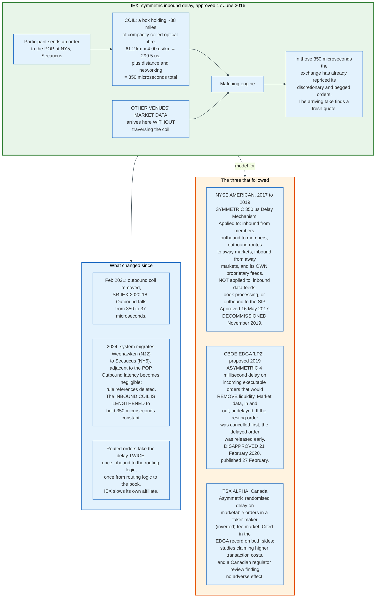

### 15.2 NYSE American Tried the Same Thing and Withdrew

NYSE American introduced a 350-microsecond Delay Mechanism alongside its migration to the Pillar trading platform, approved on 16 May 2017 in Release 34-80700, and eliminated it in November 2019.

Its design was broader than IEX's. Rule 7.29E(b)(1) applied the delay to all inbound communications from members, all outbound communications to members, all outbound routes to away markets, all inbound communications from away markets about a routed order, and all outbound communications to the exchange's own proprietary data feeds. Rule 7.29E(b)(2) exempted inbound data feeds, order processing and execution on the book, and outbound communications to the single plan processors.

The exchange also gave something up to run it. In connection with the Delay Mechanism, NYSE American stopped offering Add Liquidity Only orders and Day Intermarket Sweep Order functionality, and had to file separately to remove them from its rules.

When it decommissioned the mechanism in 2019, it reintroduced those order types. A delay mechanism that also slows the venue's own market data output is a hard product to sell into a market where reachability is the point, and NYSE American's share of consolidated volume across the period is not published in any of the filings cited here.

### 15.3 The SEC Disapproved the Asymmetric Version

Cboe EDGA proposed a Liquidity Provider Protection delay in June 2019 and the Commission disapproved it on 21 February 2020 in Release 34-88261, published in the Federal Register on 27 February, and the reasoning defines the boundary of what a speed bump may do.

The proposal would have delayed "all incoming executable orders that would remove liquidity from the EDGA Book, but not incoming or outgoing market data, for up to four milliseconds." If book conditions changed during the delay so that the incoming order was no longer executable, for example because the resting order had been cancelled, the incoming order would be released early. Cancel, cancel-replace and modification messages associated with a liquidity-taking order were also delayed, and applied after the taking order was released.

The exchange's rationale was the adverse selection argument of Section 11: reducing "the effectiveness of certain harmful latency arbitrage strategies employed by a small number of liquidity takers," which would lower risk for market makers and produce "increased displayed liquidity with tighter spreads and greater size."

The Commission gave two independently sufficient reasons for disapproval.

**The remedy was not tailored to the problem.** The exchange "does not provide specific analysis as to why it is appropriate to apply the 4 millisecond delay to all incoming executable orders that would remove liquidity from the EDGA Book from all market participants as opposed to tailoring a response to target the trading of a relatively small number of market participants who engage in latency arbitrage." The Commission also found the exchange had not demonstrated why four milliseconds was the right number.

**The delay would have discriminated among liquidity providers.** Commenters argued that fast liquidity providers would use the four-millisecond window to cancel while slow ones would not, so "the slower liquidity providers would continue to face the risk of adverse selection" and "would be exposed to bear the full brunt of the latency arbitrage problems on the Exchange." Cboe responded that commercially available algorithms could level the field, and the Commission noted that the exchange "provided no evidence to support its assertion relating to the viability of commercially available algorithms such as, for instance, availability, cost, performance or actual use."

The record also shows what the exchange thought it was neutralising. A supporting commenter defined latency arbitrage as "using dedicated microwave towers to transmit order information from one location to another to trade the same or correlated financial instrument based on information that is a few milliseconds away from becoming available to all market participants," and argued that a four-millisecond delay "would neutralize the difference between commodity fiber connections and microwave networks."

That is a precise statement of what four milliseconds is for. It is the Chicago-to-New Jersey microwave advantage of roughly 2.6 milliseconds, rounded up.

### 15.4 The Rule the Cases Establish

Comparing the approval and the disapproval yields a workable rule.

A delay is permissible when it applies **identically to every participant and to every message type**, and when the venue applies it to itself and to its affiliates on the same terms. IEX delays takes and cancels alike, delays its own routing broker twice, and delays nobody's message differently from anybody else's.

A delay is impermissible when it **sorts participants by intent**. EDGA's proposal delayed liquidity-removing orders and not liquidity-providing ones, which meant the venue was deciding, on the basis of a message's economic function, whose speed counted. Under Section 6(b)(5) of the Exchange Act that is a design an exchange must justify with evidence, and Cboe did not supply it.

The distinction is not about how long the delay is. It is about whether the exchange picks a winner.

---

## 16. The Maker-Taker Fee Model and Its Distortions

### 16.1 The Mechanism

Under maker-taker pricing, a venue charges the participant whose order removes liquidity and pays a rebate to the participant whose order provided it, and the rebate is funded from the fee. The SEC describes it as "the predominant exchange fee structure" in which "the rebate is typically funded through the access fee."

The numbers are published. Nasdaq's equities price list charges **0.0030 dollars per share** to remove liquidity in securities at or above 1.00 dollar, and its highest tier pays **0.00305 dollars per share** to add liquidity, available to firms adding more than 1.50% of total consolidated volume, or more than 0.95% of consolidated volume while meeting options liquidity thresholds. Lower tiers pay 0.0030, 0.00295 and 0.0029 dollars per share.

Two features of that pair of numbers matter.

**The take fee sits exactly at the regulatory cap.** Rule 610(c) of Regulation NMS limits what a venue may charge for accessing a protected quotation to 0.3 cents per share for quotes priced at or above one dollar. Nasdaq charges 0.0030. Every major maker-taker venue charges the maximum the rule permits, which tells you the constraint binds.

**The top rebate exceeds the take fee.** At 0.00305 against 0.0030, the exchange pays out more per share than it collects on the trade. On a 100-share execution the taker pays 30.0 cents and the maker receives 30.5 cents, so the exchange loses half a cent on the pair.

An exchange that loses money on its highest-volume customers' trades is not making a mistake. It is buying quote presence, and it recovers the cost elsewhere. The SEC identifies the mechanism directly: "half of SIP revenue is allocated to exchanges based on percentage of time they are quoting at the NBBO."

That is the fee model's real shape. The exchange pays a market maker to quote at the inside, the quoting at the inside earns the exchange a share of consolidated market data revenue, and the market data revenue is paid by everyone who consumes the tape.

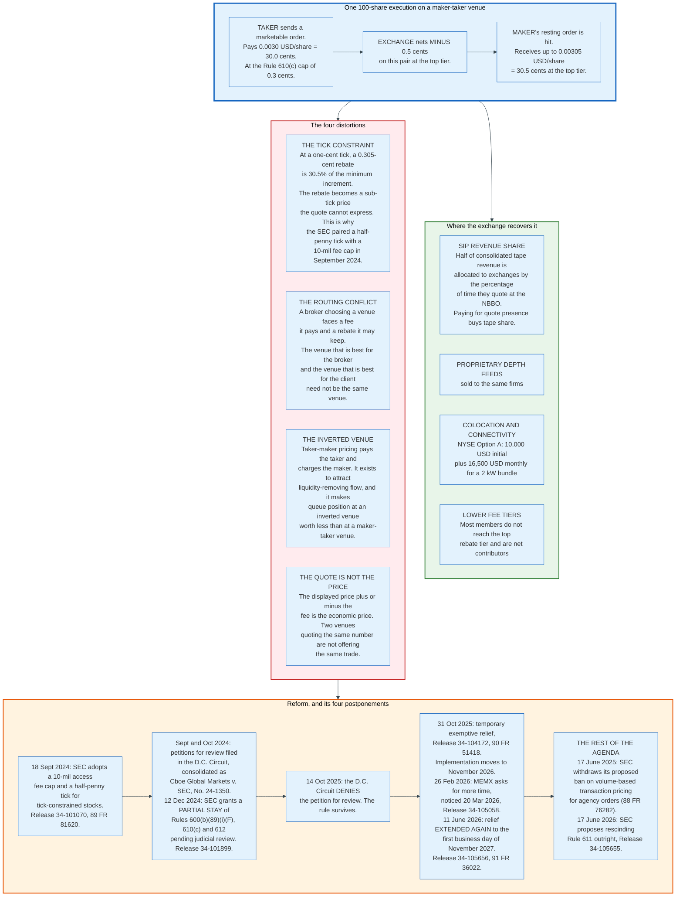

### 16.2 The Rebate Does Not Fit Inside the Tick

The arithmetic that breaks maker-taker is the relationship between the rebate and the minimum price increment.

At a one-cent tick and a 0.305-cent top rebate, the rebate is 30.5% of the smallest price change a quote can express. A market maker willing to quote at an economic price 0.3 cents better than the displayed one cannot display it, because the tick forbids it, so it captures the difference through the rebate instead. The rebate is a sub-tick price expressed as a fee.

That is why the SEC's September 2024 amendments moved both numbers together. Release 34-101070 reduced the Rule 610(c) access fee cap from 0.3 cents to 0.001 dollars, ten mils, and simultaneously created a second minimum pricing increment of 0.005 dollars for tick-constrained stocks. Halving the tick without cutting the fee cap would have made the rebate 61% of the increment, which would make the displayed price close to meaningless.

Neither change has taken effect, and the reason is a chain of postponements rather than a defeat. In its June 2026 proposal the Commission states flatly that "the changes to the access fee cap in Rule 610(c) and the minimum pricing increment in Rule 612 have yet to be implemented."

The chronology runs as follows, and each step is a released document. Petitions for review were filed in the District of Columbia Circuit between 18 September and 30 October 2024 and consolidated as *Cboe Global Markets, Inc. v. SEC*, No. 24-1350. On 12 December 2024 the Commission granted a partial stay of the amendments to Rules 600(b)(89)(i)(F), 610(c) and 612 pending judicial review, in Release 34-101899. On 14 October 2025 the D.C. Circuit denied the petition for review, leaving the rule intact. On 31 October 2025 the Commission granted temporary exemptive relief in Release 34-104172, moving implementation to the first business day of November 2026. On 26 February 2026 MEMX applied for further relief; the Commission noticed that application for comment on 20 March 2026 in Release 34-105058. On 11 June 2026, in Release 34-105656, the Commission extended the relief again, to **the first business day of November 2027**, citing "the number of implementation deadlines for other significant market structure initiatives" including 23/5 trading and Rule 605 compliance.

The date has moved twice and the rule has never been tested in a live market. The stalling is administrative, not judicial: the court upheld the amendments and the Commission then postponed them. The parallel chronology for the exchange fee filings is in [stock-exchanges section 22.6](../stock-exchanges/README.md#22-appendix).

### 16.3 The Routing Conflict

A broker routing a customer's marketable order chooses among venues that charge different access fees, and the broker pays the fee while the customer receives the execution. A broker routing a resting order chooses among venues that pay different rebates, and the broker may keep the rebate.

The conflict is structural rather than hypothetical, and the SEC has proposed to address it twice without doing so. The Order Competition Rule, proposed 3 January 2023, would have required certain retail orders to be exposed to a qualified auction before internalisation. Proposed Regulation Best Execution, published 27 January 2023, would have imposed detailed policies and procedures on order handling. A proposal published 6 November 2023 would have prohibited exchanges from offering volume-based transaction pricing on agency orders in NMS stocks.

The Commission withdrew all three on 17 June 2025, stating that it "does not intend to issue final rules with respect to these proposals."

The disclosure regime remains: Rule 606 requires brokers to disclose order routing and the payments received, and amended Rule 605 requires execution quality statistics. The conflict is disclosed, priced into nothing, and unresolved.

### 16.4 Inverted Venues and What They Are For

A taker-maker or inverted venue reverses the polarity: it pays the participant who removes liquidity and charges the one who provides it. The reason is queue position.

At a maker-taker venue the best bid is crowded, because everybody wants the rebate, and a new order joins the back of a long queue. At an inverted venue the same price level is thinly populated, because posting there costs money, so an order that does post reaches the front quickly. A participant who values fill probability over fee economics posts at the inverted venue and gets served first.

The consequence for the strategies in this document is that fee polarity and queue length are inversely related, and a firm's venue choice is a trade between the two. That is a real economic decision made entirely about fees, in a market whose displayed prices are identical across venues.

---

## 17. Economics: What It Costs to Run the Stack, and Who Pays

### 17.1 The Cost Structure

A high-frequency trading firm has an unusual cost structure: almost no variable cost per trade, very high fixed cost per venue, and a headcount that is small and expensive. The consequence is that scale is decisive and marginal instruments are nearly free.

| Cost line | What it is | Order of magnitude | Source or basis |
|---|---|---|---|
| **Colocation** | Cabinet, power, cross connects, time feed, per venue | NYSE Option A: 10,000 USD initial plus 16,500 USD monthly; proposed Option B 12,000 USD plus 19,000 USD monthly | SEC Release 34-105703, 16 June 2026 (SR-NYSE-2026-28) |
| **Exchange connectivity** | Order entry and data ports beyond the bundle | Per port per month, published in each venue's fee schedule | Exchange fee schedules |
| **Proprietary market data** | Depth-of-book feeds, per venue, per site | Published per feed per site | Exchange fee schedules |
| **Wireless capacity** | Subscription to a microwave or millimetre wave route | Priced per route per feed; capital cost of building a link estimated at 8 million USD | Laughlin et al. |
| **Latency-optimised fibre** | Metro and long-haul, including hollow core where deployed | Spread Networks' Chicago link publicly estimated at 300 million USD | Media estimates cited in Laughlin et al. |
| **Hardware** | FPGAs, kernel-bypass NICs, Layer 1 switches, servers, timing | Capital, refreshed on a two to three year cycle | Vendor list prices |
| **Clearing and settlement** | Clearing member fees, margin financing | Per trade plus financing on intraday balances | Clearing agreements |
| **Exchange transaction fees** | Net of rebates | Up to 0.0030 USD per share taken, less up to 0.00305 USD per share added | Nasdaq price list |
| **Regulatory** | Reg SCI where applicable, MiFID II algorithm registration, records | Fixed and rising | Section 20 |
| **People** | Quantitative researchers, low-latency engineers, hardware engineers | The largest line at most firms, and not published by any of them | Not publicly known |

The regulatory compliance cost of a single rule gives a sense of the scale of the fixed burden. The SEC estimates the current annual ongoing cost for a broker-dealer operating a smart order router simply to maintain Rule 611 trade-through logic at **13,140 dollars**, and the annual cost of the additional systems maintenance the rule imposes at between 16,000 and 319,000 dollars per broker-dealer depending on how many exchanges it connects to. That is one rule.

### 17.2 Who Pays

The money flow is not obvious because most of it never touches a customer invoice.

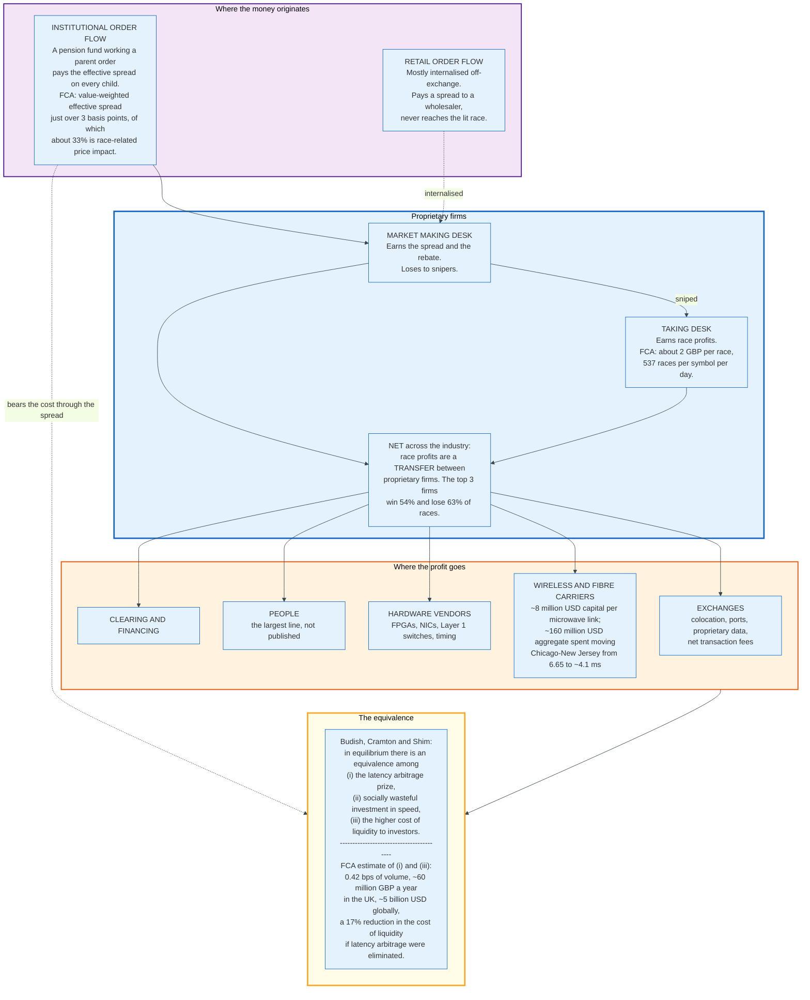

The chain is short and it closes. An institutional investor pays the effective spread. Roughly a third of that spread compensates market makers for adverse selection, and roughly a third of the price impact is race-related. Market makers pay that compensation forward to the firms that win races. Those firms spend it on colocation, wireless capacity, and hardware. The exchanges and the carriers keep it.

The theoretical result and the empirical estimate agree on the size. Budish, Cramton and Shim show the equivalence in a model; the FCA measures 0.42 basis points of trading volume, about 60 million pounds a year in the United Kingdom and roughly 5 billion US dollars globally, and a 17% reduction in the cost of liquidity if the races stopped.

### 17.3 Scale Is the Only Defence

The cost table above is almost entirely fixed. A cabinet at Carteret costs the same whether a firm quotes 100 instruments or 10,000. A microwave subscription costs the same whether one strategy uses it or twelve. An FPGA feed handler for ITCH costs the same to build regardless of how many symbols it decodes.

Two consequences follow, and both are visible in the industry's structure.

**The marginal instrument is nearly free**, which is why the leading firms quote thousands of instruments across dozens of venues and thirty countries rather than specialising. Virtu's disclosure of more than 10,000 instruments on more than 210 venues in 30 countries is a description of a fixed-cost business amortising itself.

**Sub-scale firms cannot survive a fee increase or a latency step**, which is why consolidation follows every infrastructure transition. Section 21 traces what happened.

---

## 18. Risk Controls and the Market Access Rule

### 18.1 The Rule

SEC Rule 15c3-5, adopted in November 2010 with an initial compliance date of 14 July 2011, requires every broker-dealer with market access to maintain pre-trade risk controls, and it is the single most consequential operational rule in this document because it sits on the critical path of every order.

The Commission's stated purpose was that brokers, "as gatekeepers to the financial markets," must "appropriately control the risks associated with market access, so as not to jeopardize their own financial condition, that of other market participants, the integrity of trading on the securities markets, and the stability of the financial system."

The rule has four operative parts.

**Subsection (b)** requires written policies and procedures reasonably designed to manage the financial, regulatory and other risks of market access, and requires the broker to preserve a written description of those controls as part of its books and records under Rule 17a-4(e)(7).

**Subsection (c)(1)(i)** requires controls reasonably designed to prevent, systematically, the entry of orders that exceed pre-set credit or capital thresholds in the aggregate for each customer and for the broker-dealer.

**Subsection (c)(1)(ii)** requires controls reasonably designed to prevent the entry of erroneous orders.

**Subsection (e)** requires a system for regularly reviewing the effectiveness of the controls, and an annual certification by the chief executive officer that the controls and procedures comply with subsections (b) and (c).

The phrase that carries the weight is "prevent the entry of." A monitoring system that shows a breach after the fact does not satisfy the rule. The control must be capable of stopping the order.

### 18.2 What the Controls Are in Practice

The rule's requirements translate into a specific set of checks that must complete before a frame leaves the network card, and they are the largest software cost on the outbound path.

| Control | What it checks | Failure mode it prevents |
|---|---|---|
| **Price collar** | Order price against a reference, typically a percentage band around the NBBO or the last sale | Fat-finger prices, and runaway algorithms walking the book |
| **Maximum order size** | Share quantity and notional per order | A single catastrophic order |
| **Aggregate position limit** | Cumulative position per instrument, per desk, per firm | Accumulation across many small orders |
| **Aggregate capital threshold** | Total notional exposure against the firm's capital, linked to order entry | The Knight failure mode exactly |
| **Message rate limit** | Orders per second per port and per instrument | Runaway loops, and venue message rate breaches |
| **Duplicate detection** | Repeated identical orders in a short window | Retransmission bugs |
| **Restricted list** | Instrument against a prohibition list | Regulatory breaches |
| **Short sale marking and locate** | Regulation SHO Rules 200(g) and 203(b) | Unmarked and naked short sales |
| **Kill switch** | Operator or automated command to cancel everything and disable entry | Loss of control |

The kill switch has a European counterpart with a legal definition. Article 12 of Commission Delegated Regulation (EU) 2017/589 requires an investment firm engaging in algorithmic trading to "be able to cancel immediately, as an emergency measure, any or all of its unexecuted orders" across all connected venues, and to be able to identify "which trading algorithm and which trader, trading desk or ... client is responsible for each order."

Nasdaq exposes the same capability at the protocol level. The OUCH order entry protocol includes a `D` Disable Order Entry Request and an `E` Enable Order Entry Request, giving the member an out-of-band kill switch that does not depend on its own systems being healthy.

### 18.3 The Tension the Rule Creates

Every pre-trade risk check is a state lookup on the latency-critical path, and the whole discipline of Section 8 exists in tension with the whole discipline of this section.

The engineering answer is to make the checks cache-resident and branch-free. Limits are pre-loaded into memory, indexed by the same instrument identifier the market data feed uses, and laid out so that all the values needed for one order occupy a single cache line. In an FPGA implementation the limits are held in on-chip registers and the check is combinational logic evaluated in the same clock cycle as the order construction.

The answer is not to move the check off the path. Section 19 is what that looks like.

---

## 19. Knight Capital, 1 August 2012, Dissected

### 19.1 What Happened

Knight Capital Americas lost more than 460 million dollars in approximately 45 minutes on 1 August 2012 because a deployment script missed one server out of eight and nobody checked. The SEC's account, in Release 34-70694 dated 16 October 2013, is the authoritative reconstruction and every figure below comes from it.

Knight was not a marginal firm. Throughout 2011 and 2012 its aggregate trading represented approximately **10% of all trading in listed United States equity securities**, and SMARS, the router at the centre of the failure, represented approximately 1% or more of all such trading on its own.

```mermaid
%%{init: {'theme': 'base', 'themeVariables': {'primaryColor': '#e3f2fd', 'primaryBorderColor': '#1565c0', 'lineColor': '#37474f'}}}%%

flowchart TB
    subgraph Setup["The dormant landmine, 2003 to 2005"]
        S1["2003: Knight stops using 'Power Peg',<br/>an order routing function.<br/>The code is NOT deleted.<br/>It remains present and callable."]
        S2["2005: Knight moves the cumulative<br/>quantity function, which counted<br/>filled shares and told Power Peg to<br/>STOP sending child orders, to an<br/>earlier point in the SMARS sequence."]
        S3["Power Peg is NOT retested after<br/>the move. Nobody checks whether it<br/>still works if called.<br/>It does not. It now sends child orders<br/>forever."]
        S1 --> S2 --> S3
    end

    subgraph Deploy["The deployment, 27 July to 1 August 2012"]
        D1["NYSE launches its Retail Liquidity<br/>Program on 1 August 2012.<br/>Knight writes new RLP code for SMARS."]
        D2["The new RLP code REPURPOSES the flag<br/>that used to activate Power Peg.<br/>Knight intends to delete Power Peg<br/>so the flag now means RLP."]
        D3["From 27 July the code is deployed in<br/>stages across SMARS servers.<br/>A technician does not copy it to<br/>ONE of the EIGHT servers."]
        D4["No second technician reviews the<br/>deployment. Knight has NO WRITTEN<br/>PROCEDURE requiring such a review."]
        D1 --> D2 --> D3 --> D4
    end

    subgraph Warn["The warning, 08:01 ET on 1 August"]
        W1["Pre-market RLP-eligible orders reach<br/>SMARS. An internal system generates<br/>automated 'BNET reject' emails<br/>referencing SMARS and the error<br/>'Power Peg disabled'."]
        W2["97 of these emails are sent to a group<br/>of Knight personnel BEFORE the 09:30 open."]
        W3["Knight did not design these messages<br/>to be system alerts and personnel<br/>generally did not read them.<br/>They are not acted on before the open,<br/>nor used to diagnose after it."]
        W1 --> W2 --> W3
    end

    subgraph Event["09:30 to approximately 10:15 ET"]
        E1["212 parent orders arrive carrying<br/>the repurposed flag."]
        E2["Seven servers run the new RLP code<br/>and handle them correctly."]
        E3["The eighth server triggers the<br/>defective Power Peg code. Because the<br/>cumulative quantity function was moved,<br/>it sends child orders continuously,<br/>in rapid sequence, without regard to<br/>fills already received."]
        E4["MILLIONS of child orders.<br/>4 million executions in 154 stocks.<br/>Over 397 million shares in ~45 minutes."]
        E5["Net LONG ~3.5 billion USD in 80 stocks.<br/>Net SHORT ~3.15 billion USD in 74 stocks.<br/>For 75 stocks Knight was over 20% of<br/>volume with price moves over 5%;<br/>for 37 of those, over 50% of volume<br/>and price moves over 10%."]
        E1 --> E2
        E1 --> E3 --> E4 --> E5
    end

    subgraph Fail["Why nothing stopped it"]
        F1["NO OUTPUT CONTROL on SMARS.<br/>Nothing compared orders leaving SMARS<br/>with orders that entered it."]
        F2["NO PROCEDURE to halt SMARS in<br/>response to its own aberrant activity."]
        F3["THE PRICE COLLAR DID NOT APPLY.<br/>The 9.5% limit-price cap was computed<br/>against the NBBO at parent receipt<br/>and did not apply to pre-open orders<br/>intended for the opening auction."]
        F4["THE 33 ACCOUNT had a 2 million USD<br/>gross position limit and was NOT LINKED<br/>to any automated control. It held<br/>positions from multiple sources, so<br/>staff could not identify the source."]
        F5["PMON was POST-EXECUTION monitoring.<br/>It did not stop order entry, generated<br/>no automated alerts, did not display<br/>the limits, and produced inaccurate<br/>reports under the day's volume."]
    end

    subgraph Worse["The response made it worse"]
        X1["Staff uninstalled the new RLP code<br/>from the SEVEN servers where it had<br/>deployed correctly."]
        X2["This caused those seven servers to<br/>ALSO activate Power Peg on incoming<br/>parent orders, reproducing the failure<br/>eightfold."]
        X3["Knight had no incident response<br/>supervisory procedures and relied on<br/>its technology team to debug in a<br/>live trading environment."]
        X1 --> X2
    end

    Setup --> Deploy --> Warn --> Event --> Fail --> Worse

    OUT["OUTCOME<br/>-------------------------------------<br/>Loss: more than 460 million USD.<br/>Rate: ~10.2 million USD per minute.<br/>Volume: ~147,000 shares per second.<br/>Executions: ~1,480 per second.<br/>-------------------------------------<br/>SEC Release 34-70694, 16 Oct 2013:<br/>willful violation of Exchange Act<br/>s.15(c)(3) and Rule 15c3-5, plus<br/>Reg SHO Rules 200(g) and 203(b).<br/>Censure, cease and desist,<br/>12 million USD civil penalty.<br/>-------------------------------------<br/>Knight Capital Group combined with<br/>GETCO on 1 July 2013 to form KCG."]
    Worse --> OUT

    style Setup fill:#eceff1,stroke:#37474f,stroke-width:2px
    style Deploy fill:#fff3e0,stroke:#e65100,stroke-width:2px
    style Warn fill:#fffde7,stroke:#f9a825,stroke-width:2px
    style Event fill:#ffebee,stroke:#c62828,stroke-width:3px
    style Fail fill:#f3e5f5,stroke:#4a148c,stroke-width:2px
    style Worse fill:#ffebee,stroke:#c62828,stroke-width:2px
    style OUT fill:#e3f2fd,stroke:#1565c0,stroke-width:3px
```

### 19.2 The Six Failures the SEC Charged

The Commission found that Knight willfully violated Section 15(c)(3) of the Exchange Act and Rule 15c3-5, and identified six distinct deficiencies:

- **No erroneous order controls at the point of exit from SMARS**, contrary to Rule 15c3-5(c)(1)(ii). Knight had controls at its customer interface, its order management system and its internal execution system, and none between SMARS and the market.
- **No capital threshold controls linked to order entry**, contrary to Rule 15c3-5(c)(1)(i). Knight "failed to link accounts to firm-wide capital thresholds" and "relied on financial risk controls that were not capable of preventing the entry of orders."
- **No adequate written description of the controls** in its books and records, contrary to Rule 15c3-5(b).
- **No technology governance controls** sufficient to ensure orderly code deployment or to prevent activation of code no longer intended for use but left on servers accessing the market, and no incident response procedures, contrary to Rule 15c3-5(b).
- **No adequate review of the controls**, contrary to Rule 15c3-5(e)(1).
- **A defective CEO certification.** The March 2012 certification stated that Knight had "processes" to comply with the rule rather than certifying that its controls and procedures complied with it. The Commission found the drafting error unintentional and charged it anyway.

The Commission separately found violations of Regulation SHO Rules 200(g) and 203(b): many of the millions of orders were short sales, Knight did not mark them as such, and it obtained no locate.

The order imposed a censure, a cease and desist, and a civil money penalty of **12 million dollars** payable within ten days.

### 19.3 The Lessons, Stated Precisely

**Dead code is live code.** Power Peg had not been used since 2003 and was still callable in 2012. The rule that follows is not "comment out unused features" but "remove them from production binaries," because a feature that can be reached by a flag is a feature.

**A flag is an interface, and reusing one is a breaking change.** Knight repurposed the Power Peg activation flag to mean RLP. On seven servers the new meaning held. On one it did not, and the same bit meant two different things in the same production system.

**Untested code is broken code, and moving something is a change.** The cumulative quantity function was relocated in 2005 and Power Peg was never retested. The defect sat dormant for seven years because nothing called the path.

**Deployment must be verified, not performed.** Knight had no written procedure requiring a second technician to review a SMARS deployment. The industry answer since 2012 is automated verification: a deployment is not complete until the deployed artefact on every host has been read back and compared to the intended artefact.

**Alerts that nobody reads are not alerts.** Ninety-seven emails naming SMARS and "Power Peg disabled" arrived between 08:01 and the open. They were not designed as alerts and personnel generally did not review them. A signal that is not routed to a person with authority to act, on a channel that person watches, is not a control.

**Position monitoring is not a position control.** PMON was post-execution, human-monitored, unlinked to order entry, did not display limits, and degraded under load. It told Knight what had happened, slowly and inaccurately, while it was still happening.

**The blast radius must be bounded by capital, not by intent.** The 33 Account had a 2 million dollar gross position limit. It reached a gross exposure of billions. A limit that is not wired to a kill decision is a number in a spreadsheet.

**Rolling back may not be the safe direction.** Uninstalling the good code from the seven healthy servers converted a one-server failure into an eight-server failure. Under time pressure the team applied the standard remedy without a model of what the code did, and there was no incident procedure to slow them down.

**The rule that Knight violated was not new.** Rule 15c3-5 had been in force for more than a year. Knight had assessed its compliance, concluded it complied, and documented the assessment insufficiently for a later reviewer to find the gap. The Commission also noted an October 2011 precursor: after a disaster recovery test, Knight's lead market making desk continued using test data to generate quotes on the following Monday, costing nearly 7.5 million dollars. Knight fixed the specific case and did not ask the general question.

---

## 20. Regulation: Reg SCI, MiFID II, and the Rest

### 20.1 The Shape of the Regime

No jurisdiction regulates high-frequency trading as such. Every jurisdiction regulates the technology that makes it possible, and does so in four places: the firm's own controls, the venue's systems, the timestamps, and the market abuse rules.

```mermaid
%%{init: {'theme': 'base', 'themeVariables': {'primaryColor': '#e3f2fd', 'primaryBorderColor': '#1565c0', 'lineColor': '#37474f'}}}%%

flowchart TB
    subgraph US["United States"]
        US1["RULE 15c3-5, the Market Access Rule<br/>Adopted Nov 2010, compliance 14 Jul 2011.<br/>Pre-trade controls that PREVENT entry.<br/>Annual CEO certification.<br/>The rule Knight violated."]
        US2["REGULATION SCI<br/>Adopted 19 Nov 2014, effective 3 Feb 2015,<br/>compliance 3 Nov 2015.<br/>Binds SCI ENTITIES: exchanges, FINRA,<br/>MSRB, clearing agencies, plan processors,<br/>SCI ATSs, SCI competing consolidators.<br/>Does NOT bind proprietary trading firms."]
        US3["REGULATION NMS<br/>Rule 610 access fees, Rule 611 trade-through,<br/>Rule 612 tick size.<br/>Rule 611 rescission PROPOSED 17 June 2026,<br/>Release 34-105655, comments closed 17 Aug 2026."]
        US4["CEA anti-spoofing<br/>7 U.S.C. 6c(a)(5)(C).<br/>Bidding or offering with intent to cancel<br/>before execution. First case: Panther Energy<br/>and Coscia, 22 July 2013."]
        US5["REG SHO Rules 200(g) and 203(b)<br/>Short sale marking and locate.<br/>Charged against Knight alongside 15c3-5."]
    end

    subgraph EU["European Union"]
        EU1["MiFID II Art 4(1)(40)<br/>The only binding DEFINITION of a<br/>high-frequency algorithmic trading technique.<br/>Triggers loss of the Art 2(1)(d) proprietary<br/>trading exemption: authorisation required."]
        EU2["MiFID II Art 17, on the FIRM<br/>Resilient systems, thresholds, testing,<br/>business continuity, notification to the<br/>home and venue competent authorities.<br/>HFT firms must store time-sequenced records<br/>of ALL placed orders, cancellations,<br/>executions and quotations."]
        EU3["MiFID II Art 48, on the VENUE<br/>Capacity for peak volumes, erroneous order<br/>rejection, halts, member algorithm testing<br/>environments, order-to-trade ratio limits,<br/>DEA controls, and colocation rules that are<br/>'transparent, fair and non-discriminatory'."]
        EU4["RTS 6 - Reg (EU) 2017/589<br/>Firm organisational requirements.<br/>Art 5-8 testing, Art 6 conformance testing,<br/>Art 9 annual self-assessment, Art 10 stress<br/>testing at 2x the highest message count of<br/>the previous six months, Art 12 kill<br/>functionality, Art 15 pre-trade controls,<br/>Art 28 five-year HFT order records."]
        EU5["RTS 9 - Reg (EU) 2017/566<br/>Order-to-trade ratio methodology,<br/>computed per member per instrument,<br/>in volume and number terms, at least<br/>at the end of every session."]
        EU6["RTS 25 - Reg (EU) 2017/574<br/>Clock synchronisation to UTC.<br/>HFT firms: 100 microsecond maximum<br/>divergence, 1 microsecond granularity.<br/>Applies from 3 January 2018."]
    end

    subgraph Gap["What is NOT regulated"]
        G1["No US definition of HFT."]
        G2["No US rule against order anticipation."]
        G3["No rule anywhere defining quote stuffing."]
        G4["No US minimum order resting time."]
        G5["Reg SCI does NOT cover proprietary firms.<br/>The 14 April 2023 proposal to expand<br/>'SCI entity' was WITHDRAWN 17 June 2025."]
    end

    US --> Gap
    EU --> Gap

    style US fill:#e3f2fd,stroke:#1565c0,stroke-width:2px
    style EU fill:#e8f5e9,stroke:#2e7d32,stroke-width:2px
    style Gap fill:#ffebee,stroke:#c62828,stroke-width:3px
```

### 20.2 Regulation SCI

Regulation SCI turned exchange technology from an operational matter into a filed obligation with deadlines, and it applies to the venues rather than to the trading firms.

The Commission adopted it on 19 November 2014. The effective date was **3 February 2015** and SCI entities were given nine months to comply, making the compliance date **3 November 2015**, with 21 months from the effective date to coordinate industry-wide business continuity testing.

**Who it binds.** Rule 1000 defines an "SCI entity" as an SCI self-regulatory organisation, an SCI alternative trading system, a plan processor, an exempt clearing agency subject to the Automation Review Policies, or an SCI competing consolidator. An SCI SRO is any national securities exchange, registered securities association, registered clearing agency, or the Municipal Securities Rulemaking Board.

An ATS becomes an SCI ATS by volume. The threshold is, during at least four of the preceding six calendar months, either 5% or more of average daily dollar volume in any single NMS stock combined with 0.25% or more across all NMS stocks, or 1% or more of average daily dollar volume across all NMS stocks. A newly qualifying ATS gets six months before it must comply.

**Critical SCI systems** are a narrower class carrying tighter obligations: systems directly supporting clearance and settlement, openings, reopenings and closings on the primary listing market, trading halts, initial public offerings, the provision of market data by a plan processor, or exclusively-listed securities; or systems providing functionality "for which the availability of alternatives is significantly limited or nonexistent."

**Rule 1001(a)** requires written policies and procedures ensuring capacity, integrity, resiliency, availability and security, and specifies the minimum contents: current and future capacity planning estimates, periodic capacity stress tests, a systems development and testing methodology programme, regular reviews and testing including of backup systems, business continuity and disaster recovery plans "reasonably designed to achieve next business day resumption of trading and two-hour resumption of critical SCI systems following a wide-scale disruption," standards facilitating market data collection and dissemination, and monitoring to identify potential SCI events.

**Rule 1001(b)** requires testing of all SCI systems and changes before implementation, internal controls over changes, and a plan for assessing systems compliance. It carries a safe harbour from individual liability for personnel who reasonably discharged their duties and had no reasonable cause to believe the policies were not being enforced.

**Rule 1002** sets the notification clock. On any responsible SCI personnel having a reasonable basis to conclude an SCI event occurred, the entity must notify the Commission **immediately**, submit a written notification **within 24 hours**, provide regular updates until resolution, and file a final written notification within five business days of resolution and closure of the investigation, or an interim one at 30 calendar days if it is not resolved by then. The final notification must include an analysis of parties that may have suffered loss, their number, and an estimate of the aggregate amount. Events with no or de minimis impact are exempt from notification but must be recorded and summarised in a quarterly report.

**Rule 1003** requires a quarterly report of completed, ongoing and planned material systems changes, and an annual SCI review, with penetration testing of the network, firewalls and production systems at least every three years. The review goes to senior management within 30 days of completion and to the Commission and the board within 60 days of that.

**Rule 1004** requires the entity to designate the members or participants that are "the minimum necessary for the maintenance of fair and orderly markets" if business continuity plans are activated, to require those members to participate in functional and performance testing **at least once every 12 months**, and to coordinate that testing on an industry-wide or sector-wide basis.

That last rule is the reason large proprietary trading firms participate in industry-wide disaster recovery tests. They are not SCI entities. They are designated by SCI entities as necessary for an orderly market, which is a description of how central they have become.

**The expansion was withdrawn.** On 14 April 2023 the Commission proposed amendments that would have expanded the definition of "SCI entity" to include a broader range of key market participants. On 17 June 2025 the Commission withdrew that proposal along with proposed Regulation Best Execution, the Order Competition Rule, the volume-based transaction pricing prohibition and others, stating that it "does not intend to issue final rules with respect to these proposals."

As of August 2026, a proprietary trading firm has no systems integrity obligations beyond Rule 15c3-5, however much of the displayed quote it supplies.

### 20.3 MiFID II

MiFID II regulates high-frequency trading by name, and its main effect is to remove an exemption.

**The perimeter.** Article 2(1)(d) exempts persons dealing on own account from authorisation, but the exemption does not apply to persons who are market makers, who are members or participants of a regulated market or MTF, who **apply a high-frequency algorithmic trading technique**, or who deal on own account when executing client orders. A pure proprietary trading firm that meets the Article 4(1)(40) definition must be authorised as an investment firm.

**Article 17 obligations on the firm.** An investment firm engaging in algorithmic trading must have effective systems and risk controls ensuring resilience and sufficient capacity, appropriate trading thresholds and limits, prevention of erroneous orders, and prevention of use contrary to the Market Abuse Regulation or venue rules; effective business continuity arrangements; and fully tested and monitored systems. It must notify its home competent authority and each venue's authority. On request it must supply a description of its strategies, its parameters and limits, its compliance and risk controls, and details of its systems testing.

A firm engaging specifically in a high-frequency algorithmic trading technique carries an additional records obligation: it "shall store in an approved form accurate and time sequenced records of all its placed orders, including cancellations of orders, executed orders and quotations on trading venues" and make them available on request. RTS 6 Article 28 requires these to be recorded immediately, in the format of its Annex II, and kept for five years.

**RTS 6 in detail.** Commission Delegated Regulation (EU) 2017/589 turns Article 17 into specifics: staffing with sufficient skilled personnel and continuous training (Article 3); clearly delineated testing methodologies before deployment and separate testing environments (Articles 5 to 8); conformance testing against the venue's systems when joining, using sponsored access, or after material updates, to verify the algorithm "interact[s] with the trading venue's matching logic as intended" (Article 6); predefined deployment limits on instruments, order values and venues (Article 8); an annual self-assessment and validation reviewed by internal audit and signed off by senior management (Article 9); stress testing using "the highest number of messages ... during the previous six months, multiplied by two" (Article 10); kill functionality (Article 12); and pre-trade controls including price collars, maximum order values and volumes, message limits, repeated automated execution throttles, and automatic blocking of orders from traders lacking permission (Article 15).

**Article 48 obligations on the venue.** Regulated markets must have resilient systems with sufficient capacity for peak order and message volumes, fully tested, with business continuity arrangements; written agreements with all firms pursuing a market making strategy, and schemes ensuring enough firms participate; systems to reject orders exceeding pre-determined volume and price thresholds or clearly erroneous; the ability to halt or constrain trading; systems requiring members to test algorithms and providing environments to do so; systems to limit the ratio of unexecuted orders to transactions and to slow the flow of orders if capacity is at risk; controls over direct electronic access with the ability to stop a DEA client's orders separately from the member's own; colocation rules that are "transparent, fair and non-discriminatory"; and fee structures that do not create incentives to place, modify or cancel orders in a way contributing to disorderly trading.

**Clock synchronisation** is RTS 25, set out in Section 8.5.

### 20.4 What Is Not Regulated

The gaps are as informative as the rules.

**There is no United States definition of high-frequency trading**, which means there is no United States rule that can be addressed to it.

**There is no rule against order anticipation** anywhere, and the SEC declined to propose one after taking comment in 2010.

**There is no definition of quote stuffing** in any rule in either jurisdiction. The instruments are fee schedules and ratio limits.

**There is no minimum order resting time** in the United States. The SEC raised the possibility of a one-second minimum in 2010 and did not pursue it.

**Reg SCI does not reach the firms.** The proposal that would have extended it was withdrawn in June 2025.

---

## 21. The Profitability Decline

### 21.1 The Numbers

High-frequency trading revenue in United States equities fell by roughly three quarters between 2009 and 2012, and it fell for reasons that were structural rather than cyclical.

The estimates for 2009, the peak year, ranged from **7.2 billion to 25 billion dollars** depending on methodology, and the spread between those figures is itself informative about how little anybody could measure. The most widely cited series, from a market analyst quoted by Laughlin, Aguirre and Grundfest, puts the decline at **7.2 billion dollars in 2009 to 1.8 billion dollars in 2012**. A separate estimate in the same paper puts 2012 profits at "no more than 1.25 billion dollars for the industry as a whole."

Three forces produced that fall, and they compound.

**Volume halved.** Typical daily United States equity share volume was 1 x 10^10 shares a day in 2009 and had fallen to 5 x 10^9 or below by the second half of 2012. A strategy that earns a fixed fraction of the minimum spread on each share earns half as much when half as many shares trade, before anything else changes.

**Volatility fell.** Race frequency and race value both scale with volatility. The FCA found that daily volatility explains latency-arbitrage profits with an R-squared of about 0.66, and daily volume explains them with an R-squared of about 0.81. Quiet markets are cheap markets to trade in and poor markets to make in.

**Competition drove costs up and margins down.** This is the arms race consuming its own prize. The 160 million dollars the industry collectively spent moving Chicago-to-New Jersey latency from 6.65 milliseconds to roughly 4.1 milliseconds bought nobody a durable advantage, because every serious competitor bought the same thing. The theoretical prediction, from Budish, Cramton and Shim, is that investment in speed dissipates the rents entirely, and the empirical record is consistent with it.

### 21.2 The Public Company Evidence

Virtu Financial is the only pure electronic market maker with a long public reporting history, and its total revenue series shows what happened to the survivors.

| Fiscal year | Total revenues (USD) | Net income attributable to the parent (USD) |
|---|---|---|
| 2013 | 664,505,000 | not separately reported pre-IPO |
| 2014 | 723,053,000 | not separately reported pre-IPO |
| 2015 | 796,213,000 | 20,887,000 |
| 2016 | 702,272,000 | 32,980,000 |
| 2017 | 1,027,982,000 | 2,939,000 |
| 2018 | 1,878,718,000 | 289,441,000 |
| 2019 | 1,530,082,000 | (58,595,000) |
| 2020 | 3,239,331,000 | 649,197,000 |
| 2021 | 2,811,485,000 | 476,878,000 |
| 2022 | 2,364,812,000 | 265,026,000 |
| 2023 | 2,293,373,000 | 142,036,000 |
| 2024 | 2,876,949,000 | 276,415,000 |
| 2025 | 3,632,118,000 | 468,361,000 |

Read that table carefully, because the headline growth is misleading in two directions.

**The step change in 2017 and 2018 is acquisition, not organic growth.** Virtu acquired KCG Holdings, itself the product of the 2013 combination of Knight Capital Group and GETCO, in 2017, and Investment Technology Group in 2019. A large part of post-2017 revenue is agency execution and workflow technology sold to institutions, which is a different business from proprietary market making.

**The cyclicality is volatility, not skill.** The 2020 figure is more than double 2019. Nothing about Virtu's technology changed by a factor of two in twelve months. Market volatility did. The same pattern repeats in 2025.

The 2019 loss is the most instructive line in the table. A firm that reported one losing trading day in 1,238 between 2009 and 2013 reported a net loss attributable to the parent for the whole of 2019, in a period of low volatility, while carrying the integration costs of two acquisitions.

Consistency at the daily level does not produce consistency at the annual level. The daily consistency comes from diversification across thousands of weakly correlated positions. The annual variation comes from a single factor, volatility, that every one of those positions shares.

### 21.3 Why the Arms Race Ended

The arms race did not end because anybody won. It ended because the remaining distance to the physical limit stopped being worth the money.

The Chicago route is the clearest case. Well-engineered microwave sits approximately 0.10 milliseconds above the 3.93 millisecond speed-of-light floor, and Laughlin, Aguirre and Grundfest estimated that roughly 5 million dollars of additional engineering would close most of that gap, after which "further latency improvement may become prohibitively expensive and difficult, and factors other than long-distance latency, such as 'last mile' costs" would dominate. A signal through the Earth would save 3 microseconds.

The same saturation happened inside the cabinet. A Layer 1 switch at 4 nanoseconds is 1.2 metres of fibre. A 64-byte frame at 100 Gb/s takes 6.7 nanoseconds to serialise. When the remaining controllable latency is comparable to the unavoidable physics, further investment buys diminishing probability rather than certainty, and the FCA's finding that 4% of races are decided by the exchange's own round-robin gateway polling puts a floor under how much certainty money can buy.

What replaced speed as the axis of competition is breadth and modelling. A firm that cannot be faster can be in more instruments, in more asset classes, in more countries, with better models of where fair value is. That is a returns-to-scale business, and returns to scale produce consolidation.

### 21.4 What Consolidation Looked Like

The sequence is short and it is almost entirely absorption of firms that could no longer carry the fixed cost.

Knight Capital Group, holding roughly 10% of listed United States equity volume in 2011 and 2012, combined with GETCO Holding Company on 1 July 2013 to form KCG Holdings. That combination was the direct consequence of the 460 million dollar loss described in Section 19: Knight raised approximately 400 million dollars of rescue financing within days and was acquired within months.

Virtu then acquired KCG in 2017 and ITG in 2019, and the revenue table above shows the result.

The pattern generalises. In a business where the marginal instrument is nearly free and the fixed cost per venue is six figures a year, the equilibrium number of firms is small. The FCA measured the endpoint on the London Stock Exchange in 2015: the top three firms won 54% of races and lost 63% of them, and the top six accounted for 82% of wins and 85% of losses.

Six firms are the market.

---

## 22. Comparisons: Across Asset Classes and Across Borders

### 22.1 Futures Against Equities

The single largest architectural difference between the CME's futures market and the United States equity market is the sequencer, and it changes the character of the race.

The FCA describes the contrast directly. On the London Stock Exchange, and on many other exchanges including the New York Stock Exchange, a separate sequencer polls the gateways in round-robin order, so "it is possible that one message, say A, reaches its gateway before some other message, say B, reaches its gateway, yet B gets to the matching engine before A does." That is the source of the 4% of races in which the loser's message arrived first.

CME's architecture, adopted in 2015 and called the Market Segment Gateway, removes the separate sequencer. Sequencing happens inside the gateway, and there is **one gateway per underlying instrument**. Whichever message reaches the gateway first is given to the matching engine first. The cost is more computational work in the gateway; the benefit is that arrival order is preserved exactly.

The second difference is fragmentation. A futures contract trades on one exchange. There is no National Best Bid and Offer to compute across venues, no trade-through rule, no smart order router, and no cross-venue latency arbitrage in the same instrument. The race in futures is between participants at one venue, not between venues.

The third difference is that the futures market leads. Section 13.2 sets out the measurement: price discovery for United States equity index risk happens in the E-mini at Aurora, and the equity market responds at the prevailing communication latency.

### 22.2 United States Against Europe

| Dimension | United States equities | European Union equities |
|---|---|---|
| **Definition of HFT** | None in law | MiFID II Art 4(1)(40), with a 2 or 4 messages per second threshold |
| **Authorisation of proprietary firms** | Broker-dealer registration | Full investment firm authorisation; the Art 2(1)(d) exemption is lost |
| **Market maker obligations** | Voluntary except for NYSE DMMs and specific programmes | Art 17(3): binding written agreement, continuous quoting for a specified proportion of hours |
| **Rebates** | Unconditioned | Art 48(9): venues must impose market making obligations in exchange for any rebate |
| **Order-to-trade ratio** | Priced by exchange fee schedules, for example Nasdaq's Excess Order Fee | Mandated: Art 48(6) plus RTS 9 methodology |
| **Clock synchronisation** | No general rule; the CAT has its own requirements | RTS 25: 100 microseconds and 1 microsecond granularity for HFT firms |
| **Algorithm testing** | Firm's own responsibility under Rule 15c3-5 | RTS 6 Art 5 to 8: methodologies, separate environments, conformance testing against the venue |
| **Trade-through protection** | Rule 611, proposed for rescission 17 June 2026 | No equivalent; best execution is a process obligation |
| **Venue systems regulation** | Regulation SCI, venues only | MiFID II Art 48, venues only |
| **Speed bumps** | IEX approved; NYSE American withdrawn; EDGA disapproved | Permitted subject to national supervision; Deutsche Boerse and others operate liquidity protection mechanisms |

The structural difference is philosophical. The United States regulates the outcome, requiring price protection and disclosure and leaving the technology to competition. The European Union regulates the process, requiring firms to test, document, self-assess and register their algorithms and leaving execution outcomes to a best execution obligation.

Neither approach has demonstrably reduced the latency arms race. The FCA's measurement of it was conducted on a European venue under a European regime.

### 22.3 Other Asset Classes

**Options.** United States options carry the highest message rates of any asset class, because a single underlying generates hundreds of series and every one of them re-prices whenever the underlying moves. The consolidated options feed is therefore the extreme case for line-rate processing. Options market makers also carry a risk equity market makers do not: a position that is delta-hedged is still exposed to volatility, and the hedge must be maintained continuously. The mechanics are in [capital-markets/options-and-derivatives](../options-and-derivatives/README.md).

**Fixed income.** Government bond markets moved to electronic trading later and remain more dealer-intermediated. Speed matters in the on-the-run Treasury market and the futures that hedge it, and matters much less in corporate bonds, where the constraint is finding a counterparty rather than being first to a known price. See [capital-markets/bond-markets](../bond-markets/README.md).

**Foreign exchange.** FX has no central limit order book, no consolidated tape, and no trade-through rule. Liquidity is distributed across bank single-dealer platforms and a handful of multilateral venues, and the dominant microstructure question is last look, the practice of a liquidity provider holding a client's request for a short interval before deciding whether to fill it. Last look is functionally an asymmetric speed bump granted to the maker, and it is the arrangement the SEC refused to approve for EDGA.

**Digital assets.** Crypto venues run 24 hours a day, are globally distributed rather than colocated in five buildings, and mostly offer REST and WebSocket APIs rather than binary multicast. Latency is measured in milliseconds rather than nanoseconds, geographic arbitrage across venues is unconstrained by any trade-through rule, and there is no equivalent of Rule 15c3-5. See [crypto-and-blockchain](../../crypto-and-blockchain/) for the settlement layer.

---

## 23. Modern Developments

### 23.1 The SEC Proposes to Rescind the Rule That Started It

On 17 June 2026 the Commission published Release 34-105655, File No. S7-2026-20, proposing to rescind Rule 611, the trade-through rule, and Rule 610(e), the locked and crossed markets provision, together with certain defined terms. The comment period closed on 17 August 2026.

The proposal's reasoning names the subject of this document. Rule 611 "has contributed to the fragmentation of displayed liquidity across numerous order books," which "in turn creates latency arbitrage opportunities and has incentivized massive investment in low-latency infrastructure to gain a speed advantage over competitors, resulting in the rise of high-frequency traders." Participants "are locked in a technology and latency arms race for speed, and the Commission believes that Rule 611 has contributed to this."

The release also documents the cost of the rule it proposes to remove: an estimated 30,996 dollars a year for each trading centre to maintain trade-through policies and procedures, 13,140 dollars a year for each broker-dealer operating a smart order router to maintain the logic, and between 319,000 and 637,000 dollars a year of additional systems maintenance for each exchange.

What rescission would and would not do is worth stating carefully. It would not abolish the National Best Bid and Offer, which the SIPs would continue to compute, and it would not remove brokers' best execution obligations. It would remove the requirement that a venue avoid executing at a price inferior to another venue's protected quote, which would allow venues to compete on trading protocol rather than only on speed and fees. A batch auction venue, currently disadvantaged because its quote may not qualify as an automated quotation, would become viable.

Whether that changes anything depends on whether anybody builds one.

### 23.2 The Reform Agenda That Was Withdrawn

On 17 June 2025 the Commission withdrew fourteen proposed rules, four of which bear directly on the economics in this document:

- **Regulation Systems Compliance and Integrity amendments** (88 FR 23146, 14 April 2023), which would have expanded "SCI entity" to a broader range of key market participants.
- **Regulation Best Execution** (88 FR 5440, 27 January 2023).
- **The Order Competition Rule** (88 FR 128, 3 January 2023), which would have required certain individual investors' orders to be exposed to a qualified auction before internalisation.
- **Volume-based transaction pricing** (88 FR 76282, 6 November 2023), which would have prohibited exchanges from offering volume-based pricing on agency orders in NMS stocks.

The Commission stated it "does not intend to issue final rules with respect to these proposals" and that any future action would begin with a new proposal.

The tick size and access fee cap amendments adopted on 18 September 2024 survive judicial review and have still not taken effect. The Commission's June 2026 release states plainly that "the changes to the access fee cap in Rule 610(c) and the minimum pricing increment in Rule 612 have yet to be implemented." Six days earlier, in Release 34-105656, the Commission had already deferred them again, to the first business day of November 2027. Section 16.2 sets out the full chronology.

### 23.3 More Venues, Not Fewer

The number of United States national securities exchanges has been rising, and every additional venue adds a node to the fragmentation that produces races.

Recent additions include the Texas Stock Exchange, granted registration on 30 September 2025 in Release 34-104146 and filing connectivity fee rules through July 2026; 24X National Exchange, filing connectivity fees in September 2025; and Green Impact Exchange, approved for registration in April 2025.

Not every applicant gets through. Dream Exchange Holdings filed a Form 1 on 14 February 2025, the Commission instituted proceedings on 30 May 2025 in Release 34-103157, and on 25 November 2025 the Commission ordered that "the application of DreamEx for registration as a national securities exchange be, and it hereby is, denied," in Release 34-104260. The ground was Section 6(b)(1): a formal order of investigation was outstanding and the Commission could not find that the applicant had the capacity to comply with the Act. Registration is a gate, not a queue.

The 24-hour venue is the most consequential of these for market structure. A venue trading overnight has no SIP-computed official price for much of its session, no reference for a peg, and no reliable National Best Bid and Offer, which changes the mechanics of every strategy in this document during those hours.

### 23.4 Hollow-Core Fibre Reaches Production

Hollow-core fibre crossed the loss threshold that made it usable in 2024, with Microsoft reporting under 0.11 dB/km at 1550 nm, and it is the first genuinely new latency technology in a decade.

Its trading application is metropolitan rather than long-haul. On a 30-kilometre hop between data centres, replacing standard single-mode fibre with hollow core saves approximately 47 microseconds, which is 28% of the 166-microsecond Secaucus-to-Mahwah fibre budget and roughly 470 times a 100-nanosecond tick-to-trade path.

The strategic question it raises is whether the equalisation principle of Section 5.2 extends to the medium. An exchange equalises cable length. It does not equalise the refractive index of the cable a participant uses to reach the data centre, because that is outside the building.

### 23.5 Machine Learning, and Where It Fits

Machine learning has changed the slow path and has not touched the fast path, and the reason is architectural rather than intellectual.

The fast path is a comparison against a pre-armed threshold, implemented in gate logic, that must complete in tens of nanoseconds with no variance. A neural network inference does not fit in that budget and, more importantly, does not fit the determinism requirement.

The slow path is where the models live. Fair value estimation, adverse selection prediction, queue position modelling, venue selection, and the setting of the thresholds the fast path compares against are all statistical problems on data the firm already has. A model that predicts, from the current book state, the probability that a resting order will be adversely selected in the next 100 microseconds directly improves the quoting decision without needing to run at line rate.

The division is stable. The model decides what to do. The gate array decides when.

---

## 24. Appendix

### 24.1 Key Terminology

| Term | Meaning |
|---|---|
| **Adverse selection** | The cost a liquidity provider bears from being filled by a better-informed counterparty. Formalised by Glosten and Milgrom (1985). |
| **Colocation** | Rack space inside the exchange's data centre, sold by the exchange, with a cross connect to its customer-facing switches. Must be offered on transparent, fair and non-discriminatory terms under MiFID II Art 48(8). |
| **Coil (IEX)** | A box containing approximately 38 miles of compactly coiled optical fibre through which every inbound message to IEX passes, contributing to a 350-microsecond inbound delay under IEX Rule 11.510. |
| **Cross connect** | The physical fibre run from a colocated cabinet to the exchange's switch. Equalised in length across all cabinets. |
| **Cut-through switching** | Forwarding a frame after reading only the destination MAC address, before the checksum is known. Costs hundreds of nanoseconds. |
| **DEA / Direct electronic access** | An arrangement letting a person transmit orders to a venue using a member's trading code. MiFID II Art 4(1)(41). Split into direct market access and sponsored access. |
| **Excess Order Fee** | Nasdaq's per-MPID monthly charge on order entry ratios above 100 to 1, weighting orders by distance from the NBBO. In force since 2012. |
| **FPGA** | Field-programmable gate array. Reconfigurable logic used to implement parse, book build and order emission as simultaneous pipelined circuits. Slower clock than a CPU, far lower and far more deterministic latency. |
| **Gateway-to-gateway latency** | RTS 25 definition: time from a message being received by a venue's outer gateway, through the order submission protocol and the matching engine, until the acknowledgement is sent from the gateway. |
| **High-frequency algorithmic trading technique** | MiFID II Art 4(1)(40). Latency-minimising infrastructure, plus system determination without human intervention, plus high message intraday rates. |
| **High message intraday rate** | At least 2 messages per second in a single instrument, or 4 per second across all instruments on a venue. Reg (EU) 2017/565 Art 19. |
| **Hollow-core fibre** | Fibre guiding light through air inside structured glass. Approximately 47% faster propagation than solid silica. Microsoft reported under 0.11 dB/km at 1550 nm in early 2024. |
| **Inventory risk** | The risk of holding a position while the price moves for reasons unrelated to the trade. Modelled by Ho and Stoll (1981) and Avellaneda and Stoikov (2008). |
| **Kernel bypass** | Reading network frames from a user-space ring buffer the NIC writes directly, with no interrupt, no kernel copy and no syscall. Implementations include Onload, TCPDirect, VMA and DPDK. |
| **Latency arbitrage** | Trading against a quote that has not been updated to reflect public information. The FCA measured it as 22% of FTSE 100 volume, with a modal race margin of 5 to 10 microseconds. |
| **Layer 1 switching** | Physical-layer signal replication with no framing decision. Arista publishes 4 nanoseconds port to port for the 7130 series. |
| **Maker-taker** | Fee model charging the liquidity remover and rebating the liquidity provider. Nasdaq: 0.0030 USD per share to take, up to 0.00305 USD per share to add. |
| **Market Segment Gateway** | CME's architecture, adopted in 2015, placing sequencing inside a single gateway per instrument so that arrival order is preserved exactly. |
| **Order anticipation** | Detecting a large order being worked and trading ahead of its remainder. Legal, disliked, and never the subject of a US rule. |
| **Order Entry Ratio** | Nasdaq's Weighted Order Total divided by the number of displayed non-marketable orders that executed. Fee applies above 100. |
| **POP (Point of Presence)** | The location at which participants connect to an exchange. IEX's POP is at NY5, Secaucus; its trading system moved to Secaucus in 2024. |
| **Proximity hosting** | Rack space in a building near the exchange rather than inside it. Treated as equivalent to colocation by MiFID II Art 4(1)(40)(a). |
| **Quote stuffing** | Deliberately flooding a venue with messages to slow other participants. Appears in no rule in any jurisdiction. |
| **Reg SCI** | Regulation Systems Compliance and Integrity. Adopted 19 November 2014, effective 3 February 2015, compliance 3 November 2015. Binds venues, not trading firms. |
| **Rule 15c3-5** | The Market Access Rule. Requires pre-trade controls that prevent the entry of erroneous orders and orders exceeding capital thresholds, plus an annual CEO certification. |
| **Rule 610(c)** | Regulation NMS access fee cap. 0.3 cents per share for quotes at or above one dollar. A reduction to 10 mils was adopted in September 2024, survived judicial review on 14 October 2025, and is now scheduled for the first business day of November 2027. |
| **SCI entity** | An SCI SRO, SCI ATS, plan processor, exempt clearing agency subject to ARP, or SCI competing consolidator. Rule 1000. |
| **Sequencer** | The component that turns concurrent arrivals from many gateways into one total order per instrument. On the LSE and NYSE it polls gateways round robin, which introduces ordering randomness. |
| **Serialisation delay** | The time to clock a frame onto the wire. A 64-byte frame with preamble and inter-frame gap is 672 bit times: 67.2 ns at 10 Gb/s, 6.7 ns at 100 Gb/s. |
| **Statistical arbitrage** | Trading the residual of an estimated relationship. A cointegrating regression gives a hedge ratio, the residual normalised by its trailing standard deviation gives the signal, and entry, exit and stop are fixed in units of that signal. Section 13.3. |
| **Speed bump** | A deliberate delay applied to messages reaching a venue. IEX's 350 microseconds inbound was approved; Cboe EDGA's asymmetric 4 milliseconds was disapproved on 21 February 2020. |
| **Spoofing** | Bidding or offering with intent to cancel before execution. 7 U.S.C. 6c(a)(5)(C). First enforced against Panther Energy and Coscia in July 2013. |
| **Tick-to-trade** | Elapsed time from the first bit of an inbound market data message at the firm's NIC to the first bit of the resulting order leaving it. |
| **Weighted Order Total** | Nasdaq's count of displayed non-marketable orders weighted 0x within 0.20% of the NBBO, 1x to 0.99%, 2x to 1.99%, and 3x at 2.00% or more. |

### 24.2 Architecture Diagrams

| Diagram | Source | Description |
|---|---|---|
| HFT Evolution Timeline | [`diagrams/hft-evolution-timeline.mmd`](diagrams/hft-evolution-timeline.mmd) | From Nasdaq's 1971 quotation display to the June 2026 proposal to rescind Rule 611 |
| What HFT Is and Is Not | [`diagrams/what-hft-is.mmd`](diagrams/what-hft-is.mmd) | The three limbs of the MiFID II definition against five common misconceptions |
| Participants | [`diagrams/participants.mmd`](diagrams/participants.mmd) | Proprietary firms, latency vendors, venues, counterparties and regulators |
| Colocation and the Equalised Cable | [`diagrams/colocation-equalised-cable.mmd`](diagrams/colocation-equalised-cable.mmd) | Two documented equalisation designs and what they do not cover |
| The Latency Stack | [`diagrams/latency-stack.mmd`](diagrams/latency-stack.mmd) | Six layers from the medium to the emitted order, starting with the four priced epochs on the 1,179 km Chicago route |
| Book Building at Line Rate | [`diagrams/book-building-line-rate.mmd`](diagrams/book-building-line-rate.mmd) | Ingress, sequence arbitration, fixed-offset parse, book update, and the line-rate constraint |
| Tick-to-Trade Budget | [`diagrams/tick-to-trade-budget.mmd`](diagrams/tick-to-trade-budget.mmd) | Four implementation tiers, the irreducible costs, and the published reference points |
| One Race, End to End | [`diagrams/race-worked-example.mmd`](diagrams/race-worked-example.mmd) | A single E-mini print carried through six firms and one matching engine |
| The Market Making Loop | [`diagrams/market-making-loop.mmd`](diagrams/market-making-loop.mmd) | Inputs, fair value, half spread, inventory skew, and the queue position decision |
| Adverse Selection Decomposition | [`diagrams/adverse-selection-decomposition.mmd`](diagrams/adverse-selection-decomposition.mmd) | The spread split into processing, inventory and adverse selection, with the FCA measurements |
| The Race, Measured | [`diagrams/latency-race-measured.mmd`](diagrams/latency-race-measured.mmd) | FCA Occasional Paper 50: frequency, speed, concentration and money |
| Speed Bump Designs | [`diagrams/speed-bump-designs.mmd`](diagrams/speed-bump-designs.mmd) | IEX's coil, NYSE American's symmetric delay, EDGA's asymmetric proposal, TSX Alpha |
| Maker-Taker Economics | [`diagrams/maker-taker-economics.mmd`](diagrams/maker-taker-economics.mmd) | One execution, where the exchange recovers the loss, four distortions, and the stalled reform |
| Money Flow | [`diagrams/hft-money-flow.mmd`](diagrams/hft-money-flow.mmd) | From the institutional spread to the wireless carrier, and the Budish-Cramton-Shim equivalence |
| Knight Capital Dissected | [`diagrams/knight-capital-dissected.mmd`](diagrams/knight-capital-dissected.mmd) | The 2003 landmine, the 2012 deployment, the 97 emails, and the response that made it worse |
| Regulation Map | [`diagrams/regulation-map.mmd`](diagrams/regulation-map.mmd) | US and EU instruments, and the five things nobody regulates |

### 24.3 Latency Reference Table

| Quantity | Value | Basis |
|---|---|---|
| Speed of light in vacuum | 299,792 km/s, 3.336 us/km, 29.98 cm/ns | Physical constant |
| Speed in standard single-mode fibre at 1550 nm | approximately 204,200 km/s, 4.90 us/km, 20.4 cm/ns | Group index approximately 1.468 |
| Speed in hollow-core fibre | approximately 299,700 km/s, approximately 3.34 us/km | Microsoft: 47% faster than silica |
| 64-byte Ethernet frame on the wire, with preamble, SFD and IFG | 672 bit times | IEEE 802.3 |
| 64-byte frame at 1 / 10 / 25 / 100 Gb/s | 672 / 67.2 / 26.9 / 6.7 ns | Arithmetic |
| 1,500-byte frame at 1 / 10 Gb/s | 12.16 / 1.216 us | Arithmetic; explains Cboe's 11 us port advantage |
| Arista 7130 Layer 1 port to port | as low as 4 ns | Vendor specification |
| Arista 7130 FPGA multiplexing | as low as 39 ns | Vendor specification |
| Nasdaq colocated round trip, order to ack | sub-50 us | Nasdaq colocation documentation |
| Nasdaq system throughput time | 40 us | SEC Release 34-78102, 23 June 2016 |
| Inter-venue geographic latency by fibre, New Jersey | 143 to 304 us | Cited by SEC Release 34-105655 |
| Secaucus to Mahwah, approximately 21 miles | 113 us in vacuum; approximately 166 us in fibre | SEC computation; fibre figure derived |
| IEX inbound delay | 350 us | IEX Rule 11.510 |
| IEX outbound delay, 2021 to 2024 | 37 us | SR-IEX-2020-18 |
| CME Aurora to Nasdaq Carteret, 1,179 km, vacuum | 3.93 ms | Laughlin et al. |
| Same route, best fibre | approximately 6.65 ms | Laughlin et al. |
| Same route, best microwave | approximately 4.03 ms | Laughlin et al. |
| Modal latency-arbitrage race margin | 5 to 10 us | FCA Occasional Paper 50 |
| Mean / median / 90th percentile race margin, full FTSE 350 sample | 78.65 / 45.60 / approximately 200 us | FCA Occasional Paper 50, Table 5.2 |
| Mean / median race margin, FTSE 100 only | 80.81 / 48.50 us | FCA Occasional Paper 50, Table 5.2 |
| Maximum clock divergence, HFT firm | 100 us, 1 us granularity | Reg (EU) 2017/574, Annex Table 2 |
| Reconstructed FPGA tick-to-trade, 10 Gb/s, 64-byte frame | 134 ns, of which 98 ns is transceiver and wire | Section 8.2, engineering reconstruction |
| Reconstructed kernel-bypass software tick-to-trade, same stimulus | 2,448 ns | Section 8.2, engineering reconstruction |
| Hollow-core saving on a 30 km metro hop | approximately 47 us | Arithmetic from the refractive indices above |

### 24.4 Regulatory Reference

Dates in this table are the dates on the face of the release, not the Federal Register publication dates, and the two differ by up to a fortnight. Where the gap matters the table gives both.

| Instrument | Subject | Key dates | Status, August 2026 |
|---|---|---|---|
| Exchange Act Rule 15c3-5 | Market access pre-trade controls | Adopted November 2010; compliance 14 July 2011 | In force |
| Regulation SCI, Rules 1000 to 1007 | Venue systems capacity, integrity, availability, security | Adopted 19 November 2014; effective 3 February 2015; compliance 3 November 2015 | In force. The 14 April 2023 expansion proposal was withdrawn 17 June 2025 |
| Regulation NMS Rule 610(c) | Access fee cap | Adopted 9 June 2005 at 0.3 cents; 10-mil cap adopted 18 September 2024 (Release 34-101070) | 0.3 cents in force. Partially stayed 12 December 2024 (34-101899); petition for review denied by the D.C. Circuit 14 October 2025; compliance moved to November 2026 (34-104172, 31 October 2025) and then to the first business day of November 2027 (34-105656, 11 June 2026) |
| Regulation NMS Rule 611 | Order Protection Rule | Adopted 9 June 2005 | In force. Rescission proposed 17 June 2026, Release 34-105655; comments closed 17 August 2026 |
| Regulation NMS Rule 612 | Minimum pricing increment | One cent since 2005; half-penny tier adopted 18 September 2024 (Release 34-101070) | One cent in force. Same stay, same court ruling, same two postponements as Rule 610(c). Compliance date: first business day of November 2027 (Release 34-105656, 11 June 2026) |
| Regulation SHO Rules 200(g), 203(b) | Short sale marking and locate | In force | In force. Charged against Knight in 2013 |
| CEA s.4c(a)(5)(C), 7 U.S.C. 6c(a)(5)(C) | Spoofing | Dodd-Frank Act | In force. First action 22 July 2013 |
| Release 34-105656 | Temporary exemptive relief from Rules 600(b)(89)(i)(F), 610(c) and 612 | 11 June 2026, 91 FR 36022 | In force. Compliance deferred to the first business day of November 2027 |
| Nasdaq Equity 7 Excess Order Fee | Order entry ratio charge | Instituted 2012 | In force |
| MiFID II Directive 2014/65/EU Art 4(1)(40) | Definition of HFT technique | Applies from 3 January 2018 | In force |
| MiFID II Art 17 | Algorithmic trading, firm obligations | Applies from 3 January 2018 | In force |
| MiFID II Art 48 | Venue systems resilience, order-to-trade limits, colocation | Applies from 3 January 2018 | In force |
| Delegated Reg (EU) 2017/565 Art 19 | Message rate thresholds | Applies from 3 January 2018 | In force |
| Delegated Reg (EU) 2017/589 (RTS 6) | Firm organisational requirements, testing, kill switch | Applies from 3 January 2018 | In force |
| Delegated Reg (EU) 2017/566 (RTS 9) | Order-to-trade ratio methodology | Applies from 3 January 2018 | In force |
| Delegated Reg (EU) 2017/574 (RTS 25) | Clock synchronisation | Applies from 3 January 2018 | In force |
| SR-IEX Form 1 approval, Release 34-78101 | IEX registration with the POP and coil | 17 June 2016 | In force; outbound coil removed February 2021 |
| Release 34-80700 | NYSE American 350 us Delay Mechanism | Approved 16 May 2017 | Decommissioned November 2019 |
| Release 34-88261 | Cboe EDGA LP2 4 ms asymmetric delay | Disapproved 21 February 2020, published 27 February | Not in force |
| Release 34-70694 | Knight Capital, Rule 15c3-5 and Reg SHO | 16 October 2013 | Settled; 12 million USD penalty |

### 24.5 Related Research in This Repository

| Topic | What it covers that this document does not |
|---|---|
| [capital-markets/stock-exchanges](../stock-exchanges/README.md) | The limit order book as a data structure, order types, price-time against NYSE parity, the matching engine loop, auctions, the SIP and the market data latency gap, Regulation NMS in full, payment for order flow, dark pools, volatility controls, and the 6 May 2010 flash crash |
| [capital-markets/fix-protocol](../fix-protocol/README.md) | The FIX session and application layers, and the binary encodings that replaced FIX on latency-sensitive paths |
| [capital-markets/clearing-and-settlement](../clearing-and-settlement/README.md) | What happens after the match: novation, netting, margin, and the settlement cycle |
| [capital-markets/options-and-derivatives](../options-and-derivatives/README.md) | Options market microstructure, message rates, and the hedging obligations of an options market maker |
| [capital-markets/bond-markets](../bond-markets/README.md) | Dealer-intermediated fixed income and where electronic trading has and has not reached |

---

## 25. Key Takeaways

**1. High-frequency trading is a technology class, not a strategy.** Electronic market making, latency arbitration, statistical arbitrage and index arbitrage are four different businesses sharing one infrastructure stack. The same firm runs all four and is on both sides of most races: the FCA measured the top three firms winning 54% of races and losing 63% of them.

**2. Speed does not create the profit. It reduces the rate at which the profit is taken away.** A resting quote is a free option written to the rest of the market, and its value scales with the time between the reference price moving and the cancel reaching the matching engine. Halving latency halves the option's life. That is the entire economic case for the arms race.

**3. The wide-area link is a fixed cost, not an edge.** Every serious participant subscribes to the same microwave carrier and receives the Chicago print at the same instant. The race is decided in the few microseconds between the network card and the wire, inside a cabinet the exchange has already equalised.

**4. Exchanges equalise the cable, and publish how.** Cboe pads every cross connect to the length of the farthest possible cage. BOX routes every participant through an equidistant cabling cabinet holding equal-length fibre spools. What is not equalised is port speed, and Cboe states the figure: 11 microseconds between a 1 Gb and a 10 Gb port, which is exactly the serialisation arithmetic for a 1,500-byte frame.

**5. Races occupy 0.00014% of the trading day and carry 22% of the volume.** At 537 races per FTSE 100 symbol per day and 81 microseconds each, races take 43.5 milliseconds out of a 30,600-second session. Everything about the arms race is contained in that ratio.

**6. The losers of a race leave no trace in public data.** Failed takes and too-late cancels are private messages that never reach the market data feed because they do not change the book. Latency arbitrage was unmeasurable for a decade for that reason, and the FCA could measure it only by compelling the London Stock Exchange to hand over its message data under statute.

**7. Four percent of races are decided by the exchange's own round-robin polling.** The FCA found that in about 4% of races the winner's message reached the exchange after the first loser's and was still processed first. The last increment of the arms race is competing against a coin flip inside the sequencer. CME's Market Segment Gateway design, one gateway per instrument, removes that randomness.

**8. A speed bump is lawful when it is symmetric and unlawful when it sorts by intent.** IEX's 350-microsecond coil delays every inbound message identically, applies to IEX's own routing broker twice, and exempts only incoming market data. Cboe EDGA proposed delaying only liquidity-removing orders by 4 milliseconds and the SEC disapproved it, finding the remedy untailored and the discrimination against slower liquidity providers unjustified.

**9. The top rebate exceeds the take fee, and that is not a mistake.** Nasdaq charges 0.0030 dollars per share to remove and pays up to 0.00305 to add. The exchange loses half a cent on that pair and recovers it from market data, because half of SIP revenue is allocated to exchanges by the percentage of time they quote at the National Best Bid and Offer. The fee model is a mechanism for buying tape share.

**10. Knight Capital was a deployment failure, not a trading failure.** Seven of eight servers received the new code. The eighth ran a function abandoned in 2003 whose stop condition had been relocated in 2005 and never retested. Ninety-seven emails naming the fault arrived before the open and were not read. The 33 Account had a 2 million dollar limit and was not wired to anything. Uninstalling the good code from the seven healthy servers made it eight times worse. The loss was 460 million dollars; the penalty was 12 million.

**11. Regulation binds the venues and the message rates, not the strategy.** There is no United States definition of high-frequency trading, no rule against order anticipation, no definition of quote stuffing anywhere, and no minimum resting time. Regulation SCI covers exchanges and not trading firms, and the 2023 proposal to extend it was withdrawn on 17 June 2025. The one binding definition of HFT in the world is MiFID II Article 4(1)(40), and its threshold is two messages per second.

**12. The arms race ended because the physics ran out.** Best microwave sits 0.10 milliseconds above the 3.93 millisecond speed-of-light floor on the Chicago route, and a signal through the Earth would save 3 microseconds. A Layer 1 switch costs 4 nanoseconds, which is 1.2 metres of fibre. When the remaining controllable latency approaches the irreducible physics, further spending buys probability rather than certainty.

**13. Estimated United States equity HFT revenue fell from 7.2 billion dollars in 2009 to about 1.8 billion in 2012.** Volume halved, volatility fell, and competition dissipated the rents exactly as the theory predicted. Virtu reported one losing trading day in 1,238 between 2009 and 2013 and a full-year net loss in 2019. Daily consistency comes from diversification; annual variation comes from the single factor every position shares.

**14. The regulator that built the racetrack has proposed closing it.** On 17 June 2026 the SEC proposed rescinding Rule 611, writing that the rule "has contributed to the fragmentation of displayed liquidity," which "creates latency arbitrage opportunities and has incentivized massive investment in low-latency infrastructure," and that participants "are locked in a technology and latency arms race for speed." Rescission would make a frequent batch auction venue viable for the first time. It would not make anybody build one.

---

*Figures in this document are drawn from SEC releases, rule text and exchange rule filings; FCA Occasional Paper 50; EU directives and delegated regulations as published in the Official Journal; SEC EDGAR filings and XBRL company facts; published exchange fee schedules and technical documentation; peer-reviewed and working-paper research; and vendor specifications, and reflect information available as of August 2026. Latency figures move with each hardware generation and each data centre migration. Rule compliance dates in United States equity market structure have moved repeatedly since 2024 and should be re-checked against the SEC's current exemptive orders before being relied on. No proprietary trading firm publishes its own tick-to-trade latency, and any firm-specific nanosecond figure in circulation is a marketing claim rather than an audited measurement.*
