# Index Funds and ETFs: Complete Technical Deep Dive

---

## Table of Contents

1. [History and Overview](#1-history-and-overview)
2. [What Index Funds and ETFs Are, and What They Are Not](#2-what-index-funds-and-etfs-are-and-what-they-are-not)
3. [The Structural Difference Between a Mutual Fund and an ETF](#3-the-structural-difference-between-a-mutual-fund-and-an-etf)
4. [Key Participants and Roles](#4-key-participants-and-roles)
5. [Creation and Redemption in Kind, Step by Step](#5-creation-and-redemption-in-kind-step-by-step)
6. [The Arbitrage Loop, with a Worked Spread Example](#6-the-arbitrage-loop-with-a-worked-spread-example)
7. [Where the Arbitrage Mechanism Breaks](#7-where-the-arbitrage-mechanism-breaks)
8. [Technical Architecture: Files, Cut-offs, and Settlement](#8-technical-architecture-files-cut-offs-and-settlement)
9. [Index Construction Methodologies](#9-index-construction-methodologies)
10. [Reconstitution and the Cost of Being Predictable](#10-reconstitution-and-the-cost-of-being-predictable)
11. [Tracking Error and Its Sources](#11-tracking-error-and-its-sources)
12. [Securities Lending as Fund Revenue](#12-securities-lending-as-fund-revenue)
13. [Tax Efficiency and What In-Kind Redemption Actually Does](#13-tax-efficiency-and-what-in-kind-redemption-actually-does)
14. [Expense Ratio Compression and the Economics of the Business](#14-expense-ratio-compression-and-the-economics-of-the-business)
15. [Synthetic and Swap-Based ETFs](#15-synthetic-and-swap-based-etfs)
16. [Leveraged and Inverse Products](#16-leveraged-and-inverse-products)
17. [Bond ETFs and Liquidity Transformation](#17-bond-etfs-and-liquidity-transformation)
18. [The Pricing Dislocations: 2010, 2015, and 2020](#18-the-pricing-dislocations-2010-2015-and-2020)
19. [Regulation and Compliance](#19-regulation-and-compliance)
20. [The Concentration of Index Ownership](#20-the-concentration-of-index-ownership)
21. [Comparisons and Alternatives](#21-comparisons-and-alternatives)
22. [Modern Developments](#22-modern-developments)
23. [Appendix](#23-appendix)
24. [Key Takeaways](#24-key-takeaways)

---

## 1. History and Overview

Index funds and ETFs are the same investment idea packed into two different legal containers, and almost every property people attribute to indexing is in fact a property of the container. The idea is old and simple: hold the whole market in proportion, charge as little as possible, and stop trying to pick. The container decides how you buy it, how it is taxed, what it costs to run, and what breaks when markets seize.

The idea took sixteen years to reach retail investors. The container took another seventeen to become the default.

```mermaid
%%{init: {'theme': 'base', 'themeVariables': {'primaryColor': '#e3f2fd', 'primaryBorderColor': '#1565c0', 'lineColor': '#37474f'}}}%%

timeline
    title Index funds and ETFs, 1960 to 2026
    section The idea, no product
        1960 : Renshaw and Feldstein propose an unmanaged investment company
        1971 : Wells Fargo runs an equal-weighted NYSE account for the Samsonite pension fund
        1973 : McQuown, Booth and Sinquefield launch the first S&P 500 index accounts
        1973 : Malkiel publishes A Random Walk Down Wall Street
    section The retail product
        1976 : First Index Investment Trust underwriting closes on 31 August, raising 11.3 million against a 150 million target
        1990 : Toronto Index Participation Units trade on the TSE
        1992 : Most and Bloom design a trust that redeems only in kind, in blocks
    section The container spreads
        1993-01-22 : SPDR S&P 500 Trust listed, first trade 29 January
        1996 : WEBS bring the open-end management company structure to ETFs
        2000 : Barclays Global Investors launches over 40 iShares funds
        2001 : Vanguard issues ETF share classes of existing index mutual funds
        2002-07 : iShares lists the first US bond ETFs
    section Passive overtakes active
        2009-12 : BlackRock completes the 13.5 billion dollar purchase of Barclays Global Investors
        2013 : Vanguard moves 22 funds off MSCI benchmarks to cut index licence cost
        2018-08 : Fidelity launches zero-expense-ratio index mutual funds
        2019-12-23 : Rule 6c-11 takes effect, ending fund-by-fund exemptive orders
        2024-01 : First US spot bitcoin ETPs list
        2025-02 : VOO overtakes SPY as the largest ETF in the world
        2025 : Index funds reach 52 percent of US long-term fund assets
        2026-03-17 : SEC grants class relief for multi-class ETFs, over 48 orders already issued
        2026-07 : Global ETF assets reach 23.11 trillion dollars
```

### 1.1 The Idea Arrives Sixteen Years Before the Product

The index fund began as an academic proposal and spent a decade and a half unable to find a buyer. Edward Renshaw and Paul Feldstein described an "unmanaged investment company" in 1960. Wells Fargo built the first working version in 1971, an equal-weighted portfolio of every New York Stock Exchange listing, run for the Samsonite pension fund. In 1973 John McQuown and David Booth at Wells Fargo and Rex Sinquefield at American National Bank of Chicago each launched an S&P 500 tracking account. The seed amounts are not consistently reported.

All three were institutional. None was available to a person with a brokerage account.

Burton Malkiel supplied the argument in 1973 with *A Random Walk Down Wall Street*, which asked for a fund that simply buys the hundreds of stocks making up the broad market averages. The demand existed. The product did not.

### 1.2 Vanguard Ships the Retail Version, and It Flops

John Bogle incorporated the First Index Investment Trust on 31 December 1975. The underwriting closed on 31 August 1976 and raised 11.3 million dollars against a target of 150 million. The fund was too small to buy all 500 constituents, so it sampled. Competitors called it un-American. Fidelity's chairman said he could not believe the investing public would settle for average returns.

The fund was renamed the Vanguard 500 Index Fund. It passed 100 billion dollars in November 1999 and overtook Fidelity's Magellan Fund in 2000 to become the largest mutual fund in the world.

Twenty-four years from launch to victory. The idea was never the constraint; distribution was.

### 1.3 The Container Changes in 1993

The exchange-traded fund exists because the American Stock Exchange wanted a product to trade and because a mutual fund cannot be listed. Nathan Most and Steven Bloom, working at the Amex under Ivers Riley, needed a vehicle that a person could buy on an exchange at 11am but that would not force the fund to sell securities every time somebody sold shares. Their solution came from Most's background in commodity warehousing: issue and redeem only in large blocks, only against the goods themselves, and only to a handful of dealers.

The SPDR S&P 500 Trust listed on 22 January 1993 and first traded on 29 January 1993. It was organised as a unit investment trust, which means it has no board of directors, no investment adviser, no discretion, and a fixed termination date of 22 January 2118. It must hold the index constituents exactly, may not lend securities, and must hold dividends in a non-interest-bearing account until the quarterly distribution.

Those constraints, plus a sponsor and trustee fee schedule set in 1993 and never repriced, are why SPY still charges 0.0945% while its two closest competitors charge 0.03%, and why in February 2025 the Vanguard S&P 500 ETF overtook it as the largest ETF in the world. The structure explains the tracking drag; the fee explains the rest. A trust with no adviser and no board should be the cheap one.

Toronto got there first. Toronto Index Participation Units began trading on the Toronto Stock Exchange in 1990. They had no in-kind creation mechanism at scale and never spread.

### 1.4 The Structure Matures, 1996 to 2008

The modern ETF is an open-end management company, not a unit investment trust, and that change happened in 1996. World Equity Benchmark Shares, later renamed iShares MSCI country funds, were organised under the Investment Company Act as open-end funds with a board and an adviser. That structure permits sampling, securities lending, immediate dividend reinvestment, and derivatives. Every large ETF launched since uses it, except the handful of 1990s unit investment trusts that survive: SPY, the Nasdaq-100 trust, the Dow trust, and the S&P MidCap 400 trust that listed in May 1995.

Barclays Global Investors launched more than 40 iShares funds in 2000. Vanguard added ETF share classes to existing index mutual funds in 2001, patented the design, and kept it exclusive until the patent expired in 2023. iShares listed the first US bond ETFs in July 2002. BlackRock bought Barclays Global Investors, and with it iShares, in a cash and stock deal worth about 13.5 billion dollars that closed in December 2009.

### 1.5 Scale in 2026

Index funds now hold the majority of long-term fund assets in the United States, and the crossover happened recently.

| Measure | Figure | As of |
|---|---|---|
| Global ETF assets | 23.11 trillion USD | end-July 2026 (ETFGI) |
| Global ETF net inflows, year to date | 1.71 trillion USD | end-July 2026 (ETFGI) |
| US ETF net assets | 13.373 trillion USD | year-end 2025 (ICI) |
| Number of US ETFs | 4,495 | year-end 2025 (ICI) |
| US share of world ETF assets | 70% of 19.2 trillion USD | year-end 2025 (ICI/IIFA) |
| European ETF assets | 3.80 trillion USD | end-July 2026 (ETFGI) |
| Active ETF assets, global | 2.59 trillion USD | end-July 2026 (ETFGI) |
| US index mutual fund assets | 7.7 trillion USD | year-end 2025 (ICI) |
| Index funds as a share of US long-term fund assets | 52%, up from 19% in 2010 | year-end 2025 (ICI) |
| US ETF net share issuance | 1.468 trillion USD | calendar 2025 (ICI) |
| Total US registered investment company assets | 45.1 trillion USD | year-end 2025 (ICI) |

Two numbers in that table carry the whole story. Index funds held 19% of long-term US fund assets at the end of 2010 and 52% at the end of 2025. Total US ETF assets went from 992 billion dollars at the end of 2010 to 13.373 trillion at the end of 2025, a factor of 13.5 in fifteen years.

The SEC counts slightly differently. Its July 2026 request for comment on novel ETFs put the market at over 12 trillion dollars and over 4,600 funds at the end of 2025, against over 4 trillion and almost 1,900 funds in 2019. The gap between the two counts is a definitional matter of which non-1940-Act products are included, and it is worth remembering that no two published ETF asset totals agree exactly.

---

## 2. What Index Funds and ETFs Are, and What They Are Not

### 2.1 The Precise Definitions

**An index fund is a portfolio management rule, not a legal structure.** It is any pooled vehicle whose adviser has contracted to hold the constituents of a published benchmark in the benchmark's weights, with no discretion to deviate beyond a stated tolerance. An index fund can be a mutual fund, an ETF, a collective investment trust inside a retirement plan, a separately managed account, or an insurance separate account. The rule is the same in all five; the wrapper is not.

**An ETF is a legal structure, not a portfolio management rule.** Rule 6c-11 under the Investment Company Act defines an exchange-traded fund as a registered open-end management company that issues and redeems creation units to and from authorised participants in exchange for a basket and a cash balancing amount, and that issues shares listed on a national securities exchange and traded at market-determined prices. Nothing in that definition mentions an index. Active ETFs registered under the 1940 Act held 11.1% of US ETF assets at year-end 2025.

The two concepts are orthogonal. Most ETFs are index funds. Most index fund assets, measured globally, are not in ETFs.

### 2.2 What They Are Not

**An ETF is not a mutual fund that trades on an exchange.** A mutual fund transacts with its shareholders at a price struck once a day. An ETF transacts with about a dozen broker-dealers, in blocks of tens of thousands of shares, usually in securities rather than cash, and everyone else trades with each other on an exchange. The fund is not a party to the trade you make. That single fact produces the tax treatment, the cost structure, the intraday liquidity, and the failure modes.

**An ETF's liquidity is not its average daily volume.** This is the most consequential misconception in the product. A fund that trades 20,000 shares a day can absorb a 500 million dollar order at a few basis points of cost if its underlying basket is deep, because the market maker filling the order does not need to find a seller of ETF shares. It needs to buy the basket and deliver it for new shares. An ETF's real liquidity is the liquidity of what it holds, plus the cost of the creation mechanism. The reverse also holds: a heavily traded ETF on an illiquid basket is not liquid, it is merely busy.

**Index funds are not passive.** The word describes the fund manager, not the system. Someone decides what the index contains, and that someone is a committee at S&P Dow Jones Indices, a rulebook at FTSE Russell, or a methodology document at MSCI. When S&P's Index Committee declined to add Tesla in July 2020 despite its meeting the profitability test, and added it on 21 December 2020 instead, that was a discretionary active decision that moved tens of billions of dollars. The index fund merely executes it.

**In-kind redemption does not defer the fund's capital gain. It eliminates it.** Explanations that call the ETF tax advantage a "deferral" get the mechanism wrong, and section 13 works through why.

**ETFs did not cause the growth of index investing, and index investing did not require ETFs.** The largest single pool of indexed money in the United States sits in index mutual funds and collective investment trusts inside 401(k) plans, which cannot easily hold ETFs because the recordkeeping systems price once a day.

### 2.3 The Simplest Accurate Mental Model

An ETF is a warehouse receipt. The fund is the warehouse and holds the securities. A creation unit is a pallet, typically 25,000 or 50,000 shares. About a dozen licensed dealers can bring a pallet of goods to the warehouse and get a receipt, or bring a receipt and take the goods. Everyone else buys and sells receipts among themselves at whatever the market will bear.

The receipt price stays near the value of the goods because the dealers will move goods whenever the gap exceeds their cost of moving them. When the goods cannot be moved, priced, or delivered, the peg loosens by exactly the amount that the friction costs.

That is the entire system. Everything else in this document is a detail of who the dealers are, what is on the pallet, and what happens when the warehouse door jams.

---

## 3. The Structural Difference Between a Mutual Fund and an ETF

The difference between the two containers reduces to one question: who is on the other side of your trade. In a mutual fund it is the fund. In an ETF it is another investor.

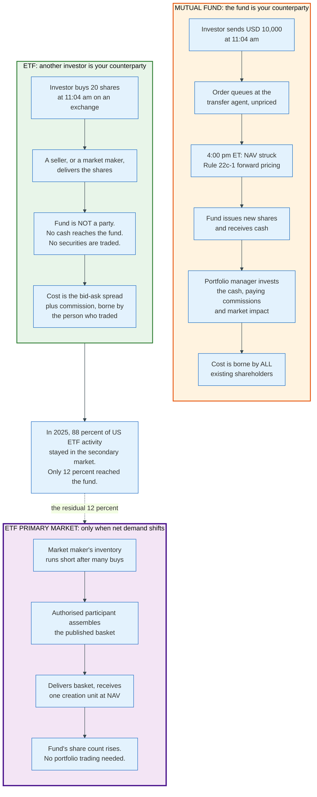

### 3.1 The Consequence Chain

Every practical difference between the two wrappers descends from that one structural fact.

**Pricing.** Rule 22c-1 requires a mutual fund to sell and redeem its shares at the next computed net asset value, which forces a single daily price and forbids intraday dealing. An ETF's exchange price is set by supply and demand and may sit above or below NAV. An ETF investor therefore trades at a known price and an unknown relationship to NAV; a mutual fund investor trades at an unknown price and an exact relationship to NAV.

**Who pays for flow.** When a mutual fund investor buys, the fund invests the cash and every existing shareholder pays the commissions and market impact. When an ETF investor buys, the buyer pays the bid-ask spread and nobody else is affected. Mutual funds mitigate this with redemption fees, swing pricing, and cash buffers. ETFs mitigate it by charging the creation fee to the authorised participant, who prices it into the spread.

**Cash drag.** A mutual fund holds cash to meet redemptions. The ICI's 2025 data show US ETF primary market activity was 12% of total ETF activity, meaning the fund itself only sees flow one time in eight. An ETF can run near-zero cash because the authorised participant delivers securities, not money.

**Minimums and access.** Mutual funds impose investment minimums and can close to new money by refusing subscriptions. An ETF cannot impose a minimum and cannot stop investors buying existing shares from each other, because the fund is not a party to an exchange trade. It can still close to new money at the fund level by suspending creations, which section 7.2 works through.

**Distribution economics.** Mutual funds developed share classes that embed distribution payments, the 12b-1 fee. ETFs generally have one class and pay nothing to intermediaries, so the adviser's compensation is billed separately. The ICI attributes part of the ETF cost advantage directly to this.

**Transparency.** Rule 6c-11 requires an ETF to publish its complete portfolio holdings every business day before its listing exchange opens. A mutual fund files Form N-PORT monthly and discloses publicly on a quarterly lag.

### 3.2 The Comparison Table

| Property | Open-end mutual fund | ETF (open-end, Rule 6c-11) | ETF (unit investment trust) |
|---|---|---|---|
| Statutory basis | Sections 5(a)(1), 22(d), rule 22c-1 | Rule 6c-11, adopted 2019 | Individual exemptive orders |
| Dealing counterparty | The fund | Other investors; APs only in the primary market | Same |
| Price | Next computed NAV | Market-determined, continuous | Market-determined, continuous |
| Minimum dealing size | Dollar minimum set by the fund | One share on-exchange; a creation unit in the primary market | Same |
| Primary market medium | Cash | Securities in kind, plus a cash balancing amount | Securities in kind, exact replication |
| Holdings disclosure | Monthly N-PORT, quarterly public | Daily, before market open | Daily |
| Securities lending permitted | Yes | Yes | No |
| Dividend reinvestment | Immediate | Immediate | Held in a non-interest account until distribution |
| Board and adviser | Yes | Yes | No |
| Can close to new money | Yes | Only by suspending creations | Only by suspending creations |
| Capital gains distributions | Common | Rare for equity funds | Rare |
| Examples | Vanguard 500 Index Fund Admiral | VOO, IVV, VTI, AGG | SPY, QQQ, DIA, MDY |

The unit investment trust column exists because three of the largest ETFs in the world are still built that way, and their structural handicap is measurable. A UIT cannot lend securities, cannot reinvest dividends until the quarterly payment date, and cannot sample. SPY's 0.0945% expense ratio and its uninvested dividend cash are the two reasons its long-run tracking difference against the S&P 500 is worse than IVV's or VOO's at 0.03%.

---

## 4. Key Participants and Roles

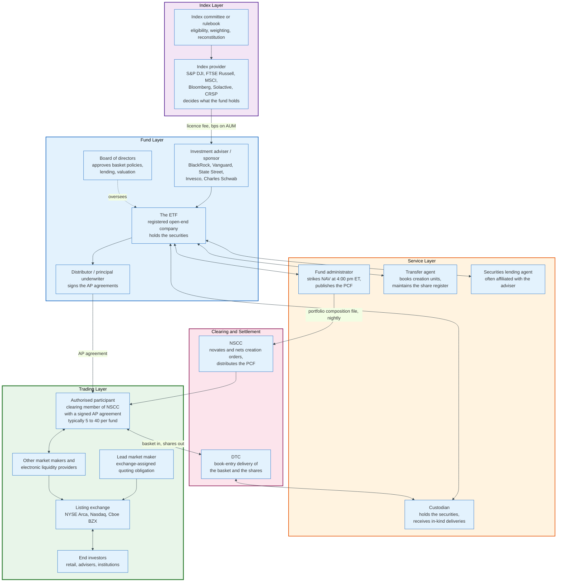

### 4.1 The Actors

| Role | What it does | Holds the securities? | Paid by |
|---|---|---|---|
| **Index provider** | Publishes the rulebook, decides constituents and weights, calculates the index | No | The fund, through a licence fee |
| **Investment adviser** | Runs the portfolio to the index, hires service providers | No | The expense ratio |
| **The fund** | The legal entity that owns the portfolio | Yes | Not applicable |
| **Board of directors** | Approves basket policies, valuation procedures, the lending programme | No | The fund |
| **Distributor** | Statutory underwriter; signs authorised participant agreements | No | The adviser |
| **Custodian** | Holds securities, receives in-kind deliveries, settles baskets | Yes, as bailee | The fund |
| **Fund administrator** | Strikes NAV, builds the portfolio composition file each night | No | The fund |
| **Transfer agent** | Records creation units, maintains the register at DTC | No | The fund |
| **Securities lending agent** | Places loans, manages collateral, indemnifies against borrower default | No | A share of lending revenue |
| **Authorised participant** | Places creation and redemption orders; the only entity that can | No | Nothing; it earns on its own trading |
| **Lead market maker** | Quotes continuously under an exchange obligation | No | Exchange incentive payments and its own spread |
| **Listing exchange** | Lists the shares, runs auctions, enforces LULD | No | Listing fees |
| **NSCC and DTC** | Distribute the composition file, novate and settle creations | No | Transaction fees |

### 4.2 The Two Roles That Actually Determine Whether an ETF Works

**The authorised participant is not paid to keep the price at NAV.** This is the most misunderstood role in the structure. An AP signs an agreement with the fund's distributor and receives no fee, no retainer, and no obligation to act. It is a bank or broker-dealer that happens to be a clearing member of the National Securities Clearing Corporation. It creates or redeems only when doing so is profitable for its own book, and it stops the moment the arbitrage stops paying.

The consequence is structural. There is no backstop. Every ETF prospectus contains a risk factor saying so.

The number of APs per fund varies widely, and the count in the registration statement is a count of signed agreements, not of firms that actually trade. Many funds list twenty or more APs and are served in practice by two or three. Concentration in the primary market is invisible from the outside and is one of the systemic risks regulators keep returning to.

**The index provider decides what the fund buys, and it is barely regulated.** The adviser has no discretion over holdings. When MSCI announced in June 2017 that it would add China A-shares to its emerging market indices, it committed every fund tracking those indices to buy. The EU Benchmarks Regulation, Regulation (EU) 2016/1011, applied from 1 January 2018, is the only major regime that supervises index administrators directly. In the United States, the SEC issued a request for comment in June 2022 asking whether index providers, model portfolio providers and pricing services should be treated as investment advisers. It has not acted.

---

## 5. Creation and Redemption in Kind, Step by Step

Creation and redemption is a securities-for-shares barter between the fund and a dealer, settled through the same clearing plumbing as an ordinary stock trade. It is the only mechanism by which an ETF's share count changes.

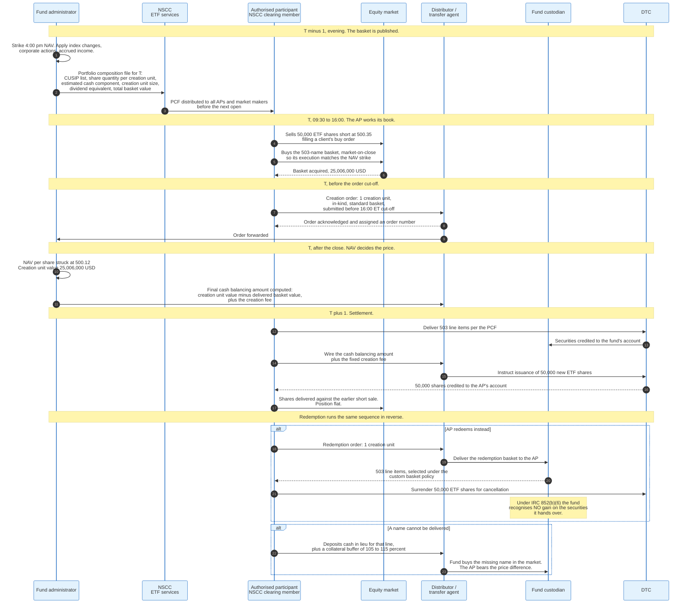

### 5.1 The Sequence in Words

**Step 1: the fund publishes tomorrow's basket.** After the 4pm close, the fund administrator strikes NAV, applies index changes and corporate actions, and produces a portfolio composition file. The PCF is a flat record naming, for one creation unit, every security to be delivered with its CUSIP and share quantity, an estimated cash component, the creation unit size, the accrued dividend equivalent, and the total basket value. It goes to NSCC's ETF services overnight and reaches every authorised participant and market maker before the open. It is also posted on the fund's website, because Rule 6c-11 requires daily portfolio holdings disclosure before the listing exchange opens.

**Step 2: the AP trades all day without touching the fund.** A market maker fills client orders. If buying pressure exceeds selling pressure, it accumulates a short position in the ETF, which it hedges by buying the basket, futures, or a correlated ETF. Nothing has yet happened to the fund.

**Step 3: the AP decides to create.** The decision is arithmetic. If the ETF is trading above the value of the basket by more than the round-trip cost of assembling and delivering it, creation is profitable. The AP submits a creation order to the distributor before the fund's cut-off, which is 4pm Eastern for a domestic equity fund and earlier for funds holding foreign securities whose markets are already closed.

**Step 4: NAV sets the price after the fact.** The AP does not know the price when it orders. Forward pricing applies in the primary market exactly as it does for a mutual fund. The creation unit is priced at that day's NAV, computed after the close. This is why APs execute their basket at the closing auction: it makes the hedge price and the NAV price the same number.

**Step 5: the cash balancing amount squares the difference.** The delivered basket will not be worth exactly the creation unit value, because of rounding, fractional shares, accrued dividends, and any line delivered as cash in lieu. The difference is settled in cash, in either direction. On top of it the AP pays a fixed transaction fee, disclosed in the statement of additional information, usually a few hundred to a few thousand dollars for a domestic equity fund and materially more for international funds where the custodian must move securities across borders.

**Step 6: settlement.** The AP delivers the securities through DTC to the fund's custodian and wires the cash. The transfer agent instructs DTC to credit new ETF shares to the AP's participant account. US equity settlement moved to T+1 on 28 May 2024, so a standard domestic creation settles the next business day. Funds holding foreign securities that still settle T+2 or T+3 run split settlement cycles and price the mismatch into the creation fee.

**Step 7: redemption reverses everything, and this is where the tax happens.** The AP surrenders a creation unit and receives securities. The fund selects which lots to deliver under its board-approved basket policy. Section 13 explains why this step is worth more to a taxable shareholder than the entire expense ratio.

### 5.2 Creation Unit Sizes and Why They Matter

The creation unit size is a policy choice with real consequences.

| Creation unit | Typical fund | Approximate unit value at 2026 prices |
|---|---|---|
| 10,000 shares | Small or newly launched funds | 250,000 to 1,000,000 USD |
| 25,000 shares | Most modern equity and bond ETFs | 1,000,000 to 3,000,000 USD |
| 50,000 shares | Large-cap equity ETFs, SPY | 2,500,000 to 30,000,000 USD |
| 100,000 shares | Some low-priced and money-market-like funds | 2,000,000 to 5,000,000 USD |

A large creation unit reduces the fund's per-unit processing cost and raises the minimum capital an AP must commit. A small creation unit widens the set of firms that can arbitrage the fund and tightens the no-arbitrage band, at the cost of more operational work. Funds launched with 10,000-share units and later raised to 50,000 are the normal path as assets grow.

### 5.3 Custom Baskets, and Why 2019 Changed Everything

Before Rule 6c-11, the ability to accept or deliver a basket that differed from a pro rata slice of the portfolio depended on which exemptive order a fund happened to hold. Funds that received orders in the 2000s generally had it. Funds that received orders after roughly 2012 generally did not, because the SEC staff had stopped granting it. The result was that two identical bond ETFs launched five years apart operated under different rules.

Rule 6c-11 defines a custom basket as either a basket composed of a non-representative selection of the fund's portfolio holdings, or a representative basket that differs from the initial basket used in transactions on the same business day, and permits any 6c-11 ETF to use one provided the fund adopts written policies and procedures that set detailed parameters for construction and acceptance of custom baskets in the best interests of the fund and its shareholders, specify the process for deviating from those parameters, and name the titles or roles of the employees who must review each custom basket for compliance.

The fund must then keep records of every basket exchanged, flagging which were custom, with the ticker symbol, CUSIP or other identifier, description, quantity and percentage weight of every holding in the basket, the cash balancing amount, and the identity of the authorised participant, for five years, the first two in an easily accessible place.

Custom baskets are not a loophole. For a bond ETF they are the only way the mechanism works at all, because delivering a pro rata slice of 3,000 corporate bond CUSIPs, many of which have odd-lot minimums of 1,000 or 2,000 dollars face, is operationally impossible. Section 17 develops this.

---

## 6. The Arbitrage Loop, with a Worked Spread Example

The ETF price tracks net asset value because a profit-seeking dealer converts any gap into shares or securities, and it tracks NAV to within exactly the cost of doing that. The diagram below carries both halves: the loop that closes the gap, and the five things that must hold for it to close at all.

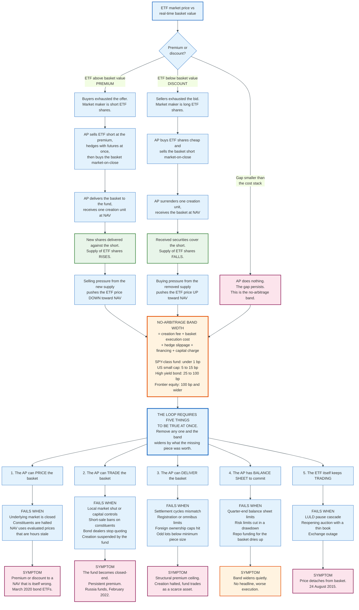

### 6.1 The Worked Example

Take a hypothetical S&P 500 ETF, ticker XYZ. Its creation unit is 50,000 shares. The prior day's NAV was 499.80 per share. A pension fund submits a 25 million dollar buy order at 11:04am.

**The state of the market at 11:04am.**

| Quantity | Value |
|---|---|
| ETF national best bid | 500.34 |
| ETF national best offer | 500.36 |
| Real-time basket value, computed from constituent quotes | 500.10 |
| Premium of the offer over basket value | 0.26 per share, 5.2 basis points |
| Creation unit size | 50,000 shares |
| Creation unit value at basket value | 25,005,000 USD |

**The market maker fills the order and is now short.** It sells 50,000 shares at 500.35, receiving 25,017,500 dollars. It does not own the shares. It has an open short position of 50,000 shares and 25,017,500 dollars of cash.

**It hedges at once, then converts the hedge into the basket at the close.** The desk buys S&P 500 futures against the short at 11:04 and replaces those futures with the physical basket in the closing auction. The two steps do different jobs. The futures hedge removes the market risk of holding a 25 million dollar short for four and a half hours, and a 1% move against an unhedged position costs 250,000 dollars, twenty-five times the entire spread capture. Buying the basket in the closing auction removes the basis between the hedge price and the NAV strike, because NAV is computed from the same official closing prices, and 0.4 basis points of commission and implementation shortfall is a fair charge for that auction. What the AP carries all day is the futures-to-basket basis, not the market.

**The close arrives.** The S&P 500 drifts down slightly and NAV strikes at 500.12.

**The arithmetic.**

| Line | Calculation | Amount, USD |
|---|---|---|
| Proceeds from the short sale | 50,000 × 500.35 | +25,017,500 |
| Basket purchased at closing prices | 50,000 × 500.12 | -25,006,000 |
| Closing auction commission and shortfall, 0.4 bp | 25,006,000 × 0.00004 | -1,000 |
| Fund's fixed creation fee | Disclosed in the SAI | -500 |
| Overnight financing on a T+1 offsetting position | Immaterial | 0 |
| **Net profit on one creation unit** | | **+10,000** |
| **As a percentage of the 25 m deployed** | | **4.0 basis points** |
| **Per ETF share** | 10,000 / 50,000 | **0.20** |

The AP delivers the basket the next morning, receives 50,000 new shares, and delivers them against the short. Its position is flat and it keeps 10,000 dollars.

**What actually happened economically.** The pension fund paid 0.25 per share above the basket value for immediacy. The market maker kept 0.20 of that, spent 0.03 on execution and the creation fee, and gave up 0.02 to the drift between the 11:04 basket value and the closing print. The fund's share count rose by 50,000 and its portfolio grew by 25,006,000 dollars of stock it did not have to buy, at zero cost to existing shareholders.

Nobody was harmed and no existing shareholder paid anything. That is the design.

### 6.2 The Same Loop in Reverse

A discount runs the mirror image. Suppose a large seller pushes XYZ to 499.70 against a basket value of 500.05, a discount of 0.35 or 7.0 basis points. An AP buys 50,000 shares at 499.70 for 24,985,000 dollars, sells the basket short in the closing auction, redeems the creation unit, and covers the short with the securities it receives. If NAV strikes at 500.00, the gross spread is 50,000 × 0.30 = 15,000 dollars, less the same execution costs and redemption fee.

Redemption removes 50,000 shares from the market. Removing supply raises the price. The discount closes.

### 6.3 The No-Arbitrage Band Is the Cost Stack

The ETF does not trade at NAV. It trades inside a band whose half-width equals the AP's round-trip cost, and that cost is the only thing that determines how tight the band is.

| Cost component | Domestic large-cap ETF | Emerging-market small-cap ETF | High-yield bond ETF |
|---|---|---|---|
| Fixed creation fee | 250 to 1,000 USD | 2,000 to 15,000 USD | 500 to 5,000 USD |
| Basket execution and impact | 0.2 to 0.5 bp | 20 to 60 bp | 25 to 75 bp |
| Hedge slippage | Near zero with a closing auction | Large; markets closed at US hours | Large; no continuous hedge exists |
| Financing and capital charge | 1 day | 3 to 5 days across settlement cycles | 2 days |
| Local taxes and stamp duty | 0 | Up to 30 bp in some markets | 0 |
| **Typical observed premium/discount** | **Under 2 bp** | **30 to 150 bp** | **20 to 100 bp** |

This is why the premium and discount statistics that Rule 6c-11 forces every ETF to publish are diagnostic rather than decorative. A fund whose premium exceeds 2% for more than seven consecutive trading days must post a statement to that effect within one business day, explain the factors that contributed, and keep it up for at least a year. That disclosure is a public admission that the arbitrage loop is not closing.

---

## 7. Where the Arbitrage Mechanism Breaks

The arbitrage loop has five separable dependencies, and each one fails in a distinctive way. The section 6 diagram sets them out alongside the loop they hang from, and the subsections below work through each in turn. The mechanism does not degrade gracefully. It works, and then it does not.

### 7.1 The Underlying Market Is Closed

A US-listed ETF holding Japanese equities trades from 09:30 to 16:00 Eastern, while the Tokyo Stock Exchange has been shut since 02:00 Eastern. NAV is struck from Tokyo's closing prices, which are up to fourteen hours old by the time the ETF's US close arrives.

This is not a defect. The ETF price is the more current number, because it embeds everything that has happened since Tokyo closed. The apparent premium or discount is an artefact of comparing a live price to a stale one. Funds manage it with fair value pricing, adjusting foreign closing prices using a vendor model when a trigger threshold in a US market proxy is breached, which reduces the measured gap and introduces a different source of tracking error. Section 11 returns to this.

### 7.2 The Fund Suspends Creation

An ETF can stop issuing new shares, and when it does, the ceiling on its premium disappears. Redemption stays open, so the discount floor holds. The fund becomes a one-way instrument.

The mechanism has fired repeatedly. Commodity funds hit position limits imposed by futures exchanges and stop creating, which is what happened to several natural gas and oil funds in 2020 and 2022. Country funds stop creating when the underlying market shuts. After Russia's invasion of Ukraine in February 2022, the Moscow Exchange closed to foreign participants, Russia-focused ETFs could neither buy nor deliver constituents, creation was suspended, and the funds traded as closed-end vehicles at prices that bore no relation to a NAV nobody could compute.

The generalisation is exact. An ETF is only an open-end fund while the primary market is open. When creation stops, it is a closed-end fund with a stale prospectus.

### 7.3 The Balance Sheet Runs Out

Arbitrage requires capital, and the amount available is not constant. An AP creating a 25 million dollar unit carries the position across settlement, which consumes balance sheet under the leverage ratio. At quarter-end, when banks manage reported balance sheet size, the willingness to warehouse ETF inventory falls and observed premiums and discounts widen. In a drawdown, internal risk limits cut the size of positions a desk may carry, precisely when the arbitrage would be most valuable.

Nothing about this is visible in the fund's disclosures. The band simply widens.

### 7.4 The ETF Stops Trading

If the ETF itself is halted while the basket keeps trading, no arbitrage can occur through the exchange, and the reopening price is set by whatever book has assembled during the pause. Limit Up-Limit Down halts an ETF when its price moves outside a band around a reference price for fifteen seconds. In a fast market this creates a loop: the ETF gaps, halts, reopens into a thin auction, gaps again, halts again. Each reopening starts from a worse reference price than the last.

That loop is the mechanical explanation of 24 August 2015, covered in section 18.

### 7.5 What Does Not Break It

Large redemptions do not break the mechanism, and the arithmetic says why. In 2025 US domestic equity ETFs conducted 8.3 trillion dollars of primary market activity, counting gross creations plus gross redemptions, against 148.1 trillion dollars of company stock traded. Primary market ETF activity was 5.6% of stock trading. In every year from 2016 to 2025 the ratio sat between 4.2% and 6.2%.

The claim that ETF redemptions force fire sales of the underlying assumes the fund is a large fraction of the trading in what it holds. It is not.

---

## 8. Technical Architecture: Files, Cut-offs, and Settlement

The operational machinery of an ETF is a nightly file, a daily order cut-off, and a settlement instruction. Everything else is bookkeeping.

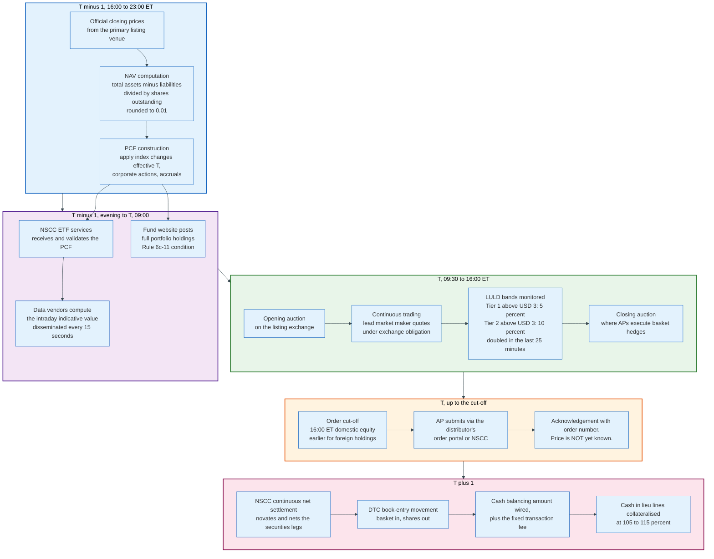

### 8.1 The Portfolio Composition File

The PCF is the single most important artefact in the ETF operating model, and its fields are worth naming precisely.

| Field | Meaning |
|---|---|
| Fund identifier | The ETF's ticker and CUSIP |
| Effective date | The trade date for which this basket applies |
| Creation unit size | Number of ETF shares per unit, typically 25,000 or 50,000 |
| Security identifier | CUSIP, ISIN or SEDOL for each line in the basket |
| Share quantity | Number of shares of that security per creation unit |
| Estimated cash component | The cash amount that squares the basket against the creation unit value |
| Dividend equivalent | Accrued but undistributed income attributable to one creation unit |
| Total basket market value | The sum of the security lines at the prior close |
| NAV per share | The prior day's struck NAV |
| Shares outstanding | Total ETF shares in issue |

The estimated cash component can be negative. When the basket is worth more than the creation unit, the fund pays the difference back to the AP.

### 8.2 The Intraday Indicative Value, and Why It Is Less Important Than It Looks

The intraday indicative value, published every fifteen seconds under a ticker that is usually the fund symbol with a suffix, is a calculation agent's estimate of the basket's current value. It is the number most retail platforms show as "NAV" during the trading day.

It is not required. When the SEC adopted Rule 6c-11 it did not carry over the intraday indicative value condition that prior exemptive orders had imposed, on the view that the value is often computed from stale or non-executable inputs and that professional arbitrageurs do not use it. They compute their own basket value from live executable quotes.

Treat the published indicative value as an indicator of direction and not as a price. For a bond ETF it can be hours old.

### 8.3 Settlement Mechanics

Creations settle through the National Securities Clearing Corporation, which novates and nets the securities legs, and through the Depository Trust Company for book-entry movement. US equities have settled on T+1 since 28 May 2024, which compressed the AP's funding window and made settlement-cycle mismatches sharper for funds holding foreign securities that still settle on T+2.

When an AP cannot deliver a particular line, it posts cash in lieu plus a collateral buffer, typically 105% to 115% of the missing line's value, and the fund buys the security in the market. Any difference between the collateral and the actual purchase price is settled with the AP. This matters most for international funds where local registration or foreign ownership limits make delivery of specific names impossible on a given day.

### 8.4 Exchange Listing and Quoting Obligations

An ETF lists under generic listing standards that avoid the need for a separate rule filing for each fund: NYSE Arca Rule 5.2-E(j)(3) for Investment Company Units, Nasdaq Rule 5705, and Cboe BZX Rule 14.11(c). The ETF share class of a multi-class fund has its own set. The SEC granted accelerated approval on 24 November 2025 to NYSE Arca Rule 5.2-E(j)(9), Nasdaq Rule 5703 and Cboe BZX Rule 14.11(n), each covering Class Exchange-Traded Fund Shares, under Releases 34-104251, 34-104252 and 34-104247, published 28 November 2025. Without them every multi-class ETF would still need its own rule filing.

Each exchange assigns a lead market maker with a continuous two-sided quoting obligation, measured as a percentage of the trading day inside a maximum spread. The exchange pays incentives for tighter quotes in less liquid funds.

Commodity-based trust shares, the structure used by spot crypto products, sat outside those generic standards until 2025. Nasdaq adopted Rule 5711(d), NYSE Arca adopted a new Rule 8.201-E (Generic) and Cboe BZX amended Rule 14.11(e)(4), and the SEC approved all three in one order dated 17 September 2025, Release 34-103995, published 22 September 2025. NYSE and NYSE Texas followed with Rule 8.201 (Generic), approved on 28 January 2026 under Release 34-104723. That change removed the requirement for an individual SEC order for each new crypto ETP and is the direct cause of the launch volumes seen since.

---

## 9. Index Construction Methodologies

An index is a rulebook and a calculation, and the rulebook is where the active decisions live. Two indices covering the same market can differ by several percentage points a year purely on construction.

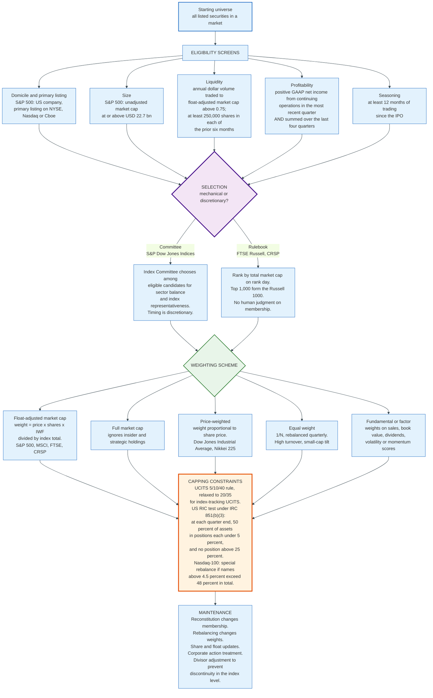

### 9.1 The Two Selection Philosophies

**S&P Dow Jones Indices uses a committee. FTSE Russell uses a rank.** That single difference explains most of the observed behavioural gap between the two families.

S&P's US indices require a company to have its primary listing on the New York Stock Exchange, Nasdaq or Cboe, to be a US company, to have an unadjusted company market capitalisation at or above a published threshold (22.7 billion dollars under the methodology in force, a figure S&P raises periodically as the market grows), to show an annual dollar value traded to float-adjusted market cap ratio above 0.75, to trade at least 250,000 shares in each of the six months before the evaluation date, to report positive GAAP net income from continuing operations in the most recent quarter and summed over the trailing four quarters, and to have traded for at least twelve months since its initial public offering. Meeting those tests makes a company eligible. It does not make it a member. The Index Committee decides, and it decides when.

Tesla is the reference case. It reported its fourth consecutive quarter of GAAP profit in July 2020, which satisfied the earnings test. S&P passed it over at the September 2020 rebalance and announced its addition on 16 November 2020, effective 21 December 2020. The stock roughly doubled between the earnings qualification in July 2020 and the 21 December effective date, rising 118% on split-adjusted closes, and rose 70% in the five weeks between the 16 November announcement and the effective date alone. Every S&P 500 index fund bought it at the top of that move, because the fund's job is to hold what the index holds on the day the index holds it.

FTSE Russell removes the judgment. Every eligible US security is ranked by total market capitalisation on rank day, and the cut-offs fall where they fall. Rank day for 2026 was 30 April 2026. The Russell 1000 spanned 4,849.6 billion dollars at the top to 5.7 billion at the bottom; the Russell 3000 ran from 4,849.6 billion down to 146.4 million.

A rulebook is more predictable and therefore easier to trade against. A committee is less predictable and therefore harder to front-run, at the cost of being an unaccountable discretionary body.

### 9.2 Float Adjustment and the Investable Weight Factor

Float adjustment exists because an index fund cannot buy shares that are not for sale. S&P moved the S&P 500 to full float adjustment in 2005. The mechanism is a multiplier applied to shares outstanding, the Investable Weight Factor, which strips out holdings deemed strategic: shares held by other corporations, by governments, by founders and officers above a threshold, by controlling private shareholders, and shares subject to lock-up or foreign ownership restriction.

A company with 1 billion shares outstanding of which 300 million sit with a founding family has an IWF of 0.70 and enters the index at 70% of its market capitalisation. When a founder sells, the IWF rises and every index fund must buy, without the company having issued a single share.

Float changes are a hidden source of index turnover and one of the reasons a large fund's actual trading is much heavier than its stated low turnover suggests.

### 9.3 The Divisor

An index level is not a portfolio value. It is a portfolio value divided by a divisor, and the divisor is adjusted whenever a change occurs that should not move the index.

The S&P 500 level equals the sum over constituents of price times shares times IWF, divided by the divisor. When a constituent is replaced, the divisor is reset so that the index level immediately before and immediately after the change is identical. The same happens for share issuance, buybacks, spin-offs and rights issues.

The divisor is what makes an index a return series rather than an accounting total. It is also why the index is unaffected by the trading costs its own changes impose on the funds tracking it.

### 9.4 Weighting Schemes and Their Consequences

| Scheme | Rule | Turnover | Bias | Example |
|---|---|---|---|---|
| Float-adjusted market cap | Weight proportional to investable market value | Lowest; weights drift with price | Momentum; concentration in winners | S&P 500, MSCI World, CRSP US Total Market |
| Full market cap | Ignores float | Low | Overweights closely held companies | Some older and some emerging market indices |
| Price-weighted | Weight proportional to share price | Low, but a stock split changes weight | Arbitrary; a 500 dollar stock outweighs a 50 dollar one | Dow Jones Industrial Average, Nikkei 225 |
| Equal weight | 1/N, reset quarterly | High; must sell winners each quarter | Small-cap and value tilt | S&P 500 Equal Weight |
| Fundamental | Weight on sales, cash flow, book value, dividends | Moderate | Value tilt by construction | FTSE RAFI |
| Factor / smart beta | Weight on a scored characteristic | Moderate to high | Whatever the factor is | MSCI Minimum Volatility, momentum indices |

Market-cap weighting has one property no other scheme has: it is the only weighting that requires zero trading in the absence of index changes, because weights update themselves as prices move. Every other scheme requires periodic trading to restore its target weights, and that trading is a cost paid by the fund and not by the index.

### 9.5 Capping, and Why It Became Urgent

Concentration limits are a tax and regulatory constraint, not an investment view, and they bind harder each year that the largest companies grow faster than the rest.

Under the Internal Revenue Code section 851(b)(3), a regulated investment company must satisfy a diversification test at the end of each quarter: at least 50% of assets must sit in cash, government securities and other securities where no single issuer exceeds 5% of the fund's assets and the fund holds no more than 10% of the issuer's voting securities, and no more than 25% of assets may sit in any one issuer. Failing the test costs the fund its pass-through tax treatment.

In Europe the UCITS Directive imposes the 5/10/40 rule: no single issuer above 10% of net assets, and the sum of all issuers above 5% may not exceed 40%. Index-tracking UCITS get a relaxation to 20% per issuer, rising to 35% for a single issuer in exceptional market conditions.

These limits produce capped index variants. When Nasdaq's rule that companies weighing more than 4.5% may not collectively exceed 48% of the index was breached in July 2023, Nasdaq ran a special rebalance of the Nasdaq-100 effective 24 July 2023, redistributing weight away from the largest constituents. Every fund tracking the index traded that morning, for a reason that had nothing to do with any view about any company.

---

## 10. Reconstitution and the Cost of Being Predictable

Reconstitution is the moment an index fund is forced to trade in size on a date everybody knows in advance. It is the single largest scheduled liquidity event in equity markets and the clearest place to observe what indexing costs. FTSE Russell puts approximately 12.2 trillion dollars of assets as benchmarked to the Russell US indexes, and that is the money that has to move when the ranking changes.

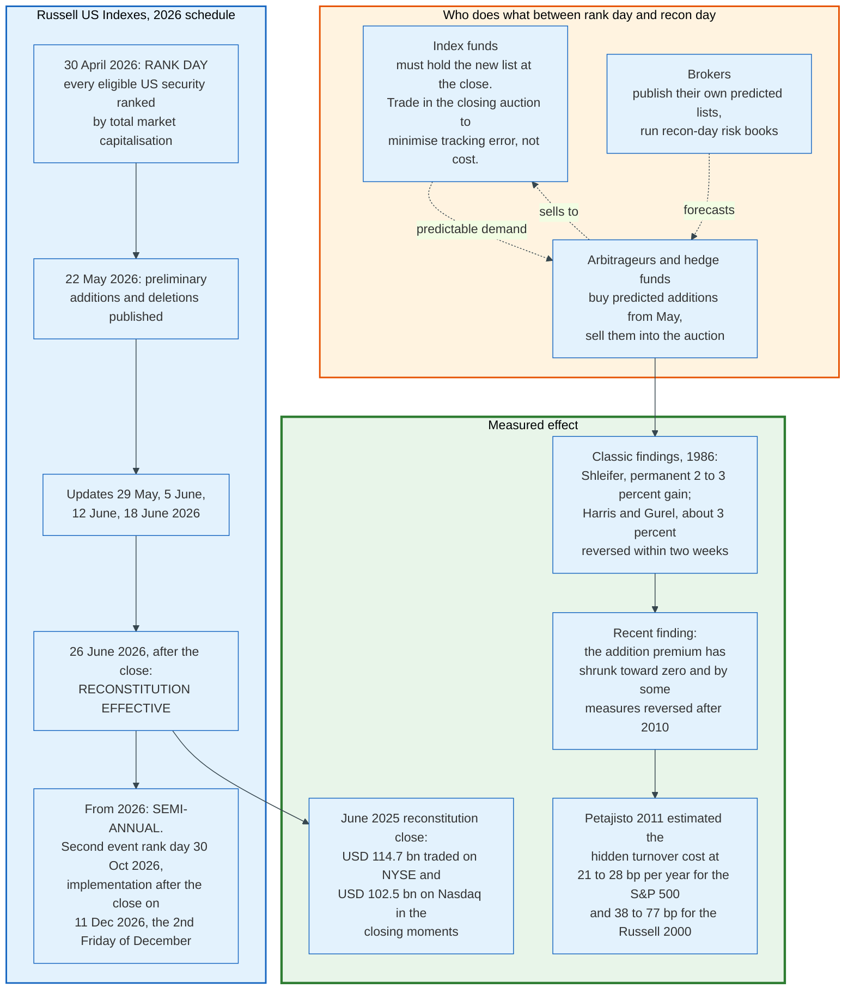

### 10.1 The Mechanics

Reconstitution changes membership. Rebalancing changes weights. The two are separate events and the confusion between them causes real errors.

The S&P 500 rebalances quarterly, on the third Friday of March, June, September and December, updating shares outstanding and float factors. Membership changes happen at any time, announced typically a few business days before the effective date, usually triggered by a merger removing an existing constituent.

The Russell US indices reconstitute on a fixed calendar. Rank day was 30 April 2026, preliminary lists went out on 22 May 2026 with updates on 29 May, 5 June, 12 June and 18 June, and the new indices took effect after the close on 26 June 2026. From 2026 FTSE Russell moved the Russell US indices from an annual to a semi-annual reconstitution. The second event runs on the December leg of the ground rules: rank day on the last business day of October, 30 October 2026; preliminary information four weeks before implementation; a two-week query period; a two-week lock down; and implementation after the close on the second Friday of December, 11 December 2026, effective at the open on the Monday following. The change splits the turnover across two dates without necessarily halving it, because a company that crosses a size boundary and crosses back is now traded twice rather than netted.

The reason index funds trade in the closing auction rather than spreading the order over days is that their objective function is tracking error, not execution cost. A fund that buys an addition over three days before the effective date bears the risk that the stock moves against the index. A fund that buys everything in the closing auction on the effective date has zero tracking error by construction and pays whatever the auction charges. Given a choice between a certain small cost and an uncertain small gain, every index fund takes the certainty.

That preference is what makes the reconstitution close the deepest five minutes on the equity calendar. On the June 2025 Russell reconstitution, 114.7 billion dollars traded in the closing moments on NYSE and 102.5 billion on Nasdaq.

### 10.2 The Index Effect, and Its Disappearance

The classic result is that S&P 500 additions earn an abnormal return of 2% to 3% around announcement, documented independently by Andrei Shleifer and by Lawrence Harris and Eitan Gurel in 1986. The two papers agree on the size of the jump and disagree about what follows it. Shleifer reads the gain as permanent and uses it to argue that demand curves for stocks slope down. Harris and Gurel find the increase of about 3% fully reversed within roughly two weeks and read it as temporary price pressure. Both start from the same premise: index funds create inelastic demand for a fixed supply, and price has to rise to clear.

The effect has largely vanished. Studies of additions after roughly 2010 find abnormal returns near zero and, by some measures, negative. The counterintuitive part is the direction: the index effect shrank as index funds grew.

The mechanism is straightforward once stated. The abnormal return was never a payment to index funds; it was a payment by them, captured by whoever bought the stock first. As indexed assets grew, so did the capital devoted to anticipating index changes, and competition among those anticipators compressed the premium they could extract. S&P also changed behaviour, adding companies that were already widely held rather than obscure ones, and announcing with more lead time.

### 10.3 What It Costs

The cost of predictable trading does not appear in an expense ratio. It appears as tracking difference and as a return the index earns that the fund does not.

Antti Petajisto's 2011 estimate, published in the *Journal of Empirical Finance*, put the hidden turnover cost at 21 to 28 basis points a year for S&P 500 trackers and 38 to 77 basis points a year for Russell 2000 trackers. The Russell number is larger for two reasons that compound: small-cap stocks have wider spreads and thinner books, and the Russell rulebook is fully mechanical, so the trades are perfectly forecastable.

Later work using more recent data finds smaller numbers, consistent with the shrinking index effect. The direction of the estimate is not in dispute; the magnitude is.

Two mitigations are now standard. Funds tracking total-market indices such as CRSP or the Russell 3000 have almost no reconstitution, because a company moving from large to mid capitalisation stays in the fund and merely changes weight. And index providers have added banding and buffer zones so that a company near a cut-off does not oscillate in and out. CRSP's packeting method moves a migrating stock across index boundaries in stages over several months rather than in one trade, explicitly to reduce fund turnover.

---

## 11. Tracking Error and Its Sources

Tracking error and tracking difference are different measurements, and the confusion between them is the most common analytical error in fund selection.

**Tracking difference is the realised gap.** It is the fund's total return minus the index's total return over a stated period. It is a level. It is usually negative, and its expected value is roughly the expense ratio plus trading costs minus lending revenue.

**Tracking error is the volatility of that gap.** It is the annualised standard deviation of the periodic return differences. It is a dispersion. A fund can have a large tracking difference and near-zero tracking error, which is exactly what a well-run index fund with a high fee looks like: it lags by the same amount every day.

An investor choosing a fund cares about tracking difference. A risk manager hedging with it cares about tracking error.

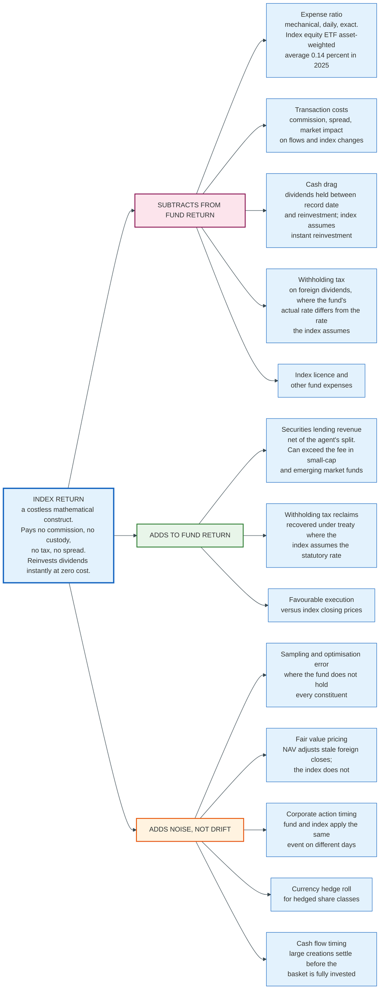

### 11.1 The Arithmetic

Tracking error is computed from the series of return differences. Let d_t be the fund's return minus the index's return in period t. Then:

```
d_t  = r_fund,t - r_index,t

TE   = sqrt( sum over t of (d_t - dbar)^2 / (n - 1) )  x  sqrt(periods per year)

TD   = (product over t of (1 + r_fund,t)) - (product over t of (1 + r_index,t))
```

Two conventions matter and are frequently mismatched in published figures. Some providers compute tracking error from daily returns and some from monthly; daily sampling produces a larger number because it captures intraday timing noise that averages out over a month. And the comparison must be against a total return index that reinvests dividends net of the same withholding rate the fund actually pays, or the result measures the tax treaty rather than the manager.

### 11.2 The Sources, Ranked

**Expense ratio.** Mechanical, accrued daily, and the only source that is exactly predictable. For an index equity ETF the 2025 asset-weighted average was 0.14%.

**Securities lending revenue.** The only reliably positive source. Section 12 covers it.

**Withholding tax.** For a fund holding foreign equities, the index is usually calculated on the assumption of a specific withholding rate on dividends. A fund domiciled somewhere with a better treaty than the index assumes will outperform, and one with a worse treaty will lag. An Irish-domiciled UCITS holding US equities pays 15% US withholding under the US-Ireland treaty. A Luxembourg fund pays 30% on the same dividends because Luxembourg's treaty does not extend the reduced rate to funds in the same way. At a 1.3% dividend yield the difference between 15% and 30% is 19.5 basis points a year, structural and permanent.

**Cash drag.** The index reinvests a dividend the instant it goes ex. The fund receives it on the payment date, which for US equities is typically two to four weeks later, and can only invest it then. In a rising market this costs the fund. A unit investment trust like SPY cannot invest it at all until the quarterly distribution, which is why its long-run tracking difference is worse than its expense ratio alone would predict.

**Sampling error.** A fund tracking an index with 9,000 constituents does not hold 9,000 line items. It holds a stratified or optimised subset chosen to match the index's exposure to size, sector, country, and in the case of bonds, duration and credit quality. Sampling introduces a residual that averages to zero and has non-zero variance. It is the dominant source of tracking error for total-market bond funds and small-cap international funds.

**Fair value pricing.** When a US-listed fund holds securities from a market that has closed, the fund's valuation procedures may adjust foreign closing prices using a vendor model triggered by a move in a US proxy. The index does not adjust. On days the trigger fires, the fund's NAV and the index diverge by construction, and the divergence reverses the following day. This shows up as tracking error without any tracking difference.

**Transaction costs and market impact.** These are paid by the fund and never by the index. Section 10 quantifies the reconstitution component.

### 11.3 Observed Magnitudes

The plain arithmetic is that a US large-cap fund should lag its index by roughly its expense ratio, less lending revenue, and observed figures are close to that. Broad international and emerging market funds run tracking error an order of magnitude larger, driven by sampling, fair value pricing, withholding differences, and local market frictions.

The one case where a fund persistently beats its index is a small-cap or emerging market fund whose securities lending revenue exceeds its expense ratio. That outcome is real and it is not free: it is compensation for lending risk and for the cash collateral reinvestment risk the fund is carrying.

---

## 12. Securities Lending as Fund Revenue

Securities lending converts an index fund's most boring characteristic, that it holds everything and never sells, into a revenue stream. A permanent holder of every stock in a market is the ideal counterparty for anyone who needs to borrow one.

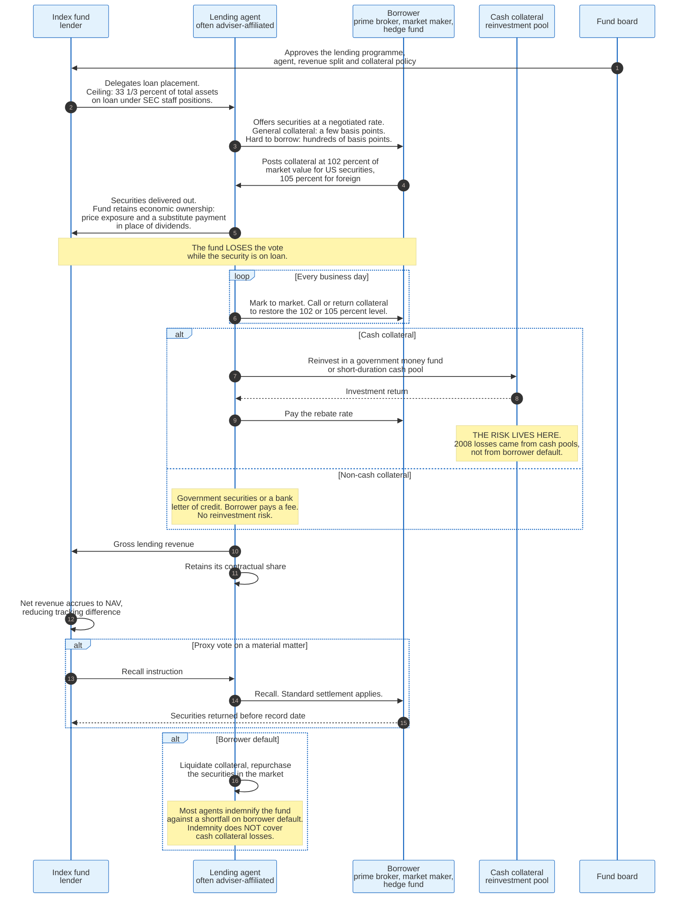

### 12.1 The Economics

The fund lends a security and receives collateral worth more than the security. If the collateral is cash, the fund invests it and pays the borrower a rebate; the spread between what the investment earns and the rebate is the fund's revenue. If the collateral is securities, the borrower simply pays a fee.

Rates span four orders of magnitude. A general collateral name that anybody can borrow rents for a few basis points a year. A stock that is hard to borrow, because short interest exceeds the available float, can rent for hundreds or thousands of basis points, and those are the loans that generate most of the revenue in a broad fund.

An index fund's structural advantage is that it holds the hard-to-borrow names permanently and cannot be forced to sell them by a redemption, because ETF redemptions are met in kind. Its lending inventory is stable in a way an active fund's is not.

### 12.2 The Constraints

| Constraint | Rule | Effect |
|---|---|---|
| Maximum on loan | One-third of total assets, under long-standing SEC staff positions | Caps revenue in a fund with very high demand |
| Collateral level | At least 102% of market value for US securities, 105% for foreign, marked daily | Absorbs an overnight price move against the fund |
| Eligible collateral | Cash, US government securities, bank letters of credit | Excludes equities and corporate bonds |
| Voting | The lender loses the vote while the security is on loan | Requires recall before record dates on material matters |
| Board oversight | The board approves the programme, the agent, and the split | Governance rather than a limit |
| Affiliated agent | Uses an exemptive order or complies with the conditions of section 17 | Most large complexes use an affiliate |
| Disclosure | Form N-CEN reports gross and net lending revenue and the agent's compensation | The split is public, per fund, annually |

### 12.3 The Revenue Split, and the Transatlantic Divide

The revenue split between the fund and the lending agent is the single number that determines whether the programme benefits shareholders or the manager, and the two major jurisdictions handle it in opposite ways.

In the United States, the split is contractual and disclosed. Large complexes with affiliated agents typically credit the fund a substantial majority of gross revenue and retain the balance as compensation for the agent's operational work and its indemnity against borrower default. The exact percentage varies by fund family and by fund, and it is published in each fund's statement of additional information and in Form N-CEN.

In Europe, ESMA's Guidelines on ETFs and other UCITS issues, reference ESMA/2014/937, require that all revenues arising from efficient portfolio management techniques, net of direct and indirect operational costs, be returned to the UCITS. The manager may recover its costs and may not take a profit share. A UCITS ETF's shareholders therefore receive substantially all of the economic benefit, and the manager's incentive to lend aggressively is correspondingly weaker.

Neither approach is obviously better. The US model pays for indemnification that the fund would otherwise have to buy. The European model removes a conflict of interest at the cost of leaving lending capacity underused.

### 12.4 Where the Risk Actually Sits

The risk in securities lending is not that a borrower fails. It is that the cash collateral was invested badly.

Borrower default is well controlled. The collateral exceeds the loan value, it is marked daily, and most agents indemnify the fund against a shortfall. The 2008 losses in securities lending programmes did not come from borrowers failing to return securities. They came from cash collateral pools that had reached for yield in asset-backed commercial paper, structured investment vehicle notes and Lehman debt, and could not be liquidated at par when borrowers wanted their cash back.

Post-crisis practice moved cash collateral into government money market funds and overnight repo, which removed most of that risk and most of the revenue with it.

### 12.5 The Reporting Regime Arriving Now

The SEC adopted Rule 10c-1a on 13 October 2023, Release No. 34-98737, published on 3 November 2023 and effective on 2 January 2024. It requires covered securities loans to be reported to a registered national securities association by the end of the day the loan is effected or modified. FINRA built the reporting facility, the Securities Lending and Transparency Engine. As adopted, reporting begins on the first business day 24 months after the effective date, which is 2 January 2026, and public dissemination follows within 90 calendar days of that, on 2 April 2026. Most data elements are published the next business day; loan amounts are withheld until the twentieth business day after origination, and borrower and lender identities are never public.

The Commission has twice deferred both dates by exemptive order. Release 34-103560 of 28 July 2025 moved the reporting date to 28 September 2026 and the dissemination date to 29 March 2027. Release 34-104303 of 3 December 2025 moved them again, exempting funds and other reporting persons from the reporting date until 28 September 2028 and from Rules 10c-1a(g) and (h)(3) on the dissemination date until 29 March 2029. Nothing is reported in 2026.

The rule release cited an estimated 3.1 trillion dollars of securities on loan globally at the end of September 2021, up from 2.5 trillion a year earlier, with US securities accounting for 58% of the global total.

Until this data flows, nobody outside the agents knows what a fair lending rate is. On the current schedule that is 2029.

---

## 13. Tax Efficiency and What In-Kind Redemption Actually Does

The ETF tax advantage in the United States rests on a single sentence of the Internal Revenue Code, and its effect is commonly described incorrectly.

Section 852(b)(6) reads: "Section 311(b) shall not apply to any distribution by a regulated investment company to which this part applies, if such distribution is in redemption of its stock upon the demand of the shareholder."

Section 311(b) is the general rule that a corporation distributing appreciated property to a shareholder recognises gain as if it had sold the property at fair market value. Section 852(b)(6) switches that rule off for a regulated investment company redeeming its own shares. The fund hands over appreciated stock and recognises nothing.

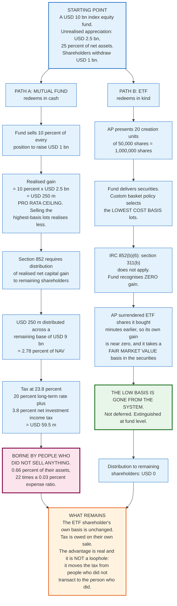

### 13.1 The Worked Example

Take a 10 billion dollar US index equity fund carrying 2.5 billion dollars of unrealised appreciation, which is 25% of net assets. Shareholders withdraw 1 billion dollars.

**As a mutual fund.** The fund sells 10% of every position to raise the cash. It realises 10% of the embedded gain, 250 million dollars. Subchapter M requires a regulated investment company to distribute its realised net capital gain to avoid fund-level tax, so the 250 million is distributed to the shareholders who remain. Against a remaining base of 9 billion dollars, that is a distribution of 2.78% of net asset value. At a combined federal rate of 23.8%, being the 20% long-term capital gains rate plus the 3.8% net investment income tax, the bill is 59.5 million dollars, or 0.66% of the remaining shareholders' assets.

Those shareholders did nothing. They did not sell, they did not ask for anything, and they owe 22 times the annual expense ratio of a 0.03% index ETF in tax.

The 250 million figure is a ceiling rather than a central estimate. It assumes a pro rata sale across every tax lot, and a fund that sells its highest-basis lots first realises less than the pro rata share of the embedded gain. The structural point survives the adjustment. Whatever gain is realised is distributed to shareholders who did not transact, and in the ETF the figure is zero rather than smaller.

**As an ETF.** An authorised participant presents 1,000,000 shares, twenty creation units of 50,000. The fund delivers securities selected under its board-approved custom basket policy, and the policy directs it toward the lowest cost basis lots it holds. Under section 852(b)(6) the fund recognises no gain. The capital gain distribution to remaining shareholders is zero.

### 13.2 Why This Is Not a Deferral

The standard explanation says the ETF defers the gain. It does not. It removes it.

Follow the basis. The AP bought the ETF shares in the market shortly before redeeming, so its basis in those shares is approximately their market value and it recognises approximately no gain on the exchange under section 1001. It receives the securities and takes a basis in them equal to their fair market value at the time of the exchange. The 20 dollar cost basis that sat in the fund is replaced by a 100 dollar cost basis sitting with the AP, which will sell the securities into the market that afternoon and recognise nothing.

The unrealised gain that used to be embedded in the fund is not sitting anywhere waiting to be taxed. It is gone.

What remains is the shareholder's own position. An ETF investor who bought at 300 and sells at 500 pays tax on 200. That has not changed. The ETF structure moves the tax from people who did not transact to the person who did, which is where it should have been all along.

### 13.3 Heartbeat Trades

Because in-kind redemption is what purges low-basis lots, a fund with no net outflow can manufacture the outflow. An authorised participant creates a large block of shares for cash or securities, and a few days later redeems the same block, taking out the lowest-basis lots. The fund's net assets are unchanged. Its embedded gain is lower.

These are called heartbeat trades, after the shape they make in a chart of a fund's shares outstanding. They are legal, they are visible in a fund's creation and redemption records, and they are the reason many large equity ETFs have distributed no capital gain in a decade despite substantial internal turnover from index changes. The aggregate amount of gain purged this way is not published.

### 13.4 The Limits of the Advantage

The in-kind advantage does not exist in five common cases, and marketing rarely says so.

**Cash creations and redemptions.** A fund that transacts in cash realises gains exactly as a mutual fund does. Many commodity funds, currency funds, funds holding markets with delivery restrictions, and some bond funds operate partly or wholly on cash.

**Income, not gains.** Dividends and interest are taxable when received regardless of structure. A bond ETF distributes taxable interest monthly, and its tax profile is close to a bond mutual fund's. The ETF advantage is a capital gains advantage only.

**Loss positions.** A fund with net unrealised losses has nothing to purge, and in-kind redemption of loss lots would waste them. In practice funds deliver appreciated lots and retain depreciated ones, which is why the advantage compounds in bull markets and does nothing after a crash.

**Non-US investors and non-US structures.** Section 852(b)(6) is US law applying to US regulated investment companies. An Irish UCITS ETF is not taxed at fund level on gains at all, so it has no equivalent problem and no equivalent advantage. Investors in the fund are taxed under their own domestic rules.

**Derivative and leveraged funds.** Products that gain exposure through futures or swaps cannot deliver those positions in kind, and futures are marked to market annually under section 1256 with a 60/40 long-term and short-term split regardless of holding period.

---

## 14. Expense Ratio Compression and the Economics of the Business

Index fund fees fell by roughly 80% in twenty-five years, and the decline was not caused by competition among fund managers. It was caused by investors moving into whichever fund was cheapest, which is a different mechanism with different consequences.

### 14.1 The Numbers

The Investment Company Institute publishes asset-weighted average expense ratios, which measure what shareholders actually pay rather than what funds charge.

| Category | 2000 | 2010 | 2020 | 2025 |
|---|---|---|---|---|
| Actively managed equity mutual funds | 1.06% | 0.96% | 0.71% | 0.64% |
| Index equity mutual funds | 0.27% | 0.16% | 0.06% | 0.05% |
| Actively managed bond mutual funds | 0.77% | 0.67% | 0.50% | 0.44% |
| Index bond mutual funds | 0.21% | 0.14% | 0.06% | 0.05% |

| Category | 2017 | 2019 | 2021 | 2023 | 2025 |
|---|---|---|---|---|---|
| Index equity ETFs | 0.21% | 0.18% | 0.17% | 0.16% | 0.14% |
| Index bond ETFs | 0.18% | 0.14% | 0.12% | 0.11% | 0.09% |
| Actively managed equity ETFs | 0.90% | 0.76% | 0.53% | 0.43% | 0.44% |
| Actively managed bond ETFs | 0.48% | 0.40% | 0.39% | 0.34% | 0.33% |

The gap between the two averages of the same thing is where the mechanism shows. The simple average expense ratio of index equity ETFs, meaning the average across every fund offered, was 0.45% in 2025. The asset-weighted average, meaning what shareholders paid, was 0.14%. Investors did not force expensive funds to become cheap. They ignored them.

Index equity mutual funds show the same pattern more starkly: funds in the cheapest quartile held 85% of index equity mutual fund assets at year-end 2025.

### 14.2 Why the Decline Compounds

Three effects reinforce each other, and each of them is a scale effect.

**Scale reduces cost per dollar.** Audit, legal, registration, board, custody and compliance costs are largely fixed. A fund with 100 billion dollars spreads the same absolute cost over a thousand times the base of a fund with 100 million. The ICI reports the average index equity mutual fund held 15.0 billion dollars at year-end 2025 against 2.8 billion for the average actively managed equity fund.

**Scale reduces index licence cost per dollar.** Index providers charge a fee in basis points on assets, usually with caps and minimums. Above the cap, additional assets are free. This is why the largest funds can charge 0.03% and smaller ones cannot.

**Scale reduces the incentive to compete on anything else.** With the product identical, the only variable left is price, and the cheapest fund wins the flow, which makes it larger, which lets it be cheaper.

The endpoint of that loop is visible. Fidelity launched zero-expense-ratio index mutual funds in August 2018, using indices it constructs itself so there is no licence to pay. Several ETFs now run at 0.00% or 0.02%. At those levels the expense ratio is a marketing budget, and the fund's actual economics depend on securities lending revenue, on cash sweep spreads, on cross-selling, and on the value of the assets to the manager's overall franchise.

### 14.3 Where the Money Actually Comes From

An index equity ETF charging 0.03% on 100 billion dollars collects 30 million dollars a year. Against that it pays:

| Cost line | Character | Rough scale |
|---|---|---|
| Index licence | Basis points on assets, capped | Often the largest third-party line |
| Custody and fund accounting | Basis points, sharply tiered | Small at scale |
| Transfer agency | Per-account or per-unit | Very small for an ETF; APs are the only registered holders |
| Audit, legal, registration | Fixed | Immaterial at scale |
| Board compensation | Fixed, allocated across the complex | Immaterial at scale |
| Listing fees | Fixed per fund per exchange | Immaterial at scale |
| Portfolio trading | Not in the expense ratio; borne by the fund | Section 10 |
| Adviser's own cost and margin | The residual | The business |

Two lines that never appear in the ratio matter more than several that do. Portfolio transaction costs are paid out of fund assets and reported separately, not in the expense ratio. And securities lending revenue is credited to the fund and offsets the ratio, which is why some small-cap and emerging market index funds show a tracking difference better than their stated fee.

Vanguard's decision in 2013 to move 22 funds off MSCI benchmarks and onto FTSE and CRSP indices was made explicitly to reduce index licensing cost. Charles Schwab and Fidelity both use indices they either own or licence cheaply. Self-indexing is the structural answer to the largest variable cost in a passive fund, and it moves the index provider's discretion inside the fund manager's own house, which creates the conflict of interest that the SEC's 2022 request for comment on information providers was partly about.

### 14.4 The Launch Economics

Most ETFs never reach the scale at which the arithmetic works, and the industry data show it plainly. In 2025 US sponsors opened 1,233 mutual funds and ETFs and merged or liquidated 685. The 2015 to 2024 annual average for openings was 709.

The fixed cost stack for a single fund, covering registration, audit, board allocation, listing, minimum index licence and basic marketing, is largely independent of assets. A fund charging 0.20% needs assets in the hundreds of millions before that stack is covered. Below that, the sponsor is subsidising the fund from elsewhere in its business or waiting to close it.

The concentration that results is visible in the ICI's data. The five largest fund complexes held 58% of US mutual fund and ETF assets at year-end 2025, up from 35% in 2005. The ten largest held 72%, and the twenty-five largest held 86%.

---

## 15. Synthetic and Swap-Based ETFs

A synthetic ETF does not own what it tracks. It owns something else and swaps that something else's return for the index return with a bank, which introduces a counterparty in exchange for a tracking advantage.

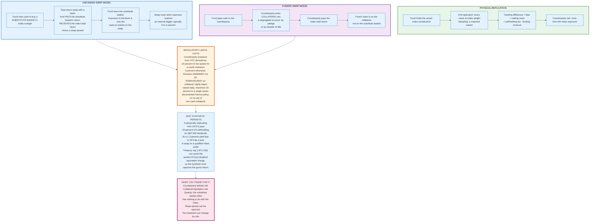

### 15.1 The Two Structures

**Unfunded swap.** The fund takes investor cash and buys a substitute basket of liquid securities that it owns outright. It then enters a total return swap under which it pays the return of the substitute basket and receives the return of the index, less a spread. The fund's exposure to the bank is only the accumulated mark-to-market on the swap, and that exposure is reset to zero when it reaches a trigger level. If the bank fails, the fund still owns the substitute basket.

**Funded swap.** The fund pays cash to the counterparty in return for a promise to deliver the index return. The counterparty posts collateral into a segregated account, either by pledge, which leaves title with the counterparty, or by transfer of title, which puts the assets in the fund's name. The fund's protection is entirely the collateral.

Unfunded is the more common European structure because the substitute basket is a real asset the fund holds, not a claim.

### 15.2 The Regulatory Cage

The UCITS Directive, 2009/65/EC Article 52, caps a fund's counterparty exposure from over-the-counter derivatives at 10% of net assets where the counterparty is a credit institution and 5% otherwise. In practice managers reset swaps at exposure levels far inside that limit, commonly between zero and two percent, because the limit is a hard breach and the reset is cheap.

ESMA's Guidelines on ETFs and other UCITS issues, ESMA/2014/937, tightened the collateral rules after regulators raised concerns about synthetic replication in 2011. Collateral must be sufficiently liquid, valued at least daily, subject to a documented haircut policy, and diversified so that exposure to a single issuer does not exceed 20% of net asset value. Non-cash collateral may not be sold, reinvested or pledged. The guidelines also require an index-tracking UCITS to disclose its anticipated tracking error, to explain any divergence between anticipated and realised tracking error in the annual report, and to describe the factors likely to affect it.

### 15.3 Why It Survives

Synthetic replication lost most of its European market share after 2011, when the Financial Stability Board, the Bank for International Settlements and the International Monetary Fund each published warnings about the structure. It survives in the places where the swap delivers something physical replication cannot.

The clearest case is US equity exposure for a non-US fund. An Irish-domiciled UCITS holding S&P 500 constituents pays 15% US withholding tax on the dividends under the US-Ireland treaty. At a 1.3% dividend yield, that is 19.5 basis points a year of permanent drag, roughly six times the fund's entire expense ratio.

A total return swap referencing the S&P 500 can avoid the dividend equivalent charge under section 871(m) of the Internal Revenue Code, because Treasury regulation 1.871-15(l) exempts derivatives referencing a qualified index, a broad passive index meeting stated conditions. A synthetic S&P 500 UCITS ETF therefore receives something close to the gross total return where its physical competitor receives the net-of-15%-withholding return.

The difference is structural, it is disclosed, and it is the reason synthetic S&P 500 UCITS funds persistently outperform physical ones on tracking difference. It also depends entirely on a tax regulation that could change.

### 15.4 Exchange-Traded Notes Are Not Synthetic ETFs

An exchange-traded note is senior unsecured debt of a bank that promises the return of an index. It holds no assets, has no collateral, and is not a fund. Its investors are unsecured creditors.

Two events define the category. Lehman Brothers issued three Opta ETNs; when the firm failed on 15 September 2008, the notes became unsecured claims in the bankruptcy. And on 5 February 2018, when the VIX index roughly doubled in a day, Credit Suisse's VelocityShares Daily Inverse VIX Short-Term ETN, ticker XIV, hit its acceleration trigger. It had closed at 99.00 on 5 February; Credit Suisse announced acceleration on 6 February and redeemed at 5.99 per note. Investors lost about 94% overnight, and the acceleration clause that produced the outcome was disclosed in the prospectus.

An ETN's tracking is perfect by construction, because the issuer simply promises the number. That perfection is the credit risk.

---

## 16. Leveraged and Inverse Products

A leveraged ETF delivers a multiple of the index's daily return, and it does not deliver a multiple of the index's return over any longer period. That is not a defect, a fee, or a marketing failure. It is the arithmetic of daily compounding, and it is stated on the first page of every prospectus.

```mermaid
%%{init: {'theme': 'base', 'themeVariables': {'primaryColor': '#e3f2fd', 'primaryBorderColor': '#1565c0', 'lineColor': '#37474f'}}}%%

flowchart TB
    Start["TWO-DAY ROUND TRIP<br/>Index starts at 100. Fund starts at 100."]

    Start --> D1["DAY 1: index rises 10 percent<br/>Index 100 to 110<br/>3x fund 100 to 130<br/>Minus-3x fund 100 to 70"]

    D1 --> Reb["AT THE CLOSE THE FUND MUST REBALANCE<br/>3x fund now has 330 of exposure against<br/>130 of equity. Target is 390.<br/>IT MUST BUY 60 MORE.<br/>Minus-3x fund must BUY BACK exposure<br/>to shrink its short. Both trade WITH the move."]

    Reb --> D2["DAY 2: index falls 9.0909 percent<br/>back to exactly 100<br/>3x fund: 130 x 0.727273 = 94.5455<br/>Minus-3x fund: 70 x 1.272727 = 89.0909"]

    D2 --> Res["RESULT AFTER A ZERO ROUND TRIP<br/>Index: 0.00 percent<br/>3x fund: MINUS 5.45 percent<br/>Minus-3x fund: MINUS 10.91 percent<br/>Minus-1x fund: MINUS 1.82 percent"]

    Res --> Long["TWENTY TRADING DAYS<br/>Index alternates plus 5 and minus 5 percent.<br/>Each two-day cycle: index x 0.9975,<br/>3x fund x 0.9775.<br/>After 10 cycles:<br/>index MINUS 2.47 percent<br/>3x times index return = MINUS 7.42 percent<br/>3x fund actual = MINUS 20.35 percent<br/>GAP OF 12.94 PERCENTAGE POINTS<br/>from path alone, in one month."]

    Long --> Formula["THE CLOSED FORM<br/>Expected drag per unit time<br/>= minus (L squared minus L) x sigma squared / 2<br/><br/>L = 2 : 1 x sigma squared<br/>L = 3 : 3 x sigma squared<br/>L = minus 1 : 1 x sigma squared<br/>L = minus 2 : 3 x sigma squared<br/>L = minus 3 : 6 x sigma squared<br/><br/>At 20 percent annualised volatility:<br/>3x loses 12 percent a year to path.<br/>Minus-3x loses 24 percent a year."]

    Formula --> Reg["REGULATORY BOX<br/>Rule 6c-11 covers leveraged and inverse ETFs<br/>only if they comply with Rule 18f-4,<br/>per the 2021 amendment to 6c-11 paragraph c 4.<br/>Rule 18f-4, compliance from 19 August 2022:<br/>relative VaR limit 200 percent of a reference<br/>portfolio, or absolute VaR 20 percent of net assets.<br/>Funds operating above 200 percent as of<br/>28 October 2020 are grandfathered on conditions."]

    style Start fill:#e3f2fd,stroke:#1565c0,stroke-width:2px
    style Reb fill:#fff3e0,stroke:#e65100,stroke-width:3px
    style Res fill:#fce4ec,stroke:#880e4f,stroke-width:2px
    style Long fill:#fce4ec,stroke:#880e4f,stroke-width:3px
    style Formula fill:#e8f5e9,stroke:#2e7d32,stroke-width:2px
```

### 16.1 The Two-Day Arithmetic

Start with an index at 100 and a 3x fund at 100.

Day 1: the index rises 10% to 110. The fund rises 30% to 130.

Day 2: the index falls 9.0909% and returns to exactly 100. The fund falls 27.2727%, three times that, from 130 to 130 x 0.727273 = 94.5455.

The index made nothing. The fund lost 5.45%.

The inverse products are worse in both directions. A minus-1x fund goes to 90 and then to 98.1818, losing 1.82%. A minus-3x fund goes to 70 and then to 89.0909, losing 10.91%.

### 16.2 Why the Fund Must Trade Against Itself

The loss is not a fee. It is the mechanical consequence of the daily reset.

After Day 1 the 3x fund holds 330 of notional exposure against 130 of equity, which is a ratio of 2.54, below its 3.0 target. To restore the target it must hold 390 of exposure, so it buys 60 more at the close. It has just bought after a rise.

If the index then falls, the fund falls on a larger base than it started with. Run the same logic after a loss and the fund sells after a fall, so it participates in a recovery on a smaller base. A leveraged fund buys high and sells low every single day, by design, because that is what maintaining a constant leverage ratio requires.

The trades are large, scheduled at the close, and their direction and approximate size are computable by anyone who knows the fund's assets. The published rebalance is a known order flow, and other participants trade ahead of it.

### 16.3 Twenty Days of a Flat Market

Let the index alternate plus 5% and minus 5% for twenty trading days.

Each two-day cycle takes the index from 100 to 105 to 99.75, a loss of 0.25% per cycle. The second day is a 5% index fall, so the 3x fund falls 15%: it goes from 100 to 115 to 115 x 0.85 = 97.75, a loss of 2.25% per cycle.

After ten cycles the index is at 97.53, down 2.47%. Three times the index return would be minus 7.42%. The 3x fund is at 79.65, down 20.35%.

Nearly thirteen percentage points of divergence in one month, in a market that went almost nowhere.

### 16.4 The Closed Form

For an index following a continuous process with volatility sigma, a fund maintaining leverage L has an expected log-return drag of:

```
drag per unit time  =  - (L^2 - L) * sigma^2 / 2

L = +2   ->  - 1 * sigma^2
L = +3   ->  - 3 * sigma^2
L = -1   ->  - 1 * sigma^2
L = -2   ->  - 3 * sigma^2
L = -3   ->  - 6 * sigma^2
```

At an annualised volatility of 20%, sigma squared is 0.04. A 3x fund loses 12% a year to path dependence, and a minus-3x fund loses 24%. At 30% volatility those become 27% and 54%. The drag scales with the square of volatility, which is why these products decay fastest in exactly the conditions that motivate people to buy them.

Two further costs sit on top: financing on the notional exposure, which rises with short-term rates, and the expense ratio, which for these products is typically 0.90% to 1.20%.

### 16.5 The Regulatory Position

Rule 6c-11 as adopted in 2019 excluded any ETF seeking returns that correspond to a specified multiple of, or an inverse relationship to, an index over a predetermined period. Rule 18f-4 rewrote that exclusion. Paragraph 6c-11(c)(4) now provides that such a fund must comply with all applicable provisions of Rule 18f-4, and the adopting release states that the Commission is allowing leveraged and inverse ETFs satisfying the rule's conditions to operate without the expense and delay of obtaining an exemptive order, and is rescinding the relief previously granted to those funds and their sponsors. Since the 19 August 2022 compliance date a leveraged or inverse ETF sits inside Rule 6c-11, conditional on 18f-4.

The exclusion held from December 2019 to February 2021.

Rule 18f-4, adopted 28 October 2020 as Release IC-34084, signed 2 November 2020 and published 21 December 2020, effective 19 February 2021, with a compliance date of 19 August 2022, replaced the old asset segregation regime of Release 10666 with a value-at-risk framework. A fund must keep its VaR below 200% of the VaR of a designated reference portfolio, or below 20% of net assets on an absolute basis if no suitable reference portfolio exists. That effectively caps new leveraged funds at 2x daily exposure. Funds that were operating above 200% as of 28 October 2020 may continue under grandfather conditions and disclosure obligations.

The SEC's July 2026 request for comment on novel ETFs, Release Nos. 33-11426, 34-105808 and IC-36228, File No. S7-2026-24, explicitly names heightened leverage and single-stock strategies among the categories it is examining. The first US single-stock leveraged ETFs listed in July 2022, applying daily leverage to one company rather than an index, which removes diversification from a product whose principal risk is already path dependence.

### 16.6 What These Products Are For

A leveraged ETF is a correctly engineered tool for a one-day view. It is a defective tool for anything else, and the defect is arithmetic rather than a matter of skill.

Held for one day, a 3x fund delivers close to three times the index move. Held for a month in a choppy market, it delivers something with no stable relationship to the index at all. The prospectus says this. FINRA said it in Regulatory Notice 09-31 in 2009 and has repeated it. The products remain among the highest-turnover securities on US exchanges, which suggests most holders are using them as intended and a minority are not.

---

## 17. Bond ETFs and Liquidity Transformation

A bond ETF trades continuously on an exchange while the bonds it holds trade by appointment in an over-the-counter market where many individual securities do not trade for days. That mismatch is the product's main feature and its main criticism, and both are correct.

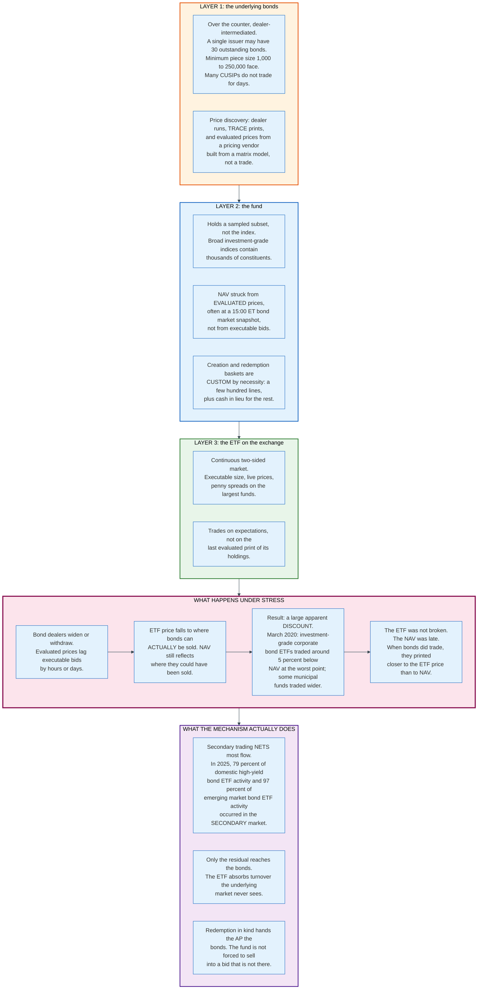

### 17.1 The Scale

US bond ETFs held 2.239 trillion dollars at year-end 2025, 17% of total US ETF assets, and took in 443 billion dollars of net share issuance during 2025, up from 295 billion in 2024. The first US bond ETFs listed in July 2002. Two decades took the category from nothing to the second-largest asset class in the wrapper.

### 17.2 Why the Basket Is Never the Index

A bond index is not a portfolio anyone can hold. A broad investment grade corporate index contains thousands of individual CUSIPs, many issued in sizes too small to allocate across a large fund, many held to maturity by insurers and never offered, and many with minimum trading increments that make a pro rata slice impossible. A fund tracking such an index holds a sampled subset chosen to match the index's duration, credit quality, sector and curve exposure.

The creation basket is smaller still. A bond ETF's published basket typically names a few hundred lines out of a portfolio of thousands, with the balance settled in cash in lieu. This is the custom basket mechanism doing the load-bearing work, and it is why Rule 6c-11's codification of custom baskets in 2019 mattered far more to fixed income than to equities.

### 17.3 The NAV Is the Estimate, Not the Price

This inverts the usual mental model and it is the key to understanding every bond ETF dislocation.

A bond ETF's NAV is struck from evaluated prices supplied by a pricing vendor. An evaluated price is a model output: the vendor observes trades in comparable bonds, dealer runs, and spread relationships, and infers a price for a bond that may not have traded. For a liquid on-the-run Treasury, the evaluated price and the executable price are the same. For a small corporate issue that last traded nine days ago, the evaluated price is an educated guess that updates slowly.

The ETF's exchange price is not a guess. It is where a market maker will actually transact, and that market maker knows what the bonds are currently worth because its own desk is quoting them.

When the two disagree in calm markets, the difference is a few basis points. When they disagree in a crisis, the ETF is the number that is right.

### 17.4 March 2020

Between roughly 9 and 23 March 2020, US corporate bond ETFs traded at large discounts to their published net asset values. Investment grade corporate bond ETFs traded at discounts of around 5% at the worst point, and some municipal bond funds traded wider. Per-fund maxima depend on the exact timestamp used and are not consistently reported across sources.

Two readings competed at the time. The first said the ETF was failing to track and the arbitrage mechanism had broken. The second said the ETF was accurately pricing an asset whose NAV was stale.

The evidence favoured the second. When bonds did trade during that period, they printed closer to the level implied by the ETF than to the prior evaluated NAV. The Federal Reserve announced the Secondary Market Corporate Credit Facility on 23 March 2020, extended it to high yield ETFs on 9 April 2020, and began buying ETF shares on 12 May 2020. The discounts had substantially closed before the first purchase settled, which means the announcement and the return of dealer risk appetite did the work, not the buying.

The lasting operational consequence was different from the market narrative. Portfolio trading, in which a dealer buys or sells a basket of hundreds of bonds in a single risk transaction priced off ETF levels, went from a niche practice to a standard one, because March 2020 proved that a basket of corporate bonds could be priced when individual bonds could not.

### 17.5 The Liquidity Transformation Argument, Honestly Stated

**The concern.** A bond ETF offers daily, intraday liquidity in an asset class where the underlying does not have it. If a large share of holders exit at once, the fund must ultimately deliver bonds, and forced selling into a market with no bid transmits stress from the ETF to the underlying.

**The mitigating facts.** Most exits never reach the fund. In 2025, 79% of domestic high-yield bond ETF activity and 97% of emerging market bond ETF activity took place in the secondary market. Redemptions that do reach the fund are met in kind, so the fund delivers bonds to the authorised participant rather than selling them, and the AP decides when and whether to liquidate. And the ETF discount is itself a governor: a shareholder who exits during stress does so at a price that already reflects the cost of liquidity, so the cost is borne by the seller rather than mutualised across remaining holders.

**What is genuinely unresolved.** The mitigations describe an orderly stress episode. Nobody has observed a disorderly one in this asset class at current scale, because the Federal Reserve intervened in the only test to date. The honest position is that the mechanism performed as designed in March 2020 and that March 2020 was not a full test.

An open-end bond mutual fund faces the same underlying problem with worse tools: it must sell bonds for cash, the cost falls on the shareholders who stay, and there is no market price to warn them. The ETF's daily liquidity is more visible, not more fragile.

---

## 18. The Pricing Dislocations: 2010, 2015, and 2020

Three events define what the ETF structure does when market microstructure fails, and each broke a different link in the chain.

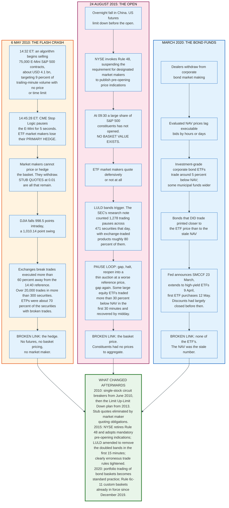

### 18.1 6 May 2010

The flash crash was a futures event that propagated into ETFs through the hedge.

The joint CFTC and SEC report of 30 September 2010 traced the trigger to a large fundamental trader executing a sell program of 75,000 E-Mini S&P 500 contracts, approximately 4.1 billion dollars, through an algorithm set to target 9% of the trailing minute's volume without regard to price or time. Liquidity in the E-Mini evaporated. At 14:45:28 the CME's Stop Logic functionality paused the contract for five seconds.

That pause is the mechanism by which the event reached ETFs. An equity ETF market maker hedges its inventory with index futures, because trading 500 individual stocks in real time is impractical. With the futures halted and the underlying stocks themselves dislocated, the market maker could neither compute a basket value it trusted nor hedge a position it took. The rational response is to withdraw, and what remains in the order book is stub quotes, placeholder bids at a penny that exist only to satisfy quoting obligations.

The DJIA fell 998.5 points intraday with a swing of 1,010.14 points. Exchanges subsequently broke trades executed more than 60% away from the 14:40 reference price: more than 20,000 trades across more than 300 securities. Exchange-traded products accounted for roughly 70% of the securities with broken trades, a share far above their share of listed securities.

**The lesson.** An ETF's price is only as good as its market maker's ability to hedge. Remove the hedge and the ETF is not a basket of stocks; it is whatever the last standing quote says.

### 18.2 24 August 2015

The August 2015 event broke a different link: the ability to compute a basket value at all.

Chinese equities fell overnight and US futures went limit down before the open. NYSE invoked Rule 48, which suspended the requirement for designated market makers to disseminate pre-opening price indications, a rule intended to speed up openings in volatile conditions. The effect was the opposite of what was needed. Openings proceeded without indications, and a substantial share of S&P 500 constituents had not opened at 09:30.

An ETF market maker with no prices for a large fraction of its basket cannot compute a fair value. It quotes wide or it does not quote. Retail market orders and stop-loss orders that had accumulated overnight executed against whatever remained.

Limit Up-Limit Down then converted a bad open into a cascade. The SEC's research note on the day counted 1,278 trading pauses across 471 securities, with exchange-traded products accounting for roughly 80% of them. Each pause ended in a reopening auction with a thin book at a reference price worse than the last, which produced another band breach and another pause. Some large equity ETFs traded more than 30% below their net asset values during the first thirty minutes and had substantially recovered by midday.

**The lesson.** The ETF wrapper transmits microstructure failure faster than the underlying, because an ETF price is a derived quantity and the inputs went missing. The regulatory response addressed the inputs: NYSE retired Rule 48 and adopted mandatory pre-opening indications, and the LULD plan was amended to remove the doubled price bands that had applied in the opening minutes.

### 18.3 March 2020

Section 17 covers the mechanics. The distinguishing feature of March 2020 is that nothing in the ETF broke.

In 2010 the hedge failed. In 2015 the basket price failed. In 2020 the arbitrage mechanism worked, the funds kept creating and redeeming, and the ETF price was the accurate number. What failed was the assumption that a bond fund's published net asset value represents a price at which the bonds could be sold.

**The lesson.** In an asset class where the underlying does not trade continuously, the ETF is a price discovery instrument and the NAV is a lagging estimate. Treating the ETF's deviation from NAV as evidence of an ETF problem inverts the causality.

### 18.4 The Common Thread

All three events share one structure. The ETF's price is derived from the price of what it holds, and the derivation requires three things: current prices for the constituents, a way to hedge, and a functioning market in the ETF itself. Remove any one and the price detaches by exactly as much as the missing piece was worth.

Nothing in any of the three events involved a fund failing to honour a redemption, an authorised participant defaulting, or an ETF failing to deliver its securities. The failures were in market structure, and the ETF was the instrument that displayed them first.

---

## 19. Regulation and Compliance

An ETF is an ordinary open-end fund that cannot operate under the Investment Company Act of 1940 without relief from five of its provisions, and Rule 6c-11 granted that relief by rule in 2019 after twenty-seven years of granting it one fund at a time.

### 19.1 Why an ETF Needs Exemptive Relief

| Provision | What it requires | Why an ETF conflicts |
|---|---|---|
| Section 2(a)(32) | An open-end fund's shares must be "redeemable securities" | An ETF share is redeemable only in creation units, not one at a time |
| Section 5(a)(1) | Defines an open-end company by redeemability | Same problem |
| Section 22(d) and Rule 22c-1 | Shares must be sold and redeemed at the next computed NAV | ETF shares trade at market prices all day |
| Section 22(e) | Redemption proceeds within seven days | Foreign settlement cycles can exceed seven days |
| Sections 17(a)(1) and 17(a)(2) | Prohibit purchases and sales between a fund and its affiliates | An AP that becomes a 5% holder of the fund is an affiliate, and creation is a purchase from the fund |
| Section 12(d)(1) | Limits one fund investing in another | Fund-of-ETF structures. Rule 6c-11 does not address this section at all; Rule 12d1-4, adopted in 2020, does. |

The table lists six provisions and Rule 6c-11 reaches five of them. Paragraph (b)(1) deems an ETF share a redeemable security under section 2(a)(32), which disposes of section 5(a)(1) at the same time. Paragraphs (b)(2), (b)(3) and (b)(4) supply the three operative exemptions: from section 22(d) and Rule 22c-1, from sections 17(a)(1) and 17(a)(2), and from section 22(e). Section 12(d)(1) is untouched by the rule.

The SEC granted the first ETF order to the SPDR trust in October 1992, Investment Company Act Release No. 19055, and then issued more than 300 substantially similar orders over the following quarter century, with terms that drifted as staff views changed. The result was a market where competing funds ran under different rules for reasons of vintage.

### 19.2 Rule 6c-11

The SEC adopted Rule 6c-11 on 25 September 2019, Release Nos. 33-10695 and IC-33646, File No. S7-15-18. It was published in the Federal Register on 24 October 2019 and became effective on 23 December 2019. The prior exemptive orders covering the formation and operation of ETFs were rescinded one year after the effective date, in December 2020, giving funds a transition period.

**Who qualifies.** A registered open-end management company that issues and redeems creation units to and from authorised participants in exchange for a basket and a cash balancing amount, and whose shares are listed on a national securities exchange and trade at market-determined prices.

**Who does not.** Two categories are excluded outright, one was excluded and then readmitted, and one cannot satisfy the conditions. ETFs organised as unit investment trusts are excluded, and so are ETFs organised as a share class of a fund that also issues non-ETF classes; both continue on individual orders. Leveraged and inverse ETFs were excluded when the rule was adopted in 2019 and were brought inside it by the Rule 18f-4 amendment to paragraph (c)(4), conditional on complying with Rule 18f-4 in full. Non-transparent and semi-transparent active ETFs are not excluded by the rule's text but cannot meet its daily portfolio transparency condition, so they run on individual orders too.

**The conditions.**

| Condition | Requirement |
|---|---|
| Portfolio transparency | Disclose complete portfolio holdings each business day on the fund's website, before the opening of trading on the primary listing exchange, in a standardised format |
| Daily website disclosure | The prior business day's NAV, market price, and premium or discount as a percentage of NAV |
| Historical premium and discount | A table and line graph showing premiums and discounts for the most recently completed calendar year and the quarters since |
| Bid-ask spread | The median bid-ask spread over the most recent thirty calendar days, expressed as a percentage of NAV |
| Wide premium disclosure | If premium or discount exceeds 2% for more than seven consecutive trading days, post a statement to that effect and the factors that contributed, within one business day, and keep it posted for at least a year |
| Basket policies | Written policies setting detailed parameters for construction and acceptance of baskets, including custom baskets, in the best interests of the fund and its shareholders |
| Personnel | Specify the titles or roles of employees required to review each custom basket for compliance |
| Recordkeeping | Retain records of every basket exchanged, flagging custom baskets, with the ticker symbol, CUSIP or other identifier, description, quantity and percentage weight of each holding, the cash balancing amount and the identity of the authorised participant, plus AP agreements, for five years, the first two easily accessible |

The rule also amended Form N-1A to require disclosure geared to investors who buy on an exchange rather than from the fund, and amended Form N-CEN to collect ETF-specific data.

**What the rule removed.** Prior orders had required dissemination of an intraday indicative value. Rule 6c-11 does not, on the reasoning that the value is often stale or non-executable and that arbitrageurs compute their own.

### 19.3 The Rest of the US Stack

| Rule or statute | Effect on ETFs |
|---|---|
| **Rule 18f-4**, adopted 28 October 2020 (Release IC-34084, dated 2 November 2020), published 21 December 2020, effective 19 February 2021, compliance 19 August 2022 | Derivatives risk management: relative VaR at 200% of a reference portfolio or absolute VaR at 20% of net assets; limited derivatives user exception below 10% of net assets; rescinded Release 10666 asset segregation |
| **Rule 22e-4**, liquidity risk management | Classification of holdings by days to liquidate, 15% cap on illiquid investments; in-kind ETFs are exempt from parts of it |
| **Rule 10c-1a**, adopted 13 October 2023, published 3 November 2023, effective 2 January 2024 | Securities lending transaction reporting to FINRA's SLATE; two exemptive orders have pushed the reporting date to 28 September 2028 and public dissemination to 29 March 2029 |
| **Form N-PORT** | Monthly portfolio reporting; amendments published 11 September 2024 and effective 17 November 2025 tightened the timing; on 23 February 2026 the SEC proposed rolling that back, adding fifteen days to the monthly filing deadline, restoring quarterly public dissemination, and adjusting reporting for funds with ETF share classes, with comments due 24 April 2026 |
| **IRC section 851(b)(3)** | RIC diversification: quarterly tests at 5%, 10% and 25% |
| **IRC section 852(b)(6)** | Disapplies section 311(b) to in-kind redemptions, the basis of the tax advantage |
| **Exchange Act section 11(d)(1)** | Restricts a broker-dealer from extending credit on a new issue it distributes; APs need relief, granted by class order |
| **Reg M Rules 101 and 102** | Restrict bids by distribution participants; ETFs receive relief |
| **Rule 10b-10**, **Rule 14e-5** | Confirmation and tender offer rules requiring ETF-specific relief |
| **Exchange listing standards** | NYSE Arca Rule 5.2-E(j)(3), Nasdaq Rule 5705, Cboe BZX Rule 14.11(c); NYSE Arca Rule 5.2-E(j)(9), Nasdaq Rule 5703 and Cboe BZX Rule 14.11(n) for Class Exchange-Traded Fund Shares from November 2025; Nasdaq Rule 5711(d), NYSE Arca Rule 8.201-E (Generic) and Cboe BZX Rule 14.11(e)(4) for commodity-based trust shares from September 2025 |

### 19.4 Europe

UCITS is the dominant European wrapper, governed by Directive 2009/65/EC. The differences from the US regime are structural, not cosmetic.

**Diversification is a rule, not a tax test.** The 5/10/40 rule caps single-issuer exposure at 10% of net assets, with the sum of all positions above 5% capped at 40%. Index-tracking UCITS get 20%, rising to 35% for one issuer in exceptional conditions.

**Counterparty exposure is capped at 10%.** Article 52 caps OTC derivative exposure to a single credit institution counterparty at 10% of net assets, 5% for others.

**Securities lending revenue belongs to the fund.** ESMA/2014/937 requires all revenues from efficient portfolio management techniques, net of direct and indirect operational costs, to be returned to the UCITS.

**Tracking error must be disclosed.** The same guidelines require an index-tracking UCITS to state its anticipated tracking error in the prospectus, report realised tracking error in the annual report, and explain any divergence.

**Index providers are regulated.** Regulation (EU) 2016/1011, the Benchmarks Regulation, applied from 1 January 2018 and supervises benchmark administrators directly. There is no US equivalent.

**Domicile is a tax decision.** Ireland and Luxembourg host most European ETF assets. Ireland's advantage is the US-Ireland tax treaty, which reduces US withholding on dividends to 15% from the statutory 30%. For a fund holding US equities, that difference is worth roughly 19.5 basis points a year at a 1.3% dividend yield, which exceeds the fund's entire expense ratio.

### 19.5 What Regulation Does Not Cover

Three things sit outside the regime and are the recurring subjects of consultation papers.

**Authorised participant concentration is not regulated.** No rule requires a minimum number of active APs, requires an AP to act, or discloses how many of a fund's signed APs actually transact.

**Index providers are not supervised in the United States.** The SEC's June 2022 request for comment on whether index providers, model portfolio providers and pricing services act as investment advisers has produced no rule.

**Pricing vendors are not supervised.** A bond ETF's net asset value is a vendor model output, and the vendor is not a regulated entity in the way an adviser is. March 2020 was in substantial part a story about evaluated prices.

---

## 20. The Concentration of Index Ownership

Index funds hold a large share of American equities, and the share held by a very small number of firms is larger still. Both facts are true; only the second is unusual.

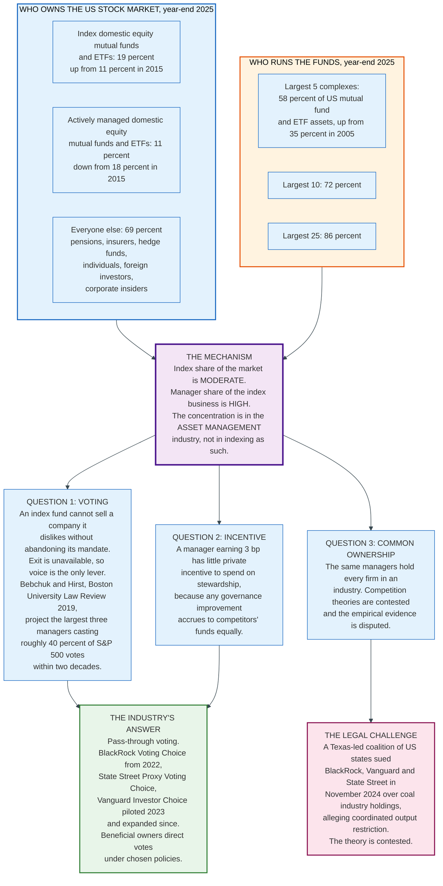

### 20.1 The Numbers, Stated Precisely

Index domestic equity mutual funds and ETFs held 19% of the value of US stocks at year-end 2025, up from 11% at year-end 2015. Actively managed domestic equity mutual funds and ETFs held 11%, down from 18% over the same period. Every other holder, including pension funds, insurers, hedge funds, foreign investors, corporate insiders and individuals holding shares directly, held the remaining 69%.

The commonly repeated claim that index funds own the market is wrong on the arithmetic. What is unusual is not the index share of the market but the manager share of the index business. The five largest fund complexes held 58% of all US mutual fund and ETF assets at year-end 2025, against 35% in 2005. The ten largest held 72% and the twenty-five largest 86%.

Concentration in indexing is an asset management industry phenomenon, and it follows directly from the fee economics in section 14. When the product is identical and the only variable is price, scale wins, and scale is self-reinforcing.

### 20.2 The Governance Problem

The structural difficulty is that an index fund cannot sell. An active manager who disapproves of a board can exit, and the threat of exit is itself a governance mechanism. An index fund that sells a constituent has abandoned its mandate. Exit is unavailable, so voice is the only instrument, and the fund must vote on every proposal at every company it holds every year.

Two consequences follow, and they point in opposite directions.

**The first is power.** Lucian Bebchuk and Scott Hirst, writing in the *Boston University Law Review* in 2019 under the title "The Specter of the Giant Three", projected that the three largest index managers would come to cast roughly 40% of the votes in S&P 500 companies within two decades on then-current growth rates. A block of that size decides contested matters.

**The second is apathy.** A manager charging three basis points has almost no private incentive to invest in stewardship. Research on a portfolio company is expensive, and any improvement in that company's governance raises its share price for every holder, including competing funds that spent nothing. The economics push toward voting with management or with a proxy adviser's recommendation, which converts the block into a rubber stamp rather than an active force.

Both criticisms are internally consistent and they cannot both be the dominant effect.

### 20.3 The Responses

**Pass-through voting** is the industry's structural answer. BlackRock launched Voting Choice in 2022, allowing eligible clients to direct the votes attached to their holdings. State Street offers Proxy Voting Choice. Vanguard piloted Investor Choice in 2023 and has expanded it since. The mechanism moves the vote from the manager to the beneficial owner, or to a policy the owner selects from a menu.

It addresses the concentration criticism directly. Whether it addresses the apathy criticism depends on whether individual investors engage, and the observed take-up rates are low.

**Litigation and antitrust theory** run the other way. In November 2024 a coalition of US states led by Texas sued BlackRock, Vanguard and State Street, alleging that their holdings in coal producers and their engagement on emissions amounted to coordinated output restriction. The common-ownership theory underlying such claims, that firms held by the same diversified owners compete less vigorously, has been argued in economics literature since 2014 and the empirical evidence remains disputed.

### 20.4 The Index Provider Is the Other Concentration

Attention focuses on the fund managers, and the more consequential concentration may sit one layer up.

Three firms, S&P Dow Jones Indices, MSCI and FTSE Russell, publish the benchmarks behind most of the world's indexed equity assets. The fund manager has no discretion; the index provider has all of it. When an index committee changes an eligibility rule, alters a country classification, or adds a share class, every fund tracking the index trades.

The S&P 500 alone had roughly 13 trillion dollars of assets tracking it as of 31 December 2024, and covered about 83% of the total market capitalisation of US public companies with an aggregate market capitalisation above 61.1 trillion dollars as of 31 December 2025.

The decision to include or exclude a company from that index is a decision about the cost of capital, and it is taken by a private committee under a published methodology it may amend. The EU regulates benchmark administrators under Regulation (EU) 2016/1011. The United States does not.

---

## 21. Comparisons and Alternatives

An index exposure can be bought in at least six ways, and the choice is a tax and operational question rather than an investment one.

| Vehicle | Intraday dealing | Tax treatment of fund-level gains | Minimum | Typical all-in cost | Best for |
|---|---|---|---|---|---|
| **Index mutual fund** | No, one NAV a day | Distributed to remaining holders | Dollar minimum set by the fund | 0.02% to 0.05% for US large cap | Retirement accounts, automatic contributions, tax-deferred accounts |
| **Index ETF** | Yes, continuous | Largely eliminated by in-kind redemption | One share | 0.03% plus spread | Taxable accounts, tactical use, intraday needs |
| **Collective investment trust** | No | Not applicable; the plan is tax-exempt | Plan-level | Often below the equivalent mutual fund | Large 401(k) plans only; not available to individuals |
| **Separately managed account / direct indexing** | Yes, via the manager | Owned directly; losses can be harvested individually | Commonly 100,000 USD and up | 0.15% to 0.40% plus trading | Large taxable accounts wanting loss harvesting and customisation |
| **Index futures** | Yes | Section 1256: 60/40 mark to market annually | One contract, margin | Financing spread embedded in the roll | Short horizons, leverage, no cash outlay |
| **Total return swap** | By negotiation | Ordinary income treatment on payments | Institutional | Negotiated spread over a funding rate | Institutions with balance sheet constraints or specific tax positions |

### 21.1 When the Mutual Fund Wins

In a tax-deferred account the ETF's principal advantage is worth nothing, because capital gains distributions inside an individual retirement account or a 401(k) have no tax consequence. What remains is the cost comparison, and there the mutual fund frequently wins: the asset-weighted average index equity mutual fund charged 0.05% in 2025 against 0.14% for the index equity ETF, and a mutual fund purchase incurs no bid-ask spread.

Mutual funds also handle automatic contributions and fractional amounts natively. A 500 dollar monthly contribution buys 500 dollars of a mutual fund exactly. Buying an ETF requires either fractional share support from the broker or a leftover cash balance.

### 21.2 When the ETF Wins

In a taxable account, section 13's arithmetic dominates everything else. A tax cost of up to 0.66% of assets imposed by somebody else's redemptions is an order of magnitude larger than any plausible fee difference.

ETFs also win where intraday execution matters, where the investor wants to use limit orders or options, where the fund is closed to new mutual fund investors, and where the exposure is not available in mutual fund form, which covers most commodity, currency and single-country strategies.

### 21.3 Direct Indexing

Direct indexing replicates an index in a separately managed account, holding the constituents directly rather than through a pooled vehicle. Its one genuine advantage is that a loss in an individual position can be harvested even when the index is up, which a pooled fund cannot do because the shareholder owns one line item.

Its costs are real: management fees several times an ETF's, trading costs on hundreds of positions, wash sale tracking across the household, and a portfolio that becomes progressively harder to unwind as harvested positions accumulate low basis. The break-even depends on the account's tax rate, its expected gains elsewhere, and its time horizon. It is a genuinely better product for a specific and narrow set of accounts, and it is marketed far more broadly than that.

### 21.4 Futures and Swaps

An institution that wants S&P 500 exposure for three weeks generally uses futures, because the position requires only margin and unwinds instantly. The cost is embedded in the roll: the futures price includes an implied financing rate, and when that rate is rich relative to the buyer's own funding cost, the futures position underperforms a cash position by the difference.

A total return swap moves the position off the balance sheet entirely and is negotiated bilaterally, which suits institutions with regulatory capital constraints. Both instruments give up the physical ownership that makes securities lending revenue and dividend withholding reclaims possible.

---

## 22. Modern Developments

### 22.1 ETF Share Classes Arrive in the United States

The most consequential structural change since Rule 6c-11 is the arrival of the multi-class ETF, and it happened in 2025 and 2026.

Vanguard had operated ETF share classes of its index mutual funds since 2001 under a patent that expired in 2023 and an SEC exemptive order that nobody else held. Once the patent lapsed, applications followed. Dimensional Fund Advisors filed on 13 July 2023 and amended on 1 April 2025, 30 May 2025 and 26 September 2025; the SEC issued notice on 29 September 2025 under Investment Company Act Release No. 35770, File No. 812-15484, published on 1 October 2025. A notice under section 6(c) grants nothing. It opens a window for hearing requests, and the Commission issued the order itself on 17 November 2025 under Release No. 35786. A second applicant followed: AB Municipal Income Fund was noticed on 17 December 2025 under Release No. 35834 and received its order on 13 January 2026 under Release No. 35867.

The relief permits a registered open-end fund to offer exchange-traded shares alongside conventional mutual fund shares in the same portfolio. The conditions are governance and monitoring rather than structural: the board must approve the arrangement before launch and annually thereafter, the adviser must produce reports evaluating the benefits, costs and conflicts between classes, and an ongoing monitoring process with numerical thresholds must track portfolio transaction costs, cash levels and capital gains distributions, with notification to the board within 30 days if a threshold is breached.

The listing exchanges cleared the other bottleneck on 24 November 2025, adopting generic listing standards for Class Exchange-Traded Fund Shares so that each new multi-class ETF no longer needs its own rule filing.

The scale of adoption became clear in March 2026. On 17 March 2026 the SEC issued Exchange Act Release No. 34-105028, granting conditional relief from Rules 10b-10 and 14e-5 and Section 11(d)(1) for multi-class ETFs generally, and noted that approximately 100 applications had been filed and that orders had already been issued to more than 48 registered open-end investment companies. NSCC filed a rule change, published on 14 May 2026, to facilitate the exchange of a mutual fund share for an ETF share.

**Why it matters.** A mutual fund with an ETF class shares one portfolio, so in-kind redemptions from the ETF class purge low-basis lots for the whole fund, including the mutual fund shareholders. The economics of section 13 extend to investors who never buy an ETF. The unresolved question is cross-subsidisation: whether the mutual fund class's cash trading costs are being borne by the ETF class or the reverse, which is precisely what the monitoring conditions are designed to detect.

Rule 6c-11 does not cover share class ETFs. They operate on individual orders, exactly as ETFs did before 2019.

### 22.2 Active ETFs

Active ETFs held 2.59 trillion dollars globally at the end of July 2026 with 590 billion dollars of year-to-date net inflows, both records. Within the United States, actively managed ETFs registered under the 1940 Act accounted for 11.1% of ETF total net assets at year-end 2025.

The growth is driven less by demand for active management than by supply. Rule 6c-11's daily portfolio transparency requirement is not a barrier to most fixed income and systematic equity strategies, and the wrapper's tax treatment applies regardless of whether the portfolio tracks an index. A manager converting an existing mutual fund into an ETF keeps the strategy and gains the tax structure.

Where daily disclosure would leak the portfolio, the SEC granted separate relief. Precidian's ActiveShares model was noticed on 8 April 2019 under Investment Company Act Release No. 33440, File No. 812-14405, and ordered on 20 May 2019 under Release No. 33477. It and the semi-transparent proxy-basket models that followed publish a substitute file rather than the holdings, and the arbitrage runs against that file through a confidential account. Those funds operate on individual orders, because Rule 6c-11's transparency condition admits no exception.

The asset-weighted expense ratio of actively managed equity ETFs fell from 0.90% in 2017 to 0.44% in 2025.

### 22.3 Novel Products and the SEC's Response

The SEC published a Request for Comment on Novel ETFs on 2 July 2026, Release Nos. 33-11426, 34-105808 and IC-36228, File No. S7-2026-24, with a 60-day comment period. It names crypto assets, commodity-focused instruments, single-stock strategies, heightened leverage, blockchain-enabled strategies, private assets and event contracts.

The questions it asks are foundational rather than technical. Whether a fund investing primarily in non-securities is an investment company under the Act at all. Whether Rule 6c-11's portfolio conditions and arbitrage assumptions still hold for such products. Whether the automatic effectiveness periods of 75 and 60 days under Rule 485 give the staff enough time when filings arrive in rapid succession and first-mover advantage drives the pace.

The release cited an ETF market of over 12 trillion dollars and over 4,600 funds at the end of 2025, against over 4 trillion dollars and almost 1,900 funds in 2019.

The immediate cause of the volume was a listing rule change. On 17 September 2025 the SEC approved in a single order Nasdaq Rule 5711(d), a new NYSE Arca Rule 8.201-E (Generic) and an amended Cboe BZX Rule 14.11(e)(4), creating generic listing standards for commodity-based trust shares and removing the need for an individual SEC order for each spot crypto product. NYSE and NYSE Texas adopted matching standards under Rule 8.201 (Generic) on 28 January 2026.

### 22.4 Operational Changes

**T+1 settlement.** US securities moved to a one-day settlement cycle on 28 May 2024. For ETFs holding only US securities the change is neutral. For funds holding foreign securities that still settle T+2, the mismatch between the ETF's settlement and the basket's settlement is now one day wider, and the funding cost sits with the authorised participant, who prices it into the creation fee and the spread.

**Portfolio trading in fixed income.** March 2020 demonstrated that a basket of hundreds of corporate bonds could be priced as a unit when individual bonds could not. Dealers now routinely quote whole portfolios in a single risk transaction, priced off ETF and index levels. The ETF's pricing mechanism has propagated backwards into the cash bond market.

**Securities lending transparency.** Rule 10c-1a reporting through FINRA's SLATE has been deferred by exemptive order to 28 September 2028, with public dissemination from 29 March 2029. When it starts, a fund board negotiating a revenue split will see market rates for the first time. Until then it negotiates against the agent's own numbers.

### 22.5 Where This Is Heading

Four directions are visible and reasonably safe to state.

**The wrapper decouples from the strategy.** Once a share class can be an ETF, the choice between mutual fund and ETF stops being a choice about the product and becomes a choice about the distribution channel. Expect the share class structure to become standard for large index complexes within a few years.

**Fees stop falling because they cannot.** At 0.03% on a core equity index, the remaining reduction is one basis point. Competition moves to securities lending revenue sharing, to tax management, and to distribution.

**The index provider layer attracts regulatory attention.** The EU already supervises benchmark administrators. The SEC has asked the question and not answered it. The combination of self-indexing by large managers and the market power of the three big providers makes the current position hard to sustain.

**Concentration keeps rising, and the policy response is voting rather than structure.** No jurisdiction has proposed limiting a manager's share of an index market. Every proposal on the table addresses who casts the votes attached to the shares, which is a narrower question than the one the data raise.

---

## 23. Appendix

### 23.1 Key Terminology

| Term | Meaning |
|---|---|
| **Arbitrage band** | The range around net asset value inside which an ETF can trade without the arbitrage being profitable. Its half-width is the authorised participant's round-trip cost. |
| **Authorised participant (AP)** | A clearing member of NSCC with a written agreement permitting it to place creation and redemption orders. It has no obligation to act. |
| **Basket** | The securities, assets or other positions exchanged for a creation unit. |
| **Cash balancing amount** | The cash that squares the value of a delivered basket against the value of a creation unit. |
| **Cash in lieu** | Cash deposited in place of a security the AP cannot deliver, plus a collateral buffer of typically 105% to 115%. |
| **Creation unit** | A specified block of ETF shares, commonly 25,000 or 50,000, that the fund issues or redeems in a single transaction. |
| **Custom basket** | A basket composed of a non-representative selection of the fund's portfolio holdings, or a representative basket that differs from the initial basket used in transactions on the same business day. Permitted under Rule 6c-11 subject to written policies and recordkeeping. |
| **Divisor** | The denominator that converts an index's aggregate constituent value into an index level. Adjusted so that membership and share changes do not move the level. |
| **Evaluated price** | A pricing vendor's model estimate of a security's value, used to strike NAV where the security has not traded. Standard in fixed income. |
| **Float adjustment** | Reducing a constituent's index weight to reflect only shares available to public investors. |
| **Heartbeat trade** | A creation followed within days by a redemption, used to purge low-basis lots without net flow. |
| **In-kind redemption** | Delivery of securities rather than cash in exchange for surrendered ETF shares. Exempt from gain recognition under IRC 852(b)(6). |
| **Intraday indicative value** | A calculation agent's estimate of basket value, published every 15 seconds. Not required by Rule 6c-11. |
| **Investable Weight Factor (IWF)** | The multiplier applied to shares outstanding to produce float-adjusted shares in S&P's methodology. |
| **LULD** | Limit Up-Limit Down. The national market system plan that pauses a security for five minutes when its price sits outside a band for fifteen seconds. |
| **NAV** | Net asset value. Total assets less liabilities divided by shares outstanding, struck once per business day after the close. |
| **Portfolio composition file (PCF)** | The nightly file naming every security and quantity in one creation unit, plus the cash component and creation unit size. |
| **Premium / discount** | The percentage by which an ETF's market price exceeds or falls short of its NAV. |
| **Primary market** | Creations and redemptions between the fund and authorised participants. 12% of US ETF activity in 2025. |
| **Rebalancing** | Changing constituent weights within an index. Distinct from reconstitution. |
| **Reconstitution** | Changing index membership. For Russell US indices, semi-annual from 2026. |
| **Rule 6c-11** | The SEC rule, effective 23 December 2019, that lets qualifying ETFs operate without an individual exemptive order. |
| **Rule 18f-4** | The derivatives rule, compliance date 19 August 2022, imposing VaR limits of 200% relative or 20% absolute. |
| **Sampling** | Holding a matched subset of an index rather than every constituent. Universal in fixed income. |
| **Secondary market** | Exchange trading of ETF shares between investors. 88% of US ETF activity in 2025. |
| **Section 852(b)(6)** | The Internal Revenue Code provision disapplying section 311(b) to in-kind redemptions by a regulated investment company. |
| **SLATE** | FINRA's Securities Lending and Transparency Engine, the reporting facility built for Rule 10c-1a. |
| **Stub quote** | A placeholder bid or offer far from the market, posted to satisfy a quoting obligation. Eliminated after May 2010. |
| **Synthetic replication** | Obtaining index exposure through a total return swap rather than by holding constituents. |
| **Tracking difference** | The realised gap between fund return and index return over a period. A level. |
| **Tracking error** | The annualised standard deviation of periodic return differences. A dispersion. |
| **UCITS** | Undertakings for Collective Investment in Transferable Securities. The EU fund framework under Directive 2009/65/EC. |
| **Unit investment trust (UIT)** | A fund structure with no board and no adviser, used by SPY, QQQ, DIA and MDY. Cannot lend securities or reinvest dividends immediately. |
| **Volatility decay** | The path-dependent loss in a constant-leverage fund, equal to (L squared minus L) times sigma squared over 2 per unit time. |

### 23.2 Architecture Diagrams

| Diagram | Source | Description |
|---|---|---|
| Evolution Timeline | [`diagrams/evolution-timeline.mmd`](diagrams/evolution-timeline.mmd) | From the 1960 academic proposal to 23.11 trillion dollars in July 2026 |
| Mutual Fund vs ETF | [`diagrams/mutual-fund-vs-etf.mmd`](diagrams/mutual-fund-vs-etf.mmd) | The structural difference and its consequence chain |
| Participants | [`diagrams/participants.mmd`](diagrams/participants.mmd) | Index, fund, service, trading and clearing layers and how they connect |
| Creation and Redemption | [`diagrams/creation-redemption.mmd`](diagrams/creation-redemption.mmd) | The full in-kind sequence from PCF publication to settlement |
| Arbitrage Loop and Its Failure Modes | [`diagrams/arbitrage-loop.mmd`](diagrams/arbitrage-loop.mmd) | Premium and discount paths, the no-arbitrage band, the five dependencies, and the symptom when each one fails |
| ETF Architecture | [`diagrams/etf-architecture.mmd`](diagrams/etf-architecture.mmd) | The nightly file, the daily cut-off, and T+1 settlement |
| Index Construction | [`diagrams/index-construction.mmd`](diagrams/index-construction.mmd) | Eligibility screens, selection philosophy, weighting and capping |
| Reconstitution Flow | [`diagrams/reconstitution-flow.mmd`](diagrams/reconstitution-flow.mmd) | The 2026 Russell calendar, who trades when, and the measured cost |
| Tracking Error Sources | [`diagrams/tracking-error-sources.mmd`](diagrams/tracking-error-sources.mmd) | What subtracts, what adds, and what only adds noise |
| Securities Lending | [`diagrams/securities-lending.mmd`](diagrams/securities-lending.mmd) | Loan, collateral, reinvestment, recall and default paths |
| Tax Efficiency | [`diagrams/tax-efficiency.mmd`](diagrams/tax-efficiency.mmd) | The worked comparison between cash and in-kind redemption |
| Synthetic ETF Swap | [`diagrams/synthetic-etf-swap.mmd`](diagrams/synthetic-etf-swap.mmd) | Physical, unfunded swap and funded swap structures with UCITS limits |
| Leveraged Decay | [`diagrams/leveraged-decay.mmd`](diagrams/leveraged-decay.mmd) | The two-day round trip, the twenty-day path, and the closed form |
| Bond ETF Liquidity | [`diagrams/bond-etf-liquidity.mmd`](diagrams/bond-etf-liquidity.mmd) | Three layers of liquidity and what happens to each under stress |
| Dislocations Timeline | [`diagrams/dislocations-timeline.mmd`](diagrams/dislocations-timeline.mmd) | 2010, 2015 and 2020 compared by which link broke |
| Index Ownership | [`diagrams/index-ownership.mmd`](diagrams/index-ownership.mmd) | Market share, manager concentration, and the governance questions |

### 23.3 Reference Table: The Regulatory Stack

| Instrument | Citation | Date | Effect |
|---|---|---|---|
| ETF Rule | Rule 6c-11, Releases 33-10695 and IC-33646, File S7-15-18 | Adopted 25 Sep 2019; effective 23 Dec 2019 | Lets qualifying ETFs operate without individual orders |
| Derivatives Rule | Rule 18f-4, Release IC-34084, File S7-24-15 | Adopted 28 Oct 2020 (release dated 2 Nov 2020); published 21 Dec 2020; effective 19 Feb 2021; compliance 19 Aug 2022 | VaR limits; rescinds Release 10666; amends 6c-11(c)(4) to bring leveraged and inverse ETFs inside the ETF rule |
| Securities Lending Reporting | Rule 10c-1a, Release 34-98737, File S7-18-21 | Adopted 13 Oct 2023; published 3 Nov 2023; effective 2 Jan 2024 | Loan-level reporting to FINRA SLATE |
| Deferral of 10c-1a dates | Releases 34-103560 and 34-104303 | 28 Jul 2025 and 3 Dec 2025 | Reporting exempt until 28 Sep 2028; dissemination until 29 Mar 2029 |
| Multi-Class ETF Notice | IC Release 35770, File 812-15484 | Notice 1 Oct 2025 | ETF share classes of mutual funds |
| Multi-Class ETF Exchange Act Relief | Release 34-105028 | 17 Mar 2026 | Relief from 10b-10, 14e-5, section 11(d)(1) |
| Request for Comment on Novel ETFs | Releases 33-11426, 34-105808, IC-36228, File S7-2026-24 | Published 2 Jul 2026 | 60-day comment period on crypto, leverage, private assets |
| RIC diversification | IRC 851(b)(3) | Standing | Quarterly 5%, 10% and 25% tests |
| In-kind redemption | IRC 852(b)(6) | Standing | Disapplies section 311(b) |
| UCITS framework | Directive 2009/65/EC | Standing | 5/10/40 rule; 10% OTC counterparty limit |
| ETF and UCITS guidelines | ESMA/2014/937 | Consolidated 2014 | Tracking error disclosure; lending revenue net of costs to the fund; collateral rules |
| Benchmarks Regulation | Regulation (EU) 2016/1011 | Applied 1 Jan 2018 | Supervises index administrators |

### 23.4 Reference Table: Scale Figures and Their Dates

| Figure | Value | Date | Source |
|---|---|---|---|
| Global ETF assets | 23.11 trn USD | End-July 2026 | ETFGI |
| Global ETF YTD net inflows | 1.71 trn USD | End-July 2026 | ETFGI |
| European ETF assets | 3.80 trn USD | End-July 2026 | ETFGI |
| Active ETF assets, global | 2.59 trn USD | End-July 2026 | ETFGI |
| US ETF net assets | 13.373 trn USD | Year-end 2025 | ICI |
| Number of US ETFs | 4,495 | Year-end 2025 | ICI |
| US bond ETF assets | 2.239 trn USD | Year-end 2025 | ICI |
| Large-cap US equity ETF assets | 5.027 trn USD | Year-end 2025 | ICI |
| US ETF net share issuance | 1.468 trn USD | Calendar 2025 | ICI |
| ETF share of US stock trading volume | 28% average, 42% max on 7 Apr | Calendar 2025 | ICI |
| ETF secondary market share of ETF activity | 88% | Calendar 2025 | ICI |
| Domestic equity ETF primary market activity | 8.3 trn USD, 5.6% of stock traded | Calendar 2025 | ICI |
| Index funds as share of long-term fund assets | 52% | Year-end 2025 | ICI |
| Index domestic equity fund share of US market cap | 19% | Year-end 2025 | ICI |
| Largest 5 fund complexes' share of assets | 58% | Year-end 2025 | ICI |
| Funds opened / merged or liquidated | 1,233 / 685 | Calendar 2025 | ICI |
| S&P 500 aggregate market capitalisation | 61.1 trn USD, about 83% of US public company market cap | 31 Dec 2025 | S&P DJI |
| Assets tracking the S&P 500 | About 13 trn USD | 31 Dec 2024 | S&P DJI |
| Russell reconstitution closing auction volume | 114.7 bn USD NYSE, 102.5 bn USD Nasdaq | June 2025 recon | FTSE Russell |
| Assets benchmarked to the Russell US indexes | About 12.2 trn USD | Ground rules v7.2, Aug 2026 | FTSE Russell |
| Next Russell reconstitution after June 2026 | Rank day 30 Oct 2026, effective after the close 11 Dec 2026 | 2026 | FTSE Russell ground rules |
| Global securities on loan | 3.1 trn USD, 58% US securities | End-Sep 2021 | SEC Release 34-98737 |

### 23.5 Reference Table: Common Misreadings

| Claim frequently made | What is actually true |
|---|---|
| "An ETF's liquidity is its average daily volume" | Its liquidity is the liquidity of its basket plus the cost of creation. A thin-volume ETF on a deep basket absorbs size at a few basis points. |
| "ETF redemptions force fire sales in the underlying" | Domestic equity ETF primary market activity was 5.6% of US stock trading in 2025, and has stayed between 4.2% and 6.2% since 2016. |
| "In-kind redemption defers the fund's capital gain" | It extinguishes it. The AP takes a fair-market-value basis and the low basis leaves the system. |
| "Index funds are passive" | The index provider makes discretionary decisions. The fund executes them without discretion. |
| "Index funds own the stock market" | Index domestic equity funds and ETFs held 19% of US market capitalisation at year-end 2025. |
| "The ETF was broken in March 2020" | The ETF price was accurate and the evaluated NAV was stale. Bonds that traded printed nearer the ETF price. |
| "A 3x ETF gives 3x the index return" | It gives 3x the daily return. Over 20 days of a plus-5, minus-5 alternating path, the index fell 2.47% and the 3x fund fell 20.35%. |
| "ETFs are always cheaper than mutual funds" | The asset-weighted index equity mutual fund charged 0.05% in 2025 against 0.14% for the index equity ETF. |
| "Rule 6c-11 covers all ETFs" | It excludes unit investment trusts and share class ETFs. Leveraged and inverse ETFs were excluded in 2019 but were brought inside the rule by the Rule 18f-4 amendment, conditional on complying with 18f-4. Non-transparent active ETFs cannot meet the transparency condition. |
| "Authorised participants are obliged to keep the price near NAV" | They have no obligation of any kind. They act when it is profitable. |

---

## 24. Key Takeaways

**1. The index is the idea and the wrapper is the machine.** Index funds and ETFs implement the same portfolio rule. Every practical difference between them, from tax to liquidity to cost, descends from one structural fact: a mutual fund transacts with its shareholders and an ETF does not.

**2. The arbitrage loop is a cost calculation, not a guarantee.** An ETF trades inside a band whose half-width equals the authorised participant's round-trip cost: creation fee, basket execution, hedge slippage, financing, capital. That is under two basis points for an S&P 500 fund and can exceed a hundred for frontier equity or distressed credit. Nobody is obliged to close the gap.

**3. In-kind redemption eliminates the fund's capital gain rather than deferring it.** IRC 852(b)(6) disapplies section 311(b), the fund recognises nothing, and the authorised participant takes a fair-market-value basis in the securities it receives. A 10 billion dollar fund with 25% embedded gain that meets a 1 billion dollar redemption in cash hands its remaining shareholders a taxable distribution of up to 250 million dollars, roughly 0.66% of their assets in tax at the pro rata ceiling and less where the fund selects high-basis lots. In kind, it hands them nothing at all.

**4. Fees fell because investors moved, not because managers competed.** The simple average index equity ETF charged 0.45% in 2025 and the asset-weighted average was 0.14%. Expensive funds were not disciplined into cheapness. They were ignored, and 685 funds were merged or liquidated in 2025 against 1,233 opened.

**5. Reconstitution is where indexing pays for being predictable.** Index funds trade in the closing auction because their objective is tracking error, not execution cost. The June 2025 Russell reconstitution moved 114.7 billion dollars on NYSE and 102.5 billion on Nasdaq in the closing moments. The classic 2% to 3% index addition premium has largely vanished, because the capital devoted to anticipating index changes grew faster than the changes did.

**6. Securities lending is the only reliably positive contributor to tracking difference, and its risk is in the collateral.** Borrower default is over-collateralised at 102% or 105%, marked daily, and usually indemnified. The 2008 losses came from cash collateral pools that had bought structured credit. Europe requires all net lending revenue to go to the fund; the United States permits a negotiated split.

**7. Leveraged funds decay at a rate equal to (L squared minus L) times variance over two.** A 3x fund at 20% annualised volatility loses 12% a year to path alone, and a minus-3x fund loses 24%. Over twenty days of a plus-5, minus-5 alternating market, the index fell 2.47% and a 3x fund fell 20.35%. This is arithmetic, it is disclosed, and it makes these products correct for one day and wrong for a month.

**8. Every ETF dislocation to date has been a market structure failure displayed through the ETF, not an ETF failure.** In 2010 the futures hedge disappeared and market makers withdrew, leaving stub quotes; exchange-traded products were about 70% of the securities with broken trades. In 2015 NYSE's Rule 48 left constituents unopened, so no basket value existed, and 1,278 LULD pauses cascaded across 471 securities. In 2020 the ETF price was right and the evaluated NAV was stale.

**9. For a bond ETF, the exchange price is the observation and the NAV is the estimate.** Corporate bond NAVs are built from vendor models, not from trades. When investment grade bond ETFs traded around 5% below NAV in March 2020, the bonds that actually traded printed nearer the ETF. Portfolio trading, in which dealers price hundreds of bonds as one risk transaction, is the market's adoption of that insight.

**10. The concentration worth worrying about is in fund management and in index provision, not in indexing itself.** Index domestic equity funds held 19% of US market capitalisation at year-end 2025. The five largest fund complexes held 58% of all US fund and ETF assets, and three index providers publish the benchmarks behind most of the world's indexed money. The EU regulates benchmark administrators. The United States has asked the question since 2022 and not answered it.

**11. The wrapper is decoupling from the strategy.** By March 2026 the SEC had granted multi-class ETF orders to more than 48 fund companies with about 100 applications on file, and had issued class relief under the Exchange Act. Once an ETF can be a share class, choosing between mutual fund and ETF stops being a product decision and becomes a distribution decision, and the tax mechanism of section 13 extends to shareholders who never buy an ETF.

**12. Nobody is obliged to make any of this work.** Authorised participants have no duty to create or redeem. Market makers can withdraw. Index providers can change a rule. The system holds together because the arbitrage is usually profitable, and the three dislocations in this document are the record of what happens in the intervals when it is not.

---

*Figures in this document are drawn from regulator filings, index provider methodologies, and industry statistics available as of August 2026. Asset totals for a market growing at this rate move monthly; the ratios and mechanisms are stable, the individual figures are not. Where a figure is disputed or unpublished, the text says so rather than supplying a number.*
