# Options and Derivatives: Complete Technical Deep Dive

---

## Table of Contents

1. [History and Overview](#1-history-and-overview)
2. [What a Derivative Actually Is (and Is Not)](#2-what-a-derivative-actually-is-and-is-not)
3. [The Four Contract Families](#3-the-four-contract-families)
4. [Payoff Structures and How They Compose](#4-payoff-structures-and-how-they-compose)
5. [Key Participants and Roles](#5-key-participants-and-roles)
6. [Exchange-Traded Versus Over-the-Counter](#6-exchange-traded-versus-over-the-counter)
7. [The Life of an Options Trade, Step by Step](#7-the-life-of-an-options-trade-step-by-step)
8. [Black-Scholes, Derived in Plain Terms](#8-black-scholes-derived-in-plain-terms)
9. [The Assumptions, and How Each One Is Violated](#9-the-assumptions-and-how-each-one-is-violated)
10. [The Greeks, With a Worked Number Each](#10-the-greeks-with-a-worked-number-each)
11. [Implied Volatility and the Volatility Smile](#11-implied-volatility-and-the-volatility-smile)
12. [Put-Call Parity and the Arbitrage Bounds](#12-put-call-parity-and-the-arbitrage-bounds)
13. [Binomial Trees and Monte Carlo](#13-binomial-trees-and-monte-carlo)
14. [Market Making, Delta Hedging, and Gamma Exposure](#14-market-making-delta-hedging-and-gamma-exposure)
15. [Clearing: The OCC and Novation](#15-clearing-the-occ-and-novation)
16. [Margin: SPAN, STANS, and Their Successors](#16-margin-span-stans-and-their-successors)
17. [Exercise, Assignment, and Expiry Mechanics](#17-exercise-assignment-and-expiry-mechanics)
18. [Open Interest Versus Volume](#18-open-interest-versus-volume)
19. [Zero-Day Options](#19-zero-day-options)
20. [Money Flow and Economics](#20-money-flow-and-economics)
21. [Regulation and Compliance](#21-regulation-and-compliance)
22. [The Derivatives Losses That Became Case Law](#22-the-derivatives-losses-that-became-case-law)
23. [Comparisons and Alternatives](#23-comparisons-and-alternatives)
24. [Modern Developments](#24-modern-developments)
25. [Appendix](#25-appendix)
26. [Key Takeaways](#26-key-takeaways)

---

## 1. History and Overview

The modern options market dates from a single month in 1973, when three things that had existed separately arrived together: a standardised contract, a central guarantor, and a formula that produced a price. Before that month, an option was a bespoke agreement between two named parties with no secondary market and no protection if the writer failed. After it, an option became a fungible instrument that anyone could buy, sell, and hedge.

The formula is the part everyone remembers. The clearing house is the part that made the market possible.


```mermaid
%%{init: {'theme': 'base', 'themeVariables': {'primaryColor': '#e3f2fd', 'primaryBorderColor': '#1565c0', 'lineColor': '#37474f'}}}%%

timeline
    title From bespoke contracts to 66% zero-day flow
    section Pre-history
        1848 : Chicago Board of Trade founded, forward contracts on grain
        1865 : CBOT standardises contracts and requires margin deposits
        1930s-1960s : US options traded bespoke through the Put and Call Brokers and Dealers Association, no secondary market
    section The 1973 convergence
        Apr 1973 : CBOE opens 26 April in the former CBOT smoking lounge, 16 underlying stocks, calls only, 34,599 contracts in the first month
        1973 : Black and Scholes publish "The Pricing of Options and Corporate Liabilities"; Merton publishes "Theory of Rational Option Pricing"
        1973 : CBOE Clearing Corporation founded to clear the only listed options market then existing
    section Build-out
        1975 : Renamed The Options Clearing Corporation as AMEX, PHLX and PSE begin listing options
        1977 : Puts listed on US exchanges
        1979 : Cox, Ross and Rubinstein publish the binomial model
        1981 : IBM and the World Bank execute the first widely cited currency swap
        1985-1987 : ISDA founded, publishes the Swaps Code then the first master agreement
        1988 : CME develops SPAN, the first portfolio margin engine for derivatives
        Jan 1993 : VIX launched, built by Robert Whaley on S&P 100 options
    section Model stress
        Oct 1987 : Crash; the equity index volatility smile appears and never leaves
        1994-1998 : Orange County, Procter and Gamble, Barings, LTCM
        2003-2004 : VIX restated on S&P 500 options; VIX futures launch
        2006 : OCC replaces TIMS with STANS, a Monte Carlo margin engine
    section Post-crisis rebuild
        2009 : G20 Pittsburgh commits to central clearing and reporting of OTC derivatives
        2010 : Dodd-Frank Title VII
        2012 : EMIR; OCC designated a systemically important financial market utility in July
        2016-2022 : SPX expirations extended to every trading day
    section Now
        2022-2026 : Zero-day options become the majority of SPX volume, 66.2% in July 2026
        2025-2026 : Intraday margin charges, extended trading hours, cleared binary options
```

### 1.1 Before 1973 the Contract Was a Promise

Derivatives predate exchanges by millennia, and every early one carried the same defect: the counterparty could refuse to pay. Mesopotamian clay tablets record forward delivery agreements. Japanese rice merchants traded forward claims at Dojima in Osaka from the late seventeenth century. The Chicago Board of Trade, founded in 1848, standardised grain contracts in 1865 and required both sides to post a margin deposit, which is the first appearance of the mechanism that still underwrites the whole industry.

Options came later and stayed bespoke. In the United States they traded through the Put and Call Brokers and Dealers Association: a buyer told a broker what strike and expiry they wanted, the broker found a writer, and the two parties held paper until expiry. There was no standard contract, so there was no secondary market. There was no clearing house, so the buyer of a call carried the writer's credit risk for the life of the contract.

An instrument that cannot be resold is not a market. It is a series of private bets.

### 1.2 April 1973 Fixes All Three Problems at Once

The Chicago Board Options Exchange opened on 26 April 1973, founded by the Chicago Board of Trade and housed in the CBOT's former smoking lounge. It listed calls on 16 underlying stocks. Trading in the first month reached 34,599 contracts.

Three design choices made it work. Contracts were standardised on a fixed grid of strikes and expiry dates, so any two contracts on the same series were identical and therefore fungible. The Options Clearing Corporation was created in the same year to stand between every buyer and every seller, which removed the writer's credit from the buyer's calculation. And Fischer Black and Myron Scholes published "The Pricing of Options and Corporate Liabilities" in the Journal of Political Economy in 1973, with Robert Merton publishing "Theory of Rational Option Pricing" in parallel, giving market makers a way to quote a price that was consistent across strikes and expiries.

Standardisation created liquidity. Clearing removed counterparty risk. The model gave the market a language.

Scholes and Merton shared the 1997 Nobel Memorial Prize in Economic Sciences for the model. Black had died in 1995 and the prize is not awarded posthumously.

### 1.3 The Over-the-Counter Market Grows Up in Parallel

While the listed market standardised, the bespoke market industrialised, and its solution to counterparty risk was documentation rather than clearing. The first widely cited currency swap, between IBM and the World Bank, executed in 1981. The International Swaps and Derivatives Association was founded in 1985, published the Swaps Code that year, produced the first standardised master agreement for interest rate swaps in 1987, and revised it in 1992 and again in 2002 after the Peregrine collapse and the Russian default exposed weaknesses in the close-out mechanics.

The ISDA Master Agreement does the job the OCC does for listed options, by contract rather than by novation. All transactions between two parties form a single agreement, so a default on one transaction permits termination and netting across all of them. Collateral moves under a Credit Support Annex.

Two solutions to the same problem. One uses a balance sheet, the other uses a contract.

### 1.4 Scale Today

Two measures size this market and they do not convert into each other. The listed market is counted in contracts traded, because its contracts are created and destroyed continuously. The over-the-counter market is counted in notional outstanding, because its contracts sit on both balance sheets until they mature.

| Measure | Value | As of |
|---------|-------|-------|
| **US listed options industry ADV** | 72,838 thousand contracts | Q2 2026 |
| US listed options industry ADV, prior year | 57,203 thousand contracts | Q2 2025 |
| **Cboe total options ADV** | 21,862 thousand contracts | Q2 2026 |
| Cboe index options ADV | 6,208 thousand contracts | Q2 2026 |
| Cboe multi-listed options ADV | 15,654 thousand contracts | Q2 2026 |
| Cboe US options market share | 30.0% | Q2 2026 |
| **SPX zero-day share of total SPX volume** | 66.2% | July 2026 |
| SPX 0DTE ADV, quarterly record | 3.1 million contracts | Q2 2026 |
| Cboe revenue per contract, all options | $0.317 | Q2 2026 |
| Cboe revenue per contract, index options | $0.953 | Q2 2026 |
| **OTC derivatives notional amounts outstanding** | $844.578 trillion | end-December 2025, BIS |
| OTC derivatives gross market value | $22.802 trillion | end-December 2025, BIS |
| OTC derivatives gross credit exposure | $3.351 trillion | end-December 2025, BIS |
| OTC interest rate derivatives notional | $669.545 trillion | end-December 2025, BIS |
| OTC equity-linked derivatives notional | $11.933 trillion | end-December 2025, BIS |

At 72.838 million contracts a day and roughly 250 trading days, the US listed options market runs at about 18.2 billion contracts a year. That is arithmetic on the reported daily figure, not a reported annual total.

Industry volume grew 27.3% year on year between Q2 2025 and Q2 2026. Cboe's index options revenue per contract, at $0.953, is three times its blended rate of $0.317, which is the entire reason index options matter commercially: proprietary products carry no competing venue and therefore no fee competition.

The over-the-counter market is measured in notional outstanding rather than contracts traded, and the Bank for International Settlements publishes those figures semiannually, most recently on 15 May 2026 for positions at end-December 2025. Notional outstanding was $844.578 trillion. Gross market value, the sum of the current replacement costs of every contract, was $22.802 trillion, or 2.70% of notional. Gross credit exposure, gross market value after legally enforceable netting, was $3.351 trillion, or 14.7% of gross market value and 0.40% of notional. Interest rate contracts carry $669.545 trillion of the notional, four fifths of the total; equity-linked contracts carry $11.933 trillion.

Three numbers, two orders of magnitude apart. Only the third one is money.

---

## 2. What a Derivative Actually Is (and Is Not)

A derivative is a contract whose payoff is computed from the value of something else. What changes hands at inception is not the underlying asset but an obligation defined against it.

That sentence contains the entire category. Everything else is detail about which obligation, and how the loser is made to pay.

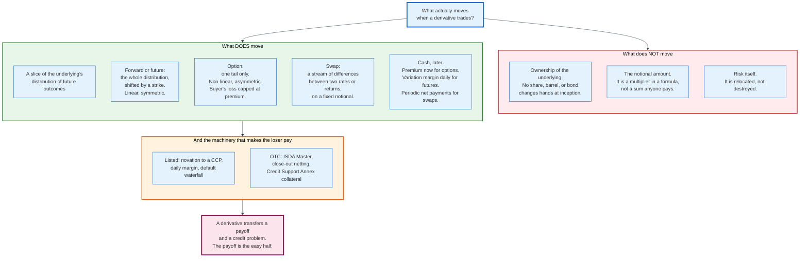
```mermaid
%%{init: {'theme': 'base', 'themeVariables': {'primaryColor': '#e3f2fd', 'primaryBorderColor': '#1565c0', 'lineColor': '#37474f'}}}%%

flowchart TB
    Q["What actually moves<br/>when a derivative trades?"]

    subgraph NOT["What does NOT move"]
        direction TB
        N1["Ownership of the underlying.<br/>No share, barrel, or bond<br/>changes hands at inception."]
        N2["The notional amount.<br/>It is a multiplier in a formula,<br/>not a sum anyone pays."]
        N3["Risk itself.<br/>It is relocated, not destroyed."]
    end

    subgraph DOES["What DOES move"]
        direction TB
        D1["A slice of the underlying's<br/>distribution of future outcomes"]
        D2["Forward or future:<br/>the whole distribution,<br/>shifted by a strike.<br/>Linear, symmetric."]
        D3["Option:<br/>one tail only.<br/>Non-linear, asymmetric.<br/>Buyer's loss capped at premium."]
        D4["Swap:<br/>a stream of differences<br/>between two rates or returns,<br/>on a fixed notional."]
        D5["Cash, later.<br/>Premium now for options.<br/>Variation margin daily for futures.<br/>Periodic net payments for swaps."]
    end

    subgraph MECH["And the machinery that makes the loser pay"]
        direction TB
        M1["Listed: novation to a CCP,<br/>daily margin, default waterfall"]
        M2["OTC: ISDA Master,<br/>close-out netting,<br/>Credit Support Annex collateral"]
    end

    Q --> NOT
    Q --> DOES
    DOES --> MECH

    Insight["A derivative transfers a payoff<br/>and a credit problem.<br/>The payoff is the easy half."]
    MECH --> Insight

    style Q fill:#e3f2fd,stroke:#1565c0,stroke-width:3px
    style NOT fill:#ffebee,stroke:#b71c1c,stroke-width:2px
    style DOES fill:#e8f5e9,stroke:#2e7d32,stroke-width:2px
    style MECH fill:#fff3e0,stroke:#e65100,stroke-width:2px
    style Insight fill:#fce4ec,stroke:#880e4f,stroke-width:3px
```

### 2.1 The Three Components

Every derivative specifies an underlying, a payoff function, and a settlement convention. Change any one and the instrument is different.

**The underlying** is the observable the payoff reads from. It can be a security, a rate, an index level, a commodity price, a credit event, a volatility measure, or another derivative. It does not have to be tradeable. A weather derivative reads from a temperature index that nobody can buy, which means it cannot be replicated by hedging and must be priced on actuarial rather than arbitrage grounds.

**The payoff function** maps the underlying to a cash amount. Linear for forwards, futures and swaps. Piecewise linear for vanilla options. Discontinuous for binaries. Path-dependent for barriers, Asians, and lookbacks.

**The settlement convention** decides whether the payoff is delivered as the underlying itself or as cash. US listed equity options deliver 100 shares. US listed index options deliver cash equal to the index difference times a multiplier, because delivering the S&P 500 is not possible.

### 2.2 What a Derivative Actually Transfers

A derivative transfers a defined slice of the distribution of the underlying's future value, and nothing else.

A forward transfers the whole distribution, shifted so that the buyer receives every dollar above the strike and pays every dollar below it. A call option transfers only the upper tail: the buyer receives everything above the strike and pays nothing below it, having paid the premium for that asymmetry. A put transfers the lower tail. A swap transfers the difference between two streams, which is a sequence of small forwards bundled into one contract.

The slice is the product. The premium is its price.

This framing explains why a portfolio of options is a statement about the shape of a distribution rather than a bet on direction. A long straddle is a position that pays when the distribution is wider than the market priced, in either direction. A short butterfly pays when the distribution is fatter in the wings than the market priced. Neither is a directional view.

### 2.3 Misconception One: Notional Is the Amount at Risk

Notional is a reference quantity used to scale a payoff formula. It is not a sum anyone pays, lends, or can lose.

The clearest illustration is Hammersmith and Fulham London Borough Council in 1989. The council had total borrowings of approximately 390 million pounds and interest rate swap positions with a notional principal of 6,052 million pounds. Nobody had lent the council 6,052 million pounds. The notional was the number the swap formula multiplied a rate difference by. What the council could actually lose was the accumulated present value of those rate differences, which was large but nothing like the notional.

Three figures matter, and they differ by orders of magnitude. Notional is the reference quantity: $844.578 trillion across the OTC market at end-December 2025. Gross market value is the sum of the current replacement costs of all contracts: $22.802 trillion, 2.70% of notional. Gross credit exposure is gross market value after legally enforceable netting: $3.351 trillion, 14.7% of gross market value and 0.40% of notional.

Headlines quote notional. Risk managers quote the third number.

### 2.4 Misconception Two: An Option Is Leveraged Stock

An option is a position in direction, volatility, and time simultaneously. Treating it as leveraged stock ignores two of the three.

Take the worked example carried through this document: a stock at $100.00, a 30-day call struck at $100.00, a risk-free rate of 4.00%, no dividend, and an implied volatility of 25%. The Black-Scholes price is $3.021141 per share, $302.11 per 100-share contract.

Buy that call and hold it one day with the stock unchanged at $100.00. The option is now worth $2.967734. The position lost $0.053407 per share, $5.34 per contract, on a day the stock did not move. Nothing went wrong. Time passed.

Buy the same call and hold it one day while implied volatility falls from 25% to 24%, with the stock unchanged. The option loses roughly $0.114 per share to volatility on top of the $0.053 to time. The stock is at $100.00, the trader was right about direction in the sense of not being wrong, and the position is down 5.5%.

Leverage on stock has one factor. An option has at least three.

### 2.5 Misconception Three: Derivatives Create Risk

Derivatives relocate risk and can concentrate it in places nobody is watching. They do not manufacture it.

The distinction matters because the standard critique and the standard defence are both wrong. A farmer who sells a wheat future has not created price risk; the risk existed the moment the seed went in the ground, and the future moved it to a speculator who wants it. A bank that buys credit protection on a loan has not created default risk; it has moved it to the protection seller.

What derivatives do create is opacity. Archegos Capital Management held equity exposure through total return swaps, contracts in which the bank owns the shares and pays the client the return. Each prime broker saw its own book. None saw the aggregate. When margin calls arrived on 26 March 2021, the forced liquidation cost Credit Suisse $5.5 billion, Nomura $2.85 billion, Morgan Stanley $911 million, UBS $774 million, and Mitsubishi UFJ Financial Group $300 million.

The swap did not create the concentration. It hid it.

### 2.6 Misconception Four: Options Are Insurance

Options resemble insurance in payoff shape and differ from it in the one respect that matters legally: indemnity.

An insurance contract pays on a loss the policyholder actually suffered, and the insurer requires an insurable interest. An option pays on a price, whether or not the holder owns the underlying. That difference is why options are securities or commodity interests rather than insurance products, why they can be traded by parties with no exposure to the underlying, and why the volume of protection can exceed the amount of the thing being protected.

The gross notional of credit default swaps referencing a given issuer routinely exceeds that issuer's outstanding debt. No insurance regulator would permit the equivalent.

### 2.7 The Simplest Accurate Mental Model

A derivative is a bet on a number, plus machinery that makes the loser pay.

The bet is priced by replication where replication is possible and by supply and demand where it is not. The machinery is margin, clearing, and documentation. Sections 8 through 14 of this document cover the bet. Sections 15 through 17 cover the machinery. Section 22 covers what happens when the machinery is absent.

---

## 3. The Four Contract Families

Four contract shapes account for the overwhelming majority of derivatives outstanding: forwards, futures, options, and swaps. They differ on three axes: whether the payoff is an obligation or a right, whether the credit risk sits with a counterparty or a clearing house, and whether the payoff settles once or repeatedly.

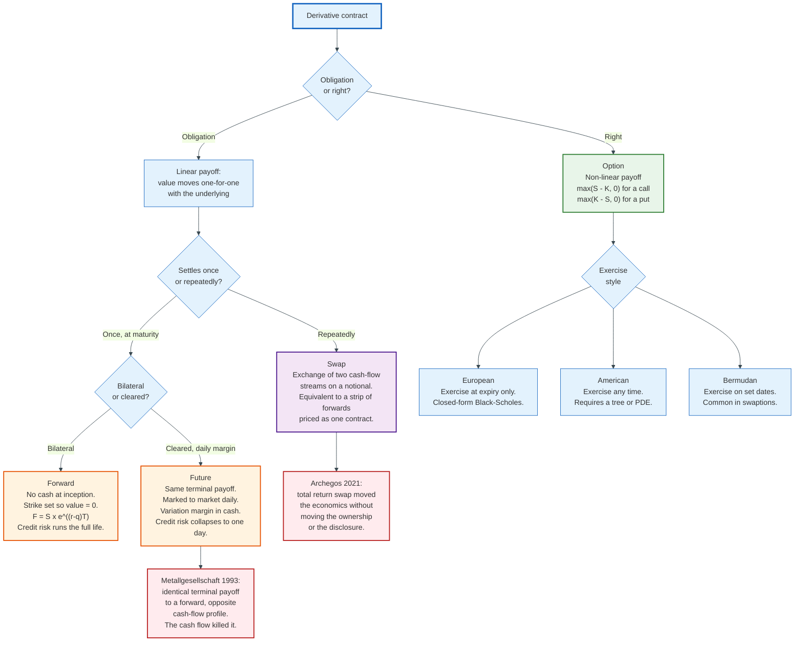
```mermaid
%%{init: {'theme': 'base', 'themeVariables': {'primaryColor': '#e3f2fd', 'primaryBorderColor': '#1565c0', 'lineColor': '#37474f'}}}%%

flowchart TB
    Root["Derivative contract"]

    Root --> Obl{"Obligation<br/>or right?"}

    Obl -->|"Obligation"| Lin["Linear payoff:<br/>value moves one-for-one<br/>with the underlying"]
    Obl -->|"Right"| Opt["Option<br/>Non-linear payoff<br/>max(S - K, 0) for a call<br/>max(K - S, 0) for a put"]

    Lin --> When{"Settles once<br/>or repeatedly?"}

    When -->|"Once, at maturity"| Once{"Bilateral<br/>or cleared?"}
    When -->|"Repeatedly"| Swap["Swap<br/>Exchange of two cash-flow<br/>streams on a notional.<br/>Equivalent to a strip of forwards<br/>priced as one contract."]

    Once -->|"Bilateral"| Fwd["Forward<br/>No cash at inception.<br/>Strike set so value = 0.<br/>F = S x e^((r-q)T)<br/>Credit risk runs the full life."]
    Once -->|"Cleared, daily margin"| Fut["Future<br/>Same terminal payoff.<br/>Marked to market daily.<br/>Variation margin in cash.<br/>Credit risk collapses to one day."]

    Opt --> Style{"Exercise<br/>style"}
    Style --> Eur["European<br/>Exercise at expiry only.<br/>Closed-form Black-Scholes."]
    Style --> Amer["American<br/>Exercise any time.<br/>Requires a tree or PDE."]
    Style --> Berm["Bermudan<br/>Exercise on set dates.<br/>Common in swaptions."]

    Fut --> Note1["Metallgesellschaft 1993:<br/>identical terminal payoff<br/>to a forward, opposite<br/>cash-flow profile.<br/>The cash flow killed it."]
    Swap --> Note2["Archegos 2021:<br/>total return swap moved<br/>the economics without<br/>moving the ownership<br/>or the disclosure."]

    style Root fill:#e3f2fd,stroke:#1565c0,stroke-width:3px
    style Opt fill:#e8f5e9,stroke:#2e7d32,stroke-width:2px
    style Fwd fill:#fff3e0,stroke:#e65100,stroke-width:2px
    style Fut fill:#fff3e0,stroke:#e65100,stroke-width:2px
    style Swap fill:#f3e5f5,stroke:#4a148c,stroke-width:2px
    style Note1 fill:#ffebee,stroke:#b71c1c,stroke-width:2px
    style Note2 fill:#ffebee,stroke:#b71c1c,stroke-width:2px
```

### 3.1 Forward

A forward obliges one party to buy a specified quantity of the underlying at a specified price on a specified date, with no money changing hands at inception.

The strike is set so the contract is worth zero to both sides at inception. For an asset with a continuous yield, that strike is the forward price, `F = S x e^((r - q) x T)`, where `S` is spot, `r` the risk-free rate, `q` the yield, and `T` the time in years. With the base case values of `S = 100.00`, `r = 4.00%`, `q = 0`, and `T = 1` year, the one-year forward price is `100 x e^0.04 = 104.081077`.

The forward price is not a forecast. It is the cost of buying the asset today and financing it to the delivery date. If it were anything else, the cash-and-carry arbitrage would close the gap.

Credit risk on a forward runs the whole life of the contract. If the underlying moves 30% in the buyer's favour over a year, the seller owes 30% of notional and may not have it.

### 3.2 Future

A future has the same terminal payoff as a forward and a completely different credit profile, because the profit or loss is settled in cash every day.

Each evening the clearing house computes the settlement price, debits the losing side, and credits the winning side. That cash movement is variation margin. Because yesterday's gains are already in the winner's account, the maximum exposure the clearing house carries is one day of price movement plus the time it takes to liquidate the position, which is what initial margin is sized against.

The economic difference from a forward is the financing of those daily flows. A futures holder who is winning receives cash early and reinvests it; a holder who is losing funds the payments. When the underlying's price is correlated with interest rates, that timing has value, and the futures price differs from the forward price by a convexity term. For equity index futures over months, the difference is small. For interest rate futures, it is large enough that Eurodollar futures required an explicit convexity adjustment against forward rate agreements.

The timing difference also destroys companies. Metallgesellschaft's US subsidiary sold long-dated fixed-price oil forward to customers in the early 1990s and hedged with a stack of short-dated futures rolled forward. The terminal economics were sound. When oil prices fell, the futures leg generated immediate margin calls in cash while the offsetting gains sat in unfunded customer forwards that produced no cash for years. The company closed the hedge at a loss of approximately $1.3 billion in 1993, and prices then rose, leaving it short against its customer commitments.

A correct hedge that cannot be funded is not a hedge.

### 3.3 Option

An option gives its buyer the right, and not the obligation, to transact at a fixed price.

The buyer pays a premium at inception, and that premium is the maximum loss. The seller receives the premium and takes on an obligation whose loss is bounded only by the strike for a put and unbounded for a call. This asymmetry is the whole instrument.

Three parameters define a listed option beyond the underlying: the strike price, the expiry date, and whether it is a call or a put. Two conventions define its mechanics: exercise style (American, European, or Bermudan) and settlement (physical or cash). US listed equity options are American-style and physically settled in 100 shares. US listed index options are typically European-style and cash settled.

The premium divides into intrinsic value and time value. Intrinsic value is what the option would pay if exercised immediately, `max(S - K, 0)` for a call. Time value is everything else, and it is the market's price for the chance that the underlying moves further before expiry. In the base case, a $100 strike call on a $100 stock has zero intrinsic value and $3.021141 of time value.

Time value goes to zero at expiry with certainty. That is the only thing about an option that is certain.

### 3.4 Swap

A swap exchanges two streams of cash flows computed on a notional amount, at intervals, over a term.

The vanilla interest rate swap exchanges a fixed rate for a floating rate. Party A pays 4.00% annually on a $100 million notional; Party B pays the prevailing reference rate on the same notional; only the net difference changes hands on each payment date. The notional never moves, which is why it is called notional.

A swap decomposes two ways, and both decompositions are useful. It is a strip of forward rate agreements, one per payment period, priced and documented as a single contract. It is also a long position in a fixed-rate bond financed by a short position in a floating-rate bond. The second view is how a swap desk hedges; the first is how it prices.

The total return swap replaces the floating leg with the total return on an asset. The party receiving the return has the full economics of owning the asset, including dividends and price appreciation, without owning it and often without disclosing it. That is the structure Archegos used to build positions that no single prime broker could see.

A swap is a forward strip with a legal wrapper. The wrapper is where the risk lives.

### 3.5 The Distinctions Traders Actually Confuse

| Confusion | The correction |
|-----------|----------------|
| "A future is just a standardised forward" | The terminal payoff is the same. The credit instrument is entirely different: daily cash settlement against periodic margin versus a single exposure that accretes for the full term. |
| "A swap is exotic" | A vanilla swap is the most heavily traded derivative on earth and is arithmetically a strip of forwards. Exotic means the payoff depends on the path or on multiple underlyings. |
| "An option on a future is the same as a future on an option" | The first has a future as its underlying and settles into a futures position on exercise. The second does not exist as a listed product. |
| "Cash settlement is the same as physical, net of delivery" | Cash settlement requires an agreed observable settlement price. The SPX Special Opening Quotation is computed from constituent opening prints and is not a price anyone can trade at, which creates a specific and well documented settlement basis risk. |
| "The clearing house guarantees my profit" | The clearing house guarantees performance to its clearing members. A customer of a failed clearing member relies on customer asset segregation rules, not on the guarantee directly. |

---

## 4. Payoff Structures and How They Compose

Every listed options strategy is a linear combination of six primitives: long or short the underlying, long or short a call at some strike, and long or short a put at some strike. Add a zero-coupon bond and the set is complete.

Strategy names are marketing. The arithmetic is addition.


```mermaid
%%{init: {'theme': 'base', 'themeVariables': {'primaryColor': '#e3f2fd', 'primaryBorderColor': '#1565c0', 'lineColor': '#37474f'}}}%%

flowchart TB
    subgraph P["Primitives - terminal payoff at expiry"]
        direction TB
        P1["Long stock: S_T"]
        P2["Long call K: max(S_T - K, 0)"]
        P3["Long put K: max(K - S_T, 0)"]
        P4["Bond: K, paid at T"]
    end

    subgraph V["Vertical - two strikes, one expiry"]
        direction TB
        V1["Bull call spread<br/>+call K1, -call K2, K1 &lt; K2<br/>Base case 100/105: debit $1.8534,<br/>max profit $314.66, max loss $185.34"]
        V2["Bear put spread<br/>+put K2, -put K1"]
        V3["Risk reversal<br/>+call K2, -put K1<br/>Synthetic long with a gap"]
    end

    subgraph S["Straddle family - same expiry"]
        direction TB
        S1["Straddle: +call K, +put K<br/>Base case: $3.0211 + $2.6929 = $5.7140<br/>Breakevens 94.29 and 105.71"]
        S2["Strangle: +call K2, +put K1<br/>Cheaper, wider breakevens"]
        S3["Butterfly: +call K1, -2 call K2, +call K3<br/>Price / width approximates the<br/>risk-neutral probability of<br/>finishing near K2"]
        S4["Condor: butterfly with a flat top"]
    end

    subgraph T["Time - two expiries"]
        direction TB
        T1["Calendar spread<br/>-near option, +far option<br/>Long vega, short gamma"]
        T2["Diagonal<br/>Different strike and expiry"]
    end

    subgraph H["Hedges"]
        direction TB
        H1["Covered call: +stock, -call"]
        H2["Protective put: +stock, +put"]
        H3["Collar: +stock, +put K1, -call K2"]
        H4["Conversion: +stock, +put K, -call K<br/>Riskless. Value = put-call parity."]
    end

    P --> V
    P --> S
    P --> T
    P --> H

    Key["Every one of these is<br/>addition of the primitives.<br/>The Greeks add too:<br/>portfolio delta is the sum<br/>of position deltas."]

    V --> Key
    S --> Key
    T --> Key
    H --> Key

    style P fill:#e3f2fd,stroke:#1565c0,stroke-width:2px
    style V fill:#e8f5e9,stroke:#2e7d32,stroke-width:2px
    style S fill:#fff3e0,stroke:#e65100,stroke-width:2px
    style T fill:#f3e5f5,stroke:#4a148c,stroke-width:2px
    style H fill:#e0f7fa,stroke:#006064,stroke-width:2px
    style Key fill:#fce4ec,stroke:#880e4f,stroke-width:3px
```

### 4.1 A Worked Composition

Take the base case and build a bull call spread: buy the 100-strike call, sell the 105-strike call, both 30 days out at 25% implied volatility.

The 100 call costs $3.021141. The 105 call, priced with the same inputs, is worth $1.167699 per share. The net debit is $1.853442 per share, $185.34 per spread.

The terminal payoff is bounded. Below $100.00 both options expire worthless and the loss is the $185.34 paid. Above $105.00 the spread is worth the $5.00 strike differential, $500.00 per spread, for a profit of $314.66. Between the strikes, the payoff rises linearly. The breakeven at expiry is $101.8534.

The Greeks add the same way. The spread's delta is the 100 call's delta of 0.532560 minus the 105 call's delta of 0.274577, or 0.257983. Its vega is $0.113992 minus $0.095588, or $0.018404 per volatility point, against $0.113992 for the outright call. That is the point of a spread: it strips out most of the volatility view and leaves the directional one.

### 4.2 A Butterfly Is a Probability

The price of a butterfly spread, divided by the strike width, approximates the risk-neutral probability that the underlying finishes near the middle strike.

Buy one call at `K - h`, sell two at `K`, buy one at `K + h`. The payoff is a triangle: zero outside the wings, peaking at `h` when the underlying finishes exactly at `K`. As `h` shrinks, the payoff approaches `h` times an indicator that the underlying lands in a narrow band around `K`. Divide the butterfly price by `h`, and by the discount factor, and the result converges to the risk-neutral probability density at `K`.

This is the Breeden-Litzenberger result: the second derivative of the call price with respect to strike, discounted back, is the risk-neutral probability density of the underlying at expiry. A full strip of listed strikes is therefore a market-implied distribution, observable without any model.

The option chain is a probability distribution. Most traders read it as a price list.

### 4.3 Payoff at Expiry Is Not Value Before Expiry

The hockey-stick diagrams that appear in every options textbook describe the terminal payoff only. Before expiry the value curve is smooth, and the difference between the curve and the kink is the whole subject of the rest of this document.

At expiry the 100-strike call is worth exactly `max(S - 100, 0)`: zero at $99.99, one cent at $100.01. Thirty days before expiry it is worth $3.021141 at $100.00, $2.516473 at $99.00, and $3.581199 at $101.00. The curve has no kink. Its slope is delta. Its curvature is gamma. Its downward drift over time is theta.

Time value is what smooths the kink. Gamma is the price of that smoothing.

---

## 5. Key Participants and Roles

The options and swaps markets between them have fourteen distinct roles, and two of them decide whether the market functions at all: the market maker, who manufactures liquidity, and the clearing member, who decides whose credit is acceptable.

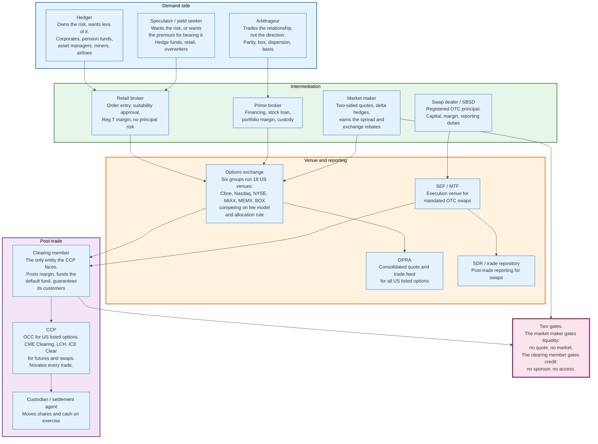
```mermaid
%%{init: {'theme': 'base', 'themeVariables': {'primaryColor': '#e3f2fd', 'primaryBorderColor': '#1565c0', 'lineColor': '#37474f'}}}%%

flowchart TB
    subgraph Demand["Demand side"]
        direction TB
        A1["Hedger<br/>Owns the risk, wants less of it.<br/>Corporates, pension funds,<br/>asset managers, miners, airlines"]
        A2["Speculator / yield seeker<br/>Wants the risk, or wants<br/>the premium for bearing it.<br/>Hedge funds, retail, overwriters"]
        A3["Arbitrageur<br/>Trades the relationship,<br/>not the direction.<br/>Parity, box, dispersion, basis"]
    end

    subgraph Intermediation["Intermediation"]
        direction TB
        B1["Retail broker<br/>Order entry, suitability approval,<br/>Reg T margin, no principal risk"]
        B2["Prime broker<br/>Financing, stock loan,<br/>portfolio margin, custody"]
        B3["Market maker<br/>Two-sided quotes, delta hedges,<br/>earns the spread and<br/>exchange rebates"]
        B4["Swap dealer / SBSD<br/>Registered OTC principal.<br/>Capital, margin, reporting duties"]
    end

    subgraph Venue["Venue and reporting"]
        direction TB
        C1["Options exchange<br/>Six groups run 18 US venues:<br/>Cboe, Nasdaq, NYSE, MIAX, MEMX, BOX<br/>competing on fee model<br/>and allocation rule"]
        C2["OPRA<br/>Consolidated quote and trade feed<br/>for all US listed options"]
        C3["SEF / MTF<br/>Execution venue for<br/>mandated OTC swaps"]
        C4["SDR / trade repository<br/>Post-trade reporting for swaps"]
    end

    subgraph Post["Post-trade"]
        direction TB
        D1["Clearing member<br/>The only entity the CCP faces.<br/>Posts margin, funds the<br/>default fund, guarantees<br/>its customers"]
        D2["CCP<br/>OCC for US listed options.<br/>CME Clearing, LCH, ICE Clear<br/>for futures and swaps.<br/>Novates every trade."]
        D3["Custodian / settlement agent<br/>Moves shares and cash on exercise"]
    end

    A1 --> B1
    A2 --> B1
    A3 --> B2
    B1 --> C1
    B2 --> C1
    B3 --> C1
    B4 --> C3
    C1 --> C2
    C1 --> D1
    C3 --> C4
    C3 --> D1
    D1 --> D2
    D2 --> D3

    Gate["Two gates.<br/>The market maker gates liquidity:<br/>no quote, no market.<br/>The clearing member gates credit:<br/>no sponsor, no access."]

    B3 --> Gate
    D1 --> Gate

    style Demand fill:#e3f2fd,stroke:#1565c0,stroke-width:2px
    style Intermediation fill:#e8f5e9,stroke:#2e7d32,stroke-width:2px
    style Venue fill:#fff3e0,stroke:#e65100,stroke-width:2px
    style Post fill:#f3e5f5,stroke:#4a148c,stroke-width:2px
    style Gate fill:#fce4ec,stroke:#880e4f,stroke-width:3px
```

### 5.1 The Actors

| Role | What it does | Holds risk? | Faces the CCP? |
|------|--------------|-------------|----------------|
| **Hedger** | Owns an exposure and pays to reduce it | Yes, less of it after | No |
| **Speculator** | Takes an exposure it did not previously have | Yes | No |
| **Arbitrageur** | Trades a relationship between instruments | Minimal, by construction | No |
| **Market maker** | Quotes two-sided prices continuously, delta hedges | Yes, residual after hedging | Through a clearing member, or directly if also one |
| **Retail broker** | Routes orders, applies margin rules, no principal position | No | No |
| **Prime broker** | Finances, lends stock, applies portfolio margin | Counterparty risk to its clients | Yes, usually |
| **Clearing member** | Guarantees its customers to the CCP, posts margin and default fund | Yes, mutualised | Yes, directly |
| **CCP** | Novates trades, sets margin, runs the default waterfall | Yes, as the final backstop | Is the CCP |
| **Exchange** | Matches orders under a published allocation rule | No | No |
| **OPRA** | Consolidates and disseminates quotes and trades | No | No |
| **Swap dealer / SBSD** | Registered principal in OTC swaps | Yes | For cleared swaps, yes |
| **SEF / MTF** | Executes mandated OTC swaps under a registered venue rulebook | No | No |
| **SDR / trade repository** | Receives, stores, and publishes post-trade swap reports | No | No |
| **Custodian / settlement agent** | Moves shares and cash on exercise and settlement | No | No |

### 5.2 The Market Maker Gates Liquidity

A listed option exists as a series the moment the exchange lists it, and it is untradeable until a market maker quotes it.

An SPX chain on a given expiry contains hundreds of strikes. Most of them see no natural buyer and no natural seller in a given hour. What makes them tradeable is a firm obligated by exchange rule to post a two-sided quote of a specified minimum size within a specified maximum spread, for a specified percentage of the trading day. In exchange, the exchange grants that firm reduced fees, rebates, and in some allocation models a share of every trade at the best price.

The market maker is not taking a directional view. It buys the option, immediately sells the delta-equivalent quantity of the underlying, and holds a position whose profit and loss depends on how much the underlying actually moves rather than on which way. Section 14 works that arithmetic through.

The consequence for market structure is that liquidity in an option series is a function of how cheaply the market maker can hedge it. Options on liquid, deeply traded underlyings quote tightly. Options on a thinly traded small-cap quote wide, not because the option is riskier in the abstract but because the hedge is expensive.

### 5.3 The Clearing Member Gates Credit

The CCP does not face customers. It faces clearing members, and a clearing member decides which customers it will guarantee.

This is the structural reason access to derivatives markets is not open. To trade listed options, a firm must be a clearing member, or a customer of one. To clear swaps, a firm must be a member of the relevant CCP or a client of a futures commission merchant that is. Clearing membership requires minimum capital, operational capability, contribution to the default fund, and acceptance of assessment obligations if another member fails.

The clearing member therefore performs credit selection on behalf of the whole system. When it does that badly, the loss is mutualised across the other members, which is precisely what makes the other members care.

### 5.4 The Role That Disappeared

The floor broker and the pit trader are effectively gone, and the market structure that replaced them is worth naming, because it changed the economics.

Options trading moved from open outcry to electronic order books between roughly 2000 and 2015. The immediate effect was spread compression. The second-order effect was fragmentation. US listed options now trade across exchanges run by six groups: Cboe, Nasdaq, NYSE under Intercontinental Exchange, MIAX, MEMX, and BOX. Eighteen registered options exchanges list the same series as of August 2026: four Cboe, six Nasdaq, two NYSE, four MIAX, one MEMX, one BOX. They differ mainly by fee model (maker-taker versus customer-priority) and allocation rule (price-time versus pro-rata). MIAX Sapphire was the most recent addition, launching in August 2024. A single option series is quoted on all of them simultaneously and linked by the Options Order Protection and Locked and Crossed Markets Plan, which prevents trading through a better price displayed elsewhere.

Eighteen venues for one contract exist because exchanges monetise routing, not matching.

---

## 6. Exchange-Traded Versus Over-the-Counter

The exchange-traded and over-the-counter split is not about where a trade is negotiated. It is about who defines the contract and who guarantees performance.

A trade negotiated by telephone and given up for clearing at a CCP is exchange-traded in every sense that matters for risk. A trade executed on a screen and settled bilaterally is OTC.


```mermaid
%%{init: {'theme': 'base', 'themeVariables': {'primaryColor': '#e3f2fd', 'primaryBorderColor': '#1565c0', 'lineColor': '#37474f'}}}%%

flowchart LR
    subgraph ETD["Exchange-traded and cleared"]
        direction TB
        E1["Contract defined by the exchange<br/>Fixed strikes, fixed expiries,<br/>fixed multiplier"]
        E2["Novated to the CCP<br/>Counterparty identity<br/>becomes irrelevant"]
        E3["Margined daily by the CCP<br/>SPAN or STANS,<br/>variation margin in cash"]
        E4["Fungible<br/>Any contract in a series<br/>offsets any other"]
        E5["Transparent<br/>Quotes and trades on OPRA<br/>Open interest published daily"]
        E6["Exit by trading out<br/>A closing trade extinguishes<br/>the position"]
    end

    subgraph HYB["Cleared OTC - the post-2009 hybrid"]
        direction TB
        H1["Contract defined by ISDA<br/>definitions plus a<br/>CCP product specification"]
        H2["Executed bilaterally or on a SEF,<br/>then novated to a CCP"]
        H3["Margined by the CCP;<br/>initial margin on a<br/>5-day close-out horizon"]
        H4["Reported to a trade repository"]
        H5["Exit by compression or<br/>an offsetting cleared trade"]
    end

    subgraph OTC["Bilateral OTC"]
        direction TB
        O1["Contract defined by the parties<br/>ISDA Master + Schedule<br/>+ Confirmation"]
        O2["Counterparty risk stays<br/>with the counterparty<br/>for the life of the trade"]
        O3["Collateral under a<br/>Credit Support Annex;<br/>uncleared margin rules since 2016"]
        O4["Not fungible<br/>Each trade is a distinct<br/>contract with a named party"]
        O5["Opaque to the public;<br/>reported to a repository,<br/>not to a public tape"]
        O6["Exit by termination,<br/>assignment (novation to a<br/>third party), or an offsetting trade<br/>that leaves both on the books"]
    end

    ETD -->|"Mandatory clearing<br/>after Dodd-Frank Title VII<br/>and EMIR"| HYB
    HYB --> OTC

    Bridge["FLEX options sit across the line:<br/>exchange-listed and OCC-cleared,<br/>but with customer-chosen strike,<br/>expiry, and exercise style."]

    ETD --- Bridge
    OTC --- Bridge

    style ETD fill:#e8f5e9,stroke:#2e7d32,stroke-width:2px
    style HYB fill:#fff3e0,stroke:#e65100,stroke-width:2px
    style OTC fill:#ffebee,stroke:#b71c1c,stroke-width:2px
    style Bridge fill:#e3f2fd,stroke:#1565c0,stroke-width:3px
```

### 6.1 The Comparison That Matters

| Dimension | Exchange-traded | Bilateral OTC |
|-----------|-----------------|---------------|
| **Contract terms** | Set by the exchange. Fixed strike grid, fixed expiry calendar, fixed multiplier | Negotiated. Any strike, any date, any notional, any underlying the parties can define |
| **Counterparty** | The CCP, after novation | The named counterparty, for the full term |
| **Credit assessment** | Done once, on the clearing member | Done continuously, on every counterparty |
| **Margin** | CCP-set, daily, non-negotiable | CSA-negotiated thresholds and minimum transfer amounts, plus regulatory uncleared margin above thresholds |
| **Documentation** | Exchange rules and the Options Disclosure Document | ISDA Master Agreement, Schedule, Confirmation, Credit Support Annex |
| **Transparency** | Quotes and prints on OPRA; open interest published daily by OCC | Reported to a trade repository, not to a public tape |
| **Tenor** | Days to roughly three years for LEAPS | Days to decades |
| **Minimum size** | One contract, typically 100 shares of exposure | Negotiated, effectively institutional |
| **Termination** | Trade out; the position nets to zero | Negotiated unwind, novation to a third party, or run to maturity |
| **Netting on default** | Handled inside the CCP | Close-out netting under the single agreement clause |

The two markets are sized in units that do not convert. The listed side runs 72.838 million contracts a day, roughly 18.2 billion a year. The bilateral side holds $844.578 trillion of notional outstanding at end-December 2025, carrying $22.802 trillion of gross market value and $3.351 trillion of gross credit exposure. A listed contract is extinguished by a closing trade; a bilateral contract sits on both balance sheets until it matures.

The listed figure measures flow. The OTC figure measures stock.

### 6.2 What the ISDA Architecture Actually Does

The ISDA Master Agreement solves the same problem as novation, using contract law instead of a balance sheet.

Four documents stack. The **Master Agreement** carries the standard terms and is not negotiated. The **Schedule** contains every election and amendment the parties negotiate. Each trade gets a short **Confirmation** recording only the economics. The **Credit Support Annex** governs collateral: what is eligible, what haircuts apply, what thresholds trigger a call, and what minimum transfer amount applies.

The load-bearing clause is the single agreement provision: all transactions are entered into in reliance on the fact that the Master Agreement and all Confirmations form a single agreement. Without it, a bankruptcy administrator could cherry-pick, enforcing the contracts in the estate's favour and disclaiming the rest. With it, all transactions terminate together and net to a single amount.

The 2002 version replaced the earlier Market Quotation and Loss methods with a single Close-out Amount: the gain or loss from replacing the terminated transactions at current market rates. Events of Default cover fault, such as failure to pay or insolvency. Termination Events cover no-fault circumstances, such as illegality or a change in tax law.

Close-out netting is the reason gross notional and net exposure differ by orders of magnitude. It is also why every ISDA relationship in a new jurisdiction requires a legal opinion confirming that netting is enforceable there.

### 6.3 The Hybrid, and Why It Exists

After the 2009 G20 commitment in Pittsburgh, standardised OTC derivatives had to be cleared, and that produced an instrument that is neither exchange-traded nor bilateral.

A cleared interest rate swap has ISDA-defined economics, is executed on a swap execution facility or bilaterally, and is then novated to a CCP such as LCH SwapClear or CME. It is margined daily like a future, reported to a trade repository, and it is not fungible in the listed-options sense because it retains its own start date, maturity, and coupon.

Initial margin on cleared swaps is calibrated to a five-day close-out horizon, against one or two days for listed futures and options, because a swap portfolio takes longer to auction off. That single parameter difference explains most of the difference in margin between a futures book and a swaps book of similar risk.

### 6.4 FLEX Options Blur the Line Deliberately

FLEX options are exchange-listed and OCC-cleared, with terms the customer chooses: any strike, any expiry within limits, American or European exercise, and cash or physical settlement.

The category exists because institutions wanted OTC flexibility with CCP credit. The trade-off is liquidity: a FLEX series is created on demand for one trade, so there is no continuous two-sided market and unwinding usually means negotiating with the original counterparty through the exchange's FLEX mechanism.

Cboe amended its FLEX rules in a filing published on 21 July 2026, which is a reminder that the category is actively developed rather than legacy.

### 6.5 Why Bespoke Survives

Standardisation removes the last 5% of precision, and for some users that 5% is the whole point.

A corporate hedging a specific 7-year, 43 million euro exposure with a payment on the fifteenth of each February cannot use a listed contract. A pension fund matching a liability stream to the month cannot either. The listed market offers a grid; the OTC market offers a point. The cost of the point is the counterparty risk, the collateral operation, and, since 2016, the regulatory initial margin.

Standardisation is cheap and approximate. Bespoke is expensive and exact.

---

## 7. The Life of an Options Trade, Step by Step

An options trade passes through nine stages between a retail click and a settled position, and the interesting failures happen at the boundaries.

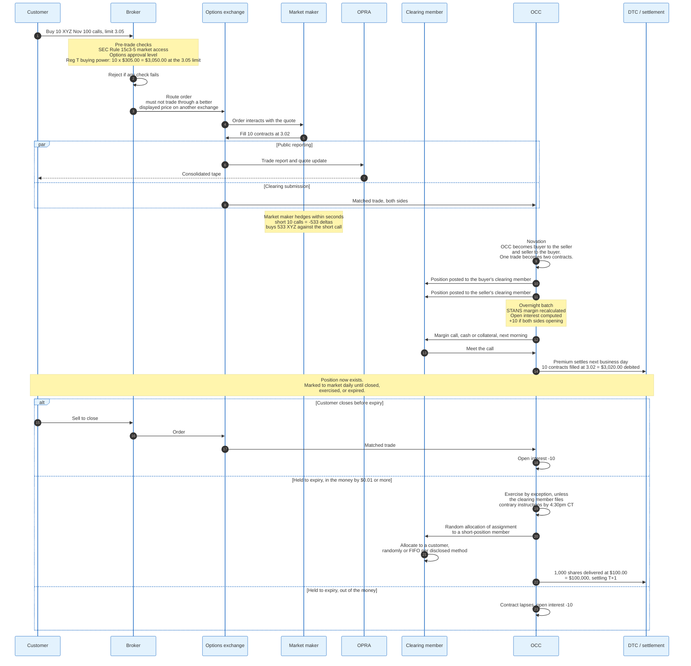
```mermaid
%%{init: {'theme': 'base', 'themeVariables': {'primaryColor': '#e3f2fd', 'primaryBorderColor': '#1565c0', 'lineColor': '#37474f'}}}%%

sequenceDiagram
    autonumber
    participant C as Customer
    participant B as Broker
    participant EX as Options exchange
    participant MM as Market maker
    participant OP as OPRA
    participant CM as Clearing member
    participant OCC as OCC
    participant DTC as DTC / settlement

    C->>B: Buy 10 XYZ Nov 100 calls, limit 3.05
    Note over B: Pre-trade checks<br/>SEC Rule 15c3-5 market access<br/>Options approval level<br/>Reg T buying power: 10 x $305.00 = $3,050.00 at the 3.05 limit
    B->>B: Reject if any check fails

    B->>EX: Route order<br/>must not trade through a better<br/>displayed price on another exchange
    EX->>MM: Order interacts with the quote
    MM->>EX: Fill 10 contracts at 3.02

    par Public reporting
        EX->>OP: Trade report and quote update
        OP-->>C: Consolidated tape
    and Clearing submission
        EX->>OCC: Matched trade, both sides
    end

    Note over MM: Market maker hedges within seconds<br/>short 10 calls = -533 deltas<br/>buys 533 XYZ against the short call

    OCC->>OCC: Novation<br/>OCC becomes buyer to the seller<br/>and seller to the buyer.<br/>One trade becomes two contracts.
    OCC->>CM: Position posted to the buyer's clearing member
    OCC->>CM: Position posted to the seller's clearing member

    Note over OCC: Overnight batch<br/>STANS margin recalculated<br/>Open interest computed<br/>+10 if both sides opening

    OCC->>CM: Margin call, cash or collateral, next morning
    CM->>OCC: Meet the call
    OCC->>DTC: Premium settles next business day<br/>10 contracts filled at 3.02 = $3,020.00 debited

    Note over C,DTC: Position now exists.<br/>Marked to market daily until closed,<br/>exercised, or expired.

    alt Customer closes before expiry
        C->>B: Sell to close
        B->>EX: Order
        EX->>OCC: Matched trade
        OCC->>OCC: Open interest -10
    else Held to expiry, in the money by $0.01 or more
        OCC->>OCC: Exercise by exception, unless<br/>the clearing member files<br/>contrary instructions by 4:30pm CT
        OCC->>CM: Random allocation of assignment<br/>to a short-position member
        CM->>CM: Allocate to a customer,<br/>randomly or FIFO per disclosed method
        OCC->>DTC: 1,000 shares delivered at $100.00<br/>= $100,000, settling T+1
    else Held to expiry, out of the money
        OCC->>OCC: Contract lapses, open interest -10
    end
```

### 7.1 The Nine Stages

**Stage 1: pre-trade risk.** The broker applies SEC Rule 15c3-5, the market access rule, which requires a broker providing market access to have controls that reject orders exceeding credit or capital thresholds before they reach an exchange. It also applies the customer's options approval level, since selling naked calls requires a higher tier than buying calls, and computes buying power under Reg T or portfolio margin.

**Stage 2: routing.** Every registered US options exchange displays quotes in the same series. The Options Order Protection and Locked and Crossed Markets Plan forbids executing at a price inferior to a protected quote displayed elsewhere. Where the broker routes among exchanges tied at the best price is a commercial decision, driven by fee schedules, rebates, and payment for order flow arrangements.

**Stage 3: execution.** The exchange allocates the fill under its published rule. Price-time gives the whole fill to the first quoter at the price. Pro-rata splits it in proportion to displayed size. Customer priority puts non-market-maker orders ahead of market makers at the same price. The allocation rule determines who wants to quote there.

**Stage 4: dissemination.** The trade and the resulting quote update go to OPRA, the Options Price Reporting Authority, which is the single consolidated feed for all US listed options.

**Stage 5: the hedge.** The market maker on the other side hedges immediately. It filled a customer buy order, so it is short 10 calls, and a short call carries negative delta, which makes the hedge long stock. Delta is 0.532560 per share, so the hedge is 0.532560 x 10 x 100 = 532.56, rounded to 533 shares bought. This happens in milliseconds and is invisible to the customer, and it is the mechanism by which options order flow becomes stock order flow.

**Stage 6: clearing submission and novation.** The exchange submits the matched trade to OCC. OCC novates: it becomes the buyer to every seller and the seller to every buyer. From that instant the customer's counterparty is OCC, not the market maker.

**Stage 7: overnight processing.** OCC recomputes margin under STANS for every clearing member's portfolio, computes open interest for every series from clearing records, and issues margin calls due the following morning.

**Stage 8: settlement of premium.** The premium settles in cash on the next business day. Ten contracts filled at $3.02 per share is $3,020.00. The theoretical value, $302.11 a contract, is what the option is worth; $302.00 is what changed hands.

**Stage 9: termination.** The position ends one of three ways: a closing trade, exercise and assignment, or expiry worthless. Section 17 covers the mechanics.

### 7.2 Where the Failures Live

The happy path is nine steps and no surprises. The interesting cases are at the joins.

**The routing join.** A broker's routing decision can be influenced by rebates it collects. Because options must execute on an exchange and cannot be internalised the way equities can, options payment for order flow takes the form of a market maker paying a broker for directing flow to a particular exchange where that market maker quotes. The economics are visible in broker Rule 606 disclosures.

**The hedging join.** The market maker's hedge is a stock trade in the opposite direction to the option's delta. Large options flow therefore produces mechanical stock flow. Section 14 works out how large.

**The assignment join.** Assignment is allocated randomly by OCC among clearing members with short positions, and then allocated by the clearing member among its own short customers using a method the member must disclose. A customer short a call has no control over whether they are assigned. The most common retail surprise is early assignment on a short call the day before an ex-dividend date.

**The expiry join.** Exercise by exception at $0.01 in the money means a position the holder considered worthless can become a delivery obligation. A short 100-strike call on a stock closing at $100.02 delivers 100 shares per contract at $100.00.

---

## 8. Black-Scholes, Derived in Plain Terms

Black-Scholes is not a forecast of where a stock will go. It is the cost of manufacturing an option's payoff out of stock and cash, computed by someone who intends to do exactly that.

That reframing makes the whole derivation obvious. If a payoff can be built, its fair price is the cost of building it.

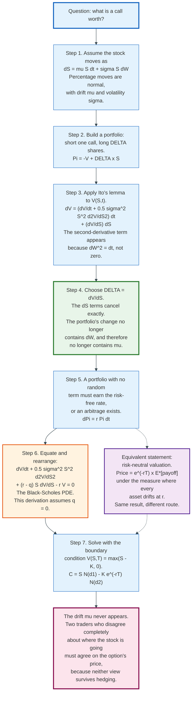
```mermaid
%%{init: {'theme': 'base', 'themeVariables': {'primaryColor': '#e3f2fd', 'primaryBorderColor': '#1565c0', 'lineColor': '#37474f'}}}%%

flowchart TB
    Start["Question: what is a call worth?"]

    Step1["Step 1. Assume the stock moves as<br/>dS = mu S dt + sigma S dW<br/>Percentage moves are normal,<br/>with drift mu and volatility sigma."]

    Step2["Step 2. Build a portfolio:<br/>short one call, long DELTA shares.<br/>Pi = -V + DELTA x S"]

    Step3["Step 3. Apply Ito's lemma to V(S,t).<br/>dV = (dV/dt + 0.5 sigma^2 S^2 d2V/dS2) dt<br/>+ (dV/dS) dS<br/>The second-derivative term appears<br/>because dW^2 = dt, not zero."]

    Step4["Step 4. Choose DELTA = dV/dS.<br/>The dS terms cancel exactly.<br/>The portfolio's change no longer<br/>contains dW, and therefore<br/>no longer contains mu."]

    Step5["Step 5. A portfolio with no random<br/>term must earn the risk-free rate,<br/>or an arbitrage exists.<br/>dPi = r Pi dt"]

    Step6["Step 6. Equate and rearrange:<br/>dV/dt + 0.5 sigma^2 S^2 d2V/dS2<br/>+ (r - q) S dV/dS - r V = 0<br/>The Black-Scholes PDE.<br/>This derivation assumes q = 0."]

    Step7["Step 7. Solve with the boundary<br/>condition V(S,T) = max(S - K, 0).<br/>C = S N(d1) - K e^(-rT) N(d2)"]

    Punch["The drift mu never appears.<br/>Two traders who disagree completely<br/>about where the stock is going<br/>must agree on the option's price,<br/>because neither view survives hedging."]

    Start --> Step1 --> Step2 --> Step3 --> Step4 --> Step5 --> Step6 --> Step7 --> Punch

    Alt["Equivalent statement:<br/>risk-neutral valuation.<br/>Price = e^(-rT) x E*[payoff]<br/>under the measure where every<br/>asset drifts at r.<br/>Same result, different route."]

    Step5 -.-> Alt
    Alt -.-> Step7

    style Start fill:#e3f2fd,stroke:#1565c0,stroke-width:3px
    style Step4 fill:#e8f5e9,stroke:#2e7d32,stroke-width:3px
    style Step6 fill:#fff3e0,stroke:#e65100,stroke-width:2px
    style Punch fill:#fce4ec,stroke:#880e4f,stroke-width:3px
    style Alt fill:#f3e5f5,stroke:#4a148c,stroke-width:2px
```

### 8.1 The Replication Argument in Words

Start with a market maker who has just sold a call and does not want the risk.

The call gains value when the stock rises. To offset that, the market maker buys some shares. The quantity is set so that a small move in the stock changes the share position's value by exactly as much as it changes the call's value, in the opposite direction. That quantity is the option's delta, the derivative of option value with respect to stock price.

Now the combined position, short one call and long delta shares, does not change value for a small move in either direction. It is instantaneously riskless. A riskless position must earn the risk-free rate, because otherwise a trader could borrow at the risk-free rate, buy the position, and collect the difference with no risk and no capital.

Setting the hedged portfolio's return equal to the risk-free rate produces one equation. That equation is the Black-Scholes partial differential equation, and solving it with the terminal payoff as a boundary condition produces the formula.

The delta changes as the stock moves, so the hedge must be adjusted continuously. That continuous adjustment is the manufacturing process, and the option premium is its total expected cost.

### 8.2 Why the Drift Disappears

The single most surprising feature of the derivation is that the stock's expected return does not appear in the answer.

It cancels at step 4. Once the hedge ratio is set to the option's delta, the random term in the portfolio's change is eliminated, and the drift travels with it. Whether the stock is expected to rise 20% a year or fall 20% a year, the hedged portfolio behaves identically, so the option must be priced identically.

The economic content is that the option's price is determined by the cost of the hedge, not by anyone's opinion. A bull and a bear must quote the same option price or one of them is offering free money to the other.

What does survive is volatility. The hedge has to be rebalanced, and how much rebalancing costs depends on how much the stock actually moves. Volatility is the only input about the future that the model needs, and it is the only one that cannot be observed.

### 8.3 The Equation and the Solution

The Black-Scholes partial differential equation, for a derivative value `V` on an underlying `S`:

```
dV/dt  +  (1/2) sigma^2 S^2 (d2V/dS2)  +  (r - q) S (dV/dS)  -  r V  =  0
```

With no dividend, `q = 0` and the drift term reduces to `r S (dV/dS)`, which is the form the replication argument produces. The yield enters because a hedger holding the stock collects the dividend, and that income reduces the carry the option has to earn.

Applied to a European call with the terminal condition `V(S, T) = max(S - K, 0)`, the solution is:

```
C  =  S e^(-qT) N(d1)  -  K e^(-rT) N(d2)

P  =  K e^(-rT) N(-d2)  -  S e^(-qT) N(-d1)

d1 = [ ln(S/K) + (r - q + sigma^2 / 2) T ]  /  ( sigma sqrt(T) )

d2 = d1 - sigma sqrt(T)
```

where `S` is the spot price, `K` the strike, `r` the continuously compounded risk-free rate, `q` the continuous dividend yield, `sigma` the volatility, `T` the time to expiry in years, and `N()` the standard normal cumulative distribution function.

### 8.4 What the Two Terms Mean

The formula is not an arbitrary expression. Each term has an interpretation, and knowing it prevents most misuse.

`N(d2)` is the probability, under the risk-neutral measure, that the option finishes in the money. In the base case it is 0.504003. That is not the real-world probability, because the risk-neutral measure replaces the stock's actual drift with the risk-free rate.

`K e^(-rT) N(d2)` is therefore the present value of paying the strike, weighted by the probability of having to pay it.

`S e^(-qT) N(d1)` is the present value of receiving the stock, conditional on exercise. `N(d1)` is not the same probability as `N(d2)`: it is the exercise probability measured with the stock rather than cash as the unit of account, and it is always larger because `d1 = d2 + sigma sqrt(T)` by construction. The gap is what makes delta exceed the risk-neutral exercise probability.

The call price is the discounted expected value of what is received minus the discounted expected value of what is paid.

### 8.5 The Base Case, Fully Worked

Every number in this document derives from one set of inputs. They are stated here once and reused throughout.

| Input | Symbol | Value |
|-------|--------|-------|
| Spot price | `S` | 100.00 |
| Strike | `K` | 100.00 |
| Risk-free rate, continuous | `r` | 0.04 |
| Dividend yield | `q` | 0.00 |
| Volatility | `sigma` | 0.25 |
| Time to expiry | `T` | 30 / 365 = 0.082192 years |

Intermediate quantities:

```
sqrt(T)          = 0.286691
sigma sqrt(T)    = 0.071673
ln(S/K)          = 0
(r + sigma^2/2)T = (0.04 + 0.03125) x 0.082192 = 0.005856
d1               = 0.005856 / 0.071673 = 0.081707
d2               = 0.081707 - 0.071673 = 0.010034
N(d1)            = 0.532560
N(d2)            = 0.504003
phi(d1)          = 0.397613
e^(-rT)          = 0.996718
K e^(-rT)        = 99.671773
```

Prices:

```
Call = 100 x 0.532560  -  99.671773 x 0.504003  =  53.256000 - 50.234859  =  3.021141
Put  = 99.671773 x 0.495997  -  100 x 0.467440  =  49.436859 - 46.744000  =  2.692914
```

Per 100-share contract: the call costs $302.11 and the put costs $269.29.

Parity check: `3.021141 - 2.692914 = 0.328227`, and `100 - 99.671773 = 0.328227`. The identity holds to every decimal place the arithmetic carries.

### 8.6 Risk-Neutral Valuation Says the Same Thing

There is a second route to the identical answer, and it is the one that generalises.

Instead of building a hedge and solving a PDE, replace the stock's real drift with the risk-free rate, compute the expected payoff under that artificial probability measure, and discount at the risk-free rate. Formally, `V = e^(-rT) E*[payoff]`, where `E*` is expectation under the risk-neutral measure.

The two routes agree because they are the same statement. The Feynman-Kac theorem connects the PDE to the expectation. Hedging is possible if and only if a risk-neutral measure exists, and the measure is unique if and only if the hedge is exact.

The practical importance is that Monte Carlo simulation, covered in Section 13, computes the expectation directly. It never touches the PDE, works for payoffs with no closed form, and is correct for exactly the same reason.

---

## 9. The Assumptions, and How Each One Is Violated

Black-Scholes rests on eight assumptions, and the market violates all eight. The model survives because it has one free parameter that absorbs the violations, and the market recalibrates that parameter for every strike and every expiry.

That free parameter is volatility. Section 11 shows what the market does with it.

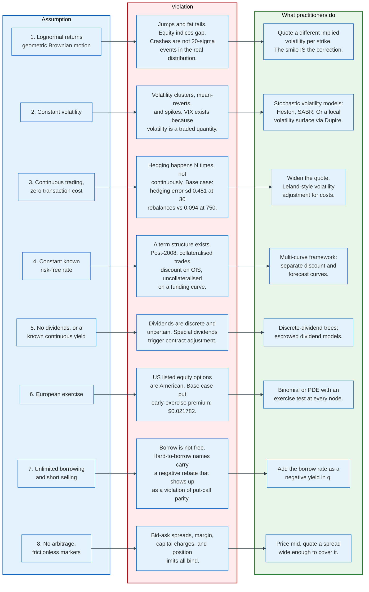
```mermaid
%%{init: {'theme': 'base', 'themeVariables': {'primaryColor': '#e3f2fd', 'primaryBorderColor': '#1565c0', 'lineColor': '#37474f'}}}%%

flowchart LR
    subgraph A["Assumption"]
        direction TB
        A1["1. Lognormal returns<br/>geometric Brownian motion"]
        A2["2. Constant volatility"]
        A3["3. Continuous trading,<br/>zero transaction cost"]
        A4["4. Constant known<br/>risk-free rate"]
        A5["5. No dividends, or a<br/>known continuous yield"]
        A6["6. European exercise"]
        A7["7. Unlimited borrowing<br/>and short selling"]
        A8["8. No arbitrage,<br/>frictionless markets"]
    end

    subgraph V["Violation"]
        direction TB
        V1["Jumps and fat tails.<br/>Equity indices gap.<br/>Crashes are not 20-sigma<br/>events in the real distribution."]
        V2["Volatility clusters, mean-reverts,<br/>and spikes. VIX exists because<br/>volatility is a traded quantity."]
        V3["Hedging happens N times, not<br/>continuously. Base case:<br/>hedging error sd 0.451 at 30<br/>rebalances vs 0.094 at 750."]
        V4["A term structure exists.<br/>Post-2008, collateralised trades<br/>discount on OIS, uncollateralised<br/>on a funding curve."]
        V5["Dividends are discrete and<br/>uncertain. Special dividends<br/>trigger contract adjustment."]
        V6["US listed equity options<br/>are American. Base case put<br/>early-exercise premium: $0.021782."]
        V7["Borrow is not free.<br/>Hard-to-borrow names carry<br/>a negative rebate that shows up<br/>as a violation of put-call parity."]
        V8["Bid-ask spreads, margin,<br/>capital charges, and position<br/>limits all bind."]
    end

    subgraph R["What practitioners do"]
        direction TB
        R1["Quote a different implied<br/>volatility per strike.<br/>The smile IS the correction."]
        R2["Stochastic volatility models:<br/>Heston, SABR. Or a local<br/>volatility surface via Dupire."]
        R3["Widen the quote.<br/>Leland-style volatility<br/>adjustment for costs."]
        R4["Multi-curve framework:<br/>separate discount and<br/>forecast curves."]
        R5["Discrete-dividend trees;<br/>escrowed dividend models."]
        R6["Binomial or PDE with an<br/>exercise test at every node."]
        R7["Add the borrow rate as a<br/>negative yield in q."]
        R8["Price mid, quote a spread<br/>wide enough to cover it."]
    end

    A1 --> V1 --> R1
    A2 --> V2 --> R2
    A3 --> V3 --> R3
    A4 --> V4 --> R4
    A5 --> V5 --> R5
    A6 --> V6 --> R6
    A7 --> V7 --> R7
    A8 --> V8 --> R8

    style A fill:#e3f2fd,stroke:#1565c0,stroke-width:2px
    style V fill:#ffebee,stroke:#b71c1c,stroke-width:2px
    style R fill:#e8f5e9,stroke:#2e7d32,stroke-width:2px
```

### 9.1 Lognormal Returns

The model assumes percentage returns are normally distributed, so prices are lognormal and cannot go negative.

Reality delivers jumps. On 19 October 1987 the S&P 500 fell 20.5% in a day, an event whose probability under a lognormal distribution calibrated to prior volatility is small enough to be meaningless. On 20 April 2020 the front-month WTI crude futures contract settled at negative $37.63, which a lognormal model assigns probability zero because it cannot produce a negative price at all.

The correction the market applies is the smile: out-of-the-money puts trade at higher implied volatilities than at-the-money options, because the market prices a fatter left tail than the lognormal allows.

### 9.2 Constant Volatility

The model assumes one volatility for the life of the option, known at inception.

Volatility clusters: large moves follow large moves. It mean-reverts over months. It spikes far faster than it decays. And it is negatively correlated with the equity index level, which is why an index selloff and a volatility spike arrive together.

The market's correction is a two-dimensional surface: a different implied volatility for every strike and every expiry. Modellers who want internal consistency use Dupire local volatility, which fits the surface exactly by construction, or a stochastic volatility model such as Heston or SABR, which has fewer parameters and extrapolates more sensibly into strikes with no quotes.

### 9.3 Continuous Trading and Zero Cost

The model assumes the hedge is adjusted continuously and costlessly. Neither is available.

The cost of discreteness is measurable. Simulating a market maker who sells the base case call at 25% implied volatility and hedges when realised volatility is also 25%, over 5,000 paths:

| Rebalances over 30 days | Mean P&L | Standard deviation of P&L | sd x sqrt(n) |
|-------------------------|----------|---------------------------|--------------|
| 1 | -0.01483 | 2.16878 | 2.1688 |
| 5 | +0.02369 | 1.01481 | 2.2692 |
| 10 | +0.00880 | 0.73234 | 2.3159 |
| 30 | -0.00811 | 0.45130 | 2.4719 |
| 120 | -0.00469 | 0.22867 | 2.5050 |
| 750 | -0.00011 | 0.09376 | 2.5678 |
| 3,000 | -0.00088 | 0.04660 | 2.5523 |

The mean is zero to three decimal places at every rebalancing frequency, which confirms the model prices the hedge correctly on average. The standard deviation falls as one over the square root of the number of rebalances, which is why the last column stabilises near 2.55.

Hedging once a day for 30 days leaves a standard deviation of $0.451 on a $3.021 premium. That residual, 15% of the option's value, is not model error. It is the cost of living in discrete time, and it is why market makers quote a spread rather than a price.

### 9.4 Constant Known Rate

The model uses a single risk-free rate. Markets have a term structure, and since 2008 they have had several curves at once.

Collateralised derivatives are discounted on an overnight indexed swap curve, because the collateral posted earns the overnight rate. Uncleared trades are discounted on a funding curve that reflects the dealer's own cost of money. The gap between them became a large enough number in 2008 that it acquired a name, the funding valuation adjustment, and a place in the XVA stack alongside credit and capital adjustments.

For a 30-day equity option the rate matters little: rho in the base case is $0.041289 per contract-share per percentage point, against a premium of $3.021141. For a 10-year swaption it dominates.

### 9.5 European Exercise

US listed equity options are American. The right to exercise early has value, and Black-Scholes does not price it.

Computed on a 2,000-step binomial tree, the base case put is worth 2.692914 European and 2.714695 American. The early-exercise premium is 0.021782, or 0.8% of the option's value. Small, because the option is at the money with 30 days to run and rates are low.

Change the parameters and the premium dominates. A one-year put struck at 140 on a stock at 100 with a 6% rate and 25% volatility is worth 33.7841 European and exactly 40.0000 American. The American value equals intrinsic value, which means immediate exercise is optimal: the interest earned on the 140 received today exceeds any remaining time value.

For calls, early exercise is never optimal on a non-dividend-paying stock, because exercising throws away time value and accelerates payment of the strike. It becomes optimal when the dividend yield exceeds the financing benefit. A one-year at-the-money call with a 6% dividend yield, a 4% rate, and 25% volatility is worth 8.5418 European and 8.8242 American, a premium of 0.2824.

### 9.6 The Structural Point

The model has five observable inputs and one unobservable one.

Spot, strike, time, rate, and dividend are all knowable. Volatility is not. When the model's price disagrees with the market's price, there is exactly one dial to turn, and the market turns it. That is why implied volatility is not really a volatility estimate: it is the residual, the number that makes a wrong model produce the right price.

A model with one free parameter and eight broken assumptions is not a description of reality. It is a coordinate system.

---

## 10. The Greeks, With a Worked Number Each

The Greeks are the partial derivatives of option value with respect to each input. They matter because a trading book is managed by its derivatives, not by its prices: a desk with 40,000 positions knows its aggregate delta and gamma and does not know, or need, its aggregate list of strikes.

Every number below comes from the base case of Section 8.5.

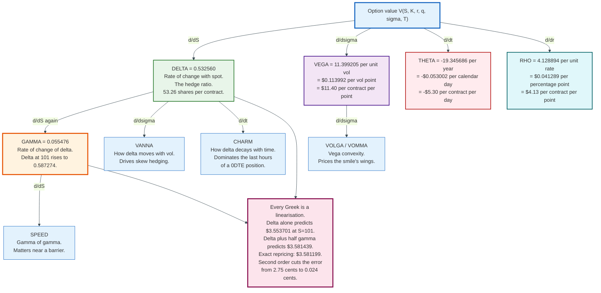
```mermaid
%%{init: {'theme': 'base', 'themeVariables': {'primaryColor': '#e3f2fd', 'primaryBorderColor': '#1565c0', 'lineColor': '#37474f'}}}%%

flowchart TB
    V["Option value V(S, K, r, q, sigma, T)"]

    V -->|"d/dS"| D["DELTA = 0.532560<br/>Rate of change with spot.<br/>The hedge ratio.<br/>53.26 shares per contract."]
    V -->|"d/dsigma"| VG["VEGA = 11.399205 per unit vol<br/>= $0.113992 per vol point<br/>= $11.40 per contract per point"]
    V -->|"d/dt"| TH["THETA = -19.345686 per year<br/>= -$0.053002 per calendar day<br/>= -$5.30 per contract per day"]
    V -->|"d/dr"| RH["RHO = 4.128894 per unit rate<br/>= $0.041289 per percentage point<br/>= $4.13 per contract per point"]

    D -->|"d/dS again"| G["GAMMA = 0.055476<br/>Rate of change of delta.<br/>Delta at 101 rises to 0.587274."]

    D -->|"d/dsigma"| VN["VANNA<br/>How delta moves with vol.<br/>Drives skew hedging."]
    D -->|"d/dt"| CH["CHARM<br/>How delta decays with time.<br/>Dominates the last hours<br/>of a 0DTE position."]
    VG -->|"d/dsigma"| VO["VOLGA / VOMMA<br/>Vega convexity.<br/>Prices the smile's wings."]
    G -->|"d/dS"| SP["SPEED<br/>Gamma of gamma.<br/>Matters near a barrier."]

    Check["Every Greek is a linearisation.<br/>Delta alone predicts $3.553701 at S=101.<br/>Delta plus half gamma predicts $3.581439.<br/>Exact repricing: $3.581199.<br/>Second order cuts the error<br/>from 2.75 cents to 0.024 cents."]

    G --> Check
    D --> Check

    style V fill:#e3f2fd,stroke:#1565c0,stroke-width:3px
    style D fill:#e8f5e9,stroke:#2e7d32,stroke-width:2px
    style G fill:#fff3e0,stroke:#e65100,stroke-width:3px
    style VG fill:#f3e5f5,stroke:#4a148c,stroke-width:2px
    style TH fill:#ffebee,stroke:#b71c1c,stroke-width:2px
    style RH fill:#e0f7fa,stroke:#006064,stroke-width:2px
    style Check fill:#fce4ec,stroke:#880e4f,stroke-width:3px
```

### 10.1 Delta

Delta is the change in option value for a one-unit change in the underlying. For the base case call it is `N(d1) = 0.532560`.

The prediction: raising the stock from $100.00 to $101.00 should raise the option by about $0.532560, from $3.021141 to $3.553701.

The check: repricing the option at $101.00 gives $3.581199. The delta-only prediction is short by $0.027498, because delta itself changed on the way up.

Delta has three readings, all used daily. It is the hedge ratio: sell 53.256 shares per option to be neutral. It is the option's exposure in share-equivalent terms: 10 contracts have the market exposure of 533 shares. And it approximates the risk-neutral probability of finishing in the money, though `N(d2) = 0.504003` is the exact version of that quantity.

Delta ranges from 0 to 1 for calls and from -1 to 0 for puts. A call and a put at the same strike have deltas that differ by exactly 1, which is put-call parity differentiated: `0.532560 - (-0.467440) = 1.000000`.

### 10.2 Gamma

Gamma is the change in delta for a one-unit change in the underlying. For the base case it is `phi(d1) / (S sigma sqrt(T)) = 0.397613 / (100 x 0.071673) = 0.055476`.

The prediction: raising the stock to $101.00 should raise delta from 0.532560 to 0.588036.

The check: repricing gives a delta of 0.587274. The error is 0.000762, and it exists because gamma itself changed.

Adding gamma to the price prediction closes almost the whole gap. A second-order Taylor expansion gives `3.021141 + 0.532560 + 0.5 x 0.055476 = 3.581439` against an exact $3.581199. The error falls from 2.75 cents to 0.024 cents.

Gamma is what makes an option an option. A position with zero gamma behaves like stock. A position with large gamma changes its directional exposure faster than the trader can rehedge, which is either the source of profit or the source of ruin depending on which side of it the trader sits.

Gamma is largest at the money and grows without bound as expiry approaches. Section 19 quantifies exactly how fast.

### 10.3 Theta

Theta is the change in option value for the passage of one unit of time. For the base case call it is -19.345686 per year, which the market quotes as -$0.053002 per calendar day, or -$5.30 per contract.

The check: repricing the option with 29 days to expiry instead of 30 gives $2.967734, a fall of $0.053407. Theta predicted $0.053002. The 0.8% gap is second-order and grows as expiry nears.

Theta is negative for every long option position, because time value can only decay to zero. It is positive for every short option position, which is why selling options is described as collecting premium.

The two components of theta are visible in the formula. The first term, `-S phi(d1) sigma / (2 sqrt(T))`, is the decay of optionality and dominates. The second, `-r K e^(-rT) N(d2)`, is the financing of the strike. For the base case those are -17.336292 and -2.009395 per year respectively, summing to the -19.345686 above.

Theta and gamma are two views of the same thing. A market maker who is short gamma is long theta, collects decay every day, and pays for it when the stock moves. Section 14 makes that trade explicit.

### 10.4 Vega

Vega is the change in option value for a change in volatility. For the base case it is `S phi(d1) sqrt(T) = 100 x 0.397613 x 0.286691 = 11.399205` per unit of volatility, which convention divides by 100 and quotes as $0.113992 per volatility point.

The check: repricing at 26% volatility instead of 25% gives $3.135135, a rise of $0.113994. Vega predicted $0.113992. The agreement to five decimal places reflects that vega is nearly linear over a one-point move.

Vega is not a Greek letter. The symbol used is a stylised nu, and the name was invented by traders.

Vega is largest at the money and grows with the square root of time. That is why long-dated options are volatility instruments and short-dated options are gamma instruments. On the base case underlying, a one-year at-the-money call has a vega of 38.3065 against 11.3992 for the one-month, a factor of 3.36; its gamma is 0.015323 against 0.055476, a factor of 3.62 the other way.

Vega collapses away from the money, which has a practical consequence covered in Section 11.1: implied volatilities computed from deep out-of-the-money options are numerically unstable because a tiny price change implies a large volatility change.

### 10.5 Rho

Rho is the change in option value for a change in the risk-free rate. For the base case call it is `K T e^(-rT) N(d2) = 100 x 0.082192 x 0.996718 x 0.504003 = 4.128894` per unit rate, quoted as $0.041289 per percentage point.

The check: repricing at a 5% rate instead of 4% gives $3.062600, a rise of $0.041459 against a predicted $0.041289.

Rho is the least watched first-order Greek in equity options and the most important one in rates products. Its magnitude scales with time to expiry and with the strike, both of which are small for a 30-day at-the-money option and large for a 10-year swaption.

Rho is positive for calls and negative for puts. Buying a call defers paying the strike, which is worth more when rates are higher. Buying a put defers receiving the strike, which is worth less.

### 10.6 The Summary Table

| Greek | Formula (call) | Base case value | Quoted as | Repricing check |
|-------|----------------|-----------------|-----------|-----------------|
| **Delta** | `N(d1)` | 0.532560 | Per share; x100 per contract | Predicted 3.553701, actual 3.581199 |
| **Gamma** | `phi(d1) / (S sigma sqrt(T))` | 0.055476 | Delta change per $1 | Predicted delta 0.588036, actual 0.587274 |
| **Theta** | `-S phi(d1) sigma / (2 sqrt(T)) - r K e^(-rT) N(d2)` | -19.345686 /yr | -$0.053002 per day | Predicted -0.053002, actual -0.053407 |
| **Vega** | `S phi(d1) sqrt(T)` | 11.399205 | $0.113992 per vol point | Predicted +0.113992, actual +0.113994 |
| **Rho** | `K T e^(-rT) N(d2)` | 4.128894 | $0.041289 per rate point | Predicted +0.041289, actual +0.041459 |

### 10.7 The Units Trap

More money is lost to Greek unit confusion than to Greek estimation error.

Delta is dimensionless per share. A book quoting "delta 500" might mean 500 shares of equivalent exposure, or 5 contracts at 100 delta, or $50,000 of delta-notional on a $100 stock. Vega is quoted per volatility point by convention but computed per unit of volatility, a factor of 100. Theta is computed per year in the formula and quoted per calendar day, a factor of 365, except on desks that quote per trading day, a factor of 252.

The base case call's vega is 11.399205 in the formula, $0.113992 as quoted, and $11.40 per contract. All three numbers are correct and describe the same thing. A risk report that mixes two of them is wrong by a factor of 100.

### 10.8 Second-Order Greeks and When They Bind

| Greek | Definition | When it matters |
|-------|------------|-----------------|
| **Vanna** | Change in delta per change in volatility, `d2V/(dS dsigma)` | Skew hedging. A book long downside puts gets longer delta as volatility rises, which is the wrong direction in a selloff |
| **Volga / vomma** | Change in vega per change in volatility, `d2V/dsigma2` | Pricing the wings of the smile. A position with positive volga profits from volatility of volatility |
| **Charm** | Change in delta per unit of time, `-d(delta)/d(tau)` | Weekend and overnight hedge adjustments; dominant in the final hours of a zero-day option, when delta migrates to 0 or 1 with no price move at all |
| **Speed** | Change in gamma per change in spot, `d3V/dS3` | Barrier options and very short-dated at-the-money positions |
| **Zomma** | Change in gamma per change in volatility | Gamma hedging a book under a moving surface |
| **Color** | Change in gamma per unit of time | Overnight gamma projection for expiry-week books |

Charm deserves the emphasis it gets from short-dated traders. Delta on an at-the-money zero-day option is near 0.50 all day and must land on either 0 or 1 by the close. That migration happens without any move in the underlying, purely as a function of time, and a trader who hedges only against price moves ends the day with a delta they never chose.

---

## 11. Implied Volatility and the Volatility Smile

Implied volatility is the volatility that, put into Black-Scholes, reproduces the market price. It is a price expressed in different units, not a forecast.

The volatility smile is what happens when a market that must quote one number per option refuses to quote the same number for every strike. It is the market's standing statement that the model is wrong, published continuously and in public.

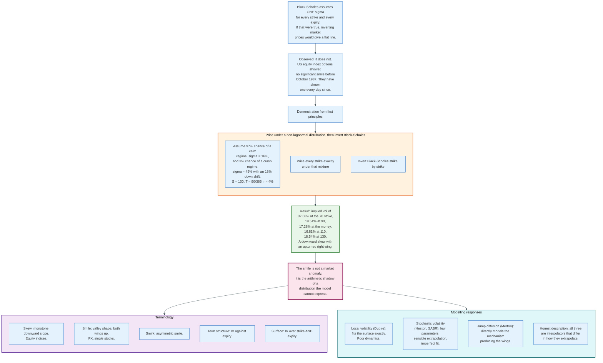
```mermaid
%%{init: {'theme': 'base', 'themeVariables': {'primaryColor': '#e3f2fd', 'primaryBorderColor': '#1565c0', 'lineColor': '#37474f'}}}%%

flowchart TB
    M["Black-Scholes assumes ONE sigma<br/>for every strike and every expiry.<br/>If that were true, inverting market<br/>prices would give a flat line."]

    M --> Obs["Observed: it does not.<br/>US equity index options showed<br/>no significant smile before<br/>October 1987. They have shown<br/>one every day since."]

    Obs --> Demo["Demonstration from first principles"]

    subgraph Demo2["Price under a non-lognormal distribution, then invert Black-Scholes"]
        direction TB
        X1["Assume 97% chance of a calm<br/>regime, sigma = 16%,<br/>and 3% chance of a crash regime,<br/>sigma = 45% with an 18% down shift.<br/>S = 100, T = 90/365, r = 4%"]
        X2["Price every strike exactly<br/>under that mixture"]
        X3["Invert Black-Scholes strike by strike"]
    end

    Demo --> Demo2

    Demo2 --> Res["Result: implied vol of<br/>32.66% at the 70 strike,<br/>19.51% at 90,<br/>17.28% at the money,<br/>16.81% at 110,<br/>18.54% at 130.<br/>A downward skew with<br/>an upturned right wing."]

    Res --> Why["The smile is not a market anomaly.<br/>It is the arithmetic shadow of a<br/>distribution the model cannot express."]

    subgraph Names["Terminology"]
        direction TB
        N1["Skew: monotone downward slope.<br/>Equity indices."]
        N2["Smile: valley shape, both wings up.<br/>FX, single stocks."]
        N3["Smirk: asymmetric smile."]
        N4["Term structure: IV against expiry."]
        N5["Surface: IV over strike AND expiry."]
    end

    subgraph Fix["Modelling responses"]
        direction TB
        F1["Local volatility (Dupire):<br/>fits the surface exactly.<br/>Poor dynamics."]
        F2["Stochastic volatility<br/>(Heston, SABR): few parameters,<br/>sensible extrapolation,<br/>imperfect fit."]
        F3["Jump-diffusion (Merton):<br/>directly models the mechanism<br/>producing the wings."]
        F4["Honest description: all three<br/>are interpolators that differ<br/>in how they extrapolate."]
    end

    Why --> Names
    Why --> Fix

    style M fill:#e3f2fd,stroke:#1565c0,stroke-width:2px
    style Demo2 fill:#fff3e0,stroke:#e65100,stroke-width:2px
    style Res fill:#e8f5e9,stroke:#2e7d32,stroke-width:2px
    style Why fill:#fce4ec,stroke:#880e4f,stroke-width:3px
    style Names fill:#f3e5f5,stroke:#4a148c,stroke-width:2px
    style Fix fill:#e0f7fa,stroke:#006064,stroke-width:2px
```

### 11.1 The Inversion, and Where It Breaks

There is no closed-form inverse of Black-Scholes for volatility. Implied volatility is computed numerically, either by Newton's method using vega as the derivative or by bisection when Newton fails to converge.

Newton fails where vega is small, and vega is small in the wings. On a 90-day option on a $100 underlying at 20% volatility:

| Strike | Vega per volatility point |
|--------|---------------------------|
| 70 | $0.00018 |
| 80 | $0.01123 |
| 90 | $0.09529 |
| 100 | $0.19591 |
| 110 | $0.14261 |
| 120 | $0.04775 |
| 130 | $0.00886 |

At the 70 strike, a one-cent change in the option's price moves implied volatility by more than 50 volatility points. Deep out-of-the-money implied volatilities are therefore not measurements. They are the output of dividing a small number by a smaller one, and any surface fitted through them without weighting by vega will be dominated by noise.

Practitioners weight by vega, cap the fit range, and treat quotes below a few cents as uninformative.

### 11.2 The Smile Is Evidence, Not Anomaly

The cleanest way to see why the smile exists is to build a distribution the model cannot express, price options exactly under it, and then ask Black-Scholes what volatility it thinks it is looking at.

Take a 90-day horizon on a $100 underlying with a 4% rate. Assume the true risk-neutral distribution is a mixture: with probability 0.97 the stock follows a lognormal path with 16% volatility, and with probability 0.03 it enters a crash regime with 45% volatility and an 18% downward shift in the mean, with the mixture renormalised so the forward price is arbitrage-free. Price every strike exactly under that mixture, then invert Black-Scholes strike by strike.

| Strike | Moneyness | Exact price under the mixture | Black-Scholes implied volatility |
|--------|-----------|-------------------------------|----------------------------------|
| 70 | 0.70 | 0.0553 | 32.66% |
| 80 | 0.80 | 0.1567 | 25.85% |
| 85 | 0.85 | 0.2593 | 22.27% |
| 90 | 0.90 | 0.5243 | 19.51% |
| 95 | 0.95 | 1.2699 | 17.99% |
| 100 | 1.00 | 3.9176 | 17.28% |
| 105 | 1.05 | 1.7971 | 16.94% |
| 110 | 1.10 | 0.6932 | 16.81% |
| 115 | 1.15 | 0.2301 | 16.82% |
| 120 | 1.20 | 0.0704 | 17.03% |
| 130 | 1.30 | 0.0096 | 18.54% |

Options struck below 100 are puts and those above are calls, so parity does not distort the comparison.

The shape is exactly the one observed in equity index markets: a steep downward slope through the strikes below spot, a minimum slightly above the money, and a shallow upturn in the far right wing. The 90 strike implies 19.51% and the 110 strike implies 16.81%, a skew of 2.70 volatility points across a 20% strike range.

Nothing in this table came from market data. It came from assuming a 3% chance of a crash.

### 11.3 What a Flat Volatility Would Cost

Pricing every strike at the at-the-money implied volatility of 17.28% produces the following errors against the true mixture prices:

| Strike | True price | Priced at flat 17.28% | Error | Error as a share of true price |
|--------|------------|-----------------------|-------|-------------------------------|
| 70 | 0.0553 | 0.0000 | -0.0553 | -100.0% |
| 80 | 0.1567 | 0.0077 | -0.1491 | -95.1% |
| 85 | 0.2593 | 0.0651 | -0.1942 | -74.9% |
| 90 | 0.5243 | 0.3359 | -0.1884 | -35.9% |
| 95 | 1.2699 | 1.1624 | -0.1075 | -8.5% |
| 100 | 3.9176 | 3.9176 | 0.0000 | 0.0% |
| 105 | 1.7971 | 1.8573 | +0.0602 | +3.4% |
| 110 | 0.6932 | 0.7511 | +0.0579 | +8.3% |
| 115 | 0.2301 | 0.2595 | +0.0294 | +12.8% |
| 120 | 0.0704 | 0.0772 | +0.0068 | +9.6% |
| 130 | 0.0096 | 0.0045 | -0.0051 | -52.9% |

A market maker who quoted flat volatility would sell every downside put at a fraction of its worth. The 80-strike put would go out at 5% of its value. That is not a rounding error; it is the entire business.

The market's response was not to abandon the model. It was to quote a different volatility per strike and keep the model as a translation device between price and a single comparable number.

### 11.4 The Skew Appeared in October 1987

Equity options in US markets showed no significant volatility smile before the crash of 19 October 1987, and have shown one continuously since.

The mechanism is straightforward. Before October 1987 the market's working distribution for equity index returns was approximately lognormal, and out-of-the-money puts were priced accordingly. The crash demonstrated that the left tail was much fatter than the lognormal allowed. Demand for crash protection rose permanently, supply of it fell permanently, and the price of downside strikes rose relative to at-the-money strikes.

That price difference, expressed in Black-Scholes units, is the skew.

The equity index skew is persistently downward-sloping rather than symmetric because the underlying phenomenon is asymmetric: indices fall faster than they rise, volatility spikes on declines, and the natural holders of equity are structurally short the left tail and willing to pay to cover it. FX options, where neither currency has a natural downside, show a more symmetric smile. Single stocks sit in between.

### 11.5 Sticky Strike and Sticky Delta

The surface is not static, and how it moves determines the correct hedge.

Under a **sticky strike** convention, the implied volatility attached to a given strike stays put as the underlying moves. A market maker hedging under this assumption uses the Black-Scholes delta unchanged.

Under **sticky delta**, also called sticky moneyness, the implied volatility attached to a given moneyness stays put, so the volatility at a fixed strike changes as spot moves. A market maker hedging under this assumption must adjust delta for the volatility change, using vanna.

The two produce materially different hedges on a skewed surface. Equity index markets behave closer to sticky delta over large moves and closer to sticky strike over small ones, which is why desks carry both numbers and a view about which regime they are in.

### 11.6 VIX Is Not a Black-Scholes Implied Volatility

The VIX index, launched on 19 January 1993 and built by Robert Whaley, originally measured 30-day implied volatility from S&P 100 options and was restated on S&P 500 options in 2003. VIX futures launched in 2004.

The 2003 restatement changed the method as well as the underlying. The current VIX is computed model-free, as a weighted integral across the full strip of out-of-the-money SPX option prices, interpolated to a constant 30-day horizon. It does not invert Black-Scholes at all. It computes the price of a variance swap and reports its square root.

The practical consequence is that VIX incorporates the whole smile rather than one strike, so it rises both when at-the-money volatility rises and when the skew steepens. A trader who treats VIX as the at-the-money implied volatility will misread every steepening.

---

## 12. Put-Call Parity and the Arbitrage Bounds

Put-call parity is the only exact relationship in options that requires no model at all. It follows from the payoffs alone, so it holds whatever the underlying does, whatever the distribution, and whether or not Black-Scholes is right.

Every model must reproduce it. Any quote that violates it is an arbitrage.

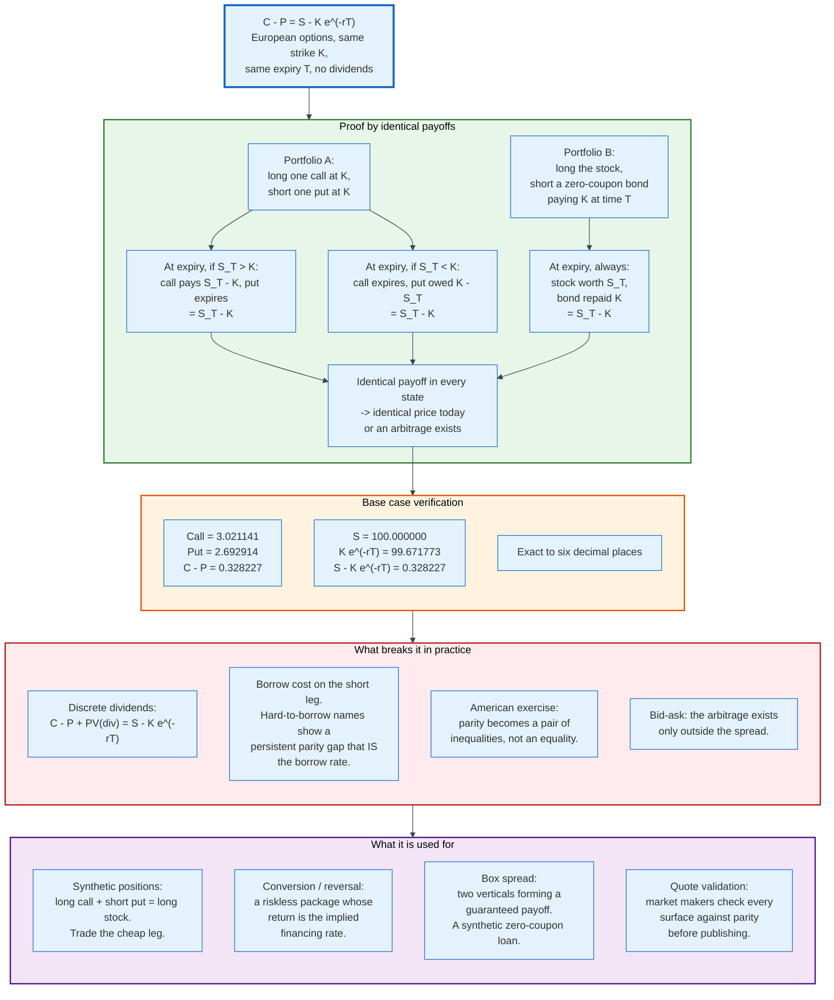
```mermaid
%%{init: {'theme': 'base', 'themeVariables': {'primaryColor': '#e3f2fd', 'primaryBorderColor': '#1565c0', 'lineColor': '#37474f'}}}%%

flowchart TB
    Claim["C - P = S - K e^(-rT)<br/>European options, same strike K,<br/>same expiry T, no dividends"]

    subgraph Proof["Proof by identical payoffs"]
        direction TB
        PA["Portfolio A:<br/>long one call at K,<br/>short one put at K"]
        PB["Portfolio B:<br/>long the stock,<br/>short a zero-coupon bond<br/>paying K at time T"]
        PayA["At expiry, if S_T &gt; K:<br/>call pays S_T - K, put expires<br/>= S_T - K"]
        PayA2["At expiry, if S_T &lt; K:<br/>call expires, put owed K - S_T<br/>= S_T - K"]
        PayB["At expiry, always:<br/>stock worth S_T,<br/>bond repaid K<br/>= S_T - K"]
        Same["Identical payoff in every state<br/>-&gt; identical price today<br/>or an arbitrage exists"]
    end

    Claim --> Proof
    PA --> PayA
    PA --> PayA2
    PB --> PayB
    PayA --> Same
    PayA2 --> Same
    PayB --> Same

    subgraph Check["Base case verification"]
        direction TB
        C1["Call = 3.021141<br/>Put = 2.692914<br/>C - P = 0.328227"]
        C2["S = 100.000000<br/>K e^(-rT) = 99.671773<br/>S - K e^(-rT) = 0.328227"]
        C3["Exact to six decimal places"]
    end

    Same --> Check

    subgraph Break["What breaks it in practice"]
        direction TB
        B1["Discrete dividends:<br/>C - P + PV(div) = S - K e^(-rT)"]
        B2["Borrow cost on the short leg.<br/>Hard-to-borrow names show a<br/>persistent parity gap that IS<br/>the borrow rate."]
        B3["American exercise:<br/>parity becomes a pair of<br/>inequalities, not an equality."]
        B4["Bid-ask: the arbitrage exists<br/>only outside the spread."]
    end

    Check --> Break

    subgraph Use["What it is used for"]
        direction TB
        U1["Synthetic positions:<br/>long call + short put = long stock.<br/>Trade the cheap leg."]
        U2["Conversion / reversal:<br/>a riskless package whose<br/>return is the implied<br/>financing rate."]
        U3["Box spread:<br/>two verticals forming a<br/>guaranteed payoff.<br/>A synthetic zero-coupon loan."]
        U4["Quote validation:<br/>market makers check every<br/>surface against parity<br/>before publishing."]
    end

    Break --> Use

    style Claim fill:#e3f2fd,stroke:#1565c0,stroke-width:3px
    style Proof fill:#e8f5e9,stroke:#2e7d32,stroke-width:2px
    style Check fill:#fff3e0,stroke:#e65100,stroke-width:2px
    style Break fill:#ffebee,stroke:#b71c1c,stroke-width:2px
    style Use fill:#f3e5f5,stroke:#4a148c,stroke-width:2px
```

### 12.1 The Identity and Its Proof

For European options on a non-dividend-paying underlying:

```
C - P  =  S - K e^(-rT)
```

The proof needs two portfolios and no assumptions about how the stock moves.

Portfolio A is long one call and short one put, both struck at `K` and expiring at `T`. If the stock finishes above `K`, the call pays `S(T) - K` and the put expires worthless. If it finishes below `K`, the call expires worthless and the short put owes `K - S(T)`, which is a payment of `S(T) - K`. Either way the portfolio is worth `S(T) - K`.

Portfolio B is long the stock and short a zero-coupon bond that repays `K` at `T`. At expiry it is worth `S(T) - K`.

The two portfolios have identical payoffs in every possible state of the world. If their prices differ today, buy the cheap one, sell the dear one, and collect the difference with no residual risk. Therefore they cost the same today, which is the identity.

Base case verification: `3.021141 - 2.692914 = 0.328227` and `100.000000 - 99.671773 = 0.328227`.

### 12.2 The Adjusted Forms

Dividends enter as a present value on the option side:

```
C - P + PV(dividends)  =  S - K e^(-rT)
```

equivalently, with a continuous yield `q`:

```
C - P  =  S e^(-qT) - K e^(-rT)
```

For American options the equality becomes a pair of inequalities, because the early exercise right on the put is worth more than the early exercise right on the call when rates are positive:

```
S - K  <=  C - P  <=  S - K e^(-rT)
```

Borrow cost on the underlying enters exactly like a dividend yield. A stock with a 12% annualised borrow cost prices its options as if it paid a 12% dividend, and the observed parity gap in hard-to-borrow names is a direct market quotation of the borrow rate. Traders read it that way deliberately.

### 12.3 Conversions, Reversals, and the Box

Parity generates three trades that are riskless by construction, and their prices are financing rates rather than volatility views.

A **conversion** is long stock, long put, short call at the same strike and expiry. The payoff is fixed at `K` regardless of where the stock goes. The package is a synthetic zero-coupon bond, and its yield is the implied financing rate the options market is quoting.

A **reversal** is the opposite: short stock, short put, long call. It is a synthetic borrowing, and its cost is what the market charges to lend against the position.

A **box spread** is a bull call spread plus a bear put spread on the same two strikes. Its terminal payoff is exactly the strike differential, regardless of the underlying. Buying a box lends money at the implied rate; selling one borrows at it. Institutions use SPX boxes as a financing instrument precisely because the payoff is contractually certain.

The box carries one trap. It is riskless only with European exercise. Built with American options, either short leg can be assigned early, which converts a fixed payoff into an open position with a stock delivery obligation attached. Retail losses on American-style box spreads are a recurring category, and the cause is always the same: a strategy that is arbitrage-free at expiry is not arbitrage-free in the middle.

### 12.4 The Arbitrage Bounds

Parity is the exact relationship. Four inequalities bound each option independently, and they also require no model.

```
max(0, S e^(-qT) - K e^(-rT))  <=  C  <=  S e^(-qT)

max(0, K e^(-rT) - S e^(-qT))  <=  P  <=  K e^(-rT)
```

A call cannot be worth more than the stock, because it is a right to buy the stock. A call cannot be worth less than the discounted forward intrinsic, because otherwise buying the call and shorting the stock locks in a profit.

From the lower bound follows the single most useful early-exercise result: an American call on a non-dividend-paying stock is never optimally exercised early. Exercising pays `S - K` and destroys the remaining time value; selling the call realises at least `S - K e^(-rT)`, which is more. The right to exercise a call early on a non-dividend payer is worth exactly zero.

That result is why the base case American call equals the European call, while the base case American put exceeds the European put by 0.021782.

### 12.5 Why Market Makers Check Parity Continuously

Parity is the consistency test that catches surface errors before they become fills.

A market maker computing a volatility surface must produce call and put prices at the same strike that satisfy parity to within the bid-ask spread. If they do not, an arbitrageur will lift the cheap leg and hit the dear one, and the market maker will have paid for its own inconsistency.

This is not theoretical. When OCC filed to clear binary options in April 2026, its amendment to the STANS margin methodology specified that the pricing framework applies smoothing algorithms to ensure the resulting prices maintain put-call parity and satisfy monotonicity constraints. A clearing house computing margin on 5 million positions overnight enforces the same identity a market maker enforces on a quote.

---

## 13. Binomial Trees and Monte Carlo

Two numerical methods cover everything Black-Scholes cannot. Trees handle early exercise. Simulation handles path dependence and high dimensions. They fail in opposite directions, which is why every derivatives library carries both.

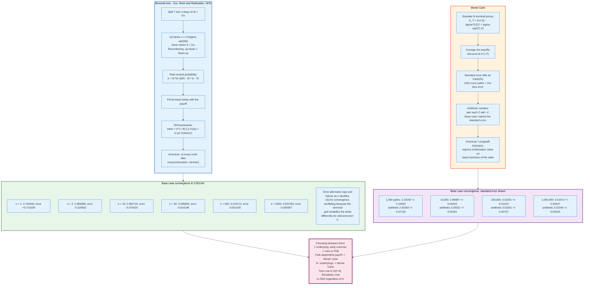
```mermaid
%%{init: {'theme': 'base', 'themeVariables': {'primaryColor': '#e3f2fd', 'primaryBorderColor': '#1565c0', 'lineColor': '#37474f'}}}%%

flowchart TB
    subgraph Tree["Binomial tree - Cox, Ross and Rubinstein, 1979"]
        direction TB
        T1["Split T into n steps of dt = T/n"]
        T2["Up factor u = e^(sigma sqrt(dt))<br/>Down factor d = 1/u<br/>Recombining: up-down = down-up"]
        T3["Risk-neutral probability<br/>p = (e^((r-q)dt) - d) / (u - d)"]
        T4["Fill terminal nodes with the payoff"]
        T5["Roll backwards:<br/>value = e^(-r dt) [ p V(up) + (1-p) V(down) ]"]
        T6["American: at every node take<br/>max(continuation, intrinsic)"]
        T1 --> T2 --> T3 --> T4 --> T5 --> T6
    end

    subgraph Conv["Base case convergence to 3.021141"]
        direction TB
        C1["n = 1: 3.740340, error +0.719199"]
        C2["n = 2: 2.696089, error -0.325052"]
        C3["n = 10: 2.950716, error -0.070425"]
        C4["n = 50: 3.006892, error -0.014248"]
        C5["n = 500: 3.019713, error -0.001428"]
        C6["n = 2000: 3.020784, error -0.000357"]
        C7["Error alternates sign and<br/>halves as n doubles.<br/>O(1/n) convergence,<br/>oscillating because the terminal<br/>grid straddles the strike<br/>differently for odd and even n."]
    end

    Tree --> Conv

    subgraph MC["Monte Carlo"]
        direction TB
        M1["Simulate N terminal prices:<br/>S_T = S e^((r - sigma^2/2)T + sigma sqrt(T) Z)"]
        M2["Average the payoffs,<br/>discount at e^(-rT)"]
        M3["Standard error falls as 1/sqrt(N).<br/>100x more paths = 10x less error."]
        M4["Antithetic variates:<br/>pair each Z with -Z.<br/>Base case: halves the standard error."]
        M5["American: Longstaff-Schwartz,<br/>regress continuation value on<br/>basis functions of the state"]
        M1 --> M2 --> M3 --> M4 --> M5
    end

    subgraph MCconv["Base case convergence, standard error shown"]
        direction TB
        D1["1,000 paths: 3.23105 +/- 0.15053<br/>antithetic 2.91583 +/- 0.07130"]
        D2["10,000: 2.99487 +/- 0.04442<br/>antithetic 3.05021 +/- 0.02341"]
        D3["100,000: 3.02291 +/- 0.01419<br/>antithetic 3.01801 +/- 0.00737"]
        D4["1,000,000: 3.01672 +/- 0.00447<br/>antithetic 3.02340 +/- 0.00233"]
    end

    MC --> MCconv

    Pick["Choosing between them:<br/>1 underlying, early exercise -&gt; tree or PDE<br/>Path-dependent payoff -&gt; Monte Carlo<br/>3+ underlyings -&gt; Monte Carlo<br/>Tree cost is O(n^d). Simulation cost<br/>is O(N) regardless of d."]

    Conv --> Pick
    MCconv --> Pick

    style Tree fill:#e3f2fd,stroke:#1565c0,stroke-width:2px
    style Conv fill:#e8f5e9,stroke:#2e7d32,stroke-width:2px
    style MC fill:#fff3e0,stroke:#e65100,stroke-width:2px
    style MCconv fill:#f3e5f5,stroke:#4a148c,stroke-width:2px
    style Pick fill:#fce4ec,stroke:#880e4f,stroke-width:3px
```

### 13.1 The Cox-Ross-Rubinstein Tree

Cox, Ross and Rubinstein published the binomial model in 1979, building on a 1978 proposal by William Sharpe. It replaces continuous price movement with a lattice of discrete up and down moves.

Divide the option's life into `n` steps of length `dt = T/n`. At each step the underlying either multiplies by `u = e^(sigma sqrt(dt))` or by `d = 1/u`. Choosing `d` as the reciprocal of `u` makes the tree recombine: an up move followed by a down move lands on the same node as a down followed by an up, so the tree has `n+1` terminal nodes rather than `2^n`.

The risk-neutral probability of an up move is the value that makes the expected return equal the risk-free rate:

```
p = ( e^((r - q) dt) - d ) / ( u - d )
```

For the base case with `n = 2`: `dt = 0.041096`, `u = 1.051987`, `d = 0.950583`, `p = 0.503557`. With `n = 100`: `u = 1.007193`, `d = 0.992858`, `p = 0.500502`.

Valuation proceeds backwards. Fill the terminal nodes with the payoff, then at each earlier node take the discounted probability-weighted average of the two nodes it leads to.

### 13.2 Convergence Is Slow and Oscillates

| Steps `n` | European call value | Error against 3.021141 |
|-----------|--------------------|-----------------------|
| 1 | 3.740340 | +0.719199 |
| 2 | 2.696089 | -0.325052 |
| 3 | 3.263830 | +0.242689 |
| 4 | 2.849679 | -0.171462 |
| 5 | 3.165907 | +0.144766 |
| 10 | 2.950716 | -0.070425 |
| 25 | 3.049701 | +0.028560 |
| 50 | 3.006892 | -0.014248 |
| 100 | 3.014007 | -0.007134 |
| 250 | 3.018285 | -0.002856 |
| 500 | 3.019713 | -0.001428 |
| 1,000 | 3.020427 | -0.000714 |
| 2,000 | 3.020784 | -0.000357 |

Two features matter. The error falls roughly in proportion to `1/n`, so doubling the step count halves it, which makes the tree expensive for high precision. And the error alternates sign, because the terminal node grid straddles the strike differently depending on whether `n` is odd or even.

The oscillation has a practical fix: averaging the results for `n` and `n+1` steps cancels most of the first-order error, and the Leisen-Reimer tree chooses `u`, `d`, and `p` specifically so that a terminal node sits on the strike, which removes the oscillation and delivers smooth quadratic convergence.

### 13.3 American Exercise Is Why the Tree Exists

At each node the tree compares the continuation value against immediate exercise and takes the larger. Black-Scholes cannot do this because it has no intermediate states.

| Case | European | American (2,000 steps) | Early-exercise premium |
|------|----------|------------------------|------------------------|
| Base case put, `S = K = 100`, `T = 30/365`, `r = 4%` | 2.692914 | 2.714695 | 0.021782 |
| Deep in-the-money put, `S = 100`, `K = 140`, `T = 1`, `r = 6%`, `sigma = 25%` | 33.784100 | 40.000000 | 6.215900 |
| At-the-money call, `T = 1`, `q = 6%`, `r = 4%`, `sigma = 25%` | 8.541800 | 8.824200 | 0.282400 |

The second row is the clearest case. The American value of 40.0000 is exactly the intrinsic value, `140 - 100`. The tree shows that immediate exercise is optimal: taking $40 now and earning 6% on it beats holding an option whose remaining upside is capped by the stock's inability to fall below zero.

The third row shows the dividend case for calls. With a 6% dividend yield against a 4% rate, holding the call forgoes more in dividends than it saves in financing, and early exercise just before an ex-dividend date becomes optimal.

### 13.4 Monte Carlo and the Square Root

Monte Carlo prices by direct simulation of the risk-neutral expectation. Draw `N` standard normal variates, compute terminal prices as `S e^((r - sigma^2/2)T + sigma sqrt(T) Z)`, average the payoffs, and discount.

| Paths | Plain estimate | Standard error | Antithetic estimate | Standard error |
|-------|----------------|----------------|---------------------|----------------|
| 1,000 | 3.23105 | 0.15053 | 2.91583 | 0.07130 |
| 10,000 | 2.99487 | 0.04442 | 3.05021 | 0.02341 |
| 100,000 | 3.02291 | 0.01419 | 3.01801 | 0.00737 |
| 1,000,000 | 3.01672 | 0.00447 | 3.02340 | 0.00233 |

The standard error falls as one over the square root of the path count. Getting one more decimal place of precision costs 100 times the computation. One million paths still leaves a standard error of $0.00447 on a $3.02 option, which is roughly a tenth of a cent and about a fifth of a typical bid-ask spread.

Antithetic variates halve the error at no additional cost: for each drawn `Z`, also evaluate the payoff at `-Z` and average the pair. The two payoffs are negatively correlated, so the variance of the average is less than the variance of either.

Other variance reduction techniques do more. Control variates use a related instrument with a known price, typically the underlying itself or a geometric-average Asian option, and correct the estimate by the known error on the control. Quasi-random sequences replace pseudorandom draws with low-discrepancy sequences and can improve the convergence rate itself rather than just the constant.

### 13.5 The Dimensional Crossover

The choice between tree and simulation is decided by dimension and by path dependence.

A recombining tree on one underlying has `O(n^2)` nodes. On `d` underlyings it has `O(n^d)` nodes, which becomes intractable at `d = 3` or `4`. Monte Carlo costs `O(N)` regardless of dimension, because each path is simulated independently no matter how many state variables it carries.

Path dependence breaks the tree in a different way. A barrier option's value at a node depends on whether the barrier was breached on the way there, so nodes are no longer interchangeable and the lattice stops recombining. An Asian option's payoff depends on the average price along the path, which is not a function of the terminal node.

Monte Carlo handles both trivially, and pays for it with the one thing it does badly: early exercise. Simulation runs forward in time; optimal exercise requires knowing the continuation value, which requires running backwards.

Longstaff and Schwartz solved that in 2001 with least-squares Monte Carlo: simulate all paths forward, then work backwards, regressing the realised discounted continuation values on basis functions of the current state to estimate the continuation value at each exercise date, and exercise where intrinsic value exceeds the regression estimate.

### 13.6 The Third Family

Finite difference methods solve the Black-Scholes PDE directly on a grid in price and time, using explicit, implicit, or Crank-Nicolson schemes.

They occupy the same niche as trees, with better control over the grid and better handling of boundary conditions such as barriers. A trinomial tree is arithmetically an explicit finite difference scheme. Production systems for single-underlying American and barrier options usually run finite differences rather than trees, because the grid can be refined where the payoff is non-smooth and coarsened where it is not.

---

## 14. Market Making, Delta Hedging, and Gamma Exposure

A market maker in options does not take a directional view. It sells a payoff at an implied volatility, manufactures that payoff by trading the underlying, and earns the difference between the volatility it charged and the volatility the market actually delivers.

That is the whole business, and it reduces to one number.

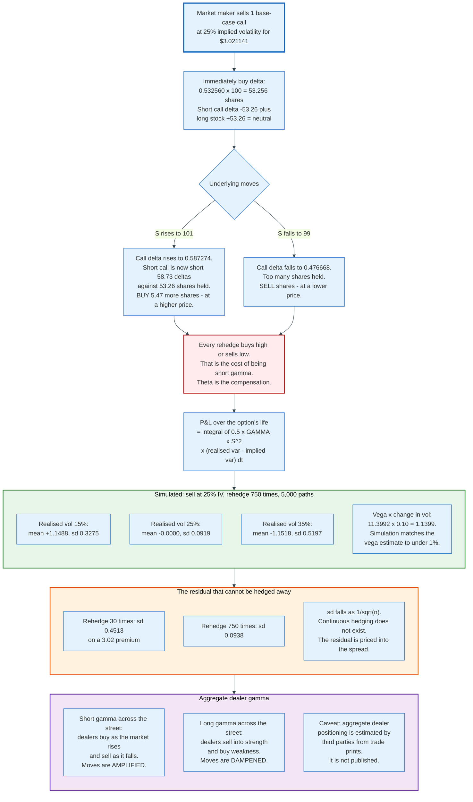
```mermaid
%%{init: {'theme': 'base', 'themeVariables': {'primaryColor': '#e3f2fd', 'primaryBorderColor': '#1565c0', 'lineColor': '#37474f'}}}%%

flowchart TB
    Sell["Market maker sells 1 base-case call<br/>at 25% implied volatility for $3.021141"]

    Sell --> H0["Immediately buy delta:<br/>0.532560 x 100 = 53.256 shares<br/>Short call delta -53.26 plus<br/>long stock +53.26 = neutral"]

    H0 --> Loop{"Underlying moves"}

    Loop -->|"S rises to 101"| Up["Call delta rises to 0.587274.<br/>Short call is now short 58.73 deltas<br/>against 53.26 shares held.<br/>BUY 5.47 more shares - at a higher price."]
    Loop -->|"S falls to 99"| Dn["Call delta falls to 0.476668.<br/>Too many shares held.<br/>SELL shares - at a lower price."]

    Up --> Cost["Every rehedge buys high or sells low.<br/>That is the cost of being short gamma.<br/>Theta is the compensation."]
    Dn --> Cost

    Cost --> PnL["P&L over the option's life<br/>= integral of 0.5 x GAMMA x S^2<br/>x (realised var - implied var) dt"]

    subgraph Sim["Simulated: sell at 25% IV, rehedge 750 times, 5,000 paths"]
        direction TB
        S1["Realised vol 15%:<br/>mean +1.1488, sd 0.3275"]
        S2["Realised vol 25%:<br/>mean -0.0000, sd 0.0919"]
        S3["Realised vol 35%:<br/>mean -1.1518, sd 0.5197"]
        S4["Vega x change in vol:<br/>11.3992 x 0.10 = 1.1399.<br/>Simulation matches the<br/>vega estimate to under 1%."]
    end

    PnL --> Sim

    subgraph Disc["The residual that cannot be hedged away"]
        direction TB
        R1["Rehedge 30 times: sd 0.4513<br/>on a 3.02 premium"]
        R2["Rehedge 750 times: sd 0.0938"]
        R3["sd falls as 1/sqrt(n).<br/>Continuous hedging does not exist.<br/>The residual is priced into the spread."]
    end

    Sim --> Disc

    subgraph Agg["Aggregate dealer gamma"]
        direction TB
        G1["Short gamma across the street:<br/>dealers buy as the market rises<br/>and sell as it falls.<br/>Moves are AMPLIFIED."]
        G2["Long gamma across the street:<br/>dealers sell into strength<br/>and buy weakness.<br/>Moves are DAMPENED."]
        G3["Caveat: aggregate dealer<br/>positioning is estimated by<br/>third parties from trade prints.<br/>It is not published."]
    end

    Disc --> Agg

    style Sell fill:#e3f2fd,stroke:#1565c0,stroke-width:3px
    style Cost fill:#ffebee,stroke:#b71c1c,stroke-width:2px
    style Sim fill:#e8f5e9,stroke:#2e7d32,stroke-width:2px
    style Disc fill:#fff3e0,stroke:#e65100,stroke-width:2px
    style Agg fill:#f3e5f5,stroke:#4a148c,stroke-width:2px
```

### 14.1 The Hedging Identity

The profit and loss of a delta-hedged short option position, integrated over its life, is:

```
P&L  =  - integral of  0.5 x GAMMA x S^2 x ( realised variance - implied variance ) dt
```

Selling an option at 25% implied volatility and rehedging is a bet that the underlying will move less than 25% annualised. If it moves less, the rehedging losses come to less than the premium collected, and the seller keeps the difference. If it moves more, the rehedging losses exceed the premium.

The direction of the move is irrelevant. Only the magnitude enters.

### 14.2 The Simulation

Sell the base case call at 25% implied volatility. Rehedge to delta neutral at fixed intervals. Run 5,000 paths at three different realised volatilities.

| Realised volatility | Rehedges over 30 days | Mean P&L | Standard deviation |
|---------------------|-----------------------|----------|--------------------|
| 15% | 30 | +1.1421 | 0.4160 |
| 15% | 750 | +1.1488 | 0.3275 |
| 25% | 30 | +0.0020 | 0.4415 |
| 25% | 750 | -0.0000 | 0.0919 |
| 35% | 30 | -1.1392 | 0.7943 |
| 35% | 750 | -1.1518 | 0.5197 |

These are an independent 5,000-path draw, not the Section 9.3 run. The 25% row here reports a standard deviation of 0.4415 against 0.45130 in Section 9.3, a gap of 2%, which is the Monte Carlo error on 5,000 paths. Section 9.3's figure is the one quoted elsewhere in this document.

Three results, each worth stating separately.

**Selling at the right volatility earns nothing on average.** At 25% realised against 25% implied, the mean is zero to four decimal places. The premium exactly pays for the hedging. That is what it means for the model to be internally consistent.

**The edge equals vega times the volatility difference.** The base case vega is 11.399205 per unit of volatility. Selling 10 points too high, at 25% implied against 15% realised, should earn `11.3992 x 0.10 = 1.1399`. The simulation returns +1.1488. Selling 10 points too low should lose the same amount; the simulation returns -1.1518. Exact repricing gives -1.1399 at 35% volatility and +1.1394 at 15%: the option is worth 4.161072 at 35% and 1.881766 at 15%, against the 3.021141 collected. Three independent methods agree to about 1%.

**The distribution is asymmetric.** Standard deviation is 0.3275 when realised volatility comes in below implied and 0.5197 when it comes in above. Short option positions have a fatter loss tail than gain tail, which is the same statement as saying the seller is short gamma.

### 14.3 Gamma Scalping in Practice

The rehedging that generates all of this is mechanical. Short 100 base case calls, which is a short position of 5,325.6 deltas, hedged with 5,326 shares held long:

| Underlying | Delta per share | Gamma | Shares required for a 100-contract hedge | Action |
|-----------|-----------------|-------|-------------------------------------------|--------|
| 100.00 | 0.532560 | 0.055476 | 5,325.6 | Initial hedge |
| 101.00 | 0.587274 | 0.053786 | 5,872.7 | Buy 547 shares at 101.00 |
| 99.50 | 0.504696 | 0.055937 | 5,047.0 | Sell 826 shares at 99.50 |
| 100.50 | 0.560128 | 0.054754 | 5,601.3 | Buy 554 shares at 100.50 |
| 100.00 | 0.532560 | 0.055476 | 5,325.6 | Sell 276 shares at 100.00 |

Every trade in that sequence buys higher and sells lower than the previous one, which is why a short gamma position loses money on rehedging. The stock ends where it started and the hedger has paid out cash. Theta is the compensating credit: five days of decay at $5.30 per contract per day on 100 contracts is $2,650.

A long gamma position runs the same loop in reverse, selling into strength and buying weakness, generating cash on every rehedge and paying theta for the privilege.

### 14.4 Dollar Gamma and Why Desks Quote It

Gamma expressed per unit of underlying is not comparable across instruments. A gamma of 0.055 on a $100 stock and a gamma of 0.055 on a $6,500 index describe completely different exposures.

Desks therefore quote dollar gamma: the change in delta-notional for a 1% move in the underlying, computed as `GAMMA x S^2 x 0.01` per unit, scaled by contract multiplier and position size. For the 100-contract short position above, dollar gamma at $100.00 is $55,476. A 1% move in the stock changes the required hedge by $55,476 of stock, in the direction that loses money.

That number is what a risk manager limits. Section 19 computes it for zero-day index options, where it becomes very large.

### 14.5 Aggregate Dealer Gamma and Market Reflexivity

If dealers as a group are short gamma, their hedging amplifies moves. If they are long gamma, it dampens them.

The mechanism is the rehedging loop in Section 14.3, run at market scale. A dealer short gamma must buy the underlying as it rises and sell as it falls. Every dealer doing this simultaneously adds momentum to whatever move is already happening. A dealer long gamma does the opposite, selling into rallies and buying dips, which supplies liquidity and compresses realised volatility.

The typical configuration in US equity index options is that dealers are net long gamma from customer put buying and net short gamma from customer call overwriting, with the balance shifting by strike and expiry. The level at which the net flips sign is what practitioners call the gamma flip point.

One caveat matters and is routinely omitted. Aggregate dealer positioning is not published. It is estimated by third-party vendors from trade prints and quote data, inferring whether each trade was customer-initiated buying or selling. Those estimates are model outputs with meaningful error, not measurements. The mechanism is real and the arithmetic is exact; the input is an estimate.

### 14.6 Pin Risk

At expiry, an at-the-money option's delta is undefined: it is 1 if the stock finishes a cent above the strike and 0 if a cent below.

A market maker short 100 calls struck at $100 with the stock trading at exactly $100.00 into the close faces a hedge that is either 10,000 shares or zero and cannot know which. Hedging as if delta is 0.50 leaves 5,000 shares of exposure in whichever direction the settlement falls.

This is pin risk, and it is why open interest at a strike tends to attract the underlying's closing price near expiry: hedgers whose positions straddle the strike trade against every deviation from it. It is also why professional desks flatten expiring at-the-money positions rather than carry them to settlement.

---

## 15. Clearing: The OCC and Novation

Clearing replaces a promise from a stranger with a promise from an institution engineered not to fail. That substitution is what makes a standardised option fungible, because a contract is only interchangeable with another if the counterparty behind both is identical.

The Options Clearing Corporation was founded in 1973 alongside the CBOE as CBOE Clearing Corporation, and took its present name in 1975, when the American, Philadelphia and Pacific exchanges began listing options and clearing through it. It is registered with the SEC as a clearing agency and with the CFTC as a derivatives clearing organization, and it was designated a systemically important financial market utility under the Dodd-Frank Act in July 2012.

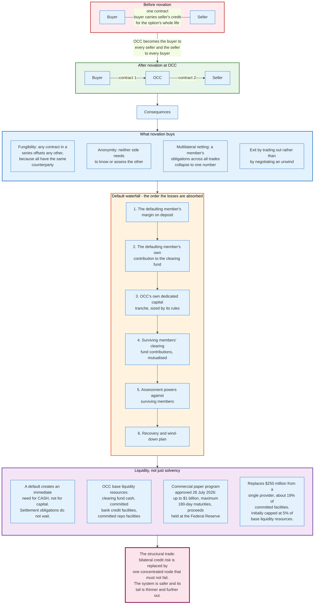
```mermaid
%%{init: {'theme': 'base', 'themeVariables': {'primaryColor': '#e3f2fd', 'primaryBorderColor': '#1565c0', 'lineColor': '#37474f'}}}%%

flowchart TB
    subgraph Before["Before novation"]
        direction LR
        BA["Buyer"] ---|"one contract<br/>buyer carries seller's credit<br/>for the option's whole life"| BS["Seller"]
    end

    subgraph After["After novation at OCC"]
        direction LR
        AA["Buyer"] -->|"contract 1"| OCC1["OCC"]
        OCC1 -->|"contract 2"| AS["Seller"]
    end

    Before -->|"OCC becomes the buyer to<br/>every seller and the seller<br/>to every buyer"| After

    After --> Chain["Consequences"]

    subgraph Chain2["What novation buys"]
        direction TB
        Y1["Fungibility: any contract in a<br/>series offsets any other,<br/>because all have the same<br/>counterparty"]
        Y2["Anonymity: neither side needs<br/>to know or assess the other"]
        Y3["Multilateral netting: a member's<br/>obligations across all trades<br/>collapse to one number"]
        Y4["Exit by trading out rather than<br/>by negotiating an unwind"]
    end

    Chain --> Chain2

    subgraph WF["Default waterfall - the order the losses are absorbed"]
        direction TB
        W1["1. The defaulting member's<br/>margin on deposit"]
        W2["2. The defaulting member's own<br/>contribution to the clearing fund"]
        W3["3. OCC's own dedicated capital<br/>tranche, sized by its rules"]
        W4["4. Surviving members' clearing<br/>fund contributions, mutualised"]
        W5["5. Assessment powers against<br/>surviving members"]
        W6["6. Recovery and wind-down plan"]
        W1 --> W2 --> W3 --> W4 --> W5 --> W6
    end

    Chain2 --> WF

    subgraph Liq["Liquidity, not just solvency"]
        direction TB
        L1["A default creates an immediate<br/>need for CASH, not for capital.<br/>Settlement obligations do not wait."]
        L2["OCC base liquidity resources:<br/>clearing fund cash, committed<br/>bank credit facilities,<br/>committed repo facilities"]
        L3["Commercial paper program<br/>approved 28 July 2026:<br/>up to $1 billion, maximum<br/>180-day maturities, proceeds<br/>held at the Federal Reserve"]
        L4["Replaces $250 million from a<br/>single provider, about 19% of<br/>committed facilities.<br/>Initially capped at 5% of<br/>base liquidity resources."]
    end

    WF --> Liq

    Risk["The structural trade:<br/>bilateral credit risk is replaced by<br/>one concentrated node that must not fail.<br/>The system is safer and its<br/>tail is thinner and further out."]

    Liq --> Risk

    style Before fill:#ffebee,stroke:#b71c1c,stroke-width:2px
    style After fill:#e8f5e9,stroke:#2e7d32,stroke-width:2px
    style Chain2 fill:#e3f2fd,stroke:#1565c0,stroke-width:2px
    style WF fill:#fff3e0,stroke:#e65100,stroke-width:2px
    style Liq fill:#f3e5f5,stroke:#4a148c,stroke-width:2px
    style Risk fill:#fce4ec,stroke:#880e4f,stroke-width:3px
```

### 15.1 What Novation Does

Novation replaces one contract between two parties with two contracts, each between the clearing house and one party. In OCC's own formulation, it becomes the buyer to every seller and the seller to every buyer.

Four consequences follow, and all four are load-bearing.

**Fungibility.** Every contract in a given series has the same counterparty, so any one offsets any other. Without novation, closing a position would require finding and negotiating with the original writer. With it, a closing trade against any counterparty extinguishes the position.

**Anonymity.** Neither side assesses the other's credit, so a retail account and a global bank trade on identical terms.

**Multilateral netting.** A clearing member with thousands of positions across hundreds of series owes one net amount, not thousands of gross ones.

**Exit by trading out.** Positions terminate through the market rather than through negotiation.

### 15.2 The Clearing Member Is the Interface

OCC does not face customers. It faces clearing members, each of which guarantees its own customers' obligations to OCC.

A clearing member must meet minimum capital requirements, demonstrate operational capability, contribute to the clearing fund, and accept assessment obligations if another member defaults. In exchange it gets direct access and the ability to sell that access to customers.

This structure means a customer's protection has two layers. The first is the clearing member's guarantee. The second is customer asset segregation, which separates customer positions and collateral from the member's own so that a member failure does not consume customer assets. When those rules fail, customers discover that the clearing house guarantee never ran to them directly.

### 15.3 The Default Waterfall

When a clearing member fails, the losses are absorbed in a fixed order, and the order is the entire design.

First, the defaulter's own margin on deposit. Margin is sized to cover the expected close-out cost of that member's portfolio, so in most defaults it is sufficient and no other layer is touched.

Second, the defaulter's own contribution to the clearing fund.

Third, a tranche of the clearing house's own capital, contributed before mutualised resources. This tranche exists to align incentives: a clearing house that would lose nothing before its members do has weak reasons to margin conservatively.

OCC's tranche has two parts, a Minimum Corporate Contribution of cash held exclusively against default losses and liquidity shortfalls, plus liquid net assets funded by equity above 110% of its Target Capital Requirement. In its own filing on the Resource Backtesting Margin Charge, OCC put the two together at more than $130 million as of 31 December 2023, against a clearing fund of more than $16.7 billion on the same date. The clearing house's own money ahead of mutualisation is therefore under 0.8% of what its members have put up. If OCC spends part of the Minimum Corporate Contribution, the tranche is cut to what remains for 270 days while it is rebuilt.

A tranche that small aligns incentives. It does not absorb losses.

Fourth, the surviving members' clearing fund contributions, mutualised.

Fifth, assessment powers, which allow the clearing house to demand further contributions from surviving members up to a defined cap.

Sixth, recovery and wind-down tools, which include variation margin gains haircutting and, in the final case, an orderly wind-down.

The waterfall's purpose is to put the loss on the party that caused it, then on the party that selected it, and only then on everyone.

### 15.4 Liquidity Is a Separate Problem From Solvency

A defaulting member creates an immediate demand for cash, because settlement obligations fall due regardless of how well collateralised the position is. Collateral that is adequate but illiquid does not meet a same-day settlement obligation.

OCC therefore maintains base liquidity resources: cash in the clearing fund, committed bank credit facilities, and committed repurchase facilities. On 28 July 2026 the SEC approved OCC's establishment of a commercial paper program, permitting up to $1 billion of unsecured notes with maximum 180-day maturities placed with institutional investors, with staggered maturity dates to mitigate rollover risk and proceeds deposited in OCC's Federal Reserve Bank account.

The rationale in the filing is operational rather than financial. OCC noted that obtaining new commitments through existing bank facilities could take weeks or months, while commercial paper offers same-day funding access, at a lower cost than its syndicated credit and repo facilities. Initially the program replaces $250 million from a single liquidity provider representing approximately 19% of OCC's committed facilities, and the board is authorised to cap how much of the proceeds count toward required liquidity, projected initially at 5% of base liquidity resources.

A clearing house that cannot pay on the day is insolvent regardless of its balance sheet.

### 15.5 Clearing Houses Do Fail Partially

Central clearing has an excellent record and a small number of instructive failures. The most cited recent case is Nasdaq Clearing in September 2018.

A single member, an individual trader clearing his own Nordic power futures positions, defaulted after the Nordic-German power spread moved against him. His margin and collateral were insufficient. Nasdaq, Inc. reported the residual loss at $133 million, allocated under the liability waterfall as $8 million against Nasdaq Clearing's junior capital and $125 million pro rata against the commodities clearing members' default fund contributions.

Both layers were replenished within September 2018, and Nasdaq Clearing added roughly $22 million of temporary capital for 90 days from 11 September. Across all four of its default funds, member contributions totalled $515 million at 30 September 2018, of which $463 million was usable against a default. One trader consumed a quarter of that.

Two lessons carried into CCP rulemaking. Concentration in an illiquid product can exceed margin sized on historical volatility, which is why concentration add-ons became standard. And permitting an individual to clear directly, without an intermediating clearing member performing credit selection, removes a layer of the system's defence.

### 15.6 The Structural Criticism

Central clearing removes bilateral credit risk and creates a single node that must not fail. That trade is deliberate and it is not free.

The case for it is that a CCP is transparent, margined daily, supervised as systemically important, and equipped with a pre-agreed loss allocation order. Bilateral exposure has none of these properties, and the 2008 crisis demonstrated that nobody could compute the network's total exposure in real time.

The case against it is concentration. A CCP failure would be a systemic event with no precedent, and the tools designed to prevent it (assessments, variation margin haircutting) impose losses on surviving members precisely when they are least able to bear them.

The honest summary is that clearing makes the distribution of losses thinner in the body and moves the tail further out without removing it.

---

## 16. Margin: SPAN, STANS, and Their Successors

Margin methodology decides who can afford to trade. On the same position, rules-based and risk-based margin differ by a factor of 1.86. Add a stock hedge the rules cannot see and the gap widens to 4.6. The difference is entirely a modelling choice.

Three families exist: strategy-based margin, which applies fixed formulas per position type; scenario-based margin, which revalues the portfolio under a fixed grid of shocks; and simulation-based margin, which revalues it under many thousands of simulated scenarios.

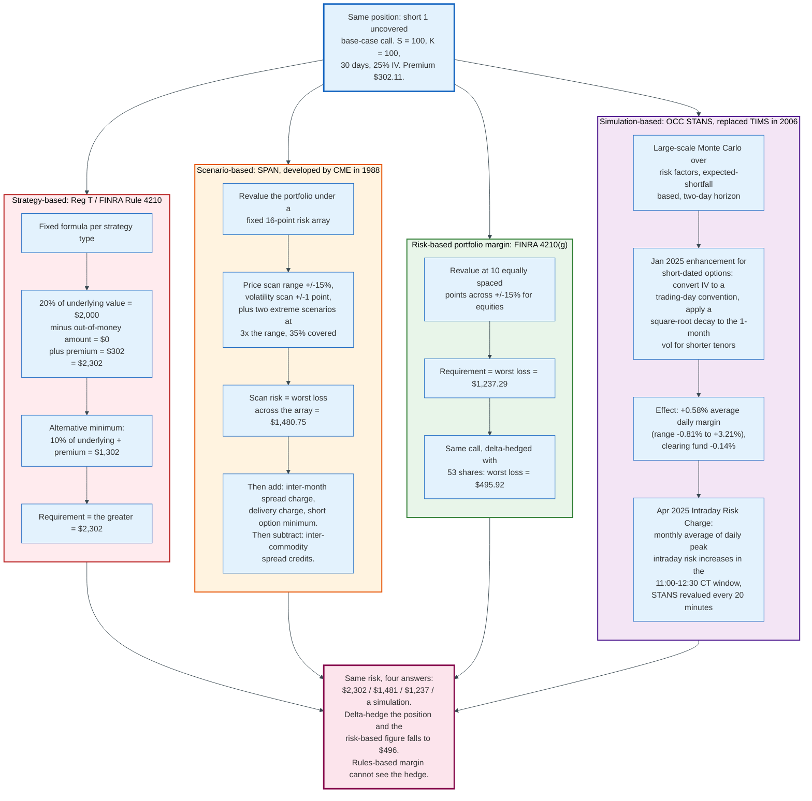
```mermaid
%%{init: {'theme': 'base', 'themeVariables': {'primaryColor': '#e3f2fd', 'primaryBorderColor': '#1565c0', 'lineColor': '#37474f'}}}%%

flowchart TB
    Pos["Same position: short 1 uncovered<br/>base-case call. S = 100, K = 100,<br/>30 days, 25% IV. Premium $302.11."]

    subgraph M1["Strategy-based: Reg T / FINRA Rule 4210"]
        direction TB
        A1["Fixed formula per strategy type"]
        A2["20% of underlying value = $2,000<br/>minus out-of-money amount = $0<br/>plus premium = $302<br/>= $2,302"]
        A3["Alternative minimum:<br/>10% of underlying + premium = $1,302"]
        A4["Requirement = the greater = $2,302"]
        A1 --> A2 --> A3 --> A4
    end

    subgraph M2["Scenario-based: SPAN, developed by CME in 1988"]
        direction TB
        B1["Revalue the portfolio under a<br/>fixed 16-point risk array"]
        B2["Price scan range +/-15%,<br/>volatility scan +/-1 point,<br/>plus two extreme scenarios at<br/>3x the range, 35% covered"]
        B3["Scan risk = worst loss<br/>across the array = $1,480.75"]
        B4["Then add: inter-month spread charge,<br/>delivery charge, short option minimum.<br/>Then subtract: inter-commodity<br/>spread credits."]
        B1 --> B2 --> B3 --> B4
    end

    subgraph M3["Risk-based portfolio margin: FINRA 4210(g)"]
        direction TB
        C1["Revalue at 10 equally spaced<br/>points across +/-15% for equities"]
        C2["Requirement = worst loss = $1,237.29"]
        C3["Same call, delta-hedged with<br/>53 shares: worst loss = $495.92"]
        C1 --> C2 --> C3
    end

    subgraph M4["Simulation-based: OCC STANS, replaced TIMS in 2006"]
        direction TB
        D1["Large-scale Monte Carlo over<br/>risk factors, expected-shortfall<br/>based, two-day horizon"]
        D2["Jan 2025 enhancement for<br/>short-dated options: convert IV to a<br/>trading-day convention, apply a<br/>square-root decay to the 1-month<br/>vol for shorter tenors"]
        D3["Effect: +0.58% average daily margin<br/>(range -0.81% to +3.21%),<br/>clearing fund -0.14%"]
        D4["Apr 2025 Intraday Risk Charge:<br/>monthly average of daily peak<br/>intraday risk increases in the<br/>11:00-12:30 CT window,<br/>STANS revalued every 20 minutes"]
        D1 --> D2 --> D3 --> D4
    end

    Pos --> M1
    Pos --> M2
    Pos --> M3
    Pos --> M4

    Compare["Same risk, four answers:<br/>$2,302 / $1,481 / $1,237 / a simulation.<br/>Delta-hedge the position and the<br/>risk-based figure falls to $496.<br/>Rules-based margin cannot see the hedge."]

    M1 --> Compare
    M2 --> Compare
    M3 --> Compare
    M4 --> Compare

    style Pos fill:#e3f2fd,stroke:#1565c0,stroke-width:3px
    style M1 fill:#ffebee,stroke:#b71c1c,stroke-width:2px
    style M2 fill:#fff3e0,stroke:#e65100,stroke-width:2px
    style M3 fill:#e8f5e9,stroke:#2e7d32,stroke-width:2px
    style M4 fill:#f3e5f5,stroke:#4a148c,stroke-width:2px
    style Compare fill:#fce4ec,stroke:#880e4f,stroke-width:3px
```

### 16.1 Initial Margin and Variation Margin Are Different Instruments

Variation margin settles yesterday's profit and loss in cash. It is a payment, not a deposit, and it extinguishes the exposure it covers.

Initial margin covers the potential future exposure between the last variation margin payment and the completion of a close-out. It is a deposit, returned when the position closes, and it is sized to a confidence level over a close-out horizon: one or two days for listed futures and options, five days for cleared swaps, ten days for uncleared swaps under the regulatory framework.

Confusing them produces two errors. Treating variation margin as a deposit understates the cash a losing position consumes. Treating initial margin as a cost understates it, because the collateral is encumbered and its funding is a real charge, which is what the margin valuation adjustment in the XVA stack prices.

### 16.2 Strategy-Based Margin: Reg T and FINRA Rule 4210

Strategy-based margin applies a formula per position type and ignores everything else in the account.

For a short uncovered equity call under FINRA Rule 4210, the requirement is 20% of the underlying value, minus the amount by which the option is out of the money, plus the option premium, subject to a minimum of 10% of the underlying value plus the premium.

Worked on the base case short call:

```
20% of underlying:   0.20 x 100 x 100  =  $2,000.00
Out-of-money amount:                      $0.00     (option is at the money)
Premium:             3.021141 x 100    =  $302.11
Requirement A:                            $2,302.11

10% of underlying:   0.10 x 100 x 100  =  $1,000.00
Premium:                                  $302.11
Requirement B:                            $1,302.11

Requirement = max(A, B) = $2,302.11
```

For a vertical spread, the strategy formula recognises the structure: a short 100 call against a long 105 call requires the strike differential, $500.00 per spread, reduced by the net credit received.

Strategy-based margin's defect is visible in the base case. It charges $2,302.11 for a naked short call and, per Section 16.5, $495.92 under risk-based rules for the same call fully delta-hedged. The formula cannot see the hedge because the hedge is in shares and the formula is written per option.

### 16.3 SPAN: Scenario Margin From 1988

The Chicago Mercantile Exchange developed the Standard Portfolio Analysis of Risk in 1988. It computes portfolio margin by revaluing every position under a fixed grid of market scenarios and taking the worst outcome.

The grid, called the risk array, contains 16 scenarios: seven price moves (unchanged, one third, two thirds, and the full scan range, up and down) crossed with two volatility moves (up and down by the volatility scan range), plus two extreme scenarios at three times the price scan range, of which only a fraction, conventionally 35%, is charged.

Applying a 15% price scan range and a one-point volatility scan range to the base case short call:

| Scenario | Price move | Volatility | P&L on 1 short contract |
|----------|------------|------------|-------------------------|
| 1 | 0.00% | 26% | -$11.40 |
| 2 | 0.00% | 24% | +$11.40 |
| 3 | +5.00% | 26% | -$339.87 |
| 4 | +5.00% | 24% | -$321.91 |
| 5 | -5.00% | 26% | +$188.34 |
| 6 | -5.00% | 24% | +$206.11 |
| 7 | +10.00% | 26% | -$764.54 |
| 8 | +10.00% | 24% | -$755.25 |
| 9 | -10.00% | 26% | +$274.44 |
| 10 | -10.00% | 24% | +$282.29 |
| 11 | +15.00% | 26% | -$1,239.10 |
| 12 | +15.00% | 24% | -$1,235.75 |
| 13 | -15.00% | 26% | +$298.10 |
| 14 | -15.00% | 24% | +$299.89 |
| 15 | +45.00%, 35% covered | 25% | -$1,480.75 |
| 16 | -45.00%, 35% covered | 25% | +$105.74 |

Scan risk is the worst loss in the array: $1,480.75, in scenario 15. At three times the scan range the short call loses $4,230.71 outright, of which SPAN recognises 35%. Scenario 16 gains $105.74 rather than the whole premium because SPAN recognises only 35% of it: a 100-strike call is already worth zero with the stock down 30%, so a 45% fall adds nothing.

The full SPAN requirement adds three charges and one credit. The **inter-month spread charge** covers basis risk between contract months, which the array misses because it shifts all months together. The **delivery or spot charge** covers the elevated risk of positions in a delivery period. The **short option minimum** sets a floor per short option, so that a portfolio of far out-of-the-money short options, which the array values at almost nothing, still carries a requirement. The **inter-commodity spread credit** reduces the requirement for offsetting positions in correlated products.

The asymmetry in the table is the point. Losses on the upside run to $1,481 while gains on the downside cap at $300, because the short call's loss is unbounded and its gain can never exceed the $302.11 premium. A margin system built on symmetric shocks would badly misprice this position; the array catches it because it revalues rather than approximates.

CME has been migrating to SPAN 2, which replaces the fixed array with a historical value-at-risk core plus explicit liquidity, concentration, and stress add-ons, beginning with cryptocurrency futures in 2021 and extending by asset class since.

### 16.4 STANS: Simulation Margin at OCC

OCC replaced its Theoretical Intermarket Margin System with STANS, the System for Theoretical Analysis and Numerical Simulations, in 2006.

STANS is a large-scale Monte Carlo engine. It simulates joint moves in equity prices, implied volatilities, and other risk factors, revalues every clearing member's entire portfolio under each simulated scenario, and sets margin from the tail of the resulting loss distribution using an expected shortfall measure over a two-day close-out horizon.

The advantage over a fixed array is that correlations between underlyings are modelled rather than approximated by spread credits, so a genuinely diversified portfolio receives genuine diversification benefit and a concentrated one does not.

Two recent changes are documented in SEC filings and are worth stating precisely.

On 22 January 2025 the SEC approved enhancements to STANS and OCC's Comprehensive Stress Testing methodology aimed at short-dated options. Two modifications were made. Implied volatility data is converted into a trading-day convention before being fed into the implied volatility simulation models, then converted back to a calendar-day convention for price smoothing. And rather than applying a uniform volatility shock across all options with less than a month to expiry, OCC derives separate shocks for shorter tenors by applying a square-root decay to the one-month option volatility. The filing states the changes increase average daily margin requirements by 0.58%, with a range from -0.81% to +3.21%, and decrease the total clearing fund by 0.14%.

On 9 April 2025 the SEC approved OCC's Intraday Risk Charge. OCC's existing portfolio revaluation captured price movements during the day but not credit risk arising from position changes between the daily margin collections. The charge is computed monthly, from the average of daily peak intraday risk increases measured in a 90-minute window from 11:00 a.m. to 12:30 p.m. Central Time over the preceding month, using STANS updated every 20 minutes. In the filing, OCC cited that during the February to July 2023 period examined, options with less than one month to expiration contributed around 30% of daily trading volume, and options at zero days to expiration represented about 40% of daily volume on their expiration dates, while average daily cleared volume had more than doubled from 2018 to 2022 to more than 40 million contracts.

Intraday margin exists because a portfolio can be flat at the close and enormous at noon.

### 16.5 Portfolio Margin and What Hedging Is Worth

Risk-based portfolio margin under FINRA Rule 4210(g) revalues the account at ten equally spaced points across a range determined by the product class, plus or minus 15% for individual equities, and takes the worst loss.

For the base case short call:

| Price move | P&L |
|------------|-----|
| -15.00% | +$299.08 |
| -11.67% | +$289.36 |
| -8.33% | +$261.12 |
| -5.00% | +$197.30 |
| -1.67% | +$81.00 |
| +1.67% | -$96.34 |
| +5.00% | -$330.79 |
| +8.33% | -$609.11 |
| +11.67% | -$915.55 |
| +15.00% | -$1,237.29 |

Requirement: $1,237.29, against $2,302.11 under Reg T. The same position, 46% cheaper.

Now delta-hedge it by buying 53 shares:

| Price move | P&L on the hedged pair |
|------------|------------------------|
| -15.00% | -$495.92 |
| -11.67% | -$328.97 |
| -8.33% | -$180.55 |
| -5.00% | -$67.70 |
| -1.67% | -$7.34 |
| +1.67% | -$8.01 |
| +5.00% | -$65.79 |
| +8.33% | -$167.44 |
| +11.67% | -$297.22 |
| +15.00% | -$442.29 |

Requirement: $495.92, against $2,302.11 for the unhedged call under Reg T. The hedge cut the requirement by 78%.

The pattern in the second table also shows why market makers exist. The hedged position loses money in both directions, symmetrically, and its worst case is small. That is a short gamma position: the profit is the premium, the risk is movement, and the margin correctly prices movement rather than direction.

### 16.6 Uncleared Margin

The 2009 G20 commitments produced a separate margin regime for OTC derivatives that are not centrally cleared, developed by the Basel Committee and IOSCO and implemented by national regulators.

Two requirements apply. Variation margin must be exchanged on all in-scope uncleared derivatives. Initial margin must be exchanged bilaterally, held in segregated accounts, and computed to a 99% confidence level over a ten-day horizon, either from a regulatory grid or from an approved model. The industry's approved model is ISDA SIMM.

The rules phased in over six waves by average aggregate notional amount, with the final phase capturing entities above an 8 billion threshold in 2022. The effect on market structure was substantial: initial margin on uncleared trades is a hard funding cost, which pushed volume toward cleared products wherever a cleared equivalent existed.

On 13 July 2026 the CFTC approved a final rule amending its uncleared swap margin requirements, published at 91 FR 45134 on 17 July 2026. Two changes matter. The definition of margin affiliate was revised so that certain seeded investment funds do not trigger margin exchange requirements for up to three years. And securities issued by money market funds and similar funds became eligible initial margin collateral, with a specific haircut schedule, removing the previous restriction on assets transferred through securities lending and repurchase arrangements.

### 16.7 Procyclicality Is the Unsolved Problem

Risk-based margin rises when volatility rises, which means it demands the most cash exactly when cash is hardest to raise.

The mechanism is mechanical rather than malicious. A margin model calibrated on recent volatility will raise requirements after a volatility spike. Members meet the call by selling assets, which moves prices further, which raises volatility, which raises margin again.

Regulators require anti-procyclicality tools: floors on margin parameters, long look-back periods that include a stress episode, and buffers that can be released rather than requirements that must be met. None of them eliminate the effect, because a margin model that does not respond to risk is not a margin model.

The CFTC and SEC issued a joint request for comment on 26 June 2026, published at 91 FR 39579, seeking input on harmonising portfolio margining frameworks across securities, swaps, and futures, covering cross-margining, capital treatment, collateral standards, and risk methodologies, with a 60-day comment period. The stated aim is to release capital held in separate accounts that a combined view would show to be offsetting.

---

## 17. Exercise, Assignment, and Expiry Mechanics

Expiry is where the abstraction stops and a delivery obligation begins. Most retail losses that are not caused by direction are caused by expiry mechanics.

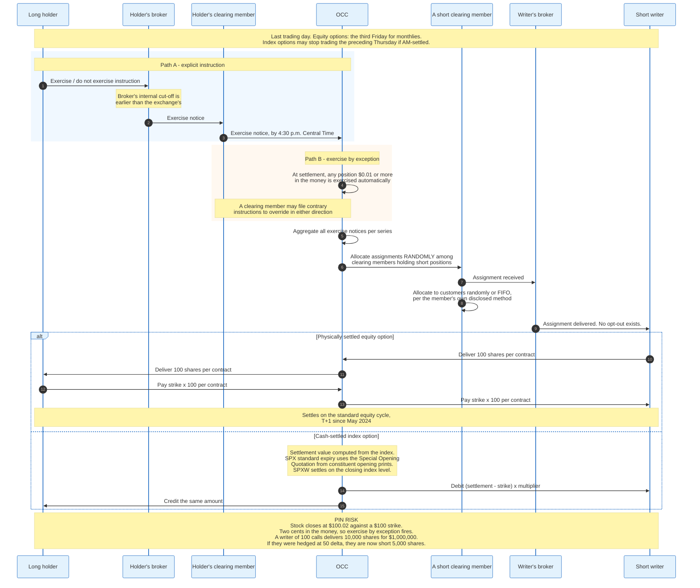
```mermaid
%%{init: {'theme': 'base', 'themeVariables': {'primaryColor': '#e3f2fd', 'primaryBorderColor': '#1565c0', 'lineColor': '#37474f'}}}%%

sequenceDiagram
    autonumber
    participant H as Long holder
    participant B1 as Holder's broker
    participant CM1 as Holder's clearing member
    participant OCC as OCC
    participant CM2 as A short clearing member
    participant B2 as Writer's broker
    participant W as Short writer

    Note over H,W: Last trading day. Equity options: the third Friday for monthlies.<br/>Index options may stop trading the preceding Thursday if AM-settled.

    rect rgb(240, 248, 255)
        Note over H,OCC: Path A - explicit instruction
        H->>B1: Exercise / do not exercise instruction
        Note over B1: Broker's internal cut-off is<br/>earlier than the exchange's
        B1->>CM1: Exercise notice
        CM1->>OCC: Exercise notice, by 4:30 p.m. Central Time
    end

    rect rgb(255, 248, 240)
        Note over OCC: Path B - exercise by exception
        OCC->>OCC: At settlement, any position $0.01 or more<br/>in the money is exercised automatically
        Note over CM1,OCC: A clearing member may file contrary<br/>instructions to override in either direction
    end

    OCC->>OCC: Aggregate all exercise notices per series
    OCC->>CM2: Allocate assignments RANDOMLY among<br/>clearing members holding short positions
    CM2->>B2: Assignment received
    CM2->>CM2: Allocate to customers randomly or FIFO,<br/>per the member's own disclosed method
    B2->>W: Assignment delivered. No opt-out exists.

    alt Physically settled equity option
        W->>OCC: Deliver 100 shares per contract
        OCC->>H: Deliver 100 shares per contract
        H->>OCC: Pay strike x 100 per contract
        OCC->>W: Pay strike x 100 per contract
        Note over W,H: Settles on the standard equity cycle,<br/>T+1 since May 2024
    else Cash-settled index option
        Note over OCC: Settlement value computed from the index.<br/>SPX standard expiry uses the Special Opening<br/>Quotation from constituent opening prints.<br/>SPXW settles on the closing index level.
        OCC->>W: Debit (settlement - strike) x multiplier
        OCC->>H: Credit the same amount
    end

    Note over H,W: PIN RISK<br/>Stock closes at $100.02 against a $100 strike.<br/>Two cents in the money, so exercise by exception fires.<br/>A writer of 100 calls delivers 10,000 shares for $1,000,000.<br/>If they were hedged at 50 delta, they are now short 5,000 shares.
```

### 17.1 Exercise Style

**American** options may be exercised on any business day up to and including expiry. All US listed equity options are American.

**European** options may be exercised only at expiry. Most US listed broad-based index options, including SPX, are European.

**Bermudan** options may be exercised on a specified set of dates. The style is standard in swaptions and in callable structured notes.

The style has a direct effect on the writer. A writer of a European option knows exactly when the obligation can arrive. A writer of an American option does not, which matters most around ex-dividend dates on short calls.

### 17.2 The Expiry Calendar

Standard monthly equity options expire on the third Friday of the expiry month, which is also the last trading day.

Weekly options expire on other Fridays and, in the major index products, on other weekdays. Cboe extended SPX expirations progressively: Monday and Wednesday expirations were added in 2016, and Tuesday and Thursday expirations in 2022, completing a calendar with an SPX expiry every trading day. That change is the precondition for the zero-day phenomenon described in Section 19, because without a daily expiry there is no daily zero-day option.

Quarterly options expire at quarter end. LEAPS are long-dated options with expiries out to roughly three years.

### 17.3 Settlement: Physical Versus Cash, AM Versus PM

Physically settled equity options deliver 100 shares per contract against payment of the strike, settling on the standard equity settlement cycle, which moved to T+1 in the United States in May 2024.

Cash-settled index options pay the difference between the settlement value and the strike, times the contract multiplier. There is no delivery, because the index is not deliverable.

The settlement value is the detail that produces surprises. SPX standard third-Friday options are AM-settled: the settlement value is the Special Opening Quotation, computed from the opening prices of every S&P 500 constituent on expiry morning. Constituents do not all open at the same instant, so the SOQ is a composite that no trader can execute at. Weekly SPX options, ticker SPXW, are PM-settled on the closing index level, which is directly observable.

Trading in AM-settled index options stops at the close of the preceding day. A holder therefore carries an unhedgeable overnight gap between their last opportunity to trade and the settlement print.

### 17.4 The Exercise Cut-Off and Exercise by Exception

OCC accepts exercise notices from clearing members until 4:30 p.m. Central Time on the last trading day. Exchanges have no role in exercise. Individual brokerage firms impose earlier internal deadlines so that they can meet the exchange requirement.

OCC applies exercise by exception: any position that is $0.01 or more in the money at settlement is exercised automatically, unless the clearing member submits contrary instructions. The threshold is one cent for both equity and index options.

Contrary instructions run in both directions. A member can instruct OCC not to exercise a position that is in the money, which a holder might want if the position is one cent in the money and exercising would incur commission and delivery costs exceeding the gain. A member can also instruct OCC to exercise a position that is out of the money, which is occasionally rational when the holder expects post-close news.

### 17.5 Assignment Is Random and Not Negotiable

OCC allocates exercise notices randomly among clearing members holding short positions in that series. The clearing member then allocates to its own short customers, using either a random method or first in, first out, according to a method the member must disclose in its account agreement.

A short position holder has no control, no notice, and no opt-out. The only defence is closing the position before assignment occurs.

The most common surprise is early assignment on a short call the day before an ex-dividend date. A deep in-the-money call whose remaining time value is less than the upcoming dividend is worth more exercised than held, so the holder exercises, and the writer is assigned and finds themselves short the stock into the ex-date, owing the dividend.

### 17.6 Pin Risk, Worked

Short 100 calls struck at $100.00. The stock closes at $100.02.

The position is two cents in the money, so exercise by exception fires. The writer must deliver 100 x 100 = 10,000 shares at $100.00, a cash amount of $1,000,000.

If the writer had hedged the position at a delta of 0.50, holding 5,000 shares, the assignment leaves them short 5,000 shares from Friday's close until they can trade on Monday. A weekend gap of 3% on that residual is $15,000, against a maximum gain on the option position of the premium collected.

This is why professional desks flatten expiring at-the-money positions before the close rather than carry them. The exposure is not directional; it is a coin flip on which side of the strike the settlement lands, multiplied by the full position size.

### 17.7 Corporate Actions and Adjusted Options

OCC adjusts outstanding contracts when the underlying undergoes a stock split, a special dividend above a threshold, a merger, a spin-off, or a reverse split.

The general principle is to preserve the aggregate economic value of the contract. A two-for-one split doubles the number of deliverable shares and halves the strike. A cash merger converts the deliverable into a fixed cash amount, at which point the option has no volatility and its value is a discounted certainty. A spin-off makes the deliverable a basket of two securities.

Adjusted options carry non-standard deliverables, trade under modified symbols, and are frequently illiquid. Retail traders who buy them because the price looks attractive relative to the standard series are usually buying a contract whose deliverable is not what they assume.

---

## 18. Open Interest Versus Volume

Volume counts trades. Open interest counts contracts that exist. They answer different questions, they are computed by different parties at different times, and confusing them produces a specific and common category of wrong analysis.

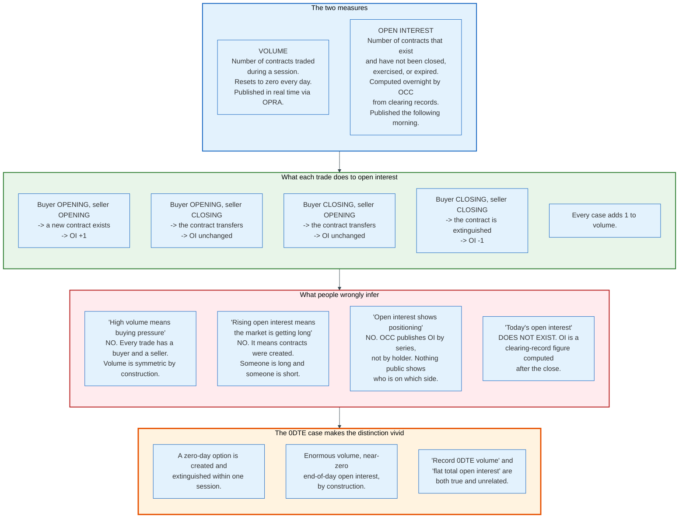
```mermaid
%%{init: {'theme': 'base', 'themeVariables': {'primaryColor': '#e3f2fd', 'primaryBorderColor': '#1565c0', 'lineColor': '#37474f'}}}%%

flowchart TB
    subgraph Def["The two measures"]
        direction TB
        V["VOLUME<br/>Number of contracts traded<br/>during a session.<br/>Resets to zero every day.<br/>Published in real time via OPRA."]
        OI["OPEN INTEREST<br/>Number of contracts that exist<br/>and have not been closed,<br/>exercised, or expired.<br/>Computed overnight by OCC<br/>from clearing records.<br/>Published the following morning."]
    end

    subgraph Rules["What each trade does to open interest"]
        direction TB
        R1["Buyer OPENING, seller OPENING<br/>-&gt; a new contract exists<br/>-&gt; OI +1"]
        R2["Buyer OPENING, seller CLOSING<br/>-&gt; the contract transfers<br/>-&gt; OI unchanged"]
        R3["Buyer CLOSING, seller OPENING<br/>-&gt; the contract transfers<br/>-&gt; OI unchanged"]
        R4["Buyer CLOSING, seller CLOSING<br/>-&gt; the contract is extinguished<br/>-&gt; OI -1"]
        R5["Every case adds 1 to volume."]
    end

    Def --> Rules

    subgraph Wrong["What people wrongly infer"]
        direction TB
        W1["'High volume means buying pressure'<br/>NO. Every trade has a buyer and a seller.<br/>Volume is symmetric by construction."]
        W2["'Rising open interest means<br/>the market is getting long'<br/>NO. It means contracts were created.<br/>Someone is long and someone is short."]
        W3["'Open interest shows positioning'<br/>NO. OCC publishes OI by series,<br/>not by holder. Nothing public shows<br/>who is on which side."]
        W4["'Today's open interest'<br/>DOES NOT EXIST. OI is a<br/>clearing-record figure computed<br/>after the close."]
    end

    Rules --> Wrong

    subgraph Zero["The 0DTE case makes the distinction vivid"]
        direction TB
        Z1["A zero-day option is created and<br/>extinguished within one session."]
        Z2["Enormous volume, near-zero<br/>end-of-day open interest,<br/>by construction."]
        Z3["'Record 0DTE volume' and<br/>'flat total open interest' are<br/>both true and unrelated."]
    end

    Wrong --> Zero

    style Def fill:#e3f2fd,stroke:#1565c0,stroke-width:2px
    style Rules fill:#e8f5e9,stroke:#2e7d32,stroke-width:2px
    style Wrong fill:#ffebee,stroke:#b71c1c,stroke-width:2px
    style Zero fill:#fff3e0,stroke:#e65100,stroke-width:3px
```

### 18.1 The Four Trade Types

Every options trade has a buyer and a seller, and each of them is either opening a new position or closing an existing one. That gives four combinations, and only two of them change open interest.

| Buyer | Seller | Effect on open interest | Effect on volume |
|-------|--------|-------------------------|------------------|
| Opening | Opening | +1 | +1 |
| Opening | Closing | 0 | +1 |
| Closing | Opening | 0 | +1 |
| Closing | Closing | -1 | +1 |

The clearing house knows which case applies because clearing members must mark each trade as opening or closing when they submit it. The exchange does not know, and neither does the tape.

### 18.2 The Timing Difference

Volume is disseminated in real time by OPRA as each trade prints.

Open interest is computed by OCC overnight, from clearing records, after all trades have been submitted and marked, and published the following morning. There is no such thing as intraday open interest. A vendor displaying "current open interest" is displaying yesterday's close.

That one-day lag makes open interest useless for intraday analysis and reliable for structural analysis. It is the reason expiry-week open interest at particular strikes is a meaningful input to pin risk assessment, and the reason it is not an input to a trading decision at 11 a.m.

### 18.3 What Neither Measure Reveals

Neither figure reveals direction, and this is the most frequently violated rule in options commentary.

Volume is symmetric. Every contract traded was bought by someone and sold by someone. A day with 3 million SPX contracts traded had 3 million bought and 3 million sold. "Heavy call buying" is an inference from where trades printed relative to the bid and offer, not a reading from the volume figure.

Open interest is also symmetric. Every open contract has one long holder and one short holder. Rising open interest means contracts were created, which requires both a new long and a new short. It does not mean the market is getting longer.

The closest public approximation to positioning is OCC's volume reporting broken down by customer, firm, and market maker account type, which distinguishes who is trading even though it does not reveal who is net long. Everything beyond that is estimation.

### 18.4 Zero-Day Options Break the Intuition Completely

A zero-day option is opened and closed, or expires, within a single session. It contributes fully to volume and contributes nothing to end-of-day open interest.

This produces headline pairs that appear contradictory and are not. SPX zero-day volume set records through 2026 while aggregate index option open interest did not move proportionally, because zero-day contracts never survive to be counted. A commentator who reads open interest as a proxy for activity will conclude that nothing is happening in the most active product in the market.

Volume measures flow. Open interest measures stock. The zero-day phenomenon is pure flow.

---

## 19. Zero-Day Options

Zero-day options are not a new instrument. They are ordinary options observed in the final hours of their life, and every unusual property follows from two facts: gamma grows without bound as expiry approaches, and the linear approximations that risk systems rely on stop working.

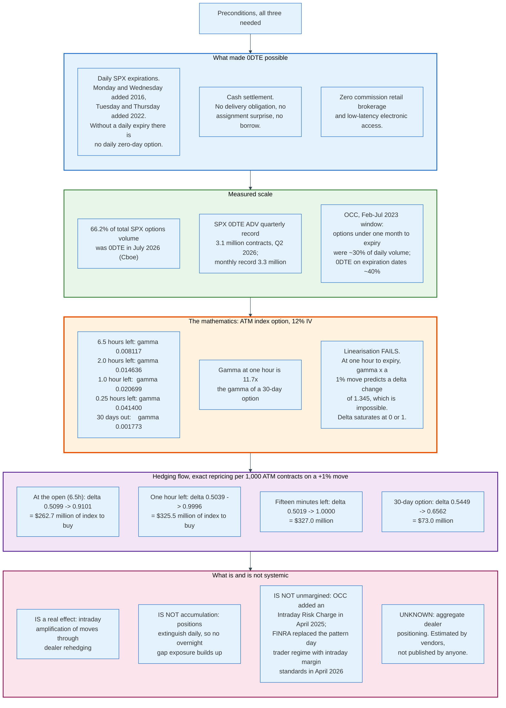
```mermaid
%%{init: {'theme': 'base', 'themeVariables': {'primaryColor': '#e3f2fd', 'primaryBorderColor': '#1565c0', 'lineColor': '#37474f'}}}%%

flowchart TB
    Cause["Preconditions, all three needed"]

    subgraph Pre["What made 0DTE possible"]
        direction TB
        P1["Daily SPX expirations.<br/>Monday and Wednesday added 2016,<br/>Tuesday and Thursday added 2022.<br/>Without a daily expiry there is<br/>no daily zero-day option."]
        P2["Cash settlement.<br/>No delivery obligation, no<br/>assignment surprise, no borrow."]
        P3["Zero commission retail brokerage<br/>and low-latency electronic access."]
    end

    Cause --> Pre

    subgraph Scale["Measured scale"]
        direction TB
        S1["66.2% of total SPX options volume<br/>was 0DTE in July 2026 (Cboe)"]
        S2["SPX 0DTE ADV quarterly record<br/>3.1 million contracts, Q2 2026;<br/>monthly record 3.3 million"]
        S3["OCC, Feb-Jul 2023 window:<br/>options under one month to expiry<br/>were ~30% of daily volume;<br/>0DTE on expiration dates ~40%"]
    end

    Pre --> Scale

    subgraph Math["The mathematics: ATM index option, 12% IV"]
        direction TB
        M1["6.5 hours left: gamma 0.008117<br/>2.0 hours left: gamma 0.014636<br/>1.0 hour left:  gamma 0.020699<br/>0.25 hours left: gamma 0.041400<br/>30 days out:    gamma 0.001773"]
        M2["Gamma at one hour is 11.7x<br/>the gamma of a 30-day option"]
        M3["Linearisation FAILS.<br/>At one hour to expiry, gamma x a<br/>1% move predicts a delta change<br/>of 1.345, which is impossible.<br/>Delta saturates at 0 or 1."]
    end

    Scale --> Math

    subgraph Flow["Hedging flow, exact repricing per 1,000 ATM contracts on a +1% move"]
        direction TB
        F1["At the open (6.5h): delta 0.5099 -&gt; 0.9101<br/>= $262.7 million of index to buy"]
        F2["One hour left: delta 0.5039 -&gt; 0.9996<br/>= $325.5 million of index to buy"]
        F3["Fifteen minutes left: delta 0.5019 -&gt; 1.0000<br/>= $327.0 million"]
        F4["30-day option: delta 0.5449 -&gt; 0.6562<br/>= $73.0 million"]
    end

    Math --> Flow

    subgraph Real["What is and is not systemic"]
        direction TB
        RA["IS a real effect: intraday<br/>amplification of moves through<br/>dealer rehedging"]
        RB["IS NOT accumulation: positions<br/>extinguish daily, so no overnight<br/>gap exposure builds up"]
        RC["IS NOT unmargined: OCC added an<br/>Intraday Risk Charge in April 2025;<br/>FINRA replaced the pattern day<br/>trader regime with intraday margin<br/>standards in April 2026"]
        RD["UNKNOWN: aggregate dealer<br/>positioning. Estimated by vendors,<br/>not published by anyone."]
    end

    Flow --> Real

    style Pre fill:#e3f2fd,stroke:#1565c0,stroke-width:2px
    style Scale fill:#e8f5e9,stroke:#2e7d32,stroke-width:2px
    style Math fill:#fff3e0,stroke:#e65100,stroke-width:3px
    style Flow fill:#f3e5f5,stroke:#4a148c,stroke-width:2px
    style Real fill:#fce4ec,stroke:#880e4f,stroke-width:2px
```

### 19.1 The Preconditions

Three things had to be true before a daily zero-day market could exist, and none of them is about retail speculation.

A **daily expiry calendar**. Cboe added Monday and Wednesday SPX expirations in 2016 and Tuesday and Thursday expirations in 2022, completing a calendar in which an SPX contract expires every trading day. Before that, zero-day trading was a once-a-week or once-a-month event.

**Cash settlement**. SPX options settle in cash, so a zero-day position carries no delivery obligation, no assignment risk, and no need to borrow. The same strategy in single-stock options would end each day with share delivery, which is why the phenomenon is concentrated in cash-settled index products.

**Zero-commission electronic access**. A strategy that opens and closes within hours cannot survive per-contract commissions of a dollar. FINRA noted this directly when it proposed replacing the pattern day trader rule, observing that zero commission trading has eliminated the original rule's primary justification.

### 19.2 The Scale, Measured

| Measure | Value | Period | Source |
|---------|-------|--------|--------|
| SPX 0DTE share of total SPX options volume | 66.2% | July 2026 | Cboe monthly volume report |
| SPX 0DTE ADV, quarterly record | 3.1 million contracts | Q2 2026 | Cboe monthly volume report |
| SPX 0DTE ADV, monthly record | 3.3 million contracts | Q2 2026 | Cboe monthly volume report |
| SPX ADV, quarterly record | 5.1 million contracts | Q2 2026 | Cboe monthly volume report |
| SPX single-day record | 7.8 million contracts | 5 June 2026 | Cboe monthly volume report |
| Options under one month to expiry, share of daily volume | ~30% | Feb-Jul 2023 | OCC, cited in SEC approval order |
| 0DTE options on expiration dates, share of daily volume | ~40% | Feb-Jul 2023 | OCC, cited in SEC approval order |

Two thirds of all SPX options volume is now in contracts that expire the same day. That is the fact everything else in this section explains.

### 19.3 Gamma Grows Without Bound

Gamma for an at-the-money option is `phi(d1) / (S sigma sqrt(T))`. As `T` goes to zero, the denominator goes to zero and gamma goes to infinity.

Computed for an index at 6,500 with an at-the-money call at 12% implied volatility:

| Time to expiry | Option price | Delta | Gamma per index point |
|----------------|--------------|-------|-----------------------|
| 6.5 hours (one full session) | 20.12 | 0.5099 | 0.008117 |
| 2.0 hours | 11.03 | 0.5055 | 0.014636 |
| 1.0 hour | 7.77 | 0.5039 | 0.020699 |
| 15 minutes | 3.86 | 0.5019 | 0.041400 |
| 30 days | 100.13 | 0.5449 | 0.001773 |

Gamma at one hour to expiry is 11.7 times the gamma of a 30-day option on the same underlying at the same volatility. Gamma at fifteen minutes is 23.4 times.

Delta, meanwhile, barely moves: 0.5099 at the open against 0.5019 at fifteen minutes. A risk report showing delta alone would report the position as essentially unchanged all day. It is not unchanged; it is a different instrument by lunchtime.

### 19.4 The Linear Approximation Breaks

Risk systems compute the effect of a price move as delta times the move, plus one half gamma times the move squared. For zero-day options that arithmetic produces impossible answers.

At one hour to expiry, gamma is 0.020699 per index point. A 1% move on a 6,500 index is 65 points. The gamma term predicts a delta change of `0.020699 x 65 = 1.345`.

Delta cannot change by 1.345, because delta itself is bounded between 0 and 1. The Taylor expansion has left the region where it is valid.

Exact repricing shows what actually happens. At one hour to expiry, a 1% move takes delta from 0.5039 to 0.9996. The option goes from an even bet to a certainty, and it does so through a range of prices where no linearisation holds.

The operational consequence is that a zero-day book must be revalued, not approximated. This is precisely why OCC's January 2025 STANS enhancement derives separate volatility shocks for short-tenor options by applying a square-root decay to the one-month volatility, rather than applying a uniform shock across everything under a month.

### 19.5 The Hedging Flow, Exactly Computed

Per 1,000 at-the-money contracts, with a multiplier of 100, on a 1% upward move, computed by exact repricing rather than by linearisation:

| Time to expiry | Delta before | Delta after +1% | Index notional the dealer must buy |
|----------------|--------------|-----------------|-------------------------------------|
| 6.5 hours | 0.5099 | 0.9101 | $262.7 million |
| 2.0 hours | 0.5055 | 0.9915 | $319.1 million |
| 1.0 hour | 0.5039 | 0.9996 | $325.5 million |
| 15 minutes | 0.5019 | 1.0000 | $327.0 million |
| 30 days | 0.5449 | 0.6562 | $73.0 million |

The same 1,000 contracts require 4.5 times as much hedging flow at one hour to expiry as they do 30 days out, for the same 1% move.

Scale that to a market where SPX zero-day volume averages 3.1 million contracts a day, spread across strikes and split between calls and puts and between customer buying and customer selling, and the mechanism for intraday amplification is arithmetically clear even though the aggregate net position is not observable.

### 19.6 What Is Actually New, and What Is Not

The instrument is not new. A one-day option has been priceable since 1973 and tradeable in some form for as long as weekly expirations have existed.

What is new is three things.

**The intraday risk profile of a portfolio.** A book can be flat at the close and carry very large gamma at midday. That is why OCC introduced an Intraday Risk Charge in April 2025, computed from peak intraday risk in an 11:00 to 12:30 Central window with STANS revalued every 20 minutes, and why FINRA replaced the pattern day trader regime with intraday margin standards in a rule change approved on 17 April 2026.

**The concentration of flow into one product.** Two thirds of SPX volume in a single day-of-expiry bucket concentrates hedging demand in the S&P 500 futures and cash markets at specific times of day.

**The absence of accumulation.** Every zero-day position extinguishes by the close. There is no build-up of overnight exposure, no roll, and no gap risk carried into the next session. This is the reason the systemic concern is smaller than the volume figure suggests: the market is enormous in flow and near zero in stock.

Zero-day options concentrate risk in hours rather than accumulating it across months. Whether that is more or less dangerous than the alternative is not settled, and the honest answer is that nobody has observed a zero-day market through a genuine crisis.

---

## 20. Money Flow and Economics

The listed options business earns fractions of a dollar per contract from a very large number of contracts, and nearly every participant is paid out of the bid-ask spread. The economics are visible because four of the six US exchange groups have publicly listed parents: Cboe Global Markets, Nasdaq, Intercontinental Exchange, and Miami International Holdings, which listed in 2025. Cboe reports revenue per contract directly, which is why its figures carry this section.

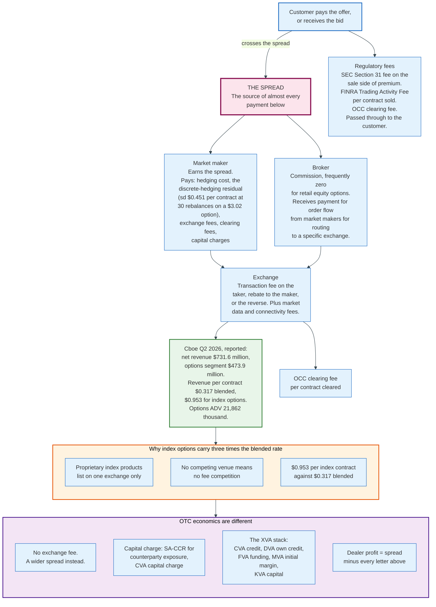
```mermaid
%%{init: {'theme': 'base', 'themeVariables': {'primaryColor': '#e3f2fd', 'primaryBorderColor': '#1565c0', 'lineColor': '#37474f'}}}%%

flowchart TB
    C["Customer pays the offer,<br/>or receives the bid"]

    C -->|"crosses the spread"| Spread["THE SPREAD<br/>The source of almost every<br/>payment below"]

    Spread --> MM["Market maker<br/>Earns the spread.<br/>Pays: hedging cost, the<br/>discrete-hedging residual<br/>(sd $0.451 per contract at<br/>30 rebalances on a $3.02 option),<br/>exchange fees, clearing fees,<br/>capital charges"]

    Spread --> BR["Broker<br/>Commission, frequently zero<br/>for retail equity options.<br/>Receives payment for order flow<br/>from market makers for routing<br/>to a specific exchange."]

    MM --> EX["Exchange<br/>Transaction fee on the<br/>taker, rebate to the maker,<br/>or the reverse. Plus market<br/>data and connectivity fees."]
    BR --> EX

    EX --> Rev["Cboe Q2 2026, reported:<br/>net revenue $731.6 million,<br/>options segment $473.9 million.<br/>Revenue per contract $0.317 blended,<br/>$0.953 for index options.<br/>Options ADV 21,862 thousand."]

    EX --> OCC2["OCC clearing fee<br/>per contract cleared"]

    C --> Reg["Regulatory fees<br/>SEC Section 31 fee on the<br/>sale side of premium.<br/>FINRA Trading Activity Fee<br/>per contract sold.<br/>OCC clearing fee.<br/>Passed through to the customer."]

    subgraph Why["Why index options carry three times the blended rate"]
        direction TB
        W1["Proprietary index products<br/>list on one exchange only"]
        W2["No competing venue means<br/>no fee competition"]
        W3["$0.953 per index contract<br/>against $0.317 blended"]
    end

    Rev --> Why

    subgraph OTCside["OTC economics are different"]
        direction TB
        O1["No exchange fee.<br/>A wider spread instead."]
        O2["Capital charge: SA-CCR for<br/>counterparty exposure,<br/>CVA capital charge"]
        O3["The XVA stack:<br/>CVA credit, DVA own credit,<br/>FVA funding, MVA initial margin,<br/>KVA capital"]
        O4["Dealer profit = spread<br/>minus every letter above"]
    end

    Why --> OTCside

    style C fill:#e3f2fd,stroke:#1565c0,stroke-width:2px
    style Spread fill:#fce4ec,stroke:#880e4f,stroke-width:3px
    style Rev fill:#e8f5e9,stroke:#2e7d32,stroke-width:2px
    style Why fill:#fff3e0,stroke:#e65100,stroke-width:2px
    style OTCside fill:#f3e5f5,stroke:#4a148c,stroke-width:2px
```

### 20.1 The Fee Stack on One Contract

A single US listed options contract carries six published charges, and their total is a fifth of a percent of the premium.

**Exchange transaction fee or rebate.** Under a maker-taker schedule, the party removing liquidity pays and the party providing it receives a rebate. Under a customer-priority schedule, customer orders trade free and professional orders pay. Exchanges compete on this schedule, which is why the same contract lists on eighteen venues.

**OCC clearing fee**, charged per contract cleared to the clearing member on each side.

**Options Regulatory Fee**, charged by the exchange per contract side to fund its own options regulatory programme.

**SEC Section 31 fee**, charged on the sale side, computed on the premium value rather than per contract, and passed through to the customer.

**FINRA Trading Activity Fee**, charged per contract sold. Options carry no per-trade cap, unlike equities.

**Broker commission**, which for US retail equity options is frequently zero and is compensated by payment for order flow.

Applied to the base case trade of Section 7, one contract bought at $3.02 against a market maker selling, the stack is this.

| Charge | Published rate | On this contract | Borne by |
|--------|----------------|------------------|----------|
| **Exchange fee, removing liquidity** | $0.48 per contract, customer, penny class, Cboe BZX Options fee code PC | $0.4800 | the buyer's broker |
| **Exchange rebate, adding liquidity** | $0.29 per contract, market maker, penny class, fee code PM | -$0.2900 | received by the market maker |
| **OCC clearing fee** | $0.025 per contract per side, plus a $200 minimum monthly fee | $0.0500 across both sides | each clearing member |
| **Options Regulatory Fee** | $0.0200 per contract side at MEMX from 1 July 2026, replacing $0.0015 | $0.0200 | the executing member |
| **SEC Section 31 fee** | $20.60 per $1 million of covered sales, from 4 April 2026 | $0.0062 on $302.00 of premium | the selling side |
| **FINRA Trading Activity Fee** | $0.00279 per contract sold | $0.0028 | the selling FINRA member |
| **Broker commission** | Frequently zero for US retail equity options | $0.0000 | the customer |

The charges total $0.5590 per contract gross and $0.2690 after the maker rebate. Against $302.00 of premium that is 0.19%. Against Cboe's blended revenue of $0.317 per contract in Q2 2026, the $0.48 taker fee is 151%, a number that only makes sense once the rebate is subtracted: the exchange keeps $0.19 of the $0.48 and hands $0.29 to the firm that quoted.

Volume is the business, not rate. One tenth of a cent across 18.2 billion contracts a year is $18.2 million.

### 20.2 Proprietary Products Carry the Margins

Cboe's Q2 2026 revenue per contract was $0.317 across all options and $0.953 for index options, a factor of three.

The reason is structural, not qualitative. Multi-listed equity options trade on every US options exchange, so a broker routing an order chooses among venues quoting the same price, and fee competition compresses the rate. Index options on proprietary indices such as SPX list on one exchange only. There is no competing venue, so there is no fee competition.

Cboe reported options segment net revenue of $473.9 million in Q2 2026, up 30% from $364.8 million a year earlier, against total net revenue of $731.6 million. Its share of US options volume was 30.0%, against 30.2% a year earlier: revenue grew because volume grew and because the index mix improved, not because share was gained.

Exclusivity, not technology, is what an options exchange sells.

### 20.3 The Market Maker's Actual Profit and Loss

A market maker's revenue is the spread it captures. Its costs are hedging, the residual that hedging cannot remove, and fees.

Section 14.2 quantified the residual. Selling the base case call at the correct implied volatility and hedging 30 times over the option's life produces a mean profit and loss of zero and a standard deviation of $0.451 per contract-share, on a premium of $3.021. Hedging 750 times reduces the standard deviation to $0.094 and multiplies the transaction costs.

The market maker's edge must exceed that residual, or the business is a coin flip with a fee attached. That is what the bid-ask spread is for, and it is why options on illiquid underlyings quote wide: the hedge is expensive, so the residual is large, so the spread must be large.

### 20.4 Payment for Order Flow in Options Works Differently

Equity payment for order flow works by internalisation: a wholesaler buys retail orders and executes them against its own inventory, off exchange.

Options cannot be internalised the same way, because a listed option must execute on a registered options exchange. Options payment for order flow therefore takes the form of a market maker paying a broker to route flow to a specific exchange, where that market maker has a quoting presence and an allocation advantage under that exchange's rules.

The commercial effect is that the exchange's allocation rule becomes a product feature. Pro-rata allocation rewards displayed size. Customer priority rewards routing customer flow. Exchanges design these rules to attract the flow that market makers will pay brokers to send.

### 20.5 OTC Economics and the XVA Stack

An OTC derivative carries no exchange fee, a wider spread, and a set of adjustments that did not exist before 2008.

**CVA**, the credit valuation adjustment, prices the possibility that the counterparty defaults while the trade is in the dealer's favour. It is a charge against the trade's value and it carries a regulatory capital requirement of its own.

**DVA**, the debit valuation adjustment, is the mirror image: the value to the dealer of its own possible default. It is included in accounting fair value and excluded from regulatory capital, because a bank cannot count its own deterioration as an asset.

**FVA**, the funding valuation adjustment, prices the cost of funding an uncollateralised position.

**MVA**, the margin valuation adjustment, prices the cost of funding initial margin, which became material once the uncleared margin rules made initial margin mandatory.

**KVA**, the capital valuation adjustment, prices the regulatory capital the trade consumes over its life.

A dealer quoting a ten-year uncollateralised swap to a corporate is quoting the mid-market rate plus all five adjustments plus a profit margin. The corporate sees one number. The dealer sees a stack.

### 20.6 The Industry Arithmetic

US listed options industry average daily volume was 72,838 thousand contracts in Q2 2026, against 57,203 thousand in Q2 2025, a rise of 27.3%.

At roughly 250 trading days a year, that daily figure implies an annual run rate near 18.2 billion contracts. That is arithmetic on a reported daily average, not a reported annual total.

At a blended industry revenue per contract in the range Cboe reports, an 18 billion contract market generates a few billion dollars of exchange revenue a year. The notional value of the underlying exposure those contracts represent is several orders of magnitude larger. The gap between the two is the entire economic proposition of a derivatives exchange: it charges for the transfer of risk, not for the risk.

---

## 21. Regulation and Compliance

Derivatives regulation in the United States is split between two agencies by instrument type, and internationally it is organised around the commitments made by the G20 at Pittsburgh in September 2009. Almost every rule described below traces to one of those two facts.

### 21.1 The Jurisdictional Split

| Instrument | US regulator | Primary statute |
|------------|--------------|-----------------|
| Options on securities and on securities indices | SEC | Securities Exchange Act of 1934 |
| Security-based swaps (single-name CDS, equity swaps on a single security or narrow index) | SEC | Dodd-Frank Title VII |
| Futures and options on futures | CFTC | Commodity Exchange Act |
| Swaps (rates, FX, commodities, broad-based credit and equity indices) | CFTC | Dodd-Frank Title VII |
| Mixed swaps | SEC and CFTC jointly | Dodd-Frank Title VII |

The split is a historical accident that has survived every attempt to rationalise it. It is why a total return swap on a single stock is SEC territory and a total return swap on a broad index is CFTC territory, and why the two agencies issued a joint request for comment on 26 June 2026 seeking to harmonise portfolio margining across the boundary.

### 21.2 The Listed Options Rulebook

**Exchange registration.** Every US options exchange registers as a national securities exchange under the Exchange Act and files every rule change with the SEC as a proposed rule change under Section 19(b). This is why the Federal Register is the primary source for options market structure: nothing changes without a public filing.

**Clearing.** OCC is a registered clearing agency with the SEC, a registered derivatives clearing organization with the CFTC, and a designated systemically important financial market utility since July 2012, which subjects it to Federal Reserve oversight of its risk management standards in addition to SEC supervision.

**Quote consolidation.** OPRA disseminates the consolidated quote and trade feed for all US listed options.

**Order protection.** Regulation NMS does not apply to options. The equivalent is the Options Order Protection and Locked and Crossed Markets Plan, which prohibits executing at a price inferior to a protected quotation displayed on another exchange.

**Market access.** SEC Rule 15c3-5 requires a broker-dealer providing market access to maintain risk controls that reject orders exceeding credit or capital thresholds before they reach an exchange.

**Customer rules.** FINRA Rule 2360 governs options accounts, including approval levels, suitability, position limits, and the requirement to deliver the Options Disclosure Document, formally titled Characteristics and Risks of Standardized Options, before an account may trade. FINRA Rule 4210 governs margin.

### 21.3 The 2009 Commitments and What They Produced

At the September 2009 Pittsburgh summit, the G20 committed to four things for OTC derivatives: standardised contracts should be traded on exchanges or electronic platforms, cleared through central counterparties, reported to trade repositories, and subjected to higher capital requirements when not cleared.

Those four commitments became Dodd-Frank Title VII in the United States and EMIR in the European Union.

**Dodd-Frank Title VII** requires clearing of swaps the CFTC designates, execution of cleared swaps on a designated contract market or swap execution facility, registration of swap dealers and major swap participants with capital and business conduct requirements, reporting of all swaps to a swap data repository, and margin on uncleared swaps. An end-user exception permits non-financial entities hedging commercial risk to avoid the clearing mandate.

**EMIR**, Regulation (EU) No 648/2012, imposes the parallel obligations in the European Union: a clearing obligation for classes designated by ESMA, a reporting obligation to trade repositories requiring a unique transaction identifier and legal entity identifier, and risk mitigation requirements for uncleared trades under Article 11 including portfolio reconciliation, dispute resolution, and collateral exchange. The technical standards making it operable were adopted on 19 December 2012 and applied from 15 March 2013. Pension scheme arrangements received a temporary clearing exemption that was extended repeatedly: to 18 June 2021 under EMIR Refit, then by Commission delegated regulation to 18 June 2022, and finally to 18 June 2023, when it lapsed. EU pension funds came into scope of the clearing obligation on that date, not two years earlier.

**EMIR Refit**, published in the Official Journal on 28 May 2019, reduced compliance burden on smaller counterparties, revised the clearing thresholds, and moved reporting responsibility for non-financial counterparties onto their financial counterparties.

**EMIR 3.0**, Regulation (EU) 2024/2987, was adopted on 27 November 2024 and published in the Official Journal on 4 December 2024. Its central feature is the active account requirement: financial and non-financial counterparties above the clearing thresholds must maintain permanently functional accounts at EU central counterparties for clearing services identified as substantially systemically important, notably euro-denominated interest rate derivatives and Polish zloty contracts. The accounts must be operationally capable of rapidly transferring trades from third-country venues, and counterparties must clear a representative minimum of transactions, typically five trades per relevant subcategory annually, spread across maturities and economic characteristics. Pension scheme arrangements receive scaled-down requirements.

The stated objective is to reduce EU reliance on systemically important third-country CCPs. The unstated objective is to move euro clearing out of London.

### 21.4 Margin and Capital

**Uncleared margin rules** derive from the BCBS-IOSCO framework and were implemented by national regulators in six phases by average aggregate notional amount, with the final phase capturing entities above an 8 billion threshold in 2022. Variation margin applies to all in-scope trades; initial margin must be segregated and computed to a 99% confidence level over ten days.

**SA-CCR**, the standardised approach for counterparty credit risk, replaced the current exposure method for computing exposure at default on derivatives in bank capital.

**FRTB**, the fundamental review of the trading book, rebuilds market risk capital around expected shortfall rather than value at risk and imposes a stricter boundary between trading and banking books. Implementation dates diverge by jurisdiction.

**The CVA capital charge** requires capital against the risk that a counterparty's credit spread widens, which was the loss that surprised banks in 2008 and was not captured by the pre-crisis framework.

### 21.5 What Changed in 2026

Four regulatory actions in 2026 bear directly on the topics in this document.

| Date | Action | Effect |
|------|--------|--------|
| 17 April 2026 | SEC approves FINRA's amendment to Rule 4210, replacing the day trading provisions | Eliminates the pattern day trader definition, the $25,000 minimum equity requirement, and day-trading buying power. Introduces an intraday margin level and intraday margin deficit. Firms may block deficit-creating trades in real time or compute deficits at end of day. Deficits unsatisfied after five business days trigger a 90-day freeze. Effective 45 days after FINRA's Regulatory Notice, with an 18-month phase-in |
| 26 June 2026 | CFTC and SEC issue a joint request for comment on harmonising portfolio margining frameworks, 91 FR 39579 | Seeks input on cross-margining, capital treatment, collateral standards, risk methodologies, and operational implementation across securities, swaps, and futures. 60-day comment period |
| 13 July 2026 | CFTC approves a final rule amending uncleared swap margin requirements, 91 FR 45134 | Certain seeded investment funds do not trigger margin exchange requirements for up to three years. Securities issued by money market funds and similar funds become eligible initial margin collateral with a specified haircut schedule |
| 23 July 2026 | CFTC extends the comment period on its proposed rule extending standard futures contracts to 24/7 trading | Covers both standard futures moved to a continuous schedule with unchanged expiration dates and perpetual contracts referencing physically delivered or storable energy commodities. Comments due 26 August 2026 |

The common thread is intraday and continuous risk. Three of the four exist because positions that were assessed daily are now assessed by the hour.

---

## 22. The Derivatives Losses That Became Case Law

Every large derivatives loss falls into one of five failure modes, and each mode produced a rule that is now embedded in documentation, margin methodology, or clearing design. The instrument is almost never the cause. The margin, the funding, and the visibility around it always are.

```mermaid
%%{init: {'theme': 'base', 'themeVariables': {'primaryColor': '#e3f2fd', 'primaryBorderColor': '#1565c0', 'lineColor': '#37474f'}}}%%

flowchart TB
    subgraph Mode1["Mode 1: capacity and authority"]
        direction TB
        A1["Hazell v Hammersmith and Fulham<br/>House of Lords, 24 January 1991<br/>Borrowings 390m GBP against<br/>swap notional 6,052m GBP.<br/>All swaps void as ultra vires.<br/>~400 open swaps, ~203 proceedings."]
        A2["Rule produced:<br/>the ISDA capacity representation<br/>and mandatory netting opinions<br/>for every new jurisdiction"]
    end

    subgraph Mode2["Mode 2: suitability and disclosure"]
        direction TB
        B1["Gibson Greetings and Procter and Gamble<br/>v Bankers Trust, 1994.<br/>Leveraged swaps the clients<br/>could not value. BT staff repeatedly<br/>gave incorrect valuations.<br/>Recorded calls: 'we set 'em up'.<br/>Procter and Gamble settled May 1996."]
        B2["Rule produced:<br/>non-reliance representations,<br/>arm's-length dealing language,<br/>and business conduct standards<br/>for swap dealers under Title VII"]
    end

    subgraph Mode3["Mode 3: a correct hedge that cannot be funded"]
        direction TB
        C1["Metallgesellschaft, 1993.<br/>Stack-and-roll long futures against<br/>long-dated customer forwards.<br/>Margin calls in cash, offsetting<br/>gains unfunded for years.<br/>Loss approximately $1.3 billion."]
        C2["Orange County, 6 December 1994.<br/>Pools leveraged 158% to 292%<br/>via reverse repos. ~$2 billion lost.<br/>Chapter 9 after CSFB refused to<br/>roll $1.25 billion of repos.<br/>Citron pleaded guilty to six felonies."]
        C3["Rule produced:<br/>liquidity risk as a distinct discipline,<br/>and the distinction between an<br/>economic hedge and a cash-flow hedge"]
    end

    subgraph Mode4["Mode 4: concentration invisible to the counterparty"]
        direction TB
        D1["LTCM, September 1998.<br/>Equity $4.7bn, borrowings $124.5bn,<br/>off-balance-sheet notional ~$1.25 trillion.<br/>Lost $4.6bn in under four months.<br/>Equity $400m by 25 September.<br/>$3.625bn recapitalisation organised by<br/>the New York Fed with 14 institutions."]
        D2["Amaranth, September 2006.<br/>Natural gas calendar spreads.<br/>About $6.6bn lost from $9.2bn of assets,<br/>$4.6bn of it in one week.<br/>CFTC charged attempted manipulation<br/>July 2007; settled 2014, $750,000 fine.<br/>FERC penalty vacated by the DC Circuit, 2013."]
        D3["Archegos, 26 March 2021.<br/>Total return swaps concealed<br/>the aggregate position from every<br/>prime broker. Credit Suisse $5.5bn,<br/>Nomura $2.85bn, Morgan Stanley $911m,<br/>UBS $774m, MUFG $300m.<br/>Hwang sentenced to 18 years, Nov 2024."]
        D4["Rule produced:<br/>concentration add-ons in CCP margin,<br/>position accountability levels,<br/>security-based swap position reporting"]
    end

    subgraph Mode5["Mode 5: control failure on the desk"]
        direction TB
        E1["Barings, insolvent 26 February 1995.<br/>Account 88888. Nikkei futures and<br/>short straddles on SIMEX and Osaka.<br/>Loss 827m GBP, about $1.3 billion.<br/>ING bought Barings for 1 GBP."]
        E2["Societe Generale, January 2008.<br/>~49.9bn EUR of unauthorised index<br/>futures concealed behind faked hedges.<br/>4.9bn EUR lost unwinding over three<br/>days from 21 January.<br/>Kerviel convicted 5 October 2010."]
        E3["JPMorgan London Whale, 2012.<br/>CDX.NA.IG Series 9 10-year tranches.<br/>$2bn announced May, $5.8bn by July,<br/>over $6bn total. $920m of fines<br/>including 137.6m GBP in the UK."]
        E4["Rule produced:<br/>segregation of trading and settlement,<br/>mandatory leave, gross position<br/>monitoring, and the Volcker Rule's<br/>hedge documentation requirement"]
    end

    Lesson["The pattern across all five:<br/>the loss is never the payoff formula.<br/>It is the authority to trade,<br/>the cash to hold the position,<br/>or the ability to see it at all."]

    Mode1 --> Lesson
    Mode2 --> Lesson
    Mode3 --> Lesson
    Mode4 --> Lesson
    Mode5 --> Lesson

    style Mode1 fill:#e3f2fd,stroke:#1565c0,stroke-width:2px
    style Mode2 fill:#e8f5e9,stroke:#2e7d32,stroke-width:2px
    style Mode3 fill:#fff3e0,stroke:#e65100,stroke-width:2px
    style Mode4 fill:#f3e5f5,stroke:#4a148c,stroke-width:2px
    style Mode5 fill:#ffebee,stroke:#b71c1c,stroke-width:2px
    style Lesson fill:#fce4ec,stroke:#880e4f,stroke-width:3px
```

### 22.1 Hazell v Hammersmith and Fulham: The Contract Was Void From the Start

The House of Lords decided on 24 January 1991 that a local authority has no power to enter into a swap transaction, reported at [1992] 2 AC 1.

Hammersmith and Fulham London Borough Council had total borrowings of approximately 390 million pounds and interest rate swap positions with a notional principal of 6,052 million pounds. The district auditor, Tony Hazell, challenged whether the activity was lawful. Lord Templeman held that swaps were not calculated to facilitate, or conducive to, the borrowing powers granted under the Local Government Act 1972, and were therefore ultra vires and void.

Approximately 400 open swaps existed across UK local authorities at the time, and the judgment triggered roughly 203 separate legal proceedings to unwind them. Banks sought retrospective legislation to validate the contracts and did not get it.

The counterparties lost, having done nothing wrong except fail to verify that the entity on the other side was permitted to sign. Every ISDA Master Agreement now carries a capacity representation, and every new counterparty type in every new jurisdiction requires a legal opinion confirming both capacity and the enforceability of close-out netting.

A contract with a party that lacked authority is not a contract.

### 22.2 Bankers Trust: The Client Could Not Value What It Bought

In 1993 and 1994, Bankers Trust sold leveraged interest rate swaps to Gibson Greetings and Procter and Gamble whose payoffs depended on formulas the clients could not independently value.

Bankers Trust employees repeatedly provided customers with incorrect valuations of their derivative exposures. During litigation, recorded internal conversations surfaced in which staff described the business in terms that made the bank's position untenable. Both clients sued; the Procter and Gamble case settled in May 1996, and the SEC sanctioned Gibson Greetings in 1995. The precise loss figures are not confirmed in the sources used for this document.

Three doctrines followed. Non-reliance representations in derivatives documentation, in which each party states it is acting for its own account and not relying on the other for advice. Arm's-length dealing language separating a dealer's role as counterparty from any advisory role. And, twenty years later, statutory business conduct standards for swap dealers under Dodd-Frank Title VII, including a duty to disclose material risks and the mid-market mark of the transaction.

A dealer that is the only party able to price the trade has an obligation the market did not previously recognise.

### 22.3 Metallgesellschaft and Orange County: The Position Was Right and the Cash Ran Out

Two losses in consecutive years demonstrated that solvency and liquidity are different problems.

Metallgesellschaft's US subsidiary had sold long-dated fixed-price oil to customers and hedged with a stack of short-dated futures, rolled forward as each contract expired. The terminal economics were defensible. When oil prices fell, the futures leg produced immediate margin calls in cash while the offsetting gains sat in customer forwards that would generate cash over years. The company closed the futures at a loss of approximately $1.3 billion in 1993, and prices subsequently rose, leaving it exposed on the customer commitments it had just unhedged.

Orange County's treasurer, Robert Citron, ran the county investment pools leveraged from 158% to over 292% using reverse repurchase agreements, betting that interest rates would stay low. Rates rose through 1994. When Credit Suisse First Boston refused to roll $1.25 billion of repurchase agreements, the county filed for Chapter 9 bankruptcy on 6 December 1994, having lost approximately $2 billion, and laid off around 3,000 public employees. Citron pleaded guilty to six felony counts.

The doctrine that emerged is that a hedge must be evaluated on its cash flows as well as its terminal payoff, and that funding risk is a separate discipline from market risk. Every modern risk framework computes liquidity under stress as a distinct measure, and OCC's July 2026 commercial paper program exists for precisely this reason at the clearing house level.

### 22.4 Barings and Société Générale: Nobody Was Watching

Two control failures thirteen years apart, with nearly identical anatomy.

Nick Leeson ran both the trading and the settlement functions for Barings in Singapore, which meant he could book trades and also confirm them. He used error account 88888 to conceal losses on Nikkei 225 futures traded on SIMEX and the Osaka Securities Exchange, and on short straddles that assumed the index would stay in a range. The Kobe earthquake in January 1995 broke the range. Losses reached 827 million pounds, about $1.3 billion. Barings was declared insolvent on 26 February 1995 and ING bought it for one pound.

Jérôme Kerviel at Société Générale built unauthorised positions in European stock index futures reaching approximately 49.9 billion euros, more than the bank's market capitalisation, concealed behind hundreds of thousands of fictitious offsetting hedge trades that he closed and re-created before internal controls could catch them. The bank discovered the position and unwound it over three trading days from 21 January 2008, into a falling market, at a loss of approximately 4.9 billion euros. Kerviel was convicted on 5 October 2010 and sentenced to five years with two suspended; France's Court of Cassation subsequently cancelled the 4.9 billion euro restitution order after finding the bank's own failings contributed.

The rules that followed are unglamorous and effective: separation of trading and settlement, mandatory consecutive leave so that a position must be handed to someone else, monitoring of gross rather than net positions, and independent confirmation of every trade with the counterparty.

Both traders were caught by the cash, not by the risk report. Margin calls are harder to fake than positions.

### 22.5 LTCM: The Model Was Right and the Market Did Not Care

Long-Term Capital Management began trading on 24 February 1994 with just over $1.01 billion of capital, founded by John Meriwether with a board that included Myron Scholes and Robert Merton, who shared the 1997 Nobel prize for the option pricing model. Returns were approximately 21%, 43%, and 41% in the first three years.

By early 1998 the fund had equity of $4.7 billion, borrowings over $124.5 billion, assets around $129 billion, a debt-to-equity ratio above 25 to 1, and off-balance-sheet derivative positions with a notional value of approximately $1.25 trillion.

The strategy was convergence: identify pairs of securities whose prices should converge, take a small position in the spread, and lever it heavily because the spread was low-risk. The 1998 Russian default produced a flight to liquidity in which every convergence trade widened simultaneously, because every leveraged fund held the same trades and every one of them was selling. The fund lost $4.6 billion in under four months, and equity fell from $2.3 billion to $400 million by 25 September 1998, a leverage ratio above 250 to 1.

On 23 September 1998 the Federal Reserve Bank of New York organised a $3.625 billion recapitalisation by 14 financial institutions, permitting an orderly liquidation completed by early 2000.

Three lessons entered risk practice. Correlations that hold in normal markets go to one in a crisis, because the marginal seller is the same in every market. Leverage converts a small pricing error into an existential one. And a position's size relative to the market matters as much as its risk, because an exit that requires the market to absorb the whole position is not an exit.

The people who wrote the model were on the board. Being right about the price was not the constraint.

### 22.6 Amaranth: Concentration in an Illiquid Spread

Amaranth Advisors held natural gas futures and calendar spread positions structured for prices to move in specific spring months. Trader Brian Hunter, then 32, led the energy book.

When prices moved the other way, the fund lost approximately $6.6 billion from $9.2 billion of assets under management, roughly $4.6 billion of it in the single week of 11 to 15 September 2006. Investors were notified of $3 billion of losses on 18 September 2006, the fund suspended on 29 September, and liquidation began on 1 October.

The CFTC charged Hunter with attempted manipulation of natural gas futures prices in July 2007. He settled in 2014, paying a $750,000 fine and accepting a ban from trading CFTC-regulated natural gas products. FERC separately assessed a $30 million penalty for manipulation, which the D.C. Circuit vacated in 2013 on the ground that the CFTC held exclusive jurisdiction over the futures conduct. The jurisdictional split, not the trading, is the part that became law.

The structural lesson is that position size relative to open interest is itself a risk factor. A position that cannot be exited without moving the price against the holder is worth less than its mark. Concentration add-ons in CCP margin models and exchange position accountability levels both exist to price this, and the Nasdaq Clearing default of 2018 in a similarly illiquid power futures spread demonstrated that the lesson needed relearning.

### 22.7 The London Whale: A Hedge That Stopped Being One

JPMorgan Chase's Chief Investment Office, through trader Bruno Iksil in London, accumulated positions in Markit CDX North America Investment Grade Series 9 10-year index tranches, a credit derivative referencing 121 investment-grade North American corporations.

The bank announced a $2 billion loss in May 2012, revised it to $5.8 billion in July 2012, and the final figure exceeded $6 billion. JPMorgan paid $920 million in fines to US and UK authorities, including 137.6 million pounds to UK regulators. Internal investigations found that controls and oversight of the Chief Investment Office had not evolved with the complexity of its positions, and that the valuation control group was inadequate.

The position was originally described as a hedge. It became large enough that the desk was the market in that index, and the hedge acquired risks of its own that nobody had documented.

The Volcker Rule's implementation carries the direct consequence: a position claimed as a hedge must be documented at inception with the specific risk it hedges, and must be demonstrably correlated to that risk on an ongoing basis. A hedge that cannot be tied to an identified exposure is a position.

### 22.8 Archegos: The Structure Hid the Size

Archegos Capital Management held equity exposure through total return swaps, in which the bank holds the underlying shares and pays the client the total return. Because the bank is the record holder, the client's exposure does not appear in beneficial ownership filings.

Each prime broker saw its own book and margined it accordingly. None saw the aggregate. When the underlying positions fell and margin calls went unmet on 26 March 2021, every bank liquidated the same concentrated positions simultaneously.

| Institution | Reported loss |
|-------------|---------------|
| Credit Suisse | $5.5 billion |
| Nomura Holdings | $2.85 billion |
| Morgan Stanley | $911 million |
| UBS | $774 million |
| Mitsubishi UFJ Financial Group | $300 million |

Bill Hwang and former chief financial officer Patrick Halligan were charged on 27 April 2022 with racketeering conspiracy, securities fraud, and wire fraud. Hwang was sentenced to 18 years in November 2024.

The regulatory response targeted the visibility gap directly, through position reporting requirements for large security-based swap positions and through prime brokerage practice changes requiring aggregate exposure assessment rather than per-broker assessment.

The swap did not create the leverage. It removed the disclosure that would have exposed it.

### 22.9 The Pattern

Across nine cases spanning thirty years, the payoff formula was never the problem.

Hammersmith lost because nobody checked authority. Bankers Trust lost because the client could not price what it bought. Metallgesellschaft and Orange County lost because a defensible position could not be funded. LTCM, Amaranth, and Archegos lost because concentration exceeded what the market could absorb and nobody could see the total. Barings, Société Générale, and the London Whale lost because the control that should have caught the position did not exist or did not function.

Every rule described in Sections 15, 16, and 21 traces to one of those sentences. Central clearing addresses counterparty opacity. Margin methodology addresses concentration. Documentation addresses capacity and suitability. Intraday margin addresses positions that are flat at the close.

The mathematics of options has not changed since 1973. Everything else in the market is scar tissue.

---

## 23. Comparisons and Alternatives

Choosing an instrument is a choice among four properties: the shape of the payoff, the cost of carrying it, the visibility of the position, and who guarantees it. Every comparison below reduces to those four.

### 23.1 Hedging the Same Exposure Four Ways

A portfolio manager holds $10 million of an equity index and wants protection against a fall over the next three months.

| Instrument | Structure | Upfront cost | Payoff if the index falls 20% | Payoff if the index rises 20% | Ongoing obligations |
|------------|-----------|--------------|-------------------------------|-------------------------------|---------------------|
| **Sell the portfolio** | Liquidate | Transaction costs, tax realisation | No loss | No gain | None |
| **Short index futures** | Sell futures to the value of the portfolio | Zero premium; initial margin posted | Futures gain offsets portfolio loss | Futures loss offsets portfolio gain | Daily variation margin in cash, in both directions |
| **Buy index puts** | Buy puts at the money or below | Full premium paid upfront | Puts gain, portfolio falls, net loss capped near the strike | Puts expire worthless, portfolio gain kept less premium | None after purchase |
| **Zero-cost collar** | Buy a put below spot, sell a call above spot | Approximately zero net premium | Protected below the put strike | Capped at the call strike | Short call may be assigned early if American |

The futures hedge is free in premium and expensive in cash flow, because variation margin must be funded daily in both directions. That is the Metallgesellschaft failure in miniature.

The put hedge costs premium and demands nothing afterwards, which is what a hedger with uncertain liquidity should want.

The collar removes the premium and sells the upside to pay for it, and it introduces assignment risk that the put alone does not have.

### 23.2 Listed Versus OTC, as a Decision

| Choose listed when | Choose OTC when |
|--------------------|-----------------|
| The standard strike and expiry grid is close enough | The exposure has a specific date or amount |
| Counterparty risk is unacceptable or uncollateralisable | Collateral operations can be run in-house |
| The position may need to be exited quickly | The position will be held to maturity |
| Position size fits within exchange position limits | Size exceeds what the listed market can absorb |
| Public price transparency is acceptable | Information leakage matters |
| The underlying has a listed contract | The underlying is bespoke: a specific loan, a weather index, a private company |

The middle ground is cleared OTC, which takes ISDA-defined economics and CCP credit, and FLEX options, which take exchange listing and OCC clearing with customer-chosen terms.

### 23.3 Options Against Structured Notes and Insurance

| Property | Listed option | Structured note | Insurance contract |
|----------|---------------|-----------------|--------------------|
| **Credit risk** | None after novation to the CCP | Full exposure to the issuing bank | Exposure to the insurer, mitigated by regulation and guaranty funds |
| **Secondary market** | Continuous and public | At the issuer's discretion, at the issuer's price | Generally none |
| **Fee transparency** | Explicit: commission, exchange, clearing | Embedded in the note's terms | Embedded in the premium |
| **Requires an insurable interest** | No | No | Yes |
| **Payoff trigger** | A price | A price or a formula | A loss actually suffered |
| **Tax and accounting** | Well-established | Varies by structure | Distinct regime |

A structured note is, in economic substance, a zero-coupon bond issued by the bank plus an option package, sold as a single instrument with the option's price not disclosed separately. The credit exposure to the issuer is the property most often overlooked, and Lehman-issued structured notes are the reference case.

### 23.4 Crypto Derivatives and the Perpetual

Cryptocurrency markets developed a contract that does not exist in traditional finance: the perpetual future, a futures contract with no expiry, anchored to spot by a funding rate paid periodically between longs and shorts.

The funding rate replaces the roll. In a conventional futures market, a hedger maintaining a position past expiry must roll into the next contract and pay or receive the calendar spread. A perpetual eliminates the roll and replaces it with a continuous payment whose sign depends on whether the contract trades above or below spot.

The distinction that matters for this document is regulatory rather than economic. Perpetuals trade primarily on offshore venues with bilateral or exchange-internal margin models. CME lists regulated, expiry-dated cryptocurrency futures and options that clear through CME Clearing under the CFTC's framework. The CFTC's 2026 rulemaking on 24/7 trading explicitly covers perpetual contracts referencing physically delivered or storable energy commodities, which would bring the structure into the regulated futures framework for the first time in a non-crypto asset class.

### 23.5 Prediction Markets and Binary Options

Binary options pay a fixed amount if a condition is met and nothing otherwise. They have existed as OTC instruments for decades and had a poor reputation, largely from unregulated offshore platforms.

Two 2026 developments moved them into regulated infrastructure. On 27 May 2026 the SEC approved amendments to OCC's STANS methodology enabling OCC to accept binary options for clearing, beginning with European-style binary options on equity indexes paying $1 at settlement. On 23 June 2026 Cboe launched Cboe Predicts, whose first products are binary contracts on the Mini-S&P 500 index under the symbols XSPBW and XSPBX, paying $100 on a yes settlement and $0 otherwise, cleared through OCC and regulated as security options.

Separately, the CFTC has been actively regulating event contracts on designated contract markets, including enforcement actions in 2026 for insider trading and manipulative trading in event contracts, and a proposed rulemaking on data reporting requirements for certain event contracts issued on 25 June 2026.

The pricing detail is worth noting because it closes a loop with Section 8. OCC's filing describes pricing binary options with a closed-form Black-Scholes pricer, taking implied volatility from the corresponding vanilla options plus an adjustment term, with smoothing algorithms applied so the resulting prices maintain put-call parity and satisfy monotonicity constraints. A binary call is the negative derivative of a vanilla call with respect to strike, which is why the vanilla surface prices it.

---

## 24. Modern Developments

Four things changed in the listed options market between 2022 and 2026, and three of them are about time: when the market is open, how quickly risk is measured, and how long a contract lives.

### 24.1 The Trading Day Is Being Extended

Extended trading hours for US listed equity options moved from proposal to approval during 2026.

Cboe announced on 28 May 2026 that it had received SEC approval to offer extended trading hours for select multi-listed single stock options, with the approval order published on 2 June 2026 (91 FR 33005). The approved structure has two sessions: a morning Global Trading Hours session from 7:30 a.m. to 9:25 a.m. and an afternoon Curb session from 4:00 p.m. to 4:15 p.m., Monday through Friday.

Eligibility is deliberately narrow. An option class qualifies only if, over the preceding six months, it has an average daily volume of 150,000 contracts, the underlying equity has a market capitalisation of $50 billion, and the underlying equity has an average daily trading volume of 10 million shares. A maximum of 100 actively traded equity option classes may be designated, plus any already trading extended hours on another exchange.

Safeguards include electronic-only trading with no market orders permitted, order routing protections consistent with the linkage plan, trading halts if the underlying security halts, and mandatory customer disclosures about the absence of pricing data during those sessions.

One other exchange group has an approval and one does not. Nasdaq MRX received approval for extended trading hours in eligible equity and index options published 1 July 2026 (91 FR 40061). NYSE American filed on 22 June 2026 (91 FR 37201); the SEC designated a longer period for action on 4 August 2026 (91 FR 49469) and the proposal remains pending. Cboe EDGX separately received approval on 3 June 2026 to extend its equities market to 23 hours a day, five days a week (91 FR 33238), which is a different session structure in a different asset class.

On 17 August 2026, OCC filed a proposed rule change establishing a procedures-based approach for determining product eligibility during overnight or extended trading sessions, rather than approving products one at a time. The framework evaluates whether a product can be managed under existing risk controls, requiring compatibility with the current margin methodology, availability of real-time settlement pricing, and alignment with operational risk requirements. OCC's risk management for those sessions has three layers: the existing margin methodology, credit risk monitoring with hourly reports, and an extended trading hours margin add-on equal to the lesser of $10 million or 10% of net capital. Clearing members must have operational staff available and must be approved before participating.

Launch is gated. Cboe committed to delaying until the later of approximately three months after publishing technical specifications on 15 April 2026, OCC approval of its supporting rule changes, and expiry of OPRA's 30-day notice period to subscribers.

The reason extended hours needed a clearing house rule change at all is instructive. Margin is collected in a daily cycle keyed to a market that closes. A market that does not close requires a different cycle, and nobody had built one.

### 24.2 Futures Are Being Pushed Toward 24/7

The CFTC issued a proposed rule on extending standard futures contracts to 24/7 trading and extended the comment period by 30 days to 26 August 2026.

The proposal covers two distinct things. Standard futures contracts moved to a continuous schedule while retaining fixed expiration dates, which introduces material economic changes to delivery or settlement terms. And perpetual contracts referencing physically delivered or storable energy commodities, which imports the crypto market's perpetual structure into regulated commodity futures.

The Commission has also acted case by case. On 9 July 2026 it stayed a self-certified 24/7 contract for crude oil futures pending further consideration.

The unresolved problems are settlement banking, which requires wire systems that operate continuously, and margin collection, which requires a defined moment at which a day ends.

### 24.3 Margin Is Moving From Daily to Intraday

Three rule changes in eighteen months all address the same gap: a portfolio's risk between margin collections.

OCC's Intraday Risk Charge, approved 9 April 2025, is computed from the average of daily peak intraday risk increases in a 90-minute window with STANS revalued every 20 minutes.

OCC's STANS enhancement for short-dated options, approved 22 January 2025, derives separate volatility shocks for tenors under one month using a square-root decay from the one-month volatility.

FINRA's replacement of the day trading margin provisions, approved 17 April 2026, introduces an intraday margin level and an intraday margin deficit, eliminating the pattern day trader definition and the $25,000 minimum equity requirement. Firms may either monitor in real time and block deficit-creating trades or compute deficits at end of day. Deficits unsatisfied after five business days trigger a 90-day freeze. The rule is effective 45 days after FINRA's Regulatory Notice, with an 18-month phase-in.

All three exist because zero-day options made intraday exposure the dominant term.

### 24.4 New Products in Old Infrastructure

Two 2026 approvals extend the listed options complex into adjacent categories.

Binary options gained clearing eligibility at OCC on 27 May 2026, and Cboe launched the first products on 23 June 2026. This puts prediction-market-shaped contracts inside the securities options regulatory framework, cleared by the same CCP, margined by the same engine, with the same disclosure regime.

Cash-settled futures on individual equity securities received SEC exemptive relief in an order published 21 July 2026, reopening a product category that had been dormant since single stock futures were delisted in the previous decade.

Cboe also raised position limits for options on the iShares Bitcoin Trust ETF in a filing published 8 June 2026, which is the mechanical consequence of crypto exposure arriving in the listed options market through exchange-traded products rather than through a new contract type.

### 24.5 What Has Not Changed

The pricing model. Black-Scholes, with a separate implied volatility for every strike and every expiry, remains the market's quoting language 53 years after publication.

It survives for one reason: it is a monotonic one-to-one map between an option's price and a single number, which makes options at different strikes, expiries, and underlyings comparable. Every proposed replacement fits the surface better and fails the comparability test, because a model with five parameters gives no single number to quote.

The market kept the wrong model because it needed a common unit more than it needed a correct one.

---

## 25. Appendix

### 25.1 The Base Case Reference Table

Every worked number in this document derives from one of the parameter sets below.

**Primary base case:** `S = 100.00`, `K = 100.00`, `r = 4.00%`, `q = 0`, `sigma = 25%`, `T = 30/365 = 0.082192`

| Quantity | Value |
|----------|-------|
| `sqrt(T)` | 0.286691 |
| `sigma sqrt(T)` | 0.071673 |
| `d1` | 0.081707 |
| `d2` | 0.010034 |
| `N(d1)` | 0.532560 |
| `N(d2)` | 0.504003 |
| `phi(d1)` | 0.397613 |
| `e^(-rT)` | 0.996718 |
| Call price | 3.021141 |
| Put price | 2.692914 |
| Call delta | 0.532560 |
| Put delta | -0.467440 |
| Gamma (both) | 0.055476 |
| Vega (both), per unit vol | 11.399205 |
| Call theta, per year | -19.345686 |
| Put theta, per year | -15.358816 |
| Call rho, per unit rate | 4.128894 |
| Put rho, per unit rate | -4.063307 |
| Call price at `S = 101` | 3.581199 |
| Call price at `S = 99` | 2.516473 |
| Call delta at `S = 101` | 0.587274 |
| Call delta at `S = 99` | 0.476668 |
| Call price at `T = 29/365` | 2.967734 |
| Call price at `sigma = 26%` | 3.135135 |
| Call price at `r = 5%` | 3.062600 |
| American put (2,000-step tree) | 2.714695 |
| 105-strike call | 1.167699 |
| Reg T margin, short uncovered call | $2,302.11 |
| Portfolio margin, short uncovered call | $1,237.29 |
| Portfolio margin, call hedged with 53 shares | $495.92 |
| SPAN-style scan risk, short call | $1,480.75 |

**Smile demonstration:** `S = 100`, `r = 4%`, `T = 90/365`, mixture of 97% at `sigma = 16%` and 3% at `sigma = 45%` with an 18% downward shift

**Zero-day illustration:** index at 6,500, at-the-money, `sigma = 12%`, `r = 4%`, multiplier 100

### 25.2 Key Terminology

| Term | Meaning |
|------|---------|
| **0DTE** | Zero days to expiration. An option traded on the day it expires. |
| **American exercise** | Exercisable on any business day up to and including expiry. |
| **Assignment** | The obligation delivered to a short position holder when a long holder exercises. Allocated randomly by OCC among clearing members. |
| **Basis** | The difference between a derivative's price and its underlying's price. |
| **Bermudan exercise** | Exercisable only on a specified set of dates. |
| **Box spread** | A bull call spread plus a bear put spread on the same strikes. Terminal payoff is the strike differential; economically a synthetic loan. |
| **Charm** | The rate of change of delta with respect to time. Dominates the final hours of a short-dated option. |
| **Clearing member** | The only entity a CCP faces directly. Guarantees its customers, posts margin, contributes to the default fund. |
| **Close-out netting** | Termination of all transactions under an ISDA Master Agreement into a single net amount on default. |
| **Contrary instruction** | An instruction from a clearing member to OCC overriding exercise by exception, in either direction. |
| **CRR** | Cox-Ross-Rubinstein, the 1979 binomial option pricing model. |
| **CSA** | Credit Support Annex. The collateral document under an ISDA Master Agreement. |
| **Delta** | Rate of change of option value with respect to the underlying. The hedge ratio. |
| **Dollar gamma** | `GAMMA x S^2 x 0.01`, scaled by position. The change in delta-notional for a 1% move. |
| **Exercise by exception** | OCC's automatic exercise of any position $0.01 or more in the money at settlement. |
| **Expected shortfall** | The average loss beyond a confidence threshold. The risk measure underlying STANS and FRTB. |
| **FLEX option** | An exchange-listed, OCC-cleared option with customer-chosen strike, expiry, and exercise style. |
| **Gamma** | Rate of change of delta with respect to the underlying. |
| **Implied volatility** | The volatility that makes Black-Scholes reproduce the market price. A price in different units. |
| **Initial margin** | A deposit covering potential future exposure over a close-out horizon. Returned when the position closes. |
| **ISDA Master Agreement** | The standard contract governing bilateral OTC derivatives. Versions of 1987, 1992, and 2002. |
| **Longstaff-Schwartz** | Least-squares Monte Carlo, the 2001 method for pricing American options by simulation. |
| **Multiplier** | The contract size. 100 shares for US equity options; 100 times the index for SPX. |
| **Notional** | The reference quantity in a payoff formula. Not an amount anyone pays or can lose. |
| **Novation** | Replacement of one bilateral contract with two contracts facing a CCP. |
| **Open interest** | Contracts that exist and have not been closed, exercised, or expired. Computed overnight by OCC. |
| **OPRA** | Options Price Reporting Authority. The consolidated feed for US listed options. |
| **Pin risk** | The uncertainty of an at-the-money position's settlement outcome at expiry, and the resulting unhedgeable residual. |
| **Put-call parity** | `C - P = S - K e^(-rT)` for European options. Model-free. |
| **Rho** | Rate of change of option value with respect to the risk-free rate. |
| **Risk array** | SPAN's grid of 16 revaluation scenarios. |
| **Risk-neutral measure** | The probability measure under which every asset drifts at the risk-free rate. The measure in which discounted expected payoff equals price. |
| **SOQ** | Special Opening Quotation. The settlement value for AM-settled SPX options, computed from constituent opening prints. |
| **SPAN** | Standard Portfolio Analysis of Risk. CME's scenario-based margin engine, developed 1988. |
| **STANS** | System for Theoretical Analysis and Numerical Simulations. OCC's Monte Carlo margin engine, replaced TIMS in 2006. |
| **Sticky delta / sticky strike** | Two conventions for how the volatility surface moves as spot moves. They imply different hedges. |
| **Theta** | Rate of change of option value with respect to time. Negative for all long option positions. |
| **Total return swap** | A swap paying the total return on an asset against a financing leg. Provides the economics of ownership without the ownership. |
| **Vanna** | Rate of change of delta with respect to volatility. |
| **Variation margin** | Daily cash settlement of profit and loss. A payment, not a deposit. |
| **Vega** | Rate of change of option value with respect to volatility. Not a Greek letter. |
| **Volatility smile / skew** | The pattern of implied volatility across strikes. Evidence that the underlying distribution is not lognormal. |
| **Volga / vomma** | Rate of change of vega with respect to volatility. |
| **XVA** | The family of valuation adjustments: CVA, DVA, FVA, MVA, KVA. |

### 25.3 Architecture Diagrams

| Diagram | Source | Description |
|---------|--------|-------------|
| Evolution Timeline | [`diagrams/evolution-timeline.mmd`](diagrams/evolution-timeline.mmd) | From CBOT forwards in 1848 to 66% zero-day flow in 2026 |
| What a Derivative Transfers | [`diagrams/what-a-derivative-transfers.mmd`](diagrams/what-a-derivative-transfers.mmd) | What moves, what does not, and the credit problem that follows |
| Contract Families | [`diagrams/contract-families.mmd`](diagrams/contract-families.mmd) | Forwards, futures, options, and swaps distinguished on three axes |
| Payoff Structures | [`diagrams/payoff-structures.mmd`](diagrams/payoff-structures.mmd) | Six primitives and every structure built from them |
| Participants | [`diagrams/participants.mmd`](diagrams/participants.mmd) | The fourteen roles and the two that gate the market |
| Exchange Versus OTC | [`diagrams/exchange-vs-otc.mmd`](diagrams/exchange-vs-otc.mmd) | Listed, cleared OTC, and bilateral compared across nine dimensions |
| Trade Lifecycle | [`diagrams/trade-lifecycle.mmd`](diagrams/trade-lifecycle.mmd) | Order to novation to expiry, with the market maker's hedge inline |
| Black-Scholes Replication | [`diagrams/black-scholes-replication.mmd`](diagrams/black-scholes-replication.mmd) | The seven-step derivation and why the drift disappears |
| Assumptions and Violations | [`diagrams/assumptions-and-violations.mmd`](diagrams/assumptions-and-violations.mmd) | Eight assumptions, eight violations, eight practitioner responses |
| Greeks Map | [`diagrams/greeks-map.mmd`](diagrams/greeks-map.mmd) | First, second, and third-order sensitivities with base case values |
| Volatility Surface | [`diagrams/volatility-surface.mmd`](diagrams/volatility-surface.mmd) | The smile derived from a mixture distribution, and the modelling responses |
| Put-Call Parity | [`diagrams/put-call-parity.mmd`](diagrams/put-call-parity.mmd) | The proof, the verification, what breaks it, and what it is used for |
| Numerical Methods | [`diagrams/numerical-methods.mmd`](diagrams/numerical-methods.mmd) | Binomial trees and Monte Carlo, with convergence figures for both |
| Delta Hedging Loop | [`diagrams/delta-hedging-loop.mmd`](diagrams/delta-hedging-loop.mmd) | The market maker's rehedging cycle and the simulated profit and loss |
| Clearing and Novation | [`diagrams/clearing-and-novation.mmd`](diagrams/clearing-and-novation.mmd) | Novation, the default waterfall, and OCC's liquidity architecture |
| Margin Methodologies | [`diagrams/margin-methodologies.mmd`](diagrams/margin-methodologies.mmd) | Reg T, SPAN, portfolio margin, and STANS on the same position |
| Expiry and Assignment | [`diagrams/expiry-and-assignment.mmd`](diagrams/expiry-and-assignment.mmd) | Exercise paths, random allocation, settlement, and pin risk |
| Open Interest Versus Volume | [`diagrams/open-interest-vs-volume.mmd`](diagrams/open-interest-vs-volume.mmd) | The four trade types and the four wrong inferences |
| Zero-Day Options | [`diagrams/zero-day-options.mmd`](diagrams/zero-day-options.mmd) | Preconditions, measured scale, gamma arithmetic, and hedging flow |
| Money Flow | [`diagrams/money-flow.mmd`](diagrams/money-flow.mmd) | Who pays whom, from the spread outward |
| Derivatives Losses | [`diagrams/derivatives-losses.mmd`](diagrams/derivatives-losses.mmd) | Five failure modes, nine cases, and the rule each one produced |

### 25.4 Contract Specification Reference

| Property | US listed equity option | SPX index option | SPXW (weekly) |
|----------|-------------------------|------------------|---------------|
| **Multiplier** | 100 shares | 100 x index | 100 x index |
| **Exercise style** | American | European | European |
| **Settlement** | Physical delivery of shares | Cash | Cash |
| **Settlement value** | Market price of shares | Special Opening Quotation on the third Friday | Closing index level |
| **Last trading day** | Third Friday for monthlies | Thursday preceding the third Friday | Day of expiry |
| **Expiry calendar** | Third Friday monthly; weeklies on other Fridays | Third Friday monthly | Every trading day |
| **Exercise cut-off** | 4:30 p.m. Central Time | 4:30 p.m. Central Time | 4:30 p.m. Central Time |
| **Exercise by exception threshold** | $0.01 in the money | $0.01 in the money | $0.01 in the money |
| **Clearing** | OCC | OCC | OCC |

### 25.5 Greeks Formula Reference

For a European option with spot `S`, strike `K`, rate `r`, yield `q`, volatility `sigma`, and time `T`, with `d1` and `d2` as defined in Section 8.3:

| Greek | Call | Put |
|-------|------|-----|
| **Price** | `S e^(-qT) N(d1) - K e^(-rT) N(d2)` | `K e^(-rT) N(-d2) - S e^(-qT) N(-d1)` |
| **Delta** | `e^(-qT) N(d1)` | `-e^(-qT) N(-d1)` |
| **Gamma** | `e^(-qT) phi(d1) / (S sigma sqrt(T))` | Same as call |
| **Vega** | `S e^(-qT) phi(d1) sqrt(T)` | Same as call |
| **Theta** | `-S phi(d1) sigma e^(-qT) / (2 sqrt(T)) - r K e^(-rT) N(d2) + q S e^(-qT) N(d1)` | `-S phi(d1) sigma e^(-qT) / (2 sqrt(T)) + r K e^(-rT) N(-d2) - q S e^(-qT) N(-d1)` |
| **Rho** | `K T e^(-rT) N(d2)` | `-K T e^(-rT) N(-d2)` |

Binomial (Cox-Ross-Rubinstein) parameters for `n` steps over time `T`, with `dt = T/n`:

```
u = e^(sigma sqrt(dt))
d = 1/u
p = ( e^((r - q) dt) - d ) / ( u - d )
Node value = e^(-r dt) [ p V(up) + (1 - p) V(down) ]
American node value = max( node value, intrinsic value )
```

Monte Carlo terminal price under the risk-neutral measure:

```
S(T) = S e^( (r - q - sigma^2/2) T  +  sigma sqrt(T) Z ),   Z ~ N(0,1)
Price = e^(-rT) x mean of payoffs
Standard error = e^(-rT) x sample standard deviation / sqrt(N)
```

---

## 26. Key Takeaways

**1. A derivative transfers a payoff and a credit problem, and the credit problem is the hard half.** The payoff formula for a vanilla option has been solved since 1973. Every large derivatives loss in Section 22 was caused by authority, funding, or visibility, and none by the formula.

**2. Notional is not the amount at risk, and the gap is measured in orders of magnitude.** Hammersmith and Fulham held 6,052 million pounds of swap notional against 390 million pounds of borrowings. What was at risk was the accumulated present value of rate differences, not the notional.

**3. Black-Scholes prices the manufacturing cost of a payoff, which is why the stock's expected return does not appear in it.** The drift cancels the moment the hedge ratio is set to delta. A bull and a bear must quote the same option price, because neither view survives hedging.

**4. The volatility smile is the market's standing public statement that the model is wrong.** Pricing a 90-day option strip under a distribution with a 3% crash probability and inverting Black-Scholes produces implied volatilities of 32.66% at the 70 strike and 16.81% at the 110 strike. Quoting all of them at the at-the-money 17.28% would sell the 80-strike put at 5% of its value.

**5. The Greeks are linearisations and they fail exactly where they are needed most.** Delta alone misprices a $1 move on a 30-day option by 2.75 cents. On a zero-day option at one hour to expiry, gamma times a 1% move predicts a delta change of 1.345, which exceeds the maximum possible change.

**6. Put-call parity is the only exact relationship in options, and it requires no model.** `C - P = S - K e^(-rT)`, verified to six decimal places in the base case, holds whatever the underlying does. Every model must reproduce it, and OCC's binary options margin methodology explicitly smooths prices to enforce it.

**7. A market maker's entire profit and loss is the difference between the volatility sold and the volatility realised, times vega.** Selling the base case call at 25% implied against 15% realised earns +1.1488 in simulation, against a vega estimate of 11.3992 x 0.10 = 1.1399. Direction is irrelevant. Only magnitude enters.

**8. Continuous hedging does not exist, and the residual is the reason spreads exist.** Rehedging 30 times over a 30-day option's life leaves a profit and loss standard deviation of $0.451 on a $3.021 premium, 15% of the option's value. The error falls as one over the square root of the rebalancing count and never reaches zero.

**9. Margin methodology changes the requirement on the same short call by a factor of 1.86, and by 4.6 once a stock hedge is added.** The base case short call requires $2,302.11 under Reg T and $1,237.29 under risk-based portfolio margin, which is the same position priced two ways. Delta-hedging it with 53 shares cuts the risk-based figure to $495.92, a position Reg T cannot see because the hedge is held in a different instrument.

**10. Zero-day options are ordinary options observed in their last hours, and everything unusual about them follows from gamma.** SPX zero-day contracts were 66.2% of total SPX options volume in July 2026. Gamma at one hour to expiry is 11.7 times the gamma of a 30-day option, and per 1,000 at-the-money contracts a 1% move forces $325.5 million of index hedging against $73.0 million for the 30-day position.

**11. Volume and open interest answer different questions and neither reveals direction.** Every traded contract has a buyer and a seller; every open contract has a long and a short. Open interest is computed overnight from clearing records, so intraday open interest does not exist, and zero-day options generate enormous volume with near-zero end-of-day open interest by construction.

**12. Clearing removes bilateral credit risk by concentrating it in one node engineered not to fail.** The default waterfall puts the loss on the defaulter's margin first, its default fund contribution second, the clearing house's own capital third, and only then on surviving members. The tail is thinner and further out, not absent.

**13. Regulation in 2025 and 2026 is uniformly about intraday and continuous risk.** OCC's Intraday Risk Charge, its short-dated options STANS enhancement, FINRA's replacement of the pattern day trader regime, extended trading hours approvals at two exchange groups with a third proposal pending, and the CFTC's 24/7 futures proposal are five responses to the same change: positions that were assessed daily are now assessed by the hour.

**14. The market kept the wrong model because it needed a common unit more than a correct one.** Black-Scholes has eight assumptions and the market violates all eight. It remains the quoting language 53 years on because it maps price to a single comparable number, and every better-fitting replacement offers five parameters instead of one.

---

*Market data in this document is drawn from exchange, clearing house, and regulator publications and reflects information available as of August 2026. All option prices, Greeks, margin figures, and simulation results were computed directly from the stated parameters rather than quoted from a source, and can be reproduced from the formulas in Section 25.5. Volume statistics for high-growth segments move quickly; the measurement date is stated with every figure.*
