# AWS, GCP and Azure Architecture: Complete Technical Deep Dive

---

## Table of Contents

1. [History and Overview](#1-history-and-overview)
2. [What a Cloud Region Actually Is (and Is Not)](#2-what-a-cloud-region-actually-is-and-is-not)
3. [The Region, Availability Zone, and Edge Hierarchy](#3-the-region-availability-zone-and-edge-hierarchy)
4. [Key Participants and Roles](#4-key-participants-and-roles)
5. [Control Plane and Data Plane](#5-control-plane-and-data-plane)
6. [The Hypervisor and the Offload to Dedicated Hardware](#6-the-hypervisor-and-the-offload-to-dedicated-hardware)
7. [Instance Types, Scheduling, and Oversubscription](#7-instance-types-scheduling-and-oversubscription)
8. [Block Storage and Its Network Path](#8-block-storage-and-its-network-path)
9. [The Software-Defined Network and VPC Encapsulation](#9-the-software-defined-network-and-vpc-encapsulation)
10. [Worked Example - Launching One Instance End to End](#10-worked-example---launching-one-instance-end-to-end)
11. [IAM as the Universal Control Surface](#11-iam-as-the-universal-control-surface)
12. [The Shared Responsibility Model](#12-the-shared-responsibility-model)
13. [Multi-Tenancy Isolation and Side-Channel Exposure](#13-multi-tenancy-isolation-and-side-channel-exposure)
14. [Capacity Planning - How Providers Decide What to Build](#14-capacity-planning---how-providers-decide-what-to-build)
15. [Economics - On-Demand, Committed, and Spot](#15-economics---on-demand-committed-and-spot)
16. [The Anatomy of the Major Outages](#16-the-anatomy-of-the-major-outages)
17. [Regulation, Compliance, and Sovereignty](#17-regulation-compliance-and-sovereignty)
18. [Architectural Differences Between the Three Providers](#18-architectural-differences-between-the-three-providers)
19. [Modern Developments](#19-modern-developments)
20. [Appendix](#20-appendix)
21. [Key Takeaways](#21-key-takeaways)

---

## 1. History and Overview

Cloud computing is the industrialisation of one narrow idea: that a computer can be rented by the hour over an API, and that the renter never learns which physical machine they got. Everything else in this document is a consequence of making that idea safe, fast, and profitable at a scale of tens of millions of servers.

Three companies dominate the result. They arrived from three different directions, and each one's architecture still carries the shape of where it started.

### 1.1 Amazon Sells Its Own Spare Parts, 2006

Amazon Web Services began as an internal platform problem exposed as an external product. Amazon Simple Storage Service launched in March 2006 and Elastic Compute Cloud entered public beta in August 2006, both priced by the unit and billed by the hour with no contract. The first EC2 instance type, `m1.small`, offered one virtual core and 1.7 GB of memory on the Xen hypervisor.

The architectural decisions of that first year still bind AWS today. Regions were made completely independent, with almost no shared control plane, because Amazon wanted a failure in one place to be survivable elsewhere. The us-east-1 region in Northern Virginia was first, grew fastest, and accumulated global services that live nowhere else. That last decision is the direct cause of several outages described in section 16.

Availability Zones arrived in 2008, alongside Elastic IP addresses. Amazon Virtual Private Cloud followed in 2009, converting a flat shared network into per-customer virtual networks. The pattern repeats: build the primitive, discover the isolation problem, retrofit the boundary.

### 1.2 Microsoft Ships an Application Platform, 2008

Microsoft announced Windows Azure at its Professional Developers Conference in October 2008 and made it commercially available on 1 February 2010. It was not an infrastructure product. It was a platform-as-a-service for .NET applications, with a role model, a fabric controller, and no virtual machines the customer could log into.

That was the wrong bet for the decade that followed, and Microsoft reversed it. Persistent virtual machines arrived in 2012. Microsoft announced the rename to Microsoft Azure on 25 March 2014 and the change took effect on 3 April 2014, dropping "Windows" to signal that Linux was welcome. Azure's identity system, however, came from a different lineage entirely: Active Directory, the enterprise directory that Microsoft had been selling since 2000. That inheritance shapes Azure's control surface more than any hypervisor decision.

Azure is the only one of the three whose identity plane predates its compute plane. It shows.

### 1.3 Google Rents Out the Machine It Built for Search, 2008 and 2012

Google App Engine launched in April 2008 as a container for Python web applications with no server abstraction at all. Google Compute Engine, the virtual machine product, entered preview in June 2012 and reached general availability in December 2013, seven years behind EC2.

The delay was not incompetence. Google already ran the largest fleet of commodity servers in the world, scheduled by Borg, on a network it had designed itself, with a storage system (GFS, then Colossus) and a globally consistent database (Spanner) that nobody else had. Google's cloud is the externalisation of that stack, which explains both its strengths and its friction. Live migration of running VMs, global VPCs that span every region, and a database with external consistency across continents are all Google-first features. They exist because the internal systems already worked that way.

### 1.4 The Hardware Turn, 2015 to 2020

Every provider reached the same conclusion between 2015 and 2020: software virtualisation is too expensive, and the fix is silicon.

Amazon acquired Annapurna Labs in 2015 and shipped the first result in November 2017, when the C5 instance family launched on what became the Nitro System. By the AWS account, the Nitro System is the underlying platform for all EC2 instances launched since the beginning of 2018. Microsoft attacked the network first, with FPGA-based SmartNICs behind Accelerated Networking, then generalised the approach into Azure Boost. Google built the Titan security microcontroller, disclosed publicly in 2017, and later the Titanium offload system that now backs its third and fourth generation general-purpose machine types.

The three programmes converge on one design: take the hypervisor's I/O and security work off the main CPU and put it on a separate processor the customer cannot reach. Section 6 covers the mechanism.

### 1.5 Scale Today

Synergy Research Group put quarterly cloud infrastructure service revenues at 143.4 billion US dollars in the second quarter of 2026, growing 43 percent year on year, the highest rate in eight years. Amazon held 28 percent, Microsoft 20 percent, and Google 15 percent, for a combined 63 percent. Generative AI cloud services grew 165 percent year on year in the same measurement.

The physical footprints, as published by each provider in August 2026:

| Measure | AWS | Azure | Google Cloud |
|---------|-----|-------|--------------|
| **Regions** | 39 geographic regions | 57 public regions | 43 regions |
| **Zones** | 124 Availability Zones | 39 regions support zones | 130 zones |
| **Stated zone separation** | Many kilometres, all within 100 km | Several kilometres, usually within 100 km | Not published as a distance |
| **Stated inter-zone latency** | Single-digit milliseconds | Target under approximately 2 ms round trip | Not published as a figure |
| **Edge presence** | 750+ CloudFront points of presence in 100+ cities across 50+ countries, 15 regional edge caches, 1,140+ embedded points of presence in 300+ cities | Front Door and CDN points of presence, count not published in the same form | 200+ network edge locations |
| **Announced expansion** | 7 more AZs, 2 more regions | Multiple regions marked coming soon | Stockholm, Mexico, Osaka and Montreal expanding to three physical buildings |

The counts move quarterly. The ratios do not. AWS has the most zones per region, Azure the most regions, and Google the most zones per unit of revenue. Each of those is a strategy, not an accident, and section 18 explains which.

---

## 2. What a Cloud Region Actually Is (and Is Not)

A region is a fault-isolated, independently operated collection of data centres within one metropolitan area, sharing one control plane and one set of service endpoints. That definition contains four claims, and every one of them is load bearing.

**Fault isolated.** A region is designed so that no single failure inside it can take down another region. Power, network, staff, deployment pipelines, and in most cases the control plane databases are all separate. AWS goes furthest here: outside a handful of global services, a region shares almost nothing with its neighbours.

**Independently operated.** Software is deployed region by region, and inside a region zone by zone, with time gaps between them. AWS states that deployments to Availability Zones in the same region are separated in time to prevent correlated failure. Azure states that it aims to deploy updates to a single availability zone at a time.

**One metropolitan area.** AWS puts every Availability Zone within 100 km (60 miles) of every other zone in the same region. Azure says its zones are typically separated by several kilometres and usually within 100 kilometres. This is a latency constraint, not a real estate constraint, and section 3 does the arithmetic.

**One control plane and one endpoint set.** `ec2.eu-west-1.amazonaws.com` resolves to infrastructure in Ireland and nowhere else. The endpoint is the region's identity.

### 2.1 What a Region Is Not

**A region is not a data centre.** It is a set of them. AWS defines an Availability Zone as one or more discrete data centres, and a region contains at least three zones in the modern build standard. A large AWS region can contain more than a dozen buildings.

**A region is not a fungible unit of capacity.** Instance types, service availability, quota ceilings, and price all vary by region. A `p5` GPU instance available in us-east-1 may not exist in eu-south-2. Architectural plans that assume "we can just fail over to another region" fail on this point more often than on any technical one.

**A region is not a legal boundary by default.** Data placed in a region stays in that region for the services that promise it, but identity, billing, and several global services (AWS IAM, Route 53, CloudFront; Azure Entra ID; Google Cloud IAM) are not regional. A region gives you data residency for storage. It does not give you sovereignty for control.

### 2.2 Two Misconceptions, Corrected

**Misconception one: an Availability Zone is a data centre.** It is not. AWS's own definition is "one or more discrete data centers with redundant power, networking, and connectivity in an AWS Region." Azure calls a zone "a logical grouping of one or more physically separate datacenters within a region." The relationship runs one way: a zone can contain several buildings, but a building never spans two zones. If it did, the shared-fate guarantee would be void.

**Misconception two: `us-east-1a` names the same physical place for every customer.** It does not. AWS maps Availability Zone names to physical zones independently for each account, so one account's `us-west-2a` is a different building from another account's `us-west-2a`. The mapping exists to stop every customer piling into the alphabetically first zone. Azure does the same thing at subscription level, mapping physical zones to logical zones per subscription. The stable identifier on AWS is the Availability Zone ID (`use1-az1`, `usw2-az3`), which is consistent across accounts; Azure exposes the equivalent through the `availabilityZoneMappings` field on the List Locations API. Two accounts coordinating a placement must exchange AZ IDs, never AZ names.

### 2.3 The Simplest Accurate Mental Model

A region is a metro-scale computer with three or more independently powered halves, an internal network fast enough that the halves can replicate synchronously, and one API front door. Everything the provider sells is built by dividing that computer up and renting the pieces, and every availability guarantee the provider offers is a statement about how many halves have to survive.

---

## 3. The Region, Availability Zone, and Edge Hierarchy

The hierarchy has five tiers, and each one exists because a specific physical constraint makes the tier above it insufficient.

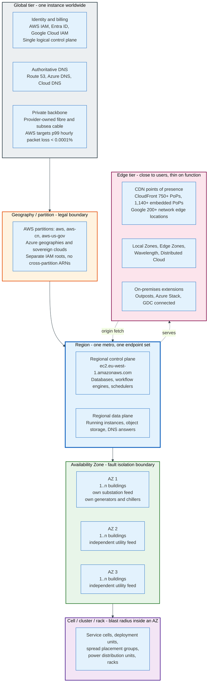

### 3.1 What an Availability Zone Is Physically

An Availability Zone is a set of buildings that share nothing which can fail.

AWS states the requirement precisely: common points of failure, such as generators and cooling equipment, are not shared across Availability Zones and are designed to be supplied by different power substations. Zones are designed not to be simultaneously affected by utility power loss, water disruption, fibre isolation, earthquake, fire, tornado, or flood. Azure states that each availability zone has independent power, cooling, and networking infrastructure, and that datacentre locations are chosen using vulnerability risk assessment criteria that consider shared risks between zones.

Translate that into building services and the picture sharpens.

**Power.** Each zone takes utility power from a different substation, so a substation fault or a transmission-level event on one feed leaves the others up. Inside the building, power passes through switchgear to uninterruptible power supplies that carry the load for the tens of seconds a diesel or gas generator needs to start and accept load. The uninterruptible supply is a bridge, not a battery bank; the generators are the actual redundancy. Concurrent maintainability, in Uptime Institute terms Tier III, means any single power path can be taken out for service without stopping the load. Fault tolerance, Tier IV, means any single failure can occur without stopping the load. None of the three publishes an Uptime Institute Tier certification for its zones or its buildings, and the Tier system certifies individual facilities on application rather than fleets. What each provider does publish is the equivalent property in its own words: no generators or cooling shared across zones, and separate power substations per zone. The redundancy is asserted at the zone boundary, which is the boundary they sell.

**Cooling.** Chilled water plants, cooling towers, and computer room air handlers are per-building. A chiller plant failure is one of the most common causes of a partial zone event, because thermal runaway is fast: a densely loaded hall with cooling lost can exceed the ASHRAE recommended inlet envelope of 18 to 27 degrees Celsius within minutes, and servers will throttle then shut down to protect themselves.

**Rack power density.** A conventional rack of general-purpose servers draws 5 to 15 kW. An NVIDIA GB200 NVL72 rack draws roughly 120 kW and requires direct liquid cooling. That order-of-magnitude jump is the single largest change in data centre engineering since the AZ model was designed, and it is why AI capacity is being built in new halls rather than retrofitted into old ones.

**Network.** All Availability Zones in a region are interconnected with high-bandwidth, low-latency networking over fully redundant, dedicated metro fibre. Each zone connects to the internet through two transit centres where the provider peers with multiple tier-1 networks. The dedicated fibre is the expensive part and the reason the 100 km limit exists.

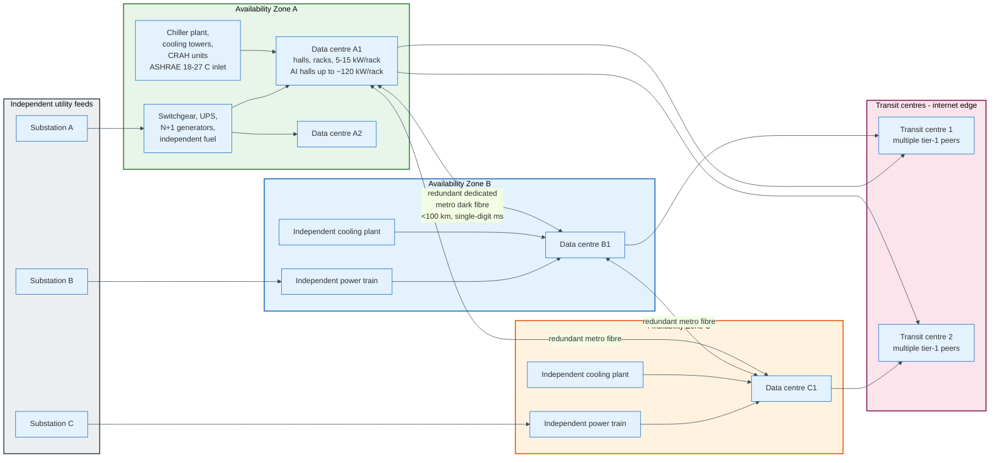

### 3.2 The 100 Kilometre Number Is a Latency Budget

The distance limit is arithmetic, not policy. Light in single-mode fibre travels at roughly 200,000 km per second, which is 5 microseconds per kilometre one way and 10 microseconds per kilometre round trip. A 100 km path therefore costs about 1 millisecond of round-trip propagation before a single switch touches the packet. Add transponders, amplifiers, and two or three switching hops and a real 100 km metro path lands in the 1 to 2 millisecond range.

That is exactly the budget a synchronous write needs. A database that acknowledges a commit only after a second copy is durable in another zone pays that round trip on every write. At 2 milliseconds, a single-threaded writer caps at 500 commits per second, which is survivable with batching and group commit. At 10 milliseconds, the propagation cost of 1,000 km at the same 10 microseconds per kilometre, the cap falls to 100 commits per second and batching stops rescuing it. Azure states the target directly: inter-zone communication with round-trip latency of less than approximately 2 milliseconds.

Push the zones closer and you lose independence. Push them further and you lose synchronous replication. One hundred kilometres is where those two curves cross.

The corollary matters for correlated failure. A hurricane, a regional grid event, or a flood plain can be larger than 100 km. Zones defend against building-scale and campus-scale failures. They do not defend against a regional event, which is why both AWS and Azure say plainly that availability zones do not protect against a full-region outage.

### 3.3 The Edge Tier Does Less Than People Assume

Edge locations are caches and terminations, not compute regions. A CloudFront point of presence terminates TLS, serves cached objects, and runs small functions. It does not hold your database, cannot run your VM, and has no durable storage guarantee.

AWS publishes 750 or more points of presence in 100 or more cities across 50 or more countries, backed by 15 regional edge caches that sit between the PoPs and the origin to reduce origin fetches, plus 1,140 or more embedded points of presence deployed inside internet service provider networks in 300 or more cities. Google publishes 200 or more network edge locations. The counts are not comparable across providers because the definitions differ: an embedded PoP inside an ISP is a different object from a full metro PoP.

Between the edge and the region sits a middle tier that did not exist before 2019. AWS Local Zones place compute and some storage in a metro that has no region, attached to a parent region's control plane. AWS Wavelength does the same inside mobile operator networks. Azure Edge Zones and Google Distributed Cloud fill the same gap. All of them share one property that catches teams out: the control plane stays in the parent region. A Local Zone with a healthy data plane and an unreachable parent region can keep running instances but cannot launch new ones.

---

## 4. Key Participants and Roles

The cloud has more actors than "provider" and "customer", and outages usually happen at the seams between them.

| Actor | What it does | Controls | Fails how |
|-------|--------------|----------|-----------|
| **Provider control plane** | Accepts API calls, allocates resources, orchestrates workflows | Placement, capacity, quota, identity | Loudly and regionally; see section 16 |
| **Provider data plane** | Runs the workload: instances, packets, blocks, objects | Nothing the customer configures at runtime | Quietly and locally, usually one rack or one host |
| **Hardware root of trust** | Verifies firmware before the CPU executes | Boot integrity, machine identity | By refusing to release the machine from reset |
| **Offload processor** | Runs network, storage, and management stacks off the main CPU | I/O virtualisation, encryption, policy enforcement | Independently of the guest, which is the point |
| **Customer account or subscription** | The billing and isolation boundary | Quotas, policy scope, blast radius | By hitting a limit nobody was watching |
| **Organisation or tenant** | The policy root above accounts | Guardrails: SCPs, RCPs, Azure Policy, org policies | By locking everyone out with one bad policy |
| **Identity provider** | Issues the credentials everything else checks | Every request in the system | Catastrophically; see section 16.6 |
| **Managed service team** | Runs a database or queue as a product | The service's own control plane | By inheriting a dependency the customer cannot see |
| **Third-party SaaS on the same cloud** | Sells software that runs on the provider | Its own availability, plus yours | Correlated with the provider, not independently |
| **Reseller, MSP, or landing zone team** | Owns the org structure and the guardrails | What the application team may do | By making the guardrail the outage |

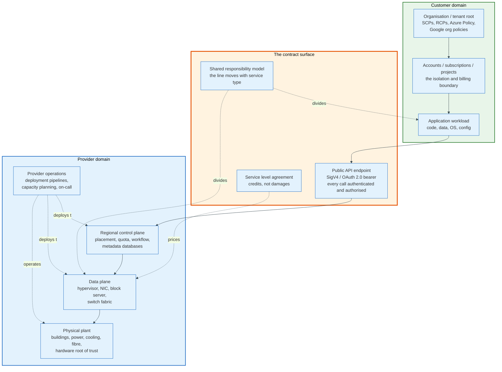

The two roles worth dwelling on are the ones customers cannot see.

**The offload processor is now the real hypervisor.** On a modern host the main CPU runs almost nothing but guest code. Network virtualisation, block storage protocol, encryption, telemetry, and firmware management all execute on a separate card with its own processor, memory, and operating system. When AWS says administrative access to an EC2 server is eliminated by design, that claim rests on the offload card being the only management path and having no interactive login.

**The organisation policy root is the largest blast radius a customer owns.** A service control policy attached at the organisation root applies to every principal in every account beneath it, evaluated before identity policies. One malformed condition there denies every API call in the estate. No provider outage is required.

---

## 5. Control Plane and Data Plane

The control plane creates, changes, and destroys resources. The data plane uses them. Every availability property of every cloud service follows from that split.

AWS defines it exactly: control planes provide the administrative APIs used to create, read, update, delete and list resources, while the data plane is what provides the primary function of the service. Launching an EC2 instance is control plane. The running instance is data plane. Creating an S3 bucket is control plane. Getting an object from it is data plane. Route 53 answering a DNS query is data plane; changing the record is control plane.

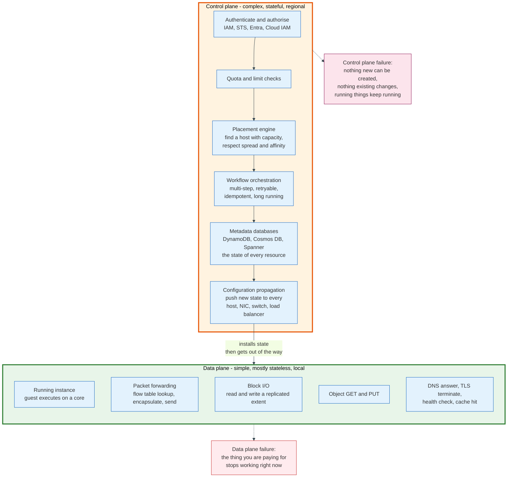

### 5.1 Why Control Planes Fail Differently

Control planes fail more often, fail wider, and take longer to recover. Three structural reasons, each independent.

**They are orders of magnitude more complex.** AWS's own framing: data planes are intentionally less complicated, with fewer moving parts compared to control planes, which usually implement a complex system of workflows, business logic, and databases. Launching one EC2 instance requires finding a host with capacity, allocating network interfaces, preparing an EBS volume, generating IAM credentials, applying security group rules, and more. Running that instance requires a scheduler timeslice. Complexity is the input to failure rate.

**They are shared and stateful.** A data plane failure is usually one host, one rack, one volume. A control plane is a regional service with a regional database. When its database becomes unavailable, every resource in the region becomes unmodifiable at once. The October 2025 DynamoDB DNS failure in us-east-1 is exactly this shape: one internal endpoint went empty, and EC2's DropletWorkflow Manager, which depends on DynamoDB, could not complete state checks, so physical servers lost their leases and stopped being candidates for launches. Customers saw insufficient capacity errors on a fleet that was physically idle.

**They fail into congestive collapse.** Control planes accept work into queues. When a control plane recovers from an outage, the queue holds every retry that accumulated during it, plus every client's exponential backoff expiring at once. AWS described the recovery of that same October 2025 event as DWFM entering congestive collapse: queued lease-establishment work exceeded processing capacity, and engineers had to throttle incoming work and selectively restart hosts. The December 2021 us-east-1 event had the same signature, where a surge of connection activity overwhelmed networking devices and a latent client backoff bug prevented the system from recovering on its own.

Data planes do not have this failure mode because they do not queue. A packet either forwards or drops.

### 5.2 Static Stability Is the Only Defence

Static stability means a system continues to operate correctly using the state it already has, without needing the control plane to tell it anything new.

A running EC2 instance is statically stable. It keeps running with no control plane contact. So is a load balancer with a healthy target set already installed, and so is a DNS resolver serving records already in cache. The December 2021 AWS event demonstrated the property cleanly: running EC2 instances, Lambda invocations, and direct S3 and DynamoDB requests were unaffected while EC2 APIs, the console, and STS were failing.

The design rule that follows is uncomfortable and correct. Recovery must not depend on the control plane, because the control plane is what is broken.

Concretely: pre-provision standby capacity rather than planning to scale out during an event, since scaling out is a control plane action. Pre-create the DNS records, subnets, and security groups in the failover region. Use health-check-based failover that runs in the data plane rather than a runbook that calls an API. Cache credentials for longer than the outage you are planning for. Every one of those choices costs money in steady state, which is why most teams skip them and then discover during an event that their failover plan is a sequence of control plane calls.

### 5.3 Cell-Based Architecture Is the Structural Answer

The industry's response to control plane blast radius is cellularisation: partition the service into many independent instances, each serving a subset of customers, each with its own database and its own deployment.

AWS named the technique in its own post-event summary for the February 2017 S3 event, describing "breaking services into small partitions which we call cells" and work already done to refactor parts of S3 "to reduce blast radius and improve recovery". For the index subsystem specifically it committed to less than that: reprioritising already-planned further partitioning to begin immediately. The explicit promise came after the November 2020 Kinesis event, when AWS said it would "greatly accelerate the cellularization of the front-end fleet to match what we've done with the back-end".

Cells work because failure and recovery both scale down. A cell holding 1/50th of the customers fails for 2 percent of them and restarts in a fraction of the time. The cost is a routing layer that maps customers to cells, which is itself a shared component, and which must be simpler and more available than anything it routes to.

---

## 6. The Hypervisor and the Offload to Dedicated Hardware

The modern cloud hypervisor is not software running on the server's CPU. It is firmware running on a separate card, and the server's CPU runs almost nothing but the customer's code.

### 6.1 What the Hypervisor Used to Do

A 2010-era EC2 host ran Xen with a privileged control domain, dom0, holding a full Linux kernel. Every packet a guest sent traversed a software bridge inside dom0. Every disk block passed through a blkback driver in dom0 and out over the network. Device emulation, live migration, monitoring, and management agents all ran there.

Three costs followed. Dom0 consumed CPU and memory that could not be sold, and the share rose with I/O intensity, though neither AWS nor the Xen project publishes a figure for it. Performance was variable, because a noisy neighbour's packet processing competed for the same cores. And the attack surface was a general-purpose operating system with network reachability and full authority over every guest on the box.

Offload attacks all three at once.

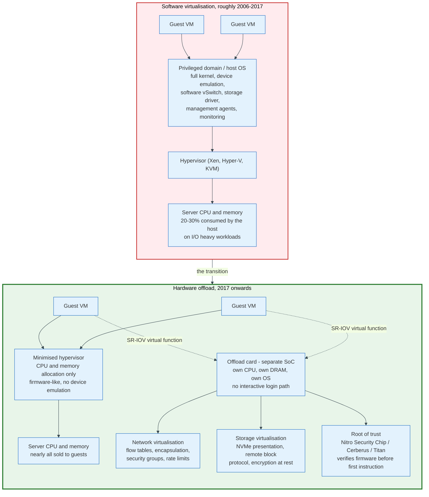

### 6.2 AWS Nitro

The Nitro System has three components, and AWS is explicit that they are complementary but do not have to be used together.

**Nitro Cards.** Hardware devices designed by AWS that provide overall system control and I/O virtualisation independent of the main system board with its CPUs and memory. The published card families are the Nitro Card for VPC, the Nitro Card for EBS, the Nitro Card for Instance Storage, and the Nitro Card Controller. Each presents itself to the guest as a standard PCIe device: the VPC card as an Elastic Network Adapter, the EBS and instance storage cards as NVMe controllers. The guest therefore needs no paravirtual drivers and no knowledge that it is virtualised.

**The Nitro Security Chip.** It enables a secure boot process for the overall system based on a hardware root of trust, provides the ability to offer bare metal instances, and offers defence in depth protecting the server from unauthorised modification of system firmware. The bare metal capability is the tell: because security and I/O virtualisation live on the cards rather than in host software, AWS can hand a customer the entire physical machine and still control the boundary.

**The Nitro Hypervisor.** A deliberately minimised and firmware-like hypervisor designed to provide strong resource isolation and performance nearly indistinguishable from a bare metal server. It allocates memory and CPU. It does not emulate devices, does not carry a general-purpose kernel, and does not run management agents.

The security claim that follows is the one worth understanding. AWS states that the Nitro System eliminates the possibility of administrator access to an EC2 server, and describes the communications design as passive: components do not accept unsolicited inbound connections and there is no interactive shell, no SSH, and no administrative API into the host. The Nitro Security Chip's locked-down security model prohibits all administrative access, including that of Amazon employees.

Two further pieces sit on top. **NitroTPM** presents a TPM 2.0 device to the guest so that instances can generate, store, and use keys without having access to those keys, supporting measured boot and attestation. **Nitro Enclaves** carve an isolated compute environment out of an instance's own vCPUs and memory, with no persistent storage, no interactive access, and no external network path; the only channel is a local vsock to the parent instance. An enclave can produce a signed attestation document naming its image measurements, which AWS Key Management Service can require in a key policy condition before releasing a key.

### 6.3 Azure Boost and Accelerated Networking

Azure attacked networking first and generalised later.

**Accelerated Networking** enables single root I/O virtualisation, SR-IOV, on supported VM sizes. Without it, all traffic traverses the host and the Hyper-V virtual switch, which applies every policy: network security groups, access control lists, isolation. With it, the network interface forwards traffic directly to the VM, and the policies the virtual switch used to apply are enforced in hardware instead. The documented benefits are lower latency, higher packets per second, reduced jitter, and lower CPU utilisation. Supported adapters are NVIDIA ConnectX-3, ConnectX-4 Lx and ConnectX-5, and Microsoft's own MANA.

One consequence trips up guest images. The virtual function can be dynamically revoked and restored during host maintenance or live migration, so applications must bind to the synthetic `hv_netvsc` device rather than to the virtual function directly, and the SR-IOV drivers must be marked unmanaged in the guest's network configuration. A VM that binds to the VF loses connectivity every time the host is serviced.

**Azure Boost** is the general offload. Microsoft describes it as offloading server virtualisation processes traditionally performed by the hypervisor and host OS onto purpose-built software and hardware. The published figures:

| Boost capability | Figure |
|------------------|--------|
| Network bandwidth | Up to 200 Gbps via the Microsoft Azure Network Adapter (MANA) |
| Remote storage | Up to 14 GB/s throughput and 750,000 IOPS |
| Local storage (Azure Boost SSD) | Up to 36 GB/s throughput and 6.6 million IOPS |
| Storage offload target | A dynamically programmable FPGA, so the fleet's storage datapath can be updated in place |
| Guest disk interface | NVMe, replacing SCSI |

Boost's security stack is documented in unusual detail. **Cerberus** serves as an independent hardware root of trust to achieve NIST SP 800-193 certification, and customer workloads cannot run on Boost architecture unless the firmware and software on the system is trusted. Attestation through the Azure Attestation Service gates any machine that cannot be securely attested out of hosting workloads. The Boost operating system uses SELinux to enforce least privilege for all software on the system-on-chip, ships a FIPS 140 certified kernel, and Microsoft states that Rust is the primary language for all new code written on the Boost system, for memory safety without a performance cost.

The FPGA choice distinguishes Azure from AWS. A fixed-function ASIC is cheaper per unit and faster; an FPGA can be reprogrammed across the deployed fleet when the protocol changes. Microsoft bought flexibility. Amazon bought unit cost.

### 6.4 Google Titan and Titanium

Google split the problem into identity and offload, and shipped the identity half first.

**Titan** is a secure, low-power microcontroller Google designed itself, containing a secure application processor, a cryptographic co-processor, a hardware random number generator, embedded SRAM and flash, a ROM block, and a key hierarchy. Its placement is the clever part: Titan interposes on the Serial Peripheral Interface bus between the boot firmware flash and the first privileged component, either the baseboard management controller or the platform controller hub.

The boot sequence is worth stating step by step, because it defines what "root of trust" means in practice.

1. On power-up, Titan's application processor executes immutable code from embedded read-only memory. The boot ROM is trusted implicitly and validated at every chip reset, and runs a memory built-in self-test to detect tampering.
2. The boot ROM verifies Titan's own firmware using public key cryptography, and mixes the code identity of the verified firmware into Titan's key hierarchy.
3. Titan verifies the host boot firmware flash contents, again with public key cryptography, while gating the PCH or BMC's access to that flash and holding the machine in reset.
4. Only after verification succeeds does Titan signal release from reset.

The property this buys is first-instruction integrity. Because the machine is held in reset throughout, Titan knows what boot firmware and operating system booted from the very first instruction, including CPU microcode patches fetched before the boot firmware's first instruction.

Machine identity is manufactured, not assigned. Each chip generates unique keying material during manufacturing, stored with provenance in a registry database protected by keys held in an offline, quorum-based Titan certification authority. Chips generate certificate signing requests; a quorum of identity administrators verifies them against the registry before the CA issues a certificate. Because firmware code identity is hashed into the on-chip key hierarchy, a firmware bug can be patched and new certificates issued only to patched firmware, which makes remediation possible without replacing hardware. Titan also cryptographically associates log messages with a secure monotonic counter and signs them, producing an audit trail that cannot be altered or deleted without detection, even by a root-level insider.

**Titanium** is the offload layer built on top. Google states that all third and fourth generation general-purpose VMs support Titanium, that C3 and C4 machine types reach up to 200 Gbps per-VM Tier_1 networking, that C4 uses Titanium SSD for local storage, and that C4D pairs the fifth generation AMD EPYC Turin processor with Titanium. Google has not published a component-level breakdown comparable to the AWS Nitro Card list.

### 6.5 What the Offload Actually Buys

Four things, in descending order of how often they are cited and ascending order of how much they matter.

**Performance.** Guest cores stop paying for I/O. The gains are largest at the tail: jitter falls because packet processing no longer competes with guest threads for a core.

**Density.** Host CPU and memory that used to run the hypervisor stack is now sellable inventory. On a 128-core host, recovering even 10 percent of capacity is 13 cores per server across millions of servers.

**Update velocity.** The datapath can be changed without touching the guest. Azure's FPGA-based storage path is explicitly designed for this, and Microsoft calls it continuous delivery for the fleet's storage hardware.

**Isolation.** This is the one that matters. When the management path lives on a card with no interactive login and no unsolicited inbound connections, the class of attack that begins "compromise the host operating system" has no host operating system to compromise. It also removes the operator: nobody at the provider can log into the machine your workload runs on, because there is nothing to log into.

---

## 7. Instance Types, Scheduling, and Oversubscription

An instance type is a contract about a slice of a physical machine. Reading the contract carefully tells you exactly where the provider is and is not oversubscribing.

### 7.1 What a vCPU Actually Is

On the three major providers a vCPU is one hardware thread, not one core. AWS states it directly for burstable instances: each vCPU is a thread of either an Intel Xeon core or an AMD EPYC core, except for T2 and T4g. A `c7i.4xlarge` with 16 vCPUs occupies 8 physical cores with simultaneous multithreading enabled.

The exceptions are informative. AWS Graviton processors, Azure Cobalt, and Google Axion are Arm designs without simultaneous multithreading, so one vCPU is one physical core. That is why Graviton price-performance comparisons against x86 are not a straight core-count comparison: an 8-vCPU Graviton instance has 8 cores, while an 8-vCPU x86 instance has 4.

Memory is not threaded and not shared. A 32 GiB instance holds 32 GiB of physical DRAM mapped into its address space, and the hypervisor does not page it out, does not balloon it, and does not deduplicate it across tenants. Memory deduplication and ballooning are standard in enterprise virtualisation and absent from the public cloud, because both create cross-tenant information channels and both make performance unpredictable.

### 7.2 Where Oversubscription Actually Happens

The blanket claim "the cloud oversubscribes everything" is wrong, and the blanket claim "the cloud never oversubscribes" is also wrong. The truth is resource by resource.

| Resource | Oversubscribed on general-purpose instances? | Mechanism |
|----------|---------------------------------------------|-----------|
| **Memory** | No | Physically allocated, no ballooning, no page sharing |
| **vCPU on non-burstable types** | No | Threads are pinned to the instance for its lifetime |
| **vCPU on burstable types** | Yes, explicitly and with published arithmetic | CPU credits, see below |
| **Network bandwidth** | Yes, by design | Baseline plus burst, token bucket per instance |
| **EBS bandwidth** | Yes, by design | Separate baseline plus burst budget per instance |
| **Local NVMe** | No | Physical device or namespace attached to the host |
| **Fleet capacity in an AZ** | Yes, at the fleet level | On-demand capacity is finite; this is what an insufficient capacity error means |

Burstable instances are the honest case, because the provider publishes the entire model. A T-family instance earns CPU credits continuously while below its baseline and spends them while above it. One CPU credit equals one vCPU running at 100 percent for one minute.

The arithmetic, worked with real published values:

- A `t3.nano` has 2 vCPUs and earns 6 credits per hour. Baseline utilisation is (6 credits / 2 vCPUs) / 60 minutes = 5 percent per vCPU. Its accrual ceiling is 24 hours of earnings: 24 x 6 = 144 credits.
- A `t3.large` has 2 vCPUs and earns 36 credits per hour, giving (36 / 2) / 60 = 30 percent baseline, with a 864-credit ceiling.
- A `t3.2xlarge` has 8 vCPUs and earns 192 credits per hour, giving (192 / 8) / 60 = 40 percent baseline, with a 4,608-credit ceiling.

In Standard mode, an instance that exhausts its accrued credits is throttled down to baseline. In Unlimited mode, which is the default for T3, T3a and T4g, the instance spends surplus credits and keeps running at full speed; if its average CPU utilisation over a rolling 24-hour period exceeds baseline, the surplus is billed at a flat additional rate per vCPU-hour. Credits on T3, T3a and T4g persist for seven days after an instance stops; on T2 they are lost immediately.

Read that table the other way and it is a pricing statement. A `t3.large` at 30 percent baseline costs a fraction of a `c7i.large`, because the provider has sold you 30 percent of two threads and reserved the right to sell the rest of them to somebody else. Azure's B-series and Google's shared-core types make the same trade with different arithmetic.

### 7.3 Placement, Bin Packing, and Why Capacity Errors Happen

The placement engine solves a bin-packing problem in real time. Given a request for one `m7i.8xlarge`, it must find a host with 32 free vCPUs and 128 GiB free memory, in the right Availability Zone, on the right processor generation, with sufficient free network and EBS bandwidth, not violating any spread or affinity constraint the customer specified, and preferably leaving the host in a state where the remaining fragments are still sellable.

That last clause is the hard one. A fleet fully packed with 2-vCPU instances cannot serve a 96-vCPU request even if it has thousands of free vCPUs in aggregate. Providers manage fragmentation by reserving pools of whole hosts for large instance types, which is why the largest sizes in a family are the first to return capacity errors and the smallest are almost always available.

Placement constraints the customer can express:

- **Spread**: no two instances on the same underlying hardware. AWS spread placement groups guarantee distinct racks, capped at 7 instances per AZ per group. Azure availability sets use fault domains and update domains. Google uses spread placement policies.
- **Cluster**: pack instances close together for low latency and high bisection bandwidth, used for HPC and distributed training. AWS cluster placement groups place instances in the same network spine.
- **Partition**: divide instances into groups that share no underlying hardware, for replicated systems such as Cassandra or HDFS.
- **Dedicated host or node**: the whole physical machine, for licensing or compliance.

### 7.4 Live Migration Is the Largest Architectural Difference Between Providers

Google migrates running VMs off hosts that need maintenance. AWS mostly does not, and instead schedules instance retirements and reboots. Azure sits between the two, using live migration for many maintenance classes while still issuing planned maintenance notifications.

This single difference propagates through everything. Google can patch firmware and replace hardware without customer-visible events, so a Google VM's expected lifetime is bounded by the customer's decisions rather than the fleet's maintenance calendar. AWS instead makes the maintenance event explicit, gives notice, and expects the customer's architecture to absorb an instance disappearing. Each approach is coherent. The AWS approach forces resilience into customer architectures and is cheaper to operate. The Google approach hides the operation and costs more engineering inside Google.

The offload architecture interacts with this directly. Migrating a VM whose network state lives in a SmartNIC's flow tables requires draining and reprogramming that state, which is exactly why Azure documents that the SR-IOV virtual function is revoked and restored during live migration and why guest applications must bind to the synthetic device.

---

## 8. Block Storage and Its Network Path

Cloud block storage is a network service dressed as a disk. Every property that surprises people follows from that sentence.

### 8.1 A Disk That Is Not a Disk

An EBS volume, an Azure managed disk, or a Google Persistent Disk is not attached to the server running your instance. It is a replicated extent living on a fleet of storage servers elsewhere in the same Availability Zone, reached over the same physical network that carries your instance's packets, and presented to the guest as an NVMe device by the offload card.

The consequences:

- **Durability comes from replication, not from RAID.** AWS designs `io2` Block Express for 99.999 percent volume durability with an annual failure rate no higher than 0.001 percent, which is one volume failure per 100,000 running volumes per year. `io1` is designed for 99.8 to 99.9 percent, an AFR no higher than 0.2 percent, or two failures per 1,000 volumes per year. Those two orders of magnitude are a replication topology difference, not a media difference.
- **Latency is network latency plus media latency.** AWS designs `io2` Block Express on Nitro instances for an average under 500 microseconds for a 16 KiB I/O, and states it reduces the frequency of I/Os exceeding 800 microseconds by more than ten times compared to general purpose volumes. A local NVMe device is roughly an order of magnitude faster. You are buying durability with microseconds.
- **The volume survives the instance and does not survive the zone.** A block volume is a zonal resource. It cannot be attached across zones, and zone loss means volume loss unless a snapshot exists in regional object storage.
- **Bandwidth is metered twice.** The instance has an EBS bandwidth allowance separate from its network allowance, and the volume has a provisioned throughput ceiling. The lower of the two binds.

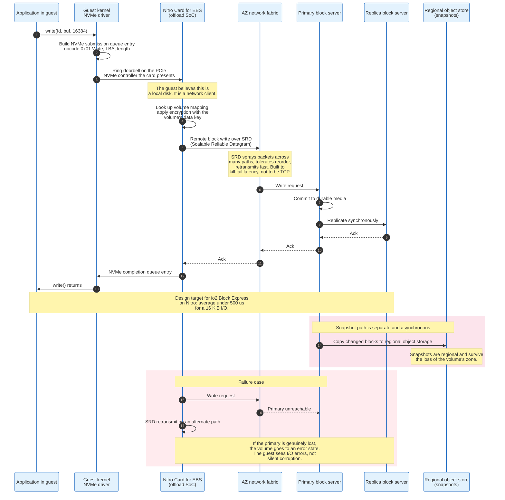

### 8.2 The Wire Protocol Is Not iSCSI

AWS states that Block Express servers communicate with Nitro-based instances using the Scalable Reliable Datagram protocol, implemented in the Nitro Card dedicated to the EBS I/O function, and that this minimises I/O delay and latency variation.

SRD is a purpose-built transport, not a tuned TCP. Its defining behaviours, as AWS has described them for both EBS and the Elastic Fabric Adapter, are multipath packet spraying across many network paths rather than a single flow, tolerance of out-of-order delivery with reordering left to the endpoint, and aggressive retransmission timing informed by the fact that the network is a known data centre fabric rather than the internet. TCP's congestion control assumes an unknown path with unknown competitors. Inside one Availability Zone neither assumption holds, so TCP's conservatism shows up as tail latency for no benefit.

The offload card is what makes this possible. Implementing a custom transport in the guest kernel would require every customer to install a driver. Implementing it on a card that presents standard NVMe means an unmodified Linux or Windows guest gets the benefit and never knows.

### 8.3 The Three Block Stores Compared

| Property | AWS `io2` Block Express | Azure Ultra Disk / Premium SSD v2 | Google Hyperdisk Extreme |
|----------|------------------------|-----------------------------------|--------------------------|
| Max IOPS per volume | 256,000 on Nitro instances, 32,000 elsewhere | Provisioned independently of size | Provisioned independently of size |
| Max throughput per volume | 4,000 MiB/s | Provisioned independently of size | Provisioned independently of size |
| Max size | 64 TiB (65,536 GiB) | Multi-TiB, tier dependent | Multi-TiB, tier dependent |
| IOPS to size ratio | 1,000:1, so 256 GiB reaches the maximum | Decoupled | Decoupled |
| Throughput scaling | 0.256 MiB/s per provisioned IOPS, maximum at 16,000 IOPS | Decoupled | Decoupled |
| Designed durability | 99.999 percent, AFR under 0.001 percent | Not published in the same form | Not published in the same form |
| Latency design point | Under 500 microseconds average at 16 KiB | Sub-millisecond | Sub-millisecond |
| Transport | SRD on the Nitro Card for EBS | Offloaded to the Azure Boost FPGA, NVMe presented | Titanium offload |

Two structural notes. First, AWS made all `io2` volumes Block Express volumes as of 30 April 2025, so the older architecture is gone. Second, the decoupling of IOPS from capacity is the design trend across all three: older generations forced you to buy a 10 TiB volume to get the IOPS of a 10 TiB volume, and every provider has now separated the two dials.

### 8.4 Instance Store Is the Other Half of the Answer

Local NVMe attached to the host, called instance store on AWS, temporary disk or local NVMe on Azure, and Local SSD on Google, is faster and cheaper per IOPS by a wide margin, and disappears when the instance stops. Azure Boost SSD is documented at up to 36 GB/s and 6.6 million IOPS locally, against 14 GB/s and 750,000 IOPS for remote storage, roughly a 2.5x throughput and 9x IOPS gap.

The correct architecture uses both: local NVMe for anything that can be rebuilt from a durable source, such as caches, scratch, shuffle space, and replicated database segments, and network block storage for anything that must survive the host. Systems that get this wrong in either direction pay heavily. Running a Kafka broker on network block storage buys durability you already have from replication and pays for it in latency. Running a single-node Postgres on instance store buys latency and loses the database when the host fails.

---

## 9. The Software-Defined Network and VPC Encapsulation

A virtual private cloud is an illusion maintained by rewriting packet headers. The physical network knows nothing about your address space, and every packet your instance sends is wrapped in a second set of headers before it reaches a wire.

### 9.1 The Problem

Ten thousand customers on one physical network all want to use `10.0.0.0/16`. The physical network has one address space and cannot host ten thousand overlapping copies of it. Meanwhile the same customers want their traffic isolated from each other, want to move an IP address between machines in seconds, and want firewall rules enforced per instance rather than per subnet.

Nothing in classical IP networking does this. VLANs give 4,094 tags, three orders of magnitude too few. Physical separation does not scale. Routing overlapping prefixes is undefined.

The answer, arrived at independently by all three providers and then standardised, is encapsulation: put the customer's packet inside another packet, addressed using the provider's own physical address space, with a tenant identifier in a header between them.

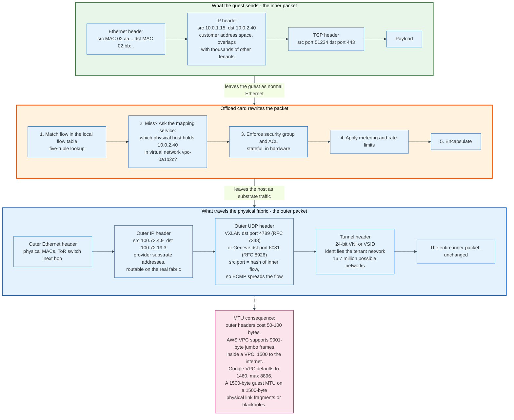

### 9.2 The Standardised Formats, and What AWS Actually Uses

Three encapsulations are standardised, and it is worth knowing the numbers because they appear in packet captures, MTU calculations, and firewall rules.

| Format | RFC | Transport | Tenant ID field | Notes |
|--------|-----|-----------|-----------------|-------|
| **VXLAN** | RFC 7348 | UDP, destination port 4789 | 24-bit VXLAN Network Identifier | 8-byte header, source port carries an inner-flow hash for ECMP |
| **Geneve** | RFC 8926 | UDP, destination port 6081 | 24-bit Virtual Network Identifier | Variable-length TLV options, designed to be extensible |
| **NVGRE** | RFC 7637 | GRE | 24-bit Virtual Subnet ID in the GRE key field | Microsoft origin, largely superseded by VXLAN |

AWS has never published the on-wire format of VPC encapsulation, and it should be assumed proprietary. What AWS does publish is where Geneve appears at customer-visible boundaries: the Gateway Load Balancer encapsulates traffic to third-party appliances in Geneve on UDP port 6081, which is why a firewall appliance behind a GWLB must speak Geneve.

The 24-bit identifier is the reason the model works. Twenty-four bits is 16,777,216 distinct virtual networks per substrate, against a VLAN's 4,094. That single number is what made multi-tenant networking at cloud scale tractable.

### 9.3 The Mapping Service Is the Real Control Plane

Encapsulation needs an answer to one question, asked millions of times per second: for virtual network V, which physical host currently holds virtual IP address A?

That mapping is the network control plane's entire product. It changes whenever an instance launches, stops, migrates, gains a secondary address, or has an Elastic IP reassigned. It must be consistent enough that packets do not go to the wrong host and available enough that a lookup miss does not drop a connection.

All three providers solve it with the same shape: a distributed mapping database, a per-host cache, and a fallback path for cache misses. The differences are in the fallback.

**Google Andromeda** publishes its design. The NSDI 2018 paper describes a flexible hierarchy of flow processing paths: a Fast Path using OS-bypass software packet processing for high-rate flows, coprocessor threads for per-packet work that is too expensive for the fast path such as encryption and deep inspection, and the Hoverboard programming model. Hoverboards are dedicated hardware gateways that handle flows for which no direct host-to-host rule has been installed. A new or low-rate flow goes via a Hoverboard; when a flow's rate crosses a threshold, the controller installs a direct rule on the sending host and the flow moves to the fast path. The effect is that the control plane only programs state for flows that matter, so a VM talking to ten thousand peers at one packet per second each costs almost no flow-table state. The specific rate threshold is a tunable and is not published as a fixed figure.

**Azure** puts policy in the Virtual Filtering Platform, the programmable virtual switch in the host, and offloads the resulting flow rules to the SmartNIC under Accelerated Networking. Microsoft's framing is that the NIC forwards traffic directly to the VM while maintaining all the policies that the host previously applied. The first packet of a flow goes through the software path, which compiles a rule; subsequent packets match in hardware.

**AWS** has described a mapping service and encapsulation publicly in conference talks since 2015 but publishes no architecture document. What is documented is the behaviour: packets originating in the AWS network with a destination in the AWS network stay on the AWS global network, including when two VPCs communicate using public IP addresses, and AWS operates its backbone to target a p99 of the hourly packet loss rate below 0.0001 percent.

### 9.4 Security Groups Are Stateful Hardware, Not a Firewall Appliance

A security group is not a device traffic passes through. It is a rule set compiled into the flow tables of the offload card attached to each instance's network interface.

Three consequences follow, and each one is a common source of confusion:

- **Security groups are stateful.** Allow an inbound connection and the return traffic is permitted automatically, because the flow entry tracks the connection. Network ACLs, which act at subnet level, are stateless and require explicit rules in both directions.
- **Security groups cannot deny.** They contain only allow rules; anything not allowed is denied. There is no rule ordering and no precedence, because the evaluation is a union, not a sequence. Network ACLs do have numbered, ordered rules and can deny.
- **A change takes effect without touching the instance.** Modifying a security group causes the control plane to push new rules to every affected card. Existing flows that were previously allowed may or may not be torn down depending on the provider and the change; new flows are evaluated against the new rules immediately.

Azure's network security groups sit in VFP and behave similarly but do have priority-ordered allow and deny rules, which makes them closer to a classical firewall in expression and identical in enforcement location. Google's firewall rules are also priority-ordered and support both allow and deny, and are applied at the VPC level with target tags or service accounts selecting which instances they bind to.

### 9.5 The Global VPC Difference

Google Cloud VPCs are global. One VPC spans every region, subnets are regional objects inside it, and an instance in `europe-west1` reaches an instance in `us-central1` over the same VPC with no peering, no gateway, and no additional configuration.

AWS VPCs are regional and must be peered or attached to a Transit Gateway to reach another region. Azure virtual networks are regional and must be peered.

This is the single largest architectural difference in cloud networking and it comes directly from Google's internal network design, where the global software-defined WAN predates the cloud product. The trade is real in both directions. A global VPC removes the peering connections, transit gateways, and route tables that cross-region traffic otherwise needs, and removes a natural blast-radius boundary with them. An AWS engineer must build cross-region connectivity by hand. The cost is the plumbing; the return is that a routing mistake in one region cannot propagate to another.

---

## 10. Worked Example - Launching One Instance End to End

Concrete values, one request, from API call to a packet on the wire. The request: launch a single `m7i.2xlarge` in `eu-west-1`, subnet `subnet-0f3a91c2` in Availability Zone ID `euw1-az2`, with a 500 GiB `io2` volume provisioned at 20,000 IOPS, an instance profile granting read access to one S3 bucket, and a security group allowing TCP 443 inbound.

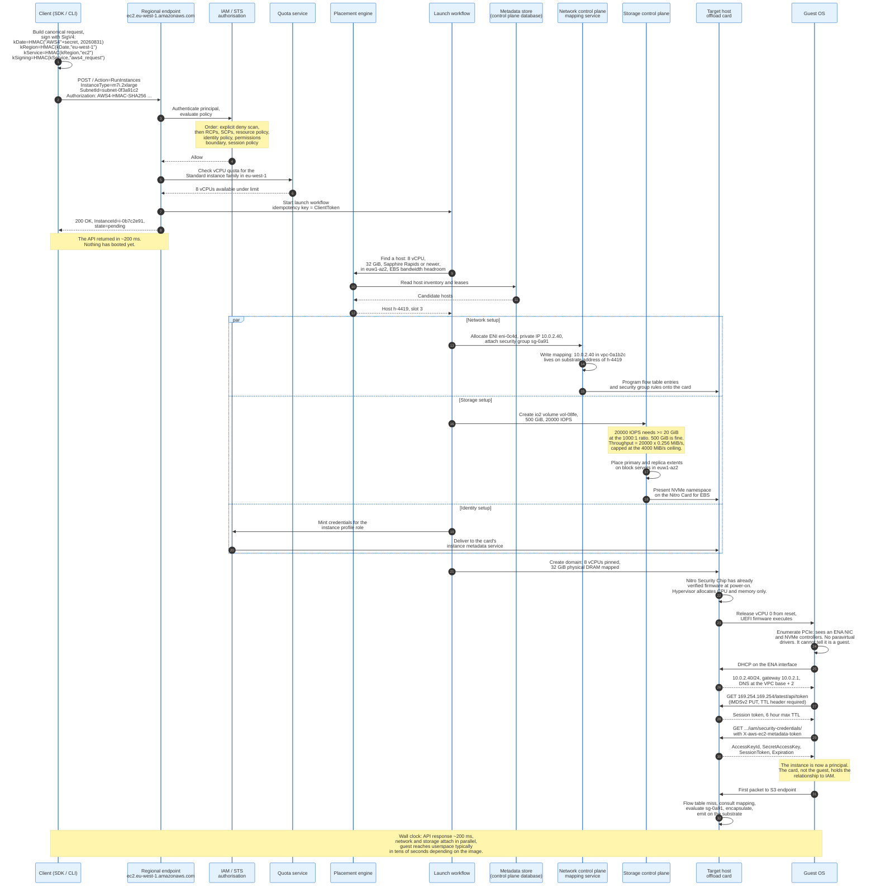

### 10.1 What the Example Shows

**The API returns before anything exists.** `RunInstances` returns an instance ID and the state `pending` in roughly 200 milliseconds. Everything after that is asynchronous workflow. This is why polling for state is the correct client pattern and why a control plane outage manifests as instances stuck in `pending` rather than as API errors.

**Network, storage, and identity are three separate control planes running in parallel.** Each can fail independently. An instance that boots but has no network is a network control plane failure. An instance that boots with no volume attached is a storage control plane failure. Both leave a running, billed, useless instance.

**The signing key derivation is a chain, not a secret.** SigV4 derives a signing key by four chained HMAC-SHA256 operations over the date, region, service, and the literal string `aws4_request`. The derived key is therefore scoped: a signature valid for `ec2` in `eu-west-1` on 31 August 2026 is useless for `s3`, useless in another region, and useless the next day. That scoping is why a leaked signature is much less dangerous than a leaked secret key.

**IMDSv2 exists because of a specific attack.** The original instance metadata service answered any HTTP GET to `169.254.169.254` from inside the instance, including a GET made by a server-side request forgery vulnerability in the application. IMDSv2 requires a PUT to obtain a session token, sets a maximum hop limit on the response so it cannot cross a container or proxy boundary, and requires the token on every subsequent request. A plain SSRF that can only issue GETs cannot obtain credentials.

---

## 11. IAM as the Universal Control Surface

Every action in every cloud is an API call, and every API call is authenticated and authorised before anything else happens. Identity is not a security feature bolted onto the platform. It is the platform's only control surface.

### 11.1 Authentication: Three Different Answers

**AWS uses request signing.** The client builds a canonical form of the request, hashes it, and signs the hash with a key derived from the secret access key. Signature Version 4 produces the signing key by chaining HMAC-SHA256:

```
kDate    = HMAC("AWS4" + secretAccessKey, "20260831")
kRegion  = HMAC(kDate,   "eu-west-1")
kService = HMAC(kRegion, "ec2")
kSigning = HMAC(kService,"aws4_request")
signature = hex(HMAC(kSigning, stringToSign))
```

The string to sign is `AWS4-HMAC-SHA256`, a newline, the ISO 8601 timestamp, a newline, the credential scope (`20260831/eu-west-1/ec2/aws4_request`), a newline, and the hex SHA-256 of the canonical request. The canonical request itself is the HTTP method, the canonical URI, the canonical query string, the canonical headers, the list of signed headers, and the hex SHA-256 of the payload, each on its own line. The secret never crosses the wire. The signature is bound to the exact request, the service, the region, and the day.

**Azure uses OAuth 2.0 bearer tokens.** A client authenticates to Microsoft Entra ID and receives a JSON Web Token signed by Entra with a key published at the tenant's JWKS endpoint. Every subsequent call carries `Authorization: Bearer <jwt>`, and the resource service validates the signature against Entra's published keys, checks the audience, issuer, and expiry, and reads the claims.

**Google Cloud also uses OAuth 2.0 bearer tokens.** A service account signs a JWT with its private key, exchanges it at the token endpoint for a short-lived access token, and presents that token. On a Compute Engine instance the metadata server performs the exchange, so the private key never exists on the machine.

The security properties differ in one way that matters. A stolen AWS signature is worth almost nothing, because it is bound to one request. A stolen Azure or Google bearer token is worth everything it grants until it expires, typically one hour. This is why bearer-token clouds invest heavily in token binding, conditional access, and short lifetimes, and why AWS invests instead in eliminating long-lived secret keys through roles.

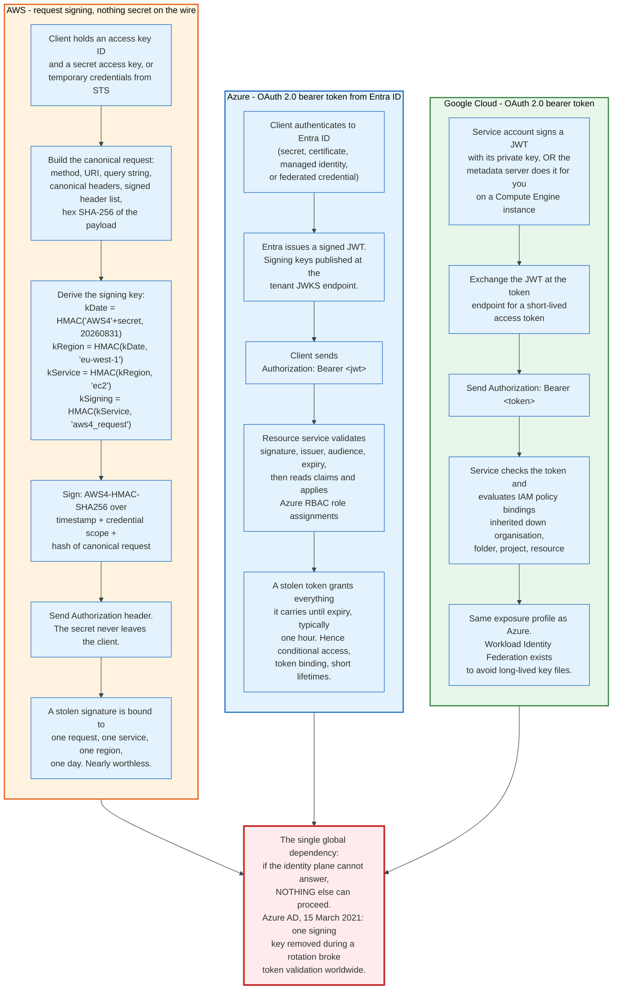

### 11.2 Authorization: The AWS Evaluation Order Is the Most Complex and the Best Documented

AWS states the rules plainly: by default all requests are implicitly denied except for the account root user; requests must be explicitly allowed; and an explicit deny overrides an explicit allow. The evaluation proceeds in a fixed order.

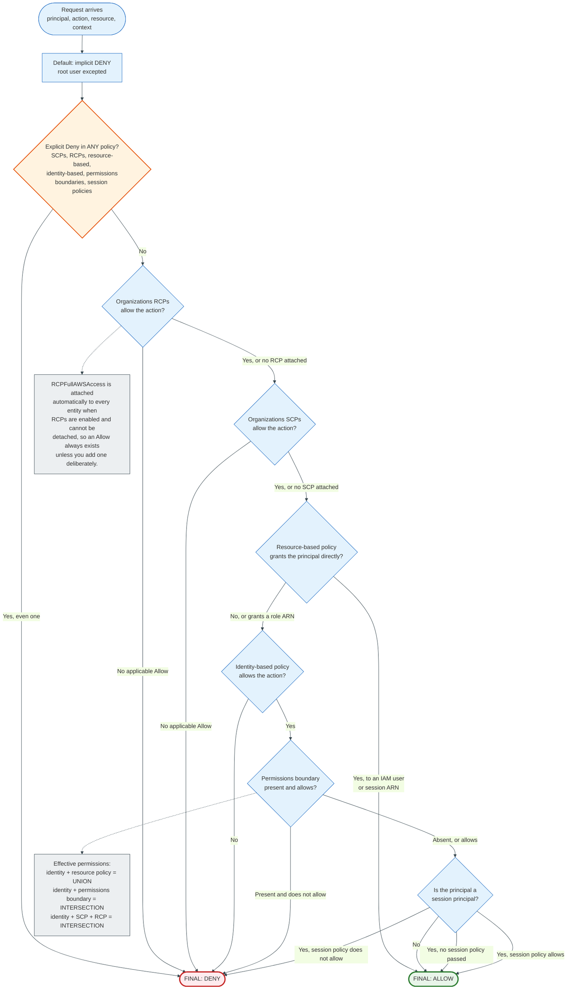

Three combination rules govern effective permissions, and confusing them is the most common IAM error in production:

- **Identity-based policy plus resource-based policy is a union.** If either allows the action, it is allowed. An explicit deny in either overrides.
- **Identity-based policy plus permissions boundary is an intersection.** Both must allow. Adding a boundary can only reduce permissions.
- **Identity-based policy plus SCP plus RCP is an intersection.** All three must allow.

Two exceptions are worth memorising because they cause real incidents. IAM role trust policies and KMS key policies must explicitly allow the principal; an identity policy alone is not sufficient. And within one account, a resource-based policy that grants permissions directly to an IAM user ARN or a role session ARN is not limited by an implicit deny in an identity policy, permissions boundary, or session policy, whereas one that grants to a role ARN is limited by boundaries and session policies. That distinction between a role ARN (`arn:aws:iam::111122223333:role/examplerole`) and a role session ARN (`arn:aws:sts::111122223333:assumed-role/examplerole/sessionname`) is invisible in most consoles and decisive in evaluation.

### 11.3 The Three Models Compared

| Dimension | AWS IAM | Microsoft Entra ID plus Azure RBAC | Google Cloud IAM |
|-----------|---------|-----------------------------------|------------------|
| Hierarchy | Organization, OU, account | Tenant, management group, subscription, resource group, resource | Organization, folder, project, resource |
| Policy attaches to | Identity or resource | Scope in the hierarchy | Resource in the hierarchy |
| Grant model | JSON policy documents with Effect, Action, Resource, Condition | Role assignment: principal + role definition + scope | Policy binding: member + role, on a resource |
| Inheritance | SCPs and RCPs restrict downward; identity policies do not inherit | Role assignments inherit downward | Bindings inherit downward |
| Explicit deny | Yes, and it wins | Yes, deny assignments exist but are limited | No deny in the base model; Deny policies are a separate, newer construct |
| Guardrail mechanism | SCPs, RCPs, permissions boundaries | Azure Policy, management group scope | Organization policy constraints |
| Machine identity | IAM role assumed via STS, credentials delivered by the instance metadata service | Managed identity, token from the instance metadata endpoint | Service account, token from the metadata server |
| Cross-cloud federation | OIDC and SAML identity providers, `AssumeRoleWithWebIdentity` | Federated credentials, workload identity federation | Workload Identity Federation |

The design philosophies diverge sharply. AWS made the policy language expressive and the hierarchy shallow, so almost everything is expressed in JSON conditions. Google made the hierarchy expressive and the policy language simple, so almost everything is expressed by choosing where to attach a binding. Azure inherited an enterprise directory and grafted a resource hierarchy onto it, which is why Azure has two separate systems, Entra ID for who you are and Azure RBAC for what you can touch, and why the boundary between them confuses people who expect one system.

### 11.4 Why Identity Failures Are the Worst Failures

Identity is the only truly global dependency in each cloud, and it is on the path of every request. An identity outage is not a partial outage. It is a total one, because nothing else can proceed without an authorisation decision.

Microsoft's Entra ID architecture is built around this fact. The data tier partitions into scale units; each partition has one primary replica that takes all writes and replicates each write synchronously to a secondary replica in a different datacentre before returning success; all reads are served from geographically distributed secondary replicas. A primary replica failure shifts writes to another replica with write availability affected for one to two minutes while read availability is unaffected. Microsoft states a recovery time objective of zero for token issuance and directory reads, and about 5 minutes for directory writes, with monitoring targets of under 5 minutes to detect and under 30 minutes to mitigate.

That asymmetry, reads always available and writes briefly unavailable, is the correct design for an identity system, because authentication is a read. Section 16 covers what happened on the one occasion the read path itself broke.

---

## 12. The Shared Responsibility Model

The provider secures the cloud. The customer secures what they put in it. The line between those two sentences moves with every service, and misreading it causes more breaches than any provider vulnerability.

AWS states the split as security "of" the cloud versus security "in" the cloud. AWS is responsible for the infrastructure that runs all services: the hardware, software, networking, and facilities, including regions, availability zones, and edge locations. The customer is responsible for customer data, platform applications, operating systems, firewall configuration, encryption, and traffic protection.

```mermaid
%%{init: {'theme': 'base', 'themeVariables': {'primaryColor': '#e3f2fd', 'primaryBorderColor': '#1565c0', 'lineColor': '#37474f'}}}%%

flowchart TB
    subgraph L["Where the line sits, by service model"]
        direction LR
        subgraph IaaS["IaaS - EC2, Azure VM, Compute Engine"]
            direction TB
            I1["Customer: data"]
            I2["Customer: application"]
            I3["Customer: runtime and libraries"]
            I4["Customer: guest OS and patching"]
            I5["Customer: network and firewall config"]
            I6["Customer: identity and access config"]
            I7["Provider: hypervisor and offload"]
            I8["Provider: physical network"]
            I9["Provider: physical plant"]
            I1 --> I2 --> I3 --> I4 --> I5 --> I6 --> I7 --> I8 --> I9
        end
        subgraph PaaS["PaaS - RDS, App Service, Cloud Run"]
            direction TB
            P1["Customer: data"]
            P2["Customer: application and schema"]
            P3["Customer: identity and access config"]
            P4["Customer: network exposure choices"]
            P5["Provider: runtime and patching"]
            P6["Provider: OS"]
            P7["Provider: hypervisor and hardware"]
            P1 --> P2 --> P3 --> P4 --> P5 --> P6 --> P7
        end
        subgraph Abstract["Abstracted - S3, DynamoDB, BigQuery"]
            direction TB
            A1["Customer: data classification"]
            A2["Customer: encryption choices"]
            A3["Customer: access policy"]
            A4["Provider: everything else"]
            A1 --> A2 --> A3 --> A4
        end
    end

    subgraph Controls["Control categories"]
        C1["Inherited<br/>physical and environmental security.<br/>Customer gets these automatically."]
        C2["Shared<br/>patch management, configuration<br/>management, awareness training.<br/>Both parties, different objects."]
        C3["Customer specific<br/>zone security, data classification,<br/>regulatory obligations."]
    end

    L --> Controls

    Warn["The constant across all three columns:<br/>identity and access configuration is<br/>ALWAYS the customer's. The large publicly<br/>reported cloud data breaches have been<br/>customer-side access configuration failures.<br/>The disclosed provider isolation defects<br/>ChaosDB, AutoWarp and OMIGOD were patched<br/>before any demonstrated cross-tenant theft."]
    Controls --> Warn

    style IaaS fill:#ffebee,stroke:#c62828,stroke-width:2px
    style PaaS fill:#fff3e0,stroke:#e65100,stroke-width:2px
    style Abstract fill:#e8f5e9,stroke:#2e7d32,stroke-width:2px
    style Controls fill:#e3f2fd,stroke:#1565c0,stroke-width:2px
    style Warn fill:#fce4ec,stroke:#880e4f,stroke-width:3px
```

### 12.1 The Three Control Categories

AWS names three, and the taxonomy is more useful than the two-sided diagram.

**Inherited controls.** Physical and environmental security. The customer gets these by using the service and cannot influence them. This is what a SOC 2 or ISO 27001 report from the provider covers.

**Shared controls.** Both parties do the same category of work on different objects. AWS patches the infrastructure; the customer patches the guest operating system. AWS manages the configuration of its devices; the customer manages the configuration of theirs. Awareness and training applies to both organisations.

**Customer-specific controls.** Data classification, regulatory obligations, and anything specific to the customer's deployment.

### 12.2 The Line Moves With the Service

For EC2, the customer manages the guest operating system including updates and security patches, any application software, and the configuration of the AWS-provided firewall. For abstracted services such as S3 and DynamoDB, AWS operates the infrastructure layer, the operating system, and the platform, and the customer manages their data, encryption options, asset classification, and IAM tools.

The practical failure mode is a customer who reasons about a managed service using the IaaS mental model, or the reverse. A managed database still requires the customer to design the schema, choose the network exposure, and set the access policy; the provider patching the engine does not make the database safe. A serverless function still runs customer code with customer dependencies and a customer-chosen execution role.

### 12.3 What the Model Does Not Say

The shared responsibility model is a security framework, not an availability framework. It says nothing about who is responsible for your application staying up. That is the service level agreement, and every major cloud SLA pays out service credits rather than damages, capped at a fraction of the monthly bill for the affected service.

An SLA of 99.99 percent monthly allows 4 minutes 23 seconds of downtime per month. An SLA of 99.9 percent allows 43 minutes 50 seconds. The October 2025 us-east-1 event ran 14 hours 32 minutes from first impact to full recovery, which is more than a year's budget at four nines. The credits paid were a percentage of one month's bill for the affected services. That asymmetry, between the cost of an outage to the customer and the compensation available, is the entire commercial argument for multi-region architecture, and it is why the argument is usually lost to the cost of building one.

---

## 13. Multi-Tenancy Isolation and Side-Channel Exposure

Isolation in a public cloud is enforced at five layers, and the interesting failures are all in the layer nobody designed: the shared physics of the silicon.

```mermaid
%%{init: {'theme': 'base', 'themeVariables': {'primaryColor': '#e3f2fd', 'primaryBorderColor': '#1565c0', 'lineColor': '#37474f'}}}%%

flowchart TB
    subgraph Layers["The five isolation layers, strongest at the bottom"]
        direction TB
        L5["5. Account / subscription / project<br/>Policy boundary. Enforced by IAM.<br/>Broken by: misconfiguration."]
        L4["4. Virtual network<br/>Enforced by flow tables on the offload card.<br/>Broken by: an over-broad security group."]
        L3["3. Guest OS and process<br/>Enforced by the guest kernel.<br/>Customer's responsibility entirely."]
        L2["2. Hypervisor / virtual machine<br/>Enforced by EPT/NPT page tables, IOMMU,<br/>and a minimised hypervisor.<br/>Broken by: VM escape. Rare."]
        L1["1. Physical hardware<br/>Shared caches, shared memory controller,<br/>shared power delivery, shared SMT sibling.<br/>Broken by: side channels. Not fixable in software."]
        L5 --> L4 --> L3 --> L2 --> L1
    end

    subgraph Channels["What actually leaks at layer 1"]
        S1["Speculative execution<br/>Spectre v1 CVE-2017-5753<br/>Spectre v2 CVE-2017-5715<br/>Meltdown CVE-2017-5754"]
        S2["L1 Terminal Fault / Foreshadow<br/>CVE-2018-3646 is the VMM variant.<br/>A guest reads the L1 data cache<br/>of whatever last ran on that core."]
        S3["Microarchitectural Data Sampling<br/>CVE-2018-12126, -12127, -12130,<br/>CVE-2019-11091. Leaks from<br/>store buffers, fill buffers, load ports."]
        S4["Later families<br/>Retbleed CVE-2022-29900/29901<br/>Zenbleed CVE-2023-20593<br/>Downfall CVE-2022-40982<br/>Inception CVE-2023-20569"]
        S5["Physical channels<br/>Hertzbleed CVE-2022-23823 / -24436:<br/>DVFS turns data-dependent power<br/>into data-dependent timing.<br/>Rowhammer: DRAM disturbance."]
    end

    subgraph Mit["What the providers do about it"]
        M1["Do not oversubscribe cores.<br/>Both SMT siblings of a core go to<br/>the same instance or neither."]
        M2["Do not share memory pages.<br/>No deduplication, no ballooning,<br/>no host swap of guest memory."]
        M3["Flush microarchitectural state<br/>on every context switch between<br/>tenants: L1D flush, buffer overwrite."]
        M4["Move the management stack off<br/>the CPU entirely, so there is no<br/>host process to leak into."]
        M5["Offer dedicated hosts and<br/>confidential computing for<br/>customers who want the core to<br/>themselves or the memory encrypted."]
    end

    L1 --> Channels
    Channels --> Mit

    style Layers fill:#e3f2fd,stroke:#1565c0,stroke-width:2px
    style Channels fill:#ffebee,stroke:#c62828,stroke-width:2px
    style Mit fill:#e8f5e9,stroke:#2e7d32,stroke-width:2px
```

### 13.1 The Attacks Are Real and the Exploitation Is Hard

Speculative execution side channels became a cloud problem on 3 January 2018, when Meltdown and Spectre were disclosed. The mechanism is that a processor executes instructions past a branch or a permission check before it knows whether they should have run, discards the architectural result, and leaves the microarchitectural result, typically a cache line, behind. An attacker who can time cache access reads the residue.

The families that followed each attacked a different structure. L1 Terminal Fault, disclosed in August 2018, let a guest read the L1 data cache, and the variant catalogued as CVE-2018-3646 specifically targets the hypervisor boundary: a malicious guest could read data belonging to whatever last executed on that physical core. Microarchitectural Data Sampling, disclosed in May 2019, leaked from store buffers, fill buffers, and load ports, which are shared between the two hardware threads of a core. Later families kept the pattern: Retbleed in 2022, Zenbleed and Inception on AMD in 2023, Downfall on Intel's gather instruction in 2023.

Hertzbleed, disclosed in June 2022, is a different class and worth understanding because it is not a speculation bug at all. Dynamic voltage and frequency scaling adjusts a processor's clock in response to power draw, and power draw depends on the data being processed. The frequency change is observable as a timing difference, potentially remotely. Constant-time cryptographic code, which is written to eliminate data-dependent timing, is not constant-time on a processor that changes frequency based on data.

Exploiting any of these across tenants in a production cloud is substantially harder than the papers suggest. The attacker must land on the same physical core as the victim, at the same time, know what the victim is doing, and extract data at bit rates typically measured in bytes per second through heavy noise. No public disclosure has demonstrated a cross-tenant data theft on a major cloud provider using these channels in production. That is not proof of impossibility.

### 13.2 The Structural Mitigations Matter More Than the Patches

Microcode patches and kernel mitigations arrive per-vulnerability and cost performance. The architectural choices cost nothing per-vulnerability and eliminate whole categories.

**No CPU oversubscription on non-burstable types.** If both hardware threads of a physical core always belong to the same instance, every attack that requires an SMT sibling in another tenant is dead. This is the single most valuable mitigation and it is a scheduling policy, not a patch.

**No memory sharing.** Page deduplication across guests, common in on-premises virtualisation because it saves memory, creates a direct timing channel: writing to a page that was deduplicated is slower, which reveals that another tenant holds identical content. Public clouds do not do it. They also do not swap guest memory to disk on the host, which removes another channel and another failure mode.

**State flush at tenant boundaries.** When a core is reassigned, the L1 data cache is flushed and the vulnerable buffers overwritten before the next tenant's code runs. This is what turns L1TF and MDS from cross-tenant attacks into intra-tenant curiosities.

**No host software to leak into.** The offload architecture removes the general-purpose host operating system. There is no dom0 process handling your packets on a core near you, because your packets are handled on a different chip.

### 13.3 Confidential Computing Moves the Boundary Again

Confidential computing encrypts a VM's memory with a key the hypervisor does not hold, so a compromised or malicious host cannot read guest memory even with full privilege.

The hardware mechanisms are AMD Secure Encrypted Virtualization with Secure Nested Paging, Intel Trust Domain Extensions, and Arm Confidential Compute Architecture. All three encrypt memory with a per-VM key managed by a hardware security processor, and all three add integrity protection so the hypervisor cannot remap or replay pages undetected.

Every provider offers it. Azure's confidential VM families are visible in its own size list: DCasv6 and DCadsv6 on AMD, DCesv5, DCedsv5, DCesv6 and DCedsv6 on Intel, and the ECes and ECads memory-optimised equivalents. Google offers Confidential VMs across several machine families. AWS approaches the same goal differently, with Nitro Enclaves carving an isolated environment out of an instance rather than encrypting the whole VM, plus the underlying claim that Nitro already eliminates operator access.

The threat model being addressed is narrow and important: it is not "another tenant reads my memory", which the hypervisor already prevents. It is "the provider, or someone who has compromised the provider, reads my memory". That is a compliance requirement in regulated industries and a geopolitical requirement for sovereign deployments, and it is the reason confidential computing moved from research to product in five years.

---

## 14. Capacity Planning - How Providers Decide What to Build

A cloud provider's core financial problem is that capacity takes 33 to 114 months to build, three to nine and a half years, and is sold by the hour. Grid interconnection is the longest link in that chain and now the binding one, as section 14.1 sets out. Every architectural decision in this document is downstream of that mismatch.

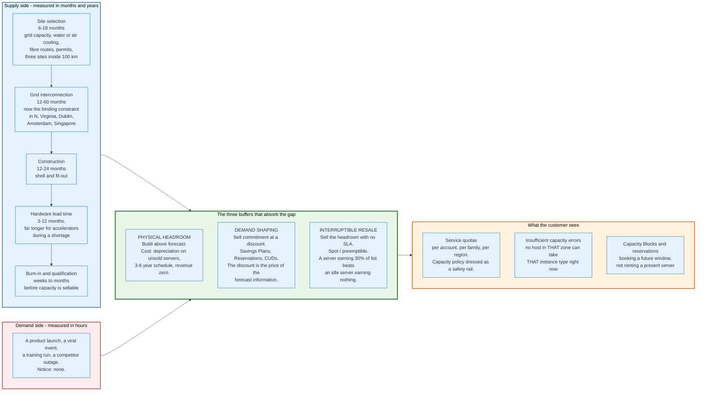

### 14.1 The Lead Time Chain

Building a region is a sequence with hard dependencies and no way to compress the middle.

1. **Site selection**, 6 to 18 months. Requires available grid capacity, water rights or an air-cooled design, fibre routes, a tax and permitting environment, and three sites far enough apart to be independent and close enough to be within the latency budget.
2. **Grid interconnection**, 12 to 60 months and now the binding constraint in most markets. Utilities in Northern Virginia, Dublin, Amsterdam, and Singapore have all imposed connection queues or moratoria.
3. **Construction**, 12 to 24 months for the shell and fit-out.
4. **Hardware lead time**, 3 to 12 months, and much longer for accelerators during a shortage.
5. **Burn-in and qualification**, weeks to months before capacity is sellable.

Against that, demand signal arrives with hours of notice. A customer launching a product can consume in a week what the forecast allocated for a quarter.

### 14.2 The Three Buffers

Providers reconcile the mismatch with three buffers, and every pricing mechanism in section 15 is one of these buffers turned into a product.

**Physical headroom.** Build more than the forecast. Expensive, because unsold servers depreciate on a three to six year schedule whether or not they earn revenue.

**Demand shaping.** Make customers commit in advance, in exchange for a discount. Reserved instances, savings plans, and committed use discounts convert an uncertain forecast into a contracted one. The discount is the price of the information.

**Interruptible resale.** Sell the headroom at a steep discount to customers who accept that it can be taken away. Spot capacity is the buffer with a price tag, and its economics are exact: a server earning 30 percent of on-demand price from a spot workload earns more than an idle server earning zero, and the capacity is reclaimable the instant a full-price customer wants it.

### 14.3 What an Insufficient Capacity Error Means

When a launch fails with an insufficient capacity error, the fleet has no host in that Availability Zone that can accommodate that instance type. It does not mean the region is full, and it does not mean the account hit a quota, which returns a different error.

The October 2025 us-east-1 event produced a variant worth understanding, because it shows how a control plane failure disguises itself as a capacity failure. EC2's DropletWorkflow Manager maintains leases on physical servers, called droplets, and its state checks depend on DynamoDB. When DynamoDB's regional endpoint went empty, DWFM could not complete state checks, droplets without active leases stopped being candidates for launches, and customers received insufficient capacity errors on a fleet that was physically idle. The hardware was there. The system that knew about the hardware was not.

### 14.4 Quotas Are Capacity Policy, Not Safety Rails

Every account has service quotas: vCPUs per instance family per region, elastic IPs, VPCs, security group rules, API request rates. They are usually explained as protection against runaway spend, and that is a secondary purpose.

The primary purpose is capacity control. A quota is the provider deciding, per account, how much of a scarce pool one customer may take. This is why quota increases for scarce resources such as GPU instance families require a support case and a justification, while quota increases for abundant resources are automatic. It is also why quota is regional and per family: the scarcity is regional and per family.

The operational implication is that quota must be raised before an incident, not during one. Requesting an increase is a control plane action, evaluated by a system that may itself be degraded, in the region that is having the problem.

---

## 15. Economics - On-Demand, Committed, and Spot

Cloud compute is sold four ways, and the price difference between the cheapest and the most expensive is roughly ten to one. The ladder is not a discount schedule. It is a risk transfer, and each rung specifies exactly which risk moves and to whom.

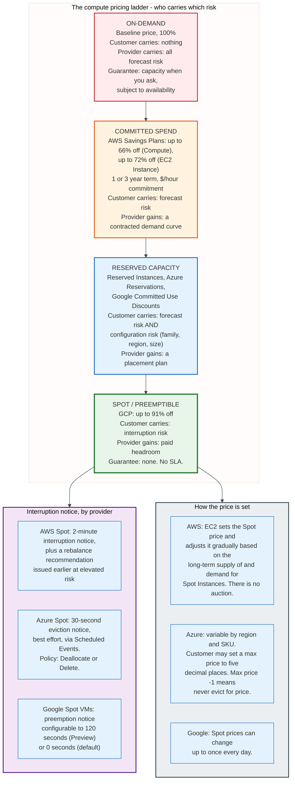

### 15.1 Spot Is Not an Auction, and Has Not Been Since 2017

The most persistent misconception in cloud economics is that spot instances are bid for. They are not. AWS states that the spot price of each instance type in each Availability Zone is set by Amazon EC2 and adjusted gradually based on the long-term supply of and demand for spot instances. The customer pays the spot price in effect. A maximum price can still be specified, and AWS warns that specifying one causes more frequent interruptions than not specifying one.

The old model, live from 2009 to 2017, was a genuine auction with a market-clearing price that could spike to many times on-demand. It was replaced because the volatility was unusable: workloads were being killed by price spikes rather than by capacity demand, and customers could not plan. The current model trades price discovery for predictability.

The mechanics that matter operationally:

- A **spot capacity pool** is one instance type in one Availability Zone. Diversifying across pools is the primary defence against interruption, because pools are reclaimed independently.
- AWS gives a **two-minute interruption notice** and, separately, an **EC2 instance rebalance recommendation** emitted earlier when an instance is at elevated risk. The rebalance signal is the useful one, because two minutes is not enough to drain a large stateful process.
- Azure gives a **30-second eviction notice** on a best-effort basis through Scheduled Events, with an eviction policy of either Deallocate, which keeps the disks and continues charging storage, or Delete, which removes them.
- Google's Spot VMs offer **up to 91 percent discount** for many machine types, GPUs, TPUs, and local SSDs, with a preemption notice that can be configured to 120 seconds in Preview or 0 seconds by default, and no maximum runtime.
- Azure exposes **historical eviction rates** per SKU per region through the portal and the `SpotResources` table in Azure Resource Graph. An eviction rate of 10 percent means a 10 percent chance of eviction within the next hour, based on the previous 7 days.

Spot is not covered by AWS Savings Plans, and spot spend does not count toward a Compute Savings Plan commitment. The two mechanisms address opposite risks and do not stack.

### 15.2 Commitment Instruments Compared

| Instrument | Provider | Commit to | Term | Published maximum discount | Flexibility |
|------------|----------|-----------|------|---------------------------|-------------|
| Compute Savings Plan | AWS | Dollars per hour | 1 or 3 years | Up to 66% | Any instance family, size, region; also Lambda and Fargate |
| EC2 Instance Savings Plan | AWS | Dollars per hour | 1 or 3 years | Up to 72% | One instance family in one region, any size |
| Standard Reserved Instance | AWS | A specific configuration | 1 or 3 years | Higher than Savings Plans historically | Least flexible, sellable on the RI Marketplace |
| Reservation | Azure | A VM size in a region | 1 or 3 years | Published per SKU | Exchange and refund policies apply |
| Azure Savings Plan for compute | Azure | Dollars per hour | 1 or 3 years | Published per SKU | Across eligible compute services |
| Committed Use Discount | Google | vCPU and memory, or spend | 1 or 3 years | Published per resource | Resource-based CUDs are regional; spend-based are broader |
| Sustained Use Discount | Google | Nothing, automatic | None | Applied automatically to sustained monthly usage | No commitment required |

Google's sustained use discount is the structural outlier: it applies automatically when an instance runs for a large fraction of a month, with no contract. That reflects a deliberate positioning choice, and it also means Google captures less forward demand information than AWS or Azure do, which is a real cost on the capacity planning side.

### 15.3 The Cost Structure Behind the Prices

The public cloud's gross margin comes from three sources, in descending order of size.

**Utilisation.** A provider running its fleet at high average utilisation across many uncorrelated customers earns far more revenue per server than any single enterprise running the same hardware at 15 percent. This is the entire economic thesis of the industry and it does not depend on the provider being better at building data centres.

**Egress pricing.** Data leaving the cloud to the internet is priced far above its marginal cost, while data entering is free. This asymmetry funds a large share of margin and creates the lock-in effect that regulators have targeted. Under pressure from the European Data Act, which entered application on 12 September 2025, all three major providers introduced free egress for customers leaving the platform entirely, subject to process requirements. Ordinary operational egress remains priced as before. AWS also does not charge for data transfer between Availability Zones in the same region for some paths and does charge for others; Azure states plainly that it does not charge for data transfer between availability zones in the same region, whether using private or public IP addressing.

**The service ladder.** A managed database costs several times the raw compute and storage underneath it. The margin on managed services is higher than on raw infrastructure, which is why every provider pushes customers up the ladder and why the shared responsibility line keeps moving toward the provider.

---

## 16. The Anatomy of the Major Outages

Six incidents, chosen because each one revealed a different structural property. Read them as a set: the same three failure modes recur, and every provider has now demonstrated all three.

```mermaid
%%{init: {'theme': 'base', 'themeVariables': {'primaryColor': '#e3f2fd', 'primaryBorderColor': '#1565c0', 'lineColor': '#37474f'}}}%%

flowchart TB
    subgraph Trigger["The trigger is always small"]
        T1["A typed command<br/>S3, Feb 2017"]
        T2["Adding capacity<br/>Kinesis, Nov 2020"]
        T3["An automated scaling action<br/>us-east-1, Dec 2021"]
        T4["A race between two<br/>redundant DNS writers<br/>DynamoDB, Oct 2025"]
        T5["A policy row with blank fields<br/>Google Service Control, Jun 2025"]
        T6["A key removed during rotation<br/>Azure AD, Mar 2021"]
    end

    subgraph Amp["The amplifier is always a dependency nobody drew"]
        A1["Index and placement subsystems<br/>share a fate"]
        A2["Threads scale with fleet size,<br/>so growth breaks the fleet"]
        A3["Retries with broken backoff<br/>turn congestion into collapse"]
        A4["Every service in the region<br/>resolves the same endpoint"]
        A5["Metadata replicates globally<br/>in seconds, so does the crash"]
        A6["Every token validation in the<br/>world checks the same key set"]
    end

    subgraph Blind["The response is always slowed by the same thing"]
        B1["Monitoring depends on the<br/>system that is down"]
        B2["The status dashboard depends<br/>on the system that is down"]
        B3["Recovery requires the control<br/>plane, which is the thing broken"]
        B4["Restarting the fleet re-creates<br/>the load that broke it"]
    end

    Trigger --> Amp --> Blind

    subgraph Lesson["What each one changed"]
        L1["Cellularise: shrink the blast radius"]
        L2["Static stability: recover without the control plane"]
        L3["Velocity controls: rate limit the automation"]
        L4["Progressive rollout: validate before global replication"]
        L5["Independent status: the dashboard must not share fate"]
    end

    Blind --> Lesson

    style Trigger fill:#fff3e0,stroke:#e65100,stroke-width:2px
    style Amp fill:#ffebee,stroke:#c62828,stroke-width:3px
    style Blind fill:#eceff1,stroke:#37474f,stroke-width:2px
    style Lesson fill:#e8f5e9,stroke:#2e7d32,stroke-width:2px
```

### 16.1 Amazon S3, us-east-1, 28 February 2017

An authorised S3 engineer, debugging a billing system issue, ran a command with an incorrect input. It removed far more servers than intended.

Two subsystems went with them. The **index subsystem** manages the metadata and location information of every S3 object in the region and serves GET, LIST, PUT and DELETE. The **placement subsystem** allocates storage for new objects and depends on the index subsystem. With the index subsystem below viable capacity, both required a full restart.

The restart was the revelation. AWS had not completely restarted the index or placement subsystems in its larger regions for years, and S3 had grown throughout that interval, so neither restart had ever been exercised at the scale it now had to run at. The index subsystem recovered enough capacity to serve GET, LIST and DELETE at 12:26 PM PST and was fully recovered at 1:18 PM. Placement completed at 1:54 PM. The command was executed at 9:37 AM. Roughly four hours and seventeen minutes, most of it spent waiting for safety checks and metadata validation on a restart nobody had rehearsed.

**What it revealed:** a system that has never been restarted at its current size has an unknown recovery time. AWS's remediation was to slow the capacity removal tool and give it a floor below which it will not remove capacity, audit other operational tools for the same check, prioritise breaking the index subsystem into cells, and move the Service Health Dashboard to run across multiple regions after it proved unable to report an S3 outage because it depended on S3.

### 16.2 Amazon Kinesis, us-east-1, 25 November 2020

At 2:44 AM PST, capacity was added to the Kinesis front-end fleet. Every front-end server maintains a cache called a shard-map holding membership and shard ownership for the back-end clusters, and it maintains an operating system thread for communication with every other member of the fleet.

Threads per server are proportional to fleet size. Adding servers pushed every server in the fleet past the maximum number of threads allowed by an operating system configuration. Cache construction stopped completing, servers ended up with useless shard-maps, and they could no longer route requests.

Diagnosis took five hours because the symptoms were diverse. At 7:51 AM engineers concluded that a full front-end fleet restart was required, and executed it at a few hundred servers per hour to avoid overwhelming the resources the servers needed on start-up. Kinesis was fully recovered at 10:23 PM PST, nearly twenty hours after the trigger.

The dependency cascade was the story. Cognito had a latent buffering bug that surfaced only when Kinesis was unavailable: web servers blocked on backlogged buffers and authentication failed. CloudWatch could not ingest metrics and logs, so alarms transitioned to `INSUFFICIENT_DATA`, which in turn delayed reactive scaling in Auto Scaling and Lambda. And the Service Health Dashboard could not be updated because the tooling depended on Cognito, forcing operators onto a manual backup tool.

**What it revealed:** a fleet whose per-node resource consumption scales with fleet size has an upper bound nobody calculated. AWS committed to moving to larger servers to reduce total fleet size and therefore total threads, to cellularising the front-end fleet, to alarming on thread consumption, and to persisting CloudWatch metrics locally for 3 hours to reduce the Kinesis dependency.

### 16.3 AWS Internal Network, us-east-1, 7 December 2021

At 7:30 AM PST an automated scaling activity on a main AWS service triggered unexpected behaviour from a large number of clients inside AWS's internal network, the separate network that hosts foundational services: monitoring, internal DNS, authorisation, and parts of the EC2 control plane. The surge of connection activity overwhelmed the networking devices between the internal network and the main AWS network.

Congestion increased latency, which increased errors, which triggered more retries, which increased congestion. A latent bug in the clients' backoff behaviour prevented the loop from damping itself.

Two second-order failures defined the response. Real-time monitoring data for the internal operations teams became unavailable immediately, so engineers worked from logs and initially misdiagnosed internal DNS as the cause. And network congestion prevented the Service Health Dashboard from failing over to its standby region, so for the first 52 minutes customers had no authoritative statement of what was happening.

Recovery took most of the day. Internal DNS traffic was moved off the congested paths at 9:28 AM, giving partial relief. Network devices fully recovered at 2:22 PM, EC2 instance launches at 2:40 PM, and STS at 4:28 PM.

**What it revealed:** static stability works. Running EC2 instances, Lambda invocations, and direct S3 and DynamoDB access were unaffected throughout, while EC2 APIs, the console, Route 53 APIs, and STS were down. Customers whose architecture did not need the control plane during the event mostly did not notice it.

### 16.4 Amazon DynamoDB DNS, us-east-1, 19 to 20 October 2025

One empty DNS record disabled DynamoDB in us-east-1 at 11:48 PM PDT on 19 October 2025, and the last dependent service came back 14 hours 32 minutes later.

DynamoDB maintains hundreds of thousands of DNS records for a large, heterogeneous fleet of load balancers, managed by two components. The **DNS Planner** monitors the health and capacity of the load balancers and periodically creates a new DNS plan. The **DNS Enactor** applies plans by making the changes in Route 53, and runs redundantly across three Availability Zones for resilience.

The redundancy caused the failure. One Enactor experienced unusual delays while working through older plans. A second Enactor rapidly applied newer plans across all endpoints and then invoked plan clean-up, which identifies plans significantly older than the one just applied and deletes them. Simultaneously the first Enactor, still working, applied its outdated plan and overwrote the newer one. Its validity check was stale because of the delays. The clean-up process then deleted that plan, removing all IP addresses for the regional endpoint `dynamodb.us-east-1.amazonaws.com` immediately. The automation could not repair the state, and manual operator intervention was required.

The cascade from one empty DNS record covered the region. EC2's DropletWorkflow Manager depends on DynamoDB and could not complete state checks, so droplets lost their leases and launches returned insufficient capacity errors. Lambda, ECS, EKS, Fargate, STS, IAM authentication, Amazon Connect, Redshift, the AWS Support Console and Outposts were all affected.

Recovery had three distinct phases and each hit a different wall. DNS was restored at 2:25 AM and customer connectivity at 2:40 AM, once expired caches refreshed. DWFM then entered congestive collapse because the queued lease-establishment work exceeded processing capacity; engineers throttled incoming work and selectively restarted DWFM hosts, and new launches succeeded at 5:28 AM. Then the Network Manager fell behind on propagating network state, so new instances came into service before their network state had propagated, causing Network Load Balancer health checks to alternate between failing and healthy. The alternation increased load on the health check subsystem, degraded it, and triggered automatic Availability Zone DNS failover, removing capacity from multi-AZ load balancers. AWS disabled that automatic failover at 9:36 AM and re-enabled it at 2:09 PM. ECS, EKS and Fargate finished recovering at 2:20 PM.

**What it revealed:** redundancy without coordination is a race condition. Three Enactors were deployed for resilience and produced a failure mode that one Enactor could not have. AWS's response was to disable the DynamoDB DNS Planner and Enactor automation worldwide pending a fix, add protections against applying incorrect plans, add velocity controls limiting how fast NLB can remove capacity through health-check failures, and expand EC2 scale testing.

### 16.5 Google Cloud Service Control, global, 12 June 2025

On 29 May 2025 Google added a feature to Service Control, the system that performs authorisation and policy checks for Google API requests. The new code lacked appropriate error handling and was not protected behind a feature flag.

On 12 June at approximately 10:45 AM PDT a policy change containing unintended blank fields was inserted into regional Spanner tables. The metadata replicated globally within seconds. The new code path dereferenced a null pointer, and Service Control binaries entered a crash loop in every region at once.

Google identified the root cause within 10 minutes and began putting a "red button" in place to disable the serving path. The red button was ready to roll out about 25 minutes after the incident started, and the rollout finished within 40 minutes. Smaller regions recovered immediately.

`us-central1` did not. When Service Control tasks restarted en masse they produced a herd effect that overwhelmed the underlying Spanner table, and recovery required throttling task creation and routing traffic to multi-regional databases. That region took approximately 2 hours 40 minutes. Google records the incident as beginning at 10:51 AM and ending at 6:18 PM PDT, 7 hours 27 minutes end to end.

**What it revealed:** global replication of configuration is a global blast radius. Google's own stated remediation is that data replication needs to be propagated incrementally with sufficient time to validate and detect issues. The second lesson is the herd effect: a restart of every client of a datastore is itself a load event, and the recovery plan must include the recovery of the recovery.

### 16.6 Azure Active Directory, global, 15 March 2021, and Azure Front Door, 29 October 2025

**15 March 2021.** An OpenID signing key was removed during a key rotation while still in service. Every relying service that validated tokens against the published key set began rejecting them, and authentication failed across every product that depends on Azure Active Directory. The impact window is not established here. Azure's status history retains post-incident reviews for five years, the March 2021 entry has aged off the page, and the durations quoted in secondary summaries do not trace back to Microsoft. Because authentication is the first step of every request, the outage presented to customers as a total failure of unrelated products.

**29 October 2025.** A DNS and configuration failure in Azure Front Door, the global edge and content delivery layer that fronts Microsoft's own properties, disrupted Microsoft 365, Xbox Live and Minecraft, and reached third parties including Costco, Kroger and Starbucks. The Azure Portal itself was affected, which meant customers attempting to diagnose their own workloads could not reach the console.

**23 July 2026** produced a third instructive Azure incident, tracking ID ZJV6-SGG, affecting network connectivity in the West US region. A defect in the blast radius analysis system incorrectly expanded the scope of a repair event to include all optical devices egressing a specific datacentre. The safety validation checks failed to evaluate the aggregate effect of isolating multiple devices simultaneously, routes were withdrawn, and WAN connectivity was disrupted.

**What they revealed:** identity and edge are the two genuinely global dependencies, and neither has an availability zone. A key rotation is a write to a globally read object. An edge configuration push is a write to a globally read object. Both classes need the same defence, which is progressive rollout with automated validation at each stage, and the 2026 incident shows that the validation system itself can be the defect.

### 16.7 The Pattern

| Incident | Trigger | Amplifier | Time to full recovery |
|----------|---------|-----------|----------------------|
| S3, Feb 2017 | Mistyped command | Untested restart at current scale | ~4h 17m |
| Kinesis, Nov 2020 | Adding capacity | Threads scale with fleet size | ~19h 40m |
| us-east-1, Dec 2021 | Automated scaling action | Retry storm, broken backoff | ~7h to network recovery |
| Azure AD, Mar 2021 | Key removal in rotation | Global read of one key set | Not established; PIR past retention |
| GCP Service Control, Jun 2025 | Blank fields in a policy row | Global replication in seconds | ~7h 27m total; most regions inside 40m, us-central1 ~2h 40m |
| DynamoDB DNS, Oct 2025 | Race between redundant writers | Every regional service resolves one endpoint | ~14h 30m |

Three observations hold across all six. The trigger is always routine. The amplifier is always a dependency that was not on anybody's diagram. And the response is always slowed because the monitoring, the status page, or the recovery path shares fate with the thing that broke.

---

## 17. Regulation, Compliance, and Sovereignty

Cloud regulation has moved in five years from a certification exercise to a structural one. The question changed from "is this provider compliant" to "can this provider be compelled by a government that is not mine".

### 17.1 The Certification Layer

Every provider holds the same set, and the set is table stakes rather than a differentiator: ISO/IEC 27001 for information security management, ISO/IEC 27017 for cloud security controls and 27018 for cloud personal data, SOC 1, SOC 2 and SOC 3 reports under AICPA standards, PCI DSS for cardholder data, HIPAA eligibility for US healthcare, FedRAMP for US federal workloads, and regional equivalents such as IRAP in Australia, C5 in Germany, and the ENS scheme in Spain.

These attest to the provider's controls. They say nothing about the customer's, which is the shared responsibility model appearing in legal form. A FedRAMP-authorised service used with a public bucket policy is not a FedRAMP-compliant system.

### 17.2 The Data Residency Layer

Regions give residency, and residency is narrower than most contracts assume. Storage services keep data in the region. Identity, billing, some support tooling, and several global services do not.

The European Union's General Data Protection Regulation, in force since 25 May 2018, restricts transfers of personal data outside the European Economic Area. The Court of Justice invalidated the Privacy Shield framework in the Schrems II judgment of 16 July 2020, and the EU-US Data Privacy Framework adopted on 10 July 2023 replaced it. That framework is itself under challenge, which is the source of the structural anxiety driving sovereign cloud demand.

### 17.3 The Sovereignty Layer

All three providers now sell partitioned clouds operated under local control.

- **AWS European Sovereign Cloud**, with its first region in Brandenburg, Germany, is operated as a separate partition with its own identity root, its own control plane, and staff who are EU residents. AWS's own VPC documentation notes it as an exception to the rule that packets stay on the AWS global network, which is a technical statement of exactly how separate it is.
- **Microsoft** operates Azure Government and Azure operated by 21Vianet in China, and has committed to an EU Data Boundary for customer data and, progressively, for supporting data.
- **Google** offers Assured Workloads for policy-enforced regional and personnel restrictions, and Google Distributed Cloud for air-gapped deployments.
- **China** is a separate partition for all three, operated by a local partner because foreign firms cannot hold the required licences. AWS's China regions run under a distinct partition identifier, `aws-cn`, and account and resource identifiers do not cross the boundary.

The technical consequence of a partition is that identity does not federate, resource identifiers do not resolve, and the control plane is a separate installation. A partition is not a region with paperwork. It is a different cloud.

### 17.4 The Competition Layer

The European Data Act, which entered application on 12 September 2025, obliges cloud providers to remove obstacles to switching, including data transfer charges for customers leaving. All three major providers introduced free egress for full exits in advance of it. The UK's Competition and Markets Authority ran a cloud services market investigation reaching its final report in 2025, examining egress fees, committed spend discounts, and licensing practices.

The specific practice under scrutiny is not egress pricing alone. It is the combination of egress pricing, committed-spend discounts that make partial migration disproportionately expensive, and software licensing terms that price the same product differently depending on which cloud it runs on. Each mechanism is defensible individually. Together they make leaving cost more than staying, which is the definition regulators use.

---

## 18. Architectural Differences Between the Three Providers

The three clouds look similar in a feature matrix and behave differently in production. The differences trace to four decisions each provider made early and cannot now reverse.

```mermaid
%%{init: {'theme': 'base', 'themeVariables': {'primaryColor': '#e3f2fd', 'primaryBorderColor': '#1565c0', 'lineColor': '#37474f'}}}%%

flowchart TB
    subgraph AWS["AWS - regional independence as first principle"]
        direction TB
        A1["Regions share almost nothing.<br/>Separate control planes, separate<br/>deployments, separate databases."]
        A2["VPC is regional. Cross-region needs<br/>peering or Transit Gateway."]
        A3["Instance maintenance is explicit:<br/>scheduled retirement, customer absorbs it."]
        A4["Offload: Nitro, fixed-function ASICs.<br/>Lowest unit cost, highest volume."]
        A5["Weakness: global services concentrate<br/>in us-east-1, which is why us-east-1<br/>events look global."]
    end

    subgraph Azure["Azure - enterprise identity as first principle"]
        direction TB
        Z1["Entra ID predates the compute plane<br/>and is the organising abstraction."]
        Z2["Region pairs are a first-class concept<br/>with ordered update and recovery priority."]
        Z3["57 public regions, 39 with zones:<br/>breadth of geography over depth of zones."]
        Z4["Offload: Azure Boost with a<br/>reprogrammable FPGA datapath.<br/>Flexibility over unit cost."]
        Z5["Weakness: two control systems,<br/>Entra ID and Azure RBAC, and the<br/>seam between them."]
    end

    subgraph GCP["Google Cloud - the internal stack, externalised"]
        direction TB
        G1["VPC is global. One network,<br/>every region, no peering."]
        G2["Live migration of running VMs<br/>hides host maintenance entirely."]
        G3["Spanner gives external consistency<br/>across continents; nothing else has it."]
        G4["Offload: Titan for identity,<br/>Titanium for I/O. Andromeda for network."]
        G5["Weakness: global control planes<br/>mean global blast radius, as June 2025<br/>demonstrated across every region at once."]
    end

    Q["The question that separates them:<br/>where does the provider put the<br/>boundary between blast radius<br/>and operational convenience?"]
    Q --> AWS
    Q --> Azure
    Q --> GCP

    style AWS fill:#fff3e0,stroke:#e65100,stroke-width:2px
    style Azure fill:#e3f2fd,stroke:#1565c0,stroke-width:2px
    style GCP fill:#e8f5e9,stroke:#2e7d32,stroke-width:2px
    style Q fill:#fce4ec,stroke:#880e4f,stroke-width:3px
```

### 18.1 The Four Decisions

**Decision one: how independent are regions.** AWS made regions almost totally independent, which limits blast radius and forces customers to build cross-region connectivity by hand. Google made several control planes global, which removes work from customers and creates the failure mode that took every region down simultaneously in June 2025. Azure sits between, with regional control planes and a global identity plane.

**Decision two: is maintenance visible.** Google migrates running VMs and hides host maintenance. AWS schedules retirements and makes the customer absorb them. This is the difference between paying for resilience in provider engineering and paying for it in customer architecture. AWS's approach produces more resilient customer systems and more customer complaints.

**Decision three: fixed silicon or reprogrammable.** AWS builds ASICs for the Nitro cards. Microsoft uses FPGAs for the Boost storage datapath, explicitly so the fleet can be updated in place. ASICs win on cost per unit at volume; FPGAs win on time to change a protocol.

**Decision four: what is the organising abstraction.** For AWS it is the account, which is simultaneously the billing boundary, the isolation boundary, and the blast radius. For Azure it is the tenant and its directory, inherited from Active Directory. For Google it is the project inside an organisation hierarchy of folders. This decision determines what "separate our environments" means in each cloud, and it is why an AWS estate has hundreds of accounts, an Azure estate has one tenant with many subscriptions, and a Google estate has many projects in one organisation.

### 18.2 Side by Side

| Dimension | AWS | Azure | Google Cloud |
|-----------|-----|-------|--------------|
| **Isolation unit** | Account | Subscription within a tenant | Project within an organisation |
| **Network scope** | VPC is regional | Virtual network is regional | VPC is global |
| **Zone count model** | 124 AZs across 39 regions, minimum 3 per new region | 39 of 57 public regions have zones | 130 zones across 43 regions, 3 or more per region |
| **Inter-zone latency statement** | Single-digit milliseconds | Target under approximately 2 ms round trip | Not published as a figure |
| **Inter-zone data transfer** | Charged on some paths | Not charged within a region | Charged |
| **Zone naming** | Per-account name mapping; AZ IDs are stable | Per-subscription logical to physical mapping | Zone names are consistent |
| **Live migration** | Rare; scheduled retirement instead | Used for many maintenance classes | Standard for most machine types |
| **Offload platform** | Nitro: cards, security chip, minimised hypervisor | Azure Boost: MANA NIC, FPGA storage, Cerberus root of trust | Titan root of trust, Titanium offload |
| **Published offload figures** | io2 Block Express 256,000 IOPS, 4,000 MiB/s, sub-500 microsecond average | 200 Gbps network, 14 GB/s and 750K IOPS remote, 36 GB/s and 6.6M IOPS local | 200 Gbps Tier_1 on C3 and C4 |
| **Block storage transport** | SRD on the Nitro Card for EBS | NVMe presented, FPGA offloaded | Titanium offloaded |
| **Authorisation model** | JSON policy, explicit deny, union and intersection rules | Role assignments at hierarchy scopes | Policy bindings inherited down the hierarchy |
| **Authentication** | SigV4 request signing | OAuth 2.0 bearer tokens from Entra ID | OAuth 2.0 bearer tokens |
| **Spot notice** | 2 minutes, plus rebalance recommendation | 30 seconds, best effort | 120 seconds (Preview) or 0 seconds |
| **Committed discount ceiling published** | Up to 72% (EC2 Instance Savings Plan) | Published per SKU | Up to 91% off for Spot; CUDs published per resource |
| **Q2 2026 market share** | 28% | 20% | 15% |

### 18.3 When to Choose Which

The honest answer is that for most workloads the choice is determined by existing commitments, not by architecture. Where architecture does decide:

- **Choose Google** when the workload needs a globally consistent database with external consistency guarantees, when a global VPC removes significant complexity, or when the data and machine learning stack is the product.
- **Choose Azure** when the identity estate is already Active Directory, when Windows and SQL Server licensing dominates the cost model, or when the requirement is geographic breadth into countries where the other two have no region.
- **Choose AWS** when the requirement is service breadth, the deepest per-region zone count, or the largest pool of engineers who have operated the thing you are about to build.

The one architectural argument that overrides the others is blast radius. AWS's regional independence is the strongest isolation guarantee of the three, and Google's global control planes are the weakest, with the June 2025 incident as the demonstration. If a workload's failure mode is regulatory or existential rather than commercial, that difference is worth more than any feature.

---

## 19. Modern Developments

### 19.1 Custom Silicon Has Become the Main Axis of Competition

Every provider now designs its own CPUs, its own accelerators, and its own offload processors, and the reason is margin. A general-purpose server bought from a vendor carries that vendor's margin. A design owned by the provider does not.

AWS ships Graviton for general-purpose compute, Inferentia for inference, and Trainium for training. Microsoft ships Cobalt for compute and Maia for AI, and acquired Fungible in 2023 to accelerate its data processing unit work. Google ships Tensor Processing Units, now in their sixth and seventh generations, and Axion for Arm compute.

The second-order effect is that instance families are diverging. An Arm instance without simultaneous multithreading has different performance characteristics per vCPU than an x86 instance with it, and a workload tuned for one is not automatically efficient on the other.

### 19.2 AI Capacity Has Rewritten the Physical Constraints

Generative AI cloud services grew 165 percent year on year to the second quarter of 2026 and pulled the whole market's growth rate to 43 percent, the highest in eight years.

The engineering consequences are physical. A GB200 NVL72 rack draws roughly 120 kW against 5 to 15 kW for a conventional rack, which forces direct liquid cooling, new power distribution, and in many cases new buildings rather than retrofits. Training clusters need thousands of accelerators in one low-diameter network with high bisection bandwidth, which conflicts with the availability zone model: a training job spanning zones pays the inter-zone latency on every collective operation. The result is a new class of capacity that is placed for network topology first and fault isolation second.

The commercial consequences are equally structural. AWS now sells Capacity Blocks for ML, which reserve a specific quantity of accelerators for a specific future window, a product that looks more like booking a wind tunnel than renting a server. Grid interconnection has replaced construction as the binding constraint on new capacity in the largest markets.

### 19.3 The Offload Layer Keeps Absorbing Function

Each generation of offload hardware takes another job off the CPU. Network and storage went first, then encryption, then telemetry. Confidential computing pushes memory encryption into the memory controller. Firmware attestation moved into dedicated microcontrollers. The Boost stack now runs its own SELinux-confined operating system written substantially in Rust.

The direction is clear: the server's CPU becomes a pure guest execution engine and every other function moves to a processor the customer cannot reach and the operator cannot log into.

### 19.4 Regulation Is Reshaping Commercial Terms Faster Than Technical Ones

The European Data Act's switching provisions, applicable since 12 September 2025, produced free exit egress from all three providers. The UK CMA's cloud market investigation targeted the same combination of egress fees, committed-spend discounts, and licensing. Sovereign cloud offerings moved from marketing to shipped partitions with separate identity roots.

None of this changes how a hypervisor works. All of it changes what a multi-cloud architecture costs, which changes what gets built.

### 19.5 What Has Not Changed

Three things have been stable for a decade and show no sign of moving.

The Availability Zone remains the unit of fault isolation, and the 100 km latency budget that defines it is a property of fibre, not of engineering effort. The control plane remains more fragile than the data plane, and every published post-incident review since 2017 says so. And identity remains the one dependency with no zone, no partition, and no failover, which is why an identity outage remains the worst outage a cloud can have.

---

## 20. Appendix

### 20.1 Key Terminology

| Term | Definition |
|------|------------|
| **Availability Zone (AZ)** | One or more discrete data centres with redundant power, networking and connectivity within a region, isolated from other zones so that no single failure affects both |
| **AZ ID** | The stable identifier for a physical zone (`use1-az1`), consistent across accounts, unlike the AZ name |
| **Blast radius** | The set of resources affected by a single failure |
| **Cell** | An independent instance of a service serving a subset of customers, used to bound blast radius |
| **Cerberus** | Microsoft's hardware root of trust used by Azure Boost, certified to NIST SP 800-193 |
| **Confidential computing** | Encrypting VM memory with a key the hypervisor does not hold, using AMD SEV-SNP, Intel TDX, or Arm CCA |
| **Congestive collapse** | A state in which the work queued during an outage exceeds the system's capacity to process it after recovery |
| **Control plane** | The administrative APIs that create, read, update, delete and list resources |
| **CPU credit** | One vCPU running at 100 percent for one minute, the unit governing burstable instances |
| **Data plane** | The primary function of a service: the running instance, the packet forwarded, the object returned |
| **DWFM** | DropletWorkflow Manager, the AWS EC2 component that manages leases on physical servers |
| **Geneve** | Generic Network Virtualization Encapsulation, RFC 8926, UDP port 6081, 24-bit VNI, variable-length options |
| **Hoverboard** | In Google Andromeda, a hardware gateway handling flows for which no direct host-to-host rule has been programmed |
| **IMDS** | Instance Metadata Service, reachable at `169.254.169.254`, which delivers instance identity and role credentials |
| **MANA** | Microsoft Azure Network Adapter, the in-house NIC used by Azure Boost, up to 200 Gbps |
| **Nitro Card** | An AWS-designed hardware device providing system control and I/O virtualisation independent of the main system board |
| **Nitro Enclave** | An isolated compute environment carved from an instance's own vCPUs and memory, with no persistent storage, no interactive access and no external network |
| **NVGRE** | Network Virtualization using GRE, RFC 7637, 24-bit Virtual Subnet ID in the GRE key field |
| **Offload card** | A separate processor on the server that runs network, storage, security and management functions, leaving the CPU to guests |
| **Oversubscription** | Selling more of a resource than physically exists, relying on customers not using it all at once |
| **Region** | A fault-isolated collection of Availability Zones within one metropolitan area, with one control plane and one endpoint set |
| **RCP** | Resource control policy, an AWS Organizations policy applying to resources in an account |
| **SCP** | Service control policy, an AWS Organizations policy applying to principals in an account |
| **SigV4** | AWS Signature Version 4, the request-signing scheme that derives a key by chaining HMAC-SHA256 over date, region, service and `aws4_request` |
| **Spot capacity pool** | One instance type in one Availability Zone; the unit of independent spot reclamation |
| **SRD** | Scalable Reliable Datagram, AWS's purpose-built transport used between Nitro cards and EBS Block Express servers |
| **SR-IOV** | Single Root I/O Virtualization, which lets a physical device present virtual functions directly to guests |
| **Static stability** | The property of continuing to operate correctly using existing state, without needing the control plane |
| **Titan** | Google's secure microcontroller that interposes on the SPI bus and verifies firmware before the CPU executes |
| **Titanium** | Google's offload system for network and storage virtualisation, supporting third and fourth generation general-purpose VMs |
| **vCPU** | One hardware thread on x86 with SMT enabled, or one physical core on Arm designs without SMT |
| **VFP** | Virtual Filtering Platform, the programmable virtual switch in the Azure host |
| **VNI / VSID** | The 24-bit tenant network identifier carried in a VXLAN, Geneve or NVGRE header, allowing 16,777,216 virtual networks |
| **VXLAN** | Virtual Extensible LAN, RFC 7348, UDP port 4789, 8-byte header, 24-bit VNI |

### 20.2 Reference Numbers

| Figure | Value | Source and date |
|--------|-------|-----------------|
| AWS Availability Zones | 124 in 39 regions | AWS global infrastructure page, August 2026 |
| AWS AZ separation | Many kilometres, all within 100 km (60 miles) | AWS fault isolation boundaries whitepaper |
| AWS AZ latency | Single-digit milliseconds, sufficient for synchronous replication | AWS fault isolation boundaries whitepaper |
| AWS backbone packet loss target | p99 of hourly PLR below 0.0001% | Amazon VPC user guide |
| CloudFront points of presence | 750+ in 100+ cities, 50+ countries | CloudFront features page, August 2026 |
| CloudFront regional edge caches | 15 | CloudFront features page |
| CloudFront embedded points of presence | 1,140+ in 300+ cities | CloudFront features page |
| Azure public regions | 57, of which 39 support availability zones | Azure regions list, updated 28 July 2026 |
| Azure inter-zone latency target | Under approximately 2 ms round trip | Azure availability zones overview |
| Azure inter-zone data transfer charge | None within a region | Azure availability zones overview |
| Google Cloud regions and zones | 43 regions, 130 zones | Google Cloud locations page, 17 August 2026 |
| Google Cloud network edge locations | 200+ | Google Cloud locations page |
| Google fibre | 10 million km terrestrial and subsea | Google Cloud locations page |
| Azure Boost network | Up to 200 Gbps via MANA | Azure Boost overview |
| Azure Boost remote storage | Up to 14 GB/s, 750,000 IOPS | Azure Boost overview |
| Azure Boost local storage | Up to 36 GB/s, 6.6 million IOPS | Azure Boost overview |
| io2 Block Express max IOPS | 256,000 on Nitro instances, 32,000 elsewhere | Amazon EBS user guide |
| io2 Block Express max throughput | 4,000 MiB/s, at 0.256 MiB/s per provisioned IOPS | Amazon EBS user guide |
| io2 Block Express durability | 99.999%, AFR under 0.001% | Amazon EBS user guide |
| io2 Block Express latency | Under 500 microseconds average at 16 KiB | Amazon EBS user guide |
| io1 durability | 99.8% to 99.9%, AFR under 0.2% | Amazon EBS user guide |
| t3.nano credits | 6 per hour, 5% baseline per vCPU, 144 cap | EC2 burstable instances guide |
| t3.2xlarge credits | 192 per hour, 40% baseline per vCPU, 4,608 cap | EC2 burstable instances guide |
| AWS Compute Savings Plan discount | Up to 66% | AWS Savings Plans pricing page |
| AWS EC2 Instance Savings Plan discount | Up to 72% | AWS Savings Plans pricing page |
| AWS Spot interruption notice | 2 minutes | EC2 user guide |
| Azure Spot eviction notice | 30 seconds, best effort | Azure Spot VMs documentation |
| Google Spot VM discount | Up to 91% | Compute Engine Spot VMs documentation |
| Google Spot preemption notice | 120 seconds (Preview) or 0 seconds (default) | Compute Engine Spot VMs documentation |
| Q2 2026 cloud market | 143.4 billion USD, 43% year-on-year growth | Synergy Research Group, 30 July 2026 |
| Q2 2026 market share | AWS 28%, Azure 20%, Google 15%, combined 63% | Synergy Research Group, 30 July 2026 |
| GenAI cloud services growth | 165% year on year | Synergy Research Group, 30 July 2026 |
| VXLAN | RFC 7348, UDP 4789, 24-bit VNI | IETF |
| Geneve | RFC 8926, UDP 6081, 24-bit VNI | IETF |
| NVGRE | RFC 7637, 24-bit VSID | IETF |
| Entra ID directory write RTO | About 5 minutes; zero for token issuance and reads | Microsoft Entra architecture overview |
| Entra ID primary failover impact | 1 to 2 minutes of write unavailability | Microsoft Entra architecture overview |
| Azure rename | Announced 25 March 2014, effective 3 April 2014 | Microsoft Azure blog, "Upcoming Name Change for Windows Azure" |
| Region build lead time | 33 to 114 months, summed across the five stages in section 14.1 | Section 14.1 |
| GCP Service Control incident window | 10:51 to 18:18 US/Pacific, 12 June 2025; root cause in 10 minutes; red button rolled out within 40 minutes; us-central1 recovery about 2h 40m | Google Cloud incident report ow5i3PPK96RduMcb1SsW |
| DynamoDB DNS incident window | 11:48 PM PDT 19 October to 2:20 PM PDT 20 October 2025, 14h 32m | AWS post-event summary, 19 to 20 October 2025 |
| Azure AD, 15 March 2021 impact window | Not established; Azure status history retains post-incident reviews for five years and the entry has aged off | Azure status history |

### 20.3 Diagram Index

| Diagram | Source | Description |
|---------|--------|-------------|
| Region, AZ and edge hierarchy | [`diagrams/region-az-edge-hierarchy.mmd`](diagrams/region-az-edge-hierarchy.mmd) | The five geographic tiers from global services down to on-premises extensions |
| Availability zone anatomy | [`diagrams/availability-zone-anatomy.mmd`](diagrams/availability-zone-anatomy.mmd) | What is physically inside a zone: substations, power trains, cooling, metro fibre, transit centres |
| Participants and roles | [`diagrams/participants.mmd`](diagrams/participants.mmd) | Customer domain, contract surface, and provider domain |
| Control plane and data plane | [`diagrams/control-plane-data-plane.mmd`](diagrams/control-plane-data-plane.mmd) | The split, and the different failure signatures of each side |
| Hypervisor offload transition | [`diagrams/hypervisor-offload.mmd`](diagrams/hypervisor-offload.mmd) | Software virtualisation versus hardware offload, component by component |
| EBS I/O path | [`diagrams/ebs-io-path.mmd`](diagrams/ebs-io-path.mmd) | A 16 KiB write from the guest through the Nitro card, SRD, and replicated block servers |
| VPC encapsulation | [`diagrams/vpc-encapsulation.mmd`](diagrams/vpc-encapsulation.mmd) | Inner packet, offload card rewrite, and outer substrate packet with byte-level header detail |
| Instance launch sequence | [`diagrams/instance-launch-sequence.mmd`](diagrams/instance-launch-sequence.mmd) | The worked end-to-end example, from SigV4 signing to the first encapsulated packet |
| IAM policy evaluation | [`diagrams/iam-policy-evaluation.mmd`](diagrams/iam-policy-evaluation.mmd) | The exact AWS evaluation order from implicit deny to final allow |
| Shared responsibility model | [`diagrams/shared-responsibility.mmd`](diagrams/shared-responsibility.mmd) | Where the line sits for IaaS, PaaS and abstracted services, plus control categories |
| Multi-tenancy isolation | [`diagrams/multi-tenancy-isolation.mmd`](diagrams/multi-tenancy-isolation.mmd) | Five isolation layers, the side channels that cross layer one, and the structural mitigations |
| Pricing ladder | [`diagrams/pricing-ladder.mmd`](diagrams/pricing-ladder.mmd) | On-demand to spot, with the risk each rung transfers and the notice each provider gives |
| Outage anatomy | [`diagrams/outage-anatomy.mmd`](diagrams/outage-anatomy.mmd) | Trigger, amplifier, and blind spot, common to all six major incidents |
| Provider comparison | [`diagrams/provider-comparison.mmd`](diagrams/provider-comparison.mmd) | The four decisions that separate AWS, Azure and Google Cloud |
| Capacity buffers | [`diagrams/capacity-buffers.mmd`](diagrams/capacity-buffers.mmd) | Lead time chain and the three buffers that absorb forecast error |
| Identity request path | [`diagrams/identity-request-path.mmd`](diagrams/identity-request-path.mmd) | How each provider authenticates a request, and why a stolen signature differs from a stolen token |

### 20.4 Primary Sources

- AWS: "AWS Global Infrastructure: Regions and Availability Zones"; "AWS Fault Isolation Boundaries" whitepaper; "The Security Design of the AWS Nitro System" whitepaper, 15 February 2024; Amazon EBS User Guide; Amazon VPC User Guide; Amazon EC2 User Guide; IAM User Guide policy evaluation logic; AWS Shared Responsibility Model page; AWS Savings Plans pricing.
- AWS post-event summaries: S3 us-east-1, 28 February 2017; Kinesis us-east-1, 25 November 2020; us-east-1 internal network, 7 December 2021; DynamoDB DNS us-east-1, 19 to 20 October 2025.
- Microsoft: Azure Boost overview; Azure Accelerated Networking overview; Azure availability zones overview; Azure regions list; Azure Spot Virtual Machines; Microsoft Entra architecture overview; Azure status history, which retains post-incident reviews for five years; Azure blog, "Upcoming Name Change for Windows Azure", 25 March 2014.
- Google: Google Cloud locations page; Compute Engine regions and zones; Compute Engine general-purpose machine families; Compute Engine Spot VMs; "Titan in depth: security in plaintext"; Andromeda, NSDI 2018; Google Cloud incident report for 12 June 2025.
- IETF: RFC 7348 (VXLAN), RFC 7637 (NVGRE), RFC 8926 (Geneve), RFC 1918 (private address space), RFC 6598 (shared address space).
- Synergy Research Group: cloud market share, second quarter 2026, published 30 July 2026.

---

## 21. Key Takeaways

**An Availability Zone is a power and cooling boundary, not a building.** It is one or more data centres with independent substations, generators, and chiller plants, connected to its siblings by redundant dedicated metro fibre and placed within 100 km of them. That distance is a latency budget, not a policy: fibre costs roughly 10 microseconds per kilometre round trip, and synchronous replication needs the answer back inside a couple of milliseconds.

**Zone names are per-account fiction.** `us-east-1a` is a different building for different AWS accounts, and Azure maps physical zones to logical zones per subscription. Coordinate placement using AZ IDs, never AZ names.

**Control planes fail more often, wider, and longer than data planes, and every published post-incident review says so.** Control planes are complex orchestration systems with regional databases; data planes forward packets and execute instructions. Design recovery so that it needs nothing from the control plane, because the control plane is what will be broken.

**The hypervisor moved off the CPU and onto a card the operator cannot log into.** AWS Nitro, Azure Boost, and Google Titanium all take network, storage, encryption, and management off the main processor. The performance gain is real and secondary. The security property, that there is no host operating system to compromise and no administrative path into the server, is the point.

**Memory and non-burstable vCPUs are not oversubscribed; network, storage bandwidth, and burstable CPUs are.** The providers publish the arithmetic for the parts they do oversubscribe. A `t3.large` sells you 30 percent of two threads, earns 36 credits per hour, and throttles or bills you when you exceed it.

**Block storage is a network service, and its numbers say so.** `io2` Block Express reaches 256,000 IOPS and 4,000 MiB/s at an average under 500 microseconds per 16 KiB I/O over a custom transport called SRD, against a designed durability of 99.999 percent. Local NVMe is faster and disappears with the host. Use both, for different things.

**Every VPC packet is wrapped in another packet with a 24-bit tenant identifier.** That single number, 16,777,216 virtual networks against a VLAN's 4,094, is what made multi-tenant cloud networking possible. It also costs 50 to 100 bytes of MTU, which is why jumbo frames stop at 9001 bytes inside a VPC and 1500 on the way out.

**Identity is the only global dependency and the worst thing to lose.** Every API call is authorised before anything else happens. AWS evaluates explicit denies first, then RCPs, SCPs, resource policies, identity policies, permissions boundaries, and session policies, in that order, with a default of deny. Azure's March 2021 outage was one signing key removed during a rotation, and it broke authentication worldwide until the key was restored.

**The trigger of a major outage is always routine and the amplifier is always an undrawn dependency.** A mistyped command, an added server, an automated scaling action, a race between two redundant DNS writers, a policy row with blank fields. What turns each of those into a regional or global event is a dependency nobody had on a diagram, and what slows the response is monitoring or a status page that shares fate with the failure.

**Redundancy without coordination is a race condition.** Three DynamoDB DNS Enactors running across three Availability Zones for resilience produced, in October 2025, a failure mode that one Enactor could not have produced. Redundant writers to shared state need a coordination mechanism, not just multiple copies.

**Spot is not an auction and has not been since 2017.** The provider sets the price and adjusts it against long-term supply and demand. What you are buying is the provider's capacity buffer, and what you are accepting is a two-minute notice on AWS, 30 seconds on Azure, and up to 120 seconds on Google.

**The shared responsibility line moves with the service, but identity configuration never moves.** For EC2 the customer owns the guest OS and the firewall rules; for S3 the customer owns the data classification and the access policy. In every case the customer owns the access policy, and that is where the breaches are.

**The three providers differ on four decisions, not on features.** How independent regions are, whether host maintenance is visible, fixed silicon versus reprogrammable, and what the organising abstraction is. AWS chose regional independence and explicit maintenance. Google chose global control planes and hidden maintenance. Azure chose enterprise identity as the organising abstraction and geographic breadth over zone depth. Every behavioural difference you will encounter in production traces back to one of those four.
