# Container Orchestration with Kubernetes: Complete Technical Deep Dive

---

## Table of Contents

1. [History and Overview](#1-history-and-overview)
2. [What a Container Actually Is at the Kernel Level](#2-what-a-container-actually-is-at-the-kernel-level)
3. [What Kubernetes Adds, and What It Is Not](#3-what-kubernetes-adds-and-what-it-is-not)
4. [Key Participants and Roles](#4-key-participants-and-roles)
5. [The Reconciliation Loop](#5-the-reconciliation-loop)
6. [The API Machinery](#6-the-api-machinery)
7. [etcd as the Single Source of Truth](#7-etcd-as-the-single-source-of-truth)
8. [The Scheduler](#8-the-scheduler)
9. [Pod Lifecycle and Probes](#9-pod-lifecycle-and-probes)
10. [Workload Controllers](#10-workload-controllers)
11. [Services and the kube-proxy Data Plane](#11-services-and-the-kube-proxy-data-plane)
12. [Ingress and the Gateway API](#12-ingress-and-the-gateway-api)
13. [CNI and the Pod Network](#13-cni-and-the-pod-network)
14. [CSI and Storage](#14-csi-and-storage)
15. [Requests, Limits, QoS, and Eviction](#15-requests-limits-qos-and-eviction)
16. [RBAC and the Authorisation Chain](#16-rbac-and-the-authorisation-chain)
17. [Operators and Custom Resources](#17-operators-and-custom-resources)
18. [One Deployment, End to End](#18-one-deployment-end-to-end)
19. [Economics: What It Costs to Run and Who Pays](#19-economics-what-it-costs-to-run-and-who-pays)
20. [Failure Modes Operators Actually Hit](#20-failure-modes-operators-actually-hit)
21. [Security and Risk](#21-security-and-risk)
22. [Comparisons and Alternatives](#22-comparisons-and-alternatives)
23. [Modern Developments](#23-modern-developments)
24. [Appendix](#24-appendix)
25. [Key Takeaways](#25-key-takeaways)

---

## 1. History and Overview

Kubernetes is a distributed control system that keeps a cluster's observed state equal to a declared state, and every other description of it is a consequence of that one. It schedules containers because containers are what the declaration names. It has an API server, a consensus store, a scheduler, and a fleet of controllers because a control system needs somewhere to record intent, somewhere to record fact, and a loop between them.

The container came first, by a decade. The control system is the part Google had and nobody else did.

```mermaid
%%{init: {'theme': 'base', 'themeVariables': {'primaryColor': '#e3f2fd', 'primaryBorderColor': '#1565c0', 'lineColor': '#37474f'}}}%%

graph LR
    subgraph Era1["Kernel primitives<br/>2002-2013"]
        direction TB
        E1A["2002: mount namespace,<br/>Linux 2.4.19.<br/>CLONE_NEWNS"]
        E1B["2006: UTS and IPC namespaces,<br/>Linux 2.6.19"]
        E1C["2008: PID and network namespaces,<br/>Linux 2.6.24.<br/>cgroups v1 merged the same release,<br/>written at Google as 'process containers'"]
        E1D["2013: user namespaces complete,<br/>Linux 3.8.<br/>Unprivileged containers become possible"]
    end

    subgraph Era2["Packaging and the format war<br/>2013-2017"]
        direction TB
        E2A["Mar 2013: Docker released.<br/>Wraps LXC, then replaces it<br/>with libcontainer in Mar 2014"]
        E2B["Jun 2014: Kubernetes announced.<br/>Borg's model, rewritten in Go,<br/>open from the first commit"]
        E2C["Jul 2015: Kubernetes 1.0.<br/>CNCF formed, Kubernetes seeded.<br/>OCI founded a month earlier"]
        E2D["2015-2017: Swarm, Mesos/Marathon,<br/>and Kubernetes compete.<br/>Docker EE ships Kubernetes, Oct 2017"]
    end

    subgraph Era3["Consolidation<br/>2016-2022"]
        direction TB
        E3A["Dec 2016: CRI lands in 1.5.<br/>The runtime becomes pluggable"]
        E3B["Mar 2018: Kubernetes is the first<br/>CNCF project to graduate"]
        E3C["2018-2020: CSI and CNI displace<br/>in-tree volume and network code"]
        E3D["May 2022: dockershim removed in 1.24.<br/>containerd and CRI-O are the runtimes"]
    end

    subgraph Era4["Maturity and the accelerator era<br/>2023-2026"]
        direction TB
        E4A["Oct 2023: Gateway API v1.0.<br/>Ingress stops being extended"]
        E4B["2025: nftables kube-proxy stable.<br/>Sidecar containers stable in v1.33"]
        E4C["v1.34, Aug 2025: Dynamic Resource<br/>Allocation graduates to stable"]
        E4D["v1.35, Dec 2025: in-place pod<br/>resize graduates to stable"]
        E4E["v1.37 'Garhwal', 26 Aug 2026.<br/>67 enhancements: 16 stable,<br/>23 beta, 27 alpha"]
    end

    Era1 --> Era2 --> Era3 --> Era4

    style Era1 fill:#eceff1,stroke:#37474f,stroke-width:2px
    style Era2 fill:#fff3e0,stroke:#e65100,stroke-width:2px
    style Era3 fill:#e8f5e9,stroke:#2e7d32,stroke-width:2px
    style Era4 fill:#e3f2fd,stroke:#1565c0,stroke-width:3px
```

### 1.1 Google Runs Containers for a Decade Before Anyone Notices

Google put every production workload in a container years before the word meant anything outside the kernel mailing lists, and it did so because it had no alternative that fit its machine count.

The internal system is Borg, in production from roughly 2004 and described publicly only in 2015, in "Large-scale cluster management at Google with Borg" at EuroSys. Borg admits jobs, packs them onto machines, restarts them when they die, and moves them when a machine is drained. The paper reports clusters of up to tens of thousands of machines running hundreds of thousands of jobs. Omega, described at EuroSys 2013, was the follow-on research system that replaced Borg's monolithic scheduler with optimistic concurrency over a shared cluster state, and that idea, a shared store plus independent controllers competing to write to it, is the one that survived into Kubernetes.

The enabling kernel work also came out of Google. Paul Menage and Rohit Seth wrote what they called "process containers" in 2006, renamed control groups before merge, and the code landed in Linux 2.6.24 in January 2008. Namespaces arrived separately and over a longer period, starting with the mount namespace in Linux 2.4.19 in 2002 and finishing with the user namespace in Linux 3.8 in 2013.

Neither piece was designed as a product. Both became one.

### 1.2 Docker Makes the Container a Product, 2013

Docker's contribution was not isolation. It was the image, and the fact that a developer could build one.

Docker was released in March 2013 by dotCloud, initially as a wrapper around LXC. Its innovation was packaging: a layered filesystem image, a text file describing how to build it, a registry to push it to, and a command that pulled and ran it in one step. The isolation primitives were already in the kernel and had been for five years. What was missing was a distribution format and a build workflow, and those are what spread.

Docker replaced LXC with its own runtime, libcontainer, in version 0.9 in March 2014. That code later became runc and was donated to the Open Container Initiative, founded in June 2015 to stop the image and runtime formats from fragmenting.

The layered image is the reason a container starts in milliseconds. It is also the reason a cluster can run 300,000 containers without storing 300,000 copies of a base operating system.

### 1.3 Kubernetes Ships in 2014 and Wins by 2017

Kubernetes was announced in June 2014 and reached version 1.0 on 21 July 2015, at which point Google donated it to the newly formed Cloud Native Computing Foundation as the seed project.

Three competitors existed. Docker Swarm was simpler and shipped inside the tool everyone already had. Apache Mesos with Marathon was older, ran at Twitter scale, and treated containers as one workload type among many. Kubernetes was the most complicated of the three and won anyway, for two reasons that had nothing to do with containers.

The first is the API. Kubernetes exposes a uniform, versioned, extensible REST surface where every object has the same shape, and it allows users to add their own object types that behave identically to the built-in ones. Swarm exposed commands. Commands do not compose.

The second is governance. Kubernetes was in a foundation with a vendor-neutral trademark and a contributor base spread across Google, Red Hat, and later every cloud provider. Swarm was a Docker Inc. product competing with Docker Inc.'s customers. By October 2017 Docker shipped Kubernetes inside Docker Enterprise Edition, which ended the contest.

Kubernetes became the first CNCF project to graduate, on 6 March 2018.

### 1.4 The Runtime Interface, and the End of Docker in the Cluster

Kubernetes stopped talking to Docker in 2022, and the change was almost invisible because the interface had already been abstracted six years earlier.

The Container Runtime Interface, a gRPC API between the kubelet and whatever runs containers, landed as alpha in Kubernetes 1.5 in December 2016. It defines two services, `RuntimeService` and `ImageService`, with calls like `RunPodSandbox`, `CreateContainer`, `StartContainer`, and `PullImage`. Any runtime implementing it can back a kubelet.

Docker did not implement CRI, so the kubelet carried an adapter called dockershim. That adapter was deprecated in Kubernetes 1.20 in December 2020 and removed in 1.24 on 3 May 2022. The replacements are containerd, which Docker itself donated to the CNCF in March 2017 and which now sits at the 2.3 line as of August 2026, and CRI-O, built by Red Hat specifically to be a CRI implementation and nothing else.

Images did not change. An image built by `docker build` is an OCI image, and containerd runs it unmodified. The removal broke exactly one thing in practice: workloads that mounted `/var/run/docker.sock` to talk to the node's Docker daemon.

### 1.5 Cadence and Scale Today

Kubernetes ships three minor releases a year and supports each for about fourteen months, which sets the upgrade tempo for everyone who runs it.

The current release is v1.37, codenamed Garhwal, published on 26 August 2026 with 67 enhancements: 16 graduating to stable, 23 to beta, 27 entering alpha, and one deprecation. Version 1.36 came out on 9 June 2026, and 1.35 and 1.34 remain in support. Version 1.34 reaches end of life on 27 October 2026. Each release branch gets roughly twelve months of patches plus two months of maintenance mode.

The documented cluster ceiling has not moved in years and is worth memorising: no more than 5,000 nodes, no more than 110 pods per node, no more than 150,000 total pods, and no more than 300,000 total containers, with all four holding simultaneously. Clusters larger than that exist, but they are outside what the project tests.

The upgrade tempo is the real operating cost. Three releases a year against a fourteen-month support window means a cluster that skips two releases is already out of support.

---

## 2. What a Container Actually Is at the Kernel Level

A container is an ordinary Linux process with a restricted view of the system and a cap on what it can consume. There is no container object in the kernel. There is no `container` system call, no container driver, and no field in `task_struct` named `container`.

Three unrelated kernel features, combined by userspace, produce the effect. Namespaces restrict what a process can see. Control groups restrict what it can use. A union filesystem gives it a root directory that is cheap to create and cheap to throw away.

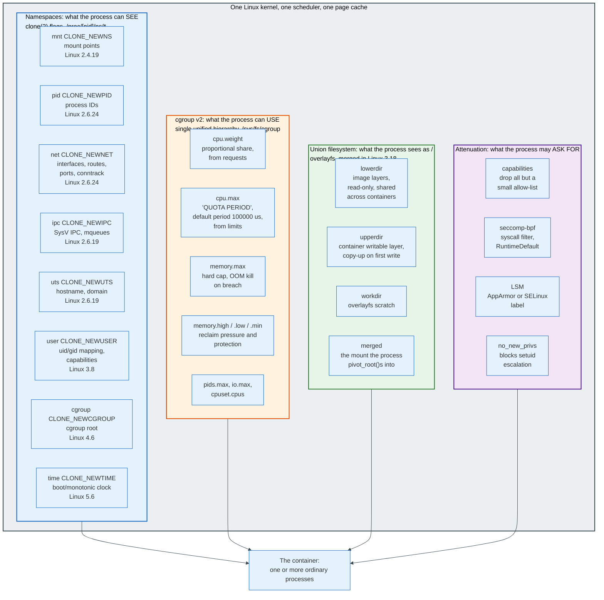

### 2.1 Namespaces: Restricting the View

A namespace wraps a global kernel resource so that processes inside it see their own instance of it. Linux defines eight, each with a `CLONE_` flag and a corresponding file under `/proc/[pid]/ns/`.

| Namespace | Flag | Isolates | Available since |
|-----------|------|----------|-----------------|
| **Mount** | `CLONE_NEWNS` | Mount points, the filesystem tree | Linux 2.4.19, 2002 |
| **UTS** | `CLONE_NEWUTS` | Hostname and NIS domain name | Linux 2.6.19, 2006 |
| **IPC** | `CLONE_NEWIPC` | System V IPC objects, POSIX message queues | Linux 2.6.19, 2006 |
| **PID** | `CLONE_NEWPID` | Process ID number space | Linux 2.6.24, 2008 |
| **Network** | `CLONE_NEWNET` | Interfaces, routing tables, ports, conntrack, iptables | Linux 2.6.24, 2008 |
| **User** | `CLONE_NEWUSER` | UID and GID mappings, capability sets | Completed in Linux 3.8, 2013 |
| **Cgroup** | `CLONE_NEWCGROUP` | The cgroup filesystem root a process sees | Linux 4.6, 2016 |
| **Time** | `CLONE_NEWTIME` | `CLOCK_MONOTONIC` and `CLOCK_BOOTTIME` offsets | Linux 5.6, 2020 |

Three system calls manipulate them. `clone(2)` creates a process in fresh namespaces named by its flags. `unshare(2)` moves the calling process into new ones. `setns(2)` joins an existing namespace by file descriptor, which is exactly what `kubectl exec` ends up doing several layers down.

The PID namespace is the one that produces the illusion. A process inside a new PID namespace sees itself as PID 1 and can see only its own descendants. The same process, viewed from the host, has an ordinary PID like 48211 and is visible in `ps` alongside everything else. Two names for one task.

The user namespace is the one that changes the security model. Inside it a process can hold a full capability set and a UID of 0 while mapping to an unprivileged UID on the host, so "root in the container" stops meaning root on the machine. Kubernetes exposes this through `spec.hostUsers: false`, and support is comparatively recent, which is why most clusters in production still run containers whose UID 0 is the host's UID 0.

### 2.2 Control Groups: Restricting the Consumption

Control groups account for and cap resource use per group of processes. Version 2, merged in Linux 4.5 in March 2016, replaced version 1's multiple independent hierarchies with a single unified tree mounted at `/sys/fs/cgroup`.

The interface is files. Writing a PID into `cgroup.procs` moves a process into a group. Writing controller names into `cgroup.subtree_control`, prefixed with `+` or `-`, enables or disables them for children. Version 2 enforces the no-internal-processes rule: a cgroup that has children may not itself hold processes, which removes the ambiguity about whose resources a parent's processes are consuming.

Four files carry almost all of Kubernetes' resource semantics.

**`cpu.weight`** sets a proportional share, used when the CPU is contended and ignored when it is not. Kubernetes derives it from the pod's CPU *requests*.

**`cpu.max`** holds two numbers, a quota and a period, written as `"QUOTA PERIOD"` in microseconds, with a default period of 100000, meaning 100 milliseconds. Kubernetes derives the quota from CPU *limits*: a limit of `500m` becomes `50000 100000`, which is 50 milliseconds of CPU time per 100 millisecond window. When the quota is exhausted the process is not slowed, it is stopped until the window rolls over. That is CFS throttling, and it is the single most misdiagnosed performance problem in Kubernetes.

**`memory.max`** is a hard ceiling. Exceeding it triggers the cgroup OOM killer, which kills a process inside the group rather than picking a victim globally.

**`memory.high`** applies reclaim pressure without killing, and `memory.min` and `memory.low` protect memory from reclaim. Kubernetes uses these under the Memory QoS work, gated by `MemoryQoS`, which sat alpha and off by default from v1.22 and became beta and on by default only in v1.37. Where the gate is on, the kubelet sets `memory.high` to `requests + memoryThrottlingFactor * (limits - requests)`. With the default factor of 0.9, a container requesting 256 MiB with a 1 GiB limit gets a `memory.high` of roughly 947 MiB, so reclaim starts before the hard kill. Where the gate is off, and it was off for fifteen releases, `memory.high` is never written.

CPU limits throttle. Memory limits kill. The asymmetry follows from the kernel: you can give a process less CPU time later, and you cannot give it back memory it already wrote.

### 2.3 Union Filesystems: The Cheap Root Directory

A container image is a stack of tar archives, and the filesystem the container sees is those archives merged read-only with one writable layer on top.

OverlayFS, merged in Linux 3.18 in December 2014, is the mechanism nearly every runtime now uses. It takes four directories. `lowerdir` is a colon-separated list of the read-only image layers, ordered top to bottom. `upperdir` is the container's writable layer. `workdir` is scratch space on the same filesystem that overlayfs needs for atomic operations. `merged` is the resulting mount, and it is what the runtime makes the container's root.

Reads resolve top-down through the layers. The first write to a file triggers copy-up: the whole file is copied from its lower layer into `upperdir`, then modified there. Deleting a file that exists in a lower layer creates a character device with major and minor number 0 in `upperdir`, a whiteout, which masks it.

Two consequences follow directly and both bite in production. Copy-up cost is proportional to file size, so a container that opens a 4 GB file for append pays a 4 GB copy on the first write. And the writable layer is per-container and disappears with it, which is why a database on a container's own filesystem loses its data on restart, and why persistent volumes exist.

The sharing is the payoff. One hundred pods running the same image share one copy of its layers in the page cache. A 300,000-container cluster does not store 300,000 root filesystems.

### 2.4 The Runtime Bundle, and What Actually Executes

The OCI Runtime Specification defines exactly what a low-level runtime is handed: a directory containing a `config.json` and a `rootfs`. Version 1.3.0 was published on 4 November 2025.

`config.json` names the process to run, its arguments and environment, the mounts to set up, the namespaces to create or join, the cgroup limits to apply, the capability sets, the seccomp profile, and the read-only paths and masked paths under `/proc`. `runc`, `crun`, or `youki` reads that file, performs the `clone`, `mount`, `pivot_root`, `setuid`, and `execve` calls it describes, then gets out of the way. The runtime does not stay in the process path. After `execve` the container is a process the kernel manages like any other.

Above the low-level runtime sits containerd or CRI-O, which implements CRI, manages images and snapshots, and supervises the shim process that owns the container's standard streams and reaps it on exit.

### 2.5 What a Container Is Not

**A container is not a virtual machine.** A virtual machine has its own kernel, its own scheduler, its own page tables, and a virtual device model. A container has none of these. Every container on a node shares one kernel, and a kernel privilege escalation from inside a container is a compromise of the node and of every other container on it. This is the single most consequential misconception in the field, because it drives people to treat container boundaries as trust boundaries between tenants. They are not, without more: gVisor interposes a userspace kernel, Kata Containers runs each pod in a lightweight VM, and both exist precisely because the container boundary alone is thinner than people assume.

**A container is not a process, singular.** It is a cgroup and a set of namespaces that can hold many processes. PID 1 inside is whatever the image's entrypoint runs, and if that process does not reap children, the container accumulates zombies, because there is no init in there unless you put one there.

**A container image is not a filesystem snapshot.** It is an ordered list of content-addressed layers plus a JSON configuration, described by the OCI Image Specification. Two images that share a base share those layer blobs by digest, in the registry and on every node.

---

## 3. What Kubernetes Adds, and What It Is Not

Kubernetes adds one thing to containers: a durable record of intent, plus loops that make reality match it. Everything else in the system, all the resource kinds, all the controllers, all the plugins, is an elaboration of that.

Running a container is a solved problem that `runc` solves in a few hundred milliseconds. Keeping 4,000 containers running across 200 machines that fail without notice, while their addresses change, their configuration changes, and their images are replaced twice a day, is not a container problem. It is a distributed state problem.

### 3.1 The Declarative Contract

A user writes what should be true. Kubernetes stores it, and separately records what is true.

Every Kubernetes object has the same four top-level fields. `apiVersion` and `kind` name its type. `metadata` carries name, namespace, labels, annotations, `resourceVersion`, `uid`, `ownerReferences`, and `finalizers`. `spec` is the desired state, written by the user. `status` is the observed state, written by a controller.

The split between `spec` and `status` is the whole architecture in two field names. Users write `spec` and never `status`. Controllers read `spec`, act on the world, and write `status`. Neither side blocks on the other.

A request to create a Deployment does not create pods. It writes a Deployment object and returns. Pods appear later, if controllers are running, and they keep appearing for as long as the object exists. `kubectl apply` is a write to a database, not a deployment.

### 3.2 The Object Graph

Kubernetes objects own each other through `metadata.ownerReferences`, and that reference is what makes deletion and cleanup work.

A Deployment owns ReplicaSets. A ReplicaSet owns Pods. A Pod owns nothing but is owned. Each child carries an `ownerReference` naming its parent's kind, name, and UID. The garbage collector watches for objects whose owners no longer exist and deletes them, in background or foreground mode depending on the `propagationPolicy` on the delete request.

The UID in the reference matters. Deleting a Deployment named `web` and immediately recreating it produces a new UID, so the old ReplicaSets are orphaned and collected rather than adopted.

Finalizers are the counterweight. A string in `metadata.finalizers` blocks actual deletion: the API server sets `metadata.deletionTimestamp` and stops there, and the object persists until some controller removes its finalizer. This is how a PersistentVolumeClaim in use by a pod avoids being deleted out from under it, and it is also why objects get stuck in `Terminating` forever when the controller that owns the finalizer is gone.

### 3.3 What Kubernetes Is Not

**Not an imperative orchestrator.** There is no workflow engine, no ordered task list, no rollback transaction. A rollback is a write of an older `spec` followed by the same reconciliation that produced the current state. Systems that model deployment as a sequence of steps, such as Ansible or a CI pipeline, are a different category, and mixing the two produces the common failure where a pipeline "deploys" and a controller immediately reverts it.

**Not a scheduler with extras.** The scheduler is one component of roughly a dozen, it runs for a few milliseconds per pod, and a cluster with a dead scheduler keeps every running workload alive indefinitely. Only new pods stop being placed.

**Not a PaaS.** Kubernetes does not build code, does not manage secrets lifecycles, does not do blue-green or canary traffic shifting natively, does not provide a database, and does not give you a URL. Every platform built on Kubernetes adds those, and the adding is where most of the engineering effort in a company's platform team goes.

**Not highly available by default.** A single-replica Deployment is a single point of failure with extra steps. Kubernetes restarts it, which is better than nothing and is not availability. Availability requires multiple replicas, a PodDisruptionBudget, anti-affinity across failure domains, a probe that reports the truth, and a control plane that is itself replicated.

**Not a security boundary between tenants.** Namespaces are a naming and policy scope, not an isolation mechanism. Two pods in different namespaces on the same node share a kernel and, unless a NetworkPolicy says otherwise, can reach each other over the pod network.

### 3.4 The Simplest Accurate Mental Model

Kubernetes is a database with triggers, where the triggers run on other machines and the side effects are processes.

etcd holds the rows. The API server is the only process that writes to it, and it enforces schema, authorisation, and admission policy on the way in. Controllers subscribe to changes and act. The kubelet is a controller that happens to run on the node whose pods it manages. That is the entire system, and the rest of this document is detail about each of those four sentences.

---

## 4. Key Participants and Roles

Kubernetes splits into a control plane, which decides, and nodes, which execute. The split is strict: no node component ever contacts another node component, and no controller ever contacts a node directly except the kubelet's own API for logs and exec.

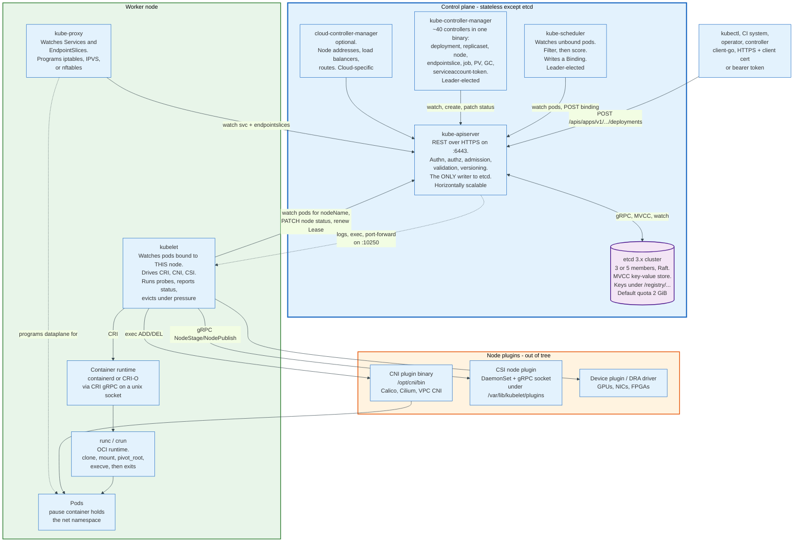

### 4.1 The Components

| Component | Where it runs | What it does | Talks to |
|-----------|---------------|--------------|----------|
| **kube-apiserver** | Control plane, N replicas | Serves the REST API; authenticates, authorises, admits, validates, versions, and persists every object | etcd, everything |
| **etcd** | Control plane, 3 or 5 members | Stores all API objects; provides consistency, ordering, and watch | API server only |
| **kube-scheduler** | Control plane, 1 active | Assigns unbound pods to nodes | API server |
| **kube-controller-manager** | Control plane, 1 active | Runs the built-in controllers in one process | API server |
| **cloud-controller-manager** | Control plane, 1 active, optional | Cloud integration: node lifecycle, load balancers, routes | API server, cloud API |
| **kubelet** | Every node | Runs and supervises the pods assigned to its node | API server, CRI, CNI, CSI |
| **kube-proxy** | Every node, optional | Programs the Service data plane in the kernel | API server, netfilter |
| **Container runtime** | Every node | Pulls images, creates sandboxes and containers | kubelet over CRI |
| **CoreDNS** | Cluster addon | Resolves Service and Pod names | API server |

### 4.2 The Three Roles That Determine Whether a Cluster Works

**The API server is the only writer.** No other component opens a connection to etcd. This is what makes the control plane horizontally scalable and what makes admission control meaningful: there is exactly one place to enforce policy, and no path around it. It is also the reason an API server outage is total. Nothing new happens, though everything already running keeps running.

**The kubelet is autonomous.** It watches for pods whose `spec.nodeName` matches its own node and takes full responsibility for them. It does not ask permission to restart a container. It does not stop when the API server is unreachable; it keeps running its last known pod set, restarts crashed containers, and executes probes. A node cut off from the control plane for an hour still serves traffic. That property is the reason Kubernetes survives control plane failures at all, and it is also the reason a partitioned node keeps running pods the control plane has already rescheduled elsewhere.

**Leader election gates the singletons.** The scheduler and the controller manager run as multiple replicas but only one acts. They contend for a `Lease` object in `kube-system` using the coordination API, renewing it on a timer. The runner-up takes over when the lease expires. This is the pattern every operator copies, and it is provided directly by `client-go`'s `leaderelection` package.

### 4.3 The Kubelet's Interfaces

The kubelet is a small program with three large plugin surfaces, and almost everything vendor-specific in a cluster attaches through one of them.

**CRI**, the Container Runtime Interface, is gRPC over a Unix socket, typically `/run/containerd/containerd.sock`. It defines `RunPodSandbox`, `CreateContainer`, `StartContainer`, `StopContainer`, `RemovePodSandbox`, `ListContainers`, `ContainerStatus`, `PullImage`, and `ExecSync`, among others.

**CNI**, the Container Network Interface, is not a service. It is a set of executables in `/opt/cni/bin` invoked with a JSON configuration on stdin and parameters in environment variables. The kubelet, or more precisely the runtime on its behalf, calls them once per pod sandbox.

**CSI**, the Container Storage Interface, is gRPC to a driver running as a DaemonSet on the node, with a matching controller running as a Deployment.

Three different plugin styles for three subsystems, because each was designed by a different group at a different time. Nobody would design it this way now.

---

## 5. The Reconciliation Loop

Reconciliation is the central idea, and it is one function repeated everywhere: read the desired state, read the observed state, compute the difference, act on part of it, and repeat forever.

The documentation's analogy is a thermostat. You set a target temperature, the thermostat reads the room, and it turns the heating on or off. It does not compute a heating schedule. It does not track progress through a plan. It compares two numbers and acts, over and over, and the fact that a window opens halfway through does not require any special handling.

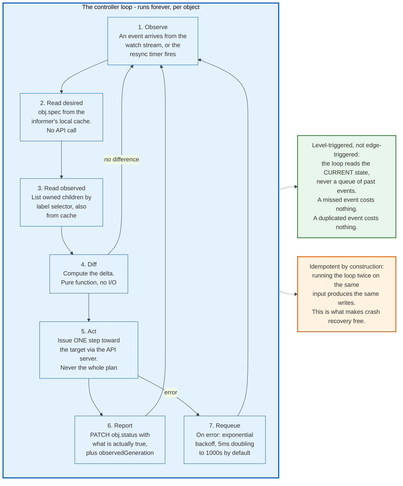

### 5.1 Level-Triggered, Not Edge-Triggered

The loop reads current state rather than consuming a log of changes, and that choice removes an entire class of bugs.

An edge-triggered system reacts to transitions: "pod deleted, therefore create a replacement." If it misses the event it is permanently wrong. If it processes the event twice it creates two replacements. It must therefore guarantee exactly-once delivery over a network, which is not available.

A level-triggered system reacts to state: "there should be three pods, there are two, create one." A missed notification delays the correction until the next resync. A duplicated notification produces a second comparison that finds nothing to do. Delivery guarantees stop mattering.

Kubernetes uses watch events purely as a hint that it is worth looking again. Every controller also runs a periodic full resync, randomised between 12 and 24 hours in the built-in controllers, because `--min-resync-period` defaults to 12h and each reflector picks a value uniformly between that and twice it. Correctness never depends on the event stream.

The events are an optimisation. The state is the contract.

### 5.2 The Informer Machinery

Every controller in Kubernetes shares one client-side pipeline, implemented in `client-go`, and understanding it explains both the performance and the failure modes.

**Reflector.** Issues a `LIST` to get a full snapshot plus its `resourceVersion`, then a `WATCH` starting at that version. On a `410 Gone` it discards everything and re-lists.

**DeltaFIFO.** A queue of changes keyed by object, which collapses repeated changes to the same object into one entry. A pod updated forty times while the controller is busy is dequeued once.

**Indexer / Store.** A thread-safe in-memory cache of every object of that type, with secondary indexes, usually by namespace. This is the "observed state" every controller reads. A `Lister` call is a map lookup, not an HTTP request.

**SharedInformerFactory.** One watch per type per process, fanned out to every controller that wants it. The controller manager runs about forty controllers and holds far fewer than forty watches.

**Workqueue.** A rate-limited, deduplicating queue of object keys in `namespace/name` form. The default rate limiter combines a per-item exponential backoff starting at 5 milliseconds and doubling to a 1000 second ceiling, with an overall token bucket of 10 queries per second and a burst of 100.

The cache is the reason a 5,000 node cluster works. It is also the reason controllers act on stale data, which is why every write must be safe to repeat and every conflict must be retried.

### 5.3 Optimistic Concurrency

Two controllers writing the same object do not corrupt it, because every write carries a version and the API server rejects stale ones.

Each object's `metadata.resourceVersion` is the etcd revision at which it was last written. A `PUT` that includes a `resourceVersion` succeeds only if it still matches, and otherwise returns `409 Conflict`. The standard controller response is to re-read from cache, recompute, and retry, which `client-go` wraps in `RetryOnConflict`.

`metadata.generation` complements it. The API server increments `generation` only when `spec` changes, never when `status` changes. A controller records the generation it acted on in `status.observedGeneration`, and any reader comparing `metadata.generation` to `status.observedGeneration` can tell whether the controller has caught up. This is how `kubectl rollout status` knows a rollout has begun rather than reporting on the previous one.

### 5.4 Why Controllers Are Small

Each controller owns exactly one transformation, and the chain is assembled by nobody.

The Deployment controller creates and scales ReplicaSets. It never creates a pod. The ReplicaSet controller creates and deletes pods to match a count. It knows nothing about rollouts. The scheduler sets `spec.nodeName` on pods that lack one. It knows nothing about ReplicaSets. The kubelet runs pods with its own `nodeName`. It knows nothing about the scheduler.

No component orchestrates this sequence. Each watches the API server, sees an object in a state it cares about, and acts. The pipeline exists only as an emergent property of four independent loops sharing one store.

That is why adding a custom controller requires no changes anywhere else, and why debugging requires reading four controllers' logs.

---

## 6. The API Machinery

The API server is a schema-validating, version-translating, policy-enforcing, watch-serving proxy in front of etcd, and every one of those adjectives corresponds to a stage a request passes through.

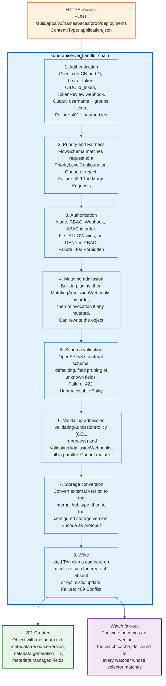

### 6.1 Groups, Versions, Resources

Every endpoint has the shape `/apis/GROUP/VERSION/namespaces/NS/RESOURCE/NAME`, with one exception preserved from 2015.

The core group is empty-named and lives at `/api/v1`, which is where Pod, Service, Node, ConfigMap, Secret, Namespace, and PersistentVolumeClaim live. Everything added later sits under `/apis`: `apps/v1` for Deployment, StatefulSet, DaemonSet, and ReplicaSet; `batch/v1` for Job and CronJob; `networking.k8s.io/v1` for Ingress and NetworkPolicy; `discovery.k8s.io/v1` for EndpointSlice; `rbac.authorization.k8s.io/v1` for the four RBAC kinds; `storage.k8s.io/v1` for StorageClass and CSIDriver; `resource.k8s.io/v1` for Dynamic Resource Allocation.

Versions carry a stability contract that the project has kept for a decade. An `alpha` version is disabled by default, may change incompatibly in the next release, and may be deleted. A `beta` version is enabled by default for built-in APIs, will be supported for at least two more releases after deprecation, but new beta APIs since Kubernetes 1.24 are no longer enabled by default. A `v1` version is supported for at least a year after deprecation and in practice forever.

Multiple versions of one resource are served simultaneously and are the same object. The API server converts between them through an internal "hub" type, so `apps/v1beta2` and `apps/v1` Deployments are two projections of one row in etcd. Exactly one version is marked as the storage version, and that is the encoding on disk, which is protobuf by default and not JSON.

### 6.2 resourceVersion and the Watch Protocol

`resourceVersion` is an opaque string that clients must never parse, compare, or increment, and internally it is the etcd revision. It carries the ordering guarantee that makes watch resumable.

A `LIST` returns a collection whose `metadata.resourceVersion` is the revision at which the snapshot is consistent. A `WATCH` started at that revision receives every change after it, in order, with no gaps and no duplicates. Together they give a client a complete, ordered view of a resource type without polling.

The values have specific meanings on reads. An unset `resourceVersion` on a list means "most recent", served from the watch cache. The literal string `"0"` means "any version, as cheap as possible", which returns possibly stale cached data. A specific value means "not older than this", which is how a client that just wrote an object avoids reading its own stale cache.

Two mechanisms handle the long tail. **Bookmarks**: a client that sets `allowWatchBookmarks=true` periodically receives an event of type `BOOKMARK` carrying only an updated `resourceVersion`, which lets it advance its resume point even when nothing it watches has changed. Without this, a client watching a quiet resource in a busy cluster falls behind the compaction window and is forcibly re-listed. **`410 Gone`**: when the requested revision has been compacted away, the server returns HTTP 410 with reason `Gone` and the message `too old resource version`, and the client must re-list from scratch. The API server compacts etcd on a timer, controlled by `--etcd-compaction-interval`, which defaults to five minutes.

Large lists are chunked. `?limit=500` returns at most 500 items plus a `metadata.continue` token, and passing that token back returns the next page from the same consistent snapshot.

### 6.3 Admission Control

Admission is where policy lives, and it runs in two phases with a hard rule between them: mutating runs first and may rewrite the object; validating runs second and may only accept or reject.

The default enabled plugin set in v1.37 has 25 members: `CertificateApproval`, `CertificateSigning`, `CertificateSubjectRestriction`, `ClusterTrustBundleAttest`, `DefaultIngressClass`, `DefaultStorageClass`, `DefaultTolerationSeconds`, `LimitRanger`, `MutatingAdmissionPolicy`, `MutatingAdmissionWebhook`, `NamespaceLifecycle`, `NodeDeclaredFeatureValidator`, `PersistentVolumeClaimResize`, `PodGroupProtection`, `PodResizeValidator`, `PodSecurity`, `PodTopologyLabels`, `Priority`, `ResourceQuota`, `RuntimeClass`, `ServiceAccount`, `StorageObjectInUseProtection`, `TaintNodesByCondition`, `ValidatingAdmissionPolicy`, and `ValidatingAdmissionWebhook`. Five of those run only when a feature gate is on: `PodTopologyLabels` needs `PodTopologyLabelsAdmission`, `MutatingAdmissionPolicy` and `ValidatingAdmissionPolicy` need the gates of the same name, `NodeDeclaredFeatureValidator` needs `NodeDeclaredFeatures`, and `PodResizeValidator` needs `InPlacePodVerticalScaling`. At v1.37 all five gates default to on, so the set is 25 in practice as well as on paper.

Webhooks are the extension point. A `MutatingWebhookConfiguration` names a service, a set of rules matching API groups, versions, resources, and verbs, and a `failurePolicy` of `Ignore` or `Fail`. The API server POSTs an `AdmissionReview` containing the object, the old object on updates, the user info, and the operation, and expects an `AdmissionReview` response containing `allowed`, an optional `status` with a message, and for mutating webhooks a base64-encoded JSON Patch. Default timeout is 10 seconds, and the maximum is 30.

Mutating webhooks run in the order they appear in the configuration list, and if any of them mutates the object, webhooks with `reinvocationPolicy: IfNeeded` are called again, because a later webhook's change might invalidate an earlier one's assumption. Validating webhooks run in parallel, since none of them can affect the others.

`ValidatingAdmissionPolicy`, GA since Kubernetes v1.30, replaces most validating webhooks with CEL expressions evaluated in-process. A policy carries `validations` with a `expression` like `object.spec.replicas <= 5`, a `ValidatingAdmissionPolicyBinding` scopes it to namespaces by label, and no network call happens. The mutating counterpart, `MutatingAdmissionPolicy`, went GA in v1.36 and is enabled by default, running immediately before `MutatingAdmissionWebhook` in the chain.

The reason to prefer CEL is availability. A validating webhook with `failurePolicy: Fail` whose backing pods are down blocks every matching write in the cluster, including the writes needed to bring those pods back. This is the most reliable way to render a cluster unrecoverable, and it is discussed further in section 20.

### 6.4 Server-Side Apply and Field Ownership

Server-side apply moves the three-way merge from `kubectl` into the API server and records which actor owns which field.

Every object carries `metadata.managedFields`, a list of entries each naming a manager (`kubectl`, `kube-controller-manager`, an operator's name), an operation (`Apply` or `Update`), a timestamp, and a set of field paths in a structured format. An apply request declares ownership of the fields it sets, releases fields it no longer sets, and fails with a conflict if it tries to set a field another manager owns, unless it passes `force=true`.

The practical effect is that two controllers can each manage part of the same object without erasing each other, and that a field removed from a manifest is actually removed rather than left behind. Server-side apply went GA in Kubernetes v1.22.

### 6.5 API Priority and Fairness

A single misbehaving client cannot starve the control plane, because requests are classified and each class has its own concurrency budget.

Two object types define the policy. A `FlowSchema` matches requests by user, group, verb, resource, and namespace, assigns them to a priority level, and computes a flow distinguisher, usually the username or namespace, so that one noisy user within a level cannot starve another. A `PriorityLevelConfiguration` sets the level's share of the total concurrency budget, its queue count, queue length, and hand size.

The total budget comes from `--max-requests-inflight`, which defaults to 400, plus `--max-mutating-requests-inflight`, which defaults to 200. The default configuration ships levels named `exempt`, `system`, `node-high`, `leader-election`, `workload-high`, `workload-low`, `global-default`, and `catch-all`, with `exempt` bypassing all limits so that health checks survive an overload.

Requests occupy "seats" rather than slots, because a `LIST` returning 10,000 objects costs far more than a `GET`. When a level's queues are full the server returns `429 Too Many Requests` with a `Retry-After` header. API Priority and Fairness went GA in Kubernetes v1.29.

The mechanism explains a common observation: during an incident, `kubectl get pods` from an operator's laptop stays responsive while a runaway controller's list loop is throttled. That is the design working.

---

## 7. etcd as the Single Source of Truth

etcd is the only stateful component in Kubernetes, and every guarantee the cluster makes about consistency is really a guarantee etcd makes. It is a replicated key-value store with multi-version concurrency control, a linearizable read path, and a watch API that streams changes from any past revision.

It is also the component most likely to end an outage badly, because it is the only one whose data cannot be recomputed.

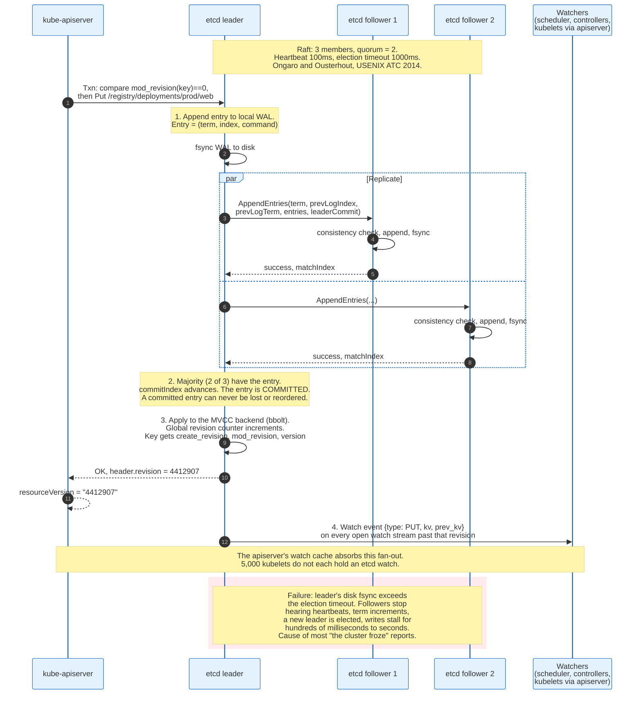

### 7.1 Raft, in the Detail That Matters

etcd replicates a log using Raft, described in Ongaro and Ousterhout's "In Search of an Understandable Consensus Algorithm", USENIX ATC 2014, and the algorithm's properties translate directly into operational rules.

One member is leader per term. All writes go to the leader. The leader appends the command to its write-ahead log, fsyncs it, and sends `AppendEntries` to followers. Once a majority have durably appended the entry, it is committed and can never be lost, reordered, or contradicted. Followers redirect writes to the leader; reads can be served locally only if the client accepts staleness, and linearizable reads go through the leader with a quorum check.

Quorum is the ceiling of half the members plus one, and it produces the cluster sizes everyone uses. A 3-member cluster has quorum 2 and tolerates 1 failure. A 5-member cluster has quorum 3 and tolerates 2. A 4-member cluster has quorum 3 and tolerates 1, exactly like a 3-member cluster, while paying more for every write. Even-numbered etcd clusters are strictly worse than the odd number below them.

etcd's defaults are a 100 millisecond heartbeat interval and a 1000 millisecond election timeout. If a leader fails to heartbeat for the election timeout, a follower increments the term and stands for election. The operational consequence: every `AppendEntries` requires an fsync on every member, so etcd write latency is disk fsync latency. When `etcd_disk_wal_fsync_duration_seconds` p99 exceeds roughly 10 milliseconds, or `etcd_disk_backend_commit_duration_seconds` p99 exceeds roughly 25 milliseconds, leader elections start happening under load and the API server begins timing out.

etcd needs a fast local SSD. Network storage under etcd is the most common self-inflicted control plane failure.

### 7.2 MVCC, Revisions, and Why resourceVersion Works

etcd keeps a single monotonically increasing 64-bit revision counter for the whole keyspace, incremented on every write, and stores every version of every key against it.

Each key-value pair carries four numbers: `create_revision`, the store revision when the key was last created; `mod_revision`, the revision of its most recent modification; `version`, a per-key counter reset to zero on delete; and `lease`, the lease ID attached to it or 0.

`mod_revision` is what Kubernetes surfaces as `metadata.resourceVersion`. Because the counter is global and monotonic, a client that has seen revision 4412907 can ask etcd for every change after that revision and receive them in exactly the order they were committed. That is the entire basis for the list-then-watch pattern.

Transactions are the write primitive. An etcd `Txn` is an atomic if-then-else: a list of `Compare` clauses, each naming a `target` of `VERSION`, `CREATE`, `MOD`, or `VALUE` and a `result` of `EQUAL`, `GREATER`, `LESS`, or `NOT_EQUAL`, followed by success and failure operation lists. Kubernetes implements create-if-not-exists as a Txn comparing `mod_revision` to 0, and optimistic update as a Txn comparing `mod_revision` to the client's `resourceVersion`. The `409 Conflict` a controller sees is a failed compare.

Leases implement expiry. A key attached to a lease disappears when the lease is not renewed, which is how leader-election and node heartbeats express liveness without a separate timer.

### 7.3 How Kubernetes Uses etcd

Kubernetes stores every object under `/registry/`, encoded as protobuf, with a path derived from resource and namespace.

A Deployment named `web` in namespace `prod` lives at `/registry/deployments/prod/web`. A cluster-scoped object such as a Node lives at `/registry/minions/node-1`, using the pre-1.0 name for nodes, which has never been changed because changing it would require a data migration on every cluster in existence. Listing all pods in a namespace is a range request over the prefix `/registry/pods/prod/`.

Secrets are stored the same way, which is why encryption at rest is a separate feature. Without an `EncryptionConfiguration` on the API server, every Secret in the cluster is readable in plaintext by anyone with etcd access or an etcd backup.

The API server, not etcd, absorbs the watch fan-out. Each resource type has one watch cache in the API server holding a rolling window of recent events, and thousands of clients watch that cache rather than opening thousands of etcd watches. The window size is what determines how far behind a client can fall before receiving `410 Gone`. Kubernetes v1.37 makes resilient watch cache initialization stable, which removes a long-standing failure where a restarting API server had to rebuild every watch cache before serving, producing a thundering herd of re-lists across the fleet.

### 7.4 Limits, Compaction, and the 8 GiB Wall

etcd refuses writes when its backend exceeds a quota, and the default quota is small enough that busy clusters hit it.

`--quota-backend-bytes` defaults to 2 GiB. The documented maximum recommended value is 8 GiB. Exceeding the quota raises a cluster-wide `NOSPACE` alarm which puts etcd into a maintenance mode accepting only reads and deletes, and every write in the cluster fails with `etcdserver: mvcc: database space exceeded`.

Recovery is three commands in order: `etcdctl compact <revision>` to discard old key history, `etcdctl defrag` to return the freed pages to the filesystem, and `etcdctl alarm disarm` to clear the alarm. Compaction alone does not shrink the file, because bbolt keeps the freed pages; defragmentation is what shrinks it, and it blocks the member while it runs, which is why it is done one member at a time.

Automatic compaction is configured with `--auto-compaction-mode`, either `periodic` with a retention window such as `1h`, or `revision` with a count. Kubernetes additionally compacts on its own schedule via the API server's `--etcd-compaction-interval`, default five minutes.

Object size is capped in two independent places, and conflating them sends operators to the wrong log. Kubernetes validation rejects any ConfigMap or Secret whose values total more than 1 MiB, the `MaxSecretSize` constant in `pkg/apis/core/types.go`, and it does so in the validation stage before any etcd write, surfacing as a `TooLong` field error naming 1048576 bytes. Separately, etcd's `--max-request-bytes` defaults to about 1.5 MiB, and a write above that ceiling fails with the more confusing `etcdserver: request is too large`, which is what an oversized custom resource or a bulk update hits. Two limits, two error strings, two causes.

Events are the usual cause of growth. A cluster in a crash loop generates Events at a high rate, and they expire after one hour by default. Large clusters are advised to give Events their own etcd instance via the API server's `--etcd-servers-overrides` flag, precisely so that a noisy incident cannot fill the store that holds everything else.

### 7.5 What etcd Is Not

**Not a general-purpose database.** It holds the entire keyspace in memory-mapped bbolt pages, replicates every write to a majority with an fsync each, and is designed for a few gigabytes of small values. It is not where application data goes, and a CRD used to store per-request records will fail.

**Not queryable.** There are no indexes other than the key prefix. "List all pods with label `app=web` across the cluster" is a full range scan of `/registry/pods/` inside the API server, filtered in memory. This is why label selectors on huge resources are expensive, and why the API server, not etcd, does the filtering.

**Not backed up by taking a filesystem copy.** The supported mechanism is `etcdctl snapshot save`, which produces a consistent point-in-time image. Restoring one rolls the whole cluster back to that moment, including deleting objects created since, which makes etcd restore a last resort rather than a routine repair.

---

## 8. The Scheduler

The scheduler answers one question per pod: which node. It reads pods with an empty `spec.nodeName`, picks a node, and writes a `Binding` object. Everything else about placement follows from what plugins it runs.

It is stateless. It holds a cache of nodes and pods built from watches, and if it crashes it rebuilds that cache and continues. Pods already running are unaffected.

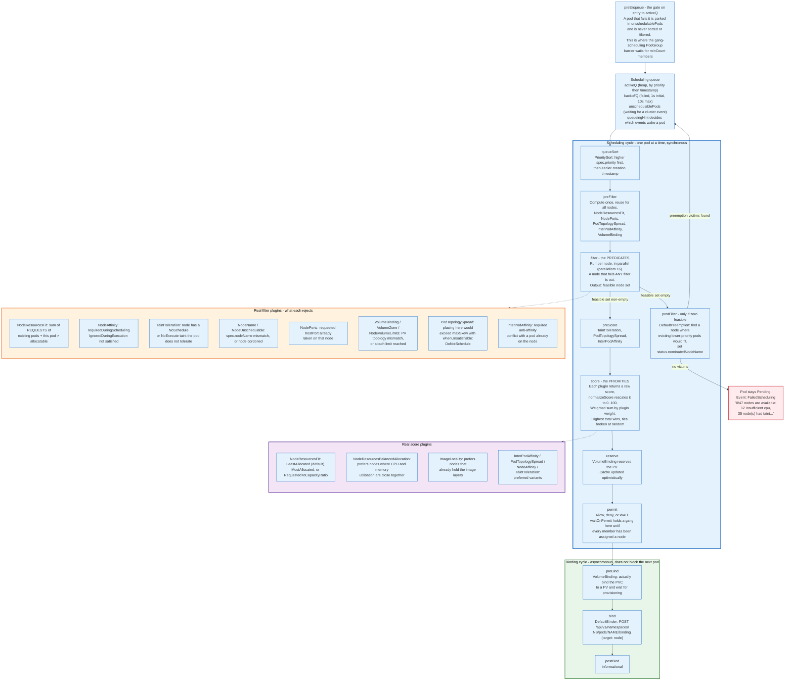

### 8.1 The Framework

The scheduler is a plugin host. The scheduling framework defines ordered extension points, and every placement rule Kubernetes has is a plugin registered at one or more of them.

The extension points in order are `preEnqueue`, `queueSort`, `preFilter`, `filter`, `postFilter`, `preScore`, `score`, `normalizeScore`, `reserve`, `permit`, `preBind`, `bind`, and `postBind`, with `enqueueExtension` and `queueingHint` deciding which cluster events make an unschedulable pod worth retrying. `preEnqueue` is the gate on entry to `activeQ`, the queue of pods ready to be placed, and a pod that fails it never reaches `queueSort`. Gang scheduling reuses that gate as a barrier on the `PodGroup` object and its minimum member count, adds `waitOnPermit` to hold binding until every member has a node, and adds a `placementFeasible` extension point in the workload scheduling cycle, which KEP-4671 makes beta in v1.37 behind the `GenericWorkload` feature gate after two releases at alpha. A `multiPoint` configuration section enables or disables a plugin across every point it implements.

The cycle splits in two. The scheduling cycle, from `queueSort` through `permit`, runs one pod at a time and is synchronous, because two pods being placed concurrently could both be told the same node has room. The binding cycle, from `preBind` through `postBind`, runs asynchronously, because it may block on slow operations such as provisioning a persistent volume, and blocking the whole scheduler on a storage API would be unacceptable.

`parallelism` defaults to 16, and it controls how many nodes are evaluated concurrently within the filter phase, not how many pods are scheduled at once.

### 8.2 Filtering: the Predicates

Filtering produces a set of feasible nodes, and a node is feasible only if every enabled filter plugin accepts it.

`NodeResourcesFit` is the one that matters most and the one most often misunderstood. It sums the **requests** of every pod already assigned to the node, adds this pod's requests, and rejects the node if the total exceeds `status.allocatable`. Limits play no part. Actual usage plays no part. A node running at 5 percent CPU whose assigned pods request 100 percent of allocatable is full as far as the scheduler is concerned.

`NodeAffinity` evaluates `requiredDuringSchedulingIgnoredDuringExecution`, a set of node selector terms ORed together, each with match expressions ANDed together. The second half of that name is load-bearing: the requirement is checked at scheduling time and never again, so relabelling a node does not evict pods that no longer match.

`TaintToleration` implements the exclusion mechanism. A taint is a key, value, and effect on a node; `NoSchedule` blocks new pods, `PreferNoSchedule` discourages them, and `NoExecute` also evicts running pods that do not tolerate it. Control plane nodes carry `node-role.kubernetes.io/control-plane:NoSchedule`. A cordoned node carries `node.kubernetes.io/unschedulable:NoSchedule`. A node reporting `NotReady` gets `node.kubernetes.io/not-ready:NoExecute` from the node lifecycle controller.

`PodTopologySpread` enforces even distribution. A constraint names a `topologyKey` such as `topology.kubernetes.io/zone`, a `maxSkew`, a `labelSelector`, and a `whenUnsatisfiable` of `DoNotSchedule` or `ScheduleAnyway`. With `maxSkew: 1` across three zones and nine replicas, no zone may hold more than one pod above the least-loaded zone.

`InterPodAffinity` with `requiredDuringScheduling` anti-affinity on `kubernetes.io/hostname` is the classic "one replica per node" rule, and it is also the classic way to make a Deployment permanently unschedulable when replicas exceed node count.

### 8.3 Scoring: the Priorities

Every surviving node gets a raw score from each score plugin, `normalizeScore` rescales each plugin's output into the range 0 to 100, the normalised scores are multiplied by per-plugin weights and summed, and the highest total wins with ties broken at random.

`NodeResourcesFit` in scoring mode defaults to the `LeastAllocated` strategy, which prefers the node with the most free requested capacity, spreading load. `MostAllocated` does the opposite and packs tightly, which is what a cluster running the autoscaler wants, because a tightly packed cluster has empty nodes to delete. `RequestedToCapacityRatio` allows an arbitrary shape function.

`NodeResourcesBalancedAllocation` prefers nodes where CPU and memory utilisation end up close to each other, which avoids the state where a node has 90 percent of its memory requested and 10 percent of its CPU and can therefore accept nothing.

`ImageLocality` prefers nodes that already have the image's layers, weighted by image size and by how many nodes already have it, which measurably cuts start latency for large images.

On large clusters the scheduler does not score everything. `percentageOfNodesToScore` bounds how many feasible nodes are considered, and when it is left at its default the scheduler chooses adaptively, scoring a smaller fraction as the cluster grows, with a floor so that small clusters still consider everything. The tradeoff is explicit: placement quality against scheduling throughput.

### 8.4 Preemption

When no node is feasible, `postFilter` runs, and `DefaultPreemption` looks for a node where removing lower-priority pods would make the pending pod fit.

A `PriorityClass` object maps a name to an integer value. Two are built in: `system-cluster-critical` at 2000000000 and `system-node-critical` at 2000001000. A pod's `spec.priorityClassName` resolves to `spec.priority` at admission time, via the `Priority` admission plugin.

The algorithm picks the node that requires evicting the fewest, lowest-priority victims, respecting PodDisruptionBudgets where it can and violating them where it must. It sets `status.nominatedNodeName` on the pending pod so that the node's freed capacity is not immediately taken by something else, deletes the victims with their graceful termination periods, and requeues the pod. The nomination is a hint, not a reservation; the pod may still land elsewhere.

Preemption has a hard limitation worth knowing: the scheduler does not preempt for Dynamic Resource Allocation devices. A high-priority pod that needs a GPU held by a low-priority pod stays Pending.

### 8.5 What the Scheduler Does Not Do

**It does not rebalance.** Once bound, a pod stays where it is until something deletes it. A cluster that was balanced on Monday and has since lost and gained nodes is not rebalanced on Friday. The `descheduler`, a separate SIG project, exists to evict pods that violate policy so the scheduler can place them again.

**It does not consider actual utilisation.** Everything is computed from requests. A cluster where every pod requests 1 CPU and uses 50 millicores is full at 1/20th of real utilisation, and no scheduler plugin in the default set will notice.

**It does not schedule DaemonSet pods differently.** Since Kubernetes 1.12 the DaemonSet controller creates pods with a `nodeAffinity` pinning them to one node and lets the ordinary scheduler bind them. This is why a DaemonSet pod can be Pending for insufficient resources, which surprises people who expect a DaemonSet to be exempt.

---

## 9. Pod Lifecycle and Probes

A pod is the scheduling and networking unit, not the container. Containers inside a pod share a network namespace, an IPC namespace, and any volumes the pod declares, so they reach each other on `localhost` and see each other's ports.

A pod is immutable in almost every field, and it never moves. A pod bound to a node that dies is not rescheduled; it is deleted, and a controller creates a different pod with a different name and UID.

```mermaid
%%{init: {'theme': 'base', 'themeVariables': {'primaryColor': '#e3f2fd', 'primaryBorderColor': '#1565c0', 'lineColor': '#37474f'}}}%%

stateDiagram-v2
    [*] --> Unscheduled: object written to etcd,<br/>phase Pending, spec.nodeName empty

    Unscheduled --> Scheduled: scheduler POSTs a Binding
    Unscheduled --> Unschedulable: no feasible node.<br/>Event FailedScheduling with a<br/>histogram of which filter rejected what
    Unschedulable --> Unscheduled: cluster event:<br/>a node is added, a pod is deleted,<br/>a taint is removed

    Scheduled --> SandboxReady: kubelet calls RunPodSandbox.<br/>pause container holds the netns
    SandboxReady --> NetworkReady: CNI ADD.<br/>veth pair created, IP allocated<br/>from the node pod CIDR
    NetworkReady --> Pulling: PullImage per container.<br/>imagePullPolicy IfNotPresent by default
    Pulling --> ImageFailed: registry unreachable, tag missing,<br/>or credentials wrong.<br/>Shown as ImagePullBackOff
    ImageFailed --> Pulling: retry with backoff

    Pulling --> InitRunning: init containers run in order,<br/>each to completion with exit 0
    InitRunning --> SidecarsUp: sidecars are entries in the same<br/>initContainers list, interleaved in<br/>declaration order. The kubelet waits for<br/>each to reach Started before the next.<br/>Stable since v1.33
    SidecarsUp --> Starting: application containers created.<br/>Phase becomes Running

    Starting --> Started: startupProbe passes, or none is set.<br/>Budget is failureThreshold x periodSeconds
    Started --> Live: livenessProbe passing, or none set.<br/>Failure kills the container and<br/>restartPolicy decides what happens next
    Started --> Ready: readinessProbe passing, or none set.<br/>Endpoint added to the EndpointSlice.<br/>Runs on its own periodSeconds timer,<br/>independently of liveness
    Ready --> Started: readiness fails.<br/>Endpoint removed, traffic stops,<br/>container is NOT restarted

    Live --> CrashLoop: container exits non-zero
    CrashLoop --> Live: backoff 10s, 20s, 40s,<br/>capped at 300s.<br/>Resets after 10 minutes healthy

    Ready --> Succeeded: all containers exit 0 with<br/>restartPolicy Never or OnFailure
    Live --> Failed: a container exits non-zero<br/>with restartPolicy Never

    Ready --> Deregistering: DELETE sets metadata.deletionTimestamp.<br/>EndpointSlice removal and SIGTERM start<br/>at the same instant and do not wait for<br/>each other. This is the race.
    Deregistering --> PreStop: preStop hook runs<br/>inside the grace period
    PreStop --> SigTerm: SIGTERM to PID 1 of each<br/>application container
    SigTerm --> SigKill: grace period expires.<br/>terminationGracePeriodSeconds<br/>defaults to 30. Exit code 137
    SigTerm --> SidecarStop: containers exit cleanly
    SigKill --> SidecarStop: sidecars stopped last,<br/>in reverse declaration order
    SidecarStop --> Removed: CNI DEL, sandbox removed,<br/>object deleted from etcd

    Removed --> [*]
    Succeeded --> [*]
    Failed --> [*]
```

### 9.1 The Phases

`status.phase` takes five values and is a coarse summary, not a state machine.

**Pending**: accepted by the cluster, not all containers running. Covers waiting for scheduling, pulling images, and running init containers. **Running**: bound to a node, all containers created, at least one running or restarting. **Succeeded**: all containers terminated with exit 0 and will not restart. **Failed**: all containers terminated, at least one with a non-zero exit or killed by the system. **Unknown**: the state could not be obtained, usually a node communication failure.

`CrashLoopBackOff`, `ImagePullBackOff`, `ContainerCreating`, `Terminating`, `Evicted`, and `Completed` are not phases. They are strings `kubectl` composes from container states and conditions. This confuses people reading the API directly, because none of those strings exist in the Pod schema.

The real detail sits in `status.containerStatuses[*].state`, which is one of `waiting` with a reason, `running` with a `startedAt`, or `terminated` with an `exitCode`, `reason`, `startedAt`, and `finishedAt`.

### 9.2 The Three Probes

Probes are the pod's only way to tell the kubelet the truth about itself, and using the wrong one is the most common configuration error in Kubernetes.

| Field | Default | Meaning |
|-------|---------|---------|
| `initialDelaySeconds` | 0 | Wait before the first probe |
| `periodSeconds` | 10 | Interval between probes |
| `timeoutSeconds` | 1 | Per-probe timeout. One second is short for an HTTP handler under load |
| `successThreshold` | 1 | Consecutive successes to flip to healthy. Must be 1 for liveness and startup |
| `failureThreshold` | 3 | Consecutive failures to flip to unhealthy |

Handlers are `httpGet` (any 2xx or 3xx is success), `tcpSocket` (connection established is success), `exec` (exit 0 is success), and `grpc` (the standard gRPC health checking protocol).

**Liveness answers "should I be killed and restarted?"** Failure kills the container. The only correct answer to a liveness probe is a check for unrecoverable local state, such as a deadlocked event loop. A liveness probe that checks a database connection converts a database outage into a cluster-wide restart storm, because every replica fails simultaneously, restarts, and fails again.

**Readiness answers "should I receive traffic?"** Failure removes the pod's endpoint from its Service's EndpointSlice and does not restart anything. This is where dependency checks belong. A pod that cannot reach its database should go not-ready, stop receiving requests, and recover when the database does.

**Startup answers "has it finished booting yet?"** While a startup probe is failing, liveness and readiness probes do not run, so a slow-starting application cannot be killed by a liveness probe during boot. The total start budget is `failureThreshold * periodSeconds`, so `failureThreshold: 30` with `periodSeconds: 10` allows five minutes. Once the startup probe passes, or where none is configured, liveness and readiness run on independent `periodSeconds` timers and neither gates the other. A container with no liveness probe at all still becomes Ready.

The `exec` handler has a hidden cost: each execution forks a process inside the container. A one-second period across thousands of pods is a measurable share of a node's CPU, and it is a common cause of unexplained kubelet load.

### 9.3 Restart Backoff

The kubelet restarts a failed container with exponential backoff of 10 seconds, then 20, then 40, doubling to a cap of 300 seconds. The delay resets after a container has run for 10 minutes without a problem.

Two newer options adjust this. The `ReduceDefaultCrashLoopBackOffDecay` feature gate starts retries at 1 second and caps them at 60 seconds instead of 300. The `KubeletCrashLoopBackOffMax` gate exposes a per-node `maxContainerRestartPeriod` in the kubelet configuration, settable between 1 and 300 seconds.

The five-minute cap is why a pod that crashes at start looks stuck. It is not stuck; it is waiting, and `kubectl describe pod` shows the last state's exit code and reason, which is where the actual answer is.

### 9.4 Init Containers and Sidecars

Init containers run to completion, in order, before any application container starts. They share volumes with the pod and are the standard place for schema migrations, waiting for a dependency, or fetching configuration.

Sidecar containers are init containers with `restartPolicy: Always`, a design that reuses the ordering guarantee rather than inventing a new field. Both kinds occupy the same `initContainers` list and run in that list's declaration order, interleaved rather than grouped: a sidecar at index 0 starts and reaches started before a regular init container at index 1 runs. Started means its process is running or its startup probe has passed. Sidecars keep running alongside application containers, support all three probe types, and shut down in reverse order after the application containers exit. They do not block Job completion. Declaration order is the whole API.

This became beta in Kubernetes v1.29 and stable in v1.33. Before it existed, a service mesh proxy in a Job kept the Job running forever, which the ecosystem worked around with shutdown endpoints and shared-volume signalling for years.

### 9.5 Termination, and the Race Nobody Sees Until Production

Deleting a pod starts two independent processes at the same instant, and they are not synchronised.

The API server sets `metadata.deletionTimestamp` and a grace period. From that moment: the kubelet begins the shutdown sequence on the node, and separately the EndpointSlice controller notices the pod is terminating, removes its endpoint, and kube-proxy on every node eventually reprograms its rules.

The kubelet's sequence is the pod's `preStop` hook, then `SIGTERM` to PID 1 of each application container, then a wait of up to `terminationGracePeriodSeconds`, which defaults to 30, then `SIGKILL`, which produces exit code 137.

The endpoint removal is not instant. It requires a controller write, a watch delivery to every node, and an iptables or nftables update on each. On a large cluster that takes seconds. During those seconds, a pod that has already received `SIGTERM` and closed its listener is still a target, and every request routed to it is refused.

The standard fix is a `preStop` hook that sleeps for a few seconds, doing nothing except delaying `SIGTERM` until deregistration has propagated. It looks absurd and it is correct.

`terminationGracePeriodSeconds: 0` with `--force` does not gracefully do anything. It deletes the object from etcd immediately, and the container may still be running on a partitioned node. For a StatefulSet that guarantees at most one pod per ordinal, force deletion is how two writers to one volume happen.

---

## 10. Workload Controllers

Kubernetes ships six workload controllers, and they differ only in the identity and ordering guarantees they make about the pods they create. All of them create pods, all of them use label selectors, and all of them reconcile the same way.

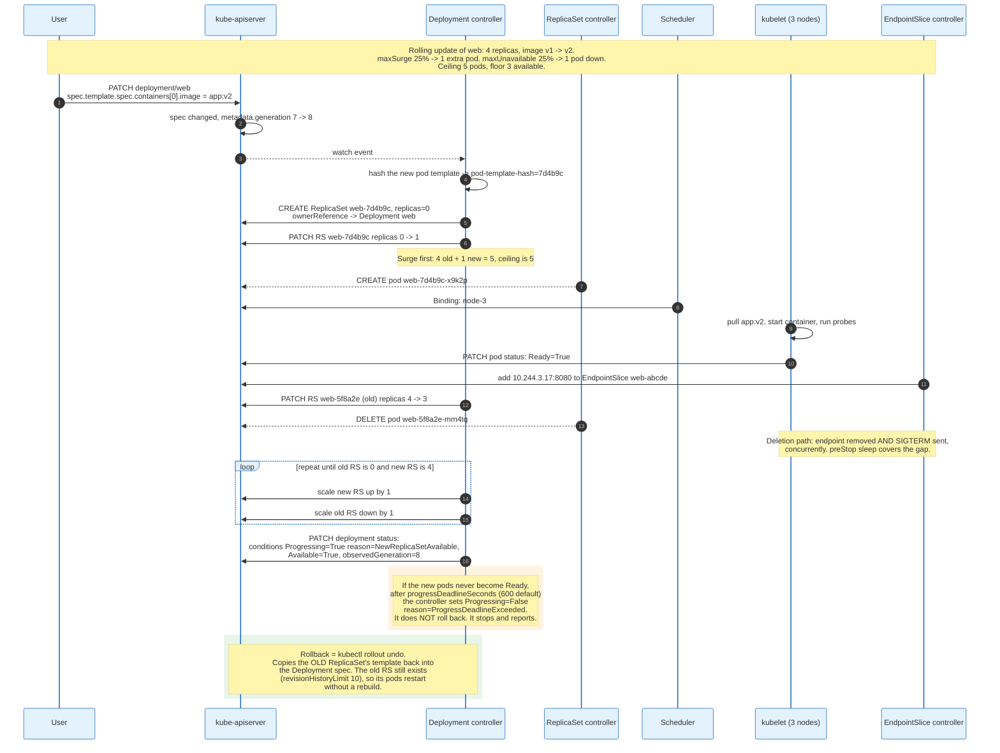

### 10.1 Deployment and ReplicaSet

A ReplicaSet keeps a count. A Deployment keeps a history of ReplicaSets and moves replicas between them.

The ReplicaSet controller reads `spec.replicas`, lists pods matching `spec.selector`, and creates or deletes to close the gap. It adopts orphaned pods that match its selector and have no controller, and it releases pods that stop matching. Deletion is not random: it prefers pods that are unscheduled, then pending, then not-ready, then those on nodes with more replicas of the same set, then the youngest.

The Deployment controller hashes the pod template into a `pod-template-hash` label, adds that label to the selector of the ReplicaSet it creates, and thereby guarantees that two ReplicaSets under one Deployment never fight over the same pods. Changing the template produces a new hash, a new ReplicaSet, and a rollout.

The defaults define the rollout shape:

| Field | Default | Effect |
|-------|---------|--------|
| `strategy.type` | `RollingUpdate` | The alternative is `Recreate`, which kills everything first |
| `maxUnavailable` | 25% | Floor on available pods during the update |
| `maxSurge` | 25% | Ceiling on total pods during the update |
| `minReadySeconds` | 0 | Seconds a new pod must stay ready before counting as available |
| `progressDeadlineSeconds` | 600 | Time without progress before `ProgressDeadlineExceeded` |
| `revisionHistoryLimit` | 10 | Old ReplicaSets retained at replicas=0 for rollback |

Both percentages round: `maxUnavailable` rounds down, `maxSurge` rounds up. With 4 replicas, 25 percent gives `maxUnavailable: 1` and `maxSurge: 1`, so the rollout runs between 3 and 5 pods.

Two behaviours surprise people. `minReadySeconds: 0` means a pod counts as available the instant its readiness probe first passes, so a process that passes readiness and then crashes will still let the rollout proceed and take down the whole fleet. And `progressDeadlineSeconds` does not roll back. It sets a condition and stops. Automatic rollback is a property of the CD tool, not of Kubernetes.

### 10.2 StatefulSet

A StatefulSet gives each pod a stable ordinal, a stable hostname, and its own persistent volume, and it does so by giving up the interchangeability that makes Deployments simple.

Pods are named `<statefulset>-<ordinal>`, from 0 to N-1, or from `.spec.ordinals.start` to `start + replicas - 1` since that field went stable in v1.31. Each pod carries the label `apps.kubernetes.io/pod-index`. With a headless governing Service named in `.spec.serviceName`, each pod gets a DNS A record at `<pod>.<service>.<namespace>.svc.cluster.local` that survives rescheduling.

`.spec.volumeClaimTemplates` creates one PersistentVolumeClaim per pod, named `<template>-<statefulset>-<ordinal>`. That claim outlives the pod deliberately: `web-0` rescheduled onto another node reattaches the same volume. `.spec.persistentVolumeClaimRetentionPolicy` controls what happens afterwards, with `whenDeleted` and `whenScaled` each set to `Retain` or `Delete`.

`.spec.podManagementPolicy` chooses between `OrderedReady`, the default, which creates pods one at a time in ordinal order and waits for each to be Running and Ready, and `Parallel`, which starts them all at once. Ordered creation is what a primary-replica database needs. It is also what makes a StatefulSet rollout stall permanently when `web-1` never becomes ready, because `web-2` will not be touched and neither will the update.

Updates run in reverse ordinal order, highest first. `.spec.updateStrategy.rollingUpdate.partition` holds pods below the partition number at the old revision, which is the native mechanism for a canary: set `partition: 2` on a 3-replica set and only `web-2` updates.

### 10.3 DaemonSet

A DaemonSet runs one pod per matching node and reacts to nodes rather than to a replica count.

The controller lists nodes, applies `spec.template.spec.nodeSelector` and affinity, and for each matching node without a pod, creates one with a `nodeAffinity` requirement pinning it to that node's `metadata.name`. Since Kubernetes 1.12 the default scheduler does the binding, which means DaemonSet pods can be Pending like any other.

The controller adds tolerations automatically so that infrastructure keeps running on unhealthy nodes: `node.kubernetes.io/not-ready` and `node.kubernetes.io/unreachable` with `NoExecute` and no `tolerationSeconds`, plus `NoSchedule` tolerations for `disk-pressure`, `memory-pressure`, `pid-pressure`, `unschedulable`, and for network-attached DaemonSets `network-unavailable`.

The default update strategy is `RollingUpdate` with `maxUnavailable: 1` and `maxSurge: 0`, which means a DaemonSet update on a 500-node cluster proceeds one node at a time. Raising `maxUnavailable` is usually the first thing an operator does and is usually correct.

CNI plugins, CSI node plugins, log shippers, and node exporters all ship as DaemonSets. That is what the resource is for.

### 10.4 Job and CronJob

A Job runs pods to completion and counts successes.

`spec.completions` sets how many successes are required, `spec.parallelism` how many pods may run at once, and `spec.backoffLimit`, default 6, how many failures are tolerated before the Job is marked failed. `spec.activeDeadlineSeconds` bounds wall-clock time. `spec.completionMode: Indexed` gives each pod an index in the annotation `batch.kubernetes.io/job-completion-index` and in the `JOB_COMPLETION_INDEX` environment variable, which is what makes a Job usable for sharded batch work.

`spec.ttlSecondsAfterFinished` deletes the Job and its pods some time after completion, which is the fix for the clusters that accumulate tens of thousands of `Completed` pods.

`spec.podFailurePolicy` distinguishes failure kinds. A rule can `Ignore` a pod killed by preemption without counting it against `backoffLimit`, or `FailJob` immediately on a specific exit code rather than retrying six times.

A CronJob creates Jobs on a schedule using standard cron syntax plus `spec.timeZone`. `spec.concurrencyPolicy` is `Allow`, `Forbid`, or `Replace`. `spec.startingDeadlineSeconds` bounds how late a missed run may start, and if more than 100 schedules are missed without it, the controller stops trying and logs an error, which is the standard symptom of a controller manager that was down for a while.

### 10.5 Choosing Between Them

| Controller | Identity | Ordering | Storage | Use when |
|------------|----------|----------|---------|----------|
| **Deployment** | Interchangeable, random name suffix | None | Shared or none | Stateless services, the default |
| **ReplicaSet** | Interchangeable, random name suffix | None | Shared or none | Almost never written directly; a Deployment's implementation detail |
| **StatefulSet** | Stable ordinal, stable DNS | Ordered create, reverse-ordered update | One PVC per pod | Databases, queues, quorum systems |
| **DaemonSet** | One per node | One node at a time by default | Usually hostPath | Agents, CNI, CSI, logging, metrics |
| **Job** | Indexed or anonymous | Parallel | Usually none | Batch work with an end |
| **CronJob** | Creates Jobs | Per schedule | Inherited from Job | Periodic batch work |

The common mistake is using a StatefulSet for something that is merely important. StatefulSets are slower to roll out, harder to scale down, and prone to permanent stalls. Use one when a pod's identity or its volume must be stable, and not otherwise.

---

## 11. Services and the kube-proxy Data Plane

A Service is a stable virtual IP with a name, backed by a set of pod IPs that changes constantly. It is not a proxy, not a process, and not a load balancer. It is a row in etcd that causes packet-mangling rules to appear in every node's kernel.

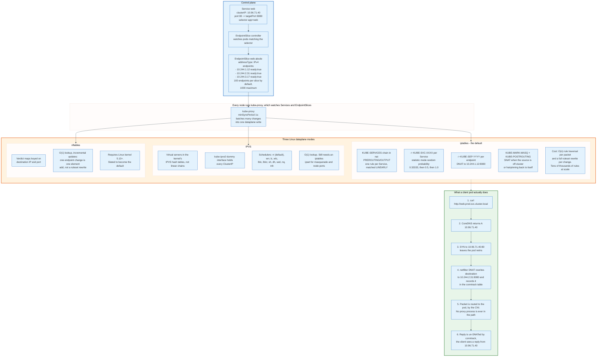

### 11.1 The Service Types

| Type | What it allocates | Reachable from |
|------|-------------------|----------------|
| **ClusterIP** | A virtual IP from `--service-cluster-ip-range` | Inside the cluster only |
| **NodePort** | ClusterIP plus a port on every node, from 30000-32767 | Any node IP, from outside |
| **LoadBalancer** | ClusterIP, NodePort, plus a cloud load balancer | The internet, via the cloud |
| **ExternalName** | Nothing. A CNAME in cluster DNS | Anywhere, and no proxying happens |
| **Headless** (`clusterIP: None`) | Nothing. DNS returns pod IPs directly | Clients that do their own balancing |

Headless services are the mechanism behind StatefulSet DNS and behind every client library that wants to see individual backends, such as a gRPC client doing its own round-robin across subchannels.

`sessionAffinity: ClientIP` pins a client IP to one backend, with `sessionAffinityConfig.clientIP.timeoutSeconds` defaulting to 10800, three hours. It works on source IP, which means every client behind one NAT gateway pins to one pod.

`externalTrafficPolicy: Local` stops the second hop for external traffic: a node that receives it forwards only to pods on itself, and drops the traffic if it has none. That preserves the client source IP, which `Cluster` destroys through SNAT, at the cost of uneven balancing when pods are unevenly spread. `internalTrafficPolicy: Local` does the same for in-cluster traffic.

`spec.trafficDistribution` is the modern topology control. `PreferSameZone` prefers endpoints in the client's zone, `PreferSameNode` prefers endpoints on the client's node, and `PreferClose` is a deprecated alias for `PreferSameZone`. The point is cross-zone egress charges, which in a three-zone cluster with random balancing are paid on roughly two-thirds of all internal traffic.

### 11.2 EndpointSlice

EndpointSlice replaced the Endpoints object because Endpoints did not scale, and the arithmetic is simple enough to state exactly.

The old `Endpoints` object held every backend of a Service in one object. A Service with 5,000 pods produced one object of roughly 1 MB. Changing one pod rewrote that object and shipped the full megabyte to every node's kube-proxy. On a 5,000 node cluster, one pod restart cost 5 GB of control plane traffic.

An EndpointSlice holds at most 100 endpoints by default, tunable with `--max-endpoints-per-slice` up to a maximum of 1000. A 5,000 pod Service becomes 50 slices, and one pod change rewrites one slice.

Each endpoint carries `addresses`, `conditions`, `hostname`, `nodeName`, `zone`, and optional `hints`. The three conditions matter: `serving` means the pod passes readiness, `terminating` means it has a deletion timestamp, and `ready` is the shorthand for serving and not terminating. Separating `serving` from `ready` is what lets a proxy keep sending to a terminating pod that is still accepting connections, which is how connection draining works.

The controller optimises for fewer updates rather than for perfect packing, so slices are often not full. Consumers must read all slices for a Service and deduplicate, because an endpoint can briefly appear in two.

### 11.3 iptables Mode, and Why It Hurts at Scale

In iptables mode, kube-proxy writes the whole Service data plane as netfilter rules and reloads them with `iptables-restore`.

The chain structure is fixed. `KUBE-SERVICES` in the `nat` table's `PREROUTING` and `OUTPUT` hooks holds one match per Service IP and port, traversed linearly. A match jumps to a per-Service chain `KUBE-SVC-<hash>`, which selects a backend using `-m statistic --mode random --probability`, with the probabilities computed so that three backends get 0.33333, then 0.5, then the fallthrough. Each branch jumps to a per-endpoint chain `KUBE-SEP-<hash>` that performs the DNAT. `KUBE-MARK-MASQ` and `KUBE-POSTROUTING` add SNAT where the reply would otherwise not come back.

Two costs follow. Per packet, matching is linear in the number of Services, so latency grows with cluster size. Per change, the ruleset is rebuilt and reloaded, so a rolling update of a large Deployment produces repeated full reloads. Clusters with tens of thousands of Services and endpoints have tens of thousands of rules and measurable `sync_proxy_rules_duration_seconds`.

`minSyncPeriod`, default 1 second, is the throttle. It batches changes: 100 pod deletions inside one second become one reload rather than 100. Raising it trades staleness for CPU, and the metric to watch is exactly `sync_proxy_rules_duration_seconds`.

### 11.4 IPVS and nftables

IPVS moves the lookup into the kernel's IP Virtual Server tables, which are hash-based rather than linear, so per-packet cost stops growing with Service count. kube-proxy creates a dummy interface, `kube-ipvs0`, and binds every ClusterIP to it. It still needs a small number of iptables rules plus ipsets for masquerade decisions and node ports. It offers real scheduling algorithms: round robin, weighted round robin, least connection, weighted least connection, locality-based least connection with and without replication, source and destination hashing, shortest expected delay, never queue, and Maglev hashing.

The nftables mode is the direction the project has chosen. It uses nftables verdict maps keyed on destination address and port, giving O(1) lookup like IPVS, and it supports incremental updates, so a single endpoint change is one map element rather than a ruleset rewrite. It requires Linux kernel 5.13 or later, and the project has stated that a future release will make it the default. Clusters should therefore pin `mode` explicitly in kube-proxy configuration rather than inherit whatever the next upgrade decides.

A fourth option is to run no kube-proxy at all. Cilium implements Service load balancing in eBPF programs attached at the socket and driver layers, replacing kube-proxy entirely and removing conntrack from the ClusterIP path.

### 11.5 Cluster DNS

CoreDNS resolves Service names, and its default configuration causes a performance problem that almost every cluster has and almost nobody measures.

`web.prod.svc.cluster.local` resolves to the ClusterIP. A headless Service returns one A record per ready pod. A StatefulSet pod gets `web-0.web.prod.svc.cluster.local`. SRV records expose named ports.

The problem is `ndots`. The kubelet writes a `/etc/resolv.conf` into every pod with `search prod.svc.cluster.local svc.cluster.local cluster.local` and `options ndots:5`. Any name with fewer than five dots is tried against every search domain first. Looking up `api.stripe.com`, which has two dots, produces queries for `api.stripe.com.prod.svc.cluster.local`, then `.svc.cluster.local`, then `.cluster.local`, and only then the real name, and each of those is asked for both A and AAAA. One external lookup becomes eight queries.

The fixes are a trailing dot to make the name fully qualified, a per-pod `dnsConfig` lowering `ndots`, or NodeLocal DNSCache, a DaemonSet that puts a caching resolver on every node and removes both the query amplification and a long-standing conntrack race that produced intermittent five-second DNS timeouts.

---

## 12. Ingress and the Gateway API

Ingress is frozen and its dominant implementation is retired. The Gateway API replaces it, and the reason is a governance failure rather than a technical one.

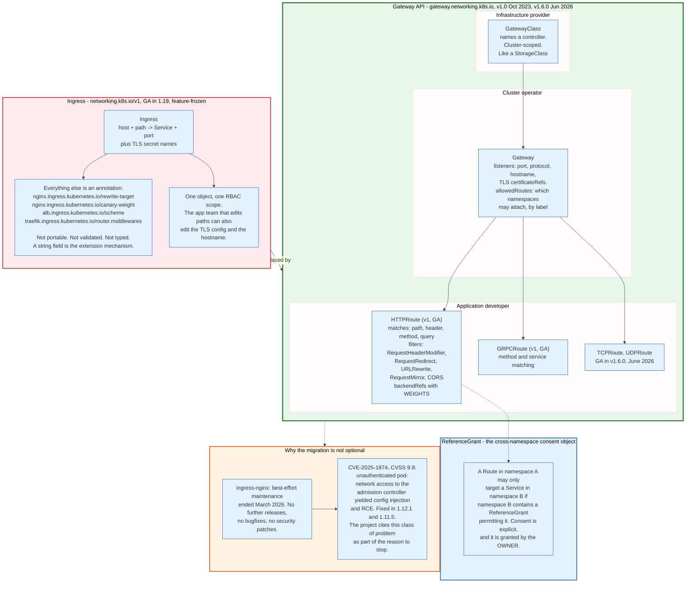

### 12.1 What Ingress Got Wrong

Ingress reached GA in Kubernetes 1.19 with a schema that expressed host and path routing to a Service, plus TLS certificate references, and nothing else.

Everything real-world traffic management needs, rewrite rules, timeouts, retries, canary weights, header manipulation, rate limits, mutual TLS, was pushed into annotations. Annotations are untyped strings the API server does not validate, and each controller invented its own. An Ingress written for ingress-nginx does not work on AWS Load Balancer Controller, Traefik, or HAProxy. The resource was portable in name only.

The second problem is the RBAC granularity. One Ingress object holds the hostname, the TLS configuration, and the path rules, so any team allowed to add a path is also allowed to change the certificate and claim someone else's hostname. In a shared cluster that is not an access control model.

The project stopped adding features to Ingress and started over.

### 12.2 The Gateway API's Role Split

The Gateway API's central design choice is that different objects belong to different people, and the objects reference each other with explicit consent.

**GatewayClass** is cluster-scoped and names a controller, exactly as a StorageClass names a provisioner. The infrastructure provider owns it.

**Gateway** declares listeners: a port, a protocol, an optional hostname, and TLS `certificateRefs`. It also declares `allowedRoutes`, which restricts by namespace selector and by route kind which routes may attach. The cluster operator owns it.

**HTTPRoute** declares matches and backends. Matches cover path prefix, exact, and regular expression, plus headers, query parameters, and method. Filters cover `RequestHeaderModifier`, `ResponseHeaderModifier`, `RequestRedirect`, `URLRewrite`, `RequestMirror`, and since v1.6.0 a standard-channel CORS filter. Backends carry integer `weight` fields, which makes canary and blue-green a first-class, portable, typed field rather than a vendor annotation. The application developer owns it.

**ReferenceGrant** handles cross-namespace references. A route in one namespace may target a Service in another only if that other namespace contains a ReferenceGrant permitting it. The consent is granted by the resource's owner, which closes the hole where anyone could route traffic at anyone's backend.

The API ships in two channels. Standard holds GA resources and fields. Experimental holds work in progress, in a separate CRD bundle so that a cluster can adopt one without the other.

### 12.3 Status Today

Version 1.0, released 31 October 2023, made GatewayClass, Gateway, and HTTPRoute v1. GRPCRoute followed. Version 1.6.0, released 29 June 2026, graduated TCPRoute and UDPRoute to GA and promoted the CORS filter to the standard channel. Version 1.6.1 followed on 16 July 2026 with conformance fixes.

The Gateway API is distributed as CRDs, not as part of Kubernetes itself, which decouples its release cadence from the cluster's. Conformance tests are part of the project, and implementations publish their conformance reports, which is a stronger portability guarantee than Ingress ever had.

An extension worth noting is the Gateway API Inference Extension, which adds an `InferencePool` backend type for routing to model-serving pods on criteria such as KV-cache occupancy rather than round robin. Inference workloads have request costs that vary by two orders of magnitude, and round-robin balancing across them performs badly.

### 12.4 The ingress-nginx Retirement

The most widely deployed Ingress controller is now unmaintained, which converts the Gateway API migration from a preference into a schedule.

The project's own README states that best-effort maintenance continued until March 2026 and that afterwards there are no further releases, no bugfixes, and no updates to resolve security vulnerabilities. It directs users to adopt a Gateway API implementation instead.

The security history is part of the reason. CVE-2025-1974, disclosed in March 2025 with a CVSS score of 9.8, allowed an unauthenticated attacker with pod network access to reach the ingress-nginx validating admission controller and inject NGINX configuration, achieving remote code execution in a pod that by default holds cluster-wide read access to Secrets. Fixed versions were 1.12.1 and 1.11.5. The structural problem is that ingress-nginx translates untrusted annotation strings into NGINX configuration, and that template surface is large.

Running an unmaintained ingress controller on the cluster edge is a decision with a known expiry date.

---

## 13. CNI and the Pod Network

Kubernetes has no networking implementation. It has a network model, a plugin interface, and a hard requirement that somebody else satisfy it.

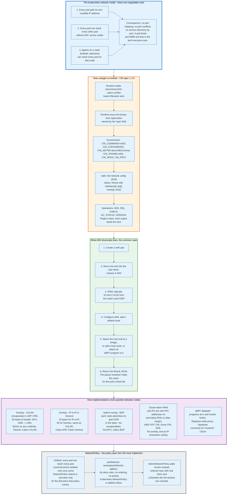

### 13.1 The Model

Three rules define the contract, and they are stated as requirements a network implementation must satisfy, not as features Kubernetes provides.

Every pod gets its own IP address. Every pod can communicate with every other pod on any node without network address translation. Agents on a node can communicate with all pods on that node.

The consequence is what makes Kubernetes networking pleasant and expensive. There is no port mapping, so two pods on one node can both bind port 8080 and neither conflicts. An application does not need to discover which port it was given. It also means the cluster needs one routable address per pod, and on a 5,000 node cluster with 110 pods each that is 550,000 addresses, which is why cloud CNIs that assign real VPC addresses run into address exhaustion before they run into anything else.

### 13.2 The CNI Contract

CNI, currently at specification version 1.1.0, is deliberately minimal: executables, JSON on stdin, environment variables, JSON on stdout.

Configuration lives in `/etc/cni/net.d/` as a `.conflist` file, and the runtime uses the lexicographically first one. Binaries live in `/opt/cni/bin/`. The runtime sets `CNI_COMMAND` to one of `ADD`, `DEL`, `CHECK`, `GC`, `STATUS`, or `VERSION`, plus `CNI_CONTAINERID`, `CNI_NETNS` pointing at the sandbox's network namespace path, `CNI_IFNAME` which is `eth0` by convention, `CNI_ARGS`, and `CNI_PATH`.

The configuration is a list, and plugins chain. A typical list runs a main plugin that creates the interface, then `portmap` for host ports, then `bandwidth` for traffic shaping, then `tuning` for sysctls, each receiving the previous plugin's result.

The result JSON carries `interfaces` with name, MAC, MTU, and sandbox path, `ips` with address, gateway, and interface index, `routes` with destination and gateway, and `dns`.

Two operations added in 1.1.0 address a real operational problem: `GC` lets the runtime tell a plugin the full set of valid attachments so the plugin can clean up leaks, and `STATUS` lets a plugin report that it is not ready to accept `ADD` calls, which prevents pods being created into a half-initialised network.

### 13.3 What Happens on ADD

The mechanics are the same across most plugins and worth knowing because they are what `ip` commands on a node reveal.

The runtime creates the pod sandbox first: a `pause` container whose only job is to hold the network namespace open. It runs a tiny binary that blocks on `pause(2)` and reaps orphans. Every other container in the pod joins that namespace, which is why they share `localhost`.

The CNI plugin then creates a veth pair, a two-ended virtual cable. One end moves into the pod's network namespace and is renamed `eth0`. IPAM assigns an address from the node's pod CIDR, typically a `/24` giving 254 usable addresses per node, which is where the 110 pods per node limit gets its headroom. The plugin configures the address and a default route inside the pod, and attaches the host end to a bridge, or leaves it as a point-to-point link with a host route, or attaches an eBPF program to it.

The `pause` container is why restarting an application container does not change the pod's IP. The namespace outlives the container.

### 13.4 The Implementation Choices

**Overlay with VXLAN** encapsulates pod traffic in UDP on port 4789. It works over any underlay because the physical network only ever sees node-to-node UDP. It costs 50 bytes of header, so the pod MTU drops from 1500 to 1450, and mismatched MTU between the CNI and the underlay is the cause of the classic failure where small requests succeed and large responses hang.

**Native routing with BGP**, as Calico does without an overlay, has each node advertise its pod CIDR to the physical fabric. No encapsulation, full MTU, and packets are debuggable with ordinary tools. It requires a fabric that will peer with the nodes.

**Cloud IPAM** assigns pod IPs from the VPC directly, using secondary addresses on additional elastic network interfaces in AWS or alias IP ranges in GCP. Pods are first-class network citizens reachable from outside the cluster, security groups apply, and no encapsulation is needed. The cost is address exhaustion and a per-instance-type limit on how many addresses a node can hold, which becomes a scheduling constraint that the scheduler does not model.

**eBPF datapaths**, principally Cilium, attach programs at the traffic-control and socket layers. Cilium can replace kube-proxy entirely, resolve ClusterIPs at `connect(2)` time so the packet is addressed to the backend from the start, and enforce policy on cryptographic workload identity rather than IP address. Cilium graduated in the CNCF in 2023.

### 13.5 NetworkPolicy

The default is that every pod can reach every pod, in every namespace, in the whole cluster. NetworkPolicy is opt-in and additive.

A pod becomes isolated only when some NetworkPolicy selects it, and only for the directions that policy names. A policy with `policyTypes: [Ingress]` and an empty `ingress` list denies all inbound traffic to the selected pods and does nothing to outbound. Rules select peers by `podSelector`, `namespaceSelector`, or `ipBlock` with CIDR and exceptions.

There are no deny rules, no ordering, and no priorities. The union of all matching policies is what is allowed. This makes NetworkPolicy safe to compose and unable to express "everyone except this one namespace".

AdminNetworkPolicy and BaselineAdminNetworkPolicy, from SIG Network, add the missing half: cluster-scoped, ordered, with real `Deny` and `Pass` actions, and a baseline tier that namespace-level policy can override. That is what a platform team needs to write a cluster-wide default-deny that tenants cannot remove.

The enforcement is entirely the CNI's job. Installing NetworkPolicy objects on a cluster whose CNI does not implement them produces no error and no enforcement, which is a quiet and dangerous failure mode.

---

## 14. CSI and Storage

Storage in Kubernetes separates the request from the resource and the resource from the driver, and CSI is what lets a vendor ship a driver without shipping a patch to Kubernetes.

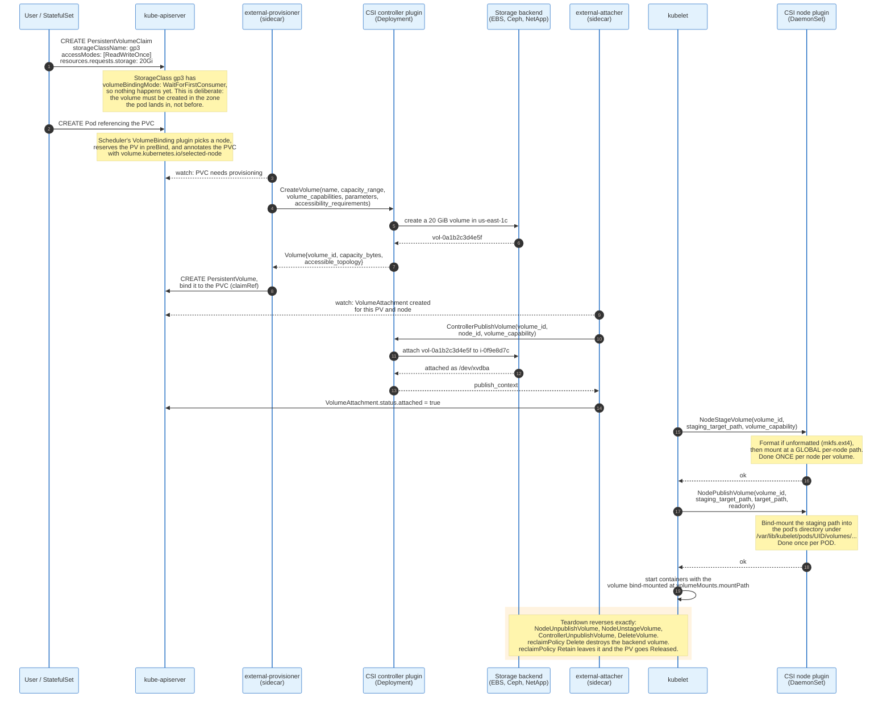

### 14.1 The Three Objects

**PersistentVolumeClaim** is the request. It names a StorageClass, an access mode, and a size, and belongs to a namespace. Application authors write PVCs.

**PersistentVolume** is the resource. It is cluster-scoped, describes an actual piece of storage, and carries the driver name, volume handle, capacity, access modes, node affinity, and reclaim policy. Almost nobody writes PVs by hand any more.

**StorageClass** is the recipe. It names a `provisioner`, carries driver-specific `parameters` such as `type: gp3` and `iops: 3000`, sets `reclaimPolicy` to `Delete` or `Retain`, sets `allowVolumeExpansion`, and sets `volumeBindingMode`.

`volumeBindingMode` is the field with the largest operational consequence. `Immediate` provisions the volume as soon as the claim exists, before any pod is scheduled, which in a multi-zone cluster creates the volume in an arbitrary zone and then constrains the pod to that zone forever, sometimes to a zone with no capacity. `WaitForFirstConsumer` defers provisioning until the scheduler has picked a node, so the volume is created where the pod is. In any zonal cluster, `WaitForFirstConsumer` is correct and `Immediate` is a latent incident.

### 14.2 The CSI Interface

CSI defines three gRPC services, and a driver implements the ones its storage supports.

**Identity**: `GetPluginInfo`, `GetPluginCapabilities`, `Probe`. Every driver implements all three.

**Controller**, running once per cluster as a Deployment: `CreateVolume`, `DeleteVolume`, `ControllerPublishVolume`, `ControllerUnpublishVolume`, `ValidateVolumeCapabilities`, `ListVolumes`, `GetCapacity`, `ControllerGetCapabilities`, `CreateSnapshot`, `DeleteSnapshot`, `ListSnapshots`, `ControllerExpandVolume`, `ControllerGetVolume`, and `ControllerModifyVolume`.

**Node**, running on every node as a DaemonSet: `NodeStageVolume`, `NodeUnstageVolume`, `NodePublishVolume`, `NodeUnpublishVolume`, `NodeGetVolumeStats`, `NodeExpandVolume`, `NodeGetCapabilities`, and `NodeGetInfo`.

Capabilities are advertised, not assumed. `ControllerServiceCapability` values include `CREATE_DELETE_VOLUME`, `PUBLISH_UNPUBLISH_VOLUME`, `EXPAND_VOLUME`, `CLONE_VOLUME`, `CREATE_DELETE_SNAPSHOT`, `SINGLE_NODE_MULTI_WRITER`, and `MODIFY_VOLUME`. `NodeServiceCapability` values include `STAGE_UNSTAGE_VOLUME`, `GET_VOLUME_STATS`, and `EXPAND_VOLUME`. A driver for network storage that needs no attach step simply does not advertise `PUBLISH_UNPUBLISH_VOLUME`, and Kubernetes skips it.

The stage-then-publish split exists for a specific reason: a volume mounted by two pods on one node should be formatted and mounted once, at a global staging path, and then bind-mounted into each pod. `NodeStageVolume` runs once per node, `NodePublishVolume` once per pod.

### 14.3 The Sidecars

Kubernetes does not speak CSI directly. A set of community-maintained sidecar containers translate between Kubernetes objects and CSI calls, and every driver ships them alongside its own code.

`external-provisioner` watches PVCs and calls `CreateVolume` and `DeleteVolume`. `external-attacher` watches VolumeAttachment objects and calls `ControllerPublishVolume`. `external-resizer` watches PVC size changes and calls `ControllerExpandVolume`. `external-snapshotter` handles VolumeSnapshot objects. `node-driver-registrar` registers the node plugin's socket with the kubelet. `livenessprobe` exposes the driver's `Probe` as an HTTP endpoint.

The kubelet itself makes only the node-side calls, over a Unix socket under `/var/lib/kubelet/plugins/`.

### 14.4 Access Modes, and the One That Actually Enforces

Access modes are declarations about topology, not locks, with one exception.

`ReadWriteOnce` means the volume can be mounted read-write by a single **node**, which permits many pods on that node to write to it concurrently. This is the mode everyone assumes means "one writer" and it does not. `ReadOnlyMany` allows many nodes to mount read-only. `ReadWriteMany` allows many nodes read-write, and is only supported by shared filesystems such as NFS, CephFS, and EFS. `ReadWriteOncePod`, GA in Kubernetes v1.29, is the one that means exactly one pod, and it is enforced by the kubelet and the scheduler.

For a database that must not have two writers, `ReadWriteOncePod` is the correct mode and `ReadWriteOnce` is not.

### 14.5 In-Tree Migration and What It Means

Kubernetes originally implemented volume drivers inside the kubelet binary: AWS EBS, GCE PD, Azure Disk, vSphere, Cinder, and a dozen more. That coupled every storage vendor's release to Kubernetes' release and put vendor code in the kubelet's address space.

The CSIMigration effort translated in-tree volume specifications into CSI calls transparently and then removed the in-tree code. A `PersistentVolume` written with `spec.awsElasticBlockStore` is redirected to the `ebs.csi.aws.com` driver. Clusters that upgraded past the removal without installing the CSI driver found their volumes unmountable, which is the most common storage-related upgrade failure.

`emptyDir` and `hostPath` remain in-tree and are not CSI. `emptyDir` is a directory on the node created with the pod and deleted with it, optionally backed by tmpfs with `medium: Memory`, in which case it counts against the pod's memory limit and can get the pod OOM killed. `hostPath` mounts an arbitrary node path into a pod and is a privilege escalation primitive: mounting `/var/lib/kubelet` or the container runtime socket gives a pod control of the node.

---

## 15. Requests, Limits, QoS, and Eviction

Requests and limits are two different numbers used by two different components for two different purposes, and treating them as one number is the most expensive mistake in Kubernetes operations.

Requests are a scheduling claim. The scheduler adds them up and refuses to place a pod on a node where the sum exceeds allocatable. The kubelet translates them into cgroup shares. Nothing enforces them at runtime.

Limits are a runtime ceiling. The kubelet writes them into `cpu.max` and `memory.max`. The scheduler ignores them entirely.

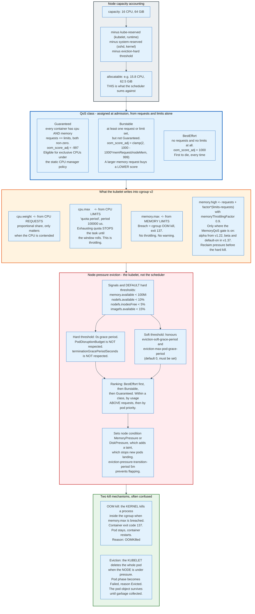

### 15.1 Allocatable

A node's capacity is not what pods can use. `status.allocatable` subtracts `kube-reserved` for the kubelet and container runtime, `system-reserved` for the operating system, and the hard eviction threshold, and that remainder is what the scheduler sums requests against.

A 16 CPU, 64 GiB node commonly reports something closer to 15.8 CPU and 62.5 GiB allocatable. Managed services reserve more: the reservation is typically tiered by node size, taking a larger percentage of the first few gigabytes than of the rest, so small nodes lose a bigger fraction of their memory to overhead than large ones. This is a real argument for fewer, larger nodes.

### 15.2 CPU: Requests Share, Limits Throttle

CPU is compressible, and Kubernetes exploits that in a way that surprises people.

A request of `500m` becomes a `cpu.weight` value proportional to it. When the node's CPUs are not saturated, that number does nothing at all: a container requesting 100 millicores can consume 8 full cores if they are idle. When the CPUs are saturated, the kernel divides time in proportion to weight. Requests are therefore a guaranteed floor under contention and no ceiling at all.

A limit of `500m` becomes `cpu.max` of `50000 100000`: 50 milliseconds of CPU per 100 millisecond period. When the quota is exhausted at millisecond 50, every thread in the cgroup is stopped until millisecond 100. It is not slowed down. It is stopped.

This produces the pathology that dominates Kubernetes latency complaints. An application with a 1 CPU limit and 8 runnable threads consumes its 100 millisecond quota in 12.5 milliseconds of wall time and is then frozen for 87.5 milliseconds. Average CPU usage reads as 100 millicores. Tail latency is catastrophic. The metric that reveals it is `container_cpu_cfs_throttled_periods_total` as a fraction of `container_cpu_cfs_periods_total`.

The widely used remedy is to set CPU requests accurately and omit CPU limits, accepting that a runaway process can consume a node's spare cycles in exchange for removing artificial latency. The counter-argument is noisy-neighbour isolation. Both positions are defensible; setting a low CPU limit and then wondering about p99 latency is not.

### 15.3 Memory: Requests Schedule, Limits Kill

Memory is incompressible, so there is no equivalent of throttling. `memory.max` is a hard wall, and touching it invokes the cgroup OOM killer.

The container is killed with SIGKILL and reports exit code 137, which is 128 plus signal 9. The kubelet restarts it per `restartPolicy` and records `reason: OOMKilled` and `lastState.terminated.exitCode: 137`. The pod is not rescheduled, because nothing about the node was wrong.

The recurring practical problem is runtimes that size their heaps from the machine rather than the cgroup. A JVM without `-XX:MaxRAMPercentage` and without container awareness sizes its heap against the node's total memory, so a 512 MiB limit on a 64 GiB node produces a JVM that plans to use 16 GiB and is killed shortly after start. Modern JVMs read cgroup limits. Older ones, and many other runtimes, do not.

Memory QoS, using cgroup v2's `memory.high`, softens the cliff wherever the `MemoryQoS` feature gate is on. That gate was alpha and off by default from v1.22 through v1.36 and became beta and on by default in v1.37, so on any older cluster the cliff stays sharp. With `memoryThrottlingFactor` at 0.9, a container requesting 256 MiB with a 1 GiB limit gets `memory.high` at roughly 947 MiB, so the kernel begins reclaiming and throttling allocation before the hard kill. The `TieredReservation` memory reservation policy additionally sets `memory.min` to requests for Guaranteed pods and `memory.low` for Burstable ones, so the kernel protects requested memory from reclaim.

### 15.4 The Three QoS Classes

QoS is derived, never set. The API server computes `status.qosClass` from requests and limits at admission.

**Guaranteed** requires every container in the pod to set both CPU and memory requests and limits, with requests equal to limits in each case. The kubelet sets `oom_score_adj` to -997, making these processes nearly the last the kernel will pick. Guaranteed pods with integer CPU requests are the only ones eligible for exclusive CPU pinning under the `static` CPU manager policy.

**Burstable** is anything with at least one request or limit that is not Guaranteed. Its `oom_score_adj` is computed from the memory request as a fraction of node memory, clamped between 2 and 999, so a pod requesting more memory gets a lower score and is less likely to be killed. Requesting memory buys OOM protection, which is a fact rarely stated and directly useful.

**BestEffort** is a pod with no requests and no limits anywhere. `oom_score_adj` is 1000, the maximum, so it is the kernel's first choice under memory pressure and the kubelet's first choice under node pressure. BestEffort is appropriate for genuinely disposable work and nothing else.

Pod-level resources, beta since v1.34, let a pod declare `spec.resources` shared across its containers rather than per container, which finally makes it practical for a sidecar-heavy pod to be Guaranteed without over-provisioning every container individually.

### 15.5 Eviction

The kubelet evicts pods when the node is running out of a resource, and it is a different mechanism from OOM killing with different rules.

Monitored signals are `memory.available`, `nodefs.available`, `nodefs.inodesFree`, `imagefs.available`, `imagefs.inodesFree`, `containerfs.available`, `containerfs.inodesFree`, and `pid.available`. The default hard thresholds are `memory.available<100Mi`, `nodefs.available<10%`, `nodefs.inodesFree<5%`, and `imagefs.available<15%`.

Hard thresholds evict immediately with a zero-second grace period. They do not respect `terminationGracePeriodSeconds` and they do not respect PodDisruptionBudgets. Soft thresholds honour `eviction-soft-grace-period` and cap the pod's own grace period at `eviction-max-pod-grace-period`, which defaults to 0. An unconfigured kubelet gives a soft-evicted pod no grace at all.

Ranking is by QoS class first, BestEffort then Burstable then Guaranteed, and within a class by how far usage exceeds requests, then by pod priority. A Burstable pod using 3 GiB against a 500 MiB request is evicted before a Burstable pod using 900 MiB against an 8 GiB request, even though the second is larger.

Crossing a threshold also sets a node condition, `MemoryPressure` or `DiskPressure` or `PIDPressure`, which the `TaintNodesByCondition` admission plugin turns into a taint, which stops the scheduler placing new pods there. `eviction-pressure-transition-period`, default 5 minutes, prevents the condition from flapping.

Before evicting for disk, the kubelet tries to reclaim: it deletes unused images and dead containers. On a node whose disk filled because of application logs, that reclaim frees nothing and the eviction follows immediately.

---

## 16. RBAC and the Authorisation Chain

Authorisation in Kubernetes is a chain of authorisers consulted in order, where the first ALLOW wins and RBAC contributes no denials. Understanding that RBAC is purely additive explains most of its behaviour, including why there is no way to say "everything except Secrets".

### 16.1 The Chain

The API server runs authorisers in the order given by `--authorization-mode` or, more recently, an `AuthorizationConfiguration` file.

**Node** restricts kubelets specifically. A request from a user in the `system:nodes` group with username `system:node:<nodeName>` is allowed to read only the Secrets, ConfigMaps, PersistentVolumes, and Pods that belong to pods scheduled on that node. This is what stops a compromised node from reading every Secret in the cluster, and it works together with the `NodeRestriction` admission plugin, which stops a kubelet modifying other nodes or setting privileged labels on itself.

**RBAC** is the general mechanism, described below.

**Webhook** delegates to an external service via a `SubjectAccessReview`, which is how cloud IAM integrations attach.

**ABAC** is a static policy file, deprecated in practice.

**AlwaysAllow** and **AlwaysDeny** exist for testing.

If no authoriser allows, the request is denied with `403 Forbidden` and a message naming the user, the verb, and the resource.

### 16.2 The Four Objects and the Verbs

RBAC has exactly four kinds in `rbac.authorization.k8s.io/v1`: `Role`, `ClusterRole`, `RoleBinding`, and `ClusterRoleBinding`.

A `Role` is namespaced and grants permissions within its namespace. A `ClusterRole` is cluster-scoped and can grant permissions on namespaced resources across all namespaces, on cluster-scoped resources such as Nodes and PersistentVolumes, and on non-resource URLs such as `/healthz`.

A `RoleBinding` grants a Role or a ClusterRole to subjects **within one namespace**. Binding a ClusterRole through a RoleBinding is the standard pattern: define the permission set once cluster-wide, apply it per namespace. A `ClusterRoleBinding` grants a ClusterRole everywhere.

Rules are triples of `apiGroups`, `resources`, and `verbs`, with optional `resourceNames` to scope to specific objects and `nonResourceURLs` for endpoints.

The standard verbs map to HTTP methods: `get`, `list`, `watch`, `create`, `update`, `patch`, `delete`, and `deletecollection`. Four special verbs do not:

- **`escalate`** on `roles` or `clusterroles` permits creating a role with permissions the creator does not hold. Without it, the API server refuses, which is the privilege escalation prevention rule.
- **`bind`** on a specific role permits creating a binding to it without holding its permissions.
- **`impersonate`** on `users`, `groups`, or `serviceaccounts` permits acting as another subject.
- **`use`** on `podsecuritypolicies` is a legacy of a removed API.

Subresources are addressed with a slash: `pods/exec`, `pods/log`, `pods/portforward`, `deployments/scale`, `nodes/proxy`. Granting `pods/exec` is granting a shell in every container the rule covers, and it is frequently handed out with `edit`-like roles by accident.

### 16.3 The Default Roles

Four user-facing ClusterRoles ship with every cluster and are auto-reconciled by the API server, so edits to them are reverted unless annotated with `rbac.authorization.k8s.io/autoupdate: "false"`.

`cluster-admin` grants `*` on `*` in all API groups plus all non-resource URLs. It is bound to the `system:masters` group, which is what a client certificate with `O=system:masters` produces, and which bypasses RBAC entirely at the authoriser level.

`admin` grants full access within a namespace including creating Roles and RoleBindings, but not modifying the namespace itself or its ResourceQuota.

`edit` grants read and write to most namespaced objects including Secrets, but not to Roles or RoleBindings.

`view` grants read-only access and deliberately excludes Secrets and Roles.

Aggregated ClusterRoles compose these. A ClusterRole with an `aggregationRule` selecting labels such as `rbac.authorization.k8s.io/aggregate-to-view: "true"` automatically absorbs the rules of every ClusterRole carrying that label, which is how a CRD ships permissions that appear in the built-in `view` role without patching it.

The `edit` role including Secrets is the most consequential default. In most organisations "can deploy" and "can read every credential in the namespace" are meant to be different permissions, and by default they are the same one.

### 16.4 ServiceAccounts and Tokens

Every pod runs as a ServiceAccount, defaulting to `default` in its namespace, and that identity is what its API calls carry.

Tokens are bound and short-lived. The `TokenRequest` API issues a JWT with an audience, an expiry, and a binding to a specific pod and ServiceAccount UID. The kubelet projects it into the pod at `/var/run/secrets/kubernetes.io/serviceaccount/token` and rotates it, refreshing at around 80 percent of its lifetime. If the pod is deleted, the token stops working immediately even if it has not expired.

Kubernetes stopped auto-creating non-expiring Secret-based tokens for ServiceAccounts in v1.24. Long-lived tokens can still be created deliberately, and they should be treated as passwords that never rotate.

`automountServiceAccountToken: false`, set on the ServiceAccount or the pod, removes the token from a pod that does not need to talk to the API server. Most application pods do not, and leaving the token mounted converts any application vulnerability into a foothold with whatever RBAC that ServiceAccount holds.

Two extensions matter in cloud deployments. ServiceAccount token volume projection with a custom audience plus an OIDC discovery endpoint is what lets AWS IAM Roles for Service Accounts and GKE Workload Identity exchange a Kubernetes token for a cloud credential without any static secret on the node.

---

## 17. Operators and Custom Resources

The operator pattern is the point of Kubernetes' extensibility: a CustomResourceDefinition adds a new object type, and a controller written by the same author reconciles it. Together they encode operational knowledge as software.

### 17.1 CustomResourceDefinitions

A CRD registers a new API endpoint with the API server at runtime, with no restart and no recompilation.

The definition names a `group`, a set of `versions`, a `scope` of `Namespaced` or `Cluster`, and `names` including plural, singular, kind, and short names. Each version carries a `schema.openAPIV3Schema`, which since `apiextensions.k8s.io/v1` must be a structural schema: every field typed, no ambiguous unions, and unknown fields pruned on write unless `x-kubernetes-preserve-unknown-fields` is set.

Pruning is the behaviour that catches people. A field not in the schema is silently deleted on write. `kubectl apply` succeeds, `kubectl get` shows the field missing, and no error is produced anywhere.

Subresources change the semantics. `subresources.status: {}` splits `/status` into its own endpoint, so a controller can update status without holding write access to spec, and so a spec update does not clobber status. `subresources.scale` exposes `/scale`, which makes the custom resource a valid target for the HorizontalPodAutoscaler and for `kubectl scale`.

`additionalPrinterColumns` defines what `kubectl get` shows, using JSONPath into the object. A CRD without them shows only name and age, which is why well-built operators surface phase and readiness there.

Validation runs in the API server through CEL. `x-kubernetes-validations` attaches rules such as `self.minReplicas <= self.maxReplicas` with a message, evaluated on every write, with no webhook and therefore no availability dependency.

Multiple versions are served simultaneously, exactly one is the storage version, and moving between them uses either `strategy: None` when the versions are structurally identical or a `Webhook` conversion strategy when they are not. A conversion webhook is on the read path for every request to a non-storage version, so its failure makes objects unreadable rather than merely unwritable.

### 17.2 The Controller Half

A CRD without a controller is a typed configuration file in etcd. The controller is what makes it do something.

The controller runs the same loop as every built-in one: informers on its custom resource plus every resource it manages, a workqueue, and a `Reconcile` function that reads spec, reads the world, and converges. It sets `ownerReferences` on the objects it creates so that deleting the custom resource cleans them up. It writes `status.conditions` following the standard convention of `type`, `status`, `reason`, `message`, `lastTransitionTime`, and `observedGeneration`. It uses finalizers when teardown requires an external action, such as deleting a cloud database, and it removes the finalizer when done.

Two frameworks dominate. Kubebuilder and its runtime library `controller-runtime` generate the scaffolding, CRD manifests, and RBAC from Go type definitions and markers. The Operator SDK wraps `controller-runtime` and adds Helm and Ansible-based operators for cases that do not need Go.

The Operator Capability Model, from the OperatorHub ecosystem, describes five levels: basic install, seamless upgrades, full lifecycle including backup and restore, deep insights meaning metrics and alerts, and autopilot meaning automatic scaling and tuning. Most operators in the wild sit at level one or two, which is worth knowing before adopting one for a database.

### 17.3 When Not to Use a CRD

The API server's guidance is specific, and it is derived from etcd's properties rather than from taste.

Custom resources are the wrong tool for objects larger than a few kilobytes, for more than a few thousand instances, for sustained write rates in the tens of requests per second, and for anything resembling end-user data. Every custom resource is a row in etcd, replicated to a quorum with an fsync, held in the API server's watch cache, and shipped to every watcher. Using a CRD as an event log or a job queue puts application throughput onto the cluster's consensus store.

When the object count is genuinely large or the semantics genuinely non-CRUD, the alternative is an aggregated API server: a separate process registered through an `APIService` object, serving its own group and version with its own storage. `metrics.k8s.io`, which serves the data behind `kubectl top`, works this way and stores nothing at all.

### 17.4 What Operators Are Good For, Concretely

The pattern earns its keep when the operational procedure is complicated, well understood, and executed often.

A PostgreSQL operator watches a `Cluster` resource, creates a StatefulSet, initialises the primary, joins replicas by streaming replication, promotes a replica on primary failure, takes base backups to object storage on a schedule, and performs a minor-version upgrade by replacing replicas before switching over. Each of those is a documented runbook. The operator is the runbook, executing continuously.

The pattern is a poor fit when the procedure is rare or requires judgement. An operator that automates a decision a human makes twice a year is a liability, because it will be exercised for the first time during an incident.

---

## 18. One Deployment, End to End

The following traces a single change through every component, with concrete values, because the interaction between components is where the system's behaviour actually lives.

The scenario: a 47-node cluster, running Kubernetes v1.37. A team pushes a new image tag for a service named `web` in namespace `prod`, running 4 replicas behind a ClusterIP Service on port 80, with a PersistentVolumeClaim it does not use and a readiness probe it does.

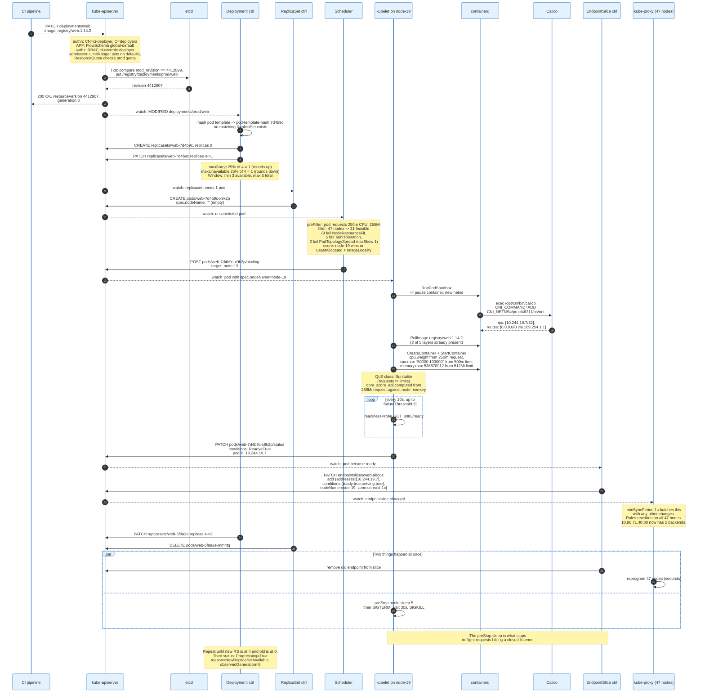

### 18.1 The Numbers That Fall Out

**One API write triggers nine distinct control loops.** The Deployment controller, ReplicaSet controller, scheduler, kubelet, EndpointSlice controller, kube-proxy on 47 nodes, the garbage collector, the ResourceQuota controller, and the pod garbage collector all act on the same change without any of them knowing about the others.

**The rollout window is arithmetic.** Four replicas, `maxSurge: 25%` rounding up to 1, `maxUnavailable: 25%` rounding down to 1. Total pods stay between 3 and 5. If each pod takes 40 seconds from creation to ready, the rollout takes roughly 160 seconds, because pods proceed one at a time.

**The scheduler's rejection message is a histogram.** No such message appears in this trace, because 31 of the 47 nodes survived filtering and node-19 took the pod. Had all 47 failed, the event would read `0/47 nodes are available: 40 Insufficient cpu, 5 node(s) had untolerated taint, 2 node(s) didn't match pod topology spread constraints`. The reasons always sum to the node count, which is what makes the line an accounting of the whole cluster rather than a sample of it. It is the primary diagnostic for an unschedulable pod.

**The endpoint change propagates to 47 nodes.** One pod becoming ready causes one EndpointSlice patch, one watch event per node, and one data plane reprogramming per node, batched by `minSyncPeriod` at 1 second. In iptables mode that is 47 full ruleset reloads.

**The failure surface of the rollout is the readiness probe.** With `minReadySeconds: 0`, a pod that passes readiness once counts as available. If the new image passes readiness and then fails on real traffic, the rollout proceeds to completion and takes down all four replicas. Setting `minReadySeconds` to something like 30 is the cheapest guard against that, and almost nobody sets it.

### 18.2 What a Rollback Actually Does

`kubectl rollout undo deployment/web` reads the previous revision's pod template from the retained ReplicaSet's annotations, writes it back into the Deployment's `spec.template`, and returns.

The Deployment controller then sees a template hash matching an existing ReplicaSet, `web-5f8a2e`, which still exists at `replicas: 0` because `revisionHistoryLimit` is 10. It scales that one up and the current one down using exactly the same surge and unavailability arithmetic.

No image is rebuilt. No new object is created. The old ReplicaSet's pod template still names `registry/web:1.14.1`, so if that tag has been overwritten or deleted from the registry, the rollback fails at image pull. Mutable tags make rollback unreliable, which is the operational argument for deploying by digest.

---

## 19. Economics: What It Costs to Run and Who Pays

The control plane is cheap and the nodes are not. Every published price for managed Kubernetes obscures the fact that the orchestrator is a rounding error against the machines it orchestrates, and that the real cost lever is utilisation.

### 19.1 The Control Plane Price

Amazon EKS charges 0.10 US dollars per cluster per hour for a version in standard support, which is roughly 73 dollars a month at 730 hours. A version that has fallen into extended support costs 0.60 dollars per cluster per hour, or roughly 438 dollars a month, a sixfold increase that exists specifically to price the cost of running an old version.

Google Kubernetes Engine charges the same 0.10 dollars per cluster per hour, billed in one-second increments, and the fee is flat across every mode: zonal, multi-zonal, regional, and Autopilot clusters all accrue it identically. The GKE free tier returns 74.40 dollars in credits per billing account per month, which is exactly one Autopilot or zonal Standard cluster running continuously, and the credits apply to no other SKU. A cluster held on the Extended release channel past the end of standard support adds a further 0.50 dollars per cluster per hour, for a combined 0.60, and buys up to 24 months on one minor version. The control plane SLA is 99.95 percent for Autopilot and regional Standard clusters and 99.5 percent for zonal Standard ones. Figures read from cloud.google.com/kubernetes-engine/pricing on 31 August 2026.

Azure Kubernetes Service splits the same fee across three tiers. Free charges nothing for cluster management, carries no financially backed SLA, and is documented to 1,000 nodes with a recommendation of fewer than 10. Standard bills the `Standard Uptime SLA` meter at 0.10 dollars per cluster per hour, roughly 73 dollars a month, and adds a 99.95 percent API server SLA with availability zones or 99.9 percent without. Premium bills the `Standard Long Term Support` meter at 0.60 dollars per cluster per hour, roughly 438 dollars a month, and extends Microsoft maintenance 24 months past the end of community support. Meter prices read from the Azure retail price API for the eastus region on 31 August 2026.

Three clouds, one number. The control plane costs 0.10 dollars an hour on all of them, and falling behind on versions costs 0.60.

The self-managed alternative is three control plane nodes plus three etcd nodes, or three co-located nodes, which at typical cloud instance prices exceeds the managed fee immediately and adds the operational cost of etcd backups, certificate rotation, and upgrades. Managed control planes win on price and on risk for almost everyone.

### 19.2 Where the Money Actually Goes

Node compute dominates, and the multiplier on it is the gap between what pods request and what they use.

The mechanism is exact. The scheduler packs nodes by summed requests. A pod requesting 1 CPU and using 100 millicores occupies a tenth of the CPU it is charged for. A cluster whose pods request ten times what they use needs ten times the nodes. Nothing in the default Kubernetes installation notices or corrects this, because the scheduler is deliberately blind to actual utilisation.

Four other line items recur.

**Cross-zone data transfer.** A three-zone cluster with random Service load balancing sends roughly two-thirds of internal traffic across zone boundaries, and cloud providers charge for it in both directions. `spec.trafficDistribution: PreferSameZone` is the direct remedy, and topology-aware routing was built for exactly this bill.

**Load balancers.** Every `type: LoadBalancer` Service provisions a cloud load balancer with its own hourly charge. A cluster with 40 such Services pays 40 times. One Gateway or Ingress fronting them all pays once, which is the main non-functional reason to run an ingress layer.

**Persistent volumes.** Provisioned capacity is billed whether used or not, and `reclaimPolicy: Retain` leaves volumes behind when their claims are deleted. Orphaned volumes accumulate silently.

**NAT gateways and egress.** Pods pulling images and calling external APIs generate egress through a metered gateway. Image pulls in particular are large and repeated across every node.

### 19.3 The Optimisation Levers, In Order of Effect

**Right-size requests.** The Vertical Pod Autoscaler in `recommender` mode observes actual usage and publishes suggested requests without changing anything, which turns the exercise into a data problem rather than a guessing game. In-place pod resize, stable since Kubernetes v1.35, means applying a new request no longer requires restarting the pod, which removes the main objection to doing it continuously.

**Scale the workload.** The HorizontalPodAutoscaler changes replica count against CPU, memory, or custom and external metrics, with configurable stabilisation windows and scaling policies to stop it oscillating. It works on `deployments/scale` and on any custom resource exposing the scale subresource.

**Scale the node fleet.** The Cluster Autoscaler adds nodes when pods are Pending for lack of capacity and removes nodes that have been under-utilised for a configured period and whose pods can move. Karpenter takes a different approach: rather than scaling fixed node groups, it looks at pending pods' actual requirements and provisions an instance type that fits, which produces tighter packing and consolidates aggressively.

**Buy cheaper capacity.** Spot and preemptible instances cost a fraction of on-demand and can be reclaimed with roughly two minutes of notice. They suit stateless, replicated, disruption-tolerant workloads, which is most of what runs on Kubernetes, and they require PodDisruptionBudgets and multiple availability zones to be safe.

**Bin-pack deliberately.** Switching the scheduler's `NodeResourcesFit` scoring strategy from `LeastAllocated` to `MostAllocated` concentrates pods so the autoscaler has empty nodes to remove. On a spread-first cluster, the autoscaler rarely finds a node it can drain.

### 19.4 The Vendor Layer

Distributions charge for the parts Kubernetes deliberately leaves out.

Red Hat OpenShift is priced by subscription per core or per socket and bundles a registry, a build system, an authentication integration, a monitoring stack, and a supported ingress. SUSE Rancher and Mirantis sell multi-cluster management. VMware Tanzu sells the same for on-premises. The common pitch is not "Kubernetes but better", it is "the twenty components you would otherwise assemble, supported by one vendor".

The build-versus-buy calculation is a platform team's salary against a subscription. A team of five platform engineers costs more per year than most enterprise Kubernetes subscriptions, which is why the market exists at all.

---

## 20. Failure Modes Operators Actually Hit

The failures below are ordered by how often they appear in practice rather than by severity, and each has a mechanism that is fully explained by earlier sections.

### 20.1 Pod-Level Failures

| Symptom | Mechanism | Where to look |
|---------|-----------|---------------|
| `CrashLoopBackOff` | Container exits non-zero; kubelet backs off 10s, 20s, 40s to a 300s cap | `kubectl logs --previous`, `lastState.terminated.exitCode` |
| `OOMKilled`, exit 137 | Kernel killed a process on `memory.max` breach | Runtime heap sizing against the cgroup, not the node |
| `ImagePullBackOff` | Registry unreachable, tag missing, or credentials wrong | `kubectl describe pod` events, `imagePullSecrets` |
| `CreateContainerConfigError` | A referenced ConfigMap or Secret key does not exist | The `envFrom` and `volumes` references |
| Pending, no events | No `FailedScheduling` event means the scheduler has not looked yet | Scheduler health, leader election |
| Pending with `FailedScheduling` | The message histograms which filter rejected how many nodes | Requests versus allocatable, taints, topology spread |
| Stuck `Terminating` | A finalizer remains and its controller is gone | `metadata.finalizers`, the owning controller's logs |
| Silent p99 latency | CFS quota exhaustion from a low CPU limit | `container_cpu_cfs_throttled_periods_total` |

The most misdiagnosed of these is CPU throttling, because average CPU usage looks healthy and nothing in the pod's status mentions it.

The second most misdiagnosed is a liveness probe with a `timeoutSeconds` of 1 against an HTTP handler that occasionally takes longer under load. Three consecutive slow responses restart a healthy container, the restart adds load to its peers, and the failure spreads across the Deployment. A liveness probe is a self-inflicted outage generator whenever it can fail for reasons other than the process being unrecoverable.

### 20.2 Control Plane Failures

**Slow etcd disk.** Every Raft append requires an fsync on a majority of members. When `etcd_disk_wal_fsync_duration_seconds` p99 rises past roughly 10 milliseconds, heartbeats miss their window, leader elections start, and every API write stalls for the duration. The symptom users report is that the whole cluster froze. The cause is usually network-attached storage under etcd, or a noisy co-tenant on the control plane node.

**etcd out of space.** The default `--quota-backend-bytes` is 2 GiB. Exceeding it raises a `NOSPACE` alarm and the store goes read-only, so nothing can be created or updated anywhere. Recovery is compact, defrag, disarm, in that order. High Event churn during an unrelated incident is the usual accelerant.

**A webhook with `failurePolicy: Fail` whose backend is down.** Every matching create and update in the cluster is rejected. If the webhook's own pods are among the objects it matches, they cannot be recreated, and the cluster cannot heal itself. This is the fastest way to make a cluster unrecoverable without deleting anything. The mitigations are a `namespaceSelector` that excludes `kube-system`, an `objectSelector` that excludes the webhook's own workload, `failurePolicy: Ignore` where the policy is advisory, and replacing validating webhooks with CEL-based `ValidatingAdmissionPolicy` wherever possible, because in-process CEL has no availability dependency at all.

**Conversion webhook failure on a CRD.** Worse than an admission webhook, because it breaks reads. Objects stored in one version and requested in another cannot be returned, so controllers watching that resource fail and the operator that owns them stops working.

**API server overload from one client.** A controller with a broken cache re-listing every pod in a loop consumes the API server's list budget. API Priority and Fairness contains the blast radius by isolating the offender's priority level, and the `apiserver_flowcontrol_rejected_requests_total` metric names the FlowSchema responsible.

**Certificate expiry.** kubeadm-issued cluster certificates last one year and are renewed on upgrade. A cluster that has not been upgraded in a year stops authenticating its own components, all at once.

### 20.3 Networking and Node Failures

**Node `NotReady`.** The kubelet renews a `Lease` object in `kube-node-lease` on a timer. The node lifecycle controller checks every `--node-monitor-period`, default 5 seconds, and marks the node unhealthy after `--node-monitor-grace-period`, default 40 seconds. It then applies a `NoExecute` taint, and pods without an explicit toleration are evicted after their `tolerationSeconds`, which the `DefaultTolerationSeconds` admission plugin sets to 300. So a node that vanishes takes roughly 40 seconds to be noticed and about 5 more minutes before its pods are recreated elsewhere. That five and a half minutes is the actual failover time for a workload whose node dies, and it surprises everyone who assumed Kubernetes reacts instantly.

**Conntrack table exhaustion.** Every DNATed connection consumes a conntrack entry. High connection-rate workloads fill `nf_conntrack_max` and the kernel starts dropping packets, logging `nf_conntrack: table full, dropping packet`. The symptom is intermittent, unexplained connection failures that correlate with load.

**MTU mismatch on an overlay.** VXLAN adds 50 bytes. If the pod MTU is not reduced to match, packets that fit the pod's MTU do not fit the tunnel, and if ICMP fragmentation-needed messages are filtered, path MTU discovery fails silently. The classic presentation is that small requests work, large responses hang, and TLS handshakes fail at the certificate exchange.

**IP exhaustion.** On cloud CNIs that assign real VPC addresses, a node's pod capacity is bounded by the number of secondary addresses its instance type supports. Pods stay Pending with a CNI error rather than a scheduling error, so the scheduler's usual diagnostics say nothing useful.

**PodDisruptionBudget blocking a drain.** `kubectl drain` respects PDBs. A PDB with `minAvailable` equal to the replica count permits zero voluntary disruptions, so the drain blocks forever and the cluster upgrade stalls. A single-replica Deployment with `minAvailable: 1` produces exactly this.

**DNS query amplification.** `ndots:5` turns one external lookup into up to eight queries. At scale this saturates CoreDNS, and the failure looks like random application timeouts rather than a DNS problem.

### 20.4 The Pattern Across All of Them

Almost every entry above is a timeout, a default, or a missing back-pressure mechanism, and almost none of them are bugs.

The system is built out of independent loops with no global coordinator, which is what makes it resilient to partial failure and what makes its failures diffuse. There is no single log to read. Diagnosing a Kubernetes incident means checking the same object from four viewpoints: what the API server holds, what the controller thinks, what the kubelet did, and what the kernel actually enforces.

---

## 21. Security and Risk

Kubernetes' security model is a set of independent controls, and the practical risk in most clusters is that several of them are left at defaults that were chosen for compatibility rather than for safety.

### 21.1 The Threat Model

**Container escape.** A kernel vulnerability, an over-broad capability set, a privileged container, or a `hostPath` mount of a sensitive directory gives a process on the node's kernel. Every container on that node is then reachable, and so is the kubelet's credential.

**Credential theft through the ServiceAccount token.** Any application vulnerability in a pod with a mounted token becomes API access with that ServiceAccount's RBAC. If the ServiceAccount is over-permissioned, and `edit` includes Secrets by default, that is a large step.

**Supply chain.** An image pulled by mutable tag from a public registry is whatever the tag points at today. A compromised base image, a typosquatted dependency, or a build system with write access to the registry all produce code running with the workload's identity.

**Lateral movement over the pod network.** With no NetworkPolicy, every pod can reach every pod and every Service in the cluster, including the API server, the metrics endpoints, and any database running without authentication because "it is only on the internal network".

**Control plane exposure.** An API server reachable from the internet with anonymous authentication enabled, an etcd port open without client certificates, or a kubelet's read-write port left open are all directly exploitable and all have appeared in real incidents.

### 21.2 The Controls

**Pod Security Admission** enforces the Pod Security Standards through namespace labels, in three modes: `enforce` rejects, `audit` records, and `warn` returns a client warning. Each takes a level of `privileged`, `baseline`, or `restricted`.

`baseline` blocks the obvious escapes: `hostNetwork`, `hostPID`, `hostIPC`, `privileged: true`, `hostPath` volumes, host ports, `seccompProfile.type: Unconfined`, unsafe sysctls, and any capability outside a fixed allow-list of `AUDIT_WRITE`, `CHOWN`, `DAC_OVERRIDE`, `FOWNER`, `FSETID`, `KILL`, `MKNOD`, `NET_BIND_SERVICE`, `SETFCAP`, `SETGID`, `SETPCAP`, `SETUID`, and `SYS_CHROOT`.

`restricted` adds the hardening rules: `runAsNonRoot: true`, `allowPrivilegeEscalation: false`, all capabilities dropped with at most `NET_BIND_SERVICE` added back, a seccomp profile of `RuntimeDefault` or `Localhost`, and a restricted volume type list.

The `warn` and `audit` modes exist so a cluster can be measured before it is enforced, which is how a migration to `restricted` actually gets done.

**Seccomp** filters system calls. The `RuntimeDefault` profile blocks the syscalls the container runtime considers dangerous, and the kubelet can be configured to apply it to every pod by default rather than requiring each pod to ask.

**User namespaces**, enabled per pod with `hostUsers: false`, map container UID 0 to an unprivileged host UID, so a container escape lands as nobody rather than as root.

**Sandboxed runtimes** change the boundary rather than hardening it. gVisor intercepts syscalls in a userspace kernel written in Go, so the host kernel sees a much smaller attack surface. Kata Containers runs each pod inside a lightweight virtual machine with its own kernel. Both are selected per pod through a `RuntimeClass`.

**Image controls.** Sigstore and cosign sign images and verify signatures at admission through policy controllers. Admission policies can require digests rather than tags, block `latest`, and restrict registries.

**Encryption at rest.** Without an `EncryptionConfiguration`, Secrets sit in etcd as plaintext protobuf. With one, they are encrypted with AES-GCM or through a KMS provider, and KMS v2 adds key rotation without rewriting every object.

**Audit logging.** The API server's audit policy records requests at four levels: `None`, `Metadata`, `Request`, and `RequestResponse`. This is the only record of who did what, and it is not enabled by default in many self-managed clusters.

### 21.3 Known Incidents Worth Knowing

**CVE-2018-1002105**, the aggregated API proxy escalation, allowed any user with permission to establish a connection through the API server's proxy to send arbitrary authenticated requests to a backend API server, including with cluster-admin equivalent effect. It scored 9.8 and drove the first real wave of Kubernetes patching discipline.

**CVE-2025-1974**, in ingress-nginx, scored 9.8 and allowed an unauthenticated attacker with pod network access to inject NGINX configuration through the validating admission controller and achieve remote code execution in a pod holding cluster-wide Secret read access. Fixed in ingress-nginx 1.12.1 and 1.11.5. It is the clearest illustration of the general principle that admission webhooks are unauthenticated network services inside the cluster's trust boundary.

**Cryptomining through exposed dashboards and unauthenticated Kubelets** has been the most common real-world compromise by volume for years, and it requires no vulnerability at all. It requires a control plane or kubelet port reachable from the internet.

The pattern in the incident record is consistent. The exploited weakness is almost never a novel kernel escape. It is an exposed endpoint, an over-permissioned ServiceAccount, or a component running with cluster-wide read access to Secrets because that was the default in its Helm chart.

---

## 22. Comparisons and Alternatives

Kubernetes is the most complex option in its category and the only one with a general extension model, and that trade defines every comparison.

### 22.1 The Orchestrators

| System | Model | Extensibility | Status as of Aug 2026 | Fits |
|--------|-------|---------------|----------------------|------|
| **Kubernetes** | Declarative API plus reconciliation loops | Full: CRDs, admission, CNI, CSI, CRI, DRA | The default. 3 releases a year | Anything, at the cost of complexity |
| **Docker Swarm** | Imperative service commands | None meaningful | Maintained, not developed | Small deployments already using it |
| **HashiCorp Nomad** | Declarative jobs, single binary | Task drivers, not an API model | Actively developed | Mixed workloads, small teams, non-container tasks |
| **Apache Mesos** | Two-level scheduling, frameworks | Frameworks | Attic project | Historical interest |
| **AWS ECS** | Declarative task definitions | AWS-native only | Actively developed | AWS-only shops wanting no control plane |
| **Cloud Run, Container Apps** | Request-driven, scale to zero | None | Actively developed | Stateless HTTP services |
| **systemd plus Ansible** | Imperative configuration | Whatever you write | Eternal | Fewer than ten machines |

Nomad is the honest comparison. It is one binary, it schedules containers, VMs, and raw executables, its configuration language is simpler, and a small team can run it. What it does not have is the ecosystem: no equivalent of the operator catalogue, no CSI-scale storage vendor participation, no Gateway API, no thousands of pre-built controllers. Kubernetes' complexity buys an ecosystem, and that is the entire value proposition.

Serverless container platforms win where the workload is HTTP request handling that can scale to zero. They lose where the workload is stateful, long-running, needs a specific network topology, or needs anything the platform did not anticipate.

### 22.2 The Distributions

All conformant Kubernetes distributions pass the same CNCF conformance tests, so the API is identical and the differences are in what surrounds it.

**Managed cloud offerings**, EKS, GKE, and AKS, run the control plane, patch it, back up etcd, and hand over a kubeconfig. GKE has historically shipped features earliest and offers Autopilot, where nodes are managed too. EKS integrates most deeply with AWS IAM and VPC networking. AKS integrates with Entra ID and Azure Policy.

**OpenShift** is Kubernetes plus an opinionated platform: an integrated registry, a build system, Operators as the primary packaging mechanism, a stricter default security posture through Security Context Constraints, and a supported ingress. It is heavier and it is the one with the largest fraction of the platform already assembled.

**k3s** strips Kubernetes to a single binary under 100 MB with SQLite instead of etcd by default, and targets edge and development. **kind** and **minikube** run clusters in containers or a VM for local work. **Talos Linux** replaces the node operating system entirely with an immutable image that has no shell and is configured only through an API.

### 22.3 When Not to Use Kubernetes

The honest answer is more often than the industry admits.

A single application on fewer than roughly ten machines does not need a distributed control system. A team without anyone who understands etcd, CNI, and RBAC will run a cluster that is less reliable than the systemd units it replaced. A workload that is purely request-driven HTTP is cheaper and simpler on a serverless container platform. A stateful database with a mature managed offering is almost always better managed than self-hosted on Kubernetes, whatever the operator promises.

Kubernetes earns its complexity when there are many services, many teams, and a need for a common substrate with a common policy layer. That is a scale question, not a technology question.

---

## 23. Modern Developments

Kubernetes' recent direction has three threads: making the API server cheaper and more resilient, making accelerators first-class, and replacing the parts that were designed badly in 2016.

### 23.1 The API Server Gets Cheaper

**Consistent reads from cache.** The API server can now serve a linearizable read from its watch cache by asking etcd only for its current revision and waiting for the cache to catch up, rather than reading every object through etcd. That converts the most expensive request class, a full consistent list, into a cache read.

**Resilient watch cache initialization**, stable in v1.37, removes the failure where a restarting API server had to rebuild every watch cache before serving any request, producing a thundering herd of re-lists across the whole fleet at exactly the moment the control plane was least able to absorb it.

**API Priority and Fairness**, GA since v1.29, isolates request classes so one misbehaving controller cannot starve the rest.

**CEL everywhere.** `ValidatingAdmissionPolicy` went GA in v1.30, `x-kubernetes-validations` puts CEL rules in CRD schemas, and the mutating counterpart, `MutatingAdmissionPolicy`, went GA in v1.36 after alpha in v1.32 and beta in v1.34. The direction is to move policy out of webhooks and into the API server, because a webhook is an availability dependency and an in-process expression is not.

### 23.2 Accelerators Become First-Class

**Dynamic Resource Allocation** reached stable in Kubernetes v1.34, and v1.35 locked its feature gate on. It replaces the device plugin model, which could only count identical devices, with a claim-based model in the `resource.k8s.io` API group. `DeviceClass` describes a category, `ResourceSlice` is how a driver publishes what a node has, `ResourceClaim` is a request, and `ResourceClaimTemplate` generates per-pod claims for a workload controller. Devices are selected with CEL expressions over their attributes, so "a GPU with at least 40 GB of memory and NVLink to its neighbour" becomes expressible, and devices can be shared between pods.

The gap worth knowing is that the scheduler does not preempt for DRA devices. A high-priority pod waiting on a GPU held by a low-priority pod stays Pending.

**In-place pod vertical scaling** also reached stable in v1.35. CPU and memory requests and limits can change on a running pod through the `/resize` subresource, with `resizePolicy` per resource choosing `NotRequired` or `RestartContainer`. This removes the restart that previously made continuous right-sizing impractical, and it is what makes an automated Vertical Pod Autoscaler safe to run in enforcement mode.

**Gang scheduling.** Kubernetes v1.37 promotes PodGroup-based gang scheduling to beta behind the `GenericWorkload` feature gate, using `preEnqueue` as a barrier on the group, `waitOnPermit` to hold binding until every member has a node, and a new `placementFeasible` extension point in the workload scheduling cycle. That is the requirement distributed training has always had: schedule all N workers or none, because N-1 workers is not a partial result, it is idle hardware.

**LeaderWorkerSet** and the Gateway API Inference Extension address multi-host model serving, where one logical replica spans several nodes and routing must account for KV-cache state rather than treating backends as interchangeable.

### 23.3 Replacing the 2016 Designs

**Gateway API replaces Ingress**, with ingress-nginx's maintenance ending in March 2026 converting that from a recommendation into a deadline.

**nftables replaces iptables** in kube-proxy, with O(1) verdict-map lookups and incremental updates instead of full ruleset rewrites, requiring Linux kernel 5.13 or later, and slated to become the default.

**Sidecar containers**, stable in v1.33, replace a decade of workarounds for service-mesh proxies in Jobs.

**Pod-level resources**, beta since v1.34, replace the awkward requirement to size every container individually when what matters is the pod's total.

**AdminNetworkPolicy** adds the cluster-scoped, ordered, deny-capable policy tier that NetworkPolicy deliberately omitted.

### 23.4 What Is Still Unsolved

**Multi-cluster is not solved.** Every organisation past a certain size runs many clusters, and there is no accepted standard for a workload that spans them. Cluster API standardises cluster lifecycle, and the Multicluster Services API standardises Service export, and neither adds up to a coherent model.

**Cost is not modelled.** Nothing in the core API knows what anything costs. The scheduler cannot prefer a cheaper node, the autoscaler cannot express a budget, and every cost tool in the ecosystem works by joining Kubernetes metrics to a cloud billing export after the fact.

**Stateful workloads remain hard.** StatefulSet plus CSI plus an operator works, and it is more moving parts than a managed database, with worse failure semantics. The honest position is that Kubernetes runs stateless workloads better than anything else and stateful workloads adequately.

**The complexity ceiling has not moved.** Every release adds capability. The number of concepts an operator must hold to debug an incident has grown every year for a decade, and no release has removed one.

---

## 24. Appendix

### 24.1 Key Terminology

| Term | Meaning |
|------|---------|
| **Allocatable** | Node capacity minus `kube-reserved`, `system-reserved`, and the hard eviction threshold. What the scheduler sums requests against. |
| **Admission controller** | Code in the API server that runs after authorisation and before persistence. Mutating runs first, validating second. |
| **Binding** | The object the scheduler POSTs to `pods/NAME/binding` to set `spec.nodeName`. The scheduler's only write. |
| **cgroup v2** | The unified control-group hierarchy at `/sys/fs/cgroup`. Enforces `cpu.max`, `memory.max`, `pids.max`. |
| **CNI** | Container Network Interface, spec 1.1.0. Executables in `/opt/cni/bin`, config in `/etc/cni/net.d`, JSON on stdin and stdout. |
| **conntrack** | The kernel connection-tracking table. Every DNATed Service connection consumes an entry; exhaustion drops packets. |
| **CRI** | Container Runtime Interface. gRPC between kubelet and containerd or CRI-O. |
| **CSI** | Container Storage Interface. Three gRPC services: Identity, Controller, Node. |
| **DRA** | Dynamic Resource Allocation. `resource.k8s.io` claim-based device allocation. Stable in v1.34; gate locked on in v1.35. |
| **EndpointSlice** | Up to 100 endpoints per object by default, 1000 maximum. Replaced the unscalable Endpoints object. |
| **Finalizer** | A string in `metadata.finalizers` that blocks deletion until a controller removes it. Cause of stuck `Terminating`. |
| **generation / observedGeneration** | `metadata.generation` increments only on `spec` change. A controller records what it acted on in `status.observedGeneration`. |
| **Informer** | The `client-go` cache: Reflector, DeltaFIFO, Indexer. Lets a controller read state without hitting the API server. |
| **Level-triggered** | Reacting to current state rather than to transitions. Why a missed or duplicated watch event is harmless. |
| **Lease** | A `coordination.k8s.io` object used for node heartbeats in `kube-node-lease` and for leader election. |
| **maxSurge / maxUnavailable** | Deployment rollout bounds, both 25% by default. Surge rounds up, unavailable rounds down. |
| **MVCC** | etcd's multi-version concurrency control. Every write increments a global revision; every key carries `create_revision`, `mod_revision`, `version`. |
| **Namespace (Kubernetes)** | A naming and policy scope. Not an isolation boundary. |
| **Namespace (Linux)** | A kernel isolation primitive. Eight types, from mount in 2002 to time in 2020. |
| **oom_score_adj** | Kernel OOM ranking. Guaranteed pods get -997, BestEffort 1000, Burstable a value derived from the memory request. |
| **pause container** | The process that holds a pod's network namespace open so containers can restart without losing the IP. |
| **pod-template-hash** | The label the Deployment controller derives from the pod template so two ReplicaSets never claim the same pods. |
| **QoS class** | Derived, never set. Guaranteed requires requests equal to limits for CPU and memory on every container. |
| **Raft** | etcd's consensus algorithm. Ongaro and Ousterhout, USENIX ATC 2014. Quorum is a majority; even member counts are wasteful. |
| **Reconciliation** | Read desired, read observed, act on the difference, repeat. The one idea the whole system is built from. |
| **resourceVersion** | Opaque string, internally the etcd revision. Never parse it. Basis for watch resume and optimistic concurrency. |
| **Seat (APF)** | The unit of API server concurrency a request consumes. A large `LIST` consumes many. |
| **Server-side apply** | Field ownership tracked in `metadata.managedFields`, so two controllers can manage disjoint parts of one object. |
| **Sidecar container** | An init container with `restartPolicy: Always`. Stable in v1.33. Starts before, stops after, does not block Job completion. |
| **Taint and toleration** | A node-side exclusion (`NoSchedule`, `PreferNoSchedule`, `NoExecute`) and the pod-side permission to ignore it. |
| **trafficDistribution** | Service field. `PreferSameZone` and `PreferSameNode`; `PreferClose` is a deprecated alias for the former. |
| **veth pair** | The two-ended virtual cable a CNI plugin uses to connect a pod's network namespace to the host. |
| **410 Gone** | The API server's response when a requested `resourceVersion` has been compacted away. Forces a client to re-list. |

### 24.2 Architecture Diagrams

| Diagram | Source | Description |
|---------|--------|-------------|
| Evolution Timeline | [`diagrams/evolution-timeline.mmd`](diagrams/evolution-timeline.mmd) | From the mount namespace in 2002 to Kubernetes v1.37 in August 2026 |
| Container Kernel Anatomy | [`diagrams/container-kernel-anatomy.mmd`](diagrams/container-kernel-anatomy.mmd) | Namespaces, cgroup v2, overlayfs, and syscall attenuation on one kernel |
| Cluster Architecture | [`diagrams/cluster-architecture.mmd`](diagrams/cluster-architecture.mmd) | Control plane and node components, and who talks to whom |
| Reconciliation Loop | [`diagrams/reconciliation-loop.mmd`](diagrams/reconciliation-loop.mmd) | The seven steps every controller runs, and why level-triggering matters |
| API Request Path | [`diagrams/api-request-path.mmd`](diagrams/api-request-path.mmd) | Authentication through admission to etcd, with the status code at each stage |
| etcd Raft Write | [`diagrams/etcd-raft-write.mmd`](diagrams/etcd-raft-write.mmd) | One write through Raft replication, MVCC, and watch fan-out |
| Scheduler Framework | [`diagrams/scheduler-framework.mmd`](diagrams/scheduler-framework.mmd) | Extension points, real filter and score plugins, and preemption |
| Pod Lifecycle | [`diagrams/pod-lifecycle.mmd`](diagrams/pod-lifecycle.mmd) | Phases, probes, restart backoff, and the termination race |
| Deployment Rollout | [`diagrams/deployment-rollout.mmd`](diagrams/deployment-rollout.mmd) | A rolling update through three controllers with surge arithmetic |
| Service Data Plane | [`diagrams/service-dataplane.mmd`](diagrams/service-dataplane.mmd) | EndpointSlice to iptables, IPVS, and nftables, and a packet's path |
| Ingress and Gateway API | [`diagrams/ingress-gateway-api.mmd`](diagrams/ingress-gateway-api.mmd) | Why Ingress was replaced and how the role split works |
| CNI and the Pod Network | [`diagrams/cni-pod-network.mmd`](diagrams/cni-pod-network.mmd) | The network model, the plugin contract, veth mechanics, and datapath choices |
| CSI Volume Lifecycle | [`diagrams/csi-volume-lifecycle.mmd`](diagrams/csi-volume-lifecycle.mmd) | PVC to running container through provisioner, attacher, stage, and publish |
| QoS and Eviction | [`diagrams/qos-eviction.mmd`](diagrams/qos-eviction.mmd) | Allocatable, QoS classes, cgroup writes, thresholds, and the two kill paths |
| End-to-End Deployment | [`diagrams/end-to-end-deployment.mmd`](diagrams/end-to-end-deployment.mmd) | One image change traced through eleven components with real values |

### 24.3 Default Values Worth Memorising

| Component | Setting | Default |
|-----------|---------|---------|
| Deployment | `maxUnavailable` / `maxSurge` | 25% / 25% |
| Deployment | `progressDeadlineSeconds` | 600 |
| Deployment | `revisionHistoryLimit` | 10 |
| Deployment | `minReadySeconds` | 0 |
| DaemonSet | `maxUnavailable` / `maxSurge` | 1 / 0 |
| Job | `backoffLimit` | 6 |
| Probe | `periodSeconds` / `timeoutSeconds` | 10 / 1 |
| Probe | `failureThreshold` / `successThreshold` | 3 / 1 |
| Pod | `terminationGracePeriodSeconds` | 30 |
| kubelet | Restart backoff | 10s, 20s, 40s, capped at 300s; resets after 10 min |
| kubelet | `eviction-hard` memory | `memory.available<100Mi` |
| kubelet | `eviction-hard` disk | `nodefs.available<10%`, `nodefs.inodesFree<5%`, `imagefs.available<15%` |
| kubelet | `eviction-max-pod-grace-period` | 0 (must be set explicitly) |
| kubelet | `eviction-pressure-transition-period` | 5m |
| kubelet | `MemoryQoS` feature gate | Beta, on by default in v1.37; alpha and off from v1.22 |
| kubelet | `memoryThrottlingFactor` | 0.9 (takes effect only with `MemoryQoS` on) |
| Scheduler | `parallelism` | 16 |
| Scheduler | `podInitialBackoffSeconds` / `podMaxBackoffSeconds` | 1 / 10 |
| Scheduler | Node score range | 0 to 100 |
| Controller manager | `--node-monitor-period` | 5s |
| Controller manager | `--node-monitor-grace-period` | 40s |
| Controller manager | `--max-endpoints-per-slice` | 100 (maximum 1000) |
| Admission | `DefaultTolerationSeconds` | 300 |
| API server | `--max-requests-inflight` | 400 |
| API server | `--max-mutating-requests-inflight` | 200 |
| API server | `--etcd-compaction-interval` | 5m |
| Admission webhook | `timeoutSeconds` | 10 (maximum 30) |
| Service | NodePort range | 30000-32767 |
| Service | `sessionAffinityConfig.clientIP.timeoutSeconds` | 10800 |
| kube-proxy | `minSyncPeriod` (iptables) | 1s |
| etcd | `--quota-backend-bytes` | 2 GiB (8 GiB recommended maximum) |
| etcd | Heartbeat / election timeout | 100ms / 1000ms |
| etcd | `--max-request-bytes` | approximately 1.5 MiB |
| cgroup v2 | `cpu.max` period | 100000 microseconds |
| Cluster | Documented limits | 5,000 nodes, 110 pods/node, 150,000 pods, 300,000 containers |

### 24.4 Exit Codes and Reasons

| Value | Meaning |
|-------|---------|
| `0` | Normal exit. Pod phase `Succeeded` if `restartPolicy` is not `Always` |
| `1` | Generic application error |
| `125` | Container runtime failed to run the container |
| `126` | Command found but not executable |
| `127` | Command not found. Almost always a wrong `command` or a missing shell in a distroless image |
| `128 + N` | Killed by signal N |
| `137` | 128 + 9, SIGKILL. `OOMKilled`, or grace period expiry |
| `143` | 128 + 15, SIGTERM. A clean shutdown that did not exit 0 |
| `Evicted` | Not an exit code. Pod phase `Failed`, set by the kubelet under node pressure |

### 24.5 Primary Sources

| Work | Venue and date |
|------|----------------|
| Verma et al., Large-scale cluster management at Google with Borg | EuroSys 2015 |
| Schwarzkopf et al., Omega: flexible, scalable schedulers for large compute clusters | EuroSys 2013 |
| Ongaro and Ousterhout, In Search of an Understandable Consensus Algorithm | USENIX ATC 2014 |
| Linux `namespaces(7)`, `cgroups(7)`, `user_namespaces(7)` man pages | man7.org, current |
| OCI Runtime Specification v1.3.0 | 4 November 2025 |
| CNI Specification v1.1.0 | containernetworking/cni |
| Container Storage Interface Specification | container-storage-interface/spec |
| Kubernetes v1.37 release, codename Garhwal | 26 August 2026 |
| Kubernetes documentation: components, controllers, scheduling, eviction, RBAC, admission | kubernetes.io, current as of August 2026 |
| etcd v3 API and maintenance guides | etcd.io/docs/v3.6 |
| Gateway API v1.6.0 and v1.6.1 | 29 June 2026 and 16 July 2026 |
| ingress-nginx retirement notice and CVE-2025-1974 advisory | kubernetes/ingress-nginx, March 2025 and March 2026 |
| Amazon EKS pricing | aws.amazon.com/eks/pricing, August 2026 |

---

## 25. Key Takeaways

**A container is a process, not a machine.** Namespaces restrict what it sees, cgroups restrict what it uses, and a union filesystem gives it a cheap root directory. One kernel serves all of them, which is why a container boundary is not a tenancy boundary without gVisor, Kata, or user namespaces underneath it.

**Kubernetes adds a durable record of intent and loops that chase it.** `spec` is written by users, `status` by controllers, and no component orchestrates the sequence between them. The pipeline from Deployment to running container is an emergent property of four independent loops sharing one store.

**Level-triggered reconciliation is why the system tolerates failure.** Controllers read current state rather than consuming events, so a missed notification costs a delay and a duplicated one costs nothing. That single design decision removes the need for exactly-once delivery across the whole system.

**etcd's disk latency is the cluster's write latency.** Every Raft append fsyncs on a majority of members. When p99 WAL fsync passes roughly 10 milliseconds, leader elections begin and the control plane stalls. Network storage under etcd is the most common self-inflicted control plane outage.

**Requests schedule and limits enforce, and they are different numbers.** The scheduler sums requests and ignores limits and actual usage entirely. A node at 5 percent utilisation whose pods request 100 percent of allocatable is full. That gap is the largest single line item in most Kubernetes bills.

**CPU limits throttle and memory limits kill.** Exhausting a CPU quota stops every thread until the 100 millisecond window rolls over, which destroys tail latency while average utilisation looks fine. Exceeding a memory limit invokes the kernel OOM killer and produces exit code 137.

**Readiness controls traffic and liveness controls restarts.** A liveness probe that checks a downstream dependency converts one outage into a cluster-wide restart storm. Dependency checks belong in readiness.

**Pod deletion is a race between two independent processes.** SIGTERM starts on the node at the same moment endpoint removal starts propagating to every node's data plane. A `preStop` sleep of a few seconds is the standard, correct fix.

**A failing webhook with `failurePolicy: Fail` can make a cluster unrecoverable.** It blocks every matching write, including the writes needed to restore the webhook. CEL-based `ValidatingAdmissionPolicy` runs in-process and has no availability dependency, which is why the project is moving policy there.

**Node failover takes about five and a half minutes by default.** Forty seconds for the node lifecycle controller to notice a missing lease, then 300 seconds of `tolerationSeconds` before pods are evicted. Nothing about that is instant, and every high-availability design has to account for it.

**Ingress is finished and ingress-nginx is unmaintained after March 2026.** The Gateway API replaces both, with typed fields for what used to be vendor annotations and a role split that makes shared clusters safe.

**The complexity is the product.** Kubernetes is harder than every alternative and has an ecosystem none of them have, because a uniform extensible API attracted one. That trade is worth making at many services and many teams, and it is not worth making at one application on five machines.
