# DNS: Complete Technical Deep Dive

---

## Table of Contents

1. [History and Overview](#1-history-and-overview)
2. [What DNS Actually Is (and Is Not)](#2-what-dns-actually-is-and-is-not)
3. [The Namespace as an Inverted Tree](#3-the-namespace-as-an-inverted-tree)
4. [Delegation, the Only Mechanism That Matters](#4-delegation-the-only-mechanism-that-matters)
5. [Key Participants and Roles](#5-key-participants-and-roles)
6. [The Resolution Chain, Traced With a Real Query](#6-the-resolution-chain-traced-with-a-real-query)
7. [The Root Server System](#7-the-root-server-system)
8. [Anycast: How 13 Addresses Become 2,004 Machines](#8-anycast-how-13-addresses-become-2004-machines)
9. [Record Types and Their Fields](#9-record-types-and-their-fields)
10. [The Wire Format and the 512-Byte Legacy](#10-the-wire-format-and-the-512-byte-legacy)
11. [Caching, TTLs, and Negative Caching](#11-caching-ttls-and-negative-caching)
12. [Zones, Zone Transfers, and Provisioning](#12-zones-zone-transfers-and-provisioning)
13. [The Registry, Registrar, Registrant Model and EPP](#13-the-registry-registrar-registrant-model-and-epp)
14. [DNSSEC: Signing, Validation, and the Chain of Trust](#14-dnssec-signing-validation-and-the-chain-of-trust)
15. [DNSSEC in Practice: The Deployment Reality](#15-dnssec-in-practice-the-deployment-reality)
16. [Cache Poisoning and the Kaminsky Attack](#16-cache-poisoning-and-the-kaminsky-attack)
17. [DNS as Attack Surface and Attack Weapon](#17-dns-as-attack-surface-and-attack-weapon)
18. [Encrypted Transports and the Policy Fight](#18-encrypted-transports-and-the-policy-fight)
19. [Traffic Steering: Anycast, GeoDNS, and Client Subnet](#19-traffic-steering-anycast-geodns-and-client-subnet)
20. [Economics: What DNS Costs and Who Pays](#20-economics-what-dns-costs-and-who-pays)
21. [Outages Caused by DNS](#21-outages-caused-by-dns)
22. [Comparisons and Alternatives](#22-comparisons-and-alternatives)
23. [Modern Developments](#23-modern-developments)
24. [Appendix](#24-appendix)
25. [Key Takeaways](#25-key-takeaways)

---

## 1. History and Overview

DNS is the oldest piece of internet infrastructure still running its original protocol, and it was built to replace a text file that a single person edited by hand.

That file was `HOSTS.TXT`. Until the early 1980s, every host on the ARPANET kept a local copy listing every other host's name and address. The master lived at the Stanford Research Institute's Network Information Center, and administrators fetched it by FTP. Elizabeth Feinler's group maintained it. When the network had 300 hosts this worked. When it approached 1,000, with TCP/IP about to open the door to orders of magnitude more, three failure modes arrived at once: the file grew faster than the bandwidth to distribute it, name collisions became inevitable because one authority assigned every name, and consistency was impossible because every host held a snapshot of a different moment.

The bottleneck was not storage. It was that one organisation had to approve every name.

### 1.1 Mockapetris Writes It Down, 1983

Paul Mockapetris at USC's Information Sciences Institute published RFC 882 and RFC 883 in November 1983, and they contain almost every idea DNS still uses.

The design has three moves. Names become hierarchical, so the space can be partitioned. Authority over each partition is handed to whoever runs it, so no central body approves anything below the cut. And answers carry a time-to-live, so clients may cache them and the system's query load stops scaling with its size.

Those three moves are the whole invention. Everything since is refinement.

RFC 1034 and RFC 1035, published in November 1987, obsoleted the originals and remain the normative specification. A 2026 resolver and a 1987 resolver still exchange the same 12-octet header, the same label encoding, the same compression pointers. The wire format has never had a version number and has never needed one, because RFC 6891 bolted extensibility on from the outside rather than changing the format.

Four Berkeley graduate students wrote the first BIND in 1984: Douglas Terry, Mark Painter, David Riggle, and Songnian Zhou. Kevin Dunlap of DEC rewrote it substantially in 1985, and it shipped with 4.3BSD in June 1986. It became the reference implementation by default, which is also why a generation of security advisories exist: for two decades a bug in BIND was a bug in the internet.

### 1.2 The Timeline That Matters

| Year | Event | Why it mattered |
|------|-------|-----------------|
| 1983 | RFC 882/883 published | Hierarchy, delegation, and caching defined |
| 1984 | First TLDs created: `.arpa`, `.com`, `.edu`, `.gov`, `.mil`, `.net`, `.org` | The namespace gets its top layer |
| 1985 | `symbolics.com` registered, 15 March | First commercial domain name |
| 1987 | RFC 1034/1035 | The specification still in force |
| 1993 | Network Solutions wins the InterNIC contract | Registration becomes a monopoly business |
| 1995 | Network Solutions begins charging 50 USD per year | Names become an asset class |
| 1996 | RFC 1995 and RFC 1996: IXFR and NOTIFY | Zone replication stops being a full copy every time |
| 1998 | ICANN incorporated, September | Policy separates from the US government contractor |
| 1999 | RFC 2671, later RFC 6891: EDNS(0) | The 512-octet ceiling becomes negotiable |
| 1999 | Shared Registry System opens `.com` to competing registrars | Registry and registrar split |
| 2005 | RFC 4033/4034/4035: DNSSEC as deployed today | Third attempt at a signing scheme, the one that shipped |
| 2008 | Kaminsky cache-poisoning disclosure, 8 July | Source-port randomisation becomes mandatory everywhere |
| 2010 | Root zone signed, 15 July | A single trust anchor for the whole namespace |
| 2013 | First new gTLDs delegated | The root zone grows from 22 gTLDs toward 1,438 TLDs |
| 2016 | RFC 7858: DNS over TLS | Encryption arrives on a dedicated port |
| 2016 | Mirai botnet takes down Dyn, 21 October | Authoritative DNS recognised as a single point of failure |
| 2018 | Root KSK rolled from KSK-2010 to KSK-2017, 11 October | The first proof the trust anchor could be changed |
| 2018 | RFC 8484: DNS over HTTPS; Cloudflare launches 1.1.1.1, 1 April | Encryption becomes indistinguishable from web traffic |
| 2019 | DNS Flag Day: non-EDNS workarounds removed | Broken authoritative servers stop being carried |
| 2020 | DNS Flag Day 2020: UDP payload settles at 1232 octets | Fragmentation stops being a design assumption |
| 2021 | Meta withdraws its own DNS routes, 4 October | The largest self-inflicted DNS outage on record |
| 2023 | RFC 9460: SVCB and HTTPS records | Apex aliasing and Encrypted Client Hello get a real record |
| 2024 | KSK-2024 generated, trust anchor published 18 July | Second root key rollover begins |
| 2024 | RFC 9499 replaces RFC 8499 as the terminology reference | The vocabulary gets an authoritative definition |
| 2025 | AWS `us-east-1` DynamoDB DNS race condition, 19-20 October | DNS automation identified as the failure, not DNS itself |
| 2025 | Root server system absorbs a 1 Tbps DDoS, 23 December | Ten minutes of attack, no end-user visible errors |
| 2026 | New gTLD application round opens 30 April, closes 12 August | First expansion of the top level since 2012 |

### 1.3 Scale Today

The root zone is a 2.25 MB text file, and every name on the internet begins there.

Measured on 31 August 2026 from the published root zone, serial `2026083001`: 1,438 top-level domains, of which 248 are two-letter country-code TLDs and 151 are internationalised names beginning `xn--`. Of those 1,438 TLDs, 1,350 carry a DS record, which means 93.9% of the top level is DNSSEC-signed. The zone contains 5,941 IPv4 glue records and 5,646 IPv6 glue records pointing at 5,927 distinct nameserver hostnames.

The root server system received approximately 1.6 million queries per second on average before June 2026, a figure the root server operators published themselves in July 2026. That is roughly 138 billion queries a day to answer questions about 1,438 names.

The disproportion is the point. Almost all of that traffic is cache misses for names that do not exist.

`.com` held about 161 million registrations at the end of the fourth quarter of 2025. A single `.com` delegation in the root, 13 NS records and one DS record, stands in front of all of them.

---

## 2. What DNS Actually Is (and Is Not)

DNS is a distributed, hierarchical, cached key-value lookup in which authority over each part of the key space is delegated downward and answers are attributed rather than authenticated.

Unpack that sentence and you have the system. The key is a domain name plus a type. The value is a set of records. The database is partitioned along the name hierarchy, and each partition names the servers for the partition beneath it. Answers carry a lifetime, so most lookups never reach an authoritative server at all. And without DNSSEC, the only thing tying an answer to the truth is that it arrived from the address the last answer told you to ask.

### 2.1 The Simplest Accurate Mental Model

Think of a chain of receptionists, each of whom knows only one thing: who to ask next.

You ask the root for `www.wikipedia.org`. The root does not know. It knows who runs `org`. You ask `org`. It does not know either. It knows who runs `wikipedia.org`. You ask them, and they answer, because that name is inside their zone. Three referrals, one answer.

Nobody in the chain holds the whole database. Nobody could.

### 2.2 What DNS Is Not

**Not a directory service, and not a database you can enumerate.** DNS answers questions about names you already have. There is no supported query that means "list everything under `example.com`". The `ANY` query type looks like one and is not: RFC 8482 permits a server to answer `ANY` with a single record or a synthesised response, and Cloudflare and others do exactly that. Zone transfers can enumerate a zone, and every competent operator restricts them to named secondaries.

**Not a security mechanism, absent DNSSEC.** A plain DNS answer carries no evidence of who produced it. The resolver accepts it because the source address, source port, and 16-bit ID matched what it expected, which is a check against accident, not against an attacker. DNSSEC adds signatures to the data. It does not encrypt anything, does not hide who you asked about, and does not authenticate the channel.

**Not the same as a hostname lookup, and not confined to addresses.** `getaddrinfo` is a library call that consults `/etc/hosts`, possibly mDNS, possibly LDAP, and DNS. DNS itself carries mail routing, service location, certificate policy, key material, text attestations, and increasingly TLS parameters. Of the 91 record types the IANA registry assigns for zone data, A and AAAA are the only two in current use that carry an IP address. Everything else carries something else.

**Not eventually consistent in any useful sense.** DNS is a cache coherency system where the only invalidation primitive is a timer you set in advance. There is no purge, no push invalidation, no way to reach a resolver you do not operate. Once a wrong answer is cached with a 24-hour TTL, it is cached for up to 24 hours. Every DNS incident postmortem contains this sentence in some form.

**Not a load balancer, though it is used as one.** Returning several A records and rotating them distributes connections statistically and does nothing about health. A resolver may reorder them, a client may sort them, and a connection pool may hold a socket open to a dead address for hours after the record changed. DNS-based steering is a coarse placement tool, not a traffic manager.

**Not owned by ICANN, and not owned by anyone.** ICANN contracts with registries and accredits registrars. It publishes the root zone through IANA and Verisign. It does not operate the resolvers, does not operate most of the root servers, and has no technical ability to compel a resolver operator to use its root. Alternative roots exist and are ignored, which is a social fact rather than a technical one.

### 2.3 The Two Misconceptions Worth Correcting Explicitly

**Misconception one: "the 13 root servers are 13 computers, and if they went down the internet would stop."**

There are 13 root server *identities*, each a name and a pair of IP addresses, operated by 12 organisations. Behind those 13 addresses sit 2,004 operational instances as of 31 August 2026, spread across sites in 178 countries and territories, reachable through anycast. Verisign operates two identities, A and J; the other eleven have one each.

The system is also not load-bearing in the way the story implies. Every recursive resolver caches the NS records for every TLD it has recently used, typically for 172,800 seconds, which is two days. If every root server vanished simultaneously, resolution for names under already-cached TLDs would continue until those records expired. Root traffic is dominated by queries for TLDs that do not exist, which no cache can absorb.

**Misconception two: "DNSSEC encrypts DNS" or "DNS over HTTPS makes DNS secure."**

They solve different problems and neither substitutes for the other. DNSSEC signs records at the zone, so a validating resolver can prove the data came from the zone owner and was not modified in transit or in any cache along the way. It provides no confidentiality whatsoever: a DNSSEC-protected query and its answer are still cleartext on the wire, and the signatures make the response larger and therefore more visible.

DNS over HTTPS encrypts the hop between a stub resolver and one recursive resolver. It hides the query from the local network and the ISP. It provides no evidence at all that the answer the recursive resolver returns is correct, and it moves your entire query log to whoever operates that resolver. A DoH resolver that lies is a DoH resolver that lies over TLS.

The two compose. DoH hides the question. DNSSEC proves the answer. Deploying one and claiming the other is the most common security-review error in this field.

---

## 3. The Namespace as an Inverted Tree

The domain namespace is a tree with the root at the top, and every name is a path from a node up to that root, written backwards.

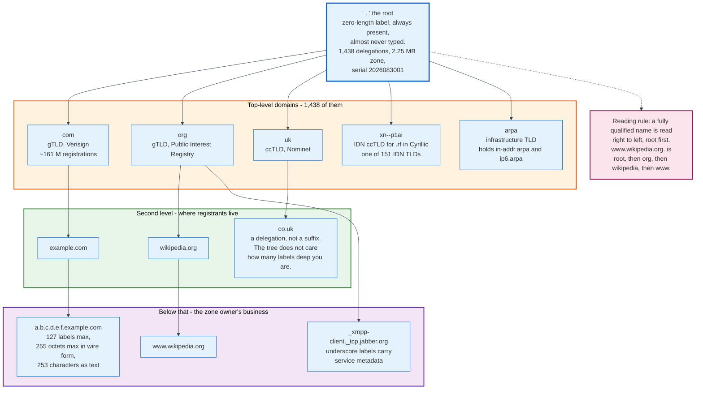

### 3.1 Labels, Names, and the Trailing Dot

A domain name is an ordered list of labels, and the root's label is empty.

`www.wikipedia.org.` has four labels: `www`, `wikipedia`, `org`, and the zero-length root label represented by the trailing dot. That dot is not decoration. A name ending in it is fully qualified and is resolved as written. A name without it may be completed by the resolver's search list, which is why `www.wikipedia.org` typed into a machine with `search corp.example.com` in `/etc/resolv.conf` can generate a query for `www.wikipedia.org.corp.example.com` first.

The limits are fixed by RFC 1035 and are load-bearing throughout the protocol:

| Limit | Value | Where it comes from |
|-------|-------|---------------------|
| Label length | 63 octets | The label length prefix is one octet with the top two bits reserved for compression pointers, leaving 6 bits |
| Total name length in wire form | 255 octets | Includes every length prefix and the root's terminating zero |
| Labels per name | 127 | A consequence of the 255-octet limit with 1-octet labels |
| Characters | Any octet, in principle | Host names are restricted to letters, digits, and hyphen by RFC 1123; other uses ignore this |

Comparison is case-insensitive for ASCII and case-preserving on the wire, formalised in RFC 4343. That combination is why the 0x20 encoding trick works as an anti-spoofing measure: a resolver can randomise the case of the query name, and a correct server echoes it back unchanged, adding entropy an off-path attacker must also guess.

Non-ASCII names are encoded, not transmitted. Internationalised Domain Names in Applications converts a Unicode label to an ASCII-compatible form beginning `xn--`, using Punycode. The DNS never sees the Unicode. The root zone contains 151 TLDs in this form.

### 3.2 The Tree Has No Depth Rule

`co.uk` and `com` occupy the same structural position in the protocol: both are delegations, both are zone cuts, both are ordinary nodes with NS records. The fact that one is a "top-level domain" and the other a "second-level domain" is administrative vocabulary, not protocol.

This matters in practice because software repeatedly tries to derive administrative boundaries from label counts and repeatedly gets it wrong. Cookie scoping, certificate wildcard rules, and "same site" checks all need to know where one organisation's control ends. The protocol provides no answer. The Public Suffix List, a manually curated file maintained by Mozilla, is the answer everyone actually uses, and it is a text file that people edit by hand.

The system that replaced a hand-edited text file needs a hand-edited text file to be usable.

### 3.3 Special-Use and Reserved Names

Some names never reach the DNS at all, by design.

`localhost` resolves locally. `.arpa` is the infrastructure TLD, holding `in-addr.arpa` for IPv4 reverse lookups and `ip6.arpa` for IPv6. Reverse lookup works by turning an address into a name: `185.15.58.224` becomes `224.58.15.185.in-addr.arpa`, reversed because DNS names go least-significant-first while IP addresses go most-significant-first. `.local` is reserved for multicast DNS and must not be sent to a unicast resolver. `.onion` is reserved for Tor. `.example`, `.invalid`, and `.test` are reserved for documentation and testing, which is why this document uses `example.com` and never a name someone owns.

`.internal` was permanently reserved for private-network use by the ICANN Board in July 2024, which means it will never be delegated. Verified on 31 August 2026, the name appears nowhere in the published root zone and `dig @198.41.0.4 internal. NS` returns NXDOMAIN. It reserves a name that two decades of organisations had been improvising with `.corp`, `.home`, and `.mail`, all three of which were applied for as real gTLDs in 2012, all three of which were blocked because the root servers were already drowning in leaked internal queries for them, and all three of which still return NXDOMAIN at the root.

---

## 4. Delegation, the Only Mechanism That Matters

Delegation is the single mechanism that makes DNS work, and everything called an architecture in this document is a consequence of it.

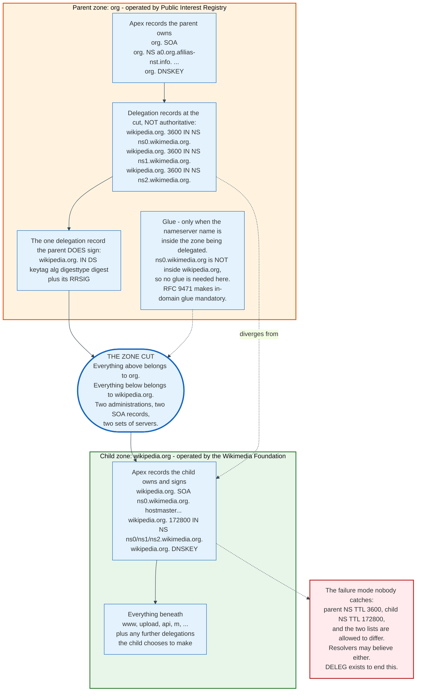

### 4.1 Zone Versus Domain

A domain is a subtree of the namespace. A zone is the part of that subtree one server is authoritative for.

`org` the domain includes `wikipedia.org` and everything below it. `org` the zone stops at the point where `wikipedia.org` is delegated away. That point is a zone cut. The Public Interest Registry's servers hold the `org` zone, know that `wikipedia.org` exists, know which servers to send you to, and know nothing about what is inside it.

RFC 9499, published March 2024, is the normative vocabulary for this and is worth keeping open. It obsoletes RFC 8499 and settles arguments about words like "bailiwick" that had been going on for thirty years.

### 4.2 What a Delegation Physically Consists Of

Three kinds of record appear at a zone cut, and their properties differ sharply.

**NS records in the parent.** These name the child's servers. They are the referral. They are *not authoritative data in the parent zone*, which has a consequence people find surprising: DNSSEC does not sign them. The parent signs a DS record and an NSEC or NSEC3 record at the cut, and leaves the NS set unsigned. An on-path attacker cannot forge a signed DS, but the NS set and its glue are unprotected by design.

**NS records in the child.** The same names, published again at the child's apex, this time as authoritative data the child signs. The two copies are allowed to differ, they frequently do, and the protocol does not say which wins. Measured on 31 August 2026, the `org` servers return `wikipedia.org` NS records with a TTL of 3,600 while the Wikimedia servers return the same names with a TTL of 172,800.

**Glue.** Address records for a nameserver whose name lies inside the zone being delegated. If `example.com` is served by `ns1.example.com`, resolving `ns1.example.com` requires reaching `example.com`, which requires resolving `ns1.example.com`. The parent breaks the loop by including the address in the ADDITIONAL section. RFC 9471, published September 2023, made in-domain glue mandatory in referrals and required servers to set TC=1 rather than omit it, closing a long-standing resolution failure.

Glue is needed only for that circular case. `wikipedia.org` is served by `ns0.wikimedia.org`, which is in a different zone, so the `org` servers need supply no glue for it. They supply it anyway, because `wikimedia.org` is also in `org` and the server has the data.

### 4.3 The Dual-Source-of-Truth Problem, and DELEG

DNS has two authoritative statements about every delegation and no rule for reconciling them, which is the largest unfixed defect in the protocol.

The parent's NS set is what resolvers reach first. The child's NS set is what the zone owner controls. When a zone moves providers, the child's copy changes instantly and the parent's changes only when the registrant tells the registrar to tell the registry. Resolvers holding either copy behave differently, and both are within specification.

Worse, the parent's copy cannot say anything else. It cannot say "these servers speak DNS over TLS", or "reach them on port 8053", or "here is the key to authenticate them", because NS records carry nothing but a name.

The IETF DELEG working group, chartered in 2024 with Brian Haberman and Duane Wessels as chairs, exists to fix both problems at once. `draft-ietf-deleg`, at revision 11 as of 23 July 2026, defines a DELEG record that is authoritative at the delegation point, like DS and unlike NS, and is therefore signed by the parent. Its RDATA borrows the SvcParams structure from RFC 9460: two-octet key, two-octet length, variable value, with keys for `server-ipv4`, `server-ipv6`, `server-name`, and `include-delegparam`. The draft requests RRTYPE 61440 from the delegation types range.

Backward compatibility is handled by an EDNS0 flag. A DELEG-aware resolver sets the DE bit; a server may then answer with DELEG. A resolver that does not set it gets the ordinary NS referral. Zones may publish both during transition, and a DELEG-only delegation is simply invisible to legacy resolvers.

Whether this ships is a governance question rather than a technical one. Every registry, every registrar, and every resolver implementation has to change, and the benefit accrues mostly to large DNS operators.

---

## 5. Key Participants and Roles

Six distinct parties touch a domain name, and the common assumption that a registrar and a DNS operator are the same party is the source of most operational confusion.

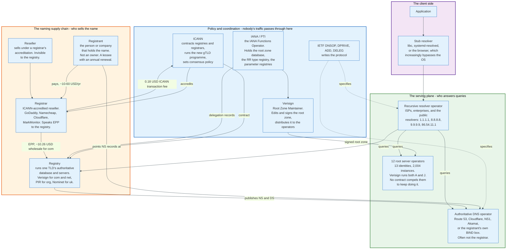

### 5.1 The Actors

| Role | What it does | Examples | Holds the data? |
|------|--------------|----------|-----------------|
| **Registrant** | Holds the registration, pays annually | Any person or company | No |
| **Registrar** | ICANN-accredited seller, speaks EPP to the registry | GoDaddy, Namecheap, Cloudflare, MarkMonitor, Gandi | No |
| **Reseller** | Sells under a registrar's accreditation | Thousands of hosting companies | No |
| **Registry** | Operates one TLD's database and authoritative servers | Verisign for `com` and `net`, PIR for `org`, Nominet for `uk`, Identity Digital for many gTLDs | Yes, for the TLD zone |
| **Authoritative DNS operator** | Serves the registrant's own zone | Route 53, Cloudflare, NS1, Akamai, Dyn, or the registrant's BIND server | Yes, for the domain's zone |
| **Recursive resolver operator** | Answers clients, holds the cache | ISPs, enterprises, 1.1.1.1, 8.8.8.8, 9.9.9.9, 86.54.11.1 | Cached copies only |
| **Root server operator** | Serves the root zone | 12 organisations across 13 identities | Yes, a read-only copy |
| **IANA / PTI** | Maintains the root zone database and every protocol registry | Public Technical Identifiers, an ICANN affiliate | The source of truth for delegations |
| **Root Zone Maintainer** | Edits, signs, and distributes the root zone | Verisign, under contract | Yes, the signed file |
| **ICANN** | Contracts registries, accredits registrars, sets policy | ICANN | No |

### 5.2 The Two Splits That Explain Most Incidents

**The registrar is not the DNS operator.** A registrar controls the delegation. A DNS operator controls what the delegation points at. Compromise either one and the name is yours. The 2013 hijack of `nytimes.com` and `twitter.co.uk` went through the registrar Melbourne IT, not through any nameserver, and no amount of hardening at the DNS layer would have prevented it. The counter-control is registry lock, which puts `serverUpdateProhibited`, `serverTransferProhibited`, and `serverDeleteProhibited` on the name at the registry and requires out-of-band human authentication to lift.

**The registry is not the root.** Registries operate below the root and are delegated to by it. A registry cannot change its own delegation; only IANA and the Root Zone Maintainer can. This is why TLD redelegations are slow and political, and why a compromised registry cannot un-delegate itself.

### 5.3 The Roles That Have No Contract

Nobody is under a legal obligation to operate a root server, and this is not an oversight.

The 12 root server operators include two US government bodies (NASA and the US Army's DEVCOM Army Research Laboratory), a defence agency (DISA), two universities (USC-ISI and the University of Maryland), two non-profits (ISC and Netnod), one regional internet registry (RIPE NCC), a commercial ISP (Cogent), a Japanese research consortium (WIDE), ICANN itself, and Verisign, which holds two identities.

RSSAC001 sets expectations rather than obligations, including expectation E.3.4-A, which says each operator "is expected to make all reasonable efforts to ensure that sufficient capacity exists in their deployed infrastructure to allow for substantial fluctuations in traffic loads." That is the strongest language in the document.

The system works because the operators are heterogeneous. Different code bases, different networks, different jurisdictions, different funding. A defect that takes out one implementation leaves twelve identities standing, and the DNS protocol is designed to tolerate partial reachability among a set of nameservers. That property was measured in production on 23 December 2025, when ten identities were attacked and end users saw nothing. The June 2026 traffic doubling tested capacity instead, and the operators recorded no measurable impact at all.

---

## 6. The Resolution Chain, Traced With a Real Query

Every DNS lookup passes through four distinct pieces of software, and only one of them does any work.

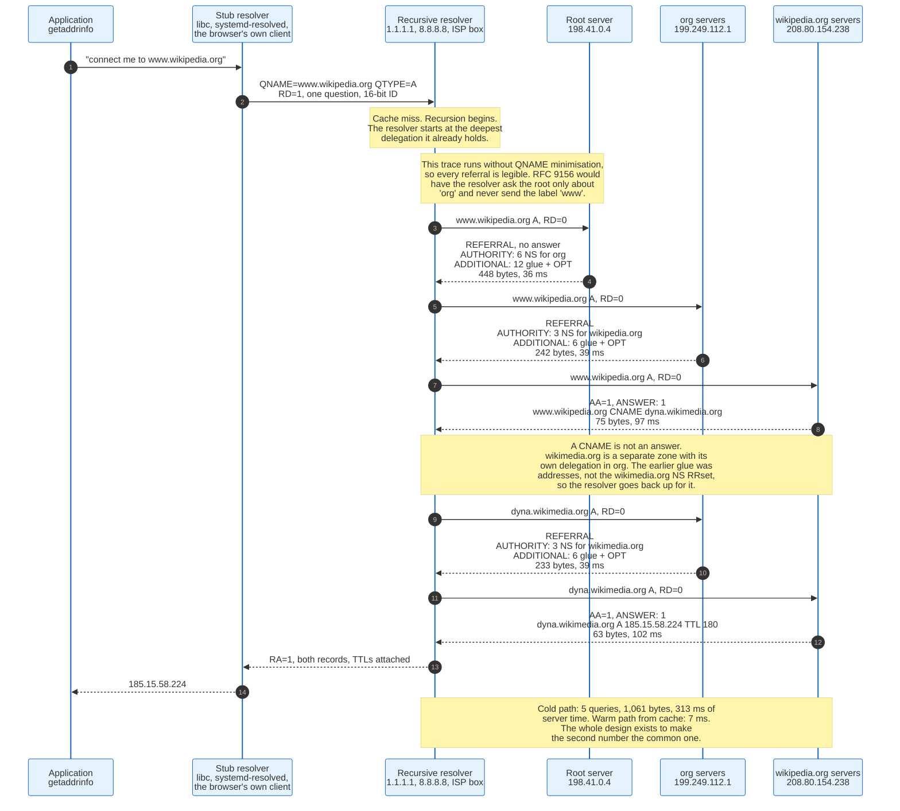

### 6.1 The Four Layers

**The application** calls `getaddrinfo` or an equivalent and gets an address. It sees no DNS.

**The stub resolver** is the small piece of code that formats a query, sends it to a configured server, and parses the answer. It sets RD=1, meaning recursion desired, because it cannot follow referrals. On Linux this is glibc, or `systemd-resolved`, or `dnsmasq`. On modern browsers it is increasingly the browser's own DoH client, which bypasses the operating system entirely.

**The recursive resolver** does the actual work: it follows referrals from the root down, caches everything, and returns a final answer. It sets RD=0 on its outbound queries because it wants referrals, not recursion.

**The authoritative servers** answer only for zones they hold, set AA=1 when the answer comes from their own zone data, and never recurse on anyone's behalf.

The distinction between the stub and the recursive resolver is the one people collapse. A stub cannot resolve a name. It can only ask.

### 6.2 The Worked Example, Measured

The following is a real trace of `www.wikipedia.org`, run on 31 August 2026 from a host in Central Europe, with recursion disabled at each step so every referral is visible. It runs without QNAME minimisation, so each server sees the full name and each referral is legible; section 6.4 covers what a minimising resolver sends instead.

**Query 1, to A-root at `198.41.0.4`.** The resolver asks for `www.wikipedia.org` type A with RD=0. The root does not answer the question. It returns a referral: AUTHORITY contains 6 NS records for `org`, ADDITIONAL contains 13 records, 12 glue plus the EDNS0 OPT pseudo-record, and ANSWER is empty. Response size 448 octets, round trip 36 ms. The NSID option identifies the instance that answered as `a.r.lon8.gblon-0`, an A-root site in London, reached because BGP put it closest to the querying host.

```
;; ->>HEADER<<- opcode: QUERY, status: NOERROR, id: 24941
;; flags: qr; QUERY: 1, ANSWER: 0, AUTHORITY: 6, ADDITIONAL: 13
;; OPT PSEUDOSECTION:
; EDNS: version: 0, flags:; udp: 4096
;; AUTHORITY SECTION:
org.  172800  IN  NS  a0.org.afilias-nst.info.
org.  172800  IN  NS  a2.org.afilias-nst.info.
org.  172800  IN  NS  b0.org.afilias-nst.org.
org.  172800  IN  NS  b2.org.afilias-nst.org.
org.  172800  IN  NS  c0.org.afilias-nst.info.
org.  172800  IN  NS  d0.org.afilias-nst.org.
;; MSG SIZE  rcvd: 448
```

Two details in that response matter. The TTL of 172,800 seconds is two days: once a resolver has this referral it will not ask the root about `org` again for 48 hours. And the advertised EDNS0 buffer is 4,096 octets, which is the root's choice and higher than most of the rest of the system now uses.

**Query 2, to an `org` server at `199.249.112.1`.** Same question, another referral. AUTHORITY contains 3 NS records for `wikipedia.org` with a TTL of 3,600, ADDITIONAL contains 7 records, 6 glue plus OPT. Response 242 octets, 39 ms. The advertised buffer here is 1,232 octets, the DNS Flag Day 2020 value.

**Query 3, to `ns0.wikimedia.org` at `208.80.154.238`.** This server is authoritative, sets AA=1, and answers. The answer is not an address:

```
;; flags: qr aa; QUERY: 1, ANSWER: 1, AUTHORITY: 0, ADDITIONAL: 1
;; ANSWER SECTION:
www.wikipedia.org.  86400  IN  CNAME  dyna.wikimedia.org.
;; MSG SIZE  rcvd: 75
```

A CNAME is an instruction, not a result. The resolver must now resolve `dyna.wikimedia.org` from scratch, and `wikimedia.org` is a different zone with its own delegation in `org`. The glue the `org` servers supplied at query 2 carries addresses for `ns0`, `ns1`, and `ns2`, which is address data rather than the `wikimedia.org` NS RRset. A cold resolver has to go back up for that referral.

**Query 4, back to an `org` server at `199.249.112.1`.** `dyna.wikimedia.org` type A returns a referral: AUTHORITY contains 3 NS records for `wikimedia.org` at TTL 3,600, ADDITIONAL contains 7 records, 6 glue plus OPT. 233 octets, 39 ms.

**Query 5, to `ns0.wikimedia.org` again.** `dyna.wikimedia.org` type A returns `185.15.58.224` with a TTL of 180 seconds. 63 octets, 102 ms.

**Totals for the cold path:** 5 queries, 1,061 octets of response, 313 ms of server time. The same lookup against a warm cache at `1.1.1.1` takes 7 ms.

The ratio between 313 and 7 is the entire economic argument for caching, and it is why the root sees queries almost exclusively for names that cannot be cached.

### 6.3 The TTL Split in That Answer

`www.wikipedia.org` has an 86,400-second TTL. `dyna.wikimedia.org` has 180. That is a deliberate two-layer design and it is the standard pattern for any service that steers traffic.

The stable name, the one users type and other zones reference, caches for a day, because it never changes. The volatile name, the one carrying the current answer about which data centre should serve this user, expires every three minutes, because it changes constantly. Put the long TTL where nothing moves and the short TTL where the decision lives.

### 6.4 QNAME Minimisation

A resolver following the chain above has no reason to tell the root the full name it is looking for, and since RFC 9156 it does not.

Under query name minimisation, the resolver asks the root only about `org`, asks the `org` servers only about `wikipedia.org`, and reveals `www.wikipedia.org` only to the server that is authoritative for it. Each server learns exactly what it needs to produce a referral and nothing more.

This is a privacy improvement with a measurable cost: it can increase the number of queries, because a resolver may have to probe intermediate labels that turn out to be empty non-terminals. The root server operators' July 2026 report on a traffic doubling identifies the elevated traffic as "well-formed, query-name-minimized queries" from a set of related autonomous systems, the unintentional result of a recursive resolver software update. Traffic went from 1.6 million queries per second to 3.2 million, stayed there for about a week from 29 June, and returned to normal on 7 July after the operator was contacted. The root operators recorded no measurable effect on availability and took no mitigation.

### 6.5 Priming and Bootstrapping

A resolver with an empty cache still needs to find the root, and it does this from a file.

Every implementation ships a root hints file, `named.root`, listing the 13 identities with their A and AAAA records. On start, the resolver sends a priming query, `. NS`, to one of them and replaces the hints with the authoritative answer. RFC 9609, published February 2025, replaced RFC 8109 as the specification for this.

The hints file is allowed to be stale. It only needs one working address out of 26. B-root's IPv4 address changed from `199.9.14.201` to `170.247.170.2` in November 2023, and resolvers with the old file kept working because twelve other addresses were fine.

The priming response itself is the reason the number 13 exists. Measured on 31 August 2026, `. NS` with glue returns 13 answer records and 27 additional records in 811 octets over UDP without DNSSEC, and 1,097 octets with DNSSEC. Force the buffer to 512 and the server sets TC=1, cuts the ADDITIONAL section from 27 records to 13, and returns 503 octets.

---

## 7. The Root Server System

The root server system is 13 IP address pairs, 12 organisations, and 2,004 machines serving one 2.25 MB file that none of them may modify.

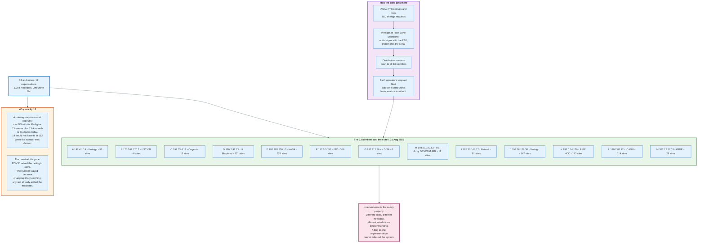

### 7.1 The Addresses

These are the operational values from the IANA root hints file dated 26 August 2026, corresponding to root zone version `2026082601`, with site counts from root-servers.org measured on 31 August 2026.

| ID | IPv4 | IPv6 | Operator | Operational sites |
|----|------|------|----------|-------|
| **A** | `198.41.0.4` | `2001:503:ba3e::2:30` | Verisign | 56 |
| **B** | `170.247.170.2` | `2801:1b8:10::b` | USC Information Sciences Institute | 6 |
| **C** | `192.33.4.12` | `2001:500:2::c` | Cogent Communications | 13 |
| **D** | `199.7.91.13` | `2001:500:2d::d` | University of Maryland | 231 |
| **E** | `192.203.230.10` | `2001:500:a8::e` | NASA Office of the CIO | 328 |
| **F** | `192.5.5.241` | `2001:500:2f::f` | Internet Systems Consortium | 366 |
| **G** | `192.112.36.4` | `2001:500:12::d0d` | US Defense Information Systems Agency | 6 |
| **H** | `198.97.190.53` | `2001:500:1::53` | US Army DEVCOM Army Research Laboratory | 12 |
| **I** | `192.36.148.17` | `2001:7fe::53` | Netnod | 91 |
| **J** | `192.58.128.30` | `2001:503:c27::2:30` | Verisign | 147 |
| **K** | `193.0.14.129` | `2001:7fd::1` | RIPE NCC | 143 |
| **L** | `199.7.83.42` | `2001:500:9f::42` | ICANN | 114 |
| **M** | `202.12.27.33` | `2001:dc3::35` | WIDE Project | 29 |

Those operational-site counts total 1,542 against 1,584 sites listed, and the instance count is 2,004. Three things pull the numbers apart: some sites run more than one instance behind the same announcement, K has 16 decommissioned sites, and L has 26 suspended ones.

### 7.2 Why Thirteen

Thirteen is the largest number of root servers whose names and IPv4 addresses fit in a 512-octet UDP response, and that constraint disappeared in 1999.

The arithmetic works out because root server names were deliberately made compressible: every identity is `X.root-servers.net`, so after the first one appears in full, each subsequent name costs a two-octet compression pointer plus the single-character label. Thirteen names plus thirteen A records plus the header and question fit. Fourteen would not have.

EDNS0 removed the ceiling. The number stayed because increasing it buys nothing that anycast does not already provide, and every change to the root hints file has to propagate to every resolver on earth.

### 7.3 How the Zone Gets There

Changes to the root zone flow through three parties and no shortcuts exist.

IANA, operating as Public Technical Identifiers, receives and vets change requests from TLD operators: new nameservers, new DS records, redelegations. Verisign, as Root Zone Maintainer under contract, edits the zone, signs it with the current Zone Signing Key, increments the serial, and pushes it to distribution masters. Each of the 13 operators pulls the same file and loads it across its fleet.

No root server operator can alter what it serves. That separation is the reason a compromise of one operator cannot inject a false delegation.

### 7.4 What the Root Actually Sees

The root server system absorbed a 1 Tbps DDoS on 23 December 2025 and end users noticed nothing.

The root server operators published a joint statement in July 2026 describing it. The attack came in multiple waves, was highly distributed, peaked at over one terabit per second across all identities, and lasted just under ten minutes. Start times varied between 15:37 and 15:39 UTC and end times between 15:41 and 15:48 UTC, which the operators read as evidence that the waves against each identity were not launched simultaneously. Ten of the 13 identities were targeted; F, G, and H were not.

RIPE NCC's DNSMON measurements showed an impact on several identities to varying degrees. No mitigation actions were taken, because the attack was over before a coordinated response could be agreed. The operators' own assessment: "The root server system remained available for DNS clients despite the varying degrees of impact across the service footprint. There are no known reports of end-user visible error conditions during this incident."

The reason is structural. A resolver that gets no answer from one root identity tries another, and the DNS protocol has treated partial reachability as normal since 1987.

---

## 8. Anycast: How 13 Addresses Become 2,004 Machines

Anycast is the practice of announcing the same IP prefix from many locations and letting the routing system pick one, and it is what turns a fixed list of addresses into unbounded capacity.

```mermaid
%%{init: {'theme': 'base', 'themeVariables': {'primaryColor': '#e3f2fd', 'primaryBorderColor': '#1565c0', 'lineColor': '#37474f'}}}%%

flowchart TB
    Addr["One address: 192.5.5.241<br/>F-root, operated by ISC.<br/>366 sites announce it."]

    subgraph Sites["Every site runs BGP and says the same thing"]
        S1["Madrid<br/>announces 192.5.5.0/24<br/>from AS 3557"]
        S2["Frankfurt<br/>announces 192.5.5.0/24<br/>from AS 3557"]
        S3["Sao Paulo<br/>announces 192.5.5.0/24<br/>from AS 3557"]
        S4["Singapore<br/>announces 192.5.5.0/24<br/>from AS 3557"]
    end

    subgraph Net["The internet does the routing"]
        BGP["Each router picks ONE best path<br/>to 192.5.5.0/24 by BGP policy:<br/>local preference first,<br/>AS path length second,<br/>not geography, not latency."]
    end

    subgraph Clients["What each client reaches"]
        C1["Resolver in Barcelona<br/>-> Madrid site<br/>NSID mad1f.f.root-servers.org<br/>36 ms"]
        C2["Resolver in Nairobi<br/>-> whichever site its transit<br/>provider prefers, which may be<br/>London, not the one 40 km away"]
    end

    subgraph Props["What anycast gives and does not give"]
        G1["Gives: capacity that scales<br/>by adding sites, DDoS traffic<br/>absorbed locally instead of<br/>concentrating, shorter RTT<br/>for most clients"]
        G2["Gives: instant failover.<br/>Withdraw the route and traffic<br/>reroutes in BGP convergence time,<br/>with no DNS change and no TTL wait."]
        B1["Does not give: session stickiness.<br/>Consecutive packets can land<br/>on different sites, which is why<br/>DNS over UDP suits anycast and<br/>long TCP or QUIC sessions need care."]
        B2["Does not give: control.<br/>Steering is a side effect of other<br/>networks' BGP policy. Operators<br/>tune with communities and<br/>selective announcement, not commands."]
        B3["Does not give: a shared cache.<br/>Each site caches independently.<br/>Two queries seconds apart can<br/>return different remaining TTLs."]
    end

    Addr --> Sites --> BGP --> Clients
    Clients --> Props

    style Addr fill:#e3f2fd,stroke:#1565c0,stroke-width:3px
    style Sites fill:#e8f5e9,stroke:#2e7d32,stroke-width:2px
    style Net fill:#fff3e0,stroke:#e65100,stroke-width:2px
    style Clients fill:#f3e5f5,stroke:#4a148c,stroke-width:2px
    style Props fill:#eceff1,stroke:#37474f,stroke-width:2px
```

### 8.1 The Mechanism

F-root's address is `192.5.5.241`. ISC announces the covering prefix `192.5.5.0/24` from 366 sites, all with the same origin autonomous system number. Every router on the internet sees multiple paths to that prefix and installs exactly one, chosen by ordinary BGP best-path selection: local preference first, then AS path length, then a sequence of tie-breakers.

Nothing in that selection considers latency or geography. A router prefers the path its operator's policy prefers. Most of the time that correlates with proximity, because transit is bought locally and peering is local by definition. Sometimes it does not, and a client in one city reaches an instance on another continent with no way to override it.

The measurement is trivial to run. NSID, the DNS Name Server Identifier option defined in RFC 5001, makes a server report which instance answered. From a host in Central Europe on 31 August 2026:

```
dig @198.41.0.4 . SOA +nsid   -> NSID "a.r.lon8.gblon-0"          (A-root, London)
dig @192.5.5.241 . SOA +nsid  -> NSID "mad1f.f.root-servers.org"  (F-root, Madrid)
dig @193.0.14.129 . SOA +nsid -> NSID "ns1.es-bcn.k.ripe.net"     (K-root, Barcelona)
```

Three identical queries to three "single" servers, answered by three machines in three cities. That is the whole trick.

### 8.2 What Anycast Buys

**Capacity that scales by addition.** Adding a site adds throughput to the same address with no coordination with anyone else's configuration. This is why the root system could grow from a few dozen machines to 2,004 without ever changing the hints file.

**DDoS absorption by dispersion.** An attack sourced from many networks is delivered to many sites, because each attacking host routes to its own nearest instance. The 1 Tbps aggregate against the root in December 2025 never landed as 1 Tbps anywhere. This is the single most important defensive property anycast provides, and it is passive.

**Failover without a TTL wait.** Withdraw the BGP announcement at a site and traffic reroutes in convergence time, typically seconds to tens of seconds. No DNS record changes, so no cache anywhere has to expire. Compare this to moving traffic by changing an A record, where the floor is the TTL you set in advance.

**Site-level maintenance.** Drain a site by withdrawing routes, patch it, re-announce.

### 8.3 What Anycast Does Not Buy

**No session stickiness.** Consecutive packets from the same client can land at different sites if BGP reconverges mid-flow. UDP DNS is immune because each query is a complete transaction. TCP and QUIC are not, which is a real constraint as DNS over TLS and DNS over QUIC grow.

**No control.** The steering decision is made by thousands of other people's routers according to their commercial policy. Operators influence it with BGP communities, selective announcement, and prefix-length games, and they influence rather than dictate.

**No shared cache.** Each instance is a separate machine with a separate cache. The behaviour is directly observable on a public resolver: two SOA queries for `wikipedia.org` sent to `1.1.1.1` four seconds apart on 31 August 2026 returned TTLs of 980 and then 3,600, because the second query landed on a node whose cache entry had a different age. A TTL that goes up is not a bug. It is a different machine.

**No help against a routing attack.** Anycast makes hijacking a prefix more attractive, not less, because a hijacker who announces `1.1.1.0/24` inherits every client whose routers prefer the hijacked path. RPKI origin validation is the mitigation, and its deployment is uneven.

---

## 9. Record Types and Their Fields

IANA assigns 91 resource record types for zone data and roughly a dozen carry almost all traffic. What follows is the set that matters, with the fields each one actually contains.

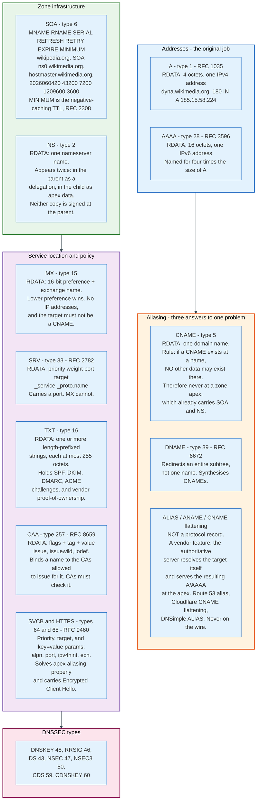

### 9.1 The Types in Detail

**A, type 1.** RDATA is four octets: one IPv4 address. Nothing else. Multiple A records at a name are a set, unordered by the protocol, and a resolver may return them in any order.

```
dyna.wikimedia.org.  180  IN  A  185.15.58.224
```

**AAAA, type 28, RFC 3596.** RDATA is 16 octets: one IPv6 address. The name is a pun on being four times the size of A.

```
dyna.wikimedia.org.  180  IN  AAAA  2a02:ec80:600:ed1a::1
```

**CNAME, type 5.** RDATA is a single domain name. The rule that governs it is absolute: if a CNAME exists at a name, no other record type may exist at that name. This is why a CNAME can never sit at a zone apex, since the apex already carries SOA and NS. Every "why can't I CNAME my root domain" question resolves to this one sentence.

```
www.wikipedia.org.  86400  IN  CNAME  dyna.wikimedia.org.
```

A CNAME is a restart instruction. The resolver discards the original question and resolves the target, then returns both records in the ANSWER section.

**SOA, type 6.** RDATA is seven fields and every one is used:

```
wikipedia.org. 3600 IN SOA ns0.wikimedia.org. hostmaster.wikimedia.org. (
                        2026060420  ; SERIAL
                        43200       ; REFRESH  - secondary polls every 12 hours
                        7200        ; RETRY    - retry after 2 hours on failure
                        1209600     ; EXPIRE   - stop answering after 14 days
                        3600 )      ; MINIMUM  - negative-caching TTL, RFC 2308
```

MNAME names the primary server. RNAME is the administrator's email with the `@` replaced by a dot, so `hostmaster.wikimedia.org.` means `hostmaster@wikimedia.org`. SERIAL is a 32-bit value compared using serial-number arithmetic, conventionally written `YYYYMMDDNN`. The final field was originally the zone's default TTL and was redefined by RFC 2308 as the negative-caching TTL, which is the meaning in force.

**NS, type 2.** RDATA is one nameserver name. Appears at the apex of the child zone as authoritative data and at the zone cut in the parent as a delegation. The target must not be a CNAME and should have address records.

**MX, type 15.** RDATA is a 16-bit preference followed by a domain name. Lower preference is tried first; equal preferences are load-shared. The exchange name must resolve to A or AAAA records directly and must not be a CNAME.

```
wikipedia.org.  300  IN  MX  10 mx-in1001.wikimedia.org.
wikipedia.org.  300  IN  MX  10 mx-in2001.wikimedia.org.
```

MX carries no port. Mail is assumed to be on port 25, which is why SRV exists.

**TXT, type 16.** RDATA is one or more character-strings, each prefixed by a one-octet length and therefore capped at 255 octets. A single TXT record may contain several strings, concatenated by the consumer. This is why long DKIM keys are split across quoted segments in a zone file.

```
wikipedia.org.  600  IN  TXT  "v=spf1 include:_cidrs.wikimedia.org ~all"
wikipedia.org.  600  IN  TXT  "google-site-verification=AMHkgs-4ViEvIJf5znZle-BSE2EPNFqM1nDJGRyn2qk"
```

TXT became the internet's general-purpose attestation channel by accident. SPF, DKIM selectors, DMARC policy, ACME `dns-01` challenges, and every SaaS vendor's domain-ownership proof live here.

**SRV, type 33, RFC 2782.** RDATA is priority, weight, port, target. The owner name is structured: `_service._proto.name`.

```
_xmpp-client._tcp.jabber.org.  60  IN  SRV  30 30 5222 scarlet.jabber.org.
```

Priority works like MX preference. Weight distributes load among equal priorities proportionally. Port is the field MX lacks. SRV never displaced MX for mail because the installed base was too large, and it became the standard for XMPP, SIP, LDAP, Kerberos, and Minecraft.

**CAA, type 257, RFC 8659.** RDATA is a one-octet flags field, a tag, and a value. Tags are `issue`, `issuewild`, and `iodef`.

```
wikipedia.org.  600  IN  CAA  0 issue "letsencrypt.org"
wikipedia.org.  600  IN  CAA  0 issue "pki.goog"
wikipedia.org.  600  IN  CAA  0 iodef "mailto:dns-admin@wikimedia.org"
```

CAA is the only record type a third party is contractually required to obey. CA/Browser Forum baseline requirements make certificate authorities check it before issuance, and a CA that issues in violation of a CAA record has committed a mis-issuance. The record does not prevent issuance technically; it makes it an auditable breach. The `iodef` tag names a contact for reporting attempts.

**SVCB and HTTPS, types 64 and 65, RFC 9460.** RDATA is a 16-bit priority, a target name, and a set of key-value SvcParams: `alpn`, `port`, `ipv4hint`, `ipv6hint`, `ech`. Priority 0 means AliasMode, which finally provides protocol-level apex aliasing. Higher priorities mean ServiceMode, which delivers connection parameters in the DNS answer so a client can skip a round trip. The `ech` parameter carries Encrypted Client Hello keys, which is currently the main deployment driver.

**ALIAS, ANAME, CNAME flattening: not record types.** This is the correction worth stating plainly. There is no ALIAS record in the DNS protocol and no assigned RRTYPE for one. What vendors sell under those names is a server-side behaviour: the authoritative server resolves the configured target itself, on a schedule, and publishes the resulting A and AAAA records at the apex as though they were ordinary static data. Route 53 calls it an alias record, Cloudflare calls it CNAME flattening, DNSimple and others call it ALIAS. A resolver querying the zone sees A records and nothing else. The IETF `draft-ietf-dnsop-aname` effort to standardise this was abandoned in favour of SVCB and HTTPS.

Two consequences follow. The behaviour is not portable between providers, and the provider's own resolution of the target becomes a dependency: if it caches a stale address for your CDN, your apex serves a stale address.

### 9.2 The Type Number Table

| Type | Number | RDATA | Defined in |
|------|--------|-------|------------|
| A | 1 | 4 octets, IPv4 | RFC 1035 |
| NS | 2 | domain name | RFC 1035 |
| CNAME | 5 | domain name | RFC 1035 |
| SOA | 6 | 2 names + 5 x 32-bit | RFC 1035 |
| PTR | 12 | domain name | RFC 1035 |
| MX | 15 | 16-bit pref + name | RFC 1035 |
| TXT | 16 | length-prefixed strings | RFC 1035 |
| AAAA | 28 | 16 octets, IPv6 | RFC 3596 |
| SRV | 33 | 3 x 16-bit + name | RFC 2782 |
| DS | 43 | keytag, alg, digest type, digest | RFC 4034 |
| RRSIG | 46 | 18 octets of metadata + signature | RFC 4034 |
| NSEC | 47 | next name + type bitmap | RFC 4034 |
| DNSKEY | 48 | flags, protocol, alg, key | RFC 4034 |
| NSEC3 | 50 | hash alg, flags, iterations, salt, next hash, bitmap | RFC 5155 |
| TLSA | 52 | usage, selector, matching type, data | RFC 6698 |
| CDS / CDNSKEY | 59 / 60 | as DS / DNSKEY, published by the child | RFC 7344 |
| SVCB / HTTPS | 64 / 65 | priority, target, SvcParams | RFC 9460 |
| CAA | 257 | flags, tag, value | RFC 8659 |
| OPT | 41 | EDNS0 pseudo-record, never stored in a zone | RFC 6891 |
| DELEG | 61440 requested | DelegInfo key-value pairs | `draft-ietf-deleg` |

### 9.3 Wildcards

A wildcard is a record whose owner name begins with the label `*`, and it synthesises answers for names that are not in the zone at all.

RFC 4592, published July 2006, is the specification, and it exists because RFC 1034 covered the subject in a few paragraphs that implementers read differently for nineteen years. The asterisk creates a wildcard only as the leftmost label. `*.example.com` is a wildcard. `a.*.example.com` and `the*.example.com` are ordinary names that happen to contain an asterisk, and nothing synthesises from either.

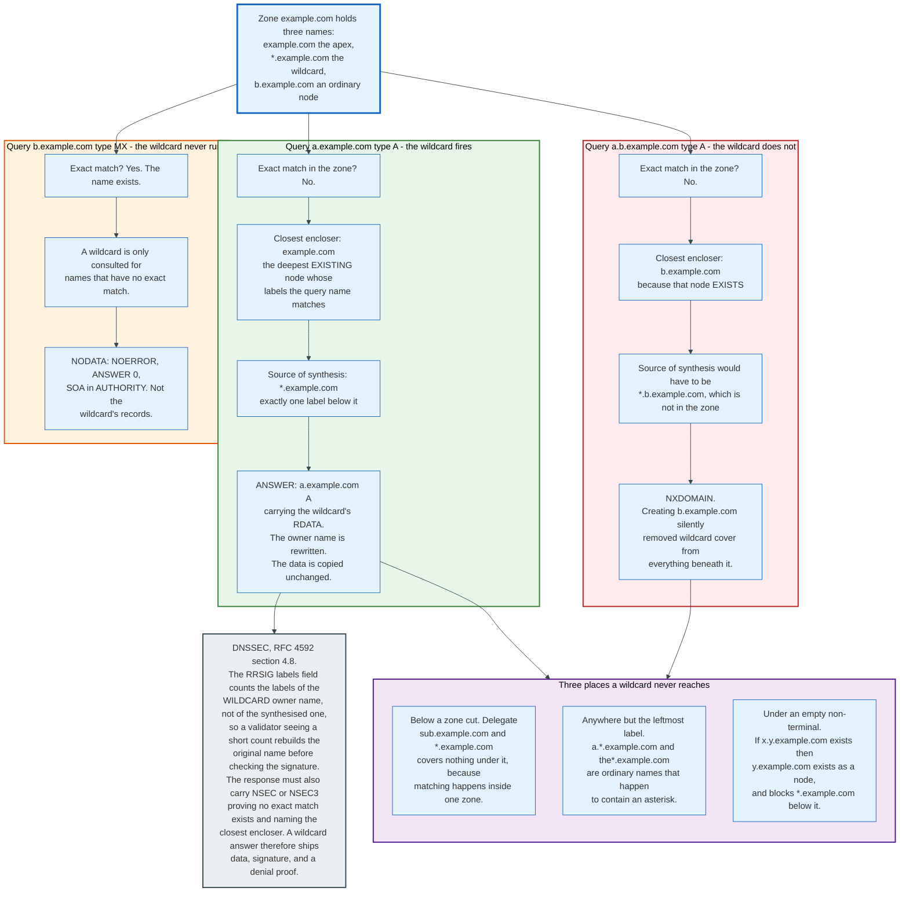

The matching rule turns on the closest encloser, which is the deepest node that already exists in the zone and whose labels the queried name matches. A wildcard applies only when it sits exactly one label below that node. Take a zone holding `example.com`, `*.example.com`, and `b.example.com`, and three queries produce three different answers.

`a.example.com` has no exact match, its closest encloser is `example.com`, and `*.example.com` sits one label below that. The wildcard fires, and the answer carries the wildcard's RDATA under the owner name `a.example.com`.

`a.b.example.com` has no exact match either, but its closest encloser is `b.example.com`, because that node exists. The source of synthesis would have to be `*.b.example.com`, which is not in the zone. The answer is NXDOMAIN. Adding one ordinary record at `b.example.com` silently withdraws wildcard cover from every name beneath it.

`b.example.com` itself has an exact match, so the wildcard is never consulted. A query for a type that name does not hold returns NODATA, not the wildcard's records.

Two further limits follow from the same rule. A wildcard never applies below a zone cut, because matching is performed inside one zone and the delegated name itself exists, owning the NS RRset. An empty non-terminal counts as an existing node, so a lone `x.y.example.com` makes `y.example.com` a node and blocks `*.example.com` from covering `z.y.example.com`.

Delegation by wildcard is the case the specification declines to settle. RFC 4592 section 4.2 leaves the semantics of a wildcard owning an NS RRset undefined and discourages the practice without barring it, because synthesising a delegation means a zone inventing authority over a name it has already given away, and DNSSEC exposes that as unauthorised data.

DNSSEC makes the synthesis visible rather than hiding it. The RRSIG's labels field counts the labels in the wildcard's own owner name, not in the name that was asked about, so a validator seeing a count lower than the answer's label count knows the record was synthesised and rebuilds the original wildcard name before checking the signature. The response must also carry an NSEC or NSEC3 record proving that no exact match exists and identifying the closest encloser. A wildcard answer therefore ships three things where an ordinary one ships two: the data, its signature, and a denial proof for the name the client actually asked about.

That extra proof is the reason wildcard responses are the largest ordinary answers a signed zone produces.

---

## 10. The Wire Format and the 512-Byte Legacy

A DNS message has the same five-part structure whether it is a query or a response, and the header is exactly 12 octets in both.

### 10.1 The Header

```
                                 1  1  1  1  1  1
   0  1  2  3  4  5  6  7  8  9  0  1  2  3  4  5
 +--+--+--+--+--+--+--+--+--+--+--+--+--+--+--+--+
 |                      ID                       |   16-bit query identifier
 +--+--+--+--+--+--+--+--+--+--+--+--+--+--+--+--+
 |QR|   Opcode  |AA|TC|RD|RA| Z|AD|CD|   RCODE   |   flags
 +--+--+--+--+--+--+--+--+--+--+--+--+--+--+--+--+
 |                    QDCOUNT                    |   questions
 +--+--+--+--+--+--+--+--+--+--+--+--+--+--+--+--+
 |                    ANCOUNT                    |   answer records
 +--+--+--+--+--+--+--+--+--+--+--+--+--+--+--+--+
 |                    NSCOUNT                    |   authority records
 +--+--+--+--+--+--+--+--+--+--+--+--+--+--+--+--+
 |                    ARCOUNT                    |   additional records
 +--+--+--+--+--+--+--+--+--+--+--+--+--+--+--+--+
```

| Field | Bits | Meaning |
|-------|------|---------|
| `ID` | 16 | Matches a response to its query. Before 2008 this was the only entropy protecting a resolver from a forged answer. |
| `QR` | 1 | 0 query, 1 response |
| `Opcode` | 4 | 0 QUERY, 4 NOTIFY (RFC 1996), 5 UPDATE (RFC 2136) |
| `AA` | 1 | Authoritative answer. Set only by a server holding the zone. |
| `TC` | 1 | Truncated. The response did not fit; retry over TCP. |
| `RD` | 1 | Recursion desired. Set by stubs, cleared by recursive resolvers querying authoritatives. |
| `RA` | 1 | Recursion available |
| `Z` | 1 | Must be zero |
| `AD` | 1 | Authentic data. Set by a validating resolver when DNSSEC validation succeeded. |
| `CD` | 1 | Checking disabled. Asks the resolver to skip validation and return the data anyway. |
| `RCODE` | 4 | 0 NOERROR, 1 FORMERR, 2 SERVFAIL, 3 NXDOMAIN, 5 REFUSED. EDNS0 extends this to 12 bits. |

The QUESTION section holds QDCOUNT entries, each a QNAME, a 16-bit QTYPE, and a 16-bit QCLASS. RFC 9619, published July 2024, formalises what every implementation already assumed: QDCOUNT is 1 for a QUERY, and other values are errors.

### 10.2 Name Encoding and Compression

A name on the wire is a sequence of length-prefixed labels terminated by a zero octet. `www.wikipedia.org` becomes `03 77 77 77 09 77 69 6b 69 70 65 64 69 61 03 6f 72 67 00`, which is 19 octets.

Compression is what keeps messages small. If the top two bits of a length octet are both 1, the remaining 14 bits are an offset from the start of the message to where the rest of the name already appears. Because DNS responses repeat the same names constantly, a referral for `org` that lists six nameservers whose names all end in `afilias-nst.info` or `afilias-nst.org` costs a fraction of what the plain text suggests. The 448-octet root referral measured in section 6 would be substantially larger without it.

The 14-bit offset caps a compressible message at 16,384 octets, which is not a problem over UDP and occasionally is over TCP.

### 10.3 The 512-Octet Ceiling

RFC 1035 caps a DNS message carried over UDP at 512 octets, and the number comes from IPv4 rather than from DNS.

Every IPv4 host must be able to reassemble a 576-octet datagram. Subtract a 60-octet worst-case IP header and an 8-octet UDP header and 508 octets remain. 512 was chosen as a round number close to that, on the assumption that a datagram of this size crosses any path without fragmentation.

Over 512 octets, the server truncates, sets TC=1, and the client retries over TCP. TCP was described in RFC 1035 as available, and a generation of operators treated it as optional and blocked port 53 over TCP at the firewall. RFC 7766, published March 2016, removed the ambiguity: DNS over TCP is a required part of the protocol.

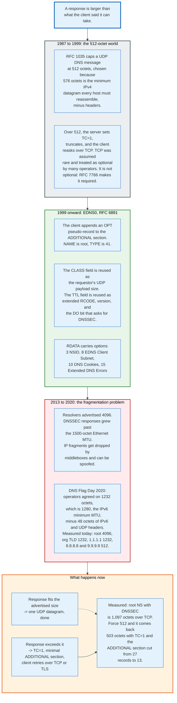

### 10.4 EDNS0

EDNS0 extends the protocol without touching the header, by adding a pseudo-record to the ADDITIONAL section.

The OPT record has NAME set to the root, TYPE 41, and then reuses two fields for entirely different purposes. The CLASS field carries the requestor's maximum UDP payload size. The TTL field is split into an extended RCODE (8 bits), a version (8 bits), and 16 flag bits of which the top one is DO, meaning DNSSEC OK.

RDATA carries a list of options as code, length, value triples:

| Option | Code | Purpose | Spec |
|--------|------|---------|------|
| NSID | 3 | Ask the server to identify the instance answering | RFC 5001 |
| EDNS Client Subnet | 8 | Send a truncated client prefix for geo-steering | RFC 7871 |
| EXPIRE | 9 | Zone expiry propagation between secondaries | RFC 7314 |
| Cookie | 10 | 8-octet client cookie plus 8 to 32-octet server cookie, cheap off-path spoofing defence | RFC 7873 |
| Extended DNS Error | 15 | A machine-readable reason for SERVFAIL | RFC 8914 |

Extended DNS Errors deserve attention because they change debugging from guesswork to reading. Querying a deliberately broken zone through `1.1.1.1` on 31 August 2026:

```
;; ->>HEADER<<- opcode: QUERY, status: SERVFAIL, id: 16326
; OPT=15: "no SEP matching the DS found for dnssec-failed.org."
```

Before RFC 8914 that response was a bare SERVFAIL and the operator had to reconstruct the cause by hand.

### 10.5 The Fragmentation Retreat

Resolvers spent a decade advertising 4,096 octets and then collectively retreated to 1,232.

The logic that produced 4,096 was that DNSSEC responses are large and TCP fallback is expensive. The problem is that a UDP response above the path MTU, typically 1,500 octets on Ethernet, gets fragmented at the IP layer. Fragments are dropped by many middleboxes, only the first fragment carries the UDP header that a stateful filter can inspect, and an off-path attacker who can predict the IP identification field can forge a second fragment and inject data into a response.

DNS Flag Day 2019 removed the workarounds resolvers used for authoritative servers that did not implement EDNS at all. DNS Flag Day 2020 addressed the size: participating vendors agreed on 1,232 octets, which is 1,280, the IPv6 minimum MTU, minus 48 octets of IPv6 and UDP headers. That value avoids IPv6 fragmentation entirely and IPv4 fragmentation on almost every path.

Advertised buffer sizes measured on 31 August 2026:

| Server | Advertised UDP payload |
|--------|------------------------|
| A-root `198.41.0.4` | 4096 |
| `org` server `199.249.112.1` | 1232 |
| Cloudflare `1.1.1.1` | 1232 |
| Google `8.8.8.8` | 512 |
| Quad9 `9.9.9.9` | 512 |

Google and Quad9 advertising 512 is the most conservative position available: it forces TCP for anything larger and eliminates fragmentation as a category. It costs round trips and buys certainty.

---

## 11. Caching, TTLs, and Negative Caching

Caching is not an optimisation in DNS. It is the mechanism that makes the design viable, and the TTL is the only control anyone has over it.

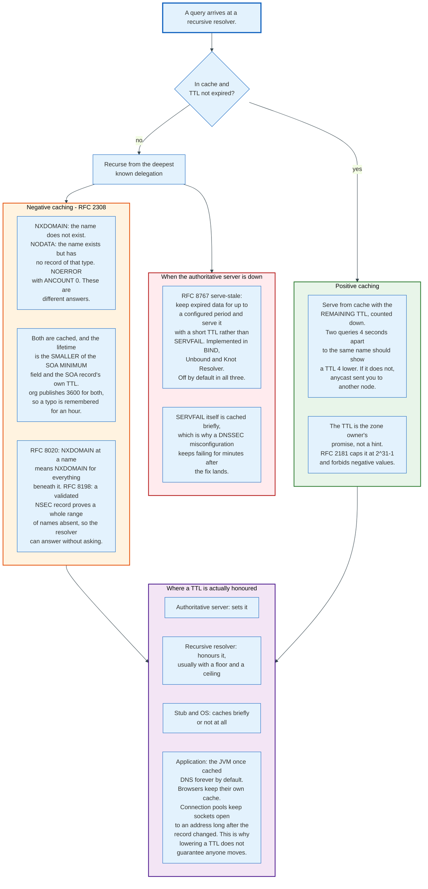

### 11.1 The TTL Contract

A TTL is a 32-bit field on every resource record stating how many seconds a resolver may keep it. RFC 2181 clarified two things about it: values are treated as unsigned with a maximum of 2^31-1 seconds, and a resolver receiving different TTLs for records in the same RRset should treat the whole set as having the lowest.

The contract runs one way. The zone owner promises the data is good for that long. Nobody promises to keep it that long, and nobody can be told to drop it early. There is no purge, no invalidation message, no callback. A cache holding a wrong answer with a 24-hour TTL holds it for 24 hours.

This is the single most consequential property in operational DNS. Every TTL is a pre-commitment made before you know what will go wrong.

### 11.2 The Cache Is Not One Cache

Between an authoritative server and an application there are typically five independent caches plus an open socket that ignores all of them, and the operator controls one.

| Layer | Honours TTL? | Notes |
|-------|--------------|-------|
| Recursive resolver | Yes, usually with a configured floor and ceiling | The only layer with a well-defined contract |
| Anycast siblings of that resolver | Independently | Each node has its own cache; observed TTLs can go up as well as down |
| OS stub or `systemd-resolved` | Partially | Some cache aggressively, some not at all |
| Browser | Its own policy | Chrome and Firefox maintain internal DNS caches independent of the OS |
| Application runtime | Historically not at all | The JVM cached successful lookups forever by default under a security manager; `networkaddress.cache.ttl` still trips teams up |
| Connection pool | Not applicable | An open socket to an old address survives any DNS change until it is closed |

The last row is the one that defeats DNS-based failover in practice. Lowering a TTL to 60 seconds does nothing for a client holding a keep-alive connection to the address you are trying to move away from.

### 11.3 Negative Caching

Absence is cached too, and by a different rule, defined in RFC 2308.

There are two negative answers and they are not the same. NXDOMAIN, RCODE 3, means the name does not exist at all. NODATA is NOERROR with an empty ANSWER section and means the name exists but has no record of the requested type. A name with only an MX record returns NODATA for an A query and NXDOMAIN for a query about a name that was never created.

Both are cached, and the lifetime is the smaller of the SOA MINIMUM field and the TTL on the SOA record itself, both of which appear in the AUTHORITY section of the negative response:

```
;; ->>HEADER<<- opcode: QUERY, status: NXDOMAIN, id: 59660
;; flags: qr aa; QUERY: 1, ANSWER: 0, AUTHORITY: 1, ADDITIONAL: 1
;; AUTHORITY SECTION:
org.  3600  IN  SOA  a0.org.afilias-nst.info. hostmaster.donuts.email.
                     1788151275 7200 900 1209600 3600
```

`org` publishes 3,600 for both, so a query for a name that does not exist under `org` is remembered as nonexistent for an hour. Create the name a minute later and resolvers that already asked will return NXDOMAIN for another 59 minutes. This is the mechanism behind "I created the record and it still does not work," and no action at the authoritative server fixes it.

Two later RFCs make negative caching do more work. RFC 8020 establishes that NXDOMAIN at a name implies NXDOMAIN for everything beneath it, so a resolver need not ask again for a deeper name. RFC 8198 lets a validating resolver use a DNSSEC-validated NSEC or NSEC3 record to answer for an entire range of names proven absent, without querying at all. Together these substantially reduce junk traffic to authoritative servers, and they are the main reason random-subdomain flooding attacks became less effective after 2017.

### 11.4 Serving Stale

RFC 8767, published March 2020, permits a resolver to serve expired data when it cannot reach the authoritative server, and BIND, Unbound and Knot Resolver all implement it with the feature off by default. BIND's documentation states of `stale-answer-enable` that "the default is not to return stale answers". Unbound documents `serve-expired` as "Default: no". Knot Resolver ships `serve_stale` as a module that has to be loaded by hand. Three implementations, three opt-ins.

The mechanism is a second timer. Records are kept past their TTL for a configurable period: BIND's `max-stale-ttl` defaults to one day. If a refresh fails, the resolver returns the stale record with a short TTL, 30 seconds under BIND's `stale-answer-ttl` default, and keeps trying. If a refresh succeeds, normal behaviour resumes.

The trade is stated plainly in the RFC: correctness is degraded to preserve availability. A zone whose authoritative servers are unreachable resolves to yesterday's answer rather than to SERVFAIL. For most services yesterday's answer is right. For a service in the middle of a failover, it is exactly wrong.

Serve-stale would have reduced the impact of the Dyn outage in 2016 and the Meta outage in 2021 for resolvers that had the affected names cached. It would not have helped a client resolving the name for the first time.

---

## 12. Zones, Zone Transfers, and Provisioning

A zone is replicated by copying a file between servers, and the protocol for doing that has been stable since 1996.

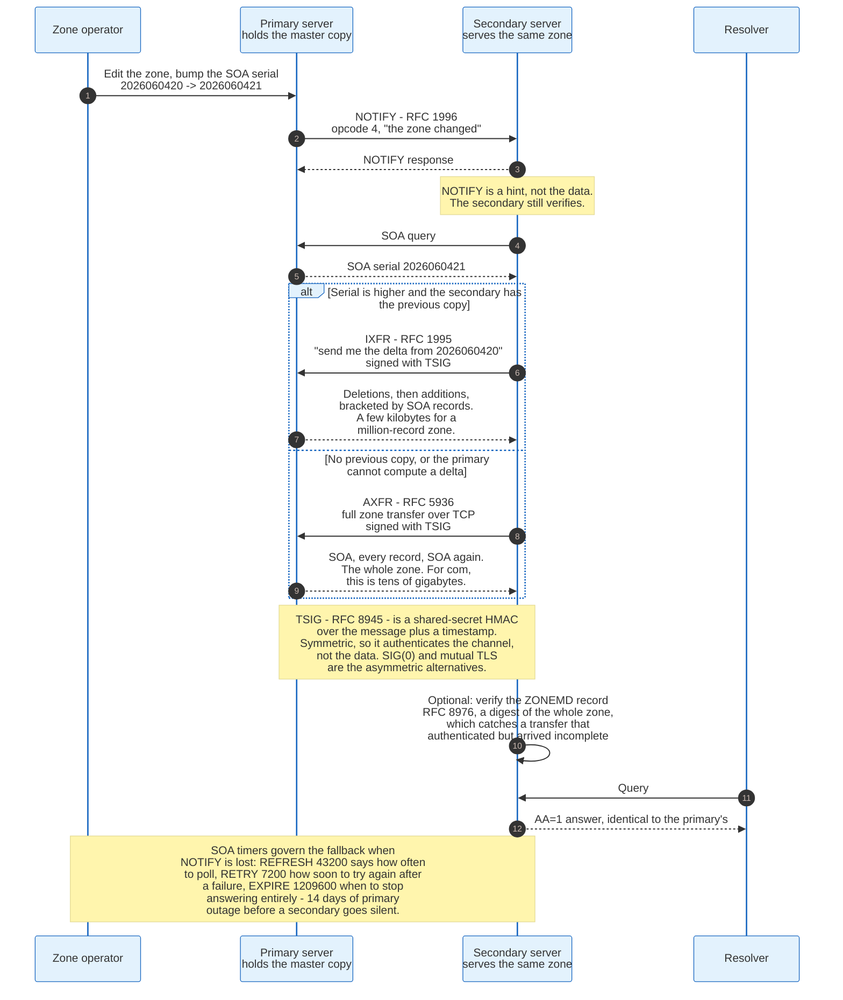

### 12.1 Primary and Secondary

One server holds the master copy of a zone and others copy it. The relationship is described entirely inside the zone's own SOA record and by a NOTIFY message.

The word "master" survives in configuration syntax and "primary" in the specification. RFC 9499 uses primary and secondary as the current terms.

### 12.2 The Replication Loop

**NOTIFY, RFC 1996.** When the primary loads a changed zone it sends a NOTIFY, opcode 4, to every secondary listed in the zone's NS set. The message says only that the zone changed. It carries no data and is not trusted: the secondary responds, then independently queries the SOA to check.

**SOA polling.** Independent of NOTIFY, each secondary queries the primary's SOA every REFRESH seconds, 43,200 in the Wikimedia example. If the serial is higher, it transfers. If the query fails, it retries every RETRY seconds, 7,200. If it has been unable to refresh for EXPIRE seconds, 1,209,600, it stops answering for the zone entirely. Fourteen days of primary outage before a secondary goes silent, which is generous by design.

**IXFR, RFC 1995.** The secondary asks for the difference between its serial and the current one. The primary responds with a sequence of deletions and additions, each bracketed by SOA records marking the version boundaries. For a zone with a million records and a ten-record change, this transfers a few kilobytes.

**AXFR, RFC 5936.** The full zone: SOA, every record, SOA again, over TCP. Used when the secondary has no previous copy, when the serial gap is too large for the primary's delta journal, or when the primary does not implement IXFR. For `com` this is tens of gigabytes.

**TSIG, RFC 8945.** Transfers are authenticated with a shared-secret HMAC computed over the message plus a timestamp, carried in a TSIG record appended to the ADDITIONAL section. Because the key is symmetric, TSIG authenticates the channel and the parties, not the data: a secondary with the key can produce a validly-signed lie. SIG(0), which uses public keys, and mutual TLS on port 853 are the asymmetric alternatives, and both are less deployed.

**ZONEMD, RFC 8976.** A digest of the entire zone published as a record inside it. This catches a failure mode nothing else does: a transfer that authenticated correctly and arrived incomplete. The root zone publishes a ZONEMD record, which is what makes RFC 8806, running a local copy of the root zone on a resolver, safe to do.

### 12.3 Catalog Zones

Managing 50,000 zones by editing configuration files on every secondary does not work, so RFC 9432, published July 2023, defines a zone whose contents are a list of other zones.

The primary publishes a catalog zone containing PTR records naming member zones. Secondaries transfer it with ordinary AXFR or IXFR, and add or remove the named zones automatically. Adding a customer becomes a record in a zone rather than a configuration push to every server.

### 12.4 Dynamic Updates

RFC 2136 defines opcode 5, UPDATE, which adds and removes records in a live zone with prerequisite conditions attached. It is authenticated with TSIG or GSS-TSIG.

Its principal deployment is Active Directory, where domain controllers register their own SRV records. Its principal use elsewhere is the ACME `dns-01` challenge, where a certificate authority requires proof of control over a name by asking for a specific TXT record to appear. Almost every automated certificate issuance pipeline either uses RFC 2136 or a proprietary provider API that does the same thing.

---

## 13. The Registry, Registrar, Registrant Model and EPP

The three-layer naming supply chain exists because the US government split a monopoly in 1999, and the protocol that binds it together is EPP.

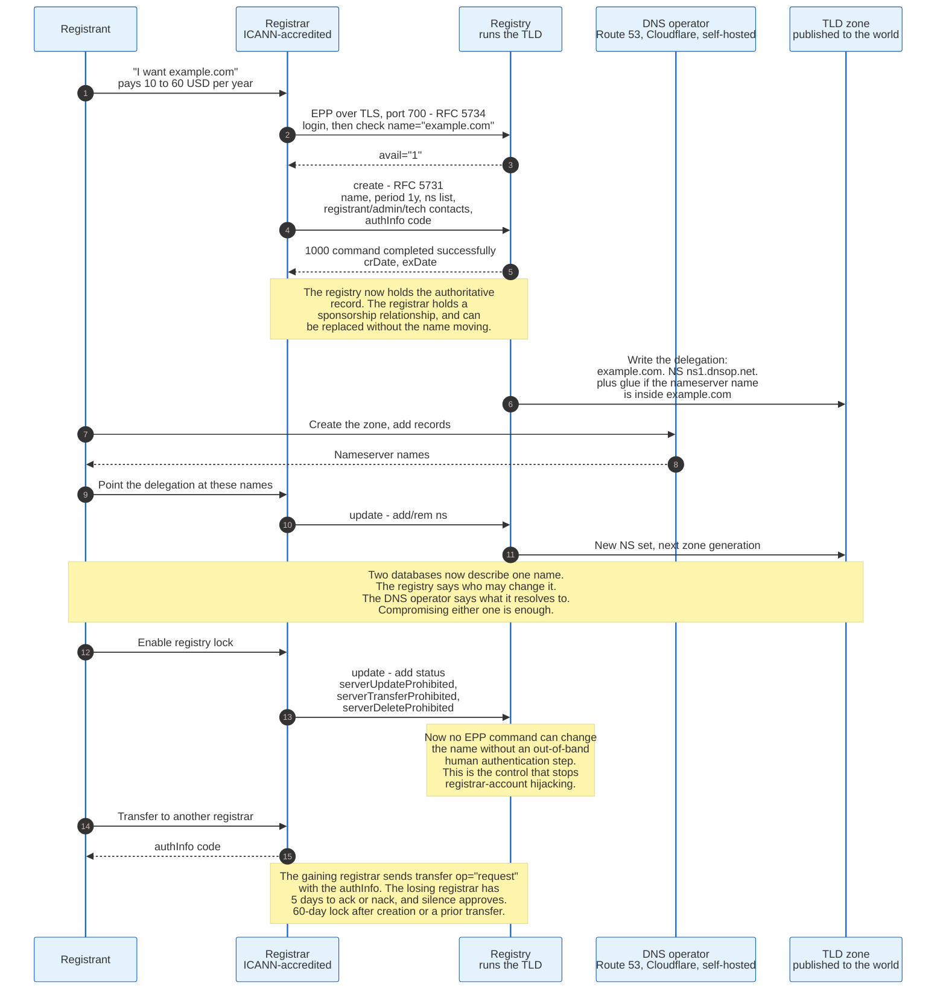

### 13.1 The Split

Until 1999 Network Solutions was both the registry for `.com` and the only place to register a name in it. The Shared Registry System separated the two functions: one registry operates the database and the authoritative servers for a TLD, and many accredited registrars sell registrations into it on equal terms.

The separation is now a contractual requirement in ICANN's registry agreements and it produces the structure everyone works with. The registry knows which registrar sponsors a name. The registrar knows the registrant. The registry generally does not deal with the registrant at all.

### 13.2 EPP

The Extensible Provisioning Protocol, RFC 5730 through RFC 5734, published August 2009, is how a registrar talks to a registry. It is XML over TLS on TCP port 700, stateful, with a login session and a sequence of commands.

The command set is small:

| Command | What it does |
|---------|--------------|
| `login` / `logout` | Session management, with the registrar's credentials and a client certificate |
| `hello` / `greeting` | Capability discovery |
| `check` | Is this name available? |
| `info` | Return everything about a name this registrar may see |
| `create` | Register a name for a period, with nameservers and contacts |
| `update` | Change nameservers, contacts, statuses, or DS records |
| `renew` | Extend the registration period |
| `transfer` | Request, approve, reject, cancel, or query a registrar transfer |
| `delete` | Remove the registration, subject to grace periods |
| `poll` | Retrieve asynchronous messages from the registry |

RFC 5731 defines the domain mapping, RFC 5732 the host mapping, RFC 5733 the contact mapping, and RFC 5734 the TCP transport. Secure DNS extensions for publishing DS records through EPP are in RFC 5910.

### 13.3 EPP Status Codes, and Why They Matter

Status codes on a domain are the security boundary between an ordinary registration and an unhijackable one.

Client-set statuses, prefixed `client`, are applied by the registrar and can be removed by anyone who controls the registrar account. Server-set statuses, prefixed `server`, are applied by the registry and cannot be removed through the ordinary EPP path.

| Status | Set by | Effect |
|--------|--------|--------|
| `clientTransferProhibited` | Registrar | Blocks transfer. Default on most registrations. |
| `clientUpdateProhibited` | Registrar | Blocks updates |
| `serverTransferProhibited` | Registry | Blocks transfer, and the registrar cannot lift it |
| `serverUpdateProhibited` | Registry | Blocks nameserver and contact changes |
| `serverDeleteProhibited` | Registry | Blocks deletion |
| `pendingTransfer` | Registry | A transfer is in flight |
| `redemptionPeriod` | Registry | Deleted, recoverable for 30 days at a penalty fee |
| `pendingDelete` | Registry | 5 days, then the name drops |

"Registry lock" is the product name for the three server-side prohibitions applied together, with an out-of-band authentication procedure to lift them. It typically costs a few hundred dollars a year. Every domain hijack of a major brand in the last fifteen years would have been stopped by it.

### 13.4 The Transfer Flow and Its Timers

Transfers between registrars are governed by a fixed set of intervals that exist mostly to prevent theft.

The registrant obtains an `authInfo` code from the losing registrar. The gaining registrar sends `transfer op="request"` carrying that code. The losing registrar has 5 days to approve or reject; silence approves. A name cannot be transferred within 60 days of creation or within 60 days of a previous transfer. A completed transfer adds one year to the registration.

The `authInfo` code is a shared secret and the entire strength of the transfer mechanism. Registries have progressively tightened it, and the current ICANN Transfer Policy requires registrars to generate a strong code on demand rather than storing a fixed one indefinitely.

### 13.5 Deletion and the Drop

A deleted domain does not become available immediately, and the delay created an industry.

Deletion moves the name into `redemptionPeriod` for 30 days, during which the original registrant can restore it for a fee typically between 80 and 200 USD. Then `pendingDelete` for 5 days. Then the name is released into the available pool at a moment the registry chooses, which for `.com` is a scheduled daily drop.

Drop-catching services maintain hundreds of registrar accreditations solely to issue `create` commands in parallel at that instant. This is the economically rational response to a first-come-first-served allocation at a publicly announced time, and every registry has decided that the alternatives are worse.

---

## 14. DNSSEC: Signing, Validation, and the Chain of Trust

DNSSEC adds public-key signatures to DNS records so a resolver can verify that data came from the zone owner, and it authenticates data rather than channels.

```mermaid
%%{init: {'theme': 'base', 'themeVariables': {'primaryColor': '#e3f2fd', 'primaryBorderColor': '#1565c0', 'lineColor': '#37474f'}}}%%

flowchart TB
    TA["TRUST ANCHOR - configured, not fetched<br/>Root KSK-2017, key tag 20326, algorithm 8<br/>Published by IANA at data.iana.org/root-anchors<br/>KSK-2024, key tag 38696, is published in the<br/>root zone alongside it as of Aug 2026<br/>and has not yet taken over signing."]

    subgraph RootZ["Root zone - serial 2026083001"]
        RK["DNSKEY 257 - KSK 20326<br/>signs only the DNSKEY RRset"]
        RZ["DNSKEY 256 - ZSK<br/>signs everything else in the zone"]
        RDS["com. IN DS 19718 13 2 8ACBB0CD...<br/>a hash of the child's KSK,<br/>signed by the root ZSK"]
    end

    subgraph ComZ["com zone - signed with algorithm 13, ECDSA P-256"]
        CK["DNSKEY 257 - KSK<br/>its hash is the DS above"]
        CZ["DNSKEY 256 - ZSK"]
        CDS["cloudflare.com. IN DS 2371 13 2 32996839...<br/>signed by the com ZSK"]
    end

    subgraph LeafZ["cloudflare.com zone"]
        LK["DNSKEY 257 - KSK, key tag 2371"]
        LZ["DNSKEY 256 - ZSK, key tag 34505"]
        LA["cloudflare.com. A 104.16.133.229<br/>RRSIG A 13 2 300 ... 34505 cloudflare.com."]
    end

    Result["Resolver sets AD=1.<br/>Break any link and the answer<br/>is SERVFAIL, not a warning.<br/>DNSSEC has no soft-fail."]

    TA -->|"matches by hash"| RK
    RK -->|"signs"| RZ
    RZ -->|"signs"| RDS
    RDS -->|"is the hash of"| CK
    CK -->|"signs"| CZ
    CZ -->|"signs"| CDS
    CDS -->|"is the hash of"| LK
    LK -->|"signs"| LZ
    LZ -->|"signs"| LA
    LA --> Result

    Split["Why two keys.<br/>The KSK is long, rarely rotated, and its<br/>hash sits in the parent, so changing it<br/>needs a parent transaction. The ZSK is<br/>short, rotated on a schedule, and changing<br/>it needs nothing outside the zone.<br/>Splitting them makes routine rotation<br/>a local operation."]

    RK -.-> Split

    Denial["Proving a name does NOT exist.<br/>NSEC lists the next name in canonical order,<br/>which lets anyone walk the whole zone.<br/>NSEC3 hashes the names instead, at the cost<br/>of CPU and a GPU-crackable hash.<br/>RFC 9276 says use NSEC3 with 0 extra<br/>iterations and an empty salt, because the<br/>iterations only ever hurt the server.<br/>The root uses plain NSEC: its contents<br/>are public anyway."]

    Result --> Denial

    style TA fill:#e3f2fd,stroke:#1565c0,stroke-width:3px
    style RootZ fill:#e8f5e9,stroke:#2e7d32,stroke-width:2px
    style ComZ fill:#fff3e0,stroke:#e65100,stroke-width:2px
    style LeafZ fill:#f3e5f5,stroke:#4a148c,stroke-width:2px
    style Result fill:#fce4ec,stroke:#880e4f,stroke-width:3px
    style Split fill:#eceff1,stroke:#37474f,stroke-width:2px
    style Denial fill:#eceff1,stroke:#37474f,stroke-width:2px
```

### 14.1 The Four Record Types

**DNSKEY, type 48.** A public key published in the zone. Flags 256 marks a Zone Signing Key, 257 marks a Key Signing Key, which is the Secure Entry Point. The distinction is convention enforced by practice rather than by protocol.

**RRSIG, type 46.** A signature over one RRset. RDATA carries the type covered, algorithm, labels, original TTL, signature expiration, signature inception, key tag, signer name, and the signature itself.

```
cloudflare.com. 63 IN RRSIG A 13 2 300 20260901054304 20260830034304
                             34505 cloudflare.com. 7feC+zMlJVh5xG5lHPReZ...
```

Read that as: covers type A, algorithm 13 (ECDSA P-256 with SHA-256), the owner name has 2 labels, original TTL 300, expires 2026-09-01 05:43:04 UTC, inception 2026-08-30 03:43:04 UTC, key tag 34505, signed by `cloudflare.com`. The validity window is under two days, which means Cloudflare re-signs continuously.

Signature expiry is an absolute timestamp, not a TTL. A signature that expires while the record is still cached fails validation. This is why DNSSEC outages are so often caused by a stopped cron job.

**DS, type 43.** A hash of a child's DNSKEY, published in the *parent* zone and signed by the parent. This is the only link between two zones.

```
com. 86400 IN DS 19718 13 2 8ACBB0CD28F41250A80A491389424D341522D946B0DA0C0291F2D3D771D7805A
```

Key tag 19718, algorithm 13, digest type 2 (SHA-256), then the digest. Of note: `com` now signs with ECDSA P-256 rather than RSA, having migrated from algorithm 8.

**NSEC, type 47, and NSEC3, type 50.** Authenticated denial of existence, covered below.

### 14.2 The Chain, Walked

Validation starts from a configured trust anchor and walks down. Each step proves the next key.

1. The resolver holds the root KSK as a trust anchor. It is configured, not fetched, and IANA publishes it at `data.iana.org/root-anchors/root-anchors.xml`.
2. The resolver fetches the root DNSKEY RRset and its RRSIG. It checks the RRSIG using the KSK whose hash matches the anchor. The root DNSKEY RRset is now trusted, including the ZSK.
3. The resolver fetches the DS for `com` from the root and verifies its RRSIG using the root ZSK.
4. It fetches the `com` DNSKEY RRset, hashes the KSK, and compares to the DS. Match means the `com` keys are trusted.
5. Repeat for `cloudflare.com`: DS from `com`, verified with the `com` ZSK; then the `cloudflare.com` DNSKEY RRset checked against that DS.
6. Finally, the answer's RRSIG is checked with the `cloudflare.com` ZSK.

Success sets the AD bit in the response to the stub:

```
;; flags: qr rd ra ad; QUERY: 1, ANSWER: 3, AUTHORITY: 0, ADDITIONAL: 1
cloudflare.com.  63  IN  A  104.16.133.229
cloudflare.com.  63  IN  A  104.16.132.229
cloudflare.com.  63  IN  RRSIG  A 13 2 300 ... 34505 cloudflare.com.
```

Failure produces SERVFAIL. DNSSEC has no soft-fail state and no warning mode. A broken chain is indistinguishable to the client from a dead server.

### 14.3 Why Two Keys

The KSK and ZSK split exists to make routine key rotation a purely local operation.

The KSK signs only the DNSKEY RRset. Its hash is in the parent, so replacing it requires a transaction with the registrar and the registry. It is therefore long, stored carefully, and rotated rarely.

The ZSK signs everything else. Replacing it requires only publishing a new DNSKEY and re-signing, both inside the zone. It is therefore shorter, kept online, and rotated on a schedule.

Without the split, every key rotation would be a parent transaction, and DNSSEC would be operationally intolerable.

### 14.4 Proving Absence

Signing what exists is easy. Proving that something does not exist, without an online signing key, is the hard part of DNSSEC.

**NSEC** solves it by sorting every name in the zone canonically and publishing, for each name, the next name in that order plus a bitmap of the types present. A query for a name that would sort between two existing names gets the NSEC record spanning that gap, which proves nothing exists there. The signature is precomputed.

The cost is that NSEC lets anyone enumerate the entire zone by walking from one record to the next. The root zone uses NSEC, correctly, because the list of TLDs is public. Measured on 31 August 2026, the root zone contains 1,439 NSEC records and no NSEC3.

**NSEC3**, RFC 5155, hashes each name with a salt and an iteration count and sorts the hashes instead. Enumeration now requires a dictionary attack against the hashes rather than a walk.

That defence turned out to be weak and expensive. GPU cracking makes hashed names recoverable for any name a human would choose, while the iteration count costs the *server* CPU on every negative answer and gives an attacker a cheap amplifier. RFC 9276, published August 2022, therefore recommends 0 additional iterations and an empty salt, which is to say NSEC3 configured to do the minimum work that still hashes.

An NSEC3 opt-out flag exists so a large delegation-centric zone can skip proofs for unsigned delegations, which is how `com` avoids signing hundreds of millions of records that carry no DS.

---

## 15. DNSSEC in Practice: The Deployment Reality

DNSSEC is 21 years old as a deployed specification, protects 93.9% of the top level, and validates for roughly 38% of internet users. Those three numbers describe a protocol that succeeded at the top and stalled in the middle.

### 15.1 What Is Actually Signed

**The root** was signed on 15 July 2010. It uses NSEC and algorithm 8, RSA with SHA-256.

**The TLDs.** Measured from the published root zone on 31 August 2026, 1,350 of 1,438 TLDs carry a DS record, which is 93.9%. The algorithm distribution across those DS records:

| Algorithm | Number | DS records |
|-----------|--------|------------|
| 8, RSA/SHA-256 | Most TLDs | 1,198 |
| 13, ECDSA P-256/SHA-256 | Growing, includes `com` | 241 |
| 10, RSA/SHA-512 | Legacy | 29 |
| 7, RSASHA1-NSEC3-SHA1 | Deprecated | 7 |
| 15, Ed25519 | Early adopters | 3 |
| 14, ECDSA P-384/SHA-384 | 1 TLD | 1 |

Digest types: 1,457 DS records use SHA-256, 13 still use SHA-1, and 9 use SHA-384.

The direction is clear. Algorithm 13 produces 64-octet signatures against roughly 256 octets for 2048-bit RSA, which cuts response sizes by more than half and keeps DNSSEC responses under the 1,232-octet Flag Day limit. Every large zone signing today picks it.

**Second-level domains** are the gap. Signing rates vary enormously by TLD: several ccTLDs that paid registrars to sign, notably `.se`, `.nl` and `.cz` in Europe and `.br` in Brazil, have signing rates in the tens of percent. `.com` is in the low single digits. No authoritative global figure for second-level signing is published, and estimates depend heavily on how the sample is drawn.

### 15.2 Validation

The APNIC Labs measurement, a 30-day average for 30 July to 28 August 2026 across 595,021,094 measurement samples, puts worldwide DNSSEC behaviour at 38.24% of users behind resolvers that validate strictly, 8.19% behind resolvers that validate partially, and 46.42% DNSSEC-capable in total.

That number moved because a handful of large resolvers turned validation on, not because millions of operators individually decided to. Google Public DNS, Cloudflare's 1.1.1.1, and Quad9 all validate. Comcast validates. Once those four are counted the curve is nearly flat.

### 15.3 The Root KSK Rollovers

The root key has been rolled once and a second rollover is in progress, and the first one took five years of preparation because there is no way to test it.

**KSK-2010**, key tag 19036, signed the root from 2010. **KSK-2017**, key tag 20326, was generated in 2016, published in the zone in July 2017, and took over signing on 11 October 2018 after a one-year delay caused by telemetry showing that a meaningful number of resolvers had not picked up the new key. RFC 5011 defines the automatic trust anchor update mechanism that made this possible, and the delay existed because RFC 5011 support was not universal.

**KSK-2024**, key tag 38696, appears in the IANA trust anchor file with `validFrom` 18 July 2024. Measured on 31 August 2026, the root zone publishes three DNSKEY records: one ZSK and both KSK-2017 and KSK-2024. The DNSKEY RRset is still signed by key tag 20326.

```
.  172800  IN  DNSKEY  257 3 8 AwEAAaz/tAm8yTn4Mfeh5eyI96WSVexT...   ; KSK-2017, tag 20326
.  172800  IN  DNSKEY  257 3 8 AwEAAa96jeuknZlaeSrvyAJj6ZHv28hh...   ; KSK-2024, tag 38696
.  172800  IN  DNSKEY  256 3 8 AwEAAeCYD6Z7WWKVLeuWgowKP+3g+Gs1...   ; ZSK
.  172800  IN  RRSIG   DNSKEY 8 0 172800 20260920000000 20260830000000 20326 . PvfCYsLI...
```

The old key still signs; the new key is published and waiting. That is exactly the RFC 5011 pattern, and the operational rule is that any resolver whose trust anchor file predates July 2024 needs updating before signing switches.

### 15.4 Why Adoption Stalled at the Second Level

Five reasons recur and none of them is cryptographic.

**The failure mode is total.** A DNSSEC error produces SERVFAIL at every validating resolver, which is roughly 38% of users. An unsigned zone with a bad record produces a wrong answer for some users. An operator weighing "possible total outage" against "no signatures" rationally picks no signatures unless something forces the issue.

**Expiry is a timer nobody watches.** Signatures expire on an absolute date. If re-signing stops, the zone dies on a schedule, at an hour nobody chose. Slack, Microsoft Azure, HBO Max, and a long list of others have taken this outage.

**The DS handoff crosses an organisational boundary.** Publishing a DS means the registrant tells the registrar to tell the registry, over EPP, and the registrar's interface for this ranges from a well-designed API to a support ticket. RFC 7344 defined CDS and CDNSKEY records so the child can publish its intended DS in its own zone for the parent to pick up, RFC 8078 defined the initial bootstrap, and RFC 9615, published July 2024, defined authenticated bootstrapping using signals from the zone's operator. Registrar support for all three is partial.

**Algorithm rollovers are harder than key rollovers.** Moving from RSA to ECDSA requires a period in which the zone is signed with both, both DNSKEYs are published, and both DS records are at the parent.

**The benefit is invisible to the zone owner.** DNSSEC protects the resolver's users from forged answers. It does not make the site faster, does not show up in a dashboard, and produces no incident when it works. The one clear commercial driver is DANE, RFC 6698, which lets a zone publish a TLSA record binding a certificate to a name. DANE is mandatory for SMTP in some jurisdictions and is otherwise little used on the public web, because browsers declined to implement it.

---

## 16. Cache Poisoning and the Kaminsky Attack

Cache poisoning is the insertion of forged data into a recursive resolver's cache, and until 2008 it was cheap.

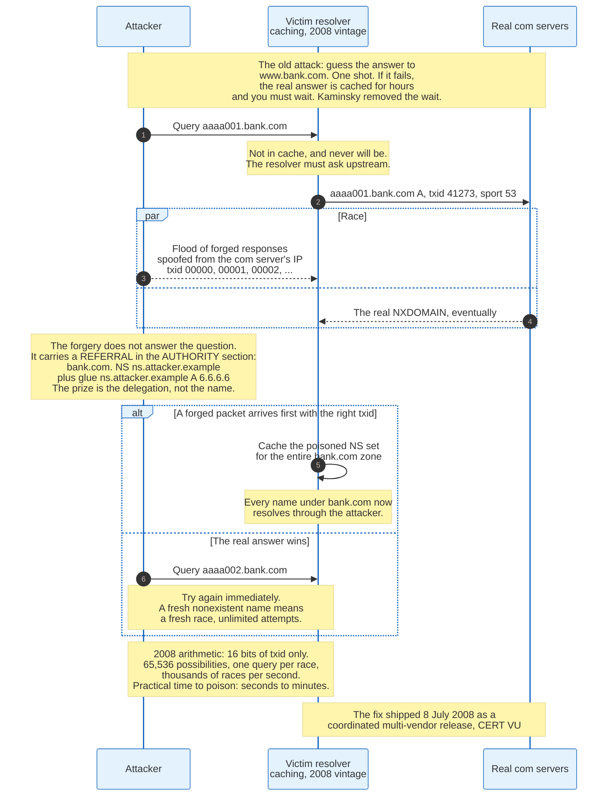

### 16.1 The Structural Weakness

A resolver sends a query over UDP and accepts the first response that matches on four things: source IP address, destination port, question section, and the 16-bit query ID.

An off-path attacker who cannot see the query must guess. Source and destination addresses are known. Before 2008, most resolvers used a fixed source port, often 53, so that was known too. The question is known if the attacker triggered it. That leaves 16 bits: 65,536 possibilities, and a coin flip on average after 32,768 attempts.

The defence that made this survivable was not entropy. It was that a failed attempt cost the attacker the target: once the real answer arrived, it was cached for its TTL, and no further attempt could win until it expired.

### 16.2 What Dan Kaminsky Changed

Kaminsky's insight, disclosed on 8 July 2008 as CERT VU#800113 in a coordinated multi-vendor patch release, was to attack a name that will never be cached and to aim at the delegation rather than the answer.

The attacker asks the target resolver for `aaaa001.bank.com`, a name that does not exist. The resolver has no cached answer and must query upstream. The attacker floods forged responses spoofed from the legitimate server's address, cycling through query IDs.

The forged response does not answer the question. It carries a referral in the AUTHORITY section:

```
;; AUTHORITY SECTION:
bank.com.  86400  IN  NS  ns.attacker.example.
;; ADDITIONAL SECTION:
ns.attacker.example.  86400  IN  A  6.6.6.6
```

If a forgery wins the race, the resolver caches a poisoned NS set for the entire `bank.com` zone, and every name under it now resolves through the attacker.

If the forgery loses, nothing is cached that blocks a retry, because the name did not exist. The attacker immediately tries `aaaa002.bank.com`. Unlimited attempts, thousands per second, with the prize being a whole zone rather than one record.

Time to poison a vulnerable resolver: seconds to minutes.

### 16.3 The Fix

RFC 5452, published January 2009, codified the defences the July 2008 patches shipped.

**Source port randomisation.** Use a random ephemeral source port per query. This adds roughly 16 bits, taking the search space from about 2^16 to about 2^32. It is the change that mattered, and it is why NAT devices with small port pools and predictable allocation became a security problem.

**Accept only in-bailiwick data.** Discard records in a response that the responding server has no authority over. A server answering for `com` may not supply data for `bank.com` beyond a delegation, and may not supply glue for a name outside the delegated zone. Every modern resolver enforces this.

**Reject duplicate outstanding queries.** If a query for the same name and type is already in flight, do not send a second one. Multiple simultaneous identical queries give an attacker a birthday-paradox advantage: with n outstanding queries, the chance any single forged packet matches one of them rises by roughly a factor of n.

**0x20 encoding.** Randomise the case of the query name. A conformant server echoes the QNAME unchanged, so the attacker must guess the case pattern as well. `WwW.wIkIPedIA.oRg` adds up to one bit per letter. It is a heuristic rather than a guarantee, since a small number of servers normalise case.

**DNS cookies, RFC 7873.** An 8-octet client cookie and a server cookie of 8 to 32 octets, exchanged in EDNS0 options. An off-path attacker cannot produce a valid server cookie, which stops both spoofed responses and spoofed queries used for amplification.

### 16.4 What Remains

Randomisation raised the cost. It did not change the fact that a plain DNS answer is unauthenticated.

Two developments since keep the class alive. Fragmentation-based attacks bypass port randomisation entirely by forging only the second IP fragment of a large response, since only the first fragment carries the UDP header with the port and ID. This is the security argument behind the 1,232-octet Flag Day value, not just the reliability argument. And side-channel work, notably the SAD DNS research published in 2020 and its 2021 follow-up, showed that ICMP rate-limit counters in the Linux kernel could be used to infer which source port a resolver had open, collapsing the port entropy from the outside.

Only DNSSEC makes a forgery detectable rather than merely improbable. That is the argument for it, and it has not been enough to produce universal deployment.

---

## 17. DNS as Attack Surface and Attack Weapon

DNS is attacked, and DNS is used to attack other things, and the two problems have different fixes.

### 17.1 Amplification and Reflection

DNS is the classic reflection amplifier because a small query produces a large answer over a connectionless protocol.

An attacker spoofs the victim's IP as the source of a query, sends it to an open resolver or an authoritative server, and the answer goes to the victim. A 60-octet query for `. NS` with DNSSEC returns 1,097 octets, an amplification factor near 18. Historically, `ANY` queries against zones with large record sets produced factors above 50.

Three changes reduced this. Response Rate Limiting, implemented in BIND, NSD, and Knot, caps identical responses to the same prefix per second. RFC 8482, published January 2019, permits a minimal answer to `ANY`, which removed the biggest amplifiers. DNS cookies stop an off-path spoofer from getting an answer at all. Open recursive resolvers, of which there were tens of millions in 2013, have been progressively closed, and BCP 38 source address validation at the network edge remains the actual fix that nobody fully deploys.

### 17.2 Random Subdomain Attacks

Also called water torture, this attack exhausts a resolver and an authoritative server simultaneously by querying names that cannot be cached.

The attacker generates queries for `<random>.victim.com` from many clients. Each is a cache miss at every resolver, so each is forwarded to the victim's authoritative servers. The resolver's outstanding-query table fills, and the authoritative server absorbs the full query rate with no cache in front of it. Both ends degrade for legitimate traffic.

Defences are aggressive NSEC use per RFC 8198, which lets a validating resolver answer from a proven-absent range without querying; NXDOMAIN cut per RFC 8020; per-zone rate limits at the resolver; and anycast capacity at the authoritative layer.

### 17.3 Hijacking Through the Control Plane

The highest-value DNS attacks do not touch DNS at all. They take over the account that controls the delegation.

In 2013 the Syrian Electronic Army altered nameservers for `nytimes.com` and `twitter.co.uk` by compromising a reseller of the registrar Melbourne IT. In October 2016 attackers took control of the DNS records for a Brazilian bank's domains and served their own infrastructure for several hours, with valid certificates obtained through domain validation.

The 2018 and 2019 campaigns tracked as DNSpionage and Sea Turtle went further, targeting registrars, registries, and ccTLD operators to redirect government and telecom domains, then obtaining certificates for the hijacked names. CISA issued Emergency Directive 19-01 on 22 January 2019 requiring US federal agencies to audit their public DNS records, change credentials on DNS management accounts, add multi-factor authentication to those accounts, and monitor Certificate Transparency logs for certificates issued against their domains.

The controls that work here are registry lock, multi-factor authentication on registrar accounts, CAA records limiting which CAs may issue, and Certificate Transparency monitoring so a hijack that produces a certificate is visible within minutes.

### 17.4 DNS as a Covert Channel

Because DNS resolution is permitted almost everywhere, it is used to move data through networks that block everything else.

Data is encoded into query names and answers, sent to an attacker-controlled authoritative server for a domain they own, and reassembled. Throughput is poor and reliability is excellent. Iodine and dnscat2 do this as tunnelling tools; several malware families do it for command and control; the 2020 SolarWinds compromise used DNS beaconing to `avsvmcloud.com` for its initial signalling, and the encoded subdomains were how the campaign was eventually mapped.

Detection is statistical: unusually long labels, high query rates to a single domain, high entropy in label content, high proportion of TXT or NULL types, and NXDOMAIN patterns. It is one of the few places where seeing plaintext DNS at the network edge has clear security value, which is precisely the argument enterprises make against DNS over HTTPS.

---

## 18. Encrypted Transports and the Policy Fight

DNS was specified in cleartext and stayed that way for 29 years, and the fight over encrypting it is about who gets to see and change queries rather than about cryptography.

```mermaid
%%{init: {'theme': 'base', 'themeVariables': {'primaryColor': '#e3f2fd', 'primaryBorderColor': '#1565c0', 'lineColor': '#37474f'}}}%%

flowchart TB
    Problem["Plain DNS is a plaintext broadcast of<br/>everything you are about to do.<br/>DNSSEC signs it. It does not hide it."]

    subgraph Transports["The transports, stub to resolver"]
        Do53["Do53 - the default since 1987<br/>UDP or TCP port 53, cleartext.<br/>Readable and modifiable by every<br/>network between you and the resolver."]
        DoT["DoT - RFC 7858, May 2016<br/>TLS on port 853. A dedicated port,<br/>so a network operator can see<br/>that you are doing DNS and can<br/>block the port. Android's<br/>Private DNS setting uses this."]
        DoH["DoH - RFC 8484, October 2018<br/>DNS messages inside HTTPS on port 443.<br/>Indistinguishable from web traffic,<br/>which is the entire point and the<br/>entire objection. Firefox, Chrome,<br/>Edge, and iOS all support it."]
        DoQ["DoQ - RFC 9250, May 2022<br/>QUIC on port 853. No head-of-line<br/>blocking, 0-RTT resumption.<br/>Also the transport for<br/>encrypted DNS between resolver<br/>and authoritative servers."]
        ODoH["Oblivious DoH - RFC 9230<br/>A proxy sees your IP but not the<br/>query. The target sees the query<br/>but not your IP. Splits the two<br/>facts that together identify you."]
    end

    subgraph Auth["Resolver to authoritative - the unencrypted half"]
        A1["RFC 9539: unilateral opportunistic<br/>encryption to authoritative servers.<br/>Opportunistic means it downgrades<br/>silently, so it defeats passive<br/>observation and not active attack."]
        A2["Most authoritative traffic is still<br/>cleartext UDP in 2026. The privacy<br/>win from DoH stops at the resolver."]
    end

    subgraph Fight["The policy fight, and who is on which side"]
        F1["For: the local network operator,<br/>the coffee shop, the ISP, and the<br/>national filter all lose the ability<br/>to read and rewrite queries."]
        F2["Against: the same list.<br/>UK ISPs nominated Mozilla for<br/>'Internet Villain' in 2019 over<br/>DoH and child-protection filtering.<br/>Enterprises lose split-horizon DNS<br/>and DNS-based threat blocking."]
        F3["The centralisation objection:<br/>moving resolution from thousands of<br/>ISP resolvers to a handful of global<br/>ones concentrates the log.<br/>Encryption changed who can read<br/>your queries, not whether<br/>somebody can."]
        F4["Europe's answer: DNS4EU, run by<br/>Whalebone under EU project 101095329,<br/>public resolvers at 86.54.11.1 and<br/>three filtered variants. A sovereign<br/>resolver rather than a ban."]
    end

    Problem --> Transports
    Transports --> Auth
    Transports --> Fight

    style Problem fill:#e3f2fd,stroke:#1565c0,stroke-width:3px
    style Transports fill:#e8f5e9,stroke:#2e7d32,stroke-width:2px
    style Auth fill:#fff3e0,stroke:#e65100,stroke-width:2px
    style Fight fill:#f3e5f5,stroke:#4a148c,stroke-width:2px
```

### 18.1 The Transports

| Protocol | Spec | Port | Transport | Distinguishable on the wire? |
|----------|------|------|-----------|------------------------------|
| Do53 | RFC 1035 | 53 | UDP, TCP | Yes, and readable |
| DoT | RFC 7858, May 2016 | 853 | TLS over TCP | Yes, by port |
| DoH | RFC 8484, October 2018 | 443 | HTTPS | No |
| DoQ | RFC 9250, May 2022 | 853 | QUIC | Yes, by port |
| Oblivious DoH | RFC 9230 | 443 | HTTPS via a proxy | No, and the target does not learn the client IP |

**DoT** puts ordinary DNS messages inside a TLS session on a dedicated port. It is simple, it is what Android's Private DNS setting uses, and its dedicated port means a network operator can see that DNS is happening and can block it.

**DoH** carries DNS messages as HTTP requests to a URI template, typically as a GET with a base64url-encoded message or a POST with `application/dns-message`. On port 443, mixed with all other web traffic, it is not distinguishable by port or by traffic shape. That is its design goal and the entire basis of the objection to it.

**DoQ** runs over QUIC, which removes head-of-line blocking and allows 0-RTT resumption. RFC 9250 also specifies it for resolver-to-authoritative use, which is the half of the path DoH and DoT do not cover.

**Oblivious DoH** splits knowledge. A proxy sees the client's address but only an encrypted query; the target resolver decrypts and answers but sees only the proxy. Neither party alone can associate a query with a user.

### 18.2 The Unencrypted Half

DoH and DoT protect the stub-to-resolver hop. The resolver-to-authoritative hop is still mostly cleartext UDP in 2026.

RFC 9539, published February 2024, specifies unilateral opportunistic encryption for that hop: a resolver may probe an authoritative server for encrypted transport and use it if available. Opportunistic means it downgrades silently when the probe fails, so it defeats passive observation and not an active attacker.

The consequence is that an observer positioned near a popular authoritative server still sees which resolvers are asking about which names, and an observer near a large recursive resolver sees the same. What DoH removes is the local network operator and the ISP.

### 18.3 The Policy Fight

Every party that loses visibility objects, and their objections are technically correct.

**ISPs and national filters.** Cleartext DNS is how most content filtering is implemented, from statutory blocklists to child-protection filters. The UK Internet Services Providers' Association nominated Mozilla for its "Internet Villain" award in 2019 over DoH, then withdrew the nomination after the reaction. The substantive point stood: DoH routed around a filtering regime that had legal force.

**Enterprises.** Split-horizon DNS, where an internal resolver returns different answers for internal names, breaks when a browser sends queries to an external DoH endpoint. So does DNS-based malware blocking, which is one of the cheapest security controls available. The mitigations are canary domains, which let a network signal that DoH should be disabled, and enterprise policy that pins the resolver.

**Privacy advocates and centralisation.** The strongest objection comes from the same side that wanted encryption. Moving resolution from thousands of ISP resolvers to a small number of global ones concentrates the query log in fewer hands. Encryption changed who can read your queries; it did not make the queries unreadable by everyone.

Europe's answer is DNS4EU, operated by Whalebone under EU project number 101095329, offering public resolvers at `86.54.11.1` for protective filtering, `86.54.11.12` adding child protection, `86.54.11.13` adding ad blocking, and `86.54.11.100` unfiltered. It is a sovereign alternative rather than a prohibition, and it accepts the centralisation while changing whose jurisdiction the logs sit in.

### 18.4 Where Resolution Actually Happens Now

The browser increasingly resolves names without asking the operating system, and that is the structural change.

Firefox enabled DoH by default for United States users in February 2020 through its Trusted Recursive Resolver programme. Chrome implements Secure DNS, which upgrades to DoH when the system resolver is a provider on a known list, preserving the user's choice of resolver while encrypting the transport. iOS and macOS support encrypted DNS profiles system-wide.

The result is that an operating system's `/etc/resolv.conf` is no longer a reliable statement of where a machine's DNS goes.

---

## 19. Traffic Steering: Anycast, GeoDNS, and Client Subnet

DNS is used to decide which server a user reaches, a job the protocol was never designed for, and the three techniques in use each fail differently.

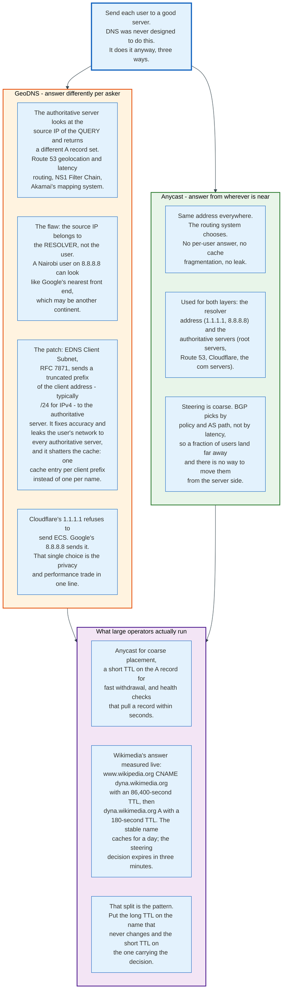

### 19.1 GeoDNS

GeoDNS means an authoritative server returns different records depending on who asked.

The server inspects the source address of the query, looks it up in a geolocation or network database, and selects an answer. Route 53 sells this as geolocation routing, geoproximity routing, and latency-based routing; NS1 as Filter Chain; Akamai's mapping system is a more sophisticated version of the same idea driven by continuous internet measurement.

The flaw is structural. The source address on the query belongs to the recursive resolver, not to the user. A user in Nairobi querying `8.8.8.8` presents whichever Google front end handled the recursion, which may be on another continent. Studies of public resolver adoption consistently find this misdirection affects a meaningful minority of users, and it grows as public resolvers take share from ISP resolvers.

### 19.2 EDNS Client Subnet

RFC 7871, published May 2016, patches the flaw by having the resolver forward part of the client's address.

The recursive resolver includes an ECS option in its query to the authoritative server carrying a truncated client prefix, conventionally `/24` for IPv4 and `/56` for IPv6. The authoritative server uses that prefix rather than the resolver's own address, and echoes back the scope it actually used so the resolver knows how narrowly to cache.

The costs are large and both fall on parties who did not ask for them.

**Privacy.** Every authoritative server the resolver consults learns the user's network. That is a direct reversal of what encrypted transports are for, which is why Cloudflare's `1.1.1.1` does not send ECS as a matter of policy while Google's `8.8.8.8` does. Those two choices are the clearest available statement of the trade.

**Cache fragmentation.** Without ECS, a resolver stores one entry per name. With ECS, it stores one entry per name per client prefix. A resolver serving a million distinct `/24`s stores up to a million entries where it stored one, which raises memory use and lowers hit rate, which increases load on the authoritative server the feature was meant to help.

### 19.3 Anycast for Steering

Anycast steers without answering differently, and that is its advantage.

Because every client reaches the same address, there is one cache entry, no client information leaves the resolver, and no geolocation database has to be correct. The routing system does the placement. The disadvantage is that the placement is coarse, driven by BGP policy rather than latency, and the server operator cannot move an individual client.

Large operators run both. Anycast handles coarse placement and absorbs attack traffic. A short-TTL record handles the fine-grained decision and the withdrawal of an unhealthy target.

### 19.4 The Pattern That Works

The Wikimedia answer measured in section 6 is the canonical shape: a stable CNAME with an 86,400-second TTL pointing at a volatile A record with a 180-second TTL.

The long TTL sits on the name users type and other zones reference, which does not change. The short TTL sits on the name that carries the current routing decision, which changes constantly. Health checks pull the short-TTL record within seconds of a failure, and the three-minute floor on client behaviour is accepted as the cost.

Putting a short TTL on the name users type buys nothing and multiplies query load. Putting a long TTL on the steering record makes failover impossible. Almost every DNS traffic management mistake is one of those two.

---

## 20. Economics: What DNS Costs and Who Pays

DNS costs money at four layers, and the payments flow in almost the opposite direction to the traffic.

### 20.1 The Registration Chain

A registrant pays a registrar. The registrar pays the registry a wholesale fee and pays ICANN a per-transaction fee. Retail prices vary by more than an order of magnitude for the identical product.

For `.com`, the wholesale registry price has risen under a schedule permitted by Verisign's registry agreement with ICANN, which allows 7% annual increases in four of every six years, reaching 10.26 USD in September 2024. ICANN adds a transaction fee of 0.18 USD per domain-year, charged to the registrar. Retail prices run from roughly the wholesale-plus-ICANN floor, which is what Cloudflare Registrar charges by policy, to 20 USD or more at registrars that bundle privacy, support, and marketing.

The margin structure explains registrar behaviour. On a 10.44 USD cost base, a registrar selling at 12 USD earns roughly 1.56 USD a year and makes its real money on renewals, privacy services, hosting, email, and SSL. First-year discounts below cost are rational because the renewal price is the product.

Registries are a different business. A TLD registry has near-zero marginal cost per registration and a fixed cost dominated by running authoritative infrastructure that must never fail. Verisign's `.com` operation stands in front of about 161 million registrations as of the fourth quarter of 2025 with a single delegation in the root.

### 20.2 The New gTLD Round

ICANN's second new gTLD application round opened on 30 April 2026 and closed on 12 August 2026, the first expansion of the top level since the 2012 round produced most of the current 1,438 TLDs.

The 2012 round charged 185,000 USD per application. The 2026 round charges 227,000 USD, set in module 3 of the Applicant Guidebook published on 16 December 2025 and carried unchanged into the authoritative revision of 24 April 2026. Qualified Applicant Support Program applicants pay between 34,500 and 56,750 USD, a reduction of 75% to 85% whose exact size depends on how many of them qualify. The fee falls due on receipt of the invoice, and on 7 August 2026 ICANN moved the deadline to the later of 19 August 2026 or seven days after the invoice was sent. Applicants also face contention resolution costs, registry operator obligations including data escrow and emergency back-end registry operator arrangements, and ongoing ICANN fees.

The economics of the 2012 round were sobering. A minority of new gTLDs achieved meaningful registration volumes; many hold fewer than 10,000 names; several have been withdrawn. The commercially successful cases were mostly generic words with obvious consumer meaning and brand TLDs used purely for control rather than for revenue.

### 20.3 Authoritative DNS Hosting

Authoritative DNS is priced per zone and per million queries, and it is cheap in absolute terms and expensive relative to what it replaces.

Route 53 charges 0.50 USD per hosted zone per month for the first 25 zones and 0.40 USD per million queries for standard queries, with latency-based and geo routing priced higher. Cloudflare bundles authoritative DNS at no incremental cost with every plan including the free tier, which is a deliberate strategic choice: DNS is the control point that puts Cloudflare in the path of the traffic it monetises elsewhere. NS1, Akamai, and Dyn's successors sell enterprise DNS with query-based pricing plus features: health-checked failover, traffic steering, and per-answer analytics.

A typical medium-sized web property spends single-digit dollars per month on authoritative DNS. That number is why secondary DNS with a second independent provider, which roughly doubles the cost, is the cheapest availability improvement available to most organisations and is still not the default.

### 20.4 Recursive Resolution

Public recursive resolvers are free at the point of use and are not charities.

Google, Cloudflare, and Quad9 each operate global anycast fleets answering hundreds of billions of queries per day at no charge. The returns are indirect: aggregate visibility into what is being resolved, which feeds threat intelligence and network measurement; a client relationship that supports other products; and, for Cloudflare specifically, a position at the front of the request path.

Quad9 is the exception that proves the structure. It is a Swiss non-profit funded by donations and sponsorships, and it blocks known-malicious domains as its stated product. Its funding model is a standing argument that neutral resolution is a public good that markets do not naturally supply.

ISPs run resolvers because they must, and the cost is real: query volume scales with subscriber count, the service must be available continuously, and it is a frequent DDoS target. Public resolvers taking share from ISP resolvers moves that cost off the ISP's books and moves the query log with it.

### 20.5 The Root

The root server system has no revenue model at all.

Twelve organisations fund 2,004 instances answering roughly 1.6 million queries per second out of their own budgets: government agencies from their appropriations, universities from research funds, non-profits from membership and donations, ICANN from registry and registrar fees, Verisign and Cogent from commercial revenue earned elsewhere.

No contract compels any of them to continue. RSSAC001 sets expectations. The system's resilience comes from twelve independent parties each deciding, separately and repeatedly, that operating a root server is worth what it costs them.

---

## 21. Outages Caused by DNS

DNS turns small mistakes into total outages, because everything starts with a lookup and a cached wrong answer outlives its fix.

```mermaid
%%{init: {'theme': 'base', 'themeVariables': {'primaryColor': '#e3f2fd', 'primaryBorderColor': '#1565c0', 'lineColor': '#37474f'}}}%%

flowchart TB
    Root["DNS turns a small mistake into a<br/>total outage, because everything<br/>starts with a lookup and a cached<br/>wrong answer outlives the fix."]

    subgraph Modes["The five ways DNS takes a service down"]
        M1["1. The empty or wrong record<br/>Automation writes a state nobody<br/>reviewed. AWS, 19-20 Oct 2025:<br/>a race between two DynamoDB DNS<br/>Enactors left dynamodb.us-east-1<br/>with an empty record. 2h52m of<br/>DynamoDB impact, cascading through<br/>EC2 and Lambda until 14:20 PDT."]
        M2["2. The unreachable authoritative server<br/>Meta, 4 Oct 2021: a backbone<br/>maintenance command isolated the<br/>data centres. Meta's DNS servers<br/>are built to withdraw their own<br/>BGP routes when they cannot reach<br/>the data centres, so they did.<br/>The servers were healthy and<br/>unreachable. Facebook, Instagram,<br/>and WhatsApp vanished for hours."]
        M3["3. The DDoS on the authoritative layer<br/>Dyn, 21 Oct 2016: three Mirai<br/>waves, 11:10-13:20, 15:50-17:00,<br/>and 20:00-22:10 UTC. Twitter,<br/>Netflix, Reddit, GitHub, Spotify<br/>all unreachable, none of them<br/>attacked. Single-provider DNS<br/>was the shared dependency."]
        M4["4. The expired or broken signature<br/>DNSSEC has no soft-fail. A lapsed<br/>RRSIG or a DS that no longer matches<br/>the child's KSK produces SERVFAIL<br/>at every validating resolver,<br/>which is roughly 38% of users."]
        M5["5. The resolver, not the zone<br/>Cloudflare 1.1.1.1, 14 Jul 2025:<br/>a dormant config error from 6 June<br/>withdrew the resolver prefixes<br/>globally at 21:48 UTC. 62 minutes.<br/>The zones were fine. The<br/>road to them was not."]
    end

    subgraph Why["Why recovery is slow even after the fix"]
        W1["Caches hold the wrong answer for<br/>the TTL you set BEFORE the incident.<br/>You cannot retroactively lower it."]
        W2["Negative answers are cached too,<br/>for the SOA MINIMUM. An NXDOMAIN<br/>published by accident with a<br/>3600-second MINIMUM is an hour."]
        W3["Every layer below the resolver has<br/>its own cache: the OS, the browser,<br/>the JVM, the connection pool,<br/>the service mesh sidecar."]
        W4["Recovery traffic is a thundering herd.<br/>Every client that failed retries at<br/>once against a cold cache, and the<br/>fixed system falls over again."]
    end

    subgraph Fix["What actually reduces the blast radius"]
        X1["Two independent DNS providers with<br/>separate NS delegations. Dyn's<br/>customers who had one stayed up."]
        X2["Registry lock on the delegation,<br/>so no EPP command can move it."]
        X3["Short TTLs before a change, restored<br/>after. TTL is a pre-commitment,<br/>not a runtime lever."]
        X4["Validate the zone before publishing:<br/>ZONEMD for completeness, signature<br/>expiry alarms with weeks of margin,<br/>and a canary resolver that fails<br/>the deploy rather than the users."]
        X5["Serve-stale on your own resolvers,<br/>RFC 8767, so an upstream outage<br/>degrades instead of stopping."]
    end

    Root --> Modes --> Why --> Fix

    style Root fill:#e3f2fd,stroke:#1565c0,stroke-width:3px
    style Modes fill:#ffebee,stroke:#b71c1c,stroke-width:2px
    style Why fill:#fff3e0,stroke:#e65100,stroke-width:2px
    style Fix fill:#e8f5e9,stroke:#2e7d32,stroke-width:2px
```

### 21.1 AWS, 19 to 20 October 2025: the Empty Record

The largest cloud outage of 2025 was caused by a race condition in DNS automation, not by DNS.

Amazon's DynamoDB uses a DNS management system with two components. A DNS Planner watches load balancer health and produces numbered DNS plans. Three DNS Enactors, one per availability zone for redundancy, apply those plans through Route 53 and clean up superseded ones.

One Enactor stalled while retrying updates. While it was stalled, the Planner produced several newer generations, and a second Enactor applied the newest plan across all endpoints and then ran its cleanup, deleting older plans. The stalled Enactor then woke and applied its now-obsolete plan to the regional endpoint, overwriting the newer one. The cleanup process then deleted that plan too. The result, in Amazon's own description, was that "all IP addresses for the regional endpoint were immediately removed," leaving `dynamodb.us-east-1.amazonaws.com` with an empty record and the system in an inconsistent state that blocked further automated updates.

The timeline, in Pacific Daylight Time: DNS failures and API error rates begin at 23:48 on 19 October. Engineers identify DynamoDB DNS as the source at 00:38. Temporary mitigations restore internal service connections at 01:15. DNS is restored at 02:25. Global table replicas resynchronise at 02:32. Cached DNS records expire and customer connectivity returns at 02:40. DynamoDB's direct impact ran 2 hours 52 minutes; the cascade through EC2 instance launches, Lambda, and dependent services continued until 14:20.

Two lessons are in that timeline. The DNS fix landed at 02:25 and customers recovered at 02:40, because caches had to expire. And a redundancy mechanism, three independent Enactors, was the thing that failed, because it had no ordering guarantee between them.

### 21.2 Meta, 4 October 2021: the Unreachable Server

Meta's DNS servers were healthy throughout the outage and nobody could reach them.

A command issued during routine backbone capacity assessment took down all connections in Meta's backbone network. An audit system designed to reject such a command had a bug and did not. Meta's data centres were then isolated from each other and from the internet.

Meta's authoritative DNS servers are built to withdraw their own BGP route announcements when they cannot reach the data centres, on the reasoning that a nameserver that cannot verify the health of the services it points at should stop advertising itself. That is a sound design under partial failure. Under total backbone failure, every nameserver made the same determination simultaneously and withdrew.

The result was that Facebook, Instagram, and WhatsApp had no reachable nameservers at all. The names could not be resolved, so nothing about Meta could be reached, including the internal tools engineers needed to fix it and the physical access systems at the affected sites.

The lesson is that a health-triggered withdrawal is a correct local decision that becomes a global outage when every instance makes it at once. Withdrawal thresholds need a floor: never withdraw the last announcement.

### 21.3 Dyn, 21 October 2016: the Attack on the Authoritative Layer

None of the sites that went down that day were attacked.

Mirai, a botnet of compromised consumer routers and cameras, attacked Dyn's managed DNS infrastructure in three waves: 11:10 to 13:20, 15:50 to 17:00, and 20:00 to 22:10 UTC. Dyn reported tens of millions of source IP addresses involved.

Twitter, Netflix, Reddit, Spotify, GitHub, Airbnb, PayPal, and more than eighty other named services became unreachable, because all of them used Dyn as their sole DNS provider. Customers that also delegated to a second, independent provider stayed up, because a resolver that fails to reach one set of nameservers tries the other.

That is the single clearest natural experiment in DNS resilience, and it produced an industry-wide move to multi-provider DNS that then partly reversed as organisations rediscovered how much work it is to keep two zones synchronised.

### 21.4 Cloudflare 1.1.1.1, 14 July 2025: the Resolver, Not the Zone

A configuration error introduced on 6 June 2025 at 17:38 UTC sat dormant for five weeks. It associated the `1.1.1.1` resolver's IP prefixes with a non-production service in a legacy topology system.

On 14 July a change to a Data Localization Suite service triggered a global configuration refresh. At 21:48 UTC the resolver's prefixes were withdrawn worldwide, reduced from all locations to a single offline location. DNS traffic began dropping at 21:52. The incident was declared at 22:01, a configuration revert was deployed at 22:20 restoring 77% of traffic, and full restoration came at 22:54 after roughly 23% of edge servers needed IP binding updates. Sixty-two minutes.

DoH traffic was largely unaffected, because most DoH users reach `cloudflare-dns.com` by name rather than by the literal address, and that name resolved to unaffected prefixes.

The lesson is that a resolver outage and a zone outage look identical to a user and have nothing in common operationally. Every zone Cloudflare serves was fine.

### 21.5 The Recurring DNSSEC Outage

A lapsed signature or a mismatched DS takes a zone off the internet for the 38% of users behind validating resolvers, and it happens to large organisations regularly.

The pattern is always one of three. Signatures expired because a re-signing job stopped. A key was rolled at the child without the DS being updated at the parent, or the reverse. Or an algorithm rollover was performed in the wrong order, leaving a DS pointing at a key that no longer signs.

The mitigations are unglamorous and effective: alarm on signature expiry with weeks of margin rather than hours, verify the DS at the parent against the child's DNSKEY continuously rather than at change time, and run a validating canary resolver in the deployment pipeline so a bad zone fails the deploy instead of the users.

### 21.6 Why Recovery Is Slow

Four mechanisms extend a DNS outage past its fix, and all four are consequences of caching.

Positive answers are cached for the TTL that was published before the incident, and it cannot be retroactively lowered. Negative answers are cached for the SOA MINIMUM, so an accidental NXDOMAIN with a 3,600-second MINIMUM is remembered for an hour. Every layer below the recursive resolver holds its own cache with its own rules, including browsers, runtimes, and connection pools. And recovery produces a thundering herd, because every client that failed retries simultaneously against a cold cache.

The pre-commitment nature of the TTL is the part that catches teams. Lowering a TTL is only useful if you do it before you need it, which means doing it before every planned change and accepting the query volume in the meantime.

---

## 22. Comparisons and Alternatives

DNS has been challenged repeatedly and replaced nowhere, and the reasons are consistent.

### 22.1 The Comparison Table

| System | What it names | Trust model | Human-readable? | Decentralised? | Deployed at scale? |
|--------|---------------|-------------|-----------------|----------------|--------------------|
| **DNS** | Anything, hierarchically | Delegation from a single root, optionally signed | Yes | Administratively, under one root | Universal |
| **mDNS / Bonjour** | Hosts on a local link, under `.local` | None; link-local trust | Yes | Fully, within a link | Universal on local networks |
| **LLMNR / NetBIOS** | Windows hosts on a LAN | None | Yes | Fully | Legacy, and a security liability |
| **ENS** | Ethereum addresses and content hashes, under `.eth` | Blockchain consensus | Yes | Yes | Small, and outside the browser |
| **Handshake** | Top-level names | Proof-of-work blockchain | Yes | Yes | Negligible |
| **Tor onion services** | Services, under `.onion` | The name IS the public key | No | Yes | Millions of clients, unreadable names |
| **IPFS / IPNS** | Content, by hash | The name IS the content hash | No | Yes | Niche |
| **Alternative DNS roots** | TLDs outside the IANA root | Whoever runs the alternative root | Yes | No, just a different centre | Effectively zero |

### 22.2 Zooko's Triangle, and Why DNS Sits Where It Does

The recurring claim about naming systems is that a name can be at most two of human-meaningful, globally unique, and securely decentralised.

DNS picks human-meaningful and globally unique, and pays for it with a single administrative root. Tor onion addresses pick globally unique and securely decentralised, and pay with names like `duckduckgogg42xjoc72x3sjasowoarfbgcmvfimaftt6twagswzczad.onion`. Blockchain naming systems claim all three and pay in a different currency: the root is a consensus protocol rather than IANA, and the entity that can rewrite the mapping is whoever holds a majority of the relevant resource.

Certificate systems worked around the problem instead of solving it. A name in DNS plus a certificate binding a key to that name gives a usable approximation of secure human-meaningful naming, provided you trust the certificate authorities. Certificate Transparency made that trust auditable, which is why the practical answer to "how do I know I reached the right site" is a CT-logged certificate rather than DNSSEC.

### 22.3 What Would Have to Be True for a Replacement

Three things, and none is close.

A replacement would need to work when 100% of clients have not adopted it, which means running alongside DNS indefinitely and inheriting its properties. It would need an answer to caching at internet scale, since the query volume is enormous and cannot be served from a consensus system with block times. And it would need registrars, registries, resolver operators, browser vendors, and operating system vendors to change together, which is the coordination problem that DELEG, a far smaller change, is still working through.

The likely future is DNS with more of its weaknesses patched, which is exactly the last thirty years.

---

## 23. Modern Developments

### 23.1 DELEG

The most consequential proposed change to DNS since DNSSEC is a new record type for delegations.

`draft-ietf-deleg`, "Extensible Delegation for DNS", reached revision 11 on 23 July 2026. The DELEG record is authoritative at the delegation point, like DS and unlike NS, which means the parent signs it. Its RDATA uses the RFC 9460 SvcParams structure, with keys including `server-ipv4`, `server-ipv6`, `server-name`, and `include-delegparam`, plus a `mandatory` key listing parameters a resolver must understand for the record to be usable. A companion DELEGPARAM type supports indirection without creating a delegation. RRTYPE 61440 is requested for DELEG.

Three things become possible that are impossible today. The delegation itself is DNSSEC-protected, closing the last unsigned link in the resolution chain. The parent can advertise transport capabilities, so a resolver learns that a zone's servers speak DNS over TLS before contacting them. And the dual-source-of-truth problem between parent NS and child NS goes away, because there is one authoritative statement.

Resolvers signal support with a DE bit in EDNS0. Zones publish DELEG and NS together during transition; a DELEG-only delegation is invisible to legacy resolvers. Security work in the draft includes a DNSKEY-ADT flag to prevent downgrade, limits on `include-delegparam` chain depth, and SLIST deduplication to prevent amplification.

The obstacle is deployment, not design. Every registry, registrar, authoritative implementation, and resolver has to move.

### 23.2 SVCB and HTTPS Records

RFC 9460, published November 2023, gives DNS a record that carries connection parameters. Deployment is partial and no global figure is published: of 25 well-known apex names queried through `1.1.1.1` on 31 August 2026, six publish an HTTPS record. `google.com`, `youtube.com`, `facebook.com`, `instagram.com`, `cloudflare.com`, and `stackoverflow.com` do. `apple.com`, `microsoft.com`, `amazon.com`, and sixteen others do not. The record is nearly three years old and most of the web has not moved.

AliasMode, priority 0, solves apex aliasing at the protocol level, which retires the ALIAS and CNAME-flattening workarounds. ServiceMode carries `alpn` so a client knows the server speaks HTTP/3 before connecting, `port` so a service can move off 443, `ipv4hint` and `ipv6hint` so the address arrives with the parameters, and `ech`, which carries the public key for Encrypted Client Hello.

ECH is the actual driver. It encrypts the TLS Server Name Indication, closing the last cleartext leak of which site a user is visiting, and it needs a place to publish a key that the client can fetch before the handshake. That place is the HTTPS record.

### 23.3 The Second Root KSK Rollover

KSK-2024, key tag 38696, is published in the root zone and has not yet taken over signing, and the operational implication is a deadline for every validating resolver.

Any resolver whose trust anchor configuration predates 18 July 2024 and does not implement RFC 5011 automatic updates will fail to validate anything once KSK-2024 begins signing the root DNSKEY RRset. The 2018 rollover was delayed a year for exactly this reason. IANA's ceremony schedule continues, with Root KSK Ceremony 63 scheduled for 12 November 2026 to sign the first-quarter 2027 ZSKs.

### 23.4 Algorithm Modernisation

RFC 9904, published November 2025, replaced RFC 8624 with a process for updating DNSSEC algorithm recommendations rather than a fixed list, which is an admission that a static table in an RFC ages badly.

The practical movement is from RSA to elliptic curve. Algorithm 13, ECDSA P-256 with SHA-256, produces 64-octet signatures against roughly 256 for 2048-bit RSA. That is the difference between a signed response fitting in 1,232 octets and not. `com` has migrated. Algorithm 15, Ed25519, is in the root zone for three TLDs. Post-quantum signature algorithms are under active discussion in the IETF and face an obvious problem: current post-quantum signatures are one to two orders of magnitude larger than ECDSA, and DNS responses are size-constrained by design.

### 23.5 Error Reporting and Observability

RFC 8914's Extended DNS Errors made SERVFAIL debuggable from the client side. RFC 9567, published April 2024, added DNS Error Reporting, which lets a zone publish an address to which resolvers should report resolution failures they encounter.

The combination changes the diagnostic loop. Previously a zone owner learned about a DNSSEC failure from user complaints. Now a validating resolver can tell them directly, with a machine-readable code.

### 23.6 Local Root and Resolverless Configurations

RFC 8806, published June 2020, describes running a full copy of the root zone on the resolver itself, so root queries never leave the machine.

The zone is 2.25 MB and changes a few times a day. A resolver that transfers it directly answers every TLD query from local data with zero latency and reveals nothing to the root operators. ZONEMD, RFC 8976, is what makes it safe: the resolver can verify the zone it received is complete and unmodified.

It removes the root from the critical path for the resolvers that adopt it, at a cost of 2.25 MB and a zone transfer a few times a day.

### 23.7 What Changed in the Last Three Years

- **September 2023**: RFC 9471 makes in-domain glue mandatory in referrals.
- **November 2023**: RFC 9460 publishes SVCB and HTTPS records.
- **March 2024**: RFC 9499 replaces RFC 8499 as the DNS terminology reference.
- **April 2024**: RFC 9567 adds DNS Error Reporting.
- **July 2024**: KSK-2024 trust anchor published; RFC 9615 defines authenticated DNSSEC bootstrapping.
- **February 2025**: RFC 9609 replaces RFC 8109 for priming queries.
- **June 2025**: DNS4EU public resolver service launches under EU funding.
- **July 2025**: Cloudflare's 1.1.1.1 is withdrawn globally for 62 minutes by a dormant configuration error.
- **October 2025**: AWS `us-east-1` outage traced to a DNS automation race condition.
- **November 2025**: RFC 9904 replaces RFC 8624 with an algorithm recommendation process.
- **December 2025**: Root server system absorbs a 1 Tbps DDoS on 23 December.
- **April to August 2026**: ICANN's second new gTLD application round opens and closes.
- **June to July 2026**: Root query traffic doubles for a week from a recursive resolver software update, with no measurable impact.
- **July 2026**: `draft-ietf-deleg` reaches revision 11.

---

## 24. Appendix

### 24.1 Key Terminology

| Term | Meaning |
|------|---------|
| **AA bit** | Authoritative Answer. Set by a server answering from its own zone data. |
| **AD bit** | Authentic Data. Set by a validating resolver when DNSSEC validation succeeded. |
| **Anycast** | Announcing the same IP prefix from many locations so routing selects one. |
| **Authoritative server** | A server that answers for a zone from local knowledge, without querying others. |
| **AXFR** | Full zone transfer, RFC 5936, over TCP. |
| **Bailiwick** | Informally, the region of the namespace a server has authority over. In-bailiwick data is accepted; out-of-bailiwick data is discarded. |
| **CD bit** | Checking Disabled. Asks a resolver to skip DNSSEC validation. |
| **DELEG** | A proposed signed, extensible delegation record. `draft-ietf-deleg`, RRTYPE 61440 requested. |
| **DO bit** | DNSSEC OK. An EDNS0 flag asking for DNSSEC records in the response. |
| **DoH / DoT / DoQ** | DNS over HTTPS (RFC 8484), TLS (RFC 7858), and QUIC (RFC 9250). |
| **DS** | Delegation Signer. A hash of the child's KSK, published and signed in the parent zone. |
| **ECS** | EDNS Client Subnet, RFC 7871. Forwards a truncated client prefix for geo-steering. |
| **EDNS0** | Extension Mechanisms for DNS, RFC 6891. An OPT pseudo-record carrying a larger UDP size and option codes. |
| **EPP** | Extensible Provisioning Protocol, RFC 5730. XML over TLS on port 700, registrar to registry. |
| **Glue** | Address records for a nameserver whose name is inside the zone being delegated. |
| **IXFR** | Incremental zone transfer, RFC 1995. Sends only the difference between serials. |
| **KSK / ZSK** | Key Signing Key, whose hash is the DS in the parent, and Zone Signing Key, which signs everything else. |
| **NSEC / NSEC3** | Authenticated denial of existence, by sorted next-name or by hashed next-name. |
| **NSID** | Name Server Identifier, RFC 5001. Reports which anycast instance answered. |
| **NODATA** | NOERROR with an empty ANSWER section. The name exists; the type does not. |
| **NXDOMAIN** | RCODE 3. The name does not exist. |
| **Priming query** | A resolver's startup query for `. NS`, to replace the root hints file. |
| **QNAME minimisation** | RFC 9156. Sending each server only the labels it needs to produce a referral. |
| **Recursive resolver** | A resolver that follows referrals on a client's behalf and caches the results. |
| **Registry lock** | The three server-side EPP prohibitions applied together, lifted only out of band. |
| **RRset** | All records with the same owner name, class, and type. The unit DNSSEC signs. |
| **RRSIG** | A signature over one RRset, with absolute inception and expiration times. |
| **Serve-stale** | RFC 8767. Serving expired records when the authoritative server is unreachable. |
| **SERVFAIL** | RCODE 2. Used for resolution failures including DNSSEC validation failures. |
| **Stub resolver** | The client-side code that formats a query and asks a recursive resolver. Cannot follow referrals. |
| **TC bit** | Truncated. The response did not fit; retry over TCP. |
| **TSIG** | Transaction Signature, RFC 8945. Shared-secret HMAC authentication for transfers and updates. |
| **TTL** | Time to live. How long a resolver may cache a record. A pre-commitment, not a runtime control. |
| **Zone** | The part of the namespace one set of servers is authoritative for, bounded by zone cuts. |
| **Zone cut** | The boundary between a parent zone and a delegated child zone. |
| **ZONEMD** | RFC 8976. A digest of an entire zone, published inside it, proving completeness. |

### 24.2 Architecture Diagrams

| Diagram | Source | Description |
|---------|--------|-------------|
| Namespace Tree | [`diagrams/namespace-tree.mmd`](diagrams/namespace-tree.mmd) | The inverted tree, labels, and why the tree has no depth rule |
| Delegation and Zone Cuts | [`diagrams/delegation-and-zone-cuts.mmd`](diagrams/delegation-and-zone-cuts.mmd) | NS, DS, and glue at a zone cut, and the dual-source-of-truth problem |
| Resolution Chain | [`diagrams/resolution-chain.mmd`](diagrams/resolution-chain.mmd) | Stub to recursive to root to TLD to authoritative, with measured sizes and times |
| Participants | [`diagrams/participants.mmd`](diagrams/participants.mmd) | Registrant, registrar, registry, DNS operator, resolver operator, and who pays whom |
| Root Server System | [`diagrams/root-server-system.mmd`](diagrams/root-server-system.mmd) | The 13 identities, why there are 13, and how the zone reaches them |
| Anycast Mechanics | [`diagrams/anycast-mechanics.mmd`](diagrams/anycast-mechanics.mmd) | One address, many sites, and what anycast does and does not provide |
| Record Types | [`diagrams/record-types.mmd`](diagrams/record-types.mmd) | A, AAAA, CNAME, SOA, NS, MX, TXT, SRV, CAA, SVCB, and the ALIAS non-record |
| Wildcard Synthesis | [`diagrams/wildcard-synthesis.mmd`](diagrams/wildcard-synthesis.mmd) | The closest encloser rule, the three answers it produces, and the DNSSEC denial proof |
| EDNS0 and Truncation | [`diagrams/edns0-and-truncation.mmd`](diagrams/edns0-and-truncation.mmd) | The 512-octet legacy, EDNS0, and the retreat to 1,232 |
| Caching and TTL | [`diagrams/caching-and-ttl.mmd`](diagrams/caching-and-ttl.mmd) | Positive and negative caching, serve-stale, and the caches you do not control |
| Zone Transfer | [`diagrams/zone-transfer.mmd`](diagrams/zone-transfer.mmd) | NOTIFY, SOA polling, IXFR, AXFR, TSIG, and ZONEMD |
| EPP Provisioning | [`diagrams/epp-provisioning.mmd`](diagrams/epp-provisioning.mmd) | Registrant to registrar to registry to zone, with registry lock and transfers |
| DNSSEC Chain of Trust | [`diagrams/dnssec-chain-of-trust.mmd`](diagrams/dnssec-chain-of-trust.mmd) | Trust anchor to root to TLD to domain, and why there are two keys |
| Kaminsky Attack | [`diagrams/kaminsky-attack.mmd`](diagrams/kaminsky-attack.mmd) | The race, the referral in the AUTHORITY section, and the RFC 5452 defences |
| Encrypted DNS | [`diagrams/encrypted-dns.mmd`](diagrams/encrypted-dns.mmd) | Do53, DoT, DoH, DoQ, Oblivious DoH, and the policy fight |
| Traffic Steering | [`diagrams/traffic-steering.mmd`](diagrams/traffic-steering.mmd) | GeoDNS, EDNS Client Subnet, anycast, and the two-TTL pattern |
| Outage Anatomy | [`diagrams/outage-anatomy.mmd`](diagrams/outage-anatomy.mmd) | Five failure modes, why recovery is slow, and what reduces blast radius |

### 24.3 RFC Reference

| RFC | Title | Published |
|-----|-------|-----------|
| 882 / 883 | Domain names: concepts, and implementation | November 1983 |
| 1034 / 1035 | Domain names: concepts and facilities, implementation and specification | November 1987 |
| 1995 | Incremental Zone Transfer in DNS | August 1996 |
| 1996 | DNS NOTIFY | August 1996 |
| 2136 | Dynamic Updates in the DNS | April 1997 |
| 2181 | Clarifications to the DNS Specification | July 1997 |
| 2308 | Negative Caching of DNS Queries | March 1998 |
| 2782 | A DNS RR for specifying the location of services (SRV) | February 2000 |
| 3596 | DNS Extensions to Support IP Version 6 | October 2003 |
| 3833 | Threat Analysis of the DNS | August 2004 |
| 4033 / 4034 / 4035 | DNSSEC introduction, records, and protocol modifications | March 2005 |
| 4343 | DNS Case Insensitivity Clarification | January 2006 |
| 4592 | The Role of Wildcards in the DNS | July 2006 |
| 5001 | DNS Name Server Identifier (NSID) Option | August 2007 |
| 5011 | Automated Updates of DNS Security Trust Anchors | September 2007 |
| 5155 | DNSSEC Hashed Authenticated Denial of Existence (NSEC3) | March 2008 |
| 5452 | Measures for Making DNS More Resilient against Forged Answers | January 2009 |
| 5730 / 5731 / 5734 | EPP, its domain mapping, and its TCP transport | August 2009 |
| 5910 | DNSSEC Mapping for EPP | May 2010 |
| 5936 | DNS Zone Transfer Protocol (AXFR) | June 2010 |
| 6672 | DNAME Redirection in the DNS | June 2012 |
| 6698 | DANE TLSA | August 2012 |
| 6891 | Extension Mechanisms for DNS (EDNS(0)) | April 2013 |
| 7314 | EDNS EXPIRE Option | July 2014 |
| 7344 | Automating DNSSEC Delegation Trust Maintenance (CDS/CDNSKEY) | September 2014 |
| 7766 | DNS Transport over TCP - Implementation Requirements | March 2016 |
| 7858 | DNS over TLS | May 2016 |
| 7871 | Client Subnet in DNS Queries | May 2016 |
| 7873 | DNS Cookies | May 2016 |
| 8020 | NXDOMAIN: There Really Is Nothing Underneath | November 2016 |
| 8078 | Managing DS Records from the Parent via CDS/CDNSKEY | March 2017 |
| 8109 | Initializing a DNS Resolver with Priming Queries, obsoleted by RFC 9609 | March 2017 |
| 8198 | Aggressive Use of DNSSEC-Validated Cache | July 2017 |
| 8482 | Minimal-Sized Responses to QTYPE=ANY | January 2019 |
| 8484 | DNS Queries over HTTPS (DoH) | October 2018 |
| 8499 | DNS Terminology, obsoleted by RFC 9499 | January 2019 |
| 8624 | Algorithm Implementation Requirements and Usage Guidance for DNSSEC, obsoleted by RFC 9904 | June 2019 |
| 8659 | DNS Certification Authority Authorization (CAA) | November 2019 |
| 8767 | Serving Stale Data to Improve DNS Resiliency | March 2020 |
| 8806 | Running a Root Server Local to a Resolver | June 2020 |
| 8914 | Extended DNS Errors | October 2020 |
| 8932 | Recommendations for DNS Privacy Service Operators | October 2020 |
| 8945 | Secret Key Transaction Authentication for DNS (TSIG) | November 2020 |
| 8976 | Message Digest for DNS Zones (ZONEMD) | February 2021 |
| 9156 | DNS Query Name Minimisation to Improve Privacy | November 2021 |
| 9230 | Oblivious DNS over HTTPS | June 2022 |
| 9250 | DNS over Dedicated QUIC Connections | May 2022 |
| 9276 | Guidance for NSEC3 Parameter Settings | August 2022 |
| 9364 | DNS Security Extensions (DNSSEC) - BCP | February 2023 |
| 9432 | DNS Catalog Zones | July 2023 |
| 9460 | Service Binding and Parameter Specification (SVCB and HTTPS) | November 2023 |
| 9471 | DNS Glue Requirements in Referral Responses | September 2023 |
| 9499 | DNS Terminology | March 2024 |
| 9539 | Unilateral Opportunistic Deployment of Encrypted Recursive-to-Authoritative DNS | February 2024 |
| 9567 | DNS Error Reporting | April 2024 |
| 9609 | Initializing a DNS Resolver with Priming Queries | February 2025 |
| 9615 | Automatic DNSSEC Bootstrapping | July 2024 |
| 9619 | In the DNS, QDCOUNT Is (Usually) One | July 2024 |
| 9904 | DNSSEC Cryptographic Algorithm Recommendation Update Process | November 2025 |

### 24.4 Response Code Reference

| RCODE | Name | Meaning |
|-------|------|---------|
| 0 | NOERROR | Success. With ANCOUNT 0, this is NODATA. |
| 1 | FORMERR | The server could not parse the query |
| 2 | SERVFAIL | Resolution failed. Includes DNSSEC validation failure. |
| 3 | NXDOMAIN | The name does not exist |
| 4 | NOTIMP | Opcode not implemented |
| 5 | REFUSED | The server declines to answer, typically a policy decision |
| 8 | NXRRSET | An UPDATE prerequisite failed |
| 9 | NOTAUTH | Not authoritative for the zone, or a bad TSIG key |
| 16 | BADVERS / BADSIG | EDNS version unsupported, or a bad TSIG signature |
| 23 | BADCOOKIE | The DNS cookie was invalid |

### 24.5 Useful Diagnostic Commands

```
# Follow the delegation chain yourself, one hop at a time
dig @198.41.0.4 www.example.com +norecurse
dig @<tld-server> www.example.com +norecurse
dig @<authoritative> www.example.com +norecurse

# Which anycast instance answered
dig @192.5.5.241 . SOA +nsid

# See the full DNSSEC chain and validation
dig example.com A +dnssec +multi
delv example.com A +rtrace

# Why did it SERVFAIL - read the Extended DNS Error
dig @1.1.1.1 dnssec-failed.org A

# What UDP size does this server advertise
dig @8.8.8.8 . NS | grep 'udp:'

# Force truncation and observe the TC bit
dig @198.41.0.4 . NS +dnssec +bufsize=512 +ignore

# Negative answer with the SOA that sets its cache lifetime
dig @<tld-server> does-not-exist.example.com +norecurse

# Full zone if the server allows it, which it should not
dig @<authoritative> example.com AXFR
```

---

## 25. Key Takeaways

**1. Delegation is the whole invention.** Hierarchy partitions the namespace, delegation hands each partition to whoever runs it, and caching stops query load from scaling with the size of the system. Those three ideas were written down in 1983 and nothing since has replaced them.

**2. The 13 root servers are 13 addresses, not 13 machines.** Twelve organisations operate 2,004 instances behind them as of 31 August 2026. The number 13 exists because that was the most that fit in a 512-octet UDP response, a constraint EDNS0 removed in 1999. Anycast, not the number, is what provides the capacity.

**3. A TTL is a pre-commitment, not a control.** There is no purge, no invalidation, no callback. A wrong answer with a 24-hour TTL is cached for 24 hours, and lowering the TTL after the incident begins changes nothing. AWS restored `dynamodb.us-east-1` DNS at 02:25 on 20 October 2025 and customers recovered at 02:40, because caches had to expire.

**4. Negative answers are cached too, by a different rule.** NXDOMAIN and NODATA are held for the smaller of the SOA MINIMUM and the SOA's own TTL. `org` publishes 3,600 for both, so creating a record a minute after someone queried it means an hour of NXDOMAIN for that resolver.

**5. DNSSEC signs, DoH hides, and neither does the other's job.** DNSSEC proves the answer came unmodified from the zone owner and provides no confidentiality. DoH encrypts one hop and provides no evidence the answer is correct. A DoH resolver that lies is a DoH resolver that lies over TLS.

**6. DNSSEC's failure mode is total, which is why the second level did not sign.** A lapsed signature or a mismatched DS produces SERVFAIL at every validating resolver, roughly 38% of users measured by APNIC in August 2026. 93.9% of TLDs are signed. Second-level signing outside a handful of subsidised ccTLDs is not.

**7. The delegation itself is the last unsigned link.** NS records in the parent and their glue are not signed by DNSSEC, by design. DELEG, at draft revision 11 in July 2026, fixes that and the parent-child NS mismatch at the same time, and needs every registry, registrar, and resolver to move together.

**8. Kaminsky did not find a new bug. He removed the cost of failure.** Attacking a name that will never be cached gives unlimited retries, and putting the forgery in the AUTHORITY section wins a whole zone rather than one record. Source port randomisation took the search space from about 2^16 to about 2^32. Only DNSSEC makes a forgery detectable rather than improbable.

**9. Anycast absorbs attacks passively.** The 1 Tbps DDoS against ten of the 13 root identities on 23 December 2025 lasted under ten minutes, produced measurable impact at several identities, and caused no known end-user visible errors, because the traffic was delivered to hundreds of sites rather than to one.

**10. Most DNS outages are not DNS failures.** AWS in October 2025 was an automation race condition writing an empty record. Meta in October 2021 was healthy nameservers withdrawing their own routes. Cloudflare in July 2025 was a resolver prefix withdrawal, with every zone fine. Dyn in October 2016 was the only one that was actually an attack on DNS, and it took down eighty services that were never attacked.

**11. Two independent DNS providers is the cheapest availability improvement available.** Dyn's customers who had a second provider stayed up on 21 October 2016. Authoritative DNS costs single-digit dollars a month for most properties, so doubling it is a rounding error against the outage it prevents.

**12. The control plane is the real attack surface.** Registry lock, multi-factor authentication on registrar accounts, CAA records, and Certificate Transparency monitoring stop the hijacks that no amount of nameserver hardening addresses. Every major brand hijack of the last fifteen years went through an account, not a protocol.

**13. Nobody is paid to run the root.** Twelve organisations fund 2,004 instances answering roughly 1.6 million queries per second out of their own budgets, under a document that describes expectations rather than obligations. The system's resilience is a product of that heterogeneity, and it has no contractual guarantee behind it.

---

*Figures in this document were measured or verified on 31 August 2026 against live DNS, the published root zone at serial `2026083001`, the IANA root hints file dated 26 August 2026, root-servers.org, IANA trust anchor publications and the DNS RR type registry, APNIC Labs measurement data, the RFC Editor, IETF Datatracker, ICANN's 2026 Round Applicant Guidebook, the BIND, Unbound, and Knot Resolver manuals, and operator incident reports from AWS, Cloudflare, Meta, and the root server operators. Query counts, instance counts, and registration totals move continuously; orders of magnitude are stable, individual measurements are not.*
