# Load Balancing: Complete Technical Deep Dive

---

## Table of Contents

1. [History and Overview](#1-history-and-overview)
2. [What Load Balancing Actually Is (and Is Not)](#2-what-load-balancing-actually-is-and-is-not)
3. [The Correctness Constraints That Bound Every Design](#3-the-correctness-constraints-that-bound-every-design)
4. [Key Participants and Roles](#4-key-participants-and-roles)
5. [Layer 4 and Layer 7 - What Each One Can See](#5-layer-4-and-layer-7---what-each-one-can-see)
6. [DNS-Based Distribution and the Caching Ceiling](#6-dns-based-distribution-and-the-caching-ceiling)
7. [Anycast and ECMP at the Network Layer](#7-anycast-and-ecmp-at-the-network-layer)
8. [The Algorithms and the Failure Each One Causes](#8-the-algorithms-and-the-failure-each-one-causes)
9. [Consistent Hashing, Properly](#9-consistent-hashing-properly)
10. [Consistent Hashing With Bounded Loads](#10-consistent-hashing-with-bounded-loads)
11. [The Power of Two Choices](#11-the-power-of-two-choices)
12. [Session Affinity and Why It Fights Elasticity](#12-session-affinity-and-why-it-fights-elasticity)
13. [Termination Models and Direct Server Return](#13-termination-models-and-direct-server-return)
14. [Health Checks and the Flapping Problem](#14-health-checks-and-the-flapping-problem)
15. [Connection Draining and Graceful Shutdown](#15-connection-draining-and-graceful-shutdown)
16. [TLS Termination and Re-encryption](#16-tls-termination-and-re-encryption)
17. [Worked Example - One Request Through a Three-Zone Fleet](#17-worked-example---one-request-through-a-three-zone-fleet)
18. [The Hardware to Software Transition](#18-the-hardware-to-software-transition)
19. [The Modern Stack and How the Options Compare](#19-the-modern-stack-and-how-the-options-compare)
20. [Service Mesh and Sidecar Balancing](#20-service-mesh-and-sidecar-balancing)
21. [Retries and the Retry Storm](#21-retries-and-the-retry-storm)
22. [Load Shedding Under Overload](#22-load-shedding-under-overload)
23. [Economics - What It Costs and Who Pays](#23-economics---what-it-costs-and-who-pays)
24. [Security and Risk](#24-security-and-risk)
25. [Modern Developments](#25-modern-developments)
26. [Appendix](#26-appendix)
27. [Key Takeaways](#27-key-takeaways)

---

## 1. History and Overview

Load balancing is the problem of spreading traffic across many machines without breaking the guarantees the traffic depends on. Spreading is easy. Not breaking anything is the entire discipline.

The field has moved through five distinct eras, and each transition began when the previous answer ran out of a specific resource. DNS ran out of reaction speed. Hardware appliances ran out of chassis capacity. Dedicated software balancers ran out of the ability to see inside a multiplexed connection. Sidecars ran out of memory budget. The sequence is legible in the artefacts.


### 1.1 DNS Gets There First, and Documents Its Own Limits, 1995

The first widely deployed load balancer was the DNS server, and the specification that described it also explained why it would not be enough.

RFC 1794, "DNS Support for Load Balancing", was published in April 1995 by Thomas P. Brisco of Rutgers University as an Informational document. It proposes that an authoritative nameserver return several address records for one name and rotate their order, so that clients taking the first answer distribute themselves across servers. Brisco's mechanism was a "volatile zone": a secondary nameserver that recalculates and reorders the address set every few minutes.

The RFC states the failure mode in its own text. BIND at the time treated any time-to-live under 300 seconds as irrational and silently substituted 300. Brisco wanted records recalculated every five seconds and had to patch BIND's hardcoded minimum down to 60 just to experiment. Caching resolvers still held the answer for the full TTL regardless.

That is the shape of the whole problem, visible in 1995. Distribution is trivial. Withdrawal is hard.

### 1.2 Appliances Buy Speed and Sell a Ceiling, mid-1990s

Dedicated load-balancing appliances appeared in the mid-1990s and solved the reaction-time problem by sitting in the packet path, where a decision costs microseconds rather than a TTL. Cisco's LocalDirector, F5's BIG-IP, and Alteon's ACEswitch defined the product category. The exact ship dates of the first units are not consistently documented in primary sources.

Their architecture had four constraints that later systems were built specifically to escape, and the Maglev paper enumerates all four. Scalability is bounded by the capacity of a single unit. Deployment is in active-passive pairs, which is 1+1 redundancy, not N+1. Modifying the behaviour of a hardware device is difficult or impossible. Adding capacity means buying and physically racking new hardware.

Half the fleet sits idle by design. That is the sentence that eventually killed the category at hyperscale.

### 1.3 The Open Source Turn, 1998 to 2004

Three projects moved load balancing onto commodity Linux, and all three are still in production in 2026.

The Linux Virtual Server project, started by Wensong Zhang in 1998, put the balancer in the kernel. Its IPVS code entered the standard Linux kernel in the 2.4 series and remains there. LVS defined three forwarding models that every later system reuses under different names: VS/NAT rewrites both directions, VS/TUN encapsulates, and VS/DR rewrites only the destination MAC address so replies bypass the balancer entirely. The project's own comparison table gives VS/NAT a ceiling of 10 to 20 real servers and both VS/TUN and VS/DR a ceiling it describes only as high.

HAProxy 1.0 was released on 16 December 2001 by Willy Tarreau, as a userspace TCP and HTTP reverse proxy. nginx 0.1.0 followed on 4 October 2004, written by Igor Sysoev, its changelog entry reading in full: "The first public version." Both were built to survive connection counts that the prevailing process-per-connection servers could not, and both became load balancers because a reverse proxy that already terminates connections is one decision away from being one.

### 1.4 Hyperscale Rebuilds It in Software, 2008 to 2020

Maglev entered production at Google in 2008 and was published at NSDI in March 2016, and it set the template every large software balancer has followed since.

The design has three moves. Routers distribute packets across a fleet of identical Maglev machines using Equal Cost Multipath, so the balancer scales out rather than up and every machine serves. Each machine bypasses the Linux network stack entirely, sharing a preallocated packet pool with the NIC, which raises its throughput by more than a factor of five. Each machine selects a backend using a new consistent hashing scheme and caches the result in a per-thread connection table.

The numbers are specific. Maglev processes a packet in about 350 nanoseconds. A single machine saturates a 10 Gbps link with minimum-sized packets using 5 packet threads, and reaches slightly above 15 million packets per second when a 40 Gbps NIC removes the NIC as the bottleneck. Across one production cluster in Europe with 458 endpoints, the coefficient of variation of load across endpoints stays between 6% and 7% for most of a typical day.

Meta open sourced Katran on 22 May 2018, moving the same job into XDP and eBPF so the forwarding plane runs before the kernel network stack and colocates with the backends rather than on dedicated machines. Cloudflare published Unimog on 9 September 2020, using Generic UDP Encapsulation, XDP, and a control loop driven by processor utilisation collected from Prometheus, at a cost of under 1% of processor utilisation on each server.

The load balancer stopped being a device. It became a program that runs on the same servers as everything else.

### 1.5 Scale and State of the Art, August 2026

The current versions, as of August 2026, are nginx 1.31.4 released 19 August 2026, HAProxy 3.4 as the current long-term-support branch, Istio 1.30.x, and Kubernetes 1.37 with kube-proxy still defaulting to iptables mode.

Two facts about the software layer set the commercial context. F5 announced its acquisition of NGINX on 11 March 2019 for approximately 670 million dollars in total enterprise value, citing more than 375 million sites, and completed it on 9 May 2019. Envoy graduated from the Cloud Native Computing Foundation on 28 November 2018, with nearly 250 contributors and over 3,000 community commits at the time.

The most consequential recent change is quieter. In nginx 1.29.6, released 10 March 2026, the `sticky` directive for session affinity moved into open source, along with `route` and `drain` server parameters. In nginx 1.31.0, released 13 May 2026, `least_time` moved into open source. Both had been commercial-subscription features for a decade.

---

## 2. What Load Balancing Actually Is (and Is Not)

A load balancer is a stateful demultiplexer with an availability constraint. It maps an incoming unit of work onto one of several interchangeable servers, and it must keep that mapping stable for as long as the unit of work needs it, while the set of servers changes underneath.

Every hard part of the subject follows from the tension in that sentence. The mapping must be stable. The server set must be allowed to change. Those two requirements are in direct opposition, and every algorithm in this document is a specific negotiated settlement between them.

### 2.1 The Three Jobs, Which Are Usually Confused

**Distribution** decides which server gets the next unit of work. This is what people mean when they say "load balancing algorithm", and it is the easiest of the three.

**Membership** decides which servers are eligible right now. This is health checking, service discovery, draining, and outlier detection. It is harder than distribution and causes more outages.

**Admission** decides whether the work should be accepted at all. This is queueing, concurrency limiting, and load shedding. It is the only one of the three that can save a system that is genuinely over capacity, and it is the one most often absent.

A balancer with a perfect algorithm and a broken health check is worse than a balancer with round robin and a correct one. Distribution gets the attention. Membership causes the pages.

### 2.2 What It Is Not

**Not a router.** A router forwards a packet toward a destination that the packet itself names. A load balancer chooses the destination. That choice is state, and state is what makes a balancer fail in ways a router does not.

**Not necessarily a proxy.** A full proxy terminates the client connection and opens a separate one to the backend. A Layer 4 balancer using direct server return never terminates anything and never sees a byte of the response. Both are load balancers. They have almost nothing else in common.

**Not a scheduler.** A scheduler knows the size of the job before it places it. A load balancer almost never does. An HTTP request that returns a cached 304 and one that runs a 4-second report look identical at dispatch time. This is why "least connections" is a proxy measurement for work in progress rather than a measurement of work.

**Not a capacity multiplier.** A load balancer in front of a fleet that is uniformly saturated has nothing to give. There is no lighter server to choose. Under uniform overload the only useful behaviour is refusal, which is section 22.

**Not free.** A Layer 7 balancer holds two sockets, a read buffer, a write buffer, and a TLS session per client. At 100,000 concurrent connections that is a machine's worth of memory doing nothing but relaying.

### 2.3 Misconception One - Round Robin Distributes Load Evenly

Round robin distributes requests evenly. It distributes load evenly only when every request costs the same and every server has the same capacity. Neither condition holds in any real system.

The arithmetic is direct. Take 10 four-core servers and 1,000 requests per second, of which 1% are expensive reports costing 2,000 ms of CPU and 99% are cheap lookups costing 2 ms. Round robin gives each server 100 requests per second, of which 1 is expensive. Each server carries 1 x 2,000 + 99 x 2 = 2,198 ms of CPU work per second against a budget of 4,000 ms, which is 55% utilisation. Balanced, on average.

Now let the expensive requests arrive as a Poisson process rather than a metronome, which is what they do. Over any one-second window the count reaching a given server is Poisson with mean 1, so 26.4% of the time a server draws 2 or more and 8.0% of the time it draws 3 or more. A server that draws 3 carries 3 x 2,000 + 97 x 2 = 6,194 ms of work against a 4,000 ms budget, and its backlog grows by 2.2 seconds of work in that one second. Round robin did exactly what it promised. The server queued anyway.

The general statement: round robin is optimal only for a homogeneous fleet serving a workload with constant per-request cost. It is a reasonable default because it is free and predictable, not because it balances load.

### 2.4 Misconception Two - Layer 7 Is Strictly Better Than Layer 4

Layer 7 sees more and can therefore do more. It cannot do the one thing Layer 4 does, which is forward a packet in 350 nanoseconds without holding any per-connection buffer.

The two are complementary and almost every large system runs both, in series. The Layer 4 tier absorbs the packet rate, survives volumetric attack, preserves the client IP address, and spreads flows across a Layer 7 tier. The Layer 7 tier does everything that requires reading the request. Google's production design is exactly this: Maglev in front, application-level balancers behind. AWS ships the same shape as a supported pattern, registering an Application Load Balancer as a target of a Network Load Balancer.

Choosing between them is not the question. Deciding what each tier is responsible for is.

### 2.5 The Simplest Accurate Mental Model

A load balancer is a function from a request to a server, plus a promise about how much that function changes when the server set changes.

Round robin is a function with no memory and no promise. Consistent hashing is a function with a strong promise and no load awareness. Least connections is a function with load awareness and no promise. Every named algorithm in section 8 is a different point on that trade, and the failure mode of each is the direct consequence of the property it gave up.

---

## 3. The Correctness Constraints That Bound Every Design

Correctness in load balancing means four invariants, and every design decision is about which one to protect at the expense of which other.

**Flow integrity.** Every packet of a TCP connection must reach the same backend for the life of that connection. A backend that receives a mid-stream packet for a connection it has never seen responds with RST, and the client sees a connection reset. This is why Layer 4 balancers keep connection tracking tables, and why they need a consistent hash underneath the table for the cases where the table is missing or wrong.

**Request integrity.** A request must be delivered exactly once unless the caller has declared it safe to repeat. HTTP defines idempotent methods, GET, HEAD, PUT, DELETE, OPTIONS and TRACE, and a balancer may retry those on a different backend after a connection failure. POST is not idempotent, and a balancer that retries a POST after the request bytes were already sent may charge a card twice. This is why Envoy's retry policy distinguishes `5xx` from `reset` and why `retriable-headers` exists at all.

**Session continuity.** If the application stores state in process memory, requests carrying that session must reach the process that holds it. This is not a property of the network. It is a property of a design decision the application team made, and section 12 covers what it costs.

**Capacity truth.** The balancer's model of which backends are healthy must match reality closely enough that traffic sent to a backend is served. The gap between model and reality is measured in health check intervals, and section 14 is about closing it without introducing oscillation.

The ordering matters. Flow integrity is enforced by the transport and cannot be traded away. Request integrity is enforced by the method semantics. Session continuity is optional and expensive. Capacity truth is always approximate.

Any design that claims to give all four for free is missing one.

---

## 4. Key Participants and Roles

Load balancing in a production system is performed by six distinct tiers, and confusing them is the most common source of design error. Each tier decides at a different granularity and reacts on a different timescale.

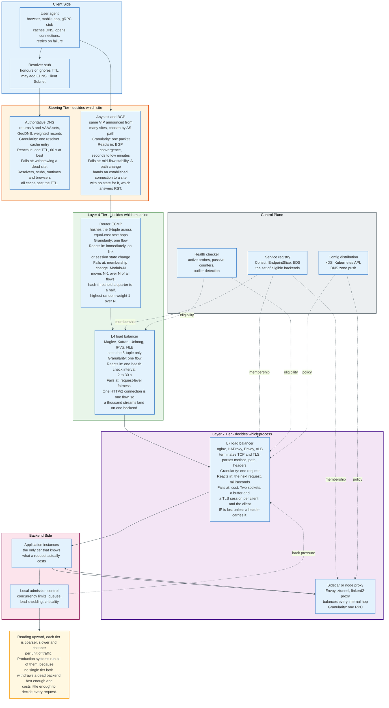

### 4.1 The Actors

| Tier | Decides | Granularity | Reaction time | Examples |
|------|---------|-------------|---------------|----------|
| **Authoritative DNS** | Which site or region | One resolver's cache entry | One TTL, 60 s at best | Route 53, NS1, Cloud DNS |
| **BGP and anycast** | Which point of presence | One packet, per network path | BGP convergence, seconds to minutes | Any anycast VIP |
| **Router ECMP** | Which balancer machine | One flow | Immediate on link state change | Any datacentre spine |
| **L4 load balancer** | Which backend host | One flow | One health check interval | Maglev, Katran, Unimog, IPVS, AWS NLB |
| **L7 load balancer** | Which backend process, per request | One request | Next request, milliseconds | nginx, HAProxy, Envoy, AWS ALB |
| **Client library or sidecar** | Which endpoint, per RPC | One RPC | Next RPC | gRPC xDS, Envoy sidecar, linkerd2-proxy |

### 4.2 The Control Plane Is a Separate Participant

The component that decides which backends exist is not the component that forwards packets, and treating them as one system is how a control plane outage becomes a data plane outage.

The service registry holds membership: Consul's catalogue, a Kubernetes EndpointSlice, an Envoy EDS response. The health checker holds eligibility. The configuration distribution mechanism, xDS in the Envoy ecosystem, pushes both to the data plane.

The property that matters is what the data plane does when the control plane is unreachable. A correctly built balancer keeps forwarding with its last known configuration indefinitely. Envoy does this by design. A balancer that fails closed when it cannot reach its control plane has converted a management outage into a traffic outage, which is the most avoidable class of incident in this document.

### 4.3 The Backend Is a Participant, Not a Passive Target

The only component that knows what a request actually costs is the process serving it. Every load balancer signal is a proxy for that knowledge, and every proxy is wrong in a specific way.

Connection count is wrong when requests have different costs. Latency is wrong when a fast failure looks like a fast success. Request count is wrong when concurrency, not throughput, is the constraint. The only accurate signal comes from the backend itself, which is why the modern direction is backend-reported load: Envoy's client-side weighted round robin derives endpoint weights from Open Request Cost Aggregation reports using `qps / (utilization + eps/qps * error_utilization_penalty)`, and AWS added automatic target weights to ALB as `weighted_random` with anomaly mitigation.

The backend also owns the last line of defence. When every backend is saturated, no balancer decision helps, and the only correct action is the backend refusing work. That is section 22.

---

## 5. Layer 4 and Layer 7 - What Each One Can See

A load balancer can only act on what it can read, and what it can read is fixed by where it sits in the packet.

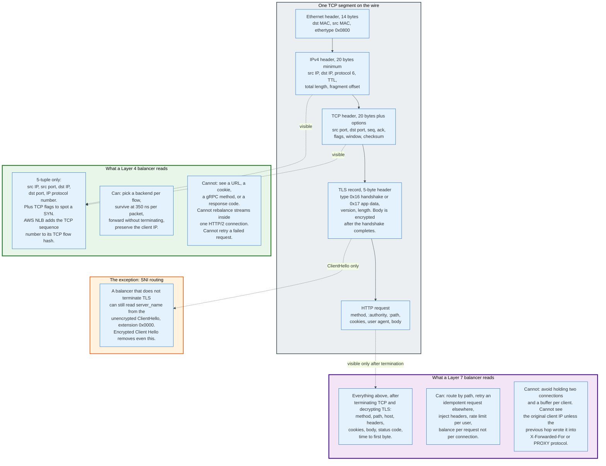

### 5.1 The Layer 4 View Is Five Numbers

A Layer 4 balancer reads the IP header and the transport header, and from them extracts the 5-tuple: source IP address, source port, destination IP address, destination port, and IP protocol number. That is the entire input to its decision.

The Maglev forwarder computes a hash over exactly those five fields, twice. The steering module hashes to assign the packet to a receive queue and a packet thread. The packet thread recomputes the hash rather than reusing the steering module's value, specifically to avoid cross-thread synchronisation, then looks it up in a per-thread connection tracking table.

AWS Network Load Balancer adds a sixth field for TCP. Its documentation states that the flow hash uses "the protocol, source IP address, source port, destination IP address, destination port, and TCP sequence number", and that "TCP connections from a client have different source ports and sequence numbers, and can be routed to different targets." For UDP the hash is the 5-tuple without the sequence number, so a UDP flow is consistently routed for its lifetime.

What a Layer 4 balancer cannot see: the URL, the HTTP method, the Host header, a cookie, a gRPC method name, the response status, or the size of the response. It cannot distinguish a health probe from a checkout. It cannot retry a request, because it does not know where one request ends and the next begins.

### 5.2 The Layer 7 View Costs a Termination

A Layer 7 balancer must terminate the TCP connection and, for HTTPS, complete the TLS handshake, before it can read a single byte of the request. Everything it can do follows from having done that, and everything it costs follows from the same fact.

After termination it reads the request line or HTTP/2 HEADERS frame and has the method, the `:authority` or `Host`, the `:path`, every header, every cookie, and the body. It can route `/api/v2/*` to one cluster and `/static/*` to another. It can retry an idempotent request on a second backend after a 503. It can rate limit per API key. It can rewrite headers, inject a request identifier, and record time to first byte.

The cost is structural. Two TCP connections instead of one, two socket buffers, a TLS session, and CPU proportional to bytes rather than to packets. The original client IP address disappears from the packet, so it must be carried in `X-Forwarded-For`, in the `Forwarded` header of RFC 7239, or in the PROXY protocol described in section 13.5.

### 5.3 SNI Is the Exception, and It Is Closing

A balancer that does not terminate TLS can still read one useful field: the `server_name` extension in the unencrypted ClientHello. That is enough to route TLS passthrough traffic by hostname without ever holding the private key, and it is how multi-tenant TLS passthrough works.

Encrypted Client Hello removes this. When the ClientHello itself is encrypted to the provider's public key, the intermediary sees only the outer name. The routing decision moves inside the entity holding the ECH key, which in practice is the CDN. See [cloud-and-infrastructure/cdns](../cdns/) for how that reshapes the edge.

### 5.4 The Case Where the Layer Choice Breaks Correctness

HTTP/2 and gRPC multiplex many concurrent requests onto one long-lived TCP connection, which converts a Layer 4 balancer's per-flow decision into a per-client decision that lasts for hours.

The consequence is arithmetic, not opinion. Ten clients, each holding one HTTP/2 connection, against a fleet of fifty backends: a Layer 4 balancer uses at most ten backends and the other forty receive nothing. Adding backends does not help, because the connections are already established and nothing rehashes them. The gRPC project's own load balancing documentation makes the same point from the other side: only a Layer 7 balancer "can distribute the streams from one client among multiple backends."

This single fact is the strongest argument for the service mesh, and it is why Linkerd balances at request granularity for HTTP, HTTP/2 and gRPC while using connection-level balancing only for opaque TCP.

---

## 6. DNS-Based Distribution and the Caching Ceiling

DNS distributes traffic well and withdraws it badly, and both properties come from the same mechanism: the answer is cached by machines the operator does not control.

### 6.1 The Mechanism

An authoritative nameserver returns a set of A or AAAA records for one name. A client picks one, conventionally the first. Rotating the order of the set across queries spreads clients across addresses. Weighting the probability of each record spreads them unequally. Filtering the set by the querying resolver's location produces GeoDNS.

The unit of control is the record set and the TTL. Nothing finer exists.

### 6.2 Why Withdrawal Fails

Removing a dead server from DNS does not remove it from traffic, because four independent caches sit between the change and the client, and each one has its own idea of how long to keep an answer.

The **recursive resolver** honours the TTL, usually. Some clamp it. RFC 1794 records BIND substituting 300 seconds for any TTL under 300, and although modern BIND does not do this, resolver-side minimum caching times remain common. Public resolvers apply their own floors.

The **operating system stub resolver** caches independently. On Windows the DNS Client service caches. On Linux, `systemd-resolved` and `nscd` cache.

The **application runtime** caches, sometimes forever. The Java virtual machine's `networkaddress.cache.ttl` historically defaulted to caching successful lookups for the life of the process when a security manager was installed, and applications that resolve once at startup and hold the address are common in every language.

The **browser** caches, and pins. Chromium and Firefox maintain their own DNS caches with their own expiry, independent of the operating system.

The measured consequence is documented by AWS in its own load balancer guidance: when DNS failover removes a zone's addresses, "the local client DNS cache might contain these IP addresses until the time-to-live (TTL) in the DNS record expires (60 seconds)", and "if a client doesn't honor the time-to-live (TTL) and sends requests to the IP address after it is removed from DNS, the requests fail."

Sixty seconds is the optimistic figure. It is the floor, not the ceiling.

### 6.3 EDNS Client Subnet Trades Cache Efficiency for Accuracy

GeoDNS is only as accurate as its estimate of where the client is, and its default estimate is the resolver's address, which for a public resolver can be a continent away.

RFC 7871, "Client Subnet in DNS Queries", published May 2016 as Informational, defines EDNS option code 8. The option carries a FAMILY field of 2 octets, a SOURCE PREFIX-LENGTH of 1 octet, a SCOPE PREFIX-LENGTH of 1 octet, and a truncated ADDRESS. The recursive resolver sends the client's network prefix; the authoritative server replies with the scope for which the answer is valid.

The cost is stated in the RFC itself: enabling ECS "will significantly increase the size of the cache, reduce the number of results that can be served from cache, and increase the load on the server." A resolver that previously held one entry per name now holds one entry per name per client prefix. The RFC recommends truncating IPv4 to 24 bits and IPv6 to 56 bits for privacy, which sets the multiplier.

The document recommends ECS be disabled by default. It is nevertheless deployed widely, because location-accurate answers are worth more to a CDN than cache efficiency is to a resolver. See [cloud-and-infrastructure/dns](../dns/) for the resolution chain in full and [cloud-and-infrastructure/cdns](../cdns/) for how CDNs use the result.

### 6.4 What DNS Distribution Is Actually Good For

DNS is the right tool for choosing between sites, and the wrong tool for choosing between servers.

Site selection changes rarely, tolerates a minute of staleness, and has no alternative mechanism at global scale that does not involve anycast. Server selection changes constantly, tolerates nothing, and has four better mechanisms below it.

The correct pattern is DNS to a small number of stable, anycast or per-zone addresses, and a real balancer behind each one. AWS implements exactly this: an Application Load Balancer's DNS name resolves to one address per enabled Availability Zone, with a 60-second TTL, and the zone addresses are removed from DNS only when a whole zone fails its target group health threshold.

---

## 7. Anycast and ECMP at the Network Layer

Anycast makes one IP address answer from many places by letting the internet's own routing choose, which gives instant global distribution and no control over the choice.

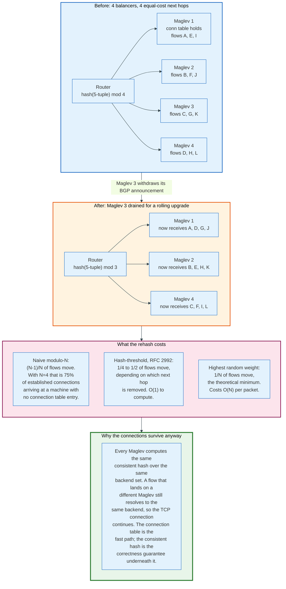

### 7.1 The Definition and the Two Scopes

RFC 4786, "Operation of Anycast Services", published December 2006 as BCP 126 by Joe Abley and Kurt Erik Lindqvist, defines anycast as making a service address "available in multiple, discrete, autonomous locations, such that datagrams sent are routed to one of several available locations."

It names two deployment scopes. Local-scope anycast propagates reachability only to a subset of the routing system, so a node serves a bounded region. Global-scope anycast propagates everywhere, so every node is a candidate for every client. A CDN uses both: global for the service address, local for a node that should serve only its own metro.

There is no load balancing in this. BGP selects on AS path length and local policy, neither of which knows anything about server capacity. A site advertising to a large peer absorbs traffic out of proportion to its size, and the only lever is the announcement itself.

### 7.2 The Mid-Flow Problem

Anycast's failure mode is that the routing decision can change while a TCP connection is open, and the new site has no state for that connection.

RFC 4786 states the constraint plainly: the routing system's choice must remain stable for the duration of a transaction, and for long-lived connections "the stability of the routing system should be carefully compared" against transaction duration. A path change mid-connection delivers packets to a node that has never seen the connection, which responds with RST.

Three mitigations exist and none is complete. Keep sessions short, which is why anycast DNS over UDP is trouble-free and anycast TCP is not. Use stable announcements with consistent AS paths, which RFC 4786 recommends explicitly so that instability at one node does not trigger flap damping against the others. Or move the state, which is what QUIC's connection ID makes possible and section 25 covers.

### 7.3 ECMP and the Rehash Arithmetic

Inside a datacentre, the router spreads packets across several equal-cost next hops by hashing the packet, and the choice of hash algorithm decides how much damage a membership change does.

RFC 2992, "Analysis of an Equal-Cost Multi-Path Algorithm", published November 2000 by Christian Hopps, gives the three numbers that matter.

| Algorithm | Flows disrupted when a next hop is added or removed | Cost per packet |
|-----------|-----------------------------------------------------|-----------------|
| **Modulo-N** | (N-1)/N. At N=4, 75% of flows move | O(1) |
| **Hash-threshold** | 1/4 to 1/2, depending on which region changes | O(1) |
| **Highest random weight** | 1/N, the theoretical minimum | O(N) |

The consequence for a balancer fleet is direct. Withdrawing one Maglev machine out of four, for a rolling upgrade, moves 75% of established flows to a different machine under naive modulo hashing. Every moved flow arrives at a machine whose connection tracking table has no entry for it.

### 7.4 Why the Connections Survive Anyway

Consistent hashing at the balancer converts an ECMP disruption from an outage into a cache miss, and this is the single most important reason Maglev exists in the form it does.

The Maglev paper states the design intent: because every Maglev machine computes the same consistent hash over the same backend set, a flow that lands on a different Maglev machine still resolves to the same backend, so the TCP connection continues. Connection tracking is the fast path. Consistent hashing is the correctness guarantee underneath it.

The paper is explicit about why this matters operationally. A rolling restart of a Maglev fleet, draining each machine and restoring it, "may last over an hour, during which the set of Maglevs keeps changing", and standard ECMP implementations "shuffle traffic on a large scale, leading to connections switching to different Maglevs in mid-stream."

Two independent layers of consistency, one at the router and one at the balancer, are what make an hour-long upgrade invisible.

### 7.5 Anycast Inside the Rack

Cloudflare pushed anycast one level further down, announcing service addresses from the servers themselves. Each server runs the Bird BGP daemon and announces routes to the top-of-rack router, which selects on route weight. Withdrawing some of a server's routes takes some traffic away from an overloaded server; a crashed server takes Bird down with it and all its routes are withdrawn automatically.

The mechanism is simple and its granularity is coarse: a route is either announced or not. Unimog, published on 9 September 2020, replaced it with a hash bucket table precisely because a control loop needs finer adjustment than route withdrawal can express. Withdrawing a route moves whatever share of traffic that route happened to carry. Moving a bucket moves one bucket.

---

## 8. The Algorithms and the Failure Each One Causes

Every load balancing algorithm gives up one property to gain another, and the property it gave up is the shape of its production incident.

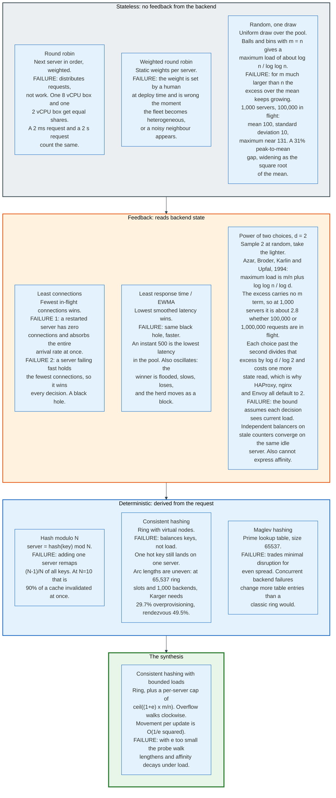

### 8.1 The Table

| Algorithm | Rule | Gives up | Characteristic failure |
|-----------|------|----------|------------------------|
| **Round robin** | Next server in order | Load awareness | Equal request counts on unequal servers and unequal requests |
| **Weighted round robin** | Next server, weighted | Adaptivity | Weights set by hand at deploy time, wrong by the next autoscale event |
| **Random** | Uniform draw | Everything | Imbalance grows as the square root of the mean load |
| **Least connections** | Fewest in-flight wins | Determinism | Empty-server stampede; fast-failure black hole |
| **Least response time / EWMA** | Lowest smoothed latency wins | Determinism and stability | Same black hole, plus oscillation as the herd chases the winner |
| **Power of two choices** | Sample 2, take the lighter | Optimality | Needs current local state; cannot express affinity |
| **Hash modulo N** | `hash(key) mod N` | Stability | Adding one server remaps (N-1)/N of all keys |
| **Consistent hashing** | Ring position, clockwise | Load awareness | Hot key stays hot; uneven arc lengths waste capacity |
| **Maglev hashing** | Prime lookup table | Minimal disruption | More entries change on concurrent failure than a classic ring |
| **Bounded-load consistent hashing** | Ring plus a per-server cap | Pure affinity | Probe walk lengthens as the fleet approaches the cap |

### 8.2 Round Robin and Its Weighted Form

Round robin is the default in nginx, in HAProxy, and in AWS Application Load Balancer, because it is free, predictable, and produces no surprising behaviour when things are healthy.

HAProxy's implementation carries a design limit worth knowing: `roundrobin` is dynamic, so weights can be changed on the fly for slow start, and is "limited by design to 4095 active servers per backend." `static-rr` removes that limit, uses about 1% less CPU, and cannot have weights changed at runtime.

The failure is section 2.3. Round robin counts requests. It has no way to learn that server 7 is a smaller instance type, that server 3 is sharing a host with a noisy neighbour, or that the request it just dispatched will run for four seconds.

Weighted round robin fixes the first of those and only the first. A weight is a static assertion about relative capacity, set by a human or by an instance-type lookup, and it goes stale the moment the fleet becomes heterogeneous in a way nobody encoded.

### 8.3 Random, and Why It Is Worse Than It Looks

Uniform random selection is round robin without the counter, and its imbalance is quantifiable.

Distributing m requests over n servers by uniform random choice makes each server's count a Binomial with mean m/n and standard deviation approximately the square root of m/n. With 1,000 servers and 100,000 in-flight requests the mean is 100 and the standard deviation is about 10. The expected maximum over 1,000 independent draws sits about 3.1 standard deviations above the mean, near 131.

That is a 31% peak-to-mean gap, and it means provisioning 31% more capacity than the average load requires. The gap narrows in relative terms as the mean rises and never closes.

Envoy's documentation notes one case where random beats round robin: when no active health checking is configured. Round robin will keep sending an exactly equal share to a host that is failing, because the counter does not care. Random at least gives the failing host no structural advantage.

### 8.4 Least Connections and Its Two Opposite Failures

Least connections sends the next request to the server with the fewest requests in flight, which is the best cheap approximation of "which server has the most spare capacity" and produces two well-known disasters.

**The empty-server stampede.** A server that has just restarted, or has just passed its health check after being ejected, has zero in-flight connections. It is therefore the answer to every dispatch decision until its count catches up with the rest of the fleet. The arithmetic is short. At 40,000 requests per second across 60 servers with an 8 ms service time, Little's law, which puts the number in flight at the arrival rate multiplied by the time each request takes, gives 40,000 x 0.008 = 320 requests in flight across the fleet, or 5.3 per server. A returning server holding zero wins every dispatch decision until it holds 5.3, and at the full arrival rate it accumulates that in 5.3 / 40,000 = 0.13 milliseconds. Parity arrives in one burst, on a cold cache, a cold JIT, and an empty connection pool. The server then slows, which makes its connections last longer, which is the only thing that saves it.

The mitigation is slow start, and every serious implementation has one. AWS ALB's `slow_start.duration_seconds` accepts 30 to 900 seconds and defaults to 0, meaning disabled. HAProxy's `slowstart` ramps both `maxconn` and weight linearly from 1 to 100% over the configured window, updating the weight at every health check, which is why the documentation warns that `inter` must be smaller than `slowstart` to get enough steps. Envoy ramps by `TimeFactor` raised to the power of `1/aggression`, with `aggression` defaulting to 1.0 for a linear ramp and `min_weight_percent` defaulting to 10%.

**The fast-failure black hole.** A server that is failing fast holds the fewest connections, because its requests complete in 2 milliseconds with a 500 instead of 200 milliseconds with a 200. Least connections therefore identifies the broken server as the least loaded and sends it everything. A single misconfigured instance can absorb the majority of a fleet's traffic and reject all of it.

This failure is not fixable by tuning the algorithm. It is fixed by outlier detection, which observes response codes rather than connection counts, and section 14.4 covers it.

### 8.5 Least Response Time and EWMA

Least response time picks the server with the lowest smoothed latency, usually an exponentially weighted moving average, and it inherits the black hole while adding oscillation.

nginx's `least_time` takes `header` or `last_byte` as its measurement point and, as of version 1.31.0 released 13 May 2026, is available in open source rather than only in the commercial subscription. Linkerd uses an exponentially weighted moving average as its primary signal for HTTP, HTTP/2 and gRPC.

Oscillation is the new failure. A server that wins the latency comparison receives more traffic, which raises its latency, which makes it lose, which moves the traffic elsewhere as a block. The amplitude depends on the smoothing constant and the dispatch rate, and the fix is to combine the latency signal with a random draw rather than always taking the minimum. That combination is the power of two choices, and it is why nginx's `random two least_time=last_byte` exists as a single directive.

### 8.6 Hash Modulo N Is Never the Right Answer

Selecting a server as `hash(key) mod N` is the obvious way to get affinity and the worst way to get it.

RFC 2992 gives the number in a routing context and it holds identically here: changing N moves (N-1)/N of all keys. A fleet of 10 cache servers that gains one server remaps 90% of keys, invalidating 90% of the cache in one step and sending the resulting miss storm to the origin. A fleet of 100 remaps 99%.

Every hashing scheme in section 9 exists to make that number smaller.

---

## 9. Consistent Hashing, Properly

Consistent hashing makes the mapping from key to server survive a change in the server set, and the three published schemes trade differently between how evenly they spread and how much they move.

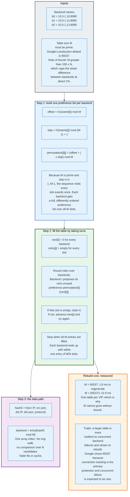

### 9.1 The Ring, 1997

The original construction, from Karger, Lehman, Leighton, Panigrahy, Levine and Lewin's 1997 paper "Consistent Hashing and Random Trees", maps both servers and keys onto a circle by hashing them into the same numeric space. A key belongs to the first server clockwise from its position.

Adding a server takes over one arc and moves only the keys in that arc. Removing a server hands its arc to its clockwise neighbour. In expectation, adding or removing one server out of n moves 1/n of the keys, which is the minimum possible.

The construction has one immediate defect: with n servers placed at random on a circle, the arcs are not equal. The longest arc is substantially longer than the average, so one server gets substantially more keys.

**Virtual nodes** fix this by hashing each server to many positions rather than one. The ketama scheme, which nginx's `hash ... consistent` directive is compatible with, uses 160 points per server per unit of weight. Envoy's `ring_hash` policy defaults to a `minimum_ring_size` of 1,024 and a `maximum_ring_size` of 8,388,608, with `hash_function` defaulting to `XX_HASH`.

More virtual nodes means a flatter distribution and a larger ring to search. The search is a binary search over a sorted array, so the cost is logarithmic in ring size, which is why 8 million entries is a supported maximum rather than an absurd one.

### 9.2 Rendezvous Hashing

Rendezvous hashing, also called highest random weight, computes `h(key, server)` for every server and picks the maximum. It needs no ring and no virtual nodes, moves exactly 1/n of keys on a membership change, and costs O(n) per lookup.

RFC 2992 analyses the same algorithm for ECMP and reaches the same conclusion: the disruption is the theoretical minimum of 1/N, and the cost is O(N) computational steps against hash-threshold's O(1). For a router forwarding at line rate, O(N) is disqualifying. For a proxy choosing among eight endpoints, it is free.

### 9.3 Maglev Hashing, and Why Google Rejected the Other Two

Maglev hashing builds a fixed-size lookup table where each backend claims an almost equal number of entries, and it does so by having backends take turns claiming their most preferred unclaimed slot.

The construction, from the NSDI 2016 paper:

```
M = 65537                                    # table size, must be prime
for each backend i:
    offset = h1(name[i]) mod M
    skip   = h2(name[i]) mod (M - 1) + 1
    for j in 0 .. M-1:
        permutation[i][j] = (offset + j * skip) mod M

n = 0                                        # entries filled so far
next[i] = 0 for all i
entry[j] = empty for all j
while true:
    for each backend i in turn:
        c = permutation[i][next[i]]
        while entry[c] is not empty:
            next[i] += 1
            c = permutation[i][next[i]]
        entry[c] = i
        next[i] += 1
        n += 1
        if n == M: return                    # the table is full mid-round
```

The counter is load-bearing, not decoration. Without it the table-full test runs only at the top of the outer loop, so after the last empty slot is claimed the next backend enters the inner `while` with every slot occupied, advances `next[i]` past M-1, and indexes `permutation[i][M]`, which does not exist. The paper's Pseudocode 1 returns the instant the count reaches M, mid-round, which is the only place the table can fill.

Because M is prime and `skip` lies in 1 to M-1, each backend's permutation visits every slot exactly once, so each backend has a complete and differently ordered preference list. Taking turns then guarantees that no backend can be starved: each ends within one entry of M/N slots.

The data path is a single array index. `entry[hash5 mod M]` returns the backend, with no ring walk and no comparison across candidates, and the table is small enough to stay in cache.

The paper is explicit about why Karger's ring and rendezvous hashing were rejected. Both prioritise minimal disruption over even balance. Maglev takes the opposite side of that trade, for two stated reasons: uneven load requires overprovisioning every backend for the peak, and Maglev serves VIPs with hundreds of backends, so the tables that Karger and rendezvous would need to reach acceptable balance are prohibitively large. There is one lookup table per VIP, so table size multiplies by the number of services.

The measured comparison, at 1,000 backends:

| Table size | Maglev overprovisioning needed | Karger | Rendezvous |
|-----------|-------------------------------|--------|------------|
| **65,537** | Negligible, near-perfect balance | 29.7% | 49.5% |
| **655,373** | Negligible | 10.3% | 12.3% |

Table generation time rises from 1.8 ms at M = 65,537 to 22.9 ms at M = 655,373. Google runs 65,537 in production and accepts the weaker disruption property, because connection tracking is the primary protection and concurrent backend failure is expected to be rare.

Envoy's `MAGLEV` policy defaults to the same constant and allows more. Its `MaglevLbConfig.table_size` field is documented as "The table size must be prime number limited to 5000011. If it is not specified, the default is 65537", so 65537 is a default rather than a fixture, and raising it trades rebuild time for disruption resilience on exactly the curve the 1.8 ms and 22.9 ms measurements above describe. Katran uses "modified Maglev hashing" extended to support unequal backend weights. IPVS added a Maglev-hashing scheduler under the name `mh`.

One number is the whole design: 65537. It is prime, it is larger than 100 times any realistic backend count, and it fits in cache.

### 9.4 The Rule of Thumb That Sizes the Table

The Maglev paper gives the sizing rule directly: choose M larger than 100 x N, which bounds the difference in hash space assigned to any two backends at about 1%.

At 65,537 entries, that rule supports up to about 655 backends per VIP at 1% imbalance. Beyond that the imbalance grows, which is exactly the case the 655,373 table is for.

---

## 10. Consistent Hashing With Bounded Loads

Consistent hashing balances keys, not load, and consistent hashing with bounded loads fixes that by refusing to let any server exceed a stated multiple of the average.

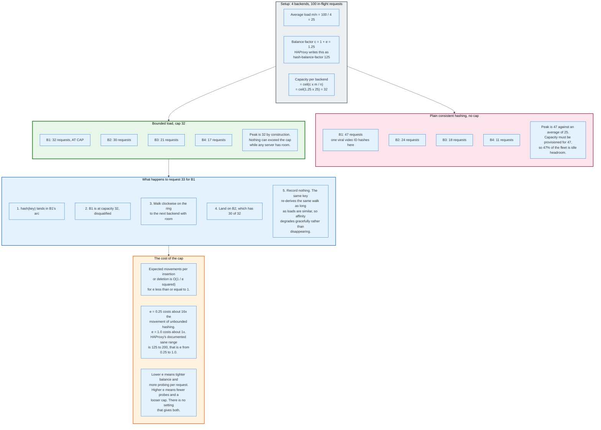

### 10.1 The Problem It Solves

A consistent hash guarantees that each server owns roughly an equal share of the key space. It guarantees nothing about how much traffic those keys carry.

One popular video, one hot customer, one bot hammering a single URL: the key space share is unchanged and the load share is not. A cache fleet with a viral object has one server at 100% and the rest at 30%, and adding servers does not help, because the hot key still hashes to one place.

Virtual nodes do not fix this. They flatten the distribution of key-space share, which was never the problem.

### 10.2 The Construction

Mirrokni, Thorup and Zadimoghaddam published "Consistent Hashing with Bounded Loads" as arXiv 1608.01350 on 3 August 2016, revised through July 2017. The construction adds one rule to the ring.

For a balancing parameter `c = 1 + e` greater than 1, every server has a capacity of `ceil(c * m / n)`, where m is the current number of items and n the number of servers. A key hashes to a ring position as usual and is assigned to the first server clockwise that is below its capacity.

The guarantee is twofold. No server ever exceeds `ceil(c * m / n)`. And the expected number of items that move per insertion or deletion is bounded: the movement cost rises by a factor of O(1/e squared) for e at most 1, and by a factor of 1 + O(log c / c) for e at least 1.

That second bound is the paper's harder result and its practical point. Making the cap loose costs almost nothing in extra movement. Making it tight costs quadratically.

### 10.3 The Numbers in Production

HAProxy implements this as `hash-balance-factor`, and its documentation is the clearest statement of the mechanism in any product manual.

The factor is "the maximum number of concurrent requests to send to a server, expressed as a percentage of the average number of concurrent requests across all of the active servers." Setting it to 0, the default, disables the feature. Otherwise it is a percentage above 100: "if `<factor>` is 150, then no server will be allowed to have a load more than 1.5 times the average." Server weights are respected.

The overflow behaviour is exactly the paper's: "If the first-choice server is disqualified, the algorithm will choose another server based on the request hash, until a server with additional capacity is found."

And the trade is stated: "A higher `<factor>` allows more imbalance between the servers, while a lower `<factor>` means that more servers will be checked on average, affecting performance. Reasonable values are from 125 to 200."

That range is e from 0.25 to 1.0. At the tight end the movement factor is roughly 16x; at the loose end roughly 1x. HAProxy's recommended range is precisely the region where the quadratic penalty is still tolerable.

### 10.4 The Worked Case

Take 4 cache servers and 100 in-flight requests. The average load is 25. With `hash-balance-factor 125`, the capacity per server is `ceil(1.25 * 25) = 32`.

Without the cap, a hot key distribution might produce 47, 24, 18, 11. Peak-to-mean is 1.88, so every server must be provisioned for 47 and 47% of the fleet is idle headroom.

With the cap, the same distribution produces 32, 30, 21, 17. The 15 requests that would have overflowed server 1 walk clockwise to the next server with room. Peak-to-mean is 1.28 by construction, and it cannot be otherwise while any server has capacity.

Affinity degrades rather than disappearing. The same key re-derives the same clockwise walk as long as the load distribution is similar, so a cache lookup that overflowed to server 2 last minute is likely to overflow to server 2 again. The hit rate falls; it does not collapse.

### 10.5 The Adoption Path

Andrew Rodland at Vimeo found the arXiv paper in August 2016 and implemented it in HAProxy. Google's research blog, publishing on 3 April 2017, reports the outcome: applying the algorithm "helped them decrease the cache bandwidth by a factor of almost 8, eliminating a scaling bottleneck."

HAProxy also applies `hash-balance-factor` to `balance random`, because `random` "internally relies on the consistent hashing mechanism." Envoy supports a bounded-load variant on both its `RING_HASH` and `MAGLEV` policies.

### 10.6 Where It Fails

The failure is the probe walk. As the fleet approaches uniform saturation, every server sits at or near capacity, so a request's first, second and third choices are all disqualified and the walk lengthens.

At the limit, when total load reaches n times the cap, no server has room and the algorithm must either exceed the cap or reject. Implementations choose to exceed it, which means the guarantee is conditional on the fleet not being uniformly saturated. HAProxy offers `hash-preserve-affinity` with values `always`, `maxconn` and `maxqueue` to control exactly what happens when servers are saturated, and its default is `always`, meaning affinity wins over capacity.

The bound is a load balancing property, not an overload property. Section 22 is the overload property.

---

## 11. The Power of Two Choices

Sampling two servers at random and taking the lighter one converts an imbalance that grows with load into an imbalance that does not, at the cost of one extra state read.

### 11.1 The Result

Mitzenmacher, Richa and Sitaraman's survey states the two bounds side by side. Throwing n balls into n bins uniformly at random gives a maximum load of approximately `log n / log log n` with high probability. Placing each ball in the least loaded of `d >= 2` bins chosen independently at random gives a maximum load of `log log n / log d + Theta(1)`, a result due to Azar, Broder, Karlin and Upfal.

For the load-balancing case where the number of requests m greatly exceeds the number of servers n, the survey gives the extension: the maximum load is `(log log n / log d)(1 + o(1)) + m/n`.

That last expression is the whole point. The excess above the mean is `log log n / log d`. It does not contain m. Under uniform random choice the excess grows as the square root of the mean load; under two choices it is a constant that depends only on fleet size.

### 11.2 The Arithmetic on a Real Fleet

Take 1,000 servers.

Under uniform random choice with 100,000 in-flight requests, the mean is 100, the standard deviation about 10, and the expected maximum near 131. Raise the traffic tenfold to 1,000,000 in-flight requests: the mean is 1,000, the standard deviation about 31.6, and the expected maximum near 1,098. The absolute gap grew from 31 to 98.

Under two choices, the excess is `log log 1000 / log 2`, which is about 2.8, regardless of whether there are 100,000 or 1,000,000 requests in flight. The peak sits a small constant above the mean at any scale.

### 11.3 Why Nobody Uses d Greater Than 2

Each additional choice divides the excess by `log d / log 2`, which is a constant factor, while adding one more state read per decision.

Going from d = 2 to d = 3 divides the excess by `log 3 / log 2 = 1.585`, a 37% reduction, for 50% more probes. Going to d = 4 divides by 2 for 100% more probes. The survey states this directly: "having just two random choices yields a large reduction in the maximum load over having one choice, while each additional choice beyond two decreases the maximum load by just a constant factor."

Every major implementation defaults to 2. Envoy's `LeastRequest` policy "defaults to 2 so that we perform two-choice selection if the field is not set." HAProxy's `balance random(<draws>)` documents "the default value is 2, which generally shows very good distribution and performance", and cites the Mitzenmacher survey by URL. nginx's `random two` selects two servers and applies `least_conn` between them by default, or `least_time=header` or `least_time=last_byte` if asked.

### 11.4 Weighted Least Request Is a Different Algorithm

Envoy switches algorithms depending on whether host weights are equal, and the distinction matters.

When all weights are equal, Envoy performs true P2C: sample `choice_count` hosts at random, pick the one with fewest active requests. When weights differ, it instead computes a dynamic weight for every host as `weight = load_balancing_weight / (active_requests + 1)^active_request_bias`, with `active_request_bias` defaulting to 1.0, and selects by weighted round robin over those.

Setting `active_request_bias` to 0 makes the algorithm ignore active requests entirely and degenerate to weighted round robin. Raising it above 1 makes the balancer more aggressive about avoiding busy hosts. The `+1` in the denominator is what prevents a host with zero active requests from having infinite weight, which is the empty-server stampede of section 8.4 expressed as a division by zero.

### 11.5 Where the Bound Stops Holding

The proof assumes each placement decision observes the current load of the bins it samples. A fleet of independent load balancers, each with its own view, violates that assumption.

Twenty proxies each sampling two of a thousand backends, all using load counters that are 500 ms stale, can all identify the same lightly loaded backend in the same instant. The result is a synchronised stampede that the single-decider model does not predict.

The production answer is to make the state local rather than shared. nginx, HAProxy and Envoy each count only the requests that proxy itself has issued. The counts are wrong in absolute terms and correct in the only sense that matters: they reflect decisions the proxy has already made, so a proxy never picks the same host twice in a row on stale information. Correctness is bought by giving up global knowledge.

---

## 12. Session Affinity and Why It Fights Elasticity

Session affinity pins a client to a backend, which makes stateful applications work and makes elasticity stop working. Both effects are structural.

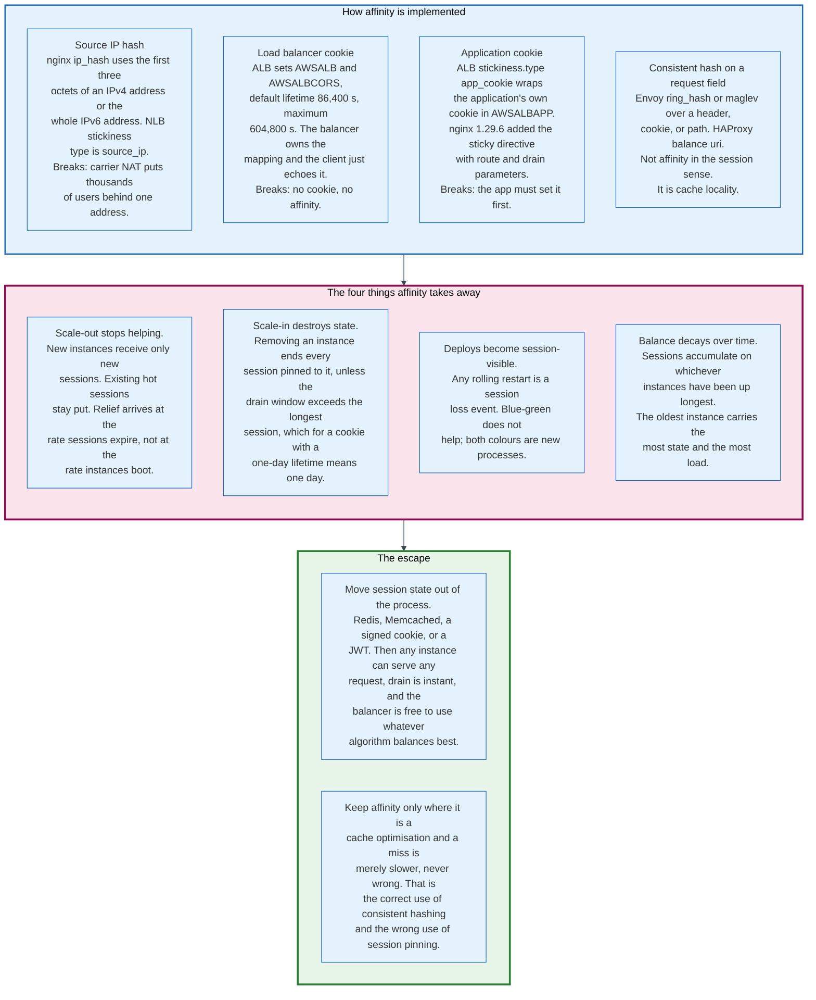

### 12.1 The Mechanisms and What Breaks Each One

| Mechanism | How it identifies the client | Breaks when |
|-----------|------------------------------|-------------|
| **Source IP hash** | nginx `ip_hash` uses the first three octets of an IPv4 address, or the whole IPv6 address. AWS NLB `stickiness.type` is `source_ip` | Carrier-grade NAT puts thousands of subscribers behind one address. Mobile clients change address on network handover |
| **Balancer cookie** | ALB sets `AWSALB` and `AWSALBCORS`. `stickiness.lb_cookie.duration_seconds` defaults to 86,400 s, maximum 604,800 s | The client rejects cookies, or the request is not from a browser |
| **Application cookie** | ALB wraps the application's own cookie in `AWSALBAPP`. nginx gained the `sticky` directive in open source in 1.29.6, 10 March 2026 | The application has not set the cookie yet, so the first request is unpinned |
| **Request-field hash** | Envoy `ring_hash` or `maglev` over a header, cookie or path. HAProxy `balance uri`, `balance hdr()`, `balance url_param` | The field is missing. HAProxy documents falling back to round robin in that case |

Reserved prefixes matter operationally: AWS forbids application cookie names beginning with `AWSALB`, `AWSALBAPP` or `AWSALBTG`.

### 12.2 The Four Costs

**Scale-out stops relieving hot instances.** A new instance receives only new sessions. Existing sessions stay where they are. Relief arrives at the rate sessions expire, which for a cookie with a one-day lifetime is one day, not at the rate instances boot, which is 90 seconds.

**Scale-in destroys state.** Removing an instance ends every session pinned to it. The only way to avoid user-visible loss is a drain window longer than the longest session, and ALB's `deregistration_delay.timeout_seconds` maxes out at 3,600 seconds against a default cookie lifetime of 86,400.

**Every deploy is a session-loss event.** A rolling restart replaces processes, and a process holds the session state. Blue-green does not help, because both colours are new processes with empty memory.

**Balance decays monotonically.** Sessions accumulate on whichever instances have been up longest. The oldest instance in the fleet carries the most state and therefore the most load, and the newest carries the least. The distribution gets worse with uptime, not better.

### 12.3 The Distinction That Resolves It

There are two different things called affinity, and conflating them is the error.

**Session pinning** is a correctness requirement: the request must reach the process holding the state, or it fails. This is the expensive one, and it is a consequence of storing session state in process memory.

**Cache locality** is a performance optimisation: the request should reach the process most likely to have the object cached, and if it does not, the result is slower but still correct. This is the cheap one, and it is what consistent hashing and bounded loads are for.

Everything in section 12.2 applies to session pinning. Almost none of it applies to cache locality, because a cache miss is not a failure.

The engineering answer is to convert the first into the second. Move session state to Redis, Memcached, a signed cookie or a token, and every instance becomes interchangeable. Draining becomes instant, scale-in becomes safe, deploys stop losing sessions, and the balancer becomes free to use whichever algorithm balances best rather than whichever one preserves the pin.

nginx's `drain` server parameter, added alongside `sticky` in 1.29.6, is the acknowledgement of the problem: a server in draining mode receives only requests already bound to it by `sticky`, and nothing new. It is a way to make session pinning survivable, not a way to make it free.

---

## 13. Termination Models and Direct Server Return

How a load balancer forwards a packet decides how much traffic it must carry, whether the backend sees the client's address, and how many machines the balancer can front.

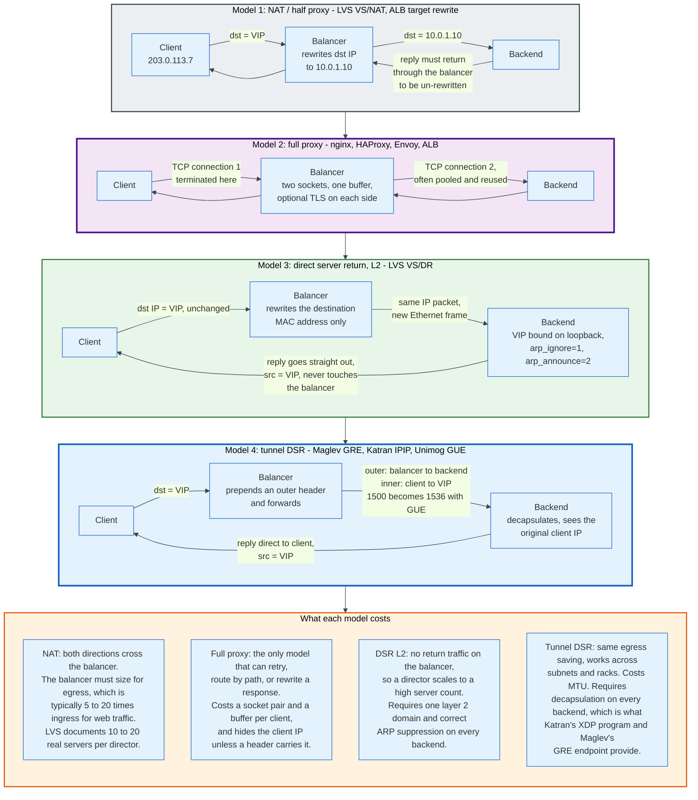

### 13.1 The Four Models

**NAT, or half proxy.** The balancer rewrites the destination IP address from the virtual IP to the backend's address and forwards. The backend's reply must return through the balancer to have the source address rewritten back, so the balancer carries traffic in both directions. This is LVS VS/NAT, and the LVS project's own comparison gives it a ceiling of 10 to 20 real servers per director, precisely because return traffic dominates.

**Full proxy.** The balancer terminates the client's TCP connection and opens a separate connection to the backend. Two sockets, two buffers, and complete freedom: it can retry, rewrite, route on content, and buffer a slow client without holding a backend thread. nginx, HAProxy, Envoy, and AWS Application Load Balancer are all full proxies.

**Direct server return at layer 2.** The balancer changes only the destination MAC address of the Ethernet frame and retransmits it on the same LAN. The IP header is untouched. The backend, which has the virtual IP configured on a non-ARP interface, accepts the packet and replies directly to the client with the VIP as source. The balancer never sees the response. This is LVS VS/DR, and the LVS documentation is blunt about the constraint: it requires one layer 2 domain.

**Tunnel-based direct server return.** The balancer prepends an outer IP header and forwards the original packet as payload, so the backend can live in a different subnet or a different rack. The backend decapsulates, sees the original client-to-VIP packet, and replies directly. This is LVS VS/TUN and the model every hyperscale L4 balancer uses.

### 13.2 The Encapsulation Each System Chose

| System | Encapsulation | Notable detail |
|--------|---------------|----------------|
| **Maglev** (Google) | GRE over IP | Uses the GRE recursion control field to ensure fragments are redirected only once |
| **Katran** (Meta) | IP-in-IP | Outer source IP is crafted so different flows get different addresses and the same flow gets one, which keeps receive-side scaling working on the backend NIC |
| **Unimog** (Cloudflare) | GUE, Generic UDP Encapsulation | 1,500-byte packets become 1,536 bytes, so jumbo frames are required inside the datacentre |
| **LVS VS/TUN** | IPIP | The original, in mainline Linux since the 2.4 kernel |

Katran's outer-source-IP trick is worth isolating because it is not obvious. Encapsulation collapses many flows into one outer 5-tuple, which would pin all of them to one receive queue and therefore one CPU on the backend. Varying the outer source per flow restores the entropy that receive-side scaling needs.

### 13.3 The ARP Problem

Direct server return requires every backend to hold the virtual IP address without answering ARP requests for it, and getting this wrong takes the service down in a way that is hard to diagnose.

If a backend answers ARP for the VIP, the top-of-rack switch may learn the backend's MAC address for the VIP and deliver client traffic straight to one backend, bypassing the balancer entirely. That backend then receives all traffic for the service and the balancer receives none.

The Linux fix is two sysctl settings on every backend, applied to the interface holding the VIP. `arp_ignore=1` makes the host reply to ARP only for addresses configured on the interface that received the request. `arp_announce=2` makes it use the best local address for the target subnet as the ARP source rather than the VIP. The VIP itself is conventionally bound to the loopback interface or a dummy device.

Tunnel-based DSR sidesteps this entirely, which is one reason every recent system uses it.

### 13.4 What Each Model Costs

The decisive number is the ratio of egress to ingress. For web traffic that ratio is typically between 5 and 20 to 1: a 500-byte request produces a 10 KB response.

A NAT or full-proxy balancer must be sized for ingress plus egress. A direct server return balancer must be sized for ingress only. At a 10:1 ratio, DSR reduces the balancer's bandwidth requirement by roughly 91%, which is why it exists and why LVS's own table gives VS/NAT a ceiling of 10 to 20 servers and describes the other two models' ceiling only as high.

The trade is capability. A balancer that never sees the response cannot retry on a 503, cannot rewrite a header, cannot count bytes, and cannot terminate TLS.

### 13.5 Preserving the Client Address

The client's IP address survives DSR and tunnelling unchanged, and does not survive NAT or a full proxy. Three mechanisms carry it forward.

**`X-Forwarded-For`** is a de facto standard header holding a comma-separated list of addresses, appended to by each proxy. It works only for HTTP and is trivially forgeable by a client, so a proxy must overwrite rather than append the leftmost entry unless it trusts the previous hop.

**RFC 7239's `Forwarded` header** standardises the same idea with named parameters, `for=`, `by=`, `proto=` and `host=`, and supports obfuscated identifiers. Adoption is lower than `X-Forwarded-For`.

**The PROXY protocol** solves it for any TCP-based protocol by prepending a header to the connection before the application's own bytes. Version 1 is human readable, of the form `PROXY TCP4 255.255.255.255 255.255.255.255 65535 65535\r\n`, which at its longest is 56 characters including the CRLF. The specification's worst case is a different line form, `PROXY UNKNOWN` with both addresses and both ports at their maximum width, which it counts as "5 + 1 + 7 + 1 + 39 + 1 + 39 + 1 + 5 + 1 + 5 + 2 = 107 chars" and concludes that "a 108-byte buffer is always enough to store all the line and a trailing zero". The TCP6 form is 104. That is why every implementation sizes the version 1 buffer at 108 bytes. Version 2 is binary and begins with a 12-byte signature chosen to be unambiguous in any existing protocol:

```
\x0D \x0A \x0D \x0A \x00 \x0D \x0A \x51 \x55 \x49 \x54 \x0A
```

The 13th byte carries the version in its high nibble, which must be `\x2`, and the command in its low nibble, `\x0` for LOCAL and `\x1` for PROXY. The 14th byte carries the address family in its high nibble, `\x1` for AF_INET and `\x2` for AF_INET6, and the transport in its low nibble, `\x1` for STREAM and `\x2` for DGRAM, so `\x11` means TCP over IPv4 and `\x21` means TCP over IPv6. Bytes 15 and 16 are a 16-bit big-endian length for the address block that follows.

AWS Network Load Balancer supports version 2 through the `proxy_protocol_v2.enabled` target group attribute, disabled by default. nginx 1.31.4, released 19 August 2026, added version 2 support to the `proxy_protocol` directive in the stream and mail modules.

The security property matters: a listener that trusts PROXY protocol from any source lets any client claim any address. It must be enabled only on ports reachable exclusively from the balancer.

---

## 14. Health Checks and the Flapping Problem

A health check is a guess about whether a backend will serve the next request, and every parameter in it trades detection speed against false positives.

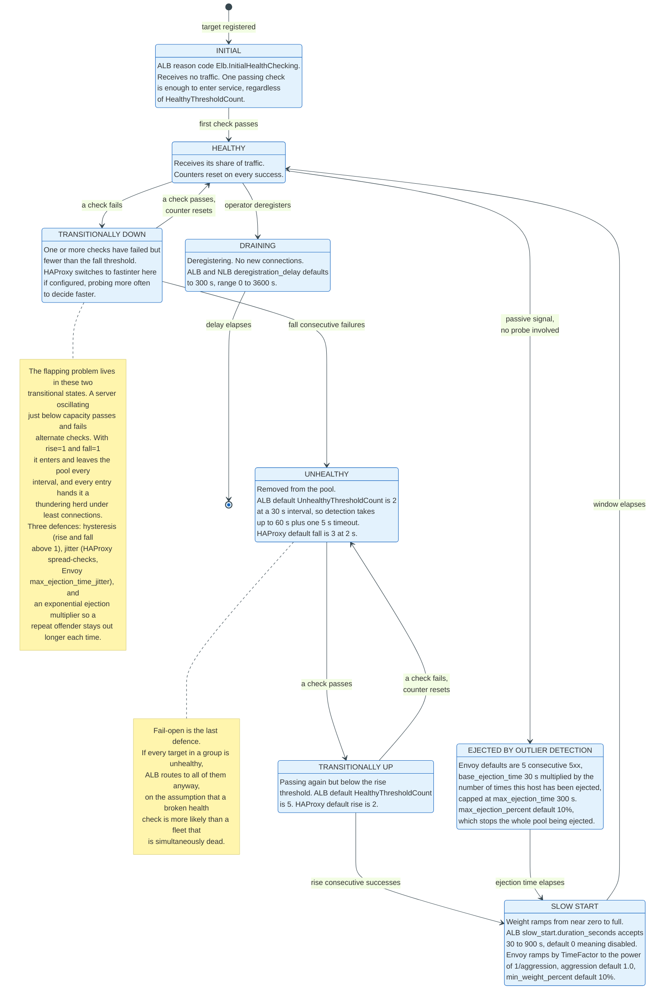

### 14.1 Active Checks

An active check is a probe the balancer sends on a schedule, independent of client traffic. Four parameters define it.

| Product | Interval | Failures to eject | Successes to restore | Timeout |
|---------|----------|-------------------|----------------------|---------|
| **HAProxy** | `inter`, default 2,000 ms | `fall`, default 3 | `rise`, default 2 | `timeout check`, falls back to `inter` |
| **AWS ALB** | `HealthCheckIntervalSeconds`, default 30 s, range 5 to 300 | `UnhealthyThresholdCount`, default 2, range 2 to 10 | `HealthyThresholdCount`, default 5, range 2 to 10 | `HealthCheckTimeoutSeconds`, default 5 s, range 2 to 120 |

Detection time is the product, not the interval. An ALB target that stops answering immediately after a successful check is not removed until two further checks have failed: the first at +30 s timing out at +35 s, the second at +60 s timing out at +65 s. Up to 65 seconds of failed traffic.

The timeout is only charged when the target is silent. A target that answers fast with the wrong status fails at the instant it answers, recorded as `Target.ResponseCodeMismatch`, and AWS states that "the time that it takes for the target to respond does not affect the interval for the next health check request". That case costs 60 seconds, not 65, and section 17.4 prices it.

HAProxy's defaults give 3 x 2 s = 6 seconds, plus one timeout. The difference is not that one product is better; it is that HAProxy probes 15 times more often, and pays for it in probe traffic.

HAProxy adds a refinement that ALB does not have. `fastinter` applies while a server is in a transitional state, either going down or coming up, and `downinter` applies while it is fully down. A configuration of `inter 5s fastinter 500ms fall 3` probes cheaply while everything is healthy and decides in 1.5 seconds once something looks wrong.

### 14.2 Passive Checks

A passive check observes real client traffic and needs no probe at all, so it detects failures at the rate traffic arrives rather than at the rate the balancer probes.

nginx implements this with two server parameters: `max_fails`, defaulting to 1, and `fail_timeout`, defaulting to 10 seconds. `fail_timeout` does double duty, defining both the window in which failures are counted and the period the server is considered unavailable afterwards. The default therefore means a single failed attempt removes a server for 10 seconds.

Passive checking has one structural weakness. A server receiving no traffic generates no signal, so a fleet at low load learns nothing. This is why every serious deployment runs both.

### 14.3 The Check That Lies

A health check that tests less than the request path passes when the service is broken, and a health check that tests more than the request path fails the whole fleet at once.

A TCP connect check confirms that a process is listening. It says nothing about whether that process can reach its database. A backend with a dead database connection pool passes TCP checks and returns 500 to every request, indefinitely.

The obvious fix is a deep check that queries the database, and it introduces a worse failure. Every backend shares the same database. When the database has a bad minute, every backend fails its deep check simultaneously, the balancer marks the entire fleet unhealthy, and a degraded service becomes a dead one.

The industry answer is layered. A shallow check decides pool membership. A deep check reports to monitoring and to a separate readiness signal that does not remove capacity. AWS builds the safety net into the balancer itself: if a target group contains only unhealthy targets, the ALB "routes requests to all those targets, regardless of their health status", which the documentation names fail-open. The assumption behind fail-open is that a broken health check is more likely than a simultaneously dead fleet, and it is correct.

### 14.4 Outlier Detection

Outlier detection is passive checking with a memory and an escalating penalty, and it is the correct fix for the fast-failure black hole of section 8.4.

Envoy's defaults define the shape:

| Field | Default | Meaning |
|-------|---------|---------|
| `consecutive_5xx` | 5 | Consecutive 5xx responses that trigger ejection |
| `interval` | 10,000 ms | How often the detector sweeps |
| `base_ejection_time` | 30,000 ms | Base ejection duration |
| `max_ejection_time` | 300,000 ms | Ceiling on ejection duration |
| `max_ejection_percent` | 10% | Ceiling on how much of the pool may be ejected at once |
| `enforcing_consecutive_5xx` | 100 | Percentage of the time the consecutive-5xx rule is actually enforced |
| `consecutive_gateway_failure` | 5 | Consecutive 502, 503 or 504 responses |
| `enforcing_consecutive_gateway_failure` | 0 | Off by default |
| `success_rate_minimum_hosts` | 5 | Minimum hosts before the statistical rule runs |
| `success_rate_request_volume` | 100 | Minimum requests per host before it is included |
| `success_rate_stdev_factor` | 1900 | Divided by 1000, so 1.9 standard deviations below the mean success rate |

Two of these deserve attention.

`base_ejection_time` is multiplied by the number of times a host has been ejected, capped at `max_ejection_time`. A host ejected once returns after 30 seconds; ejected twice, after 60; ejected ten times, after 300. This is the anti-flapping mechanism, and it is exponential in effect: a genuinely broken host quickly stops being tried.

`max_ejection_percent` of 10% is the fail-open equivalent. A correlated failure that would eject the whole fleet ejects one host in ten and leaves the rest serving.

The success-rate rule is the statistically interesting one. It computes the mean and standard deviation of success rates across all hosts with at least 100 requests, and ejects any host whose success rate falls more than 1.9 standard deviations below the mean. That is a relative test, so a fleet that is uniformly returning 30% errors ejects nobody, which is correct: the problem is not one host.

### 14.5 The Flapping Problem

A server oscillating near its capacity limit passes some checks and fails others, and a balancer with no hysteresis adds it and removes it on every interval.

Each re-entry is worse than the last. Under least connections, a server rejoining with zero in-flight connections attracts the full arrival rate, which pushes it back over its limit, which fails the next check, which removes it again. The oscillation is driven by the balancer, not by the server.

Four defences, all of them present in production systems:

**Hysteresis.** Requiring more than one consecutive result before changing state. HAProxy's `rise 2 fall 3` is asymmetric on purpose: leave quickly, return slowly.

**Escalating penalty.** Envoy's ejection time multiplier. A repeat offender stays out longer each time, so an oscillator converges to permanently ejected rather than oscillating forever.

**Jitter.** HAProxy's global `spread-checks` adds random noise to check intervals, and the documentation notes that checks are already started with a small time offset between servers "to reduce resonance effects when multiple servers are hosted on the same hardware". Envoy has `max_ejection_time_jitter`, defaulting to 0. Without jitter, a fleet of balancers probes in lockstep and a backend receives a synchronised burst of probes every interval.

**Slow start.** The server that just returned must not receive its full share immediately. Section 8.4 covers the parameters.

The general principle: any control loop that can add and remove capacity must be slower to add than to remove, and must be damped.

---

## 15. Connection Draining and Graceful Shutdown

Removing a backend without dropping a request requires four things to happen in order, and every production system has at some point got the order wrong.

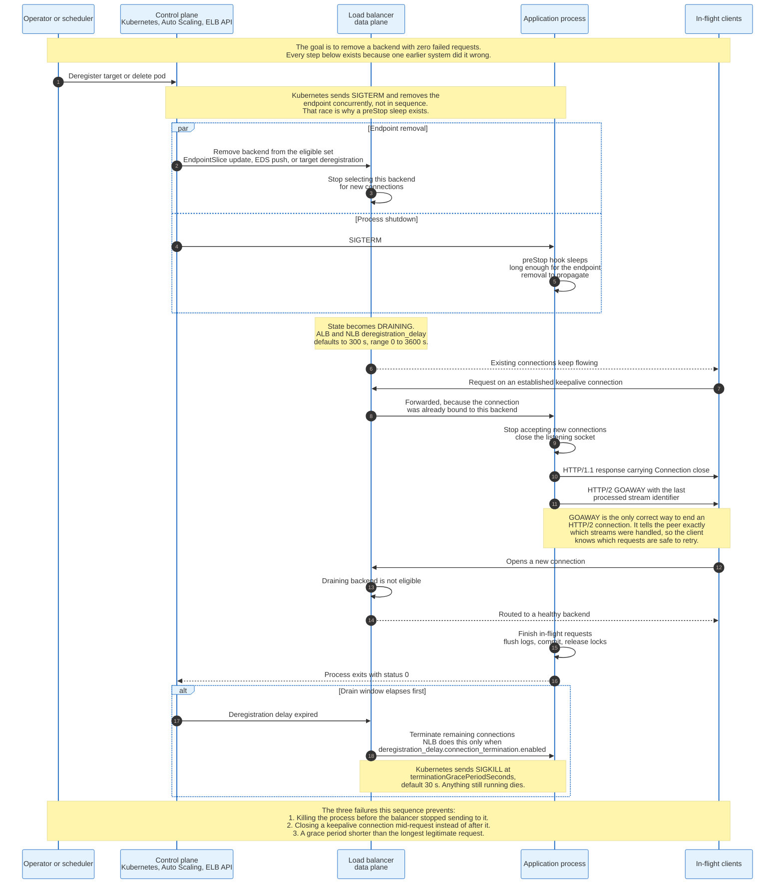

### 15.1 The Correct Order

1. **Stop being advertised.** The backend is removed from the balancer's eligible set. New connections stop arriving. Nothing else has happened yet.
2. **Wait for propagation.** The removal must reach every balancer instance before the process stops accepting. In a fleet of twenty proxies fed by a control plane, that is a control plane round trip, typically hundreds of milliseconds to a few seconds.
3. **Refuse new connections, finish old ones.** The process closes its listening socket and continues serving requests already in flight. Existing keepalive connections are signalled to close after their current response.
4. **Exit.** Once in-flight requests complete, the process exits cleanly.

Skipping step 2 is the single most common bug in Kubernetes deployments, because Kubernetes does not sequence steps 1 and 3. It sends SIGTERM to the container and removes the endpoint from the EndpointSlice concurrently. A process that exits promptly on SIGTERM is gone before the balancer has learned it should stop sending traffic, and every request in that window fails.

The standard workaround is a `preStop` hook that sleeps for longer than endpoint propagation takes, typically 5 to 15 seconds, doing nothing but delaying SIGTERM's effect. It is an ugly fix for a race that the platform creates.

### 15.2 The Timers

| Setting | Default | Range | What it bounds |
|---------|---------|-------|----------------|
| AWS ALB and NLB `deregistration_delay.timeout_seconds` | 300 s | 0 to 3,600 s | How long a target stays in `draining` before becoming `unused` |
| AWS NLB `deregistration_delay.connection_termination.enabled` | `true` for new UDP and TCP_UDP target groups, `false` otherwise | boolean | Whether remaining connections are cut when the delay expires |
| Kubernetes `terminationGracePeriodSeconds` | 30 s | any | Time between SIGTERM and SIGKILL |
| NLB `target_health_state.unhealthy.draining_interval_seconds` | 0 s | 0 to 360,000 s | How long an unhealthy target keeps its existing connections |

The mismatch between 300 and 30 is the one to notice. AWS will wait five minutes for connections to finish. Kubernetes will kill the process after thirty seconds. A request that legitimately runs for two minutes survives the first and dies to the second.

### 15.3 Signalling the Close

A balancer cannot drain a connection it does not control the lifetime of. The application must tell the client to stop using it.

For HTTP/1.1 the mechanism is the `Connection: close` header on the final response. The client finishes reading that response and opens a new connection for its next request, which the balancer routes elsewhere.

For HTTP/2 the mechanism is the GOAWAY frame, and it carries information HTTP/1.1 cannot express: the identifier of the last stream the server processed. Every stream with a higher identifier was definitely not handled, so the client can retry those safely on a new connection. This is the only clean way to end an HTTP/2 connection, and a server that simply closes the socket instead leaves the client unable to distinguish "not processed" from "processed but the response was lost".

The graceful sequence is two GOAWAY frames. The first carries last-stream-ID 2^31-1, the largest value the field can hold, and the error code NO_ERROR, which together announce a shutdown while conceding that nothing has been refused yet. After at least one round-trip time, which is the window in which streams already on the wire arrive, the second carries the real last-stream-ID. Envoy implements the gap between them as `drain_timeout`, documented as "the time that Envoy will wait between sending an HTTP/2 'shutdown notification' (GOAWAY frame with max stream ID) and a final GOAWAY frame", with a default of 5 seconds. The timer is the mechanism, not a ping.

### 15.4 Draining and Affinity Do Not Compose

A backend with pinned sessions cannot be drained in any bounded time, because the pin outlives the connection.

nginx's `drain` server parameter, added in 1.29.6, states the compromise precisely: a draining server receives only requests bound to it by `sticky`, and no new ones. The server empties at the rate sessions expire. With a default balancer cookie lifetime of 86,400 seconds, that is a day.

This is section 12.2 restated as an operational timer. Affinity converts drain time from a property of request duration into a property of session duration, and session duration is set by a cookie lifetime, not by anything the operator controls at drain time.

---

## 16. TLS Termination and Re-encryption

Where TLS is terminated decides what the balancer can do, who holds the private key, and how much CPU the whole path costs.

### 16.1 The Four Modes

| Mode | Balancer holds the key | Sees plaintext | Backend sees | Typical use |
|------|------------------------|----------------|--------------|-------------|
| **Passthrough** | No | No | Encrypted stream, terminates TLS itself | Regulated workloads, per-tenant certificates, TCP protocols the balancer does not understand |
| **SNI routing** | No | ClientHello `server_name` only | Encrypted stream | Multi-tenant TLS routing without key custody |
| **Termination** | Yes | Yes | Plaintext HTTP | The default for internal networks with encrypted substrate |
| **Re-encryption** | Yes | Yes | New TLS connection, balancer to backend | Compliance requiring encryption in transit end to end |

Only the last two allow path routing, header rewriting, retries, per-user rate limiting, or request logging. Everything the balancer knows about the request, it knows because it decrypted the request.

### 16.2 Re-encryption Does Not Mean Verification

The most common misunderstanding about re-encryption is that it authenticates the backend. In the default configuration of most managed balancers, it does not.

AWS states this explicitly for Application Load Balancer target groups configured with HTTPS: "The load balancer does not validate these certificates. Therefore, you can use self-signed certificates or certificates that have expired." The stated justification is that the balancer and its targets are inside a VPC, where "traffic between the load balancer and the targets is authenticated at the packet level, so it is not at risk of man-in-the-middle attacks or spoofing even if the certificates on the targets are not valid."

The security property being delivered is confidentiality on the wire, not backend authentication. If backend authentication is required, it must come from mutual TLS with verified certificates, which is exactly what a service mesh provides and what section 20 covers.

AWS also documents which policy is used: for an HTTPS target group, if any HTTPS listener uses a TLS 1.3 security policy, target connections use `ELBSecurityPolicy-TLS13-1-0-2021-06`; otherwise `ELBSecurityPolicy-2016-08`.

### 16.3 Session Resumption Across a Fleet

TLS resumption saves a round trip and a signature, and it only works if the machine handling the resumed connection can decrypt the ticket the client presents.

With one balancer this is trivial. With a fleet behind ECMP, a client's second connection lands on a different machine, which must hold the same ticket-encryption key. Every large deployment therefore runs a key distribution mechanism: keys are generated centrally, rotated on a schedule, and pushed to every terminator, with the previous key retained for decryption during the overlap.

Failing to do this does not break correctness. It silently converts every resumption into a full handshake, which shows up as a latency regression with no error rate change, and is therefore hard to notice.

### 16.4 The Cost, in Billing Units

TLS handshakes are the most expensive operation a balancer performs, and AWS prices them in a way that makes the ratio visible.

An ALB Load Balancer Capacity Unit includes 3,000 active connections per minute, or 1,500 when using mutual TLS. Mutual TLS costs exactly twice as much per connection, because the balancer must verify a client certificate chain as well as present its own.

The Network Load Balancer figures are sharper. One NLCU covers 800 new TCP connections per second, or 50 new TLS connections or flows per second. A new TLS connection costs 16 times a new TCP connection in NLCU terms, and that ratio is a reasonable proxy for the underlying CPU cost of an asymmetric key operation against a table lookup.

For the mechanics of TLS itself, see [networking-and-protocols/tls-and-ssl](../../networking-and-protocols/tls-and-ssl/). For how CDNs handle termination at the edge, see [cloud-and-infrastructure/cdns](../cdns/).

---

## 17. Worked Example - One Request Through a Three-Zone Fleet

A concrete fleet makes the arithmetic of the previous sections visible. The example below is carried through capacity planning, request routing, failure detection, and billing with the same numbers throughout.

**The fleet.** An e-commerce API in one AWS region, three Availability Zones, 20 backends per zone for 60 total, each an 8 vCPU instance. Steady state is 40,000 requests per second. The average request consumes 8 ms of CPU and returns a 4 KB response. Clients use HTTP/2 with an average of 1,000 requests per connection, so new connections arrive at 40 per second, and 50,000 connections are open at any moment. The Application Load Balancer in front carries 20 listener rules, and every request is evaluated against all 20.

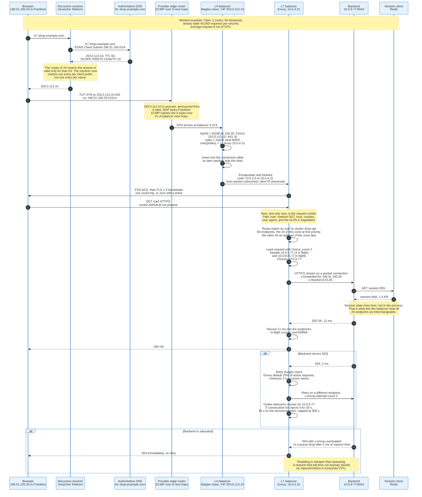

### 17.1 Capacity Arithmetic

40,000 requests per second at 8 ms of CPU each is 320 CPU-seconds of work per second, which is 320 cores of steady demand.

The fleet supplies 60 x 8 = 480 cores. Utilisation is 320 / 480 = 66.7%.

Now lose one zone. Forty backends remain, supplying 320 cores against 320 cores of demand. Utilisation is 100%, which is not headroom but a cliff: queues grow without bound, latency rises until requests time out, and the retry behaviour of section 21 turns a capacity shortfall into a collapse.

To survive a zone failure at 80% utilisation, the surviving two zones must supply 320 / 0.8 = 400 cores, which is 50 backends, which is 25 per zone, which is 75 backends in total. Steady-state utilisation drops to 320 / 600 = 53.3%.

That is the cost of N+1 zone redundancy stated plainly: a fleet designed to lose one of three zones runs at 53% and not at 67%. The 13.4 percentage points are the insurance premium.

### 17.2 Cross-Zone Balancing Decides What a Zone Failure Costs

Cross-zone load balancing decides whether losing a zone removes capacity, demand, or both, and section 17.1's arithmetic assumes it is on.

The mechanism is per node. A load balancer places one node in each enabled Availability Zone, and each node holds its own view of the eligible targets. With cross-zone off, a node forwards only to targets in its own zone. With cross-zone on, every node forwards to every registered target in every enabled zone.

AWS exposes the switch as the attribute `load_balancing.cross_zone.enabled`, at two levels, with different defaults per product. On an Application Load Balancer, cross-zone "is always turned on at the load balancer level, and cannot be turned off"; a target group defaults to `use_load_balancer_configuration`, which inherits that, and may be set to `false` for itself alone. On a Network Load Balancer the load balancer attribute defaults to `false`, so by default "each Network Load Balancer node distributes traffic across the registered targets in its Availability Zone only", and the target group again follows the load balancer unless overridden.

With cross-zone on, the zone failure of section 17.1 behaves exactly as described. Twenty backends stop answering, the nodes in the two surviving zones carry all 40,000 requests per second between them, and 320 cores of demand meet 320 cores of supply. That is the cliff.

With cross-zone off, capacity and demand fall together. Each node serves only its own 20 backends, and reaches only the clients whose DNS answer resolved to that node's address, so a dead zone takes its third of the traffic with it. The survivors hold 320 x 2/3 = 213 cores of demand against 320 cores of supply, which is 66.7%, unchanged. What breaks is reachability rather than utilisation. Clients holding the dead zone's address keep sending to it until the 60-second TTL expires, and AWS withdraws a node's address from DNS only once every target in one of its target groups is unhealthy. Section 6.2 is that failure. Zone-local balancing does not remove the zone problem; it moves the problem to DNS.

Two costs follow and they point in opposite directions. Cross-zone on needs no per-zone capacity planning and hides a zone failure from the client, at the price of the cliff and, on a Network Load Balancer, a transfer bill: AWS states that "when enabling cross-zone load balancing for a Network Load Balancer, EC2 data transfer charges apply", because two-thirds of each node's traffic now crosses an Availability Zone boundary. Cross-zone off keeps the traffic and the transfer charge inside the zone, and demands in exchange that "you have enough target capacity in each of the load balancer Availability Zones". It also removes two Application Load Balancer features: sticky sessions are unsupported when cross-zone is off, and an empty zone answers 503 to every request that reaches it.

Every number in section 17.1 assumes cross-zone on.

### 17.3 The Request Path

**DNS.** The browser resolves `shop.example.com`. The authoritative server returns 203.0.113.10 with a TTL of 60 seconds. If the resolver sent EDNS Client Subnet with the client's /24, the answer comes back with SCOPE PREFIX-LENGTH 24, and the resolver now caches one entry per /24 rather than one per name.

**Anycast and ECMP.** 203.0.113.10 is announced from nine sites. BGP selects Frankfurt. The provider edge router hashes the 5-tuple across 8 Layer 4 balancer next hops and delivers the SYN to balancer 5.

**Layer 4 selection.** The balancer computes `h(198.51.100.20, 51514, 203.0.113.10, 443, 6)`, indexes `entry[hash mod 65537]`, and gets Layer 7 proxy 10.0.4.31. It writes the result into its per-thread connection tracking table so subsequent packets skip the hash, encapsulates, and forwards. Per-packet cost at Maglev's measured rate is about 350 nanoseconds.

**Layer 7 selection.** The proxy completes the TLS handshake and reads `GET /cart`. It matches the route to cluster `shop-api`, which holds all 60 endpoints with the 20 in this zone at first priority, so the local zone absorbs the traffic while it can and a zone failure spills the load onto the other 40 rather than dropping it. Using least request with `choice_count` 2, it samples two endpoints at random, reads their in-flight counts, 3 and 7, and dispatches to the one holding 3.

**Backend.** The backend fetches session state from Redis, does 8 ms of work, and returns 200. The proxy records the latency into that endpoint's counters. Total added latency from both balancer tiers is under a millisecond, against 8 ms of application work.

### 17.4 Failure Detection Arithmetic

One backend's database connection pool dies. It now returns 500 in 2 ms for every request.

**With ALB health checks only, at defaults.** The failure begins just after a successful check. The next check runs at +30 s and fails on the spot, because the target answers with a 500 in 2 ms rather than timing out, which AWS records as `Target.ResponseCodeMismatch` against a default matcher of 200. The 5-second `HealthCheckTimeoutSeconds` is never consumed, and the AWS documentation is explicit that "the time that it takes for the target to respond does not affect the interval for the next health check request". The second check runs at +60 s and fails the same way, reaching `UnhealthyThresholdCount` 2. The target is marked unhealthy at +60 s.

During those 60 seconds the broken backend receives 40,000 / 60 = 667 requests per second, so **40,020 requests fail**.

A backend that hangs instead of answering is the slower case, not this one. There the check consumes the full 5-second timeout twice, detection lands at +65 s, and section 14.1's figure applies.

**With Envoy outlier detection at defaults.** `consecutive_5xx` is 5. At 667 requests per second, five consecutive 500s occur in 7.5 milliseconds. The host is ejected for 30 seconds, and **5 requests fail**.

The ratio is 8,004 to 1. That is the argument for passive detection stated as a number, and it is why every serious L7 deployment runs outlier detection alongside active checks rather than instead of them.

**The failure that active checks catch and passive ones do not.** A backend that has stopped accepting connections entirely produces no responses to observe, so outlier detection sees nothing. The active check catches it. The two mechanisms are complements, not alternatives.

### 17.5 Billing Arithmetic

An Application Load Balancer bills 0.0225 dollars per hour in US East (N. Virginia), plus 0.008 dollars per Load Balancer Capacity Unit-hour, where the LCU count is the **maximum** of four dimensions rather than their sum.

One dimension has a free allowance that changes the arithmetic. AWS defines rule evaluations as the request rate multiplied by the number of processed rules minus 10, because "the first 10 processed rules are free". A listener carrying exactly 10 rules bills zero on this dimension no matter how many requests it serves.

| Dimension | Included per LCU | This fleet's usage | LCUs required |
|-----------|------------------|--------------------|---------------|
| New connections | 25 per second | 40 per second | 1.6 |
| Active connections | 3,000 per minute | 50,000 | 16.7 |
| Processed bytes | 1 GB per hour | 40,000 x 4 KB x 3,600 = 576 GB per hour | 576 |
| Rule evaluations | 1,000 per second | 40,000 x (20 - 10 free) = 400,000 per second | 400 |

The billed figure is 576 LCUs. Hourly cost is 0.0225 + 576 x 0.008 = 4.63 dollars. At 730 hours per month that is **3,380 dollars per month**.

Processed bytes dominates, and it dominates by a factor of 1.4 over rule evaluations and 34 over active connections. Two consequences follow. Compressing responses reduces the ALB bill roughly in proportion. And an architecture that moves large-object delivery to a CDN removes the largest single line item, which is one of the least discussed reasons CDNs pay for themselves.

**The same traffic on a Network Load Balancer.** NLCU dimensions for TCP are 800 new connections per second, 100,000 active connections, and 1 GB per hour. Usage gives 0.05, 0.5, and 576 respectively, so 576 NLCUs at 0.006 dollars each. Hourly cost is 0.0225 + 3.456 = 3.48 dollars, or **2,540 dollars per month**, 25% cheaper.

The 840 dollars per month difference buys path routing, retries, header manipulation, per-request balancing, and WAF integration. Whether that is worth it is a real decision, and it is a decision about capability rather than about performance.

---

## 18. The Hardware to Software Transition

Load balancing moved from dedicated appliances to commodity servers because of a redundancy model, not because of price per port.

### 18.1 The Four Constraints of the Appliance Model

The Maglev paper lists them, and each one maps to a specific design decision in every software balancer that followed.

**Capacity is bounded by one chassis.** Scaling means buying a bigger unit, and there is a biggest unit. The software answer is scale-out with ECMP in front, so capacity is the number of machines.

**Redundancy is 1+1.** Appliances deploy in active-passive pairs, so half the purchased capacity is idle and no single virtual IP can exceed one unit's capacity. The software answer is N+1, with every machine active. The Maglev paper describes moving from active-passive to ECMP explicitly, and names the three gains: capacity, efficiency, and operational simplicity, plus the removal of a complex priority negotiation between paired machines.

**Behaviour is fixed.** Modifying a hardware load balancer is difficult or impossible. The software answer is that the balancer is a program. Maglev's VIP prefix and suffix matching scheme, which lets a machine correctly classify traffic for clusters it has never been configured with, exists because someone could write it in an afternoon.

**Capacity additions require physical work.** Adding capacity means purchasing hardware and racking it. The software answer is that capacity is an autoscaling group.

### 18.2 What Software Gave Up, and Got Back

The appliance's advantage was purpose-built silicon: ASICs that forward at line rate with no per-packet CPU cost. Commodity servers with a general-purpose network stack were, in 2008, far slower.

Three techniques closed the gap, in sequence.

**Kernel bypass.** Maglev preallocates a packet pool shared between the NIC and the userspace forwarder, with ring queues of pointers on each side and no copying. The measured result: throughput improves by more than a factor of five over the vanilla Linux network stack, and per-packet latency falls to about 350 nanoseconds. Batching amortises boundary crossings, with a 50 microsecond timer flushing partial batches, and each packet thread is pinned to a dedicated core with no shared data between threads.

**XDP and eBPF.** Katran runs its forwarding logic at the earliest point in the driver, before the kernel allocates a socket buffer, using per-CPU BPF maps that require no locks. Throughput scales linearly with the number of NIC receive queues. Katran's Maglev implementation is "small enough to fit entirely in the L1 cache", which often makes recomputing the hash faster than looking up local connection state.

**Colocation.** Katran's largest architectural change over Meta's previous IPVS-based system is that it runs on the same machines as the backends rather than on dedicated load balancer machines, which improves the ratio of load balancing capacity to serving capacity and removes a class of machine from the fleet. Cloudflare's Unimog does the same, running on every general-purpose server.

The end state: the load balancer is not a device, not a tier, and increasingly not even a separate process.

### 18.3 The Comparison

| Property | Hardware appliance | Software balancer on commodity servers |
|----------|--------------------|-----------------------------------------|
| **Redundancy model** | 1+1 active-passive | N+1, all active via ECMP |
| **Capacity ceiling** | One chassis | Number of machines |
| **Idle capacity** | 50% by design | Roughly 1/N |
| **Scaling latency** | Purchase and rack | Autoscaling group |
| **Behaviour change** | Vendor firmware release | Code deploy |
| **Per-packet cost** | ASIC, effectively zero CPU | About 350 ns with kernel bypass |
| **Failure granularity** | The pair | One machine of N |
| **Cost model** | Capital, per unit | Operational, per server-hour |

---

## 19. The Modern Stack and How the Options Compare

Four categories of load balancer are in production use in 2026, and they are chosen by what they can see and where they run rather than by throughput.

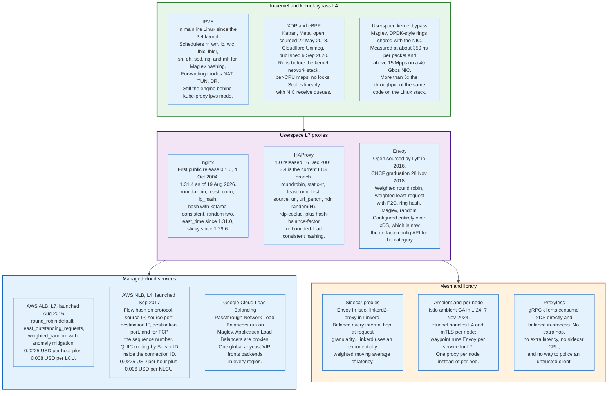

### 19.1 The Proxies

| | **nginx** | **HAProxy** | **Envoy** |
|---|---|---|---|
| **First release** | 0.1.0, 4 Oct 2004 | 1.0, 16 Dec 2001 | Open sourced by Lyft, 2016 |
| **Current** | 1.31.4, 19 Aug 2026 | 3.4 LTS branch | Continuous, CNCF graduated 28 Nov 2018 |
| **Algorithms** | round-robin, `least_conn`, `ip_hash`, `hash` with `consistent`, `random [two [method]]`, `least_time` since 1.31.0 | `roundrobin`, `static-rr`, `leastconn`, `first`, `hash`, `source`, `uri`, `url_param`, `hdr()`, `random(N)`, `rdp-cookie`, `sticky`, `log-hash` | Weighted round robin, weighted least request with P2C, `RING_HASH`, `MAGLEV`, `RANDOM`, client-side weighted round robin from ORCA reports |
| **Bounded-load consistent hashing** | No | Yes, `hash-balance-factor` | Yes, on `RING_HASH` and `MAGLEV` |
| **Configuration** | File, reload | File, reload or Runtime API | xDS over gRPC, hot |
| **Distinctive** | Ketama-compatible hashing at 160 points per weight unit; `keepalive` defaults to `32 local` since 1.29.7 | `fastinter` and `downinter` for state-dependent probe rates; `hash-preserve-affinity` | Outlier detection, retry budgets, adaptive concurrency, and the xDS API the rest of the industry adopted |

The single most consequential difference is configuration. Envoy's xDS turned load balancer configuration into a streaming API rather than a file, which is what made service meshes possible and what gRPC later adopted for proxyless balancing.

### 19.2 The Kernel and Bypass Layer

IPVS remains in mainline Linux, offering schedulers `rr`, `wrr`, `lc`, `wlc`, `lblc`, `lblcr`, `sh`, `dh`, `sed`, `nq` and `mh`, where `mh` is Maglev hashing. It backs kube-proxy's IPVS mode. Its `conn_reuse_mode` sysctl, defaulting to 1, controls whether a connection reusing a source port is rescheduled, and its `expire_nodest_conn`, defaulting to 0, controls whether packets for a departed backend are silently dropped or answered.

Katran and Unimog sit one layer lower, in XDP, running before the kernel network stack allocates anything.

### 19.3 The Managed Services

| | **AWS ALB** | **AWS NLB** | **Google Cloud** |
|---|---|---|---|
| **Layer** | 7 | 4 | Both, as separate products |
| **Selection** | `round_robin` default, `least_outstanding_requests`, `weighted_random` | Flow hash on protocol, source IP, source port, destination IP, destination port, plus TCP sequence number for TCP | Passthrough Network Load Balancers run on Maglev; Application Load Balancers are proxies |
| **Client IP** | Lost, carried in `X-Forwarded-For` | Preserved by default except for IP-type TCP and TLS target groups | Preserved on passthrough |
| **Static IP** | No, DNS name only | Yes, one per subnet, optional Elastic IP | Yes, one global anycast address |
| **Stickiness** | `lb_cookie`, `app_cookie`, 1 s to 604,800 s | `source_ip` | Several, product-dependent |
| **Price, us-east-1** | 0.0225 USD/hour + 0.008 USD/LCU-hour | 0.0225 USD/hour + 0.006 USD/NLCU-hour | Per forwarding rule plus data processing |

Google's architecture differs in one structural way worth naming. A Google Cloud global external Application Load Balancer presents a single anycast IP address that fronts backends in every region, so cross-region failover requires no DNS change and no client action. AWS achieves regional failover through Route 53 and therefore through DNS TTLs, with all the caching behaviour of section 6.2. That is the same trade as section 6 and 7, made at the level of a product.

### 19.4 Choosing

The decision reduces to four properties of the traffic and the team.

**Whether the routing decision needs request content.** If it does, the answer is Layer 7 and a full proxy. If it does not, the answer is Layer 4, and probably direct server return.

**Whether the protocol multiplexes.** HTTP/2 and gRPC produce persistent imbalance under Layer 4 balancing, so the choice narrows to a Layer 7 proxy, a mesh sidecar, or an xDS-aware client.

**Whether packet rate or byte rate is the constraint.** Packet rate favours XDP or kernel bypass. Byte rate favours direct server return, which removes the egress path from the balancer entirely.

**Who carries the pager.** A managed balancer costs more per byte and removes an on-call rotation. At the fleet size where a dedicated network team already exists, the arithmetic reverses.

---

## 20. Service Mesh and Sidecar Balancing

A service mesh moves load balancing from one hop at the edge to every hop inside, and it exists because Layer 4 balancing produces persistent imbalance for multiplexed protocols.

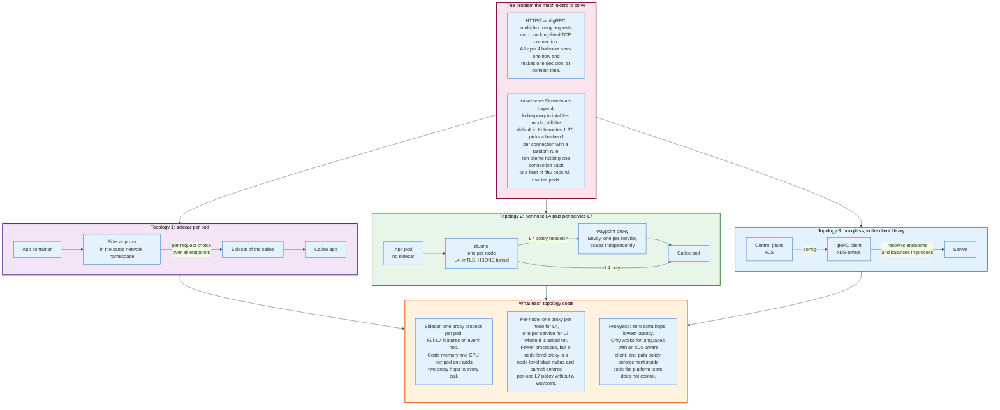

### 20.1 The Problem It Was Built For

Kubernetes Services are a Layer 4 abstraction. kube-proxy, which still defaults to iptables mode in Kubernetes 1.37, installs rules that redirect the Service virtual IP to a randomly chosen endpoint by destination NAT, and the choice is made once, per connection.

For HTTP/1.1 without keepalive this is adequate, because each request is a new connection and therefore a new decision. For HTTP/2 and gRPC it is not, because one connection carries thousands of requests over hours. The gRPC project documents the consequence and Linkerd's own documentation is blunter: for gRPC services, "Kubernetes's default load balancing is not effective."

The arithmetic from section 5.4: ten clients holding one connection each against fifty pods uses at most ten pods.

### 20.2 The Sidecar Model

A sidecar proxy runs in the same network namespace as the application container and intercepts all traffic. Outbound requests are balanced by the sidecar, per request, over the full endpoint set. Inbound requests arrive at the sidecar, which enforces policy and mutual TLS before handing them to the application.

The load balancing algorithm becomes a mesh concern rather than a platform one. Linkerd uses an exponentially weighted moving average of latency. Istio uses Envoy, and therefore the full Envoy algorithm set including P2C least request, ring hash and Maglev.

The costs are per pod and they are real. One proxy process per pod, with its own memory footprint and CPU share. Two additional proxy hops on every call, one outbound and one inbound. Configuration for every sidecar, pushed by the control plane, which grows as the product of services and endpoints.

### 20.3 Ambient Mode and the Per-Node Split

Istio's ambient mode reached General Availability in Istio 1.24 on 7 November 2024, splitting the sidecar's job across two components with different scaling properties.

`ztunnel` is a per-node proxy written in Rust that handles Layer 4 concerns only: mutual TLS, authentication, Layer 4 authorisation, and telemetry. It does not parse HTTP. It carries traffic to workloads, to other ztunnels, or to a waypoint using the HBONE tunnelling protocol.

The `waypoint` proxy is an Envoy deployment that runs outside application pods, one per service, and provides Layer 7 authorisation, telemetry and routing. It scales independently of the applications it serves.

The trade against sidecars: far fewer proxy processes, because one per node replaces one per pod, at the cost of a node-level blast radius and the need to deploy a waypoint wherever Layer 7 policy is required. Istio's Technical Oversight Committee marked ztunnel, waypoints and the associated APIs Stable in 1.24.

### 20.4 Proxyless

The third topology removes the proxy entirely. An xDS-aware client library, most prominently gRPC, consumes endpoint and policy configuration directly from the control plane and balances in process.

The gRPC documentation frames the trade precisely. Client-side balancing achieves "high performance because elimination of extra hop", and requires the client to implement the algorithm and to be trusted. Proxy balancing "adds latency" because the proxy is in the data path, and works with untrusted clients. The lookaside design splits the difference, keeping server state and the algorithm in a specialised server while the client stays thin.

Proxyless is the lowest-latency option and the least enforceable. Policy lives in code the platform team does not own, and a client that ignores the configuration cannot be stopped by the network.

### 20.5 What the Mesh Adds Beyond Balancing

Balancing is the entry point and rarely the reason a mesh is adopted. Mutual TLS between every pair of services, with automatic certificate issuance and rotation, is usually the reason. Uniform telemetry is second. Retry policy, circuit breaking and outlier detection applied consistently across languages is third.

The load balancing improvement is genuine and it is the smallest of the four benefits.

---

## 21. Retries and the Retry Storm

A retry converts a transient failure into a success, and a fleet of retries converts a degraded service into a dead one. The difference is entirely in whether the retry rate is bounded.

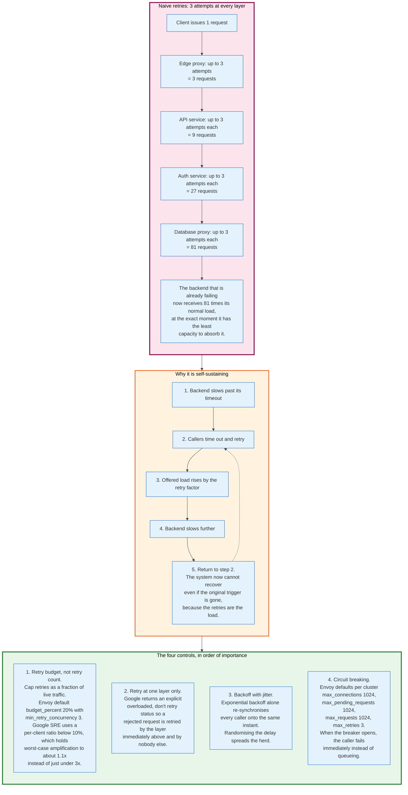

### 21.1 The Multiplication

Retries compose multiplicatively across layers, and a system with retries at four layers, each allowing three attempts, can turn one client request into 81 backend requests.

The Google SRE book states the shape from measurement: with only a per-request retry budget of three attempts, worst-case traffic growth reaches "somewhere just below 3X" at a single layer. Stack the layers and the exponent stacks.

The timing makes it worse. Retries fire when the backend is slow, which is exactly when it has the least capacity. The load arrives as a burst, because every caller's timeout expires at approximately the same time after a shared triggering event.

### 21.2 Why It Is Self-Sustaining

A retry storm survives the removal of its original cause, which is what separates it from an ordinary overload.

The loop is four steps. The backend slows past its callers' timeout. Callers time out and retry. Offered load rises by the retry factor. The backend slows further, and the loop repeats. After one turn, the retries are the load. Fixing the original trigger, a slow query, a garbage collection pause, a dependency blip, does not help, because the system is now sustaining itself.

Recovery requires reducing offered load, which means either shedding at the server or throttling at the client. Adding capacity often fails, because the new capacity is immediately consumed by the backlog of retries.

### 21.3 The Four Controls, in Order of Importance

**Retry budgets, not retry counts.** A retry count bounds amplification per request. A retry budget bounds it per service, as a fraction of live traffic, which is the quantity that actually matters.

Envoy implements this as a `RetryBudget` with `budget_percent` defaulting to 20% and `min_retry_concurrency` defaulting to 3. Google SRE uses a per-client ratio "below 10%" and reports the effect precisely: the per-request budget alone allows growth to just below 3x, and adding the per-client budget "reduces the growth to just 1.1x in the general case."

That is the number that justifies the mechanism. A 3x amplification during an incident is often fatal. A 1.1x amplification is noise.

**Retry at one layer only.** Google's answer is an explicit response code meaning "overloaded; don't retry", which propagates upward and stops "a combinatorial retry explosion" across a dependency stack. A rejected request is retried by the layer immediately above it and by nobody else.

**Backoff with jitter.** Exponential backoff spaces successive attempts. It does not desynchronise callers, because every caller computes the same delay from the same triggering event and retries in lockstep. Randomising each delay spreads the herd across the interval, and it is the randomisation rather than the exponential growth that prevents the second wave.

**Circuit breaking.** When a dependency is failing, calls to it should fail immediately rather than occupying a connection and a thread until they time out. Envoy's per-cluster defaults are `max_connections` 1024, `max_pending_requests` 1024, `max_requests` 1024 and `max_retries` 3. Exceeding `max_retries` means further retries are refused, which is the retry budget enforced as a concurrency limit.

### 21.4 What Must Never Be Retried

A retry is only safe when the operation is idempotent or the request never reached the server.

HTTP defines GET, HEAD, PUT, DELETE, OPTIONS and TRACE as idempotent. POST is not. A balancer that retries a POST after the request body was transmitted may cause a double charge, a duplicate order, or a double send.

The safe cases are narrow and worth stating exactly. A connection failure before any request bytes were sent is always safe to retry. An HTTP/2 stream with an identifier above the last-stream-ID in a GOAWAY frame was definitively not processed and is always safe to retry. Anything else requires either idempotency or an application-level idempotency key.

---

## 22. Load Shedding Under Overload

Beyond capacity, goodput falls rather than plateauing, and the only mechanism that recovers it is refusing work.

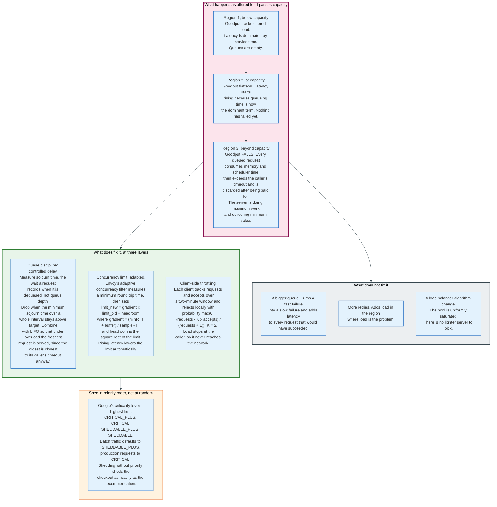

### 22.1 The Shape of the Curve

Three regions, and the third is the one that surprises people.

Below capacity, goodput tracks offered load and latency is dominated by service time. At capacity, goodput flattens and latency rises, because queueing time is now the dominant term. Nothing has failed.

Beyond capacity, goodput **falls**. Every queued request consumes memory and scheduler attention while it waits, then exceeds its caller's timeout and is discarded. The server has paid the full cost of the request and delivered nothing. Push far enough and a server can do maximum work at near-zero goodput.

That is why "add more queue" is not a fix. A deeper queue increases the time a request spends waiting, which increases the fraction of requests that time out before being served, which lowers goodput further while adding latency to the requests that would have succeeded.

### 22.2 Queue Discipline: Controlled Delay

The correct queue metric is sojourn time, the time a request spends waiting before it is served, recorded at the moment it is dequeued, not queue depth. Depth conflates a brief burst with sustained overload; sojourn time does not.

The controlled delay approach sets a target sojourn time and an interval. If the minimum sojourn time observed over a whole interval stays above the target, the queue is standing rather than absorbing bursts, and requests are dropped until it drains. A burst that clears within the interval is absorbed with no drops.

Pairing this with a last-in-first-out queue discipline is counterintuitive and correct under overload. The oldest request in the queue is the one closest to its caller's timeout, so serving it is the least likely to produce a useful response. Serving the newest maximises the number of requests that complete before their deadline. Under normal load the queue is empty and the discipline is irrelevant.

### 22.3 Concurrency Limits That Adapt

A fixed concurrency limit is a guess that goes stale whenever the workload, the instance type, or a dependency's latency changes. An adaptive limit derives itself from measured latency.

Envoy's adaptive concurrency filter implements a gradient controller. It periodically measures a minimum round trip time by pinning concurrency low under controlled conditions, then computes:

```
gradient  = (minRTT + B) / sampleRTT        # B is a buffer, a percentage of minRTT
limit_new = gradient * limit_old + headroom # headroom = sqrt(concurrency_limit)
```

When `sampleRTT` is near `minRTT`, the gradient is near 1 and the headroom term drives the limit upward. When latency rises, the gradient falls below 1 and the limit contracts multiplicatively. The controller needs no configured capacity number, because latency is the capacity signal.

Two details matter operationally. `min_rtt_calc_interval` in the reference configuration is 60 seconds, and jitter is applied to it, at 10% in the documented example, specifically so that a fleet of proxies does not all pin their concurrency to the minimum at the same instant and produce a synchronised burst of 503s. The minRTT recalculation is also triggered early when the limit has been pinned at its minimum for 5 consecutive sampling windows.

### 22.4 Client-Side Throttling

The cheapest request to reject is the one that never leaves the caller, and Google's adaptive throttling rejects it there.

Each client tracks two counters over a two-minute rolling window: `requests`, the number of application-layer requests attempted, and `accepts`, the number the backend accepted. While `requests` is less than K times `accepts`, everything is sent. Beyond that, the client rejects locally with probability:

```
max(0, (requests - K * accepts) / (requests + 1))
```

The SRE book states the default: "We generally prefer the 2x multiplier", so K = 2. Lowering K toward 1.1 makes throttling more aggressive; raising it makes throttling less so.

The property this delivers is that load stops at the caller. The backend's network, its accept queue, and its TLS termination are all spared, and the caller gets a fast local failure instead of a slow remote one.

### 22.5 Shed in Priority Order

Shedding without priority sheds the checkout as readily as the recommendation carousel, which is the wrong outcome at any shed rate.

Google's request criticality has four levels, highest first: `CRITICAL_PLUS` for requests whose failure is directly user visible, `CRITICAL` as the default for production jobs, `SHEDDABLE_PLUS` for traffic where partial unavailability is expected and the default for batch jobs, and `SHEDDABLE` for traffic where frequent partial and occasional full unavailability is expected.

Criticality propagates with the request through the call graph, so a downstream service shedding load knows whether the request it is about to drop came from a checkout or from a nightly report.

The primary utilisation signal Google uses is executor load average: a count of active threads, running or ready to run, smoothed by exponential decay. Requests are rejected as active threads grow beyond the number of available processors. Per-customer limits sit on top, and the book gives a worked allocation where a backend with 10,000 CPUs allots 4,000 CPU-seconds per second each to two customers, 3,000 to a third, 2,000 to a fourth and 500 to everyone else, deliberately summing to more than 10,000 because not every customer peaks at once.

### 22.6 Where Shedding Belongs

The load balancer is the wrong place to shed and the right place to observe.

A balancer can see that every backend is returning 503, and it can stop retrying. It cannot know which requests are worth serving, because criticality is an application concept. It cannot know the true concurrency limit, because that depends on the work behind each request.

The correct division: the backend sheds, using the mechanisms above; the balancer respects the shed signal by not retrying it, propagates it upward, and stops selecting hosts that are consistently shedding. Envoy's `x-envoy-overloaded` header is exactly this contract, made explicit.

---

## 23. Economics - What It Costs and Who Pays

Load balancing is priced three different ways depending on who operates it, and the three models put the cost on entirely different lines of the budget.

### 23.1 The Managed Model - Metered Capacity

AWS prices Elastic Load Balancing as a fixed hourly rate plus a metered capacity unit, and bills the capacity unit on the maximum of several dimensions rather than their sum.

| | Application Load Balancer | Network Load Balancer |
|---|---|---|
| **Hourly** | 0.0225 USD, us-east-1 | 0.0225 USD, us-east-1 |
| **Capacity unit** | 0.008 USD per LCU-hour | 0.006 USD per NLCU-hour |
| **New connections per unit** | 25 per second | 800 TCP per second, 400 UDP flows, 50 TLS |
| **Active connections per unit** | 3,000 per minute, 1,500 with mutual TLS | 100,000 TCP, 50,000 UDP flows, 3,000 TLS |
| **Processed bytes per unit** | 1 GB per hour, 0.4 GB for Lambda targets | 1 GB per hour |
| **Rule evaluations per unit** | 1,000 per second | Not applicable |

Three observations follow from the table.

**Bytes usually dominate.** In section 17.5, processed bytes required 576 LCUs against 400 for rule evaluations and 16.7 for active connections. Any workload serving responses larger than about 4 KB at meaningful request rates will be billed on bytes.

**TLS is priced at 16x TCP on NLB.** 800 new TCP connections per NLCU against 50 new TLS connections. That ratio is the asymmetric cryptography cost made visible.

**Mutual TLS halves the connection allowance.** 1,500 active connections per LCU instead of 3,000. Client certificate verification costs the same again as server-side termination.

The metered model has one operationally significant property: cost scales with traffic without any capacity planning decision, and it also scales with an attack. A volumetric attack absorbed by the balancer is billed as processed bytes.

### 23.2 The Self-Hosted Model - Servers and People

Running nginx, HAProxy or Envoy on owned or rented instances converts the bill into server hours plus an on-call rotation.

The server side is small and derives from section 17's numbers. That workload presents 50,000 concurrent connections, 40 new TLS handshakes per second, and 576 GB per hour of response bytes, which is 160 MB per second or 1.28 Gbps. Connection state is the binding constraint of the three, and its per-core ceiling is not published for any particular proxy build, because it moves with buffer sizes and the size of the TLS session cache. Take 20,000 concurrent connections per core as a working assumption and 50,000 connections need 3 cores, so two 8 vCPU instances hold the state while 40 handshakes per second and 1.28 Gbps sit far below what those cores and one 10 Gbps interface deliver. A third instance exists only so that losing one is survivable. Direct server return removes the egress path from the balancer entirely, which at a 10:1 egress-to-ingress ratio cuts the balancer's bandwidth requirement by roughly 91% and is the single largest cost lever available.

The people side is not small and is usually undercounted. A self-hosted balancer tier needs configuration management, certificate distribution and rotation, health check tuning, capacity planning, an upgrade process that does not drop connections, and someone who understands why a rise threshold of 2 and a fall threshold of 3 are not symmetric.

The crossover is fleet size. Below the point at which a dedicated network or platform team exists, managed is cheaper on total cost. Above it, the metered rate on bytes becomes the dominant term and self-hosting wins on arithmetic alone.

### 23.3 The Hyperscale Model - Capacity as a Fraction

At Google, Meta and Cloudflare scale, the question is not the price of a balancer but what fraction of the fleet is spent on balancing.

The appliance model answered this badly: 1+1 redundancy means 50% of purchased load balancing capacity is idle. ECMP with N+1 reduces the idle fraction to roughly 1/N.

Katran's stated architectural gain is removing the dedicated load balancer machine class entirely by colocating the forwarding plane with the backends, which improves "the ratio of load balancing to serving capacity". Cloudflare reports that Unimog consumes "less than 1% of the processor utilisation" on each server compared with running no load balancing at all.

One percent of the fleet is the current state of the art for the balancing function itself. Everything else in this document is about what that one percent buys.

### 23.4 The Second-Order Costs

**Overprovisioning from imbalance.** An imbalanced fleet must be provisioned for its peak server, not its average. Section 8.3's random selection produces a 31% peak-to-mean gap at 1,000 servers and 100 requests each, which means 31% more machines. Maglev's production measurement is the counterexample: a coefficient of variation of 6% to 7%, with an overprovision factor under 1.2 for more than 60% of the day.

**Consistent hashing quality is capacity.** At 1,000 backends and a 65,537-entry table, Karger's ring requires 29.7% overprovisioning and rendezvous hashing 49.5%, against negligible overprovisioning for Maglev hashing. On a 1,000-machine fleet those percentages are 297 and 495 machines.

**Health check traffic.** HAProxy's default 2-second interval against 60 backends from 20 proxies is 600 probes per second, before any client traffic. It is small, and it is not zero, and the `tune.max-checks-per-thread` setting exists because at large fleet sizes it stops being small.

---

## 24. Security and Risk

A load balancer is the single point through which all traffic passes, which makes it the best place to enforce policy and the worst place to have a bug.

### 24.1 The Threat Model

**Volumetric denial of service.** The balancer is the first component to see the flood. Maglev's design accounts for this directly: its steering module hashes on the 5-tuple to spread packets across threads, and falls back to round robin when a receive queue fills, which the paper notes "is especially effective at handling large floods of packets with the same 5-tuple."

**Connection table exhaustion.** A Layer 4 balancer's connection tracking table is finite. The Maglev paper names this as a theoretical limitation made real by SYN floods: the table "may fill up under heavy load or SYN flood attacks", and entries are evicted only on expiry. The mitigation is the consistent hash underneath, which produces a correct backend even with no table entry. A design that depends on the table alone fails under attack.

**Slow-request attacks.** A full proxy holds a socket and a buffer per connection, so an attacker opening many connections and sending bytes slowly consumes memory rather than bandwidth. The defences are per-connection timeouts on headers and body, and a hard cap on concurrent connections.

**Request smuggling.** When a front-end proxy and a back-end server disagree about where one HTTP request ends and the next begins, an attacker can hide a second request inside the first. Disagreements arise from conflicting `Content-Length` and `Transfer-Encoding` headers, from obsolete line folding, and from differing tolerance for malformed framing. The systematic mitigations are to normalise framing at the edge, to reject rather than sanitise ambiguous messages, and to prefer HTTP/2 to the backend where the framing is binary and length-prefixed.

**Header spoofing.** `X-Forwarded-For` is client-supplied. A balancer that appends rather than overwrites, on a hop that does not trust its predecessor, hands the application an attacker-controlled client address. Anything derived from that address, rate limits, geo-blocking, audit logs, is then attacker-controlled too. The same applies to the PROXY protocol with much worse consequences, because it is trusted absolutely: a listener accepting PROXY protocol from an untrusted source lets any client claim any address.

**Health check endpoints as reconnaissance.** Health endpoints commonly return version numbers, dependency status, and internal hostnames, and they are commonly exposed on the same port as the application. They belong on a separate port reachable only from the balancer.

### 24.2 The Balancer as a Defence

**TLS termination centralises cryptographic policy.** One place to enforce a minimum protocol version, rotate certificates, and disable a broken cipher suite. AWS names its policies explicitly, defaulting HTTPS target connections to `ELBSecurityPolicy-TLS13-1-0-2021-06` when any HTTPS listener uses a TLS 1.3 policy.

**Mutual TLS between services.** This is the primary reason meshes are adopted. Istio's ambient `ztunnel` provides it per node with no application change.

**Rate limiting and admission.** A Layer 7 balancer is the only component that can see a user identity and apply a per-user limit before the request reaches an application thread.

**Fail-open, which is a deliberate risk acceptance.** ALB routing to all targets when every target is unhealthy is a decision that a broken health check is more likely than a dead fleet. It is correct far more often than it is wrong, and when it is wrong it sends traffic to servers known to be failing.

### 24.3 The Failure Modes Specific to This Component

**The correlated health check failure.** Section 14.3. A deep check that touches a shared dependency fails everywhere at once and ejects the entire fleet.

**The control plane taking the data plane with it.** A balancer that stops forwarding when it cannot reach its configuration source converts a management outage into a traffic outage. The correct behaviour is to keep serving the last known good configuration indefinitely.

**Retry amplification.** Section 21. The balancer is usually the component that implements retries, and therefore usually the component that implements the storm.

**The single point of failure that redundancy created.** Three redundant components writing to shared state without coordination can produce a failure that one component could not. This is not hypothetical for balancers: any design where multiple health checkers or multiple config writers update a shared membership view needs a coordination mechanism, not just multiple copies.

**Silent misconfiguration of DSR.** A backend answering ARP for the virtual IP pulls all traffic to itself and bypasses the balancer. Nothing fails. Everything works, at one-sixtieth of the intended capacity.

---

## 25. Modern Developments

### 25.1 QUIC Breaks Flow-Based Balancing, and the Standard Did Not Land

QUIC connections survive an address change, which means the 5-tuple is no longer a stable identifier for a flow and every Layer 4 balancer built on 5-tuple hashing has a correctness problem.

QUIC replaces the tuple with a connection ID chosen by the endpoint. A client that changes network, from Wi-Fi to cellular, keeps the same connection ID and the connection continues. A balancer hashing the 5-tuple sends the migrated packets somewhere new.

The IETF's answer was `draft-ietf-quic-load-balancers`, which specified how to encode routing information inside the connection ID so a configured balancer can route migrated packets correctly, along with a retry service and configuration rotation bits. As of August 2026 the draft is expired at revision 21, last revised 27 August 2025, and never became an RFC.

Implementations shipped anyway. AWS Network Load Balancer now supports `QUIC` and `TCP_QUIC` target group protocols, and its documentation describes the mechanism directly: "the load balancer selects a target using the Server ID specified in the Connection ID (CID)", falling back to a 5-tuple flow hash for initial connection attempts that carry no Server ID, after which "traffic for this CID gets routed to the same target for the lifetime of the CID." NLB fixes the deregistration delay at 300 seconds for QUIC traffic and does not apply stickiness or connection termination attributes to it.

The standard did not converge. The technique did.

### 25.2 Backend-Reported Load

The direction of travel is away from balancer-inferred load and toward backend-declared load, because the backend is the only component that knows what a request cost.

Envoy's client-side weighted round robin derives endpoint weights from Open Request Cost Aggregation reports using `qps / (utilization + eps/qps * error_utilization_penalty)`. AWS shipped the same idea as ALB's `weighted_random` algorithm with `load_balancing.algorithm.anomaly_mitigation`, defaulting to off.

AWS also added Target Optimizer to ALB target groups, which uses an agent installed on each target and a dedicated target control port to enforce an exact maximum number of concurrent requests per target. Target Optimizer can only be enabled at target group creation and the control port cannot be changed afterwards. It is a managed service adopting the concurrency-limit mechanism of section 22.3.

### 25.3 nginx Moves Its Load Balancing Features to Open Source

Two nginx releases in 2026 moved load balancing capability that had been commercial-only for a decade into the open source distribution.

nginx 1.29.6, released 10 March 2026, added "session affinity support; the `sticky` directive in the `upstream` block of the `http` module", along with `route` and `drain` parameters on the `server` directive. nginx 1.31.0, released 13 May 2026, added "the `least_time` directive inside the `upstream` block". The nginx documentation confirms the change in status: "Prior to version 1.31.0, this directive was available only as part of our commercial subscription."

nginx 1.31.4, released 19 August 2026, added PROXY protocol version 2 support to the `proxy_protocol` directive in the stream and mail modules.

### 25.4 Ambient Mesh Removes the Sidecar Requirement

Istio 1.24, released 7 November 2024, marked ambient mode generally available with `ztunnel`, waypoints and the associated APIs designated Stable by the Istio Technical Oversight Committee. The per-pod sidecar is now optional rather than architectural, and Istio states that workloads in different data plane modes interoperate, so migration is incremental.

The load balancing consequence is a split. Layer 4 decisions happen once per node in `ztunnel`. Layer 7 decisions happen in a waypoint that exists only for services that need Layer 7 policy. Most internal traffic gets mutual TLS and Layer 4 balancing at a fraction of the sidecar's resource cost, and pays for Layer 7 only where it is used.

### 25.5 eBPF Continues Downward

Katran and Unimog established that the forwarding plane belongs in XDP, before the kernel network stack. The same technique is now applied to service-to-service traffic inside Kubernetes clusters, replacing iptables and IPVS with eBPF programs attached at the socket and driver layers.

Kubernetes itself is moving: kube-proxy's `nftables` mode exists alongside `iptables` and `ipvs`, and the documentation states the default "will change to `nftables` in a future version", recommending that operators specify the proxy mode explicitly to avoid a surprise at upgrade.

### 25.6 Bounded Load Becomes a Default Expectation

Consistent hashing with bounded loads moved from a 2016 paper to a documented product feature in HAProxy and Envoy within about a year, and it is now the expected answer whenever affinity and balance are both required.

The remaining gap is that nginx open source does not implement it, and the ring-hash implementations that do implement it default to disabled. Section 10.3's recommended range of 125 to 200 remains a manual setting rather than a default.

---

## 26. Appendix

### 26.1 Key Terminology

| Term | Definition |
|------|------------|
| **Active health check** | A probe sent by the balancer on a schedule, independent of client traffic |
| **Anycast** | One IP address announced from multiple locations, with the routing system choosing which one a packet reaches. RFC 4786 |
| **Bounded load** | A per-server capacity cap of `ceil((1+e) * m/n)` layered on consistent hashing |
| **Connection draining** | Allowing in-flight requests to complete on a backend that has been removed from the eligible set |
| **Connection tracking table** | A balancer's cache mapping a flow identifier to the backend previously chosen for it |
| **DSR, direct server return** | A forwarding model where the backend replies directly to the client and the balancer never sees the response |
| **ECMP** | Equal Cost Multipath. A router distributing packets over several equal-cost next hops by hashing packet fields. RFC 2992 |
| **EDNS Client Subnet** | A DNS extension carrying part of the client's address to the authoritative server. RFC 7871, option code 8 |
| **EWMA** | Exponentially weighted moving average, used to smooth per-endpoint latency measurements |
| **Fail-open** | Sending traffic to all targets when all targets are marked unhealthy, on the assumption the check is wrong |
| **Flow** | The set of packets sharing a 5-tuple, which for TCP is one connection |
| **GOAWAY** | An HTTP/2 frame announcing connection shutdown and naming the last stream the server processed |
| **GUE** | Generic UDP Encapsulation, used by Cloudflare's Unimog |
| **HBONE** | The tunnelling protocol Istio's ztunnel uses to carry traffic between nodes |
| **Hysteresis** | Requiring several consecutive results before changing a backend's state, to prevent oscillation |
| **LCU / NLCU** | AWS Load Balancer Capacity Unit and Network Load Balancer Capacity Unit, the metered billing units |
| **Maglev hashing** | A consistent hashing scheme building a prime-sized lookup table by round-robin claim from per-backend permutations |
| **Outlier detection** | Passive ejection of backends based on observed responses rather than probes |
| **P2C** | Power of two choices. Sample two backends at random, take the less loaded |
| **PROXY protocol** | A header prepended to a TCP connection carrying the original client address. Version 2 signature is 12 bytes |
| **Rendezvous hashing** | Also highest random weight. Compute `h(key, server)` for every server, take the maximum |
| **Session affinity** | Pinning a client to a specific backend for the life of a session |
| **Slow start** | Ramping a returning backend's share of traffic from near zero to full over a window |
| **Sojourn time** | The time a request spent waiting in the queue, measured when it is dequeued. Controlled delay sheds when the minimum sojourn time over a whole interval stays above target |
| **Virtual node** | Multiple ring positions per backend in a consistent hash, to flatten arc lengths. Ketama uses 160 per weight unit |
| **VIP** | Virtual IP address. The address clients connect to, which no single backend owns |
| **xDS** | Envoy's discovery service APIs for endpoints, clusters, listeners and routes, now used by gRPC for proxyless balancing |

### 26.2 Reference Numbers

| Quantity | Value | Source |
|----------|-------|--------|
| Maglev lookup table size, production default | 65,537 | Maglev, NSDI 2016 |
| Maglev alternative table size | 655,373 | Maglev, NSDI 2016 |
| Maglev table generation time | 1.8 ms at 65,537; 22.9 ms at 655,373 | Maglev, NSDI 2016 |
| Maglev table sizing rule | M greater than 100 x N, for about 1% imbalance | Maglev, NSDI 2016 |
| Maglev per-packet processing time | About 350 ns | Maglev, NSDI 2016 |
| Maglev batch flush timer | 50 microseconds | Maglev, NSDI 2016 |
| Maglev throughput ceiling, 40 Gbps NIC | Slightly above 15 Mpps | Maglev, NSDI 2016 |
| Maglev kernel bypass gain | More than 5x over the Linux stack | Maglev, NSDI 2016 |
| Maglev production load variation | Coefficient of variation 6% to 7%, 458 endpoints | Maglev, NSDI 2016 |
| Overprovisioning at 1,000 backends, M=65,537 | Karger 29.7%, rendezvous 49.5% | Maglev, NSDI 2016 |
| Overprovisioning at 1,000 backends, M=655,373 | Karger 10.3%, rendezvous 12.3% | Maglev, NSDI 2016 |
| Envoy Maglev table size | 65,537 by default; configurable, must be prime, limited to 5,000,011 | Envoy API reference, `cluster.proto` |
| Envoy ring hash sizes | `minimum_ring_size` 1,024; `maximum_ring_size` 8,388,608; `hash_function` XX_HASH | Envoy API reference |
| Envoy least request choice count | 2 | Envoy API reference |
| Envoy `active_request_bias` | 1.0 | Envoy documentation |
| Envoy slow start | `aggression` 1.0, `min_weight_percent` 10% | Envoy API reference |
| Envoy outlier detection | `consecutive_5xx` 5, `interval` 10 s, `base_ejection_time` 30 s, `max_ejection_time` 300 s, `max_ejection_percent` 10%, `success_rate_stdev_factor` 1900 | Envoy API reference |
| Envoy circuit breakers | `max_connections` 1024, `max_pending_requests` 1024, `max_requests` 1024, `max_retries` 3 | Envoy API reference |
| Envoy retry budget | `budget_percent` 20%, `min_retry_concurrency` 3 | Envoy API reference |
| Envoy adaptive concurrency example values | `min_rtt_calc_interval` 60 s, jitter 10%, 50 samples per window, minRTT recalculated after 5 pinned windows | Envoy documentation |
| Envoy HTTP/2 drain | `drain_timeout` between the first and final GOAWAY, default 5,000 ms | Envoy API reference, `http_connection_manager.proto` |
| ALB and NLB cross-zone attribute | `load_balancing.cross_zone.enabled`; always on and unchangeable at ALB load balancer level, `false` by default at NLB load balancer level, `use_load_balancer_configuration` by default at target group level | AWS ALB and NLB user guides |
| ALB health check reason codes | `Target.ResponseCodeMismatch` for a wrong status, `Target.Timeout` for no response within `HealthCheckTimeoutSeconds` | AWS ALB user guide |
| HAProxy first release | 1.0, 16 December 2001 | haproxy.org |
| HAProxy `hash-balance-factor` | Default 0 (off); a percentage above 100; reasonable range 125 to 200 | HAProxy 3.4 configuration manual |
| HAProxy `random` draws | Default 2 | HAProxy 3.4 configuration manual |
| HAProxy health check defaults | `inter` 2,000 ms, `rise` 2, `fall` 3 | HAProxy 3.4 configuration manual |
| HAProxy roundrobin server limit | 4,095 active servers per backend | HAProxy 3.4 configuration manual |
| nginx first public release | 0.1.0, 4 October 2004 | nginx CHANGES |
| nginx `random` directive added | 1.15.1, 3 July 2018 | nginx CHANGES |
| nginx `sticky` in open source | 1.29.6, 10 March 2026 | nginx CHANGES |
| nginx `least_time` in open source | 1.31.0, 13 May 2026 | nginx CHANGES |
| nginx current mainline | 1.31.4, 19 August 2026 | nginx CHANGES |
| nginx passive check defaults | `max_fails` 1, `fail_timeout` 10 s | nginx upstream module |
| nginx ketama compatibility | 160 points per weight unit | nginx upstream module |
| nginx keepalive default | `keepalive 32 local` since 1.29.7; `keepalive_requests` 1000; `keepalive_timeout` 60 s; `keepalive_time` 1 h | nginx upstream module |
| ALB health check defaults | Interval 30 s, timeout 5 s, healthy threshold 5, unhealthy threshold 2, matcher 200 | AWS ALB user guide |
| ALB deregistration delay | Default 300 s, range 0 to 3,600 s | AWS ALB user guide |
| ALB slow start | Range 30 to 900 s, default 0 (disabled) | AWS ALB user guide |
| ALB stickiness cookie | Default 86,400 s, range 1 s to 604,800 s | AWS ALB user guide |
| ALB routing algorithms | `round_robin` (default), `least_outstanding_requests`, `weighted_random` | AWS ALB user guide |
| ALB HTTP/2 streams per client connection | 128 maximum | AWS ALB user guide |
| ALB pricing, us-east-1 | 0.0225 USD/hour + 0.008 USD/LCU-hour | AWS ELB pricing |
| ALB LCU dimensions | 25 new conn/s; 3,000 active conn/min (1,500 with mTLS); 1 GB/hour; 1,000 rule evaluations/s with the first 10 processed rules free | AWS ELB pricing |
| NLB pricing, us-east-1 | 0.0225 USD/hour + 0.006 USD/NLCU-hour | AWS ELB pricing |
| NLB NLCU dimensions | TCP 800 new/s, 100,000 active, 1 GB/h; UDP 400 new/s, 50,000 active; TLS 50 new/s, 3,000 active | AWS ELB pricing |
| NLB port allocation limit | About 55,000 connections per minute per NLB IP and unique target when client IP preservation is off | AWS NLB user guide |
| NLB DNS record TTL | 60 seconds | AWS ALB and NLB user guides |
| Kubernetes `terminationGracePeriodSeconds` | 30 s | Kubernetes documentation |
| Kubernetes default kube-proxy mode | `iptables` in 1.37, moving to `nftables` | Kubernetes documentation |
| Consistent hashing with bounded loads | Capacity `ceil(c * m/n)`; movement factor O(1/e squared) for e at most 1 | arXiv 1608.01350 |
| Vimeo result | Cache bandwidth decreased by a factor of almost 8 | Google Research blog, 3 April 2017 |
| Power of two choices, d=1 | Max load about `log n / log log n` for m = n | Mitzenmacher, Richa, Sitaraman survey |
| Power of two choices, d at least 2 | Max load `log log n / log d + Theta(1)`, plus m/n in the heavy case | Azar, Broder, Karlin, Upfal, via the survey |
| ECMP disruption | Modulo-N (N-1)/N; hash-threshold 1/4 to 1/2; highest random weight 1/N | RFC 2992 |
| PROXY protocol v1 line lengths | TCP4 form 56 characters, TCP6 form 104, UNKNOWN worst case 107, all including CRLF; 108-byte buffer | PROXY protocol specification |
| PROXY protocol v2 signature | `\x0D\x0A\x0D\x0A\x00\x0D\x0A\x51\x55\x49\x54\x0A` | PROXY protocol specification |
| Google retry budgets | 3 attempts per request; per-client ratio below 10%; growth 3x becomes 1.1x | Google SRE book |
| Google adaptive throttling | `max(0, (requests - K * accepts) / (requests + 1))`, K = 2 | Google SRE book |
| Google criticality levels | CRITICAL_PLUS, CRITICAL, SHEDDABLE_PLUS, SHEDDABLE | Google SRE book |
| LVS forwarding model scalability | VS/NAT 10 to 20 real servers; VS/TUN and VS/DR high | LVS documentation |
| Unimog packet size | 1,500 bytes becomes 1,536 with GUE; jumbo frames required | Cloudflare, 9 September 2020 |
| Unimog overhead | Under 1% of processor utilisation; under 1% of packets take a second hop | Cloudflare, 9 September 2020 |
| Katran kernel requirement | Linux 5.6 or newer, Clang 6.0 or later | Katran repository |
| F5 acquisition of NGINX | Announced 11 March 2019 at approximately 670 million USD; completed 9 May 2019 | F5 press releases |
| Envoy CNCF graduation | 28 November 2018 | CNCF announcement |
| Istio ambient GA | Istio 1.24, 7 November 2024 | Istio release announcement |
| QUIC-LB draft status | Expired at revision 21, last revised 27 August 2025 | IETF datatracker |

### 26.3 Diagram Index

| Diagram | Source | Description |
|---------|--------|-------------|
| Evolution timeline | [`diagrams/evolution-timeline.mmd`](diagrams/evolution-timeline.mmd) | Five eras, from nameserver address rotation in the late 1980s to the 2026 stack, each with the constraint that ended the previous one |
| Participants and roles | [`diagrams/participants.mmd`](diagrams/participants.mmd) | Six tiers from client to backend with the granularity, reaction time and failure of each, plus the control plane that feeds them |
| Layer 4 versus layer 7 visibility | [`diagrams/l4-vs-l7-visibility.mmd`](diagrams/l4-vs-l7-visibility.mmd) | Byte layout of one segment and exactly what each layer can and cannot read |
| ECMP rehash | [`diagrams/ecmp-rehash.mmd`](diagrams/ecmp-rehash.mmd) | What draining one balancer of four costs, and why consistent hashing underneath saves the connections |
| Algorithm failure modes | [`diagrams/algorithm-failure-modes.mmd`](diagrams/algorithm-failure-modes.mmd) | Ten algorithms grouped by what they read, each with the incident it produces, including the one-draw and two-draw balls-and-bins bounds |
| Maglev table build | [`diagrams/maglev-table-build.mmd`](diagrams/maglev-table-build.mmd) | Permutation generation, round-robin claiming, the O(1) data path, and rebuild cost |
| Bounded load overflow | [`diagrams/bounded-load-overflow.mmd`](diagrams/bounded-load-overflow.mmd) | The capacity cap, the clockwise walk, and the quadratic movement penalty |
| Affinity versus elasticity | [`diagrams/affinity-vs-elasticity.mmd`](diagrams/affinity-vs-elasticity.mmd) | Four affinity mechanisms, the four things each takes away, and the escape |
| Termination models | [`diagrams/termination-models.mmd`](diagrams/termination-models.mmd) | NAT, full proxy, layer 2 DSR and tunnel DSR with the cost of each |
| Health check state machine | [`diagrams/health-check-state-machine.mmd`](diagrams/health-check-state-machine.mmd) | Every backend state with product defaults, and where flapping lives |
| Drain sequence | [`diagrams/drain-sequence.mmd`](diagrams/drain-sequence.mmd) | The correct shutdown order and the three failures it prevents |
| Request lifecycle | [`diagrams/request-lifecycle.mmd`](diagrams/request-lifecycle.mmd) | The worked example end to end, from DNS through both balancer tiers to Redis |
| Modern stack layers | [`diagrams/modern-stack-layers.mmd`](diagrams/modern-stack-layers.mmd) | Kernel, proxy, managed and mesh tiers with versions and dates |
| Mesh topologies | [`diagrams/mesh-topologies.mmd`](diagrams/mesh-topologies.mmd) | Sidecar, per-node ambient, and proxyless, with the cost of each |
| Retry amplification | [`diagrams/retry-amplification.mmd`](diagrams/retry-amplification.mmd) | How three attempts at four layers becomes 81, and the four controls that stop it |
| Overload goodput | [`diagrams/overload-goodput.mmd`](diagrams/overload-goodput.mmd) | The three load regions, what does not fix region three, and the three layers that do |

### 26.4 Primary Sources

- **Papers.** Eisenbud et al., "Maglev: A Fast and Reliable Software Network Load Balancer", NSDI 2016. Karger, Lehman, Leighton, Panigrahy, Levine and Lewin, "Consistent Hashing and Random Trees", STOC 1997. Mirrokni, Thorup and Zadimoghaddam, "Consistent Hashing with Bounded Loads", arXiv 1608.01350, 3 August 2016. Mitzenmacher, Richa and Sitaraman, "The Power of Two Random Choices: A Survey of Techniques and Results". Azar, Broder, Karlin and Upfal, "Balanced Allocations", 1994.
- **IETF.** RFC 1794, DNS Support for Load Balancing, April 1995. RFC 2992, Analysis of an Equal-Cost Multi-Path Algorithm, November 2000. RFC 4786, Operation of Anycast Services, BCP 126, December 2006. RFC 7239, Forwarded HTTP Extension. RFC 7871, Client Subnet in DNS Queries, May 2016. `draft-ietf-quic-load-balancers-21`, expired.
- **Product documentation.** HAProxy 3.4 Configuration Manual. nginx `ngx_http_upstream_module` documentation and CHANGES file. Envoy architecture overview and API reference for `cluster.proto`, `outlier_detection.proto` and `circuit_breaker.proto`. AWS Elastic Load Balancing user guides for Application and Network Load Balancers, and the ELB pricing page. Kubernetes documentation on Services and virtual IPs. Google Cloud Load Balancing overview. Linux Virtual Server documentation. Linux kernel IPVS sysctl documentation.
- **Engineering publications.** Meta, "Open-sourcing Katran", 22 May 2018, and the `facebookincubator/katran` repository. Cloudflare, "Unimog, Cloudflare's edge load balancer", 9 September 2020, and "Cloudflare's architecture: eliminating single points of failure". Google Research blog, "Consistent Hashing with Bounded Loads", 3 April 2017. Google SRE book, "Handling Overload". gRPC blog, "gRPC Load Balancing", 15 June 2017. Istio 1.24 release announcement, 7 November 2024, and ambient mode overview. CNCF Envoy graduation announcement, 28 November 2018. F5 press releases on the NGINX acquisition.
- **Related research in this repository.** [cloud-and-infrastructure/cdns](../cdns/) for edge caching, anycast at CDN scale, and TLS termination modes at the edge. [cloud-and-infrastructure/dns](../dns/) for the resolution chain, TTL semantics and traffic steering. [networking-and-protocols/tcp-ip](../../networking-and-protocols/tcp-ip/) for the TCP handshake, connection teardown, and congestion control that every flow-affinity guarantee is protecting. [networking-and-protocols/tls-and-ssl](../../networking-and-protocols/tls-and-ssl/) for handshake mechanics and session resumption. [networking-and-protocols/bgp-routing](../../networking-and-protocols/bgp-routing/) for the path selection that decides anycast outcomes. [networking-and-protocols/http2-and-http3](../../networking-and-protocols/http2-and-http3/) for multiplexing, GOAWAY, and QUIC connection IDs.

---

## 27. Key Takeaways

**Distribution is the easy part; membership is what causes outages.** Choosing which server gets the next request is one line of code. Knowing which servers are eligible right now, with a health check that neither lies nor flaps, is the actual engineering. A fleet running round robin with correct health checking outperforms a fleet running a sophisticated algorithm with a check that tests the wrong thing.

**Every algorithm's failure mode is the property it gave up.** Round robin gave up load awareness and fails on heterogeneous requests. Least connections gave up determinism and fails by identifying the fastest-failing server as the least loaded. Consistent hashing gave up load awareness and fails on a hot key. Read the trade and you have predicted the incident.

**Least connections sends all traffic to the broken server.** A backend returning 500 in 2 ms holds fewer connections than one returning 200 in 200 ms, so it wins every comparison. This is not fixable by tuning the algorithm. It is fixed by outlier detection observing response codes, which at 667 requests per second per backend ejects a broken host in 7.5 milliseconds against 60 seconds for an ALB health check at defaults.

**65,537 is the number to remember.** Maglev's lookup table size is prime, larger than 100 times any realistic backend count, and small enough to stay in cache. It gives near-perfect balance where Karger's ring needs 29.7% overprovisioning and rendezvous hashing 49.5% at 1,000 backends. Envoy uses the same constant. Google chose to give up minimal disruption for even balance, and covered the gap with connection tracking.

**Consistent hashing balances keys, not load, and bounded loads is the fix.** Cap each server at `ceil((1+e) * m/n)` and let overflow walk clockwise. Movement per update costs O(1/e squared), so HAProxy's documented range of `hash-balance-factor` 125 to 200 is the region where the quadratic penalty is still tolerable. Vimeo cut cache bandwidth by a factor of almost 8 by turning it on.

**Two random choices is the whole benefit; three is not worth the probe.** Uniform random selection produces an excess over the mean that grows as the square root of load. Two choices produces an excess of `log log n / log d`, which does not contain the load term at all. Each choice past the second divides that excess by a constant while costing one more state read, which is why HAProxy, nginx and Envoy all default to 2.

**Session affinity converts drain time from a request duration into a session duration.** Pinning works and it costs scale-out relief, safe scale-in, lossless deploys, and long-run balance. nginx's `drain` parameter empties a server at the rate its sticky sessions expire, which with a default cookie lifetime is a day. Move session state out of the process and every one of those costs disappears.

**Direct server return removes 91% of the balancer's bandwidth requirement at a 10:1 egress ratio.** That single number explains why LVS's own table caps VS/NAT at 10 to 20 servers and describes VS/DR and VS/TUN only as high, and why Maglev uses GRE, Katran uses IPIP, and Unimog uses GUE. The price is that a balancer which never sees the response cannot retry, rewrite, or terminate TLS.

**Health check detection time is the product of interval and threshold, not the interval.** ALB defaults of 30 seconds and 2 failures give up to 65 seconds of failed traffic. HAProxy defaults of 2 seconds and 3 failures give 6. Neither is wrong; they differ by a factor of 15 in probe cost. Make the choice deliberately, and make removal faster than restoration.

**A load balancer in front of a uniformly saturated fleet has nothing to give.** Beyond capacity, goodput falls rather than plateauing, because queued requests consume resources and then time out. No algorithm change helps, because there is no lighter server. The only mechanisms that recover goodput are refusal: controlled-delay queue dropping on sojourn time, adaptive concurrency limits driven by measured latency, and client-side throttling at `max(0, (requests - 2 * accepts) / (requests + 1))`.

**Retries at four layers with three attempts each is 81 backend requests for one client request.** Bound retries as a fraction of live traffic, not as a count per request. Google's per-client budget below 10% reduces worst-case growth from just under 3x to 1.1x. Envoy's defaults are 20% with a floor of 3 concurrent retries. Add jitter, because exponential backoff alone re-synchronises the herd.

**Layer 4 balancing is broken for HTTP/2 and gRPC, and this is why the service mesh exists.** One connection carries thousands of requests, so a per-flow decision becomes a per-client decision that lasts hours. Ten clients against fifty pods use ten pods. The fix is request-level balancing, which requires a Layer 7 proxy, a sidecar, or an xDS-aware client.

**The standard for QUIC load balancing expired; the technique shipped anyway.** `draft-ietf-quic-load-balancers` reached revision 21 and never became an RFC. AWS Network Load Balancer nevertheless routes QUIC by a Server ID encoded in the connection ID, falling back to a 5-tuple hash only for the initial packets. Interoperability requirements do not always produce standards.

**The most expensive line on a managed load balancer bill is bytes.** In a 40,000 requests per second workload with 4 KB responses, processed bytes required 576 capacity units against 400 for rule evaluations and 16.7 for active connections, for 3,380 dollars a month on an ALB. Compression reduces it proportionally, and moving large objects to a CDN removes it.
