# Ethereum and the EVM: Complete Technical Deep Dive

---

## Table of Contents

1. [History and Overview](#1-history-and-overview)
2. [What Ethereum Is (and Is Not)](#2-what-ethereum-is-and-is-not)
3. [The Account Model Against UTXO](#3-the-account-model-against-utxo)
4. [Key Participants and Roles](#4-key-participants-and-roles)
5. [State, RLP, and the Merkle Patricia Trie](#5-state-rlp-and-the-merkle-patricia-trie)
6. [The EVM as a Stack Machine](#6-the-evm-as-a-stack-machine)
7. [Gas Metering](#7-gas-metering)
8. [The EIP-1559 Fee Market](#8-the-eip-1559-fee-market)
9. [Transaction Types and Access Lists](#9-transaction-types-and-access-lists)
10. [Contract Deployment and the ABI](#10-contract-deployment-and-the-abi)
11. [Solidity to Bytecode](#11-solidity-to-bytecode)
12. [A Worked End-to-End Example](#12-a-worked-end-to-end-example)
13. [Proof of Stake and Gasper](#13-proof-of-stake-and-gasper)
14. [Validators, Staking, and Slashing](#14-validators-staking-and-slashing)
15. [The Beacon Chain, Finality, and the Engine API](#15-the-beacon-chain-finality-and-the-engine-api)
16. [MEV and Proposer-Builder Separation](#16-mev-and-proposer-builder-separation)
17. [Blobs, Rollups, and Data Availability](#17-blobs-rollups-and-data-availability)
18. [Economics: Issuance, Burn, and Running Costs](#18-economics-issuance-burn-and-running-costs)
19. [Security and Threat Model](#19-security-and-threat-model)
20. [Regulation and Compliance](#20-regulation-and-compliance)
21. [Comparisons and Alternatives](#21-comparisons-and-alternatives)
22. [The Merge and Every Upgrade Since](#22-the-merge-and-every-upgrade-since)
23. [Modern Developments and the Road Ahead](#23-modern-developments-and-the-road-ahead)
24. [Appendix](#24-appendix)
25. [Key Takeaways](#25-key-takeaways)

---

## 1. History and Overview

Ethereum is a single replicated state machine whose transition function is priced in a unit called gas. Every design decision in this document follows from that sentence. Bitcoin verifies that coins moved. Ethereum verifies that a program ran, on every node, with identical results, and charges for each instruction.

The chain has changed its consensus algorithm once, its fee mechanism once, and its data layer twice. The instruction set has been extended at eight forks and never had an opcode removed.

```mermaid
%%{init: {'theme': 'base', 'themeVariables': {'primaryColor': '#e3f2fd', 'primaryBorderColor': '#1565c0', 'lineColor': '#37474f'}}}%%

timeline
    title Ethereum protocol milestones, 2013 to 2026
    section Origins
        2013-12 : Whitepaper circulated by Vitalik Buterin
        2014-04 : Yellow Paper by Gavin Wood formalises the EVM
        2014-07-22 : Ether sale opens at 2000 ETH per BTC, 42 days
        2015-07-30 : Frontier, block 0, genesis supply near 72 million ETH
    section Growing up in public
        2016-03-14 : Homestead, block 1150000
        2016-06-17 : The DAO drained of 3.6 million ETH
        2016-07-20 : DAO fork at block 1920000 splits off Ethereum Classic
        2016-10-18 : Tangerine Whistle reprices IO opcodes after DoS spam
        2016-11-22 : Spurious Dragon adds EIP-155 replay protection and the 24576 byte code cap
    section Building the toolkit
        2017-10-16 : Byzantium, block 4370000, REVERT and alt-bn128 pairings
        2019-02-28 : Constantinople, block 7280000, CREATE2 and EXTCODEHASH
        2019-12-08 : Istanbul, block 9069000, CHAINID
        2020-10-14 : Deposit contract deployed at block 11052984
        2020-12-01 : Beacon chain genesis, 16384 validators, epoch 0
    section Fee market and the switch
        2021-04-15 : Berlin, typed transactions and access lists
        2021-08-05 : London, EIP-1559 burns the base fee
        2021-10-27 : Altair, sync committees and the weighted reward scheme
        2022-09-15 : The Merge, block 15537394, terminal total difficulty 58750000000000000000000
    section Scaling the data layer
        2023-04-12 : Shapella, withdrawals go live at epoch 194048
        2024-03-13 : Dencun, EIP-4844 blobs at epoch 269568
        2025-05-07 : Pectra, 2048 ETH validators and EIP-7702 account code
        2025-12-03 : Fusaka, PeerDAS at epoch 411392, gas limit default 60 million
        2026-01-07 : BPO2 raises the blob target to 14 and the maximum to 21
        2026-08-17 : Platåberget testnet opens for Glamsterdam
```

### 1.1 The Design Argument, 2013 to 2015

Ethereum began as a critique of Bitcoin Script, not as a currency proposal. Vitalik Buterin circulated the whitepaper in late 2013 with four specific complaints about Bitcoin's scripting language: it lacks Turing completeness, it is value-blind because a script cannot see the amount it guards, it is stateless because it cannot carry information between transactions, and it is blockchain-blind because it cannot read block data. Each complaint names a class of application that cannot be built.

Gavin Wood turned the argument into a specification. The Yellow Paper, first published in April 2014, defines the Ethereum Virtual Machine as a formal state transition function with a stack of 1024 words, a word size of 256 bits, byte-addressed volatile memory, and a per-account persistent key-value store. The 256-bit word was chosen so that a Keccak-256 hash and a secp256k1 field element each fit in one stack slot. That choice makes the machine cheap to reason about and expensive to run on 64-bit hardware, and it is unchanged eleven years later.

The ether sale opened on 22 July 2014 and ran 42 days. The price was 2,000 ETH per bitcoin for the first 14 days, then declined linearly to 1,337 ETH per bitcoin. Two endowment pools were minted alongside the sale, each equal to 0.099 times the quantity sold, one for early contributors and one for the Ethereum Foundation. Roughly 60.1 million ETH went to buyers, which with the two endowments puts the genesis supply near 72 million ETH.

Frontier launched on 30 July 2015. It shipped with a difficulty bomb, a deliberately escalating proof-of-work difficulty designed to force the network to upgrade rather than ossify. That bomb was delayed five separate times over seven years before the Merge made it irrelevant.

### 1.2 The DAO and the Fork That Defined Governance

The most consequential event in Ethereum's history is a bug in somebody else's contract.

The DAO was an investment fund written as a contract, which raised roughly 12.7 million ETH in mid-2016, about 14% of the supply at the time. On 17 June 2016 an attacker drained about 3.6 million ETH through a reentrancy flaw: the contract sent ether before it updated its internal balance, so the recipient's fallback function could call back in and withdraw again.

The community voted to rewrite history. At block 1,920,000 on 20 July 2016, a hard fork moved the drained funds to a recovery contract. A minority refused and kept the unforked chain, which is Ethereum Classic. The precedent set that day is the one that matters: the social layer can, in extremis, override the code, and doing so costs a permanent chain split.

Two further hard forks that autumn were pure engineering. Tangerine Whistle at block 2,463,000 on 18 October 2016 repriced the IO-heavy opcodes after an attacker spent weeks making blocks that were cheap to buy and expensive to execute. Spurious Dragon at block 2,675,000 on 22 November 2016 added EIP-155 replay protection, which folds the chain identifier into the signature, and EIP-170, which caps deployed contract code at 24,576 bytes.

### 1.3 The Long Road to Proof of Stake

Proof of stake was in the plan from the beginning and took seven years to ship, because the hard part was never the algorithm.

The deposit contract went live at block 11,052,984 on 14 October 2020 at address `0x00000000219ab540356cBB839Cbe05303d7705Fa`. The beacon chain reached genesis on 1 December 2020 at 12:00:23 UTC with 16,384 validators, the configured `MIN_GENESIS_ACTIVE_VALIDATOR_COUNT`. For 21 months it ran in parallel, finalising its own empty blocks, proving the consensus layer worked while the execution layer continued under proof of work.

The Merge executed on 15 September 2022 at 06:42:42 UTC. Execution block 15,537,394 was the last one whose parent was found by hashing. The trigger was a terminal total difficulty of 58,750,000,000,000,000,000,000, chosen instead of a block height because a height can be reached early by an attacker with surplus hash power. Issuance fell by roughly 90% overnight. No user transaction changed.

### 1.4 Scale Today

The measurements below are point readings from 30 August 2026, taken from block explorers and the operators' own dashboards. Figures that move should be treated as of that date.

| Measure | Value | Date | Source |
|---------|-------|------|--------|
| **Block height** | 25,869,950 | 30 Aug 2026 | Etherscan |
| **Gas limit** | 60,000,000 | 30 Aug 2026 | Etherscan, gaslimit.pics |
| **Gas used in that block** | 39,118,020, 65.20% of limit | 30 Aug 2026 | Etherscan |
| **Base fee** | 0.218047662 gwei | 30 Aug 2026 | Etherscan |
| **Blob gas price** | 0.011898487 gwei | 30 Aug 2026 | Etherscan |
| **Throughput** | 23.7 transactions per second | 30 Aug 2026 | Etherscan |
| **Active validators** | 902,945 | 30 Aug 2026 | validatorqueue.com |
| **ETH staked** | 42.5 million, 34.87% of supply | 30 Aug 2026 | validatorqueue.com |
| **Entry queue** | 2,050,921 ETH, about 35 days | 30 Aug 2026 | validatorqueue.com |
| **Staking reward rate** | 2.62% | 30 Aug 2026 | validatorqueue.com |
| **Total supply** | about 122 million ETH | 30 Aug 2026 | ultrasound.money |
| **ETH price** | 2,514.93 USD | 30 Aug 2026 | Etherscan |

Two numbers in that table describe the current state of the network better than any narrative. The base fee is a fifth of a gwei, which means L1 execution demand is not scarce. The blob gas price is a hundredth of a gwei, which means rollup data demand is not scarce either. Ethereum in August 2026 has more capacity than it has paying customers.

That was the intention. It is also the problem.

---

## 2. What Ethereum Is (and Is Not)

### 2.1 The Precise Definition

Ethereum is a deterministic state machine replicated across every full node, in which the state is a mapping from 20-byte addresses to account objects, and the transition function is the execution of a stack-based virtual machine whose every instruction has a fixed or formula-derived price.

The state is a mapping. The transition is a program. The price list is consensus-critical.

That third clause is the one people skip. Two clients that disagree about whether `SLOAD` costs 100 or 2,100 gas will disagree about whether a transaction ran out of gas, will compute different state roots, and will fork the chain. The gas schedule is not a fee policy. It is part of the definition of validity.

### 2.2 What It Is Not

**Not a computer you rent.** The common phrase "world computer" invites the reading that gas buys compute the way an EC2 instance does. It does not. Every full node executes every instruction of every transaction, so gas prices the cost of imposing work on the entire network, multiplied by the number of nodes, forever. A cloud provider sells you one machine's time. Ethereum sells you every full node's agreement. The unit price gap is the whole reason rollups exist.

**Not a database with a blockchain attached.** The state trie is a commitment structure, not a storage engine. Clients store accounts and slots in ordinary key-value databases and compute the trie root over them. Nothing in the protocol requires a node to keep a literal trie on disk, and modern clients do not.

**Not sharded, and not going to be sharded in the original sense.** The 2018 roadmap described 64 execution shards, each with its own state and its own validators. That design was abandoned. What shipped instead is data sharding, in which the chain guarantees that a blob of data was published without guaranteeing what it means, and execution stays on one chain. A blob is not a shard. It carries no state and runs no code.

**Not fast because of the Merge.** The Merge changed who orders blocks and how much ether is printed. It did not change the gas limit, the block interval, or the state transition function. Block times became exactly 12 seconds instead of averaging about 13, which is a scheduling change, not a throughput one.

**Not final in the confirmation-depth sense.** Bitcoin's six confirmations are a probability estimate. Ethereum's finality is an economic claim: reverting a finalised checkpoint requires that at least one third of the staked ether, about 14.2 million ETH at 30 August 2026, be provably slashed. Finality is a bond, not a countdown.

**Not a place where contracts act.** A contract account has no thread, no timer, and no wallet. It executes only when an externally owned account starts a transaction that reaches it, directly or through a chain of calls. Every "automated" contract in production is a contract plus an off-chain keeper paying gas to poke it.

### 2.3 The Simplest Accurate Mental Model

Ethereum is a shared ledger of accounts on which anyone may install a program, at a price, and anyone may run someone else's installed program, at a price, with the guarantee that the result is the same for everyone and cannot be revoked.

Three prices and one guarantee. Everything else is implementation.

---

## 3. The Account Model Against UTXO

Ethereum picked accounts over unspent transaction outputs, and that single choice produced persistent contract state, the nonce, and the MEV industry.

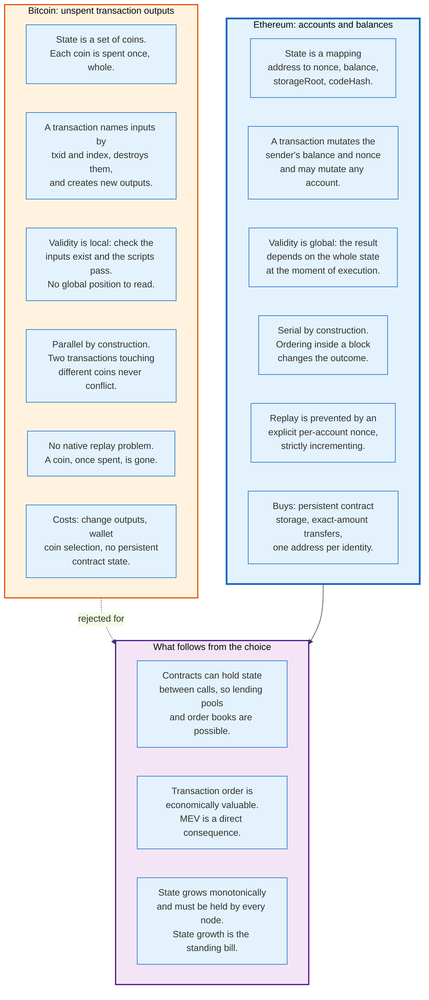

### 3.1 What UTXO Does

Bitcoin's state is a set of coins. Each coin is an output of some past transaction, identified by a transaction id and an index, locked by a script. A transaction consumes whole coins and creates new ones. Validity is local: the node checks that the named inputs exist in the set, that the unlocking scripts satisfy the locking scripts, and that outputs do not exceed inputs.

Locality buys three properties. Transactions touching disjoint coin sets can be validated in parallel with no coordination. Replay is structurally impossible, because a consumed coin is no longer in the set. And a light client can be handed a proof about one coin without being told anything about the rest of the ledger.

Locality costs one thing. There is nowhere to put durable state. A Bitcoin script cannot remember that it was called yesterday, because there is no "it" that persists between calls.

### 3.2 What Accounts Do

Ethereum's state is a mapping from a 20-byte address to a four-field record: `nonce`, `balance`, `storageRoot`, `codeHash`. Two kinds of account share the format. An externally owned account has an empty `codeHash` and is controlled by a secp256k1 private key. A contract account has code and no key, and cannot originate a transaction.

The mapping buys persistent storage, which buys everything else. A lending pool remembers who deposited what. An order book remembers open orders. An ERC-20 token is nothing but a mapping from address to balance living inside one account's storage trie.

The mapping costs locality. The result of a transaction depends on the entire state at the moment it executes, which means transactions cannot be validated independently and their order inside a block changes their outcome. Replay must be prevented explicitly, which is what the nonce is for: a strictly incrementing counter per account, so that a signed transaction is valid exactly once and transactions from one sender execute in the order the sender chose.

### 3.3 The Consequence Nobody Planned

Ordering has economic value in an account model and none in a UTXO model. That is the origin of MEV.

In Bitcoin, a miner reordering two transactions that touch different coins changes nothing measurable. In Ethereum, placing a buy before a large swap and a sell after it extracts value that neither party consented to give up. The extraction is not a bug in any contract. It is a direct consequence of choosing a state model where the outcome is a function of position.

Section 16 covers what the network built to manage that. The point here is that it was decided in 2014, in the choice of state model, by people who were arguing about whether a script could see how much money it was guarding.

### 3.4 The Comparison in One Table

| Property | UTXO, Bitcoin | Accounts, Ethereum |
|----------|---------------|--------------------|
| State object | A coin, spent once, whole | An address with a mutable record |
| Validity | Local to the named inputs | Global, depends on full state |
| Parallelism | Natural | Requires declared access lists |
| Replay protection | Structural | Explicit nonce |
| Persistent program state | None | Per-account storage trie |
| Exact-amount payment | Needs a change output | Native |
| Ordering value | Near zero | The basis of an industry |
| State growth | Bounded by unspent coins | Monotonic, every node holds it |
| Light client proof | Proof about one coin | Merkle proof against `stateRoot` |

Ethereum's own roadmap now spends much of its effort buying back the parallelism the account model gave away. EIP-7928, block-level access lists, scheduled for the Glamsterdam upgrade, makes every block declare in advance which accounts and slots it touches. That is a UTXO property, reintroduced as metadata, twelve years later.

---

## 4. Key Participants and Roles

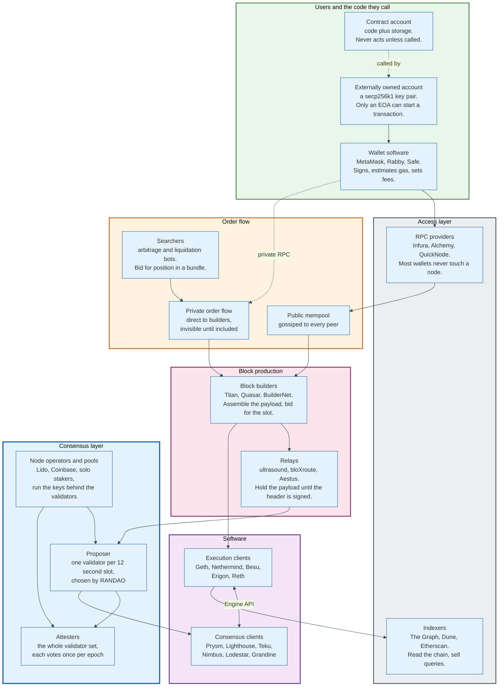

### 4.1 The Actors

| Role | What it does | Examples | Holds keys? |
|------|--------------|----------|-------------|
| **Externally owned account** | The only thing that can start a transaction | Any secp256k1 key pair | Yes |
| **Contract account** | Code plus storage, runs only when called | Uniswap v4, USDC proxy | No |
| **Wallet** | Signs, estimates gas, chooses fee parameters | MetaMask, Rabby, Safe | Yes, or a threshold of them |
| **RPC provider** | Sells access to a node's JSON-RPC surface | Infura, Alchemy, QuickNode | No |
| **Searcher** | Finds ordering-dependent profit, bids for position | Independent bot operators | Yes |
| **Block builder** | Assembles the execution payload, bids for the slot | Titan, Quasar, Eureka, BuilderNet | Yes |
| **Relay** | Holds the payload until the proposer signs the header | ultrasound, bloXroute, Aestus | Yes |
| **Validator** | Attests every epoch, proposes when selected | 902,945 of them | BLS signing key |
| **Node operator** | Runs the machines behind validators | Lido operators, Coinbase, solo stakers | Yes |
| **Execution client** | State transition, mempool, JSON-RPC | Geth, Nethermind, Besu, Erigon, Reth | No |
| **Consensus client** | Fork choice, attestation, finality | Prysm, Lighthouse, Teku, Nimbus, Lodestar, Grandine | Signs with the validator key |
| **Rollup sequencer** | Orders L2 transactions, posts blobs to L1 | Base, Arbitrum, OP Mainnet | Yes |
| **Indexer** | Reads the chain, sells structured queries | Etherscan, The Graph, Dune | No |

### 4.2 The Two Roles That Decide Whether the Network Is Healthy

**The client implementation is the systemic risk.** A validator does not verify the chain. Its software does. If a single consensus client holds more than one third of validators and produces a wrong answer, finality stops. If it holds more than two thirds, it can finalise an invalid chain, and the honest minority cannot rejoin without being slashed. This is the only failure mode in Ethereum where the correct individual choice and the correct collective choice diverge, because every operator wants the client with the best uptime and the fewest bugs, and that preference concentrates the network.

The August 2026 snapshot published by clientdiversity.org, drawing on Rated Network for the consensus layer, puts Teku at 53.86%, Prysm at 21.17%, Lighthouse at 20.6%, Nimbus at 3.12%, Grandine at 0.72%, and Lodestar at 0.53%. On the execution layer the same site reports Nethermind and Geth at 43% each, Besu at 8%, and Reth and Erigon at 3% each. The consensus shares are inferred by Rated Network from attestation timing and block patterns rather than measured directly. The execution shares come from supermajority.info, which the site itself marks stale and manually updated, and which covers 59.4% of the network by self-report with the remainder assumed to be mostly Geth. Both carry uncertainty the two-thirds conclusion should be stated against. Two facts survive the uncertainty: one consensus client is above the one third threshold, and two execution clients together are above two thirds.

**The builder is the practical bottleneck on censorship.** Roughly 89% of slots in the 24 hours to 30 August 2026 were filled with a payload bought through mev-boost rather than built locally. Within that flow, Titan produced 46.31% of blocks and Quasar 24.44%. Two firms therefore chose the contents of about 71% of mev-boost blocks, which is about 63% of all Ethereum blocks that day. Neither runs a validator. Neither is bonded. Neither breaks a protocol rule by declining to include an address.

### 4.3 Why the Staking Pool Exists

A validator unit requires 32 ETH, which at 2,514.93 USD is 80,478 dollars, and requires a machine that is online essentially all the time. Pools exist because both constraints bind for most holders.

Three shapes solve it. A liquid staking protocol takes deposits, issues a transferable receipt token, and distributes the ether across a curated operator set. A custodial exchange runs the validators and pays a share of the reward. Distributed validator technology splits one validator's BLS key across several machines using threshold signatures, so no single operator can sign alone and no single outage misses an attestation.

Pectra changed the arithmetic underneath all three. EIP-7251 raised `MAX_EFFECTIVE_BALANCE` from 32 ETH to 2,048 ETH for validators using the new `0x02` compounding withdrawal credential, and added an in-protocol consolidation request so an operator can merge many 32-ETH validators into one large one without exiting and rejoining the queue. At 30 August 2026 the network holds 42.5 million ETH behind 902,945 validators, an average of 47.1 ETH each. Before Pectra that average could not exceed 32.

The consequence is arithmetic, not ideology. Fewer, larger validators means fewer attestations to aggregate, gossip, and verify per epoch, which is the single largest constraint on shortening the finality period.

---

## 5. State, RLP, and the Merkle Patricia Trie

Ethereum commits to its entire state in one 32-byte number in every block header, and that number is the root of a hexary Merkle Patricia Trie. The structure exists to make two operations cheap at once: proving that a single account has a given balance, and updating the commitment when one slot in one account changes.

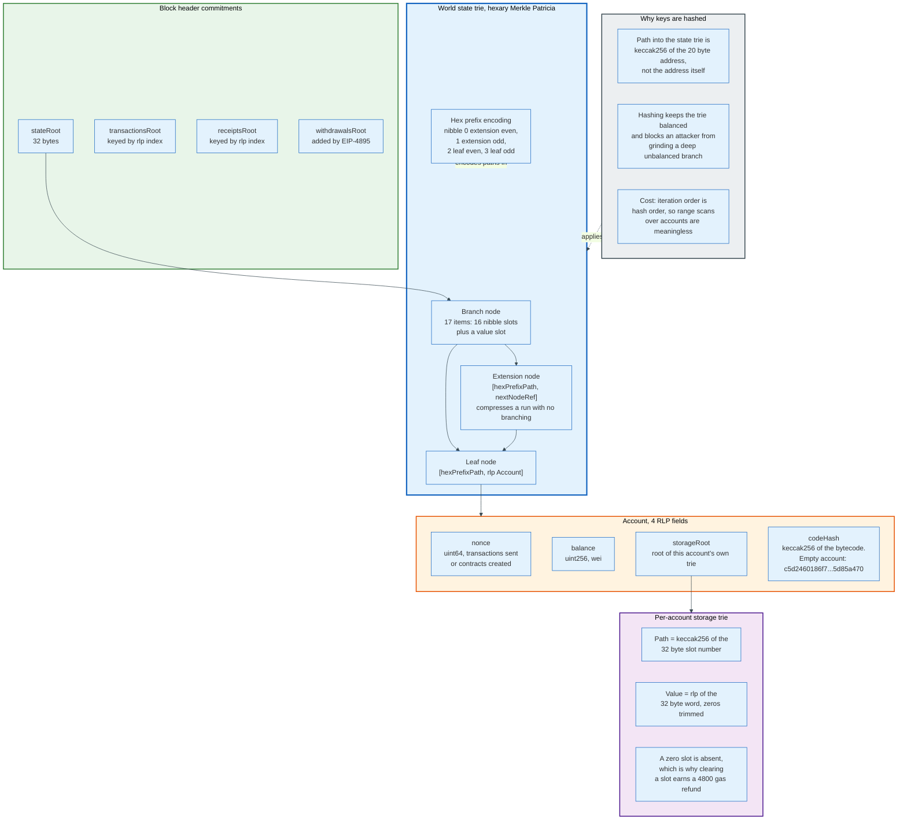

### 5.1 RLP, the Serialisation Underneath Everything

Recursive Length Prefix is Ethereum's only structural encoding, and it encodes exactly one thing: nested arrays of byte strings. It has no types, no integers, no booleans, and no field names. A decoder that does not already know the shape of what it is decoding learns nothing.

The rules fit in a paragraph. A single byte below `0x80` encodes itself. A string of 0 to 55 bytes is prefixed with `0x80` plus its length. A longer string is prefixed with `0xb7` plus the byte length of its length, then the length, then the payload. Lists use `0xc0` and `0xf7` in the same two forms, and their payload is the concatenated encodings of their items. Integers are encoded big-endian with leading zeros stripped, which makes zero the empty string.

Two constants follow directly and appear everywhere. The empty string encodes as `0x80`, so `keccak256(rlp(""))` is `0x56e81f171bcc55a6ff8345e692c0f86e5b48e01b996cadc001622fb5e363b421`, the root of an empty trie. The empty list encodes as `0xc0`, so `keccak256(rlp([]))` is `0x1dcc4de8dec75d7aab85b567b6ccd41ad312451b948a7413f0a142fd40d49347`, which is the post-Merge value of `ommersHash` in every block header and the empty value chosen for `block_access_list_hash` in EIP-7928.

RLP's minimalism is also why typed transactions needed EIP-2718. Adding a field to an RLP list changes nothing about how it decodes, so old clients would silently misread it. The envelope solution puts a single type byte in front instead, chosen below `0x7f` so that it can never be confused with the `0xc0` or higher first byte of a legacy RLP list.

### 5.2 The Account Record

An account is four RLP items and nothing else.

```
rlp([ nonce, balance, storageRoot, codeHash ])
```

`nonce` counts transactions sent by an externally owned account, or contracts created by a contract account. `balance` is wei, a uint256. `storageRoot` is the root of that account's own trie of storage slots. `codeHash` is `keccak256` of the deployed bytecode; for an account with no code it is `0xc5d2460186f7233c927e7db2dcc703c0e500b653ca82273b7bfad8045d85a470`, the Keccak hash of the empty byte string.

An account whose nonce is 0, balance is 0, and codeHash is the empty hash is defined by EIP-161 to be non-existent, and is deleted from the trie rather than stored. This is why sending 0 ether to a fresh address leaves no trace, and why the `NEW_ACCOUNT` charge of 25,000 gas applies when a call gives value to an address that did not exist.

### 5.3 Node Types and Hex Prefix Encoding

The trie has four node types and one encoding trick.

A **branch node** is a 17-item list: sixteen references, one per possible next nibble, plus a value slot for a key that terminates exactly here. An **extension node** is a two-item list holding a shared path segment and a reference to the next node, and exists so that a long run with no branching does not cost one node per nibble. A **leaf node** is a two-item list holding the remaining path and the value. A **null node** is the empty string.

Extension and leaf nodes share the same two-item shape, and paths are measured in nibbles while RLP stores bytes, so two ambiguities must be resolved at once: is this a leaf or an extension, and does the path have an odd or even nibble count. Hex prefix encoding resolves both in the first nibble. `0` means extension with an even path, `1` extension with an odd path, `2` leaf with an even path, `3` leaf with an odd path. Even paths get one padding nibble of zero after the flag, so the result always lands on a byte boundary.

References between nodes are the node's RLP encoding if that encoding is shorter than 32 bytes, and `keccak256` of it otherwise. Small nodes are therefore inlined into their parents, which is a meaningful saving in a trie of hundreds of millions of accounts.

### 5.4 The Four Tries

Every block header carries four roots, and they are not the same kind of object.

| Trie | Key | Value | Lifetime |
|------|-----|-------|----------|
| **World state** | `keccak256(address)` | `rlp([nonce, balance, storageRoot, codeHash])` | Persistent, mutated every block |
| **Account storage** | `keccak256(uint256 slot)` | `rlp(uint256 value)`, leading zeros stripped | Persistent, one per contract |
| **Transactions** | `rlp(index)` | the raw transaction, typed or legacy | Rebuilt per block, never updated |
| **Receipts** | `rlp(index)` | `rlp([status, cumulativeGasUsed, bloom, logs])` | Rebuilt per block, never updated |

The state and storage tries hash their keys. The transaction and receipt tries do not, because their keys are small sequential integers under the block author's control rather than attacker-chosen. Hashing keys in the state trie keeps the structure balanced and prevents an attacker from generating addresses that share a long prefix, which would deepen one branch and make every proof through it expensive.

The cost of key hashing is that the state trie has no useful iteration order. There is no way to enumerate accounts by balance, by address range, or by anything else. Every product that offers such a view is running an off-chain index.

### 5.5 Two Corrections

**The trie is not the database.** Geth stores the state in a flat key-value layout and maintains a separate path-based trie node store for proof generation. Erigon stores it in staged tables. Reth stores it in MDBX. None of them walks a literal trie to read a balance. The trie is a hash function over the state, and the state's physical layout is a client implementation choice with no consensus meaning at all.

**A storage slot that is zero does not exist.** Writing zero to a slot removes it from the trie; reading an absent slot returns zero. This is why `SSTORE` from non-zero to zero earns a refund of 4,800 gas, capped since EIP-3529 at one fifth of the transaction's total gas used, and why "clearing state is free" is close enough to true to have supported a gas token industry until London killed it.

---

## 6. The EVM as a Stack Machine

The EVM is a stack machine with 256-bit words, no registers, and a hard limit of 1,024 stack slots. Its instruction set is small, its addressing is minimal, and its price list is longer than its opcode list.

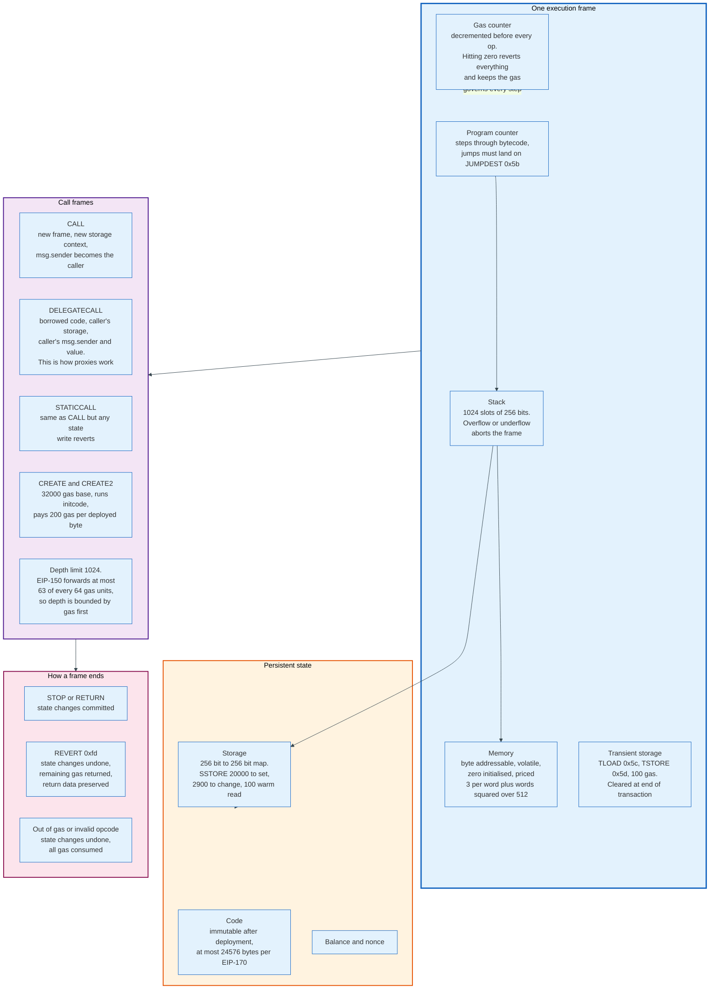

### 6.1 The Machine

Execution happens inside a frame. A frame holds a program counter, a stack of at most 1,024 words, a byte-addressable memory that starts empty and zero-filled, a gas counter, and a reference to the account whose storage is being written.

The stack is the only working space. Almost every opcode pops its arguments and pushes its result. `DUP1` through `DUP16` and `SWAP1` through `SWAP16` reach at most sixteen deep, so a Solidity function with more than sixteen live local variables produces the "stack too deep" error that has annoyed the language's users for a decade. EIP-8024, scheduled for Glamsterdam, adds `SWAPN`, `DUPN`, and `EXCHANGE` to address exactly this.

Memory is linear, volatile, and priced for expansion rather than access. Growing memory to `w` 32-byte words costs `3 * w + w**2 / 512` gas in total, charged as a difference each time the high-water mark rises. The quadratic term is under a tenth of the cost below about 150 words, equals the linear term at 1,536 words, and dominates above about 20,000, which is why contracts that copy large calldata blobs into memory get expensive faster than their authors expect.

Storage is the persistent map, and it is priced two orders of magnitude above everything else. Transient storage, added by EIP-1153 in Dencun as `TLOAD` at `0x5c` and `TSTORE` at `0x5d`, gives a third tier: a map that persists across calls within one transaction and is discarded at the end, for 100 gas per operation. It exists mostly to make reentrancy guards cheap, which previously cost a full `SSTORE` pair on every call.

### 6.2 Instruction Groups

| Group | Examples | Cost tier |
|-------|----------|-----------|
| Arithmetic, cheap | `ADD`, `SUB`, `LT`, `AND`, `SHL`, `NOT` | 3 (VERY_LOW) |
| Arithmetic, less cheap | `MUL`, `DIV`, `SDIV`, `MOD`, `SIGNEXTEND`, `CLZ` | 5 (LOW) |
| Modular | `ADDMOD`, `MULMOD`, `JUMP` | 8 (MID) |
| Conditional jump | `JUMPI` | 10 (HIGH) |
| Context reads | `ADDRESS`, `CALLER`, `TIMESTAMP`, `CHAINID`, `BASEFEE`, `BLOBBASEFEE` | 2 (BASE) |
| Exponent | `EXP` | 10 base, 50 per byte of exponent |
| Hashing | `KECCAK256` | 30 base, 6 per word |
| Memory | `MLOAD`, `MSTORE`, `MCOPY` | 3 plus copy and expansion |
| Storage | `SLOAD`, `SSTORE` | 100 warm to 20,000 |
| Logging | `LOG0` to `LOG4` | 375 base, 375 per topic, 8 per data byte |
| Calls | `CALL`, `DELEGATECALL`, `STATICCALL` | 100 warm, 2,600 cold, plus 9,000 if value moves |
| Creation | `CREATE`, `CREATE2` | 32,000 plus 200 per deployed byte |
| Halting | `STOP`, `RETURN`, `REVERT`, `INVALID` | 0 |

`JUMPDEST` at `0x5b` costs 1 gas and does nothing. It exists because the EVM allows computed jumps, and without a marker an attacker could jump into the middle of a `PUSH32` immediate and reinterpret data as code. Every jump destination must be a `JUMPDEST` byte that is not itself inside push data, which clients precompute into a bitmap when they first load a contract.

### 6.3 The Four Call Types, and Why Proxies Work

`CALL` creates a new frame with a new storage context. The callee's `msg.sender` is the caller's address and its `msg.value` is whatever was passed.

`DELEGATECALL`, added at Homestead by EIP-7, executes the callee's code against the caller's storage, balance, `msg.sender`, and `msg.value`. Nothing else in the EVM does this. It is the entire mechanism behind upgradeable contracts: a proxy holds the storage and forwards every call by `DELEGATECALL` to an implementation address it can change. USDC works this way, which is why a plain token transfer to it also pays a cold account access of 2,600 gas and a storage read for the implementation slot before any token logic runs.

`STATICCALL`, added at Byzantium by EIP-214, is `CALL` with a flag that reverts on any state modification. It makes read-only interfaces enforceable rather than merely documented.

`CALLCODE` is the deprecated ancestor of `DELEGATECALL`, differing in that it does not preserve `msg.sender`. It survives only because removing an opcode breaks old contracts.

### 6.4 The 63/64 Rule

Call depth is capped at 1,024, but that limit almost never binds, because EIP-150 caps the gas forwarded to a subcall at 63/64 of what the caller has left.

The practical effect is that available gas decays geometrically. Starting from 30 million gas, after 64 nested calls only about 36% remains, after 200 about 4%, and by depth 400 there is not enough left to do anything. An attacker cannot reach depth 1,024 to trigger a depth-limit failure in a victim contract, which was a real class of exploit before EIP-150.

The rule also creates a subtle obligation for contract authors. A callee that runs out of gas fails without failing the caller, so a contract that ignores a call's return value can proceed as though a subcall succeeded when it did not.

### 6.5 Precompiles

Some functions are too expensive to express in EVM opcodes at any sane price, so the protocol implements them natively at fixed low addresses. A call to one of these addresses executes native code, not bytecode.

| Address | Function | Gas | Introduced |
|---------|----------|-----|------------|
| `0x01` | `ECRECOVER`, secp256k1 public key recovery | 3,000 | Frontier |
| `0x02` | SHA-256 | 60 + 12 per word | Frontier |
| `0x03` | RIPEMD-160 | 600 + 120 per word | Frontier |
| `0x04` | Identity, memory copy | 15 + 3 per word | Frontier |
| `0x05` | Modular exponentiation | Formula, repriced by EIP-7883 | Byzantium |
| `0x06` | alt-bn128 point addition | 150 | Byzantium |
| `0x07` | alt-bn128 scalar multiplication | 6,000 | Byzantium |
| `0x08` | alt-bn128 pairing check | 45,000 + 34,000 per pair | Byzantium |
| `0x09` | BLAKE2b compression | 1 per round | Istanbul |
| `0x0a` | KZG point evaluation | 50,000 | Dencun |
| `0x0b` to `0x11` | BLS12-381 curve operations, EIP-2537 | 375 to 23,800 | Pectra |
| `0x100` | `P256VERIFY`, secp256r1 verification, EIP-7951 | 6,900 | Fusaka |

The last entry matters more than its position suggests. secp256r1, also called P-256, is the curve implemented in Apple's Secure Enclave, Android Keystore, and every FIDO2 and WebAuthn authenticator. Before Fusaka, verifying such a signature on-chain cost hundreds of thousands of gas in hand-written EVM code. It now costs 6,900. Passkey-controlled accounts became economically viable in December 2025.

---

## 7. Gas Metering

Gas is a unit of computational work, not a currency. The fee is gas multiplied by a price in wei, and confusing the two makes every fee discussion incoherent.

### 7.1 What Gas Is Buying

Each opcode's price is meant to track the cost it imposes on the marginal validating node: CPU cycles, memory bandwidth, disk seeks, state growth, and bytes on the wire. The schedule is a set of hand-set constants that have been repriced whenever measurement showed them wrong, usually after somebody exploited the gap.

The repricings are the history of the schedule. Tangerine Whistle in 2016 raised `EXTCODESIZE`, `BALANCE`, `SLOAD`, and the call family after a two-week spam campaign built blocks that were cheap to buy and slow to execute. Istanbul in 2019 raised `SLOAD` from 200 to 800 and `BALANCE` from 400 to 700 for the same reason. Berlin in 2021 replaced flat pricing with the cold and warm scheme, on the observation that the expensive part of a state read is the first one, because after that the value is in memory. Fusaka in 2025 raised the `MODEXP` price under EIP-7883 and bounded its inputs under EIP-7823 after benchmarking showed it underpriced.

Glamsterdam continues the pattern with four separate repricing EIPs: EIP-7976 raises the calldata floor, EIP-7981 raises access list costs, EIP-8037 raises state creation, and EIP-8038 raises state access. The direction is consistent. Everything that grows the state or forces a disk read gets more expensive, and everything that is pure arithmetic stays where it is.

### 7.2 Cold, Warm, and the Access Set

EIP-2929 introduced two sets that live for the duration of one transaction: `accessed_addresses` and `accessed_storage_keys`. The first touch of an address or slot is cold and expensive. Every later touch is warm and cheap.

| Operation | Cold | Warm |
|-----------|------|------|
| `SLOAD` | 2,100 | 100 |
| `BALANCE`, `EXTCODESIZE`, `EXTCODEHASH`, `EXTCODECOPY` | 2,600 | 100 |
| `CALL`, `DELEGATECALL`, `STATICCALL`, `CALLCODE` target | 2,600 | 100 |
| `SSTORE` surcharge on first touch of a slot | 2,100 | 0 |

At the start of every transaction the sets are seeded with the sender, the recipient or the address being created, and every precompile. EIP-3651 in Shapella added the block's `coinbase`, because MEV payments to the fee recipient were paying 2,600 gas for a cold access on essentially every MEV block.

### 7.3 The Storage Price List

`SSTORE` is the most expensive common opcode and has the most complicated rule, because it prices three different physical events.

| Transition | Gas | Why |
|------------|-----|-----|
| Zero to non-zero | 20,000 | Creates a trie node, permanent state growth |
| Non-zero to different non-zero | 2,900 | Overwrites in place, plus 2,100 if the slot is cold |
| Non-zero to zero | 2,900, plus a 4,800 refund | Removes a trie node |
| Any value to the same value | 100 | No write happens |

The refund is capped at one fifth of the transaction's total gas used, a limit imposed by EIP-3529 in London. Before that the cap was one half, and the gap between it and the 20,000 gas set cost supported a gas token market: contracts that wrote junk into storage when gas was cheap and cleared it when gas was expensive, monetising the refund. EIP-3529 also removed the refund for `SELFDESTRUCT` entirely. The gas token industry disappeared within weeks of London, which is the cleanest natural experiment in the fee schedule's history. Glamsterdam's EIP-7778 changes the accounting once more: the refund still reduces what the sender pays, but it no longer reduces the gas the block is charged.

### 7.4 Intrinsic Gas and the Calldata Floor

Before a single opcode executes, a transaction pays intrinsic gas.

```
intrinsic = 21000
          + 32000 if this is a contract creation
          + 4 * zero_bytes + 16 * non_zero_bytes  in calldata
          + 2 per 32-byte word of initcode        (EIP-3860)
          + 2400 per access list address
          + 1900 per access list storage key
          + 12500 per EIP-7702 authorization      (25000 if the account is empty)
```

EIP-7623, shipped in Pectra, added a floor underneath the total. Counting a zero byte as one token and a non-zero byte as four, the transaction's charged gas is

```
gasUsed = 21000 + max( 4 * tokens + execution_gas + creation_costs ,
                       10 * tokens )
```

The floor exists because rollups were posting calldata at 16 gas per byte while performing almost no execution, which let a single transaction consume the whole block's data budget for a fraction of the block's gas. After Pectra, a data-only transaction pays an effective 40 gas per non-zero byte rather than 16. A transaction with real computation is unaffected, because its execution gas exceeds the floor.

Fusaka added a second bound. EIP-7825 caps any single transaction at `TX_MAX_GAS_LIMIT` of 16,777,216 gas, which is 2^24. With a 60,000,000 gas block limit, no one transaction can occupy more than 28% of a block. The purpose is to keep worst-case block validation time bounded as the gas limit rises, and to make parallel execution schedulable.

### 7.5 What Happens When Gas Runs Out

Running out of gas is not an error return. It is a state revert with full payment.

If a frame exhausts its gas, all of that frame's state changes are discarded, all of its remaining gas is consumed, and the failure propagates to the caller as a zero return. If the outermost frame runs out, the entire transaction's state changes are discarded, the nonce increment stands, and the sender pays for every unit of gas the transaction consumed. The transaction is still included in the block and still produces a receipt, with `status` set to 0.

`REVERT`, added at Byzantium by EIP-140 at opcode `0xfd`, is the polite alternative. It undoes state changes, returns the unused gas, and preserves a return data buffer so the caller can read an error message. Every `require` and `revert` statement in Solidity compiles to it.

The asymmetry is deliberate. A contract that fails on purpose should not burn the user's money. A contract that runs away should.

---

## 8. The EIP-1559 Fee Market

EIP-1559 replaced a first-price auction with a protocol-set price that adjusts between blocks, and burns it. The design solves a user experience problem and creates a monetary policy as a side effect.

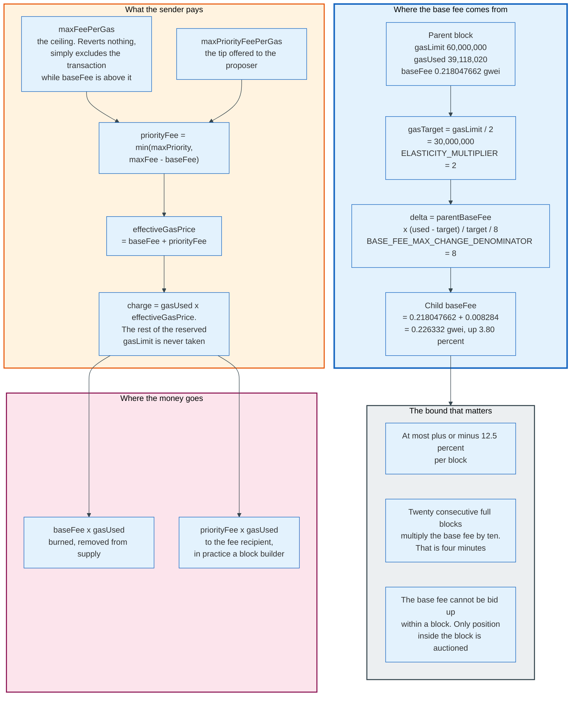

### 8.1 The Mechanism

Every block carries a `baseFeePerGas` field, computed from its parent and not chosen by anyone. The gas limit is split: the target is half the limit, and the limit is the hard ceiling. `ELASTICITY_MULTIPLIER` is 2 and `BASE_FEE_MAX_CHANGE_DENOMINATOR` is 8.

If the parent used exactly the target, the base fee is unchanged. If it used more, the base fee rises by `parentBaseFee * (used - target) / target / 8`. If it used less, it falls by the same formula with the sign flipped. The maximum move in either direction is one eighth, 12.5%.

Take block 25,869,950 as the worked case. Its limit is 60,000,000 and its target 30,000,000. It used 39,118,020, which is 9,118,020 over target, or 30.39% of target. Its base fee is 0.218047662 gwei. The delta is `0.218047662 * 0.303934 / 8 = 0.008284` gwei, so the child block's base fee is 0.226332 gwei, a rise of 3.80%.

Twenty consecutive completely full blocks multiply the base fee by ten. That is four minutes. Twenty consecutive empty blocks divide it by fourteen in the same four minutes. The mechanism is fast enough to price a demand spike and slow enough that no single block can be used to manipulate it.

### 8.2 What the Sender Sets

A type-2 transaction names two ceilings, not a price.

`maxFeePerGas` is the most the sender will pay per unit of gas in total. If the base fee exceeds it, the transaction is simply not includable, and it waits. It does not fail, and it costs nothing while waiting.

`maxPriorityFeePerGas` is the tip offered to whoever includes it. The tip actually paid is `min(maxPriorityFeePerGas, maxFeePerGas - baseFeePerGas)`, so a sender who set a generous ceiling during a quiet period is protected from overpaying the tip when the base fee falls.

The effective price is `baseFeePerGas + priorityFee`, and the sender is charged `gasUsed * effectiveGasPrice`. The `gasLimit` is a reservation, not a payment. Setting it high wastes nothing except the balance check at the start of the transaction, which requires `gasLimit * maxFeePerGas + value` to be available even though most of it is never taken.

### 8.3 The Burn

The base fee goes nowhere. It is subtracted from the sender and never credited to any account, which reduces the total supply of ether.

The stated rationale is incentive alignment: if the base fee were paid to the block producer, the producer would have an incentive to manipulate demand, and off-chain side payments would reconstruct the first-price auction the mechanism was meant to replace. Burning removes the producer's interest in the base fee entirely, and leaves it interested only in the tip and in ordering.

The monetary consequence was unplanned and, for a period, dominant. At 30 August 2026 it is not. Block 25,869,950 burned 0.00852959280306924 ETH. Extrapolating that rate across 2,629,800 blocks in a year gives roughly 22,400 ETH burned annually, against issuance near 1.08 million ETH. Section 18 works through the arithmetic. The short version is that at a fifth of a gwei, the burn is a rounding error.

### 8.4 The Blob Fee Market Is a Second, Separate Auction

EIP-4844 added an independent fee market for blob data, using the same exponential shape and none of the same parameters.

Blob gas is not gas. It is a separate meter with its own target and its own price. `GAS_PER_BLOB` is 131,072. The target and maximum blob count have moved four times: 3 and 6 at Dencun, 6 and 9 at Pectra under EIP-7691, 10 and 15 at BPO1 on 9 December 2025, and 14 and 21 at BPO2 on 7 January 2026. `BLOB_BASE_FEE_UPDATE_FRACTION` is 11,684,671 since BPO2, raised from 3,338,477 at Dencun, 5,007,716 at Pectra, and 8,346,193 at BPO1, each step slowing the price response as capacity grew.

`MIN_BASE_FEE_PER_BLOB_GAS` is 1 wei, and for most of 2024 and 2025 the blob base fee sat at exactly that, because rollups did not use the target. EIP-7918, shipped in Fusaka, put a reserve price underneath it: `BLOB_BASE_COST` of 8,192 gas priced at the execution base fee. When that product exceeds `GAS_PER_BLOB` times the blob base fee, the excess blob gas stops falling as fast, so the blob price cannot decouple entirely from the cost of the block that carries it.

Block 25,869,950 illustrates both halves. It carried 12 blobs, below the target of 14, so the blob base fee was falling. At 0.011898487 gwei, one 131,072-byte blob cost 1,559 gwei, about 0.0039 dollars. The EIP-7918 reserve of `8,192 * 0.218047662` gwei is 1,786 gwei, so the reserve was binding.

Posting 128 kilobytes of rollup data to Ethereum that day cost less than half a cent.

---

## 9. Transaction Types and Access Lists

Ethereum has five transaction formats, added over ten years, all of them still valid. The mechanism that made adding them possible is one byte.

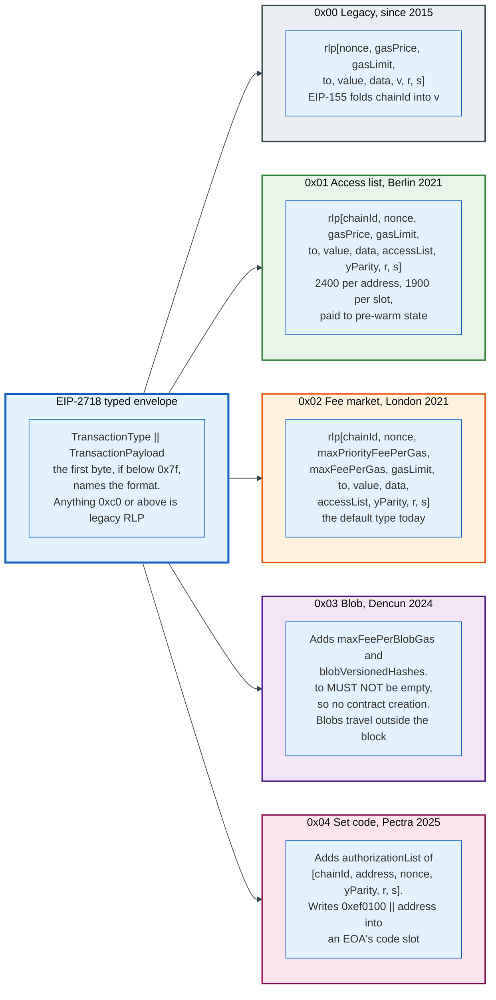

### 9.1 The Envelope

EIP-2718, shipped in Berlin, defines a typed transaction envelope: `TransactionType || TransactionPayload`. The type is a single byte below `0x7f`. The payload's interpretation is entirely defined by the type.

The trick is in the boundary value. A legacy transaction is an RLP list, and an RLP list of any realistic size begins with a byte of `0xc0` or higher. Reserving everything below `0x7f` for type bytes therefore makes old and new formats unambiguously distinguishable with no version field and no flag day. Every subsequent transaction feature has arrived as a new type byte.

### 9.2 The Five Types

| Type | Name | Fork | Payload after the type byte |
|------|------|------|------------------------------|
| `0x00` | Legacy | Frontier | `rlp([nonce, gasPrice, gasLimit, to, value, data, v, r, s])` |
| `0x01` | Access list | Berlin, Apr 2021 | `rlp([chainId, nonce, gasPrice, gasLimit, to, value, data, accessList, yParity, r, s])` |
| `0x02` | Fee market | London, Aug 2021 | `rlp([chainId, nonce, maxPriorityFeePerGas, maxFeePerGas, gasLimit, to, value, data, accessList, yParity, r, s])` |
| `0x03` | Blob | Dencun, Mar 2024 | Type 2 fields plus `maxFeePerBlobGas` and `blobVersionedHashes` |
| `0x04` | Set code | Pectra, May 2025 | Type 2 fields plus `authorizationList` |

Legacy transactions have no explicit chain identifier. EIP-155 in Spurious Dragon folded it into the `v` value of the signature as `chainId * 2 + 35 + yParity`, which is why mainnet legacy transactions carry `v` of 37 or 38. Typed transactions carry `chainId` as a plain field and `yParity` as 0 or 1.

The signing hash for a typed transaction is `keccak256(TransactionType || rlp(payload_without_signature))`. For legacy it is `keccak256(rlp(payload_without_signature))` with the EIP-155 chain fields appended. Two different preimages, which is what keeps a signature valid on one chain from being replayable as another type.

### 9.3 Access Lists, and When They Save Money

An access list is a declaration: these addresses and these storage slots will be touched. Its shape is `[[address, [slot, ...]], ...]`.

It costs 2,400 per address and 1,900 per storage key, charged as intrinsic gas at the start. In exchange, everything listed starts warm, so the first `SLOAD` costs 100 instead of 2,100 and the first account access costs 100 instead of 2,600.

The arithmetic decides whether it helps. A storage key saves 2,100 minus 100, which is 2,000, and costs 1,900. Net saving: 100 gas, if the slot is actually read. If it is not read, the loss is the full 1,900. An address saves 2,600 minus 100, which is 2,500, and costs 2,400. Net saving: 100 gas.

Those margins are thin on purpose. EIP-2930's real purpose was never routine saving. It was to make the state a transaction touches declarable in advance, so that a contract whose gas cost changed under EIP-2929 could be kept working by an explicit list, and so that future protocol changes would have a declaration format already deployed. Glamsterdam's EIP-7981 raises access list costs, which makes the routine case a net loss and the declarative case the only one.

### 9.4 Block-Level Access Lists, the Version That Matters

EIP-7928, scheduled for Glamsterdam, makes access lists mandatory, complete, and per-block rather than per-transaction.

The block header gains a `block_access_list_hash` field. The list itself travels in the `ExecutionPayload` over the Engine API rather than in the block body. It records, for every account touched during the block, the storage slots written with their post-transaction values, the slots read, the balance changes, the nonce changes, and the code changes, each tagged with the index of the transaction that caused it.

Three things become possible at once. A client can read every state item the block will touch from disk in parallel before executing anything. It can execute transactions in parallel wherever the declared sets are disjoint. And it can compute the post-state root without executing at all, because the post-values are in the list.

The cost is bandwidth: every block now carries a complete diff of its own effects. That is the trade Glamsterdam makes to raise the gas limit without raising block validation time.

### 9.5 EIP-7702, the Type That Blurs the Account Distinction

Type `0x04` lets an externally owned account temporarily behave like a contract.

An authorization tuple is `[chain_id, address, nonce, y_parity, r, s]`, signed by the account being changed over `keccak256(MAGIC || rlp([chain_id, address, nonce]))` with `MAGIC` equal to `0x05`. Processing it writes a 23-byte delegation designator, `0xef0100 || address`, into the authorising account's code field.

From then on, any call to that account executes the code at the delegate address, in the account's own storage context, exactly as though the account had performed a `DELEGATECALL`. Setting the delegate to the zero address clears it and restores the empty code hash. Each authorization costs 12,500 gas, or 25,000 if the account did not previously exist.

This delivers batching, gas sponsorship, and session keys to ordinary key-controlled accounts without requiring users to migrate to a smart contract wallet. It also makes a signature that authorises code an attractive phishing target, because one signed tuple hands over the account permanently until it is revoked. The `0xef` prefix is otherwise banned from contract code by EIP-3541, which is what makes the designator unambiguous.

---

## 10. Contract Deployment and the ABI

Deploying a contract is a transaction with no recipient whose data is a program that returns another program. The returned bytes become the code.

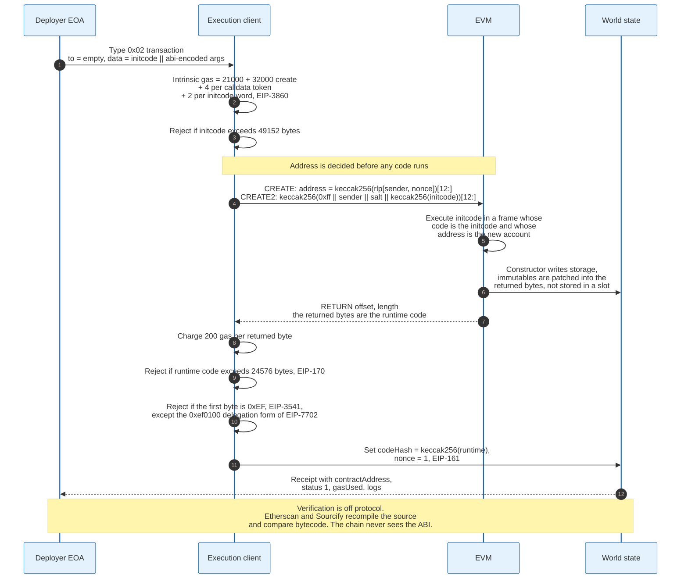

### 10.1 The Deployment Transaction

A creation transaction sets `to` to the empty string. Its `data` field carries the initcode: the constructor logic, followed by the runtime code as an embedded payload, followed by the ABI-encoded constructor arguments.

The address is computed before any code runs, from the sender and nonce rather than from the content:

```
CREATE:  address = keccak256(rlp([sender, nonce]))[12:]
CREATE2: address = keccak256(0xff || sender || salt || keccak256(initcode))[12:]
```

`CREATE2`, added at Constantinople by EIP-1014, removes the nonce from the calculation, which makes the address a pure function of the deployer, a chosen salt, and the exact initcode. That determinism is what counterfactual deployment relies on: an address can be published, funded, and referenced before the contract exists, and the contract can be deployed later by anybody who holds the initcode.

The EVM then executes the initcode in a frame whose address is the new account and whose code is the initcode itself. The constructor writes storage. Immutable variables are patched directly into the bytes about to be returned, which is why reading an `immutable` costs 3 gas as a `PUSH32` rather than 2,100 as a cold `SLOAD`.

When the constructor executes `RETURN`, the returned bytes are the runtime code. Three checks then apply. The account is charged 200 gas per returned byte. The deployment fails if the runtime code exceeds 24,576 bytes, the EIP-170 limit. It fails if the first byte is `0xEF`, banned by EIP-3541 to reserve that prefix, which is what later allowed EIP-7702's `0xef0100` designator to be unambiguous.

EIP-3860, in Shapella, added a matching limit on the input side: initcode may not exceed 49,152 bytes, exactly twice the code limit, and costs 2 gas per 32-byte word. Glamsterdam's EIP-7954 raises the code limit from 24,576 to 65,536 bytes and the initcode limit from 49,152 to 131,072, on the grounds that 24,576 was chosen in 2016 against a very different gas limit.

### 10.2 The ABI Is a Convention, Not a Protocol Object

Nothing in the Ethereum protocol knows what an ABI is. The EVM sees calldata as an opaque byte string. The Application Binary Interface is an agreement about how to lay those bytes out, defined by the Solidity project and adopted by everyone.

That is the most common misconception about contract interaction, and it has practical consequences. A contract cannot reject a malformed call by protocol rule; it can only fail to match a selector and fall through to its fallback function. Verification services recompile source and compare bytecode precisely because the chain stores no interface description to check against.

### 10.3 The Encoding

A function call's calldata is a four-byte selector followed by the arguments encoded in 32-byte words.

The selector is the first four bytes of `keccak256` of the canonical signature: the function name, then the parameter types in parentheses with no spaces and no names. `transfer(address,uint256)` hashes to `a9059cbb...`, so those four bytes begin every ERC-20 transfer ever sent.

Static types occupy one word each, right-aligned for numbers and addresses, left-aligned for `bytes32` and fixed byte arrays. Dynamic types, meaning `bytes`, `string`, and any array of variable length, occupy one word in the head that holds an offset in bytes from the start of the argument block, with the actual content in the tail: a length word followed by the data padded up to a multiple of 32.

A concrete layout, for `transfer(0x5B38Da6a701c568545dCfcB03FcB875f56beddC4, 250000000)`:

```
0x a9059cbb                                                          selector, 4 bytes
   0000000000000000000000005B38Da6a701c568545dCfcB03FcB875f56beddC4  address, 12 zero bytes then 20
   000000000000000000000000000000000000000000000000000000000ee6b280  250000000, 28 zero bytes then 4
```

68 bytes total: 40 zero bytes and 28 non-zero. That composition determines the calldata gas, and Section 12 carries it through.

Return data uses the same encoding without a selector. Revert data uses the selector of `Error(string)`, which is `08c379a0`, or `Panic(uint256)`, which is `4e487b71`, or a custom error's own selector.

### 10.4 Events and the Bloom Filter

Logs are the write-only output channel. A contract emits one with `LOG0` through `LOG4`, where the number is the count of indexed topics.

For a non-anonymous event, topic 0 is `keccak256` of the event signature. Up to three further topics carry indexed parameters, each padded to 32 bytes, or for dynamic types the hash of the value rather than the value. Everything not indexed is ABI-encoded into the data field. `LOG3` with a 32-byte data payload, which is exactly an ERC-20 `Transfer`, costs `375 + 3 * 375 + 32 * 8 = 1,756` gas.

Every block header carries a 256-byte `logsBloom`. Each address and topic in the block sets three bits in it, derived from the low-order bits of three 11-bit slices of its Keccak hash. A client scanning for events can skip any block whose bloom lacks the required bits, which is a cheap negative filter with false positives and no false negatives.

Contracts cannot read logs. Logs exist for observers, and are priced at 8 gas per data byte precisely because they never enter the state trie.

---

## 11. Solidity to Bytecode

Solidity compiles to EVM bytecode through an intermediate language, and the shape of the output is dictated by two facts about the machine: there is no calling convention, and there is no linker.

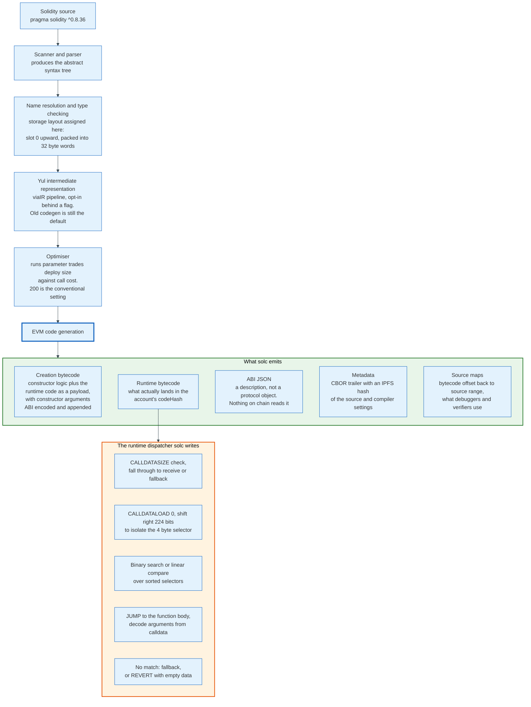

### 11.1 The Pipeline

`solc` parses to an abstract syntax tree, resolves names, and type-checks. Storage layout is assigned during analysis: state variables take slots from 0 upward in declaration order, and consecutive variables smaller than 32 bytes are packed into one slot. That packing is why reordering two declarations can change a contract's gas cost, and why an upgradeable proxy must never reorder its variables.

Code generation can run through Yul, an intermediate language with functions, variables, and explicit EVM calls but no types beyond 256-bit words. The `viaIR` pipeline routes all generation through Yul and enables the full optimiser, and it is opt-in: `--via-ir` on the command line, or `"viaIR": true` in standard JSON. The legacy pipeline, still the default for every build in 0.8.36, emits EVM assembly directly.

The optimiser's `runs` parameter is a claim about expected usage, not an intensity dial. It tells the optimiser how many times the average function will be called over the contract's life. A low value optimises for small deployment bytecode, because 200 gas per byte is paid once. A high value optimises for cheap execution, because that cost is paid every call. The conventional setting of 200 is a compromise nobody has revisited.

Solidity 0.8.36 is the current release, published 9 July 2026. The 0.8 series' defining change, from December 2020, was making arithmetic overflow revert by default; before that, every serious contract wrapped arithmetic in a SafeMath library.

### 11.2 What the Compiler Emits

`solc` produces two distinct bytecode strings. The creation bytecode is what goes in a deployment transaction's data. The runtime bytecode is what the creation bytecode returns, and it is what `codeHash` hashes.

It also produces artefacts that never touch the chain: the ABI JSON, a source map from bytecode offsets back to source ranges, and a metadata blob appended to the runtime code as a CBOR-encoded trailer holding an IPFS hash of the source and the exact compiler settings. That trailer is why two contracts with identical logic and different comments have different bytecode, and it is what makes reproducible verification possible.

### 11.3 The Dispatcher

Because the EVM has no notion of a function, the compiler writes one by hand at the top of every contract's runtime code.

The generated preamble checks that calldata is at least four bytes, loads the first word with `CALLDATALOAD 0`, shifts right by 224 bits to isolate the selector, and compares it against the contract's selectors. Above a handful of functions, `solc` emits a binary search over sorted selector values rather than a linear chain of comparisons, so dispatch cost grows logarithmically rather than linearly.

A match jumps to the function body, which decodes arguments from calldata. No match falls through to `fallback`, or to `receive` if calldata is empty and value was sent, or reverts with empty return data if neither exists.

Two practical consequences follow. Function ordering in the source has no effect on dispatch cost, but selector values do, which is why renaming a hot function to get a numerically small selector is a real, if petty, optimisation. And a `payable` function saves about 21 gas per call, because a non-payable one compiles to a `CALLVALUE` check and a conditional revert on every invocation.

### 11.4 Where Bytecode Diverges From Source

Three things in the deployed code have no direct source line.

Immutables are not storage. They are placeholders in the runtime bytecode that the constructor overwrites before returning it, so reading one is a `PUSH32` of an inlined constant.

Libraries marked `internal` are inlined into the caller. Libraries marked `external` are deployed separately and called by `DELEGATECALL`, with their address patched into the bytecode at link time, which is the closest the EVM has to a linker.

Proxy patterns produce code whose behaviour is not in the file being read. A minimal proxy, standardised as ERC-1167, is 45 bytes that copy calldata into memory, `DELEGATECALL` a hardcoded address, and return the result. Reading the proxy's source tells you nothing about what the contract does.

---

## 12. A Worked End-to-End Example

One transaction, carried from the user's tap to economic finality, with every number.

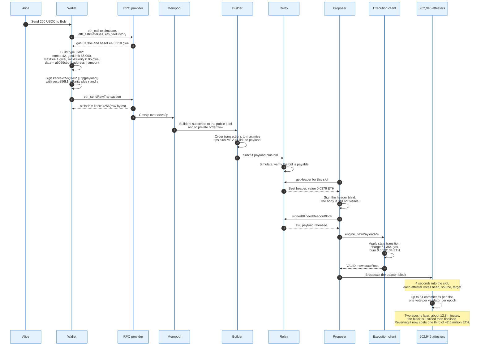

### 12.1 The Setup

Alice sends 250 USDC to Bob. USDC has six decimals, so the amount is 250,000,000 base units, which is `0x0ee6b280`. Bob's address is `0x5B38Da6a701c568545dCfcB03FcB875f56beddC4`. Bob has never held USDC, so his balance slot is currently zero. The block conditions are those of block 25,869,950 on 30 August 2026: base fee 0.218047662 gwei, gas limit 60,000,000, ether at 2,514.93 dollars.

### 12.2 Building the Transaction

The wallet composes a type `0x02` transaction:

| Field | Value |
|-------|-------|
| `chainId` | 1 |
| `nonce` | 42 |
| `maxPriorityFeePerGas` | 0.05 gwei, 50,000,000 wei |
| `maxFeePerGas` | 1 gwei, 1,000,000,000 wei |
| `gasLimit` | 65,000 |
| `to` | `0xA0b86991c6218b36c1d19D4a2e9Eb0cE3606eB48`, the USDC proxy |
| `value` | 0 |
| `data` | 68 bytes, the ABI encoding from Section 10.3 |
| `accessList` | empty |

The signing hash is `keccak256(0x02 || rlp([chainId, nonce, maxPriorityFeePerGas, maxFeePerGas, gasLimit, to, value, data, accessList]))`. Alice's wallet signs it with secp256k1, producing `yParity`, `r`, and `s`. The transaction hash, which is what block explorers show, is `keccak256` over the complete signed bytes including the type byte.

### 12.3 The Gas Arithmetic

Calldata composition: 4 selector bytes, all non-zero. The address word is 12 zero bytes and 20 non-zero. The amount word is 28 zero bytes and 4 non-zero. Totals: 40 zero bytes, 28 non-zero bytes.

```
tokens        = 40 * 1 + 28 * 4               = 152
calldata gas  = 4 * 152                       = 608
intrinsic     = 21,000 + 608                  = 21,608
EIP-7623 floor= 21,000 + 10 * 152             = 22,520
```

Execution then runs, and USDC is a proxy, so the first thing that happens is not token logic:

| Step | Gas |
|------|-----|
| Cold account access to the USDC proxy | 2,600 |
| `SLOAD` of the implementation slot, cold | 2,100 |
| `DELEGATECALL` into the implementation, cold | 2,600 |
| `SLOAD` Alice's balance slot, cold | 2,100 |
| `SSTORE` Alice's balance, non-zero to non-zero, cold surcharge included | 5,000 |
| `SSTORE` Bob's balance, zero to non-zero, cold surcharge included | 22,100 |
| `LOG3` Transfer event, 3 topics and 32 data bytes | 1,756 |
| Dispatcher, arithmetic, memory, checks | about 1,500 |
| **Execution subtotal** | **about 39,756** |

The `DELEGATECALL` target is cold, not warm, and the 2,500 gas difference is the single largest surprise in the table. EIP-2929 seeds the access set with `tx.origin`, the transaction's `to` address, and the precompiles. Reading the implementation address out of a storage slot does not warm the account that address names, so the proxy pays full price to reach its own logic.

```
gasUsed = 21,608 + 39,756 = 61,364
floor check: 22,520 < 61,364, so the floor does not bind
```

The floor never binds on a transaction that does real state work. It binds on transactions that are almost entirely calldata, which is the case EIP-7623 was written for.

### 12.4 The Money

```
priorityFee        = min(0.05, 1 - 0.218047662)      = 0.05 gwei
effectiveGasPrice  = 0.218047662 + 0.05              = 0.268047662 gwei
total charged      = 61,364 * 0.268047662 gwei       = 0.00001645 ETH  = 0.0414 USD
burned             = 61,364 * 0.218047662 gwei       = 0.00001338 ETH  = 0.0336 USD
to the fee recipient = 61,364 * 0.05 gwei            = 0.00000307 ETH  = 0.0077 USD
```

Alice pays four cents. Three and a third cents of it cease to exist. Three quarters of a cent goes to whoever produced the block, which on that block was Titan Builder.

The upfront balance check required `65,000 * 1 gwei = 0.000065 ETH` to be present. The 3,636 unused gas units were never charged.

### 12.5 Into a Block

Alice's wallet sends the raw bytes to an RPC provider, which gossips the transaction over devp2p to its peers. Builders subscribe to the public mempool and to private order flow, and a transfer like this one carries no MEV, so it is included on the strength of its tip alone.

The winning builder assembles a payload, submits it to relays with a bid, and the relay holds the body. The slot's proposer, chosen by RANDAO from the 902,945-strong validator set, asks its connected relays for the highest bid, signs the header blind, and receives the payload in exchange. Block 25,869,950 paid its proposer 0.03755157507196645 ETH, about 94 dollars.

The proposer's consensus client hands the payload to its execution client over the Engine API as `engine_newPayloadV4`. The execution client applies the state transition, recomputes the state root, and answers `VALID`. The consensus client broadcasts the beacon block.

### 12.6 From Included to Final

Four seconds into the slot, the attestation deadline arrives at 3,333 basis points of the 12-second slot. Every validator assigned to that slot's committees signs an attestation naming the head block, the source checkpoint, and the target checkpoint. Aggregators combine them at 6,667 basis points, eight seconds in.

At the end of the epoch, if attestations representing at least two thirds of the 42.5 million staked ether name the same target checkpoint, that checkpoint is justified. When the following epoch's checkpoint is also justified, the earlier one is finalised.

Alice's transaction is therefore included after about 12 seconds, justified after 6.4 minutes at best and 12.8 at worst, and finalised after 12.8 minutes at best and about 19 at worst. From that point, reversing it requires slashing at least one third of the stake, about 14.2 million ETH, worth about 35.7 billion dollars at that day's price.

Four cents in, an irreversible entry out.

---

## 13. Proof of Stake and Gasper

Gasper is two algorithms running at different speeds on the same votes. LMD GHOST picks a head every 12 seconds. Casper FFG marks checkpoints as unrevertable every 6.4 minutes. Neither works alone.

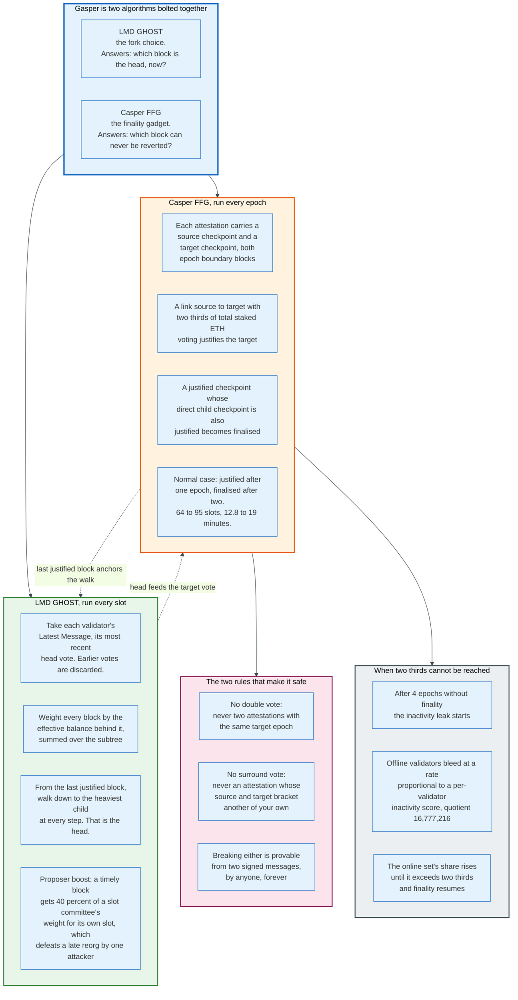

### 13.1 Why Two Algorithms

A blockchain needs two different answers. It needs to know which block to build on right now, in the presence of network delay and disagreement, which requires a rule that always produces an answer. And it needs to know which blocks can never be reverted, which requires a rule that sometimes refuses to produce an answer.

A single algorithm cannot do both. A rule that always answers cannot promise the answer will not change. A rule that refuses to answer under uncertainty cannot keep the chain moving during a partition.

Gasper separates them. The fork choice is always live and never final. The finality gadget is always safe and sometimes stalls. The chain keeps producing blocks during a partition and stops finalising them, which is exactly the correct behaviour.

### 13.2 LMD GHOST

The fork choice is Latest Message Driven Greediest Heaviest Observed SubTree, which unpacks into three rules.

Latest Message Driven: only each validator's most recent head vote counts. Earlier votes are discarded entirely, so a validator cannot accumulate influence by voting many times, and the memory required is one entry per validator rather than one per vote.

Greediest Heaviest Observed SubTree: starting from the last justified checkpoint, repeatedly move to the child block with the greatest total attesting balance in its subtree. Weight is effective balance, not validator count, which matters now that a single validator can hold up to 2,048 ETH.

The fork choice starts at the last justified checkpoint rather than at genesis. That is the coupling between the two halves: finality prunes the search space the fork choice walks, so a finalised block can never be reconsidered no matter how much weight appears beneath an alternative.

Proposer boost patches a specific attack. Without it, an attacker who is scheduled to propose can withhold a block, let honest validators vote for the previous head, and then release it with private attestations to win the fork choice retroactively. Proposer boost gives a block published on time an extra 40% of one slot committee's weight, for its own slot only. `PROPOSER_SCORE_BOOST` is 40, and the reorg thresholds around it are `REORG_HEAD_WEIGHT_THRESHOLD` 20, `REORG_PARENT_WEIGHT_THRESHOLD` 160, and `REORG_MAX_EPOCHS_SINCE_FINALIZATION` 2.

### 13.3 Casper FFG

Every attestation carries a source checkpoint and a target checkpoint, both of them epoch boundary blocks. The pair is a link.

A link from source to target becomes justified when attestations representing at least two thirds of the total active balance name it. A justified checkpoint becomes finalised when the checkpoint directly after it is also justified, forming a supermajority link between consecutive epochs.

In the normal case a checkpoint is justified one epoch after it appears and finalised the epoch after that. An epoch is 32 slots of 12 seconds, so justification arrives within 6.4 minutes and finality within 12.8 minutes. Worst case, a transaction included in the first slot of an epoch waits 95 slots, about 19 minutes.

### 13.4 The Two Rules That Make Finality Mean Something

Casper FFG's safety comes from two rules that a validator must never break, both of which are provable from two signed messages by anyone who holds them, forever.

**No double vote.** Never sign two attestations with the same target epoch and different targets. This is what stops a validator from justifying two conflicting checkpoints at the same height.

**No surround vote.** Never sign an attestation whose source and target strictly bracket the source and target of another of your own attestations. This is what stops a validator from justifying a chain that skips over a checkpoint it already justified.

Breaking either produces two signatures that anyone can bundle into an `AttesterSlashing` and submit. The proof requires no context: two messages, two signatures, done. That is why the penalty is enforceable and why finality is an economic statement rather than a probabilistic one.

Producing two different blocks for the same slot is the third offence, a `ProposerSlashing`, and it is proved the same way.

### 13.5 The Inactivity Leak

If more than one third of validators go offline, no link can reach two thirds and finality stops. Without a countermeasure the chain would stall permanently, because the offline validators keep their stake and their share never falls.

The leak fixes this. After `MIN_EPOCHS_TO_INACTIVITY_PENALTY`, which is 4 epochs without finality, each validator accumulates an inactivity score: rising by `INACTIVITY_SCORE_BIAS` of 4 per epoch when it fails to vote correctly for the target, and falling by `INACTIVITY_SCORE_RECOVERY_RATE` of 16 when it does. Penalties are proportional to that score divided by `INACTIVITY_PENALTY_QUOTIENT_BELLATRIX`, which is 16,777,216.

The quotient is calibrated so that a validator that is offline for the whole leak loses about half its stake in roughly 21 days. Online validators lose nothing. The offline set's share of total stake therefore shrinks until the online set exceeds two thirds, and finality resumes without human intervention.

This is the mechanism that makes proof of stake survivable through a catastrophe that takes half the network's operators offline. It is also, from the point of view of an unlucky operator with a dead data centre, a mechanism that confiscates their capital for being disconnected.

### 13.6 Two Corrections About Finality

**Finality is not a confirmation count.** There is no depth at which a proof-of-stake block becomes safe by accumulation. It is either finalised, in which case reverting it costs at least one third of the stake in provable slashings, or it is not, in which case it can be reorganised freely.

**Finality does not guarantee correctness.** A supermajority of stake can finalise an invalid chain if the client software they all run has the same bug. Finality guarantees that reversal is expensive, not that the finalised state obeys the rules. That is precisely why client diversity is a consensus property rather than a preference.

---

## 14. Validators, Staking, and Slashing

A validator is a BLS public key registered in the beacon state with a balance, a set of withdrawal credentials, and a schedule of duties. It is a slot in a registry, not a machine.

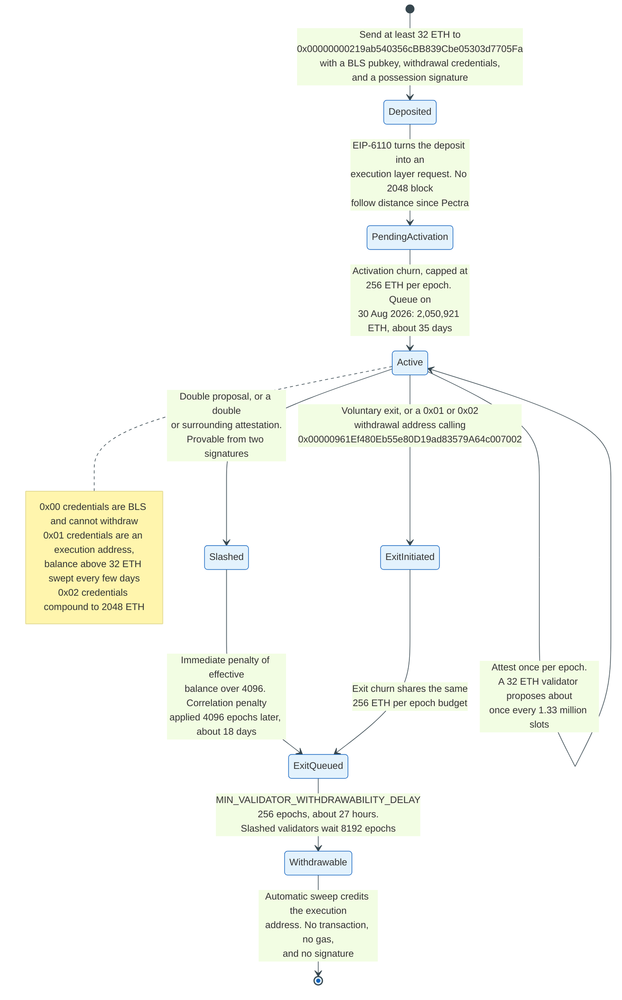

### 14.1 Entry

Staking begins with a deposit to `0x00000000219ab540356cBB839Cbe05303d7705Fa` carrying four items: a 48-byte BLS public key, 32 bytes of withdrawal credentials, a signature proving possession of the key, and at least `MIN_ACTIVATION_BALANCE` of 32 ETH.

Withdrawal credentials come in three prefixes. `0x00` is a BLS key, the original format, from which funds cannot be withdrawn without first converting. `0x01` is an execution layer address, which enables automatic withdrawal sweeps. `0x02`, added by EIP-7251 in Pectra, is a compounding credential that raises `MAX_EFFECTIVE_BALANCE` from 32 ETH to 2,048 ETH and stops the automatic sweep of excess balance, letting rewards compound instead.

EIP-6110, also in Pectra, moved deposit processing onto the execution layer. Deposits now arrive as execution requests in the block that contains them, up to `MAX_DEPOSIT_REQUESTS_PER_PAYLOAD` of 8,192 per block. Before Pectra, the consensus layer waited `ETH1_FOLLOW_DISTANCE` of 2,048 execution blocks, about seven hours, and then an eth1 voting period of 64 epochs on top, so a deposit took roughly half a day to be recognised.

The activation queue is now measured in ether rather than validators. `MAX_PER_EPOCH_ACTIVATION_EXIT_CHURN_LIMIT` is 256 ETH per epoch, so at 82,181 epochs per year the network can absorb about 21 million ETH of new stake annually. At 30 August 2026 the entry queue holds 2,050,921 ETH, roughly 35 days of waiting, while the exit queue holds 32 ETH.

That asymmetry is the whole story of 2026 staking. Capital is queuing to get in and nobody is leaving.

### 14.2 Duties and Rewards

Every active validator attests exactly once per epoch, in an assigned slot, in an assigned committee. There are up to `MAX_COMMITTEES_PER_SLOT` of 64 committees per slot, each targeting `TARGET_COMMITTEE_SIZE` of 128 members. Proposal is a separate lottery: one validator per slot, weighted by effective balance, drawn from RANDAO.

Rewards are computed from a base reward that scales with the inverse square root of total stake:

```
base_reward_per_increment = EFFECTIVE_BALANCE_INCREMENT * BASE_REWARD_FACTOR
                            / integer_squareroot(total_active_balance)
```

with `EFFECTIVE_BALANCE_INCREMENT` of 1 ETH, that is 1,000,000,000 gwei, and `BASE_REWARD_FACTOR` a dimensionless 64. A validator's base reward is that quantity multiplied by its effective balance in whole ether.

The base reward is then divided among five duties by fixed weights out of `WEIGHT_DENOMINATOR` of 64.

| Component | Weight | Share | What it pays for |
|-----------|--------|-------|------------------|
| Timely target | 26 | 40.6% | Voting for the correct epoch boundary, within 32 slots |
| Timely source | 14 | 21.9% | Voting for the correct justified checkpoint, within 5 slots |
| Timely head | 14 | 21.9% | Voting for the correct head, within 1 slot |
| Proposer | 8 | 12.5% | Including other validators' attestations |
| Sync committee | 2 | 3.1% | Signing for light clients, 512 members per 256 epochs |

Target and source votes are penalised when wrong or missing. Head votes are not penalised, only unrewarded, because a head vote can be wrong through no fault of the validator when a block arrives late.

At 42.5 million ETH staked, `integer_squareroot` of 42.5 quadrillion gwei is about 206,155,281, so the base reward per increment is 310 gwei per epoch. Across the whole set that is about 13.2 ETH per epoch, or roughly 1.08 million ETH a year, an APR of about 2.55%. Reported rates of 2.57% to 2.62% include the proposer's tips and MEV, which are not issuance.

The square root is the important part of that formula. Doubling the stake does not double the issuance; it multiplies it by 1.41 and therefore cuts the per-validator yield by about 29%. The reward curve is self-limiting by construction.

### 14.3 Slashing

Slashing punishes the two provable safety violations and nothing else. Being offline is not slashable. Running a buggy client is not slashable. Signing two conflicting messages is.

The penalty has three parts.

**The initial penalty** is `effective_balance / MIN_SLASHING_PENALTY_QUOTIENT_ELECTRA`, with the quotient at 4,096. For a 32 ETH validator that is 0.0078 ETH. Before Pectra the quotient was 32, making the same penalty 1 ETH. The reduction was deliberate: with validators holding up to 2,048 ETH, a fixed fraction that was punitive at 32 ETH would have been ruinous at 2,048, and would have discouraged consolidation.

**The whistleblower reward** is `effective_balance / WHISTLEBLOWER_REWARD_QUOTIENT_ELECTRA`, also 4,096, of which the proposer who includes the proof keeps `PROPOSER_WEIGHT / WEIGHT_DENOMINATOR`, that is 8/64 or one eighth.

**The correlation penalty** is the one that matters, and it arrives 4,096 epochs later, about 18 days after the offence, at the midpoint of the `EPOCHS_PER_SLASHINGS_VECTOR` window of 8,192 epochs. It is computed as the validator's effective balance multiplied by the total balance slashed in that window times `PROPORTIONAL_SLASHING_MULTIPLIER_BELLATRIX` of 3, divided by the total active balance.

Work the arithmetic and the design intent is obvious. One validator slashed alone: the slashed fraction is near zero, so the correlation penalty is near zero, and the total loss is a fraction of a percent. One third of the network slashed together: three times one third is one, so the penalty is the entire effective balance. A solo mistake is a fine. A coordinated attack is confiscation.

A slashed validator is also forcibly exited, stops earning, and cannot withdraw for 8,192 epochs, about 36 days.

### 14.4 Exit and Withdrawal

Exits go through the same 256 ETH per epoch churn budget as entries. A validator may exit voluntarily by signing a message with its BLS key, which requires the key to be online, or, since EIP-7002 in Pectra, by having its `0x01` or `0x02` withdrawal address call the predeploy at `0x00000961Ef480Eb55e80D19ad83579A64c007002` with a 56-byte payload of public key and amount.

That second path exists because staking pools separate key custody from capital ownership. Before it, an operator holding the signing key could refuse to exit and the capital owner had no recourse. The predeploy charges a fee that starts at 1 wei and rises exponentially above a target of 2 requests per block, with `MAX_WITHDRAWAL_REQUESTS_PER_BLOCK` of 16 dequeued per block.

After exiting, a validator waits `MIN_VALIDATOR_WITHDRAWABILITY_DELAY` of 256 epochs, about 27 hours, then is swept. Withdrawals are not transactions. They appear in the execution block as a list of `Withdrawal` objects with an index, a validator index, an address, and an amount in gwei, and they credit the address directly with no gas, no signature, and no calldata. A withdrawal cannot fail and cannot be front-run.

Partial withdrawals happen automatically for `0x01` validators: any balance above 32 ETH is swept every few days as the sweep pointer walks the registry. `0x02` validators skip the sweep and compound instead, up to 2,048 ETH.

---

## 15. The Beacon Chain, Finality, and the Engine API

Ethereum runs as two programs on two ports that agree through one narrow interface. That separation is the most consequential architectural decision of the Merge.

```mermaid
%%{init: {'theme': 'base', 'themeVariables': {'primaryColor': '#e3f2fd', 'primaryBorderColor': '#1565c0', 'lineColor': '#37474f'}}}%%

gantt
    title One 12 second slot and the epoch around it
    dateFormat X
    axisFormat %Ss

    section Slot today
    Proposer publishes the beacon block :done, a1, 0, 4
    Reorg cutoff 1667 bps at 2.0s :milestone, m1, 2, 0
    Attesters vote on head and source and target :active, a2, 4, 4
    Attestation due 3333 bps at 4.0s :milestone, m2, 4, 0
    Aggregators publish combined attestations :a3, 8, 4
    Aggregate due 6667 bps at 8.0s :milestone, m3, 8, 0

    section Slot under EIP-7732
    Proposer publishes a bid and not a payload :done, b1, 0, 3
    Attestation due 2500 bps at 3.0s :milestone, m4, 3, 0
    Builder reveals the payload at 5000 bps :active, b2, 3, 3
    Payload timeliness committee of 512 votes :b3, 6, 3
    Payload attestation due 7500 bps at 9.0s :milestone, m5, 9, 0

    section Epoch arithmetic
    32 slots per epoch or 6.4 minutes :c1, 0, 12
    Every validator attests exactly once :c2, 0, 12
    Up to 64 committees per slot :c3, 0, 12
```

### 15.1 The Two Layers

The execution layer holds the account state, the mempool, the EVM, and the JSON-RPC surface. It knows nothing about validators, attestations, or finality.

The consensus layer holds the validator registry, runs the fork choice, aggregates attestations, and decides which execution payload is canonical. It knows nothing about balances, contracts, or gas.

Between them sits the Engine API, a JSON-RPC interface on an authenticated local port. It has three verbs. `engine_forkchoiceUpdated` tells the execution client which block is the head, which is safe, and which is finalised, and optionally asks it to start building a payload. `engine_getPayload` collects a payload that was being built. `engine_newPayload` hands the execution client a payload to validate, and receives `VALID`, `INVALID`, or `SYNCING`.

The version suffix tracks the forks: `engine_newPayloadV3` for Dencun, `engine_newPayloadV4` for Pectra's execution requests and still current after Fusaka. Fusaka added `engine_getPayloadV5` and `engine_getBlobsV2` and `engine_getBlobsV3` for cell proofs rather than a new `newPayload` version. Authentication is a shared JWT secret in a file both clients read, which is the most common misconfiguration in a new node setup.

The separation is why an operator can mix any consensus client with any execution client, and why client diversity is achievable at all. It is also why a node runs two databases, two peer-to-peer networks, and two sets of ports.

### 15.2 Slot and Epoch Timing

`SLOT_DURATION_MS` is 12,000. `SLOTS_PER_EPOCH` is 32, so an epoch is 6.4 minutes. Since Fusaka the intra-slot deadlines are expressed in basis points of the slot rather than in seconds, which is what allows a future slot-duration change without rewriting every constant.

| Deadline | Basis points | Seconds | What happens |
|----------|--------------|---------|--------------|
| `PROPOSER_REORG_CUTOFF_BPS` | 1,667 | 2.0 | After this, a proposer should not attempt a reorg of a late parent |
| `ATTESTATION_DUE_BPS` | 3,333 | 4.0 | Attesters publish their votes |
| `SYNC_MESSAGE_DUE_BPS` | 3,333 | 4.0 | Sync committee members publish |
| `AGGREGATE_DUE_BPS` | 6,667 | 8.0 | Aggregators publish combined attestations |
| `CONTRIBUTION_DUE_BPS` | 6,667 | 8.0 | Sync committee contributions aggregated |

The 4-second attestation deadline is the tightest real-time constraint in the system. A proposer has to build, sign, and propagate a block to most of the network in under four seconds, and blocks now carry up to 21 blobs of 128 KB each. That budget, not the gas limit, is what actually caps block size, and it is what PeerDAS was built to relieve.

### 15.3 Attestation Aggregation

A naive design would gossip 902,945 signatures per epoch. Three mechanisms prevent that.

BLS12-381 signatures aggregate: many signatures over the same message combine into one that verifies against the aggregated public keys. Validators in a committee that vote for the same head, source, and target produce identical messages, so their signatures collapse into one signature plus a bitfield of who signed.

Committees partition the work. Each slot has up to 64 committees, each assigned to one of `ATTESTATION_SUBNET_COUNT` of 64 gossip subnets, so no node needs to see every attestation.

EIP-7549, in Pectra, moved the committee index out of the attestation's signed message. Attestations from different committees in the same slot voting for the same checkpoints now share a message and can be aggregated across committees. `MAX_ATTESTATIONS_ELECTRA` fell from 128 to 8 per block as a result, because eight aggregates now carry what 128 used to.

### 15.4 RANDAO and Proposer Selection

Proposer selection must be unpredictable enough that an attacker cannot prepare, and verifiable enough that everyone agrees.

Each proposer includes a BLS signature over the current epoch number, which is deterministic for that validator and unpredictable to everybody else. That signature is hashed into the accumulated `randao_mix`. The mix seeds committee assignment and proposer selection, with `MIN_SEED_LOOKAHEAD` of 1 epoch and `MAX_SEED_LOOKAHEAD` of 4.

The known weakness is last-revealer bias. The final proposer of an epoch can compute the mix that would result from proposing, compare it to the mix that results from staying silent, and choose. One withheld block is one bit of influence, at the cost of one block reward. An attacker holding several consecutive end-of-epoch slots gets several bits, which is enough to bias a lottery that depends on the mix.

The protocol accepts this. The fix, a verifiable delay function, has been on the roadmap since 2019 and has not shipped. `PREVRANDAO`, opcode `0x44`, exposes the previous block's mix to contracts, which is why every contract that uses it as randomness is exploitable by the proposer.

Fusaka's EIP-7917 made the proposer lookahead deterministic, publishing the schedule further ahead. That helps builders and preconfirmation markets plan, and it slightly worsens the targeting problem, because an attacker also knows who to attack.

---

## 16. MEV and Proposer-Builder Separation

Maximal extractable value is the profit available from choosing the order of transactions in a block. It is not a bug in any contract. It is the price of the account model, and Ethereum's response has been to build a market for it rather than to suppress it.

```mermaid
%%{init: {'theme': 'base', 'themeVariables': {'primaryColor': '#e3f2fd', 'primaryBorderColor': '#1565c0', 'lineColor': '#37474f'}}}%%

flowchart LR
    subgraph Origin["Where the value comes from"]
        O1["A large swap moves a pool price.<br/>Someone can arbitrage it back"]
        O2["A loan crosses its liquidation<br/>threshold. Someone earns the bonus"]
        O3["A new listing or mint.<br/>Position in the block is the product"]
    end

    subgraph Search["Searchers"]
        S1["Watch the public mempool<br/>and private feeds"]
        S2["Simulate against pending state"]
        S3["Emit an atomic bundle:<br/>ordered, all or nothing,<br/>with a coinbase payment or a tip"]
    end

    subgraph Builders["Builders, 30 Aug 2026 shares"]
        B1["Titan 46.31 percent"]
        B2["Quasar 24.44 percent"]
        B3["Eureka 10.83 percent"]
        B4["BuilderNet 10.20 percent"]
        B5["bombora 6.74 percent"]
        B6["Runs a combinatorial auction<br/>over bundles and plain transactions.<br/>Keeps a margin, bids the rest"]
    end

    subgraph Relays["Relays, 30 Aug 2026 shares"]
        R1["ultrasound 33.16 percent"]
        R2["bloXroute regulated 26.82 percent"]
        R3["Titan 26.44 percent"]
        R4["Aestus 8.11 percent"]
        R5["Flashbots 3.06 percent"]
        R6["Escrow: holds the body until<br/>the proposer signs the header.<br/>Trusted by both sides, bonded by neither"]
    end

    subgraph Prop["Proposer"]
        P1["Runs mev-boost beside the<br/>consensus client"]
        P2["Signs the highest bid blind.<br/>About 89 percent of slots<br/>are sourced this way"]
        P3["Fallback: build locally from<br/>the public mempool"]
    end

    subgraph Fail["The failure modes"]
        F1["Relay outage or equivocation<br/>costs the proposer the slot"]
        F2["Two builders held 71 percent of<br/>mev-boost blocks, 63 percent of all<br/>blocks, in the 24 hours to 30 Aug 2026"]
        F3["A censoring relay can exclude<br/>an address without breaking<br/>any protocol rule"]
    end

    Origin --> Search --> Builders --> Relays --> Prop
    Prop --> Fail
    Relays --> Fail
    Builders --> Fail

    style Origin fill:#e8f5e9,stroke:#2e7d32,stroke-width:2px
    style Search fill:#fff3e0,stroke:#e65100,stroke-width:2px
    style Builders fill:#e3f2fd,stroke:#1565c0,stroke-width:3px
    style Relays fill:#f3e5f5,stroke:#4a148c,stroke-width:2px
    style Prop fill:#eceff1,stroke:#37474f,stroke-width:2px
    style Fail fill:#fce4ec,stroke:#880e4f,stroke-width:2px
```

### 16.1 Where the Value Comes From

Three sources produce most of it.

Arbitrage between venues. A large swap moves an automated market maker's price away from the wider market. Whoever trades next captures the difference. The profit is bounded by the size of the dislocation and is available only to whoever acts first, which means whoever is positioned earliest in the block.

Liquidations. A lending position crosses its collateral threshold and anyone may close it for a bonus, typically 5% to 10% of the position. The bonus is a fixed prize awarded to the first caller, which turns it into a pure latency and ordering race.

Sandwiching. A pending swap is visible in the public mempool. Placing a buy before it and a sell after it extracts the victim's slippage tolerance. This is the form of MEV that transfers value from users rather than between traders, and it is the reason private order flow exists.

### 16.2 Why the Proposer Cannot Do This Themselves

Extracting MEV competently requires simulating tens of thousands of candidate orderings per slot against current state, maintaining relationships with searchers, and running infrastructure that is measured in milliseconds. A home validator with one machine cannot do it.

Left alone, that asymmetry would centralise staking. Large operators would earn materially more per validator than small ones, and the difference would compound. Proposer-builder separation exists to break that link: let specialists build blocks, and let every proposer, however small, sell their slot to the highest bidder.

### 16.3 How mev-boost Works

mev-boost is a sidecar process that runs beside the consensus client and speaks a small HTTP API.

Builders assemble complete execution payloads and submit them to relays with a bid, which is a payment to the proposer's fee recipient included in the payload itself. Relays simulate each payload to confirm it is valid and that the bid is actually payable, then keep the body private and publish only headers.

When a proposer's slot arrives, mev-boost calls `getHeader` on every connected relay, takes the highest bid, and asks the consensus client to sign that header blind. The proposer has not seen the transactions. It returns the signed blinded block to the relay, and only then does the relay release the full payload for propagation.

The escrow is the point. The proposer cannot steal the builder's bundle because it never sees it before committing. The builder cannot withhold after the commitment because the relay holds the body and publishes it. The relay is trusted by both and bonded by neither, which is the structural weakness the design has carried since 2022.

Roughly 89% of slots in the 24 hours to 30 August 2026 were filled through this pipeline. The rest were built locally, either by choice or because every relay returned nothing.

### 16.4 The Market, Measured

Relay shares in the 24 hours to 30 August 2026, from relayscan.io. Payload counts exceed slot counts because the same block is commonly delivered by several relays.

| Relay | Payloads | Share |
|-------|----------|-------|
| relay.ultrasound.money | 4,572 | 33.16% |
| bloxroute.regulated.blxrbdn.com | 3,698 | 26.82% |
| titanrelay.xyz | 3,645 | 26.44% |
| aestus.live | 1,118 | 8.11% |
| boost-relay.flashbots.net | 422 | 3.06% |
| agnostic-relay.net | 228 | 1.65% |
| relay.ethgas.com | 105 | 0.76% |

Builder shares over the same window. relayscan.io publishes a profit figure for every builder it lists, so the two blanks below are gaps in this snapshot, not gaps in the source:

| Builder | Blocks | Share | Profit over the window |
|---------|--------|-------|------------------------|
| titanbuilder.xyz | 2,977 | 46.31% | 34.73 ETH |
| quasar.win | 1,571 | 24.44% | 4.18 ETH |
| eurekabuilder.xyz | 696 | 10.83% | not recorded in this snapshot |
| BuilderNet | 656 | 10.20% | 8.20 ETH |
| bombora.build | 433 | 6.74% | not recorded in this snapshot |

Two builders produced about 71% of mev-boost blocks, about 63% of every block Ethereum's proposers signed that day. Neither stakes ether, neither is slashable, and neither is obliged to include any particular transaction.

That is the centralisation the design traded for. Proposers stayed decentralised, and block construction did not.

### 16.5 Enshrined PBS, EIP-7732

Glamsterdam's headline change moves the whole arrangement into the protocol and deletes the relay.

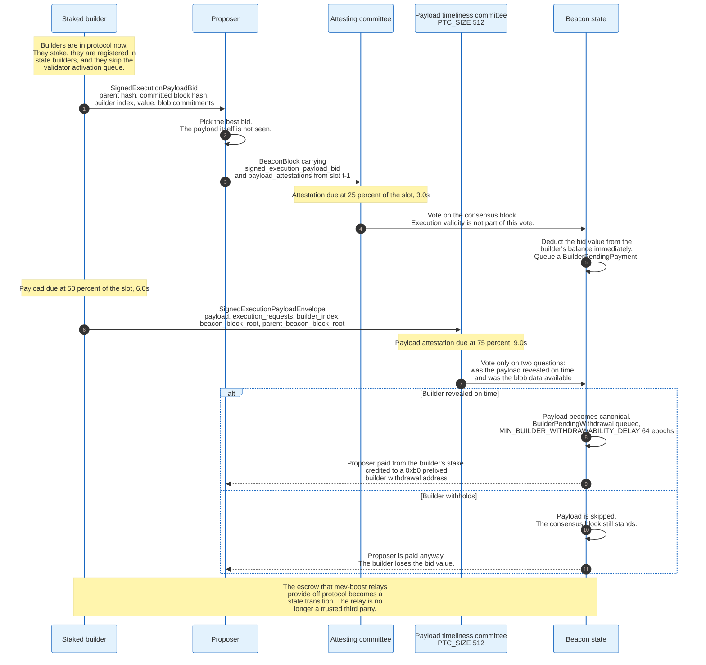

Builders become in-protocol entities with their own registry in the beacon state and their own stake. A proposer's beacon block no longer contains an execution payload at all. It contains a `SignedExecutionPayloadBid`: the builder's index, the committed block hash, the bid value, and the blob commitments. The `BeaconBlockBody` loses `execution_payload`, `blob_kzg_commitments`, and `execution_requests`, and gains `signed_execution_payload_bid` and `payload_attestations` from the previous slot.

The slot splits in two. Attesters vote on the consensus block at 2,500 basis points, three seconds in, without validating any execution. The builder reveals the payload as a `SignedExecutionPayloadEnvelope` at 5,000 basis points, six seconds in. A payload timeliness committee of `PTC_SIZE` 512 validators then votes at 7,500 basis points on exactly two questions: was the payload revealed on time, and was the blob data available. PTC members do not validate the payload's execution.

Payment is a state transition. The bid value is deducted from the builder's beacon balance when the block is processed, held as a `BuilderPendingPayment`, and converted to a `BuilderPendingWithdrawal` after processing, credited to an address named by a `0xb0` prefixed withdrawal credential, `BUILDER_WITHDRAWAL_PREFIX`, after `MIN_BUILDER_WITHDRAWABILITY_DELAY` of 64 epochs. If the builder withholds the payload, the consensus block still stands, the payload slot is empty, and the proposer is paid anyway out of the builder's stake.

Two things change materially. The relay's escrow role becomes a state machine, so a trusted third party leaves the critical path. And execution validation moves off the four-second attestation deadline onto its own six-second window, which is what makes a materially larger gas limit schedulable.

What does not change is that a small number of firms will still build most blocks. ePBS makes the auction trustless. It does not make it competitive.

### 16.6 Censorship

A builder can decline to include an address, and nothing in the protocol objects. After OFAC sanctioned the Tornado Cash contracts in August 2022, several relays and builders filtered transactions touching them, and for a period in late 2022 a majority of blocks were produced by filtered pipelines.

The property that saved inclusion is that filtering delays rather than blocks. A transaction excluded by every filtered builder still gets included by the first unfiltered proposer, so the cost is latency rather than exclusion, as long as one unfiltered path exists. The relay list above shows one relay named "regulated" holding 26.82% of payloads, which is the market's honest description of what it is.

Inclusion lists are the structural fix. EIP-7805, targeted at the Hegotá upgrade after Glamsterdam, would let a committee of validators name transactions that the next block must include. The consensus configuration already carries its parameters: `INCLUSION_LIST_DUE_BPS` of 6,667 and `MAX_TRANSACTIONS_BYTES_PER_INCLUSION_LIST` of 8,192.

---

## 17. Blobs, Rollups, and Data Availability

EIP-4844 gave Ethereum a second data channel that the EVM cannot read, priced separately, and deleted after about 18 days. Rollup fees fell by roughly two orders of magnitude within days of Dencun.

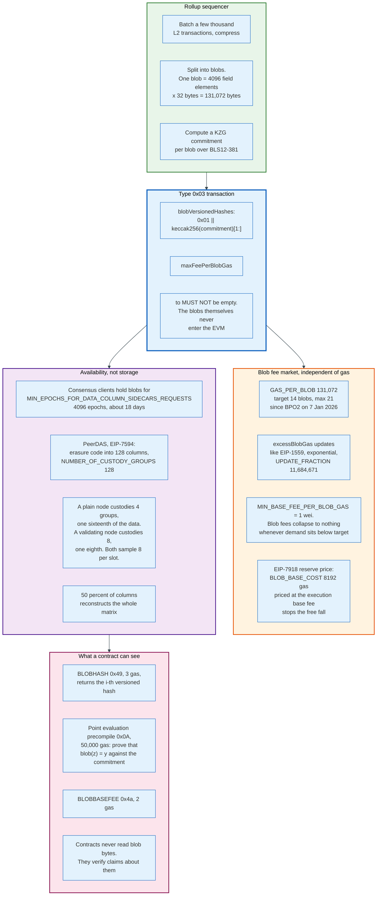

### 17.1 What a Blob Is

A blob is 4,096 field elements of 32 bytes each, 131,072 bytes in total, committed to with a KZG polynomial commitment over BLS12-381.

Blobs travel with a type `0x03` transaction but not inside it. The transaction carries `blobVersionedHashes`, each formed as `0x01` followed by the last 31 bytes of `keccak256` of the KZG commitment. The blobs themselves propagate on the consensus layer as sidecars, are checked against the commitments, and are discarded after `MIN_EPOCHS_FOR_DATA_COLUMN_SIDECARS_REQUESTS` of 4,096 epochs, about 18 days.

The version byte in front of the hash exists so that the commitment scheme can be replaced later without changing the transaction format. If KZG is ever retired for a post-quantum alternative, blobs get version `0x02` and old hashes stay valid.

A type `0x03` transaction cannot be a contract creation. `to` must not be empty, a restriction that exists to keep blob-carrying transactions structurally simple.

### 17.2 Why the EVM Cannot Read Blobs

This is the design's central trick and the most misunderstood part of it.

If contracts could read blob bytes, every node would have to keep every blob forever, because a contract might read one at any future block. Ethereum would have bought storage, which it cannot afford. Instead the protocol guarantees only that the data was published and available for a window, and gives contracts a way to prove statements about it.

`BLOBHASH` at opcode `0x49` returns the i-th versioned hash of the current transaction for 3 gas. The point evaluation precompile at `0x0a` takes a versioned hash, an evaluation point `z`, a claimed value `y`, the commitment, and a proof, and for 50,000 gas verifies that the polynomial committed to evaluates to `y` at `z`.

That is enough for a fraud proof. An optimistic rollup's challenger names the exact position in the blob where the sequencer's claim is wrong, and the precompile adjudicates. The chain never needs the blob's contents, only the ability to check a claim about them.

### 17.3 The Capacity Schedule

Blob capacity has been raised four times in 30 months, and the last two used a mechanism built specifically to allow it.

| Date | Fork | Target | Maximum | Bytes per block at max |
|------|------|--------|---------|------------------------|
| 13 Mar 2024 | Dencun | 3 | 6 | 786,432 |
| 7 May 2025 | Pectra, EIP-7691 | 6 | 9 | 1,179,648 |
| 9 Dec 2025 | BPO1 | 10 | 15 | 1,966,080 |
| 7 Jan 2026 | BPO2 | 14 | 21 | 2,752,512 |

EIP-7892, in Fusaka, created the Blob Parameter Only fork: a scheduled activation epoch that changes nothing but the blob target, maximum, and fee update fraction. The mainnet configuration now carries a `BLOB_SCHEDULE` list, and adding an entry is a coordinated client release rather than a hard fork with an EIP set.

That is a governance change disguised as a parameter change. Blob capacity is now a dial the client teams can turn on a normal release cadence, instead of a decision that waits for the next hard fork.

### 17.4 PeerDAS

Raising blob capacity without PeerDAS would mean every node downloading 2.75 megabytes per slot, on top of the execution payload, inside a four-second deadline. EIP-7594 breaks the link between capacity and per-node bandwidth.

Blobs are erasure-coded and reorganised into columns across all blobs in a block. The configuration sets `NUMBER_OF_CUSTODY_GROUPS` to 128 and `DATA_COLUMN_SIDECAR_SUBNET_COUNT` to 128. A plain node custodies `CUSTODY_REQUIREMENT` of 4 groups; a node running validators custodies `VALIDATOR_CUSTODY_REQUIREMENT` of 8, rising by one group per `BALANCE_PER_ADDITIONAL_CUSTODY_GROUP` of 32 ETH staked. Every node samples `SAMPLES_PER_SLOT` of 8 columns per slot from its peers.

The security argument is statistical. To hide data, a withholder must prevent enough sampling requests from succeeding that no honest node notices, and the probability of that falls exponentially with the number of independent samplers. Because the data is erasure-coded, acquiring 50% of the columns reconstructs the entire matrix, so a node that samples successfully knows the data can be recovered even if the publisher goes offline.

The practical result is that a validating node holds one eighth of the blob bytes and a plain node one sixteenth, and both know with high confidence that all of it exists. One column is 1/128 of a matrix that erasure coding has already doubled, so it carries 1/64 of the original blob bytes: four groups is one sixteenth, eight is one eighth. The custody requirement is expected to fall further as the sample count rises.

### 17.5 What This Cost and What It Bought

Rollup economics changed completely. Before Dencun, rollups posted compressed batches as calldata at 16 gas per non-zero byte, competing directly with every other user for the same block space. After Dencun they post blobs in a separate auction whose price floor is 1 wei.

At 30 August 2026 the blob base fee was 0.011898487 gwei, so a 131,072-byte blob cost 1,559 gwei, about 0.0039 dollars, with the EIP-7918 reserve of 1,786 gwei binding just above it. On L2Beat that day, Base secured 12.61 billion dollars, Arbitrum One 11.69 billion, OP Mainnet 1.60 billion, Mantle 1.46 billion, and Lighter 1.19 billion.

The cost was paid on the L1 revenue line. Blob fees at those prices contribute almost nothing to the burn, and execution demand moved to chains that pay Ethereum fractions of a cent for settlement. Ethereum's scaling strategy succeeded technically and, so far, has not been recovered commercially. The block at 65% of a 60 million gas limit and a base fee of a fifth of a gwei is what that looks like from the inside.

---

## 18. Economics: Issuance, Burn, and Running Costs

Ethereum's monetary policy is two formulas: issuance rises with the square root of stake, and the base fee is destroyed. Whether supply grows or shrinks is the difference between them, and in August 2026 it is not close.

### 18.1 Issuance

Annual issuance follows directly from the base reward formula in Section 14.2. At 42.5 million ETH staked:

```
integer_squareroot(42,500,000 ETH in gwei)  = about 206,155,281
base_reward_per_increment = 1e9 * 64 / 206,155,281 = 310 gwei per epoch per ETH
total per epoch  = 310 gwei * 42,500,000       = about 13.2 ETH
epochs per year  = 31,557,600 s / 384 s        = 82,181
annual issuance  = 13.2 * 82,181               = about 1.08 million ETH
implied APR      = 1.08 million / 42.5 million = about 2.55%
```

The check against a known point: at 34 million ETH staked, the level the network reached in mid-2024, the same arithmetic gives about 970,000 ETH a year. Realised issuance runs below that by the fraction of duties missed, which the formula does not model.

The square root is the policy. Stake doubles, issuance rises 41%, and yield per unit of stake falls 29%. There is no governance decision involved and no target rate. The curve simply gets less attractive as more capital arrives, which is why the entry queue is a market signal rather than a bug.

### 18.2 Burn

The burn is `baseFeePerGas * gasUsed`, destroyed in every block. Block 25,869,950 burned 0.00852959280306924 ETH.

```
blocks per year = 31,557,600 s / 12 s          = 2,629,800
annualised burn at that block's rate           = about 22,400 ETH
```

That is a single-block extrapolation, not a measured year, and daily rates vary with demand. It is nonetheless the right order of magnitude for a network whose base fee has been near a fifth of a gwei, and it puts the burn at roughly 2% of issuance.

Net supply growth is therefore about 1.06 million ETH a year against a supply near 122 million, or about 0.87%. The "ultra sound money" period of 2022 and 2023, when high base fees burned more than proof of stake issued, ended when execution demand moved to rollups. Blobs are priced too cheaply to replace it, which is arithmetic rather than a complaint.

### 18.3 Where the Money Goes

| Payer | Pays | To whom | Amount at 30 Aug 2026 |
|-------|------|---------|------------------------|
| Transaction sender | Base fee | Nobody, burned | About 0.032 USD on a token transfer |
| Transaction sender | Priority fee | Fee recipient, in practice the builder | About 0.007 USD on the same transfer |
| Searcher | Bundle payment | Builder | Varies, the whole point of the bid |
| Builder | Bid | Proposer | 0.0376 ETH on block 25,869,950, about 94 USD |
| Protocol | Issuance | Validators | About 1.08 million ETH a year |
| Rollup | Blob fee | Nobody, burned | About 0.0039 USD per 128 KB blob |
| Staker | Operator commission | Pool or exchange | Commonly 5% to 25% of rewards |

The proposer's income has two sources with different properties. Issuance is proportional to stake, predictable, and identical for every validator. Tips and MEV arrive only in the slots a validator proposes, are highly variable, and depend on what the builder market pays that day. Proposer selection is weighted by effective balance, so a 32 ETH validator wins a slot with probability 32 divided by 42.5 million, about once every 1.33 million slots. That is once every six months.

### 18.4 What It Costs to Run

A validator's capital cost is 32 ETH, 80,478 dollars at 2,514.93 per ether, locked behind an entry queue of about 35 days and an exit path of at least 27 hours after the exit queue clears.

The operating cost is one machine capable of running both an execution and a consensus client, with an NVMe SSD, continuously, on a connection that does not drop for more than a few minutes. Precise hardware pricing is not published by any authoritative source and varies by region, so no figure is given here.

Disk is the constraint that has actually moved. All execution clients now support EIP-4444 partial history expiry, announced by the Ethereum Foundation on 8 July 2025, which lets a node drop pre-Merge history and reduces disk requirements by 300 to 500 GB.

The revenue side is straightforward. At a 2.62% reward rate, a 32 ETH validator earns about 0.838 ETH a year, roughly 2,109 dollars. A pool taking a 10% commission leaves the depositor about 2.36%. An exchange taking 25% leaves about 1.97%.

The risk side is asymmetric in a specific way. Downtime costs roughly what uptime earns: miss an epoch's attestation and lose approximately one epoch's reward. Slashing costs a fraction of a percent for an isolated incident and everything for a correlated one. The dominant operational risk is therefore not being offline. It is running the same configuration as everyone else and being wrong together.

---

## 19. Security and Threat Model

Ethereum's security is three separate problems that share a name: the consensus layer's resistance to a capital attack, the execution layer's resistance to a client bug, and the application layer's resistance to its own code.

The third one is where essentially all the money has actually been lost.

### 19.1 Consensus Layer

**One third of stake stops finality.** An attacker controlling 14.2 million ETH, about 35.7 billion dollars at 30 August 2026, can withhold attestations and prevent any checkpoint from reaching a two-thirds supermajority. The chain keeps producing blocks and stops finalising them. The inactivity leak then erodes the attacker's stake until the honest set regains two thirds, so the attack is a temporary denial of finality bought at the cost of roughly half the attacker's capital over about three weeks.

**One third of stake, spent, reverts a finalised block.** Finalising two conflicting checkpoints requires at least one third of the stake to sign both, which produces the slashing evidence by construction. The attack is possible and self-punishing, which is the entire content of the phrase "economic finality".

**Two thirds of stake finalises anything.** With a two-thirds supermajority an attacker can finalise a chain of their choosing, and the honest minority cannot fork away without being slashed on the chain they leave. The recovery path is social: an out-of-band agreement on a minority fork, which is what the DAO fork demonstrated is possible and what everyone involved would prefer never to repeat.

**Client concentration reproduces the same thresholds without any attacker.** A consensus bug in a client with more than one third of validators stalls finality. A bug in a client with more than two thirds can finalise an invalid chain. The August 2026 client shares put one consensus client above one third and two execution clients above two thirds combined.

### 19.2 Execution Layer

**Consensus bugs split the chain.** On 11 November 2020 a Geth bug caused nodes running different versions to disagree about a state transition and split the network for several hours. On 24 August 2021 the same class of issue recurred in Geth's handling of a specific opcode sequence. Both were resolved by emergency releases. Both would have been catastrophic had Geth's share been lower and the split more even, which is the counterintuitive part: high client concentration makes a bug's effect uniform, and uniformity is not the same as correctness.

**Gas mispricing is a denial of service.** The Shanghai DoS attacks of September and October 2016 built blocks that were cheap to buy and slow to execute, exploiting `EXTCODESIZE` and `SLOAD` prices set in 2015. Two emergency hard forks repriced them. Every repricing since, including Fusaka's EIP-7883 for `MODEXP`, is the same exercise done before an attacker gets there.

**The mempool is a public broadcast.** Any transaction sent to the public pool is visible to every searcher before it executes, which is not a vulnerability in the protocol and is a vulnerability in most applications' assumptions.

### 19.3 Application Layer

Most losses in Ethereum's history are contract bugs, not protocol failures.

**Reentrancy.** A contract sends ether or calls an external address before updating its own state, and the callee calls back in. The DAO lost 3.6 million ETH to this in 2016. The defence is the checks-effects-interactions ordering, plus a reentrancy guard, which EIP-1153's transient storage made cheap enough to use everywhere.

**Access control.** A function that should be restricted is not. The largest single class of loss by value, because it usually drains everything at once rather than incrementally.

**Upgradeable proxy storage collisions.** The proxy and its implementation both write to slot 0. ERC-1967 fixes this by placing the implementation address at a slot derived from a hash, specifically `keccak256("eip1967.proxy.implementation") - 1`, which no compiler-assigned slot can collide with.

**Oracle manipulation.** A contract reads a price from an on-chain source that can be moved within one transaction, typically an automated market maker's spot price. Flash loans make the capital requirement zero. The defence is a time-weighted average or an off-chain oracle with multiple signers.

**Signature replay.** A signature valid on one chain, or for one nonce, is accepted twice. EIP-712 structured signing and EIP-155 chain identifiers exist for this; contracts that roll their own signing schemes reliably get it wrong.

**Key compromise at the operator.** The largest exchange and bridge losses of the past three years were private key compromises, frequently through a compromised signing interface rather than a broken cryptosystem. No protocol change addresses this, which is why EIP-7702 and account abstraction matter: they make multi-factor and session-scoped authority available to ordinary accounts.

### 19.4 The Cryptography

secp256k1 ECDSA secures accounts. BLS12-381 secures consensus signatures and KZG commitments. Keccak-256 is the hash everywhere except the consensus layer, which uses SHA-256 for Simple Serialize Merkleisation.

None of these is post-quantum secure, and the protocol has no migration plan in effect. This is a stated future problem, not a present one, and it is the explicit reason EIP-7864 chose a hash-based binary tree over Verkle trees for the next state commitment: hashes survive a quantum adversary and elliptic curves do not.

---

## 20. Regulation and Compliance

Ethereum has no operator, so regulation attaches to the parties around it: exchanges, custodians, staking providers, stablecoin issuers, and the developers of interfaces. The protocol itself has never been licensed anywhere.

### 20.1 The United States

Ether's classification was contested for a decade and is now settled in practice rather than in statute. The CFTC has treated ETH as a commodity since CME listed ether futures in February 2021, which required the agency to accept the underlying as within its remit. The SEC closed its investigation into Ethereum in June 2024, and spot ether exchange-traded products began trading on 23 July 2024 after the SEC approved the exchange rule filings that May.

Staking inside those products followed. The SEC's Division of Corporation Finance issued a staff statement on protocol staking activities on 29 May 2025 taking the position that participating in protocol staking, in the forms described, does not itself involve the offer and sale of securities. Staking was subsequently added to US spot ether ETPs. A staff statement is not a rule and binds no court, which is the standing caveat on all of it.

Legislation has moved in two pieces. The GENIUS Act, signed 18 July 2025, created a federal framework for payment stablecoins, which matters to Ethereum because the largest stablecoins by supply live on it. Market structure legislation covering the broader spot market passed the House as the CLARITY Act in July 2025; its Senate status as of August 2026 could not be verified from a primary source for this document and is not asserted here.

Sanctions remain the sharpest edge. OFAC designated the Tornado Cash smart contract addresses in August 2022, the first time an autonomous piece of code was added to the SDN list. The Fifth Circuit held in Van Loon v. Department of the Treasury in November 2024 that immutable smart contracts are not "property" within the meaning of the statute, and the addresses were removed from the list in March 2025. The episode established that code-as-sanctioned-entity is legally fragile, and that relays and builders will filter first and litigate later.

### 20.2 The European Union

The Markets in Crypto-Assets Regulation applies in full to crypto-asset service providers from 30 December 2024. Ether falls into MiCA's residual category of crypto-assets that are neither asset-referenced tokens nor e-money tokens, which imposes disclosure and marketing obligations on the parties that offer it and none on the chain.

The Transfer of Funds Regulation extends the FATF travel rule to crypto transfers, requiring originator and beneficiary information to accompany transfers between service providers with no de minimis threshold. It applies at the exchange boundary, not on-chain.

The Data Act's provisions on smart contracts, applicable from September 2025, require that contracts used in data-sharing agreements include a mechanism to terminate or interrupt execution. Whether that requirement reaches permissionless public-chain contracts is unresolved.

### 20.3 What Compliance Actually Constrains

Three points of leverage exist, and none is the protocol.

The fiat boundary is where identification happens. Every regulated venue that converts ether to currency performs identity verification, transaction monitoring, and sanctions screening, and that is where the great majority of enforcement lands.

The stablecoin issuer is a freeze point. USDC and USDT are contracts with a blacklist function; the issuer can render a balance unspendable in one transaction. This is a control the base layer does not have and cannot exercise, and it is the single most effective asset recovery mechanism available on Ethereum today.

The block builder is a discretionary filter. As Section 16.6 describes, a builder can decline any transaction without breaking a rule. Inclusion lists exist because the community regards that discretion as a problem to be engineered away rather than a feature.

---

## 21. Comparisons and Alternatives

### 21.1 Ethereum Against Bitcoin

| Dimension | Bitcoin | Ethereum |
|-----------|---------|----------|
| State model | UTXO set | Account mapping |
| Programmability | Script, not Turing complete, no persistent state | EVM, Turing complete, per-account storage |
| Consensus | Nakamoto proof of work | Gasper, proof of stake |
| Block interval | About 10 minutes, Poisson | Exactly 12 seconds, scheduled |
| Finality | Probabilistic, deepens with confirmations | Economic, at most 95 slots |
| Issuance | Halving schedule, fixed 21 million cap | Square root of stake, no cap |
| Fee destination | Entirely to the miner | Base fee burned, tip to the builder |
| Ordering value | Near zero | The basis of a market |
| Consensus rule changes | Five soft forks in seventeen years | Nineteen hard forks in eleven years |

The deepest difference is the attitude to change. Bitcoin treats a consensus change as a hazard to be avoided; Ethereum treats it as a scheduled release. Both positions are coherent, and each buys the property the other gives up.

### 21.2 Ethereum Against the Alternative L1s

| Chain | Consensus | Execution | Block time | Finality | The trade |
|-------|-----------|-----------|------------|----------|-----------|
| **Ethereum** | Gasper, 902,945 validators | EVM, single-threaded | 12 s | 12.8 min | Maximum validator count, minimum throughput |
| **Solana** | Proof of history plus Tower BFT | SVM, parallel with declared accounts | About 400 ms | Seconds | Throughput bought with high hardware requirements |
| **Avalanche** | Snowman, repeated subsampled voting | EVM | 1 to 2 s | 1 to 2 s | Fast finality, smaller effective validator set |
| **Cardano** | Ouroboros, proof of stake | Extended UTXO | 20 s | Probabilistic | Formal methods, smaller application ecosystem |
| **Sui, Aptos** | Variants of Byzantine agreement | Move, object model | Sub-second | Sub-second | Parallelism by object ownership |
| **BNB Chain** | Proof of staked authority | EVM | About 3 s | Seconds | Throughput and cost from a small validator set |

The comparison that actually matters is not between chains. It is between architectures. Solana puts the throughput on one machine and requires that machine to be expensive. Ethereum puts the throughput on rollups and requires the base layer to be cheap to verify. Both are answers to the same constraint, which is that a chain everyone can check is a chain that cannot do very much per second.

### 21.3 The EVM Against Its Successors

The EVM's 256-bit word, absence of registers, and lack of native types make it slow to execute on real hardware and slow to prove in a zero-knowledge circuit. Three responses exist.

Keep the EVM and optimise around it, which is what Ethereum does. Every rollup that calls itself EVM-equivalent has bet that developer familiarity outweighs execution efficiency, and so far that bet has paid.

Replace the EVM at the L2 layer with a general-purpose instruction set. Several rollups run RISC-V or WASM internally and expose EVM semantics through a translation layer. This gets the proving efficiency without asking developers to change anything.

Replace the account model as well, which is what Move-based chains do. The gains are real, and so is the cost: no existing contract, tool, or auditor transfers.

Ethereum's own position has hardened. The EVM Object Format, a multi-year effort to restructure bytecode with explicit code sections and static jumps, was declined for both Fusaka and Glamsterdam. What ships instead is incremental: `CLZ` in Fusaka, `SWAPN` and `DUPN` and `EXCHANGE` in Glamsterdam, and a series of gas repricings. The instruction set of 2015 is the instruction set of 2026.

---

## 22. The Merge and Every Upgrade Since

Ethereum's upgrades come in pairs since the Merge: an execution layer fork and a consensus layer fork, activated together, named separately, and referred to by a portmanteau nobody outside the project can pronounce.

### 22.1 The Full Post-Merge Record

| Upgrade | Date | Block or epoch | Headline changes |
|---------|------|----------------|------------------|
| **Bellatrix** | 6 Sep 2022 | Epoch 144,896 | Consensus layer prepares for the transition |
| **Paris, The Merge** | 15 Sep 2022, 06:42:42 UTC | Block 15,537,394 | EIP-3675 proof of stake, EIP-4399 replaces `DIFFICULTY` with `PREVRANDAO` |
| **Shapella** | 12 Apr 2023, 22:27:35 UTC | Block 17,034,870, epoch 194,048 | EIP-4895 withdrawals, EIP-3855 `PUSH0`, EIP-3860 initcode metering, EIP-3651 warm `COINBASE` |
| **Dencun** | 13 Mar 2024, 13:55:35 UTC | Block 19,426,587, epoch 269,568 | EIP-4844 blobs, EIP-1153 transient storage, EIP-4788 beacon root in the EVM, EIP-5656 `MCOPY`, EIP-6780 `SELFDESTRUCT` neutered, EIP-7516 `BLOBBASEFEE` |
| **Pectra** | 7 May 2025, 10:05:11 UTC | Block 22,431,084, epoch 364,032 | EIP-7702 set code, EIP-7251 2,048 ETH validators, EIP-6110 deposits on the EL, EIP-7002 triggerable exits, EIP-2537 BLS12-381, EIP-2935 historical block hashes, EIP-7549 committee index out of the attestation, EIP-7623 calldata floor, EIP-7691 blobs to 6 and 9 |
| **Fusaka** | 3 Dec 2025, 21:49:11 UTC | Block 23,935,694, epoch 411,392 | EIP-7594 PeerDAS, EIP-7825 16.7 million gas transaction cap, EIP-7918 blob reserve price, EIP-7935 gas limit default 60 million, EIP-7951 `P256VERIFY`, EIP-7939 `CLZ`, EIP-7892 BPO forks, EIP-7934 RLP block size limit, EIP-7917 deterministic proposer lookahead, EIP-7883 `MODEXP` repricing, EIP-7823 `MODEXP` input bounds |
| **BPO1** | 9 Dec 2025, 14:21:11 UTC | Epoch 412,672 | Blob target 10, maximum 15 |
| **BPO2** | 7 Jan 2026, 01:01:11 UTC | Epoch 419,072 | Blob target 14, maximum 21 |

### 22.2 What Each One Was Actually For

**The Merge** replaced the consensus mechanism and nothing else. Issuance fell roughly 90%. The gas limit, the block interval, the EVM, and the fee market were untouched. The most common misreading of the Merge is that it was a scaling upgrade; it was a monetary and security upgrade that made scaling upgrades possible by putting the fork schedule under one roof.

**Shapella** made staking a round trip. Between December 2020 and April 2023, ether deposited into the beacon chain could not come out, which meant every staker was making an unbounded-duration commitment. The withdrawal design deliberately avoided transactions: withdrawals are a list in the execution payload that credits addresses directly, so they cannot fail, cannot be front-run, and cost no gas.

**Dencun** created the second data channel and, in doing so, made rollups roughly a hundred times cheaper within days. It also shipped three quiet items that changed contract engineering: transient storage made reentrancy guards cheap, `MCOPY` gave the EVM a native memory copy after nine years of using the identity precompile for it, and EIP-4788 put the beacon block root in the EVM, which let staking and restaking contracts verify consensus layer facts without an oracle.

**Pectra** rebuilt the staking interface. Validators can hold up to 2,048 ETH and compound, deposits arrive without an eight-hour delay, withdrawal addresses can force an exit without the signing key, and attestation aggregation got cheap enough to cut `MAX_ATTESTATIONS` from 128 to 8. EIP-7702 arrived at the same time and is the largest change to what an ordinary account can do since 2015.

**Fusaka** was about making the blob capacity increases safe rather than about the increases themselves. PeerDAS broke the link between total blob throughput and per-node bandwidth. EIP-7825 bounded the worst-case single transaction. EIP-7934 bounded the RLP-encoded block size. EIP-7892 turned blob capacity into a parameter that can be changed on a release cadence, which is why BPO1 and BPO2 followed within five weeks.

---

## 23. Modern Developments and the Road Ahead

### 23.1 Glamsterdam

The next upgrade is Glamsterdam, pairing the Amsterdam execution fork with the Gloas consensus fork. EIP-7773 lists 18 EIPs scheduled for inclusion and carries status Review. As of 30 August 2026 the mainnet configuration still sets `GLOAS_FORK_EPOCH` to the maximum uint64 value, meaning unscheduled. The Ethereum Foundation announced the Platåberget testnet on 17 August 2026, and ethereum.org's roadmap places the upgrade in Q4 2026.

Two headliners define it.

EIP-7732, enshrined proposer-builder separation, is described in Section 16.5. It moves the relay's escrow into the state transition and splits the slot so that execution validation no longer competes with the four-second attestation deadline.

EIP-7928, block-level access lists, is described in Section 9.4. It makes every block declare the complete set of state it touches, with post-values, which enables parallel disk reads, parallel execution, and post-state root computation without execution.

The rest is repricing and cleanup: EIP-2780 reduces intrinsic transaction gas, EIP-7976 raises the calldata floor, EIP-7981 raises access list costs, EIP-8037 and EIP-8038 raise state creation and state access costs, EIP-7954 raises the maximum contract size, EIP-7708 makes plain ether transfers emit a log, EIP-8024 adds `SWAPN`, `DUPN`, and `EXCHANGE`, EIP-7843 adds a `SLOTNUM` opcode, EIP-8061 raises exit and consolidation churn, EIP-8246 removes the `SELFDESTRUCT` burn, EIP-7688 makes consensus containers forward compatible, EIP-7997 adds a deterministic factory predeploy, EIP-8045 excludes slashed validators from proposing, and EIP-8282 adds builder execution requests.

One item on that list is not cleanup. EIP-7778 rewrites block gas accounting as `block.gas_used += max(tx_gas_used, calldata_floor_gas_cost)`, which drops refunds out of the block-level total while leaving them in the user's bill. A transaction that clears storage still gets its money back, and it no longer buys room in the block for somebody else's work. That closes the route by which refunds let a block do more computation than its gas limit nominally allows.

The Platåberget announcement carries one operational warning worth repeating: any tool that assumes a hard-capped maximum gas limit will break. Glamsterdam's informational EIP-8261 introduces a gas limit schedule, in the same shape as the blob schedule, and the mainnet configuration already contains an empty `GAS_LIMIT_SCHEDULE` list waiting to be filled.

### 23.2 Hegotá

The consensus specification repository already carries a `heze` directory, and the mainnet configuration already carries its constants: `INCLUSION_LIST_DUE_BPS` of 6,667, `MAX_REQUEST_INCLUSION_LIST` of 16, and `MAX_TRANSACTIONS_BYTES_PER_INCLUSION_LIST` of 8,192. Fork-choice-enforced inclusion lists are the expected headliner, which would make censorship resistance a protocol property rather than a market outcome. ethereum.org places Hegotá in 2027 with proposals still under discussion.

### 23.3 The State Tree Replacement

Verkle trees were the plan for five years and are no longer the plan. EIP-7864, created 20 January 2025 and still in Draft, proposes a binary Merkle tree instead: arity two rather than sixteen, with account headers, the first 64 storage slots, and the first 128 code chunks co-located under a single 31-byte stem so that a typical account access opens one branch rather than several.

The reasoning for the switch is stated plainly in the EIP. Verkle trees depend on elliptic curve cryptography, which a quantum adversary breaks, and would therefore need replacing again. A hash-based tree depends only on the hash function. Proving system progress has narrowed the efficiency gap that made Verkle attractive. The hash function itself is undecided; the reference implementation uses BLAKE3, with Keccak and Poseidon2 as candidates, and the EIP explicitly warns against assuming BLAKE3 is final.

The prize is stateless verification. With small enough proofs, a validating node could verify a block without holding the state at all, which removes the largest single constraint on raising the gas limit.

### 23.4 What the Roadmap Is Actually Optimising

Three constraints bind, and every scheduled change addresses one of them.

**Block validation must fit in four seconds.** EIP-7928's parallelism, EIP-7732's separate payload window, EIP-7825's per-transaction cap, and EIP-7934's block size limit all buy room here. This is what allows the gas limit to keep rising from 60 million.

**State growth is permanent and unpriced.** Every state-creating operation is being repriced upward, EIP-4444 has already removed 300 to 500 GB of history from node requirements, and the binary tree is the structural answer.

**Data availability must scale faster than any node's bandwidth.** PeerDAS is the mechanism, the BPO forks are the schedule, and the target has gone from 3 to 14 blobs in 22 months.

Notably absent: anything that makes L1 execution cheaper for users. The base fee sat at a fifth of a gwei on 30 August 2026. L1 execution is not scarce, and the roadmap is not trying to make it cheaper. It is trying to make verification cheap enough that the gas limit can rise without anybody having to trust anybody.

---

## 24. Appendix

### 24.1 Key Terminology

| Term | Meaning |
|------|---------|
| **ABI** | Application Binary Interface. A convention for encoding function calls into calldata. Not known to the protocol. |
| **Account abstraction** | Making an account's authorisation rule programmable rather than fixed to one secp256k1 key. |
| **Attestation** | A validator's vote naming a head block, a source checkpoint, and a target checkpoint. One per validator per epoch. |
| **Base fee** | The protocol-set price per gas, adjusted each block by at most 12.5%, and burned. |
| **BLS12-381** | The pairing-friendly curve used for consensus signatures and KZG commitments. |
| **Blob** | 131,072 bytes carried by a type `0x03` transaction, committed with KZG, deleted after about 18 days. |
| **BPO fork** | Blob Parameter Only fork, EIP-7892. Changes blob target, maximum, and update fraction and nothing else. |
| **Calldata** | The immutable input byte string of a transaction or call. |
| **Casper FFG** | The finality gadget. Justifies and finalises epoch boundary checkpoints. |
| **Checkpoint** | The first block of an epoch, the unit that Casper FFG votes on. |
| **Cold and warm** | EIP-2929's access sets. First touch is expensive, later touches cost 100 gas. |
| **DELEGATECALL** | Execute another contract's code against this contract's storage and caller context. The proxy mechanism. |
| **Effective balance** | A validator's balance rounded down to whole ether and capped, used for reward and weight calculations. |
| **Engine API** | The authenticated local JSON-RPC interface between consensus and execution clients. |
| **Epoch** | 32 slots, 6.4 minutes. The unit of finality and reward accounting. |
| **EOA** | Externally owned account. Controlled by a private key. The only thing that can originate a transaction. |
| **ePBS** | Enshrined proposer-builder separation, EIP-7732. Moves the mev-boost relay's role into the protocol. |
| **Gas** | A unit of computational work, not a currency. The fee is gas times a price in wei. |
| **Gasper** | LMD GHOST plus Casper FFG, Ethereum's consensus. |
| **Gwei** | 10^9 wei. The unit gas prices are quoted in. |
| **Inactivity leak** | Progressive penalty on non-participating validators once finality has stalled for four epochs. |
| **KZG commitment** | A polynomial commitment allowing a short proof that a committed polynomial takes a given value at a given point. |
| **LMD GHOST** | Latest Message Driven Greediest Heaviest Observed SubTree. The fork choice rule. |
| **MEV** | Maximal extractable value. Profit available from choosing transaction order. |
| **mev-boost** | The out-of-protocol sidecar that lets a proposer sell its slot to a builder through a relay. |
| **Nonce** | Per-account counter. Prevents replay and fixes the order of one sender's transactions. |
| **PeerDAS** | EIP-7594. Erasure codes blobs into 128 columns so a node stores a fraction and samples the rest. |
| **Precompile** | Native code at a fixed low address, called like a contract, priced by formula. |
| **Proposer boost** | 40% of a slot committee's weight granted to a block published on time, defeating late reorg attacks. |
| **RANDAO** | The accumulated randomness from proposers' BLS signatures, seeding committee and proposer selection. |
| **RLP** | Recursive Length Prefix. Ethereum's only structural serialisation. Encodes nested byte-string arrays. |
| **Slashing** | The penalty for a provable safety violation: double proposal, double vote, or surround vote. |
| **Slot** | 12 seconds. One proposal opportunity. |
| **SSZ** | Simple Serialize. The consensus layer's serialisation and Merkleisation format. Not RLP. |
| **State root** | The 32-byte Merkle Patricia Trie root committing to every account, in every block header. |
| **Transient storage** | EIP-1153. A per-transaction key-value map at 100 gas per access, cleared at transaction end. |
| **UTXO** | Unspent transaction output. Bitcoin's state model, rejected by Ethereum in favour of accounts. |
| **Versioned hash** | `0x01` followed by 31 bytes of `keccak256` of a KZG commitment. How the EVM refers to a blob. |
| **Wei** | The smallest unit of ether, 10^-18 ETH. All protocol arithmetic is in wei or gwei. |

### 24.2 Architecture Diagrams

| Diagram | Source | Description |
|---------|--------|-------------|
| Protocol Timeline | [`diagrams/protocol-timeline.mmd`](diagrams/protocol-timeline.mmd) | Every milestone from the 2013 whitepaper to the Glamsterdam testnet |
| Account vs UTXO | [`diagrams/account-vs-utxo.mmd`](diagrams/account-vs-utxo.mmd) | The state model choice and everything that followed from it |
| Participants | [`diagrams/participants.mmd`](diagrams/participants.mmd) | Every actor from wallet to relay to attester, and how they connect |
| State Trie | [`diagrams/state-trie.mmd`](diagrams/state-trie.mmd) | Merkle Patricia node types, hex prefix encoding, and the four tries |
| EVM Execution | [`diagrams/evm-execution.mmd`](diagrams/evm-execution.mmd) | Stack, memory, storage, call frames, and the four ways a frame ends |
| Transaction Types | [`diagrams/transaction-types.mmd`](diagrams/transaction-types.mmd) | The EIP-2718 envelope and all five payload formats |
| EIP-1559 Fee Market | [`diagrams/eip1559-fee-market.mmd`](diagrams/eip1559-fee-market.mmd) | Base fee derivation, the 12.5% bound, and where the money goes |
| Solidity Compilation | [`diagrams/solidity-compilation.mmd`](diagrams/solidity-compilation.mmd) | Source to Yul to bytecode, and the dispatcher solc writes |
| Contract Deployment | [`diagrams/contract-deployment.mmd`](diagrams/contract-deployment.mmd) | Initcode, address derivation, and the three post-return checks |
| Transaction Lifecycle | [`diagrams/transaction-lifecycle.mmd`](diagrams/transaction-lifecycle.mmd) | A worked USDC transfer from wallet tap to economic finality |
| Gasper Consensus | [`diagrams/gasper-consensus.mmd`](diagrams/gasper-consensus.mmd) | LMD GHOST and Casper FFG, the slashing rules, and the inactivity leak |
| Slot and Epoch Duties | [`diagrams/slot-epoch-duties.mmd`](diagrams/slot-epoch-duties.mmd) | Intra-slot deadlines in basis points, today and under EIP-7732 |
| Validator Lifecycle | [`diagrams/validator-lifecycle.mmd`](diagrams/validator-lifecycle.mmd) | Deposit, churn, duties, slashing, exit, and the withdrawal sweep |
| MEV Supply Chain | [`diagrams/mev-supply-chain.mmd`](diagrams/mev-supply-chain.mmd) | Searcher to builder to relay to proposer, with August 2026 market shares |
| ePBS Slot | [`diagrams/epbs-slot.mmd`](diagrams/epbs-slot.mmd) | EIP-7732 bid, reveal, and payload timeliness committee |
| Blob Dataflow | [`diagrams/blob-dataflow.mmd`](diagrams/blob-dataflow.mmd) | Rollup batch to KZG commitment to PeerDAS custody to precompile |

### 24.3 Gas Constant Reference

Values from the Osaka execution specification as of August 2026.

| Constant | Value | Applies to |
|----------|-------|------------|
| `BASE` | 2 | `ADDRESS`, `CALLER`, `TIMESTAMP`, `CHAINID`, `BASEFEE`, `PUSH0`, `POP` |
| `VERY_LOW` | 3 | `ADD`, `SUB`, `LT`, `AND`, `SHL`, `PUSH1` to `PUSH32`, `DUP`, `SWAP`, `MLOAD`, `MSTORE` |
| `LOW` | 5 | `MUL`, `DIV`, `SDIV`, `MOD`, `SIGNEXTEND`, `CLZ` |
| `MID` | 8 | `ADDMOD`, `MULMOD`, `JUMP` |
| `HIGH` | 10 | `JUMPI` |
| `WARM_ACCESS` | 100 | Any repeat access, `TLOAD`, `TSTORE` |
| `COLD_STORAGE_ACCESS` | 2,100 | First `SLOAD` of a slot |
| `COLD_ACCOUNT_ACCESS` | 2,600 | First touch of an address |
| `STORAGE_SET` | 20,000 | `SSTORE` zero to non-zero |
| `COLD_STORAGE_WRITE` | 5,000 | `SSTORE` base before the 2,100 discount |
| `REFUND_STORAGE_CLEAR` | 4,800 | `SSTORE` non-zero to zero, capped at gasUsed / 5 |
| `CALL_VALUE` | 9,000 | Any call transferring ether |
| `CALL_STIPEND` | 2,300 | Gas granted to a value-receiving callee |
| `NEW_ACCOUNT` | 25,000 | Creating an account that did not exist |
| `CODE_DEPOSIT_PER_BYTE` | 200 | Each byte of deployed runtime code |
| `CODE_INIT_PER_WORD` | 2 | Each 32-byte word of initcode, EIP-3860 |
| `MEMORY_PER_WORD` | 3 | Linear term; quadratic term is words squared over 512 |
| `TX_BASE` | 21,000 | Every transaction |
| `TX_CREATE` | 32,000 | Contract creation, on top of `TX_BASE` |
| `TX_DATA_TOKEN_STANDARD` | 4 | Per calldata token; a zero byte is 1 token, a non-zero byte is 4 |
| `TX_DATA_TOKEN_FLOOR` | 10 | EIP-7623 floor per token |
| `TX_ACCESS_LIST_ADDRESS` | 2,400 | Per access list address |
| `TX_ACCESS_LIST_STORAGE_KEY` | 1,900 | Per access list storage key |
| `TX_MAX_GAS_LIMIT` | 16,777,216 | EIP-7825 per-transaction cap |
| `GAS_PER_BLOB` | 131,072 | Blob gas per blob |
| `BLOB_BASE_COST` | 8,192 | EIP-7918 reserve, priced at the execution base fee |
| `BLOB_BASE_FEE_UPDATE_FRACTION` | 11,684,671 | BPO2 value; 3,338,477 at Dencun, 5,007,716 at Pectra, 8,346,193 at BPO1 |
| `LIMIT_ADJUSTMENT_FACTOR` | 1,024 | Maximum per-block gas limit change, one part in 1,024 |
| `LIMIT_MINIMUM` | 5,000 | Floor on the block gas limit |

### 24.4 Consensus Constant Reference

Mainnet preset and configuration, August 2026.

| Constant | Value | Meaning |
|----------|-------|---------|
| `SLOT_DURATION_MS` | 12,000 | Slot length |
| `SLOTS_PER_EPOCH` | 32 | 6.4 minutes per epoch |
| `MIN_ACTIVATION_BALANCE` | 32 ETH | Minimum to activate a validator |
| `MAX_EFFECTIVE_BALANCE_ELECTRA` | 2,048 ETH | Cap with `0x02` compounding credentials |
| `EFFECTIVE_BALANCE_INCREMENT` | 1 ETH | Granularity of reward weighting |
| `EJECTION_BALANCE` | 16 ETH | Below this, a validator is force-exited |
| `BASE_REWARD_FACTOR` | 64 | Numerator of the base reward formula |
| `WEIGHT_DENOMINATOR` | 64 | Source 14, target 26, head 14, proposer 8, sync 2 |
| `MIN_SLASHING_PENALTY_QUOTIENT_ELECTRA` | 4,096 | Initial slashing penalty divisor |
| `WHISTLEBLOWER_REWARD_QUOTIENT_ELECTRA` | 4,096 | Whistleblower reward divisor |
| `PROPORTIONAL_SLASHING_MULTIPLIER_BELLATRIX` | 3 | Correlation penalty multiplier |
| `EPOCHS_PER_SLASHINGS_VECTOR` | 8,192 | Correlation window; penalty applied at the midpoint |
| `INACTIVITY_PENALTY_QUOTIENT_BELLATRIX` | 16,777,216 | Leak rate divisor |
| `INACTIVITY_SCORE_BIAS` | 4 | Score increase per missed epoch during a leak |
| `INACTIVITY_SCORE_RECOVERY_RATE` | 16 | Score decrease per correct epoch |
| `MIN_PER_EPOCH_CHURN_LIMIT_ELECTRA` | 128 ETH | Floor on per-epoch churn |
| `MAX_PER_EPOCH_ACTIVATION_EXIT_CHURN_LIMIT` | 256 ETH | Ceiling on per-epoch entry and exit |
| `MIN_VALIDATOR_WITHDRAWABILITY_DELAY` | 256 epochs | About 27 hours after exit |
| `MAX_COMMITTEES_PER_SLOT` | 64 | Committees attesting per slot |
| `TARGET_COMMITTEE_SIZE` | 128 | Target validators per committee |
| `SYNC_COMMITTEE_SIZE` | 512 | Light client signing committee |
| `EPOCHS_PER_SYNC_COMMITTEE_PERIOD` | 256 | About 27 hours per sync committee |
| `PROPOSER_SCORE_BOOST` | 40 | Percent of a slot committee's weight for a timely block |
| `MAX_ATTESTATIONS_ELECTRA` | 8 | Aggregates per block, down from 128 |
| `NUMBER_OF_CUSTODY_GROUPS` | 128 | PeerDAS column groups |
| `SAMPLES_PER_SLOT` | 8 | Columns each node samples per slot |
| `CUSTODY_REQUIREMENT` | 4 | Groups a plain node stores |
| `VALIDATOR_CUSTODY_REQUIREMENT` | 8 | Groups a validating node stores |
| `PTC_SIZE` | 512 | Payload timeliness committee, EIP-7732 |
| `TERMINAL_TOTAL_DIFFICULTY` | 58,750,000,000,000,000,000,000 | The Merge trigger |

### 24.5 Well-Known Addresses and Constants

| Item | Value |
|------|-------|
| Beacon deposit contract | `0x00000000219ab540356cBB839Cbe05303d7705Fa` |
| Beacon roots contract, EIP-4788 | `0x000F3df6D732807Ef1319fB7B8bB8522d0Beac02` |
| Withdrawal request predeploy, EIP-7002 | `0x00000961Ef480Eb55e80D19ad83579A64c007002` |
| Consolidation request predeploy, EIP-7251 | `0x0000BBdDc7CE488642fb579F8B00f3a590007251` |
| System caller address | `0xfffffffffffffffffffffffffffffffffffffffe` |
| Empty code hash | `0xc5d2460186f7233c927e7db2dcc703c0e500b653ca82273b7bfad8045d85a470` |
| Empty trie root | `0x56e81f171bcc55a6ff8345e692c0f86e5b48e01b996cadc001622fb5e363b421` |
| Empty RLP list hash, post-Merge `ommersHash` | `0x1dcc4de8dec75d7aab85b567b6ccd41ad312451b948a7413f0a142fd40d49347` |
| `transfer(address,uint256)` selector | `0xa9059cbb` |
| `Error(string)` selector | `0x08c379a0` |
| `Panic(uint256)` selector | `0x4e487b71` |
| EIP-7702 delegation prefix | `0xef0100` |
| EIP-7702 signing magic | `0x05` |
| Mainnet chain ID | `1` |
| EIP-170 code size limit | 24,576 bytes |
| EIP-3860 initcode limit | 49,152 bytes |
| Beacon chain genesis | 1 Dec 2020, 12:00:23 UTC, `MIN_GENESIS_TIME` 1606824000 |

---

## 25. Key Takeaways

**1. The account model is the source of both the capability and the problem.** Persistent per-account storage is what makes contracts useful, and it is why transaction ordering carries economic value. MEV was not designed in and cannot be designed out; it was implied by a state model choice made in 2014.

**2. Gas is a consensus rule, not a fee policy.** Two clients that disagree about the price of `SLOAD` fork the chain. Every gas repricing since 2016 has been a response to measurement showing the schedule wrong, usually after somebody exploited the gap.

**3. EIP-1559 solved the auction and became a monetary policy by accident.** The base fee moves at most 12.5% per block, cannot be bid up within a block, and is burned. In 2022 that burn exceeded issuance. On 30 August 2026, with the base fee at 0.218 gwei, it runs at roughly 2% of issuance. The mechanism did not change. The demand did.

**4. Finality is a bond, not a countdown.** A finalised checkpoint can only be reverted by slashing at least one third of the staked ether, about 14.2 million ETH at 30 August 2026. There is no depth at which an unfinalised block becomes safe by accumulation, and no guarantee that a finalised chain is correct if every client shares a bug.

**5. Slashing is calibrated to punish correlation, not error.** An isolated double-sign costs a fraction of a percent of the stake. One third of the network double-signing together costs everything, because the correlation penalty multiplies the slashed fraction by three. The design deliberately makes a solo mistake survivable and a coordinated attack fatal.

**6. Proposer-builder separation decentralised the proposer and centralised the builder.** About 89% of slots on 30 August 2026 were filled through mev-boost, and two builders produced about 71% of those blocks. Neither stakes ether. EIP-7732 removes the relay's trust requirement and does nothing about the concentration.

**7. Blobs are availability, not storage, and that distinction is the entire design.** The EVM cannot read blob bytes, only verify claims about them through the point evaluation precompile. That is what allows the data to be deleted after about 18 days, and it is what made rollup data roughly a hundred times cheaper within days of Dencun.

**8. Blob capacity is now a dial rather than a hard fork.** EIP-7892's Blob Parameter Only forks took the target from 6 to 14 and the maximum from 9 to 21 in five weeks, on a client release cadence. PeerDAS is what made that safe, by breaking the link between total throughput and per-node bandwidth.

**9. The scaling strategy worked and has not been monetised.** L1 execution demand moved to rollups. On 30 August 2026 the base fee was 0.218 gwei against a 60 million gas limit at 65% utilisation, and a 128 KB blob cost less than half a cent. Ethereum has more capacity than paying customers, which is a design success and a revenue problem.

**10. Client concentration is the live systemic risk, and it has no technical fix.** One consensus client sat above the one third finality-stalling threshold in August 2026, and two execution clients together sat above two thirds. Every operator individually prefers the client with the best uptime, and that preference concentrates the network. This is the one failure mode where the correct individual choice and the correct collective choice point in opposite directions.

**11. The upgrade cadence is the product.** Nineteen hard forks in eleven years, a consensus mechanism replaced in flight, and no chain split since 2016. That nineteen counts only the named mainnet upgrades from Frontier to Fusaka; it omits Petersburg, the consensus-layer-only Altair and Bellatrix forks, and the two blob parameter forks of December 2025 and January 2026. Bitcoin treats a consensus change as a hazard; Ethereum treats it as a release. The costs of that choice are coordination overhead and a permanently larger attack surface. The benefit is that the fee market, the data layer, and the consensus algorithm have each been replaced without asking a single user to do anything.

**12. Everything on the roadmap is buying verification cheapness, not user throughput.** Block-level access lists, enshrined PBS, the binary state tree, PeerDAS, and the per-transaction gas cap all exist so that a block can be validated faster or with less state. None of them makes L1 execution cheaper for users, because L1 execution is not scarce. The scarce resource is the ability to check the chain on an ordinary machine, and that is what the protocol is spending its complexity budget to protect.

---

*Figures in this document are drawn from the Ethereum execution and consensus specifications, EIP texts, the Ethereum Foundation blog, and operator dashboards, and reflect data available as of 30 August 2026. Protocol constants are stable between forks. Network measurements, fee levels, validator counts, and market shares move daily and are dated where given.*
