# Layer 2 Solutions: Complete Technical Deep Dive

---

## Table of Contents

1. [History and Overview](#1-history-and-overview)
2. [What a Layer 2 Is (and Is Not)](#2-what-a-layer-2-is-and-is-not)
3. [Why Layer 1 Throughput Is Bounded](#3-why-layer-1-throughput-is-bounded)
4. [Key Participants and Roles](#4-key-participants-and-roles)
5. [Payment Channels and the Lightning Network](#5-payment-channels-and-the-lightning-network)
6. [State Channels and Why They Stalled](#6-state-channels-and-why-they-stalled)
7. [Optimistic Rollups and Fraud Proofs](#7-optimistic-rollups-and-fraud-proofs)
8. [ZK Rollups and Validity Proofs](#8-zk-rollups-and-validity-proofs)
9. [SNARKs, STARKs, and What Proving Actually Costs](#9-snarks-starks-and-what-proving-actually-costs)
10. [Data Availability and EIP-4844 Blobs](#10-data-availability-and-eip-4844-blobs)
11. [Sequencers, Censorship, and Forced Inclusion](#11-sequencers-censorship-and-forced-inclusion)
12. [Bridging In and Out of a Layer 2](#12-bridging-in-and-out-of-a-layer-2)
13. [Validiums, Volitions, and Off-Chain Data](#13-validiums-volitions-and-off-chain-data)
14. [The Major Deployments and How They Actually Differ](#14-the-major-deployments-and-how-they-actually-differ)
15. [A Worked End-to-End Example](#15-a-worked-end-to-end-example)
16. [Economics: What It Costs to Run and Who Pays](#16-economics-what-it-costs-to-run-and-who-pays)
17. [Security and Risk](#17-security-and-risk)
18. [Regulation and Compliance](#18-regulation-and-compliance)
19. [Comparisons and Alternatives](#19-comparisons-and-alternatives)
20. [Modern Developments](#20-modern-developments)
21. [Appendix](#21-appendix)
22. [Key Takeaways](#22-key-takeaways)

---

## 1. History and Overview

Every Layer 2 exists because of one rule that no blockchain has been able to relax: every full node re-executes every transaction. Adding nodes to a blockchain adds no capacity. It adds redundancy. A Layer 2 breaks that rule by letting one party execute and giving everyone else a cheap way to check the answer.

There are exactly two cheap checks. Assume the answer is right and let anyone dispute it, or verify a succinct proof that it is right. Everything else is detail.


### 1.1 Channels First, in 2015

The first working Layer 2 was a Bitcoin payment channel, and it was built to solve a problem stated in arithmetic rather than in principle.

Joseph Poon and Thaddeus Dryja published *The Bitcoin Lightning Network: Scalable Off-Chain Instant Payments* on 14 January 2016, draft version 0.5.9.2. Their opening calculation set the terms for the next decade. Visa peaked at 47,000 transactions per second over the 2013 holidays. Bitcoin, with a 1 MB block limit and an average transaction near 300 bytes, does fewer than 7. Matching Visa's peak would require roughly 8 GB per block every ten minutes, more than 400 terabytes of chain data per year, and a node population reduced to whoever can afford that.

Their answer was to stop broadcasting. Two parties lock funds in a 2-of-2 multisignature output, then exchange signed transactions that spend it in ever-changing proportions, publishing only the first and the last. A thousand payments cost two on-chain transactions. A million payments cost two on-chain transactions.

The design needed one thing Bitcoin did not yet have. Transaction malleability meant a funding transaction's identifier could change after signing, invalidating the pre-signed refund. Segregated Witness, activated in August 2017, removed the witness data from the transaction identifier and fixed it. Lightning reached mainnet in 2018 with three interoperating implementations, lnd, c-lightning and eclair, speaking a common specification called the BOLTs.

Channels work. They also only work between parties who have already locked money with each other.

### 1.2 Plasma, and the Lesson That Shaped Everything After

Plasma was the attempt to generalise channels to arbitrary computation, and its failure produced the insight that rollups are built on.

Poon and Vitalik Buterin published the Plasma paper in August 2017. The idea: run a child chain with its own operator, commit only its block hashes to Ethereum, and let users exit back to L1 by proving ownership against those hashes. Fraud on the child chain would be answered by a mass exit.

The design broke on data availability. To prove you own coins on the child chain, you need the child chain's data. If the operator publishes a block hash but withholds the block, nobody can construct an exit proof, and nobody can prove the operator did anything wrong, because proving fraud also requires the data. The chain is simultaneously unverifiable and unexitable. Adding an exit game does not help, because the exit game itself needs the data.

That is the whole lesson. Off-chain execution is easy. Off-chain data is the thing that kills you.

Plasma survives in narrow forms where the state per user is small and enumerable, such as simple payments. For general smart contracts it was abandoned by 2019.

### 1.3 The Rollup-Centric Turn, in 2020

Ethereum stopped trying to scale execution on the base layer in October 2020, and redefined its roadmap around scaling data instead.

The reasoning follows directly from the Plasma failure. If the operator must publish the data anyway, publish it on Ethereum, where availability is guaranteed by the same nodes that guarantee everything else. Ethereum then does not execute the transactions. It only stores them and adjudicates disputes. Execution moves off-chain; verification stays on.

The name for this arrangement is a rollup, and its defining property is stated in one sentence: enough data is posted to L1 that anyone can reconstruct the entire L2 state without asking the operator for anything.

Sharding was redefined accordingly. The original plan split execution across 64 shards. The revised plan keeps one execution chain and adds cheap, temporary data space for rollups to write into. That space arrived as blobs.

Arbitrum One launched in August 2021, Starknet Alpha in November 2021, Optimism publicly in December 2021. Arbitrum replaced its custom AVM with Nitro in August 2022, moving to a Geth core compiled to WebAssembly. Optimism replaced its OVM with Bedrock in June 2023. zkSync Era and Polygon zkEVM shipped in March 2023. Base, built on the OP Stack and operated by Coinbase, launched in August 2023.

Every one of them launched without a working proof system. That gap took years to close.

### 1.4 Blobs, in March 2024

EIP-4844 cut rollup data costs by one to two orders of magnitude on 13 March 2024, and it did so by giving rollups a resource nobody else wanted.

Before Dencun, a rollup posted its compressed transactions as calldata. Calldata is stored by every node forever, is readable by every contract, and competes for the same gas as every swap and transfer on Ethereum. Rollups needed none of that. They needed the data to have been available long enough for a challenger or a node operator to download it.

A blob is 131,072 bytes of data that the execution layer cannot read, that consensus nodes serve for about 18 days and then delete, and that is priced in its own independent fee market. The execution payload carries only a 32-byte versioned hash. Contracts can prove statements about a blob's contents through a precompile without ever loading it.

The result was immediate and large. L2 transaction fees fell by more than 90 percent on most chains within days of activation.

### 1.5 Sampling, in December 2025

Fusaka activated on 3 December 2025 at epoch 411,392, block 23,935,694, and changed how blobs are distributed rather than how many exist.

EIP-7594, PeerDAS, replaced "every node downloads every blob" with "every node samples a few columns." Each blob is Reed-Solomon extended and cut into 128 columns. An honest node custodies 4 of them and randomly samples 8 per slot. If half the data is missing, a node detects it with probability 1 minus 2 to the power of minus 8.

That change let blob capacity rise 2.3 times inside five weeks without raising anyone's bandwidth bill, through two Blob Parameter Only forks. EIP-7892 defines a BPO fork as a configuration change to blob target, blob limit, and the fee update fraction, requiring no client code changes at all. BPO1 activated at epoch 412,672 on 9 December 2025 and raised the maximum to 15 blobs per block. BPO2 activated at epoch 419,072 on 7 January 2026 and raised it to 21, with a target of 14.

Fusaka also raised the client default L1 gas limit to 60 million under EIP-7935, and shipped EIP-7918, which stops the blob base fee falling below one sixteenth of the execution base fee.

### 1.6 Scale Today

The most useful single number is the ratio between what rollups clear and what Ethereum clears, because it measures what the entire construction bought.

| Chain | Type | Proof system | TVS (Aug 2026) | Stage | Throughput (UOPS, Aug 2026) |
|-------|------|--------------|----------------|-------|------------------------------|
| **Base** | Optimistic rollup | SP1 | 12.61 bn USD | 1 | 80.49 |
| **Arbitrum One** | Optimistic rollup | BoLD | 11.69 bn USD | 1 | 11.67 |
| **OP Mainnet** | Optimistic rollup | OP fault proofs | 1.60 bn USD | 1 | 13.08 |
| **Mantle** | Validity | SP1 Hypercube | 1.46 bn USD | 0 | 0.12 |
| **Lighter** | Validity, appchain | Lighter | 1.19 bn USD | 0 | 549.78 |
| **Ethereum L1** | Base layer | n/a | n/a | n/a | 23.95 |

L2Beat measured the aggregate scaling factor at 68.61 times Ethereum's own throughput in August 2026. Lighter, a single application-specific chain, clears more than twenty times what Ethereum mainnet does. The aggregate hides a result worth stating on its own: Arbitrum One, the second-largest rollup by value secured, clears 11.67 user operations per second, less than half Ethereum's 23.95. Value secured and throughput are different rankings, and only Base leads both.

Lightning went the other direction. The network held 3,793.83 BTC of capacity across 16,235 nodes and 32,665 channels in August 2026, with an average channel of 11,614,345 satoshis. It is a working payment network that stopped growing in capacity terms, and it is not competing for the same jobs.

The number that has not moved is the one that matters most. Not one of the three largest rollups has reached Stage 2. Every one of them can still be upgraded by a multisig.

---

## 2. What a Layer 2 Is (and Is Not)

A Layer 2 is a system that executes transactions off-chain and derives its security from a Layer 1, such that a user can withdraw their assets without the permission or cooperation of the Layer 2's operators. That last clause is the entire definition. Everything before it is implementation.

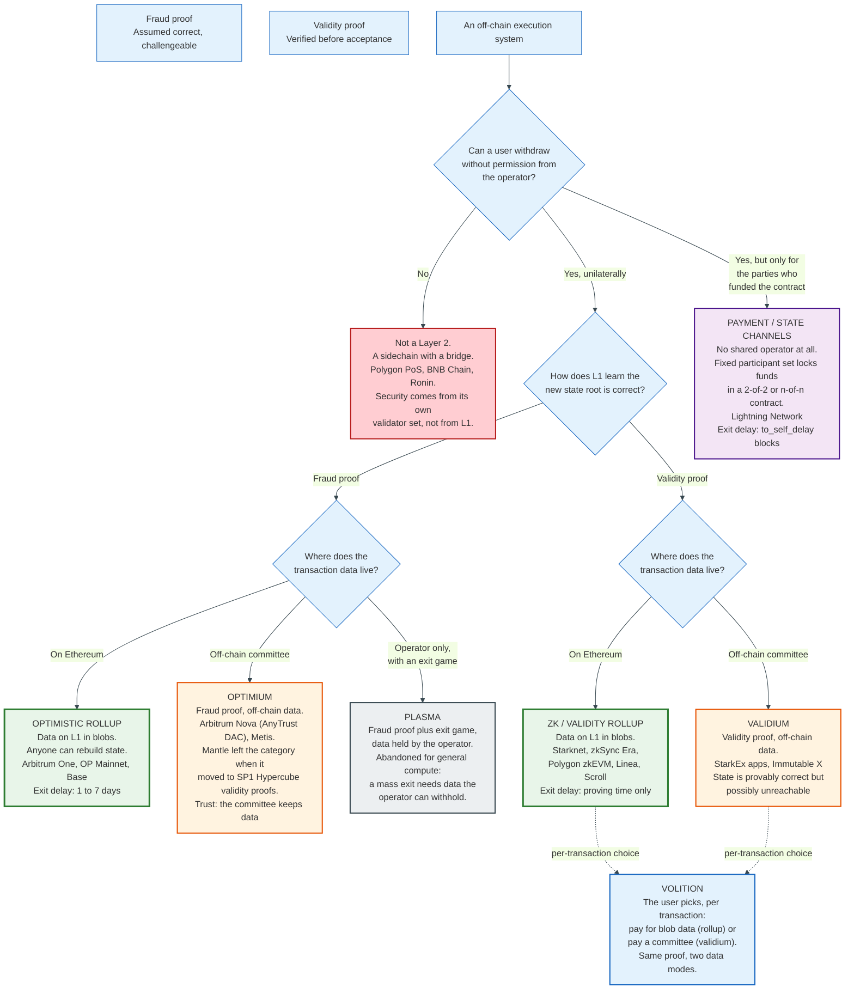

### 2.1 The Three Properties

Three things must simultaneously hold. Remove any one and the system is something else with better marketing.

**Off-chain execution.** Transactions are ordered and executed by an operator, not by L1 validators. This is what produces the throughput. It is also the easy part, and it is the only part a sidechain also does.

**On-chain verifiability of the state transition.** L1 either verifies a validity proof before accepting a new state root, or accepts it provisionally and allows anyone to disprove it inside a window. The operator cannot write a state that L1 will accept and that is wrong.

**A unilateral exit path.** A user can leave with their assets using only data that is on L1 and a transaction they send themselves. No operator signature, no committee vote, no bridge relayer. This property is what a Layer 2 is for.

L2Beat's Stage framework grades chains on how close they are to holding all three without human intervention. Stage 0 means training wheels: proofs may exist but a multisig can override them. Stage 1 means a functioning proof system with a Security Council able to intervene under constrained conditions. Stage 2 means the proof system governs and the council can act only on a provable bug.

In August 2026, Base, Arbitrum One, OP Mainnet and Starknet all sit at Stage 1.

### 2.2 What It Is Not: A Sidechain

The most common and most expensive confusion is between a Layer 2 and a sidechain, and the test that separates them takes one question.

If every operator, sequencer, validator and committee member of the system disappears tonight, can you still recover your assets using only Ethereum? For a rollup the answer is yes: the data is in blobs on L1, anyone can replay it, compute the state, and prove their balance to the bridge contract. For a sidechain the answer is no: the bridge is controlled by the sidechain's own validator set, and if that set is gone or dishonest, the assets locked on L1 stay locked or leave with someone else.

Polygon PoS, BNB Chain and Ronin are sidechains. They have their own validators, their own consensus, and their own security budget. They appear in L2 dashboards because they compete for the same users, not because they share a security model. Ronin's bridge lost 624 million dollars in March 2022 when an attacker obtained five of nine validator keys. No amount of Ethereum security was available to help, because none was ever in the design.

A rollup borrows Ethereum's security. A sidechain borrows Ethereum's users.

### 2.3 What It Is Not: Private

"Zero-knowledge rollup" is a misnomer that has confused the market since 2019, and the confusion is worth correcting precisely.

A ZK-SNARK has two properties: succinctness, meaning the proof is small and fast to verify regardless of how much computation it attests to, and zero knowledge, meaning it reveals nothing about the witness beyond the statement's truth. Rollups use the first property and discard the second. Every transaction on zkSync Era, Starknet, Linea and Scroll is public, indexed and searchable. The state diffs go into public blobs on Ethereum.

The accurate term is validity rollup. The industry knows this and mostly keeps using the wrong one.

Privacy on these chains, where it exists, is a separate construction built on top. Starknet's STRK20 standard, shipped in 2026, adds encrypted balances using proof verification native to the protocol as of version 0.14.2 in April 2026. That is a privacy feature deliberately engineered. It is not a side effect of the proof system.

### 2.4 What It Is Not: A Guarantee Against the Operator

A Layer 2's proof system protects the state transition. It protects almost nothing else.

The sequencer can reorder transactions, front-run them, delay them, censor an address, and stop producing blocks entirely. None of those actions produces an invalid state root, so none of them is a fraud proof's business. The remedies are a forced-inclusion path that takes hours and costs L1 gas, and, ultimately, exit.

The bridge contract can be upgraded. On every Stage 0 and Stage 1 chain a multisig holds that power, and it holds it over the contract that custodies every deposited asset. Base's arrangement is a 2-of-2 between a 3-of-6 Coinbase multisig and an 8-of-11 Security Council of independent entities. Counting the Coinbase multisig as one participant, nine of twelve must approve. Counted in signatures it is eleven, three Coinbase signers of six plus eight council members of eleven, drawn from seventeen keyholders. That is a genuine improvement on one company holding a key. It is not the absence of a trusted party.

The correct summary of Stage 1 security: the operator cannot steal your money by lying about the state, and the governance set can still change the rules.

### 2.5 The Fundamental Trade

Every design in this document trades between three things: how much data goes on L1, how long you wait to exit, and how much you trust a named party. No design escapes all three.

A rollup puts all data on L1 and pays blob fees. A validium puts data with a committee and pays almost nothing. An optimistic rollup makes you wait roughly a week to exit and needs no proving hardware. A validity rollup exits in minutes and needs a GPU cluster running continuously. A channel gives instant final settlement between two parties and requires both to lock capital and stay online.

Pick two. The third is the bill.

---

## 3. Why Layer 1 Throughput Is Bounded

Layer 1 throughput is bounded by the weakest machine you want to be able to verify the chain, and that bound is a policy choice dressed as a technical constant.

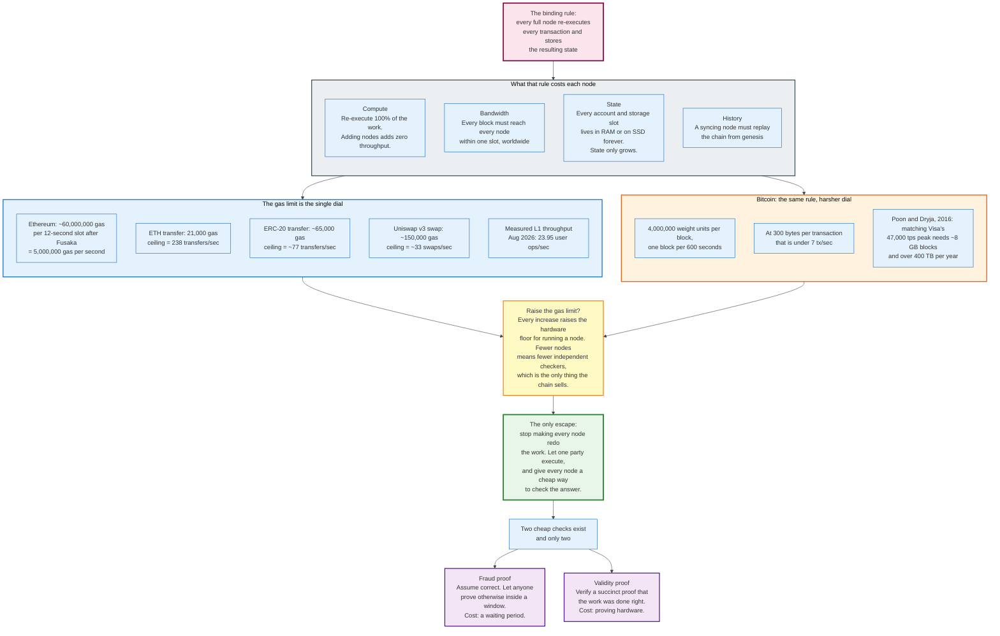

### 3.1 The Replication Rule

A blockchain is a system in which N nodes each do 100 percent of the work. That is the security model, and it is also the scalability ceiling.

Every full node downloads every block, re-executes every transaction, updates its copy of the state, and checks the result against the block's claimed state root. A node that skipped this would be trusting someone. The reason a blockchain is worth using is that nobody has to.

The consequence is that throughput does not improve with more participants. Ten thousand nodes process exactly what one node processes. What more nodes buy is independence, not capacity.

Four resources bind, and they bind separately.

**Compute.** Re-execution must finish inside a slot, on ordinary hardware, with margin for a node that is behind. Ethereum targets 12-second slots.

**Bandwidth.** A block must propagate to every node worldwide inside the same slot. Larger blocks propagate more slowly, and slow propagation causes forks, which cost security.

**State.** Every account balance, nonce, contract and storage slot must be readable at random, quickly, forever. State only grows. Unlike history, it cannot be pruned, because the next transaction might touch any of it.

**History.** A new node syncing from genesis must replay everything. The longer the chain, the higher the cost of joining it.

State is the hardest of the four, because it is the only one that ratchets. A busy day adds permanent state that every future node carries.

### 3.2 The Arithmetic on Ethereum

Ethereum's gas limit rose to roughly 60 million per block with the Fusaka upgrade on 3 December 2025. With a 12-second slot, that is 5 million gas per second, and the throughput ceiling for any workload follows directly from its gas cost.

| Operation | Approximate gas | Theoretical ceiling |
|-----------|-----------------|---------------------|
| ETH transfer between EOAs | 21,000 | 238 per second |
| ERC-20 transfer | ~65,000 | ~77 per second |
| Uniswap v3 swap | ~150,000 | ~33 per second |
| Contract deployment, medium | ~1,500,000 | ~3 per second |

The measured figure is lower than any of these because real blocks carry a mix and often run below the gas target. L2Beat measured Ethereum mainnet at 23.95 user operations per second in August 2026.

Finality adds a second constraint. Ethereum finalises after two epochs. An epoch is 32 slots of 12 seconds, so finality arrives 64 slots later, 12.8 minutes, which ethereum.org rounds to about 15 minutes. Single slot finality is an active research direction precisely because 15 minutes is an awkward number to build a payment product on.

### 3.3 The Arithmetic on Bitcoin

Bitcoin's bound is the same rule with tighter parameters and a stronger political commitment to keeping them tight.

A block carries 4,000,000 weight units and arrives every 600 seconds on average. At Poon and Dryja's assumed 300 bytes per transaction, that is fewer than 7 transactions per second. Their scaling calculation is worth carrying because it is the clearest statement of the problem anyone has written: matching Visa's 47,000-per-second peak would need roughly 8 GB blocks every ten minutes and over 400 terabytes of data per year.

Bitcoin has not raised its block limit since 2017, and SegWit's effective increase was a side effect of a malleability fix rather than a capacity decision. The community's position is that a node must run on a consumer machine over a home broadband connection. That position is the throughput limit.

### 3.4 Why Raising the Limit Does Not Work

Raising the gas limit is always technically possible and always transfers cost from users to node operators.

Every increment raises the hardware floor for independent verification. Raise it enough and the only entities able to verify are the ones with datacentres, which are the same entities the chain exists to avoid trusting. The chain keeps its throughput and loses the property it was selling.

This is not a hypothetical. It is the observed history of every high-throughput chain that skipped the constraint: node counts fall, archive nodes become a hosted service, and users check balances by asking a company.

Ethereum has raised the limit repeatedly, from 30 million to 36 million in February 2025, to 45 million later that year, and to a 60 million client default with Fusaka under EIP-7935, each time paired with work that lowered the per-gas cost of verification. Validators set the limit, not the fork; EIP-7935 is informational and only moves the default that clients ship with. The increments are cautious because the trade is real.

### 3.5 The Escape

The escape is to stop replicating execution and start replicating verification, and it works because verifying can be made asymptotically cheaper than doing.

Two mechanisms achieve that. A fraud proof lets L1 assume a result is correct and adjudicate a dispute only if someone objects, which costs one on-chain instruction execution in the worst case and nothing in the common case. A validity proof lets L1 check a fixed-size cryptographic object whose verification cost is independent of the computation proved, which costs a few hundred thousand gas whether the batch held ten transactions or ten thousand.

Neither mechanism removes the data requirement. Both still need the transactions to be available somewhere, and Ethereum's answer to where is blobs.

The bound never disappeared. It moved from execution to data.

---

## 4. Key Participants and Roles

A Layer 2 has seven distinct roles, and on every major chain in August 2026 at least four of them are performed by one company.

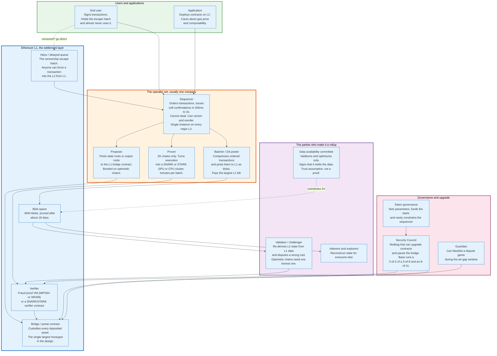

### 4.1 The Actors

| Role | What it does | Can it steal? | Can it censor? | Who does it in practice |
|------|--------------|---------------|----------------|--------------------------|
| **Sequencer** | Orders transactions, issues soft confirmations | No | Yes | One operator per chain |
| **Batcher** | Compresses and posts data to L1 blobs | No | Yes, by omission | The same operator |
| **Proposer** | Posts state or output roots to the L1 bridge | Only if unchallenged | No | The same operator, plus others on permissionless chains |
| **Prover** | Generates validity proofs | No | No | Operator or a proving marketplace |
| **Challenger / validator** | Re-derives state from L1 data and disputes wrong roots | No | No | Anyone, on Stage 1 chains |
| **Data availability committee** | Attests it holds off-chain data | No | Yes, by withholding | Named members, validiums only |
| **Security Council** | Upgrades contracts, pauses the bridge | Yes | Yes | Multisig, disclosed membership |

The pattern to notice is in the third column. Only two roles can take user funds, and neither is the sequencer. Sequencer centralisation is a liveness and fairness problem. Governance centralisation is a solvency problem. They are routinely discussed as if they were the same risk.

### 4.2 The Sequencer Is the Product

The sequencer is what users actually buy, and what it sells is a promise no proof system underwrites.

When a wallet shows a Base transaction as confirmed in 200 milliseconds, that confirmation is a statement by Coinbase that it will include the transaction in the batch it eventually posts. It is enforceable by reputation and by nothing else. The L1 guarantee arrives minutes later when the batch lands, and finality arrives after that.

This soft confirmation is the entire user-facing improvement over L1. It is also the reason sequencer decentralisation has been slow: a decentralised sequencer set has to agree on an ordering, and agreement takes rounds, and rounds take time. Every proposal to decentralise sequencing trades latency for censorship resistance, and users have consistently revealed that they prefer the latency.

### 4.3 The Challenger Is the One Nobody Pays

An optimistic rollup's security rests on at least one honest, funded, technically capable party watching and willing to dispute. That party has no business model.

Running a challenger means operating an archive node, re-deriving the chain from blobs continuously, and holding enough capital to post bonds. Arbitrum One's assertion bond is 3,600 ETH, and the challenge bonds are 555 ETH at the big-step level and 79 ETH at the small-step level, 634 ETH in total. The reward for catching fraud is the loser's bond, which is large, but the expected frequency of fraud on a chain run by a well-capitalised company is close to zero.

So the honest-minority assumption is funded by grants, by the operator itself running redundant challengers, and by aligned parties with assets at risk. That works. It is not a market.

Arbitrum's BoLD, deployed to Arbitrum One in February 2025, made the role permissionless, which is the necessary condition for anyone to fill it. Offchain Labs prices the bonds so that an attacker spends 6.46 dollars for every dollar an honest defender spends. That makes the attack lose money. It does not make defending it a business.

### 4.4 The Governance Set Is Where the Trust Actually Sits

Every Stage 1 chain has a multisig that can upgrade the bridge, and the bridge holds everything.

Base publishes its arrangement in detail. Upgrades require a 2-of-2 between two participants: a 3-of-6 multisig of Coinbase signers, and an 8-of-11 multisig of eleven independent entities and individuals with staggered terms, Cohort 1 expiring in October 2026 and Cohort 2 in January 2027. Counting the Coinbase multisig as one participant, nine of twelve must approve; counted in signatures it is eleven, drawn from seventeen keyholders. Base reached Stage 1 on 29 April 2025, having turned on permissionless fault proofs in October 2024 and formed the council that same month.

That is the most transparent version of the arrangement in production. It is still a group of named humans who can rewrite the rules that hold 12.61 billion dollars.

Stage 2 requires this power to be constrained to provable bugs with a delay long enough for users to exit first. No chain of consequence has crossed that line.

---

## 5. Payment Channels and the Lightning Network

A payment channel converts an unlimited number of payments into two on-chain transactions by never publishing the ones in between. The mechanism is a 2-of-2 multisignature output plus a rule that makes publishing an old state financially suicidal.

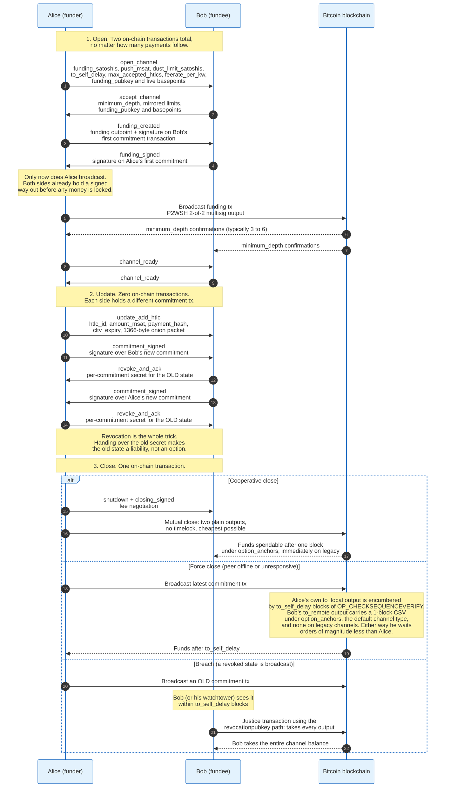

### 5.1 Opening: Two Signatures Before Any Money Moves

The opening sequence is ordered so that neither party is ever exposed, and the ordering is the whole safety argument.

Alice sends `open_channel`, carrying `funding_satoshis`, `push_msat` (an optional gift to the other side), `dust_limit_satoshis`, `to_self_delay`, `max_accepted_htlcs`, `feerate_per_kw`, a `funding_pubkey` and five basepoints from which every later key is derived. A channel above 2^24 satoshis requires both peers to support large channels.

Bob replies with `accept_channel`, mirroring the limits and adding `minimum_depth`, the number of confirmations he wants before considering the channel live. The specification requires `channel_reserve_satoshis` to be at least `dust_limit_satoshis`, which forces each side to keep skin in the game so the penalty mechanism always has something to take.

Alice then sends `funding_created`, naming the funding outpoint and signing Bob's first commitment transaction. Bob replies with `funding_signed`, signing Alice's. Only now does Alice broadcast the funding transaction.

The ordering matters because it means the funding transaction is never on-chain without both parties already holding a signed way out. After `minimum_depth` confirmations, both send `channel_ready` and the channel is usable.

### 5.2 Updating: Asymmetric Commitments and Revocation

Each party holds a different commitment transaction, and the difference between them is what enforces honesty.

A commitment transaction spends the funding output. Version 2, or version 3 when `zero_fee_commitments` is negotiated. Its locktime has the upper 8 bits set to `0x20` and the lower 24 bits carrying part of an obscured commitment number, obscured by XOR against the lower 48 bits of `SHA256(payment_basepoint from open_channel || payment_basepoint from accept_channel)`. An outside observer cannot read how many times the channel has been updated.

Alice's copy encumbers her own output with a delay and pays Bob immediately. Bob's copy does the reverse. The `to_local` script, from BOLT 3, is the load-bearing piece:

```
OP_IF
    <revocationpubkey>
OP_ELSE
    <to_self_delay>
    OP_CHECKSEQUENCEVERIFY
    OP_DROP
    <local_delayedpubkey>
OP_ENDIF
OP_CHECKSIG
```

Two paths. The owner spends after `to_self_delay` blocks. Anyone holding the revocation key spends immediately.

An update runs four messages. Alice sends `commitment_signed` with a signature over Bob's new commitment. Bob replies `revoke_and_ack`, handing over the per-commitment secret for his old state. Bob sends `commitment_signed` for Alice's new commitment, and Alice replies `revoke_and_ack` with her old secret.

That handover is the revocation. The secret, combined with the counterparty's `revocation_basepoint`, derives the `revocationpubkey` in the old commitment's script. Old states are not deleted. They are made unpublishable.

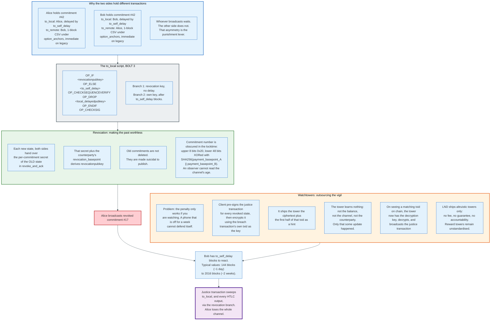

### 5.3 The Penalty and Its Deadline

Publishing a revoked commitment forfeits the entire channel balance to the counterparty, and the counterparty has exactly `to_self_delay` blocks to collect.

The justice transaction sweeps `to_local` and every HTLC output through the revocation branch. Typical `to_self_delay` values run from 144 blocks, about one day, to 2016 blocks, about two weeks. Longer is safer for the watcher and worse for the person who wants their money back after a force close.

This creates the liveness requirement that defines channel-based systems. A node that is offline for longer than `to_self_delay` cannot defend itself. A phone with a dead battery is a security hole.

### 5.4 Watchtowers

A watchtower watches the chain on your behalf without learning anything about your channel, and the construction is neat enough to state exactly.

The client pre-signs the justice transaction for every revoked state. It then encrypts that transaction using the breach transaction's own txid as the key, and sends the tower the ciphertext plus the first half of that txid as a lookup hint. The tower stores a hint and an opaque blob.

If the breach transaction appears on-chain, the tower now has the full txid, which is the decryption key. It decrypts and broadcasts. If the breach never happens, the tower never learns the channel identity, the balances, or the counterparty. It learns only that some update occurred, which leaks update frequency and nothing else.

LND ships altruistic watchtowers: no fee, no compensation for a successful defence, and no accountability for a missed one. Reward towers exist as an idea and have not been standardised. The economically correct design, where a tower posts a bond and earns a cut of recovered funds, remains unbuilt.

### 5.5 Routing: HTLCs and Onions

A payment across three channels is atomic because every hop is conditioned on the same secret, and each hop's timelock is strictly shorter than the one before it.

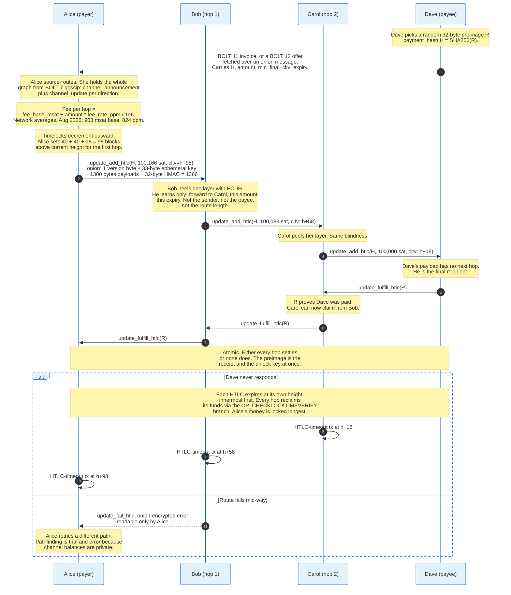

The payee generates a random 32-byte preimage `R` and publishes `H = SHA256(R)` in an invoice. Each hop forwards an HTLC conditioned on `H`, with a `cltv_expiry` that decrements outward. When the payee releases `R` to claim, each hop upstream can claim with the same secret. Either the whole path settles or none of it does.

The `update_add_htlc` message carries `channel_id`, `htlc_id`, `amount_msat`, `payment_hash`, `cltv_expiry`, and a 1366-byte `onion_routing_packet`.

The onion is a Sphinx construction with a fixed layout: 1 version byte, a 33-byte compressed secp256k1 ephemeral public key, 1300 bytes of hop payloads, and a 32-byte HMAC. Each hop performs ECDH with the ephemeral key, decrypts one layer, learns only the next hop and the amount and expiry to use, re-blinds the ephemeral key, and forwards. The fixed 1366-byte size means a hop cannot infer route length or its own position. Error attribution supports up to 20 hops.

Errors return along the same path, encrypted with the same shared secrets, so only the sender can read why a payment failed.

Fees are set per channel and per direction, advertised in BOLT 7 gossip through `channel_announcement` and `channel_update`. The formula:

```
fee_msat = fee_base_msat + (amount_to_forward_msat * fee_proportional_millionths) / 1,000,000
```

At the network averages measured in August 2026, 903 millisatoshis base and 824 parts per million, forwarding 100,000 satoshis costs 903 + 82,400 = 83,303 millisatoshis, about 83 satoshis, or 0.083 percent per hop.

Those are means, and the mean is the wrong statistic here. mempool.space publishes medians in the same object: 500 millisatoshis base and 100 parts per million, which put a typical hop at 500 + 10,000 = 10,500 millisatoshis, about 10.5 satoshis, or 0.0105 percent. The mean rate is 8.2 times the median because a small set of expensive channels drags it upward. A router pays the median.

### 5.6 The Liquidity Problem

Channel capacity is directional, and this is the single largest practical constraint on Lightning.

A channel funded entirely by Alice has full outbound capacity for Alice and zero inbound. Alice can pay. Alice cannot be paid. A new merchant node opening a 1 BTC channel can send 1 BTC and receive nothing until payments flow the other way.

Four workarounds are in production. Dual-funded channels let both sides contribute at open. Liquidity marketplaces sell inbound capacity as a product. Submarine swaps move balance between on-chain and off-chain, which is how Lightning Labs' Loop service rebalances. Splicing resizes a live channel by spending the funding output into a new one without closing, which removes the old requirement to close and reopen.

None of them removes the underlying fact. Every satoshi of routing capacity is a satoshi someone locked up in advance, per counterparty, in one direction. The network held 3,793.83 BTC of such locked capacity across 32,665 channels in August 2026, an average of 11,614,345 satoshis per channel.

Routing is also probabilistic. Because balances within a channel are private, a sender knows a channel's total capacity but not its split. Pathfinding is a search with retries, and failure rates rise with payment size. Multi-path payments split a payment across several routes to work around this, at the cost of more HTLCs in flight and more ways to get stuck.

A channel accepts at most 483 concurrent HTLCs in each direction, or 114 under `zero_fee_commitments`, and BOLT 2 gives two reasons for the ceiling. At 483 in each direction the `commitment_signed` message still fits under the maximum message size, and a single penalty transaction can still spend the entire commitment transaction. Under `zero_fee_commitments` the cap falls to 114 because a version 3 transaction is limited to 10 kvB, which caps how many outputs the commitment transaction can carry.

### 5.7 The Invoice Layer: BOLT 11 and BOLT 12

BOLT 11 invoices are single-use and must be fetched out of band, which makes them useless as a static payment address. BOLT 12 fixes that.

An offer is a reusable payment request. The payer sends an `invoice_request` over the Lightning Network itself as an onion message, and receives a signed invoice in reply. The offer's fields are echoed inside the request, so the merchant can be stateless.

Two structural improvements come with it. Signatures are Merkle-based, so a field can be disclosed selectively rather than the whole invoice being one signed blob. And blinded paths let both parties hide their node identity behind an encrypted route, which BOLT 11 could not do.

The practical difference: a BOLT 12 offer can be printed on a poster. A BOLT 11 invoice cannot, because reusing one is, in the specification's own words, actively dangerous.

### 5.8 What Channels Are Good At, and What They Are Not

Channels are the right answer for repeated payments between a stable set of counterparties, and the wrong answer for everything else.

They give instant, final settlement with no challenge window and no third party. Fees are a fraction of a percent. Privacy is better than any rollup, because the payment never appears in a public ledger. Throughput is bounded only by how fast the two peers can exchange messages.

They require capital locked per counterparty in advance, both sides online, and a watching service or an accepted risk. They cannot support an application with an open participant set: an automated market maker cannot live in a channel because anyone can trade with it, and a channel needs its participants named at funding time.

That last constraint is why channels lost the general-purpose scaling argument to rollups, and why they still win the Bitcoin payments argument.

---

## 6. State Channels and Why They Stalled

A state channel generalises a payment channel from balances to arbitrary state, and it stalled for a reason that has nothing to do with the cryptography.

### 6.1 The Mechanism

The construction replaces "who owns how much" with "what is the current state of this contract."

Participants lock funds and an initial state into an on-chain adjudicator contract. They then exchange states off-chain, each signed by all participants and carrying a monotonically increasing version number. A chess game, a repeated auction, a running tab: any state machine works, so long as its participants are fixed.

Disputes settle on-chain. A participant submits the highest-numbered state they hold, and a challenge window opens during which anyone can submit a higher-numbered one. When the window closes, the adjudicator executes the final state's outcome and pays out. Version numbers replace revocation secrets, which makes the construction simpler than Lightning's but requires an on-chain window rather than an instant penalty.

Counterfactual instantiation, described by the L4 team in 2018, was the elegant refinement. A contract that all parties agree exists does not need to be deployed. Its address is computed deterministically, participants behave as though it is live, and it is only deployed if someone disputes. The common case touches the chain zero times.

Perun added virtual channels, letting two parties who both have channels with a common hub transact without the hub signing every update. Raiden built the Ethereum analogue of Lightning for ERC-20 transfers.

### 6.2 The Four Reasons They Stalled

Each reason is individually survivable. Together they lost to rollups.

**Capital is locked per counterparty.** A channel with ten people needs funds locked with those ten people. A rollup needs funds locked once, with the chain, and they are usable against every application and every counterparty on it. Capital efficiency is not close.

**The participant set must be fixed at funding time.** This is fatal for the applications that turned out to matter. A lending pool, an order book and an AMM all have open participation by definition. You cannot put Uniswap in a state channel, because Uniswap's counterparty is whoever shows up.

**Liveness is mandatory.** Every participant must watch the chain for the duration, or delegate to a watchtower. A rollup user can be offline for a year and lose nothing.

**Rollups arrived and were simply easier.** A rollup requires no changes to application code, no channel management, no liquidity provisioning, and no new mental model. Developers deploy the same Solidity and get a hundredfold cost reduction.

### 6.3 Where They Survive

State channels persist where their constraints are natural rather than imposed.

Lightning is the large one, and it is a payment channel network with limited state. Gaming and streaming-payment products use bilateral channels internally, where the counterparty is the service and the participant set is genuinely two. Some exchange and market-making arrangements run channel-like constructions off-chain for the same reason.

The general lesson generalises past crypto. A design that requires all participants to be known in advance loses to a design that does not, even when the first is more efficient.

---

## 7. Optimistic Rollups and Fraud Proofs

An optimistic rollup posts its transactions to L1, asserts a resulting state root, and lets anyone prove that root wrong inside a window. It is the cheapest possible verification scheme, and it buys that cheapness with a delay.

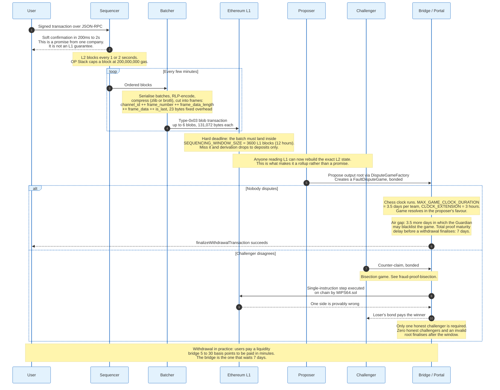

### 7.1 The Data Path

The batcher's job is to make L1 data as small as possible, and the OP Stack's encoding shows how far that is taken.

Sequencer batches are RLP-encoded and concatenated, then compressed, historically with zlib and after Fjord with Brotli. The compressed stream is a channel, and a channel is cut into frames. A frame on the wire is:

```
channel_id ++ frame_number ++ frame_data_length ++ frame_data ++ is_last
```

with 23 bytes of fixed overhead. Frames can be reordered and split across multiple L1 transactions, which lets the batcher fill blobs efficiently rather than padding. Decompressed channel size is capped at `MAX_RLP_BYTES_PER_CHANNEL`, 100,000,000 bytes after Fjord, to stop decompression bombs.

A batch omits the state root deliberately. It contains `[parent_hash, epoch_number, epoch_hash, timestamp, transaction_list]` and nothing more. The canonical chain is defined by the inputs, not by anyone's claim about the outputs, which is why an incorrect state root cannot fork the chain. It can only be disproved.

Two timing constants govern the pipeline. `SEQUENCING_WINDOW_SIZE` is 3,600 L1 blocks, about 12 hours: if a batch for an epoch has not landed by then, derivation for that epoch proceeds with deposits only. Standard chains are additionally required to post at least every 1,800 L1 blocks, about 6 hours, to leave margin. `max_sequencer_drift` is 1,800 seconds after Fjord, bounding how far an L2 timestamp can run ahead of its L1 origin.

Arbitrum's Nitro does the equivalent with Brotli compression at a dynamically chosen level, posting to blobs when blob gas is cheap and falling back to calldata when it is not. Offchain Labs publishes no savings multiplier for batching; its documentation states only that the fixed cost of posting to the parent chain is amortised across more transactions. The size of that saving is not disclosed.

### 7.2 The Dispute Game

Proving a rollup block wrong means re-running it, and re-running it on L1 costs more gas than a block contains. The bisection game is how that is avoided.

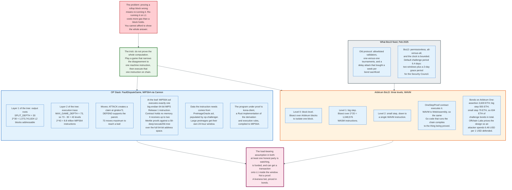

The idea is to narrow a disagreement about the output of a long computation down to a disagreement about one machine instruction, then execute that single instruction on-chain. Each round halves the disputed range. A computation of 2^43 steps needs 43 rounds, not 2^43 gas.

**OP Stack.** The `FaultDisputeGame` is a binary tree with `MAX_GAME_DEPTH` 73 and `SPLIT_DEPTH` 30. Above depth 30, claims commit to output roots, addressing up to 2^30 L2 blocks. Below it, claims commit to positions in an execution trace of up to 2^43 instructions. Two moves exist: `ATTACK` creates a claim at `gindex * 2`, disputing the first half of the parent's range; `DEFEND` supports the parent by committing to the first half of the sibling's range.

At a leaf, `MIPS64.sol` executes exactly one instruction. Cannon's virtual machine is big-endian 64-bit MIPS Release 1. The on-chain contract holds no memory. It receives the memory root plus up to two Merkle proofs against a tree of fixed depth 59 with 32-byte leaves, hashed with `keccak256(left ++ right)`, spanning the full 64-bit address space. Any external data the instruction needs, such as an L1 block header or a blob, is supplied through `PreimageOracle.sol`, which `op-challenger` populates. Large preimages get their own 24-hour challenge window.

The program being proved is `kona-client`, a Rust implementation of the derivation and execution rules compiled to a MIPS64 ELF binary. It runs on a minimal emulated uniprocessor Linux system. The specification defines 17 working syscalls, covering memory allocation (`mmap`, `brk`), file descriptors (`read`, `write`, `open`, `fcntl`), threading primitives (`clone`, `futex`, `sched_yield`, `gettid`), clocks (`nanosleep`, `clock_gettime`), plus `getpid`, `getrandom`, `eventfd2`, `exit` and `exit_group`. A further 31 syscalls are accepted and do nothing. Anything outside those 48 raises an exception and halts the VM.

Timing is a chess clock. `MAX_GAME_CLOCK_DURATION` is 3.5 days per team, and `CLOCK_EXTENSION` grants a flat 3 hours when a team's clock drops below that. A team that runs out of clock loses.

**Arbitrum BoLD.** Three levels rather than two. Level zero bisects over Arbitrum blocks. The big-step level bisects over ranges of 2^20 WASM instructions. The small-step level bisects to a single instruction, which the `OneStepProof` contract executes. The machine is WAVM, a WebAssembly variant, which matters because the same Go code that runs the chain compiles to the thing being proved rather than being reimplemented.

BoLD, deployed to Arbitrum One in February 2025, fixed two properties of the previous protocol. Challenges are permissionless rather than restricted to an allowlist. And disputes resolve in bounded time: the old design allowed a delay attack in which an adversary bought roughly a week per sacrificed bond by opening sequential one-versus-one challenges. BoLD runs all challenges in parallel against a single deadline.

Bonds on Arbitrum One are sized to make the attack unprofitable: 3,600 ETH to post an assertion, 555 ETH at the big-step level and 79 ETH at the small-step level, so 634 ETH of challenge bonds in total. Offchain Labs prices the design so that an attacker spends 6.46 dollars for every dollar the honest party spends defending, assuming a worst case of 500 gwei on the parent chain.

### 7.3 The Seven-Day Window, and What It Is Actually For

The challenge window is not a technical requirement of fraud proofs. It is a margin against censorship of the challenge transaction itself.

A fraud proof needs a challenger to get a transaction onto L1. If an attacker can prevent that transaction from being included for the length of the window, the invalid root finalises. So the window must exceed any plausible censorship campaign against Ethereum. Seven days is the number the industry settled on, and it is a social estimate rather than a derived one: long enough that sustained censorship would be visible and answerable by the L1 community, short enough that users tolerate it.

The OP Stack decomposes it. `MAX_GAME_CLOCK_DURATION` is 3.5 days. After a game resolves there is a further 3.5-day air gap in which the Guardian role can blacklist a game that resolved wrongly. Standard configuration sets the proof maturity delay, the wait between proving a withdrawal and finalising it, at 7 days, and the bond withdrawal delay at 7 days.

Base is the chain that shortened it. Its AggregateVerifier game resolves in 5 days on one proof and 1 day when both the TEE arm and the ZK arm commit, its proof maturity delay is 1 day, and its dispute game finality delay is zero. A single-round proof needs no censorship margin for a bisection walk, only for the one challenge transaction.

Arbitrum's default is 6.4 days: two challenge periods plus a two-day grace period for Security Council intervention.

Two consequences follow. First, the window applies only to L1 withdrawals; a transaction between two addresses on the L2 is final as soon as the batch is on L1 and correct. Second, almost nobody waits. Liquidity bridges buy the pending withdrawal at a discount of roughly 5 to 30 basis points and wait it out themselves, which converts a protocol delay into a financing cost.

### 7.4 The Honest Minority Assumption

An optimistic rollup is secure if at least one honest party is watching, is funded, and can reach L1. That is three assumptions wearing one coat.

Watching means running an archive node and re-deriving the chain from blobs continuously. Funded means holding bonds in the thousands of ETH on Arbitrum One. Reaching L1 means not being censored for 3.5 days.

Permissionless fault proofs, which OP Mainnet activated in June 2024 and Base in October 2024, are the necessary condition for the assumption to be satisfiable by someone other than the operator. They do not make it satisfied. In practice the watchers are the operator, aligned infrastructure firms, and grant-funded parties.

The failure mode is quiet. An optimistic rollup with zero honest challengers behaves identically to one with a thousand, right up until the moment it does not.

---

## 8. ZK Rollups and Validity Proofs

A validity rollup proves its state transition correct before L1 accepts it, which removes the challenge window, the honest-minority assumption, and the bonds. It replaces them with a proving cluster and a much harder engineering problem.

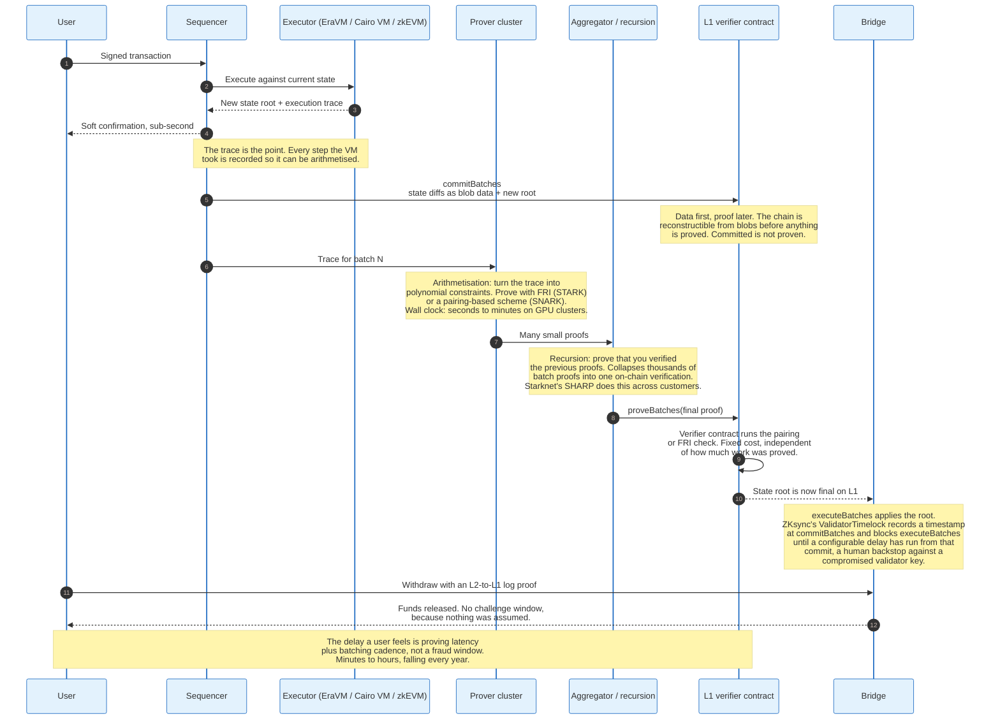

### 8.1 The Three-Phase Lifecycle

ZKsync Era's contract interface names the phases exactly, and every validity rollup does some version of the same three.

`commitBatches` posts the data and the claimed new state root to L1. It checks batch timestamps, processes L2 system logs, and stores what the proof will later be checked against. At this point the chain is reconstructible from L1 but nothing is proven.

`proveBatches` submits the validity proof. The verifier contract checks it against the committed public inputs. This is the step that makes the root true rather than claimed.

`executeBatches` applies the root, marks L1-to-L2 messages as processed, and stores the Merkle tree of L2 logs that withdrawals are proved against.

A `ValidatorTimelock` contract records a timestamp when `commitBatches` is called and blocks `executeBatches` until a configurable `executionDelay` has elapsed from that commit. The clock starts at commit, before any proof exists, which is why the delay a user faces is longer than the gap between proving and executing. Its purpose is stated plainly in the contract's own comments: to delay batch execution so that a compromised validator key does damage that operators have time to notice and answer. It is a human backstop on a cryptographic system, and its existence is why validity rollups are not automatically Stage 2.

### 8.2 What Actually Gets Proved

The proof does not attest that transactions were signed correctly and nothing else. It attests to the whole state transition function, and getting that function into a provable form is the hard part.

The prover takes an execution trace, every step the VM took, and arithmetises it: turns each step into polynomial constraints over a finite field. The proof then demonstrates that a polynomial satisfying all those constraints exists, without the verifier evaluating it everywhere.

Three approaches to the VM exist in production. Starknet uses Cairo, a language and VM designed to be provable from the start, which is fast to prove and requires developers to learn a new language. zkSync Era uses EraVM, an EVM-like VM with its own bytecode and a Solidity compiler front end, which gets close to EVM equivalence at the cost of a distinct execution environment. Polygon zkEVM, Scroll and Linea prove EVM bytecode more directly, trading proving efficiency for compatibility.

A fourth approach has overtaken all three since 2024: general-purpose zkVMs such as SP1, OpenVM, ZisK and Pico prove RISC-V execution. Compile any Rust program, including a full Ethereum client, and prove that it ran. This is why Base and Mantle appear on L2Beat with SP1 as their proof system rather than a bespoke circuit. The circuit is now a compiler target.

### 8.3 Data Compression Through State Diffs

ZKsync posts state diffs rather than transactions, and this is the significant architectural difference between validity and optimistic rollups on the data side.

An optimistic rollup must post every transaction, because the fraud proof re-executes them. A validity rollup does not: the proof already established correctness, so L1 data exists only so that observers can reconstruct state. Posting the net change to storage slots is sufficient and is smaller.

The saving compounds with activity. A thousand transactions that all touch the same Uniswap pool produce a thousand transaction records but one net storage change per slot. ZKsync's pubdata therefore carries compressed state diffs, L2-to-L1 logs and messages, and the bytecode of deployed contracts.

Starknet evolved the same idea across four protocol versions. Version 0.11.0 changed the state diff encoding. Version 0.13.1 moved diffs into blobs with an FFT encoding, requiring an inverse FFT to decode, and kept calldata as a fallback for when blob prices spike above calldata prices. Version 0.13.3 added stateless compression, sorting unique field elements into buckets of 15, 31, 62, 83, 125 and 252 bits and packing them with pointer indexing. Version 0.13.4 added stateful compression: a system contract maps storage keys and addresses to short counters on first use, so repeat references cost a counter rather than a 32-byte key.

Stateful compression has a cost worth naming. Post-0.13.4 state diffs cannot be decoded in isolation; you need the earlier diffs to build the mapping. Reconstructing state became a sequential operation.

### 8.4 Recursion and Shared Provers

Verifying one proof per batch on L1 would be expensive. Recursion collapses many proofs into one.

A recursive proof proves the statement "I verified these proofs and they were valid." Apply it repeatedly and a tree of thousands of batch proofs reduces to a single proof verified once on L1, at fixed cost.

StarkWare's SHARP takes this further by aggregating across customers. Multiple Starknet batches and multiple StarkEx applications feed into one proof, and one on-chain verification amortises across all of them. The economics are the point: verification gas is a fixed cost, so the more work you can put under a single verification, the lower the per-transaction share.

### 8.5 Priority Queues: How L1 Talks to L2

The L1-to-L2 path on a validity rollup is a queue whose contents L1 can check, which is what makes forced inclusion enforceable.

A user calls `requestL2Transaction` on the ZKsync L1 contract. The transaction is validated and appended to an ordered priority queue. The L2 bootloader maintains two values as it processes them: `numberOfPriorityTransactions`, incremented per operation, and `priorityOperationsRollingHash`, a rolling Keccak hash of the operation hashes.

When the batch is committed and proved, L1 checks both against its own record of the queue. The operator cannot skip a queued operation, cannot reorder them, and cannot invent one that was never queued. The rolling hash makes the queue's contents part of the proved statement.

### 8.6 The Withdrawal Path

Withdrawals ride on a message-passing primitive that is cheaper than it looks.

The ZKsync VM has a `to_l1` opcode that emits a native L2-to-L1 log carrying the sender, two 32-byte fields, and metadata. These logs are the only provable communication from L2 to L1: they are committed to in the batch commitment and verified against the proof. Messages longer than 64 bytes are handled by logging the sender and a hash, with the operator supplying the preimage at commit time.

A user withdrawing proves their log's inclusion against the tree stored by `executeBatches`, and the bridge releases the funds. No challenge window applies, because nothing was assumed. The only wait is proving latency plus batching cadence plus any `ValidatorTimelock` delay.

---

## 9. SNARKs, STARKs, and What Proving Actually Costs

SNARKs and STARKs solve the same problem with different hardness assumptions, and by 2026 production systems use both in the same pipeline rather than choosing between them.

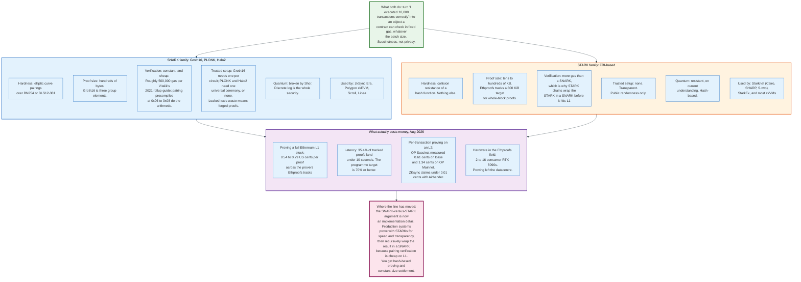

### 9.1 The Shared Property

Both produce an object a contract can verify in fixed gas regardless of how much computation it attests to. That property is succinctness, and it is the only property rollups need.

The verifier learns that a claimed state transition was executed correctly. It does not re-execute. It does not download the trace. Verification cost is a function of the proof system, not the batch size, which is why a rollup's on-chain cost per transaction falls as batch size rises.

### 9.2 SNARKs

SNARK security rests on elliptic curve pairings, which buys tiny proofs and cheap verification at the cost of a setup ceremony.

A Groth16 proof is three group elements, a few hundred bytes. Verification is a fixed pairing check, which Ethereum supports through precompiles at addresses `0x06` through `0x08` for BN254. Vitalik's 2021 rollup guide put ZK-rollup on-chain verification at roughly 500,000 gas per batch, against roughly 40,000 gas for an optimistic rollup's batch submission.

The cost is the trusted setup. Groth16 needs a per-circuit ceremony generating a common reference string; the random values used, the toxic waste, must be destroyed. Anyone who retains them can forge proofs for that circuit. PLONK and Halo2 reduce this to one universal ceremony reusable across circuits, or eliminate it.

SNARKs are broken by a sufficiently large quantum computer, because their hardness is discrete logarithm hardness.

### 9.3 STARKs

STARK security rests on nothing but hash collision resistance, which removes the ceremony and the quantum concern and enlarges the proof.

There is no setup. Randomness is public. The security assumption is the same one securing the Merkle trees the chain already uses. Proofs run to tens or hundreds of kilobytes; Ethproofs tracks a 600 KiB target for full Ethereum block proofs. Verification is correspondingly more gas.

STARK proving is also faster in wall-clock terms for large computations, because it avoids elliptic curve operations in the prover's inner loop. StarkWare's S-two prover, open-sourced in November 2025, uses Circle STARKs over the Mersenne31 prime field, chosen because arithmetic modulo 2^31 minus 1 maps efficiently onto 32-bit hardware.

### 9.4 How Production Systems Actually Choose

The modern answer is both, in sequence, and the reason is arithmetic rather than ideology.

Prove with a STARK, because hash-based proving is fast, needs no ceremony, and parallelises across GPUs. Then recursively wrap the STARK inside a SNARK, because pairing verification on Ethereum is cheap and constant-sized. You get hash-based proving throughput and pairing-based settlement cost.

This composition is why the SNARK-versus-STARK debate has largely stopped mattering to chain operators. It is a question about which stage of the pipeline you are describing.

### 9.5 What It Costs, Measured

Proving costs fell by roughly two orders of magnitude between 2023 and 2026, and the current figures come from two public sources.

**Ethproofs**, the Ethereum Foundation's real-time proving benchmark programme, tracked 117,385 proofs of full Ethereum L1 blocks by August 2026, of which 106,688 met eligibility criteria, a 90.9 percent rate. Cost per proof across the listed provers ranged from 0.54 to 0.79 US cents. Latency remains the binding constraint: 35.4 percent of proofs completed in under 10 seconds, against a programme target of 70 percent or better.

The hardware in that field is instructive. Entries include Axiom on 16 RTX 5090s running OpenVM 2.1, ZisK on 8 and on 2 RTX 5090s, Pico on 2, Zilkworm Airbender on 2, and Succinct Twin Peaks on 2. Proving a full Ethereum block now runs on consumer graphics cards, not a datacentre.

**Per-transaction proving on L2s** is cheaper still, because L2 transactions are simpler than L1 blocks. Succinct's OP Succinct measured 0.61 US cents per transaction on Base, 1.34 on OP Mainnet and 1.11 on OP Sepolia, against average user-paid transaction costs of 2 and 5.4 cents on Base and OP Mainnet respectively at the time of publication. ZKsync states proving costs under 0.0001 US dollars per transaction with its Airbender prover.

| Measure | Figure | Source and date |
|---------|--------|-----------------|
| Full L1 block proof, cost | 0.0054 to 0.0079 USD | Ethproofs, Aug 2026 |
| Full L1 block proof, under 10s | 35.4% of proofs | Ethproofs, Aug 2026 |
| L2 transaction proof, Base | 0.0061 USD | Succinct, OP Succinct |
| L2 transaction proof, OP Mainnet | 0.0134 USD | Succinct, OP Succinct |
| L2 transaction proof, ZKsync Airbender | under 0.0001 USD | ZKsync, 2025-2026 |
| Optimistic batch submission, gas | ~40,000 | Vitalik, Jan 2021 |
| ZK proof verification, gas | ~500,000 | Vitalik, Jan 2021 |

### 9.6 Why Proving Cost Stopped Being the Objection

The 2021 argument against validity rollups was that proving was too slow and too expensive for general EVM computation. That argument is closed.

Two things changed. General-purpose zkVMs replaced hand-written circuits, so improving the prover improves every application at once rather than requiring each to be re-engineered. And GPU proving matured to the point that a full Ethereum block proves for under a cent on consumer hardware.

What remains is latency, and latency is now the whole game. A proof that takes ten minutes cannot back a one-second confirmation. Ethproofs exists specifically to push sub-10-second proving from 35 percent of blocks to 70 percent, because real-time proving is the precondition for both an L1 zkEVM and for validity rollups with no delay of any kind.

---

## 10. Data Availability and EIP-4844 Blobs

Data availability is the binding constraint on rollup capacity, and EIP-4844 is the mechanism that made it cheap. Everything a rollup does off-chain is worthless if the inputs cannot be obtained.

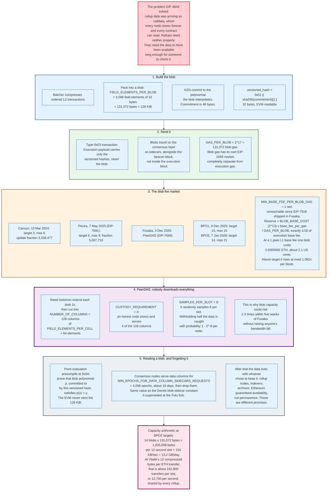

### 10.1 What the Requirement Actually Is

A rollup must publish enough data that any observer can reconstruct the L2 state without the operator's cooperation. That sentence is the entire security difference between a rollup and everything weaker.

Note what it does not require. It does not require permanence. It does not require the data to be readable by contracts. It does not require every node to keep it forever. It requires that the data was available long enough for anyone who wanted it to have taken a copy.

Before Dencun, rollups met this requirement with calldata, which delivers all three properties nobody asked for and charges for them. Calldata competes for execution gas, so a busy day on Ethereum raised L2 fees directly.

### 10.2 The Blob

A blob is 131,072 bytes of data that the EVM cannot read and that consensus nodes delete after about 18 days.

The structure is fixed. `FIELD_ELEMENTS_PER_BLOB` is 4,096, each element 32 bytes, giving exactly 128 KiB. The blob is treated as the evaluations of a polynomial, and a KZG commitment to that polynomial is computed, 48 bytes. The execution layer sees only a versioned hash:

```
versioned_hash = VERSIONED_HASH_VERSION_KZG || sha256(commitment)[1:]
```

32 bytes, with the first byte `0x01` marking the commitment scheme so a future scheme can coexist.

A blob-carrying transaction is type `0x03`. Its execution payload carries the versioned hashes. The blobs themselves travel on the consensus layer as sidecars alongside the beacon block. This separation is what lets them be pruned: the execution chain's validity never depended on holding them.

`GAS_PER_BLOB` is 2^17, 131,072 blob gas per blob, priced in an EIP-1559 market entirely separate from execution gas. `MIN_BASE_FEE_PER_BLOB_GAS` is 1 wei, and since EIP-7918 shipped in Fusaka that constant is unreachable. The blob base fee cannot fall below `BLOB_BASE_COST` (2^13, or 8,192) times the execution base fee divided by `GAS_PER_BLOB`, which is exactly one sixteenth of the execution base fee. At a 1 gwei L1 base fee the reserve is 62.5 Mwei per blob gas, so one blob costs 0.000008192 ETH, roughly 2.1 US cents at 2,515 dollars per ETH. The 1 wei floor survives in the specification and never binds while the execution base fee is non-zero.

Contracts read blobs through the point evaluation precompile at address `0x0A`. It verifies that the polynomial committed to by a given versioned hash evaluates to `y` at point `z`. A contract can therefore prove a statement about 128 KiB of data without loading a byte of it.

### 10.3 The Capacity Ladder

Blob capacity has risen 4.7 times on target and 3.5 times on maximum since launch, in three steps after Cancun, and the last two required no client code changes at all.

| Fork | Date | Target | Max | Base fee update fraction |
|------|------|--------|-----|--------------------------|
| **Cancun** (EIP-4844) | 13 Mar 2024 | 3 | 6 | 3,338,477 |
| **Prague** (EIP-7691) | 7 May 2025 | 6 | 9 | 5,007,716 |
| **BPO1** | 9 Dec 2025 (epoch 412,672) | 10 | 15 | 8,346,193 |
| **BPO2** | 7 Jan 2026 (epoch 419,072) | 14 | 21 | 11,684,671 |

EIP-7892 defines the BPO fork: a protocol upgrade that changes only blob target, blob limit and the fee update fraction through configuration, activated by a Unix timestamp in node config. No new code ships. That is why two capacity increases fitted into five weeks after Fusaka.

The arithmetic at BPO2 targets, as of August 2026:

- 14 blobs x 131,072 bytes = 1,835,008 bytes per 12-second slot
- 152,917 bytes per second, roughly 153 KB/s
- 7,200 slots per day x 14 blobs = 100,800 blobs, about 13.2 GB per day
- At Vitalik's estimate of 12 compressed bytes per rollup ETH transfer, roughly 152,900 transfers per slot, or about 12,700 per second, shared across every rollup bidding for the same space

The maximum, 21 blobs, gives 2,752,512 bytes per slot, about 229 KB/s.

### 10.4 The Fee Market and Its Cliff

Blob pricing is an exponential controller with a reserve price, and the shape of it dominates rollup economics.

The maximum rise per block is `exp((max - target) x GAS_PER_BLOB / update fraction)`. At Cancun's 3-blob gap and update fraction of 3,338,477 that was `exp(393,216 / 3,338,477)` = 1.125, the 12.5 percent figure still widely quoted. Pectra changed both terms and the ratio has been fixed ever since: `exp(393,216 / 5,007,716)` = 1.082. At BPO2's 7-blob gap and fraction of 11,684,671 it is `exp(917,504 / 11,684,671)` = 1.082 again, identical by construction. The ceiling is 8.2 percent per block, not 12.5, and has been since 7 May 2025.

Downward, the price no longer collapses to nothing. EIP-7918, shipped in Fusaka on 3 December 2025, throttles the excess-blob-gas update whenever `BLOB_BASE_COST * base_fee_per_gas > GAS_PER_BLOB * base_fee_per_blob_gas`, which pins the blob base fee at or above one sixteenth of the execution base fee. At a 1 gwei L1 base fee that reserve puts a blob at 0.000008192 ETH, about 2.1 US cents.

The consequence for a rollup operator is still a step function rather than a curve. At the reserve, one blob carries roughly 10,900 compressed transfers for 2.1 cents, so the marginal L1 cost of an additional transaction is about 0.0000019 dollars and the sequencer keeps essentially the whole fee. Sustained demand above target compounds the price at 8.2 percent per block, so a tenfold rise takes 30 blocks, six minutes, and a fee schedule that was profitable becomes loss-making inside that window.

Rollups hedge this two ways. Arbitrum's batch poster chooses between blobs and calldata by price. Starknet's sequencer defaults to blobs but switches to calldata when, in its documentation's words, blob prices "significantly exceed" calldata prices, a fallback documented since version 0.13.1.

### 10.5 PeerDAS

PeerDAS breaks the link between blob capacity and per-node bandwidth by making nodes sample rather than download.

EIP-7594 shipped in Fusaka on 3 December 2025. Each blob is Reed-Solomon extended, then divided into columns. The consensus specification sets `NUMBER_OF_COLUMNS` to 128 and `FIELD_ELEMENTS_PER_CELL` to 64, so a cell is 2,048 bytes.

Two constants define an honest node's obligation. `CUSTODY_REQUIREMENT` is 4: a node stores and serves 4 of the 128 columns. `SAMPLES_PER_SLOT` is 8: it randomly requests 8 samples per slot to check availability.

The security argument is probabilistic and strong. Because of the erasure coding, reconstructing a blob requires only half the extended data. An adversary trying to make a blob unavailable must therefore withhold more than half the columns. A node sampling 8 random columns detects that with probability at least 1 minus 2 to the power of minus 8, about 99.6 percent, and the whole network samples independently.

That is the change that let blob capacity go from 9 to 21 in a month. The bandwidth per node did not rise.

### 10.6 Availability Is Not Permanence

Ethereum promises that blob data was available, not that it will remain available, and the distinction has practical consequences.

`MIN_EPOCHS_FOR_DATA_COLUMN_SIDECARS_REQUESTS` is 4,096 epochs, roughly 18 days. It is the post-Fusaka successor to `MIN_EPOCHS_FOR_BLOB_SIDECARS_REQUESTS`, carries the same value, and governs data column sidecars rather than whole blobs, because PeerDAS replaced blob-by-blob serving with column serving. After that window, consensus nodes are free to drop the columns and generally do.

The rollup's own history therefore lives with whoever chose to keep it: the rollup operator's archive nodes, block explorers, indexers, and public archives. This is not a security problem for the rollup's current state, because state is reconstructed from data that was available and is now baked into a proved or unchallenged root. It is a problem for anyone who wants to independently re-derive the chain from genesis years later.

The honest framing: Ethereum guarantees you could have checked. It does not guarantee you can check later. Those are different products, and pricing the first one cheaply is exactly why blobs work.

---

## 11. Sequencers, Censorship, and Forced Inclusion

Every major Layer 2 in August 2026 is sequenced by a single company, and this is the largest gap between what rollups promise and what they deliver.

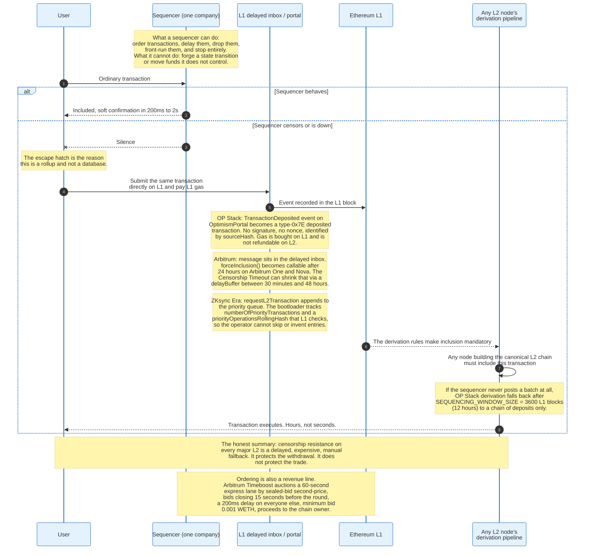

### 11.1 What a Sequencer Can and Cannot Do

The powers divide cleanly, and confusing the two halves produces most of the bad analysis in this area.

A sequencer cannot forge a state transition, cannot spend funds it does not control, and cannot prevent a user from eventually withdrawing. The proof system and the forced-inclusion path handle those.

A sequencer can order transactions in any sequence it likes, insert its own transactions anywhere, delay a transaction indefinitely, refuse a specific address, and stop producing blocks. None of those produces an invalid state root, so none is a fraud proof's concern.

The value of those powers is not theoretical. Ordering rights on a chain with an active DeFi ecosystem are worth a continuous stream of arbitrage and liquidation opportunities, and the sequencer is the only party who sees the flow first.

### 11.2 Forced Inclusion, Chain by Chain

Every serious L2 provides a path to submit transactions through L1, and the parameters differ enough to matter.

**OP Stack.** A user calls `depositTransaction` on the `OptimismPortal`, which emits `TransactionDeposited`. Every node's derivation pipeline converts that event into a deposited transaction of type `0x7E` that it must include. The type carries `sourceHash`, `from`, `to`, `mint`, `value`, `gas`, `isSystemTx` and `data`. It has no signature and no nonce; the `sourceHash` identifies it uniquely. Gas is bought on L1 and is not refunded on L2, and no base fee, priority fee or L1 data fee is charged on L2. If the sequencer stops posting batches entirely, derivation falls back after `SEQUENCING_WINDOW_SIZE`, 3,600 L1 blocks or about 12 hours, to a chain containing deposits only.

**Arbitrum.** Messages submitted on L1 land in the delayed inbox. `forceInclusion` becomes callable after a 24-hour delay on Arbitrum One and Nova. The Censorship Timeout feature shortens that when the sequencer is demonstrably delaying messages, using a `delayBuffer` parameter that moves between 30 minutes and 48 hours. The documentation gives the reason for the buffer plainly: without it, resolving a challenge that requires repeated 24-hour force-inclusion waits could take 50 days.

**ZKsync Era.** `requestL2Transaction` appends to a priority queue. The L2 bootloader tracks `numberOfPriorityTransactions` and `priorityOperationsRollingHash`, and L1 verifies both when the batch is proved. The operator cannot skip an entry, reorder the queue, or fabricate one.

**Starknet.** Forced inclusion arrived alongside the move to a decentralised sequencer set, which the Grinta upgrade of September 2025 introduced together with faster pre-confirmations and a revised fee market.

### 11.3 What Forced Inclusion Is Worth

Forced inclusion protects the exit. It does not protect the trade.

Consider what a censored user actually gets. They pay L1 gas, roughly 50 to 100 times the L2 fee. They wait between minutes and 24 hours. Their transaction then executes at whatever price the market reached in the meantime. For a withdrawal that is acceptable. For a liquidation, an arbitrage, or a position they wanted to close, it is worthless.

The honest statement of the guarantee: you cannot be trapped, and you can be inconvenienced badly enough that a trading business would not survive it.

### 11.4 Ordering as a Revenue Line

Arbitrum monetised sequencing rights explicitly in 2025, which is the clearest available statement of what those rights are worth.

Timeboost, live on Arbitrum One and Nova, runs a sealed-bid second-price auction for an express lane. Rounds last 60 seconds by default. Bidding closes 15 seconds before the round begins so the autonomous auctioneer can verify and resolve. The winner submits through `timeboost_sendExpressLaneTransaction` and is sequenced immediately; everyone else's transactions receive a 200-millisecond artificial delay. Minimum bid is 0.001 WETH, adjustable by the chain owner. A bidder may update or submit up to five bids per round. The second-highest bid is paid to a beneficiary address the chain owner designates.

Two hundred milliseconds is enough to matter. That is the finding.

The design is a deliberate replacement for first-come-first-served, which the documentation describes as producing latency races. Auctioning the advantage captures its value for the chain rather than for whoever colocates closest to the sequencer.

### 11.5 The Decentralisation Options

Four approaches exist, and each trades latency for censorship resistance at a different exchange rate.

**Shared sequencer networks.** Espresso runs HotShot, a HotStuff-family Byzantine fault tolerant consensus with a permissionless proof-of-stake validator set, requiring an adversary to control at least one-third of staked ESP to reorder finalised blocks. Chains keep their own sequencer and stream transactions to Espresso, which applies decentralised finality. The pitch is that no single sequencer, multisig or operator can reorder or censor finalised blocks.

**Based rollups.** The next L1 proposer sequences the rollup block as part of its L1 block, in collaboration with L1 searchers and builders. Justin Drake's 2023 proposal lists the advantages precisely: no sequencer signature verification, no escape hatch timeouts, liveness inherited from Ethereum, zero gas overhead. The cost is latency, since block production is tied to L1 slots, and revenue, since MEV originating from a based rollup flows to L1 rather than to the rollup.

**Rotating or committee-based sequencers.** Starknet's Grinta upgrade moved to a decentralised sequencer set with staking. This is the most conventional answer and the most common destination.

**Multi-sequencer with leader election.** OP Conductor keeps an OP Stack sequencer highly available using a Raft-based design. This solves liveness, not censorship, and is worth distinguishing: a highly available sequencer is still one party.

None of these is deployed as the default on any of the three largest chains. The revealed preference is clear: users pay for 200-millisecond confirmations and do not pay for censorship resistance they have never needed.

---

## 12. Bridging In and Out of a Layer 2

A rollup's bridge is not a bridge in the usual sense. It is the contract that holds every asset on the chain, and it is part of the protocol rather than an application on top of it.

```mermaid
%%{init: {'theme': 'base', 'themeVariables': {'primaryColor': '#e3f2fd', 'primaryBorderColor': '#1565c0', 'lineColor': '#37474f'}}}%%

flowchart TB
    subgraph Canon["Canonical bridge: part of the protocol"]
        direction TB
        subgraph In["Deposit: L1 to L2, minutes"]
            direction TB
            D1["User calls depositTransaction()<br/>on the L1 portal, sending ETH or tokens"]
            D2["Contract locks the asset and emits<br/>TransactionDeposited"]
            D3["Every L2 node's derivation pipeline<br/>turns that event into a type-0x7E<br/>deposited transaction it MUST include"]
            D4["Credited on L2 after the L1 block is<br/>seen, typically 1 to 15 minutes.<br/>The sequencer cannot refuse it."]
        end
        subgraph Out["Withdrawal: L2 to L1, the slow direction"]
            direction TB
            W1["User burns or locks on L2 and the VM<br/>emits an L2-to-L1 message.<br/>ZKsync uses the to_l1 opcode; OP Stack<br/>writes to the L2ToL1MessagePasser."]
            W2["Wait for the message to be included in<br/>a batch posted to L1"]
            W3["Optimistic: prove the withdrawal, then wait<br/>the 7-day proof maturity delay (OP Stack),<br/>the 6.4-day BoLD challenge period (Arbitrum),<br/>or 5 days on Base, 1 day when both<br/>of its proof arms commit"]
            W4["Validity: wait for proveBatches to land,<br/>plus any ValidatorTimelock delay.<br/>Minutes to hours, no challenge window."]
            W5["Finalise on L1. The portal releases<br/>the asset it has been holding all along."]
        end
    end

    subgraph Fast["Third-party fast bridge: a market, not a protocol"]
        direction TB
        F1["User sells the pending withdrawal to a<br/>liquidity provider who already holds L1 funds"]
        F2["LP pays out in minutes, charges<br/>roughly 5 to 30 basis points"]
        F3["LP then does the slow canonical exit itself.<br/>The user bought time; the LP financed it."]
        F4["Trust: the LP's solvency and the bridge<br/>contract, for the length of one transfer"]
    end

    subgraph Ext["External bridge between independent chains"]
        direction TB
        E1["No shared settlement layer, so no proof<br/>is possible. A validator set or a multisig<br/>attests that a deposit happened."]
        E2["Ronin: 624 million USD, Mar 2022,<br/>five of nine validator keys"]
        E3["Poly Network: 611 million USD, Aug 2021<br/>BNB Bridge: 586 million USD, Oct 2022<br/>Wormhole: 326 million USD, Feb 2022<br/>Nomad: 190 million USD, Aug 2022<br/>Multichain 126.3, Harmony 100, Orbit 81.5<br/>Eight incidents, 2,644.8 million USD total"]
        E4["Every one of those was an external bridge.<br/>Not one was a canonical rollup bridge.<br/>The category matters more than the code."]
    end

    Point["Where the risk actually sits:<br/>the L1 portal holds every deposited asset<br/>and is upgradeable by a multisig on every<br/>Stage 0 and Stage 1 chain. The proof system<br/>protects the state transition. It does not<br/>protect against a contract upgrade."]

    Canon --> Point
    Fast --> Point
    Ext --> Point

    style Canon fill:#e8f5e9,stroke:#2e7d32,stroke-width:3px
    style In fill:#e3f2fd,stroke:#1565c0,stroke-width:2px
    style Out fill:#fff3e0,stroke:#e65100,stroke-width:2px
    style Fast fill:#f3e5f5,stroke:#4a148c,stroke-width:2px
    style Ext fill:#ffcdd2,stroke:#b71c1c,stroke-width:2px
    style Point fill:#fce4ec,stroke:#880e4f,stroke-width:3px
```

### 12.1 Deposits Are Fast and Unstoppable

Moving assets from L1 to L2 uses the same mechanism as forced inclusion, which is why it cannot be censored.

The user calls a deposit function on the L1 portal, sending ETH or approving and transferring tokens. The contract locks the asset and emits an event. Every L2 node's derivation pipeline turns that event into a transaction it is required to include, because the L2's canonical chain is defined as a function of L1 data. A sequencer that omitted a deposit would be building a chain that no other node agrees with.

Timing is a function of how many L1 confirmations the L2 waits for, typically one to fifteen minutes. Assets appear on L2 as a mint against the locked L1 balance.

The important structural fact: the assets never leave L1. An ETH balance on Arbitrum is a claim against ETH sitting in Arbitrum's L1 bridge contract. The L2 balance is an accounting entry whose backing is entirely on Ethereum.

### 12.2 Withdrawals Are Slow in Exactly One Direction

Leaving is where the architecture shows, because the L1 contract must be convinced that the L2 state says what the user claims.

The user initiates a withdrawal on L2, which emits an L2-to-L1 message. The OP Stack writes to the `L2ToL1MessagePasser`; ZKsync uses the `to_l1` opcode to emit a native log. That message must then reach L1 inside a batch, and its inclusion must be established.

For an optimistic rollup: prove the withdrawal against a posted output root, then wait the proof maturity delay, 7 days on standard OP Stack configuration, the 6.4-day BoLD challenge period on Arbitrum One, or 5 days on Base, falling to 1 day when both of its proof arms commit. Then finalise.

For a validity rollup: wait for `proveBatches` to verify the proof covering that batch, plus any `ValidatorTimelock` delay before `executeBatches`. Then prove your log's inclusion and finalise. Minutes to hours, with no challenge window, because nothing was assumed.

The asymmetry has one cause. Depositing requires trusting Ethereum, which the L2 already does. Withdrawing requires L1 to trust a statement about L2, and establishing that trust is the entire problem the proof system solves.

### 12.3 Fast Bridges Are a Financing Product

Almost nobody waits seven days, and the reason is that a pending withdrawal is a receivable that can be sold.

A liquidity provider holding funds on L1 buys the user's pending withdrawal at a discount, typically 5 to 30 basis points, and pays out in minutes. The provider then performs the canonical exit itself and collects at maturity. The user's risk is the provider's solvency for the duration of one transfer. The provider's risk is the bridge contract and the opportunity cost of capital for a week.

This is not a workaround. It is the correct market response to a protocol that produces a dated instrument. The seven-day window did not disappear; it became a financing spread, and the spread prices the market's real assessment of rollup risk far better than any framework does.

### 12.4 External Bridges and Why They Are the Ones That Get Robbed

Every one of the largest bridge hacks was an external bridge between independent chains, not a canonical rollup bridge, and the reason is structural.

| Bridge | Loss | Date | Mechanism |
|--------|------|------|-----------|
| **Ronin Network** | 624 m USD | 23 Mar 2022 | Five of nine validator keys compromised |
| **Poly Network** | 611 m USD | 10 Aug 2021 | Cross-chain manager contract abused |
| **BNB Bridge** | 586 m USD | 6 Oct 2022 | Forged Merkle proof accepted by the verifier |
| **Wormhole** | 326 m USD | 2 Feb 2022 | Signature verification bypass, guardian set |
| **Nomad Bridge** | 190 m USD | 1 Aug 2022 | Initialisation flaw made any message valid |
| **Multichain** | 126.3 m USD | 6 Jul 2023 | Operator key control |
| **Harmony Horizon** | 100 m USD | 23 Jun 2022 | Two of five multisig keys compromised |
| **Orbit Bridge** | 81.5 m USD | 31 Dec 2023 | Signer compromise |

The eight incidents total 2,644.8 million dollars, and the pattern is one line long: when two chains share no settlement layer, no proof is possible, so a committee attests instead, and the committee's keys become the security model. Ronin needed five of nine. Harmony needed two of five.

A canonical rollup bridge has a different failure surface. It cannot be defeated by compromising an attesting committee, because there is no attesting committee; the state root is either proved or challengeable. It can be defeated by a bug in the bridge contract, or by whoever can upgrade it.

That last clause is where the residual risk sits, and it is not small: on every Stage 0 and Stage 1 chain, a multisig can replace the contract holding the assets.

### 12.5 The Fragmentation Problem

Rollups solved throughput and created a liquidity problem that did not previously exist.

A dollar of USDC on Arbitrum is not a dollar of USDC on Base. They are different tokens on different chains backed by different bridge contracts, and moving between them means an exit and an entry, or a third-party bridge, or a market maker holding inventory on both sides. Every new chain fragments liquidity further.

Three responses are in flight. Native issuance, where Circle mints USDC directly on each chain and offers burn-and-mint transfer between them, removes the bridge from the stablecoin path entirely. Shared standards such as ERC-7683 give a common format for cross-chain intents so that solvers can compete to fill them. And OP Stack interop lets chains in a dependency set pass messages natively, with `op-supernode` running every chain in a set inside one process and a Superchain ETH bridge moving ETH between them.

The fragmentation is the direct cost of the scaling. One chain with 60 million gas has no fragmentation and no throughput. Fifty chains have plenty of both.

---

## 13. Validiums, Volitions, and Off-Chain Data

A rollup makes two separate promises, validity and availability, and unbundling them produces the entire family of designs below rollups on the security ladder.

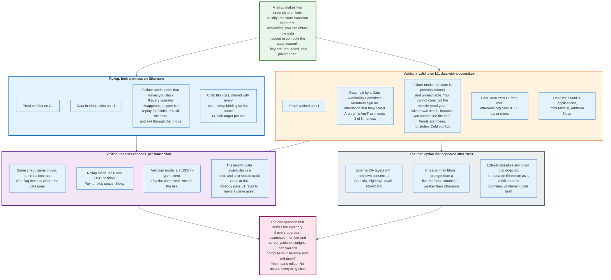

### 13.1 Validium

A validium proves its state transitions on L1 and keeps its data off-chain with a committee. The state is provably correct and possibly unreachable.

The failure mode is specific and worth stating precisely, because it is often described wrongly. A validium operator cannot steal funds: the proof still constrains the state transition. What the operator and committee can do together is withhold the data, and if the data is gone, you cannot construct the Merkle proof your withdrawal needs, because you cannot see the leaf your balance lives in.

Your funds are then correct, provable in principle, and inaccessible. Frozen, not stolen. For most users that distinction is academic.

The trust structure is a Data Availability Committee: named entities that hold the data and sign attestations that they hold it. Arbitrum's AnyTrust, used by Arbitrum Nova, requires 2 of N members to be honest. StarkEx applications run committees of their own.

The payoff is throughput and cost. ethereum.org cites validium capacity of 9,000 transactions per second or more, because the L1 data bill is close to zero.

### 13.2 Optimium

An optimium is the fraud-proof equivalent: challengeable state transitions with off-chain data. It is a strictly weaker construction than either a rollup or a validium.

The reason is that a fraud proof needs the data to construct the proof. A validium's proof was already generated by the operator, so withholding data blocks withdrawals but not correctness. An optimium's challenger cannot even detect fraud without the data, so withholding data blocks the security mechanism itself.

Metis is the working example in this category. Mantle used to be one and is not any more: L2Beat now classifies it as a rollup carrying an SP1 Hypercube validity proof, Stage 0, with 1.46 billion dollars secured in August 2026. The move from off-chain data with a fraud proof to on-chain data with a validity proof is the whole upgrade.

### 13.3 Volition

Volition lets the user choose, per transaction, whether their data goes to L1 or to a committee. Same chain, same prover, same L1 contract, one flag.

StarkWare introduced the term, and the reasoning is a pricing argument. Data availability is a cost, and cost should scale with value at risk. A 50,000-dollar position should pay blob fees. A three-dollar in-game item should not. Nobody buys the same insurance for both.

The implementation is straightforward once the proof system does not care: the proof attests to the transition regardless of where the data went, and the L1 contract records which mode each account or transaction chose so that exit rights are unambiguous.

### 13.4 External DA Layers

A third option appeared after 2023 that sits between a five-member committee and Ethereum: dedicated data availability blockchains with their own consensus and their own token.

Celestia, EigenDA, Avail and NEAR DA all sell the same product: cheaper-than-blob data with a security model stronger than a named committee and weaker than Ethereum. Fees typically run an order of magnitude or more below blob prices.

L2Beat's classification is blunt and correct: any chain that does not put its data on Ethereum is a validium or an optimium, whatever it calls itself and whatever the DA layer's own security properties are. The reason is that a user's exit depends on the L1 bridge contract being able to establish the truth, and the L1 contract cannot verify another chain's consensus without trusting it.

### 13.5 The One Question

The category test takes one sentence, and it is worth memorising because marketing material rarely answers it.

If every operator, committee member, DA provider and server disappears tonight, can you still compute your balance from Ethereum alone and withdraw?

Yes: rollup. No: validium, optimium, sidechain, or something with a new name.

---

## 14. The Major Deployments and How They Actually Differ

The five major deployments differ on four axes: proof system, virtual machine, data strategy, and how far governance has been constrained. On user experience they have converged almost completely.

### 14.1 Side by Side

| | **Arbitrum One** | **OP Mainnet** | **Base** | **zkSync Era** | **Starknet** |
|---|---|---|---|---|---|
| **Operator** | Offchain Labs | OP Labs | Coinbase | Matter Labs | StarkWare |
| **Launched** | Aug 2021 | Dec 2021 | Aug 2023 | Mar 2023 | Nov 2021 |
| **Type** | Optimistic rollup | Optimistic rollup | Optimistic rollup | Validity rollup | Validity rollup |
| **Proof system** | BoLD, WAVM one-step | Cannon, MIPS64 | AggregateVerifier: TEE attestation or SP1 proof | SNARK, Boojum lineage | STARK, SHARP and S-two |
| **VM** | Geth core in WASM, plus Stylus | EVM (Bedrock) | EVM (Bedrock) | EraVM | Cairo VM |
| **Language** | Solidity, Vyper, plus Rust/C/C++ | Solidity, Vyper | Solidity, Vyper | Solidity via zksolc | Cairo |
| **L1 data** | Blobs, calldata fallback | Blobs | Blobs | Blobs, state diffs | Blobs, state diffs, calldata fallback |
| **Exit delay** | 6.4 days | 7 days | 5 days, or 1 day when both proof arms commit | Proving plus timelock | Proving latency |
| **Forced inclusion** | 24 h, buffer 30 min to 48 h | 12 h sequencing window | 12 h sequencing window | Priority queue, hash-checked | In protocol since Grinta |
| **TVS, Aug 2026** | 11.69 bn USD | 1.60 bn USD | 12.61 bn USD | 0.23 bn USD | 0.38 bn USD |
| **Stage** | 1 | 1 | 1 | 0 | 1 |
| **Send ETH fee** | 0.09 USD | 0.09 USD | not listed | 0.07 USD | 0.19 USD |
| **Swap fee** | 0.27 USD | 0.18 USD | not listed | not listed | 0.57 USD |

Fee figures are from l2fees.info as measured in August 2026, against 1.10 USD to send and 5.48 USD to swap on Ethereum L1. Base does not appear on l2fees.info, so two cells read "not listed" rather than carrying an inferred number.

Two stage entries need their reasons stated. Starknet holds Stage 1 on L2Beat: users can exit without help from the permissioned operators, and what remains for Stage 2 is an exit window of at least 30 days ahead of an upgrade and a Security Council confined to bugs provable on chain. zkSync Era holds Stage 0 for a harder reason: its permissioned operator can censor a withdrawal.

### 14.2 Arbitrum One: The Pragmatic One

Arbitrum's distinguishing decision was to keep Geth and prove WebAssembly, which removed an entire class of divergence bugs.

Nitro, shipped in August 2022, is three layers. Geth handles EVM execution unmodified. ArbOS sits above it, handling cross-chain messaging, fee accounting and gas pricing. An RPC layer sits on top. The same Go code that runs the chain compiles to WAVM for the fraud proof, so the thing being proved and the thing being executed are one codebase rather than two implementations that must agree.

Stylus extends this. Contracts written in Rust, C or C++ compile to WASM and run in a co-located VM alongside the EVM, with full interoperability for calls in either direction. Offchain Labs publishes no speed multiplier. Its documentation states that WASM executes faster than the EVM interpreter and that Stylus programs are more efficient for memory-intensive work, and prices them in a separate unit, ink, which it describes as thousands of times smaller than gas because a single EVM operation takes as long as thousands of WASM operations. A Stylus program may address 8 MB of memory and a Stylus contract may reach 96 KB, four times the EVM contract limit. Storage costs the same as in the EVM, so the advantage sits entirely in compute.

BoLD, live since February 2025, made challenges permissionless and delay-bounded. Timeboost, live in 2025, auctions ordering. AnyTrust, used by Arbitrum Nova, offers the same stack with a data availability committee instead of blobs.

Arbitrum is the chain that took the fewest novel risks and shipped the most working machinery.

### 14.3 OP Mainnet and the Superchain: The Standardised One

Optimism's product is not a chain. It is a specification that many chains run, and the chain named OP Mainnet is one instance.

Bedrock, shipped June 2023, rewrote the stack around a minimal-diff approach to Ethereum: an execution client that is a lightly modified Geth, a derivation pipeline that defines the L2 chain as a pure function of L1 data, and a fault proof system that was added afterwards rather than designed in.

Permissionless fault proofs activated on OP Mainnet in June 2024. The system is modular by design: `FaultDisputeGame` is the game, Cannon is one VM implementation, and the specification anticipates others. That modularity is why Base can run the same stack with SP1 as its proof system.

Standard chains must meet published criteria: a governance-approved OP Stack release, governance-approved block time and gas metering, and administrative roles aligned with Security Council requirements. Modifying system contracts, running alt-DA mode, or enabling unratified beta features forfeits standard status. Superchain standard chains remit a governance-set share of sequencer revenue to the Optimism Collective, which since 4 March 2026 no longer includes Base.

Configuration constants are published rather than discovered: `SEQUENCING_WINDOW_SIZE` 3,600 L1 blocks, batch submission at least every 1,800, L2 block time 1 or 2 seconds, gas limit at most 200 million per L2 block, `MAX_GAME_DEPTH` 73, `SPLIT_DEPTH` 30, `MAX_GAME_CLOCK_DURATION` 3.5 days, `CLOCK_EXTENSION` 3 hours, proof maturity delay 7 days.

### 14.4 Base: The Distribution One

Base's technical differentiator is small and its reach is not: it secures 12.61 billion dollars, more than any other rollup.

It runs the OP Stack. Its distinctive choices are governance and proving. Governance: permissionless fault proofs on 30 October 2024, a Security Council in April 2025, Stage 1 on 29 April 2025, with a 2-of-2 requiring a 3-of-6 Coinbase multisig and an 8-of-11 council of independent entities across multiple jurisdictions, staggered so Cohort 1 expires October 2026 and Cohort 2 January 2027. There is no timelock on an upgrade and no exit window; when both Safes sign, the change lands.

Base left the Superchain on 4 March 2026, decoupling from Optimism Collective governance and taking its own upgrade path through a nested 2-of-2 Base Governance Multisig. It still runs the OP Stack and still posts to Ethereum blobs. What it no longer does is accept governance-approved releases or remit a revenue share.

Proving is where Base diverges furthest from the stack it runs. It plays no bisection game and has no execution step. Since the Azul upgrade of 26 May 2026 it runs an AggregateVerifier multiproof, game type 621: a proposer calls `DisputeGameFactory.create` with a 0.05 ETH bond and an initial proof covering 600 L2 blocks split into 30-block sub-ranges, supplied either as an AWS Nitro TEE attestation or as an SP1 zero-knowledge proof. With one arm proving, the game resolves after `SLOW_FINALIZATION_DELAY`, 5 days. With both arms committed, the window collapses to `FAST_FINALIZATION_DELAY`, 1 day. A challenger who produces a valid ZK proof of a wrong intermediate root calls `AggregateVerifier.challenge`, has it verified on chain through the SP1 verifier gateway, and takes the proposer's bond. `AggregateVerifier.nullify` permanently disables an arm's verifier when that arm contradicts itself.

The result in August 2026 is 80.49 user operations per second, the highest of any general-purpose rollup L2Beat tracks. Coinbase brought users. The OP Stack brought the chain.

### 14.5 zkSync Era: The Validity One With Its Own VM

zkSync's bet was that a purpose-built VM proves faster than the EVM, and that Solidity compatibility at the source level is enough.

EraVM is not the EVM. Solidity compiles to EraVM bytecode through `zksolc`, so most contracts port with modest effort while some low-level assumptions break. The chain posts compressed state diffs rather than transactions, which is cheaper on data than an optimistic rollup can be.

The L1 interface is the three-phase `commitBatches`, `proveBatches`, `executeBatches`, with a `ValidatorTimelock` timestamping the first call and holding back the third until a configurable delay has run from it, as a hedge against a compromised validator key.

The 2025 to 2026 direction is the Atlas upgrade and the Airbender prover. Delphi Digital's summary, cited by ZKsync, describes Atlas as delivering one-second finality with 15,000-plus TPS sequencing and full EVM equivalence. ZKsync's own materials cite proving costs under 0.0001 dollars per transaction with Airbender, roughly one-second network hops between chains in its Elastic Network, and minutes-to-Ethereum finality.

Those are vendor figures for a recent upgrade. Treat them as claims until L2Beat and independent measurement catch up.

### 14.6 Starknet: The Purist One

Starknet made the choice nobody else made, a non-EVM language designed for provability, and it bought both the largest technical lead and the smallest developer pool.

Cairo is a language and VM built to be arithmetised. Contracts are written in Cairo, not Solidity, which is the main reason Starknet's application ecosystem is smaller than its technology would suggest. In exchange, proving is fast, and StarkWare's SHARP aggregates proofs across Starknet and StarkEx customers so that one L1 verification amortises across many chains and applications.

The 2025 to 2026 sequence is dense. Grinta, September 2025, brought decentralised sequencers, faster pre-confirmations and fee market changes. S-two, the open-source prover using Circle STARKs over Mersenne31, went live in November 2025. Version 0.14.2, April 2026, added native in-protocol proof verification, which enabled STRK20 encrypted balances and private Bitcoin DeFi. strkBTC launched May 2026 with shielded balances and private transfers. Private USDC followed in June 2026. In August 2026 StarkWare described quantum resistance achieved through STARK proofs and smart accounts without a network-wide fork.

Starknet is the only major chain where the proof system is being used for something other than scaling. Privacy, not throughput, is where it is now differentiating.

### 14.7 Where They Have Converged

The differences above are real and mostly invisible to users.

All five confirm in under two seconds. On the four that l2fees.info lists, a simple send costs between 7 and 19 US cents. All five are sequenced by one company. All five have a multisig that can upgrade the bridge. All five post data to Ethereum blobs.

The technical arguments of 2021, optimistic against ZK, EVM-equivalent against purpose-built, resolved into a market where the deciding variables are distribution, incentives and liquidity. Base did not win on cryptography.

---

## 15. A Worked End-to-End Example

The following traces one transaction and one withdrawal on OP Mainnet with concrete values, because the timings only make sense when the constants are filled in.

### 15.1 The Setup

A user holds 2 ETH on OP Mainnet and sends 0.05 ETH to another address, then withdraws 1 ETH to Ethereum. The transaction is a standard type-2 transfer with a 21,000 gas limit.

### 15.2 The L2 Transaction

| Step | Time | What happens | Concrete values |
|------|------|--------------|-----------------|
| 1 | t = 0.00 s | User signs and submits to the sequencer RPC | Type-2 tx, 21,000 gas limit, nonce n |
| 2 | t ≈ 0.05 s | Sequencer accepts and returns a soft confirmation | A promise from OP Labs, not an L1 guarantee |
| 3 | t ≈ 2 s | Transaction lands in an L2 block | L2 block time 1 or 2 s; block gas cap 200,000,000 |
| 4 | t ≈ 2 s | Wallet shows the balance change | User-visible latency ends here |

The fee the user pays has two independent components. The L2 execution fee is 21,000 gas times the L2 base fee, which pays for the sequencer's CPU and is effectively free to produce. The L1 data fee is intrinsic and not adjustable, computed by the `GasPriceOracle` using the Fjord formula:

```
l1FeeScaled        = l1BaseFeeScalar * l1BaseFee * 16
                     + l1BlobFeeScalar * l1BlobBaseFee
estimatedSizeScaled = max(minTransactionSize * 1e6,
                          intercept + fastlzCoef * fastlzSize)
l1Fee              = estimatedSizeScaled * l1FeeScaled / 1e12
```

with `intercept` = -42,585,600, `fastlzCoef` = 836,500, and `minTransactionSize` = 100 bytes, both regression constants scaled by 1e6.

Running it for this transaction. A signed type-2 ETH transfer is about 110 bytes RLP-encoded, and FastLZ compresses a single small transaction poorly, so take `fastlzSize` = 100.

```
intercept + fastlzCoef * fastlzSize
  = -42,585,600 + 836,500 * 100
  = -42,585,600 + 83,650,000
  = 41,064,400

minTransactionSize * 1e6 = 100 * 1e6 = 100,000,000

estimatedSizeScaled = max(100,000,000, 41,064,400) = 100,000,000
```

The floor binds, which is the formula's design intent: no transaction is billed as smaller than 100 bytes of L1 data.

The measured end price on Optimism in August 2026, per l2fees.info, is 0.09 US dollars to send ETH, against 1.10 dollars on Ethereum L1. A 12-fold reduction on a transfer, and about 30-fold on a swap, where L1 costs 5.48 dollars and Optimism 0.18.

### 15.3 The Journey to L1

| Step | Time | What happens | Concrete values |
|------|------|--------------|-----------------|
| 5 | t + minutes | Batcher collects blocks, RLP-encodes, compresses, cuts into frames | Frame overhead 23 bytes; channel cap 100,000,000 bytes decompressed |
| 6 | t + minutes | Batcher posts a type-0x03 blob transaction to L1 | Up to 6 blobs per transaction, 131,072 bytes each |
| 7 | deadline | Batch must land within the sequencing window | 3,600 L1 blocks, about 12 hours; policy requires at most 1,800 |
| 8 | after inclusion | Any node can now re-derive the exact L2 state from L1 alone | This is the moment it becomes a rollup rather than a promise |
| 9 | t + minutes | Proposer posts an output root, creating a `FaultDisputeGame` | Bonded; permissionless since June 2024 |

The blob economics of step 6 are worth working through, because they are where the cost reduction lives.

One blob holds 131,072 bytes. Vitalik's rollup guide estimates a compressed rollup ETH transfer at about 12 bytes, so one blob carries roughly 10,922 such transfers. The blob base fee cannot sit at its 1 wei constant any more: EIP-7918 pins it at or above one sixteenth of the L1 execution base fee. At a 1 gwei execution base fee the reserve is 62.5 Mwei per blob gas, so one blob costs 131,072 x 62,500,000 = 8.192e12 wei, which is 0.000008192 ETH, about 2.1 US cents at an ETH price near 2,515 dollars in August 2026. Divided across 10,922 transfers, that is 0.0000019 dollars of L1 data cost per transaction.

At a blob base fee of 1 gwei per blob gas, sixteen times the reserve at that L1 base fee, the same blob costs 131,072 gwei, about 0.000131 ETH, roughly 0.33 dollars, or 0.00003 dollars per transfer. Even at that price L1 data is 0.03 percent of a 9-cent fee.

That gap between what the user pays and what the L1 data costs is the sequencer's margin, and it is why the blob fee market rather than the fee schedule determines whether a rollup is profitable in any given hour.

### 15.4 The Withdrawal

| Step | Time | What happens | Concrete values |
|------|------|--------------|-----------------|
| 10 | day 0 | User initiates a 1 ETH withdrawal on L2, writing to the `L2ToL1MessagePasser` | Emits the withdrawal message |
| 11 | day 0, minutes | Message included in a batch posted to L1 | Same pipeline as steps 5 to 7 |
| 12 | day 0 to 1 | Output root covering the message is proposed | Dispute game created |
| 13 | day 0 to 3.5 | Challenge clock runs | `MAX_GAME_CLOCK_DURATION` 3.5 days per team; `CLOCK_EXTENSION` 3 hours |
| 14 | after resolution | Air gap for Guardian intervention | 3.5 days |
| 15 | day 7 | User calls `proveWithdrawalTransaction` then `finalizeWithdrawalTransaction` | Proof maturity delay 7 days total |
| 16 | day 7 | Portal releases 1 ETH on L1 | The ETH never left L1; the lock is released |

If a challenge occurs at step 13, the bisection game runs. Both sides make `ATTACK` or `DEFEND` moves down a tree of depth 73. Above depth 30 the claims are output roots; below it they are positions in an execution trace of up to 2^43 MIPS64 instructions. At the leaf, `MIPS64.sol` executes one instruction against a memory Merkle root of depth 59, with up to two proofs supplied as calldata and any external data served through `PreimageOracle.sol`. The loser's bond pays the winner.

### 15.5 The Alternative Nobody Mentions

Almost no user follows steps 10 through 16. They sell the withdrawal instead.

A liquidity bridge quotes roughly 5 to 30 basis points to pay 1 ETH on L1 within a few minutes. On a 1 ETH withdrawal at 2,515 dollars, that is 1.25 to 7.50 dollars. The provider then runs the canonical exit itself and collects on day seven.

The user paid a week of financing plus a risk premium. The protocol delay did not go away; it acquired a price. And that price is the market's actual opinion of rollup risk, which is more informative than any framework.

---

## 16. Economics: What It Costs to Run and Who Pays

A rollup is a margin business: buy blob space wholesale, sell blockspace retail, keep the spread. Its input price is set by an auction it does not control.

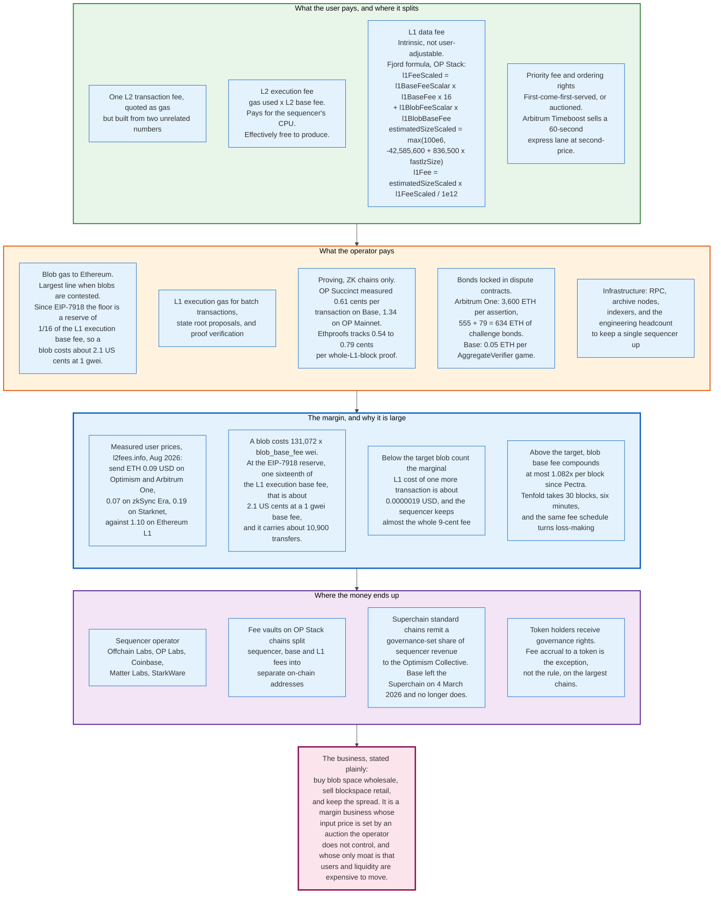

### 16.1 Revenue

Three lines, of which one is usually dominant.

**L2 execution fees.** Gas used times the L2 base fee. Marginal cost of production is close to zero, since it is one server executing EVM bytecode. Almost pure margin.

**The L1 data fee markup.** The chain charges users a data fee computed from the Fjord formula and pays Ethereum whatever blobs actually cost. The scalars `l1BaseFeeScalar` and `l1BlobFeeScalar` are chain-configurable, which means the markup is a policy parameter. Setting them conservatively produces margin when blobs are cheap and losses when they are not.

**Ordering rights.** Priority fees under first-come-first-served, or auction proceeds where ordering is sold. Arbitrum's Timeboost pays the second-highest bid to a beneficiary the chain owner designates, every 60 seconds.

OP Stack chains split these into separate fee vaults on-chain: a sequencer fee vault, a base fee vault and an L1 fee vault, each a distinct address, which makes the accounting publicly auditable.

### 16.2 Costs

Five lines, of which two are structural and three are optional.

**Blob gas.** The largest variable cost. Scales with data volume and with a price the operator cannot influence, since every rollup bids into the same 14-blob target per slot.

**L1 execution gas.** Batch transactions, output root proposals, and proof verification. Vitalik's 2021 figures set the shape: roughly 40,000 gas for an optimistic batch submission against roughly 500,000 gas for a ZK proof verification. The ZK chain pays more per settlement and settles less often.

**Proving.** ZK chains only. Measured at 0.61 US cents per transaction on Base and 1.34 on OP Mainnet by OP Succinct, and claimed below 0.01 cents by ZKsync's Airbender. Ethproofs puts a full L1 block proof at 0.54 to 0.79 cents across its tracked provers.

**Bonds.** Capital locked in dispute contracts. Arbitrum One requires 3,600 ETH per assertion, plus 555 ETH at the big-step level and 79 ETH at the small-step level to resolve a challenge, 634 ETH of challenge bonds. At 2,515 dollars per ETH the assertion bond alone is 9.05 million dollars, held as working capital. Base's AggregateVerifier game asks 0.05 ETH, because a single-round proof needs no bond ladder.

**Infrastructure and headcount.** RPC endpoints, archive nodes, indexers, and the engineering to keep a single sequencer available. Not disclosed by any operator, and plausibly the largest fixed cost.

### 16.3 The Margin, and Its Cliff

The margin is close to the whole fee when blobs sit at the reserve price, and it can invert within minutes when they do not.

The user-facing prices measured in August 2026: 0.09 dollars to send ETH on Optimism and Arbitrum One, 0.07 on zkSync Era, 0.19 on Starknet, 0.04 on Metis. Ethereum L1 charges 1.10.

Against that, one blob at the EIP-7918 reserve costs about 2.1 US cents at a 1 gwei L1 base fee and carries roughly 10,900 compressed transfers. That is 0.0000019 dollars of L1 data per transaction against a 9-cent price, so blob gas takes 0.002 percent of what the user pays. At the reserve the larger L1 line is execution gas on the batch transaction itself, not the blob it carries.

The cliff arrives when aggregate rollup demand exceeds the blob target of 14 per slot. The blob base fee then compounds by at most 1.082 times per block, the ratio fixed since Pectra. Thirty blocks of sustained excess demand multiply it by ten, which is six minutes. A fee schedule calibrated at the reserve becomes loss-making before an operator can react.

Two mitigations are in production. Arbitrum's batch poster switches between blobs and calldata by price. Starknet's sequencer defaults to blobs and falls back to calldata when blob prices, in its documentation's words, "significantly exceed" calldata prices, documented since version 0.13.1.

### 16.4 Who Actually Pays

The user pays a fee that is mostly margin. Ethereum receives a small fraction. The operator keeps the rest.

This produces the structural tension of the rollup economy. Every rollup benefits from Ethereum's security and pays for it in proportion to data posted, not in proportion to value secured. Base secured 12.61 billion dollars in August 2026 while its L1 bill, blob gas plus execution gas on the batch transactions themselves, ran in the low thousands of dollars a day. L2Beat publishes the per-chain figure on its costs page, and it is the number to cite rather than one inferred from blob prices. The security is close to free, which suits rollups and leaves an open question about Ethereum's long-run fee revenue.

Optimism's answer is a governance-set revenue share: Superchain standard chains remit a portion of sequencer revenue to the Optimism Collective. Since 4 March 2026 that set no longer includes Base, which removes the largest rollup from the only revenue-sharing arrangement in production. Ethereum itself has no equivalent mechanism, and the debate about whether it needs one has run since blobs launched.

### 16.5 What Token Holders Get

Mostly governance rights, and occasionally nothing else.

ARB, OP and STRK are governance tokens. None of the three largest general-purpose rollups routes sequencer revenue to token holders as a matter of protocol. Value accrual arguments rest on future fee switches, on treasury growth, and on the token's role in staking as sequencing decentralises. Starknet's staking programme, expanded through 2025, is the clearest case where a token acquires a protocol function beyond voting.

The operating businesses, meanwhile, are companies with equity, and the sequencer revenue accrues there.

---

## 17. Security and Risk

The risk in a Layer 2 is not where the marketing puts it. Proof systems work. Governance keys, bridge contracts and single sequencers are where the money has actually gone.

### 17.1 The Threat Model, Ranked by Loss

| Threat | Who exploits it | Realised losses | Mitigation in production |
|--------|-----------------|-----------------|--------------------------|
| **External bridge compromise** | Attacker with committee or multisig keys | 2,644.8 m USD across eight incidents, 2021-2023 | Not applicable to canonical rollup bridges |
| **Upgrade key compromise** | Attacker or insider with multisig control | None realised on a major rollup | Security Councils, timelocks, exit windows |
| **Bridge contract bug** | Anyone who finds it | None realised on a major rollup | Audits, bug bounties, staged rollout |
| **Sequencer failure** | Nobody, it just happens | Repeated multi-hour outages | Forced inclusion; OP Conductor for availability |
| **Sequencer censorship or extraction** | The operator | Continuous, unmeasured | Forced inclusion; auctioned ordering |
| **Data withholding** | Validium committee | None disclosed at scale | Rollup mode; larger committees |
| **Invalid state root finalised** | Proposer with no honest challenger | None realised | Fraud proofs, validity proofs |
| **Proof system soundness bug** | Anyone who finds it | None realised at scale | Multiple provers, verifier redundancy |

The ranking inverts the usual discussion. The category with 2.64 billion dollars of realised losses is the one that has nothing to do with rollups, and the category everyone argues about, invalid state roots, has never produced a loss on a major chain.

### 17.2 The Bridge Is the Honeypot

Every asset on a rollup is a claim against a contract on Ethereum, and that contract is the single largest concentration of value in the design.

Base secured 12.61 billion dollars in August 2026. Arbitrum One secured 11.69 billion. Those figures are the balances of L1 contracts. The proof system constrains what the L2 state may be. It does not constrain what happens if the contract holding the assets is replaced.

On every Stage 0 and Stage 1 chain, a multisig can replace it. That is not a criticism of any particular chain; it is the definition of Stage 1. It is the reason Stage 2 exists as a category and the reason no large chain has reached it.

The correct mental model for a Stage 1 rollup: the operator cannot lie about the state, and the governance set can rewrite the contract that holds the money. Those are different parties on well-run chains, which is what the Security Council structure is for.

### 17.3 Sequencer Outages

Sequencer downtime is the most frequently realised failure and the least severe.

The pattern is consistent across chains: a bug or an infrastructure failure stops block production for minutes to hours, no funds are at risk, forced inclusion remains available in principle, and almost nobody uses it because it takes hours anyway. Trading stops. Liquidations do not happen, which can be either a mercy or a solvency event depending on which side of a position you hold.

OP Conductor exists specifically for this, keeping an OP Stack sequencer available across multiple instances using a Raft-based leader election. It is worth being precise about what that solves: it makes one operator's sequencer more reliable. It does not make the sequencer less of a single party.

### 17.4 The Honest-Challenger Assumption

An optimistic rollup is secure if one honest party watches, is funded, and can reach L1 inside 3.5 days. Each clause can fail independently.

Watching requires re-deriving the chain from blobs continuously, which requires an archive node and a working derivation implementation. Funding requires thousands of ETH for bonds on Arbitrum One. Reaching L1 requires not being censored, which is what the window length is calibrated against.

BoLD's contribution, live since February 2025, was removing a specific attack on the third clause. The previous protocol allowed sequential one-versus-one challenges, so an adversary could buy roughly a week of delay per bond sacrificed and repeat. BoLD runs all challenges in parallel against a bounded clock, and prices the bonds so that an attacker spends 6.46 dollars for every dollar of honest defence, which makes the attack lose money.

The residual risk is that nobody is watching. It is unobservable until it matters.

### 17.5 Proof System Soundness

A soundness bug in a validity rollup's circuit would let an operator prove a false statement, and it would be silent.

This is the one risk category where validity rollups are strictly worse than optimistic ones. A fraud proof failure requires an active adversary and an absent challenger. A soundness failure requires only a bug, and the failure produces a proof that the verifier accepts. There is no window in which anyone notices.

The mitigations in production are defence in depth rather than proof. Multiple independent prover implementations, so a bug in one does not compromise the chain. Formal verification of verifier contracts. Ethproofs' security sprint, which exists partly to build confidence across multiple proving stacks. And the `ValidatorTimelock` on ZKsync, which holds execution back until a configurable delay has run from the commit, specifically so humans can intervene, an admission that the cryptography is not yet trusted alone.

### 17.6 Data Withholding

A validium committee that stops serving data freezes funds without stealing them, and no large-scale incident has been disclosed.

The reason is probably that validium deployments have concentrated in applications where the operator has more to lose from freezing user funds than to gain: exchanges, games and issuers whose business depends on withdrawals working. That is an alignment argument, not a security argument, and it does not generalise.

Arbitrum's AnyTrust needs 2 of N committee members honest, which is a mild assumption and still an assumption.

### 17.7 The Risks Specific to Channels

Lightning's failure modes are entirely different from a rollup's, and worth listing separately.

**Going offline.** A node that is offline longer than `to_self_delay` cannot punish a breach. Watchtowers mitigate this and are altruistic, unpaid and unaccountable in the shipped implementations.

**Force closes at high fee rates.** A unilateral close broadcasts a pre-signed commitment transaction whose fee was negotiated earlier. If on-chain fees have risen since, the transaction may not confirm before an HTLC expires. Anchor outputs, 330 satoshis each, exist to allow child-pays-for-parent fee bumping and to resist pinning attacks.

**Channel jamming.** An attacker routes payments that never settle, holding HTLC slots and liquidity across many channels for the duration of the timelocks, at zero cost since failed payments pay no fees. A channel accepts at most 483 concurrent HTLCs, and 114 under `zero_fee_commitments`, so the slots are cheap to exhaust. No deployed mitigation fully solves this.

**Stuck payments.** An HTLC in flight when a peer goes unresponsive locks funds until the timelock expires, which over the three-hop route in 5.5, 98 blocks at the sender, is about 16 hours.

**Liquidity failure, not fund loss.** The dominant Lightning failure is a payment that will not route, not a payment that is stolen. That is a materially better failure mode than most systems in this document.

---

## 18. Regulation and Compliance

Layer 2s occupy a regulatory position nobody designed for them: infrastructure that never takes custody, operated by identifiable companies, in jurisdictions whose rules are written around custody.

### 18.1 The Custody Question

A sequencer does not hold user funds, and that fact carries most of the regulatory weight.

Assets on a rollup sit in an L1 bridge contract that the sequencer cannot unilaterally spend. The sequencer orders transactions and posts data. On the standard tests that most financial regulation applies, whether an entity controls client assets, the sequencer fails to qualify as a custodian.

Two parties in the stack look different. Whoever can upgrade the bridge contract does have effective control over the assets, which is a live argument about Security Councils. And a third-party fast bridge does take custody, briefly, in the ordinary sense, which is why fast-bridge operators face clearer licensing questions than sequencer operators.

### 18.2 The European Union

MiCA, Regulation (EU) 2023/1114, applied in full from 30 December 2024 and regulates crypto-asset service providers rather than protocols.

The relevant categories are custody, exchange, transfer services and operation of a trading platform. A rollup sequencer performs none of them on a straightforward reading. A bridge operator holding funds during a transfer performs at least one. A wallet provider that holds keys performs custody.

MiCA's practical effect on L2s has therefore been indirect: the applications running on them face authorisation requirements, and the exchanges and issuers that supply liquidity face reserve and disclosure rules. Circle's decision to issue USDC natively on multiple chains, rather than relying on bridged representations, sits partly in this frame, because a bridged token's issuer relationship is harder to characterise under a reserve-backing regime.

### 18.3 Sanctions and the Sequencer

The sharpest open question is whether a sequencer must screen transactions, and the answer differs by jurisdiction and remains untested.

The United States designated the Tornado Cash smart contract addresses in August 2022, which forced every intermediary in the stack to decide whether it was an intermediary. The designation was subsequently removed in March 2025 following litigation, but the question it raised did not go away: a sequencer is a US or EU company that chooses transaction ordering, and a regulator can ask it to exclude an address.

Compliance at the sequencer produces a specific outcome rather than a general one. A censored user is not blocked; they are routed to forced inclusion, where they pay L1 gas and wait hours. Whether that satisfies a sanctions obligation, and whether the protocol-level guarantee of eventual inclusion is itself a compliance problem, has no settled answer.

The design response is to push sequencing to a set no single jurisdiction controls, which is one of the arguments for based rollups and shared sequencers that has nothing to do with performance.

### 18.4 Travel Rule and Attribution

FATF Recommendation 16, the travel rule, requires originator and beneficiary information to accompany transfers above a threshold between obliged entities. It binds virtual asset service providers, not chains.

Its interaction with L2s is a data problem rather than a legal one. Chain analytics for rollups requires re-deriving state from blob data, and blobs are pruned after roughly 18 days. Compliance vendors therefore maintain their own archives. This is a working arrangement rather than a designed one, and it means that transaction attribution on rollups depends on private infrastructure in a way that L1 attribution does not.

### 18.5 What Is Not Regulated

No jurisdiction has a Layer 2 specific regime as of August 2026.

There is no licence for operating a sequencer, no capital requirement for a bridge contract, no mandated disclosure of Security Council membership, and no standard for what "Stage 1" must mean in a prospectus. The classification frameworks in general use, principally L2Beat's, are maintained by a non-profit research organisation and adopted voluntarily.

That gap is closing slowly through general market structure legislation rather than through anything L2-specific. The most likely first binding requirements are disclosure obligations: who can upgrade the contract, on what notice, and with what exit window for users.

---

## 19. Comparisons and Alternatives

The comparison that matters is not optimistic against ZK. It is what you give up to get throughput, and there are only three answers.

### 19.1 The Full Comparison

| | **Payment channel** | **State channel** | **Optimistic rollup** | **Validity rollup** | **Validium** | **Sidechain** |
|---|---|---|---|---|---|---|
| **Security source** | L1 scripts plus penalty | L1 adjudicator | L1 data plus fraud proof | L1 data plus validity proof | L1 proof only | Own validators |
| **Data on L1** | Open and close only | Open and close only | All, in blobs | All, in blobs | None | None |
| **Exit without operator** | Yes, unilateral | Yes, unilateral | Yes | Yes | Only if data is available | No |
| **Exit delay** | `to_self_delay` blocks | Challenge window | 1 to 7 days | Proving latency | Proving latency | Bridge dependent |
| **Participants** | Fixed at funding | Fixed at funding | Open | Open | Open | Open |
| **Capital lockup** | Per counterparty | Per counterparty | None beyond deposit | None beyond deposit | None beyond deposit | None beyond deposit |
| **Liveness required** | Yes, or a watchtower | Yes, or a watchtower | No | No | No | No |
| **Throughput** | Unbounded per pair | Unbounded per group | Blob-bounded | Blob-bounded, state diffs | ~9,000 tps cited | Own limit |
| **Cost per transaction** | Fractions of a cent | Fractions of a cent | 9 US cents to send | 7 to 19 US cents | Near zero | Near zero |
| **Composability** | None | None | Full within the chain | Full within the chain | Full within the chain | Full within the chain |
| **Privacy** | Strong by default | Strong by default | None | None by default | None by default | None |

### 19.2 When to Choose Which

The decision follows from the shape of the workload, not from a security preference.

**Repeated payments between two known parties.** A channel. Nothing else is close on cost, latency or privacy, and the participant-set constraint is not a constraint when there are two of you.

**General applications with open participation.** A rollup. This covers essentially all of DeFi, and the participant-set constraint eliminates every channel design.

**Applications where withdrawals must be fast.** A validity rollup. Seven days of exit latency is a working capital cost that some businesses cannot absorb.

**Applications where value per transaction is tiny.** A validium or a volition in validium mode. Paying blob fees to move a game item is a category error.

**Applications where the security matters more than the cost.** A rollup, in rollup mode, on Ethereum, with as much of the governance constrained as the chain offers. The answer to "which chain" is currently "the one with the highest L2Beat stage that has your liquidity", and no chain has both.

### 19.3 Layer 2 Against Higher-Throughput Layer 1s

The alternative that competes hardest is not another L2. It is a Layer 1 that raised its own limits.

Solana, Sui, Aptos and similar chains take the position that the replication rule can be kept while raising hardware requirements, and that a validator running on a datacentre machine is an acceptable price for tens of thousands of transactions per second with sub-second finality. That is a coherent position and its costs are visible: higher node costs, fewer independent verifiers, and outage history.

The comparison to make honestly is this. An L2 gives you Ethereum's verifier set and Ethereum's exit guarantee, with a single sequencer in front of it. A high-throughput L1 gives you a smaller verifier set and no exit guarantee, with a decentralised block producer set. Both centralise something. They centralise different things.

The measured throughput numbers do not settle it. L2Beat put the aggregate rollup scaling factor at 68.61 times Ethereum in August 2026, with Lighter alone at 549.78 user operations per second against Ethereum's 23.95.

### 19.4 Layer 2 Against Layer 3

Layer 3, a chain that settles to a Layer 2 rather than to Ethereum, is a real construction with a narrow use case.

The argument for it: proof recursion means an L3's proof can be verified by the L2 and aggregated into the L2's own proof, so the marginal L1 cost of an L3 approaches zero. The argument against: an L3 inherits the L2's trust assumptions on top of Ethereum's, including that L2's sequencer, governance set and exit delay.

In practice L3s have found their niche as application-specific chains for games and high-frequency products, usually in validium mode, where the security relaxation is deliberate. Arbitrum Orbit and the ZK Stack both support the pattern.

---

## 20. Modern Developments

The 2024 to 2026 period moved Layer 2 work from "does the proof system exist" to "who controls the sequencer and how cheap can data get."

### 20.1 Data Got Cheap, Then Cheaper

The blob target rose from 3 to 14 and the maximum from 6 to 21 in under two years, and the mechanism for raising them further is now routine.

Cancun gave a target of 3 blobs and a maximum of 6. Pectra raised them to 6 and 9 on 7 May 2025. Fusaka's PeerDAS on 3 December 2025 removed the bandwidth objection, and two BPO forks followed within five weeks, taking the target to 10 on 9 December 2025 and to 14 on 7 January 2026, with maximums of 15 and 21. That is 4.7 times on target and 3.5 times on maximum since launch, and 2.3 times on both across the five-week Fusaka window.

Fusaka also put a floor under the price. EIP-7918 stops the blob base fee falling below one sixteenth of the L1 execution base fee, which ends the regime in which rollup data cost effectively nothing whenever demand sat below target.

EIP-7892's contribution is procedural and larger than it sounds: a blob capacity increase is now a configuration change with a timestamp, not a hard fork requiring client releases. The bottleneck moved from coordination to research on what the network can safely absorb.

### 20.2 Proofs Got Fast

Real-time proving went from a research goal to a measured programme with a public leaderboard.

Ethproofs tracks proofs of full Ethereum L1 blocks. By August 2026 it had recorded 117,385 proofs, 106,688 of them eligible, at a cost of 0.54 to 0.79 US cents each, with 35.4 percent completing in under 10 seconds against a target of 70 percent. The provers competing include Axiom on OpenVM, ZisK, Pico, Zilkworm's Airbender and Succinct's Twin Peaks, running on between 2 and 16 consumer RTX 5090 cards.

The significance is what it enables. Proving an L1 block in real time is the precondition for an L1 zkEVM, in which Ethereum validators verify a proof rather than re-executing, which would let the gas limit rise substantially without raising verification cost. It is also the precondition for validity rollups with no delay of any kind.

### 20.3 zkVMs Ate the Circuit

General-purpose zero-knowledge virtual machines replaced hand-written circuits as the default way to build a proof system, and the consequence is visible in unexpected places.

SP1, OpenVM, ZisK and Pico prove RISC-V execution. Any Rust program can be proved, including a full Ethereum consensus and execution client. Improving the zkVM improves everything built on it at once.

This is why L2Beat names SP1 in Base's proof system and SP1 Hypercube in Mantle's. It is also why OP Succinct exists: an OP Stack chain can add a validity proof by deploying one contract and running a proposer service, with no change to the sequencer or batcher, because the proof program is just the OP Stack derivation and execution rules compiled to RISC-V.

The line between optimistic and validity rollups is blurring as a result. Base runs no bisection game and no execution step. Its AggregateVerifier accepts a proposal backed by a TEE attestation or an SP1 proof, and resolves it optimistically over 5 days, or over 1 day when both arms agree. A challenge is a ZK proof of a wrong intermediate root, not a walk down a tree. That is neither category as defined in 2021.

### 20.4 Sequencer Decentralisation Started, Slowly

Every large chain has a plan and one has shipped.

Starknet's Grinta upgrade in September 2025 introduced decentralised sequencers together with faster pre-confirmations and fee market changes, backed by a staking programme that ran through 2025 including a Foundation delegation programme in July 2025 to bootstrap validator participation.

Espresso operates a shared confirmation layer using HotShot, a HotStuff-family BFT consensus over a permissionless proof-of-stake validator set, requiring an adversary to control at least a third of staked ESP to reorder finalised blocks. Chains keep their own sequencer and stream to Espresso for decentralised finality.

Based rollups remain a research direction with real deployments at small scale. The tradeoff is unchanged since Justin Drake's 2023 formulation: L1 sequencing gives simplicity, liveness and alignment, and costs latency and MEV revenue.

None of Base, Arbitrum One or OP Mainnet had a decentralised sequencer in August 2026.

### 20.5 Native Rollups

The largest unshipped idea deletes the proof system entirely by letting L1 verify EVM execution directly.

Justin Drake's January 2025 proposal adds an `EXECUTE` precompile taking a pre-state root, a post-state root, an execution trace with state access proofs, and a gas figure, returning true only if the trace correctly transitions between the roots consuming exactly that gas. Validators enforce it either by re-executing, which parallelises across cores, or by verifying a proof off-chain with no proof system enshrined in consensus.

The problems it removes are governance problems. A native rollup needs no Security Council to mirror L1 EVM upgrades, because it uses L1's EVM. It needs no fault proof game and no verifier contract. EVM equivalence becomes automatic across hard forks.

The open questions are about rollups that are not plain EVM: custom gas tokens, special transaction types, alternative VMs. Every large rollup has at least one of those.

### 20.6 Interoperability

Fragmentation became the dominant user complaint, and the responses are converging on intents rather than bridges.

OP Stack interop lets chains within a dependency set pass messages natively, with `op-supernode` running every chain in the set inside one process and a Superchain ETH bridge moving ETH between them. ZKsync's Elastic Network targets roughly one-second hops between chains in the network. ERC-7683 standardises cross-chain intents so that solvers compete to fill a user's stated goal rather than the user operating a bridge.

The common shape: the user states what they want, a solver with inventory on both sides delivers it immediately, and settlement between chains happens on the solver's own schedule. This is the fast-bridge pattern generalised, and it works for the same reason: someone with capital will always front a settled claim at a discount.

### 20.7 Privacy as a Product

Starknet is the one chain using its proof system for something other than throughput, and it shipped a sequence of privacy features through 2026.

Version 0.14.2 in April 2026 added native in-protocol proof verification, which enabled the STRK20 standard for on-chain encrypted balances. strkBTC launched in May 2026 with shielded balances and private transfers for Bitcoin on Starknet. Circle's USDC gained privacy features via STRK20 in June 2026. In August 2026 StarkWare described quantum resistance delivered through STARK proofs and smart accounts without requiring a network-wide fork.

This is the answer to the "ZK rollups are private" misconception in its most useful form. Privacy was never a side effect. It is a feature you build deliberately, and one chain has now built it.

### 20.8 What Has Not Changed

Two things stayed exactly where they were.

No major rollup reached Stage 2. Base, Arbitrum One, OP Mainnet and Starknet all sit at Stage 1, with multisigs able to upgrade the contracts holding more than 26 billion dollars combined. Base's own upgrade path carries no timelock and no exit window.

No major rollup decentralised its sequencer. The three largest are sequenced by Coinbase, Offchain Labs and OP Labs respectively.

Those are the two properties that separate a rollup from an ordinary hosted service with a good audit trail. Both remain unfinished five years in.

---

## 21. Appendix

### 21.1 Key Terminology

| Term | Meaning |
|------|---------|
| **AnyTrust** | Arbitrum's data availability mode using a committee, requiring 2 of N members honest. Used by Arbitrum Nova. |
| **Batcher** | The service that compresses ordered L2 transactions and posts them to L1 as blobs. |
| **Blob** | 131,072 bytes of data introduced by EIP-4844, invisible to the EVM, pruned by consensus nodes after about 18 days. |
| **BOLT** | Basis of Lightning Technology. The Lightning Network specification series, numbered 1 to 5 and 7 to 12. |
| **BoLD** | Bounded Liquidity Delay. Arbitrum's permissionless, delay-bounded dispute protocol, live on Arbitrum One since February 2025. |
| **BPO fork** | Blob Parameter Only fork, defined by EIP-7892. Changes blob target, limit and fee update fraction by configuration alone. |
| **Cannon** | The OP Stack fault proof VM. Executes big-endian 64-bit MIPS Release 1, one instruction at a time on chain. |
| **Cairo** | Starknet's language and VM, designed to be provable. |
| **Challenge period** | The window during which an optimistic rollup's state root can be disputed. 7 days on standard OP Stack, 6.4 days on Arbitrum One. |
| **Channel (Lightning)** | A 2-of-2 multisignature output between two peers, updated off-chain by exchanging signed commitment transactions. |
| **Channel (OP Stack)** | A compressed stream of sequencer batches, split into frames for posting to L1. Unrelated to the Lightning sense. |
| **Commitment transaction** | The Lightning transaction spending the funding output, reflecting the current channel balance. Each peer holds a different one. |
| **DAC** | Data Availability Committee. Named entities holding off-chain data and attesting they hold it. |
| **Derivation pipeline** | The rules that define an L2 chain as a pure function of L1 data. Any node running it reaches the same state. |
| **Deposited transaction** | OP Stack transaction type `0x7E`, derived from an L1 event, with no signature and no nonce, which nodes must include. |
| **Forced inclusion** | Submitting an L2 transaction through L1 to bypass a censoring sequencer. |
| **Fraud proof** | An on-chain demonstration that a claimed state transition is wrong, resolved by executing one disputed instruction. |
| **HTLC** | Hashed Time Locked Contract. A conditional payment redeemable with a preimage, or reclaimable after a timelock. |
| **KZG commitment** | The 48-byte polynomial commitment to a blob's contents, hashed into a 32-byte versioned hash for the EVM. |
| **Optimium** | Fraud proofs with off-chain data. Strictly weaker than a rollup or a validium. |
| **PeerDAS** | EIP-7594. Data availability sampling: nodes custody 4 of 128 columns and sample 8 per slot instead of downloading every blob. |
| **Point evaluation precompile** | Address `0x0A`. Proves a blob polynomial evaluates to a given value at a given point without loading the blob. |
| **Preimage** | The 32-byte secret whose hash locks a Lightning HTLC. Revealing it settles every hop on the route. |
| **Priority queue** | ZKsync's L1-to-L2 message queue, whose contents L1 verifies via a rolling Keccak hash. |
| **Revocation** | Handing a counterparty the secret that lets them punish you for publishing an old Lightning state. |
| **Rollup** | An L2 that posts enough data to L1 that anyone can reconstruct its state without the operator. |
| **Sequencer** | The party that orders L2 transactions and issues soft confirmations. Cannot steal. Can censor and reorder. |
| **SHARP** | StarkWare's shared prover, aggregating proofs across Starknet and StarkEx customers into one L1 verification. |
| **Sidechain** | An independent chain with its own validators and a bridge. Not a Layer 2. |
| **SNARK** | Succinct Non-interactive Argument of Knowledge. Pairing-based, tiny proofs, usually needs a trusted setup. |
| **Soft confirmation** | The sequencer's promise to include a transaction. Enforceable by reputation only. |
| **Splicing** | Resizing a live Lightning channel by spending the funding output into a new one, without closing. |
| **Stage 0 / 1 / 2** | L2Beat's grading of how far a chain's security depends on humans rather than on its proof system. |
| **STARK** | Scalable Transparent Argument of Knowledge. Hash-based, no trusted setup, quantum resistant, larger proofs. |
| **State diff** | The net change to storage slots produced by a batch. Cheaper to post than the transactions that caused it. |
| **Stylus** | Arbitrum's WASM execution environment for Rust, C and C++ contracts, co-located with the EVM. |
| **`to_self_delay`** | The number of blocks a Lightning peer's own output is delayed after a force close, giving the counterparty time to punish a breach. |
| **Validium** | Validity proofs with off-chain data. Correct state, possibly unreachable. |
| **Volition** | A per-transaction choice between rollup and validium data modes on the same chain. |
| **WAVM** | Arbitrum's WebAssembly variant, the machine its one-step fraud proofs execute. |
| **Watchtower** | A third party that broadcasts a pre-signed justice transaction if a Lightning counterparty publishes a revoked state. |
| **zkVM** | A virtual machine, usually RISC-V, whose execution can be proved. SP1, OpenVM, ZisK, Pico. |

### 21.2 Architecture Diagrams

| Diagram | Source | Description |
|---------|--------|-------------|
| Evolution Timeline | [`diagrams/evolution-timeline.mmd`](diagrams/evolution-timeline.mmd) | Layer 2 from the Lightning draft in 2015 to Stage 1 rollups and PeerDAS in 2026 |
| L2 Taxonomy | [`diagrams/l2-taxonomy.mmd`](diagrams/l2-taxonomy.mmd) | The decision tree separating rollups, validiums, optimiums, channels, plasma and sidechains |
| L1 Throughput Bound | [`diagrams/l1-throughput-bound.mmd`](diagrams/l1-throughput-bound.mmd) | Why every node re-executing everything caps throughput, with the gas arithmetic |
| Participants | [`diagrams/participants.mmd`](diagrams/participants.mmd) | The seven roles, who performs them, and which ones can take your money |
| Lightning Channel Lifecycle | [`diagrams/lightning-channel-lifecycle.mmd`](diagrams/lightning-channel-lifecycle.mmd) | Open, update, and the three ways a channel closes, with BOLT message names |
| Lightning Penalty and Watchtowers | [`diagrams/lightning-penalty-watchtower.mmd`](diagrams/lightning-penalty-watchtower.mmd) | Asymmetric commitments, the `to_self_delay` script, revocation, and encrypted justice transactions |
| HTLC Routing | [`diagrams/htlc-routing.mmd`](diagrams/htlc-routing.mmd) | A three-hop payment with real fees, decrementing timelocks and the 1366-byte onion |
| Optimistic Rollup Flow | [`diagrams/optimistic-rollup-flow.mmd`](diagrams/optimistic-rollup-flow.mmd) | From soft confirmation to blob posting to a finalised withdrawal, with the real constants |
| Fraud Proof Bisection | [`diagrams/fraud-proof-bisection.mmd`](diagrams/fraud-proof-bisection.mmd) | How OP Stack and Arbitrum narrow a dispute to one instruction, and what BoLD fixed |
| ZK Rollup Flow | [`diagrams/zk-rollup-flow.mmd`](diagrams/zk-rollup-flow.mmd) | Commit, prove, execute, with recursion and the ValidatorTimelock |
| Proof Systems Compared | [`diagrams/proof-systems-compared.mmd`](diagrams/proof-systems-compared.mmd) | SNARKs against STARKs, and why production systems use both in sequence |
| Blob Lifecycle | [`diagrams/blob-lifecycle.mmd`](diagrams/blob-lifecycle.mmd) | EIP-4844 from packing to KZG commitment to PeerDAS sampling to pruning |
| Sequencer and Forced Inclusion | [`diagrams/sequencer-forced-inclusion.mmd`](diagrams/sequencer-forced-inclusion.mmd) | What a sequencer can do, the escape hatch on each chain, and Timeboost |
| Bridge Architecture | [`diagrams/bridge-architecture.mmd`](diagrams/bridge-architecture.mmd) | Canonical bridges, fast bridges, external bridges, and where 2.64 billion dollars went |
| Validium and Volition | [`diagrams/validium-volition.mmd`](diagrams/validium-volition.mmd) | Unbundling validity from availability, and the one question that settles the category |
| L2 Economics | [`diagrams/l2-economics.mmd`](diagrams/l2-economics.mmd) | What the user pays, what the operator pays, and where the margin comes from |

### 21.3 Blob Parameters by Fork

| Fork | Activation | Target blobs | Max blobs | Update fraction | Target bytes/slot |
|------|-----------|--------------|-----------|-----------------|-------------------|
| **Cancun** | 13 Mar 2024, epoch 269,568 | 3 | 6 | 3,338,477 | 393,216 |
| **Prague** | 7 May 2025, epoch 364,032 | 6 | 9 | 5,007,716 | 786,432 |
| **BPO1** | 9 Dec 2025, epoch 412,672 | 10 | 15 | 8,346,193 | 1,310,720 |
| **BPO2** | 7 Jan 2026, epoch 419,072 | 14 | 21 | 11,684,671 | 1,835,008 |

Constants that did not change: `FIELD_ELEMENTS_PER_BLOB` 4,096; blob size 131,072 bytes; `GAS_PER_BLOB` 2^17 = 131,072; `MIN_BASE_FEE_PER_BLOB_GAS` 1 wei; blob transaction type `0x03`; point evaluation precompile `0x0A`; `VERSIONED_HASH_VERSION_KZG` `0x01`.

EIP-7918, Fusaka, 3 December 2025: `BLOB_BASE_COST` 2^13 = 8,192. Whenever `BLOB_BASE_COST * base_fee_per_gas > GAS_PER_BLOB * base_fee_per_blob_gas`, the excess blob gas update is throttled, which pins the blob base fee at or above `BLOB_BASE_COST * base_fee_per_gas / GAS_PER_BLOB`, one sixteenth of the execution base fee. `MIN_BASE_FEE_PER_BLOB_GAS` has been unreachable since.

Maximum per-block rise in the blob base fee, `exp((max - target) x GAS_PER_BLOB / update fraction)`: Cancun 1.125; Prague, BPO1 and BPO2 all 1.082, identical because each fork scaled the update fraction with the target.

PeerDAS constants from the Fulu consensus specification: `NUMBER_OF_COLUMNS` 128, `CUSTODY_REQUIREMENT` 4, `SAMPLES_PER_SLOT` 8, `FIELD_ELEMENTS_PER_CELL` 64.

### 21.4 OP Stack Configuration Constants

| Parameter | Standard value | What it governs |
|-----------|----------------|-----------------|
| `SEQUENCING_WINDOW_SIZE` | 3,600 L1 blocks (~12 h) | Deadline for a batch before L1 fallback |
| Batch submission frequency | at most 1,800 L1 blocks (~6 h) | Policy margin inside the window |
| L2 block time | 1 or 2 seconds | Block cadence |
| L2 gas limit | at most 200,000,000 | Per L2 block |
| `max_sequencer_drift` | 1,800 seconds (Fjord) | How far L2 timestamps may run ahead of L1 |
| `MAX_RLP_BYTES_PER_CHANNEL` | 100,000,000 (Fjord) | Decompression bomb guard |
| Frame overhead | 23 bytes | Fixed per channel frame |
| `MAX_GAME_DEPTH` | 73 | Deepest claim in the dispute game |
| `SPLIT_DEPTH` | 30 | Boundary between output roots and execution trace |
| `MAX_GAME_CLOCK_DURATION` | 3.5 days | Chess clock per team |
| `CLOCK_EXTENSION` | 3 hours | Flat credit when a clock runs low |
| Large preimage challenge | 24 hours | Window for disputing a large preimage |
| Dispute game finality | 3.5 days | Guardian air gap after resolution |
| Proof maturity delay | 7 days | Prove to finalise, for withdrawals |
| Bond withdrawal delay | 7 days | Before dispute bonds are claimable |
| Cannon memory tree depth | 59 | Merkle tree over the 64-bit address space |
| Cannon instruction set | MIPS64 Release 1, big-endian | What `MIPS64.sol` executes |

### 21.5 Lightning Wire Reference

| Item | Value | Source |
|------|-------|--------|
| Onion packet size | 1,366 bytes | BOLT 4 |
| Onion layout | 1 version + 33 pubkey + 1,300 payloads + 32 HMAC | BOLT 4 |
| Per-hop HMAC | 32 bytes | BOLT 4 |
| Max hops in error attribution | 20 | BOLT 4 |
| `max_accepted_htlcs` ceiling | 483 | BOLT 2 |
| Same with `zero_fee_commitments` | 114 | BOLT 2 |
| Anchor output value | 330 satoshis each side | BOLT 3 |
| Commitment locktime marker | upper 8 bits `0x20` | BOLT 3 |
| Commitment number obfuscation | XOR with lower 48 bits of `SHA256(payment_basepoint_open \|\| payment_basepoint_accept)` | BOLT 3 |
| Large channel threshold | 2^24 satoshis | BOLT 2 |
| Routing fee formula | `fee_base_msat + amount_msat * fee_ppm / 1e6` | BOLT 7 |
| Network capacity, Aug 2026 | 3,793.83 BTC | mempool.space |
| Nodes / channels, Aug 2026 | 16,235 / 32,665 | mempool.space |
| Average channel, Aug 2026 | 11,614,345 satoshis | mempool.space |
| Average base fee / rate, Aug 2026 | 903 msat / 824 ppm | mempool.space |
| Median base fee / rate, Aug 2026 | 500 msat / 100 ppm | mempool.space |
| `to_remote` encumbrance under `option_anchors` | 1-block CSV | BOLT 3 |

### 21.6 Measured Figures, August 2026

| Measure | Value | Source |
|---------|-------|--------|
| Ethereum L1 throughput | 23.95 user ops/sec | L2Beat |
| Aggregate rollup scaling factor | 68.61x | L2Beat |
| Base throughput | 80.49 user ops/sec | L2Beat |
| Arbitrum One throughput | 11.67 user ops/sec | L2Beat |
| OP Mainnet throughput | 13.08 user ops/sec | L2Beat |
| Mantle throughput | 0.12 user ops/sec | L2Beat |
| Lighter throughput | 549.78 user ops/sec | L2Beat |
| Base value secured | 12.61 bn USD | L2Beat |
| Arbitrum One value secured | 11.69 bn USD | L2Beat |
| OP Mainnet value secured | 1.60 bn USD | L2Beat |
| Starknet value secured | 0.38 bn USD | L2Beat |
| zkSync Era value secured | 0.23 bn USD | L2Beat |
| Send ETH, Ethereum L1 | 1.10 USD | l2fees.info |
| Send ETH, Optimism / Arbitrum One | 0.09 USD | l2fees.info |
| Send ETH, zkSync Era | 0.07 USD | l2fees.info |
| Send ETH, Starknet | 0.19 USD | l2fees.info |
| Swap, Ethereum L1 | 5.48 USD | l2fees.info |
| Swap, Optimism / Arbitrum One | 0.18 / 0.27 USD | l2fees.info |
| Full L1 block proof cost | 0.0054 to 0.0079 USD | Ethproofs |
| Proofs under 10 seconds | 35.4% | Ethproofs |

---

## 22. Key Takeaways

**1. The whole subject follows from one rule.** Every full node re-executes every transaction, so adding nodes adds redundancy rather than capacity. A Layer 2 lets one party execute and gives everyone a cheap way to check. There are exactly two cheap checks: assume and dispute, or verify a proof.

**2. Data availability, not execution, is the binding constraint.** Plasma failed because a state you cannot see is a state you cannot exit. Rollups exist to solve that, and blobs exist to make solving it cheap. At the 14-blob target set in January 2026, Ethereum publishes 153 KB per second for every rollup to share.

**3. The seven-day window is a social constant, not a technical one.** It is the margin against censorship of a challenge transaction, calibrated so sustained censorship would be visible. Almost nobody waits it out. Liquidity bridges buy pending withdrawals at 5 to 30 basis points, which converts a protocol delay into a financing spread.

**4. A ZK rollup is not private.** The proof system is used for succinctness and the zero-knowledge property is discarded. Every transaction is in a public blob. Where privacy exists, as with Starknet's STRK20 encrypted balances in 2026, it was engineered deliberately on top.

**5. A sidechain is not a Layer 2, and the test takes one question.** If every operator disappears tonight, can you recover your assets using Ethereum alone? Rollups: yes. Polygon PoS, BNB Chain and Ronin: no. Ronin lost 624 million dollars in 2022 and none of Ethereum's security was available, because none was ever in the design.

**6. The bridge hacks were not rollup hacks.** Eight incidents between 2021 and 2023 lost 2,644.8 million dollars, Ronin alone 624 million, and every one was an external bridge secured by a committee rather than a canonical rollup bridge secured by a proof. The category matters more than the code quality.

**7. Sequencer centralisation is a liveness problem; governance centralisation is a solvency problem.** A sequencer can censor, reorder and stop, and cannot steal. A Security Council can replace the contract holding every asset. Those risks are routinely discussed as if they were the same, and they are not.

**8. Forced inclusion protects the exit, not the trade.** A censored user pays L1 gas and waits between 12 and 24 hours on the major chains, then executes at whatever price the market reached. That is adequate for a withdrawal and worthless for a liquidation.

**9. Proving cost stopped being the objection; latency replaced it.** A full Ethereum block proves for under a cent on consumer GPUs. What matters now is that only 35.4 percent of those proofs land inside 10 seconds, against a 70 percent target, because real-time proving is the precondition for both an L1 zkEVM and for zero-delay validity rollups.

**10. Data availability is a cost, and volitions price it correctly.** A 50,000-dollar position should pay for blob space. A three-dollar game item should not. Unbundling validity from availability produces the whole family below rollups, and letting the user choose per transaction is the honest version of that trade.

**11. The rollup business is a margin business with an uncontrollable input price.** Users pay 7 to 19 cents; a blob at the EIP-7918 reserve costs about 2.1 cents at a 1 gwei L1 base fee and carries about 10,900 transfers, so L1 data is 0.0000019 dollars per transaction. Below the blob target the margin is nearly the whole fee. Above it, the blob base fee compounds 8.2 percent per block and a tenfold rise takes 30 blocks, six minutes.

**12. Five years in, the two properties that define a rollup are still unfinished.** No major chain has a decentralised sequencer, and none has reached Stage 2. Base, Arbitrum One, OP Mainnet and Starknet all sit at Stage 1, where a multisig can upgrade the contracts holding more than 26 billion dollars. The cryptography shipped. The governance did not.

---

*Figures in this document are drawn from protocol specifications, client configurations, operator documentation and measurement sites, and reflect data available as of August 2026. Specification constants are stable; value secured, throughput and fee figures move daily. Where a vendor's own claim could not be independently verified, it is attributed to the vendor in the text.*
