# Stablecoins: Complete Technical Deep Dive

---

## Table of Contents

1. [History and Overview](#1-history-and-overview)
2. [What a Stablecoin Is (and Is Not)](#2-what-a-stablecoin-is-and-is-not)
3. [The Three Designs](#3-the-three-designs)
4. [Key Participants and Roles](#4-key-participants-and-roles)
5. [Minting and Burning: Who Is Allowed to Create Tokens](#5-minting-and-burning-who-is-allowed-to-create-tokens)
6. [The Redemption Path: Primary and Secondary Markets](#6-the-redemption-path-primary-and-secondary-markets)
7. [Reserve Composition: USDT and USDC](#7-reserve-composition-usdt-and-usdc)
8. [Attestation Versus Audit](#8-attestation-versus-audit)
9. [On-Chain Transfer Mechanics](#9-on-chain-transfer-mechanics)
10. [Blacklisting, Freezing, and Confiscation](#10-blacklisting-freezing-and-confiscation)
11. [DAI and the Overcollateralised CDP](#11-dai-and-the-overcollateralised-cdp)
12. [Algorithmic Designs and the Anatomy of a Death Spiral](#12-algorithmic-designs-and-the-anatomy-of-a-death-spiral)
13. [Depeg Episodes and Their Causes](#13-depeg-episodes-and-their-causes)
14. [Cross-Chain Movement: Bridges and CCTP](#14-cross-chain-movement-bridges-and-cctp)
15. [Reserve Yield as the Business Model](#15-reserve-yield-as-the-business-model)
16. [Settlement Volume Compared with Card Networks](#16-settlement-volume-compared-with-card-networks)
17. [A Worked End-to-End Example](#17-a-worked-end-to-end-example)
18. [Regulation: MiCA and the GENIUS Act](#18-regulation-mica-and-the-genius-act)
19. [Security and Risk](#19-security-and-risk)
20. [Comparisons and Alternatives](#20-comparisons-and-alternatives)
21. [Modern Developments](#21-modern-developments)
22. [Appendix](#22-appendix)
23. [Key Takeaways](#23-key-takeaways)

---

## 1. History and Overview

A stablecoin is a bearer claim on a dollar that settles on a public blockchain, and the entire industry exists because crypto exchanges needed a dollar they could move at 3am on a Sunday. Banks close. Blockchains do not. Everything else about the product follows from that mismatch.

One design dominates. It holds real dollars in a bank and issues tokens against them, and the six fiat-collateralised tokens named in section 1.4 carry 87.4 percent of a 310 billion dollar market between them. A second overcollateralises with volatile crypto and carries 3.7 percent. A third tried to conjure stability out of a second token, and destroyed 40 billion dollars of value in four days proving it does not work.

```mermaid
%%{init: {'theme': 'base', 'themeVariables': {'primaryColor': '#e3f2fd', 'primaryBorderColor': '#1565c0', 'lineColor': '#37474f'}}}%%

timeline
    title Stablecoin milestones, 2014 to 2026
    section Origins
        2014-07 : BitUSD launches on BitShares, first crypto-collateralised design
        2014-10-06 : First Realcoin tokens issued on Bitcoin via the Omni Layer
        2014-11-20 : Realcoin renamed Tether
        2015-01 : Bitfinex enables USDT trading, the first exchange integration
    section Institutional entry
        2018-09 : Gemini Dollar and Paxos Standard receive NYDFS approval
        2018-09 : USDC launches, issued by Centre, a Circle and Coinbase venture
        2019-11 : MakerDAO ships Multi-Collateral Dai, replacing Single-Collateral Sai
    section Scale and scandal
        2021-02 : NYAG settles with Tether and Bitfinex for 18.5 million dollars
        2021-10 : CFTC fines Tether 41 million dollars, finds full backing on 27.6 percent of sampled days
        2022-03 : MakerDAO Peg Stability Module holds billions of USDC, DAI becomes a USDC wrapper
    section Failures
        2022-05-09 : UST breaks peg, Anchor deposits fall from 14 billion to 11 billion dollars
        2022-05-13 : LUNA trades at 0.0000179 dollars, supply expands past 6 trillion tokens
        2023-03-10 : SVB fails holding 3.3 billion dollars of USDC reserves
        2023-03-11 : USDC trades at 0.8767 dollars at 07.57 UTC
    section Regulation and legitimacy
        2024-06-30 : MiCA Titles III and IV apply across the European Union
        2025-06 : Circle lists on NYSE at 31.00 dollars per share
        2025-07-18 : GENIUS Act signed, Public Law 119-27
        2026-08-13 : KPMG issues Tether's first unqualified audit opinion, for financial year 2025
```

### 1.1 Tether Arrives Before the Problem Is Named, in 2014

Tether was built to solve a plumbing problem at one exchange and became the largest dollar instrument outside the banking system.

Realcoin was announced in July 2014 and issued its first tokens on 6 October 2014, on the Omni Layer, a token protocol embedded in Bitcoin transactions. Reeve Collins announced the rename to Tether on 20 November 2014. The commercial insight was narrow: Bitfinex, which shared management with Tether, could not reliably obtain dollar banking, and its traders needed somewhere to sit between trades. A token that claimed to be worth one dollar, transferable on the same rails as Bitcoin, solved that without a bank.

The claim was not audited for its first seven years. It was also not true for most of the early period. In October 2021 the Commodity Futures Trading Commission found that Tether held sufficient fiat reserves to fully back USDT on only 27.6 percent of the days in a 26-month sample running from 2016 to 2018, and fined Tether 41 million dollars and Bitfinex 1.5 million dollars. The New York Attorney General had settled separately in February 2021 for 18.5 million dollars and a ban on serving New York customers.

USDT survived all of it. Its supply is now 183.4 billion dollars, two and a half times Circle's.

### 1.2 USDC Arrives With Compliance as the Product, in 2018

USDC launched in September 2018 as the regulated alternative, and its entire competitive position was legibility to American institutions.

Circle and Coinbase created it under a joint venture called Centre, with a published specification, monthly reserve attestations from Grant Thornton until 2023 and from Deloitte and Touche since, and money transmitter licences in US states. Where Tether operated offshore and disclosed as little as it could, Circle disclosed as much as it could. The two strategies produced two customer bases: USDT dominates offshore exchanges and emerging-market dollar demand, USDC dominates US-regulated venues and on-chain finance.

By 30 April 2026 most of the reserves behind USDC sat inside a single SEC-registered government money market fund, the Circle Reserve Fund, with net assets of 66.367 billion dollars. The rest sat as deposits at commercial banks, and section 7.1 sizes that remainder. Circle listed on the New York Stock Exchange in June 2025, selling 19.9 million Class A shares at 31.00 dollars for net proceeds of 583.0 million dollars.

### 1.3 The Algorithmic Detour, 2014 to 2022

Between 2014 and 2022 a succession of projects tried to hold a peg without holding collateral, and every one of them failed the same way.

BitUSD in 2014 was collateralised, but by BitShares' own volatile token. NuBits in 2014 used a shareholder vote to expand and contract supply, first broke its peg in June 2016, recovered to near par, and lost the peg permanently in March 2018. Basis raised 133 million dollars in 2018 and returned it without shipping. Empty Set Dollar and Basis Cash in 2020 rebased supply daily and collapsed within months. Iron Finance's IRON depegged in June 2021, taking its TITAN share token from 64 dollars to effectively zero in a single day.

TerraUSD was the same idea with better distribution. It reached roughly 18 billion dollars of supply, and on 9 May 2022 it began to unwind. Four days later LUNA, the token that was supposed to absorb UST's volatility, traded at 0.0000179 dollars. Total stablecoin supply across the market fell from 187.06 billion dollars on 1 May 2022 to 158.01 billion on 15 May, a drop of 15.5 percent in a fortnight.

### 1.4 Scale Today

The market is a duopoly with a long tail, and the tail is growing faster than the head.

| Token | Issuer | Design | Supply, 30 Aug 2026 | Share |
|-------|--------|--------|---------------------|-------|
| **USDT** | Tether International, S.A. de C.V. | Fiat-collateralised | 183.4 bn USD | 59.2% |
| **USDC** | Circle Internet Group | Fiat-collateralised | 74.2 bn USD | 24.0% |
| **USDS** | Sky (formerly MakerDAO) | Crypto-collateralised | 6.69 bn USD | 2.2% |
| **DAI** | Sky | Crypto-collateralised | 4.80 bn USD | 1.5% |
| **USD1** | World Liberty Financial | Fiat-collateralised | 4.19 bn USD | 1.4% |
| **USDe** | Ethena | Delta-neutral synthetic | 4.08 bn USD | 1.3% |
| **USDG** | Paxos (Global Dollar Network) | Fiat-collateralised | 3.26 bn USD | 1.1% |
| **PYUSD** | Paxos for PayPal | Fiat-collateralised | 2.77 bn USD | 0.9% |
| **RLUSD** | Ripple | Fiat-collateralised | 2.37 bn USD | 0.8% |
| **All USD-pegged** | | | **309.75 bn USD** | 100% |

Supply figures are DefiLlama circulating totals on 30 August 2026. Total USD-pegged supply has grown from 129.84 billion dollars on 1 January 2024 to 204.80 billion on 1 January 2025 to 305.92 billion on 1 January 2026.

USDT does not live where its issuer's regulators do. On 30 August 2026, 50.1 percent of USDT supply sits on Tron (91.9 billion dollars), 40.1 percent on Ethereum (73.5 billion), 5.0 percent on BNB Smart Chain, and 1.5 percent on Solana. USDC is the mirror image: 63.9 percent on Ethereum, 9.3 percent on Solana, 9.1 percent on Hyperliquid, 5.8 percent on Base.

Tron carries half of the world's largest dollar token. Almost nobody in Washington plans around that.

---

## 2. What a Stablecoin Is (and Is Not)

### 2.1 The Precise Definition

A fiat-collateralised stablecoin is an unsecured demand liability of a private issuer, tokenised as a transferable ledger entry on a public blockchain, with a contractual promise of redemption at par to a restricted set of counterparties.

Every clause in that sentence carries weight.

**Unsecured demand liability.** The holder is a general creditor of the issuer, not the owner of a specific asset. The GENIUS Act changed this in the United States by giving stablecoin holders priority over all other claims in the issuer's insolvency, ratable among themselves, but that statute is not yet effective and does not bind offshore issuers.

**Tokenised ledger entry.** The token is a row in a smart contract's storage mapping. Moving it is not moving money; it is asking the contract to decrement one balance and increment another.

**Transferable.** Anyone holding the token can send it to anyone else without the issuer's involvement, which is the property that makes stablecoins useful and the property that makes them hard to regulate.

**Redemption at par to a restricted set.** This is the clause almost everyone gets wrong. See section 6.

### 2.2 What It Is Not

**Not a deposit.** A bank deposit is insured up to 250,000 dollars in the United States, sits inside a supervised institution with capital and liquidity requirements, and gives the depositor access to the central bank's discount window through the bank. A stablecoin has none of these. Circle's Silicon Valley Bank exposure in March 2023 was 3.3 billion dollars, roughly 8 percent of USDC reserves, and the FDIC insurance limit covered 250,000 of it.

**Not e-money, except in Europe where it legally is.** MiCA classifies a single-currency stablecoin as an e-money token and applies the Electronic Money Directive to it, with modifications. That is a jurisdictional fact, not a universal one. USDT is not e-money in Singapore or El Salvador.

**Not a money market fund.** A 2a-7 fund distributes its yield to shareholders and can gate or impose fees in a stress. A stablecoin issuer keeps the yield and promises unconditional redemption. Circle owns shares in a money market fund; USDC holders do not.

**Not decentralised, in the two cases that matter.** Both USDT and USDC contracts contain a privileged address that can freeze any balance. Tether's contract goes further and can destroy one. There is no governance vote, no timelock, and no appeal.

**Not a payment network.** A stablecoin is an instrument. The network is whatever blockchain it happens to sit on, and that blockchain provides no dispute resolution, no chargeback, no name verification, and no recall message. Sending USDC to a wrong address is a permanent transfer of value to a stranger.

**Not fully backed by dollars.** Backing is by short-duration government paper and repurchase agreements, not cash. On 30 April 2026 the Circle Reserve Fund held 70.8 percent of its 66.367 billion dollars in repurchase agreements and 28.8 percent in Treasury obligations. Cash was under 1 percent of investments.

### 2.3 The Simplest Accurate Mental Model

A fiat-collateralised stablecoin is a narrow bank with no deposit insurance, no capital requirement in most jurisdictions, and a wire transfer system that runs at internet latency and never closes.

Narrow because it invests only in short government paper. A bank makes loans; a stablecoin issuer does not, and therefore cannot lose money on credit. Uninsured because no government stands behind it. Fast because the liability side settles on a blockchain rather than through correspondent banking.

The narrowness is what makes the model work. The absence of insurance is what makes it run.

### 2.4 The Fundamental Trade

Every stablecoin design trades among three properties: capital efficiency, decentralisation, and peg strength. No design achieves all three.

Fiat collateral gives a tight peg and perfect capital efficiency at a ratio of one to one, and requires a centralised issuer with a bank account and a freeze function. Crypto collateral gives decentralisation and a peg within a cent or two, and requires overcollateralisation of 120 percent or more, which destroys capital efficiency. Algorithmic designs promise decentralisation and capital efficiency, and give up peg strength entirely.

Three corners. Pick two.

---

## 3. The Three Designs

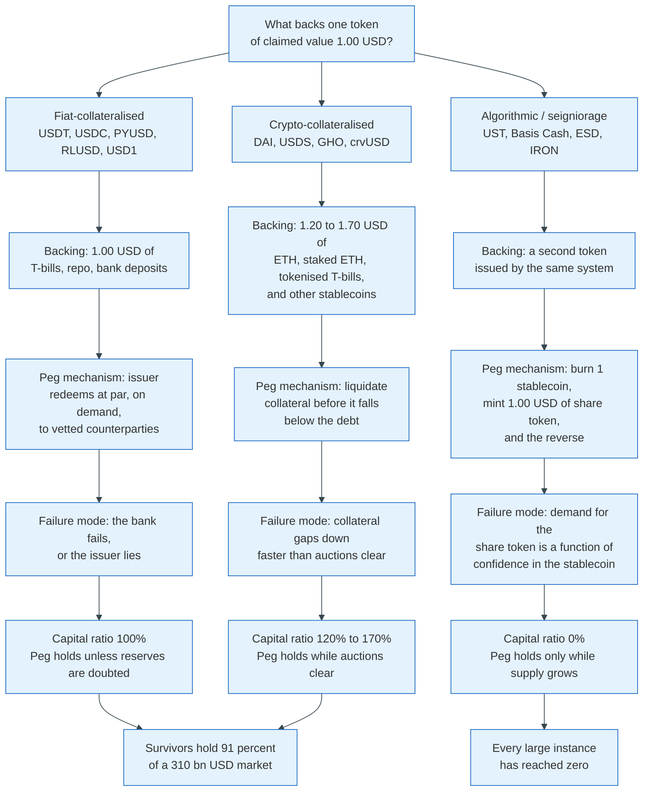

### 3.1 Fiat-Collateralised

The issuer takes a dollar, puts it in a bank or a Treasury bill, and mints one token. That is the entire mechanism.

The peg holds through arbitrage against redemption. If the token trades at 0.995 dollars on an exchange, an authorised counterparty buys it there, redeems it with the issuer for 1.00 dollar, and pockets half a cent. That trade removes supply from the secondary market until the price recovers. The reverse works on the upside: if the token trades at 1.005 dollars, a counterparty wires a dollar to the issuer, receives a token, and sells it.

Two conditions must hold for this to work. The issuer must actually pay, and enough counterparties must have accounts to make the arbitrage competitive. Section 6 shows what happens when the second condition weakens.

### 3.2 Crypto-Collateralised

The user locks volatile collateral in a smart contract and borrows stablecoins against it at a discount, and the contract sells the collateral if the discount closes.

DAI is the canonical instance. A user deposits ether worth 1,500 dollars into a vault with a 145 percent minimum collateralisation ratio and can draw up to 1,034 DAI. If ether falls such that the debt exceeds the safety threshold, anyone can trigger a liquidation auction that sells the collateral to repay the debt plus a penalty.

The peg mechanism is not redemption at par against a bank. It is the combination of a savings rate that the protocol raises to pull DAI off the market, and a stability fee that it raises to make borrowing expensive. Since 2020 there has also been a Peg Stability Module, which is a fixed-price swap between DAI and USDC. That module is why DAI's peg is now largely a function of USDC's peg.

### 3.3 Algorithmic

The system issues a stablecoin and a share token, and promises that one stablecoin can always be converted into one dollar's worth of share token, no matter what the share token is worth.

The intended dynamic is elegant. When the stablecoin trades below a dollar, arbitrageurs buy it cheaply, burn it, receive a dollar of newly minted share tokens, and sell them for a profit. Burning reduces stablecoin supply, which lifts the price. When the stablecoin trades above a dollar, the arbitrage runs the other way: burn a dollar of share tokens, mint one stablecoin, sell it above par.

The dynamic works while the system is growing. It inverts when it shrinks, and section 12 explains why the inversion is not a bug that can be patched.

---

## 4. Key Participants and Roles

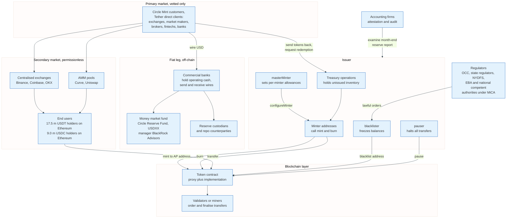

### 4.1 The Actors

| Role | What it does | Examples | Holds the reserve? |
|------|--------------|----------|--------------------|
| **Issuer** | Takes fiat, mints tokens, manages reserves, honours redemption | Circle, Tether, Paxos, Ripple | Yes |
| **Reserve manager** | Runs the portfolio inside a regulated wrapper | BlackRock Advisors for the Circle Reserve Fund | Custodial |
| **Custodian bank** | Holds operating cash and settles wires | Named in monthly reports | Yes |
| **Primary market participant** | Mints and redeems directly, at par, in size | Circle Mint customers, Tether direct clients | No |
| **Distributor** | Puts the token in front of end users and is paid to do so | Coinbase, Binance | No |
| **Market maker** | Quotes two-sided prices on secondary venues | Wintermute, Cumberland, GSR | No |
| **Exchange** | Custodies user balances, matches trades | Binance, Coinbase, OKX | No |
| **AMM pool** | Prices the token against other stablecoins on-chain | Curve 3pool, Uniswap v3 | No |
| **Blockchain validators** | Order transfers and finalise them | Ethereum validators, Tron super representatives | No |
| **Auditor or attestor** | Examines the month-end reserve report | Deloitte for the Circle Reserve Fund, BDO and KPMG for Tether | No |
| **Regulator** | Licenses the issuer and issues freeze orders | OCC, NYDFS, state regulators, EBA, national competent authorities | No |

### 4.2 The Two Roles That Decide Whether the Peg Holds

**The primary market participant is the arbitrage mechanism.** A stablecoin's peg is not enforced by code. It is enforced by a small number of firms that hold both a bank account with the issuer and inventory on exchanges, and who profit by closing the gap between the two. When those firms cannot access the issuer, the peg is only as good as secondary market sentiment. That is precisely what happened over the weekend of 10 to 12 March 2023, when banks were closed and Circle's redemption queue could not clear.

**The distributor decides where the tokens live, and the issuer pays for it.** Circle's arrangement with Coinbase allocates a share of reserve income based on the amount of USDC held on Coinbase's platform, after Circle's issuer retention, with Coinbase also receiving half of the remaining amount tied to broader ecosystem growth. In the quarter to 30 June 2026 Circle paid 412.5 million dollars of distribution and transaction costs against 701.3 million dollars of revenue. The distributor captures 58.8 percent of the top line.

Section 15 works through what that leaves.

### 4.3 The Role That Does Not Exist

There is no scheme operator. No rulebook, no participant agreement, no central switch, no arbitration body, no interchange, no settlement window.

This is the structural difference between a stablecoin and every payment system in the rest of this repository. Faster Payments has Pay.UK. Pix has the Banco Central do Brasil. Visa has an operating regulation running to thousands of pages. A USDC transfer has an ERC-20 contract and a block producer, and the block producer does not know what a dollar is.

That absence is why stablecoins reached 310 billion dollars in twelve years. It is also why the regulatory response, when it came, went straight at the issuer.

---

## 5. Minting and Burning: Who Is Allowed to Create Tokens

Minting is a privileged contract call, not an economic event, and understanding the difference explains almost everything about how supply moves.

### 5.1 The Two-Tier Permission Model in USDC

USDC's token contract, deployed at `0xA0b86991c6218b36c1d19D4a2e9Eb0cE3606eB48` on Ethereum with 6 decimals, is a `FiatTokenProxy` delegating to a `FiatTokenV2_2` implementation. It defines five privileged roles: `owner`, `masterMinter`, `blacklister`, `pauser`, and `rescuer`, plus a set of `minters` each carrying an allowance.

The `masterMinter` grants minting capacity. It cannot mint.

```solidity
function configureMinter(address minter, uint256 minterAllowedAmount)
    external whenNotPaused onlyMasterMinter returns (bool)
{
    minters[minter] = true;
    minterAllowed[minter] = minterAllowedAmount;
    emit MinterConfigured(minter, minterAllowedAmount);
    return true;
}
```

A configured minter then mints against that allowance, and each mint decrements it.

```solidity
function mint(address _to, uint256 _amount)
    external virtual whenNotPaused onlyMinters
    notBlacklisted(msg.sender) notBlacklisted(_to) returns (bool)
{
    require(_to != address(0), "FiatToken: mint to the zero address");
    require(_amount > 0, "FiatToken: mint amount not greater than 0");

    uint256 mintingAllowedAmount = minterAllowed[msg.sender];
    require(
        _amount <= mintingAllowedAmount,
        "FiatToken: mint amount exceeds minterAllowance"
    );

    totalSupply_ = totalSupply_.add(_amount);
    _setBalance(_to, _balanceOf(_to).add(_amount));
    minterAllowed[msg.sender] = mintingAllowedAmount.sub(_amount);
    emit Mint(msg.sender, _to, _amount);
    emit Transfer(address(0), _to, _amount);
    return true;
}
```

Three properties fall out of that code. A mint emits a `Transfer` event from the zero address, which is how block explorers and indexers detect issuance. The minter's allowance is a hard cap enforced per call, so a compromised minter key can create at most its remaining allowance. And a blacklisted destination cannot receive newly minted tokens, so sanctions screening runs at the contract level, not only in the issuer's back office.

Burning is deliberately asymmetric. A minter can only burn tokens it already holds.

```solidity
function burn(uint256 _amount)
    external virtual whenNotPaused onlyMinters
    notBlacklisted(msg.sender)
{
    uint256 balance = _balanceOf(msg.sender);
    require(_amount > 0, "FiatToken: burn amount not greater than 0");
    require(balance >= _amount, "FiatToken: burn amount exceeds balance");

    totalSupply_ = totalSupply_.sub(_amount);
    _setBalance(msg.sender, balance.sub(_amount));
    emit Burn(msg.sender, _amount);
    emit Transfer(msg.sender, address(0), _amount);
}
```

There is no `burnFrom`, and `burn` destroys only `_balanceOf(msg.sender)`. Redemption therefore takes two on-chain hops, not one. The customer transfers tokens to a Circle deposit address; Circle then moves them to a minter address, which is the only address whose balance `burn` can reach; that minter calls `burn`. A deposit address is not a minter, so skipping the second hop makes the burn revert. The issuer cannot reach into a customer wallet and destroy the tokens in it. Tether's contract can, and section 10 covers that.

### 5.2 The One-Tier Model in Tether

Tether's Ethereum contract at `0xdAC17F958D2ee523a2206206994597C13D831ec7`, also 6 decimals, predates the role separation and is much blunter.

```solidity
function issue(uint amount) public onlyOwner {
    require(_totalSupply + amount > _totalSupply);
    require(balances[owner] + amount > balances[owner]);
    balances[owner] += amount;
    _totalSupply += amount;
    Issue(amount);
}

function redeem(uint amount) public onlyOwner {
    require(_totalSupply >= amount);
    require(balances[owner] >= amount);
    _totalSupply -= amount;
    balances[owner] -= amount;
    Redeem(amount);
}
```

`issue` credits the owner address directly. `redeem` debits it. There is no allowance, no separate minter, and no `Transfer` event on either operation, which is why naive indexers built for ERC-20 miss Tether issuance entirely. The two `require` statements are overflow checks written before Solidity had them built in.

This design creates the authorised-but-not-issued inventory that confuses every supply chart. On 30 August 2026, Tether's Ethereum contract reported a `totalSupply` of 88,306,390,736.35 USDT while DefiLlama's circulating figure for Ethereum USDT was 73.5 billion. The 14.8 billion difference is tokens Tether has issued into its own treasury address and not yet sold. They exist on-chain and are backed by nothing, because nobody has paid for them.

Circle does not do this on Ethereum. It does something analogous on four chains where the token standard demands it, disclosing 123.2 million dollars of "access denied tokens" and separately identifying "tokens allowed but not issued" on Algorand, Hedera, Polkadot, and Solana as excluded from its circulation figure.

USDC nonetheless shows a gap of its own on Ethereum, and it has a different cause. The Ethereum contract's `totalSupply` was 50.77 billion on 30 August 2026 against DefiLlama's Ethereum circulating figure of 47.39 billion, a difference of about 3.4 billion. At least 1.3 billion of that sits locked in Ethereum-side bridge escrows, of which the Polygon proof-of-stake predicate contract alone holds 1.04 billion; DefiLlama attributes those tokens to the destination chain so as not to count them twice. The remainder is not attributable from public on-chain data alone. It is not unissued treasury inventory, which is the Tether case above.

### 5.3 The Full Mint and Burn Cycle

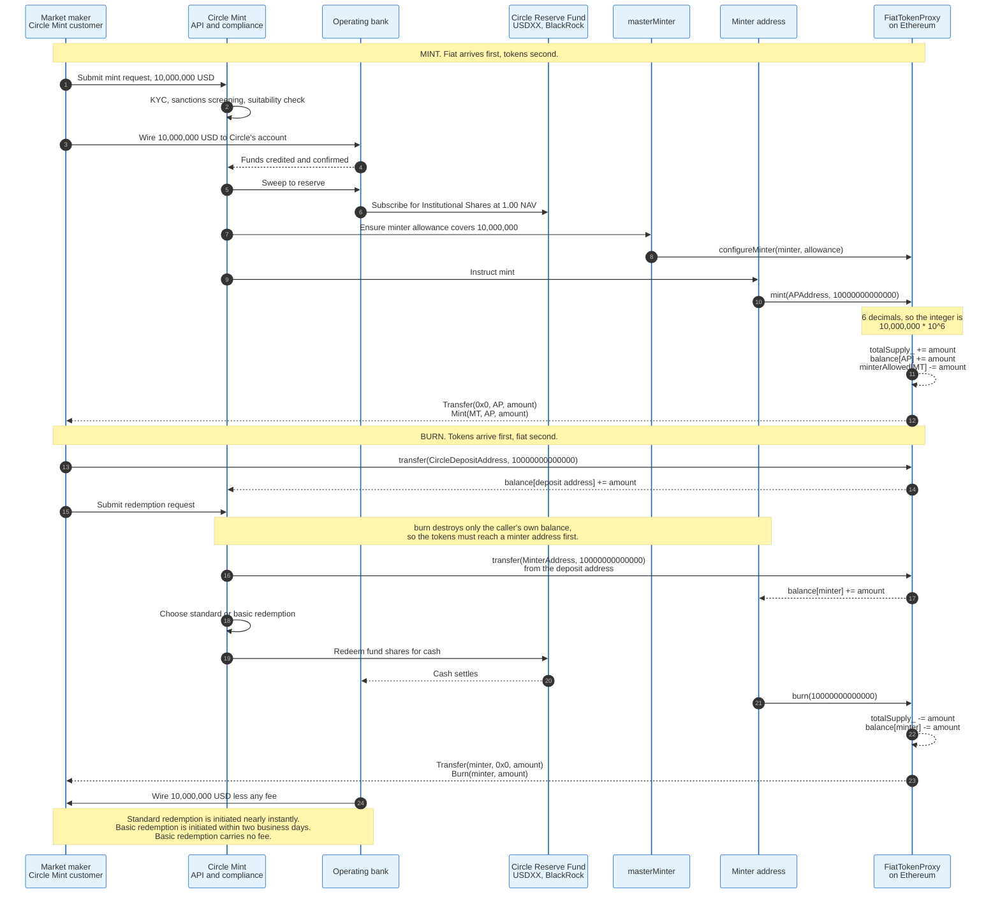

### 5.4 Who Is Actually Allowed

Circle Mint is institution-only. Its customers are exchanges, institutional traders, wallet providers, banks, and consumer app companies. Circle's registration statement is explicit: "Circle Mint is not available to individuals; as such, no individuals are Circle Mint customers." Onboarding requires an application disclosing the legal entity, its operations, its beneficial owners, and the intended use of the account, followed by identity verification, know-your-customer checks, sanctions screening, and suitability checks. The service supports wires in more than 185 countries.

Tether's direct issuance is similarly gated, with a published minimum for direct mint and redeem historically set at 100,000 dollars and a verification process for corporate clients.

The practical population of firms that can mint or redeem either token at scale numbers in the hundreds, against 17.5 million addresses holding USDT and 9.0 million holding USDC on Ethereum alone. Roughly one in a hundred thousand holders can touch the primary market.

That ratio is the whole story of section 6.

---

## 6. The Redemption Path: Primary and Secondary Markets

The single most common misconception about stablecoins is that a holder can redeem one for a dollar. Almost no holder can.

### 6.1 The Two Markets

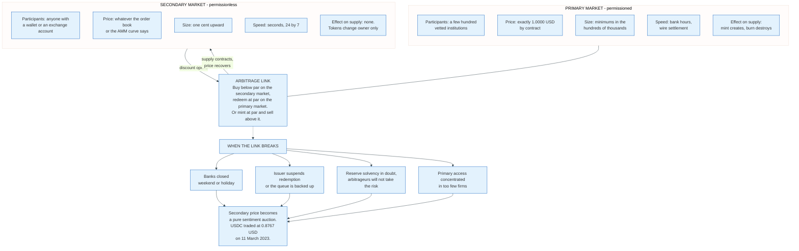

**The primary market is where supply changes.** An institution wires dollars and receives tokens, or sends tokens and receives dollars. Price is fixed at par by contract. Only this market changes `totalSupply`.

**The secondary market is where price is discovered.** Exchanges, automated market makers, and over-the-counter desks trade existing tokens. No token is created or destroyed. Price is whatever clears.

The two are joined by arbitrage, and the strength of that join is the peg.

### 6.2 Circle's Own Description of the Boundary

Circle states the limit in its quarterly report to the SEC without ambiguity:

> As a licensed money transmitter and regulated Electronic Money Institution, Circle is obligated to redeem all Circle stablecoins presented by Circle Mint customers on a one-for-one basis for U.S. dollars or euros, as applicable, except in limited circumstances, such as when prohibited by law or court order or instances where fraud is suspected. As such, the Company does not have an unconditional right to deny Circle stablecoin redemption requests from Circle Mint customers. With the exception of general stablecoin holders subject to specific regulatory requirements such as those in the European Union, the Company does not redeem Circle stablecoins from stablecoin holders who are not Circle Mint customers.

Two things follow. Circle cannot refuse a Mint customer, which makes the arbitrage reliable in normal conditions. And Circle will not serve anyone else, except where MiCA Article 49 forces it to in the European Union, where any holder may demand redemption at par at any time and no fee may be charged for it.

Europe legislated the retail redemption right. The United States did not.

### 6.3 Redemption Speed and Cost

Circle offers two redemption modes. Basic redemption is initiated within two business days and is free. Standard redemption is initiated nearly instantly and carries a fee schedule disclosed in Circle's April 2025 registration statement: 0.03 percent for amounts from 2 million to 5 million dollars, 0.06 percent from 5 million to 15 million, and 0.1 percent above 15 million, with waivers available for selected customers. Minting is free when the fiat arrives in the correct currency.

The pricing is the point. Circle charges for speed, not for redemption, because charging for redemption would price the peg away from par. A 0.1 percent standard redemption fee sets a soft floor: an arbitrageur will not pay more than 0.999 dollars for USDC if instant redemption costs a tenth of a percent, but will happily pay 0.9995 if it can wait two days.

That floor moves when the wait becomes uncertain. On 11 March 2023 it moved to 0.8767.

### 6.4 Why the Discount Is Not Evidence of Insolvency

A stablecoin trading below par means the market expects redemption to be slow, costly, or uncertain. It does not mean the reserves are short.

The arithmetic is a bond price. If a holder believes redemption will pay 1.00 dollar with certainty in three days, and demands a 3 percent annualised return for the wait, the token should trade at about 0.99975. To reach 0.8767, the market must be pricing either a material probability of loss or a horizon measured in years. On 11 March 2023 it was pricing the first, because nobody knew what the FDIC would do with an uninsured 3.3 billion dollar deposit.

The Treasury, Federal Reserve, and FDIC answered on 12 March 2023 by guaranteeing all SVB depositors. USDC was back above 0.99 dollars within a day.

Reserves were never short by a cent. The price still fell 12.3 percent.

---

## 7. Reserve Composition: USDT and USDC

Reserve composition is where the two largest issuers differ most, and the difference is not primarily about safety. It is about what each issuer is allowed to hold.

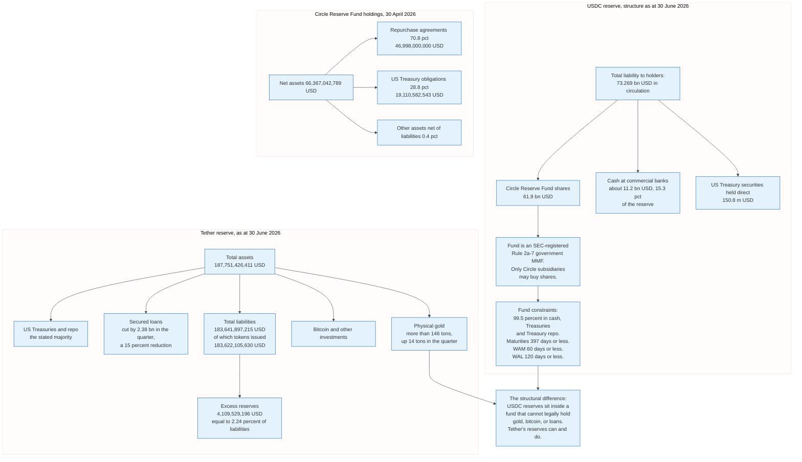

### 7.1 USDC: A Money Market Fund With a Token Attached

Circle solved reserve credibility by outsourcing it to a structure that already had rules.

The Circle Reserve Fund, ticker USDXX, CUSIP 09261A870, is a government money market fund registered under the Investment Company Act of 1940 and managed by BlackRock Advisors, LLC. It commenced operations on 3 November 2022. Only Circle subsidiaries may purchase its shares. Under Rule 2a-7 and its own prospectus it invests at least 99.5 percent of total assets in cash, US Treasury obligations, and repurchase agreements secured by them, with securities generally maturing in 397 days or less, a dollar-weighted average maturity of 60 days or less, and a dollar-weighted average life of 120 days or less. In practice the Treasuries held have remaining maturities of three months or less.

Its audited schedule of investments as at 30 April 2026 shows net assets of 66,367,042,789 dollars: 70.8 percent in repurchase agreements at 46,998,000,000 dollars, and 28.8 percent in US Treasury obligations at 19,110,582,543 dollars. Total investments were 99.6 percent of net assets. The fund has maintained a net asset value of 1.00 dollar per share for every period since inception. Deloitte audits it.

Circle held 61.9 billion dollars of fund shares at 30 June 2026 against 73.269 billion dollars of USDC in circulation, plus 150.8 million dollars of directly held Treasuries and about 11.2 billion dollars, 15.3 percent of the reserve, as cash at commercial banks. That 15.3 percent is the same exposure that broke the peg in March 2023, and it is uninsured above 250,000 dollars per bank.

Circle pays BlackRock an advisory fee of 0.165 percent on the first 10 billion dollars of average daily net assets, 0.155 percent on the next 10 billion, and 0.140 percent on the next 10 billion, stepping down thereafter. On a 66 billion dollar fund that is roughly 90 million dollars a year of the reserve income, before administration fees.

Outsourcing credibility is not free.

### 7.2 USDT: A Balance Sheet, Not a Fund

Tether does not wrap its reserves in a regulated vehicle. It publishes a balance sheet.

The BDO attestation as at 30 June 2026 reports total assets of 187,751,426,411 dollars, total liabilities of 183,641,897,215 dollars of which 183,622,105,630 relate to digital tokens issued, and an excess of assets over liabilities of 4,109,529,196 dollars. That buffer is 2.24 percent of liabilities. The 183.622 billion of tokens issued is the attested figure and the one this section uses. DefiLlama's circulating series measures something else, peaking at 190.43 billion dollars on 20 May 2026 and standing at 183.38 billion on 30 August.

The composition includes assets a 2a-7 fund may not own. More than 146 tons of physical gold, up 14 tons in the quarter. Bitcoin. Secured loans, which Tether reduced by approximately 2.38 billion dollars during the quarter, a 15 percent cut, implying a prior balance near 15.9 billion. Net operating profit for the quarter was approximately 1.50 billion dollars, which Tether attributes primarily to Treasuries and repo.

The gold and the loans are the whole controversy. Gold is not a dollar and does not mature. A secured loan is a credit exposure whose recovery depends on collateral values in exactly the market stress that would trigger redemptions. Neither would be a permitted reserve asset for a permitted payment stablecoin issuer under the GENIUS Act, and neither is compatible with MiCA Article 54's requirement that non-deposit reserve assets be highly liquid instruments with minimal market risk denominated in the referenced currency.

### 7.3 Why the Difference Persists

Tether can hold gold because nothing stops it. Circle cannot because everything does.

Circle is a licensed money transmitter in US states, an authorised Electronic Money Institution in the European Union, and, since June 2025, a public company filing with the SEC. Each of those statuses narrows the reserve. Tether International, S.A. de C.V. is incorporated in El Salvador and has consistently declined the licences that would constrain it, which is also why USDT is not available under MiCA in the European Economic Area and why it has been delisted from EU-regulated venues.

The market has not punished Tether for this. USDT holds 59.2 percent of USD-pegged stablecoin supply against USDC's 24.0 percent, and Tether earned roughly 1.5 billion dollars in one quarter against Circle's 48.2 million dollars of net income in the same quarter.

Regulatory arbitrage is a business model, and at present it is the more profitable one.

---

## 8. Attestation Versus Audit

An attestation is not an audit, and the industry spent a decade relying on the confusion.

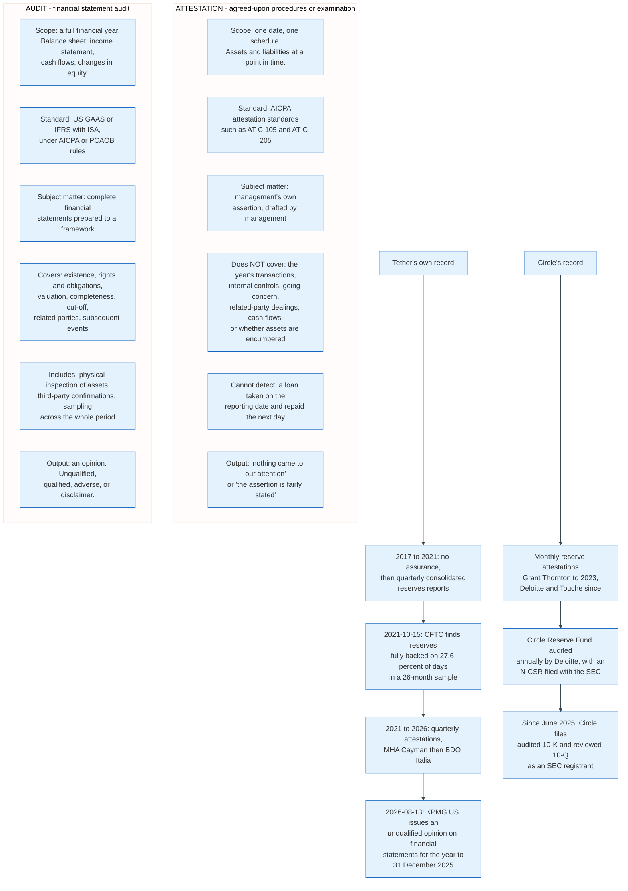

### 8.1 What an Attestation Actually Says

An attestation engagement tests a specific assertion made by management, at a specific moment, against evidence the accountant selects. The Tether reports are a good example: management asserts that total assets on 30 June 2026 were 187,751,426,411 dollars and that liabilities were 183,641,897,215 dollars, and BDO reports on that assertion.

What the engagement does not do is more instructive. It does not examine the period between reporting dates. It does not test whether assets were borrowed for the day. It does not opine on internal control. It does not trace the cash flows that produced the balance. It does not examine related-party transactions unless the assertion covers them. And it produces no opinion on the entity as a going concern.

The CFTC's 2021 findings are the proof of concept. Tether's reserves were fully backed on 27.6 percent of the days in a 26-month sample. A quarterly point-in-time report can be entirely accurate on each of four dates a year while the other 361 days look nothing like them.

### 8.2 What Changed in August 2026

On 13 August 2026 Tether published financial statements for the year ended 31 December 2025 audited by KPMG US under AICPA standards, receiving an unqualified opinion. The statements report reserves exceeding liabilities by 6.814 billion dollars at 31 December 2025. KPMG's procedures included physically inspecting every individual gold bar and testing across the balance sheet, income statement, cash flow statement, and statement of changes in equity.

This is the single largest change in stablecoin disclosure since 2018. It closes the gap the CFTC identified: an audit covers the whole year, not four dates in it.

It does not close every gap. An audit opinion on 2025 says nothing about 2026, an unqualified opinion is not a solvency guarantee, and an audit does not test whether the assets are liquid enough to meet a 30 percent redemption in a week. Those are liquidity and stress questions, and they belong to the regulator.

### 8.3 What the GENIUS Act Requires Instead

The GENIUS Act does not ask for an annual audit. It asks for something more frequent and more targeted.

Section 4 requires a permitted payment stablecoin issuer to publish a month-end report of reserve composition, and each month to have the previous month's report examined by a registered public accounting firm. The chief executive officer and chief financial officer must personally certify the accuracy of the monthly report to their primary federal or state regulator. A false certification carries the criminal penalties of section 1350(c) of title 18 of the United States Code, the Sarbanes-Oxley provision, and that section splits in two. Subsection (c)(1) covers a knowing certification of a report that does not conform, and sets a fine of up to one million dollars or imprisonment of up to ten years. Subsection (c)(2) covers a wilful one, and sets up to five million dollars or twenty years.

Monthly examination plus personal criminal liability is a stronger control than an annual audit, because the failure mode being addressed is not accounting error. It is management lying about the reserve.

MiCA takes the other route. Article 36(9) sets the frequency, requiring an independent audit of the reserve of assets every six months, and Article 58 applies that asset-referenced token reserve regime to issuers of significant e-money tokens. Six-monthly, not monthly, and no personal certification.

---

## 9. On-Chain Transfer Mechanics

A stablecoin transfer is a smart contract call that changes two integers, and everything users experience about cost and speed comes from the chain it runs on rather than the token.

### 9.1 The ERC-20 Interface

Both USDT and USDC on Ethereum implement EIP-20, which defines six functions and two events.

```
function totalSupply() public view returns (uint256)
function balanceOf(address _owner) public view returns (uint256 balance)
function transfer(address _to, uint256 _value) public returns (bool success)
function transferFrom(address _from, address _to, uint256 _value) public returns (bool success)
function approve(address _spender, uint256 _value) public returns (bool success)
function allowance(address _owner, address _spender) public view returns (uint256 remaining)

event Transfer(address indexed _from, address indexed _to, uint256 _value)
event Approval(address indexed _owner, address indexed _spender, uint256 _value)
```

Balances are stored as unsigned integers in the token's smallest unit. Both USDT and USDC use 6 decimals, so 1.00 USDC is the integer 1000000 and the smallest representable amount is 0.000001 dollars, one ten-thousandth of a cent. Ether uses 18 decimals; the choice of 6 gives cent precision plus four further digits, and it is now permanent because changing it would break every integration.

Tether's `transfer` does not return a boolean, which violates EIP-20. Any contract that calls it expecting a return value reverts. This is why every serious integration wraps token calls in a `SafeERC20` library that tolerates a missing return value, and why USDT integration bugs remain a live category of production incident eleven years after launch.

### 9.2 A Transfer, Step by Step

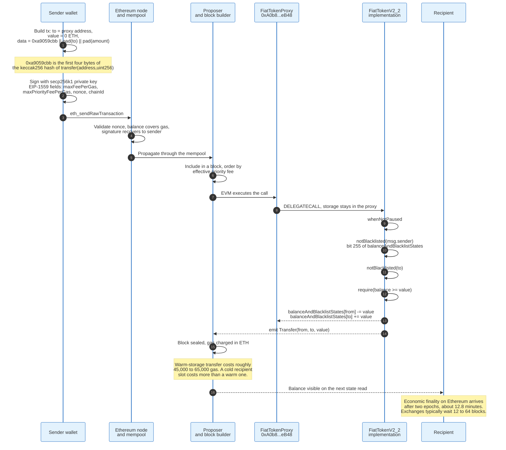

The recipient does nothing and needs no software. A transfer is a unilateral state change in the sender's transaction. There is no acceptance step, no timeout, and no failure path in which the money hangs between parties. Either the transaction is included and the balances move, or it is not and nothing happens.

That property is why stablecoin transfers have no reversal mechanism. There is no intermediate state to unwind.

### 9.3 Gas Is Denominated in the Wrong Asset

The user must hold the chain's native token to move the stablecoin, which is the single largest source of onboarding failure.

Sending 100 USDC on Ethereum requires ether to pay gas. A holder with 100 USDC and no ether cannot move it, ever, without acquiring ether first. This is not a policy choice; the EVM charges gas in the native asset and cannot charge in an arbitrary token.

Three workarounds exist and all three are in production.

**EIP-2612 `permit`** lets a user sign an off-chain approval that a third party submits and pays for. USDC implements it. The signature binds owner, spender, value, nonce, and deadline under an EIP-712 domain separator that includes the chain ID, so a signature captured on one chain cannot be replayed on another.

**EIP-3009 `transferWithAuthorization` and `receiveWithAuthorization`** go further, letting the user authorise the transfer itself rather than an allowance. USDC's `FiatTokenV2_2` implements both plus `cancelAuthorization`. A relayer submits the signed authorisation and pays the gas, and can be reimbursed in USDC inside the same transaction.

**Cheap chains.** The blunt answer, and the one the market chose. Tron's fee model uses energy and bandwidth that can be obtained by staking TRX, which makes small USDT transfers cheap enough to ignore. That is why 50.1 percent of USDT lives on Tron. Ethereum still carries more stablecoin value in total, 147.6 billion dollars against Tron's 93.4 billion on 30 August 2026, but Tron carries the larger share of retail USDT flow.

### 9.4 Finality Differs by Chain, and the Token Does Not Care

The same USDC contract behaves identically on every EVM chain, but the guarantee behind a confirmed transfer varies by an order of magnitude.

| Chain | Consensus | Practical finality | Typical exchange confirmations |
|-------|-----------|--------------------|-------------------------------|
| **Ethereum** | Proof of stake, Gasper | Two epochs, about 12.8 minutes | 12 to 64 blocks |
| **Tron** | Delegated proof of stake | About 57 seconds, 19 blocks | 19 to 25 blocks |
| **Solana** | Proof of stake with Tower BFT | About 13 seconds | 32 slots |
| **Base and other OP-stack L2s** | Sequencer plus Ethereum settlement | Soft in about 2 seconds, hard after the L1 challenge window | Varies by operator |
| **Arbitrum One** | Sequencer plus Ethereum settlement | Soft in under a second, hard after the challenge window | Varies by operator |

An issuer's redemption policy has to be written against the weakest guarantee in the set, which is why Circle's cross-chain protocol distinguishes a standard transfer that waits for hard finality from a fast transfer that does not. See section 14.

---

## 10. Blacklisting, Freezing, and Confiscation

Both dominant stablecoins contain a switch that lets the issuer take an address out of circulation, and this is the property that makes them acceptable to regulators and unacceptable to purists.

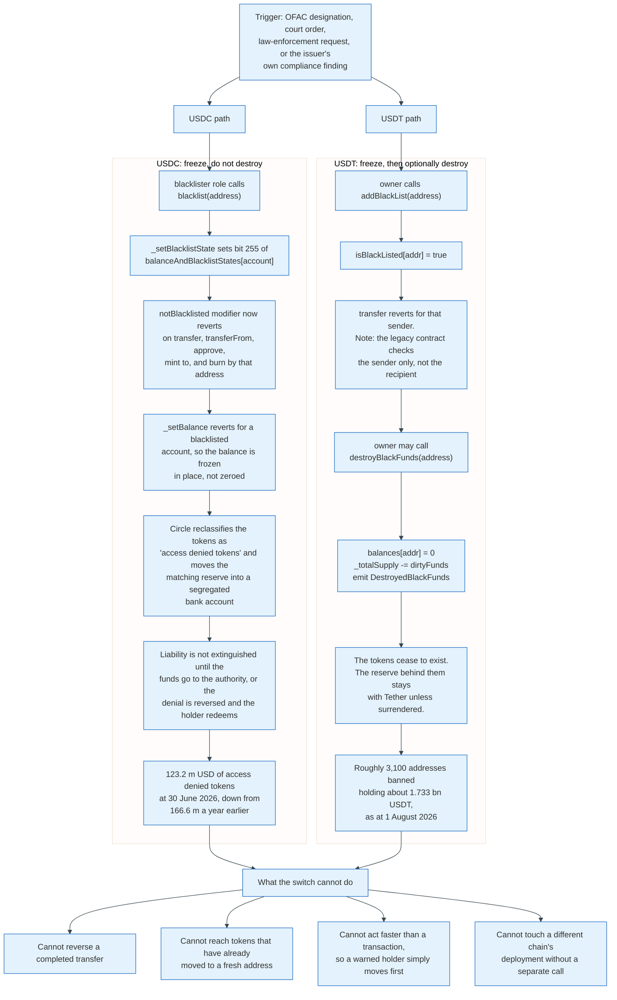

### 10.1 The USDC Mechanism, Read From the Code

USDC's `Blacklistable` base contract defines the role and the modifier.

```solidity
modifier notBlacklisted(address _account) {
    require(!_isBlacklisted(_account), "Blacklistable: account is blacklisted");
    _;
}

function blacklist(address _account) external onlyBlacklister { ... }
function unBlacklist(address _account) external onlyBlacklister { ... }
```

Version 2.2 of the implementation packs the flag into the balance slot, which saves a storage read on every transfer.

```solidity
function _setBlacklistState(address _account, bool _shouldBlacklist)
    internal virtual override
{
    balanceAndBlacklistStates[_account] = _shouldBlacklist
        ? balanceAndBlacklistStates[_account] | (1 << 255)
        : _balanceOf(_account);
}

function _isBlacklisted(address _account) internal virtual override view returns (bool) {
    return balanceAndBlacklistStates[_account] >> 255 == 1;
}

function _balanceOf(address _account) internal virtual override view returns (uint256) {
    return balanceAndBlacklistStates[_account] & ((1 << 255) - 1);
}
```

Bit 255 is the blacklist flag. The low 255 bits are the balance, which caps any single balance at 2^255 minus 1. `_setBalance` reverts outright if the account is blacklisted, so a frozen balance cannot be written by any path, including a mint to that address.

Circle cannot destroy the tokens. It can only stop them moving, and it does something else on the fiat side: it moves the matching reserve into a segregated bank account and holds the liability open until the funds are handed to the authority or the denial is reversed.

### 10.2 The USDT Mechanism

Tether's contract keeps a simple mapping and adds a function Circle's does not have.

```solidity
function addBlackList (address _evilUser) public onlyOwner {
    isBlackListed[_evilUser] = true;
    AddedBlackList(_evilUser);
}

function destroyBlackFunds (address _blackListedUser) public onlyOwner {
    require(isBlackListed[_blackListedUser]);
    uint dirtyFunds = balanceOf(_blackListedUser);
    balances[_blackListedUser] = 0;
    _totalSupply -= dirtyFunds;
    DestroyedBlackFunds(_blackListedUser, dirtyFunds);
}
```

`destroyBlackFunds` is confiscation implemented in eight lines. It zeroes the balance and reduces total supply, which means the corresponding reserve asset stays on Tether's balance sheet unless Tether hands it over.

Note also what the legacy `transfer` checks: `require(!isBlackListed[msg.sender])`. The sender only. A blacklisted address cannot send, but tokens can still be sent to it, where they become permanently stuck. USDC's `notBlacklisted` modifier applies to both parties.

As at 1 August 2026, public on-chain analysis counted roughly 3,100 addresses blacklisted by Tether holding approximately 1.733 billion USDT.

### 10.3 The Precedent That Set the Pattern

On 8 August 2022 the Office of Foreign Assets Control designated the Tornado Cash mixer and added a set of Ethereum addresses to the Specially Designated Nationals list. Circle blacklisted the designated addresses within hours, freezing the USDC held in them. The action established that a sanctions designation of a smart contract translates directly into a token contract call, without a court and without notice to the holder.

Circle's own disclosure quantifies the running total. Access denied tokens stood at 123.2 million dollars at 30 June 2026 and 166.6 million dollars a year earlier. The balance falls when funds are surrendered to authorities or denials are reversed.

### 10.4 The Misconception Worth Correcting

Stablecoins are frequently described as censorship-resistant because they run on public blockchains. For USDT and USDC that description is exactly backwards.

The blockchain is censorship-resistant. The token is not. A validator will happily include a transaction moving blacklisted USDC, and the transaction will revert, because the censorship lives in the token contract rather than in the consensus layer. Being on Ethereum buys the holder nothing against the issuer.

What being on Ethereum does buy is auditability. Every freeze is a public transaction with a timestamp, an address, and an amount, which is why the counts in this section exist at all. No bank publishes its account freezes.

---

## 11. DAI and the Overcollateralised CDP

DAI is a loan denominated in dollars, issued by a smart contract against collateral worth more than the loan, and everything about its stability follows from that overcollateralisation.

### 11.1 The Core Accounting Engine

The Maker protocol, rebranded Sky in 2024, keeps all debt and collateral in a single contract called `Vat`. Its data model is two structs.

```solidity
struct Ilk {
    uint256 Art;   // Total Normalised Debt     [wad]
    uint256 rate;  // Accumulated Rates         [ray]
    uint256 spot;  // Price with Safety Margin  [ray]
    uint256 line;  // Debt Ceiling              [rad]
    uint256 dust;  // Urn Debt Floor            [rad]
}

struct Urn {
    uint256 ink;   // Locked Collateral  [wad]
    uint256 art;   // Normalised Debt    [wad]
}
```

An `Ilk` is a collateral type, such as ether or wrapped staked ether. An `Urn` is one user's vault of that type. Three fixed-point units run throughout: `wad` is 10^18, `ray` is 10^27, and `rad` is 10^45. Debt is stored normalised, so a single `rate` multiplication accrues interest across every vault of a type at once rather than looping over them.

Every position change goes through one function.

```solidity
function frob(bytes32 i, address u, address v, address w, int dink, int dart) external
```

`i` names the collateral type. `u`, `v`, and `w` are the vault owner, the collateral source, and the debt destination. `dink` is the change in locked collateral and `dart` the change in normalised debt, both signed. Eight `require` statements decide whether the call succeeds.

```solidity
require(live == 1, "Vat/not-live");
require(ilk.rate != 0, "Vat/ilk-not-init");
require(either(dart <= 0, both(_mul(ilk.Art, ilk.rate) <= ilk.line, debt <= Line)), "Vat/ceiling-exceeded");
require(either(both(dart <= 0, dink >= 0), tab <= _mul(urn.ink, ilk.spot)), "Vat/not-safe");
require(either(both(dart <= 0, dink >= 0), wish(u, msg.sender)), "Vat/not-allowed-u");
require(either(dink <= 0, wish(v, msg.sender)), "Vat/not-allowed-v");
require(either(dart >= 0, wish(w, msg.sender)), "Vat/not-allowed-w");
require(either(urn.art == 0, tab >= ilk.dust), "Vat/dust");
```

The eight split three ways. Two are preconditions: the system has not been shut down, and the collateral type has been initialised with a non-zero rate. Three are consent checks, where `wish(x, msg.sender)` asks whether address `x` has authorised the caller to act for it, so nobody can add debt to another party's vault or spend another party's collateral. Three decide the economics: the debt ceiling, the safety margin, and the dust floor.

The safety check is the whole system. `tab` is the vault's debt including accrued rates, and `ilk.spot` is the oracle price already divided by the liquidation ratio. A vault is safe when debt is at most collateral times the safety-adjusted price. At a 145 percent liquidation ratio and ether at 1,500 dollars, `spot` is 1,034.48, so one ether supports at most 1,034.48 DAI.

That is 68.97 percent loan to value. A stablecoin that requires 145 dollars of volatile collateral for every 100 dollars issued is the price of not having a bank.

### 11.2 The Vault Lifecycle

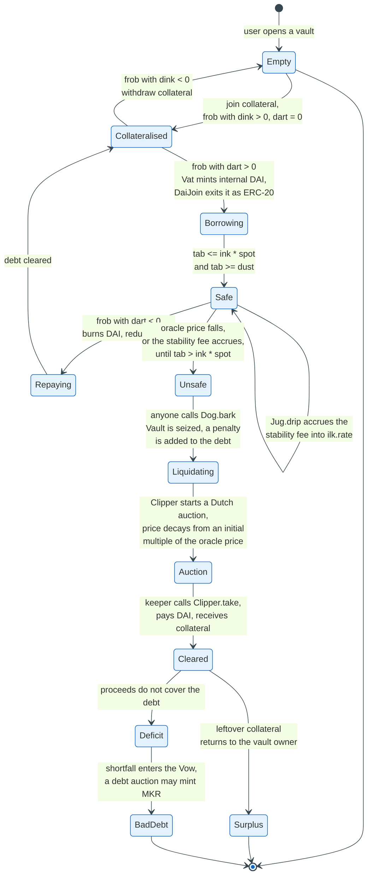

Liquidation is a Dutch auction, and the design is a direct response to the failure described below. `Dog.bark` seizes an unsafe vault, adds a liquidation penalty to the debt, and hands it to a `Clipper`. The `Clipper` starts the price at a multiple of the oracle price and decays it on a curve until a keeper takes the collateral. Keepers may take partial fills and may use flash loans, so a bidder needs no capital of its own.

The predecessor design used English auctions with fixed bid durations. On 12 March 2020, ether fell about 43 percent in a day, Ethereum gas prices spiked, and keepers could not get bids in. Auctions cleared at zero DAI, taking roughly 8.32 million dollars of collateral for nothing and leaving about 5.67 million dollars of uncollateralised debt that the protocol covered by auctioning newly minted MKR. Every parameter of the current `Clipper` design exists because of that day.

### 11.3 The Peg Stability Module, and Why DAI Is Partly a USDC Wrapper

The overcollateralised vault produces DAI. It does not, on its own, hold the peg tightly, because there is no primary redemption at par.

The Peg Stability Module fixes that by adding one: a fixed-price swap between DAI and a fiat-collateralised stablecoin, almost always USDC.

```solidity
function sellGem(address usr, uint256 gemAmt) external {
    uint256 gemAmt18 = mul(gemAmt, to18ConversionFactor);
    uint256 fee = mul(gemAmt18, tin) / WAD;
    ...
}

function buyGem(address usr, uint256 gemAmt) external {
    uint256 gemAmt18 = mul(gemAmt, to18ConversionFactor);
    uint256 fee = mul(gemAmt18, tout) / WAD;
    ...
}
```

`sellGem` takes USDC and returns DAI one for one, less a fee `tin`. `buyGem` does the reverse, less `tout`. Both fees have frequently been set to zero. `to18ConversionFactor` is `10 ** (18 - gem.decimals())`, which is 10^12 for a 6-decimal token, because DAI has 18 decimals and USDC has 6.

The consequence is arithmetic. If DAI trades at 0.99 dollars, anyone can buy DAI on the market, call `buyGem` to swap it for USDC at par, and sell the USDC for a dollar. That arbitrage is available to anybody with a wallet, and it pins DAI to USDC far more tightly than any vault mechanism does.

It also imports USDC's risk wholesale. In March 2023 DAI depegged alongside USDC, and it depegged because the PSM's USDC inventory was the marginal asset backing DAI. A decentralised stablecoin whose peg is enforced by a fixed-price swap against a centralised one is decentralised in governance and centralised in credit.

The later versions of the module, marketed as LitePSM, add `buf`, a target DAI buffer held ready in the module, along with `fill`, `trim`, and `chug` operations to top up the buffer, wind it down, and sweep accumulated fees. The economics are unchanged.

### 11.4 Where DAI and USDS Stand

DAI supply peaked at 9.97 billion dollars on 16 February 2022 and stood at 4.80 billion on 30 August 2026. USDS, the rebranded successor token launched in late 2024, stood at 6.69 billion dollars on the same date, having peaked at 8.95 billion on 1 April 2026. Together they hold 3.7 percent of USD-pegged stablecoin supply.

The crypto-collateralised design lost the volume war and won the argument that it works. Neither DAI nor USDS has ever gone to zero, through two full crypto cycles, three exchange collapses, and the failure of a bank holding their reserve asset's backing.

---

## 12. Algorithmic Designs and the Anatomy of a Death Spiral

Algorithmic stablecoins fail because their collateral is a claim on their own future demand, and that claim is worth the most exactly when it is needed the least.

### 12.1 The Mechanism, Stated Precisely

A seigniorage-share stablecoin issues two tokens. Call the stablecoin S and the share token L. The protocol offers an unconditional two-way swap: burn one S and receive one dollar's notional of newly minted L, or burn one dollar's notional of L and receive one S.

The intended equilibrium is straightforward. If S trades at 0.98 dollars, an arbitrageur buys S for 0.98, burns it, receives 1.00 dollar of L, and sells L for a two cent profit. Burning S reduces supply and lifts its price. The arbitrage runs until the discount closes.

Two assumptions sit under that trade, and both are load-bearing.

**Assumption one: L has a liquid market deep enough to absorb the sale.** The arbitrageur must actually sell the L it receives. If everyone is doing the same trade at the same moment, the sales are simultaneous.

**Assumption two: L's price is independent of S's distress.** The trade is only profitable if L is still worth something after the mint. But L's value is the discounted stream of future seigniorage, and future seigniorage exists only if S keeps growing.

Assumption two is false by construction. L is a leveraged bet on S's success. When S is in trouble, L is worth less, which means more L must be minted per S burned, which means more selling pressure on L, which lowers L's price further.

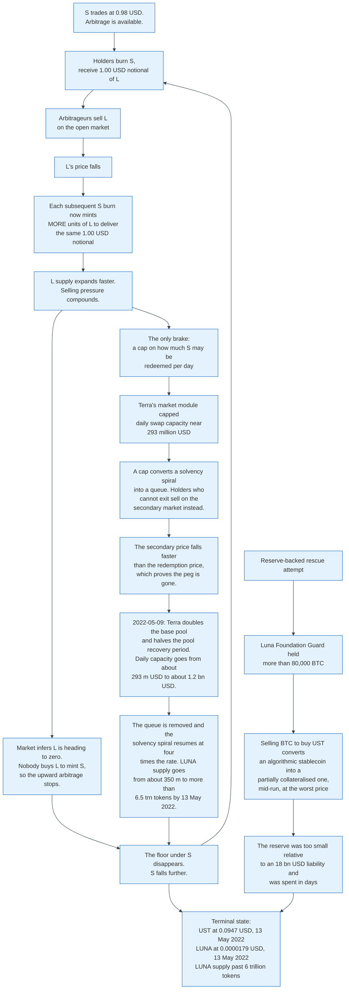

### 12.2 Why Every Patch Has Failed

Four families of fix have been tried at scale, and each moves the failure rather than removing it.

**Bonds and coupons.** Basis Cash and Empty Set Dollar sold discounted bonds redeemable when the peg recovers. This works while holders believe recovery is likely. It converts a run into a debt overhang, and when the overhang grows large enough that bondholders will absorb all future expansion, new buyers stop arriving. Both systems lost their pegs permanently within months.

**Partial collateral.** Frax launched in 2020 with a collateral ratio that moved with market conditions, part USDC and part its own share token. It held its peg through 2022, which the design's advocates cite as vindication. Frax then moved to full collateralisation in 2023. The fractional design survived by abandoning the fractional part.

**A separate reserve.** Terra's Luna Foundation Guard accumulated more than 80,000 BTC through early 2022, a reserve worth around 3 billion dollars against a UST liability approaching 18 billion. The ratio is the problem. A reserve covering a sixth of the liability does not stop a run; it funds the first sixth of it at a price that falls as the reserve is spent.

**Delta-neutral synthetic backing.** Ethena's USDe holds spot bitcoin, ether, staked ether, and liquid stablecoins against short perpetual futures of approximately the same notional, with the assets in off-exchange settlement so custody is never transferred to the derivatives venue. The composition is published on Ethena's transparency dashboard with third-party verification by Chainlink, LlamaRisk, and HT Digital; this document does not assert a dated breakdown of it. Only whitelisted users may mint, by delivering roughly 100 dollars of stablecoins for roughly 100 USDe, whereupon the protocol opens the matching short. This is genuinely different: the backing is a real portfolio, not a self-referential token. The risks are also different and real. Funding rates on perpetual futures go negative, exchanges fail, and the hedge depends on venues that halt trading precisely when hedging matters. USDe stood at 4.08 billion dollars on 30 August 2026.

### 12.3 The Structural Statement

An algorithmic stablecoin is a promise to pay one dollar, backed by an asset whose value is the market's estimate of that promise being kept.

Written that way, the circularity is visible without any mechanism design. Any system in which the collateral's value depends on confidence in the liability has exactly two equilibria: one where confidence holds and the peg holds, and one where it does not and the peg goes to zero. Nothing in the mechanism selects between them.

The GENIUS Act settled the question in the United States by defining a payment stablecoin as one where the issuer maintains a one-to-one reserve of specified assets. A design with no reserve cannot be a permitted payment stablecoin, and after the Act's effective date offering one becomes unlawful. MiCA reached the same place from a different direction: Article 36 requires asset-referenced token issuers to maintain a reserve whose aggregate value is at least equal to the claims against them, and a self-referential token cannot satisfy it.

Both regimes banned the design rather than regulating it. That is a rare legislative judgement, and the evidence supports it.

---

## 13. Depeg Episodes and Their Causes

Two events define the field. One killed the design that caused it. The other killed nothing and still cost the issuer 43 percent of its supply.

```mermaid
%%{init: {'theme': 'base', 'themeVariables': {'primaryColor': '#e3f2fd', 'primaryBorderColor': '#1565c0', 'lineColor': '#37474f'}}}%%

timeline
    title Two depegs, hour by hour
    section UST, May 2022 - a design failure
        2022-04-05 : LUNA peaks at 119.18 USD
        2022-05-07 : Terraform Labs withdraws 150 m UST from the Curve 3pool for a planned 4pool migration
        2022-05-07 : A trader swaps 85 m UST for USDC 13 minutes later, then another moves 100 m in 25 m increments
        2022-05-07 : Terraform Labs withdraws a further 100 m UST to rebalance
        2022-05-08 : Anchor deposits fall from 14 bn to 11 bn USD over the weekend
        2022-05-09 : UST at 0.947 at 19.59 UTC, then 0.799 at 23.58 UTC. LFG begins selling bitcoin
        2022-05-10 : UST at 0.757 at 03.59 UTC, recovers to 0.905 by 16.00
        2022-05-11 : UST at 0.332 at 07.59 UTC. LUNA at 4.54, down from 86 on 4 May
        2022-05-12 : LUNA at 0.0110 at 15.59 UTC. Terra validators halt the chain
        2022-05-13 : LUNA at 0.0000179 at 03.59 UTC. UST at 0.0947 at 11.59 UTC. Supply past 6 trillion LUNA
    section USDC, March 2023 - a banking failure
        2023-03-08 : Silvergate announces wind-down. Crypto banking channels narrow
        2023-03-09 : SVB deposit run begins after a failed capital raise
        2023-03-10 : FDIC places SVB into receivership on a Friday. Circle's 3.3 bn USD withdrawal request, about 8 percent of reserves, does not settle
        2023-03-11 : USDC trades at 0.8767 at 07.57 UTC. DAI depegs with it through the Peg Stability Module
        2023-03-11 : USDC recovers to 0.9449 by 20.00 UTC as the market prices a rescue
        2023-03-12 : Treasury, the Federal Reserve and the FDIC guarantee all SVB depositors. USDC at 0.9928 by 23.58 UTC
        2023-03-13 : Banks reopen. Redemption queue clears. Peg restored
        2023-06-01 : USDC supply down to 28.66 bn from 41.99 bn on 1 March
        2024-01-01 : USDC supply bottoms near 23.86 bn, a 43 percent fall from the March 2023 level
```

### 13.1 UST, May 2022: The Design Did What It Was Built to Do

The proximate trigger was a liquidity migration; the cause was the mechanism.

Terraform Labs was moving UST's on-chain liquidity from Curve's UST-3pool to a planned four-asset pool. On 7 May 2022 it withdrew 150 million UST from the 3pool. Approximately thirteen minutes later a trader swapped 85 million UST for USDC, and another executed roughly 100 million UST in 25 million increments over the following hour. Terraform Labs withdrew a further 100 million UST to rebalance. The pool was thin, the trades were large, and UST slipped below a dollar.

Under normal conditions that gap closes through the market module: burn UST, receive a dollar of LUNA, sell the LUNA. Two things prevented it.

**The module was capped.** Daily swap capacity was near 293 million dollars. A holder wanting out faster had to sell on the secondary market, and secondary selling pushed the price below the redemption price, which told everyone else the peg was gone.

**Then the cap was lifted.** On 9 May 2022 Terra governance doubled the market module's base pool and halved the pool recovery period. Doubling one and halving the other multiplies throughput by four, so daily UST burn capacity went from about 293 million dollars to about 1.2 billion. That converted a queue back into a solvency spiral, and the LUNA supply expansion described below is its direct arithmetic consequence. Removing a redemption limit during a run does not restore the peg. It only lets the mechanism destroy the share token faster.

**The yield vanished.** Anchor Protocol paid roughly 19.5 percent on UST deposits, subsidised at a rate reaching about 6 million dollars a day by April 2022. At its peak Anchor held about 14 billion dollars of UST, roughly 78 percent of all UST in existence. That is not a payment instrument with a savings feature; it is a savings product with a token attached. Deposits fell from 14 billion to 11 billion over 7 and 8 May. Once the yield stopped being credible, the reason to hold UST disappeared entirely.

The Luna Foundation Guard's bitcoin reserve, more than 80,000 BTC, was deployed from 9 May. It was gone within days. LUNA's supply expanded from about 350 million to more than 6.5 trillion tokens in three days as the burn mechanism minted whatever quantity was needed to deliver a nominal dollar. That is an expansion factor near nineteen thousand. LUNA fell from 86.14 dollars on 4 May to 0.0000179 dollars on 13 May, a decline of 99.99998 percent.

The market-wide effect was immediate. Total USD-pegged stablecoin supply fell from 187.06 billion dollars on 1 May 2022 to 158.01 billion on 15 May, a contraction of 15.5 percent in two weeks.

### 13.2 USDC, March 2023: The Design Worked and the Bank Did Not

Nothing about USDC's mechanism failed. A bank holding 8 percent of its reserves failed on a Friday.

Circle had submitted a request to withdraw 3.3 billion dollars from Silicon Valley Bank before the failure. In Circle's own words to the SEC, "SVB failed to honor Circle's request to withdraw 3.3 billion dollars (approximately 8 percent of the USDC reserves at the time) in reserve deposits, which was submitted prior to SVB's failure and subsequent FDIC receivership." The FDIC announcement came abruptly on Friday 10 March 2023.

Three facts turned an 8 percent exposure into a 12.3 percent price decline.

**The primary market was closed.** Arbitrage requires wiring dollars. Banks do not wire on Saturday. For roughly 60 hours the only price available was the secondary one, and the secondary market had no mechanism to create or destroy tokens.

**The loss was unquantifiable rather than large.** The FDIC insurance limit is 250,000 dollars. Uninsured depositors historically receive an advance dividend and then recoveries over months or years. A market that cannot bound the loss will not price it as small.

**The redemption queue was visible.** Mint customers submitted redemptions faster than they could settle, and the backlog itself became evidence.

USDC bottomed at 0.8767 dollars at 07:57 UTC on 11 March 2023 and recovered to 0.9449 by 20:00 UTC the same day as the market began pricing a rescue. On 12 March the Treasury, the Federal Reserve, and the FDIC jointly guaranteed all SVB depositors. USDC closed 12 March at 0.9928 and was at par once banks reopened.

Circle lost no money. It lost the franchise. USDC supply fell from 41.99 billion dollars on 1 March 2023 to 38.11 billion on 15 March, 28.66 billion on 1 June, and bottomed near 23.86 billion at the start of 2024. That is a 43 percent contraction, and USDT absorbed most of it, growing from 73.39 billion dollars on 15 March 2023 to 91.68 billion by 1 January 2024.

The lesson is not about reserve quality. Circle's reserves were of higher quality than Tether's before, during, and after. The lesson is that a stablecoin's peg depends on continuous access to the banking system, and the banking system is closed 104 days a year.

### 13.3 What Both Episodes Share

In both cases the token's price fell because the redemption channel closed, not because the reserve was short.

UST's channel closed because it was capped and because the asset on the other side was collapsing. USDC's closed because it ran on wire transfers and it was a weekend. The mechanisms were opposite and the failure was identical: holders who wanted a dollar could not get one at the moment they wanted it, so they sold to whoever would buy.

Every subsequent design decision in the industry traces to this. Circle's reserve moved into a money market fund with daily liquidity. The GENIUS Act restricted reserves to Treasury bills of 93 days or less and overnight government paper. MiCA required at least 30 percent of e-money token funds to sit in credit institution deposits, which is a direct answer to the question of what happens when the securities cannot be sold on a Saturday.

None of it makes the banking system open on a Sunday.

---

## 14. Cross-Chain Movement: Bridges and CCTP

The same dollar exists on twenty chains, and how it moves between them is the largest unresolved security problem in the sector.

### 14.1 Lock-and-Mint, and Why It Keeps Getting Robbed

A conventional bridge locks tokens in a contract on the source chain and mints a synthetic representation on the destination chain. The synthetic is a claim on the lock contract, and its value is exactly the security of that contract's key management.

The record is bad. Ronin lost about 624 million dollars in March 2022 to compromised validator keys, five of nine being sufficient. Wormhole lost about 326 million dollars in February 2022 to a signature verification flaw that let an attacker mint wrapped ether without depositing any. Nomad lost about 190 million dollars in August 2022 to an initialisation bug that made every message trivially provable, producing a public free-for-all.

The structural problem is that a bridge concentrates the value of every chain it connects into one contract, while its security is set by the weakest of the parties holding keys.

### 14.2 Burn-and-Mint: Circle's CCTP

Circle removed the honeypot by removing the lock. USDC is burned on the source chain and native USDC is minted on the destination chain, so no wrapped token exists and no contract holds a pooled balance.

CCTP ships in two incompatible versions and the difference decides how fast a transfer clears. V1 waits for hard finality on the source chain, carries a 116-byte header and a 132-byte burn message, and exposes a four-argument `depositForBurn`. V2 adds Fast Transfer, and with it a 148-byte header, a 228-byte burn message, a fee field, a finality threshold argument, and a seven-argument `depositForBurn`. Fast Transfer exists only in V2. The sequence below is V2.

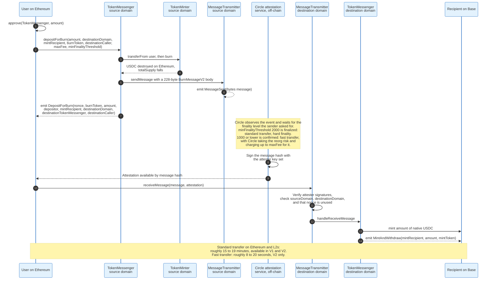

### 14.3 The Wire Format

CCTP messages have a fixed header and a variable body, and each protocol version has its own layout in the source.

The V1 generic message header, from `Message.sol`, is 116 bytes before the body:

```
Field                 Bytes      Type       Index
version               4          uint32     0
sourceDomain          4          uint32     4
destinationDomain     4          uint32     8
nonce                 8          uint64     12
sender                32         bytes32    20
recipient             32         bytes32    52
destinationCaller     32         bytes32    84
messageBody           dynamic    bytes      116
```

The V1 token transfer body, from `BurnMessage.sol`, is 132 bytes:

```
Field                 Bytes      Type       Index
version               4          uint32     0
burnToken             32         bytes32    4
mintRecipient         32         bytes32    36
amount                32         uint256    68
messageSender         32         bytes32    100
```

The V2 header, from `MessageV2.sol`, is 148 bytes and widens the nonce from 8 bytes to 32:

```
Field                      Bytes      Type       Index
version                    4          uint32     0
sourceDomain               4          uint32     4
destinationDomain          4          uint32     8
nonce                      32         bytes32    12
sender                     32         bytes32    44
recipient                  32         bytes32    76
destinationCaller          32         bytes32    108
minFinalityThreshold       4          uint32     140
finalityThresholdExecuted  4          uint32     144
messageBody                dynamic    bytes      148
```

The V2 token transfer body, from `BurnMessageV2.sol`, is a minimum of 228 bytes and adds four fields:

```
Field                 Bytes      Type       Index
version               4          uint32     0
burnToken             32         bytes32    4
mintRecipient         32         bytes32    36
amount                32         uint256    68
messageSender         32         bytes32    100
maxFee                32         uint256    132
feeExecuted           32         uint256    164
expirationBlock       32         uint256    196
hookData              dynamic    bytes      228
```

The four added fields are the whole of Fast Transfer. `maxFee` is the most the sender will pay Circle for taking the reorg risk, `feeExecuted` is what Circle actually took, `expirationBlock` bounds how long the attestation stays valid, and `hookData` carries an arbitrary payload the destination contract may act on.

Two constants select the speed. `minFinalityThreshold` of 2000 means finalized and produces a standard transfer; 1000 or lower means confirmed and produces a fast one. Any value below 1000 is treated as 1000 and any value above it as 2000, so the field is a two-way switch wearing the clothes of a scale. `TokenMessengerV2` refuses anything below 500.

Addresses are `bytes32` rather than `address` in both versions because domains include chains whose addresses are not twenty bytes. Solana public keys are 32 bytes. Padding rules are explicit: `uintNN` fields are left-padded and `bytesNN` fields are right-padded, which prevents hash collisions between differently typed fields of the same width.

V1 exposes two entry points:

```solidity
function depositForBurn(
    uint256 amount,
    uint32 destinationDomain,
    bytes32 mintRecipient,
    address burnToken
) external returns (uint64 _nonce);

function depositForBurnWithCaller(
    uint256 amount,
    uint32 destinationDomain,
    bytes32 mintRecipient,
    address burnToken,
    bytes32 destinationCaller
) external returns (uint64 nonce);
```

V2 folds `destinationCaller` into the main function, adds the fee and finality arguments, and drops `depositForBurnWithCaller` entirely:

```solidity
function depositForBurn(
    uint256 amount,
    uint32 destinationDomain,
    bytes32 mintRecipient,
    address burnToken,
    bytes32 destinationCaller,
    uint256 maxFee,
    uint32 minFinalityThreshold
) external;

function depositForBurnWithHook(
    uint256 amount,
    uint32 destinationDomain,
    bytes32 mintRecipient,
    address burnToken,
    bytes32 destinationCaller,
    uint256 maxFee,
    uint32 minFinalityThreshold,
    bytes calldata hookData
) external;
```

A zero `destinationCaller` means anybody may relay the message and trigger the mint to the named recipient. A non-zero value restricts the relay to one address, which matters for protocols that need the mint to land inside their own transaction.

An integration written against V1 will not compile against V2. That is the practical cost of the redesign, and it is why both versions remain deployed.

### 14.4 What CCTP Does and Does Not Solve

It solves the honeypot. There is no pooled balance to steal, and a compromise of the attestation keys mints USDC rather than draining a vault, which is a smaller and more visible loss.

It does not remove trust. The attestation service is Circle. A user who moves USDC between chains is trusting Circle's key management and Circle's willingness to attest, which is the same trust already required to redeem. That is a coherent position: the marginal trust added by CCTP over holding USDC at all is close to zero.

It also does not solve the general case. CCTP moves USDC. It does not move USDT, and Tether's multi-chain deployments remain independent issuances reconciled on Tether's own books, with cross-chain movement handled by Tether's treasury operations converting between chains on request rather than by a public protocol.

---

## 15. Reserve Yield as the Business Model

The business is simple enough to state in one line: take an interest-free loan from the public and lend it to the Treasury.

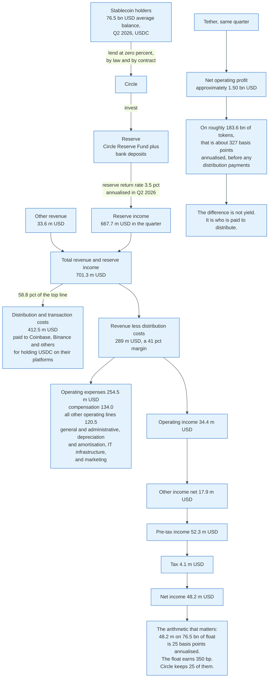

### 15.1 The Revenue Line

Circle's second quarter of 2026, reported to the SEC on 5 August 2026, gives every number needed.

Reserve income was 667.733 million dollars. Other revenue was 33.582 million. Total revenue and reserve income was 701.315 million, up 7 percent year on year. USDC in circulation averaged 76.524 billion dollars over the quarter and ended it at 73.269 billion. Circle discloses the implied yield directly as a reserve return rate of 3.5 percent, down from 4.1 percent a year earlier.

Check the arithmetic: 667.733 million dollars over one quarter on 76.524 billion of average float is 0.8726 percent for the quarter, or 3.49 percent annualised. The disclosed rate and the income statement agree.

Reserve income is a pure interest rate derivative. If the Federal Reserve cuts by 100 basis points and USDC circulation is unchanged, Circle loses roughly 765 million dollars of annual revenue and has no lever to replace it, because it is prohibited from paying holders and therefore cannot compete on rate.

### 15.2 The Cost Line, and Who Actually Wins

Distribution and transaction costs were 412.470 million dollars in the quarter against 701.315 million of revenue. That is 58.8 percent of the top line paid to keep the tokens where the users already are.

Circle describes the arrangement plainly: under the Collaboration Agreement, Coinbase receives allocations based on the amount of USDC held on its platform after Circle's issuer retention, and also receives half of the remaining amount tied to broader ecosystem growth after amounts paid to approved third-party ecosystem participants. Binance has a separate arrangement.

The economics that fall out are unusual. Revenue less distribution costs was 289 million dollars, a margin of 41 percent. Total operating expenses were 254.486 million, of which compensation was 133.999 million. Operating income was 34.359 million. Net income was 48.221 million after 17.947 million of other income and 4.092 million of tax. Adjusted EBITDA was 143 million.

On 76.5 billion dollars of float, Circle's net income of 48.2 million dollars for the quarter is 25 basis points annualised. The float earns roughly 350 basis points. Circle keeps about one fourteenth of what its own product generates.

Tether, in the same quarter, reported approximately 1.50 billion dollars of net operating profit on roughly 183.6 billion dollars of tokens issued, which is about 327 basis points annualised. Tether pays no equivalent of the Coinbase arrangement.

The gap is not a yield gap. It is a distribution gap. Circle bought its way onto US regulated venues; Tether was already everywhere else.

### 15.3 The Yield Prohibition and Its Workaround

Both major regimes forbid the issuer from paying holders interest, and both leave a gap that the market has already filled.

The GENIUS Act states: "No permitted payment stablecoin issuer or foreign payment stablecoin issuer shall pay the holder of any payment stablecoin any form of interest or yield." MiCA Article 50 goes further and treats "any remuneration or any other benefit related to the length of time during which a holder of an e-money token holds such e-money token" as interest, including "net compensation or discounts, with an effect equivalent to that of interest received by the holder."

The GENIUS Act's prohibition binds the issuer. It does not, on its face, bind an exchange that pays its own customers a reward funded from its own share of distribution revenue, which is exactly what Coinbase does with USDC balances held on its platform. MiCA's language reaches further by extending the prohibition to crypto-asset service providers offering services related to e-money tokens, and by catching indirect benefits.

The consequence is a two-tier structure. The stablecoin pays nothing. The venue that holds it pays something. Economically the holder receives yield on a dollar token; legally the issuer does not pay it.

Whether US rulemaking closes that gap is the largest open commercial question in the sector. Bank trade associations argue that yield-bearing stablecoin balances are deposits by another name and will drain funding from community banks. Exchanges argue the payment is for using their platform, not for holding the token. Treasury's proposed rule implementing section 3, published on 18 August 2026 with comments closing on 19 October 2026, is where the argument is being had.

### 15.4 The Reserve as a Buyer of Government Debt

At scale the aggregate reserve is a material participant in the short end of the Treasury market.

Two disclosed figures bound it. Tether reported total assets of 187.751 billion dollars at 30 June 2026, the stated majority in Treasuries and repo. The Circle Reserve Fund reported net assets of 66.367 billion dollars at 30 April 2026, of which 19.111 billion was Treasury obligations and 46.998 billion was repurchase agreements secured by them.

Those two issuers alone therefore direct roughly 254 billion dollars, almost all of it into paper maturing within three months. That is a structurally price-insensitive, non-bank buyer of bills whose demand is a function of crypto market activity rather than of interest rates.

The reflexivity runs in one direction. Stablecoin supply grows when crypto markets are active, which increases bill demand. Bill yields do not drive stablecoin supply. So the flow arrives in size when risk appetite is high and reverses when it is not, which is the opposite of what a stabilising buyer would do.

---

## 16. Settlement Volume Compared with Card Networks

Stablecoin volume figures are routinely quoted as though they measured payments. They do not, and the gap between the headline and the reality is roughly an order of magnitude.

### 16.1 The Headline Comparison

| Network | Period | Value | Transactions | Average |
|---------|--------|-------|--------------|---------|
| **Visa payments volume** | 12 months to 30 Jun 2025 | 13.894 trn USD | 257.5 bn processed transactions, FY2025 | about 54 USD, on mismatched bases |
| **Visa total volume incl. cash** | Fiscal 2025 | 16.383 trn USD | | |
| **Mastercard gross dollar volume** | Calendar 2025 | 10.6 trn USD | 175.5 bn switched transactions | about 60 USD |
| **USDC on-chain transaction volume** | Q2 2026 alone | 14.8 trn USD | not disclosed | not disclosed |
| **All USD stablecoin supply** | 30 Aug 2026 | 309.75 bn USD | | |

Read naively, USDC alone settled more value in three months than Visa did in a year. That reading is wrong, and Circle's own definition explains why.

The 54 dollar average carries a caveat that has to travel with it. Visa reports payments volume for the twelve months to 30 June and processed transactions for the fiscal year to 30 September, and payments volume includes transactions made on Visa credentials that Visa itself does not process. Dividing one by the other mixes two periods and two populations. The result is the right order of magnitude for a card ticket. It is not a disclosed average.

### 16.2 Why the On-Chain Number Is Not a Payments Number

Circle defines the metric in its filings as "the sum of native USDC and canonically bridged USDC settled or processed across all natively supported blockchains, except Solana." It is a gross sum of token transfers. It counts every `Transfer` event, whatever produced it.

Five categories inflate it, and none of them is a payment.

**Automated market maker routing.** A single swap through a multi-hop route generates a transfer at each hop. A router splitting an order across three pools generates three transfers plus the settlements.

**Arbitrage and market-making inventory.** Bots move stablecoins between venues continuously to keep prices aligned. The same dollar can be transferred hundreds of times in a day and settle nothing.

**Exchange internal accounting.** Hot wallet to cold wallet sweeps, omnibus rebalancing, and consolidation transactions all emit `Transfer` events.

**Bridge legs.** A cross-chain move generates a burn on one chain and a mint on another, and canonical bridging counts both.

**Collateral cycling in lending protocols.** Supplying, borrowing, repaying, and liquidating all move tokens without moving value between economic counterparties.

The right comparison is not gross transfers against card purchases. It is the subset of transfers that represent a payment from one economic party to another, and that subset requires heuristic filtering of bot activity.

One public series already does the filtering. Visa Onchain Analytics, at visaonchainanalytics.com, publishes an adjusted transaction volume alongside the gross figure, built on Allium data, and strips exactly the categories listed above: bot and arbitrage flow, exchange-internal movement, and multi-hop routing legs. Its methodology is the right one to cite.

The figures themselves render client-side and could not be retrieved into this document, so no adjusted number is asserted here. What is known is the shape of the correction. Every category above is a multiplier applied to the same underlying dollar, so the adjustment removes duplicates rather than rescaling a real flow. A reader wanting the comparison takes the adjusted figure from that dashboard on the day and sets it against Visa's 13.894 trillion. The gross figure is not a candidate for that slot.

### 16.3 The Comparison That Does Hold

Four structural comparisons survive without any volume estimate.

**Average ticket size.** Visa's payments volume divided by its processed transactions gives an average near 54 dollars, on the mismatched bases noted in 16.1. Mastercard's gross dollar volume divided by switched transactions gives about 60 dollars, though that figure includes cash access. Both are approximations of a card ticket rather than disclosed averages, and the comparison below survives an error of a factor of two in either. Stablecoin transfers on Ethereum average in the thousands of dollars, because a 54 dollar payment cannot economically pay Ethereum gas. Stablecoins on Ethereum are a wholesale instrument. On Tron and on layer 2 networks the average falls sharply, which is exactly why those chains carry the retail volume.

**Cost structure.** A card payment costs the merchant a merchant discount rate typically between 1.5 and 3.5 percent, of which interchange is the largest component and flows to the issuer. A stablecoin transfer costs the sender a gas fee denominated in the chain's native token, independent of the amount transferred. Moving 10 dollars and 10 million dollars costs the same. That is a different pricing model, not a cheaper version of the same one, and it is why stablecoins took cross-border business-to-business flows before they took retail.

**Reversibility.** Visa's rules give the issuer up to 120 days to charge a transaction back. A stablecoin transfer has no reversal. That single difference explains why merchants like stablecoins and consumer protection regulators do not.

**Settlement asset.** A card transaction is an authorisation followed by clearing and net settlement between banks, typically the next business day. A stablecoin transfer is settlement, in the same event. There is no interbank position, no settlement window, and no daily net obligation.

### 16.4 The Honest Summary

Stablecoins do not compete with card networks for retail purchases at present, and the volume figures that suggest otherwise are measuring a different thing.

Where they do compete is in three flows the card networks never served well: cross-border business payments where the alternative is a correspondent banking chain taking days, dollar access in countries with capital controls or unstable local currencies, and settlement between crypto trading venues. The 183.4 billion dollars of USDT outstanding, half of it on Tron, is overwhelmingly the second and third of those.

Card networks move small payments in large numbers. Stablecoins move large payments in small numbers. Both are growing, and they are not yet growing into each other.

---

## 17. A Worked End-to-End Example

Follow ten million dollars from a bank account in Singapore to a merchant wallet on Base, and back out to euros, with every fee and state change made explicit.

**The setup.** A market maker, Meridian Trading Pte Ltd, is a Circle Mint customer. It needs USDC inventory on Base to quote a spread for a payments company settling merchant payouts. Ether trades at 3,000 dollars and Base gas is 0.02 gwei.

**Step 1: mint request.** Meridian submits a mint request for 10,000,000.00 USD through Circle Mint. Compliance checks pass, having been established at onboarding.

**Step 2: the wire.** Meridian instructs its bank to send 10,000,000.00 USD to Circle's operating account. The wire settles the same day. Circle sweeps the balance into the Circle Reserve Fund, subscribing for 10,000,000 Institutional Shares at a net asset value of 1.00 dollar.

**Step 3: the mint call.** Circle's `masterMinter` confirms the minter's allowance covers the amount, then the minter address calls, on Ethereum:

```
mint(0xMeridian..., 10000000000000)
```

The integer is `10,000,000 * 10^6` because USDC has 6 decimals. The contract increments `totalSupply_` by that amount, sets Meridian's packed balance slot, decrements `minterAllowed[minter]`, and emits `Mint(minter, 0xMeridian, 10000000000000)` and `Transfer(0x0, 0xMeridian, 10000000000000)`. Mint fee: zero.

**Step 4: cross the chain.** Meridian wants the inventory on Base, domain 6 in CCTP's numbering. It uses CCTP V2, approves `TokenMessengerV2`, and calls the seven-argument entry point:

```
depositForBurn(
    10000000000000,               // amount, 6 decimals
    6,                            // destinationDomain, Base
    bytes32(0xMeridianBase...),   // mintRecipient
    0xA0b8...eB48,                // burnToken, USDC on Ethereum
    bytes32(0),                   // destinationCaller, anyone may relay
    0,                            // maxFee, no fast-transfer fee accepted
    2000                          // minFinalityThreshold, finalized
)
```

`maxFee` of zero and `minFinalityThreshold` of 2000 select a standard transfer, so Circle waits for hard finality and charges nothing. The `TokenMinter` burns 10,000,000 USDC on Ethereum. `totalSupply_` on Ethereum falls by exactly that amount. The `MessageTransmitter` emits a `MessageSent` event carrying a 148-byte V2 header and a 228-byte `BurnMessageV2` body. Meridian pays roughly 150,000 gas for approve plus burn; at 8 gwei and 3,000 dollars per ether that is about 3.60 dollars.

**Step 5: attestation and mint on Base.** Circle's attestation service observes the event, waits for Ethereum finality, and signs the message hash. Meridian fetches the attestation and calls `receiveMessage(message, attestation)` on Base. The destination `MessageTransmitter` verifies the attester signatures, confirms the nonce is unused, and calls `handleReceiveMessage`. The Base `TokenMessenger` mints 10,000,000 native USDC to Meridian's Base address and emits `MintAndWithdraw`. Elapsed time for a standard transfer: roughly 15 to 19 minutes. Base gas at 0.02 gwei: under one cent. Setting `minFinalityThreshold` to 1000 and a non-zero `maxFee` would have cut that to roughly 8 to 20 seconds, with Circle carrying the reorg risk and taking the fee. Fast Transfer is available in V2 only.

Total USDC in existence is unchanged. Ten million dollars moved chains and Circle's reserve did not move at all.

**Step 6: the merchant payout.** The payments company sends 2,500.00 USDC to a merchant on Base. The transfer is a call to the proxy with calldata `0xa9059cbb` followed by the padded recipient and the padded amount `2500000000`. The implementation checks `whenNotPaused`, checks bit 255 of the sender's and the recipient's packed slots, checks the balance, moves the integers, and emits `Transfer`. Cost: about 55,000 gas, or roughly a third of a cent on Base. The merchant's wallet reflects the balance on the next state read. There is no acceptance step and no reversal path.

**Step 7: redemption in euros.** The merchant is European and wants euros. It cannot redeem with Circle, because it is not a Mint customer, and outside the European Union Circle does not redeem for non-customers. So it sells the USDC to a broker at 0.9997 dollars, absorbing 3 basis points, which is the secondary market cost of not having primary access.

The broker, which is a Mint customer, accumulates 10,000,000 USDC, bridges it back to Ethereum, sends it to its Circle deposit address, and requests a standard redemption. Circle then moves the tokens from the deposit address to a minter address, because `burn` destroys only the caller's own balance. The minter calls `burn(10000000000000)`, destroying the tokens and reducing `totalSupply_`. Circle redeems 10,000,000 fund shares for cash and wires the dollars. The standard redemption fee at that size, per Circle's disclosed schedule, is 0.1 percent above 15 million dollars and 0.06 percent between 5 and 15 million: on 10 million dollars, 6,000 dollars. The basic option, initiated within two business days, would have cost nothing.

**The ledger, end to end.**

| Event | USDC totalSupply change | Reserve change | Fee paid | Who pays |
|-------|-------------------------|----------------|----------|----------|
| Mint on Ethereum | +10,000,000 | +10,000,000 USD | 0 | nobody |
| CCTP burn on Ethereum | -10,000,000 | 0 | about 3.60 USD gas | Meridian |
| CCTP mint on Base | +10,000,000 | 0 | under 0.01 USD gas | Meridian |
| Merchant payout, 2,500 USDC | 0 | 0 | about 0.003 USD gas | payments company |
| Merchant sells at 0.9997 | 0 | 0 | 3 bp of value | merchant |
| Redemption burn | -10,000,000 | -10,000,000 USD | 6,000 USD standard fee | broker |

Two observations fall out of the table. The reserve moved twice and sat still for every other step, which is what makes the on-chain volume figure so misleading. And the only participant who paid a material fee was the one who could not reach the primary market, which is the recurring economic consequence of the permissioned mint.

---

## 18. Regulation: MiCA and the GENIUS Act

Two jurisdictions wrote comprehensive stablecoin law within two years of each other, reached similar substantive conclusions, and built entirely different machinery to enforce them.

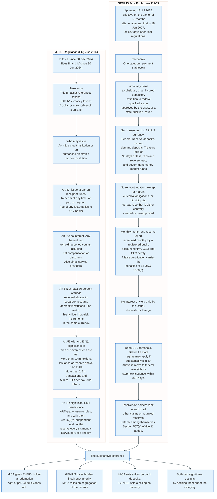

### 18.1 MiCA, in Force and Biting

MiCA is Regulation (EU) 2023/1114. Article 149 sets the dates: the Regulation applies from 30 December 2024, with Titles III and IV applying from 30 June 2024. Titles III and IV are the stablecoin titles, and they went first because the legislators judged stablecoins the more urgent risk.

A single-currency stablecoin is an e-money token under Title IV. Only a credit institution or an authorised electronic money institution may issue one. Three articles do the substantive work.

**Article 49** requires issuance at par on receipt of funds, gives every holder a claim against the issuer, and requires redemption "at any time and at par value" on request, with no fee. This is the provision Circle carves out of its own restriction: it does not redeem for non-Mint customers "with the exception of general stablecoin holders subject to specific regulatory requirements such as those in the European Union."

**Article 50** prohibits interest and defines it broadly enough to catch the workarounds, treating "any remuneration or any other benefit related to the length of time during which a holder of an e-money token holds such e-money token" as interest, expressly including "net compensation or discounts, with an effect equivalent to that of interest." It also binds crypto-asset service providers, not only issuers.

**Article 54** governs the reserve: at least 30 percent of funds received must always be deposited in separate accounts at credit institutions, and the remainder invested in secure, low-risk, highly liquid financial instruments with minimal market, credit, and concentration risk, denominated in the same official currency as the token.

Article 56 classifies an e-money token as significant when at least three of the seven criteria in Article 43(1) are met: more than 10 million holders; issuance, market capitalisation, or reserve above 5,000,000,000 euros; average daily transactions above 2.5 million and 500,000,000 euros; the issuer being a designated gatekeeper; international significance including remittance use; interconnectedness with the financial system; or the issuer running an additional token plus a crypto-asset service. Significance moves supervision to the European Banking Authority and, under Article 58, applies the asset-referenced token reserve regime, which carries Article 36(9)'s requirement of an independent audit of the reserve every six months.

The commercial consequence has been visible since 2024. USDT was delisted from European venues rather than brought into compliance. USDC was not.

### 18.2 The GENIUS Act, Enacted and Not Yet Effective

The Guiding and Establishing National Innovation for U.S. Stablecoins Act was approved on 18 July 2025 as Public Law 119-27, originating as S. 1582.

Its central move is to create a category and close it. Only a permitted payment stablecoin issuer may issue a payment stablecoin: a subsidiary of an insured depository institution, a federal qualified issuer approved by the Comptroller of the Currency, or a state qualified issuer. Section 4 sets the reserve at one to one in a defined list of assets: US currency, deposits at Federal Reserve banks, demand deposits at insured institutions, Treasury bills with a remaining maturity of 93 days or less, repurchase and reverse repurchase agreements, and government money market funds.

Rehypothecation is prohibited, with three narrow exceptions: satisfying margin obligations on permitted reserve investments, satisfying obligations from standard custodial services, and creating liquidity to meet redemption expectations by selling Treasury bills into repurchase agreements with a maturity of 93 days or less, provided the repos are either cleared by an SEC-registered clearing agency or pre-approved by the regulator.

The disclosure regime is the strongest in either jurisdiction. Each month the previous month-end reserve report must be examined by a registered public accounting firm, and each month the chief executive officer and chief financial officer must certify its accuracy to their regulator. Knowingly false certification attracts the criminal penalties of 18 U.S.C. 1350(c).

Yield is prohibited in one sentence: "No permitted payment stablecoin issuer or foreign payment stablecoin issuer shall pay the holder of any payment stablecoin any form of interest or yield."

The dual-track supervision turns on a threshold. A state qualified issuer with less than 10 billion dollars outstanding may remain under a state regime certified as substantially similar to the federal standard. Above 10 billion, the issuer must transition to federal oversight or cease issuing new tokens within 360 days.

Section 11 gives holders priority in insolvency, ratable among themselves, over all other claims with respect to required reserves, and adds a new section 507(e) to title 11 of the United States Code. Section 10 gives custodial customers a parallel priority over the claims of anyone other than another customer.

Non-financial public companies may not issue without unanimous approval from a Stablecoin Certification Review Committee, with data-use restrictions and tying prohibitions attached. Foreign issuers may not offer in the United States unless technologically capable of complying with lawful orders, which is a direct requirement to hold a freeze function.

### 18.3 Where Implementation Stood in August 2026

Section 20 sets the effective date at the earlier of 18 months after enactment, which is 18 January 2027, or 120 days after the primary federal payment stablecoin regulators issue final implementing regulations.

As at 30 August 2026 no final rule had been published. The rulemaking calendar shows a dense proposal pipeline: the OCC proposed rules implementing issuance standards on 2 March and 18 May 2026; the FDIC proposed requirements and standards for its supervised issuers on 10 April 2026 and Bank Secrecy Act standards on 5 June; anti-money-laundering and sanctions programme rules for permitted issuers were proposed in April and June 2026; a customer identification programme rule was proposed on 22 June 2026; principles for determining whether a state regime is substantially similar were proposed on 3 April 2026; and Treasury's rule implementing section 3, the prohibitions on issuance, offer, and sale, was published on 18 August 2026 under docket TREAS-DO-2026-0496 with comments closing on 19 October 2026.

With no final rule in hand and a comment period running into the fourth quarter, the statutory backstop governs. 18 January 2027 is the operative date.

### 18.4 What Neither Regime Addresses

Three gaps are common to both.

**The secondary holder in the United States has no redemption right.** MiCA created one. The GENIUS Act did not, giving holders insolvency priority instead. Priority in bankruptcy is worth something on the day the issuer fails and nothing on the day the peg wobbles.

**Neither regime touches the chain.** Both regulate the issuer and the reserve. Neither says anything about which blockchain the token may be issued on, what finality guarantee it must have, or what happens if the chain reorganises. Half of USDT sits on Tron, and no provision of either statute has anything to say about that.

**The exchange yield workaround is unresolved.** MiCA's language reaches service providers and probably catches it. The GENIUS Act's does not on its face, and the rulemaking has not settled it.

---

## 19. Security and Risk

The risks that have actually cost money are not the ones the sector spends most of its time on.

### 19.1 The Threat Model, Ranked by Realised Loss

```mermaid
%%{init: {'theme': 'base', 'themeVariables': {'primaryColor': '#e3f2fd', 'primaryBorderColor': '#1565c0', 'lineColor': '#37474f'}}}%%

flowchart TB
    subgraph REAL["REALISED - these have cost money"]
        R1["Reserve bank failure<br/>USDC, March 2023<br/>3.3 bn USD stranded, price to 0.8767,<br/>43 percent of supply lost over ten months"]
        R2["Mechanism failure<br/>UST, May 2022<br/>Roughly 18 bn USD of liability to zero<br/>in four days"]
        R3["Issuer misrepresentation<br/>Tether, 2016 to 2018<br/>Fully backed on 27.6 percent of days<br/>in a 26-month CFTC sample"]
        R4["Bridge compromise<br/>Ronin 624 m, Wormhole 326 m,<br/>Nomad 190 m, all in 2022"]
        R5["Liquidation engine failure<br/>MakerDAO, 12 March 2020<br/>Auctions cleared at zero, about<br/>5.67 m USD of bad debt"]
    end

    subgraph LATENT["LATENT - plausible, not yet realised at scale"]
        L1["Token contract bug<br/>Both major contracts are old,<br/>simple and heavily reviewed"]
        L2["Issuer key compromise<br/>USDC caps the loss at the minter's<br/>remaining allowance.<br/>USDT has a single owner key."]
        L3["Deep chain reorganisation<br/>would unwind transfers already<br/>treated as final"]
        L4["Concentration<br/>Two issuers hold 83.2 percent of supply.<br/>Half of the larger sits on one chain.<br/>The smaller's reserve sits in one fund."]
    end

    subgraph MIT["MITIGATION NOW IN PLACE"]
        M1["Reserve in a 2a-7 fund with daily<br/>liquidity, not term deposits"]
        M2["GENIUS Act: T-bills of 93 days or less,<br/>no rehypothecation, monthly examination,<br/>CEO and CFO criminal certification"]
        M3["MiCA: at least 30 percent in credit<br/>institution deposits, six-monthly audit<br/>for significant tokens"]
        M4["CCTP burn-and-mint removes<br/>the bridge honeypot"]
        M5["Dutch auctions with partial fills<br/>and flash-loan bidding"]
        M6["Legislated ban on uncollateralised<br/>designs in both jurisdictions"]
    end

    R1 --> M1
    R1 --> M3
    R2 --> M6
    R3 --> M2
    R4 --> M4
    R5 --> M5
    L4 -.->|"no mitigation"| GAP["Unaddressed. Neither statute says<br/>anything about which chain a<br/>token may be issued on."]
    L3 -.-> GAP
```

**Reserve bank failure.** Realised. Circle's 3.3 billion dollar exposure to Silicon Valley Bank cost USDC 12.3 percent of its price for two days and 43 percent of its supply over ten months, without a dollar of actual loss. Mitigations now in place: the reserve sits in a 2a-7 fund with daily liquidity rather than in term deposits, the GENIUS Act limits maturities to 93 days, and MiCA requires 30 percent in credit institution deposits spread across institutions.

**Mechanism failure.** Realised, catastrophically, in the algorithmic family. Mitigated by legislation banning the design rather than by engineering.

**Issuer misrepresentation.** Realised. The CFTC found Tether fully backed on 27.6 percent of days in a 26-month sample. Mitigated by monthly examination and personal criminal certification under the GENIUS Act, and by Tether's own move to an audited financial statement in August 2026.

**Bridge compromise.** Realised repeatedly and expensively. Ronin, Wormhole, and Nomad together lost more than 1.1 billion dollars in 2022. Mitigated for USDC by burn-and-mint, which removes the pooled balance.

**Smart contract bug in the token itself.** Not realised at scale for USDT or USDC. Both contracts are simple, old, heavily reviewed, and upgradeable through a proxy, which is itself a risk trade: an upgradeable contract can be fixed and can also be changed by whoever holds the admin key.

**Key compromise at the issuer.** Not realised publicly. The masterMinter and minter separation caps the loss from a single compromised minter at its remaining allowance. Tether's single-owner design has no equivalent cap.

**Oracle manipulation.** Realised in crypto-collateralised systems, not in fiat-collateralised ones. A fiat-collateralised stablecoin has no price feed to manipulate, which is an underrated structural advantage.

**Chain reorganisation.** Not realised at scale. A deep reorganisation on a chain carrying stablecoins would unwind transfers that recipients had treated as final. This is the risk CCTP's standard mode is designed around, and the risk that fast mode explicitly accepts on Circle's behalf.

### 19.2 The Run Dynamic

Stablecoins are structurally run-prone for a reason that has nothing to do with reserve quality: redemption is at par, first come first served, and the reserve is marked to market.

If the reserve holds Treasury bills and rates rise, the bills are worth less than par until they mature. An issuer meeting redemptions must sell them at market. Early redeemers get 1.00 dollar; late redeemers face an issuer whose remaining reserve is short. That is the classic money market fund run.

The SEC rewrote Rule 2a-7 in July 2023 to blunt it. The amendments removed redemption gates from the rule altogether and severed the old link between weekly liquidity thresholds and fees. In their place they put a mandatory liquidity fee that reaches only institutional prime and institutional tax-exempt funds, triggered when daily net redemptions exceed 5 percent of net assets, with compliance from 2 October 2024. They also lifted the daily liquid asset minimum to 25 percent and the weekly minimum to 50 percent. A government fund such as the Circle Reserve Fund carries no mandatory fee and cannot gate.

A stablecoin issuer has less than that again. Circle states it does not have an unconditional right to deny redemption to a Mint customer, so there is no fee, no gate, and no board discretion. The customer gets certainty. The system gets no brake.

Three things dampen it in practice. Maturities are short, so the mark-to-market gap is small: a 93-day bill's price barely moves. Repurchase agreements are 70.8 percent of the Circle Reserve Fund and they mature overnight, so most of the reserve turns into cash the next morning without a sale. And the primary market is small, so the population that can run at par is a few hundred firms rather than a few million.

The last of those is a genuine stability feature of the permissioned mint, and it is rarely stated. Restricting the primary market limits the run.

### 19.3 The Compliance Surface

Every fiat-collateralised stablecoin carries a freeze function, and that function is now a regulatory requirement rather than a design choice.

The GENIUS Act requires a foreign payment stablecoin issuer to be "technologically capable of complying with the terms of any lawful order," which is a statutory mandate for a blacklist. In practice both dominant issuers have had one since inception, and both have used it: roughly 3,100 addresses and 1.733 billion USDT frozen by Tether as at 1 August 2026, and 123.2 million dollars of access denied tokens on Circle's books at 30 June 2026.

The unresolved question is scope. A freeze reaches an address, not a person. When funds move through a mixer and emerge at a hundred new addresses, the issuer either freezes all of them on suspicion, catching innocent holders, or freezes none, and the sanction is ineffective. The Tornado Cash designation of 8 August 2022 made that trade explicit and it has not been resolved since.

### 19.4 Concentration

Two issuers hold 83.2 percent of USD-pegged stablecoin supply. One chain, Tron, holds half of the larger one. One money market fund holds the reserves behind the other. One asset manager runs that fund.

Each of those concentrations is individually defensible and collectively unexamined. The failure of BlackRock's Circle Reserve Fund is not a plausible event; the failure of Tron's validator set is not either. But a system in which a 310 billion dollar market has four single points of failure has not been stress tested, because it has never been stressed while at this size.

---

## 20. Comparisons and Alternatives

### 20.1 Against Other Ways of Holding a Digital Dollar

| Instrument | Issuer | Backing | Redemption | Yield to holder | Transfer finality | Reversible |
|------------|--------|---------|------------|-----------------|-------------------|------------|
| **Bank deposit** | Commercial bank | Bank's balance sheet, insured to a limit | On demand, any customer | Yes, set by the bank | Batch or instant scheme | Yes, by scheme rule |
| **Money market fund share** | Fund | T-bills and repo | Same or next day, any shareholder | Yes, the full portfolio yield | Not transferable peer to peer | No |
| **Fiat stablecoin** | Private company | T-bills, repo, deposits | Par, to vetted counterparties only, except in the EU | No, prohibited | Seconds to minutes | No |
| **Tokenised money market fund** | Fund with a token wrapper | T-bills and repo | Par, to qualified investors | Yes, accrues into the token | Seconds to minutes | No |
| **Central bank digital currency** | Central bank | The central bank | Not applicable, it is the money | Policy choice | Design choice | Design choice |
| **Crypto-collateralised stablecoin** | Smart contract | Overcollateralised crypto plus other stablecoins | Through vault repayment or a PSM swap | Through a savings rate contract | Seconds to minutes | No |

The row that matters is the yield row. A stablecoin is the only instrument in the table that holds interest-bearing assets and pays the holder nothing, by law. That is not an oversight; it is the deliberate design that keeps the token a payment instrument rather than a security or a deposit.

It is also why tokenised money market funds are the most interesting competitive threat. A tokenised fund pays its yield to the holder and transfers on the same rails. What it cannot do is trade at exactly one dollar, because its share price accrues, and it cannot be offered to everyone, because it is a security. Those two constraints are why stablecoins have not been displaced.

### 20.2 Against Payment Rails

| Property | Stablecoin | Card network | Instant payment scheme | Correspondent wire |
|----------|-----------|--------------|------------------------|--------------------|
| **Settlement asset** | Issuer liability | Commercial bank money, net settled | Central bank money | Central bank and commercial bank money |
| **Hours** | Continuous | Continuous authorisation, batch settlement | Continuous | Business hours |
| **Cost basis** | Fixed per transaction, in gas | Percentage of value | Fixed, cents or free | Fixed, 15 to 50 USD |
| **Reversibility** | None | Chargeback, up to 120 days | Recall request, discretionary | Recall request, discretionary |
| **Identity** | Address only | Cardholder and merchant identified | Account holder identified, often name-checked | Both parties identified |
| **Cross-border** | Native, no correspondent chain | Native, with FX markup | Rarely, mostly domestic | Native, slow and expensive |
| **Governing body** | None | Network operating regulations | Scheme rulebook | Swift standards plus bilateral agreements |

Stablecoins win decisively on exactly one axis: cross-border value transfer outside business hours, without a correspondent chain, at a cost independent of the amount. That is a real and previously unserved market, and it explains the geographic distribution of USDT far better than any argument about technology.

They lose on every axis that involves recourse.

### 20.3 When to Choose Which

**Choose a fiat-collateralised stablecoin** for settlement between crypto venues, for cross-border business payments where speed matters more than recourse, and for dollar access where local banking is unavailable or the local currency is unstable.

**Choose a crypto-collateralised stablecoin** when counterparty exposure to a single issuer is the specific risk being avoided, and when accepting a 20 to 70 percent capital overhead is acceptable to get it. Note that this reasoning is weaker than it looks while the peg is enforced by a fixed-price swap against USDC.

**Choose an instant payment scheme** for domestic retail payments in any country that has one. Pix, UPI, and FedNow settle in central bank money and carry consumer protections a stablecoin does not. Pix and UPI cost the payer nothing. FedNow charges the sending institution 0.045 dollars for each customer credit transfer on its 2026 schedule, with an origination discount that waives the first 2,500 items a month, so the marginal cost above that is four and a half cents rather than a fraction of one.

**Choose a card** when the buyer wants recourse. That is the entire value proposition and stablecoins have no answer to it.

---

## 21. Modern Developments

### 21.1 The Legitimacy Trade Has Been Made

Three events in fourteen months moved stablecoins from a regulatory grey zone into supervised finance.

Circle's June 2025 listing on the New York Stock Exchange, at 31.00 dollars per share for 19.9 million Class A shares and 583.0 million dollars of net proceeds, put a stablecoin issuer's full financial statements into the public record on a quarterly cadence. Everything in section 15 comes from that filing obligation.

The GENIUS Act's signature on 18 July 2025 created a federal licensing path and a definition. The rulemaking that followed has produced more than a dozen proposed rules across the OCC, FDIC, Federal Reserve, and FinCEN in the first eight months of 2026.

Tether's KPMG audit, published 13 August 2026 with an unqualified opinion on the year to 31 December 2025, closed the longest-running credibility gap in the sector. It came ten years after the first serious questions and nearly five years after the CFTC order.

### 21.2 The Entrants

The tail is where the growth is. USD1 from World Liberty Financial reached 4.19 billion dollars, USDG from the Paxos-led Global Dollar Network 3.26 billion, PYUSD 2.77 billion, and RLUSD from Ripple 2.37 billion, all as at 30 August 2026.

The pattern in each case is the same: an existing distribution channel issuing its own token rather than distributing someone else's, because the reserve yield accrues to the issuer and the distributor only receives a share. PayPal, Ripple, and the Global Dollar Network members each concluded that being the issuer beats being paid to distribute.

Circle's own disclosure shows why. It pays out 58.8 percent of revenue to distributors. Any distributor large enough to issue its own token will eventually notice that number.

### 21.3 Yield-Bearing Instruments Blurring the Category

The fastest-growing adjacent category is tokens that look like stablecoins and pay yield, which the legislation was written to separate.

Tokenised money market funds and Treasury products now appear on the same dashboards as stablecoins: BlackRock's BUIDL at 2.79 billion dollars, Circle's own USYC at 2.78 billion, and Ondo's USDY at 2.19 billion as at 30 August 2026. USYC and USDY do not trade at one dollar; their prices were 1.135 and 1.144 respectively, because the yield accrues into the price.

That price is the legal boundary. An instrument that trades at a par of exactly one dollar and pays nothing is a payment stablecoin. An instrument whose price rises with accrued interest is a fund share. The two settle on the same rails and are governed by entirely different law.

Ethena's USDe, at 4.08 billion dollars, sits awkwardly across the line. It targets one dollar, it is backed by a real portfolio rather than a self-referential token, and its staked version pays yield. It is neither a fiat-collateralised stablecoin nor an algorithmic one, and neither MiCA nor the GENIUS Act has a category that fits it cleanly.

### 21.4 Where the Growth Is Going

Total USD-pegged supply grew from 129.84 billion dollars on 1 January 2024 to 309.75 billion on 30 August 2026, a compound rate of 38.6 percent a year. The multiple is 2.386 over 973 days, which is 2.664 years. Growth has flattened in 2026: the total was 305.92 billion on 1 January 2026 and 317.39 billion on 1 June, before easing back.

USDT peaked at 190.43 billion dollars on 20 May 2026 and stood at 183.4 billion on 30 August. USDC peaked at 79.62 billion on 18 March 2026 and stood at 74.2 billion. Both leaders are flat to down over the last quarter while the tail grows.

Three things are worth watching. Whether the GENIUS Act's 18 January 2027 effective date arrives without final rules, and what happens to non-compliant issuers when it does. Whether US rulemaking closes the exchange yield workaround, which would remove the main reason retail holders keep balances on platforms. And whether any issuer other than Tether and Circle reaches the 10 billion dollar threshold that forces federal supervision.

---

## 22. Appendix

### 22.1 Key Terminology

| Term | Meaning |
|------|---------|
| **Access denied token** | Circle's term for USDC frozen under a legal order, with the matching reserve moved to a segregated account. 123.2 million dollars outstanding at 30 June 2026. |
| **ART** | Asset-referenced token. MiCA Title III category for a token referencing a basket or a non-currency asset. |
| **Attestation** | An accountant's report on management's assertion about a point in time. Not an audit. |
| **`balanceAndBlacklistStates`** | USDC v2.2 storage slot packing the blacklist flag in bit 255 and the balance in the low 255 bits. |
| **CCTP** | Cross-Chain Transfer Protocol. Circle's burn-and-mint mechanism for moving native USDC between chains. |
| **CDP** | Collateralised debt position. A vault holding collateral against stablecoin debt. |
| **Circle Mint** | Circle's institutional service for direct minting and redemption. Not available to individuals. |
| **Circle Reserve Fund** | SEC-registered 2a-7 government money market fund, ticker USDXX, managed by BlackRock Advisors, holding the majority of USDC reserves. |
| **`destroyBlackFunds`** | Tether contract function that zeroes a blacklisted balance and reduces total supply. |
| **Depeg** | A sustained deviation of the secondary market price from the target value. |
| **EIP-2612** | Ethereum standard for signature-based approvals, so a third party can pay the gas. |
| **EIP-3009** | Ethereum standard for signature-based transfers. Implemented by USDC as `transferWithAuthorization`. |
| **EMT** | E-money token. MiCA Title IV category for a token referencing a single official currency. |
| **`frob`** | The Maker `Vat` function that changes collateral and debt in one call. |
| **GENIUS Act** | Public Law 119-27, approved 18 July 2025. Creates the US federal payment stablecoin regime. |
| **Ilk** | A collateral type in the Maker system. |
| **`masterMinter`** | USDC role that grants and revokes minter allowances but cannot itself mint. |
| **MiCA** | Regulation (EU) 2023/1114 on markets in crypto-assets. |
| **`minterAllowance`** | Per-minter cap on newly minted USDC, decremented by each mint. |
| **Primary market** | Direct minting and redemption with the issuer at par. Permissioned. |
| **PSM** | Peg Stability Module. A fixed-price swap between DAI and a fiat-collateralised stablecoin. |
| **Ray, rad, wad** | Maker fixed-point units of 10^27, 10^45, and 10^18 respectively. |
| **Reserve return rate** | Circle's disclosed annualised yield on reserves. 3.5 percent in the quarter to 30 June 2026. |
| **Secondary market** | Exchange and AMM trading of existing tokens. Permissionless. Does not change supply. |
| **Seigniorage share** | The second token in an algorithmic design, absorbing the stablecoin's volatility. |
| **Significant EMT** | A MiCA classification triggering EBA supervision and six-monthly reserve audits. |
| **Tokens allowed but not issued** | Circle's term for pre-created tokens on chains whose token standards require it, excluded from circulation figures. |

### 22.2 Architecture Diagrams

| Diagram | Source | Description |
|---------|--------|-------------|
| Evolution Timeline | [`diagrams/evolution-timeline.mmd`](diagrams/evolution-timeline.mmd) | Stablecoin milestones from BitUSD in 2014 to Tether's first audit in 2026 |
| Three Designs | [`diagrams/three-designs.mmd`](diagrams/three-designs.mmd) | Fiat, crypto, and algorithmic collateral compared by backing, peg mechanism, and failure mode |
| Participants | [`diagrams/participants.mmd`](diagrams/participants.mmd) | Every actor from the reserve custodian to the end wallet, and how value moves between them |
| Mint and Burn Lifecycle | [`diagrams/mint-burn-lifecycle.mmd`](diagrams/mint-burn-lifecycle.mmd) | Fiat in, tokens out, and the reverse, with the exact contract calls |
| Primary and Secondary Markets | [`diagrams/primary-secondary-markets.mmd`](diagrams/primary-secondary-markets.mmd) | Where supply changes, where price is discovered, and what breaks the link |
| Reserve Composition | [`diagrams/reserve-composition.mmd`](diagrams/reserve-composition.mmd) | USDC and USDT reserves side by side with the disclosed figures |
| Attestation Versus Audit | [`diagrams/attestation-vs-audit.mmd`](diagrams/attestation-vs-audit.mmd) | What each engagement covers, and the disclosure record of both major issuers |
| ERC-20 Transfer | [`diagrams/erc20-transfer.mmd`](diagrams/erc20-transfer.mmd) | A USDC transfer from calldata construction to finality |
| Blacklist Mechanics | [`diagrams/blacklist-mechanics.mmd`](diagrams/blacklist-mechanics.mmd) | Freeze in USDC, freeze and destroy in USDT, and what neither can do |
| DAI Vault Lifecycle | [`diagrams/dai-vault-lifecycle.mmd`](diagrams/dai-vault-lifecycle.mmd) | From opening a vault to liquidation, auction, and bad debt |
| Death Spiral | [`diagrams/death-spiral.mmd`](diagrams/death-spiral.mmd) | The algorithmic feedback loop and why a reserve does not stop it |
| Depeg Timelines | [`diagrams/depeg-timelines.mmd`](diagrams/depeg-timelines.mmd) | UST in May 2022 and USDC in March 2023, hour by hour |
| CCTP Burn and Mint | [`diagrams/cctp-burn-mint.mmd`](diagrams/cctp-burn-mint.mmd) | Cross-chain USDC movement with the attestation step |
| Reserve Yield Economics | [`diagrams/reserve-yield-economics.mmd`](diagrams/reserve-yield-economics.mmd) | Circle's quarterly income statement traced from float to net income |
| Regulatory Comparison | [`diagrams/regulatory-comparison.mmd`](diagrams/regulatory-comparison.mmd) | MiCA and the GENIUS Act side by side, with article and section numbers |
| Risk Map | [`diagrams/risk-map.mmd`](diagrams/risk-map.mmd) | Threats ranked by realised loss, with the mitigation now in place |

### 22.3 Contract Reference

| Item | Value |
|------|-------|
| **USDC Ethereum address** | `0xA0b86991c6218b36c1d19D4a2e9Eb0cE3606eB48` |
| **USDC decimals** | 6 |
| **USDC contract pattern** | `FiatTokenProxy` delegating to `FiatTokenV2_2` |
| **USDC roles** | `owner`, `masterMinter`, `minters`, `blacklister`, `pauser`, `rescuer` |
| **USDC total supply on Ethereum** | 50,767,403,540.85 USDC, 30 August 2026. Exceeds DefiLlama's Ethereum circulating figure of 47.39 bn by about 3.4 bn. See the note in section 5.2. |
| **USDC holders on Ethereum** | 9,038,320 addresses, 30 August 2026 |
| **USDT Ethereum address** | `0xdAC17F958D2ee523a2206206994597C13D831ec7` |
| **USDT decimals** | 6 |
| **USDT contract pattern** | Single non-upgradeable contract with a `deprecate` path to a successor |
| **USDT roles** | `owner` only |
| **USDT total supply on Ethereum** | 88,306,390,736.35 USDT, 30 August 2026 |
| **USDT holders on Ethereum** | 17,545,137 addresses, 30 August 2026 |
| **`transfer` selector** | `0xa9059cbb`, the first four bytes of `keccak256("transfer(address,uint256)")` |
| **USDT fee parameters** | `setParams` bounded by `require(newBasisPoints < 20)` and `require(newMaxFee < 50)`. Both have been zero throughout the contract's life. |

### 22.4 CCTP Message Layout

V1 generic message header, 116 bytes before the body:

| Field | Bytes | Type | Index |
|-------|-------|------|-------|
| `version` | 4 | uint32 | 0 |
| `sourceDomain` | 4 | uint32 | 4 |
| `destinationDomain` | 4 | uint32 | 8 |
| `nonce` | 8 | uint64 | 12 |
| `sender` | 32 | bytes32 | 20 |
| `recipient` | 32 | bytes32 | 52 |
| `destinationCaller` | 32 | bytes32 | 84 |
| `messageBody` | dynamic | bytes | 116 |

V1 burn message body, 132 bytes:

| Field | Bytes | Type | Index |
|-------|-------|------|-------|
| `version` | 4 | uint32 | 0 |
| `burnToken` | 32 | bytes32 | 4 |
| `mintRecipient` | 32 | bytes32 | 36 |
| `amount` | 32 | uint256 | 68 |
| `messageSender` | 32 | bytes32 | 100 |

V2 generic message header, 148 bytes before the body:

| Field | Bytes | Type | Index |
|-------|-------|------|-------|
| `version` | 4 | uint32 | 0 |
| `sourceDomain` | 4 | uint32 | 4 |
| `destinationDomain` | 4 | uint32 | 8 |
| `nonce` | 32 | bytes32 | 12 |
| `sender` | 32 | bytes32 | 44 |
| `recipient` | 32 | bytes32 | 76 |
| `destinationCaller` | 32 | bytes32 | 108 |
| `minFinalityThreshold` | 4 | uint32 | 140 |
| `finalityThresholdExecuted` | 4 | uint32 | 144 |
| `messageBody` | dynamic | bytes | 148 |

V2 burn message body, 228 bytes minimum:

| Field | Bytes | Type | Index |
|-------|-------|------|-------|
| `version` | 4 | uint32 | 0 |
| `burnToken` | 32 | bytes32 | 4 |
| `mintRecipient` | 32 | bytes32 | 36 |
| `amount` | 32 | uint256 | 68 |
| `messageSender` | 32 | bytes32 | 100 |
| `maxFee` | 32 | uint256 | 132 |
| `feeExecuted` | 32 | uint256 | 164 |
| `expirationBlock` | 32 | uint256 | 196 |
| `hookData` | dynamic | bytes | 228 |

V2 finality threshold constants:

| Constant | Value | Meaning |
|----------|-------|---------|
| `FINALITY_THRESHOLD_FINALIZED` | 2000 | Standard transfer. Circle attests only after hard finality. |
| `FINALITY_THRESHOLD_CONFIRMED` | 1000 | Fast transfer. Circle attests earlier and takes the reorg risk. |
| `TOKEN_MESSENGER_MIN_FINALITY_THRESHOLD` | 500 | Lowest value `TokenMessengerV2` will accept. |

### 22.5 Supply History

USD-pegged stablecoin supply, DefiLlama circulating totals:

| Date | Total | USDT | USDC | DAI |
|------|-------|------|------|-----|
| 1 Jan 2020 | not shown | 3.20 bn | not shown | not shown |
| 1 Jan 2021 | not shown | 20.04 bn | 3.91 bn | 1.17 bn |
| 1 Jan 2022 | not shown | not shown | not shown | 8.93 bn |
| 1 May 2022 | 187.06 bn | | | |
| 15 May 2022 | 158.01 bn | | | |
| 1 Mar 2023 | 134.46 bn | | 41.99 bn | |
| 15 Mar 2023 | 132.32 bn | 73.39 bn | 38.11 bn | |
| 1 Jun 2023 | not shown | | 28.66 bn | |
| 1 Jan 2024 | 129.84 bn | 91.68 bn | 23.86 bn | 5.17 bn |
| 1 Jan 2025 | 204.80 bn | 137.43 bn | 43.93 bn | 4.38 bn |
| 1 Jan 2026 | 305.92 bn | | | |
| 1 Jun 2026 | 317.39 bn | | | |
| 30 Aug 2026 | 309.75 bn | 183.38 bn | 74.18 bn | 4.80 bn |

### 22.6 Chain Distribution, 30 August 2026

| Chain | USDT | Share | USDC | Share |
|-------|------|-------|------|-------|
| **Tron** | 91.93 bn | 50.1% | not material | |
| **Ethereum** | 73.51 bn | 40.1% | 47.39 bn | 63.9% |
| **BNB Smart Chain** | 9.18 bn | 5.0% | 1.58 bn | 2.1% |
| **Solana** | 2.84 bn | 1.5% | 6.87 bn | 9.3% |
| **Hyperliquid** | not material | | 6.72 bn | 9.1% |
| **Base** | not material | | 4.27 bn | 5.8% |
| **Arbitrum** | 0.87 bn | 0.5% | 2.18 bn | 2.9% |
| **Polygon** | 0.77 bn | 0.4% | 1.75 bn | 2.4% |
| **Total** | 183.38 bn | | 74.18 bn | |

### 22.7 Primary Sources

| Source | What it establishes |
|--------|---------------------|
| Circle Internet Group Form 10-Q for the quarter ended 30 June 2026, filed 5 August 2026 | Revenue, distribution costs, reserve return rate, circulation, redemption policy, access denied tokens |
| Circle Internet Group Form S-1, filed 1 April 2025 | SVB exposure of 3.3 billion dollars, Circle Mint eligibility, redemption fee schedule, Circle Reserve Fund constraints |
| BlackRock FundsSM Circle Reserve Fund annual financial statements to 30 April 2026 | Net assets, portfolio composition, advisory fee schedule, Deloitte audit |
| Tether Q2 2026 attestation announcement, 31 July 2026 | Total assets, liabilities, excess reserves, gold holdings, secured lending, profit |
| Tether audit announcement, 13 August 2026 | KPMG US unqualified opinion for the year to 31 December 2025 |
| CFTC press release 8450-21, 15 October 2021 | 41 million dollar penalty, full backing on 27.6 percent of sampled days |
| Regulation (EU) 2023/1114, consolidated text | Articles 36, 43, 49, 50, 54, 56, 58, 149 |
| Public Law 119-27, GENIUS Act | Sections 4, 10, 11, 20 |
| Federal Register documents, 2026 | Rulemaking status as at 30 August 2026 |
| `circlefin/stablecoin-evm` and `circlefin/evm-cctp-contracts` on GitHub | USDC and CCTP contract source |
| `makerdao/dss` and `makerdao/dss-lite-psm` on GitHub | Vat, frob, and PSM source |
| Visa Form 10-K for fiscal 2025, filed 6 November 2025 | Payments volume and processed transactions |
| Visa Onchain Analytics, built on Allium data | Adjusted versus gross stablecoin transaction volume, and the filtering methodology |
| Federal Reserve Financial Services 2026 FedNow Service fee schedule | 0.045 USD per customer credit transfer, origination discount on the first 2,500 items a month |
| 18 U.S.C. 1350(c) | Split penalties for knowing and wilful false certification |
| SEC money market fund reform adopting release, July 2023 | Removal of redemption gates, mandatory liquidity fee at institutional prime and tax-exempt funds |
| Mastercard Form 10-K for 2025, filed 11 February 2026 | Gross dollar volume and switched transactions |
| DefiLlama stablecoin API, retrieved 30 August 2026 | Supply and chain distribution series |

---

## 23. Key Takeaways

**1. A stablecoin is a narrow bank with no deposit insurance and no closing time.** It holds short government paper, issues a demand liability against it, and settles that liability on a public blockchain. Every property that makes it useful and every property that makes it fragile follows from those three facts.

**2. Almost no holder can redeem.** Circle states in its SEC filings that it does not redeem for anyone who is not a Circle Mint customer, except where EU law forces it. A few hundred institutions face a market of tens of millions of holders. The peg is a wholesale arbitrage that retail holders observe rather than participate in.

**3. Depegs are redemption-channel failures, not reserve failures.** USDC's reserves were never short by a cent in March 2023, and the token traded at 0.8767 dollars because banks were closed and the FDIC had not said what it would do with an uninsured 3.3 billion dollar deposit. The token recovered in two days and the franchise took ten months to stop shrinking.

**4. Algorithmic designs fail because the collateral is a claim on confidence in the liability.** When the stablecoin is in trouble, the share token is worth less, so more of it must be minted per redemption, so it is worth less still. Terra's four-day collapse in May 2022 took LUNA from 86.14 dollars to 0.0000179 and cut total stablecoin supply across the whole market by 15.5 percent in a fortnight. Both major regulatory regimes responded by defining the design out of the category rather than regulating it.

**5. Attestation and audit are not the same word for the same thing.** An attestation covers a date; an audit covers a year. The CFTC found Tether fully backed on 27.6 percent of the days in a 26-month sample, which is entirely consistent with accurate quarterly reports. Tether obtained its first audit opinion, from KPMG US, on 13 August 2026, ten years after the questions started.

**6. Both dominant stablecoins can freeze any holder, and one can confiscate.** USDC's `blacklist` sets bit 255 of a packed storage slot and stops all movement. Tether's `destroyBlackFunds` zeroes the balance and reduces total supply. Roughly 3,100 addresses holding 1.733 billion USDT were frozen as at 1 August 2026. Being on a public blockchain buys the holder auditability, not resistance.

**7. DAI's peg is enforced by a swap against USDC.** The Peg Stability Module offers a fixed-price exchange at par with essentially zero fee, which is a far stronger peg mechanism than any vault parameter. It also imports USDC's credit risk directly, which is why DAI depegged alongside USDC in March 2023. Decentralised in governance, centralised in credit.

**8. The business is a spread on other people's float, and most of the spread goes to the distributor.** Circle earned 667.7 million dollars of reserve income on 76.5 billion dollars of average USDC in the quarter to 30 June 2026, a rate of 3.5 percent, and paid 412.5 million dollars, or 58.8 percent of total revenue, to Coinbase and other distributors. Net income was 48.2 million dollars, which is 25 basis points on the float. The float earns 350.

**9. Nobody may pay holders interest, and everybody does.** The GENIUS Act bans the issuer from paying yield and MiCA Article 50 bans it more broadly, including indirect benefits and service providers. The exchange that holds a customer's USDC is not the issuer, and it pays rewards out of its distribution share. Whether US rulemaking closes that gap is the largest unresolved commercial question in the sector.

**10. On-chain volume is not payment volume.** Circle reported 14.8 trillion dollars of USDC on-chain transaction volume in the quarter to 30 June 2026 against Visa's 13.894 trillion of payments volume for a full year. The USDC figure is a gross sum of transfer events including AMM routing, bot arbitrage, exchange sweeps, and bridge legs. The comparison that holds is average ticket size, cost structure, and reversibility, and on all three the two systems are serving different jobs.

**11. Regulation arrived, converged on substance, and diverged on machinery.** MiCA has applied to stablecoins since 30 June 2024 and gives every holder a redemption right at par with no fee. The GENIUS Act was signed on 18 July 2025, gives holders insolvency priority instead of a redemption right, and takes effect on 18 January 2027 unless final rules arrive sooner. As at 30 August 2026, none had.

**12. The market has four single points of failure.** Two issuers hold 83.2 percent of supply. Half of the larger one sits on Tron. The reserves of the smaller one sit in one money market fund run by one asset manager. Each concentration is individually defensible. None of them has been stressed at this size.

---

*Figures in this document are drawn from SEC filings, issuer attestations and audits, published regulations, contract source code, and on-chain data, and reflect information available as of 30 August 2026. Supply, price, and reserve figures move continuously; the dates attached to each number are load-bearing.*
