# Distributed Databases: Complete Technical Deep Dive

---

## Table of Contents

1. [History and Overview](#1-history-and-overview)
2. [What a Distributed Database Is, and What It Is Not](#2-what-a-distributed-database-is-and-what-it-is-not)
3. [CAP, Stated Precisely](#3-cap-stated-precisely)
4. [PACELC: The Tradeoff That Applies Every Day](#4-pacelc-the-tradeoff-that-applies-every-day)
5. [Key Participants and Roles](#5-key-participants-and-roles)
6. [Consensus, Part One: Paxos](#6-consensus-part-one-paxos)
7. [Consensus, Part Two: Raft](#7-consensus-part-two-raft)
8. [Time: Physical, Logical, Vector, and Hybrid Clocks](#8-time-physical-logical-vector-and-hybrid-clocks)
9. [Google Spanner and TrueTime](#9-google-spanner-and-truetime)
10. [CockroachDB: Ranges, Leaseholders, and Hybrid Logical Clocks](#10-cockroachdb-ranges-leaseholders-and-hybrid-logical-clocks)
11. [Cassandra: Leaderless Quorums and Tunable Consistency](#11-cassandra-leaderless-quorums-and-tunable-consistency)
12. [Hinted Handoff, Read Repair, and Anti-Entropy](#12-hinted-handoff-read-repair-and-anti-entropy)
13. [Conflict Resolution: Vector Clocks Against Last-Write-Wins](#13-conflict-resolution-vector-clocks-against-last-write-wins)
14. [Sharding and Rebalancing](#14-sharding-and-rebalancing)
15. [Distributed Transactions and Two-Phase Commit](#15-distributed-transactions-and-two-phase-commit)
16. [Isolation Levels in a Distributed Setting](#16-isolation-levels-in-a-distributed-setting)
17. [Behaviour During a Network Partition](#17-behaviour-during-a-network-partition)
18. [One Transaction, End to End](#18-one-transaction-end-to-end)
19. [Economics: What It Costs to Run and Who Pays](#19-economics-what-it-costs-to-run-and-who-pays)
20. [Security, Risk, and the Failure Modes That Actually Happen](#20-security-risk-and-the-failure-modes-that-actually-happen)
21. [Comparisons and Alternatives](#21-comparisons-and-alternatives)
22. [Modern Developments](#22-modern-developments)
23. [Appendix](#23-appendix)
24. [Key Takeaways](#24-key-takeaways)

---

## 1. History and Overview

A distributed database is a database whose data lives on more than one machine and whose correctness therefore depends on a network it does not control. Everything difficult about the subject follows from that one sentence. A single-node database can assume its own clock, its own memory, and its own disk. A distributed database can assume none of them, because any of the three can be replaced, at any moment and without notice, by silence.

The field has one recurring shape. Somebody proves an impossibility result, somebody else builds a system that lives inside the gap the proof leaves open, and the industry spends a decade misquoting the proof.

```mermaid
%%{init: {'theme': 'base', 'themeVariables': {'primaryColor': '#e3f2fd', 'primaryBorderColor': '#1565c0', 'lineColor': '#37474f'}}}%%

graph LR
    subgraph Era1["Theory<br/>1978-2002"]
        direction TB
        E1A["1978: Lamport, Time, Clocks and<br/>the Ordering of Events.<br/>happens-before and logical clocks"]
        E1B["1978: Gray, Notes on Data Base<br/>Operating Systems.<br/>1979: Lampson and Sturgis.<br/>Two-phase commit written down"]
        E1C["1985: FLP impossibility.<br/>JACM 32(2) 374-382.<br/>No deterministic consensus with<br/>one possible crash failure"]
        E1D["1990: Lamport submits<br/>The Part-Time Parliament.<br/>Published TOCS 1998"]
        E1E["2002: Gilbert and Lynch prove CAP.<br/>SIGACT News 33(2) 51-59"]
    end

    subgraph Era2["Google and Amazon publish<br/>2006-2012"]
        direction TB
        E2A["2006: Bigtable and Chubby, OSDI.<br/>Range partitioning and<br/>production Paxos"]
        E2B["2007: Dynamo, SOSP.<br/>Consistent hashing, sloppy quorums,<br/>vector clocks, hinted handoff"]
        E2C["2008: Cassandra at Facebook.<br/>Dynamo ring plus Bigtable data model"]
        E2D["2010: Percolator, OSDI.<br/>2PC over Bigtable with<br/>a timestamp oracle"]
        E2E["2012: Spanner, OSDI.<br/>TrueTime and commit-wait.<br/>Abadi publishes PACELC"]
    end

    subgraph Era3["Reimplementation outside Google<br/>2014-2020"]
        direction TB
        E3A["2014: Raft, USENIX ATC.<br/>Consensus you can implement"]
        E3B["2014: Kulkarni et al.<br/>Hybrid logical clocks, OPODIS"]
        E3C["2017: Cloud Spanner and<br/>CockroachDB 1.0.<br/>Geo-distributed SQL as a product"]
        E3D["2019: Parallel Commits.<br/>One consensus round trip to commit"]
        E3E["2020: CockroachDB paper,<br/>SIGMOD, pp 1493-1509"]
    end

    subgraph Era4["Consolidation<br/>2024-2026"]
        direction TB
        E4A["Sep 2024: Cassandra 5.0 GA"]
        E4B["Dec 2024: Aurora DSQL announced.<br/>DynamoDB multi-Region<br/>strong consistency announced"]
        E4C["2025: CockroachDB Leader leases<br/>remove the node liveness<br/>single point of failure"]
        E4D["Aug 2026: Cassandra 5.0.9.<br/>Accord still pre-GA"]
    end

    Era1 --> Era2 --> Era3 --> Era4

    style Era1 fill:#eceff1,stroke:#37474f,stroke-width:2px
    style Era2 fill:#e3f2fd,stroke:#1565c0,stroke-width:2px
    style Era3 fill:#e8f5e9,stroke:#2e7d32,stroke-width:2px
    style Era4 fill:#fff3e0,stroke:#e65100,stroke-width:2px
```

### 1.1 The Impossibility Results Came First

Three negative results define the boundary of what any distributed database can promise, and all three predate every system in this document.

**FLP, 1985.** Fischer, Lynch, and Paterson proved in the Journal of the ACM, volume 32 issue 2, pages 374 to 382, that in an asynchronous system with no bound on message delay, no deterministic protocol solves consensus if even one process may fail by crashing. The reason is that a slow process and a dead process are indistinguishable. Every practical consensus protocol therefore adds a timing assumption, usually a timeout, and trades away the guarantee of termination in order to keep the guarantee of safety.

**CAP, 2002.** Gilbert and Lynch proved Brewer's 2000 conjecture in ACM SIGACT News, volume 33 issue 2, pages 51 to 59. Section 3 covers the statement and the near-universal misreading of it.

**The 2PC blocking window, 1979 onward.** Two-phase commit has no non-blocking variant that is safe under partitions. A participant that has voted yes and then lost contact with the coordinator must hold its locks. Section 15 covers what systems do about it.

### 1.2 Google Publishes, Everyone Else Rebuilds

The commercial history of distributed databases is largely a history of Google papers being reimplemented outside Google.

Bigtable, published at OSDI 2006, gave the industry the range-partitioned wide-column store and, indirectly, HBase and Cassandra's storage layer. Chubby, published at the same conference, was the first widely described production Paxos deployment; it stated an availability of nine outages of 30 seconds or more in 700 days. Dynamo followed at SOSP 2007 from Amazon rather than Google, and gave the industry consistent hashing with virtual nodes, sloppy quorums, hinted handoff, and vector clocks. Cassandra, released by Facebook in 2008, welded the Dynamo ring to the Bigtable data model and became the reference leaderless system.

Spanner, published at OSDI 2012, broke the pattern. It did not choose between consistency and latency. It bought its way out with hardware: GPS receivers and atomic clocks in every datacenter, exposed through an API that returns an interval rather than an instant. Section 9 covers the mechanism.

CockroachDB started in 2014 as an explicit attempt to build Spanner without Google's clocks, using software clocks plus a conservative uncertainty bound. Its architecture paper appeared at SIGMOD 2020, pages 1493 to 1509.

### 1.3 Scale Today

The numbers below are the ones each project publishes, with the date each was measured, because every figure in this field moves.

| System | First public | Model | Current release, August 2026 | Consensus | Default isolation |
|--------|-------------|-------|------------------------------|-----------|-------------------|
| **Apache Cassandra** | 2008 | Leaderless, quorum | 5.0.9, released 7 Aug 2026 | Paxos for LWT only | None across partitions |
| **Google Spanner** | OSDI 2012 | Sharded Paxos groups | Managed service | Multi-Paxos | Serializable, external consistency |
| **CockroachDB** | 2014 | Sharded Raft groups | v26.3.0, released 27 Jul 2026; v25.4.15 on the prior series | Raft | Serializable |
| **etcd** | 2013 | Single Raft group | v3.7 series; v3.7.1, released 23 Jul 2026 | Raft | Linearizable KV |
| **Amazon DynamoDB** | 2012 | Leaderless internally, leader per partition | Managed service | Internal | Eventual or strong per read |
| **Amazon Aurora DSQL** | Announced Dec 2024 | Disaggregated, optimistic | Managed service | Internal | Snapshot isolation |

Cassandra's maintenance policy states that 5.0 is maintained until the 8.0 release, 4.1 until 7.0, and 4.0 until 6.0. Cassandra 5.0.9, 4.1.12, and 4.0.21 all shipped on 7 August 2026.

---

## 2. What a Distributed Database Is, and What It Is Not

A distributed database is a system that presents one logical dataset while storing it on several machines that communicate only by sending messages. That definition has three consequences and they are the whole subject.

Messages can be delayed without limit. Messages can be dropped. A machine cannot tell the difference between a peer that is slow, a peer that is dead, and a peer it can no longer reach. Every mechanism in this document exists to make a useful promise despite those three facts.

### 2.1 Two Orthogonal Axes: Replication and Partitioning

Replication and partitioning solve different problems and are routinely confused.

**Replication** puts the same data on several machines. It buys durability and availability. It costs write latency and creates the problem of keeping copies in agreement.

**Partitioning**, also called sharding, puts different data on different machines. It buys capacity and throughput. It costs the ability to run a query or a transaction over one machine's memory, and it creates the problem of atomic commit across shards.

Almost every real system does both. Spanner partitions into directories and replicates each partition through a Paxos group. CockroachDB partitions into ranges and replicates each range through a Raft group. Cassandra partitions with consistent hashing and replicates each token range to RF nodes. The unit is different in each, but the shape is identical: partition first, then replicate each partition independently.

The unit of replication is the unit of failure. That single sentence explains why every one of these systems draws its consensus boundary around a shard rather than around the cluster.

### 2.2 What These Systems Are Not

**Not a single database with a bigger disk.** A single-node database can hold a lock and know that the lock is held. A distributed database can hold a lock and be unable to tell whether the holder still exists. Every API that looks the same across the two hides a different failure model underneath.

**Not free of the speed of light.** Brewer's 2017 Spanner whitepaper does the arithmetic: 1,000 miles is about 5 million feet, and at half a foot per nanosecond that is 10 ms, which he gives as the minimum round-trip time for a consistent operation spanning that distance. Google defines a "region" as a set of datacenters with a 2 ms round-trip time for exactly this reason. A synchronously replicated write across continents cannot commit in less than a continental round trip, no matter what the vendor's marketing says.

**Not made consistent by atomic clocks.** This is the most common misconception about Spanner and it is worth stating flatly. Brewer, writing for Google in February 2017, says TrueTime "does not significantly help achieve CA" and that what limits partitions in practice is Google's private global network with at least three independent fibres per datacenter. TrueTime buys external consistency and consistent snapshots. It does not buy availability, and it does not repeal CAP.

**Not made strongly consistent by R + W > N.** Quorum overlap guarantees that a read set intersects a write set. It does not guarantee linearizability. Abadi states this directly in the PACELC paper: Dynamo-style systems "cannot achieve full consistency as defined by Gilbert and Lynch, even if R + W > N". Section 11.4 gives the three concrete reasons.

**Not solved by consensus.** Raft and Paxos agree on the order of entries in one log. A database with 40,000 ranges has 40,000 logs. Ordering each one says nothing about a transaction that touches two of them, which is why every consensus-based SQL database still runs an atomic commit protocol on top. Consensus is a component, not an architecture.

**Not a message queue with a query language.** Eventual consistency is a liveness property, not a safety property. It says that if writes stop, replicas converge. It says nothing about what a reader sees while writes continue, which is the only interval that matters in production.

### 2.3 The Simplest Accurate Mental Model

Think of a distributed database as a set of independent replicated logs, plus a rule for assigning timestamps, plus a protocol for committing across logs.

Change the log protocol and you get Paxos or Raft. Change the timestamp rule and you get last-write-wins, hybrid logical clocks, or TrueTime. Change the cross-log commit protocol and you get two-phase commit, parallel commits, or nothing at all.

Cassandra is the case with nothing at all. Its logs are per-replica and unordered relative to each other, its timestamp rule is a wall clock, and its cross-partition commit protocol does not exist. That is not a defect. It is the design, and it buys write availability that no consensus system can match.

---

## 3. CAP, Stated Precisely

CAP is a theorem about a specific formal model, and almost every use of it in industry substitutes vaguer words for the model's definitions. This section states the definitions the proof actually uses.

The result is due to Seth Gilbert and Nancy Lynch, "Brewer's Conjecture and the Feasibility of Consistent, Available, Partition-Tolerant Web Services", ACM SIGACT News, volume 33 issue 2, June 2002, pages 51 to 59. It proves a conjecture Eric Brewer made in a PODC keynote on 19 July 2000.

### 3.1 The Three Definitions

**Consistency means atomic, or linearizable, consistency.** The paper's definition, as quoted by Abadi: "There must exist a total order on all operations such that each operation looks as if it were completed at a single instant. This is equivalent to requiring requests of the distributed shared memory to act as if they were executing on a single node, responding to operations one at a time."

Read that twice. It is not "the ACID C". It is not "no anomalies". It is linearizability of a single read-write register: every operation appears to take effect at one instant between its invocation and its response, and later operations see earlier ones.

**Availability means every request to a non-failing node returns a response.** No bound on how fast. Just: it terminates, and it terminates with an answer rather than an error. A node that returns "service unavailable" is not available in this sense, and neither is one that blocks forever.

**Partition tolerance means the network is allowed to lose arbitrarily many messages between two groups of nodes.** It is not a property the system chooses. It is a property of the environment, and it is a description of what the adversary is permitted to do.

### 3.2 What Is Actually Proved

The paper proves the impossibility in two network models.

**In the asynchronous model** there is no clock and no bound on message delay, so nodes cannot use timeouts. Theorem 1 states that it is impossible to implement a read-write data object that guarantees both availability and atomic consistency in all fair executions, including those in which messages are lost. The corollary strengthens this: the impossibility holds in the asynchronous model even in executions in which no messages are lost, because a node cannot distinguish "the message has not arrived yet" from "the message will never arrive".

**In the partially synchronous model** every node has a clock, and clocks run at a bounded rate relative to each other, so timeouts become meaningful. The impossibility survives: no algorithm guarantees both atomic consistency and availability in all executions in which messages may be lost.

The paper then does the constructive half that nobody quotes. It gives an algorithm achieving atomic consistency when the network is behaving, and a weaker property it calls t-Connected Consistency once a partition heals, in which the system becomes consistent again after a bounded delay. That is the formal ancestor of every "eventually consistent" system in production.

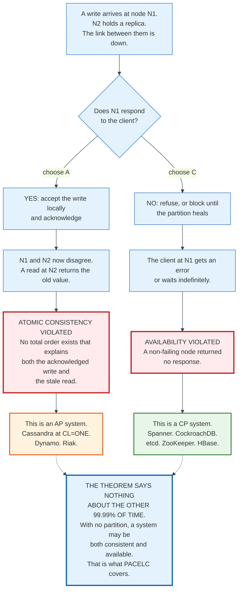

### 3.3 The Three Misreadings

**"Pick two of three."** This is the popularisation and it is wrong in a specific way. Brewer's own 2012 retrospective, "CAP Twelve Years Later: How the Rules Have Changed" in IEEE Computer volume 45 issue 2, says designers are not entitled to two of three, and that many systems have zero or one of the properties. P is not on the menu. If the network can drop messages, the system faces partitions whether or not the designer wants them, and the only live choice is what to do during one.

**"CA is a real category."** A CA system is one that assumes partitions never happen. A single-node database qualifies. A two-node synchronously replicated pair does not, because the link between the two nodes is a network. Vendors who market a replicated system as CA are claiming their network never fails.

**"CAP forces eventual consistency."** Abadi's central argument. CAP imposes no restriction in the absence of a partition, so a system that weakens consistency during normal operation is not doing so because of CAP. It is doing so for latency. Section 4 is that argument.

### 3.4 Availability Is Not Binary, and the Choice Is Per-Operation

A system can be CP for writes and AP for reads. Spanner is CP for read-write transactions and considerably more available for snapshot reads, because a snapshot read at a timestamp in the past needs only one sufficiently caught-up replica on the caller's side of the partition. Cassandra turns the same dial per query, trading availability for quorum overlap as the level rises: at `ALL` one unreachable replica fails the operation, at `ONE` any reachable replica answers. What a higher consistency level never buys is CAP's C, which is linearizability. Only `SERIAL` and `LOCAL_SERIAL` lightweight transactions supply that, and only within one partition.

CAP classifies executions, not products. Any product that lets the caller choose a quorum size lets the caller choose an availability position per call. Choosing the C half needs consensus on the operation itself, which quorum size alone does not supply.

---

## 4. PACELC: The Tradeoff That Applies Every Day

PACELC extends CAP with the tradeoff that governs a system when nothing is broken, which is nearly all of the time. Daniel Abadi published it in "Consistency Tradeoffs in Modern Distributed Database System Design", IEEE Computer volume 45 issue 2, February 2012, pages 37 to 42, in the same issue as Brewer's CAP retrospective.

The formulation, in Abadi's words: "if there is a partition (P), how does the system trade off availability and consistency (A and C); else (E), when the system is running normally in the absence of partitions, how does the system trade off latency (L) and consistency (C)?"

The insight is that the second tradeoff is unavoidable and permanent, while the first is conditional and rare.

### 4.1 Why the ELC Half Exists at All

Availability requires replication, and replication forces a choice about when a write is acknowledged. Abadi enumerates the only three ways to replicate.

**Send updates to all replicas at once.** With no agreement layer in front, two concurrent writes can reach two replicas in different orders, and the replicas diverge. Low latency, no consistency.

**Send updates to a master first.** The master orders them, then propagates. If propagation is synchronous, latency is the round trip to the slowest replica. If it is asynchronous, a read at a replica can miss a committed write.

**Send updates to an arbitrary node first.** This is Dynamo's design and it makes divergence a first-class outcome to be reconciled later.

Each option pays for consistency with latency, at all times, partition or no partition. Abadi cites measurements in which a strongly consistent configuration cost four times the latency of the eventually consistent one. That factor is not universal, but the direction is.

```mermaid
%%{init: {'theme': 'base', 'themeVariables': {'primaryColor': '#e3f2fd', 'primaryBorderColor': '#1565c0', 'lineColor': '#37474f'}}}%%

flowchart TB
    subgraph Q1["PA / EL"]
        direction TB
        Q1D["Partition: keep serving, diverge.<br/>Normal: answer from the nearest replica,<br/>accept staleness."]
        Q1S["Cassandra at ONE or LOCAL_ONE<br/>Dynamo, Riak, Voldemort<br/>DynamoDB eventually consistent reads"]
    end

    subgraph Q2["PC / EC"]
        direction TB
        Q2D["Partition: refuse on the minority side.<br/>Normal: pay the consensus round trip<br/>on every write and every strong read."]
        Q2S["Spanner, CockroachDB, YugabyteDB<br/>etcd, ZooKeeper, HBase, VoltDB<br/>Cassandra at QUORUM/ALL"]
    end

    subgraph Q3["PC / EL"]
        direction TB
        Q3D["Partition: refuse rather than diverge.<br/>Normal: serve reads from an async replica<br/>because latency matters more."]
        Q3S["PNUTS, per Abadi's classification<br/>Any master-per-item design with<br/>async replicas serving reads"]
    end

    subgraph Q4["PA / EC"]
        direction TB
        Q4D["Partition: elect a new master and lose<br/>the old master's unreplicated writes.<br/>Normal: consistent reads and writes."]
        Q4S["MongoDB, per Abadi's classification<br/>of the original rollback-directory design"]
    end

    RULE["The E half applies at all times.<br/>The P half applies during an outage.<br/>Most production pain is E, not P."]

    Q1 --> RULE
    Q2 --> RULE
    Q3 --> RULE
    Q4 --> RULE

    style Q1 fill:#fff3e0,stroke:#e65100,stroke-width:2px
    style Q2 fill:#e8f5e9,stroke:#2e7d32,stroke-width:2px
    style Q3 fill:#f3e5f5,stroke:#4a148c,stroke-width:2px
    style Q4 fill:#fce4ec,stroke:#880e4f,stroke-width:2px
    style RULE fill:#e3f2fd,stroke:#1565c0,stroke-width:3px
```

### 4.2 Abadi's Own Classifications

The paper classifies named systems, and the classifications are worth quoting because they are frequently reassigned by people who did not read it.

| System | Class | Abadi's reasoning |
|--------|-------|-------------------|
| Dynamo, Cassandra, Riak (defaults) | **PA/EL** | Give up consistency for availability under partition and for latency otherwise. Once the reconciliation code exists, reusing it for latency is free. |
| VoltDB / H-Store, Megastore | **PC/EC** | Refuse to give up consistency; pay both the availability and latency costs. |
| BigTable, HBase | **PC/EC** | Same. |
| MongoDB | **PA/EC** | Consistent in the baseline case; on master failure the minority's unreplicated writes went to a rollback directory needing manual reconciliation. |
| PNUTS | **PC/EL** | Reads served from async replicas for latency; on partition the mastered item becomes unavailable for updates rather than divergent. |

PC/EL looks paradoxical, and Abadi addresses it head on. PC does not mean the system is fully consistent. It means the system does not reduce consistency *further* when a partition occurs; it reduces availability instead.

### 4.3 The Practical Reading

Ask two questions of any system, in this order.

First, the cost of a write when everything works. That is the E half, it is paid on every request, and it is where a system's throughput and tail latency come from.

Second, the fate of the minority side of a partition. That is the P half, it is paid during incidents, and it is where a system's on-call burden comes from.

A team that only asks the second question will pick a database whose steady-state latency it cannot afford. That is the more common error.

---

## 5. Key Participants and Roles

The vocabulary differs by system and the roles do not. This table maps the same seven roles across the four architectures this document covers.

| Role | What it does | Spanner | CockroachDB | Cassandra | etcd |
|------|--------------|---------|-------------|-----------|------|
| **Client / gateway** | Parses the request, decides which shards it touches, fans out | Client library plus front-end | Any node acts as gateway | Any node acts as coordinator | Any member |
| **Shard** | The unit of partitioning and of consensus | Tablet inside a Paxos group | Range, 512 MiB default max | Token range on the ring | The whole keyspace, one group |
| **Replica** | Holds a copy of a shard | Spanserver replica | Range replica | Endpoint owning the token | Member |
| **Leader** | Orders writes for one shard | Paxos leader, 10 s lease | Raft leader | None. Every replica accepts writes | Raft leader |
| **Read authority** | May answer a read without a round trip | Paxos leader, or any replica for snapshot reads | Leaseholder, or any follower for stale reads | Any replica the CL permits | Leader, or a follower with ReadIndex |
| **Transaction coordinator** | Drives atomic commit across shards | Coordinator leader, one of the participant Paxos leaders | `TxnCoordSender` on the gateway node | None, except Paxos for LWT | None |
| **Cluster manager** | Membership, placement, rebalancing | Universe master and placement driver | Allocator and replicate queue | Gossip plus operator-run `nodetool` | Static membership plus reconfiguration |

### 5.1 The Two Roles That Decide Everything

**Whoever may answer a read without talking to anyone decides the system's read latency.** In Cassandra at `LOCAL_ONE` that is any local replica, which is why Cassandra reads are fast and can be stale. In CockroachDB it is the leaseholder, which is why a read from the wrong region pays a cross-region round trip unless follower reads are enabled. In Spanner it is the Paxos leader for strong reads and any sufficiently caught-up replica for snapshot reads.

**Whoever drives atomic commit decides the system's write latency and its blast radius.** Spanner picks one participant Paxos leader as the coordinator, so a 2PC "member" is itself a highly available replicated group rather than a single machine. CockroachDB puts the coordinator in the gateway node's `TxnCoordSender`, which heartbeats a transaction record; if the heartbeat stops the record moves to `ABORTED` and other transactions clean up. Cassandra has no coordinator for multi-partition writes, which is precisely why it has no multi-partition atomicity.

### 5.2 The Role Nobody Diagrams: The Placement Engine

Data placement is a background process that moves bytes between machines while the database is serving traffic, and it causes more production incidents than consensus does.

CockroachDB's allocator considers replica count, node liveness, disk fullness, locality constraints, and lease preferences, then enqueues work on the replicate queue, which sends rate-limited snapshots. Cassandra streams SSTables on bootstrap and decommission, and requires the operator to run `nodetool cleanup` afterwards to reclaim space that a node no longer owns. Spanner moves directories between Paxos groups to balance load.

In each case the same thing goes wrong: rebalancing competes with foreground traffic for disk and network, and the operator discovers the interaction during an incident rather than during capacity planning.

---

## 6. Consensus, Part One: Paxos

Paxos solves one problem: getting a set of processes to agree on one value, once, despite crashes and message loss. Everything else built on it, including every replicated log, is a repeated application of that single-value protocol.

Lamport described it in "The Part-Time Parliament", ACM Transactions on Computer Systems volume 16 issue 2, May 1998, pages 133 to 169, a paper submitted in 1990 and held for eight years. He restated it without the Greek parliament in "Paxos Made Simple", ACM SIGACT News volume 32 issue 4, December 2001, pages 51 to 58, whose abstract reads in full: "The Paxos algorithm, when presented in plain English, is very simple."

### 6.1 The Three Roles and the Safety Requirements

Paxos has proposers, acceptors, and learners. A single process usually plays all three.

The algorithm is derived, not invented, from a chain of strengthened requirements. Lamport's derivation is the clearest way to hold the protocol in your head, so here it is in his own numbering.

**P1.** An acceptor must accept the first proposal that it receives.

**P2.** If a proposal with value v is chosen, then every higher-numbered proposal that is chosen has value v.

**P2a.** If a proposal with value v is chosen, then every higher-numbered proposal accepted by any acceptor has value v.

**P2b.** If a proposal with value v is chosen, then every higher-numbered proposal issued by any proposer has value v.

**P2c.** For any v and n, if a proposal with value v and number n is issued, then there is a set S consisting of a majority of acceptors such that either no acceptor in S has accepted any proposal numbered less than n, or v is the value of the highest-numbered proposal among all proposals numbered less than n accepted by the acceptors in S.

**P1a.** An acceptor can accept a proposal numbered n if and only if it has not responded to a prepare request having a number greater than n.

P2c is the whole algorithm. To issue a proposal, a proposer must first learn what a majority of acceptors have already accepted, and if any of them accepted anything, the proposer must propose the highest-numbered such value rather than its own. A proposer that wants to write "x = 5" may be forced to write "x = 3" instead. That is not a bug; it is the mechanism by which a chosen value stays chosen.

### 6.2 The Two Phases

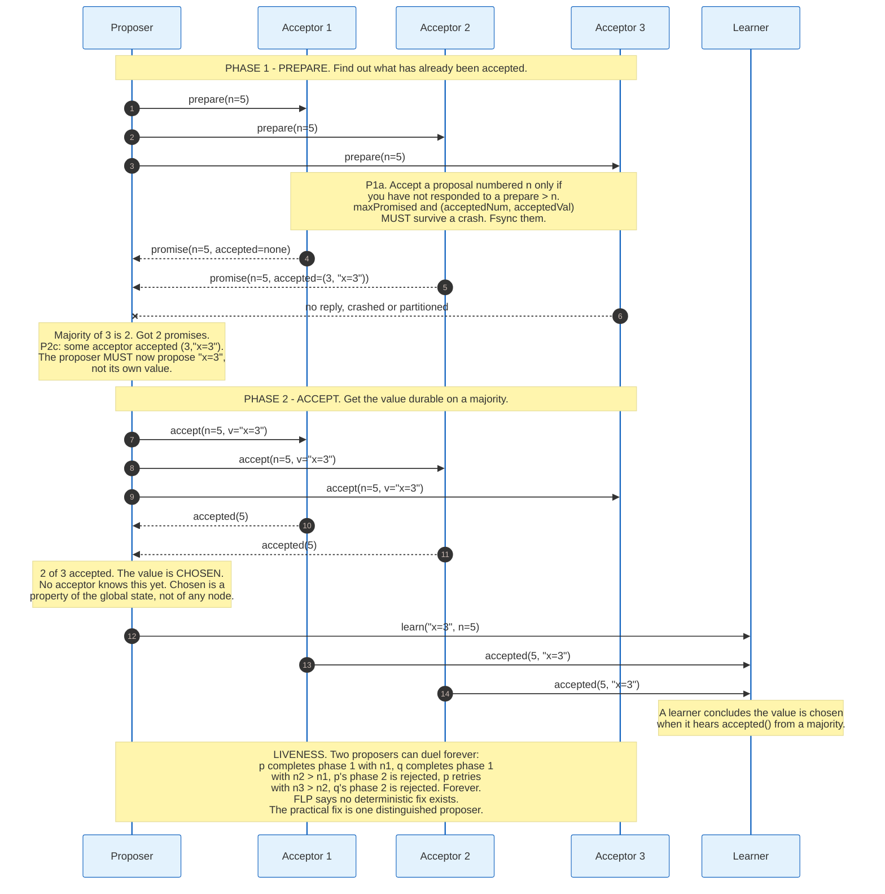

**Phase 1(a).** A proposer picks a proposal number n, globally unique and increasing, and sends `prepare(n)` to a majority of acceptors.

**Phase 1(b).** An acceptor receiving `prepare(n)` with n greater than any prepare it has responded to replies with a promise not to accept any proposal numbered below n, along with the highest-numbered proposal it has already accepted, if any.

**Phase 2(a).** If the proposer receives promises from a majority, it sends `accept(n, v)` where v is the value of the highest-numbered accepted proposal among the responses, or its own value if none reported one.

**Phase 2(b).** An acceptor accepts `accept(n, v)` unless it has already promised for a number greater than n.

A value is chosen when a majority has accepted the same proposal. No single process observes this directly. That is why learners exist.

### 6.3 Multi-Paxos and Why Everyone Runs a Leader

Running full Paxos per log entry costs two round trips per entry and permits duelling proposers to livelock indefinitely. Multi-Paxos removes both problems with one change: elect a distinguished proposer, then skip Phase 1.

A leader that has completed Phase 1 for proposal number n across an unbounded suffix of log positions can issue `accept(n, v)` directly for each new entry. Steady-state cost drops to one round trip to a majority. Phase 1 runs again only when leadership changes, which is why Phase 1 is often described as leader election even though Lamport's protocol contains no such step.

Lamport is explicit that this does not evade FLP: "a distinguished proposer must be selected as the only one to try issuing proposals", and selecting one reliably in an asynchronous system is itself impossible. Multi-Paxos elects a leader with timeouts and accepts that a bad timeout costs availability, never safety.

### 6.4 Why Paxos Got Replaced in New Systems

Paxos is correct, minimal, and famously hard to implement. The gap between the single-decree protocol and a working replicated log is filled with choices the papers do not make for you: how log positions map to instances, how to handle gaps when a leader dies mid-flight, how to reconfigure the acceptor set, how to snapshot, and how to bound the number of concurrent instances.

Google's "Paxos Made Live" (Chandra, Griesemer, Redstone, PODC 2007) documented the distance between the algorithm and Chubby, and remains the honest account. Its existence is the best argument for Raft.

---

## 7. Consensus, Part Two: Raft

Raft solves the same problem as Multi-Paxos and specifies the parts Paxos leaves to the implementer. Diego Ongaro and John Ousterhout published "In Search of an Understandable Consensus Algorithm" at USENIX ATC 2014 in June 2014; the extended version and Ongaro's Stanford dissertation carry the full specification.

The paper's stated goal is understandability, and it measured it. In a user study of 43 undergraduate and graduate students who watched matched lectures and took matched quizzes, mean Raft score was 25.7 out of 60 against 20.8 for Paxos, a 4.9-point gap; a paired t-test put the true gap at least 2.5 points with 95% confidence. Of 41 surveyed participants, 33 said Raft would be easier to implement and 33 said it would be easier to explain.

Raft decomposes consensus into leader election, log replication, and safety, and enforces one structural rule Paxos does not: entries flow only from leader to follower, never the other way.

### 7.1 Terms, State, and the Election

Time is divided into terms, numbered with consecutive integers. Each term begins with an election. A term has at most one leader, and may have none if the election splits.

Every server persists three variables to stable storage before responding to any RPC, and holds four more in memory.

| Variable | Where | Meaning |
|----------|-------|---------|
| `currentTerm` | Persistent, all servers | Latest term the server has seen, initialised to 0 |
| `votedFor` | Persistent, all servers | Candidate that received this server's vote in `currentTerm`, or null |
| `log[]` | Persistent, all servers | Entries, each carrying a command and the term in which it was created |
| `commitIndex` | Volatile, all servers | Highest log index known to be committed |
| `lastApplied` | Volatile, all servers | Highest log index applied to the state machine |
| `nextIndex[]` | Volatile, leader only | For each follower, the next index to send |
| `matchIndex[]` | Volatile, leader only | For each follower, the highest index known replicated |

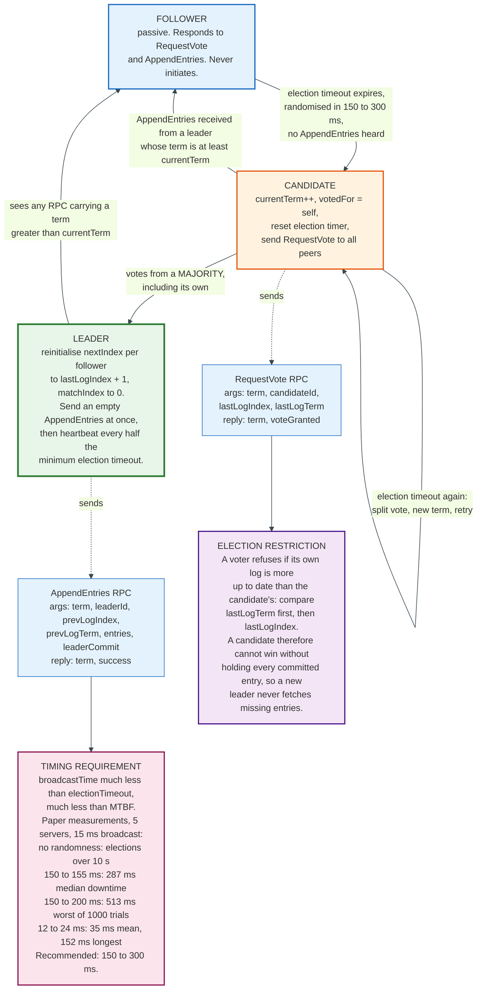

The election restriction is the piece that makes Raft simpler than Paxos. `RequestVote` carries `lastLogIndex` and `lastLogTerm`, and a voter denies its vote if its own log is more up to date, comparing term first and index second. A candidate therefore cannot win without holding every committed entry, and a new leader never needs to fetch missing entries from anyone.

### 7.2 Log Replication

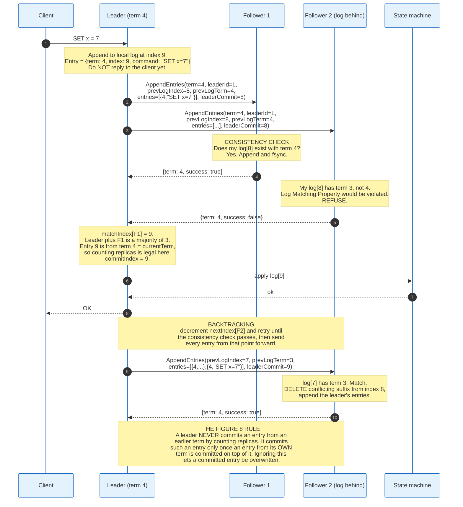

`AppendEntries` carries `prevLogIndex` and `prevLogTerm`, and a follower rejects the RPC unless its log contains a matching entry at that position. Induction on that single check gives the **Log Matching Property**: if two logs contain an entry with the same index and term, then the logs are identical in all entries up through that index.

An empty `AppendEntries` is a heartbeat. The paper's implementation sent heartbeats at half the minimum election timeout.

### 7.3 The Five Safety Properties

Raft's correctness is stated as five properties that hold at all times.

| Property | Statement |
|----------|-----------|
| **Election Safety** | At most one leader can be elected in a given term. |
| **Leader Append-Only** | A leader never overwrites or deletes entries in its log; it only appends. |
| **Log Matching** | If two logs contain an entry with the same index and term, then the logs are identical in all entries up through the given index. |
| **Leader Completeness** | If a log entry is committed in a given term, then that entry will be present in the logs of the leaders for all higher-numbered terms. |
| **State Machine Safety** | If a server has applied a log entry at a given index to its state machine, no other server will ever apply a different log entry for the same index. |

The commitment rule deserves separate attention because it is the most commonly botched part of a Raft implementation. Only log entries from the leader's current term are committed by counting replicas. An entry from an earlier term, replicated on a majority, is *not* thereby committed; the leader commits it indirectly, once an entry from its own term commits on top of it. Figure 8 of the paper shows the sequence in which skipping this rule lets a replicated entry later be overwritten.

### 7.4 Membership Changes and Snapshots

Switching directly from configuration C_old to C_new is unsafe because the switch is not atomic across servers, so the cluster can briefly contain two disjoint majorities and elect two leaders in one term.

Raft's answer is **joint consensus**. The leader appends a C_old,new entry; while it is in effect, entries replicate to servers in both configurations, either configuration may supply a leader, and agreement requires separate majorities from both. Once C_old,new commits, the leader appends C_new, and once that commits under C_new's rules the old servers can be shut down. Servers adopt a configuration entry as soon as it appears in their log, committed or not.

Three details make it work in practice. New servers join first as non-voting members and catch up before counting toward majorities, so a slow join does not stall commits. A leader not in C_new steps down after committing C_new. And removed servers, which stop receiving heartbeats, would otherwise time out and disrupt the cluster with higher-term `RequestVote` messages; Raft blocks this by having servers ignore `RequestVote` received within the minimum election timeout of hearing from a current leader.

`InstallSnapshot` compacts the log. Its arguments are `term`, `leaderId`, `lastIncludedIndex`, `lastIncludedTerm`, `offset`, `data[]`, and `done`, chunked because a snapshot exceeds a reasonable message size.

### 7.5 Configuration Numbers From Production

etcd's defaults are the most widely deployed Raft tuning in existence: a 100 ms heartbeat interval and a 1000 ms election timeout. The documentation's guidance generalises to any Raft system: set the heartbeat interval to roughly 0.5x to 1.5x the round-trip time between members, and set the election timeout to at least 10x the round-trip time. It caps the election timeout at 50,000 ms, reserved for globally distributed clusters, on the reasoning that 5 s is a safe upper bound for a global round trip and the election timeout should be an order of magnitude larger.

Disk latency, not network latency, is the usual cause of spurious elections. Raft RPCs require the recipient to fsync before responding, so a leader whose fsync stalls behind another process's I/O misses heartbeats and gets deposed.

---

## 8. Time: Physical, Logical, Vector, and Hybrid Clocks

A distributed database needs an order on events, and there are exactly four ways to get one. Which one a system picks determines what it can promise.

**Physical clocks** are wall clocks synchronised by NTP or PTP. They are comparable across machines and they lie. Two machines can report timestamps that invert the real order of two causally related events, and a database that resolves conflicts by comparing them will silently discard the later write.

**Lamport logical clocks**, from "Time, Clocks, and the Ordering of Events in a Distributed System", CACM 1978, are a per-node counter incremented on every event and carried on every message; a receiver sets its counter to max(local, received) + 1. They guarantee that if a happens-before b, then L(a) < L(b). The converse does not hold, so a smaller Lamport timestamp does not mean an event happened first. Cassandra's gossip uses exactly this, versioning endpoint state with `(generation, version)` tuples where version increments roughly every second.

**Vector clocks** carry one counter per node. Comparing two vectors element-wise distinguishes three cases rather than two: V1 dominates V2, V2 dominates V1, or neither, which means the two events are concurrent. That third case is the point. Section 13 covers the cost.

**Hybrid logical clocks**, from Kulkarni, Demirbas, Madappa, Avva, and Leone, "Logical Physical Clocks and Consistent Snapshots in Globally Distributed Databases", OPODIS 2014, pair a physical component that tracks wall time with a logical counter that breaks ties. An HLC timestamp is close enough to wall time to be human-meaningful and to bound staleness, while still capturing causality on any path that exchanges messages. CockroachDB and YugabyteDB both use them.

**TrueTime** is the fifth option and it is not a clock at all. It is an interval. Section 9 covers it.

The relationship between them is a hierarchy of cost. A Lamport clock costs one 64-bit counter and gives a total order with no causal meaning. A vector clock costs one (node, counter) pair for every node that has written the object, and gives exact concurrency detection. An HLC was designed by Kulkarni and colleagues to fit inside a 64-bit NTP timestamp, and CockroachDB stores one as a 64-bit wall time plus a 32-bit logical counter, which buys approximate causality plus wall-clock proximity. TrueTime costs GPS receivers and atomic clocks in every datacenter and gives a bound on how wrong the reading is.

---

## 9. Google Spanner and TrueTime

Spanner is a globally distributed database that shards data across Paxos state machines and assigns every transaction a globally meaningful commit timestamp. It was published as "Spanner: Google's Globally-Distributed Database" at OSDI 2012 in October 2012.

Its distinguishing guarantee is **external consistency**, a term from Gifford's 1981 Stanford thesis. Google states the invariant precisely: if transaction T2 starts to commit after T1 finishes committing, then the timestamp for T2 is greater than the timestamp for T1. Google's documentation notes that external consistency is stronger than linearizability, because linearizability constrains single-object operations while external consistency constrains multi-operation transactions.

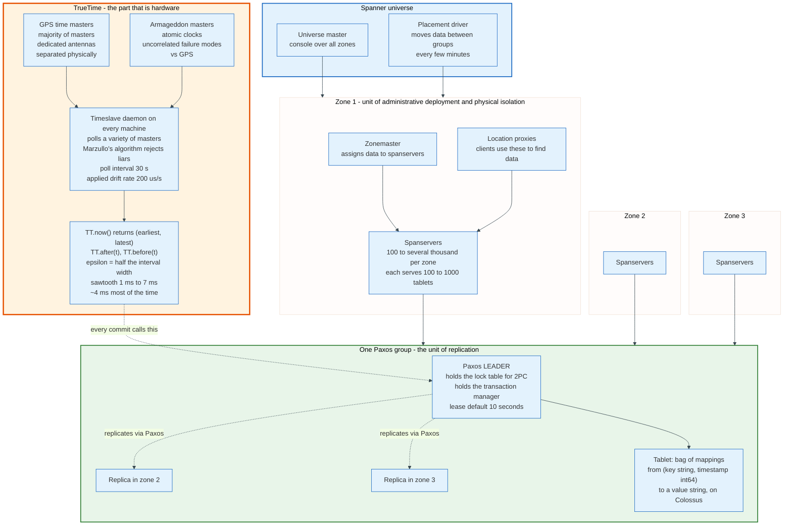

### 9.1 The TrueTime API and Its Measured Error

TrueTime has three methods and one type.

```
TT.now()      -> TTinterval: [earliest, latest]
TT.after(t)   -> true if t has definitely passed
TT.before(t)  -> true if t has definitely not arrived
```

`TT.now()` returns an interval guaranteed to contain the absolute time at some point during the call. The instantaneous error bound, written epsilon, is half the interval's width.

The implementation is two kinds of time master plus a daemon on every machine. Most masters have GPS receivers with dedicated antennas, physically separated so that antenna failures, radio interference, and spoofing do not correlate. The rest, called Armageddon masters, run atomic clocks whose failure modes are uncorrelated with GPS. Each daemon polls a mix of nearby GPS masters, distant GPS masters, and Armageddon masters, applies a variant of Marzullo's algorithm to reject liars, and synchronises to the survivors. Machines whose local oscillator drifts beyond the worst case derived from component specifications are evicted.

The paper's production numbers, measured in 2012:

| Quantity | Value |
|----------|-------|
| Daemon poll interval | 30 seconds |
| Applied worst-case drift rate | 200 microseconds per second |
| Sawtooth contribution from local drift | 0 to 6 ms |
| Communication delay to time masters | about 1 ms |
| Resulting epsilon | 1 ms to 7 ms, about 4 ms most of the time |

The two spikes visible in the paper's measurements have mundane causes: network congestion improvements on 30 March reduced tail epsilon, and shutting down two time masters at one datacenter for routine maintenance on 13 April raised it for about an hour.

### 9.2 Commit-Wait, the Mechanism in Full

External consistency comes from one rule applied at commit. It costs latency and buys a globally meaningful timestamp.

**Start.** The coordinator leader for a write transaction Ti assigns a commit timestamp s_i no less than `TT.now().latest`, computed after the commit request arrives.

**Commit wait.** The coordinator leader ensures that clients cannot see any data committed by Ti until `TT.after(s_i)` is true.

Because s_i was chosen from the upper bound of the uncertainty interval and the leader then waits until that timestamp is definitely in the past, s_i is guaranteed to be less than the absolute time at which the commit becomes visible. Any transaction that starts after that visible commit reads a wall clock whose lower bound already exceeds s_i, so it gets a strictly larger timestamp. Ordering by timestamp therefore matches ordering in real time.

The expected wait is at least 2 x epsilon, roughly 8 ms with epsilon at 4 ms.

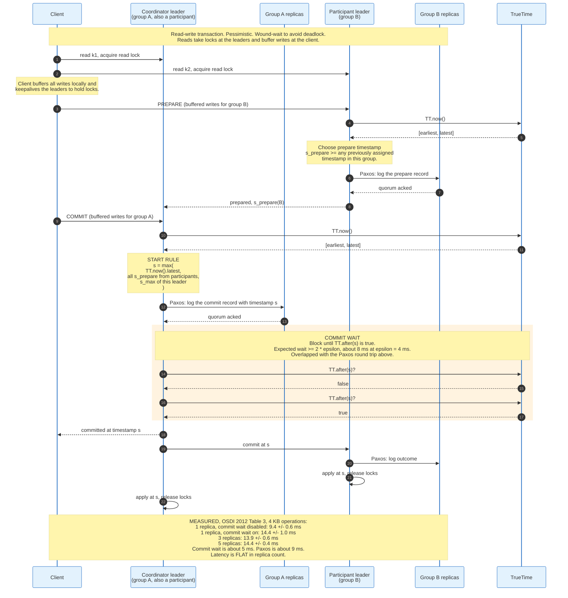

### 9.3 Read-Only Transactions and Snapshot Reads

The reason Spanner is fast to read is that read-only transactions take no locks and contact no leader in the common case.

A read-only transaction is assigned a timestamp `s_read` and then executed as a set of snapshot reads at that timestamp. Any replica that is caught up past `s_read` can answer. The naive assignment `s_read = TT.now().latest` is externally consistent but may block if a replica's safe time has not advanced far enough, so Spanner picks the oldest timestamp that preserves external consistency.

A replica's safe time is the minimum of two quantities: the Paxos safe time, which is the timestamp of the highest applied Paxos write, and the transaction-manager safe time, which sits just below the lowest prepare timestamp of any transaction prepared but not yet committed in that group. A single prepared transaction therefore holds back reads at later timestamps across the whole group, which the paper mitigates by tracking prepared timestamps per key range in the lock table.

The `MinNextTS` mechanism keeps the Paxos safe time moving in an idle group. A leader promises a minimum timestamp for the next Paxos sequence number and advances it by default every 8 seconds, so a healthy slave in an idle group can serve reads at timestamps at worst 8 seconds old, and can ask the leader to advance sooner.

### 9.4 Two-Phase Commit Where Every Participant Is Highly Available

Spanner uses two-phase commit and strict two-phase locking. Pat Helland called 2PC the "anti-availability protocol" because every member must be up. Spanner's answer is that each 2PC member is a Paxos group rather than a machine, so a member survives the loss of a minority of its replicas.

The measured cost of participant count, from the paper's Table 4:

| Participants | Mean latency | 99th percentile |
|-------------:|-------------:|----------------:|
| 1 | 17.0 ms | 75.0 ms |
| 2 | 24.5 ms | 87.6 ms |
| 5 | 31.5 ms | 104.5 ms |
| 10 | 30.0 ms | 95.6 ms |
| 25 | 35.5 ms | 100.4 ms |
| 50 | 42.7 ms | 93.7 ms |
| 100 | 71.4 ms | 131.2 ms |
| 200 | 150.5 ms | 320.3 ms |

Mean latency rises 3.5-fold between 50 and 200 participants, and roughly doubles between 100 (71.4 ms) and 200 (150.5 ms). The paper's own reading of the same table is that scaling to 50 participants is reasonable in both mean and 99th percentile, and that latencies start to rise noticeably at 100. Keep transactions narrow.

### 9.5 Measured Availability, and What Actually Breaks

Brewer's February 2017 whitepaper published the first real numbers on Spanner's availability, and the causes are not what the CAP discussion predicts.

Modern geographically distributed Chubby cells provide an average availability of **99.99958%** for outages of 30 seconds or more. Spanner internally provides a similar level, better than five nines. Since 2009 Chubby's SREs have deliberately forced periodic outages because the excess availability had made dependent teams stop handling failures.

The distribution of Spanner incidents by frequency:

| Cause | Share |
|-------|------:|
| User error, such as overload or misconfiguration | 52.5% |
| Software bug | 13.3% |
| Cluster infrastructure, servers and power | 12.1% |
| Other | 10.9% |
| Network | 7.6% |
| Operator error by SREs | 3.7% |

Network is under 8%, and within that category Brewer reports that there were no events in which a large set of clusters was partitioned from another large set, and that a Spanner quorum was never on the minority side of a partition. The two largest outages were both software bugs affecting all replicas of a database simultaneously, which is a class of failure that replication does not address at all.

Google Cloud's published SLA is 99.999% monthly uptime for a multi-regional or dual-regional Spanner instance and 99.99% for a regional instance, dropping to 99.95% for regional instances in Mexico and Stockholm.

---

## 10. CockroachDB: Ranges, Leaseholders, and Hybrid Logical Clocks

CockroachDB is an attempt to build Spanner's guarantees on commodity hardware with no special clocks. The architecture paper is "CockroachDB: The Resilient Geo-Distributed SQL Database", SIGMOD 2020, pages 1493 to 1509. The substitution it makes is exact: where Spanner waits out a small, hardware-bounded uncertainty on every commit, CockroachDB assumes a large, configured uncertainty bound and pays for it with occasional read restarts instead.

### 10.1 Ranges and the Two-Level Index

All data lives in a single monolithic sorted key-value map, split into contiguous **ranges**. Default sizes come from the replication zone configuration:

| Setting | Default | Effect |
|---------|--------:|--------|
| `range_max_bytes` | 536,870,912 bytes (512 MiB) | A range reaching this size splits into two |
| `range_min_bytes` | 134,217,728 bytes (128 MiB) | A range below this merges with a neighbour |
| `num_replicas` | 3, and 5 for system ranges | Replication factor |
| `gc.ttlseconds` | 14,400 (4 hours) | How long overwritten MVCC values are retained |

Range addressing uses two levels of meta ranges. The arithmetic the docs give assumes the older 64 MiB range size: two levels address 2^(18+18) = 2^36 ranges, each range addresses 2^26 bytes, so the total is 2^62 bytes, or 4 EiB. At the 512 MiB default in the table above, the same two levels reach 2^36 x 2^29 = 2^65 bytes, or 32 EiB. Either number is far past any deployed cluster.

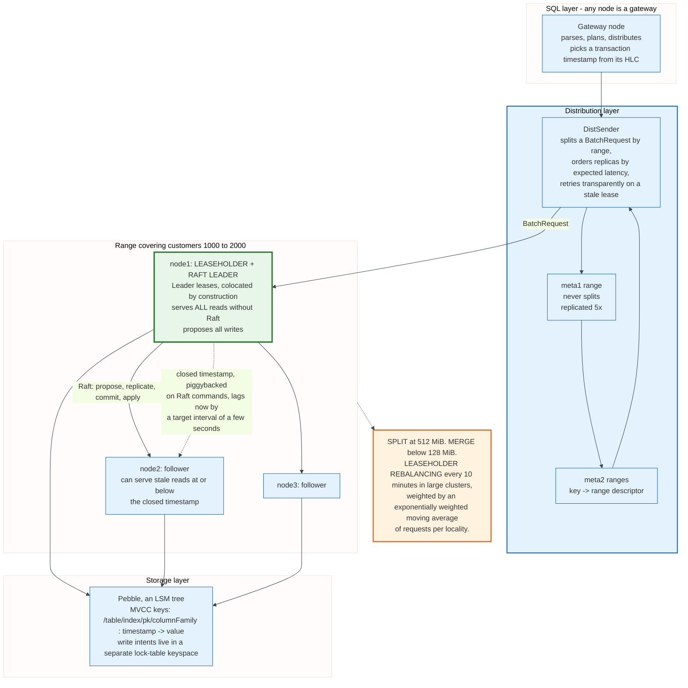

### 10.2 The Leaseholder

Exactly one replica per range holds the **range lease**, and it is the only replica that serves reads or proposes writes. Serving reads from the leaseholder without a Raft round trip is legal because any value the leaseholder can read has already achieved consensus; a second consensus on the same data would prove nothing.

CockroachDB has had three lease mechanisms and the history matters for anyone diagnosing an outage.

**Expiration-based leases** expire at a timestamp a few seconds out and are extended by continuing to propose Raft commands. Still used for meta and system ranges, and temporarily during lease transfers.

**Epoch-based leases** tie lease lifetime to a node's liveness record in a system range. A node that stops updating its liveness record loses all its leases a few seconds later. This removed enormous lease-renewal traffic and introduced a specific failure mode: the **leader-leaseholder split**. A stale leaseholder whose Raft log has fallen behind cannot acquire Raft leadership, yet keeps heartbeating the liveness range to hold its lease. If it is also partitioned from the Raft leader, the range is permanently unavailable for as long as the partition lasts.

**Leader leases**, default since v25.2, close that hole. Raft leadership is fortified through store liveness supported by a quorum of stores in the Raft group, and the fortified leader is then established as the leaseholder. The single point of failure that was the node liveness range disappears. Cockroach Labs reports that partitions between a leaseholder and its followers now heal in under 20 seconds, and that performance is within 1% of epoch-based leases on a 100-node cluster of 32-vCPU machines with 8 stores each.

Leaseholder placement is a latency decision. Each leaseholder tracks requests per locality as an exponentially weighted moving average and, periodically (every 10 minutes by default in large clusters), evaluates whether transferring the lease to a replica closer to the traffic would help.

### 10.3 Hybrid Logical Clocks and the Uncertainty Interval

Every timestamp in CockroachDB is an HLC value: a physical component close to wall time plus a logical counter for ties. Nodes attach their HLC timestamp to every outgoing message and advance their own HLC on receipt, which propagates causality along any message path.

The clock offset bound is a configuration, not a measurement:

| Setting | Default | Behaviour |
|---------|--------:|-----------|
| `--max-offset` | 500 ms | Maximum allowed clock offset for the cluster |
| Self-eviction threshold | 80% of `--max-offset` | A node whose clock is out of sync with at least half the other nodes by this much **crashes immediately** |

The crash is deliberate. A node that keeps serving with a clock outside the assumed bound can violate single-key linearizability between causally dependent transactions, so the system removes it rather than let it lie.

The **uncertainty interval** is the price. A transaction at timestamp T treats any value it encounters with a timestamp in `(T, T + max_offset]` as possibly-earlier-in-real-time, because the writer's clock might have been ahead. Encountering one forces an **uncertainty restart**: the transaction pushes its timestamp above the observed value and re-reads. Increasing `--max-offset` widens the window and raises the restart rate. Decreasing it raises the risk of nodes crashing on ordinary NTP jitter.

That is the exact trade Spanner buys out of with hardware. Spanner's epsilon is about 4 ms and it waits it out. CockroachDB's assumed bound is 500 ms and it restarts through it.

### 10.4 Write Intents, Transaction Records, and Parallel Commits

CockroachDB writes are provisional until commit. A write lays down a **write intent**, which is an MVCC record carrying a pointer to the transaction's record; it functions as a replicated lock and a provisional value at once. Intents live in a dedicated lock-table keyspace inside the LSM.

The **transaction record** lives in the range holding the transaction's first key and takes one of four states: `PENDING`, `STAGING`, `COMMITTED`, `ABORTED`. Any reader that meets an intent looks up the record and acts on what it finds. If the record does not exist, the reader compares the intent's timestamp against the transaction liveness threshold: within it, treat as `PENDING`; beyond it, treat as `ABORTED`.

**Parallel Commits**, shipped in v19.2 in November 2019, removes one of the two serial consensus round trips at commit. The old protocol required all intents to be replicated before the record could be written `COMMITTED`. The new protocol introduces `STAGING`, which lists the keys of all in-flight writes, and defines a transaction as **implicitly committed** when its record is `STAGING` and every listed intent has achieved consensus at the correct epoch and timestamp.

The consequence is that the coordinator pipelines the intents and the record write together, then waits once. Instead of two synchronous rounds of distributed consensus before acknowledging, CockroachDB waits for one.

Other transactions that encounter a `STAGING` record cannot simply trust it. They run the **Transaction Status Recovery Procedure**: check whether the coordinator is still heartbeating the record, and if not, verify each listed intent to decide whether the transaction is implicitly committed or should be aborted.

### 10.5 The Timestamp Cache and Read Refreshing

Serializability without locks on reads needs a way to stop a later write from landing before an earlier read. The **timestamp cache** is that mechanism: an in-memory structure on the leaseholder recording the high-water mark of reads per key span. A write whose timestamp falls below the cache's entry gets pushed forward.

Under `SERIALIZABLE`, a pushed timestamp means the transaction's earlier reads were taken at the old timestamp and might now be wrong. **Read refreshing** re-validates them: if nothing it read has changed between the old and new timestamps, the transaction proceeds at the new timestamp; if something has, the client gets a retry error.

Under `READ COMMITTED`, each statement takes a fresh read snapshot from the HLC, so a push retries the statement rather than the transaction, without involving the client. That is the practical reason `READ COMMITTED` exists in CockroachDB: it converts client-visible transaction retries into invisible statement retries. The cluster setting `sql.txn.read_committed_isolation.enabled` defaults to true; setting it false makes `READ COMMITTED` transactions run as `SERIALIZABLE`.

### 10.6 Closed Timestamps and Follower Reads

Each range tracks a **closed timestamp**, a promise from the leaseholder to its followers that no new write will ever be introduced at or below it. It advances continuously, lagging the present by a target interval of a few seconds, and is piggybacked onto Raft commands so that the promise and the data arrive together.

A follower that has applied every Raft command up to the position the leaseholder named can serve reads at or below the closed timestamp locally, with no round trip to the leaseholder. That is a **follower read**, and it is how a multi-region CockroachDB cluster serves local reads at local latency.

Closed timestamps survive lease transfers; a new leaseholder inherits the old one's promise.

Raising the closed timestamp interval cuts retryable errors and raises lock contention, because a transaction whose timestamp is not pushed holds its locks longer. The docs are explicit that this is a two-sided knob.

---

## 11. Cassandra: Leaderless Quorums and Tunable Consistency

Cassandra has no leader for ordinary writes. Every replica of a key accepts mutations independently, which is why it stays writable under conditions that stop a consensus system dead, and why it cannot offer serializability across partitions.

The design is Dynamo's clustering layer on a log-structured merge tree. Apache Cassandra 5.0 reached GA on 5 September 2024; 5.0.9 shipped on 7 August 2026.

### 11.1 The Ring

Keys are hashed to tokens on a continuous ring, and ownership is defined by walking the ring clockwise from the token until RF distinct physical nodes have been found. The default partitioner produces a 64-bit token.

Each physical node owns several tokens, called **vnodes**, so that adding one machine takes a small slice from many neighbours rather than a large slice from one. Cassandra 2.x used random token selection and needed `num_tokens` around 256 to stay balanced. Version 3.x and later added a deterministic token allocator, and the shipped default fell from 256 to 16 tokens per node in 4.0, where 5.0 leaves it.

More tokens is not strictly better. The documentation states the cost plainly: every token introduces up to 2 x (RF - 1) additional neighbours on the ring, so more tokens means more combinations of node failures that lose availability for some token range, and slower cluster-wide maintenance because there are more discrete repair operations.

`NetworkTopologyStrategy` is the only replication strategy the project recommends for production. It takes an RF per datacenter and chooses replicas from distinct racks where the rack count permits. `SimpleStrategy` ignores topology entirely and is for test clusters.

### 11.2 Consistency Levels

Consistency level is chosen per operation, by the client, on every query. It is the knob that moves a Cassandra cluster between AP and CP.

| Level | Replicas that must respond | Notes |
|-------|---------------------------|-------|
| `ANY` | 1, or a stored hint counts | Writes only. Acknowledges even when no replica took the write. |
| `ONE` | 1 | |
| `LOCAL_ONE` | 1, in the coordinator's datacenter | Guarantees no cross-datacenter read |
| `TWO` | 2 | |
| `THREE` | 3 | |
| `QUORUM` | floor(RF/2) + 1, cluster-wide | |
| `LOCAL_QUORUM` | Majority within the local datacenter | The usual production choice for multi-DC |
| `EACH_QUORUM` | Majority in every datacenter | Writes only in practice |
| `ALL` | All RF replicas | One replica down means the operation fails |

Two facts about this table are routinely misunderstood.

**Writes always go to all replicas, regardless of consistency level.** The level controls only how many acknowledgements the coordinator waits for before replying. A write at `ONE` is still sent to all three replicas of an RF=3 keyspace. This is why a write at `ONE` frequently becomes visible everywhere immediately and why relying on that is a mistake.

**Reads at a level above `ONE` do not send full reads to every replica.** The coordinator issues one full read to the fastest replica, chosen by the dynamic snitch, and **digest reads** to the others. A digest read returns only a hash. If the hashes agree, the data goes to the client. If they disagree, the coordinator issues full reads and reconciles.

Speculative retry is the exception to the "only enough replicas to satisfy the CL" rule: if the original replicas have not responded within a configured window, the coordinator sends a redundant request to an extra replica.

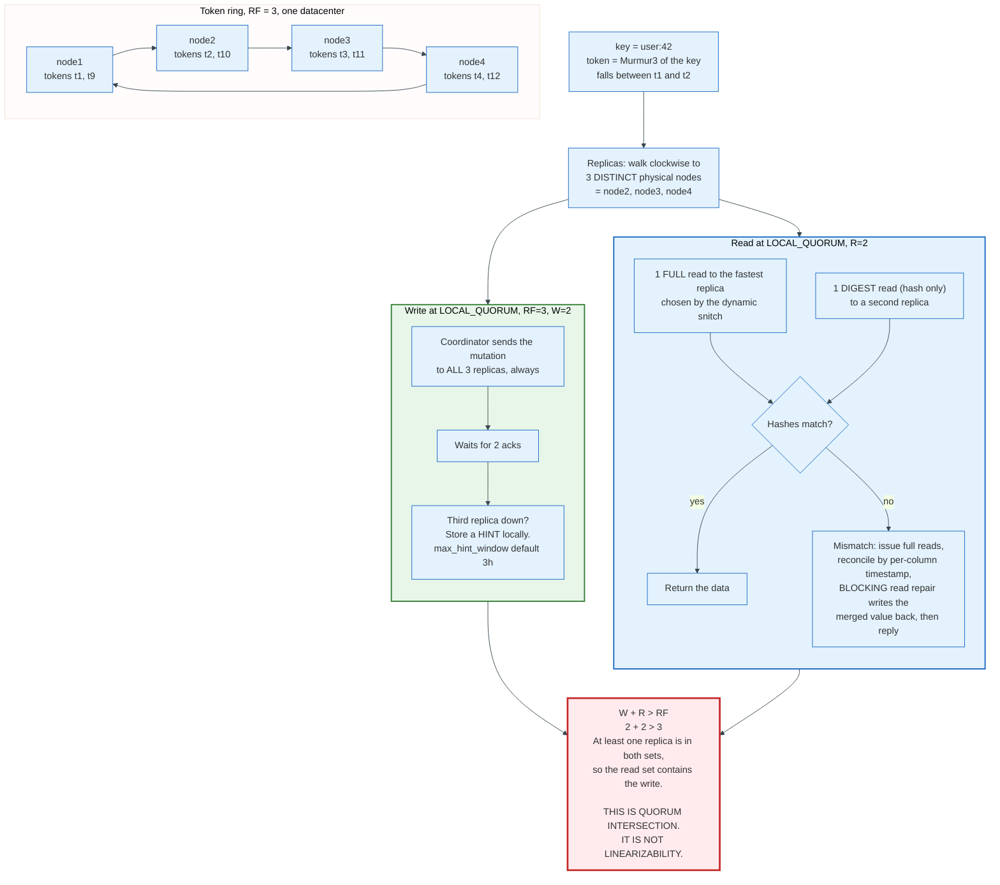

### 11.3 W + R > RF, and Exactly What It Buys

The rule is quorum intersection. If the write set and the read set both contain more than half the replicas, they share at least one member, so a read that requires R responses is guaranteed to touch a replica that took the write.

With RF=3 and both operations at `QUORUM`, W=2 and R=2, so 2 + 2 > 3 holds and at least one replica participates in both.

In a multi-datacenter deployment, `LOCAL_QUORUM` on both sides gives a weaker but useful property: a client homed to one datacenter reads its own writes, because the local quorums intersect even though the cross-datacenter ones may not.

### 11.4 What W + R > RF Does Not Buy

Quorum intersection is not linearizability, and Cassandra's own documentation does not claim it is. Three concrete reasons, in decreasing order of how often they bite.

**Concurrent writes have no order.** Two clients writing the same column at the same wall-clock millisecond produce two mutations whose timestamps decide the winner. If the clients' clocks differ, the winner is decided by clock skew, not by real time. Cassandra's conflict resolution is last-write-wins on the mutation timestamp, applied per column, and the documentation states that Cassandra's correctness depends on those clocks being synchronised.

**A failed write is not rolled back.** A write at `QUORUM` that reaches only one replica returns an error to the client, and that one replica keeps the value. A subsequent read at `QUORUM` may or may not include that replica. Without blocking read repair, two successive reads can return the value and then not return it. This is precisely the anomaly `read_repair = BLOCKING` exists to prevent, and Section 12 covers the mechanism.

**Sloppy quorums break the intersection argument entirely.** Dynamo's write path, which Cassandra inherits at `CL=ANY`, accepts a write on the first N *healthy* nodes from the preference list, which need not be the N nodes that own the key. A read from the owners may then miss it completely.

Abadi's summary, from the PACELC paper: these systems "cannot achieve full consistency as defined by Gilbert and Lynch, even if R + W > N".

### 11.5 Lightweight Transactions

Cassandra does have linearizable single-partition operations, and they are a different code path with a different cost. **Lightweight transactions** implement compare-and-set through Paxos, run at consistency level `SERIAL` or `LOCAL_SERIAL`, and are the only Cassandra operation with linearizable semantics.

The cost is round trips. Classical Cassandra LWT required four round trips per operation: prepare/promise, read, propose/accept, commit. Paxos improvements landed in the 4.1 series and cut the common-case round trips.

Batches across partitions are a separate mechanism and a weaker one. A logged batch writes to the `batchlog` system table, replicates that to another node so the batch survives coordinator failure, then applies the mutations and removes the batchlog entry. The guarantee is that the batch eventually succeeds completely or not at all. It is not isolation; a concurrent reader can observe part of the batch.

---

## 12. Hinted Handoff, Read Repair, and Anti-Entropy

Cassandra has three convergence mechanisms with three different guarantees, and conflating them is the most common source of unexplained data loss in production Cassandra.

Two of the three are best-effort. Only the third guarantees eventual consistency.

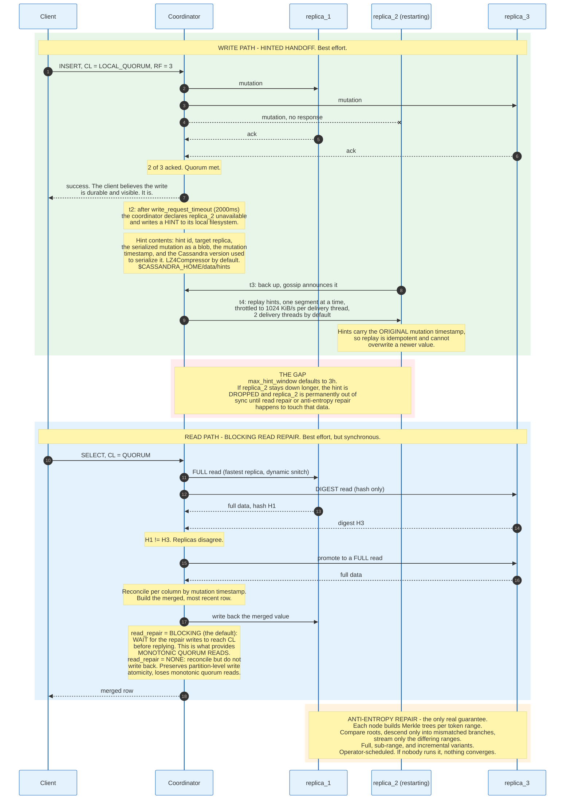

### 12.1 Hinted Handoff, With Its Real Configuration

A hint is a mutation the coordinator could not deliver, stored locally for later replay. Defaults from `cassandra.yaml`:

| Setting | Default | Meaning |
|---------|--------:|---------|
| `hinted_handoff_enabled` | `true` | |
| `max_hint_window` | `3h` | Maximum time a node has hints generated for it after failing |
| `write_request_timeout` | `2000ms` | After this, the coordinator gives up and writes a hint. Minimum acceptable value 10 ms |
| `hinted_handoff_throttle` | `1024KiB` per second per delivery thread | Reduced proportionally to cluster size |
| `max_hints_delivery_threads` | `2` | Raise for multi-datacenter, where cross-DC handoff is slower |
| `max_hints_file_size` | `128MiB` | |
| `hints_flush_period` | `10000ms` | Buffer flush, not an fsync |
| `hints_compression` | `LZ4Compressor` | Snappy and Deflate also supported |
| `hints_directory` | `$CASSANDRA_HOME/data/hints` | |

The three-hour window is the number that matters. A node down for four hours comes back with no hints and stale data, and nothing in the system will notice until a read touches the divergent rows or an operator runs repair.

Hints carry the original mutation timestamp, so replay is idempotent and cannot clobber a newer write. That property is what makes it safe to replay a hint hours later.

### 12.2 Read Repair and Monotonic Quorum Reads

Read repair fixes divergence discovered during a read. It is synchronous: the response is not returned to the client until the repair writes have completed.

Cassandra 4.0 added the table-level `read_repair` option through CASSANDRA-14635, with values `BLOCKING` (default) and `NONE`. The two settings trade two different properties against each other, and the documentation is explicit that you cannot have both.

**`BLOCKING` provides monotonic quorum reads.** Two successive quorum reads will not go backwards in time, even if a failed quorum write reached only a minority of replicas. Without it, a value can appear in one read and vanish from the next.

**`NONE` provides partition-level write atomicity.** Read repair only repairs the data covered by the `SELECT` statement. If a batch wrote several rows to one clustered partition and a `SELECT` reads one of them by clustering column, blocking read repair can repair that row alone and leave the partition in a state that reflects part of the batch. Setting `read_repair='NONE'` reconciles for the reader without writing back, which preserves the atomicity and gives up the monotonicity.

Note what read repair cannot do. It only repairs replicas that participated in the read, and only the columns the query touched. A row nobody reads is never repaired. `read_repair_chance` and `dclocal_read_repair_chance`, the probabilistic background repair from earlier versions, were removed in 4.0.

### 12.3 Anti-Entropy Repair Is the Only Guarantee

Merkle trees are hash trees over a node's data for a token range. Two replicas exchange tree roots; if the roots differ, they descend only into mismatched branches, and eventually identify exactly the keys that are out of sync. The traffic is proportional to the divergence, not to the dataset.

Cassandra supports three modes beyond the original Dynamo design.

**Full repair** hashes the entire dataset for a range.

**Sub-range repair** increases tree resolution by building more trees over smaller ranges, potentially down to single partitions, which reduces the amount of data streamed for a given mismatch.

**Incremental repair** repairs only partitions that changed since the last repair, marking repaired SSTables so subsequent runs skip them.

The operational rule follows from the guarantee structure: repair must complete for every range within `gc_grace_seconds`, or deleted data can resurrect. A delete in Cassandra writes a tombstone, tombstones are purged after `gc_grace_seconds`, and a replica that missed both the delete and the purge will hand the old value back during a later repair.

Nothing in Cassandra schedules repair. If nobody runs it, eventual consistency is not achieved.

---

## 13. Conflict Resolution: Vector Clocks Against Last-Write-Wins

A leaderless system will produce two versions of the same key. The only question is what it does about them, and there are exactly two answers with a real difference between them: detect the conflict and hand it to the application, or hide it by picking a winner.

### 13.1 Vector Clocks, as Dynamo Uses Them

A vector clock in Dynamo is a list of `(node, counter)` pairs, one pair per node that has coordinated a write to that object. Comparing two clocks element-wise gives three outcomes: the first dominates, the second dominates, or neither, in which case the writes are concurrent and both must be kept.

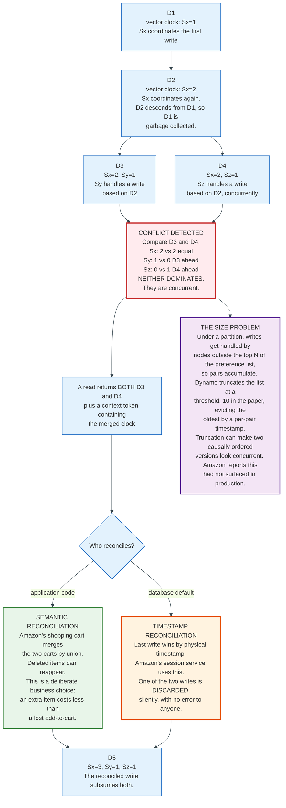

Dynamo's own measurements say how often this matters. The shopping cart service, profiled over 24 hours: **99.94% of requests saw exactly one version, 0.00057% saw two versions, 0.00047% saw three versions, and 0.00009% saw four versions.** Amazon's stated cause of divergence was concurrent writers, mostly automated client programs rather than humans.

Read those numbers twice. Conflicts are rare enough that most teams never see one in testing, and common enough at Amazon's volume that thousands per day needed resolving.

### 13.2 Last-Write-Wins, as Cassandra Uses It

Cassandra dropped vector clocks and uses last-write-wins on a mutation timestamp, applied **per column of per row**. The documentation formalises it: each CQL row is a Last-Write-Wins Element-Set conflict-free replicated data type, an LWW-Element-Set CRDT.

Per-column granularity is the redeeming feature. Two clients updating different columns of the same row do not conflict at all; both writes survive. Collection types, maps and sets, use the same mechanism, so concurrent inserts into a set converge.

The failure mode is exact and it is worth stating without softening. **Two writes to the same column, with the same timestamp resolution, resolve by comparing numbers that came from two different machines' clocks.** If machine A's clock is 40 ms ahead of machine B's, a write issued on B one millisecond after a write on A will lose, and the client that issued the losing write receives a success response. No error is raised at any layer.

The timestamp comes from the client if the client supplies one and from the coordinator's clock otherwise. Supplying it from the client moves the problem rather than solving it, unless the client is a single process.

### 13.3 The Comparison, Stated Plainly

| Property | Vector clocks | Last-write-wins |
|----------|---------------|-----------------|
| Detects concurrency | Yes, exactly | No |
| Silent data loss | No; both versions surface | Yes, by design |
| Metadata size | O(nodes that wrote) per object | 8 bytes per column |
| Depends on synchronised clocks | No | Yes, completely |
| Application burden | Must write merge logic | None |
| Read API | May return several versions | Always returns one |
| Failure when metadata is truncated | Concurrent writes may look ordered | Not applicable |

The industry has largely chosen last-write-wins, and the reason is not technical merit. It is that a read API returning a list of versions forces every application developer to write merge code, and most will write it wrong or not at all. Riak, which exposed siblings by default, spent years fielding support cases about sibling explosion. Cassandra, which hides the problem, does not.

Losing writes quietly is a design choice. Make it deliberately.

---

## 14. Sharding and Rebalancing

Partitioning has three strategies, and the choice constrains the query patterns the database can serve efficiently for the rest of its life.

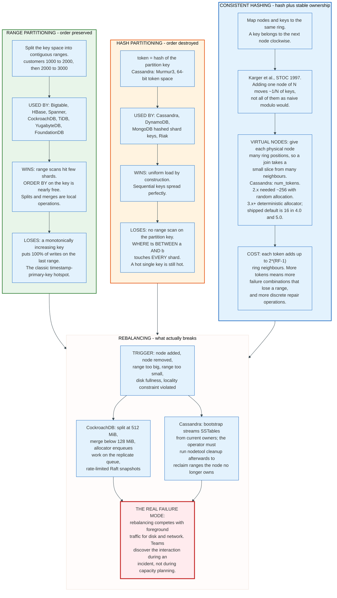

### 14.1 Range Against Hash, and the Decision That Cannot Be Undone

Range partitioning preserves key order, so a scan over adjacent keys touches adjacent shards. Hash partitioning destroys key order, so the same scan touches every shard.

Every distributed SQL database picks range partitioning, because SQL is full of range predicates and ordered scans. Every Dynamo-derived key-value store picks hashing, because it optimises for uniform single-key access and does not offer cross-partition ordered scans anyway.

The cost of range partitioning is the sequential-key hotspot. A table whose primary key is a timestamp or an auto-incrementing integer directs every insert to the last range, which means one leaseholder, one Raft group, and one machine absorbing the entire write rate of the cluster. CockroachDB's documented mitigations are hash-sharded indexes and load-based splitting. The general fix is to not use a monotonic primary key, which is advice that arrives too late for most schemas.

### 14.2 Rebalancing Mechanics

Splitting a range is cheap because it is metadata. CockroachDB splits when a range exceeds `range_max_bytes`, and merges when a range falls below `range_min_bytes` and its neighbour is small enough that the merged range would still be under the maximum.

Moving a replica is not cheap, because it moves bytes. CockroachDB adds a new replica, streams a snapshot to it at a rate limit, waits for it to catch up through the Raft log, then removes the old one. The rate limit is what keeps rebalancing from starving foreground traffic; raising it shortens rebalancing and lengthens tail latency.

Cassandra's bootstrap is the same idea without a consensus layer. A joining node calculates the ranges it will own, streams SSTables for those ranges from the current owners, and joins the ring. The old owners keep their copies until `nodetool cleanup` runs. Cassandra never removes a node from gossip state without an explicit `decommission` or a `replace_address_first_boot`, deliberately, so that a temporary failure does not trigger a cluster-wide rebalance. The documentation notes the specific danger this avoids: simultaneous range movements, where several replicas of one token range move at once, which can violate monotonic consistency and cause data loss.

### 14.3 Rebalancing and Leaseholder Placement Are Different Problems

Where the data lives and where the reads are served from are separate decisions, and only systems with an explicit lease concept can separate them.

CockroachDB rebalances replicas for durability and capacity, and rebalances leases for latency. A range may keep three replicas in three regions permanently while its lease migrates to whichever region is currently generating traffic. The leaseholder tracks requests per locality as an exponentially weighted moving average, correlates each locality's weight against each replica's locality, and computes an adjustment factor from the weight disparity and the inter-locality latency.

Cassandra has no equivalent, because it has no leases. Placement is fixed by the token ring, and read locality is achieved by choosing `LOCAL_QUORUM` and hoping the client is homed correctly.

---

## 15. Distributed Transactions and Two-Phase Commit

Two-phase commit is the protocol for making one decision, atomically, across several independent resource managers. It is old, it is correct, and it blocks.

Jim Gray described it in "Notes on Data Base Operating Systems" in 1978, and Lampson and Sturgis refined it in 1979. The X/Open Distributed Transaction Processing standard, published in 1991, defined the XA interface that made it a portable API: `xa_start`, `xa_end`, `xa_prepare`, `xa_commit`, `xa_rollback`, `xa_recover`, `xa_forget`.

### 15.1 The Protocol and the Window

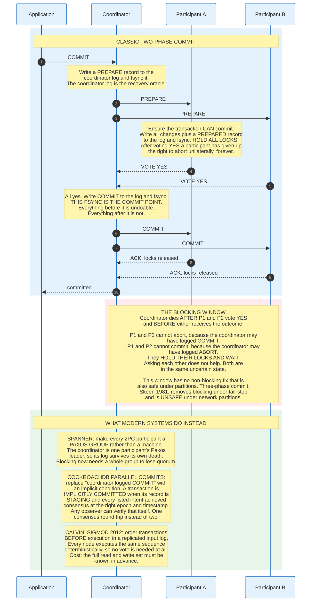

**Phase one, prepare.** The coordinator asks every participant whether it can commit. A participant that answers yes writes a prepared record durably and holds its locks. It has surrendered the right to abort on its own.

**Phase two, commit or abort.** The coordinator writes its decision to its own log, and that fsync is the commit point. It then tells the participants.

The blocking window sits between a participant's yes vote and its receipt of the outcome. If the coordinator dies in that window, the participant cannot decide alone, and it holds its locks. Every other transaction that touches those rows queues behind it.

Three-phase commit, from Skeen in 1981, inserts a pre-commit round so that participants can agree among themselves. It removes blocking under crash-stop failures and is unsafe under network partitions, which is why nothing ships it.

### 15.2 Why 2PC Got a Bad Name, and Why It Is Still Everywhere

The reputation comes from XA deployments in which the coordinator was a single process on a single machine, the participants were independent databases with independent recovery, and a coordinator crash needed a human with a `xa_recover` list. Pat Helland's "anti-availability protocol" label, which Brewer quotes in the Spanner whitepaper, describes exactly this configuration: every member must be up for the protocol to work.

The fix is not to abandon 2PC. It is to make each member highly available.

Spanner runs 2PC where each participant is a Paxos group, so losing a machine loses nothing. The coordinator is itself one of the participant leaders, and its log is Paxos-replicated. A blocked transaction now requires an entire Paxos group to lose quorum, which is the same condition under which that shard would be unavailable anyway.

CockroachDB goes further and changes what "committed" means. Under Parallel Commits, the coordinator does not need to durably record a decision at all in the common case. The transaction is implicitly committed when its `STAGING` record and all its listed intents have achieved consensus, and any observer can verify that condition independently by running the Transaction Status Recovery Procedure. The result is one round of consensus latency at commit instead of two.

### 15.3 Percolator and the Client-Driven Variant

Google's Percolator, published at OSDI 2010, built snapshot-isolation transactions on top of Bigtable with no server-side transaction manager. It uses a timestamp oracle for monotonic timestamps and stores locks as ordinary columns in Bigtable, designating one of the transaction's writes as the **primary lock**. The primary lock's state is the transaction's state: committing the primary commits the transaction, and other participants' locks are cleaned up lazily by whoever encounters them.

TiDB implements the same design. Its practical consequence is that the commit latency is two round trips and that a crashed client leaves locks that the next reader resolves, rather than locks that a recovery process resolves.

### 15.4 The Alternative: Do Not Vote

Calvin, from Thomson and colleagues at SIGMOD 2012, removes the vote entirely. Transactions are sequenced into a replicated input log before execution, then every replica executes the same sequence deterministically. Because execution is deterministic and the order is agreed in advance, no replica can reach a different outcome, so there is nothing to agree on at commit time.

The cost is a real constraint: the full read and write set must be known before execution starts, which rules out a transaction whose second statement depends on the first statement's result unless the system runs a reconnaissance query first. FaunaDB built on this lineage.

---

## 16. Isolation Levels in a Distributed Setting

Isolation levels are a contract about which concurrency anomalies a database permits. In a distributed system the same names carry additional obligations, because a distributed database must also decide whether the serial order it produces agrees with real time.

### 16.1 The Standard, and Why It Is Not Enough

ANSI SQL-92 defines four isolation levels by which of three phenomena they permit: dirty read (P1), non-repeatable read (P2), and phantom (P3).

Berenson, Bernstein, Gray, Melton, O'Neil, and O'Neil demolished that definition in "A Critique of ANSI SQL Isolation Levels", SIGMOD 1995, also published as Microsoft Research technical report MSR-TR-95-51. Their argument has three parts. The phenomena are stated ambiguously, and the strict interpretation is the only one that excludes what the standard intends to exclude. A phenomenon P0, dirty write, is missing entirely and must be excluded at every level. And snapshot isolation, which several commercial systems implemented, satisfies the ANSI definition of `SERIALIZABLE` while permitting an anomaly the standard's authors clearly did not intend.

That anomaly is **write skew**, phenomenon A5B. Two transactions read an overlapping set, each checks an invariant over what it read, each writes a different row, and both commit. Neither wrote what the other read, so there is no write-write conflict for snapshot isolation to detect, and the invariant is broken. The canonical instance: two doctors on call, each transaction reads that two doctors are on call, each takes itself off, and the hospital ends with zero.

Adya's 1999 MIT dissertation gave the implementation-independent formalisation the field now uses, defining levels by forbidden cycles in a dependency graph: G0 for write cycles, G1a for aborted reads, G1b for intermediate reads, G1c for circular information flow, meaning a cycle made entirely of dependency edges, write-write and write-read, and G2 for cycles that also contain an anti-dependency, that is a read-write edge.

### 16.2 The Distributed Additions

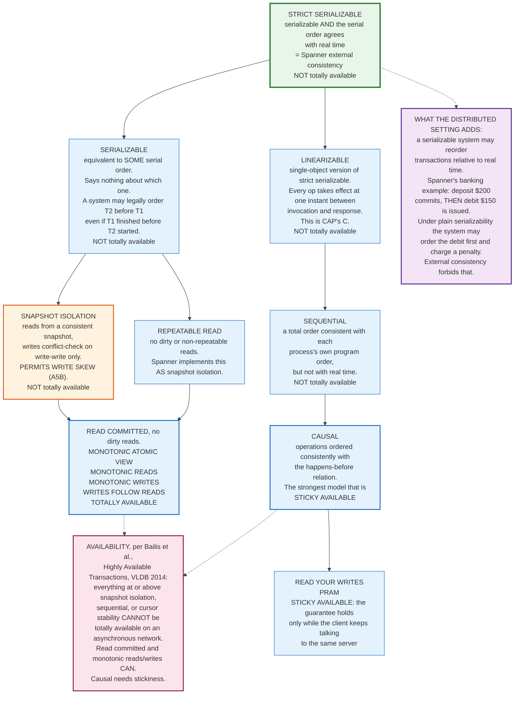

**Serializability alone does not constrain real time.** A serializable system is free to produce any serial order, including one that puts a transaction that committed later before a transaction that committed earlier. Google's documentation makes the consequence concrete: a customer deposits $200 into savings, waits for the commit, then issues a $150 debit from checking. A merely serializable system may order the debit first, and the account incurs an overdraft penalty for a shortfall that never existed in real time. External consistency, which is strict serializability, forbids that reordering.

**Linearizability and serializability are about different things.** Linearizability constrains single-object operations and says nothing about transactions. Serializability constrains transactions and says nothing about real time. Strict serializability is the conjunction. Google states the relationship: external consistency is stronger than linearizability, and linearizability is a special case of external consistency in which each transaction contains exactly one operation on one object.

**Availability differs by level.** Bailis and colleagues, in "Highly Available Transactions: Virtues and Limitations", VLDB 2014, classified which models survive an asynchronous network. Read committed, monotonic atomic view, monotonic reads, monotonic writes, and writes-follow-reads can be totally available, meaning every replica answers every request. Read your writes, PRAM, and causal consistency are only sticky available: the client must keep talking to the same server to get the guarantee. Snapshot isolation, repeatable read, serializability, cursor stability, sequential consistency, and linearizability are unavailable at any price.

### 16.3 What Each System Offers

| System | Default | Also available | Real-time order? |
|--------|---------|----------------|------------------|
| **Spanner** | Serializable | Repeatable read, implemented as snapshot isolation | Yes, external consistency |
| **CockroachDB** | `SERIALIZABLE` | `READ COMMITTED` | Single-key linearizability, subject to the clock offset bound |
| **Cassandra** | None across replicas | `SERIAL` / `LOCAL_SERIAL` for LWT on one partition | Linearizable for LWT only |
| **DynamoDB** | Eventually consistent reads | Strongly consistent reads, `TransactWriteItems` | Per-item |
| **Aurora DSQL** | Snapshot isolation | | Strong consistency across Regions |
| **etcd** | Linearizable | Serializable reads from a follower | Yes |

Spanner's addition of repeatable read is a compatibility feature, and Google says so: repeatable read's locking behaviour for reads matches the default isolation level in most other databases, so an application written against another database ports without being rewritten for serializable.

CockroachDB's `READ COMMITTED` exists for a different reason. Under `SERIALIZABLE`, a pushed timestamp that fails read refreshing produces a client-visible retry error, and every application must implement a retry loop. Under `READ COMMITTED`, per-statement read snapshots let the database retry the statement internally. The tradeoff is exactly the ANSI one: write skew becomes possible, and applications that need an invariant must take explicit locks with `SELECT ... FOR UPDATE`.

One detail that catches people: under `SERIALIZABLE` in CockroachDB, `SELECT ... FOR SHARE` and `SELECT ... FOR UPDATE` locks are unreplicated by default, held only on the leaseholder, and do not survive a lease transfer. They are best-effort and must not be relied on for correctness. Setting `enable_durable_locking_for_serializable` to true replicates them through Raft, which is the default behaviour under `READ COMMITTED`.

---

## 17. Behaviour During a Network Partition

This section answers the question the rest of the document has been building toward. A partition splits the cluster into two groups that cannot exchange messages, and each system responds differently on each side of the split.

```mermaid
%%{init: {'theme': 'base', 'themeVariables': {'primaryColor': '#e3f2fd', 'primaryBorderColor': '#1565c0', 'lineColor': '#37474f'}}}%%

flowchart TB
    P["NETWORK PARTITION<br/>5-node cluster splits 3 + 2"]

    subgraph SPAN["SPANNER - CP"]
        direction TB
        S1["MAJORITY SIDE (3 nodes)<br/>Paxos quorum intact.<br/>Read-write transactions COMMIT.<br/>Strong reads SUCCEED.<br/>New leader elected if needed."]
        S2["MINORITY SIDE (2 nodes)<br/>No quorum. Writes STALL.<br/>Strong reads FAIL.<br/>Snapshot reads at timestamps BEFORE<br/>the partition still SUCCEED if a replica<br/>is present and caught up past that time."]
        S3["CROSS-GROUP TRANSACTIONS<br/>2PC needs every touched group to have a<br/>quorum-elected leader on ONE side.<br/>Some transactions work perfectly.<br/>Some time out. All are CONSISTENT.<br/>Any read that RETURNS is consistent,<br/>even if the transaction later aborts."]
        S1 --> S3
        S2 --> S3
    end

    subgraph CRDB["COCKROACHDB - CP"]
        direction TB
        C1["MAJORITY SIDE<br/>Ranges with 2 of 3 replicas here keep<br/>their Raft quorum. Leader leases are<br/>fortified by a quorum of stores, so a<br/>partitioned leaseholder loses support and<br/>a new one is elected. Reads and writes<br/>continue."]
        C2["MINORITY SIDE<br/>Ranges without a quorum are UNAVAILABLE<br/>for reads and writes.<br/>FOLLOWER READS still work at or below<br/>the closed timestamp, because the promise<br/>was already delivered before the split."]
        C3["PER RANGE, NOT PER CLUSTER<br/>A 3-2 split leaves most ranges available<br/>on the majority side and a few unavailable<br/>if their replicas happened to land 1-2.<br/>The blast radius is a set of key ranges."]
        C1 --> C3
        C2 --> C3
    end

    subgraph CASS["CASSANDRA - tunable, per query"]
        direction TB
        K1["CL = ONE or LOCAL_ONE<br/>BOTH SIDES accept writes.<br/>BOTH SIDES serve reads.<br/>The two sides DIVERGE.<br/>On heal, last-write-wins picks a winner<br/>by mutation timestamp. Writes are LOST<br/>silently, decided by clock skew."]
        K2["CL = QUORUM, RF = 3<br/>Side with 2 replicas: reads and writes OK.<br/>Side with 1 replica: UnavailableException.<br/>Buys quorum overlap, NOT linearizability:<br/>a write that reached only a minority<br/>before the split is never rolled back."]
        K3["CL = ALL<br/>NEITHER side works for that key.<br/>Strictest and least available."]
        K4["MEANWHILE, ALWAYS<br/>Hints accumulate on the reachable side for<br/>up to max_hint_window, default 3h.<br/>Past that window they are dropped and the<br/>divergence becomes permanent until repair."]
        K1 --> K4
        K2 --> K4
        K3 --> K4
    end

    subgraph DYN["DYNAMO-STYLE with sloppy quorum"]
        direction TB
        D1["Writes go to the first N HEALTHY nodes<br/>from the preference list, which need not<br/>be the N nodes that own the key.<br/>BOTH SIDES accept writes."]
        D2["Vector clocks mark the two versions<br/>CONCURRENT rather than ordered.<br/>On heal, a read returns BOTH and the<br/>application merges. Nothing is lost,<br/>but the application must have code<br/>for a case it may never have tested."]
        D1 --> D2
    end

    P --> SPAN
    P --> CRDB
    P --> CASS
    P --> DYN

    style SPAN fill:#e8f5e9,stroke:#2e7d32,stroke-width:2px
    style CRDB fill:#e8f5e9,stroke:#2e7d32,stroke-width:2px
    style CASS fill:#fff3e0,stroke:#e65100,stroke-width:2px
    style DYN fill:#f3e5f5,stroke:#4a148c,stroke-width:2px
    style K1 fill:#ffebee,stroke:#c62828,stroke-width:2px
```

### 17.1 Spanner

Spanner chooses C over A, and Brewer's whitepaper names the two specific mechanisms that make it so. Paxos requires a quorum to accept an update, so a leader that cannot maintain a quorum stalls, and electing a replacement also requires a majority. Two-phase commit for cross-group transactions means a partition among the participant groups prevents commits.

The likely outcome in practice is that one side has a quorum and continues normally, perhaps after electing new leaders, and the minority side has no access. Brewer's argument for why this is acceptable is **differential availability**: users on the minority side of a Google network partition are probably cut off from other things too, and a database outage nobody can observe does not count against the SLA.

Snapshot reads are the exception. A snapshot read works during a partition if there is at least one replica for each touched group on the caller's side, and the timestamp is in the past for those replicas. Reads at timestamps before the partition began typically succeed on **both** sides, because any reachable replica holding that version suffices.

One implementation property is worth memorising: any read that returns is consistent, even if the enclosing transaction later aborts.

### 17.2 CockroachDB

CockroachDB is CP per range. A range whose replicas land 2-1 across a partition stays available on the side with two; a range whose replicas land 1-2 is unavailable on the side with one. A 3-node cluster split 2-1 therefore keeps most of the database working. A 6-node cluster split 3-3 loses no range outright, because three replicas can only land 3-0, 2-1, 1-2, or 0-3, so exactly one side always holds a majority. Each range goes dark on one side, and different ranges go dark on different sides.

The historical failure mode is instructive. Under epoch-based leases, a leaseholder partitioned from its followers but still able to reach the node liveness range would keep heartbeating, keep its lease, and be unable to propose writes. The range was unavailable for as long as the partition lasted, indefinitely. Leader leases removed that: lease support now comes from a quorum of stores in the Raft group rather than from a single liveness range, so a partitioned leaseholder loses support and the range recovers. Cockroach Labs reports healing in under 20 seconds.

Follower reads survive partitions cleanly. The closed timestamp was already propagated before the split, so a follower on either side can serve reads at or below it without contacting anyone.

### 17.3 Cassandra

Cassandra's partition behaviour is a per-query choice, and the same cluster behaves differently for two queries issued a millisecond apart.

At `ONE`, both sides accept writes and both sides serve reads, so the sides diverge. On heal, per-column last-write-wins picks a winner by mutation timestamp, and the loser is discarded with no notification to anyone.

At `QUORUM` with RF=3, the side holding two replicas continues and the side holding one throws `UnavailableException`. That trades availability for quorum overlap, not for linearizability.

At `ALL`, neither side works for a key whose replicas straddle the split.

Underneath all three, hints accumulate on the reachable side for up to `max_hint_window`, three hours by default. Past that they are dropped, and the divergence is permanent until anti-entropy repair runs.

### 17.4 The Summary Table

| System | Minority side, writes | Minority side, reads | Divergence possible? | Recovery |
|--------|----------------------|---------------------|---------------------|----------|
| **Spanner** | Stall | Strong reads fail; snapshot reads before the partition succeed | No | Automatic on heal |
| **CockroachDB** | Fail per affected range | Fail, except follower reads at or below the closed timestamp | No | Automatic; under 20 s with Leader leases |
| **etcd / ZooKeeper** | Fail | Linearizable reads fail; serializable reads may return stale data | No | Automatic on heal |
| **Cassandra at `QUORUM`** | `UnavailableException` | `UnavailableException` | **Yes**: a quorum write that reaches only a minority is not rolled back | Hints within 3 h; otherwise repair |
| **Cassandra at `ONE`** | Succeed | Succeed, possibly stale | **Yes** | Hints within 3 h; otherwise repair |
| **Dynamo, sloppy quorum** | Succeed on any healthy node | Succeed | **Yes, surfaced as siblings** | Hinted handoff plus application merge |
| **DynamoDB global tables, MREC** | Succeed in each Region | Succeed | **Yes** | Last-writer-wins on heal |
| **DynamoDB global tables, MRSC** | Fail in the minority | Fail in the minority | No | Automatic on heal |

---

## 18. One Transaction, End to End

Concrete values, one transaction, all the way through a three-region CockroachDB cluster. The transaction moves 250.00 from account 4471 to account 9982.

**Topology.** Nine nodes, three per region: `us-east1`, `us-west1`, `eu-west1`. Round-trip times: east to west 60 ms, east to Europe 80 ms, west to Europe 140 ms. Replication factor 3, one replica per region. `--max-offset` at its default of 500 ms.

**Placement.** Account 4471 lives in the range `accounts/[4000, 5000)`, leaseholder in `us-east1`. Account 9982 lives in `accounts/[9000, 10000)`, leaseholder in `eu-west1`. Two ranges, two Raft groups, two leaseholders on two continents.

**Step 1, gateway and timestamp.** The client connects to a node in `us-east1`. That node becomes the gateway, picks a transaction timestamp from its hybrid logical clock, say `1756567200.123456789,0`, and holds it for the transaction's lifetime.

**Step 2, resolve the ranges.** `DistSender` consults the cached meta2 entries to map both keys to ranges and their last-known leaseholders. If a lease has moved, the request to the old leaseholder returns an error naming the new one, and the gateway retries transparently. The client never sees this.

**Step 3, read both balances.** The read of 4471 goes to the local leaseholder: sub-millisecond. The read of 9982 crosses to `eu-west1`: 80 ms. Both reads are served without a Raft round trip because the leaseholder is authoritative for its range. Both record their timestamps in the leaseholders' timestamp caches.

Suppose account 9982 carries an MVCC value written at `1756567200.223456789`, which is 100 ms after the transaction timestamp and therefore inside the 500 ms uncertainty window. The transaction cannot tell whether that write really happened later in real time or whether the writer's clock was fast. It pushes its own timestamp above the observed value and re-reads. That is an uncertainty restart, and it is the price CockroachDB pays for not owning atomic clocks. Total cost here: one extra round trip to Europe, 80 ms.

**Step 4, lay down intents.** The gateway pipelines two writes without waiting for either. The intent on 4471 replicates through its Raft group: proposal to the local leader, then a quorum of two acknowledgements. With one replica local and the nearest peer 60 ms away, that is roughly 60 ms. The intent on 9982 replicates through its group, quorum reached across Europe and the nearest region, roughly 80 ms. These overlap.

**Step 5, parallel commit.** On `COMMIT`, the gateway writes a transaction record in `STAGING` state to the range holding the first key, listing both intent keys. This write is pipelined alongside the intents rather than after them. The gateway waits once for everything to achieve consensus.

The transaction is now **implicitly committed**: the record is `STAGING` and both listed intents reached consensus at the right epoch and timestamp. The gateway knows this because it tracked its own writes, so it acknowledges the client.

**Step 6, cleanup, asynchronous.** The coordinator moves the record from `STAGING` to `COMMITTED`, resolves both intents into ordinary MVCC values by removing the pointer to the transaction record, and deletes the record. None of this is on the client's critical path. If the coordinator dies first, the next transaction that meets one of the intents runs the Transaction Status Recovery Procedure and finishes the job.

**The arithmetic.**

| Step | Cost | Note |
|------|-----:|------|
| Read 4471, local leaseholder | ~1 ms | No Raft round trip |
| Read 9982, `eu-west1` leaseholder | 80 ms | Cross-region |
| Uncertainty restart on 9982 | 80 ms | Avoidable only with tighter clocks |
| Intents plus `STAGING` record, one parallel round | ~80 ms | Bounded by the slowest Raft quorum |
| **Client-visible total** | **~241 ms** | |
| Cleanup | 0 ms to the client | Asynchronous |

Classic 2PC would add a second synchronous consensus round at commit, roughly 80 ms more. Spanner on the same topology would add commit-wait of about 8 ms and no uncertainty restart, because its epsilon is 4 ms rather than 500 ms.

**What breaks this.** Moving one account's data into the other's region removes 160 ms. Putting a monotonically increasing primary key on the accounts table puts every insert on one range and one leaseholder. Raising `--max-offset` to 1 s doubles the uncertainty window and the restart rate. Every one of these is a schema or configuration decision, not a database limitation.

---

## 19. Economics: What It Costs to Run and Who Pays

A distributed database costs three things: machines that mostly sit idle for redundancy, network egress between them, and engineers who understand the failure modes. Vendors price the first, meter the second, and never mention the third.

### 19.1 The Replication Tax

Replication factor 3 means paying for three copies of every byte and three writes for every logical write. That is the floor, and it is not negotiable if the system is to survive one machine failure with a quorum.

The arithmetic across systems is identical because the quorum arithmetic is identical. Tolerating f failures requires 2f + 1 voting replicas. Three replicas tolerate one. Five tolerate two. Nine tolerate four, and cost nine times the storage to buy tolerance nobody needs.

Two mechanisms reduce the tax without abandoning quorum.

**Non-voting replicas.** CockroachDB separates `num_voters` from `num_replicas`; a non-voting replica receives the data and serves follower reads but does not participate in the Raft quorum. A five-region deployment can run three voters and two non-voters, paying five copies of storage while keeping a three-node write quorum.

**Transient replication.** Cassandra's experimental feature gives some replicas only the data that incremental repair has not yet covered. The documentation's example: a keyspace at RF=3 altered to RF=5 with two transient replicas goes from tolerating one failed replica to tolerating two, without a corresponding increase in storage usage, because three nodes still replicate all the data for a token range and the other two hold only the unrepaired remainder. Fault tolerance rises; the disk bill does not.

### 19.2 Where the Money Actually Goes

| Cost line | Driver | What controls it |
|-----------|--------|------------------|
| **Storage** | Replication factor times dataset times LSM write amplification | RF, compaction strategy, `gc.ttlseconds` |
| **Compute** | Write path fan-out and read path quorum size | Consistency level or isolation level |
| **Cross-region network egress** | Every write crosses regions RF-1 times | Replica placement, non-voting replicas |
| **Idle capacity** | Headroom for the failure the cluster is sized to survive | Failure domain design |
| **Engineering** | Understanding partitions, retries, clock skew | Not reducible by buying a bigger instance |

Cross-region egress is the line that surprises people. A write that replicates to three regions crosses region boundaries twice, and cloud providers charge for cross-region traffic in both directions on some paths. A 10 KB write at 10,000 writes per second is 100 MB/s of logical writes and roughly 200 MB/s of cross-region egress before replication overhead. That is a five-figure monthly bill from a workload that looks small on a dashboard.

### 19.3 How Vendors Price It

Three models dominate, and they align the vendor's incentives differently.

**Per node-hour** is what self-hosted and most managed offerings charge. It is predictable, it rewards efficient schemas, and it charges the same whether the cluster is busy or idle.

**Per request unit** is DynamoDB's model and, in modified form, Aurora DSQL's. It charges for work done rather than capacity held. It makes idle clusters nearly free and makes a badly indexed query visible on the bill within a day, which is either a feature or a source of unbudgeted spend depending on the team.

**Per processing unit or per node with committed use** is Spanner's model. Google publishes availability SLAs of 99.999% for multi-regional and dual-regional instances and 99.99% for regional instances, which is the thing actually being bought.

The structural point holds regardless of model. A distributed database converts an availability requirement into a recurring bill, and the size of that bill is set by the failure domain the team decided to survive. Deciding to survive a region loss triples the cost of every byte and adds a continental round trip to every write. That decision is made once, in an architecture review, and paid every month afterwards.

---

## 20. Security, Risk, and the Failure Modes That Actually Happen

The threats to a distributed database are mostly not attackers. They are clocks, disks, and operators, in that order of surprise.

### 20.1 The Failure Modes Ranked by Frequency

Brewer's Spanner incident data, cited in full in Section 9.5, is the only large-scale published breakdown and it is worth taking literally. User error at 52.5% dwarfs everything. Software bugs at 13.3% caused the two largest outages, both because a bug affected all replicas of a database simultaneously, which is the one class of failure replication cannot address. Network at 7.6% is smaller than the entire CAP literature would suggest.

The general lesson: replication protects against uncorrelated failures. A bug, a bad schema migration, and a misconfiguration are perfectly correlated across replicas by construction.

### 20.2 Clock Failures

Clock skew is the distributed-database-specific risk with no analogue in a single-node system, and each design fails differently.

**Cassandra fails silently.** Last-write-wins compares timestamps from different machines. A node whose clock is 40 ms fast wins every conflict for 40 ms of real time, and the losing writes vanish with no error. The documentation states plainly that correctness depends on running NTP or equivalent. Nothing in the system detects the condition.

**CockroachDB fails loudly.** A node whose clock is out of sync with at least half the other nodes by 80% of `--max-offset` crashes immediately. The reasoning is that a node serving with a clock outside the assumed bound can violate single-key linearizability between causally dependent transactions, so removing the node is safer than trusting it. Operators experience this as an unexplained node crash and usually discover a broken NTP configuration.

**Spanner degrades.** TrueTime's daemon evicts machines whose frequency excursions exceed the worst case derived from component specifications. During a partition that cuts a node from the time masters, its interval widens according to the bounded drift rate, so operations depending on TrueTime wait longer but stay correct.

The design difference is worth stating as a rule. A system that assumes a clock bound must enforce it. A system that trusts clocks without a bound will lose data quietly.

### 20.3 The Operational Risks Specific to Each Design

**Consensus systems: the quorum-loss cliff.** A three-replica range tolerates one failure and no more. Losing two replicas of one range makes that range unavailable for reads and writes, permanently, until an operator performs unsafe recovery that may lose committed data. This is why system ranges default to five replicas rather than three.

**Leaderless systems: the repair debt.** Anti-entropy repair is the only mechanism that guarantees convergence, and nothing schedules it. Repair must complete for every range within `gc_grace_seconds` or deleted data resurrects when a stale replica hands its old value back. A cluster that has not been repaired in weeks has an unknown quantity of divergence and an unknown number of zombie rows.

**Both: rebalancing during an incident.** A node failure triggers re-replication, which consumes disk and network at exactly the moment the surviving nodes are absorbing the failed node's traffic. Every distributed database rate-limits this, and every rate limit is wrong for some cluster.

### 20.4 Security Mechanisms

The controls are conventional and their absence is the risk.

Node-to-node authentication with mutual TLS prevents an attacker who reaches the internal network from joining the cluster as a replica. Cassandra's default configuration historically shipped with internode encryption off and a well-known default superuser, and internet-exposed clusters were compromised at scale for years. CockroachDB refuses to start in secure mode without certificates.

Encryption at rest protects the LSM files. Encryption in transit protects replication traffic, which for a cross-region deployment traverses infrastructure the operator does not own.

Backups in a distributed database must be transactionally consistent to be useful, which requires the MVCC timestamp machinery. Brewer's whitepaper makes the point directly: without transactionally consistent snapshots, restoring from a past time is hard because the contents may reflect a partially applied transaction that violates an invariant, and the corruption has to be fixed by hand. A backup taken by copying files from each node independently is not a backup of a distributed database.

---

## 21. Comparisons and Alternatives

### 21.1 The Systems Side by Side

| | **Spanner** | **CockroachDB** | **Cassandra** | **DynamoDB** | **etcd** |
|---|---|---|---|---|---|
| **Partitioning** | Range, directories | Range, 512 MiB default | Consistent hash, vnodes | Hash | None, one keyspace |
| **Replication** | Multi-Paxos | Raft | Leaderless, RF replicas | Internal | Raft |
| **Write path** | Paxos leader | Leaseholder plus Raft leader | Every replica, in parallel | Leader per partition | Raft leader |
| **Read path** | Leader, or any replica for snapshots | Leaseholder, or follower reads | Any replica the CL permits | Any replica, or leader for strong | Leader, or ReadIndex |
| **Time source** | TrueTime, GPS plus atomic clocks | HLC, 500 ms assumed bound | Wall clock, per-column | Internal | Raft term plus index |
| **Cross-shard txn** | 2PC over Paxos groups | Parallel Commits | None; logged batches only | `TransactWriteItems` | Multi-key mini-transaction |
| **Isolation** | Serializable, external consistency | Serializable, Read Committed | Per-partition LWT only | Serializable for transactions | Linearizable |
| **PACELC** | PC/EC | PC/EC | PA/EL by default; higher CLs move it toward PC/EC without reaching Gilbert-Lynch consistency | Configurable per read | PC/EC |
| **Partition behaviour** | Minority stalls | Minority ranges unavailable | Per-query choice | Per-configuration | Minority stalls |

### 21.2 When to Choose Which

**Choose a consensus-based SQL system** when the application has invariants that must hold across rows: balances, inventory, uniqueness. The cost is a consensus round trip per write and retry logic in the client. The benefit is that the invariant is the database's problem.

**Choose a leaderless system** when writes must never fail, the data model is a single-partition lookup, and the application can tolerate or resolve divergence. Time series, event logs, session state, and feature stores fit. Anything with a balance does not.

**Choose a managed serverless system** when the operational burden matters more than the unit cost. DynamoDB and Aurora DSQL both trade a higher per-request price for the elimination of capacity planning, rebalancing, and version upgrades.

**Choose a single-node database** when the dataset fits on one machine, which it does more often than architecture discussions assume. A modern server holds tens of terabytes of NVMe and hundreds of gigabytes of RAM. A read replica for failover and a well-tested restore procedure solve most availability requirements at a fraction of the complexity. Distribution is a cost paid for a specific requirement, and a team that cannot name the requirement should not pay it.

### 21.3 The Middle Ground: Sharding a Single-Node Database

Vitess and Citus take a different route: keep PostgreSQL or MySQL, add a coordinator that routes queries to shards.

The advantage is that each shard is a mature, well-understood database with a decade of operational tooling. The limitation is that cross-shard transactions get a coordinator-level 2PC with the classic blocking window, or no transaction at all, and cross-shard joins get executed by the coordinator rather than pushed down efficiently.

This is the right answer when the workload is naturally partitionable by tenant or user, which is a large fraction of SaaS applications. It is the wrong answer when transactions routinely span shards.

---

## 22. Modern Developments

### 22.1 Leaderless Consensus Reaches Production Databases

Cassandra's CEP-15, "General Purpose Transactions", proposes **Accord**, a leaderless timestamp-based consensus protocol targeting strict-serializable isolation across arbitrary keys with one wide-area round trip in the common case. The CEP is accepted, the code lives in `apache/cassandra-accord`, and it is not in a GA release as of August 2026.

Its two novel techniques are worth stating because they generalise. The **Reorder Buffer** has replicas hold timestamp proposals for a period equal to the maximum clock skew plus the longest point-to-point latency, so that messages are processed in timestamp order and a coordinator is guaranteed a fast-path quorum. **Fast Path Electorates** shrink the set of replicas eligible to vote on a fast-path decision, so that for every two replicas removed, one fewer vote is needed, which keeps a leaderless fast path available under worst-tolerated failures.

The CEP's own assessment of the incumbents is unusually direct. It describes the DynamoDB, CockroachDB, and YugabyteDB approach as a complex combination of multiple leaders that is unlikely to beat two round trips in the general case, and notes that these approaches "require either specialised hardware clocks or provide only serializable isolation".

### 22.2 Strong Consistency Arrives in Managed Multi-Region Stores

**DynamoDB global tables** gained a multi-Region strong consistency mode, alongside the original multi-Region eventual consistency mode. MREC resolves cross-Region conflicts by last-writer-wins. MRSC removes the conflict by making the write path strongly consistent across Regions, at the cost of same-account-only configurations and higher write latency. The choice is made per table and cannot be changed by adding a replica to an existing eventually consistent table.

**Amazon Aurora DSQL**, announced in December 2024, is a serverless PostgreSQL-compatible distributed SQL database with a disaggregated architecture: relay and connectivity, compute, transaction log with concurrency control, and storage as separate multi-tenant layers, each redundant across three Availability Zones. It publishes 99.99% single-Region and 99.999% multi-Region availability, provides snapshot isolation, and offers multi-Region peered clusters in which both Regional endpoints present one logical database, both accept concurrent reads and writes, and both provide strong consistency. It is compatible with PostgreSQL 16.

### 22.3 CockroachDB Removes Its Own Single Point of Failure

Leader leases, default from v25.2, are the most consequential availability change in CockroachDB's history and the one least visible to users. They eliminate the node liveness range as a single point of failure by deriving lease support from a quorum of stores in the Raft group. The scenario they remove is specific: before Leader leases, a leaseholder partitioned from its followers but still heartbeating the node liveness range held its lease indefinitely, and the range was down for the duration of the partition.

The measured results Cockroach Labs publishes: partitions between a leaseholder and its followers heal in under 20 seconds, and performance is within 1% of epoch-based leases on a 100-node cluster of 32-vCPU machines with 8 stores each.

### 22.4 Weaker Isolation as a Feature

The direction of travel in distributed SQL is toward offering weaker isolation deliberately, which is a reversal of the previous decade.

CockroachDB added `READ COMMITTED` to remove client-visible retry errors. Spanner added repeatable read, implemented as snapshot isolation, explicitly to match the default level in MySQL and PostgreSQL so applications port without rewriting.

Both changes admit the same thing. Serializability in a geo-distributed system produces retries under contention, retries require client-side loops, and most application teams do not write those loops correctly. Offering a level where the database retries internally is a usability decision that costs correctness in a bounded, documented way.

### 22.5 Hardware Time Becomes Available Outside Google

The TrueTime advantage was for a decade unavailable to anyone without Google's datacenters. Two things have changed it. Cloud providers now expose bounded-error time services to customer instances. And CockroachDB accepts a `--clock-device` flag pointing at a PTP hardware clock, supported on Linux, for cases where the host clock is unreliable or prone to large jumps such as under vMotion.

The mechanism is unchanged and the arithmetic is simple. A tighter clock bound shortens the uncertainty window, and a shorter uncertainty window means fewer restarts and lower tail latency on contended keys. Spanner's epsilon of about 4 ms against CockroachDB's assumed 500 ms is a factor of 125, and it is the single largest architectural difference between the two systems.

---

## 23. Appendix

### 23.1 Key Terminology

| Term | Meaning |
|------|---------|
| **Anti-entropy repair** | Background process comparing replicas with Merkle trees and streaming the differences. The only mechanism that guarantees eventual consistency in Cassandra. |
| **Closed timestamp** | A CockroachDB leaseholder's promise to its followers that no write will ever be introduced at or below that timestamp. Enables follower reads. |
| **Commit wait** | Spanner's rule that a coordinator leader blocks until `TT.after(s)` is true before making a commit visible. Expected wait at least 2 x epsilon. |
| **Digest read** | A read that returns only a hash of the data, used by Cassandra to detect divergence without transferring the rows. |
| **Epsilon** | Half the width of a TrueTime interval; the instantaneous clock error bound. Measured at 1 ms to 7 ms in the 2012 Spanner paper. |
| **External consistency** | Strict serializability. If T2 starts to commit after T1 finishes, T2's timestamp exceeds T1's. Term from Gifford's 1981 thesis. |
| **FLP** | Fischer, Lynch, Paterson 1985. No deterministic protocol solves consensus in an asynchronous system with one possible crash failure. |
| **Follower read** | A read served by a non-leaseholder replica at or below the closed timestamp, with no round trip to the leaseholder. |
| **Hinted handoff** | Storing an undeliverable mutation on the coordinator for later replay. Best effort. `max_hint_window` defaults to 3 h. |
| **HLC** | Hybrid logical clock. A physical component close to wall time plus a logical counter for ties. Kulkarni et al., OPODIS 2014. |
| **Implicitly committed** | CockroachDB: a transaction whose record is `STAGING` and all of whose listed intents achieved consensus at the right epoch and timestamp. |
| **Joint consensus** | Raft's two-phase membership change, in which agreement requires separate majorities from both the old and the new configuration. |
| **Leaseholder** | The single CockroachDB replica per range that serves reads and proposes writes. Colocated with the Raft leader under Leader leases. |
| **Linearizability** | Every single-object operation appears to take effect at one instant between invocation and response. CAP's C. |
| **Log Matching Property** | Raft: if two logs contain an entry with the same index and term, the logs are identical through that index. |
| **LWW-Element-Set** | The CRDT Cassandra implements per CQL row: last write wins, per column, by mutation timestamp. |
| **Multi-Paxos** | Paxos with a distinguished proposer that skips Phase 1 for subsequent log positions. One round trip per entry in steady state. |
| **PACELC** | If Partitioned, trade Availability against Consistency; Else, trade Latency against Consistency. Abadi, IEEE Computer 45(2), 2012. |
| **Parallel Commits** | CockroachDB's atomic commit protocol, v19.2. One consensus round trip at commit instead of two. |
| **Preference list** | Dynamo: the ordered list of nodes responsible for a key, longer than N so failures can be skipped. |
| **Quorum intersection** | W + R > RF guarantees the read set shares a member with the write set. Not linearizability. |
| **Read refreshing** | CockroachDB: re-validating a serializable transaction's earlier reads after its timestamp is pushed forward. |
| **Sloppy quorum** | Dynamo: writing to the first N healthy nodes rather than the N owners. Breaks quorum intersection. |
| **Snapshot isolation** | Reads from a consistent snapshot; write-write conflicts detected. Permits write skew (A5B). |
| **Split brain** | Two sides of a partition both believing they may accept writes. Prevented by quorum; permitted by design at Cassandra `CL=ONE`. |
| **Strict serializability** | Serializability plus real-time order. The strongest model in the hierarchy. |
| **Timestamp cache** | CockroachDB: in-memory record on the leaseholder of the high-water mark of reads per key span. |
| **TrueTime** | Google's clock API returning an interval guaranteed to contain the true time. Backed by GPS receivers and atomic clocks. |
| **Uncertainty interval** | CockroachDB: the window `(T, T + max_offset]` in which an observed value might really be earlier in real time. |
| **vnode** | A virtual node. One of several ring positions owned by a physical node, so a join takes a slice from many neighbours. |
| **Write intent** | CockroachDB: a provisional MVCC value carrying a pointer to its transaction record. A replicated lock and a value at once. |
| **Write skew** | Two transactions read an overlapping set, each writes a different row, and a shared invariant breaks. Phenomenon A5B. |

### 23.2 Architecture Diagrams

| Diagram | Source | Description |
|---------|--------|-------------|
| Evolution Timeline | [`diagrams/evolution-timeline.mmd`](diagrams/evolution-timeline.mmd) | From FLP in 1985 to Accord in 2026 |
| CAP Decision | [`diagrams/cap-decision.mmd`](diagrams/cap-decision.mmd) | The choice a node faces during a partition, and what each branch violates |
| PACELC Classification | [`diagrams/pacelc-classification.mmd`](diagrams/pacelc-classification.mmd) | The four quadrants with Abadi's own system assignments |
| Paxos Phases | [`diagrams/paxos-phases.mmd`](diagrams/paxos-phases.mmd) | Prepare and accept, with P2c forcing a proposer to adopt another's value |
| Raft Election | [`diagrams/raft-election.mmd`](diagrams/raft-election.mmd) | State transitions, the election restriction, and the measured timing results |
| Raft Log Replication | [`diagrams/raft-log-replication.mmd`](diagrams/raft-log-replication.mmd) | `AppendEntries`, the consistency check, backtracking, and the Figure 8 rule |
| Spanner Architecture | [`diagrams/spanner-architecture.mmd`](diagrams/spanner-architecture.mmd) | Universe, zones, Paxos groups, and the TrueTime hardware |
| Spanner Commit Wait | [`diagrams/spanner-commit-wait.mmd`](diagrams/spanner-commit-wait.mmd) | A read-write transaction through 2PC and commit-wait, with measured latencies |
| CockroachDB Ranges | [`diagrams/cockroach-ranges.mmd`](diagrams/cockroach-ranges.mmd) | Meta ranges, `DistSender`, leaseholders, and closed timestamps |
| Cassandra Quorum | [`diagrams/cassandra-quorum.mmd`](diagrams/cassandra-quorum.mmd) | Ring ownership, the write and read paths, and what W + R > RF actually buys |
| Hinted Handoff and Read Repair | [`diagrams/hinted-handoff-read-repair.mmd`](diagrams/hinted-handoff-read-repair.mmd) | Three convergence mechanisms and the three-hour gap between them |
| Vector Clock Conflict | [`diagrams/vector-clock-conflict.mmd`](diagrams/vector-clock-conflict.mmd) | Dynamo's D1 to D5 divergence, and the two reconciliation choices |
| Sharding and Rebalancing | [`diagrams/sharding-rebalancing.mmd`](diagrams/sharding-rebalancing.mmd) | Range, hash, and consistent hashing, plus what rebalancing breaks |
| Two-Phase Commit | [`diagrams/two-phase-commit.mmd`](diagrams/two-phase-commit.mmd) | The blocking window, and the three modern ways around it |
| Isolation Levels | [`diagrams/isolation-levels.mmd`](diagrams/isolation-levels.mmd) | The hierarchy, what the distributed setting adds, and which levels stay available |
| Partition Behaviour | [`diagrams/partition-behaviour.mmd`](diagrams/partition-behaviour.mmd) | What each system does on both sides of a split |

### 23.3 Consensus Protocol Reference

| Protocol | Round trips, steady state | Leader | Membership change | Notable production users |
|----------|--------------------------|--------|-------------------|--------------------------|
| **Paxos, single decree** | 2 (prepare plus accept) | None | Not specified | Rarely used directly |
| **Multi-Paxos** | 1 to a majority | Distinguished proposer | Implementation-defined | Chubby, Spanner, Megastore |
| **Raft** | 1 to a majority | Elected, with log restriction | Joint consensus, or one server at a time | etcd, Consul, TiKV, CockroachDB |
| **Zab** | 1 to a majority | Elected | Reconfiguration since 3.5 | ZooKeeper |
| **Viewstamped Replication** | 1 to a majority | Primary per view | View change | Oki and Liskov, 1988 |
| **EPaxos** | 1 when uncontended | None | Complex | Research and derivatives |
| **Accord** | 1 wide-area round trip, target | None | Fast path electorates | Cassandra, pre-GA as of Aug 2026 |

### 23.4 Cassandra Consistency Level Reference

For RF=3 in a single datacenter. `W + R > RF` is the intersection condition.

| Write CL | W | Read CL | R | W + R | Intersects? | Tolerates node failures |
|----------|--:|---------|--:|------:|-------------|------------------------:|
| `ONE` | 1 | `ONE` | 1 | 2 | No | 2 |
| `ONE` | 1 | `ALL` | 3 | 4 | Yes | 0 on read |
| `QUORUM` | 2 | `ONE` | 1 | 3 | No | 1 write, 2 read |
| `QUORUM` | 2 | `QUORUM` | 2 | 4 | **Yes** | 1 |
| `ALL` | 3 | `ONE` | 1 | 4 | Yes | 0 on write |
| `ANY` | 0 real | `QUORUM` | 2 | undefined | **No** | Hint may be the only copy |

### 23.5 Default Configuration Values Worth Memorising

| System | Setting | Default |
|--------|---------|--------:|
| CockroachDB | `--max-offset` | 500 ms |
| CockroachDB | `range_max_bytes` | 536,870,912 (512 MiB) |
| CockroachDB | `range_min_bytes` | 134,217,728 (128 MiB) |
| CockroachDB | `num_replicas` | 3, and 5 for system ranges |
| CockroachDB | `gc.ttlseconds` | 14,400 (4 hours) |
| Cassandra | `max_hint_window` | 3 h |
| Cassandra | `write_request_timeout` | 2000 ms |
| Cassandra | `hinted_handoff_throttle` | 1024 KiB/s per delivery thread |
| Cassandra | `max_hints_delivery_threads` | 2 |
| Cassandra | `max_hints_file_size` | 128 MiB |
| Cassandra | `read_repair` (table option) | `BLOCKING` |
| etcd | Heartbeat interval | 100 ms |
| etcd | Election timeout | 1000 ms |
| Raft paper | Election timeout range | 150 to 300 ms |
| Spanner | TrueTime poll interval | 30 s |
| Spanner | Applied drift rate | 200 microseconds/second |
| Spanner | Paxos leader lease | about 10 s |

### 23.6 Primary Sources

| Work | Venue and date |
|------|----------------|
| Lamport, Time, Clocks, and the Ordering of Events in a Distributed System | CACM, July 1978 |
| Fischer, Lynch, Paterson, Impossibility of Distributed Consensus with One Faulty Process | JACM 32(2), April 1985, pp 374-382 |
| Karger et al., Consistent Hashing and Random Trees | STOC 1997 |
| Lamport, The Part-Time Parliament | ACM TOCS 16(2), May 1998, pp 133-169 |
| Lamport, Paxos Made Simple | ACM SIGACT News 32(4), December 2001, pp 51-58 |
| Gilbert and Lynch, Brewer's Conjecture and the Feasibility of Consistent, Available, Partition-Tolerant Web Services | ACM SIGACT News 33(2), June 2002, pp 51-59 |
| Berenson et al., A Critique of ANSI SQL Isolation Levels | SIGMOD 1995; MSR-TR-95-51 |
| Adya, Weak Consistency: A Generalized Theory and Optimistic Implementations for Distributed Transactions | MIT PhD thesis, 1999 |
| Chang et al., Bigtable: A Distributed Storage System for Structured Data | OSDI 2006 |
| Burrows, The Chubby Lock Service for Loosely-Coupled Distributed Systems | OSDI 2006 |
| DeCandia et al., Dynamo: Amazon's Highly Available Key-value Store | SOSP 2007, pp 205-220 |
| Chandra, Griesemer, Redstone, Paxos Made Live | PODC 2007 |
| Peng and Dabek, Large-scale Incremental Processing Using Distributed Transactions and Notifications (Percolator) | OSDI 2010 |
| Corbett et al., Spanner: Google's Globally-Distributed Database | OSDI 2012, October 2012 |
| Abadi, Consistency Tradeoffs in Modern Distributed Database System Design | IEEE Computer 45(2), February 2012, pp 37-42 |
| Brewer, CAP Twelve Years Later: How the Rules Have Changed | IEEE Computer 45(2), February 2012, pp 23-29 |
| Thomson et al., Calvin: Fast Distributed Transactions for Partitioned Database Systems | SIGMOD 2012 |
| Bailis et al., Highly Available Transactions: Virtues and Limitations | VLDB 2014 |
| Ongaro and Ousterhout, In Search of an Understandable Consensus Algorithm | USENIX ATC 2014, June 2014 |
| Kulkarni et al., Logical Physical Clocks and Consistent Snapshots in Globally Distributed Databases | OPODIS 2014 |
| Brewer, Spanner, TrueTime and the CAP Theorem | Google whitepaper, 14 February 2017 |
| Bacon et al., Spanner: Becoming a SQL System | SIGMOD 2017 |
| Taft et al., CockroachDB: The Resilient Geo-Distributed SQL Database | SIGMOD 2020, pp 1493-1509 |
| Elliott Smith, CEP-15: General Purpose Transactions (Accord) | Apache Cassandra CEP, accepted |

---

## 24. Key Takeaways

**1. CAP is a theorem about a formal model, and the popular reading inverts it.** Consistency means linearizability of a single register. Availability means every request to a non-failing node returns a response. Partition tolerance is a property of the network, not a design choice. The theorem constrains behaviour only during a partition, and says nothing at all about the other 99.99% of the time.

**2. PACELC is the tradeoff that shows up on the latency dashboard.** The consistency-versus-latency tradeoff is paid on every request forever; the consistency-versus-availability tradeoff is paid during incidents. Abadi's point is that most systems weakened consistency for latency, not because of CAP, and then blamed CAP.

**3. Consensus orders one log, and a database has thousands of them.** Raft and Paxos give a shard an agreed order. A transaction across two shards still needs an atomic commit protocol on top. Every consensus-based SQL database runs 2PC or a derivative, and the interesting engineering is in how each one makes the coordinator survivable.

**4. Raft's contribution is specification, not novelty.** It produces the same result as Multi-Paxos with the same round-trip cost. What it adds is the election restriction that makes log transfer at election time unnecessary, an explicit membership change protocol, and enough detail that two independent implementations interoperate. The paper's user study measured a 4.9-point mean advantage on a 60-point quiz, and 33 of 41 participants said Raft would be easier to implement.

**5. TrueTime buys ordering, not availability.** Brewer, writing for Google, says TrueTime does not significantly help achieve CA and that Google's private network with three independent fibres per datacenter is what limits partitions. Spanner is technically CP; it chooses consistency and forfeits availability on the minority side of a partition. Network accounted for 7.6% of its internal incidents, and user error for 52.5%.

**6. CockroachDB pays in restarts what Spanner pays in hardware.** Spanner's epsilon is about 4 ms and it waits it out on every commit, roughly 8 ms. CockroachDB assumes 500 ms and restarts transactions that read inside the uncertainty window. That factor of 125 is the single largest architectural difference between the two systems, and it is the reason CockroachDB crashes a node whose clock drifts past 80% of the bound.

**7. W + R > RF is quorum intersection, and quorum intersection is not linearizability.** Concurrent writes still have no order; a failed quorum write still leaves a value on one replica; sloppy quorums still write outside the owner set. Abadi states it directly: Dynamo-style systems cannot achieve full consistency as defined by Gilbert and Lynch even when R + W > N.

**8. In Cassandra, only anti-entropy repair guarantees convergence.** Hinted handoff expires after three hours by default. Read repair only touches replicas and columns a query happened to read. Neither is a substitute for repair, and nothing in the system schedules repair. A cluster nobody has repaired has an unknown quantity of divergence.

**9. Last-write-wins loses writes silently, and that is a business decision.** Cassandra resolves conflicts per column by comparing timestamps from different machines' clocks. If one clock is 40 ms fast, it wins every conflict for 40 ms of real time, the loser is discarded, and the client that lost received a success response. Vector clocks surface the conflict instead and hand the application a problem it must have code for. Dynamo's own numbers: 99.94% of shopping cart requests saw exactly one version over 24 hours, so the case is rare enough that most teams never test it.

**10. Two-phase commit blocks, and the fix is to make members highly available rather than to abandon the protocol.** Spanner makes every 2PC participant a Paxos group. CockroachDB redefines "committed" so any observer can verify it independently, cutting commit to one consensus round trip. Calvin removes the vote entirely by agreeing the order before execution. All three are answers to the same window between a yes vote and the outcome.

**11. Serializability does not order transactions by real time.** A serializable system may legally order a transaction that committed later before one that committed earlier. Google's banking example makes the cost concrete: a deposit that committed before a debit was issued can be ordered after it, and the account incurs an overdraft penalty for a shortfall that never existed. External consistency is what forbids that, and it is what commit-wait buys.

**12. Partition behaviour is a per-query property in Cassandra and a per-range property in CockroachDB.** The same Cassandra cluster is AP at `ONE` and CP at `QUORUM`, chosen by the client on every statement. A CockroachDB cluster split 3-2 keeps every range whose replicas landed 2-1 on the majority side and loses every range that landed 1-2. Neither system has a single cluster-wide CAP classification.

**13. The dominant failure mode is not the network.** Google's published breakdown of Spanner incidents puts user error at 52.5% and software bugs at 13.3%, with the two largest outages both caused by bugs affecting all replicas simultaneously. Replication protects against uncorrelated failures. A bug, a bad migration, and a misconfiguration are correlated across replicas by construction.

**14. Distribution is a cost paid for a named requirement.** Replication factor 3 triples storage and adds a consensus round trip to every write. Multi-region replication adds a continental round trip. A modern single server holds tens of terabytes and hundreds of gigabytes of RAM, and a read replica plus a tested restore solves most availability requirements. A team that cannot name the requirement should not pay the cost.

---

*Figures in this document are drawn from the primary sources listed in Section 23.6 and from vendor documentation current as of August 2026. Configuration defaults and version numbers change between releases; the mechanisms do not.*
