# Message Queues: Kafka, RabbitMQ, and the Log Versus Queue Divide - Complete Technical Deep Dive

---

## Table of Contents

1. [History and Overview](#1-history-and-overview)
2. [The Log and the Queue Are Different Data Structures](#2-the-log-and-the-queue-are-different-data-structures)
3. [Key Participants and Roles](#3-key-participants-and-roles)
4. [Kafka's Storage Layer: Partitions, Segments, and the Page Cache](#4-kafkas-storage-layer-partitions-segments-and-the-page-cache)
5. [Zero-Copy and the Path a Byte Takes](#5-zero-copy-and-the-path-a-byte-takes)
6. [The Record Batch on the Wire](#6-the-record-batch-on-the-wire)
7. [The Producer: Batching, Compression, and acks](#7-the-producer-batching-compression-and-acks)
8. [Replication: The ISR, the High Watermark, and Unclean Leader Election](#8-replication-the-isr-the-high-watermark-and-unclean-leader-election)
9. [Consumer Groups: Offsets, Assignment, and Rebalancing](#9-consumer-groups-offsets-assignment-and-rebalancing)
10. [Exactly-Once: Idempotent Producers and Transactions](#10-exactly-once-idempotent-producers-and-transactions)
11. [KRaft: Kafka Replaces ZooKeeper With Its Own Log](#11-kraft-kafka-replaces-zookeeper-with-its-own-log)
12. [RabbitMQ: Exchanges, Bindings, and Queues Under AMQP 0-9-1](#12-rabbitmq-exchanges-bindings-and-queues-under-amqp-0-9-1)
13. [Acknowledgements, Requeues, and Dead Letter Queues](#13-acknowledgements-requeues-and-dead-letter-queues)
14. [Delivery Guarantees Compared Side by Side](#14-delivery-guarantees-compared-side-by-side)
15. [Ordering Guarantees and Their Real Limits](#15-ordering-guarantees-and-their-real-limits)
16. [Backpressure: Pull Versus Push](#16-backpressure-pull-versus-push)
17. [One Payment Event, End to End, Through Both Systems](#17-one-payment-event-end-to-end-through-both-systems)
18. [Economics: What It Costs to Run and Who Pays](#18-economics-what-it-costs-to-run-and-who-pays)
19. [Security, Risk, and the Failure Modes That Actually Happen](#19-security-risk-and-the-failure-modes-that-actually-happen)
20. [Comparisons and When to Choose Each](#20-comparisons-and-when-to-choose-each)
21. [Modern Developments](#21-modern-developments)
22. [Appendix](#22-appendix)
23. [Key Takeaways](#23-key-takeaways)

---

## 1. History and Overview

Message queues split into two families in 2011, and every design argument since then is a consequence of that split. One family stores messages in per-consumer queues and deletes each message when someone acknowledges it. The other family appends messages to an immutable log, gives each one a number, and lets every reader track its own position. RabbitMQ is the reference implementation of the first. Apache Kafka is the reference implementation of the second.

They look interchangeable from the outside. They are not. One deletes on read; the other deletes on a clock.

### 1.1 AMQP Comes Out of a Bank, 2003 to 2008

The Advanced Message Queuing Protocol exists because a bank could not buy interoperable middleware.

John O'Hara started AMQP at JPMorgan Chase in London in 2003. The problem was concrete: every messaging vendor shipped a proprietary wire protocol, so a trading system built on one broker could not be moved to another, and two counterparties could not connect their brokers at all. JPMorgan contracted iMatix Corporation to write a C broker and the protocol documentation. In 2005 the bank convened a working group with Cisco Systems, IONA Technologies, iMatix, Red Hat, and TWIST. That group eventually reached 23 companies, including Bank of America, Barclays, Goldman Sachs, Microsoft, IBM, and VMware.

AMQP 0-9-1 was published in November 2008. It is the version that matters in practice, because it is the version RabbitMQ implements and the version most client libraries speak. It defines exchanges, bindings, queues, and a binary framing layer, and it specifies broker behaviour, not just the wire format.

AMQP 1.0 is a different protocol wearing the same name. Released by the working group on 30 October 2011, approved as an OASIS standard on 31 October 2012, and published as ISO/IEC 19464 in April 2014, it deleted exchanges and queues from the specification entirely. What remains is a symmetric link protocol for moving messages between two peers, with no assumption that either peer is a broker. That change made it a standard and made it useless as a description of how a broker routes. Both facts still shape the ecosystem.

### 1.2 RabbitMQ Ships an AMQP Broker, 2007

RabbitMQ was built to prove the AMQP 0-9-1 specification could be implemented well, and the language choice made it durable.

Rabbit Technologies Ltd started in 2007 as a joint venture between LShift and CohesiveFT. The broker is written in Erlang on the Open Telecom Platform, which supplies process isolation, supervision trees, and distribution as language features rather than as libraries. A RabbitMQ queue is an Erlang process. A connection is an Erlang process. Backpressure between them is credit passing between processes, which is why RabbitMQ's flow control looks nothing like anyone else's.

Ownership moved repeatedly. SpringSource, a VMware division, acquired Rabbit Technologies in April 2010. The project moved to Pivotal Software in May 2013, returned to VMware in December 2019 when VMware bought Pivotal back, and is now developed under Broadcom. The source is released under the Mozilla Public License.

The engineering timeline matters more than the ownership one. RabbitMQ 3.8 introduced quorum queues, a replicated queue built on Raft. RabbitMQ 3.9 introduced streams, an append-only log with non-destructive reads. RabbitMQ 4.0.1 shipped on 18 September 2024 and removed classic queue mirroring after three years of deprecation, made AMQP 1.0 a core protocol enabled by default, lowered the default maximum message size from 128 MiB to 16 MiB, and gave quorum queues a default redelivery limit of 20. RabbitMQ 4.1.0 followed on 15 April 2025 with AMQP 1.0 filter expressions and an initial AMQP 0-9-1 frame size raised from 4096 to 8192 bytes. RabbitMQ 4.2.0 arrived on 27 October 2025 with SQL filter expressions for streams, CQv2 as the default classic queue storage, and Khepri as the default metadata store for new deployments. RabbitMQ 4.3.0 shipped on 23 April 2026 and made Khepri, a Raft-backed tree store, the sole metadata store, replacing Mnesia. The current patch release is 4.3.5, dated 17 August 2026.

That last change has a hard operational consequence. With Khepri as the only metadata store, a majority of nodes must be online for the cluster to be available at all.

### 1.3 Kafka Comes Out of LinkedIn, 2011

Kafka exists because LinkedIn had too many point-to-point data pipelines and no way to replay any of them.

Jay Kreps, Neha Narkhede, and Jun Rao built it at LinkedIn and open sourced it in January 2011. It graduated from the Apache Incubator to a top-level project on 23 October 2012. Kreps named it after Franz Kafka because he wanted a name for "a system optimized for writing." The three authors left to found Confluent in 2014.

The design inverted the assumptions of every broker before it. Messages are not removed when read. Consumers do not get a queue each; they get an offset each. The broker does not track per-message state; it tracks one integer per consumer group per partition. All of that is what makes a single Kafka broker able to serve hundreds of consumers from one copy of the data.

By October 2019, LinkedIn was running more than 100 Kafka clusters with more than 4,000 brokers, more than 100,000 topics, and 7 million partitions, handling more than 7 trillion messages a day.

### 1.4 The Version Timeline That Matters

Each mechanism in this document has a version stamp, and knowing it fixes what a given production cluster can do.

| Release | Date | Mechanism introduced |
|---------|------|----------------------|
| Kafka 0.8 | 2013 | Intra-cluster replication, the ISR |
| Kafka 0.9 | Nov 2015 | New consumer, security, byte-rate quotas |
| Kafka 0.10 | May 2016 | Kafka Streams, record timestamps, `.timeindex` |
| Kafka 0.11.0.0 | Jun 2017 | Record batch v2, idempotent producer, transactions, `unclean.leader.election.enable=false` by default |
| Kafka 1.1 / 2.0 | 2018 | Incremental fetch sessions, leader epoch fencing |
| Kafka 2.3 | Jun 2019 | Static membership (KIP-345) |
| Kafka 2.4 | Dec 2019 | Cooperative incremental rebalancing (KIP-429), fetch from follower (KIP-392) |
| Kafka 2.5 | Apr 2020 | Consumer group metadata in transactions (KIP-447), `replica.lag.time.max.ms` default raised to 30000 |
| Kafka 3.0 | Sep 2021 | `enable.idempotence=true` and `acks=all` become producer defaults |
| Kafka 3.3 | Oct 2022 | KRaft declared production ready |
| Kafka 3.9 | Nov 2024 | Tiered storage generally available (KIP-405); last release with ZooKeeper mode |
| Kafka 4.0.0 | 18 Mar 2025 | ZooKeeper removed, KRaft only; KIP-848 rebalance protocol GA; KIP-890 transaction protocol; Eligible Leader Replicas; `linger.ms` default 0 to 5 |
| Kafka 4.1.0 | 2 Sep 2025 | Share groups preview (KIP-932); ELR on by default for new clusters; Streams rebalance protocol early access (KIP-1071) |
| Kafka 4.2.0 | 17 Feb 2026 | Share groups production ready; Streams rebalance protocol production ready |
| Kafka 4.3.0 | 22 May 2026 | Quorum controller dynamic configs, log directory cordoning (KIP-1066), tiered-storage follower bootstrap skip (KIP-1023) |
| RabbitMQ 3.8 | 2019 | Quorum queues (Raft), single active consumer |
| RabbitMQ 3.9 | 2021 | Streams |
| RabbitMQ 4.0.1 | 18 Sep 2024 | Classic mirrored queues removed; AMQP 1.0 core protocol; quorum queue priorities; delivery-limit default 20 |
| RabbitMQ 4.1.0 | 15 Apr 2025 | AMQP 1.0 filter expressions; quorum queue reads offloaded to sessions |
| RabbitMQ 4.2.0 | 27 Oct 2025 | SQL filter expressions for streams; Khepri becomes the default metadata store for new deployments; CQv2 becomes the default classic queue storage |
| RabbitMQ 4.3.0 | 23 Apr 2026 | Khepri the only metadata store; quorum queue state machine v8; CQv1 removed |

Kafka 4.3.1 and RabbitMQ 4.3.5 are the current patch releases as of August 2026.

```mermaid
%%{init: {'theme': 'base', 'themeVariables': {'primaryColor': '#e3f2fd', 'primaryBorderColor': '#1565c0', 'lineColor': '#37474f'}}}%%

timeline
    title Two lineages of message brokers, 2003 to 2026
    section The AMQP lineage
        2003 : AMQP started by John O'Hara at JPMorgan Chase in London
        2005 : AMQP working group formed with Cisco, IONA, iMatix, Red Hat and TWIST, later 23 companies
        2007 : Rabbit Technologies founded as a joint venture of LShift and CohesiveFT
        2008-11 : AMQP 0-9-1 published, the version RabbitMQ implements
        2011-10-30 : AMQP 1.0 released, exchanges and queues removed from the specification
        2012-10-31 : AMQP 1.0 approved as an OASIS standard
        2014-04 : AMQP 1.0 published as ISO/IEC 19464
    section The log lineage
        2011-01 : Kafka open sourced from LinkedIn by Kreps, Narkhede and Rao
        2012-10-23 : Kafka graduates from the Apache Incubator to a top-level project
        2013 : Kafka 0.8 adds intra-cluster replication and the ISR
        2017-06 : Kafka 0.11 adds record batch v2, idempotent producers and transactions
        2019-10 : LinkedIn reports 7 trillion messages a day across 4,000 brokers
    section Replication and consensus
        2019 : RabbitMQ 3.8 adds quorum queues on Raft
        2021 : RabbitMQ 3.9 adds streams, an append-only log with non-destructive reads
        2022-10 : Kafka 3.3 declares KRaft production ready
        2024-09-18 : RabbitMQ 4.0 removes classic mirrored queues and makes AMQP 1.0 a core protocol
        2024-11 : Kafka 3.9 ships tiered storage GA and is the last release with ZooKeeper mode
    section The current generation
        2025-03-18 : Kafka 4.0 removes ZooKeeper entirely, KIP-848 rebalance protocol GA
        2025-09-02 : Kafka 4.1 previews share groups, enables Eligible Leader Replicas by default
        2025-10-27 : RabbitMQ 4.2 adds SQL filter expressions for streams and makes Khepri the default metadata store
        2026-02-17 : Kafka 4.2 makes share groups production ready
        2026-04-23 : RabbitMQ 4.3 makes Khepri the only metadata store
        2026-05-22 : Kafka 4.3 released, the current feature release
```

---

## 2. The Log and the Queue Are Different Data Structures

A queue is a data structure whose read operation is destructive. A log is a data structure whose read operation is a cursor move. Every behavioural difference between RabbitMQ and Kafka follows from that one sentence, and most confusion about them comes from ignoring it.

### 2.1 What a Queue Is

A queue holds messages until a consumer acknowledges them, then forgets them.

The broker owns per-message state: delivered or not, acknowledged or not, redelivered how many times. Two consumers on one queue compete; each message goes to exactly one of them. Adding a consumer adds throughput without any reconfiguration, because the broker hands out work. Removing a consumer costs nothing, because unacknowledged messages return to the queue. A queue's depth is a live number that goes up when producers outrun consumers and goes down when they do not.

The cost is that the broker must track every message individually, and that tracking is the throughput ceiling. It is also why replaying yesterday's messages is impossible: they were deleted the moment they were acknowledged.

### 2.2 What a Log Is

A log appends records to the end of a file, numbers them, and deletes them on a retention policy that has nothing to do with whether anyone read them.

The broker owns no per-message state. A record at offset 84,231,904 stays at offset 84,231,904 for every reader, forever, until retention removes the whole segment file it lives in. Consumers own their position. Ten independent consumer groups reading the same topic cost the broker ten integers, not ten copies of the data. Replaying a week is a seek, not a restore.

The cost is that parallelism is fixed at write time. A partition is the unit of ordering and the unit of parallel consumption, so a topic with 24 partitions supports at most 24 concurrently consuming members in one group. The 25th member sits idle.

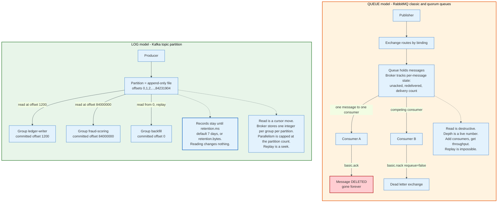

### 2.3 What Kafka Is Not

**Kafka is not a message queue, and calling it one causes real outages.** It has no per-message acknowledgement in the classic sense, no way for one consumer to hand a single message back, and no redelivery of an individual record. A consumer that fails to process record 5,000 and commits offset 5,001 anyway has lost that record permanently as far as the group is concerned. Kafka 4.2 added share groups, which do provide per-record acknowledgement, and section 21 covers them. They are new, they are opt-in, and they are not what most Kafka deployments run.

**Kafka is not a system where messages are deleted when consumed.** Retention is time-based or size-based. The topic defaults are `retention.ms=604800000`, seven days, and `retention.bytes=-1`, unlimited. Deletion happens one whole segment file at a time, and a segment is only eligible when the largest record timestamp inside it is older than the retention window. A consumer that never reads changes nothing about disk usage. A consumer that reads twice changes nothing either.

**Kafka is not fast because it is in memory.** It writes every record to a file. Its speed comes from writing sequentially and reading through the operating system page cache, and from never copying bytes into user space on the way out. Section 4 and section 5 do that arithmetic.

**Kafka is not ordered.** A topic is not ordered. A partition is ordered. Section 15 is entirely about the distance between those two statements.

### 2.4 What RabbitMQ Is Not

**RabbitMQ is not slow.** Its throughput ceiling is lower than Kafka's for a large sustained stream, and Confluent's own benchmark of 21 August 2020, run on Amazon EC2 `i3en.2xlarge` instances with two 2,500 GB NVMe SSDs, measured peak throughput of 605 MB/s for Kafka, 305 MB/s for Pulsar, and 38 MB/s for RabbitMQ with mirrored queues. That is a real difference and it is also a benchmark of one workload shape: a single high-volume stream. At 30 MB/s, the same benchmark put RabbitMQ's p99 end-to-end latency at 1 ms against Kafka's 5 ms at 200 MB/s. For a workload of small requests needing fast individual handoff, RabbitMQ is the lower-latency system.

**RabbitMQ is not a database.** A queue is not a place to keep data. Deep queues degrade classic queues badly, and quorum queues hold an in-memory index of every message. The design point of a queue is that it is empty most of the time.

**RabbitMQ does not lose messages by default because it is "not durable."** Durability requires three independent settings, and missing any one silently downgrades the guarantee: a durable queue (quorum queues are always durable), a persistent message (`delivery-mode=2`), and publisher confirms enabled with the publisher actually waiting for the `basic.ack`. Skip the third and the publisher has no idea whether the broker took responsibility.

**Neither system gives exactly-once delivery.** Kafka gives exactly-once processing within Kafka. Section 10 explains precisely what that means and what it excludes.

### 2.5 The Simplest Accurate Mental Model

Kafka is a distributed, partitioned, replicated commit log with a network protocol on the front. RabbitMQ is a routing engine with durable mailboxes attached to it.

Ask what the broker remembers. Kafka remembers a file and a handful of integers. RabbitMQ remembers a message.

---

## 3. Key Participants and Roles

### 3.1 The Actors

| Role | Kafka | RabbitMQ | Owns state? |
|------|-------|----------|-------------|
| **Producer / publisher** | `KafkaProducer`, batches records, chooses the partition | AMQP client, sends `basic.publish` to an exchange | Buffer only |
| **Routing decision maker** | The producer, at send time, by key hash | The broker, at publish time, by exchange type and bindings | No |
| **Storage unit** | Partition, an append-only log, replicated `N` ways | Queue, a mailbox, replicated by Raft if quorum type | Yes |
| **Replication unit** | Partition replica, leader plus followers | Quorum queue member, Raft leader plus followers | Yes |
| **Consumer** | `KafkaConsumer` in a group, owns whole partitions | AMQP consumer on a channel, competes for messages | Offset only |
| **Group coordinator** | A broker, hosting one `__consumer_offsets` partition | None; the queue itself distributes work | Yes |
| **Cluster brain** | KRaft controller quorum, 3 or 5 nodes | Khepri Raft cluster across all nodes | Yes |
| **Position tracker** | `__consumer_offsets`, compacted internal topic | The queue's own unacked-message set, per channel | Yes |
| **Transaction coordinator** | A broker, hosting one `__transaction_state` partition | None | Yes |
| **Schema authority** | External: Confluent Schema Registry, Apicurio, AWS Glue | External or none | No |

### 3.2 The Two Roles That Decide Whether the System Works

**In Kafka the producer routes, and that is unusual.** No broker looks at a record and decides where it belongs. The producer serialises the key, hashes it with murmur2, masks off the sign bit, and takes the remainder modulo the partition count. The broker accepts what it is given. Two consequences follow. Routing scales without a bottleneck, because it happens on thousands of client machines. And routing is frozen: changing the partition count changes the mapping for every key, so the ordering guarantee for a key breaks at the moment a topic is expanded. Kafka has no partition-count decrease at all.

**In RabbitMQ the broker routes, and that is the product.** A publisher names an exchange and a routing key and knows nothing about which queues exist. An operator can add a queue, bind it to `payment.authorized.#`, and start receiving a copy of every matching message without touching a single publisher. That indirection is the reason RabbitMQ survives in organisations with many small services and no central data platform team. It is also a bottleneck, because every message is matched against the binding table on the broker's own CPU.

Kafka pushes work to the edge. RabbitMQ keeps it in the middle.

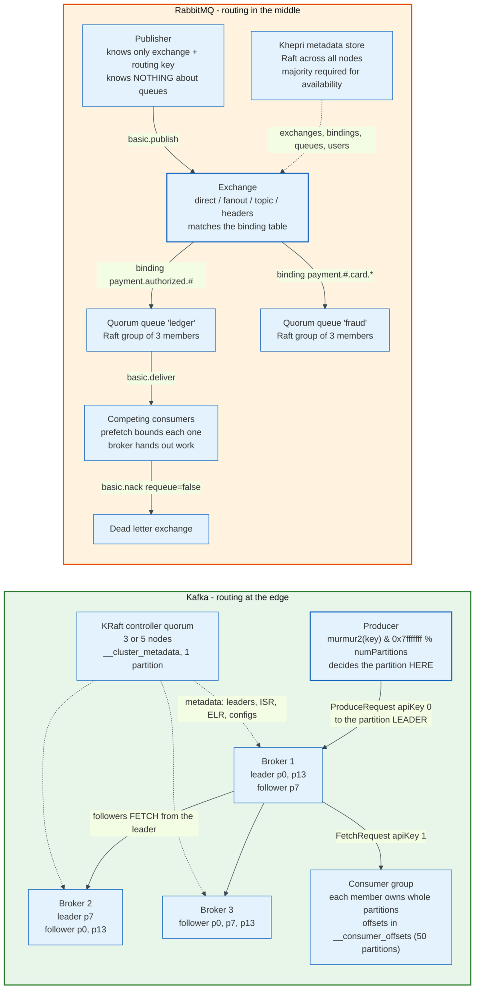

### 3.3 The Hidden Participant: The Operating System

Both brokers delegate their hardest storage decisions to the kernel, and neither documents that loudly enough.

Kafka does not maintain an in-process record cache. It writes to a file and reads from a file, and the page cache does the rest. The design document is explicit: a modern operating system will devote all free memory to disk caching, and a compact byte structure stored there gives roughly 28 to 30 GB of usable cache on a 32 GB machine with no garbage collection cost, and the cache survives a broker restart. Kafka's heap is small on purpose. Anyone who sizes a Kafka broker's JVM heap like a database's buffer pool has misconfigured it.

RabbitMQ delegates process scheduling and isolation to the Erlang virtual machine, and memory accounting to the resident set size of the whole node. When that crosses `vm_memory_high_watermark`, 0.6 of available RAM by default, the broker raises an alarm and blocks publishers across the entire cluster.

---

## 4. Kafka's Storage Layer: Partitions, Segments, and the Page Cache

A Kafka partition is a directory of files, and everything Kafka claims about performance falls out of that choice.

### 4.1 The Directory

A topic named `payments.authorized` with 24 partitions produces 24 directories on the brokers that host its replicas: `payments.authorized-0` through `payments.authorized-23`. Each directory holds a series of segments, and each segment is a set of files sharing a 20-digit zero-padded name equal to the base offset of the first record inside it.

| File | Contents | Entry size |
|------|----------|------------|
| `00000000000084100000.log` | The record batches themselves | Variable |
| `00000000000084100000.index` | Sparse offset index, relative offset to byte position | 8 bytes: 4-byte relative offset, 4-byte physical position |
| `00000000000084100000.timeindex` | Sparse time index, timestamp to relative offset | 12 bytes: 8-byte timestamp, 4-byte relative offset |
| `00000000000084100000.txnindex` | Aborted transaction ranges for `read_committed` fetches | Variable |
| `00000000000084100000.snapshot` | Producer id state, for rebuilding idempotence state after restart | Variable |
| `leader-epoch-checkpoint` | Leader epoch to start-offset mapping, one per partition | Text |
| `partition.metadata` | The topic id | Text |

The suffixes are fixed in `LogFileUtils`: `.log`, `.index`, `.timeindex`, `.txnindex`, `.snapshot`, plus the transient `.deleted`, `.cleaned`, and `.swap` used during compaction and deletion.

### 4.2 Why Offsets Are Not Message IDs

Kafka's original design considered producer-generated GUIDs and rejected them.

A GUID requires the broker to maintain a map from a random identifier to a file position, which is a persistent random-access index that must be kept in sync with the disk. An offset requires nothing: it is a per-partition atomic counter, monotonically increasing, and it doubles as an ordering. The lookup structure collapses from a B-tree to a binary search over a sparse array.

That is the whole trick. A monotonically increasing integer is both the identity and the index.

### 4.3 The Sparse Index and the Two Binary Searches

Finding offset 84,231,904 costs two binary searches and one sequential scan, and never a tree traversal.

First, Kafka binary-searches the in-memory list of segment base offsets to find that 84,231,904 lives in the segment whose base offset is 84,100,000. Second, it binary-searches the memory-mapped `.index` file for the largest indexed relative offset less than or equal to 131,904, which is 84,231,904 minus 84,100,000. Third, it starts reading the `.log` file from the byte position that entry names and scans forward until it reaches the target.

The index is deliberately sparse. `index.interval.bytes` defaults to 4096, so Kafka writes one index entry per roughly 4 KiB of log. At 8 bytes an entry, a 1 GiB segment produces about 2 MiB of index, and the whole index is memory-mapped, so the binary search is a memory operation. `segment.index.bytes` caps the preallocated index at 10 MiB, and that cap can force a segment to roll early on a topic with unusually small records.

Storing an entry per record would be exact and would cost `index.interval.bytes` divided by the average record size in extra index: about 8 times more at the 527-byte records of section 17, and 256 times more at a 16-byte record. Storing an entry per 4 KiB costs a short forward scan.

### 4.4 Segment Rolling and Deletion

A segment closes when `segment.bytes` is reached, 1073741824 bytes or 1 GiB by default, or when `segment.ms` elapses, 604800000 ms or 7 days by default, or when the offset index fills. Kafka 4.0 raised the minimum permitted `segment.bytes` from 14 bytes to 1 MB under KIP-1030, which removed a foot-gun that produced millions of tiny files.

Deletion works one whole segment at a time. Time-based retention uses the largest record timestamp in the segment, not the file's modification time and not the order of records inside it. Size-based retention is disabled by default, `retention.bytes=-1`; when enabled, the log manager deletes the oldest segment repeatedly until the partition fits. If both are configured, either one triggering is enough.

The segment list uses a copy-on-write structure so that a binary search proceeds against an immutable snapshot while deletions run. Reads never block on deletes.

### 4.5 The Page Cache, and Why Kafka Does Not fsync

Kafka's default durability guarantee comes from replication, not from the disk, and this is the single most misunderstood part of its design.

`flush.messages` and `log.flush.interval.messages` both default to `9223372036854775807`, which is Long.MAX_VALUE, meaning Kafka never forces a flush based on message count. A produce request that returns success has been written to the page cache of every in-sync replica, and quite possibly to the platters of none of them. Kafka's design document defends this explicitly: requiring `fsync` on every write "can reduce performance by two to three orders of magnitude," and disk errors are common enough that assuming stable storage is unsafe anyway. Kafka's recovery protocol therefore requires a replica that crashed to fully re-sync before rejoining the ISR, even if it lost unflushed data.

The performance argument behind the whole storage design is arithmetic about disk seeks. Kafka's documentation measures linear writes on a six-drive 7200 rpm SATA RAID-5 array at about 600 MB/s and random writes on the same hardware at about 100 kB/s, "a difference of over 6000X." Sequential access converts a storage problem into a bandwidth problem.

A consequence people discover late: if a Kafka cluster loses power to an entire rack at once, and every replica of a partition was in the same rack, records that were acknowledged can be gone. Rack awareness is not a nicety.

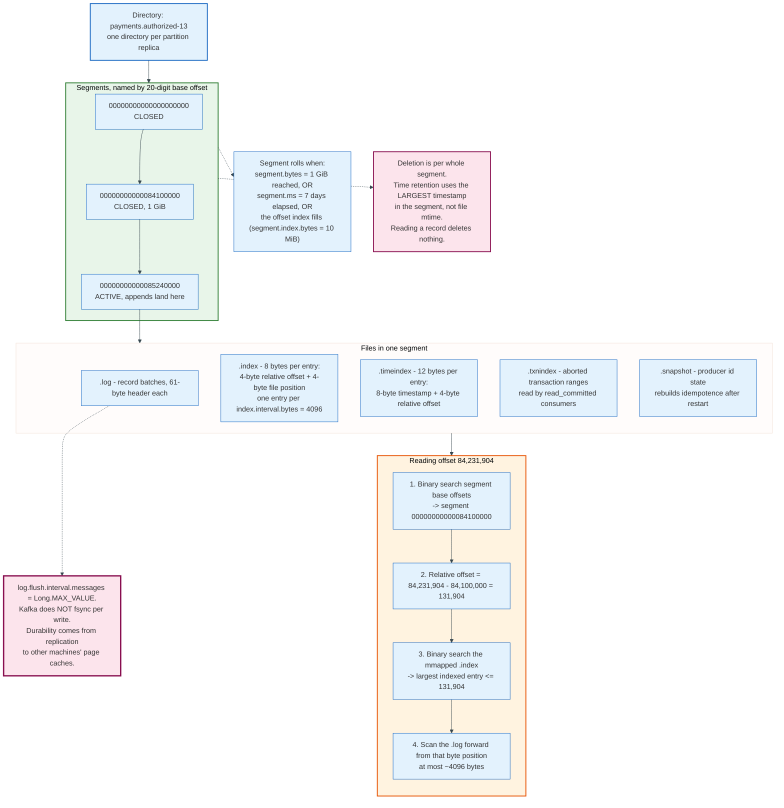

### 4.6 Log Compaction, the Other Retention Policy

`cleanup.policy=compact` changes the guarantee from "keep seven days" to "keep the last value for every key, forever."

The log cleaner runs over the closed portion of the log, builds a map from key to the highest offset holding that key, and rewrites segments keeping only the surviving version of each key. A record with a null value is a tombstone: it survives long enough for consumers to observe the deletion, then is removed. The result is a log that can be replayed from offset 0 to reconstruct the current state of every key, which is exactly what a database changelog or a compacted state store needs.

Two Kafka internal topics use it. `__consumer_offsets` is compacted because only the latest committed offset per group-topic-partition matters. `__transaction_state` is compacted for the same reason.

Compaction preserves the first and last offset and sequence number of every batch even when every record inside it is removed, because the broker needs the last sequence number to restore producer idempotence state after a leader failure. That is why an empty batch header can survive in a compacted log.

---

## 5. Zero-Copy and the Path a Byte Takes

Kafka's read path avoids user space entirely, and that is worth roughly half the CPU on a fan-out workload.

### 5.1 The Four Copies

Sending a file to a socket the ordinary way costs four copies and two system calls.

The kernel reads from disk into the page cache. The application calls `read()`, which copies from the page cache into a user-space buffer. The application calls `write()`, which copies from the user buffer into the kernel's socket buffer. The network card DMAs from the socket buffer. Two of those four copies exist only because the bytes passed through a process that did nothing to them.

### 5.2 sendfile

`sendfile(2)` collapses that to one copy. The kernel moves data from the page cache to the socket without a user-space round trip, and only the final transfer to the network interface remains.

Kafka reaches it through Java's `FileChannel.transferTo`, exposed internally as the `writeTo` method on the `TransferableRecords` interface. The requirement that makes it possible is that the on-disk format and the wire format are byte-identical. A producer writes record batch v2, the broker appends those exact bytes, and the consumer receives those exact bytes. No parsing, no re-encoding, no format conversion. That constraint is why Kafka's message format has been changed only twice in fifteen years and why format upgrades were such long, careful projects.

The fan-out arithmetic is where it pays. With ten consumer groups reading the same recent data, the bytes are in the page cache once and are sent ten times without ever entering the broker's heap. Kafka's design document states the consequence plainly: on a cluster where consumers are mostly caught up, disk read activity is effectively zero.

### 5.3 TLS Turns It Off

Encryption defeats zero-copy, and the Kafka documentation says so directly: "TLS/SSL libraries operate at the user space (in-kernel `SSL_sendfile` is currently not supported by Kafka). Due to this restriction, `sendfile` is not used when SSL is enabled."

This is a real operational trade, not a footnote. Turning on `security.protocol=SSL` for inter-broker and client traffic reintroduces the copy into user space plus the encryption cost itself. Clusters that need both encryption and maximum throughput either accept the CPU cost, terminate TLS at a proxy, or rely on network-level isolation instead. Anyone benchmarking a plaintext cluster and then deploying with TLS should expect the numbers to move.

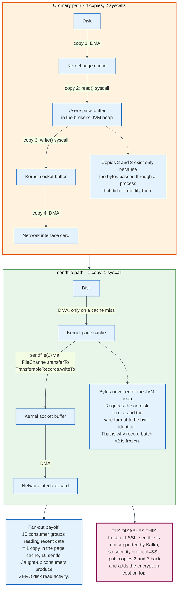

---

## 6. The Record Batch on the Wire

Kafka's unit of everything is the record batch, not the record, and the byte layout explains most of its efficiency claims.

### 6.1 The 61-Byte Header

Record batch format v2, magic byte 2, arrived in Kafka 0.11.0.0 in June 2017 and has not changed since. The header is exactly 61 bytes, and the constants in `DefaultRecordBatch` name every offset.

| Offset | Field | Type | Bytes | Purpose |
|--------|-------|------|-------|---------|
| 0 | `baseOffset` | int64 | 8 | Offset of the first record; assigned by the leader |
| 8 | `batchLength` | int32 | 4 | Bytes from here to the end of the batch |
| 12 | `partitionLeaderEpoch` | int32 | 4 | Set by the broker; excluded from the CRC so it can be stamped without recomputing |
| 16 | `magic` | int8 | 1 | Always 2 |
| 17 | `crc` | uint32 | 4 | CRC-32C (Castagnoli) over attributes to end of batch |
| 21 | `attributes` | int16 | 2 | Compression, timestamp type, transactional, control, delete horizon |
| 23 | `lastOffsetDelta` | int32 | 4 | Also serves as last sequence delta |
| 27 | `baseTimestamp` | int64 | 8 | Timestamp of the first record, or the delete horizon |
| 35 | `maxTimestamp` | int64 | 8 | Largest timestamp in the batch |
| 43 | `producerId` | int64 | 8 | PID for idempotence and transactions, -1 if none |
| 51 | `producerEpoch` | int16 | 2 | Fences zombie producers |
| 53 | `baseSequence` | int32 | 4 | First sequence number; used for duplicate detection |
| 57 | `recordsCount` | int32 | 4 | Number of records, or of compressed records |
| 61 | `records` | bytes | var | The records, compressed as one unit if compression is on |

`RECORD_BATCH_OVERHEAD` is therefore 61. The total size of a batch on disk is `batchLength + 12`, the extra twelve being the `baseOffset` and `batchLength` fields themselves.

The attributes bits:

```text
bit 0-2  compression: 0 none, 1 gzip, 2 snappy, 3 lz4, 4 zstd
bit 3    timestampType: 0 CreateTime, 1 LogAppendTime
bit 4    isTransactional
bit 5    isControlBatch
bit 6    hasDeleteHorizonMs
bit 7-15 unused
```

Two design details do real work. The CRC sits after the magic byte, which forces a client to read the magic before deciding how to interpret anything, and that is what made format evolution possible at all. And `partitionLeaderEpoch` is deliberately outside the CRC's coverage, so a broker can stamp its epoch onto an incoming batch without rehashing the payload.

### 6.2 The Record Inside

Individual records are varint-encoded with everything expressed as a delta from the batch header.

```text
length          varint    zigzag-encoded size of the rest of this record
attributes      int8      currently unused, all 8 bits reserved
timestampDelta  varlong   milliseconds since the batch's baseTimestamp
offsetDelta     varint    offset relative to the batch's baseOffset
keyLength       varint    -1 for a null key
key             bytes
valueLength     varint    -1 for a null value (a tombstone)
value           bytes
headersCount    varint
headers         [ headerKeyLength varint, headerKey string,
                  headerValueLength varint, headerValue bytes ]
```

`MAX_RECORD_OVERHEAD` is 21 bytes: 5 for the length varint, 10 for the timestamp varlong, 5 for the offset varint, and 1 for attributes. In practice, records in a tightly packed batch cost far less, because a small offset delta and a small timestamp delta each encode into one byte. The varint encoding is the same one Protocol Buffers uses.

The design point is that a batch of 1,000 records pays the 61-byte header once and roughly 6 to 8 bytes of framing per record, instead of paying a full header per message. Compression then runs over the whole record block as a single unit, so repeated keys, repeated header names, and repeated JSON field names across records compress against each other. That is why batch size dominates Kafka's compression ratio.

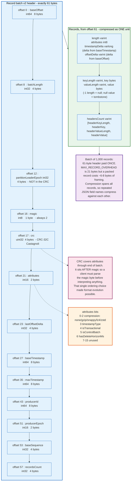

### 6.3 Control Batches

A control batch has attributes bit 5 set and contains exactly one record whose key follows a fixed schema.

```text
ControlRecordKey =>
  version int16   currently 0
  type    int16
```

Type 0 is `ABORT` and type 1 is `COMMIT`. Types 2 through 6 are used internally by the KRaft consensus protocol. Consumers never surface control records to applications; they exist so a `read_committed` consumer can tell which transactional records to discard, and so the Raft implementation can carry its own protocol metadata inside the same log format as everything else.

---

## 7. The Producer: Batching, Compression, and acks

The Kafka producer is a batching engine with a network client attached, and its defaults changed materially in the 3.0 and 4.0 releases.

### 7.1 What send() Actually Does

`producer.send()` does not send anything. It serialises the key and value, computes a partition, appends the resulting record into a per-partition batch held in the `RecordAccumulator`, and returns a `Future`. A separate sender thread drains ready batches and issues `ProduceRequest` messages to partition leaders.

A batch becomes ready when it reaches `batch.size`, 16384 bytes by default, or when `linger.ms` elapses. Kafka 4.0 changed the `linger.ms` default from 0 to 5 milliseconds. The upgrade note gives the reasoning: "the efficiency gains from larger batches typically result in similar or lower producer latency despite the increased linger." Waiting 5 ms to fill a batch usually costs less end-to-end than sending ten separate requests.

`buffer.memory` bounds the accumulator at 33554432 bytes, 32 MiB. When it fills, `send()` blocks for up to `max.block.ms`, 60000 ms, and then throws. That blocking behaviour is the producer's entire backpressure mechanism, and section 16 returns to it.

### 7.2 The acks Setting, Precisely

`acks` decides what "the broker got it" means, and there are exactly three answers.

| `acks` | Leader waits for | Loses data when | Round trips |
|--------|------------------|-----------------|-------------|
| `0` | Nothing; the record is written to the socket and forgotten | Any broker failure, any network drop, silently | 0 |
| `1` | The leader's own append to its page cache | The leader dies before a follower fetches the record | 1 |
| `all` (`-1`) | Every current in-sync replica has fetched the record | Every in-sync replica dies before the data reaches any disk | 1 plus follower fetch |

Since Kafka 3.0 the default is `acks=all` with `enable.idempotence=true`. Before that, the default was `acks=1`, and a large fraction of "Kafka lost my data" reports trace to clusters still running that old default with a leader failover.

`acks=all` on its own is weaker than it sounds. The design documentation is blunt: "acknowledgement by all replicas does not guarantee that the full set of assigned replicas have received the message." If a topic has replication factor 3 and two replicas have fallen out of the ISR, `acks=all` is satisfied by the leader alone. The setting that closes the gap is `min.insync.replicas`, a topic config that defaults to 1. Setting it to 2 on a replication-factor-3 topic makes the producer fail with `NotEnoughReplicasException` rather than accept a write that only one machine holds.

The durable configuration is three settings together, not one: `replication.factor=3`, `min.insync.replicas=2`, `acks=all`. It tolerates one broker failure with no data loss and no write outage, and it refuses writes when two are down.

### 7.3 Idempotence and the In-Flight Limit

Idempotence removes duplicates caused by producer retries, and it does so with three integers.

On the first send, the producer obtains a producer id, a PID, and an epoch through `InitProducerId`. Every batch it sends to a partition carries `producerId`, `producerEpoch`, and `baseSequence`. The broker keeps the last five batches per producer per partition and checks that an incoming batch's first and last sequence numbers follow on from what it already has. A duplicate is accepted and dropped. A gap raises `OutOfOrderSequenceException`, which is fatal to that producer instance.

Because the broker tracks five batches, `max.in.flight.requests.per.connection` may be at most 5 with idempotence on, and the default is exactly 5. Kafka 4.0 removed the old silent fallback: "the `enable.idempotence` configuration will no longer automatically fall back when the `max.in.flight.requests.per.connection` value exceeds 5." It now fails at startup, which is the right behaviour, and which breaks configurations that had been quietly non-idempotent for years.

Idempotence also preserves ordering under retry. Without it, a failed batch retried behind a successful one reorders the partition. With it, the broker rejects out-of-order sequences, so the producer must resend in order.

### 7.4 The Retry Budget

`retries` defaults to `2147483647`, which looks like an infinite retry loop and is not, because the real bound is `delivery.timeout.ms`.

`delivery.timeout.ms` defaults to 120000 ms and caps the total time from `send()` returning to the `Future` completing, including all retries and all time spent in the accumulator. `request.timeout.ms` defaults to 30000 ms and caps a single round trip. Retries stop when the delivery timeout expires, not when a retry count is exhausted. Tuning `retries` alone does nothing useful; tuning `delivery.timeout.ms` is the lever.

### 7.5 Compression

`compression.type` defaults to `none` on the producer and to `producer` on the topic, meaning the broker stores whatever the producer sent without recompressing.

Compression applies to the record block of a whole batch, so its effectiveness scales with batch size. The available codecs are gzip, snappy, lz4, and zstd. zstd, added in Kafka 2.1, generally gives the best ratio per CPU cycle for JSON payloads; lz4 gives the lowest CPU cost. The setting to reach for first on a bandwidth-bound cluster is not the codec, it is `linger.ms` and `batch.size`, because a bigger batch compresses better.

One trap: if the topic sets `compression.type` to something other than `producer`, the broker must decompress and recompress every batch, which destroys the zero-copy property on the write path and costs broker CPU per message.

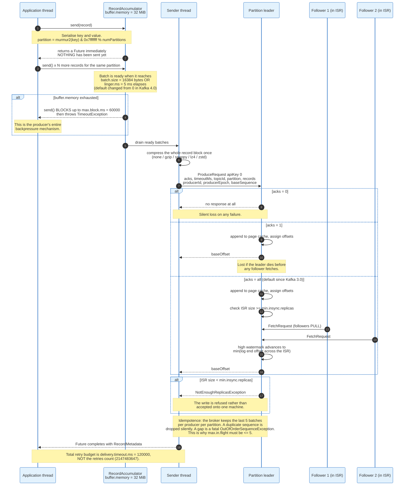

---

## 8. Replication: The ISR, the High Watermark, and Unclean Leader Election

Kafka does not use majority voting, and understanding why explains its storage economics.

### 8.1 Why Not a Majority Quorum

A majority-vote replicated log with `2f+1` replicas commits when `f+1` have the write and elects a leader from any `f+1`, guaranteeing overlap. Tolerating one failure needs three copies. Tolerating two needs five.

Kafka's design document rejects this for primary data on cost grounds: "doing every write five times, with 5x the disk space requirements and 1/5th the throughput, is not very practical for large volume data problems." Instead Kafka maintains a dynamic set of in-sync replicas, the ISR, commits only when every member of the ISR has the write, and elects leaders only from the ISR. With `f+1` replicas it tolerates `f` failures, which is the same fault tolerance at roughly 60% of the storage of a majority quorum.

The trade is that Kafka waits for the slowest ISR member rather than the fastest majority. Its answer is that the producer chooses, through `acks`, whether to wait at all. The closest published academic design is Microsoft's PacificA, not Raft or Zab.

### 8.2 What Makes a Replica In-Sync

A broker is alive when two conditions hold together, and a replica is in-sync when both hold for it.

The first is an active session with the controller. In KRaft this means periodic heartbeats; if the controller misses them for `broker.session.timeout.ms`, the node is considered offline. The second is that a follower keeps up. `replica.lag.time.max.ms`, default 30000 ms since Kafka 2.5, defines "keeps up": a follower that has not caught up to the leader's log end offset within that window is removed from the ISR by the leader.

The measure is time, not message count. An older Kafka used `replica.lag.max.messages`, which shrank the ISR every time a producer sent a large burst even though the followers were healthy. Time-based lag is immune to burst size.

### 8.3 The High Watermark

The high watermark is the offset up to which every ISR member has the data, and it is the boundary of consumer visibility.

The leader computes it as the minimum log end offset across the ISR. Consumers may read up to but not past it. That is what "only committed messages are ever given out to the consumer" means, and it is why a consumer never sees a record that could vanish in a leader failover.

Regardless of the producer's `acks` setting, records become visible to consumers only once they are replicated to all in-sync replicas and the ISR is at least `min.insync.replicas`. A producer using `acks=0` does not make its records visible faster; it only stops waiting to hear about them.

### 8.4 Unclean Leader Election

When every replica of a partition is offline, there are exactly two options and no third.

Wait for a member of the last known ISR to return, and accept that the partition is unavailable, possibly forever if that machine is destroyed. Or elect whichever replica comes back first, accept its log as truth, and lose whatever committed records it never received.

`unclean.leader.election.enable` defaults to `false`, and has since Kafka 0.11.0.0. Kafka chooses consistency. Setting it to `true` converts silent data loss into an availability guarantee, which some workloads genuinely want and most do not. The important property is that the loss is silent: consumers see the log truncate, and no error is raised to anyone.

### 8.5 Eligible Leader Replicas

KIP-966 part 1 added a third option in Kafka 4.0, and it is on by default for clusters created on 4.1 or later.

Because the strict minimum-ISR rule prevents the high watermark from advancing when the ISR is smaller than `min.insync.replicas`, some replicas outside the ISR are provably safe to promote: they hold everything that was ever committed. The KRaft controller now tracks these in a `PartitionRecord` field called `Eligible Leader Replicas`. Leader election proceeds in order: pick from the ISR if it is non-empty; otherwise pick an unfenced ELR member; otherwise fall back to the last known leader if it is unfenced, which is the pre-4.0 behaviour when everything is offline.

ELR narrows the gap between "wait forever" and "lose data" without inventing a new consistency model. It is controlled by the `eligible.leader.replicas.version` feature flag and is safe to downgrade. Enabling it forces `min.insync.replicas` to become a cluster-level config: broker-level values are removed and broker-level alteration is refused.

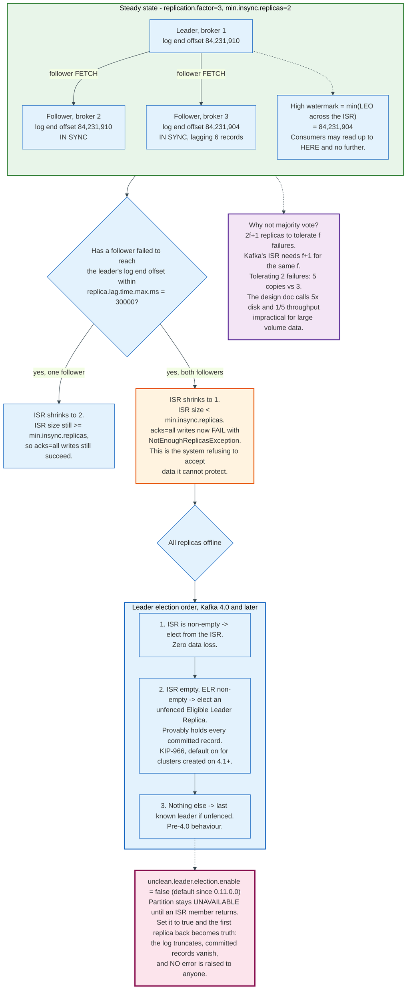

---

## 9. Consumer Groups: Offsets, Assignment, and Rebalancing

A consumer group is a set of processes that between them own every partition of the subscribed topics exactly once, and the machinery for maintaining that invariant is the most-changed part of Kafka.

### 9.1 Offsets Are Rows in a Compacted Topic

Committed offsets live in `__consumer_offsets`, an internal compacted topic with 50 partitions by default (`offsets.topic.num.partitions`) and replication factor 3 (`offsets.topic.replication.factor`).

The key identifies the position being tracked:

```text
OffsetCommitKey (version 0) =>
  group     string
  topic     string
  partition int32
```

The value carries the position and its provenance:

```text
OffsetCommitValue (versions 0 to 4) =>
  offset          int64    the NEXT offset to read, not the last one read
  leaderEpoch     int32    v3+, the leader epoch of the last consumed record
  metadata        string   opaque, client-defined
  commitTimestamp int64
  expireTimestamp int64    v1 only
  topicId         uuid     v4+
```

Two details matter operationally. The stored offset is the next record to read, not the last one processed, which is why an off-by-one in a manual commit reprocesses or skips exactly one record. And `leaderEpoch` exists so that a consumer resuming after an unclean failover can detect that its offset refers to a log that no longer exists and reset rather than read the wrong data.

A group's coordinator is the broker that leads the `__consumer_offsets` partition selected by hashing the group id modulo the partition count. That is the entire coordinator assignment algorithm.

### 9.2 The Classic Protocol and Its Barrier

The pre-4.0 protocol is a distributed handshake with a stop-the-world step in it.

A consumer sends `FindCoordinator`, then `JoinGroup`. The coordinator collects `JoinGroup` requests until every known member has arrived or the rebalance timeout expires, then designates one member as the group leader and returns every member's subscription to it. The leader computes the assignment on its own machine and returns it via `SyncGroup`. The coordinator distributes the result. Members then heartbeat every `heartbeat.interval.ms`, 3000 ms, and are evicted if they go quiet for `session.timeout.ms`, 45000 ms since Kafka 3.0.

The `JoinGroup` phase is a global synchronization barrier. KIP-848 states the problem exactly: "a single misbehaving consumer can take down or disturb the whole group because a rebalance of the whole group is required whenever a consumer joins, leaves or fails."

Two mitigations were bolted on. Cooperative incremental rebalancing (KIP-429, Kafka 2.4) splits the rebalance in two: members keep everything, then revoke only the partitions that actually move, then a second rebalance assigns them. Static membership (KIP-345, Kafka 2.3) gives each consumer a stable `group.instance.id`, so a restart within `session.timeout.ms` reclaims the same partitions without any rebalance at all. Both help. Neither removes the barrier.

There is one more trap: a consumer is evicted not only for missing heartbeats but for taking longer than `max.poll.interval.ms`, 300000 ms, between calls to `poll()`. Slow per-record processing with the default `max.poll.records` of 500 is the most common cause of a consumer group that rebalances in a loop and never makes progress.

### 9.3 KIP-848, the Protocol That Removed the Barrier

Kafka 4.0 made the next-generation rebalance protocol generally available, and it moves assignment to the broker.

One RPC, `ConsumerGroupHeartbeat`, api key 68, replaces `JoinGroup`, `SyncGroup`, and `Heartbeat`. The request carries:

```text
ConsumerGroupHeartbeatRequest =>
  GroupId              string
  MemberId             string
  MemberEpoch          int32    0 to join, -1 to leave
  InstanceId           string   null if unchanged since the last heartbeat
  RackId               string
  RebalanceTimeoutMs   int32    -1 if unchanged
  SubscribedTopicNames []string null if unchanged
  SubscribedTopicRegex string   v1+, RE2J syntax, evaluated on the SERVER
  ServerAssignor       string
  TopicPartitions      [ TopicId uuid, Partitions []int32 ]
```

The coordinator computes the target assignment with a server-side assignor, `uniform` by default or `range`, and then reconciles each member toward it independently. A member revokes what it must, acknowledges, advances its member epoch, and receives new partitions as others release theirs. Members whose assignment does not change are not disturbed at all. The design goal is stated as: "a consumer should not be impacted at all by a rebalance if its assignment is not changed."

Server-side control also moves the timing knobs to the broker. With `group.protocol=consumer`, the client configurations `heartbeat.interval.ms`, `session.timeout.ms`, `partition.assignment.strategy`, and the `enforceRebalance` methods stop being usable; the broker's `group.consumer.heartbeat.interval.ms` and `group.consumer.session.timeout.ms` govern instead.

The rollout is deliberately slow. The protocol is enabled on the server automatically from 4.0 and controlled by the `group.version` feature flag, but as of Kafka 4.3 the client default for `group.protocol` is still `classic`. Per KIP-1274 the plan is that Kafka 5.0 defaults the consumer to the new protocol while still supporting the old one, and Kafka 6.0 drops classic support from `KafkaConsumer` while brokers keep it for compatibility. Groups convert between `Classic` and `Consumer` automatically when empty, and can be upgraded online provided the classic group's assignor embeds no custom metadata.

Two limitations remain as of 4.3: client-side assignors are not supported, and rack-aware assignment is not fully implemented.

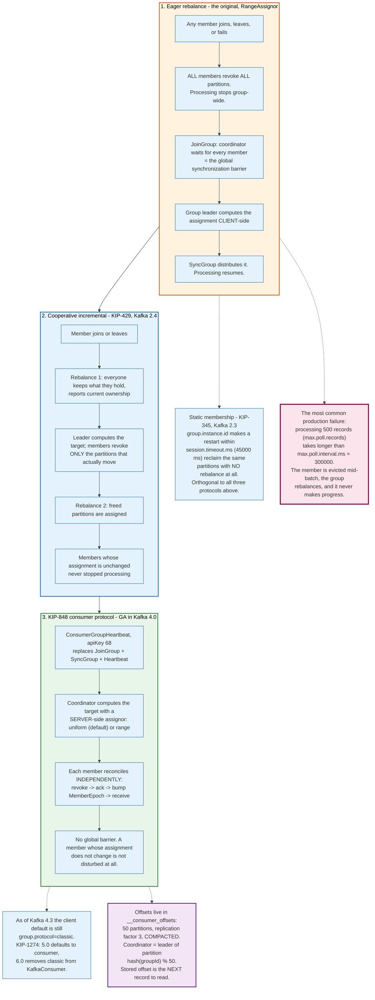

### 9.4 The Fetch Loop

Consumers pull. The `FetchRequest`, api key 1, carries `MaxWaitMs`, `MinBytes`, `MaxBytes`, `IsolationLevel`, a `SessionId` and `SessionEpoch` for incremental fetch sessions, and per-partition `FetchOffset`, `CurrentLeaderEpoch`, `LastFetchedEpoch`, and `PartitionMaxBytes`.

`fetch.min.bytes` defaults to 1 and `fetch.max.wait.ms` to 500, so an idle consumer long-polls for half a second and returns as soon as a single byte is available. Raising `fetch.min.bytes` trades latency for fewer, larger requests. `fetch.max.bytes` bounds a whole response at 52428800 bytes, 50 MiB, and `max.partition.fetch.bytes` bounds one partition's share at 1048576 bytes, 1 MiB.

Incremental fetch sessions matter at scale. Without them, a consumer following 1,000 partitions restates all 1,000 partition offsets in every request several times a second. With a session established, subsequent requests carry only the partitions whose state changed, plus a `ForgottenTopicsData` list for the ones to drop.

`CurrentLeaderEpoch` and `LastFetchedEpoch` are the fencing mechanism. They let a broker detect that a consumer is asking for data from a log lineage that was truncated away, and return a truncation error rather than the wrong bytes.

---

## 10. Exactly-Once: Idempotent Producers and Transactions

Kafka's exactly-once is real, narrow, and routinely oversold. It means: a consume-transform-produce loop entirely inside Kafka can be made atomic. It does not mean a message is delivered to an arbitrary external system exactly once.

### 10.1 The Two Halves

Idempotence, covered in section 7.3, removes duplicates caused by producer retries within a single producer session. It costs almost nothing and is on by default since Kafka 3.0.

Transactions add atomicity across partitions and across the consumer offset commit. They cost a coordinator round trip per transaction and control records in every touched partition, and they must be asked for.

### 10.2 The Coordinator and Its Log

Setting `transactional.id` on a producer binds it to a transaction coordinator, which is the broker leading the `__transaction_state` partition chosen by hashing that id.

`__transaction_state` defaults to 50 partitions, replication factor 3, and `transaction.state.log.min.isr=2`. Its value schema is explicit about what the coordinator remembers:

```text
TransactionLogValue (versions 0 to 1) =>
  ProducerId                       int64
  PreviousProducerId               int64   producer id of the last committed transaction
  NextProducerId                   int64   latest producer id issued for this transactional id
  ProducerEpoch                    int16
  NextProducerEpoch                int16
  TransactionTimeoutMs             int32
  TransactionStatus                int8
  TransactionPartitions            [ Topic string, PartitionIds []int32 ]
  TransactionLastUpdateTimestampMs int64
  TransactionStartTimestampMs      int64
  ClientTransactionVersion         int16   which transaction protocol version the client used
```

`transaction.timeout.ms` defaults to 60000 ms on the client, and the broker refuses anything above `transaction.max.timeout.ms`, 900000 ms. A transactional id that goes unused for `transactional.id.timeout.ms`, seven days, is expired.

### 10.3 The Two-Phase Commit

A Kafka transaction is a two-phase commit whose participants are partition leaders and whose durable log is a Kafka topic.

`initTransactions()` sends `InitProducerId` with the transactional id. The coordinator returns a producer id and a bumped epoch, and aborts any transaction the previous incarnation of that id left open. That epoch bump is the zombie fence: an old producer instance that wakes up and tries to write is rejected with a stale epoch.

`beginTransaction()` is purely client-side bookkeeping. The first record sent to a new partition triggers `AddPartitionsToTxn`, which registers that partition with the coordinator and starts the transaction timer. Committing consumer offsets inside the transaction goes through `AddOffsetsToTxn` followed by `TxnOffsetCommit`, which writes the offsets into `__consumer_offsets` marked with the producer id and epoch.

`commitTransaction()` sends `EndTxn`. The coordinator writes `PREPARE_COMMIT` to its log, then sends `WriteTxnMarkers` to every partition leader involved, each of which appends a control batch containing a `COMMIT` record. Once every marker is written, the coordinator writes the final `COMMITTED` state. Abort follows the identical path with `PREPARE_ABORT` and `ABORT` markers.

### 10.4 The Last Stable Offset

`isolation.level=read_committed` changes what a consumer can see, and the mechanism is a second watermark.

A `read_committed` consumer reads up to the Last Stable Offset, not the high watermark. The LSO is the offset of the first record belonging to a still-open transaction. It advances only when transaction markers land. Records from aborted transactions are physically present in the log; the broker returns an `AbortedTransactions` list in the `FetchResponse`, built from the `.txnindex` file, and the consumer discards the matching records.

Two consequences follow. A hung transaction stalls the LSO for its partition, and every `read_committed` consumer on that partition stops advancing even though records are arriving. And `read_uncommitted`, the default, sees everything including records from transactions that later aborted. Anyone who turns on transactions and forgets to set `isolation.level=read_committed` on the downstream consumer has paid the full cost and bought nothing.

### 10.5 KIP-890 and What Kafka 4.0 Fixed

Hanging transactions were a real class of production incident, and Kafka 4.0 addressed them at the protocol level.

Transactions Server-Side Defense, KIP-890, is enabled automatically on servers from Kafka 4.0 and controlled by the `transaction.version` feature flag. With `transaction.version=2` and a 4.0 or later producer, the producer epoch is bumped on every transaction rather than only at initialisation. That guarantees, as the documentation puts it, that "every transaction includes the intended messages and duplicates are not written as part of the next transaction." The old failure mode, in which a delayed produce request from a previous transaction landed inside the next one, is closed.

The second change is a performance one. Verification previously required the client to add a partition and the server to verify it, two calls. TV2 collapses that to one server-side call. The visible side effect is that `CONCURRENT_TRANSACTIONS` retries now happen on the broker rather than as client backoff, so per-request produce latency reports go up while end-to-end transaction latency does not. Two configs tune the server-side retry: `add.partitions.to.txn.retry.backoff.ms` and `add.partitions.to.txn.retry.backoff.max.ms`.

Clients upgrade dynamically on the first transaction after they notice the server-side change, without a restart, and downgrades work the same way.

### 10.6 The Boundary

Exactly-once stops at Kafka's edge, and the documentation says so.

"Exactly-once delivery for other destination systems generally requires cooperation with such systems, but Kafka provides the primitives which makes implementing this feasible." The practical pattern is the one Kafka Connect uses for HDFS: write the data and the offsets to the same destination in the same operation, so either both land or neither does. Where the sink cannot do that, the only options are an idempotent write keyed on a message identifier, or accepting at-least-once and deduplicating downstream.

The three configuration requirements are small and non-negotiable: producer `transactional.id` set, consumer `isolation.level=read_committed`, consumer `enable.auto.commit=false`. Miss the third and the consumer commits offsets outside the transaction, which is exactly the thing transactions exist to prevent.

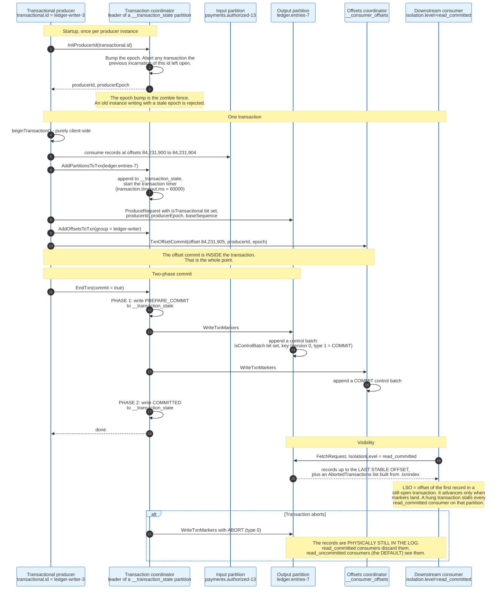

---

## 11. KRaft: Kafka Replaces ZooKeeper With Its Own Log

Kafka spent fourteen years storing its cluster metadata in a system it did not control, and removing that dependency changed its scaling limits.

### 11.1 What ZooKeeper Cost

Running Kafka meant running two consensus systems, and the seams between them were where the outages lived.

Metadata lived in ZooKeeper znodes: broker registrations, topic configurations, partition assignments, ISR membership. One broker held the controller role and wrote changes to ZooKeeper; the others watched. Controller failover meant a new broker reading the full metadata state out of ZooKeeper before it could act, and propagation to brokers happened through individual RPCs rather than a log. On a cluster with hundreds of thousands of partitions, that startup read and that fan-out were measured in minutes. The practical partition ceiling per cluster was a ZooKeeper ceiling, not a Kafka one.

There was also an operational tax that never appears in benchmarks: a second cluster to size, secure, patch, monitor, and back up, with its own failure modes and its own experts.

### 11.2 The Metadata Log

KRaft, from KIP-500, stores metadata in a Kafka topic called `__cluster_metadata` with exactly one partition, replicated among the controllers by a Raft implementation.

Every metadata change is a record in that log. Brokers do not query the controller; they replicate the log and apply records in order, exactly as a consumer would. Controller failover becomes a Raft leader election over a log the new leader already holds, not a cold read of an external store. Broker startup becomes a log replay, and a broker that has been down catches up by fetching the records it missed.

The metadata log uses the same record batch format as every other topic. Control record types 2 through 6, alongside the transactional types 0 and 1, carry Raft protocol metadata such as `KRaftVersionRecord` and `VotersRecord`.

### 11.3 Running It

`process.roles` decides what a node is: `broker`, `controller`, or `broker,controller` for a combined node. Combined mode is simpler for development and is explicitly not recommended for critical deployments, because the controller loses isolation and cannot be rolled or scaled separately.

Operators pick 3 or 5 controllers. Three tolerates one failure, five tolerates two, and a majority must be alive for the cluster to accept metadata changes. Every broker and controller sets `controller.quorum.bootstrap.servers`, which functions like a client's `bootstrap.servers`: it need not list every controller, but listing as many as possible helps every node find the quorum.

Provisioning is explicit and no longer automatic. `bin/kafka-storage.sh random-uuid` generates a cluster id, and `bin/kafka-storage.sh format` writes it into each node's storage directory. The documentation gives the reason directly: automatic formatting can hide an error condition, and "if a majority of the controllers were able to start with an empty log directory, a leader might be able to be elected with missing committed data."

Formatting a standalone controller creates a `meta.properties` file with a randomly generated `directory.id` and a snapshot at `00000000000000000000-0000000000.checkpoint` containing the control records that make this node the quorum's only voter. Snapshots are named `<end offset>-<epoch>.checkpoint`, and `kafka-dump-log.sh --cluster-metadata-decoder` decodes both log segments and snapshots.

The controllers hold all cluster metadata in memory and on disk. Apache's sizing guidance is that 5 GB of main memory and 5 GB of disk on the metadata log directory suffices for a typical cluster.

### 11.4 Static Versus Dynamic Quorums

KIP-853 made the controller set changeable at runtime, and the distinction is fixed at format time.

A static quorum lists every controller's id, host, and port in `controller.quorum.voters` on every node. Changing the set requires a rolling restart of everything. A dynamic quorum, available at `kraft.version=1`, omits `controller.quorum.voters` entirely and uses `controller.quorum.bootstrap.servers`. Controllers are added with `kafka-metadata-quorum.sh add-controller` after they have caught up, and removed with `remove-controller`. Kafka 4.1 added support for upgrading an existing static quorum to a dynamic one. Kafka 4.2 added `controller.quorum.auto.join.enable`, defaulting to `false`, which lets a controller join the voter set by itself.

`bin/kafka-features.sh describe` reports which mode a cluster is in: `kraft.version` at level 0 or absent means static, 1 or above means dynamic.

### 11.5 The Removal

Kafka 3.9 was the last release with ZooKeeper mode. Kafka 4.0, on 18 March 2025, removed it.

Upgrading a ZooKeeper-based cluster to 4.x is not a version bump. The cluster must be migrated to KRaft on 3.9.x first, then upgraded. Clusters already on KRaft need software and metadata versions of at least 3.3.x, the release where KRaft was declared production ready. Metadata downgrades are possible only when no intervening `MetadataVersion` introduced metadata changes; `IBP_4_3_IV0(30, "4.3", "IV0", true)` marks 4.3 as having them, so a cluster finalized on 4.3 cannot go back.

The upgrade is finalized separately from the binary rollout. Brokers are replaced one at a time, then `bin/kafka-features.sh upgrade --release-version 4.3` commits the metadata version. Until that second step, the new features stay off and a rollback stays possible.

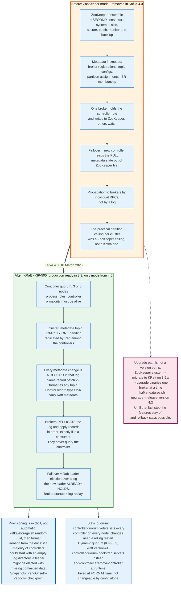

---

## 12. RabbitMQ: Exchanges, Bindings, and Queues Under AMQP 0-9-1

RabbitMQ's core abstraction is that publishers never name a queue. They name an exchange, and the exchange decides.

### 12.1 The Three Objects

An **exchange** receives every published message and routes zero or more copies. A **queue** stores messages and delivers them to competing consumers. A **binding** is a rule connecting one exchange to one queue, usually carrying a routing key pattern.

A message published to an exchange with no matching binding is silently discarded, unless the publisher set the `mandatory` flag, in which case the broker returns it with `basic.return`. That silence is the single most common cause of "RabbitMQ lost my message" reports, and it is not a loss: it is a routing miss.

### 12.2 The Four Exchange Types

| Type | Routing rule | Typical use |
|------|--------------|-------------|
| **direct** | Routing key equals the binding key exactly. Multiple queues bound with the same key all receive a copy | Work distribution by category |
| **fanout** | Routing key ignored; every bound queue gets a copy | Broadcast, cache invalidation |
| **topic** | Routing key is dot-separated words matched against a pattern with `*` and `#` | Multicast by hierarchy |
| **headers** | Match on message headers instead of the routing key, using the `x-match` binding argument | Routing on structured attributes |

The topic exchange's wildcards are precise. A routing key is a sequence of words separated by dots, at most 255 bytes in total. In a binding pattern, `*` matches exactly one word and `#` matches zero or more words. So `payment.authorized.#` matches `payment.authorized` and `payment.authorized.card.us`, while `payment.*.card` matches `payment.authorized.card` but not `payment.authorized.card.us`.

The headers exchange takes `x-match` with four values: `all` requires every header in the binding to match, `any` requires one, and `all-with-x` and `any-with-x` extend matching to headers whose names begin with `x-`, which are otherwise excluded.

The **default exchange** is the piece that confuses newcomers. It is a direct exchange with the empty-string name, and the broker automatically binds every queue to it using the queue's own name as the binding key. Publishing to exchange `""` with routing key `ledger` therefore lands in the queue named `ledger`. It looks like publishing directly to a queue. It is not; it is a routing rule that happens to be pre-installed.

Queue names may be up to 255 bytes of UTF-8, and names beginning with `amq.` are reserved for the broker.

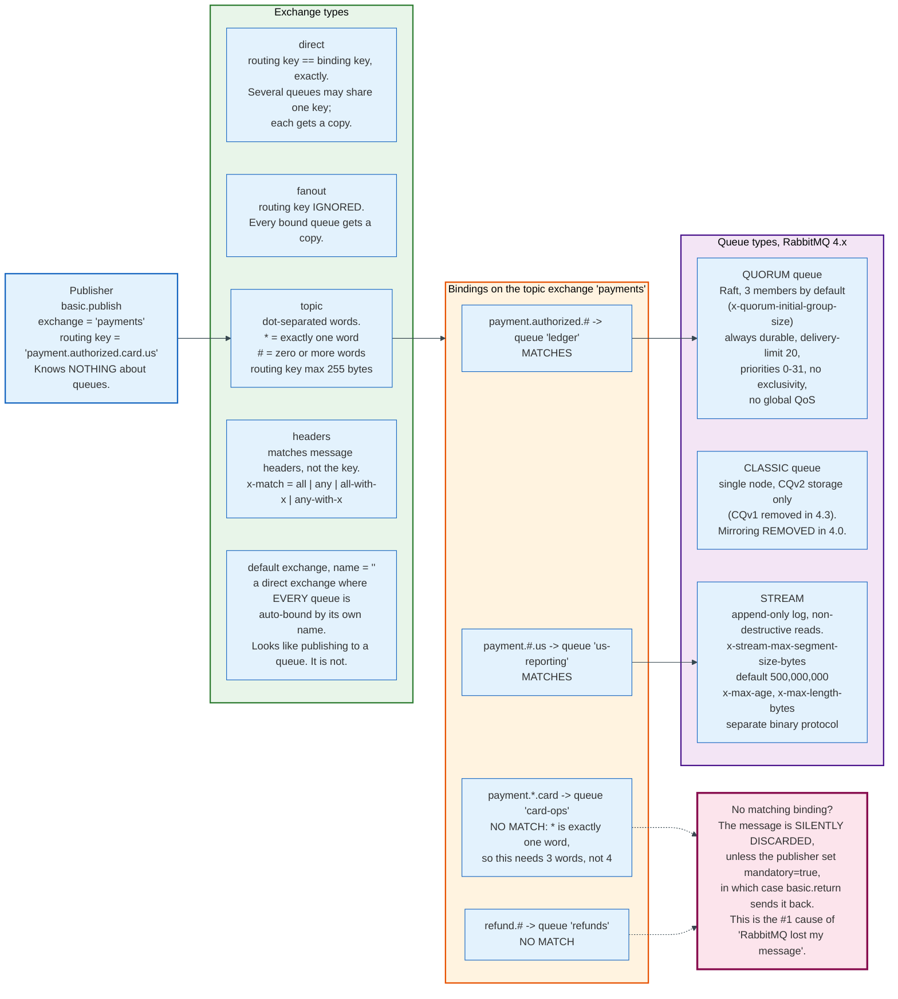

### 12.3 The Wire Format

AMQP 0-9-1 is a binary framing protocol, and its frames are small and regular.

```text
Frame =>
  type      octet     1 = METHOD, 2 = HEADER, 3 = BODY, 8 = HEARTBEAT
  channel   uint16    0 = connection-level, 1..channel_max for channels
  size      uint32    payload length in bytes
  payload   octet[size]
  frame-end octet     always 0xCE (206)
```

A method frame's payload begins with a 2-byte class id and a 2-byte method id, followed by the method's arguments. The class ids are fixed by the specification: connection 10, channel 20, exchange 40, queue 50, basic 60, tx 90. Within class `basic`, the method ids are `qos` 10, `consume` 20, `cancel` 30, `publish` 40, `return` 50, `deliver` 60, `get` 70, `get-ok` 71, `get-empty` 72, `ack` 80, `reject` 90, `recover-async` 100, `recover` 110. RabbitMQ adds two extensions outside the base specification: `basic.nack` at method id 120, and the `confirm` class at id 85 carrying `confirm.select`.

Publishing one message is three frames on one channel: a METHOD frame carrying `basic.publish` with exchange name, routing key, and the `mandatory` and `immediate` flags; a HEADER frame carrying the content class, body size, and the property table; and one or more BODY frames carrying the payload split to fit `frame_max`.

Most methods are synchronous request-response: `exchange.declare` returns `exchange.declare-ok`, `queue.bind` returns `queue.bind-ok`. `basic.publish` is deliberately not, which is why publisher confirms had to be invented as an extension.

RabbitMQ's defaults are set in the server application: `frame_max` 131072 bytes, `channel_max` 2047, `heartbeat` 60 seconds, AMQP port 5672, `max_message_size` 16777216 bytes (16 MiB, reduced from 128 MiB in 4.0), and the `guest` user restricted to loopback connections. RabbitMQ 4.1 raised the initial handshake frame size from 4096 to 8192 bytes, which broke `amqplib` clients older than 0.10.7.

Channels are the multiplexing unit. One TCP connection carries up to `channel_max` channels, and a channel is where a protocol error is fatal: an offence closes the channel, not the connection. Delivery tags and consumer state are scoped to a channel, and acknowledging on a different channel than the one that delivered a message is a protocol exception.

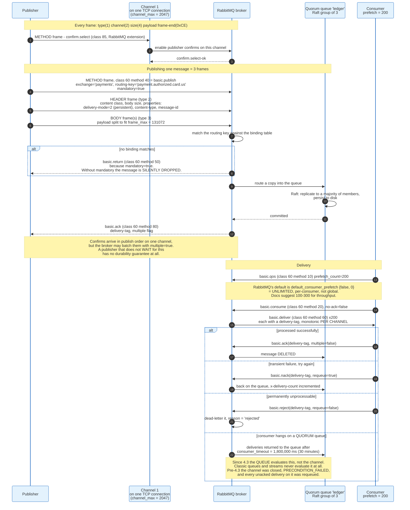

### 12.4 Queue Types in RabbitMQ 4.x

There are three, and choosing wrong is the most consequential decision in a RabbitMQ deployment.

**Classic queues** live on one node. They are the fastest for a single queue on a single machine and they have no replication at all. Classic queue mirroring, the old high-availability mechanism, was deprecated in 2021 and removed entirely in RabbitMQ 4.0. CQv1 storage was removed in 4.3, leaving only CQv2.

**Quorum queues** are replicated with Raft, and they are the default choice for anything that must survive a node failure. The member group size defaults to 3, set by `x-quorum-initial-group-size` or the node-wide `quorum_cluster_size`. They are always durable; transient quorum queues do not exist. They do not support exclusivity, server-named names, or global QoS. Priorities exist but are strict levels 0 to 31 and are always enabled, rather than the classic queue's opt-in scheme.

The delivery limit is the feature that most changes behaviour. Since RabbitMQ 4.0, quorum queues carry a default `delivery-limit` of 20. The queue increments `x-delivery-count` each time a delivery is returned after a failure and compares the incremented value against the limit with a strict greater-than, `rabbit_fifo.erl` reading `DeliveryCount > DeliveryLimit`, so a message is delivered at most 21 times and is then dropped or dead-lettered rather than cycling forever. Two headers expose the counting: `x-delivery-count` records actual failed redeliveries, and `x-acquired-count` records total assignments to a consumer.

**Streams** are RabbitMQ's answer to the log model. They are append-only, replicated, and non-destructive: a consumer reads at an offset and reading removes nothing. Retention is by `x-max-age`, expressed with unit suffixes such as `7D`, or by `x-max-length-bytes`, and it operates on whole segments, with `x-stream-max-segment-size-bytes` defaulting to 500,000,000 bytes. Streams have no TTL, no message priority, no consumer priority, and no dead-letter exchange, and they require per-consumer prefetch. They are reachable over AMQP 0-9-1 but perform best over RabbitMQ's dedicated binary stream protocol on its own port.

A stream is a Kafka partition with a RabbitMQ accent. It is the clearest evidence that the two models converged.

---

## 13. Acknowledgements, Requeues, and Dead Letter Queues

RabbitMQ's per-message state machine is its defining capability and its throughput ceiling. This section is what Kafka does not have.

### 13.1 Consumer Acknowledgements

A consumer registers with `basic.consume` in one of two modes, and the choice is a durability decision disguised as a performance one.

Automatic acknowledgement, `no-ack=true`, treats a message as delivered the instant it goes onto the socket. It is fast and it loses every in-flight message when a consumer dies. Manual acknowledgement requires the application to send `basic.ack`, `basic.nack`, or `basic.reject`, and the broker holds the message until it arrives.

Delivery tags are monotonically increasing positive integers scoped to a channel. `basic.ack` with `multiple=true` acknowledges every outstanding tag up to and including the one named, which is how a batching consumer amortises the acknowledgement cost. `basic.nack` is a RabbitMQ extension that adds `multiple` to rejection; `basic.reject` is the specification's single-message form. Both carry a `requeue` flag: `true` returns the message to the queue for redelivery, `false` sends it to the dead letter exchange if one is configured and discards it otherwise.

Acknowledging on a different channel than the one that delivered the message is a protocol exception, not a warning.

The timeout is the sharp edge, and RabbitMQ 4.3 moved where it lives. `consumer_timeout` defaults to 1,800,000 ms, thirty minutes. Through 4.2, a consumer that had not acknowledged a delivery within that window had its channel closed with a `PRECONDITION_FAILED` exception, and every unacknowledged delivery on that channel was requeued.

Since 4.3 the queue evaluates the timeout rather than the channel, and only queue types that implement it do so. The 4.3 release notes carry it as a breaking change: "This release moves consumer timeout handling responsibility into the queues themselves. Also, all protocols (except for the stream protocol) now evaluate consumer timeout for queue types that support them. Classic queues and streams never evaluate consumer timeouts." Quorum queues enforce it and return the timed-out deliveries to the queue instead of tearing the channel down; for AMQP 1.0 clients they are released with `DISPOSITION(state=released)`, so the link survives and the consumer recovers without re-attaching. A hung consumer on a classic queue in 4.3 is never disconnected.

The timeout is also configurable at four levels in 4.3, where it used to be node-wide only: the `x-consumer-timeout` consumer argument, the same name as a queue argument, the `consumer-timeout` policy key, and `consumer_timeout` in `rabbitmq.conf`. A companion setting, `consumer_disconnected_timeout`, defaults to 60 seconds and governs how long a quorum queue waits before returning messages held by a consumer whose node has become unreachable through a network partition.

A long-running job that occasionally exceeds thirty minutes still produces a requeue storm and duplicate processing on a quorum queue. The fix is to raise the timeout on that queue or acknowledge early and track completion elsewhere.

### 13.2 Prefetch

`basic.qos` with `prefetch_count` is the only per-consumer flow control RabbitMQ offers, and its default is unlimited.

The server default is `default_consumer_prefetch {false, 0}`, meaning non-global and no limit. An unlimited prefetch on a deep queue pushes the entire queue into the consumer's socket buffer and memory, which is how a well-behaved consumer runs a machine out of RAM. The documentation suggests values between 100 and 300 for optimal throughput. A prefetch of 1 gives perfect load balancing across uneven work and the worst throughput, because every message costs a full round trip.

Quorum queues do not support global QoS, the mode where the prefetch applies to a channel rather than to each consumer on it.

### 13.3 Publisher Confirms

`basic.publish` has no response in AMQP 0-9-1, so RabbitMQ added one.

`confirm.select`, class 85, puts a channel into confirm mode. Thereafter the broker sends `basic.ack` with a delivery tag once it has taken responsibility for a message, which for a persistent message routed to a durable queue means it has been persisted to disk, and for a quorum queue means a majority of the Raft group has it. `basic.nack` signals that the broker could not handle the message. Confirms for a single channel are issued in publish order, though the broker may compress a run of them into one `basic.ack` with `multiple=true`.

The failure most teams ship to production is publishing in confirm mode and never waiting for the confirm. That produces exactly the same guarantee as not using confirms at all.

### 13.4 Dead Letter Exchanges

A dead letter exchange is an ordinary exchange that a queue republishes to when a message stops being deliverable, and there are exactly four reasons.

| Reason | Trigger |
|--------|---------|
| `rejected` | `basic.reject` or `basic.nack` with `requeue=false` |
| `expired` | Per-message TTL or queue TTL elapsed |
| `maxlen` | The queue hit `x-max-length` or `x-max-length-bytes` and dropped from the head |
| `delivery_limit` | A returned message's `x-delivery-count` exceeded the quorum queue's `delivery-limit`, 20 by default, on the 21st failure |

Configuration is two queue arguments, `x-dead-letter-exchange` and the optional `x-dead-letter-routing-key`; without the second, the original routing key is reused. Both can also be set by policy, as `dead-letter-exchange` and `dead-letter-routing-key`, which is the form that lets an operator add dead-lettering to existing queues without redeclaring them.

The broker records the history in an `x-death` header, an array of entries each carrying `queue`, `reason`, `count`, `time`, `exchange`, and `routing-keys`, plus `x-first-death-*` and `x-last-death-*` annotations naming the first and most recent event. Over AMQP 1.0 the same information appears as `x-opt-deaths`.

One caveat is easy to miss and expensive: dead-lettering defaults to at-most-once delivery, without publisher confirms between the source queue and the target. If the target queue is unavailable, the message is lost. Quorum queues support at-least-once dead-lettering with internal confirms, and that is the setting to use when the dead letter queue is a compliance record rather than a debugging aid.

### 13.5 The Retry Pattern That Works

Naive requeue is an infinite loop. `basic.nack` with `requeue=true` on a message that will always fail redelivers it immediately, forever, at full speed. Before RabbitMQ 4.0 introduced the default delivery limit, this filled disks.

The pattern that works uses two queues and a TTL. The working queue dead-letters to a `retry` exchange. The `retry` queue has a per-message or per-queue TTL and dead-letters back to the working exchange. A rejected message therefore waits out the TTL and returns, and `x-death.count` records how many times it has gone round. When the count exceeds a threshold, or when the quorum queue's own `delivery-limit` of 20 is hit, the message goes to a terminal parking queue that nothing consumes automatically.

Kafka has no equivalent primitive. Retry and dead-letter topics in Kafka are an application pattern: the consumer catches the failure, produces the record to `topic.retry.5s`, and a separate consumer reads that topic after a delay. Frameworks such as Spring Kafka ship it. The broker knows nothing about it.

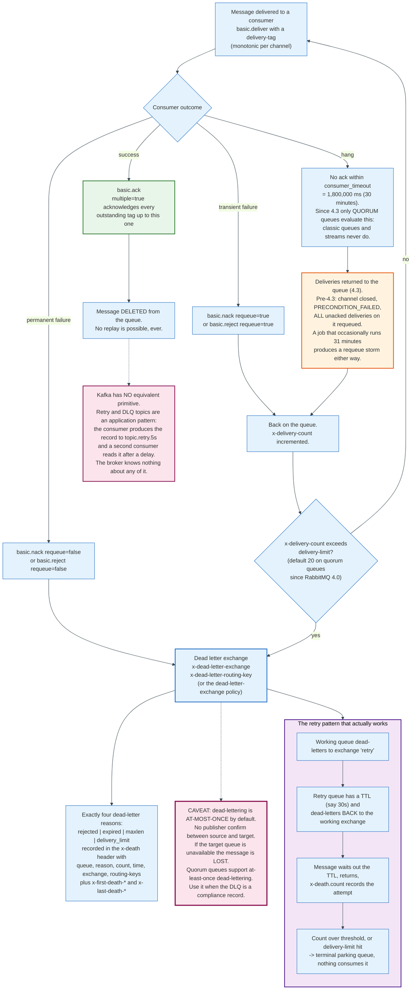

---

## 14. Delivery Guarantees Compared Side by Side

There are three delivery guarantees, both systems can produce two of them, and only one system claims the third under conditions narrow enough to state in a sentence.

### 14.1 The Three

**At most once.** Messages may be lost, never redelivered. Achieved by acknowledging before processing, or by not acknowledging at all.

**At least once.** Messages are never lost, may be redelivered. Achieved by acknowledging after processing. This is the default in both systems, and it is what almost every production deployment actually runs.

**Exactly once.** Each message is processed once. Kafka's documentation is unusually direct about the marketing around this: "Many systems claim to provide exactly-once delivery semantics, but it is important to read the fine print, because sometimes these claims are misleading."

### 14.2 The Configurations

| Guarantee | Kafka | RabbitMQ |
|-----------|-------|----------|
| **At most once** | `acks=0`, or commit the offset before processing. `enable.auto.commit=true` with a crash mid-batch also produces it | `no-ack=true` on `basic.consume` (automatic acknowledgement) |
| **At least once** | `acks=all`, `min.insync.replicas=2`, `enable.idempotence=true`, commit offsets after processing | Durable or quorum queue, `delivery-mode=2`, publisher confirms awaited, manual `basic.ack` after processing |
| **Exactly once** | Producer `transactional.id` set, consumer `isolation.level=read_committed` and `enable.auto.commit=false`. Applies only to a consume-transform-produce loop within one Kafka cluster | Not available. The AMQP `tx` class (class 90) exists but does not make a consume-and-publish pair atomic, and it is slow |

### 14.3 Where Each Guarantee Actually Breaks

The failure boundaries are more useful than the labels.

Kafka's at-least-once breaks if `min.insync.replicas` is left at its default of 1 and a leader fails, because `acks=all` was satisfied by one machine. It breaks if `unclean.leader.election.enable` is set to `true` and every replica goes down. It breaks silently if the producer uses `acks=1` and the leader dies before a follower fetched the record.

Kafka's exactly-once breaks at the cluster boundary. It covers records written to Kafka topics and offsets committed to `__consumer_offsets` in the same transaction. It does not cover a write to Postgres, a call to a payment API, or an email. The recommended pattern for those is to write data and offsets to the same destination atomically, as Kafka Connect's HDFS connector does, or to make the external write idempotent on a message key.

RabbitMQ's at-least-once breaks if any of the three durability settings is missing. A persistent message in a transient queue dies with the node. A durable queue holding non-persistent messages loses them on restart. A publisher that does not wait for `basic.ack` has no idea whether either happened. And dead-lettering, as section 13.4 noted, is itself at-most-once by default.

Both systems produce duplicates on consumer restart, because the last acknowledgement or offset commit before a crash is always in doubt. The only complete answer at the application level is an idempotent consumer: a natural key, a deduplication table, or an upsert. Every real exactly-once pipeline has one of those in it somewhere, whether or not it also uses transactions.

### 14.4 The Sentence Worth Memorising

Exactly-once is a property of the whole pipeline, not of the broker. A broker can make it achievable. It cannot make it true.

---

## 15. Ordering Guarantees and Their Real Limits

Both systems advertise ordering. Both deliver it under conditions narrower than most designs assume.

### 15.1 Kafka: Order Within a Partition, Nowhere Else

A Kafka partition is totally ordered. A Kafka topic is not ordered at all.

Records with the same key land in the same partition, because the default partitioner computes `murmur2(key) & 0x7fffffff % numPartitions`, so all events for one account, one order, or one device are ordered relative to each other. Records with different keys have no defined relative order across partitions, and a consumer reading 24 partitions interleaves them arbitrarily.

Four things break even the per-partition guarantee.

**Retries without idempotence.** With `max.in.flight.requests.per.connection` above 1 and idempotence off, a failed batch retried behind a successful one arrives out of order and is appended out of order. `enable.idempotence=true`, the default since Kafka 3.0, prevents it by making the broker reject out-of-sequence batches, and it is what makes an in-flight limit of 5 safe rather than five times riskier.

**Adding partitions.** The key-to-partition mapping is `hash % numPartitions`. Changing the denominator remaps most keys. A key that was ordered in partition 13 continues in partition 20, and records for the same key now exist in two partitions with no relative order at all. Kafka cannot reduce partition counts, and increasing them silently breaks key ordering for the transition period. The mitigation is to over-provision partitions at creation time, which is why partition counts are chosen for the topic's lifetime and not for today's throughput.

**Consumer-side concurrency.** A consumer that hands records to a thread pool has thrown the ordering away inside its own process. The broker's guarantee ends at `poll()`.

**Multiple producers to the same key.** Ordering is per producer per partition. Two producers writing the same key concurrently are ordered by arrival at the leader, not by anything meaningful to the application.

### 15.2 RabbitMQ: FIFO Per Queue, Until It Is Not

A RabbitMQ queue is FIFO in the order messages are enqueued, and that guarantee survives contact with exactly one consumer and no failures.

**More than one consumer** ends it immediately. Two competing consumers receive messages in order but process them concurrently and finish in whatever order their work takes.

**Prefetch above 1** ends it within one consumer, because several messages are in flight simultaneously and the application may handle them in any order.

**Requeue** ends it. A `basic.nack` with `requeue=true` returns a message to the queue, and its position relative to messages that arrived while it was out is not something an application should rely on.

**Priorities** end it by design, since a higher-priority message overtakes.

**Dead-lettering and retry loops** end it, because a message that goes to a retry queue and comes back has been reordered relative to everything published in between.

The mechanism that restores it is Single Active Consumer, `x-single-active-consumer=true` on the queue. Only one registered consumer receives messages at a time; if it disconnects or is cancelled, another takes over. The queue is ordered again, and its throughput is one consumer's throughput. That is the same trade Kafka makes with one partition, expressed differently.

### 15.3 The Design Consequence

Ordering and parallelism are the same dial in both systems.

Kafka names the dial `numPartitions`. RabbitMQ names it "how many consumers, and is Single Active Consumer on." In both, requiring global order across a stream means processing it with concurrency one. A design that says "these events must be processed in order" and "we need 200 concurrent workers" is asking for a partitioning key, whether the author realises it or not.

The right question is never "is it ordered." It is "ordered with respect to what."

---

## 16. Backpressure: Pull Versus Push

Backpressure is where the two architectures differ most and where the difference costs the most to get wrong.

### 16.1 Kafka Consumers Pull, So Backpressure Is Free

A Kafka consumer issues a `FetchRequest` when it wants data. A slow consumer simply asks less often, and the broker does nothing except keep the records it already has on disk. The consumer's lag grows. The broker's memory does not.

Kafka's design document defends the choice: a push-based system must "either send a request immediately or accumulate more data and then send it later without knowledge of whether the downstream consumer will be able to immediately process it," while a pull-based consumer "always pulls all available messages after its current position in the log," which means it never falls behind and then gets overwhelmed by a burst on recovery.

The consumer-side limits are `max.poll.records`, 500, which bounds how much one `poll()` returns, and `max.poll.interval.ms`, 300000, which bounds how long the application may take before calling `poll()` again. Exceeding the second removes the member from the group. That is Kafka's only backpressure failure mode, and it is a self-inflicted one: it means the application asked for more work than it could finish in five minutes.

### 16.2 Kafka Producers Block

The producer's `RecordAccumulator` is bounded by `buffer.memory`, 33554432 bytes. When a broker is slow or unreachable and batches pile up, the buffer fills, and `send()` blocks for up to `max.block.ms`, 60000 ms, before throwing.

A very common production bug follows: an application calling `send()` on a request-handling thread with default settings will, under broker degradation, block that thread for a full minute. A thread pool of 200 stalls in under a minute, and a service that merely emits telemetry to Kafka takes down the request path with it. The fix is to treat `send()` as a call that can block and either bound `max.block.ms` far lower or hand off to a dedicated thread.

### 16.3 Kafka Quotas

Brokers protect themselves with two quota types, and they are the multi-tenant control that most single-team clusters never enable.

Network bandwidth quotas, available since 0.9, set a byte rate per client group. Request rate quotas, since 0.11, set a percentage of request-handler and network-thread time, where `n%` means `n%` of one thread out of a total capacity of `(num.io.threads + num.network.threads) * 100`%. With the defaults of 8 and 3, that total is 1100%.

Quotas apply to a `(user, client-id)` tuple, a user, or a client id, with the most specific match winning, and they are per broker rather than cluster-wide. Enforcement is two-sided: the broker computes the delay needed to bring the client back under quota, returns it immediately in `throttle_time_ms` with no data in the case of a fetch, and then mutes the client's socket channel for that duration. A well-behaved client also waits. A badly behaved client is throttled anyway because the channel is muted. Measurement uses many small windows: `quota.window.num` defaults to 11, `QuotaConfig.java` explaining the odd number as "Always have 10 whole windows + 1 current window", and `quota.window.size.seconds` defaults to 1. A violation is therefore caught within about a second rather than producing bursts followed by long stalls.

### 16.4 RabbitMQ Pushes, So Backpressure Has to Be Built

RabbitMQ delivers messages to consumers without being asked, which means the broker must decide how much to push and must protect itself when nobody is keeping up. It has three mechanisms, layered.

**Prefetch** bounds a single consumer. `basic.qos` with `prefetch_count=200` means the broker will not have more than 200 unacknowledged deliveries outstanding to that consumer. The default is unlimited, which is the wrong default for almost every workload.

**Credit flow** bounds internal processes. RabbitMQ's Erlang processes pass credit to each other: `credit_flow_default_credit` is `{400, 200}`, meaning a process starts with 400 credits and is granted 200 more once it has consumed enough. When a queue process cannot keep up, it stops granting credit to the channel process, which stops granting credit to the connection reader, which stops reading from the socket. The publisher's TCP window closes. The documentation describes the visible effect as a connection in `flow` state, "blocking and unblocking several times a second, in order to keep the rate of message ingress at one that the rest of the server can handle." No configuration is required, and channels and queues can be in `flow` state too.

**Resource alarms** are the emergency stop. `vm_memory_high_watermark` defaults to 0.6, sixty percent of available RAM measured by resident set size. `disk_free_limit` defaults to 50,000,000 bytes and is checked at least every ten seconds. Crossing either raises a cluster-wide alarm that blocks all publishers, and connections in confirm mode receive `connection.blocked`, class 10 method 60, with `connection.unblocked`, method 61, when it clears. Publishers keep their connections but get no further acknowledgements. Consumers continue to drain, which is the point: the alarm exists to let the queues empty.

The disk default is widely considered too low. RabbitMQ's own documentation recommends setting `disk_free_limit` to roughly the amount of installed RAM, because the ten-second check interval can allow the disk to fill between checks.

**Queue length limits** are the fourth option and the bluntest. `x-max-length` and `x-max-length-bytes` cap a queue, and `x-overflow` decides what happens at the cap: `drop-head` discards the oldest message, `reject-publish` refuses new ones with a `basic.nack`, and `reject-publish-dlx` refuses them and dead-letters the rejected message.

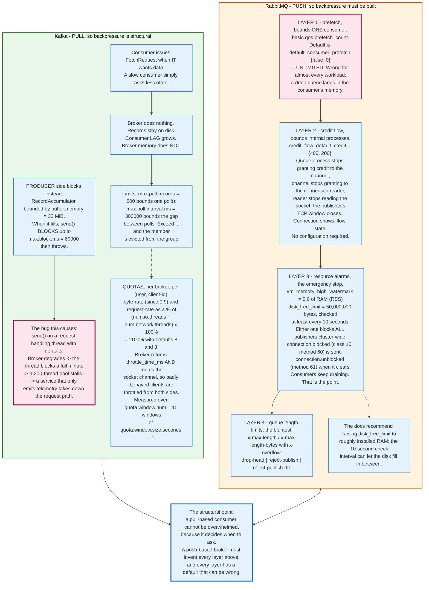

---

## 17. One Payment Event, End to End, Through Both Systems

Concrete values make the mechanisms checkable. This section carries one event through both brokers with real arithmetic.

### 17.1 The Event

A card authorisation completes. The service emits an event with merchant id `M-4419` as the key and a 512-byte JSON body.

### 17.2 Through Kafka

**Topic.** `payments.authorized`, 24 partitions, replication factor 3, `min.insync.replicas=2`, `retention.ms=604800000`.

**Partition selection.** The producer serialises the key as the six UTF-8 bytes of `M-4419`. `Utils.murmur2` over those bytes returns `0xd276ec5d`. `Utils.toPositive` masks the sign bit, giving 1,383,525,469. The remainder modulo 24 is **13**. Every event for merchant `M-4419` goes to `payments.authorized-13` and is ordered relative to every other event for that merchant, and to nothing else.

**Batching.** With `linger.ms=5`, four more records for partition 13 join the batch before the sender thread drains it. The five records share one 61-byte header.

**Byte arithmetic for one record.** A 6-byte key, a 512-byte value, no headers, an offset delta of 0 to 4, and a small timestamp delta:

```text
attributes      1 byte
timestampDelta  1 byte   (small delta, one varint byte)
offsetDelta     1 byte
keyLength       1 byte   (zigzag(6) = 12)
key             6 bytes
valueLength     2 bytes  (zigzag(512) = 1024, needs 11 bits)
value           512 bytes
headersCount    1 byte   (zigzag(0) = 0)
                -----
record body     525 bytes
length varint   2 bytes  (zigzag(525) = 1050)
                -----
record on disk  527 bytes
```

Five records: 2,635 bytes. Plus the 61-byte batch header: **2,696 bytes** for the whole batch. The `batchLength` field holds 2,684, because the total is `batchLength + 12`. Framing overhead is 61 + 5 x 9 = 106 bytes on 2,590 bytes of key and value, 3.9% of the 2,696-byte batch. Nine bytes is the per-record framing from the table above: 527 on disk less the 6-byte key and the 512-byte value. Sending those five records individually would cost five 61-byte headers instead of one, 244 extra bytes, and five network round trips instead of one.

**Produce.** The producer sends a `ProduceRequest`, api key 0, to the leader of partition 13 with `acks=-1`, the topic id, the partition index, and the record bytes, plus `producerId`, `producerEpoch`, and `baseSequence` because idempotence is on.

**Append.** The leader assigns offsets 84,231,900 through 84,231,904, appends the batch to the active segment `00000000000084100000.log` at some byte position, and, if 4 KiB have accumulated since the last index entry, writes an 8-byte entry into `00000000000084100000.index` recording relative offset 131,900 against that position.

**Commit.** Both followers fetch. The high watermark advances to 84,231,905. Because the ISR is size 3 and `min.insync.replicas` is 2, the write is accepted. The producer's `Future` completes with base offset 84,231,900.

**Consume.** The `ledger-writer` group has 8 members; the uniform assignor gives each 3 partitions. The member owning partition 13 fetches, receives the batch, and processes five records.

**Transaction.** The member is transactional. It writes five ledger entries to `ledger.entries` and calls `sendOffsetsToTransaction` with 84,231,905 for `payments.authorized-13`. `commitTransaction()` triggers `EndTxn`, a `PREPARE_COMMIT` in `__transaction_state`, `WriteTxnMarkers` to `ledger.entries` and to `__consumer_offsets`, and a final `COMMITTED`. Downstream consumers on `ledger.entries` running `isolation.level=read_committed` see the five entries only after the `COMMIT` control batch lands and the LSO advances.

**Replay.** Six days later, a bug is found in the ledger logic. `kafka-consumer-groups.sh --reset-offsets --to-datetime` moves the group back, and the same records are reprocessed from disk. Nothing was consumed away.

### 17.3 The Same Event Through RabbitMQ

**Topology.** A topic exchange `payments`. A quorum queue `ledger` bound with `payment.authorized.#`. A quorum queue `fraud` bound with `payment.#.card.*`. A dead letter exchange `payments.dlx` with a quorum queue `ledger.parked` behind it.

**Publish.** The publisher opens a channel, sends `confirm.select`, then publishes with exchange `payments`, routing key `payment.authorized.card.us`, `mandatory=true`, and properties including `delivery-mode=2` and a `message-id`. That is three frames: METHOD, HEADER, and one BODY frame, since 512 bytes fits comfortably inside `frame_max` of 131,072.

**Routing.** The broker matches `payment.authorized.card.us` against the binding table. `payment.authorized.#` matches, because `#` absorbs `card.us`. `payment.#.card.*` matches, because `#` absorbs `authorized` and `*` matches `us`. Two copies are enqueued. Had neither matched, the `mandatory` flag would have produced a `basic.return` instead of silence.

**Confirm.** Each quorum queue replicates the message to a majority of its 3-member Raft group and persists it. The broker sends `basic.ack` with a delivery tag on the publisher's channel. The publisher waits for it before reporting success upstream.

**Deliver.** The `ledger` consumer has `prefetch_count=200` and manual acknowledgement. It receives `basic.deliver` with a delivery tag and processes the message.

**Failure.** The downstream ledger database is unreachable. The consumer sends `basic.nack` with `requeue=true`. `x-delivery-count` increments and the message is redelivered. The queue compares the incremented count against its default `delivery-limit` of 20 after every failed return, so the twenty-first failure pushes the count to 21, past the limit, and the message is dead-lettered to `payments.dlx` with `x-death.reason = delivery_limit` instead of being requeued again. It lands in `ledger.parked`.

**Recovery.** An operator fixes the database and moves messages from `ledger.parked` back to the `payments` exchange with the shovel plugin. The `x-death` header records how many times each message failed and when.

**Replay.** Not available. The `fraud` queue's copy was acknowledged and deleted. Reprocessing last Tuesday's authorisations requires the publisher to publish them again.

### 17.4 What the Comparison Shows

The same event costs 2,696 bytes of one shared batch in Kafka and three frames per copy per queue in RabbitMQ. Kafka gave one ordered stream per merchant and a seven-day replay window. RabbitMQ gave two independently routed copies, per-message retry counting, and an automatic parking lot for poison messages, with no replay at all.

Neither is better. They answer different questions.

---

## 18. Economics: What It Costs to Run and Who Pays

The dominant cost of a message broker at scale is not the broker. It is cross-availability-zone network traffic and replicated storage.

All figures below are US East (N. Virginia) list prices as of August 2026 unless stated otherwise.

### 18.1 Managed Kafka

| Offering | Unit | Price |
|----------|------|-------|
| Amazon MSK provisioned, `kafka.m7g.large` | Broker hour | $0.204 |
| Amazon MSK provisioned, `kafka.m5.large` | Broker hour | $0.21 |
| Amazon MSK Express, `express.m7g.large` | Broker hour | $0.408, plus $0.01 per GB ingested |
| Amazon MSK storage | GB-month | $0.10 |
| Amazon MSK low-cost tier storage | GB-month | $0.060, plus $0.0015 per GB retrieved |
| Amazon MSK Serverless (US East, Ohio) | Cluster hour | $0.75 |
| Amazon MSK Serverless | Partition hour | $0.0015 |
| Amazon MSK Serverless | GB in / GB out | $0.10 / $0.05 |
| Confluent Cloud Basic | eCKU hour | $0.14, first eCKU free |
| Confluent Cloud Standard | eCKU hour | $0.75 |
| Confluent Cloud Enterprise | eCKU hour | $1.75 to $2.25 |
| Confluent Cloud Freight | eCKU hour | $2.25, minimum 2 eCKUs |
| Confluent Cloud storage | GB-month | $0.08, or $0.03 on Freight |

Confluent's tiers differ mainly in partition ceiling and networking price: Basic caps at 1,500 partitions and 5 TB of storage with $0.05 per GB of traffic; Standard at 2,500 partitions with $0.035 to $0.050; Enterprise at 96,000 partitions with $0.020 to $0.050; Freight at 50,000 partitions with $0.014 to $0.030. Freight trades latency for the cheapest bytes, which is the same trade the diskless designs in section 21 make.

### 18.2 Managed RabbitMQ and Managed Queues

| Offering | Unit | Price |
|----------|------|-------|
| Amazon MQ for RabbitMQ, `mq.m7g.large` single instance | Hour | $0.2734 |
| Amazon MQ for RabbitMQ, `mq.m7g.large` 3-node cluster | Hour | $0.8201 |
| Amazon MQ for RabbitMQ, `mq.m5.large` single instance | Hour | $0.288 |
| Amazon MQ for RabbitMQ, `mq.t3.micro` | Hour | $0.02704 |
| Amazon MQ storage (EBS) | GB-month | $0.10 |
| Amazon SQS standard, first 100 billion requests | Million requests | $0.40 |
| Amazon SQS standard, next 100 billion | Million requests | $0.30 |
| Amazon SQS standard, beyond 200 billion | Million requests | $0.24 |
| Amazon SQS FIFO, first 100 billion | Million requests | $0.50 |
| Amazon SQS standard queues, fair-queue request rate | Million requests | $0.10 |

SQS bills each 64 KiB chunk of payload as one request, so a 1 MiB message costs 16 requests, and the first million requests each month are free. Fair queues are not a fourth queue type: the rate applies to standard-queue API actions when at least one message carries a message group id. AWS's own price list API confirms the figure, carrying usage type `Requests-Fair-RBP` at $0.0000001 per request, which is $0.10 per million and a quarter of the plain standard rate.

### 18.3 The Cross-AZ Bill

This is the number that decides architectures, and who pays it depends on who runs the brokers.

AWS charges $0.02 per GiB for cross-availability-zone traffic and Google Cloud charges $0.01 per GiB, figures cited in KIP-1150 as the motivation for redesigning Kafka's storage layer. A replication-factor-3 topic spread across three availability zones sends every produced byte across a zone boundary twice, once to each follower.

Take a topic ingesting 100 MB/s on self-managed Kafka on EC2, where every replication byte crosses a zone boundary at list price.

```text
Ingest                  100 MB/s x 86,400 s   =  8,640 GB/day
Cross-AZ replication    8,640 GB x 2 copies   = 17,280 GB/day
                                              = 16,093 GiB/day
Cross-AZ cost           16,093 GiB x $0.02    = $321.86/day
                                              = $9,656 per 30-day month
```

Now the storage. Seven days of retention at 8,640 GB/day is 60,480 GB, and replication factor 3 triples it to 181,440 GB. At $0.10 per GB-month, the Amazon MSK storage rate, applied here to both the self-managed and the managed case so the two totals differ only in the replication line, that is **$18,144 per month** in storage alone. Add the brokers. The right broker count depends on the workload and is not a fixed number, but take twelve `kafka.m7g.large` instances as an illustration: at $0.204 per hour over 720 hours that is $1,762 per month.

Self-managed on EC2, the three lines total $29,562 a month. Storage and network are $27,800 of it. Compute is $1,762, or 6%.

Amazon MSK deletes one of the three lines. Its pricing page states that "You are not charged for data transfer used for replication between brokers or between metadata nodes and brokers," so the $9,656 never reaches an MSK invoice. The same topic on MSK bills $18,144 of storage plus $1,762 of brokers, $19,906 in total, and compute is 9% of that rather than 6%. Confluent Cloud does charge the traffic, recovering it through a per-GB networking rate of $0.014 to $0.050 rather than as a separate replication line. Either way the broker is the small line.

That arithmetic is the entire commercial case for tiered storage, for object-store-backed designs, and for Confluent's Freight tier. Moving cold data to S3 at roughly $0.023 per GB-month, and eliminating cross-AZ replication by writing once to an object store, attacks 94% of the self-managed bill and 91% of the MSK one.

### 18.4 Self-Hosting

Self-hosting replaces the vendor margin with staff time, and the staff time is not small.

A Kafka cluster needs someone who understands partition rebalancing, ISR dynamics, KRaft quorum management, rolling upgrades with metadata version finalization, and consumer lag investigation. A RabbitMQ cluster needs someone who understands Erlang node clustering, memory alarms, quorum queue membership, and that Khepri requires a node majority online for the cluster to function at all, which applies to every 4.3 cluster and to every cluster created fresh on 4.2.

The honest comparison is a managed service's line item against a fraction of two or three engineers' salaries plus the hardware. For a small deployment, self-hosting a single RabbitMQ node is genuinely cheap. For a large one, the managed premium usually buys back less than it costs, and organisations that self-host at scale do it because they have the expertise already, not because it is obviously cheaper.

### 18.5 The Hidden Cost Nobody Budgets

Partition count is a cost driver in Kafka and a pricing dimension in every managed offering.

Each partition is a set of open file handles, an entry in every metadata update, a unit of replication traffic, and memory in the controller. MSK Serverless bills $0.0015 per partition-hour, which is $1.10 per partition per month, so a cluster with 10,000 partitions pays $11,000 a month before a single byte moves. Confluent's tiers are differentiated primarily by partition ceiling.

The instinct to create a topic with 200 partitions "for future scale" has a monthly invoice attached.

---

## 19. Security, Risk, and the Failure Modes That Actually Happen

### 19.1 Authentication and Authorisation

Kafka authenticates with SASL over a listener whose `security.protocol` is one of `PLAINTEXT`, `SSL`, `SASL_PLAINTEXT`, or `SASL_SSL`. The SASL mechanisms in the box are `PLAIN`, `SCRAM-SHA-256`, `SCRAM-SHA-512`, `GSSAPI` for Kerberos, and `OAUTHBEARER`. Authorisation is an ACL model over resources: topic, group, cluster, transactional id, delegation token, with operations Read, Write, Create, Delete, Alter, Describe, ClusterAction, and IdempotentWrite.

Kafka 4.0 tightened one OAuth default: `org.apache.kafka.sasl.oauthbearer.allowed.urls` now defaults to an empty list, so token and JWKS endpoints must be explicitly allowed. That change breaks working configurations on upgrade, deliberately, because the previous behaviour let a misconfigured client be pointed at an arbitrary URL.

RabbitMQ authenticates with `PLAIN`, `AMQPLAIN`, `ANONYMOUS`, or x509 certificates, and authorises against a virtual host with configure, write, and read permission regular expressions per user per vhost. The default `guest` user has full permissions on the `/` vhost and is restricted to loopback connections, which is the single most important default in the product and the one most often defeated by exposing the broker through a proxy.

### 19.2 Encryption

Both support TLS on the wire. Neither encrypts data at rest itself; that is the disk's or the cloud provider's job. Neither offers end-to-end payload encryption as a broker feature, so a message readable by the broker is readable by anyone with broker access. Applications handling regulated data encrypt payloads before publishing and accept that the broker can no longer filter, route on content, or compress effectively.

Section 5.3's zero-copy trade is a security decision as much as a performance one. Turning on TLS is correct and it costs throughput.

### 19.3 The Failure Modes That Actually Happen

Neither system's headline risk is an attacker. It is a configuration.

**Kafka: `min.insync.replicas=1` with `acks=all`.** The topic default is 1. The producer default is `acks=all`. Together they read as durable and behave as `acks=1` whenever the ISR shrinks. This is the most common silent data-loss configuration in production Kafka.

**Kafka: unbounded consumer lag on a topic with short retention.** A consumer down longer than `retention.ms` returns to find its committed offset no longer exists. `auto.offset.reset` decides what happens next: `latest`, the default, skips everything that accumulated; `earliest` reprocesses from the start of the retained log; `none` throws. All three are wrong for at least one workload, and choosing the default by accident is how a backlog silently disappears.

**Kafka: a hung transaction.** An open transaction pins the Last Stable Offset, and every `read_committed` consumer on that partition stops advancing while records keep arriving. It presents as consumer lag with no error anywhere. KIP-890 in Kafka 4.0 closed the protocol hole that produced most of these.

**Kafka: too many partitions.** Controller memory, file handles, replication fan-out, and failover time all scale with partition count. KRaft raised the ceiling substantially; it did not remove it.

**RabbitMQ: unlimited prefetch on a deep queue.** The default. The broker pushes the whole queue to a consumer, which runs out of memory.

**RabbitMQ: a memory alarm from queues that were never meant to be deep.** Crossing `vm_memory_high_watermark` at 0.6 blocks every publisher in the cluster. A single unconsumed queue can therefore stop an unrelated service from publishing. This is the failure mode that most surprises teams migrating from Kafka, where a slow consumer affects nobody.

**RabbitMQ: a poison message loop.** Pre-4.0, `basic.nack` with `requeue=true` on an always-failing message redelivered forever at full speed. The default `delivery-limit` of 20 on quorum queues in 4.0 is a direct response.

**RabbitMQ 4.2 and 4.3: Khepri's majority requirement.** With Khepri as the metadata store, losing a majority of nodes takes the cluster's metadata layer offline, not just its redundancy. A three-node cluster that loses two nodes is down. The trap is the version boundary: 4.3 makes Khepri the only option, but any cluster created fresh on 4.2 is already on it, so operators who sized clusters under Mnesia's more permissive behaviour need to re-examine that assumption one release earlier than the 4.3 headline suggests.

**Both: the retention or TTL setting nobody revisits.** Kafka's seven-day default and RabbitMQ's absence of a default TTL both become incidents eventually, in opposite directions.

### 19.4 Multi-Tenancy

Kafka isolates with ACLs and quotas, and quotas are the part usually skipped. Without them, one client with a runaway producer loop saturates a broker's request handlers for everyone. Kafka has no equivalent of a virtual host: topic naming conventions and ACLs are the only namespace.

RabbitMQ isolates with virtual hosts, which are genuine namespaces for exchanges, queues, bindings, and permissions. What they do not isolate is memory: a watermark crossed on one node raises an alarm that propagates to every other node, and it blocks publishers across every vhost in the cluster, not only on the node that ran out.

---

## 20. Comparisons and When to Choose Each

### 20.1 The Feature Matrix

| Dimension | Apache Kafka 4.3 | RabbitMQ 4.3 |
|-----------|------------------|--------------|
| **Core model** | Partitioned append-only log | Routing engine plus durable mailboxes |
| **Read semantics** | Non-destructive, position-based | Destructive on acknowledgement |
| **Retention** | Time or size, default 7 days; or compaction by key | Until acknowledged; optional TTL and length limits |
| **Replay** | Native, seek to any retained offset | Not possible; republish or use a stream |
| **Routing** | Producer-side, by key hash | Broker-side, by exchange type and bindings |
| **Ordering unit** | Partition | Queue, with one consumer and prefetch 1 |
| **Parallelism unit** | Partition; consumers cannot exceed partitions | Consumer; unbounded, broker distributes |
| **Per-message ack** | No in consumer groups; yes in share groups (4.2+) | Yes, core to the design |
| **Redelivery counting** | No | `x-delivery-count`, `delivery-limit` default 20 |
| **Dead letter queue** | Application pattern only | Broker feature, four defined reasons |
| **Priority** | None | Classic queues opt-in; quorum queues strict 0 to 31 |
| **Delay or schedule** | None natively | Delayed message exchange plugin, or TTL plus DLX |
| **Replication** | ISR, leader plus followers, per partition | Raft per quorum queue; Khepri for metadata |
| **Consensus** | KRaft, own Raft implementation | Ra (Raft) for queues and Khepri; a node majority must be online |
| **Transactions** | Atomic multi-partition writes plus offset commit | `tx` class exists, is slow, and does not span consume and publish |
| **Wire protocol** | Custom binary, api keys, versioned schemas | AMQP 0-9-1, AMQP 1.0, MQTT, STOMP, stream protocol |
| **Peak throughput** | 605 MB/s in Confluent's 2020 benchmark | 38 MB/s mirrored in the same benchmark |
| **Latency at low load** | 5 ms p99 at 200 MB/s | 1 ms p99 at 30 MB/s |
| **Written in** | Java and Scala | Erlang on OTP |
| **Client ecosystem** | Java first-class; librdkafka for the rest | Every language, because AMQP is a standard |

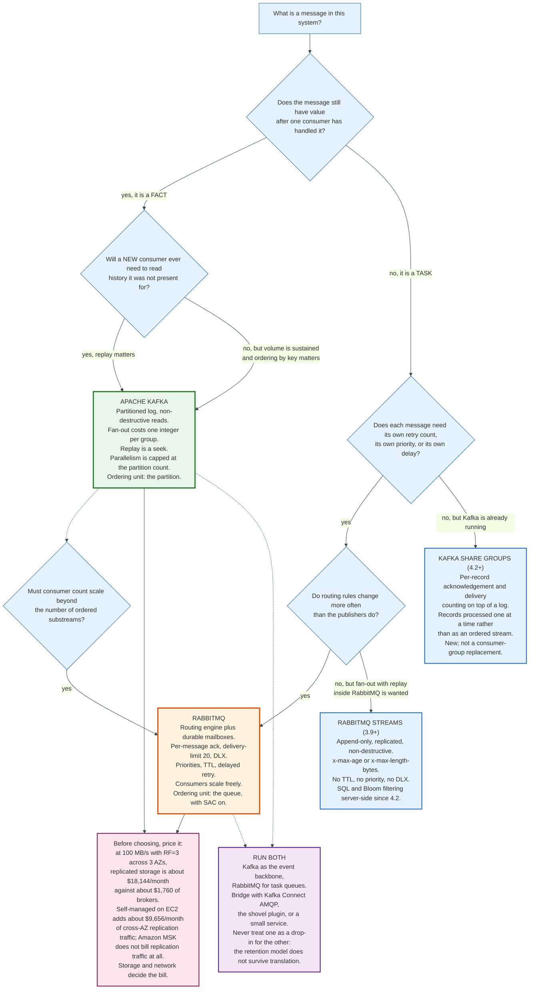

### 20.2 Choose Kafka When

Choose Kafka when the data has value after it has been consumed.

The concrete signals: more than one independent consumer needs the same stream; a new consumer will need to read history it was not present for; the volume is sustained rather than bursty; ordering by an entity key matters; a stream-processing job or a change-data-capture pipeline is in the picture; or an audit requirement means events must be reconstructible.

Kafka is also the right answer when the consumer count will grow unpredictably, because fan-out costs the broker one integer per group rather than one copy of the data per subscriber.

### 20.3 Choose RabbitMQ When

Choose RabbitMQ when messages are work items, not facts.

The concrete signals: each message is a task done once and then irrelevant; failures need per-message retry with a bounded count and a parking lot; routing rules change more often than publishers do; different consumers need different subsets chosen by attribute; work items need priority or scheduling; consumer counts fluctuate and must scale without repartitioning; the team wants a standard protocol with mature clients in six languages.

RabbitMQ is also the right answer when latency for a single small message matters more than sustained bandwidth.

### 20.4 The Wider Field

| System | Model | Distinctive property | Where it wins |
|--------|-------|----------------------|---------------|
| **Amazon SQS** | Queue, fully managed | No broker to run; visibility timeout instead of acks; $0.40 per million standard requests | Simple work queues in AWS with no operations budget |
| **Amazon Kinesis Data Streams** | Sharded log | Shard-hour pricing, native AWS integration | AWS-native streaming where Kafka's operations are unwelcome |
| **Google Cloud Pub/Sub** | Topic and subscription, managed | Per-subscription retention and acks; global by default | GCP-native fan-out with per-subscriber acknowledgement |
| **Apache Pulsar** | Segmented log over BookKeeper | Storage and serving separated; native multi-tenancy and geo-replication; per-message acks with subscription types | Multi-tenant platforms wanting both log and queue semantics |
| **Redpanda** | Kafka protocol, C++, no JVM, thread-per-core | Kafka wire compatibility without the JVM or ZooKeeper heritage | Latency-sensitive Kafka workloads on fewer machines |
| **NATS JetStream** | Streams with server-side consumer state | At-least-once with explicit acks; very small footprint | Edge and microservice messaging where operational weight matters |
| **Apache ActiveMQ Artemis** | Queue and topic, JMS | Full JMS semantics, AMQP 1.0, MQTT, STOMP | Java estates that need JMS compliance |
| **Redis Streams** | Log inside Redis | Consumer groups and pending-entry lists in a data store already in the stack | Small streams where adding a broker is not worth it |

The recurring pattern is that log systems grow queue features and queue systems grow logs. RabbitMQ added streams in 3.9. Kafka added share groups in 4.2. Pulsar shipped both from the start. Convergence at the feature level does not change the storage model underneath, and the storage model is what determines the cost and the failure modes.

### 20.5 Running Both

Most organisations past a certain size run both, and the split is usually clean: Kafka for the event backbone, RabbitMQ for task queues and request-response work.

The bridge patterns are well-worn. Kafka Connect has sink and source connectors for AMQP. RabbitMQ's shovel plugin moves messages between brokers. A small service consuming from one and producing to the other is often simpler than either. What does not work is treating one as a drop-in replacement for the other, because the retention model does not survive the translation: a Kafka topic bridged into a queue loses replay, and a queue bridged into a topic loses per-message acknowledgement.

---

## 21. Modern Developments

### 21.1 Queues for Kafka: Share Groups

Kafka 4.2 made KIP-932 production ready, and it closes the largest functional gap between the two models.

A share group is a new kind of group that sits alongside consumer groups. Its members consume cooperatively: a partition may be assigned to several consumers at once, the number of consumers may exceed the number of partitions, records are acknowledged individually, and delivery attempts are counted. That is a queue, implemented on top of a log.

The mechanism is an acquisition lock. When a share consumer fetches, records are acquired with a time-limited lock, 30 seconds by default via `share.record.lock.duration.ms`, during which they are invisible to other members of the same share group. The consumer can acknowledge the record, release it for another attempt, reject it as unprocessable, renew the lock because it is still working, or do nothing and let the lock expire. `group.share.partition.max.record.locks` caps how many records one share group may hold locked per topic-partition, and fetches yield nothing once the cap is reached.

State lives in a new internal topic, `__share_group_state`, created on first use with the usual 3 replicas and requiring `share.coordinator.state.topic.replication.factor` and `share.coordinator.state.topic.min.isr` set to 1 on clusters smaller than three brokers. Kafka 4.3 added `share.delivery.count.limit`, `share.partition.max.record.locks`, and `share.renew.acknowledge.enable` as group-level configs under KIP-1240.

Share groups arrived as a preview in 4.1, became production ready in 4.2, and got a critical deadlock fix in 4.2.1 (KAFKA-20505). They are the right tool when records are processed one at a time rather than as an ordered stream, and they are not a replacement for consumer groups.

### 21.2 Tiered Storage and Diskless Topics

Kafka is moving its storage tier to object stores, in two steps of increasing ambition.

Tiered storage, KIP-405, reached general availability in Kafka 3.9. It splits a partition's log into a local tier on broker disks and a remote tier in an external store. The `RemoteLogManager` runs inside the broker; a pluggable `RemoteStorageManager` copies, fetches, and deletes segments; and a `RemoteLogMetadataManager`, by default backed by an internal `__remote_log_metadata` topic, keeps strongly consistent metadata about what is where. Per-topic, `remote.storage.enable` turns it on and `local.retention.ms` and `local.retention.bytes` govern the local tier separately from overall retention. Compacted topics are not supported.

A topic can be taken off tiered storage in either of two ways: `remote.storage.enable=true,remote.log.copy.disable=true` freezes the remote log read-only and stops further uploads, and `remote.storage.enable=false,remote.log.delete.on.disable=true` removes the remote data entirely. The first form also requires `local.retention.ms` and `local.retention.bytes` set to `-2`, or to the same values as `retention.ms` and `retention.bytes`, because local retention stops applying once copying is off and a disk fills quietly otherwise. Turning tiered storage off cluster-wide is still the harder operation: every tiered topic must be deleted first, or the broker throws on startup.

Kafka 4.3 added `follower.fetch.last.tiered.offset.enable`, default `false`, under KIP-1023: a new follower with no local data skips directly to the earliest pending upload offset rather than re-fetching data already in remote storage. The same KIP extended `ListOffsets` to version 11 with a new `EARLIEST_PENDING_UPLOAD_TIMESTAMP` value of -6. Kafka 4.3 also introduced `remote.log.metadata.topic.min.isr`, defaulting to 2.

Diskless topics, KIP-1150, go further and are accepted rather than shipped. They make object storage the primary tier rather than a secondary one, writing directly to it and using local disks only for caching and metadata, with batch metadata handled by a coordinator specified in the follow-up KIP-1164. The motivation is stated in cost terms: eliminating cross-availability-zone replication traffic charged at $0.02 per GiB on AWS and $0.01 per GiB on Google Cloud. The acknowledged trade is higher produce latency.

Confluent's acquisition of WarpStream on 9 September 2024 bought the same architecture as a product: a Kafka-protocol-compatible system with direct-to-S3 writes, no local disks, and no cross-AZ replication, deployed in the customer's own cloud account.

The section 18.3 arithmetic explains all of it. When network and storage are 94% of a self-managed bill and 91% of a managed one, redesigning the storage layer is the only optimisation that matters.

### 21.3 The Rebalance Protocol Family

KIP-848's design is being applied to everything that rebalances.

KIP-1071, the Streams Rebalance Protocol, moves Kafka Streams task assignment to the broker on the same model. It was early access in 4.1 and production ready for its core feature set in 4.2, with a caveat: a broker-side bug in the offline migration path, KAFKA-20254, made classic-to-streams migrations unsafe in 4.2.0, and the fix landed in 4.2.1.

Kafka 4.3 deprecated `group.coordinator.rebalance.protocols` under KIP-1237. In Kafka 5.0 every protocol will always be enabled, controlled solely by the `group.version`, `streams.version`, and `share.version` feature flags through `kafka-features.sh`. Configuration by feature flag rather than by static property is the direction of travel for the whole project.

### 21.4 RabbitMQ Moves to Raft Everywhere

RabbitMQ has replaced its distributed state layer piece by piece, and 4.3 finished the job.

Quorum queues brought Raft to queue data in 3.8. Khepri, a Raft-backed tree store, brought it to metadata in three steps: fully supported in 4.0, the default for new deployments in 4.2, and in 4.3 the only option, with Mnesia removed. The middle step is the one operators miss. A cluster created fresh on 4.2 already runs Khepri and already needs a node majority online; a 4.2 cluster upgraded from 4.1 keeps Mnesia until it is migrated. The 4.3 upgrade path then forces the question, because only 4.2.x clusters can upgrade to 4.3.0 in place.

RabbitMQ 4.3 also upgraded to Ra 3.x and shipped an eighth version of the quorum queue state machine, adding strict priority queues with per-priority counts, configurable delayed retry with backoff, consumer timeouts on quorum queues, and compact message references that halve per-message memory overhead. CQv1 storage is gone, non-durable non-exclusive queues are disabled by default and require an opt-in on every node, and ram node types are removed.

The consistency benefit is real: binding inconsistencies that plagued Mnesia-based clusters are gone. The availability cost is real too, and section 19.3 states it.

### 21.5 AMQP 1.0 Becomes the Primary Protocol

RabbitMQ 4.0 made AMQP 1.0 a core protocol, always enabled rather than a plugin, with performance roughly double 3.13.x on some workloads. AMQP 1.0 clients can now manage topology, declaring queues, exchanges, and bindings, which was previously impossible.

Filtering followed. RabbitMQ 4.1 added AMQP 1.0 filter expressions over `properties` and `application-properties`, letting several concurrent clients each consume a subset of a stream while preserving order. RabbitMQ 4.2 added SQL filter expressions for streams, and the announcement reports that combining SQL filters with Bloom filters achieved filtering rates above 4 million messages per second. RabbitMQ 4.3 improved rejection feedback: a rejected message now carries the queue name and reason, `maxlen` or `unavailable`, in the `info` field of the `Rejected` outcome's `error` field.

Broker-side filtering on a stream is the feature that makes RabbitMQ streams competitive with Kafka for fan-out, because it moves the selection cost off the client and off the network.

### 21.6 Where Both Are Heading

Both projects are converging on the same three commitments.

Consensus by Raft, everywhere. Kafka finished with KRaft in 4.0; RabbitMQ finished with Khepri in 4.3. Neither now depends on an external coordination system.

Server-side control of things clients used to decide. Assignment, filtering, timeouts, and protocol versions are moving from client configuration to broker configuration and feature flags. The reason is the same for both: client upgrades are slow, and a bug fixed in the broker is fixed for everyone.

Storage separated from serving. Kafka's tiered and diskless work, and RabbitMQ's stream segments, both aim at the same target: keep the hot path on local disk and put the long tail somewhere that costs a tenth as much.

---

## 22. Appendix

### 22.1 Diagram Index

| Diagram | Source | Description |
|---------|--------|-------------|
| Evolution timeline | [`diagrams/evolution-timeline.mmd`](diagrams/evolution-timeline.mmd) | AMQP and Kafka milestones from 2003 to 2026 |
| Log versus queue | [`diagrams/log-versus-queue.mmd`](diagrams/log-versus-queue.mmd) | The two data structures and what follows from each |
| Participants | [`diagrams/participants.mmd`](diagrams/participants.mmd) | Routing at the edge versus routing in the middle |
| Segment anatomy | [`diagrams/segment-anatomy.mmd`](diagrams/segment-anatomy.mmd) | Segment files, the sparse index, and the two binary searches |
| Zero-copy path | [`diagrams/zero-copy-path.mmd`](diagrams/zero-copy-path.mmd) | Four copies versus `sendfile`, and what TLS costs |
| Record batch layout | [`diagrams/record-batch-layout.mmd`](diagrams/record-batch-layout.mmd) | The 61-byte v2 header, field by field, with offsets |
| Producer batching and acks | [`diagrams/producer-batching-and-acks.mmd`](diagrams/producer-batching-and-acks.mmd) | Accumulator, linger, the three `acks` values, idempotence |
| ISR and high watermark | [`diagrams/isr-and-high-watermark.mmd`](diagrams/isr-and-high-watermark.mmd) | ISR shrink, min ISR refusal, ELR, unclean election |
| Consumer group rebalance | [`diagrams/consumer-group-rebalance.mmd`](diagrams/consumer-group-rebalance.mmd) | Eager, cooperative, and KIP-848 side by side |
| Transaction lifecycle | [`diagrams/transaction-lifecycle.mmd`](diagrams/transaction-lifecycle.mmd) | Two-phase commit, markers, and the Last Stable Offset |
| KRaft architecture | [`diagrams/kraft-architecture.mmd`](diagrams/kraft-architecture.mmd) | ZooKeeper mode versus the metadata log |
| AMQP routing | [`diagrams/amqp-routing.mmd`](diagrams/amqp-routing.mmd) | Exchange types, binding matches, and queue types |
| AMQP publish frames | [`diagrams/amqp-publish-frames.mmd`](diagrams/amqp-publish-frames.mmd) | The three-frame publish, confirms, and consumer outcomes |
| Dead letter flow | [`diagrams/dead-letter-flow.mmd`](diagrams/dead-letter-flow.mmd) | Ack, nack, delivery limit, DLX, and the retry pattern |
| Backpressure paths | [`diagrams/backpressure-paths.mmd`](diagrams/backpressure-paths.mmd) | Kafka quotas versus RabbitMQ's four layers |
| Choosing a broker | [`diagrams/choosing-a-broker.mmd`](diagrams/choosing-a-broker.mmd) | The decision path from workload shape to system |

### 22.2 Key Terminology

| Term | Meaning |
|------|---------|
| **Acquisition lock** | Kafka share group mechanism making a fetched record invisible to other members for `share.record.lock.duration.ms`, 30 s by default |
| **AMQP 0-9-1** | The 2008 protocol RabbitMQ implements; defines exchanges, bindings, queues, and broker behaviour |
| **AMQP 1.0** | OASIS standard from 2012, ISO/IEC 19464 from 2014; a symmetric link protocol with no exchanges or queues |
| **Batch** | Kafka's unit of transfer, compression, and CRC; a 61-byte header plus records |
| **Binding** | A rule connecting a RabbitMQ exchange to a queue, usually with a routing key pattern |
| **Control batch** | A batch with attributes bit 5 set, carrying a `COMMIT` or `ABORT` marker or KRaft metadata |
| **Credit flow** | RabbitMQ's internal backpressure; processes grant each other credits, default `{400, 200}` |
| **Delivery tag** | A monotonically increasing integer scoped to one AMQP channel, identifying one delivery |
| **ELR** | Eligible Leader Replicas; replicas outside the ISR that provably hold every committed record |
| **Exchange** | The RabbitMQ object that receives every published message and routes copies by binding |
| **High watermark** | The offset up to which every ISR member has the data; the boundary of consumer visibility |
| **ISR** | In-Sync Replicas; the set eligible for leader election and required to acknowledge an `acks=all` write |
| **Khepri** | RabbitMQ's Raft-backed metadata store, the only one from 4.3 |
| **KRaft** | Kafka Raft; the metadata quorum that replaced ZooKeeper in Kafka 4.0 |
| **Leader epoch** | A monotonically increasing number per partition leadership term, used to fence stale reads and truncations |
| **linger.ms** | How long the producer waits to fill a batch; default changed from 0 to 5 in Kafka 4.0 |
| **LSO** | Last Stable Offset; the read limit for `read_committed` consumers, held back by open transactions |
| **min.insync.replicas** | Topic config, default 1; the ISR size below which `acks=all` writes are refused |
| **murmur2** | The hash Kafka's default partitioner applies to a serialised key |
| **Offset** | A 64-bit per-partition sequence number that is both a record's identity and its position |
| **PID / producer id** | The identifier the broker assigns a producer for idempotence and transactions |
| **Prefetch** | RabbitMQ's `basic.qos` limit on unacknowledged deliveries; default is unlimited |
| **Quorum queue** | A RabbitMQ queue replicated by Raft; 3 members by default, `delivery-limit` 20 |
| **Rebalance** | Reassignment of partitions among a Kafka consumer group's members |
| **Segment** | One file in a Kafka partition's log, named for its base offset; 1 GiB by default |
| **sendfile** | The syscall that moves bytes from page cache to socket without user space; disabled by TLS |
| **Share group** | Kafka 4.2 group type with per-record acknowledgement and delivery counting |
| **Sparse index** | Kafka's `.index` file, one entry per `index.interval.bytes` (4096) of log |
| **Stream (RabbitMQ)** | An append-only replicated log with non-destructive reads, added in 3.9 |
| **Tombstone** | A record with a null value; in a compacted topic, an instruction to delete the key |
| **Transaction marker** | The control record written to every touched partition to commit or abort a transaction |
| **x-death** | The RabbitMQ header recording dead-lettering history: queue, reason, count, time, exchange, routing keys |
| **Zero-copy** | Serving bytes from page cache to socket with no copy into user space |

### 22.3 Reference Tables

**Kafka producer defaults, 4.3**

| Config | Default | Note |
|--------|---------|------|
| `acks` | `all` | Since Kafka 3.0 |
| `enable.idempotence` | `true` | Since Kafka 3.0; requires `max.in.flight <= 5` |
| `linger.ms` | `5` | Changed from `0` in Kafka 4.0 |
| `batch.size` | `16384` | Bytes, per partition |
| `buffer.memory` | `33554432` | 32 MiB total accumulator |
| `compression.type` | `none` | Codecs: gzip, snappy, lz4, zstd |
| `max.in.flight.requests.per.connection` | `5` | Hard cap with idempotence on |
| `retries` | `2147483647` | Bounded in practice by `delivery.timeout.ms` |
| `delivery.timeout.ms` | `120000` | Total budget from `send()` to future completion |
| `request.timeout.ms` | `30000` | One round trip |
| `max.block.ms` | `60000` | How long `send()` blocks when the buffer is full |
| `max.request.size` | `1048576` | 1 MiB |
| `transaction.timeout.ms` | `60000` | Capped by broker `transaction.max.timeout.ms` |

**Kafka consumer defaults, 4.3**

| Config | Default |
|--------|---------|
| `group.protocol` | `classic` |
| `auto.offset.reset` | `latest` |
| `enable.auto.commit` | `true` |
| `auto.commit.interval.ms` | `5000` |
| `isolation.level` | `read_uncommitted` |
| `max.poll.records` | `500` |
| `max.poll.interval.ms` | `300000` |
| `session.timeout.ms` | `45000` |
| `heartbeat.interval.ms` | `3000` |
| `fetch.min.bytes` | `1` |
| `fetch.max.wait.ms` | `500` |
| `fetch.max.bytes` | `52428800` |
| `max.partition.fetch.bytes` | `1048576` |
| `partition.assignment.strategy` | `RangeAssignor, CooperativeStickyAssignor` |

**Kafka topic and broker defaults, 4.3**

| Config | Default |
|--------|---------|
| `segment.bytes` / `log.segment.bytes` | `1073741824` (1 GiB) |
| `segment.ms` | `604800000` (7 days) |
| `index.interval.bytes` | `4096` |
| `segment.index.bytes` | `10485760` (10 MiB) |
| `retention.ms` | `604800000` (7 days) |
| `retention.bytes` | `-1` |
| `cleanup.policy` | `delete` |
| `min.insync.replicas` | `1` |
| `unclean.leader.election.enable` | `false` |
| `max.message.bytes` / `message.max.bytes` | `1048588` |
| `flush.messages` | `9223372036854775807` |
| `replica.lag.time.max.ms` | `30000` |
| `num.partitions` | `1` |
| `default.replication.factor` | `1` |
| `offsets.topic.num.partitions` | `50` |
| `offsets.topic.replication.factor` | `3` |
| `transaction.state.log.num.partitions` | `50` |
| `transaction.state.log.replication.factor` | `3` |
| `transaction.state.log.min.isr` | `2` |
| `transaction.max.timeout.ms` | `900000` |
| `group.initial.rebalance.delay.ms` | `3000` |
| `num.io.threads` | `8` |
| `num.network.threads` | `3` |
| `queued.max.requests` | `500` |
| `replica.fetch.max.bytes` | `1048576` |
| `group.coordinator.rebalance.protocols` | `classic,consumer,streams` (deprecated in 4.3) |
| `share.coordinator.state.topic.num.partitions` | `50` |

**RabbitMQ server defaults, 4.x**

| Config | Default |
|--------|---------|
| `tcp_listeners` | `[5672]` |
| `frame_max` | `131072` |
| `channel_max` | `2047` |
| `heartbeat` | `60` seconds |
| `max_message_size` | `16777216` (16 MiB, reduced from 128 MiB in 4.0) |
| `vm_memory_high_watermark` | `0.6` relative, measured by RSS |
| `disk_free_limit` | `50000000` bytes, checked at least every 10 s |
| `consumer_timeout` | `1800000` ms (30 minutes); evaluated by quorum queues only since 4.3, and overridable per queue or per consumer with `x-consumer-timeout` |
| `default_consumer_prefetch` | `{false, 0}` (non-global, unlimited) |
| `credit_flow_default_credit` | `{400, 200}` |
| `consumer_disconnected_timeout` | `60` seconds (quorum queues, since 4.3) |
| `quorum_cluster_size` | `3` |
| `quorum_commands_soft_limit` | `32` |
| `session_max_per_connection` | `64` (AMQP 1.0) |
| `link_max_per_session` | `256` (AMQP 1.0) |
| `default_user` / `default_pass` | `guest` / `guest`, loopback only |
| Quorum queue `delivery-limit` | `20` (since 4.0) |
| Stream `x-stream-max-segment-size-bytes` | `500000000` |

**AMQP 0-9-1 class and method ids**

| Class | Id | Selected methods (id) |
|-------|-----|----------------------|
| `connection` | 10 | `start` 10, `tune` 30, `open` 40, `close` 50, `blocked` 60, `unblocked` 61 |
| `channel` | 20 | `open` 10, `flow` 20, `close` 40 |
| `exchange` | 40 | `declare` 10, `delete` 20 |
| `queue` | 50 | `declare` 10, `bind` 20, `purge` 30, `delete` 40, `unbind` 50 |
| `basic` | 60 | `qos` 10, `consume` 20, `cancel` 30, `publish` 40, `return` 50, `deliver` 60, `get` 70, `ack` 80, `reject` 90, `recover` 110, `nack` 120 (RabbitMQ extension) |
| `confirm` | 85 | `select` 10 (RabbitMQ extension) |
| `tx` | 90 | `select` 10, `commit` 20, `rollback` 30 |

Frame types: `1` METHOD, `2` HEADER, `3` BODY, `8` HEARTBEAT. Frame end octet: `0xCE` (206). Minimum frame size: 4096. Reply success: 200.

**Kafka API keys referenced in this document**

| Api key | Request | Purpose |
|---------|---------|---------|
| 0 | `Produce` | Append record batches to a partition |
| 1 | `Fetch` | Read record batches, by consumers and by followers |
| 68 | `ConsumerGroupHeartbeat` | KIP-848 protocol; replaces JoinGroup, SyncGroup, Heartbeat |

Every request begins with a 4-byte size, then a header of `RequestApiKey` int16, `RequestApiVersion` int16, `CorrelationId` int32, and `ClientId` string, plus a tagged-fields section for flexible versions.

---

## 23. Key Takeaways

**A log is not a queue, and the difference is whether reading destroys.** Kafka appends records, numbers them, and deletes them on a clock. RabbitMQ holds messages and deletes them on acknowledgement. Everything else follows: replay, fan-out cost, ordering, parallelism, and the shape of every failure.

**Kafka's speed is sequential I/O plus the page cache plus `sendfile`, not memory.** Linear writes measured at about 600 MB/s against random writes at about 100 kB/s on the same disks is a 6,000-fold difference, and it is the whole argument for an append-only file. TLS turns off `sendfile`, and the throughput cost is real.

**`acks=all` alone is not durability.** With `min.insync.replicas` at its default of 1, `acks=all` is satisfied by the leader whenever the ISR has shrunk. The durable configuration is three settings together: replication factor 3, `min.insync.replicas=2`, `acks=all`.

**Exactly-once means exactly-once processing inside Kafka.** It covers records written to Kafka topics and offsets committed in the same transaction. It stops at the cluster boundary. Every real pipeline that claims it has an idempotent sink somewhere.

**Ordering and parallelism are the same dial.** Kafka calls it partition count; RabbitMQ calls it consumer count with Single Active Consumer. Requiring global order across a stream means processing it with concurrency one, in either system.

**A pull-based consumer cannot be overwhelmed.** Kafka's consumer decides when to fetch, so lag grows instead of memory. RabbitMQ pushes, so it needs prefetch, credit flow, resource alarms, and queue limits, and each has a default that can be wrong. Unlimited prefetch is the wrong default for almost every workload.

**RabbitMQ's memory alarm is cluster-wide.** Crossing `vm_memory_high_watermark` at 0.6 on any one node raises an alarm that propagates to every other node and blocks every publisher in the cluster, so one unconsumed queue can stop an unrelated service from publishing. This is the failure mode that most surprises teams arriving from Kafka.

**The broker is a rounding error on the bill.** For a topic ingesting 100 MB/s with replication factor 3 across three availability zones, replicated storage runs $18,144 a month against $1,762 for twelve `kafka.m7g.large` brokers. Self-managed on EC2 adds $9,656 of cross-AZ replication traffic and puts compute at 6% of the total; Amazon MSK does not bill replication traffic and puts compute at 9%. Tiered storage, diskless topics, and cheap-bytes tiers all attack that ratio, and nothing else matters as much.

**Both systems finished replacing their coordination layer with Raft thirteen months apart.** Kafka removed ZooKeeper in 4.0 on 18 March 2025. RabbitMQ made Khepri its only metadata store in 4.3 on 23 April 2026. Khepri's cost is that a majority of nodes must be online for the cluster to be available at all.

**They are converging on features and not on models.** RabbitMQ added streams in 3.9; Kafka added share groups with per-record acknowledgement in 4.2. Feature convergence does not change the storage model underneath, and the storage model determines the cost and the failure modes. Choose on the model, not the feature list.
