# PostgreSQL Internals: Complete Technical Deep Dive

---

## Table of Contents

1. [History and Overview](#1-history-and-overview)
2. [What PostgreSQL Is Under the Hood, and What It Is Not](#2-what-postgresql-is-under-the-hood-and-what-it-is-not)
3. [Process and Memory Architecture](#3-process-and-memory-architecture)
4. [Pages, Tuples, and TOAST](#4-pages-tuples-and-toast)
5. [MVCC: Snapshots, Visibility, and Transaction IDs](#5-mvcc-snapshots-visibility-and-transaction-ids)
6. [HOT, Pruning, and the Visibility Map](#6-hot-pruning-and-the-visibility-map)
7. [Vacuum, Freezing, and Transaction ID Wraparound](#7-vacuum-freezing-and-transaction-id-wraparound)
8. [The Write-Ahead Log](#8-the-write-ahead-log)
9. [Checkpoints, Recovery, and the Buffer Manager](#9-checkpoints-recovery-and-the-buffer-manager)
10. [Index Access Methods](#10-index-access-methods)
11. [Statistics and Selectivity Estimation](#11-statistics-and-selectivity-estimation)
12. [The Query Planner and the Cost Model](#12-the-query-planner-and-the-cost-model)
13. [The Executor and Join Strategies](#13-the-executor-and-join-strategies)
14. [Locking and Isolation Levels](#14-locking-and-isolation-levels)
15. [Streaming Replication](#15-streaming-replication)
16. [Logical Replication and Decoding](#16-logical-replication-and-decoding)
17. [Connection Handling and Pooling](#17-connection-handling-and-pooling)
18. [One UPDATE, End to End](#18-one-update-end-to-end)
19. [Economics: What Postgres Costs to Run](#19-economics-what-postgres-costs-to-run)
20. [Security, Risk, and Governance](#20-security-risk-and-governance)
21. [Comparisons and Alternatives](#21-comparisons-and-alternatives)
22. [Modern Developments](#22-modern-developments)
23. [Appendix](#23-appendix)
24. [Key Takeaways](#24-key-takeaways)

---

## 1. History and Overview

PostgreSQL is a 1986 research prototype that never removed its extensibility hooks, and that decision explains most of what the system is today. Michael Stonebraker started POSTGRES at Berkeley in 1986, funded by DARPA, the Army Research Office, the National Science Foundation, and ESL Inc. The goal was not a better SQL database. The goal was a database whose type system, operators, index methods, and rules could be extended by users without touching the server.

Everything downstream follows from that. Every index in Section 10 is a plug-in access method. Every data type is a catalog row. Every planner cost estimate calls a per-type function.

### 1.1 From Berkeley to a Version Number

The Berkeley project shipped five times and then stopped. Demoware appeared in 1987 and was shown at the 1988 ACM-SIGMOD conference. Version 1 reached external users in June 1989. Version 2 in June 1990 redesigned the rule system. Version 3 in 1991 added multiple storage managers and rewrote the executor. Version 4.2 in 1992 was the last, and the project closed.

Two things came out of the code. Illustra Information Technologies commercialised it, was bought by Informix, and is now inside IBM. Separately, Andrew Yu and Jolly Chen replaced the PostQUEL query language with SQL in 1994 and released the result as Postgres95. That version ran 30% to 50% faster than POSTGRES 4.2 on the Wisconsin Benchmark and was 25% smaller.

In 1996 the project renamed itself PostgreSQL and reset the version number to 6.0. The number was a deliberate nod to Berkeley's 4.2.

### 1.2 The Features That Define the Engine, and When They Arrived

Each of the mechanisms in this document has a version stamp, and knowing it tells you what a given production system can and cannot do.

| Version | Released | Mechanism introduced |
|---------|----------|----------------------|
| 6.5 | Jun 1999 | MVCC replaces table-level locking |
| 7.1 | Apr 2001 | Write-ahead log |
| 8.0 | Jan 2005 | Point-in-time recovery, savepoints, native Windows |
| 8.1 | Nov 2005 | Two-phase commit, bitmap scans |
| 8.3 | Feb 2008 | HOT updates, full text search in core |
| 8.4 | Jul 2009 | Visibility map, window functions, CTEs |
| 9.0 | Sep 2010 | Streaming replication, hot standby |
| 9.1 | Sep 2011 | Serializable Snapshot Isolation, synchronous replication, extensions |
| 9.2 | Sep 2012 | Index-only scans, JSON type, cascading replication |
| 9.4 | Dec 2014 | Logical decoding, replication slots, jsonb |
| 9.5 | Jan 2016 | BRIN indexes, `INSERT ... ON CONFLICT`, row-level security |
| 9.6 | Sep 2016 | Parallel query, freeze map (all-frozen visibility bit) |
| 10 | Oct 2017 | Logical replication, declarative partitioning, WAL-logged hash indexes |
| 11 | Oct 2018 | JIT compilation, parallel hash join, covering indexes |
| 12 | Oct 2019 | Pluggable table access methods, generated columns |
| 13 | Sep 2020 | B-tree deduplication, incremental sort |
| 14 | Sep 2021 | Memoize node, bottom-up index deletion, streaming in-progress logical transactions |
| 15 | Oct 2022 | `MERGE`, shared-memory statistics collector |
| 16 | Sep 2023 | Logical decoding on a standby, parallel apply, indexed `REPLICA IDENTITY FULL`, HOT updates past BRIN-only columns |
| 17 | Sep 2024 | Adaptive radix tree for vacuum, incremental backup, `pg_createsubscriber`, failover slots |
| 18 | Sep 2025 | Asynchronous I/O, B-tree skip scan, UUIDv7, OAuth, checksums on by default |
| 19 | Beta, GA expected Sep/Oct 2026 | Parallel autovacuum, `REPACK CONCURRENTLY`, online checksums, sequence replication |

### 1.3 Scale Today, August 2026

PostgreSQL 18.6 is the current release, shipped 13 August 2026 alongside 17.11, 16.15, 15.19, 14.24, and PostgreSQL 19 Beta 3. That coordinated release fixed 28 security vulnerabilities and more than 110 bugs. PostgreSQL 18.5 was never shipped: it was pulled for a regression, and the number was skipped.

Five major versions are supported at any time, each for five years from its initial release. PostgreSQL 14 reaches end of life on 12 November 2026. PostgreSQL 18 is supported until 14 November 2030. Version 13 and everything older stopped receiving fixes in 2025.

The adoption numbers moved sharply. The 2025 Stack Overflow Developer Survey put PostgreSQL at 55.6% of all respondents, up from 48.7% in 2024, and 58.2% among professional developers. That is a 15-point lead over MySQL among all respondents and an 18.6-point lead among professionals, from a sample of more than 49,000 developers across 177 countries. The 6.9-point year-over-year jump is the largest single-year gain PostgreSQL has recorded in the survey.

A research prototype outlived every commercial database it was designed to compete with.

---

## 2. What PostgreSQL Is Under the Hood, and What It Is Not

PostgreSQL is a process-per-connection, heap-organised, multi-version storage engine with a cost-based optimiser and no undo log. That single sentence contains four decisions, and every operational surprise in this document traces back to one of them.

### 2.1 The Four Decisions

**One operating system process per connection.** The postmaster forks a child for every client. Backends share nothing but an explicitly allocated shared memory segment. This makes the code simple and crash isolation excellent, and it makes connections expensive enough that a pooler becomes mandatory somewhere around a few hundred of them. Section 17 does the arithmetic.

**Tables are heaps, not clustered indexes.** A row lives at a physical location, a TID of the form `(block number, item offset)`, and nothing about its key determines where. Every index, including the primary key, stores TIDs and points into the heap. There is no such thing as a "clustered index" and no such thing as an index-organised table. InnoDB and SQL Server do the opposite, and Section 21 explains what each side buys.

**Row versions live in the table.** An `UPDATE` writes a new tuple and marks the old one as deleted by the updating transaction. Both physically occupy the table. Readers pick the version their snapshot can see. Nothing is copied to a separate rollback area.

**There is no undo log.** A `ROLLBACK` writes two bits into `pg_xact` and returns. It does not matter whether the transaction touched one row or one hundred million. Recovery after a crash is forward-only: replay WAL, then let visibility rules hide anything that did not commit.

### 2.2 What It Is Not

**It is not a system where `SELECT` avoids writing.** A read sets hint bits on tuples whose transaction status it just looked up in `pg_xact`, which dirties the page. A read can trigger `heap_page_prune_opt`, which rewrites line pointers and defragments the page, which dirties the page and writes WAL. A read-only workload against a recently-written table produces write I/O, and the first `SELECT` after a bulk load is often slower than the second.

**It is not a system where `VACUUM` returns disk space to the operating system.** `VACUUM` marks space reusable inside the file by updating the free space map. The file does not shrink unless the empty pages happen to be at the end and `VACUUM` can briefly grab an `ACCESS EXCLUSIVE` lock to truncate them. Shrinking a file requires `VACUUM FULL`, `CLUSTER`, `pg_repack`, or, from PostgreSQL 19, `REPACK CONCURRENTLY`. The first three rewrite the whole table.

**It is not a system where transaction ID wraparound corrupts data.** The counter is 32 bits wide and does wrap. Long before it can, the server logs warnings at roughly 40 million transactions of headroom and then refuses to issue new transaction IDs at roughly 3 million. The failure mode is a write outage requiring a single-user-mode `VACUUM`, not silent corruption. It is an availability incident, not a data loss incident.

**It is not a system whose planner follows rules.** There is no hint syntax and no rule that an index beats a scan. The optimiser enumerates legal plans, prices each in abstract units, and takes the cheapest. When it picks the wrong plan, the cause is almost always a wrong row estimate, not a wrong preference.

**It is not one storage engine among several.** The table access method API arrived in PostgreSQL 12 and heap remains the only production implementation shipped in core. Columnar and undo-based alternatives exist as extensions and forks. None of them is the default anywhere.

### 2.3 The Mental Model That Survives Contact With Production

Every write in PostgreSQL is cheap because its cost is deferred, and the deferred cost lands on `VACUUM`.

An `UPDATE` writes a new tuple instead of overwriting. A `DELETE` writes four bytes into the old tuple and a WAL record naming it. A `ROLLBACK` writes two bits. A `COMMIT` writes two bits and flushes WAL. All of that is fast. The garbage accumulates in the table, in the indexes, and in the transaction ID counter, and a background process has to remove it while the workload continues.

Tune PostgreSQL and you are almost always tuning that deferral.

---

## 3. Process and Memory Architecture

PostgreSQL runs a fixed set of background processes plus one forked backend per client connection, and every one of them attaches to a single shared memory segment sized at startup. Nothing about this is dynamic. `shared_buffers` cannot be resized without a restart, and neither can `max_connections`, because the lock table and the process array are sized from it.

```mermaid
%%{init: {'theme': 'base', 'themeVariables': {'primaryColor': '#e3f2fd', 'primaryBorderColor': '#1565c0', 'lineColor': '#37474f'}}}%%

flowchart TB
    Client1["Client 1<br/>libpq / JDBC"]
    Client2["Client 2"]
    ClientN["Client N"]

    PM["postmaster<br/>listens on port 5432<br/>forks one child per connection<br/>never touches user data"]

    subgraph Backends["Client backends - one OS process per connection"]
        B1["backend 1<br/>parse, plan, execute<br/>private work_mem, catcache, relcache"]
        B2["backend 2"]
        BN["backend N<br/>capped by max_connections, default 100"]
    end

    subgraph Aux["Auxiliary processes - started by postmaster"]
        CKPT["checkpointer<br/>flushes dirty buffers<br/>every checkpoint_timeout, default 5min"]
        BGW["background writer<br/>trickles LRU-cold dirty buffers<br/>bgwriter_delay 200ms"]
        WALW["walwriter<br/>flushes WAL buffers<br/>wal_writer_delay 200ms"]
        AVL["autovacuum launcher<br/>wakes every autovacuum_naptime, 1min"]
        AVW["autovacuum workers<br/>max 3 by default"]
        ARCH["archiver<br/>runs archive_command<br/>only if archive_mode = on"]
        WALS["walsender<br/>one per streaming replica<br/>max_wal_senders default 10"]
        STARTUP["startup process<br/>replays WAL during recovery<br/>becomes the standby replayer"]
        IOW["io workers<br/>PostgreSQL 18, io_method = worker<br/>io_workers default 3"]
        WSUM["walsummarizer<br/>PostgreSQL 17, for incremental backup"]
        SLOTS["slotsync worker<br/>PostgreSQL 17, failover slots"]
    end

    SHM["Shared memory segment<br/>shared_buffers, WAL buffers, lock tables,<br/>ProcArray, SLRU caches, shared statistics"]

    Client1 -->|"startup packet"| PM
    Client2 --> PM
    ClientN --> PM
    PM -.->|"fork"| B1
    PM -.->|"fork"| B2
    PM -.->|"fork"| BN
    PM -.->|"fork at boot"| Aux

    Client1 <-->|"frontend/backend protocol v3.0"| B1

    B1 <--> SHM
    B2 <--> SHM
    BN <--> SHM
    CKPT <--> SHM
    BGW <--> SHM
    WALW <--> SHM
    AVW <--> SHM
    WALS <--> SHM
    STARTUP <--> SHM
    IOW <--> SHM

    AVL -.->|"spawns"| AVW

    style PM fill:#e3f2fd,stroke:#1565c0,stroke-width:3px
    style SHM fill:#fce4ec,stroke:#880e4f,stroke-width:3px
    style Backends fill:#e8f5e9,stroke:#2e7d32,stroke-width:2px
    style Aux fill:#fff3e0,stroke:#e65100,stroke-width:2px
```

### 3.1 The Postmaster and Its Children

The postmaster owns the listening socket on port 5432 and forks. It never reads or writes user data, holds no locks on relations, and executes no queries. When a backend crashes, the postmaster kills every other backend, resets shared memory, and restarts, because it cannot know what the dead process left half-written in a shared buffer.

The auxiliary processes each do one job:

| Process | Job | Key setting |
|---------|-----|-------------|
| `checkpointer` | Flush all dirty buffers, write the checkpoint record, recycle WAL | `checkpoint_timeout` 5min, `max_wal_size` 1GB |
| `background writer` | Trickle out LRU-cold dirty buffers so backends rarely have to write | `bgwriter_delay` 200ms, `bgwriter_lru_maxpages` 100 |
| `walwriter` | Flush WAL buffers so asynchronous commits become durable | `wal_writer_delay` 200ms, `wal_writer_flush_after` 1MB |
| `autovacuum launcher` | Wake up, pick databases, spawn workers | `autovacuum_naptime` 1min |
| `autovacuum worker` | Run `VACUUM` and `ANALYZE` | `autovacuum_max_workers` 3 |
| `archiver` | Run `archive_command` or `archive_library` per completed segment | `archive_mode` off |
| `walsender` | Stream WAL to a standby or a logical subscriber | `max_wal_senders` 10 |
| `walreceiver` | Receive WAL on a standby | `wal_receiver_timeout` 60s |
| `startup` | Replay WAL during crash recovery and on a standby | `max_standby_streaming_delay` 30s |
| `walsummarizer` | Build the WAL summaries that incremental backup reads | `summarize_wal` off |
| `slotsync worker` | Keep logical slots in sync for failover | `sync_replication_slots` off |
| `io worker` | Perform asynchronous I/O on behalf of backends | `io_method` worker, `io_workers` 3 |

The last row is new. PostgreSQL 18 added an asynchronous I/O subsystem with three settings for `io_method`: `sync` for the old behaviour, `worker` for a pool of I/O processes, and `io_uring` for the Linux kernel interface. `worker` is the cross-platform default. Sequential scans, bitmap heap scans, and `VACUUM` all issue overlapping reads instead of blocking on one at a time, and the project measured up to 3x throughput improvement on I/O-bound scans. The `pg_aios` view exposes in-flight handles.

### 3.2 Shared Memory Versus Backend-Local Memory

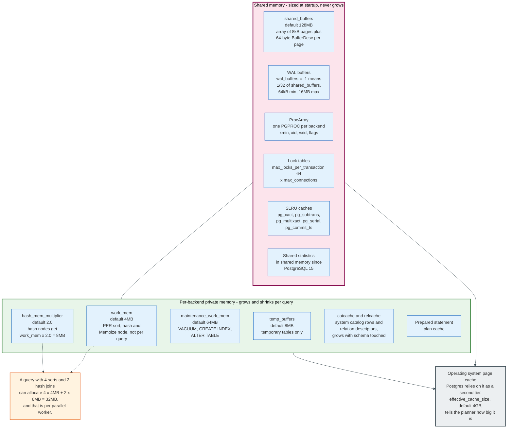

The shared segment holds the buffer pool, the WAL buffers, the lock tables, `ProcArray`, the SLRU caches, and, since PostgreSQL 15, the statistics collector's data. Its size is fixed at startup. The most common misconfiguration is treating `shared_buffers` as a full-database cache: PostgreSQL deliberately leans on the operating system page cache as a second tier, which is why `effective_cache_size` defaults to 4GB and is a planner hint, not an allocation.

Backend-local memory is where the surprises are. `work_mem` defaults to 4MB and is charged **per node, per worker**, not per query. A plan with four sorts and two hash joins running with two parallel workers can allocate `4 x 4MB + 2 x 8MB` per worker, because hash nodes get `work_mem x hash_mem_multiplier`, and `hash_mem_multiplier` has defaulted to 2.0 since PostgreSQL 15. Multiply by three processes and one query has taken 96MB.

| Setting | Default | Scope |
|---------|---------|-------|
| `shared_buffers` | 128MB | Whole cluster, fixed at startup |
| `wal_buffers` | -1, meaning 1/32 of `shared_buffers`, floor 64kB, ceiling 16MB | Whole cluster |
| `work_mem` | 4MB | Per sort, hash, or Memoize node, per worker |
| `hash_mem_multiplier` | 2.0 | Multiplies `work_mem` for hash nodes |
| `maintenance_work_mem` | 64MB | Per `VACUUM`, `CREATE INDEX`, `ALTER TABLE` |
| `autovacuum_work_mem` | -1, inherits `maintenance_work_mem` | Per autovacuum worker |
| `logical_decoding_work_mem` | 64MB | Per logical replication slot |
| `temp_buffers` | 8MB | Per backend, temporary tables only |
| `effective_cache_size` | 4GB | Planner estimate only, allocates nothing |

### 3.3 Why Idle Connections Are Not Free

An idle backend still occupies a `PGPROC` slot in `ProcArray`, and `ProcArray` is scanned to build a snapshot. Andres Freund measured the real cost in 2020: an idle connection shows around 16 MiB of RSS but only about 2.1 MiB of `Pss_Anon`, and the honest overhead, counting anonymous proportional set size plus page table entries, is about 7.6 MiB with `huge_pages=off` and about 1.3 MiB with `huge_pages=on`.

The memory is the smaller half of the problem. Snapshot construction, lock table scans, and the buffer clock sweep all scale with connection count whether or not those connections run queries. This is the mechanism behind the standard advice to cap active backends near two to four times the core count and put a pooler in front.

Connections are processes. Processes are not free.

---

## 4. Pages, Tuples, and TOAST

Every relation in PostgreSQL is a sequence of 8192-byte pages with an identical header layout, and the 8kB figure propagates into the size limit of every index entry, every TOAST chunk, and every row. `BLCKSZ` is a compile-time constant that can be set from 1kB to 32kB, and changing it requires `initdb`. Almost nobody changes it.

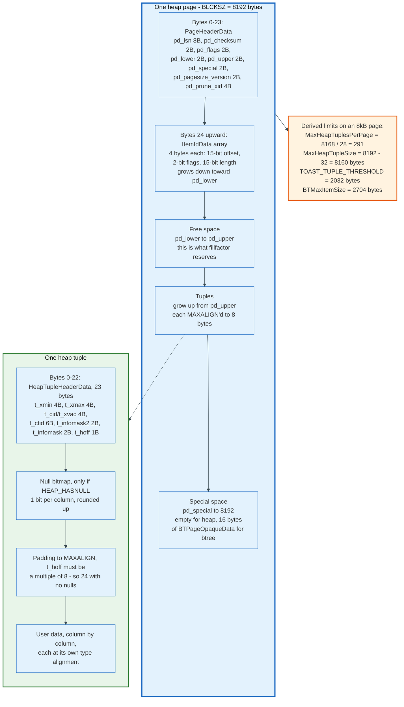

### 4.1 The Page Header

`PageHeaderData` occupies the first 24 bytes of every page in every access method.

| Offset | Field | Type | Bytes | Meaning |
|--------|-------|------|-------|---------|
| 0 | `pd_lsn` | PageXLogRecPtr | 8 | LSN of the last WAL record that changed this page |
| 8 | `pd_checksum` | uint16 | 2 | Page checksum, verified on read when checksums are on |
| 10 | `pd_flags` | uint16 | 2 | `PD_HAS_FREE_LINES`, `PD_PAGE_FULL`, `PD_ALL_VISIBLE` |
| 12 | `pd_lower` | LocationIndex | 2 | Offset to the start of free space |
| 14 | `pd_upper` | LocationIndex | 2 | Offset to the end of free space |
| 16 | `pd_special` | LocationIndex | 2 | Offset to the special area |
| 18 | `pd_pagesize_version` | uint16 | 2 | Page size plus layout version |
| 20 | `pd_prune_xid` | TransactionId | 4 | Oldest unpruned xmax on the page, or zero |

The line pointer array starts at byte 24 and grows downward. Tuples grow upward from the end. Free space is the gap between `pd_lower` and `pd_upper`, and that gap is what `fillfactor` reserves. The special area at the end is empty for heap pages and holds 16 bytes of `BTPageOpaqueData` for a B-tree page: `btpo_prev`, `btpo_next`, `btpo_level`, `btpo_flags`, and `btpo_cycleid`.

Each `ItemIdData` is exactly 4 bytes: a 15-bit offset, 2 flag bits, and a 15-bit length. The four states are `LP_UNUSED`, `LP_NORMAL`, `LP_REDIRECT`, and `LP_DEAD`. Section 6 shows why `LP_REDIRECT` matters.

### 4.2 The Tuple Header

`HeapTupleHeaderData` is 23 bytes, padded to a MAXALIGN boundary of 8, so `t_hoff` is 24 when there is no null bitmap.

| Offset | Field | Bytes | Meaning |
|--------|-------|-------|---------|
| 0 | `t_xmin` | 4 | Transaction that inserted this version |
| 4 | `t_xmax` | 4 | Transaction that deleted or locked it, or 0 |
| 8 | `t_cid` / `t_xvac` | 4 | Command ID within the transaction, or a combo CID |
| 12 | `t_ctid` | 6 | TID of this tuple or of its replacement version |
| 18 | `t_infomask2` | 2 | Attribute count in the low 11 bits plus HOT flags |
| 20 | `t_infomask` | 2 | Visibility and lock flag bits |
| 22 | `t_hoff` | 1 | Offset to user data, always a multiple of 8 |

The flag bits in `t_infomask` are the visibility fast path:

| Bit | Value | Meaning |
|-----|-------|---------|
| `HEAP_HASNULL` | 0x0001 | A null bitmap follows the fixed header |
| `HEAP_HASVARWIDTH` | 0x0002 | Contains a variable-width column |
| `HEAP_HASEXTERNAL` | 0x0004 | Contains an out-of-line TOAST pointer |
| `HEAP_XMAX_KEYSHR_LOCK` | 0x0010 | xmax is a key-share locker |
| `HEAP_COMBOCID` | 0x0020 | `t_cid` is a combo command ID |
| `HEAP_XMAX_EXCL_LOCK` | 0x0040 | xmax is an exclusive locker |
| `HEAP_XMAX_LOCK_ONLY` | 0x0080 | xmax locked, did not delete |
| `HEAP_XMIN_COMMITTED` | 0x0100 | Hint: inserter committed |
| `HEAP_XMIN_INVALID` | 0x0200 | Hint: inserter aborted |
| `HEAP_XMIN_FROZEN` | 0x0300 | Both bits set together means frozen |
| `HEAP_XMAX_COMMITTED` | 0x0400 | Hint: deleter committed |
| `HEAP_XMAX_INVALID` | 0x0800 | Hint: deleter aborted or xmax unused |
| `HEAP_XMAX_IS_MULTI` | 0x1000 | xmax is a MultiXactId, not a transaction ID |
| `HEAP_UPDATED` | 0x2000 | This version is the result of an `UPDATE` |

`t_infomask2` carries `HEAP_KEYS_UPDATED` (0x2000), `HEAP_HOT_UPDATED` (0x4000), and `HEAP_ONLY_TUPLE` (0x8000). The attribute count lives in the low 11 bits, `HEAP_NATTS_MASK` 0x07FF, which is room for 2047 columns. The binding constraint is `t_hoff`. It is one byte, and it has to cover the 23-byte header plus a null bitmap of one bit per column plus MAXALIGN padding, which caps a tuple a little over 1700 columns on most machines. The source rounds down from there to `MaxTupleAttributeNumber` 1664, 8 x 208, and `MaxHeapAttributeNumber` 1600, 8 x 200, so that a change to the header layout cannot move the supported limit.

### 4.3 The Limits That Fall Out of 8192 Bytes

Every one of these is arithmetic on `BLCKSZ`, not a policy choice:

- `MaxHeapTuplesPerPage` = `(8192 - 24) / (MAXALIGN(23) + 4)` = `8168 / 28` = **291 tuples per page**.
- `MaxHeapTupleSize` = `8192 - MAXALIGN(24 + 4)` = **8160 bytes**.
- `TOAST_TUPLE_THRESHOLD` targets four tuples per page: `MAXALIGN_DOWN((8192 - 40) / 4)` = **2032 bytes**.
- `TOAST_MAX_CHUNK_SIZE` = `2032 - 24 - 4 - 4 - 4` = **1996 bytes per chunk**.
- `BTMaxItemSize` reserves room for a high key and two data items: `MAXALIGN_DOWN((8192 - 40 - 16) / 3) - 8` = **2704 bytes**.
- The free space map records free space in 256 categories, so its granularity is `8192 / 256` = **32 bytes**, in a three-level tree that addresses all 2^32 - 1 blocks.
- Each relation fork is split into 1GB segment files on disk.

### 4.4 Column Alignment Costs Real Space

Columns are laid out in declaration order, each padded to its type's alignment. A `bigint` needs 8-byte alignment, an `int` 4, a `smallint` 2, and a varlena 4 unless it uses the 1-byte short header available for values under 127 bytes.

Declaring `(smallint, bigint, smallint, bigint)` costs 2 bytes plus 6 padding plus 8 plus 2 plus 6 padding plus 8, which is 32 bytes of data. Declaring `(bigint, bigint, smallint, smallint)` costs 8 plus 8 plus 2 plus 2, which is 20. The saving on the row is smaller than the saving on the data area, because every tuple carries the 23-byte header MAXALIGNed to 24 and is itself MAXALIGNed at the end: the two rows are 56 and 48 bytes. Same data, 8 bytes less per row, 14% off the table.

Order columns widest-first. It is free.

### 4.5 TOAST

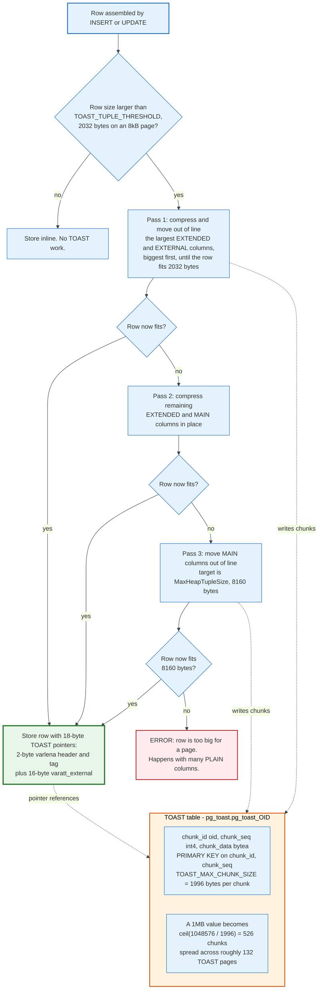

TOAST, The Oversized-Attribute Storage Technique, exists because a tuple may not span pages. When an assembled row exceeds 2032 bytes, the toaster compresses and relocates columns until it fits.

Each column carries one of four storage strategies, set with `ALTER TABLE ... ALTER COLUMN ... SET STORAGE`:

| Strategy | Compress? | Move out of line? | Default for |
|----------|-----------|-------------------|-------------|
| `PLAIN` | No | No | Fixed-width types |
| `EXTENDED` | Yes | Yes | `text`, `bytea`, `jsonb`, most varlena types |
| `EXTERNAL` | No | Yes | Nothing by default |
| `MAIN` | Yes | Last resort only | `numeric` |

An out-of-line value is replaced in the row by an 18-byte TOAST pointer datum: a 1-byte varlena length byte and a 1-byte tag, then a 16-byte `varatt_external` holding `va_rawsize`, `va_extinfo`, `va_valueid`, and `va_toastrelid`. The bytes live in a side table named `pg_toast.pg_toast_<oid>` with the schema `(chunk_id oid, chunk_seq int4, chunk_data bytea)` and a B-tree primary key on `(chunk_id, chunk_seq)`. A 1MB `jsonb` document that compresses badly becomes `ceil(1048576 / 1996)` = **526 chunks**.

Three consequences follow. Reading a TOASTed column costs an index lookup plus a chunk scan on top of the heap access, so `SELECT *` on a table with wide `jsonb` is much more expensive than selecting the columns you need. `EXTERNAL` trades space for speed on substring operations, because uncompressed chunks can be fetched by range. And the default compression algorithm is `pglz` in PostgreSQL 18; `lz4` has been available since PostgreSQL 14 and becomes the default in PostgreSQL 19.

---

## 5. MVCC: Snapshots, Visibility, and Transaction IDs

Multi-version concurrency control in PostgreSQL is a rule for reading, not a place for storing old data. Old versions sit in the table alongside the current one. A snapshot decides which of them a given statement is allowed to see. Readers never block writers and writers never block readers, because nobody has to wait for a version to be reconstructed.

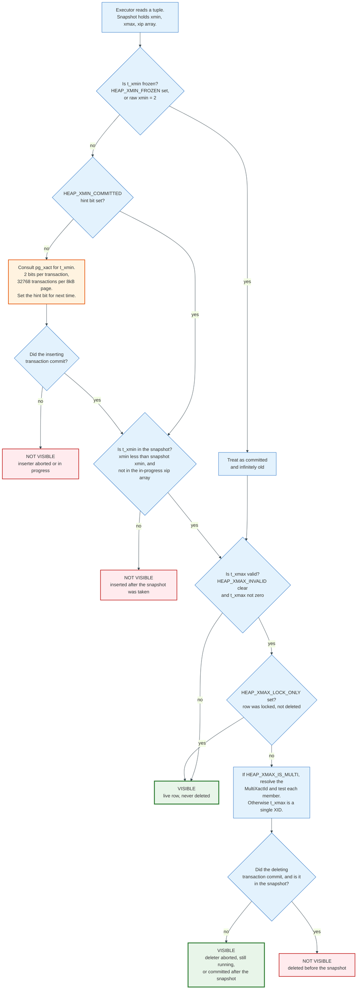

### 5.1 The Snapshot

A snapshot is three fields plus two arrays, taken by scanning `ProcArray`:

```c
typedef struct SnapshotData
{
    SnapshotType  snapshot_type;
    TransactionId xmin;    /* every XID < xmin is visible to me       */
    TransactionId xmax;    /* every XID >= xmax is invisible to me    */
    TransactionId *xip;    /* in-progress XIDs in [xmin, xmax)        */
    uint32        xcnt;    /* how many                                */
    TransactionId *subxip; /* in-progress subtransaction XIDs         */
    int32         subxcnt;
    bool          suboverflowed;
    ...
} SnapshotData;
```

The test is mechanical. An XID below `xmin` is settled: it committed or aborted before the snapshot. An XID at or above `xmax` had not started. An XID between them is visible only if it is absent from `xip`. `xmin` exists purely so that the common case never touches the array.

The `subxip` array holds subtransaction XIDs. Each backend caches up to 64 of them in shared memory; beyond that, `suboverflowed` is set and the visibility check has to walk `pg_subtrans` to find each subtransaction's parent. A procedure that opens thousands of savepoints, or a PL/pgSQL loop with an exception block per iteration, hits that cliff and slows every concurrent snapshot in the cluster.

### 5.2 Where Commit Status Actually Lives

The tuple header does not record whether the inserting transaction committed. `pg_xact` does, at two bits per transaction:

| Value | Constant | Meaning |
|-------|----------|---------|
| 0x00 | `TRANSACTION_STATUS_IN_PROGRESS` | Running or crashed |
| 0x01 | `TRANSACTION_STATUS_COMMITTED` | Committed |
| 0x02 | `TRANSACTION_STATUS_ABORTED` | Aborted |
| 0x03 | `TRANSACTION_STATUS_SUB_COMMITTED` | Subtransaction committed, parent pending |

Two bits per transaction means four per byte and `8192 x 4` = **32,768 transactions per page**. An SLRU segment file holds 32 pages, so each `pg_xact` file covers **1,048,576 transactions** in 256kB. At the default `autovacuum_freeze_max_age` of 200 million, `pg_xact` stays around 50MB. With `track_commit_timestamp` on, `pg_commit_ts` reaches about 2GB for the same window.

Consulting `pg_xact` for every tuple would be ruinous, so the first reader to resolve a status writes it back into the tuple as a hint bit: `HEAP_XMIN_COMMITTED`, `HEAP_XMIN_INVALID`, `HEAP_XMAX_COMMITTED`, or `HEAP_XMAX_INVALID`. That write dirties the page. This is the mechanism behind the first-`SELECT`-is-slow effect after a bulk load, and behind the surprise that a read-only replica can generate write I/O.

### 5.3 What Each Statement Does to the Tuple Header

| Operation | Effect on the old tuple | Effect on the new tuple |
|-----------|-------------------------|-------------------------|
| `INSERT` | none | `t_xmin` = my XID, `t_xmax` = 0, `t_ctid` points at itself |
| `UPDATE` | `t_xmax` = my XID, `t_ctid` points at the new version, `HEAP_HOT_UPDATED` if applicable | `t_xmin` = my XID, `t_xmax` = 0, `HEAP_UPDATED` set |
| `DELETE` | `t_xmax` = my XID | none |
| `SELECT ... FOR UPDATE` | `t_xmax` = my XID, `HEAP_XMAX_LOCK_ONLY` set | none |
| `ROLLBACK` | nothing on the page at all | nothing |

That last row is the point. A rollback of a transaction that deleted 50 million rows writes two bits into `pg_xact` and returns. The 50 million tuples still carry an `xmax` naming a transaction that aborted, and every reader that touches them resolves that once and sets `HEAP_XMAX_INVALID`.

Rollback is O(1). The cleanup is deferred, and `VACUUM` pays for it.

### 5.4 Command IDs and Combo CIDs

Within one transaction, statement N must not see rows that statement N+1 inserts. `t_cid` holds the command ID for that. The problem is that `t_cid` is one 4-byte field shared between insert and delete, so a tuple inserted and then deleted by the same transaction needs two values in one slot.

PostgreSQL solves this with a combo CID: a backend-local array maps a synthetic ID to a `(cmin, cmax)` pair, `HEAP_COMBOCID` is set, and the mapping lives only in the process that created it. That is why combo CIDs are never sent to a standby and why logical decoding maintains its own mapping.

### 5.5 MultiXact: When One xmax Is Not Enough

`t_xmax` holds one transaction ID, but multiple transactions can hold a share lock on the same row at once. When that happens PostgreSQL allocates a MultiXactId, stores it in `t_xmax`, and sets `HEAP_XMAX_IS_MULTI`. The member list lives in `pg_multixact/members` and the offsets in `pg_multixact/offsets`.

MultiXacts have their own 32-bit counter and their own wraparound, governed by `autovacuum_multixact_freeze_max_age`, default **400 million**. The members storage can grow to roughly 20GB before wraparound, and aggressive cleanup triggers around 10GB. A workload with heavy foreign-key checking, which takes `FOR KEY SHARE` locks, is the usual way to find this out.

### 5.6 The Transaction ID Itself

The internal `TransactionId` is 32 bits. Values 0, 1, and 2 are reserved: `InvalidTransactionId`, `BootstrapTransactionId`, and `FrozenTransactionId`. Everything from 3 upward is a normal XID, and comparison is modulo 2^32, so for any XID exactly 2^31 values, 2,147,483,648 of them, count as past and the same number as future.

Two mitigations exist and neither eliminates the 32-bit field. `FullTransactionId`, added in PostgreSQL 12, pairs the 32-bit XID with a 32-bit epoch and is what the in-memory generator now hands out. The SQL type `xid8`, exposed through `pg_current_xact_id()` and `pg_current_snapshot()`, presents that 64-bit value to users and does not wrap during the life of an installation. On-disk tuple headers still store 32 bits.

A transaction gets a permanent XID only when it first writes. Until then it is identified by a virtual transaction ID of the form `backendID/localXID`, for example `4/12532`. This is why a read-only reporting transaction that runs for six hours does not itself consume XIDs, while still holding back the vacuum horizon through its snapshot's `xmin`.

---

## 6. HOT, Pruning, and the Visibility Map

Heap-Only Tuples exist because a plain `UPDATE` would otherwise write one new index entry per index per update, even when no indexed column changed. HOT removes that cost in the common case, and its two preconditions are worth memorising.

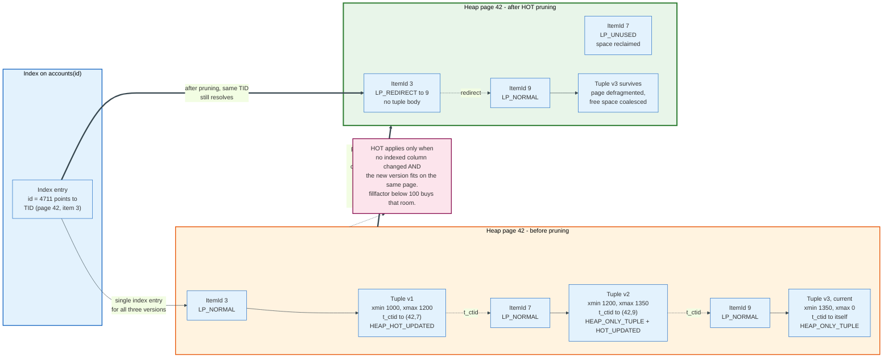

### 6.1 The Two Conditions

An update is HOT when **no indexed column changed** and **the new version fits on the same page as the old one**. The first condition is checked by bitwise comparison of the indexed attributes, not by type-specific equality. The second is why `fillfactor` matters: on a heavily updated table, `ALTER TABLE ... SET (fillfactor = 85)` reserves 15% of every page so future versions have somewhere to land.

When both hold, the old tuple gets `HEAP_HOT_UPDATED` and its `t_ctid` points at the new version. The new tuple gets `HEAP_ONLY_TUPLE` and no index entry at all. Index lookups land on the chain's root line pointer and walk `t_ctid` forward to whichever version their snapshot can see.

Summarising indexes are exempt since PostgreSQL 16. Because BRIN stores no TIDs, changing a column indexed only by BRIN still permits a HOT update. On PostgreSQL 15 and earlier the same change blocks one.

### 6.2 Pruning

Pruning is what keeps HOT chains short, and it runs opportunistically, including inside `SELECT`. `heap_page_prune_opt` fires when a page has less than `MAX(fillfactor target free space, BLCKSZ/10)` bytes free, that is under 10% free on a default table, or when a previous `UPDATE` failed to find room.

Pruning does three things. Dead intermediate versions in a HOT chain are removed. The chain's root line pointer is converted to `LP_REDIRECT`, holding only a pointer to the surviving version and no tuple body. The page is then defragmented, coalescing free space, using the same routine `VACUUM` uses.

Crucially, pruning does **not** remove index entries and does **not** free the root line pointer, because indexes still reference it. Only `VACUUM` can do that, and only after scanning every index. Pruning recovers space inside a page. `VACUUM` recovers line pointers.

### 6.3 The Visibility Map

The visibility map is two bits per heap page, stored in a fork alongside the table, and it is the reason index-only scans exist.

`MAPSIZE` is `8192 - 24` = 8168 bytes, and at 2 bits per heap block that is `8168 x 4` = **32,672 heap pages per visibility map page**, covering about 255 MiB of heap in a single 8kB page. The two bits are:

- **all-visible**: every tuple on this page is visible to every current snapshot. `VACUUM` may skip the page, and an index-only scan may return values from the index without visiting the heap.
- **all-frozen**: every tuple on this page is frozen. Even an aggressive anti-wraparound `VACUUM` may skip it. This bit was added in PostgreSQL 9.6 and is what made large mostly-static tables survivable.

Any write to a page clears both bits. This is why an index-only scan on a table with steady write traffic still shows a high `Heap Fetches` count in `EXPLAIN ANALYZE`: the map says the pages are not all-visible, so the scan has to check the heap after all.

An index-only scan is only as good as the visibility map that supports it.

---

## 7. Vacuum, Freezing, and Transaction ID Wraparound

`VACUUM` does two unrelated jobs that people conflate, and separating them explains most vacuum tuning. Job one removes dead tuples so space becomes reusable. Job two freezes old tuples so the 32-bit transaction ID counter can keep moving. A table can be perfectly clean on job one and still trigger an emergency on job two.

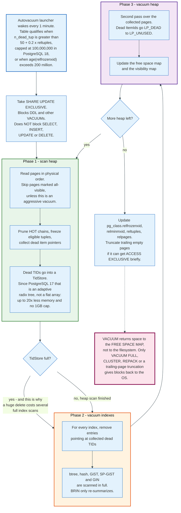

### 7.1 When Autovacuum Fires

The autovacuum launcher wakes every `autovacuum_naptime`, one minute by default, and tries to start one worker in each database every naptime, so an installation with N databases starts a worker every `autovacuum_naptime`/N seconds. Up to `autovacuum_max_workers`, three by default, run at once across the whole cluster, and nothing caps how many of them sit in one database; workers only try to avoid repeating work another worker has already done. A table qualifies for vacuum when:

```
n_dead_tup > autovacuum_vacuum_threshold
             + autovacuum_vacuum_scale_factor * reltuples
           = 50 + 0.2 * reltuples
```

On a 10-million-row table that is 2,000,050 dead tuples before autovacuum starts. That default is far too lax for a large hot table, and the standard fix is a per-table setting: `ALTER TABLE t SET (autovacuum_vacuum_scale_factor = 0.01)`. PostgreSQL 18 added `autovacuum_vacuum_max_threshold`, default **100,000,000**, which caps the scale factor's growth so a billion-row table does not need 200 million dead tuples before anything happens.

Analyze has its own trigger, `50 + 0.1 * reltuples`. Insert-only tables get a third, `autovacuum_vacuum_insert_threshold` of 1000 plus `autovacuum_vacuum_insert_scale_factor` of 0.2, which exists so append-only tables get frozen and marked all-visible without ever accumulating dead rows.

| Setting | Default |
|---------|---------|
| `autovacuum` | on |
| `autovacuum_max_workers` | 3 |
| `autovacuum_naptime` | 1min |
| `autovacuum_vacuum_threshold` | 50 |
| `autovacuum_vacuum_scale_factor` | 0.2 |
| `autovacuum_vacuum_max_threshold` | 100,000,000 (PostgreSQL 18) |
| `autovacuum_vacuum_insert_threshold` | 1000 |
| `autovacuum_analyze_threshold` | 50 |
| `autovacuum_analyze_scale_factor` | 0.1 |
| `autovacuum_freeze_max_age` | 200,000,000 |
| `autovacuum_multixact_freeze_max_age` | 400,000,000 |
| `autovacuum_vacuum_cost_delay` | 2ms |
| `vacuum_cost_limit` | 200 |

### 7.2 The Three Phases

`VACUUM` takes a `SHARE UPDATE EXCLUSIVE` lock, which blocks DDL and other vacuums but not `SELECT`, `INSERT`, `UPDATE`, or `DELETE`.

**Phase 1, scan heap.** Read pages in physical order, skipping those marked all-visible unless the vacuum is aggressive. Prune HOT chains, freeze eligible tuples, and collect the TIDs of dead tuples.

**Phase 2, vacuum indexes.** For each index, remove every entry pointing at a collected TID. B-tree, hash, GiST, SP-GiST, and GIN are scanned in full. BRIN only re-summarises ranges.

**Phase 3, vacuum heap.** Revisit the collected pages, convert `LP_DEAD` line pointers to `LP_UNUSED`, and update the free space map and visibility map.

If the dead-TID store fills before the heap scan finishes, phases 2 and 3 run and the loop restarts. That is why a single mass delete on a table with six indexes can take six full index scans multiplied by the number of loops. Enlarging `maintenance_work_mem` reduces the loop count directly.

PostgreSQL 17 changed the store itself. Dead TIDs used to live in a flat array capped at 1GB regardless of `maintenance_work_mem`. They now live in a TidStore built on an adaptive radix tree, which uses up to **20x less memory** and removes the 1GB ceiling entirely. A vacuum that previously needed four passes often needs one.

### 7.3 Freezing

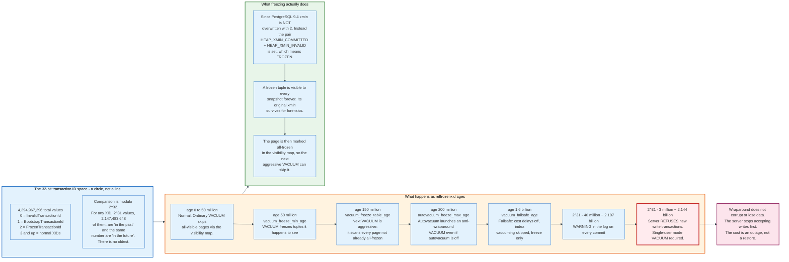

Freezing marks a tuple as visible to every possible snapshot, forever, so its `xmin` no longer has to be compared against a wrapping counter.

Since PostgreSQL 9.4 the `xmin` field is **not** overwritten with `FrozenTransactionId`. Instead both `HEAP_XMIN_COMMITTED` and `HEAP_XMIN_INVALID` are set, which together mean `HEAP_XMIN_FROZEN` (0x0300). The original inserting XID survives on the page for forensics, and `pg_upgrade` still handles the old representation.

The age thresholds form a staircase:

| `age(relfrozenxid)` | Setting | What happens |
|---------------------|---------|--------------|
| 50,000,000 | `vacuum_freeze_min_age` | An ordinary `VACUUM` freezes tuples on pages it happens to visit |
| 150,000,000 | `vacuum_freeze_table_age` | The next `VACUUM` becomes aggressive and scans every page not already all-frozen |
| 200,000,000 | `autovacuum_freeze_max_age` | An anti-wraparound autovacuum launches even if `autovacuum` is off |
| 1,600,000,000 | `vacuum_failsafe_age` | Failsafe mode: cost delays disabled, index vacuuming skipped, freeze only |
| ~2,107,000,000 | 40 million from wraparound | Warnings on every commit |
| ~2,144,000,000 | 3 million from wraparound | The server refuses to issue new XIDs |

PostgreSQL 18 added eager freezing to normal vacuums. `vacuum_max_eager_freeze_failure_rate`, default **0.03**, lets a normal `VACUUM` speculatively scan all-visible pages and freeze them, giving up once 3% of the relation's pages have been scanned without success. Successful freezes are internally capped at 20% of the all-visible-but-not-all-frozen pages. The effect is to amortise the cost of the eventual aggressive vacuum across many ordinary ones.

### 7.4 What Actually Causes a Wraparound Incident

The counter is never the problem. Something holding back the horizon is. Four things do it:

1. **A long-running transaction.** Its snapshot `xmin` pins the horizon. A `BEGIN` left open by a stuck application thread is the classic case. Watch `pg_stat_activity` for `state = 'idle in transaction'` and set `idle_in_transaction_session_timeout`, which defaults to 0, meaning disabled.
2. **An abandoned replication slot.** A slot's `catalog_xmin` and `restart_lsn` hold both the vacuum horizon and the WAL. `max_slot_wal_keep_size` defaults to -1, meaning unlimited, so a forgotten slot fills the disk and stalls freezing at the same time.
3. **A prepared transaction that was never committed or rolled back.** `pg_prepared_xacts` with an old `prepared` timestamp.
4. **`hot_standby_feedback = on` with a slow standby.** The standby's `xmin` is fed back to the primary and holds the primary's horizon.

Diagnose it with one query:

```sql
SELECT datname, age(datfrozenxid) AS xid_age,
       2147483647 - age(datfrozenxid) AS xids_remaining
FROM pg_database ORDER BY xid_age DESC;
```

Then find the culprit in `pg_stat_activity`, `pg_replication_slots`, and `pg_prepared_xacts`.

Wraparound is not a vacuum-speed problem. It is a horizon problem.

---

## 8. The Write-Ahead Log

Every change to a page is described in the WAL before the page itself is allowed to reach disk, and that single rule is what makes crash recovery possible without ever writing an undo record. `XLogFlush` enforces it: a dirty buffer cannot be evicted until the WAL record whose LSN is stored in the page's `pd_lsn` has been flushed.

```mermaid
%%{init: {'theme': 'base', 'themeVariables': {'primaryColor': '#e3f2fd', 'primaryBorderColor': '#1565c0', 'lineColor': '#37474f'}}}%%

flowchart TB
    subgraph Seg["WAL segment file - 16MB by default, name is 24 hex digits"]
        direction TB
        NAME["000000010000002A000000B7<br/>= timeline 1, log id 0x2A, segment 0xB7"]
        PG0["Page 0: XLogLongPageHeaderData, 40 bytes<br/>magic 0xD118 in PostgreSQL 18,<br/>plus system identifier and size cross-checks"]
        PGN["Pages 1..2047: XLogPageHeaderData, 24 bytes<br/>xlp_magic, xlp_info, xlp_tli,<br/>xlp_pageaddr, xlp_rem_len"]
        NAME --> PG0 --> PGN
    end

    subgraph Rec["One WAL record"]
        direction TB
        RH["XLogRecord header - 24 bytes<br/>xl_tot_len uint32, xl_xid uint32,<br/>xl_prev uint64, xl_info uint8,<br/>xl_rmid uint8, 2 bytes padding,<br/>xl_crc uint32 - CRC-32C"]
        BH["XLogRecordBlockHeader - 4 bytes per block<br/>id, fork_flags, data_length.<br/>Flags: HAS_IMAGE 0x10, HAS_DATA 0x20,<br/>WILL_INIT 0x40, SAME_REL 0x80"]
        BI["XLogRecordBlockImageHeader - 5 bytes<br/>length, hole_offset, bimg_info.<br/>Present only for a full-page image.<br/>Compression: PGLZ 0x04, LZ4 0x08, ZSTD 0x10"]
        FPI["Full page image - up to 8192 bytes,<br/>minus the hole between pd_lower and pd_upper.<br/>Written on the FIRST touch of a page<br/>after each checkpoint, when full_page_writes = on."]
        RLOC["RelFileLocator - 12 bytes<br/>tablespace, database, relation<br/>omitted when BKPBLOCK_SAME_REL"]
        BLK["BlockNumber - 4 bytes"]
        DH["Data header<br/>1+1 bytes short, or 1+4 bytes long"]
        PAY["Resource-manager payload<br/>example: xl_heap_update is 14 bytes,<br/>then xl_heap_header 5 bytes,<br/>then the new tuple body"]
        RH --> BH --> BI --> FPI --> RLOC --> BLK --> DH --> PAY
    end

    LSN["Every record has an LSN:<br/>a 64-bit byte offset in the log,<br/>printed as hex/hex, for example 2A/B7000148.<br/>pd_lsn on each page records the last<br/>WAL record that changed it."]

    RULE["The WAL rule: a page may not reach disk<br/>before the WAL record describing its change<br/>has been flushed. XLogFlush enforces it.<br/>Up to 32 blocks per record, XLR_MAX_BLOCK_ID."]

    Seg --> Rec --> LSN
    Rec --> RULE

    style Seg fill:#e3f2fd,stroke:#1565c0,stroke-width:2px
    style Rec fill:#e8f5e9,stroke:#2e7d32,stroke-width:3px
    style LSN fill:#fff3e0,stroke:#e65100,stroke-width:2px
    style RULE fill:#fce4ec,stroke:#880e4f,stroke-width:2px
```

### 8.1 The Record Format

`XLogRecord` is exactly 24 bytes:

```c
typedef struct XLogRecord
{
    uint32        xl_tot_len;  /* total length of the entire record */
    TransactionId xl_xid;      /* transaction id                    */
    XLogRecPtr    xl_prev;     /* pointer to the previous record    */
    uint8         xl_info;     /* flag bits, low 4 bits are XLR_INFO_MASK */
    RmgrId        xl_rmid;     /* resource manager id               */
    /* 2 bytes of padding, zeroed */
    pg_crc32c     xl_crc;      /* CRC-32C over the rest of the record */
} XLogRecord;
```

After the header come up to 32 block references, `XLR_MAX_BLOCK_ID`. Each begins with a 4-byte `XLogRecordBlockHeader` whose `fork_flags` byte carries the fork number in its low nibble plus four flags: `BKPBLOCK_HAS_IMAGE` (0x10), `BKPBLOCK_HAS_DATA` (0x20), `BKPBLOCK_WILL_INIT` (0x40), and `BKPBLOCK_SAME_REL` (0x80). The last one saves 12 bytes by omitting a repeated `RelFileLocator`.

When a full-page image is attached, a 5-byte `XLogRecordBlockImageHeader` describes it: `length`, `hole_offset`, and `bimg_info`, whose flags are `BKPIMAGE_HAS_HOLE` (0x01), `BKPIMAGE_APPLY` (0x02), and three compression markers, `BKPIMAGE_COMPRESS_PGLZ` (0x04), `BKPIMAGE_COMPRESS_LZ4` (0x08), and `BKPIMAGE_COMPRESS_ZSTD` (0x10).

The payload is interpreted by the resource manager named in `xl_rmid`: `RM_HEAP_ID`, `RM_BTREE_ID`, `RM_XACT_ID`, and about twenty others. A heap update payload is `xl_heap_update`, exactly 14 bytes:

```c
typedef struct xl_heap_update
{
    TransactionId old_xmax;          /* 4 bytes */
    OffsetNumber  old_offnum;        /* 2 bytes */
    uint8         old_infobits_set;  /* 1 byte  */
    uint8         flags;             /* 1 byte  */
    TransactionId new_xmax;          /* 4 bytes */
    OffsetNumber  new_offnum;        /* 2 bytes */
} xl_heap_update;
```

followed by a 5-byte `xl_heap_header` holding `t_infomask2`, `t_infomask`, and `t_hoff`, then the changed portion of the new tuple.

That portion is a middle, not a suffix. When the old and new versions land on the same page, `log_heap_update` compares the two tuples byte by byte from both ends, strips the bytes that match at the start and the bytes that match at the end, and logs what is left. A prefix or suffix shorter than 3 bytes is discarded, because recording its length costs 2 bytes and would not pay for itself. Each surviving length costs those 2 bytes and sets `XLH_UPDATE_PREFIX_FROM_OLD` or `XLH_UPDATE_SUFFIX_FROM_OLD`, which tells replay to rebuild the missing ends from the old tuple. Two cases turn the optimisation off: a full-page image of the new page, which already carries the tuple, and `wal_level = logical`, which requires the whole new tuple to be readable from the record alone.

### 8.2 Segments, Pages, and the LSN

WAL lives in `pg_wal` as 16MB segment files, configurable from 1MB to 1GB at `initdb` time with `--wal-segsize`. A segment name is 24 hex digits: 8 for the timeline, 8 for the log id, 8 for the segment number.

Inside a segment, every 8192-byte page carries a header. Page 0 of each segment gets a 40-byte `XLogLongPageHeaderData` with the system identifier and cross-checks on segment size and block size. Every other page gets a 24-byte `XLogPageHeaderData`. The magic value is `0xD118` in PostgreSQL 18 and changes every major release, which is how a mismatched WAL file is detected instantly.

An LSN is a 64-bit byte offset into the logical log, printed as two hex halves, for example `2A/B7000148`. `pg_current_wal_lsn()` returns it, `pg_wal_lsn_diff()` subtracts two of them, and the difference in bytes is exactly the replication lag. Every page's `pd_lsn` records the last WAL record that touched it.

### 8.3 Full-Page Writes, and Why WAL Volume Spikes

An 8kB page write is not atomic on most storage. A crash mid-write leaves a torn page that no incremental WAL record can repair, because the record assumes a known starting state. `full_page_writes`, on by default, solves this by logging the entire page image the first time it is modified after each checkpoint.

The arithmetic is unforgiving. A table with rows scattered across 100,000 pages, updated randomly, produces up to 100,000 full-page images of roughly 8kB each in the minutes after a checkpoint: about 800MB of WAL for a workload whose logical change set is a few megabytes. Shortening `checkpoint_timeout` makes this worse, not better, which is the opposite of most people's intuition.

Three levers reduce it. `wal_compression` accepts `pglz`, `lz4`, or `zstd` and compresses only full-page images. Raising `checkpoint_timeout` and `max_wal_size` makes checkpoints rarer. And `wal_log_hints`, needed by `pg_rewind`, increases it, so the two goals conflict.

### 8.4 Durability Levels

`synchronous_commit` is the one setting that trades durability for throughput, and it has five values:

| Value | The commit returns after | What a crash can lose |
|-------|--------------------------|-----------------------|
| `off` | WAL is in the buffer, not flushed | Up to `3 x wal_writer_delay`, that is 600ms of transactions |
| `local` | Local WAL is flushed and fsynced | Nothing locally, everything not yet replicated |
| `remote_write` | The standby's OS accepted the write | Transactions lost if the standby OS crashes too |
| `on` | The standby flushed WAL to disk | Nothing, if at least one synchronous standby survives |
| `remote_apply` | The standby applied and can serve it | Nothing, and read-your-writes holds on the standby |

`synchronous_commit = off` never risks torn data or corruption. It risks losing the last few hundred milliseconds of committed transactions. That distinction matters: it makes `off` a legitimate choice for high-volume telemetry and an illegitimate one for payments.

---

## 9. Checkpoints, Recovery, and the Buffer Manager

A checkpoint is a promise that every change before a given LSN is already on disk, which is what lets the server delete older WAL. Recovery starts at that LSN and rolls forward. Nothing rolls back, ever.

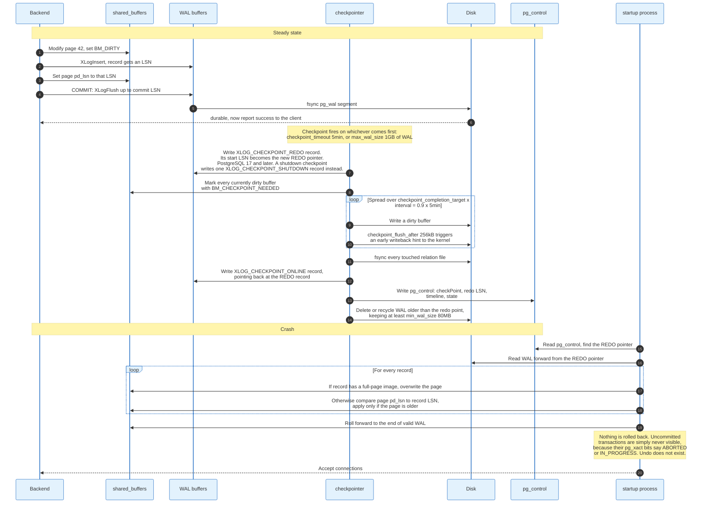

### 9.1 What a Checkpoint Does

The checkpointer fixes the REDO pointer at the current WAL insert position and writes an `XLOG_CHECKPOINT_REDO` record there, a record type added in PostgreSQL 17. It then marks every currently dirty buffer with `BM_CHECKPOINT_NEEDED`, writes those buffers out over the following minutes, fsyncs every touched file, and only then writes the `XLOG_CHECKPOINT_ONLINE` record that completes the checkpoint and points back at the earlier REDO record. `pg_control` is updated last. A shutdown checkpoint skips the split, because no WAL can be written between the two points, and emits a single `XLOG_CHECKPOINT_SHUTDOWN` record. The checkpointer then recycles or removes WAL segments older than the REDO point, keeping at least `min_wal_size`, 80MB by default, so segments can be renamed rather than created.

Checkpoints trigger on whichever comes first: `checkpoint_timeout`, five minutes by default, or `max_wal_size` of WAL written, 1GB by default. On a busy system 1GB of WAL arrives in well under five minutes, so the effective interval is set by `max_wal_size`, and the log fills with `checkpoints are occurring too frequently` warnings governed by `checkpoint_warning`, 30 seconds.

`checkpoint_completion_target`, 0.9 since PostgreSQL 14, spreads the writes across 90% of the estimated interval instead of dumping them at once. `checkpoint_flush_after`, 256kB on Linux, asks the kernel to start writing back sooner so the final fsync does not stall.

The tuning trade is direct. Long intervals mean fewer full-page images and less I/O, and a longer crash recovery. Short intervals mean the reverse.

### 9.2 Recovery

The startup process reads `pg_control`, finds the REDO pointer, and replays WAL forward from it. For each record it compares the page's `pd_lsn` against the record's LSN and applies the change only if the page on disk is older. Where a full-page image is attached, the image overwrites the page unconditionally.

At the end of replay, uncommitted transactions require no work. Their `pg_xact` bits say `IN_PROGRESS`, which visibility treats as invisible, and the aborted status is written lazily. There is no undo pass, no rollback segment to scan, and no correlation between the size of the in-flight transactions and the recovery time.

Point-in-time recovery adds a base backup plus archived WAL plus a `recovery_target_time`, `recovery_target_lsn`, `recovery_target_xid`, or `recovery_target_name`. `recovery_prefetch`, default `try` since PostgreSQL 15, reads ahead of the replay position so recovery is not serialised on single-block reads.

### 9.3 The Buffer Manager

`shared_buffers` is an array of 8192-byte pages plus one `BufferDesc` per page, deliberately padded to 64 bytes so descriptors do not share cache lines. A buffer's state is packed into a single 32-bit atomic: 18 bits of reference count, 4 bits of usage count, and 10 flag bits, so pinning and unpinning are compare-and-swap loops rather than lock acquisitions.

The flags are the buffer's life cycle: `BM_LOCKED`, `BM_DIRTY`, `BM_VALID`, `BM_TAG_VALID`, `BM_IO_IN_PROGRESS`, `BM_IO_ERROR`, `BM_JUST_DIRTIED`, `BM_PIN_COUNT_WAITER`, `BM_CHECKPOINT_NEEDED`, and `BM_PERMANENT`.

Two access controls exist and they are distinct. A **pin** is a reference count that says the buffer may not be evicted; a backend must hold one to touch the page at all. A **content lock** is a short-term shared or exclusive lock on the bytes. A backend can hold a pin without a content lock, which is exactly what an index scan does between fetching a TID and visiting the heap.

Replacement is a clock sweep, not an LRU. Each pin increments the buffer's usage count up to `BM_MAX_USAGE_COUNT`, which is **5**. A rotating hand decrements usage counts and evicts the first unpinned buffer whose count reaches zero. Because the maximum is 5, finding a victim can take at most six full sweeps, which bounds the worst case at the price of only approximating LRU.

### 9.4 Ring Buffers, and Why a Big Sequential Scan Does Not Wreck the Cache

A sequential scan over a table larger than a quarter of `shared_buffers` does not use the whole pool. It allocates a 256kB ring and reuses it, which fits in L2 cache and leaves the rest of the buffer pool alone. Bulk writes such as `COPY IN` and `CREATE TABLE AS` use a 16MB ring, capped at one eighth of `shared_buffers`. `VACUUM` uses a ring sized by `vacuum_buffer_usage_limit`.

The buffer mapping hash table is partitioned so that concurrent lookups on different pages take different lightweight locks, and `pg_stat_io`, added in PostgreSQL 16, reports reads, writes, extends, hits, evictions, reuses, and fsyncs broken down by backend type, object, and context. `context = 'bulkread'` versus `'normal'` is exactly the ring distinction above.

---

## 10. Index Access Methods

PostgreSQL ships six index access methods and treats every one of them as a plug-in implementing the same C API, which is why `pgvector` can add a seventh without patching the server. Choosing between them is a question about the shape of the query, not about the data type.

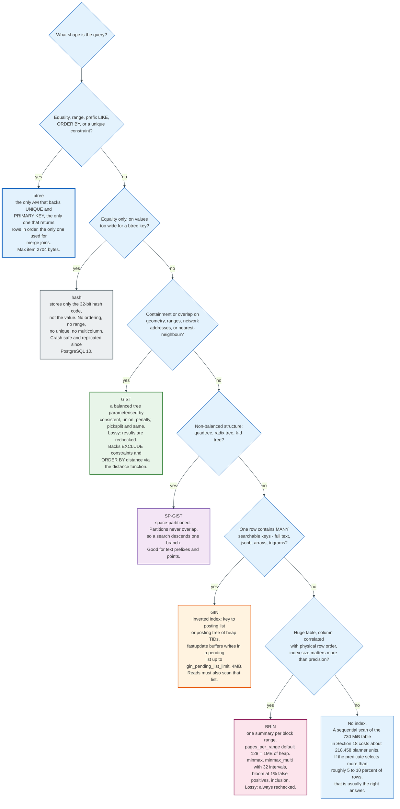

### 10.1 B-tree

```mermaid
%%{init: {'theme': 'base', 'themeVariables': {'primaryColor': '#e3f2fd', 'primaryBorderColor': '#1565c0', 'lineColor': '#37474f'}}}%%

flowchart TB
    META["Meta page - block 0<br/>points at the current root,<br/>records the tree level"]

    ROOT["Root page, level 2<br/>high key is plus infinity<br/>downlink 1 to page A, downlink 3400001 to page B"]

    I1["Internal page A, level 1<br/>high key = 3400001<br/>downlinks to leaves L1..L400"]
    I2["Internal page B, level 1<br/>high key is plus infinity<br/>downlinks to leaves L401..L800"]

    L1["Leaf L1<br/>high key = 4712<br/>entries 1..4711<br/>each: IndexTupleData 8B<br/>+ key + 6-byte heap TID"]
    L2["Leaf L2<br/>high key = 9423<br/>entries 4712..9422"]
    L3["Leaf L3<br/>high key = 14134"]

    META --> ROOT
    ROOT --> I1
    ROOT --> I2
    I1 --> L1
    I1 --> L2
    I1 --> L3

    L1 -.->|"btpo_next - right link"| L2
    L2 -.->|"btpo_next"| L3
    L2 -.->|"btpo_prev - Postgres addition<br/>for backward scans"| L1

    subgraph LY["Lehman and Yao, as modified by PostgreSQL"]
        direction TB
        LY1["Every page carries a HIGH KEY:<br/>an upper bound on every key<br/>at or below that page."]
        LY2["A split adds a right link before<br/>the parent learns about the new page.<br/>A reader that overshoots follows the<br/>right link and still finds its key."]
        LY3["PostgreSQL still takes page-level<br/>read locks, because buffers are shared<br/>between backends. Lehman and Yao<br/>assumed private in-memory pages."]
        LY4["Deletion is two-stage: half-dead,<br/>then unlinked. The tombstone lets<br/>concurrent scans recover."]
        LY1 --> LY2 --> LY3 --> LY4
    end

    subgraph MOD["Modern btree additions"]
        direction TB
        M1["PostgreSQL 12: suffix truncation<br/>and heap TID as a final tiebreaker column,<br/>so duplicates are stored in heap order"]
        M2["PostgreSQL 13: deduplication.<br/>Equal keys collapse into one posting-list<br/>tuple holding an array of heap TIDs."]
        M3["PostgreSQL 14: bottom-up index deletion.<br/>Before splitting a page, check whether the<br/>duplicates are dead version churn and<br/>delete them instead of splitting."]
        M4["PostgreSQL 18: skip scan.<br/>An index on (a, b) can serve<br/>WHERE b = 7 by iterating the<br/>distinct values of a."]
        M1 --> M2 --> M3 --> M4
    end

    L1 -.-> LY
    L3 -.-> MOD

    LIMIT["BTMaxItemSize = 2704 bytes on an 8kB page.<br/>Three items must fit: a high key and two data items.<br/>A longer key raises<br/>'index row size exceeds btree version 4 maximum'."]
    MOD --> LIMIT

    style META fill:#eceff1,stroke:#37474f,stroke-width:2px
    style ROOT fill:#e3f2fd,stroke:#1565c0,stroke-width:3px
    style LY fill:#e8f5e9,stroke:#2e7d32,stroke-width:2px
    style MOD fill:#fff3e0,stroke:#e65100,stroke-width:2px
    style LIMIT fill:#ffebee,stroke:#c62828,stroke-width:2px
```

The B-tree is the only method that backs `UNIQUE` and `PRIMARY KEY`, the only one that returns rows in order, and therefore the only one a merge join or an `ORDER BY` can consume directly. It implements the Lehman and Yao high-concurrency algorithm with three documented deviations.

**Deviation one: page-level read locks.** Lehman and Yao assume each process has private copies of pages. PostgreSQL shares buffers between backends, so it still takes read locks on B-tree pages.

**Deviation two: left links.** The original algorithm has right links only, which suffices for forward scans. PostgreSQL adds `btpo_prev` for backward scans and pays for it with extra split handling.

**Deviation three: variable-size keys.** Splits balance by bytes, not by item count, and pages hold as many entries as fit.

The high key is the mechanism that makes concurrent splits safe. Every page carries an upper bound on all keys at or below it. A split installs the right link before the parent learns about the new page, so a reader that arrives mid-split finds its key is above the high key, follows the right link, and lands correctly. Deletion mirrors this with a two-stage half-dead state.

Four modern additions changed B-tree performance materially:

- **PostgreSQL 12** added suffix truncation and made the heap TID a real final tiebreaker column, so duplicate keys are stored in heap order rather than arbitrarily.
- **PostgreSQL 13** added deduplication. Equal keys collapse into one posting-list tuple holding an array of heap TIDs. On a low-cardinality index this cuts size by a large multiple.
- **PostgreSQL 14** added bottom-up index deletion. Before splitting a page, the index asks the table access method whether the duplicates on it are dead version churn from repeated `UPDATE`s, and deletes them instead of splitting. This is what stopped the classic "index grows forever on a hot updated column" failure.
- **PostgreSQL 18** added skip scan. An index on `(tenant_id, created_at)` can now serve `WHERE created_at > $1` by iterating the distinct values of `tenant_id` and doing a range scan under each. Before 18 that query needed a second index.

The hard limit is `BTMaxItemSize`, **2704 bytes** on an 8kB page, because three items must fit: a high key and two data items. Exceed it and you get `index row size exceeds btree version 4 maximum`. Index an expression such as `md5(long_text)` instead.

### 10.2 Hash

Hash indexes store the 32-bit hash code, not the value, which is why they support equality only: no ranges, no ordering, no multicolumn, no unique constraints. They became crash-safe and replicated in PostgreSQL 10, before which they were effectively unusable.

An index has a meta page, bucket pages allocated in power-of-two splitpoint groups, overflow pages chained from full buckets, and bitmap pages tracking free overflow pages. Splitpoint groups below 10 allocate all their buckets at once; groups from 10 upward allocate in four phases of one quarter each, which avoids a fourfold size jump on every doubling. There is no way to shrink a hash index other than `REINDEX`.

The niche is narrow and real: equality lookups on values too wide for a 2704-byte B-tree key, where storing 4 bytes per entry instead of the value itself is a large saving.

### 10.3 GiST

GiST is a balanced tree whose behaviour is entirely supplied by the operator class through support functions. Five are mandatory: `consistent` decides whether an entry can match, `union` merges entries into a covering key, `penalty` prices an insertion into a subtree, `picksplit` divides a full page, and `same` tests equality. Seven are optional, including `distance`, which enables nearest-neighbour `ORDER BY`, and `fetch`, which enables index-only scans.

GiST is lossy. It returns candidates and the executor rechecks them. It backs `EXCLUDE` constraints, which is how you express "no two bookings for this room may overlap" as a constraint rather than as application code. Built-in operator classes cover `box`, `circle`, `point`, `polygon`, `inet`, `range`, `multirange`, `tsvector`, and `tsquery`; PostGIS is the largest external user.

Builds have three modes. Sorted build, the default when `sortsupport` exists, is fastest. Buffered build activates automatically once the index exceeds `effective_cache_size` and trades CPU for far less random I/O. Simple insertion is the fallback.

### 10.4 SP-GiST

SP-GiST covers structures whose partitions do not overlap: quadtrees, k-d trees, and radix trees. Because a point belongs to exactly one partition, a search descends a single branch instead of several, which is the opposite of GiST's behaviour and much faster for the shapes it fits. Text prefix search and point data are the main uses.

### 10.5 GIN

GIN is an inverted index: it maps each extracted key to the list of rows containing it. That is the right structure when one row holds many searchable values, which covers full-text search, `jsonb` containment, array membership, and `pg_trgm` similarity.

Internally GIN is a B-tree over keys where each leaf holds either a **posting list**, a plain array of heap TIDs, or a pointer to a **posting tree**, a separate B-tree of TIDs, once the list outgrows one index tuple. For a multicolumn GIN index there is one B-tree over composite `(column number, key)` values.

The `fastupdate` mechanism is GIN's most important and most misunderstood feature. Without it, inserting one document with 200 distinct lexemes means 200 separate B-tree insertions. With it, new entries go into an unsorted pending list and are merged in bulk later, by `VACUUM`, by `ANALYZE`, by `gin_clean_pending_list()`, or by whichever unlucky insert pushes the list past `gin_pending_list_limit`, **4MB** by default.

The costs are two. Every search must also scan the pending list linearly, so a large pending list slows reads. And the insert that triggers cleanup pays for all of it, producing a latency spike with no obvious cause. On a workload that needs predictable response times, `ALTER INDEX ... SET (fastupdate = off)` is the right call.

### 10.6 BRIN

BRIN stores one summary per **block range** rather than one entry per row, which makes it two to four orders of magnitude smaller than a B-tree on the same column. `pages_per_range` defaults to **128**, so each summary covers 1MB of heap, which at the roughly 290 rows per page the documentation uses as its reference density is about 37,000 rows.

It only works when the column correlates with physical row order. On an append-only events table keyed by `created_at`, correlation is near 1.0 and BRIN is excellent. On a randomly-ordered UUID column, correlation is near zero and BRIN degenerates into a full scan with extra steps.

Four operator class families:

| Class | Stores | Notes |
|-------|--------|-------|
| `minmax` | Minimum and maximum per range | One outlier per range destroys its usefulness |
| `minmax_multi` | Several intervals per range | `values_per_range` default 32, range 8 to 256. Added in PostgreSQL 14 to survive outliers |
| `bloom` | A Bloom filter per range | Equality only. `false_positive_rate` default 0.01, range 0.0001 to 0.25 |
| `inclusion` | A bounding box per range | For geometries, ranges, network addresses |

BRIN is lossy and always rechecked. `autosummarize` is off by default, so newly appended ranges stay unsummarised until `VACUUM` runs or `brin_summarize_new_values()` is called, which is the usual reason a fresh BRIN index appears to do nothing.

### 10.7 The Comparison That Matters

| Method | Size on 10M rows | Ordered? | Unique? | Lossy? | Typical use |
|--------|------------------|----------|---------|--------|-------------|
| B-tree | ~214 MiB on a `bigint` | Yes | Yes | No | Everything by default |
| Hash | Smaller for wide keys | No | No | No | Equality on long values |
| GiST | Data dependent | Via `distance` | Via `EXCLUDE` | Yes | Geometry, ranges, overlap |
| SP-GiST | Data dependent | No | No | Yes | Prefixes, points, non-overlapping partitions |
| GIN | Often larger than the table | No | No | Partly | Full text, `jsonb`, arrays, trigrams |
| BRIN | Kilobytes | No | No | Yes | Huge, physically ordered tables |

---

## 11. Statistics and Selectivity Estimation

Every plan choice in PostgreSQL reduces to one number per node: how many rows will come out. That number comes from `pg_statistic`, populated by `ANALYZE` from a random sample, and when it is wrong the plan is wrong. Nothing else in the optimiser matters as much.

### 11.1 What ANALYZE Collects

`ANALYZE` samples `300 x statistics_target` rows, which at the default `default_statistics_target` of 100 is **30,000 rows**, regardless of whether the table has one million or one billion. It then stores, per column, in `pg_statistic` and readable through `pg_stats`:

| Column | Meaning |
|--------|---------|
| `null_frac` | Fraction of values that are null |
| `avg_width` | Average value width in bytes |
| `n_distinct` | Distinct values; a **negative** value is a fraction of the row count, so -1 means every value is unique |
| `most_common_vals` | Up to `statistics_target` most frequent values |
| `most_common_freqs` | Their frequencies |
| `histogram_bounds` | Equal-frequency bucket boundaries for everything not in the MCV list |
| `correlation` | Correlation between logical order and physical order, from -1 to 1 |
| `most_common_elems` | For array types, the most common elements |

`correlation` is the field that decides whether an index scan is priced as sequential or random access, and it is the reason a `CLUSTER` on a table can change plans without changing a single row.

### 11.2 The Selectivity Arithmetic

The formulas are short enough to reproduce. Using the documentation's `tenk1` table, `reltuples` 10000, `relpages` 358:

**Equality against a value in the MCV list.** Selectivity is the stored frequency. For `stringu1 = 'CRAAAA'` with `most_common_freqs` giving 0.003, rows = `10000 x 0.003` = **30**.

**Equality against a value not in the MCV list.** Spread the remaining probability over the remaining distinct values:

```
selectivity = (1 - sum(mcv_freqs)) / (n_distinct - num_mcv)
            = (1 - 0.03033333) / (676 - 10)
            = 0.0014559
rows        = 10000 x 0.0014559 = 15
```

**A range condition.** Interpolate inside the histogram bucket that contains the boundary. With `histogram_bounds = {0,993,1997,3050,...}` and `unique1 < 1000`:

```
selectivity = (1 + (1000 - 993) / (1997 - 993)) / 10
            = (1 + 7/1004) / 10 = 0.100697
rows        = 10000 x 0.100697 = 1007
```

**A range on a column with MCVs.** Add the MCV entries that satisfy the condition to the histogram estimate, scaled by the non-MCV fraction:

```
selectivity = 0.01833333 + 0.298387 x 0.96966667 = 0.307669
rows        = 3077
```

**Two conditions with AND.** Multiply, assuming independence:

```
selectivity = 0.100697 x 0.0014559 = 0.0001466
rows        = 1
```

**An equijoin.** Divide by the larger side's distinct count:

```
selectivity = (1 - null_frac1) x (1 - null_frac2) / max(n_distinct1, n_distinct2)
            = 1 / 10000 = 0.0001
rows        = 50 x 10000 x 0.0001 = 50
```

### 11.3 The Independence Assumption Is the Main Source of Bad Plans

That fifth formula, multiplying selectivities, is where estimates go wrong by orders of magnitude. `WHERE city = 'San Francisco' AND state = 'CA'` multiplies two selectivities as if the columns were unrelated. They are not: the city determines the state. The estimate comes out roughly 50 times too small, the planner picks a nested loop, and the query takes minutes.

When no statistic applies at all, the planner falls back to hard-coded constants from `selfuncs.h`:

| Constant | Value | Used for |
|----------|-------|----------|
| `DEFAULT_EQ_SEL` | 0.005 | `A = b` |
| `DEFAULT_INEQ_SEL` | 0.3333333333333333 | `A < b` |
| `DEFAULT_RANGE_INEQ_SEL` | 0.005 | `A > b AND A < c` |
| `DEFAULT_MATCH_SEL` | 0.005 | `LIKE` and pattern matching |
| `DEFAULT_NUM_DISTINCT` | 200 | Unknown distinct count |
| `DEFAULT_UNK_SEL` | 0.005 | Boolean and null tests |

Seeing `rows=200` or a row count that is exactly one third of the table in `EXPLAIN` is a reliable signal that statistics are missing or inapplicable.

### 11.4 Extended Statistics

`CREATE STATISTICS` fixes the independence problem for named column groups. Three kinds, and a fourth applying to expressions since PostgreSQL 14:

**`dependencies`** records functional dependencies as coefficients. On a US zip code table, `CREATE STATISTICS s (dependencies) ON city, zip FROM zipcodes` yields `{"1 => 5": 1.000000, "5 => 1": 0.423130}`: zip determines city completely, city determines zip 42% of the time. It applies only to equality conditions and `IN` lists with constants, not to ranges or `LIKE`.

**`ndistinct`** records distinct counts for column combinations, fixing `GROUP BY` estimates. For `(city, state, zip)` it stores every subset: `{"1, 2": 33178, "1, 5": 33178, "2, 5": 27435, "1, 2, 5": 33178}`.

**`mcv`** records the most common value **combinations**, with both the observed frequency and the base frequency the independence assumption would have predicted. The documentation's example shows `{Washington, DC}` at frequency 0.003467 against a base frequency of 0.000027, an underestimate of two orders of magnitude.

Extended statistics are not collected automatically. You have to know which column groups your queries correlate on, create the object, and run `ANALYZE`. They cost sample-processing time, so they are worth creating only for groups that actually appear together in `WHERE` clauses.

### 11.5 Per-Column Targets

`ALTER TABLE t ALTER COLUMN c SET STATISTICS 1000` raises the MCV list and histogram size for one column, and with them the sample for the whole table. `ANALYZE` draws one row sample per table, sized at 300 times the largest statistics target among the columns it is analysing, so the default target of 100 gives 30,000 rows and a single column set to 1000 gives 300,000. That is the right lever for a skewed column with a few thousand hot values: `ANALYZE` on that one table gets ten times more expensive, and every other table in the cluster is untouched. Raising `default_statistics_target` globally instead makes every `ANALYZE` in the cluster slower and every `pg_statistic` row larger.

Statistics also became portable in PostgreSQL 18: `pg_upgrade` now carries optimizer statistics across a major version upgrade, eliminating the mandatory post-upgrade `ANALYZE` that used to leave large clusters planning badly for hours. `--no-statistics` disables it.

---

## 12. The Query Planner and the Cost Model

The planner enumerates legal plans, prices each in abstract units, and returns the cheapest. There are no hints, no rule that an index beats a scan, and no memory of what happened last time. Every plan is a fresh arithmetic exercise on the estimates from Section 11.

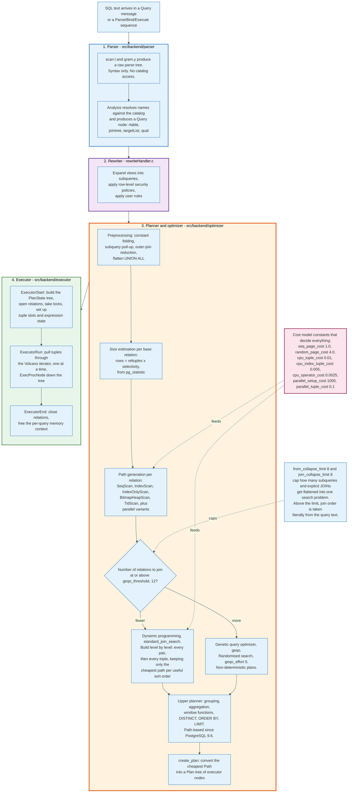

### 12.1 The Cost Units

Seven constants define the entire currency. They are dimensionless and only their ratios matter.

| Constant | Default | Meaning |
|----------|---------|---------|
| `seq_page_cost` | 1.0 | Fetching one page sequentially. The unit of account. |
| `random_page_cost` | 4.0 | Fetching one page at a random offset |
| `cpu_tuple_cost` | 0.01 | Processing one heap tuple |
| `cpu_index_tuple_cost` | 0.005 | Processing one index entry |
| `cpu_operator_cost` | 0.0025 | Evaluating one operator or function |
| `parallel_setup_cost` | 1000 | Starting parallel workers and their shared memory |
| `parallel_tuple_cost` | 0.1 | Passing one tuple from a worker to the leader |

`random_page_cost = 4.0` encodes a 2000-era spinning disk where a seek costs four times a sequential read. On NVMe the true ratio is closer to 1.1 to 1.5, and leaving the default in place is the single most common reason PostgreSQL under-uses indexes on modern hardware. `effective_cache_size`, 4GB by default, is a pure planner input: it tells the Mackert and Lohman formula how much of an index is likely already cached and allocates nothing.

### 12.2 Costing a Sequential Scan

```
cost = seq_page_cost x relpages
     + cpu_tuple_cost x reltuples
     + cpu_operator_cost x reltuples x (number of filter operators)
```

For the 10-million-row `accounts` table of Section 18, which occupies 93,458 pages:

```
cost = 1.0 x 93,458 + 0.01 x 10,000,000 + 0.0025 x 10,000,000
     = 93,458 + 100,000 + 25,000
     = 218,458
```

### 12.3 Costing an Index Scan

Two descent charges plus page fetches. From `btcostestimate`:

```
descent within pages : ceil(log2(index_tuples)) x cpu_operator_cost
                     = ceil(log2(10,000,000)) x 0.0025
                     = 24 x 0.0025 = 0.06

descent across pages : (tree_height + 1) x 50.0 x cpu_operator_cost
                     = (2 + 1) x 50.0 x 0.0025 = 0.375

startup total        = 0.435
```

Then one index page and one heap page at `random_page_cost`, plus `cpu_index_tuple_cost` for the index entry and `cpu_tuple_cost` for the heap tuple:

```
total = 0.435 + 4.0 + 4.0 + 0.005 + 0.01 + 0.0025 = 8.45
```

Which is exactly the `cost=0.43..8.45 rows=1` that `EXPLAIN` prints for a primary key lookup on a large table. That familiar number is not a constant. It is `50.0 x cpu_operator_cost` per tree level plus two random page fetches.

The number of heap pages fetched for a multi-row index scan comes from the Mackert and Lohman formula, which models how many distinct pages `N` random tuple fetches touch given a cache of `b` pages out of `T`:

```
if T <= b:   pages_fetched = (2 x T x N) / (2 x T + N)
otherwise:   lim = (2 x T x b) / (2 x T - b)
             pages_fetched = (2 x T x N) / (2 x T + N)             if N <= lim
                             b + (N - lim) x (T - b) / T           otherwise
```

The cost is then interpolated between `seq_page_cost` and `random_page_cost` according to the column's `correlation`. A perfectly correlated column is priced as a sequential read even through an index.

### 12.4 Costing a Sort

```
comparison_cost = 2.0 x cpu_operator_cost
in-memory cost  = comparison_cost x N x log2(N)
```

If the data exceeds `work_mem`, tuplesort switches to external merge and adds `2 x relation_bytes x ceil(log_M(runs))` of disk traffic, assumed to be three quarters sequential and one quarter random. Doubling `work_mem` on a spilling sort often removes an entire merge pass.

### 12.5 Join Search

The join search is dynamic programming. `standard_join_search` builds level by level: every pair of relations, then every triple, keeping only the cheapest path per useful sort order at each level. That is exponential in the number of relations, so two safety valves exist.

`geqo_threshold`, **12**, switches to the genetic query optimizer above that many relations. GEQO does a randomised search with `geqo_effort` of 5, and produces non-deterministic plans: the same query can get different plans on different executions. Many production systems set `geqo = off` and accept longer planning to get stable plans.

`from_collapse_limit` and `join_collapse_limit`, both **8**, cap how many subqueries and explicit `JOIN` clauses get flattened into one search problem. Above the limit, the join order in the SQL text is taken literally. That is a documented way to force a join order without hints: write more than eight explicit joins, or lower `join_collapse_limit` to 1.

### 12.6 Parallelism

A plan goes parallel when the relation exceeds `min_parallel_table_scan_size`, 8MB, or the index exceeds `min_parallel_index_scan_size`, 512kB, and the estimated gain beats `parallel_setup_cost` of 1000. Worker count grows logarithmically with relation size, capped by `max_parallel_workers_per_gather`, 2 by default, itself capped by `max_parallel_workers`, 8, itself capped by `max_worker_processes`, 8.

`parallel_setup_cost = 1000` is a deliberately large number. It means short queries never go parallel, which is correct, and it also means a query estimated at 900 units stays serial even when parallelism would have helped.

### 12.7 JIT

Just-in-time compilation with LLVM triggers above `jit_above_cost` of 100,000, with inlining and optimisation above 500,000 each. It compiles expression evaluation and tuple deforming into native code, which pays off on long analytical scans and costs 10 to 100 milliseconds of compilation on anything shorter.

The thresholds are total plan cost, not runtime, so a badly estimated OLTP query can trip them and spend more time compiling than executing. PostgreSQL 19 responds by disabling JIT by default.

---

## 13. The Executor and Join Strategies

The executor is a Volcano-style iterator tree: each node exposes `ExecProcNode`, returns one tuple per call, and pulls from its children. Nothing is materialised unless a node explicitly does so, which is why `LIMIT` can stop a plan mid-flight and why a nested loop can return its first row before its inner side has been scanned once.

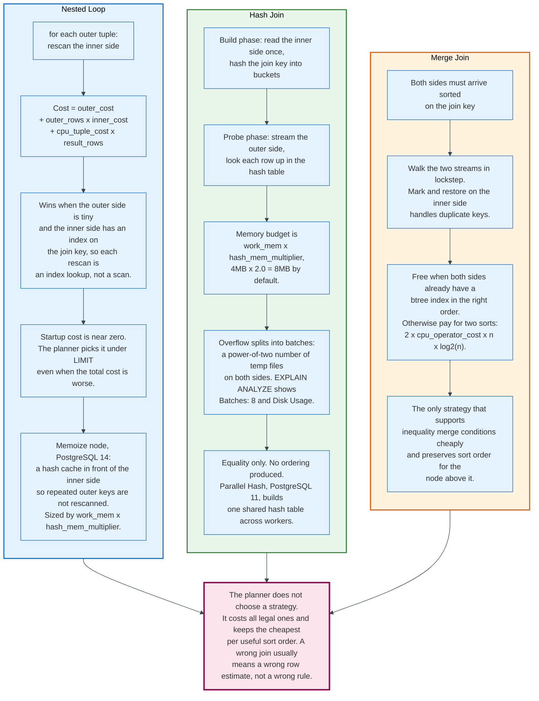

### 13.1 The Node Vocabulary

| Category | Nodes |
|----------|-------|
| Scans | `Seq Scan`, `Index Scan`, `Index Only Scan`, `Bitmap Index Scan`, `Bitmap Heap Scan`, `Tid Scan`, `Function Scan`, `Values Scan`, `CTE Scan`, `Foreign Scan` |
| Joins | `Nested Loop`, `Hash Join`, `Merge Join` |
| Materialisation | `Materialize`, `Sort`, `Incremental Sort`, `Memoize`, `Hash` |
| Grouping | `Aggregate`, `HashAggregate`, `GroupAggregate`, `WindowAgg` |
| Set operations | `Append`, `Merge Append`, `Unique`, `SetOp`, `Recursive Union` |
| Parallelism | `Gather`, `Gather Merge` |
| Modification | `ModifyTable`, `LockRows`, `Result`, `ProjectSet` |

A bitmap scan deserves a note because it sits between the other two scan types. It reads one or more indexes, builds an in-memory bitmap of matching pages, ORs or ANDs multiple bitmaps together, and then reads the heap in **physical page order**. That converts random I/O into sequential I/O, which is why the planner picks it in the middle of the selectivity range where a plain index scan would seek too much and a sequential scan would read too much. If the bitmap exceeds `work_mem` it degrades to page granularity, marked `lossy` in `EXPLAIN`, and every tuple on a lossy page is rechecked.

### 13.2 Nested Loop

For each outer row, rescan the inner side:

```
cost = outer_startup
     + outer_rows x inner_total_cost
     + cpu_tuple_cost x result_rows
```

It wins when the outer side is small and the inner side has an index on the join key, so each rescan is an index lookup rather than a scan. Its startup cost is near zero, which is why the planner prefers it under a `LIMIT` even when the total cost is worse.

It is also the failure mode of a bad estimate. If the planner thinks the outer side returns 5 rows and it actually returns 500,000, a nested loop performs 500,000 index lookups. That is the single most common cause of a query that used to take 20 milliseconds and now takes 20 minutes.

`Memoize`, added in PostgreSQL 14, softens this. It puts a hash cache in front of the inner side, sized by `work_mem x hash_mem_multiplier`, so repeated outer keys are answered from cache. On a join with 10,000 outer rows and 50 distinct join keys, that turns 10,000 inner lookups into 50.

### 13.3 Hash Join

Build a hash table from the inner side, then stream the outer side through it. The memory budget is `work_mem x hash_mem_multiplier`, which is `4MB x 2.0` = 8MB by default.

When the inner side does not fit, the join splits into a power-of-two number of batches. Both sides are partitioned by hash into temporary files and processed batch by batch. `EXPLAIN ANALYZE` reports this as `Batches: 8` with a `Disk Usage` figure, and going from `Batches: 1` to `Batches: 16` typically costs a factor of two to four in runtime. Raising `work_mem` for that one query is the direct fix.

Hash joins support equality only and destroy input ordering. `Parallel Hash`, added in PostgreSQL 11, builds one shared hash table across all workers instead of one private copy per worker, which is what made parallel hash joins memory-viable.

### 13.4 Merge Join

Walk two sorted streams in lockstep. Both sides must arrive sorted on the join key, which is free when both have suitable B-tree indexes and expensive otherwise, because each unsorted side costs `2 x cpu_operator_cost x N x log2(N)`.

Merge join is the only strategy that preserves sort order for the node above it, which matters when the query also has an `ORDER BY` or a `GROUP BY` on the join key. `Incremental Sort`, added in PostgreSQL 13, exploits partial ordering: if rows already arrive sorted by `(a)` and the plan needs `(a, b)`, it sorts only within each group of equal `a`, using bounded memory and producing its first rows immediately.

### 13.5 Aggregation

`HashAggregate` builds a hash table keyed by the grouping columns. Since PostgreSQL 13 it spills to disk instead of ignoring `work_mem`, which fixed a long-standing out-of-memory hazard but also produced a wave of "PostgreSQL 13 made my query slower" reports, because the same query that quietly used 4GB now respects a 4MB budget and spills.

`GroupAggregate` requires sorted input and uses constant memory. The planner picks between them by cost, using `n_distinct` for the grouping columns, which is precisely the estimate that multi-column `ndistinct` extended statistics exist to correct.

---

## 14. Locking and Isolation Levels

PostgreSQL has three independent locking systems, and confusing them is the source of most deadlock confusion. Heavyweight locks protect objects and appear in `pg_locks`. Row locks live in the tuple header. Lightweight locks protect shared memory structures and are invisible to SQL.

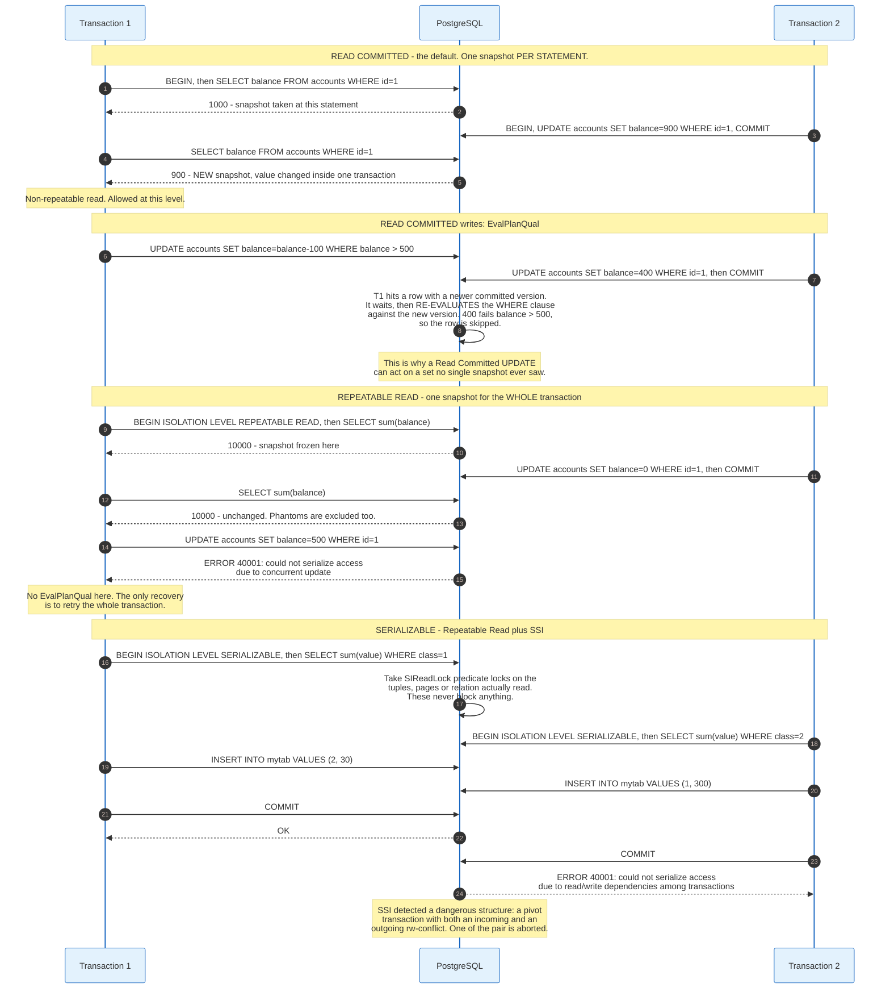

### 14.1 Table-Level Locks

Eight modes, acquired automatically by the statements that need them:

| Mode | Acquired by | Conflicts with |
|------|-------------|----------------|
| `ACCESS SHARE` | `SELECT` | `ACCESS EXCLUSIVE` |
| `ROW SHARE` | `SELECT FOR UPDATE/SHARE` | `EXCLUSIVE`, `ACCESS EXCLUSIVE` |
| `ROW EXCLUSIVE` | `INSERT`, `UPDATE`, `DELETE`, `MERGE` | `SHARE` and stronger |
| `SHARE UPDATE EXCLUSIVE` | `VACUUM`, `ANALYZE`, `CREATE INDEX CONCURRENTLY` | itself and stronger |
| `SHARE` | `CREATE INDEX` without `CONCURRENTLY` | `ROW EXCLUSIVE` and most others |
| `SHARE ROW EXCLUSIVE` | `CREATE TRIGGER`, some `ALTER TABLE` | `ROW EXCLUSIVE` and stronger |
| `EXCLUSIVE` | `REFRESH MATERIALIZED VIEW CONCURRENTLY` | everything except `ACCESS SHARE` |
| `ACCESS EXCLUSIVE` | `DROP TABLE`, `TRUNCATE`, `REINDEX`, `CLUSTER`, `VACUUM FULL` | everything |

Only `ACCESS EXCLUSIVE` blocks a plain `SELECT`. That fact is the whole reason `ALTER TABLE ... ADD COLUMN ... DEFAULT` was rewritten in PostgreSQL 11 to avoid a table rewrite: the lock itself is brief, but a lock **request** queues behind existing readers and every subsequent reader queues behind the request. A one-second `ALTER TABLE` behind a five-minute report stalls the whole table for five minutes.

The safe pattern is `SET lock_timeout = '2s'` before DDL, then retry. Fail fast rather than build a queue.

### 14.2 Row-Level Locks

Four modes, stored in `t_xmax` plus infomask bits rather than in any lock table, so there is no per-row memory cost and no lock escalation:

| Mode | Blocks |
|------|--------|
| `FOR KEY SHARE` | `DELETE` and key-changing `UPDATE` |
| `FOR SHARE` | plus non-key `UPDATE` |
| `FOR NO KEY UPDATE` | plus `FOR SHARE` |
| `FOR UPDATE` | everything including `FOR KEY SHARE` |

`FOR KEY SHARE` is what a foreign key check takes, and it is the reason inserting a child row does not block an update to the parent's non-key columns. When several transactions hold row locks on the same tuple simultaneously, `t_xmax` becomes a MultiXactId as described in Section 5.5.

Deadlock detection is not continuous. A backend that waits longer than `deadlock_timeout`, **1 second**, runs the detector, which builds a wait-for graph and aborts one transaction with SQLSTATE `40P01`. Lowering `deadlock_timeout` finds deadlocks faster and burns CPU on every ordinary lock wait.

The lock table is sized at startup as `max_locks_per_transaction x (max_connections + max_prepared_transactions)`, with `max_locks_per_transaction` defaulting to **64**. A query touching a partitioned table with 2000 partitions takes at least 2000 locks, which is why partition-heavy schemas need this raised.

### 14.3 The Four Isolation Levels

PostgreSQL implements three distinct behaviours. `READ UNCOMMITTED` is accepted and behaves exactly as `READ COMMITTED`, because there is no mechanism by which a snapshot could expose uncommitted data.

| Level | Dirty read | Non-repeatable read | Phantom read | Serialization anomaly |
|-------|-----------|---------------------|--------------|-----------------------|
| Read Uncommitted | not possible | possible | possible | possible |
| Read Committed | not possible | possible | possible | possible |
| Repeatable Read | not possible | not possible | not possible in PostgreSQL | possible |
| Serializable | not possible | not possible | not possible | not possible |

**Read Committed**, the default, takes a **new snapshot per statement**. Two identical `SELECT`s in one transaction can return different answers.

Its write behaviour is subtler and worth stating precisely. When an `UPDATE` finds a row already modified by a concurrent transaction, it waits for that transaction, then re-evaluates the `WHERE` clause against the **new** version. This is EvalPlanQual. The consequence is that a Read Committed `UPDATE` can act on a set of rows that no single snapshot ever contained: `UPDATE t SET n = n + 1 WHERE n > 500` may skip a row whose concurrent update dropped it to 400.

**Repeatable Read** takes one snapshot for the whole transaction. It is snapshot isolation, and PostgreSQL's implementation excludes phantom reads, which the SQL standard permits it to allow. There is no EvalPlanQual: an attempt to update a row modified since the snapshot fails immediately with SQLSTATE `40001`, `could not serialize access due to concurrent update`. The only recovery is to retry the entire transaction.

Repeatable Read still permits **write skew**. Two transactions each read a set, each verify a constraint holds, and each write a row that individually preserves the constraint while jointly breaking it. The canonical case is an on-call roster where two doctors each check that someone else is on duty and both go off duty.

**Serializable** closes that with Serializable Snapshot Isolation, the design published by Ports and Grittner and shipped in PostgreSQL 9.1.

### 14.4 How SSI Works

SSI adds predicate locks, visible in `pg_locks` with `mode = SIReadLock`, that record what a transaction **read**. They block nothing and cannot deadlock. They exist purely so the system can detect when a write would have changed a previous read's result.

The theory says a serialization anomaly requires a specific structure: a transaction with both an inbound and an outbound read-write conflict, called a dangerous structure. When PostgreSQL detects one, it aborts one of the participants with SQLSTATE `40001` and the message `could not serialize access due to read/write dependencies among transactions`.

Three practical consequences follow:

1. **Every serializable transaction needs a retry loop.** Not as a defensive measure. As the contract.
2. **Predicate lock granularity drives the false-positive rate.** A sequential scan takes a single relation-level predicate lock, so one scanning plan conflicts with every concurrent writer to the table, where a seeking plan would have conflicted only with writers to the tuples it read. `max_pred_locks_per_transaction` is 64, `max_pred_locks_per_page` is 2, and `max_pred_locks_per_relation` is -2, meaning `max_pred_locks_per_transaction / 2`. Exceeding either promotes locks to a coarser granularity.
3. **`SERIALIZABLE READ ONLY DEFERRABLE` never aborts.** It blocks at start until a provably anomaly-free snapshot is available, then runs to completion. It is the only case where Serializable blocks and Repeatable Read does not, and it is the right level for a long reporting query that must see a consistent state.

---

## 15. Streaming Replication

Physical replication ships WAL bytes and replays them, which makes the standby a block-for-block copy of the primary. It cannot replicate a subset, cannot cross major versions, and cannot cross architectures. What it can do is guarantee that the standby is byte-identical, which is exactly what a failover target needs.

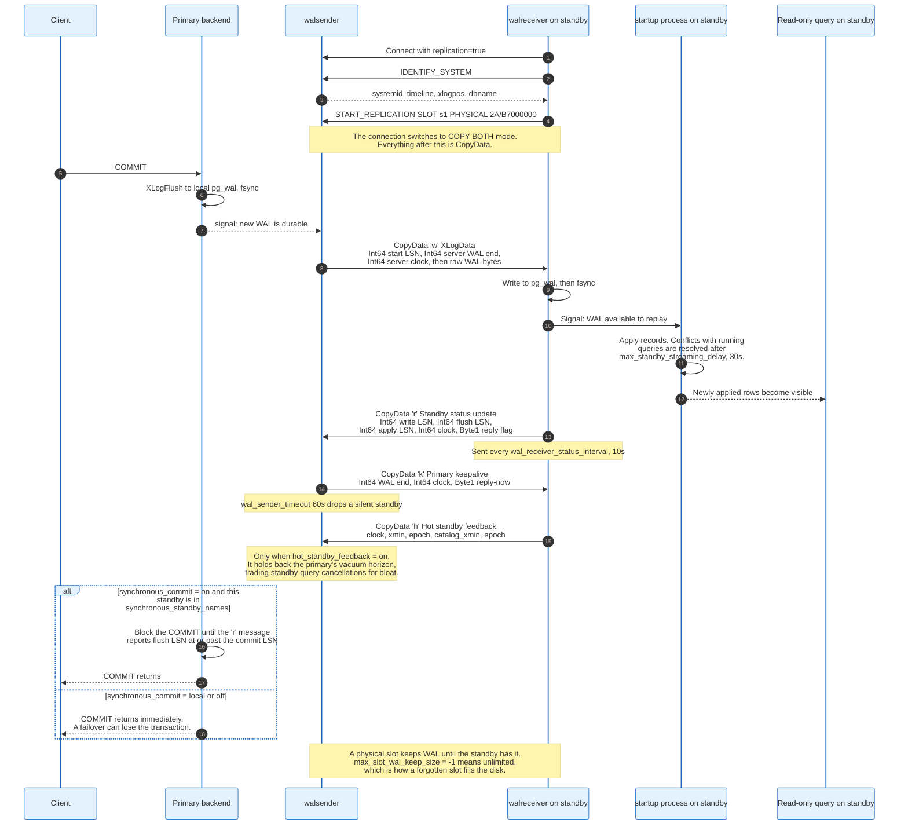

### 15.1 The Protocol

A walreceiver connects with `replication=true` in the startup packet, runs `IDENTIFY_SYSTEM` to learn the system identifier, timeline, and current WAL position, then issues `START_REPLICATION SLOT <name> PHYSICAL <lsn>`. The connection switches to COPY BOTH mode and everything after that is `CopyData` with a one-byte type tag.

**Server to client:**

```
'w'  XLogData
     Int64  starting point of the WAL data in this message
     Int64  current end of WAL on the server
     Int64  server clock, microseconds since 2000-01-01
     ByteN  raw WAL bytes

'k'  Primary keepalive
     Int64  current end of WAL on the server
     Int64  server clock
     Byte1  1 = reply as soon as possible
```

**Client to server:**

```
'r'  Standby status update
     Int64  last WAL byte + 1 received and written to disk
     Int64  last WAL byte + 1 flushed to disk
     Int64  last WAL byte + 1 applied
     Int64  client clock
     Byte1  1 = request an immediate reply

'h'  Hot standby feedback
     Int64  client clock
     Int32  standby's global xmin
     Int32  epoch of that xmin
     Int32  lowest catalog_xmin among the standby's slots
     Int32  epoch of that catalog_xmin
```

A single WAL record is never split across two `'w'` messages, though a record that crosses a WAL page boundary can be split at that boundary. The standby sends `'r'` every `wal_receiver_status_interval`, 10 seconds, and the primary drops a silent standby after `wal_sender_timeout`, 60 seconds.

### 15.2 The Three Lags

`pg_stat_replication` exposes `write_lag`, `flush_lag`, and `replay_lag`, and they answer different questions. `write_lag` measures the network and the standby's write path. `flush_lag` adds the standby's fsync. `replay_lag` adds the startup process actually applying the records, and it is the only one that affects what a query on the standby can see.

`replay_lag` growing while `flush_lag` stays flat means the standby is receiving fine and replaying slowly, almost always because replay is single-threaded and the primary's write workload is parallel.

### 15.3 The Two Settings That Cause Incidents

**Replication slots.** A slot guarantees the primary keeps WAL until the standby has consumed it, which removes the whole class of "standby fell too far behind and needs a rebuild" failures. It replaces the same problem with a worse one: `max_slot_wal_keep_size` defaults to **-1**, meaning unlimited, so a standby that is switched off leaves a slot that retains WAL until `pg_wal` fills the filesystem and the primary shuts down. Set it. Monitor `pg_replication_slots.active` and the `safe_wal_size` column.

**`hot_standby_feedback`.** Off by default. When on, the standby sends its oldest snapshot `xmin` back to the primary, and the primary's `VACUUM` refuses to remove anything that standby might still need. This eliminates the `canceling statement due to conflict with recovery` error, SQLSTATE `40001`, that otherwise kills long standby queries after `max_standby_streaming_delay`, 30 seconds.

The trade is exact: standby query cancellations become primary table bloat. A three-hour analytics query on a standby with feedback on holds the primary's vacuum horizon for three hours.

### 15.4 Synchronous Replication

`synchronous_standby_names` names the standbys that a synchronous commit must wait for, and the syntax carries a quorum:

```
synchronous_standby_names = 'ANY 2 (s1, s2, s3)'    -- any two of three
synchronous_standby_names = 'FIRST 1 (s1, s2)'      -- s1 preferred, s2 as fallback
```

With `ANY 2 (s1, s2, s3)` and `synchronous_commit = on`, a commit waits for two of the three to report a flush LSN at or past the commit LSN. If two go down, every commit on the primary blocks. Synchronous replication protects durability by trading availability, and that trade is not configurable away.

---

## 16. Logical Replication and Decoding

Logical replication reconstructs row-level changes from the physical WAL and ships them as `INSERT`, `UPDATE`, and `DELETE` operations, which lets it cross major versions, cross architectures, replicate a subset of tables, and write into a target that already has other data. It is the mechanism behind near-zero-downtime major version upgrades.

```mermaid
%%{init: {'theme': 'base', 'themeVariables': {'primaryColor': '#e3f2fd', 'primaryBorderColor': '#1565c0', 'lineColor': '#37474f'}}}%%

flowchart TB
    subgraph PUB["Publisher - wal_level must be logical"]
        direction TB
        WAL["pg_wal<br/>physical records: 'set byte 47 of page 42'"]
        RB["Reassembly: ReorderBuffer<br/>WAL is interleaved across transactions.<br/>Buffer per XID until COMMIT is seen,<br/>then replay in commit order.<br/>Spills to disk above<br/>logical_decoding_work_mem, 64MB."]
        DEC["Decoding plugin<br/>pgoutput is built in.<br/>wal2json, decoderbufs and others<br/>use the same output plugin API."]
        SLOT["Replication slot<br/>holds restart_lsn and catalog_xmin.<br/>The slot is what stops VACUUM from<br/>removing catalog rows the decoder<br/>still needs - and what fills your disk<br/>if the subscriber goes away."]
        WAL --> RB --> DEC
        SLOT -.-> WAL
        SLOT -.-> DEC
    end

    subgraph WIRE["pgoutput message stream over COPY BOTH"]
        direction TB
        W1["'B' Begin: final LSN, commit timestamp, XID"]
        W2["'R' Relation: OID, namespace, name,<br/>replica identity, column list.<br/>Sent once, then cached by the subscriber."]
        W3["'I' Insert: relation OID, 'N', TupleData"]
        W4["'U' Update: relation OID,<br/>optional 'K' key or 'O' old tuple, 'N' new tuple"]
        W5["'D' Delete: relation OID, 'K' or 'O' tuple"]
        W6["'T' Truncate, 'Y' Type, 'M' Message, 'O' Origin"]
        W7["'S'/'E'/'c'/'A' Stream start, stop, commit, abort<br/>protocol v2, PostgreSQL 14:<br/>send in-progress transactions before COMMIT"]
        W8["'b'/'P'/'K'/'r' two-phase commit<br/>protocol v3, PostgreSQL 15"]
        W1 --> W2 --> W3 --> W4 --> W5 --> W6 --> W7 --> W8
    end

    subgraph SUB["Subscriber"]
        direction TB
        AW["Apply worker: one per subscription.<br/>Executes INSERT, UPDATE, DELETE<br/>as ordinary SQL-level operations.<br/>Fires row triggers only if the table is<br/>ENABLE ALWAYS TRIGGER."]
        TS["Table sync workers<br/>max_sync_workers_per_subscription, 2.<br/>COPY the initial snapshot, then catch up."]
        PA["Parallel apply workers<br/>PostgreSQL 16,<br/>max_parallel_apply_workers_per_subscription, 2"]
        RI["Replica identity decides what a<br/>DELETE or UPDATE can match on:<br/>DEFAULT = primary key,<br/>FULL = the whole old row,<br/>NOTHING = these operations fail."]
        AW --> RI
        TS --> AW
        PA --> AW
    end

    LIMITS["What logical replication does NOT carry:<br/>DDL, large objects, and - before PostgreSQL 19 -<br/>sequence values. Every one of those is a manual step."]

    PUB --> WIRE --> SUB
    SUB --> LIMITS

    style PUB fill:#e3f2fd,stroke:#1565c0,stroke-width:2px
    style WIRE fill:#fff3e0,stroke:#e65100,stroke-width:3px
    style SUB fill:#e8f5e9,stroke:#2e7d32,stroke-width:2px
    style LIMITS fill:#ffebee,stroke:#c62828,stroke-width:2px
```

### 16.1 Decoding

WAL records say "set these bytes at this offset on this page". Turning that back into "the row with id 4711 changed its balance" requires three things.

**`wal_level = logical`.** This adds enough information to WAL to identify rows and to track catalog changes. It costs additional WAL volume on every write.

**Reassembly.** WAL is interleaved across concurrent transactions. The `ReorderBuffer` accumulates changes per transaction ID and replays them only when it sees the commit record, so the output stream is in commit order. It spills to disk above `logical_decoding_work_mem`, 64MB per slot. Since PostgreSQL 14, protocol version 2 can stream in-progress transactions before commit, which bounds the memory a single huge transaction can consume.

**A time-travelling catalog snapshot.** To decode a tuple the decoder needs the table definition **as of the moment that tuple was written**, not as of now. This is what a logical slot's `catalog_xmin` protects: it stops `VACUUM` from removing the catalog rows the decoder will need.

The output plugin API turns the reassembled stream into bytes. `pgoutput` is built in and is what native logical replication uses; `wal2json` and `decoderbufs` are the common external ones.

### 16.2 The pgoutput Wire Format

Each message carries a one-byte type tag:

| Tag | Message | Key fields |
|-----|---------|-----------|
| `B` | Begin | final LSN, commit timestamp, XID |
| `C` | Commit | flags, commit LSN, end LSN, timestamp |
| `R` | Relation | OID, namespace, name, replica identity, column list |
| `Y` | Type | OID, namespace, name |
| `I` | Insert | relation OID, `N`, tuple data |
| `U` | Update | relation OID, optional `K` key or `O` old tuple, `N` new tuple |
| `D` | Delete | relation OID, `K` or `O` tuple |
| `T` | Truncate | relation count, options, OIDs |
| `O` | Origin | LSN, origin name |
| `M` | Message | flags, LSN, prefix, content |
| `S` `E` `c` `A` | Stream start, stop, commit, abort | protocol v2, PostgreSQL 14 |
| `b` `P` `K` `r` `p` | Begin prepare, Prepare, Commit prepared, Rollback prepared, Stream prepare | protocol v3, PostgreSQL 15 |

Column values are tagged individually: `n` for null, `u` for an **unchanged TOASTed value**, `t` for text format, `b` for binary. That `u` tag is a frequent source of surprise in change-data-capture pipelines. A row whose 2MB `jsonb` column was not modified sends `u` rather than the value, and a consumer that assumes it will always receive full row images silently loses data unless the table is set to `REPLICA IDENTITY FULL`.

`Relation` messages are sent once and cached by the subscriber, which is why a schema change on the publisher requires care.

### 16.3 Replica Identity

`REPLICA IDENTITY` determines what the publisher can send to identify an old row for `UPDATE` and `DELETE`:

| Setting | Sends | Consequence |
|---------|-------|-------------|
| `DEFAULT` | Primary key columns | `UPDATE`/`DELETE` on a table with no primary key **fails** |
| `USING INDEX i` | Columns of a unique, non-partial, non-deferrable index on `NOT NULL` columns | Alternative when there is no primary key |
| `FULL` | The entire old row | Works everywhere; before PostgreSQL 16 it forced a sequential scan per changed row on the subscriber |
| `NOTHING` | Nothing | `UPDATE` and `DELETE` fail |

`REPLICA IDENTITY FULL` is the usual emergency fix. Before PostgreSQL 16 it was also the usual performance disaster, because the subscriber had no index to match on and scanned the whole table for every changed row. PostgreSQL 16 lets the apply worker use a suitable btree index instead, so the cost is now a bad index lookup rather than a full scan. It remains the slowest replica identity, and it still ships every column of every old row across the wire.

### 16.4 What It Does Not Replicate

Logical replication carries table data and nothing else. **DDL is not replicated.** Adding a column on the publisher and not on the subscriber breaks the subscription. **Large objects are not replicated.** **Sequence values are not replicated** through PostgreSQL 18, which means a failover to a logical replica hands out duplicate keys unless every sequence is manually advanced. PostgreSQL 19 adds sequence replication and closes that gap.

PostgreSQL 17 added `pg_createsubscriber`, which converts an existing physical standby into a logical subscriber in place, avoiding the initial `COPY` of the entire dataset. That turned a multi-day operation on a large database into a short one, and it is the current standard approach to a major version upgrade with minimal downtime.

---

## 17. Connection Handling and Pooling

One connection is one operating system process, and that single design decision makes a connection pooler a required component rather than an optimisation. `max_connections` defaults to 100 for a reason.

```mermaid
%%{init: {'theme': 'base', 'themeVariables': {'primaryColor': '#e3f2fd', 'primaryBorderColor': '#1565c0', 'lineColor': '#37474f'}}}%%

flowchart TB
    subgraph NOPOOL["Without a pooler"]
        direction TB
        N1["5,000 application threads"]
        N2["5,000 TCP connections"]
        N3["5,000 forked backend processes"]
        N4["Each costs about 7.6 MiB of true<br/>overhead with huge_pages off,<br/>about 1.3 MiB with huge_pages on.<br/>Measured by Andres Freund, 2020."]
        N5["Worse: every backend appears in ProcArray.<br/>Snapshot building, lock table scans and<br/>the clock sweep all get more expensive<br/>with connection count, whether or not<br/>the connections are doing anything."]
        N1 --> N2 --> N3 --> N4 --> N5
    end

    subgraph POOL["With PgBouncer in transaction mode"]
        direction TB
        P1["5,000 client connections<br/>max_client_conn, default 100,<br/>routinely raised to tens of thousands"]
        P2["PgBouncer: single-threaded event loop,<br/>roughly 2 kB of memory per idle client.<br/>so_reuseport lets several processes<br/>share the listen socket."]
        P3["default_pool_size, default 20,<br/>server connections per<br/>database+user pair"]
        P4["20 backend processes doing the work"]
        P1 --> P2 --> P3 --> P4
    end

    subgraph MODES["The three pool modes and what each costs you"]
        direction TB
        M1["session - server released when the<br/>client disconnects. Safe for everything.<br/>Saves only the fork cost."]
        M2["transaction - server released at COMMIT.<br/>The mode everyone actually wants.<br/>Breaks: session-level SET, LISTEN/NOTIFY,<br/>WITH HOLD cursors, advisory session locks,<br/>plain server-side prepared statements.<br/>max_prepared_statements, default 200,<br/>works around the last one."]
        M3["statement - server released after<br/>each statement. Multi-statement<br/>transactions are rejected outright."]
        M1 --> M2 --> M3
    end

    SIZING["Sizing rule that survives contact with production:<br/>pool size near 2 to 4 times the core count,<br/>plus enough for concurrent disk waits.<br/>A 16-core box rarely benefits above 40 to 60<br/>active backends. Beyond that, throughput<br/>falls while latency rises."]

    NOPOOL --> POOL --> MODES --> SIZING

    style NOPOOL fill:#ffebee,stroke:#c62828,stroke-width:2px
    style POOL fill:#e8f5e9,stroke:#2e7d32,stroke-width:3px
    style MODES fill:#fff3e0,stroke:#e65100,stroke-width:2px
    style SIZING fill:#fce4ec,stroke:#880e4f,stroke-width:2px
```

### 17.1 What a Connection Actually Costs

The startup sequence is: TCP accept, `fork()`, optional TLS handshake, authentication, then loading the relevant catalog rows into the new backend's private caches. Establishing a connection costs on the order of a millisecond of CPU plus the TLS round trips, which is why applications that open a connection per HTTP request spend more time connecting than querying.

The steady-state cost is smaller than folklore says and still real. Andres Freund's 2020 measurements put an idle backend at about **16 MiB RSS** but only **2.1 MiB** of `Pss_Anon`, with the honest overhead, counting anonymous proportional set size plus page table entries, at about **7.6 MiB** with `huge_pages=off` and about **1.3 MiB** with `huge_pages=on`. Turning on huge pages cuts per-connection page table overhead by roughly a factor of fifty, from 6.5 MiB of `VmPTE` to 0.13 MiB.

Memory is not the binding constraint. The binding constraint is that snapshot construction scans `ProcArray`, that lock table operations scan more entries, and that the clock sweep has more competitors, all as a function of connection count rather than of query rate.

The practical ceiling for **active** backends sits near two to four times the core count plus an allowance for concurrent disk waits. A 16-core machine rarely improves past 40 to 60 active backends, and past that point throughput falls while latency rises.

### 17.2 PgBouncer

PgBouncer is a single-threaded event loop that presents itself as a PostgreSQL server and multiplexes many client connections onto few server connections. Version 1.25.2 is current as of May 2026.

| Setting | Default | Meaning |
|---------|---------|---------|
| `pool_mode` | `session` | session, transaction, or statement |
| `max_client_conn` | 100 | Total client connections accepted |
| `default_pool_size` | 20 | Server connections per database and user pair |
| `min_pool_size` | 0 | Warm connections kept open |
| `reserve_pool_size` | 0 | Extra connections for overload |
| `server_lifetime` | 3600s | Recycle a server connection after this |
| `server_idle_timeout` | 600s | Close idle server connections |
| `query_wait_timeout` | 120s | Give up waiting for a server connection |
| `max_prepared_statements` | 200 | Protocol-level prepared statements tracked per pool |
| `so_reuseport` | 0 | Run several processes sharing one listen socket |

The three pool modes trade safety against benefit:

**`session`** returns a server connection when the client disconnects. Everything works. It saves only the fork cost, so it barely helps.

**`transaction`** returns the server connection at `COMMIT`. This is the mode that actually multiplexes, and it breaks every session-scoped feature: session-level `SET`, `LISTEN`/`NOTIFY`, `WITH HOLD` cursors, advisory session locks, temporary tables, and plain server-side prepared statements. PgBouncer's `max_prepared_statements` tracks protocol-level prepared statements per pool and works around the last one, which is what made transaction mode usable from JDBC and asyncpg.

**`statement`** returns the server connection after each statement and rejects multi-statement transactions outright. It exists for sharding proxies.

### 17.3 The Alternatives

| Pooler | Model | Notable property |
|--------|-------|------------------|
| PgBouncer | Single-threaded C, `so_reuseport` for multiple processes | The default. Smallest per-client footprint |
| Odyssey | Multi-threaded C, built at Yandex | Scales across cores in one process |
| pgcat | Rust, multi-threaded | Adds load balancing, read/write splitting, sharding |
| Supavisor | Elixir, distributed | Built for multi-tenant clouds, scales horizontally |
| RDS Proxy / Cloud SQL connectors | Managed | IAM integration, failover-aware |
| Application-side pools | HikariCP, `pgxpool`, SQLAlchemy | Per-process. Multiply by instance count before sizing |

The mistake that recurs is stacking them without arithmetic. Fifty application pods, each with a HikariCP pool of 20, is 1000 server connections regardless of what PgBouncer sits in the middle. The number that matters is the product, not any single pool's size.

### 17.4 The Built-In Pooler Question

PostgreSQL has no built-in connection pooler and, as of PostgreSQL 19 beta, still does not. Proposals to add one have been discussed for over a decade and have not been committed. What has landed instead is a steady reduction in per-connection cost: shared-memory statistics in PostgreSQL 15 removed a per-backend statistics file, snapshot scalability work reduced `ProcArray` contention, and PostgreSQL 19 adds `reserved_connections` refinements and SNI-based certificate selection through `pg_hosts.conf`.

The architecture has not changed. Plan for a pooler.

---

## 18. One UPDATE, End to End

This section carries a single statement through every mechanism above, with real byte counts. The schema is deliberately fixed-width so the arithmetic is exact.

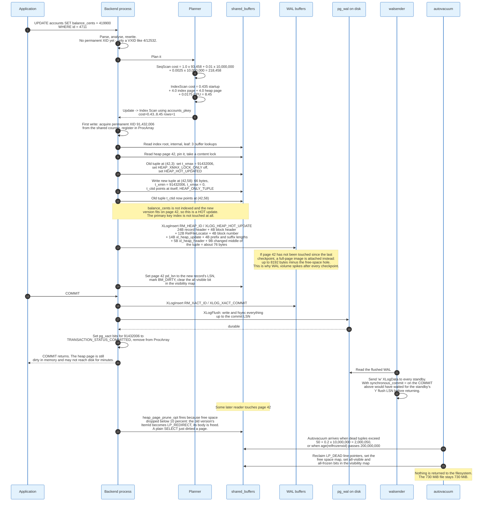

### 18.1 The Table

```sql
CREATE TABLE accounts (
    id            bigint      NOT NULL,
    balance_cents bigint      NOT NULL,
    updated_at    timestamptz NOT NULL,
    owner         text        NOT NULL
);
ALTER TABLE accounts ADD PRIMARY KEY (id);
-- 10,000,000 rows, owner averaging 17 characters
```

### 18.2 Row and Table Size

Laying out one tuple:

| Offset | Content | Bytes |
|--------|---------|-------|
| 0 | `HeapTupleHeaderData` | 23 |
| 23 | Padding to MAXALIGN, no null bitmap because every column is `NOT NULL` | 1 |
| 24 | `id`, bigint | 8 |
| 32 | `balance_cents`, bigint | 8 |
| 40 | `updated_at`, timestamptz | 8 |
| 48 | `owner`, 17 characters with a 1-byte short varlena header | 18 |
| | **Total** | **66** |

Rounded to MAXALIGN that is 72 bytes, plus a 4-byte line pointer, so 76 bytes of page consumed per row. Rows per page:

```
24 + 107 x 4 + 107 x 72 = 24 + 428 + 7704 = 8156 <= 8192   fits
24 + 108 x 4 + 108 x 72 = 24 + 432 + 7776 = 8232 >  8192   does not
```

**107 rows per page.** Ten million rows need `ceil(10,000,000 / 107)` = **93,458 pages** = 765,607,936 bytes = **730 MiB**.

The primary key index: an `IndexTupleData` header is 8 bytes plus an 8-byte `bigint` is 16, plus a 4-byte line pointer is 20 bytes per entry. Usable leaf space is `8192 - 24 - 16` = 8152 bytes, at the default B-tree `fillfactor` of 90 that is about 7337 bytes, giving **366 entries per leaf**. Ten million entries need about **27,323 leaf pages**, plus roughly 69 internal pages and a root, so about **214 MiB** with a tree height of 2 levels above the leaves.

### 18.3 The Statement

```sql
UPDATE accounts SET balance_cents = 419900 WHERE id = 4711;
```

**Parse and plan.** No permanent XID is assigned yet; the transaction holds only a virtual ID such as `4/12532`. The planner prices both options:

```
Seq Scan  : 1.0 x 93,458 + 0.01 x 10,000,000 + 0.0025 x 10,000,000  = 218,458
Index Scan: 0.435 + 4.0 + 4.0 + 0.0175                              =       8.45
```

It picks the index scan by a factor of about 25,800.

**Acquire an XID.** The first write pulls the next value from the shared counter, say 91,432,006, and registers it in `ProcArray`. Every concurrent snapshot taken after this point includes it in `xip`.

**Read the pages.** Three buffer lookups descend the index: root, internal, leaf. One more reads heap page 42, pins it, and takes an exclusive content lock.

**Write the tuple versions.** The old tuple at `(42,3)` gets `t_xmax = 91432006` and `HEAP_HOT_UPDATED`. A new 66-byte tuple is written at `(42,58)` with `t_xmin = 91432006`, `t_xmax = 0`, `t_ctid` pointing at itself, and `HEAP_ONLY_TUPLE`. The old tuple's `t_ctid` is repointed at `(42,58)`.

`balance_cents` is not indexed and the new version fits on page 42, so this is a HOT update. **The primary key index is not touched at all.**

**Write WAL.** The record is `RM_HEAP_ID` / `XLOG_HEAP_HOT_UPDATE`:

```
XLogRecord header                              24 bytes
XLogRecordBlockHeader                           4 bytes
RelFileLocator                                 12 bytes
BlockNumber                                     4 bytes
xl_heap_update                                 14 bytes
prefix and suffix lengths, 2 bytes each         4 bytes
xl_heap_header                                  5 bytes
null-bitmap padding plus the changed middle     9 bytes
                                             ----------
                                              ~76 bytes
```

The tuple contributes 9 bytes, not 42, because `log_heap_update` strips what did not change. `id` is unchanged, so the first 8 bytes of the 42-byte data area are a common prefix. `updated_at` and `owner` are unchanged, so the last 26 bytes are a common suffix. What is left is the 8 bytes of `balance_cents` plus the 1 byte of MAXALIGN padding between the 23-byte header and `t_hoff`. The two loops compare bytes rather than columns, so any high-order zero bytes the old and new balances share are stripped as well, which makes 9 a ceiling rather than an exact count.

If page 42 has not been modified since the last checkpoint, a full-page image is attached instead and the record becomes up to 8192 bytes minus the free-space hole. That is the mechanism behind the WAL volume spike that follows every checkpoint.

**Mark the page.** `pd_lsn` is set to the new record's LSN, `BM_DIRTY` is set, and the all-visible bit for page 42 is cleared in the visibility map.

**Commit.** An `XLOG_XACT_COMMIT` record is written, `XLogFlush` writes and fsyncs everything up to the commit LSN, the `pg_xact` bits for XID 91,432,006 are set to `TRANSACTION_STATUS_COMMITTED`, and the XID leaves `ProcArray`. The client gets its acknowledgement. The heap page is still dirty in memory and may not reach disk for minutes.

**Replicate.** The walsender reads the flushed WAL and sends a `'w'` message. Under `synchronous_commit = on`, the commit above would have blocked until a standby's `'r'` message reported a flush LSN at or past the commit LSN.

**Prune.** Some later reader touches page 42. If free space has dropped under 10%, `heap_page_prune_opt` converts the old version's line pointer to `LP_REDIRECT` and frees its body. A plain `SELECT` just wrote to a page and generated WAL.

**Vacuum.** Autovacuum arrives when dead tuples exceed `50 + 0.2 x 10,000,000` = 2,000,050, or when `age(relfrozenxid)` passes 200,000,000. It reclaims `LP_DEAD` line pointers, updates the free space map, and sets the all-visible and all-frozen bits.

The file is still 730 MiB. Nothing is returned to the filesystem.

---

## 19. Economics: What Postgres Costs to Run

The software costs nothing and the operation costs everything, which is the opposite shape from the commercial databases PostgreSQL displaces. Understanding where the money goes requires knowing which internal mechanism generates the bill.

### 19.1 The License

PostgreSQL ships under the PostgreSQL License, an OSI-approved permissive licence close to BSD and MIT. There is no per-core fee, no per-socket fee, no audit clause, and no restriction on embedding or reselling.

The comparison is stark. Oracle Database Enterprise Edition lists at **$47,500 per processor** on the Oracle Technology Global Price List effective 16 April 2026, plus 22% of licence cost per year in support, and options such as Partitioning, RAC, and Diagnostics Pack are priced separately on top. Microsoft SQL Server 2025 Enterprise, generally available since November 2025, lists at **$15,123 per two-core pack**, the same figure as SQL Server 2022, so a 32-core server is 16 packs and $241,968 before Software Assurance.

A 32-core PostgreSQL server costs $0 in licences. That number is why the migration wave exists.

### 19.2 Where the Money Actually Goes

Four internal mechanisms map directly onto cloud line items:

**Write amplification drives storage IOPS.** Every logical write produces a heap write, a WAL write, and, on the first touch of a page after each checkpoint, a full-page image of up to 8kB. Section 8.3 sizes the third term: 100,000 randomly updated pages produce about 800MB of full-page images for a logical change set of a few megabytes. Amplification is set by how many distinct pages a workload touches per checkpoint interval, not by the byte volume it writes. On Aurora Standard at **$0.20 per million I/O requests**, that page count is the whole bill.

**Bloat drives storage volume and backup cost.** A table that should be 730 MiB and is 2 GiB because autovacuum cannot keep up costs 2.8 times as much in storage, in snapshot storage, in backup egress, and in every replica. 2048 MiB divided by 730 MiB is 2.8.

**Connection count drives instance size.** Section 17 puts the practical ceiling near two to four times the core count. A team without a pooler buys cores to hold idle processes.

**Replica count multiplies everything.** Each streaming replica is a full copy: full storage, full instance, full write replay. Read scaling in PostgreSQL costs one full database per unit of read capacity.

### 19.3 What Vendors Charge

| Model | Priced on | Example, August 2026 |
|-------|-----------|----------------------|
| Self-hosted | Hardware plus staff | No licence cost, full operational burden |
| Amazon RDS for PostgreSQL | Instance hours plus provisioned storage plus IOPS | `db.m6g.large`, 2 vCPU and 8GB, $0.159 per hour on demand, so $116 per month single-AZ and $232 multi-AZ in us-east-1, before storage and IOPS |
| Amazon Aurora PostgreSQL, Standard | Instance hours plus $0.10 per GB-month plus $0.20 per million I/O | I/O-dominated workloads become unpredictable |
| Amazon Aurora, I/O-Optimized | Instance hours plus $0.225 per GB-month, no I/O charge | Cheaper once I/O exceeds roughly 25% of the bill |
| Google Cloud SQL, Azure Database | vCPU, memory, and storage, billed separately | Similar shape to RDS |
| Neon, Supabase, and similar | Compute-seconds plus storage, with scale-to-zero | Storage and compute are decoupled, so idle costs approach zero |

The structural point is that Aurora's I/O pricing charges for exactly the write amplification described above, and that is why the I/O-Optimized tier exists. A PostgreSQL workload with frequent checkpoints and poor page locality pays for its full-page images twice: once in latency and once on the invoice.

### 19.4 The Real Cost Centre

Total cost of ownership on PostgreSQL is dominated by expertise, not by infrastructure. The mechanisms in this document, vacuum tuning, checkpoint tuning, connection pooling, statistics management, and replication topology, are all operator responsibilities that a commercial licence would partly buy for you. Managed services convert that expertise into a monthly fee.

Free software. Expensive operators.

---

## 20. Security, Risk, and Governance

PostgreSQL has no company behind it, which changes both the security process and the compliance story. Understanding who ships fixes and what the engine does not encrypt matters more than any single CVE.

### 20.1 Governance

The PostgreSQL Global Development Group is a volunteer project with a small core team, a larger committer group, and a development cycle organised around commitfests: fixed windows in which submitted patches are reviewed. One major version ships per year, historically in September or October, and each is supported for five years.

There is no commercial owner, no dual licence, and no relicensing risk. The commercial ecosystem, EDB, Crunchy Data, Percona, Cybertec, and the cloud providers, sells support and extensions around an unowned core.

### 20.2 Authentication and Authorisation

| Mechanism | Status in PostgreSQL 18 |
|-----------|-------------------------|
| `scram-sha-256` | Available since PostgreSQL 10, the `password_encryption` default since PostgreSQL 14 |
| `md5` | Deprecated. `CREATE ROLE`/`ALTER ROLE` warn; `md5_password_warnings` controls it. Removal announced for a future major version |
| `cert` | TLS client certificates |
| `gss` / `sspi` | Kerberos and Windows integrated auth |
| `ldap` / `pam` | Delegated to an external directory |
| `oauth` | New in PostgreSQL 18. Requires `--with-libcurl` and `oauth_validator_libraries` |
| `radius` | Removed in PostgreSQL 19 |

Authorisation is role-based, with `GRANT` at database, schema, table, column, and row level. Row-level security, added in PostgreSQL 9.5, attaches policies that the rewriter injects into every query on the table, which makes multi-tenant isolation enforceable in the engine rather than in the application.

### 20.3 What PostgreSQL Does Not Encrypt

Core PostgreSQL has **no transparent data encryption**. Data files, WAL, and temporary files are written in cleartext. Multiple TDE patch series have been proposed and none is committed as of PostgreSQL 19 beta. Encryption at rest in practice means filesystem or block-device encryption, or a fork such as EDB Advanced Server or Cybertec's variant.

Three consequences for compliance work:

1. **A `DELETE` does not erase anything.** The tuple stays on the page until `VACUUM` removes it, and the page keeps the bytes until they are overwritten. A GDPR erasure request satisfied by `DELETE` leaves the data readable in the file.
2. **WAL retains the old data.** A full-page image written after a checkpoint contains the pre-deletion page. Archived WAL and base backups keep it for as long as the retention policy says.
3. **Column-level encryption is an extension.** `pgcrypto` provides it, and the key management is entirely the application's problem, including the fact that a key passed as a SQL literal lands in `pg_stat_statements` and the server log.

`pgaudit` provides the session and object audit logging that most frameworks require, and it is an extension rather than a core feature.

### 20.4 The Threat Model

**SQL injection is still the top application-level risk**, and the engine's defence is parameterised queries through the extended protocol, where the statement and its parameters travel in separate messages. String interpolation defeats it regardless of the database.

**Extensions run as native code inside the server process.** An extension installed by a superuser can do anything the postgres OS user can do. `trusted` extensions, added in PostgreSQL 13, let non-superusers install a vetted subset. The rest require a superuser and a decision.

**Superuser is absolute.** A superuser can read every file the server user can read and, through `COPY ... FROM PROGRAM` or an untrusted procedural language, execute commands. `pg_read_all_data`, `pg_write_all_data`, `pg_monitor` and the other predefined roles exist so that day-to-day access does not need it.

**The listening socket should not face the internet.** `listen_addresses` defaults to `localhost` precisely so that a fresh cluster is not reachable, and the number of incidents involving PostgreSQL instances exposed on 5432 with weak passwords suggests this default is frequently overridden without thought.

### 20.5 Vulnerabilities in Practice

The August 2026 coordinated release, PostgreSQL 18.6, 17.11, 16.15, 15.19, and 14.24 on 13 August, fixed **28 security vulnerabilities** and more than 110 bugs. That was an unusually large batch, and its shape is informative: most of the high-severity entries are type-confusion and buffer-overflow paths reachable by a database user with the ability to create objects or call particular functions, in extensions such as `pgcrypto`, `intarray`, `pg_trgm`, `fuzzystrmatch`, `pltcl`, and `plperl`, rather than pre-authentication remote holes.

The 2025 set had a different theme. `CVE-2025-8715` and `CVE-2025-8714`, both CVSS 8.8, exploited `pg_dump`: a crafted object name containing a newline could inject `psql` meta-commands that execute at restore time as the client operating system account, and achieve SQL injection as superuser on the restore target. `pg_dumpall`, `pg_restore`, and `pg_upgrade` were all affected. `CVE-2025-1094`, CVSS 8.1, involved quoting APIs failing to neutralise syntax after a failed encoding validation.

The pattern across both years is consistent. The attacker is usually an authenticated user or a hostile source database, not an anonymous internet client, and the entry point is often an extension or a client tool rather than the core server. Minor upgrades are the mitigation, and they require only a binary swap and a restart.

---

## 21. Comparisons and Alternatives

PostgreSQL's design decisions are legible only against the alternatives, and the sharpest contrasts are with MySQL's InnoDB, Oracle, and the storage-disaggregated clouds.

### 21.1 Storage Organisation

| Property | PostgreSQL | InnoDB | Oracle | SQL Server |
|----------|-----------|--------|--------|------------|
| Table organisation | Heap | Clustered index on the primary key | Heap by default, IOT available | Clustered index by default |
| Secondary index points to | Physical TID | The primary key value | ROWID | Clustered key or RID |
| Primary key lookup | Index descent plus a heap fetch | Index descent, row is in the leaf | Index descent plus a ROWID fetch | Index descent, row is in the leaf |
| Secondary index lookup | One descent plus a heap fetch | Two descents | One descent plus a ROWID fetch | Two descents |
| Cost of moving a row | Update the affected indexes | Free, key unchanged | Free, ROWID stable | Free |

InnoDB wins the primary key lookup and loses every secondary index lookup, because the secondary index stores the primary key and must then descend the clustered index. PostgreSQL pays a heap fetch on every lookup and gets the visibility map and index-only scans back in exchange.

### 21.2 MVCC Implementation

| Property | PostgreSQL | InnoDB and Oracle |
|----------|-----------|-------------------|
| Old versions live | In the table | In an undo log or rollback segment |
| Reading an old version | Read a different tuple in the same page or table | Reconstruct it by applying undo records backwards |
| `ROLLBACK` cost | O(1): two bits in `pg_xact` | O(size of the transaction): apply every undo record |
| Crash recovery | Redo only | Redo then undo |
| Garbage collection | `VACUUM` scans the table and every index | Purge threads trim the undo log |
| Long transaction hurts by | Blocking `VACUUM`, causing table and index bloat | Growing the undo log, causing `ORA-01555 snapshot too old` |
| Index entries for old versions | Present until `VACUUM` removes them | Not present; the index holds one entry per key |

Neither is better. They fail differently. PostgreSQL turns a long-running transaction into unbounded table bloat. Oracle turns it into an aborted query. PostgreSQL makes rollback free and `VACUUM` expensive. InnoDB makes rollback expensive and reads slower on hot rows.

### 21.3 The Disaggregated Clouds

| System | What it changes | What it keeps |
|--------|-----------------|---------------|
| Amazon Aurora PostgreSQL | Replaces the storage layer. The engine ships redo records to a six-way replicated distributed store instead of writing pages, so full-page writes disappear | The PostgreSQL query engine and SQL surface |
| Neon | Separates compute from a page-server storage layer built on WAL. Adds branching and scale-to-zero | Core PostgreSQL, run as compute nodes |
| Google AlloyDB | Adds a columnar engine and an offloaded storage layer | PostgreSQL compatibility |
| CockroachDB, Yugabyte | Reimplement the engine on a distributed key-value store with Raft | The PostgreSQL wire protocol and much of the SQL dialect |
| Citus | Shards tables across PostgreSQL nodes as an extension | Everything, because it is an extension |

The first three keep the planner, the executor, the type system, and the extension ecosystem, and replace the layer below the buffer manager. The fourth keeps the wire protocol and almost nothing else, which is why moving to it is a migration and not an upgrade.

### 21.4 When Not to Use PostgreSQL

Honesty about the boundaries makes the rest of the document credible:

- **Petabyte analytical scans.** Row storage plus 8kB pages is the wrong shape. ClickHouse, BigQuery, Snowflake, and DuckDB win by a wide margin.
- **Write throughput beyond a single node.** PostgreSQL scales reads with replicas and writes with one primary. Beyond that you need Citus, sharding in the application, or a different system.
- **Sub-millisecond key-value lookups at very high rates.** The process-per-connection model and the parse-plan-execute path cost more than Redis or a purpose-built store.
- **Workloads that need synchronous multi-region writes.** Physical replication across regions makes `synchronous_commit = on` cost a round trip per commit. Spanner and CockroachDB are designed for it.

---

## 22. Modern Developments

The last four major releases changed PostgreSQL's I/O path, its vacuum machinery, and its upgrade story more than the decade before them did.

### 22.1 PostgreSQL 18, September 2025

**Asynchronous I/O** is the headline. Before 18 a backend issued one read and blocked. `io_method` now accepts `sync`, `worker`, and `io_uring`, with `worker` as the cross-platform default and `io_uring` available on modern Linux kernels. `io_combine_limit` and `io_max_combine_limit`, both 128kB, control how much adjacent I/O is merged into one request. Sequential scans, bitmap heap scans, and `VACUUM` all benefit, and the project reports up to 3x improvement on I/O-bound scans. `pg_aios` exposes in-flight operations, and `effective_io_concurrency` and `maintenance_io_concurrency` were both raised to **16**.

**B-tree skip scan** removes the leftmost-column restriction for equality prefixes. An index on `(a, b)` now serves `WHERE b = 7` by iterating the distinct values of `a`, which retires a large class of redundant indexes.

**Eager freezing** lets ordinary vacuums freeze all-visible pages speculatively, governed by `vacuum_max_eager_freeze_failure_rate` at 0.03, spreading anti-wraparound work across time.

**`pg_upgrade` preserves optimizer statistics**, which removes the mandatory post-upgrade `ANALYZE` and the hours of bad plans that came with it. `--no-statistics` opts out.

**Data checksums are on by default** in `initdb`. `--no-data-checksums` opts out, and `pg_upgrade` requires the two clusters to match.

Also in 18: `uuidv7()` for time-ordered UUIDs that do not scatter B-tree inserts, virtual generated columns as the new default for `GENERATED ALWAYS AS`, OAuth 2.0 authentication, `NOT NULL` constraints stored in `pg_constraint` so they can be named and marked `NOT VALID`, temporal `PRIMARY KEY ... WITHOUT OVERLAPS`, and `RETURNING` with `OLD` and `NEW` aliases.

### 22.2 PostgreSQL 17, September 2024

The vacuum TidStore rewrite replaced a flat dead-TID array with an adaptive radix tree, cutting memory use by up to 20x and removing the 1GB cap that made `maintenance_work_mem` above 1GB pointless. Incremental backup arrived, built on the `walsummarizer` process and `pg_basebackup --incremental`. `pg_createsubscriber` converts a physical standby into a logical subscriber in place. Failover slots, driven by `sync_replication_slots`, keep logical slots usable after a promotion. SLRU caches became individually configurable, addressing a long-standing contention point on `pg_subtrans` and `pg_multixact`.

### 22.3 PostgreSQL 19, Beta as of August 2026

PostgreSQL 19 Beta 1 shipped 4 June 2026, Beta 3 on 13 August 2026, with general availability expected in September or October 2026. The changes that matter for this document:

- **Parallel autovacuum**, configured through `autovacuum_max_parallel_workers`, plus a scoring system that prioritises which tables to vacuum first.
- **`REPACK`**, with a non-blocking `CONCURRENTLY` option, bringing `pg_repack`'s capability into core so a bloated table can be rebuilt without an `ACCESS EXCLUSIVE` lock.
- **Online data checksums**, enabled or disabled without a restart or a reinitialisation.
- **Sequence replication** in logical replication, closing the gap that made logical failover unsafe.
- **`CREATE PUBLICATION ... EXCEPT`** and `CREATE SUBSCRIPTION ... SERVER`, plus logical replication enabled without a restart at `wal_level = replica`.
- **Eager aggregation** and broader incremental sort in the planner, up to 2x faster inserts when foreign key checks are present, and parallel sequential scan improvements.
- **JIT disabled by default**, and `default_toast_compression` changed to `lz4`.
- **`pg_stat_lock` and `pg_stat_recovery`** views, `started_by` and `mode` columns on the vacuum and analyze progress views, and an `IO` option for `EXPLAIN ANALYZE` that surfaces asynchronous I/O statistics.
- **`pg_hosts.conf`** for SNI-based TLS certificate selection, and RADIUS authentication removed.

### 22.4 The Direction

Three trends are visible across these releases. The I/O path is being rebuilt around asynchronous, batched operations, which is the single largest remaining performance gap against systems designed for NVMe. Vacuum is being made incremental, parallel, and cheaper rather than being replaced, which signals that heap-plus-MVCC is not going away. And the upgrade path is being smoothed, through statistics preservation, `pg_createsubscriber`, and failover slots, because a five-year support window means every production cluster upgrades several times.

Nothing on the roadmap replaces the 32-bit transaction ID in core. `FullTransactionId` and `xid8` cover the API surface, forks such as Postgres Pro Enterprise widen the on-disk field, and mainline PostgreSQL continues to manage wraparound rather than eliminate it.

---

## 23. Appendix

### 23.1 Diagram Index

| Diagram | Source | Description |
|---------|--------|-------------|
| Process architecture | [`diagrams/process-architecture.mmd`](diagrams/process-architecture.mmd) | Postmaster, backends, auxiliary processes, shared memory |
| Memory layout | [`diagrams/memory-layout.mmd`](diagrams/memory-layout.mmd) | Shared versus backend-local memory and their defaults |
| Heap page layout | [`diagrams/heap-page-layout.mmd`](diagrams/heap-page-layout.mmd) | Page header, line pointers, tuples, and derived limits |
| TOAST decision | [`diagrams/toast-decision.mmd`](diagrams/toast-decision.mmd) | The three toaster passes and the chunk table |
| MVCC visibility | [`diagrams/mvcc-visibility.mmd`](diagrams/mvcc-visibility.mmd) | The cross-transaction `HeapTupleSatisfiesMVCC` path; the same-transaction cmin/cmax branch is in Section 5.4 |
| HOT chain | [`diagrams/hot-chain.mmd`](diagrams/hot-chain.mmd) | Heap-only tuples, redirect line pointers, and pruning |
| Transaction ID wraparound | [`diagrams/xid-wraparound.mmd`](diagrams/xid-wraparound.mmd) | The circular XID space and every freeze threshold |
| Vacuum phases | [`diagrams/vacuum-phases.mmd`](diagrams/vacuum-phases.mmd) | Trigger conditions and the three-phase loop |
| WAL record layout | [`diagrams/wal-record-layout.mmd`](diagrams/wal-record-layout.mmd) | Segment, page header, record header, block references |
| Checkpoint and recovery | [`diagrams/checkpoint-recovery.mmd`](diagrams/checkpoint-recovery.mmd) | Steady state, checkpoint, crash, redo-only recovery |
| B-tree structure | [`diagrams/btree-structure.mmd`](diagrams/btree-structure.mmd) | High keys, right links, and the modern additions |
| Index type decision | [`diagrams/index-type-decision.mmd`](diagrams/index-type-decision.mmd) | Choosing between the six access methods |
| Planner pipeline | [`diagrams/planner-pipeline.mmd`](diagrams/planner-pipeline.mmd) | Parse, rewrite, plan, execute, with the cost constants |
| Join strategies | [`diagrams/join-strategies.mmd`](diagrams/join-strategies.mmd) | Nested loop, hash join, merge join, and when each wins |
| Isolation levels | [`diagrams/isolation-levels.mmd`](diagrams/isolation-levels.mmd) | Read Committed, Repeatable Read, and SSI side by side |
| Streaming replication | [`diagrams/streaming-replication.mmd`](diagrams/streaming-replication.mmd) | The `'w'`, `'k'`, `'r'`, `'h'` message exchange |
| Logical replication | [`diagrams/logical-replication.mmd`](diagrams/logical-replication.mmd) | Decoding, the pgoutput wire format, apply workers |
| Connection pooling | [`diagrams/connection-pooling.mmd`](diagrams/connection-pooling.mmd) | Cost with and without a pooler, and the three modes |
| One UPDATE, end to end | [`diagrams/update-end-to-end.mmd`](diagrams/update-end-to-end.mmd) | The worked example with real byte counts |

### 23.2 Key Terminology

| Term | Meaning |
|------|---------|
| **Access method** | A pluggable implementation of an index or table, registered in `pg_am` |
| **Backend** | The OS process serving one client connection |
| **BLCKSZ** | Page size, 8192 bytes by default, set at compile time |
| **Bloat** | Space occupied by dead tuples and unused line pointers that `VACUUM` has not reclaimed |
| **Buffer pin** | A reference count preventing a shared buffer from being evicted |
| **CLOG / pg_xact** | The commit log: two bits of status per transaction ID |
| **Combo CID** | A backend-local mapping from one `t_cid` value to a `(cmin, cmax)` pair |
| **Clock sweep** | The buffer replacement algorithm, an approximate LRU with a usage count capped at 5 |
| **Freezing** | Marking a tuple visible to all snapshots forever by setting `HEAP_XMIN_FROZEN` |
| **FSM** | Free space map, one byte per heap page at 32-byte granularity, in a three-level tree |
| **Fillfactor** | Percentage of a page filled on insert, reserving the rest for future versions |
| **Full-page image** | A whole page copied into WAL on its first modification after a checkpoint |
| **HOT** | Heap-Only Tuple: a new row version with no index entry, on the same page as its predecessor |
| **Hint bit** | A cached commit status written into a tuple header on first visibility check |
| **Line pointer / ItemId** | A 4-byte page slot holding a tuple's offset, length, and state |
| **LSN** | Log Sequence Number, a 64-bit byte offset in the WAL, printed as `hex/hex` |
| **MAXALIGN** | Alignment to the platform's maximum, 8 bytes on 64-bit systems |
| **MultiXactId** | An identifier for a set of transactions jointly holding row locks, stored in `t_xmax` |
| **MVCC** | Multi-Version Concurrency Control: readers see a snapshot, writers add versions |
| **Predicate lock / SIReadLock** | A non-blocking record of what a serializable transaction read |
| **Pruning** | Opportunistic in-page cleanup of dead HOT chain members, triggered even by `SELECT` |
| **Relfilenode** | The on-disk file name for a relation fork, distinct from its OID after a rewrite |
| **Replication slot** | Server-side state guaranteeing WAL retention for a consumer |
| **Replica identity** | What a publisher sends to identify an old row in logical replication |
| **Resource manager (rmgr)** | The subsystem that interprets a WAL record's payload |
| **SLRU** | Simple LRU: the paged caches for `pg_xact`, `pg_subtrans`, `pg_multixact`, `pg_serial` |
| **Snapshot** | `xmin`, `xmax`, and the in-progress XID array that define what a statement can see |
| **SSI** | Serializable Snapshot Isolation, PostgreSQL's implementation of true serializability |
| **TID / ctid** | Tuple identifier: `(block number, item offset)` |
| **TOAST** | Out-of-line and compressed storage for values that do not fit on a page |
| **Tuple** | One physical row version |
| **Visibility map** | Two bits per heap page: all-visible and all-frozen |
| **VXID** | Virtual transaction ID, `backendID/localXID`, held until the first write |
| **WAL** | Write-Ahead Log |
| **Wraparound** | The point where the 32-bit XID counter would overtake unfrozen tuples |

### 23.3 Reference Tables

**Structure sizes on an 8kB page**

| Structure | Size | Source |
|-----------|------|--------|
| `PageHeaderData` | 24 bytes | `bufpage.h` |
| `ItemIdData` | 4 bytes | `itemid.h` |
| `HeapTupleHeaderData` | 23 bytes, MAXALIGNed to 24 | `htup_details.h` |
| `BTPageOpaqueData` | 16 bytes | `nbtree.h` |
| `XLogRecord` | 24 bytes | `xlogrecord.h` |
| `XLogPageHeaderData` | 24 bytes | `xlog_internal.h` |
| `XLogLongPageHeaderData` | 40 bytes | `xlog_internal.h` |
| `XLogRecordBlockHeader` | 4 bytes | `xlogrecord.h` |
| `XLogRecordBlockImageHeader` | 5 bytes | `xlogrecord.h` |
| `xl_heap_update` | 14 bytes | `heapam_xlog.h` |
| `xl_heap_header` | 5 bytes | `heapam_xlog.h` |
| `varatt_external` | 16 bytes, 18 with the 2-byte varlena header and tag | `varatt.h` |
| `BufferDesc` | Padded to 64 bytes | `buf_internals.h` |

**Derived limits**

| Limit | Value |
|-------|-------|
| `MaxHeapTuplesPerPage` | 291 |
| `MaxHeapTupleSize` | 8160 bytes |
| `MaxHeapAttributeNumber` | 1600 columns |
| `MaxTupleAttributeNumber` | 1664 columns |
| `TOAST_TUPLE_THRESHOLD` | 2032 bytes |
| `TOAST_MAX_CHUNK_SIZE` | 1996 bytes |
| `TOAST_INDEX_TARGET` | 510 bytes |
| `BTMaxItemSize` | 2704 bytes |
| `CLOG_XACTS_PER_PAGE` | 32,768 transactions |
| Visibility map pages per page | 32,672 heap blocks, about 255 MiB |
| Relation segment size | 1 GB |
| Maximum varlena value | 1 GB |
| `BM_MAX_USAGE_COUNT` | 5 |
| `XLR_MAX_BLOCK_ID` | 32 block references per WAL record |

**Settings most often wrong out of the box**

| Setting | Default | Typical production value |
|---------|---------|--------------------------|
| `shared_buffers` | 128MB | 25% of RAM |
| `effective_cache_size` | 4GB | 50% to 75% of RAM |
| `random_page_cost` | 4.0 | 1.1 on NVMe |
| `work_mem` | 4MB | Sized from RAM divided by expected concurrent nodes |
| `max_wal_size` | 1GB | 8GB to 64GB on write-heavy systems |
| `checkpoint_timeout` | 5min | 15min to 30min |
| `autovacuum_vacuum_scale_factor` | 0.2 | 0.01 to 0.05 on large hot tables |
| `autovacuum_max_workers` | 3 | 5 to 10 with a raised `vacuum_cost_limit` |
| `max_slot_wal_keep_size` | -1, unlimited | A bounded size |
| `idle_in_transaction_session_timeout` | 0, disabled | 1min to 15min |
| `huge_pages` | try | on, with the OS configured |
| `default_statistics_target` | 100 | 100, raised per column instead |

**Diagnostic queries**

```sql
-- Wraparound headroom, per database
SELECT datname, age(datfrozenxid) AS xid_age,
       2147483647 - age(datfrozenxid) AS xids_remaining
FROM pg_database ORDER BY xid_age DESC;

-- What is holding back the vacuum horizon
SELECT pid, state, backend_xmin, now() - xact_start AS duration, query
FROM pg_stat_activity WHERE backend_xmin IS NOT NULL
ORDER BY age(backend_xmin) DESC;

-- Slots retaining WAL
SELECT slot_name, active, wal_status, safe_wal_size,
       pg_size_pretty(pg_current_wal_lsn() - restart_lsn) AS retained
FROM pg_replication_slots;

-- Dead tuples and vacuum history
SELECT relname, n_live_tup, n_dead_tup, n_mod_since_analyze,
       last_autovacuum, last_autoanalyze
FROM pg_stat_user_tables ORDER BY n_dead_tup DESC LIMIT 20;

-- Replication lag, in bytes and in time
SELECT application_name, state, sync_state,
       pg_wal_lsn_diff(sent_lsn, replay_lsn) AS replay_bytes,
       write_lag, flush_lag, replay_lag
FROM pg_stat_replication;

-- Index usage, to find the ones nobody reads
SELECT relname, indexrelname, idx_scan,
       pg_size_pretty(pg_relation_size(indexrelid)) AS size
FROM pg_stat_user_indexes WHERE idx_scan < 50 ORDER BY 4 DESC;
```

### 23.4 Primary Sources

- PostgreSQL 18 documentation: [Database Physical Storage](https://www.postgresql.org/docs/18/storage.html), [Routine Vacuuming](https://www.postgresql.org/docs/18/routine-vacuuming.html), [Transaction Isolation](https://www.postgresql.org/docs/18/transaction-iso.html), [How the Planner Uses Statistics](https://www.postgresql.org/docs/18/planner-stats-details.html), [Streaming Replication Protocol](https://www.postgresql.org/docs/18/protocol-replication.html), [Logical Replication Message Formats](https://www.postgresql.org/docs/18/protocol-logicalrep-message-formats.html)
- Source READMEs: `src/backend/access/nbtree/README`, `src/backend/access/heap/README.HOT`, `src/backend/access/hash/README`, `src/backend/storage/buffer/README`
- Source headers: `htup_details.h`, `bufpage.h`, `xlogrecord.h`, `xlog_internal.h`, `heapam_xlog.h`, `heaptoast.h`, `nbtree.h`, `buf_internals.h`, `selfuncs.h`, `snapshot.h`, `costsize.c`
- Dan R. K. Ports and Kevin Grittner, "Serializable Snapshot Isolation in PostgreSQL", VLDB 2012
- Philip Lehman and S. Bing Yao, "Efficient Locking for Concurrent Operations on B-Trees", ACM TODS, 1981
- L. F. Mackert and G. M. Lohman, "Index Scans Using a Finite LRU Buffer", 1989
- Margo Seltzer and Ozan Yigit, "A New Hashing Package for UNIX", Winter USENIX, January 1991
- Andres Freund, ["Measuring the Memory Overhead of a Postgres Connection"](https://blog.anarazel.de/2020/10/07/measuring-the-memory-overhead-of-a-postgres-connection/), 2020
- [PostgreSQL Security Information](https://www.postgresql.org/support/security/) and the [Versioning Policy](https://www.postgresql.org/support/versioning/)
- [PgBouncer configuration reference](https://www.pgbouncer.org/config.html)

---

## 24. Key Takeaways

**Every write is cheap because its cost is deferred, and `VACUUM` pays it.** An `UPDATE` writes a new tuple. A `ROLLBACK` writes two bits. Nothing is reclaimed at the time. Tuning PostgreSQL is almost always tuning that deferral.

**`VACUUM` does two unrelated jobs and only one of them is about space.** Removing dead tuples and freezing old transaction IDs are separate. A table can be spotless on the first and one week from an outage on the second.

**Wraparound is a horizon problem, not a speed problem.** A long-running transaction, an abandoned replication slot, an orphaned prepared transaction, or `hot_standby_feedback` from a slow standby will pin the horizon no matter how fast autovacuum runs.

**The planner has no rules, only arithmetic.** Seven cost constants and one row estimate per node decide everything. A bad plan is a bad estimate roughly every time, and `random_page_cost = 4.0` on NVMe is the most commonly wrong constant in production.

**`work_mem` is per node, per worker.** Four sorts and two hash joins across three processes is 96MB by default, not 4MB.

**A connection is a process.** Roughly 7.6 MiB of true overhead with `huge_pages=off`, about 1.3 MiB with it on, and a cost to snapshot building and lock scanning that grows whether the connection is busy or idle. A pooler is a component, not an optimisation.

**An index-only scan is only as good as the visibility map.** Any write to a page clears the all-visible bit, and the scan silently falls back to visiting the heap.

**Full-page writes are why WAL volume spikes after every checkpoint.** Shortening `checkpoint_timeout` makes that worse. `wal_compression` and a longer interval make it better.

**Read Committed re-evaluates the `WHERE` clause after a concurrent update.** A Read Committed `UPDATE` can therefore operate on a row set that no single snapshot ever contained. Repeatable Read raises SQLSTATE `40001` instead, and every serializable transaction needs a retry loop as part of its contract, not as a defensive measure.

**Logical replication carries table data and nothing else.** No DDL, no large objects, and no sequence values before PostgreSQL 19. Unchanged TOASTed columns arrive as a `u` tag rather than a value.

**Column order changes table size.** Declaring wide-to-narrow avoids alignment padding, and 14% off a four-column table costs nothing to obtain.

**PostgreSQL 18 rebuilt the I/O path and PostgreSQL 19 rebuilds vacuum.** Asynchronous I/O, skip scan, eager freezing, and statistics-preserving upgrades landed in 2025; parallel autovacuum, `REPACK CONCURRENTLY`, online checksums, and sequence replication arrive in late 2026. Heap-plus-MVCC is being made cheaper, not replaced.
