# Redis Internals: Complete Technical Deep Dive

---

## Table of Contents

1. [History and Overview](#1-history-and-overview)
2. [What Redis Is Under the Hood, and What It Is Not](#2-what-redis-is-under-the-hood-and-what-it-is-not)
3. [The Event Loop and the Threading Model](#3-the-event-loop-and-the-threading-model)
4. [The Object System and Its Encodings](#4-the-object-system-and-its-encodings)
5. [The Core Data Structures and Their Complexity](#5-the-core-data-structures-and-their-complexity)
6. [The Keyspace: Dictionaries, Rehashing, and SCAN](#6-the-keyspace-dictionaries-rehashing-and-scan)
7. [Expiration: Lazy and Active](#7-expiration-lazy-and-active)
8. [Eviction: maxmemory and the Approximated Policies](#8-eviction-maxmemory-and-the-approximated-policies)
9. [RDB Snapshots](#9-rdb-snapshots)
10. [The Append-Only File and Its Rewrite](#10-the-append-only-file-and-its-rewrite)
11. [Fork, Copy-on-Write, and the Memory Spike](#11-fork-copy-on-write-and-the-memory-spike)
12. [Replication and PSYNC](#12-replication-and-psync)
13. [Redis Sentinel](#13-redis-sentinel)
14. [Redis Cluster: Hash Slots and Resharding](#14-redis-cluster-hash-slots-and-resharding)
15. [The RESP Wire Protocol](#15-the-resp-wire-protocol)
16. [Pipelining, Transactions, and Scripting](#16-pipelining-transactions-and-scripting)
17. [Memory Fragmentation and jemalloc](#17-memory-fragmentation-and-jemalloc)
18. [One SET, End to End](#18-one-set-end-to-end)
19. [Economics: What Redis Costs to Run](#19-economics-what-redis-costs-to-run)
20. [Security and Risk](#20-security-and-risk)
21. [Licensing, and the Fork to Valkey](#21-licensing-and-the-fork-to-valkey)
22. [Comparisons and Alternatives](#22-comparisons-and-alternatives)
23. [Modern Developments](#23-modern-developments)
24. [Appendix](#24-appendix)
25. [Key Takeaways](#25-key-takeaways)

---

## 1. History and Overview

Redis is a 2009 side project whose central design decision, one thread touching the data, has never been reversed, and almost everything else in this document is a consequence of it. Salvatore Sanfilippo, known as antirez, built it to make LLOOGG, a real-time web analytics product, stop hammering MySQL. The requirement was a fast list of recent page views per site. The answer was a server that kept the list in memory and appended to it in constant time.

The single-threaded choice was not a compromise. It was the feature. No locks, no latches, no transaction manager, no lost-update anomaly, and a command that either happened or did not. Everything Redis gained in the fifteen years since had to be built without breaking that.

### 1.1 The Version Timeline, and What Each One Bought

Each mechanism in this document has a version stamp. Knowing it tells you what a given production instance can and cannot do.

| Version | Released | Mechanism introduced |
|---------|----------|----------------------|
| 1.0 | 2009 | Strings, lists, sets, RDB snapshots |
| 2.0 | 3 Sep 2010 | Hashes, `MULTI`/`EXEC`, pub/sub, RESP2 as the standard |
| 2.4 | 14 Oct 2011 | Background I/O threads (`bio`) for deferred `close` and `fsync` |
| 2.6 | 22 Oct 2012 | Lua scripting, millisecond TTLs, `BITCOUNT` |
| 2.8 | 22 Nov 2013 | `PSYNC` with partial resynchronisation, `SCAN`, keyspace notifications, Sentinel 2 |
| 3.0 | 1 Apr 2015 | Redis Cluster, 16384 hash slots, `MOVED` and `ASK` |
| 3.2 | 6 May 2016 | Geo commands, `BITFIELD`, optional script effects replication |
| 4.0 | 14 Jul 2017 | Modules API, `PSYNC2`, LFU eviction, `UNLINK` and lazy free, mixed RDB-AOF |
| 5.0 | 17 Oct 2018 | Streams, effects replication by default, `ZPOPMIN`, `replica` terminology |
| 6.0 | 30 Apr 2020 | ACLs, RESP3, TLS, first I/O threads, client-side caching, diskless replica load |
| 6.2 | 22 Feb 2021 | `GETDEL`, `COPY`, `SMISMEMBER`, `RESET`, client eviction groundwork |
| 7.0 | 27 Apr 2022 | Redis Functions, multi-part AOF, listpack for hashes and sorted sets, sharded pub/sub, command introspection |
| 7.2 | 15 Aug 2023 | Listpack encoding for sets, `WAITAOF`, improved cluster observability |
| 7.4 | 29 Jul 2024 | Hash field expiration (`HEXPIRE` and family). First release under RSALv2 and SSPLv1 |
| 8.0 | 2 May 2025 | New per-thread I/O threading, dual-channel replication, AGPLv3 added, query engine and JSON and time series and vector sets folded into the core |
| 8.2 | 4 Aug 2025 | Further command-level performance work |
| 8.4 | 18 Nov 2025 | `SET` with `IFEQ`/`IFNE`, `DELEX` compare-and-delete, `CLUSTER MIGRATION` atomic slot migration |
| 8.6 | 10 Feb 2026 | `allkeys-lrm` and `volatile-lrm`, least-recently-modified eviction |
| 8.8 | 25 May 2026 | Continued engine work |
| 8.10 | 29 Jul 2026 | Compact hashes, the `BACKUP` command family built on multi-part AOF |

The current stable release as of 30 August 2026 is Redis 8.10.1, published 17 August 2026. Redis has shipped an even-numbered minor roughly every twelve weeks since 8.0, alongside patch streams for 6.2, 7.2, 7.4 and every 8.x line.

### 1.2 Ownership, and Why It Matters Technically

Redis changed owner four times, and the last change split the codebase.

VMware sponsored the project from 2010. Pivotal inherited it in 2013. Redis Labs took over sponsorship in 2015 and hired antirez. He stepped down as maintainer in June 2020, handing the project to Yossi Gottlieb and Oran Agra, and returned to the company at the end of 2024. Redis Labs renamed itself Redis Ltd in August 2021.

On 20 March 2024 Redis Ltd moved the core from BSD 3-Clause to a dual RSALv2 and SSPLv1 licence, effective from Redis 7.4. Within eight days the Linux Foundation announced Valkey, a fork of Redis 7.2.4 under BSD 3-Clause. Section 21 covers the mechanics. The engineering consequence is that from mid-2024 there are two codebases descended from the same commit, both still speaking the same wire protocol, and they have started to diverge on internals: replication, threading, and slot migration in particular.

### 1.3 Scale Today

Redis is not the biggest database by any measure except one: it is the one most often placed in front of the others. It is consistently ranked among the most-used databases in the annual Stack Overflow developer survey, and it was ranked sixth most used in the 2023 edition, the figure the Linux Foundation cited when announcing Valkey.

The numbers that describe a Redis deployment are throughput and latency, not storage. A single unpipelined Redis process on a modern core sustains on the order of 100,000 to 200,000 simple commands per second, with sub-millisecond p99 when nothing forks. Pipelining raises that by roughly a factor of ten. Redis Ltd measured up to 112% more throughput on a multi-core Intel CPU by setting `io-threads 8` in Redis 8.0. The Valkey project has demonstrated over 1 billion requests per second across a 2000-node cluster.

Those figures share one property. They all describe how fast a process can move bytes between a socket and a hash table.

---

## 2. What Redis Is Under the Hood, and What It Is Not

### 2.1 The Accurate Definition

Redis is a single-threaded C program that owns an array of hash tables, mutates them one command at a time, and writes an ordered log of those mutations to two places: a file and a socket.

Everything else is elaboration. The hash tables live in `db->keys`, one keyspace per numbered database, 16 by default. The values in those hash tables are tagged unions called `robj`, which point at one of about ten concrete data structures. The ordered log is the AOF buffer and the replication stream, which carry the same bytes. Persistence is a periodic dump of the hash tables. Replication is that dump plus the tail of the log. Cluster is a static partition of the key space with a gossip protocol bolted on.

One thread. Two tables per database. One log, two destinations.

### 2.2 What It Is Not

**Not a cache, structurally.** Redis is a database with an optional eviction policy, and the default policy is `noeviction`, which returns an error rather than dropping data. Treating it as a cache is a configuration choice, made by setting `maxmemory` and `maxmemory-policy`. A Redis instance running with the defaults and no `maxmemory` will grow until the kernel OOM killer intervenes. This is the single most common production failure in the ecosystem, and it happens because operators assume the cache semantics are built in.

**Not durable by default in the sense a relational database means it.** The default persistence is RDB snapshotting with the save points `3600 1 300 100 60 10000`, meaning a snapshot after one hour with one change, five minutes with 100 changes, or one minute with 10,000 changes. A power failure loses everything since the last snapshot. Turning on the AOF with `appendfsync everysec`, the recommended setting, bounds the loss to one second. `appendfsync always` fsyncs before replying, and is genuinely durable and genuinely slow.

**Not consistent under failover.** Replication is asynchronous. A write acknowledged by a primary that then fails can be lost, in standalone deployments, under Sentinel, and in Cluster alike. The cluster specification states this directly: the merge function is "last failover wins", and there is always a window in which acknowledged writes are lost. `WAIT numreplicas timeout` narrows the window by blocking until N replicas acknowledge an offset. It does not close it, because the replicas may all fail with the primary.

**Not single-threaded in the process sense.** A Redis 8.0 process with default settings runs the main thread plus three `bio` background threads. Turn on `io-threads` and it runs more. What stays single-threaded is the mutation of the keyspace, which is the only property users depend on.

**Not schema-free in the way the marketing suggests.** Every value has a type, every command checks it, and a mismatch returns `-WRONGTYPE Operation against a key holding the wrong kind of value`. The type is per key, checked at runtime rather than declared, but it is enforced.

**Not a document database that happens to store JSON.** Since Redis 8.0 the JSON type, the query engine, time series, five probabilistic structures, and vector sets ship in the core distribution rather than as separately versioned modules. They are still module code compiled in, with their own memory behaviour and their own commands. Nothing about the single-threaded core changed to accommodate them.

### 2.3 The Simplest Accurate Mental Model

Redis is `memcached` with a type system, a log, and a copy of itself somewhere else.

The type system is what turns a cache into a data structure server: `INCR` is atomic because one thread executes it, `ZADD` maintains an order because a skip list is maintained, and `LPUSH` plus `BRPOP` is a queue because a client can block on the list. The log is what makes the data survive a restart and reach a replica. The copy is what makes it survive a machine.

Take away the log and you have a cache. Take away the type system and you have memcached.

---

## 3. The Event Loop and the Threading Model

Redis is fast because it never blocks on a socket and never takes a lock, and both properties come from one 500-line file, `ae.c`.

### 3.1 The Loop

`aeMain` is the whole server. It repeats four steps forever: run `beforeSleep`, block in `aeApiPoll` until a file descriptor is ready or the nearest timer expires, run `afterSleep`, then dispatch the ready file events and any due time events.

The polling backend is selected at compile time in descending order of performance: `evport` on Solaris, `epoll` on Linux, `kqueue` on BSD and macOS, and `select` as the portable fallback. This is why the same source builds on every Unix without an abstraction layer at runtime.

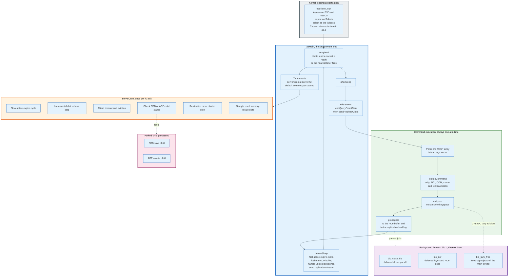
```mermaid
%%{init: {'theme': 'base', 'themeVariables': {'primaryColor': '#e3f2fd', 'primaryBorderColor': '#1565c0', 'lineColor': '#37474f'}}}%%

flowchart TB
    subgraph Sockets["Kernel readiness notification"]
        EP["epoll on Linux<br/>kqueue on BSD and macOS<br/>evport on Solaris<br/>select as the fallback<br/>Chosen at compile time in ae.c"]
    end

    subgraph Loop["aeMain, the single event loop"]
        direction TB
        BS["beforeSleep<br/>fast active-expire cycle,<br/>flush the AOF buffer,<br/>handle unblocked clients,<br/>send replication stream"]
        POLL["aeApiPoll<br/>blocks until a socket is ready<br/>or the nearest timer fires"]
        AS["afterSleep"]
        FE["File events<br/>readQueryFromClient<br/>then sendReplyToClient"]
        TE["Time events<br/>serverCron at server.hz,<br/>default 10 times per second"]
    end

    subgraph Exec["Command execution, always one at a time"]
        PARSE["Parse the RESP array<br/>into an argv vector"]
        LOOKUP["lookupCommand<br/>arity, ACL, OOM, cluster<br/>and replica checks"]
        CALL["call proc<br/>mutates the keyspace"]
        PROP["propagate<br/>to the AOF buffer and<br/>to the replication backlog"]
    end

    subgraph Cron["serverCron, once per hz tick"]
        C1["Slow active-expire cycle"]
        C2["Incremental dict rehash step"]
        C3["Client timeout and eviction"]
        C4["Check RDB or AOF child status"]
        C5["Replication cron, cluster cron"]
        C6["Sample used memory, resize dicts"]
    end

    subgraph Bio["Background threads, bio.c, three of them"]
        B1["bio_close_file<br/>deferred close syscall"]
        B2["bio_aof<br/>deferred fsync and AOF close"]
        B3["bio_lazy_free<br/>frees big objects off the main thread"]
    end

    subgraph Child["Forked child processes"]
        F1["RDB save child"]
        F2["AOF rewrite child"]
    end

    EP --> POLL
    BS --> POLL --> AS --> FE
    FE --> PARSE --> LOOKUP --> CALL --> PROP
    PROP --> BS
    POLL --> TE --> Cron
    C4 -.forks.-> Child
    PROP -.queues jobs.-> Bio
    CALL -.UNLINK, lazy eviction.-> B3

    style Sockets fill:#eceff1,stroke:#37474f,stroke-width:2px
    style Loop fill:#e3f2fd,stroke:#1565c0,stroke-width:3px
    style Exec fill:#e8f5e9,stroke:#2e7d32,stroke-width:2px
    style Cron fill:#fff3e0,stroke:#e65100,stroke-width:2px
    style Bio fill:#f3e5f5,stroke:#4a148c,stroke-width:2px
    style Child fill:#fce4ec,stroke:#880e4f,stroke-width:2px
```

`beforeSleep` is where a surprising amount of the server lives. It runs the fast active-expire cycle, flushes the AOF buffer with a single `write(2)`, handles clients unblocked by a `BLPOP` that another client satisfied, propagates the replication stream, and writes pending replies. Doing this immediately before blocking means the work is batched: one `write` syscall carries every reply produced in the last iteration.

Time events are handled by `serverCron`, which runs `server.hz` times per second, default 10. It runs the slow expire cycle, steps the incremental hash table rehash, closes timed-out clients, checks whether a fork child has exited, drives replication and cluster cron, and samples memory. `dynamic-hz yes`, the default, raises the effective frequency as the client count grows, so a busy server checks its housekeeping more often.

### 3.2 Where Threads Were Added, and Why Each Time

Threads arrived four times, and each time the rule was the same: threads may do anything except touch the keyspace.

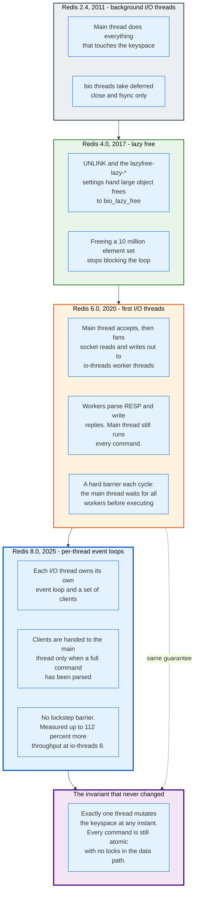
```mermaid
%%{init: {'theme': 'base', 'themeVariables': {'primaryColor': '#e3f2fd', 'primaryBorderColor': '#1565c0', 'lineColor': '#37474f'}}}%%

flowchart TB
    subgraph V24["Redis 2.4, 2011 - background I/O threads"]
        A1["Main thread does everything<br/>that touches the keyspace"]
        A2["bio threads take deferred<br/>close and fsync only"]
    end

    subgraph V40["Redis 4.0, 2017 - lazy free"]
        B1["UNLINK and the lazyfree-lazy-*<br/>settings hand large object frees<br/>to bio_lazy_free"]
        B2["Freeing a 10 million element set<br/>stops blocking the loop"]
    end

    subgraph V60["Redis 6.0, 2020 - first I/O threads"]
        C1["Main thread accepts, then fans<br/>socket reads and writes out to<br/>io-threads worker threads"]
        C2["Workers parse RESP and write<br/>replies. Main thread still runs<br/>every command."]
        C3["A hard barrier each cycle:<br/>the main thread waits for all<br/>workers before executing"]
    end

    subgraph V80["Redis 8.0, 2025 - per-thread event loops"]
        D1["Each I/O thread owns its own<br/>event loop and a set of clients"]
        D2["Clients are handed to the main<br/>thread only when a full command<br/>has been parsed"]
        D3["No lockstep barrier.<br/>Measured up to 112 percent more<br/>throughput at io-threads 8."]
    end

    subgraph Invariant["The invariant that never changed"]
        E1["Exactly one thread mutates<br/>the keyspace at any instant.<br/>Every command is still atomic<br/>with no locks in the data path."]
    end

    V24 --> V40 --> V60 --> V80
    V80 --> Invariant
    V60 -.same guarantee.-> Invariant

    style V24 fill:#eceff1,stroke:#37474f,stroke-width:2px
    style V40 fill:#e8f5e9,stroke:#2e7d32,stroke-width:2px
    style V60 fill:#fff3e0,stroke:#e65100,stroke-width:2px
    style V80 fill:#e3f2fd,stroke:#1565c0,stroke-width:3px
    style Invariant fill:#f3e5f5,stroke:#4a148c,stroke-width:3px
```

**Redis 2.4, 2011: `bio`.** Two syscalls block unpredictably, `close(2)` on a large file and `fsync(2)`, and both were moved to background threads. Redis 8.0 runs exactly three: `bio_close_file`, `bio_aof`, and `bio_lazy_free`. Jobs are queued as `BIO_CLOSE_FILE`, `BIO_AOF_FSYNC`, `BIO_CLOSE_AOF` and `BIO_LAZY_FREE`, dispatched to a fixed worker per job type, and completions are signalled back to the main thread through a pipe that wakes the event loop.

**Redis 4.0, 2017: lazy free.** Deleting a set with 10 million members means 10 million `free` calls, and that blocked the loop for seconds. `UNLINK` unlinks the key from the dictionary immediately and queues the object for `bio_lazy_free`. The `lazyfree-lazy-eviction`, `lazyfree-lazy-expire`, `lazyfree-lazy-server-del`, `lazyfree-lazy-user-del` and `lazyfree-lazy-user-flush` settings do the same for the implicit deletes, and all default to `no`. Turning them on is close to free and is the single cheapest latency fix available on a large instance.

**Redis 6.0, 2020: `io-threads`.** Profiling showed that a Redis process at saturation spends most of its time in `read(2)`, `write(2)` and RESP parsing, not in the data structures. The first threading design had the main thread accept connections and then fan socket reads and writes out to worker threads, with a barrier each cycle: workers parse, main thread executes everything, workers write replies. Correct, and limited by the barrier.

**Redis 8.0, 2025: per-thread event loops.** The rewrite in `iothread.c` gives each I/O thread its own event loop and its own set of clients. A client is bound to one thread, which reads and parses independently, and is handed to the main thread only when a complete command is ready. There is no lockstep. `IO_THREADS_MAX_NUM` is 128, the default `io-threads` is 1, and the guidance is to leave at least one core spare: 3 threads on a 4-core box, 7 on an 8-core box. Redis Ltd measured up to 112% higher throughput at `io-threads 8` on a multi-core Intel CPU.

Valkey did the same work on a different schedule, shipping asynchronous I/O threading in Valkey 8.0 in September 2024 and adding pipeline memory prefetching in Valkey 9.0, which the project measures at up to 40% higher throughput on pipelined workloads.

### 3.3 The Consequence Nobody Escapes

One slow command stops the world, and this is the defining operational property of Redis.

`KEYS *` on a 50 million key database is O(N) in the main thread. So is `SMEMBERS` on a large set, `SORT` without `LIMIT`, `LRANGE mylist 0 -1`, `HGETALL` on a wide hash, `ZUNIONSTORE` over large inputs, `FLUSHALL` without `ASYNC`, and `DEBUG SLEEP`. Every other client waits. The p99 of a Redis instance is usually decided by its worst command, not by its median.

The mitigations are all the same shape: make the command incremental or move it off the main thread. `SCAN`, `HSCAN`, `SSCAN` and `ZSCAN` replace `KEYS` and the bulk readers with a cursor. `UNLINK` replaces `DEL`. `SINTERCARD`, `SUNIONCARD` and `SDIFFCARD` return a count without materialising the result set. `EVAL_RO` on a replica moves analytical reads off the primary. `latency-monitor-threshold` plus the `LATENCY` commands and `SLOWLOG` tell you which command it was.

---

## 4. The Object System and Its Encodings

Every value in Redis is a 16-byte header pointing at something else, and the choice of what it points at is the difference between 1 GB and 10 GB for the same data.

### 4.1 The Header

`struct redisObject` in `server.h` is four fields packed into 16 bytes on a 64-bit build:

```c
struct redisObject {
    unsigned type:4;        /* OBJ_STRING, OBJ_LIST, OBJ_SET, OBJ_ZSET, OBJ_HASH, ... */
    unsigned encoding:4;    /* OBJ_ENCODING_RAW, _INT, _HT, _LISTPACK, ... */
    unsigned lru:LRU_BITS;  /* LRU_BITS is 24 */
    int refcount;
    void *ptr;
};
```

Four bits of type and four of encoding cost nothing because they share a word with the 24-bit `lru` field. That field is overloaded: under an LRU policy it holds a coarse clock with `LRU_CLOCK_RESOLUTION` of 1000 milliseconds; under an LFU policy the high 16 bits hold the last decay time in minutes and the low 8 bits hold an access counter. Reusing the same 24 bits for two unrelated algorithms is why switching `maxmemory-policy` between LRU and LFU at runtime resets the accounting.

`refcount` supports exactly one optimisation that matters: `OBJ_SHARED_INTEGERS` is 10000, so the integers 0 through 9999 exist once in the process with `refcount` set to `INT_MAX`, and every key holding one of those values points at the same object. Any workload made of small counters gets this for free.


```mermaid
%%{init: {'theme': 'base', 'themeVariables': {'primaryColor': '#e3f2fd', 'primaryBorderColor': '#1565c0', 'lineColor': '#37474f'}}}%%

flowchart TB
    subgraph Header["robj, the 16-byte object header"]
        H["type: 4 bits, one of string, list,<br/>set, zset, hash, stream, module<br/>encoding: 4 bits<br/>lru: 24 bits, LRU clock or<br/>16-bit LFU time plus 8-bit counter<br/>refcount: 32 bits<br/>ptr: 64 bits"]
    end

    subgraph Str["OBJ_STRING"]
        S1["int<br/>value is a long, stored in ptr.<br/>Integers 0 to 9999 are shared<br/>objects with refcount INT_MAX"]
        S2["embstr<br/>length 44 bytes or less.<br/>robj and sds in one allocation,<br/>sized to fit jemalloc's 64-byte class"]
        S3["raw<br/>anything longer, or any string<br/>that has been APPENDed to<br/>or SETRANGEd"]
    end

    subgraph Lst["OBJ_LIST"]
        L1["listpack<br/>small lists"]
        L2["quicklist<br/>doubly linked list of listpacks.<br/>list-max-listpack-size -2<br/>means 8 KB per node"]
    end

    subgraph Set["OBJ_SET"]
        T1["intset<br/>all members parse as integers<br/>and count is under<br/>set-max-intset-entries 512"]
        T2["listpack<br/>since Redis 7.2, for small sets<br/>with non-integer members.<br/>128 entries, 64 bytes"]
        T3["hashtable<br/>dict with NULL values"]
    end

    subgraph Zs["OBJ_ZSET"]
        Z1["listpack<br/>128 entries, 64-byte members.<br/>Member and score alternate"]
        Z2["skiplist<br/>a dict from member to score<br/>plus a skip list ordered by<br/>score then member"]
    end

    subgraph Hsh["OBJ_HASH"]
        M1["listpack<br/>512 entries, 64-byte values"]
        M2["listpackex<br/>listpack plus per-field TTL<br/>metadata, added in Redis 7.4"]
        M3["hashtable"]
    end

    Header --> Str & Lst & Set & Zs & Hsh
    S2 -.APPEND or grow.-> S3
    L1 -.exceeds threshold.-> L2
    T1 -.non-integer added.-> T2
    T1 -.over 512 integers.-> T3
    T2 -.exceeds threshold.-> T3
    Z1 -.exceeds threshold.-> Z2
    M1 -.exceeds threshold.-> M3
    M1 -.HEXPIRE.-> M2

    NOTE["Conversion is one-way.<br/>Redis never converts back down,<br/>even after the collection shrinks."]
    Lst --> NOTE
    Set --> NOTE
    Zs --> NOTE
    Hsh --> NOTE

    style Header fill:#e3f2fd,stroke:#1565c0,stroke-width:3px
    style Str fill:#e8f5e9,stroke:#2e7d32,stroke-width:2px
    style Lst fill:#fff3e0,stroke:#e65100,stroke-width:2px
    style Set fill:#f3e5f5,stroke:#4a148c,stroke-width:2px
    style Zs fill:#fce4ec,stroke:#880e4f,stroke-width:2px
    style Hsh fill:#eceff1,stroke:#37474f,stroke-width:2px
    style NOTE fill:#ffebee,stroke:#b71c1c,stroke-width:2px
```

### 4.2 Strings: int, embstr, raw

Three string encodings exist, and the boundary between two of them is a jemalloc size class.

`int` applies when the value parses as a `long`. The number is stored directly in the `ptr` field, so the whole value costs 16 bytes and no second allocation.

`embstr` applies when the string is 44 bytes or shorter. `OBJ_ENCODING_EMBSTR_SIZE_LIMIT` is 44, and the source comment states the reason: "The current limit of 44 is chosen so that the biggest string object we allocate as EMBSTR will still fit into the 64 byte arena of jemalloc." The arithmetic is 16 bytes of `robj`, plus 3 bytes of `sdshdr8` header, plus 44 bytes of payload, plus one NUL terminator, equals 64 exactly. The `robj` and the string live in one allocation, so one `malloc` and one cache line fetch serve both.

`raw` applies to everything longer, and to any string that has been mutated by `APPEND` or `SETRANGE` regardless of length, because an embedded string cannot grow in place.

Valkey 9.1, released 19 May 2026, changed this arithmetic. It removed the `ptr` field from embedded strings entirely, on the grounds that the string's address is computable from the header's address, and raised the embstr threshold from 64 to 128 bytes for the combined key, expiry and value budget. The project measures overhead reductions of 17% to 44%, averaging 26%, across key and value sizes with 5 million items per test.

### 4.3 Listpack: the Structure That Replaced Ziplist

A listpack is a single contiguous allocation holding a sequence of length-prefixed elements, and it exists because pointers are the largest source of waste in a small collection.

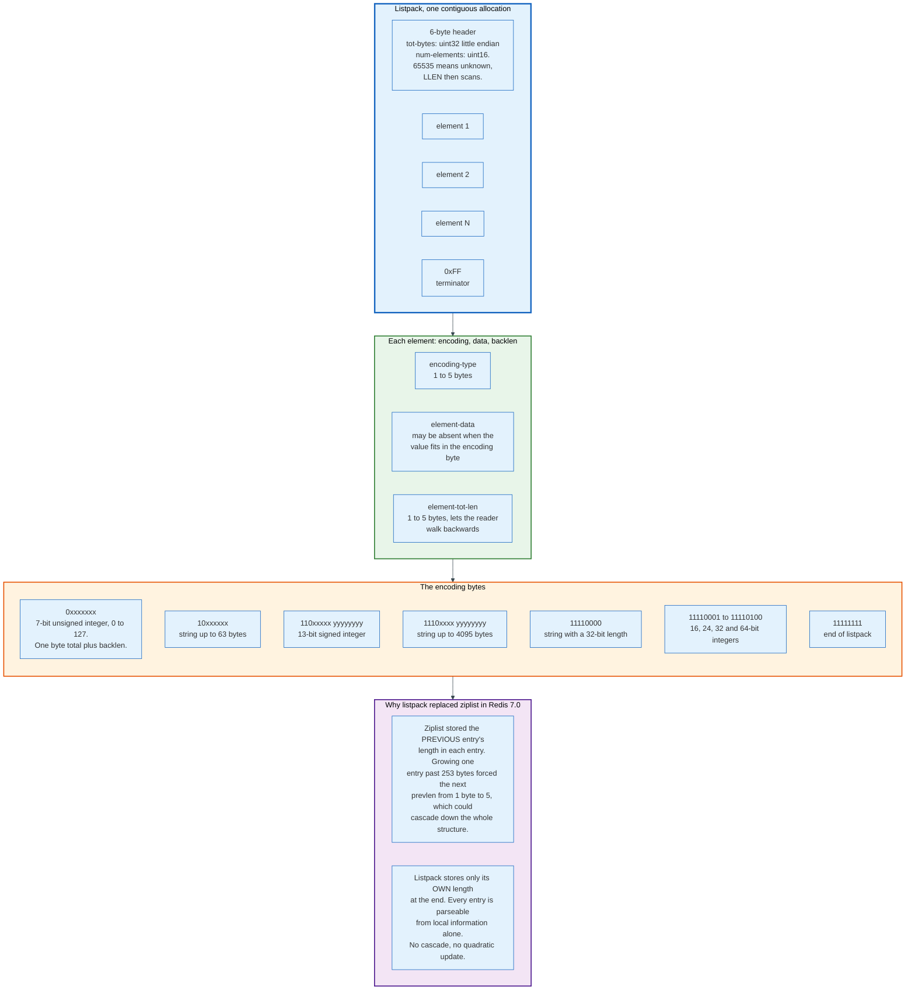
```mermaid
%%{init: {'theme': 'base', 'themeVariables': {'primaryColor': '#e3f2fd', 'primaryBorderColor': '#1565c0', 'lineColor': '#37474f'}}}%%

flowchart TB
    subgraph LP["Listpack, one contiguous allocation"]
        direction LR
        HDR["6-byte header<br/>tot-bytes: uint32 little endian<br/>num-elements: uint16.<br/>65535 means unknown,<br/>LLEN then scans."]
        E1["element 1"]
        E2["element 2"]
        EN["element N"]
        EOFB["0xFF<br/>terminator"]
    end

    subgraph Entry["Each element: encoding, data, backlen"]
        direction LR
        ENC["encoding-type<br/>1 to 5 bytes"]
        DAT["element-data<br/>may be absent when the<br/>value fits in the encoding byte"]
        BL["element-tot-len<br/>1 to 5 bytes, lets the reader<br/>walk backwards"]
    end

    subgraph Enc["The encoding bytes"]
        direction TB
        X1["0xxxxxxx<br/>7-bit unsigned integer, 0 to 127.<br/>One byte total plus backlen."]
        X2["10xxxxxx<br/>string up to 63 bytes"]
        X3["110xxxxx yyyyyyyy<br/>13-bit signed integer"]
        X4["1110xxxx yyyyyyyy<br/>string up to 4095 bytes"]
        X5["11110000<br/>string with a 32-bit length"]
        X6["11110001 to 11110100<br/>16, 24, 32 and 64-bit integers"]
        X7["11111111<br/>end of listpack"]
    end

    subgraph Why["Why listpack replaced ziplist in Redis 7.0"]
        W1["Ziplist stored the PREVIOUS entry's<br/>length in each entry. Growing one<br/>entry past 253 bytes forced the next<br/>prevlen from 1 byte to 5, which could<br/>cascade down the whole structure."]
        W2["Listpack stores only its OWN length<br/>at the end. Every entry is parseable<br/>from local information alone.<br/>No cascade, no quadratic update."]
    end

    LP --> Entry --> Enc
    Enc --> Why

    style LP fill:#e3f2fd,stroke:#1565c0,stroke-width:3px
    style Entry fill:#e8f5e9,stroke:#2e7d32,stroke-width:2px
    style Enc fill:#fff3e0,stroke:#e65100,stroke-width:2px
    style Why fill:#f3e5f5,stroke:#4a148c,stroke-width:2px
```

The header is six bytes: a 32-bit total byte count and a 16-bit element count, both little-endian. When the element count would exceed 65535 the field is set to 65535 and length queries fall back to a full scan. A single `0xFF` byte terminates the structure.

Each element is `<encoding-type><element-data><element-tot-len>`. The encoding byte determines both the type and, for short values, the value itself: `0xxxxxxx` is a 7-bit unsigned integer from 0 to 127, so the string "42" costs two bytes total including its backlength. `10xxxxxx` prefixes a string up to 63 bytes. `110xxxxx` starts a 13-bit signed integer. `1110xxxx` prefixes a string up to 4095 bytes. `0xF0` introduces a 32-bit string length, and `0xF1` through `0xF4` introduce 16, 24, 32 and 64-bit integers.

The trailing length field is the whole point. Ziplist, the structure listpack replaced in Redis 7.0, stored the *previous* entry's length at the start of each entry so the list could be walked backwards. Growing one entry past 253 bytes forced the next entry's `prevlen` field from 1 byte to 5, which changed that entry's length, which could force the same change on the entry after it. The cascading update was correct, complex, and the source of a class of bugs that took Sanfilippo, Oran Agra and Yuval Inbar weeks of fuzzing and analysis to characterise. Listpack stores each entry's own length at its own end. Every entry is parseable from local information, and no update cascades.

Ziplist still exists in `ziplist.c` for reading old RDB files. `OBJ_ENCODING_ZIPLIST` is marked "No longer used" in `server.h`, alongside `OBJ_ENCODING_ZIPMAP` and `OBJ_ENCODING_LINKEDLIST`.

### 4.4 The Conversion Thresholds

Nine configuration parameters decide when a compact encoding gives up. These are the Redis 8.0 defaults, quoted from the shipped `redis.conf`:

| Setting | Default | Applies to |
|---------|---------|------------|
| `hash-max-listpack-entries` | 512 | Hash field count |
| `hash-max-listpack-value` | 64 | Longest field name or value, in bytes |
| `list-max-listpack-size` | -2 | Per quicklist node. Negative means a size cap: -1 is 4 KB, -2 is 8 KB, -3 is 16 KB, -4 is 32 KB, -5 is 64 KB. Positive means an entry count. |
| `list-compress-depth` | 0 | Nodes left uncompressed at each end. 0 disables LZF compression |
| `set-max-intset-entries` | 512 | Integer-only set member count |
| `set-max-listpack-entries` | 128 | Non-integer set member count, since Redis 7.2 |
| `set-max-listpack-value` | 64 | Longest set member, in bytes |
| `zset-max-listpack-entries` | 128 | Sorted set member count |
| `zset-max-listpack-value` | 64 | Longest sorted set member, in bytes |

Conversion is one-way. A hash that grows to 513 fields becomes a `hashtable` and stays one after `HDEL` brings it back to 3. The documented saving from the compact encodings is up to ten times less memory, with about five times as the average.

The practical consequence is a design pattern. Splitting a hundred thousand keys named `object:N` into about a thousand hashes of a hundred fields each, by using all but the last two digits as the key and the last two as the field, dropped the benchmark in the memory optimisation documentation from 11 MB to 1.7 MB on Redis 2.2. The mechanism is unchanged: a hundred fields fits inside `hash-max-listpack-entries`, so the entire hash is one allocation with no per-field `robj`, no per-field `dictEntry`, and no top-level key.

The cost is that a listpack hash cannot carry per-field expiry, which is why Redis 7.4 added a third hash encoding, `OBJ_ENCODING_LISTPACK_EX`, that appends TTL metadata to the listpack.

---

## 5. The Core Data Structures and Their Complexity

Five logical types sit on top of about ten physical structures, and knowing which structure is active tells you the complexity of every command against that key.

### 5.1 Quicklist: How Lists Actually Work

A Redis list is a doubly linked list of listpacks, not a doubly linked list of elements, and that indirection is what makes a million-element list affordable.

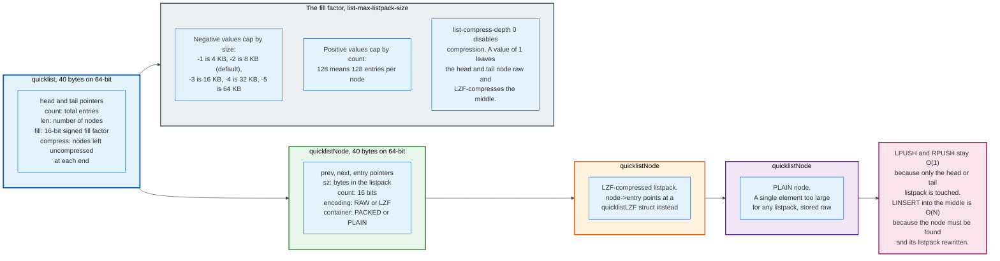
```mermaid
%%{init: {'theme': 'base', 'themeVariables': {'primaryColor': '#e3f2fd', 'primaryBorderColor': '#1565c0', 'lineColor': '#37474f'}}}%%

flowchart LR
    subgraph QL["quicklist, 40 bytes on 64-bit"]
        Q["head and tail pointers<br/>count: total entries<br/>len: number of nodes<br/>fill: 16-bit signed fill factor<br/>compress: nodes left uncompressed<br/>at each end"]
    end

    subgraph N1["quicklistNode, 40 bytes on 64-bit"]
        A["prev, next, entry pointers<br/>sz: bytes in the listpack<br/>count: 16 bits<br/>encoding: RAW or LZF<br/>container: PACKED or PLAIN"]
    end

    subgraph N2["quicklistNode"]
        B["LZF-compressed listpack.<br/>node-&gt;entry points at a<br/>quicklistLZF struct instead"]
    end

    subgraph N3["quicklistNode"]
        C["PLAIN node.<br/>A single element too large<br/>for any listpack, stored raw"]
    end

    subgraph Fill["The fill factor, list-max-listpack-size"]
        F1["Negative values cap by size:<br/>-1 is 4 KB, -2 is 8 KB (default),<br/>-3 is 16 KB, -4 is 32 KB, -5 is 64 KB"]
        F2["Positive values cap by count:<br/>128 means 128 entries per node"]
        F3["list-compress-depth 0 disables<br/>compression. A value of 1 leaves<br/>the head and tail node raw and<br/>LZF-compresses the middle."]
    end

    QL --> N1 --> N2 --> N3
    QL --> Fill

    NOTE["LPUSH and RPUSH stay O(1)<br/>because only the head or tail<br/>listpack is touched.<br/>LINSERT into the middle is O(N)<br/>because the node must be found<br/>and its listpack rewritten."]
    N3 --> NOTE

    style QL fill:#e3f2fd,stroke:#1565c0,stroke-width:3px
    style N1 fill:#e8f5e9,stroke:#2e7d32,stroke-width:2px
    style N2 fill:#fff3e0,stroke:#e65100,stroke-width:2px
    style N3 fill:#f3e5f5,stroke:#4a148c,stroke-width:2px
    style Fill fill:#eceff1,stroke:#37474f,stroke-width:2px
    style NOTE fill:#fce4ec,stroke:#880e4f,stroke-width:2px
```

`quicklistNode` packs its metadata into a single 32-bit word with bit fields: `count` gets 16 bits, `encoding` 2, `container` 2, and three boolean flags one each, with 9 bits left spare. The struct itself is 40 bytes on a 64-bit build, three pointers plus a `size_t` plus that word, and the `32 byte struct` comment above it in `quicklist.h` predates `sz` widening from `unsigned int` to `size_t`. The node's `entry` pointer holds either a listpack (`container` is `PACKED`) or a single raw element too large for any listpack (`container` is `PLAIN`).

The fill factor comes from `list-max-listpack-size`, default -2, meaning 8 KB per node. The `optimization_level` array in `quicklist.c` maps -1 through -5 to 4096, 8192, 16384, 32768 and 65536 bytes.

Compression is optional and off by default. With `list-compress-depth 1`, every node except the head and tail is LZF-compressed in place, and `node->entry` points at a `quicklistLZF` struct instead. This is designed for the queue access pattern, where only the ends are read.

The complexity that matters: `LPUSH`, `RPUSH`, `LPOP` and `RPOP` are O(1) because only the head or tail listpack is touched. `LINSERT` and `LREM` are O(N). `LRANGE` is O(S+N) where S is the offset. `LPOS` with `RANK` is O(N). A blocked `BLPOP` costs nothing while it waits, because the client is parked on a list of blocked clients keyed by the list name and woken by the pusher.

### 5.2 Sorted Sets: Two Structures, One Key

A skiplist-encoded sorted set holds a dictionary and a skip list over the same members, and this is the only Redis type that pays for two indexes.

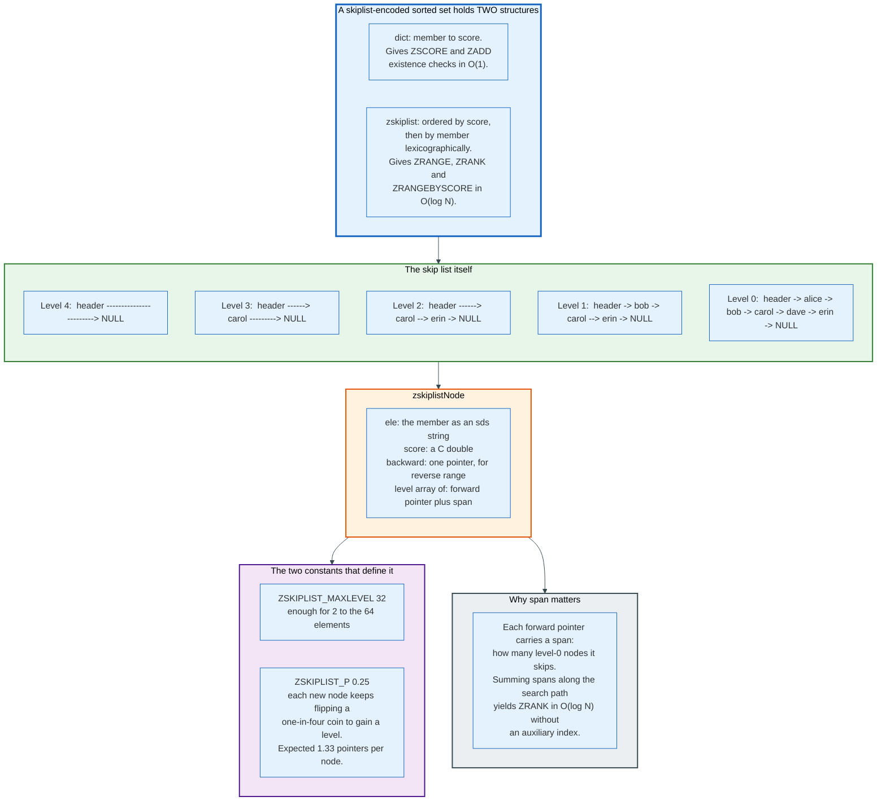
```mermaid
%%{init: {'theme': 'base', 'themeVariables': {'primaryColor': '#e3f2fd', 'primaryBorderColor': '#1565c0', 'lineColor': '#37474f'}}}%%

flowchart TB
    subgraph ZS["A skiplist-encoded sorted set holds TWO structures"]
        D["dict: member to score.<br/>Gives ZSCORE and ZADD<br/>existence checks in O(1)."]
        SL["zskiplist: ordered by score,<br/>then by member lexicographically.<br/>Gives ZRANGE, ZRANK and<br/>ZRANGEBYSCORE in O(log N)."]
    end

    subgraph Levels["The skip list itself"]
        direction TB
        L4["Level 4:  header ------------------------&gt; NULL"]
        L3["Level 3:  header ------&gt; carol ---------&gt; NULL"]
        L2["Level 2:  header ------&gt; carol --&gt; erin -&gt; NULL"]
        L1["Level 1:  header -&gt; bob -&gt; carol --&gt; erin -&gt; NULL"]
        L0["Level 0:  header -&gt; alice -&gt; bob -&gt; carol -&gt; dave -&gt; erin -&gt; NULL"]
    end

    subgraph Node["zskiplistNode"]
        NN["ele: the member as an sds string<br/>score: a C double<br/>backward: one pointer, for reverse range<br/>level array of: forward pointer plus span"]
    end

    subgraph Params["The two constants that define it"]
        P1["ZSKIPLIST_MAXLEVEL 32<br/>enough for 2 to the 64 elements"]
        P2["ZSKIPLIST_P 0.25<br/>each new node keeps flipping a<br/>one-in-four coin to gain a level.<br/>Expected 1.33 pointers per node."]
    end

    subgraph Span["Why span matters"]
        SP["Each forward pointer carries a span:<br/>how many level-0 nodes it skips.<br/>Summing spans along the search path<br/>yields ZRANK in O(log N) without<br/>an auxiliary index."]
    end

    ZS --> Levels --> Node --> Params
    Node --> Span

    style ZS fill:#e3f2fd,stroke:#1565c0,stroke-width:3px
    style Levels fill:#e8f5e9,stroke:#2e7d32,stroke-width:2px
    style Node fill:#fff3e0,stroke:#e65100,stroke-width:2px
    style Params fill:#f3e5f5,stroke:#4a148c,stroke-width:2px
    style Span fill:#eceff1,stroke:#37474f,stroke-width:2px
```

The dictionary maps member to score, which makes `ZSCORE` and the existence half of `ZADD` O(1). The skip list orders members by score first and lexicographically second, which makes `ZRANGE`, `ZRANGEBYSCORE`, `ZRANK` and `ZADD`'s insertion O(log N).

`ZSKIPLIST_MAXLEVEL` is 32, described in the source as "enough for 2^64 elements". `ZSKIPLIST_P` is 0.25, meaning each node keeps promoting itself to the next level with probability one in four, giving an expected 1.33 forward pointers per node. A skip list is a probabilistic balanced tree with no rebalancing code, which is why Sanfilippo chose it over a red-black tree: the insert and delete paths are short, and there is no rotation logic to get wrong.

The detail that makes `ZRANK` work is `span`. Every forward pointer records how many level-0 nodes it jumps over. Summing the spans along the search path yields the rank directly, in the same O(log N) traversal that finds the element. Without span, rank would require a separate counted index.

Valkey 9.1 embedded the member string inside the skiplist node instead of pointing at a separate SDS allocation, saving roughly 6 to 8.5 bytes per member for typical 10 to 40 byte members, about 11% to 15% of per-member overhead. The change is safe specifically because sorted set members are immutable once inserted.

### 5.3 Sets: Three Encodings, Two Optimisations

An `intset` is a sorted array of fixed-width integers with a single encoding field saying whether the width is 16, 32 or 64 bits. Membership is a binary search, O(log N). Adding an element that does not fit the current width upgrades the whole array in one pass. The structure is used when every member parses as an integer and the count is at or under `set-max-intset-entries`, 512.

Adding one non-integer member converts an intset. Since Redis 7.2 the target is a listpack if the result is small enough, and a `hashtable` otherwise. Before 7.2 it went straight to a hash table, which is why upgrading to 7.2 reduced memory on workloads full of small string sets with no configuration change.

`SINTERCARD`, added in Redis 7.0, computes the size of an intersection without building it, with an optional `LIMIT` that stops early. Redis 8.10 added `SUNIONCARD` and `SDIFFCARD` on the same reasoning. These exist because `SINTERSTORE` into a temporary key, `SCARD`, `DEL` was a common three-command pattern that allocated the whole intersection for a single number.

### 5.4 Streams: A Radix Tree of Listpacks

A stream is a radix tree keyed by entry ID, where each leaf is a listpack holding many entries, and the design exists to make an append-only log cheap per entry.

Entry IDs are 128 bits: a 64-bit millisecond timestamp and a 64-bit sequence number, rendered as `1526919030474-55`. The radix tree, implemented in `rax.c`, keys on the big-endian ID so that range queries are prefix walks. Because entries in one listpack share a common prefix and usually a common field schema, the listpack stores the field names once as a master entry and subsequent entries reference them. A stream of uniform events costs far less per entry than the same data as one hash per event.

Consumer groups add a second structure per group: the last delivered ID, and a Pending Entries List, itself a radix tree, mapping each unacknowledged ID to a consumer name, a delivery time and a delivery count. `XAUTOCLAIM`, added in 6.2, walks that tree to reassign entries whose owner has gone quiet.

### 5.5 The Complexity Table

The table below is the reference an engineer actually needs. N is the collection size unless stated.

| Command | Complexity | Note |
|---------|-----------|------|
| `GET`, `SET`, `INCR`, `SETRANGE` | O(1) | `SETRANGE` is O(1) amortised, O(N) if it must grow the string |
| `APPEND` | O(1) amortised | Forces `raw` encoding |
| `MSET`, `MGET` | O(N) in the number of keys | Each lookup is O(1) |
| `DEL` | O(N) in the number of elements freed | Use `UNLINK` for O(1) plus background free |
| `EXPIRE`, `TTL`, `PERSIST` | O(1) | Touches `db->expires` only |
| `LPUSH`, `RPUSH`, `LPOP`, `RPOP` | O(1) per element | O(N) for N elements pushed |
| `LINSERT`, `LREM`, `LSET` | O(N) | Must find the node |
| `LRANGE` | O(S+N) | S is the start offset |
| `SADD`, `SREM`, `SISMEMBER` | O(1) hashtable, O(log N) intset, O(N) listpack | Encoding decides |
| `SINTER` | O(N*M) | N is the smallest set, M the number of sets |
| `SPOP`, `SRANDMEMBER` without count | O(1) | With a count it is O(N) |
| `ZADD`, `ZSCORE`, `ZINCRBY` | O(log N) for `ZADD`, O(1) for `ZSCORE` | Skiplist encoding |
| `ZRANGE`, `ZRANGEBYSCORE` | O(log N + M) | M is the number returned |
| `ZRANK`, `ZREVRANK` | O(log N) | Uses skip list spans |
| `ZUNIONSTORE` | O(N)+O(M log M) | N is the sum of the input sizes, M the size of the result |
| `ZINTERSTORE` | O(N*K)+O(M log M) | N is the smallest input, K the number of inputs, M the size of the result |
| `HSET`, `HGET`, `HDEL` | O(1) hashtable, O(N) listpack | |
| `HRANDFIELD` with count | O(N) | |
| `XADD` | O(1) | Amortised over the listpack |
| `XRANGE` | O(log N + M) | Radix tree walk |
| `SCAN`, `HSCAN`, `SSCAN`, `ZSCAN` | O(1) per call, O(N) over a full iteration | Bounded work per call |
| `KEYS` | O(N) over the whole keyspace | Blocks. Do not use in production |
| `PFADD`, `PFCOUNT` | O(1) | HyperLogLog, 12 KB dense representation |
| `SETBIT`, `GETBIT` | O(1) | `BITCOUNT` is O(N) |
| `SORT` | O(N + M log M) | `SORT_RO` is the replica-safe form |

---

## 6. The Keyspace: Dictionaries, Rehashing, and SCAN

The top-level keyspace is a hash table that must grow without ever blocking, and the technique that achieves this also explains why `SCAN` gives the guarantee it gives and no more.

### 6.1 Two Tables, One Dictionary

A Redis `dict` holds two hash tables, `ht_table[0]` and `ht_table[1]`, and a `rehashidx` cursor that is -1 when no rehash is in progress.

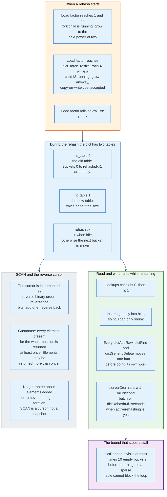
```mermaid
%%{init: {'theme': 'base', 'themeVariables': {'primaryColor': '#e3f2fd', 'primaryBorderColor': '#1565c0', 'lineColor': '#37474f'}}}%%

flowchart TB
    subgraph Trigger["When a rehash starts"]
        T1["Load factor reaches 1 and no<br/>fork child is running: grow to the<br/>next power of two"]
        T2["Load factor reaches<br/>dict_force_resize_ratio 4 while a<br/>child IS running: grow anyway,<br/>copy-on-write cost accepted"]
        T3["Load factor falls below 1/8:<br/>shrink"]
    end

    subgraph State["During the rehash the dict has two tables"]
        H0["ht_table 0<br/>the old table.<br/>Buckets 0 to rehashidx-1 are empty."]
        H1["ht_table 1<br/>the new table,<br/>twice or half the size"]
        RI["rehashidx<br/>-1 when idle,<br/>otherwise the next bucket to move"]
    end

    subgraph Rules["Read and write rules while rehashing"]
        R1["Lookups check ht 0, then ht 1"]
        R2["Inserts go only into ht 1,<br/>so ht 0 can only shrink"]
        R3["Every dictAddRaw, dictFind and<br/>dictGenericDelete moves one bucket<br/>before doing its own work"]
        R4["serverCron runs a 1 millisecond<br/>batch of dictRehashMilliseconds<br/>when activerehashing is yes"]
    end

    subgraph Bound["The bound that stops a stall"]
        B1["dictRehash n visits at most<br/>n times 10 empty buckets<br/>before returning, so a sparse<br/>table cannot block the loop"]
    end

    subgraph Scan["SCAN and the reverse cursor"]
        S1["The cursor is incremented in<br/>reverse binary order: reverse the<br/>bits, add one, reverse back"]
        S2["Guarantee: every element present<br/>for the whole iteration is returned<br/>at least once. Elements may be<br/>returned more than once."]
        S3["No guarantee about elements added<br/>or removed during the iteration.<br/>SCAN is a cursor, not a snapshot."]
    end

    Trigger --> State --> Rules --> Bound
    State --> Scan

    style Trigger fill:#fff3e0,stroke:#e65100,stroke-width:2px
    style State fill:#e3f2fd,stroke:#1565c0,stroke-width:3px
    style Rules fill:#e8f5e9,stroke:#2e7d32,stroke-width:2px
    style Bound fill:#f3e5f5,stroke:#4a148c,stroke-width:2px
    style Scan fill:#eceff1,stroke:#37474f,stroke-width:2px
```

A rehash starts when the load factor reaches 1 and no fork child is running, or when it reaches `dict_force_resize_ratio`, which is 4, while a child *is* running. The second threshold exists entirely because of copy-on-write: allocating a new table during a `BGSAVE` dirties pages the child is sharing, so Redis tolerates a fourfold load factor rather than pay that cost. A shrink triggers below one eighth occupancy.

While rehashing, three rules hold. Lookups check table 0 then table 1. Inserts go only into table 1, so table 0 monotonically empties. And every `dictAddRaw`, `dictFind` and `dictGenericDelete` migrates one bucket before doing its own work, which spreads the cost across the operations that caused it.

`dictRehash(d, n)` moves up to `n` buckets and gives up after visiting `n * 10` empty ones, so a sparse table cannot stall the loop. `serverCron` additionally runs a 1-millisecond batch when `activerehashing` is `yes`, which is the default.

Valkey 8.1, released 31 March 2025, replaced this dictionary with a new hash table built from 64-byte buckets, one cache line each, chained per bucket. Entries live inside the bucket rather than in a separately allocated `dictEntry` per key, which removes one pointer hop per lookup and about 20 bytes per key-value pair, about 30 for a key carrying a TTL. The project evaluated open-addressing designs such as Swiss tables and rejected them, because Valkey needs incremental rehashing, a `SCAN`-compatible cursor and random element sampling, and those designs provide none of the three. That is one of the larger internal divergences between the two projects.

### 6.2 The Reverse Binary Cursor

`SCAN` returns a cursor that is incremented in reverse binary order, and that trick is what lets it survive a table resize mid-iteration.

The increment in `dictScanDefrag` is four lines: set all the high bits above the current mask, reverse the bits of the cursor, add one, reverse again. The effect is that the cursor's low-order bits, the ones the table mask actually uses, change most slowly. When the table doubles, a bucket splits into two whose indexes differ only in a newly significant high bit, and the reverse ordering means both halves are still visited exactly once.

This buys a precise and limited guarantee, which the documentation states and which is misread constantly:

- Every element present in the collection for the entire iteration is returned at least once.
- Any element may be returned more than once. The application must tolerate duplicates.
- Elements added or removed during the iteration may or may not be returned. There is no snapshot.

`SCAN` is not a consistent read. It is a bounded-work traversal that never misses a stable element. `COUNT` is a hint, not a limit, and defaults to 10. `MATCH` filters after retrieval, so a `SCAN` with a restrictive pattern can return an empty array with a non-zero cursor many times before finding anything, and a client that stops on an empty reply is wrong.

Redis 8.0 added a slot-aware optimisation in cluster mode: a pattern like `{abc}*` whose hash tag appears before any wildcard is scanned in one slot only, rather than across all 16384.

### 6.3 The Two Keyspaces per Database

Each `redisDb` holds `kvstore *keys` for key to value and `kvstore *expires` for key to expiry timestamp, and a key with no TTL appears only in the first. A `kvstore` is a container of dictionaries: one dictionary in standalone mode, 16384 in cluster mode, one per slot, so a slot can be enumerated, sized or migrated without scanning the whole database. The field was a plain `dict *` before Redis 7.4, which is why older material and older code call it `db->dict`.

This is why setting a TTL costs memory. It adds a `dictEntry` to a second hash table, and it is why the documentation notes that `allkeys-lru` is more memory-efficient than `volatile-lru`: the volatile policies require every eviction candidate to carry an expiry.

`RDB_OPCODE_SLOT_INFO`, opcode 244, records those per-slot sizes in the RDB file, so a loader sizes each slot's dictionary once instead of rehashing its way there.

---

## 7. Expiration: Lazy and Active

Redis expires keys in two places and neither one is a timer, because a timer per key would cost a heap entry per key and wake the process constantly.

### 7.1 What a TTL Actually Is

`EXPIRE key 900` stores an absolute Unix timestamp in milliseconds in `db->expires`. It does not store 900. It does not schedule anything.

The consequence is that a key is *logically* expired the instant the clock passes that timestamp, and *physically* present until something looks at it. `INFO keyspace` counts physically present keys. `DBSIZE` counts physically present keys. A database can report a million keys of which nine hundred thousand are dead.

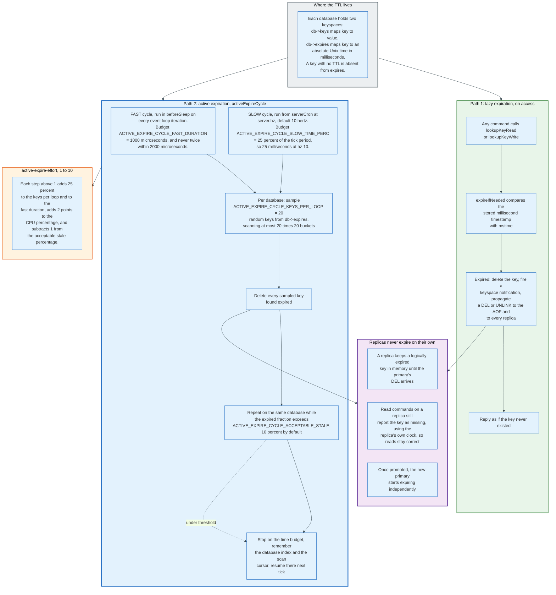
```mermaid
%%{init: {'theme': 'base', 'themeVariables': {'primaryColor': '#e3f2fd', 'primaryBorderColor': '#1565c0', 'lineColor': '#37474f'}}}%%

flowchart TB
    subgraph Store["Where the TTL lives"]
        ST["Each database holds two keyspaces:<br/>db-&gt;keys maps key to value,<br/>db-&gt;expires maps key to an<br/>absolute Unix time in milliseconds.<br/>A key with no TTL is absent from expires."]
    end

    subgraph Lazy["Path 1: lazy expiration, on access"]
        LZ1["Any command calls lookupKeyRead<br/>or lookupKeyWrite"]
        LZ2["expireIfNeeded compares the<br/>stored millisecond timestamp<br/>with mstime"]
        LZ3["Expired: delete the key, fire a<br/>keyspace notification, propagate<br/>a DEL or UNLINK to the AOF and<br/>to every replica"]
        LZ4["Reply as if the key never existed"]
    end

    subgraph Active["Path 2: active expiration, activeExpireCycle"]
        AC1["FAST cycle, run in beforeSleep on<br/>every event loop iteration.<br/>Budget ACTIVE_EXPIRE_CYCLE_FAST_DURATION<br/>= 1000 microseconds, and never twice<br/>within 2000 microseconds."]
        AC2["SLOW cycle, run from serverCron at<br/>server.hz, default 10 hertz.<br/>Budget ACTIVE_EXPIRE_CYCLE_SLOW_TIME_PERC<br/>= 25 percent of the tick period,<br/>so 25 milliseconds at hz 10."]
        AC3["Per database: sample<br/>ACTIVE_EXPIRE_CYCLE_KEYS_PER_LOOP = 20<br/>random keys from db-&gt;expires,<br/>scanning at most 20 times 20 buckets"]
        AC4["Delete every sampled key<br/>found expired"]
        AC5["Repeat on the same database while<br/>the expired fraction exceeds<br/>ACTIVE_EXPIRE_CYCLE_ACCEPTABLE_STALE,<br/>10 percent by default"]
        AC6["Stop on the time budget, remember<br/>the database index and the scan<br/>cursor, resume there next tick"]
    end

    subgraph Effort["active-expire-effort, 1 to 10"]
        EF["Each step above 1 adds 25 percent<br/>to the keys per loop and to the<br/>fast duration, adds 2 points to the<br/>CPU percentage, and subtracts 1 from<br/>the acceptable stale percentage."]
    end

    subgraph Repl["Replicas never expire on their own"]
        RP1["A replica keeps a logically expired<br/>key in memory until the primary's<br/>DEL arrives"]
        RP2["Read commands on a replica still<br/>report the key as missing, using the<br/>replica's own clock, so reads stay correct"]
        RP3["Once promoted, the new primary<br/>starts expiring independently"]
    end

    Store --> Lazy
    Store --> Active
    LZ1 --> LZ2 --> LZ3 --> LZ4
    AC1 --> AC3
    AC2 --> AC3
    AC3 --> AC4 --> AC5 --> AC6
    AC5 -.under threshold.-> AC6
    Active --> Effort
    LZ3 --> Repl
    AC4 --> Repl

    style Store fill:#eceff1,stroke:#37474f,stroke-width:2px
    style Lazy fill:#e8f5e9,stroke:#2e7d32,stroke-width:2px
    style Active fill:#e3f2fd,stroke:#1565c0,stroke-width:3px
    style Effort fill:#fff3e0,stroke:#e65100,stroke-width:2px
    style Repl fill:#f3e5f5,stroke:#4a148c,stroke-width:2px
```

### 7.2 Lazy Expiration

Every keyspace access routes through `lookupKeyRead` or `lookupKeyWrite`, which call `expireIfNeeded`. If the stored timestamp is in the past, the key is deleted, a keyspace notification fires, a `DEL` or `UNLINK` is propagated to the AOF and to every replica, and the command proceeds as though the key never existed.

Lazy expiration alone is insufficient in exactly one common case: a key written once, given a TTL, and never read again. Nothing ever triggers the check, so the memory is never returned.

### 7.3 Active Expiration

`activeExpireCycle` in `expire.c` samples random keys from `db->expires` and deletes the dead ones, under a strict time budget. Four constants define it:

```c
#define ACTIVE_EXPIRE_CYCLE_KEYS_PER_LOOP 20   /* Keys for each DB loop. */
#define ACTIVE_EXPIRE_CYCLE_FAST_DURATION 1000 /* Microseconds. */
#define ACTIVE_EXPIRE_CYCLE_SLOW_TIME_PERC 25  /* Max % of CPU to use. */
#define ACTIVE_EXPIRE_CYCLE_ACCEPTABLE_STALE 10 /* % of stale keys after which
                                                   we do extra efforts. */
```

The **fast cycle** runs from `beforeSleep`, on every event loop iteration, with a budget of 1000 microseconds, and refuses to run twice within 2000 microseconds. It also refuses to run at all unless the previous slow cycle hit its time limit or the estimated stale percentage is above the acceptable threshold.

The **slow cycle** runs from `serverCron` at `server.hz`, and its budget is computed as `config_cycle_slow_time_perc * 1000000 / server.hz / 100`, which at the defaults of 25% and 10 Hz is 25,000 microseconds, or 25 milliseconds per tick.

Inside either cycle, per database: sample up to 20 keys from `db->expires`, scanning at most `20 * 20 = 400` buckets to find them, delete every expired one, and repeat on the same database while the expired fraction exceeds the acceptable stale percentage. `CRON_DBS_PER_CALL` bounds how many databases a single call visits, and both the database index and the scan cursor persist across calls so the next tick resumes where this one stopped.

The acceptable stale threshold is the adaptive part. At the default of 10%, a database where one sampled key in five is dead keeps looping until the sample cleans up. This is what allows Redis to reclaim a large simultaneous expiry, and it is also the mechanism behind a well-known latency spike: if a large fraction of keys with TTLs all expire in the same second, the cycle keeps hitting its time limit tick after tick, and every client feels it. Spreading TTLs with a random jitter is the standard fix.

`active-expire-effort`, from 1 to 10, scales the whole thing. Each step above 1 adds 25% to the keys per loop and to the fast duration, adds two percentage points to the CPU budget, and subtracts one point from the acceptable stale percentage.

Redis 7.4 added an analogous cycle for hash field TTLs, budgeted separately at `HFE_DB_BASE_ACTIVE_EXPIRE_FIELDS_PER_SEC`, 10,000 fields per second, and interleaved with the key cycle.

### 7.4 Replicas Do Not Expire

A replica never deletes an expired key on its own initiative. It waits for the primary to send the `DEL`.

This is not laziness. It is the only way to keep the two datasets identical without synchronised clocks. If both sides expired independently, a `DEL` propagated for a key the replica had already removed would behave differently, and commands like `INCR` or `RPOP` propagated from the primary would produce different results on a replica whose keyspace had drifted.

The cost is that a replica can hold logically expired keys. Redis compensates on the read path only: a read command on a replica consults the replica's own clock and reports the key as missing, without deleting it. A cache fronted by replicas therefore never serves stale data, but `DBSIZE` on a replica can exceed `DBSIZE` on its primary.

During a Lua script, time is frozen. No key expires mid-script, so a script sees a consistent keyspace and replays identically.

---

## 8. Eviction: maxmemory and the Approximated Policies

Eviction is the only place Redis deliberately discards data, and every policy in it is an approximation chosen to fit inside 24 bits of an existing field.

### 8.1 The Check

Before each command, `performEvictions` compares `used_memory` minus `mem_not_counted_for_evict` against `maxmemory`. The subtraction matters: replica output buffers and the AOF rewrite buffer are excluded, because evicting a key generates a `DEL` that lands in those buffers, and counting them would create a feedback loop in which eviction causes eviction.

With `maxmemory` unset, Redis is unbounded on 64-bit builds and implicitly limited to 3 GB on 32-bit ones. With `maxmemory` set and the policy at `noeviction`, a write past the limit returns `-OOM command not allowed when used memory > 'maxmemory'`. Read commands continue to work.

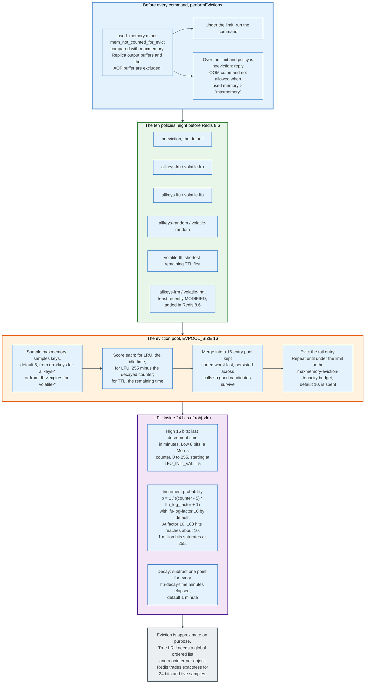
```mermaid
%%{init: {'theme': 'base', 'themeVariables': {'primaryColor': '#e3f2fd', 'primaryBorderColor': '#1565c0', 'lineColor': '#37474f'}}}%%

flowchart TB
    subgraph Check["Before every command, performEvictions"]
        CH1["used_memory minus<br/>mem_not_counted_for_evict<br/>compared with maxmemory.<br/>Replica output buffers and the<br/>AOF buffer are excluded."]
        CH2["Under the limit: run the command"]
        CH3["Over the limit and policy is<br/>noeviction: reply<br/>-OOM command not allowed when<br/>used memory &gt; 'maxmemory'"]
    end

    subgraph Policies["The ten policies, eight before Redis 8.6"]
        P1["noeviction, the default"]
        P2["allkeys-lru / volatile-lru"]
        P3["allkeys-lfu / volatile-lfu"]
        P4["allkeys-random / volatile-random"]
        P5["volatile-ttl, shortest remaining TTL first"]
        P6["allkeys-lrm / volatile-lrm,<br/>least recently MODIFIED,<br/>added in Redis 8.6"]
    end

    subgraph Pool["The eviction pool, EVPOOL_SIZE 16"]
        PL1["Sample maxmemory-samples keys,<br/>default 5, from db-&gt;keys for allkeys-*<br/>or from db-&gt;expires for volatile-*"]
        PL2["Score each: for LRU, the idle time;<br/>for LFU, 255 minus the decayed counter;<br/>for TTL, the remaining time"]
        PL3["Merge into a 16-entry pool kept<br/>sorted worst-last, persisted across<br/>calls so good candidates survive"]
        PL4["Evict the tail entry.<br/>Repeat until under the limit or the<br/>maxmemory-eviction-tenacity budget,<br/>default 10, is spent"]
    end

    subgraph LFU["LFU inside 24 bits of robj-&gt;lru"]
        LF1["High 16 bits: last decrement time<br/>in minutes. Low 8 bits: a Morris<br/>counter, 0 to 255, starting at<br/>LFU_INIT_VAL = 5"]
        LF2["Increment probability<br/>p = 1 / ((counter - 5) * lfu_log_factor + 1)<br/>with lfu-log-factor 10 by default.<br/>At factor 10, 100 hits reaches about 10,<br/>1 million hits saturates at 255."]
        LF3["Decay: subtract one point for every<br/>lfu-decay-time minutes elapsed,<br/>default 1 minute"]
    end

    Check --> Policies --> Pool --> LFU
    CH1 --> CH2
    CH1 --> CH3
    PL1 --> PL2 --> PL3 --> PL4

    NOTE["Eviction is approximate on purpose.<br/>True LRU needs a global ordered list<br/>and a pointer per object.<br/>Redis trades exactness for<br/>24 bits and five samples."]
    LFU --> NOTE

    style Check fill:#e3f2fd,stroke:#1565c0,stroke-width:3px
    style Policies fill:#e8f5e9,stroke:#2e7d32,stroke-width:2px
    style Pool fill:#fff3e0,stroke:#e65100,stroke-width:2px
    style LFU fill:#f3e5f5,stroke:#4a148c,stroke-width:2px
    style NOTE fill:#eceff1,stroke:#37474f,stroke-width:2px
```

### 8.2 The Ten Policies

`maxmemory-policy` takes ten values since Redis 8.6, and took eight before it.

| Policy | Candidate set | Ordering |
|--------|---------------|----------|
| `noeviction` | none | Errors on write instead. The default |
| `allkeys-lru` | every key | Approximated least recently used |
| `volatile-lru` | keys with a TTL | Approximated least recently used |
| `allkeys-lfu` | every key | Approximated least frequently used |
| `volatile-lfu` | keys with a TTL | Approximated least frequently used |
| `allkeys-random` | every key | Random |
| `volatile-random` | keys with a TTL | Random |
| `volatile-ttl` | keys with a TTL | Shortest remaining TTL first |
| `allkeys-lrm` | every key | Least recently *modified*, added in Redis 8.6 |
| `volatile-lrm` | keys with a TTL | Least recently *modified*, added in Redis 8.6 |

Every `volatile-*` policy degrades to `noeviction` when no key carries a TTL. This is a real production failure: an instance configured `volatile-lru` whose application stopped setting TTLs starts returning OOM errors under memory pressure with a policy that looks correct in the config file.

`allkeys-lrm`, introduced in Redis 8.6, updates the timestamp on writes only, not reads. It targets the case where hot data is read constantly but the useful eviction signal is staleness of the underlying value.

### 8.3 Approximated LRU

Redis does not maintain an LRU list. It samples.

`maxmemory-samples` random keys, default 5, are drawn per round and scored. Since Redis 3.0 the candidates go into a persistent pool of `EVPOOL_SIZE`, 16 entries, kept sorted so that a good candidate found in one round survives into the next. The worst entry is evicted, and the loop repeats until memory is under the limit or the `maxmemory-eviction-tenacity` budget, default 10, is spent.

The documented accuracy is that 5 samples on Redis 3.0 or later closely tracks true LRU under a power-law access pattern, and 10 samples is very close to theoretical, at some CPU cost. The reason for approximating at all is stated plainly in the documentation: a true LRU implementation costs more memory, and under realistic access patterns the difference in hit rate is minimal to non-existent.

### 8.4 Approximated LFU

LFU packs a frequency estimate into eight bits using a Morris counter, a probabilistic counting technique from 1978 that counts to large numbers in few bits by incrementing with decreasing probability.

The increment, verbatim from `evict.c`:

```c
uint8_t LFULogIncr(uint8_t counter) {
    if (counter == 255) return 255;
    double r = (double)rand()/RAND_MAX;
    double baseval = counter - LFU_INIT_VAL;
    if (baseval < 0) baseval = 0;
    double p = 1.0/(baseval*server.lfu_log_factor+1);
    if (r < p) counter++;
    return counter;
}
```

`LFU_INIT_VAL` is 5, so a newly created key starts with a non-zero counter and is not evicted immediately on arrival. With `lfu-log-factor 10`, the default, the documented saturation table is:

| lfu-log-factor | 100 hits | 1000 hits | 100K hits | 1M hits | 10M hits |
|---|---|---|---|---|---|
| 0 | 104 | 255 | 255 | 255 | 255 |
| 1 | 18 | 49 | 255 | 255 | 255 |
| 10 | 10 | 18 | 142 | 255 | 255 |
| 100 | 8 | 11 | 49 | 143 | 255 |

Decay is the other half. `LFUDecrAndReturn` subtracts one point for every `lfu-decay-time` minutes elapsed since the counter was last touched, default 1 minute. A key hit ten thousand times yesterday and never since decays back toward zero, which is what stops LFU from pinning yesterday's hot set forever.

The high 16 bits of `robj->lru` hold that last-decay time in minutes, which wraps every 65536 minutes, about 45.5 days. `LFUTimeElapsed` handles the wrap.

### 8.5 What Eviction Does Not Do

Eviction does not return memory to the operating system, and it does not run inside a script.

The first is a property of the allocator, covered in section 17. The second is a correctness decision: once a script has performed a write that allocates, aborting it would break atomicity, so Redis lets the script run to completion even if that carries `used_memory` past `maxmemory`. The documentation is explicit that a script whose first write does not allocate, such as `DEL`, allows every subsequent write in that script regardless of the limit.

---

## 9. RDB Snapshots

An RDB file is a point-in-time binary dump of the keyspace, written by a forked child so that the parent never performs disk I/O for persistence.

### 9.1 The Mechanism

`BGSAVE`, or an automatic save point, calls `fork(2)`. The child inherits a frozen copy-on-write view of the parent's memory, walks every database, serialises every key, writes a temporary file, and `rename(2)`s it over `dump.rdb`. The rename is atomic, which is why copying `dump.rdb` from a running server is always safe: the file is never modified in place.

The default save points, from `redis.conf`, are `save 3600 1 300 100 60 10000`: one hour with at least one change, five minutes with 100, or one minute with 10,000. `SAVE` performs the same work in the main thread and blocks everything, and exists for shutdown and for scripts.

`stop-writes-on-bgsave-error yes` is the default and surprises people. If the last background save failed, Redis refuses every write with an error, on the reasoning that silently continuing to accept writes that are not being persisted is worse than an outage. A full disk therefore takes the instance read-only.

### 9.2 The File Format

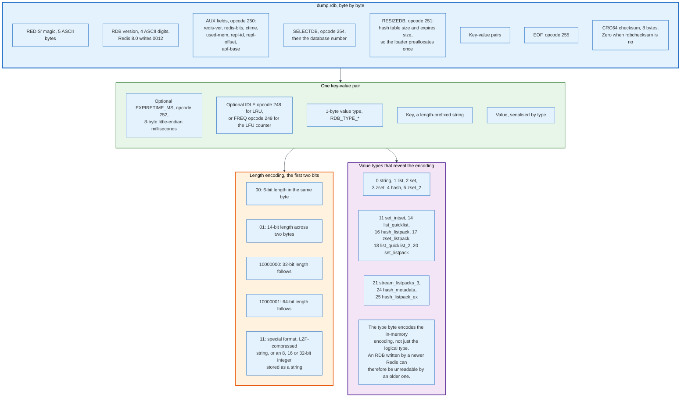
```mermaid
%%{init: {'theme': 'base', 'themeVariables': {'primaryColor': '#e3f2fd', 'primaryBorderColor': '#1565c0', 'lineColor': '#37474f'}}}%%

flowchart TB
    subgraph File["dump.rdb, byte by byte"]
        direction TB
        F1["'REDIS' magic, 5 ASCII bytes"]
        F2["RDB version, 4 ASCII digits.<br/>Redis 8.0 writes 0012"]
        F3["AUX fields, opcode 250:<br/>redis-ver, redis-bits, ctime,<br/>used-mem, repl-id, repl-offset,<br/>aof-base"]
        F4["SELECTDB, opcode 254,<br/>then the database number"]
        F5["RESIZEDB, opcode 251:<br/>hash table size and expires size,<br/>so the loader preallocates once"]
        F6["Key-value pairs"]
        F7["EOF, opcode 255"]
        F8["CRC64 checksum, 8 bytes.<br/>Zero when rdbchecksum is no"]
    end

    subgraph KV["One key-value pair"]
        direction TB
        K1["Optional EXPIRETIME_MS, opcode 252,<br/>8-byte little-endian milliseconds"]
        K2["Optional IDLE opcode 248 for LRU,<br/>or FREQ opcode 249 for the LFU counter"]
        K3["1-byte value type, RDB_TYPE_*"]
        K4["Key, a length-prefixed string"]
        K5["Value, serialised by type"]
    end

    subgraph Len["Length encoding, the first two bits"]
        L1["00: 6-bit length in the same byte"]
        L2["01: 14-bit length across two bytes"]
        L3["10000000: 32-bit length follows"]
        L4["10000001: 64-bit length follows"]
        L5["11: special format. LZF-compressed<br/>string, or an 8, 16 or 32-bit integer<br/>stored as a string"]
    end

    subgraph Types["Value types that reveal the encoding"]
        T1["0 string, 1 list, 2 set,<br/>3 zset, 4 hash, 5 zset_2"]
        T2["11 set_intset, 14 list_quicklist,<br/>16 hash_listpack, 17 zset_listpack,<br/>18 list_quicklist_2, 20 set_listpack"]
        T3["21 stream_listpacks_3,<br/>24 hash_metadata,<br/>25 hash_listpack_ex"]
        T4["The type byte encodes the in-memory<br/>encoding, not just the logical type.<br/>An RDB written by a newer Redis can<br/>therefore be unreadable by an older one."]
    end

    File --> KV --> Len
    KV --> Types

    style File fill:#e3f2fd,stroke:#1565c0,stroke-width:3px
    style KV fill:#e8f5e9,stroke:#2e7d32,stroke-width:2px
    style Len fill:#fff3e0,stroke:#e65100,stroke-width:2px
    style Types fill:#f3e5f5,stroke:#4a148c,stroke-width:2px
```

The file opens with the five ASCII bytes `REDIS` followed by a four-digit ASCII version. Redis 8.0 defines `RDB_VERSION 12`. The number has moved since: 13 in Redis 8.6, 14 in 8.8, and 15 in 8.10, which added type bytes 29 through 32 for compact hashes. A newer version number is refused by an older server outright, which is the first thing to check when a downgrade or a cross-version replica fails.

After the header come auxiliary fields under opcode 250: `redis-ver`, `redis-bits`, `ctime`, `used-mem`, and, when the file is produced for replication, `repl-id` and `repl-offset`. Opcode 254 selects a database. Opcode 251 carries a resize hint, the sizes of the key dictionary and the expires dictionary, so the loader preallocates both once instead of rehashing repeatedly during load.

Each key-value pair is: an optional `EXPIRETIME_MS` (opcode 252) with an 8-byte little-endian millisecond timestamp, an optional `IDLE` (248) or `FREQ` (249) carrying the eviction metadata, a one-byte type, the key as a length-prefixed string, and the value.

Length prefixes use the top two bits of the first byte: `00` means a 6-bit length in that byte, `01` means a 14-bit length across two bytes, `0x80` means a 32-bit length follows, `0x81` means a 64-bit length follows, and `11` means a special format, which is either an LZF-compressed string or an integer of 8, 16 or 32 bits stored in place of a string.

The type byte encodes the physical encoding, not just the logical type. `RDB_TYPE_SET_INTSET` is 11, `RDB_TYPE_LIST_QUICKLIST_2` is 18, `RDB_TYPE_SET_LISTPACK` is 20, `RDB_TYPE_STREAM_LISTPACKS_3` is 21, and `RDB_TYPE_HASH_LISTPACK_EX` is 25. A file containing type 25 cannot be read by a Redis older than 7.4, because that server has no code for hash field expiry. This is the mechanism behind most "replica cannot sync with primary" incidents across a version boundary.

The file closes with opcode 255 and an 8-byte CRC64 checksum, which is zero when `rdbchecksum no` is set.

`rdbcompression yes`, the default, LZF-compresses strings above a threshold. `rdb-key-save-delay`, normally 0, inserts a microsecond delay per key and exists for testing.

### 9.3 What RDB Is Good At, and What It Is Not

RDB is the right tool for backups, for cold-start speed, and for replication, and the wrong tool for durability.

It is a single compact file that can be shipped to another data centre or to object storage. It loads faster than an equivalent AOF because it is a dense binary format rather than a command replay. It supports partial resynchronisation after a replica restart, because the replication ID and offset are stored inside it.

It also loses everything written since the last snapshot. The advice in the documentation is direct: use both, use RDB alone if a few minutes of loss is acceptable, and do not use the AOF alone, because a periodic RDB remains valuable for backups, restart speed, and as a hedge against a bug in the AOF path.

---

## 10. The Append-Only File and Its Rewrite

The AOF is a log of every write command in RESP format, replayed on startup, and Redis 7.0 restructured it into several files precisely to stop the rewrite from being the most dangerous operation on the server.

### 10.1 The Write Path

A write command is executed first and logged second. Redis appends the command to `server.aof_buf` in the same RESP encoding a client would send, and `beforeSleep` flushes that buffer with one `write(2)` before the loop blocks. Batching in `beforeSleep` means a pipeline of a thousand commands produces one `write` syscall.

`appendfsync` decides when the data reaches the disk:

| Setting | Behaviour | Loss window |
|---------|-----------|-------------|
| `always` | `fsync` before replying. Group commit batches concurrent writes into one `fsync` | A single write |
| `everysec` | `fsync` from `bio_aof` once per second. The default | Up to one second |
| `no` | Never `fsync`. The kernel decides, typically about 30 seconds on Linux | Kernel-dependent |

The `everysec` path has a subtlety that shows up in latency graphs. `write(2)` on Linux blocks if an `fsync` on the same file is in progress. Redis therefore delays the `write` for up to two seconds while an `fsync` is outstanding, and after that performs the `write` anyway. On a disk that occasionally takes seconds to `fsync`, that delay is visible to clients as a stall, and `no-appendfsync-on-rewrite yes` avoids the worst of it by suppressing `fsync` while a rewrite child is running.

### 10.2 Multi-Part AOF

Since Redis 7.0 the AOF is a directory, named by `appenddirname`, containing at most one BASE file, one or more INCR files, and a manifest.

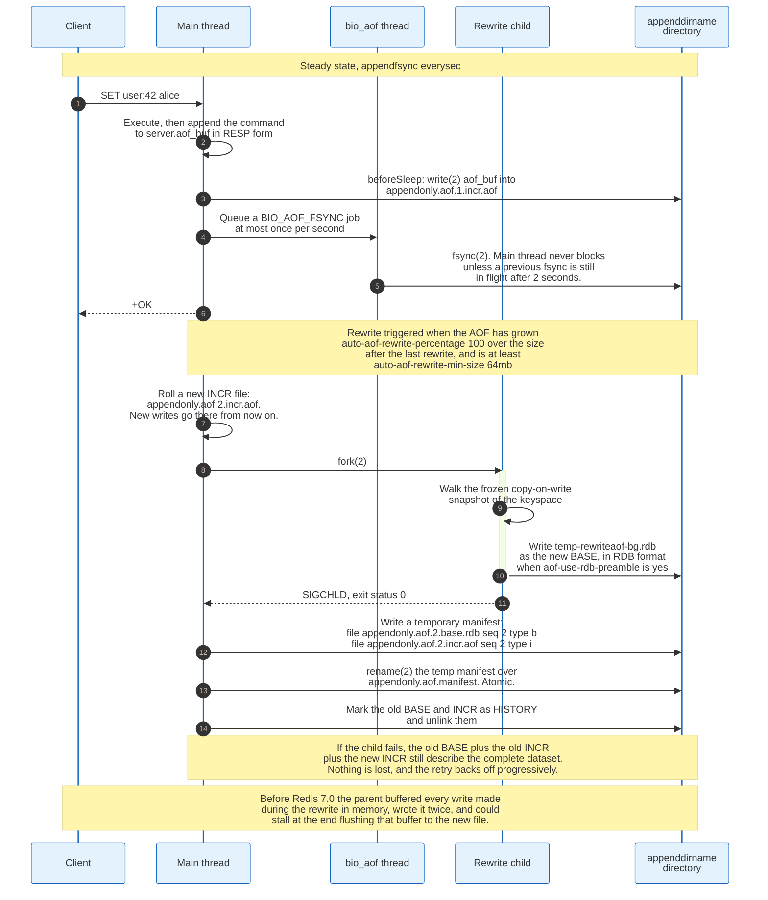
```mermaid
%%{init: {'theme': 'base', 'themeVariables': {'primaryColor': '#e3f2fd', 'primaryBorderColor': '#1565c0', 'lineColor': '#37474f'}}}%%

sequenceDiagram
    autonumber
    participant C as Client
    participant M as Main thread
    participant B as bio_aof thread
    participant Ch as Rewrite child
    participant FS as appenddirname<br/>directory

    Note over C,FS: Steady state, appendfsync everysec

    C->>M: SET user:42 alice
    M->>M: Execute, then append the command<br/>to server.aof_buf in RESP form
    M->>FS: beforeSleep: write(2) aof_buf into<br/>appendonly.aof.1.incr.aof
    M->>B: Queue a BIO_AOF_FSYNC job<br/>at most once per second
    B->>FS: fsync(2). Main thread never blocks<br/>unless a previous fsync is still<br/>in flight after 2 seconds.
    M-->>C: +OK

    Note over M,FS: Rewrite triggered when the AOF has grown<br/>auto-aof-rewrite-percentage 100 over the size<br/>after the last rewrite, and is at least<br/>auto-aof-rewrite-min-size 64mb

    M->>M: Roll a new INCR file:<br/>appendonly.aof.2.incr.aof.<br/>New writes go there from now on.
    M->>Ch: fork(2)
    activate Ch
    Ch->>Ch: Walk the frozen copy-on-write<br/>snapshot of the keyspace
    Ch->>FS: Write temp-rewriteaof-bg.rdb<br/>as the new BASE, in RDB format<br/>when aof-use-rdb-preamble is yes
    deactivate Ch
    Ch-->>M: SIGCHLD, exit status 0

    M->>FS: Write a temporary manifest:<br/>file appendonly.aof.2.base.rdb seq 2 type b<br/>file appendonly.aof.2.incr.aof seq 2 type i
    M->>FS: rename(2) the temp manifest over<br/>appendonly.aof.manifest. Atomic.
    M->>FS: Mark the old BASE and INCR as HISTORY<br/>and unlink them

    Note over M,FS: If the child fails, the old BASE plus the old INCR<br/>plus the new INCR still describe the complete dataset.<br/>Nothing is lost, and the retry backs off progressively.

    Note over C,FS: Before Redis 7.0 the parent buffered every write made<br/>during the rewrite in memory, wrote it twice, and could<br/>stall at the end flushing that buffer to the new file.
```

The manifest is a plain text file with one line per member:

```
file appendonly.aof.2.base.rdb seq 2 type b
file appendonly.aof.1.incr.aof seq 1 type h
file appendonly.aof.2.incr.aof seq 2 type i
```

Type `b` is the base, `i` is an active increment, and `h` is history awaiting deletion. The base is written in RDB format when `aof-use-rdb-preamble` is `yes`, which is the default, so the base is a snapshot and only the increments are command logs.

A rewrite triggers when the AOF has grown `auto-aof-rewrite-percentage`, default 100, above its size after the last rewrite, and is at least `auto-aof-rewrite-min-size`, default 64 MB. The sequence is: the parent opens a new INCR file and starts writing there, forks, the child writes a new BASE from its frozen view, and on success the parent writes a temporary manifest naming the new BASE and the new INCR and `rename(2)`s it into place. The old files become history and are unlinked.

The pre-7.0 design is what makes this worth explaining. The parent used to buffer every write made during the rewrite *in memory*, write each of them twice (once to the old AOF and once into the buffer), and then flush the entire accumulated buffer into the child's output file at the end, potentially freezing the server for the duration. Multi-part AOF removes the buffer, removes the double write, and removes the final flush. It also adds a backoff so that a repeatedly failing rewrite retries at a decreasing rate instead of littering the directory.

### 10.3 Recovery, and the Truncated Tail

`aof-load-truncated yes`, the default, loads an AOF whose last command is incomplete, discards that command, and logs a warning. The alternative is refusing to start, which trades availability for a single lost write.

A genuinely corrupted AOF, one with invalid bytes in the middle rather than a short tail, aborts startup. `redis-check-aof` without `--fix` reports the offset; with `--fix` it truncates from the corruption to the end, which can be catastrophic if the corruption is early.

When both AOF and RDB are enabled, startup loads the AOF, because it is the more complete record.

### 10.4 Online Backups, Redis 8.10

Redis 8.10, released 29 July 2026, added a `BACKUP` command family that produces a restorable artefact without stopping writes and without disabling rewrites by hand.

`BACKUP START` opens a window and produces a fresh BASE, whether or not AOF persistence is enabled. `BACKUP LIST` returns absolute paths to the pinned immutable files so a data plane can start copying the BASE while Redis keeps appending to the INCR. `BACKUP SEAL` freezes the set, hard-linking the INCR and writing a standalone manifest. `BACKUP CLEANUP` releases the pinned files after the copy. `backup-sealed-ttl`, default 0, disables automatic cleanup so files survive until explicitly released.

Restoring uses the startup-only `preload-file` setting, given as `<type>:<path>`, for example `preload-file aof:/tmp/restore/appendonly.aof.manifest`. When set, Redis loads only that target and skips the normal `appenddirname` and `dump.rdb` paths.

The operational point is the one the documentation makes about clusters: because starting a backup is separate from sealing it, a control plane can stagger `BACKUP START` across nodes so they do not all `fork` at the same moment. That was the real problem with backing up a cluster, and it was a scheduling problem rather than a format problem.

---

## 11. Fork, Copy-on-Write, and the Memory Spike

Every persistence operation in Redis begins with `fork(2)`, and the fork is the most expensive single instant in the server's life.


```mermaid
%%{init: {'theme': 'base', 'themeVariables': {'primaryColor': '#e3f2fd', 'primaryBorderColor': '#1565c0', 'lineColor': '#37474f'}}}%%

flowchart TB
    subgraph Before["t = 0, before the fork"]
        BF["Parent RSS 24 GB.<br/>Page table: 24 GB / 4 KB * 8 bytes<br/>= 48 MB of page table entries"]
    end

    subgraph Fork["t = 0+, the fork syscall itself"]
        FK1["The kernel copies the page table,<br/>not the pages. 48 MB of copying<br/>while the main thread is blocked."]
        FK2["Measured cost, from latest_fork_usec:<br/>about 9 to 13 milliseconds per GB on<br/>bare metal and on modern EC2 HVM<br/>instances"]
        FK3["Old EC2 instance types on Xen<br/>measured 239 ms/GB.<br/>One Linode measurement, also Xen:<br/>424 ms/GB. The fork, not the save,<br/>is the outage."]
    end

    subgraph During["t &gt; 0, copy-on-write"]
        DR1["Every page is marked read-only in<br/>both processes and shared"]
        DR2["The parent writes a key.<br/>Page fault. Kernel copies that<br/>4 KB page. Parent RSS grows."]
        DR3["Peak extra memory equals the<br/>working set touched during the<br/>child's lifetime, not the dataset size"]
    end

    subgraph THP["Transparent huge pages make it worse"]
        TH1["With THP the unit of copy-on-write<br/>is 2 MB, not 4 KB"]
        TH2["Touching one key can copy 2 MB.<br/>A few event loop iterations can<br/>copy most of the process."]
        TH3["Redis sets disable-thp yes and<br/>logs a warning. The kernel setting<br/>is /sys/kernel/mm/transparent_hugepage/enabled"]
    end

    subgraph Provision["What this means for capacity planning"]
        PR1["A write-heavy instance can need close<br/>to 2x its dataset size in RAM while<br/>a BGSAVE or AOF rewrite runs"]
        PR2["The OOM killer targets the parent<br/>because it has the larger RSS.<br/>oom-score-adj-values 0 200 800<br/>biases the killer toward the child."]
        PR3["vm.overcommit_memory = 1 stops the<br/>kernel refusing the fork when the<br/>nominal reservation exceeds RAM"]
        PR4["Diskless replication and diskless<br/>RDB skip the disk but still fork"]
    end

    Before --> Fork --> During --> Provision
    During --> THP --> Provision

    style Before fill:#eceff1,stroke:#37474f,stroke-width:2px
    style Fork fill:#e3f2fd,stroke:#1565c0,stroke-width:3px
    style During fill:#e8f5e9,stroke:#2e7d32,stroke-width:2px
    style THP fill:#ffebee,stroke:#b71c1c,stroke-width:2px
    style Provision fill:#fff3e0,stroke:#e65100,stroke-width:2px
```

### 11.1 The Cost of the Fork Itself

`fork` does not copy memory. It copies the page table, and on Linux with 4 KB pages the page table for a 24 GB process is `24 GB / 4 KB * 8 bytes = 48 MB`. Allocating and copying 48 MB happens with the main thread blocked, and it is reported in `INFO` as `latest_fork_usec`.

The published measurements, taken by `BGSAVE` and reading `latest_fork_usec`, span two orders of magnitude:

| Environment | Measurement |
|-------------|-------------|
| Linux on a physical Xeon at 2.27 GHz | 6.9 GB RSS forked in 62 ms, about 9 ms/GB |
| Linux VM on VMware | 6.0 GB RSS forked in 77 ms, about 12.8 ms/GB |
| Linux on physical hardware, unknown model | 6.1 GB RSS forked in 80 ms, about 13.1 ms/GB |
| Linux VM on 6sync, KVM | 360 MB RSS forked in 8.2 ms, about 23.3 ms/GB |
| Linux VM on EC2, new instance types, Xen | 1 GB RSS forked in 10 ms, about 10 ms/GB |
| Linux VM on EC2, old instance types, Xen | 6.1 GB RSS forked in 1460 ms, about 239 ms/GB |
| Linux VM on Linode, Xen | 0.9 GB RSS forked in 382 ms, about 424 ms/GB |

The pattern is not about virtualisation in general. The documentation names Xen specifically and records that VMware and VirtualBox do not produce slow forks. Both outliers are Xen guests, and the guidance the same page gives EC2 users is to run modern HVM-based instance types, m3.medium or better.

At 10 ms/GB, a 64 GB instance stalls for roughly 640 milliseconds every time it snapshots. That is the number that decides whether a given workload can afford RDB at all.

### 11.2 Copy-on-Write, and the Second Memory Bill

After the fork, every page is marked read-only and shared between parent and child. The first write to a page traps, the kernel copies the 4 KB, and the parent's resident set grows.

The extra memory is not proportional to the dataset. It is proportional to the working set written during the child's lifetime. A read-mostly 40 GB instance may add a few hundred megabytes during a save. A write-saturated one can approach doubling.

`vm.overcommit_memory = 1` is the standard recommendation because a strict kernel may refuse a `fork` whose nominal reservation exceeds available memory, even though copy-on-write means the reservation will never be realised.

### 11.3 Transparent Huge Pages Make It Worse by 512x

With transparent huge pages enabled, the copy-on-write unit is 2 MB rather than 4 KB.

The documented failure chain is short: fork creates two processes sharing huge pages; a few event loop iterations touch a few thousand pages; because each page is 2 MB, this copies almost the whole process; the result is a large latency spike and a large memory spike. A workload touching 5,000 distinct 4 KB pages would copy 20 MB. The same workload with THP copies up to 10 GB.

Redis ships `disable-thp yes`, which attempts to disable THP for its own process on systems where the kernel setting is `always`, and logs a warning at startup when it detects the condition. The system-level fix remains `echo never > /sys/kernel/mm/transparent_hugepage/enabled` followed by a restart, because pages already allocated as huge stay huge.

### 11.4 Who the OOM Killer Picks

The parent has the larger resident set, so a naive OOM killer kills the parent and takes the service down while sparing the child that caused the pressure.

`oom-score-adj no` is the default. Setting it to `relative` or `absolute` makes Redis write the values in `oom-score-adj-values`, default `0 200 800`, into `/proc/self/oom_score_adj` for the primary, the replica and background child processes respectively. Higher means more likely to be killed, so the ordering deliberately sacrifices the fork child first and a replica before a primary.

---

## 12. Replication and PSYNC

Redis replication is a byte stream with a version tag, and every feature in it exists to avoid re-sending that stream from the beginning.

### 12.1 The Two Numbers That Define a Dataset

Every primary holds a **replication ID**, a 40-character pseudorandom hex string identifying a history, and a **replication offset**, a byte counter that advances for every byte of replication stream produced, whether or not any replica is attached.

The pair `(replid, offset)` identifies an exact version of a dataset. Two instances sharing a replid and an offset hold identical data. Two sharing a replid with different offsets differ only by the commands between those offsets, which is precisely what makes partial resynchronisation possible.

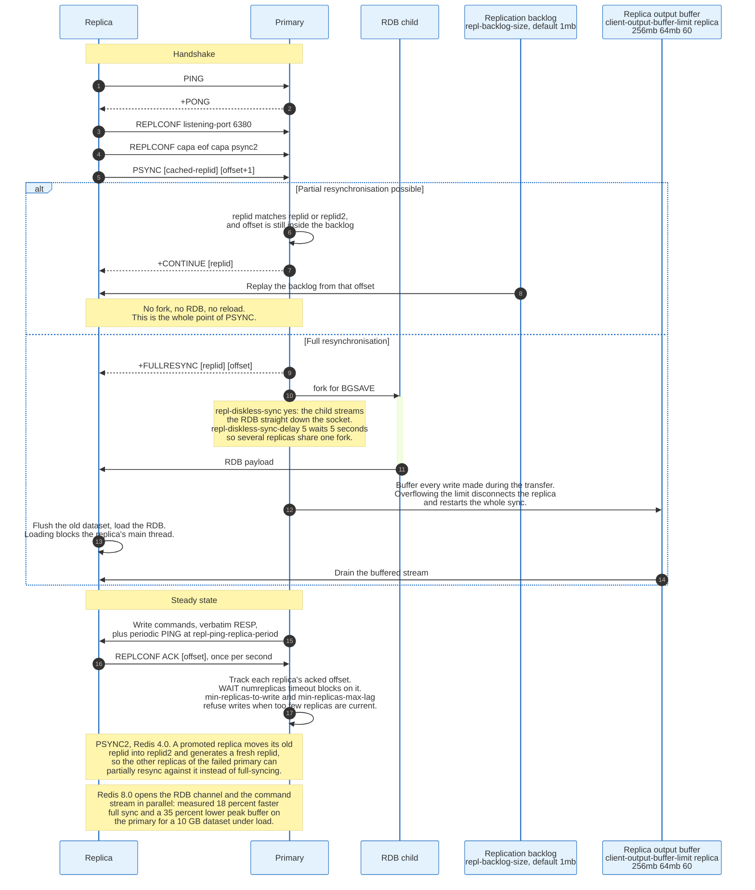
```mermaid
%%{init: {'theme': 'base', 'themeVariables': {'primaryColor': '#e3f2fd', 'primaryBorderColor': '#1565c0', 'lineColor': '#37474f'}}}%%

sequenceDiagram
    autonumber
    participant R as Replica
    participant P as Primary
    participant Ch as RDB child
    participant BL as Replication backlog<br/>repl-backlog-size, default 1mb
    participant OB as Replica output buffer<br/>client-output-buffer-limit replica<br/>256mb 64mb 60

    Note over R,P: Handshake
    R->>P: PING
    P-->>R: +PONG
    R->>P: REPLCONF listening-port 6380
    R->>P: REPLCONF capa eof capa psync2
    R->>P: PSYNC [cached-replid] [offset+1]

    alt Partial resynchronisation possible
        P->>P: replid matches replid or replid2,<br/>and offset is still inside the backlog
        P-->>R: +CONTINUE [replid]
        BL->>R: Replay the backlog from that offset
        Note over R,P: No fork, no RDB, no reload.<br/>This is the whole point of PSYNC.
    else Full resynchronisation
        P-->>R: +FULLRESYNC [replid] [offset]
        P->>Ch: fork for BGSAVE
        activate Ch
        Note over P: repl-diskless-sync yes: the child streams<br/>the RDB straight down the socket.<br/>repl-diskless-sync-delay 5 waits 5 seconds<br/>so several replicas share one fork.
        Ch->>R: RDB payload
        deactivate Ch
        P->>OB: Buffer every write made during the transfer.<br/>Overflowing the limit disconnects the replica<br/>and restarts the whole sync.
        R->>R: Flush the old dataset, load the RDB.<br/>Loading blocks the replica's main thread.
        OB->>R: Drain the buffered stream
    end

    Note over R,P: Steady state
    P->>R: Write commands, verbatim RESP,<br/>plus periodic PING at repl-ping-replica-period
    R->>P: REPLCONF ACK [offset], once per second
    P->>P: Track each replica's acked offset.<br/>WAIT numreplicas timeout blocks on it.<br/>min-replicas-to-write and min-replicas-max-lag<br/>refuse writes when too few replicas are current.

    Note over R,P: PSYNC2, Redis 4.0. A promoted replica moves its old<br/>replid into replid2 and generates a fresh replid,<br/>so the other replicas of the failed primary can<br/>partially resync against it instead of full-syncing.

    Note over R,P: Redis 8.0 opens the RDB channel and the command<br/>stream in parallel: measured 18 percent faster<br/>full sync and a 35 percent lower peak buffer on<br/>the primary for a 10 GB dataset under load.
```

### 12.2 PSYNC

A replica connects, handshakes with `PING`, `REPLCONF listening-port`, `REPLCONF capa eof capa psync2`, then sends `PSYNC <replid> <offset+1>`.

If the replid matches and the requested offset is still inside the primary's replication backlog, the primary replies `+CONTINUE <replid>` and replays the backlog from that point. No fork, no RDB, no reload. The backlog is a circular buffer sized by `repl-backlog-size`, default 1 MB, allocated only once a replica has connected, and freed after `repl-backlog-ttl` seconds, default 3600, with no replica attached. One megabyte at 10 MB/s of write traffic covers a 0.1 second disconnection, which is why raising this is the single most effective replication tuning available.

Otherwise the primary replies `+FULLRESYNC <replid> <offset>`, forks, and sends an RDB. With `repl-diskless-sync yes`, the default since Redis 7.0, the child writes the RDB directly to the replica's socket instead of to disk, and `repl-diskless-sync-delay 5` waits five seconds after the first request so that several replicas arriving together share one fork. On the receiving side `repl-diskless-load` defaults to `disabled`, meaning the replica writes the RDB to disk before loading it; `swapdb` loads into a spare database and swaps, and `on-empty-db` loads directly when the replica has no data.

Loading the RDB blocks the replica's main thread. For a large dataset that is seconds of unavailability on that replica, which is why Sentinel's `parallel-syncs` defaults to 1.

### 12.3 PSYNC2 and Failover Without a Full Sync

Redis 4.0 gave every instance two replication IDs, and that is what makes a failover cheap.

When a replica is promoted, it copies its current replid into `replid2`, records the offset at which the switch happened, and generates a fresh `replid`. The new ID is required because the old primary may still be alive on the other side of a partition, and reusing the ID would break the rule that ID plus offset identifies one dataset. Keeping the old ID in `replid2` means that when the other replicas of the failed primary connect with the old ID, the new primary recognises it, checks the offset against the switch point, and grants a partial resynchronisation.

Without this, every failover triggered a full resync from every surviving replica at once.

A replica shut down cleanly with `SHUTDOWN` writes its replid and offset into its RDB file and can partially resync on restart. A replica restarted from an AOF cannot.

### 12.4 What Replication Guarantees, and What It Does Not

Replication is asynchronous. The primary replies to the client and propagates to replicas at about the same time, without waiting.

`WAIT numreplicas timeout` blocks until the given number of replicas acknowledge the current offset, and returns how many did. The documentation is careful about what this buys: it "does not turn a set of Redis instances into a CP system with strong consistency", because acknowledged writes can still be lost during a failover depending on the persistence configuration. `WAITAOF`, added in Redis 7.2, additionally waits for the local and replica AOFs to be fsynced.

`min-replicas-to-write` and `min-replicas-max-lag` refuse writes when fewer than N replicas have acknowledged within M seconds. Setting `min-replicas-to-write 1` and `min-replicas-max-lag 10` makes a partitioned primary stop accepting writes after ten seconds, bounding divergence rather than preventing it.

Chained replication works, and since Redis 4.0 a sub-replica receives exactly the same stream the top-level primary produced, so a writable intermediate replica's local writes never reach its own sub-replicas. Writable replicas exist for historical reasons and are documented as not recommended; every legitimate use case for them was removed by Redis 7.0 through `SORT_RO`, `EVAL_RO`, `SUNION` and `ZINTER`.

`replica-ignore-maxmemory yes` is the default: a replica does not evict, because eviction on the primary already propagates a `DEL`. That also means a replica can exceed the `maxmemory` its primary respects, and needs headroom.

### 12.5 Dual-Channel Replication

Valkey 8.0 and Redis 8.0 both split the full synchronisation into two parallel streams, Valkey first by eight months.

In the classic design, the primary buffers the entire replication stream produced during the RDB transfer, then sends it once the RDB is delivered. On a large dataset under write load, that buffer grows on the primary and can hit `client-output-buffer-limit replica`, default `256mb 64mb 60`, at which point the replica is disconnected and the whole sync restarts.

The dual-channel design opens a second connection and streams the changes concurrently, shifting the buffering to the replica, which accumulates them until the RDB is loaded and then applies them. `replica-full-sync-buffer-limit`, default 0, caps the replica's accumulation, and 0 means inherit the primary's replica output buffer hard limit.

Redis measured the effect on a 10 GB dataset with 26.84 million write operations generating 25 GB of changes during the sync: 7.5% higher sustained write rate on the primary during replication, 18% less time to complete, and a 35% lower peak replication buffer on the primary.

---

## 13. Redis Sentinel

Sentinel is a separate process that watches primaries, agrees with other Sentinels that one has died, elects a leader among themselves, and promotes a replica. It is a failover coordinator, not a proxy.

### 13.1 What Sentinel Is and Is Not

Sentinel does four things: monitoring, notification, automatic failover, and configuration discovery. It does not sit in the data path. Clients connect to Sentinel to *ask* which instance is the current primary, then connect to that instance directly.

This is the misconception worth correcting first. Adding Sentinel to a deployment does nothing unless the client library implements Sentinel discovery, and many do not. A client with a hardcoded primary address gains no availability from Sentinel at all; it just points at a machine that Sentinel has demoted to a replica, and starts getting `-READONLY You can't write against a read only replica`.

Sentinel runs from the same binary, either as `redis-sentinel /path/to/sentinel.conf` or `redis-server /path/to/sentinel.conf --sentinel`, and listens on TCP 26379 by default. The configuration file is mandatory and must be writable, because Sentinel persists discovered state and the current configuration epoch into it.

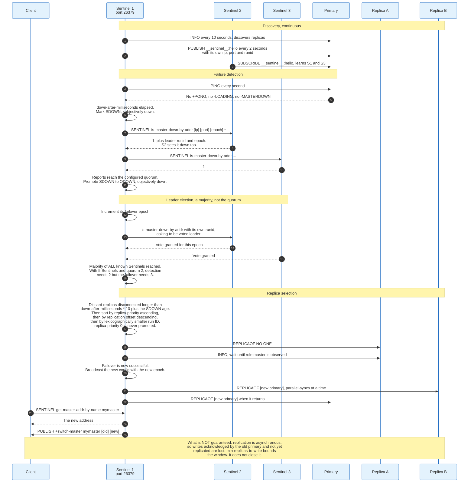
```mermaid
%%{init: {'theme': 'base', 'themeVariables': {'primaryColor': '#e3f2fd', 'primaryBorderColor': '#1565c0', 'lineColor': '#37474f'}}}%%

sequenceDiagram
    autonumber
    participant App as Client
    participant S1 as Sentinel 1<br/>port 26379
    participant S2 as Sentinel 2
    participant S3 as Sentinel 3
    participant M as Primary
    participant R1 as Replica A
    participant R2 as Replica B

    Note over S1,R2: Discovery, continuous
    S1->>M: INFO every 10 seconds, discovers replicas
    S1->>M: PUBLISH __sentinel__:hello every 2 seconds<br/>with its own ip, port and runid
    S2->>M: SUBSCRIBE __sentinel__:hello, learns S1 and S3

    Note over S1,M: Failure detection
    S1->>M: PING every second
    M--xS1: No +PONG, no -LOADING, no -MASTERDOWN
    S1->>S1: down-after-milliseconds elapsed.<br/>Mark SDOWN, subjectively down.
    S1->>S2: SENTINEL is-master-down-by-addr [ip] [port] [epoch] *
    S2-->>S1: 1, plus leader runid and epoch.<br/>S2 sees it down too.
    S1->>S3: SENTINEL is-master-down-by-addr ...
    S3-->>S1: 1
    S1->>S1: Reports reach the configured quorum.<br/>Promote SDOWN to ODOWN, objectively down.

    Note over S1,S3: Leader election, a majority, not the quorum
    S1->>S1: Increment its failover epoch
    S1->>S2: is-master-down-by-addr with its own runid,<br/>asking to be voted leader
    S2-->>S1: Vote granted for this epoch
    S3-->>S1: Vote granted
    S1->>S1: Majority of ALL known Sentinels reached.<br/>With 5 Sentinels and quorum 2, detection<br/>needs 2 but the failover needs 3.

    Note over S1,R2: Replica selection
    S1->>S1: Discard replicas disconnected longer than<br/>down-after-milliseconds * 10 plus the SDOWN age.<br/>Then sort by replica-priority ascending,<br/>then by replication offset descending,<br/>then by lexicographically smaller run ID.<br/>replica-priority 0 is never promoted.

    S1->>R1: REPLICAOF NO ONE
    S1->>R1: INFO, wait until role:master is observed
    S1->>S1: Failover is now successful.<br/>Broadcast the new config with the new epoch.
    S1->>R2: REPLICAOF [new primary], parallel-syncs at a time
    S1->>M: REPLICAOF [new primary] when it returns

    App->>S1: SENTINEL get-master-addr-by-name mymaster
    S1-->>App: The new address
    S1->>App: PUBLISH +switch-master mymaster [old] [new]

    Note over App,R2: What is NOT guaranteed: replication is asynchronous,<br/>so writes acknowledged by the old primary and not yet<br/>replicated are lost. min-replicas-to-write bounds<br/>the window. It does not close it.
```

### 13.2 Discovery

Sentinels find each other and the replicas without being told. Every Sentinel publishes a message to the `__sentinel__:hello` pub/sub channel on every monitored primary and replica every two seconds, carrying its IP, port and run ID plus its current view of the primary's configuration. Every Sentinel subscribes to the same channel on every instance. The replica list comes from parsing `INFO` on the primary every ten seconds.

The minimal configuration is therefore four lines per monitored group:

```
sentinel monitor mymaster 127.0.0.1 6379 2
sentinel down-after-milliseconds mymaster 60000
sentinel failover-timeout mymaster 180000
sentinel parallel-syncs mymaster 1
```

### 13.3 SDOWN, ODOWN, and the Two Different Majorities

Sentinel distinguishes a local opinion from a collective one, and then requires a *third*, stronger condition before acting.

**SDOWN**, subjectively down, is reached when a Sentinel receives no acceptable reply to `PING` for `down-after-milliseconds`. Acceptable means `+PONG`, `-LOADING`, or `-MASTERDOWN`. Anything else, including silence, counts against the instance. A primary that advertises itself as a replica in `INFO` is also treated as down. The interval must elapse with no acceptable reply at all, so one good reply every 29 seconds keeps a 30-second threshold satisfied.

**ODOWN**, objectively down, is reached when at least `quorum` Sentinels report SDOWN, gathered through `SENTINEL is-master-down-by-addr`. ODOWN applies only to primaries. Replicas and other Sentinels can be SDOWN but never ODOWN, though an SDOWN replica is excluded from promotion.

**Leader authorisation** is the third condition, and it is where the two numbers diverge. ODOWN triggers a failover attempt; performing one requires a vote from a majority of *all known Sentinels*, not from the quorum. With five Sentinels and `quorum 2`, two agreeing Sentinels start a failover and three must authorise it. Setting the quorum below the majority makes detection more sensitive without making the failover less safe, because the majority requirement is separate and not configurable.

The property that follows is the one that matters: Sentinel never fails over in a minority partition.

### 13.4 Configuration Epochs

Each authorised failover receives a unique configuration epoch, granted by the majority vote. Because a majority agreed on that number, no other Sentinel can use it. Every configuration is therefore versioned, and a higher version always wins.

The new configuration is broadcast on `__sentinel__:hello` on every instance, and any Sentinel holding an older version adopts the newer one. A partitioned Sentinel converges when the partition heals. A Sentinel that voted for another must wait `2 * failover-timeout` before attempting a failover of the same primary itself, which serialises attempts rather than racing them.

### 13.5 Replica Selection

Once authorised, the leader picks a replica by four criteria in order.

First it discards anything unreliable: a replica disconnected from the primary for more than `(down-after-milliseconds * 10) + milliseconds_since_master_is_in_SDOWN_state` is skipped entirely. Then it sorts the survivors by `replica-priority` ascending, then by replication offset descending, then by lexicographically smaller run ID. `replica-priority 0` marks a replica as never promotable, which is how a cross-region replica is kept as a read scale-out target without becoming a candidate.

Failover is considered successful the moment `REPLICAOF NO ONE` has been sent and `role:master` is observed in the promoted instance's `INFO`. Reconfiguring the remaining replicas happens afterwards, `parallel-syncs` at a time, and the old primary is reconfigured as a replica whenever it reappears.

### 13.6 TILT Mode

Sentinel measures time by comparing successive timer invocations, and if the measurement is nonsense it stops acting.

The timer fires ten times per second, so about 100 milliseconds should separate two calls. If the difference is negative or exceeds two seconds, Sentinel enters TILT mode: it keeps monitoring, stops acting on anything, and answers `SENTINEL is-master-down-by-addr` negatively because it no longer trusts its own failure detection. It leaves TILT after 30 seconds of normal behaviour. `INFO` reports `sentinel_tilt` and `sentinel_tilt_since_seconds`.

TILT exists because a clock jump, a long process suspension, or heavy swapping produces exactly the same symptom as a dead primary: no replies for a long time. Failing over on the strength of a stalled scheduler is worse than not failing over.

### 13.7 What Is Lost

Redis plus Sentinel is an eventually consistent system whose merge function is "last failover wins".

The documented failure case is a primary isolated by a partition with a client still attached. The Sentinels on the majority side promote a replica. The client on the minority side keeps writing to the old primary. When the partition heals, the old primary becomes a replica of the new one and discards everything written during the split. `min-replicas-to-write 1` with `min-replicas-max-lag 10` makes the isolated primary refuse writes after ten seconds, which converts silent data loss into visible errors.

---

## 14. Redis Cluster: Hash Slots and Resharding

Redis Cluster shards the key space across primaries with no proxy and no consensus on data, and every design property follows from those two choices.

### 14.1 16384 Slots, and Why That Number

The key space is divided into 16384 hash slots, computed as `HASH_SLOT = CRC16(key) mod 16384`.

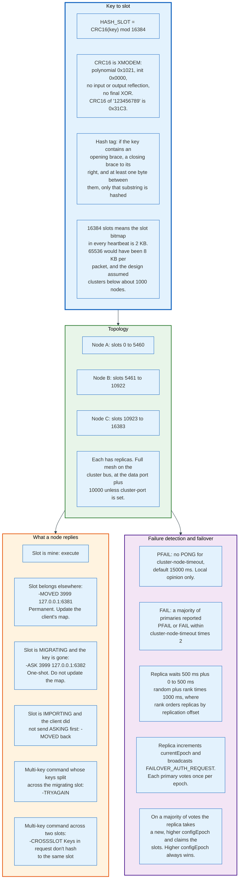
```mermaid
%%{init: {'theme': 'base', 'themeVariables': {'primaryColor': '#e3f2fd', 'primaryBorderColor': '#1565c0', 'lineColor': '#37474f'}}}%%

flowchart TB
    subgraph Hash["Key to slot"]
        H1["HASH_SLOT = CRC16(key) mod 16384"]
        H2["CRC16 is XMODEM:<br/>polynomial 0x1021, init 0x0000,<br/>no input or output reflection,<br/>no final XOR.<br/>CRC16 of '123456789' is 0x31C3."]
        H3["Hash tag: if the key contains an<br/>opening brace, a closing brace to its<br/>right, and at least one byte between<br/>them, only that substring is hashed"]
        H4["16384 slots means the slot bitmap<br/>in every heartbeat is 2 KB.<br/>65536 would have been 8 KB per<br/>packet, and the design assumed<br/>clusters below about 1000 nodes."]
    end

    subgraph Topo["Topology"]
        T1["Node A: slots 0 to 5460"]
        T2["Node B: slots 5461 to 10922"]
        T3["Node C: slots 10923 to 16383"]
        T4["Each has replicas. Full mesh on the<br/>cluster bus, at the data port plus<br/>10000 unless cluster-port is set."]
    end

    subgraph Redir["What a node replies"]
        R1["Slot is mine: execute"]
        R2["Slot belongs elsewhere:<br/>-MOVED 3999 127.0.0.1:6381<br/>Permanent. Update the client's map."]
        R3["Slot is MIGRATING and the key is gone:<br/>-ASK 3999 127.0.0.1:6382<br/>One-shot. Do not update the map."]
        R4["Slot is IMPORTING and the client did<br/>not send ASKING first: -MOVED back"]
        R5["Multi-key command whose keys split<br/>across the migrating slot:<br/>-TRYAGAIN"]
        R6["Multi-key command across two slots:<br/>-CROSSSLOT Keys in request don't hash<br/>to the same slot"]
    end

    subgraph Fail["Failure detection and failover"]
        F1["PFAIL: no PONG for cluster-node-timeout,<br/>default 15000 ms. Local opinion only."]
        F2["FAIL: a majority of primaries reported<br/>PFAIL or FAIL within<br/>cluster-node-timeout times 2"]
        F3["Replica waits 500 ms plus 0 to 500 ms<br/>random plus rank times 1000 ms, where<br/>rank orders replicas by replication offset"]
        F4["Replica increments currentEpoch and<br/>broadcasts FAILOVER_AUTH_REQUEST.<br/>Each primary votes once per epoch."]
        F5["On a majority of votes the replica takes<br/>a new, higher configEpoch and claims the<br/>slots. Higher configEpoch always wins."]
    end

    Hash --> Topo --> Redir
    Topo --> Fail

    style Hash fill:#e3f2fd,stroke:#1565c0,stroke-width:3px
    style Topo fill:#e8f5e9,stroke:#2e7d32,stroke-width:2px
    style Redir fill:#fff3e0,stroke:#e65100,stroke-width:2px
    style Fail fill:#f3e5f5,stroke:#4a148c,stroke-width:2px
```

The CRC16 is the XMODEM variant: 16 bits wide, polynomial `0x1021` (that is, x^16 + x^12 + x^5 + 1), initialised to `0x0000`, no input or output reflection, no final XOR. The CRC16 of `123456789` is `0x31C3`. Fourteen of the sixteen output bits are used, which is what the modulo expresses.

16384 sets the theoretical maximum cluster size at 16384 primaries, though the documented suggested maximum is on the order of 1000 nodes. The number is a bandwidth decision: every cluster bus heartbeat carries a bitmap of the slots the sender serves, and 16384 bits is 2 KB per packet. 65536 slots would have made every heartbeat 8 KB, on a design that pings a few random nodes every second and pings every node it has not heard from within half of `cluster-node-timeout`.

The gossip arithmetic from the specification: a 100-node cluster with a 60-second node timeout has each node sending 99 pings every 30 seconds, 3.3 pings per second per node, 330 per second across the cluster. Halving the node timeout doubles that.

### 14.2 Hash Tags

Multi-key commands require every key to live in one slot, and hash tags are the escape hatch.

If a key contains an opening brace, a closing brace to its right, and at least one byte between them, only the substring between the first brace and the first following closing brace is hashed. `user1000.following` and `user1000.followers` written with a brace-delimited `user1000` prefix therefore land in the same slot, and `MSET`, `SUNIONSTORE` and Lua scripts over them work.

The edge cases are precisely specified. A key opening with an empty brace pair is hashed whole, which is useful for binary key names. In `foo{{bar}}zap` the hashed substring is `{bar`, because the algorithm takes the first closing brace after the first opening one. In `foo{bar}{zap}` it is `bar`.

The trap is that hash tags concentrate keys. A tag chosen too coarsely, such as a tenant ID for a large tenant, puts an unbounded amount of data in one slot, and a slot cannot be split.

### 14.3 MOVED, ASK, and the Client's Job

The cluster has no proxy, so redirection is part of the protocol and a client that does not implement it is not a cluster client.

`-MOVED 3999 127.0.0.1:6381` means the slot has permanently moved. The client should update its slot map, and the sensible reaction is to refetch the whole map with `CLUSTER SHARDS`, because a `MOVED` usually means many slots changed at once, such as after a failover.

`-ASK 3999 127.0.0.1:6382` means the slot is mid-migration and this particular key has already moved. The client sends `ASKING` followed by the command to the named node, and does *not* update its map. `ASKING` sets a one-shot flag that makes the importing node serve a slot it does not yet own.

The remaining error codes complete the picture. `-TRYAGAIN` is returned for a multi-key command whose keys are split between the source and destination during a migration. `-CROSSSLOT` is returned when the keys do not hash to the same slot at all. `-CLUSTERDOWN` is returned when `cluster-require-full-coverage yes`, the default, and some slot is unassigned.

`READONLY` on a connection to a replica lets that replica serve reads for its primary's slots instead of redirecting, and `READWRITE` clears it.

The cluster bus runs on the data port plus 10000 unless `cluster-port` overrides it, so a node on 6379 also listens on 16379. Every node holds a TCP connection to every other node: N-1 outgoing and N-1 incoming.

### 14.4 Failure Detection and Failover

Cluster failure detection uses the same two-stage shape as Sentinel with different names and its own election.

`PFAIL` is set when a node has an outstanding ping older than `cluster-node-timeout`, default 15000 ms. Any node, primary or replica, can set it. `PFAIL` is escalated to `FAIL` when a majority of primaries have reported `PFAIL` or `FAIL` for that node within `cluster-node-timeout * 2`, the validity multiplier being 2 in the current implementation. A `FAIL` message is then broadcast, which forces the state on every reachable node.

A replica whose primary is in `FAIL`, which served at least one slot, and whose link was not disconnected for too long, waits `500 ms + random(0..500 ms) + rank * 1000 ms` before starting an election. The rank orders the replicas by how much replication data each has processed, so the most up-to-date replica gets the first attempt. The fixed 500 ms lets the `FAIL` state propagate; the random component desynchronises simultaneous starts.

The election itself is Raft-shaped without being Raft. The replica increments `currentEpoch` and broadcasts `FAILOVER_AUTH_REQUEST` to every primary. Each primary votes at most once per epoch, only for a replica whose primary is flagged `FAIL`, only if the request's epoch is not below its own `lastVoteEpoch`, and only if the replica's advertised `configEpoch` for those slots is at least as new as the voter's own record. A primary that has voted for one replica of a given primary refuses others for `cluster-node-timeout * 2`. The candidate waits up to `2 * cluster-node-timeout`, but always at least 2 seconds, and retries after `4 * cluster-node-timeout` if it loses.

On winning, the replica takes a new `configEpoch` higher than any existing one, claims the slots, and broadcasts a pong. Every node resolving conflicting slot claims takes the one with the higher `configEpoch`. `currentEpoch` and `configEpoch` are fsynced to `nodes.conf` before the node proceeds, because a vote that is forgotten across a restart breaks the single-vote-per-epoch invariant.

Replica migration is the quiet feature that improves real availability. A primary with more replicas than `cluster-migration-barrier`, default 1, will donate one to an orphaned primary, so each failure event rebalances the layout for the next.

### 14.5 Resharding

Moving a slot means moving every key in it, and until Valkey 9.0 that was done one key at a time by an external process.

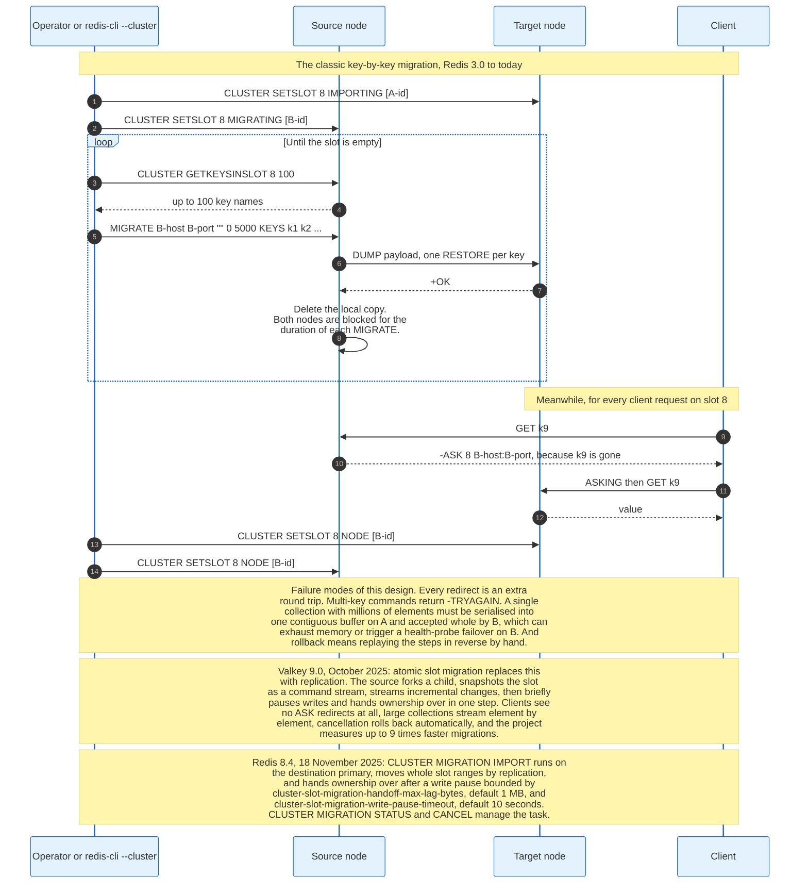
```mermaid
%%{init: {'theme': 'base', 'themeVariables': {'primaryColor': '#e3f2fd', 'primaryBorderColor': '#1565c0', 'lineColor': '#37474f'}}}%%

sequenceDiagram
    autonumber
    participant Op as Operator or redis-cli --cluster
    participant A as Source node
    participant B as Target node
    participant Cl as Client

    Note over Op,Cl: The classic key-by-key migration, Redis 3.0 to today

    Op->>B: CLUSTER SETSLOT 8 IMPORTING [A-id]
    Op->>A: CLUSTER SETSLOT 8 MIGRATING [B-id]

    loop Until the slot is empty
        Op->>A: CLUSTER GETKEYSINSLOT 8 100
        A-->>Op: up to 100 key names
        Op->>A: MIGRATE B-host B-port "" 0 5000 KEYS k1 k2 ...
        A->>B: DUMP payload, one RESTORE per key
        B-->>A: +OK
        A->>A: Delete the local copy.<br/>Both nodes are blocked for the<br/>duration of each MIGRATE.
    end

    Note over Cl,B: Meanwhile, for every client request on slot 8
    Cl->>A: GET k9
    A-->>Cl: -ASK 8 B-host:B-port, because k9 is gone
    Cl->>B: ASKING then GET k9
    B-->>Cl: value

    Op->>B: CLUSTER SETSLOT 8 NODE [B-id]
    Op->>A: CLUSTER SETSLOT 8 NODE [B-id]

    Note over Op,Cl: Failure modes of this design. Every redirect is an extra<br/>round trip. Multi-key commands return -TRYAGAIN. A single<br/>collection with millions of elements must be serialised into<br/>one contiguous buffer on A and accepted whole by B, which can<br/>exhaust memory or trigger a health-probe failover on B. And<br/>rollback means replaying the steps in reverse by hand.

    Note over Op,Cl: Valkey 9.0, October 2025: atomic slot migration replaces this<br/>with replication. The source forks a child, snapshots the slot<br/>as a command stream, streams incremental changes, then briefly<br/>pauses writes and hands ownership over in one step. Clients see<br/>no ASK redirects at all, large collections stream element by<br/>element, cancellation rolls back automatically, and the project<br/>measures up to 9 times faster migrations.

    Note over Op,Cl: Redis 8.4, 18 November 2025: CLUSTER MIGRATION IMPORT runs on<br/>the destination primary, moves whole slot ranges by replication,<br/>and hands ownership over after a write pause bounded by<br/>cluster-slot-migration-handoff-max-lag-bytes, default 1 MB, and<br/>cluster-slot-migration-write-pause-timeout, default 10 seconds.<br/>CLUSTER MIGRATION STATUS and CANCEL manage the task.
```

The classic sequence is: `CLUSTER SETSLOT <slot> IMPORTING <source-id>` on the target, `CLUSTER SETSLOT <slot> MIGRATING <target-id>` on the source, then a loop of `CLUSTER GETKEYSINSLOT <slot> <count>` and `MIGRATE <host> <port> "" 0 <timeout> KEYS k1 k2 ...`, finishing with `CLUSTER SETSLOT <slot> NODE <target-id>` on both nodes and ideally on every other node to avoid waiting for gossip.

`MIGRATE` serialises the key, sends it, waits for `+OK`, and deletes the local copy, with both instances blocked for the duration. From a client's perspective the key exists in exactly one place at every instant, which is the correctness property that makes the whole scheme work.

Five failure modes come with it, and the Valkey project enumerated them when replacing it. Every access to a moved key costs an extra round trip through `-ASK`. Multi-key commands return `-TRYAGAIN` and must be retried by the application. A single large collection must be serialised into one contiguous buffer on the source and accepted whole by the target, which can exhaust memory on either side or produce a CPU burst long enough to make the target miss health probes and trigger its own failover. Migration speed is bounded by the round trip between the operator's machine and the cluster, because the loop is driven externally. And rollback means replaying the steps backwards by hand, with no guarantee the slot still fits where it came from.

Valkey 9.0, released 21 October 2025, replaced the mechanism with **atomic slot migration**, which migrates a slot by replicating it. Three phases: the source forks a child that sends a point-in-time snapshot of the slot as a stream of commands; the source streams incremental changes for those slots while the snapshot is in flight; then the source briefly pauses mutations, the target finishes applying, ownership transfers atomically, and paused clients are redirected. Clients see no `-ASK` redirections and no `-TRYAGAIN` errors. Large collections stream element by element because the transfer is in AOF command form rather than a single serialised value. Cancellation and rollback are built in. The project measures up to 9 times faster migrations.

Redis reached the same design four weeks later. Redis 8.4, released 18 November 2025, added `CLUSTER MIGRATION IMPORT`, which runs on the destination primary, moves whole slot ranges by replication, and hands ownership over after a bounded write pause. Two settings govern the handoff. `cluster-slot-migration-handoff-max-lag-bytes`, default 1 MB, sets how small the remaining replication stream must be before the source pauses writes, and `cluster-slot-migration-write-pause-timeout`, default 10 seconds, caps how long that pause may last before the source assumes failure and resumes. `CLUSTER MIGRATION STATUS` and `CLUSTER MIGRATION CANCEL` manage the task, which carries a task ID. The two projects now differ on schedule and on interface, not on mechanism.

### 14.6 What Cluster Does Not Do

Cluster supports only database 0 in Redis; `SELECT` is rejected. Valkey 9.0 broke from that and added numbered databases in cluster mode.

Cluster does not merge. The specification states the reason: Redis values are often huge and semantically complex, and transferring and merging a million-element sorted set would require application logic and metadata that would make the system behave unlike Redis. The merge function is "last failover wins", and older data is discarded.

Cluster is unavailable in the minority partition by design. In the majority partition it recovers after `cluster-node-timeout` plus the one or two seconds a failover takes. With N primaries each having one replica, losing two random nodes leaves the cluster unavailable with probability `1/(N*2-1)`, which for a 5-primary cluster is 11.11%.

---

## 15. The RESP Wire Protocol

RESP is a text protocol with binary-protocol parsing performance, and it achieves that with one idea: every payload is length-prefixed, so nothing is ever scanned for a delimiter.

### 15.1 The Shape of a Request

Every command a client sends is a RESP array of bulk strings. There is no second form.


```mermaid
%%{init: {'theme': 'base', 'themeVariables': {'primaryColor': '#e3f2fd', 'primaryBorderColor': '#1565c0', 'lineColor': '#37474f'}}}%%

flowchart TB
    subgraph Req["Every request is the same shape"]
        RQ["A RESP array of bulk strings.<br/>SET user:42 alice becomes<br/>*3 CRLF $3 CRLF SET CRLF<br/>$7 CRLF user:42 CRLF<br/>$5 CRLF alice CRLF<br/>= 37 bytes on the wire"]
    end

    subgraph R2["RESP2, the default since Redis 2.0"]
        A1["+ simple string, +OK CRLF"]
        A2["- simple error, -WRONGTYPE ... CRLF"]
        A3[": integer, :1000 CRLF"]
        A4["$ bulk string, $5 CRLF hello CRLF.<br/>Capped at proto-max-bulk-len,<br/>512 MB by default"]
        A5["* array, *2 CRLF then two elements"]
        A6["Null is overloaded:<br/>$-1 CRLF for a missing string,<br/>*-1 CRLF for a missing array"]
    end

    subgraph R3["RESP3, opt-in since Redis 6.0 via HELLO 3"]
        B1["_ null, one form for everything"]
        B2["# boolean, #t or #f"]
        B3[", double, ,1.23 and ,inf and ,nan"]
        B4["Open paren: big number,<br/>values beyond signed 64-bit"]
        B5["! bulk error, length-prefixed"]
        B6["= verbatim string, =15 CRLF txt:..."]
        B7["% map, replaces the flat array<br/>that RESP2 used for hashes"]
        B8["~ set, unordered and unique"]
        B9["Pipe: attribute, out-of-band<br/>metadata attached to the next reply"]
        B10["&gt; push, server-initiated.<br/>Lets pub/sub, client-side caching<br/>invalidation and monitoring share<br/>one connection with normal commands."]
    end

    subgraph Hand["The handshake"]
        H1["HELLO 3 replies with a map:<br/>server, version, proto, id,<br/>mode standalone|sentinel|cluster,<br/>role master|replica, modules"]
        H2["HELLO 4 gets -NOPROTO.<br/>An old server gets<br/>-ERR unknown command 'HELLO'.<br/>Either way the client falls back."]
    end

    subgraph Parse["Why RESP parses like a binary protocol"]
        P1["Every bulk payload is length-prefixed,<br/>so no scanning for delimiters,<br/>no quoting, no escaping"]
        P2["Read the length one digit at a time<br/>until CR, then one read of exactly<br/>that many bytes"]
        P3["Inline commands still work:<br/>anything not starting with * is<br/>split on spaces. That is why telnet<br/>PING returns +PONG."]
    end

    Req --> R2 --> R3 --> Hand --> Parse

    style Req fill:#eceff1,stroke:#37474f,stroke-width:2px
    style R2 fill:#e3f2fd,stroke:#1565c0,stroke-width:3px
    style R3 fill:#e8f5e9,stroke:#2e7d32,stroke-width:2px
    style Hand fill:#fff3e0,stroke:#e65100,stroke-width:2px
    style Parse fill:#f3e5f5,stroke:#4a148c,stroke-width:2px
```

`LLEN mylist` goes on the wire as 26 bytes:

```
*2\r\n$4\r\nLLEN\r\n$6\r\nmylist\r\n
```

The reply is command-specific and can be any RESP type. For `LLEN` it is an integer: `:48293\r\n`.

The first byte determines the type, and `\r\n` always terminates a part. Bulk strings are capped at `proto-max-bulk-len`, 512 MB by default and settable no lower than 1 MB.

### 15.2 RESP2

Five types, first defined in Redis 1.2 and standard from Redis 2.0.

| First byte | Type | Example |
|---|---|---|
| `+` | Simple string | `+OK\r\n` |
| `-` | Simple error | `-WRONGTYPE Operation against a key holding the wrong kind of value\r\n` |
| `:` | Integer, signed 64-bit | `:1000\r\n` |
| `` $ `` | Bulk string, length-prefixed and binary-safe | `$5\r\nhello\r\n` |
| `*` | Array, may nest and may mix types | `*2\r\n$5\r\nhello\r\n$5\r\nworld\r\n` |

The error prefix is a convention rather than part of the type: the first uppercase word up to the first space is the error class, and `ERR` is the generic one. Clients are expected to be able to branch on `WRONGTYPE`, `NOSCRIPT`, `MOVED`, `ASK`, `TRYAGAIN`, `CROSSSLOT`, `OOM`, `LOADING`, `BUSY`, `MASTERDOWN`, `NOPROTO`, `READONLY`, `NOPERM` and `EXECABORT` without matching the prose.

RESP2 has no null type. It expresses null twice: `$-1\r\n` for a missing bulk string, returned by `GET` on a missing key, and `*-1\r\n` for a missing array, returned by `BLPOP` on timeout. Client libraries must distinguish a null array from an empty array, because `BLPOP` timing out and `BLPOP` returning nothing are different events.

### 15.3 RESP3

RESP3 arrived as opt-in in Redis 6.0 and adds ten wire types, all of which exist to remove ambiguity that RESP2 forced clients to resolve with per-command knowledge. The specification counts eleven, because it lists the `HELLO` handshake alongside them.

| First byte | Type | What it fixes |
|---|---|---|
| `_` | Null | One representation instead of two |
| `#` | Boolean, `#t` or `#f` | `SISMEMBER` returning 1 or 0 was untyped |
| `,` | Double, including `,inf`, `,-inf`, `,nan` | Scores arrived as strings |
| `(` | Big number | Values outside signed 64-bit |
| `!` | Bulk error, length-prefixed | Errors containing newlines |
| `=` | Verbatim string, `=15\r\ntxt:...` | `INFO` output that must not be quoted |
| `%` | Map | `XPENDING`, `CONFIG GET` and `HGETALL` were flat arrays |
| `\|` | Attribute | Out-of-band metadata attached to the next reply |
| `~` | Set | Unordered, unique |
| `>` | Push | Server-initiated messages |

Push is the type that changes architecture rather than ergonomics. In RESP2, subscribing to a pub/sub channel converts the connection into a push-only channel on which ordinary commands cannot be issued, so a client that needs both needs two connections. In RESP3, push messages are a distinct type that can appear before or after any reply but never inside one, so pub/sub, client-side caching invalidation and monitoring share one connection with normal traffic. Client-side caching, the `CLIENT TRACKING` feature added in Redis 6.0, depends on this.

RESP3 also defines two streamed encodings for payloads whose length is unknown when transmission begins: `$?\r\n;5\r\nHello\r\n;6\r\n world\r\n;0\r\n` for strings, and `*?\r\n...\r\n.\r\n` for aggregates. Redis itself never emits either. The specification permits modules to, so a complete RESP3 client should parse them.

### 15.4 The Handshake

A RESP3 connection begins with `HELLO 3`, which replies with a map containing at minimum `server`, `version` and `proto`, and in Redis additionally `id`, `mode` (one of `standalone`, `sentinel`, `cluster`), `role` and `modules`.

Version negotiation is by failure. `HELLO 4` returns `-NOPROTO sorry, this protocol version is not supported`. A pre-6.0 server returns `-ERR unknown command 'HELLO'`. Either way the client falls back to RESP2 and continues. `HELLO 3 AUTH default <password>` with a bad password returns an error and leaves the connection in RESP2, which is a subtlety a client must handle rather than assume.

From Redis 7.0 onward both RESP2 and RESP3 clients can invoke every core command; only the reply *shape* differs, and each command's documentation specifies both.

### 15.5 Inline Commands

Anything that does not begin with `*` is parsed as a space-separated inline command. This is why `telnet localhost 6379` followed by `PING` returns `+PONG`, and it is a debugging convenience rather than a supported client protocol.

It is also a security consideration. Because HTTP requests and other line-oriented protocols parse as inline commands, a browser or a confused proxy pointed at a Redis port can execute commands. Redis mitigates this with protected mode, which refuses non-loopback connections when no password and no bind address are configured, replying `-DENIED` and closing.

---

## 16. Pipelining, Transactions, and Scripting

Three mechanisms batch work, they solve three different problems, and they are routinely confused for one another.


```mermaid
%%{init: {'theme': 'base', 'themeVariables': {'primaryColor': '#e3f2fd', 'primaryBorderColor': '#1565c0', 'lineColor': '#37474f'}}}%%

flowchart TB
    subgraph Pipe["Pipelining - a client-side batching trick"]
        P1["Write N commands into one buffer,<br/>read N replies afterwards"]
        P2["Saves N-1 round trips AND N-1 pairs<br/>of read and write syscalls.<br/>Throughput rises roughly linearly<br/>with depth and plateaus near<br/>10 times the unpipelined rate."]
        P3["NOT atomic. Other clients' commands<br/>interleave freely between yours."]
        P4["Server queues every reply in memory.<br/>Batch in groups of about 10000."]
    end

    subgraph Multi["MULTI / EXEC - server-side queueing"]
        M1["MULTI, then commands reply +QUEUED,<br/>then EXEC runs the whole queue with<br/>no other client interleaved"]
        M2["Atomic in the isolation sense only.<br/>There is no rollback: a WRONGTYPE at<br/>command 3 does not undo commands 1<br/>and 2, and EXEC still runs 4 and 5."]
        M3["Two error classes. A syntax error or<br/>an unknown command fails at queue time<br/>and, since 2.6.5, aborts EXEC. A type<br/>error fails at execution time and does not."]
        M4["WATCH adds optimistic locking.<br/>If any watched key is touched before<br/>EXEC, by another client OR by expiry<br/>or eviction, EXEC returns a null reply."]
        M5["No conditional logic. The command list<br/>is fixed before the first reply is seen."]
    end

    subgraph Lua["EVAL / EVALSHA and Redis Functions"]
        L1["Lua 5.1, embedded. The script runs<br/>to completion with the server blocked,<br/>so read-compute-write is one step."]
        L2["Script cache keyed by SHA1.<br/>SCRIPT LOAD then EVALSHA.<br/>Cache is volatile: flushed on restart,<br/>on failover, and by SCRIPT FLUSH.<br/>A missing digest returns -NOSCRIPT."]
        L3["Every key the script touches must be<br/>declared in KEYS. Cluster routing<br/>depends on it and is not enforced."]
        L4["Effects replication: since Redis 5.0<br/>only the write commands the script<br/>produced are propagated, wrapped in<br/>MULTI/EXEC. Verbatim script replication<br/>was removed in 7.0, so non-deterministic<br/>calls like TIME are now safe."]
        L5["A script past busy-reply-threshold makes<br/>the server answer -BUSY to everyone.<br/>SCRIPT KILL works only if the script has<br/>not yet written. Otherwise the only exit<br/>is SHUTDOWN NOSAVE."]
        L6["Redis Functions, 7.0: FUNCTION LOAD<br/>registers a named library that IS<br/>persisted in the RDB and replicated,<br/>so the application stops re-uploading it."]
    end

    subgraph Choose["Choosing"]
        C1["Many independent commands,<br/>no dependency: pipeline"]
        C2["A fixed set that must not interleave:<br/>MULTI/EXEC"]
        C3["A read whose result decides the write:<br/>Lua or a Function"]
        C4["A conditional single-key update:<br/>since Redis 8.4, SET with IFEQ or<br/>DELEX beat WATCH on both counts"]
    end

    Pipe --> Multi --> Lua --> Choose

    style Pipe fill:#e3f2fd,stroke:#1565c0,stroke-width:3px
    style Multi fill:#e8f5e9,stroke:#2e7d32,stroke-width:2px
    style Lua fill:#fff3e0,stroke:#e65100,stroke-width:2px
    style Choose fill:#f3e5f5,stroke:#4a148c,stroke-width:2px
```

### 16.1 Pipelining

Pipelining is a client-side technique: write N commands into the socket without reading, then read N replies. It is not a server feature, requires no server support beyond the request-response protocol already being pipeline-safe, and has worked since the earliest versions.

It saves two things. The obvious one is N-1 round trips: at a 250 ms RTT, a server capable of 100,000 requests per second still delivers 4 requests per second to a sequential client. The less obvious one is syscalls. Without pipelining, each command costs a `read(2)` and a `write(2)` on the server, each of which is a user-to-kernel transition. With pipelining, one `read` collects many commands and one `write` delivers many replies. The documented effect is that throughput rises almost linearly with pipeline depth and plateaus at roughly ten times the unpipelined rate.

Even on loopback the effect is large. The benchmark in the Redis documentation runs 10,000 `PING` commands from Ruby: 1.185 seconds sequentially, 0.251 seconds pipelined, a factor of five on the interface where RTT is smallest. The reason loopback is not free is the scheduler: each process must be scheduled to read its peer's bytes, so a busy loop still pays network-like latency.

Two things pipelining does not provide. It is not atomic; other clients' commands interleave freely. And the server buffers every reply in memory until the client reads them, so the documentation recommends batching in groups of around 10,000 rather than sending a million commands and hoping.

### 16.2 MULTI and EXEC

`MULTI` starts queueing. Each subsequent command replies `+QUEUED`. `EXEC` executes the whole queue with no other client's command interleaved, and returns an array of replies in order. `DISCARD` throws the queue away.

The guarantee is isolation, and only isolation. There is no rollback, and the documentation gives the reason without apology: "Redis does not support rollbacks of transactions since supporting rollbacks would have a significant impact on the simplicity and performance of Redis."

The consequence is worth spelling out because it contradicts every relational instinct. Given `MULTI`, `SET a abc`, `LPOP a`, `EXEC`, the reply is a two-element array containing `+OK` and `-WRONGTYPE`. The `SET` stands. If there were a third command it would also run. A Redis transaction is a batch that cannot be interrupted, not a unit of work that can be undone.

Two error classes behave differently. An error detected while queueing, such as an unknown command or a wrong argument count, is reported immediately, and since Redis 2.6.5 also causes `EXEC` to abort the entire transaction with `-EXECABORT`. An error detected at execution time, such as a type mismatch, does not stop anything.

`WATCH` adds optimistic concurrency. Watched keys are monitored, and if any is modified before `EXEC`, the transaction aborts and `EXEC` returns a null reply. "Modified" includes modification by another client, by expiry, and by eviction; expiry was made to count from Redis 6.0.9 onward. Commands inside the transaction never trigger the condition, since they are queued rather than executed. `EXEC` unwatches everything regardless of outcome, and so does closing the connection.

The canonical use is a check-and-set loop: `WATCH key`, read, compute, `MULTI`, write, `EXEC`, and retry on a null reply. Since Redis 8.4 the single-key form of this has a direct command: `SET key value IFEQ oldvalue` performs compare-and-set atomically, and `DELEX` performs compare-and-delete, both in one round trip with no watch, no retry loop and no queue.

### 16.3 Lua Scripting

`EVAL` runs a Lua 5.1 script inside the server with everything else blocked, which makes read-compute-write a single atomic step. That is the capability neither pipelining nor `MULTI` provides, because both fix the command list before seeing any reply.

Scripts are cached by SHA1 digest. `SCRIPT LOAD` compiles and caches without executing, returning the digest; `EVALSHA <digest>` runs it. The cache is explicitly volatile: it is not part of the dataset, is not persisted, is cleared on restart, is cleared when a replica is promoted, and is cleared by `SCRIPT FLUSH`. A missing digest returns `-NOSCRIPT No matching script`, and every client library is expected to fall back to `EVAL` and retry.

`EVALSHA` inside a pipeline is a documented hazard: the `NOSCRIPT` error arrives in the middle of a batch where it cannot be handled, so client libraries should use plain `EVAL` when pipelining.

Every key a script touches must be passed in `KEYS`. This is not enforced and it is not optional in practice: cluster routing depends on the declared keys, and a script that computes a key name from data will work on a standalone instance and fail unpredictably in a cluster.

**Replication changed twice.** Until Redis 3.2, the script source was sent to replicas and to the AOF and re-executed there, which required every write script to be deterministic. Redis 3.2 added *effects replication*, which propagates only the write commands the script actually produced, wrapped in `MULTI`/`EXEC`. Redis 5.0 made it the default and Redis 7.0 removed verbatim replication entirely. The practical result is that `TIME`, `SRANDMEMBER` and `math.random` are now safe inside a write script, and the sorting filter Redis 4.0 applied to `SMEMBERS` results inside Lua was removed.

**A long script is an outage.** After `busy-reply-threshold` milliseconds, the server answers `-BUSY` to every other client. `SCRIPT KILL` terminates the script only if it has not yet written; killing a script that has written would violate atomicity, so once a script has performed a write the only remedy is `SHUTDOWN NOSAVE`, which loses everything not persisted.

**Script flags**, added in Redis 7.0, let a script declare its behaviour with a shebang: `#!lua flags=no-writes,allow-stale`. A `no-writes` script can run on a replica and can be killed safely. Note the subtlety: the presence of `#!` changes the defaults even when no flags follow, and a script with a shebang inherits the cluster restriction that keys must share a slot, while one without it does not.

**Redis Functions**, Redis 7.0, are the answer to the volatile cache. `FUNCTION LOAD` registers a named library that *is* part of the dataset: persisted in the RDB, replicated to replicas, and surviving a failover. An application no longer has to re-upload its logic after every restart.

### 16.4 Choosing

| Requirement | Use |
|---|---|
| Many independent commands, no dependency between them | Pipelining |
| A fixed command list that must not interleave with other clients | `MULTI`/`EXEC` |
| A read whose result determines the write | Lua script or a Function |
| Conditional update of one string key | `SET ... IFEQ` or `DELEX`, Redis 8.4 and later |
| Logic that must survive restart and failover without re-upload | Redis Functions |
| Multiple keys, cluster mode | Any of the above, but every key in one slot via a hash tag |

---

## 17. Memory Fragmentation and jemalloc

Redis reports two different memory numbers and the gap between them is the subject of more misdiagnosis than any other metric.


```mermaid
%%{init: {'theme': 'base', 'themeVariables': {'primaryColor': '#e3f2fd', 'primaryBorderColor': '#1565c0', 'lineColor': '#37474f'}}}%%

flowchart TB
    subgraph Alloc["jemalloc rounds every request up to a size class"]
        A1["Small: 8, 16, 32, 48, 64, 80, 96, 112,<br/>128, 160, 192, 224, 256 ... bytes"]
        A2["A 65-byte request consumes 80 bytes.<br/>The 15 bytes are internal fragmentation<br/>and are invisible to used_memory."]
        A3["Runs of equal-size objects live in<br/>4 MB extents. A run is returned to the<br/>OS only when every object in it is free."]
        A4["This is why the embstr limit is 44:<br/>16-byte robj plus a 3-byte sdshdr8<br/>plus 44 bytes plus a NUL is 64 exactly"]
    end

    subgraph Metrics["The three numbers in INFO memory"]
        M1["used_memory: the sum of what Redis<br/>asked the allocator for"]
        M2["used_memory_rss: resident set size,<br/>what the OS says the process holds"]
        M3["mem_fragmentation_ratio =<br/>used_memory_rss / used_memory"]
        M4["allocator_frag_ratio isolates the<br/>allocator's own waste from copy-on-write<br/>pages, stacks and code"]
    end

    subgraph Read["Reading the ratio"]
        R1["About 1.0 to 1.5: normal"]
        R2["Above 1.5 with a stable workload:<br/>real external fragmentation"]
        R3["Very high after a large delete:<br/>an artefact. RSS reflects the PEAK.<br/>Provision for peak, not for average."]
        R4["Below 1.0: part of the process is<br/>swapped out. Check /proc/PID/smaps<br/>for non-zero Swap lines. This is the<br/>only reading that is always bad."]
    end

    subgraph Defrag["activedefrag, off by default"]
        D1["Redis links jemalloc with a patch<br/>that reports whether a given pointer<br/>sits in a sparsely used run"]
        D2["The defragmenter reallocates such<br/>objects, letting jemalloc release the<br/>run. Copying in place is only possible<br/>because Redis is single-threaded."]
        D3["active-defrag-ignore-bytes 100mb,<br/>active-defrag-threshold-lower 10,<br/>active-defrag-threshold-upper 100,<br/>active-defrag-cycle-min 1,<br/>active-defrag-cycle-max 25,<br/>active-defrag-max-scan-fields 1000"]
        D4["CPU spend scales linearly between the<br/>lower and upper thresholds. jemalloc-bg-thread<br/>yes lets jemalloc purge in the background."]
    end

    Alloc --> Metrics --> Read --> Defrag

    style Alloc fill:#e3f2fd,stroke:#1565c0,stroke-width:3px
    style Metrics fill:#e8f5e9,stroke:#2e7d32,stroke-width:2px
    style Read fill:#fff3e0,stroke:#e65100,stroke-width:2px
    style Defrag fill:#f3e5f5,stroke:#4a148c,stroke-width:2px
```

### 17.1 Why jemalloc

Redis bundles jemalloc and links it by default on Linux, because glibc's `malloc` fragmented badly on the allocation pattern Redis produces: enormous numbers of small, long-lived, similarly sized objects.

jemalloc rounds every request up to a size class. The small classes run 8, 16, 32, 48, 64, 80, 96, 112, 128, 160, 192, 224, 256 and upward. A 65-byte request occupies 80 bytes, and the 15-byte difference is internal fragmentation that `used_memory` never sees, because `used_memory` counts what Redis asked for.

This rounding is why several Redis constants look arbitrary and are not. `OBJ_ENCODING_EMBSTR_SIZE_LIMIT` is 44 so that a 16-byte `robj` plus a 3-byte `sdshdr8` plus 44 payload bytes plus a NUL lands on exactly 64. Valkey's 9.1 work is explicit about the same constraint: removing 8 bytes from the header only pays off when it moves an allocation across a size-class boundary, which is why the measured saving ranges from 17% to 44% depending on key and value size rather than being a flat number.

Objects of the same size class are grouped into runs inside 4 MB extents, and a run is returned to the operating system only when every object in it is free. That is the mechanism behind the observation in the documentation: fill an instance with 5 GB, delete 2 GB, and RSS stays near 5 GB because the surviving keys are scattered across the same pages as the deleted ones.

### 17.2 Reading the Ratio

`INFO memory` reports `used_memory` (the sum of allocation requests), `used_memory_rss` (what the operating system says the process holds), and `mem_fragmentation_ratio`, which is the second divided by the first.

| Reading | Meaning |
|---------|---------|
| 1.0 to 1.5 | Normal. Allocator rounding plus code, stacks and buffers |
| Above 1.5, stable workload | Real external fragmentation. Consider `activedefrag` |
| Very high after a mass deletion | An artefact. RSS reflects the peak, not the present. Provision for peak |
| Below 1.0 | Part of the process has been swapped out. This is the only reading that is unambiguously bad |

The last row deserves emphasis because it inverts the intuition that lower is better. A ratio below 1 means the resident set is smaller than the allocated memory, which can only mean pages are on disk. The diagnostic is `grep Swap /proc/<pid>/smaps`, and the fix is to remove memory pressure, not to tune Redis. `allocator_frag_ratio`, reported separately, isolates the allocator's own waste from copy-on-write pages, stacks and code, and is the more honest number when a fork child is running.

The provisioning rule that falls out of this is the one operators most often get wrong: size the instance for peak memory usage, not average. A workload needing 10 GB occasionally and 5 GB usually needs 10 GB of RAM, because the allocator will not have given the difference back.

### 17.3 Active Defragmentation

Redis can defragment itself while running, which is only possible because it is single-threaded.

The mechanism depends on a patched jemalloc that reports whether a given pointer sits in a sparsely occupied run. When it does, Redis reallocates the object, copies the contents, and updates the pointer. A multi-threaded server could not do this without a read barrier on every pointer dereference; a single-threaded one knows that nothing else holds a reference at that instant.

The defaults, all commented out in `redis.conf` because the feature is off:

```
# activedefrag no
# active-defrag-ignore-bytes 100mb
# active-defrag-threshold-lower 10
# active-defrag-threshold-upper 100
# active-defrag-cycle-min 1
# active-defrag-cycle-max 25
# active-defrag-max-scan-fields 1000
jemalloc-bg-thread yes
```

Defragmentation starts only when the waste exceeds both 100 MB and 10% of memory, and the CPU it spends scales linearly from 1% at the lower threshold to 25% at the upper one. `active-defrag-max-scan-fields` bounds how many fields of a large collection are processed in one dictionary scan step, so a single huge hash cannot monopolise a cycle.

`jemalloc-bg-thread yes` is on by default and lets jemalloc purge freed extents back to the OS in the background rather than during an allocation.

### 17.4 Client Buffers Are Memory Too

The largest instances often fail not on data but on buffers, and those buffers are governed by their own settings.

`client-output-buffer-limit` takes three classes with different defaults:

```
client-output-buffer-limit normal 0 0 0
client-output-buffer-limit replica 256mb 64mb 60
client-output-buffer-limit pubsub 32mb 8mb 60
```

The three numbers are a hard limit, a soft limit, and the seconds the soft limit must be exceeded before the client is closed. Normal clients are unlimited by default, which is why a single client issuing `KEYS *` against a large keyspace can allocate gigabytes of reply buffer. A replica exceeding 256 MB is disconnected, which restarts its full synchronisation, which regenerates the load that caused the overflow. That loop is the classic replication-storm failure.

`maxmemory-clients`, added in Redis 7.0 and accepting either a size or a percentage of `maxmemory`, caps the aggregate memory of all client connections and evicts the largest consumers when the cap is hit. It is the direct mitigation for the above.

---

## 18. One SET, End to End

Tracing a single command through the server ties every mechanism above to a concrete byte count.

The command is:

```
SET session:9f3a logged-in EX 900
```

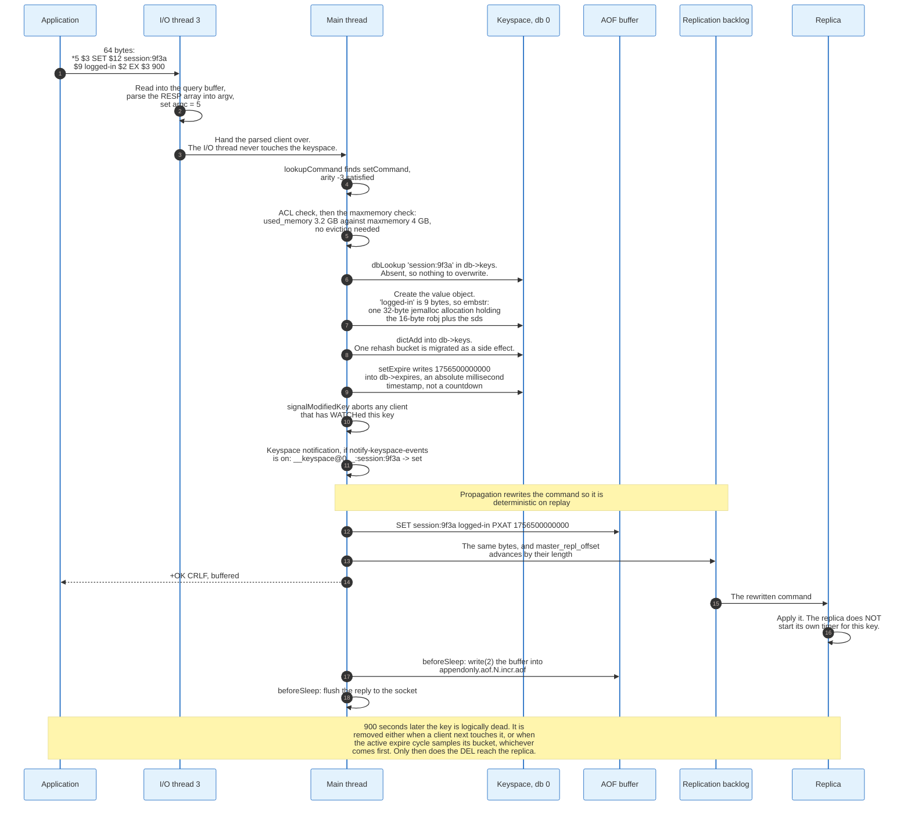
```mermaid
%%{init: {'theme': 'base', 'themeVariables': {'primaryColor': '#e3f2fd', 'primaryBorderColor': '#1565c0', 'lineColor': '#37474f'}}}%%

sequenceDiagram
    autonumber
    participant App as Application
    participant IO as I/O thread 3
    participant Main as Main thread
    participant KS as Keyspace, db 0
    participant AOF as AOF buffer
    participant Repl as Replication backlog
    participant Rep as Replica

    App->>IO: 64 bytes:<br/>*5 $3 SET $12 session:9f3a<br/>$9 logged-in $2 EX $3 900
    IO->>IO: Read into the query buffer,<br/>parse the RESP array into argv,<br/>set argc = 5
    IO->>Main: Hand the parsed client over.<br/>The I/O thread never touches the keyspace.

    Main->>Main: lookupCommand finds setCommand,<br/>arity -3 satisfied
    Main->>Main: ACL check, then the maxmemory check:<br/>used_memory 3.2 GB against maxmemory 4 GB,<br/>no eviction needed
    Main->>KS: dbLookup 'session:9f3a' in db->keys.<br/>Absent, so nothing to overwrite.
    Main->>KS: Create the value object.<br/>'logged-in' is 9 bytes, so embstr:<br/>one 32-byte jemalloc allocation holding<br/>the 16-byte robj plus the sds
    Main->>KS: dictAdd into db->keys.<br/>One rehash bucket is migrated as a side effect.
    Main->>KS: setExpire writes 1756500000000<br/>into db->expires, an absolute millisecond<br/>timestamp, not a countdown
    Main->>Main: signalModifiedKey aborts any client<br/>that has WATCHed this key
    Main->>Main: Keyspace notification, if notify-keyspace-events<br/>is on: __keyspace@0__:session:9f3a -> set

    Note over Main,Repl: Propagation rewrites the command so it is<br/>deterministic on replay
    Main->>AOF: SET session:9f3a logged-in PXAT 1756500000000
    Main->>Repl: The same bytes, and master_repl_offset<br/>advances by their length
    Main-->>App: +OK CRLF, buffered

    Repl->>Rep: The rewritten command
    Rep->>Rep: Apply it. The replica does NOT<br/>start its own timer for this key.

    Main->>AOF: beforeSleep: write(2) the buffer into<br/>appendonly.aof.N.incr.aof
    Main->>Main: beforeSleep: flush the reply to the socket

    Note over App,Rep: 900 seconds later the key is logically dead. It is<br/>removed either when a client next touches it, or when<br/>the active expire cycle samples its bucket, whichever<br/>comes first. Only then does the DEL reach the replica.
```

**On the wire, 64 bytes.** The client encodes it as a RESP array of five bulk strings:

```
*5\r\n$3\r\nSET\r\n$12\r\nsession:9f3a\r\n$9\r\nlogged-in\r\n$2\r\nEX\r\n$3\r\n900\r\n
```

**Read and parsed off the main thread.** With `io-threads 4` on Redis 8.0, the client is bound to one I/O thread which reads into the query buffer, parses the array into an `argv` vector of five `robj` pointers, and hands the client to the main thread only when a complete command is available. With `io-threads 1`, the main thread does the same work in `readQueryFromClient`.

**Dispatch.** `lookupCommand` finds `setCommand`, whose arity is -3, meaning at least three arguments. The ACL check runs against the connection's user. Then the memory check: suppose `used_memory` is 3.2 GB against `maxmemory 4 GB`, so `performEvictions` returns immediately without evicting.

**Keyspace lookup.** `dbLookup` hashes `session:9f3a` with SipHash and probes `db->keys`. The key is absent, so there is nothing to free.

**Object creation.** The value `logged-in` is 9 bytes, well inside the 44-byte embstr limit, so `createEmbeddedStringObject` makes one allocation holding the 16-byte `robj` and the sds header and payload contiguously. jemalloc rounds the 16 + 3 + 9 + 1 = 29 byte request up to the 32-byte size class. The key `session:9f3a` is stored as a separate 12-byte sds inside the dictionary entry.

**Insertion.** `dictAdd` inserts into `db->keys`. If a rehash is in progress, this call migrates one bucket from table 0 to table 1 as a side effect, which is how the rehash pays for itself.

**Expiry.** `EX 900` becomes an *absolute* millisecond timestamp. If the current time is 1756499100000, the value written into `db->expires` is 1756500000000. Nothing is scheduled.

**Side effects.** `signalModifiedKey` invalidates the key for any client that has `WATCH`ed it, so a concurrent `EXEC` will abort. If `notify-keyspace-events` is configured, two pub/sub messages fire: `__keyspace@0__:session:9f3a` carrying `set`, and `__keyevent@0__:set` carrying the key name. If `CLIENT TRACKING` is on for any client caching this key, a RESP3 invalidation push is queued.

**Propagation, and the rewrite.** The command is *not* logged as sent. Redis rewrites relative time into absolute time so that replay is deterministic:

```
SET session:9f3a logged-in PXAT 1756500000000
```

Those bytes go into `server.aof_buf` and into the replication backlog, and `master_repl_offset` advances by their length. Every replica receives the same bytes. This rewriting is why an AOF replayed six hours after it was written produces a key that is already expired rather than one with a fresh 900-second lease.

**Reply and flush.** `+OK\r\n` is appended to the client's output buffer. In `beforeSleep`, the AOF buffer is written with one `write(2)` into `appendonly.aof.N.incr.aof`, a `BIO_AOF_FSYNC` job is queued if a second has elapsed, and the reply is written to the socket. Under `appendfsync everysec` the client's `+OK` can therefore precede the `fsync` by up to a second.

**On the replica.** The replica applies the rewritten command and stores the same absolute timestamp. It does not start its own countdown and it will not delete the key on its own.

**900 seconds later.** The key is logically dead. It is physically removed by whichever comes first: a client touching it, triggering `expireIfNeeded`; or the active expire cycle sampling the bucket it lives in. Only at that moment is a `DEL` propagated to the AOF and to the replica. Between the two moments, `DBSIZE` counts the key and `GET` does not return it.

**Total memory.** Roughly 32 bytes for the value allocation, plus the `dictEntry` and the key sds in `db->keys`, plus a second `dictEntry` in `db->expires` holding the 8-byte timestamp. `MEMORY USAGE session:9f3a` reports the total for a given build, and the second `dictEntry` is the concrete cost of the TTL that the eviction documentation refers to when it notes that `allkeys-lru` is more memory-efficient than `volatile-lru`.

---

## 19. Economics: What Redis Costs to Run

Redis is priced in RAM, and every architectural decision in this document is ultimately a decision about how many gigabytes are on the invoice.

### 19.1 The Unit of Cost

Redis holds the entire dataset in memory. There is no buffer pool, no cold tier, and no option to spill. The cost of a Redis deployment is therefore the cost of enough RAM for the peak working set, times the replication factor, times the fork headroom.

The three multipliers compound:

- **Peak, not average.** jemalloc does not return memory after a mass deletion, so the instance must be sized for the largest the dataset ever gets.
- **Replication factor.** A primary with one replica costs twice. A three-shard cluster with one replica each costs six times a single node.
- **Fork headroom.** A write-heavy instance running `BGSAVE` or an AOF rewrite can approach doubling its resident set through copy-on-write. Running an instance above about 60% of the machine's RAM makes a snapshot a gamble.

An instance holding 40 GB of data with one replica and RDB enabled therefore wants two machines with roughly 128 GB each, not two with 48 GB.

### 19.2 Where the Overhead Goes

The per-key overhead is the number that decides whether a schema is affordable, and it is dominated by fixed costs rather than by the data.

A single string key costs, at minimum: a `dictEntry` in `db->keys` with a key pointer, a value pointer and a next pointer; an sds allocation for the key name; a 16-byte `robj` for the value; and the value's own storage. A key with a TTL adds a second `dictEntry`. Rounded through jemalloc size classes, a short key with a short value costs on the order of 100 bytes before the payload.

That fixed cost is why the hash-packing pattern in the memory optimisation documentation is so effective. Storing a hundred thousand small values as a hundred thousand top-level keys measured 11 MB in the reference benchmark. Storing the same values as about a thousand hashes of a hundred fields each, each hash small enough to stay listpack-encoded, measured 1.7 MB. The saving is the elimination of a hundred thousand `dictEntry` structures, a hundred thousand key sds allocations and a hundred thousand `robj` headers, replaced by a thousand of each plus a packed byte array.

The same reasoning drives the recent releases. Valkey 9.1 removed 8 bytes from the embstr header and raised the embstr threshold to 128 bytes, measuring 17% to 44% less overhead per string key. Redis 8.10 added compact hashes, which store field names once for keys that share a schema. Both are attacks on the same number.

### 19.3 What Vendors Charge

Managed Redis and Redis-compatible services are priced per gigabyte-hour of memory, per node-hour, or per request, and the differences reveal what each vendor thinks the scarce resource is.

Amazon ElastiCache Serverless prices data at 0.084 US dollars per GB-hour for Valkey and 0.125 per GB-hour for Memcached, with request pricing at 0.0023 US dollars per million ECPUs for Valkey, where one ECPU covers one kilobyte transferred. At 0.084 per GB-hour, a steady 40 GB dataset costs about 2,450 US dollars a month in storage alone before requests. Serverless bills stored data and consumed ECPUs rather than nodes, so there is no separate line item for a replica. Node-based tiers charge the other way: every replica is a billed instance, so a primary with one replica costs twice.

Amazon MemoryDB, which is the durable variant that writes to a multi-availability-zone transaction log before acknowledging, prices nodes hourly (0.4319 US dollars per hour for `db.r7g.xlarge` in US East as listed on its pricing page) and charges nothing for the first 10 terabytes of data written per month. The headline rate above that allowance is 0.20 US dollars per gigabyte, and the worked examples on the same page bill the overage at 0.04. Metering writes at all is the visible price of turning asynchronous replication into a durable log, and for most workloads the meter reads zero.

Node-based pricing on ElastiCache and equivalents is per instance-hour and per memory tier, and reserved nodes cut it by up to 48.2% against on-demand on a no-upfront reservation and up to 55% on an all-upfront one, as the pricing page lists. The comparison that matters when evaluating any of them is simple: divide the monthly bill by the peak gigabytes, and compare against the cost of the equivalent RAM plus an operator.

### 19.4 The Costs That Do Not Appear on the Invoice

Three costs are structural and are paid in engineering time rather than dollars.

**Cluster-mode client work.** A cluster client must implement `MOVED`, `ASK`, `ASKING`, `TRYAGAIN` and slot-map refresh, must route multi-key commands, and must handle the fact that hash tags are the only way to co-locate keys. Migrating an application from a single instance to a cluster is a schema change, not a configuration change, because every multi-key operation must be re-examined.

**Failover semantics.** Asynchronous replication means the application must tolerate losing recently acknowledged writes. Any workload that cannot is either using the wrong system or must pay for `WAIT`, `WAITAOF`, or a durable variant such as MemoryDB.

**Version-boundary risk.** The RDB format version gates replication and restore across versions. It is 12 in Redis 8.0 through 8.4, 13 in 8.6, 14 in 8.8 and 15 in 8.10. A replica cannot sync from a primary writing a newer RDB, and an RDB containing a newer type byte cannot be loaded by an older server. Upgrades are therefore ordered operations: replicas first, then the primary, then the failover.

---

## 20. Security and Risk

Redis was designed for a trusted network, and every security feature it has was added afterwards to a protocol that assumes the caller is friendly.

### 20.1 The Default Posture

Redis binds to localhost and enables protected mode when no password and no explicit bind address are configured. A connection from a non-loopback address in that state receives `-DENIED` and is closed unconditionally, whether or not the client writes anything.

This exists because of a specific and repeated incident class: internet-exposed Redis instances with no authentication. Because Redis parses inline commands, any line-oriented traffic reaching the port can execute commands, and a writable instance with `CONFIG SET dir` and `CONFIG SET dbfilename` can be made to write an RDB file into any path the process can reach, including an SSH `authorized_keys` file or a cron directory. Mass exploitation of exposed instances has been a recurring event since 2015 and remains one.

The current mitigations are protected mode, `requirepass`, ACLs, `rename-command` for dangerous commands, and `enable-protected-configs`, `enable-debug-command` and `enable-module-command`, which default to `no` and gate the configuration surface that makes the file-write attack possible.

### 20.2 ACLs

Redis 6.0 replaced a single shared password with users, permissions and key patterns.

An ACL rule names allowed commands by name or by category (`@read`, `@write`, `@admin`, `@dangerous`, `@keyspace`, and others), allowed key patterns, allowed pub/sub channel patterns, and one or more password hashes. Redis 8.0 added categories for the newly bundled data structures and folded their commands into the existing `@read` and `@write` categories.

The default user is `default`, which with no configuration has full access and no password. Setting `requirepass` sets that user's password. A production configuration typically disables the default user entirely and creates per-application users with a key prefix and a command category.

ACLs do not fully solve the confused-deputy problem inside Lua. A script runs with the calling user's permissions, and a script that computes key names from data can reach keys the pattern was meant to exclude, which is one more reason the requirement to declare keys in `KEYS` is a correctness requirement rather than a convention.

### 20.3 Transport

TLS arrived in Redis 6.0 and is a build-time option (`make BUILD_TLS=yes`) plus a runtime one (`tls-port`, `tls-cert-file`, `tls-key-file`, `tls-ca-cert-file`). It covers client connections, replication links and the cluster bus. It costs measurable throughput, because the encryption happens in the same thread that executes commands unless `io-threads` is on.

Unix domain sockets remain the fastest transport where client and server share a host: the documentation quotes about 30 microseconds of latency versus about 200 for 1 Gbit/s Ethernet.

### 20.4 The Recurring Vulnerability Classes

The published advisories cluster into three shapes, and the Redis 8.0.x patch history shows all three within a year.

**Memory-safety bugs in the data structure parsers.** Redis 8.0.3, released 6 July 2025, fixed an out-of-bounds write in HyperLogLog. Redis 8.0.5, on 2 November 2025, fixed crashes in HyperLogLog, cuckoo filter and Bloom filter operations. These reach a wide attack surface because the structures accept attacker-controlled binary payloads, notably through `RESTORE` and through the sparse HyperLogLog representation.

**Lua sandbox escapes.** Redis 8.0.4, released 3 October 2025, fixed a set of Lua vulnerabilities including one that could lead to remote code execution. The embedded interpreter is the largest single piece of attacker-reachable logic in the server, and it has been the subject of repeated advisories across versions.

**Protocol-level injection.** Redis 8.0.6, released 23 February 2026, fixed data manipulation through error reply injection. Because RESP errors are line-terminated and the error text can contain caller-influenced content, an unescaped value in an error message can be parsed by a client as a separate reply, desynchronising a pipelined connection.

The operational conclusion is unremarkable and holds for every one of these: keep the version current, do not expose the port, and require authentication even inside a private network. Redis backports security fixes across the current lines on a single day: the 23 February 2026 batch shipped 8.6.1, 8.4.2, 8.2.5, 8.0.6, 7.4.8 and 7.2.13 within twenty minutes of each other. The 6.2 line runs on its own slower cadence, patched on 2 November 2025 and again on 5 May 2026.

### 20.5 The Risks That Are Not Vulnerabilities

Four failure modes cause more incidents than any CVE.

**No `maxmemory`.** The instance grows until the OOM killer takes it. Data loss is total unless persistence is on.

**`stop-writes-on-bgsave-error yes` plus a full disk.** The instance goes read-only and stays there until the disk is cleared and a save succeeds.

**A `KEYS` or `FLUSHALL` in production.** Both block the single thread for the length of the keyspace. `SCAN` and `FLUSHALL ASYNC` are the safe forms.

**A replication storm.** A replica that exceeds `client-output-buffer-limit replica` is disconnected, resyncs fully, which forks the primary, which increases latency and buffer pressure, which disconnects the replica again.

---

## 21. Licensing, and the Fork to Valkey

Redis changed licence on 20 March 2024, a fork was announced eight days later, and the practical result is two wire-compatible codebases with diverging internals.

```mermaid
%%{init: {'theme': 'base', 'themeVariables': {'primaryColor': '#e3f2fd', 'primaryBorderColor': '#1565c0', 'lineColor': '#37474f'}}}%%

flowchart TB
    subgraph Before["2009 to March 2024"]
        B1["BSD 3-Clause.<br/>Redis 1.0 in 2009 through Redis 7.2<br/>in August 2023, all permissive."]
        B2["Modules diverged first:<br/>RediSearch, RedisJSON and the rest<br/>moved to RSALv2 or SSPLv1<br/>on 15 November 2022"]
    end

    subgraph Change["20 March 2024"]
        C1["Redis Ltd announces that from<br/>Redis 7.4 the core is dual-licensed<br/>RSALv2 or SSPLv1. Neither is<br/>OSI-approved."]
        C2["Stated reason: 'the majority of Redis'<br/>commercial sales are channeled through<br/>the largest cloud service providers,<br/>who commoditize Redis' investments'"]
        C3["RSALv2 forbids providing the software<br/>to others as a managed service.<br/>SSPLv1 requires publishing the entire<br/>service stack under SSPL."]
        C4["Not retroactive. Everything up to<br/>7.2.4 stays BSD forever."]
    end

    subgraph Fork["March and April 2024"]
        F1["Contributors fork 7.2.4 as<br/>PlaceholderKV within days"]
        F2["28 March 2024: the Linux Foundation<br/>announces Valkey, BSD 3-Clause,<br/>open governance. AWS, Google Cloud,<br/>Oracle, Ericsson and Snap back it."]
        F3["Maintainers include Madelyn Olson,<br/>a Redis core maintainer through 7.2,<br/>Ping Xie and Viktor Soderqvist"]
        F4["Valkey 7.2.5, April 2024:<br/>compatibility and licence continuity,<br/>no new features"]
    end

    subgraph Diverge["The two roadmaps"]
        D1["Valkey 8.0, 16 Sep 2024:<br/>async I/O threading, dual-channel<br/>replication, memory efficiency"]
        D2["Redis 8.0, 2 May 2025:<br/>AGPLv3 added as a third option.<br/>Query engine, JSON, time series,<br/>five probabilistic types and<br/>vector sets folded into the core."]
        D3["Valkey 9.0, 21 Oct 2025:<br/>atomic slot migration, hash field<br/>expiration, numbered databases in<br/>cluster mode, 2000-node clusters"]
        D4["Valkey 9.1, 19 May 2026:<br/>embstr threshold raised to 128 bytes,<br/>robj pointer removed, sorted-set<br/>members embedded in skiplist nodes"]
        D6["Redis 8.4, 18 Nov 2025:<br/>CLUSTER MIGRATION, atomic slot<br/>migration on the Redis side"]
        D5["Redis 8.10, 29 Jul 2026:<br/>compact hashes, BACKUP command<br/>family built on multi-part AOF"]
    end

    subgraph Now["Where it leaves an operator"]
        N1["Both are wire-compatible with RESP2<br/>and RESP3 and with existing clients"]
        N2["RDB compatibility is version-bounded.<br/>Valkey reads Redis RDB up to the<br/>version it forked from and its own after."]
        N3["The licence question is only live for<br/>anyone reselling the software as a<br/>service. For internal use, RSALv2,<br/>SSPLv1, AGPLv3 and BSD all permit it."]
    end

    Before --> Change --> Fork --> Diverge --> Now

    style Before fill:#eceff1,stroke:#37474f,stroke-width:2px
    style Change fill:#ffebee,stroke:#b71c1c,stroke-width:3px
    style Fork fill:#e8f5e9,stroke:#2e7d32,stroke-width:2px
    style Diverge fill:#e3f2fd,stroke:#1565c0,stroke-width:3px
    style Now fill:#fff3e0,stroke:#e65100,stroke-width:2px
```

### 21.1 The Sequence

Redis was BSD 3-Clause from 2009 through Redis 7.2. The modules went first: RediSearch, RedisJSON and the rest moved to a dual RSALv2 and SSPLv1 licence on 15 November 2022.

On **20 March 2024** Redis Ltd announced that from Redis 7.4 the core would carry the same dual licence. The stated reason, quoted from the announcement, is that "the majority of Redis' commercial sales are channeled through the largest cloud service providers, who commoditize Redis' investments and its open source community." The company acknowledged directly that "Redis is no longer open source under the OSI definition", and renamed the free distribution from Redis OSS to Redis Community Edition.

RSALv2 is permissive and non-copyleft with two restrictions: you may not commercialise the software or provide it to others as a managed service, and you may not remove licensing notices. SSPLv1 is AGPL with a modified section 13 that requires anyone offering the software as a service to publish the source of the entire service stack, including management, monitoring, backup and hosting software. Neither is OSI-approved.

The change was not retroactive. Everything through Redis 7.2.4 remains BSD 3-Clause permanently.

On **28 March 2024** the Linux Foundation announced Valkey, a fork of Redis 7.2.4 under BSD 3-Clause with open governance. It had spent the preceding week as PlaceholderKV. Amazon Web Services, Google Cloud, Oracle, Ericsson and Snap backed it. The maintainers include Madelyn Olson, a Redis core maintainer for four years through 7.2 and a principal engineer at AWS, Ping Xie of Google Cloud, and Viktor Söderqvist of Ericsson.

Valkey 7.2.5 shipped in April 2024 with no new features, existing purely for compatibility and licence continuity.

On **1 May 2025**, announcing Redis 8.0, which tagged the next day, Redis Ltd added AGPLv3 as a third licensing option alongside RSALv2 and SSPLv1, restoring an OSI-approved choice. Sanfilippo, who had rejoined the company at the end of 2024, wrote that "returning back to an open source license is the basis for such efforts to be coherent with the Redis project, to be accepted by the user base", and that he had wanted the vector set code he was writing to be released under an open licence. The distribution was renamed again, from Redis Community Edition to Redis Open Source.

### 21.2 What Diverged Technically

Both projects kept the wire protocol and the command set, and then optimised different things.

| Area | Redis | Valkey |
|---|---|---|
| I/O threading | New per-thread event loop design in 8.0, May 2025 | Asynchronous I/O threading in 8.0, September 2024; pipeline memory prefetch in 9.0 |
| Full sync | Parallel RDB and command channels in 8.0, May 2025 | `dual-channel-replication-enabled` in 8.0, September 2024, off by default |
| Slot migration | Key-by-key `MIGRATE` with `ASK` redirection through 8.2, `CLUSTER MIGRATION` atomic slot migration in 8.4, November 2025 | Atomic slot migration by replication in 9.0, October 2025, up to 9x faster, no `ASK` redirection |
| Hash field TTL | `HEXPIRE` family in 7.4, July 2024 | `HEXPIRE` family in 9.0, October 2025 |
| Keyspace dictionary | Incremental rehash of a chained `dict` | Cache-line-bucket hash table with embedded entries, in 8.1 |
| Databases in cluster mode | Database 0 only, `SELECT` rejected | Numbered databases supported from 9.0 |
| Per-key overhead | Compact hashes in 8.10, July 2026 | Embstr pointer removed and threshold raised to 128 bytes, skiplist members embedded, 9.1 |
| Bundled capabilities | Query engine, JSON, time series, five probabilistic types, vector sets, all in the core from 8.0 | Bloom filters, JSON and search available as separate modules |
| Cluster scale | Suggested maximum around 1000 nodes | 2000 nodes demonstrated, over 1 billion requests per second |

### 21.3 What This Means in Practice

The licence question is live only for organisations that resell the software as a service. For internal use, at any scale, RSALv2, SSPLv1, AGPLv3 and BSD 3-Clause all permit running Redis, modifying it and hosting it for the organisation's own divisions and subsidiaries. The RSALv2 restriction is on offering it to third parties as a competitive managed service.

The compatibility question is more practical. Both speak RESP2 and RESP3, both accept existing clients, and both implement the same commands with the same semantics for everything covered in sections 3 through 18 of this document. RDB compatibility is version-bounded in both directions: each project reads the formats it knows, and each has added type bytes the other does not have.

The naming rule is worth knowing because it shapes the ecosystem. Redis Ltd's trademark policy no longer permits "Redis" or "for Redis" in a product name; a product may describe itself as Redis-compatible. That is why several managed services renamed within a year of the change.

---

## 22. Comparisons and Alternatives

Redis competes with three different categories of system depending on which of its properties you are actually buying.

### 22.1 Against Memcached

Memcached is the closest comparison and the clearest trade.

| Property | Redis | Memcached |
|---|---|---|
| Threading | One thread mutates data | Multi-threaded, scales across cores in one process |
| Data types | Ten structures with per-type commands | Opaque byte blobs only |
| Persistence | RDB, AOF, or both | None |
| Replication | Built in, asynchronous | None. Clients shard |
| Eviction | Ten policies, approximated LRU, LFU and LRM | Slab-based LRU |
| Memory model | jemalloc size classes, no slab reassignment | Slab classes, historically prone to slab calcification |
| Max value | 512 MB by default | 1 MB by default |

Memcached wins on one axis: pure multi-core throughput for a get-and-set cache with values of uniform size. Redis wins on everything else, and the gap in the first axis narrowed once `io-threads` shipped. The reason Memcached persists in large deployments is that a cache with no persistence and no replication has no failure modes involving fork, copy-on-write, or replication buffers.

### 22.2 Against the Redis-Compatible Rewrites

Three systems reimplement the Redis protocol on a different core, and each targets a specific limitation.

**Dragonfly** replaces the single-threaded core with a shared-nothing thread-per-core architecture, giving each thread a partition of the keyspace and passing operations between them. It targets the vertical-scaling ceiling: a single Dragonfly process uses every core, where Redis needs a cluster of processes to do the same. The cost is that atomicity across partitions is implemented rather than free.

**KeyDB** is a multi-threaded fork of Redis that keeps the same data structures and adds locking, plus active-active replication. It targets the same ceiling with less architectural change and correspondingly less upside.

**Microsoft Garnet**, released in March 2024, is a from-scratch RESP server built on the FASTER key-value store, written in C#, with a storage tier that spills to disk. It targets the memory-cost axis rather than the throughput axis: a dataset larger than RAM is the case Redis explicitly does not handle.

The pattern across all three: each removes one of Redis's constraints and keeps the protocol, betting that the protocol is what the ecosystem is locked into. That bet is correct. It is also why Valkey's existence matters more than any of them, because Valkey removes the licensing constraint while keeping the code.

### 22.3 Against a Relational Database with a Cache

The comparison most teams actually face is whether to put Redis in front of PostgreSQL or to make PostgreSQL faster.

Redis wins where the access pattern is a key lookup, a counter, a sorted leaderboard, a queue, a rate limiter, or a session, and where sub-millisecond latency is worth the operational cost of a second data store and the correctness cost of cache invalidation. It loses where the query is analytical, where the data must be transactionally consistent with other data, or where the working set exceeds affordable RAM.

The failure mode is specific and predictable: a cache added for latency becomes a source of truth by accident, then a `FLUSHALL` or a failover loses data nobody realised was only there. The mitigation is architectural, not technical. Decide which data Redis owns and which it merely caches, and configure persistence accordingly.

### 22.4 Against a Purpose-Built Queue

Redis Streams and Redis lists are used as queues, and the comparison with Kafka, RabbitMQ or SQS turns entirely on retention and delivery guarantees.

Redis Streams provide consumer groups, per-consumer pending entry lists, explicit acknowledgement, and `XAUTOCLAIM` for reassigning stalled work. What they do not provide is durability equal to a system that writes to disk before acknowledging. A stream on an instance with `appendfsync everysec` can lose a second of messages, and on an instance with RDB only can lose minutes.

The honest positioning is that Redis Streams are an excellent in-memory work queue with at-least-once semantics as long as the instance survives, and a poor substitute for a durable log. The `MAXLEN` and `MINID` trimming options exist because unbounded retention in RAM is not an option.

---

## 23. Modern Developments

Two projects now develop the same engine on quarterly cadences, and the recent work splits cleanly into three themes: throughput, memory, and operations.

### 23.1 Throughput

Both projects concluded that the single-threaded core was no longer the bottleneck, the socket path was, and both rewrote it.

Redis 8.0, May 2025, shipped the per-thread event loop design and measured up to 112% higher throughput at `io-threads 8`. It also claimed over 30 performance improvements across 149 benchmarked tests, with 90 commands showing p50 latency reductions between 5.4% and 87.4% against Redis 7.2.5.

Valkey took the same route earlier and kept going. Valkey 8.0, September 2024, shipped asynchronous I/O threading. Valkey 9.0, October 2025, added pipeline memory prefetching for up to 40% higher throughput on pipelined workloads, zero-copy responses for up to 20% higher throughput on large replies, multipath TCP for up to 25% lower latency, and SIMD implementations of `BITCOUNT` and HyperLogLog for up to 200% higher throughput. The project demonstrated over 1 billion requests per second across a 2000-node cluster.

### 23.2 Memory

The per-key overhead has become the primary optimisation target, because it is the number that sets the bill.

Valkey 9.1, May 2026, removed the `ptr` field from embstr objects, raised the embstr threshold from 64 to 128 bytes, and embedded sorted set members inside their skiplist nodes. Measured across five million items per test: 17% to 44% less overhead for string keys, averaging 26%, and 6 to 8.5 bytes saved per sorted set member for typical 10 to 40 byte members. Valkey 8.1 had already redesigned the hash table itself.

Redis 8.10, July 2026, added compact hashes, a memory-efficient encoding that stores hash field names once across keys that share a schema. For a workload of many hashes with identical field sets, which is the common object-per-key pattern, the field names stop being stored per key.

Both changes are invisible at the command level and activate on upgrade.

### 23.3 Operations

The operational work is about removing the two events that make Redis dangerous: the fork and the reshard.

Redis 8.10's `BACKUP` command family separates backup creation from finalisation so a control plane can stagger `BACKUP START` across a cluster rather than forking every node simultaneously. It reuses the multi-part AOF format, so the artefact is a BASE, an INCR and a manifest, restored through the `preload-file` startup setting.

Valkey 9.0's atomic slot migration replaces key-by-key `MIGRATE` with a replication-based transfer, eliminating `ASK` redirection, `TRYAGAIN` errors on multi-key commands, and the large-key serialisation problem, while adding cancellation and automatic rollback.

Redis shipped the same idea four weeks later. `CLUSTER MIGRATION IMPORT`, added in Redis 8.4 on 18 November 2025, runs on the destination primary, moves whole slot ranges by replication, and pauses writes only for the handoff, bounded by `cluster-slot-migration-write-pause-timeout`, 10 seconds by default. The mechanism is now common to both projects, and only the interface differs.

Valkey 9.0 also un-deprecated 25 commands after re-evaluating them against a stricter backward-compatibility stance, and added numbered databases to cluster mode.

### 23.4 New Surface Area

Redis 8.0 folded eight data structures into the core distribution that had previously shipped as separately versioned modules: JSON, time series, five probabilistic structures (Bloom filter, cuckoo filter, count-min sketch, top-k, t-digest), and vector sets.

Vector sets, written by Sanfilippo, extend the sorted set concept to high-dimensional embeddings for similarity search, and shipped in beta with the explicit warning that the API may change. The Redis Query Engine gained clustered querying and vertical scaling, which the company benchmarked at 66,000 vector insertions per second sustained at 95% precision on a billion 768-dimensional vectors, or 160,000 per second at lower precision.

Redis 8.10 also extended JSONPath with projections, aggregations and string operations, added `TS.NRANGE`, `TS.READ` and `TS.QUERYLABELS` for cross-series time-series queries, added `LMOVEM` and `BLMOVEM` for moving multiple list elements, and added `MAXCOUNT` and `MAXSIZE` arguments to `XREAD` and `XREADGROUP`.

Valkey took the opposite approach, keeping Bloom filters, JSON and search as separate modules rather than folding them into the core binary.

### 23.5 What Has Not Changed

The event loop is the same shape it was in 2009. One thread still mutates the keyspace. Replication is still asynchronous. Cluster still has 16384 slots and still discards data on a failover conflict. The RDB format version has moved from 1 to 15 and the file still opens with the five bytes `REDIS`.

Everything above is optimisation around a design that was fixed in the first year.

---

## 24. Appendix

### 24.1 Architecture Diagrams

| Diagram | Source | Description |
|---------|--------|-------------|
| Event loop architecture | [`diagrams/event-loop-architecture.mmd`](diagrams/event-loop-architecture.mmd) | `aeMain`, `beforeSleep`, `serverCron`, `bio` threads and fork children |
| Threading evolution | [`diagrams/threading-evolution.mmd`](diagrams/threading-evolution.mmd) | Where threads were added in 2.4, 4.0, 6.0 and 8.0 |
| Object system and encodings | [`diagrams/object-encodings.mmd`](diagrams/object-encodings.mmd) | `robj` header and every type-to-encoding transition |
| Listpack byte layout | [`diagrams/listpack-layout.mmd`](diagrams/listpack-layout.mmd) | Header, element encodings, and why it replaced ziplist |
| Quicklist structure | [`diagrams/quicklist-structure.mmd`](diagrams/quicklist-structure.mmd) | Linked list of listpacks, fill factor and LZF compression |
| Sorted set internals | [`diagrams/skiplist-zset.mmd`](diagrams/skiplist-zset.mmd) | Dict plus skip list, levels, span and `ZSKIPLIST_P` |
| Incremental rehashing and SCAN | [`diagrams/dict-incremental-rehash.mmd`](diagrams/dict-incremental-rehash.mmd) | Two tables, `rehashidx`, and the reverse binary cursor |
| Expiration cycle | [`diagrams/expiration-cycle.mmd`](diagrams/expiration-cycle.mmd) | Lazy path, fast and slow active cycles, replica behaviour |
| Eviction and the LFU counter | [`diagrams/eviction-pool.mmd`](diagrams/eviction-pool.mmd) | `maxmemory` check, ten policies, the 16-entry pool, Morris counter |
| RDB file layout | [`diagrams/rdb-file-layout.mmd`](diagrams/rdb-file-layout.mmd) | Magic, opcodes, length encoding and type bytes |
| Multi-part AOF rewrite | [`diagrams/aof-multipart-rewrite.mmd`](diagrams/aof-multipart-rewrite.mmd) | BASE, INCR, manifest, and the atomic swap |
| Fork and copy-on-write | [`diagrams/fork-copy-on-write.mmd`](diagrams/fork-copy-on-write.mmd) | Page table cost, COW growth, transparent huge pages |
| Replication and PSYNC | [`diagrams/psync-replication.mmd`](diagrams/psync-replication.mmd) | Handshake, `+CONTINUE` versus `+FULLRESYNC`, PSYNC2 |
| Sentinel failover | [`diagrams/sentinel-failover.mmd`](diagrams/sentinel-failover.mmd) | SDOWN, ODOWN, leader election, replica selection |
| Cluster slots and redirection | [`diagrams/cluster-slots-redirection.mmd`](diagrams/cluster-slots-redirection.mmd) | CRC16, hash tags, `MOVED`/`ASK`, PFAIL to FAIL |
| Slot migration | [`diagrams/slot-migration.mmd`](diagrams/slot-migration.mmd) | Key-by-key `MIGRATE` and Valkey's atomic slot migration |
| RESP protocol types | [`diagrams/resp-protocol-types.mmd`](diagrams/resp-protocol-types.mmd) | RESP2 and RESP3 first bytes, `HELLO`, inline commands |
| Pipelining, transactions, scripting | [`diagrams/pipelining-transactions-scripting.mmd`](diagrams/pipelining-transactions-scripting.mmd) | What each one guarantees and when to use it |
| Memory fragmentation | [`diagrams/memory-fragmentation.mmd`](diagrams/memory-fragmentation.mmd) | jemalloc size classes, the three INFO metrics, active defrag |
| One SET end to end | [`diagrams/set-command-end-to-end.mmd`](diagrams/set-command-end-to-end.mmd) | 64 bytes through parsing, storage, propagation and expiry |
| Licence change and the Valkey fork | [`diagrams/redis-valkey-timeline.mmd`](diagrams/redis-valkey-timeline.mmd) | BSD to RSALv2/SSPLv1 to AGPLv3, and the fork |

### 24.2 Key Terminology

**AOF** - Append Only File. A log of every write command in RESP format, replayed at startup.

**`ae`** - The event loop library, `ae.c`. Wraps `epoll`, `kqueue`, `evport` or `select` behind one interface chosen at compile time.

**`bio`** - Background I/O. Three threads that handle deferred `close`, `fsync` and object freeing.

**configEpoch** - A cluster primary's monotonically increasing configuration version. The higher `configEpoch` wins any conflicting slot claim.

**COW** - Copy-on-write. The kernel mechanism by which a forked child shares the parent's pages until one side writes.

**`dictEntry`** - One entry in a Redis hash table: key pointer, value union, next pointer.

**embstr** - The string encoding in which the `robj` header and the string share one allocation. Limit 44 bytes in Redis, 128 in Valkey 9.1.

**Effects replication** - Propagating the write commands a script produced rather than the script itself. Default since Redis 5.0, the only mode since 7.0.

**Hash tag** - A brace-delimited substring of a key name. Only that substring is hashed to a slot, which forces related keys onto one node.

**intset** - A sorted array of fixed-width integers used for small integer-only sets.

**`kvstore`** - The container holding a database's keyspace since Redis 7.4: one dictionary in standalone mode, 16384 in cluster mode, one per slot.

**Listpack** - A contiguous, length-prefixed sequence of elements. Replaced ziplist in Redis 7.0.

**LFU** - Least Frequently Used. Redis approximates it with an 8-bit Morris counter plus a decay time.

**LRM** - Least Recently Modified. An eviction policy added in Redis 8.6 that updates the timestamp on writes only.

**Manifest** - The plain-text index of a multi-part AOF, listing the BASE, INCR and HISTORY files with sequence numbers and types.

**`maxmemory_policy`** - The eviction policy. Ten values since Redis 8.6, eight before it, defaulting to `noeviction`.

**MOVED / ASK** - Cluster redirections. `MOVED` is permanent and should update the client's slot map; `ASK` is one-shot and must be preceded by `ASKING`.

**ODOWN** - Objectively down. A Sentinel state reached when at least `quorum` Sentinels report SDOWN for a primary.

**PFAIL / FAIL** - Cluster equivalents of SDOWN and ODOWN. `PFAIL` is one node's opinion; `FAIL` requires a majority of primaries.

**PSYNC** - The replication handshake. Returns `+CONTINUE` for a partial resynchronisation from the backlog, or `+FULLRESYNC` for a fresh RDB.

**PSYNC2** - The Redis 4.0 addition of a secondary replication ID, which lets replicas partially resync with a newly promoted primary.

**quicklist** - The list encoding: a doubly linked list of listpacks, optionally LZF-compressed in the middle.

**RDB** - Redis Database file. A compact binary point-in-time dump. Format version 12 in Redis 8.0.

**Replication backlog** - A circular buffer of recent replication stream bytes, sized by `repl-backlog-size`, default 1 MB. Partial resynchronisation reads from it.

**Replication ID and offset** - Together they identify an exact dataset version. A 40-character hex history marker and a byte counter.

**RESP** - REdis Serialization Protocol. RESP2 has five types. RESP3 adds ten wire types, including push.

**`robj`** - The 16-byte object header carrying type, encoding, 24 bits of LRU or LFU state, a refcount and a pointer.

**RSALv2** - Redis Source Available License 2.0. Permissive except that you may not provide the software to others as a managed service.

**SDOWN** - Subjectively down. One Sentinel's local opinion that an instance is unreachable.

**skiplist** - The sorted set encoding. A probabilistic ordered structure with `ZSKIPLIST_MAXLEVEL` 32 and `ZSKIPLIST_P` 0.25, plus a companion dict.

**Slot** - One of 16384 partitions of the cluster key space, computed as `CRC16(key) mod 16384`.

**SSPLv1** - Server Side Public License. AGPL with a modified section 13 requiring publication of the entire service stack.

**TILT** - A Sentinel protection mode entered when the timer interval is negative or exceeds two seconds. Sentinel stops acting for 30 seconds.

**Ziplist** - The pre-7.0 compact encoding. Each entry stored the previous entry's length, causing cascading updates.

### 24.3 Reference Tables

**Object encodings, `server.h`**

| Constant | Value | Used by |
|---|---|---|
| `OBJ_ENCODING_RAW` | 0 | Strings over 44 bytes and mutated strings |
| `OBJ_ENCODING_INT` | 1 | Strings that parse as a `long` |
| `OBJ_ENCODING_HT` | 2 | Large hashes and sets |
| `OBJ_ENCODING_ZIPMAP` | 3 | No longer used |
| `OBJ_ENCODING_LINKEDLIST` | 4 | No longer used |
| `OBJ_ENCODING_ZIPLIST` | 5 | No longer used, retained for old RDB files |
| `OBJ_ENCODING_INTSET` | 6 | Small integer-only sets |
| `OBJ_ENCODING_SKIPLIST` | 7 | Large sorted sets |
| `OBJ_ENCODING_EMBSTR` | 8 | Strings of 44 bytes or fewer |
| `OBJ_ENCODING_QUICKLIST` | 9 | Large lists |
| `OBJ_ENCODING_STREAM` | 10 | Streams |
| `OBJ_ENCODING_LISTPACK` | 11 | Small lists, hashes, sets and sorted sets |
| `OBJ_ENCODING_LISTPACK_EX` | 12 | Small hashes with field TTLs, Redis 7.4 and later |

**Constants that decide behaviour**

| Constant | Value | File | Meaning |
|---|---|---|---|
| `OBJ_ENCODING_EMBSTR_SIZE_LIMIT` | 44 | `object.c` | Chosen to fit jemalloc's 64-byte class |
| `OBJ_SHARED_INTEGERS` | 10000 | `server.h` | Integers 0 to 9999 are shared objects |
| `LRU_BITS` | 24 | `server.h` | LRU clock or packed LFU state |
| `LRU_CLOCK_RESOLUTION` | 1000 ms | `server.h` | Coarseness of the LRU clock |
| `LFU_INIT_VAL` | 5 | `server.h` | Starting frequency counter for a new key |
| `EVPOOL_SIZE` | 16 | `evict.c` | Eviction candidate pool |
| `ZSKIPLIST_MAXLEVEL` | 32 | `server.h` | Skip list level cap |
| `ZSKIPLIST_P` | 0.25 | `server.h` | Skip list level promotion probability |
| `ACTIVE_EXPIRE_CYCLE_KEYS_PER_LOOP` | 20 | `expire.c` | Keys sampled per database per loop |
| `ACTIVE_EXPIRE_CYCLE_FAST_DURATION` | 1000 us | `expire.c` | Fast cycle budget |
| `ACTIVE_EXPIRE_CYCLE_SLOW_TIME_PERC` | 25 | `expire.c` | Slow cycle CPU share |
| `ACTIVE_EXPIRE_CYCLE_ACCEPTABLE_STALE` | 10 | `expire.c` | Stale percentage that triggers extra effort |
| `HFE_DB_BASE_ACTIVE_EXPIRE_FIELDS_PER_SEC` | 10000 | `expire.c` | Hash field expiry budget |
| `dict_force_resize_ratio` | 4 | `dict.c` | Load factor that forces a resize during a fork |
| `RDB_VERSION` | 12 | `rdb.h` | Redis 8.0 RDB format version |
| `LP_HDR_SIZE` | 6 | `listpack.c` | Listpack header bytes |
| `IO_THREADS_MAX_NUM` | 128 | `server.h` | Maximum `io-threads` |
| `CLUSTER` slot count | 16384 | Cluster spec | 2 KB slot bitmap per heartbeat |

**Settings most often wrong out of the box**

| Setting | Default | Typical production value |
|---|---|---|
| `maxmemory` | 0, unlimited | 60% to 75% of machine RAM |
| `maxmemory-policy` | `noeviction` | `allkeys-lru` for a cache |
| `appendonly` | `no` | `yes` where the data matters |
| `appendfsync` | `everysec` | `everysec`, `always` only with a fast disk |
| `save` | `3600 1 300 100 60 10000` | Unchanged, or `""` on a pure cache |
| `repl-backlog-size` | 1mb | 64mb to 512mb on a write-heavy primary |
| `lazyfree-lazy-eviction` and family | `no` | `yes` on any instance with large collections |
| `io-threads` | 1 | Cores minus one, on 4 cores or more |
| `activedefrag` | `no` | `yes` when `allocator_frag_ratio` stays above 1.5 |
| `maxmemory-clients` | unset | 5% of `maxmemory` |
| `client-output-buffer-limit replica` | `256mb 64mb 60` | Raise on large datasets |
| `hz` | 10 | 10, with `dynamic-hz yes` |
| `stop-writes-on-bgsave-error` | `yes` | `no` on a cache where availability beats persistence |
| `cluster-node-timeout` | 15000 | 5000 to 15000, higher across regions |
| Transparent huge pages | Often `always` | `never`, set at the OS |
| `vm.overcommit_memory` | 0 | 1 |

**Diagnostic commands**

```
INFO memory          used_memory, used_memory_rss, mem_fragmentation_ratio,
                     allocator_frag_ratio, mem_not_counted_for_evict,
                     maxmemory, maxmemory_policy

INFO persistence     rdb_last_bgsave_status, rdb_changes_since_last_save,
                     aof_rewrite_in_progress, aof_rewrite_scheduled,
                     aof_last_bgrewrite_status, latest_fork_usec

INFO replication     role, master_repl_offset, connected_slaves,
                     slave_repl_offset, master_link_status,
                     repl_backlog_size, repl_backlog_histlen

INFO stats           keyspace_hits, keyspace_misses, evicted_keys,
                     expired_keys, sync_full, sync_partial_ok,
                     sync_partial_err, total_net_input_bytes,
                     instantaneous_ops_per_sec, current_eviction_exceeded_time

INFO commandstats    calls, usec, usec_per_call, rejected_calls per command
INFO latencystats    per-command latency percentiles

SLOWLOG GET 25       The 25 slowest recent commands
LATENCY LATEST       Latency events by source
LATENCY DOCTOR       A prose diagnosis
MEMORY DOCTOR        A prose memory diagnosis
MEMORY USAGE <key>   Bytes for one key, including overhead
MEMORY STATS         Per-database and per-subsystem breakdown
OBJECT ENCODING <k>  Which physical encoding a key uses
OBJECT FREQ <k>      The LFU counter, under an LFU policy
DEBUG OBJECT <k>     serializedlength, ql_nodes and other internals

CLIENT LIST          Per-client buffers, age, idle time, last command
CLIENT NO-EVICT on   Exempt a connection from client eviction

CLUSTER INFO         cluster_state, slots_assigned, known_nodes, epochs
CLUSTER SHARDS       Slot ranges with their primaries and replicas
CLUSTER COUNTKEYSINSLOT <slot>

redis-cli --intrinsic-latency 100   Run ON THE SERVER. Kernel scheduling floor
redis-cli --latency -h host -p port  End-to-end latency in milliseconds
redis-cli --bigkeys                  Largest key per type
redis-cli --memkeys                  Largest keys by memory
redis-cli --hotkeys                  Hottest keys, requires an LFU policy
```

### 24.4 Primary Sources

- Redis documentation: [Redis serialization protocol specification](https://redis.io/docs/latest/develop/reference/protocol-spec/), [Key eviction](https://redis.io/docs/latest/develop/reference/eviction/), [Redis persistence](https://redis.io/docs/latest/operate/oss_and_stack/management/persistence/), [Redis replication](https://redis.io/docs/latest/operate/oss_and_stack/management/replication/), [Redis cluster specification](https://redis.io/docs/latest/operate/oss_and_stack/reference/cluster-spec/), [High availability with Redis Sentinel](https://redis.io/docs/latest/operate/oss_and_stack/management/sentinel/), [Diagnosing latency issues](https://redis.io/docs/latest/operate/oss_and_stack/management/optimization/latency/), [Memory optimization](https://redis.io/docs/latest/operate/oss_and_stack/management/optimization/memory-optimization/), [Pipelining](https://redis.io/docs/latest/develop/using-commands/pipelining/), [Transactions](https://redis.io/docs/latest/develop/using-commands/transactions/), [Scripting with Lua](https://redis.io/docs/latest/develop/programmability/eval-intro/)
- Redis source, 8.0 branch: `ae.c`, `server.h`, `object.c`, `dict.c`, `expire.c`, `evict.c`, `t_zset.c`, `listpack.c`, `ziplist.c`, `quicklist.c`, `quicklist.h`, `rdb.h`, `aof.c`, `bio.c`, `bio.h`, `iothread.c`, and the shipped `redis.conf`
- Salvatore Sanfilippo, Yuval Inbar and Oran Agra, ["Listpack specification", version 1.2, 3 February 2017](https://github.com/antirez/listpack/blob/master/listpack.md)
- [RESP3 specification](https://github.com/redis/redis-specifications/blob/master/protocol/RESP3.md), redis-specifications repository
- Redis Ltd, ["Redis Adopts Dual Source-Available Licensing"](https://redis.io/blog/redis-adopts-dual-source-available-licensing/), 20 March 2024
- Redis Ltd, ["Redis 8 is now GA"](https://redis.io/blog/redis-8-ga/), 1 May 2025, and [redis.io/legal/licenses](https://redis.io/legal/licenses/)
- Salvatore Sanfilippo, [antirez.com/news/151](https://antirez.com/news/151), on the AGPL decision
- The Linux Foundation, ["Linux Foundation Launches Open Source Valkey Community"](https://www.linuxfoundation.org/press/linux-foundation-launches-open-source-valkey-community), 28 March 2024
- Valkey project blog: ["Generally Available: Valkey 8.0.0"](https://valkey.io/blog/valkey-8-ga/) (16 September 2024), ["Valkey 9.0: innovation, features, and improvements"](https://valkey.io/blog/introducing-valkey-9/) (21 October 2025), ["Resharding, Reimagined: Introducing Atomic Slot Migration"](https://valkey.io/blog/atomic-slot-migration/) (29 October 2025), ["Reducing Memory Overhead in Valkey 9.1"](https://valkey.io/blog/9.1-memory-efficiency/) (13 August 2026)
- Release metadata from the `redis/redis` and `valkey-io/valkey` GitHub release and tag APIs, retrieved 30 August 2026
- Amazon Web Services, [ElastiCache pricing](https://aws.amazon.com/elasticache/pricing/) and [MemoryDB pricing](https://aws.amazon.com/memorydb/pricing/), retrieved 30 August 2026

---

## 25. Key Takeaways

**One thread mutates the keyspace, and that is the whole design.** No locks, no latches, no isolation levels, and every command atomic for free. Everything else in Redis, including four separate additions of threading, was built to preserve that one invariant.

**Your p99 is your worst command.** A single `KEYS *`, `SMEMBERS` on a large set, or `FLUSHALL` without `ASYNC` stops every other client. `SCAN`, `UNLINK`, `SINTERCARD` and `EVAL_RO` on a replica exist for exactly this reason.

**Encoding decides memory, and conversion is one-way.** A 512-field hash is one contiguous listpack; a 513-field hash is a hash table with a `dictEntry` per field, and it stays one after you delete 510 fields. The documented saving from the compact encodings is up to ten times, five times on average.

**A TTL is an absolute timestamp, not a timer.** Nothing is scheduled. A key dies logically at its timestamp and physically when a client touches it or the active cycle samples it, and `DBSIZE` counts the physically present ones.

**Many keys expiring in the same second is a latency event.** The active cycle loops while more than 10% of its sample is dead, tick after tick, spending 25% of each tick. Jitter your TTLs.

**Eviction is approximate by design, and `noeviction` is the default.** Redis samples 5 keys and keeps a 16-entry pool rather than maintaining an LRU list, because a true LRU list costs more memory than the accuracy is worth. An instance with no `maxmemory` grows until the OOM killer takes it.

**Every `volatile-*` policy silently degrades to `noeviction` when no key has a TTL.** The config file still says `volatile-lru`. The server still returns `-OOM`.

**The fork is the outage, not the save.** 9 to 13 milliseconds per gigabyte on healthy hardware, 239 on old EC2 instance types running on Xen, 424 on one measured Linode, also Xen. A 64 GB instance stalls for about 640 milliseconds every snapshot.

**Transparent huge pages multiply copy-on-write by 512.** The unit becomes 2 MB instead of 4 KB, so touching a few thousand pages copies most of the process. Set it to `never` at the OS.

**Replication is asynchronous everywhere: standalone, Sentinel and Cluster.** Acknowledged writes can be lost on failover. `WAIT`, `WAITAOF`, `min-replicas-to-write` and `min-replicas-max-lag` bound the window. Nothing closes it.

**`repl-backlog-size` defaults to 1 MB, and that is a fraction of a second on a busy primary.** Every disconnection longer than the backlog covers costs a fork, a full RDB transfer, and a blocking reload on the replica.

**Sentinel's quorum and its majority are different numbers.** The quorum decides when a primary is objectively down. A majority of all known Sentinels decides who may act. Sentinel never fails over in a minority partition.

**Cluster clients do the routing.** No proxy exists. A client that does not implement `MOVED`, `ASK`, `ASKING`, `TRYAGAIN` and slot-map refresh is not a cluster client, and every multi-key operation needs a hash tag.

**16384 slots is a packet-size decision.** The slot bitmap in every heartbeat is 2 KB. 65536 slots would have made it 8 KB on a design that never expected more than about 1000 nodes.

**A Redis transaction has no rollback.** A `WRONGTYPE` on command three does not undo commands one and two, and commands four and five still execute. `MULTI`/`EXEC` buys isolation and nothing else.

**Pipelining, `MULTI` and Lua solve three different problems.** Pipelining removes round trips and syscalls without atomicity. `MULTI` removes interleaving without conditional logic. Lua is the only one where a read can decide a write, and it blocks the server while it runs.

**`mem_fragmentation_ratio` below 1.0 is the only reading that is always bad.** It means the process is partly swapped out. A high ratio after a mass deletion is usually an artefact of RSS reflecting the peak, which is also why you provision for peak.

**The licence changed twice and the code forked once.** BSD through 7.2, dual RSALv2 and SSPLv1 from 7.4 on 20 March 2024, AGPLv3 added at 8.0, announced 1 May 2025. Valkey forked 7.2.4 under BSD and reached the Linux Foundation on 28 March 2024. For internal use every one of those licences permits everything you want to do.

**The two projects now diverge on internals, not on the protocol.** Valkey replaced slot migration with replication, redesigned the hash table, and cut per-key overhead by up to 44%. Redis rebuilt I/O threading, folded eight data structures into the core, and added an online backup command family. Both still speak RESP2 and RESP3, and both still open their RDB files with the five bytes `REDIS`.
