# Claims Processing: FNOL, Adjustment, Reserves, and Recovery - Complete Technical Deep Dive

---

## Table of Contents

1. [History and Overview](#1-history-and-overview)
2. [What Claims Processing Actually Is (and Is Not)](#2-what-claims-processing-actually-is-and-is-not)
3. [Key Participants and Roles](#3-key-participants-and-roles)
4. [The Claim Lifecycle, Step by Step](#4-the-claim-lifecycle-step-by-step)
5. [First Notice of Loss and the Data Captured](#5-first-notice-of-loss-and-the-data-captured)
6. [Coverage Verification and the Reservation of Rights](#6-coverage-verification-and-the-reservation-of-rights)
7. [Triage and Complexity Routing](#7-triage-and-complexity-routing)
8. [The Adjuster - Desk, Field, Independent, Public](#8-the-adjuster---desk-field-independent-public)
9. [Damage Estimation - How an Estimate Is Actually Built](#9-damage-estimation---how-an-estimate-is-actually-built)
10. [Reserves - The Insurer's Own Loss Estimate](#10-reserves---the-insurers-own-loss-estimate)
11. [Indemnity Payment and Settlement Negotiation](#11-indemnity-payment-and-settlement-negotiation)
12. [Total Loss Determination and Valuation](#12-total-loss-determination-and-valuation)
13. [Salvage and Subrogation - The Recovery Side](#13-salvage-and-subrogation---the-recovery-side)
14. [Claims Fraud - Red Flags and Analytics](#14-claims-fraud---red-flags-and-analytics)
15. [Litigation, Defence, and Bad Faith Exposure](#15-litigation-defence-and-bad-faith-exposure)
16. [Loss Adjustment Expense - What It Costs to Pay a Claim](#16-loss-adjustment-expense---what-it-costs-to-pay-a-claim)
17. [Technical Architecture and Data Standards](#17-technical-architecture-and-data-standards)
18. [Straight-Through Processing and Photo-Based Estimating](#18-straight-through-processing-and-photo-based-estimating)
19. [Catastrophe Surge Response](#19-catastrophe-surge-response)
20. [Regulation and Compliance](#20-regulation-and-compliance)
21. [Metrics That Govern the Function](#21-metrics-that-govern-the-function)
22. [Comparisons Across Lines of Business](#22-comparisons-across-lines-of-business)
23. [Worked End-to-End Example](#23-worked-end-to-end-example)
24. [Modern Developments](#24-modern-developments)
25. [Appendix](#25-appendix)
26. [Key Takeaways](#26-key-takeaways)

---

## 1. History and Overview

Claims processing is the only part of insurance the customer ever sees working. Underwriting sells a promise, actuarial prices it, and reinsurance redistributes it. The claim is the moment the promise becomes cash or does not.

That asymmetry shapes the whole function. An insurer that underprices a policy discovers the error in three years. An insurer that mishandles a claim discovers it in a courtroom.

Claims consumes roughly three quarters of every premium dollar, and it is the only large cost line an insurer can still influence after the policy is bound. In 2023, the most recent year in the Insurance Information Institute's industry-overview compilation, the US property and casualty industry earned 821.5 billion dollars in net premiums and incurred 627.4 billion dollars in losses and loss adjustment expenses. That is a loss and loss adjustment expense ratio of 76.4 percent of premiums earned. Other underwriting expenses of 213.9 billion dollars and policyholder dividends of 3.6 billion dollars took the published net underwriting result to a loss of 20.2 billion dollars. Those columns do not subtract to that figure, because statutory expenses are incurred against written premium and the result is struck against earned premium; section 25.6 sets out the gap. Full-year 2024 and 2025 industry results are not in that compilation and are not stated here.

### 1.1 The Adjuster Predates the Insurance Company

The role of assessing a loss and apportioning it is older than the corporate insurer, and it came from shipping.

Under the ancient rule of general average, codified in the Lex Rhodia and carried into every subsequent maritime code, cargo jettisoned to save a ship is paid for by everyone whose cargo survived. Someone has to decide what was sacrificed, what it was worth, and who owes what share. That person is an average adjuster, and the profession organised itself formally when the Association of Average Adjusters was founded in London in 1869. The job description has not changed in a hundred and fifty years: establish the facts, apply the contract, allocate the money.

The Great Fire of London in 1666 produced the second lineage. Nicholas Barbon began insuring houses against fire on his own account in 1667 and formalised the business as The Fire Office in 1680, which ran its own badged fire brigade. The brigade served two purposes: it reduced the loss, and its officers reported on what had actually burned. Loss prevention and loss assessment started as the same department.

### 1.2 The Standard Policy Standardises the Claim

Claims practice became uniform when policy wordings became uniform, and that happened by statute rather than by agreement.

American fire insurers wrote inconsistent forms through the nineteenth century, and after each large conflagration policyholders discovered their contracts said different things. New York responded with a mandated standard fire policy, and the 1943 New York Standard Fire Policy became the template adopted across most states. Its 165 numbered lines fixed the machinery every property claim still runs on: the insured must give immediate written notice, must render a sworn proof of loss within 60 days after the loss unless the insurer extends the time in writing, must submit to examination under oath, and must sue within 12 months as originally drafted, a period New York has since extended to 24 months and other states have varied. It also embedded the appraisal clause, which sends a dispute over the amount of loss to two appraisers and an umpire rather than to a judge.

Every one of those provisions is a claims process step. The policy is the workflow specification.

### 1.3 Regulation Arrives in the 1970s

Claim handling became a regulated activity distinct from selling insurance when states adopted unfair claims settlement practices statutes.

The National Association of Insurance Commissioners had published an Unfair Trade Practices Act model since 1947, aimed at sales conduct. A separate model act addressed the claim itself, enumerating specific prohibited behaviours: misrepresenting policy provisions, failing to acknowledge communications promptly, failing to adopt reasonable standards for investigation, refusing to pay without a reasonable investigation, and compelling insureds to litigate by offering substantially less than the amount ultimately recovered. States adopted variants, and some states attached a private right of action.

The practical output is a set of clocks. California's Fair Claims Settlement Practices Regulations require an insurer to acknowledge a claim and begin any necessary investigation within 15 calendar days, to respond to any communication from a claimant within 15 calendar days, to accept or deny a claim within 40 calendar days of receiving proof of claim, to tender payment within 30 calendar days of accepting, and to send a written status update every 30 calendar days while a determination is pending. Those numbers are configured as diary rules inside every claims system operating in California.

### 1.4 The Estimating Platforms Industrialise the Number

Computerised estimating turned damage assessment from a judgement into a database lookup, and it consolidated fast.

Auto came first. CCC was founded in 1980 as Certified Collateral Corporation, building vehicle valuation and later collision estimating. Mitchell, tracing to a San Diego crash-parts publishing business founded in 1946, moved its printed parts and labour guides onto computers. Audatex, now part of Solera, took the same approach in Europe and became the default outside North America. Solera does not state a current country count in its corporate materials, so none is given here.

Property followed. Xactware, founded in Orem, Utah in the 1980s, built Xactimate around a sketch tool and a regional price list. Insurance Services Office acquired Xactware in 2006, and the combined business is now Verisk. Xactimate became the lingua franca of property claims to the point that contractors, public adjusters and carriers all argue in the same line item codes.

The consequence is structural. When both sides of a negotiation price the work from the same database, the argument moves from price to scope. That is a smaller argument, and it settles faster.

### 1.5 The Last Fifteen Years

Four changes since roughly 2010 have altered the mechanics more than the previous forty years did.

**Mobile intake.** First notice of loss moved from a phone call to an app with guided photo capture. The photograph now arrives before the adjuster, which inverts the order of investigation.

**Aerial and satellite measurement.** Roof measurement reports derived from aerial imagery removed the need to climb a roof to compute squares, pitch and linear feet of ridge. After a catastrophe, imagery flown within days classifies damage across a whole footprint before any human reaches the street.

**Computer vision estimating.** Models trained on tens of millions of historic estimates and their matching photographs now generate line items directly. The output is the same estimate format a human would have produced, which is what made it deployable.

**Straight-through processing.** For simple, low-severity, single-party claims, some carriers now run FNOL to payment without an adjuster touching the file. The mechanism is a gate sequence, described in section 18, and its reach is bounded by the gates rather than by the model: no injury, no third party, no coverage question, no dollar amount above the cap. Carrier-published straight-through rates are not comparable, because each carrier defines the eligible population differently, so none is quoted here.

None of this changed what a claim is. It changed how many humans it takes.

---

## 2. What Claims Processing Actually Is (and Is Not)

### 2.1 The Precise Definition

Claims processing is the execution of an insurance contract after the event it insures against has occurred. It answers four questions in a fixed order, and the order is not negotiable.

**Is there coverage?** A policy must have been in force on the date of loss, the claimant must be an insured or a covered party, the cause of loss must fall inside the coverage grant, and no exclusion or unmet condition may bar it. This is a contract question, answered against the policy as it existed on the date of loss.

**What happened?** The facts of the loss, established by investigation. In first-party property this means the cause and origin. In third-party liability it means fault, which is a legal question about duty, breach, causation and damages.

**What is it worth?** The measure of loss is stated in the policy, not chosen by the adjuster. Replacement cost, actual cash value, agreed value, stated value and functional replacement cost are different contracts and produce different numbers from identical damage.

**What do we owe, and to whom?** Limits, sublimits, deductibles, coinsurance penalties, other-insurance clauses, lienholders, mortgagees, medical liens and Medicare conditional payments all sit between the value of the loss and the amount of the cheque.

A claims organisation is a machine for running those four questions across millions of files with consistent answers.

### 2.2 What It Is Not

**A reserve is not money set aside in an account.** This is the most common misconception outside the industry, and it is wrong in a way that matters. A case reserve is a liability entry on the balance sheet representing the insurer's current estimate of what an open claim will ultimately cost. No cash moves when a reserve is posted, increased or released. Setting a 500,000 dollar reserve does not segregate 500,000 dollars; it recognises an obligation. The assets that will eventually pay the claim sit in the investment portfolio, matched to the expected payout duration, not in a claim-specific account. What a reserve does change is surplus, which is what makes reserve accuracy a solvency question rather than a bookkeeping one.

**Claims adjustment is not the same as claims adjudication.** The words look interchangeable and describe different machines. In health insurance, adjudication is a per-line pricing and edit process: a provider submits an X12 837 claim, the payer applies eligibility, benefit, coding and contract-rate edits, and returns an X12 835 remittance advice with adjustment reason codes. It is high-volume, rules-driven, and largely automated by design. In property and casualty, adjustment is an investigation: someone establishes what happened, what the contract says about it, and what it is worth. The health payer processes a bill. The P and C adjuster builds a case.

**A denial is not the same as a claim closed without payment.** Most claims that close with no payment close because the loss came in under the deductible, or because the reported event never triggered a coverage in the first place, or because the insured withdrew. Treating closed-without-payment as a denial rate systematically overstates insurer refusals.

**The adjuster does not decide how much the claim is worth in first-party property.** The scope of damage is a factual finding, and the price of repairing that scope comes from a published regional price list. The genuine argument in a property claim is almost always about scope, not price. Third-party bodily injury is the opposite: there is no price list for pain and suffering, and the number is a negotiated valuation of a legal claim.

**Fast is not the same as good.** Cycle time is the metric everyone reports because it is easy to measure. A claim closed in three days at 30 percent over the correct value is a worse outcome than one closed in fourteen days at the right number. Leakage, measured by auditing closed files against what the evidence supported, is the counterweight metric, and it is the harder one to compute.

### 2.3 The Simplest Accurate Mental Model

A claim is a state machine driven by a contract, with three financial ledgers running underneath it.

The state machine moves from notice through coverage, investigation, evaluation, settlement and closure, with branches for denial, litigation, fraud referral and reopening. The contract determines which transitions are legal.

The three ledgers are indemnity, expense and recovery. Indemnity is what is paid to or on behalf of the insured. Expense is what is paid to establish and settle the claim. Recovery is what comes back from third parties and from damaged property. Net incurred loss equals indemnity plus expense minus recovery, and every metric in the function is a ratio built from those three numbers.

---

## 3. Key Participants and Roles

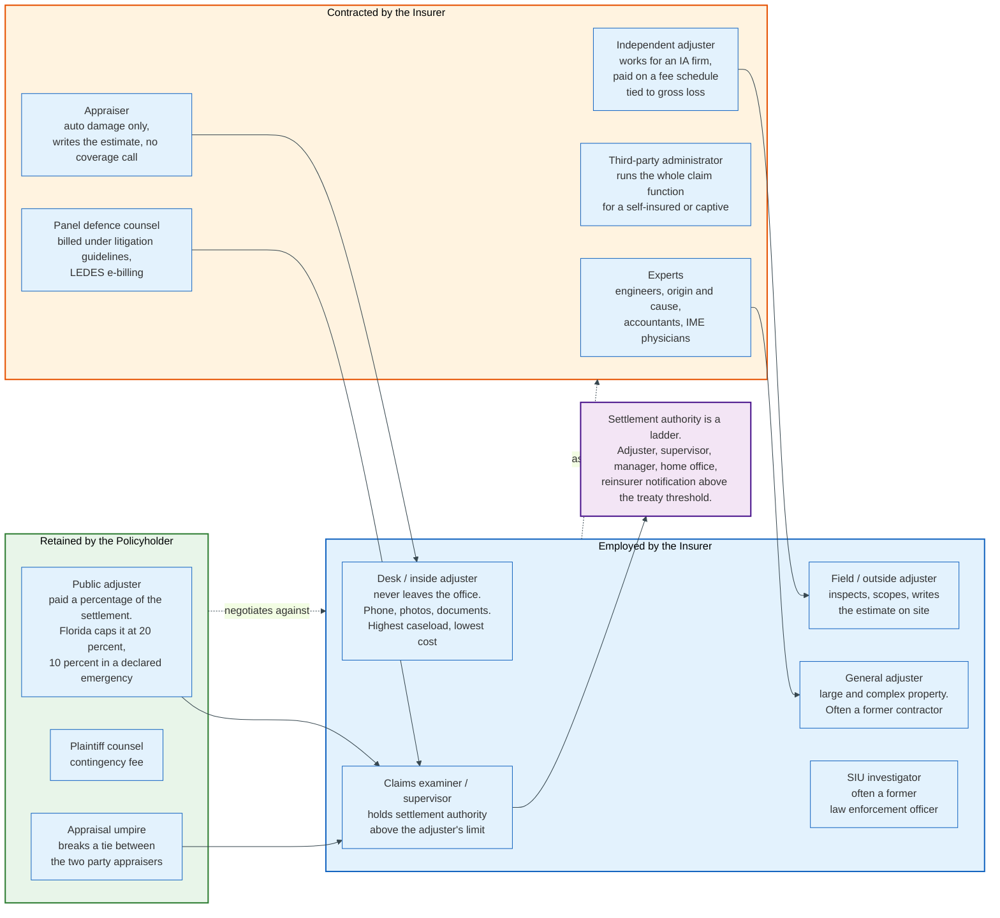

### 3.1 The Actors

| Role | What it does | Paid by | Holds settlement authority? |
|------|--------------|---------|------------------------------|
| **Insured / policyholder** | Reports the loss, has a duty to cooperate, mitigate, and prove the loss | Pays the premium | No |
| **Third-party claimant** | Claims against the insured. No policy, no duty to cooperate | Nothing | No |
| **Desk / inside adjuster** | Handles the file by phone, photo and document. Highest caseload | Insurer, salary | Yes, up to a limit |
| **Field / outside adjuster** | Inspects, scopes, writes the estimate on site | Insurer, salary | Yes, up to a limit |
| **General adjuster** | Large and complex property losses. Low caseload | Insurer, salary | Yes, larger limit |
| **Independent adjuster (IA)** | Contracted capacity. Inspects and reports; usually recommends rather than decides | Insurer, per-claim fee schedule or hourly | Usually no |
| **Public adjuster (PA)** | Represents the policyholder against the insurer | Policyholder, percentage of the settlement | No |
| **Appraiser** | Auto damage only. Writes the estimate, makes no coverage decision | Insurer or shop | No |
| **Claims examiner / supervisor** | Reviews files, grants authority above the adjuster's limit | Insurer, salary | Yes |
| **SIU investigator** | Investigates suspected fraud | Insurer, salary | No |
| **Third-party administrator (TPA)** | Runs the entire claims function for a self-insured entity or captive | Client, per-claim or per-life fee | Delegated, by contract |
| **Panel defence counsel** | Defends the insured in litigation | Insurer, hourly under litigation guidelines | No, recommends |
| **Plaintiff counsel** | Represents the claimant | Claimant, contingency fee | No |
| **Experts** | Engineers, origin and cause, forensic accountants, independent medical examiners | Insurer or counsel | No |
| **Reinsurer** | Reimburses the insurer above a retention. Must be notified of large losses | Cession from premium | Sometimes, via claims control clauses |

### 3.2 The Three Relationships That Determine Outcomes

**Authority is a ladder, and it is the real control system.** Every adjuster carries a dollar limit on what they may reserve, pay, deny or close. Above that limit the file goes to a supervisor, then a manager, then home office, then to a large-loss committee, and above the reinsurance treaty threshold it triggers a notification to the reinsurer. The ladder exists because settlement authority is the only genuinely irreversible decision in the process. Everything else can be revisited. A signed release cannot.

**The independent adjuster is contracted capacity, not a delegated decision-maker.** IA firms exist because catastrophe demand is spiky and staff headcount is not. An IA inspects, scopes, photographs and writes an estimate, then submits a report. In most arrangements the carrier's own examiner makes the coverage and payment decisions. This split matters: the person who saw the damage is frequently not the person who decides what to pay for it. Every disagreement between those two people surfaces as a re-inspection or a supplement, which is where both come from.

**The public adjuster is the only participant paid as a percentage of the outcome.** That alignment is the point and also the controversy. Florida statute 626.854 caps public adjuster compensation at 20 percent of claim payments for ordinary claims and at 10 percent for claims arising from an event that is the subject of a declared state of emergency, and restricts solicitation to Monday through Saturday between 8 a.m. and 8 p.m. Those rules exist because catastrophe zones attract volume solicitation. A public adjuster raises the settlement often enough to be worth hiring on a large loss and rarely enough to be worth it on a small one, since the fee is charged on the whole payment including the part the insurer would have paid anyway.

### 3.3 Who the Adjuster Works For

The adjuster's duty runs to the insured on a first-party claim and to the insured, not the claimant, on a third-party claim. That distinction is the origin of most claims litigation.

On a first-party claim the insurer owes the insured an implied covenant of good faith and fair dealing on top of the express contract. On a third-party claim the insurer owes the insured a defence and an indemnity, and owes the claimant nothing directly. The claimant is an adversary. When an insurer treats a third-party claimant as if they were a customer, it overpays; when it treats a first-party insured as if they were an adversary, it gets sued for bad faith.

The role is the same. The duty is not.

---

## 4. The Claim Lifecycle, Step by Step

Every claim in every line of business runs the same twelve stages. The evidence changes, the vocabulary changes, the sequence does not.

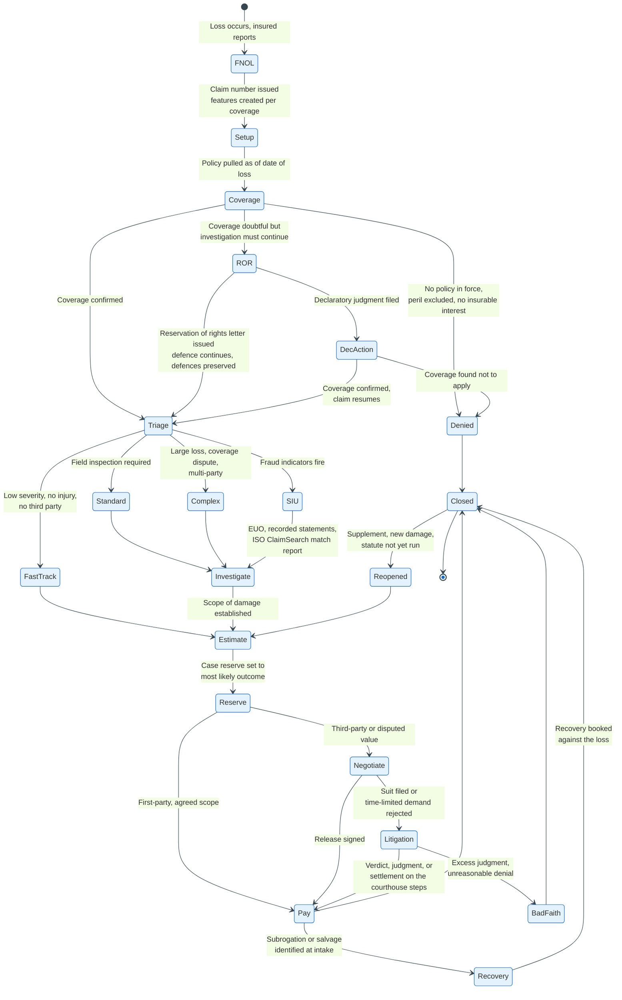

### 4.1 The Twelve Stages

**Stage 1: loss occurs.** The clock that matters most starts here, because the date of loss determines which policy applies, which limits apply, which endorsements were attached, and when every statute of limitations expires. A claim reported today against a loss from four years ago is a different claim from one reported yesterday.

**Stage 2: first notice of loss.** The insured, an agent, a repairer, a medical provider, a telematics device or a third-party claimant reports the event. A claim number is issued and the file exists.

**Stage 3: claim setup.** The system creates features. A feature is one claimant crossed with one coverage: a two-vehicle accident with an injured driver and passenger generates separate features for property damage liability, bodily injury liability for each injured party, collision on the insured vehicle, and medical payments. Reserves, payments and recoveries are tracked per feature, never at claim level, because the limits apply per feature.

**Stage 4: coverage verification.** The policy is pulled as of the date of loss and tested. This is the only stage that can end the claim on its own.

**Stage 5: triage and assignment.** Segmentation models score the claim and route it to a queue with the appropriate cost structure.

**Stage 6: investigation.** Contact the insured within the statutory window, take statements, obtain the police or fire report, inspect, retain experts, order records, verify the loss actually happened as described.

**Stage 7: damage evaluation.** Build the estimate, obtain the valuation, or evaluate the injury. This produces the number.

**Stage 8: reserve setting and revision.** Post the case reserve at the most likely ultimate outcome, and revise it when material information arrives.

**Stage 9: liability or coverage determination.** In first-party this is a coverage decision. In third-party it is an apportionment of fault, expressed as a percentage under the comparative negligence rule of the governing jurisdiction.

**Stage 10: negotiation and settlement.** Present the position, exchange offers, obtain a release.

**Stage 11: payment.** Issue funds to the correct payees in the correct order, with the correct tax reporting.

**Stage 12: recovery and closure.** Pursue subrogation and salvage, apply the recoveries against the loss, and close. Claims reopen when a supplement is submitted, when new damage appears, or when a claimant returns before the limitation period runs.

### 4.2 The Clocks Running in Parallel

A claim is governed by at least five deadlines at once, and they are set by different authorities.

| Clock | Set by | Typical length | Consequence of missing it |
|-------|--------|----------------|---------------------------|
| Notice to insurer | The policy | "Prompt" or "immediate" written notice | Late notice may bar the claim if the insurer shows prejudice |
| Proof of loss | The policy | 60 days after the loss, under the standard fire policy lineage | Claim may be barred; frequently waived in practice |
| Acknowledge and investigate | State regulation | 15 calendar days in California | Unfair claims practice; market conduct exposure |
| Accept or deny | State regulation | 40 calendar days after proof of claim in California | Unfair claims practice; interest and penalties in some states |
| Pay after acceptance | State regulation | 30 calendar days in California | Statutory interest, penalties, bad faith exposure |
| Suit limitation | The policy and state law | 12 months to 2 years on property; 2 to 6 years in tort | Claim extinguished |
| Medicare Section 111 reporting | Federal law | Quarterly submission windows | Civil money penalties up to 1,000 USD per day per claimant, capped at 365,000 USD per claimant per year |

The diary engine inside a claims administration system exists to service these clocks. It is not a convenience feature. It is the compliance control.

### 4.3 Where Claims Actually Go Wrong

The failure modes are consistent across carriers and lines.

**Contact delay.** An unreturned call converts a claimant into a plaintiff. The claimant who cannot reach the insurer reaches someone who can, representation is close to irreversible once it happens, and the resulting severity dwarfs the adjuster time saved.

**Scope error, not price error.** A property estimate that misses the underlayment, the ice and water shield, or the interior water damage does not get corrected by arguing about the unit price of shingles. Supplements exist because the first scope was incomplete.

**Stair-stepped reserves.** Raising a reserve in small increments as each new document arrives produces a reserve that is always behind the truth and an accident year that always develops adversely.

**Authority mismatch.** A claim negotiated by someone without authority to close it stalls, and stalling is what a time-limited demand is designed to punish.

**Documentation gaps.** A denial that is correct on the merits and undocumented in the file is indistinguishable, to a jury, from a denial that is wrong.

---

## 5. First Notice of Loss and the Data Captured

First notice of loss fixes every downstream routing, reserving and fraud decision, because all of them are computed from data captured in the first few minutes and nothing later re-captures it.

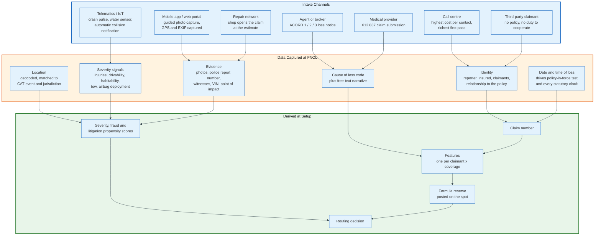

### 5.1 The Intake Channels

| Channel | What it is good at | What it is bad at | Relative cost per contact |
|---------|--------------------|--------------------|---------------------------|
| **Call centre** | Rich narrative, injury detection, empathy at the worst moment | Slow, expensive, transcription errors, no images | Highest |
| **Mobile app / web portal** | Structured data, guided photo capture, geolocation, timestamps, 24 hours | Drop-off on complex losses, poor at injury triage | Lowest |
| **Agent or broker** | Relationship, completeness on commercial risks | Delay between loss and notice, inconsistent formats | Medium |
| **Repair network** | Vehicle already at the shop, damage visible | Coverage unverified, scope written before the carrier sees it | Medium |
| **Medical provider** | Automatic, high volume | Provider reports treatment, not the accident | Low |
| **Telematics and IoT** | Notice before the insured calls, objective crash data | False positives, privacy consent, no narrative | Low |
| **Third-party claimant** | Only route for an adverse party | No duty to cooperate, adversarial from the first word | High |

The channel mix determines the data quality of everything downstream. A carrier that takes 80 percent of its notices by phone has narratives; a carrier that takes 80 percent by app has photographs and coordinates. The second carrier can automate. The first cannot.

### 5.2 The Fields That Matter

Not every FNOL field carries the same weight. Six clusters do the work.

**Identity and relationship.** Who is reporting, who is the named insured, who was operating or occupying, what is the relationship between them. Resident relatives, permissive users and excluded drivers are all coverage questions decided from this cluster.

**Date and time of loss.** Four things depend on this one field: the policy term, the endorsement set, the limits, and the start of every statutory clock. A date of loss recorded incorrectly by one day can move a claim across a renewal boundary.

**Location.** Geocoded, then matched against catastrophe event footprints, jurisdiction for the governing law, and the ZIP-level price list region for estimating. Location also feeds hail and wind verification services that check whether a reported storm actually occurred at that address on that date.

**Cause of loss.** A coded field, not free text, because it drives reserving, routing, reinsurance coding and statutory reporting. Property causes follow the classic fire, wind, hail, water, theft, liability taxonomy. Auto captures a point of impact, conventionally expressed as a clock position on the vehicle.

**Severity signals.** Injuries, whether an ambulance attended, whether airbags deployed, whether the vehicle is drivable, whether the dwelling is habitable, whether a tow occurred, whether emergency mitigation is in progress. These are the fields that separate a fast-track claim from a complex one.

**Evidence.** Photographs with intact EXIF metadata, the police or fire report number, witness names and contacts, the VIN, the mortgagee or lienholder, and the identity of any other insurer.

### 5.3 What Happens in the First Sixty Seconds

Setup is not passive. Four things happen automatically before a human sees the file.

The system issues a claim number and creates one feature per claimant per coverage. It posts a formula reserve, which is the average paid severity for that coverage and cause of loss, so the balance sheet reflects the claim from day zero rather than from the day the adjuster gets to it. It runs the segmentation models: severity, complexity, fraud propensity and litigation propensity. And it makes a routing decision.

The formula reserve is a placeholder that will be wrong on every individual claim and approximately right across thousands. It exists because the alternative, a zero reserve until inspection, understates the liability for as long as the inventory takes to inspect.

### 5.4 The ACORD and IAIABC Formats

First notice arrives from agents and partners in standard forms rather than free text.

ACORD, the insurance industry's standards body, publishes the loss notice forms used across North American property and casualty: ACORD 1 for property loss notice, ACORD 2 for automobile loss notice, and ACORD 3 for general liability notice of occurrence or claim. The same content is carried electronically through ACORD's data standards, historically the AL3 flat-file format and now XML-based messages, which map field-for-field onto the printed forms.

Workers compensation uses a separate lineage. The International Association of Industrial Accident Boards and Commissions publishes the First Report of Injury and Subsequent Report of Injury standards, known as FROI and SROI, which carriers and employers file with state agencies as well as with each other. The FROI is both a claim notice and a regulatory filing, which is why workers compensation intake is more rigid than any other line.

Health claims do not use a loss notice at all. The bill is the notice, submitted as an X12 837 transaction.

---

## 6. Coverage Verification and the Reservation of Rights

Coverage verification tests the claim against the contract as it existed on the date of loss, and it is the only stage that can terminate the claim without any factual investigation of the damage.

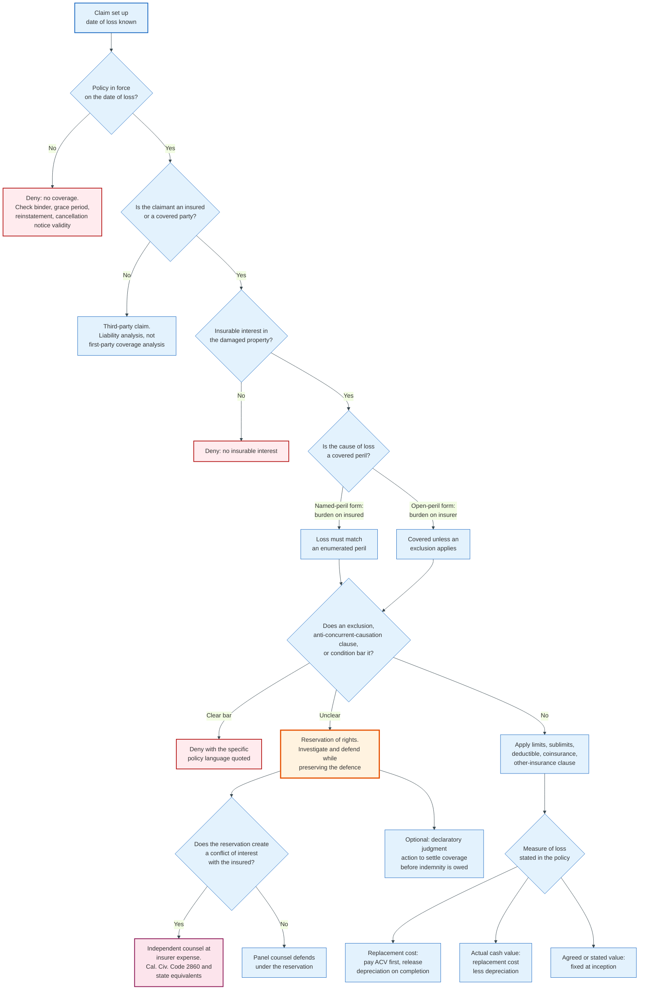

### 6.1 The Sequence of Tests

**Was a policy in force on the date of loss?** This is not a lookup of the current policy. It is a lookup of the policy state as of a historical date, which is why policy administration systems must expose an as-of-date snapshot including endorsements, limits and the premium payment status. Cancellation for non-payment is a frequent dispute, because most states require a specific notice period and a specific delivery method, and a cancellation that failed the notice requirement leaves the policy in force.

**Is the claimant an insured or a covered party?** Named insureds, spouses, resident relatives, permissive users, additional insureds by endorsement and loss payees all have different standings. A person can be covered for one coverage and not another under the same policy.

**Is there an insurable interest?** The claimant must stand to lose something by the damage. A person claiming for a vehicle they do not own and do not lease has no insurable interest.

**Is the cause of loss covered?** This is where the form type controls the burden of proof. A named-peril form covers only the perils listed, and the insured must show the loss falls within one. An open-peril form, sometimes called all-risk, covers everything not excluded, and the insurer must show an exclusion applies. That single distinction determines who loses a genuinely ambiguous claim.

**Does an exclusion or condition bar it?** Exclusions are read narrowly against the drafter in most jurisdictions. Anti-concurrent-causation clauses, which exclude a loss caused by an excluded peril acting concurrently or in sequence with a covered peril, are wording that state supreme courts have split on, and they are enforced differently by state. Conditions precedent - prompt notice, proof of loss, submission to examination under oath, duty to cooperate, duty to mitigate - can bar an otherwise covered claim, though many states require the insurer to show prejudice from the breach.

**What are the limits, sublimits, deductible and other-insurance provisions?** Sublimits are the trap. A commercial property policy with a 50 million dollar limit may carry a 250,000 dollar sublimit for flood, a 100,000 dollar sublimit for ordinance and law, and a 25,000 dollar sublimit for debris removal. The headline number is rarely the applicable number.

### 6.2 The Reservation of Rights

A reservation of rights letter lets an insurer investigate and defend a claim while preserving the right to deny coverage later. It solves a genuine dilemma: an insurer that defends without reserving may waive its coverage defences by estoppel, and an insurer that refuses to defend when coverage is arguable exposes itself to bad faith.

The letter must do three things to work. It must identify the specific policy provisions relied upon, quoting them rather than citing them. It must explain the specific facts that raise the coverage question. And it must be sent promptly, because a reservation asserted late is frequently treated as waived. Several states require particularity; a generic letter reserving "all rights under the policy and at law" is ineffective in those jurisdictions.

A non-waiver agreement is the bilateral version: both the insurer and the insured sign, agreeing that the investigation does not waive anyone's rights. It is stronger than a unilateral letter and requires the insured's cooperation, which is why it is used less.

### 6.3 The Conflict That Follows

Reserving rights while defending creates a structural conflict, and the law has an answer for it.

When an insurer defends under a reservation, its interests and the insured's diverge. The insurer benefits if the verdict rests on an uncovered theory; the insured does not care which theory the verdict rests on. Defence counsel chosen and paid by the insurer is being asked to steer a case in which its two clients want different outcomes.

California resolved this in San Diego Navy Federal Credit Union v. Cumis Insurance Society in 1984, holding that the insured is entitled to independent counsel at the insurer's expense where the reservation creates such a conflict. The legislature then codified and limited the right in California Civil Code section 2860, which caps independent counsel's rates at the rates the insurer actually pays panel counsel in the ordinary course and requires the independent counsel to have specified experience and malpractice coverage. Other states reached similar results under different names.

The alternative to living with the conflict is to resolve coverage first. A declaratory judgment action asks a court to decide the coverage question before the underlying case is tried. It is expensive, it is slow, and it is the correct move when the coverage question is worth more than the cost of litigating it twice.

---

## 7. Triage and Complexity Routing

Triage decides which cost structure a claim will be handled in, and the two ways of getting it wrong cost different amounts.

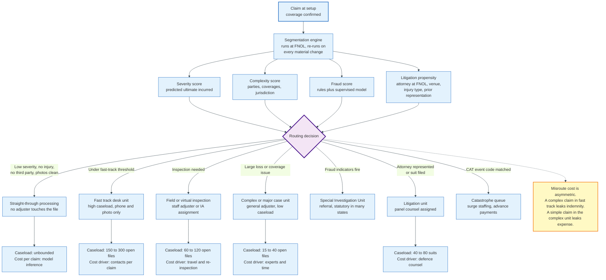

### 7.1 The Segmentation Decision

A modern claims operation runs four scores at FNOL and re-runs them on every material change.

**Severity score.** Predicted ultimate incurred, built from the cause of loss, the reported damage, the vehicle or property characteristics, the jurisdiction, and historic outcomes on similar claims. It drives both the routing and the initial reserve.

**Complexity score.** Number of parties, number of coverages implicated, presence of a coverage question, jurisdiction, and whether commercial or specialty interests are involved. Complexity and severity are not the same thing: a 4,000 dollar claim with three carriers and a disputed policy is complex and low severity.

**Fraud propensity score.** Rules plus a supervised model, described in section 14.

**Litigation propensity score.** Attorney involvement at FNOL, injury type, treatment pattern, venue, and the claimant's prior representation history. This is the score that changes handling most, because a claim on a litigation track needs a different reserve, a different contact cadence and a different documentation standard from day one.

### 7.2 The Queues and What They Cost

| Queue | Entry criteria | Typical open caseload per adjuster | Dominant cost driver |
|-------|----------------|------------------------------------|----------------------|
| Straight-through processing | No injury, no third party, clean photos, below the dollar cap, low fraud score | Unbounded | Model inference and audit sampling |
| Fast track / low complexity | Below the fast-track threshold, single party, no coverage question | 150 to 300 | Number of contacts per claim |
| Standard field | Inspection required, standard severity | 60 to 120 | Travel, re-inspection, supplements |
| Complex / major case | Large loss, coverage dispute, multi-party, commercial | 15 to 40 | Experts, time, defence counsel |
| Litigation | Suit filed or attorney represented with a demand | 40 to 80 suits | Defence counsel hours |
| Special Investigation Unit | Fraud indicators fire | 30 to 60 | Investigator time, examinations under oath |
| Catastrophe | Geocode matches a designated event footprint | Variable by surge | Contracted IA capacity |

Caseload figures vary widely by carrier and line and are illustrative of the relative shape rather than an industry standard.

### 7.3 Why Misrouting Is Asymmetric

The two errors cost different amounts, and that asymmetry sets the threshold.

A complex claim routed to fast track leaks indemnity. The adjuster has 200 open files, cannot investigate, and settles at the number the claimant asks for because there is no time to develop a position. The overpayment is permanent and invisible; nobody audits a claim that closed quietly.

A simple claim routed to the complex unit leaks expense. It gets an inspection it did not need, an engineer it did not need, and four months of an experienced adjuster's diary. The overspend is visible in the expense ledger and recoverable in the next process redesign.

Because indemnity leakage is larger, permanent and harder to detect than expense leakage, the correct triage threshold is deliberately conservative: route up on doubt. Carriers that tune triage purely on expense reduction discover the indemnity cost two accident years later, in the reserve development.

---

## 8. The Adjuster - Desk, Field, Independent, Public

The adjuster is the only participant who touches every stage of the claim, and the structure of the adjuster workforce is what determines a carrier's fixed-versus-variable cost profile.

### 8.1 Desk Versus Field

The distinction is about where the inspection happens, and it has moved decisively toward the desk.

A desk adjuster, also called an inside adjuster, works the file from an office. Contact is by phone and email. Damage is assessed from photographs, from an estimate written by a repairer, from a report by an independent adjuster, or from a virtual inspection conducted over a live video link with the insured pointing a phone camera. Caseloads are high and cost per claim is low.

A field adjuster inspects in person. On property that means climbing the roof, taking moisture readings, drawing the sketch, and writing the estimate on site. On auto it means an appraiser at the shop or at the insured's home. Cost per claim is several times higher, because travel is the dominant expense and the productivity ceiling is the number of inspections a person can drive to in a day.

The economics have pushed everything that can be handled from a desk to a desk. Guided photo capture, aerial roof measurement and live video inspection each moved a class of claims across the line. What remains stubbornly field-based: structural damage, large losses, disputed scope, and anything where the adjuster's physical presence is itself the deliverable, which includes most catastrophe work in the first weeks.

### 8.2 Staff Versus Independent

Staff adjusters are fixed cost. Independent adjusters are variable cost. That sentence explains the entire industry structure.

Claim volume is not smooth. A single hailstorm can generate a year of a region's normal property volume in one afternoon. No carrier staffs for the peak, because the trough would be unaffordable. Independent adjusting firms exist to absorb the difference: they maintain rosters of licensed adjusters who deploy on demand, and they are paid per claim on a fee schedule that scales with the gross amount of the loss, or hourly plus expenses for time-and-expense assignments.

The fee schedule is the important mechanic. An IA firm bills the carrier a fee determined by the claim's gross loss amount, and pays the individual adjuster a share of that fee, commonly a majority of it, with the firm retaining the rest for management, quality control and licensing overhead. Because the fee scales with the estimate, and the adjuster writes the estimate, the incentive alignment is worth stating plainly: the fee schedule pays more for a larger estimate. Carriers manage this with re-inspection programmes, automated estimate review rules, and scorecards that track each adjuster's average severity against peers on comparable losses.

### 8.3 Licensing and the Catastrophe Problem

Adjuster licensing is state by state, and it becomes a bottleneck exactly when capacity is scarcest.

Most states require a resident or non-resident adjuster licence, obtained by examination and maintained with continuing education. A handful of states do not license independent adjusters at all. Because non-resident licensing is reciprocal from a designated home state, adjusters commonly obtain a licence in a state with a well-recognised designation, most often Texas or Florida, and use it to obtain non-resident licences elsewhere.

After a declared catastrophe, states issue emergency adjuster licences: temporary credentials, typically valid for the duration of the emergency, that let out-of-state adjusters work immediately under the sponsorship of a licensed carrier or IA firm. Without that mechanism, the licensing system would prevent the surge workforce from working in exactly the state that needs it.

### 8.4 The Public Adjuster

A public adjuster works for the policyholder, prepares and presents the claim, and is paid a percentage of the settlement.

The service is real: a property owner facing a total loss of a commercial building has neither the vocabulary nor the time to build a scope in Xactimate, catalogue business personal property, and compute business interruption. The public adjuster does that work and negotiates it.

The regulation is dense because the sales channel is intrusive. Florida's caps of 20 percent generally and 10 percent for declared-emergency claims, plus the Monday-to-Saturday 8 a.m. to 8 p.m. solicitation window in section 626.854, are typical of the post-hurricane regulatory response. Several states impose cooling-off periods during which a signed public adjuster contract may be rescinded, and most require the contract to be filed with the department.

The structural criticism is that the fee is charged on the entire settlement, including the portion the insurer would have paid without any representation. The structural defence is that the same is true of every contingency fee, and the alternative on a disputed large loss is a lawyer at one third.

### 8.5 Third-Party Administrators

A TPA runs the claims function for someone who is not an insurer: a self-insured employer, a captive, a risk retention group, a fronting arrangement, or a managing general agent's programme.

The TPA does everything a carrier claims department does, under a claims handling agreement that specifies settlement authority levels, reporting requirements, reserve philosophy, litigation management standards and audit rights. Compensation is per claim, per life, or a percentage of premium. Because the TPA does not bear the loss, the contract has to substitute for the incentive: audit rights and authority ceilings are the enforcement mechanism.

Workers compensation is the line most heavily administered by TPAs, because large employers self-insure the layer below their excess attachment and need someone to handle the volume.

---

## 9. Damage Estimation - How an Estimate Is Actually Built

An estimate is a bill of materials and labour for restoring the damaged property, priced from a database rather than negotiated. Understanding how the number is assembled explains most of what claims professionals argue about.

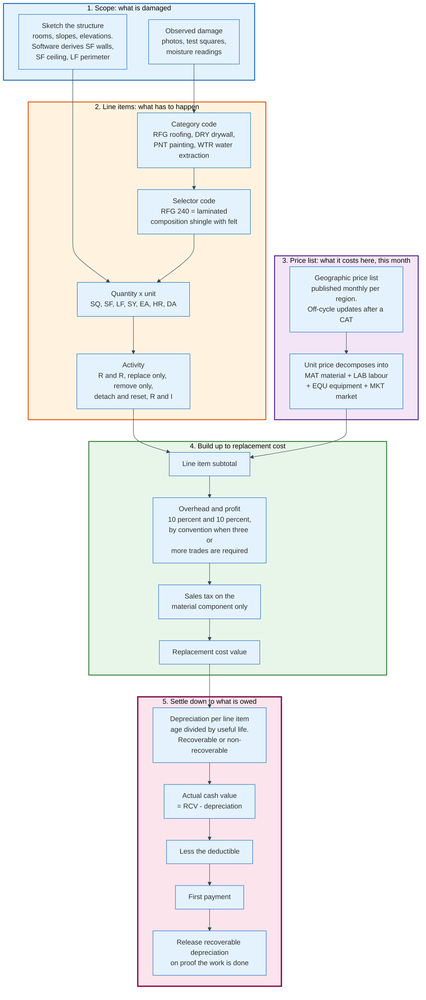

### 9.1 The Property Estimate in Xactimate

Xactimate, published by Verisk, is the dominant property estimating platform in North America, used by carrier staff adjusters, independent adjusters, restoration contractors and public adjusters alike. It runs as a desktop application, a mobile application, and the cloud-based X1 platform.

An estimate is built in four movements.

**Sketch.** The adjuster draws the structure: rooms with dimensions, roof slopes with pitch, elevations. The software then derives the quantities automatically - square feet of wall, square feet of ceiling, linear feet of floor perimeter, square feet of floor, and for roofs the number of squares, the linear feet of ridge, hip, valley, eave and rake. This is the step that most determines the final number, because every line item is a quantity multiplied by a unit price, and the sketch supplies the quantities.

**Line items.** Each repair operation is a line item, identified by a category code and a selector code. The category is a three-letter trade grouping: `RFG` for roofing, `DRY` for drywall, `PNT` for painting, `FCC` for floor covering carpet, `WTR` for water extraction and remediation, `GUT` for gutters, `CAB` for cabinetry. The selector identifies the specific operation within the trade: `RFG 240` is laminated composition shingle roofing with felt; `DRY 1/2` is one-half inch drywall hung, taped and floated ready for paint; `PNT SC` is seal and paint the surface area, two coats.

Each line item carries an activity: replace, remove only, remove and replace (`R&R`), detach and reset, or remove and install. It carries a unit of measure - `SQ` for roofing squares of 100 square feet, `SF` for square feet, `LF` for linear feet, `SY` for square yards, `EA` for each, `HR` for hours, `DA` for days. And it carries a quantity.

**Price list.** The unit price comes from a geographic price list published for the region, refreshed monthly, so that the same line item costs a different amount in Dallas than in Denver and a different amount in June than in March. Each unit price decomposes into a material component, a labour component, an equipment component and, where applicable, a market conditions adjustment. That decomposition matters because sales tax applies only to the material component and depreciation is usually applied differently to material than to labour.

After a catastrophe, Verisk can publish off-cycle price list updates for the affected region to reflect demand surge, which is the mechanism by which post-event material and labour inflation reaches the estimate rather than becoming a supplement fight.

**Build-up.** The line items are subtotalled. Overhead and profit is added, conventionally at 10 percent overhead plus 10 percent profit, computed on the subtotal rather than compounded. The industry convention is that general contractor overhead and profit is owed when the repair requires the coordination of three or more trades, on the theory that the insured would need a general contractor. This is a convention, not a statute, and it is litigated. Sales tax is then applied to the material component. The result is replacement cost value.

### 9.2 From Replacement Cost to What Is Owed

Replacement cost is not what gets paid unless the policy says so and the work gets done.

Depreciation is applied per line item, based on the age of the component and its expected useful life. A ten-year-old roof with a twenty-five-year expected life is depreciated 40 percent. Depreciation is applied to material, and whether it is applied to labour is a live legal question that several state supreme courts have decided in opposite directions.

Replacement cost value minus depreciation equals actual cash value. On a replacement cost policy, the insurer pays actual cash value first and holds back the depreciation, which is called recoverable depreciation. When the insured completes the repair and submits proof, the held-back depreciation is released. On an actual cash value policy, or under a roof surfacing endorsement that settles roofs on an ACV basis, the depreciation is non-recoverable and the insured never receives it.

The deductible is subtracted last, after depreciation.

The order is not arbitrary and produces results that surprise policyholders: on a percentage-deductible wind and hail claim against a depreciated roof, a large gross estimate can produce a small net payment.

### 9.3 The Auto Estimate

Auto physical damage estimating uses the same conceptual structure with a different database and different vocabulary.

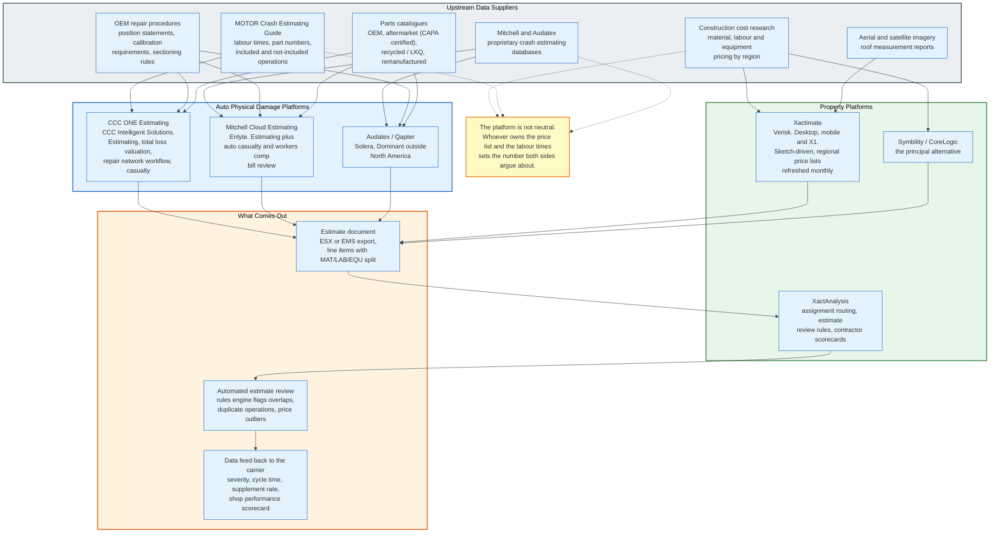

**Labour operations.** Every operation is classified as repair, replace, refinish or blend, and carries a labour time in hours drawn from the estimating database. Repair times are judgement; replace times are published. The estimate distinguishes body labour, refinish labour, frame or structural labour, mechanical labour and glass, each with its own hourly rate, because the shop's door rate differs by discipline.

**Included and not-included operations.** The estimating databases specify which sub-operations are already covered by a published labour time and which must be added separately. A published time to replace a bumper cover does not include the time to transfer sensors, remove and install a licence plate bracket, or perform a radar recalibration. Most estimate disputes between shops and insurers are arguments about not-included operations.

**Parts.** Parts are typed: OEM (original equipment from the manufacturer), aftermarket (non-OEM, with certification by the Certified Automotive Parts Association used as a quality proxy), recycled or LKQ (like kind and quality, taken from a salvaged vehicle), remanufactured, and optional OEM (discounted manufacturer parts sold through a competitive programme). Which types an insurer may specify is regulated by state law and by the policy, and several states require disclosure on the estimate when non-OEM parts are used.

**Paint and materials.** Refinish materials are usually computed as the refinish labour hours multiplied by a materials rate per hour rather than itemised. Three-stage finishes, which require a base coat, a translucent mid coat and a clear coat, carry additional time. Blending adjacent panels to avoid a visible colour break is a separate operation.

**Overlap and deductions.** When two adjacent operations share preparation or access work, the database applies an overlap deduction so the shared time is not paid twice.

**Calibration.** Advanced driver assistance systems have made calibration a routine and material line. A vehicle with forward-facing camera, radar and blind-spot sensors requires static calibration in a controlled bay, dynamic calibration on a road drive, or both, after operations as ordinary as a windscreen replacement or a bumper cover removal. This is the fastest-growing component of repair severity.

The three platforms differ mainly in data sourcing and workflow rather than in estimate structure. CCC licenses labour times and part data from the MOTOR Crash Estimating Guide, published by MOTOR Information Systems. Mitchell and Audatex each maintain their own crash estimating databases, Mitchell tracing to its own 1946 parts and labour publishing business and Audatex to Solera's European lineage. That is why the same repair prices differently in each system, and why a shop and a carrier on different platforms are not disagreeing about the same number.

### 9.4 Why the Platform Choice Is Not Neutral

The party that controls the price list and the labour times controls the number that both sides negotiate from.

This is why estimating platform ownership is contested. A carrier and a repairer arguing about a repair are not arguing about first principles; they are arguing about whether a particular line item applies and what quantity it applies to. The unit price is taken as given. Whoever publishes it has set the terms of the argument.

It is also why the platforms have moved into workflow. XactAnalysis routes assignments, applies automated estimate review rules that flag overlapping operations, duplicated line items and price outliers, and scores contractors on cycle time and supplement frequency. The estimate is the data-collection instrument; the analytics are the product.

### 9.5 Direct Repair and Managed Repair Networks

A direct repair programme is a contract that trades repair volume for price concessions and process control, and it is the largest structural mechanism in auto physical damage handling.

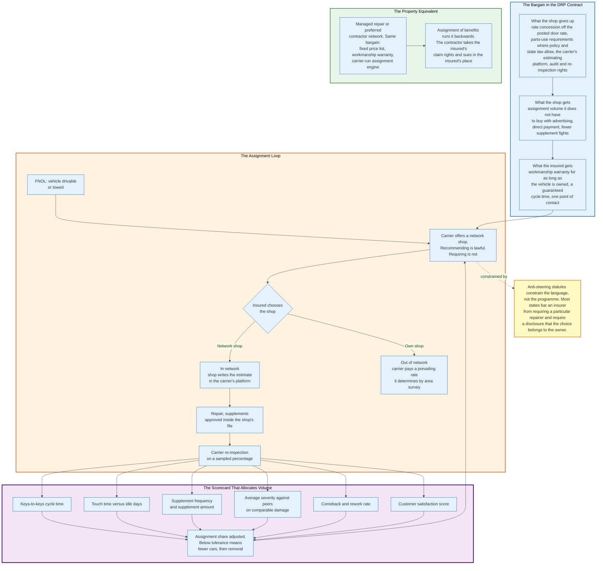

**What the shop gives.** A network shop agrees to a labour rate below its posted door rate, to use aftermarket, recycled and remanufactured parts where the policy and state law permit, to write every estimate in the carrier's estimating platform, to accept re-inspection on a sampled share of repairs, and to guarantee its workmanship for as long as the customer owns the vehicle. The size of the rate concession is negotiated shop by shop and is not published, so no figure is given here.

**What the shop gets.** Assignment volume. A body shop's alternative to network membership is buying the same volume through advertising and referral, at a customer acquisition cost it pays whether or not the car arrives.

**What the carrier gets.** An estimate written on day one by someone who already has the vehicle on a lift, which removes an appraiser visit and a scheduling delay. It also gets a supplement process that runs inside its own system rather than as a phone argument, and a documented right to re-inspect.

**How volume is allocated.** By scorecard. Carriers rank network shops on keys-to-keys cycle time, touch time against idle days, supplement frequency and supplement amount, average severity against peers on comparable damage, comeback and rework rate, and customer satisfaction. Assignment share moves with the ranking. A shop that runs above peer severity on the same damage loses cars before it loses membership, which is a faster and quieter sanction than termination.

**What the law permits.** Most states prohibit an insurer from requiring an insured to use a particular repairer, and many require a written disclosure that the choice of shop belongs to the vehicle owner. These anti-steering statutes constrain the language rather than the programme. Recommending a network shop, explaining the warranty, and offering to arrange the tow are all lawful. Conditioning payment on the choice is not.

**Where the disputes come from.** Outside the network there is no negotiated rate, so the carrier pays what it calls the prevailing rate for the area, determined by its own survey of local shops. The shop bills its posted rate. The difference is a short pay, and the insured is caught between them. That gap is the origin of most non-network repair disputes and of the labour rate litigation that follows them.

**The property equivalent.** Managed repair programmes and preferred contractor networks make the same bargain with restoration contractors: a fixed price list, a workmanship warranty, a carrier-run assignment engine, and a scorecard. Assignment of benefits contracting runs the bargain backwards. The contractor takes the insured's claim rights by assignment and pursues the carrier in the insured's place, which converts a scope argument between a carrier and its own policyholder into litigation between a carrier and a stranger to the contract.

Section 9.4 says the party that owns the price list sets the terms of the argument. The network contract is what makes the price list binding on the other side.

---

## 10. Reserves - The Insurer's Own Loss Estimate

A reserve is the insurer's current estimate of what a claim will ultimately cost, recorded as a liability. It is not a fund, not a bank account, and not a promise to pay that amount.

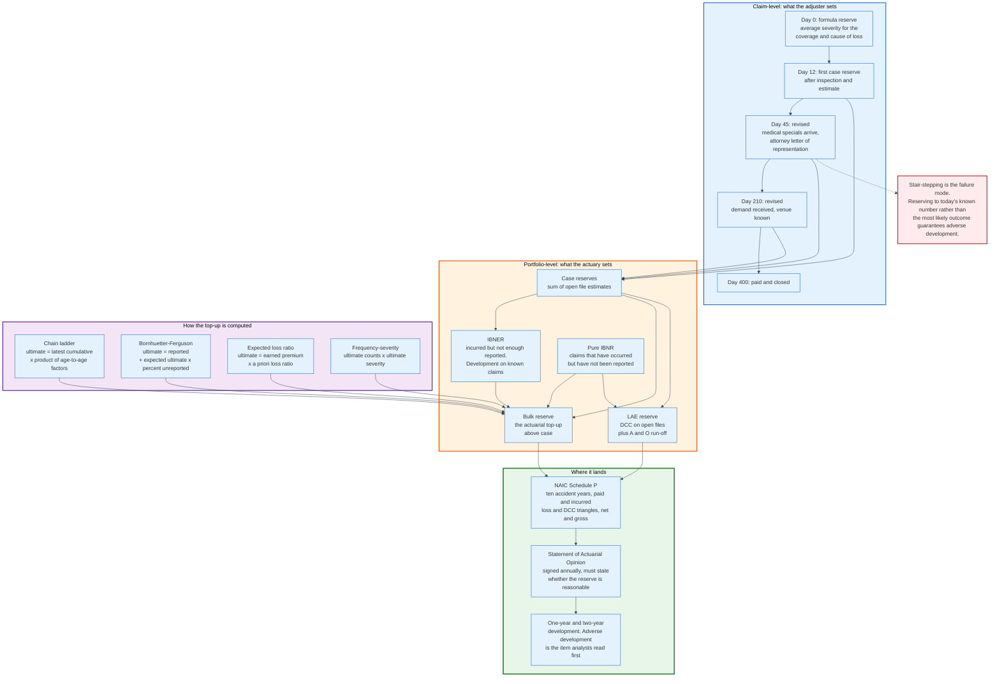

### 10.1 The Two Reserving Systems

Claims reserving and actuarial reserving are different activities that produce numbers for the same balance sheet line.

**Case reserves** are set by adjusters, one per feature, representing the expected ultimate cost of that specific claim. They are built from the estimate, the medical specials, the liability assessment and the jurisdiction. They are the sum of thousands of individual judgements.

**Bulk and IBNR reserves** are set by actuaries at the aggregate level, representing everything the case reserves do not capture. Two components:

*Pure IBNR* covers claims that have occurred but have not been reported. Somebody was injured last month and has not called yet. In long-tail lines this can be years.

*IBNER*, incurred but not enough reported, covers development on claims that are already known. The case reserve on an open file is systematically too low across a portfolio, because adjusters set reserves on the information they have and information arrives over time.

The actuarial reserve is the top-up above the sum of case reserves that makes the total adequate.

### 10.2 How a Case Reserve Moves

A reserve on a bodily injury claim follows a predictable path, and the shape of that path is a quality signal.

At day zero the system posts a formula reserve equal to the average severity for that coverage and cause of loss. At first inspection or first medical report, the adjuster replaces it with an evaluated reserve. When counsel appears, when a demand arrives, when the jurisdiction and venue are known, and when the treatment concludes, the reserve is revised.

The failure mode has a name. **Stair-stepping** is the practice of raising a reserve in small increments as each new document arrives, so that the reserve always trails the truth. It produces a portfolio where every accident year develops adversely, because the aggregate was never set at the expected outcome. The correct standard is to reserve at the most likely ultimate outcome given current information, including information the adjuster expects to receive, and to revise when the expectation changes rather than when the paper arrives.

Reserve philosophy is a genuine choice a carrier makes and states. Some carriers reserve at the most likely outcome. Some reserve at a probable-maximum posture on files with a plausible excess exposure. The choice moves reported results and is disclosed to actuaries so the development factors can be calibrated to it.

### 10.3 The Actuarial Methods

Four families of method estimate ultimate losses from development data.

**Chain ladder.** Arrange cumulative paid or incurred losses in a triangle by accident year and development period. Compute age-to-age development factors as the ratio of each period's cumulative to the prior period's. The ultimate for an immature accident year equals its latest cumulative multiplied by the product of the remaining age-to-age factors. It is the workhorse method and it is unstable for immature years, because a small early number multiplied by a large factor produces a large answer.

**Bornhuetter-Ferguson.** Ultimate equals reported losses to date plus the expected ultimate multiplied by the percentage not yet reported. It blends the chain ladder's use of actual data with an a priori expectation, and it is more stable for immature accident years because the unreported portion does not depend on the reported portion.

**Expected loss ratio.** Ultimate equals earned premium multiplied by an a priori loss ratio. Used when there is no credible development data, such as a new line or a new territory.

**Frequency-severity.** Estimate ultimate claim counts and ultimate average severity separately, then multiply. Useful when the mix is changing, because it separates a change in how many claims are happening from a change in how expensive each one is.

Actuarial Standard of Practice No. 43 governs property and casualty unpaid claim estimates in the United States, defining what an unpaid claim estimate covers, requiring the actuary to consider the claim adjustment expense components, and setting the documentation and disclosure requirements. A Statement of Actuarial Opinion is filed annually with the statutory financial statements, and it must state whether the carried reserve is reasonable.

### 10.4 Where Reserves Are Reported

Schedule P of the NAIC annual statement is the public record of an insurer's reserving accuracy.

Schedule P shows, by line of business, ten accident years of paid and incurred losses and defence and cost containment expense, on both a net and a gross-of-reinsurance basis, together with bulk and IBNR reserves and claim counts. Part 1 summarises premiums, losses and expenses by year. Part 2 shows incurred net loss and DCC development, restating each accident year as of each subsequent evaluation. Part 3 shows cumulative paid. Part 4 shows the bulk and IBNR component.

The number analysts read first is one-year and two-year development: how much the prior years' reserves moved at the latest evaluation. Adverse development means the reserves were too low; favourable development means they were too high. Persistent adverse development in a line is the earliest public signal of a claims department that is under-reserving or an underwriting book that is deteriorating.

Statutory reserves are generally carried undiscounted, with a narrow exception for tabular discounting of workers compensation lifetime pension cases.

### 10.5 The Reserve Is a Solvency Control

Reserves are the largest liability on a property and casualty balance sheet and the least verifiable.

An under-reserved insurer reports profits it has not earned, pays them out as dividends or rate reductions, and discovers the shortfall when the claims mature. Because the shortfall arrives years later, the management that created it is frequently gone. This is why reserving is subject to an independent actuarial opinion, why Schedule P shows ten years, and why regulators run risk-based capital charges specifically on reserve risk.

The adjuster setting a case reserve on a Tuesday afternoon is performing a solvency function. Very few adjusters are told this.

---

## 11. Indemnity Payment and Settlement Negotiation

Payment is the point of the entire apparatus, and getting the money to the correct parties in the correct order is a surprisingly dense problem.

### 11.1 First-Party Payment Mechanics

On a property claim the insurer rarely pays only the insured.

**Mortgagee and loss payee.** A mortgage lender named on the policy has a direct interest in the structure. Payments for dwelling damage above a threshold are typically issued jointly to the insured and the mortgagee, and the mortgagee holds the funds in escrow, releasing them against inspections as the repair progresses. This is why a homeowner with a large claim cannot simply cash the cheque.

**Payment types.** Structure payments, contents payments, additional living expenses, emergency mitigation payments and code upgrade payments are separately tracked because they run against separate coverages with separate limits.

**Sequencing on a replacement cost policy.** Actual cash value is paid first. Recoverable depreciation is released on proof the work was completed, which requires invoices or a certificate of completion. Some policies require the repair to be completed within a stated period, commonly 180 days or one year, or the claim settles on an ACV basis permanently.

**Payment rails.** The industry moved off printed drafts slowly. Options now include a mailed cheque or draft, ACH to a verified bank account, a single-use virtual card, and real-time payment where the insurer and the payee's bank both participate. On a catastrophe, the first payment is the one thing a displaced policyholder can observe directly, and digital payment is the only way to issue thousands of advances in a day.

### 11.2 Third-Party Settlement

A third-party bodily injury settlement is a valuation of a legal claim, not a repair estimate, and it is negotiated.

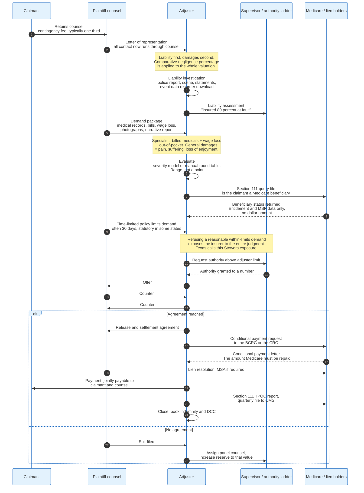

**Liability first.** Fault is apportioned under the governing state's negligence rule. Pure comparative negligence reduces the claimant's recovery by their percentage of fault, with no cut-off. Modified comparative negligence bars recovery entirely once the claimant's fault reaches 50 or 51 percent, depending on the state. Contributory negligence, still the rule in a small number of jurisdictions, bars recovery for any claimant fault at all. The same accident produces materially different settlements in different states.

**Damages second.** Special damages are the quantifiable items: billed medical expenses, wage loss, out-of-pocket costs, and future medical care supported by a life care plan. General damages are the non-quantifiable items: pain, suffering, disfigurement, loss of consortium, loss of enjoyment of life. Special damages are documented. General damages are argued.

The "three times specials" rule of thumb is folklore rather than method. Serious evaluation uses the injury type, the objective findings, the treatment duration and modality, the permanency, the claimant's age and occupation, the venue's verdict history, and the credibility of both the claimant and the insured. Several carriers use structured bodily injury evaluation software that scores these factors into a range; the range is a starting point for a negotiation, not an answer.

**Liens and Medicare.** A settlement cannot be paid cleanly until the liens are resolved. Health insurers, ERISA plans, Medicaid agencies, hospitals and workers compensation carriers may all hold claims against the recovery. Medicare holds the strongest position: under the Medicare Secondary Payer rules, Medicare may recover conditional payments it made for injury-related treatment, and it may pursue the insurer, the claimant and the attorney. Section 111 of the Medicare, Medicaid, and SCHIP Extension Act requires liability, no-fault and workers compensation insurers to report claims involving Medicare beneficiaries on a quarterly basis, identifying both ongoing responsibility for medicals and total payment obligations to the claimant. The query file returns entitlement status and Medicare Secondary Payer data, not a dollar amount. The conditional payment figure comes back separately from the Benefits Coordination and Recovery Center or the Commercial Repayment Center, in a conditional payment letter or through the Medicare Secondary Payer Recovery Portal. Civil money penalties for late or non-compliant reporting run up to 1,000 dollars per day per claimant, inflation-adjusted, capped at 365,000 dollars per claimant per year, for reports due on or after 11 October 2024.

**The time-limited demand.** Plaintiff counsel commonly sends a demand for the policy limits with a deadline attached. Refusing a reasonable within-limits demand and then losing at trial for more than the limit exposes the insurer to the entire judgment, not just the limit. In Texas this exposure is named after Stowers Furniture Co. v. American Indemnity Co., decided in 1929. Several states have since enacted statutes prescribing what a valid time-limited demand must contain and how long the insurer must be given, precisely because the tactic was being used to manufacture bad faith exposure.

### 11.3 Release and Closure

A release ends the claim, and its scope is the last negotiation.

A general release discharges all claims arising from the occurrence, known and unknown. A limited release discharges only specified claims, which is used where a claimant is settling one coverage and preserving another. A structured settlement pays over time through an annuity rather than in a lump sum, used for large bodily injury claims and for minors, and requires court approval where a minor's interests are involved.

Payments to a claimant for physical injury or sickness are generally not taxable income, and payments for other categories may require information reporting. Claims systems maintain payee tax data for this reason.

---

## 12. Total Loss Determination and Valuation

A total loss is an economic determination, not a statement about whether the property can physically be repaired. This is the second common misconception worth correcting explicitly.

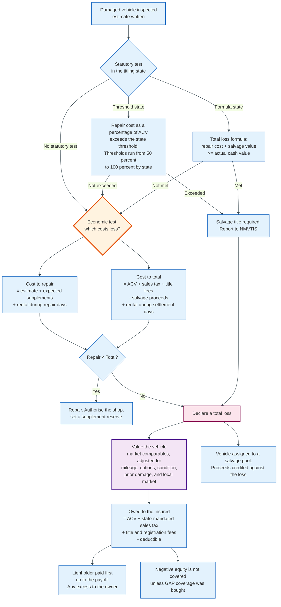

### 12.1 The Three Definitions

**Actual total loss.** The property no longer exists in a repairable form. A vehicle consumed by fire, a house reduced to a foundation, a vessel on the sea floor.

**Constructive total loss.** Repair is possible but the cost of repair plus salvage exceeds the value. This is the marine insurance concept that the auto and property markets inherited.

**Economic total loss.** Repair is possible and would cost less than the vehicle is worth, but totalling it is still cheaper for the insurer once salvage proceeds and rental costs are counted. This is the case most drivers do not expect and the one that generates the most complaints.

### 12.2 The Statutory Test

Whether a vehicle must be branded as salvage is decided by state law, and states use two different tests.

**Total loss threshold states** set a fixed percentage. If the cost of repair as a percentage of actual cash value exceeds the threshold, the vehicle must be titled as salvage. Thresholds across the United States run from 50 percent at the low end to 100 percent at the high end. A vehicle that is a mandatory total loss in one state is repairable in the neighbouring one.

**Total loss formula states** use a computation rather than a percentage: if the cost of repair plus the salvage value equals or exceeds the actual cash value, the vehicle is a total loss. This is the constructive total loss test written into statute.

A number of states apply no statutory test at all and leave the determination to the insurer, subject to title branding rules.

Once a vehicle is declared a total loss, the insurer must report it. The National Motor Vehicle Title Information System receives reports of total losses and salvage from insurers and salvage operators, which is what makes title washing across state lines harder than it once was.

### 12.3 The Economic Decision

The statutory test sets the floor. The economics set the actual decision, and the arithmetic is worth writing out.

The insurer compares two costs.

*Cost to repair* equals the estimate, plus the expected supplement, plus rental or loss of use for the repair duration, plus the residual diminished value exposure in states that recognise it.

*Cost to total* equals the actual cash value, plus state-mandated sales tax on the replacement, plus title and registration fees, minus the expected salvage proceeds, plus rental for the shorter settlement period.

When cost to total is lower, the insurer totals the vehicle even if the repair cost is well below the actual cash value. On a vehicle worth 22,400 dollars with a 16,900 dollar repair estimate and an expected salvage return of 6,200 dollars, the net cost of totalling is 16,200 dollars before tax and fees, which is less than the repair. The vehicle gets totalled at a repair-to-value ratio of 75 percent, well under any state threshold.

Salvage recovery is therefore not a back-office function. It moves the total loss threshold.

### 12.4 Valuing the Vehicle

Actual cash value on a vehicle is established by market comparison, not by a book value.

The valuation services used by carriers - CCC's total loss valuation product, Mitchell's total loss module, and Solera's Autosource - build a valuation from actual comparable vehicles advertised or sold in the local market. Each comparable is adjusted for mileage difference, options difference, trim level and condition. The adjusted comparables are averaged, and a condition adjustment is applied to the subject vehicle based on the pre-loss condition reported by the adjuster.

Prior unrepaired damage is deducted. Aftermarket equipment is added where documented. Betterment applies where a repair puts the owner in a better position than before, most commonly on tyres and batteries.

State law then adds items on top. Most states require the insurer to pay the sales tax the owner will incur buying a replacement, and title and registration fees. Some require it be paid up front; some require it be reimbursed on proof of replacement.

The deductible is subtracted. The lienholder is paid first up to the payoff amount, and only the excess goes to the owner. When the payoff exceeds the actual cash value, the owner owes the difference unless they bought guaranteed asset protection coverage, which is a separate product and not part of the auto policy.

### 12.5 Property Total Loss

Structures follow the same logic with a different legal overlay.

Most property policies settle a total loss at replacement cost up to the Coverage A limit, subject to the same repair-completion requirement as a partial loss. Extended replacement cost endorsements add a percentage above the limit, commonly 25 or 50 percent, to absorb post-catastrophe demand surge.

Valued policy laws change the calculation in the states that have them. Florida statute 627.702 is the best-known example: on a total loss of a structure by a covered peril, the insurer owes the face amount of the policy regardless of the actual value of the building. The statute exists to prevent an insurer from collecting premium on a stated amount and then arguing the building was worth less after it burned down.

Contents are settled separately, item by item, on either an actual cash value or replacement cost basis depending on the form. This is the most labour-intensive part of a large property claim: a complete household inventory can run to thousands of line items, each requiring a description, an age, a purchase price and a replacement cost.

---

## 13. Salvage and Subrogation - The Recovery Side

Recovery is the only part of the claims function that generates income rather than consuming it, and it runs on a different clock from everything else.

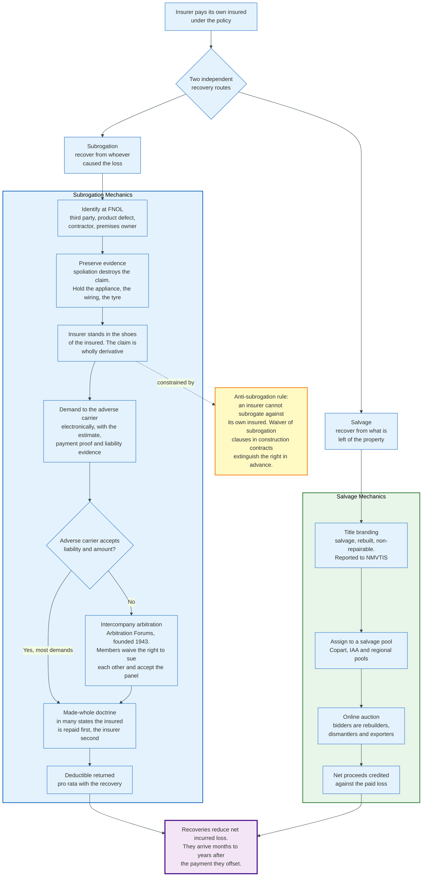

### 13.1 Subrogation

Subrogation is the insurer's right, after paying its insured, to stand in the insured's shoes and pursue whoever caused the loss.

The right is derivative, and that word does the work. The insurer acquires exactly the rights the insured had, no more. If the insured signed a contract waiving claims against the responsible party, the insurer has nothing to pursue. If the insured's own conduct would defeat the claim, it defeats the insurer's claim too. If the statute of limitations on the underlying tort has run, the subrogation claim is dead regardless of when the insurer paid.

Three doctrines constrain it.

**The made-whole doctrine.** In many states, the insured must be fully compensated before the insurer takes any part of a recovery. Where the recovery is less than the total loss, the insured is paid first out of it. Whether the doctrine can be overridden by policy language varies by state.

**The anti-subrogation rule.** An insurer cannot subrogate against its own insured. This blocks the manoeuvre of paying one insured and then suing another insured under the same policy, which would leave the insurer indemnifying and pursuing the same person.

**Waiver of subrogation.** Construction contracts routinely require each party to waive subrogation against the others, on the theory that the builder's risk policy should absorb the loss rather than fund litigation among the project participants. The waiver is signed before the loss and extinguishes the right in advance.

### 13.2 How a Subrogation Claim Actually Runs

Identification happens at FNOL or it usually does not happen at all. The FNOL script asks whether another party was involved, whether a product malfunctioned, whether a contractor had worked on the property. A claim that closes without that question having been asked is a claim where the recovery was never pursued.

Evidence preservation follows immediately. Spoliation - destroying or losing the evidence that proves the third party's liability - defeats the claim and can produce sanctions. If a water heater failed, the water heater is kept, tagged and stored, and the manufacturer is invited to inspect it before it is examined destructively.

The demand goes to the responsible party's insurer with the estimate, the proof of payment and the liability evidence. Most inter-carrier demands are exchanged electronically.

When the carriers disagree, they arbitrate rather than litigate. Arbitration Forums, founded in 1943, operates the industry's intercompany arbitration programmes: automobile physical damage, personal injury protection, special arbitration, medical payments, property subrogation and international reciprocal. Signatory members agree to submit disputes to a panel rather than sue each other. Arbitration Forums reports more than 5,000 members, approximately 1.1 million arbitration disputes and 2.3 million subrogation demands handled annually, covering more than 27 billion dollars in claims.

The economics of that arrangement are straightforward. Two carriers litigating a 6,000 dollar property damage subrogation claim would each spend more than the claim on counsel. A panel decision costs a filing fee.

The deductible is returned to the insured pro rata with the recovery. If the insurer recovers 70 percent of what it paid, the insured receives 70 percent of their deductible back. Many insureds do not know this and do not ask.

### 13.3 Salvage

Salvage is the recovery of value from the damaged property itself, and in auto it is an industrial-scale business.

When a vehicle is totalled, the insurer takes the title and assigns the vehicle to a salvage pool. The two large North American operators are Copart and Insurance Auto Auctions. Copart reported revenue of 4.65 billion dollars for the fiscal year ended 31 July 2025 and operates salvage yards across 11 countries, with insurance companies as its primary source of vehicles, predominantly total losses from collisions and natural disasters. Its current yard count is disclosed in Item 1 of its Form 10-K and is not restated here.

The pools operate under two commercial models. Under a consignment or fee model, the pool sells the vehicle on the insurer's behalf and takes a fee, with the insurer bearing the market risk. Under a purchase agreement, the pool buys the vehicle from the insurer at an agreed percentage of actual cash value and takes the market risk itself. The choice is a hedge: a purchase agreement gives the insurer certainty and gives up the upside.

Buyers are rebuilders, dismantlers who sell recycled parts back into the repair market, and exporters. That last category links salvage returns to foreign exchange rates and to import regulations in the destination markets, which is why salvage returns move for reasons entirely unrelated to the domestic vehicle market.

Property salvage is smaller but real: undamaged materials, appliances, and in commercial claims, entire inventories of damaged but saleable stock sold to salvage buyers.

### 13.4 Why Recovery Is Structurally Under-Managed

Recoveries arrive after the claim is closed, after the adjuster has moved on, and after the accident year has been reported. Every incentive in the operation points away from them.

Carriers respond with dedicated subrogation units separated from the adjusting function, referral rules that automatically flag claims with recovery potential, and vendor arrangements where an outside firm pursues the recovery for a contingency fee. The metric that matters is not the recovery amount but the recovery rate against identified potential, because the failure is almost always in identification rather than in pursuit.

---

## 14. Claims Fraud - Red Flags and Analytics

Insurance fraud is a volume crime committed against a counterparty that has agreed in advance to pay on presentation of a story. The defence is a layered system, and each layer catches a different class of offender.

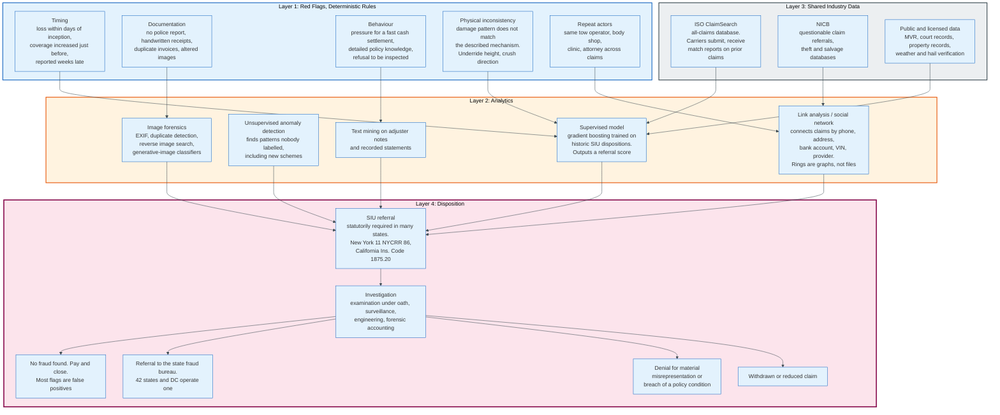

### 14.1 The Scale

The Coalition Against Insurance Fraud's 2022 study estimates that insurance fraud costs the United States 308.6 billion dollars a year. Four of the largest identified components are 74.7 billion dollars in life insurance, 45 billion dollars in property and casualty, 34 billion dollars in workers compensation, and 7.4 billion dollars in auto theft. Those four sum to 161.1 billion dollars, 52 percent of the total. The rest sits mostly in health care, and the Coalition's public fraud statistics page does not publish the full line-by-line split or any per-person or per-family figure. The FBI estimates fraud raises the average family's premiums by 400 to 700 dollars a year.

A separate 2017 Verisk study estimated that auto insurers lose at least 29 billion dollars a year to premium leakage and related practices, which is an underwriting-side problem rather than a claims one but is frequently discovered at claim time.

Forty-two states and the District of Columbia operate insurance fraud bureaus staffed with investigators who work with law enforcement.

### 14.2 Hard Fraud and Soft Fraud

The distinction determines the entire response.

**Hard fraud** is a fabricated or deliberately caused loss: the staged accident, the arson-for-profit fire, the vehicle reported stolen after being sold or hidden, the fictitious injury clinic billing for treatment never rendered. It is committed by a smaller number of people, frequently organised, and it is prosecutable.

**Soft fraud** is exaggeration of a real loss: the genuine burglary where the claimed contents grow, the genuine soft-tissue injury where the treatment is extended, the genuine hail claim where undamaged items are added. It is committed by a very large number of otherwise ordinary people, each for a modest amount, and it is nearly never prosecuted.

Hard fraud is where the criminal referrals are. Soft fraud is where the money is. A detection programme tuned only for hard fraud misses most of the loss.

### 14.3 Red Flags

Red flags are deterministic indicators. They do not prove fraud; they raise the prior probability enough to justify investigation.

**Timing indicators.** Loss occurring shortly after policy inception, shortly after a coverage increase, or shortly before a lapse. Loss reported weeks after it allegedly occurred with no explanation for the delay. Loss occurring on the day coverage began.

**Documentation indicators.** No police or fire report where one would be expected. Receipts that are handwritten, sequentially numbered from the same pad, or for round amounts. Invoices from businesses with no verifiable existence. Photographs with metadata inconsistent with the reported date or location, or that appear elsewhere on the internet.

**Behavioural indicators.** Unusual pressure for a fast cash settlement. Detailed knowledge of policy terms and claims procedure disproportionate to the claimant's background. Refusal to permit inspection, or property becoming unavailable. Willingness to accept an unusually low offer to avoid scrutiny.

**Physical inconsistency.** The damage does not match the described mechanism. Crush direction inconsistent with the reported impact angle. Underride height inconsistent with the reported vehicle. Fire burn patterns inconsistent with the reported ignition point. Hail damage on surfaces sheltered from the sky. This is the strongest category, because physics does not negotiate.

**Repeat actors.** The same tow operator, body shop, medical clinic, chiropractor, contractor or attorney appearing across unrelated claims at a rate far above chance. Organised fraud is a network, and networks show up in the data as unlikely coincidences.

### 14.4 The Analytics Layer

Rules catch what someone has already thought of. Models catch the rest.

**Supervised models.** Gradient-boosted decision trees trained on historic claims labelled with their SIU disposition. The output is a referral score. The training data problem is severe and rarely acknowledged: the labels are the outcomes of past investigations, so the model learns to find claims that look like the ones investigators already chose to investigate. Models trained this way inherit whatever selection bias existed in the referral process.

**Unsupervised anomaly detection.** Clustering and density-based methods that identify claims unlike anything in the population without needing labels. This is the only layer that can detect a scheme nobody has seen before, which matters because organised fraud adapts to known rules within months.

**Link analysis.** Fraud rings are graphs. Claims are connected by shared phone numbers, addresses, bank accounts, vehicle identification numbers, IP addresses, medical providers, attorneys and repair facilities. A ring that is invisible when claims are examined one at a time becomes obvious when the claims are edges in a graph. Community detection over that graph finds rings that per-claim review cannot find, because the evidence exists only in the edges between claims.

**Text and speech analytics.** Adjuster notes, recorded statements and call transcripts carry signals that structured fields do not. Inconsistencies between successive accounts, hesitation patterns, and specific linguistic markers all feed models, though the evidentiary value of the last category is contested.

**Image forensics.** EXIF analysis, error level analysis, perceptual hashing against a database of previously submitted images to detect reuse, reverse image search against the public web, and increasingly classifiers trained to detect generated or manipulated images. The rise of consumer image generation tools has made this layer urgent rather than optional.

### 14.5 Shared Industry Data

No individual carrier sees enough to detect a ring operating across ten carriers. Shared databases solve that.

ISO ClaimSearch, operated by Verisk, is the industry's all-claims database. Participating carriers submit claims and receive match reports identifying prior claims involving the same people, addresses, vehicles or property. A claimant with eleven soft-tissue injury claims across seven carriers in four years is invisible to each of those carriers individually and obvious in the match report.

The National Insurance Crime Bureau maintains theft and salvage databases and receives questionable claim referrals from member carriers, coordinating with law enforcement on organised activity.

State fraud bureaus receive mandatory referrals in many jurisdictions, and immunity statutes protect carriers that report suspected fraud in good faith.

### 14.6 The Special Investigation Unit

An SIU is a statutory requirement in many states rather than a management choice.

New York's Insurance Law and its implementing regulation at 11 NYCRR 86 require licensed insurers above a threshold to establish a special investigations unit and file a fraud prevention plan describing its staffing, procedures and training. California Insurance Code sections 1875.20 through 1875.24 and the associated regulations impose comparable obligations. The plans are filed with and reviewed by the department.

An SIU investigation uses tools ordinary adjusting does not. The examination under oath is a policy condition permitting the insurer to question the insured under oath, with a transcript, before paying. Refusal to submit is a breach of a condition precedent. Surveillance, forensic accounting, origin and cause engineering, and background investigation follow.

The disposition is usually not a denial. Most referred claims are paid, because most red flags are false positives and the base rate of fraud among flagged claims is far below 50 percent. The measurable output of an SIU is the difference between what would have been paid without investigation and what was actually paid, which includes withdrawn claims, reduced claims and negotiated settlements as well as denials.

---

## 15. Litigation, Defence, and Bad Faith Exposure

Litigation is where a small fraction of claims consume a large fraction of the expense budget, and where the insurer's own conduct becomes the subject of the case.

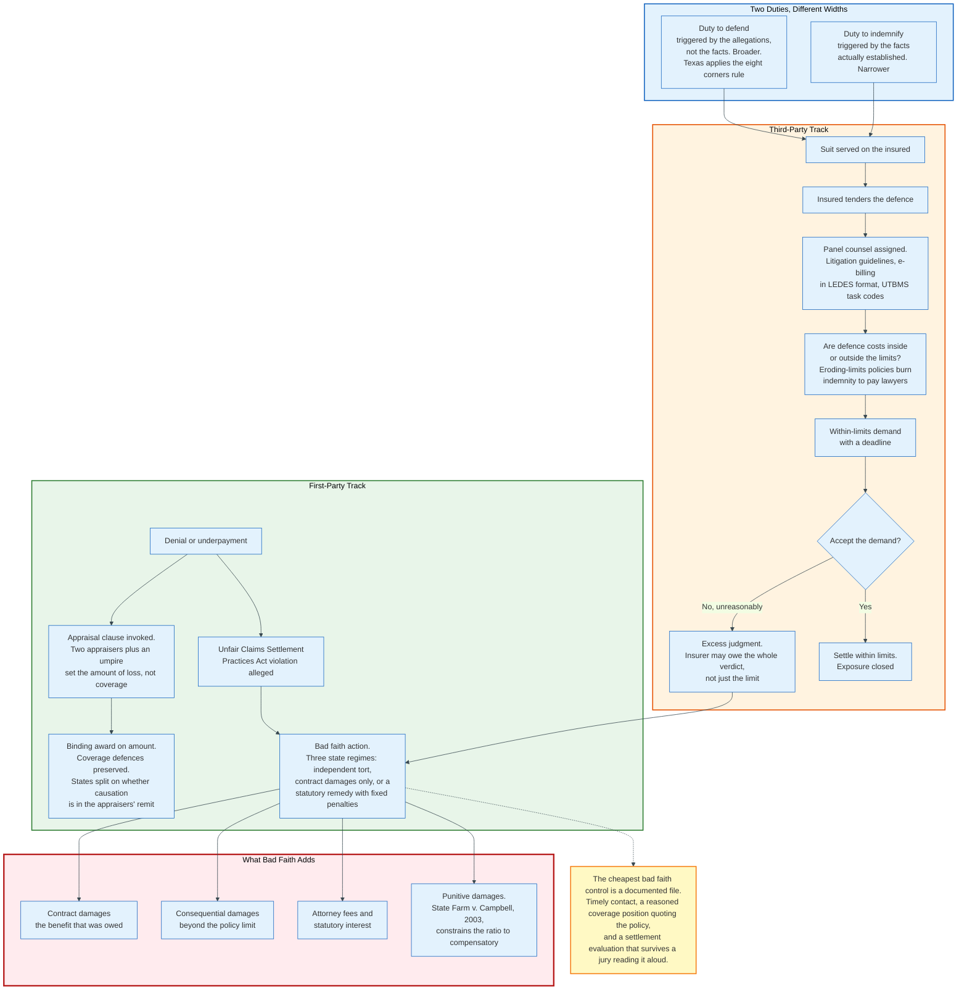

### 15.1 Two Duties of Different Widths

A liability policy contains two separate promises, and they are not co-extensive.

**The duty to defend** is triggered by the allegations in the complaint, not by the facts. If any allegation, if proved, would fall within coverage, the insurer must defend the whole case. Texas states this as the eight corners rule: compare the four corners of the complaint with the four corners of the policy, and look no further. The duty is broader than the duty to indemnify precisely because it is judged on allegations, which a plaintiff controls.

**The duty to indemnify** is triggered by the facts actually established. An insurer may be required to defend a case it will never have to pay.

The practical consequence is that an insurer facing an ambiguous complaint should defend under a reservation of rights rather than refuse. Refusing to defend where the duty existed is the most reliable way to lose control of the case and to face a coverage-by-estoppel argument afterwards.

### 15.2 Defence Cost Management

Defence costs are paid to law firms, and law firms bill by the hour, which makes this the most process-controlled spend in the function.

**Panel counsel.** Carriers maintain approved firm panels with negotiated rates. Panel status is contingent on compliance with litigation guidelines that specify staffing ratios, require approval before depositions and experts, prohibit block billing, restrict travel, and set reporting cadence.

**Electronic billing.** Invoices are submitted in LEDES format, the Legal Electronic Data Exchange Standard, and coded to UTBMS task codes: the L-series litigation code set for tasks, A-series for activities and E-series for expenses. This turns a narrative invoice into structured data, which lets the carrier enforce guidelines automatically. A line coded to a task the guidelines require pre-approval for, without a matching approval, gets rejected by rule rather than by a human reading the bill.

**Inside or outside the limits.** In most general liability and auto policies, defence costs are paid in addition to the limits. In most professional liability, directors and officers, and many excess and surplus lines policies, defence costs erode the limits. An eroding-limits policy means every hour of defence reduces the money available to settle. Each hour billed lowers the ceiling on what the insurer can offer, so delay costs the insured directly and the settlement calculus inverts.

### 15.3 Social Inflation

Liability severity has grown faster than economic inflation and faster than claim frequency, and the industry term for the excess is social inflation.

The identified drivers: larger jury awards, with verdicts above 10 million dollars conventionally labelled nuclear verdicts; third-party litigation funding, in which outside investors finance plaintiff cases in exchange for a share of the recovery; attorney advertising, which raises the representation rate; erosion of tort reform statutes; and litigation-tactics such as the reptile theory, which reframes a case around community safety rather than the individual plaintiff's damages.

The claims-side responses are structural rather than clever. Reserve to trial value early rather than to settlement value. Resolve clear liability cases before counsel is retained, because representation is close to irreversible. Track venue-level verdict data and set authority accordingly. And treat time-limited demands as the high-risk events they are.

### 15.4 Bad Faith

Bad faith converts a contract dispute into a tort, and the change of category is the whole point.

In a contract action the insurer's exposure is capped at what it should have paid. In a tort action it is not. Extra-contractual damages, consequential damages, attorney fees, statutory interest and punitive damages all become available, and the insurer can end up paying an amount unrelated to the policy limit.

States split three ways on first-party bad faith, and the split decides what the insured can recover. Some recognise an independent tort at common law, which opens consequential and punitive damages. Some confine the insured to contract remedies plus interest. Some create a statutory remedy with defined penalties and fee-shifting: Florida's civil remedy statute at Fla. Stat. 624.155, Pennsylvania's bad faith statute at 42 Pa. C.S. 8371, which allows interest at prime plus 3 percent together with punitive damages and fees, and Illinois at 215 ILCS 5/155. No current fifty-state tally is cited here. The counts move whenever a state supreme court decides the question, so the governing state's law at the date of loss controls and a national count is not a usable input.

The doctrinal history is Californian. Comunale v. Traders and General Insurance Co., decided in 1958, established the modern third-party bad faith tort. Gruenberg v. Aetna Insurance Co., decided in 1973, extended it to first-party fire insurance. The Supreme Court constrained the outer limit in State Farm Mutual Automobile Insurance Co. v. Campbell in 2003, overturning a 145 million dollar punitive award and holding that punitive damages must bear a reasonable relationship to compensatory damages.

**First-party bad faith** typically alleges inadequate investigation, unreasonable delay, unreasonable valuation, or denial without a reasonable basis. **Third-party bad faith** typically alleges failure to settle within limits when the opportunity existed, exposing the insured to an excess judgment.

The controls are unglamorous. Contact the insured within the statutory window and document it. State the coverage position in writing, quoting the policy language relied on. Investigate before denying, and document what was investigated. Evaluate settlement on the merits and record the reasoning. Escalate when the exposure exceeds the limits. The file is the defence, and a file that reads well to a jury is built during the claim, not reconstructed afterwards.

### 15.5 The Appraisal Route

Appraisal settles the amount of loss without a court, and it is the primary non-litigation route for the dispute that dominates first-party property.

The clause comes from the 165-line standard fire policy and the machinery is written into it. Either party may demand appraisal in writing once the insured and the insurer fail to agree on the actual cash value or the amount of loss. Each side then selects a competent and disinterested appraiser and notifies the other within 20 days of the demand. The two appraisers select an umpire. If they fail to agree on an umpire for 15 days, either party may ask a judge of a court of record in the state where the property sits to appoint one. An award in writing signed by any two of the three, itemised and filed with the insurer, determines the actual cash value and the amount of loss. Each side pays its own appraiser and the parties split the umpire and the appraisal expenses equally.

The award binds on amount and on nothing else. Coverage, the application of exclusions, and the insured's compliance with policy conditions all sit outside the panel's remit and stay with the court. That boundary is the whole design: the panel is three people who can read a roof, not three people who can read a policy.

Causation is the contested edge. Where a roof shows both hail damage and ten years of wear, someone has to allocate the loss between a covered cause and an uncovered one, and states split on whether the appraisers may do it. Some hold that allocation is inseparable from determining the amount of loss and belongs to the panel. Others hold that deciding what caused the damage is a coverage question reserved to the court, and an appraisal award that allocates is void to that extent. A carrier invoking appraisal in a mixed-cause claim has to know which rule the governing state applies before it demands.

Participation carries a waiver risk in both directions. In several states an insurer that participates in appraisal and pays the award without reserving its coverage defences waives them. In others, demanding appraisal is itself treated as an admission that the loss is covered, because the only question appraisal answers presupposes coverage. The practical control is a reservation of rights letter issued with the appraisal demand or the appraisal response, stating that the insurer contests coverage and participates only on the amount.

The economics explain the volume. Two appraisers and an umpire resolve a scope dispute for a few thousand dollars in fees within weeks. The same dispute litigated costs both sides more than the disputed amount and takes a year. Appraisal is cheap, fast, and blind to the only question a claim can actually be lost on.

---

## 16. Loss Adjustment Expense - What It Costs to Pay a Claim

Loss adjustment expense is everything an insurer spends to investigate, adjust, defend and settle claims, separate from the indemnity paid to claimants. It is the cost of running the machine.

### 16.1 The Statutory Split

United States statutory accounting divides loss adjustment expense into two categories, and the split is a reporting standard rather than an accounting convenience.

**Defence and cost containment expense (DCC)** covers defence, litigation and medical cost containment, whether internal or external. Defence counsel fees, expert witnesses, court reporters and filing fees, medical bill review and repricing, surveillance conducted for a specific claim, and the costs of establishing that a claim should not be paid all fall here.

**Adjusting and other expense (A and O)** covers everything else: adjuster salaries and benefits, independent adjuster fees, claims system costs, allocated overhead, the call centre, and the salvage and subrogation function.

This pair replaced the older allocated and unallocated distinction for statutory reporting purposes in the late 1990s. Actuaries still use ALAE and ULAE informally, and the terms mean approximately but not exactly the same thing: the old split was about whether an expense could be assigned to a specific claim, while DCC and A and O split by the nature of the activity.

### 16.2 Where the Money Goes

The composition of LAE varies more by line of business than any other claims metric.

| Line | Dominant LAE component | Why |
|------|------------------------|-----|
| Homeowners property | A and O: inspection, IA fees, estimating | Damage assessment is the work; litigation is a small tail |
| Auto physical damage | A and O: appraisal, photo review | Repairs are priced from a database; disputes are small |
| Auto bodily injury | Mixed | Investigation plus a meaningful defence spend |
| General liability | DCC: defence counsel | Coverage and liability are litigated by default |
| Medical professional liability | DCC, heavily | Cases are defended on the merits and rarely settled early |
| Workers compensation | Both, plus medical cost containment | Long duration, medical management, return-to-work programmes |

Property claims are expensive to inspect and cheap to defend. Liability claims are cheap to inspect and expensive to defend. A carrier's LAE ratio is therefore mostly a description of its business mix, not its efficiency, which makes cross-carrier LAE comparisons misleading unless mix-adjusted.

### 16.3 The Arithmetic of Small Claims

The expense ratio on a small claim is dreadful, and this single fact drives the entire straight-through processing agenda.

Take a property claim with a gross replacement cost estimate of 18,942 dollars that nets to an indemnity payment of 4,415 dollars after depreciation and a percentage deductible. Handling it consumes an independent adjuster fee of about 585 dollars under a typical fee schedule for that gross bracket, an aerial roof measurement report at about 85 dollars, and roughly three and a half hours of desk adjuster time at a fully loaded cost near 62 dollars an hour, or 217 dollars. Total adjusting expense: 887 dollars, against an indemnity of 4,415 dollars.

That is an A and O ratio of 20.1 percent of indemnity on a single claim. The fee schedule figures and the loaded hourly rate here are illustrative rather than published industry averages, but the shape is not in dispute: the fixed cost of touching a claim does not scale down with the size of the claim.

Two consequences follow. First, deductibles exist partly to eliminate claims whose handling cost approaches their indemnity. Second, any technology that removes the human touch from a small claim has a return that is obvious in a way that most insurance technology does not.

### 16.4 Reserving for LAE

Unpaid LAE has to be reserved too, and the two components are reserved differently.

DCC is reserved much like loss: it can be assigned to specific claims, it develops in a triangle, and it is reported alongside loss in Schedule P. Defence costs on an open liability claim are estimated per file.

A and O cannot be assigned to specific claims and is reserved at the aggregate level. The classical approach is a paid-to-paid ratio: compute historic A and O paid as a percentage of losses paid, then apply that ratio to the future payments expected on open and IBNR claims, with a weighting that recognises a share of the expense is incurred when the claim is opened and the remainder as it is handled. A common weighting assumes 50 percent of A and O is incurred at claim setup and 50 percent over the life of the claim, though carriers calibrate this to their own data.

### 16.5 The LAE Ratio as a Management Metric

The ratio is computed two ways and the two answers say different things.

LAE divided by earned premium says what proportion of revenue the claims function consumes. LAE divided by incurred loss says how much it costs to deliver a dollar of benefit. The second is the operational metric; the first is the financial one.

Neither should be minimised in isolation. Cutting adjusting expense by removing investigation raises indemnity by more than it saves, because unverified claims get paid at the claimant's number. The genuine target is total incurred, which is indemnity plus LAE minus recoveries. A programme that spends an extra 200 dollars per claim on investigation and saves 900 dollars per claim on indemnity is a good programme with a worse LAE ratio.

---

## 17. Technical Architecture and Data Standards

A claims administration system is a state machine wrapped around a financial ledger, with a document store, a workflow engine, and a large number of external integrations.

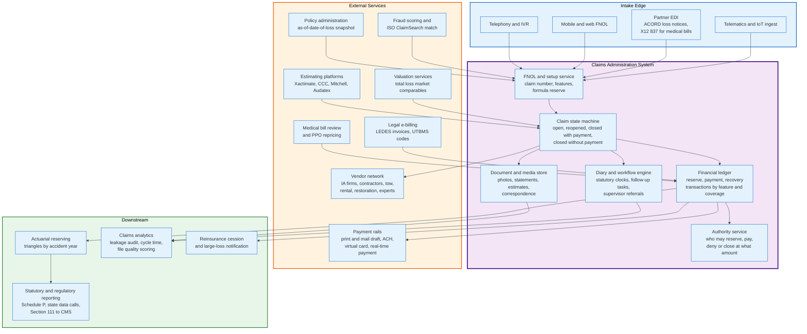

### 17.1 The Core Components

**Intake services.** Channel-specific front ends normalising into a single FNOL structure. Telephony and IVR, mobile and web, partner EDI, and machine-generated notices from telematics all converge here.

**The claim state machine.** Open, reopened, closed with payment, closed without payment, and the sub-states for each stage. Transitions are guarded: a claim cannot be closed with an open reserve, cannot be paid without an approved authority, cannot be denied without a coded denial reason.

**Feature hierarchy.** Claim contains claimants, claimants contain features, features contain financial transactions. Every reserve, payment and recovery attaches to a feature, because coverage limits apply at feature level.

**The financial ledger.** Three transaction types on every feature: reserve movements, payments, and recoveries. The ledger must reconstruct the reserve and paid position of any feature as of any historical date, because that is what actuarial triangles require and what auditors ask for.

**The diary and workflow engine.** Statutory clocks, follow-up tasks, supervisory referrals, and escalations. Every regulatory deadline described in section 20 is configured here as a rule.

**Authority service.** Who may set what reserve, approve what payment, deny what claim, and close what file, expressed as dollar thresholds by role, line and jurisdiction.

**Document and media store.** Photographs, recorded statements, estimates, correspondence, medical records, police reports. Volume is dominated by images, and the retention obligation typically outlives the claim by years.

Those seven components are bought, not built, in most carriers. The general-purpose claims administration products are Guidewire ClaimCenter, Duck Creek Claims and Sapiens ClaimsPro, each shipping the state machine, the ledger, the diary engine and the authority service as configurable modules. The specialist products are Origami Risk and Ventiv for risk pools, self-insured employers and third-party administrators, and Mitchell on the workers compensation medical side. Section 22.3 sets out why the two categories exist. Everything in the External Services column of the diagram is a separate vendor again: Xactimate and Symbility on property estimating, CCC, Mitchell and Audatex on auto, ISO ClaimSearch on shared claims data, and a payment provider on the rails.

### 17.2 The Integration Surface

A claims system is mostly integrations. The material ones:

| Integration | Direction | What crosses |
|-------------|-----------|--------------|
| Policy administration | In | As-of-date-of-loss policy snapshot: limits, deductibles, endorsements, insureds, payment status |
| Estimating platforms | Both | Assignment out, estimate document and line-item detail in |
| Valuation services | Both | Vehicle and property details out, valuation report in |
| ISO ClaimSearch | Both | Claim submission out, match report in |
| Fraud scoring | Both | Claim features out, score and reason codes in |
| Medical bill review | Both | Bills out, repriced bills and PPO savings in |
| Payment services | Out | Payment instructions, payee data, tax reporting |
| Vendor networks | Both | Assignments out, status and invoices in |
| Legal e-billing | In | LEDES invoices with UTBMS task codes |
| Actuarial reserving | Out | Transaction-level extracts for triangle construction |
| Regulatory reporting | Out | Statutory schedules, state data calls, Section 111 files to CMS |
| Reinsurance | Out | Cession detail and large-loss notifications |

### 17.3 The Data Standards

Claims data crosses organisational boundaries in a small number of standard formats.

**ACORD forms and messages.** ACORD 1, 2 and 3 for property, automobile and general liability loss notices, with the same content carried electronically through ACORD's data standards. The historical AL3 flat-file format is still in use in agency-carrier interfaces; XML-based standards carry newer integrations.

**IAIABC FROI and SROI.** First Report of Injury and Subsequent Report of Injury, for workers compensation reporting to state agencies. Release 3 of the standard is the current generation, using structured records with maintenance type codes indicating what event the filing reports.

**X12 EDI in health and auto medical.** The 837 transaction carries a health care claim, in professional, institutional and dental variants. The 835 carries the remittance advice back, pairing each claim with its payment and its adjustment reason codes. The 270 and 271 pair carries eligibility inquiry and response, the 276 and 277 pair carries claim status inquiry and response, and the 275 carries attachments. HIPAA mandates the 5010 version family for covered transactions. ASC X12 maintains more than 300 transaction sets in total, with the X12N insurance subcommittee responsible for the insurance ones.

**CMS-1500 and UB-04.** The paper forms behind the 837 professional and institutional transactions, still used as the conceptual data model even where nothing is printed.

**Estimate exchange formats.** Property estimates move as ESX files, Xactimate's container format. Auto estimates move in EMS, the Estimate Management Standard export used to move estimate data between systems.

**LEDES.** Legal invoices in a pipe-delimited or XML format, coded to UTBMS task and expense codes.

### 17.4 The Data Model

Six entities carry the weight.

`Claim` holds the event: date of loss, location, cause of loss code, catastrophe code, reported date, status. `Policy` is a snapshot as of the date of loss, not a live reference. `Party` covers every human or organisation with a role: insured, claimant, witness, provider, attorney, vendor, payee. `Feature` is the intersection of a claimant and a coverage, and is where limits apply. `Transaction` is a dated financial movement against a feature, typed as reserve, payment or recovery. `Note` and `Document` carry the evidentiary record.

Two design decisions determine whether a claims system is usable ten years later. First, financial transactions must be immutable and append-only: a reserve change is a new transaction, never an edit, so that any historical position is reconstructible. Second, the policy snapshot must be stored with the claim rather than referenced, because policy administration systems purge, restate and migrate, and a claim litigated in 2033 needs the 2026 policy exactly as it was.

---

## 18. Straight-Through Processing and Photo-Based Estimating

Straight-through processing means a claim moves from notice to payment with no human decision in the path. It is achievable on a narrow band of claims and disastrous outside it.

```mermaid
%%{init: {'theme': 'base', 'themeVariables': {'primaryColor': '#e3f2fd', 'primaryBorderColor': '#1565c0', 'lineColor': '#37474f'}}}%%

flowchart TB
    Start["FNOL submitted in the app"] --> G1{"Gate 1: Coverage<br/>policy in force, peril covered,<br/>no lapse, no prior open claim"}

    G1 -->|Fail| Human["Route to an adjuster"]
    G1 -->|Pass| G2{"Gate 2: Simplicity<br/>no bodily injury, no third party,<br/>no attorney, single vehicle or<br/>single peril, no litigation history"}

    G2 -->|Fail| Human
    G2 -->|Pass| Capture["Guided photo capture<br/>the app dictates angles, distance,<br/>lighting. Rejects blurred frames<br/>at capture, not at review"]

    Capture --> CV["Computer vision pipeline"]

    subgraph CVsteps["What the model actually does"]
        D1["Vehicle or structure identification<br/>VIN decode, make, model, trim,<br/>panel segmentation"]
        D2["Damage detection per panel<br/>dent, scratch, crease, tear,<br/>missing part, glass"]
        D3["Severity classification<br/>maps damage to repair<br/>or replace, and to labour hours"]
        D4["Line item generation<br/>against the same estimating<br/>database a human would use"]
        D5["Hidden damage inference<br/>learned from historic supplements<br/>on similar impacts"]
    end

    CV --> D1 --> D2 --> D3 --> D4 --> D5

    D5 --> G3{"Gate 3: Confidence<br/>model confidence above threshold,<br/>estimate below the STP dollar cap,<br/>no total loss indicator"}

    G3 -->|Fail| Human
    G3 -->|Pass| G4{"Gate 4: Fraud<br/>image forensics clean,<br/>ISO ClaimSearch no match,<br/>fraud score below threshold"}

    G4 -->|Fail| SIU["SIU referral"]
    G4 -->|Pass| Offer["Estimate and payment offer<br/>presented to the insured"]

    Offer --> Accept{"Insured accepts?"}
    Accept -->|Yes| Pay["Payment issued<br/>digital, minutes not days.<br/>Claim closed"]
    Accept -->|No| Human

    Audit["Every STP claim is sampled after the fact.<br/>The control is not the gate, it is the audit<br/>that measures leakage against the gate."]
    Pay -.-> Audit

    style CVsteps fill:#fff3e0,stroke:#e65100,stroke-width:2px
    style Pay fill:#e8f5e9,stroke:#2e7d32,stroke-width:3px
    style Human fill:#e3f2fd,stroke:#1565c0,stroke-width:2px
    style SIU fill:#ffebee,stroke:#b71c1c,stroke-width:2px
    style Audit fill:#fff9c4,stroke:#f57f17,stroke-width:2px
```

### 18.1 The Gates

Every production STP implementation is a series of gates, and every gate is a reason to route to a human.

**Coverage gate.** Policy in force on the date of loss, premium current, peril unambiguously covered, no open prior claim on the same property, no coverage endorsement requiring interpretation. Any ambiguity fails the gate.

**Simplicity gate.** No bodily injury of any kind. No third party. No attorney. A single vehicle or a single peril. No litigation history on the policy. No commercial exposure.

**Confidence gate.** The model's own confidence above a threshold, the estimate below the STP dollar cap, and no indicator suggesting a total loss or structural damage.

**Fraud gate.** Image forensics clean, no ISO ClaimSearch match, fraud score below threshold, no velocity anomaly on the policy.

A claim that clears all four gates is offered an estimate and a payment. A claim that fails any gate goes to an adjuster, and the failure is not an error. The gates are calibrated so that the population passing them is one where automation cannot do much damage.

### 18.2 How Photo Estimating Works

The model does five things in sequence, and each maps to something a human adjuster does.

**Identification.** Decode the VIN, resolve the year, make, model and trim, and load the correct parts and labour data. On property, identify the structure and its components from imagery and a roof measurement report.

**Segmentation.** Partition the image into panels and components. Front bumper cover, left front fender, left headlamp assembly, windscreen. This is the step that lets damage be attributed to a specific part number.

**Damage detection and classification.** Per component, determine whether damage exists and what type: dent, scratch, crease, tear, missing, glass breakage. Severity is estimated from the extent and depth.

**Operation mapping.** Convert damage into repair operations. A shallow dent below a size threshold maps to a repair time; a crease across a body line maps to replacement. The mapping is learned from the historic correspondence between photographs and the estimates humans wrote for them.

**Hidden damage inference.** Predict what will be found once the vehicle is disassembled, learned from historic supplement patterns on similar impacts. This is the step that separates a triage tool from an estimating tool, because a photo estimate that ignores hidden damage is systematically low and generates supplements.

The output is a standard estimate in the same format a human would have produced, which is what made adoption possible: the shop, the carrier and the insured all read it in the same tool they already used.

### 18.3 What It Is Good At and What It Is Not

Photo estimating is strongest on high-frequency, low-severity, visually obvious damage: a rear bumper cover, a door skin, a windscreen, a hail-damaged roof slope. It is weakest where the damage is not visible in a photograph, which is structural damage, mechanical damage, water intrusion behind surfaces, and anything requiring a moisture meter or a disassembly.

Computer vision replaces the appraisal, not the adjustment. Coverage, liability, fraud and negotiation remain human decisions on anything but the simplest claims. Straight-through rates published by individual carriers describe books of small personal lines property and auto claims, not liability adjusting, and each carrier sets its own eligible denominator, so the rates do not compare across carriers.

### 18.4 The Control Is the Audit, Not the Gate

An STP programme without a post-payment audit is an uncontrolled payment channel.

Because no human reviewed the file, the only way to know whether the automated decisions were correct is to sample closed STP claims and re-adjust them manually. The audit measures leakage: the difference between what was paid and what the evidence supported. It also measures the reverse, where automation underpaid and produced complaints or reopens.

The audit output feeds back into the gates. A cohort with unacceptable leakage gets excluded, the dollar cap gets lowered, or a confidence threshold gets raised. Carriers that treat the STP rate as the metric to maximise, rather than as a constraint subject to a leakage target, discover the cost two years later in the severity trend.

---

## 19. Catastrophe Surge Response

A catastrophe is a defined event with a code attached, not a description of severity, and the code determines reinsurance recovery, statutory reporting and internal cost allocation.

```mermaid
%%{init: {'theme': 'base', 'themeVariables': {'primaryColor': '#e3f2fd', 'primaryBorderColor': '#1565c0', 'lineColor': '#37474f'}}}%%

flowchart TB
    subgraph Pre["Before Landfall: T minus 96 to 0 hours"]
        Fore["Forecast and exposure overlay<br/>policies in the cone,<br/>total insured value at risk"]
        Stage["Stage resources outside the cone<br/>IA rosters activated, mobile claim<br/>units, satellite uplinks, fuel"]
        Lic["Emergency adjuster licences<br/>states issue temporary credentials<br/>so out-of-state adjusters can work"]
        Comms["Pre-event messaging<br/>how to file, what is covered,<br/>advance payment availability"]
    end

    subgraph Day["Days 0 to 7: Triage Without Access"]
        Sat["Aerial and satellite imagery<br/>flown within days.<br/>Damage classified before<br/>a human reaches the street"]
        Auto["Automatic CAT coding<br/>every claim geocoded and tagged<br/>to the event for reinsurance<br/>and reporting"]
        Adv["Advance payments<br/>additional living expenses and<br/>contents advances issued on<br/>the policy, before inspection"]
        Tarp["Emergency mitigation<br/>tarps, board-up, water extraction.<br/>The insured has a duty to mitigate"]
    end

    subgraph Weeks["Weeks 1 to 12: The Surge"]
        Cap["Capacity arithmetic<br/>claims / (adjusters x claims per day)<br/>= days to clear the inspection queue"]
        Desk["Desk-first model<br/>photo and virtual inspection for<br/>anything under a severity threshold"]
        Field["Field for structural,<br/>large loss and disputed files"]
        Vendor["Vendor scarcity<br/>contractors, materials and rental<br/>housing all price up at once.<br/>Demand surge inflates every estimate"]
        Price["Off-cycle price list updates<br/>reflect the local spike"]
    end

    subgraph Tail["Months 3 to 60: The Tail"]
        PA2["Public adjusters and<br/>assignment-of-benefits contractors<br/>arrive in volume"]
        Sup["Supplements<br/>hidden damage found once<br/>work begins"]
        Lit2["Litigation<br/>the last 5 percent of claims<br/>consume a disproportionate<br/>share of LAE"]
        Reop["Reopens as deadlines<br/>are extended by bulletin"]
    end

    Fore --> Stage --> Lic --> Comms
    Comms --> Sat --> Auto --> Adv --> Tarp
    Tarp --> Cap --> Desk --> Field
    Cap --> Vendor --> Price
    Field --> PA2 --> Sup --> Lit2 --> Reop

    Def["A catastrophe is a defined term, not a description.<br/>PCS designates an event at 25 million dollars or more<br/>in direct insured losses affecting many policyholders<br/>and insurers. The code drives reinsurance recovery."]
    Auto -.-> Def

    style Pre fill:#e3f2fd,stroke:#1565c0,stroke-width:2px
    style Day fill:#fff3e0,stroke:#e65100,stroke-width:2px
    style Weeks fill:#fce4ec,stroke:#880e4f,stroke-width:3px
    style Tail fill:#eceff1,stroke:#37474f,stroke-width:2px
    style Def fill:#fff9c4,stroke:#f57f17,stroke-width:2px
```

### 19.1 The Definition

Property Claim Services, a Verisk unit, designates catastrophes in the United States and assigns the event numbers the industry uses. PCS designates an event when it causes at least 25 million dollars in direct insured losses and affects a significant number of policyholders and insurers. Aon applies a comparable definition for its own catalogue: an event causing 25 million dollars or more in insured property losses, ten deaths, 50 injuries, 2,000 filed claims, or homes and structures damaged.

Once designated, every claim geocoded inside the event footprint is coded to the event. That coding is what triggers the catastrophe reinsurance recovery, separates catastrophe from attritional loss in the reported results, and lets the carrier report event-level exposure to regulators and rating agencies.

### 19.2 The Capacity Arithmetic

Surge response is a queuing problem, and the arithmetic is unforgiving.

Days to clear the inspection queue equals the claim count divided by the product of available adjusters and inspections per adjuster per day. A carrier with 300 available property adjusters completing three inspections a day clears 900 inspections daily. Against 45,000 claims from a single hailstorm, that is 50 days to reach the last insured, before any re-inspection, supplement or reopened file. The first inspection happens on day one. The last one is the number that matters.

The three levers are the numerator and the two terms in the denominator. Reduce the claim count requiring inspection by handling more from the desk. Increase adjuster count with contracted independent capacity. Increase inspections per day by removing travel, which is what virtual inspection does.

Every catastrophe response is a bet placed in advance on those three levers, because the IA rosters have to be contracted, the licensing has to be arranged, and the technology has to be deployed before the event.

### 19.3 The Timeline

**T minus 96 to 0 hours, for a forecastable event.** Overlay the forecast track on the exposure file to compute policies and total insured value in the cone. Activate independent adjuster rosters. Stage mobile claim units, satellite communications, generators and fuel outside the impact zone. Arrange emergency adjuster licensing with the state department. Message policyholders on how to file and what to expect.

**Days 0 to 7.** Aerial and satellite imagery is flown and processed, classifying damage across the footprint before adjusters reach the streets. Claims are automatically catastrophe-coded on geocode. Advance payments for additional living expenses and contents are issued on the policy without inspection, because a displaced family needs money before it needs an adjuster. Emergency mitigation is authorised: tarps, board-up, water extraction. The insured has a policy duty to mitigate, and the insurer pays for reasonable mitigation.

**Weeks 1 to 12.** The surge proper. Desk-first handling for everything below a severity threshold. Field inspection for structural damage, large losses and disputed scope. Vendor scarcity becomes the binding constraint: contractors, materials, rental housing and hotel rooms all price up simultaneously, which is demand surge, and it inflates every estimate written in the region. Off-cycle price list updates carry that inflation into the estimating platform.

**Months 3 to 60.** The tail. Public adjusters and assignment-of-benefits contractors arrive in volume. Supplements arrive as hidden damage is found. Litigation builds, and the last few percent of claims consume a disproportionate share of the event's loss adjustment expense. Regulatory bulletins extend deadlines and impose moratoria on cancellation and non-renewal, which keeps files open longer than the policy language would.

### 19.4 What Fails Under Surge

Surge does not break the process. It breaks the parts of the process that assumed slack.

**Contact standards.** The statutory clock does not pause for a hurricane, though departments frequently issue bulletins extending specific deadlines. A carrier that misses contact standards across 40,000 claims has a market conduct problem, not a service problem.

**Quality control.** Re-inspection programmes are the first thing cut when inspection capacity is the constraint, which is exactly when estimate quality is most variable because the workforce is temporary and unfamiliar.

**Reserve accuracy.** Formula reserves calibrated on attritional losses are wrong for catastrophe losses, and the aggregate reserve for an event is usually set by a separate event-level estimate rather than by summing case reserves.

**Vendor management.** Contracted rates hold until capacity runs out. After that the market clears at whatever the contractors will accept, and the carrier's negotiated pricing becomes theoretical.

---

## 20. Regulation and Compliance

Claim handling is regulated at the state level in the United States, by conduct rules rather than by prior approval, and enforced through market conduct examination rather than transaction review.

### 20.1 Unfair Claims Settlement Practices

Every state has a statute or regulation enumerating prohibited claim-handling conduct, derived from the NAIC model.

The recurring prohibitions: misrepresenting policy provisions or facts relevant to coverage; failing to acknowledge and act reasonably promptly on communications; failing to adopt and implement reasonable standards for prompt investigation; refusing to pay claims without conducting a reasonable investigation; failing to affirm or deny coverage within a reasonable time after proof of loss; not attempting in good faith to effect prompt, fair and equitable settlement where liability is reasonably clear; compelling insureds to litigate by offering substantially less than the amounts ultimately recovered; attempting to settle for less than the amount to which a reasonable person would believe they were entitled; and failing to provide a reasonable explanation of the basis for a denial or a compromise offer.

Whether a violation supports a private lawsuit varies. Some states allow a private right of action; others confine enforcement to the department and treat the statute as evidence of the standard of care in a common-law bad faith case.

### 20.2 The Statutory Clocks

The deadlines are specific and jurisdiction-specific. Two states are set out here in full: California, whose regulation is the most detailed and is what most claims systems are configured against first, and Texas, which governs the worked example in section 23.

| Obligation | California requirement | Source |
|------------|------------------------|--------|
| Acknowledge notice of claim, provide forms, begin necessary investigation | Immediately, and in no event more than 15 calendar days | 10 CCR 2695.5 |
| Respond to any communication from a claimant | Immediately, and in no event more than 15 calendar days after receipt | 10 CCR 2695.5 |
| Accept or deny the claim | Immediately, and in no event more than 40 calendar days after receiving proof of claim | 10 CCR 2695.7 |
| Written status update while a determination is pending | Every 30 calendar days | 10 CCR 2695.7 |
| Tender payment after acceptance | Immediately, and in no event more than 30 calendar days | 10 CCR 2695.7 |

Texas runs a different clock on the same claim, and it counts business days rather than calendar days at two of the three steps.

| Obligation | Texas requirement | Source |
|------------|-------------------|--------|
| Acknowledge receipt of the claim, commence investigation, request all items reasonably believed necessary | Not later than the 15th day after notice, or the 30th business day for an eligible surplus lines insurer | Tex. Ins. Code 542.055 |
| Notify the claimant in writing of acceptance or rejection | Not later than the 15th business day after receiving all requested items, statements and forms; the 30th day where the insurer has a reasonable basis to believe the loss resulted from arson; extendable to the 45th day after the insurer notifies the claimant of the reasons for the delay | Tex. Ins. Code 542.056 |
| Pay after notice of acceptance | Not later than the 5th business day, or the 20th business day for an eligible surplus lines insurer | Tex. Ins. Code 542.057 |
| Penalty for delaying payment more than 60 days after receiving all items | 18 percent a year on the claim amount as damages, plus reasonable attorney fees. On a claim to which Chapter 542A applies, meaning damage from hail, wind, flood or another force of nature, the rate is 5 percent above the judgment rate under Finance Code 304.003 instead | Tex. Ins. Code 542.058, 542.060 |

Two structural differences follow. California starts its acceptance clock at proof of claim and counts calendar days; Texas starts at receipt of all requested items and counts business days, which hands the insurer control of the start date through the completeness of its own document request. And Texas attaches a priced penalty to delay, while California attaches an unfair claims practice finding. The same file can clear one clock and miss the other, because the two clocks do not start on the same event.

Prompt payment statutes in several other states attach statutory interest and attorney fees the same way, which converts a service failure into a quantified liability.

### 20.3 Federal Overlays

Three federal regimes reach into a function that is otherwise state-regulated.

**Medicare Secondary Payer and Section 111 reporting.** Liability, no-fault and workers compensation insurers are responsible reporting entities. They must determine whether a claimant is a Medicare beneficiary, report ongoing responsibility for medicals and total payment obligations to the claimant on a quarterly basis, and resolve Medicare's conditional payment claim before settling. Medicare's recovery right runs against the insurer, the claimant and claimant's counsel, which is why liens are resolved before the settlement cheque is issued. Civil money penalties for late or non-compliant reporting run up to 1,000 dollars per day per claimant, inflation-adjusted, capped at 365,000 dollars per claimant per year, for reports due on or after 11 October 2024.

**HIPAA.** Health plans, providers and clearinghouses are covered entities and must use the mandated X12 transaction standards and protect health information. Property and casualty insurers are generally not covered entities, but they receive protected health information constantly, through medical records supporting bodily injury and workers compensation claims, and handle it under authorisations and state privacy law.

**The Fair Credit Reporting Act.** Consumer report data used in claims decisions triggers adverse action notice obligations. Loss history reports themselves are consumer reports, which is why an insurer must give a specific disclosure when a claim history influences a decision.

### 20.4 Market Conduct Examination

Regulators do not review claims one at a time. They examine samples and measure error rates.

A market conduct examination pulls a statistically designed sample of closed claims and tests them against the statute: was contact timely, was the denial explained, was the payment made within the window, was the file documented, were the correct forms used. The output is an error rate per standard, measured against a tolerance, and findings above tolerance produce corrective action plans, restitution orders and fines.

The NAIC's market conduct annual statement collects standardised claims data from carriers, including claim counts, closed-without-payment counts, median days to final payment, and lawsuit counts. That data feeds the regulator's decision about which carriers to examine, which makes the reported metrics themselves a compliance artefact.

### 20.5 Post-Catastrophe Regulation

After a declared disaster, departments issue bulletins that change the rules mid-claim.

The typical package: moratoria on cancellation and non-renewal in affected ZIP codes, extension of statutory deadlines for both insureds and insurers, grace periods for premium payment, mandatory acceptance of emergency adjuster licences, requirements to accept and pay contents claims without an itemised inventory below a threshold, and reporting requirements imposing daily or weekly claim data submissions to the department.

Claims systems have to be able to implement a bulletin issued yesterday against claims opened last week. That is why deadline rules are configuration rather than code.

---

## 21. Metrics That Govern the Function

Claims organisations are managed by a small number of ratios, and each of them can be improved in a way that damages the others.

### 21.1 The Metric Set

| Metric | Definition | What it drives | How it is gamed |
|--------|------------|----------------|-----------------|
| **Cycle time** | Days from FNOL to close, or to first contact, first inspection, first payment | Customer satisfaction, LAE | Close files early, reopen later |
| **Touch count** | Number of separate handler interactions per claim | LAE | Batch work into fewer, longer touches |
| **Closing ratio** | Claims closed divided by claims reported in a period | Inventory control | Close the easy files, let the hard ones age |
| **Pending inventory and age** | Open claim count and its age distribution | Staffing | Move claims to a suspended status |
| **Average paid severity** | Total indemnity divided by claims closed with payment | Reserve adequacy, pricing feedback | Change the mix of what gets closed |
| **Leakage** | Dollars paid above what the file evidence supported, from audit sampling | Indemnity accuracy | Define the audit standard loosely |
| **File quality score** | Audit score against a documentation and process standard | Bad faith exposure | Score process compliance rather than outcomes |
| **Reopen rate** | Claims reopened divided by claims closed | Premature closure | Categorise reopens as new claims |
| **Subrogation recovery rate** | Recoveries divided by identified recovery potential | Net loss | Under-identify potential |
| **Salvage return** | Salvage proceeds as a percentage of actual cash value | Net loss on total losses | None easily |
| **Litigation rate** | Suits filed divided by claims | Severity, LAE | None easily |
| **Attorney representation rate** | Claims with counsel divided by claims | Severity | None easily |
| **LAE ratio** | LAE divided by earned premium, or divided by incurred loss | Expense discipline | Cut investigation, raise indemnity |
| **Straight-through rate** | Claims paid without human touch divided by eligible claims | LAE | Widen the gates past the leakage tolerance |
| **Supplement frequency and severity** | Proportion of estimates supplemented, and the added amount | Estimate quality | Write higher initial estimates |
| **Total loss frequency** | Total losses divided by claims | Severity trend, salvage volume | None easily |

### 21.2 The Three Tensions

**Cycle time against leakage.** Every day of investigation costs expense and may save indemnity. Closing faster always improves cycle time and sometimes increases indemnity. The correct target is total incurred, which requires measuring both, and leakage is the harder measurement because it requires re-adjudicating closed files.

**Expense against indemnity.** Treating LAE as the cost to be minimised inverts the mechanism. Adjusting expense is how indemnity is controlled. Removing an inspection saves 300 dollars of expense and pays whatever the claimant says the damage was.

**Consistency against judgement.** Standardisation reduces variance and reduces the ceiling. A rigid process produces predictable mediocre outcomes; unbounded discretion produces a wide distribution including expensive tails and bad faith exposure. Every claims organisation lands somewhere on this line and moves along it with each restructuring.

### 21.3 What Actually Predicts Bad Outcomes

Two leading indicators forecast trouble on individual files, and neither one is a severity model.

**Days to first contact.** Contact delay and attorney representation move together on every book that measures both. A claimant who cannot reach anyone retains someone who can.

**Reserve movement pattern.** A file whose reserve has moved upward three or more times in small increments is a file the handler does not understand. The pattern is detectable automatically and is a better supervisory trigger than the reserve amount itself.

---

## 22. Comparisons Across Lines of Business

The same twelve stages produce very different operations depending on what is being insured.

### 22.1 The Comparison

| Dimension | Personal auto | Homeowners property | Workers compensation | General liability | Health |
|-----------|---------------|---------------------|----------------------|-------------------|--------|
| **Notice source** | Insured, app, telematics, shop | Insured, app, agent | Employer, FROI filing | Suit or demand letter | Provider bill (X12 837) |
| **Tail length** | Short on physical damage, medium on injury | Short, except CAT litigation | Very long, decades on lifetime medical | Long | Very short |
| **Dominant work** | Appraisal and valuation | Scope and estimate | Medical and disability management | Investigation and defence | Automated adjudication |
| **Estimating tool** | CCC, Mitchell, Audatex | Xactimate, Symbility | Fee schedules and bill review | None; legal valuation | Contract rates and edits |
| **Automation ceiling** | High on glass and small physical damage | High on simple perils | Low | Very low | Very high |
| **LAE composition** | A and O dominant on physical damage | A and O dominant | Both, plus medical management | DCC dominant | Administrative, not DCC |
| **Recovery mechanism** | Subrogation and salvage, both large | Subrogation, moderate | Subrogation against third parties | Contribution and indemnity | Coordination of benefits |
| **Reserve volatility** | Low on physical damage, high on injury | Low, except catastrophe | High, driven by medical inflation | Very high | Very low |
| **Regulatory intensity** | High | High, and higher after a CAT | Highest; state agency filings | Moderate | Federal plus state |

### 22.2 The Two Extremes

**Health claims adjudication is a pricing engine.** A provider submits an 837, the payer checks eligibility, applies coding edits, prices against the contracted rate, applies benefit design, and returns an 835. The overwhelming majority never touch a human. The disputes are about coding, medical necessity and network status, and they run through appeal processes rather than negotiations. Volume is measured in billions of transactions.

**General liability claims are legal matters from the first day.** There is no estimate, no price list and no valuation service. What is owed depends on whether the insured is legally liable, which is determined by a court or by a negotiated forecast of what a court would do. Automation has essentially no purchase on that question. The work is investigation, evaluation and defence management.

Everything else sits between those two, and the position on the spectrum is set by one variable: whether the amount owed can be computed from data or must be argued.

### 22.3 The Comparison That Matters for Buyers of Software

A claims system built for auto physical damage will fail at workers compensation, and the reason is duration.

An auto physical damage claim opens and closes in weeks with two or three transactions. A workers compensation claim can stay open for forty years, accumulating thousands of medical bills, indemnity payments on a schedule, vocational rehabilitation, settlements of parts of the claim, reopenings, and jurisdictional filings at each event. The data model, the reserving approach, the payment scheduling and the regulatory interface are all different problems.

The general-purpose claims platforms handle this by configuration. Guidewire ClaimCenter, Duck Creek Claims and Sapiens ClaimsPro are configured per line: the state machine, the financial screens, the diary rules and the regulatory extracts are all set up for whichever line is being implemented, and workers compensation is one more configuration. The specialist platforms handle it by design. Origami Risk and Ventiv build for risk pools, self-insured employers and TPAs, where long-duration workers compensation claims are the base case rather than an option, and Mitchell on the medical side builds around bill review, provider networks and pharmacy management because those are what a forty-year claim actually consists of.

The choice follows the book. A carrier writing personal auto and homeowners buys the general-purpose platform and configures it once. A self-insured employer or a TPA administering workers compensation buys the specialist platform, because the configuration effort required to make a general-purpose system behave like one exceeds the cost of the system. Carriers writing both end up running more than one, which is why claims data warehousing is a permanent line item.

---

## 23. Worked End-to-End Example

One property claim, carried through with concrete values, showing every stage from notice to closure. The policy terms and price list values are illustrative and internally consistent rather than drawn from a published price list.

### 23.1 The Facts

A hailstorm passes over Dallas-Fort Worth on 18 April 2026, with reported hail size of 1.75 inches. The insured holds an HO-3 policy with the following terms:

| Term | Value |
|------|-------|
| Coverage A, dwelling | 420,000 USD |
| Coverage B, other structures | 42,000 USD |
| Coverage C, personal property | 210,000 USD |
| Coverage D, loss of use | 84,000 USD |
| Wind and hail deductible | 2 percent of Coverage A = 8,400 USD |
| Roof surfacing loss settlement | Actual cash value by endorsement |
| Policy period | 1 November 2025 to 1 November 2026 |
| Roof age at loss | 11 years, 25-year expected life |

### 23.2 Stages 1 to 5: Notice Through Assignment

The insured reports the loss through the mobile app at 09:14 on 19 April 2026. The app captures the date and time of loss, the geocoded property address, the cause of loss code for hail, twelve photographs with intact EXIF metadata, and the answers to the habitability and emergency mitigation questions.

Setup issues a claim number, creates one feature under Coverage A and one under Coverage C, and posts a formula reserve on each: 14,000 dollars on Coverage A, the carrier's average hail severity for the region, and 1,500 dollars on Coverage C. Reserves attach to features, never to the claim, because the limits do.

Coverage verification confirms the policy was in force on 18 April 2026, that hail is a covered peril under the open-peril Coverage A grant, and that the roof surfacing endorsement applies actual cash value settlement to the roof covering. A hail verification service confirms 1.75 inch hail at the property coordinates on the date of loss.

Triage scores the claim as standard property, requiring field inspection because the reported hail size exceeds the desk-handling threshold. The claim is assigned to an independent adjuster and an aerial roof measurement report is ordered.

### 23.3 Stages 6 and 7: Inspection and Estimate

The independent adjuster inspects on 24 April 2026. The aerial report returns 32 squares of roof area, a 6/12 pitch, 96 linear feet of ridge and 210 linear feet of eave and rake. Test squares of ten feet by ten feet on three slopes return 8 hail impacts each, meeting the eight-hits-per-100-square-feet convention that most carriers use as the threshold for functional damage. The convention comes from HAAG Engineering practice rather than from a published standard, and some carriers set it differently.

The estimate is written in Xactimate against the current Dallas-Fort Worth price list. Forty of the 96 linear feet of ridge carry a continuous aluminium ridge vent, which is the ridge covering over its own run, so ridge cap is written for the remaining 56 linear feet only. Writing both at full length pays the same 40 feet twice, and it is the overlap an automated estimate review rule is built to catch.

| Line | Code | Description | Qty | Unit | Unit price | Total |
|------|------|-------------|-----|------|------------|-------|
| 1 | `RFG 240` | R&R Laminated comp. shingle rfg., with felt | 32.00 | SQ | 310.00 | 9,920.00 |
| 2 | `RFG RIDGC` | R&R Ridge cap, composition shingles | 56.00 | LF | 6.50 | 364.00 |
| 3 | `RFG DRIP` | R&R Drip edge | 210.00 | LF | 2.90 | 609.00 |
| 4 | `RFG VENTA` | R&R Ridge vent, aluminium | 40.00 | LF | 12.00 | 480.00 |
| 5 | `RFG FLPIPE` | R&R Flashing, pipe jack | 4.00 | EA | 58.00 | 232.00 |
| 6 | `RFG TARP` | Tarp, all-purpose poly | 400.00 | SF | 0.95 | 380.00 |
| 7 | `GUT AL5` | R&R Gutter / downspout, aluminium, up to 5 in | 180.00 | LF | 9.80 | 1,764.00 |
| 8 | `WDR SCRN` | R&R Window screen | 8.00 | EA | 52.00 | 416.00 |
| 9 | `DRY 1/2` | R&R 1/2 in drywall, hung, taped, floated | 240.00 | SF | 3.40 | 816.00 |
| 10 | `PNT SC` | Seal and paint the surface area, two coats | 240.00 | SF | 1.35 | 324.00 |
| 11 | `RFG DISH` | Detach and reset satellite dish | 1.00 | EA | 58.00 | 58.00 |

Line item subtotal: **15,363.00 USD**. Of that, 11,605.00 dollars is roof surfacing and accessories (lines 1 to 5) and 3,758.00 dollars is everything else.

### 23.4 The Build-Up to Replacement Cost

Four trades are involved: roofing, gutters, drywall and painting. Overhead and profit applies by the three-trade convention.

| Component | Computation | Amount |
|-----------|-------------|--------|
| Line item subtotal | | 15,363.00 |
| Overhead | 10% of subtotal | 1,536.30 |
| Profit | 10% of subtotal | 1,536.30 |
| Subtotal with O and P | | 18,435.60 |
| Material sales tax | 8.25% of the 6,144.00 material component | 506.88 |
| **Replacement cost value** | | **18,942.48** |

### 23.5 The Settlement Arithmetic

Depreciation is applied per line item against age and expected life.

| Item | RCV including O and P | Age / life | Depreciation rate | Depreciation | Recoverable? |
|------|-----------------------|------------|-------------------|--------------|--------------|
| Roof surfacing and accessories | 13,926.00 | 11 of 25 years | 44% | 6,127.44 | No, ACV endorsement |
| Gutters and screens | 2,616.00 | 11 of 20 years | 55% | 1,438.80 | Yes |
| Tarp, drywall, paint, dish | 1,893.60 | Labour and consumables | 0% | 0.00 | Not applicable |

| Step | Amount |
|------|--------|
| Replacement cost value | 18,942.48 |
| Less non-recoverable depreciation, roof | (6,127.44) |
| Less recoverable depreciation, gutters and screens | (1,438.80) |
| **Actual cash value** | **11,376.24** |
| Less wind and hail deductible | (8,400.00) |
| **First payment, issued 2 May 2026** | **2,976.24** |

The Coverage C feature closes without payment on 2 May 2026. The contents inspection finds hail damage to two patio chairs and a screen door valued at 640 dollars, which is under the 8,400 dollar deductible, and the deductible applies once across the loss rather than once per coverage.

The insured completes the repairs and submits invoices on 30 June 2026. The recoverable depreciation of 1,438.80 dollars is released.

| Final position | Amount |
|----------------|--------|
| ACV payment | 2,976.24 |
| Recoverable depreciation released | 1,438.80 |
| **Total indemnity paid** | **4,415.04** |
| Insured's share: deductible plus non-recoverable depreciation | 14,527.44 |

Check: 18,942.48 minus the 8,400.00 deductible minus 6,127.44 of non-recoverable roof depreciation equals 4,415.04. A gross scope of 18,942.48 dollars produces an insurer payment of 4,415.04 dollars, which is 23.3 percent of the estimate.

### 23.6 The Expense and the Reserve

| Item | Amount |
|------|--------|
| Independent adjuster fee, per the gross-loss fee schedule bracket | 585.00 |
| Aerial roof measurement report | 85.00 |
| Desk adjuster time, 3.5 hours at 62.00 fully loaded | 217.00 |
| **Total adjusting and other expense** | **887.00** |
| A and O as a percentage of indemnity | 20.1% |

The reserve path on the Coverage A feature: 14,000 dollars formula reserve at setup on 19 April; revised to 4,400 dollars on 25 April, the estimate net of the deductible and the non-recoverable roof depreciation, both of which were known at setup from the declarations page; closed at 4,415.04 dollars on 30 June. Reserve movements: two. The Coverage C feature: 1,500 dollars at setup, released to zero on 2 May. Cycle time: 72 days from notice to close. Days to first contact: one.

The 25 April reserve is 4,400 dollars rather than the 11,376 dollar actual cash value of the damage, because the reserve is the insurer's expected payment and not the gross value of the loss. Reserving the gross figure and stepping it down a week later is stair-stepping run backwards, and it overstates the liability for as long as it stands.

### 23.7 What This Claim Demonstrates

The insurer paid less than a quarter of the estimate, and none of that was a coverage dispute. The percentage deductible and the actual cash value roof endorsement did the work, both of them underwriting decisions made a year before the storm.

The adjusting expense of 887 dollars is 20.1 percent of the indemnity. Halve the indemnity and the ratio lands near 40 percent, because only the independent adjuster fee scales with the loss and it scales by bracket rather than continuously. That arithmetic is why straight-through processing exists.

The claim ran under the Texas clock, not the California one. Tex. Ins. Code 542.055 required acknowledgement and the start of the investigation within 15 days of the 19 April notice; contact was made the same day. Section 542.056 required written acceptance or rejection within 15 business days of receipt of all requested items, and the 24 April inspection completed those items; acceptance was issued on 2 May, eight calendar days later and inside the window by a margin of two working weeks. Section 542.057 required payment within five business days of acceptance; the payment carried the same date. Delay beyond 60 days would have triggered section 542.060, and because hail is a force of nature the applicable rate would be the Chapter 542A rate of 5 percent above the Finance Code judgment rate rather than the flat 18 percent.

Cycle time to close was 72 days. Cycle time to decision was 13. Only the second one is regulated.

---

## 24. Modern Developments

### 24.1 What Changed Between 2020 and 2026

**Virtual and desk-first handling became the default rather than the exception.** Live video inspection, guided photo capture and aerial imagery moved a large share of property and auto inspections off the road. The change survived the conditions that forced it, because the unit economics were better.

**Computer vision estimating moved from triage to production.** Early photo tools produced a severity band and routed the claim. Current systems produce line-item estimates in the same format as a human estimate, which is what allowed them into the payment path rather than the routing path.

**Aerial and satellite imagery became routine, not exceptional.** Roof measurement from imagery is now the default input to a property estimate. After a catastrophe, imagery-derived damage classification across a whole footprint reaches the carrier before adjusters reach the street, which changes the order of the entire response.

**Digital payment displaced the printed draft.** ACH, virtual cards and real-time payment reduced the time from settlement to funds from days to minutes, and made mass advance payments after a catastrophe operationally possible.

**Social inflation reshaped liability reserving.** Verdict severity growing faster than economic inflation forced carriers to reserve to trial value earlier and to treat time-limited demands as board-level risks.

**Catastrophe frequency stopped being a tail assumption.** Secondary perils - severe convective storm, wildfire, flood - now generate the claim volume that used to come only from hurricanes, and they generate it in more places and more often. That has changed the surge model from an annual hurricane-season posture to a continuous one.

### 24.2 Generative Models in the Claim File

The current wave targets the parts of the job that are reading and writing rather than deciding.

**Summarisation.** A bodily injury file with 900 pages of medical records is summarised into a chronology with treatment dates, providers, diagnoses and gaps. This is the highest-value current application because the alternative is an adjuster reading for six hours.

**Correspondence drafting.** Reservation of rights letters, denial letters, status updates and settlement summaries drafted from the file and reviewed by the handler. The compliance risk is direct: a coverage letter that misquotes the policy is evidence.

**Note and call summarisation.** Recorded statements and calls transcribed and summarised into the file automatically, which removes the largest single component of adjuster administrative time.

**Coverage question answering.** Retrieval over the policy form and endorsements to answer a specific question with the governing language cited. Useful as a research aid and dangerous as an answer, because the model's confidence does not track the ambiguity that makes coverage questions hard.

**Fraud narrative analysis.** Comparing successive accounts of a loss for inconsistency, across statements, application data and prior claims.

The constraint on all of it is the same. A claims decision has to be defensible in a deposition, which means it has to be traceable to evidence and to policy language. A system that produces a correct answer without a traceable basis is not usable for a decision, though it is usable for everything leading up to one.

### 24.3 What Has Not Changed

Three things have resisted every technology cycle.

**Coverage is still a reading problem.** The policy is a contract written in language that has been litigated for a century, and applying it to a novel fact pattern is legal reasoning, not pattern matching.

**Liability is still a legal question.** What a jury would do is a forecast about people, and the data on it is thin, local, and non-stationary.

**Trust is still the product.** The claimant's experience is determined by whether someone contacted them, explained what would happen, and did what they said. Every measurable customer outcome in claims traces back to those three things, and none of them are technical.

---

## 25. Appendix

### 25.1 Key Terminology

| Term | Definition |
|------|------------|
| **ACV, actual cash value** | Replacement cost less depreciation. The default measure of loss where a policy does not provide replacement cost |
| **ALAE / ULAE** | Allocated and unallocated loss adjustment expense. Actuarial terms, split by whether an expense attaches to a specific claim |
| **A and O** | Adjusting and other expense. The statutory LAE category covering adjusting, systems and overhead |
| **Appraisal clause** | A policy provision sending a dispute over the amount of loss to two appraisers and an umpire, not to a court |
| **Betterment** | A deduction where a repair leaves the insured better off than before the loss |
| **Case reserve** | An adjuster's estimate of the ultimate cost of a specific claim feature |
| **CAT code** | The catastrophe event identifier attached to every claim inside a designated event footprint |
| **Comparative negligence** | The rule reducing a claimant's recovery by their percentage of fault. Pure, modified at 50 or 51 percent, or contributory depending on the state |
| **Constructive total loss** | Repair cost plus salvage equals or exceeds value |
| **DCC** | Defence and cost containment expense. The statutory LAE category covering defence and medical cost containment |
| **Demand surge** | Post-catastrophe inflation in labour and material prices caused by concentrated demand |
| **Diminished value** | The residual loss in market value of a repaired vehicle. Recoverable in some states, not others |
| **DRP, direct repair programme** | A contract network of repair shops that trades rate and process concessions for assignment volume |
| **EUO, examination under oath** | A policy condition permitting the insurer to examine the insured under oath before paying |
| **Feature** | One claimant crossed with one coverage. The unit at which limits, reserves and payments apply |
| **FNOL** | First notice of loss |
| **FROI / SROI** | First and Subsequent Report of Injury, the IAIABC workers compensation reporting standards |
| **IBNR** | Incurred but not reported. Claims that have occurred but have not been reported |
| **IBNER** | Incurred but not enough reported. Expected development on already-reported claims |
| **LKQ** | Like kind and quality. Recycled parts taken from a salvaged vehicle |
| **Leakage** | Dollars paid above what the file evidence supported, measured by audit |
| **Made-whole doctrine** | The rule that the insured must be fully compensated before the insurer takes any part of a recovery |
| **NMVTIS** | National Motor Vehicle Title Information System, the federal total loss and salvage title registry |
| **O and P** | Overhead and profit. Conventionally 10 percent plus 10 percent where three or more trades are required |
| **PCS** | Property Claim Services, the Verisk unit that designates US catastrophes |
| **Prevailing rate** | The labour rate an insurer determines by surveying local shops and pays outside its repair network. The gap against a shop's posted rate is a short pay |
| **Proof of loss** | A sworn statement of the amount and circumstances of the loss, a policy condition |
| **RCV** | Replacement cost value. The cost to repair or replace with new material of like kind and quality |
| **Recoverable depreciation** | Depreciation withheld from the first payment and released on proof the repair was completed |
| **Reservation of rights** | A letter preserving coverage defences while the insurer investigates or defends |
| **Reserve** | A balance sheet liability representing the estimated ultimate cost of unpaid claims. Not a segregated fund |
| **SIU** | Special Investigation Unit. The fraud investigation function, statutorily required in many states |
| **Salvage** | Value recovered from the damaged property itself |
| **Section 111** | Mandatory Medicare Secondary Payer reporting by liability, no-fault and workers compensation insurers |
| **Spoliation** | Loss or destruction of evidence, which defeats a subrogation claim |
| **Stair-stepping** | Raising a reserve in small increments as documents arrive, rather than to the expected outcome |
| **Stowers demand** | A within-limits settlement demand whose unreasonable rejection exposes the insurer to the whole judgment. Texas terminology |
| **STP** | Straight-through processing. FNOL to payment with no human decision |
| **Subrogation** | The insurer's derivative right to recover from the party that caused the loss |
| **Supplement** | An addition to an estimate for damage found after the original scope was written |
| **TPOC** | Total payment obligation to the claimant. The settlement figure a responsible reporting entity files with CMS under Section 111 |
| **Total loss threshold** | The statutory percentage of value at which a vehicle must be titled as salvage |
| **UTBMS / LEDES** | The legal task code set and the electronic invoice format used for defence cost management |

### 25.2 Architecture Diagrams

| Diagram | Source | Description |
|---------|--------|-------------|
| Claim Lifecycle | [`diagrams/claim-lifecycle.mmd`](diagrams/claim-lifecycle.mmd) | The full state machine from notice through closure and reopening |
| FNOL Intake | [`diagrams/fnol-intake.mmd`](diagrams/fnol-intake.mmd) | Channels, the data captured, and what is derived at setup |
| Coverage Verification | [`diagrams/coverage-verification.mmd`](diagrams/coverage-verification.mmd) | The coverage decision tree and the reservation of rights branch |
| Triage and Routing | [`diagrams/triage-routing.mmd`](diagrams/triage-routing.mmd) | Segmentation scores, queues, and the asymmetry of misrouting |
| Adjuster Roles | [`diagrams/adjuster-roles.mmd`](diagrams/adjuster-roles.mmd) | Staff, contracted and policyholder-side participants, and the authority ladder |
| Estimate Anatomy | [`diagrams/estimate-anatomy.mmd`](diagrams/estimate-anatomy.mmd) | Sketch to line item to price list to RCV to ACV to payment |
| Estimating Platforms | [`diagrams/estimating-platforms.mmd`](diagrams/estimating-platforms.mmd) | Xactimate, CCC, Mitchell and Audatex, and the data that feeds them |
| Direct Repair Network | [`diagrams/direct-repair-network.mmd`](diagrams/direct-repair-network.mmd) | The DRP contract, the assignment loop, the scorecard and the anti-steering constraint |
| Reserve Development | [`diagrams/reserve-development.mmd`](diagrams/reserve-development.mmd) | Case reserves, IBNR, actuarial methods, and Schedule P |
| Settlement Negotiation | [`diagrams/settlement-negotiation.mmd`](diagrams/settlement-negotiation.mmd) | A third-party bodily injury settlement end to end |
| Subrogation and Salvage | [`diagrams/subrogation-and-salvage.mmd`](diagrams/subrogation-and-salvage.mmd) | The two recovery routes and the doctrines that constrain them |
| Total Loss Decision | [`diagrams/total-loss-decision.mmd`](diagrams/total-loss-decision.mmd) | Statutory test, economic test, valuation and payout order |
| Fraud Detection | [`diagrams/fraud-detection.mmd`](diagrams/fraud-detection.mmd) | Red flags, analytics, shared industry data, and disposition |
| Litigation and Bad Faith | [`diagrams/litigation-bad-faith.mmd`](diagrams/litigation-bad-faith.mmd) | Duty to defend, duty to indemnify, and extra-contractual exposure |
| Claims Architecture | [`diagrams/claims-architecture.mmd`](diagrams/claims-architecture.mmd) | Intake edge, core administration system, integrations and downstream |
| STP and Photo Estimating | [`diagrams/stp-and-photo-estimating.mmd`](diagrams/stp-and-photo-estimating.mmd) | The four gates and the computer vision pipeline |
| Catastrophe Surge | [`diagrams/cat-surge.mmd`](diagrams/cat-surge.mmd) | Pre-landfall staging through the multi-year litigation tail |

### 25.3 Xactimate Code Reference

| Category | Trade | Example selector | Meaning |
|----------|-------|------------------|---------|
| `RFG` | Roofing | `RFG 240` | Laminated composition shingle roofing with felt |
| `RFG` | Roofing | `RFG RIDGC` | Ridge cap, composition shingles |
| `DRY` | Drywall | `DRY 1/2` | 1/2 inch drywall, hung, taped, floated |
| `PNT` | Painting | `PNT SC` | Seal and paint the surface area, two coats |
| `FCC` | Floor covering, carpet | `FCC C` | Carpet |
| `GUT` | Gutters | `GUT AL5` | Aluminium gutter or downspout, up to 5 inches |
| `WTR` | Water extraction and remediation | `WTR DRY` | Equipment setup, take down and monitoring |
| `WDR` | Window regazing and repair | `WDR SCRN` | Window screen |
| `CAB` | Cabinetry | `CAB LSF` | Lower cabinet, standard grade |

Units: `SQ` roofing square of 100 square feet, `SF` square foot, `LF` linear foot, `SY` square yard, `EA` each, `HR` hour, `DA` day. Activities: `&` remove and replace, written `R&R` on the printed estimate; `+` replace only; `-` remove only; `D` detach; `R` reset; `D&R` detach and reset.

Category codes are versioned with the price list. The window categories split by material, and window screens sit in the regazing and repair group rather than in a material group. Check the current price list before relying on any selector.

### 25.4 Statutory Clock Reference

| Jurisdiction | Obligation | Deadline |
|--------------|------------|----------|
| California, 10 CCR 2695.5 | Acknowledge claim, provide forms, begin investigation | 15 calendar days |
| California, 10 CCR 2695.5 | Respond to a claimant communication | 15 calendar days |
| California, 10 CCR 2695.7 | Accept or deny after proof of claim | 40 calendar days |
| California, 10 CCR 2695.7 | Status update while pending | Every 30 calendar days |
| California, 10 CCR 2695.7 | Tender payment after acceptance | 30 calendar days |
| Texas, Ins. Code 542.055 | Acknowledge notice, commence investigation, request required items | 15 days, 30 business days for an eligible surplus lines insurer |
| Texas, Ins. Code 542.056 | Notify the claimant of acceptance or rejection after receiving all required items | 15 business days, 30 days where arson is suspected, extendable to 45 days after notifying the claimant of the delay |
| Texas, Ins. Code 542.057 | Pay after notice of acceptance | 5 business days, 20 business days for an eligible surplus lines insurer |
| Texas, Ins. Code 542.058 and 542.060 | Delay beyond 60 days after receiving all items | 18 percent a year as damages plus attorney fees; on a claim under Chapter 542A, arising from hail, wind or another force of nature, 5 percent above the Finance Code 304.003 rate instead |
| Standard fire policy lineage | Sworn proof of loss after the loss | 60 days, extendable by the insurer in writing |
| Standard fire policy lineage | Suit limitation | 12 months as originally drafted; 24 months in New York today; 1 to 2 years by state |
| Florida, s. 626.854 | Public adjuster fee cap, ordinary claim | 20 percent |
| Florida, s. 626.854 | Public adjuster fee cap, declared emergency | 10 percent |
| Federal, Section 111 | Medicare reporting | Quarterly submission windows; penalties up to 1,000 USD per day per claimant, capped at 365,000 USD per claimant per year, for reports due on or after 11 October 2024 |

### 25.5 Claim Frequency and Severity Reference

United States personal lines, from Insurance Information Institute compilations of industry data.

| Coverage | Claim frequency per 100 exposure units | Claim severity | Year |
|----------|----------------------------------------|----------------|------|
| Auto bodily injury liability | 0.78 per 100 earned car years | 22,734 USD | 2021 |
| Auto property damage liability | 2.28 per 100 earned car years | 5,314 USD | 2021 |
| Auto collision | 4.20 per 100 earned car years | 5,010 USD | 2021 |
| Auto comprehensive | 3.15 per 100 earned car years | 2,042 USD | 2021 |
| Homeowners, fire and lightning | 0.24 per 100 house years | 83,991 USD | 2018-2022 average |
| Homeowners, wind and hail | 2.82 per 100 house years | 13,511 USD | 2018-2022 average |
| Homeowners, water damage and freezing | 1.61 per 100 house years | 13,954 USD | 2018-2022 average |
| Homeowners, theft | 0.14 per 100 house years | 5,024 USD | 2018-2022 average |
| Homeowners, liability | 0.09 per 100 house years | 26,175 USD | 2018-2022 average |

Roughly one in 18 insured homes files a claim in a year, on the same five-year data. The auto series in that compilation ends at 2021; later years are not stated there and are not given here.

### 25.6 Industry Financial Reference

United States property and casualty industry, from Insurance Information Institute compilations. The series in that source ends at 2023; full-year 2024 and 2025 results are not in it and are not given here.

| Year | Net premiums written | Net premiums earned | Incurred losses and LAE | Other underwriting expenses | Policyholder dividends | Underwriting result |
|------|----------------------|---------------------|-------------------------|------------------------------|------------------------|---------------------|
| 2019 | 639.9 bn USD | 627.7 bn USD | 446.0 bn USD | 172.6 bn USD | 4.9 bn USD | +7.9 bn USD |
| 2020 | 655.8 bn USD | 643.0 bn USD | 451.0 bn USD | 179.4 bn USD | 7.7 bn USD | +12.1 bn USD |
| 2021 | 715.7 bn USD | 689.8 bn USD | 500.7 bn USD | 188.6 bn USD | 4.6 bn USD | -0.4 bn USD |
| 2022 | 778.2 bn USD | 748.7 bn USD | 569.8 bn USD | 199.8 bn USD | 3.3 bn USD | -22.4 bn USD |
| 2023 | 857.8 bn USD | 821.5 bn USD | 627.4 bn USD | 213.9 bn USD | 3.6 bn USD | -20.2 bn USD |

The underwriting result column does not equal premiums earned minus the three cost columns. Statutory underwriting expenses are incurred against premiums written, while losses and the underwriting result are computed against premiums earned, and in a growing market written premium runs ahead of earned premium. Subtracting straight across the row understates the published result by between 1.8 billion dollars in 2022 and 7.2 billion dollars in 2020. Use the published result, not the subtraction.

### 25.7 Fraud Reference

| Figure | Value | Source and year |
|--------|-------|-----------------|
| Total US insurance fraud | 308.6 bn USD per year | Coalition Against Insurance Fraud, 2022 study |
| Life insurance fraud | 74.7 bn USD | Same study |
| Property and casualty fraud | 45 bn USD | Same study |
| Workers compensation fraud | 34 bn USD | Same study |
| Auto theft | 7.4 bn USD | Same study |
| Those four components as a share of the total | 161.1 bn USD, 52 percent | Arithmetic on the four rows above |
| Share of property and casualty losses involving fraud | About 10 percent | Coalition Against Insurance Fraud |
| Auto premium leakage | At least 29 bn USD per year | Verisk, 2017 |
| Premium impact per family | 400 to 700 USD per year | FBI estimate cited by NAIC |
| States with fraud bureaus | 42 states plus the District of Columbia | NAIC |

---

## 26. Key Takeaways

**1. The claim is where the promise becomes cash, and it consumes roughly three quarters of the premium.** In 2023 the US property and casualty industry incurred 627.4 billion dollars of losses and loss adjustment expenses against 821.5 billion dollars of net premiums earned, a ratio of 76.4 percent. Everything else in an insurance company is smaller than this.

**2. A reserve is a liability estimate, not a fund.** No cash moves when a reserve is posted. What moves is surplus, which makes the reserve a solvency control and makes the adjuster who sets it a participant in the capital adequacy of the firm.

**3. The order of the four questions is fixed and cannot be reordered.** Coverage, facts, value, payee. An organisation that evaluates damages before verifying coverage has bought the claim before checking whether it owns it.

**4. Scope, not price, is the real argument in first-party property.** Both sides price from the same regional database. When they disagree, they disagree about whether an operation is required and in what quantity, which is a factual dispute resolvable by inspection.

**5. Total loss is an economic determination, not a physical one.** Salvage proceeds move the threshold. A vehicle repairable for 75 percent of its value gets totalled when the salvage return makes totalling cheaper.

**6. Adjusting expense is the mechanism that controls indemnity, not a cost to be minimised in isolation.** Removing an inspection saves a few hundred dollars and pays the claimant's number. The target is total incurred: indemnity plus expense minus recovery.

**7. The fixed cost of touching a claim does not scale down with claim size.** On a claim paying 4,415 dollars of indemnity, 887 dollars of adjusting expense is 20.1 percent. That single ratio explains the entire straight-through processing agenda.

**8. Days to first contact is the leading indicator of attorney representation.** A claimant who cannot reach anyone retains someone who can, and representation is close to irreversible.

**9. Fraud detection is four layers, and only one of them catches new schemes.** Rules catch what someone already thought of. Supervised models learn from past referrals and inherit their bias. Link analysis finds rings. Only unsupervised detection finds a scheme nobody has seen.

**10. Bad faith converts a capped contract dispute into an uncapped exposure.** States reach that result three ways: an independent tort, contract damages plus interest, or a statute with fixed penalties and fee-shifting. The defence is the same under all three, and it is a contemporaneous file rather than a good argument afterwards.

**11. Automation has taken the appraisal, not the adjustment.** Computer vision produces line-item estimates on visually obvious damage. Coverage interpretation, liability determination and negotiation remain human, because each requires reasoning that has to survive a deposition.

**12. Catastrophe response is a capacity bet placed months in advance.** Days to clear the inspection queue equals claims divided by adjusters times inspections per day. The rosters, the licences and the imagery contracts all have to exist before the storm, because none of them can be arranged during it.

---

*Figures in this document are drawn from regulatory publications, industry association compilations, statutory texts and vendor disclosures. Each series carries its own vintage rather than a single as-of date. The Insurance Information Institute industry-overview compilation used in sections 1 and 25.6 ends at 2023; its auto frequency and severity series ends at 2021; its homeowners series is a 2018 to 2022 five-year average. Where a later figure exists but was not verified against a primary source, the number is omitted and the omission is stated rather than filled. Statutory deadlines, total loss thresholds and public adjuster fee caps are jurisdiction-specific; the examples given are the cited jurisdiction's rule and not a national standard. Price list values, fee schedule amounts and loaded hourly rates in the worked example are illustrative and internally consistent rather than published figures.*
