# Reinsurance: Complete Technical Deep Dive

---

## Table of Contents

1. [History and Overview](#1-history-and-overview)
2. [What Reinsurance Actually Is (and Is Not)](#2-what-reinsurance-actually-is-and-is-not)
3. [Why an Insurer Buys Insurance](#3-why-an-insurer-buys-insurance)
4. [Key Participants and Roles](#4-key-participants-and-roles)
5. [Proportional Reinsurance: Quota Share and Surplus](#5-proportional-reinsurance-quota-share-and-surplus)
6. [Non-Proportional Reinsurance: Excess of Loss and Stop Loss](#6-non-proportional-reinsurance-excess-of-loss-and-stop-loss)
7. [Treaty and Facultative](#7-treaty-and-facultative)
8. [The Tower: Layers, Attachment Points, and Rate on Line](#8-the-tower-layers-attachment-points-and-rate-on-line)
9. [A Worked Programme, End to End](#9-a-worked-programme-end-to-end)
10. [The Contract: Clauses That Decide Who Pays](#10-the-contract-clauses-that-decide-who-pays)
11. [Lloyd's of London: A Market, Not a Company](#11-lloyds-of-london-a-market-not-a-company)
12. [The Subscription Market and How a Slip Is Placed](#12-the-subscription-market-and-how-a-slip-is-placed)
13. [Brokers](#13-brokers)
14. [Retrocession and the Spiral](#14-retrocession-and-the-spiral)
15. [Catastrophe Modelling](#15-catastrophe-modelling)
16. [Catastrophe Bonds and Insurance-Linked Securities](#16-catastrophe-bonds-and-insurance-linked-securities)
17. [The Market Cycle](#17-the-market-cycle)
18. [Reserving, IBNR, and the Long Tail](#18-reserving-ibnr-and-the-long-tail)
19. [Economics: What the Chain Costs and Who Pays](#19-economics-what-the-chain-costs-and-who-pays)
20. [Regulation, Capital Credit, and Collateral](#20-regulation-capital-credit-and-collateral)
21. [Climate and the Repricing of Property Catastrophe](#21-climate-and-the-repricing-of-property-catastrophe)
22. [Comparisons and Alternatives](#22-comparisons-and-alternatives)
23. [Modern Developments](#23-modern-developments)
24. [Appendix](#24-appendix)
25. [Key Takeaways](#25-key-takeaways)

---

## 1. History and Overview

Reinsurance exists because insurance has one structural flaw: the law of large numbers works on independent risks, and catastrophes are not independent. An insurer with a hundred thousand fire policies scattered across a continent has a predictable annual loss. The same insurer with a hundred thousand fire policies in one city has one risk, sold a hundred thousand times.

Every institution described in this document is a response to that discovery.

```mermaid
%%{init: {'theme': 'base', 'themeVariables': {'primaryColor': '#e3f2fd', 'primaryBorderColor': '#1565c0', 'lineColor': '#37474f'}}}%%

graph LR
    subgraph Era1["Origins<br/>1370-1842"]
        direction TB
        E1A["1370: Genoa. A marine underwriter<br/>lays off part of a voyage from<br/>Genoa to Bruges. The earliest<br/>recorded reinsurance contract."]
        E1B["1688: Edward Lloyd's coffee house<br/>on Tower Street becomes the place<br/>where shipowners find underwriters"]
        E1C["Reinsurance is opportunistic and<br/>bilateral. No specialist firms exist."]
    end

    subgraph Era2["The Professional Reinsurer<br/>1842-1914"]
        direction TB
        E2A["1842: Great Fire of Hamburg.<br/>Fire insurers discover that one city<br/>is one risk, not a thousand."]
        E2B["1846: Cologne Re founded,<br/>the first company formed only<br/>to reinsure. Trading from the 1850s."]
        E2C["1861: Glarus fire in Switzerland.<br/>1863: Swiss Re founded in response."]
        E2D["1871: Lloyd's Act incorporates<br/>the Society of Lloyd's"]
        E2E["1880: Munich Re founded.<br/>The three firms that still lead<br/>the market are now in place."]
    end

    subgraph Era3["Treaty and Tower<br/>1914-1988"]
        direction TB
        E3A["Excess of loss displaces<br/>proportional cover for<br/>catastrophe exposure"]
        E3B["1980 Fisher Report and 1982<br/>Lloyd's Act force brokers to divest<br/>their managing agencies, separating<br/>broking from underwriting"]
        E3C["1970s-80s: London market excess<br/>of loss (LMX) writing expands.<br/>Retrocession becomes circular."]
    end

    subgraph Era4["Crisis and Modelling<br/>1988-2001"]
        direction TB
        E4A["1988: Piper Alpha, 167 dead,<br/>around 1.4bn USD of claims.<br/>The LMX spiral detonates."]
        E4B["1992: Hurricane Andrew.<br/>27.3bn USD of damage in 1992 money,<br/>11 insurers insolvent"]
        E4C["1993-1996: Bermuda class of<br/>catastrophe reinsurers forms.<br/>Catastrophe models become<br/>the pricing language."]
        E4D["1996: Lloyd's Reconstruction and<br/>Renewal. Pre-1993 liabilities move<br/>to Equitas at a cost near 21bn USD."]
        E4E["1994-1997: first catastrophe bonds.<br/>Capital markets enter the tower."]
    end

    subgraph Era5["Capital Convergence<br/>2001-2026"]
        direction TB
        E5A["2005: Katrina. Sidecars raise<br/>over 4bn USD by September 2006."]
        E5B["2016: Solvency II applies.<br/>Reinsurance becomes an explicit<br/>capital instrument."]
        E5C["2017-2022: soft market,<br/>then five years of losses"]
        E5D["2023: hardest property cat market<br/>since 2006. Attachment points reset<br/>upward across the industry."]
        E5E["2025: LA wildfires, 40bn USD insured.<br/>2026: rate on line index falls 12% at<br/>1 January and 16% by the July renewals,<br/>the steepest annual drop since<br/>the late 1990s."]
    end

    Era1 --> Era2 --> Era3 --> Era4 --> Era5

    style Era1 fill:#e3f2fd,stroke:#1565c0,stroke-width:2px
    style Era2 fill:#e8f5e9,stroke:#2e7d32,stroke-width:2px
    style Era3 fill:#fff3e0,stroke:#e65100,stroke-width:2px
    style Era4 fill:#ffebee,stroke:#b71c1c,stroke-width:2px
    style Era5 fill:#f3e5f5,stroke:#4a148c,stroke-width:3px
```

### 1.1 Genoa, 1370

The first recorded reinsurance contract is Genoese and marine. In 1370 an underwriter who had insured a voyage from Genoa to Bruges laid off the part of the journey he judged most dangerous, the leg from Cadiz to Sluys, to a second underwriter. The structure was already complete in that single transaction: an insurer transfers part of a risk it has written, the original assured knows nothing about it, and the original insurer remains the only party the assured can sue.

For the next four and a half centuries reinsurance stayed bilateral and opportunistic. Underwriters swapped shares of voyages among themselves at the exchanges of Genoa, Antwerp, Amsterdam, and from around 1688 at Edward Lloyd's coffee house on Tower Street in London, where shipowners and merchants went to find people willing to write their risks. No firm existed whose only business was reinsurance.

Fire changed that.

### 1.2 Hamburg, 1842, and the Invention of the Professional Reinsurer

The Great Fire of Hamburg burned for three days in May 1842 and destroyed roughly a third of the inner city. Fire insurers across German-speaking Europe discovered simultaneously that geographic concentration had converted thousands of independent policies into a single exposure, and that their existing practice of swapping shares with competitors did not help when every competitor was hit by the same fire.

Cologne Reinsurance Company was chartered in 1846, the first company formed for no purpose other than to reinsure other insurers. Capital-raising and political disruption delayed the start of underwriting until the early 1850s. The model it established is unchanged: a firm with no policyholders, no distribution, and no retail brand, whose entire business is buying portfolios of risk from insurers who have already selected and priced them.

Switzerland followed the same path for the same reason. A fire destroyed much of Glarus in 1861. Swiss Reinsurance Company was founded in Zurich in 1863. Munich Reinsurance Company followed in 1880. Those three firms, founded within thirty-four years of each other in response to three fires, remain the first, second, and third largest reinsurance groups in the world.

The pattern repeats throughout this document. Structure follows catastrophe.

### 1.3 From Proportional Sharing to the Tower

Nineteenth-century reinsurance was almost entirely proportional: the reinsurer took a percentage of the premium and paid the same percentage of the losses. That works when the problem is capacity, meaning an insurer wants to write a policy larger than its capital allows.

It works badly when the problem is accumulation. A quota share of 25% on a book that suffers a 2.1 billion dollar hurricane still leaves the cedant with 1.575 billion. Proportional cover scales the whole distribution, including the tail, by the same factor. It cannot cut the tail off.

Excess of loss does. Under an excess of loss contract the reinsurer pays nothing until losses pass a stated retention, then pays everything above it up to a stated limit. The insurer keeps the frequent small losses it can predict and sells the rare large ones it cannot. That structure, developed in the London market through the first half of the twentieth century and dominant in property catastrophe since the 1960s, is what makes a modern insurer's balance sheet legible: it converts an unbounded liability into a known number plus a purchase order.

The tower is the consequence. Once a cover is defined by where it starts and where it stops, a buyer can stack many of them, and different classes of capital can occupy different heights.

### 1.4 1988 to 1992: Two Events That Rebuilt the Industry

Two losses four years apart destroyed the assumptions the market had been running on.

**Piper Alpha, 6 July 1988.** The North Sea production platform exploded and burned. One hundred and sixty-seven people died. Insurance claims came to roughly 1.4 billion US dollars, at the time the largest offshore energy loss ever recorded. The number was survivable. The way it moved through the market was not. London syndicates had spent a decade writing excess of loss cover on each other's excess of loss books, a practice known as London market excess of loss, or LMX. The Piper Alpha claim entered that network and circulated. Gooda Walker syndicate 298 was the first fatal casualty: 13,500 separate policies were exposed to Piper Alpha alone, and its 1989 year of account produced a 650% loss on capacity. Section 14 dissects the mechanism.

**Hurricane Andrew, 24 August 1992.** A Category 5 hurricane crossed southern Florida and produced 27.3 billion dollars of damage in 1992 money, roughly 65 billion in 2023 dollars. Eleven insurance companies became insolvent. More than 600,000 claims were filed and over 930,000 Florida policyholders eventually lost coverage as carriers withdrew. Florida responded by creating the Florida Hurricane Catastrophe Fund in 1993 and the Residential Property and Casualty Joint Underwriting Association in 1992, and by expanding the Florida Windstorm Underwriting Association, which had existed under s. 627.351(2) of the Florida Statutes since 1970 to write windstorm cover in coastal Monroe County, from the Keys to the whole coast.

The industry response to Andrew was arithmetical. Insurers had been pricing hurricane exposure off their own loss history, and their own loss history did not contain a Category 5 landfall over Miami. Catastrophe models, which simulate events that have not happened rather than extrapolating events that have, moved from a curiosity to the language in which every property catastrophe contract is now quoted. A new class of reinsurers capitalised in Bermuda between 1993 and 1996 to write the cover that had just become scarce, priced entirely on modelled output.

Two conclusions the market drew in the early 1990s still hold. Loss history is not a basis for pricing catastrophe. And risk transfer that cannot be traced to its origin is not transfer.

### 1.5 Capital Markets Enter, 1994 to 2005

The first catastrophe bonds were issued between 1994 and 1997, after Andrew and the 1994 Northridge earthquake demonstrated that the traditional reinsurance market's capital base was small relative to the exposure it was being asked to carry. Early transactions involved AIG, Hannover Re, St. Paul Re, and USAA. Annual issuance ran at one to two billion dollars from 1998 to 2001, then above two billion after the September 2001 attacks.

Hurricane Katrina in 2005 accelerated a second structure. Reinsurance sidecars, special purpose quota share vehicles funded by capital markets investors, raised over four billion dollars by September 2006. Three launched within months of the storm: Flatiron at 840 million dollars, Cyrus at 550 million, and Blue Ocean at 355 million.

The distinction that matters is collateral. A traditional reinsurer promises to pay from a balance sheet it also uses for everything else. A cat bond or a collateralised sidecar holds the full limit in a trust account for the life of the contract. The buyer of collateralised cover carries no credit exposure at all. That property is the reason capital markets capacity did not disappear after the losses of 2017 through 2022, and the reason it now sets the clearing price in the upper layers of most property catastrophe towers.

### 1.6 Scale Today

Global reinsurance is a capital pool of 663 billion dollars at the end of 2025. The ten largest groups alone wrote 225.3 billion dollars of gross reinsurance premium in 2025; no market-wide premium total is published on a single consistent basis, because life and non-life reinsurance, retrocession, and collateralised transactions are counted differently by each compiler. The pool is the number that matters, because reinsurance pricing is set by the ratio of available capital to demanded limit, not by loss cost alone.

| Measure | Figure | As of | Source |
|---------|--------|-------|--------|
| **Total dedicated reinsurance capital** | 663 bn USD | End 2025 | AM Best and Guy Carpenter |
| **Traditional reinsurance capital** | 540 bn USD | End 2025 | AM Best and Guy Carpenter |
| **Third-party (alternative) capital** | 123 bn USD | End 2025 | AM Best and Guy Carpenter |
| **Total capital, projected** | 705 bn USD | End 2026 | AM Best and Guy Carpenter |
| **Third-party capital, projected** | 130 bn USD | End 2026 | AM Best and Guy Carpenter |
| **ILS capital, broader definition** | 144.5 bn USD | 30 Jun 2026 | Aon |
| **Cat bond and ILS risk capital outstanding** | 65.6 bn USD | Aug 2026 | Artemis |
| **Cat bond issuance, year to date** | 18.9 bn USD | Aug 2026 | Artemis |
| **Global insured natural catastrophe losses** | 107 bn USD | Full year 2025 | Swiss Re Institute |
| **Global economic natural catastrophe losses** | 220 bn USD | Full year 2025 | Swiss Re Institute |
| **Global insured natural catastrophe losses** | 42 bn USD | H1 2026 | Swiss Re Institute |

Two definitions of alternative capital appear above and they do not agree. AM Best and Guy Carpenter count 123 billion dollars of third-party reinsurance capital at end 2025; Aon counts 144.5 billion of ILS capital at mid-2026. The gap is scope, not error: the wider figure includes private collateralised transactions and life and annuity sidecars that the narrower one excludes. Anyone quoting a single number for alternative capital should state whose it is.

### 1.7 The Ten Largest Reinsurance Groups

Concentration is high at the top and thins quickly. The top three groups write 101.5 billion dollars of gross reinsurance premium, 45% of the top ten's 225.3 billion, and each of them writes more than twice what the tenth-ranked group writes.

| Rank | Group | 2025 gross reinsurance premium (m USD) | Domicile |
|------|-------|---------------------------------------|----------|
| 1 | Munich Reinsurance Company | 35,418 | Germany |
| 2 | Swiss Re Ltd. | 34,564 | Switzerland |
| 3 | Hannover Rück SE | 31,513 | Germany |
| 4 | Lloyd's | 27,058 | United Kingdom |
| 5 | Berkshire Hathaway Inc. | 25,470 | United States |
| 6 | SCOR SE | 18,092 | France |
| 7 | Reinsurance Group of America | 17,482 | United States |
| 8 | Everest Group Ltd. | 12,825 | Bermuda |
| 9 | RenaissanceRe Holdings Ltd. | 11,738 | Bermuda |
| 10 | Arch Capital Group Ltd. | 11,149 | Bermuda |

Ranking by A.M. Best Company, Inc., as published in the Reinsurance News Top 50 Global Reinsurance Groups table on full-year 2025 figures. The column covers life and non-life reinsurance together, which is why Reinsurance Group of America, a life reinsurer, ranks seventh. Reporting basis differs between IFRS 17 filers and the rest, so the figures are comparable in rank order rather than to the dollar. Lloyd's appears as a single entity because policyholders deal with the market's chain of security rather than with individual syndicates, which is the point of Section 11.

---

## 2. What Reinsurance Actually Is (and Is Not)

### 2.1 The Precise Definition

Reinsurance is a contract of indemnity between two insurance undertakings under which one, the reinsurer, agrees to indemnify the other, the cedant or ceding company, against a defined part of the liabilities the cedant has assumed under insurance contracts it has issued.

Four elements make it what it is.

**Both parties are insurers.** A reinsurance contract is between undertakings, not between an undertaking and the public. This removes it from consumer protection law almost entirely, which is why reinsurance wordings are short, why disputes go to arbitration rather than court, and why the market can invent new structures without regulatory approval.

**It indemnifies the cedant, not the policyholder.** The subject matter is the cedant's liability, not the underlying property or person. The reinsurer's obligation is triggered by the cedant becoming liable, which is a different event from the fire.

**The cedant's liability to the policyholder is untouched.** This is the single most misunderstood point and it is covered in 2.2.

**Risk must actually transfer.** A contract that returns the premium plus interest under all realistic scenarios is a loan wearing a reinsurance label. Accounting standards refuse it reinsurance treatment. Section 20 covers the tests.

### 2.2 Misconception One: The Policyholder Has No Claim on the Reinsurer

The commonest error is to imagine reinsurance as a chain of responsibility that reaches the policyholder. It is not.

If Gulfstream Property insures a house, buys reinsurance, and then becomes insolvent, the homeowner is not a creditor of the reinsurer. The homeowner is an unsecured or preferred creditor of Gulfstream, depending on jurisdiction, and the reinsurance recoverable is an asset of Gulfstream's estate that gets distributed with everything else. There is no privity of contract between the policyholder and the reinsurer.

Two exceptions exist and both are deliberate.

A **cut-through clause** provides that on the cedant's insolvency the reinsurer pays the policyholder or a named beneficiary directly. Buyers demand these where a rating gap matters, for example a mortgage lender that requires an A-rated carrier and is being offered a policy from a B-rated one that is fully reinsured. Regulators dislike cut-throughs because they prefer one class of policyholder over another in a wind-up.

An **insolvency clause**, which is mandatory in most US states and standard everywhere else, does the opposite. It provides that the reinsurer pays the cedant's estate in full even though the estate will only pay claimants cents in the dollar. Without it, a reinsurer could argue that the cedant never "paid" the loss and therefore suffered no indemnifiable liability. The clause closes that argument.

The practical rule: reinsurance protects the insurance company, and it protects policyholders only through the company's continued solvency.

### 2.3 Misconception Two: Catastrophe Cover Is the Smaller Half of the Business

Catastrophe cover is the visible part of reinsurance and the smaller part of the reason it exists.

The dominant use is capital. A regulated insurer must hold capital against the business it writes. Ceding premium reduces the required capital, and the reduction is often worth more than the risk transfer. A growing insurer with good underwriting and no spare surplus buys a quota share not because it fears a hurricane but because the alternative is stopping. Section 3 sets out all six motives.

The second dominant use is expertise purchase. A mid-sized insurer entering cyber, or trade credit, or aviation, buys a quota share from a reinsurer that already writes the class and gets pricing, wordings, claims protocols, and a benchmark loss ratio in the bargain. The reinsurance is the delivery vehicle for a consulting relationship the cedant could not otherwise afford.

### 2.4 Misconception Three: A Cat Bond Is Not a Credit Instrument

Catastrophe bond investors are not lending to the sponsor. The note proceeds go into a collateral trust invested in short-dated government money market funds, and the sponsor cannot touch them unless the contractual trigger fires. If the sponsor becomes insolvent, the collateral is not part of its estate. If the investor's fund fails, the sponsor's cover is unaffected because the money is already in trust.

What the investor is exposed to is the physical event. A BB-rated cat bond and a BB-rated corporate bond share a letter and nothing else: one defaults when a company runs out of money, the other when a windstorm reaches a defined severity. That is why ILS returns show low correlation with equity and credit markets, and why pension funds buy them.

### 2.5 What It Is Not, in Short

**Not insurance for consumers.** No retail distribution, no policy wordings tested against consumer regulation, no ombudsman.

**Not a guarantee.** A reinsurer can dispute a claim, become insolvent, or simply be slow. Reinsurance recoverables are an asset with credit risk attached, and Solvency II charges capital against them through the counterparty default risk module.

**Not risk elimination.** It moves risk to a smaller number of larger balance sheets. The 2008 experience with financial guarantors and the 1990s experience with the LMX spiral are two demonstrations that concentrating risk in specialists is only safe when the specialists are actually diversified.

**Not the same as co-insurance.** In co-insurance several insurers each issue a policy to the same insured for a share of the risk, and the insured knows all of them. In reinsurance one insurer issues one policy and the insured deals only with that insurer.

**Not a transfer of claims handling.** The cedant adjusts and pays the claim. The reinsurer usually has a right to be consulted and, on large losses, a claims control clause, but it is not the adjuster. Follow-the-settlements clauses commit the reinsurer to the cedant's bona fide settlements, which is precisely what makes cedant claims discipline the thing reinsurers underwrite hardest.

### 2.6 The Simplest Accurate Mental Model

Think of an insurer's annual loss distribution as a curve: high probability of small losses on the left, low probability of enormous losses in the right tail. Every reinsurance structure in this document is a way of selling a region of that curve.

Quota share sells a horizontal slice: a fixed percentage of the whole curve, tail included. Surplus sells a slice weighted toward large individual risks. Per-risk excess of loss cuts the top off each individual risk's contribution. Catastrophe excess of loss cuts the top off the aggregated event distribution. Stop loss cuts the top off the annual result. A cat bond is a catastrophe excess of loss layer sold to somebody who is not an insurer.

The buyer's job is to decide which region of its own curve it can afford to keep. The seller's job is to price the region it is being offered. Everything else is documentation.

---

## 3. Why an Insurer Buys Insurance

An insurer cedes premium for six reasons and they are usually all present at once, in different proportions. Naming them separately matters because each implies a different structure.

### 3.1 Capacity

An insurer cannot write a policy larger than its own limits allow. Regulators, rating agencies, and internal risk appetite all cap the maximum exposure to a single risk, typically as a percentage of surplus. An insurer with 600 million dollars of surplus that limits any single risk to 5% of surplus can retain 30 million.

Reinsurance lifts the ceiling. A nine-line surplus treaty on that 30 million dollar line lets the same insurer write a 300 million dollar policy while still keeping 30 million. It is selling its licence, its distribution, and its claims capability, and renting the balance sheet.

### 3.2 Capital Relief

Ceded premium reduces required capital, and this is the most commercially important motive in a regulated market.

Under Solvency II the Solvency Capital Requirement is calibrated to the 99.5th percentile of the one-year change in own funds, meaning the capital that survives a one-in-two-hundred-year year. Reinsurance reduces the SCR through the premium risk and reserve risk sub-modules and through the catastrophe sub-module, and reduces technical provisions because the best estimate is calculated net of recoverables. It also adds a charge back through the counterparty default risk module, because a reinsurance recoverable is an unsecured claim on another firm.

The arithmetic that a chief financial officer runs is simple. Cede 300 million of premium, release 250 million of required capital, and pay a net reinsurance cost of 24 million after ceding commission. If the firm's cost of equity is 12%, the released capital is worth 30 million a year. The cession creates 6 million a year, and more if the capital is redeployed into business earning above 12%. The reinsurance is cheaper than equity or it is not bought.

### 3.3 Volatility Management

Reinsurance converts a variable result into a narrower one, and narrower results are worth money in three separate ways. Rating agencies penalise earnings volatility. Equity investors pay a lower multiple for it. And regulators intervene on the basis of a single bad year, not an average.

A firm whose combined ratio would swing between 82% and 130% depending on hurricane landfall, and which buys a tower that caps the bad year at 105%, has sold the tail of its own income statement. The average cost of doing so is positive, because reinsurers charge more than expected loss. The firm buys it anyway, because the tail scenario is not merely expensive, it is terminal.

### 3.4 Catastrophe Protection

Accumulation, not size, is the exposure that ends companies. Hurricane Andrew bankrupted eleven insurers in 1992 through the simultaneous failure of many small policies, not through one large one.

Catastrophe excess of loss is the direct answer. It attaches on the aggregate of all losses arising from one event, defined by an hours clause, and it is the only structure that responds to correlation as such.

### 3.5 Expertise and Market Entry

A reinsurer that writes a class globally sees more loss data than any single cedant. Selling that knowledge as part of a quota share is standard practice and is priced into the ceding commission. New entrants to cyber, parametric, or specialty casualty typically cede 50% to 80% in the first years, partly for capital and partly because the reinsurer supplies the rating basis.

### 3.6 Exit and Legacy

Reinsurance is also how insurers dispose of the past.

A **loss portfolio transfer** cedes an existing book of claims reserves to a reinsurer for a single premium, usually less than the reserve amount because of the time value of money. The cedant converts an uncertain liability into a certain cash payment and removes the run-off from its balance sheet.

An **adverse development cover** leaves the reserves in place and reinsures deterioration above the carried amount. It does not remove the liability. It caps it.

Both are how a company sells a division, closes an underwriting year, or persuades an acquirer that a reserving question has been answered. The legacy market that writes them is a distinct industry, populated by specialists such as Enstar, RiverStone, and Compre.

### 3.7 The Six Motives Mapped to Structures

| Motive | Typical structure | What the cedant is buying | Cost shows up as |
|--------|-------------------|---------------------------|------------------|
| Capacity | Surplus treaty, facultative | The right to write a larger policy | Ceded premium net of commission |
| Capital relief | Quota share | A smaller Solvency Capital Requirement | Ceding commission below the cedant's own expense ratio |
| Volatility | Aggregate XL, stop loss | A narrower distribution of results | Rate on line above expected loss |
| Catastrophe | Cat XL, cat bond | Survival of a one-in-two-hundred-year event | Blended rate on line across the tower |
| Expertise | Quota share with technical support | Pricing, wordings, benchmarks | Lower ceding commission than pure capital would earn |
| Exit | Loss portfolio transfer, adverse development cover | Finality on a closed year | Premium above discounted reserves |

---

## 4. Key Participants and Roles

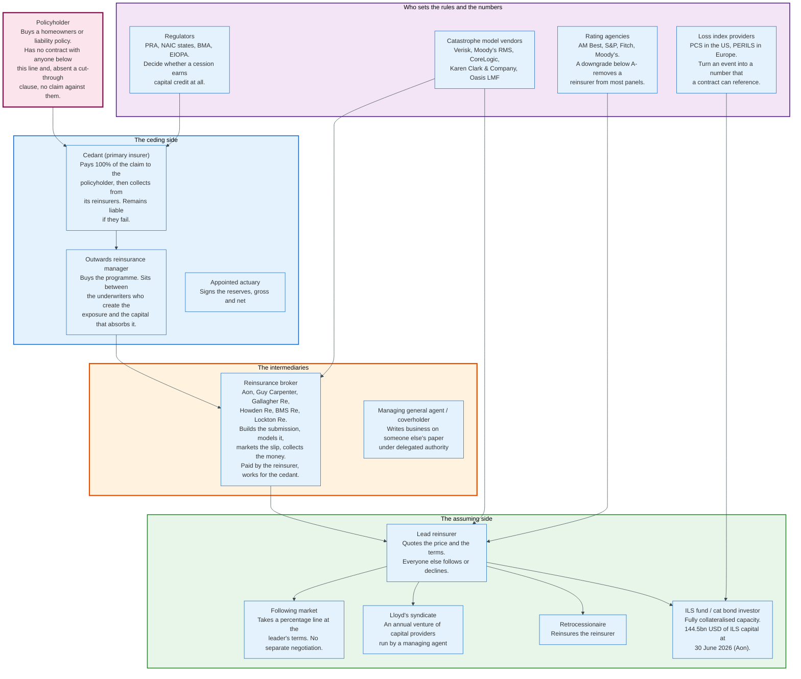

### 4.1 The Actors

| Role | What it does | Named examples | Carries risk? |
|------|--------------|----------------|---------------|
| **Policyholder** | Buys the original insurance | Households, corporations, governments | No |
| **Cedant** | Issues the original policy, pays the claim, then recovers | Any primary insurer | Yes, and remains liable regardless |
| **Reinsurance broker** | Structures, models, markets and places the programme | Aon, Guy Carpenter, Gallagher Re, Howden Re, BMS Re, Lockton Re, Acrisure Re | No |
| **Lead reinsurer** | Quotes the price and terms the rest of the market follows | Munich Re, Swiss Re, Hannover Re, SCOR, and the larger Lloyd's syndicates | Yes |
| **Following market** | Subscribes a percentage line at the leader's terms | Company market and Lloyd's syndicates | Yes |
| **Lloyd's managing agent** | Employs the underwriters and runs a syndicate | Around 50 firms | No, its members do |
| **Lloyd's member** | Provides syndicate capital | Corporate groups, private capital, remaining Names | Yes |
| **Retrocessionaire** | Reinsures reinsurers | Specialist retro writers, ILS funds | Yes |
| **ILS fund** | Deploys third-party capital as collateralised limit | Nephila, Fermat, Twelve Capital, and others | Yes, to the collateral only |
| **Catastrophe model vendor** | Supplies the loss distribution both sides argue over | Verisk, Moody's RMS, CoreLogic, Karen Clark & Company, Oasis LMF | No |
| **Loss index provider** | Publishes the industry loss figure a contract references | PCS in the US, PERILS in Europe | No |
| **Rating agency** | Decides whether a reinsurer is acceptable security | AM Best, S&P, Fitch, Moody's | No |
| **Regulator** | Decides whether a cession earns capital credit | PRA, individual US states through the NAIC framework, BMA, EIOPA | No |

### 4.2 The Three Roles That Decide Outcomes

**The lead underwriter sets the price for everyone.** In a subscription market the leader quotes terms, and the following market either accepts them or declines to participate. There is no per-follower negotiation. A leader's technical view therefore propagates across nineteen balance sheets, and leadership is a reputational asset that firms defend. Leaders charge for it implicitly through preferential line size, not through an explicit fee.

**The broker holds the data.** A cedant's exposure file, loss history, and modelled output reach the market through the broker, who also builds the structure and runs the models. The broker is paid by the reinsurer out of the premium, typically 1% to 10% depending on class, but owes its duty to the cedant. That arrangement is old, structurally awkward, and stable, because a reinsurer that refuses to pay brokerage stops seeing business.

**The rating agency is the gatekeeper.** Most cedants' security committees will not accept a reinsurer rated below A- by AM Best or equivalent, and many reinsurance contracts contain a downgrade clause allowing the cedant to cancel or demand collateral if the rating falls. A downgrade therefore removes a reinsurer from the market faster than any regulator can, and it is why reinsurers manage to a rating target rather than to a regulatory minimum.

### 4.3 Managing General Agents and Delegated Authority

A large and growing share of business reaches reinsurers without a traditional insurer underwriting it first. A managing general agent or coverholder writes business on an insurer's paper under a binding authority, receives a commission, and often cedes most of the risk. At Lloyd's, more than 3,000 coverholders bind business on syndicate paper worldwide.

The reinsurer's problem is that it is now underwriting a distributor's judgement at two removes. Delegated authority audits, bordereau reporting standards, and profit commission structures all exist to close that gap. They close it imperfectly, which is why delegated business is priced with a margin over equivalent direct business.

---

## 5. Proportional Reinsurance: Quota Share and Surplus

Proportional reinsurance shares premium and losses in the same ratio. The reinsurer takes a percentage of every premium and pays that percentage of every claim, which means it is buying the cedant's underwriting result rather than a defined slice of the loss distribution.

```mermaid
%%{init: {'theme': 'base', 'themeVariables': {'primaryColor': '#e3f2fd', 'primaryBorderColor': '#1565c0', 'lineColor': '#37474f'}}}%%

flowchart TB
    Q["One question splits the whole market:<br/>does the reinsurer share the premium,<br/>or sell a limit for a price?"]

    subgraph Prop["Proportional: share the premium"]
        direction TB
        P1["The reinsurer takes a percentage<br/>of every premium and pays the<br/>same percentage of every loss"]
        P2["Quota share<br/>Same percentage on every risk.<br/>25% cession on 1.20bn USD of premium<br/>cedes 300m USD and 25% of all losses."]
        P3["Surplus<br/>Percentage varies by size.<br/>Retention 500k USD, 9 lines.<br/>A 5m USD risk cedes 90%.<br/>A 400k USD risk cedes nothing."]
        P4["Reinsurer pays a ceding commission<br/>back, typically 25% to 35%,<br/>to fund the cedant's acquisition<br/>cost and overhead"]
        P5["Follows the cedant's fortunes.<br/>Alignment is automatic.<br/>Underwriting quality is the only<br/>thing the reinsurer is buying."]
    end

    subgraph NonProp["Non-proportional: sell a limit"]
        direction TB
        N1["The reinsurer pays nothing until<br/>loss exceeds the retention, then<br/>pays up to the limit"]
        N2["Per-risk excess of loss<br/>4.5m USD excess of 500k USD.<br/>A 2m USD single-risk loss<br/>recovers 1.5m USD."]
        N3["Catastrophe excess of loss<br/>250m USD excess of 150m USD,<br/>each and every loss occurrence,<br/>72-hour hours clause"]
        N4["Aggregate excess of loss<br/>Annual accumulation, not one event"]
        N5["Stop loss<br/>Attaches on a loss ratio.<br/>Pays above 80% of net premium,<br/>up to 100%."]
        N6["No commission. Price is quoted as<br/>rate on line: premium divided by limit.<br/>22% rate on line is a 4.5-year payback."]
    end

    subgraph Effect["What each one actually does to the cedant"]
        direction TB
        E1["Quota share removes premium volume<br/>and therefore removes required capital.<br/>It does not cut the tail: 25% of<br/>a 2.1bn USD event is still 525m USD."]
        E2["Excess of loss leaves premium volume<br/>alone and cuts the tail directly.<br/>It buys no relief on attritional loss."]
        E3["Most cedants buy both. Quota share<br/>for surplus relief, excess of loss<br/>for the event that ends the company."]
    end

    Q --> Prop
    Q --> NonProp
    Prop --> Effect
    NonProp --> Effect

    style Q fill:#e3f2fd,stroke:#1565c0,stroke-width:3px
    style Prop fill:#e8f5e9,stroke:#2e7d32,stroke-width:2px
    style NonProp fill:#fff3e0,stroke:#e65100,stroke-width:2px
    style Effect fill:#fce4ec,stroke:#880e4f,stroke-width:3px
```

### 5.1 Quota Share

A quota share cedes a fixed percentage of every policy in a defined class, without exception.

Take the worked example used throughout this document. **Gulfstream Property is a constructed illustration, not a real company**, built to carry consistent arithmetic across sections. It writes Florida homeowners insurance: 200,000 policies, 80 billion dollars of total insured value, 1.20 billion dollars of gross written premium, 600 million dollars of surplus.

Gulfstream cedes a 25% quota share.

| Item | Gross | Ceded 25% | Net |
|------|-------|-----------|-----|
| Written premium | 1,200,000,000 | 300,000,000 | 900,000,000 |
| Ceding commission at 30% | - | 90,000,000 received | - |
| Attritional losses at 42% loss ratio | 504,000,000 | 126,000,000 | 378,000,000 |
| Modelled 1-in-100 occurrence loss | 2,100,000,000 | 525,000,000 | 1,575,000,000 |
| Modelled 1-in-250 occurrence loss | 3,400,000,000 | 850,000,000 | 2,550,000,000 |

Three things follow directly from the table.

**The ceding commission is the whole negotiation.** Gulfstream cedes 300 million of premium and receives 90 million back. It has effectively sold 25% of its book for a net 210 million dollars. Whether that is a good trade depends on Gulfstream's own acquisition and administration costs. If Gulfstream spends 28% of premium on commissions, taxes, and overhead, then a 30% ceding commission means the reinsurer is paying more than the business costs to produce, and Gulfstream makes a small margin on the cession before any loss occurs. If the ceding commission is 22%, Gulfstream is subsidising the reinsurer's expenses out of its own margin and is buying pure capital relief.

**A quota share does not cut the tail.** The 1-in-250 loss falls from 3.4 billion to 2.55 billion. That is 850 million of relief on an event that would still be four times Gulfstream's surplus. Quota share is capital management, not catastrophe protection.

**Reinsurer economics are transparent.** If the ceded book runs a 60% loss ratio, the reinsurer pays 180 million of losses plus 90 million of commission against 300 million of premium: a 90% combined ratio. Every point of ceding commission moves that ratio one for one. This is why quota share terms move faster than excess of loss pricing in a soft market. The lever is a single number.

### 5.2 Commission Structures

Flat ceding commission is the simplest and the least common on volatile business. Three refinements are standard.

**Sliding scale commission** varies the commission with the ceded loss ratio, within a band. A typical structure pays 32.5% at a 55% loss ratio, sliding down by one point of commission for each point of loss ratio above 55%, to a minimum of 25% at a 62.5% loss ratio, and sliding up to a maximum of 37.5% at a 50% loss ratio. It converts part of the reinsurer's risk into a variable payment and aligns the parties without changing the risk-sharing percentage.

**Profit commission** pays the cedant a share of the reinsurer's profit on the treaty after a stated margin, calculated over a defined period and usually with a deficit carry-forward so that a bad year must be recouped before a commission is paid again.

**Loss corridor** returns a band of losses to the cedant. A 10% corridor between a 70% and 80% loss ratio means the cedant pays back losses in that band. It caps the reinsurer's exposure to a moderately bad year while leaving catastrophe protection intact.

**Loss ratio cap** limits the reinsurer's obligation to a stated percentage of ceded premium, for example 150%. This is the term regulators scrutinise, because a cap that binds in a large proportion of scenarios can destroy risk transfer and disqualify the contract from reinsurance accounting.

### 5.3 Surplus Treaties

A surplus treaty cedes a variable percentage that depends on the size of each risk. The cedant states a retention, called a line, and the treaty provides a stated number of lines of capacity.

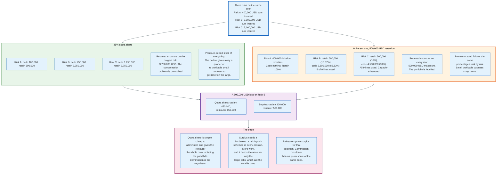

With a 500,000 dollar retention and a nine-line surplus treaty, the maximum automatic capacity is 5,000,000 dollars: one line retained plus nine lines ceded.

| Risk | Sum insured | Retained | Ceded | Cession % | Lines used |
|------|-------------|----------|-------|-----------|------------|
| A | 400,000 | 400,000 | 0 | 0% | 0 |
| B | 3,000,000 | 500,000 | 2,500,000 | 83.33% | 5.0 |
| C | 5,000,000 | 500,000 | 4,500,000 | 90.00% | 9.0 |
| D | 8,000,000 | 500,000 | 4,500,000, plus 3,000,000 facultative | 56.25% treaty | 9.0, exhausted |

Premium follows the same percentages, risk by risk. A 600,000 dollar loss on risk B costs the cedant 100,000 and the reinsurer 500,000, because the cession is 83.33%.

The structural difference from quota share is selection. Under a quota share the reinsurer receives a proportional share of the whole book, small profitable risks included. Under a surplus treaty it receives only the large risks, and large risks are more volatile per dollar of premium than small ones. Reinsurers price that selection, which is why ceding commissions on surplus treaties run below those on quota shares of the same book.

The administrative cost is also real. A surplus treaty requires a bordereau, a risk-by-risk schedule of every cession with sums insured, premiums, and cession percentages, reported monthly or quarterly. Quota share requires only a statement of account. That difference in operating cost is one reason surplus treaties have lost ground to a combination of quota share and per-risk excess of loss in most developed markets.

### 5.4 When Proportional Is the Right Answer

Proportional cover fits four situations.

A **new or fast-growing line** where the cedant has no credible loss history and the reinsurer's data is the pricing basis. A **capital-constrained balance sheet** where the objective is surplus relief rather than tail protection. A **highly heterogeneous property book** where individual sums insured vary by two orders of magnitude and a surplus treaty levels them. And a **regulated market with tight solvency margins**, where the capital credit is the product.

Proportional cover fits badly where the exposure is correlated. A quota share of a Florida homeowners book leaves the cedant with 75% of a catastrophe. No amount of ceding commission fixes that.

---

## 6. Non-Proportional Reinsurance: Excess of Loss and Stop Loss

Non-proportional reinsurance sells a defined limit above a defined retention for a price that has no relationship to the cedant's premium on the underlying business. The reinsurer is not sharing the book. It is selling a tranche of the loss distribution.

```mermaid
%%{init: {'theme': 'base', 'themeVariables': {'primaryColor': '#e3f2fd', 'primaryBorderColor': '#1565c0', 'lineColor': '#37474f'}}}%%

flowchart TB
    Def["Every excess of loss cover answers<br/>four questions: what is one loss,<br/>where does cover start, where does it<br/>stop, and how many times does it reset."]

    subgraph PerRisk["Per-risk excess of loss"]
        direction TB
        PR1["Unit of loss: one insured risk,<br/>one policy, one location"]
        PR2["4,500,000 USD excess of 500,000 USD"]
        PR3["A warehouse burns for 2,000,000.<br/>Cedant pays 500,000.<br/>Reinsurer pays 1,500,000."]
        PR4["A 7,000,000 loss exhausts the layer.<br/>Cedant pays 500,000 plus the<br/>2,000,000 above 5,000,000."]
        PR5["Buys nothing against a hurricane<br/>that damages 40,000 homes for<br/>60,000 USD each. Each one is<br/>below the retention."]
    end

    subgraph CatXL["Catastrophe excess of loss"]
        direction TB
        CX1["Unit of loss: one loss occurrence,<br/>defined by an hours clause.<br/>Typically 72 hours for windstorm<br/>and earthquake, 168 for flood."]
        CX2["250,000,000 USD excess of<br/>150,000,000 USD, each and<br/>every loss occurrence"]
        CX3["The cedant elects the 72-hour window<br/>that maximises recovery. A five-day<br/>storm can be cut into one occurrence<br/>or, if it helps, two."]
        CX4["Ultimate net loss includes loss<br/>adjustment expense and is measured<br/>after all inuring reinsurance"]
        CX5["Reinstatement: one at 100%,<br/>pro rata as to amount,<br/>100% as to time"]
    end

    subgraph AggXL["Aggregate excess of loss"]
        direction TB
        AG1["Unit of loss: the calendar year"]
        AG2["100,000,000 USD excess of<br/>200,000,000 USD in the annual<br/>aggregate, with a 10,000,000 USD<br/>franchise per event"]
        AG3["Only losses above the franchise<br/>count toward the aggregate.<br/>This is frequency protection:<br/>the many-medium-events year."]
        AG4["Cover of last resort in a year<br/>of hailstorms, none of which<br/>individually reaches a cat layer"]
    end

    subgraph StopLoss["Stop loss"]
        direction TB
        SL1["Unit of loss: the net loss ratio"]
        SL2["Pays the excess of an 80% net<br/>loss ratio, up to 100%.<br/>The limit is a percentage,<br/>not a dollar amount."]
        SL3["On 816,600,000 USD of net earned<br/>premium after all reinsurance, attaches<br/>at 653,300,000 of loss and caps at<br/>816,600,000."]
        SL4["Cedant co-participation of 5% to 10%<br/>is standard. A stop loss with no<br/>co-participation removes the<br/>incentive to underwrite."]
        SL5["Rare, expensive, and heavily<br/>conditioned. It insures the<br/>result, not the risk."]
    end

    Def --> PerRisk
    Def --> CatXL
    Def --> AggXL
    Def --> StopLoss

    Punch["Price is quoted as rate on line.<br/>Premium divided by limit.<br/>A 22% rate on line pays for itself<br/>in 4.5 loss-free years.<br/>A 1.8% rate on line pays back in 56."]

    PerRisk --> Punch
    CatXL --> Punch
    AggXL --> Punch
    StopLoss --> Punch

    style Def fill:#e3f2fd,stroke:#1565c0,stroke-width:3px
    style PerRisk fill:#e8f5e9,stroke:#2e7d32,stroke-width:2px
    style CatXL fill:#fff3e0,stroke:#e65100,stroke-width:3px
    style AggXL fill:#f3e5f5,stroke:#4a148c,stroke-width:2px
    style StopLoss fill:#ffebee,stroke:#b71c1c,stroke-width:2px
    style Punch fill:#fce4ec,stroke:#880e4f,stroke-width:3px
```

### 6.1 The Notation

Every excess of loss layer is written as "limit excess of retention", conventionally shortened. `4.5m xs 0.5m` means the reinsurer pays losses above 500,000 dollars up to a further 4,500,000, so the layer exhausts at 5,000,000.

Four parameters define it completely: the **unit of loss** (one risk, one occurrence, one year), the **attachment point** or retention, the **limit**, and the **number of reinstatements**. Everything else in the contract narrows or qualifies those four.

### 6.2 Per-Risk Excess of Loss

Per-risk excess of loss attaches on the loss to a single insured risk. The definition of "one risk" is a contract term, usually one location or one policy, and disputes about it are common where a single event damages several buildings on one campus.

Worked example on `4.5m xs 0.5m`:

| Loss to one risk | Cedant pays | Reinsurer pays | Note |
|------------------|-------------|----------------|------|
| 300,000 | 300,000 | 0 | Below attachment |
| 500,000 | 500,000 | 0 | At attachment, layer not reached |
| 2,000,000 | 500,000 | 1,500,000 | Standard recovery |
| 5,000,000 | 500,000 | 4,500,000 | Layer exhausted exactly |
| 7,000,000 | 2,500,000 | 4,500,000 | Cedant pays 500,000 plus the 2,000,000 above the layer |

The last row shows why towers exist. A single layer leaves the cedant exposed above its ceiling, so a second layer, `10m xs 5m`, is bought to sit on top.

Per-risk cover buys nothing against a hurricane. If 40,000 homes each suffer 60,000 dollars of damage, every individual loss falls below the 500,000 attachment and the layer never responds, although the total is 2.4 billion dollars. This is the precise gap catastrophe excess of loss fills.

### 6.3 Catastrophe Excess of Loss

Catastrophe excess of loss attaches on the aggregate of all losses arising from one **loss occurrence**, and the definition of a loss occurrence is the most consequential clause in property reinsurance.

The **hours clause** supplies it. A loss occurrence is all individual losses arising from one event within a stated number of consecutive hours, with the cedant electing when the period starts. Market conventions run roughly as follows, and always yield to the specific wording:

| Peril | Typical hours | Why |
|-------|---------------|-----|
| Hurricane, typhoon, named windstorm | 72, sometimes 96 or 120 | A storm can affect a territory for several days |
| European windstorm | 72 | Fast-moving systems |
| Earthquake | 72, sometimes 168 | Aftershock sequences |
| Riot, civil commotion, terrorism | 72, often per city | Contains a multi-day disturbance |
| Flood | 168 | Rivers crest slowly |
| Winter storm, freeze | 96 to 168 | Long-duration events |
| Wildfire | 168, often with a defined perimeter | Fires burn for weeks |

The election right matters. If a hurricane produces losses over 96 hours and the layer's clause is 72, the cedant chooses the 72-hour window that maximises recovery. Losses outside the window are not lost; they form a second occurrence, which may attach a second retention and consume a reinstatement.

That mechanic can favour either side. A cedant with a 150 million dollar retention and a five-day storm producing 200 million on days one to three and 190 million on days four to five would rather treat it as one occurrence if the clause allows, because two occurrences means two retentions of 150 million.

### 6.4 Aggregate Excess of Loss

Aggregate excess of loss attaches on the accumulation of losses over the contract year rather than on a single event. It is frequency protection.

A typical structure is `100m xs 200m in the annual aggregate, each and every loss occurrence in excess of 10m`. Only losses above the 10 million dollar franchise count toward the aggregate deductible of 200 million. A year with fourteen severe convective storm events of 20 million each contributes 280 million to the aggregate, exhausting the 200 million deductible and recovering 80 million.

Aggregate cover was widely withdrawn from the market in 2022 and 2023 and returned selectively in 2025 and 2026. Reinsurers dislike it because it converts a low-frequency, high-severity contract into something closer to a working layer, and because the modelled aggregate exceedance probability curve is more sensitive to assumptions about secondary perils than the occurrence curve is.

### 6.5 Stop Loss

Stop loss attaches on a loss ratio, not on a dollar amount. A contract might pay the excess of an 80% net loss ratio up to 100%, meaning the limit is 20 points of net earned premium.

On Gulfstream's 816.6 million dollars of net earned premium after all reinsurance, the figure Section 19.1 derives, an 80% attachment sits at 653.3 million of net incurred loss and caps at 816.6 million, a limit of 163.3 million dollars.

Three features are near universal. A **co-participation** of 5% to 10% retained by the cedant in the layer, without which the cedant has no financial incentive to control losses above the attachment. A **dollar cap** on top of the percentage limit. And **exclusions** for the perils already covered elsewhere, so that the stop loss does not simply duplicate the catastrophe tower at a worse price.

Stop loss is expensive because it insures the result rather than the risk, and because it is exposed to reserve strengthening, expense overruns, and pricing errors as well as to losses. It is common in crop insurance, where a single weather season drives the whole result, and in small mutual insurers with no diversification.

### 6.6 Rate on Line, Loss on Line, and Multiple

Non-proportional pricing has its own arithmetic and three ratios carry it.

**Rate on line** is the layer premium divided by the layer limit. A layer of 250 million dollars costing 55 million has a 22% rate on line.

**Payback period** is the reciprocal: 1 divided by 0.22, or 4.5 years. It states how many loss-free years it takes for the reinsurer to collect the limit it might have to pay. Underwriters use it as a sanity check, not as a pricing model.

**Loss on line**, also called expected loss, is the modelled average annual loss to the layer divided by the limit. If the model puts the average annual loss to the 250 million layer at 21 million, the loss on line is 8.4%.

**Multiple** is rate on line divided by loss on line: 22% over 8.4% is 2.62. The multiple is the market's risk load, and it is the number that moves through the cycle. In a hard market the multiple on a remote layer can exceed 4. In a soft market it compresses toward 1.5. Loss cost estimates barely move between January renewals; multiples move a great deal.

Multiples are also systematically higher on remote layers than on working layers. A layer with a 1% expected loss does not trade at a 1.5% rate on line, because the capital held against a remote binary outcome earns nothing for years and must be paid for. That relationship, the risk load rising as expected loss falls, is why the top of a tower costs more per unit of expected loss than the bottom, and why capital markets, which fund it differently, took that region first.

---

## 7. Treaty and Facultative

The treaty and facultative distinction is about **when** the reinsurer commits, not about what it covers. A treaty binds the reinsurer before it knows the risk exists. A facultative certificate binds it afterwards, one risk at a time.

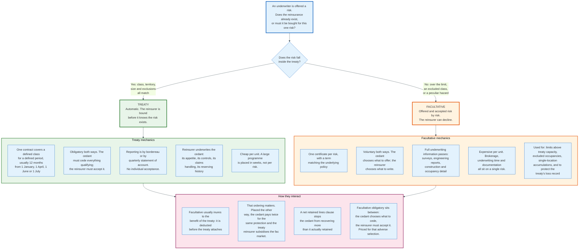

### 7.1 Treaty

A treaty is a single contract covering a defined class of business for a defined period, usually twelve months. Inception dates cluster: 1 January for most global and European business, 1 April for Japan, 1 June and 1 July for Florida and much of the United States, reflecting the hurricane season.

The obligation is mutual. The cedant must cede every risk falling within the treaty's scope, and the reinsurer must accept it. Neither party may select. That mutual obligation is what makes treaty cheap: the reinsurer prices the portfolio, not the risk, and spends no underwriting time per cession.

What the reinsurer actually underwrites is the cedant. Its appetite, its rating basis, its claims handling, its reserving history, its management. A treaty renewal meeting is largely a discussion of what changed in the cedant's business over twelve months, because the reinsurer is buying next year's version of that business sight unseen.

### 7.2 Facultative

Facultative reinsurance covers one risk under one certificate, with a term matching the underlying policy. Both parties choose freely: the cedant offers what it wants to offer, the reinsurer writes what it wants to write.

Four situations produce facultative demand.

**Limits above treaty capacity.** A nine-line surplus on a 500,000 retention gives 5 million of automatic capacity. An 8 million dollar risk needs 3 million of facultative.

**Excluded classes.** Treaties exclude occupancies the reinsurer will not write blind: petrochemical, munitions, certain wood-frame construction, sometimes anything within a defined distance of a coast.

**Accumulation control.** A cedant approaching its modelled limit in a single zone can cede the marginal risks facultatively rather than reduce its writings.

**Protecting the treaty.** A risk the cedant believes is worse than the treaty's average is better ceded facultatively, because a treaty's loss record determines next year's terms for the whole book. This motive creates adverse selection and reinsurers price for it.

The cost of facultative per unit of limit is far higher than treaty, because underwriting time, documentation, and brokerage all attach to a single risk.

### 7.3 Facultative Obligatory

A facultative obligatory treaty, sometimes called a fac-oblig, sits between the two: the cedant chooses which risks to cede, and the reinsurer must accept them. It gives the cedant flexible capacity without per-risk negotiation.

It also gives the cedant a one-way option. Reinsurers price fac-oblig well above the equivalent treaty, restrict it tightly by class and limit, and grant it mostly to long-standing cedants whose selection they trust.

### 7.4 Inuring Order

When more than one reinsurance contract could respond to the same loss, the contracts must state the order in which they apply. The term of art is **inuring to the benefit of**.

If facultative cover inures to the benefit of the treaty, the facultative recovery is deducted first and the treaty attaches on the remainder. If it does not, the treaty responds on the gross figure and the cedant recovers twice.

The same question governs the relationship between quota share and catastrophe excess of loss. In the Gulfstream programme the quota share inures to the benefit of the tower, so a 1.6 billion dollar gross loss becomes 1.2 billion net of quota share before the tower's 150 million retention applies. Reversed, the tower would attach on the gross figure, recoveries would be larger, and the tower would cost materially more.

A **net retained lines clause** enforces the principle generally: the reinsurer indemnifies only the loss the cedant actually retains for its own account, after all other reinsurance. Without it, a cedant could recover more in total than it paid out. The clause was tightened market-wide after the LMX spiral, and Section 14 explains why.

---

## 8. The Tower: Layers, Attachment Points, and Rate on Line

A reinsurance tower is a stack of excess of loss layers covering a continuous range of loss, from the cedant's retention up to the point at which it accepts that it will fail. It is the standard structure for property catastrophe and increasingly for casualty clash and cyber.

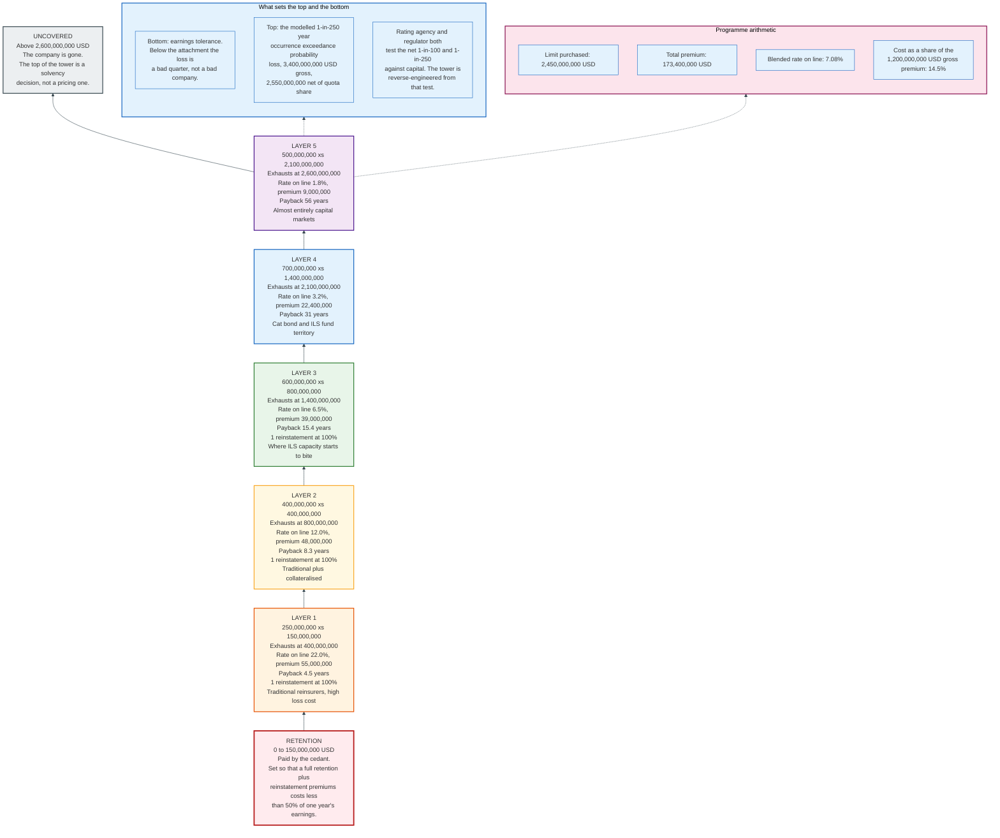

### 8.1 Why the Tower Is Layered at All

A single layer running from 150 million to 2.6 billion dollars would be simpler. It is not written, for three reasons.

**Different capital wants different heights.** The bottom of a tower has a high expected loss and behaves like working cover: it pays often, and the return is close to an underwriting margin. The top has a very low expected loss and behaves like a remote option. A traditional reinsurer with a diversified balance sheet is comfortable at the bottom. A cat bond fund holding cash collateral for three years is not; it wants the remote layer where the multiple compensates for locked-up capital. Layering lets each class of capital price the region it is efficient at.

**No single reinsurer will write 2.45 billion dollars.** Line size limits are internal and absolute. Layering plus subscription splits the limit across nineteen counterparties and five contracts.

**Layers are separately negotiable.** A cedant can buy more limit at the top in one year without reopening the bottom, and reinsurers can enter and leave individual layers. A monolithic cover is renegotiated in full every year.

### 8.2 Setting the Attachment Point

The retention is set by earnings tolerance, and the arithmetic is explicit.

Gulfstream's board sets the retention so that a full retention costs about one year's pre-tax earnings and no more. A retention of 150 million dollars against the normal-year pre-tax result of 150.6 million derived in Section 19.1 meets that test exactly. The 1.6 billion dollar event modelled in Section 9 is the harder case: it burns three layers and triggers 129 million of reinstatement premium on top of the retention, for a total cost of 279 million. That is 1.9 years of earnings and 46% of 600 million of surplus. A bad year, not a solvency event.

Set the retention too low and the tower becomes unaffordable, because the bottom layer's expected loss rises steeply as it descends. Set it too high and a moderate event consumes a year's profit. The 2023 renewal season moved the whole market's retentions up sharply for exactly this reason: reinsurers concluded they had been selling earnings protection at catastrophe prices, and repriced the bottom of towers until cedants withdrew from it.

That change proved durable. Rate on line fell 6.6% at January 2025 and a further 12% at January 2026, and attachment points did not come back down.

### 8.3 Setting the Top

The top of the tower is a solvency decision benchmarked against modelled return periods.

Gulfstream's model puts the 1-in-250 year gross occurrence loss at 3.4 billion dollars, which is 2.55 billion net of the 25% quota share. The tower exhausts at 2.6 billion. Gulfstream is therefore covered slightly beyond its net 1-in-250 occurrence loss.

Rating agencies and regulators both test the net position at defined return periods. AM Best examines the effect of a 1-in-100 and 1-in-250 event on risk-adjusted capital. Solvency II's catastrophe sub-module is calibrated to a 1-in-200 year event. Lloyd's requires syndicates to report gross and net losses against prescribed Realistic Disaster Scenarios. The tower is reverse-engineered from those tests, which is why it stops where it does.

### 8.4 The Full Programme

The Gulfstream tower for the 2026 season:

| Layer | Limit (USD) | Attaches (USD) | Exhausts (USD) | Rate on line | Premium (USD) | Payback | Reinstatements |
|-------|-------------|----------------|----------------|--------------|---------------|---------|----------------|
| Retention | 150,000,000 | 0 | 150,000,000 | - | - | - | - |
| 1 | 250,000,000 | 150,000,000 | 400,000,000 | 22.0% | 55,000,000 | 4.5 yr | 1 at 100% |
| 2 | 400,000,000 | 400,000,000 | 800,000,000 | 12.0% | 48,000,000 | 8.3 yr | 1 at 100% |
| 3 | 600,000,000 | 800,000,000 | 1,400,000,000 | 6.5% | 39,000,000 | 15.4 yr | 1 at 100% |
| 4 | 700,000,000 | 1,400,000,000 | 2,100,000,000 | 3.2% | 22,400,000 | 31.3 yr | 1 at 100% |
| 5 | 500,000,000 | 2,100,000,000 | 2,600,000,000 | 1.8% | 9,000,000 | 55.6 yr | 1 at 100% |
| **Total** | **2,450,000,000** | | | **7.08% blended** | **173,400,000** | | |

The blended rate on line is total premium divided by total limit: 173.4 million over 2,450 million, or 7.08%. Programme cost as a share of gross written premium is 173.4 million over 1,200 million, or 14.5%.

That 14.5% is the number a cedant's board argues about. It is pure expense from the perspective of any year in which nothing happens, which is most years.

### 8.5 Vertical and Horizontal Cover

Two dimensions of protection are usually confused.

**Vertical cover** is how high the tower goes. It sizes the largest single event the cedant survives.

**Horizontal cover** is how many events the tower absorbs. It sizes the third storm of a season.

Reinstatements provide horizontal cover. A layer with one reinstatement can pay its full limit twice in a contract year, at the cost of a reinstatement premium. A layer with no reinstatement pays once and then is gone for the rest of the season, which for a Florida cedant in July is a problem.

The 2004 and 2005 Atlantic hurricane seasons produced multiple landfalls and exposed the difference. A cedant with a tall tower and no horizontal cover can be destroyed by the third storm of a season having survived the first two.

---

## 9. A Worked Programme, End to End

This section carries a single event through the entire Gulfstream structure with exact arithmetic. Every figure ties to the tower in Section 8.

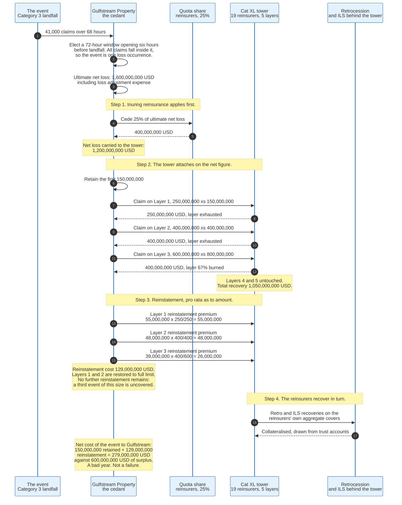

### 9.1 The Starting Position

| Item | Value |
|------|-------|
| Policies in force | 200,000 |
| Total insured value | 80,000,000,000 USD |
| Gross written premium | 1,200,000,000 USD |
| Policyholders' surplus | 600,000,000 USD |
| Quota share | 25% ceded, 30% ceding commission |
| Catastrophe tower | 2,450,000,000 xs 150,000,000, net of quota share |
| Modelled hurricane average annual loss | 360,000,000 USD gross |
| Modelled 1-in-100 occurrence loss | 2,100,000,000 USD gross |
| Modelled 1-in-250 occurrence loss | 3,400,000,000 USD gross |

### 9.2 The Event

A Category 3 hurricane makes landfall. Claims arrive over 68 hours: 41,000 claims, and an ultimate net loss including allocated loss adjustment expense of **1,600,000,000 dollars gross**.

The hours clause on the tower is 72 hours. Gulfstream elects a window opening six hours before landfall, and the whole 1.6 billion falls inside it as one loss occurrence. Had the claims run past 72 hours, the excess would have formed a second occurrence attracting a second retention and a second set of layer attachments, which is the mechanism Section 6.3 describes. The 68-hour spread is what makes this a single-occurrence example.

### 9.3 Step One: Inuring Reinsurance

The quota share inures to the benefit of the tower, so it applies first.

```
Gross ultimate net loss                    1,600,000,000
Less quota share recovery at 25%            -400,000,000
Net loss carried to the tower              1,200,000,000
```

### 9.4 Step Two: The Tower

The tower attaches at 150,000,000 on the net figure.

| Layer | Range | Loss falling in layer | Recovery | Layer status |
|-------|-------|----------------------|----------|--------------|
| Retention | 0 to 150,000,000 | 150,000,000 | 0 | Cedant pays |
| 1 | 150,000,000 to 400,000,000 | 250,000,000 | 250,000,000 | Exhausted |
| 2 | 400,000,000 to 800,000,000 | 400,000,000 | 400,000,000 | Exhausted |
| 3 | 800,000,000 to 1,400,000,000 | 400,000,000 | 400,000,000 | 66.7% burned |
| 4 | 1,400,000,000 to 2,100,000,000 | 0 | 0 | Untouched |
| 5 | 2,100,000,000 to 2,600,000,000 | 0 | 0 | Untouched |
| **Total tower recovery** | | | **1,050,000,000** | |

The reconciliation closes exactly:

```
Quota share recovery                         400,000,000
Tower recovery                             1,050,000,000
Gulfstream net retained loss                 150,000,000
                                           -------------
Gross ultimate net loss                    1,600,000,000
```

### 9.5 Step Three: Reinstatement Premiums

Each layer carries one reinstatement at 100% additional premium, pro rata as to amount and 100% as to time. The formula is:

```
Reinstatement premium = layer premium x (amount reinstated / layer limit)
```

| Layer | Layer premium | Amount reinstated | Fraction | Reinstatement premium |
|-------|---------------|-------------------|----------|----------------------|
| 1 | 55,000,000 | 250,000,000 | 250/250 = 1.000 | 55,000,000 |
| 2 | 48,000,000 | 400,000,000 | 400/400 = 1.000 | 48,000,000 |
| 3 | 39,000,000 | 400,000,000 | 400/600 = 0.667 | 26,000,000 |
| **Total** | | | | **129,000,000** |

"100% as to time" means the full reinstatement premium is due regardless of how much of the contract year remains. A storm in September triggers the same reinstatement cost as a storm in January.

After payment, layers 1 and 2 are fully reinstated and layer 3 is reinstated to the extent of 400 million. Every layer now has one full limit available and no further reinstatement. A second event of the same size in the same year would be covered; a third would not.

### 9.6 Step Four: The Cost to Gulfstream

```
Net retained loss                            150,000,000
Reinstatement premiums                       129,000,000
                                           -------------
Total cost of the event                      279,000,000
```

Against 600,000,000 dollars of surplus and 816,600,000 of net earned premium after all reinsurance, this is a loss year and not a failure. Gulfstream's combined ratio for the year is badly impaired, its surplus falls by around 46% before considering the year's other results, and it will renew its programme at higher rates in January.

That is the designed outcome. The programme was not built to make a hurricane costless. It was built to make a hurricane survivable.

### 9.7 What Happens if the Loss Is Larger

Run the same structure against a 4.0 billion dollar gross loss, close to the modelled 1-in-250:

```
Gross ultimate net loss                    4,000,000,000
Less quota share at 25%                   -1,000,000,000
Net to tower                               3,000,000,000
Retention                                   -150,000,000
Tower limit fully exhausted               -2,450,000,000
                                           -------------
Uncovered loss retained by Gulfstream        400,000,000
```

Gulfstream retains 150 million of retention plus 400 million above the top of the tower, a total of 550 million, plus the full 173.4 million of reinstatement premiums if the whole tower reinstates. That is 723.4 million against 600 million of surplus.

The company is insolvent. This is what "the top of the tower is a solvency decision" means in arithmetic.

### 9.8 The Reinsurers' Side of the Same Event

The 1.6 billion event costs the reinsurance market 1.45 billion dollars in recoveries, against 173.4 million of tower premium and 300 million of quota share premium less 90 million of commission.

The tower reinsurers collect 129 million of reinstatement premium immediately, which reduces their net event cost to 921 million on the tower. They in turn recover from their own retrocession and ILS covers, and from any cat bonds they sponsor. Section 14 follows that step.

Layer 1's reinsurers paid 250 million against a 55 million annual premium: 4.5 years of premium in a single event, which is precisely what a 22% rate on line prices for. Layer 3's reinsurers paid 400 million against 39 million: 10.3 years. The layers that were priced as remote were not remote enough, which is how a hard market starts.

---

## 10. The Contract: Clauses That Decide Who Pays

Reinsurance wordings are short relative to the money they move, because they rely on market custom to fill gaps. That reliance is also why the same dispute recurs. The clauses below determine outcomes more often than the limit and attachment do.

### 10.1 Ultimate Net Loss

Ultimate net loss defines the number the layer attaches on. A typical definition: the sum actually paid by the cedant in settlement of losses, including allocated loss adjustment expense, after deduction of all recoveries, salvages, subrogations, and all reinsurance that inures to the benefit of the contract.

Three fights live inside that sentence. Whether loss adjustment expense is included, added pro rata, or paid in addition to the limit. Whether extra-contractual obligations and losses in excess of policy limits, meaning bad-faith awards against the cedant, are covered. And whether declaratory judgment expense, the cost of establishing that a policy does or does not respond, counts.

### 10.2 Follow the Settlements and Follow the Fortunes

A follow-the-settlements clause commits the reinsurer to the cedant's settlements provided they are made in a businesslike manner and fall within the terms of the original policy and the reinsurance. Without it, the reinsurer could re-litigate every claim.

The clause is not unconditional. English law requires the settlement to be honest and businesslike and the claim to fall within the risks covered as a matter of law. It does not require the reinsurer to pay a settlement of a claim the original policy plainly did not cover.

Follow the fortunes is the broader American formulation, extending to underwriting decisions as well as claims. The distinction matters in litigation and rarely in practice.

### 10.3 Claims Control and Claims Cooperation

A **claims cooperation clause** obliges the cedant to notify the reinsurer of claims above a threshold and to consult before settling. A **claims control clause** goes further and gives the reinsurer the right to take over the defence.

Claims control is common in facultative and rare in treaty, because a reinsurer taking over a claim also takes on the cedant's relationship with its policyholder. Breach of a claims cooperation condition can, depending on the wording, forfeit the recovery entirely, which makes notification discipline an operational risk of some size.

### 10.4 Reinstatement

Reinstatement provisions state how many times the limit refreshes and at what cost. Standard property catastrophe wording provides one reinstatement at 100% additional premium, pro rata as to amount, 100% as to time.

Variants matter. "Free reinstatement" costs nothing. "Pro rata as to time" reduces the premium for the unexpired portion of the year, which favours the cedant. "Unlimited reinstatements" is normal on per-risk covers and unheard of on catastrophe layers, because the whole point of a catastrophe layer is that the reinsurer's aggregate exposure is bounded.

### 10.5 Sunset, Cut-Off, and Run-Off

When a treaty is cancelled, the parties must decide what happens to losses occurring after the cancellation date on policies written before it.

**Cut-off** ends the reinsurer's liability at cancellation. The cedant is left carrying the unexpired portion of policies it wrote in reliance on the treaty. The reinsurer usually returns the unearned premium.

**Run-off**, sometimes called continuous cover, keeps the reinsurer on risk until the last underlying policy expires. The reinsurer keeps the premium.

A **sunset clause** bars claims notified after a stated period from expiry, typically several years. It is the reinsurer's answer to long-tail development and it is deeply unpopular with cedants for the obvious reason: asbestos claims arrived forty years after the policies were written.

### 10.6 Errors and Omissions

An errors and omissions clause provides that an inadvertent failure to cede a risk or report a loss does not prejudice the cover, provided it is corrected on discovery. It exists because a large treaty involves tens of thousands of cessions processed by people, and a clerical slip should not void a contract.

It does not cover deliberate omissions or systematic failures to report, which are treated as non-disclosure.

### 10.7 Arbitration and the Honourable Engagement Clause

Almost every reinsurance contract sends disputes to arbitration rather than court, usually before a panel of three, of whom two are appointed by the parties and one chairs.

Many wordings include an honourable engagement clause directing the panel to interpret the contract as an honourable engagement rather than a strictly legal obligation, and to have regard to custom and practice. It is a deliberate instruction to decide commercially. It also makes reinsurance law thin, because the disputes that would generate precedent are resolved privately.

### 10.8 Security, Collateral, and Downgrade

A cedant's ability to take balance sheet credit for a cession depends on the reinsurer's regulatory status where the cedant sits. Where credit is not automatic, the recoverable must be secured.

Three mechanisms do it. **Letters of credit** from an approved bank. **Trust accounts** holding assets for the cedant's benefit, in the United States commonly a Regulation 114 trust. And **funds withheld**, where the cedant simply retains the premium and accounts for the reinsurer's share as a liability, paying an agreed investment credit.

A **downgrade clause** allows the cedant to terminate or demand collateral if the reinsurer's rating falls below a threshold, usually A-. It is the mechanism by which a rating downgrade removes a reinsurer from the market within weeks.

---

## 11. Lloyd's of London: A Market, Not a Company

Lloyd's is a marketplace with a mutual backstop, and describing it as an insurance company gets almost everything wrong. The Corporation of Lloyd's writes no insurance, holds no underwriting risk, and employs no underwriters. It licenses, supervises, sets capital, operates the Central Fund, and owns the trading licences and financial strength ratings that its members trade under.

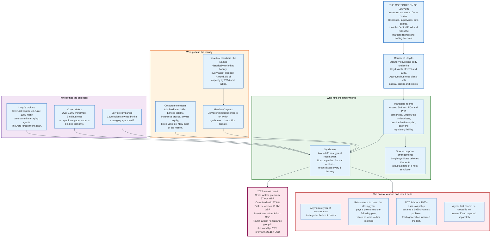

### 11.1 The Structure

**Members** provide the capital. Since 1994 corporate members with limited liability have been admitted, and they now supply nearly all of it. Individual members, the Names, historically underwrote with unlimited personal liability: every asset they owned stood behind their share of the losses. Names provided around 2% of capacity by 2014 and the share has continued to fall.

**Managing agents**, around fifty firms, employ the underwriters and run the syndicates. They are authorised by the Financial Conduct Authority and the Prudential Regulation Authority and they carry the regulatory responsibility for the underwriting. Members supply capital to managing agents' syndicates; managing agents supply the underwriting.

**Syndicates** are the underwriting units, roughly eighty in a typical recent year. A syndicate is not a company. It is an annual venture, reconstituted every 1 January, in which a group of members participates for that year of account. The same syndicate number persists across years, but each year is legally a separate pool of members with separate results.

**Members' agents** advise individual members on which syndicates to back and administer their participations. Four remain, a direct measure of what happened to the Names.

**Lloyd's brokers**, over 400 registered, are the only route into the market for most business. **Coverholders**, more than 3,000 worldwide, bind business on syndicate paper under delegated authority. **Service companies** are coverholders owned by the managing agent itself. Both counts are Lloyd's own, published on its market pages as thresholds rather than as an exact register, and both move every year.

### 11.2 The Year of Account and Reinsurance to Close

Lloyd's syndicates traditionally account on a three-year basis. A year of account stays open for three years, during which claims develop, and then closes.

Closure happens by **reinsurance to close**, or RITC: the closing year of account pays a premium to the succeeding year of account, which assumes all its remaining liabilities. The members of the closing year take their profit and leave; the members of the receiving year inherit whatever is left.

RITC is elegant and was, for four decades, a machine for transferring liabilities nobody had priced. A policy written in 1955 covering a factory that used asbestos generated claims in the 1980s and 1990s. Each intervening year of account had closed by reinsuring into the next, at a premium calculated on the information then available, which did not include what asbestos would eventually cost. The liability arrived, decades later, on the balance sheets of Names who had joined in the 1980s and had never seen the original policies.

A year that cannot be closed because its ultimate liability cannot be estimated is left **in run-off** and reported separately.

### 11.3 The Chain of Security

The chain of security is what converts nineteen separate underwriting counterparties into one credit. It has three links, and the amounts are published annually.

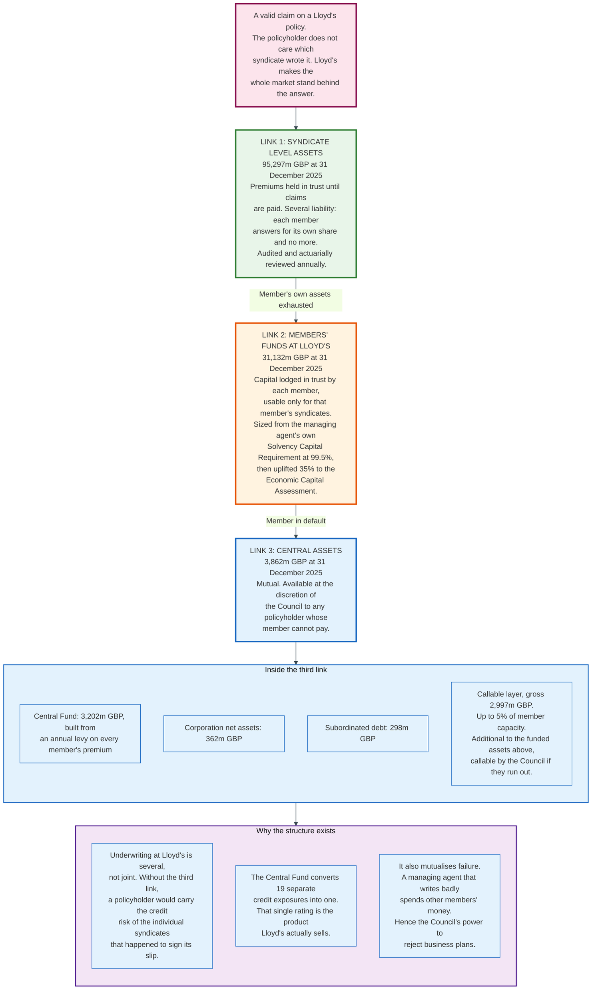

| Link | Contents | Amount at 31 Dec 2025 |
|------|----------|----------------------|
| **1. Syndicate level assets** | Premiums held in trust at syndicate level until claims are paid | 95,297 m GBP |
| **2. Members' Funds at Lloyd's** | Capital lodged in trust by each member, usable only for that member's syndicates | 31,132 m GBP |
| **3. Central assets** | Central Fund, Corporation net assets, subordinated debt | 3,862 m GBP |

The third link is three funded items and one contingent one. The funded items are the Central Fund at 3,202 million pounds, Corporation net assets at 362 million, and subordinated debt at 298 million, together 3,862 million. The contingent item is a callable layer of up to 2,997 million pounds gross, capped at 5% of member capacity, which sits outside the funded assets and can be called by the Council if they are exhausted. Every figure here is from Lloyd's own chain of security disclosure at 31 December 2025.

The second link is sized by a specific calculation. Each managing agent computes a Solvency Capital Requirement for its syndicate at a 99.5% confidence level over one year, the Solvency II standard. Lloyd's then uplifts that figure by 35% to produce the **Economic Capital Assessment**, and members must fund the ECA. The uplift exists to support the market's ratings, which are stronger than a bare 99.5% calibration would justify.

Underwriting at Lloyd's is **several, not joint**. Each member is liable for its own share of a risk and no more. The third link is what stops that from being the policyholder's problem: if a member cannot pay, the Central Fund can, at the Council's discretion.

The consequence is mutualisation of failure. A managing agent that underwrites badly ultimately spends other members' money. That is why the Council approves every syndicate's business plan, sets its capital, and can refuse both.

### 11.4 The Crisis: 1988 to 1996

Lloyd's nearly ended between 1988 and 1993, and both causes were structural rather than accidental.

**Asbestos, pollution, and health hazard.** Policies written from the 1940s through the 1970s, on wordings with no aggregate limits and no pollution exclusions, generated claims decades later. RITC had carried the liability forward year after year onto members who had no connection to the original underwriting.

**The LMX spiral.** Detailed in Section 14. A concentrated set of syndicates had written excess of loss cover on each other in a loop, and the losses of 1987 to 1990, including the October 1987 windstorm, Piper Alpha, the Exxon Valdez, and Hurricane Hugo, circulated through that loop repeatedly.

The results were severe and personal. Around 1,500 of 34,000 Names, or 4.4%, were declared bankrupt. Litigation followed on a scale the market had never seen, much of it alleging that members' agents and managing agents had recruited Names onto spiral-exposed syndicates without disclosing the exposure.

**Reconstruction and Renewal**, executed in 1996 under chairman Sir David Rowland, resolved it. All pre-1993 non-life liabilities were reinsured into **Equitas**, a purpose-built run-off company, at a cost of around 21 billion dollars, funded partly by a levy on future business and partly by writing off nearly 5 billion dollars of debt credits owed by Names. Individual settlement offers were accepted by around 95% of the roughly 34,000 Names, and the liabilities transferred in September 1996.

Finality took a further thirteen years. In March 2007 Berkshire Hathaway's National Indemnity Company reinsured the Equitas liabilities, providing 7 billion dollars of cover above Equitas's own reserves and taking over its staff and management. A second tranche of 1.3 billion followed in 2009. Only then did the High Court approve the transfer under Part VII of the Financial Services and Markets Act 2000, discharging the Names from further liability for 1992 and prior years under English law.

### 11.5 Lloyd's Today

| Metric | 2025 | Note |
|--------|------|------|
| Gross written premium | 57.9 bn GBP | |
| Combined ratio | 87.6% | |
| Profit before tax | 10.6 bn GBP | Up 10.1% on 2024 |
| Investment return | 6.0 bn GBP | |
| Rank among global reinsurance groups | 4th | 27,058 m USD of 2025 reinsurance premium |

Roughly half of Lloyd's premium comes from North America and around a quarter from Europe. For comparison, 2023 saw 78 syndicates managed by 51 managing agents writing 52.1 billion pounds at an 84% combined ratio, then the best result since 2007.

The reforms that produced these numbers are unglamorous: the Franchise Board and business plan approval introduced in the early 2000s, mandatory Realistic Disaster Scenario reporting that makes accumulation visible, performance management that closes underperforming syndicates, and the Solvency II capital framework applied through the Economic Capital Assessment.

Lloyd's remains the only place where a genuinely unusual risk can be placed at scale, because the subscription market lets twenty underwriters each take a small piece of something none of them would write alone.

---

## 12. The Subscription Market and How a Slip Is Placed

The subscription market is a mechanism for assembling one contract out of many balance sheets, with one set of terms and one leader. It exists in London, and in the company market that mirrors London's conventions, and it is the reason a 2.45 billion dollar tower can be bought without any single reinsurer taking more than a modest line.

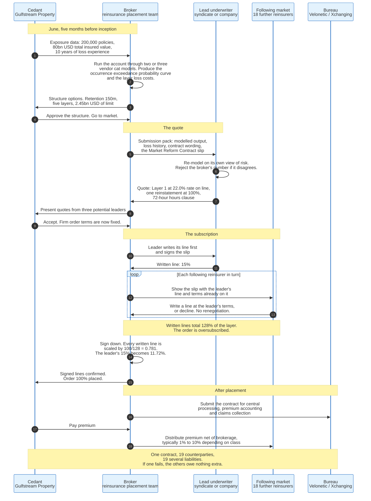

### 12.1 The Slip

The **slip** is the contract. Historically a folded sheet of paper carried around the Lloyd's underwriting room by a broker, on which each underwriter wrote a percentage and initialled it, it is now an electronic document, but the structure survives.

The London market standardised its format as the **Market Reform Contract**, or MRC, which organises the contract into defined sections:

| Section | Contents |
|---------|----------|
| **Risk Details** | The insured, the period, the interest, the limits, the terms and conditions, the premium |
| **Information** | Underwriting information supplied but not warranted, including modelled output and loss history |
| **Security Details** | Who is on the risk and for what percentage. Written lines, then signed lines. |
| **Subscription Agreement** | How the contract may be amended after inception, and who may agree what on behalf of the following market |
| **Fiscal and Regulatory** | Taxes, allocation of premium by territory, regulatory clauses |
| **Broker Remuneration and Deductions** | Brokerage and any other deductions from premium |

The London Market Group maintains the MRC and the associated data standards, including the **Core Data Record**, which defines the minimum structured data set that must accompany a contract into central processing. Version 3.3 of the Core Data Record extends the standard to treaty reinsurance.

### 12.2 Written Lines, Signed Lines, and Signing Down

The subscription mechanic produces two different percentages for every participant and the difference is not cosmetic.

A **written line** is the percentage an underwriter is prepared to take. A **signed line** is the percentage it actually gets after the placement closes.

If a broker seeks 100% of a layer and receives written lines totalling 128%, the order is oversubscribed. Every written line is then scaled by 100 divided by 128, a factor of 0.781. An underwriter that wrote 15% ends up signed at 11.72%.

This has a consequence underwriters manage carefully: an underwriter that wants 10% must write more than 10% if it expects the placement to be oversubscribed, and an underwriter that writes a large line on a placement that closes exactly at 100% gets the full amount. Judging the sign-down is a skill, and getting it wrong in either direction costs money.

A line marked **"to stand"** is not scaled down. Leaders sometimes secure this, and following markets resist it, because it shifts the entire sign-down burden onto everyone else.

### 12.3 Several Liability

Every subscriber on a slip is liable only for its own signed percentage. There is no joint liability, no cross-guarantee, and no obligation to make up another subscriber's share.

If one of nineteen reinsurers on a layer becomes insolvent, the cedant collects from the other eighteen and joins the queue for the nineteenth. This is the reason a cedant's security committee vets every counterparty individually, and the reason the Lloyd's Central Fund is worth paying for: within Lloyd's, that residual credit risk is mutualised.

### 12.4 The Placement Sequence

**Submission.** The broker assembles exposure data, loss history, contract wording, and modelled output. For a property catastrophe programme this is a large data exercise: a location-level exposure file with construction, occupancy, year built, and total insured value for every one of 200,000 policies.

**Modelling.** The broker runs the account through two or three vendor models and produces occurrence and aggregate exceedance probability curves and per-layer loss costs. Reinsurers re-run it on their own view of risk and frequently disagree, which is the point of Section 15.

**Quote.** Two or three potential leaders are approached. Each quotes a price and terms. The cedant chooses. Once accepted, this becomes the **firm order terms**, and they are now fixed for the whole placement.

**Leading.** The chosen leader writes its line first and signs the slip. The leader's signature is what makes the terms real to everyone else.

**Following.** The broker walks the slip round the market. Each following reinsurer sees the leader's terms and line already on it and either writes a line at those terms or declines. There is no renegotiation. A follower that wants different terms is not a follower.

**Signing down.** Written lines are scaled to 100%. Signed lines are confirmed.

**Processing.** The contract enters central processing for premium accounting and claims collection. In London this runs through Velonetic, the market's central bureau, operated with DXC and overseen by Lloyd's and the International Underwriting Association.

### 12.5 Why the Subscription Market Survives

It survives because it prices unusual risk better than any alternative.

A reinsurer asked to write 100% of a novel exposure must either decline or take an outsized position. Asked to write 5% at a leader's terms, it can participate. The market therefore prices things that no single balance sheet would accept, which is why satellite launches, kidnap and ransom, cyber war exclusions, and the first parametric covers all get placed in London.

The cost is speed and expense. A subscription placement takes weeks and touches twenty organisations. Every attempt to modernise the London market has been an attempt to keep the risk-sharing property and remove the paper. Blueprint Two, the current attempt, is the subject of Section 23.4.

---

## 13. Brokers

Reinsurance broking is concentrated, intermediated by three firms, and paid for by the party it does not represent. Those three facts explain most of its behaviour.

### 13.1 Who They Are

| Broker | H1 2026 reinsurance revenue (m USD) | FY2025 reinsurance revenue (m USD) |
|--------|-------------------------------------|-------------------------------------|
| Aon Reinsurance Solutions | 1,990 | 2,793 |
| Guy Carpenter (Marsh McLennan) | 1,961 | 2,635 |
| Gallagher Re | 1,189 | 1,478 |
| Howden Re | 597 | 617 |
| BMS Re | 229.5 | 180 |
| Lockton Re | 210 | 168 |
| Acrisure Re | 169.8 | 148 |

Source: Reinsurance News reinsurance broker ranking, H1 2026 and full-year 2025 columns, which the publisher describes as a mix of reported and estimated figures. For BMS Re, Lockton Re and Acrisure Re the half-year 2026 number exceeds the whole of 2025. Read those three rows as a change in the estimating basis and in the perimeter of each firm after team hires and acquisitions, not as 100% organic growth in a year when the rate index fell 12%.

Aon and Guy Carpenter together take 3,951 million dollars of the 6,346 million of tracked reinsurance broking revenue in the first half of 2026, or 62%. Gallagher Re is the former Willis Re. Aon's proposed merger with Willis Towers Watson collapsed on 26 July 2021, after the US Department of Justice sued to block it and Aon paid a 1 billion dollar break fee. Willis Towers Watson then sold the treaty reinsurance business directly to Arthur J. Gallagher and Co. for an initial 3.25 billion dollars, completing on 1 December 2021. One transaction created the third force in reinsurance broking.

### 13.2 What They Actually Do

The broker's function is far wider than introduction.

**Structuring.** Designing the programme: retention, layer boundaries, limit, reinstatements, inuring order. A broker with a large book sees hundreds of comparable structures and prices the cedant's options against them.

**Modelling.** Running vendor catastrophe models on the cedant's exposure and producing the analytics the market negotiates over. The large brokers run substantial analytics operations, and their model output is the starting point for every quote.

**Market intelligence.** Knowing which reinsurer has appetite for Florida wind in June, which has filled its Japanese earthquake capacity, and what a layer traded at last week. This is the asymmetry that makes brokers difficult to disintermediate.

**Claims collection.** Presenting and pursuing recoveries across nineteen counterparties, in some cases for years after a treaty has expired.

**Contract certainty.** Producing the wording, chasing signatures, and getting the contract into central processing.

### 13.3 The Compensation Problem

Reinsurance brokerage is deducted from premium and therefore paid by the reinsurer, while the broker's duty runs to the cedant. Brokerage typically runs between 1% and 10% of premium depending on class, with property catastrophe treaty at the lower end and specialty facultative at the higher.

The conflict is structural. A broker paid a percentage of premium earns more when premium is higher, which is not what its client wants. Brokers argue, with some force, that a reputation for placing programmes efficiently is worth more than any single year's commission, and that cedants renew or leave annually.

Two developments have shifted the picture. Larger cedants increasingly negotiate fee arrangements rather than percentage brokerage, which removes the conflict directly. And brokers have built facilities and follow-form products in which they earn separately for supplying capacity, a business model that regulators watch closely because it moves the broker from intermediary to principal.

### 13.4 Why Disintermediation Has Not Happened

Direct reinsurance without a broker exists and is a minority of the market. Munich Re and Swiss Re both write substantial direct business. The reason it has not spread is that a broker is not primarily a matchmaker.

Placement is the smallest part of the work. Building a location-level exposure file for 200,000 policies, running three vendor models, negotiating across nineteen counterparties whose appetites change weekly, and collecting a 1.05 billion dollar recovery from all of them is a specialist operation. Cedants that internalise it discover they have built a small broker.

---

## 14. Retrocession and the Spiral

Retrocession is reinsurance bought by reinsurers, and it is the point in the chain where risk transfer can quietly become circular.

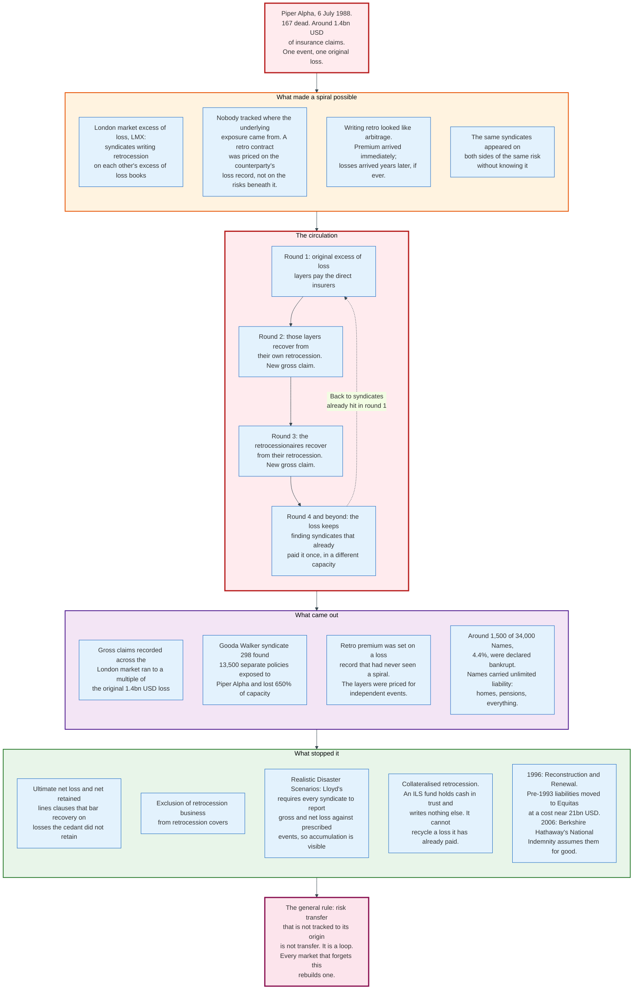

### 14.1 What Retrocession Does

A reinsurer accumulates exposure in exactly the way a primary insurer does. Having written catastrophe layers for forty Florida cedants, it holds a Florida hurricane position larger than any of them. It buys retrocession to cap that position.

Retro comes in four forms. **Occurrence retro**, a catastrophe excess of loss on the reinsurer's own net position. **Aggregate retro**, covering annual accumulation. **Whole-account quota share**, ceding a percentage of everything, often to a sidecar. And **industry loss warranties**, which pay on an index rather than on the buyer's own loss.

Retro capacity is small relative to reinsurance capacity, expensive, and highly cyclical. It is also the layer most completely taken over by collateralised capital, for reasons Section 16 explains.

### 14.2 Industry Loss Warranties

An industry loss warranty pays a fixed limit when total insured industry losses from an event exceed a stated threshold, regardless of the buyer's own loss.

The canonical contract: a 100 million dollar limit US Wind ILW attaching at 20 billion dollars of industry loss. If a hurricane produces industry losses above 20 billion as measured by Property Claim Services, the buyer receives 100 million.

Most ILWs are dual-trigger: an **ultimate net loss clause** requires the buyer to demonstrate that it also suffered a loss, usually a nominal amount, so the contract qualifies as insurance rather than a derivative. Without that clause the contract is a bet, with tax and regulatory consequences.

Industry loss is measured by **Property Claim Services**, a Verisk unit, in the United States, and by **PERILS** in Europe. Outside those two markets PERILS has extended coverage to Australia, New Zealand, Japan and Turkey, and **CRESTA CLIX** and **PCS Global** supply index values for the remaining territories. Swiss Re's sigma and Munich Re's NatCatSERVICE are research databases published for study. Neither issues the event-level, territory-scoped, revisable estimates on a fixed reporting schedule that a trigger needs, and neither is used as a contractual settlement reference.

The trade-off is **basis risk**. An ILW settles fast, needs no exposure disclosure, and is cheap to document. It also pays exactly nothing if the industry loss lands at 19.5 billion while the buyer's own loss is severe. Buyers use ILWs to top up a programme, not to form its core.

### 14.3 The LMX Spiral

The London market excess of loss spiral is the definitive case study in retrocession failure, and its mechanism is worth stating precisely because the conditions that produced it recur.

**The setup.** Through the 1970s and 1980s a set of Lloyd's syndicates and London companies specialised in writing excess of loss reinsurance, and then in writing excess of loss cover on each other's excess of loss books. This second activity is retrocession, and it was priced on the counterparty's historical loss record rather than on the underlying exposures.

**Why it looked attractive.** Retro premium arrived immediately, losses arrived years later or never, and the layers appeared remote. Some syndicates wrote retro as their main business, and it generated reported profits year after year.

**What nobody tracked.** No participant could see whose underlying risks sat beneath a retro contract. The same syndicates appeared repeatedly on the same original risk, in different capacities, at different heights, without knowing it.

**The mechanism.** A large original loss enters the market. The direct insurers' excess of loss layers pay. Those layers recover from their retrocession, creating a fresh gross claim in the market. The retrocessionaires recover from their own retrocession, creating another. Each pass is a new gross claim on a new balance sheet, and the loss keeps arriving at syndicates that have already paid it once in a different capacity.

**The trigger.** The losses of 1987 to 1990 arrived close together: the October 1987 European windstorm, Piper Alpha on 6 July 1988 with roughly 1.4 billion dollars of claims, the Exxon Valdez in March 1989, and Hurricane Hugo in September 1989.

**The result.** Gross claims recorded across the London market ran to a multiple of the original losses. Gooda Walker syndicate 298 was the first fatal casualty: 13,500 separate policies were exposed to Piper Alpha alone, and its 1989 year of account produced a 650% loss on capacity. The Names who carried it sued their agents and won. Deeny v Gooda Walker Ltd, decided in 1994, found the managing agents negligent for writing spiral-exposed excess of loss business without assessing what sat underneath it, and it remains the authority on an underwriting agent's duty of care. Names carrying unlimited liability lost homes and pensions; around 1,500 of 34,000 were declared bankrupt.

The pricing failure is the general lesson. Retro layers had been priced on the assumption that events were independent and that a layer at a given height had a given probability of being reached. In a spiral, one event reaches every layer, because the loss is not one loss travelling upward but the same loss recirculating.

### 14.4 What Stopped It

Four changes, and they are complementary rather than alternative.

**Contractual.** Ultimate net loss and net retained lines clauses were tightened so that a reinsurer indemnifies only losses the cedant genuinely retained, after all other recoveries. Retrocession of retrocession business was excluded from most retro covers.

**Disclosure.** Lloyd's introduced **Realistic Disaster Scenarios**: every syndicate must report gross and net loss against a prescribed list of events, so the Corporation can see market-wide accumulation. Exposure reporting at the risk and zone level became standard for treaty submissions.

**Structural.** Collateralised retrocession changes the mechanics. An ILS fund holds cash in trust equal to its limit and writes nothing else. When it pays, the trust empties and the fund is out. It cannot pass the loss to a counterparty because it has none. Collateral is not merely a credit improvement; it is a topological one, because it terminates the chain.

**Modelling.** Catastrophe models made accumulation calculable in a way it was not in 1988. A reinsurer can now run its whole inwards book through a single event set and see its own net position.

### 14.5 Where the Risk Recurs

The spiral condition is: risk that cannot be traced to its origin, priced on counterparty history rather than underlying exposure, in a market where the same participants appear on both sides.

That condition is not extinct. Cyber reinsurance carries something close to it, because a single cloud provider outage sits under a large fraction of the market's cyber portfolios and few cedants can enumerate their insureds' dependencies. Cyber aggregation is currently modelled poorly, retroceded actively, and priced substantially on counterparty history.

---

## 15. Catastrophe Modelling

Catastrophe risk cannot be priced from loss experience, because the events that matter have not happened often enough to appear in it. A model manufactures the experience that experience cannot supply.

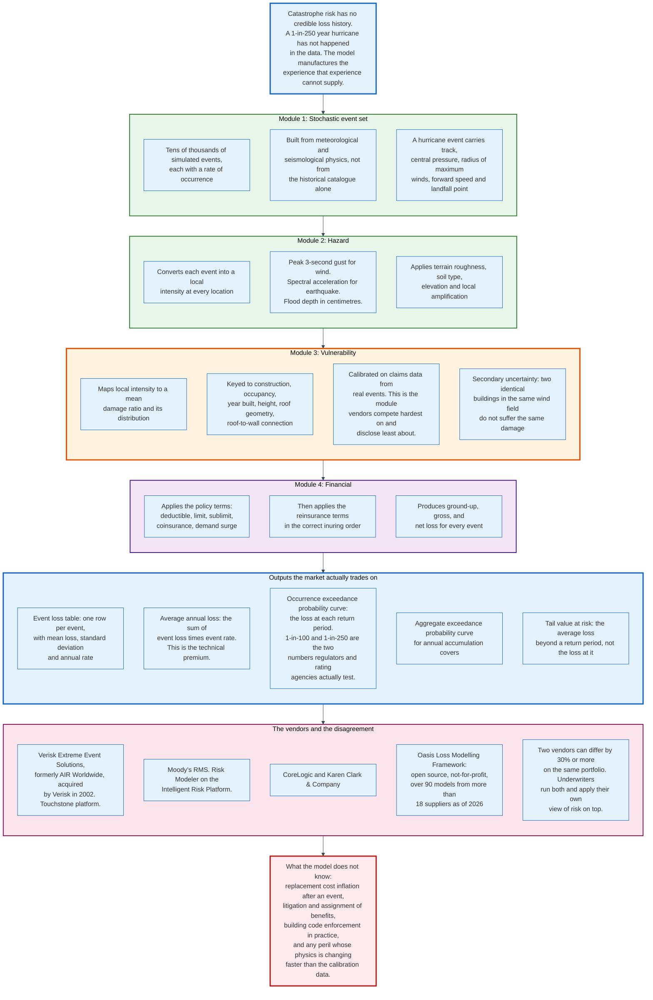

### 15.1 Why Models Exist

Before Hurricane Andrew, insurers priced hurricane exposure from their own loss history and a judgement about how bad it could get. In August 1992 Andrew produced 27.3 billion dollars of damage in 1992 money and rendered eleven companies insolvent, several of which had believed their maximum credible Florida loss was a fraction of what arrived.

The lesson was that a loss distribution built from twenty years of claims has no information about the tail. Catastrophe modelling replaces extrapolation with simulation.

Karen Clark had built the first commercial hurricane model in the late 1980s at Applied Insurance Research, later AIR Worldwide, and had published loss estimates that the market found implausibly large. Andrew validated them. Verisk acquired AIR Worldwide in 2002 and now operates it as Extreme Event Solutions.

### 15.2 The Four Modules

Every vendor model has the same architecture.

**Module 1: the stochastic event set.** Tens of thousands of simulated events, each with an annual rate of occurrence. Built from physics and from the historical catalogue together, not from the catalogue alone, so that events larger than anything observed appear with appropriate frequency. A simulated hurricane carries a track, a central pressure, a radius of maximum winds, a forward speed, and a landfall point.

**Module 2: hazard.** Converts each event into a local intensity at every geocoded location. Peak three-second gust for wind, spectral acceleration for earthquake, inundation depth for flood. Local modifiers apply: terrain roughness, soil type, elevation, and site amplification.

**Module 3: vulnerability.** Maps local intensity to a mean damage ratio and a distribution around it. Keyed to construction class, occupancy, year built, height, roof geometry, and roof-to-wall connection. This module is calibrated on claims data from real events and is the part vendors compete on hardest and disclose least about. It carries **secondary uncertainty**: two identical buildings in the same wind field do not suffer identical damage, and the model must represent that spread, not just the mean.

**Module 4: financial.** Applies policy terms, deductibles, limits, sublimits, coinsurance, and demand surge, then applies the reinsurance structure in the correct inuring order. Output is ground-up, gross, and net loss for every event.

### 15.3 Outputs the Market Trades On

| Output | Definition | Used for |
|--------|------------|----------|
| **Event loss table (ELT)** | One row per simulated event: mean loss, standard deviation, annual rate | The primitive from which everything else is computed |
| **Average annual loss (AAL)** | Sum over events of loss times rate | The technical premium for the exposure |
| **Occurrence exceedance probability (OEP)** | Probability that the largest single event in a year exceeds a given loss | Sizing per-occurrence catastrophe layers |
| **Aggregate exceedance probability (AEP)** | Probability that total annual losses exceed a given amount | Sizing aggregate covers, capital adequacy |
| **Return period loss** | The loss at a stated OEP or AEP, for example 1-in-100 or 1-in-250 | Regulatory and rating agency tests |
| **Tail value at risk (TVaR)** | The average loss conditional on exceeding a return period | Capital allocation, because it is coherent where VaR is not |
| **Probable maximum loss (PML)** | Loosely used to mean the return period loss at a stated exceedance probability | Underwriting guidelines. The term is imprecise and always needs its return period stated |

For Gulfstream, the model produces a gross AAL of 360 million dollars, a 1-in-100 OEP of 2.1 billion, and a 1-in-250 OEP of 3.4 billion. The whole reinsurance structure in Section 8 was built from those three numbers.

### 15.4 The Vendors

**Verisk Extreme Event Solutions**, formerly AIR Worldwide, acquired by Verisk in 2002. Its Touchstone and Touchstone Re platforms are widely used on both the insurer and reinsurer side.

**Moody's RMS**, the other major vendor, delivered through Risk Modeler on the Intelligent Risk Platform.

**CoreLogic** and **Karen Clark & Company** hold smaller shares, the latter founded by the author of the first commercial hurricane model.

**Oasis Loss Modelling Framework** is the open-source alternative: a not-for-profit platform, free to use, with an execution engine (Oasis ktools), a set of Open Data Standards for hazard and vulnerability, and an ecosystem that as of 2026 carries over 90 models from more than 18 suppliers. Oasis exists because vendor model licensing is expensive and vendor methodologies are closed, and it has found particular traction for perils and territories the commercial vendors have not prioritised.

### 15.5 The Disagreement Between Models

Two vendor models run on the same portfolio can differ by 30% or more on the same return period loss, and the difference is not a defect. It reflects genuine scientific uncertainty about event frequency, about vulnerability functions, and about how to treat non-modelled sources of loss.

The market's response is procedural rather than technical. Cedants and reinsurers run multiple models, blend them with weights, and apply a **view of risk**: a set of adjustments reflecting the firm's own judgement about where the vendor is wrong. A reinsurer's view of risk is proprietary and is a genuine source of competitive advantage, because it determines which accounts look cheap to it.

Model version changes move markets. A vendor releasing an updated hurricane model with revised vulnerability functions can raise a cedant's modelled 1-in-100 loss by a fifth overnight, which raises its required capital, which raises the reinsurance limit it must buy. Version release dates are negotiated market events.

### 15.6 What the Models Do Not Capture

**Post-event inflation.** Reconstruction costs rise after a large event because contractors and materials are scarce. Models include a demand surge factor, and it is calibrated on historical events that may not resemble the next one.

**Litigation and claims practice.** Florida's experience with assignment of benefits and one-way attorney fee statutes produced loss amplification that had nothing to do with wind speed. Legal environments change faster than model calibration cycles.

**Building code enforcement in practice.** A model keyed to year built assumes the code was applied. Enforcement varies.

**Non-modelled perils and exposures.** Losses arrive from sources not in the event set. The 2025 loss year is the clearest illustration: secondary perils, meaning severe convective storm, wildfire, and flood rather than hurricane and earthquake, accounted for a record 92% of the 107 billion dollars of global insured losses.

**Correlation with non-natural risk.** A hurricane that damages property also disrupts supply chains, triggers business interruption, and generates casualty claims. Property cat models price property cat.

---

## 16. Catastrophe Bonds and Insurance-Linked Securities

A catastrophe bond is a reinsurance contract funded in advance with cash held in trust and sold to capital markets investors as a security. It is a substitute for a reinsurance layer, not a complement to one, and it competes for the same place in the tower.

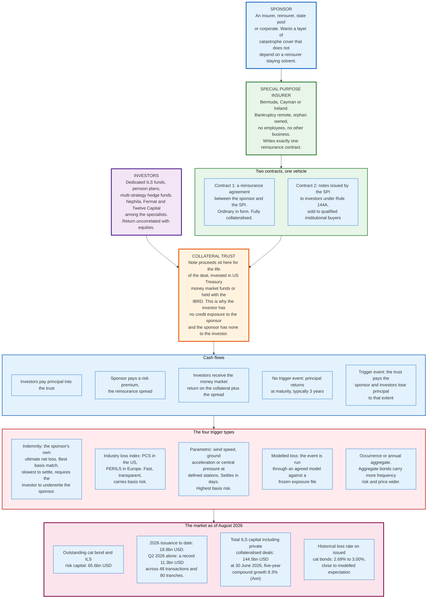

### 16.1 The Structure

The sponsor establishes a **special purpose insurer**, typically in Bermuda, the Cayman Islands, or Ireland: bankruptcy remote, orphan owned, no employees, and no business other than this transaction.

Two contracts hang off it. The SPI writes a **reinsurance agreement** with the sponsor, ordinary in form and fully collateralised. The SPI issues **notes** to investors under Rule 144A of the US Securities Act, sold to qualified institutional buyers.

The note proceeds go into a **collateral trust**, invested in short-dated Treasury money market funds or held with a supranational such as the IBRD. The trust is the mechanism that makes the structure work in both directions. The sponsor has no credit exposure to the investors, because the money is already there. The investors have no credit exposure to the sponsor, because the collateral is not part of the sponsor's estate.

Cash flows are simple. Investors receive the money market return on the collateral plus a **risk spread** paid by the sponsor. If no trigger event occurs, principal returns at maturity, usually after three years. If a trigger event occurs, the trust pays the sponsor and investors lose principal to that extent.

### 16.2 Triggers

The trigger is the term that determines both basis risk and price.

| Trigger | How it works | Basis risk | Settlement speed | Sponsor disclosure |
|---------|--------------|------------|------------------|--------------------|
| **Indemnity** | Pays on the sponsor's own ultimate net loss | None | Slowest, can take years | Full exposure and claims data |
| **Industry loss index** | Pays on PCS or PERILS industry loss | Moderate | Months | Minimal |
| **Modelled loss** | Event parameters run through an agreed model against a frozen exposure file | Moderate | Weeks | Exposure file only |
| **Parametric** | Pays on measured physical parameters at defined stations | Highest | Days | None |

Cover can be **per occurrence** or **annual aggregate**. Aggregate bonds accumulate qualifying losses across the year against a franchise deductible. They carry more frequency risk, are more sensitive to secondary perils, and price wider.

Indemnity triggers have become the market standard for insurer sponsors, because basis risk defeats the purpose of buying protection. Industry loss and parametric triggers dominate where the sponsor cannot or will not disclose exposure, and in sovereign and public-entity transactions.

### 16.3 Pricing

Cat bonds are priced on a spread over the collateral return, and the market compares that spread to modelled expected loss.

The pricing vocabulary matches excess of loss. **Expected loss** is the modelled annual probability-weighted loss to the tranche, expressed as a percentage of principal. **Spread** is the risk premium paid. **Multiple** is spread divided by expected loss, and it is the market's risk load.

Multiples move with capital supply exactly as reinsurance multiples do, and they move faster, because a cat bond can be marketed in six weeks.

Realised losses have tracked modelled expectation closely enough that pension money has stayed through three loss years. There is no single agreed loss statistic for the asset class. A cat bond loss rate can be struck as principal impaired over principal outstanding, as principal impaired over all principal ever issued, or as the share of issued bonds that suffered any loss at all, and the three differ by an order of magnitude, so any quoted figure has to say which it uses. The direction is not in dispute. The losses of 2005, 2017 and 2022 arrived at the perils and the return periods the tranches were priced for, which is the test the asset class was built to pass.

### 16.4 The Rest of the ILS Family

Catastrophe bonds are the visible part of a wider structure.

**Collateralised reinsurance** is a reinsurance contract written by an ILS fund and fully collateralised in a trust or through a transformer vehicle. It is privately negotiated, bespoke, and by some measures larger than the cat bond market. It has no secondary market and no securities law overlay.

**Sidecars** are quota share vehicles funded by investors, taking a percentage of a named cedant's or reinsurer's book. They emerged in the 1990s in Bermuda as joint ventures such as Top Layer Re and OpCat, expanded after September 2001 with Olympus and DaVinci, and grew explosively after Hurricane Katrina: Flatiron raised 840 million dollars, Cyrus 550 million, and Blue Ocean 355 million within months of the storm, with over 4 billion dollars raised in total by September 2006. Sidecars remain the fastest way to add capacity for a single season.

**Industry loss warranties**, covered in Section 14.2, are index-triggered contracts used mainly as retrocession.

### 16.5 Market Size and Growth

| Measure | Figure | As of |
|---------|--------|-------|
| Cat bond and ILS risk capital outstanding | 65.6 bn USD | Aug 2026 |
| 2026 issuance year to date | 18.9 bn USD | Aug 2026 |
| Q2 2026 issuance | 11.3 bn USD, a record, across 48 transactions and 80 tranches | Jun 2026 |
| Total ILS capital, Aon definition | 144.5 bn USD | 30 Jun 2026 |
| Total ILS capital, Aon definition | 141 bn USD | 31 Mar 2026 |
| Five-year compound growth in ILS capital | 8.3% | Aon, Aug 2026 |
| Ten-year compound growth in the cat bond market | 11.6% | Aon, Aug 2026 |
| Third-party reinsurance capital, AM Best and Guy Carpenter definition | 123 bn USD end 2025, projected 130 bn end 2026 | Aug 2026 |
| Cat bond market size, Swiss Re Capital Markets | 43.1 bn USD with 15.4 bn issued in 2023 | 2023 |

The cat bond market has grown by half since 2023, from 43.1 billion dollars to 65.6 billion. Cat bonds are now 65.6 of the 144.5 billion dollars of ILS capital Aon counts at 30 June 2026, or 45%. Whether securitised capacity is taking share from private collateralised deals does not follow from the two compound growth rates above: they run over different windows and one aggregate contains the other. Settling it needs the same ratio at two dates, and the earlier ratio is not published in the Aon series.

### 16.6 Why ILS Took the Top of the Tower First

The economics are structural rather than accidental.

A traditional reinsurer earns a return on equity by diversifying across many uncorrelated exposures and by leveraging its capital: it does not hold cash equal to every limit it writes. That leverage makes it efficient at the bottom of a tower, where losses are frequent and diversification across cedants works.

An ILS fund holds cash equal to its limit. Its capital is not leveraged, so its cost of capacity per unit of limit is high. It becomes competitive precisely where the expected loss is low and the multiple is high, because there the risk load rather than the loss cost dominates the price. That is the top of the tower.

The result is a stable division of labour. Traditional reinsurers dominate working layers and casualty. ILS dominates remote property catastrophe layers and retrocession. Where they meet, in the middle of the tower, price is set by whichever is currently cheaper, and that is where the market clears.

---

## 17. The Market Cycle

Reinsurance pricing is driven by capital supply, not by loss cost. Loss cost estimates move slowly and are contested. Capital moves fast, and it moves in response to results that have already happened.

```mermaid
%%{init: {'theme': 'base', 'themeVariables': {'primaryColor': '#e3f2fd', 'primaryBorderColor': '#1565c0', 'lineColor': '#37474f'}}}%%

flowchart TB
    Thesis["Reinsurance pricing tracks one variable:<br/>the quantity of capital willing to be<br/>at risk this January, divided by the<br/>quantity of limit buyers want.<br/>Demand moves slowly. Supply does not."]

    subgraph Hard["HARD MARKET"]
        direction TB
        H1["A large loss year destroys capital.<br/>Retained earnings fall, mark-to-market<br/>losses hit the investment book."]
        H2["Supply of limit contracts.<br/>Rate on line rises.<br/>Attachment points rise faster."]
        H3["Terms tighten: named perils replace<br/>all-risks, aggregate covers withdraw,<br/>hours clauses shorten, communicable<br/>disease and cyber get excluded."]
        H4["Reinsurer return on equity rises.<br/>New capital is attracted."]
        H5["January 2023: the hardest property<br/>catastrophe market since 2006.<br/>The structural change was not price,<br/>it was retentions. Reinsurers stopped<br/>selling frequency cover."]
    end

    subgraph Soft["SOFT MARKET"]
        direction TB
        S1["Capital arrives: retained profit,<br/>new company formations, ILS inflows"]
        S2["Supply of limit expands.<br/>Rate on line falls.<br/>Terms broaden back out."]
        S3["Underwriting margin compresses.<br/>Reserve releases from older years<br/>flatter the reported result."]
        S4["Capital leaves, or a loss removes it"]
        S5["2026: the Guy Carpenter Global<br/>Property Catastrophe Rate on Line<br/>index falls 12% at 1 January and 16%<br/>for the year to date after the July<br/>renewals, the steepest annual decline<br/>since the late 1990s."]
    end

    Thesis --> Hard
    Hard --> Soft
    Soft --> Hard

    subgraph Damp["What damps the cycle now"]
        direction TB
        D1["ILS capital reprices in weeks, not years.<br/>A cat bond can be issued in six weeks;<br/>a new Bermudian took nine months."]
        D2["Total dedicated reinsurance capital<br/>ended 2025 at 663bn USD: 540bn<br/>traditional plus 123bn third-party.<br/>Projected 705bn at end 2026."]
        D3["Higher attachment points mean an<br/>average loss year no longer reaches<br/>the reinsurance market at all"]
        D4["2025 insured catastrophe losses of<br/>107bn USD did not dent capital.<br/>2026 first half of 42bn USD,<br/>the lowest since 2020, accelerated<br/>the softening."]
    end

    subgraph Sticky["What does not soften"]
        direction TB
        K1["Attachment points. Reinsurers gave<br/>back price in 2025 and 2026 and<br/>held retentions. The 2023 reset in<br/>where cover starts has survived<br/>two soft renewals."]
        K2["Named-peril wordings and<br/>the exclusions added in 2022-2023"]
        K3["Casualty terms, where US social<br/>inflation keeps reserve risk live"]
    end

    Soft --> Damp
    Soft --> Sticky

    Punch["Price is negotiable every January.<br/>Structure is not. The lasting output of<br/>a hard market is where the cover attaches,<br/>and that survives the softening."]

    Damp --> Punch
    Sticky --> Punch

    style Thesis fill:#e3f2fd,stroke:#1565c0,stroke-width:3px
    style Hard fill:#ffebee,stroke:#b71c1c,stroke-width:3px
    style Soft fill:#e8f5e9,stroke:#2e7d32,stroke-width:3px
    style Damp fill:#fff3e0,stroke:#e65100,stroke-width:2px
    style Sticky fill:#f3e5f5,stroke:#4a148c,stroke-width:2px
    style Punch fill:#fce4ec,stroke:#880e4f,stroke-width:3px
```

### 17.1 The Loop

A large loss year destroys capital through paid claims and, often simultaneously, through mark-to-market losses on the investment portfolio. Supply of limit contracts. Rate on line rises, attachment points rise faster, and terms tighten: named perils replace all-risks, aggregate covers withdraw, hours clauses shorten, and new exclusions appear.

Higher rates raise reinsurer return on equity. Capital arrives, through retained earnings, through new company formations, and increasingly through ILS inflows that can be raised in weeks. Supply expands, rate on line falls, terms broaden, and margin compresses until the next loss removes the capital again.

The loop is not mysterious. It is a commodity market with a slow-moving demand curve, a supply curve that can shift by tens of billions in a quarter, and a product whose cost of goods sold is not known for years.

### 17.2 The Current Cycle in Numbers

The Guy Carpenter Global Property Catastrophe Rate on Line Index is the standard benchmark. It measures the change in price per unit of limit on a constant portfolio, so it strips out changes in how much cover is bought.

| Period | Change in the global index | Note |
|--------|---------------------------|------|
| January 2023 | Sharp increase | Hardest property catastrophe market since 2006 |
| 2024 | Peak of the hard market | |
| January 2025 | -6.6% | First sustained softening |
| Mid-2025 | -8.1% for the year to date | |
| January 2026 | -12% | Europe -15%, United States and Asia-Pacific -12% each |
| Mid-2026 | -16% for the year to date | Steepest annual decline since the late 1990s |

The last two rows are one year measured twice, not two declines. Guy Carpenter strikes the index at the 1 January renewal and restates the year-to-date reading after the mid-year renewals, which is why 2026 reads minus 12% in January and minus 16% in July. Compounding the January 2025 reading with the 2026 year-to-date reading puts the index roughly 22% below its 2024 peak, and Guy Carpenter reports the US index down 22% from the same peak.

Regional detail, all from Guy Carpenter's renewal reporting for the dates named. At 1 January 2026 Europe fell 15%, the United States and Asia-Pacific 12% each, and per-risk placements ran flat to down 15% depending on region. After the July 2026 renewals the US index stood 16% down for the year and Asia-Pacific about 19% down, the steepest regional fall of the year.

### 17.3 What Drove the 2023 Hardening

The 2023 renewal was not a normal cyclical turn, and the distinction matters for anyone reading forward.

Five consecutive years of catastrophe losses from 2017 to 2022 had eroded capital. Rising interest rates in 2022 produced simultaneous mark-to-market losses on reinsurers' bond portfolios, cutting reported capital at exactly the moment demand for limit was rising because inflation had increased insured values. ILS investors, having taken losses through several aggregate structures, declined to redeploy at the previous terms.

The response was structural rather than purely a price move. Reinsurers concluded that they had been selling earnings protection at catastrophe prices and withdrew from the bottom of towers. Attachment points rose across the market. Aggregate covers largely disappeared.

That change is what has survived the softening. The index fell 6.6% at January 2025 and 8.1% for that year by mid-2025, then 12% at January 2026 and 16% for that year by mid-2026: two years of decline, each read twice. Attachment points have not come back down. Reinsurers have given back price and held structure, which means an average catastrophe year no longer reaches the reinsurance market at all, and primary insurers now retain frequency losses they used to cede.

### 17.4 What Damps the Cycle Now

**ILS reprices quickly.** A cat bond can be issued in six weeks. Forming a new Bermudian reinsurer took nine months and a rating agency's cooperation. Faster supply response means shallower and shorter hard markets.

**The capital base is larger.** Total dedicated reinsurance capital ended 2025 at 663 billion dollars and is projected at 705 billion by end 2026. A 107 billion dollar insured loss year, as 2025 was, is roughly 16% of the capital base and is absorbed out of the year's earnings rather than out of capital.

**Higher attachment points insulate reinsurers from frequency.** The 2025 and first-half 2026 loss experience passed largely to primary insurers, which is why reinsurer results stayed strong while rates fell.

Global insured catastrophe losses of 42 billion dollars in the first half of 2026, the lowest first half since 2020 and 16% below the ten-year average, accelerated the softening at the mid-year renewals.

### 17.5 What Reinsurers Do Across the Cycle

The disciplined strategy is counter-cyclical and is stated more often than executed. Write more limit when rate on line is high, write less when it is low, and return capital to shareholders rather than deploy it into a soft market. Renaissance Re and a handful of others have run this policy visibly for years.

The undisciplined strategy is to hold market share. It looks identical for four years and then produces a reserve strengthening.

The tell is in reserve development. A firm releasing reserves from prior years while writing at soft market rates is funding today's reported profit with yesterday's conservatism, and the release stops before the soft market does.

---

## 18. Reserving, IBNR, and the Long Tail

A reinsurer knows exactly what it charged and does not know what it owes. On casualty business the answer arrives up to a decade later, through cedants who report quarterly. Reserving is the discipline of estimating the unknown half of the income statement.

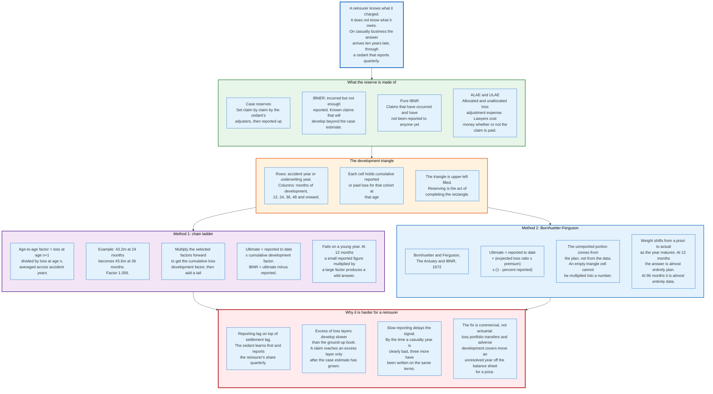

### 18.1 The Components

| Component | Definition |
|-----------|------------|
| **Case reserves** | Estimates set claim by claim by the cedant's adjusters and reported to the reinsurer |
| **IBNER** | Incurred but not enough reported: development on claims already known, above the case estimate |
| **Pure IBNR** | Claims that have occurred but have not been reported to anyone |
| **ALAE** | Allocated loss adjustment expense: defence costs attributable to a specific claim |
| **ULAE** | Unallocated loss adjustment expense: the cost of running the claims department |

"IBNR" in common usage means IBNER plus pure IBNR. The two behave differently: IBNER is driven by the cedant's case reserving adequacy, pure IBNR by reporting lag.

### 18.2 The Development Triangle

Claims are organised into a triangle. Rows are cohorts, either accident year, meaning the year the loss occurred, or underwriting year, meaning the year the policy was written. Columns are development ages: 12, 24, 36, 48 months and onward.

Each cell holds the cumulative reported or paid loss for that cohort at that age. The triangle is filled in the upper left, because a cohort from ten years ago has ten observations and a cohort from this year has one.

Reserving is the act of completing the rectangle.

Reinsurers usually reserve on **underwriting year** rather than accident year, because a treaty covers policies written in a period and those policies produce losses over the following two years. Underwriting year triangles develop more slowly than accident year triangles for the same business, which is one reason reinsurance reserving lags primary reserving.

### 18.3 Chain Ladder

The chain ladder projects the triangle forward using observed development ratios.

An **age-to-age factor**, also called a link ratio or loss development factor, is the ratio of cumulative loss at one age to cumulative loss at the previous age, averaged across cohorts. If losses of 43.2 million at 24 months become 45.6 million at 36 months, the 24-to-36 factor is 1.056.

The seven steps: compile the triangle, calculate age-to-age factors, average them, select the factors to use, choose a tail factor for development beyond the last observed age, multiply the selected factors to get cumulative development factors, and apply them to the latest reported figure for each cohort.

```
Ultimate loss = reported to date x cumulative development factor
IBNR          = ultimate loss - reported to date
```

The chain ladder assumes that historical development patterns continue. It fails when they do not: a change in case reserving philosophy, a change in claims handling, a change in the mix of business, or a change in the legal environment all break it.

It fails hardest on immature cohorts. At 12 months of development the reported figure is small and the cumulative factor is large, so a modest random deviation in the reported figure produces a wild ultimate. A cohort with 4 million reported at 12 months and a cumulative factor of 8.0 projects to 32 million; the same cohort with 5 million reported projects to 40 million.

### 18.4 Bornhuetter-Ferguson

The Bornhuetter-Ferguson method, published by Ronald Bornhuetter and Ronald Ferguson in "The Actuary and IBNR" in 1972, solves the immature-cohort problem by refusing to extrapolate the unreported portion from the reported portion.

```
Ultimate = reported to date + (expected loss ratio x premium) x (1 - percent reported)
```

Equivalently:

```
BF = L x LDF x w + ELR x Exposure x (1 - w)
```

where L is reported loss, LDF is the loss development factor, ELR is the a priori expected loss ratio, and w is the estimated percentage reported.

The unreported portion comes from the plan, not from the data. At 12 months of development, when almost nothing is reported, the answer is almost entirely the a priori expectation. At 96 months, when almost everything is reported, it is almost entirely the actual data. The weighting shifts automatically as the cohort matures.

The cost is that a genuinely bad year looks acceptable for longer, because the method holds the a priori expectation until the data overwhelms it. Actuaries run both methods, and the gap between them on a young cohort is itself information.

### 18.5 Why Reinsurance Reserving Is Harder

**Two lags compound.** The claim is reported to the cedant, the cedant reports it to the reinsurer, usually quarterly. Reinsurers see a delayed copy of a delayed signal.

**Excess layers develop later than the ground-up book.** A claim reaches an excess layer only after its case estimate has grown past the attachment. A layer at 5 million excess of 5 million sees nothing for years while the underlying claim develops from 2 million toward 7 million, and then sees everything at once. Excess layers have longer development tails and more leveraged development factors than the business beneath them.

**Trend leverage.** Loss inflation of 5% applied to a ground-up book raises losses by 5%. Applied to a layer attaching at 5 million, it raises the layer's losses by considerably more, because claims that previously fell just below the attachment now pierce it. This is why casualty excess of loss reserving is so sensitive to social inflation assumptions.

**The feedback loop is slow.** By the time a casualty underwriting year is clearly deficient, three more years have been written on similar terms. This is the structural reason casualty reserve cycles are longer and deeper than property ones.

### 18.6 Commercial Solutions to a Reserving Problem

When a reserving question cannot be answered actuarially, it gets answered commercially.

A **loss portfolio transfer** cedes an existing block of reserves to a reinsurer for a single premium, generally below the nominal reserve because of investment income on the transferred assets. The cedant converts an uncertain liability into a certain payment.

An **adverse development cover** leaves the reserves in place and reinsures development above the carried amount, up to a limit. It does not remove the liability; it caps it.

Both are heavily used before an acquisition, before a disposal, and by companies exiting a line of business. The specialist legacy market that writes them, populated by firms such as Enstar, RiverStone, and Compre, is a distinct industry with its own economics.

The regulatory boundary is risk transfer. A contract in which the reinsurer's maximum loss is small relative to the premium, or in which the premium is returned through an experience account, is finance, not reinsurance. AIG restated its accounts in 2005 over a finite reinsurance transaction written with General Re in 2000 that regulators concluded carried no meaningful risk transfer, and the episode shaped how both regulators and auditors examine these contracts.

---

## 19. Economics: What the Chain Costs and Who Pays

Every dollar of premium a policyholder pays is divided among a chain of participants, and the reinsurance layer of that chain has its own expense structure. This section follows the money.

### 19.1 The Cedant's Income Statement

Gulfstream's economics, in a year with no catastrophe:

| Item | Amount (USD) | % of GWP |
|------|--------------|----------|
| Gross written premium | 1,200,000,000 | 100.0% |
| Quota share premium ceded | -300,000,000 | -25.0% |
| Ceding commission received | +90,000,000 | +7.5% |
| Catastrophe tower premium | -173,400,000 | -14.5% |
| **Net premium after reinsurance** | **816,600,000** | **68.0%** |
| Attritional losses, net of quota share | -378,000,000 | -31.5% |
| Acquisition costs and overhead at 28% of GWP | -336,000,000 | -28.0% |
| **Net underwriting result** | **102,600,000** | **8.6%** |
| Investment income on reserves and surplus | +48,000,000 | +4.0% |
| **Pre-tax result** | **150,600,000** | **12.6%** |

Reinsurance costs Gulfstream 39.5% of gross written premium in gross cessions, 300 million of quota share plus 173.4 million of tower premium, and returns 7.5% in commission, for a net cash cost of 32% before any recovery. The table shows the same thing from the other side: net premium after reinsurance is 68.0% of gross written premium. In a loss-free year that is pure expense. In the year of Section 9's hurricane it returns 1.45 billion dollars.

The decision is not whether reinsurance is expensive. It is whether the firm can survive the year in which it is not bought.

### 19.2 The Reinsurer's Income Statement

A reinsurer's expense ratio is far lower than a primary insurer's, and the difference is the core of the economics.

| Item | Primary insurer | Reinsurer |
|------|-----------------|-----------|
| Acquisition cost | 15% to 25% of premium (agent and broker commission) | 1% to 10% brokerage, plus ceding commission on proportional |
| Administration | 8% to 15% (policy issuance, service, claims handling at scale) | 3% to 6% |
| Claims handling | Full adjusting operation | Reviews the cedant's adjusting |
| Typical expense ratio | 25% to 35% | 5% to 12% on excess of loss |

A reinsurer writing excess of loss has no policyholders, no distribution network, no policy administration, and no claims department in the retail sense. It has underwriters, actuaries, modellers, and a capital base. That is why a reinsurer can charge a rate on line of 22% against a modelled loss cost of 8.4% and still be a competitive alternative to the cedant retaining the risk: the cedant's own cost of holding capital against that layer is higher than the reinsurer's, because the reinsurer diversifies it against hundreds of other exposures.

The whole industry rests on that arithmetic. Reinsurance is worth buying when the reinsurer's capital cost for a given exposure, plus its expenses and profit margin, is less than the cedant's capital cost for the same exposure. Diversification is what makes that inequality hold.

### 19.3 Where Diversification Comes From

Four axes.

**Peril.** Florida hurricane and Japanese earthquake are uncorrelated. A reinsurer writing both holds less capital than the sum of two monoline writers.

**Geography.** European windstorm and Australian hail do not co-occur.

**Line of business.** Property catastrophe is short-tail and volatile; casualty is long-tail and slower. Their capital requirements peak at different times, and the investment income on casualty reserves funds property capital.

**Time.** A reinsurer writing at 1 January, 1 April, 1 June, and 1 July renewals is exposed to four different market conditions in one year.

Diversification is also the limit. A reinsurer that has written the same peak zone for forty cedants is not diversified within it, which is precisely the position that creates demand for retrocession.

### 19.4 The Cost of the Chain

Money leaks at every intermediation step, and the cumulative leakage is why disintermediation is a permanent theme.

| Step | Typical deduction |
|------|-------------------|
| Retail agent or broker commission | 10% to 20% of original premium |
| Primary insurer acquisition and admin | 15% to 25% of original premium |
| Reinsurance brokerage | 1% to 10% of ceded premium |
| Reinsurer expenses | 5% to 12% of ceded premium |
| Reinsurer profit margin | Embedded in the multiple over expected loss |
| Retrocession brokerage and margin | Repeats the reinsurance step |

A catastrophe bond removes two of these steps. The sponsor deals with a structuring bank and an SPI; there is no reinsurer expense ratio and no reinsurer profit margin, only the investor's required return. That efficiency is real and is one reason cat bond spreads can undercut traditional layers at the same expected loss. It is offset by transaction costs, which are front-loaded: legal, modelling agency, rating, and structuring fees make a deal below roughly 100 million dollars uneconomic.

### 19.5 Investment Income and Float

A reinsurer collects premium before it pays claims, and on long-tail business the gap runs to years. The assets held against unpaid claims, the float, generate investment income that belongs to the reinsurer.

That income is why a reinsurer can run a combined ratio above 100% on long-tail business and still earn its cost of capital, and why interest rates change reinsurance pricing directly. When rates rose in 2022, the investment return on new business improved and the mark-to-market value of existing bond portfolios fell. The second effect hit reported capital immediately and the first arrived gradually, which is part of why 2023 hardened so sharply.

On short-tail property catastrophe there is almost no float. A hurricane in September is largely paid within eighteen months. Property catastrophe pricing must therefore stand on underwriting margin alone, which is why its cycle is more violent than casualty's.

---

## 20. Regulation, Capital Credit, and Collateral

Reinsurance is regulated indirectly. Regulators do not tell an insurer what reinsurance to buy. They decide whether the reinsurance it bought counts.

### 20.1 The Core Question: Does the Cession Reduce Required Capital

An insurer that cedes risk records a **reinsurance recoverable** as an asset and reduces its technical provisions and required capital accordingly. Whether it may do so is the whole regulatory question, and every rule below is an answer to it.

Three conditions must hold in every jurisdiction. The contract must transfer genuine insurance risk. The reinsurer must be an acceptable counterparty, meaning licensed, approved, or collateralised. And the credit taken must be reduced for the risk that the reinsurer does not pay.

### 20.2 Solvency II

Solvency II applies across the European Union and, in the modified form of Solvency UK, in the United Kingdom. It has three pillars: quantitative capital requirements, governance and risk management, and disclosure.

The **Solvency Capital Requirement** is calibrated as a one-year Value-at-Risk at a 99.5% confidence level. An insurer must hold enough own funds to survive the worst year in two hundred. The **Minimum Capital Requirement** sits below it at an 85% confidence level and is bounded between 25% and 45% of the SCR. Breaching the SCR triggers supervisory intervention; breaching the MCR triggers withdrawal of authorisation.

**Technical provisions** equal the best estimate of liabilities plus a risk margin. The best estimate is a probability-weighted average of future cash flows discounted at a risk-free rate. Reinsurance recoverables are calculated separately and adjusted for expected counterparty default.

Reinsurance reduces the SCR through the premium risk, reserve risk, and catastrophe sub-modules of the non-life underwriting risk module, and adds a charge back through the **counterparty default risk module**, which treats a reinsurance recoverable as a Type 1 exposure and charges capital according to the counterparty's rating and the amount of collateral held.

Solvency UK took full effect on 31 December 2024, relaxing the Matching Adjustment rules to permit a wider range of illiquid long-term assets, with a Matching Adjustment Accelerator proposed in April 2025.

The practical effect of Solvency II on the reinsurance market is that reinsurance became an explicitly priced capital instrument. A chief financial officer can now compute, to a defensible number, how much SCR a given quota share releases, and compare its cost directly against equity and subordinated debt.

### 20.3 The United States: Credit for Reinsurance

The US framework is state-based and built on two NAIC models: the **Credit for Reinsurance Model Law (#785)** and the **Credit for Reinsurance Model Regulation (#786)**.

The rule is a collateral ladder by counterparty status.

| Reinsurer status | Collateral required | How it is obtained |
|------------------|--------------------|--------------------|
| **Licensed (authorised)** in the ceding state | None | State licence |
| **Accredited** in the ceding state | None | State accreditation |
| **Certified reinsurer** | Rating-based ladder, less than 100% | Domiciled in a Qualified Jurisdiction, then certified by the state |
| **Reciprocal Jurisdiction Reinsurer** | None | Domiciled in a Reciprocal Jurisdiction and meeting Model #785 conditions |
| **Unauthorised** | 100% | Letters of credit, trust accounts, or funds withheld |

The Certified Reinsurer category, introduced in 2011, was the first crack in the century-old rule that a non-US reinsurer must post full collateral. It reduces the requirement according to financial strength rating rather than eliminating it.

**Covered agreements** eliminated it. The bilateral agreement between the United States and the European Union, and the parallel agreement with the United Kingdom, remove both collateral and local presence requirements for qualifying reinsurers. The qualifying thresholds are 250 million dollars of own funds and a solvency ratio of 100% of the applicable capital requirement, together with conditions on prompt payment and consent to jurisdiction. All 56 US jurisdictions adopted the implementing revisions to Models #785 and #786 by September 2022.

The NAIC later extended reciprocal jurisdiction status to other territories, including Bermuda, Japan, and Switzerland, by unilateral determination rather than treaty.

The commercial consequence is large. Before covered agreements, a European reinsurer writing US business had to post letters of credit equal to its full recoverable, at a cost of tens of basis points a year on billions of dollars. Removing that requirement lowered the delivered price of non-US reinsurance capacity to US cedants.

### 20.4 Bermuda

Bermuda is the third pillar of the global market and its regulatory position is what makes it work. The Bermuda Monetary Authority operates a class-based regime, in which Class 4 covers large commercial property and casualty insurers and reinsurers, Classes 3A and 3B cover smaller commercial writers, and the **Special Purpose Insurer** class provides the light-touch vehicle used for catastrophe bonds and collateralised reinsurance. Capital is set by the Bermuda Solvency Capital Requirement.

Bermuda holds Solvency II equivalence for its commercial insurers and reciprocal jurisdiction status under the NAIC framework, which together mean a Bermudian reinsurer can write European and US business without posting collateral or establishing a local subsidiary. That combination, plus a corporate structure suited to fast capital formation, is why the class of 1993, the class of 2001, and the class of 2005 all incorporated there.

### 20.5 Risk Transfer Testing

Accounting standards refuse reinsurance treatment to contracts that do not transfer risk. Under US GAAP the relevant guidance is ASC 944-20, derived from FAS 113. Under IFRS the equivalent test sits within IFRS 17.

Two conditions must be met for short-duration contracts. The reinsurer must assume **significant insurance risk**, and it must be **reasonably possible** that the reinsurer will suffer a significant loss.

The market's rule of thumb, the **"10-10 test"**, asks whether there is at least a 10% probability of at least a 10% loss on a present-value basis. It is a heuristic and not in the standard, and both regulators and auditors have warned against treating it as a bright line, because a contract can transfer real risk while failing the test, and a contract can be engineered to pass it while transferring almost nothing.

Failing the test means **deposit accounting**: the premium is recorded as a deposit rather than an expense, no loss recovery is recognised, and the balance sheet benefit disappears.

The provisions that most often destroy risk transfer are loss ratio caps, experience accounts that return unused premium, sliding scale commissions with narrow bands, and profit commissions that return substantially all of the underwriting margin. Each is legitimate individually. Combined tightly enough, they turn a reinsurance contract into a financing arrangement.

### 20.6 What Regulators Watch

**Concentration.** An insurer whose entire programme sits with two reinsurers has replaced catastrophe risk with counterparty risk.

**Recoverable ageing.** Long-outstanding disputed recoverables are a leading indicator of both reinsurer stress and cedant claims practice.

**Collateral quality.** Letters of credit from a bank that is itself under stress are worth less than they appear.

**Affiliated reinsurance.** Cessions to a captive or affiliate inside the same group do not reduce group risk at all, only entity-level required capital. Regulators apply group supervision precisely to prevent capital from being created by internal cession.

---

## 21. Climate and the Repricing of Property Catastrophe

Insured catastrophe losses are rising at 5% to 7% a year in real terms, and the composition of those losses has shifted from a small number of large hurricanes and earthquakes toward a large number of moderate secondary-peril events. Both facts are reshaping how property catastrophe is priced and where cover attaches.

### 21.1 The Trend

Swiss Re Institute's long-run finding is that global insured losses from natural catastrophes grow at 5% to 7% a year. That rate roughly doubles insured losses every eleven to fourteen years.

Recent years against that trend:

| Period | Global insured losses | Global economic losses | Insured share | Note |
|--------|----------------------|------------------------|---------------|------|
| Full year 2025 | 107 bn USD (Swiss Re) | 220 bn USD | 49% | Below the long-run trend line; no major US hurricane landfall |
| Full year 2025 | 129 bn USD (Gallagher Re) | - | - | The same year on a wider counting basis; the US was 78% of it |
| H1 2026 | 42 bn USD (Swiss Re), 44 bn (Munich Re), 46 bn (Gallagher Re), 47 bn (Aon) | 100 bn USD | 42% | Lowest first half since 2020, 16% below the ten-year average |
| Q1 2026 | 20 bn USD (Gallagher Re) | - | - | 26% below the decadal average |

The aggregators disagree by more than a fifth on the same year, and the spread is definitional rather than a dispute about facts. Swiss Re puts 2025 at 107 billion dollars on a natural catastrophe basis; Gallagher Re puts it at 129 billion; Aon counted at least 100 billion in the first half alone on a basis that also picks up man-made catastrophe. Which perils count, whether man-made events are included, and where the reporting threshold sits move the total by tens of billions. Any single figure has to name whose it is. Every catastrophe loss figure in this document that carries no other attribution is Swiss Re's.

The insured share of economic loss in the first half of 2026 was 42%, against a thirty-year average of 33%. Insurance penetration is rising, which mechanically increases insured losses independently of any change in hazard.

Swiss Re's modelled peak-loss scenario puts insured losses in a severe year at around 320 billion dollars, roughly three times the 2025 outturn.

### 21.2 The Composition Shift

The most consequential change is not the total. It is which perils produce it.

In 2025, **secondary perils accounted for a record 92% of the 107 billion dollars of global insured losses**. The breakdown:

| Peril | 2025 insured loss | Note |
|-------|-------------------|------|
| Severe convective storm | 51 bn USD | Third-costliest year on record for the peril |
| Wildfire | 40 bn USD | The Los Angeles fires alone; the largest wildfire loss in Swiss Re sigma records |
| Flood | 3.4 bn USD | Against a five-year average of 15.4 bn USD |
| Winter storm, freeze and other secondary perils | 4.0 bn USD | Residual implied by the 92% total, not a separately published line |

The four lines sum to 98.4 billion dollars, which is 92.0% of 107 billion. Only the first three are published separately; the fourth is what the headline share requires.

"Secondary peril" is a term of art meaning high-frequency, moderate-severity events: severe convective storm including hail and tornado, wildfire, flood, drought, and winter storm. "Primary perils" are the low-frequency, high-severity events the market was built around: tropical cyclone and earthquake.

The distinction was always a modelling convenience rather than a physical one, and it is breaking down. Severe convective storm now produces more insured loss in an average year than hurricane does, and the models for it are less mature, calibrated on shorter data records, and more sensitive to exposure growth assumptions.

Europe's wildfire experience makes the point, though not with a growth rate. European insured wildfire losses were negligible before 2000 and have set successive records since, and the peril now carries separate limits in European property treaties that it did not carry in 2015. No public European series runs back far enough to support a long-run growth figure: PERILS began collecting in 2009, and national wildfire loss records before the 1990s are sparse.

### 21.3 The Los Angeles Fires, January 2025

The Palisades and Eaton fires started on 7 January 2025 and burned into the end of the month. The Palisades fire destroyed 6,837 structures and damaged 1,017, with 12 deaths. The Eaton fire destroyed 9,418 structures and damaged 1,073, with 17 deaths.

Insured losses reached 40 billion dollars, the largest wildfire loss event in Swiss Re sigma's records. Total economic loss estimates for the January 2025 Southern California fires run to 250 to 275 billion dollars, though that figure includes indirect effects and is not directly comparable to the insured number.

Three features made it a reinsurance event rather than a primary insurance event. The affected area had extreme insured values per square kilometre. Wildfire had historically been treated as a secondary peril attracting modest reinsurance limit. And the exposure was concentrated inside a small number of adjacent postcodes, which converted a fire into a catastrophe accumulation.

### 21.4 How the Market Has Repriced

The market's response has been structural, not merely a rate increase, and it takes four forms.

**Attachment points, not price.** The 2023 renewal raised retentions across the industry and they have not come back down through four consecutive softening renewals. The effect is that frequency loss now sits with primary insurers. A 40 billion dollar wildfire year reaches the reinsurance market; a year of moderate hailstorms does not.

**Withdrawal and selective return of aggregate covers.** Aggregate excess of loss, which is the structure that responds to secondary-peril frequency, was largely withdrawn in 2022 and 2023. It returned selectively in 2025 and 2026 as capacity grew, and Guy Carpenter reported new underlying catastrophe coverages and aggregate structures appearing at the 2026 renewals.

**Named perils and tighter wordings.** All-risks property wordings have been narrowed. Wildfire, flood, and convective storm are increasingly named and separately limited rather than folded into a general catastrophe definition.

**Growth in parametric cover.** Demand for parametric structures rose at the 2026 renewals, particularly for frequency protection unavailable in the traditional market. A parametric contract pays on a measured physical parameter and settles in days, which suits the secondary-peril problem where indemnity settlement is slow and the loss is a large number of small claims.

### 21.5 The Primary Market Consequence

Where reinsurance retreats from frequency, primary insurers must either absorb it, price for it, or leave.

California and Florida are the two visible cases. Both saw carriers withdraw or restrict writing, both saw state-backed residual market mechanisms grow, and both saw regulatory conflict over whether rate filings could reflect modelled catastrophe cost and net reinsurance cost. Florida created the Florida Hurricane Catastrophe Fund in 1993 and the Residential Property and Casualty Joint Underwriting Association in 1992 after Hurricane Andrew, and expanded the Florida Windstorm Underwriting Association, which had covered coastal Monroe County since 1970, to the whole coast. Versions of that response have recurred every time a catastrophe repriced a state's property market.

The structural question the industry has not answered is whether an annually repriced contract can cover a peril whose expected loss is trending upward at 5% to 7% a year. In principle it can: the contract reprices every year. In practice, an annual repricing mechanism combined with a regulator that must approve rate increases and a policyholder base that cannot absorb them produces withdrawal rather than repricing.

That is where property catastrophe insurance currently sits.

---

## 22. Comparisons and Alternatives

### 22.1 Reinsurance Against the Other Ways to Hold Risk

| Instrument | What it does | Capital efficiency | Speed to arrange | Credit risk to buyer | Basis risk |
|------------|--------------|--------------------|------------------|----------------------|------------|
| **Retained risk plus equity** | Hold the exposure, hold capital against it | Lowest: equity is the most expensive capital | Slow: an equity raise takes months | None | None |
| **Traditional reinsurance** | Transfer to a diversified balance sheet | High: reinsurer diversifies the exposure | Weeks, in a renewal cycle | Yes, mitigated by ratings and collateral | None on indemnity cover |
| **Collateralised reinsurance** | Transfer to a fund holding cash in trust | Moderate: capital is unleveraged | Weeks | None | None on indemnity cover |
| **Catastrophe bond** | Transfer to capital markets, collateralised | Moderate, and improving with scale | Six to ten weeks, plus setup | None | Depends on trigger |
| **Industry loss warranty** | Index-triggered limit | High | Days | Depends on counterparty | High |
| **Sidecar** | Quota share funded by investors | High | Weeks | None if collateralised | None |
| **Contingent capital** | A committed equity or debt facility triggered by an event | Low: it is capital, not risk transfer | Months | Yes | Depends on trigger |
| **Government pool** | State-backed layer, for example a national terrorism or flood scheme | Not applicable | Legislated | Sovereign | Scheme-specific |

### 22.2 Reinsurance Against Retention: The Actual Test

The decision to buy a layer rather than retain it comes down to one comparison.

```
Cost of reinsurance = layer premium
Cost of retention   = capital required to support the layer x cost of that capital
```

For the 250 million dollar Layer 1 in the Gulfstream tower, the premium is 55 million dollars. If Gulfstream would need to hold, say, 200 million of additional capital to retain that layer at its target rating, and its cost of equity is 12%, retention costs 24 million a year in capital charge plus the expected loss of around 21 million: 45 million. On those numbers Gulfstream should retain.

The reason it does not is that the capital is not available. A firm with 600 million of surplus cannot conjure 200 million more, and even if it could, the equity market prices catastrophe-exposed insurers on their volatility. The comparison above assumes capital is a commodity available at a stated price. For most cedants it is neither.

That is the honest answer to why reinsurance exists at a price above expected loss. The buyer's alternative is not cheaper capital. It is no capital.

### 22.3 Traditional Reinsurance Against ILS

| Dimension | Traditional reinsurer | ILS |
|-----------|----------------------|-----|
| Capital backing | Leveraged balance sheet, diversified | Cash in trust, one exposure |
| Cost of capacity per unit of limit | Lower where diversification works | Higher, but the risk load dominates on remote layers |
| Where it competes best | Working layers, casualty, complex terms | Remote property catastrophe, retrocession |
| Credit risk to the cedant | Real, rating-managed | None |
| Reinstatements | Standard | Rare; collateral is consumed |
| Speed of repricing | A renewal cycle | Weeks |
| Multi-year cover | Possible but uncommon | Standard, typically three years |
| Bespoke terms | Extensive | Constrained by what investors will model |
| Relationship value | Real: reinsurers support cedants through bad years | Limited: capital follows return |

The last row is the one cedants weigh most and outsiders discount. A reinsurer that has written a cedant's programme for fifteen years will often renew after a large loss at terms better than a new entrant would offer, because the relationship has option value on both sides. Collateralised capital does not do this. It reprices to the modelled loss cost plus a required return, every time.

### 22.4 Reinsurance Against Capital Markets Hedging

Catastrophe risk has repeatedly attracted attempts to build exchange-traded derivatives, and they have repeatedly failed to sustain liquidity. The Chicago Board of Trade listed catastrophe insurance futures and options in the 1990s. The Insurance Futures Exchange and several successors followed.

The failure mode is consistent. An exchange-traded contract must settle on a published index, which introduces basis risk that insurers will not accept for their core protection. Meanwhile the natural sellers, capital markets investors, prefer the modelled transparency and negotiated terms of a cat bond to a thin futures book. The result is that risk transfer settled on a bilateral, negotiated, collateralised basis, which is what a cat bond is, rather than on an exchange.

Industry loss warranties are the survivor of the index approach, and they survive as a supplementary tool rather than as core protection.

---

## 23. Modern Developments

### 23.1 The Structural Reset of 2023 Has Held

The most important thing to know about the current market is that the 2023 change in attachment points survived four consecutive renewals of falling price. Rate on line fell 6.6% at January 2025, 8.1% for that year by mid-2025, 12% at January 2026, and 16% for 2026 by the July renewals, the steepest annual decline since the late 1990s and steeper than any year of the 2010s soft market.

Retentions did not follow. Reinsurers have chosen to compete on price and hold structure, which means the industry has permanently reallocated frequency loss to primary insurers.

Whether that survives a genuine loss year is the open question. The historical pattern is that structural discipline erodes second and price first, so the current position is consistent with a market that is two or three years into a softening rather than at the end of one.

### 23.2 Alternative Capital Is No Longer Alternative

ILS capital reached 144.5 billion dollars at 30 June 2026 on Aon's definition, up from 141 billion at 31 March, with a five-year compound growth rate of 8.3%. Aon describes it as "foundational" to the sector rather than supplementary. On AM Best and Guy Carpenter's narrower definition, third-party capital was 123 billion at end 2025 and is projected at 130 billion by end 2026, roughly 18% of total dedicated reinsurance capital.

The cat bond market specifically has grown faster: 11.6% compound over ten years, reaching 65.6 billion dollars of risk capital outstanding by August 2026, with 18.9 billion issued in the year to date and a record 11.3 billion in the second quarter alone across 48 transactions and 80 tranches.

Two secondary developments matter. Third-party capital now supplies around one third of global life annuity reinsurance capacity, extending ILS from property catastrophe into asset-intensive life business. And sidecars have become a standard structure across property, casualty and life lines, with the life versions written on an asset-intensive basis.

### 23.3 Demand Is Growing Again

Aon reported that global reinsurance demand at the mid-year 2026 renewals rose by more than 10%, driven by an expanded product offering rather than by distress. Florida saw one of its strongest renewals in a decade, with reinsurers offering more flexible structures and broader earnings protection.

That is what a soft market looks like from the buyer's side: cedants buy more limit because it is cheaper, and reinsurers sell structures they refused three years earlier.

### 23.4 London Market Modernisation: Standards Move, Platforms Slip

**Blueprint Two**, the London market's digital transformation programme launched in 2019, has slipped rather than shipped. **Velonetic**, the venture run with DXC and the International Underwriting Association that operates the market's central processing, reported the build of the new infrastructure complete in May 2025. Lloyd's chief executive Patrick Tiernan then reset expectations in September 2025 across market testing, dress rehearsals and cutover, and confirmed that the re-platforming will not complete before 2028. That makes it a nine-year programme at best.

The standards work has moved faster than the platform. The London Market Group maintains the **Market Reform Contract** and the **Core Data Record**, the agreed minimum set of fields that must travel with a risk into central processing. Core Data Record version 3.3 extends the standard to treaty reinsurance, and consultation has begun on a Delegated Authority Core Data Record.

The split in pace is the lesson. London market modernisation has run long since the 1990s on the same structural ground: the market is a federation of firms with divergent technology and divergent renewal calendars, and a central platform cannot outrun their individual roadmaps. A data standard can, because a firm adopts one without replacing anything.

### 23.5 Cyber

Cyber is the class most likely to produce the next accumulation failure, for reasons the LMX spiral makes familiar.

A single cloud provider outage or a widely deployed software vulnerability sits underneath a large fraction of the market's cyber portfolios simultaneously. Cedants generally cannot enumerate their insureds' technology dependencies, which means the accumulation cannot be measured the way a wind footprint can. Cyber catastrophe models exist and are young, with short calibration records and wide disagreement between vendors.

Cyber reinsurance is nonetheless growing quickly, is heavily retroceded, and is priced substantially on counterparty history. The first cyber catastrophe bonds have been issued. The market has installed war and state-actor exclusions, which is a partial answer to the concentration problem and a source of coverage disputes when attribution is contested.

### 23.6 Casualty and Social Inflation

The property side of the market softened through 2025 and 2026 while casualty terms held, and the reason is reserve risk. US liability claim severity has risen faster than general inflation, driven by litigation funding, larger jury awards, and broader theories of liability.

The reinsurance consequence follows from Section 18.5: excess of loss layers are leveraged to trend. A 5% increase in ground-up severity produces a much larger increase in losses to a layer, because claims that previously fell below the attachment now pierce it. Reinsurers have responded with lower ceding commissions on casualty quota shares, tighter limits, and more use of loss ratio caps and corridors.

### 23.7 Parametric and the Protection Gap

Parametric structures pay on a measured physical parameter rather than on an assessed loss. They settle in days, need no loss adjustment, and can cover exposures for which indemnity insurance is impractical: a business's revenue loss with no physical damage, a farmer's yield, a government's post-disaster relief cost.

The 42% insured share of first-half 2026 economic losses, against a thirty-year average of 33%, shows the protection gap narrowing. It remains wide in exactly the places where parametric cover works best. The Venezuela earthquake sequence of 24 June 2026 caused economic losses Verisk put above 10 billion dollars, and the insured share could not be quantified: insurance penetration is low, inflation distorts values, and sanctions complicate both placement and payment.

Sovereign parametric pools such as the Caribbean Catastrophe Risk Insurance Facility and the African Risk Capacity are reinsured in the traditional market and increasingly funded through catastrophe bonds, several sponsored by the World Bank through IBRD note issuance.

---

## 24. Appendix

### 24.1 Key Terminology

| Term | Definition |
|------|------------|
| **Attachment point** | The loss level at which a reinsurance layer begins to pay |
| **AAL** | Average annual loss: the modelled expected loss per year |
| **AEP** | Aggregate exceedance probability: the distribution of total annual loss |
| **Bordereau** | A risk-by-risk or claim-by-claim schedule reported by the cedant to the reinsurer |
| **Cedant** | The insurer transferring risk. Also ceding company or reassured |
| **Ceding commission** | Payment by the reinsurer to the cedant on proportional business, funding acquisition cost and overhead |
| **Cession** | The risk or premium transferred |
| **Cut-through clause** | Provides that on the cedant's insolvency the reinsurer pays the policyholder directly |
| **ELT** | Event loss table: one row per modelled event with mean loss, standard deviation, and rate |
| **Facultative** | Reinsurance of a single risk, accepted individually |
| **Follow the settlements** | Clause binding the reinsurer to the cedant's businesslike settlements |
| **Hours clause** | Defines the time window within which losses constitute one occurrence |
| **IBNR** | Incurred but not reported: reserve for claims that have occurred but are not yet known |
| **IBNER** | Incurred but not enough reported: development on known claims above the case estimate |
| **ILS** | Insurance-linked securities: catastrophe bonds, collateralised reinsurance, sidecars, ILWs |
| **ILW** | Industry loss warranty: pays on an industry loss index rather than the buyer's own loss |
| **Inuring to the benefit of** | The order in which reinsurance contracts apply to the same loss |
| **Layer** | A defined band of loss, written as limit excess of retention |
| **Line** | In a surplus treaty, one unit of the cedant's retention. In subscription, a participant's percentage |
| **Loss on line** | Expected loss to a layer divided by the layer limit |
| **LPT** | Loss portfolio transfer: cession of existing reserves for a single premium |
| **Managing agent** | At Lloyd's, the firm that runs a syndicate and employs the underwriters |
| **MRC** | Market Reform Contract: the standard London market contract format |
| **Multiple** | Rate on line divided by loss on line. The market's risk load |
| **Name** | An individual member of Lloyd's, historically with unlimited liability |
| **Net retained lines clause** | Restricts recovery to the loss the cedant genuinely retained after all other reinsurance |
| **OEP** | Occurrence exceedance probability: the distribution of the largest single event in a year |
| **PML** | Probable maximum loss. Imprecise unless a return period is stated |
| **Quota share** | Proportional reinsurance ceding a fixed percentage of every risk |
| **Rate on line** | Layer premium divided by layer limit |
| **Reinstatement** | Restoration of an exhausted layer limit, usually for an additional premium |
| **Retention** | The loss the cedant keeps before reinsurance responds. Also priority |
| **Retrocession** | Reinsurance bought by a reinsurer |
| **RITC** | Reinsurance to close: at Lloyd's, the closing of a year of account into the next |
| **RDS** | Realistic Disaster Scenario: a prescribed event against which Lloyd's syndicates report exposure |
| **SCR** | Solvency Capital Requirement: under Solvency II, the 99.5% one-year Value-at-Risk |
| **Signed line** | A subscriber's final percentage after sign-down |
| **Sidecar** | A quota share vehicle funded by capital markets investors |
| **Slip** | The reinsurance contract document subscribed by the market |
| **SPI** | Special purpose insurer: the bankruptcy-remote vehicle used for catastrophe bonds |
| **Stop loss** | Non-proportional cover attaching on a loss ratio |
| **Surplus treaty** | Proportional reinsurance ceding a variable percentage based on risk size |
| **Treaty** | Reinsurance covering a defined class automatically, without per-risk acceptance |
| **TVaR** | Tail value at risk: the average loss beyond a return period |
| **UNL** | Ultimate net loss: the contractual definition of the loss a layer attaches on |
| **Written line** | The percentage a subscriber offers to take, before sign-down |
| **XL** | Excess of loss |

### 24.2 Architecture Diagrams

| Diagram | Source | Description |
|---------|--------|-------------|
| Evolution Timeline | [`diagrams/reinsurance-timeline.mmd`](diagrams/reinsurance-timeline.mmd) | From the 1370 Genoa contract to the 2026 softening |
| Participants | [`diagrams/participants.mmd`](diagrams/participants.mmd) | Who sits where in the chain, and who carries risk |
| Proportional vs Non-Proportional | [`diagrams/proportional-vs-nonproportional.mmd`](diagrams/proportional-vs-nonproportional.mmd) | The taxonomy that splits the whole market |
| Quota Share vs Surplus | [`diagrams/quota-share-vs-surplus.mmd`](diagrams/quota-share-vs-surplus.mmd) | Three risks through both structures, with numbers |
| Excess of Loss Mechanics | [`diagrams/excess-of-loss-mechanics.mmd`](diagrams/excess-of-loss-mechanics.mmd) | Per-risk, catastrophe, aggregate and stop loss compared |
| Reinsurance Tower | [`diagrams/reinsurance-tower.mmd`](diagrams/reinsurance-tower.mmd) | Five layers with attachment points, rate on line and payback |
| Treaty vs Facultative | [`diagrams/treaty-vs-facultative.mmd`](diagrams/treaty-vs-facultative.mmd) | When the reinsurer commits, and the inuring order |
| Slip Placement | [`diagrams/slip-placement.mmd`](diagrams/slip-placement.mmd) | A subscription placement from submission to sign-down |
| Lloyd's Structure | [`diagrams/lloyds-structure.mmd`](diagrams/lloyds-structure.mmd) | Corporation, managing agents, syndicates, members, RITC |
| Chain of Security | [`diagrams/chain-of-security.mmd`](diagrams/chain-of-security.mmd) | The three links with figures at 31 December 2025 |
| LMX Spiral | [`diagrams/lmx-spiral.mmd`](diagrams/lmx-spiral.mmd) | How one loss circulated through the London market |
| Worked Event | [`diagrams/worked-event.mmd`](diagrams/worked-event.mmd) | A 1.6 billion dollar hurricane through the whole structure |
| Cat Model Architecture | [`diagrams/cat-model-architecture.mmd`](diagrams/cat-model-architecture.mmd) | The four modules and the outputs the market trades on |
| Cat Bond Structure | [`diagrams/cat-bond-structure.mmd`](diagrams/cat-bond-structure.mmd) | SPI, collateral trust, triggers and market size |
| Market Cycle | [`diagrams/market-cycle.mmd`](diagrams/market-cycle.mmd) | Capital supply, hard and soft, and what does not soften |
| IBNR and Reserving | [`diagrams/ibnr-reserving.mmd`](diagrams/ibnr-reserving.mmd) | Triangles, chain ladder, Bornhuetter-Ferguson |

### 24.3 The Gulfstream Programme in One Table

The constructed worked example used throughout Sections 5, 8, 9 and 19. **Gulfstream Property is illustrative and not a real company.**

| Parameter | Value |
|-----------|-------|
| Policies | 200,000 |
| Total insured value | 80,000,000,000 USD |
| Gross written premium | 1,200,000,000 USD |
| Policyholders' surplus | 600,000,000 USD |
| Attritional loss ratio | 42% |
| Quota share | 25% ceded, 30% ceding commission |
| Modelled gross AAL | 360,000,000 USD |
| Modelled gross 1-in-100 OEP | 2,100,000,000 USD |
| Modelled gross 1-in-250 OEP | 3,400,000,000 USD |
| Tower retention | 150,000,000 USD, net of quota share |
| Tower limit | 2,450,000,000 USD in five layers |
| Tower premium | 173,400,000 USD |
| Blended rate on line | 7.08% |
| Test event gross loss | 1,600,000,000 USD |
| Quota share recovery | 400,000,000 USD |
| Tower recovery | 1,050,000,000 USD |
| Reinstatement premiums | 129,000,000 USD |
| Net cost of the event | 279,000,000 USD |

### 24.4 Reference Formulas

```
Rate on line          = layer premium / layer limit
Payback period        = 1 / rate on line
Loss on line          = modelled AAL to layer / layer limit
Multiple              = rate on line / loss on line
Reinstatement premium = layer premium x (amount reinstated / layer limit)
Surplus cession %     = (sum insured - retention) / sum insured
Surplus lines used    = (sum insured - retention) / retention
Chain ladder ultimate = reported to date x cumulative development factor
Bornhuetter-Ferguson  = reported to date + (ELR x exposure) x (1 - percent reported)
Combined ratio        = (losses + LAE + expenses) / earned premium
```

### 24.5 Global Capital and Loss Reference

| Measure | Figure | As of | Source |
|---------|--------|-------|--------|
| Total dedicated reinsurance capital | 663 bn USD | End 2025 | AM Best and Guy Carpenter |
| Traditional reinsurance capital | 540 bn USD | End 2025 | AM Best and Guy Carpenter |
| Third-party reinsurance capital | 123 bn USD | End 2025 | AM Best and Guy Carpenter |
| Total capital, projected | 705 bn USD | End 2026 | AM Best and Guy Carpenter |
| ILS capital, wider definition | 144.5 bn USD | 30 Jun 2026 | Aon |
| Cat bond and ILS risk capital outstanding | 65.6 bn USD | Aug 2026 | Artemis |
| Cat bond issuance, year to date | 18.9 bn USD | Aug 2026 | Artemis |
| Global insured nat cat losses | 107 bn USD | FY2025 | Swiss Re Institute |
| Global economic nat cat losses | 220 bn USD | FY2025 | Swiss Re Institute |
| Secondary peril share of insured losses | 92% | FY2025 | Swiss Re Institute |
| Global insured nat cat losses | 42 bn USD | H1 2026 | Swiss Re Institute |
| Long-run growth in insured nat cat losses | 5% to 7% a year | Long run | Swiss Re Institute |
| Guy Carpenter global property cat rate on line index | -12% at 1 Jan 2026, -16% for the year to date | Jul 2026 | Guy Carpenter |
| Lloyd's gross written premium | 57.9 bn GBP | FY2025 | Lloyd's |
| Lloyd's combined ratio | 87.6% | FY2025 | Lloyd's |
| Lloyd's chain of security, three links | 95,297 m + 31,132 m + 3,862 m GBP | 31 Dec 2025 | Lloyd's |
| Lloyd's callable layer, outside the funded links | 2,997 m GBP gross | 31 Dec 2025 | Lloyd's |
| Global insured nat cat losses, wider basis | 129 bn USD | FY2025 | Gallagher Re |

### 24.6 Typical Hours Clause Windows

Market conventions. The contract wording always governs.

| Peril | Typical window |
|-------|----------------|
| Hurricane, typhoon, named windstorm | 72 hours, sometimes 96 or 120 |
| European windstorm | 72 hours |
| Earthquake, including aftershocks | 72 hours, sometimes 168 |
| Riot, civil commotion, terrorism | 72 hours, often limited to one city |
| Flood | 168 hours |
| Winter storm, freeze | 96 to 168 hours |
| Wildfire | 168 hours, often with a defined perimeter |
| Hail, tornado, severe convective storm | 72 hours |

---

## 25. Key Takeaways

**1. The cedant stays liable, always.** Reinsurance is a contract between two insurers about the cedant's liabilities. The policyholder has no claim against the reinsurer, and if the cedant fails, the reinsurance recoverable is just another asset in the estate. Cut-through clauses are the narrow, deliberate exception.

**2. Proportional reinsurance manages capital; non-proportional manages catastrophe.** A 25% quota share turns a 2.1 billion dollar event into a 1.575 billion dollar event, which is capital relief and not protection. Only excess of loss cuts the tail off. Most cedants buy both, for different reasons, and confusing the two produces structures that fail in exactly the scenario they were bought for.

**3. Price is negotiated every January; structure is not.** The lasting output of the 2023 hard market was not rate. It was attachment points, which rose across the industry and have survived four consecutive renewals of falling price: minus 6.6% at January 2025 and minus 16% for 2026 by the July renewals. Frequency loss has been permanently reallocated to primary insurers.

**4. Reinsurance pricing tracks capital supply, not loss cost.** Loss cost estimates barely move between renewals. Multiples over expected loss move a great deal. Total dedicated reinsurance capital of 663 billion dollars at end 2025, growing to a projected 705 billion, is what set 2026 pricing, not the 107 billion dollars of 2025 insured losses.

**5. Collateral changes the topology, not just the credit.** A collateralised ILS fund cannot pass a loss onward because it has no counterparty. That property is what makes the modern retrocession market structurally different from the LMX market that produced the spiral, and it matters more than the credit improvement it is usually described as.

**6. Risk that cannot be traced to its origin is not transferred.** The LMX spiral priced retro layers on counterparty loss records rather than underlying exposure, and one 1.4 billion dollar loss reached a single syndicate through 13,500 separate policies. The conditions that produced it recur wherever accumulation cannot be enumerated, which currently means cyber.

**7. Lloyd's sells one credit assembled from many.** Underwriting at Lloyd's is several, not joint: each member answers for its own share. The three-link chain of security, 95.3 billion pounds of syndicate assets plus 31.1 billion of Funds at Lloyd's plus 3.9 billion of central assets at 31 December 2025, with a further 3.0 billion callable, is what converts nineteen separate counterparties into one rating. That rating is the product.

**8. Catastrophe models are the market's shared language and a contested one.** Two vendors can differ by 30% on the same portfolio, and the disagreement is genuine scientific uncertainty rather than error. Every serious participant runs multiple models and applies its own view of risk, and a vendor version release is a negotiated market event.

**9. Capital markets took the top of the tower because the arithmetic put them there.** An ILS fund holds cash equal to its limit, so its capacity is expensive per unit of limit and competitive only where the risk load dominates the loss cost. That is the remote layer. Cat bond risk capital outstanding reached 65.6 billion dollars in August 2026, and realised losses in 2005, 2017 and 2022 arrived at the perils and return periods the tranches were priced for.

**10. Secondary perils are now the primary problem.** Severe convective storm, wildfire, and flood produced a record 92% of 2025's 107 billion dollars of global insured losses, with the Los Angeles wildfires alone contributing 40 billion. The market was built around hurricane and earthquake, its models are most mature there, and its loss experience is no longer concentrated there.

**11. Reserving is where reinsurers fail slowly.** A reinsurer sees a delayed copy of a delayed signal, and excess layers are leveraged to loss trend. By the time a casualty underwriting year is visibly deficient, three more have been written on the same terms. Reserve releases funding reported profit during a soft market are the reliable early warning.

**12. Reinsurance exists because the buyer's alternative is not cheaper capital.** A reinsurer charges more than expected loss and buyers pay it, because the cedant's own cost of holding capital against a catastrophe layer exceeds the reinsurer's, which diversifies it against hundreds of unrelated exposures. Diversification is the entire economic basis of the industry, and where it fails, as it did in the spiral, so does the industry.

---

*Figures in this document are drawn from operator, broker, rating agency, and regulator publications and reflect data available as of August 2026. The Gulfstream Property programme is a constructed illustration built for internal consistency, not a real company. Reinsurance capital and pricing figures move with the renewal cycle; the mechanisms described are stable, individual quarters are not.*
