# BGP Routing: Complete Technical Deep Dive

---

## Table of Contents

1. [History and Overview](#1-history-and-overview)
2. [What BGP Is and What It Is Not](#2-what-bgp-is-and-what-it-is-not)
3. [Autonomous Systems, eBGP, and iBGP](#3-autonomous-systems-ebgp-and-ibgp)
4. [Key Participants and Roles](#4-key-participants-and-roles)
5. [The Four Message Types and Session Establishment](#5-the-four-message-types-and-session-establishment)
6. [Path Attributes](#6-path-attributes)
7. [The Best Path Selection Algorithm, Step by Step](#7-the-best-path-selection-algorithm-step-by-step)
8. [Scaling iBGP: Route Reflectors and Confederations](#8-scaling-ibgp-route-reflectors-and-confederations)
9. [Transit, Peering, and Settlement-Free Interconnection](#9-transit-peering-and-settlement-free-interconnection)
10. [Internet Exchange Points and Route Servers](#10-internet-exchange-points-and-route-servers)
11. [Prefix Aggregation and the Routing Table Growth Curve](#11-prefix-aggregation-and-the-routing-table-growth-curve)
12. [Convergence, Churn, and Route Flap Damping](#12-convergence-churn-and-route-flap-damping)
13. [One Prefix, Traced End to End](#13-one-prefix-traced-end-to-end)
14. [The Missing Authentication](#14-the-missing-authentication)
15. [Hijacks and Route Leaks: The Named Incidents](#15-hijacks-and-route-leaks-the-named-incidents)
16. [RPKI, ROAs, and Route Origin Validation](#16-rpki-roas-and-route-origin-validation)
17. [BGPsec, ASPA, and the Limits of Origin Validation](#17-bgpsec-aspa-and-the-limits-of-origin-validation)
18. [Operational Hardening: Filters, Limits, and Roles](#18-operational-hardening-filters-limits-and-roles)
19. [Regulation and Compliance](#19-regulation-and-compliance)
20. [Comparisons and Alternatives](#20-comparisons-and-alternatives)
21. [Modern Developments](#21-modern-developments)
22. [Appendix](#22-appendix)
23. [Key Takeaways](#23-key-takeaways)

---

## 1. History and Overview

BGP is the only protocol that decides where every packet on the public internet goes between networks, and it was sketched on two paper napkins over lunch in 1989. Kirk Lougheed of Cisco and Yakov Rekhter of IBM wrote the first version, RFC 1105, in June 1989. It replaced the Exterior Gateway Protocol, which assumed the internet had a single backbone and a tree topology, because by 1989 it had neither.

Everything BGP does follows from one design decision taken in that first version. A router tells its neighbour the full list of networks it has crossed to reach a destination, and the neighbour decides whether it likes that list. No global map, no shortest path, no central authority. Just a rumour with a receipt attached.

That decision made BGP survive four orders of magnitude of growth. It also left out authentication, and that omission is still the largest unpatched hole in the internet.

```mermaid
%%{init: {'theme': 'base', 'themeVariables': {'primaryColor': '#e3f2fd', 'primaryBorderColor': '#1565c0', 'lineColor': '#37474f'}}}%%

graph LR
    subgraph Era1["Origins<br/>1982-1994"]
        direction TB
        E1A["Oct 1982: EGP proposed, RFC 827.<br/>Formally specified Apr 1984, RFC 904.<br/>Assumes one backbone and<br/>a strict tree. Cannot express<br/>two providers for one network."]
        E1B["Jun 1989: BGP-1, RFC 1105.<br/>Lougheed and Rekhter.<br/>Path vector replaces distance<br/>vector. AS_PATH is the loop check."]
        E1C["Jun 1990: BGP-2, RFC 1163<br/>Oct 1991: BGP-3, RFC 1267"]
        E1D["Jul 1994: BGP-4, RFC 1654.<br/>Carries a prefix length,<br/>so CIDR becomes possible.<br/>Class A, B, C die."]
    end

    subgraph Era2["The Commercial Internet<br/>1995-2005"]
        direction TB
        E2A["Mar 1995: RFC 1771 restates BGP-4"]
        E2B["Aug 1996: RFC 1997 communities.<br/>Policy becomes a tag<br/>a customer can set."]
        E2C["Apr 1997: AS7007.<br/>One router deaggregates the<br/>table into /24s and reoriginates it."]
        E2D["Nov 1998: RFC 2439 route<br/>flap damping. Later found to<br/>punish well-connected networks."]
        E2E["Apr 2006: RFC 4456 route<br/>reflection. Aug 2007: RFC 5065<br/>confederations. Full mesh iBGP dies."]
    end

    subgraph Era3["Scale and Deaggregation<br/>2006-2015"]
        direction TB
        E3A["Jan 2006: RFC 4271, the<br/>current BGP-4 base spec"]
        E3B["Jan 2007: RFC 4760 MP-BGP.<br/>One protocol now carries IPv6,<br/>VPNs, EVPN, flowspec, link state."]
        E3C["Feb 2008: Pakistan Telecom<br/>takes YouTube off the internet<br/>for 2 hours 14 minutes"]
        E3D["Dec 2012: RFC 6793,<br/>four-octet AS numbers"]
        E3E["Aug 2014: the 512k day.<br/>Table crosses 512,000 routes.<br/>A vendor TCAM default, not<br/>a protocol limit."]
    end

    subgraph Era4["Security Retrofit<br/>2012-2022"]
        direction TB
        E4A["Feb 2012: RFC 6480, RPKI<br/>Jan 2013: RFC 6811, origin validation"]
        E4B["Sep 2017: RFC 8205 BGPsec.<br/>Path signatures. Two router<br/>certificates exist worldwide<br/>as of Aug 2026."]
        E4C["Jul 2017: RFC 8212.<br/>An eBGP session with no policy<br/>must now announce nothing."]
        E4D["Jun 2019: a BGP optimizer<br/>inside DQE AS33154 splits Cloudflare<br/>prefixes. Customer AS396531 leaks them<br/>to Verizon AS701. Cloudflare loses<br/>about 15% of global traffic."]
        E4E["May 2022: RFC 9234 roles<br/>and the Only to Customer attribute"]
    end

    subgraph Era5["Measured Deployment<br/>2023-2026"]
        direction TB
        E5A["Oct 2021: Facebook withdraws<br/>its own DNS prefixes and is<br/>offline for about 5.5 hours"]
        E5B["May 2024: RFC 9582 restates<br/>the ROA profile. Jun 2024: FCC<br/>opens PS Docket 24-146."]
        E5C["Nov 2024: RFC 9687 send<br/>hold timer. May 2025: RFC 9774<br/>deprecates AS_SET."]
        E5D["Aug 2026: 63.9% of advertised<br/>IPv4 address space is<br/>ROA-valid, 0.4% invalid"]
        E5E["Aug 2026: 1.08 to 1.12 million<br/>IPv4 routes, 79,667 ASes,<br/>average AS path 3.86 hops"]
    end

    Era1 --> Era2 --> Era3 --> Era4 --> Era5

    style Era1 fill:#e3f2fd,stroke:#1565c0,stroke-width:2px
    style Era2 fill:#e8f5e9,stroke:#2e7d32,stroke-width:2px
    style Era3 fill:#fff3e0,stroke:#e65100,stroke-width:2px
    style Era4 fill:#f3e5f5,stroke:#4a148c,stroke-width:2px
    style Era5 fill:#fce4ec,stroke:#880e4f,stroke-width:3px
```

### 1.1 EGP Assumed a Tree, and the Internet Stopped Being One

The protocol BGP replaced could not describe a network with two providers. The Exterior Gateway Protocol, proposed by Eric Rosen in RFC 827 in October 1982 and formally specified by David Mills in RFC 904 in April 1984, assumed a single core backbone with stub networks hanging off it. Reachability information flowed towards the core and back out. There was no way to say "this network is reachable through me and also through someone else," and no way to detect a loop if you tried.

The NSFNET era ended that. By 1989 there were multiple backbones, regional networks with more than one upstream, and commercial providers who wanted to select between paths for reasons that had nothing to do with topology. EGP had no vocabulary for any of it.

BGP-1 solved the loop problem with a list. Every announcement carries the sequence of autonomous systems it has traversed, and a router that sees its own AS number in that sequence discards the announcement. Loop detection becomes a substring search. No timers, no counting to infinity, no global consistency requirement.

That is the whole trick. Everything else is policy.

### 1.2 BGP-4 and CIDR, 1994

BGP-4 exists because the internet was about to run out of class B networks, and it is the version still in use. RFC 1654, published July 1994 and restated as RFC 1771 in March 1995, added one field to the announcement: a prefix length. Before it, an address block was a class A, B, or C, and its size was encoded in the leading bits of the address itself. After it, a route is a prefix and a length, written as 192.0.2.0/24, and any length is legal.

Classless Inter-Domain Routing is the direct consequence. A provider can be allocated a /16 and hand out /24s from it while announcing only the /16 to the world. Aggregation became possible, address consumption slowed, and the routing table grew far more slowly than the internet did.

BGP-4 is the last version. RFC 4271, published January 2006, is the current base specification and is still formally a Draft Standard. It has been updated twelve times, by RFC 4724, 6286, 6608, 6793, 7606, 7607, 7705, 8212, 8654, 9072, 9687, and 9774. There is no BGP-5 and no serious proposal for one.

### 1.3 Scale Today

The internet's inter-domain routing system carries roughly 1.08 to 1.12 million IPv4 routes and 256,000 to 263,000 IPv6 routes, and the range exists because there is no single global routing table.

Numbers below are from public route collectors on 30 August 2026. The CIDR Report, built from APNIC's AS131072 vantage point, sees 1,076,008 IPv4 prefixes originated by 79,320 autonomous systems. The Route Views collector AS6447 sees 1,121,721 IPv4 prefixes and 263,032 IPv6 prefixes from its own set of peers. Both are correct. What a router sees depends on who it peers with, and no vantage point sees everything.

| Metric | Value | Source and date |
|--------|-------|-----------------|
| IPv4 prefixes in the FIB | 1,121,721 | AS6447 table report, 30 Aug 2026 |
| IPv4 prefixes, alternate vantage | 1,076,008 | CIDR Report, 30 Aug 2026 |
| IPv6 prefixes | 255,897 to 263,032 | CIDR Report and AS6447, 30 Aug 2026 |
| Unique ASes in the IPv4 table | 79,667 | AS6447, 30 Aug 2026 |
| Origin-only ASes | 66,891 | AS6447, 30 Aug 2026 |
| Transit-only ASes | 715 | AS6447, 30 Aug 2026 |
| ASes announcing exactly one prefix | 27,394 | AS6447, 30 Aug 2026 |
| Address span advertised | 3,125,559,156 addresses, 72.77% of IPv4 | AS6447, 30 Aug 2026 |
| Average prefix length | /22.99 | AS6447, 30 Aug 2026 |
| Average AS path length | 3.8647 AS hops | AS6447, 30 Aug 2026 |
| Longest AS path | 13 AS hops | AS6447, 30 Aug 2026 |
| Unique AS paths | 2,165,467 | AS6447, 30 Aug 2026 |
| Networks registered in PeeringDB | 35,235 | PeeringDB, 30 Aug 2026 |
| Internet exchange points registered | 1,321 | PeeringDB, 30 Aug 2026 |

Two of those numbers do the most work. The average AS path is 3.86 hops, which means the internet is topologically flat: most destinations are three or four networks away, not thirty. And 66,891 of 79,667 ASes never carry anyone else's traffic, which means the transit business is concentrated in roughly 12,000 networks and the true core in a few dozen.

The internet is not a mesh of equals. It is a core of 12,776 transit-carrying networks and a fringe of 66,891 that carry nobody else's traffic.

---

## 2. What BGP Is and What It Is Not

### 2.1 The Precise Definition

BGP is a path vector protocol that distributes reachability for IP address prefixes between administrative domains, and applies local policy to choose between the paths it learns. Four properties define it, and every one of them is unusual.

**It carries prefixes, not topology.** A link state protocol such as OSPF or IS-IS floods a description of the network graph and lets every router compute paths itself. BGP does the opposite. A router receives finished paths and never learns the graph. It cannot compute an alternative that nobody offered it.

**It runs over TCP, port 179.** BGP has no retransmission, no fragmentation, no ordering, and no acknowledgement of its own, because TCP supplies all four. A BGP session is a long-lived TCP connection, and BGP state lives as long as that connection does. This is why a TCP reset is a routing event.

**It is incremental and stateful.** After the initial full table exchange, a BGP speaker sends only changes. A route stays valid until it is explicitly withdrawn or the session drops. There is no periodic refresh, which is why an idle BGP session sends 19 bytes every 30 seconds and nothing else.

**Policy overrides distance.** The first and dominant tiebreaker in the decision process is LOCAL_PREF, a number an operator sets by hand. AS path length is checked only after it. BGP will happily select a five-hop path over a one-hop path because someone typed a number.

### 2.2 Misconception One: BGP Finds the Shortest or Fastest Path

BGP does not know what fast means, and shortest is not what it optimises. This is the most common and most consequential misunderstanding.

The AS_PATH is a list of autonomous systems, not a list of routers, links, or milliseconds. One AS hop can be a 40 kilometre metro link or a transpacific cable with 140 milliseconds of latency. Counting them measures nothing physical. A path across two ASes may traverse thirty routers and three continents; a path across five ASes may stay inside one city.

More importantly, path length is step four of the decision process, not step one. LOCAL_PREF, set by the receiving operator to encode commercial preference, is compared first and overrides everything below it. The normal configuration in a transit network is to prefer customer routes over peer routes over provider routes, because customers pay and providers charge. That preference is applied before path length is even examined.

BGP selects the path the operator was paid to select. Distance is a tiebreaker.

### 2.3 Misconception Two: A BGP Hijack Is an Exploit

A prefix hijack is not an attack against a vulnerability. It is BGP working exactly as specified.

There is no field in a BGP UPDATE that proves the sender is entitled to originate a prefix, and no field that proves the AS_PATH reflects a path that exists. A router that receives an announcement for 8.8.8.0/24 from a customer has, in the base protocol, no way to distinguish a legitimate announcement from a fabricated one. The only defence in the original design is that the receiving operator configures a filter by hand.

This means the entire class of hijack incidents in section 15 involves no software flaw, no buffer overflow, and no cryptographic break. Pakistan Telecom in 2008 sent syntactically perfect UPDATE messages. Every router that believed them was operating correctly.

The vulnerability is the absence of a mechanism, not the failure of one.

### 2.4 Misconception Three: iBGP Routes Packets Inside a Network

Internal BGP does not compute paths inside an autonomous system, and a network running iBGP still needs an IGP underneath it.

iBGP exists to distribute externally learned routes to every router in the AS that needs them, along with the attributes attached to those routes. It says "prefix 203.0.113.0/24 is reachable via next hop 198.51.100.7." It says nothing about how to reach 198.51.100.7. Resolving that next hop is the job of OSPF, IS-IS, or static configuration, and if the IGP cannot reach the next hop, the BGP route is unusable and is not installed.

Two rules follow, and both surprise people. A route learned from an iBGP peer is never re-advertised to another iBGP peer, because AS_PATH is not prepended within an AS and would therefore provide no loop protection. That is why plain iBGP requires a full mesh, and why route reflectors in section 8 exist. And the eBGP next hop is by default carried unchanged into iBGP, which is why the phrase "next-hop-self" appears in almost every real configuration.

### 2.5 What BGP Is Not

**Not a routing protocol for inside a network.** OSPF and IS-IS converge in tens of milliseconds and carry link metrics. BGP converges in tens of seconds and carries policy. Using BGP as an IGP is possible, and RFC 7938 describes doing it deliberately in data centre Clos fabrics, but that is a special case with private AS numbers and heavily retuned timers.

**Not a forwarding protocol.** BGP fills the Loc-RIB, a control plane table. The forwarding table in hardware is derived from it. The gap between the two is where the 512k day happened.

**Not a single global database.** There is no authoritative copy of the routing table. Each router holds its own view, assembled from its own peers, filtered by its own policy. Two routers in the same building can disagree about the best path to the same prefix and both be right.

**Not authenticated.** Covered at length in section 14. The protocol has message integrity options for the TCP session between two peers, and no mechanism at all for verifying the content of what those peers say.

**Not fast.** A withdrawal can take tens of seconds to propagate globally. Measured across 2023 to early 2026, the average time for an unstable IPv4 prefix to reach a stable state is between 20 and 45 seconds; for IPv6 it is 40 to 50 seconds. That is the design working, not failing.

### 2.6 The Simplest Accurate Mental Model

BGP is a distributed negotiation in which every network publishes a list of destinations it will carry traffic for, annotated with who else has already agreed to carry it, and every network independently decides which of these offers to accept and which to pass on.

Nobody verifies the offers. Nobody coordinates the decisions. The result is a working global network held together by 79,667 independent policy decisions and a great deal of trust.

---

## 3. Autonomous Systems, eBGP, and iBGP

### 3.1 What an Autonomous System Actually Is

An autonomous system is a set of IP prefixes under a single, clearly defined routing policy, identified by a number. RFC 1930 defines it that way, and the operative words are "single routing policy," not "single organisation" and not "single network."

An organisation needs its own AS number when it wants to announce the same prefixes to more than one provider and control how traffic arrives. A single-homed network does not need one; its provider announces its addresses as part of a larger block. This is why 66,891 of the 79,667 ASes visible on 30 August 2026 originate routes and carry nobody else's traffic, and why 27,394 of them announce exactly one prefix. Most AS numbers exist to enable multihoming, not to build a network.

AS numbers were 16 bits until RFC 6793 in December 2012 extended them to 32. The 16-bit space, 0 to 65535, is exhausted. Reserved ranges matter in practice:

| Range | Purpose | Reference |
|-------|---------|-----------|
| 0 | Reserved, must not appear in AS_PATH | RFC 7607 |
| 1 to 64495 | Public, 16-bit | IANA |
| 64496 to 64511 | Documentation | RFC 5398 |
| 64512 to 65534 | Private use | RFC 6996 |
| 65535 | Reserved | RFC 7300 |
| 65536 to 65551 | Documentation | RFC 5398 |
| 65552 to 4199999999 | Public, 32-bit | IANA |
| 4200000000 to 4294967294 | Private use | RFC 6996 |
| 4294967295 | Reserved | RFC 7300 |
| 23456 | AS_TRANS, the 32-bit placeholder | RFC 6793 |

AS_TRANS is the compatibility hack. A speaker that understands 32-bit AS numbers, talking to one that does not, substitutes 23456 in the two-octet AS_PATH and carries the real 32-bit path in the optional transitive AS4_PATH attribute, type code 17. The old speaker propagates AS4_PATH without understanding it, and a new speaker downstream reconstructs the truth. Four-octet support is negotiated with capability code 65, which carries the speaker's own 32-bit AS number.

On 30 August 2026, 141 AS paths in the AS6447 table still contained private AS numbers. Those are configuration errors, visible from the outside, in a public table.

### 3.2 The Split: One Protocol, Two Behaviours

eBGP and iBGP are the same protocol with different rules, and the differences all derive from one fact: AS_PATH provides loop protection only when the AS number changes.

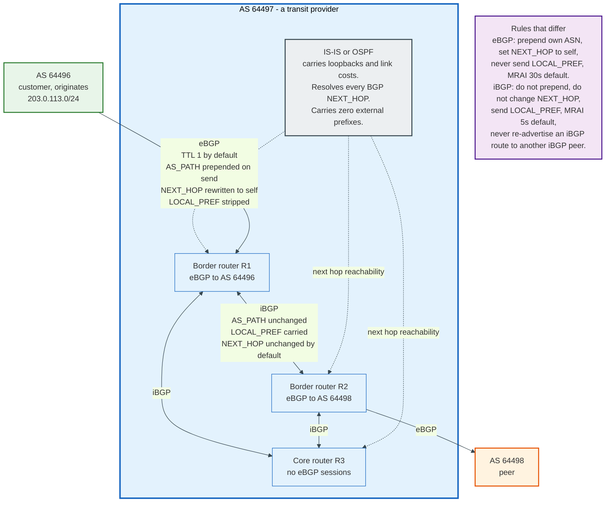

**eBGP** runs between routers in different autonomous systems, normally directly connected. The sender prepends its own AS number to AS_PATH, rewrites NEXT_HOP to its own interface address, and strips LOCAL_PREF because that attribute is meaningless outside the AS that set it. The TTL on eBGP packets is 1 by default, so a session between non-adjacent routers requires explicit multihop configuration. The default MinRouteAdvertisementIntervalTimer is 30 seconds.

**iBGP** runs between routers inside the same AS. The sender does not prepend, so AS_PATH is unchanged. NEXT_HOP is passed through unmodified, which means the receiving router must be able to reach an address inside a neighbouring AS, normally solved by the sending border router rewriting NEXT_HOP to its own loopback. LOCAL_PREF is carried, because that is how policy is communicated internally. The default MRAI is 5 seconds.

The consequential rule is the last one. Because AS_PATH does not change inside an AS, it cannot detect an internal loop, so RFC 4271 forbids re-advertising an iBGP-learned route to another iBGP peer. Every iBGP speaker must therefore hear every route directly from the router that learned it, which means a full mesh of n(n-1)/2 sessions. At 50 routers that is 1,225 sessions. At 200 routers it is 19,900.

Nobody builds that. Section 8 explains what they build instead.

### 3.3 The Business Relationships That Drive Policy

Three relationship types explain almost every routing policy on the internet, and none of them appear in the protocol.

**Customer.** The customer pays. The provider accepts the customer's routes, announces them to everyone, and gives the customer a full table or a default route. Customer routes get the highest LOCAL_PREF, typically 200 in a scheme where the default is 100, because carrying that traffic earns money.

**Peer.** Two networks exchange traffic destined for each other and each other's customers, and neither pays. Peer routes get a middle LOCAL_PREF, typically 100. A peer's routes are announced to customers but never to other peers or to providers, because doing so would mean carrying transit traffic for free.

**Provider.** The network pays. Provider routes get the lowest LOCAL_PREF, typically 50, because using them costs money. Provider routes are announced only to customers.

These three rules produce the valley-free property: a legitimate AS path goes up from the origin through providers, optionally crosses one peer link at the top, and comes back down through customers. It never goes down and then up again. A path that does is a route leak, and RFC 7908 classifies six varieties of it.

The protocol has no idea any of this exists. It is all local configuration, and when the configuration is wrong the internet finds out.

---

## 4. Key Participants and Roles

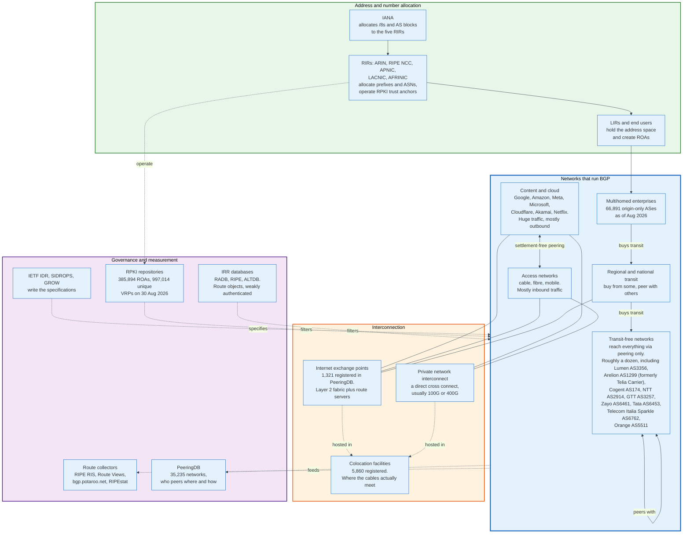

### 4.1 The Actors

| Role | What it does | Runs BGP? | Holds authority over routes? |
|------|--------------|-----------|------------------------------|
| **IANA** | Allocates address blocks and ASN blocks to RIRs | No | Only as the root of the allocation chain |
| **Regional Internet Registry** | Allocates prefixes and ASNs, operates an RPKI certificate authority | No | Yes, as the RPKI trust anchor for its region |
| **Address holder** | Owns the right to originate a prefix, publishes ROAs | Sometimes | Yes, cryptographically, if it publishes ROAs |
| **Transit provider** | Sells reachability to the whole internet | Yes, heavily | Only over what it accepts and announces |
| **Transit-free network** | Reaches every destination through peering alone | Yes | Same |
| **Content and cloud network** | Originates large traffic volumes, peers aggressively | Yes | Over its own prefixes |
| **Access network** | Connects end users, mostly receives traffic | Yes | Over its own prefixes |
| **Internet exchange point** | Operates a layer 2 fabric and usually a route server | Route server only | No, and RFC 7947 says it must not act as if it did |
| **Route server** | Redistributes routes between IXP members without inserting itself in the path | Yes | No |
| **IRR database** | Publishes route and AS-set objects used to build filters | No | Weakly, by convention |
| **RPKI repository** | Publishes signed ROAs, manifests, CRLs | No | Yes, cryptographically |
| **Relying party software** | Validates the RPKI and feeds VRPs to routers over RTR | No | Yes, in effect |
| **Route collector** | Peers passively and archives every update | Yes, receive only | No |

### 4.2 The Two Roles That Decide Whether the System Is Safe

**The transit provider is the only party that can stop a hijack.** A hijacker announces a prefix to its own upstream. Whether that announcement reaches the world depends entirely on whether the upstream filters it. If the upstream applies a prefix filter built from the customer's registered route objects, the announcement dies at the first hop. If it does not, the announcement propagates globally in seconds.

Every incident in section 15 has the same shape. The hijacker is a small network. The damage is caused by a large one that accepted whatever its customer said. Pakistan Telecom's announcement reached the world through PCCW Global. DQE Communications' leak reached the world through Verizon. Rostelecom's leak reached the world through Rascom, Cogent, and Level 3.

Filtering is a cost centre with no revenue attached, which is precisely why it is done inconsistently.

**The address holder is the only party who can assert the truth.** No provider knows for certain which AS is entitled to originate a given prefix. Only the holder does. RPKI exists to let that holder publish a signed statement, and 63.9% of advertised IPv4 address space had one on 30 August 2026. The remaining 35.7% is unknowable to a validator, and a hijack of it cannot be distinguished from a legitimate announcement by any automated means.

The people who can act and the people who know are different people. That is the structural problem.

---

## 5. The Four Message Types and Session Establishment

### 5.1 The Common Header

Every BGP message begins with a 19-octet header, and the shape of it is a fossil of 1989.

```
 0                   1                   2                   3
 0 1 2 3 4 5 6 7 8 9 0 1 2 3 4 5 6 7 8 9 0 1 2 3 4 5 6 7 8 9 0 1
+-+-+-+-+-+-+-+-+-+-+-+-+-+-+-+-+-+-+-+-+-+-+-+-+-+-+-+-+-+-+-+-+
|                                                               |
+                                                               +
|                                                               |
+                                                               +
|                           Marker                              |
+                        16 octets, all ones                    +
|                                                               |
+-+-+-+-+-+-+-+-+-+-+-+-+-+-+-+-+-+-+-+-+-+-+-+-+-+-+-+-+-+-+-+-+
|          Length (2 octets)    |  Type (1)     |
+-+-+-+-+-+-+-+-+-+-+-+-+-+-+-+-+-+-+-+-+-+-+-+-+
```

The Marker is 16 octets of 0xFF. In BGP-3 it carried authentication data; RFC 4271 requires it to be all ones and uses it only for message framing and resynchronisation. Sixteen bytes of padding on every KEEPALIVE, forever, because removing it would break every implementation.

Length is a 2-octet unsigned integer covering the whole message including the header. RFC 4271 constrains it to between 19 and 4096. RFC 8654, published October 2019, raises the ceiling to 65535 for every message type except OPEN and KEEPALIVE when both peers advertise capability code 6, which became necessary once route servers and BGP-LS started producing attribute sets that would not fit. UPDATE, NOTIFICATION and ROUTE-REFRESH all gain the larger ceiling. OPEN and KEEPALIVE stay capped at 4096, because a speaker must be able to parse them before it knows whether the capability was negotiated.

Type is one octet. There are five values in use.

| Type | Name | Minimum size | Defined in |
|------|------|--------------|-----------|
| 1 | OPEN | 29 octets | RFC 4271 |
| 2 | UPDATE | 23 octets | RFC 4271 |
| 3 | NOTIFICATION | 21 octets | RFC 4271 |
| 4 | KEEPALIVE | 19 octets | RFC 4271 |
| 5 | ROUTE-REFRESH | 23 octets | RFC 2918 |

```mermaid
%%{init: {'theme': 'base', 'themeVariables': {'primaryColor': '#e3f2fd', 'primaryBorderColor': '#1565c0', 'lineColor': '#37474f'}}}%%

flowchart TB
    Hdr["BGP message header, 19 octets<br/>Marker 16 octets of 0xFF, Length 2 octets, Type 1 octet<br/>Length: 19 to 4096, or to 65535 with RFC 8654 capability 6"]

    subgraph Open["Type 1: OPEN, minimum 29 octets"]
        direction TB
        O1["Version, 1 octet, always 4"]
        O2["My Autonomous System, 2 octets<br/>23456 if the real ASN is 32-bit"]
        O3["Hold Time, 2 octets<br/>proposed; the lower of the two wins.<br/>0 or 3 or more. 1 and 2 are illegal."]
        O4["BGP Identifier, 4 octets<br/>a router ID, not necessarily an address"]
        O5["Optional Parameters Length, 1 octet"]
        O6["Optional Parameters: capabilities per RFC 5492<br/>1 multiprotocol, 2 route refresh, 6 extended message,<br/>7 BGPsec, 9 role, 64 graceful restart, 65 four-octet AS,<br/>69 ADD-PATH"]
    end

    subgraph Upd["Type 2: UPDATE, minimum 23 octets"]
        direction TB
        U1["Withdrawn Routes Length, 2 octets"]
        U2["Withdrawn Routes: prefixes as length plus<br/>only the significant octets"]
        U3["Total Path Attribute Length, 2 octets"]
        U4["Path Attributes: flags, type code, length, value"]
        U5["NLRI: the prefixes this attribute set applies to.<br/>No length field; it is whatever remains."]
    end

    subgraph Notif["Type 3: NOTIFICATION, minimum 21 octets"]
        direction TB
        N1["Error code, 1 octet"]
        N2["Error subcode, 1 octet"]
        N3["Data, variable"]
        N4["Sending it always closes the session.<br/>There is no recoverable error in base BGP.<br/>RFC 7606 later added treat-as-withdraw."]
    end

    subgraph Keep["Type 4: KEEPALIVE, exactly 19 octets"]
        direction TB
        K1["Header only. No payload.<br/>Sent every KeepaliveTime,<br/>default one third of HoldTime."]
    end

    subgraph RR["Type 5: ROUTE-REFRESH, 23 octets"]
        direction TB
        RR1["AFI 2 octets, Reserved 1 octet, SAFI 1 octet.<br/>Asks the peer to resend its Adj-RIB-Out<br/>so a policy change can be applied<br/>without bouncing the session."]
    end

    Hdr --> Open
    Hdr --> Upd
    Hdr --> Notif
    Hdr --> Keep
    Hdr --> RR

    style Hdr fill:#e3f2fd,stroke:#1565c0,stroke-width:3px
    style Open fill:#e8f5e9,stroke:#2e7d32,stroke-width:2px
    style Upd fill:#fff3e0,stroke:#e65100,stroke-width:2px
    style Notif fill:#ffebee,stroke:#b71c1c,stroke-width:2px
    style Keep fill:#eceff1,stroke:#37474f,stroke-width:2px
    style RR fill:#f3e5f5,stroke:#4a148c,stroke-width:2px
```

### 5.2 OPEN

OPEN is sent once, immediately after the TCP connection comes up, and it is where every negotiation happens.

The fields are Version (1 octet, always 4), My Autonomous System (2 octets), Hold Time (2 octets), BGP Identifier (4 octets), Optional Parameters Length (1 octet), and Optional Parameters. Minimum length 29 octets.

Three fields carry weight. **My Autonomous System** is two octets, which is why AS_TRANS exists: a 32-bit AS puts 23456 here and its real number in the four-octet AS capability. **Hold Time** is a proposal, and the session uses the smaller of the two values offered; 0 means "never time out," and 1 and 2 are illegal values that must be rejected with subcode 6. **BGP Identifier** is a 4-octet router ID that must be unique within the AS and is used as a tiebreaker in the decision process and in connection collision resolution.

Optional Parameters in practice means capabilities, defined by RFC 5492. Capability code 1 is multiprotocol support carrying an AFI and SAFI pair; without it the session carries IPv4 unicast only. Code 2 is route refresh. Code 6 is extended messages. Code 7 is BGPsec. Code 9 is the RFC 9234 role. Code 64 is graceful restart. Code 65 is four-octet AS support. Code 69 is ADD-PATH from RFC 7911, which allows advertising more than one path for the same prefix. RFC 9072, July 2021, extends the Optional Parameters Length beyond one octet, because capability lists outgrew 255 bytes.

A capability the peer does not recognise is ignored, not fatal. A speaker that requires a capability its peer did not advertise may close the session with an OPEN error, subcode 7 Unsupported Capability, defined by RFC 5492 section 5, whose Data field lists the capabilities it needed. Subcode 4, Unsupported Optional Parameter, covers an unrecognised Optional Parameter Type, which is a different failure.

### 5.3 UPDATE

UPDATE is the only message that carries routing information, and its structure is unusual: withdrawals and announcements travel in the same message, and the announcement's prefix list has no length field.

Layout: Withdrawn Routes Length (2 octets), Withdrawn Routes (variable), Total Path Attribute Length (2 octets), Path Attributes (variable), Network Layer Reachability Information (variable). Minimum 23 octets, which is a header plus two zero length fields, and is the encoding of a message that withdraws nothing and announces nothing.

The NLRI has no explicit length because it occupies whatever remains after the header, the withdrawals, and the attributes. Its length is computed by subtraction: `NLRI length = Message Length - 23 - Withdrawn Routes Length - Total Path Attribute Length`.

Prefixes are encoded compactly. One octet of prefix length, then only the significant octets of the prefix, rounded up to a whole octet. 203.0.113.0/24 encodes as four octets: `18` for the length 24, then `CB 00 71` for the address. A /8 takes two octets, a /32 takes five, and the default route 0.0.0.0/0 is a single zero octet.

One UPDATE carries exactly one set of path attributes, so all prefixes in its NLRI share the same AS_PATH, NEXT_HOP, and communities. Grouping prefixes that share attributes is the main packing optimisation in every implementation, and it is why a full table transfer is far fewer messages than prefixes: on 30 August 2026 the AS6447 FIB's 1,121,721 entries used only 136,185 distinct AS paths, so every prefix sharing an attribute set packs into one UPDATE.

### 5.4 NOTIFICATION and KEEPALIVE

NOTIFICATION means the session is over. There is no recoverable error in base BGP: the sender transmits an error code, a subcode, and optional data, then closes the TCP connection, discards the Adj-RIB-In, and withdraws every route learned from that peer.

| Code | Meaning | Subcodes of note |
|------|---------|------------------|
| 1 | Message Header Error | 1 Connection Not Synchronized, 2 Bad Message Length, 3 Bad Message Type |
| 2 | OPEN Message Error | 1 Unsupported Version, 2 Bad Peer AS, 3 Bad BGP Identifier, 4 Unsupported Optional Parameter, 6 Unacceptable Hold Time, 7 Unsupported Capability (RFC 5492), 11 Role Mismatch (RFC 9234) |
| 3 | UPDATE Message Error | 1 Malformed Attribute List, 2 Unrecognized Well-known Attribute, 3 Missing Well-known Attribute, 4 Attribute Flags Error, 5 Attribute Length Error, 6 Invalid ORIGIN, 8 Invalid NEXT_HOP, 9 Optional Attribute Error, 10 Invalid Network Field, 11 Malformed AS_PATH |
| 4 | Hold Timer Expired | none |
| 5 | Finite State Machine Error | subcodes added by RFC 6608 |
| 6 | Cease | 1 Maximum Prefixes Reached, 2 Administrative Shutdown, 3 Peer De-configured, 4 Administrative Reset, 5 Connection Rejected, 6 Other Configuration Change, 7 Connection Collision Resolution, 8 Out of Resources, 9 Hard Reset (RFC 8538), 10 BFD Down (RFC 9384) |
| 7 | ROUTE-REFRESH Message Error | RFC 7313 |
| 8 | Send Hold Timer Expired | RFC 9687 |

The tear-everything-down response to a malformed attribute was a real operational hazard: a single bad attribute originated anywhere could reset sessions across the internet as it propagated. RFC 7606 fixed the general case in 2015 by introducing "treat-as-withdraw," where a router with a malformed attribute discards the affected routes and keeps the session. RFC 9774 in May 2025 applies exactly that handling to AS_SET and AS_CONFED_SET.

KEEPALIVE is 19 bytes of header and nothing else. It is sent every KeepaliveTime, whose suggested default in RFC 4271 is one third of the negotiated HoldTime. If no KEEPALIVE or UPDATE arrives within HoldTime, the session dies with error code 4.

RFC 9687, November 2024, adds the mirror image. A speaker that cannot push data to a peer, typically because the peer has advertised a zero TCP receive window and stopped reading, previously waited forever while its routes went stale everywhere else. The SendHoldTimer, defaulting to the greater of 8 minutes or twice the HoldTime, now closes such a session with error code 8.

### 5.5 The Finite State Machine

BGP has six states, and the two that look alike are the ones that confuse people.

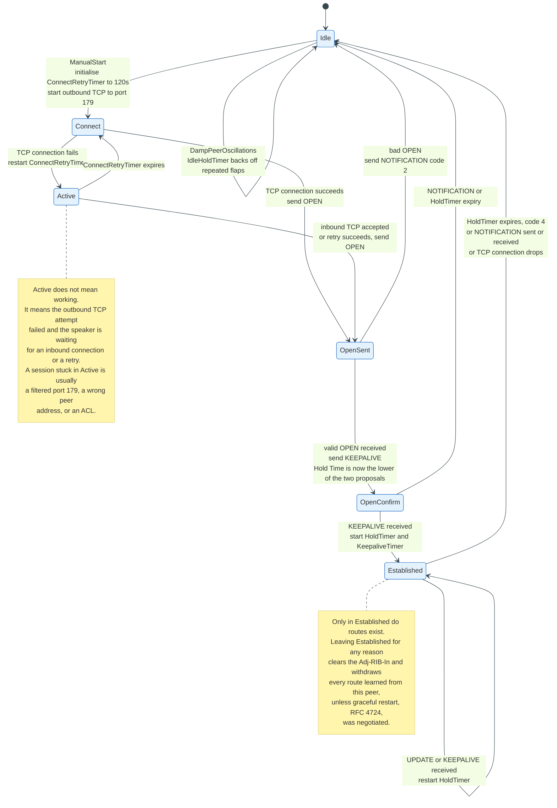

**Idle** refuses all incoming connections and starts nothing. **Connect** is waiting for an outbound TCP handshake. **Active** is the confusing one: it means the outbound attempt failed and the speaker is listening for an inbound connection or waiting for ConnectRetryTimer. A session flapping between Connect and Active is almost always a blocked port 179, a wrong neighbour address, or an access list.

**OpenSent** has sent its OPEN and is waiting for the peer's. **OpenConfirm** has exchanged OPENs and is waiting for the first KEEPALIVE. **Established** is the only state in which UPDATE messages are legal and routes exist.

Timers, with RFC 4271 section 10 suggested defaults:

| Timer | Suggested default | What it does |
|-------|-------------------|--------------|
| ConnectRetryTime | 120 seconds | Interval between TCP connection attempts |
| HoldTime | 90 seconds | Session dies if nothing arrives within it |
| KeepaliveTime | one third of HoldTime, so 30 seconds | KEEPALIVE transmission interval |
| MinASOriginationIntervalTimer | 15 seconds | Rate limit on advertising one's own routes |
| MinRouteAdvertisementIntervalTimer, eBGP | 30 seconds | Rate limit per prefix per peer |
| MinRouteAdvertisementIntervalTimer, iBGP | 5 seconds | Same, internally |
| SendHoldTime, RFC 9687 | max(8 minutes, 2 x HoldTime) | Closes a session that cannot be written to |

Vendor defaults differ from the RFC. Cisco IOS ships a 180 second hold time and a 60 second keepalive; Junos ships 90 and 30, matching RFC 4271. Jitter is applied by multiplying each timer by a uniformly random factor between 0.75 and 1.0, so that a network of routers restarted together does not synchronise its KEEPALIVEs.

---

## 6. Path Attributes

### 6.1 The Encoding and the Four Flag Bits

Every path attribute is a triple of flags, type code, and value, and the flags decide what a router does with an attribute it does not understand.

```
+-------+-------+-----------------+
| Flags | Type  | Length (1 or 2) | Value ...
| 1 oct | 1 oct |                 |
+-------+-------+-----------------+

Flags bit 0 (0x80)  Optional     0 = well-known, 1 = optional
Flags bit 1 (0x40)  Transitive   0 = drop if not understood, 1 = pass on
Flags bit 2 (0x20)  Partial      set when an optional transitive attribute
                                 has been passed on by a router that did
                                 not understand it
Flags bit 3 (0x10)  Extended     0 = 1-octet length, 1 = 2-octet length
Flags bits 4 to 7                must be zero
```

Four categories follow from the first two bits, and they are the whole extensibility story of BGP.

**Well-known mandatory.** ORIGIN, AS_PATH, NEXT_HOP. Every implementation must understand them and every UPDATE that announces a route must carry them. A missing one is an UPDATE error with subcode 3.

**Well-known discretionary.** LOCAL_PREF, ATOMIC_AGGREGATE. Every implementation must understand them; not every UPDATE carries them.

**Optional transitive.** COMMUNITIES, LARGE_COMMUNITY, AGGREGATOR, AS4_PATH, OTC. A router that does not understand one passes it along unchanged and sets the Partial bit. This is how new features cross networks running old code, and it is also how attributes accumulate.

**Optional non-transitive.** MULTI_EXIT_DISC, MP_REACH_NLRI, MP_UNREACH_NLRI, ORIGINATOR_ID, CLUSTER_LIST. A router that does not understand one drops it. MED is non-transitive on purpose: it is meaningful only between two directly connected ASes.

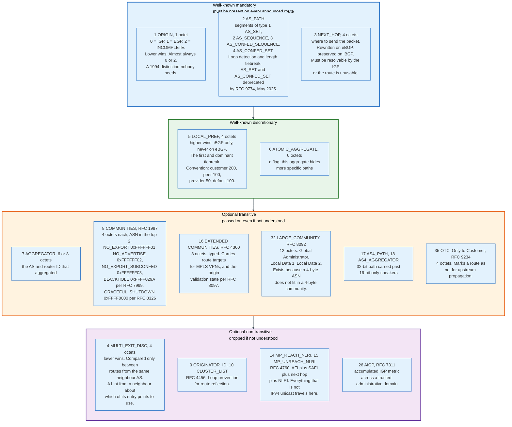

### 6.2 AS_PATH

AS_PATH is the loop prevention mechanism, the length tiebreaker, and the only record of where a route has been. It is a sequence of segments, each with a type, a count, and a list of AS numbers.

Segment type 1 is AS_SET, an unordered set produced by aggregation. Type 2 is AS_SEQUENCE, the ordered list that makes up almost every real path. Types 3 and 4 are AS_CONFED_SEQUENCE and AS_CONFED_SET, used inside confederations and stripped at the confederation boundary.

An eBGP speaker prepends its own AS number to the leftmost position before sending. An iBGP speaker does not. A speaker that receives an UPDATE containing its own AS number in AS_PATH discards the route. That is the entire loop prevention algorithm, and it works because AS numbers are globally unique.

AS path prepending is the standard inbound traffic engineering tool: announce the same prefix with your own AS listed two or three extra times, and every network that reaches step four of the decision process without a stronger preference will pick the shorter alternative. On 30 August 2026 the AS6447 table held 2,165,467 unique AS paths, which expand to 2,339,067 once each prepended repetition is counted as distinct, and 629,588 of those paths use prepending, affecting 126,786 prefixes. It is also unreliable, because any network that sets LOCAL_PREF never reaches the path length comparison.

RFC 9774, May 2025, deprecates AS_SET and AS_CONFED_SET outright. Speakers must not originate them, and must apply treat-as-withdraw to routes containing them. The reason is empirical: aggregation with AS_SETs was rare, and where it existed it was usually wrong, frequently containing a single AS, reserved AS numbers, or duplicates of ASes already in the sequence.

### 6.3 NEXT_HOP

NEXT_HOP is four octets naming where to send the packet, and misunderstanding its scoping rules causes more broken labs than any other attribute.

On eBGP, the sender normally sets NEXT_HOP to its own address on the shared subnet. On iBGP, the attribute is carried unchanged, which means a core router deep inside AS 64497 receives routes whose next hop is an address inside AS 64496. If the IGP does not carry that address, the route fails next hop resolution and is never installed, no matter how good the rest of its attributes are.

Two answers exist. Configure `next-hop-self` on the border router so it rewrites NEXT_HOP to its own loopback before sending into iBGP, which is what almost everyone does. Or redistribute the external subnets into the IGP, which works and pollutes the IGP.

At an internet exchange there is a third case. A route server per RFC 7947 must not modify NEXT_HOP, because the traffic must flow directly between the two member routers on the exchange fabric, not through the route server. The route server is in the control plane only. Traffic that transits a route server means someone has misconfigured NEXT_HOP.

### 6.4 LOCAL_PREF and MED

LOCAL_PREF and MED are mirror images: one expresses your preference to your own network, the other expresses your neighbour's preference to you. Higher LOCAL_PREF wins; lower MED wins.

**LOCAL_PREF** is four octets, well-known discretionary, and never crosses an eBGP session. It is set by inbound policy at the border, propagated by iBGP, and compared before anything else in the decision process. Its normal use is encoding the commercial relationship, and the conventional scheme is customer 200, peer 100, provider 50. Because it dominates, a network can make itself prefer a longer path for money and no other network can tell.

**MULTI_EXIT_DISC** is four octets, optional non-transitive, and is a request rather than an instruction. When two ASes connect at more than one location, the announcing AS attaches a lower MED to the entry point it would prefer to receive traffic on. The receiving AS is free to ignore it entirely, and many do, because accepting MED means letting a neighbour spend your money on backhaul.

MED comparison has a defect that RFC 4451 documents at length. RFC 4271 compares MED only between routes learned from the same neighbouring AS, which makes the comparison non-transitive: the result of the decision process can depend on the order in which routes were received. Vendors offer `always-compare-med` to force a total order, and `deterministic-med` to remove the order dependence. Both change the outcome, and neither is universal.

Missing MED is treated as zero, the best possible value, by RFC 4271. Several implementations default to the opposite, treating missing MED as the worst. The behaviour is configurable, differs by vendor, and is a reliable source of asymmetric routing between two networks that each believe they are following the standard.

### 6.5 Communities

Communities turn routing policy into a data plane a customer can drive, and they are the reason large networks can offer policy features without touching a router configuration per customer.

**RFC 1997 communities** are four octets, conventionally written as two 16-bit halves, `ASN:value`. Three well-known values are defined: NO_EXPORT (0xFFFFFF01), which stops a route at the AS boundary; NO_ADVERTISE (0xFFFFFF02), which stops it at the receiving router; and NO_EXPORT_SUBCONFED (0xFFFFFF03), which stops it at a confederation member-AS boundary. RFC 7999 added BLACKHOLE (0xFFFF029A), which asks the receiving network to discard traffic to the tagged prefix, the standard mechanism for shedding a denial of service attack upstream. RFC 8326 added GRACEFUL_SHUTDOWN (0xFFFF0000), which asks receivers to set the lowest possible LOCAL_PREF so traffic drains off a link before planned maintenance.

Beyond the well-known values, every operator defines its own. A typical transit provider publishes a table like `64497:100` to set LOCAL_PREF 100, `64497:1001` to prepend once towards a named peer, `64497:3000` to not announce to a named region. The customer tags its announcement; the provider's inbound policy reads the tag and acts. This is a public API implemented in a path attribute.

**RFC 8092 large communities** exist because of arithmetic. A four-octet community cannot hold a four-octet AS number and a value. Extended communities are six octets of usable space and cannot either. Large communities are twelve octets: a four-octet Global Administrator, which is the ASN, and two four-octet local data fields. Any network with a 32-bit ASN that wants a community scheme has to use them.

**RFC 4360 extended communities** are eight octets and typed. Outside MPLS VPNs, where they carry route targets, the relevant use here is RFC 8097, which defines an extended community that carries the RPKI origin validation state so a validating border router can tell non-validating internal routers what it found.

---

## 7. The Best Path Selection Algorithm, Step by Step

### 7.1 What the RFC Actually Says

RFC 4271 splits route selection into three phases, and only the second contains the famous algorithm.

Phase 1, section 9.1.1, computes a degree of preference for each newly received route. For a route from an internal peer, the degree of preference is the LOCAL_PREF value, or a locally computed value. For a route from an external peer, it is computed from local policy, and whatever the policy returns must be used as the LOCAL_PREF when the route is readvertised into iBGP.

Phase 2, section 9.1.2, selects one best route per destination. Where several routes tie on degree of preference, section 9.1.2.2 applies seven tiebreakers in a fixed order, stopping as soon as one route remains:

> a) Remove from consideration all routes that are not tied for having the smallest number of AS numbers present in their AS_PATH attributes. Note that when counting this number, an AS_SET counts as 1, no matter how many ASes are in the set.
>
> b) Remove from consideration all routes that are not tied for having the lowest Origin number in their Origin attribute.
>
> c) Remove from consideration routes with less-preferred MULTI_EXIT_DISC attributes. MULTI_EXIT_DISC is only comparable between routes learned from the same neighboring AS.
>
> d) If at least one of the candidate routes was received via EBGP, remove from consideration all routes that were received via IBGP.
>
> e) Remove from consideration any routes with less-preferred interior cost. The interior cost of a route is determined by calculating the metric to the NEXT_HOP for the route using the Routing Table.
>
> f) Remove from consideration all routes other than the route that was advertised by the BGP speaker with the lowest BGP Identifier value.
>
> g) Prefer the route received from the lowest peer address.

Phase 3, section 9.1.3, disseminates the selected routes to peers according to export policy.

### 7.2 What Implementations Actually Do

Vendors implement a longer list that starts before the RFC's list and ends after it. The FRRouting documentation describes fourteen steps; Cisco's published order is thirteen; Junos is similar with different names. The consolidated order below is what a modern implementation runs; steps 4 through 13 are the RFC's a through g, with vendor extensions inserted at steps 9, 10 and 12. Step 11 is the RFC's f, and step 13 is its g.

```mermaid
%%{init: {'theme': 'base', 'themeVariables': {'primaryColor': '#e3f2fd', 'primaryBorderColor': '#1565c0', 'lineColor': '#37474f'}}}%%

flowchart TB
    Start["Candidate routes for one prefix<br/>in the Adj-RIBs-In"]
    S0{"Is NEXT_HOP resolvable<br/>in the routing table?"}
    Drop["Route is not a candidate.<br/>Never installed, never advertised.<br/>The most common cause of<br/>'the route is there but not used'."]
    S1{"1. Highest WEIGHT<br/>Cisco only, local to the router,<br/>never advertised. Default 0,<br/>32768 for locally originated."}
    S2{"2. Highest LOCAL_PREF<br/>the dominant policy knob.<br/>Customer 200 beats peer 100<br/>beats provider 50."}
    S3{"3. Locally originated<br/>network statement or redistribution<br/>beats anything learned"}
    S4{"4. Shortest AS_PATH<br/>AS_SET counts as 1.<br/>Confederation segments<br/>do not count."}
    S5{"5. Lowest ORIGIN<br/>IGP 0 beats EGP 1<br/>beats INCOMPLETE 2"}
    S6{"6. Lowest MED<br/>only between routes from<br/>the same neighbour AS,<br/>unless always-compare-med"}
    S7{"7. eBGP beats iBGP"}
    S8{"8. Lowest IGP metric<br/>to the NEXT_HOP.<br/>This is hot potato routing:<br/>hand the packet off at the<br/>nearest exit."}
    S9{"9. Multipath?<br/>install several if configured<br/>and the tie is exact"}
    S10{"10. Oldest eBGP route<br/>stability heuristic, not in RFC 4271.<br/>Prefers the incumbent to avoid<br/>churn on every reconvergence."}
    S11{"11. Lowest BGP Identifier<br/>or ORIGINATOR_ID if<br/>the route was reflected"}
    S12{"12. Shortest CLUSTER_LIST<br/>fewest reflection hops"}
    S13["13. Lowest neighbour address<br/>final deterministic tiebreak"]
    Best["Best path<br/>installed in Loc-RIB,<br/>offered to export policy,<br/>programmed into the FIB"]

    Start --> S0
    S0 -->|"no"| Drop
    S0 -->|"yes"| S1
    S1 -->|"tie"| S2 -->|"tie"| S3 -->|"tie"| S4 -->|"tie"| S5
    S5 -->|"tie"| S6 -->|"tie"| S7 -->|"tie"| S8 -->|"tie"| S9
    S9 -->|"tie"| S10 -->|"tie"| S11 -->|"tie"| S12 -->|"tie"| S13
    S13 --> Best
    S1 -->|"winner"| Best
    S2 -->|"winner"| Best
    S4 -->|"winner"| Best
    S8 -->|"winner"| Best

    style Start fill:#e3f2fd,stroke:#1565c0,stroke-width:2px
    style Drop fill:#ffebee,stroke:#b71c1c,stroke-width:2px
    style S2 fill:#e8f5e9,stroke:#2e7d32,stroke-width:3px
    style S4 fill:#fff3e0,stroke:#e65100,stroke-width:2px
    style S8 fill:#fff3e0,stroke:#e65100,stroke-width:2px
    style Best fill:#f3e5f5,stroke:#4a148c,stroke-width:3px
```

### 7.3 The Four Steps That Decide Real Traffic

**Next hop resolution comes before everything.** A route whose NEXT_HOP is unreachable in the routing table is not a candidate at all. It sits in the Adj-RIB-In, visible in `show bgp` output, and is never used. Most "the route is in BGP but traffic does not follow it" problems end here.

**LOCAL_PREF decides between business relationships.** Because it is compared second and is set by hand, it overrides every topological consideration. A network with a customer route and a peer route for the same prefix uses the customer route, even if the customer path is four AS hops longer, because the customer pays for the traffic and the peer does not.

**AS_PATH length decides between equals.** Once LOCAL_PREF ties, which is the normal case within a single relationship class, path length picks the winner. This is the only step in the algorithm that behaves the way a naive reading of BGP suggests it always behaves.

**IGP metric to the next hop implements hot potato routing.** When two exits from your network lead to the same destination through the same neighbour, you pick the exit that is closest to you in your own IGP, which means you hand the packet to your neighbour as early as possible and they carry it the rest of the way. This minimises your own backhaul cost and maximises theirs, which is why MED exists: MED is your neighbour asking you not to do that. Setting the same MED on all announcements, or ignoring MED entirely, is a commercial decision dressed as a routing configuration.

### 7.4 Longest Prefix Match Sits Above All of It

The decision process runs per destination prefix, and the forwarding decision runs on the longest match. These are different things, and confusing them explains most hijacks.

BGP selects one best path for 203.0.113.0/24 and one best path for 203.0.113.0/23. Both are installed. A packet to 203.0.113.5 matches both and is forwarded according to the /24, because the forwarding plane always uses the most specific match. No attribute, no LOCAL_PREF, no path length can make a /23 beat a /24 for an address inside the /24.

That is why an attacker announcing a more specific prefix wins everywhere, regardless of AS path length or policy, and why the standard emergency response to a hijack is to announce something more specific still. YouTube's response to Pakistan Telecom in 2008 was exactly this: after the /24 announcement failed to displace the hijack everywhere, YouTube announced two /25s at 20:18 UTC, and those won by longest match wherever they were accepted.

It is also why /24 is the effective floor for IPv4 on the public internet. Almost every network filters anything longer, because accepting /25s and beyond would multiply the table and hand attackers a sharper tool. RFC 7454 records the practice: IPv4 prefixes longer than /24 and IPv6 prefixes longer than /48 are generally neither announced nor accepted.

---

## 8. Scaling iBGP: Route Reflectors and Confederations

### 8.1 The Arithmetic That Forces the Problem

A full mesh of iBGP sessions grows as n(n-1)/2, and the number becomes unmanageable long before the network does.

| Routers | iBGP sessions in a full mesh |
|---------|------------------------------|
| 10 | 45 |
| 25 | 300 |
| 50 | 1,225 |
| 100 | 4,950 |
| 200 | 19,900 |
| 500 | 124,750 |

The session count is not the only cost. Each speaker holds an Adj-RIB-In per peer, so memory grows with peers times routes. Adding one router to a 200-router mesh means touching 200 configurations. And every router must maintain 199 TCP connections whose keepalives and update generation all consume CPU.

Two mechanisms relax the full mesh requirement, and they solve it in opposite ways.

```mermaid
%%{init: {'theme': 'base', 'themeVariables': {'primaryColor': '#e3f2fd', 'primaryBorderColor': '#1565c0', 'lineColor': '#37474f'}}}%%

flowchart TB
    subgraph Mesh["Full mesh iBGP<br/>RFC 4271 baseline"]
        direction TB
        M1["Every speaker peers with<br/>every other speaker"]
        M2["n(n-1)/2 sessions.<br/>50 routers = 1,225 sessions.<br/>200 routers = 19,900."]
        M3["Rule that forces it:<br/>an iBGP-learned route is never<br/>re-advertised to another iBGP peer,<br/>because AS_PATH does not change<br/>inside an AS and cannot detect a loop."]
    end

    subgraph RR["Route reflection<br/>RFC 4456, April 2006"]
        direction TB
        R1["A reflector may re-advertise<br/>iBGP routes, under three rules"]
        R2["From a non-client: reflect to clients only.<br/>From a client: reflect to all clients<br/>and all non-clients.<br/>From eBGP: send to everyone."]
        R3["ORIGINATOR_ID, type 9<br/>the router ID of the originator.<br/>A speaker seeing its own ID ignores the route."]
        R4["CLUSTER_LIST, type 10<br/>each reflector prepends its 4-octet CLUSTER_ID.<br/>A reflector seeing its own ID ignores the route.<br/>Also a tiebreaker: shorter list wins."]
        R5["Cost: the reflector picks one best path<br/>and reflects only that. Clients lose<br/>path diversity. ADD-PATH, RFC 7911,<br/>restores it by advertising several."]
    end

    subgraph Conf["Confederations<br/>RFC 5065, August 2007"]
        direction TB
        C1["Split AS 64497 into member-ASes<br/>65001, 65002, 65003.<br/>Outside world still sees only 64497."]
        C2["Between member-ASes, run eBGP<br/>with iBGP semantics:<br/>LOCAL_PREF is carried,<br/>NEXT_HOP is preserved,<br/>MED may be compared."]
        C3["AS_CONFED_SEQUENCE, segment type 3<br/>AS_CONFED_SET, segment type 4<br/>stripped at the confederation border.<br/>Both deprecated for AS_CONFED_SET<br/>by RFC 9774, May 2025."]
        C4["Full mesh required only inside<br/>each member-AS. Reflectors may<br/>be used there too."]
        C5["Cost: an AS renumbering exercise<br/>and a second layer of policy.<br/>Rare outside networks built before 2006."]
    end

    Mesh -->|"does not scale past<br/>a few dozen routers"| RR
    Mesh -->|"alternative taken by<br/>a few large carriers"| Conf

    style Mesh fill:#ffebee,stroke:#b71c1c,stroke-width:2px
    style RR fill:#e8f5e9,stroke:#2e7d32,stroke-width:3px
    style Conf fill:#fff3e0,stroke:#e65100,stroke-width:2px
```

### 8.2 Route Reflection

Route reflection relaxes one rule and adds two attributes to keep it safe. RFC 4456, April 2006, permits a designated router to re-advertise iBGP-learned routes to other iBGP peers.

The reflector classifies its iBGP peers as clients or non-clients. The reflection rules are:

- A route learned from a **non-client** is reflected to **clients only**.
- A route learned from a **client** is reflected to **all clients and all non-clients**.
- A route learned from an **eBGP peer** is sent to **all iBGP peers**, clients and non-clients alike.

Non-clients must still be fully meshed with each other. Clients need only a session to their reflector, which collapses the session count from n(n-1)/2 to roughly n.

Loop prevention moves into two new optional non-transitive attributes. **ORIGINATOR_ID**, type 9, is four octets carrying the BGP Identifier of the router that first introduced the route into the AS; a speaker that sees its own identifier there ignores the route. **CLUSTER_LIST**, type 10, is a list of four-octet CLUSTER_IDs; each reflector prepends its own before reflecting, and a reflector that finds its own ID in the list ignores the route. CLUSTER_LIST length is also a late tiebreaker in the decision process, at step 12.

Real deployments use a hierarchy: two reflectors per point of presence for redundancy, clients peering with both, and the reflectors peering with each other and with reflectors elsewhere as non-clients. A network of 300 routers might have 12 reflectors and about 600 sessions instead of 44,850.

The cost is path diversity. A reflector runs the decision process, selects one best path, and reflects only that one. Its clients never learn the alternatives, which means a client that would have preferred a different exit cannot, and reconvergence after a failure has to wait for the reflector to reselect. RFC 7911 ADD-PATH, capability 69, addresses this by allowing multiple paths per prefix to be advertised with a path identifier. It is now standard on reflectors in large networks and it multiplies memory consumption accordingly.

### 8.3 Confederations

Confederations split one AS into several, and present the group to the outside world as a single AS. RFC 5065, August 2007, replaced the earlier RFC 3065.

Inside a confederation, member-ASes use private AS numbers such as 65001 and 65002 and peer with each other over sessions that are eBGP in mechanics and iBGP in semantics. AS_PATH gains two segment types: AS_CONFED_SEQUENCE, type 3, and AS_CONFED_SET, type 4. LOCAL_PREF is carried across member-AS boundaries, which plain eBGP forbids. NEXT_HOP is preserved. MED may be compared across member-ASes.

When a route leaves the confederation, all AS_CONFED segments are stripped and the confederation identifier, the real public AS number, is prepended. An outside observer sees one AS hop. Confederation segments do not count towards AS path length in the decision process.

Confederations are rarer than route reflection for a plain reason: adopting one means renumbering the internal topology and running two layers of policy, while adopting reflection means designating a few routers. Most networks that run confederations built them before route reflection was mature, or acquired networks and used confederation boundaries as merger seams.

RFC 9774 deprecated AS_CONFED_SET along with AS_SET in May 2025. AS_CONFED_SEQUENCE remains.

---

## 9. Transit, Peering, and Settlement-Free Interconnection

### 9.1 The Two Ways to Reach the Rest of the Internet

Every network reaches destinations it does not own in exactly one of two ways, and the difference is who pays.

**Transit** is a purchase. The customer pays the provider for reachability to the entire internet, priced per megabit per second per month on a committed rate with burst terms. The provider announces the customer's prefixes to everyone it can reach and gives the customer either a full table or a default route. Transit is the only relationship that provides universal reachability, because the provider's obligation is global.

**Peering** is a swap. Two networks exchange traffic destined for each other and each other's customers, and neither pays. Peering provides reachability only to the peer's own customer cone, not to the whole internet. A network with only peering relationships and no transit is transit-free, and there are roughly a dozen such networks worldwide.

Settlement-free interconnection is the formal name for peering with no money changing hands. It works when the two parties get roughly equal value, and the industry has spent thirty years arguing about what equal means.

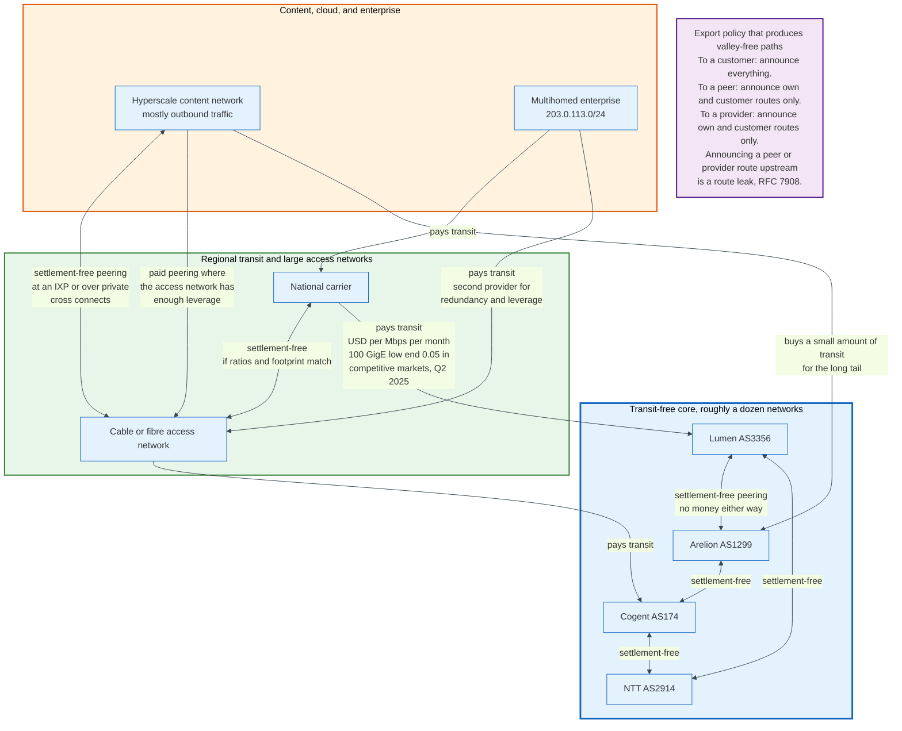

### 9.2 What Transit Costs

IP transit is one of the few technology inputs whose unit price has fallen for thirty consecutive years, and it is now close to free at scale.

TeleGeography's IP Transit Pricing Service, Q2 2025 update, puts the lowest reported price on a 100 GigE port at 0.05 US dollars per megabit per second per month in competitive markets such as Miami, London, and Singapore. The lowest price on a 10 GigE port was 0.07 dollars, unchanged in that quarter. Prices on 400 GigE ports ranged from 0.08 to 0.09 dollars in key United States and European cities, above the 100 GigE figure because 400 GigE is the newer product with thinner supply and fewer competing quotes. The three-year compound annual decline from Q2 2022 to Q2 2025 was 12%. The dataset is a paid subscription, so these figures are checkable only against TeleGeography's own published summaries.

At 0.05 dollars per Mbps per month, a fully utilised 100 gigabit port costs about 5,000 dollars a month, or 60,000 dollars a year, for 100 gigabits of continuous global reachability. That is 0.6 dollars per megabit per year, delivered.

Two things follow. First, transit is no longer the dominant cost for a large network; ports, optics, colocation, cross connects, and people are. Second, the price floor has been reached in the major hubs, and the remaining declines are in markets where new subsea capacity has just landed, notably in Africa and South Asia.

### 9.3 Why Peering Happens Anyway

If transit costs five cents a megabit, the case for peering is not primarily the transit bill. Four other reasons drive it.

**Latency and path length.** A packet handed directly to the destination network crosses one AS boundary instead of three. For interactive traffic and for content delivery, this is the product.

**Control.** A direct interconnect is a link you can monitor, size, and troubleshoot with one phone call. A transit path is three networks you cannot see.

**Volume asymmetry economics.** A content network sends far more than it receives. Its transit bill is driven entirely by outbound volume, and peering removes that volume from the meter.

**Leverage.** Peering relationships are also negotiating positions. The recurring dispute is between a content network that wants free interconnection and an access network that argues it is being asked to build capacity to deliver someone else's product to its own paying customers. That argument produced the Comcast and Level 3 dispute in 2010, the Netflix paid peering agreements with Comcast, Verizon, AT&T, and Time Warner Cable in 2014, and it recurs in European regulatory proceedings on network fee proposals.

Peering policies published in PeeringDB are the visible artefact. They specify required traffic ratios, minimum traffic volumes, the number of geographically diverse interconnection points required, and whether the network peers openly, selectively, or restrictively. Open policies are common among content networks and IXP participants; restrictive policies are the hallmark of transit-free networks, for whom every free peering is a lost sale.

### 9.4 What Running BGP Actually Costs

BGP itself is free. Everything around it is not, and the costs fall into four buckets.

**Router memory and forwarding capacity.** A router carrying the full table needs to hold roughly 1.12 million IPv4 routes and 260,000 IPv6 routes in its RIB, per peer in the Adj-RIB-In, plus one Loc-RIB, plus a forwarding table in hardware. A route collector such as AS6447 held 18,956,023 RIB entries against a 1,121,721-entry FIB on 30 August 2026, a RIB to FIB ratio of 16.9, purely because it has many peers. Hardware forwarding tables are the binding constraint, and their limits are set at purchase time.

**Transit and port charges.** Covered above.

**Interconnection.** An IXP port, a cross connect fee to the colocation operator, and the colocation itself. LINX publishes its list prices, which makes the shape checkable: membership is 100 pounds a month, the access fee on a member's first 10GE port on each LAN is covered by that membership and every further 10GE port costs 80 pounds a month, a 100GE port costs 320, and the peering service on top costs 384 pounds a month for 10 Gbps at LON1 and 2,293 pounds for 100 Gbps. A first 10 gigabit presence at LINX LON1 therefore lists at 484 pounds a month, membership plus service, and a second port on the same LAN adds 80. Cross connect fees are negotiated per facility and are not published as list prices, so the cost of the cable between two cabinets is the one number in this paragraph nobody can look up.

**People.** The largest and least discussed cost. Prefix filters, IRR objects, ROAs, peering negotiations, capacity planning, and incident response are staffed work. The FCC's own regulatory cost estimate for its 2024 BGP proposal assumed 100 work hours per provider at 90.16 dollars an hour to produce a routing security risk management plan, and 2,209 affected providers, of whom it assumed 80% would need one. That yields 15,933,075 dollars, rounded to 16 million, as an annual upper bound rather than a first-year figure, and it is one line inside a 30.8 million dollar annual upper bound for the whole proposal. That is an estimate of the paperwork alone.

---

## 10. Internet Exchange Points and Route Servers

### 10.1 What an IXP Is

An internet exchange point is a layer 2 Ethernet fabric in one or more data centres where any connected network can peer with any other over a single port. It is not a router, does not forward at layer 3, and has no view of the traffic it carries.

The economics are combinatorial. Without an IXP, peering with 50 networks in a city requires 50 cross connects and 50 router ports. With an IXP, it requires one port to the exchange and 50 BGP sessions over that port. The port cost is amortised across every peer, which is why an exchange becomes more valuable the more members it has, and why the largest exchanges keep growing.

PeeringDB listed 1,321 exchanges, 35,235 networks, 5,860 facilities, and 65,744 network-to-exchange connections on 30 August 2026. Member counts at the largest exchanges, from PeeringDB on the same date:

| Exchange | City | Networks connected |
|----------|------|--------------------|
| DE-CIX Frankfurt | Frankfurt | 1,018 |
| AMS-IX | Amsterdam | 859 |
| LINX LON1 | London | 835 |
| France-IX Paris | Paris | 452 |
| SIX Seattle | Seattle | 368 |
| Equinix Ashburn | Ashburn | 346 |
| JPIX Tokyo | Tokyo | 269 |
| HKIX | Hong Kong | 259 |
| DE-CIX Dusseldorf | Dusseldorf | 207 |

Peak traffic figures are reported by the exchanges themselves, are usually aggregates across all of an operator's locations, and are not published on a common date, so they rank exchanges only loosely. AMS-IX's own total-traffic graph at stats.ams-ix.net records a peak of 13.967 Tbps inbound for the month ending 31 August 2026, against a 9.722 Tbps average. IX.br in Brazil reported about 45.8 Tbps in January 2026 from its aggregate statistics page, and DE-CIX about 27.0 Tbps across its locations in March 2026 from its own statistics. Each figure is that operator's own measurement of its own fabric.

### 10.2 Route Servers

A route server is a BGP speaker that redistributes routes between exchange members without becoming part of the forwarding path, and it turns an N-squared problem into an N problem.

Without a route server, peering with 400 networks at an exchange means 400 bilateral BGP sessions to configure and maintain. With one, it means two sessions, one to each of the exchange's redundant route servers, through which the member receives routes from every other participant that also uses the route server.

RFC 7947, September 2016, defines the behaviour: one requirement and one recommendation make it work.

**The route server should not prepend its own AS number to AS_PATH.** Section 2.2.2.1 states this as a SHOULD NOT rather than a MUST NOT, and says why: the weaker word exists solely for backwards compatibility with legacy route server client implementations. A normal eBGP speaker prepends. A route server that did so would insert itself into every path, which would be a lie: it does not carry the traffic. Every production route server follows the recommendation, so its own AS number never appears, and the paths members see are the true ones.

**The route server must not modify NEXT_HOP.** The next hop stays as the advertising member's address on the exchange fabric, so traffic flows directly from member to member across the layer 2 switch. Traffic that transits a route server is a misconfiguration, and route servers are not built to forward it.

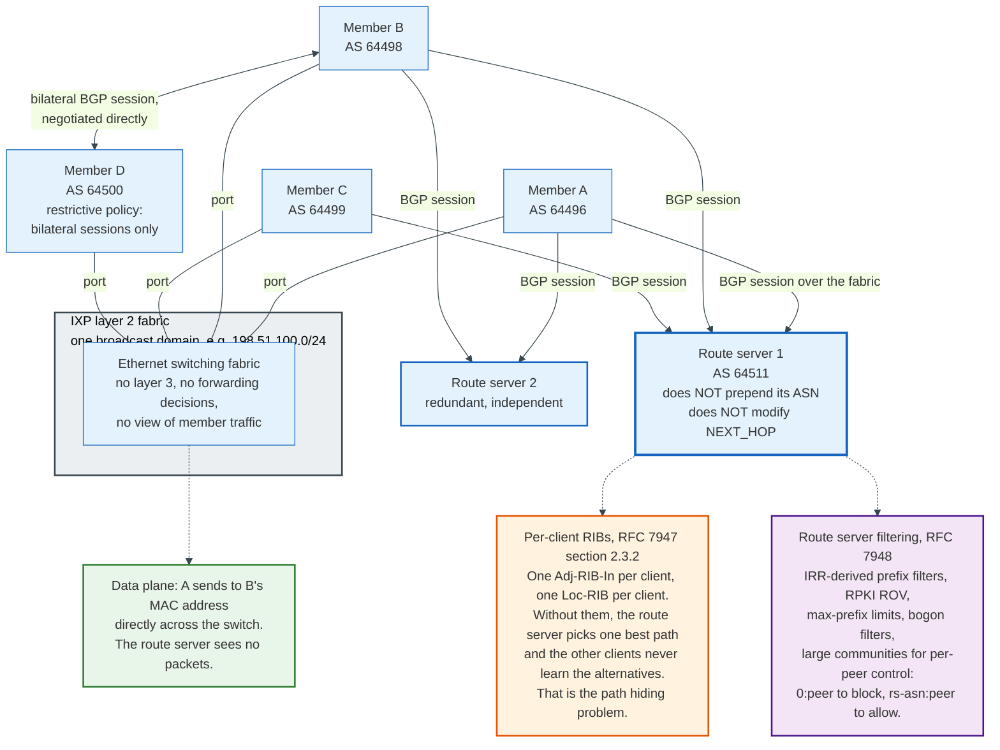

### 10.3 Path Hiding and Per-Client RIBs

A naive route server implementation breaks multilateral peering, and the failure mode is subtle enough to have its own name.

A standard BGP speaker runs the decision process once and advertises one best path per prefix. If a route server does that, and its selected best path for 203.0.113.0/24 came from member A, then every client learns A's path. But member B may have configured the route server not to send it A's routes, in which case B learns nothing about 203.0.113.0/24, even though member C also advertised a perfectly usable path for it. The alternative path is hidden by the selection.

RFC 7947 section 2.3.2 prescribes the fix: maintain a separate Loc-RIB per client, run the decision process independently for each, and apply that client's policy before selection rather than after. Every serious route server implementation, including BIRD and OpenBGPD, does this. The memory cost scales with the number of clients, which is why route servers at a 1,000-member exchange are substantial machines.

### 10.4 What IXPs Filter

Route servers are the single most effective filtering chokepoint on the internet, because one policy protects hundreds of members at once, and the major exchanges have used that position.

RFC 7948 describes the operational practice, and current deployments layer several filters. Bogon prefixes and bogon AS numbers are dropped. Prefix filters are generated from IRR route and route6 objects and from AS-SET macros, rebuilt daily. RPKI-invalid routes are dropped outright, which is the policy at DE-CIX, AMS-IX, LINX, France-IX, and most other large exchanges. Maximum prefix limits per member cap the damage from a leak. Next hop is verified to be the advertising member's own address on the fabric, and the IXP's own peering LAN prefix is never accepted from members.

Control is exposed to members through large communities. A common scheme uses `0:peer-as` to block announcements to a specific peer, `rs-as:peer-as` to permit them, `0:0` to block all, and `rs-as:rs-as` to permit all, letting a member implement selective peering over a multilateral session.

The consequence is that a route that is RPKI-invalid is now difficult to propagate through European peering fabrics at all. That is a policy decision by a handful of exchange operators, applied to hundreds of networks who never had to configure anything.

---

## 11. Prefix Aggregation and the Routing Table Growth Curve

### 11.1 Aggregation Is the Only Thing Holding the Table Down

CIDR made aggregation possible in 1994, and every year since then the routing table has grown more slowly than the internet because operators announce covering prefixes instead of their components.

A provider allocated 198.51.100.0/22 and handing four /24s to four customers can announce one route instead of four. The four customers are reachable, the table carries one entry instead of four, and every router on the internet saves three entries. Multiplied across every allocation, this is the difference between a million-entry table and a table nobody could build hardware for.

The CIDR Report measures how much aggregation is left on the table. On 30 August 2026 it saw 1,076,008 IPv4 prefixes that could be reduced to 600,603 if every AS aggregated its own announcements optimally. That is a 44.2% potential reduction, and it has hovered near that level for years.

The two largest announcers show both ends of the range. Amazon's AS16509 announced 16,352 prefixes that could be expressed as 11,555, a 29.3% saving. China Mobile's AS9808 announced 14,224 that could be expressed as 4,045, a 71.6% saving. In IPv6 the same AS9808 announced 7,171 prefixes reducible to 705, a 90.2% saving.

Nobody takes it, because aggregation costs the announcer something and saves everyone else something.

### 11.2 Why Operators Deaggregate

Four reasons account for almost all deaggregation, and only one of them is an error.

**Traffic engineering.** A network with two upstreams announces its /20 to both and additionally announces two /21s, one to each provider, to split inbound traffic. Longest prefix match then steers each half. This is deliberate, effective, and adds entries to every table on the internet at no cost to the announcer.

**Multihoming a fragment.** A customer with a /24 from a provider's /19 who buys transit elsewhere must have that /24 announced separately, or the second provider's path cannot be selected. The /19 stays, the /24 appears, and the table grows by one.

**Hijack defence.** Announcing a /24 alongside your /22 means an attacker must announce a /24 to beat you rather than merely matching your aggregate. Several large content networks announce at /24 granularity for exactly this reason.

**Configuration error.** Someone redistributes an internal table into BGP without a summary. This is the AS7007 failure mode, and it still happens.

The AS6447 data separates these. On 30 August 2026 the table held 1,121,721 FIB entries, of which 592,412, or 52.81%, were more specific prefixes of some other prefix in the table. Of those more specifics, 459,420, or 77.55%, had the same origin AS as their covering aggregate.

That last number is the finding. More than three quarters of deaggregation is a network splitting its own address space, not a customer multihoming away from its provider. It is self-inflicted, deliberate, and free to the party doing it.

```mermaid
%%{init: {'theme': 'base', 'themeVariables': {'primaryColor': '#e3f2fd', 'primaryBorderColor': '#1565c0', 'lineColor': '#37474f'}}}%%

graph LR
    subgraph P1["Pre-CIDR<br/>1988-1994"]
        direction TB
        G1A["Classful routing.<br/>A class B is a /16 and<br/>there are only 16,384 of them."]
        G1B["1992: about 8,500 routes,<br/>doubling roughly every<br/>10 months"]
        G1C["Projection at the time:<br/>router memory exhausted<br/>within a few years"]
        G1D["1994: BGP-4 and CIDR.<br/>Growth bends immediately."]
    end

    subgraph P2["The CIDR dividend<br/>1994-2001"]
        direction TB
        G2A["Aggregation removes<br/>tens of thousands of routes"]
        G2B["Growth becomes roughly<br/>linear, then accelerates<br/>with the dot-com build-out"]
        G2C["2001: about 100,000 routes"]
    end

    subgraph P3["Steady growth<br/>2002-2013"]
        direction TB
        G3A["Multihoming becomes normal.<br/>Every enterprise with two<br/>providers needs an ASN."]
        G3B["2008: about 250,000 routes"]
        G3C["2013: about 450,000 routes"]
    end

    subgraph P4["IPv4 exhaustion and transfers<br/>2014-2020"]
        direction TB
        G4A["Aug 2014: the 512k day.<br/>Table crosses 512,000.<br/>Cisco 6500 and 7600 TCAM<br/>default splits 512k IPv4<br/>and 256k IPv6. Routers<br/>with the default fail."]
        G4B["Address transfers fragment<br/>large legacy blocks into<br/>separately announced pieces"]
        G4C["2020: about 800,000 routes"]
    end

    subgraph P5["Deaggregation-driven<br/>2021-2026"]
        direction TB
        G5A["Address span advertised is flat<br/>at about 3.1 billion addresses.<br/>It fell 11 million during 2025."]
        G5B["2025: 996,000 to 1,050,000 IPv4,<br/>plus 54,000 entries, 5%.<br/>IPv6 221,500 to 241,800,<br/>plus 20,300 entries, 9%."]
        G5C["Aug 2026: 1,076,008 to 1,121,721<br/>IPv4 depending on vantage point.<br/>52.81% of entries are more specifics.<br/>77.55% of those share the<br/>origin AS of their aggregate."]
        G5D["Projections for Jan 2030:<br/>1,166,763 IPv4 on a linear fit,<br/>1,144,962 on a polynomial fit"]
    end

    P1 --> P2 --> P3 --> P4 --> P5

    style P1 fill:#e3f2fd,stroke:#1565c0,stroke-width:2px
    style P2 fill:#e8f5e9,stroke:#2e7d32,stroke-width:2px
    style P3 fill:#fff3e0,stroke:#e65100,stroke-width:2px
    style P4 fill:#ffebee,stroke:#b71c1c,stroke-width:2px
    style P5 fill:#f3e5f5,stroke:#4a148c,stroke-width:3px
```

### 11.3 The Growth Curve, Measured

The routing table is growing at about 5% a year for IPv4 and 9% for IPv6, and the growth is almost entirely more specifics rather than new address space.

Across 2025, the IPv4 table grew from about 996,000 entries in January to about 1,050,000 in December, an increase of 54,000 entries or 5%, slightly above the 52,000 added in 2024. Root prefixes rose from 470,000 to 506,000 and more specifics from 526,000 to 544,000. The total span of advertised IPv4 address space stayed near 3.1 billion addresses and actually fell by 11 million across the year.

That combination is the whole story. More routes, the same amount of address space. The table is being subdivided, not extended.

Prefix length distribution reinforces it: about 84% of IPv4 table entries are /24, /23, or /22, and the average prefix length is /22.99. In IPv6, /48 prefixes are 46.4% of entries, and /48, /32, /44, and /40 together are 76.1%.

IPv6 grew from 221,500 to 241,800 entries during 2025, an increase of 20,300 or 9%, while the advertised address span grew only 2%, from 161,000 to 164,000 /32 equivalents. IPv6 has the same deaggregation dynamic as IPv4 with a far larger address space to fragment, which is why the APNIC analysis flags malicious or careless IPv6 deaggregation as a genuine scaling risk: a single /29 allocation can be announced as 524,288 /48s by one router.

Forward projections from Geoff Huston's January 2026 analysis put the IPv4 table at 1,064,734 entries in January 2027 and 1,166,763 in January 2030 on a linear fit, or 1,058,581 and 1,144,962 on a polynomial fit. IPv6 projections diverge sharply between models, from 363,014 entries in January 2030 on a linear fit to a polynomial fit that peaks near 264,655 in 2029 and declines. When two fits disagree that much, neither is a forecast.

### 11.4 The 512k Day, and Why It Was Not a Protocol Limit

On 12 August 2014 the global IPv4 routing table crossed 512,000 entries and a substantial number of routers failed. The cause was a vendor default, not a limit in BGP.

Cisco Catalyst 6500 and 7600 platforms shipped with a default TCAM partition allocating 512,000 entries to IPv4 and 256,000 to IPv6. TCAM is the content-addressable memory that performs longest prefix match in hardware at line rate. When the IPv4 partition filled, the affected routers either failed to install further routes or fell back to software forwarding, and both outcomes are visible to customers.

The trigger was ordinary, and one contemporaneous post records all of it. Andree Toonk's "What caused today's Internet hiccup", published on BGPmon in August 2014, reports that starting at 07:48 UTC about 15,000 new more specific prefixes entered the table, almost all originated by Verizon's AS701 and AS705 as more specifics of their own aggregates, including 170 /24s carved out of 72.69.0.0/16. A Level 3 customer feed in Chicago peaked near 515,000 prefixes around 08:00 UTC and fell back to 500,000 within minutes. The same post counts 12,563 unique prefixes and 2,587 autonomous systems in outage that day, against BGPmon's twelve month daily averages of 6,033 prefixes and 1,470 ASNs, and calls both the highest in twelve months. Verizon corrected the announcement within minutes; the routers took longer.

The lesson generalises. BGP has no table size limit. Hardware does, and hardware limits are chosen years before they bind. The current generation of merchant silicon typically supports 1 million to 4 million IPv4 forwarding entries depending on the profile chosen, which is why the crossing of one million IPv4 routes in 2024 produced no comparable event. The next constraint will be a different number on different silicon, and it will surprise someone again.

---

## 12. Convergence, Churn, and Route Flap Damping

### 12.1 Why BGP Converges Slowly by Design

BGP trades convergence speed for stability, and it does so with two mechanisms that both work by waiting.

**MinRouteAdvertisementInterval** rate limits how often a speaker may advertise a change for a given prefix to a given peer. RFC 4271 suggests 30 seconds on eBGP and 5 seconds on iBGP. Within an MRAI window, successive changes are collapsed, so a prefix that flaps five times in 25 seconds produces one update rather than five. This suppresses a great deal of noise and delays every genuine change by up to the interval.

**Path exploration** is the deeper cause. When a path is withdrawn, a router that knows an alternative advertises the alternative rather than a withdrawal. Its neighbours then do the same with their alternatives. If the destination is genuinely unreachable, the network works through a sequence of increasingly bad paths before concluding that none of them exist. Each step costs an MRAI interval. This is the path vector analogue of counting to infinity, and it is why a withdrawal takes longer to propagate than an announcement.

Measured behaviour matches the theory. Across 2023 to early 2026, the daily average time for an unstable IPv4 prefix to reach a stable state was between 20 and 45 seconds. For IPv6 it was 40 to 50 seconds. Those numbers have been roughly stable for years while the table has grown by half.

### 12.2 What Churn Actually Looks Like

The routing system generates far less noise than its size suggests, and almost all of it comes from a handful of networks.

IPv4 withdrawal counts held at roughly 15,000 to 20,000 per day until mid-2022, spiked briefly to about 75,000 per day, and settled back into a range of roughly 18,000 to 25,000 per day from 2023 through early 2026. The count of prefixes that are unstable on a given day is rising by about 400 per year, which against a table of 1.1 million entries is negligible.

The concentration carries the whole result. During December 2025, fewer than 5% of unstable prefixes caused half of all BGP updates, and fifty origin ASNs accounted for one third of all IPv4 updates. In IPv6, measured a year earlier in December 2024, the noisiest 0.1% of ASes were associated with 70% of all updates seen in the month. Both cuts come from Geoff Huston's APNIC analyses of BGP updates, and APNIC has not published the IPv6 concentration for December 2025.

```mermaid
%%{init: {'theme': 'base', 'themeVariables': {'primaryColor': '#e3f2fd', 'primaryBorderColor': '#1565c0', 'lineColor': '#37474f'}}}%%

flowchart TB
    Event["A link fails.<br/>AS 64496 loses its path<br/>to 203.0.113.0/24"]

    subgraph Explore["Path exploration"]
        direction TB
        X1["t=0: router withdraws its best path"]
        X2["Neighbour has an alternative<br/>through a different AS.<br/>It advertises the alternative,<br/>not a withdrawal."]
        X3["That alternative also depended<br/>on the failed link.<br/>It is withdrawn one MRAI later."]
        X4["A third path is tried,<br/>then a fourth.<br/>Each step costs up to 30 seconds<br/>on eBGP, 5 on iBGP."]
        X5["Measured result:<br/>20 to 45 seconds to stability<br/>for IPv4, 40 to 50 for IPv6,<br/>across 2023 to 2026"]
        X1 --> X2 --> X3 --> X4 --> X5
    end

    subgraph MRAI["MinRouteAdvertisementInterval"]
        direction TB
        M1["Suppresses repeated updates<br/>for the same prefix to the same peer.<br/>RFC 4271 suggested defaults:<br/>30s eBGP, 5s iBGP."]
        M2["Reduces churn.<br/>Adds latency to every real change.<br/>Many operators now set it to 0<br/>on iBGP and low values on eBGP."]
    end

    subgraph RFD["Route flap damping, RFC 2439, Nov 1998"]
        direction TB
        F1["Each withdrawal adds a penalty<br/>of 1,000 to a figure of merit"]
        F2["The penalty decays exponentially.<br/>Half-life default 15 minutes."]
        F3["Above the suppress threshold,<br/>default 2,000, the route is not used<br/>and not advertised"]
        F4["Below the reuse threshold,<br/>default 750, it becomes usable again.<br/>Maximum suppress time 60 minutes."]
        F5["Defect: a well connected network<br/>generates more updates per event<br/>because more paths are explored.<br/>Rich topology looks like instability."]
        F6["RIPE-378, May 2006:<br/>do not deploy RFD.<br/>Most operators disabled it."]
        F7["RFC 7196, May 2014:<br/>keep it, raise the thresholds.<br/>Max penalty at least 50,000,<br/>suppress 6,000 aggressive<br/>or 12,000 conservative.<br/>Half-life 15 min, reuse 750,<br/>max suppress 60 min unchanged."]
        F1 --> F2 --> F3 --> F4 --> F5 --> F6 --> F7
    end

    Event --> Explore
    Explore --> MRAI
    MRAI --> RFD

    Alt["What operators use instead<br/>BFD, RFC 5880, for sub-second link failure detection.<br/>Graceful restart, RFC 4724, to keep forwarding<br/>while a control plane restarts.<br/>Long-lived graceful restart, RFC 9494.<br/>Send hold timer, RFC 9687, for a peer that stops reading.<br/>ADD-PATH, RFC 7911, so a backup path is<br/>already installed when the primary fails."]

    RFD --> Alt

    style Event fill:#ffebee,stroke:#b71c1c,stroke-width:2px
    style Explore fill:#fff3e0,stroke:#e65100,stroke-width:2px
    style MRAI fill:#e3f2fd,stroke:#1565c0,stroke-width:2px
    style RFD fill:#f3e5f5,stroke:#4a148c,stroke-width:2px
    style Alt fill:#e8f5e9,stroke:#2e7d32,stroke-width:3px
```

### 12.3 Route Flap Damping and Why It Was Abandoned

Route flap damping is a mechanism that punishes unstable prefixes by refusing to use them, and it was switched off across most of the internet because it punished the wrong networks.

RFC 2439, November 1998, defines the mechanism. Each time a route is withdrawn or replaced, a per-prefix penalty called the figure of merit increases. The penalty decays exponentially with a configurable half-life. When it exceeds a suppress threshold, the route is neither used nor advertised. When decay brings it below a reuse threshold, the route returns. A maximum suppress time caps how long a route can be held down. Penalties are applied on withdrawal and replacement, not on addition.

The vendor defaults that became de facto standard are a half-life of 15 minutes, a reuse threshold of 750, a suppress threshold of 2,000, and a maximum suppress time of 60 minutes, with each withdrawal adding 1,000.

The defect is structural. A single link failure at a well connected network triggers path exploration, and path exploration generates several updates as alternatives are tried and discarded. A poorly connected network with one path generates one update for the same failure. Damping counts updates, so it penalises topological richness. A network with many peers could be suppressed for an hour after a single brief flap, and the more diverse its connectivity the worse the punishment.

RIPE document 378, published May 2006, recommended against deploying route flap damping. Most operators complied and disabled it.

RFC 7196, May 2014, tried to make it usable again by raising the thresholds rather than abandoning the mechanism. It recommends a router maximum penalty of at least 50,000 and a suppress threshold of no less than 6,000 for an aggressive configuration or 12,000 for a conservative one, leaving half-life at 15 minutes, reuse at 750, and maximum suppress time at 60 minutes. It explicitly tells implementations not to change their shipped defaults, so adopting the revised parameters is a per-operator choice. RFC 7454 endorses the revised parameters over a blanket prohibition. Deployment remains partial, and the AS6447 collector reported zero damped and zero suppressed entries on 30 August 2026.

### 12.4 What Replaced It

Operators now manage instability with mechanisms that act faster and target the right layer.

**BFD**, Bidirectional Forwarding Detection, RFC 5880, detects a link failure in milliseconds by exchanging tiny packets at a high rate, and tears down the BGP session immediately rather than waiting 90 seconds for the hold timer. RFC 9384 added Cease subcode 10, BFD Down, so the reason is visible.

**Graceful restart**, RFC 4724, lets a router whose control plane restarts keep forwarding on the old table while it rebuilds, so a software upgrade does not withdraw routes. RFC 8538 extended it to survive a NOTIFICATION, and RFC 9494, November 2023, added a long-lived variant for restarts that take longer than the standard window.

**ADD-PATH**, RFC 7911, keeps a backup path installed so failover does not require reconvergence at all.

**Prefix limits** cap the blast radius of a leak, and are the mechanism that would have stopped several incidents in section 15.

The pattern is consistent. Damping tried to fix instability by observing its symptoms globally. The replacements fix it by detecting failures locally and having an alternative ready.

---

## 13. One Prefix, Traced End to End

### 13.1 The Setup

This section carries one prefix through the entire system with concrete values. All AS numbers are from the documentation range reserved by RFC 5398, and all addresses are from the documentation ranges reserved by RFC 5737 and RFC 3849.

| Entity | AS | Role | Addresses |
|--------|-----|------|-----------|
| Northwind Ltd | 64496 | Multihomed enterprise, origin | 203.0.113.0/24, allocated by an RIR |
| Continental Transit | 64497 | Transit provider, primary | Border router R1 at 198.51.100.1 |
| Meridian Networks | 64498 | Transit provider, secondary | Border router R5 at 192.0.2.9 |
| Pacific Backbone | 64499 | Transit-free network | Peers with 64497 and 64498 |
| Harbour Cable | 64500 | Access network, the eyeballs | Buys transit from 64499 |

Northwind wants 203.0.113.0/24 reachable from Harbour Cable's customers, and wants most inbound traffic to arrive over Continental Transit because that circuit is cheaper.

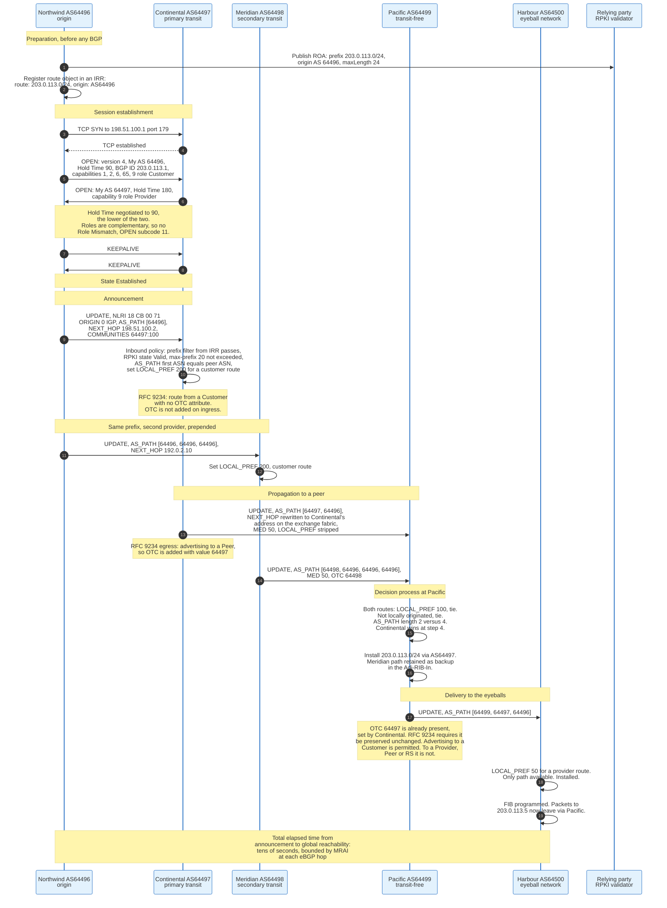

### 13.2 What Each Hop Changes

The same route looks different at every hop, and the differences are the whole protocol.

| Observer | AS_PATH | NEXT_HOP | LOCAL_PREF | MED | OTC | Notes |
|----------|---------|----------|------------|-----|-----|-------|
| Inside Northwind | empty | internal | n/a | n/a | none | Originated by a network statement |
| Continental ingress | 64496 | 198.51.100.2 | set to 200 | none | none | Customer route, highest preference |
| Continental core, over iBGP | 64496 | rewritten to R1's loopback | 200 | none | none | next-hop-self applied at the border |
| Pacific ingress from Continental | 64497 64496 | Continental's IXP address | set to 100 | 50 | 64497 | Peer route, middle preference |
| Pacific ingress from Meridian | 64498 64496 64496 64496 | Meridian's IXP address | set to 100 | 50 | 64498 | Loses on path length at step 4 |
| Harbour ingress | 64499 64497 64496 | Pacific's address | set to 50 | stripped | 64497, unchanged | Provider route, lowest preference |

Three mechanics are visible in that table.

**Prepending only works below LOCAL_PREF.** Northwind prepended twice towards Meridian, and it worked at Pacific because both routes arrived as peer routes with equal LOCAL_PREF. If Pacific had bought transit from Meridian and peered with Continental, Meridian's route would have carried a lower LOCAL_PREF and lost anyway, and the prepending would have been irrelevant. Northwind cannot see which case applies.

**MED never left the first AS boundary.** Continental sent MED 50 to Pacific. Pacific did not propagate it to Harbour, because MED is optional non-transitive and is meaningful only between directly connected ASes.

**OTC is set once and blocks.** Under RFC 9234, Continental set OTC 64497 when advertising to its peer Pacific, and section 5 requires that value to be preserved unchanged through Pacific to Harbour. OTC never accumulates: it is one 4-octet value, added by the first speaker that hands the route sideways or downwards, and never replaced. If Harbour now advertised that route to another provider, that provider would see an OTC attribute on a route received from a customer, which RFC 9234 defines as a route leak, and would reject it. This is a leak that stops one hop after it starts, without anyone building a filter.

### 13.3 The Same Prefix Under Attack

Now AS 64502, a network with no relationship to Northwind, announces 203.0.113.0/25 and 203.0.113.128/25 to its own transit provider.

Both prefixes are more specific than Northwind's /24. Longest prefix match means every router that accepts them forwards all traffic for 203.0.113.0/24 to AS 64502, regardless of LOCAL_PREF, AS path length, or any other attribute. There is no attribute value Northwind can set that beats a longer prefix.

Four defences apply, in the order they take effect.

**The transit provider's prefix filter.** If AS 64502's upstream builds filters from IRR objects, the announcement never leaves. This is the cheapest and most effective control and it fails whenever a provider does not build filters for a given customer.

**Maximum prefix length filters.** Most networks reject IPv4 prefixes longer than /24. Both /25s die at every such border. This is why the attacker in a real incident announces /24s, not /25s.

**RPKI origin validation.** Northwind's ROA says prefix 203.0.113.0/24, origin AS 64496, maxLength 24. A /25 announcement is covered by that ROA's prefix but exceeds its maxLength, so it Matches no VRP while being Covered by one, which makes it **Invalid** under RFC 6811. Every network that drops invalids rejects it. That is why maxLength should equal the announced prefix length, and why RFC 9319 warns against setting a loose maxLength: a ROA for 203.0.113.0/24 with maxLength 32 would make the attacker's /25s Valid.

**Announcing more specifics in response.** Northwind announces the same two /25s itself. Now the attacker's /25 competes against Northwind's /25 on ordinary BGP rules rather than on length, and Northwind's shorter AS path wins in most places. This is what YouTube did on 24 February 2008 at 20:18 UTC.

The first three defences prevent the attack. The fourth is what you do at 3am when the first three were not in place.

---

## 14. The Missing Authentication

### 14.1 The Root Design Flaw, Stated Precisely

BGP has no mechanism for verifying that an announcement is true. That single omission generates every incident in the next section and every mitigation in the two after it.

Three separate assertions are made in a BGP UPDATE, and the base protocol authenticates none of them.

**That the originating AS is entitled to announce the prefix.** Nothing in RFC 4271 binds an AS number to an address block. A router receiving 8.8.8.0/24 with AS_PATH 64502 has no protocol means of knowing whether AS 64502 holds that block.

**That the AS_PATH describes a path that exists.** AS_PATH is a list the sender constructs. A sender may remove entries, add entries, or fabricate the entire list. Path shortening is undetectable: an AS that receives a route with path 64499 64497 64496 and forwards it as 64496 has produced a shorter, more attractive path that no receiver can distinguish from a real one.

**That propagating the route is permitted by the relationships involved.** Nothing marks a route as "learned from a provider, therefore not for other providers." Until RFC 9234 added the OTC attribute in 2022, a route leak was invisible in the protocol.

What BGP does authenticate is the session, and only the session. TCP MD5 per RFC 2385, or its replacement TCP-AO per RFC 5925, proves that the bytes came from the peer you configured. GTSM per RFC 5082 proves the peer is one IP hop away by requiring TTL 255. Both protect the channel. Neither says anything about the content.

The distinction matters and is routinely blurred. A BGP session can be perfectly authenticated, encrypted, and TTL-protected, and still carry a completely fabricated announcement, because the authentication proves who spoke and not whether they told the truth.

### 14.2 Why It Was Left Out

The omission was reasonable in 1989 and has been expensive ever since. The internet then had a few hundred networks, all operated by people who knew each other, most of them research institutions, and the immediate problem was topological, not adversarial. RFC 4272, published January 2006, is the IETF's own catalogue of the consequences, and it was written seventeen years after the protocol.

Retrofitting is hard for two structural reasons that no amount of engineering removes.

**There is no global authority to appeal to.** Any cryptographic solution needs a trusted statement of who holds which address block. That statement has to come from the RIRs, which means five separate trust anchors, five sets of legal terms, and a governance question about whether a registry can effectively revoke a network's ability to route.

**Partial deployment gives partial benefit and full cost.** A network that validates gains protection only against announcements it would otherwise have accepted, while paying the full operational cost of validation. A network that signs gains protection only from networks that validate. Both sides of the market have to move together, and neither moves first without pressure.

### 14.3 The Threat Model

Five attack classes exist against BGP, and they differ in what they require and what they achieve.

| Attack | What the attacker needs | What it achieves | What stops it |
|--------|-------------------------|------------------|---------------|
| **Origin hijack** | The ability to announce a prefix, that is, one BGP session with a careless upstream | Traffic redirection, interception, denial of service, fraudulent certificate issuance | Prefix filters, RPKI ROV |
| **Sub-prefix hijack** | Same, plus a more specific prefix | The same but stronger, because longest prefix match beats every attribute | Prefix length filters, ROA maxLength, ROV |
| **Path manipulation** | The ability to forge AS_PATH content | A shorter, more attractive path with a plausible origin, defeating ROV entirely | BGPsec only, in principle |
| **Route leak** | A configuration error at any multihomed network | Traffic drawn through a network too small to carry it, causing congestion and outage | Egress filters, prefix limits, RFC 9234 roles, ASPA |
| **Session attacks** | On-path position or the ability to spoof | Session reset, blocked writes, resource exhaustion | TCP-AO, GTSM, control plane policing, RFC 9687 |

The important asymmetry is between the first two rows and the third. RPKI origin validation, which is the mechanism the internet has actually deployed, defends the first two rows completely and the third row not at all. An attacker who announces 203.0.113.0/24 with AS_PATH 64502 64496, forging the legitimate origin as the last hop, produces a route that is RPKI **Valid**, because the origin AS in the path matches the ROA. Origin validation checks the last entry in the path and nothing else.

That gap is the subject of section 17.

---

## 15. Hijacks and Route Leaks: The Named Incidents

### 15.1 The Distinction

A hijack and a leak differ in intent and in mechanism, and conflating them leads to the wrong mitigation.

A **hijack** is an announcement of a prefix by an AS not entitled to originate it. The origin is wrong. RPKI origin validation is designed for this case.

A **route leak** is the propagation of a legitimate announcement beyond its intended scope. The origin is correct, the prefix is correct, and the path is real; the route has simply gone somewhere policy said it should not. RFC 7908, June 2016, defines six types:

| Type | Name | Shape |
|------|------|-------|
| 1 | Hairpin turn with full prefix | A multihomed AS takes a route from one upstream and hands it to another |
| 2 | Lateral ISP to ISP to ISP | A peer passes a peer's routes to another peer |
| 3 | Transit provider prefixes to a peer | Routes learned from a provider are announced to a peer |
| 4 | Peer prefixes to a transit provider | Routes learned from a peer are announced upstream |
| 5 | Prefix re-origination | An AS re-originates a route it learned, replacing the origin |
| 6 | Accidental leak of internal or more specific prefixes | Internal deaggregation escapes into eBGP |

Type 1 is the most damaging because it is the most attractive. A leaked route from a small network often carries a shorter AS path than the legitimate one, so the world prefers it, and the small network then receives more traffic than its links can carry.

```mermaid
%%{init: {'theme': 'base', 'themeVariables': {'primaryColor': '#e3f2fd', 'primaryBorderColor': '#1565c0', 'lineColor': '#37474f'}}}%%

flowchart TB
    subgraph Hij["Origin hijacks<br/>wrong AS announces the prefix"]
        direction TB
        H1["Feb 2008: Pakistan Telecom AS17557<br/>announces 208.65.153.0/24 to block<br/>YouTube domestically. PCCW AS3491<br/>propagates it globally.<br/>18:47 UTC start, 21:01 UTC ended<br/>when PCCW withdrew all AS17557<br/>prefixes. 2 hours 14 minutes."]
        H2["Apr 2010: China Telecom announces<br/>a large set of prefixes it does not hold.<br/>Under an hour. The widely repeated<br/>'15% of the internet' figure was<br/>later shown to be wrong."]
        H3["Apr 2017: Rostelecom AS12389<br/>originates 37 prefixes belonging to<br/>MasterCard, Visa and other financial<br/>institutions. Under 7 minutes."]
        H4["Apr 2018: eNet AS10297 announces<br/>four Amazon /23s as /24s,<br/>205.251.192.0/23, .194.0/23,<br/>.196.0/23, .198.0/23, through<br/>Hurricane Electric AS6939.<br/>11:05 to 12:55 UTC. Route 53 DNS<br/>redirected, MyEtherWallet users<br/>phished, cryptocurrency stolen."]
        H5["Feb 2022: KLAYswap. Hijacked prefixes<br/>enabled fraudulent certificate issuance<br/>and a supply-chain script swap.<br/>About 1.9 million USD stolen.<br/>Aug 2022: Celer Bridge, using<br/>forged ALTDB route objects."]
    end

    subgraph Leak["Route leaks<br/>right origin, wrong scope"]
        direction TB
        L1["Apr 1997: AS7007, MAI Network Services.<br/>A router deaggregates the table into /24s<br/>and reoriginates them. The /24s beat every<br/>legitimate aggregate by longest prefix match.<br/>Traffic converges on a network that<br/>cannot carry it. Routes persisted after<br/>the router was disconnected."]
        L2["Dec 2004: TTNet AS9121 leaks a large<br/>portion of the table. Under an hour."]
        L3["Jun 2015: Telekom Malaysia leaks<br/>to Level 3. Global slowdown."]
        L4["Nov 2018: MainOne leaks Google prefixes<br/>towards China Telecom. Traffic for<br/>Google services routed through China."]
        L5["Jun 2019: DQE AS33154 runs a BGP<br/>optimizer that splits Cloudflare's<br/>104.20.0.0/20 into /21s. Customer<br/>Allegheny Technologies AS396531 leaks<br/>them to Verizon AS701, which accepts<br/>and propagates. 10:30 UTC.<br/>Cloudflare loses about 15% of<br/>global traffic. Amazon and Linode<br/>also affected."]
        L6["Apr 2020: Rostelecom AS12389 leaks<br/>8,870 prefixes from nearly 200 ASes<br/>including Akamai, Cloudflare, Hetzner,<br/>DigitalOcean and AWS. 19:28 UTC,<br/>about one hour. Propagated via Rascom<br/>AS20764, then Cogent AS174,<br/>then Level 3 AS3356."]
    end

    subgraph Self["Self-inflicted withdrawal<br/>the route was correct and then was not there"]
        direction TB
        S1["4 Oct 2021: Meta.<br/>A command intended to assess<br/>global backbone capacity took down<br/>every backbone connection.<br/>DNS servers are configured to withdraw<br/>their BGP advertisements when they<br/>cannot reach a data centre.<br/>They did exactly that."]
        S2["15:40 UTC peak of routing changes.<br/>15:58 UTC DNS prefixes 185.89.218.0/23<br/>and 129.134.30.0/23 gone from the table.<br/>Recovery from about 21:00 UTC,<br/>peak 21:17, DNS back 21:20,<br/>services 21:28. About 5.5 hours.<br/>1.1.1.1 saw 30 times normal query volume."]
        S3["Recovery was slow because the tools<br/>needed to fix it depended on the DNS<br/>that had just disappeared, and physical<br/>access to hardware deliberately built<br/>to resist physical modification."]
    end

    Hij --> Fix
    Leak --> Fix
    Self --> Fix

    Fix["What each class needs<br/>Hijacks: RPKI ROV plus prefix filters.<br/>Leaks: egress filters, prefix limits,<br/>RFC 9234 roles and OTC, ASPA.<br/>Self-inflicted: a health check that cannot<br/>withdraw the routes it needs to recover."]

    style Hij fill:#ffebee,stroke:#b71c1c,stroke-width:2px
    style Leak fill:#fff3e0,stroke:#e65100,stroke-width:2px
    style Self fill:#f3e5f5,stroke:#4a148c,stroke-width:2px
    style Fix fill:#e8f5e9,stroke:#2e7d32,stroke-width:3px
```

### 15.2 AS7007, 25 April 1997

The first global BGP failure established the pattern every later one repeats. AS 7007, operated by MAI Network Services, ran a router that deaggregated a large part of the routing table into /24 components and reoriginated them with its own AS number in the path.

Two properties made it catastrophic. The /24s beat every legitimate aggregate on longest prefix match, so every destination covered by one of them was routed to one small network. The number of /24s reoriginated was never published. And the announcements persisted in other networks' tables even after the offending router was disconnected, because BGP state is only removed by an explicit withdrawal or a session teardown, and neither happened promptly everywhere.

The response was the birth of modern operational practice. Providers began filtering customer announcements rather than accepting whatever arrived, and the idea that an upstream has a duty to constrain its customer dates from this event.

Twenty-nine years later, the AS6447 table still shows 141 AS paths containing private AS numbers, which is the same class of error, smaller.

### 15.3 Pakistan Telecom and YouTube, 24 February 2008

The clearest illustration of the whole mechanism, with a complete public timeline.

Pakistan's telecommunications regulator ordered YouTube blocked. Pakistan Telecom, AS 17557, implemented the block by announcing 208.65.153.0/24, a more specific of YouTube's 208.65.152.0/22, into its own network so that domestic traffic would be blackholed. The announcement escaped to its upstream, PCCW Global AS 3491, which accepted and propagated it.

| Time (UTC) | Event |
|-----------|-------|
| Before 18:47 | AS36561 (YouTube) announces 208.65.152.0/22 normally |
| 18:47 | AS17557 begins announcing 208.65.153.0/24. AS3491 propagates it. YouTube traffic worldwide heads to Pakistan |
| 20:07 | AS36561 begins announcing 208.65.153.0/24 itself, contesting the hijack on equal prefix length |
| 20:18 | AS36561 announces 208.65.153.0/25 and 208.65.153.128/25, winning on longest prefix match wherever accepted |
| 20:51 | AS17557's announcements are seen with an extra prepend, making them less attractive |
| 21:01 | AS3491 withdraws all prefixes originated by AS17557. The hijack ends |

Total duration two hours and fourteen minutes. The technical cause was a more specific announcement leaking past an upstream that did not filter its customer. The recovery required the upstream to act, because nothing YouTube could do would reliably win everywhere.

### 15.4 The Verizon and BGP Optimizer Leak, 24 June 2019

This incident shows how a commercial product can convert a small mistake into a global outage.

DQE Communications, AS 33154, ran a BGP optimizer. Such products improve path selection by splitting received prefixes into more specific components and reinstalling them with a preferred next hop. Cloudflare's 104.20.0.0/20 became 104.20.0.0/21 and 104.20.8.0/21. These more specifics were meant to stay inside DQE's network.

They did not. DQE announced them to its customer Allegheny Technologies, AS 396531, which announced them to its other provider, Verizon, AS 701. That is an RFC 7908 type 1 leak: a route from one upstream handed to another. Verizon accepted them and propagated them globally.

Because the leaked routes were more specific than Cloudflare's real announcements, every network that accepted them sent Cloudflare's traffic to a steel company in Pennsylvania. The event began around 10:30 UTC. Cloudflare lost about 15% of its global traffic at the worst point. Amazon and Linode were also affected.

Three controls would each have stopped it independently. A maximum prefix limit on Verizon's session with AS 396531 would have shut the session when 20,000 unexpected routes arrived from a network that announces a handful. An IRR-based prefix filter would have rejected prefixes not registered to that customer, and IRR filtering had been available for 24 years at that point. RPKI origin validation would have rejected the more specifics as Invalid, because Cloudflare's ROAs do not authorise /21s.

Verizon had none of the three.

### 15.5 Rostelecom, April 2017 and April 2020

Rostelecom appears twice, in both categories, which is instructive.

In April 2017, AS 12389 originated 37 prefixes belonging to financial institutions including MasterCard and Visa. It lasted under seven minutes. Whether it was deliberate has never been publicly established, and the incident is cited on both sides of that argument.

On 1 April 2020 at 19:28 UTC, AS 12389 leaked 8,870 prefixes belonging to nearly 200 autonomous systems, including Akamai, Cloudflare, Hetzner, DigitalOcean, and Amazon Web Services. The leak propagated through Rascom AS 20764, then Cogent AS 174, then Level 3 AS 3356, reaching the world within a couple of minutes. It lasted about an hour.

The propagation path is the lesson. Three transit providers, each with the ability to filter a customer, each passed on a leak of 8,870 prefixes without questioning it.

### 15.6 Meta, 4 October 2021

The largest BGP-driven outage of the modern era involved no attacker and no leak. Meta withdrew its own routes and could not put them back.

During routine backbone maintenance, a command intended to assess available global backbone capacity took down every connection in the backbone at once. An audit system designed to prevent exactly that had a bug and did not stop it.

The second-order effect was the outage. Meta's DNS servers at smaller facilities are configured to withdraw their BGP advertisements if they cannot reach a data centre, on the reasonable theory that a name server that cannot answer correctly should stop attracting queries. Every one of them concluded it was unhealthy and withdrew simultaneously. The authoritative name servers for facebook.com became unreachable, and the domain stopped resolving worldwide.

Cloudflare observed a peak of routing changes from Meta around 15:40 UTC, and by 15:58 UTC the DNS prefixes 185.89.218.0/23 and 129.134.30.0/23 were absent from the routing table. Recovery activity began around 21:00 UTC, peaked at 21:17, DNS returned at 21:20, and services came back by 21:28. Total duration about five and a half hours. Cloudflare's 1.1.1.1 resolver handled 30 times its normal query volume as clients retried.

Recovery was slow for a reason worth stating plainly: the internal tools needed to diagnose and fix the problem depended on the DNS that had just disappeared, and physical access to the hardware was slow because the hardware is deliberately built to resist physical modification. The security controls worked exactly as designed and made the outage longer.

The generalisable lesson is about health checks, not BGP. A component that withdraws its own reachability when it detects a fault will, on a correlated fault, withdraw everything at once. The failure mode of a distributed health check is total withdrawal, and that is not a mode most designs test.

### 15.7 Hijacks for Money

Since 2018 the highest-value use of a BGP hijack has been stealing cryptocurrency, because a short-lived redirection is enough to obtain a domain-validated TLS certificate.

The mechanism is a chain. The attacker hijacks the prefix holding a target's authoritative DNS servers or web servers. A certificate authority performing domain control validation queries DNS or fetches an HTTP token and reaches the attacker. The CA issues a genuine, publicly trusted certificate. The attacker then serves a site that browsers accept without warning, and users hand over private keys.

The April 2018 Amazon Route 53 hijack ran this play against MyEtherWallet: eNet AS 10297 announced four Amazon /23s as /24s through Hurricane Electric AS 6939 between roughly 11:05 and 12:55 UTC. The February 2022 KLAYswap incident used the same approach against a South Korean cryptocurrency platform and took about 1.9 million dollars. The August 2022 Celer Bridge attack added a refinement: the attacker created route objects in ALTDB, an IRR database with weak authentication, so that filters built from IRR data would accept the hijacked announcement.

That last detail is the one to remember. IRR-based filtering was the primary defence for two decades, and its authentication is a legacy of an era when nobody lied. RPKI exists because that assumption stopped holding.

Certificate authorities responded with multi-perspective issuance corroboration, validating domain control from several network vantage points so a localised hijack fails. That is a mitigation at the certificate layer for a defect in the routing layer, which is a reasonable description of much of internet security.

---

## 16. RPKI, ROAs, and Route Origin Validation

### 16.1 The Architecture

The Resource Public Key Infrastructure is a certificate hierarchy that mirrors the address allocation hierarchy, and its only purpose is to let an address holder make a signed statement about which AS may originate its prefixes.

RFC 6480, February 2012, defines the architecture. IANA allocates to the five RIRs; each RIR operates a certificate authority and issues resource certificates to its members carrying RFC 3779 extensions that list the IP address blocks and AS numbers the holder controls. A member may issue subordinate certificates further down. Every certificate's resources must be a subset of its issuer's, so the chain proves allocation, not identity.

The signed object that matters is the Route Origin Authorization. RFC 9582, May 2024, obsoletes the original RFC 6482 profile. A ROA's eContent is a `RouteOriginAttestation` with an eContentType of `1.2.840.113549.1.9.16.1.24`, containing a version, an `asID` naming the authorised origin AS, and `ipAddrBlocks`, a sequence of address family blocks each holding prefixes with an optional `maxLength`. RFC 9582 tightened the ASN.1, incorporated errata, and added a canonicalisation procedure so that the same authorisation always encodes identically.

A ROA says one thing: this AS may originate these prefixes, up to this length. It says nothing about paths, nothing about who may transit the route, and nothing about whether the announcement is a good idea.

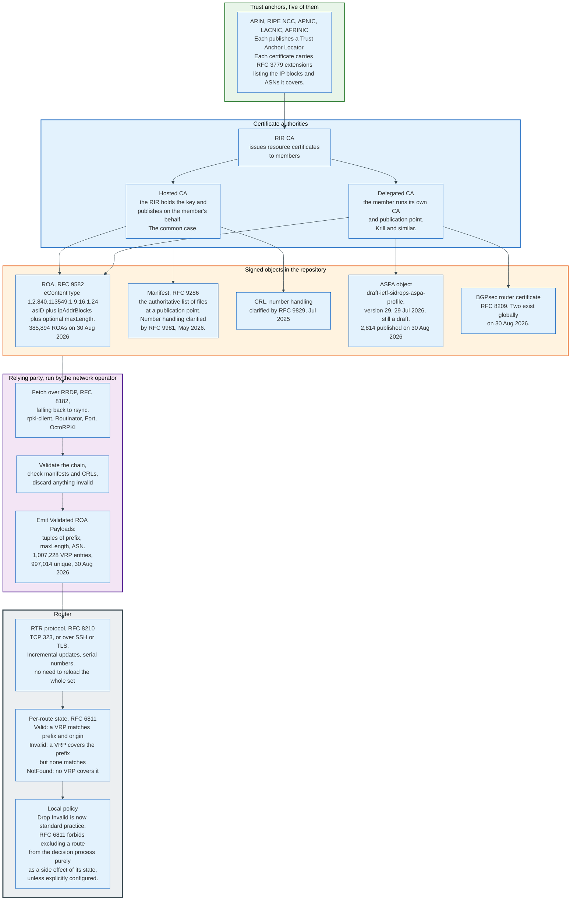

### 16.2 The Three Validation States

RFC 6811, January 2013, defines exactly three outcomes, and the definitions are more precise than the usual summaries.

A VRP is a tuple of prefix, maximum length, and ASN produced by validating a ROA. A VRP **Covers** a route when the VRP prefix length is less than or equal to the route prefix length and the leading bits match. A VRP **Matches** a route when it Covers it, the route prefix length is less than or equal to the VRP maxLength, and the route origin ASN equals the VRP ASN.

- **Valid**: at least one VRP Matches the route.
- **Invalid**: at least one VRP Covers the route, but none Matches it.
- **NotFound**: no VRP Covers the route.

Two consequences follow that trip people up. Publishing a ROA for a prefix makes every more specific announcement of that prefix Invalid unless maxLength permits it, so a ROA is a commitment about announcement granularity as well as about origin. And an announcement with the wrong origin under a covering ROA is Invalid, not NotFound, which is the entire point: the ROA converts silence into a positive denial.

RFC 6811 also constrains implementations. A router must assign the state as a route attribute and must not remove a route from the Adj-RIB-In or exclude it from the decision process merely because of its state, unless explicitly configured to do so. Dropping invalids is a policy the operator chooses; it is not the protocol's default.

RFC 9319, October 2022, addresses maxLength directly and its advice is blunt: set maxLength equal to the prefix length you actually announce, and do not use a loose maxLength for convenience. A ROA for 203.0.113.0/24 with maxLength 32 authorises an attacker's /25 through /32 announcements as Valid. The recommended practice is one ROA per announced prefix with maxLength equal to that prefix's length, even though it produces more objects.

### 16.3 Getting VRPs into a Router

The router does not validate anything cryptographically. It receives a list.

Relying party software, such as rpki-client, Routinator, Fort, or OctoRPKI, fetches the repositories, validates every signature and chain, checks manifests and CRLs, discards anything that fails, and emits the surviving VRPs. It fetches over RRDP, the RPKI Repository Delta Protocol defined in RFC 8182, and falls back to rsync where RRDP is unavailable.

The router then learns the VRP set over the RPKI to Router protocol, RFC 8210, normally on TCP port 323, optionally inside SSH or TLS. RTR is incremental: after an initial full transfer, the router receives only additions and withdrawals identified by serial number, so a table of a million VRPs does not have to be reloaded when one ROA changes.

The design keeps X.509 parsing, CMS validation, and repository fetching out of the router entirely. That decision is why RPKI could be deployed on routers that ship with no cryptographic library, and it is a large part of why origin validation succeeded where BGPsec did not.

### 16.4 Deployment, Measured

RPKI is the only BGP security mechanism with meaningful global deployment, and the numbers depend heavily on what you count.

Measured by advertised address space, from APNIC's Route Origin Validation statistics for the world on 30 August 2026:

| Family | Valid | Invalid | NotFound | Total measured |
|--------|-------|---------|----------|----------------|
| IPv4 | 2,005,982,626 addresses, 63.9% | 13,307,561 addresses, 0.4% | 1,119,736,973 addresses, 35.7% | 3,139,027,160 addresses |
| IPv6 | 126,302 /32 equivalents, 72.9% | 926, 0.5% | 46,095, 26.6% | 173,324 /32 equivalents |

Measured by objects, from an rpki-client validation run on 30 August 2026: 385,894 ROAs, 1,007,228 VRP entries of which 997,014 are unique, 2,814 AS Provider Attestations, and 2 BGPsec router certificates. That run processed 102 repositories in roughly 11 minutes and recorded 18 ROAs and 110 manifests that failed to parse.

Measured by validating networks, the picture is worse and the measurements disagree. RoVista, which ranks ASes by observed filtering behaviour, covered 32,519 ASes as of 29 August 2026. TORCH, a March 2026 measurement study by Tian, Li, Yin, Zhang, Shi and Wang that repurposes open 6in4 tunnel endpoints as vantage points, finds that about 27% of ASes achieve near-complete route origin validation in IPv6, and that several permissive Tier 1 networks still carry traffic towards invalid origins. The share of all ASes that drop invalids is not settled, because the answer depends on whether an AS is measured by its own filtering or by the filtering of everyone upstream of it, and the two produce different numbers.

Three readings of the same system. Two thirds of advertised IPv4 space is signed, which is good. Under a third of ASes filter to near-completion in IPv6 on the one 2026 study that measures it, which is bad. And 0.4% of advertised IPv4 space is Invalid, which is a mixture of genuine misconfiguration and stale ROAs, and is small enough that dropping invalids has become a low-risk operational decision.

The United States FCC cited a different cut in June 2024: 38% of United States networks had ROAs as of May 2024, derived from Cloudflare Radar and corroborated by the MANRS Observatory. It also noted that as of December 2023, 36% of traffic originating from non-federal networks was covered by a valid ROA, against less than 1% of traffic from United States federal government networks. The Notice's own text reads December 2024, which is impossible in a document released 7 June 2024 that introduces the figure as an earlier date than May 2024, and its footnote cites an Internet Society ex parte letter filed 17 April 2024.

### 16.5 What Origin Validation Does Not Do

Origin validation checks one field. Everything else in the UPDATE is unverified.

It does not verify AS_PATH. An attacker who announces 203.0.113.0/24 with AS_PATH 64502 64496, appending the legitimate origin, produces a route that is RPKI Valid because the last AS in the path matches the ROA. The path is fiction. Validation passes.

It does not detect route leaks. Every route in the Rostelecom 2020 leak had the correct origin AS. Origin validation would have marked all 8,870 of them Valid.

It does not prevent a network from accepting a route it should not. RPKI tells you whether an origin is authorised. It says nothing about whether your peer should be sending you that route at all.

And it depends on the repository being available. If a relying party cannot fetch a repository, the VRPs derived from it expire, and every route they covered silently becomes NotFound rather than Invalid. Failing open is deliberate, because failing closed would turn an RPKI outage into a routing outage, but it means an attacker who can disrupt a publication point degrades validation for everyone who depends on it.

---

## 17. BGPsec, ASPA, and the Limits of Origin Validation

### 17.1 BGPsec: Correct, Complete, and Undeployed

BGPsec cryptographically signs the AS path, which solves the problem origin validation leaves open, and it has approximately zero deployment.

RFC 8205, September 2017, replaces AS_PATH with the BGPsec_PATH attribute, type code 33, on sessions where both peers negotiate capability 7. The attribute has two parts. The Secure_Path is a sequence of segments, each carrying a pCount field that encodes prepending, a flags octet with a Confed_Segment bit, and a four-octet AS number. The Signature_Block carries an algorithm suite identifier and one signature segment per Secure_Path segment, each holding a 20-octet Subject Key Identifier, a signature length, and the signature.

Each signature covers the target AS number, that is, the specific peer this update is being sent to, plus all preceding Secure_Path and Signature segments, the segment being signed, the algorithm identifier, the AFI and SAFI, and the NLRI. Binding the target AS into the signature is what makes path shortening impossible: a signature authorising propagation to AS 64499 cannot be reused to claim propagation to AS 64500.

Four properties killed it.

**It cannot be partially deployed usefully.** If any AS in the path does not support BGPsec, the update is converted to an ordinary unsigned UPDATE before being forwarded, and every downstream AS loses all path protection. Security is a property of the entire path, so the benefit appears only when a contiguous signed path exists end to end.

**It is expensive.** Every router must sign every update it sends to every peer, separately, because the signature covers the target AS. A full table transfer to twenty peers means twenty distinct signature sets over a million routes. Signature verification on receipt is comparable work. This is per-update elliptic curve cryptography on a control plane processor that was sized for parsing.

**Routers need private keys.** RFC 8209 defines a router certificate and RFC 8635 defines router keying. Every BGP speaker becomes a certificate holder with a key rotation problem, which is an operational burden with no analogue in existing router management.

**It does not stop route leaks.** RFC 8205 says so explicitly. A leak involves a genuine path propagated to the wrong place, and every signature on it is valid.

The measured result: 2 BGPsec router certificates existed in the global RPKI on 30 August 2026, against 385,894 ROAs. BGPsec is a specification, not a deployment.

### 17.2 ASPA: The Middle Path

ASPA verifies the shape of the AS path against registered provider relationships, and it is the mechanism most likely to be the next thing deployed. It is also still a draft.

An AS Provider Attestation is an RPKI signed object in which an AS declares which ASes are its providers. The verification algorithm uses those declarations to check that a received path is valley-free. It analyses the path as an up-ramp of customer-to-provider hops followed by a down-ramp of provider-to-customer hops, and if the combined ramps do not account for every hop, the path contains a segment that violates the relationship structure, which is either a leak or a fabrication.

This catches what origin validation cannot. In the Rostelecom 2020 leak, the paths contained a hop where a customer appeared to be transiting routes between two providers. ASPA verification would have flagged it without anyone knowing anything about the prefixes involved.

As of August 2026 the specifications are not finished. `draft-ietf-sidrops-aspa-profile` reached version 29 on 29 July 2026, and `draft-ietf-sidrops-aspa-verification` reached version 28 on 24 August 2026. Both remain in the SIDROPS working group with a state of "Waiting for Write-Up" against a milestone that was set for March 2026. Deployment is running ahead of the standard: 2,814 ASPA objects were published in the RPKI on 30 August 2026, up from 1,314 registrations reported for December 2025.

### 17.3 RFC 9234 Roles and the OTC Attribute

RFC 9234, May 2022, prevents route leaks by making the relationship explicit in the protocol, and it is the cheapest of the three mechanisms because it requires no cryptography at all.

Each eBGP session declares a role in the OPEN message using capability code 9. The five values are Provider (0), RS (1), RS-Client (2), Customer (3), and Peer (4). Valid pairs are Provider with Customer, RS with RS-Client, and Peer with Peer. A mismatch is rejected with an OPEN error, subcode 11.

The Only to Customer attribute, type code 35, is four octets holding an AS number, and it is optional transitive so it survives networks that do not implement it.

**On egress**: if a route is advertised to a Customer, a Peer, or an RS-Client, an OTC attribute must be added with the local AS number, unless one is already present. If a route already carries an OTC attribute, it must not be propagated to Providers, Peers, or RSes.

**On ingress**: a route received from a Customer or an RS-Client that carries an OTC attribute is a leak. A route received from a Peer whose OTC value is not that peer's AS number is a leak. A route received from a Provider, a Peer, or an RS without an OTC attribute must have one added with the sending AS's number.

The result is that a leak is detected at the first AS that implements the mechanism, even several hops from where it started, using nothing but an attribute comparison. It requires configuration of the correct role on every session, which is the practical obstacle: a network with a thousand eBGP sessions has a thousand chances to get a role wrong, and a wrong role prevents the session from establishing at all.

```mermaid
%%{init: {'theme': 'base', 'themeVariables': {'primaryColor': '#e3f2fd', 'primaryBorderColor': '#1565c0', 'lineColor': '#37474f'}}}%%

flowchart TB
    subgraph Attack["What each attack needs to succeed"]
        direction TB
        A1["Origin hijack:<br/>announce someone else's prefix"]
        A2["Sub-prefix hijack:<br/>announce a longer prefix"]
        A3["Path forgery:<br/>fabricate AS_PATH with a<br/>legitimate origin appended"]
        A4["Route leak:<br/>propagate a real route<br/>to the wrong neighbour"]
    end

    subgraph L1["Layer 1: filters, since 1997"]
        F1["IRR prefix filters<br/>route and route6 objects,<br/>AS-SET expansion.<br/>Weak authentication:<br/>the Celer Bridge attacker<br/>simply created ALTDB objects."]
        F2["Maximum prefix limits<br/>Cease subcode 1.<br/>Would have stopped the<br/>2019 Verizon leak."]
        F3["Prefix length filters<br/>reject longer than /24 IPv4,<br/>/48 IPv6, per RFC 7454"]
        F4["Bogon prefix and bogon ASN filters"]
        F5["RFC 8212, Jul 2017:<br/>an eBGP session with no<br/>configured policy announces<br/>and accepts nothing"]
    end

    subgraph L2["Layer 2: origin validation, since 2012"]
        V1["RPKI ROAs, RFC 9582<br/>63.9% of advertised IPv4<br/>address space Valid,<br/>0.4% Invalid, Aug 2026"]
        V2["RFC 6811 states:<br/>Valid, Invalid, NotFound.<br/>Drop Invalid is standard<br/>at large IXP route servers."]
        V3["RFC 9319: set maxLength<br/>equal to the announced length"]
    end

    subgraph L3["Layer 3: relationship validation"]
        R1["RFC 9234 roles and OTC.<br/>Capability 9, attribute 35.<br/>No cryptography needed."]
        R2["ASPA. Drafts at version 29<br/>and 28 as of Aug 2026.<br/>2,814 objects published."]
    end

    subgraph L4["Layer 4: path validation"]
        P1["BGPsec, RFC 8205.<br/>Signs every hop against a<br/>named target AS.<br/>2 router certificates<br/>exist worldwide."]
    end

    A1 -->|"blocked by"| F1
    A1 -->|"blocked by"| V1
    A2 -->|"blocked by"| F3
    A2 -->|"blocked by"| V3
    A3 -->|"NOT blocked by"| V1
    A3 -->|"blocked only by"| P1
    A3 -->|"partly detected by"| R2
    A4 -->|"blocked by"| F2
    A4 -->|"blocked by"| R1
    A4 -->|"blocked by"| R2
    A4 -->|"NOT blocked by"| V1

    style Attack fill:#ffebee,stroke:#b71c1c,stroke-width:2px
    style L1 fill:#e8f5e9,stroke:#2e7d32,stroke-width:3px
    style L2 fill:#e3f2fd,stroke:#1565c0,stroke-width:3px
    style L3 fill:#fff3e0,stroke:#e65100,stroke-width:2px
    style L4 fill:#eceff1,stroke:#37474f,stroke-width:2px
```

### 17.4 What Nobody Is Validating

Origin validation, roles, and even ASPA leave four attack classes with no cryptographic defence at all. Each is a legal use of the protocol, which is why no signature helps.

**State volatility.** Deliberate route flapping and injected churn. Nothing verifies that an announcement sequence is honest, and route flap damping, the historical answer, is mostly switched off.

**Prefix deaggregation.** Announcing a /29 IPv6 allocation as hundreds of thousands of /48s is entirely legitimate under RPKI if the ROA's maxLength permits it. One allocation, one router, and a table that more than doubles.

**Policy violation.** LOCAL_PREF, MED, and selective propagation are all local decisions with no verifiable semantics. A network can silently prefer, deprefer, or drop anything.

**Session and attribute attacks.** Malformed or unexpected path attributes causing session resets. RFC 4271 requires a speaker to answer a malformed attribute by tearing down the session, so one bad attribute originated anywhere can reset sessions across the internet as it propagates. RFC 7606 replaced that with treat-as-withdraw for most cases in 2015, and RFC 9687 added a send hold timer in 2024, but nothing verifies that an attribute a router does not understand is honest before it passes it on.

Every one of these is currently addressed by operational hardening rather than verification, which is the honest summary of BGP security in 2026: one attack class is solved cryptographically, one is solved procedurally, and the rest are managed.

---

## 18. Operational Hardening: Filters, Limits, and Roles

### 18.1 BCP 194

RFC 7454, published February 2015 as BCP 194, is the document a network operator should implement before considering anything cryptographic. Its recommendations are unglamorous and would have prevented most incidents in section 15.

**Protect the speaker.** Apply an access list, ideally a control plane specific one, so that TCP port 179 is reachable only from configured neighbour addresses. Rate limit BGP traffic to the control plane.

**Protect the session.** TCP-AO per RFC 5925 where available, MD5 per RFC 2385 where it is not. Apply GTSM per RFC 5082 on directly connected eBGP sessions, requiring an inbound TTL of 255 so that an off-path attacker cannot inject packets.

**Filter prefixes inbound.** Discard special-purpose and unallocated prefixes by consulting the IANA registries and refreshing within a month of any allocation change. Reject IPv4 prefixes longer than /24 and IPv6 prefixes longer than /48. Reject your own prefixes arriving from outside. Reject more specifics of an IXP peering LAN, and accept the LAN prefix only from the AS authorised to announce it. Do not accept or advertise a default route except where the customer or provider relationship calls for it.

**Filter AS paths.** Accept only authorised ASNs from a customer. Do not accept private AS numbers except from customers. Reject a route whose first AS number is not the peer's, except from a route server. Strip private ASNs before announcing to a non-private peering. Reject any route containing your own AS number.

**Limit prefixes.** Set a maximum prefix count on every session. For a peer, set it below the size of the internet table; for an upstream, set it above the current table so that ordinary growth does not tear down the session.

**Fix the next hop at exchanges.** On IXP sessions, apply an inbound policy that sets the next hop to the BGP peer's own address, so a member cannot direct your traffic at a third party.

**Scrub communities.** Strip inbound communities that contain your own AS number, because those are your policy signals and a neighbour must not be able to set them. Preserve everything else, including NO_EXPORT.

### 18.2 RFC 8212: The Default That Should Have Been There in 1989

RFC 8212, July 2017, changes what a BGP speaker does when nobody has told it what to do, and it is the single highest-value one-line change in BGP's history.

The requirement is exact. Routes in an Adj-RIB-In associated with an eBGP peer are not eligible in the decision process if no explicit import policy has been applied. Routes are not added to an Adj-RIB-Out associated with an eBGP peer if no explicit export policy has been applied.

Before this, an unconfigured eBGP session on most implementations announced the full table and accepted everything. A junior engineer bringing up a session with a customer would, in the seconds before applying policy, become that customer's transit provider to the entire internet. Several of the leaks in section 15 have this shape.

The change was disruptive to make, because it breaks configurations that worked, and vendors phased it in over years. That is the price of correcting a default that was set in an era when the risk did not exist.

### 18.3 IRR Filtering and Its Weakness

Internet Routing Registries are the pre-RPKI mechanism for expressing routing intent, and they are still the backbone of prefix filtering at most transit providers and route servers.

An address holder publishes a `route` or `route6` object naming the prefix and the authorised origin AS. A network publishes an `as-set` listing its own AS and those of its customers, recursively. A provider building a filter for a customer expands the customer's as-set, collects the route objects for every AS in it, and generates a prefix list. Tools such as bgpq4 and IRRToolSet automate this, and the filters are typically regenerated daily.

The weakness is authentication. There are many IRR databases, some operated by RIRs with authorisation tied to actual address allocation, and some, historically including ALTDB and RADB, that accept objects with far weaker checks. An attacker who can create a route object for a prefix they do not hold can defeat every filter built from that database. The August 2022 Celer Bridge hijack did exactly that.

RIR-operated IRRs have progressively tightened. RIPE NCC authorises route objects against actual allocations. ARIN's IRR requires authorisation. Several providers now build filters only from RIR-backed sources, or cross-check IRR data against RPKI. The direction of travel is towards using RPKI as the authority and IRR as the supplementary source, which inverts twenty years of practice.

### 18.4 MANRS

MANRS, Mutually Agreed Norms for Routing Security, is an industry programme that packages the above into four commitments and publishes who has made them.

The four actions are filtering, which means preventing propagation of incorrect routing information; anti-spoofing, which means preventing traffic with spoofed source addresses; coordination, which means maintaining globally accessible contact information; and global validation, which means publishing routing data so others can validate, in practice meaning IRR objects and ROAs.

Its value is not technical. Every action in MANRS is already in RFC 7454. Its value is that it creates a published list, and the FCC cited the MANRS Observatory as a data source in its 2024 rulemaking. A voluntary programme becomes load-bearing the moment a regulator uses it as a measurement.

---

## 19. Regulation and Compliance

### 19.1 BGP Was Unregulated for Thirty-Five Years

No government regulated inter-domain routing until the 2020s, and the reason is jurisdictional. BGP is a bilateral agreement between two networks that may be in different countries, implementing a protocol written by a voluntary standards body, over infrastructure nobody owns collectively. There is no operator to license and no service to certify.

What changed is the recognition of routing as critical infrastructure, driven by two things: the visible use of hijacks for financial theft, and government concern about traffic being routed through specific countries.

### 19.2 The United States: FCC PS Docket 24-146

The Federal Communications Commission adopted a Notice of Proposed Rulemaking on 6 June 2024, released 7 June 2024, as FCC 24-62, in PS Docket No. 24-146 and PS Docket No. 22-90. It is the first concrete regulatory proposal on BGP security by any major jurisdiction.

The proposal has two parts.

**BGP Routing Security Risk Management Plans.** Every provider of broadband internet access service on a mass market retail basis would prepare and maintain a plan describing and attesting to the specific efforts it has made, and plans to make, to create and maintain ROAs in the RPKI. Plans would be held by the provider and made available to Commission staff on request. The Commission estimated 2,209 affected service providers, 100 work hours each at 90.16 dollars an hour, and an annual upper bound near 16 million dollars for the plans alone, inside a 30.8 million dollar annual upper bound for the whole proposal. Paragraph 89 states that later years cost less than the first, because they carry maintenance and not development, so the Commission uses the first year as the bound for every year.

**Quarterly public reports from the largest providers.** A defined set of the largest providers would file quarterly data, made public by provider, covering their registry organisation identifiers, all ASNs held, ASNs used to originate routes, address holdings that have been reassigned, the list of originated prefixes covered by ROAs grouped by origin AS, and the list of originated prefixes not covered by a ROA grouped by origin AS. The Commission also sought comment on collecting data about the extent to which those providers perform route origin validation filtering for their peers and customers.

Nine providers fall into the largest category as defined in the Notice: AT&T, Altice USA, Charter Communications, Comcast, Cox Communications, Lumen Technologies, T-Mobile USA, Telephone and Data Systems including US Cellular, and Verizon Communications.

The Commission's justification cited the deployment gap directly: as of May 2024, 38% of United States networks had ROAs, and as of December 2023, 36% of traffic from non-federal networks was covered by a valid ROA against less than 1% of traffic from federal networks. The Notice prints the second date as December 2024, which cannot be right in a document released 7 June 2024 that introduces the figure as an earlier date than May 2024.

A search of Commission-level releases for 2025 and 2026 finds no follow-on order in the docket. As of August 2026 the proceeding has produced a proposal and no rule.

### 19.3 Other Jurisdictions and Instruments

**The European Union** regulates routing indirectly. The NIS2 Directive, in force since January 2023 with member state transposition through 2024 and 2025, classifies internet exchange points, DNS service providers, and cloud providers as essential or important entities subject to risk management and incident reporting obligations. Routing security is inside the scope of the required measures without being named as such. The practical effect is that a European IXP's decision to drop RPKI-invalid routes is now a documented risk control rather than an engineering preference.

**The United States federal government** has pushed through procurement and strategy rather than regulation. The National Cybersecurity Strategy Implementation Plan assigned the Office of the National Cyber Director to develop a roadmap for adopting secure internet routing techniques, with initiatives covering identification of security challenges, exploration of approaches, and measurement of adoption against published metrics.

**Regional Internet Registries** are the closest thing to a routing regulator, and their instrument is contract rather than law. Address allocations come with registration service agreements, and RPKI certificate issuance is bound to those agreements. The FCC Notice observes that bringing advertised address space under registration service agreements is a prerequisite to establishing ROAs for it, which is why legacy address space outside any RIR agreement is disproportionately represented in the NotFound category.

### 19.4 The Compliance Question Nobody Has Answered

RPKI creates a capability that has no legal framework: an RIR can, technically, revoke a certificate and cause a network's routes to be treated as Invalid by every validating network on the internet.

This has been discussed since RFC 6480 and remains unresolved. RIRs have adopted policies constraining when they will act on legal orders affecting certificates, and no major revocation-as-enforcement event has occurred. The concern is structural rather than hypothetical: the system's usefulness comes from the trust anchors being authoritative, and anything authoritative enough to be useful is authoritative enough to be compelled.

Operators mitigate it partially by running their own relying party software and choosing which trust anchors to accept, and by the failure mode being permissive. A missing ROA produces NotFound, not Invalid, so a revoked certificate degrades a network's protection rather than removing its reachability. That is a meaningful safety property and it was chosen deliberately.

---

## 20. Comparisons and Alternatives

### 20.1 BGP Against the Interior Gateway Protocols

BGP and the IGPs solve different problems, and the differences are not preferences.

| Property | BGP | OSPF and IS-IS | RIP |
|----------|-----|----------------|-----|
| Algorithm | Path vector | Link state, Dijkstra | Distance vector |
| Scope | Between administrative domains | Within one | Within one, small |
| Scale | 1.1 million prefixes, 79,667 ASes | Thousands of prefixes per area | Hundreds |
| What is flooded | Individual prefixes with attributes | The full link state database | The full distance table |
| Convergence | 20 to 45 seconds measured | Tens to hundreds of milliseconds | Minutes |
| Metric | Policy first, path length fourth | Link cost, configurable | Hop count, maximum 15 |
| Loop prevention | AS_PATH inspection | Complete topology knowledge | Split horizon, poison reverse, hold-down |
| Transport | TCP 179 | Raw IP protocol 89, or direct on layer 2 | UDP 520 |
| Policy expressiveness | 13 tiebreakers, plus LOCAL_PREF, MED, communities, and arbitrary per-neighbour filters | Link cost only | Hop count only |

The trade is explicit. A link state protocol converges fast because every router has the full map, and it therefore requires every router to be trusted with the full map and to agree on it. BGP converges slowly because no router has a map, and it therefore works between parties that trust each other with nothing.

You cannot run OSPF between two competing companies. That is the entire reason BGP exists.

### 20.2 BGP Inside the Data Centre

Large data centre fabrics run eBGP as their only routing protocol, which looks like a category error and is a deliberate design.

RFC 7938, August 2016, documents the practice. In a Clos fabric with thousands of switches, a link state protocol floods every topology change to every node, and at that scale the flooding domain becomes the constraint. BGP's distance vector behaviour confines a failure's information propagation to the paths that actually used the failed element.

The specific design: a single private AS for all spine switches, a unique private AS per aggregation cluster, and a unique private AS per top-of-rack switch. Where the device count exceeds the 1,023 usable private 16-bit AS numbers, ASNs are reused across clusters with `allowas-in` configured to permit a device's own AS in received paths. Timers are retuned hard, MRAI is set to zero, and link failure detection is delegated to BFD or to interface state rather than to the hold timer.

This is BGP with every default changed. It works because the protocol's simplicity, a state machine with six states and a decision process with thirteen steps, turns out to be an advantage at scale, and because a data centre operator controls every device and can therefore trust the AS_PATH.

### 20.3 What Could Replace BGP, and Why Nothing Has

Several replacements have been proposed since the 1990s, and none has reached deployment. The reasons are consistent.

**Centralised control planes.** Software-defined networking moved route computation to a controller, and inside a single administrative domain it works. Between domains it requires a party that both networks accept as authoritative over their routing, which does not exist and cannot be created by a protocol.

**Path-aware architectures.** Research systems such as SCION give end hosts explicit control over the path their traffic takes, with cryptographic authorisation at each hop. They solve the security problems properly. They require a parallel infrastructure and a business model in which someone pays for it, and the incumbent is free.

**Overlays.** SD-WAN, cloud provider backbones, and CDN private networks all route around BGP for their own traffic by tunnelling over it. This is the change that has actually happened: traffic that would once have crossed several ASes now enters a private backbone at the edge and leaves it near the destination, making no inter-domain routing decision in between. BGP still moves the packets between the overlay's entry and exit points, but the path selection that matters happened somewhere else.

The absence of a successor is not inertia alone. BGP's cost of change is proportional to the number of independent parties who must agree, which is roughly 79,000, and its cost of remaining is borne diffusely by everyone. That arithmetic favours the incumbent indefinitely.

---

## 21. Modern Developments

### 21.1 What Changed Between 2022 and 2026

The last four years produced no new BGP version and a steady accumulation of corrections. That is the normal state of a protocol in its fourth decade.

| Date | Change | Effect |
|------|--------|--------|
| May 2022 | RFC 9234, roles and OTC | Route leaks become detectable in the protocol, without cryptography |
| Oct 2022 | RFC 9319, maxLength guidance | Loose ROAs identified as an active hazard, one ROA per announced prefix becomes best practice |
| Nov 2023 | RFC 9494, long-lived graceful restart | Longer control plane restarts without withdrawing routes |
| May 2024 | RFC 9582, ROA profile restated | Canonical encoding, tightened ASN.1, obsoletes RFC 6482 |
| Jun 2024 | FCC PS Docket 24-146 opened | First concrete regulatory proposal on BGP security |
| Nov 2024 | RFC 9687, send hold timer | A peer that stops reading no longer holds a session open indefinitely |
| Mar 2025 | RFC 9736, BMP peer up namespace | Cleaner monitoring of session establishment |
| May 2025 | RFC 9774, AS_SET deprecated | Aggregation with AS_SET is now prohibited, treat-as-withdraw on receipt |
| Jul 2025 | RFC 9829, RPKI CRL number handling | Removes an ambiguity that caused relying parties to disagree |
| May 2026 | RFC 9981, RPKI manifest number handling | Same, for manifests |
| May 2026 | RFC 9972, advanced BMP statistics | Richer telemetry from production routers |
| Aug 2026 | ASPA drafts at version 29 and 28 | Path shape validation still not standardised, deployment already at 2,814 objects |

### 21.2 The Trend That Matters: Table Growth Is Now Deaggregation

The routing table's growth has decoupled from the internet's growth, and understanding which one you are measuring changes the conclusion.

Advertised IPv4 address space has been essentially flat at about 3.1 billion addresses, 72.77% of the total space, and actually fell by 11 million addresses during 2025. Over the same period the table grew by 54,000 entries. More than half the table, 52.81% on 30 August 2026, consists of more specific prefixes of other entries, and 77.55% of those share the origin AS of their covering aggregate.

The internet is not adding networks fast enough to explain the growth. It is subdividing the ones it has, mostly for traffic engineering, mostly by the same operators who announce the aggregate.

Two consequences follow. Router forwarding capacity requirements are driven by other operators' traffic engineering decisions, which nobody pays for. And the 44.2% aggregation potential the CIDR Report has measured for years is not going to be realised, because the parties who would have to act gain nothing by acting.

### 21.3 RPKI Is Consolidating, Not Accelerating

Origin validation has reached the point where the remaining gap is structural rather than technical.

Two thirds of advertised IPv4 address space carries a ROA, and 0.4% of it is Invalid. Large European exchanges drop invalids by default. Every major transit provider and cloud network in the isbgpsafeyet.com listing signs and filters. That is the achievable population.

The residual 35.7% NotFound is concentrated in legacy address space outside registration service agreements, networks in regions with lower RIR engagement, and organisations for whom nobody owns the task. The FCC's finding that less than 1% of United States federal government traffic was ROA-covered as of December 2023 is a precise illustration: the obstacle is not cost or difficulty, it is that creating a ROA is nobody's job.

Meanwhile the mechanism is being hardened rather than extended. RFC 9829 and RFC 9981 both exist because relying parties disagreed about CRL and manifest number handling, which is what happens when a security system moves from research deployment to load-bearing infrastructure.

### 21.4 Where the Next Failure Comes From

Three candidates are visible in the current data.

**IPv6 deaggregation at scale.** IPv6 table entries grew 9% in 2025 while advertised address space grew 2%. A single /29 allocation can be announced as 524,288 /48s by one misconfigured or malicious router, and RPKI will consider every one of them Valid if the ROA's maxLength permits. No mechanism currently constrains this.

**Attribute handling.** An optional transitive attribute produced by one implementation and mishandled by another propagates globally, because a router that does not recognise a transitive attribute passes it on unchanged. That is the design: the attribute flag bit 0x40 exists to make unknown attributes survive. RFC 7606's treat-as-withdraw handling reduced the blast radius by letting a router drop the affected routes instead of the session; it did not remove the class, and RFC 9774's deprecation of AS_SET in May 2025 removed one instance of it rather than the mechanism.

**Concentration.** Fifty origin ASNs accounted for one third of all IPv4 BGP updates in December 2025, and the noisiest 0.1% of IPv6 ASes accounted for 70% of IPv6 updates in December 2024. The routing system's stability is increasingly a property of a small number of operators' internal practices, and there is no mechanism by which anyone else can influence them.

---

## 22. Appendix

### 22.1 Key Terminology

| Term | Definition |
|------|------------|
| **Adj-RIB-In** | The unprocessed routes received from one peer, before import policy. One per peer |
| **Adj-RIB-Out** | The routes selected for advertisement to one peer, after export policy. One per peer |
| **AFI / SAFI** | Address Family Identifier and Subsequent AFI. The pair that names what a session carries. 1/1 is IPv4 unicast, 2/1 is IPv6 unicast |
| **AS_PATH** | Path attribute type 2. The ordered list of ASes a route has traversed. Loop prevention and the fourth tiebreaker |
| **AS_SET** | AS_PATH segment type 1, an unordered set produced by aggregation. Deprecated by RFC 9774, May 2025 |
| **AS_TRANS** | AS 23456. The placeholder a 32-bit AS puts in the two-octet AS_PATH when talking to a 16-bit-only speaker |
| **ASPA** | AS Provider Attestation. An RPKI object declaring an AS's providers, used to verify path shape. Still a draft as of Aug 2026 |
| **ATOMIC_AGGREGATE** | Path attribute type 6, zero length. A flag meaning this aggregate hides more specific paths |
| **BGP Identifier** | A 4-octet router ID carried in OPEN. Unique within an AS. Tiebreaker at step 11 and in collision resolution |
| **BMP** | BGP Monitoring Protocol, RFC 7854. Streams a router's Adj-RIB-In to a collector without a BGP session |
| **Bogon** | An address block or AS number that should never appear in the routing system: unallocated, private, or reserved |
| **CLUSTER_LIST** | Path attribute type 10. The list of reflector CLUSTER_IDs a route has passed through. Loop prevention for route reflection |
| **Customer cone** | The set of ASes reachable from a given AS by following customer relationships downward |
| **Deaggregation** | Announcing more specific prefixes alongside or instead of a covering aggregate |
| **eBGP** | BGP between routers in different ASes. Prepends AS_PATH, rewrites NEXT_HOP, strips LOCAL_PREF |
| **FIB** | Forwarding Information Base. The hardware table derived from the Loc-RIB. Where TCAM limits bind |
| **GTSM** | Generalized TTL Security Mechanism, RFC 5082. Requires inbound TTL 255 so off-path packets cannot be injected |
| **Hot potato routing** | Handing a packet to the neighbouring AS at the exit closest to yourself, minimising your own backhaul |
| **iBGP** | BGP between routers in the same AS. Does not prepend, carries LOCAL_PREF, never re-advertises iBGP routes to iBGP peers |
| **IRR** | Internet Routing Registry. Databases of route and as-set objects used to generate prefix filters. Authentication varies by database |
| **IXP** | Internet exchange point. A layer 2 fabric where members peer over one port each |
| **Loc-RIB** | The routes a speaker has selected as best, one per destination. What gets installed and advertised |
| **LOCAL_PREF** | Path attribute type 5. Higher wins. iBGP only. The dominant tiebreaker, set by hand to encode commercial relationships |
| **maxLength** | The optional field in a ROA setting the longest prefix the authorised AS may announce. RFC 9319 says set it equal to the announced length |
| **MED** | MULTI_EXIT_DISC, path attribute type 4. Lower wins. Compared only between routes from the same neighbouring AS. Optional non-transitive |
| **MRAI** | MinRouteAdvertisementInterval. Rate limit per prefix per peer. Suggested 30 seconds eBGP, 5 seconds iBGP |
| **NLRI** | Network Layer Reachability Information. The prefixes an UPDATE announces. Has no length field; its size is computed by subtraction |
| **NotFound** | RFC 6811 validation state. No VRP covers the route prefix |
| **ORIGINATOR_ID** | Path attribute type 9. The router ID of the speaker that introduced a route into the AS. Loop prevention for reflection |
| **OTC** | Only to Customer, path attribute type 35, RFC 9234. Marks a route as ineligible for upstream propagation |
| **Path vector** | A routing algorithm in which each announcement carries the full list of domains traversed, used for loop detection |
| **Prepending** | Adding your own AS number to AS_PATH several times to make a route less attractive. Ineffective against LOCAL_PREF |
| **Route leak** | Propagation of a route beyond its intended scope. Correct origin, wrong destination. Six types in RFC 7908 |
| **Route reflector** | A speaker permitted by RFC 4456 to re-advertise iBGP routes, removing the full mesh requirement |
| **Route server** | An IXP BGP speaker that redistributes routes between members without prepending its ASN or altering NEXT_HOP |
| **ROA** | Route Origin Authorization. A signed RPKI object binding a prefix and a maximum length to an authorised origin AS |
| **ROV** | Route Origin Validation. Comparing a received route against the VRP set to assign Valid, Invalid, or NotFound |
| **RPKI** | Resource Public Key Infrastructure, RFC 6480. A certificate hierarchy mirroring address allocation |
| **RTR** | RPKI to Router protocol, RFC 8210. Delivers VRPs to routers incrementally over TCP 323 |
| **Settlement-free interconnection** | Peering with no payment in either direction |
| **TCAM** | Ternary content-addressable memory. Hardware that performs longest prefix match at line rate. The 512k day was a TCAM partition default |
| **Transit** | Purchased reachability to the entire internet. The only relationship that provides universal reachability |
| **Valley-free** | The property that a legitimate AS path ascends through providers, crosses at most one peer link, and descends through customers |
| **VRP** | Validated ROA Payload. A tuple of prefix, maxLength, and ASN emitted by relying party software |

### 22.2 Architecture Diagrams

| Diagram | Source | Description |
|---------|--------|-------------|
| Protocol Timeline | [`diagrams/protocol-timeline.mmd`](diagrams/protocol-timeline.mmd) | EGP to RFC 9981, in five eras with the incidents that shaped each |
| eBGP and iBGP Split | [`diagrams/ebgp-ibgp-split.mmd`](diagrams/ebgp-ibgp-split.mmd) | What changes at an AS boundary and what does not, with the IGP underneath |
| Participants | [`diagrams/participants.mmd`](diagrams/participants.mmd) | Registries, operators, interconnection fabric, governance, and measurement |
| Message Formats | [`diagrams/message-formats.mmd`](diagrams/message-formats.mmd) | The 19-octet header and the five message types, field by field |
| Session State Machine | [`diagrams/session-state-machine.mmd`](diagrams/session-state-machine.mmd) | Idle to Established, with the timers and what Active actually means |
| Path Attributes | [`diagrams/path-attributes.mmd`](diagrams/path-attributes.mmd) | The four attribute categories with type codes and well-known values |
| Best Path Algorithm | [`diagrams/best-path-algorithm.mmd`](diagrams/best-path-algorithm.mmd) | Thirteen steps as implemented, with next hop resolution ahead of all of them |
| iBGP Scaling | [`diagrams/ibgp-scaling.mmd`](diagrams/ibgp-scaling.mmd) | Full mesh, route reflection, and confederations compared |
| Transit and Peering | [`diagrams/transit-and-peering.mmd`](diagrams/transit-and-peering.mmd) | Who pays whom, and the export policy that produces valley-free paths |
| IXP Route Server | [`diagrams/ixp-route-server.mmd`](diagrams/ixp-route-server.mmd) | Layer 2 fabric, per-client RIBs, path hiding, and route server filtering |
| Routing Table Growth | [`diagrams/routing-table-growth.mmd`](diagrams/routing-table-growth.mmd) | Pre-CIDR to 2026, with the 512k day and current deaggregation figures |
| Convergence and Damping | [`diagrams/convergence-and-damping.mmd`](diagrams/convergence-and-damping.mmd) | Path exploration, MRAI, route flap damping, and what replaced it |
| Prefix Lifecycle | [`diagrams/prefix-lifecycle.mmd`](diagrams/prefix-lifecycle.mmd) | One prefix from ROA publication to the eyeball network's FIB |
| Incident Taxonomy | [`diagrams/incident-taxonomy.mmd`](diagrams/incident-taxonomy.mmd) | Hijacks, leaks, and self-inflicted withdrawals, with named incidents |
| RPKI Architecture | [`diagrams/rpki-architecture.mmd`](diagrams/rpki-architecture.mmd) | Trust anchors to router, with object counts as of August 2026 |
| Mitigation Layers | [`diagrams/mitigation-layers.mmd`](diagrams/mitigation-layers.mmd) | Four defence layers against four attack classes, and which gaps remain |

### 22.3 Specification Reference

| Number | Title | Date |
|--------|-------|------|
| RFC 827 | Exterior Gateway Protocol (EGP), the proposal BGP replaced | Oct 1982 |
| RFC 904 | Exterior Gateway Protocol Formal Specification | Apr 1984 |
| RFC 1105 | Border Gateway Protocol (BGP) | Jun 1989 |
| RFC 1163 | Border Gateway Protocol (BGP-2) | Jun 1990 |
| RFC 1267 | Border Gateway Protocol 3 (BGP-3) | Oct 1991 |
| RFC 1654 | A Border Gateway Protocol 4 (BGP-4) | Jul 1994 |
| RFC 1771 | A Border Gateway Protocol 4 (BGP-4) | Mar 1995 |
| RFC 1930 | Guidelines for creation, selection, and registration of an Autonomous System | Mar 1996 |
| RFC 1997 | BGP Communities Attribute | Aug 1996 |
| RFC 2385 | Protection of BGP Sessions via the TCP MD5 Signature Option | Aug 1998 |
| RFC 2439 | BGP Route Flap Damping | Nov 1998 |
| RFC 2918 | Route Refresh Capability for BGP-4 | Sep 2000 |
| **RFC 4271** | **A Border Gateway Protocol 4 (BGP-4), the current base specification** | **Jan 2006** |
| RFC 4272 | BGP Security Vulnerabilities Analysis | Jan 2006 |
| RFC 4360 | BGP Extended Communities Attribute | Feb 2006 |
| RFC 4384 | BGP Communities for Data Collection | Feb 2006 |
| RFC 4451 | BGP MULTI_EXIT_DISC (MED) Considerations | Mar 2006 |
| RFC 4456 | BGP Route Reflection: An Alternative to Full Mesh Internal BGP | Apr 2006 |
| RFC 4486 | Subcodes for BGP Cease Notification Message | Apr 2006 |
| RFC 4724 | Graceful Restart Mechanism for BGP | Jan 2007 |
| RFC 4760 | Multiprotocol Extensions for BGP-4 | Jan 2007 |
| RFC 5065 | Autonomous System Confederations for BGP | Aug 2007 |
| RFC 5082 | The Generalized TTL Security Mechanism (GTSM) | Oct 2007 |
| RFC 5398 | Autonomous System Number Reservation for Documentation Use | Dec 2008 |
| RFC 5492 | Capabilities Advertisement with BGP-4 | Feb 2009 |
| RFC 5925 | The TCP Authentication Option | Jun 2010 |
| RFC 6480 | An Infrastructure to Support Secure Internet Routing (RPKI) | Feb 2012 |
| RFC 6482 | A Profile for Route Origin Authorizations (obsoleted by RFC 9582) | Feb 2012 |
| RFC 6608 | Subcodes for BGP Finite State Machine Error | May 2012 |
| RFC 6793 | BGP Support for Four-Octet Autonomous System Number Space | Dec 2012 |
| **RFC 6811** | **BGP Prefix Origin Validation** | **Jan 2013** |
| RFC 6996 | Autonomous System (AS) Reservation for Private Use | Jul 2013 |
| RFC 7196 | Making Route Flap Damping Usable | May 2014 |
| RFC 7300 | Reservation of Last Autonomous System (AS) Numbers | Jul 2014 |
| **RFC 7454** | **BGP Operations and Security (BCP 194)** | **Feb 2015** |
| RFC 7606 | Revised Error Handling for BGP UPDATE Messages | Aug 2015 |
| RFC 7607 | Codification of AS 0 Processing | Aug 2015 |
| RFC 7854 | BGP Monitoring Protocol (BMP) | Jun 2016 |
| **RFC 7908** | **Problem Definition and Classification of BGP Route Leaks** | **Jun 2016** |
| RFC 7911 | Advertisement of Multiple Paths in BGP (ADD-PATH) | Jul 2016 |
| RFC 7938 | Use of BGP for Routing in Large-Scale Data Centers | Aug 2016 |
| RFC 7947 | Internet Exchange BGP Route Server | Sep 2016 |
| RFC 7948 | Internet Exchange BGP Route Server Operations | Sep 2016 |
| RFC 7999 | BLACKHOLE Community | Oct 2016 |
| RFC 8092 | BGP Large Communities Attribute | Feb 2017 |
| **RFC 8212** | **Default External BGP Route Propagation Behavior without Policies** | **Jul 2017** |
| RFC 8205 | BGPsec Protocol Specification | Sep 2017 |
| RFC 8207 | BGPsec Operational Considerations | Sep 2017 |
| RFC 8209 | A Profile for BGPsec Router Certificates | Sep 2017 |
| RFC 8210 | The RPKI to Router Protocol, Version 1 | Sep 2017 |
| RFC 8326 | Graceful BGP Session Shutdown | Mar 2018 |
| RFC 8481 | Clarifications to BGP Origin Validation Based on RPKI | Sep 2018 |
| RFC 8538 | Notification Message Support for BGP Graceful Restart | Mar 2019 |
| RFC 8635 | Router Keying for BGPsec | Aug 2019 |
| RFC 8654 | Extended Message Support for BGP | Oct 2019 |
| RFC 9072 | Extended Optional Parameters Length for BGP OPEN Message | Jul 2021 |
| **RFC 9234** | **Route Leak Prevention and Detection Using Roles in UPDATE and OPEN Messages** | **May 2022** |
| RFC 9319 | The Use of maxLength in the RPKI | Oct 2022 |
| RFC 9494 | Long-Lived Graceful Restart for BGP | Nov 2023 |
| **RFC 9582** | **A Profile for Route Origin Authorizations (ROAs), obsoletes RFC 6482** | **May 2024** |
| RFC 9687 | Border Gateway Protocol 4 (BGP-4) Send Hold Timer | Nov 2024 |
| RFC 9736 | The BGP Monitoring Protocol (BMP) Peer Up Message Namespace | Mar 2025 |
| **RFC 9774** | **Deprecation of AS_SET and AS_CONFED_SET in BGP** | **May 2025** |
| RFC 9829 | Handling of RPKI Certificate Revocation List Number Extensions | Jul 2025 |
| RFC 9972 | Advanced BGP Monitoring Protocol (BMP) Statistics Types | May 2026 |
| RFC 9981 | RPKI Manifest Number Handling | May 2026 |
| draft-ietf-sidrops-aspa-profile | A Profile for Autonomous System Provider Authorization | v29, 29 Jul 2026, not yet an RFC |
| draft-ietf-sidrops-aspa-verification | BGP AS_PATH Verification Based on ASPA Objects | v28, 24 Aug 2026, not yet an RFC |
| FCC 24-62 | Reporting on Border Gateway Protocol Risk Mitigation Progress, PS Docket 24-146, NPRM | Adopted 6 Jun 2024 |
| RIPE-378 | RIPE Routing Working Group Recommendations on Route Flap Damping | May 2006 |

### 22.4 Wire Reference Tables

**BGP message types**

| Value | Message | Minimum length | Reference |
|-------|---------|----------------|-----------|
| 1 | OPEN | 29 octets | RFC 4271 |
| 2 | UPDATE | 23 octets | RFC 4271 |
| 3 | NOTIFICATION | 21 octets | RFC 4271 |
| 4 | KEEPALIVE | 19 octets | RFC 4271 |
| 5 | ROUTE-REFRESH | 23 octets | RFC 2918 |

**Path attribute type codes in current use**

| Code | Attribute | Category | Reference |
|------|-----------|----------|-----------|
| 1 | ORIGIN | Well-known mandatory | RFC 4271 |
| 2 | AS_PATH | Well-known mandatory | RFC 4271 |
| 3 | NEXT_HOP | Well-known mandatory | RFC 4271 |
| 4 | MULTI_EXIT_DISC | Optional non-transitive | RFC 4271 |
| 5 | LOCAL_PREF | Well-known discretionary | RFC 4271 |
| 6 | ATOMIC_AGGREGATE | Well-known discretionary | RFC 4271 |
| 7 | AGGREGATOR | Optional transitive | RFC 4271 |
| 8 | COMMUNITIES | Optional transitive | RFC 1997 |
| 9 | ORIGINATOR_ID | Optional non-transitive | RFC 4456 |
| 10 | CLUSTER_LIST | Optional non-transitive | RFC 4456 |
| 14 | MP_REACH_NLRI | Optional non-transitive | RFC 4760 |
| 15 | MP_UNREACH_NLRI | Optional non-transitive | RFC 4760 |
| 16 | EXTENDED COMMUNITIES | Optional transitive | RFC 4360 |
| 17 | AS4_PATH | Optional transitive | RFC 6793 |
| 18 | AS4_AGGREGATOR | Optional transitive | RFC 6793 |
| 22 | PMSI_TUNNEL | Optional transitive | RFC 6514 |
| 23 | Tunnel Encapsulation | Optional transitive | RFC 9012 |
| 25 | IPv6 Address Specific Extended Community | Optional transitive | RFC 5701 |
| 26 | AIGP | Optional non-transitive | RFC 7311 |
| 29 | BGP-LS Attribute | Optional non-transitive | RFC 9552 |
| 32 | LARGE_COMMUNITY | Optional transitive | RFC 8092 |
| 33 | BGPsec_PATH | Optional non-transitive | RFC 8205 |
| 35 | Only to Customer (OTC) | Optional transitive | RFC 9234 |
| 37 | SFP attribute | Optional transitive | RFC 9015 |
| 38 | BFD Discriminator | Optional non-transitive | RFC 9026 |
| 40 | BGP Prefix-SID | Optional transitive | RFC 8669 |
| 41 | BIER | Optional transitive | RFC 9793 |
| 128 | ATTR_SET | Optional transitive | RFC 6368 |

**Path attribute flag bits**

| Bit | Mask | Name | Meaning when set |
|-----|------|------|------------------|
| 0 | 0x80 | Optional | The attribute is optional rather than well-known |
| 1 | 0x40 | Transitive | Pass it on even if not understood |
| 2 | 0x20 | Partial | An intermediate speaker passed it on without understanding it |
| 3 | 0x10 | Extended Length | The length field is 2 octets rather than 1 |

**NOTIFICATION error codes**

| Code | Meaning | Reference |
|------|---------|-----------|
| 1 | Message Header Error | RFC 4271 |
| 2 | OPEN Message Error | RFC 4271 |
| 3 | UPDATE Message Error | RFC 4271 |
| 4 | Hold Timer Expired | RFC 4271 |
| 5 | Finite State Machine Error | RFC 4271, subcodes in RFC 6608 |
| 6 | Cease | RFC 4271, subcodes in RFC 4486 |
| 7 | ROUTE-REFRESH Message Error | RFC 7313 |
| 8 | Send Hold Timer Expired | RFC 9687 |

**Cease subcodes**

| Subcode | Meaning | Reference |
|---------|---------|-----------|
| 1 | Maximum Number of Prefixes Reached | RFC 4486 |
| 2 | Administrative Shutdown | RFC 4486, RFC 9003 |
| 3 | Peer De-configured | RFC 4486 |
| 4 | Administrative Reset | RFC 4486, RFC 9003 |
| 5 | Connection Rejected | RFC 4486 |
| 6 | Other Configuration Change | RFC 4486 |
| 7 | Connection Collision Resolution | RFC 4486 |
| 8 | Out of Resources | RFC 4486 |
| 9 | Hard Reset | RFC 8538 |
| 10 | BFD Down | RFC 9384 |

**Capability codes seen on production sessions**

| Code | Capability | Reference |
|------|-----------|-----------|
| 1 | Multiprotocol Extensions, carries an AFI and SAFI | RFC 4760 |
| 2 | Route Refresh | RFC 2918 |
| 5 | Extended Next Hop Encoding | RFC 8950 |
| 6 | Extended Message, raises the cap to 65535 octets | RFC 8654 |
| 7 | BGPsec | RFC 8205 |
| 9 | BGP Role | RFC 9234 |
| 64 | Graceful Restart | RFC 4724 |
| 65 | Four-octet AS number, carries the sender's 32-bit ASN | RFC 6793 |
| 69 | ADD-PATH | RFC 7911 |
| 70 | Enhanced Route Refresh | RFC 7313 |

**Well-known community values**

| Value | Name | Effect | Reference |
|-------|------|--------|-----------|
| 0xFFFFFF01 | NO_EXPORT | Do not advertise beyond the AS, or beyond a confederation boundary | RFC 1997 |
| 0xFFFFFF02 | NO_ADVERTISE | Do not advertise to any peer at all | RFC 1997 |
| 0xFFFFFF03 | NO_EXPORT_SUBCONFED | Do not advertise to external peers, including other confederation members | RFC 1997 |
| 0xFFFF029A | BLACKHOLE | Discard traffic destined for this prefix | RFC 7999 |
| 0xFFFF0000 | GRACEFUL_SHUTDOWN | Set the lowest possible LOCAL_PREF, drain the link | RFC 8326 |

**Reserved AS number ranges**

| Range | Purpose | Reference |
|-------|---------|-----------|
| 0 | Reserved, must not appear in AS_PATH | RFC 7607 |
| 23456 | AS_TRANS | RFC 6793 |
| 64496 to 64511 | Documentation | RFC 5398 |
| 64512 to 65534 | Private use, 16-bit | RFC 6996 |
| 65535 | Reserved | RFC 7300 |
| 65536 to 65551 | Documentation | RFC 5398 |
| 4200000000 to 4294967294 | Private use, 32-bit | RFC 6996 |
| 4294967295 | Reserved | RFC 7300 |

**Measured state of the routing system, 30 August 2026**

| Metric | Value | Source |
|--------|-------|--------|
| IPv4 FIB entries | 1,121,721 | AS6447 table report |
| IPv4 prefixes, alternate vantage | 1,076,008 | CIDR Report |
| IPv4 prefixes after optimal aggregation | 600,603, a 44.2% reduction | CIDR Report |
| IPv6 prefixes | 255,897 | CIDR Report |
| IPv6 prefixes after optimal aggregation | 124,971 | CIDR Report |
| More specific entries | 592,412, 52.81% of the FIB | AS6447 |
| More specifics sharing their aggregate's origin AS | 459,420, 77.55% of more specifics | AS6447 |
| Root prefixes | 529,309 | AS6447 |
| Unique ASes | 79,667 | AS6447 |
| Origin-only ASes | 66,891 | AS6447 |
| Transit-only ASes | 715 | AS6447 |
| Mixed origin and transit ASes | 12,061 | AS6447 |
| Multi-origin prefixes | 4,716 | AS6447 |
| Average FIB entries per origin AS | 14.21 | AS6447 |
| Largest single origin AS by address span | AS749, 227,398,656 addresses | AS6447 |
| Largest announcers by prefix count | AS16509 Amazon 16,352; AS9808 China Mobile 14,224 | CIDR Report |
| Average AS path length | 3.8647 | AS6447 |
| Longest AS path | 13 | AS6447 |
| Unique AS paths | 2,165,467 | AS6447 |
| AS paths using prepending | 629,588 | AS6447 |
| AS paths containing private ASNs | 141 | AS6447 |
| Damped or suppressed entries | 0 | AS6447 |
| IPv4 address space ROA-Valid | 63.9% | APNIC ROV statistics |
| IPv4 address space ROA-Invalid | 0.4% | APNIC ROV statistics |
| IPv6 space ROA-Valid | 72.9% | APNIC ROV statistics |
| ROAs in the global RPKI | 385,894 | rpki-client validation run |
| Unique VRPs | 997,014 | rpki-client validation run |
| ASPA objects | 2,814 | rpki-client validation run |
| BGPsec router certificates | 2 | rpki-client validation run |

---

## 23. Key Takeaways

**1. BGP is a policy protocol wearing the costume of a routing protocol.** LOCAL_PREF, a number an operator types by hand, is compared before AS path length and overrides it completely. The normal configuration prefers customer routes over peer routes over provider routes because customers pay and providers charge. Path length breaks ties within a relationship class and decides nothing else.

**2. The absence of authentication is a design decision from 1989, not a bug.** Nothing in RFC 4271 binds an AS number to an address block, verifies that an AS_PATH describes a real path, or marks a route as ineligible for propagation. Every incident in section 15 involved syntactically perfect messages and correctly functioning routers. RFC 4272 catalogued the consequences seventeen years after the protocol shipped.

**3. Longest prefix match sits above the entire decision process, which is why sub-prefix hijacks always win.** A /25 beats a /24 for addresses inside it regardless of LOCAL_PREF, AS path, or origin. That is why the emergency response to a hijack is to announce something more specific, why /24 is the effective IPv4 floor, and why ROA maxLength must equal the announced prefix length rather than being set loosely for convenience.

**4. The party who can stop a hijack and the party who knows the truth are different parties.** Only the address holder knows which AS may originate its prefixes. Only the transit provider can prevent an announcement from propagating. RPKI exists to move information from the first to the second, and it works: 63.9% of advertised IPv4 address space was ROA-Valid on 30 August 2026, against 0.4% Invalid.

**5. Origin validation solves one attack class and leaves the others untouched.** An attacker who announces a prefix with the legitimate origin AS appended to a fabricated path produces a route that is RPKI Valid. Every route in Rostelecom's 8,870-prefix leak of April 2020 had the correct origin. RPKI checks the last entry in AS_PATH and nothing else.

**6. BGPsec is the correct answer and has two router certificates worldwide.** It signs each hop against a named target AS, which makes path forgery impossible. It also requires per-peer signatures over a million routes, private keys in every router, and a contiguous signed path to deliver any benefit at all. Against 385,894 ROAs, it has 2 router certificates. Completeness lost to deployability.

**7. Route leaks are prevented by configuration, not cryptography, and RFC 9234 is the cheapest control in the stack.** Declaring a role on each eBGP session and carrying an Only to Customer attribute detects a leak at the first AS that implements it, several hops from where it started, with an attribute comparison. It requires no keys and no repository. It requires correct roles on every session, which is the hard part.

**8. Half the routing table is other people's traffic engineering.** On 30 August 2026, 52.81% of entries were more specific prefixes of other entries, and 77.55% of those shared the origin AS of their covering aggregate. Advertised IPv4 address space is flat at about 3.1 billion and fell 11 million during 2025 while the table grew 54,000 entries. The internet is subdividing, not expanding, and the 44.2% aggregation potential will not be realised because deaggregating is free to the announcer and costly to everyone else.

**9. BGP converges in tens of seconds and that is the design working.** Path exploration makes a router try successively worse alternatives before concluding a destination is gone, and MRAI adds up to 30 seconds per eBGP hop. Measured convergence is 20 to 45 seconds for IPv4 and 40 to 50 for IPv6, stable for years. Operators now handle failures with BFD, graceful restart, and ADD-PATH rather than by making BGP faster.

**10. Route flap damping was switched off because it punished good networks.** A well connected AS generates more updates per failure than a poorly connected one, because it has more alternatives to explore, so damping penalised topological richness. RIPE-378 recommended against it in 2006. RFC 7196 raised the thresholds in 2014 and told implementations not to change their defaults. AS6447 recorded zero damped entries on 30 August 2026.

**11. Regulation has arrived as measurement, not as rules.** The FCC's June 2024 proposal in PS Docket 24-146 would require nine named providers to publish quarterly lists of which of their originated prefixes are covered by ROAs and which are not. It creates no technical requirement. It creates a public scoreboard, which is a different and often more effective instrument. No final rule has followed as of August 2026.

**12. The routing table has no size limit and the hardware does.** The 512k day in August 2014 was a Cisco TCAM partition default of 512,000 IPv4 entries meeting a table that Verizon briefly pushed to about 515,000 with 15,000 extra /24s. Nothing in BGP cared. The next such event will be a different number on different silicon, and it will be chosen years before it binds.

**13. What holds the internet together is 79,667 independent policy decisions and a great deal of trust.** There is no global routing table, no authority, and no verification. Two routers in the same building can disagree about the best path and both be correct. The system works because the cost of defecting is reputational and the cost of coordinating would be higher than the cost of the occasional outage. That calculation has held for thirty-seven years.

---

*Figures in this document are drawn from IETF specifications, IANA registries, RIR statistics, public route collectors, and operator and regulator publications, and reflect data available as of 30 August 2026. Routing table counts vary by vantage point and are cited with their source; RPKI coverage percentages move continuously while the mechanisms are stable.*
