# HTTP/2 and HTTP/3 over QUIC: Complete Technical Deep Dive

---

## Table of Contents

1. [History and Overview](#1-history-and-overview)
2. [Head-of-Line Blocking, the One Problem](#2-head-of-line-blocking-the-one-problem)
3. [What HTTP/2 and HTTP/3 Are, and What They Are Not](#3-what-http2-and-http3-are-and-what-they-are-not)
4. [HTTP/1.1 Pipelining and Why It Failed](#4-http11-pipelining-and-why-it-failed)
5. [The HTTP/2 Binary Framing Layer](#5-the-http2-binary-framing-layer)
6. [Streams, Multiplexing, and the Stream State Machine](#6-streams-multiplexing-and-the-stream-state-machine)
7. [HPACK and the Dynamic Table](#7-hpack-and-the-dynamic-table)
8. [Flow Control and Priority](#8-flow-control-and-priority)
9. [Server Push, and Why It Was Removed](#9-server-push-and-why-it-was-removed)
10. [QUIC: Packets, Frames, and the UDP Substrate](#10-quic-packets-frames-and-the-udp-substrate)
11. [Connection IDs, Paths, and Migration](#11-connection-ids-paths-and-migration)
12. [TLS 1.3 Inside QUIC: 1-RTT, 0-RTT, and Replay](#12-tls-13-inside-quic-1-rtt-0-rtt-and-replay)
13. [Loss Recovery and Congestion Control](#13-loss-recovery-and-congestion-control)
14. [HTTP/3: Mapping HTTP onto QUIC](#14-http3-mapping-http-onto-quic)
15. [QPACK and Blocked Streams](#15-qpack-and-blocked-streams)
16. [Discovery: ALPN, Alt-Svc, and HTTPS Records](#16-discovery-alpn-alt-svc-and-https-records)
17. [Middlebox Ossification and the Encrypted Transport](#17-middlebox-ossification-and-the-encrypted-transport)
18. [One Page Load, Traced End to End](#18-one-page-load-traced-end-to-end)
19. [Measured Performance: HTTP/3 Against HTTP/2](#19-measured-performance-http3-against-http2)
20. [Security and Attack Surface](#20-security-and-attack-surface)
21. [Economics: What It Costs to Run and Who Pays](#21-economics-what-it-costs-to-run-and-who-pays)
22. [Standards, Governance, and Compliance](#22-standards-governance-and-compliance)
23. [Comparisons and Alternatives](#23-comparisons-and-alternatives)
24. [Modern Developments](#24-modern-developments)
25. [Appendix](#25-appendix)
26. [Key Takeaways](#26-key-takeaways)

---

## 1. History and Overview

HTTP has one set of semantics and three wire formats, and every version since 1997 has been an attempt to stop one slow response from stalling the ones behind it. A GET is a GET in HTTP/1.1, HTTP/2, and HTTP/3. What changes is how bytes are laid out, how many requests can be in flight, and which layer of the stack owns the ordering guarantee.

The versions are not competing designs. They are three answers to the same question, each moving the bottleneck down one layer.

```mermaid
%%{init: {'theme': 'base', 'themeVariables': {'primaryColor': '#e3f2fd', 'primaryBorderColor': '#1565c0', 'lineColor': '#37474f'}}}%%

graph LR
    subgraph Era1["Text Era<br/>1996-2009"]
        direction TB
        E1A["May 1996: HTTP/1.0, RFC 1945.<br/>One request per TCP connection.<br/>Connection closes after the response."]
        E1B["Jan 1997 / Jun 1999: HTTP/1.1,<br/>RFC 2068 then RFC 2616.<br/>Persistent connections, chunked<br/>transfer, Host header, pipelining."]
        E1C["1999-2009: pipelining ships and<br/>fails. Browsers open 6 parallel<br/>TCP connections per origin instead."]
    end

    subgraph Era2["SPDY and HTTP/2<br/>2009-2015"]
        direction TB
        E2A["Nov 2009: Google announces SPDY.<br/>Binary framing, multiplexing,<br/>header compression, server push,<br/>TLS required."]
        E2B["Jan 2012: IETF httpbis rechartered<br/>for HTTP/2. SPDY draft-2 adopted<br/>as the starting point."]
        E2C["May 2015: RFC 7540 (HTTP/2) and<br/>RFC 7541 (HPACK) published.<br/>SPDY deprecated by Google in 2016."]
    end

    subgraph Era3["gQUIC<br/>2012-2016"]
        direction TB
        E3A["2012-2013: Google builds QUIC as a<br/>userspace transport over UDP.<br/>Launched as a Chrome experiment<br/>in 2013."]
        E3B["2016: gQUIC carries over 30% of<br/>Google egress bytes, an estimated<br/>7% of Internet traffic<br/>(SIGCOMM 2017)."]
        E3C["Oct 2016: IETF QUIC working group<br/>chartered. gQUIC is split into a<br/>transport and an HTTP mapping."]
    end

    subgraph Era4["IETF QUIC and HTTP/3<br/>2021-2026"]
        direction TB
        E4A["May 2021: RFC 8999 invariants,<br/>RFC 9000 transport, RFC 9001 TLS,<br/>RFC 9002 recovery."]
        E4B["Jun 2022: RFC 9114 (HTTP/3),<br/>RFC 9204 (QPACK), RFC 9218<br/>(priorities), RFC 9113 (HTTP/2<br/>revised, push retained but<br/>priority deprecated)."]
        E4C["May 2023: RFC 9368 compatible<br/>version negotiation, RFC 9369<br/>QUIC version 2, built to keep<br/>middleboxes from ossifying on v1."]
        E4D["Mar 2026: multipath QUIC<br/>(draft-21) reaches the RFC<br/>Editor queue."]
    end

    Era1 --> Era2
    Era1 --> Era3
    Era2 --> Era4
    Era3 --> Era4

    style Era1 fill:#eceff1,stroke:#37474f,stroke-width:2px
    style Era2 fill:#e3f2fd,stroke:#1565c0,stroke-width:2px
    style Era3 fill:#fff3e0,stroke:#e65100,stroke-width:2px
    style Era4 fill:#e8f5e9,stroke:#2e7d32,stroke-width:3px
```

### 1.1 HTTP/1.1 Runs Out of Connection

HTTP/1.1 ties one request to one connection at a time, and the web outgrew that ratio around 2005.

RFC 2616, published in June 1999 and replaced by RFC 7230 in 2014 and RFC 9112 in June 2022, defines a request as a line of text, a block of header fields, a blank line, and an optional body. The response has the same shape. Because the framing has no request identifier, a connection can carry only one exchange at a time in a form the receiver can unambiguously parse. RFC 9112 section 9.3.2 allows a client to pipeline requests, and requires the server to return responses "in the same order that the requests were received," which reintroduces the ordering constraint the client was trying to escape.

Browsers worked around this by opening more connections. Six per origin became the default in Chrome and Firefox. A page with 80 subresources on one hostname therefore serialises into roughly fourteen rounds of six, and each connection pays its own TCP handshake, its own TLS handshake, and its own slow start.

Sharding across `img1.example.com` through `img4.example.com` multiplied the connection budget and became standard practice. It also multiplied DNS lookups, TLS handshakes, and congestion-control state, which is how a workaround becomes a tax.

### 1.2 SPDY Rewrites the Framing

SPDY, announced by Google in November 2009, made the framing binary and gave every request an identifier, which is the entire idea behind HTTP/2.

Once a frame carries a stream identifier, the receiver can interleave frames from many requests on one connection and reassemble them. SPDY added four things on top: header compression, because HTTP headers repeat almost verbatim across requests on the same page; request prioritisation; server push; and mandatory TLS, which was as much a deployment decision as a security one, because encrypted bytes pass through middleboxes that would otherwise reject an unfamiliar protocol.

The IETF httpbis working group was rechartered in January 2012 to standardise a successor to HTTP/1.1, and adopted SPDY draft-2 as the starting text. RFC 7540 and RFC 7541 were published in May 2015. Google deprecated SPDY in 2016.

RFC 9113, published in June 2022, replaced RFC 7540. It kept the framing intact and removed two features that had failed in the field: the RFC 7540 priority scheme, and the HTTP/1.1 `Upgrade` path to cleartext HTTP/2. The specification states the reason plainly for priorities: "the prioritization signaling in RFC 7540 was not successful."

### 1.3 QUIC Moves the Problem into Userspace

QUIC exists because HTTP/2 fixed head-of-line blocking in the framing layer and left it in TCP, and TCP cannot be fixed on the timescale the web operates on.

Google started QUIC in 2012 and launched it as a Chrome experiment in 2013. The design goal was a transport that could be changed. TCP lives in the operating system kernel, which means a change to TCP reaches users at the speed of OS upgrades, and it lives in cleartext headers that middleboxes inspect and rewrite, which means a change to TCP has to survive every firewall on the path. QUIC lives in the application binary and encrypts almost all of its header, which removes both constraints.

By November 2016, according to the SIGCOMM 2017 paper by Langley and colleagues, QUIC carried more than 30% of Google's total egress traffic in bytes, an estimated 7% of all Internet traffic. The IETF chartered a QUIC working group in October 2016, split Google's monolithic protocol into a transport layer and an HTTP mapping, and replaced Google's homegrown cryptographic handshake with TLS 1.3.

The core specifications published in May 2021: RFC 8999 for the version-independent invariants, RFC 9000 for the transport, RFC 9001 for the TLS integration, RFC 9002 for loss detection and congestion control. HTTP/3 and QPACK followed in June 2022 as RFC 9114 and RFC 9204.

### 1.4 Scale Today

Adoption splits sharply depending on whether the question is which sites support a protocol or which requests use it.

| Measurement | Figure | Source and date |
|---|---|---|
| Websites whose server negotiates HTTP/3 | 40.3% | W3Techs, August 2026 |
| Websites whose server negotiates HTTP/2 as the highest version | 34.6% | W3Techs, August 2026 |
| Cloudflare requests over HTTP/3 | 21% | Cloudflare Radar, 2025 full year |
| Cloudflare requests over HTTP/2 | 50% | Cloudflare Radar, 2025 full year |
| Cloudflare requests over HTTP/1.x | 29% | Cloudflare Radar, 2025 full year |
| Countries sending over one third of requests via HTTP/3 | 15, led by Georgia at 38% | Cloudflare Radar, 2025 |
| Browser population with HTTP/3 support | 93.74% | caniuse, July 2026 |
| Requests served over HTTP/2 or better | 85% | Web Almanac, 2024 crawl |
| Sites announcing HTTP/3 via `Alt-Svc` | 26% desktop, 28% mobile | Web Almanac, 2024 crawl |
| Sites announcing HTTP/3 via DNS HTTPS records | 9% desktop, 10% mobile | Web Almanac, 2024 crawl |
| Share of HTTP/3 responses originating from a CDN | roughly 85% | Web Almanac, 2024 crawl |

The gap between 40.3% of sites and 21% of requests has two causes. The first is that the two numbers count different populations: W3Techs counts servers that will negotiate HTTP/3, Cloudflare counts requests actually sent, and a site that supports HTTP/3 contributes one to the first number whether it serves ten requests a day or ten million. The second is automated clients. Crawlers, scrapers, and API clients written against `curl` or a language runtime's default HTTP library still speak HTTP/1.1, and Cloudflare attributes the countries below 10% HTTP/3 to "high levels of bot-originated HTTP/1.x traffic."

HTTP/3 deployment is also concentrated. About 85% of HTTP/3 responses in the 2024 Web Almanac crawl came from a CDN. Origin servers mostly do not run it: nginx gained an HTTP/3 module only in version 1.25.0, released in May 2023, and Apache httpd has no HTTP/3 module at all.

---

## 2. Head-of-Line Blocking, the One Problem

Head-of-line blocking is the condition where a completed unit of work cannot be delivered because an earlier, incomplete unit sits in front of it in a queue that guarantees order. Every version of HTTP since 1997 attacks one instance of it, and each attack exposes the instance one layer down.

There are three distinct instances, and conflating them is the most common technical error in this subject.

```mermaid
%%{init: {'theme': 'base', 'themeVariables': {'primaryColor': '#e3f2fd', 'primaryBorderColor': '#1565c0', 'lineColor': '#37474f'}}}%%

flowchart TB
    Q["Head-of-line blocking:<br/>a finished item waits behind an<br/>unfinished one in an ordered queue"]

    subgraph L1["Instance 1: HTTP/1.1 application layer"]
        direction TB
        A1["Cause: the wire format has no<br/>request ID, so responses must be<br/>returned in request order"]
        A2["Effect: a 2-second /api/search<br/>blocks a 5ms /logo.png sent<br/>after it on the same connection"]
        A3["HTTP/1.1 workaround:<br/>6 parallel TCP connections<br/>per origin, plus domain sharding"]
        A4["Solved by: HTTP/2 stream IDs.<br/>Responses may be interleaved<br/>in any order."]
    end

    subgraph L2["Instance 2: TCP transport layer"]
        direction TB
        B1["Cause: TCP delivers a single<br/>byte stream strictly in order.<br/>The kernel will not hand byte<br/>N+1 to the application until<br/>byte N has arrived."]
        B2["Effect: one lost segment stalls<br/>EVERY HTTP/2 stream on that<br/>connection, even streams whose<br/>bytes already sit in the receive<br/>buffer"]
        B3["Worse under HTTP/2 than<br/>HTTP/1.1: six connections meant<br/>one loss stalled one sixth of<br/>the page. One connection means<br/>one loss stalls all of it."]
        B4["Solved by: QUIC. Each stream<br/>has its own reassembly buffer.<br/>Loss on stream 4 does not delay<br/>delivery on stream 8."]
    end

    subgraph L3["Instance 3: compression state"]
        direction TB
        C1["Cause: HPACK's dynamic table is<br/>a shared, order-dependent state<br/>machine. Field block N cannot be<br/>decoded before block N-1 has<br/>updated the table."]
        C2["Effect: even on QUIC, a header<br/>block that references an entry<br/>not yet inserted must wait"]
        C3["Solved by: QPACK. Table updates<br/>move to a dedicated stream and<br/>each block declares the<br/>Required Insert Count it needs."]
        C4["Not fully eliminated: an encoder<br/>that references fresh entries<br/>trades compression ratio against<br/>blocking. RFC 9204 makes this an<br/>explicit encoder choice."]
    end

    Res["Residual in QUIC:<br/>frames from several streams packed<br/>into one UDP datagram are lost<br/>together. RFC 9000 section 13<br/>advises including as few streams<br/>per packet as efficiency allows."]

    Q --> L1
    Q --> L2
    Q --> L3
    L2 --> Res
    L3 --> Res

    style Q fill:#e3f2fd,stroke:#1565c0,stroke-width:3px
    style L1 fill:#fff3e0,stroke:#e65100,stroke-width:2px
    style L2 fill:#ffebee,stroke:#b71c1c,stroke-width:3px
    style L3 fill:#f3e5f5,stroke:#4a148c,stroke-width:2px
    style Res fill:#e8f5e9,stroke:#2e7d32,stroke-width:2px
```

### 2.1 The Application-Layer Instance

HTTP/1.1 blocks because its wire format cannot label a response.

A server that receives requests for `/api/search` and `/logo.png` on one connection, in that order, must send the search response first even if the image is ready in five milliseconds and the search takes two seconds. The client has no way to tell which bytes belong to which request except by position. RFC 9112 makes this a MUST.

HTTP/2 removes this instance completely. Every frame carries a 31-bit stream identifier, so the server emits image bytes and search bytes interleaved and the client sorts them by identifier. Nothing about TCP changes.

### 2.2 The Transport-Layer Instance

TCP blocks because it exposes one ordered byte stream and the kernel will not deliver a gap.

When segment 1,000 is lost and segments 1,001 through 1,050 arrive, the receiving kernel holds all fifty in its buffer and returns nothing to the application until the retransmission of 1,000 arrives, one round trip later. If those fifty segments carried data for twelve different HTTP/2 streams, all twelve stall. The application cannot ask for the bytes it already has, because TCP's interface does not offer that question.

HTTP/2 made this worse, not better, and the arithmetic is straightforward. Under HTTP/1.1 with six connections, a single loss event stalls one connection, which is roughly one sixth of the in-flight page. Under HTTP/2 with one connection, the same loss stalls all of it. On a clean network HTTP/2 wins on handshake and header costs. On a lossy network the multiplexing advantage inverts.

QUIC removes this instance by keeping per-stream reassembly. A QUIC `STREAM` frame carries a stream ID and a byte offset within that stream, so the receiver maintains an independent gap map per stream and delivers each stream's contiguous prefix as soon as it exists. A packet carrying only stream 4's data, when lost, delays only stream 4.

### 2.3 What QUIC Does Not Remove

QUIC narrows head-of-line blocking to the packet, and RFC 9000 says so in section 13: "when data from multiple streams is included in a single QUIC packet, loss of that packet blocks all those streams from making progress." The specification advises implementations "to include as few streams as necessary in outgoing packets without losing transmission efficiency to underfilled packets."

The second residual is compression state, covered in section 15. The third is the application itself: a browser that will not paint until a stylesheet finishes has an application-level dependency that no transport can dissolve.

---

## 3. What HTTP/2 and HTTP/3 Are, and What They Are Not

HTTP/2 and HTTP/3 are wire formats for a fixed set of semantics, and the semantics live in a separate document.

RFC 9110, published June 2022, defines what a method means, what a status code means, what a header field means, and what caching does. RFC 9112 maps that onto a text-based TCP stream. RFC 9113 maps it onto binary frames over TCP. RFC 9114 maps it onto QUIC streams. The three mappings are interchangeable in what they can express, and a proxy translating between them changes only representation.

### 3.1 The Layering

| Layer | HTTP/1.1 | HTTP/2 | HTTP/3 |
|---|---|---|---|
| Semantics | RFC 9110 | RFC 9110 | RFC 9110 |
| Message format | RFC 9112, text | RFC 9113, binary frames | RFC 9114, binary frames |
| Field compression | none | HPACK, RFC 7541 | QPACK, RFC 9204 |
| Multiplexing | none, or 6 connections | streams over one TCP connection | streams native to QUIC |
| Security | TLS 1.2/1.3 above TCP, optional | TLS 1.2/1.3 above TCP, required by browsers | TLS 1.3 fused into QUIC, mandatory |
| Transport | TCP | TCP | QUIC over UDP, RFC 9000 |
| Congestion control | kernel TCP | kernel TCP | userspace, RFC 9002 |
| ALPN token | `http/1.1` | `h2` | `h3` |
| Default port | 80 / 443 | 443 | 443/UDP |

### 3.2 What They Are Not

**HTTP/3 is not a new version of HTTP.** It carries the same methods, the same status codes, and the same header semantics as HTTP/1.1. A `GET /index.html` with an `If-None-Match` conditional behaves identically and can return the same `304`. Anyone reasoning about caching, redirects, or authentication does not need to know which version is in use. The version number counts the wire format, not the protocol's meaning.

**HTTP/2 did not eliminate head-of-line blocking.** It eliminated the application-layer instance and left the transport-layer instance in place, where a single lost TCP segment stalls every multiplexed stream. Marketing material from 2015 routinely stated otherwise. On a link with 2% loss, HTTP/2 over one connection can finish a page load later than HTTP/1.1 over six.

**QUIC is not unreliable because it runs over UDP.** QUIC streams are reliable and ordered within the stream. UDP supplies exactly one thing: a way to get a datagram with a source and destination port through the existing NAT and firewall population. Everything above it, including acknowledgements, retransmission, flow control, and congestion control, QUIC implements itself. The unreliable mode exists as a separate opt-in extension, the `DATAGRAM` frame of RFC 9221.

**QUIC is not a Google protocol.** Google QUIC and IETF QUIC are different protocols with different handshakes, different framing, and different packet numbers. Google's version used a bespoke cryptographic handshake; RFC 9001 uses TLS 1.3. Chrome shipped gQUIC versions Q039 through Q050 and now speaks RFC 9000. Documentation written before 2019 frequently describes gQUIC and is not a guide to what is on the wire today.

**HTTP/2 does not require TLS.** RFC 9113 defines both `h2` over TLS and `h2c` in cleartext. No major browser implements `h2c`, and RFC 9113 removed the HTTP/1.1 `Upgrade` route to it, noting it "was never widely deployed, with plaintext HTTP/2 users choosing to use the prior-knowledge implementation instead." Cleartext HTTP/2 survives inside data centres, between a load balancer and an origin, where a client can be configured to assume the server speaks it.

**HTTP/3 cannot be discovered from a URL.** There is no `h3://` scheme. A client reaches `https://example.com` first over TCP or a DNS hint, learns that HTTP/3 is available, and upgrades on a later connection. Section 16 covers the two mechanisms.

### 3.3 The Simplest Accurate Mental Model

HTTP/2 is HTTP/1.1 messages chopped into labelled frames on one TCP connection. HTTP/3 is the same labelled frames, with the labelling moved into the transport so that the transport can act on it.

That single move is what buys independent stream delivery, connection migration, and a handshake that costs one round trip instead of three. Everything else in this document is consequence.

---

## 4. HTTP/1.1 Pipelining and Why It Failed

Pipelining allows a client to send several HTTP/1.1 requests without waiting for each response, and it failed because the specification requires responses in request order. It removes the round-trip wait and keeps the queue.

RFC 9112 section 9.3.2 states the rule: a server "MAY process a sequence of pipelined requests in parallel if they all have safe methods, but it MUST send the corresponding responses in the same order that the requests were received." The ordering constraint follows from the framing. Responses carry no identifier, so position is the only way to match a response to a request.

The result is that pipelining converts N round trips into one round trip plus the serialised sum of the server's processing times. If the first request is a database query and the next five are static images, the client waits for the query before it sees any image byte. HTTP/1.1 without pipelining at least lets the client open a second connection and fetch the images in parallel.

### 4.1 The Five Failure Modes

Pipelining accumulated five independent problems, each sufficient on its own to make a browser turn it off.

**Ordering does not help the slowest case.** The blocking described above is intrinsic. Pipelining reduces round trips, and round trips stopped being the dominant cost the moment servers started doing real work per request.

**Broken intermediaries.** Transparent proxies, corporate gateways, and antivirus middleboxes of the 2000s were written against a request-response model. Some serialised pipelined requests onto a fresh upstream connection each time, some dropped all but the first request, some returned responses in the wrong order, and some silently corrupted the stream. A client cannot detect this from the outside, and a wrong response body delivered to the wrong request is a security problem, not a performance problem.

**Non-idempotent methods cannot be retried.** RFC 9112 requires that "a user agent SHOULD NOT pipeline requests after a non-idempotent method, until the final response status code for that method has been received." A pipelined POST that fails mid-connection cannot be automatically replayed, because the server may have applied it. So the browser must track idempotency per request and drain the pipeline at every POST, which limits pipelining to the exact traffic that benefits least.

**The TCP reset problem.** RFC 9112 section 9.3.2 warns that a client retrying after a connection failure "MUST NOT pipeline immediately after connection establishment, since the first remaining request in the prior pipeline might have caused an error response that can be lost again." A server that closes a connection while unread request bytes are in its receive buffer causes the operating system to send a TCP RST, which discards the response already in flight. The client loses a response it was entitled to and cannot tell whether the request was processed.

**No way to negotiate it.** There is no header field by which a client asks whether pipelining works on this path, and no way for a proxy three hops away to answer. The only test is to try it and observe corruption, which is not a test a browser can run on a user's bank.

### 4.2 What the Browsers Did

Every major browser either never shipped pipelining or shipped it and disabled it.

Firefox carried a `network.http.pipelining` preference defaulting to false for over a decade and removed the implementation in Firefox 54, released June 2017, under Mozilla bug 1340655, "Remove H1 Pipeline Support." Chrome implemented pipelining behind a flag, measured it in the field, and removed the code entirely; the Chromium team's stated conclusion was that broken proxies made it unsafe to enable by default and that HTTP/2 solved the problem properly. Opera enabled it by default in its Presto engine with heuristics that blacklisted known-bad servers, and dropped it when Opera moved to Chromium in 2013. Internet Explorer never enabled it.

The one place pipelining survives is closed environments. Some HTTP clients pipeline to a known origin over a known path, and `curl` supported it until version 7.65.0 in 2019, when the feature was removed.

Pipelining is the clean lesson of this whole subject. A protocol feature that only works when every intermediary on an unknown path behaves correctly, and that cannot be tested before use, does not get deployed. HTTP/2 avoided that trap by requiring TLS in practice, which makes the connection opaque to intermediaries, and by negotiating the version inside the TLS handshake, where a middlebox that does not understand it simply does not select it.

---

## 5. The HTTP/2 Binary Framing Layer

HTTP/2 replaces the text of HTTP/1.1 with a fixed nine-octet frame header followed by a payload, and that header is the entire structural difference between the two protocols.

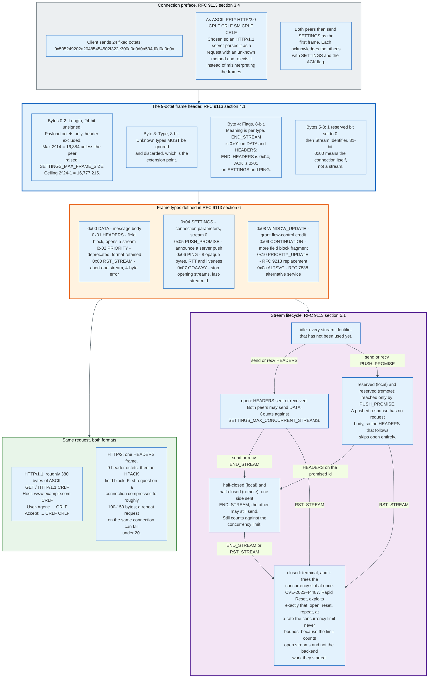

### 5.1 The Header

Nine octets, identical for every frame type.

```
HTTP Frame {
  Length (24),
  Type (8),
  Flags (8),
  Reserved (1),
  Stream Identifier (31),
  Frame Payload (..),
}
```

`Length` counts payload octets and excludes the nine header octets. RFC 9113 caps it at 2^14, that is 16,384 octets, unless the receiver advertises a larger `SETTINGS_MAX_FRAME_SIZE`, whose ceiling is 2^24-1, that is 16,777,215. The default matters: a 100 kB response body is at least seven `DATA` frames.

`Type` is one octet, and RFC 9113 requires that implementations "MUST ignore and discard frames of unknown types." That single sentence is the protocol's extension mechanism. RFC 9218 uses it to add `PRIORITY_UPDATE` as type 0x10, and RFC 7838 uses it to add `ALTSVC` as type 0x0a, without a version bump.

`Flags` are per type. The three that carry most of the protocol's logic are `END_STREAM` (0x01 on `DATA` and `HEADERS`), which signals that the sender is finished with its half of the stream; `END_HEADERS` (0x04 on `HEADERS`, `PUSH_PROMISE`, and `CONTINUATION`), which signals that the field block is complete; and `ACK` (0x01 on `SETTINGS` and `PING`).

`Stream Identifier` is 31 bits with the top bit reserved and set to zero. Value 0x00 addresses the connection rather than any stream, and `SETTINGS`, `PING`, `GOAWAY`, and connection-level `WINDOW_UPDATE` all use it.

### 5.2 The Connection Preface

An HTTP/2 connection opens with 24 fixed octets from the client, chosen so that an HTTP/1.1 server cannot mistake what follows for a request.

```
0x505249202a20485454502f322e300d0a0d0a534d0d0a0d0a
```

Decoded as ASCII that reads `PRI * HTTP/2.0\r\n\r\nSM\r\n\r\n`. An HTTP/1.1 parser sees a request with method `PRI`, target `*`, and version `HTTP/2.0`, rejects it, and closes. It does not attempt to parse the binary frames that follow as header fields. The magic string is a defence against a specific class of confusion, not a handshake.

Both endpoints then send a `SETTINGS` frame as their first frame, and each acknowledges the peer's with an empty `SETTINGS` frame carrying the `ACK` flag. Settings take effect on acknowledgement, not on receipt, which means both sides must tolerate a window in which the peer is still using the old values.

### 5.3 Settings

Six settings are defined, and their defaults determine what a connection does before either side speaks.

| Setting | Code | Default | Effect |
|---|---|---|---|
| `SETTINGS_HEADER_TABLE_SIZE` | 0x01 | 4,096 octets | Maximum HPACK dynamic table the sender will decode. RFC 9113 section 4.3.1 warns that reducing this value "is not widely interoperable." |
| `SETTINGS_ENABLE_PUSH` | 0x02 | 1 | Client's willingness to receive `PUSH_PROMISE`. A server MUST NOT set it to 1. |
| `SETTINGS_MAX_CONCURRENT_STREAMS` | 0x03 | unlimited | Streams the sender permits the peer to open. RFC 9113 recommends no smaller than 100. |
| `SETTINGS_INITIAL_WINDOW_SIZE` | 0x04 | 65,535 octets | Per-stream flow-control window. Maximum 2^31-1. |
| `SETTINGS_MAX_FRAME_SIZE` | 0x05 | 16,384 octets | Largest frame payload the sender accepts. Range 16,384 to 16,777,215. |
| `SETTINGS_MAX_HEADER_LIST_SIZE` | 0x06 | unlimited | Advisory cap on uncompressed field section size. |

The default 65,535-octet stream window is the single most consequential number in HTTP/2 tuning. A server that never raises it caps one stream at 65,535 unacknowledged bytes, which on a 100 ms round trip limits a single download to about 5.2 Mbit/s regardless of available bandwidth. Production servers raise it: Chrome sets its own stream window to 6 MB and its connection window to 15 MB.

### 5.4 Field Blocks and CONTINUATION

A field section is compressed by HPACK into an opaque block, and if it exceeds one frame it continues in `CONTINUATION` frames that must follow immediately with nothing interleaved.

This is a hard sequencing rule and it exists because HPACK's dynamic table is order-dependent. `HEADERS`, `PUSH_PROMISE`, and their `CONTINUATION` frames form an atomic unit on the connection. No frame of any type on any stream may appear between them. A receiver that sees an interleaved frame must treat it as a connection error.

The rule has a cost, described in section 20: the specification puts no bound on how many `CONTINUATION` frames a sender may emit, which produced a family of denial-of-service vulnerabilities disclosed in April 2024.

---

## 6. Streams, Multiplexing, and the Stream State Machine

A stream in HTTP/2 is an independent, bidirectional sequence of frames identified by a 31-bit number, and its lifecycle is a seven-state machine that both peers track separately.

Client-initiated streams use odd identifiers starting at 1. Server-initiated streams, which exist only for push, use even identifiers starting at 2. Identifiers increase monotonically and are never reused; opening stream 9 implicitly closes streams 5 and 7 if they were idle. A connection that exhausts the 31-bit space must be replaced, which is why long-lived connections send `GOAWAY` and reconnect. The lifecycle subgraph in the section 5 diagram shows every transition and the frame that causes it.

### 6.1 The States

`idle` is every identifier that has not been used. `open` follows a `HEADERS` frame and permits both peers to send. `half-closed (local)` and `half-closed (remote)` follow `END_STREAM` from one side; the other side may still send. `closed` is terminal.

`reserved (local)` and `reserved (remote)` exist only for push. A `PUSH_PROMISE` moves the promised identifier into `reserved`, and the subsequent `HEADERS` on that identifier moves it to `half-closed`, because a pushed response has no request body.

Only `open` and the two `half-closed` states count against `SETTINGS_MAX_CONCURRENT_STREAMS`. That exclusion of `closed` is not an oversight; a stream that has finished should not occupy a slot. It is also the mechanism behind the largest denial-of-service attack recorded up to 2023, covered in section 20.

### 6.2 Multiplexing in Practice

Multiplexing changes what a browser does with connections, and the change is larger than the protocol text suggests.

A browser opens one TCP connection per origin for HTTP/2 rather than six, and issues every request on it immediately rather than queueing behind a six-slot scheduler. Domain sharding becomes counterproductive: splitting assets across four hostnames forces four connections, four handshakes, and four independent congestion windows, which is exactly the cost HTTP/2 was built to remove. Sites that sharded for HTTP/1.1 and did not unshard for HTTP/2 measurably lost performance.

Connection coalescing extends this. RFC 9113 section 9.1.1 permits a client to reuse an existing connection for a different origin when the server is authoritative for both, which for an `https` origin means presenting a certificate valid for the second host. The same-IP-address condition applies only to cleartext TCP connections, where there is no certificate to check. A browser holding a connection to `example.com` with a certificate valid for `*.example.com` sends requests for `static.example.com` on it without a new handshake.

### 6.3 Request and Response Mapping

An HTTP/2 request is one `HEADERS` frame, optional `CONTINUATION` frames, and zero or more `DATA` frames, with `END_STREAM` on the last of them.

Pseudo-header fields replace the request line and status line. They begin with a colon and must precede all ordinary fields. RFC 9113 defines five: `:method`, `:scheme`, `:authority`, and `:path` for requests, and `:status` for responses. RFC 8441 adds a sixth, `:protocol`, used by extended CONNECT to bootstrap WebSocket over an HTTP/2 stream, and RFC 9220 carries it into HTTP/3. `:authority` replaces the `Host` header; RFC 9113 no longer permits the two to disagree.

Connection-specific header fields are prohibited. `Connection`, `Keep-Alive`, `Proxy-Connection`, `Transfer-Encoding`, and `Upgrade` have no meaning when framing is handled below them, and a message carrying them is malformed. The single exception is `TE`, permitted only with the value `trailers`.

Field names must be lowercase on the wire. `Content-Type` is `content-type`. A receiver that sees an uppercase octet in a field name must treat the message as malformed, which removes an entire class of parser disagreement.

---

## 7. HPACK and the Dynamic Table

HPACK compresses HTTP header fields by replacing repeated names and values with small integer indices into two tables, and it was designed specifically to resist the compression side-channel attacks that killed generic compression in TLS.

The problem it solves is measurable. A typical browser request carries roughly 500 to 800 bytes of header fields, and 90% or more of those bytes are byte-identical to the previous request on the same connection: the same `user-agent`, the same `accept-encoding`, the same `cookie`. Sending them 80 times for an 80-asset page wastes tens of kilobytes and, worse, overflows the initial TCP congestion window before any response body moves.

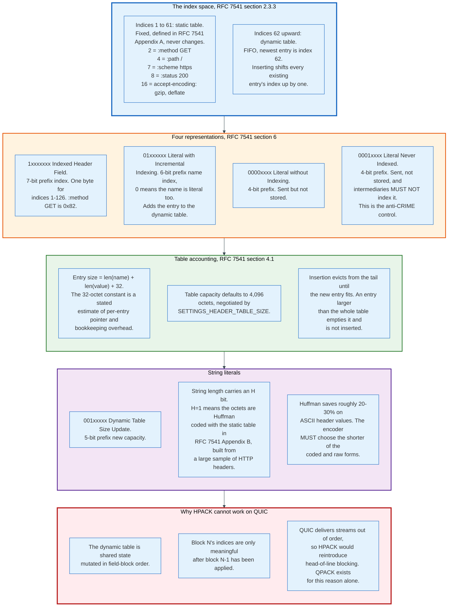

### 7.1 Two Tables, One Index Space

HPACK presents a single index space. Indices 1 through 61 address the static table; index 62 and above address the dynamic table.

The static table, RFC 7541 Appendix A, holds 61 entries drawn from the most frequent header fields on popular sites in 2014, plus the HTTP/2 pseudo-headers. Some entries carry a value (index 2 is `:method: GET`, index 7 is `:scheme: https`, index 8 is `:status: 200`); some carry only a name, so the encoder can reference the name and send the value literally.

The dynamic table is a first-in-first-out list per direction per connection. A new entry becomes index 62 and every existing entry shifts up by one. Two tables exist in each direction, one at the encoder and one at the decoder, and they must stay identical or decoding fails as a connection error.

### 7.2 Integer and String Encoding

HPACK encodes integers with an N-bit prefix, where N depends on the representation.

Values strictly below 2^N - 1 fit in the prefix. Larger values set all prefix bits to 1 and continue in following octets, each carrying seven value bits and a continuation flag in the top bit. An indexed header field uses a 7-bit prefix, so indices 1 through 126 occupy exactly one byte.

Strings carry a length and an `H` bit. When `H` is 1 the octets are Huffman coded using the fixed table in RFC 7541 Appendix B, derived from a large sample of real HTTP headers. The encoder must pick whichever of the two forms is shorter.

### 7.3 Entry Size and the 32-Octet Constant

An entry's size is the length of its name, plus the length of its value, plus 32 octets. RFC 7541 states the reason: "The additional 32 octets account for an estimated overhead associated with an entry."

The constant is not decoration. With a default 4,096-octet table, an entry with a 10-byte name and a 20-byte value costs 62 octets, so the table holds about 66 such entries. A single 3,000-byte `cookie` header consumes three quarters of the table and evicts nearly everything else. Sites with large cookies get much worse header compression than the ratio implies, and raising `SETTINGS_HEADER_TABLE_SIZE` is the fix. RFC 9113 section 4.3.1 cautions only against reducing the value, which "is not widely interoperable"; raising it is safe.

### 7.4 The Security Design

HPACK's four representations exist because compression plus a secret plus attacker-controlled input equals a secret oracle.

CRIME, demonstrated in 2012, recovered TLS session cookies by observing the compressed length of requests in which the attacker controlled part of the header. If the attacker's guess matches a prefix of the secret, the compressor finds a longer match and the ciphertext gets shorter. Repeat one byte at a time. SPDY's use of a zlib-compressed header block was vulnerable, and HTTP/2 could not reuse it.

HPACK removes the general string matcher. Compression happens only against whole header-field entries in a table, so an attacker-controlled substring cannot shorten an unrelated secret. The residual risk is that a secret header still gets a table index, and an attacker who can inject requests can probe whether a guessed value is already in the table by observing size.

The `Literal Header Field Never Indexed` representation, prefix `0001`, is the control for this. It instructs the receiver, and every intermediary that recompresses, never to place this field in a dynamic table. Authorisation tokens and cookies with per-request entropy belong in it. RFC 7541 section 7.1.3 makes the requirement explicit for intermediaries.

---

## 8. Flow Control and Priority

HTTP/2 flow control is a credit scheme that operates on `DATA` frames only, at two levels, in each direction independently, and it exists because multiplexing without backpressure lets one stream starve every other.

### 8.1 The Credit Scheme

Each endpoint advertises a window, and the sender may not have more unacknowledged `DATA` octets in flight than the window permits.

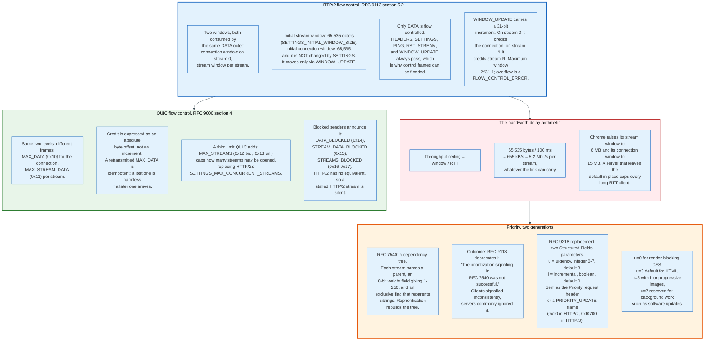

Two windows govern every `DATA` octet: the connection window on stream 0 and the per-stream window. Sending 1,000 octets on stream 5 decrements both by 1,000. Both must have room.

The initial stream window is `SETTINGS_INITIAL_WINDOW_SIZE`, default 65,535. The initial connection window is also 65,535 and, critically, `SETTINGS_INITIAL_WINDOW_SIZE` does not change it. The connection window moves only through `WINDOW_UPDATE` on stream 0. Implementations that miss this detail cap the whole connection at 65,535 bytes in flight and then debug the wrong layer.

Only `DATA` is flow controlled. `HEADERS`, `SETTINGS`, `PING`, `RST_STREAM`, and `WINDOW_UPDATE` are always deliverable, which keeps control signalling from deadlocking behind data and, as section 20 shows, gives an attacker a channel with no credit limit.

### 8.2 The Arithmetic That Bites

Throughput on one stream is bounded by window divided by round-trip time.

At the default 65,535-octet window and a 100 ms round trip, one stream tops out at 655 kB/s, about 5.2 Mbit/s. A user on a 200 Mbit/s connection to a server 100 ms away sees 5.2. Doubling the window doubles the ceiling. Chrome sets its own stream window to 6 MB and connection window to 15 MB for this reason. Any server that leaves the defaults in place is rate-limiting its distant users, and the symptom looks exactly like a slow origin.

### 8.3 QUIC Flow Control Differs in Encoding

QUIC uses the same two-level scheme with three improvements.

Credit is an absolute offset, not an increment. `MAX_DATA` says "you may send up to byte 1,048,576 in total on this connection," so a lost or duplicated frame changes nothing. `WINDOW_UPDATE` in HTTP/2 carries a delta, so it must be delivered exactly once, which TCP guarantees and which would be a problem on an unreliable substrate.

QUIC adds a stream-count limit as a first-class frame. `MAX_STREAMS` types 0x12 and 0x13 cap the number of bidirectional and unidirectional streams the peer may open, replacing `SETTINGS_MAX_CONCURRENT_STREAMS`.

QUIC also makes blocking observable. `DATA_BLOCKED`, `STREAM_DATA_BLOCKED`, and `STREAMS_BLOCKED` let a sender announce that it has data and no credit. HTTP/2 has no such signal, so a stalled stream is indistinguishable from an idle one, and diagnosing it requires instrumenting both ends.

### 8.4 Priority: Two Failures and a Replacement

The RFC 7540 priority scheme built a dependency tree, and it did not work.

Each stream declared a parent stream, an 8-bit weight field giving a weight from 1 to 256, and an optional exclusive flag that reparented all of the parent's other children beneath it. Bandwidth was to be divided among siblings in proportion to weight, and among tree levels by depth. Reprioritisation moved subtrees. The model is expressive and it is also a mutable shared data structure that both peers must maintain identically for the lifetime of a connection.

RFC 9113 states the outcome: "It was possible for clients to express priorities in very different ways, with little consistency in the approaches that were adopted. For servers, implementing generic support for the scheme was complex. Implementation of priorities was uneven in both clients and servers. Many server deployments ignored client signals."

RFC 9218 replaces the tree with two numbers. `u` is urgency, an integer from 0 to 7 defaulting to 3, where lower is more urgent and 7 is reserved for background transfers such as software updates. `i` is incremental, a boolean defaulting to false, which tells the server whether partial delivery is useful. A progressive JPEG is incremental; a JavaScript file that must be parsed whole is not.

The signal travels two ways: as a `Priority` request header field using HTTP Structured Fields, or as a `PRIORITY_UPDATE` frame, type 0x10 in HTTP/2 and type 0xf0700 in HTTP/3, which lets a client reprioritise after the request is already sent. `u=0` marks render-blocking CSS. `u=5, i` marks an image below the fold.

The scheme is simpler than what it replaced and it is a hint, not a contract. A server remains free to schedule as it sees fit.

---

## 9. Server Push, and Why It Was Removed

Server push lets a server send a response the client has not requested, and it was removed from Chrome in 2022 because 99.95% of HTTP/2 connections never used it and fewer than 40% of the pushes that did occur were used.

### 9.1 The Mechanism

A push is a synthetic request the server invents, followed by a response on a server-initiated stream.

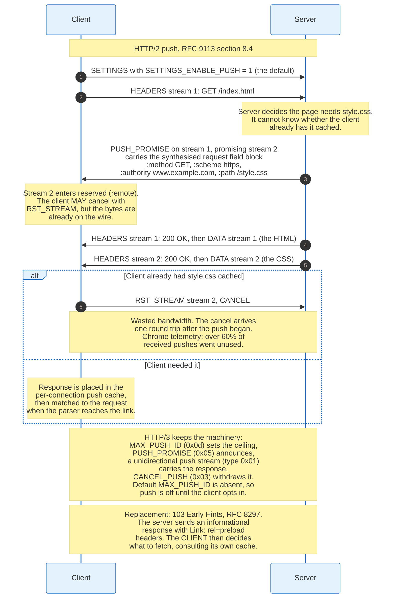

In HTTP/2 the server sends a `PUSH_PROMISE` frame on the client's stream. It carries the promised stream identifier, always even, and a compressed field block containing the request the server is pretending the client made. The promised stream enters `reserved (remote)`. The server then sends `HEADERS` and `DATA` on it.

In HTTP/3 the machinery is spread across four frames and a stream type. The client sends `MAX_PUSH_ID` (0x0d) on its control stream to set a ceiling on push identifiers. The server sends `PUSH_PROMISE` (0x05) on the request stream, then opens a unidirectional stream of type 0x01 carrying the push identifier followed by the response. Either side can send `CANCEL_PUSH` (0x03). Because there is no default `MAX_PUSH_ID`, HTTP/3 push is off unless the client explicitly enables it, which reverses HTTP/2's default of on.

### 9.2 Why It Failed

Push fails on one structural fact: the server does not know what is in the client's cache.

Pushing `style.css` to a returning visitor who already holds it wastes the full transfer. The client can cancel with `RST_STREAM`, but the cancellation arrives one round trip after the server started sending, by which time a 30 kB stylesheet is largely on the wire. Cache digests were proposed to fix this and were abandoned; the digest itself costs bytes and leaks browsing history.

Push also competes with the response it is meant to accelerate. Pushed bytes and the HTML share one connection and one congestion window. A server that pushes six assets before the HTML delays the document that tells the browser what to render, which is the opposite of the intent. Correcting it requires the priority scheme that RFC 9113 deprecated.

The push cache is per connection and separate from the HTTP cache. A pushed response that is never matched to a request is discarded when the connection closes.

The Chrome telemetry that ended the feature, gathered over a 28-day window and published in the intent to remove, is unambiguous:

| Measurement | Figure |
|---|---|
| HTTP/2 connections that never received a pushed stream | 99.95% |
| HTTP/2 connections that never received a push matched to a request | 99.97% |
| Received pushes that were used | under 40%, down from 63.51% two years earlier |
| gQUIC connections that saw any pushed stream | fewer than 1 in 1,200,000 |

Site-level adoption tracks the same way from an independent source. The Web Almanac measured 1.25% of sites using push in 2021, falling to 0.71% on desktop and 0.66% on mobile in 2022.

Chrome disabled push in version 106, shipped in 2022, and other Chromium browsers followed. Firefox disabled it. RFC 9113 retains the specification, so the frames remain legal, and an HTTP/2 server that pushes to a modern browser has its `SETTINGS_ENABLE_PUSH: 0` respected instead.

### 9.3 What Replaced It

103 Early Hints, RFC 8297, moves the decision to the client.

The server sends an informational `103` response before the final response, carrying `Link: </style.css>; rel=preload` header fields. The client receives these while the server is still generating the HTML, checks its own cache, and issues requests for whatever it actually lacks. The round trip that push was meant to save is partially recovered, and nothing is transmitted that the client already holds.

The mechanism is strictly better on the axis that matters, and it is worse on one: it costs a round trip that push does not. That trade lost to push in theory and won in the field, because a round trip is bounded and wasted bandwidth is not.

---

## 10. QUIC: Packets, Frames, and the UDP Substrate

QUIC is a connection-oriented, reliable, congestion-controlled, encrypted transport that runs inside UDP datagrams, and every property TCP provides is reimplemented in userspace above a datagram service that provides none of them.

The choice of UDP is a deployment decision, not a technical preference. A new IP protocol number would be dropped by most NATs and firewalls on the public Internet, and getting one deployed would take a decade. UDP passes. That is the whole argument.

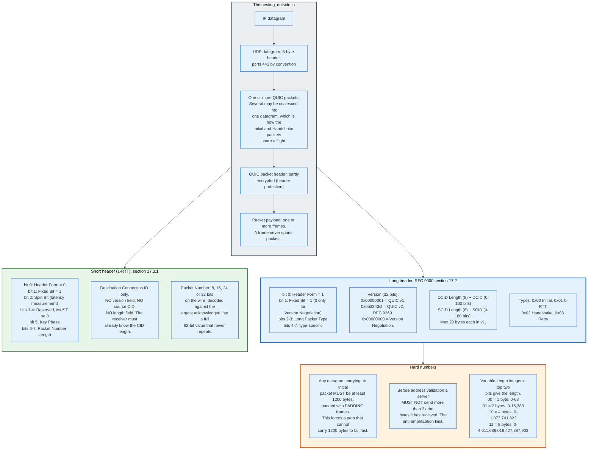

### 10.1 The Long Header

Packets sent before 1-RTT keys exist use a long header, which carries the version and both connection identifiers so a receiver with no state can classify the packet.

```
Long Header Packet {
  Header Form (1) = 1,
  Fixed Bit (1) = 1,
  Long Packet Type (2),
  Type-Specific Bits (4),
  Version (32),
  Destination Connection ID Length (8),
  Destination Connection ID (0..160),
  Source Connection ID Length (8),
  Source Connection ID (0..160),
  Type-Specific Payload (..),
}
```

Four long-header types exist in version 1. `Initial` (0x00) carries the first `CRYPTO` frames in each direction plus `ACK` frames, and adds a `Token Length` and `Token` field for the address-validation token from a `Retry` or a `NEW_TOKEN`. `0-RTT` (0x01) carries application data sent before the handshake completes. `Handshake` (0x02) carries the rest of the TLS exchange. `Retry` (0x03) carries no frames at all, only a token and a 128-bit `Retry Integrity Tag` computed with AES-128-GCM under the fixed key `0xbe0c690b9f66575a1d766b54e368c84e`.

The `Fixed Bit` is set to 1 on every packet except Version Negotiation. It exists so QUIC can be demultiplexed from other UDP protocols on the same port, per RFC 7983. RFC 9287, "Greasing the QUIC Bit," lets endpoints negotiate permission to send it as 0, specifically so that middleboxes cannot come to rely on it always being 1.

### 10.2 The Short Header

Once 1-RTT keys are available the header collapses to a first byte, a destination connection ID, and a packet number.

```
1-RTT Packet {
  Header Form (1) = 0,
  Fixed Bit (1) = 1,
  Spin Bit (1),
  Reserved Bits (2),
  Key Phase (1),
  Packet Number Length (2),
  Destination Connection ID (0..160),
  Packet Number (8..32),
  Packet Payload (8..),
}
```

There is no version field, no source connection ID, and no length prefix on the destination connection ID. The receiver must already know how long its own connection IDs are, which is why an endpoint that uses non-zero-length connection IDs must use a consistent length or encode the length into the ID itself. Load balancers exploit this: routing information is embedded in the connection ID at a fixed offset.

The `Spin Bit` is the one deliberate concession to on-path measurement. It toggles once per round trip, letting a passive observer estimate RTT without decrypting anything. Endpoints may disable it, and RFC 9000 section 17.4 requires each endpoint to disable it on at least one in every sixteen network paths or connection IDs, chosen at random. Because both endpoints choose independently, the signal goes dark on roughly one path in eight, which stops the bit from becoming a reliable tracking signal.

The `Key Phase` bit flips when the sender rotates 1-RTT keys, which is how the receiver knows which of two key generations to use without an explicit message.

### 10.3 Header Protection

QUIC encrypts part of its own header, using a separate key derived alongside the packet-protection key.

The packet number and the low bits of the first byte are masked with a keystream derived from a sample of the ciphertext. RFC 9001 defines the key with the HKDF label `quic hp`, alongside `quic key` and `quic iv` for packet protection. For AEAD_AES_128_GCM with an 8-byte connection ID, the sample is bytes 13 through 28 of the packet.

The effect is that an observer cannot read packet numbers, cannot see the key phase, and cannot correlate packets by their sequence. It also means a middlebox cannot rewrite them, which is the point.

Initial packets are encrypted too, with keys anyone can compute: the initial secret is `HKDF-Extract` of the client's original destination connection ID with the fixed salt `0x38762cf7f55934b34d179ae6a4c80cadccbb7f0a`. This provides no confidentiality. It provides tamper evidence and it forces any middlebox that wants to modify an Initial packet to implement the whole derivation, which raises the cost of ossification without pretending to be security.

### 10.4 Frames

A QUIC packet payload is a sequence of frames, each beginning with a variable-length integer type. RFC 9000 defines twenty frame types across the range 0x00 to 0x1e.

| Type | Name | Purpose | Ack-eliciting |
|---|---|---|---|
| 0x00 | `PADDING` | Fill to a size; no effect | No |
| 0x01 | `PING` | Elicit an acknowledgement | Yes |
| 0x02-0x03 | `ACK` | Acknowledge ranges; 0x03 adds ECN counts | No |
| 0x04 | `RESET_STREAM` | Abandon sending on a stream | Yes |
| 0x05 | `STOP_SENDING` | Ask the peer to stop sending on a stream | Yes |
| 0x06 | `CRYPTO` | Carry TLS handshake bytes, offset-addressed | Yes |
| 0x07 | `NEW_TOKEN` | Server gives a token for a future connection | Yes |
| 0x08-0x0f | `STREAM` | Stream data; low three bits are OFF, LEN, FIN | Yes |
| 0x10 | `MAX_DATA` | Connection flow-control limit | Yes |
| 0x11 | `MAX_STREAM_DATA` | Per-stream flow-control limit | Yes |
| 0x12-0x13 | `MAX_STREAMS` | Bidirectional and unidirectional stream caps | Yes |
| 0x14 | `DATA_BLOCKED` | Sender is connection-flow-control blocked | Yes |
| 0x15 | `STREAM_DATA_BLOCKED` | Sender is stream-flow-control blocked | Yes |
| 0x16-0x17 | `STREAMS_BLOCKED` | Sender wants to open a stream and cannot | Yes |
| 0x18 | `NEW_CONNECTION_ID` | Issue an alternative connection ID | Yes |
| 0x19 | `RETIRE_CONNECTION_ID` | Stop using a connection ID | Yes |
| 0x1a | `PATH_CHALLENGE` | 64 bits of entropy for path validation | Yes |
| 0x1b | `PATH_RESPONSE` | Echo of `PATH_CHALLENGE` data | Yes |
| 0x1c-0x1d | `CONNECTION_CLOSE` | Terminate; 0x1c transport error, 0x1d application error | No |
| 0x1e | `HANDSHAKE_DONE` | Server confirms the handshake | Yes |

The `STREAM` frame's type value encodes three flags in its low bits. `OFF` (0x04) means an explicit `Offset` field is present; without it the offset is 0. `LEN` (0x02) means an explicit `Length` field is present; without it the data runs to the end of the packet, which saves bytes on the last frame. `FIN` (0x01) marks the end of the stream.

```
STREAM Frame {
  Type (i) = 0x08..0x0f,
  Stream ID (i),
  [Offset (i)],
  [Length (i)],
  Stream Data (..),
}
```

The `ACK` frame carries ranges rather than a single cumulative point.

```
ACK Frame {
  Type (i) = 0x02..0x03,
  Largest Acknowledged (i),
  ACK Delay (i),
  ACK Range Count (i),
  First ACK Range (i),
  ACK Range (..) ...,
  [ECN Counts (..)],
}
```

QUIC acknowledgements are irrevocable. RFC 9000 states this directly: "Once acknowledged, a packet remains acknowledged, even if it does not appear in a future ACK frame. This is unlike reneging for TCP Selective Acknowledgments." TCP SACK is advisory and a receiver may discard SACKed data under memory pressure, which forces senders to keep it. QUIC removes that ambiguity.

`ACK Delay` reports how long the receiver held the acknowledgement, scaled by 2 to the power of the peer's `ack_delay_exponent` transport parameter, default 3. The sender subtracts it before feeding the sample into its RTT estimator, which TCP cannot do because a TCP acknowledgement carries no such field.

### 10.5 Variable-Length Integers

Almost every numeric field in QUIC uses a two-bit length prefix, which keeps small values to one byte.

| Two most significant bits | Length | Usable bits | Range |
|---|---|---|---|
| `00` | 1 byte | 6 | 0 to 63 |
| `01` | 2 bytes | 14 | 0 to 16,383 |
| `10` | 4 bytes | 30 | 0 to 1,073,741,823 |
| `11` | 8 bytes | 62 | 0 to 4,611,686,018,427,387,903 |

Stream IDs, offsets, frame types, and flow-control limits all use it. Frame types are the exception to one rule: RFC 9000 requires them to use the shortest possible encoding, so a `PING` is always the single byte 0x01 and never the two-byte 0x4001.

### 10.6 Stream Identifiers

QUIC stream IDs are 62-bit variable-length integers whose low two bits carry the type.

| Low two bits | Stream type | First ID |
|---|---|---|
| `0x00` | Client-initiated, bidirectional | 0 |
| `0x01` | Server-initiated, bidirectional | 1 |
| `0x02` | Client-initiated, unidirectional | 2 |
| `0x03` | Server-initiated, unidirectional | 3 |

Bit 0 identifies the initiator, bit 1 identifies directionality. Opening stream 8 implicitly opens streams 0 and 4, which is how a receiver keeps its accounting without a creation handshake.

### 10.7 The 1200-Byte Floor and the Amplification Limit

Two numbers protect QUIC from being an attack tool and from silently failing on small-MTU paths.

Any UDP datagram carrying an `Initial` packet must be at least 1,200 bytes, padded with `PADDING` frames if necessary. A path that cannot carry 1,200 bytes fails during the handshake instead of after it, which turns a mysterious stall into an immediate fallback to TCP.

Before it has validated a client's address, a server must not send more than three times the bytes it has received from that address. Without this, a spoofed 1,200-byte Initial packet from a forged source address would make the server emit a certificate chain of several kilobytes to a victim, a reflection amplifier of roughly four to five times. The 3x limit caps it. A server whose certificate chain does not fit inside three received datagrams simply waits for the client to send more, typically an ACK, and continues.

The `Retry` packet is the stronger form of the same defence. Under load, a server can refuse to allocate state at all: it returns a stateless `Retry` carrying a token, and only proceeds when the client returns that token in a fresh Initial. This costs one extra round trip and moves the memory cost onto the client.

---

## 11. Connection IDs, Paths, and Migration

A QUIC connection is identified by a connection ID chosen by each endpoint, not by the four-tuple of addresses and ports, and that indirection is what lets a connection survive an address change.

A TCP connection is its four-tuple. Change the client's source port, which every NAT rebinding does, and the connection is gone. A phone moving from Wi-Fi to cellular changes both address and port, so every TCP connection breaks and every TLS session must be re-established.

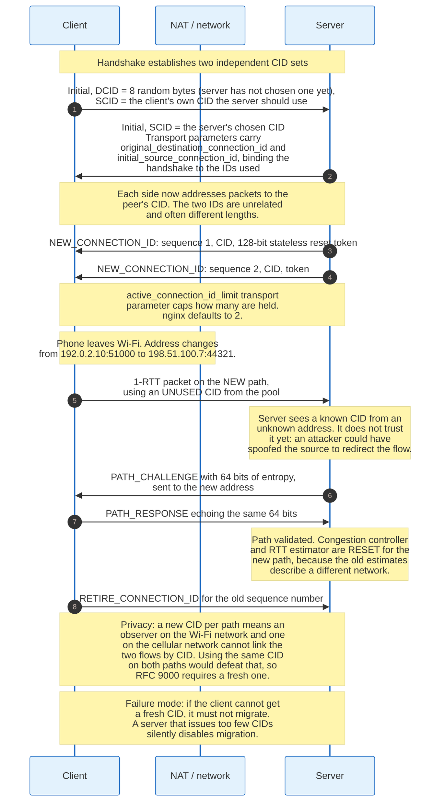

### 11.1 Two Independent Identifier Sets

Each endpoint chooses the connection IDs it wants the peer to put on packets sent to it.

The client's first `Initial` packet contains a destination connection ID it invented at random, because it does not yet know what the server wants, and a source connection ID naming what the server should use for the reverse direction. The server replies with its own chosen source connection ID. From then on, each side addresses packets to the other's value. They are unrelated and frequently different lengths: a client typically uses a zero-length connection ID, since its address is enough to find the connection, while a server uses 8 to 20 bytes encoding routing information.

Three transport parameters bind these identifiers into the handshake transcript so an attacker cannot rewrite them. `original_destination_connection_id` (0x00) echoes the value in the client's first Initial. `initial_source_connection_id` (0x0f) echoes the sender's own first source ID. `retry_source_connection_id` (0x10) appears when a Retry occurred. A mismatch aborts the connection.

### 11.2 Issuing and Retiring

A `NEW_CONNECTION_ID` frame supplies an alternative identifier plus a token for stateless reset.

```
NEW_CONNECTION_ID Frame {
  Type (i) = 0x18,
  Sequence Number (i),
  Retire Prior To (i),
  Length (8),
  Connection ID (8..160),
  Stateless Reset Token (128),
}
```

`Retire Prior To` lets the issuer force retirement of everything below a sequence number, which is how a server rotates identifiers on a schedule. The `active_connection_id_limit` transport parameter (0x0e) caps how many the peer will hold; nginx defaults `quic_active_connection_id_limit` to 2.

The `Stateless Reset Token` handles the case where a server loses its state, through a crash or a load-balancer reassignment, and receives packets for a connection it no longer knows. It cannot send `CONNECTION_CLOSE`, because that requires keys it has lost. Instead it emits a packet that looks like a short-header packet and ends with the 128-bit token the peer was given. Only the legitimate peer knows the token, so only the legitimate peer accepts the reset. An observer sees an ordinary-looking encrypted packet.

### 11.3 Migration and Path Validation

Migration is a client-only capability in QUIC version 1, and it requires proving that the new address is reachable before trusting it.

When packets for a known connection ID arrive from a new address, the server does not simply switch. An attacker who can spoof source addresses would otherwise redirect a large flow at a victim. The server sends a `PATH_CHALLENGE` frame containing 8 bytes of unpredictable data to the new address and waits for a `PATH_RESPONSE` echoing them. RFC 9000 notes that "including 64 bits of entropy in a PATH_CHALLENGE frame ensures that it is easier to receive the packet than it is to guess the value correctly."

On success, the server switches. It also resets its congestion controller and RTT estimator, because the new path has different capacity and different latency, and carrying the old estimates over would either overshoot or undershoot for several round trips.

The client must use a fresh, previously unused connection ID on the new path. If it reused the old one, an observer present on both networks could link the two flows and follow the user across the change, which is the exact privacy property migration is supposed to deliver. RFC 9000 section 9.5 makes this a requirement, and it has a practical consequence: a client that has exhausted its supply of unused connection IDs must not migrate. A server that issues too few silently disables the feature.

### 11.4 Two Kinds of Address Change

The distinction between passive rebinding and active migration matters in practice and is frequently blurred.

**NAT rebinding** is involuntary. A NAT times out a mapping and assigns a new external port, so the server sees the same client on a new port. This is common on cellular networks and behind aggressive home routers. QUIC handles it as a path change with validation, and the connection survives. Every TCP connection through that NAT dies.

**Active migration** is deliberate: the client decides to move, typically because the operating system reports a better interface. Chrome performs active migration on network change. The server can forbid it with the `disable_active_migration` transport parameter (0x0c), which many deployments set, because a server behind a load balancer that routes on the four-tuple cannot follow the client anyway.

The load-balancing problem is the real constraint on migration in production. A datacentre front end that hashes the UDP four-tuple to pick a backend sends a migrated client to the wrong machine. The fix is to route on the connection ID instead, encoding a server identifier into the bytes the server chooses. nginx offers `quic_bpf` to do this with eBPF on Linux 5.7 and later. Any deployment that has not done this work should set `disable_active_migration`.

---

## 12. TLS 1.3 Inside QUIC: 1-RTT, 0-RTT, and Replay

QUIC does not run TLS over itself and does not run over TLS. It embeds the TLS 1.3 handshake state machine, takes the keys, and uses its own record layer, which is how it collapses transport and cryptographic setup into one round trip.

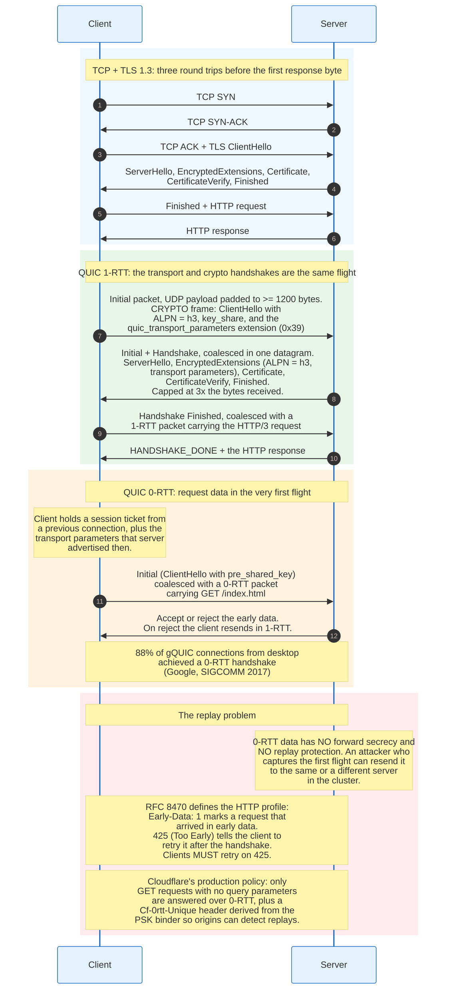

### 12.1 The Interface Between the Two

RFC 9001 defines a narrow interface: TLS produces handshake bytes and keys, QUIC carries the bytes and uses the keys.

TLS handshake messages travel in `CRYPTO` frames, which carry an offset and a length like a stream but consume no stream identifier and no flow-control credit. QUIC keeps three separate packet number spaces, Initial, Handshake, and Application, each with its own keys, its own acknowledgements, and its own loss detection. A lost Handshake packet is retransmitted in the Handshake space and cannot be conflated with application data.

Keys are derived with the labels `quic key`, `quic iv`, and `quic hp` applied to the TLS secret for each encryption level. Initial keys come from a fixed salt applied to the client's original destination connection ID, so both sides can compute them before any exchange.

QUIC's transport parameters ride inside TLS as extension 0x39, `quic_transport_parameters`. This puts them under the handshake's integrity protection at no extra round trip, which is why an attacker cannot downgrade a peer's flow-control limits or stream caps.

TLS 1.3 is the floor. RFC 9001 permits no earlier version, which removes renegotiation, static RSA key exchange, and CBC record protection from the design space entirely.

### 12.2 The Round-Trip Arithmetic

The saving is one to two round trips depending on what is compared.

| Scenario | Round trips before the first response byte |
|---|---|
| TCP + TLS 1.3, new connection | 3: SYN/SYN-ACK, ClientHello/ServerHello, request/response |
| TCP + TLS 1.3 with TCP Fast Open | 2, where TFO works, which is rarely |
| QUIC 1-RTT, new connection | 2: handshake flight, then request/response |
| QUIC 1-RTT with a Retry | 3 |
| TCP + TLS 1.3 resumption with 0-RTT | 2 |
| QUIC 0-RTT | 1 |

On a 40 ms path, QUIC's 1-RTT handshake saves 40 ms against TCP with TLS 1.3, and 0-RTT saves 80 ms. On a 200 ms satellite or long-haul mobile path those become 200 ms and 400 ms. The saving is proportional to latency, which is why QUIC's measured gains concentrate in the tail: Google reported an 8.0% mean reduction in desktop Search latency and 16.7% at the 99th percentile.

### 12.3 0-RTT and Why It Is Dangerous

0-RTT sends application data encrypted under a key derived from a previous session, before the server has proved it is live, and that is exactly what makes it replayable.

A normal handshake mixes fresh randomness from both sides into every key. 0-RTT data is encrypted under a key derived only from the pre-shared key and the client's hello. An attacker who records the client's first flight can send those exact bytes again, an hour later, to any server in the cluster that shares the ticket key. The server cannot tell the copy from the original, because there is nothing in the packet that a live server contributed.

Two properties follow, and both are permanent. 0-RTT data has no forward secrecy: compromise of the session ticket encryption key decrypts it. And 0-RTT data has no replay protection at the TLS layer: RFC 9001 requires anti-replay measures and states plainly that "these mechanisms are imperfect."

QUIC's own frames are safe under replay. RFC 9001 notes that "processing of QUIC frames is idempotent and cannot result in invalid connection states if frames are replayed." The exposure is entirely in the application. Replaying `GET /index.html` costs a wasted response. Replaying `POST /transfer?amount=1000` moves money twice.

### 12.4 The HTTP Profile for Early Data

RFC 8470 defines how HTTP handles the risk, and it puts the decision at the server.

A client that sends a request in early data adds `Early-Data: 1`, which also declares that it understands the retry protocol. Intermediaries forwarding a request that arrived in early data add the same field.

A server that will not process a request in early data responds `425 (Too Early)`. RFC 8470 requires that "clients that use early data MUST retry requests upon receipt of a 425 (Too Early) status code," after the handshake completes. The cost of a wrong guess is one round trip, not a duplicated side effect.

Production policy is more conservative than the specification requires. Cloudflare answers only GET requests with no query parameters over 0-RTT, caps the size of early data, and adds a `Cf-0rtt-Unique` header derived from the PSK binder so an origin can detect a replay of the same handshake. The rule that generalises: 0-RTT is for idempotent, cacheable, side-effect-free requests, and a server that cannot enforce that should not enable it.

### 12.5 Certificate Delivery Costs the Handshake

The size of the server's certificate chain determines whether a QUIC handshake completes in one round trip or two.

The anti-amplification limit caps the server at three times the bytes received. A client Initial padded to 1,200 bytes buys 3,600 bytes of server response. A typical RSA chain with an intermediate runs 3,000 to 5,000 bytes; adding a Certificate Transparency SCT list and OCSP staple pushes it higher. A chain that exceeds the budget forces the server to stop and wait for the client's next packet, adding a round trip and eliminating QUIC's headline advantage.

Three mitigations are in production. ECDSA certificates are roughly one third the size of RSA at equivalent strength. TLS certificate compression, RFC 8879, compresses the `Certificate` message with Brotli or zlib and typically halves it. Trimming the chain to a single intermediate removes redundant bytes.

Post-quantum key exchange makes this worse, not better. An ML-KEM-768 key share adds roughly 1,100 bytes to the ClientHello and about the same to the ServerHello, which pushes the client's first flight past 1,200 bytes and consumes more of the server's amplification budget. Cloudflare reported that 52% of human-generated web traffic was post-quantum encrypted by the end of 2025, so this is the common case, not an edge case.

---

## 13. Loss Recovery and Congestion Control

QUIC's loss detection is a cleaned-up version of what TCP does, and the clean-up is possible because QUIC fixed one design flaw TCP cannot fix: retransmission ambiguity.

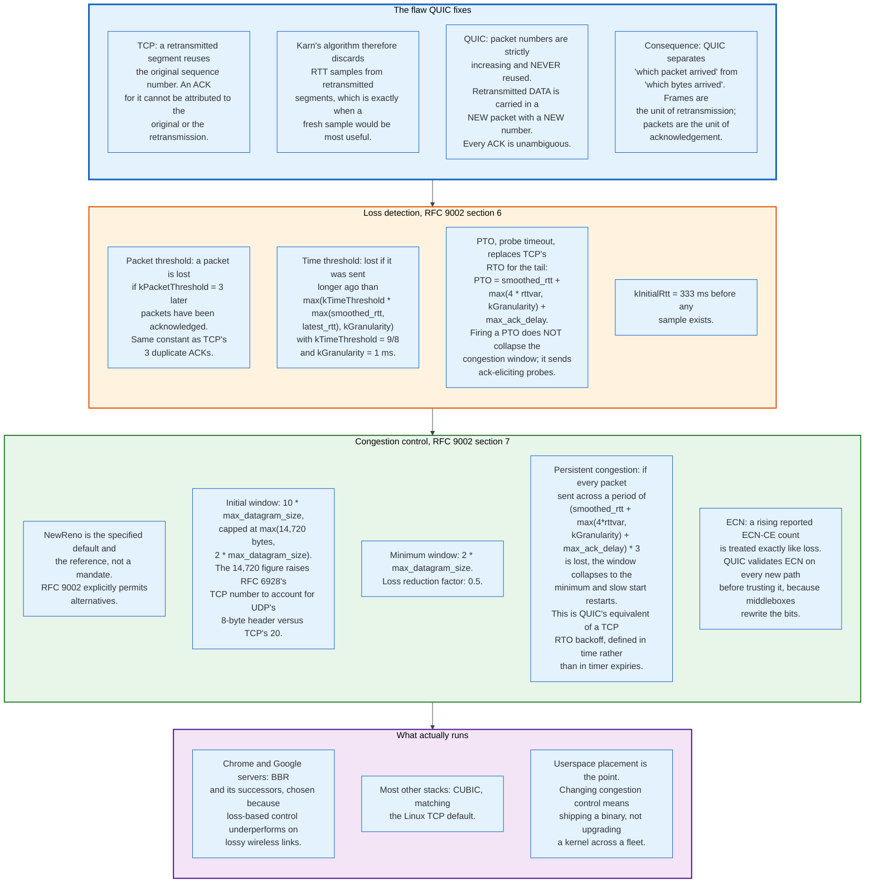

### 13.1 Monotonic Packet Numbers

QUIC packet numbers increase strictly within a packet number space and are never reused, and that single rule removes retransmission ambiguity.

In TCP, retransmitting a segment reuses its sequence number. When an acknowledgement arrives, the sender cannot tell whether it responds to the original transmission or the retransmission, so the RTT sample is unusable. Karn's algorithm handles this by discarding such samples, which means TCP goes blind precisely when the network is misbehaving and a fresh measurement matters most.

QUIC separates the two concepts. A packet number identifies a transmission. A stream offset identifies data. When a packet is declared lost, the frames it carried are re-sent inside a new packet with a new, higher number. Every acknowledgement maps to exactly one transmission, so every acknowledgement yields a usable RTT sample.

The same property enables spurious-loss detection. A sender that retransmits and then receives an acknowledgement for the original packet number learns that its loss detection was wrong and can undo the congestion response.

### 13.2 Three Packet Number Spaces

QUIC keeps Initial, Handshake, and Application Data as separate spaces, each with its own numbering, its own acknowledgements, and its own loss detection state.

The reason is key availability. A client may have Handshake keys before the server has completed its own flight, and 0-RTT packets are protected differently from 1-RTT packets. Mixing them in one number space would make an acknowledgement ambiguous about which keys it refers to. RFC 9000 requires that an `ACK` frame only acknowledge packets in the space of the packet containing it.

### 13.3 The Constants

RFC 9002 fixes recommended values, and implementations largely use them unchanged.

| Constant | Value | Role |
|---|---|---|
| `kPacketThreshold` | 3 | Later acknowledged packets before declaring loss |
| `kTimeThreshold` | 9/8 | Multiplier on RTT for the time-based loss threshold |
| `kGranularity` | 1 ms | Timer granularity floor |
| `kInitialRtt` | 333 ms | Assumed RTT before the first sample |
| `kInitialWindow` | 10 datagrams, capped at max(14,720 bytes, 2 datagrams) | Slow-start starting point |
| `kMinimumWindow` | 2 datagrams | Floor after loss |
| `kLossReductionFactor` | 0.5 | Multiplicative decrease |
| `kPersistentCongestionThreshold` | 3 | Multiplier on PTO defining persistent congestion |

The 14,720-byte cap deserves a note. RFC 6928 set TCP's initial window at 10 segments or 14,600 bytes. RFC 9002 raises it to 14,720 "to account for the smaller 8-byte overhead of UDP compared to the 20-byte overhead for TCP." The protocol gets to carry 120 more payload bytes in its first flight because its headers are smaller.

### 13.4 Probe Timeout Instead of Retransmission Timeout

The PTO replaces TCP's RTO and behaves differently in one important way: firing it does not reduce the congestion window.

```
PTO = smoothed_rtt + max(4 * rttvar, kGranularity) + max_ack_delay
```

A TCP RTO expiry collapses the congestion window to one segment on the assumption that the network is severely congested. That assumption is wrong for a tail loss, where the last packets of a transfer are lost and no duplicate acknowledgements can be generated. QUIC's PTO instead sends one or two ack-eliciting probe packets, which either elicit an acknowledgement that reveals what was lost or confirm that the path is dead. The window is reduced only when loss is actually declared.

Persistent congestion is the recovery from a genuinely dead path. If every packet sent across a window of `PTO * 3` is lost, the sender collapses to the minimum window and restarts slow start. Defining it in time rather than in consecutive timer expiries makes it independent of how aggressively the sender probes.

### 13.5 What Actually Runs

RFC 9002 specifies NewReno as a reference and explicitly permits other controllers, and almost nobody ships NewReno.

Google's stacks use BBR and its successors, chosen because loss-based congestion control treats wireless loss as congestion and backs off when it should not. Most other implementations use CUBIC, matching the Linux TCP default.

The placement matters more than the choice. Congestion control in QUIC is application code. Changing it means shipping a new binary, which a large operator does weekly. Changing TCP congestion control means upgrading kernels across a fleet, or across the world's mobile devices, which takes years. The experimentation loop that produced BBR is only fast because QUIC put the controller in userspace.

---

## 14. HTTP/3: Mapping HTTP onto QUIC

HTTP/3 is a thin mapping. QUIC already supplies multiplexed reliable streams, flow control, and stream cancellation, so HTTP/3 deletes the parts of HTTP/2 that provided them and keeps the rest.

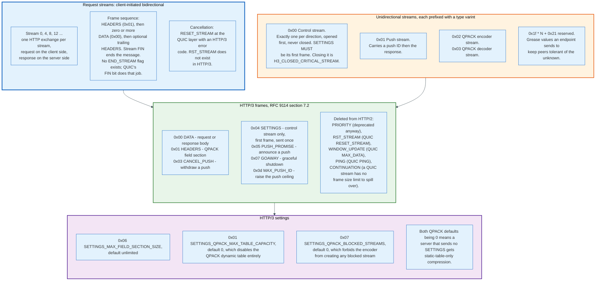

### 14.1 One Exchange per Stream

Each HTTP/3 request and its response occupy one client-initiated bidirectional QUIC stream: 0, 4, 8, 12, and upward.

The client sends a `HEADERS` frame containing a QPACK-encoded field section, then zero or more `DATA` frames, then closes its side of the stream with QUIC's FIN. The server sends its own `HEADERS`, `DATA` frames, an optional trailing `HEADERS`, and FIN. There is no `END_STREAM` flag because QUIC's stream FIN already carries that meaning.

Cancellation uses QUIC's `RESET_STREAM` with an HTTP/3 error code such as `H3_REQUEST_CANCELLED`. HTTP/2's `RST_STREAM` frame does not exist.

### 14.2 Control and Helper Streams

Four unidirectional stream types carry connection-level state, each identified by a variable-length integer at the head of the stream.

The control stream, type 0x00, is opened once per direction at the start of the connection and never closed. Its first frame must be `SETTINGS`. `GOAWAY`, `MAX_PUSH_ID`, and `CANCEL_PUSH` also travel here. Closing it is a connection error of type `H3_CLOSED_CRITICAL_STREAM`.

Push streams use type 0x01 and carry a push ID followed by the response. QPACK encoder and decoder streams use types 0x02 and 0x03 and are covered in section 15.

Reserved stream types follow the pattern `0x1f * N + 0x21` for any non-negative integer N. The same pattern applies to reserved frame types and settings. This is deliberate greasing: endpoints send values from these ranges specifically so that peers exercise their unknown-value handling, and an implementation that crashes on an unknown stream type is found before it becomes a deployment constraint.

### 14.3 What HTTP/3 Deletes

Five HTTP/2 features disappear because QUIC provides the underlying capability.

`WINDOW_UPDATE` is gone; QUIC's `MAX_DATA` and `MAX_STREAM_DATA` handle flow control, and there is no HTTP-layer window at all. `RST_STREAM` is gone in favour of `RESET_STREAM`. `PING` is gone in favour of QUIC's `PING`. `PRIORITY` is gone, replaced by RFC 9218 signalling.

`CONTINUATION` is gone and its absence is structural. HTTP/2 needed it because a frame payload has a 16,384-octet default cap. An HTTP/3 `HEADERS` frame sits on a QUIC stream that has no frame size limit, so a large field section is simply a large frame. That deletion removes the entire CONTINUATION flood vulnerability class from HTTP/3, though `SETTINGS_MAX_FIELD_SECTION_SIZE` still needs to be set to bound memory.

### 14.4 HTTP/3 Settings and Their Dangerous Defaults

Three settings matter, and two of them default to zero in a way that silently disables compression.

`SETTINGS_MAX_FIELD_SECTION_SIZE` (0x06) caps the uncompressed size of a field section the sender will accept, and defaults to unlimited.

`SETTINGS_QPACK_MAX_TABLE_CAPACITY` (0x01) defaults to 0. A decoder that does not send it forbids the peer from using the QPACK dynamic table at all, leaving only the 99-entry static table and literals.

`SETTINGS_QPACK_BLOCKED_STREAMS` (0x07) defaults to 0, which forbids the encoder from producing any field section that could block. Combined with the previous default, a naive HTTP/3 deployment gets materially worse header compression than an HTTP/2 one, and the symptom is a bandwidth number, not an error.

### 14.5 Error Codes

HTTP/3 error codes occupy the range 0x0100 to 0x0110 and are carried in `RESET_STREAM`, `STOP_SENDING`, `GOAWAY`, and `CONNECTION_CLOSE`.

`H3_NO_ERROR`, `H3_GENERAL_PROTOCOL_ERROR`, `H3_INTERNAL_ERROR`, `H3_STREAM_CREATION_ERROR`, `H3_CLOSED_CRITICAL_STREAM`, `H3_FRAME_UNEXPECTED`, `H3_FRAME_ERROR`, `H3_EXCESSIVE_LOAD`, `H3_ID_ERROR`, `H3_SETTINGS_ERROR`, `H3_MISSING_SETTINGS`, `H3_REQUEST_REJECTED`, `H3_REQUEST_CANCELLED`, `H3_REQUEST_INCOMPLETE`, `H3_MESSAGE_ERROR`, `H3_CONNECT_ERROR`, and `H3_VERSION_FALLBACK`.

`H3_VERSION_FALLBACK` is the useful one operationally: it tells a client that the request should be retried over HTTP/1.1, which is how a server that cannot service a request over HTTP/3 asks for a downgrade without failing the user.

QPACK adds three of its own: `QPACK_DECOMPRESSION_FAILED` (0x0200), `QPACK_ENCODER_STREAM_ERROR` (0x0201), and `QPACK_DECODER_STREAM_ERROR` (0x0202). All three are connection errors, because a desynchronised compression table cannot be repaired.

---

## 15. QPACK and Blocked Streams

QPACK compresses HTTP/3 header fields with HPACK's ideas rearranged so that out-of-order stream delivery does not reintroduce head-of-line blocking, and it does so by making the compression-blocking trade explicit and tunable.

HPACK cannot be used on QUIC. Its dynamic table is mutated in field-block order, so block N is only decodable after block N-1 has been applied. QUIC delivers streams independently, so a decoder receiving stream 8 before stream 4 would have to buffer it, which is exactly the blocking QUIC exists to remove. RFC 9204 states the problem directly: HPACK "would induce head-of-line blocking for field sections due to built-in assumptions of a total ordering across frames on all streams."

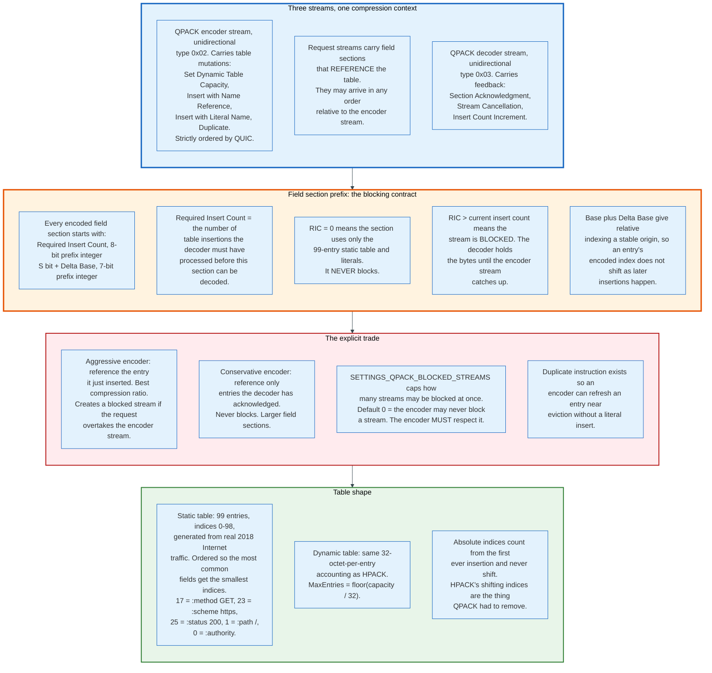

### 15.1 Three Streams

QPACK splits what HPACK did on one stream across three.

The encoder stream, unidirectional type 0x02, carries only table mutations: `Set Dynamic Table Capacity`, `Insert with Name Reference`, `Insert with Literal Name`, and `Duplicate`. QUIC guarantees ordering within it, so the decoder applies insertions in a defined sequence.

Request streams carry field sections that reference the table. They arrive in whatever order the network delivers.

The decoder stream, unidirectional type 0x03, carries feedback: `Section Acknowledgment` when a field section has been decoded, `Stream Cancellation` when a stream is abandoned, and `Insert Count Increment` when entries are processed without an associated section acknowledgement. The encoder uses this to track the Known Received Count, which is how it knows which entries are safe to reference without risking a block.

### 15.2 The Field Section Prefix

Every field section begins with two integers that state exactly what table state it needs.

```
  0   1   2   3   4   5   6   7
+---+---+---+---+---+---+---+---+
|   Required Insert Count (8+)  |
+---+---------------------------+
| S |      Delta Base (7+)      |
+---+---------------------------+
|      Encoded Field Lines    ...
+-------------------------------+
```

The Required Insert Count names how many insertions the decoder must have processed. If it is 0, the section references only the static table and literals, and it can never block. If it exceeds the decoder's current insert count, the decoder holds the bytes until the encoder stream catches up. That is the only blocking QPACK permits, and it is bounded by a setting.

The value is transmitted modulo `2 * MaxEntries` plus one, where `MaxEntries = floor(MaxTableCapacity / 32)`, so the prefix stays short on connections that have inserted millions of entries.

The Base, reconstructed from the sign bit and Delta Base, fixes an origin for relative indices so that an entry's encoded index does not shift when later insertions occur. HPACK's shifting index space is precisely what QPACK had to remove.

### 15.3 The Static Table

QPACK's static table has 99 entries, indices 0 through 98, generated by "analyzing actual Internet traffic in 2018 and including the most common header fields."

It is not HPACK's table with additions. The ordering was reoptimised so the most frequent fields get the smallest indices and therefore the shortest encodings. An indexed field line is `1`, then a `T` bit selecting static or dynamic, then a 6-bit prefix index, so indices 0 through 62 fit in a single byte.

Useful values to know when reading a packet capture: index 0 is `:authority`, index 1 is `:path: /`, index 17 is `:method: GET`, index 23 is `:scheme: https`, index 25 is `:status: 200`, index 31 is `accept-encoding: gzip, deflate, br`, index 95 is `user-agent`.

### 15.4 The Trade, Stated Plainly

An encoder chooses between compression ratio and blocking, and QPACK makes the choice explicit rather than hiding it.

An aggressive encoder inserts a header value and immediately references it in the same request. Compression is optimal. If that request stream arrives before the encoder stream instruction, the decoder blocks the stream until it catches up, which typically costs a fraction of a round trip and occasionally more.

A conservative encoder references only entries the decoder has already acknowledged. Nothing ever blocks. Field sections are larger, sometimes substantially, because a fresh `cookie` value cannot be indexed on its first use.

`SETTINGS_QPACK_BLOCKED_STREAMS` sets the ceiling. The default is 0, meaning the encoder may not create a blocked stream at all. Deployments commonly set values between 16 and 100. The parameter is a direct knob on the blocking-versus-bytes trade, and it is one of the few places in HTTP/3 where an operator makes that decision consciously.

---

## 16. Discovery: ALPN, Alt-Svc, and HTTPS Records

A client cannot request HTTP/3 from a URL, because `https://` names a scheme and not a transport, so every deployment depends on two discovery mechanisms that operate at different layers.

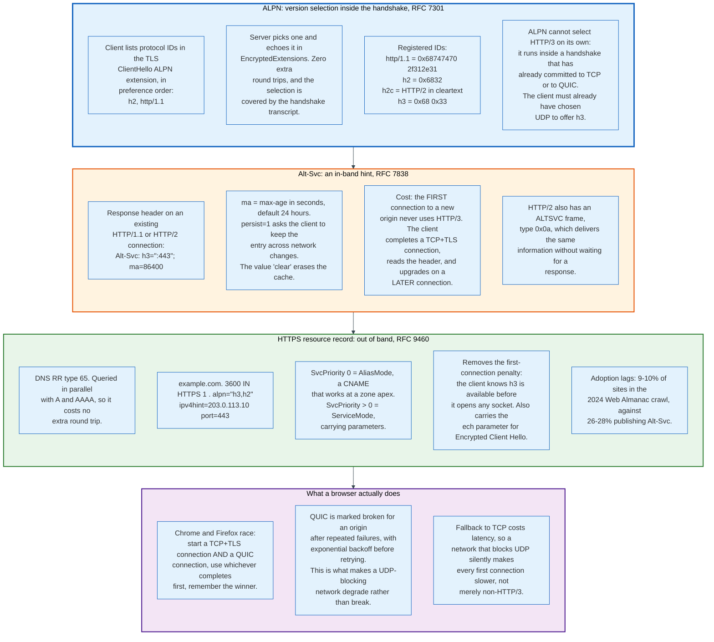

### 16.1 ALPN

Application-Layer Protocol Negotiation, RFC 7301, carries a list of protocol identifiers in the TLS ClientHello and returns the server's choice in EncryptedExtensions.

It costs nothing. The negotiation happens inside a handshake that was going to occur anyway, and because it is part of the handshake transcript, an on-path attacker cannot strip `h2` from the list to force a downgrade without breaking the `Finished` verification.

The registered identifiers are `http/1.1`, `h2`, `h2c`, and `h3`, the last registered by RFC 9114 as the two bytes `0x68 0x33`.

ALPN's limit is that it operates inside an already-chosen transport. A client offering `h3` must already have opened a QUIC connection over UDP. ALPN chooses between HTTP versions on a given transport; it cannot choose the transport.

### 16.2 Alt-Svc

RFC 7838 defines a response header field by which an origin announces that the same resources are available at a different endpoint, protocol, or port.

```
Alt-Svc: h3=":443"; ma=86400
```

`ma` is max-age in seconds, defaulting to 86,400. `persist=1` asks the client to retain the entry across network changes rather than clearing it as it would clear a cache. The single token `clear` invalidates everything cached for the origin.

The structural cost is unavoidable: the client must complete a TCP and TLS connection first in order to read the header. The first visit to a new origin is never HTTP/3. Only subsequent connections, within the max-age window, use it.

HTTP/2 additionally defines an `ALTSVC` frame, type 0x0a, which lets the server push the announcement without waiting for a response to attach it to.

### 16.3 HTTPS Resource Records

RFC 9460, published November 2023, defines the SVCB and HTTPS DNS record types and removes the first-connection penalty.

```
example.com.  3600  IN  HTTPS  1 . alpn="h3,h2" ipv4hint=203.0.113.10 port=443
```

The record is DNS type 65, and browsers query it in parallel with A and AAAA, so it adds no round trip. The client learns before opening any socket that the origin speaks HTTP/3, and connects directly over QUIC.

The record has two modes. `SvcPriority` 0 is AliasMode, which behaves as a CNAME and works at a zone apex where a CNAME is forbidden, solving a twenty-year-old DNS problem as a side effect. `SvcPriority` above 0 is ServiceMode and carries parameters: `alpn` lists supported protocols, `no-default-alpn` suppresses the implicit `http/1.1`, `port` overrides the port, `ipv4hint` and `ipv6hint` supply addresses to avoid a second lookup, and `ech` carries the Encrypted Client Hello configuration.

That last parameter is why HTTPS records matter beyond HTTP/3. Encrypted Client Hello needs the server's public key before the handshake begins, and the HTTPS record is the delivery channel.

Adoption trails. The 2024 Web Almanac crawl found 9% of desktop sites and 10% of mobile sites publishing HTTPS records, against 26% and 28% publishing `Alt-Svc`.

### 16.4 Racing and Fallback

Browsers do not trust either announcement blindly. They race.

Chrome and Firefox open a TCP connection and a QUIC connection concurrently to an origin known to support both, use whichever handshake completes first, and record the result. When QUIC fails repeatedly for an origin, the browser marks it broken and backs off exponentially before retrying.

This is what makes UDP-hostile networks degrade rather than break. It also means a network that blocks or throttles UDP imposes a latency cost on every first connection, because the browser spends time on a QUIC attempt that will not complete. Google's November 2016 measurements found 4.4% of video clients unable to use QUIC, "commonly found in corporate networks," and a further 0.3% in networks that rate-limited it.

---

## 17. Middlebox Ossification and the Encrypted Transport

Ossification is the condition where a protocol cannot be changed because deployed intermediaries depend on details the specification never promised, and QUIC's encrypted header is a direct engineering response to it.

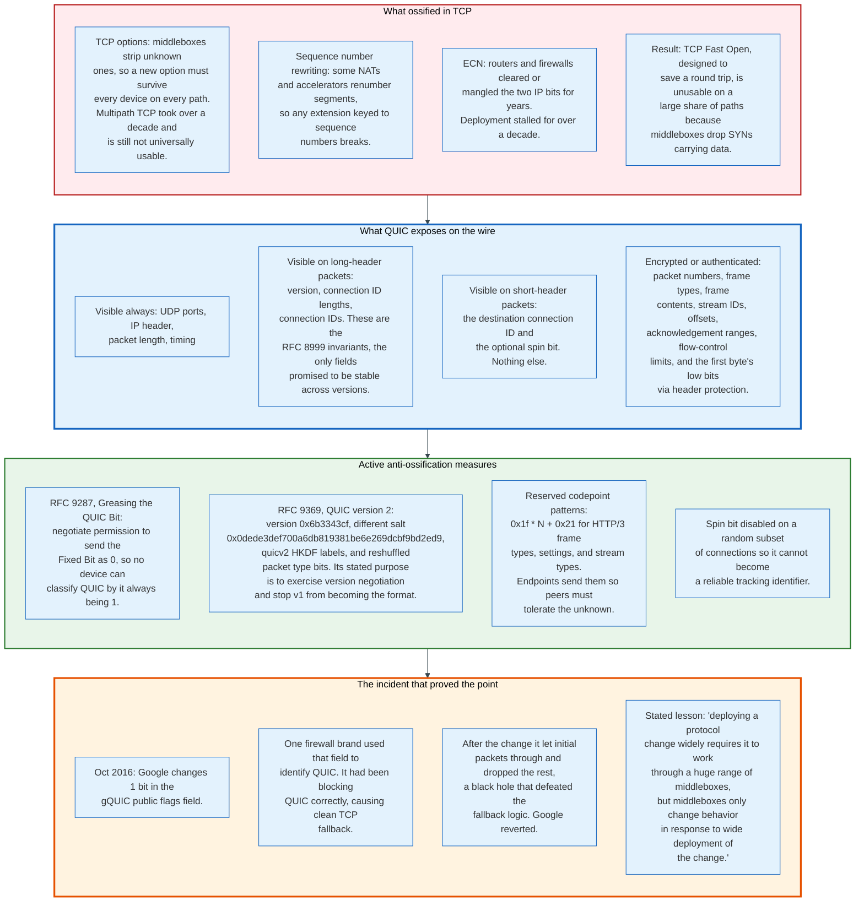

### 17.1 How TCP Ossified

TCP's header is cleartext and its option space is extensible in principle, which invited intermediaries to read and rewrite it.

Firewalls strip TCP options they do not recognise, so a new option must be tolerated by every device on an unknown path to be usable. Multipath TCP, specified in 2013, took more than a decade to reach usable deployment and is still blocked on many paths. TCP Fast Open, designed to eliminate one round trip by carrying data in the SYN, is unusable on a large share of paths because middleboxes drop SYNs with payloads. Explicit Congestion Notification, standardised in 2001, spent over a decade blocked by routers and firewalls that cleared or mangled the two bits.

The pattern is consistent: a change that is legal by the specification fails because deployed devices assumed the current behaviour was the specification.

### 17.2 What QUIC Exposes

QUIC's answer is to publish a small, explicitly stable surface and encrypt everything else.

RFC 8999 defines the version-independent invariants: the header form bit, the version field on long headers, and the connection ID lengths and values. Those are the only fields any future QUIC version promises to keep in place. Everything else, including packet type encodings, is version-specific and may change.

Header protection hides the packet number and the low bits of the first byte behind a mask derived from the ciphertext. Frame types, stream identifiers, offsets, acknowledgement ranges, and flow-control limits are all inside the AEAD. A middlebox cannot count streams, cannot see which stream a byte belongs to, cannot rewrite a window, and cannot detect a retransmission.

The consequence for operators is real and often unwelcome. Passive TCP monitoring that inferred loss rate, retransmission rate, and round-trip time from cleartext headers does not work on QUIC. RFC 9312, "Manageability of the QUIC Transport Protocol," documents what remains observable: five-tuple, packet sizes, timing, the spin bit if enabled, and connection IDs. Endpoint-side telemetry, standardised as qlog, replaces the network-side view.

### 17.3 Greasing as Policy

QUIC and HTTP/3 send values that no one implements, on purpose, so that receivers keep working when new values appear.

RFC 9287 lets peers negotiate permission to send the Fixed Bit as 0. Since middleboxes were already using "bit 1 is set" as a QUIC classifier, the extension deliberately breaks that classifier while it is still cheap to break.

RFC 9369 defines QUIC version 2 with the version number 0x6b3343cf, a different initial salt, `quicv2` HKDF labels, and rearranged packet type bits. It adds no features. Its purpose, in the specification's own words, is to combat ossification and "exercise the version negotiation framework," because "if experimental versions are rare, and QUIC version 1 constitutes the vast majority of QUIC traffic, there is the potential for middleboxes to ossify on the version bytes." A protocol version whose only feature is that it is a different version.

HTTP/3 uses the reserved pattern `0x1f * N + 0x21` for frame types, settings, and stream types, and endpoints emit values from it so that peers exercise their ignore-the-unknown path.

### 17.4 The Incident

In October 2016 Google changed one bit in the gQUIC public flags field and produced a black hole for users behind one brand of firewall.

That firewall identified QUIC traffic by the flags field so that it could block it, which had been working correctly: blocked QUIC caused clean fallback to TCP. After the change, the firewall's classifier no longer matched, so it allowed initial packets through and blocked subsequent ones. The resulting pattern of loss defeated Chrome's fallback logic, so clients that had been safely using TCP started using QUIC and hitting a hole. Google reverted the change and contacted the vendor, whose fix rolled out over the following month.

The paper states the general problem: "deploying a protocol change widely requires it to work through a huge range of middleboxes, but middleboxes only change behavior in response to wide deployment of the change." The only escape is to give middleboxes nothing to depend on, which is what QUIC's encrypted header does.

---

## 18. One Page Load, Traced End to End

A single first-visit page load over HTTP/3 with a 40 ms round-trip time, traced with the actual bytes and the actual timings.

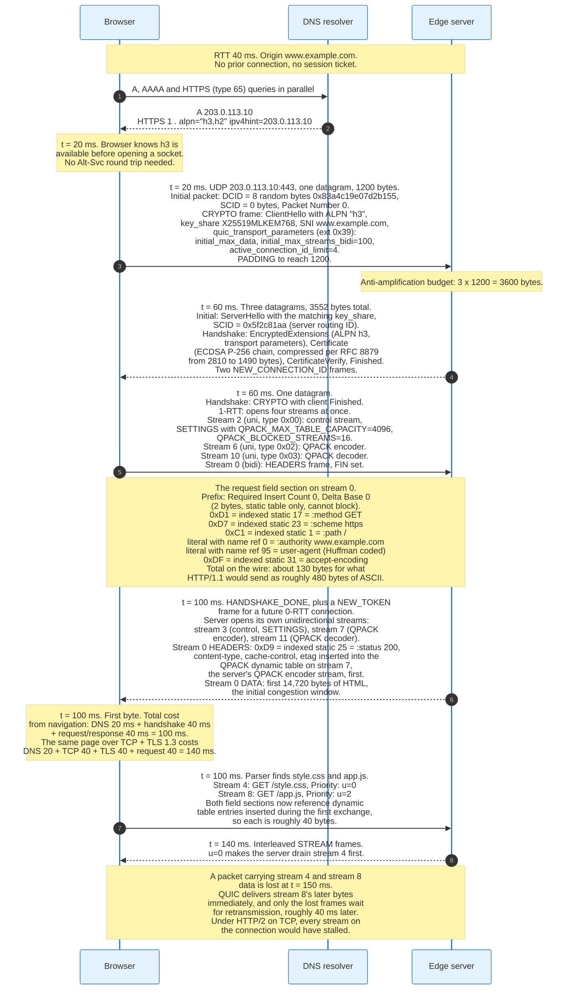

### 18.1 Walking the Numbers

The trace above turns on five figures, each of which comes from a specification or a default rather than an estimate.

**1,200 bytes for the first datagram.** RFC 9000 requires it. Padding costs nothing on a path that can carry it and forces immediate failure on a path that cannot.

**3,600 bytes of server budget.** Three times 1,200. An ECDSA P-256 chain compressed with RFC 8879 fits. An uncompressed RSA-2048 chain with two intermediates and a stapled OCSP response typically does not, which costs an extra round trip and erases the protocol's headline advantage. Certificate size is a QUIC performance parameter.

**130 bytes for the first request field section.** Six fields, four of them single-byte static references, one literal with a name reference, one Huffman-coded `user-agent`. The same fields in HTTP/1.1 ASCII run roughly 480 bytes. The compression ratio improves further on subsequent requests, where dynamic table references replace the literals.

**14,720 bytes in the first response flight.** The initial congestion window from RFC 9002. An HTML document larger than that takes a second round trip regardless of bandwidth, which is why the first 14 kB of a page is the part worth optimising.

**100 ms to first byte against 140 ms.** Twenty for DNS, forty for the QUIC handshake, forty for the request and response. TCP with TLS 1.3 adds one full round trip for the transport handshake that QUIC folds into the cryptographic one. On a 200 ms path the same structure produces 500 ms against 700 ms.

### 18.2 The Second Visit

A returning visitor within the session ticket's lifetime removes two more round trips.

The browser holds a `NEW_TOKEN` value from the previous connection and a TLS session ticket. It sends one datagram containing an Initial packet with the token and a ClientHello carrying `pre_shared_key`, coalesced with a 0-RTT packet carrying `GET /`. The server validates the token, skips the Retry, accepts the early data, and responds. Time to first byte becomes 40 ms, one round trip, with DNS answered from cache.

Google measured that 88% of gQUIC connections from desktop achieved a 0-RTT handshake, "which is at least a 2-RTT latency saving over TLS/TCP." The remaining connections still get 1-RTT.

The condition is that the request is safe to replay. `GET /` is. A form submission is not, and RFC 8470's `425 (Too Early)` exists to send it back through the full handshake.

---

## 19. Measured Performance: HTTP/3 Against HTTP/2

HTTP/3 wins on latency and loses on CPU, and both effects have been measured at scale by parties with no incentive to overstate either.

### 19.1 The Latency Results

Google's SIGCOMM 2017 measurements remain the largest published field comparison, covering gQUIC against TLS over TCP across Google Search and YouTube.

| Metric | Desktop | Mobile |
|---|---|---|
| Search latency reduction, mean | 8.0% | 3.6% |
| Search latency reduction, 90th percentile | 5.8% | 4.5% |
| Search latency reduction, 95th percentile | 10.3% | 8.8% |
| Search latency reduction, 99th percentile | 16.7% | 14.3% |
| Video playback latency reduction, mean | 8.0% | 5.3% |
| Video rebuffer rate reduction, mean | 18.0% | 15.3% |
| Video rebuffer rate reduction, 99th percentile | 18.5% | 8.7% |

Two patterns hold across every later study. Gains grow with the percentile, because the users who benefit are the ones with high round-trip times and lossy paths, and eliminating a handshake round trip is worth proportionally more when a round trip is 300 ms than when it is 20 ms. And gains are smaller on mobile, where the client's own CPU becomes the bottleneck before the network does; the paper attributes this to "client CPU limits."

The mean Search figures look modest. Google's framing is that latency of this kind is measured against a base that is mostly server processing and rendering, not network time, so an 8% reduction in the total is a large reduction in the network component.

### 19.2 The CPU Results

QUIC costs more CPU per byte than TCP, and the gap has narrowed but not closed.

Google's initial measurement was that "QUIC's server CPU-utilization was about 3.5 times higher than TLS/TCP." Three causes: cryptography, sending and receiving UDP packets, and maintaining connection state in userspace. After hand-optimising ChaCha20, using Linux `PACKET_RX_RING` for asynchronous packet reception, and rewriting hot data structures for cache efficiency, they "decreased the CPU cost of serving web traffic over QUIC to approximately twice that of TLS/TCP."

Fastly's later single-core benchmark quantifies the ceiling and the fix.

| Configuration | Throughput on one core |
|---|---|
| TLS 1.3 over TCP | 466 Mbit/s |
| QUIC, off the shelf | 196 Mbit/s, 42% of TCP |
| QUIC, optimised | 464 Mbit/s |

Fastly reports the optimised run as "464 Mbps (1% faster than TLS 1.3 over TCP)" and the same stack at Chrome's default 1,280-byte packet size as "425Mbps (only 8% slower than TLS 1.3 over TCP)." The optimisations were a delayed-ACK extension that cut acknowledgement frequency from one per two packets to one per ten, Generic Segmentation Offload to coalesce outgoing packets into one syscall, and a 1,460-byte packet size instead of 1,280. Fastly identified the two structural costs: TCP acknowledgements are processed inside the kernel while QUIC processes them in userspace with extra copies and context switches, and the kernel holds no connection state for QUIC so per-packet work is repeated on every outgoing packet.

The general shape is that QUIC's cost is per packet, not per byte. Anything that reduces packet count, GSO on send, GRO on receive, larger MTU, fewer acknowledgements, closes the gap.

### 19.3 Where HTTP/3 Loses

On fast, low-loss links, HTTP/3 is measurably slower than HTTP/2, and the cause is the receiver.

Zhang and colleagues, in "QUIC is not Quick Enough over Fast Internet" (2023, revised 2024), measured "a data rate reduction of up to 45.2% compared to the TCP+TLS+HTTP/2 counterpart" on high-bandwidth networks, with the gap widening as bandwidth increases. Video streaming showed up to a 9.8% bitrate reduction. The effect appeared in Chrome, Edge, Firefox, and Opera, on desktop and mobile, on wired and cellular links.

The identified cause is "high receiver-side processing overhead, in particular, excessive data packets and QUIC's user-space ACKs." On a 1 Gbit/s link, a receiver handles roughly 80,000 packets per second, each requiring a userspace syscall path, a decryption, and acknowledgement bookkeeping that the TCP receiver does in the kernel.

The practical reading: HTTP/3 is a latency optimisation, not a throughput optimisation. It helps most on high-latency, lossy, and mobile paths, and it can hurt on a short fat pipe where the network was never the constraint.

### 19.4 How to Read Any HTTP/3 Benchmark

Four conditions separate a useful measurement from a misleading one.

**Loss must be present for the comparison to mean anything.** HTTP/3's stream independence only pays when packets are lost. On a 0% loss link, the transport-layer head-of-line blocking that QUIC removes does not occur, and the comparison reduces to handshake cost and CPU.

**A new connection and a reused one measure different things.** The handshake saving is one round trip on a new connection and zero on a reused one. A benchmark that opens one connection and issues a thousand requests measures nothing about handshakes.

**An untuned HTTP/2 server measures the tuning, not the protocol.** A default 65,535-octet flow-control window caps HTTP/2 at 5.2 Mbit/s per stream on a 100 ms path. A benchmark run against a server that never raised that window reports a configuration difference and calls it a protocol difference.

**A saturated server inverts the result.** Under load the CPU gap dominates the latency gain, and the same code that wins on an idle server loses on a busy one.

---

## 20. Security and Attack Surface

Multiplexing turns one connection into many concurrent units of server work, and every serious HTTP/2 vulnerability since 2019 has exploited the same asymmetry: a cheap client action that creates expensive server state.

```mermaid
%%{init: {'theme': 'base', 'themeVariables': {'primaryColor': '#e3f2fd', 'primaryBorderColor': '#1565c0', 'lineColor': '#37474f'}}}%%

flowchart TB
    subgraph Asym["The structural asymmetry"]
        direction TB
        A1["One HTTP/2 frame costs the client<br/>9 bytes plus a compressed field block.<br/>It can cost the server a thread, a<br/>database query, and a buffer."]
        A2["SETTINGS_MAX_CONCURRENT_STREAMS bounds<br/>simultaneous streams. It bounds<br/>NOTHING about the RATE at which<br/>streams are created and destroyed."]
    end

    subgraph RR["Rapid Reset, CVE-2023-44487, Aug-Oct 2023"]
        direction TB
        R1["Client sends HEADERS then RST_STREAM<br/>immediately. The stream reaches<br/>'closed' at once and frees its<br/>concurrency slot."]
        R2["Backend work already started and<br/>keeps running. Concurrency never<br/>appears to exceed the limit."]
        R3["Cloudflare peak: just above<br/>201 million requests per second.<br/>Google peak: 398 million rps,<br/>7.5x the previous record of<br/>46 million rps in 2022. CVSS 7.5."]
        R4["Mitigation: count resets, not just<br/>open streams. Close the connection<br/>when the reset rate crosses a<br/>threshold. There is no protocol fix."]
    end

    subgraph CF["CONTINUATION Flood, VU 421644, Apr 2024"]
        direction TB
        C1["HEADERS without END_HEADERS, then an<br/>unbounded stream of CONTINUATION<br/>frames. RFC 9113 sets no limit on<br/>their number."]
        C2["Server buffers the field block to<br/>decode it, or burns CPU on HPACK<br/>Huffman decoding. Neither is bounded<br/>by SETTINGS_MAX_HEADER_LIST_SIZE if<br/>the implementation checks it too late."]
        C3["Ten CVEs across implementations:<br/>Node.js CVE-2024-27983,<br/>Envoy CVE-2024-27919 and CVE-2024-30255,<br/>Go net/http CVE-2023-45288,<br/>nghttp2 CVE-2024-28182,<br/>Apache httpd CVE-2024-27316,<br/>Apache Traffic Server CVE-2024-31309,<br/>Tempesta FW CVE-2024-2758,<br/>amphp/http CVE-2024-2653,<br/>CVE-2024-27268."]
        C4["Does not exist in HTTP/3:<br/>there is no CONTINUATION frame."]
    end

    subgraph MYR["MadeYouReset, CVE-2025-8671, Aug 2025"]
        direction TB
        M1["Rapid Reset with the roles inverted.<br/>The client sends malformed frames or<br/>flow-control errors so the SERVER<br/>resets the stream."]
        M2["Server-reset streams count as closed<br/>at the protocol level while backend<br/>processing continues, so the same<br/>unbounded concurrency appears."]
        M3["CVSS 7.5. Defeats mitigations that<br/>only counted CLIENT-sent RST_STREAM."]
    end

    subgraph Q["QUIC-specific surface"]
        direction TB
        Q1["Amplification: capped structurally at<br/>3x received bytes before address<br/>validation. Retry moves state cost<br/>onto the client entirely."]
        Q2["0-RTT replay: no transport fix exists.<br/>RFC 8470's 425 Too Early is the<br/>only complete answer, and it is an<br/>application-layer answer."]
        Q3["Connection ID linkability: an endpoint<br/>that reuses a CID across paths lets an<br/>observer follow a user across networks.<br/>RFC 9000 requires a fresh CID per path."]
        Q4["CPU as the attack surface: QUIC<br/>decryption happens before a packet can<br/>be discarded, so a flood of invalid<br/>packets costs the server work that a<br/>TCP checksum failure would not."]
    end

    Asym --> RR
    Asym --> CF
    RR --> MYR
    Asym --> Q

    style Asym fill:#e3f2fd,stroke:#1565c0,stroke-width:3px
    style RR fill:#ffebee,stroke:#b71c1c,stroke-width:3px
    style CF fill:#fff3e0,stroke:#e65100,stroke-width:2px
    style MYR fill:#fce4ec,stroke:#880e4f,stroke-width:2px
    style Q fill:#e8f5e9,stroke:#2e7d32,stroke-width:2px
```

### 20.1 Rapid Reset

CVE-2023-44487 produced the largest recorded denial-of-service attacks up to that date by exploiting the fact that a reset stream stops counting immediately.

The mechanism is three lines long. The client sends `HEADERS` opening a stream, then `RST_STREAM` on the same stream in the next frame. The stream enters `closed` and frees its slot against `SETTINGS_MAX_CONCURRENT_STREAMS`. The client immediately opens another. Server-side work triggered by the request, routing, authentication, a backend call, keeps running.

Concurrency limits do not bound this because concurrency never appears to be exceeded. Cloudflare's write-up puts it plainly: "when a client cancels a stream, it instantly gets the ability to open another stream in its place and can send another request immediately," and "stream concurrency on its own cannot mitigate rapid reset."

The measured peaks, from attacks starting 25 August 2023 with the most severe on 29 August: Cloudflare mitigated just above 201 million requests per second, and Google mitigated 398 million requests per second, which Google describes as "7½ times larger than the previous record of 46 million rps" set in 2022. In two minutes the attack generated more requests than Wikipedia reported for all article views in September 2023. The CVE carries a CVSS base score of 7.5.

There is no protocol fix, because rapid stream turnover is legitimate behaviour for a browser that cancels image loads on navigation. The deployed mitigation is rate accounting: count resets per connection, weight them against completed requests, and close the connection when the ratio crosses a threshold.

### 20.2 CONTINUATION Flood

Disclosed 3 April 2024 as CERT/CC VU 421644 and reported by Bartek Nowotarski, this exploits the absence of any limit on how many `CONTINUATION` frames may follow a `HEADERS` frame.

An attacker sends `HEADERS` without the `END_HEADERS` flag, then streams `CONTINUATION` frames indefinitely. A server that buffers the field block until it is complete exhausts memory. A server that decodes incrementally burns CPU on HPACK Huffman decoding. `SETTINGS_MAX_HEADER_LIST_SIZE` bounds the decoded size, but implementations that check it after buffering, or that buffer in order to generate a helpful `431` response, are still vulnerable. CVE-2024-27316 against Apache httpd describes exactly this: "HTTP/2 incoming headers exceeding the limit are temporarily buffered in nghttp2 in order to generate an informative HTTP 413 response. If a client does not stop sending headers, this leads to memory exhaustion."

Ten CVEs were assigned across implementations, including Node.js, Envoy, Go's `net/http`, nghttp2, Apache httpd, Apache Traffic Server, Tempesta FW, and amphp/http.

The vulnerability class does not exist in HTTP/3. There is no `CONTINUATION` frame, because a QUIC stream has no frame size ceiling to spill over.

### 20.3 MadeYouReset

CVE-2025-8671, published 13 August 2025, is Rapid Reset with the roles reversed and it defeats the mitigations built for Rapid Reset.

The NVD description states the mechanism: "By opening streams and then rapidly triggering the server to reset them, using malformed frames or flow control errors, an attacker can exploit incorrect stream accounting. Streams reset by the server are considered closed at the protocol level, even though backend processing continues."

Mitigations that counted client-sent `RST_STREAM` frames see nothing, because the client sends none. It sends a window update that overflows, or a frame on a half-closed stream, and lets the server produce the reset. CVSS 7.5.

The lesson generalises past HTTP/2: any accounting scheme that ties resource release to a protocol state transition, rather than to the actual completion of work, can be driven by whichever party controls that transition.

### 20.4 QUIC's Own Surface

QUIC removes some attack classes structurally and adds one.

**Amplification is bounded by design.** The 3x limit and the `Retry` mechanism cap reflection at a factor the specification names, rather than leaving it to implementation care. This is stronger than what DNS, NTP, or memcached offered, and it was designed in from the start because a new UDP protocol that could amplify would have been unshippable.

**Replay is bounded only by the application.** Section 12 covers this. RFC 9001 is explicit that transport-layer anti-replay is "imperfect" and that the real defence is the HTTP profile in RFC 8470.

**Linkability is a design constraint.** Reusing a connection ID across paths would let an observer follow a user from one network to another. RFC 9000 requires a fresh, unused connection ID on each new path, and requires that connection IDs "MUST NOT contain any information that can be used by an external observer to correlate them with other connection IDs for the same connection."

**CPU is the new surface.** A QUIC endpoint must remove header protection and attempt AEAD decryption before it can decide a packet is garbage. TCP discards a packet with a bad checksum almost for free. An attacker flooding a QUIC server with well-formed but undecryptable packets forces real cryptographic work per packet. Deployments answer with per-source rate limits and by dropping packets for unknown connection IDs before decryption.

### 20.5 The One That Did Not Recur

HPACK's design successfully closed the compression side channel that killed SPDY's header compression, and no CRIME-class attack against HPACK or QPACK has been demonstrated.

The reason is that the compressor matches only whole header-field entries against a table, never arbitrary substrings, so attacker-controlled text cannot shorten the encoding of an unrelated secret. The `Literal Header Field Never Indexed` representation covers the residual case. QPACK inherits both properties.

This is the counterexample worth keeping. Protocol features that survive contact with the field are the ones designed against a known attack rather than against a threat model written afterwards.

---

## 21. Economics: What It Costs to Run and Who Pays

Nobody charges for HTTP/2 or HTTP/3. The cost is borne in server CPU, engineering time, and observability, and the party that pays is almost always a CDN.

### 21.1 The Cost Structure

Four costs, in descending order of size.

**Server CPU.** Section 19 gives the numbers: an unoptimised QUIC stack runs at 42% of TCP throughput per core, and an optimised one reaches parity. The engineering to close that gap, GSO, GRO, batched syscalls, delayed acknowledgements, tuned MTU, is not a configuration change. It is weeks of work by people who understand kernel networking, and it is the reason 85% of HTTP/3 responses in the 2024 Web Almanac crawl came from a CDN. Cloudflare, Fastly, Akamai, and Google amortise that work across millions of origins.

**Origin software.** nginx gained HTTP/3 in version 1.25.0, May 2023, and it requires a build with `--with-http_v3_module` and a TLS library that supports QUIC, which excludes stock OpenSSL builds for much of the module's history. Apache httpd has no HTTP/3 module. An operator who wants HTTP/3 on an origin usually adds a proxy: Caddy, LiteSpeed, HAProxy, Envoy, or a CDN.

**Observability.** Every passive TCP monitoring tool stops working. Loss rate, retransmission rate, and round-trip time were readable from cleartext TCP headers and are not readable from QUIC. Replacing that view means instrumenting endpoints with qlog and shipping the logs somewhere, which is a new pipeline with new storage costs. RFC 9312 documents what remains visible from the network, and it is not much.

**Middlebox replacement.** Enterprises that inspect traffic with a TLS-terminating proxy find that the proxy does not speak QUIC. The common response is to block UDP 443 outright, which forces every client back to TCP. That is a real cost paid by the enterprise's users in latency, and it is invisible to the enterprise.

### 21.2 Who Benefits

The benefit distribution is uneven and it explains the adoption pattern.

| Party | Benefit | Cost |
|---|---|---|
| Large content provider | Measurable latency reduction at the tail, fewer connections, lower rebuffer rates | CPU, engineering, observability rebuild |
| CDN | Product differentiation, and the cost is amortised across every customer | Same engineering, once |
| Small site on shared hosting | Whatever the CDN turns on | None |
| Mobile user on a lossy network | The largest single gain: stream independence plus connection migration | None |
| Desktop user on fibre | Marginal, sometimes negative | None |
| Enterprise network operator | None | Loss of inspection and passive monitoring |

The party with the most to gain, a user on a high-latency lossy mobile link, pays nothing and chooses nothing. The party that pays, the server operator, captures the benefit only in aggregate. That mismatch is why HTTP/3 deployment concentrates in operators large enough to measure aggregate effects, and why origin adoption trails CDN adoption by a wide margin.

### 21.3 Bandwidth Effects

Header compression is the one place where a protocol change moves a bill.

An API endpoint receiving 10,000 requests per second, each with 800 bytes of headers, moves 8 MB/s of header bytes over HTTP/1.1. HPACK or QPACK on a warm connection reduces the repeated fields to indices, commonly cutting that to under 1 MB/s. At a typical egress price the saving is real but small relative to response bodies.

The larger effect is connection count. An HTTP/1.1 client opening six connections per origin pays six TCP handshakes, six TLS handshakes, and six slow starts. A CDN serving a billion page loads a day saves a measurable amount of CPU and a measurable number of round trips by collapsing that to one connection, and the saving is in server capacity rather than bandwidth.

---

## 22. Standards, Governance, and Compliance

HTTP and QUIC are governed by the IETF, which produces consensus specifications and enforces nothing, and that combination shapes what the protocols can contain.

### 22.1 The Working Groups

Two working groups own the documents in this article.

The HTTP working group, `httpbis`, owns HTTP semantics, HTTP/1.1, HTTP/2, and HTTP/3's HTTP-layer behaviour. It produced the 2022 core revision: RFC 9110 semantics, RFC 9111 caching, RFC 9112 HTTP/1.1, RFC 9113 HTTP/2, RFC 9114 HTTP/3.

The QUIC working group, chartered in October 2016, owns the transport. It published RFC 8999, 9000, 9001, and 9002 in May 2021, then RFC 9114 and RFC 9204 jointly with httpbis in June 2022, then RFC 9221 (datagrams), RFC 9287 (greasing the QUIC bit), RFC 9308 (applicability), RFC 9312 (manageability), RFC 9368 (compatible version negotiation), and RFC 9369 (QUIC version 2).

Both operate by rough consensus with running code. QUIC's specification process ran alongside more than fifteen independent implementations testing against each other at regular interop events, which is why the protocol shipped with fewer ambiguities than most.

### 22.2 The Registries

IANA maintains the codepoint registries, and their allocation policies determine how extensible each protocol is.

| Registry | Policy | Notes |
|---|---|---|
| HTTP/2 frame types | IETF Review or IESG Approval | RFC 9113 released the former Experimental Use range for general use |
| HTTP/2 settings | Expert review | Same release |
| HTTP/2 error codes | Expert review | |
| HTTP/3 frame types | Specification Required for permanent registrations, Expert Review for provisional | `0x1f * N + 0x21` reserved for greasing |
| HTTP/3 stream types | Specification Required for permanent registrations, Expert Review for provisional | Same reserved pattern |
| QUIC transport parameters | Specification Required for permanent registrations, Expert Review for provisional | Greasing reserved |
| QUIC frame types | Specification Required for permanent registrations, Expert Review for provisional | Greasing reserved |
| QUIC versions | Specification Required for permanent registrations, Expert Review for provisional | Versions with the pattern `0x?a?a?a?a` are reserved for greasing |
| TLS ALPN protocol IDs | Expert review | `h2`, `h3`, `http/1.1` |
| DNS RR types | Expert review | HTTPS is type 65 |

Four of those registries carry one extra restriction. HTTP/3 frame types, HTTP/3 stream types, QUIC transport parameters, and QUIC frame types all reserve codepoints from 0x00 to 0x3f, the values a variable-length integer encodes in a single byte, for Standards Action or IESG Approval rather than a mere specification. The cheapest encodings stay with the IETF. RFC 9000 section 22.4 and RFC 9114 sections 11.2.1 and 11.2.4 state the rule; the QUIC versions registry, which is a flat 32-bit space, has no such range.

The greasing reservations are the unusual feature. Most registries reserve nothing; these reserve infinite arithmetic sequences specifically so that implementations are forced to handle unknown values in normal operation.

### 22.3 Compliance Obligations

No regulator mandates HTTP/2 or HTTP/3, and the compliance pressure arrives indirectly through TLS.

PCI DSS 4.0 requires strong cryptography for cardholder data in transit and effectively rules out TLS below 1.2. QUIC requires TLS 1.3, so an HTTP/3 deployment satisfies this by construction and cannot be misconfigured downward.

The United States federal memorandum M-22-09 directs agencies to enforce HTTPS on every internet-accessible web service and API and to use encrypted DNS wherever it is technically supported. It names no HTTP version, so HTTP/3 satisfies it only by carrying TLS 1.3. NIST SP 800-52 Revision 2 governs TLS configuration for federal systems.

The friction is in inspection requirements. Sectors that mandate traffic inspection, some financial and healthcare environments, run TLS-terminating proxies that do not implement QUIC. The standard response is to block UDP 443, which forces HTTP/2 over TCP where the existing proxy works. Enterprise inspection and QUIC are structurally in tension: QUIC's design goal is that the middle of the network cannot read or modify the transport, and inspection requires exactly that.

Data-protection regimes touch QUIC through connection IDs. A connection ID is a per-connection identifier under the operator's control, and RFC 9000 forbids encoding anything that lets an external observer correlate it with other IDs for the same connection. An implementation that embeds a stable user or account identifier in a connection ID creates a cross-network tracking identifier visible to every observer on the path.

---

## 23. Comparisons and Alternatives

### 23.1 The Three Versions Side by Side

| Property | HTTP/1.1 | HTTP/2 | HTTP/3 |
|---|---|---|---|
| Specification | RFC 9112 | RFC 9113 | RFC 9114 |
| Framing | Text, CRLF-delimited | Binary, 9-octet header | Binary, varint type and length |
| Concurrency | 1 per connection, 6 connections typical | Many streams, 1 connection | Many streams, 1 connection |
| Application head-of-line blocking | Yes | No | No |
| Transport head-of-line blocking | Per connection | Yes, across all streams | No |
| Header compression | None | HPACK | QPACK |
| Round trips before the first response byte, new connection | 3 with TLS 1.3 | 3 with TLS 1.3 | 2 |
| Round trips before the first response byte, resumed | 2 | 2 | 1 with 0-RTT |
| Flow control | TCP only | TCP plus HTTP windows | QUIC only |
| Connection survives IP change | No | No | Yes |
| Server push | No | Yes, disabled by browsers | Yes, off by default |
| Priority | None | RFC 9218, RFC 7540 scheme deprecated | RFC 9218 |
| Congestion control location | Kernel | Kernel | Userspace |
| Encryption | Optional | Required in practice | Mandatory |
| Middlebox visibility | Full when cleartext | TCP header only | Connection ID and spin bit only |
| CPU cost per byte | Baseline | Baseline | 1.0x to 2.4x depending on optimisation |

### 23.2 When to Prefer Which

**HTTP/1.1 remains correct** for server-to-server calls inside a datacentre where latency is under 1 ms and loss is near zero, for clients that cannot be upgraded, and for debugging, because the wire format is readable with `telnet`. Its concurrency limits do not bite when the round trip is negligible.

**HTTP/2 is the safe default** for anything behind a load balancer that terminates TLS, for gRPC (which is defined over HTTP/2 and uses its streams for bidirectional messaging), and for any deployment where UDP is unreliable. It is the most widely implemented of the three and the one every intermediary understands.

**HTTP/3 wins** on mobile networks, on high-latency paths, on lossy links, and anywhere connection migration matters. It is the right default for a public website served through a CDN. It is the wrong default for an internal service on a fast, clean network, where its CPU cost is real and its latency advantage is not.

### 23.3 Adjacent and Competing Designs

**gRPC** runs over HTTP/2 and uses streams as its message transport, with `content-type: application/grpc` and trailers for status. gRPC over HTTP/3 exists in some implementations and is not yet the default, largely because gRPC's ecosystem depends on HTTP/2 library behaviour.

**WebSocket** predates HTTP/2 multiplexing and provides a bidirectional byte stream over a connection upgraded from HTTP/1.1. RFC 8441 bootstraps it over an HTTP/2 stream using extended CONNECT; RFC 9220 does the same for HTTP/3. Both let a WebSocket share a connection with ordinary requests instead of consuming a dedicated one.

**WebTransport** is the design intended to replace WebSocket for new work. It exposes QUIC's streams and datagrams to JavaScript: multiple reliable streams plus an unreliable datagram channel, over one connection, with congestion control shared across them. `draft-ietf-webtrans-http3-16`, dated July 2026, is in working group last call.

**MASQUE** is the family of proxying specifications built on HTTP/3. RFC 9297 defines HTTP datagrams and the Capsule Protocol, RFC 9298 defines proxying UDP over HTTP, and RFC 9484 defines proxying IP. Apple's iCloud Private Relay is the largest production deployment. The design point is a proxy that carries UDP and IP inside an HTTP/3 connection, which makes it indistinguishable from ordinary web traffic.

**SCTP** solved multi-streaming in 2000 and never deployed on the public Internet, because it is a distinct IP protocol number and NATs drop it. Its only widespread use is inside WebRTC data channels, tunnelled over DTLS over UDP, which is the same workaround QUIC adopted deliberately.

**Multipath TCP** provides connection survival across interfaces, the same goal as QUIC migration. It took over a decade to deploy, remains blocked on many paths, and is used mainly inside single operators such as Apple's Siri traffic. Multipath QUIC reached the RFC Editor queue in March 2026 as `draft-ietf-quic-multipath-21`, having taken roughly four years from adoption, in a protocol that middleboxes cannot inspect.

---

## 24. Modern Developments

### 24.1 What Shipped Between 2023 and 2026

**QUIC version 2, RFC 9369, May 2023.** No new features. A different version number, salt, and packet type encoding, published to keep the version negotiation machinery exercised and to prevent middleboxes from ossifying on version 1.

**Compatible version negotiation, RFC 9368, May 2023.** Lets a client and server agree on a different QUIC version without an extra round trip, by treating some versions as compatible with each other.

**HTTP/2 hardening, 2023 to 2025.** Rapid Reset, the CONTINUATION flood, and MadeYouReset produced a wave of implementation changes: reset-rate accounting, header-frame counting, and stream accounting that tracks backend work rather than protocol state. None required a specification change, which is the argument for and against expert-review registries.

**Post-quantum key exchange in production.** Cloudflare reported that 52% of human-generated web traffic was post-quantum encrypted by the end of 2025, nearly doubling from 29% at the start of the year. The hybrid X25519MLKEM768 key share adds roughly 1,100 bytes to each side of the handshake, which interacts directly with QUIC's 1,200-byte Initial requirement and the 3x amplification limit.

**Compression Dictionary Transport, RFC 9842.** Lets a client reuse a previous response as a Brotli or Zstandard dictionary for a later one, cutting the transfer size of an updated JavaScript bundle by an order of magnitude when only a few lines changed. It is orthogonal to HTTP version but ships alongside HTTP/3 in the same CDNs.

**RFC 9931, March 2026.** Adds requirements to RFC 9112 and RFC 9298 covering data a client sends optimistically before a protocol transition is confirmed, closing a class of issue related to the same optimism that made pipelining unsafe.

### 24.2 What Is In Flight

| Work | Identifier | State as of August 2026 |
|---|---|---|
| Multipath QUIC | `draft-ietf-quic-multipath-21`, March 2026 | RFC Editor queue |
| Reliable stream reset | `draft-ietf-quic-reliable-stream-reset-10` | IESG telechat scheduled 3 September 2026 |
| qlog main schema | `draft-ietf-quic-qlog-main-schema-14` | Active I-D, intended status Proposed Standard |
| qlog QUIC events | `draft-ietf-quic-qlog-quic-events-13` | Active I-D, intended status Proposed Standard |
| qlog HTTP/3 events | `draft-ietf-quic-qlog-h3-events-13` | Active I-D, intended status Proposed Standard |
| QUIC address discovery | `draft-ietf-quic-address-discovery-01` | Early |
| QUIC extended key update | `draft-ietf-quic-extended-key-update-03` | Early |
| Acknowledgement receive timestamps | `draft-ietf-quic-receive-ts-03` | Early |
| WebTransport over HTTP/3 | `draft-ietf-webtrans-http3-16`, July 2026 | Working group last call |
| Resumable uploads | `draft-ietf-httpbis-resumable-upload-12` | Working group document |

Multipath QUIC is the largest of these. It gives a connection several concurrent paths with per-path connection IDs and separate packet number spaces, so a phone can use Wi-Fi and cellular simultaneously rather than switching between them. It reached the RFC Editor queue in roughly four years, against Multipath TCP's decade and counting, and the difference is that no middlebox can see what it is doing.

qlog matters more than its status suggests. It standardises the endpoint-side event log that replaces the network-side visibility QUIC removed, and it is the only way to debug a QUIC connection that is not working.

### 24.3 What Has Not Happened

Three things predicted for HTTP/3 have not materialised, and their absence is informative.

**HTTP/3 has not displaced HTTP/2.** Cloudflare's 2025 figures put HTTP/2 at 50% of requests and HTTP/3 at 21%, "largely unchanged from 2024." HTTP/2 works, it is universally implemented, and the marginal gain from HTTP/3 on a good network does not justify a migration for most operators.

**Origin adoption has not followed CDN adoption.** Apache httpd still has no HTTP/3 module. nginx requires a non-default build. The overwhelming majority of HTTP/3 traffic terminates at a CDN edge and continues to the origin over HTTP/1.1 or HTTP/2.

**Automated clients have not moved.** Bots, crawlers, and API clients account for the bulk of HTTP/1.x traffic, and Cloudflare attributes the countries with sub-10% HTTP/3 shares to exactly that. Language runtimes default to HTTP/1.1 and change slowly.

---

## 25. Appendix

### 25.1 Diagram Index

| Diagram | Source | Description |
|---|---|---|
| Protocol timeline | [`diagrams/protocol-timeline.mmd`](diagrams/protocol-timeline.mmd) | Four eras from HTTP/1.0 to multipath QUIC |
| Head-of-line blocking | [`diagrams/head-of-line-blocking.mmd`](diagrams/head-of-line-blocking.mmd) | The three distinct instances and what each version fixes |
| HTTP/2 frame layout and stream lifecycle | [`diagrams/http2-frame-layout.mmd`](diagrams/http2-frame-layout.mmd) | The 9-octet header, frame types, connection preface, and the seven-state stream lifecycle with the Rapid Reset path |
| HPACK tables | [`diagrams/hpack-tables.mmd`](diagrams/hpack-tables.mmd) | Static and dynamic tables, four representations, entry accounting |
| HTTP/2 flow control | [`diagrams/http2-flow-control.mmd`](diagrams/http2-flow-control.mmd) | Two-level windows, the bandwidth-delay ceiling, QUIC's version, priority |
| Server push lifecycle | [`diagrams/server-push-lifecycle.mmd`](diagrams/server-push-lifecycle.mmd) | PUSH_PROMISE flow and the 103 Early Hints replacement |
| QUIC packet structure | [`diagrams/quic-packet-structure.mmd`](diagrams/quic-packet-structure.mmd) | Long and short headers, nesting, varint encoding, size limits |
| Connection ID and migration | [`diagrams/connection-id-migration.mmd`](diagrams/connection-id-migration.mmd) | CID issuance, path validation, privacy requirements |
| QUIC handshake | [`diagrams/quic-handshake.mmd`](diagrams/quic-handshake.mmd) | TCP+TLS against 1-RTT against 0-RTT, and the replay problem |
| QUIC loss recovery | [`diagrams/quic-loss-recovery.mmd`](diagrams/quic-loss-recovery.mmd) | Monotonic packet numbers, thresholds, PTO, congestion constants |
| HTTP/3 stream mapping | [`diagrams/http3-stream-mapping.mmd`](diagrams/http3-stream-mapping.mmd) | Request streams, control streams, frames, settings |
| QPACK architecture | [`diagrams/qpack-architecture.mmd`](diagrams/qpack-architecture.mmd) | Three streams, the field section prefix, the blocking trade |
| Protocol discovery | [`diagrams/protocol-discovery.mmd`](diagrams/protocol-discovery.mmd) | ALPN, Alt-Svc, HTTPS records, browser racing |
| Ossification and greasing | [`diagrams/ossification-and-greasing.mmd`](diagrams/ossification-and-greasing.mmd) | What TCP exposed, what QUIC hides, the 2016 firewall incident |
| Page load trace | [`diagrams/page-load-trace.mmd`](diagrams/page-load-trace.mmd) | One first-visit HTTP/3 page load with real bytes and timings |
| Attack surface | [`diagrams/attack-surface.mmd`](diagrams/attack-surface.mmd) | Rapid Reset, CONTINUATION flood, MadeYouReset, QUIC-specific risks |

### 25.2 Key Terminology

**0-RTT.** Application data sent in the first flight of a resumed connection, encrypted under a key derived from a previous session. Fast and replayable.

**ALPN.** Application-Layer Protocol Negotiation, RFC 7301. Selects the application protocol inside the TLS handshake at zero extra cost.

**Alt-Svc.** An HTTP response header field, RFC 7838, announcing that the origin is also reachable over another protocol or endpoint.

**Anti-amplification limit.** RFC 9000's rule that a server may not send more than three times the bytes it has received from an unvalidated address.

**Base and Delta Base.** QPACK fields that fix an origin for relative dynamic table indices so an entry's index does not shift.

**Connection ID.** An opaque identifier chosen by each QUIC endpoint that names the connection independently of IP addresses and ports.

**CONTINUATION.** An HTTP/2 frame carrying the remainder of a field block that did not fit in one frame. Absent from HTTP/3.

**CRYPTO frame.** A QUIC frame carrying TLS handshake bytes, offset-addressed like a stream but outside the stream and flow-control spaces.

**Field section.** The set of header or trailer fields in one HTTP message, compressed as a unit by HPACK or QPACK.

**Frame.** The unit of the binary framing layer. In HTTP/2 a 9-octet header plus payload; in QUIC a variable-length type plus type-specific fields.

**GOAWAY.** A frame telling the peer to stop opening streams, naming the highest identifier that will be processed.

**Head-of-line blocking.** A completed unit of work waiting behind an incomplete one in an ordered queue.

**Header protection.** QUIC's masking of the packet number and low bits of the first byte using a keystream derived from the packet's own ciphertext.

**HPACK.** RFC 7541. HTTP/2 field compression using a 61-entry static table, a per-connection dynamic table, and Huffman coding.

**HTTPS record.** DNS resource record type 65, RFC 9460, carrying ALPN, port, address hints, and ECH configuration for an origin.

**Key phase.** A bit in the QUIC short header indicating which of two 1-RTT key generations protects the packet.

**MAX_PUSH_ID.** The HTTP/3 frame by which a client raises the ceiling on server push identifiers. Absent by default, so push is off.

**Multiplexing.** Carrying several independent request and response exchanges concurrently on one connection.

**Packet number space.** One of QUIC's three independent numbering domains: Initial, Handshake, and Application Data.

**Path validation.** Proving a new network path is reachable, using a `PATH_CHALLENGE` frame with 64 bits of entropy and its echo.

**PTO.** Probe Timeout. QUIC's tail-loss timer, which sends probes rather than collapsing the congestion window.

**Pseudo-header field.** A field name beginning with a colon: `:method`, `:scheme`, `:authority`, `:path`, `:status`, and `:protocol` from RFC 8441.

**QPACK.** RFC 9204. HTTP/3 field compression, with table updates on a separate stream and an explicit Required Insert Count per field section.

**Required Insert Count.** The number of QPACK dynamic table insertions a decoder must have processed before a given field section can be decoded.

**RESET_STREAM.** The QUIC frame abandoning transmission on a stream. Replaces HTTP/2's `RST_STREAM`.

**Retry.** A QUIC packet by which a server issues an address-validation token without allocating connection state.

**Spin bit.** An optional bit in the QUIC short header that toggles once per round trip, letting a passive observer estimate RTT.

**Stateless reset.** A packet ending in a 128-bit token, sent by an endpoint that has lost connection state, that only the legitimate peer can recognise.

**Stream.** An independent, ordered sequence of bytes within a connection. In HTTP/2 a 31-bit identifier; in QUIC a 62-bit identifier with type bits.

**Transport parameters.** QUIC connection settings carried inside the TLS handshake as extension 0x39, and therefore integrity-protected.

**Variable-length integer.** QUIC's encoding using the top two bits of the first byte to select a 1, 2, 4, or 8-byte length.

### 25.3 Specification Reference

| RFC | Title | Date |
|---|---|---|
| 7301 | Transport Layer Security Application-Layer Protocol Negotiation Extension | July 2014 |
| 7540 | Hypertext Transfer Protocol Version 2 (obsoleted by 9113) | May 2015 |
| 7541 | HPACK: Header Compression for HTTP/2 | May 2015 |
| 7838 | HTTP Alternative Services | April 2016 |
| 8297 | An HTTP Status Code for Indicating Hints (103 Early Hints) | December 2017 |
| 8441 | Bootstrapping WebSockets with HTTP/2 | September 2018 |
| 8470 | Using Early Data in HTTP | September 2018 |
| 8879 | TLS Certificate Compression | December 2020 |
| 8999 | Version-Independent Properties of QUIC | May 2021 |
| 9000 | QUIC: A UDP-Based Multiplexed and Secure Transport | May 2021 |
| 9001 | Using TLS to Secure QUIC | May 2021 |
| 9002 | QUIC Loss Detection and Congestion Control | May 2021 |
| 9110 | HTTP Semantics | June 2022 |
| 9111 | HTTP Caching | June 2022 |
| 9112 | HTTP/1.1 | June 2022 |
| 9113 | HTTP/2 | June 2022 |
| 9114 | HTTP/3 | June 2022 |
| 9204 | QPACK: Field Compression for HTTP/3 | June 2022 |
| 9218 | Extensible Prioritization Scheme for HTTP | June 2022 |
| 9220 | Bootstrapping WebSockets with HTTP/3 | June 2022 |
| 9221 | An Unreliable Datagram Extension to QUIC | March 2022 |
| 9287 | Greasing the QUIC Bit | August 2022 |
| 9297 | HTTP Datagrams and the Capsule Protocol | August 2022 |
| 9298 | Proxying UDP in HTTP | August 2022 |
| 9308 | Applicability of the QUIC Transport Protocol | September 2022 |
| 9312 | Manageability of the QUIC Transport Protocol | September 2022 |
| 9368 | Compatible Version Negotiation for QUIC | May 2023 |
| 9369 | QUIC Version 2 | May 2023 |
| 9412 | The ORIGIN Extension in HTTP/3 | June 2023 |
| 9460 | Service Binding and Parameter Specification via the DNS (SVCB and HTTPS) | November 2023 |
| 9484 | Proxying IP in HTTP | October 2023 |
| 9842 | Compression Dictionary Transport | September 2025 |
| 9931 | Security Considerations for Optimistic Protocol Transitions in HTTP/1.1 | March 2026 |

### 25.4 Quick Reference Tables

**HTTP/2 frame types**

| Code | Name | Stream 0 allowed |
|---|---|---|
| 0x00 | `DATA` | No |
| 0x01 | `HEADERS` | No |
| 0x02 | `PRIORITY` (deprecated) | No |
| 0x03 | `RST_STREAM` | No |
| 0x04 | `SETTINGS` | Only |
| 0x05 | `PUSH_PROMISE` | No |
| 0x06 | `PING` | Only |
| 0x07 | `GOAWAY` | Only |
| 0x08 | `WINDOW_UPDATE` | Yes |
| 0x09 | `CONTINUATION` | No |
| 0x0a | `ALTSVC` (RFC 7838) | Yes |
| 0x10 | `PRIORITY_UPDATE` (RFC 9218) | Only |

**HTTP/3 frame types**

| Code | Name | Control stream | Request stream |
|---|---|---|---|
| 0x00 | `DATA` | No | Yes |
| 0x01 | `HEADERS` | No | Yes |
| 0x03 | `CANCEL_PUSH` | Yes | No |
| 0x04 | `SETTINGS` | Yes, first frame only | No |
| 0x05 | `PUSH_PROMISE` | No | Yes |
| 0x07 | `GOAWAY` | Yes | No |
| 0x0d | `MAX_PUSH_ID` | Yes | No |
| 0xf0700 | `PRIORITY_UPDATE` (RFC 9218) | Yes | No |

**HTTP/3 unidirectional stream types**

| Code | Stream type |
|---|---|
| 0x00 | Control |
| 0x01 | Push |
| 0x02 | QPACK encoder |
| 0x03 | QPACK decoder |
| `0x1f * N + 0x21` | Reserved for greasing |

**Selected QUIC transport parameters**

| Code | Name |
|---|---|
| 0x00 | `original_destination_connection_id` |
| 0x01 | `max_idle_timeout` |
| 0x02 | `stateless_reset_token` |
| 0x03 | `max_udp_payload_size` |
| 0x04 | `initial_max_data` |
| 0x05 | `initial_max_stream_data_bidi_local` |
| 0x06 | `initial_max_stream_data_bidi_remote` |
| 0x07 | `initial_max_stream_data_uni` |
| 0x08 | `initial_max_streams_bidi` |
| 0x09 | `initial_max_streams_uni` |
| 0x0a | `ack_delay_exponent` |
| 0x0b | `max_ack_delay` |
| 0x0c | `disable_active_migration` |
| 0x0d | `preferred_address` |
| 0x0e | `active_connection_id_limit` |
| 0x0f | `initial_source_connection_id` |
| 0x10 | `retry_source_connection_id` |

**Constants worth memorising**

| Value | Meaning |
|---|---|
| 9 octets | HTTP/2 frame header size |
| 16,384 | Default `SETTINGS_MAX_FRAME_SIZE` |
| 65,535 | Default HTTP/2 flow-control window, stream and connection |
| 61 | HPACK static table entries |
| 99 | QPACK static table entries |
| 32 octets | Per-entry overhead in both HPACK and QPACK accounting |
| 4,096 octets | Default HPACK dynamic table capacity |
| 0 | Default `SETTINGS_QPACK_MAX_TABLE_CAPACITY` and `SETTINGS_QPACK_BLOCKED_STREAMS` |
| 1,200 bytes | Minimum UDP datagram carrying a QUIC Initial packet |
| 3x | Anti-amplification limit before address validation |
| 20 bytes | Maximum QUIC version 1 connection ID length |
| 14,720 bytes | QUIC initial congestion window cap |
| 3 | `kPacketThreshold` for loss detection |
| 9/8 | `kTimeThreshold` multiplier |
| 333 ms | `kInitialRtt` before any sample |
| 0x00000001 | QUIC version 1 |
| 0x6b3343cf | QUIC version 2 |

---

## 26. Key Takeaways

**Every HTTP version since 1997 attacks the same problem at a different layer.** HTTP/1.1 pipelining tried and failed because the wire format forces ordered responses. HTTP/2 solved it in the framing layer with stream identifiers. HTTP/3 solved it in the transport layer with per-stream reassembly. QPACK solved the last instance in the compression layer. The problem does not disappear; it moves down until there is nowhere left to move it.

**HTTP/2 made transport-layer blocking worse, and that is not a criticism.** Collapsing six connections to one means a single lost TCP segment now stalls the whole page instead of a sixth of it. On a clean network the handshake and header savings dominate. On a lossy network the trade inverts. QUIC exists because that trade was unacceptable on mobile.

**QUIC is TCP plus TLS rebuilt in userspace, and the location is the feature.** Congestion control, loss detection, and the handshake are application code. Google changed QUIC's congestion controller repeatedly during the deployment described in the SIGCOMM paper. Changing TCP's would have meant upgrading kernels worldwide.

**The 3x amplification limit and the 1,200-byte floor are load-bearing.** They are why a new UDP protocol was shippable at all. They also mean certificate size is a QUIC performance parameter: an uncompressed RSA chain can push the handshake from one round trip to two, and post-quantum key shares make that tighter.

**0-RTT trades a round trip for replayability, and the trade is application-level.** RFC 9001 states that transport anti-replay is imperfect. RFC 8470's `425 (Too Early)` is the only complete answer, and Cloudflare's production policy of GET-with-no-query-string is a reasonable default for anyone else.

**Server push failed on data, not on theory.** 99.95% of HTTP/2 connections never received a push, and under 40% of the pushes that occurred were used. The server does not know what is in the client's cache, and it never will. 103 Early Hints costs a round trip and wins because it moves the decision to the party with the information.

**Priority failed twice and the second attempt is deliberately small.** The RFC 7540 dependency tree was expressive and unimplementable; RFC 9113 says so. RFC 9218 replaces it with an integer 0 to 7 and a boolean. Simpler beat expressive.

**HTTP/3 is a latency optimisation with a CPU cost.** Google measured an 8.0% mean and 16.7% p99 reduction in desktop Search latency, and an 18.0% mean reduction in YouTube rebuffer rate. Fastly measured an untuned QUIC stack at 42% of TCP's per-core throughput, reaching parity after GSO, delayed acknowledgements, and a larger MTU. On a fast, clean link, HTTP/3 can be up to 45.2% slower.

**Two defaults silently disable HTTP/3 header compression.** `SETTINGS_QPACK_MAX_TABLE_CAPACITY` and `SETTINGS_QPACK_BLOCKED_STREAMS` both default to 0. A deployment that never sends them gets static-table-only compression and no error message.

**Encryption of the transport header is an anti-ossification measure first and a privacy measure second.** One flipped bit in gQUIC's public flags field in October 2016 created a packet black hole behind one firewall brand. RFC 9287 and RFC 9369 exist to keep breaking assumptions while breaking them is still cheap.

**Adoption is bimodal and CDN-shaped.** 40.3% of websites negotiate HTTP/3 (W3Techs, August 2026), while 21% of Cloudflare's requests use it. About 85% of HTTP/3 responses come from a CDN. Apache httpd has no HTTP/3 module and nginx requires a custom build, so origins mostly do not run it.

**Every large HTTP/2 denial-of-service since 2023 exploits the same accounting gap.** Rapid Reset (201 million rps at Cloudflare, 398 million at Google), the CONTINUATION flood (ten CVEs), and MadeYouReset all rely on a protocol state transition releasing a resource while the work it triggered continues. The fix is always to account for work, not for state.
