# TCP/IP: Complete Technical Deep Dive

---

## Table of Contents

1. [History and Overview](#1-history-and-overview)
2. [What TCP/IP Is and What It Is Not](#2-what-tcpip-is-and-what-it-is-not)
3. [The Layered Model as Actually Implemented](#3-the-layered-model-as-actually-implemented)
4. [Key Participants and Roles](#4-key-participants-and-roles)
5. [The IP Header: IPv4 and IPv6, Field by Field](#5-the-ip-header-ipv4-and-ipv6-field-by-field)
6. [Fragmentation and Path MTU Discovery](#6-fragmentation-and-path-mtu-discovery)
7. [The TCP Header and the 40-Byte Option Space](#7-the-tcp-header-and-the-40-byte-option-space)
8. [The Three-Way Handshake](#8-the-three-way-handshake)
9. [Teardown, TIME_WAIT, and the 2MSL Rule](#9-teardown-time_wait-and-the-2msl-rule)
10. [Sequence Numbers, the Sliding Window, and Flow Control](#10-sequence-numbers-the-sliding-window-and-flow-control)
11. [Acknowledgement: Cumulative, Delayed, Duplicate, Selective](#11-acknowledgement-cumulative-delayed-duplicate-selective)
12. [Retransmission Timeout, Karn's Algorithm, and RACK-TLP](#12-retransmission-timeout-karns-algorithm-and-rack-tlp)
13. [Congestion Control I: Tahoe, Reno, NewReno](#13-congestion-control-i-tahoe-reno-newreno)
14. [Congestion Control II: CUBIC, BBR, and the Model-Based Turn](#14-congestion-control-ii-cubic-bbr-and-the-model-based-turn)
15. [A Worked Trace: 10 MB Across an 80 ms Path](#15-a-worked-trace-10-mb-across-an-80-ms-path)
16. [Bufferbloat, AQM, ECN, and L4S](#16-bufferbloat-aqm-ecn-and-l4s)
17. [Nagle's Algorithm and Delayed ACK](#17-nagles-algorithm-and-delayed-ack)
18. [Keepalives and Idle Connections](#18-keepalives-and-idle-connections)
19. [TCP Fast Open](#19-tcp-fast-open)
20. [Socket Buffers and the Kernel Path](#20-socket-buffers-and-the-kernel-path)
21. [Security and Risk](#21-security-and-risk)
22. [Standards, Governance, and Compliance](#22-standards-governance-and-compliance)
23. [Economics: What It Costs to Run and Who Pays](#23-economics-what-it-costs-to-run-and-who-pays)
24. [Comparisons and Alternatives: Where UDP Is Chosen Instead](#24-comparisons-and-alternatives-where-udp-is-chosen-instead)
25. [Modern Developments](#25-modern-developments)
26. [Appendix](#26-appendix)
27. [Key Takeaways](#27-key-takeaways)

---

## 1. History and Overview

TCP/IP is the only piece of infrastructure in this repository whose specification is older than most of the people maintaining it and whose behaviour has changed almost completely anyway. The header formats were frozen in September 1981 and have not moved since. Everything that decides how fast a transfer goes was invented after 1988, lives entirely in the sender's memory, and never appears on the wire.

That split explains the whole document. The parts visible in a packet capture are archaeology. The parts that determine performance are invisible.

```mermaid
%%{init: {'theme': 'base', 'themeVariables': {'primaryColor': '#e3f2fd', 'primaryBorderColor': '#1565c0', 'lineColor': '#37474f'}}}%%

graph LR
    subgraph Era1["Origins<br/>1969-1983"]
        direction TB
        E1A["1974: Cerf and Kahn publish<br/>'A Protocol for Packet Network<br/>Intercommunication'. One protocol,<br/>called TCP, does addressing,<br/>reliability and framing."]
        E1B["Dec 1974: RFC 675, the first<br/>written TCP specification.<br/>Cerf, Dalal, Sunshine."]
        E1C["1978: the split. Addressing and<br/>forwarding move into IP,<br/>reliability stays in TCP.<br/>Version 4 is the one that ships."]
        E1D["Sep 1981: RFC 791 defines IPv4<br/>and RFC 793 defines TCP.<br/>Both edited by Jon Postel."]
        E1E["1 Jan 1983: ARPANET flag day.<br/>NCP is switched off. Roughly<br/>400 hosts cut over to TCP/IP."]
    end

    subgraph Era2["Congestion Collapse<br/>1986-1992"]
        direction TB
        E2A["Oct 1986: throughput from LBL<br/>to UC Berkeley, three hops and<br/>400 yards, falls from 32 kbit/s<br/>to 40 bit/s. A factor of 1000."]
        E2B["1988: Van Jacobson publishes<br/>'Congestion Avoidance and Control'.<br/>Tahoe adds slow start, congestion<br/>avoidance and fast retransmit."]
        E2C["1990: Reno adds fast recovery.<br/>A single loss no longer collapses<br/>the window to one segment."]
        E2D["Oct 1989: RFC 1122 fixes host<br/>behaviour: delayed ACK under<br/>500 ms, Nagle on by default,<br/>keepalives off by default."]
        E2E["Nov 1990: RFC 1191 defines<br/>Path MTU Discovery.<br/>May 1992: RFC 1323 adds window<br/>scaling, timestamps and PAWS."]
    end

    subgraph Era3["Scaling the Window<br/>1996-2006"]
        direction TB
        E3A["Oct 1996: RFC 2018 adds SACK.<br/>The receiver can finally say<br/>which holes it has, not just<br/>where the first one starts."]
        E3B["Jul 2000: RFC 2883 adds D-SACK,<br/>letting a receiver report a<br/>duplicate so the sender learns<br/>it retransmitted needlessly."]
        E3C["Sep 2001: RFC 3168 adds ECN.<br/>A router can mark instead of<br/>drop. Deployment stalls for<br/>twenty years on broken middleboxes."]
        E3D["Apr 1999 then Apr 2012:<br/>NewReno, RFC 2582 then RFC 6582.<br/>Partial ACKs keep fast recovery<br/>alive across multiple losses."]
        E3E["Nov 2006: CUBIC becomes the<br/>Linux default in 2.6.19,<br/>replacing BIC. Window growth<br/>stops depending on RTT."]
    end

    subgraph Era4["Latency Becomes the Metric<br/>2010-2016"]
        direction TB
        E4A["Dec 2010: Jim Gettys names<br/>bufferbloat. Oversized unmanaged<br/>FIFO buffers turn loss-based<br/>congestion control into seconds<br/>of standing queue."]
        E4B["2012: CoDel and fq_codel.<br/>fq_codel lands in Linux 3.5<br/>in July 2012 and becomes the<br/>default qdisc in most distributions."]
        E4C["Apr 2013: RFC 6928 raises the<br/>initial window to 10 segments.<br/>Google measures 11.7 percent<br/>lower search latency."]
        E4D["Dec 2014: RFC 7413, TCP Fast Open.<br/>Data in the SYN, guarded by a<br/>server-issued cookie. Experimental,<br/>and it stays that way."]
        E4E["2016: Google publishes BBR.<br/>Congestion control stops inferring<br/>from loss and starts measuring<br/>bandwidth and RTT directly."]
    end

    subgraph Era5["Consolidation<br/>2017-2023"]
        direction TB
        E5A["Jul 2017: RFC 8200 makes IPv6<br/>an Internet Standard and forbids<br/>routers from fragmenting."]
        E5B["Feb 2021: RFC 8985, RACK-TLP.<br/>Loss detection moves from<br/>counting duplicate ACKs to<br/>measuring time since transmission."]
        E5C["May 2021: RFC 9000 ships QUIC.<br/>The transport moves to userspace<br/>over UDP because TCP cannot<br/>be changed on the wire."]
        E5D["Aug 2022: RFC 9293 replaces<br/>RFC 793 as STD 7, folding in<br/>41 years of errata."]
        E5E["Jan 2023: RFC 9330-9332 define<br/>L4S. Aug 2023: RFC 9438 puts<br/>CUBIC on the standards track."]
    end

    subgraph Era6["Now<br/>2024-2026"]
        direction TB
        E6A["Apr 2026: RFC 9768 standardises<br/>Accurate ECN, giving TCP more<br/>than one congestion signal<br/>per round trip."]
        E6B["Jul 2026: draft-ietf-ccwg-bbr-06.<br/>BBR version 3 is deployed at<br/>scale and is still not an RFC,<br/>ten years after version 1."]
        E6C["2025: HTTP/3 over QUIC carries<br/>21 percent of Cloudflare requests.<br/>HTTP/2 over TCP carries 50 percent.<br/>TCP is not going anywhere."]
        E6D["Ongoing: TCP evolution moves<br/>into the kernel and the CDN,<br/>not the wire. Options space<br/>ran out at 40 bytes."]
    end

    Era1 --> Era2 --> Era3 --> Era4 --> Era5 --> Era6

    style Era1 fill:#e3f2fd,stroke:#1565c0,stroke-width:2px
    style Era2 fill:#ffebee,stroke:#b71c1c,stroke-width:2px
    style Era3 fill:#e8f5e9,stroke:#2e7d32,stroke-width:2px
    style Era4 fill:#fff3e0,stroke:#e65100,stroke-width:2px
    style Era5 fill:#f3e5f5,stroke:#4a148c,stroke-width:2px
    style Era6 fill:#fce4ec,stroke:#880e4f,stroke-width:3px
```

### 1.1 One Protocol Becomes Two, 1974 to 1981

TCP and IP began as a single protocol and were separated because not every application wanted reliability.

Vint Cerf and Robert Kahn published "A Protocol for Packet Network Intercommunication" in 1974, describing one protocol, called TCP, that handled addressing, routing between networks, reliable delivery, and flow control together. RFC 675, published in December 1974 by Cerf, Yogen Dalal, and Carl Sunshine, was the first written specification. The name stood for Transmission Control Program, not Protocol, because it was conceived as a program running in a host rather than as a layered protocol.

The split came in 1978. Packet voice experiments needed to move datagrams across networks without waiting for retransmission of a lost one, and there was no way to get that from a protocol that insisted on ordered delivery. The addressing and forwarding function moved into a separate Internet Protocol, TCP kept reliability, and a third protocol, UDP, exposed IP's raw datagram service with nothing but ports and a checksum on top. Version 4 of that arrangement is the one that shipped and the reason the address family is called IPv4.

Both specifications were published in September 1981 as RFC 791 for IP, now STD 5, and RFC 793 for TCP, now superseded. Jon Postel edited both. On 1 January 1983 the ARPANET performed the switchover from the older Network Control Program to TCP/IP, a flag day across roughly 400 hosts that is the last time anyone changed the internet's transport protocol by decree.

### 1.2 Congestion Collapse, October 1986

TCP's congestion control does not appear in RFC 793 because in 1981 nobody knew it was needed.

In October 1986 the throughput between Lawrence Berkeley Laboratory and the University of California at Berkeley, three router hops and 400 yards apart, fell from 32 kbit/s to 40 bit/s. A factor of 1,000. The cause was that every sender, on detecting a loss, retransmitted, and retransmissions filled the queues that had caused the loss. The network spent its entire capacity carrying copies of packets it had already dropped.

Van Jacobson's response, published as "Congestion Avoidance and Control" at SIGCOMM 1988, added four mechanisms that remain the skeleton of every congestion control algorithm since: slow start, congestion avoidance, fast retransmit, and an RTT variance estimator for the retransmission timer. The 1988 release is called Tahoe after the BSD distribution that carried it. Reno, in 1990, added fast recovery.

The design principle in that paper is the one that matters. A sender cannot see the network, so it must infer the network's state from its own observations, and the only observations available are which packets came back and when. Every algorithm in section 13 and section 14 is an argument about what to infer from those two facts.

### 1.3 Scaling the Window, 1992 to 2006

The 16-bit window field in the TCP header became the binding constraint as links got faster, and every fix has been an option bolted onto a header that cannot grow.

RFC 1323 in May 1992, revised as RFC 7323 in September 2014, added three things: a window scale option multiplying the advertised window by a power of two, a timestamp option giving an RTT sample on every segment, and PAWS, which uses those timestamps to reject old duplicates once sequence numbers wrap. RFC 2018 added selective acknowledgement in October 1996, letting a receiver report which blocks above the first hole it holds. RFC 2883 added D-SACK in July 2000, letting it report duplicates so a sender can learn it retransmitted unnecessarily.

Congestion control moved in parallel. BIC became the Linux default in 2004 and CUBIC replaced it in kernel 2.6.19 in November 2006, where it has stayed for twenty years. CUBIC's contribution is that window growth became a function of elapsed time rather than of round trips, which stopped a 10 ms flow from beating a 200 ms flow to the same bottleneck by a factor of twenty.

### 1.4 Latency Becomes the Metric, 2010 to 2016

Two developments starting in December 2010 changed what TCP optimises for, and both are about delay rather than throughput.

Jim Gettys named bufferbloat in December 2010, in a post titled "Introducing the Criminal Mastermind: Bufferbloat" on his own blog: consumer equipment shipped with buffers sized in packets rather than in milliseconds, and loss-based congestion control fills whatever buffer exists, so a single upload could add hundreds of milliseconds of standing queue to every other flow on the link. CoDel and fq_codel followed in 2012, with fq_codel reaching Linux 3.5 in July 2012 and becoming the default queueing discipline across most distributions.

Google published BBR in 2016, the first widely deployed congestion control that does not use loss as its primary signal. It estimates the bottleneck bandwidth and the minimum round-trip time separately and paces to fill the pipe without filling the buffer.

Both changes come from the same observation: on a modern access link, throughput is usually adequate and latency under load is usually terrible.

### 1.5 Where It Stands in 2026

TCP carries most of the internet's bytes, is no longer where transport innovation happens, and is not going away.

RFC 9293, published in August 2022, replaced RFC 793 as STD 7 after 41 years, consolidating seven obsoleted RFCs and updating three others. It contains no new mechanisms. It is a cleanup. RFC 9438 put CUBIC on the standards track in August 2023, seventeen years after Linux shipped it by default. RFC 9768 standardised Accurate ECN in April 2026, giving TCP a count of congestion marks per round trip rather than a single bit. BBR version 3 is at draft-ietf-ccwg-bbr-06, dated 6 July 2026, and is still not an RFC ten years after version 1 was published and deployed.

Cloudflare's 2025 Radar year in review measured HTTP/2 at 50 percent of requests, HTTP/1.x at 29 percent, and HTTP/3 over QUIC at 21 percent. Roughly four requests in five still ride TCP. Global dual-stack IPv6 usage stood at 29 percent of capable requests, up one point on 2024, with India at 67 percent.

The shares move by fractions of a percent per year. The protocol moves less.

---

## 2. What TCP/IP Is and What It Is Not

### 2.1 The Precise Definition

TCP/IP is two protocols with different jobs, and conflating them is the source of most confusion about both.

**IP is a best-effort datagram delivery service with no memory.** It takes a block of bytes, prefixes a header carrying a source address, a destination address, and a protocol number, and hands it to a link. Each router along the way examines the destination address, consults a forwarding table, and sends the packet out an interface. No router keeps any record that the packet existed. IP does not promise delivery, does not promise ordering, does not promise that two packets to the same destination take the same path, and does not promise that a packet is delivered only once.

**TCP is a state machine running at each of two endpoints that converts that service into a reliable, ordered, flow-controlled byte stream.** It numbers every byte, retains every unacknowledged byte in memory, retransmits what is not acknowledged, reorders what arrives out of sequence, and paces itself against both the receiver's capacity and its estimate of the network's.

The asymmetry is the point. All the intelligence is at the edges, and the middle is deliberately stupid. That is what allowed the network to scale from 400 hosts to billions without the routers getting more complicated per connection.

### 2.2 What TCP Guarantees, Stated Exactly

TCP guarantees three things and one of them is commonly misread.

**Ordering.** Bytes are delivered to the receiving application in the order the sending application wrote them. Segment boundaries are not preserved and are not visible.

**Integrity, to the strength of a 16-bit checksum.** The TCP checksum is a ones-complement sum over the header, the payload, and a pseudo-header built from the IP source address, destination address, protocol number, and TCP length. It catches most random corruption. It does not catch a determined attacker, and at multi-gigabit rates it does not catch everything: a 16-bit checksum fails to detect roughly one corrupted segment in 65,536. Stone and Partridge measured the resulting rate of undetected errors at between 1 in 16 million and 1 in 10 billion segments depending on the path, a spread of three orders of magnitude, which at multi-gigabit rates is not zero. Applications that care run their own integrity check, which is one reason TLS is not optional in practice.

**Delivery, or notification of failure.** This is the one that is misread. TCP does not guarantee that data arrives. It guarantees that either the data arrives in order, or the connection fails and the sender is told. A successful return from `write()` means the bytes were copied into a kernel buffer. It does not mean they were sent, it does not mean they were acknowledged, and it does not mean the peer's application read them. Applications that treat a successful `write()` as proof of delivery lose data on every connection reset.

### 2.3 What TCP/IP Is Not

**Not a seven-layer stack.** The OSI reference model, standardised by ISO in 1984, has seven layers. RFC 1122, the host requirements document, specifies four: application, transport, internet, and link. Nothing in the internet implements OSI. The model survives as vocabulary, in phrases like "layer 3 device" and "layer 7 load balancer", and as a source of arguments about which layer TLS belongs to. The answer is that it belongs to none of them, which is a fact about the model rather than about TLS.

**Not a connection in any physical sense.** A TCP connection is a pair of matching state machines and nothing else. No resource is reserved along the path. No router knows the connection exists. Two hosts can hold an established connection through a path that has entirely changed, and a connection can survive minutes of total disconnection provided neither side times out.

**Not the usual cause of a slow transfer.** The most common cause of a slow single-stream transfer is not TCP's algorithm but the socket buffer size: throughput cannot exceed window divided by round-trip time, and the default Linux maximum send buffer of 4 MB caps one flow at 320 Mbit/s over a 100 ms path regardless of link speed.

**Not a message protocol.** TCP delivers a byte stream. If an application writes 100 bytes and then 100 bytes, the peer may read 200 bytes in one call, or 37 then 163, or any other partition. Every application protocol on TCP therefore carries its own framing, whether that is HTTP's `Content-Length`, a length prefix, or a delimiter. Code that assumes one `read()` returns one message works in testing and fails under load.

**Not fair by design.** Nothing in TCP allocates bandwidth. What is called TCP fairness is an emergent property of many loss-based senders sharing one queue, and it degrades badly across different round-trip times, different algorithms, and different numbers of parallel connections. Opening eight connections instead of one gets roughly eight times the share, which is why browsers do it and why HTTP/2's single connection was a performance regression on lossy paths.

### 2.4 The Two Misconceptions Worth Correcting Explicitly

**Misconception one: TIME_WAIT is a bug, a leak, or a tuning mistake.** It is a correctness mechanism, and the two jobs it does are both real. First, if the final ACK of a teardown is lost, the peer retransmits its FIN and something must be there to answer it, or the peer receives an RST and reports an error on a connection that in fact completed. Second, it holds the 4-tuple out of service long enough for every stray segment belonging to the old connection to expire, so a new connection reusing that 4-tuple cannot receive data addressed to the dead one. RFC 9293 sets the duration at twice the maximum segment lifetime, with MSL defined as 2 minutes, giving 4 minutes. Linux hard-codes 60 seconds in `TCP_TIMEWAIT_LEN` and exposes no sysctl to change it. Thousands of sockets in TIME_WAIT on a busy server is normal. The fix, when one is needed, is connection reuse, not timer reduction.

**Misconception two: Nagle's algorithm causes latency.** Nagle's algorithm, RFC 896, holds a small segment when previously sent data is still unacknowledged. On its own it costs nothing, because the held data is sent the instant the outstanding ACK arrives. The pathology requires three things at once: Nagle on the sender, delayed ACK on the receiver, and an application that writes one logical message in two separate calls. Then the sender waits for an ACK the receiver is deliberately delaying, and the receiver waits for data the sender is deliberately holding, for 40 to 200 ms on Linux and up to 500 ms under RFC 1122. Remove any one of the three and the stall disappears. The cheapest removal is usually the third: write the message in one call.

### 2.5 The Simplest Accurate Mental Model

IP moves one packet one hop and forgets it. TCP is a pair of bookkeepers, one at each end, who between them reconstruct a stream from whatever survives. Everything else in this document is either a header field that has not changed since 1981 or an optimisation invented because those bookkeepers cannot see the network.

---

## 3. The Layered Model as Actually Implemented

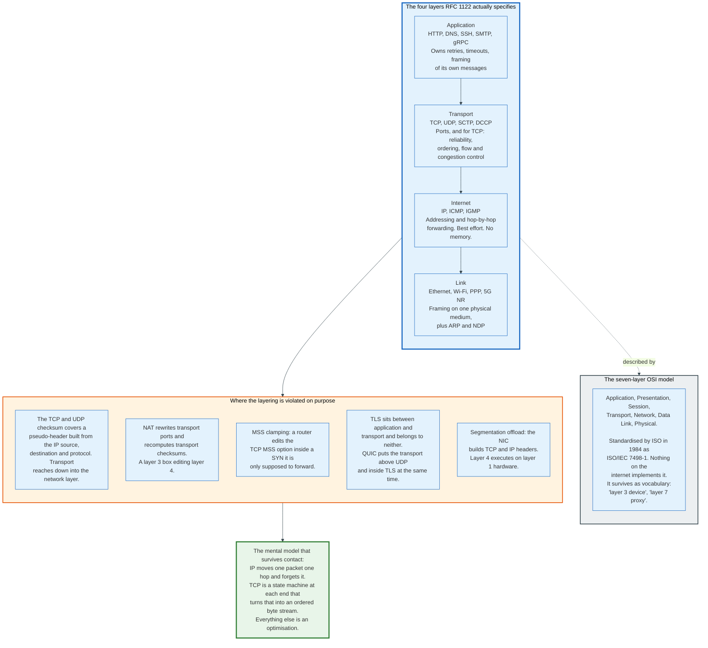

### 3.1 The Four Layers That Exist

RFC 1122, published in October 1989, defines the model the internet actually runs, and it has four layers rather than seven.

**The link layer** frames bytes on one physical medium and delivers them to a directly attached neighbour. Ethernet, Wi-Fi, PPP, and 5G NR live here, along with the address resolution that maps an IP address to a link address: ARP for IPv4, Neighbour Discovery for IPv6. The link layer's maximum transmission unit, the largest frame payload it will carry, is the number that section 6 is entirely about.

**The internet layer** carries a datagram from any host to any host across many links. IP does the forwarding, ICMP reports what went wrong, and the routing protocols that populate forwarding tables sit above or beside it depending on the protocol. This layer's contract is minimal on purpose: try to deliver, report nothing on failure.

**The transport layer** multiplexes that host-to-host service into process-to-process channels using 16-bit port numbers, and optionally adds reliability. TCP adds it. UDP does not. SCTP and DCCP add different subsets and are barely deployed on the public internet.

**The application layer** is everything above, and RFC 1122 explicitly folds OSI's session and presentation layers into it because no internet protocol found the distinction useful.

### 3.2 Encapsulation, With Real Byte Counts

Each layer prefixes a header, and the arithmetic determines what fraction of a link carries useful data.

A full-size TCP segment on IPv4 over Ethernet decomposes as follows. The Ethernet frame carries 14 bytes of header plus a 4-byte frame check sequence, and its payload is capped at 1500 bytes, the MTU. Inside that, IPv4 takes 20 bytes with no options. Inside that, TCP takes 20 bytes fixed plus, in practice, 12 bytes for the timestamp option and its alignment padding. What remains for application data is 1448 bytes.

Overhead is therefore 52 bytes per 1500, or 3.5 percent, before the Ethernet framing. On IPv6 the fixed header is 40 bytes rather than 20, so the payload falls to 1428 bytes and overhead rises to 4.8 percent. IPv6 costs 20 bytes on every single segment, forever, and that is the price of a 128-bit address.

The numbers get worse fast at small sizes. A pure ACK carries zero payload in a 20-byte TCP header and a 20-byte IP header, so 54 bytes as a capture shows it, since a capture omits the 4-byte frame check sequence. Ethernet's 64-octet minimum frame then pads it out, because IEEE 802.3 requires a 46-octet minimum data field and 40 bytes falls 6 short, so 64 bytes of wire carry no data. A one-byte write with Nagle disabled produces the 41-byte IP datagram John Nagle complained about in 1984: one byte of data behind 40 bytes of header, the 4,000 percent overhead of RFC 896 and the reason his algorithm exists.

### 3.3 Where the Layering Is Deliberately Violated

Every clean layering claim about TCP/IP has a counterexample that is not a bug.

**The transport checksum reaches down into the network layer.** TCP and UDP compute their checksum over a pseudo-header containing the IP source address, the IP destination address, the protocol number, and the transport length. The purpose is to detect a datagram delivered to the wrong host or the wrong protocol. The consequence is that NAT, which rewrites addresses, must also recompute transport checksums, so a layer 3 function is forced to parse and edit layer 4.

**MSS clamping is a router editing a transport option.** When a path contains a tunnel with a smaller MTU, the standard operational fix is for the tunnel endpoint to rewrite the MSS option inside every passing SYN, lowering it to fit. This is a middlebox modifying a field that belongs to an end-to-end negotiation it is not party to. It is also the only thing that reliably prevents the black holes described in section 6.

**Segmentation offload executes transport logic in hardware.** With TSO enabled, the kernel hands the NIC a single buffer of up to 64 KB together with a segment size, and the NIC produces the individual TCP and IP headers itself, incrementing sequence numbers and copying flags. Layer 4 header construction happens on a layer 1 device.

**TLS belongs to no layer.** It runs above TCP and below HTTP, presents a stream interface identical to a socket, and performs authentication and key exchange that OSI would place in the session layer. QUIC goes further, embedding the TLS handshake inside the transport's own packets, so the transport and the cryptography cannot be separated even conceptually.

The lesson generalises. Layering is a decomposition that helps humans reason, not a constraint the implementation respects. Any performance work on this stack ends up reaching across at least two layers.

---

## 4. Key Participants and Roles

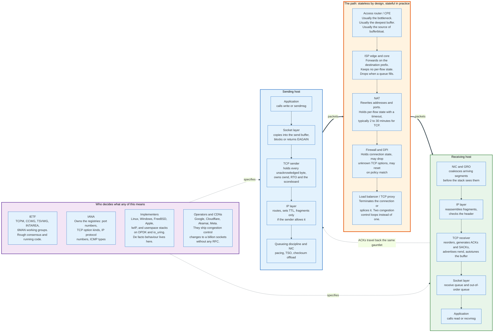

### 4.1 The Actors

| Role | What it does | Holds per-connection state? |
|------|--------------|------------------------------|
| **Sending application** | Writes bytes, chooses socket options, owns its own framing and its own retries | Yes, in its protocol |
| **Sending TCP** | Numbers bytes, retains unacknowledged data, runs cwnd, RTO, and the scoreboard | Yes, all of it |
| **IP forwarding plane** | Looks up the destination prefix, decrements TTL, forwards, drops on a full queue | No, by design |
| **NAT** | Rewrites addresses and ports, recomputes checksums, maps flows to a shared address | Yes, with a timeout |
| **Stateful firewall** | Tracks connection state, permits return traffic, may strip unknown TCP options | Yes |
| **Load balancer or TCP proxy** | Terminates or splices connections, converting one control loop into two | Yes |
| **Receiving TCP** | Reorders, acknowledges, advertises rwnd, autotunes the receive buffer | Yes, all of it |
| **Receiving application** | Reads bytes, and is the ultimate flow control: an app that stops reading closes the window | Yes, in its protocol |
| **NIC and driver** | Checksum offload, segmentation offload, receive coalescing, interrupt moderation | Partially, in offload contexts |
| **IETF** | Publishes the specifications through TCPM, CCWG, TSVWG, INTAREA, and 6MAN | No |
| **IANA** | Owns the registries: ports, TCP option kinds, IP protocol numbers, ICMP types | No |
| **OS implementers** | Linux, Windows, FreeBSD, Apple, lwIP. De facto behaviour is decided here | No |
| **CDNs and large operators** | Ship congestion control changes to billions of sockets without any specification | No |

### 4.2 The Two Roles That Decide Whether the Protocol Works as Specified

**The middlebox is the reason TCP stopped evolving on the wire.** A NAT, firewall, or DPI appliance sitting in the path parses TCP headers it has no business parsing, and many of them reject what they do not recognise. A SYN carrying an unrecognised option may be forwarded with the option stripped, may be dropped entirely, or may pass, depending on the vendor and the firmware. The practical consequence is that any new TCP extension must be negotiated on the SYN, must fail safe when the negotiation is silently removed, and must be measured against real paths before anyone can claim it deploys. This is the direct cause of QUIC: encrypting the transport header inside UDP is the only way to stop middleboxes from having opinions about it.

**The NIC is the reason the packet in a capture is not the packet on the wire.** With generic receive offload enabled, `tcpdump` on the receiver shows segments of 64 KB that never existed on the network, because the NIC merged 45 real segments before the stack saw them. With TSO enabled on the sender, the capture shows a single 64 KB write where the wire carried 45 segments. Every measurement of segment sizes, of interarrival timing, and of the ACK ratio is distorted unless offloads are disabled, and disabling them changes the performance being measured. This is a permanent problem in TCP debugging and it has no clean answer.

### 4.3 The Application Is the Last Flow Control Stage

The receive window ultimately reflects an application's read rate, and this is the most frequently missed link in the chain.

A receiving TCP advertises a window derived from the free space in its receive buffer. If the application stops calling `read()`, that buffer fills, the advertised window shrinks to zero, and the sender stops. No packets are lost, no congestion signal is generated, and no error is reported anywhere. From the sender's perspective, the network simply became infinitely slow.

This is correct behaviour and it is a common production failure mode: a slow consumer in one service silently applies backpressure through TCP to a producer several hops away, which then blocks in `write()`, which then stops servicing its own inputs. TCP propagates backpressure faithfully and gives no indication that it is doing so.

---

## 5. The IP Header: IPv4 and IPv6, Field by Field

```mermaid
%%{init: {'theme': 'base', 'themeVariables': {'primaryColor': '#e3f2fd', 'primaryBorderColor': '#1565c0', 'lineColor': '#37474f'}}}%%

flowchart TB
    subgraph V4["IPv4 header, RFC 791, 20 bytes minimum and 60 maximum"]
        direction TB
        A1["Bits 0-3: Version = 4<br/>Bits 4-7: IHL, header length in<br/>32-bit words. 5 means 20 bytes,<br/>15 means 60. This is why IPv4<br/>options cap at 40 bytes."]
        A2["Bits 8-15: DSCP 6 bits plus ECN 2 bits.<br/>Redefined from Type of Service by<br/>RFC 2474 and RFC 3168.<br/>ECN: 00 Not-ECT, 10 ECT(0),<br/>01 ECT(1), 11 CE"]
        A3["Bits 16-31: Total Length<br/>Header plus payload, in bytes.<br/>Maximum 65535."]
        A4["Bits 32-47: Identification<br/>Bits 48-50: Flags. Bit 0 reserved,<br/>bit 1 DF Don't Fragment,<br/>bit 2 MF More Fragments<br/>Bits 51-63: Fragment Offset,<br/>counted in 8-byte units"]
        A5["Bits 64-71: TTL<br/>Decremented per hop. Zero means<br/>discard and send ICMP Time Exceeded.<br/>This is what traceroute exploits."]
        A6["Bits 72-79: Protocol<br/>6 TCP, 17 UDP, 1 ICMP,<br/>41 IPv6-in-IPv4, 47 GRE, 50 ESP<br/>Bits 80-95: Header Checksum<br/>Covers the header only.<br/>Recomputed at every hop."]
        A7["Bits 96-127: Source Address<br/>Bits 128-159: Destination Address<br/>Then options, if IHL is above 5.<br/>Options are near-extinct: many<br/>networks drop packets carrying them."]
    end

    subgraph V6["IPv6 header, RFC 8200, exactly 40 bytes, always"]
        direction TB
        B1["Bits 0-3: Version = 6<br/>Bits 4-11: Traffic Class<br/>DSCP plus ECN, same as IPv4<br/>Bits 12-31: Flow Label<br/>20 bits. A hint for equal-cost<br/>hashing that does not require<br/>a router to read the ports."]
        B2["Bits 32-47: Payload Length<br/>Bytes after this header.<br/>Note the difference from IPv4:<br/>it excludes the header."]
        B3["Bits 48-55: Next Header<br/>Same number space as IPv4 Protocol.<br/>Also names extension headers:<br/>0 Hop-by-Hop, 43 Routing,<br/>44 Fragment, 60 Destination Options"]
        B4["Bits 56-63: Hop Limit<br/>TTL renamed to what it always was"]
        B5["Bits 64-191: Source Address, 128 bits<br/>Bits 192-319: Destination Address, 128 bits"]
    end

    subgraph Gone["What IPv6 removed, and why"]
        direction TB
        C1["No header checksum.<br/>The link layer has a CRC and<br/>the transport has its own checksum.<br/>Recomputing at every hop bought<br/>nothing and cost forwarding cycles."]
        C2["No router fragmentation.<br/>Only the source may fragment,<br/>using the Fragment extension header.<br/>A router that cannot fit a packet<br/>sends ICMPv6 Packet Too Big, type 2."]
        C3["No IHL and no in-header options.<br/>Options become extension headers<br/>chained by Next Header. Fixed<br/>40 bytes means fixed-offset parsing."]
        C4["Minimum link MTU rises from<br/>68 bytes in IPv4 to 1280 bytes.<br/>Every IPv6 link must carry 1280,<br/>so PMTUD has a floor it can trust."]
    end

    V4 --> Gone
    V6 --> Gone

    style V4 fill:#e3f2fd,stroke:#1565c0,stroke-width:2px
    style V6 fill:#e8f5e9,stroke:#2e7d32,stroke-width:2px
    style Gone fill:#fff3e0,stroke:#e65100,stroke-width:3px
```

### 5.1 IPv4, RFC 791

The IPv4 header is 20 bytes with no options and 60 bytes at maximum, and every field in it is either load-bearing or a fossil.

```
 0                   1                   2                   3
 0 1 2 3 4 5 6 7 8 9 0 1 2 3 4 5 6 7 8 9 0 1 2 3 4 5 6 7 8 9 0 1
+-+-+-+-+-+-+-+-+-+-+-+-+-+-+-+-+-+-+-+-+-+-+-+-+-+-+-+-+-+-+-+-+
|Version|  IHL  |    DSCP   |ECN|          Total Length         |
+-+-+-+-+-+-+-+-+-+-+-+-+-+-+-+-+-+-+-+-+-+-+-+-+-+-+-+-+-+-+-+-+
|         Identification        |Flags|      Fragment Offset    |
+-+-+-+-+-+-+-+-+-+-+-+-+-+-+-+-+-+-+-+-+-+-+-+-+-+-+-+-+-+-+-+-+
|  Time to Live |    Protocol   |         Header Checksum       |
+-+-+-+-+-+-+-+-+-+-+-+-+-+-+-+-+-+-+-+-+-+-+-+-+-+-+-+-+-+-+-+-+
|                       Source Address                          |
+-+-+-+-+-+-+-+-+-+-+-+-+-+-+-+-+-+-+-+-+-+-+-+-+-+-+-+-+-+-+-+-+
|                    Destination Address                        |
+-+-+-+-+-+-+-+-+-+-+-+-+-+-+-+-+-+-+-+-+-+-+-+-+-+-+-+-+-+-+-+-+
|                    Options (0 to 40 bytes)                    |
+-+-+-+-+-+-+-+-+-+-+-+-+-+-+-+-+-+-+-+-+-+-+-+-+-+-+-+-+-+-+-+-+
```

**Version**, 4 bits, is always 4 here. **IHL**, the internet header length, counts 32-bit words: 5 means the minimum 20 bytes, 15 means the maximum 60. The 4-bit field is why IPv4 options can never exceed 40 bytes.

**DSCP and ECN**, 6 bits and 2 bits, were originally one 8-bit Type of Service field. RFC 2474 redefined the top six as a Differentiated Services Code Point for traffic classing, and RFC 3168 took the bottom two for Explicit Congestion Notification. The four ECN codepoints are `00` Not-ECT, meaning the sender does not support ECN, `10` ECT(0) and `01` ECT(1), both meaning ECN-capable, and `11` CE, Congestion Experienced, which only a router sets. Section 16 explains why L4S gives ECT(1) a separate meaning.

**Total Length**, 16 bits, counts the header plus payload in bytes, capping an IPv4 datagram at 65,535 bytes.

**Identification, Flags, and Fragment Offset** exist for fragmentation and are covered in section 6. The Flags field is three bits: bit 0 reserved, bit 1 DF meaning Don't Fragment, bit 2 MF meaning More Fragments. Fragment Offset is 13 bits counted in units of 8 bytes, which is why every fragment except the last must be a multiple of 8 bytes long.

**Time to Live**, 8 bits, is decremented by every router and the packet is discarded at zero with an ICMP Time Exceeded returned to the source. It is a hop count, not a time, despite the name. Traceroute works by sending packets with deliberately small TTLs and reading the addresses of the routers that complain.

**Protocol**, 8 bits, names what is inside: 1 for ICMP, 6 for TCP, 17 for UDP, 41 for IPv6 encapsulated in IPv4, 47 for GRE, 50 for ESP.

**Header Checksum**, 16 bits, covers only the header and must be recomputed at every hop because the TTL changes. IPv6 removed it.

**Options** are effectively extinct. Record Route, Timestamp, and the Source Routing options are dropped by many networks as a security measure, so a packet carrying them frequently does not arrive at all.

### 5.2 IPv6, RFC 8200

The IPv6 header is exactly 40 bytes, always, and the simplification is the entire design argument.

```
 0                   1                   2                   3
 0 1 2 3 4 5 6 7 8 9 0 1 2 3 4 5 6 7 8 9 0 1 2 3 4 5 6 7 8 9 0 1
+-+-+-+-+-+-+-+-+-+-+-+-+-+-+-+-+-+-+-+-+-+-+-+-+-+-+-+-+-+-+-+-+
|Version| Traffic Class |             Flow Label                |
+-+-+-+-+-+-+-+-+-+-+-+-+-+-+-+-+-+-+-+-+-+-+-+-+-+-+-+-+-+-+-+-+
|        Payload Length         |  Next Header  |   Hop Limit   |
+-+-+-+-+-+-+-+-+-+-+-+-+-+-+-+-+-+-+-+-+-+-+-+-+-+-+-+-+-+-+-+-+
|                                                               |
+                     Source Address (128 bits)                 +
|                                                               |
+-+-+-+-+-+-+-+-+-+-+-+-+-+-+-+-+-+-+-+-+-+-+-+-+-+-+-+-+-+-+-+-+
|                                                               |
+                  Destination Address (128 bits)               +
|                                                               |
+-+-+-+-+-+-+-+-+-+-+-+-+-+-+-+-+-+-+-+-+-+-+-+-+-+-+-+-+-+-+-+-+
```

**Traffic Class** is the DSCP plus ECN pair, identical in meaning to IPv4's. **Flow Label**, 20 bits, is new: a source-chosen value that identifies a flow so that a router can hash it for equal-cost multipath without parsing past the IP header. Its practical use is limited by inconsistent implementation.

**Payload Length** counts the bytes after this header, unlike IPv4's Total Length which includes the header. Off-by-40 errors in hand-written parsers trace to exactly this difference.

**Next Header** shares IPv4's Protocol number space but also names extension headers: 0 for Hop-by-Hop Options, 43 for Routing, 44 for Fragment, 60 for Destination Options, and 59 for "nothing follows". Extension headers form a chain, each naming the next, ending at a transport protocol number.

**Hop Limit** is TTL renamed to what it always was.

### 5.3 What IPv6 Removed and Why

Four removals account for most of the difference, and each one is a decision about where work should happen.

**No header checksum.** The link layer carries a CRC and the transport carries its own checksum over a pseudo-header. Recomputing a header checksum at every hop cost forwarding cycles and detected almost nothing that was not already detected. The consequence is that UDP checksums, optional in IPv4, are mandatory in IPv6.

**No router fragmentation.** Only the source may fragment, using the Fragment extension header. A router that cannot fit a packet drops it and returns ICMPv6 Packet Too Big, type 2, code 0, carrying the next-hop MTU in a 32-bit field. This makes Path MTU Discovery mandatory rather than optional, which is a stronger position and a more fragile one.

**No in-header options.** The fixed 40-byte header means a forwarding engine can find the addresses at a fixed offset without parsing. Options become extension headers that only the destination normally examines.

**A raised MTU floor.** Every IPv6 link must carry a 1280-byte packet, against IPv4's 68-byte minimum. A sender that never exceeds 1280 bytes never needs PMTUD at all, which is why QUIC and DNS both chose limits just under that number.

RFC 8200 also tightened fragmentation security relative to RFC 2460: overlapping fragments must be silently discarded along with the whole datagram, all headers through the first upper-layer header must fit in the first fragment, and a source must not generate atomic fragments, meaning fragment headers on datagrams that are not actually fragmented.

---

## 6. Fragmentation and Path MTU Discovery

```mermaid
%%{init: {'theme': 'base', 'themeVariables': {'primaryColor': '#e3f2fd', 'primaryBorderColor': '#1565c0', 'lineColor': '#37474f'}}}%%

flowchart TB
    subgraph Ladder["The MTU ladder a real packet walks down"]
        direction TB
        M1["9000: jumbo frames.<br/>Data centre and storage networks only."]
        M2["1500: Ethernet. The number the<br/>entire internet is tuned around."]
        M3["1492: PPPoE. 1500 minus an 8-byte<br/>PPPoE header. Most DSL lines."]
        M4["1476 GRE over Ethernet,<br/>1420 WireGuard, 1400 typical IPsec.<br/>Every tunnel steals header bytes."]
        M5["1280: IPv6 minimum link MTU.<br/>Guaranteed. RFC 8200."]
        M6["576: the IPv4 datagram every host<br/>must be able to reassemble.<br/>68: the smallest IPv4 MTU allowed."]
        M1 --> M2 --> M3 --> M4 --> M5 --> M6
    end

    subgraph Classic["Classical PMTUD, RFC 1191 and RFC 8201"]
        direction TB
        D1["Sender sets DF on every IPv4 packet.<br/>IPv6 has no DF bit because routers<br/>may never fragment."]
        D2["A router whose next link is smaller<br/>drops the packet and returns<br/>ICMP type 3 code 4 Fragmentation Needed<br/>with the next-hop MTU in the<br/>low 16 bits of the unused word,<br/>or ICMPv6 type 2 Packet Too Big."]
        D3["Sender lowers its cached PMTU for<br/>that destination and retransmits.<br/>Cache ages out after about 10 minutes<br/>so a shortened path can be rediscovered."]
        D1 --> D2 --> D3
    end

    subgraph Blackhole["Why it fails: the PMTU black hole"]
        direction TB
        F1["Firewalls drop all ICMP as a policy.<br/>The sender never learns the limit."]
        F2["Anycast and asymmetric routing send<br/>the ICMP to a different machine<br/>than the one that sent the packet."]
        F3["Routers rate-limit ICMP generation,<br/>so under load the message is<br/>the first thing not sent."]
        F4["Symptom: the handshake succeeds and<br/>small requests work. The first<br/>full-size response hangs forever.<br/>SSH connects, then freezes on banner."]
        F1 --> F4
        F2 --> F4
        F3 --> F4
    end

    subgraph Fixes["What is actually deployed"]
        direction TB
        G1["MSS clamping. The router edits the<br/>MSS option inside the SYN down to<br/>PMTU minus 40. Ugly, universal,<br/>and it works. TCP only."]
        G2["PLPMTUD, RFC 4821 for TCP and<br/>RFC 8899 for datagrams.<br/>Probe with progressively larger<br/>packets and use the transport's own<br/>ACKs as the signal. No ICMP needed."]
        G3["Just send small. QUIC defaults to a<br/>1200-byte payload and probes upward.<br/>DNS over UDP capped itself at 1232<br/>bytes to stay under 1280 for IPv6."]
        G4["Linux: net.ipv4.tcp_mtu_probing<br/>defaults to 0, meaning off.<br/>Set to 1 to enable probing only<br/>after a suspected black hole,<br/>2 to always probe."]
    end

    Ladder --> Classic
    Classic --> Blackhole
    Blackhole --> Fixes

    Frag["IPv4 fragmentation itself is worse<br/>than the problem it solves:<br/>losing one fragment destroys the<br/>whole datagram, the 16-bit ID field<br/>wraps after 65536 datagrams and<br/>caps a safely fragmenting flow at<br/>about 6.4 Mbit/s per RFC 6864,<br/>and only the first fragment carries<br/>the ports that firewalls filter on."]

    Fixes --> Frag

    style Ladder fill:#e3f2fd,stroke:#1565c0,stroke-width:2px
    style Classic fill:#e8f5e9,stroke:#2e7d32,stroke-width:2px
    style Blackhole fill:#ffebee,stroke:#b71c1c,stroke-width:3px
    style Fixes fill:#fff3e0,stroke:#e65100,stroke-width:2px
    style Frag fill:#f3e5f5,stroke:#4a148c,stroke-width:2px
```

### 6.1 Why Fragmentation Exists and Why It Is Avoided

Fragmentation is IP's answer to a datagram that does not fit the next link, and every deployment decision since 1990 has been aimed at never using it.

The mechanism in IPv4 is straightforward. A router with a 1500-byte packet and a 1400-byte next link splits the payload into pieces, each carrying a copy of the original header with the same Identification value, the More Fragments bit set on all but the last, and a Fragment Offset counted in 8-byte units. The destination host reassembles by Identification, source address, destination address, and protocol. A reassembly timer, typically 30 to 60 seconds, discards incomplete sets.

Four properties make this bad.

**Loss amplification.** Losing any one fragment destroys the entire datagram, and the surviving fragments consume bandwidth and reassembly memory before being discarded. A 3-fragment datagram on a path with 1 percent packet loss has an effective datagram loss rate near 3 percent.

**Identification field exhaustion.** The IPv4 ID field is 16 bits, so 65,536 values. RFC 6864 requires that a source not repeat an ID within one maximum datagram lifetime for a given source, destination, and protocol triple. At 1500-byte packets and a 120-second lifetime, that arithmetic caps a safely fragmenting flow at roughly 6.4 Mbit/s, which is why RFC 6864 relaxed the requirement for atomic datagrams and left it in force only where fragmentation is actually possible.

**Firewall blindness.** Only the first fragment carries the transport header, so only the first fragment carries the ports a stateful firewall filters on. Devices either reassemble, which costs memory and creates a denial-of-service target, or apply weaker rules to non-first fragments, which creates an evasion technique.

**Load balancer blindness.** Equal-cost multipath hashing normally includes the transport ports. Non-first fragments have none, so they hash differently from the first fragment and may arrive at a different server behind an anycast address, where reassembly can never complete.

### 6.2 Classical Path MTU Discovery, RFC 1191 and RFC 8201

Path MTU Discovery replaces fragmentation with a feedback loop, and the loop depends on a message that is frequently not delivered.

The IPv4 mechanism, defined in RFC 1191 in November 1990, works like this. The sender sets the DF bit on every packet. A router whose next-hop MTU is too small drops the packet and returns ICMP Destination Unreachable, type 3, code 4, Fragmentation Needed and DF Set. RFC 1191's contribution was to put the next-hop MTU into the low 16 bits of a word that RFC 792 had left unused, so the sender learns the exact size rather than having to guess. For routers too old to fill that field, RFC 1191 supplied a plateau table of common MTUs to step down through: 65535, 32000, 17914, 8166, 4352, 2002, 1492, 1006, 508, 296, 68.

The sender caches the discovered PMTU per destination and retransmits at the smaller size. Because a path can shorten, the cache is aged: RFC 1191 recommends re-probing about 10 minutes after a reduction and no sooner than 5 minutes, and about 2 minutes after a successful increase.

IPv6, in RFC 8201, uses the same loop with ICMPv6 Packet Too Big, type 2, and one difference that matters. There is no DF bit because routers may never fragment, so PMTUD is not opt-in. An IPv6 sender that ignores Packet Too Big messages simply cannot send large packets, and the floor it can always fall back to is the guaranteed 1280-byte minimum link MTU.

### 6.3 The Black Hole, Which Is the Normal Case

PMTUD fails silently and often, and the failure has a characteristic signature that is worth memorising.

Three causes dominate. Firewalls drop all ICMP as a blanket policy, on the reasoning that ICMP is used for reconnaissance, so the Packet Too Big never reaches the sender. Asymmetric and anycast routing sends the ICMP error toward the source address, which behind an anycast prefix may not be the machine that sent the packet. And routers rate-limit ICMP generation to protect their control planes, so under exactly the load that causes the problem the notification is the first thing suppressed.

The signature is distinctive. The TCP handshake succeeds, because SYNs are small. Small requests and responses work. The first full-size segment vanishes and is retransmitted at the same size forever. An SSH session connects and then hangs on the version banner. An HTTPS site loads its handshake and stalls on the certificate. A `curl` of a small JSON endpoint works and a `curl` of a large one hangs. Anything that looks like "small things work, big things hang" is a PMTU black hole until proven otherwise.

### 6.4 What Is Actually Deployed

Four mitigations exist, and the ugliest one carries the most traffic.

**MSS clamping.** The tunnel endpoint or CPE rewrites the MSS option inside every TCP SYN it forwards, lowering it to the tunnel's MTU minus 40 bytes for IPv4 or minus 60 for IPv6. It is a middlebox modifying an end-to-end negotiation, it works only for TCP, and it is the single most widely deployed fix in the world. Every consumer PPPoE router does it.

**Packetization Layer PMTUD.** RFC 4821 for TCP and RFC 8899 for datagram transports move discovery into the transport, which already knows which packets were delivered. The transport sends probe packets of increasing size and uses its own acknowledgements as the signal, requiring no ICMP at all. RFC 8899 recommends a BASE_PLPMTU above 1200 bytes, with 1200 as the recommended IPv4 default, and sets MIN_PLPMTU at whatever produces a 1280-byte IPv6 packet or a 68-byte IPv4 packet. Linux implements RFC 4821 behind `net.ipv4.tcp_mtu_probing`, which defaults to 0, meaning off. Setting it to 1 enables probing only after a suspected black hole; 2 always probes.

**Sending small and staying there.** QUIC requires that the initial packet be at least 1200 bytes and defaults to a maximum datagram near that until PLPMTUD raises it. DNS over UDP settled on a 1232-byte EDNS0 buffer size for the same reason: 1280 minus 40 for IPv6 minus 8 for UDP. Neither protocol trusts the network to tell it anything.

**Just fragmenting anyway.** IPv6 senders that want to send large datagrams and cannot use PMTUD may fragment at the source with a Fragment extension header. This inherits every drawback in section 6.1 and is used mainly by DNSSEC responses that outgrew a single packet, which is itself a well-documented source of resolution failures.

The general lesson is uncomfortable. A mechanism that depends on an error message being delivered across a network that does not guarantee delivery, through operators who filter that message class, will fail in production at a rate nobody measures.

---

## 7. The TCP Header and the 40-Byte Option Space

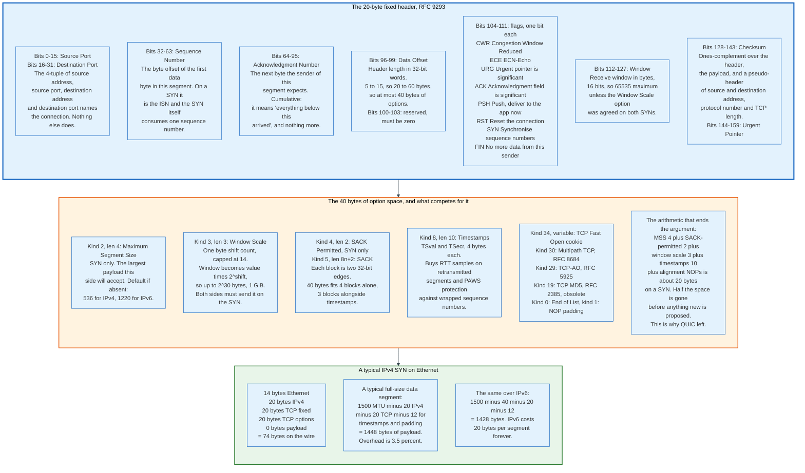

### 7.1 The Fixed Header

The TCP header is 20 bytes without options and 60 bytes at most, and the 4-bit length field that caps it is the reason TCP stopped growing.

```
 0                   1                   2                   3
 0 1 2 3 4 5 6 7 8 9 0 1 2 3 4 5 6 7 8 9 0 1 2 3 4 5 6 7 8 9 0 1
+-+-+-+-+-+-+-+-+-+-+-+-+-+-+-+-+-+-+-+-+-+-+-+-+-+-+-+-+-+-+-+-+
|          Source Port          |       Destination Port        |
+-+-+-+-+-+-+-+-+-+-+-+-+-+-+-+-+-+-+-+-+-+-+-+-+-+-+-+-+-+-+-+-+
|                        Sequence Number                        |
+-+-+-+-+-+-+-+-+-+-+-+-+-+-+-+-+-+-+-+-+-+-+-+-+-+-+-+-+-+-+-+-+
|                    Acknowledgment Number                      |
+-+-+-+-+-+-+-+-+-+-+-+-+-+-+-+-+-+-+-+-+-+-+-+-+-+-+-+-+-+-+-+-+
|  Data |Rsrvd  |C|E|U|A|P|R|S|F|                               |
| Offset|       |W|C|R|C|S|S|Y|I|            Window             |
|       |       |R|E|G|K|H|T|N|N|                               |
+-+-+-+-+-+-+-+-+-+-+-+-+-+-+-+-+-+-+-+-+-+-+-+-+-+-+-+-+-+-+-+-+
|           Checksum            |        Urgent Pointer         |
+-+-+-+-+-+-+-+-+-+-+-+-+-+-+-+-+-+-+-+-+-+-+-+-+-+-+-+-+-+-+-+-+
|                    Options (0 to 40 bytes)                    |
+-+-+-+-+-+-+-+-+-+-+-+-+-+-+-+-+-+-+-+-+-+-+-+-+-+-+-+-+-+-+-+-+
```

**Source Port and Destination Port**, 16 bits each. Together with the IP source and destination addresses they form the 4-tuple that names the connection. Nothing else does. There is no connection identifier field, which is why a TCP connection cannot survive an address change and why QUIC introduced one.

**Sequence Number**, 32 bits, is the position in the byte stream of the first data byte in this segment. On a SYN it carries the initial sequence number instead, and the SYN itself consumes one sequence number, which is why the acknowledgement of a SYN is ISN plus one.

**Acknowledgment Number**, 32 bits, valid when the ACK flag is set, names the next byte the sender of this segment expects to receive. It is cumulative and it is a lower bound: everything below it arrived, and it asserts nothing about anything above.

**Data Offset**, 4 bits, gives the header length in 32-bit words. The range 5 to 15 gives 20 to 60 bytes, so 40 bytes of option space. Every TCP extension proposed since 1996 has been competing for those 40 bytes.

**The flags**, one bit each, in header order: `CWR` Congestion Window Reduced and `ECE` ECN-Echo, both added by RFC 3168 out of the reserved field; `URG` marking the Urgent Pointer significant; `ACK` marking the Acknowledgment Number significant; `PSH` asking the receiver to deliver buffered data to the application immediately; `RST` aborting the connection; `SYN` synchronising sequence numbers; `FIN` signalling no more data from this sender.

Two of those are effectively dead. `URG` and the Urgent Pointer implement out-of-band data whose semantics differed between RFC 793 and BSD, were never reconciled, and are formally discouraged by RFC 6093. `PSH` is set by most stacks on the last segment of a write and ignored as a hint by most receivers.

**Window**, 16 bits, is the receive window in bytes, capped at 65,535 unless window scaling was negotiated on both SYNs.

**Checksum**, 16 bits, is mandatory and covers the header, the payload, and a pseudo-header of source address, destination address, protocol number, and TCP length.

### 7.2 The Options, and the Arithmetic of Scarcity

Six options matter in practice, and together they consume half the available space on a SYN.

| Kind | Length | Name | RFC | Where |
|------|--------|------|-----|-------|
| 0 | 1 | End of Option List | RFC 9293 | Anywhere |
| 1 | 1 | No-Operation, used for 4-byte alignment | RFC 9293 | Anywhere |
| 2 | 4 | Maximum Segment Size | RFC 9293 | SYN only |
| 3 | 3 | Window Scale | RFC 7323 | SYN only |
| 4 | 2 | SACK Permitted | RFC 2018 | SYN only |
| 5 | 8n+2 | SACK | RFC 2018 | Non-SYN |
| 8 | 10 | Timestamps | RFC 7323 | Any |
| 19 | 18 | TCP MD5 Signature, obsolete | RFC 2385 | Any |
| 29 | variable | TCP Authentication Option | RFC 5925 | Any |
| 30 | variable | Multipath TCP | RFC 8684 | Any |
| 34 | variable | TCP Fast Open Cookie | RFC 7413 | SYN |

**Maximum Segment Size**, kind 2, announces the largest payload this side will accept, derived from the local interface MTU. It is not negotiated: each side states its own, and each side must respect the other's. If the option is absent, RFC 9293 requires assuming 536 bytes for IPv4, which is 576 minus 40, and 1220 for IPv6, which is 1280 minus 60.

**Window Scale**, kind 3, carries a single shift count capped at 14, multiplying the advertised window by 2 to that power and giving a maximum window of 2^30 bytes, one gibibyte. It must appear on both SYNs or neither side scales, and it cannot be added later. A connection that loses the option to a middlebox is capped at 65,535 bytes of window for its whole life, which over an 80 ms path limits it to 6.55 Mbit/s.

**Timestamps**, kind 8, carries a 4-byte TSval and a 4-byte TSecr. Once negotiated it must appear on every segment except RST. It buys two things. First, an RTT sample on every acknowledged segment including retransmitted ones, which is what lifts Karn's restriction in section 12. Second, PAWS, Protection Against Wrapped Sequence numbers, which treats the timestamp as a logical extension of the high-order bits of the sequence number and rejects segments whose timestamp goes backwards. PAWS matters because the 32-bit sequence space wraps in 34 seconds at 1 Gbit/s and 3.4 seconds at 10 Gbit/s, both far inside the 2-minute maximum segment lifetime.

**SACK Permitted and SACK**, kinds 4 and 5, are covered in section 11.

Now the arithmetic. A typical Linux SYN carries MSS at 4 bytes, SACK-permitted at 2, timestamps at 10, window scale at 3, plus NOP padding to reach 4-byte alignment: about 20 bytes out of 40. TCP Fast Open needs 2 bytes of overhead plus a cookie of 4 to 16 bytes. Multipath TCP's MP_CAPABLE needs 12 to 20. Authentication needs at least 16. There is no arrangement in which a connection uses Fast Open, Multipath, and authentication together.

That is not a detail. It is the structural reason the transport moved to QUIC: an option space fixed at 40 bytes in 1981 cannot accommodate a protocol that keeps acquiring features, and the field that would have to grow is 4 bits wide.

---

## 8. The Three-Way Handshake

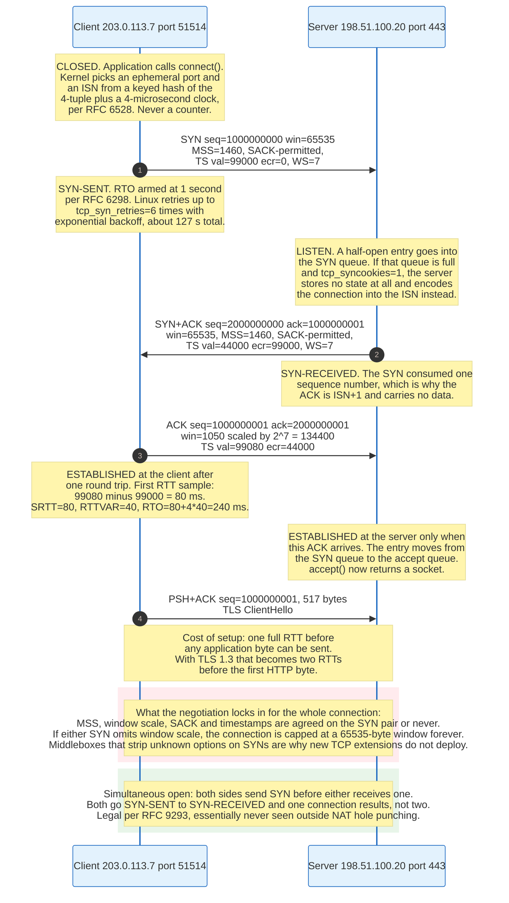

### 8.1 What the Three Segments Do

The handshake exchanges initial sequence numbers in both directions and negotiates every option that cannot be turned on later.

**Segment 1, the SYN.** The client picks an ephemeral source port and an initial sequence number, sets the SYN flag, and attaches its options. It moves from CLOSED to SYN-SENT and arms a retransmission timer, which RFC 6298 sets at 1 second before any RTT sample exists. Linux retries a SYN up to `tcp_syn_retries` times, default 6, with exponential backoff, giving roughly 127 seconds before `connect()` returns ETIMEDOUT.

**Segment 2, the SYN-ACK.** The server, in LISTEN, creates a half-open entry, picks its own ISN, acknowledges the client's ISN plus one, and attaches its own options. It moves to SYN-RECEIVED.

**Segment 3, the ACK.** The client acknowledges the server's ISN plus one and moves to ESTABLISHED. When that ACK arrives, the server moves to ESTABLISHED and the connection migrates from the SYN queue to the accept queue, where `accept()` returns it.

The client is established after one round trip and may send data with the third segment. The server is established after one and a half. That asymmetry is why a client can send its first request in the same packet as the final ACK and why TCP Fast Open exists to remove even that.

### 8.2 Initial Sequence Numbers Are a Security Mechanism

The ISN cannot be a counter, and the reason is not sequencing but spoofing.

If an off-path attacker can predict the ISN a server will choose, it can forge the third segment of a handshake without ever seeing the second, completing a connection from a spoofed source address and injecting data into it. This was demonstrated against BSD-derived stacks whose ISN advanced by a fixed increment per connection and per unit time.

RFC 6528, folded into RFC 9293, specifies the fix:

```
ISN = M + F(localip, localport, remoteip, remoteport, secretkey)
```

where `M` is a clock incrementing roughly every 4 microseconds and `F` is a cryptographic hash whose secret key is unknown to the attacker. The 4-microsecond clock wraps every 4.55 hours, comfortably longer than the 2-minute maximum segment lifetime, so the monotonic component still prevents old duplicates from colliding with a new connection on the same 4-tuple. The keyed hash makes the per-connection offset unguessable while keeping ISNs for the same 4-tuple monotonically increasing, which TIME_WAIT reuse depends on.

The mechanism generalises: the same construction underpins SYN cookies.

### 8.3 The SYN Queue, the Accept Queue, and SYN Cookies

A server under connection load has two distinct queues and they fail differently.

The **SYN queue**, sized by `net.ipv4.tcp_max_syn_backlog`, holds connections in SYN-RECEIVED, meaning a SYN-ACK has been sent and the final ACK has not arrived. The **accept queue**, sized by the `backlog` argument to `listen()` capped by `net.core.somaxconn`, holds fully established connections that the application has not yet accepted.

A SYN flood, described in RFC 4987, exhausts the first. An attacker sends SYNs from spoofed source addresses and never completes the handshake. Each one consumes a SYN queue entry until the entry times out, and legitimate SYNs are dropped. The attack is cheap because a SYN is 74 bytes and the state it creates on the server is hundreds of bytes held for over a minute.

SYN cookies remove the state entirely. Rather than allocating an entry, the server encodes the connection into the ISN it sends in the SYN-ACK: a slow counter incrementing every 64 seconds, a small index into a table of common MSS values, and a keyed hash of the addresses and ports. When the final ACK arrives, the server subtracts one from its acknowledgement number, recomputes the hash, and if it matches, reconstructs the connection from scratch. No memory is held between the SYN and the ACK.

The cost is that options negotiated on the SYN must be squeezed into the cookie or lost. FreeBSD and Linux both use the timestamp option's low bits to carry window scale and SACK-permitted when timestamps are available. Linux enables cookies only under pressure by default: `net.ipv4.tcp_syncookies` defaults to 1, meaning cookies are used when the SYN queue overflows and not before.

A backlog full of ESTABLISHED connections is a different problem entirely, and it means the application is not calling `accept()` fast enough. `net.ipv4.tcp_abort_on_overflow` defaults to false, so the server silently drops the final ACK and lets the client retransmit, which looks to the client like a slow server rather than a refused connection.

### 8.4 Simultaneous Open and RST

Two edge cases in the state machine are worth knowing because they show up in diagnostics.

**Simultaneous open** happens when both sides send a SYN before either receives one. Both transition SYN-SENT to SYN-RECEIVED, both send a SYN-ACK, and one connection results rather than two. RFC 9293 requires it to work. Outside of NAT hole punching, it is essentially never seen.

**RST** aborts a connection immediately with no acknowledgement and no teardown. It is sent when a segment arrives for a connection that does not exist, when a SYN arrives on a port with no listener, and when an application calls `close()` on a socket with unread data or sets `SO_LINGER` to zero. A connection reset by peer means the peer's TCP sent an RST, which most often means the peer's application exited or explicitly aborted, not that the network failed.

---

## 9. Teardown, TIME_WAIT, and the 2MSL Rule

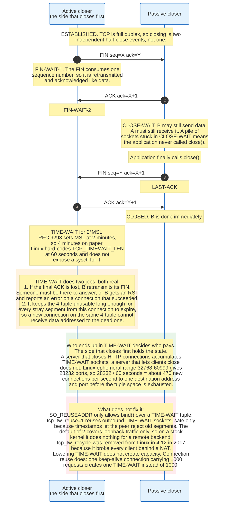

### 9.1 Closing Is Two Independent Half-Closes

TCP is full duplex, so shutting it down is two separate events, and treating it as one causes real bugs.

Each direction is closed by a FIN, which like a SYN consumes one sequence number and is therefore retransmitted and acknowledged like data. The normal four-segment sequence is FIN from the active closer, ACK from the passive closer, FIN from the passive closer, ACK from the active closer. Frequently the passive closer's ACK and FIN are combined into one segment, making it three.

The full state set from RFC 9293 is eleven states. CLOSED is described in the specification as fictional, meaning it represents the absence of a connection.

| State | Meaning | Who is in it |
|-------|---------|--------------|
| `CLOSED` | No connection exists. A fictional state. | Both, before and after |
| `LISTEN` | Waiting for a SYN | Server |
| `SYN-SENT` | SYN sent, awaiting SYN-ACK | Client |
| `SYN-RECEIVED` | SYN-ACK sent, awaiting final ACK | Server |
| `ESTABLISHED` | Data may flow both ways | Both |
| `FIN-WAIT-1` | Our FIN sent, not yet acknowledged | Active closer |
| `FIN-WAIT-2` | Our FIN acknowledged, awaiting theirs | Active closer |
| `CLOSE-WAIT` | Their FIN received, ours not yet sent | Passive closer |
| `CLOSING` | Both sent FIN, neither acknowledged. Simultaneous close. | Both |
| `LAST-ACK` | Our FIN sent after theirs, awaiting its ACK | Passive closer |
| `TIME-WAIT` | Waiting 2*MSL before releasing the 4-tuple | Active closer |

Two of these are diagnostic gold. A pile of sockets in `CLOSE_WAIT` means the peer closed and the local application never called `close()`, which is a file descriptor leak in the application, not a network problem. A pile in `FIN_WAIT_2` means the local application closed and the peer never did, which is the same bug on the other machine.

### 9.2 TIME_WAIT, and Why It Is Not Optional

TIME_WAIT is held only by the side that closes first, lasts twice the maximum segment lifetime, and does two jobs that nothing else does.

**Job one: answer a retransmitted FIN.** If the final ACK is lost, the passive closer's FIN retransmission timer fires and it resends its FIN. If the active closer has already released all state, the arriving FIN hits a nonexistent connection and provokes an RST, which the passive closer reports to its application as an error on a connection that in fact completed cleanly. TIME_WAIT keeps enough state around to re-acknowledge.

**Job two: let old segments die.** Suppose a connection between the same 4-tuple is opened immediately after the last one closed, and a delayed duplicate from the old connection is still in the network. If its sequence number happens to fall inside the new connection's window, the new connection accepts data that belongs to a dead one. TIME_WAIT holds the 4-tuple out of service for long enough that every such segment has been discarded by TTL expiry.

RFC 9293 defines the wait as twice the maximum segment lifetime and sets MSL at 2 minutes, giving 4 minutes. Linux does not implement that. `TCP_TIMEWAIT_LEN` in `include/net/tcp.h` is `(60*HZ)`, 60 seconds, and there is no sysctl to change it. Changing it requires patching and recompiling the kernel, which is a deliberate choice by the maintainers.

### 9.3 The Arithmetic of Port Exhaustion

TIME_WAIT becomes an operational problem only in one specific configuration, and the arithmetic decides whether a given deployment is in it.

A connection is identified by its 4-tuple. A client making repeated connections to one server address and port varies only its own ephemeral port. Linux's default `net.ipv4.ip_local_port_range` is 32768 to 60999, giving 28,232 usable ports. With a 60-second TIME_WAIT, the sustainable rate to a single destination address and port is:

```
28,232 ports / 60 seconds = 470 new connections per second
```

Above that, `connect()` starts returning EADDRNOTAVAIL. Note carefully what this does not constrain: a server accepting connections has a fixed local port and varying remote tuples, so it is not port-limited at all, only memory-limited. The problem is specific to a client or proxy making many short outbound connections to a single backend.

Four responses exist and only two of them are good.

**Reuse connections.** One keep-alive connection carrying 1,000 requests creates one TIME_WAIT instead of 1,000. This is the fix. Everything else is mitigation.

**Widen the tuple.** Add backend addresses or ports. Two backend IPs double the available tuples.

**`net.ipv4.tcp_tw_reuse`** takes three values: 0 disables reuse, 1 enables it globally for outbound connections, and 2 enables it for loopback traffic only. Current kernels default to 2, so on a default configuration it does nothing for connections to a remote backend. Setting it to 1 allows reusing an outbound TIME_WAIT socket when timestamps make it safe, because the peer rejects an old segment on timestamp grounds. It never applies to inbound connections.

**`net.ipv4.tcp_tw_recycle` no longer exists.** It was removed from Linux in 4.12 in 2017. It reused TIME_WAIT state based on per-source timestamp tracking, which broke completely for multiple clients behind one NAT, since their timestamp clocks are unrelated and the server would silently drop SYNs from whichever client had the lower clock. Any tuning guide that still recommends it predates 2017 and should be discarded whole.

`SO_REUSEADDR` is unrelated to all of this. It permits `bind()` to a local address that has a TIME_WAIT socket on it, which matters for restarting a server, and it does not shorten or bypass TIME_WAIT.

---

## 10. Sequence Numbers, the Sliding Window, and Flow Control

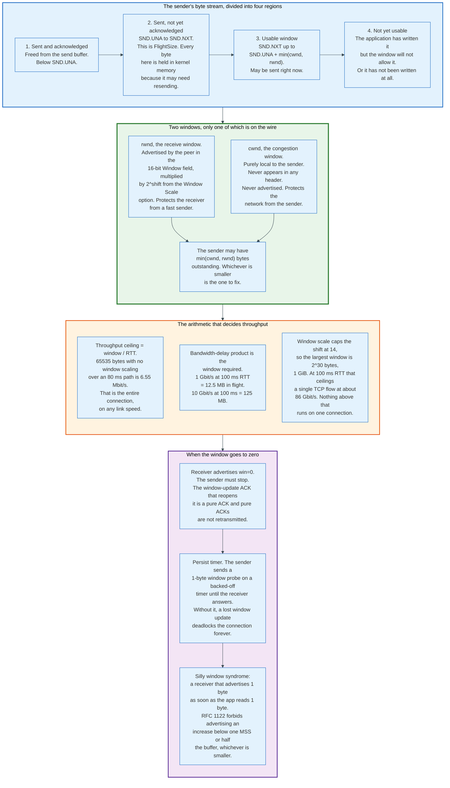

### 10.1 Sequence Numbers Count Bytes, Not Packets

Every byte in a TCP stream has a 32-bit sequence number, and the consequences of counting bytes rather than packets run through the whole protocol.

A segment's Sequence Number field names its first data byte. A segment carrying 1,448 bytes starting at sequence 5000 occupies 5000 through 6447, and the next segment starts at 6448. SYN and FIN each consume one number without carrying data, which is what makes them reliably retransmitted.

Byte numbering means a retransmission need not have the same boundaries as the original. A sender may coalesce three lost 500-byte segments into one 1500-byte retransmission, and the receiver reassembles correctly because the numbers describe bytes. Linux does this routinely, which is why a retransmitted segment in a capture often does not match any original.

The 32-bit space wraps, and the wrap rate is a real constraint. 2^32 bytes is 4.295 GB, so at 1 Gbit/s the space is consumed in 34 seconds and at 10 Gbit/s in 3.4 seconds. Both are shorter than the 2-minute maximum segment lifetime, meaning a delayed duplicate from earlier in the same connection can arrive with a sequence number that is currently valid. The PAWS mechanism in RFC 7323 solves this by treating the timestamp as an extension of the sequence number's high-order bits and rejecting any segment whose TSval is older than what has already been seen.

### 10.2 The Sender's Four Regions

The sender's view of the stream partitions into four regions, and the boundaries are the whole of TCP's send-side state.

Below `SND.UNA` is data sent and acknowledged, freed from the send buffer. From `SND.UNA` to `SND.NXT` is data sent and not yet acknowledged, and its size is `FlightSize`. Every byte in that region is held in kernel memory because it may need retransmission, which is why a sender's memory footprint is proportional to its window, not to its throughput. From `SND.NXT` up to `SND.UNA + min(cwnd, rwnd)` is the usable window, sendable right now. Above that is data the application has written that the window will not yet permit, plus data not yet written.

The window slides when an ACK advances `SND.UNA`, freeing memory and opening space at the right edge. This is why a lost ACK is nearly harmless and a lost data segment is expensive: ACKs are cumulative, so the next one covers what the lost one would have.

### 10.3 Two Windows, One of Which Is Invisible

The sender is limited by the smaller of two windows, and only one of them appears in any packet.

**`rwnd`, the receive window,** is advertised by the peer in the 16-bit Window field, scaled by the negotiated shift. It exists to stop a fast sender from overrunning a slow receiver's buffer. It is a property of the receiving host's memory and its application's read rate.

**`cwnd`, the congestion window,** is entirely local to the sender. It appears in no header, is advertised to nobody, and is the sender's private estimate of how much the network will tolerate. It exists to stop a fast sender from overrunning the network.

The sender may have `min(cwnd, rwnd)` bytes outstanding. Diagnosing a slow transfer starts with determining which of the two is binding, and on Linux `ss -ti` prints both: `cwnd` directly, and the peer's advertised window as `snd_wnd`. Do not read `rcv_space` for this. The ss man page defines it as a helper variable for the local receive-buffer autotuning, not as anything the peer sent.

The distinction is misunderstood often enough to be worth stating flatly. The congestion window is not negotiated, is not visible on the wire, and cannot be observed by a packet capture. It can only be inferred from how much data the sender has in flight.

### 10.4 The Arithmetic That Determines Throughput

One equation governs single-stream throughput and it is not about link speed.

```
throughput = window / RTT
```

A 65,535-byte window, the maximum without scaling, over an 80 ms path gives 65,535 * 8 / 0.08 = 6.55 Mbit/s. That is the entire connection, on a 10 Gbit/s link or a 10 Mbit/s one. Window scaling exists solely to move this ceiling.

Running it the other way gives the bandwidth-delay product, the amount of data that must be in flight to keep a pipe full:

| Link rate | RTT | Required window in flight |
|-----------|-----|---------------------------|
| 100 Mbit/s | 10 ms | 125 KB |
| 100 Mbit/s | 80 ms | 1.0 MB |
| 1 Gbit/s | 100 ms | 12.5 MB |
| 10 Gbit/s | 100 ms | 125 MB |
| 10 Gbit/s | 200 ms | 250 MB |

Window scale caps the shift at 14, giving a maximum window of 2^30 bytes. Over a 100 ms path that ceilings a single TCP connection at roughly 86 Gbit/s. Anything faster requires multiple connections, and that is a protocol limit, not an implementation one.

### 10.5 Zero Windows, Persist Timers, and Silly Window Syndrome

Three mechanisms handle the case where the receiver's buffer fills, and one of them prevents a permanent deadlock.

When the receive buffer is full, the receiver advertises a window of zero and the sender must stop. The window reopens when the application reads, and the receiver sends a window update. That update is a pure ACK carrying no data, and pure ACKs are not retransmitted. If it is lost, the sender waits forever for a window that is already open.

The **persist timer** solves this. The sender periodically transmits a window probe, typically one byte of data beyond the window edge, on a backed-off timer. The receiver must respond with an ACK carrying its current window, whether or not it accepts the byte. The probe continues indefinitely, because a receiver that is merely slow is not an error.

**Silly window syndrome** is the pathology where a receiver whose application reads one byte at a time advertises a one-byte window, the sender sends a one-byte segment with 40 bytes of header, and the connection degenerates into maximum overhead. RFC 1122 requires both sides to avoid it: the receiver must not advertise a window increase smaller than one MSS or half its buffer, whichever is less, and the sender must not send a segment smaller than one MSS unless the whole window is available or Nagle permits it. This receiver-side rule is why a window can stay at zero for a while even after the application has read a little.

---

## 11. Acknowledgement: Cumulative, Delayed, Duplicate, Selective

```mermaid
%%{init: {'theme': 'base', 'themeVariables': {'primaryColor': '#e3f2fd', 'primaryBorderColor': '#1565c0', 'lineColor': '#37474f'}}}%%

flowchart TB
    Start["Segments 1 to 8 are sent.<br/>Segment 3 is lost in the network.<br/>What does the receiver say?"]

    subgraph Cum["Cumulative acknowledgement, the base mechanism"]
        direction TB
        C1["The ACK number is the next byte<br/>expected, not the last byte received.<br/>It means 'everything strictly below<br/>this arrived', and says nothing<br/>about anything above it."]
        C2["Segments 4 to 8 arrive and are<br/>queued out of order. The receiver<br/>can only keep repeating<br/>ack = start of segment 3."]
        C3["Consequence: without SACK the sender<br/>learns exactly one fact per round trip,<br/>the position of the first hole.<br/>Two losses in one window cost<br/>two round trips to discover."]
        C1 --> C2 --> C3
    end

    subgraph Del["Delayed acknowledgement, RFC 1122 section 4.2.3.2"]
        direction TB
        D1["An ACK carries no data and costs a<br/>full 40-byte packet. Sending one per<br/>segment doubles the packet count and<br/>halves the useful capacity of an<br/>asymmetric access link."]
        D2["The rule: delay is allowed, but it<br/>MUST be under 500 ms, and in a stream<br/>of full-sized segments there SHOULD be<br/>an ACK for at least every second segment."]
        D3["In practice Linux uses TCP_DELACK_MIN<br/>of 40 ms and TCP_DELACK_MAX of 200 ms,<br/>adapting between them. Windows exposes<br/>DelayedAckTimeoutMs, settable in 10 ms<br/>steps from 10 to 600 ms."]
        D4["An out-of-order segment or a filled<br/>hole must be acknowledged immediately.<br/>Delaying is only allowed when nothing<br/>interesting happened."]
        D1 --> D2 --> D3 --> D4
    end

    subgraph Dup["Duplicate ACKs and fast retransmit"]
        direction TB
        P1["Each of segments 4 to 8 triggers an<br/>immediate repeat of the same ACK number.<br/>The sender sees duplicate ACKs."]
        P2["Three duplicate ACKs, meaning four<br/>identical ACKs in total, trigger fast<br/>retransmit: resend the missing segment<br/>without waiting for the RTO."]
        P3["Why three and not one: a single<br/>duplicate ACK is what mild reordering<br/>looks like. Three was chosen in 1990<br/>as the point where loss is more likely<br/>than reordering, and it has never<br/>been changed."]
        P1 --> P2 --> P3
    end

    subgraph Sack["Selective acknowledgement, RFC 2018 and RFC 2883"]
        direction TB
        K1["Kind 5. Each block is a left edge<br/>and a right edge, 8 bytes.<br/>The receiver reports the ranges it<br/>holds above the cumulative point."]
        K2["Here: ack = start of 3, plus one<br/>SACK block covering 4 through 8.<br/>The sender now knows the exact hole<br/>after one round trip, retransmits<br/>only segment 3, and keeps the rest<br/>of the pipe full."]
        K3["Capacity: 40 bytes of option space<br/>holds 4 blocks alone, 3 blocks when<br/>timestamps are also on. Enough for<br/>ordinary loss, not for a badly<br/>shredded window."]
        K4["D-SACK, RFC 2883: the first block may<br/>report data already acknowledged,<br/>telling the sender it retransmitted<br/>needlessly. The sender can then undo<br/>its congestion window reduction."]
        K1 --> K2 --> K3 --> K4
    end

    Board["The sender's scoreboard.<br/>Per outstanding segment it tracks<br/>SACKed, retransmitted, lost and<br/>the time it was last sent.<br/>Every modern loss-recovery algorithm<br/>from NewReno to RACK-TLP to PRR<br/>is a set of rules for updating<br/>this one table."]

    Start --> Cum
    Start --> Del
    Cum --> Dup
    Dup --> Sack
    Sack --> Board
    Del --> Board

    style Start fill:#e3f2fd,stroke:#1565c0,stroke-width:3px
    style Cum fill:#eceff1,stroke:#37474f,stroke-width:2px
    style Del fill:#fff3e0,stroke:#e65100,stroke-width:2px
    style Dup fill:#f3e5f5,stroke:#4a148c,stroke-width:2px
    style Sack fill:#e8f5e9,stroke:#2e7d32,stroke-width:2px
    style Board fill:#fce4ec,stroke:#880e4f,stroke-width:3px
```

### 11.1 Cumulative Acknowledgement Is a Lower Bound

The acknowledgement number carries exactly one fact and no more, and the limitation shaped every loss recovery algorithm for a decade.

An ACK number of N means every byte below N arrived. It says nothing about anything at or above N. If segments 1, 2, 4, 5, 6, 7, 8 arrive and 3 is lost, the receiver holds 4 through 8 in an out-of-order queue and can only keep advertising the position of segment 3. The sender learns the location of the first hole and nothing else.

The consequence is a hard rate limit on information. Without selective acknowledgement, a sender learns at most one hole per round trip. Two losses in one window cost two round trips to discover and repair. Ten losses cost ten. Over a 100 ms path that is a full second to recover from a burst that took 100 ms to create.

### 11.2 Delayed Acknowledgement

Acknowledging every segment doubles the packet count for no benefit, so RFC 1122 permits delay and bounds it.

The specification is precise. An ACK should not be excessively delayed, the delay must be under 500 ms, and in a stream of full-sized segments there should be an ACK for at least every second segment. That second clause is what keeps the sender's ACK clock running: a sender in slow start grows its window on ACKs, so a receiver that acknowledged only every tenth segment would slow the sender's ramp by a factor of ten.

Implementations are tighter than the specification. Linux defines `TCP_DELACK_MIN` as `HZ/25`, 40 ms at the usual HZ of 1000, and `TCP_DELACK_MAX` as `HZ/5`, 200 ms, and adapts between them based on the measured arrival pattern. Windows exposes `DelayedAckTimeoutMs`, settable in 10 ms increments from 10 to 600, and `DelayedAckFrequency`, the number of segments before a forced ACK.

Delay is not permitted in three cases: when an out-of-order segment arrives, when a segment fills a hole, and when the receiver has data of its own to send, in which case the ACK piggybacks. The first two exist so that loss signalling is never delayed. The third is why request-response protocols usually never see a delayed ACK at all, and why the pathology in section 17 requires an application that fails to reply.

### 11.3 Duplicate ACKs and Fast Retransmit

A repeated acknowledgement number is TCP's only in-band signal that something was lost, and the threshold of three has not changed since 1990.

When segment 3 is lost and segment 4 arrives, the receiver immediately re-sends the same ACK number. Segments 5, 6, 7, and 8 each produce another. The sender counts them. Three duplicate ACKs, meaning four identical ACKs in total, trigger fast retransmit: resend the missing segment immediately rather than waiting for the retransmission timer, which is typically an order of magnitude longer than the round-trip time.

Three was chosen because one or two duplicate ACKs is what mild packet reordering looks like, and reordering is common on paths with equal-cost multipath or link-layer retransmission. Retransmitting on the first duplicate would cause spurious retransmissions on every reordered path. The threshold is a guess about the reordering distribution of the 1990 internet that turned out to be durable enough to survive unchanged, though RACK-TLP in section 12 finally replaced the counting rule with a timing rule.

### 11.4 Selective Acknowledgement

SACK lets the receiver describe the holes rather than only the first one, and it is the single largest improvement in TCP loss recovery.

Negotiation happens on the SYN with the SACK-Permitted option, kind 4, length 2. Thereafter the receiver may attach the SACK option, kind 5, to any ACK. The option carries blocks, each 8 bytes: a 32-bit left edge naming the first sequence number of a contiguously received range, and a 32-bit right edge naming the sequence number immediately after the last byte of that range.

The size arithmetic is tight. An option of n blocks is 8n+2 bytes, so 40 bytes of option space holds 4 blocks alone. With timestamps also present, which consume 10 bytes plus 2 of padding, only 3 blocks fit. A window with more than three separate holes cannot be fully described in one ACK, which is why the receiver is required to report the most recently received block first.

In the running example, the receiver sends ack pointing at segment 3 plus one SACK block covering 4 through 8. The sender retransmits only segment 3, keeps the remaining data marked as delivered, and continues sending new data instead of stalling. One round trip instead of six.

**D-SACK**, RFC 2883, extends this to report duplicates. If the first SACK block covers a range at or below the cumulative acknowledgement point, it is reporting data the receiver already had. The sender reads this as proof that it retransmitted unnecessarily, usually because the original ACK was delayed rather than the data lost. It can then undo the congestion window reduction it made, which turns a spurious retransmission from a permanent throughput penalty into a temporary one.

### 11.5 The Scoreboard

All of these mechanisms feed one data structure, and every loss recovery algorithm since 1996 is a set of rules for reading it.

The sender maintains, per outstanding segment, whether it has been SACKed, whether it has been retransmitted, whether it is considered lost, and the time it was most recently transmitted. RFC 6675 defines the standard rules for converting that table into a retransmission decision. NewReno, RACK-TLP, Proportional Rate Reduction, and every congestion control algorithm's loss response read and write it.

The scoreboard is where TCP's real complexity lives. The header format is 20 bytes of trivia by comparison.

---

## 12. Retransmission Timeout, Karn's Algorithm, and RACK-TLP

### 12.1 The RTO Is the Backstop, and It Is Deliberately Slow

The retransmission timeout is the mechanism of last resort, and it is tuned to almost never fire in normal operation.

RFC 6298 specifies the computation exactly. Before any round-trip sample exists, the sender sets `RTO` to 1 second. On the first measurement `R`:

```
SRTT   = R
RTTVAR = R / 2
RTO    = SRTT + max(G, K * RTTVAR)
```

On every subsequent measurement `R'`, the variance is updated before the mean, which matters because the mean is used in the variance term:

```
RTTVAR = (1 - beta) * RTTVAR + beta * |SRTT - R'|
SRTT   = (1 - alpha) * SRTT + alpha * R'
RTO    = SRTT + max(G, K * RTTVAR)
```

with `alpha = 1/8`, `beta = 1/4`, `K = 4`, and `G` the clock granularity. The specification says a computed RTO below 1 second should be rounded up to 1 second, and any maximum must be at least 60 seconds.

Both bounds are widely ignored. Linux sets `TCP_RTO_MIN` to `HZ/5`, 200 ms, and exposes `net.ipv4.tcp_rto_min_us` with a default of 200,000 microseconds. `TCP_RTO_MAX_SEC` is 120 seconds. A 1-second minimum RTO on a data centre path with a 200-microsecond round trip would mean a single loss costs 5,000 round trips, which is why nobody implements it.

The structure of the formula is the interesting part. Jacobson's contribution in 1988 was recognising that a mean alone is not enough: `RTO` must include a variance term, because on a loaded path the round-trip time distribution has a long tail and an RTO set at twice the mean fires constantly on ordinary jitter. The `K = 4` multiplier on the mean deviation is what makes the timer conservative.

On expiry the rules are unambiguous. Retransmit only the oldest unacknowledged segment, double the RTO, and collapse the congestion window to one segment. The doubling is Karn's exponential backoff, and it is the mechanism that prevented the 1986 congestion collapse from recurring: a sender that cannot get through backs off geometrically rather than retransmitting at a fixed rate.

Linux gives up on a connection after `net.ipv4.tcp_retries2` retransmissions, default 15, which the kernel documentation puts at a hypothetical timeout of 924.6 seconds, about 15 minutes, and describes as a lower bound. The effective timeout is the first RTO that exceeds it, so on a long path it runs longer. That is why a machine that vanishes leaves connections hanging for a quarter of an hour rather than failing fast.

### 12.2 Karn's Algorithm

Karn's algorithm removes an ambiguity that would otherwise make the RTT estimator diverge, and its statement is one sentence long.

The problem: a segment is sent at time T1, the RTO fires, it is retransmitted at T2, and an ACK arrives at T3. Which transmission is being acknowledged? If the ACK belongs to the original, the true RTT is T3 minus T1. If it belongs to the retransmission, it is T3 minus T2. There is no way to tell from a cumulative acknowledgement, because the ACK number is identical either way.

Guessing wrong in either direction is destructive. Assume the retransmission and the sample is too small, shrinking the RTO, causing more spurious timeouts, causing more retransmissions. Assume the original and the sample is too large, inflating the RTO until the connection cannot recover from real loss.

Karn and Partridge's 1987 rule, carried into RFC 6298: **do not take an RTT sample from any segment that was retransmitted.** Combined with the exponential backoff of the RTO on each timeout, this gives a complete algorithm. The estimator ignores ambiguous samples entirely, and the backoff provides the growth that would otherwise come from a rising RTT estimate. The RTO resumes updating from measurements the next time an unambiguous sample arrives.

The timestamp option lifts the restriction. With RFC 7323 timestamps, the ACK echoes the TSval of the segment that triggered it, so the sender knows exactly which transmission is being acknowledged and can take a sample from a retransmitted segment safely. RFC 6298 states this exception explicitly. On a modern connection with timestamps enabled, Karn's restriction almost never binds, but it remains the correct fallback whenever timestamps were stripped or never negotiated.

### 12.3 RACK-TLP: Time Replaces Counting

RFC 8985, published in February 2021, replaced duplicate-ACK counting with a time-based rule, and it is the default in Linux.

**RACK**, Recent ACKnowledgement, works on the observation that if a segment sent later has been acknowledged, a segment sent earlier and not acknowledged is probably lost, not reordered. The rule: a segment is marked lost if a segment transmitted after it has been SACKed and more than a reordering window has passed since its transmission. The reordering window adapts, starting near a quarter of the smoothed RTT and growing when D-SACK reveals that the estimate was too aggressive.

This fixes three cases the three-duplicate-ACK rule cannot handle at all. A tail loss, where the last segments of a transfer are lost, generates no duplicate ACKs because no later segments arrive. A lost retransmission generates nothing new. An application-limited flow with fewer than four segments in flight cannot produce three duplicate ACKs by construction. Each of those previously required an RTO, which is at minimum 200 ms and often far more.

**TLP**, Tail Loss Probe, adds the other half. If a sender has unacknowledged data and no ACK arrives within a probe timeout, typically `2 * SRTT`, it transmits one segment: either new data or a retransmission of the last one. If the segment was in fact lost, the probe generates a duplicate ACK or SACK that triggers RACK-based recovery at RTT timescales instead of RTO timescales. If nothing was lost, the probe costs one packet.

Linux enables this through `net.ipv4.tcp_recovery`, default `0x1`, meaning RACK is on. Measured against a 200 ms minimum RTO on a 30 ms path, converting a tail loss from an RTO event to a fast recovery event saves roughly 170 ms on every affected request, which for short web transfers is the difference between fast and visibly slow.

---

## 13. Congestion Control I: Tahoe, Reno, NewReno

```mermaid
%%{init: {'theme': 'base', 'themeVariables': {'primaryColor': '#e3f2fd', 'primaryBorderColor': '#1565c0', 'lineColor': '#37474f'}}}%%

graph LR
    subgraph G1["Loss as the only signal<br/>1988-1999"]
        direction TB
        A1["Tahoe, 1988.<br/>Slow start doubles cwnd per RTT.<br/>Congestion avoidance adds one segment<br/>per RTT. Any loss sets ssthresh to<br/>half the flight and cwnd to one segment.<br/>Every loss costs a full restart."]
        A2["Reno, 1990.<br/>Adds fast recovery. On three duplicate<br/>ACKs, halve rather than restart:<br/>cwnd becomes ssthresh + 3*SMSS and<br/>inflates by one SMSS per further<br/>duplicate ACK."]
        A3["NewReno, RFC 2582 then RFC 6582.<br/>Tracks a 'recover' variable so a<br/>partial ACK retransmits the next hole<br/>instead of ending recovery.<br/>Survives multiple losses per window<br/>without SACK, one loss per RTT."]
        A4["SACK-based recovery, RFC 6675.<br/>With the scoreboard the sender knows<br/>every hole at once and can repair<br/>a shredded window in one RTT."]
    end

    subgraph G2["Delay as a signal, and its problem<br/>1994-2010"]
        direction TB
        B1["Vegas, 1994. Compares expected and<br/>actual throughput and backs off when<br/>RTT rises, before any loss occurs."]
        B2["It works and nobody deploys it.<br/>A delay-sensitive flow sharing a queue<br/>with a loss-based flow yields the<br/>whole link. Being polite is not a<br/>viable strategy in a shared queue."]
        B3["Compound TCP, Microsoft, 2006.<br/>A loss-based window plus a delay-based<br/>window. Default in Windows Server<br/>through the 2008 to 2016 era."]
    end

    subgraph G3["Scaling to fat pipes<br/>2004-2023"]
        direction TB
        C1["The problem: Reno needs a loss rate<br/>near 2 in 10 billion packets to fill<br/>10 Gbit/s at 100 ms RTT, and 72<br/>minutes to recover its window after<br/>one loss. Linear growth cannot<br/>fill a modern pipe."]
        C2["BIC, Linux default 2004-2006.<br/>Binary search between the last safe<br/>and last unsafe window."]
        C3["CUBIC, Linux default from 2.6.19 in<br/>November 2006. Window is a cubic<br/>function of time since the last loss,<br/>so growth no longer depends on RTT<br/>and short-RTT flows stop starving<br/>long-RTT ones."]
        C4["RFC 9438, August 2023, moves CUBIC<br/>onto the standards track after<br/>seventeen years of deployment.<br/>Standardisation follows shipping."]
    end

    subgraph G4["Explicit signals inside one operator<br/>2010-2023"]
        direction TB
        D1["DCTCP, 2010. Uses the fraction of<br/>ECN-marked packets, not their presence,<br/>to scale the reduction. Needs a shallow<br/>marking threshold and cooperating<br/>switches, so it stays inside<br/>data centres."]
        D2["L4S, RFC 9330-9332, January 2023.<br/>Takes DCTCP's idea to the public<br/>internet using ECT(1) as a separate<br/>identifier and a dual-queue AQM<br/>that couples the two drop probabilities."]
        D3["AccECN, RFC 9768, April 2026.<br/>Classic ECN feedback carried one bit<br/>per round trip. AccECN carries a count,<br/>which is what any scalable controller<br/>needs to work on the open internet."]
    end

    subgraph G5["Model-based control<br/>2016-2026"]
        direction TB
        E1["BBR, Google, 2016. Estimates the<br/>bottleneck bandwidth and the minimum<br/>RTT independently, then paces at that<br/>bandwidth with about one BDP in flight.<br/>Loss is not the control signal."]
        E2["Why it matters: loss-based control<br/>fills whatever buffer exists.<br/>On a path with a 384 ms FIFO,<br/>CUBIC produces 384 ms of queue and<br/>BBR produces almost none."]
        E3["BBRv3, draft-ietf-ccwg-bbr-06,<br/>July 2026. Startup pacing gain 2.77,<br/>ProbeBW cycles DOWN, CRUISE, REFILL<br/>and UP, ProbeRTT for at least 200 ms<br/>every 5 seconds, min RTT filtered<br/>over 10 seconds."]
        E4["Still an Internet-Draft after ten<br/>years, and running on a large share<br/>of Google's traffic. The gap between<br/>deployed and standardised is the<br/>normal state of congestion control."]
    end

    G1 --> G2 --> G3 --> G4 --> G5

    style G1 fill:#e3f2fd,stroke:#1565c0,stroke-width:2px
    style G2 fill:#eceff1,stroke:#37474f,stroke-width:2px
    style G3 fill:#e8f5e9,stroke:#2e7d32,stroke-width:2px
    style G4 fill:#fff3e0,stroke:#e65100,stroke-width:2px
    style G5 fill:#fce4ec,stroke:#880e4f,stroke-width:3px
```

### 13.1 The Problem and the Only Available Signal

Congestion control exists because a sender cannot see the network, and every algorithm is an argument about what to infer from packets that come back.

The router has no way to tell a sender to slow down other than by dropping a packet or, since 2001 and rarely, by marking one. So the sender must maintain a private estimate of how much data the path will carry and adjust it from observations. That estimate is the congestion window, `cwnd`, and it lives only in the sender's memory.

The control law that emerged is additive increase, multiplicative decrease. Grow the window slowly while things work, shrink it sharply when they do not. The asymmetry is deliberate: an over-large window causes loss for everyone sharing the queue, so the penalty for overshoot must exceed the reward for a correct guess.

### 13.2 Slow Start

Slow start finds the approximate scale of the path in logarithmic time, and its name is misleading because it is the fastest phase.

The sender begins with an initial window. RFC 5681 sets it by segment size: `IW = 2 * SMSS` when `SMSS` exceeds 2190 bytes, `3 * SMSS` when it is between 1096 and 2190, and `4 * SMSS` at or below 1095. RFC 6928 raised this in April 2013 to `min(10 * MSS, max(2 * MSS, 14600))`, ten segments in the common case, on the strength of Google's measurements showing average web search latency falling 11.7 percent, or 68 ms, in an average-bandwidth data centre and 8.7 percent, or 72 ms, in a slower one. Linux uses `TCP_INIT_CWND` of 10.

During slow start the sender increases `cwnd` by at most one SMSS for each ACK that cumulatively acknowledges new data. With one ACK per segment this doubles the window every round trip: 10, 20, 40, 80. Exponential growth over an eight-round-trip range covers a factor of 256, which is why the phase is short.

Slow start ends when `cwnd` exceeds `ssthresh`, the slow start threshold, or when loss occurs. `ssthresh` starts arbitrarily high, so the first exit from slow start is almost always by loss, and the overshoot at that moment is by a factor of about two by construction: the last safe window was half the window that broke.

Slow start also restarts. RFC 5681 defines the restart window as `min(IW, cwnd)` after an idle period longer than one RTO, because a path's capacity may have changed while the connection was silent. Linux controls this with `net.ipv4.tcp_slow_start_after_idle`, which defaults to 1. Turning it off is a common tuning step for long-lived connections that carry bursty traffic, and it trades safety for latency.

### 13.3 Congestion Avoidance

Congestion avoidance grows the window by one segment per round trip, which is deliberately, punishingly slow.

The rule in RFC 5681 is to increase `cwnd` by at most one SMSS per round-trip time. The usual implementation adds `SMSS * SMSS / cwnd` per acknowledgement, which sums to roughly one SMSS per RTT.

Linear growth is what makes classic TCP unable to fill a modern path. Recovering a window of 85,000 segments after a halving requires 42,500 round trips. At 100 ms that is 4,250 seconds, roughly 71 minutes, during which the link is underused. That single number is the entire motivation for CUBIC.

The companion arithmetic is the loss rate Reno requires. The Mathis equation approximates steady-state throughput as `1.22 * MSS / (RTT * sqrt(p))` for loss probability `p`. Filling 10 Gbit/s over a 100 ms path with 1,448-byte segments requires `p` near 2 in 10 billion. No real network is that clean. Reno on a long fat pipe does not slow down; it fails to start.

### 13.4 Tahoe, Reno, and NewReno

Three algorithms, each fixing the previous one's response to loss.

**Tahoe, 1988.** Any loss, whether detected by timeout or by three duplicate ACKs, sets `ssthresh` to half the flight size and `cwnd` to one segment, then re-enters slow start. Correct and expensive: a single lost packet on a large window costs a full restart.

**Reno, 1990.** Adds fast recovery. On three duplicate ACKs, retransmit the missing segment, set `ssthresh = max(FlightSize / 2, 2 * SMSS)`, set `cwnd = ssthresh + 3 * SMSS` to account for the three segments that have left the network, and inflate `cwnd` by one SMSS for each further duplicate ACK so that new data keeps flowing. When the retransmission is acknowledged, deflate `cwnd` to `ssthresh` and enter congestion avoidance. A timeout still collapses to `LW`, one full-sized segment. Reno's weakness is multiple losses in one window: the first partial ACK exits fast recovery, the second loss is detected only after another round of duplicate ACKs or an RTO.

**NewReno, RFC 6582.** Adds a `recover` variable holding the highest sequence number sent when fast recovery began. A partial ACK, one that acknowledges some but not all of the data outstanding at that moment, does not end recovery. Instead it retransmits the next unacknowledged segment immediately and stays in recovery until everything up to `recover` is acknowledged. This repairs multiple losses at one loss per round trip without needing SACK.

**SACK-based recovery, RFC 6675,** does better than all of them by reading the scoreboard: the sender knows every hole after one round trip and can repair them all together. NewReno persists because SACK can be absent, and a specification cannot assume an option the peer may not have sent.

### 13.5 Proportional Rate Reduction

PRR, RFC 6937 and now RFC 9937, fixed a subtle defect in how fast recovery paces its output, and it is the Linux default.

Classic Reno recovery inflates and then deflates `cwnd`, which produces two artefacts. If many segments were lost, the sender can end recovery with a window far below the intended `ssthresh` and then have to slow-start back up. If few were lost, the inflation can produce a burst.

PRR instead computes, on every ACK during recovery, how much data to send so that the window converges smoothly to `ssthresh` by the end of recovery, in proportion to the data actually being delivered. The outcome is that recovery ends at exactly the intended window, with no burst and no undershoot. It is invisible in a packet capture except as an absence of pathology, which is the mark of a good fix.

RFC 9937, December 2025, obsoletes RFC 6937 and moves PRR from Experimental to Proposed Standard. It changes the algorithm in four places. A SafeACK heuristic replaces the manual choice between the two reduction bounds, PRR-CRB and PRR-SSRB, selecting one from observed recovery progress instead. Behaviour for non-SACK connections is specified rather than left open. Sending stays smooth when recovery begins after a large amount of sequence space has already been SACKed, which is the reordering case. And the sender forces a fast retransmit on the first ACK that triggers recovery, so the ACK clock never stops.

---

## 14. Congestion Control II: CUBIC, BBR, and the Model-Based Turn

```mermaid
%%{init: {'theme': 'base', 'themeVariables': {'primaryColor': '#e3f2fd', 'primaryBorderColor': '#1565c0', 'lineColor': '#37474f'}}}%%

flowchart TB
    Q["Same path: 100 Mbit/s bottleneck, 80 ms RTT,<br/>a 64-packet FIFO buffer. Two controllers."]

    subgraph CU["CUBIC, RFC 9438"]
        direction TB
        U1["Control signal: packet loss.<br/>Everything else is inferred."]
        U2["State: W_max, the window in use when<br/>the last congestion event happened,<br/>and t, seconds since that event."]
        U3["Growth: W_cubic(t) = C*(t - K)^3 + W_max<br/>with C = 0.4 and<br/>K = cube root of W_max*(1-beta)/C.<br/>Growth is a function of time,<br/>not of round trips, so a 10 ms flow<br/>and a 200 ms flow grow alike."]
        U4["Reduction: beta_cubic = 0.7.<br/>cwnd drops to 70 percent, not 50.<br/>Reno's halving was too destructive<br/>once windows reached tens of thousands<br/>of segments."]
        U5["Reno-friendly region: it also tracks<br/>W_est, what Reno would have done,<br/>and uses the larger of the two.<br/>On short RTT paths CUBIC behaves<br/>like Reno by construction."]
        U6["Fast convergence: if cwnd at the loss<br/>is below the previous W_max, set<br/>W_max = cwnd*(1 + beta)/2 so an<br/>incumbent flow yields to a new one."]
        U7["Failure mode: it must fill the buffer<br/>to learn the buffer exists.<br/>Standing queue equals buffer depth.<br/>On a deep buffer that is bufferbloat.<br/>On a shallow one it is chronic loss."]
    end

    subgraph BB["BBR version 3, draft-ietf-ccwg-bbr-06"]
        direction TB
        B1["Control signal: measured delivery rate<br/>and measured minimum RTT.<br/>Loss and ECN are safety limits,<br/>not the primary input."]
        B2["State: BBR.max_bw, the windowed maximum<br/>delivery rate, and BBR.min_rtt,<br/>the minimum RTT over a 10-second window."]
        B3["Target: pace at the estimated bandwidth<br/>and keep about one bandwidth-delay<br/>product in flight. cwnd gain 2 as a<br/>cap, not as a target."]
        B4["Startup: pacing gain 2.77 doubles the<br/>rate per round. Exit on a bandwidth<br/>plateau, three rounds without a<br/>25 percent gain, or on excessive loss.<br/>Then Drain removes the queue<br/>startup created."]
        B5["Steady state ProbeBW cycles four phases:<br/>DOWN drains, CRUISE matches the estimate,<br/>REFILL restores the pipe, UP probes for<br/>more capacity. ProbeRTT drops inflight<br/>to half a BDP for at least 200 ms<br/>at least every 5 seconds to<br/>re-measure the true minimum RTT."]
        B6["Failure mode: the bandwidth estimate<br/>is a maximum filter, so it can be<br/>fooled by a token bucket or by an<br/>aggregating radio link. Version 1<br/>was unfair to CUBIC on deep buffers.<br/>Version 3 adds loss and ECN response<br/>specifically to fix that."]
    end

    subgraph Out["What each does on this path"]
        direction TB
        O1["CUBIC: fills the 64-packet buffer,<br/>adds 7.7 ms of queueing delay,<br/>drops packets, saws between about<br/>530 and 750 segments in flight.<br/>Throughput near 100 Mbit/s.<br/>Latency under load rises."]
        O2["BBR: settles near 690 segments,<br/>the exact BDP, adds close to no<br/>queue, and loses almost nothing.<br/>Throughput near 100 Mbit/s.<br/>Latency under load stays flat."]
        O3["Identical throughput, different<br/>latency. That is the whole argument<br/>for model-based control, and the<br/>reason the metric moved from<br/>megabits to milliseconds."]
    end

    Q --> CU
    Q --> BB
    CU --> Out
    BB --> Out

    style Q fill:#e3f2fd,stroke:#1565c0,stroke-width:3px
    style CU fill:#fff3e0,stroke:#e65100,stroke-width:2px
    style BB fill:#e8f5e9,stroke:#2e7d32,stroke-width:2px
    style Out fill:#f3e5f5,stroke:#4a148c,stroke-width:3px
```

### 14.1 CUBIC, RFC 9438

CUBIC replaced linear growth with a cubic function of time, and the substitution solves two problems at once.

The window growth function is:

```
W_cubic(t) = C * (t - K)^3 + W_max
```

where `t` is the time in seconds since the last congestion event, `W_max` is the window in use when that event occurred, `C` is a constant fixed at 0.4 with units of segments per second cubed, and `K` is the time it would take to grow back to `W_max`:

```
K = cube_root( W_max * (1 - beta_cubic) / C )
```

with `beta_cubic = 0.7`. On a congestion event, `ssthresh` is set to `beta_cubic * flight_size` and the window drops to 70 percent rather than 50 percent.

The shape does the work. Immediately after a reduction the cubic curve is steep, so the window recovers most of its lost ground quickly. Approaching `W_max` the curve flattens, so the sender spends a long time probing gently near the level it knows was previously sustainable. Past `W_max` the curve steepens again, so a path whose capacity has genuinely increased is discovered rather than ignored. Concave, then flat, then convex.

Two properties follow, and the second is the important one.

**Growth is independent of round-trip time.** `t` is measured in seconds, not in round trips. Under Reno, a flow with a 10 ms RTT grows its window twenty times faster than one with a 200 ms RTT sharing the same bottleneck, and takes a proportionally larger share. Under CUBIC both grow along the same curve in wall-clock time. This is why CUBIC won: it is a fairness fix as much as a throughput fix.

**Recovery from a large window is fast.** Take the 85,000-segment window from section 13.3. Reno needs 71 minutes. CUBIC needs `cube_root(85000 * 0.3 / 0.4)` = `cube_root(63750)` = 39.9 seconds. Two orders of magnitude.

CUBIC also carries two safety mechanisms. The **Reno-friendly region** tracks `W_est`, an estimate of what Reno would have done, and uses the larger of `W_cubic(t)` and `W_est`, so on short-RTT paths where Reno is more aggressive CUBIC does not lose ground to it. **Fast convergence** handles the arrival of a new flow: if `cwnd` at a congestion event is below the previous `W_max`, then `W_max` is set to `cwnd * (1 + beta_cubic) / 2` rather than to `cwnd` itself, so an incumbent flow gives up more capacity than it otherwise would and a newcomer converges faster. RFC 9438 section 4.7 writes the update as `W_max = min(W_max, cwnd) * (1 + beta_cubic) / 2`, and the minimum is `cwnd` precisely in the case the rule fires.

CUBIC became the Linux default in kernel 2.6.19 in November 2006 and reached the standards track as RFC 9438 in August 2023. Seventeen years of deployment preceded standardisation, which is the normal order in this field.

### 14.2 Why Loss-Based Control Has a Ceiling

CUBIC is excellent at the thing it does and structurally incapable of one thing, and that gap created BBR.

A loss-based controller learns that a buffer exists only by filling it. Its steady state is therefore a full buffer, and its equilibrium queueing delay equals the buffer depth divided by the drain rate. On a well-provisioned path with a shallow buffer this is a few milliseconds and nobody notices. On a consumer access link with a 256-packet FIFO on an 8 Mbit/s uplink it is 384 ms, and that delay is added to every other flow sharing the link.

Two failure modes bracket the problem. Buffers too deep produce bufferbloat. Buffers too shallow produce chronic loss and low throughput on high-BDP paths. There is no buffer size that is correct for every link rate and traffic mix, and the equipment vendor has to pick one at manufacture.

The second problem is that loss and congestion are not the same thing. On a wireless link, a loss may be corruption rather than queue overflow, and reducing the window in response is wrong. The signal is not just delayed, it is sometimes false.

### 14.3 BBR

BBR measures the path rather than inferring it, and the change of signal changes the equilibrium.

BBR estimates two quantities independently. `BBR.max_bw` is the maximum delivery rate observed over a recent window, computed from how fast acknowledged bytes are being delivered rather than from how fast they are being sent. `BBR.min_rtt` is the minimum round-trip time observed over a 10-second window, which approximates the propagation delay with no queue. Their product is the bandwidth-delay product, and BBR paces its sending at the estimated bandwidth while keeping roughly one BDP in flight.

The optimum it targets is the point Leonard Kleinrock identified in 1979: the operating point where throughput is maximised and delay is minimised simultaneously, which is exactly full utilisation with no standing queue. A loss-based controller cannot sit there because it needs the queue to generate its signal.

The version 3 state machine, from draft-ietf-ccwg-bbr-06 dated 6 July 2026, runs as follows.

**Startup** paces at a gain of 2.77, doubling the delivery rate each round. It exits on a bandwidth plateau, defined as three rounds without a 25 percent increase in delivery rate, or on excessive loss, which draft-ietf-ccwg-bbr-06 defines as three conditions together: a full round trip spent in fast recovery, a loss rate above BBR.LossThresh of 2 percent, and at least BBRStartupFullLossCnt of 6 discontiguous lost sequence ranges in that round trip.

**Drain** removes the queue that Startup necessarily created, reducing inflight to the estimated BDP.

**ProbeBW** is the steady state and cycles four phases. `DOWN` paces below the estimate to drain any queue. `CRUISE` matches the estimate. `REFILL` restores the pipe. `UP` probes above the estimate to discover new capacity. The cycle is driven by inflight levels and plateau detection rather than by fixed durations.

**ProbeRTT** reduces inflight to about half a BDP for at least 200 ms, at least once every 5 seconds, to re-measure the true minimum RTT. Without it, a long-running flow that has kept a queue full would never observe an unqueued round trip and its `min_rtt` estimate would drift upward permanently.

Version 3 also adds explicit responses to loss and to ECN that version 1 lacked, reducing the rate multiplicatively when a round trip experiences loss. That addition exists because BBRv1 was measurably unfair to CUBIC on deep-buffered paths: it held a fixed amount inflight regardless of loss, and CUBIC, which does respond to loss, yielded.

BBR is deployed at large scale by Google for TCP and QUIC, is available in Linux since 4.9 in December 2016, and after ten years remains an Internet-Draft rather than an RFC. The published draft states that open-source implementations exist for both TCP and QUIC and that it is used in production for a large volume of internet traffic, without giving a percentage.

### 14.4 The Data Centre Branch: DCTCP and L4S

A separate lineage optimises for a network whose switches cooperate, and its ideas are now being pushed onto the public internet.

DCTCP, published in 2010, uses the fraction of packets marked with ECN's Congestion Experienced codepoint rather than the mere presence of a mark, and scales its window reduction in proportion. A switch marks at a shallow queue threshold, so senders receive a graded signal long before any queue becomes deep. The result inside a data centre is high throughput at microsecond-scale queueing. It requires cooperating switches and a homogeneous fleet, so it does not survive contact with the public internet.

L4S, RFC 9330 through RFC 9332 published in January 2023, is the attempt to carry that behaviour across the open internet. Its three pieces are an identifier, an AQM, and a congestion control. The identifier is the ECT(1) codepoint, freed for this use by RFC 8311 in January 2018, which marks a packet as belonging to a scalable congestion control. The AQM, defined in RFC 9332, keeps two queues and couples them: the L4S queue is marked aggressively to hold it near 1 ms, and the classic queue's drop probability is derived as `p_C = (p_CL / k)^2` with `k = 2`, which is what makes the two classes achieve comparable throughput despite responding to signals of very different strength. The congestion control is TCP Prague or an equivalent scalable controller.

RFC 9332 reports the measured effect: average queueing delay below 1 millisecond with a 99th percentile no worse than 2 milliseconds, against 5 to 15 milliseconds average and 20 to 30 milliseconds at the 99th percentile for conventional AQM.

The missing piece on TCP was feedback resolution, and it arrived in April 2026. Classic ECN as defined in RFC 3168 conveys at most one congestion indication per round trip through the single ECE bit, which is enough to say congestion exists and not enough to say how much. RFC 9768, More Accurate ECN Feedback in TCP, carries a count of CE-marked packets instead, which is what a scalable controller needs. QUIC had this from the start, which is one of several reasons L4S deployment work has concentrated there.

---

## 15. A Worked Trace: 10 MB Across an 80 ms Path

```mermaid
%%{init: {'theme': 'base', 'themeVariables': {'primaryColor': '#e3f2fd', 'primaryBorderColor': '#1565c0', 'lineColor': '#37474f'}}}%%

flowchart TB
    Setup["Path: 100 Mbit/s bottleneck, 80 ms RTT, 64-packet FIFO.<br/>MSS 1448 bytes: 1500 MTU minus 20 IPv4 minus 20 TCP minus 12 for timestamps.<br/>Bandwidth-delay product = 12.5 MB/s times 0.08 s = 1,000,000 bytes = 690 segments.<br/>Transfer: 10,000,000 bytes = 6,906 segments. Initial window 10 per RFC 6928."]

    subgraph SS["Slow start: cwnd doubles every round trip"]
        direction TB
        R1["Round 1, t=0 ms. cwnd 10.<br/>Sends 14,480 bytes. Cumulative 14,480."]
        R2["Round 2, t=80 ms. cwnd 20.<br/>Sends 28,960. Cumulative 43,440."]
        R3["Round 3, t=160 ms. cwnd 40.<br/>Sends 57,920. Cumulative 101,360."]
        R4["Round 4, t=240 ms. cwnd 80.<br/>Sends 115,840. Cumulative 217,200."]
        R5["Round 5, t=320 ms. cwnd 160.<br/>Sends 231,680. Cumulative 448,880."]
        R6["Round 6, t=400 ms. cwnd 320.<br/>Sends 463,360. Cumulative 912,240."]
        R7["Round 7, t=480 ms. cwnd 640.<br/>Sends 926,720. Cumulative 1,838,960.<br/>640 segments is 93 percent of the<br/>690-segment pipe. This is the last<br/>safe round."]
        R1 --> R2 --> R3 --> R4 --> R5 --> R6 --> R7
    end

    Over["Round 8, t=560 ms. cwnd 1280, wanting 1,853,440 bytes in flight.<br/>The pipe holds 690 segments. The buffer holds 64 more.<br/>1280 minus 690 minus 64 = 526 segments have nowhere to go and are dropped.<br/>Slow start's last act is always to overshoot by a factor of two."]

    subgraph Cost["What slow start cost"]
        direction TB
        X1["Seven rounds, 560 ms, to deliver<br/>1.84 MB. Effective rate 26.3 Mbit/s<br/>on a 100 Mbit/s link."]
        X2["The link was idle for most of the<br/>first half second. On a short transfer<br/>the connection never leaves slow start<br/>at all, which is why the initial<br/>window is worth 10 segments and why<br/>RFC 6928 measured an 11.7 percent<br/>latency win from raising it."]
    end

    subgraph Rec["Recovery, CUBIC"]
        direction TB
        Y1["W_max = 1280. cwnd drops to<br/>0.7 * 1280 = 896 segments.<br/>ssthresh = 896."]
        Y2["K = cube root of 1280*0.3/0.4<br/>= cube root of 960 = 9.9 seconds.<br/>CUBIC would take 9.9 s to climb back<br/>to 1280 segments. Reno, adding one<br/>segment per 80 ms round trip from<br/>640, would take 51 s."]
        Y3["But 896 is still above the 754 the<br/>path can hold, so a second loss<br/>follows within a few round trips.<br/>Fast convergence then pulls W_max<br/>down to about 641 and the flow<br/>settles into a sawtooth between<br/>roughly 530 and 750 segments."]
        Y1 --> Y2 --> Y3
    end

    subgraph Alt["The same path with HyStart++ and with BBR"]
        direction TB
        Z1["HyStart++, RFC 9406: watches for the<br/>round-trip time to rise during slow<br/>start, exits into a conservative slow<br/>start at round 7 instead of blowing<br/>through it at round 8. Microsoft<br/>measured 50 percent fewer retransmitted<br/>bytes in lab tests."]
        Z2["BBR: exits Startup on a bandwidth<br/>plateau, drains the queue it created,<br/>and cruises at 690 segments.<br/>No 526-packet loss event happens."]
    end

    Setup --> SS --> Over
    Over --> Cost
    Over --> Rec
    Rec --> Alt

    style Setup fill:#e3f2fd,stroke:#1565c0,stroke-width:3px
    style SS fill:#e8f5e9,stroke:#2e7d32,stroke-width:2px
    style Over fill:#ffebee,stroke:#b71c1c,stroke-width:3px
    style Cost fill:#eceff1,stroke:#37474f,stroke-width:2px
    style Rec fill:#fff3e0,stroke:#e65100,stroke-width:2px
    style Alt fill:#f3e5f5,stroke:#4a148c,stroke-width:2px
```

### 15.1 The Setup

One transfer, traced with real numbers, shows every mechanism in this document interacting.

| Parameter | Value | Derivation |
|-----------|-------|------------|
| Bottleneck rate | 100 Mbit/s = 12.5 MB/s | Given |
| Round-trip time | 80 ms | Given |
| Bottleneck buffer | 64 packets | Given, a shallow modern buffer |
| MTU | 1500 bytes | Ethernet |
| MSS | 1448 bytes | 1500 - 20 IPv4 - 20 TCP - 12 timestamps and padding |
| Bandwidth-delay product | 1,000,000 bytes | 12.5 MB/s * 0.08 s |
| BDP in segments | 690 | 1,000,000 / 1448 |
| Transfer size | 10,000,000 bytes | Given |
| Transfer in segments | 6,906 | 10,000,000 / 1448 |
| Initial window | 10 segments | RFC 6928, Linux `TCP_INIT_CWND` |

### 15.2 The Handshake

At t = 0 the client sends a SYN of 74 bytes on the wire: 14 Ethernet, 20 IPv4, 20 TCP fixed, 20 TCP options carrying MSS 1460, SACK-permitted, timestamps, and window scale 7.

At t = 40 ms the SYN reaches the server and the SYN-ACK goes back. At t = 80 ms it reaches the client, which sends the final ACK with the request riding on it, and that segment reaches the server at t = 120 ms. The client's first RTT sample is 80 ms, so the estimator initialises to `SRTT = 80`, `RTTVAR = 40`, and `RTO = 80 + 4 * 40 = 240 ms`, which Linux then floors at its 200 ms minimum, leaving 240 ms.

One full round trip has elapsed and zero application bytes have moved.

### 15.3 Slow Start, Round by Round

Each round is one 80 ms round-trip time. `cwnd` doubles.

| Round | t (ms) | cwnd (segments) | Bytes this round | Cumulative bytes | Pipe utilisation |
|-------|--------|-----------------|------------------|------------------|------------------|
| 1 | 0 | 10 | 14,480 | 14,480 | 1.4% |
| 2 | 80 | 20 | 28,960 | 43,440 | 2.9% |
| 3 | 160 | 40 | 57,920 | 101,360 | 5.8% |
| 4 | 240 | 80 | 115,840 | 217,200 | 11.6% |
| 5 | 320 | 160 | 231,680 | 448,880 | 23.2% |
| 6 | 400 | 320 | 463,360 | 912,240 | 46.4% |
| 7 | 480 | 640 | 926,720 | 1,838,960 | 92.8% |
| 8 | 560 | 1280 | wants 1,853,440 | overshoot | 186% |

Round 7 is the last safe round: 640 segments against a 690-segment pipe. Round 8 asks for 1,280 segments. The pipe holds 690, the buffer holds 64 more, and the remaining 526 segments are dropped.

That overshoot is not a bug in this scenario. It is structural. Slow start doubles until something breaks, so the window at which it breaks is always about twice the window that worked, and the excess always goes into a buffer or onto the floor.

### 15.4 What Slow Start Cost

Seven rounds took 560 ms and delivered 1,838,960 bytes. The effective rate over that window is:

```
1,838,960 bytes / 0.56 s = 3.28 MB/s = 26.3 Mbit/s
```

on a link capable of 100 Mbit/s. The path was 74 percent idle during the ramp. On a transfer of a few hundred kilobytes, which describes most web objects, the connection never leaves slow start at all and the link rate is nearly irrelevant to the completion time. That is the entire argument for a larger initial window, and it is why RFC 6928's ten segments produced a measurable 11.7 percent latency improvement in Google's web search experiments.

### 15.5 The Loss Event and CUBIC's Recovery

526 segments are lost in round 8. Here is what each mechanism does.

**Detection.** The 754 segments that got through arrive contiguously, so the receiver advances its cumulative ACK to the first lost byte and has nothing above the hole to describe. A contiguous tail drop generates no SACK blocks, because a SACK block reports a contiguous range received above the cumulative acknowledgement point and there is nothing up there yet. Those cumulative ACKs still slide the window, so the sender transmits new segments into a buffer that is now draining. When those land above the hole the receiver emits duplicate ACKs carrying SACK blocks, the scoreboard marks the missing ranges, and SACK-based fast retransmit fires roughly one round trip after the drop rather than waiting for the 240 ms RTO. Segments lost at the very end of a transfer have no such successor, and recovering those is what RACK-TLP exists for.

**Reduction.** CUBIC sets `W_max = 1280`, then `cwnd = 0.7 * 1280 = 896` segments and `ssthresh = 896`.

**Recovery shape.** `K = cube_root(1280 * 0.3 / 0.4) = cube_root(960) = 9.86 seconds`. CUBIC would take 9.86 seconds to climb back to 1,280 segments. Reno, restarting from 640 and adding one segment per 80 ms round trip, would take 640 * 0.08 = 51.2 seconds to do the same. The comparison is the argument for CUBIC in a single line.

**The second loss.** 896 segments is still above the 754 the path can hold, counting pipe plus buffer. Within a handful of round trips the buffer fills again and a smaller loss event follows. Now fast convergence applies: `cwnd` at this event, roughly 754, is below `W_max` of 1,280, so `W_max` is set to `754 * 1.7 / 2 = 641`, and `cwnd` drops to `0.7 * 754 = 528`. The flow then settles into a sawtooth oscillating roughly between 528 and 754 segments in flight.

**Steady state.** Above 690 segments the link is saturated and the excess sits in the buffer, adding queueing delay of `64 * 1500 * 8 / 100,000,000 = 7.7 ms`. Below 690 the link is briefly underused. Average utilisation lands near 95 percent and the round-trip time under load oscillates between 80 and 87.7 ms.

### 15.6 Completing the Transfer

After the ramp, 8,161,040 bytes remain. At an average of roughly 95 percent of 12.5 MB/s, that takes about 687 ms, plus the recovery stall of one to two round trips. Total elapsed time is near 1.35 seconds against a theoretical floor of 800 ms of pure transmission plus 80 ms of handshake.

Slow start and one loss event cost roughly 470 ms, or 35 percent of the transfer time. On a 10 MB object that is annoying. On a 100 KB object the same ramp is the entire transfer.

### 15.7 The Same Path, Three Other Ways

**With HyStart++, RFC 9406.** The algorithm watches for the round-trip time to rise during slow start, which happens as soon as a queue starts forming, and exits into a Conservative Slow Start phase with gentler growth. On this path it would exit around round 7 rather than blowing through round 8. Microsoft's measurements across billions of Windows TCP connections put the effect at 0.7 percent of connections moving from one RTO to zero and another 0.7 percent from two RTOs to one, with lab tests showing 50 percent fewer retransmitted bytes and 36 percent fewer timeouts.

**With BBR.** Startup ramps at a pacing gain of 2.77, detects the delivery-rate plateau after three rounds without a 25 percent gain, exits, drains the queue it built, and cruises at approximately 690 segments in flight. The 526-packet loss event does not happen. Steady-state queueing delay is close to zero rather than 7.7 ms, and throughput is the same.

**With a 1 MB bufferbloated buffer instead of 64 packets.** CUBIC would grow until the buffer filled, which at 1 MB is a further 690 segments, so `cwnd` would reach about 1,380 before any loss. The standing queue would be `1,000,000 * 8 / 100,000,000 = 80 ms`, exactly doubling the round-trip time for this flow and for every other flow sharing the link. Throughput would be identical. This is bufferbloat in one paragraph: the same speed, twice the latency, and the speed test still reads 100 Mbit/s.

---

## 16. Bufferbloat, AQM, ECN, and L4S

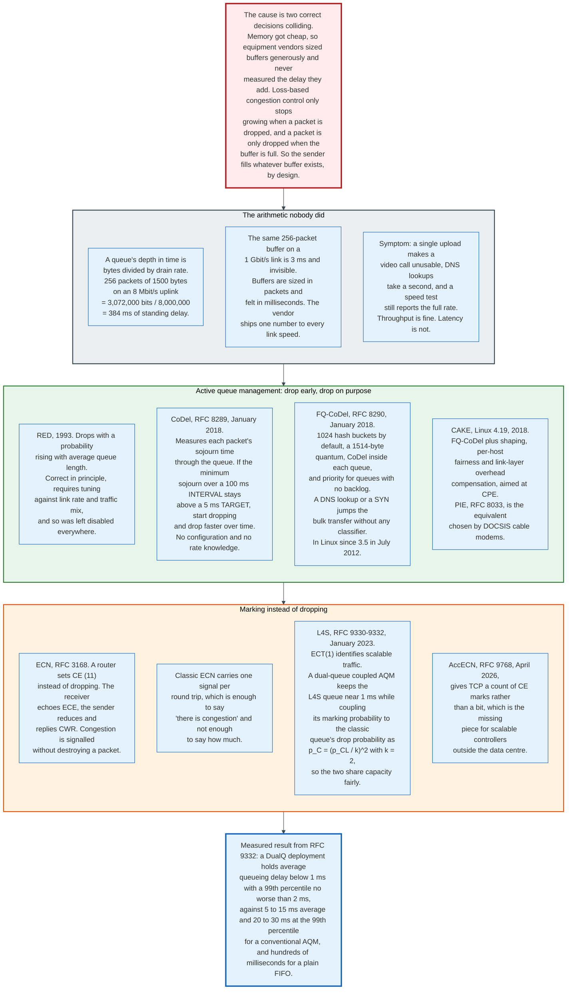

### 16.1 The Cause Is Two Correct Decisions Colliding

Bufferbloat is what happens when cheap memory meets loss-based congestion control, and neither party did anything wrong on its own.

Equipment vendors sized buffers generously because dropping a packet looked like a defect and memory got cheap. Loss-based congestion control stops growing its window only when a packet is dropped, and a packet is dropped only when a buffer is full. Put them together and every loss-based sender fills every buffer on its path, by design, as its normal steady state.

The arithmetic nobody did is the conversion from packets to milliseconds. A buffer's depth in time is its size in bytes divided by the drain rate:

```
256 packets * 1500 bytes * 8 bits = 3,072,000 bits
3,072,000 bits / 8,000,000 bits per second = 384 ms
```

The same 256-packet buffer on a 1 Gbit/s link is 3 ms and invisible. Vendors specify buffers in packets and ship one number to every link speed, so the same firmware that is harmless in a data centre adds a third of a second to a home uplink.

The symptom is distinctive and frequently misdiagnosed. A single large upload makes a video call unusable, DNS lookups take a second, and a speed test still reports the full advertised rate. Throughput is fine. Latency under load is catastrophic. Because the standard consumer measurement is throughput, the problem was invisible to the industry for a decade until Jim Gettys named it in December 2010.

### 16.2 Active Queue Management

AQM drops or marks packets before the buffer is full, which converts a latency problem into a signalling one.

**RED**, Random Early Detection, 1993, drops with a probability rising with average queue length. It is correct in principle and requires tuning against link rate and traffic mix, so operators left it disabled. A mechanism that needs a knob does not deploy.

**CoDel**, RFC 8289, January 2018 and Experimental. It measures each packet's sojourn time through the queue rather than the queue's length. If the minimum sojourn time over a sliding 100 ms INTERVAL stays above a 5 ms TARGET, it begins dropping, and the drop rate rises over time until the delay falls back. Measuring the minimum over an interval is what distinguishes a transient burst, which is useful queueing, from a standing queue, which is pure delay. It requires no configuration and no knowledge of the link rate, which is why it deployed.

**FQ-CoDel**, RFC 8290, January 2018 and Experimental. It hashes flows into 1,024 buckets by default, runs CoDel inside each, and uses a deficit round robin scheduler with a 1,514-byte quantum. Its key behaviour is that queues with no backlog, called new queues, get priority over queues that are building one. A DNS lookup, a SYN, or a voice packet therefore jumps ahead of a bulk transfer without any classifier, any DSCP marking, or any configuration. FQ-CoDel entered Linux in 3.5 in July 2012 and became the default queueing discipline in OpenWrt and most Linux distributions.

**CAKE**, in Linux since 4.19 in 2018, is FQ-CoDel plus a shaper, per-host fairness so one device cannot take the whole link, and link-layer overhead compensation for DSL framing. It is aimed at consumer gateways, where the shaper matters because the actual bottleneck is inside the ISP's equipment and the only way to control that queue is to stay just under its rate.

**PIE**, RFC 8033, is the equivalent chosen by the DOCSIS cable specifications, using a proportional-integral controller on queueing delay rather than CoDel's sojourn-time logic.

### 16.3 ECN, and Why It Took Twenty Years

Marking a packet instead of dropping it is obviously better and took two decades to deploy, for reasons that have nothing to do with the mechanism.

RFC 3168, September 2001, defines the scheme. Two bits in the IP header carry `00` Not-ECT, `10` ECT(0), `01` ECT(1), and `11` CE. A sender that supports ECN marks its packets ECT. A congested router, instead of dropping, sets CE. The receiver sees CE and sets the ECE flag in its ACKs. The sender reduces its window as if it had seen a loss and sets CWR on its next data segment to confirm.

Deployment stalled on middleboxes. Early firewalls and load balancers treated the reused Type of Service bits as invalid and dropped or reset connections that used them, so negotiating ECN made connections fail. Operating systems responded by disabling ECN negotiation by default, which meant nobody could measure whether the breakage had been fixed. Linux's `net.ipv4.tcp_ecn` defaults to 2, meaning ECN is accepted on incoming connections that request it but not requested on outgoing ones, which is precisely the equilibrium of a mechanism that is safe to answer and unsafe to initiate.

The second limitation is resolution. Classic ECN feedback carries at most one congestion indication per round trip, because the ECE flag is a single bit and the sender treats a set of them as one event. That is enough for a Reno-style halving and not enough for a controller that wants to modulate its rate in proportion to the marking rate. RFC 9768, published in April 2026, fixes exactly this by carrying a count of CE marks in the TCP header.

### 16.4 L4S

L4S is the attempt to give the public internet the sub-millisecond queueing that data centres already have, and it needs three pieces to work together.

**The identifier** is ECT(1), a codepoint RFC 3168 defined and RFC 3540 then spent on the ECN nonce, a scheme letting a sender detect a receiver that conceals congestion marks. RFC 8311 reclassified RFC 3540 as Historic in January 2018 specifically to free the codepoint. RFC 9331 gives it its current meaning: this packet belongs to a flow using a scalable congestion control that will respond to frequent, shallow marks.

**The AQM** is DualQ Coupled, RFC 9332. Two queues share one link. The L4S queue is marked aggressively at a very shallow threshold, holding it near a millisecond. The classic queue runs a conventional AQM. The coupling ensures fairness: the classic drop probability is derived from the L4S marking probability as `p_C = (p_CL / k)^2` with a recommended `k` of 2, so that a scalable flow responding to many gentle marks and a classic flow responding to occasional harsh drops end up with comparable throughput.

**The congestion control** is TCP Prague or an equivalent, which reduces its window in proportion to the marking rate rather than by a fixed factor.

The measured result in RFC 9332 is average queueing delay below 1 ms with a 99th percentile no worse than 2 ms, against 5 to 15 ms average and 20 to 30 ms at the 99th percentile for a conventional AQM.

L4S is not without dispute. The primary objection is that ECT(1) carries no meaning that deployed equipment respects, so networks treating it as equivalent to ECT(0) misclassify L4S traffic into the classic queue, and that a scalable flow misclassified into a classic queue behaves badly. The competing proposal, SCE, would have used the codepoint in the opposite direction. The IETF chose L4S. Deployment as of 2026 is concentrated in operator trials, DOCSIS equipment, and QUIC implementations rather than in general TCP.

---

## 17. Nagle's Algorithm and Delayed ACK

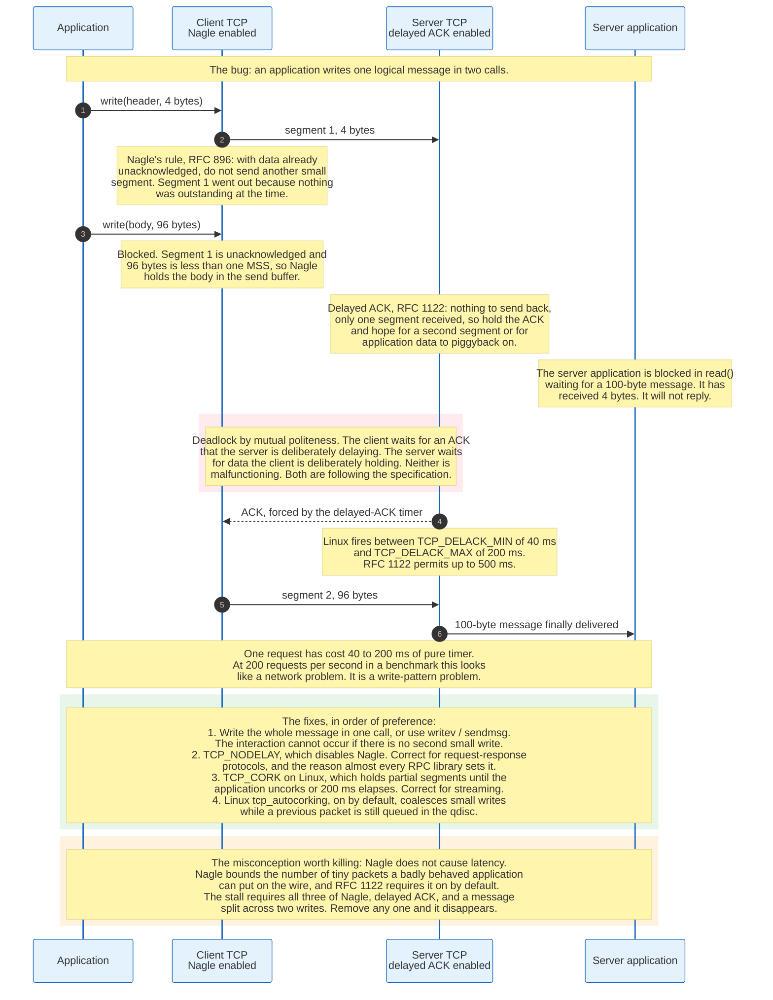

### 17.1 What Nagle's Algorithm Does

Nagle's algorithm bounds the number of tiny packets a badly behaved application can put on the wire, and it does so with one rule.

John Nagle wrote RFC 896 on 6 January 1984 at Ford Aerospace, describing what he called the small-packet problem. A Telnet session sends one character per keystroke, producing a 41-byte packet carrying one byte of data: 4,000 percent overhead. On a congested long-haul link, enough such sessions consume the capacity entirely.

The rule as stated in RFC 896: inhibit the sending of new TCP segments when new outgoing data arrives from the user if any previously transmitted data on the connection remains unacknowledged. Modern formulations add the obvious exception: send immediately if a full-sized segment can be assembled.

So a sender with nothing outstanding sends immediately, whatever the size. A sender with data outstanding accumulates until either a full segment is available or the outstanding data is acknowledged. The maximum number of small packets in flight is one, and the accumulation window is exactly one round-trip time, which self-adjusts: on a fast local network the delay is microseconds, on a slow long-haul link it is long enough to coalesce meaningfully.

RFC 1122 requires the algorithm to be implemented and on by default, with an application-level override.

### 17.2 What Delayed ACK Does

Delayed acknowledgement halves the number of packets in the reverse direction, and the two mechanisms are individually correct.

A pure ACK costs a full packet on the wire and carries no data. Acknowledging every segment therefore roughly doubles the packet count of a bulk transfer and consumes reverse-path capacity, which on an asymmetric access link is scarce. RFC 1122 permits delaying an ACK, requires the delay to be under 500 ms, and requires an ACK for at least every second full-sized segment. Linux implements 40 ms to 200 ms and adapts within that range.

The receiver delays in the hope that either a second segment arrives, forcing an ACK anyway, or the application produces a response the ACK can piggyback on. In a request-response protocol the second case is normal and no delay is ever observed.

### 17.3 The Interaction

The pathology needs all three ingredients and disappears if any one is removed.

Consider a client sending a 100-byte message in two `write()` calls: a 4-byte header and a 96-byte body.

The first `write()` has no outstanding data, so Nagle allows it and the 4-byte segment goes out. The second `write()` arrives with 4 bytes unacknowledged and only 96 bytes to send, which is less than an MSS, so Nagle holds it.

The receiver has 4 bytes. It has nothing to send back, because its application is blocked in a `read()` waiting for a complete 100-byte message that it does not have. It has received only one segment, so the every-second-segment rule does not fire. It delays the ACK.

The sender waits for an ACK the receiver is deliberately withholding. The receiver waits for data the sender is deliberately withholding. Neither is malfunctioning; both are following RFC 1122. The deadlock breaks only when the delayed-ACK timer fires, costing 40 to 200 ms on Linux and up to 500 ms under the specification.

The signature in production is a service whose latency is a suspiciously round number, clustered at 40 ms or 200 ms, that does not scale with payload size and disappears under high request rates because a busy connection always has a second segment to force the ACK.

### 17.4 The Fixes, in Order of Preference

**Write the message once.** Use one `write()`, or `writev()`, or `sendmsg()` with an iovec. If there is no second small write, the interaction cannot occur. This is the correct fix and it is usually a one-line change.

**Set `TCP_NODELAY`.** This disables Nagle for the socket. It is correct for request-response protocols where every write is a complete message, and it is why almost every RPC library, database driver, and HTTP server sets it unconditionally. The cost is that a badly written application can now emit unlimited tiny packets, which is the exact behaviour RFC 896 was written to prevent.

**Set `TCP_CORK` on Linux.** The inverse of `TCP_NODELAY`: hold all partial segments until the application uncorks or 200 ms elapses. Correct for a sender that knows it is about to write more, such as `sendfile()` preceded by headers.

**Rely on `tcp_autocorking`.** Linux enables this by default. It coalesces small writes while a previous packet is still sitting in the qdisc, achieving much of `TCP_CORK`'s benefit without the application knowing.

The framing worth keeping is this. Nagle is not a latency bug. Nagle is a bound on packet count that becomes visible only when an application splits a message across writes and the peer has nothing to say. The algorithm is 42 years old, is still required to be on by default, and still does its job.

---

## 18. Keepalives and Idle Connections

### 18.1 TCP Keepalive Is Not What Most People Want

TCP keepalive detects a dead peer on an otherwise silent connection, and its defaults make it useless for that purpose.

An idle TCP connection sends nothing. Neither endpoint learns that the other has crashed, been powered off, or lost its network, because a connection is only a pair of state machines and neither machine is being exercised. A server can hold thousands of established connections to machines that ceased to exist hours earlier.

The keepalive mechanism sends a probe on an idle connection: a segment with a sequence number one below the next expected byte, carrying no data. A live peer must acknowledge it because the sequence number is stale, which is exactly why that construction is used. A dead peer's replacement sends an RST. Nothing at all means the network path is broken.

RFC 1122 is deliberately grudging about it. Keepalives are optional, must be disabled by default, and the interval must be configurable with a default of no less than two hours. The reasoning given at the time was that keepalives consume bandwidth on idle links, can terminate a healthy connection during a transient outage, and cost money on connections billed per packet.

Linux implements exactly those defaults:

| Setting | Default | Meaning |
|---------|---------|---------|
| `net.ipv4.tcp_keepalive_time` | 7200 s | Idle time before the first probe |
| `net.ipv4.tcp_keepalive_intvl` | 75 s | Interval between probes |
| `net.ipv4.tcp_keepalive_probes` | 9 | Probes before declaring the connection dead |

Two hours idle, then nine probes at 75-second intervals, so a dead peer is detected 2 hours 11 minutes 15 seconds after the last byte. Keepalive must be enabled per socket with `SO_KEEPALIVE`, and the three values can be overridden per socket with `TCP_KEEPIDLE`, `TCP_KEEPINTVL`, and `TCP_KEEPCNT`.

### 18.2 The Real Reason Keepalives Are Enabled

In practice keepalive is configured not to detect dead peers but to stop a middlebox from silently forgetting the connection.

A NAT device maps an internal address and port to an external one and must keep that mapping while the connection is alive. Since NAT cannot know when a connection ends, it uses an idle timeout. TCP timeouts on consumer NATs typically run from 2 minutes to 30 minutes, and RFC 5382 recommends at least 2 hours 4 minutes for established connections, a recommendation widely ignored. Stateful firewalls and cloud load balancers behave the same way, with published idle timeouts commonly in the 60 to 350 second range.

When the mapping is dropped, the connection is not closed. It is silently orphaned. Both endpoints still believe they are connected. The next segment either vanishes or provokes an RST, and the application discovers the problem at the worst possible time, in the middle of a request.

The countermeasure is to send something more often than the shortest timeout on the path. A 7200-second TCP keepalive is useless against a 300-second load balancer timeout. Setting `TCP_KEEPIDLE` to something like 60 seconds works, and application-level heartbeats work better because they also exercise the application, which a TCP keepalive does not.

This is the substantive point. A TCP keepalive proves that the peer's kernel is running. It proves nothing about the peer's application, which may be deadlocked, out of memory, or in an infinite loop while its TCP stack cheerfully answers probes. Every protocol that cares has its own heartbeat: HTTP/2 PING frames, gRPC keepalives, WebSocket ping and pong, SSH's `ServerAliveInterval`.

### 18.3 The Other Timers on an Idle Connection

Three other timers govern a connection that stops moving, and their interaction is the reason a hung connection takes so long to fail.

**The retransmission timer** applies when there is unacknowledged data. Linux retries `tcp_retries2` times, default 15, with exponential backoff, which the kernel documentation puts at a hypothetical 924.6 seconds, about 15 minutes, as a lower bound on the time before the connection is aborted. An application that writes into a black hole blocks for that long.

**The persist timer** applies when the peer advertises a zero window. It probes indefinitely, because a slow receiver is not an error. A connection can sit in persist state forever if the peer's application never reads.

**`TCP_USER_TIMEOUT`**, a Linux socket option, caps the total time unacknowledged data may remain outstanding before the connection is aborted, overriding the `tcp_retries2` calculation. It is the cleanest way to make a connection fail in bounded time and is underused. RFC 5482 defines the equivalent as a negotiated TCP option, kind 28, which is not deployed.

---

## 19. TCP Fast Open

### 19.1 The Problem

The handshake costs one round trip before any application byte moves, and on a short transfer that round trip is a large fraction of the total time.

For a request that fits in one packet and a response that fits in a few, the sequence is one RTT for the handshake, then one RTT for request and response. Half the latency is protocol overhead. Add TLS 1.3 and it is one RTT for TCP, one for TLS, then one for the request: two thirds overhead.

### 19.2 The Mechanism

TCP Fast Open, RFC 7413 published in December 2014 and still Experimental, puts data in the SYN and authorises it with a cookie.

On the first connection to a server, the client sends a SYN with a Fast Open option, kind 34, containing an empty cookie field. The server generates a cookie, typically an encryption of the client's IP address under a server-held key, and returns it in the SYN-ACK. The connection proceeds normally.

On subsequent connections, the client sends a SYN carrying both the cookie and application data. The server validates the cookie, and if it is valid, passes the data to the application immediately and may send the response in the SYN-ACK. One round trip is removed.

The cookie exists to prevent amplification. Without it, an attacker could send SYNs with data and a spoofed source address, causing the server to perform work and send a large response to a victim. The cookie proves the client previously received a packet at the address it claims, which off-path attackers cannot do.

### 19.3 The Semantics It Breaks

Fast Open relaxes a guarantee TCP has provided since 1981, and the applications must accept it.

Data in a SYN may be delivered more than once. If a SYN carrying data is duplicated in the network, or if the client retransmits a SYN whose SYN-ACK was lost, the server may process the same data twice with no way to detect the duplication, because the connection state that would deduplicate it does not yet exist. RFC 7413 states this plainly: applications must tolerate possible duplicate delivery.

That restricts Fast Open to idempotent requests. An HTTP GET is safe. A POST that charges a credit card is not. The API therefore requires explicit opt-in on both ends: `TCP_FASTOPEN_CONNECT` or `sendto()` with `MSG_FASTOPEN` on the client, `TCP_FASTOPEN` on the listening socket, and `net.ipv4.tcp_fastopen` set as a bitmask, where 0x1 enables client behaviour and 0x2 enables server behaviour. Linux defaults to 0x1.

### 19.4 Why It Did Not Take Over

Fast Open works, is available in Linux, and carries very little traffic. Four reasons account for that.

**Middleboxes.** Some paths drop SYNs carrying unknown options, and some drop SYNs carrying data. A client that attempts Fast Open on such a path fails to connect, so implementations must detect the failure and fall back, which costs a timeout. The fallback logic is the expensive part.

**The cookie is a tracking identifier.** A server-issued value that a client stores and replays on every subsequent connection is a cookie in the browser sense, usable to link connections from the same client across time and across sessions. Privacy work in browsers moved decisively against exactly this, and TFO cookies did not survive the shift.

**TLS ate the benefit.** For HTTPS, saving the TCP round trip still leaves the TLS handshake. TLS 1.3 with session resumption and 0-RTT achieves the same saving at a layer that already has an established security context and its own replay analysis.

**QUIC did it better.** QUIC's handshake carries application data in the first flight natively, with the address validation, the replay analysis, and the encryption designed together rather than bolted on. When QUIC shipped in RFC 9000 in May 2021, the case for TFO on the public web mostly disappeared.

TCP Fast Open is a good design that was overtaken. It remains useful inside controlled environments where the path is known and requests are idempotent, and its history is the clearest single case of the middlebox problem described in section 4.2.

---

## 20. Socket Buffers and the Kernel Path

```mermaid
%%{init: {'theme': 'base', 'themeVariables': {'primaryColor': '#e3f2fd', 'primaryBorderColor': '#1565c0', 'lineColor': '#37474f'}}}%%

flowchart TB
    subgraph TX["Transmit path: what write() actually starts"]
        direction TB
        T1["write() or sendmsg()<br/>Copies user bytes into kernel<br/>socket buffers. Returns as soon as<br/>the bytes are copied, not when<br/>they are sent, and certainly not<br/>when they are acknowledged."]
        T2["Send buffer accounting<br/>sk_wmem_queued against sk_sndbuf.<br/>Linux tcp_wmem is min 4 KB,<br/>default 16 KB, max between 64 KB<br/>and 4 MB depending on RAM.<br/>The socket blocks or returns<br/>EAGAIN when full."]
        T3["tcp_write_xmit<br/>Sends while min(cwnd, rwnd) allows<br/>and Nagle permits. Builds segments<br/>of MSS bytes, or of gso_size bytes<br/>if offload is on."]
        T4["TCP Small Queues<br/>tcp_limit_output_bytes, default<br/>4 MB, caps how much of one flow<br/>may sit below TCP in the qdisc<br/>and driver rings. Without it a<br/>single flow fills the local queue<br/>and destroys local latency."]
        T5["GSO and TSO<br/>The stack hands down one buffer of<br/>up to 64 KB and the NIC, or the<br/>software fallback, splits it into<br/>MSS-sized segments and writes the<br/>per-segment TCP and IP headers.<br/>One traversal instead of 45."]
        T6["Queueing discipline<br/>fq or fq_codel. sch_fq also paces:<br/>it releases packets at the rate the<br/>congestion control asks for rather<br/>than in a burst. BBR requires pacing<br/>and CUBIC benefits from it."]
        T7["Driver ring and NIC<br/>DMA descriptor, checksum offload,<br/>then bytes on the wire.<br/>Completion interrupt frees the skb<br/>only after the ACK for TCP, since<br/>the data must be retained."]
        T1 --> T2 --> T3 --> T4 --> T5 --> T6 --> T7
    end

    subgraph RX["Receive path"]
        direction TB
        R1["NIC DMA into a ring buffer,<br/>then an interrupt, then NAPI polling<br/>so one interrupt drains many packets"]
        R2["GRO<br/>Merges consecutive segments of the<br/>same flow into one large skb before<br/>the stack sees them. The receiver's<br/>TCP processes one 64 KB unit instead<br/>of 45 separate ones."]
        R3["tcp_v4_rcv<br/>Looks up the socket by the 4-tuple,<br/>validates sequence and checksum,<br/>and takes one of three paths"]
        R4["Fast path: in-order, expected,<br/>window open. Append to the receive<br/>queue and possibly delay the ACK.<br/>Slow path: out of order. Queue into<br/>the out-of-order tree and send an<br/>immediate ACK carrying SACK blocks.<br/>Backlog: the socket is locked by a<br/>reader, so queue and process later."]
        R5["Receive buffer autotuning<br/>tcp_moderate_rcvbuf grows the buffer<br/>toward the measured bandwidth-delay<br/>product, within tcp_rmem: min 4 KB,<br/>default 128 KB, max between 128 KB<br/>and 32 MB depending on RAM.<br/>The advertised window is a fraction<br/>of that buffer, set by tcp_adv_win_scale."]
        R6["read() or recvmsg()<br/>Copies out of the receive queue.<br/>Nothing above this point knows or<br/>cares where segment boundaries were."]
        R1 --> R2 --> R3 --> R4 --> R5 --> R6
    end

    subgraph Sizing["The sizing arithmetic that decides single-flow throughput"]
        direction TB
        S1["Required buffer = rate * RTT.<br/>1 Gbit/s at 100 ms needs 12.5 MB<br/>on both ends. A default 4 MB send<br/>buffer caps that flow at<br/>4 MB / 0.1 s = 40 MB/s = 320 Mbit/s,<br/>no matter what the link can do."]
        S2["Both ends must be large enough.<br/>The advertised window is bounded by<br/>the receiver's buffer and the sender's<br/>retained data by its own.<br/>Tuning one side changes nothing."]
        S3["tcp_notsent_lowat, default unlimited,<br/>limits how many unsent bytes sit in<br/>the send buffer before the socket<br/>reports unwritable. Setting it to<br/>about 128 KB lets a server switch<br/>video quality without flushing<br/>megabytes of stale data first."]
    end

    subgraph Bypass["When the kernel path is the cost"]
        direction TB
        P1["Per-packet cost is dominated by<br/>syscalls, the socket lock, skb<br/>allocation and cache misses,<br/>not by TCP's logic."]
        P2["MSG_ZEROCOPY, Linux 4.14, avoids<br/>the user-to-kernel copy for large<br/>sends. sendfile and splice avoid it<br/>for file-to-socket. io_uring, Linux 5.1,<br/>amortises syscalls across batches."]
        P3["Full bypass: DPDK, AF_XDP, and<br/>vendor userspace stacks move the<br/>whole path out of the kernel.<br/>Cost: no netfilter, no tcpdump,<br/>no sysctls, and a TCP implementation<br/>the operator must get right."]
        P4["eBPF struct_ops, Linux 5.6, lets a<br/>congestion control algorithm be loaded<br/>at runtime without a kernel module.<br/>Changing TCP behaviour no longer<br/>requires shipping a kernel."]
    end

    TX --> Sizing
    RX --> Sizing
    Sizing --> Bypass

    style TX fill:#e3f2fd,stroke:#1565c0,stroke-width:2px
    style RX fill:#e8f5e9,stroke:#2e7d32,stroke-width:2px
    style Sizing fill:#fff3e0,stroke:#e65100,stroke-width:3px
    style Bypass fill:#f3e5f5,stroke:#4a148c,stroke-width:2px
```

### 20.1 What `write()` Actually Does

A successful `write()` means bytes were copied into kernel memory, and it means nothing else.

The call copies from user space into socket buffers, `sk_buff` structures, accounted against `sk_sndbuf`. It returns as soon as the copy is done. It does not mean the data was transmitted, does not mean it was acknowledged, and certainly does not mean the peer's application read it. When the send buffer is full, a blocking socket sleeps and a non-blocking socket returns `EAGAIN`.

From there, `tcp_write_xmit` decides what may leave. It sends while `min(cwnd, rwnd)` permits and Nagle allows, building segments of MSS bytes, or of `gso_size` bytes when segmentation offload is enabled.

**TCP Small Queues** then caps how much of a single flow may sit below TCP in the queueing discipline and driver rings. `net.ipv4.tcp_limit_output_bytes` defaults to 4 MB in current kernels. Without this limit a single fast flow fills the local transmit queue and destroys latency for every other flow on the machine, which is bufferbloat inside the sending host itself.

**Pacing** comes from the queueing discipline. `sch_fq` releases packets at the rate the congestion control requests rather than in a burst at window-opening time. BBR requires pacing to function at all, since its entire model is rate-based, and CUBIC benefits from it because a burst of a full window arriving at a bottleneck is exactly what fills a buffer.

### 20.2 Buffer Sizing Is the Most Common Performance Bug

The equation from section 10.4 decides single-flow throughput, and default buffers frequently fall short of it.

Linux buffer defaults, from the kernel's `ip-sysctl` documentation:

| Setting | Default | Notes |
|---------|---------|-------|
| `net.ipv4.tcp_rmem` | 4 KB / 128 KB / 128 KB to 32 MB | min, default, max; max scales with RAM |
| `net.ipv4.tcp_wmem` | 4 KB / 16 KB / 64 KB to 4 MB | min, default, max; max scales with RAM |
| `net.ipv4.tcp_moderate_rcvbuf` | 1 | Receive buffer autotuning on |
| `net.ipv4.tcp_adv_win_scale` | 1 | Fraction of the receive buffer advertised as window |
| `net.ipv4.tcp_notsent_lowat` | `UINT_MAX` | Unsent bytes allowed before the socket reports unwritable |

The send-side maximum is the one that bites. A 4 MB send buffer over a 100 ms path caps one flow at:

```
4,000,000 bytes / 0.1 s = 40 MB/s = 320 Mbit/s
```

regardless of a 10 Gbit/s link, a perfect path, and a well-tuned congestion control. Filling 1 Gbit/s over that path needs 12.5 MB on both ends. This is the most common cause of "the network is slow" reports on long paths, and it is a one-line sysctl change on both machines. Setting `SO_SNDBUF` or `SO_RCVBUF` explicitly on a socket disables autotuning for that socket, which is usually the wrong move: raising the ceiling and letting autotuning work is better than pinning a value.

Both ends must be large enough. The advertised window is bounded by the receiver's buffer, and the sender's retained data is bounded by its own. Tuning one side changes nothing.

`tcp_notsent_lowat` deserves specific mention because it solves a problem raising buffers creates. A large send buffer lets an application queue megabytes of data that TCP has not yet sent, and if the application changes its mind, that data must still be transmitted. A video server switching bitrates must flush everything already queued before the new quality appears. Setting `tcp_notsent_lowat` to around 128 KB makes the socket report unwritable once that much unsent data is queued, so the application keeps its own queue where it can reorder or discard, while TCP still has enough to keep the pipe full.

### 20.3 The Receive Path

Reception has three paths through the kernel and one hardware optimisation that changes what can be measured.

The NIC writes packets into a ring buffer by DMA and raises an interrupt. NAPI then polls, so one interrupt drains many packets rather than one interrupt per packet, which is what makes multi-million-packet-per-second rates possible at all.

**GRO**, Generic Receive Offload, merges consecutive segments of the same flow into a single large `sk_buff` before the stack processes them. The receiving TCP then handles one 64 KB unit instead of 45 separate segments, cutting per-packet overhead by more than an order of magnitude. It also means a packet capture on the receiver shows segments that never existed on the wire.

`tcp_v4_rcv` looks up the socket by 4-tuple and takes one of three paths. The **fast path** handles an in-order segment that fills the expected sequence number with the window open: append to the receive queue and possibly delay the ACK. The **slow path** handles anything out of order: queue into the out-of-order tree and send an immediate ACK carrying SACK blocks. The **backlog** path applies when the socket is locked by a reader, in which case the segment is queued and processed when the lock is released.

Receive buffer autotuning grows the buffer toward the measured bandwidth-delay product within the `tcp_rmem` bounds. The advertised window is a fraction of that buffer rather than all of it, governed by `tcp_adv_win_scale`, because the buffer must also hold the per-packet `sk_buff` overhead, which for small packets can exceed the payload.

### 20.4 Where the Cost Actually Is

TCP's algorithm is not the expensive part of TCP, and knowing that redirects optimisation effort correctly.

At high packet rates the cost is dominated by system call entry and exit, the socket lock, `sk_buff` allocation and freeing, and cache misses walking the receive queue. The congestion control computation is a handful of arithmetic operations per acknowledgement and does not appear in profiles.

The mitigations follow from that.

**Fewer, larger operations.** TSO and GSO on transmit, GRO on receive, and `sendfile()` or `splice()` to move file data to a socket without a user-space round trip.

**Fewer copies.** `MSG_ZEROCOPY`, added in Linux 4.14, pins user pages and avoids the copy for large sends, with completion notified through the socket error queue. It pays off above roughly 10 KB per send and costs more below that.

**Fewer syscalls.** `io_uring`, added in Linux 5.1, submits and completes batches of operations through shared ring buffers, amortising syscall overhead across many sends and receives.

**No kernel at all.** DPDK, AF_XDP, and vendor userspace stacks move the entire path out of the kernel. The performance is real and so is the cost: no `netfilter`, no `tcpdump`, no sysctls, no shared socket accounting, and a TCP implementation that is now the operator's responsibility to keep correct.

**Kernel code without a kernel build.** eBPF `struct_ops`, added in Linux 5.6, allows a congestion control algorithm to be written in eBPF and loaded at runtime. Changing TCP's behaviour no longer requires shipping a kernel module or a kernel, which matters most to the operators who deploy congestion control changes faster than the IETF standardises them.

---

## 21. Security and Risk

### 21.1 The Threat Model

TCP was designed for a network of mutually trusting research institutions, and every security property it has was added later against a specific published attack.

The base protocol provides no confidentiality, no authentication of either endpoint, and no integrity beyond a 16-bit checksum that any attacker can recompute. An attacker on the path can read, modify, and inject at will. An attacker off the path is limited only by what it can guess about the connection's state.

Three attacker positions matter and they have different capabilities.

**On-path.** Sees every packet and can modify or drop. Against unencrypted TCP this attacker owns the connection completely. The only defence is encryption above TCP, which is why TLS is not optional.

**Off-path, blind.** Cannot see the connection and must guess the 4-tuple and the sequence numbers. Most of the mechanisms in this section defend against exactly this attacker.

**Resource exhaustion.** Does not need to guess anything, only to consume a finite server resource: SYN queue entries, memory, file descriptors, or ports.

### 21.2 Sequence Number Prediction and Connection Hijacking

Predictable initial sequence numbers turn a blind off-path attacker into an on-path one, and the fix is cryptographic.

If an attacker can predict the ISN a server will pick, it can send a SYN with a spoofed source address, never see the SYN-ACK, and still forge a valid third segment carrying data. The connection is established from an address the attacker does not control, and whatever address-based trust the server places in that source is now the attacker's. Kevin Mitnick's 1994 attack on Tsutomu Shimomura's machines is the famous instance.

RFC 6528, folded into RFC 9293, requires the keyed-hash construction from section 8.2. The offset is unguessable without the secret key, while the 4-microsecond clock preserves the monotonicity that TIME_WAIT reuse depends on.

### 21.3 Blind In-Window Attacks and Challenge ACKs

An attacker who cannot guess a sequence number exactly can sometimes guess one that is merely inside the window, and RFC 5961 closes that gap.

RFC 793 accepted an RST anywhere within the receive window. With a large window, an attacker guessing randomly needs only about `2^32 / window` attempts, which for a 1 MB window is roughly 4,096 packets. That is trivially cheap and was used to reset long-lived BGP sessions between routers.

RFC 5961, August 2010, tightened three cases. An RST is accepted only if its sequence number exactly matches the next expected byte; an in-window RST with any other sequence number triggers a **challenge ACK** carrying the correct expected sequence number, and a legitimate peer will then send a correctly sequenced RST while a blind attacker cannot. A SYN arriving on an established connection likewise triggers a challenge ACK instead of a reset. Data segments are subjected to a stricter window check.

The mitigation had a side effect that became its own vulnerability. Linux rate-limited challenge ACKs with a global counter shared across all connections, and CVE-2016-5696 showed that an off-path attacker could probe that shared counter as a side channel to determine whether a given 4-tuple existed and then to infer its sequence numbers. The fix was to randomise the limit and move it per-socket. The pattern is worth noting: a global counter added to mitigate one attack became the oracle for another.

### 21.4 SYN Floods and Resource Exhaustion

The oldest denial-of-service attack against TCP still works, and the standard mitigation trades state for cryptography.

The mechanics are in section 8.3. A SYN flood consumes SYN queue entries with spoofed sources that never complete the handshake. SYN cookies remove the state entirely by encoding the connection into the ISN, at the cost of losing options that do not fit in the cookie.

Two related exhaustion attacks target other resources. A **connection flood** completes handshakes properly and then holds thousands of idle connections, consuming memory and file descriptors rather than SYN queue slots, and cookies do not help. A **zero-window attack**, sometimes called Sockstress, completes a handshake, requests a large response, and then advertises a zero window forever, pinning the server's send buffer while the persist timer probes indefinitely. The countermeasures are per-source connection limits, aggressive application-level timeouts, and `TCP_USER_TIMEOUT`.

### 21.5 Amplification and Reflection

TCP is a poor amplifier and a usable reflector, and the distinction matters for defence.

A SYN elicits a SYN-ACK, which is roughly the same size, so there is no amplification worth having. Some implementations retransmit the SYN-ACK several times before giving up, giving a modest multiplier that has been used in practice.

UDP is where amplification lives, and the numbers explain the asymmetry. DNS, NTP's `monlist`, memcached, and SSDP have all supplied amplification factors from tens to tens of thousands, because a small request produces a large response and UDP has no handshake to validate the source address. This is the single strongest argument for TCP's three-way handshake as a security mechanism rather than merely a sequencing one: the handshake is address validation, and every UDP-based protocol that wants to be safe has had to reinvent it. QUIC's address validation token exists for exactly this reason.

### 21.6 Authentication of the TCP Header Itself

Two options authenticate TCP segments without encrypting them, and they exist for one use case.

**TCP MD5**, RFC 2385, option kind 19, adds a 16-byte MD5 digest over the segment and a shared secret. It was written for BGP sessions between routers, where the attack of concern is an off-path RST rather than eavesdropping. MD5 is broken for collision resistance, the option has no key rotation, and it consumes 18 of the 40 option bytes.

**TCP-AO**, RFC 5925, June 2010, option kind 29, replaces it with negotiated algorithms, key identifiers permitting rotation without dropping the session, and protection that survives connection restarts. Adoption has been slow, and TCP MD5 remains common on BGP sessions because it works and changing router configuration across an operator network is expensive.

Neither provides confidentiality. Both exist because the alternative for a router-to-router session is IPsec, which is heavier than the problem warrants.

### 21.7 What TCP Cannot Defend Against

Three properties of the protocol are permanent, and the mitigations all live elsewhere.

**Traffic analysis.** Addresses, ports, packet sizes, and timing are all visible even under TLS. What was said is protected; who spoke to whom, when, and how much, is not.

**On-path modification of unencrypted traffic.** ISPs have injected advertisements into unencrypted HTTP, and nation-state systems have injected RSTs to terminate connections and forged responses to redirect them. TCP has no mechanism that would notice.

**RST injection by an on-path adversary.** With visibility into sequence numbers, a forged RST is trivially constructed and TCP has no way to distinguish it from a legitimate one. TLS detects the resulting truncation, which is why TLS 1.3 requires a `close_notify` alert, but it cannot prevent the disconnection.

The conclusion has been the same since roughly 2010 and drove the encrypted-by-default shift. TCP is a transport, not a security protocol, and every serious security property on the internet is provided by a layer above it.

---

## 22. Standards, Governance, and Compliance

### 22.1 Who Decides

TCP/IP has no owner, no licence, and no conformance certification, and this is the most consequential governance fact about it.

The IETF publishes the specifications through working groups: TCPM for TCP maintenance, CCWG for congestion control, TSVWG for transport in general, INTAREA and 6MAN for the IP layers. Documents proceed from Internet-Draft to Proposed Standard to Internet Standard, though in practice most protocols in daily use stop at Proposed Standard and never advance. The IETF's operating principle, stated by David Clark in 1992, remains "we reject kings, presidents and voting; we believe in rough consensus and running code."

IANA, under contract to the internet community, operates the registries that make interoperation possible: the port number registry, the TCP option kind registry, the IP protocol number registry, and the ICMP type registry. A registry entry is not a permission. It is a coordination record that prevents two protocols from claiming the same number.

The standards that actually govern behaviour are the ones with an STD number, and TCP/IP's are few:

| STD | RFC | Title | Date |
|-----|-----|-------|------|
| STD 5 | RFC 791 | Internet Protocol | Sep 1981 |
| STD 7 | RFC 9293 | Transmission Control Protocol | Aug 2022 |
| STD 6 | RFC 768 | User Datagram Protocol | Aug 1980 |
| STD 86 | RFC 8200 | Internet Protocol, Version 6 | Jul 2017 |
| STD 87 | RFC 8201 | Path MTU Discovery for IPv6 | Jul 2017 |
| STD 89 | RFC 4443 | ICMPv6 | Mar 2006 |
| STD 3 | RFC 1122, RFC 1123 | Requirements for Internet Hosts | Oct 1989 |

Everything in sections 12 through 17 that determines performance is Proposed Standard or Experimental. CUBIC reached Proposed Standard in 2023 after seventeen years as the Linux default. CoDel and FQ-CoDel are Experimental and run on hundreds of millions of routers. TCP Fast Open is Experimental and shipped in Linux. BBR is an Internet-Draft and carries a large share of Google's traffic. The maturity label describes the document's process history, not the deployment.

### 22.2 There Is No Compliance Regime

No regulator certifies a TCP implementation, and the practical consequences of that are worth stating.

There is no test suite to pass, no seal, no licence, and no liability regime for a stack that misbehaves. What enforces correctness is interoperability: a stack that fails against Linux, Windows, and the major CDNs is unusable, and those implementations are the de facto conformance test. When a specification and a widely deployed implementation disagree, the implementation wins and the specification is eventually amended. RFC 9293's list of updates and errata is largely a record of that process.

Regulation touches TCP/IP only indirectly, through three channels.

**Security frameworks reference protocols above it.** PCI DSS requires TLS 1.2 or above for cardholder data in transit. HIPAA requires encryption in transit without naming a protocol. Neither mandates anything about TCP itself, and both are effectively requirements on the layer TCP carries.

**Government procurement drives IPv6.** The US Office of Management and Budget memorandum M-21-07, issued in November 2020, requires federal agencies to move to IPv6-only for at least 80 percent of networked assets by the end of fiscal year 2025. Similar mandates exist in India, China, and the EU. Procurement rules, not technical merit, are the primary driver of IPv6 deployment in enterprise networks.

**Lawful interception and data retention assume TCP/IP semantics.** Interception standards specify capture at the IP layer, and the shift of transport metadata into encrypted QUIC packets is an ongoing point of friction between operators and regulators. It is a governance dispute about visibility, not about the protocol.

---

## 23. Economics: What It Costs to Run and Who Pays

### 23.1 The Protocol Itself Is Free and That Is the Point

TCP/IP has no licence fee, no royalty, no patent pool, and no certification body, and that is the largest single reason it won.

Its competitors in the 1980s did not have this property. OSI protocol specifications were sold by ISO rather than published freely. IBM's SNA and DEC's DECnet were vendor-controlled. X.25 public data networks were operated by telecom monopolies that charged per packet. TCP/IP specifications were published as RFCs, free to read and free to implement, and a working implementation shipped with BSD Unix, which universities could obtain for the cost of a tape.

The economic argument was decided before the technical one. A protocol implementable without asking anyone gets implemented by everyone.

### 23.2 Where the Real Costs Sit

The costs of running TCP/IP are entirely in the equipment, the operations, and the engineering time, and they distribute unevenly.

**Router forwarding capacity.** A core router's cost scales with the number of packets per second it can forward and the size of the forwarding table it must hold. The global routing table observed at the Route Views Oregon collector held 1,121,721 IPv4 prefixes and 263,038 IPv6 prefixes on 30 August 2026, and every router in the default-free zone must hold all of it in fast memory. The IPv4 table is four times the size of the IPv6 one for a fifth of the address space, which is what address fragmentation costs in hardware.

**Buffer memory, and the cost of getting it wrong.** Buffers are cheap to add and expensive to size correctly, and the industry spent a decade paying for that in latency rather than in dollars. AQM is free software; the cost was the engineering time to build it and the firmware update cycle to deploy it.

**Address scarcity.** IPv4 addresses have a market. The regional registries exhausted their free pools between 2011 and 2019, and transfer prices for a /24 block have run in the range of 30 to 60 US dollars per address in recent years, making a /16 a seven-figure asset. That price is the direct monetary cost of a 32-bit address field chosen in 1978, and it is the entire business case for carrier-grade NAT, which is itself a per-subscriber capital and operating cost.

**Operational complexity from NAT.** Carrier-grade NAT requires state for every flow, logging for every mapping to satisfy law enforcement requests, and breaks inbound connections entirely. The cost per subscriber is small and the aggregate is not.

**Engineering time.** The largest hidden cost. Every organisation that has debugged a PMTU black hole, a TIME_WAIT exhaustion, a delayed-ACK stall, or an undersized socket buffer has paid for a protocol decision made decades earlier. None of it appears on a balance sheet.

### 23.3 Who Pays and How

Money moves through four mechanisms and none of them is a protocol fee.

**Transit.** A smaller network pays a larger one to reach the rest of the internet, priced per megabit per second of committed capacity. Prices have fallen by roughly an order of magnitude per decade and are now measured in cents per Mbps per month at large volumes.

**Peering.** Two networks exchange traffic directly without payment when the exchange is roughly balanced, or with payment when it is not. Peering disputes between access networks and content networks are a recurring commercial fight and the substance of most network neutrality litigation.

**IP address transfers.** A genuine market in a protocol field.

**Vendor margin.** Router, firewall, and load balancer vendors sell hardware and software that implements the protocol. TCP offload engines, DPDK-based appliances, and SmartNICs are sold specifically on the cost of the kernel path described in section 20.

### 23.4 The Congestion Control Externality

Congestion control is the internet's only mechanism for allocating a shared resource, and it is voluntary.

Nothing forces a sender to implement congestion control. A sender that ignored it would get more throughput for itself at everyone else's expense. The system holds together because the dominant implementations, three or four operating systems and a handful of CDNs, all cooperate, and because a non-cooperating sender damages its own performance through the loss it causes.

That equilibrium is fragile in one specific way, and it is visible today. Applications open multiple parallel connections to get a larger share, since fairness is per-flow rather than per-application. A browser opening six connections gets roughly six times the share of one opening a single connection. HTTP/2's move to a single multiplexed connection was, among other things, a unilateral surrender of that advantage, and it is one reason HTTP/2 measured slower than HTTP/1.1 on lossy paths.

The pricing question underneath is the one nobody has answered. Congestion is a negative externality that the congesting party does not pay for, and every attempt to price it, from ATM's traffic contracts to differentiated services to paid prioritisation, has failed commercially or politically. The internet's answer remains voluntary restraint enforced by nothing.

---

## 24. Comparisons and Alternatives: Where UDP Is Chosen Instead

### 24.1 UDP Is Not a Faster TCP

UDP is TCP with everything removed, and choosing it means taking on everything that was removed.

The UDP header, RFC 768, is 8 bytes: source port, destination port, length, and checksum. It adds ports and an integrity check to IP and nothing else. No connection, no sequence numbers, no acknowledgements, no retransmission, no ordering, no flow control, no congestion control.

That last omission is the important one. A UDP sender that ignores congestion has no mechanism to slow down and no way to know it should. Any UDP application carrying more than trivial volume must implement congestion control itself, and RFC 8085, the UDP usage guidelines, says so explicitly. "Faster because it is UDP" is almost always "faster because it is not implementing the thing that was slowing it down for a reason."

### 24.2 The Four Legitimate Reasons to Choose UDP

**Reason one: late data is worthless.** For real-time voice and video, a packet that arrives after its playout deadline is garbage, and retransmitting it wastes bandwidth and delays everything behind it. TCP's in-order delivery makes this worse than useless: one lost packet blocks delivery of every subsequent packet until it is repaired, which is head-of-line blocking. RTP over UDP, used by every voice and video system that matters, conceals loss instead: forward error correction, packet loss concealment that interpolates missing audio, and codecs designed to degrade rather than stall. WebRTC is the canonical stack, and its congestion control, Google Congestion Control, is delay-based specifically because it targets latency rather than throughput.

**Reason two: the exchange is smaller than the handshake.** A DNS query and its response are typically a few hundred bytes. A TCP handshake to carry them costs an extra round trip and leaves a TIME_WAIT socket on one side. UDP does it in one packet each way. The cost is that DNS over UDP is trivially spoofable and amplifiable, which is why DNS Cookies, RFC 7873, DNSSEC, and DNS over TLS and HTTPS all exist, and why the EDNS0 buffer size settled at 1232 bytes to avoid fragmentation. DNS falls back to TCP when a response does not fit.

**Reason three: one-to-many.** TCP is strictly point-to-point. Multicast and broadcast require UDP, so service discovery protocols such as mDNS, SSDP, and DHCP have no choice.

**Reason four: the application is itself a transport.** This is the modern case and it dominates the others by volume.

### 24.3 QUIC: Rebuilding TCP on UDP, and Why

QUIC uses UDP not for speed but because UDP is the only transport a middlebox will forward without having opinions about it.

RFC 9000, published in May 2021 with RFC 9001 for TLS integration and RFC 9002 for loss detection and congestion control, defines a transport that provides everything TCP provides plus several things TCP structurally cannot. It runs over UDP for one reason: the network will not let anything else through, and will not let TCP change.

Four things QUIC gets that TCP cannot retrofit:

**No head-of-line blocking across streams.** TCP delivers one ordered byte stream, so a lost segment blocks everything behind it including data for unrelated HTTP requests multiplexed on the same connection. This was HTTP/2's central defect. QUIC's streams are independently ordered, so a loss affecting one stream does not stall the others.

**Connection migration.** A TCP connection is named by its 4-tuple, so changing address ends it. QUIC packets carry a connection ID independent of addresses, so a phone moving from Wi-Fi to cellular keeps its connections.

**A handshake that cannot be stripped.** QUIC's transport parameters are inside the encrypted handshake. A middlebox cannot remove an option it cannot read, so QUIC can evolve. This is the deepest reason QUIC exists.

**Userspace deployment.** QUIC ships in the application binary. A browser update deploys a new congestion control to a billion users in weeks. A TCP change waits for operating system upgrade cycles measured in years.

The costs are real. Per-packet CPU cost is higher because every packet is encrypted and processed in userspace without the kernel's offload path, though `UDP_SEGMENT` and hardware UDP offload have closed much of that gap. Some networks rate-limit or block UDP, so every QUIC client must fall back to TCP. And QUIC's headers are opaque to operators, which removes the passive TCP measurement that network troubleshooting has relied on for thirty years.

Cloudflare measured HTTP/3 at 21 percent of requests across 2025, against HTTP/2 at 50 percent and HTTP/1.x at 29 percent, with the shares moving by fractions of a percent year over year. QUIC is winning where a browser and a large operator control both ends. It is not displacing TCP anywhere else.

### 24.4 The Comparison Table

| Property | TCP | UDP | QUIC | SCTP |
|----------|-----|-----|------|------|
| Specification | RFC 9293, STD 7 | RFC 768, STD 6 | RFC 9000 | RFC 9260 |
| Header size | 20 to 60 bytes | 8 bytes | Variable, encrypted | 12 bytes plus chunks |
| Connection setup | 1 RTT, or 0 with TFO | None | 1 RTT, or 0 on resumption | 4-way handshake with cookie |
| Reliability | Full, ordered | None | Per stream, optional | Per stream, optional |
| Ordering | One stream, strict | None | Per stream | Per stream |
| Head-of-line blocking | Across everything | None | Within a stream only | Within a stream only |
| Congestion control | Mandatory, in kernel | Application's problem | Mandatory, in userspace | Mandatory |
| Encryption | External, TLS | External, DTLS | Built in, mandatory | External |
| Multihoming | No, MPTCP separately | No | Connection migration | Native |
| Middlebox traversal | Excellent, and frozen by it | Good, sometimes rate-limited | Good, sometimes blocked | Effectively zero on the public internet |
| Where it runs | Everywhere | DNS, RTP, games, tunnels | HTTP/3, increasingly more | Telecom signalling, WebRTC data channels |

SCTP is the instructive failure. Standardised in 2000 and now RFC 9260, it offered multiple streams without head-of-line blocking, multihoming, and message boundaries: essentially QUIC's feature list, twenty years earlier, as a new IP protocol number. It was never deployed on the public internet because NATs and firewalls forward IP protocols 6 and 17 and drop protocol 132. Its surviving niches are telecom signalling on private networks and WebRTC data channels, which run SCTP encapsulated in DTLS over UDP. The lesson QUIC learned from SCTP is that a new transport must look like UDP on the wire or it will not arrive.

### 24.5 Multipath TCP

MPTCP, RFC 8684 published in 2020 replacing the earlier RFC 6824, adds multiple paths to a single TCP connection and stays inside the option space.

It uses TCP option kind 30 with subtypes: `MP_CAPABLE` to negotiate and exchange keys, `MP_JOIN` to authenticate an additional subflow, `DSS` to map subflow sequence numbers onto the connection's data sequence space, `ADD_ADDR` and `REMOVE_ADDR` to advertise addresses, `MP_PRIO` to set subflow priority, `MP_FASTCLOSE` and `MP_TCPRST` for teardown.

Each subflow is a real TCP connection with its own 4-tuple, sequence numbers, and congestion control, and each therefore traverses middleboxes normally. Above them sits a connection-level sequence space that reassembles across subflows. Deployment is real but narrow: Apple uses it for Siri and for Wi-Fi Assist, Korean carriers deployed it for LTE and Wi-Fi bonding, and Linux has native support since 5.6. It is the one successful example of extending TCP on the wire after 2010, and it succeeded by making every packet look like ordinary TCP.

### 24.6 The Decision Rule

The choice reduces to four conditions, tested in order.

**Late data has no value.** Use UDP, with explicit loss concealment: forward error correction, interpolation, and a codec that degrades rather than stalls. Otherwise continue.

**The total exchange is smaller than a handshake.** Use UDP, with explicit anti-spoofing and anti-amplification measures, because a stateless request-response protocol is a reflector until it proves otherwise. Otherwise continue.

**Multiple independent streams, connection migration, or transport changes that cannot wait for operating system upgrades.** Use QUIC. Otherwise continue.

**None of the above.** Use TCP. It is in every kernel, every middlebox forwards it, every tool decodes it, it has offload support in every NIC, and forty years of tuning are already applied. The reason to choose something else must be a specific property TCP structurally cannot provide, not a belief that removing reliability will make things faster.

---

## 25. Modern Developments

### 25.1 What Changed Between 2021 and 2026

Six things, and the pattern connecting them is that TCP's evolution has moved off the wire.

**RFC 9293, August 2022.** TCP's specification was rewritten and republished as STD 7, obsoleting RFC 793 along with RFCs 879, 2873, 6093, 6429, 6528, and 6691, and updating RFCs 1011, 1122, and 5961. It adds no mechanisms. Its value is that a correct implementation can now be written from one document rather than from a 1981 base plus four decades of amendments.

**RFC 9438, August 2023.** CUBIC became a Proposed Standard, seventeen years after becoming the Linux default. The document folds in behaviour that implementations had converged on independently, notably the treatment of the Reno-friendly region and fast convergence.

**RFC 9406, May 2023.** HyStart++ standardised the practice of exiting slow start on a round-trip time increase rather than on loss, with Microsoft's deployment data across billions of Windows connections as evidence.

**RFC 9768, April 2026.** Accurate ECN gives TCP a count of congestion marks per round trip rather than a single bit, updating RFC 3168. This is the enabling piece for scalable congestion control on TCP outside the data centre, and it took roughly a decade of working group process to produce.

**RFC 9937, December 2025.** Proportional Rate Reduction became a Proposed Standard and obsoleted the Experimental RFC 6937, twelve years after that document and roughly fourteen after Linux made PRR its recovery default. The revision adds the SafeACK heuristic for choosing a reduction bound, specifies non-SACK behaviour, and forces a fast retransmit on the first ACK entering recovery.

**BBRv3, ongoing.** draft-ietf-ccwg-bbr-06, dated 6 July 2026, is the current specification and expires in January 2027. Version 3 adds explicit loss and ECN responses that version 1 lacked, fixing the fairness complaints against CUBIC on deep-buffered paths. It has been deployed at scale for years.

### 25.2 Where the Work Is Now

Four areas absorb most current effort, and none of them changes a header field.

**Latency under load, not throughput.** L4S, AQM in access equipment, and BBR's model-based control all target the same metric. The consumer-visible measure has shifted from megabits to responsiveness, formalised in the IETF's work on Responsiveness Under Working Conditions and in Apple's `networkQuality` tool, which reports round-trip time under load rather than a bandwidth figure.

**Moving the transport into userspace.** QUIC established that a transport shipped with the application can iterate on a browser release cycle rather than a kernel upgrade cycle. eBPF `struct_ops` brings some of that flexibility back to kernel TCP by allowing congestion control modules to be loaded at runtime.

**Reducing per-packet cost.** `io_uring`, `MSG_ZEROCOPY`, hardware UDP segmentation offload for QUIC, and AF_XDP all attack the same cost: the CPU spent per packet rather than per byte. At 100 Gbit/s and above, this is the binding constraint, not the protocol.

**IPv6, still.** Global dual-stack usage measured 29 percent of capable Cloudflare requests in 2025, up one percentage point on 2024, with India at 67 percent. At one point per year, IPv4 outlives everyone currently working on this.

### 25.3 What Will Not Change

Three predictions that follow directly from the mechanisms in this document.

**The headers will not change.** The IPv4 header has been frozen since 1981, the TCP header since 1981, and the IPv6 header since 1995. Any change requires every middlebox in every path to accept it, and section 4.2 explains why that does not happen. New transport features go into QUIC or into TCP options that fail safe when stripped.

**TCP will not be replaced.** It carries roughly four requests in five on the web and effectively all of SSH, SMTP, database protocols, and internal service traffic. Replacement would require rewriting every application, every middlebox, and every tool. QUIC took ten years to reach 21 percent of HTTP requests with Google and Cloudflare pushing it on both ends.

**Congestion control will keep changing without changing the wire.** It is entirely sender-side, invisible to the network, and deployable by one party unilaterally. That is why it is the only part of TCP that has evolved continuously for 38 years, and why the interesting work will stay there.

---

## 26. Appendix

### 26.1 Key Terminology

| Term | Meaning |
|------|---------|
| **AQM** | Active Queue Management. Dropping or marking packets before a buffer fills, to signal congestion without adding delay. |
| **AccECN** | More Accurate ECN, RFC 9768. Carries a count of congestion marks per round trip instead of a single bit. |
| **BDP** | Bandwidth-Delay Product. Link rate multiplied by round-trip time. The amount of data that must be in flight to keep a path full. |
| **BBR** | Bottleneck Bandwidth and Round-trip propagation time. Model-based congestion control that estimates rate and delay rather than inferring from loss. |
| **cwnd** | Congestion window. The sender's private estimate of what the network will carry. Never appears on the wire. |
| **CE** | Congestion Experienced. The ECN codepoint `11`, set by a router in place of dropping a packet. |
| **CUBIC** | Congestion control whose window is a cubic function of time since the last loss. Linux default since 2006, RFC 9438 since 2023. |
| **Delayed ACK** | Withholding an acknowledgement briefly to reduce packet count. Bounded at 500 ms by RFC 1122, 40 to 200 ms on Linux. |
| **DF** | Don't Fragment. IPv4 header flag that forbids routers from fragmenting, enabling Path MTU Discovery. |
| **D-SACK** | Duplicate SACK, RFC 2883. A SACK block reporting data already acknowledged, revealing an unnecessary retransmission. |
| **ECN** | Explicit Congestion Notification, RFC 3168. Two IP header bits plus two TCP flags that let a router signal congestion by marking. |
| **FlightSize** | Bytes sent and not yet acknowledged. Held in kernel memory for possible retransmission. |
| **FQ-CoDel** | Flow Queue CoDel, RFC 8290. Per-flow queueing with CoDel in each queue. Default qdisc in most Linux distributions. |
| **GRO / GSO / TSO** | Generic Receive Offload, Generic Segmentation Offload, TCP Segmentation Offload. Batching mechanisms that reduce per-packet cost and distort packet captures. |
| **HyStart++** | RFC 9406. Exits slow start on a round-trip time increase rather than waiting for loss. |
| **ISN** | Initial Sequence Number. Generated from a keyed hash plus a 4-microsecond clock per RFC 6528, never a counter. |
| **Karn's algorithm** | Do not take an RTT sample from a retransmitted segment. Lifted when RFC 7323 timestamps are in use. |
| **L4S** | Low Latency, Low Loss, Scalable throughput, RFC 9330 to 9332. Uses ECT(1) plus a dual-queue coupled AQM to hold queueing near 1 ms. |
| **MSL** | Maximum Segment Lifetime. Defined as 2 minutes in RFC 9293. TIME_WAIT lasts twice this on paper. |
| **MSS** | Maximum Segment Size. Largest TCP payload a side will accept. 1448 bytes is typical on IPv4 Ethernet with timestamps. |
| **MSS clamping** | A router rewriting the MSS option inside a passing SYN to fit a smaller path MTU. The most deployed PMTU workaround. |
| **MTU** | Maximum Transmission Unit. Largest frame payload a link will carry. 1500 on Ethernet, 1280 minimum on IPv6. |
| **Nagle's algorithm** | RFC 896. Hold a small segment while previously sent data is unacknowledged. On by default under RFC 1122. |
| **PAWS** | Protection Against Wrapped Sequence numbers. Uses RFC 7323 timestamps to reject old duplicates after the sequence space wraps. |
| **Persist timer** | Probes a zero-window receiver indefinitely, preventing deadlock when a window update is lost. |
| **PLPMTUD** | Packetization Layer PMTUD, RFC 4821 and RFC 8899. Discovers path MTU by probing, without depending on ICMP. |
| **PMTUD** | Path MTU Discovery, RFC 1191 and RFC 8201. Learns the smallest MTU on a path from ICMP errors. Fails silently when ICMP is filtered. |
| **PRR** | Proportional Rate Reduction, RFC 9937, which replaced the Experimental RFC 6937 in December 2025. Paces output during fast recovery so the window converges smoothly to ssthresh. |
| **RACK-TLP** | RFC 8985. Time-based loss detection plus a tail loss probe, replacing duplicate-ACK counting. Linux default. |
| **RTO** | Retransmission Timeout. Computed per RFC 6298 as `SRTT + 4 * RTTVAR`, floored at 200 ms on Linux, doubled on each expiry. |
| **rwnd** | Receive window. Advertised in the 16-bit Window field, scaled by the window scale option. Protects the receiver, not the network. |
| **SACK** | Selective Acknowledgement, RFC 2018. Option kind 5 reporting received ranges above the cumulative point. |
| **Silly window syndrome** | Degenerate exchange of tiny segments when a receiver advertises tiny window increases. Prohibited by RFC 1122 on both sides. |
| **Slow start** | Exponential window growth at connection start. Ends on loss or on reaching ssthresh. |
| **ssthresh** | Slow start threshold. The window above which the sender switches from exponential to linear growth. |
| **TFO** | TCP Fast Open, RFC 7413. Data in the SYN, authorised by a server-issued cookie. Experimental, and largely overtaken by QUIC. |
| **TIME_WAIT** | State held by the side that closes first, for 2*MSL, so a lost final ACK can be re-answered and old segments can expire. 60 s on Linux. |
| **Window scale** | RFC 7323 option kind 3. Multiplies the advertised window by 2 to a shift capped at 14, giving a 1 GiB maximum. |

### 26.2 Architecture Diagrams

| Diagram | Source | Description |
|---------|--------|-------------|
| Protocol Timeline | [`diagrams/protocol-timeline.mmd`](diagrams/protocol-timeline.mmd) | TCP/IP from the 1974 Cerf and Kahn paper to AccECN and BBRv3 in 2026 |
| Layered Model | [`diagrams/layered-model.mmd`](diagrams/layered-model.mmd) | The four layers RFC 1122 specifies, against OSI, and where layering is violated on purpose |
| Participants | [`diagrams/participants.mmd`](diagrams/participants.mmd) | Endpoints, the path, middleboxes, offload hardware, and who decides what any of it means |
| IP Headers | [`diagrams/ip-headers.mmd`](diagrams/ip-headers.mmd) | IPv4 and IPv6 header fields with bit offsets, and what IPv6 removed |
| Fragmentation and PMTUD | [`diagrams/fragmentation-and-pmtud.mmd`](diagrams/fragmentation-and-pmtud.mmd) | The MTU ladder, classical PMTUD, the black hole, and what is actually deployed |
| TCP Header | [`diagrams/tcp-header.mmd`](diagrams/tcp-header.mmd) | The 20-byte fixed header, the 40 bytes of option space, and the arithmetic of scarcity |
| Three-Way Handshake | [`diagrams/three-way-handshake.mmd`](diagrams/three-way-handshake.mmd) | Connection setup with concrete sequence numbers, options, and the first RTT sample |
| Teardown and TIME_WAIT | [`diagrams/teardown-and-timewait.mmd`](diagrams/teardown-and-timewait.mmd) | Half-close semantics, the 2MSL rule, and the port exhaustion arithmetic |
| Sliding Window | [`diagrams/sliding-window.mmd`](diagrams/sliding-window.mmd) | The sender's four regions, rwnd against cwnd, and zero-window handling |
| ACK Mechanisms | [`diagrams/ack-mechanisms.mmd`](diagrams/ack-mechanisms.mmd) | Cumulative, delayed, duplicate and selective acknowledgement feeding one scoreboard |
| Congestion Control Evolution | [`diagrams/congestion-control-evolution.mmd`](diagrams/congestion-control-evolution.mmd) | Tahoe through Reno, CUBIC, DCTCP, L4S and BBR, and what each changed |
| CUBIC vs BBR | [`diagrams/cubic-vs-bbr.mmd`](diagrams/cubic-vs-bbr.mmd) | Two controllers on the same path, with their signals, state, and failure modes |
| Slow Start Trace | [`diagrams/slow-start-trace.mmd`](diagrams/slow-start-trace.mmd) | The worked 10 MB transfer round by round, including the overshoot and recovery |
| Bufferbloat and AQM | [`diagrams/bufferbloat-aqm.mmd`](diagrams/bufferbloat-aqm.mmd) | Cause, arithmetic, CoDel and FQ-CoDel, and the ECN and L4S signalling path |
| Nagle and Delayed ACK | [`diagrams/nagle-delayed-ack.mmd`](diagrams/nagle-delayed-ack.mmd) | The three-ingredient stall, the timer that breaks it, and the fixes in order |
| Kernel Path | [`diagrams/kernel-path.mmd`](diagrams/kernel-path.mmd) | Transmit and receive paths, buffer sizing arithmetic, and where the CPU actually goes |

### 26.3 Specification Reference

| RFC | Title | Date | Status |
|-----|-------|------|--------|
| RFC 768 | User Datagram Protocol | Aug 1980 | STD 6 |
| RFC 791 | Internet Protocol | Sep 1981 | STD 5 |
| RFC 793 | Transmission Control Protocol | Sep 1981 | Obsoleted by RFC 9293 |
| RFC 896 | Congestion Control in IP/TCP Internetworks | Jan 1984 | Nagle's algorithm |
| RFC 1122 | Requirements for Internet Hosts: Communication Layers | Oct 1989 | STD 3 |
| RFC 1191 | Path MTU Discovery | Nov 1990 | Draft Standard |
| RFC 2018 | TCP Selective Acknowledgment Options | Oct 1996 | Proposed Standard |
| RFC 2385 | Protection of BGP Sessions via the TCP MD5 Signature Option | Aug 1998 | Obsoleted by RFC 5925 |
| RFC 2883 | An Extension to the SACK Option for TCP (D-SACK) | Jul 2000 | Proposed Standard |
| RFC 3168 | The Addition of Explicit Congestion Notification to IP | Sep 2001 | Proposed Standard |
| RFC 3540 | Robust ECN Signaling with Nonces | Jun 2003 | Historic, reclassified by RFC 8311 |
| RFC 4443 | ICMPv6 | Mar 2006 | STD 89 |
| RFC 4821 | Packetization Layer Path MTU Discovery | Mar 2007 | Proposed Standard |
| RFC 4987 | TCP SYN Flooding Attacks and Common Mitigations | Aug 2007 | Informational |
| RFC 5482 | TCP User Timeout Option | Mar 2009 | Proposed Standard |
| RFC 5681 | TCP Congestion Control | Sep 2009 | Proposed Standard |
| RFC 5925 | The TCP Authentication Option | Jun 2010 | Proposed Standard |
| RFC 5961 | Improving TCP's Robustness to Blind In-Window Attacks | Aug 2010 | Proposed Standard |
| RFC 6298 | Computing TCP's Retransmission Timer | Jun 2011 | Proposed Standard |
| RFC 6528 | Defending against Sequence Number Attacks | Feb 2012 | Proposed Standard |
| RFC 6582 | The NewReno Modification to TCP's Fast Recovery Algorithm | Apr 2012 | Proposed Standard |
| RFC 6675 | A Conservative Loss Recovery Algorithm Based on SACK | Aug 2012 | Proposed Standard |
| RFC 6864 | Updated Specification of the IPv4 ID Field | Feb 2013 | Proposed Standard |
| RFC 6928 | Increasing TCP's Initial Window | Apr 2013 | Experimental |
| RFC 6937 | Proportional Rate Reduction for TCP | May 2013 | Obsoleted by RFC 9937 |
| RFC 7323 | TCP Extensions for High Performance | Sep 2014 | Proposed Standard |
| RFC 7413 | TCP Fast Open | Dec 2014 | Experimental |
| RFC 8033 | Proportional Integral Controller Enhanced (PIE) | Feb 2017 | Experimental |
| RFC 8085 | UDP Usage Guidelines | Mar 2017 | BCP 145 |
| RFC 8200 | Internet Protocol, Version 6 (IPv6) Specification | Jul 2017 | STD 86 |
| RFC 8201 | Path MTU Discovery for IP version 6 | Jul 2017 | STD 87 |
| RFC 8289 | Controlled Delay Active Queue Management | Jan 2018 | Experimental |
| RFC 8290 | The Flow Queue CoDel Packet Scheduler and AQM | Jan 2018 | Experimental |
| RFC 8311 | Relaxing Restrictions on Explicit Congestion Notification | Jan 2018 | Proposed Standard |
| RFC 8684 | TCP Extensions for Multipath Operation with Multiple Addresses | Mar 2020 | Proposed Standard |
| RFC 8899 | Packetization Layer PMTUD for Datagram Transports | Sep 2020 | Proposed Standard |
| RFC 8985 | The RACK-TLP Loss Detection Algorithm for TCP | Feb 2021 | Proposed Standard |
| RFC 9000 | QUIC: A UDP-Based Multiplexed and Secure Transport | May 2021 | Proposed Standard |
| RFC 9293 | Transmission Control Protocol (TCP) | Aug 2022 | STD 7 |
| RFC 9330 | L4S Internet Service: Architecture | Jan 2023 | Informational |
| RFC 9331 | The Explicit Congestion Notification Protocol for L4S | Jan 2023 | Experimental |
| RFC 9332 | Dual-Queue Coupled AQM for L4S | Jan 2023 | Experimental |
| RFC 9406 | HyStart++: Modified Slow Start for TCP | May 2023 | Proposed Standard |
| RFC 9438 | CUBIC for Fast and Long-Distance Networks | Aug 2023 | Proposed Standard |
| RFC 9937 | Proportional Rate Reduction (PRR) | Dec 2025 | Proposed Standard |
| RFC 9768 | More Accurate ECN Feedback in TCP (AccECN) | Apr 2026 | Proposed Standard |
| draft-ietf-ccwg-bbr-06 | BBR Congestion Control | Jul 2026 | Internet-Draft |

### 26.4 TCP Option Kinds

| Kind | Length | Name | Reference |
|------|--------|------|-----------|
| 0 | 1 | End of Option List | RFC 9293 |
| 1 | 1 | No-Operation | RFC 9293 |
| 2 | 4 | Maximum Segment Size | RFC 9293 |
| 3 | 3 | Window Scale | RFC 7323 |
| 4 | 2 | SACK Permitted | RFC 2018 |
| 5 | 8n+2 | SACK | RFC 2018 |
| 6, 7 | 6 | Echo and Echo Reply, obsoleted by kind 8 | RFC 1072, RFC 6247 |
| 8 | 10 | Timestamps | RFC 7323 |
| 9, 10 | 2, 3 | Partial Order Connection, obsolete | RFC 1693, RFC 6247 |
| 11, 12, 13 | varies | CC, CC.NEW, CC.ECHO, obsolete | RFC 1644, RFC 6247 |
| 14, 15 | 3, N | Alternate Checksum Request and Data, obsolete | RFC 1146, RFC 6247 |
| 19 | 18 | MD5 Signature, obsoleted by kind 29 | RFC 2385 |
| 27 | 8 | Quick-Start Response | RFC 4782 |
| 28 | 4 | User Timeout Option | RFC 5482 |
| 29 | variable | TCP Authentication Option | RFC 5925 |
| 30 | variable | Multipath TCP | RFC 8684 |
| 34 | variable | TCP Fast Open Cookie | RFC 7413 |

### 26.5 Linux Defaults Worth Knowing

| Setting | Default | Effect |
|---------|---------|--------|
| `TCP_TIMEWAIT_LEN` | 60 s, compiled in | TIME_WAIT duration. Not a sysctl. |
| `TCP_RTO_MIN` / `tcp_rto_min_us` | 200 ms / 200000 us | RTO floor, against RFC 6298's 1 s |
| `TCP_RTO_MAX_SEC` | 120 s | RTO ceiling |
| `TCP_TIMEOUT_INIT` | 1 s | Initial RTO before any sample |
| `TCP_DELACK_MIN` / `TCP_DELACK_MAX` | 40 ms / 200 ms | Delayed ACK bounds |
| `TCP_INIT_CWND` | 10 segments | Initial window, RFC 6928 |
| `TCP_KEEPALIVE_TIME` | 7200 s | Idle before first keepalive probe |
| `TCP_KEEPALIVE_INTVL` / `PROBES` | 75 s / 9 | Probe spacing and count |
| `tcp_rmem` | 4 KB / 128 KB / up to 32 MB | Receive buffer min, default, max |
| `tcp_wmem` | 4 KB / 16 KB / up to 4 MB | Send buffer min, default, max |
| `tcp_congestion_control` | `cubic` on most distributions | Reno always available as fallback |
| `tcp_recovery` | 0x1 | RACK loss detection enabled |
| `tcp_syn_retries` | 6 | SYN retransmissions, about 127 s total |
| `tcp_retries2` | 15 | Data retransmissions before abort, about 15 minutes minimum |
| `tcp_fastopen` | 0x1 | Client-side TFO only |
| `tcp_ecn` | 2 | Accept ECN, do not request it |
| `tcp_syncookies` | 1 | Cookies used when the SYN queue overflows |
| `tcp_tw_reuse` | 2 | Loopback only by default. Set to 1 for outbound reuse |
| `tcp_mtu_probing` | 0 | PLPMTUD disabled |
| `tcp_slow_start_after_idle` | 1 | Reset cwnd after an idle period longer than one RTO |
| `tcp_limit_output_bytes` | 4 MB | TCP Small Queues cap per flow |
| `tcp_notsent_lowat` | `UINT_MAX` | Unsent bytes before the socket reports unwritable |
| `ip_local_port_range` | 32768 to 60999 | 28,232 ephemeral ports |

### 26.6 Diagnostic Signatures

| Symptom | Most likely cause | First check |
|---------|-------------------|-------------|
| Handshake works, large transfers hang | PMTU black hole | Try a smaller MSS; check for tunnels; enable `tcp_mtu_probing` |
| Latency clustered at exactly 40 or 200 ms | Nagle plus delayed ACK plus split writes | Combine the writes, or set `TCP_NODELAY` |
| Throughput capped well below link rate on a long path | Socket buffer smaller than the BDP | `ss -ti`; raise `tcp_wmem` and `tcp_rmem` maxima on both ends |
| Many sockets in `CLOSE_WAIT` | Local application never called `close()` | The application, not the network |
| Many sockets in `FIN_WAIT_2` | Peer application never called `close()` | The peer's application |
| `connect()` returning EADDRNOTAVAIL | Ephemeral port exhaustion under TIME_WAIT | Reuse connections; widen the destination tuple |
| Connection dies after a fixed idle period | NAT or load balancer mapping timeout | Application heartbeat, or lower `TCP_KEEPIDLE` |
| Throughput fine, everything else slow during a transfer | Bufferbloat on the access link | Enable fq_codel or CAKE with a shaper below line rate |
| Connection hangs for 15 minutes then fails | `tcp_retries2` with exponential backoff | Set `TCP_USER_TIMEOUT` |
| Capture shows 64 KB segments | GRO or TSO, not the wire | Disable offloads with `ethtool -K`, accepting the performance change |

---

## 27. Key Takeaways

**1. The header is archaeology and the sender's memory is the protocol.** Every field in the IPv4 and TCP headers was frozen in September 1981. Everything that determines how fast a transfer completes, from the congestion window to the scoreboard to the RTO estimator, exists only in the sender's memory and appears in no packet. A packet capture shows the fossils, not the mechanism.

**2. Throughput is window divided by round-trip time, and the window is usually the fault.** A 65,535-byte window over an 80 ms path gives 6.55 Mbit/s on any link. Filling 1 Gbit/s at 100 ms needs 12.5 MB in flight on both ends, and Linux's default 4 MB send buffer maximum caps a single flow at 320 Mbit/s. Most "the network is slow" reports on long paths are buffer sizing, not congestion control.

**3. Slow start always overshoots by roughly a factor of two.** It doubles until something breaks, so the window that breaks is about twice the window that worked. In the worked trace, round 7 fits comfortably in a 690-segment pipe and round 8 asks for 1,280 and loses 526 packets. That is the design, not a defect, and it is why HyStart++ and BBR's plateau detection exist.

**4. Cumulative acknowledgement carries one fact per round trip, and SACK is what removed that ceiling.** Without SACK a sender learns the position of one hole per RTT, so ten losses cost ten round trips to repair. With SACK it learns all of them at once and repairs them together. Everything else in loss recovery, from NewReno to RACK-TLP to PRR, is rules for reading the scoreboard SACK fills in.

**5. Karn's algorithm is one sentence and it prevents an estimator from diverging.** Never take an RTT sample from a retransmitted segment, because the acknowledgement is ambiguous and guessing wrong in either direction feeds back on itself. Exponential backoff of the RTO supplies the growth the estimator cannot. Timestamps remove the ambiguity and therefore the restriction.

**6. Loss-based congestion control fills whatever buffer exists, by construction.** CUBIC learns a buffer is there by filling it, so its steady state is a full buffer and its equilibrium delay is the buffer depth divided by the drain rate. A 256-packet FIFO on an 8 Mbit/s uplink is 384 ms of standing queue. The speed test still reads full rate, which is why the industry did not notice for a decade.

**7. CUBIC's contribution was making growth a function of time rather than round trips.** That fixed both the fat-pipe problem, where Reno needs 71 minutes to recover an 85,000-segment window against CUBIC's 40 seconds, and the fairness problem, where a short-RTT flow otherwise takes twenty times the share of a long-RTT one at the same bottleneck.

**8. BBR changed the signal, and the signal determines the equilibrium.** Estimating bandwidth and minimum RTT directly lets a sender operate at full utilisation with no standing queue, which loss-based control structurally cannot do because it needs the queue to generate its signal. Same throughput, different latency. After ten years and large-scale deployment it is still an Internet-Draft.

**9. TIME_WAIT is correctness, not waste, and the fix is connection reuse.** It answers a retransmitted FIN and lets old segments expire before the 4-tuple is reused. Linux holds it for 60 seconds, which with 28,232 ephemeral ports permits 470 new connections per second to one destination. One keep-alive connection carrying 1,000 requests creates one TIME_WAIT instead of 1,000.

**10. Nagle does not cause latency; three ingredients together do.** Nagle on the sender, delayed ACK on the receiver, and an application that splits one message across two writes. Remove any one and the 40 to 200 ms stall disappears. The cheapest removal is combining the writes.

**11. Middleboxes froze TCP, and that is why QUIC exists.** Any new TCP option must be negotiated on the SYN and must fail safe when a firewall silently strips it. The option space is 40 bytes and a typical SYN already spends 20. QUIC's real innovation is not multiplexing or 0-RTT; it is encrypting the transport header so no middlebox can have an opinion about it.

**12. UDP is not a faster TCP.** It is TCP with the reliability, ordering, and congestion control removed, and RFC 8085 requires any substantial UDP application to reimplement the last of those. There are four good reasons to choose it: late data is worthless, the exchange is smaller than a handshake, one-to-many delivery, or the application is itself a transport. "Faster" is not one of them.

**13. Every security property TCP has was retrofitted against a published attack.** Unguessable initial sequence numbers, SYN cookies, challenge ACKs, PAWS, and TCP-AO each exist because someone demonstrated the exploit first. The protocol provides no confidentiality and no authentication, which is why every serious property on the internet lives in the layer above it.

**14. Deployment leads standardisation by a decade, reliably.** CUBIC shipped as the Linux default in 2006 and became a Proposed Standard in 2023. FQ-CoDel runs on hundreds of millions of routers and is Experimental. BBR carries a large share of Google's traffic and is a draft. The maturity label on an RFC describes the document's process history, not whether the mechanism is running in production right now. PRR is the counter-example that proves the rule by exception: Experimental as RFC 6937 from 2013, the Linux default throughout, and a Proposed Standard only in December 2025.

---

*Figures in this document are drawn from IETF specifications, kernel source and documentation, and operator measurements available as of August 2026. RFC numbers, dates, and constants are stable. Deployment percentages and routing table sizes move continuously.*
