# TLS and SSL: Complete Technical Deep Dive

---

## Table of Contents

1. [History and Overview](#1-history-and-overview)
2. [What TLS Is and What It Is Not](#2-what-tls-is-and-what-it-is-not)
3. [Key Participants and Roles](#3-key-participants-and-roles)
4. [The Record Layer and Message Framing](#4-the-record-layer-and-message-framing)
5. [The TLS 1.2 Handshake, Byte by Byte](#5-the-tls-12-handshake-byte-by-byte)
6. [The TLS 1.3 Handshake, Byte by Byte](#6-the-tls-13-handshake-byte-by-byte)
7. [Key Exchange and Forward Secrecy](#7-key-exchange-and-forward-secrecy)
8. [Cipher Suite Negotiation](#8-cipher-suite-negotiation)
9. [X.509 Certificates and the Chain of Trust](#9-x509-certificates-and-the-chain-of-trust)
10. [Certificate Authorities and the Root Programs](#10-certificate-authorities-and-the-root-programs)
11. [Revocation: CRL, OCSP, Stapling, and What Replaced Them](#11-revocation-crl-ocsp-stapling-and-what-replaced-them)
12. [Certificate Transparency](#12-certificate-transparency)
13. [SNI, ESNI, and Encrypted Client Hello](#13-sni-esni-and-encrypted-client-hello)
14. [Session Resumption, 0-RTT, and Replay](#14-session-resumption-0-rtt-and-replay)
15. [Downgrade and Protocol Attacks](#15-downgrade-and-protocol-attacks)
16. [Post-Quantum TLS](#16-post-quantum-tls)
17. [One Connection, Traced End to End](#17-one-connection-traced-end-to-end)
18. [Economics: What TLS Costs and Who Pays](#18-economics-what-tls-costs-and-who-pays)
19. [Regulation and Compliance](#19-regulation-and-compliance)
20. [Comparisons and Alternatives](#20-comparisons-and-alternatives)
21. [Modern Developments](#21-modern-developments)
22. [Appendix](#22-appendix)
23. [Key Takeaways](#23-key-takeaways)

---

## 1. History and Overview

TLS is the only cryptographic protocol that every internet user runs thousands of times a day without knowing its name. It authenticates a server, agrees a shared secret with it, and then encrypts and integrity-protects an arbitrary byte stream between them. Every version since 1994 has been a repair of the previous one.

The repairs follow one pattern. A design choice that looked economical at the time gets broken by a paper, the fix is bolted on as an extension, and the extension becomes mandatory a decade later. TLS 1.3 is the first version that removed more than it added.

```mermaid
%%{init: {'theme': 'base', 'themeVariables': {'primaryColor': '#e3f2fd', 'primaryBorderColor': '#1565c0', 'lineColor': '#37474f'}}}%%

graph LR
    subgraph Era1["Netscape Era<br/>1994-1998"]
        direction TB
        E1A["1994: SSL 1.0 designed at Netscape<br/>by Taher Elgamal's team.<br/>Never shipped: no message<br/>integrity, replayable."]
        E1B["Feb 1995: SSL 2.0 ships in<br/>Netscape Navigator 1.1.<br/>MD5-only MAC, weak key<br/>derivation, no handshake<br/>authentication."]
        E1C["Nov 1996: SSL 3.0, a complete<br/>redesign by Freier, Karlton<br/>and Kocher. Documented<br/>retroactively as RFC 6101 in 2011."]
        E1D["1998: Bleichenbacher publishes<br/>the RSA PKCS 1 v1.5 padding<br/>oracle. It is still being<br/>rediscovered 25 years later."]
    end

    subgraph Era2["IETF Era<br/>1999-2008"]
        direction TB
        E2A["Jan 1999: TLS 1.0, RFC 2246.<br/>Version 0x0301, meaning<br/>'SSL 3.1'. Renamed for<br/>political neutrality."]
        E2B["2003: SNI added, RFC 3546.<br/>One IP address can now host<br/>many certificates."]
        E2C["Apr 2006: TLS 1.1, RFC 4346.<br/>Explicit CBC IV, fixing an<br/>attack nobody had yet published."]
        E2D["Aug 2008: TLS 1.2, RFC 5246.<br/>SHA-256 replaces MD5/SHA-1<br/>in the PRF. AEAD ciphers<br/>become possible."]
    end

    subgraph Era3["The Break Era<br/>2009-2015"]
        direction TB
        E3A["2009: renegotiation attack.<br/>RFC 5746 patches it in 2010."]
        E3B["2011-2014: BEAST, CRIME,<br/>Lucky 13, POODLE.<br/>Every CBC and compression<br/>choice in TLS 1.0 falls."]
        E3C["Apr 2014: Heartbleed.<br/>Not a protocol flaw.<br/>A missing bounds check in<br/>OpenSSL's heartbeat handler."]
        E3D["2015: FREAK, Logjam.<br/>1990s export ciphers,<br/>still in the code, still<br/>negotiable."]
    end

    subgraph Era4["Encrypt Everything<br/>2013-2020"]
        direction TB
        E4A["Jun 2013: Snowden disclosures.<br/>IETF declares pervasive<br/>monitoring an attack, BCP 188."]
        E4B["Sep 2015: Let's Encrypt issues<br/>its first publicly trusted<br/>certificate. Price of DV<br/>drops to zero."]
        E4C["Aug 2018: TLS 1.3, RFC 8446.<br/>Four years, 28 drafts.<br/>One round trip, AEAD only,<br/>forward secrecy mandatory."]
        E4D["2020: HTTPS passes 80% of<br/>Firefox page loads globally."]
    end

    subgraph Era5["Automation and Quantum<br/>2021-2026"]
        direction TB
        E5A["Apr 2024: Chrome 124 enables<br/>hybrid post-quantum key<br/>agreement by default on desktop."]
        E5B["Mar 2024: OCSP becomes optional<br/>for public CAs; CRLs mandatory."]
        E5C["Apr 2025: CA/Browser Forum<br/>passes SC-081v3. Certificate<br/>lifetimes fall to 47 days<br/>by March 2029."]
        E5D["Mar 2026: RFC 9849 publishes<br/>Encrypted Client Hello."]
        E5E["Jul-Aug 2026: RFC 9846 replaces<br/>RFC 8446; RFC 10024 standardises<br/>ML-KEM hybrid key agreement."]
    end

    Era1 --> Era2 --> Era3 --> Era4 --> Era5

    style Era1 fill:#e3f2fd,stroke:#1565c0,stroke-width:2px
    style Era2 fill:#e8f5e9,stroke:#2e7d32,stroke-width:2px
    style Era3 fill:#fff3e0,stroke:#e65100,stroke-width:2px
    style Era4 fill:#f3e5f5,stroke:#4a148c,stroke-width:2px
    style Era5 fill:#fce4ec,stroke:#880e4f,stroke-width:3px
```

### 1.1 Netscape Builds It to Sell Things, 1994

SSL exists because Netscape needed to take credit card numbers over a network designed without any notion of confidentiality.

Taher Elgamal's team at Netscape produced SSL 1.0 in 1994. It never shipped. The design had no message integrity protection at all, which meant an attacker could modify ciphertext without detection, and it was vulnerable to replay. SSL 2.0 shipped in Netscape Navigator 1.1 in February 1995 and lasted about eighteen months before its own flaws became public: a single MD5-based construction for both key derivation and authentication, a handshake that was not itself authenticated, and a cipher suite negotiation that an attacker could rewrite.

SSL 3.0, released in November 1996 and designed by Paul Kocher with Phil Karlton and Alan Freier, is the direct ancestor of every version in use today. It introduced the record layer, the handshake state machine, the separation of key exchange from bulk encryption, and the Finished message that authenticates the transcript. It was documented as an IETF RFC only in August 2011, fifteen years late, and only as a Historic document.

The protocol was a product feature. Its security followed from that.

### 1.2 The IETF Takes Over and Renames It, 1999

TLS 1.0 is SSL 3.1 with a different name, and the wire version number still says so.

RFC 2246, published in January 1999, carries the version bytes `0x03 0x01`. The major number 3 and minor number 1 mean "the version after SSL 3.0". Microsoft objected to standardising a protocol named after a Netscape product, and the working group renamed it Transport Layer Security. The technical changes were small: the PRF was rebuilt as an XOR of MD5 and SHA-1 expansions so that breaking one hash would not break the protocol, and the Finished message calculation changed.

TLS 1.1, RFC 4346 in April 2006, made one substantive change: the CBC initialisation vector became explicit and per-record rather than chained from the previous record's last ciphertext block. Nobody had published an attack on the chained IV at the time. Duong and Rizzo published one five years later and called it BEAST.

TLS 1.2, RFC 5246 in August 2008, is the version that still carries a substantial share of traffic. It replaced the MD5/SHA-1 PRF with a single SHA-256 construction, allowed the negotiation of the hash used in signatures through the `signature_algorithms` extension, and made room for authenticated encryption with associated data. AES-GCM cipher suites arrived alongside in RFC 5288.

### 1.3 Everything Breaks, 2009 to 2016

Between 2009 and 2016 essentially every cryptographic construction inherited from SSL 3.0 was broken in public, and the fixes arrived as extensions rather than as a new version.

The list runs: the renegotiation attack in November 2009, patched by RFC 5746; BEAST against TLS 1.0 CBC in September 2011; CRIME against TLS compression in September 2012; Lucky 13 against CBC MAC-then-encrypt timing in February 2013; Heartbleed in April 2014; POODLE against SSL 3.0 CBC padding in October 2014; FREAK against export-grade RSA in March 2015; Logjam against export-grade Diffie-Hellman in May 2015; DROWN, a cross-protocol attack using SSLv2 servers to break TLS sessions, in March 2016; Sweet32 against 64-bit block ciphers in August 2016.

Two things separate this period from what came before. First, the attacks were found by academics reading specifications rather than by attackers reading code, which meant fixes usually preceded exploitation. Second, the attacks kept exploiting features that existed only for backward compatibility with software nobody ran. Export cipher suites, mandated by 1990s United States cryptography export rules that were relaxed in 2000, were still in OpenSSL in 2015 and still negotiable.

Dead code in a security protocol is not dormant. It is reachable.

### 1.4 Snowden, Let's Encrypt, and the Price of a Certificate

The single largest change in TLS deployment came from economics, not cryptography.

The June 2013 Snowden disclosures pushed the IETF to declare pervasive monitoring a technical attack in BCP 188 (RFC 7258, May 2014) and to design future protocols to resist it. That was the political input. The mechanical input was that HTTPS required a certificate, a certificate required money and a manual process, and most of the web therefore ran in the clear.

Let's Encrypt, operated by the Internet Security Research Group, issued its first publicly trusted certificate on 14 September 2015. It made domain-validated certificates free and, more importantly, automated through the ACME protocol, later standardised as RFC 8555 in March 2019. Certificates went from a purchase to an API call.

The effect is measurable. HTTPS was below 30% of Firefox page loads globally before 2015 and reached roughly 80% within five years, where it has stayed. In the United States the figure has been near 95% for several years. Let's Encrypt served 492 million websites at the end of 2024 and 762 million a year later, and by late 2025 was frequently issuing more than ten million certificates a day.

### 1.5 TLS 1.3 Deletes Rather Than Adds

TLS 1.3 took four years and 28 working group drafts and is the first version whose changelog is dominated by removals.

Gone: static RSA key transport, custom Diffie-Hellman groups, all non-AEAD ciphers, CBC mode, RC4, 3DES, compression, renegotiation, the ChangeCipherSpec protocol as a real state transition, DSA signatures, and every export and NULL cipher suite. The cipher suite identifier itself was redefined so that it names only the AEAD algorithm and the hash, with key exchange and signature negotiated separately.

Added: a one-round-trip handshake, encryption of everything after ServerHello, mandatory forward secrecy, an explicit key schedule built from HKDF, downgrade protection built into the ServerHello random, and an optional zero-round-trip mode with documented replay risk.

RFC 8446 published in August 2018. RFC 9846, published in July 2026, replaces it without changing the version number: it forbids negotiating TLS 1.0 and 1.1, forbids reusing key shares across connections, upgrades key update before AEAD limits from SHOULD to MUST, caps the number of KeyUpdate messages, and obsoletes RFC 5246 (TLS 1.2), RFC 5077 (session tickets), RFC 6961 (multi-stapling), RFC 7627 (extended master secret) and RFC 8422 (ECC for TLS 1.2) along the way, while updating RFC 5705 and RFC 6066.

### 1.6 Scale Today

TLS carries 80% of Firefox page loads worldwide and 95% in the United States, and the TLS 1.2 versus TLS 1.3 split depends on whether the count is of servers or of connections.

| Measure | Figure | As of |
|---------|--------|-------|
| Firefox page loads over HTTPS, global | ~80% | 2025 |
| Firefox page loads over HTTPS, United States | ~95% | 2025 |
| Websites served by Let's Encrypt | 762 million | Dec 2025 |
| Let's Encrypt certificates issued per day | >10 million on peak days | late 2025 |
| Human-initiated Cloudflare traffic using post-quantum key agreement | 29% rising to 52% | Jan to Dec 2025 |
| Cloudflare customer origins supporting post-quantum key agreement | ~10% | Feb 2026 |
| Maximum public TLS certificate lifetime | 200 days | from 15 Mar 2026 |
| Total certificate revocations tracked by Firefox CRLite | ~4 million | Aug 2025 |
| Top-million sites negotiating TLS 1.3 | 576,464 of 819,002 responding | 13 Jun 2026 |
| Top-million sites negotiating TLS 1.2 | 70,395 | 13 Jun 2026 |
| Top-million sites negotiating X25519MLKEM768 | 358,115 | 13 Jun 2026 |
| Top-million sites publishing an ECH configuration | 199,959 | 13 Jun 2026 |

Server-side and connection-side surveys disagree about TLS 1.3 share, and both figures are measurable. Scott Helme's 13 June 2026 crawl of the Tranco top million found 576,464 of the 819,002 responding sites negotiating TLS 1.3, 70%, against 70,395 on TLS 1.2, 9%, with TLS 1.1 extinct and TLS 1.0 down to 106 sites. Connection-weighted share runs higher, and post-quantum key agreement gives a floor for it: hybrid groups exist only in TLS 1.3, and Cloudflare measured 52% of human-initiated traffic using them in December 2025, so at least 52% of those connections are TLS 1.3. The two figures answer different questions. One counts hostnames, the other counts handshakes.

---

## 2. What TLS Is and What It Is Not

### 2.1 The Precise Definition

TLS is a protocol that turns a reliable, ordered byte stream into an authenticated, confidential, integrity-protected byte stream between two endpoints, one of which has proved control of a name.

Four guarantees, each with an exact meaning:

**Server authentication.** The client ends the handshake holding proof that the peer possesses the private key matching a certificate, and that a certification authority in the client's trust store asserted that this key belongs to the requested name. The proof is a signature over the handshake transcript, so it is fresh and cannot be replayed from a previous connection.

**Confidentiality.** Application data is encrypted under keys derived from a secret that neither endpoint could have predicted before the handshake.

**Integrity and authenticity of the stream.** Every record is covered by an authenticated encryption tag. A modified, reordered, dropped, or replayed record fails to decrypt, and the connection dies.

**Forward secrecy, in TLS 1.3 unconditionally.** Compromising the server's long-term private key tomorrow does not decrypt traffic captured today, because the key that encrypted it came from an ephemeral key exchange whose private parts were discarded.

The simplest accurate mental model: TLS is a secure channel between one process and one hostname, and nothing else.

### 2.2 What TLS Is Not

**TLS is not encryption of your data at rest, or end to end.** It protects a hop. A browser connecting to `example.com` behind a CDN establishes TLS with the CDN's edge server, which decrypts, inspects, and re-encrypts to the origin. Two TLS connections, two sets of keys, one plaintext gap in the middle. The lock icon says the hop is secure. It says nothing about who else reads the plaintext.

**TLS does not authenticate the entity, only the name.** A DV certificate for `paypa1-secure.com` is technically perfect. The CA verified that the requester controlled that domain and asserted nothing else. Extended Validation certificates attempted to bind legal identity, and browsers removed the special UI for them in 2019 after research showed users did not notice it and after several demonstrations of legally registered lookalike company names.

**TLS is not a defence against a compromised endpoint.** Malware on the client reads plaintext before encryption. A compromised server reads plaintext after decryption. The protocol has no opinion about either.

**TLS 1.3 is not a modification of TLS 1.2.** It is a different handshake with a different key schedule, a different record layer, a different set of primitives, and a compatibility layer that makes it look like TLS 1.2 to middleboxes. The shared name is a deployment decision. The `supported_versions` extension exists precisely because the legacy version field could no longer be used to negotiate.

**A cipher suite is not the whole story.** `TLS_AES_128_GCM_SHA256` in TLS 1.3 names only the AEAD algorithm and the transcript hash. Key exchange comes from `supported_groups` and `key_share`; the certificate's signature algorithm comes from `signature_algorithms`. In TLS 1.2 the suite named all four, which is why the TLS 1.2 registry contains more than 300 entries and the TLS 1.3 registry contains five.

**TLS is not free of state on the server.** Session tickets, ticket encryption keys, and 0-RTT anti-replay windows are all server state. The claim that tickets make the server stateless is true only for the session cache, not for the key material that decrypts the tickets.

### 2.3 The Two Misconceptions Worth Correcting Explicitly

**Misconception one: the padlock means the site is safe.** It means the connection to the name in the address bar is encrypted and that the name was validated. Phishing sites obtain valid certificates in seconds and always have. Extended Validation certificates, the format meant to bind a legal identity to a site, appear on 4,186 of the 819,002 top-million sites that responded to the 13 June 2026 Tranco crawl, 0.5%, down 51% since 2022. Two domain-validation-only ACME issuers, Let's Encrypt and Google Trust Services, cover 505,552 of those sites between them, 62%. That is the correct trade: universal encryption is worth more than a validation ritual that never stopped a phisher. The padlock is a statement about the pipe, not the contents.

**Misconception two: revocation works.** It mostly does not, and the industry has stopped pretending it does. A browser that hard-fails on an unreachable OCSP responder breaks every site behind a network outage, so browsers soft-fail, and an attacker with a stolen key simply blocks the revocation check. Chrome ships CRLSets, which cover about 1% of all revocations, roughly 35,000 out of 4 million as measured in August 2025. Firefox ships CRLite, which covers all of them. The real answer the industry chose is shorter certificate lifetimes: a 47-day certificate expires faster than a revocation would propagate.

### 2.4 The Fundamental Trade

Every TLS design decision trades between three things: round trips, compatibility, and cryptographic conservatism.

TLS 1.2 with a full handshake costs two round trips before application data. TLS 1.3 costs one. TLS 1.3 with 0-RTT costs zero, and pays for it with replayable early data. Session resumption costs one round trip in TLS 1.3 and zero with 0-RTT, and pays for it with a weaker forward secrecy story unless a fresh key exchange rides along.

Compatibility is the axis that produced most of the vulnerabilities in section 15. Every option retained for an old client is an option an attacker can steer a new client into.

Conservatism is the axis TLS 1.3 chose. It removed the options.

---

## 3. Key Participants and Roles

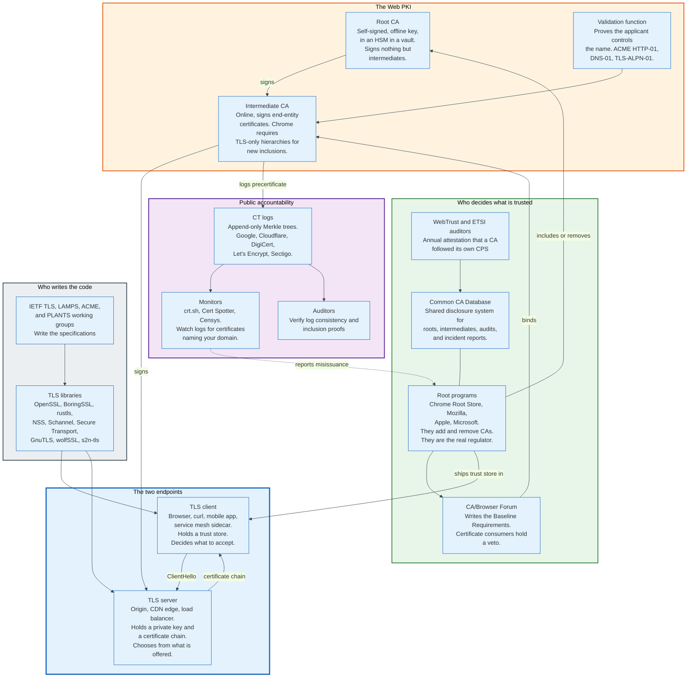

### 3.1 The Actors

| Role | What it does | Examples | Holds a private key? |
|------|--------------|----------|----------------------|
| **TLS client** | Offers versions, groups, and suites; validates the chain; decides to proceed | Chrome, Firefox, Safari, curl, Go `net/http`, Envoy | Only for mutual TLS |
| **TLS server** | Selects from what the client offered; proves possession of the key | nginx, Envoy, CDN edge, HAProxy, Kubernetes ingress | Yes |
| **Root CA** | Anchors trust; key kept offline | ISRG Root X1, DigiCert Global Root G2, GTS Root R1 | Yes, offline |
| **Intermediate CA** | Signs end-entity certificates daily | Let's Encrypt R10/R11, DigiCert G2 issuing CAs | Yes, online |
| **Validation function** | Proves domain control before issuance | ACME challenges, DCV over HTTP, DNS, or email | No |
| **Root program** | Decides which CAs a client trusts | Chrome Root Store, Mozilla, Apple, Microsoft | No |
| **CA/Browser Forum** | Writes the Baseline Requirements | Certificate Issuers and Certificate Consumers | No |
| **CT log** | Publishes an append-only record of issuance | Google Argon, Cloudflare Nimbus, Let's Encrypt Sycamore and Willow | Yes, for signing SCTs |
| **CT monitor** | Alerts a domain owner to certificates naming their domain | crt.sh, SSLMate Cert Spotter, Censys | No |
| **TLS library** | Implements the state machine and the primitives | OpenSSL, BoringSSL, rustls, NSS, Schannel | Handles them |
| **Middlebox** | Intercepts, inspects, sometimes breaks | Corporate TLS-inspecting proxies, some firewalls | Yes, with a locally installed root |

### 3.2 The Root Program Is the Actual Regulator

The Web PKI has no government regulator with binding authority over trust, and the browser root programs fill that role by controlling distribution.

A CA that misbehaves is not fined. It is removed from a trust store, and every certificate it has ever issued stops working in that client. Chrome removed Symantec's roots over 2018, Camerfirma in 2021, Entrust for certificates with Signed Certificate Timestamps dated after 31 October 2024, and Chunghwa Telecom and NetLock for certificates with SCTs dated after 31 July 2025, effective in Chrome 139. The stated reasons in the 2025 case were "a pattern of compliance failures, unmet improvement commitments, and the absence of tangible, measurable progress" in response to publicly disclosed incident reports.

The mechanism deserves attention because it is unusual. Distrust is applied by SCT timestamp, not by certificate expiry or revocation. Existing certificates issued before the cutoff keep working until they expire; anything logged after the cutoff fails. This lets a root program end a CA's future without breaking the present, and it only works because Certificate Transparency makes the issuance time a verifiable fact rather than a claim in the certificate.

The July 2025 CA/Browser Forum ballot SC-089 added the other half: every publicly trusted TLS CA must now maintain and annually test a mass revocation plan.

### 3.3 The Library Is the Hidden Gatekeeper

Which cryptography an endpoint can actually negotiate is decided by the library it links, not by the specification.

OpenSSL 3.5.0, released 8 April 2025 and supported until 8 April 2030, changed the default supported groups list so that `X25519MLKEM768` is offered and preferred, and added ML-KEM, ML-DSA, and SLH-DSA. Any two endpoints running OpenSSL 3.5 negotiate a post-quantum key exchange with no configuration at all. That single default did more for post-quantum deployment on servers than any standards document.

The same concentration applies in reverse. Software that pins an old library, or a hardware appliance whose vendor has not shipped an update, cannot negotiate what it does not implement, regardless of what the RFC says. Enterprise TLS-inspecting middleboxes are the persistent case: they terminate TLS, and their cryptographic capability becomes the ceiling for every client behind them.

---

## 4. The Record Layer and Message Framing

TLS carries everything, handshake messages and application data alike, inside a five-byte-header record, and understanding that header explains most of what a packet capture shows.

The record layer's job is fragmentation, optional compression in versions before 1.3, encryption, and integrity protection. It presents five content types to the layers above it, four defined by the TLS specification itself and `heartbeat` added by RFC 6520, and it does not care what they mean.

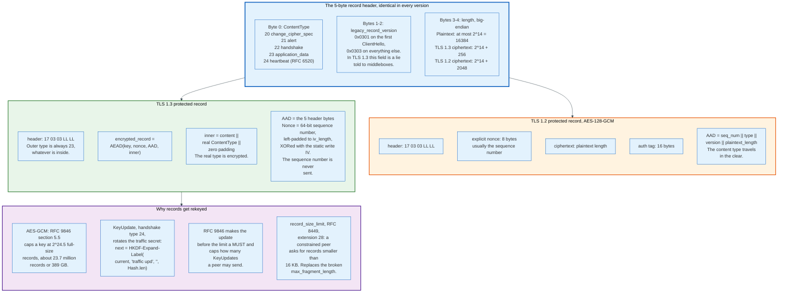

### 4.1 The Header

Five bytes, in every version of the protocol from SSL 3.0 to TLS 1.3.

```
struct {
    ContentType type;                    /* 1 byte  */
    ProtocolVersion legacy_record_version; /* 2 bytes */
    uint16 length;                       /* 2 bytes */
    opaque fragment[length];
} TLSPlaintext;
```

`ContentType` takes five values: 20 for `change_cipher_spec`, 21 for `alert`, 22 for `handshake`, 23 for `application_data`, and 24 for `heartbeat`. The TLS 1.3 enum itself defines only `invalid(0)`, 20, 21, 22 and 23; `heartbeat(24)` comes from RFC 6520 and is registered separately. A record capture that starts `16 03 01` is a handshake record claiming TLS 1.0, which in practice means a ClientHello from a client that will negotiate something much newer.

`legacy_record_version` is inert in TLS 1.3. RFC 9846 requires it to be `0x0303` on every record after the first ClientHello, and permits `0x0301` on the first ClientHello, purely so that middleboxes written against TLS 1.0 do not drop the packet. The actual version lives in the `supported_versions` extension.

`length` is a big-endian 16-bit count of the bytes that follow. Plaintext fragments are capped at 2^14 bytes, 16,384. A protected TLS 1.3 record may reach 2^14 + 256 to allow for the content type byte, padding, and the AEAD tag. A protected TLS 1.2 record may reach 2^14 + 2048, a much looser bound that had to accommodate CBC padding and an explicit IV.

### 4.2 Encryption in TLS 1.3

The TLS 1.3 record hides the content type and derives the nonce rather than transmitting it.

The plaintext that goes into the AEAD is not the message. It is:

```
struct {
    opaque content[TLSPlaintext.length];
    ContentType type;
    uint8 zeros[length_of_padding];
} TLSInnerPlaintext;
```

The real content type sits after the payload, followed by an arbitrary number of zero bytes of padding. The receiver decrypts, scans backwards from the end skipping zeros, and the first non-zero byte is the type. The outer header always says `application_data`, type 23, so an observer cannot tell a handshake record from a data record from an alert.

The nonce is constructed, not sent. Each direction keeps a 64-bit sequence number that starts at zero and increments per record. To form the nonce, the sequence number is encoded big-endian, left-padded with zeros to the AEAD's `iv_length` (12 bytes for AES-GCM and ChaCha20-Poly1305), and XORed with the static per-direction write IV derived from the key schedule. The sequence number never appears on the wire, and it resets to zero on every key change.

The additional authenticated data is exactly the five header bytes. This is the whole construction: no MAC key, no encrypt-then-MAC ordering question, no padding oracle, because the padding is inside the authenticated ciphertext.

### 4.3 Encryption in TLS 1.2, and Why It Was Worse

TLS 1.2 supported three record protection modes, and two of them are the source of most of the attacks in section 15.

**Stream cipher, RC4.** No padding, no IV, and a keystream with detectable biases in the first 256 bytes. Prohibited outright by RFC 7465 in February 2015.

**CBC with MAC-then-encrypt.** The MAC is computed over the plaintext, appended, then the whole thing is padded and encrypted. The receiver must decrypt before it can check the MAC, which means it processes attacker-controlled data with an unverified integrity tag. That ordering produced Lucky 13, POODLE, and every padding oracle in the family. RFC 7366 added an `encrypt_then_mac` extension in September 2014 to reverse the order, and adoption was partial.

**AEAD, AES-GCM or ChaCha20-Poly1305.** The correct construction, available from TLS 1.2 onwards. AES-GCM in TLS 1.2 transmits an eight-byte explicit nonce per record, which costs bandwidth and, when implementations generated it badly, produced nonce reuse and catastrophic key recovery. TLS 1.3 removed the explicit nonce entirely.

The TLS 1.2 AAD includes the sequence number, content type, version, and plaintext length, and the content type is visible in the header. An observer of TLS 1.2 can tell handshake records from application data.

### 4.4 Rekeying and Limits

A symmetric key has a usage limit, and TLS 1.3 makes reaching it a protocol event rather than an accident.

RFC 9846 section 5.5 gives the arithmetic. For AES-GCM the confidentiality and integrity analysis holds up to 2^24.5 full-size records, roughly 23.7 million records, which at 16,384 bytes each is about 389 gigabytes on one key. A long-lived connection carrying bulk data reaches that. The `KeyUpdate` handshake message, type 24, tells the peer that the sender is switching to a new traffic key:

```
application_traffic_secret_N+1 =
    HKDF-Expand-Label(application_traffic_secret_N, "traffic upd", "", Hash.length)
```

The message carries one byte, `request_update`, which is 1 if the sender wants the peer to rotate its own key too. RFC 8446 made rotation before the limit a SHOULD. RFC 9846 makes it a MUST and additionally caps the number of KeyUpdate messages a peer is allowed to send, because an unlimited KeyUpdate stream is a cheap way to burn a peer's CPU.

The `record_size_limit` extension, RFC 8449, lets a constrained endpoint declare the largest record it can handle. It replaced `max_fragment_length` from RFC 6066, which had two flaws: it was symmetric, forcing both directions to the same limit, and its values were a fixed ladder of powers of two rather than an arbitrary number.

---

## 5. The TLS 1.2 Handshake, Byte by Byte

The TLS 1.2 handshake costs two round trips before the client can send a byte of application data, and every message is in the clear except the two Finished messages.

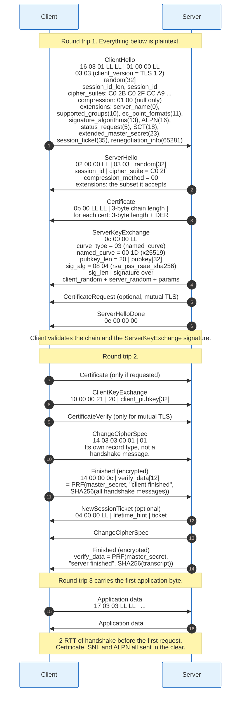

### 5.1 ClientHello

The ClientHello is the most information-dense packet on the internet, and its shape identifies the client software precisely enough to fingerprint it.

Layout, after the five-byte record header `16 03 01 LL LL`:

| Offset | Bytes | Field | Notes |
|--------|-------|-------|-------|
| 0 | 1 | `HandshakeType` | `01` = client_hello |
| 1 | 3 | length | Big-endian, of everything after |
| 4 | 2 | `legacy_version` | `03 03` even when TLS 1.3 is the real target |
| 6 | 32 | `Random` | 28 bytes of entropy in TLS 1.2, all 32 in TLS 1.3 |
| 38 | 1 | `session_id` length | 0 to 32 |
| 39 | var | `session_id` | Resumption in TLS 1.2; a compatibility dummy in TLS 1.3 |
| var | 2 | cipher suites length | In bytes, so twice the number of suites |
| var | var | cipher suites | Two bytes each, in client preference order |
| var | 1 | compression methods length | `01` |
| var | 1 | compression methods | `00`, null, always, since CRIME |
| var | 2 | extensions length | |
| var | var | extensions | Each: 2-byte type, 2-byte length, body |

The first 32-byte `Random` field held a four-byte Unix timestamp in the first 4 bytes in TLS 1.0 through 1.2, which leaked clock skew and was used to track hosts. RFC 8446 made all 32 bytes random.

Extensions that matter, by registered number:

| Number | Extension | Purpose |
|--------|-----------|---------|
| 0 | `server_name` | SNI. The hostname, in the clear |
| 5 | `status_request` | Requests a stapled OCSP response |
| 10 | `supported_groups` | Named curves and finite-field groups |
| 11 | `ec_point_formats` | Uncompressed only, in practice |
| 13 | `signature_algorithms` | Which signature schemes the client will verify |
| 16 | `application_layer_protocol_negotiation` | ALPN: `h2`, `http/1.1`, `h3` |
| 18 | `signed_certificate_timestamp` | Requests SCTs delivered in the handshake |
| 21 | `padding` | Pads ClientHello past buggy-server size thresholds |
| 22 | `encrypt_then_mac` | Reverses the CBC ordering, RFC 7366 |
| 23 | `extended_master_secret` | Binds the master secret to the transcript, RFC 7627 |
| 27 | `compress_certificate` | Certificate compression, RFC 8879 |
| 35 | `session_ticket` | TLS 1.2 stateless resumption, RFC 5077 |
| 41 | `pre_shared_key` | TLS 1.3 resumption; must be the last extension |
| 42 | `early_data` | 0-RTT |
| 43 | `supported_versions` | The real version negotiation in TLS 1.3 |
| 44 | `cookie` | Stateless HelloRetryRequest and DTLS |
| 45 | `psk_key_exchange_modes` | `psk_ke` or `psk_dhe_ke` |
| 51 | `key_share` | Ephemeral public keys, sent speculatively |
| 65037 | `encrypted_client_hello` | ECH, `0xfe0d` |
| 65281 | `renegotiation_info` | RFC 5746 |

GREASE, RFC 8701, adds one more mechanism worth knowing. Clients insert reserved values of the form `0x?A?A` into the cipher suite, extension, group, and version lists. A server that fails on an unknown value is broken, and the client finds out immediately rather than three years later when a real extension is deployed. Chrome has done this since 2016 and it is the reason new TLS extensions can now be deployed at all.

### 5.2 ServerHello and the Server Flight

The server picks one of everything and then proves it owns the name.

`ServerHello` echoes the structure of ClientHello but with single values: one version, one 32-byte random, one session ID, one cipher suite as two bytes, one compression method, and the subset of extensions it is answering. In TLS 1.2 the chosen cipher suite fully determines key exchange, authentication, bulk cipher, and MAC. `C0 2F` is `TLS_ECDHE_RSA_WITH_AES_128_GCM_SHA256`.

`Certificate`, handshake type `0b`, carries a chain. The message body is a three-byte total length followed by a sequence of entries, each a three-byte length and then a DER-encoded X.509 certificate. The end-entity certificate comes first. The root is normally omitted, because the client must already have it.

`ServerKeyExchange`, type `0c`, is where forward secrecy lives. For an ECDHE suite it carries `curve_type` (3 meaning named curve), the two-byte curve identifier (`0x001D` for X25519, `0x0017` for secp256r1), the server's ephemeral public key, and then a signature. The signature is made with the private key matching the certificate, over the concatenation of `client_random`, `server_random`, and the key exchange parameters. That concatenation is the entire authentication of the key exchange, and its scope is the reason Logjam worked: the signature covers the parameters but not the negotiated cipher suite, so 512-bit DHE_EXPORT parameters and ordinary DHE parameters are indistinguishable to a client that checks only the signature.

`ServerHelloDone`, type `0e`, is four bytes with an empty body. Its only function is to tell the client the flight is over.

### 5.3 The Client Flight and the Master Secret

The client contributes its half of the key exchange, then both sides run the same arithmetic.

`ClientKeyExchange`, type `10`, carries the client's ephemeral public key for ECDHE suites, or, for the obsolete static RSA suites, a 48-byte pre-master secret encrypted under the server's RSA public key. The static RSA path is what Bleichenbacher's 1998 attack targets and what ROBOT rediscovered in 2017. It has no forward secrecy: anyone who later obtains the server's private key decrypts every recorded session. TLS 1.3 removed it.

Both sides now compute:

```
pre_master_secret = ECDH(client_ephemeral_private, server_ephemeral_public)

master_secret = PRF(pre_master_secret, "master secret",
                    client_random + server_random)[0..47]
```

48 bytes. With the `extended_master_secret` extension of RFC 7627, the label becomes `"extended master secret"` and the seed becomes the hash of the handshake transcript so far, which binds the master secret to the full negotiation and kills the triple handshake attack.

The key block follows:

```
key_block = PRF(master_secret, "key expansion",
                server_random + client_random)
```

sliced into `client_write_MAC_key`, `server_write_MAC_key`, `client_write_key`, `server_write_key`, `client_write_IV`, `server_write_IV`, in that order, taking as many bytes as the negotiated suite needs.

`ChangeCipherSpec` is not a handshake message. It is its own content type, 20, carrying a single byte `01`, and it means "everything I send after this record is protected under the new keys". Its separateness from the handshake stream is exactly why it could be skipped in OpenSSL's CVE-2014-0224 early ChangeCipherSpec bug.

`Finished`, type `14`, carries 12 bytes of `verify_data`:

```
verify_data = PRF(master_secret, "client finished",
                  Hash(handshake_messages))[0..11]
```

where `handshake_messages` is every handshake message sent or received so far, excluding the record headers and excluding ChangeCipherSpec. The server's version uses the label `"server finished"`. These two messages are the transcript authentication: if any earlier message was modified, the hashes differ, the verify_data differs, and the connection aborts. Twelve bytes is short, and it is short because SSL 3.0 chose it and nobody wanted to change the wire format.

Application data begins on the third round trip.

---

## 6. The TLS 1.3 Handshake, Byte by Byte

TLS 1.3 sends the client's guess at a key share in the first flight, which lets the server complete the key exchange immediately and encrypt everything after ServerHello.

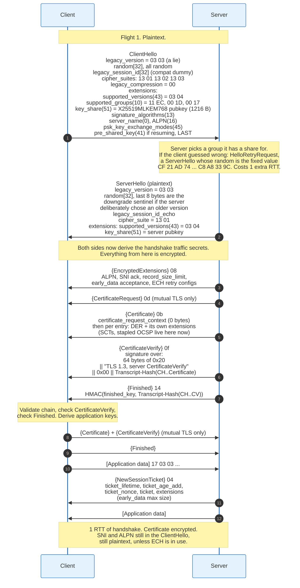

### 6.1 What Changed in the Message Flow

Three structural changes account for the whole difference.

**The client guesses the group and sends a key share up front.** The `key_share` extension carries one or more ephemeral public keys, chosen from the client's `supported_groups` list. If the server is happy with one of them, it replies with its own share and the key exchange is complete after one flight. If the server wants a different group, it sends `HelloRetryRequest` and the handshake costs two round trips, the same as TLS 1.2. Clients therefore guess aggressively: Chrome sends X25519MLKEM768 and X25519 shares together, spending about 1.2 kB to avoid a round trip.

**HelloRetryRequest is a ServerHello in disguise.** It has handshake type `02`, identical to ServerHello, and is distinguished only by its `random` field being the fixed 32-byte SHA-256 of the string "HelloRetryRequest":

```
CF 21 AD 74 E5 9A 61 11 BE 1D 8C 02 1E 65 B8 91
C2 A2 11 16 7A BB 8C 5E 07 9E 09 E2 C8 A8 33 9C
```

This was done so that a TLS 1.2 middlebox would parse it without complaint. When a HelloRetryRequest occurs, the transcript is rewritten: the original ClientHello is replaced by a synthetic `message_hash` message, handshake type 254, containing its hash, so that the transcript stays a fixed size.

**Everything after ServerHello is encrypted.** `EncryptedExtensions`, type 8, is a new message that carries the extensions that do not affect key derivation. The certificate chain, the certificate verify signature, and the Finished are all inside handshake-traffic-secret encryption. A passive observer of a TLS 1.3 handshake sees the SNI and the ALPN list in the ClientHello, and after that sees nothing but ciphertext.

### 6.2 The Compatibility Theatre

TLS 1.3 pretends to be TLS 1.2 on the wire, deliberately, because early drafts did not deploy.

Measurements during the drafting process found that a non-trivial fraction of connections through middleboxes failed when the handshake did not look like TLS 1.2. The working group's response, "middlebox compatibility mode", is specified in RFC 8446 appendix D.4:

- `legacy_version` in ClientHello and ServerHello is `0x0303`, TLS 1.2. The real version rides in `supported_versions`.
- The client sends a 32-byte `legacy_session_id` even though TLS 1.3 has no session IDs, and the server echoes it.
- Both sides send a `ChangeCipherSpec` record that means nothing, purely so the packet trace looks familiar.
- The record layer's outer content type is always `application_data` after the handshake keys are installed.

The result is a protocol whose most visible design constraint is the installed base of devices that inspect it. That is the honest summary of TLS 1.3's wire format.

### 6.3 Downgrade Protection

TLS 1.3 puts a sentinel in the ServerHello random so that a downgrade cannot be silent.

A server that supports TLS 1.3 but negotiates TLS 1.2, because the client asked for it, must set the last 8 bytes of `ServerHello.random` to:

```
44 4F 57 4E 47 52 44 01     "DOWNGRD\x01"
```

and to `44 4F 57 4E 47 52 44 00` if negotiating TLS 1.1 or below. A TLS 1.3-capable client that ends up on TLS 1.2 checks those bytes. If it sees the sentinel, it knows the server was capable of 1.3 and something removed the option, so it aborts.

The sentinel works because `ServerHello.random` is covered by the ServerKeyExchange signature in TLS 1.2. An attacker who strips `supported_versions` from the ClientHello cannot forge the signature, so it cannot suppress the sentinel. This is a small, cheap, effective mechanism and it exists because the alternative, `TLS_FALLBACK_SCSV` from RFC 7507, required the client to actually retry with a lower version, which is the behaviour POODLE exploited.

RFC 9846 goes further and forbids negotiating TLS 1.0 or 1.1 at all, aligning the specification with RFC 8996, which deprecated both in March 2021.

---

## 7. Key Exchange and Forward Secrecy

Forward secrecy means an ephemeral key, and an ephemeral key means a key exchange whose private halves are destroyed after use.

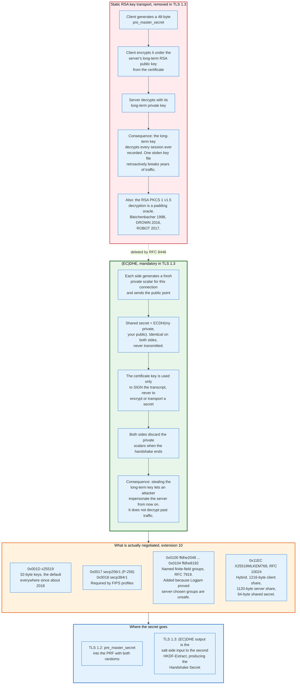

### 7.1 The Two Jobs the Certificate Key Does, and the One It Should Not

A server's certificate key can either transport a secret or sign a transcript, and only the second gives forward secrecy.

Under static RSA key exchange, which TLS 1.2 supports and TLS 1.3 removed, the client picks the pre-master secret and encrypts it to the server's RSA public key. The server's long-term private key is the only thing standing between a recorded session and its plaintext. An adversary that records traffic for five years and then obtains the key file, by subpoena, by breach, or by Heartbleed, decrypts all five years at once. This is the "harvest now, decrypt later" threat model, and it existed long before quantum computers gave it a new name.

Under ephemeral Diffie-Hellman, the certificate key signs. It signs the ServerKeyExchange parameters in TLS 1.2, and the whole transcript hash in TLS 1.3's CertificateVerify. A signature proves identity at the moment it is made and confers no ability to decrypt afterwards. Stealing the key lets an attacker impersonate the server going forward. It does not open the archive.

TLS 1.3 makes ephemeral key exchange mandatory. There is no non-forward-secret mode except pure PSK resumption without a Diffie-Hellman share, which the specification permits and which most implementations avoid for exactly this reason.

### 7.2 Named Groups, and Why They Are Named

Letting the server choose its own Diffie-Hellman parameters was a mistake that took twenty years to remove.

In classical TLS finite-field Diffie-Hellman, the server sent the prime `p`, the generator `g`, and its public value. The client had no way to check that `p` was a safe prime, that it was large enough, or that it was not one of a handful of primes shared by millions of servers. Logjam exploited all three facts at once in 2015.

RFC 7919, published in August 2016, defined named finite-field groups `ffdhe2048` through `ffdhe8192` and moved them into the `supported_groups` extension, so that the client states which groups it will accept and the server picks from that list. Elliptic curve groups had worked this way since RFC 4492. TLS 1.3 permits only named groups.

The practical list in 2026:

| Codepoint | Group | Client key share size | Notes |
|-----------|-------|----------------------|-------|
| `0x001D` | x25519 | 32 bytes | The default in essentially every browser |
| `0x0017` | secp256r1 (P-256) | 65 bytes | Required in FIPS-constrained deployments |
| `0x0018` | secp384r1 | 97 bytes | CNSA 1.0 profiles |
| `0x001E` | x448 | 56 bytes | Rare |
| `0x0100` | ffdhe2048 | 256 bytes | Deprecated in practice |
| `0x11EC` | X25519MLKEM768 | 1216 bytes | RFC 10024, hybrid post-quantum |
| `0x11EB` | SecP256r1MLKEM768 | 1249 bytes | RFC 10024, FIPS-oriented |
| `0x11ED` | SecP384r1MLKEM1024 | 1665 bytes | RFC 10024, CNSA 2.0 |

### 7.3 The TLS 1.3 Key Schedule

TLS 1.3 derives every key from a chain of HKDF operations whose inputs are the PSK, the Diffie-Hellman output, and the transcript hash at specific points.

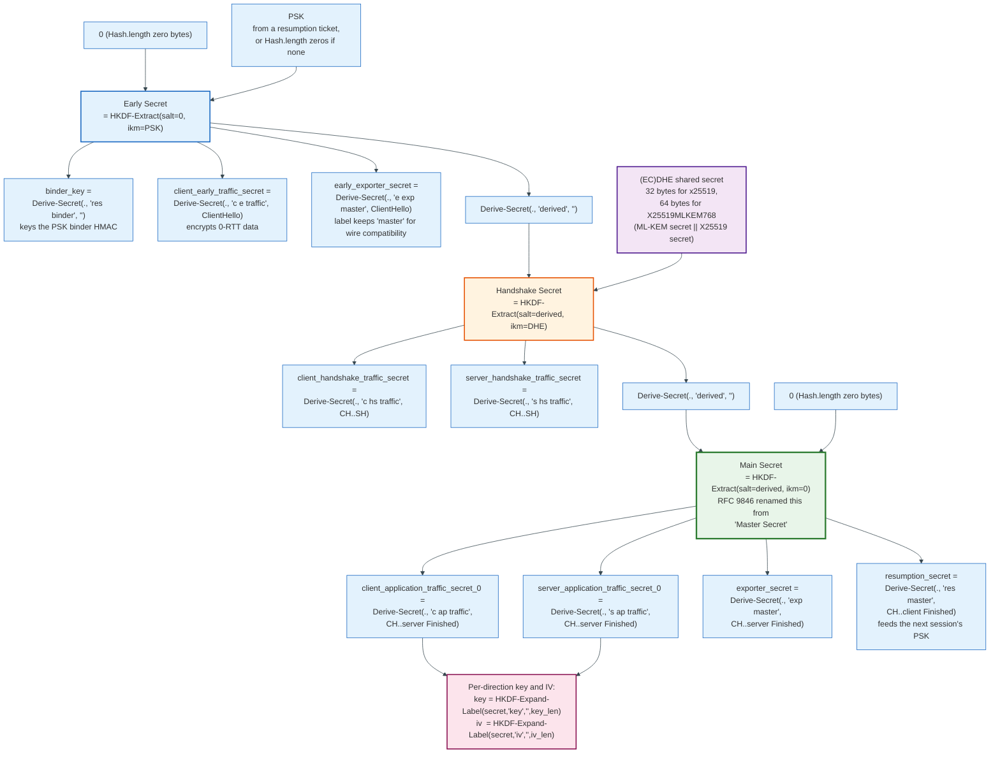

Two helper functions define the whole thing:

```
HKDF-Expand-Label(Secret, Label, Context, Length) =
    HKDF-Expand(Secret, HkdfLabel, Length)

  where HkdfLabel is:
    uint16 length = Length
    opaque label<7..255>   = "tls13 " + Label
    opaque context<0..255> = Context

Derive-Secret(Secret, Label, Messages) =
    HKDF-Expand-Label(Secret, Label,
                      Transcript-Hash(Messages), Hash.length)
```

The `"tls13 "` prefix, six bytes including the space, domain-separates TLS 1.3 key derivation from every other use of HKDF. The `Context` field being a transcript hash is the mechanism that binds keys to the exact negotiation: change one byte of any handshake message and every secret after that point differs.

Three properties fall out of the structure. Each secret is derived from the previous one through a one-way function, so compromising an application traffic secret does not reveal the handshake secret. The Diffie-Hellman output enters as input keying material with a salt that already depends on the PSK, so a resumed connection with a fresh key share gets security from both. And the resumption secret, which RFC 9846 renames from `resumption_master_secret` while keeping the derivation label `"res master"` for wire compatibility, is derived after the client's Finished, so a resumption ticket is bound to a completed, mutually authenticated handshake.

### 7.4 CertificateVerify and What It Signs

The CertificateVerify signature covers a constructed string, not the raw transcript, and the construction defends against cross-protocol confusion.

The signed content is:

```
64 bytes of 0x20 (ASCII space)
|| "TLS 1.3, server CertificateVerify"   (or "client" for client auth)
|| 0x00
|| Transcript-Hash(Handshake Context, Certificate)
```

The 64 spaces exist so that the signed blob cannot be confused with a TLS 1.2 signature input, which begins with the client and server randoms. The context string separates client from server signatures, which is the fix for a class of reflection attacks. The trailing zero byte terminates the string.

Signature schemes are negotiated in extension 13, `signature_algorithms`. The values that matter:

| Codepoint | Scheme | Notes |
|-----------|--------|-------|
| `0x0403` | `ecdsa_secp256r1_sha256` | The most common on the modern web |
| `0x0503` | `ecdsa_secp384r1_sha384` | |
| `0x0804` | `rsa_pss_rsae_sha256` | RSA-PSS with an rsaEncryption key |
| `0x0805` | `rsa_pss_rsae_sha384` | |
| `0x0806` | `rsa_pss_rsae_sha512` | |
| `0x0807` | `ed25519` | Not yet issuable by public CAs |
| `0x0401` | `rsa_pkcs1_sha256` | Permitted for certificate signatures in TLS 1.3, not for a server CertificateVerify |
| `0x0420` | `rsa_pkcs1_sha256_legacy` | RFC 9963, April 2026. Client CertificateVerify only |
| `0x0520` | `rsa_pkcs1_sha384_legacy` | RFC 9963. Client CertificateVerify only |
| `0x0620` | `rsa_pkcs1_sha512_legacy` | RFC 9963. Client CertificateVerify only |

TLS 1.3 as published in 2018 forbade PKCS#1 v1.5 in CertificateVerify and required RSA-PSS. RFC 9963, April 2026, reopens that door for client authentication only: it allocates `rsa_pkcs1_sha256_legacy` (0x0420), `rsa_pkcs1_sha384_legacy` (0x0520) and `rsa_pkcs1_sha512_legacy` (0x0620) for clients whose signing hardware, usually a smart card or a TPM, cannot produce PSS at all. RFC 9846's change list carries the matching entry, "Remove text requiring RSA PSS, matching [RFC9963]". A server CertificateVerify still requires PSS. PKCS#1 v1.5 also remains permitted inside certificates, because the CA ecosystem could not be changed at the same time. That split is the clearest example of how the protocol and the PKI move at different speeds.

---

## 8. Cipher Suite Negotiation

A cipher suite is a two-byte identifier, and what it identifies changed completely between TLS 1.2 and TLS 1.3.

### 8.1 The TLS 1.2 Suite Names Four Things

`TLS_ECDHE_RSA_WITH_AES_128_GCM_SHA256`, codepoint `0xC02F`, reads left to right as: key exchange is ephemeral elliptic-curve Diffie-Hellman, authentication is an RSA signature, bulk encryption is AES-128 in Galois/Counter Mode, and the PRF hash and, for non-AEAD suites, the MAC is SHA-256.

Encoding every combination as a distinct codepoint produced combinatorial explosion. The IANA TLS Cipher Suite registry holds well over 300 entries, most of which name a combination nobody should negotiate: NULL encryption, export-grade 40-bit and 56-bit ciphers, anonymous Diffie-Hellman with no authentication at all, RC4, DES, IDEA, SEED, and Camellia in every mode.

The negotiation is server-choice. The client sends a list in preference order; the server picks one, and by convention a well-configured server applies its own preference order rather than the client's. Nothing in the protocol enforces that the server picks the strongest mutually supported option. That is a configuration question, and it is why cipher suite ordering was a standard operations task for fifteen years.

### 8.2 The TLS 1.3 Suite Names Two Things

TLS 1.3 redefined the suite to cover only the AEAD algorithm and the hash used in HKDF and the transcript. Five values exist:

| Codepoint | Suite | AEAD | Hash | Key/tag |
|-----------|-------|------|------|---------|
| `0x1301` | `TLS_AES_128_GCM_SHA256` | AES-128-GCM | SHA-256 | 16-byte key, 16-byte tag |
| `0x1302` | `TLS_AES_256_GCM_SHA384` | AES-256-GCM | SHA-384 | 32-byte key, 16-byte tag |
| `0x1303` | `TLS_CHACHA20_POLY1305_SHA256` | ChaCha20-Poly1305 | SHA-256 | 32-byte key, 16-byte tag |
| `0x1304` | `TLS_AES_128_CCM_SHA256` | AES-128-CCM | SHA-256 | Constrained devices |
| `0x1305` | `TLS_AES_128_CCM_8_SHA256` | AES-128-CCM with 8-byte tag | SHA-256 | Constrained devices |

Key exchange moved to `supported_groups` and `key_share`. Authentication moved to `signature_algorithms` and to what the certificate actually contains. The three negotiations are now independent, which means a client can express "I accept ECDSA and RSA-PSS certificates, I want X25519MLKEM768 key exchange, and I want AES-128-GCM" without needing a codepoint for that specific triple.

`TLS_CHACHA20_POLY1305_SHA256` exists for one reason: AES without hardware acceleration is slow and, in constant-time software implementations, difficult. ChaCha20 is fast in software on any 32-bit machine. Mobile clients on chips without AES-NI or ARMv8 crypto extensions negotiate it, and browsers implement a runtime check that reorders preference based on whether AES hardware is present.

### 8.3 Negotiation as an Attack Surface

Every downgrade attack in section 15 is a negotiation attack, and the defences all work the same way: bind the negotiation into something the attacker cannot forge.

Three mechanisms are layered:

**Transcript binding.** The Finished message covers a hash of every handshake message. An attacker who removes a cipher suite from the ClientHello changes the hash, and both Finished messages fail. This defeats an active attacker in the same connection.

**Version sentinel.** The `DOWNGRD` bytes in `ServerHello.random`, described in section 6.3, defeat an attacker who forces a TLS 1.3-capable pair down to TLS 1.2.

**Removing the options.** TLS 1.3 has five suites, three named groups in common use, and no export, NULL, anonymous, or static-RSA modes. An attacker cannot steer a negotiation towards a weak option that does not exist. This is the only defence that scales, and it is the one TLS 1.3 chose.

RFC 9325, published November 2022 as BCP 195 and obsoleting RFC 7525, states the current configuration baseline: implementations must not negotiate SSL 2.0, SSL 3.0, TLS 1.0, or TLS 1.1; must support TLS 1.2 and should support TLS 1.3; must not negotiate NULL encryption, RC4, or anything below 112 bits of security; must support and prefer forward secrecy; and should not negotiate static RSA or static finite-field Diffie-Hellman.

---

## 9. X.509 Certificates and the Chain of Trust

An X.509 certificate is a DER-encoded assertion, signed by an issuer, that a particular public key belongs to a particular set of names for a particular window of time.

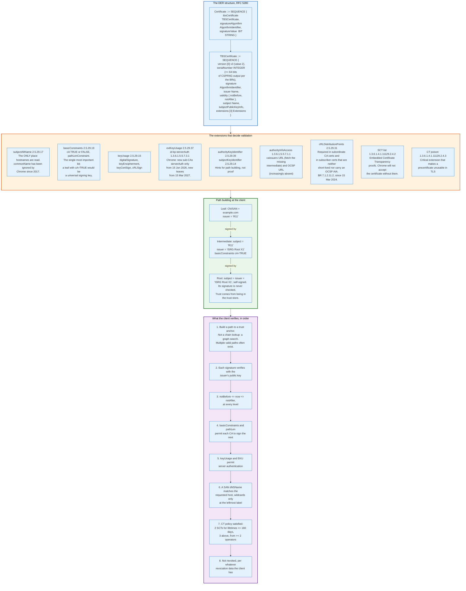

### 9.1 The Structure

RFC 5280 defines the format. Everything is ASN.1 encoded with Distinguished Encoding Rules, a canonical binary encoding chosen in 1988 and never replaced.

The outer `Certificate` has three fields: the `tbsCertificate` ("to be signed"), the algorithm identifier for the signature, and the signature bits. The signature covers the DER encoding of `tbsCertificate` exactly as it appears, which is why re-encoding a certificate breaks it and why parsers must preserve the original bytes.

Inside `tbsCertificate`:

- `version`, encoded as integer 2 for v3. Every publicly trusted TLS certificate is v3.
- `serialNumber`, an integer. The Baseline Requirements demand at least 64 bits of output from a cryptographically secure random number generator, a rule introduced after Stevens and colleagues demonstrated an MD5 chosen-prefix collision in 2008 against a CA with sequential serials.
- `signature`, the algorithm identifier, repeated here so it is covered by the signature. A mismatch between this and the outer field is a rejection.
- `issuer`, a Distinguished Name. Must byte-match the `subject` of the issuing certificate.
- `validity`, two times. `notBefore` and `notAfter`, encoded as UTCTime before 2050 and GeneralizedTime after.
- `subject`, a Distinguished Name. For a DV certificate this is often empty apart from a common name that nobody reads.
- `subjectPublicKeyInfo`, the algorithm identifier plus the key bits.
- `extensions`, the part that does all the work.

### 9.2 The Extensions That Matter

Six extensions determine whether a certificate validates, and one of them has been the source of a decade of confusion.

**`subjectAltName`, OID 2.5.29.17.** The list of names the certificate is for, as `dNSName`, `iPAddress`, or occasionally `otherName` entries. This is the only place a browser reads hostnames. The `commonName` field in the subject DN was the original location, was deprecated by RFC 2818 in 2000, and has been ignored by Chrome since version 58 in 2017 and by every other major client since. A certificate with a common name but no SAN does not work anywhere.

**`basicConstraints`, OID 2.5.29.19.** A boolean `cA` and an optional `pathLenConstraint`. If `cA` is FALSE or absent, the certificate cannot sign other certificates. Historically this was the highest-value bug in TLS clients: Mike Benham's August 2002 Bugtraq disclosure against Internet Explorer 5 through 6, and Apple's iOS 4 flaw CVE-2011-0228 fixed in iOS 4.3.5, both came from clients that did not check this bit, which turns any leaf certificate into a universal CA. Marlinspike's 2009 Black Hat demonstration is a different bug, the null-prefix common name, CVE-2009-2408, which defeats name matching rather than the CA bit.

**`keyUsage`, OID 2.5.29.15.** A bit string. A leaf needs `digitalSignature` for ECDSA or RSA-PSS; a CA needs `keyCertSign` and usually `cRLSign`.

**`extKeyUsage`, OID 2.5.29.37.** For a TLS server certificate, `id-kp-serverAuth` (1.3.6.1.5.5.7.3.1). Chrome's root program is removing `clientAuth` from the public Web PKI in two steps: from 15 June 2026 any newly disclosed subordinate CA under a Chrome Root Store root must carry `serverAuth` alone, and from 15 March 2027 every newly issued public TLS subscriber certificate must do the same. Certificates issued before those dates stay valid until they expire. The same programme requires new CA inclusions to operate dedicated TLS-only hierarchies, ending the practice of one certificate serving both TLS and client authentication.

**`authorityInfoAccess`, OID 1.3.6.1.5.5.7.1.1.** Two URLs: `caIssuers`, where a client can fetch a missing intermediate, and `OCSP`, where it could once check revocation. Let's Encrypt removed the OCSP URL from newly issued certificates on 7 May 2025 and added a CRL URL in its place.

**The SCT list, OID 1.3.6.1.4.1.11129.2.4.2.** Embedded Certificate Transparency proofs. Chrome will not accept a certificate without them, which makes a private extension defined by Google a de facto requirement for the public web.

### 9.3 Path Building Is a Graph Search

Validating a chain is not walking a linked list, and treating it as one causes outages.

A CA can have several roots, cross-sign its intermediates with other CAs' roots to extend compatibility with old devices, and rotate keys while keeping the same subject name. The result is that a given leaf certificate frequently has more than one valid path to more than one trust anchor, and different clients hold different trust stores.

The canonical incident is Let's Encrypt's DST Root CA X3 expiry on 30 September 2021. Let's Encrypt cross-signed its own ISRG Root X1 with the older IdenTrust DST Root CA X3 so that Android devices that had never received a trust store update would still work. When DST Root CA X3 expired, clients that implemented path building as a single-path walk found the expired root, stopped, and failed. Clients that implemented a proper search found the alternative path through ISRG Root X1 and succeeded. OpenSSL 1.0.2 was in the first category. Everything modern was in the second.

The lesson generalises. Chain validation must try alternative paths, and a server should send the chain that maximises the number of clients that can build a path, which is not always the shortest chain.

### 9.4 Name Matching

Wildcards are permitted only at the leftmost label, and they match exactly one label.

`*.example.com` matches `www.example.com` and does not match `example.com` or `a.b.example.com`. `www.*.com` is not valid. A certificate for a public suffix wildcard such as `*.co.uk` must not be issued, which CAs enforce using the Public Suffix List.

Internationalised names are stored in A-label form, the ASCII `xn--` punycode encoding, and the client must convert the requested hostname the same way before comparing. Homograph attacks live at that boundary, and browsers mitigate them in display logic rather than in certificate validation.

---

## 10. Certificate Authorities and the Root Programs

A certificate authority sells one thing: the willingness of browser vendors to include its root in a trust store. Everything else is operations.

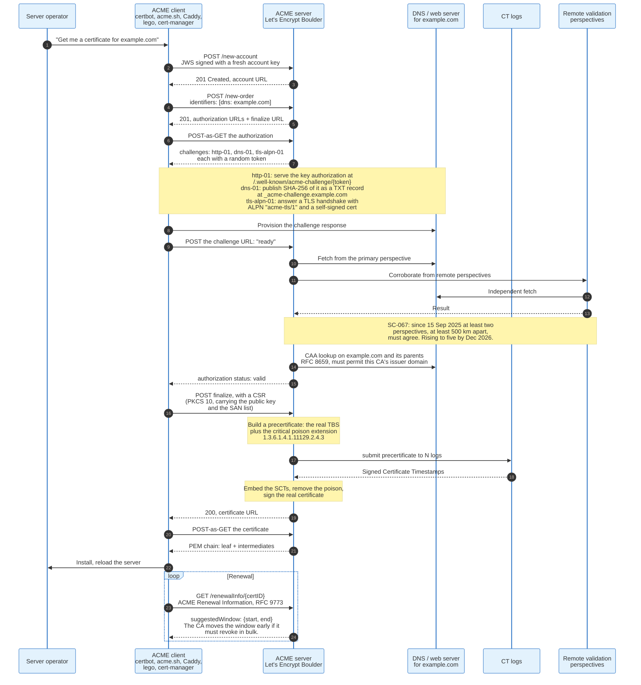

### 10.1 What a CA Actually Verifies

A domain-validated certificate proves control of a name at one moment in time, through one of three challenge types, and nothing else.

ACME, RFC 8555, defines the three:

**`http-01`** requires the applicant to serve a specific token at `http://<domain>/.well-known/acme-challenge/<token>`, over plain HTTP on port 80. The response body must be the token, a dot, and the base64url SHA-256 thumbprint of the account key. It proves control of the web server on the default HTTP port.

**`dns-01`** requires a TXT record at `_acme-challenge.<domain>` whose value is the base64url SHA-256 of the key authorization. It proves control of DNS, and it is the only challenge that can issue wildcard certificates.

**`tls-alpn-01`** requires the applicant to answer a TLS connection on port 443 with ALPN protocol `acme-tls/1` and present a self-signed certificate containing the token in a specific extension. It proves control of the TLS listener and never touches the HTTP layer.

None of these say anything about who the applicant is. That is the design. The alternative, manual identity verification, cost money, took days, and did not stop phishing, so the industry chose universal encryption over an identity ritual.

### 10.2 Multi-Perspective Issuance Corroboration

Domain validation over the network is vulnerable to BGP hijacking, and the CA/Browser Forum's answer is to validate from several places at once.

Ballot SC-067v3, passed in August 2024, requires that the result of domain validation and CAA checks performed from a Primary Network Perspective be corroborated from geographically separate perspectives. The dates: a soft MUST from 15 March 2025, at least two perspectives at least 500 kilometres apart from 15 September 2025, rising in steps to five remote perspectives by December 2026.

The threat is concrete. An adversary who announces a more specific BGP prefix for a victim's IP space can answer an `http-01` challenge from the CA's single vantage point, obtain a certificate, and drop the hijack. Requiring agreement from perspectives on different continents forces the adversary to hijack globally, which is loud and short-lived.

### 10.3 CAA

Certification Authority Authorization, RFC 8659, lets a domain owner publish which CAs may issue for it.

A `CAA` DNS record such as `example.com. CAA 0 issue "letsencrypt.org"` tells every CA except Let's Encrypt to refuse. CAs are required to check CAA at issuance time, walking up the DNS tree from the requested name to the registrable domain. The `issuewild` tag controls wildcards separately, and `iodef` names a URL or mailbox to report a refused request.

CAA is advisory in the sense that it binds only compliant CAs. A CA that ignores it is committing a Baseline Requirements violation, which is an incident report, which is how CAs get removed. The enforcement chain runs through the root programs, not through cryptography.

### 10.4 Certificate Lifetimes Are Collapsing

The industry decided that expiry is a better revocation mechanism than revocation, and it is executing that decision on a published schedule.

CA/Browser Forum ballot SC-081v3 passed on 11 April 2025 with 25 Certificate Issuer votes in favour, zero against, five abstentions, and all four Certificate Consumers in favour. The schedule:

| Effective | Maximum certificate validity | Maximum DCV data reuse |
|-----------|------------------------------|------------------------|
| Before 15 Mar 2026 | 398 days | 398 days |
| 15 Mar 2026 | 200 days | 200 days |
| 15 Mar 2027 | 100 days | 100 days |
| 15 Mar 2029 | 47 days | 10 days |

In practice CAs issue one day under each cap, because a midnight-to-midnight interval is 24 hours and one second over an exact day count, and because the precertificate can be logged up to a day before the certificate is signed.

The arithmetic that follows is the interesting part. At a 47-day maximum and a 10-day domain validation reuse window, a continuously valid certificate requires roughly eight issuances and roughly 35 domain validations per year. That is not a manual process for anyone. Automation stops being a best practice and becomes the only practice, which is precisely the intended effect: the ballot was proposed by Apple and sponsored by Sectigo, and the stated purpose includes forcing agility so that a future cryptographic transition does not take a decade.

Let's Encrypt announced in December 2025 that it will reduce its own certificate lifetime from 90 days to 45 days by 2028, ahead of the requirement, and offers six-day certificates for clients that want them.

### 10.5 The Trust Store Is the Product

The barrier to entry for a new CA is not technical. It is the multi-year process of getting into four trust stores.

A new CA must generate roots in an audited ceremony, pass a WebTrust or ETSI audit covering a period of operation, disclose everything through the Common CA Database, apply separately to Mozilla, Chrome, Apple, and Microsoft, and then wait for the resulting root to propagate into shipped software. Devices that stop receiving updates never get the new root. This is why cross-signing exists and why Let's Encrypt kept a cross-sign from IdenTrust until 2024: a new root is useless on the installed base for years.

The corollary is that removal is severe and permanent, and that the four root programs hold a power no regulator granted them and no court has tested.

---

## 11. Revocation: CRL, OCSP, Stapling, and What Replaced Them

Revocation in the Web PKI has never worked as designed, and the current answer is to make certificates expire faster than a revocation could propagate.

```mermaid
%%{init: {'theme': 'base', 'themeVariables': {'primaryColor': '#e3f2fd', 'primaryBorderColor': '#1565c0', 'lineColor': '#37474f'}}}%%

flowchart TB
    subgraph CRL["1. CRL, RFC 5280"]
        direction TB
        R1["The CA publishes a signed list<br/>of revoked serial numbers with<br/>thisUpdate and nextUpdate"]
        R2["Problem: an active CA's CRL<br/>reaches megabytes. Clients will<br/>not download it on the hot path."]
        R3["Sharding: SC-063 permits<br/>partitioned CRLs, each shard<br/>at its own URL, referenced from<br/>cRLDistributionPoints"]
        R4["Status since 15 Mar 2024:<br/>MANDATORY for public CAs"]
        R1 --> R2 --> R3 --> R4
    end

    subgraph OCSP["2. OCSP, RFC 6960"]
        direction TB
        O1["Client asks the CA's responder<br/>about one serial number.<br/>Signed answer: good, revoked,<br/>or unknown."]
        O2["Privacy failure: the responder<br/>learns which site the user visits,<br/>in real time, by IP address"]
        O3["Availability failure: hard-fail<br/>breaks the web when a responder<br/>is down, so clients soft-fail,<br/>so an attacker just blocks it"]
        O4["Latency failure: an extra DNS<br/>lookup plus HTTP round trip<br/>blocking the handshake,<br/>about 100 ms at the median"]
        O5["Status since 15 Mar 2024:<br/>OPTIONAL. Let's Encrypt shut its<br/>responders down 6 Aug 2025."]
        O1 --> O2 --> O3 --> O4 --> O5
    end

    subgraph Staple["3. OCSP stapling, RFC 6066 status_request"]
        direction TB
        S1["The SERVER fetches its own OCSP<br/>response periodically and attaches<br/>it to the handshake"]
        S2["Fixes privacy and latency.<br/>Does not fix the attacker who<br/>simply omits the staple,<br/>because omission is legal."]
        S3["OCSP Must-Staple, RFC 7633:<br/>an extension in the certificate<br/>that makes omission fatal.<br/>Almost nobody deployed it;<br/>Let's Encrypt stopped issuing it<br/>on 7 May 2025."]
        S4["RFC 6961 multi-stapling:<br/>obsoleted by RFC 9846"]
        S1 --> S2 --> S3 --> S4
    end

    subgraph Push["4. Push the whole set to the client"]
        direction TB
        P1["Chrome CRLSets: a curated list<br/>Google selects. About 600 kB<br/>covering roughly 35,000 of<br/>4 million revocations, near 1%.<br/>Explicitly an emergency tool."]
        P2["Firefox CRLite: a partitioned<br/>two-level cascade of Ribbon filters<br/>covering ALL revocations.<br/>Default from Firefox 137;<br/>OCSP for DV certificates disabled<br/>in Firefox 142."]
        P3["CRLite numbers: 300 kB per day<br/>average, 4 MB full snapshot every<br/>45 days, updates every 12 hours.<br/>About 1000x cheaper than<br/>downloading the CRLs."]
        P4["Measured effect: median TLS<br/>handshake time fell from 56.4 ms<br/>to 39.9 ms as CRLite reached<br/>80% of Firefox users"]
        P1 --> P2 --> P3 --> P4
    end

    subgraph Short["5. The actual answer: short lifetimes"]
        direction TB
        T1["398 days to 200 (Mar 2026)<br/>to 100 (Mar 2027) to 47 (Mar 2029)"]
        T2["ACME Renewal Information,<br/>RFC 9773: the CA moves a client's<br/>renewal window earlier when it<br/>needs bulk replacement"]
        T3["Consequence: revocation becomes<br/>a coordination problem between<br/>CA and client, not a lookup<br/>problem at handshake time"]
        T1 --> T2 --> T3
    end

    CRL --> OCSP --> Staple --> Push --> Short

    style CRL fill:#eceff1,stroke:#37474f,stroke-width:2px
    style OCSP fill:#ffebee,stroke:#c62828,stroke-width:2px
    style Staple fill:#fff3e0,stroke:#e65100,stroke-width:2px
    style Push fill:#e8f5e9,stroke:#2e7d32,stroke-width:2px
    style Short fill:#e3f2fd,stroke:#1565c0,stroke-width:3px
```

### 11.1 Why OCSP Failed

OCSP failed for three independent reasons, each sufficient on its own.

**Privacy.** An OCSP request names one certificate serial number and comes from the user's IP address. The responder, and any network observer, learns which site the user is visiting at the moment they visit it. That is exactly the information TLS exists to hide.

**Soft-fail.** If the client cannot reach the responder, it has two options. Hard-fail means the site is unreachable during any responder outage, and responders go down. Soft-fail means the client proceeds. Every browser chose soft-fail, which means an attacker who has stolen a private key and wants to use the revoked certificate simply drops the OCSP traffic. Adam Langley's summary, that soft-fail revocation checking is like a seatbelt that snaps in an accident, has stood for over a decade.

**Cost.** Operating a globally distributed, low-latency, highly available signing service for billions of queries a day is expensive, and it is expensive in proportion to the CA's issuance volume, which for a free CA is unbounded. Let's Encrypt cited both privacy and the disproportionate cost when it announced the shutdown.

The timeline of the retreat: CA/Browser Forum ballot SC-063v4 passed in August 2023 and took effect on 15 March 2024, making OCSP optional and CRLs mandatory. Let's Encrypt stopped issuing Must-Staple certificates on 7 May 2025, removed OCSP URLs from new certificates the same day, and shut its responders down on 6 August 2025. Firefox disabled OCSP for domain-validated certificates in version 142.

### 11.2 CRLite

CRLite pushes the entire revocation set to every client in 300 kilobytes a day, which is the answer everyone wanted and nobody could build until the data structure improved.

The construction is a cascade of probabilistic filters. Start with the set of all certificates known from Certificate Transparency and the set of all revocations known from CRLs. Build a filter over the revoked set. It will produce false positives on some non-revoked certificates. Build a second filter over exactly those false positives. It will produce false negatives on some revoked certificates. Build a third over those. The cascade terminates because each level is much smaller than the last, and lookups walk the levels until one answers definitively. The original 2017 design used Bloom filters; Mozilla's shipping implementation uses a partitioned two-level cascade of Ribbon filters, which compresses better.

The numbers, as published in August 2025: all revocations covered, roughly 4 million of them; about 300 kB downloaded per user per day; a 4 MB full snapshot every 45 days; updates every 12 hours. Bandwidth per client is about one thousandth of downloading the underlying CRLs. Median TLS handshake time in Firefox fell from 56.4 ms to 39.9 ms as CRLite adoption reached 80%, because the OCSP fetch it replaced was blocking the handshake for about 100 ms at the median.

CRLite works only because Certificate Transparency exists. Without a complete public record of issuance, a client could not know that its filter covers everything.

### 11.3 ARI, and Revocation as a Renewal Problem

ACME Renewal Information turns bulk revocation from an emergency into a scheduled event.

The mechanism is small. The ACME server exposes a `renewalInfo` endpoint. The client polls it with a certificate identifier and receives a `suggestedWindow` with a start and end timestamp, plus an optional explanation URL. The client renews at a random point inside that window. When nothing is wrong, the window sits at the normal renewal point and spreads load. When the CA discovers it must replace certificates in bulk, it moves every affected certificate's window to now, and the fleet renews itself.

RFC 9773 published in June 2025, after a process that began with the first draft in September 2021. The motivating incident was Let's Encrypt's 2020 mass revocation of about 3 million certificates, when the only available channel for "renew this immediately" was email to whatever address was on file.

The CA/Browser Forum's July 2025 ballot SC-089 completed the picture by requiring every publicly trusted TLS CA to maintain and annually test a mass revocation plan. Revocation is now an operational drill rather than a real-time protocol.

---

## 12. Certificate Transparency

Certificate Transparency does not prevent misissuance. It makes misissuance impossible to hide, which turns out to be enough.

```mermaid
%%{init: {'theme': 'base', 'themeVariables': {'primaryColor': '#e3f2fd', 'primaryBorderColor': '#1565c0', 'lineColor': '#37474f'}}}%%

flowchart TB
    subgraph Why["Why it exists"]
        direction TB
        W1["2011: DigiNotar is breached.<br/>The attacker issues a certificate<br/>for *.google.com and uses it<br/>against roughly 300,000 Iranian<br/>users before anyone notices."]
        W2["Detection came from Chrome's<br/>hardcoded pin on Google domains.<br/>Pinning does not scale to<br/>the whole web."]
        W3["Insight: a CA that must publish<br/>every certificate it issues cannot<br/>issue one secretly. Any domain<br/>owner can watch for their own name."]
        W1 --> W2 --> W3
    end

    subgraph Log["The log, RFC 6962 and RFC 9162"]
        direction TB
        L1["Append-only Merkle hash tree.<br/>Leaves are certificates or<br/>precertificates in submission order."]
        L2["Signed Tree Head: log signs<br/>{tree size, root hash, timestamp}"]
        L3["Inclusion proof: log(n) hashes<br/>proving a leaf is in a given STH"]
        L4["Consistency proof: log(n) hashes<br/>proving an older STH is a prefix<br/>of a newer one. This is what makes<br/>rewriting history detectable."]
        L5["Maximum Merge Delay, typically<br/>24 hours: the log promises to<br/>include a submitted entry<br/>within that window"]
        L1 --> L2 --> L3 --> L4 --> L5
    end

    subgraph SCT["The SCT and how it travels"]
        direction TB
        S1["Signed Certificate Timestamp:<br/>log's signed promise to include<br/>the entry within the MMD.<br/>Carries version, log id (32-byte<br/>hash of the log key), timestamp,<br/>extensions, signature."]
        S2["Delivery 1: embedded in the<br/>certificate, OID 1.3.6.1.4.1.11129.2.4.2.<br/>Requires the precertificate trick."]
        S3["Delivery 2: TLS extension 18,<br/>signed_certificate_timestamp"]
        S4["Delivery 3: inside the stapled<br/>OCSP response. Now largely dead<br/>with OCSP."]
        S1 --> S2
        S1 --> S3
        S1 --> S4
    end

    subgraph Pre["The precertificate trick"]
        direction TB
        P1["Chicken and egg: the SCT must be<br/>inside the certificate, but the log<br/>needs the certificate to issue<br/>the SCT."]
        P2["Solution: sign a precertificate,<br/>identical to the real one but<br/>carrying the CRITICAL poison<br/>extension 1.3.6.1.4.1.11129.2.4.3"]
        P3["Every client rejects a critical<br/>extension it does not understand,<br/>so a precertificate can never be<br/>used in a TLS handshake"]
        P4["Log it, collect SCTs, remove<br/>the poison, add the SCT list,<br/>sign the real certificate"]
        P1 --> P2 --> P3 --> P4
    end

    subgraph Policy["Chrome's enforcement"]
        direction TB
        C1["Lifetime <= 180 days: 2 SCTs<br/>Lifetime > 180 days: 3 SCTs"]
        C2["At least two SCTs must come from<br/>logs run by DISTINCT operators"]
        C3["Counted SCTs: from logs Qualified,<br/>Usable, ReadOnly or Retired.<br/>At least one from a log Qualified,<br/>Usable or ReadOnly at validation time."]
        C4["CT enforcement disables itself if<br/>the client's log list is more<br/>than 70 days stale"]
    end

    subgraph Now["The 2025-2026 rebuild"]
        direction TB
        N1["static-ct-api: logs become static<br/>tiles served from object storage<br/>instead of a dynamic RFC 6962 API.<br/>Chrome accepts tiled logs from<br/>Chrome 134, 4 Mar 2025."]
        N2["Sunlight and its successors:<br/>implementations built for<br/>cheap operation"]
        N3["Let's Encrypt moved its RFC 6962<br/>logs to read-only 30 Nov 2025 and<br/>shut them 28 Feb 2026. Production<br/>now runs Sycamore and Willow."]
        N1 --> N2 --> N3
    end

    Why --> Log --> SCT --> Pre --> Policy --> Now

    style Why fill:#ffebee,stroke:#c62828,stroke-width:2px
    style Log fill:#e3f2fd,stroke:#1565c0,stroke-width:3px
    style SCT fill:#fff3e0,stroke:#e65100,stroke-width:2px
    style Pre fill:#f3e5f5,stroke:#4a148c,stroke-width:2px
    style Policy fill:#e8f5e9,stroke:#2e7d32,stroke-width:2px
    style Now fill:#fce4ec,stroke:#880e4f,stroke-width:2px
```

### 12.1 The Merkle Tree

The log's data structure gives two proofs, and both are logarithmic in the size of the log.

An **inclusion proof** shows that a specific certificate is a leaf of the tree whose root hash the log signed. It consists of the sibling hashes along the path from the leaf to the root, roughly log2(n) of them. For a log with a billion entries that is 30 hashes, about 960 bytes with SHA-256.

A **consistency proof** shows that the tree at size m is a prefix of the tree at size n. This is the property that makes an append-only claim checkable. If a log tried to remove or alter an entry, no consistency proof would exist between the old signed tree head and the new one, and any auditor holding both would detect it.

The Signed Tree Head binds the tree size, the root hash, and a timestamp under the log's key. Auditors gossip STHs so that a log cannot present different views to different clients, a split-view attack. Gossip has always been the weakest deployed part of CT, and much of the current work on tiled logs is aimed at making full verification cheap enough that gossip matters less.

### 12.2 The Precertificate

CT solves a circular dependency with a certificate that is deliberately unusable.

The SCT must be inside the certificate, so that a client can check CT compliance without contacting a log. But the log signs a promise about a specific certificate, which cannot yet exist because it needs the SCT. The precertificate breaks the cycle: the CA signs a structure identical to the intended certificate except that it carries extension 1.3.6.1.4.1.11129.2.4.3 marked critical and with a NULL value.

RFC 5280 requires a client to reject any certificate containing a critical extension it does not recognise. No client recognises the poison. A precertificate therefore cannot be used in a TLS handshake by anyone, including the CA, which makes it safe to publish. The CA submits it, collects SCTs from several logs, strips the poison, inserts the SCT list, and signs the real certificate.

The consequence for monitoring is that crt.sh and similar services see certificates before they are deployed, sometimes before the requester has installed them.

### 12.3 The Policy That Makes It Mandatory

Chrome's CT policy is the enforcement mechanism, and its details shape CA behaviour.

The current rules: the counted SCTs come from distinct logs in the Qualified, Usable, ReadOnly or Retired state, and at least one of them from a log that is Qualified, Usable or ReadOnly at validation time; at least two SCTs for certificates with a lifetime of 180 days or less, three for longer lifetimes; and at least two of those SCTs from logs operated by distinct organisations. Retired counts because a log that shuts down cleanly must not invalidate every certificate it ever logged. Chrome stops enforcing CT if its log list is more than 70 days old, which is a fail-open designed to avoid bricking clients that have lost update connectivity.

The lifetime threshold interacts with SC-081v3 in a way worth noting. When the maximum lifetime drops to 100 days in March 2027, every publicly issued certificate falls under the 180-day rule, and the three-SCT tier stops applying to new issuance. Log operators plan capacity against that.

### 12.4 The Static CT Rebuild

Running a CT log used to require a bespoke, highly available, write-heavy database, and the ecosystem rebuilt it as static files.

The static-ct-api design serves the log as immutable tiles from object storage: tiles of leaf data, tiles of internal hash nodes, and a signed checkpoint. A monitor fetches tiles over plain HTTP with caching, and a log operator serves them from a CDN. There is no query API to overload and no dynamic signing on the read path.

Chrome's policy accepted tiled logs from Chrome 134, released 4 March 2025, initially requiring at least one SCT from a classic RFC 6962 log alongside, and opened submissions for tiled log inclusion from 1 April 2025. Chrome committed to accepting new RFC 6962 logs through at least 2026. Let's Encrypt moved its RFC 6962 logs to read-only on 30 November 2025 and shut them down on 28 February 2026, running Sycamore and Willow as its production logs.

The motivation is cost. CT log volume scales with issuance volume, issuance volume is about to multiply by four as lifetimes fall from 200 days to 47, and a database-backed log at that scale is expensive. Static tiles turn a distributed systems problem into a storage bill.

---

## 13. SNI, ESNI, and Encrypted Client Hello

Server Name Indication is the last plaintext field in a modern TLS handshake, and closing it took three attempts across eight years.

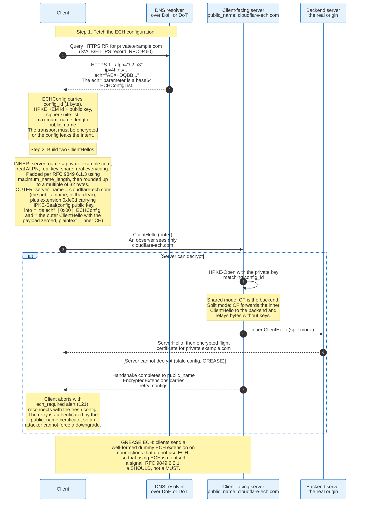

### 13.1 Why SNI Exists

SNI exists because IPv4 addresses ran out before virtual hosting did.

Before RFC 3546 added it in 2003, a TLS server had to choose a certificate before it had seen any application-layer data, and the only information available was the destination IP address and port. One certificate per IP address. The `server_name` extension, type 0, lets the client state which hostname it wants in the ClientHello, so one address can serve thousands of certificates.

That field is plaintext, and it must be, because the server needs it to choose which certificate and therefore which private key to use. It is the single most useful field for a network observer: it names the site, before any encryption, on every connection. National filtering systems, corporate proxies, and traffic analysis tools all read it.

Encrypted DNS closed the DNS half of the leak. SNI kept the other half open.

### 13.2 ESNI Failed

The first attempt encrypted only the SNI field, and it failed for reasons that are instructive.

The 2018 ESNI draft encrypted the `server_name` value under a key published in a DNS TXT record. Three problems killed it. The rest of the ClientHello still leaked: the ALPN list, the supported groups, the cipher suite ordering, and the extension order together fingerprint both the client and often the destination. There was no defined behaviour when the server could not decrypt, so a stale key produced an unrecoverable failure. And an encrypted SNI field is itself a signal, so networks that wanted to block it could, and some did.

The redesign encrypts the entire ClientHello instead of one field, and defines a recovery path.

### 13.3 How ECH Works

ECH sends two ClientHellos, one inside the other, and the outer one is a decoy that the network is allowed to see.

The client fetches an `ECHConfigList` from the `ech=` parameter of the target's HTTPS resource record, defined in RFC 9460. That transport must itself be encrypted, over DNS-over-HTTPS or DNS-over-TLS, or the configuration fetch leaks the same information ECH is hiding.

Each `ECHConfig` carries a one-byte `config_id`, an HPKE key encapsulation mechanism identifier and public key, a list of HPKE cipher suites, a `maximum_name_length` used for padding, and a `public_name` that identifies the client-facing server.

The client then builds:

- An **inner ClientHello**, which is the real one: real SNI, real ALPN, real key shares.
- An **outer ClientHello**, whose `server_name` is the `public_name`, and which carries extension `0xfe0d` containing the inner ClientHello sealed with HPKE (RFC 9180) under the config's public key.

The inner ClientHello does not repeat the outer one's large extensions. RFC 9849 section 5.1 defines `ech_outer_extensions`, codepoint `0xfd00`, an extension that appears only inside the EncodedClientHelloInner and lists the extension types the server copies in from the outer ClientHello before decryption. Without it, a 1,216-byte X25519MLKEM768 key share travels twice in the same flight, once in the clear and once sealed. That compression is why ECH and post-quantum key agreement fit in the same first packet.

The HPKE `info` string is `"tls ech"`, a zero byte, and the serialised ECHConfig. The associated data is the outer ClientHello with the ECH payload field zeroed out, which binds the encryption to the exact outer message and prevents an attacker from moving the ECH extension into a different ClientHello.

Two deployment modes exist. In **shared mode** the client-facing server is also the backend and simply decrypts and proceeds. In **split mode** the client-facing server decrypts the inner ClientHello, forwards it to the backend, and then relays records without holding the backend's private key. Split mode is what makes a large hosting provider a meaningful anonymity set: every site behind the same client-facing server looks identical from outside.

### 13.4 The Retry Path and GREASE

Two mechanisms stop ECH from becoming a downgrade lever.

**Retry configs.** If the server cannot decrypt, because the client used a stale configuration or because no ECH is configured, the handshake completes normally against the `public_name` and the server places fresh `retry_configs` in `EncryptedExtensions`. The client aborts with the `ech_required` alert, value 121, and reconnects with the new configuration. The retry configs arrive inside a handshake authenticated by a certificate for the `public_name`, so an attacker cannot inject a configuration that disables ECH.

**GREASE ECH.** A client that is not using ECH sends a syntactically valid but meaningless ECH extension anyway, with a random config_id, a random public key share, and random payload of a plausible length. A network cannot distinguish real ECH from GREASE ECH, so blocking ECH means blocking ordinary traffic as well. RFC 9849 section 6.2.1 says a client without an ECHConfig for the server SHOULD send a GREASE ECH extension in its first ClientHello, and section 6.1 lets a client send GREASE ECH without implementing anything else in the specification. It is a recommendation, not a requirement.

### 13.5 Deployment as of 2026

ECH is standardised and deployed unevenly, and the limiting factor is the DNS record, not the browsers.

RFC 9849 published in March 2026, following draft-ietf-tls-esni-25. Firefox has shipped ECH enabled by default since version 119. Chrome shipped it in Chrome 117, stable on 12 September 2023, and rolled it out gradually; the Chrome Platform Status entry for TLS Encrypted Client Hello records the milestone as 117, enabled by default. Safari uses it opportunistically when the platform DNS path can fetch a usable HTTPS record and encrypted DNS is in use. Cloudflare enabled ECH for its customers in late 2023, which put it in front of a large fraction of the web at once, and other CDNs followed.

Server-side deployment measured in June 2026 sits at 199,959 sites publishing an ECH configuration in their DNS HTTPS resource record, out of 278,778 that publish an HTTPS record at all and 819,002 that responded to Scott Helme's 13 June 2026 crawl of the Tranco top million. That is 24% of responding sites carrying ECH keys, four years after the first drafts. The concentration is a CDN artefact rather than a per-site decision: Cloudflare publishes the record for its customers, so the count moves when one provider changes a default. The remaining gap is operational: a site outside a CDN needs an HTTPS RR published, a client-facing server that holds the ECH key, and encrypted DNS to make the config fetch meaningful.

ECH also interacts with two other things in this document. It makes the ClientHello larger, which matters when a post-quantum key share is already pushing it past one packet. And it removes the field that TLS-inspecting middleboxes and enterprise filtering products depend on, which is why vendors publish guidance on detecting and blocking it, and why deployment is a policy fight as much as a technical one.

---

## 14. Session Resumption, 0-RTT, and Replay

Resumption trades a fresh handshake for a stored secret, and 0-RTT trades a round trip for replayability.

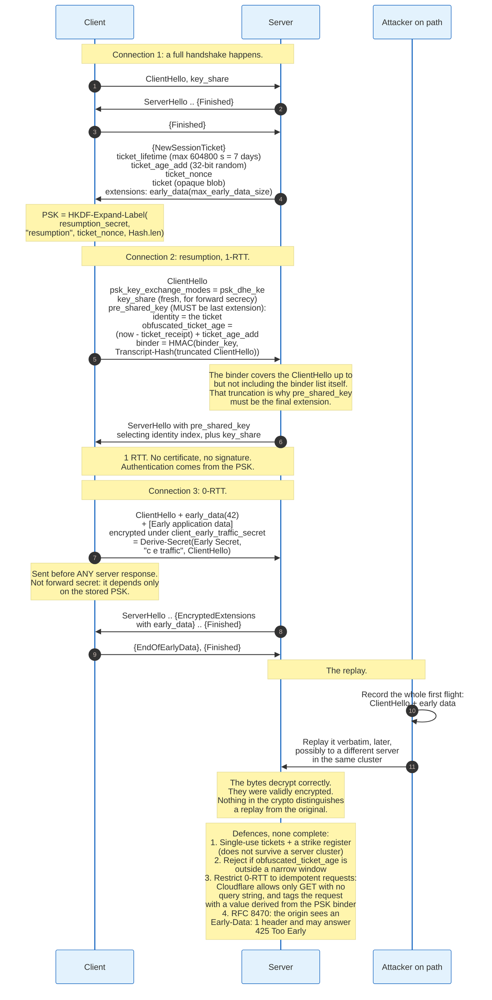

### 14.1 Resumption in TLS 1.2

TLS 1.2 had two resumption mechanisms and both are now obsolete.

**Session IDs.** The server returns a 32-byte identifier in ServerHello and keeps the master secret in a cache. The client presents the identifier next time. This requires server-side storage and sticky routing across a fleet, which is why it did not survive load balancers.

**Session tickets, RFC 5077.** The server encrypts the session state under a Session Ticket Encryption Key that only it knows, hands the ciphertext to the client, and keeps nothing. The client presents the blob. The server decrypts and resumes.

Session tickets moved the problem rather than solving it. The STEK becomes a long-lived secret whose compromise decrypts every session resumed under it, and operators who shared one STEK across a fleet without rotating it destroyed forward secrecy for their whole estate. That failure mode was documented repeatedly, and RFC 9846 obsoletes RFC 5077 entirely.

### 14.2 Resumption in TLS 1.3

TLS 1.3 folds resumption into the pre-shared key mechanism, and the details of the binder are the part that matters.

After a handshake, the server may send one or more `NewSessionTicket` messages, handshake type 4. Each carries:

| Field | Meaning |
|-------|---------|
| `ticket_lifetime` | Seconds, at most 604800, seven days |
| `ticket_age_add` | A 32-bit random value added to the reported age to blind it |
| `ticket_nonce` | Distinguishes multiple tickets derived from the same session |
| `ticket` | The opaque blob the client presents |
| `extensions` | Notably `early_data`, carrying `max_early_data_size` |

The client derives the PSK:

```
PSK = HKDF-Expand-Label(resumption_secret, "resumption",
                        ticket_nonce, Hash.length)
```

On resumption the client sends `pre_shared_key`, extension 41, which must be the last extension in the ClientHello. It carries a list of identities, each with an `obfuscated_ticket_age`, and a parallel list of binders. A binder is:

```
binder = HMAC(binder_key, Transcript-Hash(ClientHello truncated
              immediately before the binders))
```

The truncation is why the extension must be last: the binder covers everything before itself, and the receiver must be able to reconstruct that prefix unambiguously. The binder proves the client actually holds the PSK, which stops an attacker from replaying a captured ticket to learn whether a server accepts it.

`psk_key_exchange_modes`, extension 45, declares whether the client will do `psk_ke`, pure PSK with no Diffie-Hellman, or `psk_dhe_ke`, PSK combined with a fresh key exchange. Almost every deployment uses `psk_dhe_ke`, because pure PSK resumption has no forward secrecy: the session keys derive entirely from a stored secret.

Resumption is also where a privacy question sits. A ticket is a linkable identifier. A client that presents the same ticket across network changes has told the server it is the same client. Browsers therefore partition ticket storage by first-party site and discard tickets when clearing state, and RFC 9846 adds explicit privacy guidance on this.

### 14.3 0-RTT and Why It Is Replayable

0-RTT lets the client send application data in its first flight, and the reason it can be replayed is structural, not an implementation defect.

The early data is encrypted under `client_early_traffic_secret`, derived from the Early Secret, which derives from the PSK and the ClientHello only. The server has contributed nothing. There is no server random, no fresh key exchange, and therefore nothing that makes this flight unique to this connection.

An attacker who captures the first flight can send those exact bytes again, to the same server or to a different member of the same cluster, and they decrypt correctly. The cryptography cannot distinguish the copy from the original, because the copy is identical.

Four defences exist and none is complete:

**Single-use tickets plus a strike register.** The server records which tickets have been used for 0-RTT and rejects the second attempt. This works on one machine. Across a cluster it requires a shared, low-latency, consistent store, which reintroduces the state that resumption was meant to eliminate.

**Freshness windows.** The client reports `obfuscated_ticket_age`; the server compares it against its own record of when it issued the ticket and rejects anything outside a narrow window. This bounds the replay window to a few seconds, which reduces but does not eliminate the risk.

**Idempotency restrictions.** Cloudflare's deployment permits 0-RTT only for GET requests with no query string, and adds a header derived from the PSK binder that uniquely identifies the request, so the origin can detect a repeat. This is the pragmatic answer: a replayed idempotent read is usually harmless.

**RFC 8470.** The reverse proxy sets an `Early-Data: 1` header on requests that arrived in early data. The origin may process it, or may answer `425 Too Early`, at which point the client retries after the handshake completes. This pushes the decision to the application, which is the only layer that knows whether a request is safe to repeat.

RFC 8446 appendix E.5 states the position plainly: 0-RTT data has weaker security properties than other data, is not forward secret, and applications must not use it for anything that cannot tolerate replay. That is a warning label, not a fix, and it is the correct engineering answer. The round trip saved is real, and the risk is real, and the protocol declines to decide for you.

---

## 15. Downgrade and Protocol Attacks

Every major TLS attack falls into one of five families, and the family predicts the fix better than the individual name does.

```mermaid
%%{init: {'theme': 'base', 'themeVariables': {'primaryColor': '#e3f2fd', 'primaryBorderColor': '#1565c0', 'lineColor': '#37474f'}}}%%

flowchart TB
    subgraph F1["Family 1: legacy options still reachable"]
        direction TB
        A1["FREAK, Mar 2015, CVE-2015-0204<br/>Client accepts an export-grade<br/>512-bit RSA key it never asked for.<br/>36.7% of browser-trusted sites<br/>affected on 6 Mar 2015."]
        A2["Logjam, May 2015, CVE-2015-4000<br/>Downgrade to DHE_EXPORT with a<br/>512-bit prime. 8.4% of the top<br/>1M HTTPS sites. 82% of vulnerable<br/>servers shared ONE prime, so a<br/>single precomputation broke them all."]
        A3["DROWN, Mar 2016, CVE-2016-0800<br/>An SSLv2 server sharing a key with<br/>a TLS server decrypts recorded TLS<br/>sessions. About a third of HTTPS<br/>servers, 11 million services."]
        A4["POODLE, Oct 2014, CVE-2014-3566<br/>Force a fallback to SSL 3.0, then<br/>use its unauthenticated CBC padding.<br/>256 requests recover one byte."]
        A5["FIX: delete the code paths.<br/>TLS 1.3 has no export, no NULL,<br/>no anonymous, no static RSA,<br/>no server-chosen DH groups."]
    end

    subgraph F2["Family 2: CBC and MAC-then-encrypt"]
        direction TB
        B1["BEAST, Sep 2011, CVE-2011-3389<br/>TLS 1.0 chains the CBC IV from the<br/>previous record, so an adversary<br/>who can inject chosen plaintext<br/>predicts it and confirms guesses."]
        B2["Lucky 13, Feb 2013, CVE-2013-0169<br/>MAC verification time depends on<br/>padding length. A timing oracle<br/>recovers plaintext."]
        B3["FIX: TLS 1.1 explicit IVs,<br/>RFC 7366 encrypt-then-MAC,<br/>constant-time decryption, and<br/>finally TLS 1.3 deleting CBC."]
    end

    subgraph F3["Family 3: compression leaks length"]
        direction TB
        C1["CRIME, Sep 2012, CVE-2012-4929<br/>TLS-level compression. Attacker<br/>injects guesses next to a secret;<br/>a correct guess compresses better,<br/>so the record is shorter."]
        C2["BREACH, Aug 2013<br/>Same idea at the HTTP layer.<br/>TLS cannot fix it: the compression<br/>is above TLS."]
        C3["FIX at TLS level: TLS 1.3 removes<br/>compression entirely.<br/>At HTTP level: separate secrets<br/>from attacker input, mask CSRF<br/>tokens per response, add padding."]
    end

    subgraph F4["Family 4: RSA PKCS 1 v1.5 oracles"]
        direction TB
        D1["Bleichenbacher, 1998<br/>The server reveals whether padding<br/>was well-formed. About a million<br/>queries recover the pre-master secret."]
        D2["ROBOT, Dec 2017<br/>The same attack, still working,<br/>against F5, Citrix, Cisco, and<br/>others 19 years later."]
        D3["FIX: TLS 1.3 removes RSA key<br/>transport. RSA-PSS replaces<br/>PKCS 1 v1.5 in CertificateVerify."]
    end

    subgraph F5["Family 5: implementation, not protocol"]
        direction TB
        E1["Heartbleed, Apr 2014, CVE-2014-0160<br/>OpenSSL 1.0.1 to 1.0.1f trusts the<br/>attacker's length field in the RFC 6520<br/>heartbeat and memcpys up to 64 kB of<br/>adjacent heap into the reply.<br/>Netcraft: 17.5% of SSL sites,<br/>more than 500,000 servers."]
        E2["goto fail, Feb 2014, CVE-2014-1266<br/>A duplicated goto in Apple's code<br/>skips the signature check entirely."]
        E3["Debian OpenSSL, 2008, CVE-2008-0166<br/>A patch removed entropy seeding.<br/>Every key generated for 20 months<br/>came from a set of 32,768."]
        E4["Sweet32, Aug 2016, CVE-2016-2183<br/>64-bit block ciphers collide after<br/>2^32 blocks. About 785 GB on one<br/>3DES connection recovers a cookie."]
        E5["FIX: memory-safe languages,<br/>fuzzing, formal verification,<br/>and removing 3DES."]
    end

    F1 --> Fix["The general rule:<br/>an option retained for<br/>backward compatibility is<br/>an option an attacker can<br/>steer a modern client into.<br/>Deletion beats configuration."]
    F2 --> Fix
    F3 --> Fix
    F4 --> Fix
    F5 --> Fix2["The other rule:<br/>the protocol was never the<br/>weakest part. Heartbleed and<br/>goto fail were bugs in code<br/>that implemented a correct<br/>specification."]

    style F1 fill:#ffebee,stroke:#c62828,stroke-width:2px
    style F2 fill:#fff3e0,stroke:#e65100,stroke-width:2px
    style F3 fill:#f3e5f5,stroke:#4a148c,stroke-width:2px
    style F4 fill:#e8f5e9,stroke:#2e7d32,stroke-width:2px
    style F5 fill:#e3f2fd,stroke:#1565c0,stroke-width:2px
    style Fix fill:#fce4ec,stroke:#880e4f,stroke-width:3px
    style Fix2 fill:#eceff1,stroke:#37474f,stroke-width:3px
```

### 15.1 BEAST: The Chained IV

BEAST works because TLS 1.0 uses the last ciphertext block of one record as the IV of the next, making the IV predictable to anyone who has seen the previous record.

Duong and Rizzo demonstrated it in September 2011. The attacker needs two capabilities: the ability to observe ciphertext, and the ability to make the victim's browser send chosen plaintext on the same connection, which JavaScript in a cross-origin context provided. Knowing the next IV, the attacker positions a target secret byte at the end of a block, guesses it, constructs a chosen plaintext block whose CBC encryption would produce a known ciphertext if the guess is right, and checks. 256 guesses per byte at worst.

TLS 1.1 had fixed this in 2006 with per-record explicit IVs, five years before the attack was published, and almost nobody had deployed TLS 1.1. The stopgap was the "1/n-1 record splitting" trick, in which the client sends a one-byte record before each real record so that the IV for the real data is unpredictable.

### 15.2 CRIME: Compression Is a Side Channel

CRIME shows that compressing attacker-controlled data together with a secret leaks the secret through the ciphertext length.

TLS-level compression, negotiated in the ClientHello, was applied before encryption. DEFLATE replaces repeated strings with backreferences. If an attacker can make the browser send `Cookie: session=` plus a guess, and the real cookie is in the same compression context, a correct guess compresses to fewer bytes than a wrong one. The record length is visible even though the content is not.

Duong and Rizzo published in September 2012. The response was to disable TLS compression everywhere, and TLS 1.3 removed the negotiation entirely.

BREACH, published in August 2013, applies the same principle to HTTP response compression, which TLS cannot control. A page that reflects user input and also contains a secret such as a CSRF token is vulnerable regardless of TLS version. Mitigations live in the application: mask the token differently per response, separate secrets from reflected input, or add random padding.

### 15.3 POODLE: Unauthenticated Padding

POODLE exploits the fact that SSL 3.0's CBC padding bytes are not covered by the MAC, so a decryption oracle exists.

In SSL 3.0, the last byte of a padded block says how many padding bytes there are, and the other padding bytes may be anything. The MAC covers the plaintext but not the padding. An attacker who replaces the final block of a record with a target ciphertext block, and who can force the victim to retry the request many times with shifting alignment, learns one plaintext byte per 256 attempts on average.

Disclosed 14 October 2014 by Möller, Duong, and Kotowicz. The exposure came from downgrade dance: browsers, encountering a handshake failure, would retry with a lower protocol version to work around broken servers, and an attacker could force those failures until the connection landed on SSL 3.0. `TLS_FALLBACK_SCSV`, RFC 7507, was the immediate patch, and disabling SSL 3.0 was the real one. A variant later affected some TLS 1.0 through 1.2 implementations that did not check padding correctly, which is why the attack outlived the version it named.

### 15.4 Heartbleed: Not a Protocol Flaw

Heartbleed is a missing bounds check in OpenSSL's implementation of RFC 6520, and it is the most consequential TLS-adjacent bug ever found.

The heartbeat extension lets a peer send a payload and a length and receive the payload back, as a keepalive for DTLS. OpenSSL 1.0.1 through 1.0.1f allocated a response buffer using the attacker's stated length and copied that many bytes from the attacker's request buffer, without checking that the request actually contained that many bytes. A request claiming 65,535 bytes with a one-byte payload returned that byte plus roughly 64 kilobytes of whatever was adjacent in the heap: session keys, private keys, credentials, other users' requests.

Disclosed 7 April 2014, discovered independently by Google Security and Codenomicon. Netcraft estimated 17.5% of SSL-protected sites were potentially affected, more than half a million servers. The attack leaves no trace in normal logs. Every affected key had to be treated as compromised, which drove the largest mass certificate reissuance in the history of the Web PKI.

Two lessons stuck. First, memory unsafety in a TLS library is worse than any protocol weakness, which motivated BoringSSL, LibreSSL, rustls, and the general move to memory-safe implementations. Second, the funding model for shared infrastructure was broken: OpenSSL had roughly one full-time developer when Heartbleed was found, and the Core Infrastructure Initiative was created in response.

### 15.5 Logjam: The Group Nobody Checked

Logjam works because TLS finite-field Diffie-Hellman let the server choose the group and gave the client no way to object.

Two facts combine. Export-grade `DHE_EXPORT` cipher suites used 512-bit primes, and a server that supported them would, on request, sign 512-bit parameters with the same signature that a normal DHE handshake uses. The signature covers the parameters but not the negotiated cipher suite, so an attacker could rewrite the ClientHello to request `DHE_EXPORT`, receive 512-bit parameters, forward them to the client as if they were the normal DHE parameters, and the client would accept them.

The second fact is precomputation. The number field sieve for discrete logarithm has a first stage that depends only on the prime, not on the specific key. The Logjam authors measured that of the 8.4% of top-million HTTPS sites supporting `DHE_EXPORT`, 82% used a single 512-bit group, and 92% used one of two. One precomputation, then individual logs in about a minute.

The paper extended the argument to 1024-bit groups, estimating that precomputation for ten common 1024-bit groups would passively decrypt roughly 66% of IPsec VPNs, 26% of SSH servers, and 24% of popular HTTPS sites. That estimate reframed nation-state capability against 1024-bit Diffie-Hellman as an engineering budget rather than a research problem.

The fixes: browsers raised their minimum DH size to 1024 bits, then abandoned finite-field DH in favour of elliptic curves; RFC 7919 defined named FFDHE groups; TLS 1.3 permits only named groups.

### 15.6 The Attack Table

| Attack | Date | CVE | Target | Mechanism | Fixed by |
|--------|------|-----|--------|-----------|----------|
| Bleichenbacher | 1998 | | RSA PKCS#1 v1.5 | Padding oracle in decryption | Countermeasures; removed in TLS 1.3 |
| Debian PRNG | May 2008 | CVE-2008-0166 | Key generation | Entropy source removed by a patch | Regenerate every key |
| Renegotiation | Nov 2009 | CVE-2009-3555 | Handshake | Splicing an attacker prefix into a client's session | RFC 5746 |
| BEAST | Sep 2011 | CVE-2011-3389 | TLS 1.0 CBC | Predictable chained IV | TLS 1.1 explicit IV; record splitting |
| CRIME | Sep 2012 | CVE-2012-4929 | TLS compression | Length side channel | Disable compression |
| Lucky 13 | Feb 2013 | CVE-2013-0169 | CBC MAC-then-encrypt | Timing side channel in padding check | Constant-time code; AEAD |
| BREACH | Aug 2013 | | HTTP compression | Length side channel above TLS | Application-level mitigation |
| goto fail | Feb 2014 | CVE-2014-1266 | Apple SecureTransport | Duplicated goto skips signature check | Patch |
| Heartbleed | Apr 2014 | CVE-2014-0160 | OpenSSL heartbeat | Unchecked length, 64 kB heap disclosure | OpenSSL 1.0.1g |
| Early CCS | Jun 2014 | CVE-2014-0224 | OpenSSL state machine | Accepting ChangeCipherSpec too early | Patch |
| POODLE | Oct 2014 | CVE-2014-3566 | SSL 3.0 CBC | Unauthenticated padding plus downgrade dance | Disable SSL 3.0; RFC 7507 |
| FREAK | Mar 2015 | CVE-2015-0204 | Export RSA | Client accepts an export key it did not request | Remove export suites |
| Logjam | May 2015 | CVE-2015-4000 | Export DHE | Downgrade to a 512-bit shared prime | Named groups; minimum sizes |
| DROWN | Mar 2016 | CVE-2016-0800 | SSLv2 | Cross-protocol oracle on a shared key | Disable SSLv2 everywhere |
| Sweet32 | Aug 2016 | CVE-2016-2183 | 3DES, Blowfish | Birthday bound on 64-bit blocks | Remove 64-bit block ciphers |
| ROBOT | Dec 2017 | | RSA key transport | Bleichenbacher, unfixed in vendor stacks | Vendor patches; TLS 1.3 |
| Raccoon | Sep 2020 | CVE-2020-1968 | TLS-DH | Timing on leading zeros in the DH secret | Disable static DH |
| ALPACA | Jun 2021 | | Cross-protocol | Redirecting TLS to a different service on the same certificate | ALPN and SNI enforcement |

### 15.7 The Pattern

Two rules explain the whole table.

**Backward compatibility is the attack surface.** FREAK, Logjam, DROWN, and POODLE all exploit code kept for clients that no longer existed. Export ciphers were mandated by United States export rules relaxed in 2000 and were still negotiable in 2015. The defence that works is deletion, and TLS 1.3's changelog is mostly deletions.

**The protocol was rarely the weakest part.** Heartbleed, goto fail, the Debian PRNG, and Early CCS are implementation bugs against a correct specification. They caused more damage than any cryptographic weakness in the same period. That is why the current wave of work is memory-safe implementations and formal verification, not new cipher suites.

---

## 16. Post-Quantum TLS

Post-quantum TLS is being deployed in two stages that are years apart: key exchange, which is largely done, and signatures, which have barely started.

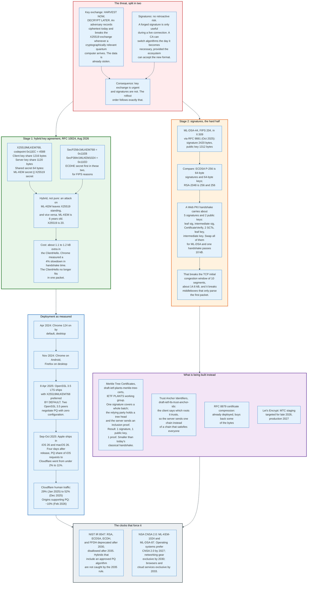

### 16.1 Why Key Exchange Went First

Key exchange and signatures face the same future adversary and completely different deadlines.

A recorded TLS session encrypted under X25519 is a stored liability. Whenever a sufficiently large quantum computer exists, the recorded key exchange can be broken and the session decrypted. The data was stolen on the day it was recorded; the decryption is a formality. Any data with a confidentiality lifetime longer than the arrival of that machine is already at risk.

A signature has no such property. Forging a server's signature is useful only during a live connection, because the signature covers a fresh transcript. If quantum computers arrive in 2035, a CA can switch to post-quantum signatures in 2034 and lose nothing. The only reason to start early is that changing the certificate format across every CA, every root program, every trust store, and every embedded device takes a decade.

So the industry did the urgent thing first and is still arguing about the slow one.

### 16.2 The Hybrid Construction

RFC 10024, published August 2026, defines three hybrid groups whose shared secret is a concatenation, not a combination.

For `X25519MLKEM768`, codepoint 4588:

- The client sends a 1216-byte key share: the 1184-byte ML-KEM-768 encapsulation key followed by the 32-byte X25519 public key.
- The server sends a 1120-byte key share: the 1088-byte ML-KEM ciphertext followed by its 32-byte X25519 public key.
- The shared secret is 64 bytes: the 32-byte ML-KEM shared secret followed by the 32-byte X25519 output.

That 64-byte value enters the TLS 1.3 key schedule as the `(EC)DHE` input to the second HKDF-Extract. Because HKDF-Extract is a PRF over the whole input, an attacker must break both components to predict the Handshake Secret. Breaking ML-KEM alone leaves X25519; breaking X25519 alone leaves ML-KEM.

The concatenation order differs between the groups for a reason worth recording: `X25519MLKEM768` puts ML-KEM first, for historical compatibility with the pre-standard deployment, while `SecP256r1MLKEM768` and `SecP384r1MLKEM1024` put the ECDHE secret first, because FIPS validation guidance treats the approved component's position as meaningful. RFC 10024 also deprecates the pre-standard Kyber768 codepoints 25497 and 25498.

Only `X25519MLKEM768` is marked Recommended.

### 16.3 The Byte Cost

The post-quantum ClientHello no longer fits in one packet, and that is the entire deployment difficulty.

A classical ClientHello with an X25519 key share runs a few hundred bytes. Adding a 1216-byte X25519MLKEM768 share pushes it past the 1460-byte payload of a standard Ethernet MSS, so the first flight becomes two TCP segments or, under QUIC, two datagrams. Middleboxes that parse only the first packet of a connection see a truncated ClientHello. Some drop it. Some hang.

Chrome measured a 4% increase in TLS handshake time from the additional 1.1 to 1.2 kB. That is the price of the whole migration on the key exchange side, and it was judged acceptable.

Clients also face a guessing problem. Sending only a post-quantum share risks a HelloRetryRequest from a server that does not support it, costing a full round trip. Sending both a post-quantum and a classical share costs bytes on every connection. Browsers send both. Cloudflare's July 2026 change automates the equivalent decision on the origin side, predicting which group each origin prefers so that the edge avoids the extra round trip.

### 16.4 Signatures and the Size Wall

Post-quantum signatures do not fit in the current handshake, and no amount of tuning changes that.

ML-DSA-44, the smallest parameter set in FIPS 204, has 2420-byte signatures and 1312-byte public keys. ECDSA P-256 has 64 and 64. RFC 9881, published October 2025, defines how to encode ML-DSA in X.509 certificates and CRLs at all three security levels.

The arithmetic Let's Encrypt published in June 2026: a typical Web PKI handshake carries about five signatures and two public keys. Replace all of them with ML-DSA-44 and a single handshake passes 10 kB of authentication data alone. The TCP initial congestion window is 10 segments, roughly 14.6 kB under RFC 6928, so a certificate chain that large turns a one-round-trip handshake into two on any server still using the default. RFC 8879 certificate compression helps, and it does not close the gap: lattice signatures are close to incompressible, because they are already near-uniform bytes.

Three lines of work attack this:

**Merkle Tree Certificates.** The IETF PLANTS working group, chartered after a Birds-of-a-Feather session at IETF 124, is standardising `draft-ietf-plants-merkle-tree-certs`. The idea integrates Certificate Transparency into issuance: a CA batches many name-to-key bindings into a Merkle tree, signs the tree root once, and the relying party obtains tree heads out of band. A server then presents one signature, one public key, and one inclusion proof. That is smaller than a classical Web PKI handshake even with post-quantum algorithms. Let's Encrypt targets a staging environment issuing MTCs in late 2026 and production in 2027, with participation from Google, Cloudflare, and independent contributors.

**Trust Anchor Identifiers.** `draft-ietf-tls-trust-anchor-ids`, authored from OpenSSL, Google, and Meta, lets a client tell the server which trust anchors it holds, and lets a server advertise its available paths in DNS. Today a server sends a chain that satisfies the union of all clients, including old ones. With negotiation it sends the one chain the connecting client needs. That is a pure byte saving that gets larger as signatures get larger.

**Certificate compression.** RFC 8879, already widely deployed, compresses the Certificate message with zlib, Brotli, or Zstandard. It is the only mitigation shipping at scale today.

### 16.5 Adoption, Measured

Post-quantum key agreement crossed from experiment to default in about two years, and the inflection points are all defaults changing.

| Date | Event | Measured effect |
|------|-------|-----------------|
| Apr 2024 | Chrome 124 enables hybrid PQ by default on desktop | Baseline established |
| Nov 2024 | Chrome on Android, Firefox on desktop | |
| Jan 2025 | | 29% of human-initiated Cloudflare traffic |
| 8 Apr 2025 | OpenSSL 3.5 LTS ships with X25519MLKEM768 preferred by default | Server side starts moving |
| mid-Sep 2025 | | ~43% of human-initiated Cloudflare traffic |
| Sep 2025 | Apple ships in iOS 26 and macOS 26 | iOS share of PQ requests to Cloudflare went from under 2% to 11% within four days of release |
| late Oct 2025 | Crosses half | Over 50% of human-initiated Cloudflare traffic |
| Dec 2025 | | 52% per Cloudflare's Radar Year in Review |
| Feb 2026 | Cloudflare Radar adds an origin-side post-quantum view | ~10% of customer origins support X25519MLKEM768 |
| Jul 2026 | Cloudflare enables automatic origin key exchange selection for all zones | Avoids a HelloRetryRequest round trip to origins |
| Aug 2026 | RFC 10024 publishes | The codepoint that was already deployed becomes a standard |

The gap between 52% of client traffic and 10% of origins is the shape of the remaining work. Browsers update themselves. Origins do not.

### 16.6 The Regulatory Clocks

Two documents set the deadlines that finance departments respond to.

**NIST IR 8547**, "Transition to Post-Quantum Cryptography Standards", first published as a draft on 12 November 2024, deprecates RSA, ECDSA, ECDH, and finite-field Diffie-Hellman after 2030 and disallows them after 2035. Deprecated means the data owner must document a risk justification for continued use. Disallowed means the option is gone, including for legacy systems. Hybrid modes that include an approved post-quantum algorithm are not caught by the 2035 disallowance, which is what makes X25519MLKEM768 a durable answer rather than a stopgap.

**NSA CNSA 2.0** specifies ML-KEM-1024, ML-DSA-87, AES-256, and SHA-384 or SHA-512 for National Security Systems. Operating systems must support and prefer CNSA 2.0 by 2027; traditional networking equipment and software signing target exclusive use by 2030; web browsers, cloud services, and operating systems target exclusive use by 2033.

The two documents disagree on parameter sizes. NIST's transition permits ML-KEM-768; CNSA 2.0 requires ML-KEM-1024. A product selling into both markets implements both.

---

## 17. One Connection, Traced End to End

This section carries one connection from DNS to first byte with concrete values, so that every mechanism above has a place in a single timeline.

The scenario: Chrome on a laptop loading `https://shop.example.com`, served from a Cloudflare-style edge, with a Let's Encrypt certificate, ECH configured, and post-quantum key agreement enabled on both sides.

### 17.1 Before Any Packet

**DNS over HTTPS.** Chrome queries the HTTPS resource record for `shop.example.com` and receives:

```
shop.example.com. 300 IN HTTPS 1 . alpn="h3,h2"
                                  ipv4hint=203.0.113.10
                                  ech="AEX+DQBBSwAgACD..."
```

The `ech=` parameter decodes to an `ECHConfigList`. Chrome parses one config with `config_id = 0x4B`, KEM `DHKEM(X25519, HKDF-SHA256)`, a 32-byte public key, cipher suite `HKDF-SHA256` with `AES-128-GCM`, `maximum_name_length = 64`, and `public_name = "cloudflare-ech.com"`.

**TCP.** Three-way handshake to 203.0.113.10 port 443. One round trip, call it 12 ms on a domestic connection to a nearby edge.

### 17.2 The ClientHello

Chrome constructs two ClientHellos.

The inner one carries `server_name = shop.example.com`, `alpn = [h2, http/1.1]`, `supported_versions = [0x0304]`, `supported_groups = [0x11EC, 0x001D, 0x0017]`, a `key_share` list holding a 1216-byte X25519MLKEM768 share and a 32-byte X25519 share, `signature_algorithms` listing `ecdsa_secp256r1_sha256` first, and a `status_request` for a stapled OCSP response that will not arrive because Let's Encrypt no longer runs a responder.

The outer one carries `server_name = cloudflare-ech.com` in the clear, plus extension `0xfe0d` holding the HPKE seal of the inner ClientHello. The inner hello was padded to `maximum_name_length = 64` and rounded up to a multiple of 32 bytes before sealing, so the sealed length says nothing about the length of the real name.

Approximate sizes:

| Component | Bytes |
|-----------|-------|
| Record header | 5 |
| Handshake header, version, random, session id | 44 |
| Cipher suites, compression | 14 |
| X25519MLKEM768 key share | 1,216 |
| X25519 key share | 32 |
| ECH extension, sealed inner ClientHello, with `key_share` and the other bulky extensions compressed out via `ech_outer_extensions` | ~500 |
| All other extensions | ~250 |
| **Total** | **~2,060** |

That is two TCP segments at a 1460-byte MSS. Ten years ago this message was 300 bytes.

### 17.3 The Server Flight

The edge server holds the ECH private key for `config_id = 0x4B`, opens the seal, recovers the inner ClientHello, and proceeds against `shop.example.com`.

It selects `TLS_AES_128_GCM_SHA256` (`0x1301`) and group `X25519MLKEM768`, and returns a 1120-byte key share. Both sides now compute the 64-byte shared secret and run the key schedule to the Handshake Secret. Everything after ServerHello is encrypted under `server_handshake_traffic_secret`.

The encrypted flight contains:

- `EncryptedExtensions`: `alpn = h2`, `record_size_limit = 16385`, no ECH retry configs because ECH succeeded.
- `Certificate`: the leaf for `shop.example.com` plus the Let's Encrypt intermediate, compressed with Brotli under RFC 8879. The leaf carries a `subjectAltName` with `dNSName = shop.example.com`, `basicConstraints cA=FALSE`, `extKeyUsage = serverAuth`, an ECDSA P-256 public key, a `notAfter` 199 days after `notBefore` under the March 2026 cap, a CRL distribution point, no OCSP URL, and an SCT list with three embedded SCTs, at least two from logs run by different operators.
- `CertificateVerify`: an `ecdsa_secp256r1_sha256` signature over 64 spaces, the string `"TLS 1.3, server CertificateVerify"`, a zero byte, and the SHA-256 transcript hash.
- `Finished`: `HMAC(finished_key, Transcript-Hash(ClientHello..CertificateVerify))`.

### 17.4 What the Client Checks

Chrome runs nine checks and any failure aborts the connection.

1. Build a path from the leaf through the Let's Encrypt intermediate to ISRG Root X1 in the Chrome Root Store. A graph search, not a walk, because alternative paths exist.
2. Verify each signature with the issuer's public key.
3. Confirm `notBefore <= now <= notAfter` at every level.
4. Confirm `basicConstraints` marks the intermediate as a CA and the leaf as not.
5. Confirm `extKeyUsage` includes `serverAuth`.
6. Match `shop.example.com` against the `subjectAltName` list.
7. Check CT policy: the certificate's lifetime is 199 days, above the 180-day threshold, so three SCTs are required, and at least two of them come from logs run by distinct operators. Chrome's log list is 11 days old, well inside the 70-day staleness limit, so CT is enforced.
8. Check revocation against the locally held CRLSet. No network request.
9. Verify `CertificateVerify` against the transcript, then `Finished`.

### 17.5 The Timeline

| t (ms) | Event | Round trips |
|--------|-------|-------------|
| 0 | DoH query for HTTPS RR, often already cached | 0 to 1 |
| 12 | TCP SYN, SYN-ACK, ACK complete | 1 |
| 12 | ClientHello sent, ~2,060 bytes across 2 segments | |
| 24 | ServerHello plus encrypted flight arrives | 2 |
| 25 | Client validates the chain, ~1 ms with a cached intermediate | |
| 25 | Client Finished sent, followed immediately by the HTTP/2 request | |
| 37 | First response byte | 3 |

Three round trips from nothing to first byte, one of which is TCP and one of which is TLS. Under QUIC with TLS 1.3, the transport and cryptographic handshakes merge and the TCP round trip disappears.

### 17.6 The Second Connection

The server sends a `NewSessionTicket` shortly after the handshake, with `ticket_lifetime = 172800` (two days) and an `early_data` extension declaring `max_early_data_size = 16384`.

On the next visit within that window, Chrome sends a ClientHello carrying `pre_shared_key` with the ticket, an `obfuscated_ticket_age`, and a binder, plus a fresh `key_share` because `psk_dhe_ke` is in use. No certificate is sent, no signature is made, and the handshake completes in one round trip. Chrome does not send 0-RTT data for a normal navigation, because the request is not necessarily idempotent and the replay risk is not worth 12 ms.

If it did, the early data would be encrypted under `client_early_traffic_secret`, would not be forward secret, and would be replayable by anyone who captured the flight.

---

## 18. Economics: What TLS Costs and Who Pays

TLS has almost no marginal cost and a large, unevenly distributed fixed cost, and the free-certificate era moved that cost from site operators to a handful of sponsors and infrastructure providers.

```mermaid
%%{init: {'theme': 'base', 'themeVariables': {'primaryColor': '#e3f2fd', 'primaryBorderColor': '#1565c0', 'lineColor': '#37474f'}}}%%

flowchart TB
    subgraph Free["The free tier, funded by sponsors"]
        direction TB
        FA["Let's Encrypt / ISRG<br/>Nonprofit. Sponsored by cloud and<br/>infrastructure firms. ISRG operated<br/>three projects on roughly 7 million<br/>USD a year as of its 2023 report,<br/>with about 41% of expense on<br/>Let's Encrypt."]
        FB["Output: 762 million websites<br/>served as of Dec 2025, over<br/>10 million certificates issued<br/>on peak days"]
        FC["Google Trust Services, ZeroSSL,<br/>Amazon ACM: free certificates as a<br/>loss leader for a platform"]
        FA --> FB
    end

    subgraph Paid["The paid tier, and what it sells"]
        direction TB
        PA["DV certificates: commercially<br/>near-worthless, since the identical<br/>product is free. Sold bundled."]
        PB["OV: roughly 30 to 150 USD a year<br/>list price. Buys an organisation<br/>name in the subject field."]
        PC["EV: from under 100 USD at<br/>discount resellers to 800 to 1500 USD<br/>a year at premium CAs. Browsers<br/>removed the EV address bar UI<br/>in 2019."]
        PD["What is actually sold in 2026:<br/>certificate lifecycle management.<br/>Discovery, inventory, automated<br/>renewal, private PKI, and the<br/>compliance reporting around them."]
        PA --> PD
        PB --> PD
        PC --> PD
    end

    subgraph Compute["Compute cost at the endpoint"]
        direction TB
        CA1["Handshake: one signature or one<br/>KEM decapsulation per full handshake.<br/>Asymmetric work dominates and it is<br/>per connection, not per byte."]
        CA2["Bulk: AES-GCM with AES-NI or ARMv8<br/>crypto extensions runs at several<br/>gigabytes per second per core.<br/>Effectively free."]
        CA3["Which is why session resumption<br/>and connection reuse matter far more<br/>than cipher choice for cost"]
        CA4["Post-quantum adds about 1.2 kB per<br/>handshake and a measured 4% increase<br/>in handshake time"]
        CA1 --> CA3
        CA2 --> CA3
    end

    subgraph Ops["Operational cost, where the real money is"]
        direction TB
        OA["Expiry outages. The dominant<br/>real-world cost of TLS, and it rises<br/>as lifetimes fall from 398 to 200<br/>to 100 to 47 days."]
        OB["Automation build-out: ACME clients,<br/>cert-manager, secret distribution,<br/>rotation without dropping connections"]
        OC["Key custody: HSMs for CAs and for<br/>regulated private PKI. Cloudflare's<br/>Keyless SSL and RFC 9345 delegated<br/>credentials exist so a CDN can<br/>terminate TLS without holding<br/>the customer's private key."]
        OD["CT log operation: cost scales with<br/>issuance volume, which is about to<br/>multiply as lifetimes fall. This is<br/>why the ecosystem rebuilt logs as<br/>static tiles on object storage."]
        OA --> OB
    end

    subgraph Who["Who ends up paying"]
        direction TB
        WA["Site operator: near zero for the<br/>certificate, real money for automation<br/>and for the outage when it fails"]
        WB["CDN and cloud platform: absorbs<br/>termination cost, sells the<br/>convenience back"]
        WC["Sponsors of ISRG: fund the free<br/>tier for everyone"]
        WD["Browser vendors: fund the root<br/>programs, CT infrastructure,<br/>and most of the protocol work,<br/>and recover nothing directly"]
    end

    Free --> Who
    Paid --> Who
    Compute --> Who
    Ops --> Who

    style Free fill:#e8f5e9,stroke:#2e7d32,stroke-width:2px
    style Paid fill:#fff3e0,stroke:#e65100,stroke-width:2px
    style Compute fill:#e3f2fd,stroke:#1565c0,stroke-width:2px
    style Ops fill:#ffebee,stroke:#c62828,stroke-width:2px
    style Who fill:#f3e5f5,stroke:#4a148c,stroke-width:3px
```

### 18.1 The Certificate Is Free and the Automation Is Not

The price of a domain-validated certificate collapsed to zero, and the cost moved into renewal machinery.

Let's Encrypt made DV certificates free in 2015 and issues them through an API. Google Trust Services, ZeroSSL, and Amazon Certificate Manager followed with free offerings tied to their platforms. There is no meaningful market for a paid DV certificate, because the product is identical and one of them costs nothing.

What replaced that revenue is certificate lifecycle management. A large enterprise holds tens of thousands of certificates across public CAs, private PKI, service meshes, and appliances, and its problem is inventory and renewal, not issuance. That is what DigiCert, Sectigo, Venafi, and Keyfactor sell, and the SC-081v3 schedule is the best sales argument any of them have had. A 47-day certificate renewed eight times a year, with domain validation repeated roughly 35 times a year, is a machine's job.

Public list prices in 2026 give a rough shape: organisation-validated certificates in the range of 30 to 150 US dollars a year, extended validation from under 100 dollars at discount resellers to 800 to 1500 dollars a year at premium CAs. Those numbers now buy roughly six months of validity rather than thirteen.

### 18.2 The Compute Cost Is Small and In the Wrong Place

The expensive part of TLS is the handshake, and it is expensive per connection rather than per byte.

Bulk encryption is essentially free on modern hardware. AES-GCM with AES-NI on x86 or the ARMv8 cryptography extensions runs at several gigabytes per second per core, which is faster than most servers can move data. ChaCha20-Poly1305 exists for the machines without those instructions and is fast enough in plain software.

Asymmetric operations are the cost. One ECDSA signature per full handshake on the server, one signature verification plus one key exchange on the client, and with post-quantum, one ML-KEM encapsulation and decapsulation. None of it is large in absolute terms, and all of it is proportional to new connections rather than to traffic.

That shape dictates the optimisations that matter. Connection reuse, HTTP/2 and HTTP/3 multiplexing, and session resumption reduce handshakes and therefore reduce cost. Choosing a different cipher suite does not. Google's engineering position since 2010, that TLS costs under 1% of CPU, under 10 kB of memory per connection, and under 2% of network overhead, has held up because the handshake share kept falling as connections got longer-lived.

### 18.3 The Private Key Problem

Terminating TLS requires the private key, and putting that key on thousands of edge machines is a risk that produced two protocol answers.

**Keyless SSL** keeps the private key at the customer's premises. The edge server performs the handshake but forwards the single operation that needs the private key, the signature or the decryption, to a key server the customer runs. The edge never holds the key. The cost is a network round trip inside the handshake.

**Delegated credentials**, RFC 9345 published July 2023, take the opposite approach. The certificate holder signs a short-lived credential, valid for at most seven days, binding a fresh public key to the certificate. The edge holds only the short-lived key. If it leaks, the exposure ends within a week, and no CA involvement is needed to issue or revoke. Both endpoints must support the extension, so it degrades to a normal handshake for clients that do not.

Both mechanisms exist because the economics of CDNs require terminating TLS for other people's domains, and the security model requires not handing over the key that a CA bound to their name.

### 18.4 The Real Cost Is the Outage

The dominant operational cost of TLS is not compute, certificates, or bandwidth. It is expired certificates taking down production.

The mechanism is simple. A certificate expires, a service that depends on it fails closed, and the failure is total rather than degraded. It happens on internal services more than on public websites, because public websites are monitored and internal ones are not, and it happens on the certificates nobody remembers issuing.

The lifetime schedule makes this strictly worse for anyone who has not automated and strictly better for anyone who has. At 398 days, a manual process fails once a year and someone remembers. At 47 days, a manual process fails eight times a year, which is often enough that the organisation either automates or stops functioning. That is the intended effect of the ballot, stated openly by its proposers: the industry wants agility, and the only way to get it is to make the manual path unbearable.

ACME Renewal Information, RFC 9773, is the other half. A fleet that polls its CA for a renewal window renews when the CA says to, spreads load, and can be told to re-issue en masse without anyone sending an email.

---

## 19. Regulation and Compliance

TLS is regulated indirectly. No authority licenses a TLS implementation, and several authorities specify which versions and algorithms a regulated system may use.

### 19.1 The Bodies

| Body | Role | Instrument |
|------|------|-----------|
| IETF TLS working group | Specifies the protocol | RFC 9846, RFC 9849, RFC 9963, RFC 10024 |
| IETF LAMPS working group | Specifies PKIX and certificate formats | RFC 5280, RFC 9881 |
| IETF ACME working group | Specifies automated issuance | RFC 8555, RFC 9773 |
| IETF PLANTS working group | Specifies post-quantum-sized PKI | draft-ietf-plants-merkle-tree-certs |
| CA/Browser Forum | Writes the Baseline Requirements for public CAs | SC-063, SC-067, SC-081, SC-089, SC-090 |
| Browser root programs | Decide which CAs are trusted | Chrome Root Store policy, Mozilla Root Store policy |
| NIST | US federal cryptographic standards | FIPS 140-3, FIPS 203/204/205, SP 800-52r2, IR 8547 |
| NSA | National Security Systems | CNSA 2.0 |
| PCI Security Standards Council | Payment card systems | PCI DSS v4.x |
| European Commission and ETSI | EU trust services | eIDAS 2.0, ETSI EN 319 411 |

### 19.2 The Standards That Bind Deployments

**RFC 9325, BCP 195.** Published November 2022, obsoleting RFC 7525. The IETF's own configuration guidance: no SSL 2.0, SSL 3.0, TLS 1.0, or TLS 1.1; TLS 1.2 must be supported and TLS 1.3 should be; forward secrecy must be supported and preferred; no NULL encryption, no RC4, nothing below 112 bits of security. New transport protocols must use TLS 1.3 only.

**RFC 8996.** Published March 2021, formally deprecating TLS 1.0 and TLS 1.1 and moving them to Historic. RFC 9846 encodes the prohibition directly into the TLS 1.3 specification.

**NIST SP 800-52 Rev. 2.** Requires TLS 1.2 as a minimum for US federal government servers and requires support for TLS 1.3, with specified cipher suites and key sizes.

**FIPS 140-3.** Validates cryptographic modules, not protocols. A FIPS-constrained deployment cannot negotiate X25519 or Ed25519 unless the validated module includes them, which is why `SecP256r1MLKEM768` exists alongside `X25519MLKEM768` in RFC 10024.

**PCI DSS v4.x.** Requires strong cryptography for cardholder data in transit and treats TLS 1.0 and 1.1 as prohibited. The standard defers to NIST for what counts as strong, which means it moves when NIST moves.

**NIST IR 8547 and CNSA 2.0.** The post-quantum deadlines, covered in section 16.6. These are the instruments that turn a technical migration into a budgeted programme.

### 19.3 eIDAS and the Article 45 Fight

The European Union came closer than any other jurisdiction to overriding the browser root programs, and the result is unresolved.

eIDAS 2.0, adopted in April 2024, includes Article 45, which requires web browsers to recognise Qualified Website Authentication Certificates issued by CAs on EU member state trusted lists, and to display the attested identity data. Browser vendors, Mozilla, and civil society organisations objected on one specific ground: a mandate to trust removes the ability to distrust. A root program's only enforcement mechanism against a misbehaving CA is removal, and a legal requirement to include a CA disables that mechanism.

The compromise language in the final text softened the display requirement and referenced browser security policies, and the practical implementation is still being worked through in ETSI technical specifications and member state supervision as of 2026. Member states must offer EU Digital Identity Wallets by 31 December 2026, which is the deadline that keeps the surrounding framework moving.

The underlying question is genuinely open. The Web PKI's enforcement is exercised by four private companies, applies globally, and answers to no electorate. That is uncomfortable. The proposed remedy, government-mandated trust, removes the only enforcement that has ever worked. Both positions are defensible and neither is comfortable.

### 19.4 Compliance Versus Security

Compliance regimes lag the protocol by years, and that lag is occasionally load-bearing.

PCI DSS required the removal of TLS 1.0 with a deadline of 30 June 2018, ten years after TLS 1.2 was published and seven years after BEAST. Federal guidance still permits TLS 1.2 in 2026, eight years after TLS 1.3. The lag exists because compliance must be achievable by the slowest regulated system, and regulated systems include payment terminals and medical devices with decade-long replacement cycles.

The one place compliance moves faster than security practice is FIPS validation, where a validated module cannot ship a new algorithm until the validation completes, and this has repeatedly delayed the deployment of better cryptography in regulated environments. ChaCha20-Poly1305 and Ed25519 are the standing examples.

---

## 20. Comparisons and Alternatives

TLS is one of several protocols that build an authenticated encrypted channel, and the differences are mostly about who is authenticated and how identity is distributed.

### 20.1 The Comparison Table

| Protocol | Layer | Authentication model | Handshake cost | Where it wins |
|----------|-------|---------------------|----------------|---------------|
| **TLS 1.3** | Above TCP | X.509 chain to a public root; optional mutual | 1 RTT, 0 with early data | Any client meeting any server, no prior relationship |
| **QUIC (RFC 9001)** | Above UDP | TLS 1.3 handshake, keys fed to the QUIC transport | 1 RTT including transport, 0 on resumption | Lossy and mobile networks; no head-of-line blocking |
| **DTLS 1.3 (RFC 9147)** | Above UDP | Same as TLS 1.3, plus a cookie exchange against amplification | 1 RTT plus optional cookie round trip | Datagram protocols: WebRTC, SIP, IoT |
| **SSH** | Above TCP | Trust on first use, or a certificate authority in the SSH format | 2 RTT typical | Administrative access; no PKI required |
| **IPsec / IKEv2** | Network layer | Pre-shared key or X.509 | 2 RTT | Site-to-site tunnels; protects everything above it |
| **WireGuard** | Network layer | Static public keys, both sides configured in advance | 1 RTT | Simplicity, small code, fixed cryptography |
| **Noise Protocol Framework** | Application | Static and ephemeral keys in named patterns | 0 to 2 RTT by pattern | Closed ecosystems: WireGuard, WhatsApp, Lightning |
| **mTLS in a service mesh** | Above TCP | X.509 from a private CA, workload identity in the SAN | 1 RTT | Machine to machine inside one trust domain |

### 20.2 What TLS Buys and What It Costs

TLS is the only one of these that lets a client with no prior configuration authenticate a server it has never contacted, and every complication in this document is the price of that property.

The alternatives dodge the problem by moving identity out of band. WireGuard requires both peers to have each other's public key already, which makes the handshake trivial and the deployment manual. SSH uses trust on first use, which is secure against a passive attacker and defenceless against an active one during the first connection. Noise patterns assume the application distributes keys.

The Web PKI exists because the browser must connect to an arbitrary name with no prior relationship. Certificate authorities, root programs, Certificate Transparency, revocation, and the entire governance apparatus in sections 9 to 12 are the machinery for that one requirement. Remove it and most of this document becomes unnecessary.

### 20.3 QUIC Is Not a Competitor

QUIC uses TLS 1.3, and understanding the split clarifies both.

RFC 9001 defines the mapping. QUIC does not use the TLS record layer at all. It runs the TLS 1.3 handshake state machine, takes the traffic secrets out of the key schedule, and uses them to protect QUIC packets with its own header protection and packet number encryption. TLS provides the key agreement and authentication; QUIC provides framing, loss recovery, and multiplexing.

The consequences are practical. The TCP and TLS handshakes merge, so a new QUIC connection reaches first byte in one round trip rather than two. Packet loss affects only the stream that lost a packet, rather than stalling everything behind it. Connections survive a change of IP address, because a connection ID rather than a four-tuple identifies them. And the entire QUIC header is encrypted or authenticated, which removes almost all of the metadata that middleboxes read from TCP.

QUIC also inherits TLS 1.3's 0-RTT and its replay problem, with the same mitigations.

### 20.4 Mutual TLS and Private PKI

Inside a data centre the trust model inverts, and most of the Web PKI's difficulty disappears.

In a service mesh, both endpoints present certificates, both are issued by a private CA the operator controls, and the identity in the SAN is a workload identity such as a SPIFFE URI rather than a DNS name. Certificate lifetimes are hours rather than months, because the issuing CA is one API call away and rotation is automatic. Revocation is unnecessary at that lifetime. Certificate Transparency is unnecessary, because there is one CA and its operator can enumerate everything it issued.

That comparison is instructive for the public web. Almost every hard problem in sections 10 through 12 exists because issuance is delegated to organisations the relying party does not control and cannot audit directly. Short lifetimes and automation are the public web importing the private PKI's answer.

---

## 21. Modern Developments

### 21.1 What Changed in the Last Three Years

Five changes between 2023 and 2026 have altered how TLS is deployed more than any protocol revision.

**Post-quantum key agreement became the default.** Chrome 124 in April 2024, Firefox in November 2024, OpenSSL 3.5 in April 2025, Apple in September 2025. Cloudflare measured human-initiated post-quantum traffic rising from 29% in January 2025 to 52% in December 2025. RFC 10024 standardised the codepoint in August 2026, after it was already deployed at scale.

**OCSP was abandoned.** Optional for public CAs from 15 March 2024, Must-Staple issuance ended at Let's Encrypt on 7 May 2025, responders shut down on 6 August 2025, and Firefox disabled OCSP for DV certificates in version 142. Firefox's CRLite replaced it with a complete revocation set delivered in about 300 kB a day, and the median TLS handshake in Firefox got 16.5 ms faster as a direct result.

**Certificate lifetimes started falling on a fixed schedule.** SC-081v3 passed 11 April 2025. The cap dropped to 200 days on 15 March 2026 and falls to 100 in 2027 and 47 in 2029, with domain validation reuse falling to 10 days.

**Certificate Transparency was rebuilt as static files.** Chrome accepted tiled static-ct-api logs from Chrome 134 in March 2025. Let's Encrypt retired its RFC 6962 logs on 28 February 2026 and now runs Sycamore and Willow.

**Encrypted Client Hello reached RFC status.** RFC 9849 in March 2026, closing the last plaintext field in the handshake for the sites that deploy it.

### 21.2 RFC 9846 and the Quiet Revision

TLS 1.3 was revised in July 2026 without a version bump, and the changes are worth listing because implementers must make them.

RFC 9846 obsoletes RFC 8446 and, along the way, RFC 5246 (TLS 1.2), RFC 5077 (session tickets), RFC 6961 (multi-stapling), RFC 7627 (extended master secret) and RFC 8422 (ECC for TLS 1.2), and it updates RFC 5705 and RFC 6066. It:

- Forbids negotiating TLS 1.0 and 1.1, aligning with RFC 8996.
- Forbids reusing key share values across connections, which some implementations did as an optimisation and which weakens forward secrecy.
- Upgrades key update before reaching AEAD limits from SHOULD to MUST, and caps the number of KeyUpdate messages a peer may send.
- Requires clients to discard `NewSessionTicket` messages when resumption is not supported.
- Removes ambiguity about hash selection when a PSK and a HelloRetryRequest interact.
- Renames the "Master Secret" to "Main Secret" and removes similar terminology throughout, including the leaf names `early_exporter_secret`, `exporter_secret` and `resumption_secret`, while the HKDF label strings keep the word "master" so the wire format does not move.
- Removes the text requiring RSA-PSS in CertificateVerify, matching RFC 9963, which allocates PKCS#1 v1.5 codepoints for client certificates only.
- Adds privacy guidance and guidance for KEM-based key exchange, which is what RFC 10024 needed.

None of this changes the wire format. All of it changes what a conforming implementation must do.

### 21.3 Where It Is Heading

Three efforts define the next five years, and all three are consequences of post-quantum signature sizes.

**Merkle Tree Certificates.** The PLANTS working group's approach removes per-certificate signatures from the common case. A CA batches bindings into a Merkle tree, signs the root once, and relying parties obtain tree heads out of band on a schedule. The server presents one signature, one public key, and one inclusion proof. The result is smaller than today's classical handshake despite using post-quantum algorithms. Let's Encrypt targets staging in late 2026 and production in 2027.

**Trust anchor negotiation.** `draft-ietf-tls-trust-anchor-ids`, with authors from OpenSSL, Google, and Meta, lets clients declare which roots they hold and servers advertise which paths they can offer, including through DNS. Today every server sends a chain built to satisfy the oldest client it cares about. Negotiation lets it send the shortest chain that works for this client, which matters more as each signature gets 2 kB larger.

**Automation as a hard requirement.** The 47-day cap in 2029 and the 10-day domain validation reuse window make manual certificate management impossible rather than merely unwise. Chrome's root program already requires new CA inclusions to support automated issuance. The endpoint of this trajectory is certificates measured in days, issued and rotated without human involvement, which is the model private PKI has used for a decade.

Two open questions have no clear answer as of August 2026. Post-quantum certificate deployment has no timeline, because nobody has solved the size problem in the current format and the alternative formats are drafts. And the governance question raised by eIDAS Article 45, who is entitled to decide what a browser trusts, remains unresolved in both law and practice.

---

## 22. Appendix

### 22.1 Key Terminology

| Term | Definition |
|------|------------|
| **AEAD** | Authenticated Encryption with Associated Data. One primitive providing confidentiality and integrity, with additional data authenticated but not encrypted. The only record protection TLS 1.3 permits |
| **ACME** | Automated Certificate Management Environment, RFC 8555. The protocol that turned certificate issuance into an API call |
| **ARI** | ACME Renewal Information, RFC 9773. A CA-supplied window telling a client when to renew |
| **Binder** | An HMAC in the `pre_shared_key` extension proving the client holds the PSK, computed over the truncated ClientHello |
| **CAA** | Certification Authority Authorization, RFC 8659. A DNS record naming which CAs may issue for a domain |
| **CRLite** | Firefox's filter cascade carrying the complete revocation set to every client, about 300 kB a day |
| **CRLSet** | Chrome's curated revocation list, about 600 kB covering roughly 1% of revocations |
| **CT** | Certificate Transparency, RFC 6962 and RFC 9162. Public append-only logs of issued certificates |
| **DCV** | Domain Control Validation. Proving control of a name before issuance |
| **DER** | Distinguished Encoding Rules. The canonical binary encoding of ASN.1 used for X.509 |
| **ECH** | Encrypted Client Hello, RFC 9849. Encrypts the entire ClientHello, including SNI, under an HPKE key from DNS |
| **ECHConfig** | The public key and parameters a client needs to encrypt an inner ClientHello, published in an HTTPS DNS record |
| **EKU** | Extended Key Usage. The extension naming what a certificate may be used for; `serverAuth` for TLS servers |
| **Forward secrecy** | The property that compromising a long-term key does not decrypt past sessions. Mandatory in TLS 1.3 |
| **GREASE** | RFC 8701. Sending reserved dummy values so that peers that choke on unknown values are found early |
| **HKDF** | HMAC-based Key Derivation Function, RFC 5869. Extract-then-expand, the basis of the TLS 1.3 key schedule |
| **HPKE** | Hybrid Public Key Encryption, RFC 9180. Public-key encryption of arbitrary data; the primitive ECH uses |
| **HRR** | HelloRetryRequest. A ServerHello with a fixed magic random, asking the client for a different key share |
| **ML-DSA** | Module-Lattice Digital Signature Algorithm, FIPS 204. Post-quantum signatures; 2420-byte signatures at level 44 |
| **ML-KEM** | Module-Lattice Key Encapsulation Mechanism, FIPS 203. Post-quantum key exchange, formerly Kyber |
| **MMD** | Maximum Merge Delay. The window within which a CT log promises to include a submitted entry, typically 24 hours |
| **MPIC** | Multi-Perspective Issuance Corroboration. Validating domain control from multiple network locations |
| **MTC** | Merkle Tree Certificates. A proposed format where one signature covers a batch of bindings |
| **OCSP** | Online Certificate Status Protocol, RFC 6960. Per-certificate revocation lookup; optional since March 2024 |
| **PSK** | Pre-Shared Key. In TLS 1.3, either an out-of-band secret or a resumption secret from a previous handshake |
| **Precertificate** | A certificate carrying a critical poison extension, logged to CT so the SCTs can be embedded in the real one |
| **SAN** | subjectAltName. The extension listing the names a certificate covers. The only place browsers read hostnames |
| **SCT** | Signed Certificate Timestamp. A log's signed promise to include a certificate within the MMD |
| **SNI** | Server Name Indication, extension 0. The requested hostname, in the clear unless ECH is in use |
| **STEK** | Session Ticket Encryption Key. The server-side key protecting TLS 1.2 session tickets |
| **`ech_outer_extensions`** | Codepoint 0xfd00. Appears only inside the encoded inner ClientHello and names extensions the server copies from the outer one, so large extensions are not sent twice |
| **STH** | Signed Tree Head. A log's signature over its tree size, root hash, and timestamp |
| **Transcript hash** | The hash of all handshake messages to a given point, used to bind keys and signatures to the negotiation |
| **X25519MLKEM768** | Codepoint 0x11EC. Hybrid key agreement combining X25519 and ML-KEM-768, RFC 10024 |

### 22.2 Architecture Diagrams

| Diagram | Source | Description |
|---------|--------|-------------|
| Protocol Timeline | [`diagrams/protocol-timeline.mmd`](diagrams/protocol-timeline.mmd) | SSL 1.0 to RFC 10024, in five eras |
| Participants | [`diagrams/participants.mmd`](diagrams/participants.mmd) | Endpoints, the Web PKI, governance, transparency, implementers |
| Record Layer | [`diagrams/record-layer.mmd`](diagrams/record-layer.mmd) | The 5-byte header, TLS 1.2 versus TLS 1.3 protection, and rekeying limits |
| TLS 1.2 Handshake | [`diagrams/tls12-handshake.mmd`](diagrams/tls12-handshake.mmd) | Two round trips, message by message, with byte layouts |
| TLS 1.3 Handshake | [`diagrams/tls13-handshake.mmd`](diagrams/tls13-handshake.mmd) | One round trip, with HelloRetryRequest and the encrypted flight |
| Forward Secrecy | [`diagrams/forward-secrecy.mmd`](diagrams/forward-secrecy.mmd) | Static RSA versus ephemeral Diffie-Hellman, and the named group registry |
| Key Schedule | [`diagrams/key-schedule.mmd`](diagrams/key-schedule.mmd) | Early Secret to Main Secret, every Derive-Secret label |
| Certificate Anatomy | [`diagrams/certificate-anatomy.mmd`](diagrams/certificate-anatomy.mmd) | X.509 structure, the extensions that decide validation, and path building |
| ACME Issuance | [`diagrams/acme-issuance.mmd`](diagrams/acme-issuance.mmd) | Order to certificate, with MPIC, CAA, precertificates, and ARI |
| Revocation Mechanisms | [`diagrams/revocation-mechanisms.mmd`](diagrams/revocation-mechanisms.mmd) | CRL, OCSP, stapling, CRLSets, CRLite, and short lifetimes |
| Certificate Transparency | [`diagrams/certificate-transparency.mmd`](diagrams/certificate-transparency.mmd) | DigiNotar to tiled logs, with the precertificate trick and Chrome policy |
| ECH Flow | [`diagrams/ech-flow.mmd`](diagrams/ech-flow.mmd) | HTTPS RR fetch, inner and outer ClientHello, retry configs, GREASE |
| Resumption and 0-RTT | [`diagrams/resumption-and-0rtt.mmd`](diagrams/resumption-and-0rtt.mmd) | Ticket issuance, PSK binder, early data, and the replay |
| Attack Catalogue | [`diagrams/attack-catalogue.mmd`](diagrams/attack-catalogue.mmd) | Five attack families, their members, and what fixed each |
| Post-Quantum Rollout | [`diagrams/post-quantum-rollout.mmd`](diagrams/post-quantum-rollout.mmd) | Hybrid key agreement, the signature size wall, and the regulatory clocks |
| TLS Economics | [`diagrams/tls-economics.mmd`](diagrams/tls-economics.mmd) | Who pays for free certificates, compute, and the outages |

### 22.3 Specification Reference

| Number | Title | Date |
|--------|-------|------|
| RFC 6101 | The SSL Protocol Version 3.0 (Historic) | Aug 2011 |
| RFC 2246 | TLS Protocol Version 1.0 | Jan 1999 |
| RFC 4346 | TLS Protocol Version 1.1 | Apr 2006 |
| RFC 5246 | TLS Protocol Version 1.2 | Aug 2008 |
| RFC 8446 | TLS Protocol Version 1.3 | Aug 2018 |
| **RFC 9846** | **TLS Protocol Version 1.3 (obsoletes 8446, 5246, 5077, 6961, 7627, 8422)** | **Jul 2026** |
| RFC 5280 | Internet X.509 PKI Certificate and CRL Profile | May 2008 |
| RFC 6066 | TLS Extensions: Extension Definitions (SNI, status_request) | Jan 2011 |
| RFC 5746 | TLS Renegotiation Indication Extension | Feb 2010 |
| RFC 6520 | TLS and DTLS Heartbeat Extension | Feb 2012 |
| RFC 6960 | X.509 Online Certificate Status Protocol | Jun 2013 |
| RFC 6962 | Certificate Transparency | Jun 2013 |
| RFC 9162 | Certificate Transparency Version 2.0 | Dec 2021 |
| RFC 7301 | TLS Application-Layer Protocol Negotiation | Jul 2014 |
| RFC 7366 | Encrypt-then-MAC for TLS and DTLS | Sep 2014 |
| RFC 7465 | Prohibiting RC4 Cipher Suites | Feb 2015 |
| RFC 7507 | TLS Fallback Signaling Cipher Suite Value | Apr 2015 |
| RFC 7627 | TLS Session Hash and Extended Master Secret | Sep 2015 |
| RFC 7633 | X.509 TLS Feature Extension (Must-Staple) | Oct 2015 |
| RFC 7919 | Negotiated Finite Field DHE Parameters for TLS | Aug 2016 |
| RFC 8446 | TLS 1.3 | Aug 2018 |
| RFC 8449 | Record Size Limit Extension for TLS | Aug 2018 |
| RFC 8470 | Using Early Data in HTTP | Sep 2018 |
| RFC 8555 | Automatic Certificate Management Environment (ACME) | Mar 2019 |
| RFC 8659 | DNS Certification Authority Authorization (CAA) | Nov 2019 |
| RFC 8701 | Applying GREASE to TLS Extensibility | Jan 2020 |
| RFC 8879 | TLS Certificate Compression | Dec 2020 |
| RFC 8996 | Deprecating TLS 1.0 and TLS 1.1 | Mar 2021 |
| RFC 9001 | Using TLS to Secure QUIC | May 2021 |
| RFC 9147 | DTLS Protocol Version 1.3 | Apr 2022 |
| RFC 9180 | Hybrid Public Key Encryption (HPKE) | Feb 2022 |
| RFC 9325 | Recommendations for Secure Use of TLS and DTLS (BCP 195) | Nov 2022 |
| RFC 9345 | Delegated Credentials for TLS and DTLS | Jul 2023 |
| RFC 9460 | Service Binding and Parameter Specification via DNS (SVCB and HTTPS RRs) | Nov 2023 |
| RFC 9773 | ACME Renewal Information (ARI) | Jun 2025 |
| RFC 9881 | X.509 Algorithm Identifiers for ML-DSA | Oct 2025 |
| **RFC 9849** | **TLS Encrypted Client Hello** | **Mar 2026** |
| RFC 9963 | Legacy RSASSA-PKCS1-v1_5 Code Points for TLS 1.3 | Apr 2026 |
| **RFC 10024** | **PQ/T Hybrid Key Agreement Mechanisms for TLS 1.3** | **Aug 2026** |
| FIPS 203 | Module-Lattice-Based Key-Encapsulation Mechanism (ML-KEM) | Aug 2024 |
| FIPS 204 | Module-Lattice-Based Digital Signature Standard (ML-DSA) | Aug 2024 |
| FIPS 205 | Stateless Hash-Based Digital Signature Standard (SLH-DSA) | Aug 2024 |

### 22.4 Wire Reference Tables

**Record content types**

| Value | Type |
|-------|------|
| 20 | `change_cipher_spec` |
| 21 | `alert` |
| 22 | `handshake` |
| 23 | `application_data` |
| 24 | `heartbeat` |

The TLS 1.3 `ContentType` enum in RFC 9846 defines only `invalid(0)`, 20, 21, 22 and 23. `heartbeat(24)` is registered by RFC 6520 and sits outside that enum.

**Handshake message types**

| Value | Message | Version |
|-------|---------|---------|
| 1 | `client_hello` | Both |
| 2 | `server_hello` (and HelloRetryRequest) | Both |
| 4 | `new_session_ticket` | Both |
| 5 | `end_of_early_data` | 1.3 |
| 8 | `encrypted_extensions` | 1.3 |
| 11 | `certificate` | Both |
| 12 | `server_key_exchange` | 1.2 |
| 13 | `certificate_request` | Both |
| 14 | `server_hello_done` | 1.2 |
| 15 | `certificate_verify` | Both |
| 16 | `client_key_exchange` | 1.2 |
| 20 | `finished` | Both |
| 24 | `key_update` | 1.3 |
| 25 | `compressed_certificate` | 1.3, RFC 8879 |
| 254 | `message_hash` | 1.3, synthetic, for HRR transcripts |

**Protocol version bytes**

| Bytes | Version |
|-------|---------|
| `03 00` | SSL 3.0 |
| `03 01` | TLS 1.0 |
| `03 02` | TLS 1.1 |
| `03 03` | TLS 1.2, and the legacy value in every TLS 1.3 record |
| `03 04` | TLS 1.3, only ever seen inside `supported_versions` |

**Common alert codes**

| Code | Alert | Typical cause |
|------|-------|---------------|
| 0 | `close_notify` | Orderly shutdown |
| 10 | `unexpected_message` | State machine violation |
| 20 | `bad_record_mac` | AEAD authentication failed, or the wrong key |
| 40 | `handshake_failure` | No mutually acceptable parameters |
| 42 | `bad_certificate` | Malformed or unacceptable certificate |
| 45 | `certificate_expired` | Outside the validity window |
| 46 | `certificate_unknown` | Unspecified certificate problem |
| 47 | `illegal_parameter` | A field violated the specification |
| 48 | `unknown_ca` | No path to a trust anchor |
| 49 | `access_denied` | Certificate valid, access refused |
| 50 | `decode_error` | Message could not be parsed |
| 51 | `decrypt_error` | Signature or Finished verification failed |
| 70 | `protocol_version` | No mutually supported version |
| 80 | `internal_error` | Local failure |
| 109 | `missing_extension` | A required extension was absent |
| 112 | `unrecognized_name` | SNI names a host the server does not serve |
| 116 | `certificate_required` | Client authentication required and not provided |
| 120 | `no_application_protocol` | ALPN mismatch |
| 121 | `ech_required` | Client must retry with the supplied ECH configs |

**Magic constants worth recognising in a capture**

| Value | Meaning |
|-------|---------|
| `CF 21 AD 74 E5 9A 61 11 BE 1D 8C 02 1E 65 B8 91 C2 A2 11 16 7A BB 8C 5E 07 9E 09 E2 C8 A8 33 9C` | HelloRetryRequest `ServerHello.random` |
| `44 4F 57 4E 47 52 44 01` | TLS 1.3 downgrade sentinel, last 8 bytes of `ServerHello.random`, negotiating TLS 1.2 |
| `44 4F 57 4E 47 52 44 00` | Same, negotiating TLS 1.1 or below |
| `"tls13 "` | HKDF-Expand-Label prefix |
| 64 bytes of `0x20` | Prefix of the CertificateVerify signed content |
| `1.3.6.1.4.1.11129.2.4.2` | Embedded SCT list extension |
| `1.3.6.1.4.1.11129.2.4.3` | CT precertificate poison extension |

---

## 23. Key Takeaways

**1. TLS 1.3 is the first version whose changelog is mostly deletions, and that is why it is the first version not to be broken.** Static RSA, CBC, compression, renegotiation, custom Diffie-Hellman groups, and every export and NULL suite are gone. An attacker cannot steer a negotiation towards an option that does not exist. Deletion beats configuration.

**2. Backward compatibility was the attack surface for two decades.** FREAK, Logjam, DROWN, and POODLE all exploited code retained for clients that no longer existed. Export cipher suites were mandated by United States rules relaxed in 2000 and were still negotiable in 2015. Dead code in a security protocol is reachable code.

**3. The protocol was rarely the weakest part.** Heartbleed, goto fail, the Debian PRNG, and Early CCS were implementation bugs against a correct specification, and they did more damage than any cryptographic weakness of the same period. Heartbleed alone affected an estimated 17.5% of SSL sites and forced the largest mass reissuance in Web PKI history.

**4. Revocation never worked, and the industry replaced it with expiry.** Soft-fail OCSP is defeated by dropping packets. Chrome's CRLSets cover about 1% of revocations. Firefox's CRLite covers all of them in 300 kB a day and cut the median Firefox TLS handshake from 56.4 ms to 39.9 ms. The real answer is the SC-081v3 schedule: 398 days to 200 in March 2026, 100 in 2027, and 47 in 2029.

**5. Certificate lifetime reduction is a forcing function for automation, and it is deliberate.** At 47 days and a 10-day validation reuse window, a continuously valid certificate needs roughly eight issuances and 35 validations a year. That is unmanageable by hand, which is the point. The industry wants cryptographic agility and chose to buy it by making the manual path unbearable.

**6. Certificate Transparency changed the enforcement model of the Web PKI.** It does not prevent misissuance; it makes it undeniable. It also made a new enforcement mechanism possible: Chrome distrusts a CA by SCT timestamp, ending its future without breaking its present. Entrust from 31 October 2024, Chunghwa Telecom and NetLock from 31 July 2025.

**7. Four private root programs regulate global trust, and no one has a better answer.** A CA that misbehaves is removed from a trust store, and every certificate it ever issued stops working. eIDAS Article 45 attempted to override that with a legal duty to trust, and browser vendors objected on the ground that a mandate to trust removes the ability to distrust. The question is unresolved in both law and practice.

**8. Post-quantum key exchange is done and post-quantum signatures have barely started, because the deadlines are genuinely different.** Recorded key exchanges are a stored liability that a future quantum computer decrypts. Forged signatures are useful only during a live connection. Hybrid key agreement went from a Chrome 124 default in April 2024 to 52% of human Cloudflare traffic in December 2025. ML-DSA signatures at 2420 bytes each would push a single handshake past 10 kB, which is why Merkle Tree Certificates exist.

**9. The client key share now costs more than the entire ClientHello used to.** X25519MLKEM768 sends 1216 bytes where X25519 sent 32. With ECH the first flight runs past 2 kB and spans two TCP segments, and it would run past 3 kB if `ech_outer_extensions` did not compress the inner hello's copy of the key share away. Chrome measured a 4% handshake slowdown and shipped it anyway, because harvest-now-decrypt-later is the only TLS threat with a deadline that has already passed.

**10. TLS costs almost nothing to run and a great deal to operate.** Bulk encryption is free on hardware with AES-NI. Certificates are free. The expensive parts are the automation nobody budgets for and the outage when a certificate expires on a service nobody remembers owning, and the lifetime schedule multiplies both by eight over three years.

**11. Every hard problem in this document exists because a browser must authenticate a server it has never met.** WireGuard, SSH, and Noise avoid certificate authorities, transparency logs, revocation, and root program governance by requiring the peers to know each other in advance. TLS cannot. That single requirement generates the entire Web PKI, and it is why a service mesh with a private CA and one-hour certificates has none of these problems.

---

*Figures in this document are drawn from IETF specifications, CA/Browser Forum ballots, browser root program publications, and operator measurements, and reflect data available as of August 2026. Adoption percentages for post-quantum key agreement and certificate lifetime caps move on published schedules; the mechanisms are stable, individual months are not.*
