# WebSockets and Real-Time Transport: Complete Technical Deep Dive

---

## Table of Contents

1. [History and Overview](#1-history-and-overview)
2. [Why HTTP Polling Fails for Real Time](#2-why-http-polling-fails-for-real-time)
3. [What a WebSocket Is, and What It Is Not](#3-what-a-websocket-is-and-what-it-is-not)
4. [The Predecessors: Long Polling, HTTP Streaming, and Server-Sent Events](#4-the-predecessors-long-polling-http-streaming-and-server-sent-events)
5. [Key Participants and Roles](#5-key-participants-and-roles)
6. [The Opening Handshake, Field by Field](#6-the-opening-handshake-field-by-field)
7. [The Frame Format, Byte by Byte](#7-the-frame-format-byte-by-byte)
8. [Masking, and the Attack That Created It](#8-masking-and-the-attack-that-created-it)
9. [Fragmentation, Control Frames, and Message Assembly](#9-fragmentation-control-frames-and-message-assembly)
10. [The Closing Handshake and Close Codes](#10-the-closing-handshake-and-close-codes)
11. [Ping, Pong, and Idle Timeouts](#11-ping-pong-and-idle-timeouts)
12. [permessage-deflate Compression](#12-permessage-deflate-compression)
13. [Subprotocols and Extensions](#13-subprotocols-and-extensions)
14. [Proxies, Load Balancers, and the Middleboxes That Break Long-Lived Connections](#14-proxies-load-balancers-and-the-middleboxes-that-break-long-lived-connections)
15. [WebSocket over HTTP/2 and HTTP/3](#15-websocket-over-http2-and-http3)
16. [Scaling to Millions of Connections](#16-scaling-to-millions-of-connections)
17. [Reconnection, Backoff, and Message Replay](#17-reconnection-backoff-and-message-replay)
18. [One Message, Traced End to End](#18-one-message-traced-end-to-end)
19. [Security and Attack Surface](#19-security-and-attack-surface)
20. [Economics: What It Costs to Run and Who Pays](#20-economics-what-it-costs-to-run-and-who-pays)
21. [Standards, Governance, and Interoperability](#21-standards-governance-and-interoperability)
22. [WebTransport over HTTP/3](#22-webtransport-over-http3)
23. [Comparisons and Alternatives](#23-comparisons-and-alternatives)
24. [Modern Developments](#24-modern-developments)
25. [Appendix](#25-appendix)
26. [Key Takeaways](#26-key-takeaways)

---

## 1. History and Overview

The web spent fifteen years pretending that a client could not be told anything until it asked. WebSocket exists because that pretence became expensive, and the protocol that replaced it is a thin frame header bolted onto a TCP connection that an HTTP request opened and then abandoned.

Everything difficult about real-time transport follows from one structural fact. HTTP is a request and response protocol, and a server with news has no way to speak first.

```mermaid
%%{init: {'theme': 'base', 'themeVariables': {'primaryColor': '#e3f2fd', 'primaryBorderColor': '#1565c0', 'lineColor': '#37474f'}}}%%

graph LR
    subgraph Era1["Workarounds<br/>1995-2008"]
        direction TB
        E1A["1995-2000: hidden iframe and<br/>forever-frame tricks. The browser<br/>keeps one response open and the<br/>server writes script tags into it."]
        E1B["2006: Alex Russell coins Comet<br/>for the family of server-push<br/>hacks over HTTP/1.1."]
        E1C["2006: Opera ships Server-Sent<br/>Events as part of the WHATWG<br/>Web Applications 1.0 draft."]
    end

    subgraph Era2["Standardisation<br/>2008-2011"]
        direction TB
        E2A["June 2008: Michael Carter and<br/>Ian Hickson start TCPConnection,<br/>renamed WebSocket, inside the<br/>HTML5 draft."]
        E2B["Dec 2009: WebSocket lands in the<br/>Chrome dev channel. Chrome 4 ships<br/>draft-75 to stable in Jan 2010 and<br/>Safari 5 follows with draft-76 in<br/>June 2010. Firefox never ships<br/>draft-76 enabled."]
        E2C["Dec 2010: Firefox and Opera<br/>disable WebSocket after Huang et al.<br/>show transparent proxies can be<br/>poisoned. Masking is added."]
        E2D["Dec 2011: RFC 6455 published.<br/>Version 13 is the only version<br/>ever shipped as a standard."]
    end

    subgraph Era3["Consolidation<br/>2011-2018"]
        direction TB
        E3A["Apr 2011: RFC 6202 documents<br/>long polling and streaming as<br/>the interim answer."]
        E3B["2012-2015: SockJS, Socket.IO,<br/>SignalR and Faye wrap the raw<br/>protocol in fallbacks, rooms,<br/>reconnects and acknowledgements."]
        E3C["Dec 2015: RFC 7692 adds<br/>permessage-deflate, the only<br/>registered compression extension."]
        E3D["Sept 2018: RFC 8441 bootstraps<br/>WebSocket over an HTTP/2 stream<br/>using extended CONNECT."]
    end

    subgraph Era4["The QUIC era<br/>2018-2026"]
        direction TB
        E4A["June 2022: RFC 9220 repeats<br/>RFC 8441 for HTTP/3."]
        E4B["Jan 2022: Chrome 97 ships<br/>WebTransport over HTTP/3.<br/>Firefox 114 follows in June 2023."]
        E4C["Aug 2026: draft-ietf-webtrans-http3-16<br/>sits in working group last call.<br/>WebSocket remains the only<br/>bidirectional transport with<br/>universal browser support."]
    end

    Era1 --> Era2 --> Era3 --> Era4

    style Era1 fill:#eceff1,stroke:#37474f,stroke-width:2px
    style Era2 fill:#e3f2fd,stroke:#1565c0,stroke-width:3px
    style Era3 fill:#fff3e0,stroke:#e65100,stroke-width:2px
    style Era4 fill:#e8f5e9,stroke:#2e7d32,stroke-width:3px
```

### 1.1 The Workaround Era, 1995 to 2008

Server push on the web began as a set of tricks that abused the fact that an HTTP response body has no required end.

The earliest was the hidden iframe, sometimes called the forever frame. A page embedded an invisible frame whose response never completed, and the server wrote `<script>` tags into that open body whenever it had something to say. The browser executed each one as it arrived. It worked, it leaked memory in every browser of the period, and it broke the moment any intermediary decided to buffer the response.

Alex Russell named the family of techniques Comet in 2006, deliberately choosing another household cleaning brand to sit alongside Ajax. The name stuck to a category, not a specification. Under it sat three distinct mechanisms: repeated short polling, long polling, and HTTP streaming. All three are still deployed.

Opera shipped Server-Sent Events in 2006 as part of the WHATWG Web Applications 1.0 draft, which later became the HTML Living Standard. It was the first standardised server push in a browser and it remains the only one that requires no protocol change below HTTP.

### 1.2 WebSocket Enters the HTML5 Draft, 2008

The protocol began in June 2008 as a discussion between Michael Carter and Ian Hickson, initially called TCPConnection inside the HTML5 specification.

The design goal was narrow and it has not changed since: give a page a bidirectional channel to the origin it came from, over a port that firewalls already allow, without inventing a new URL scheme that middleboxes would drop. Port 80 and port 443. An HTTP request to open it. Then get out of the way.

WebSocket landed in the Chrome dev channel in December 2009 and reached stable with Chrome 4 in January 2010. Safari 5 followed with draft-76 in June 2010. Firefox never shipped draft-76 enabled: Mozilla disabled WebSocket in the Firefox 4 betas in December 2010, restored it prefixed as `MozWebSocket` in Firefox 6, and unprefixed it in Firefox 11. For roughly a year the protocol existed in three mutually incompatible versions, and libraries such as Socket.IO exist in their present shape largely because of that period.

### 1.3 The Protocol Is Withdrawn, Then Fixed, 2010 to 2011

In December 2010 Mozilla and Opera disabled WebSocket in shipping browsers, and the reason produced the single strangest feature in the specification.

Lin-Shung Huang, Eric Chen, Adam Barth, Eric Rescorla, and Collin Jackson demonstrated that a transparent forward proxy which did not understand the WebSocket upgrade could be induced to treat WebSocket payload bytes as a fresh HTTP request. A malicious page could therefore write the text of a GET for any origin into a WebSocket frame and poison the proxy's cache for that origin, for every user behind the proxy. Section 8 of this document traces the mechanism.

The fix was masking. Every frame a client sends is XORed with a fresh 32-bit key drawn from a strong entropy source, so the attacker controls the plaintext but never the bytes on the wire. It is the only feature in the protocol that exists purely to defend infrastructure the endpoints do not own.

RFC 6455 was published in December 2011 with `Sec-WebSocket-Version: 13`. Versions 0 through 8 in the IANA registry are all interim drafts. Version 13 is the only one that ever became a standard, and no version 14 has been proposed in the fifteen years since.

### 1.4 The Library Era, 2011 to 2018

RFC 6455 gives an application a framed byte pipe and nothing else, so a layer of libraries grew immediately to supply what it omits.

Socket.IO, SockJS, SignalR, Faye, and Pusher all solve the same list: transport fallback for networks that block the upgrade, automatic reconnection, channels or rooms multiplexed inside one socket, acknowledgement of individual messages, presence, and broadcast across a server fleet. None of that is in the protocol. All of it is required by real applications.

RFC 7692 added `permessage-deflate` in December 2015, the only compression extension ever registered. RFC 8441 added bootstrapping over HTTP/2 in September 2018, and RFC 9220 repeated it for HTTP/3 in June 2022.

### 1.5 Scale Today

WebSocket is the default bidirectional browser transport and has been for a decade, with no serious challenger that ships everywhere.

| Milestone | Date | Significance |
|---|---|---|
| Dan Kegel publishes the C10K problem | 1999 | Argues 10,000 concurrent clients fit on a 1000 MHz machine with 2 GB of RAM |
| RFC 6202 documents long polling and streaming | April 2011 | The interim answer, written down so it could be replaced |
| RFC 6455 published | December 2011 | Version 13, the only shipped standard |
| RFC 7692 permessage-deflate | December 2015 | Per-message DEFLATE, RSV1 as the compressed bit |
| Phoenix reaches 2,000,000 connections on one box | November 2015 | 40 cores, 128 GB, pub/sub sharding as the bottleneck |
| Discord reaches close to 5,000,000 concurrent users | July 2017 | Fan-out, not connection count, is the hard part |
| RFC 8441 WebSocket over HTTP/2 | September 2018 | Extended CONNECT, `:protocol` pseudo-header |
| RFC 9220 WebSocket over HTTP/3 | June 2022 | Same mechanism on QUIC |
| WebTransport reaches browser baseline | March 2026 | Available across current browser versions, still not an RFC |
| `draft-ietf-webtrans-http3-16` in working group last call | July 2026 | The successor is close, and not finished |

The `Sec-WebSocket-Accept` header, which appears in every RFC 6455 handshake, is supported by browsers covering 96.68 percent of global usage as measured by Can I Use in 2026, with support dating to Chrome 16, Firefox 11, and Safari 7. That is the practical definition of universal.

---

## 2. Why HTTP Polling Fails for Real Time

Polling fails for a reason that is arithmetic rather than architecture: the cost of asking is fixed, the probability of an answer is low, and the only way to cut latency is to raise the rate of asking.

Every optimisation of polling moves along that curve. None of them leaves it.

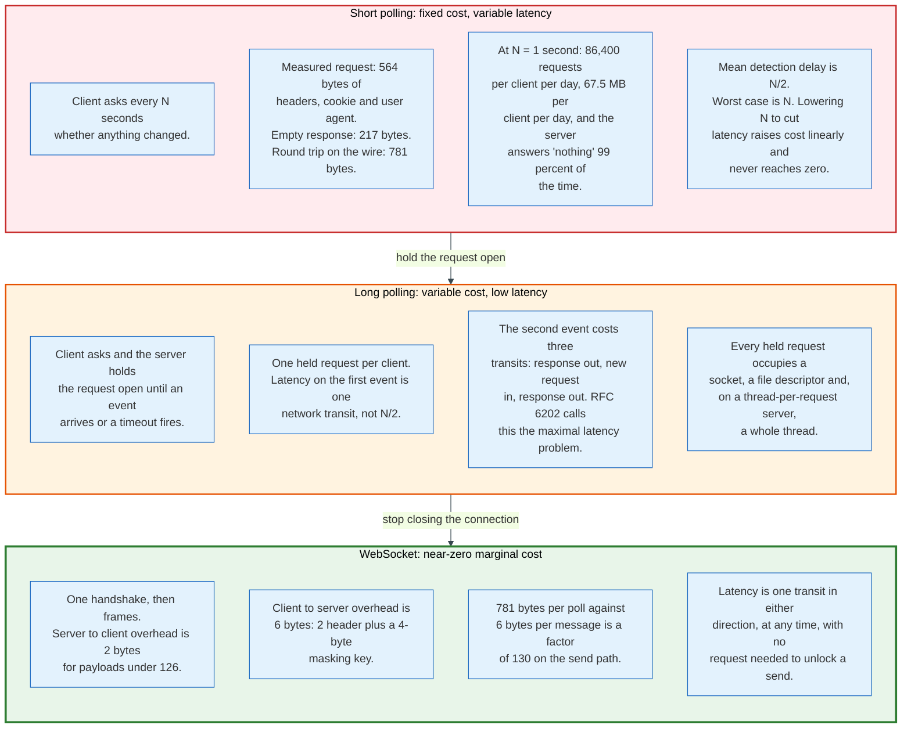

### 2.1 The Arithmetic

Measure a real poll. A chat client asking for new messages sends a request that carries a `Host`, a `User-Agent`, an `Accept`, an `Accept-Encoding`, an `Accept-Language`, a session cookie holding a JWT, a `Referer`, and three `Sec-Fetch-*` headers. That is 564 bytes. The server answers with a status line, a `Date`, a `Content-Type`, a `Content-Length`, a `Cache-Control`, a `Vary`, an HSTS header, a `Server` header, and a two-byte body of `[]`. That is 217 bytes.

781 bytes to learn that nothing happened.

| Poll interval | Requests per client per day | Bytes per client per day | Mean detection delay |
|---|---|---|---|
| 1 second | 86,400 | 67.5 MB | 500 ms |
| 3 seconds | 28,800 | 22.5 MB | 1,500 ms |
| 5 seconds | 17,280 | 13.5 MB | 2,500 ms |
| 10 seconds | 8,640 | 6.7 MB | 5,000 ms |

The table has no good row. One second of polling costs 67.5 MB per user per day and still averages half a second of delay. Ten seconds costs a tenth of that and delivers five seconds of delay, which no chat application will accept.

Now scale it. One million clients polling once a second is one million requests per second, 564 MB per second of ingress and 217 MB per second of egress, before any application work happens. A WebSocket fleet carrying the same population moves bytes only when something changes.

### 2.2 The Three Costs Polling Cannot Shed

**Header overhead dominates the payload.** A chat message of 56 bytes travels inside 781 bytes of HTTP ceremony. The ratio is roughly 14 to 1 against the data. HTTP/2 header compression cuts the first cost on a warm connection: HPACK's dynamic table reduces each of those ten repeated request headers to a one-byte index, so the 564-byte set collapses to roughly 10 bytes plus a literal `:path` that changes on every poll. It does not help at all with the second and third costs.

**The server answers nothing, expensively.** At a 1 percent event rate, 99 of every 100 requests reach the application, authenticate a session, query a datastore for a `since` cursor, find nothing, and serialise an empty array. Caching does not help, because the response depends on a per-user cursor and must not be cached. Every poll is a cache miss by construction.

**Latency has a floor set by the interval, not the network.** A message that arrives 10 milliseconds after a poll waits for the next one. On a 3-second interval that is 2,990 milliseconds of avoidable delay on a link with 30 milliseconds of round-trip time. The network is 100 times faster than the polling loop, and the polling loop sets the number the user experiences.

### 2.3 The Coordination Problem

Polling creates synchronised load, and synchronisation is worse than volume.

Clients that start at the same moment, such as everyone opening a dashboard when a shift begins, poll at the same moment forever afterwards. A fleet restart is worse: every client fails, retries at its configured interval, and arrives in a single spike. The remedy is jitter, and jitter is a property applications almost never add to a polling loop because the loop looks trivial.

The same problem exists for WebSocket reconnection and is covered in section 17. The difference is that a WebSocket herd forms once per outage, and a polling herd forms every interval, forever.

### 2.4 What Polling Is Still Correct For

Polling is the right answer when the event rate is low, the tolerance for delay is high, and the client population is small.

A CI badge that refreshes every 60 seconds does not need a persistent connection. A background sync in a mobile app should poll, because holding a socket open keeps the radio awake and drains the battery faster than a periodic wake and fetch. A cron-driven integration between two backends should poll, because the operational cost of a long-lived connection exceeds the value of sub-minute latency.

The failure mode is not polling. It is polling fast.

---

## 3. What a WebSocket Is, and What It Is Not

A WebSocket is a framed, bidirectional, message-oriented tunnel over one TCP connection, opened by an HTTP request that is discarded once it succeeds. That definition contains every property that matters and no property that does not.

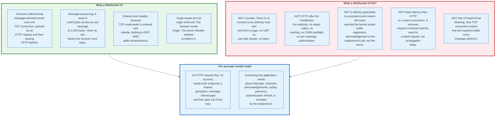

### 3.1 The Four Properties

**Framed.** Bytes on the wire carry a 2 to 14 byte header naming the message type, the length, and whether this frame completes the message. The header is what separates a WebSocket from a raw TCP stream, where finding message boundaries is the application's problem.

**Bidirectional and symmetric after the handshake.** Either side sends at any time without permission from the other. The only asymmetry that survives the handshake is masking: clients mask, servers do not.

**Message-oriented.** The API delivers whole messages. A `send` of 1,000 bytes surfaces at the peer as one `onmessage` event carrying 1,000 bytes, never as two events the receiver must rejoin. This is the property most often assumed of TCP and never provided by it.

**Single connection.** One WebSocket is one TCP connection for its whole life. Multiplexing several logical channels inside it is an application concern, and section 13 covers the subprotocols that do it.

### 3.2 Correcting the First Misconception: It Is Not a Socket

The name is the single most misleading thing about the protocol, and it causes real design errors.

A Berkeley socket connects to an arbitrary host and port, speaks UDP or TCP, listens for inbound connections, and hands the application an unstructured byte stream. A WebSocket does none of that. A page can open a WebSocket only to a URL, only over TCP, only from a browser-initiated handshake, and only with the origin restrictions the server chooses to enforce. There is no `listen`, no `bind`, no datagram, and no access to the byte stream below the frame layer.

What the browser actually grants is narrower than a socket and structured differently. It is a message queue in both directions with an HTTP-shaped front door.

The practical consequence is that a WebSocket cannot be used to reach a database, an SMTP server, or an internal service on a non-HTTP port. Every scheme that appears to do so, and there are several in production, works by running a relay that the browser reaches over WebSocket and that speaks the real protocol on the far side. The relay is where the security boundary lives.

### 3.3 Correcting the Second Misconception: A Successful Send Is Not a Delivery

`socket.send(msg)` returning without error means the bytes were accepted into a buffer. It does not mean the peer received them, and it does not mean the peer will.

Three layers of buffering sit between a `send` and an `onmessage`. The sending application's own queue, the kernel socket send buffer, and whatever the network path holds in flight. A TCP connection that dies with 4 MB in the send buffer discards all of it, and the sender is told only that the connection closed. The browser exposes `bufferedAmount` so an application can observe its local queue depth, and exposes nothing at all about the other two.

RFC 6455 defines no acknowledgement, no sequence number, no retransmission, and no duplicate suppression. A protocol built on top must supply all four if the application needs them. Section 17 covers the design.

This is the misconception that produces the most production incidents, because it is invisible until the first network partition.

### 3.4 Three Further Things It Is Not

**Not HTTP after the handshake.** Once the 101 response is verified, no HTTP construct exists on the connection. There are no status codes, no headers, no methods, no caching, no CORS preflight, no `Authorization` header per message. An access token that expires mid-connection does not cause anything to fail, because nothing re-checks it. Refreshing authorisation on a live socket is a subprotocol feature that most implementations forget to build.

**Not immune to head-of-line blocking.** One WebSocket is one TCP connection. A lost segment stalls every message behind it in the kernel receive queue until the retransmission arrives, regardless of whether those messages are logically independent. Multiplexing forty channels inside one socket concentrates that blocking rather than dispersing it. QUIC removes the blocking between independent streams, and RFC 9220 can carry a WebSocket on a QUIC stream, but no major browser opens one that way. In practice a browser WebSocket is one TCP connection and inherits TCP's blocking.

**Not lower latency than HTTP on a warm connection.** A WebSocket message and an HTTP/2 request on an established connection both take one round trip. What WebSocket removes is the requirement that the client ask first, and the per-message header cost. On the server-to-client path that is the entire difference, and it is decisive. On the client-to-server path the saving is roughly 775 bytes per message and zero milliseconds of propagation.

### 3.5 The Accurate Mental Model

Think of the handshake as a request that, on success, converts the connection into something else and then disappears.

Everything above the frame layer is invented by whoever designs the subprotocol. Channels, acknowledgements, replay, presence, backpressure, authentication refresh, error taxonomy. RFC 6455 supplies message boundaries, a close code, and a heartbeat. That is the whole contract.

Applications that treat it as more than that discover the gap at the worst possible moment.

---

## 4. The Predecessors: Long Polling, HTTP Streaming, and Server-Sent Events

Three techniques delivered server push before WebSocket and two of them are still the correct choice for a large class of applications. Understanding them is not history. It is the comparison that decides most real designs.

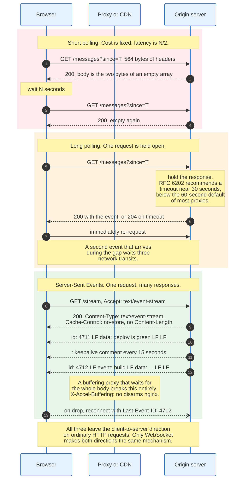

### 4.1 Long Polling

Long polling is a request the server refuses to answer until it has something to say.

The client issues an ordinary GET. The server holds the response open. When an event arrives, the server writes the response and closes it. The client immediately issues another request. Latency on the first event is one network transit, the same as a push.

RFC 6202, published in April 2011 by Salvatore Loreto, Peter Saint-Andre, Stefano Salsano, and Greg Wilkins, is the document that specified the practice. It names four costs precisely.

**Header overhead.** Each cycle carries a full set of request and response headers, which for small messages is most of the traffic.

**Maximal latency.** After the server responds it must wait for the client's next request before it can send again. A second event arriving during that gap waits three network transits, not one. This is the cost that no amount of tuning removes.

**Allocated resources.** Every held request occupies a socket and, on a thread-per-request server, an entire thread. RFC 6202 states plainly that operating systems allocate significant resources to outstanding HTTP requests and that this limits scalability on some servers and proxies.

**Timeout management.** The server must close the held request before any intermediary closes it first. RFC 6202 section 5.5 reports experiments succeeding with server timeouts as high as 120 seconds and calls 30 seconds the safer value, and it separately advises vendors of network equipment to implement an idle timeout substantially greater than 30 seconds. The advice to go higher is aimed at the intermediaries, not the server. nginx's `proxy_read_timeout` default of 60 seconds is the number that binds in practice.

The document adds two operational rules that survive into modern practice: limit each browser to a single long poll, because the per-origin connection limit will otherwise starve ordinary requests, and suppress caching with `Cache-Control: no-cache`.

### 4.2 HTTP Streaming

HTTP streaming keeps one response open and writes many messages into it.

The server sets `Transfer-Encoding: chunked` or simply omits `Content-Length`, then writes as events occur. The client reads incrementally. Latency is one transit for every event, and there is no re-request gap, so the maximal latency problem of long polling disappears.

It fails on intermediaries. RFC 6202 records that network intermediaries may buffer the entire response, which converts a stream into a single delayed blob. It also records that proxies re-chunk the byte stream, so chunk boundaries carry no information and the application must frame its own messages inside the body.

The fix in practice is configuration on every hop. In nginx that is `proxy_buffering off` or the `X-Accel-Buffering: no` response header. In a CDN it is a rule excluding the path from buffering. Neither is available when the intermediary belongs to the user's employer.

### 4.3 Server-Sent Events

Server-Sent Events is HTTP streaming with a specified wire format, a browser API, and automatic reconnection with replay. It is standardised in the HTML Living Standard, not in an RFC.

The client constructs `new EventSource(url)`. The browser issues a GET with `Accept: text/event-stream`. The server responds `200` with `Content-Type: text/event-stream` and writes UTF-8 text.

The format is four field names, one per line, with a blank line terminating an event.

```
: this is a comment and is ignored, used as a keepalive

id: 4711
event: deploy
data: {"service":"checkout","status":"green"}

data: line one
data: line two

retry: 10000
```

`data` appends to a buffer with a newline separator, so two `data` lines produce one message containing one embedded newline. `event` sets the event type, defaulting to `message`. `id` sets the last event ID. `retry` sets the reconnection delay in milliseconds and takes effect immediately. A line beginning with a colon is a comment, and the convention documented in the specification is to send one every 15 seconds so that proxy idle timers do not fire.

Three behaviours are supplied by the browser and are the reason SSE is underrated.

**Automatic reconnection.** On a network error the browser reconnects after the reconnection time, which is implementation-defined and, per the specification, probably in the region of a few seconds. The `retry` field overrides it, and the HTML Standard permits but does not require a user agent to add an exponential backoff delay after a failed attempt: its reconnection step reads "Optionally, wait some more". An application that needs bounded reconnect pressure sets `retry` itself.

**Replay through `Last-Event-ID`.** If any event carried an `id`, the browser sends `Last-Event-ID: <value>` on the reconnect. A server that keeps a bounded buffer can resume the stream exactly where it stopped. This is message replay, in the platform, with no application code.

**Terminal signals.** A `204 No Content` response stops reconnection permanently. Any other non-200 status, or a wrong MIME type, fails the connection permanently and fires `error`. A server can therefore tell a client to stop trying, which WebSocket cannot do without a subprotocol convention.

The limits are equally clear. SSE is server to client only, so every client action still needs an ordinary HTTP request. The payload is UTF-8 text, so binary requires base64 and a 33 percent size penalty. And over HTTP/1.1 each `EventSource` consumes one of the six connections a browser allows per origin, which the specification acknowledges and suggests working around with a shared worker. Over HTTP/2 the constraint becomes `SETTINGS_MAX_CONCURRENT_STREAMS`, whose recommended minimum is 100, and the problem effectively disappears.

### 4.4 When Each One Still Wins

| Requirement | Long polling | HTTP streaming | SSE | WebSocket |
|---|---|---|---|---|
| Client sends without a new request | No | No | No | Yes |
| Binary payload | Yes | Yes | Base64 only | Yes |
| Automatic reconnect in the platform | No | No | Yes | No |
| Replay after a drop, in the platform | No | No | Yes, via `Last-Event-ID` | No |
| Survives a buffering proxy | Yes | No | No | Yes, after upgrade |
| Works with every CDN unchanged | Yes | Sometimes | Mostly | Requires WebSocket support |
| Per-origin connection cost, HTTP/1.1 | 1 of 6 | 1 of 6 | 1 of 6 | Exempt from the limit |
| Server-to-client overhead per message | Full headers | Framing the application defines | 8 bytes minimum, about 20 with an `id` line | 2 bytes |

Long polling survives as a fallback transport, not as a primary one. Socket.IO still connects with HTTP long polling first and upgrades to WebSocket afterwards, and it does so deliberately: a WebSocket that is going to fail in a corporate network fails slowly, and starting with a transport that always works avoids a ten-second delay before the first message.

SSE wins whenever the flow is genuinely one-directional. Notifications, dashboards, progress indicators, build logs, and token-by-token output from a language model are all SSE-shaped problems, and the streaming APIs of every major model provider use SSE rather than WebSocket for exactly that reason.

---

## 5. Key Participants and Roles

A WebSocket connection has two protocol endpoints and, in production, eight parties that can end it.

### 5.1 The Actors

| Role | What it does | Can end the connection | Sees message contents |
|---|---|---|---|
| **Page script** | Calls the API, handles `onmessage`, decides reconnect policy | Yes, via `close()` | Yes |
| **Browser WebSocket stack** | Generates the nonce, verifies the accept value, masks outbound frames, answers Ping, enforces same-origin cookie rules | Yes, on protocol error | Yes |
| **Client library** | Adds channels, acknowledgement, backoff, replay, presence. Socket.IO, SignalR, Phoenix Channels, MQTT.js | Yes | Yes |
| **NAT and CGNAT** | Rewrites addresses, holds a mapping with an idle timer | Yes, silently, with no FIN | No |
| **Corporate TLS proxy** | Terminates TLS, inspects, re-originates | Yes | Yes, this is the point of it |
| **CDN or edge** | Terminates TLS, routes, may or may not support the upgrade | Yes, on idle timeout or deploy | Yes if it terminates TLS |
| **L7 load balancer** | Distributes handshakes, holds the connection open, applies its own idle timeout | Yes | Yes if it terminates TLS |
| **Edge server process** | Parses frames, unmasks, enforces heartbeat, holds the subscription set | Yes | Yes |
| **Pub/sub bus** | Fans one publish out to many edge processes. Redis, NATS, Kafka | No, but its failure ends delivery | Yes |
| **Application service** | Authorises, persists, emits events. Holds no socket | No | Yes |

### 5.2 The Two Roles That Decide Whether the System Works

**The edge process is the only stateful tier, and its state is the connection.** Every design decision about scaling reduces to keeping that tier as thin as possible: hold the socket, hold the subscription list, hold nothing else. An edge process that also holds user profile data, permission caches, or partially assembled application state turns a rolling deploy into a data migration.

**The intermediary nobody controls decides the heartbeat interval.** A connection traverses a carrier NAT, possibly a corporate proxy, a CDN, and a load balancer. Each has an idle timer. The shortest one wins, none of them announces itself, and the client sees only a close with code 1006. Section 11 covers the arithmetic. The design consequence is that heartbeat interval is not a tuning parameter chosen for elegance; it is chosen to be shorter than the shortest timer in a path the operator cannot see.

### 5.3 The Client Library Is Not Optional

RFC 6455 gives an application four things: `send`, `onmessage`, `onclose`, and a close code. Everything else a real application needs sits in a library.

The list of what libraries add is remarkably stable across Socket.IO, SignalR, Phoenix Channels, Ably, and Pusher. Multiplexed channels inside one socket. Automatic reconnection with backoff and jitter. Buffering of sends while disconnected. Per-message acknowledgement with a callback. Replay of missed messages after a reconnect. Presence, meaning who is currently subscribed to a channel. Broadcast across a server fleet through a shared bus. Transport fallback for networks that block the upgrade.

That list is a specification for the layer RFC 6455 deliberately omitted. A team that writes a raw WebSocket client is committing to build all of it, usually discovering the requirement one production incident at a time.

---

## 6. The Opening Handshake, Field by Field

The handshake is a normal HTTP GET that asks the server to stop speaking HTTP. It succeeds with status 101 and it is the only part of the protocol an HTTP intermediary can understand.

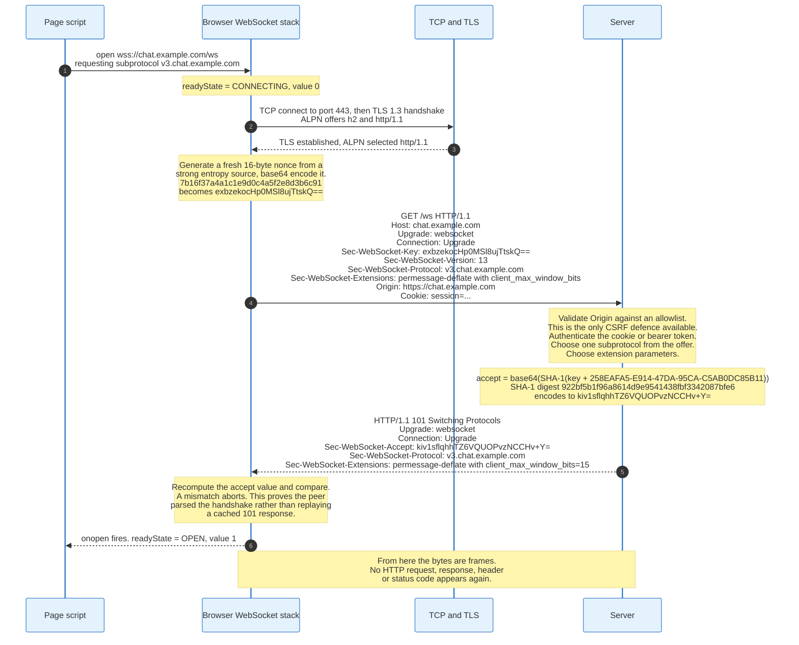

### 6.1 The Request

```
GET /ws HTTP/1.1
Host: chat.example.com
Upgrade: websocket
Connection: Upgrade
Sec-WebSocket-Key: exbzekocHp0MSl8ujTtskQ==
Sec-WebSocket-Version: 13
Sec-WebSocket-Protocol: v3.chat.example.com
Sec-WebSocket-Extensions: permessage-deflate; client_max_window_bits
Origin: https://chat.example.com
Cookie: session=eyJhbGciOiJIUzI1NiIsInR5cCI6IkpXVCJ9...
```

`Upgrade: websocket` and `Connection: Upgrade` are the mechanism, and both are hop-by-hop headers under RFC 9110. A proxy that forwards a request without deliberately reconstructing them destroys the handshake, which is the single most common cause of a WebSocket that works locally and fails behind a reverse proxy. Section 14 covers the configuration.

`Sec-WebSocket-Key` is a nonce, and RFC 6455 section 4.1 requires that it be a randomly selected 16-byte value that has been base64-encoded. Sixteen bytes encode to exactly 24 base64 characters, of which the last two are always padding. A server that receives a key of any other length has received a malformed handshake.

`Sec-WebSocket-Version: 13` is the only value with a standard behind it. The IANA WebSocket Version Number Registry lists 0 through 8 as interim draft versions and 9 through 12 as reserved. A server that does not support the offered version replies `426 Upgrade Required` with a `Sec-WebSocket-Version` header naming what it does support.

`Origin` is present on every browser handshake and absent from most non-browser ones. It is the only cross-site defence available, and section 19 explains why validating it is mandatory rather than advisable.

`Cookie` is sent because the handshake is an ordinary same-origin-cookie-eligible request. That is convenient, and it is also the entire cross-site WebSocket hijacking vulnerability.

### 6.2 The Response

```
HTTP/1.1 101 Switching Protocols
Upgrade: websocket
Connection: Upgrade
Sec-WebSocket-Accept: kiv1sflqhhTZ6VQUOPvzNCCHv+Y=
Sec-WebSocket-Protocol: v3.chat.example.com
Sec-WebSocket-Extensions: permessage-deflate; client_max_window_bits=15
```

Status 101 and nothing else. A 200 is not an upgrade. A 3xx is a redirect the WebSocket API in browsers does not follow for the upgrade itself. A 401 or 403 ends the attempt, and the browser API surfaces it as a generic error with no status code, which is why WebSocket authentication failures are so hard to debug from the client.

### 6.3 Computing Sec-WebSocket-Accept

The server takes the client's key, concatenates a fixed 36-character GUID, hashes with SHA-1, and base64-encodes the 20-byte digest.

```
GUID = 258EAFA5-E914-47DA-95CA-C5AB0DC85B11

accept = base64( SHA-1( key_as_ascii + GUID_as_ascii ) )
```

Worked with the values above:

```
key        = exbzekocHp0MSl8ujTtskQ==
key + GUID = exbzekocHp0MSl8ujTtskQ==258EAFA5-E914-47DA-95CA-C5AB0DC85B11
SHA-1      = 922bf5b1f96a8614d9e9541438fbf3342087bfe6
base64     = kiv1sflqhhTZ6VQUOPvzNCCHv+Y=
```

The example in RFC 6455 itself is reproducible the same way: the key `dGhlIHNhbXBsZSBub25jZQ==` yields `s3pPLMBiTxaQ9kYGzzhZRbK+xOo=`.

The purpose of this exchange is narrow and frequently misunderstood. It is not authentication, it is not integrity, and it is not a proof of freshness in any cryptographic sense. SHA-1 is used deliberately for a construction where collision resistance is irrelevant. The GUID is a public constant printed in the RFC.

What it proves is that the responder parsed the handshake. A cache holding a 101 response, or a server that answers 101 to everything without reading the request, cannot produce the correct accept value for a nonce it has never seen. The check exists to stop a client from being fooled into treating a non-WebSocket endpoint as a WebSocket endpoint, which was a real risk with the transparent proxies of 2010.

Note what happens under RFC 8441. When WebSocket is bootstrapped over HTTP/2, both headers vanish entirely. The RFC states that implementations using extended CONNECT do not do the processing of the `Sec-WebSocket-Key` and `Sec-WebSocket-Accept` header fields, as that functionality has been superseded by the `:protocol` pseudo-header field. The check was a workaround for HTTP/1.1's lack of a real upgrade mechanism, and HTTP/2 has one.

### 6.4 What the Server Must Decide During the Handshake

The handshake is the only moment at which HTTP-shaped policy applies, so every access decision has to happen here.

**Origin.** Compare against an allowlist. A missing `Origin` header means a non-browser client, which may be legitimate or may be an attacker who removed it. The policy must be explicit either way.

**Authentication.** Cookie, bearer token in a query parameter, or a token sent as the first message after open. The browser WebSocket API cannot set custom headers, so `Authorization: Bearer ...` is not available to a page. That constraint drives most real designs toward either cookies, which reintroduce the cross-site problem, or a short-lived ticket in the URL, which leaks into access logs unless the ticket is single-use.

**Subprotocol selection.** The server picks exactly one value from the client's comma-separated `Sec-WebSocket-Protocol` list and echoes it. Echoing a value the client did not offer is a protocol error. Echoing nothing when the client offered a list means the server declines to speak any of them, and a strict client should close.

**Extension negotiation.** The server names the parameters it agrees to. Section 12 covers `permessage-deflate` in detail, and the governing rule is that the client's offer is a hint and the server's answer is the contract.

**Capacity.** A handshake is the cheapest moment to reject a connection. Once the socket is open, refusing costs a close frame, a TCP teardown, and a client that will immediately retry.

### 6.5 Timing Cost

A `wss://` handshake on a cold connection costs one TCP round trip, one or two TLS round trips depending on version and session resumption, and one HTTP round trip for the upgrade.

On TLS 1.3 with a fresh connection that is three round trips before the first message. On a 30 millisecond path that is 90 milliseconds. With TLS session resumption and 0-RTT it can fall to two. This cost is paid once per connection and never again, which is the whole economic argument for a persistent transport.

---

## 7. The Frame Format, Byte by Byte

The frame header is 2 bytes in the common case and never more than 14. That compactness is the protocol's main technical achievement and the reason it displaced every alternative.

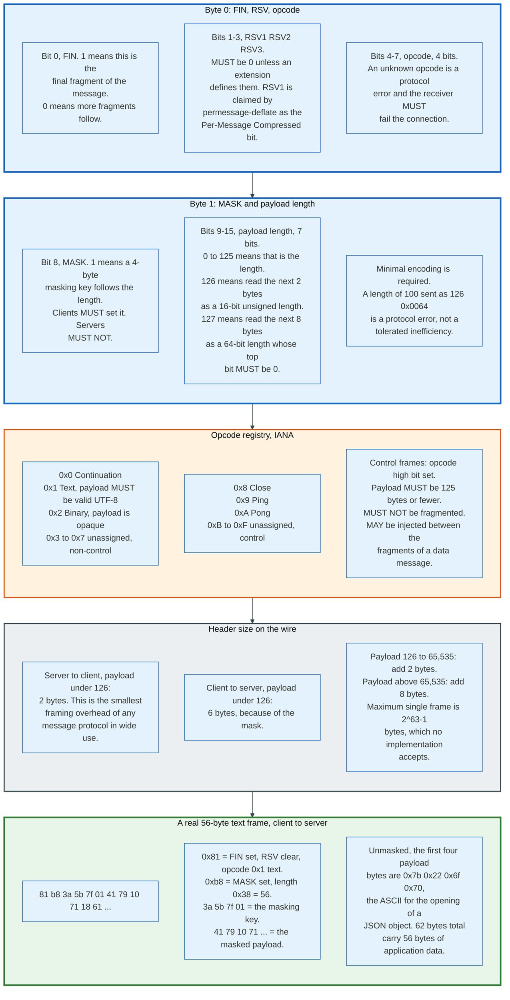

### 7.1 The Layout

```
 0                   1                   2                   3
 0 1 2 3 4 5 6 7 8 9 0 1 2 3 4 5 6 7 8 9 0 1 2 3 4 5 6 7 8 9 0 1
+-+-+-+-+-------+-+-------------+-------------------------------+
|F|R|R|R| opcode|M| Payload len |    Extended payload length    |
|I|S|S|S|  (4)  |A|     (7)     |             (16/64)           |
|N|V|V|V|       |S|             |   (if payload len==126/127)   |
| |1|2|3|       |K|             |                               |
+-+-+-+-+-------+-+-------------+ - - - - - - - - - - - - - - - +
|     Extended payload length continued, if payload len == 127  |
+ - - - - - - - - - - - - - - - +-------------------------------+
|                               |Masking-key, if MASK set to 1  |
+-------------------------------+-------------------------------+
| Masking-key (continued)       |          Payload Data         |
+-------------------------------- - - - - - - - - - - - - - - - +
:                     Payload Data continued ...                :
+ - - - - - - - - - - - - - - - - - - - - - - - - - - - - - - - +
|                     Payload Data continued ...                |
+---------------------------------------------------------------+
```

### 7.2 Field by Field

**FIN, bit 0.** Set to 1 when this frame completes a message. Set to 0 when more fragments follow. An unfragmented message is a single frame with FIN set.

**RSV1, RSV2, RSV3, bits 1 to 3.** Each must be 0 unless an extension negotiated during the handshake defines it. A receiver that sees a set RSV bit with no matching extension must fail the connection. The IANA WebSocket Framing Header Bits Registry contains exactly one entry: RSV1, claimed by RFC 7692 as the Per-Message Compressed bit. RSV2 and RSV3 have never been assigned in fifteen years.

**Opcode, bits 4 to 7.** Four bits, so sixteen possible values, of which six are assigned.

| Opcode | Name | Class | Rules |
|---|---|---|---|
| `0x0` | Continuation | Data | Carries a fragment of the message opened by an earlier `0x1` or `0x2` |
| `0x1` | Text | Data | Payload must be valid UTF-8. Invalid UTF-8 is close code 1007 |
| `0x2` | Binary | Data | Payload is opaque octets. No validation |
| `0x3` to `0x7` | Unassigned | Data | Receiving one is a protocol error |
| `0x8` | Close | Control | Begins or completes the closing handshake |
| `0x9` | Ping | Control | Must be answered with Pong carrying identical payload |
| `0xA` | Pong | Control | Answer to a Ping, or an unsolicited one-way heartbeat |
| `0xB` to `0xF` | Unassigned | Control | Receiving one is a protocol error |

The high bit of the opcode separates the two classes. Opcodes `0x0` through `0x7` are data frames, `0x8` through `0xF` are control frames, and control frames carry three hard restrictions: payload at most 125 bytes, never fragmented, and permitted to appear between the fragments of a data message.

**MASK, bit 8.** Set when a 4-byte masking key follows the length field. A client must set it on every frame. A server must not set it on any frame. A server receiving an unmasked client frame must fail the connection, and a client receiving a masked server frame must do the same.

**Payload length, bits 9 to 15 plus extension.** Seven bits with two escape values.

| 7-bit value | Meaning | Total header size, unmasked |
|---|---|---|
| 0 to 125 | That is the payload length | 2 bytes |
| 126 | The next 2 bytes are a 16-bit unsigned length, network order | 4 bytes |
| 127 | The next 8 bytes are a 64-bit length, network order, top bit must be 0 | 10 bytes |

Add 4 bytes to each row for a masked frame, giving the familiar 6, 8, and 14.

The minimal-encoding rule matters. RFC 6455 requires the shortest form that can express the length. Sending a 100-byte payload with the 126 escape and a 16-bit length of 0x0064 is a protocol error, not a tolerated inefficiency, and conformance suites test for it.

The 64-bit form permits a single frame of up to 2^63 minus 1 bytes, which is roughly 9.2 exabytes. No implementation accepts anything close. Practical limits are set by the receiver: browsers, libraries, and proxies all impose a maximum message size and close with 1009 when it is exceeded.

**Masking key, 4 bytes when MASK is set.** Covered in section 8.

**Payload data.** Extension data, if an extension negotiated any, followed by application data. No registered extension defines extension data, so in practice the payload is entirely application data, compressed or not.

### 7.3 Overhead, Measured

Server to client, payload under 126 bytes: 2 bytes of header. That is the smallest framing overhead of any message protocol in common use, smaller than MQTT's 2-byte fixed header once topic strings are counted, and two orders of magnitude below an HTTP request.

Client to server, payload under 126 bytes: 6 bytes, because the mask is mandatory.

Compare to the 781-byte HTTP poll from section 2. On the send path 6 bytes against 781 is a factor of 130. On a chat application where the median message is 40 bytes of text, the WebSocket frame is 15 percent overhead against the payload, 6 bytes on 40, and the HTTP request is 1,850 percent, 741 bytes on 40. Both figures use the payload as the denominator.

### 7.4 A Real Frame

A text message carrying 56 bytes of JSON, sent by a client, masked with the key `3a 5b 7f 01`:

```
81 b8 3a 5b 7f 01 41 79 10 71 18 61 5d 6c 49 3c
5d 2d 18 38 17 23 00 79 1a 6f 5d 76 18 64 54 3e
0d 60 56 79 53 23 58 34 1b 78 18 61 5d 65 5f 2b
13 6e 43 7b 16 72 1a 3c 0d 64 5f 35 5d 7c
```

Decode it. `0x81` is `1000 0001`: FIN set, RSV clear, opcode `0x1` text. `0xb8` is `1011 1000`: MASK set, length `0x38` which is 56. The next four bytes `3a 5b 7f 01` are the masking key. The remaining 56 bytes are the masked payload.

Unmask the first four payload bytes: `0x41 XOR 0x3a = 0x7b`, `0x79 XOR 0x5b = 0x22`, `0x10 XOR 0x7f = 0x6f`, `0x71 XOR 0x01 = 0x70`. That is `{"op`, the opening of a JSON object.

62 bytes on the wire to carry 56 bytes of application data. The same message sent by the server would be 58 bytes, because the server does not mask.

---

## 8. Masking, and the Attack That Created It

Masking exists to protect infrastructure that neither endpoint owns, from an attack that neither endpoint can detect. It is the only feature in RFC 6455 with that property, and it is routinely misunderstood as encryption.

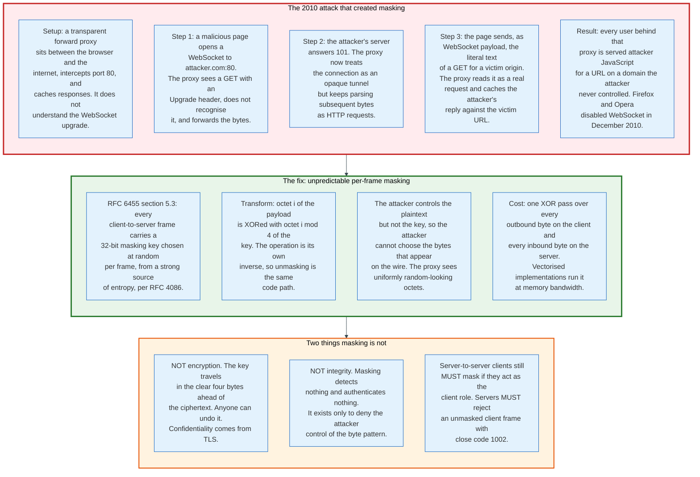

### 8.1 The Attack

In 2010 Huang, Chen, Barth, Rescorla, and Jackson published work on what happens when a protocol runs through a transparent proxy that does not understand it. The WebSocket draft of the period had no masking.

The setup is a transparent forward proxy: an intermediary that intercepts outbound port 80 traffic without the client configuring it, caches responses, and parses everything it sees as HTTP. These were common in ISP networks, corporate networks, and mobile carriers.

The attack runs in four steps. A malicious page opens a WebSocket to a host the attacker controls, on port 80. The proxy sees a GET with an `Upgrade` header, does not recognise the upgrade, and forwards the bytes. The attacker's server answers `101`, which the proxy also does not understand, so the proxy keeps the connection open and keeps parsing the bytes flowing through it as HTTP messages.

Then the page sends, as WebSocket payload, the literal ASCII text of an HTTP request for a completely different origin. Something shaped like `GET /app.js HTTP/1.1` with a `Host` header naming the victim domain. The proxy reads it as a new pipelined request on that connection, forwards it or answers it, and caches the attacker's response under the victim's URL.

Every user behind that proxy now receives attacker-controlled JavaScript when they load a script from a domain the attacker never touched. The cache entry persists after the attacker disconnects.

The response was immediate. Firefox and Opera disabled WebSocket in December 2010, and the working group changed the wire format.

### 8.2 The Fix

RFC 6455 section 5.3 requires that every client-to-server frame carry a 32-bit masking key chosen at random by the client, and states that the key must be derived from a strong source of entropy, referencing RFC 4086.

The transformation is one line.

```
j = i MOD 4
transformed-octet-i = original-octet-i XOR masking-key-octet-j
```

The specification's own justification is precise: the unpredictability of the masking key is essential to prevent authors of malicious applications from selecting the bytes that appear on the wire. The attacker still controls the plaintext. The attacker no longer controls the ciphertext, because the key is fresh per frame and unknown when the payload is chosen. A proxy sees a stream of octets that will not, except by a probability of roughly 2^-32 per attempt, form the ASCII of an HTTP request line.

RFC 6455 also requires that the key for one frame must not make it simple to predict the key for a subsequent frame. A client using a counter, a timestamp, or a fixed key satisfies the letter of the format and reintroduces the vulnerability.

### 8.3 What Masking Is Not

**Not encryption.** The key travels in the clear, four bytes ahead of the data it masks. Any observer can undo it with the same XOR. Confidentiality on a WebSocket comes from TLS, which is why `wss://` is the only scheme worth deploying and why every browser requires it on pages served over HTTPS.

**Not integrity.** Masking detects no modification and authenticates no sender. A middlebox can rewrite a masked frame by unmasking, editing, and remasking.

**Not optional for non-browser clients.** Any endpoint acting in the client role must mask, including a backend service opening a WebSocket to another backend. Servers must reject unmasked client frames, and the correct response is a close frame with code 1002.

### 8.4 The Cost

Masking is one XOR pass over every outbound byte on the client and every inbound byte on the server. At the naive byte-at-a-time implementation it is one of the more expensive things a WebSocket server does per byte.

Production implementations vectorise it. Expanding the 4-byte key to 8, 16, or 32 bytes and XORing whole machine words at a time brings the cost close to memory bandwidth, and libraries such as `ws` ship a native addon for exactly this. On a server terminating a million connections the difference between a byte loop and a word loop is measurable in whole CPU cores.

The asymmetry is deliberate and useful. Servers, which are the scarce resource, only unmask. Clients, which are abundant, do the work of masking. The protocol pushed the cost to the side that has spare cycles.

---

## 9. Fragmentation, Control Frames, and Message Assembly

Fragmentation exists so that a large message cannot block a heartbeat. Every other use of it is secondary.

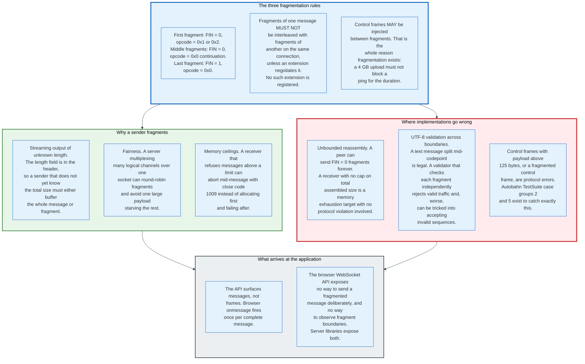

### 9.1 The Rules

A message is either one frame or a sequence of frames obeying three rules.

The first fragment carries FIN clear and an opcode of `0x1` or `0x2`. Middle fragments carry FIN clear and opcode `0x0`. The final fragment carries FIN set and opcode `0x0`. A one-frame message carries FIN set and a non-zero opcode.

Fragments of one message must not be interleaved with fragments of another on the same connection, unless an extension negotiates it. No such extension has ever been registered, so in practice a WebSocket can have exactly one message in flight per direction at a time.

Control frames may be injected between the fragments of a data message. This is the entire purpose of fragmentation. Without it, a 4 GB file transfer would block Ping, Pong, and Close for the duration of the transfer, and every idle timer in the path would fire.

### 9.2 Why a Sender Fragments

**Unknown length.** The length is in the header, which is written first. A sender that does not yet know the total size of a message must either buffer the whole thing to learn the length or fragment as it goes. A server streaming a database result set, a log tail, or a model's token output takes the second option.

**Fairness across logical channels.** A server multiplexing forty channels inside one socket can round-robin fragments so that a 10 MB payload on one channel does not starve the other thirty-nine for the duration.

**Bounded memory on the receiver.** A receiver enforcing a maximum message size can abort mid-message with close code 1009, rather than committing an allocation and discovering the problem afterwards.

### 9.3 Three Places Implementations Break

**Unbounded reassembly.** Nothing in RFC 6455 caps the number of fragments or the total assembled size. A peer can send FIN-clear fragments indefinitely, and a receiver that accumulates them without a limit is a memory exhaustion target that never violates the protocol. Every server needs an explicit maximum message size, and the failure mode is a close with 1009, not an out-of-memory kill.

**UTF-8 validation across fragment boundaries.** A text message may be split in the middle of a multi-byte codepoint. That is legal. A validator that checks each fragment independently rejects valid traffic, and a validator that skips the check at boundaries can be fed invalid sequences that reassemble into something the application misinterprets. The correct implementation is an incremental UTF-8 decoder carrying state across fragments, and the Autobahn TestSuite exists in large part to test this.

**Control frame violations.** A control frame with a payload above 125 bytes, or with FIN clear, is a protocol error. Both appear in fuzzing suites because both were common in early implementations.

### 9.4 What the Application Sees

Browsers deliver messages, not frames. The `onmessage` handler fires once per complete message, with the fragments already reassembled, and the API exposes no way to observe fragment boundaries or to send a fragmented message deliberately.

Server libraries expose both. Node's `ws` can emit a stream per message. Go's `gorilla/websocket` and `nhooyr/websocket` return a reader. Python's `websockets` offers both a message-level and a frame-level interface.

The asymmetry has a consequence worth stating. A server can stream a 500 MB response as fragments and hold constant memory. A browser receiving it will buffer the entire thing before firing `onmessage`, because the API has no other option. Streaming large payloads to a browser over WebSocket requires the application to do its own chunking into separate messages, with its own sequence numbers, which is the same problem the protocol already solved one layer down.

---

## 10. The Closing Handshake and Close Codes

A WebSocket closes cleanly with an exchange of two frames, and in production it usually does not. The distinction between the two paths is visible to the application and determines what the application should do next.

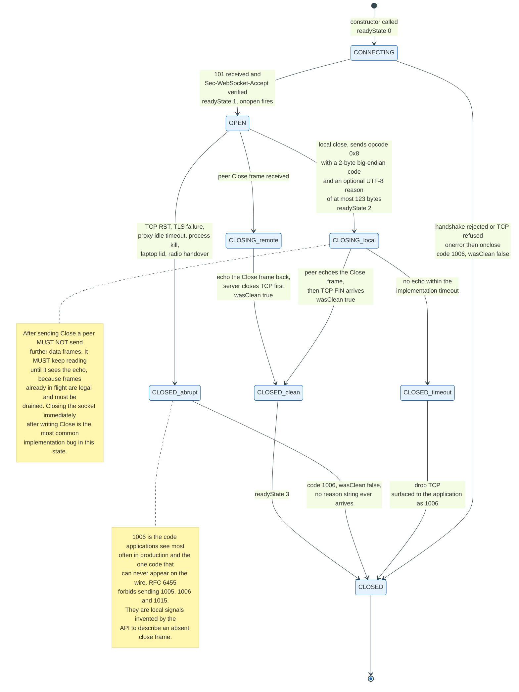

### 10.1 The Close Frame

Opcode `0x8`. The payload, if present, is a 2-byte big-endian status code followed by an optional UTF-8 reason string. Total payload is capped at 125 bytes like every control frame, so the reason string has at most 123 bytes available.

A Close frame with an empty payload is legal and means no status code was supplied.

### 10.2 The Exchange

Either peer initiates. The initiator sends a Close frame and must not send any further data frames. It must keep reading, because frames the peer sent before it saw the Close are legal and in flight.

The peer, on receiving a Close, sends one back if it has not already. RFC 6455 explicitly permits simultaneous initiation from both sides, in which case each side's Close serves as its response.

The server closes the TCP connection first. The client should wait for that but may close after a reasonable timeout rather than waiting indefinitely.

Skipping the read-until-echo step is the most common implementation bug in this part of the protocol. A server that writes a Close frame and immediately calls `close()` on the socket sends a TCP RST that discards the Close frame from the send buffer, and the client reports 1006 instead of the clean code the server intended.

### 10.3 The Close Code Registry

Codes 1000 to 2999 require standards action. Codes 3000 to 3999 are first come first served through IANA and are usable by libraries and frameworks. Codes 4000 to 4999 are reserved for private use and require no registration.

| Code | Name | Sendable on the wire | Meaning |
|---|---|---|---|
| 1000 | Normal Closure | Yes | The purpose of the connection is fulfilled |
| 1001 | Going Away | Yes | Server shutting down, or a browser navigating away |
| 1002 | Protocol error | Yes | Malformed frame, unmasked client frame, bad RSV bit |
| 1003 | Unsupported Data | Yes | Received a type the endpoint cannot accept, such as binary on a text-only endpoint |
| 1004 | Reserved | No | Never defined. Do not use |
| 1005 | No Status Rcvd | No | Local signal: a Close arrived with no code |
| 1006 | Abnormal Closure | No | Local signal: the connection died without a Close frame |
| 1007 | Invalid frame payload data | Yes | A text frame that is not valid UTF-8 |
| 1008 | Policy Violation | Yes | Generic policy rejection. Use when a more specific code would leak information |
| 1009 | Message Too Big | Yes | Payload exceeded the receiver's limit |
| 1010 | Mandatory Ext. | Yes | Client only. The server did not negotiate a required extension |
| 1011 | Internal Error | Yes | Server only. An unexpected condition prevented fulfilling the request |
| 1012 | Service Restart | Yes | Server is restarting. Clients should reconnect after a randomised delay |
| 1013 | Try Again Later | Yes | Server is overloaded. Clients should back off |
| 1014 | Bad Gateway | Yes | Gateway received an invalid response from upstream |
| 1015 | TLS handshake | No | Local signal: the TLS handshake failed |
| 3000 | Unauthorized | Yes | Registered, first come first served |
| 3003 | Forbidden | Yes | Registered, first come first served |
| 3008 | Timeout | Yes | Registered, first come first served |
| 4000 to 4999 | Private use | Yes | Application-defined, no registration |

### 10.4 The Code That Matters Most Cannot Be Sent

1006 is the code applications see most often in production, and it is the one code that can never appear on the wire.

RFC 6455 forbids sending 1005, 1006, and 1015. They are local signals invented by the API to describe the absence of a close frame. When a client reports 1006, the connection ended without either side saying why: a TCP reset, a TLS failure, a proxy idle timeout, a killed process, a closed laptop, a mobile radio handover.

The design consequence is direct. A client cannot distinguish a server that crashed from a proxy that timed out from a network that changed, because all three produce 1006 with `wasClean: false` and no reason string. Any client-side logic that branches on close code must treat 1006 as a category, not an event, and every heuristic for choosing a reconnect delay must live in the client's own state rather than in the code the server sent.

### 10.5 Using the Codes Well

**1001 on deploy, 1012 on restart, 1013 on overload.** These three tell a well-behaved client what to do. 1001 means reconnect normally. 1012 means the fleet is rolling and the client should spread its retry. 1013 means back off aggressively.

**Put the retry hint in the reason string.** There is no `Retry-After` in a Close frame, and 123 bytes is enough for a JSON fragment like `{"retry_after_ms":8000,"reason":"rolling_deploy"}`. Clients that parse it reconnect in a controlled spread rather than a spike.

**Use 4000 to 4999 for application errors.** A subscription rejected for lack of permission is an application concern. Encoding it as 1008 loses information; encoding it as 4403 with a reason string keeps it. The range requires no registration and no coordination.

**Do not close on recoverable errors.** A malformed application message should produce an error message on the channel, not a connection teardown. Every close costs a full reconnect: TCP, TLS, handshake, authentication, resubscription, and replay. Closing a connection to report a bad JSON body is a denial of service the client performs on itself.

---

## 11. Ping, Pong, and Idle Timeouts

A WebSocket dies silently, and the protocol's only defence is a heartbeat whose interval must be shorter than a timer nobody can see.

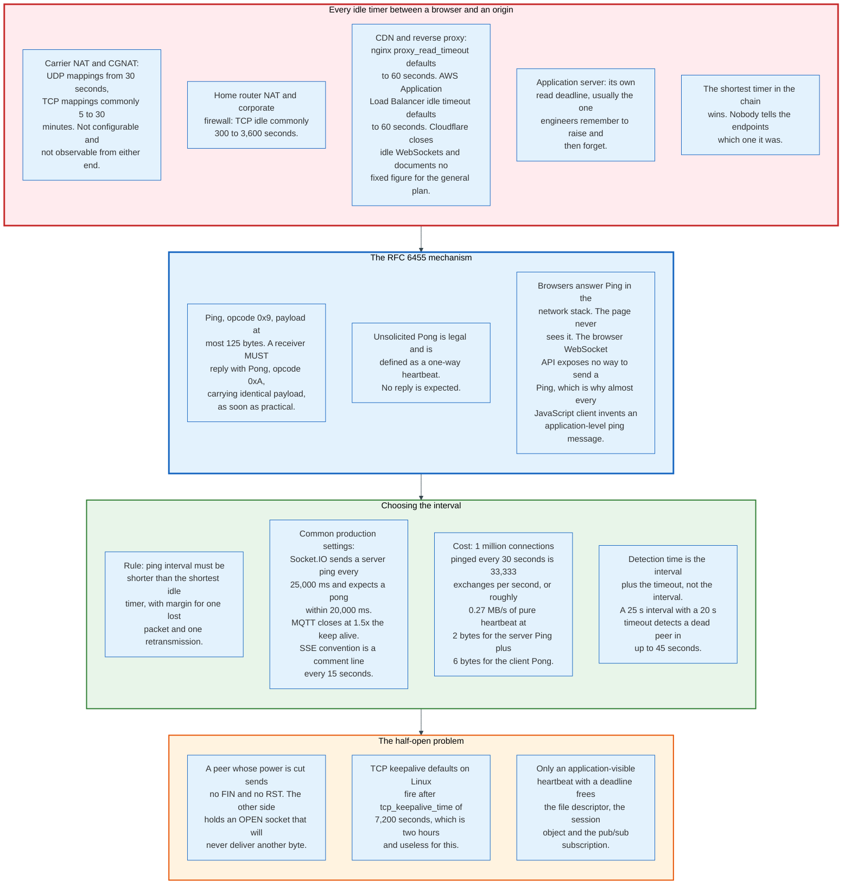

### 11.1 The Mechanism

Ping is opcode `0x9`, Pong is opcode `0xA`. Both are control frames, so both carry at most 125 bytes of payload and neither may be fragmented.

RFC 6455 requires that an endpoint receiving a Ping send a Pong in response as soon as is practical, unless it has already received a Close frame. The Pong must carry payload identical to the Ping's. That identity requirement is what makes round-trip measurement possible: put a timestamp or a sequence number in the Ping and read it back from the Pong.

An unsolicited Pong, sent with no preceding Ping, is explicitly legal and defined as a unidirectional heartbeat. No response is expected. It is the cheapest possible keepalive: 2 bytes from a server, 6 from a client.

### 11.2 The Browser Cannot Send a Ping

The browser WebSocket API exposes no method to send a Ping. The specification never added one.

Browsers do answer Pings, in the network stack, without the page ever knowing. So a server can ping a browser and learn whether the connection is alive. A browser cannot ping a server.

This single gap explains why nearly every JavaScript real-time library defines an application-level ping message instead of using the protocol's. Socket.IO's Engine.IO layer sends a server-originated PING every 25,000 milliseconds and expects a client PONG within 20,000 milliseconds, both as ordinary messages rather than control frames. Phoenix Channels, SignalR, and MQTT over WebSocket all do something equivalent.

The cost is a few bytes per heartbeat and a lot of duplicated design. The benefit is that the heartbeat is visible to the application on both sides, which the protocol's own mechanism is not.

### 11.3 The Timers in the Path

The connection crosses several intermediaries and each has an idle timer.

| Layer | Typical idle timeout | Configurable by the operator |
|---|---|---|
| Carrier NAT, TCP mapping | 5 to 30 minutes, undocumented | No |
| Home router NAT | 300 to 3,600 seconds | Rarely |
| Corporate firewall | Site policy, often 300 seconds | Not by the application team |
| nginx `proxy_read_timeout` | 60 seconds by default | Yes |
| AWS Application Load Balancer | 60 seconds by default, configurable | Yes |
| Cloudflare | Closes idle WebSockets, no published figure for the general plan, custom values for Enterprise | Partially |
| Application server read deadline | Framework default | Yes |

The shortest timer wins. None of them announces itself. The endpoint sees a close with code 1006 and no reason.

nginx's own WebSocket documentation states the case plainly: the connection will be closed if the proxied server does not transmit any data within 60 seconds, and the two remedies are to raise `proxy_read_timeout` or to have the proxied server send periodic WebSocket ping frames.

### 11.4 Choosing an Interval

The rule is that the heartbeat interval must be shorter than the shortest idle timer in the path, with margin for one lost packet and its retransmission.

For a public internet service where the path is unknown, 20 to 30 seconds is the working default. It sits below nginx's and AWS's 60-second defaults with room for a retransmission, and comfortably below every NAT mapping timer in common use. Socket.IO's 25 seconds is that reasoning made concrete.

Detection time is the interval plus the timeout, not the interval. A 25-second interval with a 20-second response deadline detects a dead peer in up to 45 seconds. Halving that means halving both numbers and doubling the traffic.

The traffic is small. One million connections pinged every 30 seconds is 33,333 exchanges per second. At 2 bytes for a server Ping, which carries no mask, plus 6 for the client Pong, which does, that is 266,664 bytes per second, or roughly 0.27 MB per second of pure heartbeat across the fleet. Heartbeat traffic is almost never the constraint. Heartbeat processing, meaning a timer per connection, is: a naive implementation with one OS timer per socket will spend more CPU on timer management than on messages, which is why every production server uses timer wheels or sharded sweep loops.

### 11.5 The Half-Open Connection

TCP has a keepalive of its own and it is useless here. The Linux default `tcp_keepalive_time` is 7,200 seconds, or two hours, before the first probe. Lowering it is possible per socket, and most servers do not.

A peer whose power is cut sends no FIN and no RST. The other side holds a socket in `ESTABLISHED` that will never deliver another byte. That socket costs a file descriptor, a struct in the kernel, an application session object, and an entry in every pub/sub subscription list it joined. At scale, half-open connections are how a fleet runs out of memory while apparently serving fewer users than it has capacity for.

Only an application-visible heartbeat with a deadline reclaims them. The server must track the last time each connection produced any inbound frame, and close connections that have been silent for longer than the deadline. A read deadline that resets on any inbound activity, including Pong, is the standard implementation and takes about ten lines.

---

## 12. permessage-deflate Compression

`permessage-deflate` compresses message payloads with DEFLATE and is the only compression extension ever registered for WebSocket. It buys a factor of roughly 30 on repetitive JSON and costs about 300 KB of memory per bidirectional connection.

That trade decides whether it belongs in a given deployment. There is no configuration that avoids it.

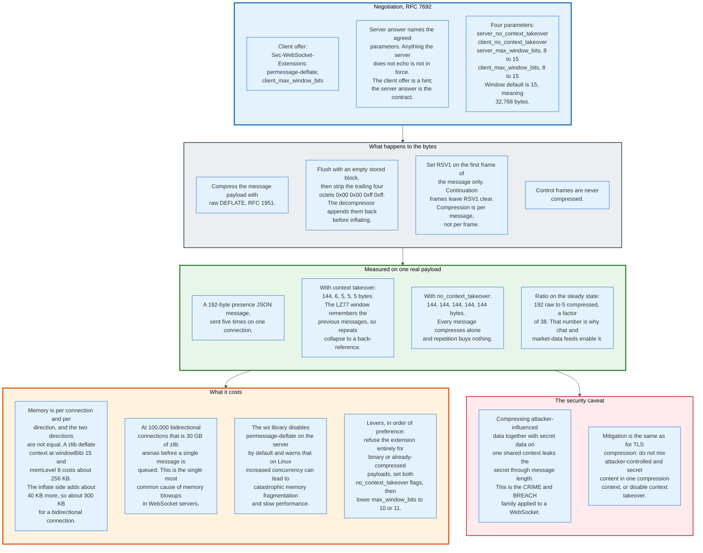

### 12.1 Negotiation

RFC 7692 was published in December 2015 and registers the extension name `permessage-deflate` in the IANA WebSocket Extension Name Registry.

The client offers in the handshake:

```
Sec-WebSocket-Extensions: permessage-deflate; client_max_window_bits
```

The server answers with the parameters it agrees to:

```
Sec-WebSocket-Extensions: permessage-deflate; server_max_window_bits=10; server_no_context_takeover
```

The distinction the RFC draws is that the client's offer contains hints and the server's answer contains the agreed parameters that determine behaviour. Anything the server does not echo is not in force.

| Parameter | Values | Default | Effect |
|---|---|---|---|
| `server_no_context_takeover` | Flag, no value | Absent | Server resets its LZ77 window between messages |
| `client_no_context_takeover` | Flag, no value | Absent | Client resets its LZ77 window between messages |
| `server_max_window_bits` | 8 to 15 | 15, meaning 32,768 bytes | Caps the server's compression window |
| `client_max_window_bits` | 8 to 15, or no value | 15, meaning 32,768 bytes | Caps the client's compression window |

A client sending `client_max_window_bits` with no value is announcing that it can accept a server-imposed limit. Omitting the parameter entirely means the client cannot accept one, and a server that wants to constrain client memory must then decline the extension.

### 12.2 What Happens to the Bytes

Compression is per message, not per frame.

The sender compresses the message payload with raw DEFLATE as defined in RFC 1951, flushes with an empty stored block, and removes the trailing four octets `0x00 0x00 0xff 0xff`. The receiver appends those same four octets back and inflates. Stripping and re-adding a constant saves four bytes per message and is the kind of detail that only appears in a protocol designed for messages measured in tens of bytes.

RSV1 is set on the first frame of a compressed message and left clear on its continuation frames. Control frames are never compressed.

### 12.3 Measured, On a Real Payload

Take a 192-byte presence event, the kind a chat application sends constantly:

```json
{"type":"presence","channel":"presence-eng","event":"member_added","data":{"user_id":"U0812349","name":"Priya Raghavan","status":"active","avatar":"https://cdn.example.com/a/U0812349_72.png"}}
```

Send it five times on one connection and measure the compressed payload each time.

| Message | With context takeover | With `no_context_takeover` |
|---|---|---|
| 1 | 144 bytes | 144 bytes |
| 2 | 6 bytes | 144 bytes |
| 3 | 5 bytes | 144 bytes |
| 4 | 5 bytes | 144 bytes |
| 5 | 5 bytes | 144 bytes |

The first message compresses to 144 bytes, a 25 percent saving from Huffman coding alone. Every subsequent message collapses to 5 or 6 bytes, because the LZ77 sliding window still holds the previous message and the whole payload becomes one back-reference.

192 raw to 5 compressed is a factor of 38. That number, and not the first-message saving, is why chat feeds, presence systems, and market-data streams enable the extension.

Disable context takeover and the factor becomes 1.33 and stays there. Every message compresses alone, and repetition buys nothing.

### 12.4 The Memory Cost

Context takeover is what makes the compression worth having, and holding a context is what makes it expensive.

A zlib deflate stream at `windowBits` 15 and `memLevel` 8 allocates roughly 256 KB: `1 << (windowBits + 2)` for the window and hash chains, which is 128 KB, plus `1 << (memLevel + 9)` for the pending output buffer, which is another 128 KB. Each direction needs its own context and the two are not symmetric. The matching inflate stream holds a 32 KB window plus small state, roughly 40 KB, so a connection compressing in both directions costs about 300 KB rather than 512 KB.

At 100,000 bidirectional connections that is 30 GB of zlib arenas allocated before a single message is queued. This is the single most common cause of unexplained memory growth in WebSocket servers, and it is why the `ws` library disables `permessage-deflate` on the server by default while enabling it on the client. Its README states the reason directly: Node.js has a variety of issues with high-performance compression, where increased concurrency, especially on Linux, can lead to catastrophic memory fragmentation and slow performance.

The levers, in order of how much they help per unit of lost compression:

1. **Decline the extension for payloads that are already compressed.** Images, video, protobuf, and anything gzipped gain nothing and pay full memory cost.
2. **Set both `no_context_takeover` flags.** Memory per connection drops to roughly the transient working set, and the compression ratio collapses to per-message Huffman coding.
3. **Lower `max_window_bits` to 10 or 11.** A 1 KB or 2 KB window still catches repetition within a message and inside recent short messages, at a fraction of the memory.
4. **Cap concurrency.** `ws` exposes a `concurrencyLimit`, defaulting to 10 in its documented example, precisely to keep zlib's allocator from thrashing.

The general rule holds across languages. Compression on a WebSocket is a per-connection memory decision disguised as a bandwidth decision.

### 12.5 The Security Caveat

Compressing attacker-influenced data in the same context as secret data leaks the secret through message length. This is CRIME and BREACH applied to a WebSocket, and the mechanism is identical: an attacker who can inject a guess into a message and observe its compressed size learns whether the guess matched a nearby secret.

The exposure is narrower than in HTTP, because a WebSocket message rarely mixes a session token with attacker-supplied text the way a compressed HTTP response mixes a CSRF token with reflected query parameters. It is not zero. A chat server that compresses a message containing both a user-supplied body and a server-generated token in one context is vulnerable.

The mitigations are the same as for TLS compression. Do not place attacker-controlled and secret content in one compression context, or disable context takeover so that each message compresses alone.

---

## 13. Subprotocols and Extensions

RFC 6455 defines two negotiation mechanisms and neither of them does what its name suggests to a newcomer. Extensions change the wire format. Subprotocols change the meaning of the payload and change nothing on the wire.

### 13.1 Subprotocols

A subprotocol is a name. The client offers a comma-separated list in `Sec-WebSocket-Protocol`, the server picks exactly one and echoes it, and the protocol's involvement ends there.

```
Client:  Sec-WebSocket-Protocol: v3.chat.example.com, v2.chat.example.com
Server:  Sec-WebSocket-Protocol: v2.chat.example.com
```

The server chose the older version, and both sides now agree on what a message means. That is the entire mechanism. RFC 6455 specifies no message format, no handshake beyond this exchange, and no behaviour associated with any name.

Rules that do bind. The server must choose a value the client offered; echoing an unoffered value is a protocol error. The server may echo nothing, which means it declines all of them, and a strict client should treat that as a failure rather than proceeding with an unknown format. The browser exposes the selected value as `socket.protocol` after `onopen`.

### 13.2 The Registry

IANA maintains a WebSocket Subprotocol Name Registry, and its contents are the clearest evidence of what the protocol actually gets used for.

| Subprotocol | What it carries | Reference |
|---|---|---|
| `mqtt` | MQTT 5.0 control packets | MQTT Version 5.0, OASIS |
| `v12.stomp` | STOMP 1.2 frames, a text messaging protocol | stomp.github.io |
| `amqp` | AMQP 1.0 over WebSocket | OASIS amqp-bindmap |
| `wamp` | Web Application Messaging Protocol, RPC plus pub/sub | wamp-proto.org |
| `sip` | SIP signalling for browser telephony | RFC 7118 |
| `xmpp` | XMPP for chat and presence | RFC 7395 |
| `coap` | CoAP for constrained devices | RFC 8323 |
| `rfb` | Remote Framebuffer, the VNC protocol | RFC 6143 |
| `jmap` | JMAP for mail synchronisation | RFC 8887 |
| `ocpp1.6`, `ocpp2.0.1`, `ocpp2.1` | Open Charge Point Protocol, electric vehicle charging | Open Charge Alliance |
| `hub.bsc.bacnet.org` | BACnet Secure Connect, building automation | ASHRAE 135 Addendum BJ |
| `opcua+uacp`, `opcua+uajson` | OPC UA for industrial automation | OPC Foundation |
| `v1.usp` | Broadband Forum User Services Platform | usp.technology |
| `json.webpubsub.azure.v1` | Azure Web PubSub | Microsoft |
| `Redfish` | DMTF server management | DSP0266 |
| `text.ircv3.net`, `binary.ircv3.net` | IRC over WebSocket | ircv3.net |

Two patterns stand out. Electric vehicle charging, building automation, and industrial control appear repeatedly, because WebSocket is the only bidirectional protocol that reliably crosses a corporate firewall on port 443. And several entries are existing protocols given a WebSocket binding rather than new designs, which is the registry working as intended.

Registration for a subprotocol name is First Come First Served, so anyone can register one. Most applications do not, and use a reverse-DNS-style name such as `v3.chat.example.com` that requires no coordination.

### 13.3 What a Subprotocol Should Carry

The registry entries are mature protocols. An application designing its own is choosing what to build, and the list is consistent across every serious implementation.

**A message envelope.** A type field, a channel or topic, a sequence number, and a payload. Without a sequence number, replay after reconnect is impossible.

**Channel multiplexing.** One socket, many logical subscriptions, with subscribe and unsubscribe as message types. This is what makes a single connection sufficient for a whole application.

**Acknowledgement.** A message identifier and an ack message type, so a sender learns that a receiver processed something. RFC 6455 provides no delivery guarantee, so this is the only place it can live.

**Resume.** A session token and a last-received sequence, sent on reconnect, so the server can replay a bounded window.

**Error signalling that does not close the connection.** An error message type with a code, so an application-level failure costs one message rather than a full reconnect.

**Authentication refresh.** A message that carries a new token, because nothing on a live WebSocket re-checks the one from the handshake.

**Version.** In the subprotocol name itself. Changing the message format without changing the name breaks every client that is still connected, and clients stay connected for hours.

### 13.4 Extensions

An extension changes the bytes. It is negotiated in `Sec-WebSocket-Extensions`, it may consume RSV bits, and it may transform the payload.

The IANA WebSocket Extension Name Registry has two entries after fifteen years. `permessage-deflate` from RFC 7692, and `bbf-usp-protocol` from the Broadband Forum. That is the whole list.

The scarcity is informative. Extensions are hard to deploy because both endpoints and every implementation in between must agree, and the ones that were proposed and abandoned, including multiplexing extensions that would have allowed interleaved messages, all died on that difficulty. The multiplexing case is the loss that matters: it would have removed the one-message-in-flight-per-direction restriction, and instead every application solved it above the protocol with its own channel field.

Extensions are also the reason for close code 1010. A client that requires an extension the server did not negotiate closes with 1010, `Mandatory Ext.`, which is defined as client-to-server only.

---

## 14. Proxies, Load Balancers, and the Middleboxes That Break Long-Lived Connections

A WebSocket that works on a laptop and fails in production has almost always met one of six intermediary behaviours. All six are configuration problems, and five of them are on infrastructure the application team controls.

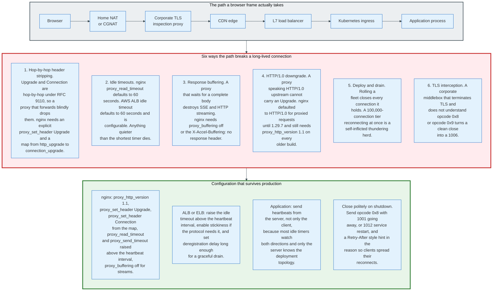

### 14.1 Hop-by-Hop Header Stripping

`Upgrade` and `Connection` are hop-by-hop headers under RFC 9110. They describe the relationship between two adjacent nodes, not between the endpoints, and a conforming proxy must not forward them blindly.

The result is that a reverse proxy which passes a request through without special handling delivers a GET with no `Upgrade` header, and the origin answers 200 instead of 101. The client's `Sec-WebSocket-Accept` check fails and the connection is refused.

nginx requires an explicit reconstruction, and its documentation gives the canonical form:

```nginx
http {
    map $http_upgrade $connection_upgrade {
        default upgrade;
        ''      close;
    }

    server {
        location /ws/ {
            proxy_pass http://backend;
            proxy_http_version 1.1;
            proxy_set_header Upgrade $http_upgrade;
            proxy_set_header Connection $connection_upgrade;
        }
    }
}
```

The `map` exists so that ordinary requests on the same location get `Connection: close` rather than a spurious `Connection: upgrade`.

### 14.2 The HTTP/1.0 Downgrade

nginx proxied to upstreams over HTTP/1.0 by default until version 1.29.7, which changed the default to 1.1. HTTP/1.0 has no `Upgrade` mechanism, so on any build older than 1.29.7 the handshake fails regardless of the headers.

`proxy_http_version 1.1` fixes it, and it is still required on the installed base that predates 1.29.7. The nginx proxy module documentation now reads `Default: proxy_http_version 1.1;` with the note that version 1.0 was the default before 1.29.7, and the nginx WebSocket page comments the directive out and marks it `# before version 1.29.7`. Its absence produces a 400, or a 200 that never upgrades, with no diagnostic naming the cause, so the failure reads as an application bug rather than a proxy setting.

### 14.3 Idle Timeouts

Covered in section 11 from the endpoint's perspective. From the operator's side there are three numbers to set and they must agree.

`proxy_read_timeout` and `proxy_send_timeout` in nginx both default to 60 seconds. The AWS Application Load Balancer idle timeout defaults to 60 seconds and is configurable. Cloudflare closes a WebSocket when no data flows in either direction for a period it does not publish for general plans, and offers custom values to Enterprise customers.

The rule: every idle timeout in the path must exceed the heartbeat interval by enough margin to survive one lost packet and its retransmission. Setting the proxy timeout to exactly the heartbeat interval produces intermittent 1006 closures that correlate with packet loss and look like a network problem.

### 14.4 Response Buffering

This one kills SSE and HTTP streaming rather than WebSocket, because a WebSocket leaves HTTP behind after the 101.

A proxy that accumulates a response body before forwarding it converts a stream into a single delayed delivery. nginx buffers by default. The remedies are `proxy_buffering off` on the location, or the `X-Accel-Buffering: no` response header from the origin, which nginx honours per response and which is the better choice because it keeps buffering on for everything else.

Any CDN in the path needs an equivalent rule. Any corporate proxy in the path cannot be configured by the application team, which is the reason SSE deployments carry a WebSocket fallback and not the reverse.

### 14.5 Deploy and Drain

Rolling a fleet closes every connection it holds, and a 100,000-connection tier reconnecting at once is a self-inflicted thundering herd.

The mitigations are all on the server side. Close with 1012 rather than dropping the TCP connection, so clients know a restart is in progress. Put a suggested backoff window in the reason string. Drain slowly: close a fraction of connections per second rather than all at once, so the reconnect arrives as a ramp rather than a spike. Set the load balancer's deregistration delay long enough that in-flight closes complete.

A tier that takes 60 seconds to drain 100,000 connections spreads the reconnect over 60 seconds. A tier that drops them in one second does not.

### 14.6 TLS Interception

A corporate middlebox that terminates TLS, inspects, and re-originates is a full WebSocket endpoint on both sides whether or not it implements the protocol correctly.

Failures observed in practice: the handshake succeeds but frames are reassembled incorrectly; control frames are dropped so heartbeats never arrive; a clean close becomes a reset, producing 1006; and `permessage-deflate` is negotiated on one side and not the other. None of these is diagnosable from the endpoint, and none is fixable by the application team.

The practical response is a fallback. A client that cannot establish a WebSocket within a few seconds should fall back to long polling, which is what Socket.IO does by inverting the order and starting with long polling. Its documentation gives the reasoning: a WebSocket that is going to fail in a corporate environment fails slowly, and starting with the transport that always works avoids more than ten seconds of delay before the first message.

### 14.7 Session Affinity, and When It Is Actually Needed

Sticky sessions are widely believed to be required for WebSocket. For a raw WebSocket they are not.

One WebSocket is one TCP connection. It reaches one server at handshake time and stays there for its whole life by construction. No affinity mechanism is needed, because there is no second request to route.

Affinity is needed for HTTP long-polling fallback, where successive requests must reach the process holding the session, and therefore for anything that upgrades from polling. Socket.IO documents this as a hard requirement and the failure mode is a `transport close` error. The configurations it gives are `hash $remote_addr consistent;` in an nginx upstream block, and `cookie io prefix indirect nocache` in HAProxy.

Affinity is a scaling liability, so it should be avoided where the transport allows. It defeats least-connection balancing, it makes a rolling deploy a correlated event for a specific subset of users, and it turns any single node's failure into a failure for exactly the users pinned to it. A design that runs raw WebSocket with a shared pub/sub bus and no affinity is strictly easier to operate.

---

## 15. WebSocket over HTTP/2 and HTTP/3

RFC 8441 lets a WebSocket run inside a single HTTP/2 stream instead of consuming a whole TCP connection. It is elegant, it is standardised, and browsers largely did not adopt it.

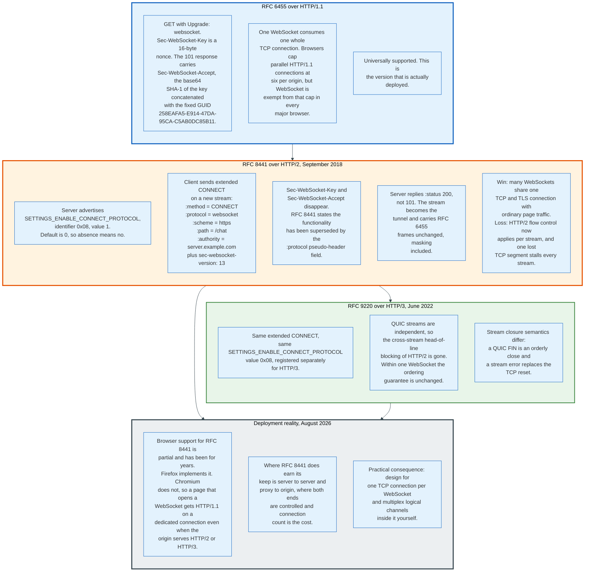

### 15.1 The Mechanism

The problem RFC 8441 solves is that HTTP/2 has no `Upgrade`. The `Upgrade` header is an HTTP/1.1 construct and HTTP/2 dropped it, which meant that when HTTP/2 shipped in 2015, WebSocket could not run over it at all.

The solution, published in September 2018 by Patrick McManus, reuses the `CONNECT` method. A server that supports the mechanism advertises `SETTINGS_ENABLE_CONNECT_PROTOCOL`, identifier `0x08`, with value 1. The initial value is 0, so absence means unsupported.

A client that sees the setting sends an extended `CONNECT` on a new stream:

```
HEADERS + END_HEADERS
:method = CONNECT
:protocol = websocket
:scheme = https
:path = /chat
:authority = server.example.com
sec-websocket-protocol = chat, superchat
sec-websocket-extensions = permessage-deflate
sec-websocket-version = 13
origin = http://www.example.com
```

The server replies with `:status 200`, not 101. From that point the stream carries RFC 6455 frames unchanged, masking included.

`Sec-WebSocket-Key` and `Sec-WebSocket-Accept` disappear entirely. RFC 8441 states that implementations using extended CONNECT do not perform the processing of those two header fields, because the functionality has been superseded by the `:protocol` pseudo-header field. The nonce existed to prove that the responder understood the upgrade, and in HTTP/2 the `:protocol` field is that proof.

RFC 9220, published June 2022 by Ryan Hamilton, repeats the mechanism for HTTP/3. The same `SETTINGS_ENABLE_CONNECT_PROTOCOL` value `0x08` is registered separately for HTTP/3, and the pseudo-header semantics are identical. What differs is stream closure: a QUIC stream FIN is an orderly close and a QUIC stream error replaces the TCP reset.

### 15.2 What It Buys and What It Costs

**Buys: connection count.** A page holding six WebSockets over HTTP/1.1 holds six TCP connections and six TLS sessions. Over HTTP/2 it holds one, shared with the page's ordinary requests. On a server terminating a million clients, the difference between one connection per client and several is the difference between one file descriptor and several.

**Buys: fewer handshakes.** A WebSocket opened on an existing HTTP/2 connection costs one round trip, not three. The TCP and TLS handshakes already happened.

**Costs: shared head-of-line blocking.** HTTP/2 multiplexes streams over one TCP connection, and one lost segment stalls every stream behind it, including the WebSocket's frames and the page's images. A dedicated TCP connection isolates the WebSocket from the rest of the page's traffic. HTTP/2 removes that isolation.

**Costs: flow control interaction.** HTTP/2 applies per-stream flow control with a default `SETTINGS_INITIAL_WINDOW_SIZE` of 65,535 octets. A WebSocket stream that fills its window stalls until a `WINDOW_UPDATE` arrives, which is a behaviour RFC 6455 has no concept of and which surfaces to the application as unexplained latency.

HTTP/3 removes the first cost, because QUIC streams are independent, and keeps the second in modified form.

### 15.3 The Deployment Reality

Browser support for RFC 8441 is partial and has been since publication. Firefox implements it. Chromium does not, so a page in a Chromium-based browser that opens a WebSocket gets HTTP/1.1 on a dedicated TCP connection even when the origin serves HTTP/2 or HTTP/3 for everything else.

The consequence for design is direct. Assume one TCP connection per WebSocket. Do not plan a client architecture that opens ten WebSockets on the assumption they will share a connection, because in the majority browser they will not, and six of them will contend for the per-origin connection budget of anything else the page does.

Where RFC 8441 does earn its keep is server to server, and proxy to origin, where both ends are controlled and connection count is a real cost. Envoy, nginx, and several service meshes support it in that role.

The general lesson is one the HTTP/2 story repeats: multiplex logical channels inside one WebSocket yourself. It works in every browser, it costs one field in a message envelope, and it does not depend on a setting the client may never send.

---

## 16. Scaling to Millions of Connections

Holding a million idle connections is a solved problem and has been since roughly 2012. Delivering a message to a million connections is not, and every real scaling story is about the second problem.

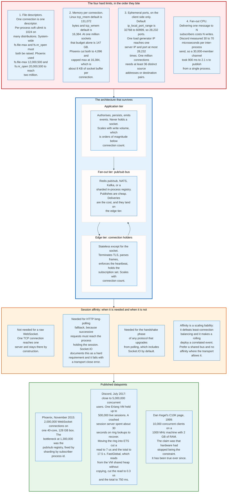

### 16.1 The Four Limits, In the Order They Bite

**File descriptors.** One connection is one descriptor. The per-process soft limit is 1,024 on many distributions, and raising it requires both the process limit and two kernel limits. Phoenix's two-million-connection run set `fs.file-max` to 12,000,500 and `fs.nr_open` to 20,000,500, then raised `ulimit -n` to 20,000,000. `fs.nr_open` caps what any single process may request and `fs.file-max` caps the system total, so raising only one of them fails at a limit that appears arbitrary.

**Memory per connection.** This is the limit that actually decides hardware.

The Linux defaults are generous. Kernel documentation gives `tcp_rmem` a default of 131,072 bytes and `tcp_wmem` a default of 16,384 bytes. At one million sockets that nominal budget alone is 147 GB. The buffers grow on demand rather than being allocated up front, but the autotuning ceiling determines what a busy fleet reaches under load.

Phoenix cut them hard: `net.ipv4.tcp_rmem='1024 4096 16384'` and the same for `tcp_wmem`, giving roughly 8 KB of socket buffer per connection instead of 147 KB. Add the kernel's own per-socket structures and the application's session object, and the working figure on that run was around 64 KB per connection all-in, since 128 GB held 2,000,000 connections.

The lesson generalises past the specific numbers. Default socket buffers are sized for throughput on a few connections. A million mostly-idle connections need them sized for occupancy instead, and the two goals are opposed.

**Ephemeral ports, on the client side only.** The default `ip_local_port_range` is 32768 to 60999, which is 28,232 ports. A TCP connection is identified by a four-tuple, so one client IP can reach one server IP and port at most 28,232 times.

This never constrains a server, which accepts many connections on one port. It constrains load generators absolutely. Driving one million connections at one server endpoint from a test fleet requires at least 36 distinct source addresses, or a matching spread of destination addresses and ports. Load tests that mysteriously plateau near 28,000 connections have found this limit and misread it as a server problem.

**Fan-out CPU.** Delivering one message to N subscribers costs N writes, and this is where the arithmetic turns hostile.

Discord published the numbers in July 2017. Sending a message between Erlang processes took 30 to 70 microseconds. A guild with 30,000 concurrent members therefore took between 900 milliseconds and 2.1 seconds to publish a single message from one process, because the publishing process performed 30,000 sequential sends. The fix, a library called Manifold, distributed the fan-out work across the nodes holding the recipients rather than doing it all in the publisher.

Phoenix hit the same wall at 1,300,000 connections in November 2015, where the bottleneck was the pub/sub registry rather than the sockets. Sharding the registry by subscriber process id and parallelising the broadcast across shards brought broadcast time at 2,000,000 connections back down to 1 to 2 seconds, against over 5 seconds at 1,300,000 before the fix.

Both are the same finding. Connection count scales with memory, which is cheap. Fan-out scales with the product of message rate and subscriber count, which is not.

### 16.2 The Architecture That Survives

Three tiers, with the socket confined to one of them.

**The edge tier holds connections and nothing else.** It terminates TLS, parses and unmasks frames, enforces the heartbeat, and holds the set of channels each socket subscribes to. It scales with connection count. It should be able to lose a node without losing anything but the sockets on it.

**The bus fans out.** Redis pub/sub, NATS, Kafka, or an in-process sharded registry for single-node deployments. A publish is cheap. The deliveries are the cost, and they land on the edge tier where the sockets are. The design goal is that one publish crosses the network once per edge node holding a subscriber, not once per subscriber.

**The application tier holds no sockets.** It authorises, persists, and emits events. It scales with write volume, which in a chat or collaboration product is three to five orders of magnitude below connection count.

The separation is what makes rolling deploys tolerable. Deploying the application tier disturbs no connections. Deploying the edge tier disturbs all of them, so the edge tier should change rarely and drain slowly.

### 16.3 Fan-Out Patterns

| Pattern | How one publish reaches N subscribers | Cost | When it fits |
|---|---|---|---|
| **Direct loop** | The publishing process writes to each socket in turn | O(N) on one CPU, blocks the publisher | Single node, small channels |
| **Sharded registry** | Subscribers are bucketed by hash; each shard fans out in parallel | O(N) total, spread over cores | Single large node. Phoenix's fix |
| **Bus per node** | Publish once to a bus; each edge node delivers to its local subscribers | O(nodes) across the network, O(local) per node | The standard multi-node design |
| **Hierarchical fan-out** | A tree of relays, each expanding by a fixed factor | O(log N) depth, more hops of latency | Very large single channels, live events |
| **Client pull on notify** | Publish a tiny invalidation; clients fetch state over HTTP | Tiny fan-out, N reads against a cache | Large channels with low read amplification and a good CDN |

The last row deserves emphasis because it is underused. A broadcast that says only "channel 41 changed, sequence 88412" is a few bytes to every subscriber, and the actual payload is then served from a cache that already scales. It trades one round trip of latency for a fan-out cost that does not grow with payload size.

### 16.4 Published Datapoints

| Source | Date | Result | The binding constraint |
|---|---|---|---|
| Dan Kegel, C10K | 1999 | 10,000 clients on a 1000 MHz, 2 GB machine | I/O model, not hardware |
| Phoenix / Chris McCord | November 2015 | 2,000,000 WebSocket connections, one 40-core 128 GB box | Pub/sub registry at 1.3M, fixed by sharding |
| Discord | July 2017 | Close to 5,000,000 concurrent users; one Erlang VM held up to 500,000 sessions | Inter-process send cost during fan-out |

The Phoenix run is the most useful single reference because it published its sysctl values. The progression separates hardware from software: 450,000 connections maxed out a Rackspace 15 GB I/O v1 box, 15 GB of RAM and 4 cores; the same software reached 1,000,000 on a 128 GB, 40-core box; the last 700,000 came from fixing the broadcast path rather than adding hardware.

### 16.5 What Actually Runs Out First

In practice, in order of how often it is the real cause:

1. **Application memory per connection**, not kernel memory. A session object holding a user record, a permission cache, and a message buffer is easily 50 KB. At 100,000 connections that is 5 GB before the kernel is counted.
2. **`permessage-deflate` contexts**, as covered in section 12. About 256 KB for the deflate side and 40 KB for the inflate side, allocated whether or not any message is sent.
3. **Timer management.** One OS timer per connection for the heartbeat does not scale. Timer wheels and bucketed sweeps do.
4. **Fan-out CPU**, once channel sizes pass a few thousand.
5. **Garbage collection pauses** on runtimes with a global heap, where a million live objects makes every collection expensive.
6. **File descriptors and socket buffers**, which is where everyone looks first and which is almost never the answer past the initial configuration.

---

## 17. Reconnection, Backoff, and Message Replay

A WebSocket will drop. Designing the reconnect is not defensive engineering, it is the main body of work, because everything the protocol omits becomes visible at the moment the connection returns.

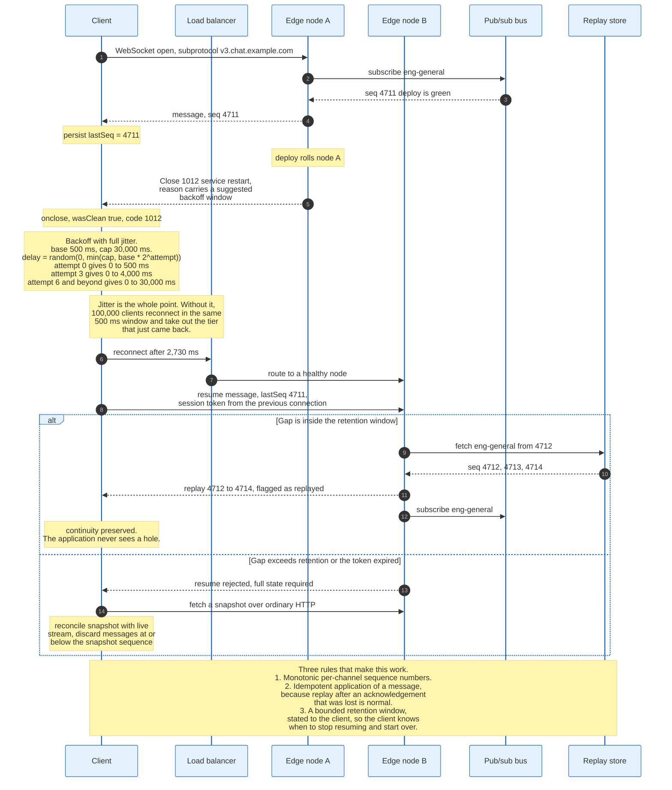

### 17.1 Backoff With Jitter

The naive reconnect loop retries immediately, which converts one server restart into a sustained denial of service performed by the clients.

Exponential backoff spreads retries in time. Jitter spreads them across clients. Both are required, and jitter is the one that is usually omitted.

```
base   = 500 ms
cap    = 30,000 ms
delay  = random(0, min(cap, base * 2^attempt))
```

This is full jitter. Attempt 0 waits between 0 and 500 ms, attempt 3 between 0 and 4,000 ms, attempt 6 and beyond between 0 and 30,000 ms. The expected delay is half the ceiling, and the distribution is uniform across the window rather than concentrated at its edges.

Decorrelated jitter is the other common form and produces a smoother distribution across many retries:

```
delay = min(cap, random(base, previous_delay * 3))
```

Both matter more than the choice between them. Without jitter, 100,000 clients that all disconnected in the same second reconnect in the same 500 millisecond window and take out the tier that just came back. The mathematics is that of a synchronised oscillator, and the fix is to break the synchronisation.

Two additional rules. Reset the attempt counter only after a connection has been stable for some period, typically 10 to 30 seconds, so that a connection which opens and immediately dies does not restart the backoff at zero. And cap total retries only if the application has somewhere else to go, because a client that gives up permanently is worse than one that retries every 30 seconds.

### 17.2 What the Close Code Should Change

| Close code | Client behaviour |
|---|---|
| 1000, normal | Do not reconnect. The application asked for this |
| 1001, going away | Reconnect with normal backoff |
| 1006, abnormal | Reconnect with normal backoff. Assume nothing about the cause |
| 1008, policy violation | Do not reconnect blindly. Re-authenticate first |
| 1011, internal error | Reconnect with backoff. The server is broken, not the client |
| 1012, service restart | Reconnect after a randomised delay, honouring any hint in the reason |
| 1013, try again later | Back off aggressively. This is explicit overload |
| 4000 to 4999 | Application-defined. Most commonly used for authorisation failures that must not be retried |

The important negative case is 1000. A client that reconnects after a clean, deliberate close will reconnect forever after a logout, and this bug reaches production regularly.

### 17.3 Replay

Reconnection restores the pipe. It does not restore the messages sent while the pipe was down, and the protocol has no mechanism for that.

Three components make replay work.

**Monotonic per-channel sequence numbers.** The server assigns a sequence to every message on a channel. The client persists the highest it has processed. On reconnect it sends that number and asks for everything after it. Per-channel rather than per-connection, because a client may resubscribe to a different set of channels.

**A bounded retention buffer.** The server keeps recent messages per channel, bounded by count, by age, or by bytes. A Redis stream capped at 1,000 entries per channel, or a five-minute window, are both common. The bound must be stated to the client so the client knows when resume is impossible.

**A fallback to snapshot.** When the gap exceeds retention, or the resume token has expired, the server refuses the resume and the client fetches a full state snapshot over ordinary HTTP, then reconciles by discarding any streamed message at or below the snapshot's sequence. Every serious real-time system has this path, and every one of them discovers it is the path that gets exercised during an incident.

### 17.4 Idempotency Is Not Optional

Replay after an acknowledgement that was lost is normal, not exceptional. A client that processed message 88412, sent an ack, and lost the connection before the ack arrived will receive 88412 again.

Every message handler must therefore be idempotent, or every message must carry an identifier the client can deduplicate against. The second is easier and is what the sequence number already provides: discard anything at or below the highest sequence already applied.

The failure mode of getting this wrong is duplicated messages in a chat, double-counted metrics, or a state machine that advances twice. All three are hard to reproduce and are reported as intermittent.

### 17.5 Buffering Sends While Disconnected

A client that queues outbound messages while disconnected and flushes them on reconnect gives the user a much better experience and introduces two problems.

**Ordering against server state.** A message composed against a stale view may be invalid by the time it is delivered. The application has to decide whether to send it anyway, revalidate it, or discard it.

**Unbounded queue growth.** A client offline for an hour with an active user accumulates a queue that will be flushed in one burst. The queue needs a bound and a policy for what happens when it fills, which is usually to drop the oldest or to surface a failure to the user.

Socket.IO buffers by default and this is the most common source of duplicate-send bugs in applications built on it, because a buffered message that was actually delivered before the disconnect is sent again on reconnect. The fix is the same idempotency key that solves replay in the other direction.

---

## 18. One Message, Traced End to End

The following traces a single 56-byte chat message from a browser in London to a browser in Sydney, through a real deployment, with every byte and every millisecond accounted for.

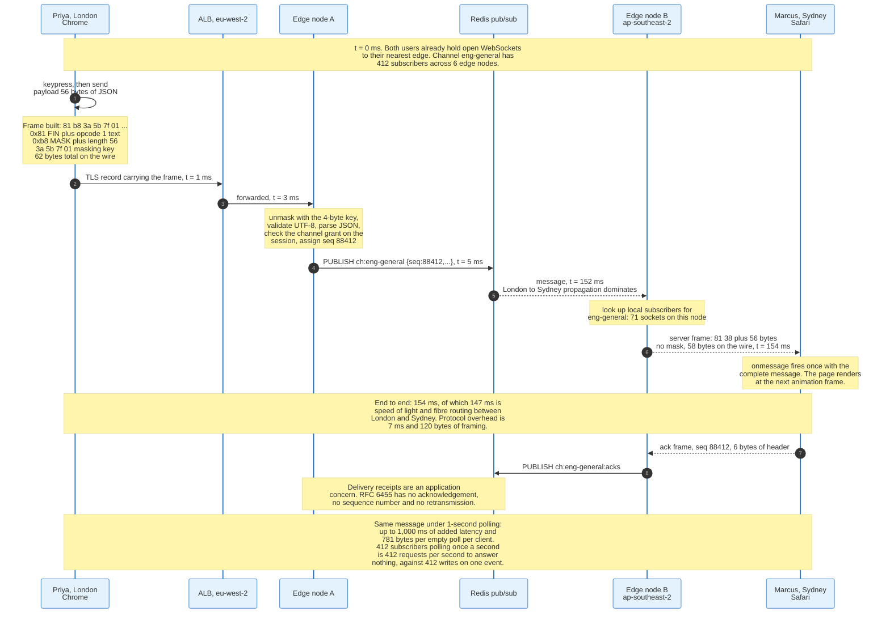

### 18.1 The Setup

Priya is in London on Chrome. Marcus is in Sydney on Safari. Both are subscribed to the channel `eng-general`, which has 412 subscribers spread across 6 edge nodes in 3 regions. Both already hold open WebSockets to their nearest edge, established at page load and heartbeated every 25 seconds since.

The message is:

```json
{"op":"msg","ch":"eng-general","body":"deploy is green"}
```

56 bytes of UTF-8.

### 18.2 The Trace

**t = 0 ms. The browser builds a frame.** The page calls `send` with the JSON string. The browser's WebSocket stack sets FIN, sets opcode `0x1` for text, sets MASK because it is a client, computes the 7-bit length as 56, and draws a 4-byte masking key from the platform's entropy source. It XORs the payload with the key.

```
81 b8 3a 5b 7f 01 41 79 10 71 18 61 5d 6c 49 3c ...
```

62 bytes on the wire: 2 bytes of header, 4 bytes of masking key, 56 bytes of masked payload. Overhead is 10.7 percent.

**t = 1 ms. TLS.** The frame is written into the existing TLS 1.3 record layer and encrypted with the connection's session key. A TLS record adds 5 bytes of header and 16 bytes of AEAD tag, so 83 bytes leave the machine. No handshake occurs; the session has been open for 47 minutes.

**t = 3 ms. The load balancer forwards.** An Application Load Balancer in eu-west-2 holds the client side of the TLS connection and a separate connection to the edge node. It has been configured with a 300-second idle timeout, comfortably above the 25-second heartbeat. It does not parse WebSocket frames; after the 101 it treats the connection as an opaque tunnel.

**t = 3 ms. Edge node A unmasks and validates.** It XORs the payload back with the key, validates that the result is well-formed UTF-8, parses the JSON, checks that this session holds a write grant on `eng-general`, and assigns the message sequence number 88412 from the channel's monotonic counter.

**t = 5 ms. Publish to the bus.** The edge node issues `PUBLISH ch:eng-general` with the message and its sequence to Redis. It also writes the message to a capped stream for replay, bounded at 1,000 entries per channel.

**t = 152 ms. The bus delivers to Sydney.** The propagation from London to Sydney dominates everything else in this trace. The physical distance is roughly 17,000 kilometres, and the fibre route is longer than the great circle. 147 milliseconds is close to the practical floor for that path.

**t = 152 ms. Edge node B looks up local subscribers.** Of the 412 subscribers to `eng-general`, 71 are connected to this node. The node walks its local subscription list and writes to each of the 71 sockets.

**t = 154 ms. The server frame arrives at Marcus.** The server does not mask, so the frame is 2 bytes of header plus 56 bytes of payload.

```
81 38 7b 22 6f 70 22 3a 22 6d 73 67 22 ...
```

`0x81` is FIN set, opcode text. `0x38` is MASK clear, length 56. 58 bytes on the wire, an overhead of 3.6 percent.

**t = 154 ms. `onmessage` fires.** Safari delivers the complete message in one event. The page parses the JSON and schedules a DOM update for the next animation frame.

### 18.3 The Accounting

| Item | Value |
|---|---|
| End-to-end latency | 154 ms |
| Of which propagation London to Sydney | 147 ms |
| Of which protocol and application processing | 7 ms |
| Bytes sent by the client | 62, of which 6 are framing |
| Bytes received by the recipient | 58, of which 2 are framing |
| Total framing overhead for the delivery | 8 bytes |
| Sockets written on the publish | 412 across 6 nodes |
| Bus messages | 1 publish, 6 node deliveries |

Protocol overhead is 7 milliseconds and 8 bytes. The speed of light is 147 milliseconds. No transport choice changes the second number, which is the reason the argument between WebSocket, SSE, and WebTransport is about cost and capability rather than about latency on a long path.

### 18.4 The Same Message Under Polling

Replace the WebSocket with a 1-second polling loop and the arithmetic inverts.

Marcus's client polls every second. The message arrives at edge node B at t = 152 ms and waits, on average, 500 milliseconds for the next poll. Worst case it waits 1,000. End-to-end latency becomes 652 milliseconds on average against 154, and the added delay is entirely artificial.

The cost side is worse. 412 subscribers polling once a second is 412 requests per second, each 781 bytes of round-trip HTTP, to answer nothing in 99 percent of cases. That is 322 KB per second of traffic and 412 application queries per second, sustained, whether or not anyone is talking. The WebSocket fleet moves 412 writes of 58 bytes, a total of 24 KB, once, when someone actually says something.

Same message. 4.2 times the latency and, at this event rate, roughly 1,300 times the bytes.

---

## 19. Security and Attack Surface

WebSocket inherits the browser's origin model at handshake time and abandons it immediately afterwards. Every security property of a WebSocket application is therefore decided in the handshake or built by hand in the subprotocol.

### 19.1 Cross-Site WebSocket Hijacking

This is the vulnerability specific to the protocol and it is a CSRF with a persistent channel attached.

The mechanism. A WebSocket handshake is an ordinary HTTP request, so the browser attaches cookies for the target origin automatically. The same-origin policy does not block the handshake the way CORS blocks a cross-origin `fetch`, and there is no preflight. A malicious page at `evil.example` can therefore open a WebSocket to `wss://bank.example/ws` and the victim's session cookie rides along.

What makes it worse than classic CSRF is that the attacker gets a two-way channel. Classic CSRF is write-only: the attacker triggers an action and cannot read the response. A hijacked WebSocket lets the attacker send arbitrary messages and read everything the server sends back, inside the victim's authenticated session.

`Sec-WebSocket-Key` provides no protection. It is not a CSRF token, it is not secret, and the browser generates it automatically for any handshake including the attacker's.

Three defences, in order of reliability.

**Validate `Origin` against an allowlist.** This is the only defence the protocol offers and it must be explicit. Browsers always send `Origin` on a WebSocket handshake and cannot be made to forge it. Non-browser clients can omit or forge it freely, so the policy for a missing `Origin` must be a deliberate decision rather than an accident of the code path.

**Do not authenticate with ambient credentials alone.** A short-lived, single-use ticket obtained over an authenticated HTTP request and passed in the URL or in the first message defeats the attack entirely, because `evil.example` cannot obtain a ticket. The cost is that a URL ticket appears in access logs and must therefore be single-use and short-lived.

**Include an unpredictable value in the handshake.** A CSRF token in a query parameter works for the same reason and has the same logging caveat.

### 19.2 The Handshake Is the Only Authorisation Checkpoint

Nothing on a live WebSocket re-checks anything.

An access token that expires 30 seconds after the handshake keeps working for the life of the connection, which may be hours. A user whose permissions are revoked keeps receiving messages on channels they no longer have access to. A session that is logged out elsewhere stays live.

There is no protocol mechanism for any of this. The subprotocol must supply it: a token-refresh message type, a server-side check on every subscribe rather than only at connect, and a way for the application tier to tell the edge tier to terminate a specific session. That last one is the piece most often missing, and it is the one an incident response needs.

### 19.3 Denial of Service Vectors Specific to the Protocol

**Slow-loris on the handshake.** An attacker opens TCP connections and sends handshake bytes slowly, holding server resources without completing a handshake. The defence is a handshake timeout measured in seconds and a cap on incomplete handshakes per source.

**Unbounded fragment reassembly.** Covered in section 9. A peer sending FIN-clear fragments indefinitely exhausts memory while violating nothing. Every server needs a maximum assembled message size with 1009 as the response.

**Compression bomb.** A small compressed message that inflates to gigabytes. `permessage-deflate` has no built-in expansion limit, so the decompressor must enforce one and abort mid-inflate rather than after.

**Control frame flood.** Pings cost the receiver a Pong each. A client that sends Pings at line rate makes the server generate responses at line rate. Rate-limit inbound control frames per connection.

**Connection exhaustion.** Each connection costs a file descriptor and memory. Without a per-IP or per-account connection cap, a single non-browser client can open tens of thousands. Browsers exempt WebSocket from the six-connections-per-origin limit that governs HTTP/1.1 and apply a looser cap of their own: Firefox exposes it as the `network.websocket.max-connections` preference, which defaults to 200, and Chromium enforces a separate ceiling in its WebSocket transport socket pool. A page therefore holds far more sockets than most engineers expect, in the low hundreds rather than six. The tens of thousands come from clients that are not browsers.

**Subscription amplification.** A client that subscribes to 10,000 channels turns each publish into 10,000 lookups against its session. Cap subscriptions per connection.

### 19.4 Input Handling

Everything that arrives on a WebSocket is untrusted, and the fact that it arrived on a connection that was authenticated at handshake time changes nothing.

The specific traps are those of any message parser. Validate UTF-8 on text frames, which the protocol requires but which is worth checking at the application layer too. Enforce a maximum message size before parsing rather than after. Use a JSON parser with depth and size limits, because deeply nested JSON is a stack exhaustion vector. Validate that the channel named in a message is one this session actually subscribed to, because the client controls that field.

The one that catches people is authorisation on every message rather than only on subscribe. A client that subscribes legitimately and then sends a publish naming a different channel must be rejected, and the check has to be on the server's own record of the session's grants rather than on anything the message says.

### 19.5 Transport Security

Use `wss://` and nothing else. A page served over HTTPS cannot open a `ws://` connection in any modern browser, which enforces the right answer for browser clients and enforces nothing for server-to-server clients.

Certificate validation is the responsibility of the client library and is disabled by default in more of them than it should be. A backend service opening a WebSocket with certificate verification off has a plaintext channel with extra steps.

Note also that masking provides no confidentiality whatsoever, as section 8 sets out. Anyone who believes masking is a security feature will under-specify TLS.

---

## 20. Economics: What It Costs to Run and Who Pays

A WebSocket costs almost nothing per message and a fixed amount per connection per unit time. That shape is the opposite of HTTP's, and it inverts every capacity model built for request traffic.

### 20.1 The Cost Structure

**Per connection, per hour: memory and a file descriptor.** As section 16 sets out, the working figure on a tuned system is tens of kilobytes per connection, and the number that decides hardware is application session size rather than kernel buffers. A machine with 64 GB of RAM holding 64 KB per connection tops out near one million connections and will hit a fan-out limit long before that.

**Per message: framing plus fan-out.** 2 to 6 bytes of framing, plus one write per recipient. The write is the cost. A 1-to-1 message is trivial. A 1-to-100,000 broadcast is 100,000 writes and is a capacity event.

**Per connection lifecycle: the handshake.** TCP, TLS, HTTP upgrade, authentication, and resubscription. On a fleet with unstable clients, such as a mobile application on cellular networks, handshake cost can exceed message cost, and it is the reason reconnect storms are more damaging than steady-state load.

**Idle connections are not free.** This is the difference from HTTP that breaks capacity models. An HTTP service with no traffic costs nothing. A WebSocket service with a million idle connections and no messages still holds a million sockets, a million session objects, and a million heartbeat timers, and it pays for the servers underneath them.

### 20.2 What Vendors Charge, and What That Reveals

Managed real-time services price along the two axes that actually cost them money: connection time and messages.

| Provider | Connection metric | Message metric | Notes |
|---|---|---|---|
| **AWS API Gateway WebSocket** | 0.25 USD per million connection-minutes | 1.00 USD per million messages | Messages metered in 32 KB increments, so a 33 KB message counts as two. Free tier of 1 million messages and 750,000 connection-minutes for 12 months |
| **Ably** | 1.00 USD per million connection-minutes, down to 0.20 at volume | 2.50 USD per million messages, down to 0.50 at volume | Also charges 1.00 USD per million channel-minutes. Free tier of 200 concurrent connections and 6 million messages per month |
| **Pusher Channels** | Included in a tier by peak concurrent connections | Included in a tier by daily message count | Startup at 49 USD gives 500 connections and 1 million messages per day; Plus at 899 USD gives 20,000 connections and 60 million per day |

Run the arithmetic on API Gateway for a concrete case. 100,000 concurrent connections held for a full month is 100,000 times 43,200 minutes, which is 4.32 billion connection-minutes, which at 0.25 USD per million is 1,080 USD per month before a single message. Add 500 million messages at 1.00 USD per million and the bill is 1,580 USD.

The same 100,000 connections on Pusher's tier structure falls between the 30,000-connection Growth Plus tier at 1,199 USD and enterprise pricing.

Compare to self-hosting. 100,000 connections at 64 KB each is 6.4 GB of connection state. Three redundant c5.2xlarge instances, 8 vCPU and 16 GB each, at roughly 250 USD per month on-demand list price, is 750 USD, plus a Redis instance, plus load balancer hours, plus the engineer-hours that the managed service was buying.

The crossover is not about the infrastructure bill. It is that the managed service is selling the reconnect logic, the fan-out, the replay buffer, the presence system, and the on-call rotation. The infrastructure is the cheap part of a real-time system and it is the only part the pricing pages describe.

### 20.3 Where the Money Actually Goes

**Egress bandwidth, on high-fan-out workloads.** A live sports feed pushing 200 bytes per second to 500,000 viewers is 100 MB per second sustained, which is 259 TB per month. At typical cloud egress rates that dominates every other line on the bill. Compression and payload design pay for themselves immediately at this shape.

**Servers, on high-connection workloads.** A messaging product with millions of mostly idle connections pays for RAM. The message rate is negligible and the occupancy is everything.

**Engineering, on everything.** The reconnect logic, the replay buffer, the fan-out topology, and the operational tooling to see what a million connections are doing. This is consistently the largest cost and it is the one that does not appear in a capacity model.

### 20.4 The Cost Comparison Against Polling

Section 2 gives the per-client figures. Aggregate them.

100,000 clients polling once every 3 seconds is 33,333 requests per second at 781 bytes each, which is 26 MB per second of ingress and egress combined, sustained, forever. That is 67 TB per month of traffic to deliver nothing, plus 33,333 application queries per second of load that exists whether or not anything happened.

The same 100,000 clients on WebSocket move data only on events. At an event rate of one message per client per minute with an average fan-out of 50, the traffic is roughly 4.8 MB per second, and it falls to zero when the users are asleep.

The polling bill is fixed. The WebSocket bill tracks usage. For any workload where events are rarer than the poll interval, which is nearly all of them, WebSocket is cheaper by an order of magnitude or more.

---

## 21. Standards, Governance, and Interoperability

WebSocket is governed by one IETF RFC, six IANA registries, and one conformance suite that everybody actually runs. There is no certification body, no compliance regime, and no version negotiation beyond a single number that has not changed since 2011.

### 21.1 The Specification Set

| Document | Date | What it defines |
|---|---|---|
| **RFC 6455** | December 2011 | The protocol. Handshake, framing, masking, close, ping and pong. Version 13 |
| **RFC 6202** | April 2011 | Long polling and HTTP streaming best practice. The predecessor, written down |
| **RFC 7692** | December 2015 | `permessage-deflate`. The only registered compression extension |
| **RFC 8441** | September 2018 | Bootstrapping WebSocket over an HTTP/2 stream with extended CONNECT |
| **RFC 9220** | June 2022 | The same over HTTP/3 |
| **HTML Living Standard** | Continuous | The `WebSocket` and `EventSource` JavaScript APIs. WHATWG, not IETF |
| **RFC 8307** | January 2018 | Well-known URIs for WebSocket, at `/.well-known/` |
| **RFC 7118, 7395, 8323, 8887** | 2014 to 2020 | WebSocket bindings for SIP, XMPP, CoAP, and JMAP. The registered `rfb` subprotocol points instead at RFC 6143, the base Remote Framebuffer protocol of March 2011, which defines no binding of its own |

The split matters. The IETF owns the wire protocol, the WHATWG owns the browser API, and the two evolve independently. That is why the API has no way to send a Ping despite the protocol defining one, and why `WebSocketStream` can be added to the API without touching the RFC.

### 21.2 The IANA Registries

Six registries govern the protocol's extension points, and their emptiness is the most informative fact about them.

| Registry | Assignment policy | Entries |
|---|---|---|
| **Opcode** | Standards Action | 6 assigned, 10 unassigned, unchanged since 2011 |
| **Close Code Number** | Standards Action for 1000 to 2999; First Come First Served for 3000 to 3999; private use 4000 to 4999 | 16 standard codes plus 3 registered in the 3000 range |
| **Framing Header Bits** | Standards Action | 1 entry: RSV1, claimed by `permessage-deflate` |
| **Extension Name** | First Come First Served | 2 entries: `permessage-deflate` and `bbf-usp-protocol` |
| **Subprotocol Name** | First Come First Served | Roughly 70 entries and growing |
| **Version Number** | Standards Action | Version 13 is the only standard. 0 to 8 are interim drafts, 9 to 12 reserved |

Fifteen years of production use produced two extensions and zero new opcodes. That is not stagnation, it is the consequence of a design whose only uncontended extension point is the subprotocol name, which requires no coordination with anyone and where roughly seventy entries have accumulated.

### 21.3 Conformance Testing

The Autobahn TestSuite is the de facto conformance test, and there is no de jure one.

It runs over 500 cases across eleven numbered groups, 1 to 7 plus 9, 10, 12 and 13, with 8 and 11 unused: framing, pings and pongs, reserved bits, opcodes, fragmentation, UTF-8 handling, close handling, limits and performance, miscellany, and two groups of `permessage-deflate` behaviour, one varying payloads and one varying parameters. It tests both client and server roles. Every serious library publishes its Autobahn report, and the cases that libraries most often fail are the UTF-8 boundary tests in group 6 and the close-handling tests in group 7.

There is no certification. A library passes Autobahn or it does not, and the market treats a published report as the credential.

### 21.4 Where Interoperability Actually Fails

The wire protocol interoperates well. What does not interoperate is everything above it.

**Subprotocols do not converge.** Two applications that both speak WebSocket share nothing. The registry has seventy entries because seventy different message formats needed a name. This is by design and it is also why there is no such thing as a generic WebSocket client.

**Close handling varies.** Whether a library waits for the close echo, how long it waits, whether it surfaces the peer's code or its own, and whether it distinguishes 1005 from 1006 all differ across implementations. Applications that branch on close codes should test against the specific client libraries they support.

**`permessage-deflate` parameter handling varies.** Whether a server honours `client_max_window_bits`, whether it can produce a window smaller than 15, and whether it handles a client that offers the parameter without a value are all places where implementations differ. Some zlib bindings cannot produce windows below 9 at all.

**RFC 8441 support is partial.** Firefox implements it, Chromium does not. Any design that assumes WebSocket will share an HTTP/2 connection is assuming something that is false for most users.

### 21.5 Compliance Obligations

WebSocket carries no protocol-specific regulation, and it carries every obligation that applies to the data inside it.

The practical consequences are logging and retention. A WebSocket connection produces one access log line at handshake and nothing thereafter, so a system that must record who saw what has to log at the application layer. Message-level audit trails, retention windows, and the ability to produce a user's message history on request are all subprotocol and application concerns.

Data residency is the other one that bites. A global edge fleet routes a connection to the nearest node, which may be in a different jurisdiction from where the data must remain. Real-time systems that fan out globally need explicit routing constraints, and the fan-out bus is where those constraints have to be enforced, not the edge.

---

## 22. WebTransport over HTTP/3

WebTransport gives a browser multiple independent streams plus unreliable datagrams over QUIC. It is the first genuine successor to WebSocket, and as of August 2026 it is still not an RFC.

### 22.1 What It Is

WebTransport is an API and a protocol that expose QUIC's capabilities to a web page. A session is established with an extended CONNECT over HTTP/3, using the same mechanism RFC 8441 introduced for WebSocket, with `:protocol` set to `webtransport-h3` and `:scheme` required to be `https`.

Inside a session an application gets three things WebSocket does not have.

**Multiple independent streams.** Bidirectional and unidirectional, each ordered and reliable on its own, with no ordering guarantee between them. A lost packet on one stream does not stall the others, because QUIC's loss recovery is per stream. This is the head-of-line blocking problem from section 3 solved at the transport layer rather than worked around at the application layer.

**Unreliable datagrams.** A message that is sent once and not retransmitted. For game state, position updates, or live media, a packet that arrives late is worth less than the one behind it, and retransmitting it wastes bandwidth and adds latency. WebSocket cannot express this at all.

**Connection migration.** QUIC identifies a connection by a connection ID rather than a four-tuple, so a client that changes network, from Wi-Fi to cellular, keeps the session. A WebSocket in the same situation dies with 1006 and reconnects from scratch.

### 22.2 The Wire Mechanism

The draft defines its own SETTINGS parameters on top of HTTP/3's.

| Setting | Identifier | Purpose |
|---|---|---|
| `SETTINGS_WT_ENABLED` | `0x2c7cf000` | Server signals WebTransport support. Default 0 |
| `SETTINGS_WT_INITIAL_MAX_STREAMS_UNI` | `0x2b64` | Initial unidirectional stream limit per session |
| `SETTINGS_WT_INITIAL_MAX_STREAMS_BIDI` | `0x2b65` | Initial bidirectional stream limit per session |
| `SETTINGS_WT_INITIAL_MAX_DATA` | `0x2b61` | Initial session-level data limit |
| `SETTINGS_ENABLE_CONNECT_PROTOCOL` | `0x08` | Required, shared with RFC 9220 |
| `SETTINGS_H3_DATAGRAM` | Per RFC 9297 | Required for datagram support |

Streams are bound to a session by a prefix. A unidirectional stream begins with stream type `0x54` followed by the session ID as a variable-length integer. A bidirectional stream begins with the signal value `0x41` followed by the session ID. Everything after the prefix is application payload.

Datagrams travel as HTTP Datagrams, with the session's CONNECT stream ID encoded in the Quarter Stream ID field and the WebTransport payload carried unmodified.

Termination uses capsules. `WT_CLOSE_SESSION`, capsule type `0x2843`, carries a 32-bit application error code and a UTF-8 message of at most 1,024 bytes. `WT_DRAIN_SESSION`, capsule type `0x78ae`, signals graceful shutdown without detail. The session also ends if the CONNECT stream closes.

Note the difference from WebSocket's close: the error message may be 1,024 bytes rather than 123, which is enough to carry structured diagnostics rather than a hint.

### 22.3 Status as of August 2026

`draft-ietf-webtrans-http3-16` is dated 6 July 2026 and sits in working group last call, with an intended status of Proposed Standard. It is not an RFC. The companion documents, `draft-ietf-webtrans-overview-12` and `draft-ietf-webtrans-http2-14`, are both dated 2 March 2026 and remain works in progress.

Browser support reached Baseline in March 2026, meaning the API is available across current versions of the major browsers. Chrome shipped it first, in Chrome 97 in January 2022, and Firefox followed in version 114 in June 2023.

The API surface is stream-oriented rather than event-oriented, which is a real difference from WebSocket:

```javascript
const transport = new WebTransport('https://example.com:4999/wt');
await transport.ready;

const stream = await transport.createBidirectionalStream();
const writer = stream.writable.getWriter();
await writer.write(payload);

const dgWriter = transport.datagrams.writable.getWriter();
await dgWriter.write(positionUpdate);

const reader = transport.incomingUnidirectionalStreams.getReader();
const { value } = await reader.read();
```

`ready` and `closed` are promises. `datagrams` is a duplex stream pair. `reliability` reports whether the session supports unreliable delivery or only reliable. `congestionControl` lets the application state a preference for throughput or low latency.

### 22.4 Why It Has Not Replaced WebSocket

**UDP is blocked more often than TCP.** QUIC runs on UDP, and a meaningful fraction of corporate and public networks block or throttle UDP outright. There is no automatic fallback from WebTransport to anything, so an application that uses it must implement a WebSocket path as well, which means writing two transports rather than one.

**The draft is not finished.** Sixteen revisions over six years, still in last call. Server implementations exist, and the surface area that may still change is small, and it is not zero.

**Server support is thin.** HTTP/3 termination with extended CONNECT and datagram support is not a checkbox on most load balancers or CDNs in 2026. Deploying WebTransport typically means running the QUIC endpoint yourself.

**The problems it solves are not everyone's problems.** Head-of-line blocking matters when many independent streams share a connection. Unreliable delivery matters when staleness is worse than loss. Connection migration matters on mobile. An application whose real-time need is a chat feed gets very little from any of the three.

The honest summary is that WebTransport is strictly better for games, live media, and mobile-first applications with heavy multiplexing, and it is a second transport to maintain for everything else.

---

## 23. Comparisons and Alternatives

The choice of real-time transport is decided by four properties of the workload, and testing them in order eliminates most options before any comparison table is needed.

```mermaid
%%{init: {'theme': 'base', 'themeVariables': {'primaryColor': '#e3f2fd', 'primaryBorderColor': '#1565c0', 'lineColor': '#37474f'}}}%%

flowchart TB
    subgraph Q["Four selectors, tested in order"]
        direction TB
        Q1["1. Client-initiated sends on the<br/>same channel, at any time,<br/>without a request."]
        Q2["2. A browser as a first-class<br/>client."]
        Q3["3. Per-message delivery guarantees,<br/>retained state or offline queues<br/>from the transport."]
        Q4["4. Tolerance for losing a message<br/>to gain latency."]
    end

    subgraph SSE["Server-Sent Events"]
        direction TB
        S1["Server to client only.<br/>text/event-stream over ordinary<br/>HTTP. Reconnect and Last-Event-ID<br/>replay are in the browser, not<br/>application code."]
        S2["Choose it for dashboards,<br/>notifications, progress bars,<br/>LLM token streaming. Every CDN,<br/>proxy and corporate firewall<br/>already passes it."]
        S3["Against it: text only, no binary<br/>without base64, and over HTTP/1.1<br/>it consumes one of six connections<br/>per origin."]
    end

    subgraph WS["WebSocket"]
        direction TB
        W1["Bidirectional, message-framed,<br/>text or binary, universal browser<br/>support since 2011."]
        W2["Choose it for chat, collaborative<br/>editing, multiplayer, trading UIs,<br/>anything where the client speaks<br/>as often as the server."]
        W3["Against it: channels,<br/>acknowledgement, replay, presence<br/>and authentication refresh are all<br/>application work, built in place<br/>or bought from a library."]
    end

    subgraph GRPC["gRPC streaming"]
        direction TB
        G1["Four call shapes over HTTP/2:<br/>unary, server streaming, client<br/>streaming, bidirectional.<br/>Protobuf schema, generated stubs,<br/>deadlines and cancellation<br/>built in."]
        G2["Choose it between services under<br/>one owner, where a schema and a<br/>code generator are an asset."]
        G3["Against it in a browser:<br/>gRPC-Web supports unary and<br/>server streaming only. Client<br/>streaming and bidirectional<br/>streaming are not supported,<br/>and a proxy such as Envoy sits<br/>in the path."]
    end

    subgraph MQTT["MQTT 5.0"]
        direction TB
        M1["OASIS Standard, 7 March 2019.<br/>Publish and subscribe with a<br/>broker, topics with wildcards,<br/>three QoS levels, retained<br/>messages, last will, session<br/>expiry, and a 2-byte fixed<br/>header."]
        M2["Choose it for devices: sensors,<br/>vehicles, meters, anything on a<br/>flaky link or a battery, and<br/>anything that needs at-least-once<br/>or exactly-once delivery from the<br/>transport rather than the app."]
        M3["In a browser it runs over<br/>WebSocket using the registered<br/>mqtt subprotocol, so it is a<br/>layer above, not a rival to,<br/>WebSocket."]
    end

    subgraph WT["WebTransport over HTTP/3"]
        direction TB
        T1["Multiple independent streams plus<br/>unreliable datagrams over QUIC,<br/>with no head-of-line blocking<br/>between streams and survival<br/>across a network change."]
        T2["Choose it for game state, live<br/>media, and anything where a stale<br/>packet is worth less than a<br/>prompt one."]
        T3["Against it, August 2026:<br/>draft-ietf-webtrans-http3-16 is in<br/>working group last call, not an<br/>RFC. UDP is blocked on many<br/>corporate networks and there is<br/>no automatic fallback."]
    end

    Q --> SSE
    Q --> WS
    Q --> GRPC
    Q --> MQTT
    Q --> WT

    style Q fill:#eceff1,stroke:#37474f,stroke-width:3px
    style SSE fill:#e8f5e9,stroke:#2e7d32,stroke-width:2px
    style WS fill:#e3f2fd,stroke:#1565c0,stroke-width:3px
    style GRPC fill:#fff3e0,stroke:#e65100,stroke-width:2px
    style MQTT fill:#f3e5f5,stroke:#4a148c,stroke-width:2px
    style WT fill:#e0f7fa,stroke:#00695c,stroke-width:2px
```

### 23.1 The Four Selectors

The selectors run in order, and the first one that a workload fails removes a whole family of options.

**Client-initiated sends on the same channel, at any time, without a request.** Absent that requirement, Server-Sent Events wins. This eliminates WebSocket for the majority of dashboards, notification systems, progress indicators, and streaming model output.

**A browser as a first-class client.** Absent that requirement, gRPC bidirectional streaming and raw MQTT both become available, and both are better specified than a hand-designed subprotocol.

**Per-message delivery guarantees, retained state, or offline queues from the transport.** MQTT provides them. Everything else leaves them to the application.

**Tolerance for losing a message to gain latency.** With that tolerance, WebTransport datagrams are the only browser-reachable option.

### 23.2 The Comparison

| Property | SSE | WebSocket | gRPC streaming | MQTT 5.0 | WebTransport |
|---|---|---|---|---|---|
| Direction | Server to client | Both | Both | Both, via broker | Both |
| Underlying transport | HTTP/1.1, /2, /3 | TCP, or an HTTP/2 or /3 stream | HTTP/2 | TCP, TLS, or WebSocket | QUIC over UDP |
| Browser support | Universal | Universal | Unary and server streaming only, via gRPC-Web | Only over WebSocket | Baseline since March 2026 |
| Message framing | Text lines, blank-line terminated | 2 to 14 byte binary header | HTTP/2 frames plus a 5-byte length prefix | 2-byte fixed header plus variable length | QUIC streams and datagrams |
| Binary payload | Base64 only | Native | Native, protobuf | Native | Native |
| Independent streams | No | No | Yes, HTTP/2 streams | No | Yes, QUIC streams |
| Head-of-line blocking | Yes | Yes | Between streams on one TCP connection | Yes | No, between streams |
| Unreliable delivery | No | No | No | QoS 0 is best-effort, still over TCP | Yes, datagrams |
| Delivery guarantee | None | None | None at the transport | QoS 0, 1, and 2 | None |
| Reconnect in the platform | Yes | No | No | Session resumption via Clean Start 0 | No |
| Replay in the platform | Yes, `Last-Event-ID` | No | No | Yes, via session state and QoS 1 or 2 | No |
| Standard | HTML Living Standard | RFC 6455 | gRPC over HTTP/2 | OASIS Standard, 7 March 2019 | Draft 16, in WG last call |

### 23.3 Server-Sent Events

SSE is the option most often skipped and most often correct.

Choose it when the flow is server to client and the client's actions can go over ordinary HTTP requests. That describes notifications, live dashboards, build and deploy logs, progress bars, and token-by-token output from a language model. Every major model provider streams completions over SSE rather than WebSocket, because the shape of the problem is one request and many response chunks.

Its advantages over WebSocket are all operational. It is ordinary HTTP, so every CDN, proxy, and corporate firewall passes it without configuration. Reconnection and replay are in the browser, not in application code. A 204 response tells the client to stop trying.

Its limits are equally clear. One direction only. Text only, so binary costs a 33 percent base64 penalty. And over HTTP/1.1 it burns one of the six connections a browser allows per origin, which is why an SSE deployment should insist on HTTP/2 where the per-origin limit becomes `SETTINGS_MAX_CONCURRENT_STREAMS` with a recommended minimum of 100.

### 23.4 gRPC Streaming

gRPC defines four call shapes over HTTP/2: unary, server streaming, client streaming, and bidirectional streaming. Bidirectional streaming gives two independent message sequences on one HTTP/2 stream, with deadlines, cancellation, and generated stubs from a protobuf schema.

Between services under one owner, this is a better answer than WebSocket in almost every respect. The schema is enforced, the codegen removes an entire class of serialisation bugs, and deadlines and cancellation are protocol features rather than application conventions.

In a browser it is not available. gRPC-Web supports unary calls and server streaming only; client streaming and bidirectional streaming are not supported. Server streaming works only in the `grpcwebtext` mode, which base64-encodes the payload. And a proxy is required in the path, by default Envoy, though Nginx and Apache APISIX also support the translation.

So the rule is straightforward. gRPC streaming for service to service. Something else for browsers.

### 23.5 MQTT

MQTT 5.0 became an OASIS Standard on 7 March 2019, and it is the right answer for devices.

Its structure is a broker with topics, and its fixed header is two bytes: a packet type in the high nibble of byte 1, type-specific flags in the low nibble, and a Variable Byte Integer remaining length. Fifteen control packet types, numbered 1 through 15, cover connection, publish, subscribe, acknowledgement at three levels, ping, disconnect, and authentication.

What MQTT provides that WebSocket does not:

**Three quality-of-service levels.** QoS 0 is at most once, with loss possible. QoS 1 is at least once, with duplicates possible, acknowledged by PUBACK. QoS 2 is exactly once, using the four-packet PUBLISH, PUBREC, PUBREL, PUBCOMP exchange. These are transport guarantees, not application conventions.

**Session state that survives disconnection.** `Clean Start` set to 0 resumes an existing session. The Session Expiry Interval property, four bytes in seconds, controls how long the broker holds it, with `0xFFFFFFFF` meaning never expire. A device that disconnects for an hour reconnects and receives what it missed.

**Retained messages and last will.** A retained message is delivered to any new subscriber immediately, so a device joining a topic learns the current state without waiting for the next update. A last will and testament is published by the broker when a client disconnects ungracefully, which is presence for free.

**A keep-alive with defined semantics.** The CONNECT packet's Keep Alive field is a 16-bit value in seconds, and the specification requires that the server close the network connection if it does not receive a control packet within one and a half times that period. WebSocket leaves the equivalent entirely to the application.

MQTT runs over TCP, over TLS, and over WebSocket using the registered `mqtt` subprotocol. That last mode is how a browser dashboard subscribes to the same topics the devices publish to. MQTT is therefore a layer above WebSocket, not a competitor to it, and the comparison that matters is between MQTT's guarantees and a hand-rolled subprotocol's.

### 23.6 The Decision, Compressed

| If the requirement is | Use |
|---|---|
| Server pushes, client responds over HTTP | Server-Sent Events |
| Chat, collaborative editing, multiplayer, trading UI | WebSocket |
| Service to service with a schema | gRPC bidirectional streaming |
| Devices, unreliable links, delivery guarantees, offline queues | MQTT 5.0 |
| Game state, live media, mobile with network changes | WebTransport, with a WebSocket fallback |
| Low event rate, high delay tolerance, small population | Polling. It is still correct |

---

## 24. Modern Developments

The protocol has not changed since 2011. What has changed is the layer above it, the layer below it, and what the traffic is for.

### 24.1 LLM Streaming Made SSE Mainstream Again

The largest new category of real-time traffic since 2023 is token-by-token output from language models, and it settled on Server-Sent Events rather than WebSocket.

The reason is structural. A completion is one request and many response chunks, which is exactly the shape SSE describes. There is no client-to-server traffic during the stream, so the bidirectional capability that justifies a WebSocket is unused. And SSE traverses every proxy and CDN in the path without configuration, which matters when the client is an arbitrary customer's backend rather than a browser under the operator's control.

The secondary effect is that a generation of engineers has now shipped SSE in production, which reverses fifteen years of treating it as a curiosity.

### 24.2 Voice and Realtime APIs Went the Other Way

Bidirectional audio APIs use WebSocket, because they need both directions simultaneously and low latency in each.

The pattern that emerged is a WebSocket carrying interleaved binary audio frames and JSON control messages on one connection, with the subprotocol distinguishing them by opcode: `0x2` binary for audio, `0x1` text for control. It is a straightforward use of the protocol and it demonstrates the one capability SSE cannot replicate.

Several of these APIs offer WebRTC as an alternative for browser clients, because WebRTC handles jitter buffering, echo cancellation, and packet loss concealment that a WebSocket application would have to build.

### 24.3 Edge Runtimes Changed the Deployment Shape

Cloudflare Durable Objects, Deno Deploy, and similar platforms offer a WebSocket endpoint that is a single-threaded object with persistent state, addressed by ID, running near the user.

This inverts the architecture from section 16. Instead of a stateless edge tier plus a shared pub/sub bus, a channel becomes an object, and every subscriber connects to that object wherever it lives. Fan-out is a loop inside one process with no bus involved. The trade is that the object is a single point of both consistency and failure, and that clients far from it pay the latency.

Cloudflare added hibernation for exactly the idle-connection cost described in section 20: a WebSocket can be held open by the platform while the object itself is evicted from memory, and revived when a message arrives. That directly attacks the cost that makes WebSocket different from HTTP.

### 24.4 WebTransport Reaches Baseline, Not Finality

WebTransport became Baseline in March 2026, meaning the API works across current versions of major browsers. The protocol draft, `draft-ietf-webtrans-http3-16`, entered working group last call in July 2026.

The gap between those two facts is the current state of the art. The API is available and the specification is not final. Production use exists in games and live media, where the benefits are large enough to justify carrying a WebSocket fallback for networks that block UDP.

### 24.5 WebSocketStream Addresses Backpressure

The browser WebSocket API has no backpressure mechanism. A page receiving messages faster than it can process them either fills memory buffering them or saturates a CPU, and the only signal available for sending is polling `bufferedAmount`.

`WebSocketStream` replaces the event-based API with a promise and two streams, so the Streams API's backpressure applies automatically:

```javascript
const wss = new WebSocketStream(url);
const { readable, writable } = await wss.opened;
```

Chrome ran an origin trial and it remains the only browser to implement it. The specification is still in progress as of 2026, so it is not yet a deployable choice.

### 24.6 What Has Not Changed, and Will Not

The wire format has been frozen since December 2011. No new opcodes have been assigned in fifteen years, RSV2 and RSV3 have never been claimed, and the extension registry has two entries.

The multiplexing extension that would have allowed interleaved messages was proposed and abandoned. Every application solved the problem above the protocol with a channel field in a message envelope, and that solution is now so universal that the extension has no constituency.

Version 13 will almost certainly be the last version. The successor is not WebSocket 14. It is WebTransport, and it is a different protocol on a different transport with a different API.

---

## 25. Appendix

### 25.1 Key Terminology

| Term | Meaning |
|---|---|
| **Autobahn TestSuite** | The de facto WebSocket conformance suite. Over 500 cases across eleven numbered groups, 1 to 7 plus 9, 10, 12 and 13. No certification exists, only published reports |
| **Backpressure** | A receiver's ability to signal that it cannot accept more data. Absent from the browser WebSocket API, which is what `WebSocketStream` addresses |
| **Close code** | A 2-byte big-endian value in a Close frame. 1000 to 2999 standards action, 3000 to 3999 first come first served, 4000 to 4999 private use |
| **Comet** | The 2006 name for the family of HTTP server-push workarounds: forever frames, long polling, and HTTP streaming |
| **Context takeover** | Retaining the DEFLATE sliding window between messages. What makes `permessage-deflate` compress well and cost memory |
| **Control frame** | Opcode `0x8` to `0xF`. Payload at most 125 bytes, never fragmented, may appear between data fragments |
| **Extended CONNECT** | The RFC 8441 mechanism: a `CONNECT` request with a `:protocol` pseudo-header, used to tunnel WebSocket inside an HTTP/2 or HTTP/3 stream |
| **Fan-out** | Delivering one published message to N subscribers. Costs N writes, and is the limit that actually binds at scale |
| **FIN bit** | Bit 0 of a frame. Set when this frame completes the message |
| **Fragmentation** | Splitting one message across frames. Exists so that control frames can be interleaved |
| **Full jitter** | `delay = random(0, min(cap, base * 2^attempt))`. The reconnect backoff that spreads a herd |
| **GUID** | `258EAFA5-E914-47DA-95CA-C5AB0DC85B11`. The public constant concatenated with `Sec-WebSocket-Key` to produce `Sec-WebSocket-Accept` |
| **Half-open connection** | A socket in `ESTABLISHED` whose peer is gone without a FIN or RST. Reclaimed only by an application heartbeat |
| **Head-of-line blocking** | One lost segment stalling every message behind it. Present in WebSocket, absent between QUIC streams |
| **`Last-Event-ID`** | The header a browser sends when reconnecting an `EventSource`, carrying the last `id` field it saw. Platform-provided replay |
| **Long polling** | A request the server holds open until it has something to send. Documented in RFC 6202 |
| **Masking** | XOR of every client-to-server payload byte with a fresh 32-bit key. Defends proxies against cache poisoning. Not encryption |
| **`permessage-deflate`** | RFC 7692. DEFLATE per message, signalled by RSV1. The only registered compression extension |
| **Ping and Pong** | Opcodes `0x9` and `0xA`. A Pong must echo the Ping's payload exactly. Browsers answer Pings but cannot send them |
| **QoS** | MQTT's three delivery levels: 0 at most once, 1 at least once, 2 exactly once. WebSocket has no equivalent |
| **RSV1, RSV2, RSV3** | Reserved frame bits. Only RSV1 has ever been assigned, to `permessage-deflate` |
| **`Sec-WebSocket-Accept`** | `base64(SHA-1(key + GUID))`. Proves the responder parsed the handshake. Not authentication |
| **`Sec-WebSocket-Key`** | A randomly selected 16-byte nonce, base64-encoded to 24 characters. Not a CSRF token and not a secret |
| **Server-Sent Events** | `text/event-stream` over HTTP, with `EventSource` in the browser. One direction, with reconnect and replay in the platform |
| **`SETTINGS_ENABLE_CONNECT_PROTOCOL`** | Identifier `0x08` in HTTP/2 and HTTP/3. Value 1 enables extended CONNECT. Default 0 |
| **Sticky session** | Routing successive requests from one client to one server. Required for long-polling fallback, not for raw WebSocket |
| **Subprotocol** | A name negotiated in `Sec-WebSocket-Protocol` that fixes the meaning of the payload. Changes nothing on the wire |
| **Thundering herd** | A synchronised reconnect after a fleet-wide disconnection. Prevented by jitter, not by backoff alone |
| **WebTransport** | Multiple QUIC streams plus unreliable datagrams over HTTP/3, exposed to a browser. `draft-ietf-webtrans-http3-16`, not yet an RFC |
| **1006** | Abnormal closure. The code applications see most in production, and the one code that can never appear on the wire |

### 25.2 Architecture Diagrams

| Diagram | Source | Description |
|---|---|---|
| Protocol Timeline | [`diagrams/protocol-timeline.mmd`](diagrams/protocol-timeline.mmd) | From forever frames in 1995 to WebTransport in working group last call in 2026 |
| Polling Cost Model | [`diagrams/polling-cost-model.mmd`](diagrams/polling-cost-model.mmd) | The arithmetic that kills short polling, long polling's residual latency, and the 130-fold overhead gap |
| Transport Taxonomy | [`diagrams/transport-taxonomy.mmd`](diagrams/transport-taxonomy.mmd) | What a WebSocket is, the five things it is not, and the accurate mental model |
| Predecessor Transports | [`diagrams/predecessor-transports.mmd`](diagrams/predecessor-transports.mmd) | Short polling, long polling, and Server-Sent Events traced side by side |
| Handshake Sequence | [`diagrams/handshake-sequence.mmd`](diagrams/handshake-sequence.mmd) | The upgrade with real key and accept values, and every server-side decision |
| Frame Layout | [`diagrams/frame-layout.mmd`](diagrams/frame-layout.mmd) | Every field, the opcode registry, header sizes, and a decoded 62-byte frame |
| Masking and Cache Poisoning | [`diagrams/masking-and-cache-poisoning.mmd`](diagrams/masking-and-cache-poisoning.mmd) | The 2010 proxy attack, the XOR fix, and what masking is not |
| Fragmentation and Control Frames | [`diagrams/fragmentation-and-control-frames.mmd`](diagrams/fragmentation-and-control-frames.mmd) | The three rules, why senders fragment, and the three ways implementations break |
| Closing Handshake | [`diagrams/closing-handshake.mmd`](diagrams/closing-handshake.mmd) | The readyState machine, both close paths, and why 1006 dominates |
| Heartbeat and Idle Timeouts | [`diagrams/heartbeat-and-idle-timeouts.mmd`](diagrams/heartbeat-and-idle-timeouts.mmd) | Every idle timer in the path, the ping mechanism, and the half-open problem |
| permessage-deflate | [`diagrams/permessage-deflate.mmd`](diagrams/permessage-deflate.mmd) | Negotiation, the wire transformation, measured ratios, and the memory bill |
| Proxy and Middlebox Hazards | [`diagrams/proxy-and-middlebox-hazards.mmd`](diagrams/proxy-and-middlebox-hazards.mmd) | Six ways intermediaries break long-lived connections, and the configuration that survives |
| HTTP/2 and HTTP/3 Bootstrap | [`diagrams/http2-http3-bootstrap.mmd`](diagrams/http2-http3-bootstrap.mmd) | RFC 6455, RFC 8441, RFC 9220, and why browsers did not adopt the last two |
| Connection Scaling | [`diagrams/connection-scaling.mmd`](diagrams/connection-scaling.mmd) | The four hard limits, the three-tier architecture, affinity, and published datapoints |
| Reconnect and Replay | [`diagrams/reconnect-and-replay.mmd`](diagrams/reconnect-and-replay.mmd) | Backoff with full jitter, sequence-based resume, and the snapshot fallback |
| End-to-End Trace | [`diagrams/end-to-end-trace.mmd`](diagrams/end-to-end-trace.mmd) | One 56-byte message from London to Sydney with every byte and millisecond |
| Transport Comparison | [`diagrams/transport-comparison.mmd`](diagrams/transport-comparison.mmd) | SSE, WebSocket, gRPC streaming, MQTT, and WebTransport against four selectors |

### 25.3 Frame Header Quick Reference

| Payload length | 7-bit field | Extra length bytes | Header size, server to client | Header size, client to server |
|---|---|---|---|---|
| 0 to 125 | The length itself | 0 | 2 | 6 |
| 126 to 65,535 | 126 | 2 | 4 | 8 |
| 65,536 to 2^63-1 | 127 | 8 | 10 | 14 |

### 25.4 Opcode Reference

| Opcode | Name | Class | Fragmentable | Max payload |
|---|---|---|---|---|
| `0x0` | Continuation | Data | Yes | Unlimited by the protocol |
| `0x1` | Text | Data | Yes | Unlimited by the protocol |
| `0x2` | Binary | Data | Yes | Unlimited by the protocol |
| `0x8` | Close | Control | No | 125 bytes |
| `0x9` | Ping | Control | No | 125 bytes |
| `0xA` | Pong | Control | No | 125 bytes |

### 25.5 Handshake Header Reference

| Header | Direction | Required | Notes |
|---|---|---|---|
| `Upgrade: websocket` | Request and response | Yes | Hop-by-hop. Proxies must reconstruct it |
| `Connection: Upgrade` | Request and response | Yes | Hop-by-hop |
| `Sec-WebSocket-Key` | Request | Yes on HTTP/1.1 | 16 random bytes, base64. Absent under RFC 8441 |
| `Sec-WebSocket-Accept` | Response | Yes on HTTP/1.1 | `base64(SHA-1(key + GUID))`. Absent under RFC 8441 |
| `Sec-WebSocket-Version` | Request | Yes | Always 13 |
| `Sec-WebSocket-Protocol` | Request and response | No | Client offers a list, server picks exactly one |
| `Sec-WebSocket-Extensions` | Request and response | No | Server's answer is the contract |
| `Origin` | Request | Browsers always send it | The only cross-site defence available |

### 25.6 Linux Tuning Reference

| Parameter | Default | Purpose |
|---|---|---|
| `fs.file-max` | Derived from RAM | System-wide file descriptor ceiling |
| `fs.nr_open` | 1,048,576 | Per-process descriptor ceiling. Both this and `ulimit -n` must be raised |
| `net.ipv4.tcp_rmem` | `4096 131072 <max>` | Receive buffer min, default, max. The default of 131,072 dominates occupancy |
| `net.ipv4.tcp_wmem` | `4096 16384 <max>` | Send buffer min, default, max |
| `net.ipv4.ip_local_port_range` | `32768 60999` | 28,232 ephemeral ports. Constrains clients and load generators, never servers |
| `net.core.somaxconn` | 4,096 since Linux 5.4, 128 before | Accept queue depth. Matters during a reconnect storm |
| `net.ipv4.tcp_keepalive_time` | 7,200 seconds | Two hours before the first probe. Useless for detecting a dead WebSocket peer |

Phoenix's published two-million-connection configuration for reference: `fs.file-max=12000500`, `fs.nr_open=20000500`, `ulimit -n 20000000`, `net.ipv4.tcp_mem='10000000 10000000 10000000'`, `net.ipv4.tcp_rmem='1024 4096 16384'`, `net.ipv4.tcp_wmem='1024 4096 16384'`, `net.core.rmem_max=16384`, `net.core.wmem_max=16384`.

### 25.7 Specification Index

| Specification | Number | Date | Subject |
|---|---|---|---|
| The WebSocket Protocol | RFC 6455 | December 2011 | Handshake, framing, masking, close, ping and pong |
| Known Issues and Best Practices for Bidirectional HTTP | RFC 6202 | April 2011 | Long polling and HTTP streaming |
| Compression Extensions for WebSocket | RFC 7692 | December 2015 | `permessage-deflate` |
| Bootstrapping WebSockets with HTTP/2 | RFC 8441 | September 2018 | Extended CONNECT, `SETTINGS_ENABLE_CONNECT_PROTOCOL` |
| Bootstrapping WebSockets with HTTP/3 | RFC 9220 | June 2022 | The same over QUIC |
| HTTP Datagrams and the Capsule Protocol | RFC 9297 | August 2022 | The datagram substrate WebTransport uses |
| DEFLATE Compressed Data Format | RFC 1951 | May 1996 | The compression algorithm behind `permessage-deflate` |
| Randomness Requirements for Security | RFC 4086 | June 2005 | Cited by RFC 6455 for masking key entropy |
| MQTT Version 5.0 | OASIS Standard | 7 March 2019 | Broker-based pub/sub with QoS and session state |
| WebTransport over HTTP/3 | `draft-ietf-webtrans-http3-16` | 6 July 2026 | In working group last call, not an RFC |
| Server-Sent Events | HTML Living Standard | Continuous | `EventSource` and `text/event-stream` |

---

## 26. Key Takeaways

**1. Polling fails on arithmetic, not architecture.** 781 bytes to learn that nothing happened, 86,400 times a day per client at a one-second interval, with mean latency still at 500 milliseconds. Cutting the interval raises cost linearly and never reaches zero latency. Every real-time transport is an escape from that curve.

**2. WebSocket is a message pipe and nothing more.** RFC 6455 supplies framing, a close code, and a heartbeat. It supplies no acknowledgement, no sequence number, no retransmission, no channels, and no reconnection. Every application needs at least four of those, so every application either builds them or buys a library that did.

**3. `send` returning is not delivery.** The bytes reached a buffer. A connection that dies with 4 MB queued discards all of it and reports only that it closed. Idempotent handlers and application-level sequence numbers are not optional extras; they are the minimum for correctness.

**4. Masking exists to protect proxies, and it is not encryption.** A transparent cache could be poisoned in 2010 by a page that wrote HTTP request text into a WebSocket frame. Every client-to-server frame now carries a fresh 32-bit key so the attacker cannot choose the bytes on the wire. The key travels in the clear. Confidentiality comes from TLS.

**5. The close code seen most often cannot be sent.** 1006 means the connection ended without a Close frame, and it covers a crashed server, a timed-out proxy, a changed network, and a closed laptop identically. Any client logic that branches on close codes must treat 1006 as a category with no information in it.

**6. Heartbeat interval is set by an invisible timer.** nginx and AWS Application Load Balancer both default to 60 seconds of idle tolerance. Carrier NATs are shorter and undocumented. The shortest timer in the path wins and announces nothing, which is why 25 to 30 seconds is the working default for anything on the public internet.

**7. `permessage-deflate` is a memory decision disguised as a bandwidth decision.** With context takeover a repeated 192-byte JSON message compresses to 5 bytes, a factor of 38. Without it, the same message stays at 144 bytes every time. The difference is a zlib context of about 256 KB on the deflate side and 40 KB on the inflate side, which at 100,000 bidirectional connections is 30 GB allocated before any message is sent.

**8. Sticky sessions are not required for WebSocket, only for its fallbacks.** One WebSocket is one TCP connection and reaches one server by construction. Affinity is needed for HTTP long-polling, and therefore for anything that upgrades from it. Affinity defeats least-connection balancing and turns a rolling deploy into a correlated event, so avoid it where the transport allows.

**9. Connection count scales with memory. Fan-out scales with the product of message rate and subscriber count.** Phoenix held 2,000,000 connections on one 128 GB box in 2015 and hit its wall at 1,300,000 in the pub/sub registry, not the sockets. Discord's 30,000-member channels took 900 milliseconds to 2.1 seconds to publish because 30,000 sequential inter-process sends at 30 to 70 microseconds each is the whole cost.

**10. Jitter matters more than backoff.** Exponential backoff spreads retries in time. Jitter spreads them across clients. A fleet that all disconnected in the same second and retries with backoff alone reconnects in the same window and takes down the tier that just recovered.

**11. RFC 8441 is standardised and largely unadopted in browsers.** Firefox implements WebSocket over HTTP/2. Chromium does not. Design for one TCP connection per WebSocket and multiplex logical channels inside it with a field in the message envelope, which works everywhere and costs nothing.

**12. Server-Sent Events is the option most often skipped and most often correct.** One direction, ordinary HTTP, with reconnection and `Last-Event-ID` replay supplied by the browser. Every major language model provider streams completions over SSE rather than WebSocket, because one request and many response chunks is exactly its shape.

**13. WebTransport is the successor and it is not finished.** Independent QUIC streams, unreliable datagrams, and survival across a network change. Baseline browser availability since March 2026, `draft-ietf-webtrans-http3-16` in working group last call as of July 2026, and no automatic fallback when a network blocks UDP. It is a second transport to maintain, and it is worth it for games, live media, and mobile.

**14. The wire format has not changed since December 2011 and will not.** Six opcodes assigned out of sixteen, two extensions registered in fifteen years, RSV2 and RSV3 never claimed. Version 13 is the last version. The successor is a different protocol on a different transport with a different API.

---

*Specification references, registry contents, and version numbers in this document reflect the state of the standards as of August 2026. Vendor pricing and browser support figures move; the mechanisms they illustrate do not.*
