# Cross-border Remittance: Wise, Western Union, MoneyGram, Remitly, and the Mobile-Money Corridors - Complete Technical Deep Dive

---

## Table of Contents

1. [History and Overview](#1-history-and-overview)
2. [What a Cross-border Remittance Actually Is (and Is Not)](#2-what-a-cross-border-remittance-actually-is-and-is-not)
3. [Key Participants and Roles](#3-key-participants-and-roles)
4. [The Anatomy of a Remittance](#4-the-anatomy-of-a-remittance)
5. [Correspondent Banking - The Default Model](#5-correspondent-banking---the-default-model)
6. [Wise - Netted Local Payout, and What It Actually Avoids](#6-wise---netted-local-payout-and-what-it-actually-avoids)
7. [Western Union and MoneyGram - Cash Agents, Float, and Settlement](#7-western-union-and-moneygram---cash-agents-float-and-settlement)
8. [Remitly - The Digital-Native Prefunded Model](#8-remitly---the-digital-native-prefunded-model)
9. [Mobile-Money Corridors](#9-mobile-money-corridors)
10. [Price - FX Spread Versus Explicit Fee](#10-price---fx-spread-versus-explicit-fee)
11. [Corridor Economics and the World Bank Benchmarks](#11-corridor-economics-and-the-world-bank-benchmarks)
12. [Worked Example - 200 Dollars, Chicago to Cebu](#12-worked-example---200-dollars-chicago-to-cebu)
13. [Settlement, Liquidity, and Prefunding](#13-settlement-liquidity-and-prefunding)
14. [Licensing as a Money Transmitter Across Jurisdictions](#14-licensing-as-a-money-transmitter-across-jurisdictions)
15. [AML and Sanctions Screening on Small-Value Flows](#15-aml-and-sanctions-screening-on-small-value-flows)
16. [Fraud, Consumer Protection, and Operational Risk](#16-fraud-consumer-protection-and-operational-risk)
17. [Stablecoins and Instant-Rail Competition](#17-stablecoins-and-instant-rail-competition)
18. [Comparisons - Which Model Wins Which Corridor](#18-comparisons---which-model-wins-which-corridor)
19. [Modern Developments](#19-modern-developments)
20. [Appendix](#20-appendix)
21. [Key Takeaways](#21-key-takeaways)

---

## 1. History and Overview

Cross-border remittance is the only large payment category where the price has been a formal target of international policy for fifteen years and has barely moved. The G20 and the UN Sustainable Development Goal 10.c both aim at 3 percent of the amount sent. The World Bank measured the global average at 6.36 percent of a 200 dollar transfer in its September 2025 Remittance Prices Worldwide report, down from 6.49 percent in the first quarter of that year.

Two decades of technology have halved the cost and stopped there. The remaining half is not technical.

```mermaid
%%{init: {'theme': 'base', 'themeVariables': {'primaryColor': '#e3f2fd', 'primaryBorderColor': '#1565c0', 'lineColor': '#37474f'}}}%%

graph LR
    subgraph Era1["Telegraph and Correspondent<br/>1871-1990"]
        direction TB
        E1A["1871: Western Union sends<br/>money by telegraph.<br/>The message is the payment<br/>instruction; cash is paid<br/>locally at each end."]
        E1B["Correspondent banking formalises:<br/>a bank abroad holds your money<br/>in a nostro account so it can be<br/>paid out in that country"]
        E1C["1973: Swift founded.<br/>It carries instructions.<br/>It settles nothing."]
        E1D["1940: MoneyGram's predecessor<br/>begins as Travelers Express"]
    end

    subgraph Era2["The Agent Network Era<br/>1990-2007"]
        direction TB
        E2A["Migration expands, agent<br/>networks scale to hundreds<br/>of thousands of storefronts"]
        E2B["Pricing is opaque by design:<br/>a visible fee plus an<br/>invisible exchange-rate margin"]
        E2C["2001: USA PATRIOT Act<br/>tightens MSB obligations"]
        E2D["2007: M-Pesa launches in Kenya.<br/>The mobile wallet becomes<br/>a payout endpoint."]
    end

    subgraph Era3["Digital Entrants and Price Targets<br/>2008-2016"]
        direction TB
        E3B["2008: World Bank launches<br/>Remittance Prices Worldwide,<br/>measuring fee plus FX margin.<br/>The benchmark predates<br/>the 2009 target."]
        E3A["2009: G8 L'Aquila sets a<br/>5 percent cost target"]
        E3C["2011: TransferWise founded.<br/>2011: Remitly founded.<br/>2010: WorldRemit founded."]
        E3D["2013: CFPB remittance rule<br/>takes effect: mandatory<br/>pre-payment disclosure of<br/>the exchange rate"]
        E3E["2015: SDG 10.c sets<br/>3 percent by 2030"]
    end

    subgraph Era4["De-risking and Direct Access<br/>2016-2022"]
        direction TB
        E4A["Active correspondents fall<br/>20 percent 2011 to 2018<br/>while payment value rises"]
        E4B["2018 onward: non-banks win<br/>direct access to domestic<br/>instant rails and central<br/>bank settlement accounts"]
        E4C["2020: G20 Roadmap for<br/>Enhancing Cross-border Payments"]
        E4D["2021: Wise lists in London.<br/>2021: Remitly lists on Nasdaq."]
    end

    subgraph Era5["Rails, Stablecoins, and Taxes<br/>2023-2026"]
        direction TB
        E5A["Feb 2023: UPI-PayNow links<br/>India and Singapore"]
        E5B["Jun 2025: FATF revises<br/>Recommendation 16"]
        E5C["Jul 2025: GENIUS Act creates<br/>a US payment stablecoin regime"]
        E5D["Nov 2025: Swift retires MT<br/>for cross-border payments"]
        E5E["Jan 2026: US imposes a 1 percent<br/>excise tax on cash-funded<br/>outbound remittances"]
        E5F["May 2026: Wise moves its primary<br/>listing to Nasdaq as Wise Group plc<br/>and reports in US dollars"]
        E5G["Jun 2026: MoneyGram issues<br/>MGUSD on Stellar"]
    end

    Era1 --> Era2 --> Era3 --> Era4 --> Era5

    style Era1 fill:#e3f2fd,stroke:#1565c0,stroke-width:2px
    style Era2 fill:#e8f5e9,stroke:#2e7d32,stroke-width:2px
    style Era3 fill:#fff3e0,stroke:#e65100,stroke-width:2px
    style Era4 fill:#f3e5f5,stroke:#4a148c,stroke-width:2px
    style Era5 fill:#fce4ec,stroke:#880e4f,stroke-width:3px
```

### 1.1 The Telegraph Set the Template in 1871

Western Union invented the shape of the product, and every later entrant has argued with the same three constraints.

In 1871 Western Union began transferring money by telegraph. The customer paid cash at one office, a message travelled the wire, and cash came out of a drawer at the other office. No coin crossed the country. The company operated two pools of cash and a message that told one pool to shrink and the other to grow, then reconciled the two internally.

That is still the design. Correspondent banking, mobile money, Wise, and stablecoin corridors all move an obligation and pay out locally. What has changed since 1871 is who holds the two pools, how many intermediaries sit between them, and how the exchange rate is set.

### 1.2 Correspondent Banking Becomes the Default, and Then Retreats

The banking system's answer to cross-border payment is an account chain, and it has been shrinking for fifteen years while the volumes it carries have grown.

A bank that wants to pay someone in another currency holds an account at a bank in that currency's home country. That account is a nostro from the holder's point of view and a vostro from the keeper's. To pay in Philippine pesos, a US bank needs pesos sitting at a Philippine bank, or a relationship with a bank that has them.

Swift, founded in 1973, standardised the messages that coordinate those account updates. It never moved value and does not today. The distinction matters throughout this document: Swift is a messaging cooperative, and the money moves on domestic settlement systems at each end.

The retreat is measurable. Using Swift traffic data, the Bank for International Settlements found the number of active correspondents fell 20 percent between 2011 and 2018, and the number of active corridors fell 10 percent, from 10,800 to 9,800. Regional declines ranged from 12 percent in Northern America to about 30 percent in Latin America. Over the same period the value of cross-border payments increased. The network got smaller and the traffic through it got denser.

Compliance risk is the reason banks give. A corridor that generates 40,000 dollars of annual revenue and one sanctions failure is not a business.

### 1.3 Mobile Money Arrives from the Telecoms Side, in 2007

M-Pesa launched in Kenya in March 2007 and proved that the payout endpoint does not have to be a bank account.

Safaricom issued electronic value against cash held in a trust account, distributed it through airtime dealers who became cash-in and cash-out agents, and addressed it by phone number. The regulatory innovation was as important as the technical one: a telecoms company, not a bank, held the customer relationship, and the central bank permitted it under conditions.

Nearly twenty years later the category is large. The GSMA counted 2.3 billion registered mobile money accounts globally at the end of 2025, 593 million of them active in a 30-day window, moving more than 2 trillion dollars during the year, of which 1.4 trillion dollars moved in Sub-Saharan Africa. Roughly 45 billion dollars of that was internationally originated remittance, three-quarters of it into Sub-Saharan Africa.

Mobile money did not lower the price of sending. It lowered the cost of receiving, which is a different and in some corridors larger problem.

### 1.4 The Digital Entrants, 2010 to 2011

Three firms founded within eighteen months of each other took the same bet from different angles: that the cost of a remittance is mostly distribution and foreign exchange margin, not payment processing.

TransferWise, now Wise, launched in 2011 with an explicit thesis about the exchange rate. Its founders' argument was that banks quote a retail rate several percent away from the interbank mid-market rate, call the difference "free," and that unbundling the rate from the fee would expose the real price. The company's product decision follows from that: quote the mid-market rate, charge a stated fee, and publish both.

Remitly, also founded in 2011, took the opposite starting point. It accepted that the exchange rate is a lever and competed on the receiving experience: how many payout endpoints exist in a corridor, whether the money arrives in minutes, and whether the app is written for the migrant rather than the treasurer.

WorldRemit, founded in 2010 and now part of Zepz alongside Sendwave, targeted mobile money payout early and built the corridor set that traditional operators reached only through agent partnerships.

### 1.5 Scale Today

The single most revealing number in this industry is revenue divided by principal, because it converts a company's whole business model into one figure the customer actually pays.

| Provider | Model | 2025 or FY2026 volume | Revenue on that volume | Blended price to the customer |
|----------|-------|----------------------|------------------------|-------------------------------|
| **Wise** | Netted local payout, direct scheme access | 243.5 bn USD cross-border (FY26, year to 31 Mar 2026) | ~1.27 bn USD cross-border | **0.52%** cross-border take rate |
| **Remitly** | Digital origination, prefunded partner payout | 74.9 bn USD send volume (2025) | 1,635.1 m USD | **2.18%** |
| **Western Union** | Agent network plus digital | 107.4 bn USD cross-border principal (2025) | 3,507.4 m USD consumer money transfer | **3.27%** of cross-border principal |
| **Global average, all providers** | World Bank basket | 200 USD reference transfer | Fee plus FX margin | **6.36%** (Q3 2025) |
| **Banks, global average** | Correspondent chain | 200 USD reference transfer | Fee plus FX margin | **~15%** (Q3 2025) |

The first three rows are blended take rates over transfers of every size and over the corridor mix each firm actually serves. The last two are the measured cost of a fixed 200 dollar transfer across the 367 corridors the World Bank prices. Fees carry a fixed component, so the percentage cost of 200 dollars runs structurally higher than a take rate blended over larger transfers. Western Union's row mixes bases too: the 107.4 billion dollars is cross-border principal only, while the 3,507.4 million dollars of revenue also includes transfers sent within the United States, so the true cross-border blended price is lower than 3.27 percent. Part of the spread is basis, not price.

The ladder runs from 52 basis points to roughly 1,500, on bases that are not identical. Part of the spread is the 200 dollar basket and the corridor mix; the rest is distribution, licensing, cash handling, and price discipline. Section 18.3 separates the two. A like-for-like quote on a single 200 dollar corridor is not reproduced here, because retail quotes move daily and a stale one would be worse than none.

Western Union moved 107.4 billion dollars of cross-border principal across 285.9 million consumer transactions in 2025, generating an average of 12.27 dollars of revenue per transfer. Those two figures sit on a mixed base, because the transaction count and the revenue include intra-United States transfers that the principal figure excludes. Dividing one by the other gives 375.66 dollars, which is an indicative average ticket rather than a measured cross-border one. Wise's 0.52 percent take rate on that amount would be 1.95 dollars. The gap is the whole subject of this document.

---

## 2. What a Cross-border Remittance Actually Is (and Is Not)

### 2.1 The Four Legs

Every cross-border remittance, on every model in this document, is four separate operations that happen to be sold as one product. Remove any one and the transfer fails.

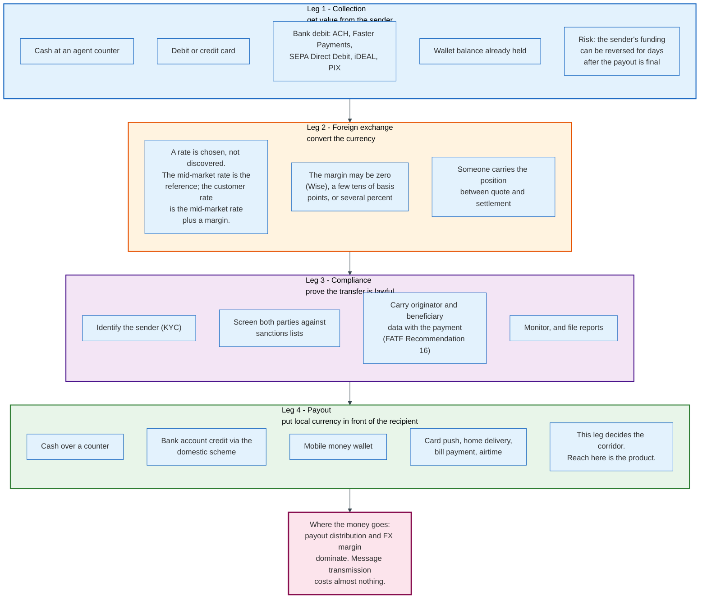

**Collection.** The provider takes value from the sender: cash at a counter, a card authorisation, a bank debit, or a wallet balance. The method determines the cost and the fraud exposure. A card costs the provider interchange and scheme fees. A US ACH debit costs cents and can be returned for up to 60 days on a consumer authorisation dispute, long after the recipient has spent the money.

**Foreign exchange.** A rate is applied. There is no natural rate; the mid-market rate is the midpoint between the interbank bid and offer, and every customer rate is that midpoint plus a margin in favour of the provider. The margin is the least visible price in retail finance.

**Compliance.** The sender is identified, both parties are screened against sanctions lists, required originator and beneficiary data is attached to the payment, and the transaction is monitored. This is not overhead bolted onto the product. It is a leg of the product, and it is the reason some corridors have no providers at all.

**Payout.** Local currency reaches the recipient as cash, a bank credit, or wallet value. This leg defines the corridor and consumes most of the cost.

### 2.2 A Remittance Is Not a Cross-border Movement of Money

The most common misconception in this field is that money physically crosses a border, and correcting it changes how every model below reads.

Consider a payment from a US firm to a Korean supplier, the example the Bank for International Settlements uses in its May 2024 Bulletin 87. The payer's US bank pays a correspondent bank inside the United States. That is a domestic payment settled on the Federal Reserve's books. The correspondent then credits the Korean bank's account, which is an account held in the United States. The Korean bank, seeing dollars arrive in its US account, credits its customer in won from its own Korean balance sheet.

The BIS states the conclusion plainly: this cross-border payment does not require settlement across countries, and settlement occurs only in the United States.

Nothing left the country. Two domestic payments happened, one in each jurisdiction, joined by a balance-sheet obligation between two institutions. That is true of correspondent banking, of Wise, of Western Union, and of a mobile money corridor. It is the definition of the category.

### 2.3 So "Wise Does Not Move Money Across Borders" Is Not the Distinction

Wise's marketing line is accurate and does not distinguish it from a bank, because no retail model moves currency across a border either.

What Wise actually removes is different and worth naming precisely. It removes the chain of intermediaries between the two domestic legs, it removes the exchange-rate margin as a hidden revenue source, and by joining domestic instant schemes directly it removes the correspondent bank from the payout leg entirely. Three specific removals. The physics were never the issue.

Section 6 works through the mechanism and the part that is genuinely different: the netting, and the residual position that still has to be moved.

### 2.4 What a Remittance Is Not

**Not a wire transfer, though a wire can carry one.** A wire is a real-time gross settlement instruction between financial institutions in a single currency. A remittance is a consumer product that may or may not use a wire on one leg. In the United States, "remittance transfer" is a legal term of art under Regulation E Subpart B, defined at 12 CFR 1005.30(e) as the electronic transfer of funds requested by a sender to a designated recipient at a location in a foreign country, regardless of whether the sender holds an account with the provider.

**Not a deposit.** Funds held by a money transmitter awaiting payout are not bank deposits and carry no deposit insurance. In the United States they are covered by state permissible-investment rules; in the United Kingdom and the European Union by safeguarding obligations. Western Union's balance sheet shows the structure explicitly: settlement assets of 3,449.1 million dollars at 31 December 2025 exactly matched by settlement obligations of 3,449.1 million dollars. The asset exists only to discharge the liability.

**Not free when the fee is zero.** A provider advertising no transfer fee is paid through the exchange rate. The World Bank's Remittance Prices Worldwide methodology exists specifically because of this: it measures total cost as the transaction fee plus the exchange-rate margin against the interbank rate, expressed as a percentage of the amount sent.

**Not slow because of the messaging.** Swift's Spotlight on Speed, published September 2025, reports that 90 percent of cross-border payments over its network reach the beneficiary bank within an hour, and that on average less than 20 percent of the elapsed journey is spent in flight. Roughly 80 percent is spent in the last mile, after the payment has left the Swift network and sits inside the beneficiary institution. Delay is a beneficiary-side processing and compliance problem, not a transmission problem.

**Not a single regulated activity.** A firm running one corridor may simultaneously be a money services business in the United States, a licensed money transmitter in 49 states, an authorised payment institution in the United Kingdom, a payment institution passported across the European Economic Area, and an agent of a locally licensed entity in the receiving country. Section 14 unpacks the stack.

### 2.5 The Fundamental Trade

Every model in this document trades between three things: reach, speed, and price. No provider gets all three in every corridor.

Reach means being able to hand cash to someone with no bank account in a village three hours from a road. That costs an agent, and an agent costs a commission on every transaction forever. Speed means the recipient has the money before the sender's funding has cleared, which means the provider carries the credit and fraud exposure. Price means giving up the exchange-rate margin, which means the explicit fee has to carry the whole cost structure.

Western Union bought reach. Remitly bought speed. Wise bought price. Each gave up the other two, and each is now trying to buy back what it gave up.

---

## 3. Key Participants and Roles

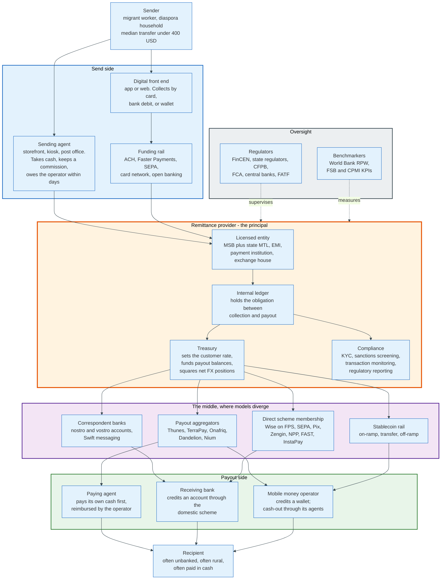

### 3.1 The Actors

| Role | What it does | Examples | Holds customer money? |
|------|--------------|----------|----------------------|
| **Sender** | Funds the transfer, bears the price | Migrant workers, diaspora households | No |
| **Sending agent** | Takes cash, enters the transaction, remits to the operator later | Grocers, pharmacies, post offices, exchange houses | Temporarily, as the operator's agent |
| **Master agent** | Recruits and manages subagents in a country | Regional distributors outside the US | Yes, in aggregate |
| **Remittance provider** | The licensed principal. Owns the obligation to pay the recipient | Wise, Western Union, MoneyGram, Remitly, Zepz, Ria | Yes, as a settlement obligation |
| **Funding rail** | Moves value from the sender's instrument to the provider | ACH, Faster Payments, SEPA, card networks | In transit |
| **Correspondent bank** | Holds foreign-currency balances and relays instructions | Global custodian and clearing banks | Yes, in nostro accounts |
| **Payout aggregator** | Sells one integration in exchange for many local endpoints | Thunes, TerraPay, Onafriq, Dandelion, Nium | Yes, in transit |
| **Paying agent** | Hands cash to the recipient from its own till | Local retail, bank branches, exchange houses | Advances its own cash |
| **Receiving bank** | Credits an account, usually through the domestic instant scheme | Any local bank | Yes |
| **Mobile money operator** | Credits a wallet, runs the cash-out agent network | Safaricom, MTN, Airtel, Orange | Yes, backed by a trust account |
| **Regulator** | Licenses, supervises, sets disclosure and AML rules | FinCEN, state regulators, CFPB, FCA, central banks | No |
| **Benchmarker** | Publishes the price, which is a policy instrument | World Bank RPW, FSB, CPMI | No |

### 3.2 The Two Roles That Decide Whether a Corridor Works

**The payout endpoint is the product.** Everything upstream is undifferentiated. Collection is a card or a bank debit, foreign exchange is a wholesale market, compliance is a set of obligations everyone shares. The variable is whether the provider can put local currency into the recipient's hands, in the form they want, in the place they live. Remitly's own disclosure frames the business this way: it reaches over 5.4 billion bank accounts and mobile wallets and approximately 490,000 cash pick-up options, across more than 5,300 corridors, without deploying local operations in each country. That reach is bought from partners, and the cost of buying it is the largest single line in the income statement.

**The paying agent extends credit to the operator, not the other way round.** In Western Union's own description, most agents settle with the recipient first and then obtain reimbursement from the company. The agent advances its own cash to a stranger holding a ten-digit control number, and waits. That inversion explains why agent networks are hard to build, hard to displace, and expensive to run: the operator is not renting shelf space, it is renting a balance sheet in a country where it has none.

### 3.3 The Aggregator Layer Nobody Sees

A layer of wholesale payout networks sits between consumer brands and local endpoints, and it is why a small remittance app can claim reach comparable to Western Union.

Thunes, TerraPay, Onafriq (formerly MFS Africa), Euronet's Dandelion, and Nium each sell a single integration in exchange for access to a pre-negotiated set of banks, wallets, and cash networks. The consumer brand handles acquisition, compliance on the sending side, and pricing. The aggregator handles the last mile, the local licensing, and the prefunding in each destination.

The consequence is a market where distribution is rentable. That compresses the moat that agent networks used to provide, and it also means several competing consumer apps in a corridor may be paying out through the same underlying partner at the same wholesale cost. Differentiation moves to the front end and to the exchange rate.

---

## 4. The Anatomy of a Remittance

Every model in this document runs the same nine steps in the same order, with one exception. In the agent model the sender's cash is taken at the counter before the operator screens, because the agent collects first and enters the transaction second. Names change and intermediaries change. The order changes once.

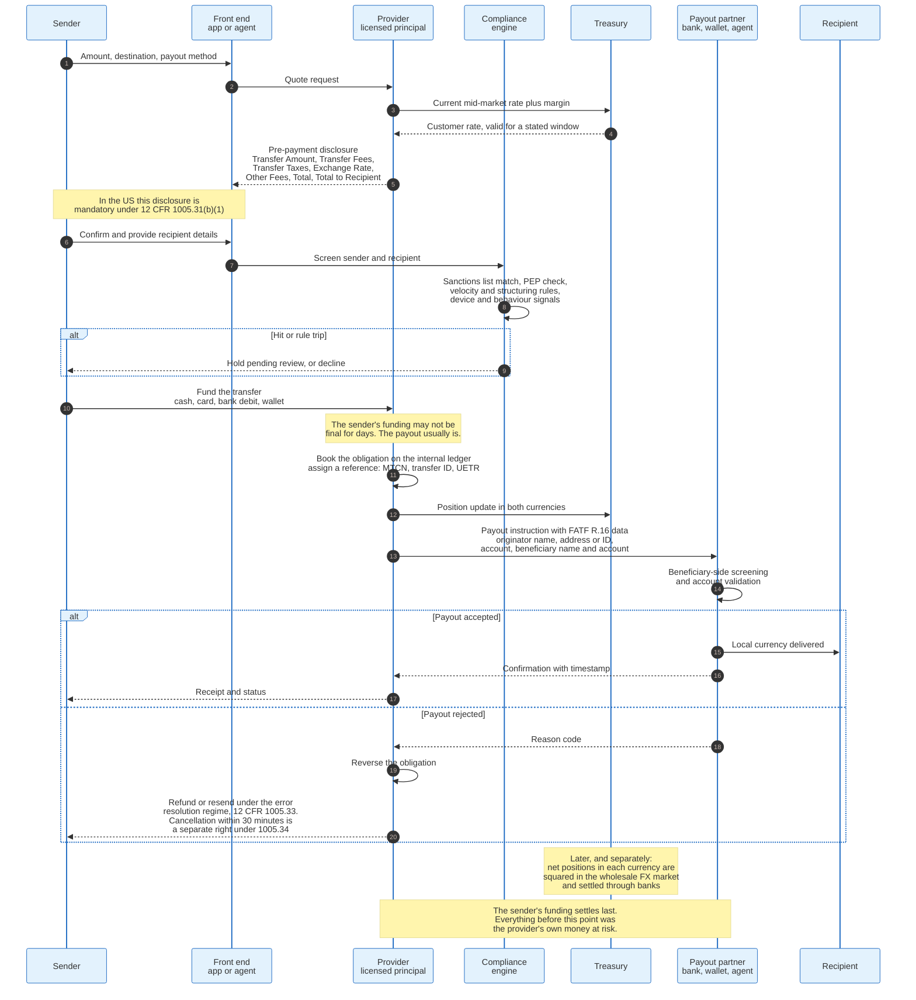

### 4.1 The Sequence

**Step 1: quote.** The customer states an amount, a destination, and a payout method. The provider returns a rate and a fee. The rate is set by treasury, not by the market, and is held for a stated window that transfers the FX risk to the provider for that window.

**Step 2: disclosure.** In the United States this is regulated in detail. 12 CFR 1005.31(b)(1) requires a pre-payment disclosure naming the Transfer Amount, Transfer Fees, Transfer Taxes, Exchange Rate rounded to between two and four decimal places, any covered third-party fees as Other Fees, the Total, and the amount that will be received in the destination currency, labelled Total to Recipient under 12 CFR 1005.31(b)(1)(vii). The regulation prescribes the labels because unlabelled numbers were being reordered to hide the margin.

**Step 3: screening.** Both parties are screened against sanctions lists before the payout is authorised. In digital models that happens before the sender's funding is taken. In the agent model it happens immediately after the agent enters the transaction and before the control number is released, which is after the cash has already crossed the counter. This is the step that fails most often for benign reasons, because a common name in Arabic, Slavic, or Hispanic transliteration produces list matches at a rate no small-value business can afford to review manually.

**Step 4: collection.** The sender funds the transfer. Cash is final immediately. A card authorisation is final for practical purposes but chargeable back. A US ACH consumer debit is returnable for 60 days on an unauthorised-transaction claim. The provider decides, per corridor and per customer, how much of that risk to absorb in exchange for speed.

**Step 5: the obligation is booked.** The provider records that it owes the recipient a stated amount in a stated currency and assigns a reference. Western Union's is the Money Transfer Control Number, a code the sender must communicate to the recipient in order to obtain a cash payout. Digital providers use an internal transfer identifier. Payments crossing Swift carry a UETR, a UUID that survives the whole chain.

**Step 6: the payout instruction.** The provider tells the payout partner to release local currency, and attaches the originator and beneficiary data that FATF Recommendation 16 requires. In the United States, 31 CFR 1010.410(f) requires a nonbank financial institution to include, in any transmittal order of 3,000 dollars or more, the transmittor's name and account number, the transmittor's address, the amount, the execution date, the identity of the recipient's financial institution, as many of the recipient's name, address, account number and other identifier as were received, and either the name and address or a numerical identifier of the transmittor's own institution.

**Step 7: beneficiary-side checks.** The payout partner screens again, validates the account or wallet, and confirms it can receive. This is the last mile, and per Swift's 2025 measurement it consumes roughly 80 percent of the elapsed time of an international payment.

**Step 8: delivery and confirmation.** Local currency reaches the recipient. The confirmation returns upstream and the sender sees a completed status.

**Step 9: settlement and squaring.** Separately, and on a different clock, the provider settles with its payout partner and squares its net foreign exchange position. Nothing the customer sees depends on this step, which is exactly why it is where the money is made and lost.

### 4.2 The Hard Part Is the Ordering

A remittance is a payout that happens before the funding is final. That inversion is the source of every risk in the product.

The recipient collects cash in Cebu at 09:00 local time. The sender's ACH debit in Chicago settles the next banking day, and can be returned as unauthorised for 60 days after that under the NACHA consumer return rules. Between payout and finality the provider is an unsecured lender to a customer it has never met, in an amount it chose, in a transaction that is unrecoverable once the cash leaves the drawer.

Three techniques manage it. Speed tiers price the exposure explicitly, with an instant option costing more than a one-to-three-day option that waits for funding to clear. Limits scale with customer history, so a first transfer is capped low and the ceiling rises with a repayment record. And loss provisioning treats the exposure as credit: Remitly books disbursement partner fees, provisions for transaction losses, payment processor fees, chargebacks and fraud tooling into a single line called transaction expenses, which totalled 549.5 million dollars in 2025 against 74.9 billion dollars of send volume, or 73 basis points.

### 4.3 Where Transfers Actually Fail

Failures cluster in four places, and none of them is the network.

**Name and account mismatch.** The recipient's name as typed by the sender does not match the account record. Most payout schemes reject rather than guess. This is the most common single failure in bank-payout corridors and the reason providers increasingly validate the account before taking the money.

**Sanctions and compliance holds.** A screening hit puts the transfer into manual review. On a 200 dollar transfer the review costs more than the revenue, which biases small providers towards declining rather than reviewing.

**Payout partner liquidity.** The partner has run out of prefunded balance, or the local scheme is in a maintenance window. The transfer sits.

**Recipient-side identification.** Cash payout requires the recipient to present identification matching the sender's spelling of their name. In corridors where identity documents are inconsistent, this fails often enough that operators build tolerance rules into the payout screen.

---

## 5. Correspondent Banking - The Default Model

Correspondent banking is what happens when nobody has built anything better in a corridor, and it is still how most cross-border value moves by amount.

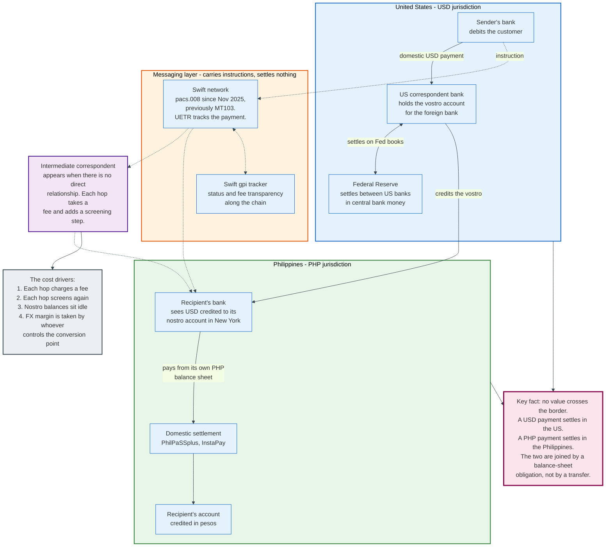

### 5.1 The Mechanism

A correspondent relationship is an account, and everything else follows from that.

Bank A in the Philippines wants to receive dollars. It opens an account at Bank B in New York. From Bank A's perspective that is a nostro account, Latin for "ours with you." From Bank B's perspective the same account is a vostro, "yours with us." Same balance, two names, depending on which side of the ledger you are reading.

When a US sender's bank pays that Philippine bank, it makes a domestic dollar payment to Bank B, settled across Federal Reserve accounts. Bank B increases the balance in Bank A's vostro. Bank A, seeing dollars it now owns in New York, credits its own customer in pesos out of its Philippine balance sheet. Two domestic payments, one obligation, no border crossed.

Swift carries the instruction that coordinates this. Since 22 November 2025 the cross-border payment traffic uses ISO 20022 messages under the CBPR+ programme, with `pacs.008` replacing MT103 for customer credit transfers and `pacs.009` replacing MT202 for financial-institution transfers. The MT formats were retired for general use on that date.

### 5.2 Why It Costs What It Costs

Four cost drivers stack, and only one of them is a payment fee.

**Hops.** Where no direct relationship exists, an intermediary correspondent is inserted. Swift's own analysis finds cross-border payments involve on average just over one intermediary between originator and beneficiary banks. Each intermediary deducts a fee from the principal, which is why a recipient sometimes gets less than the sender was quoted, and each intermediary screens the payment again against its own lists.

**Screening duplication.** The same payment is checked against overlapping sanctions lists at three or four institutions, each with its own tuning, each capable of stopping it. A hold anywhere stops the chain.

**Idle nostro balances.** To pay in a currency you must hold that currency, in advance, at a bank in that country. Those balances earn little and cannot be deployed. The aggregate figure is not published, and estimates circulating in industry literature are not traceable to a primary measurement, so the honest statement is that the sum is large and unmeasured. The cost to any individual bank, however, is measurable and shows up as a funding charge on the treasury desk.

**The conversion point.** Whoever converts the currency takes the margin. In a correspondent chain that is usually the beneficiary bank, which receives dollars and pays pesos at a rate it sets. The sender never sees it and the recipient rarely computes it.

### 5.3 The Retreat, and What It Did to Corridors

Banks have been exiting correspondent relationships for fifteen years, and the exits are concentrated exactly where remittances matter most.

The BIS analysis of Swift traffic, published in the March 2020 Quarterly Review, found the number of active correspondents down 20 percent between 2011 and 2018, and the number of corridors down 10 percent, from 10,800 to 9,800. Declines by region ranged from 12 percent to 30 percent, with Northern America least affected and Latin America most. Banks withdrew more from countries where governance and controls on illicit financing were weaker, and less where economic growth and trade were strong.

The paper names three consequences: financial inclusion may suffer, the cost of cross-border payments may rise, and payments may be driven underground. The third is the one policy has not solved. Where the formal corridor closes, value moves through informal transfer systems, which are cheaper, faster, and entirely unobservable. De-risking a corridor does not remove the flow; it removes the regulator's view of it.

### 5.4 What Correspondent Banking Still Does Better

The model persists because it does two things no alternative does at scale.

It reaches everywhere a bank exists, without a bilateral agreement per corridor. And it handles large values, because the settlement is between institutions with balance sheets rather than through a prefunded pool sized to retail volumes. A 40 million dollar payment does not fit through a remittance provider's payout partner. It fits through a correspondent chain without anyone noticing.

For retail remittance, both advantages are irrelevant. The average consumer transfer is under 400 dollars and goes to one of a few hundred corridors that carry most of the volume. That is precisely the shape a purpose-built network beats.

---

## 6. Wise - Netted Local Payout, and What It Actually Avoids

Wise is a bank-shaped balance sheet without a bank, holding money in dozens of currencies so that no individual customer payment ever has to leave a country.

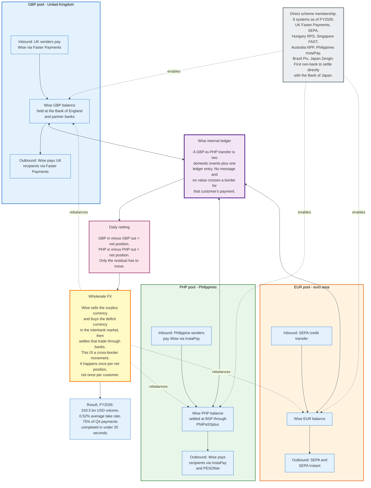

### 6.1 The Mechanism, Precisely

A Wise transfer from London to Manila is two domestic payments and one ledger entry.

The sender pays pounds into Wise's UK account through Faster Payments. Wise is a direct participant in Faster Payments with a settlement account at the Bank of England, so that payment reaches Wise without passing through a sponsor bank. Wise credits the amount internally, applies the mid-market rate, deducts a stated fee, and instructs a payout of pesos from the peso balance it already holds in the Philippines. Since Wise is directly connected to InstaPay and settles through the Bangko Sentral ng Pilipinas, that payout is a domestic Philippine instant payment.

Two domestic legs, one internal ledger entry, no border crossed for that customer's money.

### 6.2 What the Netting Actually Nets

The netting is real and it is not the whole story, and the difference is the single most misunderstood point about this model.

Over a day, pounds flow into Wise's GBP pool from senders and out of it to recipients of transfers originating elsewhere. The same is true of every currency. The gross flows partly cancel. What remains is a net position in each currency: a surplus of pounds, a deficit of pesos.

That residual has to be moved. Wise sells the surplus currency and buys the deficit currency in the wholesale foreign exchange market, and that trade settles through banks in the ordinary way. It is a cross-border movement of value, and it happens once per net position per rebalancing cycle rather than once per customer transfer.

The economic gain is the ratio between gross customer volume and net rebalancing volume. That ratio is not published for any operator of this model. What is published is the outcome: a 0.52 percent average cross-border take rate on 243.5 billion dollars of FY2026 volume, against a global average cost of 6.36 percent.

The correct statement of the advantage is therefore narrower than the marketing and stronger than the sceptics allow. Wise does not avoid cross-border settlement. It amortises one cross-border settlement over many customer transfers, at a ratio no operator of this model publishes, and it removes the intermediary chain and the exchange-rate margin that sat in between.

### 6.3 Direct Scheme Membership Is the Real Moat

The expensive, slow, unglamorous thing Wise did was become a member of domestic payment systems, and it is the part competitors cannot copy quickly.

As of the financial year ended 31 March 2026, Wise holds direct participation in eight domestic payment systems: UK Faster Payments, SEPA, Hungary's domestic instant scheme, Singapore's FAST, Australia's New Payments Platform, the Philippines' InstaPay, Brazil's Pix, and Japan's Zengin. Brazil and Japan went live during FY2026. In Japan, Wise became the first non-bank to join Zengin through the newly introduced API method and the first Funds Transfer Service Provider to settle directly with the Bank of Japan. In the Philippines it holds a settlement account with the central bank and settles through PhilPaSSplus.

The effect is measurable in speed. Wise reports 75 percent of its payments globally completed in under 20 seconds in the fourth quarter of FY2026. The FY2026 announcement carries no earlier comparator, so no trend figure is quoted here. It is also measurable in cost, because a direct participant pays scheme fees measured in fractions of a currency unit rather than correspondent fees measured in whole ones.

The barrier is regulatory, not technical. Each membership requires a licence, a settlement account, capital, operational resilience evidence, and a regulator willing to admit a non-bank. Wise holds over 70 licences globally as of September 2025, with new approvals during FY2026 in South Africa, the United Arab Emirates, and Thailand. That portfolio took a decade.

### 6.4 The Economics

Wise's unit economics are visible because it is listed, and they show where a 52 basis point price actually goes.

For the half-year ended 30 September 2025, Wise reported revenue of 658.0 million pounds and underlying income of 749.5 million pounds after including the first 1 percent yield on customer balances. Cost of sales was 173.7 million pounds, of which 141.9 million pounds was banking and customer-related fees and 31.8 million pounds was net foreign exchange movements and other product costs. Net credit losses were 4.6 million pounds.

The composition is the point. Roughly 82 percent of cost of sales is what Wise pays banks and payment schemes to collect and disburse. That is the line direct scheme membership attacks, and every membership Wise adds moves volume from the expensive correspondent path to the cheap domestic one.

Wise reported the half year in pounds and the full year in US dollars, having changed its presentation currency during FY2026 alongside its move to a Nasdaq primary listing. The two sets of figures below and above are not directly additive or comparable line by line.

For the full year to 31 March 2026, cross-border volume was 243.5 billion dollars, up 31 percent from 185.2 billion dollars; net revenue was 2.5 billion dollars, up 19 percent; income before tax was 660.4 million dollars at a 26 percent margin; active customers were 18.9 million, up 21 percent; customer holdings were 39 billion dollars, up 40 percent; and card spend was 43.6 billion dollars.

Nearly half of net revenue now comes from sources other than cross-border transfer fees: interest on customer balances and card interchange. That is the structural answer to a falling take rate. The take rate has dropped from 0.67 percent to 0.52 percent across nine quarters, deliberately, and the business grows anyway because the balance and the card monetise the same customer.

### 6.5 What Wise Does Not Solve

Wise is a bank-account-to-bank-account business, and roughly a third of the world's remittance recipients do not have that.

There is no Wise agent handing cash to a farmer in rural Zimbabwe. Where the recipient needs cash or a wallet in a country where Wise has no direct connection, the model reverts to a partner, and the partner's cost reappears. The corridors where Wise's price advantage is largest are exactly the corridors that were already cheapest: high-income to high-income, bank to bank, in currencies with liquid markets and modern domestic rails.

The World Bank data show this shape directly. The most expensive corridors are the ones with cash payout, thin competition, and illiquid currencies. Those are the corridors a netted local-payout model does not reach.

---

## 7. Western Union and MoneyGram - Cash Agents, Float, and Settlement

Western Union's business is not payment processing. It is the rental of 360,000 balance sheets in places where it has none, and the commission on that rental is the largest cost in the company.

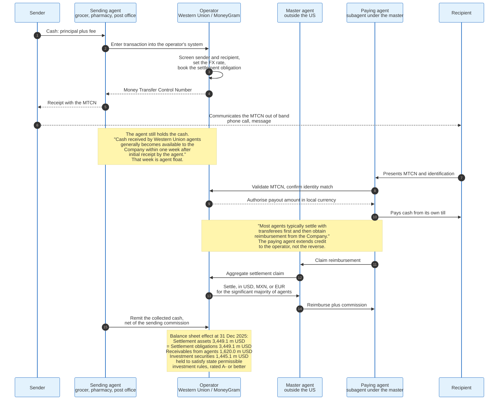

### 7.1 The Mechanism

The product is a control number and two cash drawers.

The sender walks into an agent location, hands over the principal and the fee in cash, and receives a Money Transfer Control Number. Western Union's own description is that funds are made available for pick-up within minutes, and that the consumer must communicate the MTCN to the recipient in order to obtain a payout in cash. The recipient walks into an agent location in the destination country, presents the MTCN and identification, and receives local currency.

The operator never touched the cash at either end. The sending agent holds it. The paying agent supplies it. The operator supplied a database entry, a screening decision, an exchange rate, and a guarantee.

### 7.2 The Float, and Who Extends Credit to Whom

The settlement mechanics run in both directions and both directions are credit exposures.

On the send side, the agent holds the collected cash for a period. Western Union states in its 2025 annual report that cash received by its agents generally becomes available to the company within one week after initial receipt. During that week the agent has the operator's money. The receivables from agents and others line on the balance sheet was 1,620.0 million dollars gross at 31 December 2025, against an allowance for credit losses of 17.9 million dollars. Write-offs charged against that allowance during 2025 were 36.5 million dollars, with 15.1 million dollars of recoveries.

On the pay side, the direction reverses. Most agents settle with the recipient first and obtain reimbursement afterwards, which means the paying agent has advanced its own cash and is now the operator's creditor. Payables to agents were 838.6 million dollars at 31 December 2025.

Total settlement assets equalled total settlement obligations at 3,449.1 million dollars, composed of 402.0 million dollars of cash and cash equivalents, 1,602.1 million dollars of net receivables from agents, and 1,445.0 million dollars of net investment securities. Those securities are not an investment strategy. They exist because state licensing law requires a money transmitter to hold eligible assets against its outstanding obligations, and they must carry a rating of A- or better from a major rating agency.

The operator also concentrates its settlement currencies. Western Union states that it settles with the significant majority of its agents and disbursement partners in United States dollars, Mexican pesos, or euros. That concentration is a deliberate simplification: three currencies to manage instead of a hundred, at the cost of pushing local-currency risk onto the agent.

### 7.3 What the Cash Network Costs

Agent commission is the price of reach, and it is roughly the size of the entire revenue of a digital competitor.

Western Union's cost of services was 2,550.6 million dollars in 2025, and the company states that agent commissions represented nearly 60 percent of it, roughly 1.53 billion dollars. Spread across 285.9 million consumer money transfer transactions, that is about 5.35 dollars per transaction. Consumer money transfer revenue per transaction was 12.27 dollars.

Two caveats bound that ratio. The cost of services line covers both reporting segments, so 5.35 dollars is an upper bound on the per-transaction commission attributable to money transfer. And the 375.66 dollar average principal that turns 5.35 dollars into 1.4 percent is cross-border principal divided by a transaction count that also includes intra-United States transfers, so it is an indicative denominator rather than a measured one. Even bounded on both sides the comparison holds: distribution alone consumes something on the order of 1.4 percent of principal, while Wise's entire take rate is 0.52 percent.

That single comparison explains the industry. A digital-only provider is not more efficient at processing. It has no agents to pay.

### 7.4 Scale and Trajectory

The cash network is large, profitable, and shrinking, and the digital business inside it is growing.

At 31 December 2025 Western Union's network included agent locations in more than 200 countries and territories, of which approximately 360,000 had conducted money transfer activity in the previous 12 months. Consumer Money Transfer revenue was 3,507.4 million dollars, down 8 percent from 3,798.0 million dollars in 2024, on transactions down 1 percent to 285.9 million. Cross-border principal rose to 107.4 billion dollars from 102.9 billion dollars. Total consolidated revenue was 4,050.7 million dollars, of which the Consumer Money Transfer segment was 87 percent.

Revenue fell while principal rose. That is price compression, and it is visible in the regional detail: North America revenue down 11 percent, Latin America and the Caribbean down 11 percent, the Middle East, Africa and South Asia down 20 percent driven largely by a fall in transactions originating from Iraq, and Europe and CIS up 6 percent.

Branded Digital, meaning the company's own websites and apps plus third-party digital partners operating under its brands, represented 30 percent of Consumer Money Transfer revenue and 39 percent of transactions in the fourth quarter of 2025. Digital transactions are smaller and cheaper than retail ones, which is why the transaction share exceeds the revenue share.

MoneyGram runs the same model at roughly the same shape. It was taken private by Madison Dearborn Partners on 1 June 2023 at 11.00 dollars per share in a transaction valued at approximately 1.8 billion dollars, so its financials are no longer public. Company statements in 2026 describe roughly 60 million active customers, close to 500,000 retail locations across more than 200 countries and territories, and more than 70 percent of transactions running through digital channels.

### 7.5 Why the Model Persists

Cash is not a legacy preference. It is the only instrument available to a large share of recipients, and cash payout is a physical service that cannot be virtualised.

An agent network also solves a compliance problem invisibly. The agent performs the identity check in person, in the local language, against local documents, at a cost the operator does not carry as headcount. Replicating that with remote verification in a country with inconsistent identity infrastructure is genuinely hard and is why digital providers enter cash-out corridors through partners rather than directly.

The structural weakness is that the commission is per transaction and forever. A digital provider's cost per transaction falls with scale. An agent's does not.

---

## 8. Remitly - The Digital-Native Prefunded Model

Remitly buys its distribution rather than building it, and prefunds the payout so the recipient is paid before the sender's money has cleared.

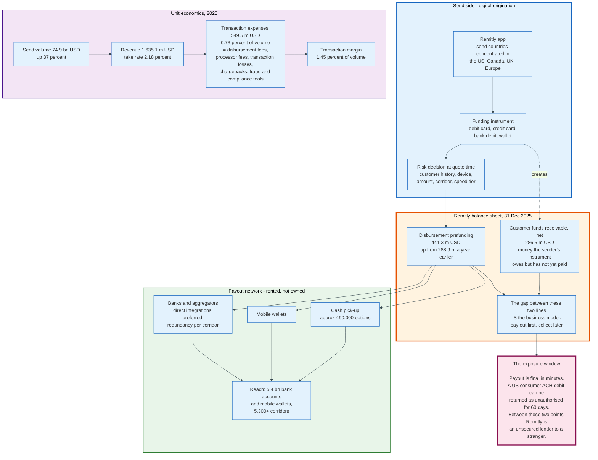

### 8.1 The Mechanism

Remitly holds money at its disbursement partners in advance so a payout can execute the moment a transfer is approved.

The line is on the balance sheet as disbursement prefunding: 441.3 million dollars at 31 December 2025, up from 288.9 million dollars a year earlier. Against 74.9 billion dollars of 2025 send volume, or roughly 205 million dollars a day, that balance is about 2.1 days of volume sitting in partner accounts around the world.

Alongside it sits customer funds receivable of 286.5 million dollars net, which is money the sender's funding instrument owes Remitly and has not yet delivered. The two lines describe the same trade from opposite ends: the recipient has been paid, and the sender has not.

Remitly discloses that the balance is timing-sensitive in a specific way. Prefunding amounts are generally higher if the year closes on a weekend or before a holiday, because payouts continue while funding rails are closed. That is the cross-border version of the same weekend liquidity problem domestic instant schemes have.

### 8.2 The Rented Network

Remitly's stated network strategy is to prefer direct integrations with funding and disbursement partners and to build redundancy per corridor.

The reach it buys is large: over 5.4 billion bank accounts and mobile wallets, approximately 490,000 cash pick-up options including retail outlets and banks, and more than 5,300 corridors. A corridor is defined as the pairing of a send country with a receive country, which is why adding one send country multiplies corridors rather than adding one.

The economics of renting are visible. Transaction expenses, which include fees paid to disbursement partners, provisions for transaction losses, payment processor fees, chargebacks, fraud prevention tooling and compliance tooling, totalled 549.5 million dollars in 2025, up 27 percent, against revenue of 1,635.1 million dollars. That is 33.6 percent of revenue and 0.73 percent of send volume.

Compare it to Western Union's roughly 1.4 percent of principal on agent commission alone, before the processor fees, chargebacks and fraud losses Western Union also carries on its digital volume. Its 10-K states that for Branded Digital transactions it typically pays a card processor or bank a fee for collecting the principal and is responsible for chargeback and fraud losses, on top of the commission owed to the receive agent. The two figures are therefore not like for like: Remitly's 0.73 percent is all-in and Western Union's 1.4 percent is commission only, and no comparable all-in figure for Western Union is disclosed. The gap is directionally clear and not precisely measurable from public filings.

Renting distribution comes without a lease, a franchise agreement, or a cash logistics operation. What it does not come with is control. The same aggregator sells the same endpoints to competitors.

### 8.3 The Economics

Remitly's 2025 numbers show a business that converted growth into profit in one year.

Revenue was 1,635.1 million dollars, up 29 percent from 1,264.0 million dollars. Send volume was 74.9 billion dollars, up 37 percent from 54.6 billion dollars. Volume grew faster than revenue, which means the take rate fell, from 2.31 percent to 2.18 percent. Net income was 67.9 million dollars against a net loss of 37.0 million dollars in 2024, and adjusted EBITDA was 272.2 million dollars against 141.2 million dollars.

Quarterly active customers reached 9.3 million. Marketing was 342.9 million dollars in 2025, or 21 percent of revenue, which is the honest cost of a business whose customers are acquired one at a time and whose product is bought roughly monthly.

### 8.4 The Structural Position

Remitly sits between the two models it competes with, and that is a real position rather than a compromise.

It is cheaper than an agent network because it has no agents, and dearer than Wise because it pays partners for the last mile that Wise reaches directly. It is faster than a bank because it prefunds, and riskier than a bank because it prefunds. It reaches the unbanked recipient that Wise cannot, and does so at a partner's price rather than its own.

The strategic question the numbers pose is whether the take rate keeps falling. It has moved from 2.31 percent to 2.18 percent in one year while volume grew 37 percent. If the destination of that curve is Wise's 0.52 percent, the transaction margin of 1.45 percent of volume does not cover 342.9 million dollars of marketing. If the destination is around 1.5 percent, it does.

---

## 9. Mobile-Money Corridors

Mobile money changed which end of the remittance is hard. Sending has always been solvable with a storefront; receiving, in a village without a bank branch, was not, until the payout endpoint became a phone number.

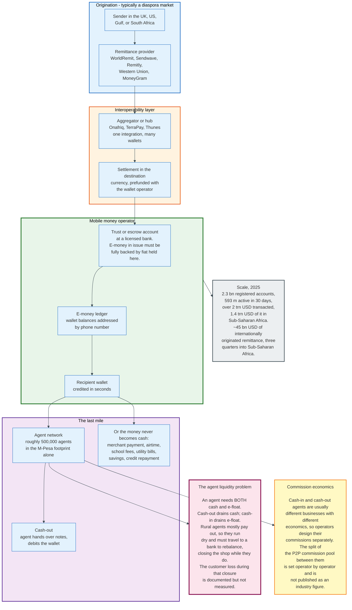

### 9.1 The Mechanism

A mobile money operator issues electronic value against fiat held in a trust account and addresses it by phone number.

The regulatory architecture matters more than the technology. E-money in issue must be fully backed by funds in a trust or escrow account at a licensed bank, and those funds are ring-fenced from the operator's own balance sheet. That single rule is what let a telecoms company hold consumer money without becoming a bank, and it is the template most mobile money regulation follows.

For an inbound remittance, the sending provider settles the destination currency with the wallet operator or with an aggregator that has already prefunded there. The wallet operator credits the recipient's wallet from its e-money ledger. Credit takes seconds. Nothing crossed a border; the sending provider's obligation was discharged against a local prefunded balance, exactly as in every other model here.

### 9.2 Scale

The category is now the largest retail payment system in Sub-Saharan Africa by any measure.

The GSMA's State of the Industry Report on Mobile Money 2026 counts 2.3 billion registered accounts at the end of 2025, an increase of 268 million during the year and the largest absolute annual increase the industry has recorded. Accounts active within a 30-day window rose 15 percent to 593 million. Transaction value passed 2 trillion dollars for the year, up 23 percent, of which 1.4 trillion dollars moved in Sub-Saharan Africa. Sub-Saharan Africa and North Africa together held 1.2 billion registered accounts, more than half the global total.

The ratio matters more than either number: 593 million active against 2.3 billion registered means roughly three in four registered accounts did not transact in a given month. Registration is cheap and activity is what costs money to produce.

Internationally originated remittance running through mobile money was approximately 45 billion dollars in 2025, three quarters of it into Sub-Saharan Africa. Bank-to-mobile transfers rose 37 percent to 167 billion dollars and mobile-to-bank transfers rose 35 percent to 163 billion dollars, which is the interoperability layer between the wallet world and the bank world becoming load-bearing.

M-Pesa is the largest single platform, and the published figures around it describe something wider. Vodacom reports a financial services customer base of 103 million for the year to 31 March 2026, up 17.4 percent, and transaction value of 525.6 billion dollars. That base is not M-Pesa alone: it includes VodaPay and VodaLend in South Africa and Vodafone Cash in Egypt, and it counts customers of Safaricom, which Vodacom holds as an associate rather than a subsidiary. A standalone M-Pesa customer count and transaction value for FY2026 are not separated in that disclosure, so neither is quoted here. The agent footprint associated with M-Pesa is roughly 500,000.

### 9.3 Agent Float, and Why Rural Payout Is Structurally Expensive

The mobile money agent has the same problem as the remittance paying agent, in a harder form: it needs two kinds of liquidity simultaneously.

An agent holds a cash balance and an e-float balance. A customer depositing cash increases the agent's cash and decreases its e-float. A customer withdrawing does the reverse. An agent whose customers only withdraw runs out of cash; an agent whose customers only deposit runs out of e-float. Either way the agent stops trading.

The geography makes this asymmetric. Urban agents skew towards cash-in because urban customers deposit wages. Rural agents skew towards cash-out because rural customers receive transfers. A remittance corridor terminating in a village therefore concentrates cash-out demand exactly where cash is hardest to replenish.

The rebalancing cost falls on the agent as lost trading time. Eijkman, Kendall and Mas, in "Bridges to Cash: the retail end of M-PESA" (2010), describe Kenyan agents closing their shops and travelling to a bank to swap cash for e-float or the reverse. The customer loss during that absence is not measured in a figure this document can cite, so none is quoted. The GSMA's guidance on commission design makes the second point: cash-in and cash-out agents need separately designed commission structures because they are usually different businesses with different economics. The split of the commission pool between them is set operator by operator and is not published as an industry figure.

This is the mechanical reason Sub-Saharan Africa remains the most expensive receiving region. The last mile is a person with a cash box who has to drive somewhere to refill it.

### 9.4 The Interoperability Problem

Mobile money was built as a set of closed loops, and remittance requires them to be open.

Within a country, a customer on one operator historically could not pay a customer on another. Regulators have progressively forced interoperability, and switches such as Onafriq have built commercial hubs that connect wallets across operators and across borders. Onafriq, formerly MFS Africa, positions itself as a mobile money interoperability hub reaching wallets and bank accounts across more than 40 African markets.

Cross-border, the challenge compounds: a Kenyan shilling wallet and a Ugandan shilling wallet require an FX leg, a settlement arrangement, and two sets of AML obligations. Regional initiatives, including the Pan-African Payment and Settlement System, aim to settle intra-African flows in local currencies rather than routing them through dollars in New York. Intra-African remittance is a substantial flow and is priced badly precisely because it routes through a third currency it does not need.

---

## 10. Price - FX Spread Versus Explicit Fee

The price of a remittance has two components and only one of them is printed in large type. Understanding which is which is the whole of consumer protection in this industry.

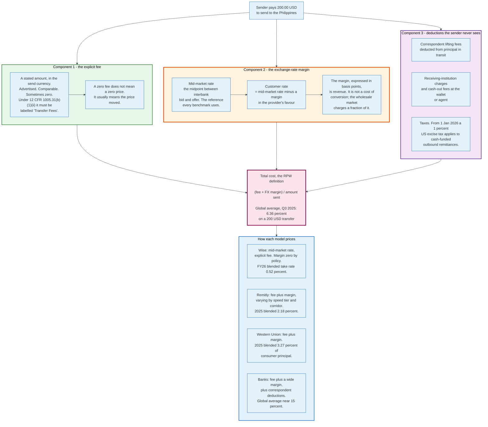

### 10.1 The Two Components

The explicit fee is a stated amount in the send currency. It is advertised, comparable, and easy to compete away, which is why so many providers set it to zero.

The exchange-rate margin is the difference between the mid-market rate and the rate the provider gives the customer. The mid-market rate is the midpoint between the interbank bid and offer for the currency pair, which is what a large institution would pay to convert wholesale. A provider that quotes a customer 55.5 pesos to the dollar when the mid-market rate is 58.0 has taken a margin of 2.5 pesos, or 4.31 percent of the amount, without charging a fee.

The margin is not a cost of conversion. Converting currency at wholesale costs the provider a few basis points in liquid pairs. The margin is revenue.

### 10.2 Why the World Bank Counts Both

Remittance Prices Worldwide exists because comparing fees alone produces a systematically wrong ranking.

The methodology defines total cost as the transaction fee plus the exchange-rate margin against the interbank rate, expressed as a percentage of the amount sent, for a standard transfer of 200 dollars or the local-currency equivalent. Services that do not disclose an exchange rate in advance are recorded as non-transparent and excluded from the global average calculation.

That definition is the reason the industry's advertised prices and its measured prices diverge. A provider advertising a 2.99 dollar fee on a 200 dollar transfer is advertising 1.5 percent. If it also takes a 4 percent exchange-rate margin, its measured cost is 5.5 percent.

### 10.3 What Each Model Does with the Margin

Four distinct pricing philosophies are in the market, and they map onto four distinct business models.

**Zero margin, explicit fee.** Wise quotes the mid-market rate and charges a stated fee. Its blended cross-border take rate was 0.52 percent in FY2026. This makes the price legible and forces the entire cost structure through one visible number, which in turn forces the company to attack cost: banking and customer-related fees were 141.9 million pounds of a 173.7 million pound cost of sales in the half to 30 September 2025, and direct scheme membership is the lever against that line.

**Fee plus margin, tiered by speed.** Remitly prices differently by corridor, payout method, and delivery speed, with the margin doing part of the work. The blended result was 2.18 percent in 2025.

**Fee plus margin, priced to the network.** Western Union's revenue depends, in its own words, on channel, send and receive locations, funding method, principal amount, and the difference between the exchange rate it sets and a rate available in the wholesale market. The blended result was 3.27 percent of cross-border principal in 2025, computed on a revenue base that also includes intra-United States transfers, so the true cross-border price is lower.

**Fee plus a wide margin.** Banks average near 15 percent globally in the Remittance Prices Worldwide data for the third quarter of 2025. A bank's remittance product is a by-product of a correspondent relationship priced for corporate treasurers, sold to a retail customer who has no comparison point.

### 10.4 The Regulatory Response

Two jurisdictions have attacked the opacity directly, with the same instrument: mandatory pre-payment disclosure of the rate.

In the United States, 12 CFR 1005.31(b)(1) requires the provider to disclose, before the sender pays, the Transfer Amount, the Transfer Fees, any Transfer Taxes, the Exchange Rate rounded to no fewer than two and no more than four decimal places, any covered third-party fees as Other Fees, the Total, and the amount that will be received in the destination currency, which 12 CFR 1005.31(b)(1)(vii) requires to be labelled Total to Recipient. The labels are prescribed. The rule applies to any person providing remittance transfers in the normal course of business, with a safe harbour at 12 CFR 1005.30(f)(2) for anyone providing 500 or fewer remittance transfers in both the previous and current calendar years, and an exclusion for transfer amounts of 15 dollars or less.

In the European Union, Regulation 2021/1230 requires currency conversion charges to be expressed as a percentage mark-up over the latest available European Central Bank reference rate. The forthcoming Payment Services Regulation, whose compromise texts the Council published on 24 April 2026, extends and tightens that disclosure and prohibits non-transparent pricing methods including manipulative value dating. The regulation applies 21 months after entry into force.

The mark-up-over-reference-rate formulation is the important design choice. It converts an invisible margin into a percentage that can be compared across providers, which is the only thing that makes competition on the rate possible.

### 10.5 Speed Is a Price Tier, Not a Capability

Providers sell delivery speed at a premium, and the premium usually prices credit exposure rather than processing.

An instant payout means the provider releases its own money before the sender's funding is final. A one-to-three-day payout means it waits. The processing is identical. What differs is who carries the exposure and for how long, and in the digital models that exposure is priced into the fee.

This is why speed and price move together in the wrong direction from the customer's point of view, and why the G20's speed and cost targets are partly in tension. Faster delivery on the same funding rail costs the provider more, not less.

---

## 11. Corridor Economics and the World Bank Benchmarks

Remittance price is not a global number that happens to vary. It is a set of corridor-level outcomes determined by competition, payout infrastructure, and currency liquidity, and the global average is an artefact of mixing them.

```mermaid
%%{init: {'theme': 'base', 'themeVariables': {'primaryColor': '#e3f2fd', 'primaryBorderColor': '#1565c0', 'lineColor': '#37474f'}}}%%

flowchart TB
    subgraph Bench["The benchmarks"]
        RPW["World Bank Remittance Prices Worldwide<br/>367 country corridors,<br/>48 sending to 105 receiving countries.<br/>Total cost = fee + FX margin<br/>on a 200 USD transfer."]
        Target["Targets<br/>SDG 10.c: 3 percent by 2030,<br/>no corridor above 5 percent.<br/>G20 Roadmap adds speed:<br/>75 percent of remittances<br/>credited within one hour."]
        Actual["Measured, Q3 2025:<br/>global average 6.36 percent,<br/>down from 6.49 percent in Q1 2025"]
    end

    subgraph Drivers["What actually sets a corridor's price"]
        D1["Number of providers competing.<br/>Thin corridors price high<br/>whatever the technology."]
        D2["Payout mix.<br/>Cash payout carries an agent<br/>commission on every transaction."]
        D3["Currency liquidity.<br/>An illiquid pair widens the<br/>wholesale spread before any<br/>retail margin is added."]
        D4["Capital controls and<br/>documentation requirements<br/>at the receiving end"]
        D5["Correspondent access.<br/>A de-risked corridor has fewer<br/>routes and each one prices<br/>its scarcity."]
        D6["Regulatory cost per transaction,<br/>which is roughly fixed and<br/>therefore punishes small<br/>average transfer sizes"]
    end

    subgraph Outcomes["The resulting spread"]
        O1["Cheapest receiving region:<br/>South Asia, near 5 percent.<br/>Dense competition on the<br/>India, Pakistan and<br/>Bangladesh routes."]
        O2["Most expensive receiving region:<br/>Sub-Saharan Africa, near 8 percent.<br/>Of 13 corridors above 20 percent<br/>in Q3 2025, nine originate<br/>in Sub-Saharan Africa."]
        O3["By provider type:<br/>banks near 15 percent,<br/>digital-first operators<br/>a fraction of that on<br/>the same corridors"]
        O4["By instrument, Q3 2025:<br/>credit or debit card cheapest<br/>to originate at 4.39 percent;<br/>debit card cheapest to<br/>receive at 3.61 percent"]
    end

    Lesson["The pattern: the corridors that need<br/>cheap remittance most are the ones<br/>where every cost driver points the<br/>wrong way. Technology reaches the<br/>corridors that were already cheap."]

    Bench --> Drivers
    Drivers --> Outcomes
    Outcomes --> Lesson

    style Bench fill:#e3f2fd,stroke:#1565c0,stroke-width:2px
    style Drivers fill:#fff3e0,stroke:#e65100,stroke-width:2px
    style Outcomes fill:#e8f5e9,stroke:#2e7d32,stroke-width:2px
    style Lesson fill:#fce4ec,stroke:#880e4f,stroke-width:3px
```

### 11.1 The Benchmark and the Target

Remittance Prices Worldwide is a quarterly measurement that has become a policy instrument, which is unusual for a price index.

It covers 367 country corridors, from 48 sending countries to 105 receiving countries, and prices a standard 200 dollar transfer using the fee plus exchange-rate margin definition. Providers that do not disclose a rate in advance are marked non-transparent and excluded from the average.

The targets attached to it are explicit. Sustainable Development Goal 10.c calls for reducing the global average cost of sending remittances to less than 3 percent by 2030 and eliminating corridors with costs above 5 percent. The G20 Roadmap for Enhancing Cross-border Payments restates the cost target and adds a speed target: 75 percent of remittances credited within one hour of initiation and the remainder within one business day.

The measured global average was 6.36 percent in the September 2025 issue, down from 6.49 percent in the first quarter of 2025. Neither target is close.

The Financial Stability Board's consolidated progress report, published 9 October 2025, five years after the Roadmap launched, states that the key performance indicators for 2025 show only slight improvement at the global level since they were first calculated in 2023, that speed improved for both wholesale payments and remittances, that average remittance costs remain relatively unchanged, and that it is unlikely satisfactory improvements will be achieved in line with the 2027 Roadmap timetable.

### 11.2 What Sets a Corridor's Price

Six drivers, and payment technology is not among them.

**Competition.** A corridor with fifteen providers prices near cost. A corridor with two prices near what the market bears. Corridor pricing is the clearest available demonstration that remittance is not a commodity market with a global clearing price.

**Payout mix.** A corridor where 80 percent of recipients take cash carries an agent commission on 80 percent of transactions, forever. A corridor where recipients take bank credits does not.

**Currency liquidity.** The wholesale spread on a major pair is a few basis points. On a thinly traded emerging-market currency with capital controls it is much wider, before any retail margin is applied.

**Regulatory friction at the receiving end.** Documentation requirements, per-transaction caps, and mandatory routing through licensed local entities all add cost. India's Money Transfer Service Scheme, for example, caps individual inbound transfers at 2,500 dollars with a maximum of 30 remittances per beneficiary per year, and permits cash payout only up to 50,000 rupees, with larger amounts credited to an account. The Rupee Drawing Arrangement, the bank-to-bank channel, carries no such per-transaction cap for personal transfers but requires account credit rather than cash.

**Correspondent access.** A corridor that has lost most of its correspondent relationships has fewer routes, and the survivors price their scarcity.

**Fixed cost per transaction.** Screening, monitoring, reporting, and customer support cost roughly the same on a 50 dollar transfer as on a 5,000 dollar one. Corridors with small average transfers therefore carry a higher percentage cost for arithmetic reasons alone. This is why the World Bank publishes costs at both 200 dollars and 500 dollars, and why the 500 dollar figure is consistently lower in the global averages. It is not lower everywhere: a corridor priced purely as a percentage of principal produces the same figure at both amounts, and a banded fee schedule can step up between them.

### 11.3 The Regional Spread

The regional pattern has been stable for a decade and it is the inverse of need.

Sub-Saharan Africa is the most expensive receiving region, near 8 percent of the amount sent against the 6.36 percent global average. Of the 13 corridors costing more than 20 percent in the third quarter of 2025, nine originate in Sub-Saharan Africa, meaning intra-African transfers are the worst-priced flows measured.

South Asia is the cheapest receiving region, near 5 percent, on the strength of competition in the India, Pakistan and Bangladesh routes and a payout infrastructure that can credit a bank account instantly through domestic instant schemes.

By provider type, banks average close to 15 percent and are consistently the most expensive channel. By instrument, in the third quarter of 2025 a credit or debit card was the cheapest way to originate a remittance at 4.39 percent, and a debit card the cheapest way to receive one at 3.61 percent.

The uncomfortable finding inside the regional data is that digital remittance costs into Sub-Saharan Africa are below the global average. The region is expensive because of cash payout and thin competition, not because digital providers charge more there. The price is a distribution problem wearing a geography costume.

### 11.4 The Flows Being Priced

The amounts are large enough that a percentage point of cost is a development statistic.

The World Bank estimates remittance flows to low- and middle-income countries at 685 billion dollars in 2024, exceeding both foreign direct investment and official development assistance to those countries, with growth of roughly 2.8 percent expected in 2025. India is the largest recipient at an estimated 129 billion dollars in 2024, followed by Mexico at roughly 68 billion dollars. Published estimates for 2025 vary between sources by several billion dollars, which is a measurement problem rather than a disagreement: informal flows are unobserved and formal reporting standards differ by country.

At 685 billion dollars, the gap between the measured 6.36 percent and the 3 percent target is worth roughly 23 billion dollars a year to recipient households. That number is the reason the benchmark exists.

The largest single bilateral flow is the United States to Mexico corridor, in the region of 65 billion dollars a year. It is also one of the most competitive and best-priced large corridors, which is exactly what the competition driver predicts.

---

## 12. Worked Example - 200 Dollars, Chicago to Cebu

This section carries one transfer through four models with consistent arithmetic. The mid-market rate is stated as an assumption because a live rate cannot be quoted here; the fee and margin structures are drawn from the disclosed blended economics of each provider, so the comparison shows the shape of the price, not a quote.

**Assumption:** mid-market USD/PHP reference rate of 58.0000. Principal sent: 200.00 USD. Recipient in Cebu, Philippines.

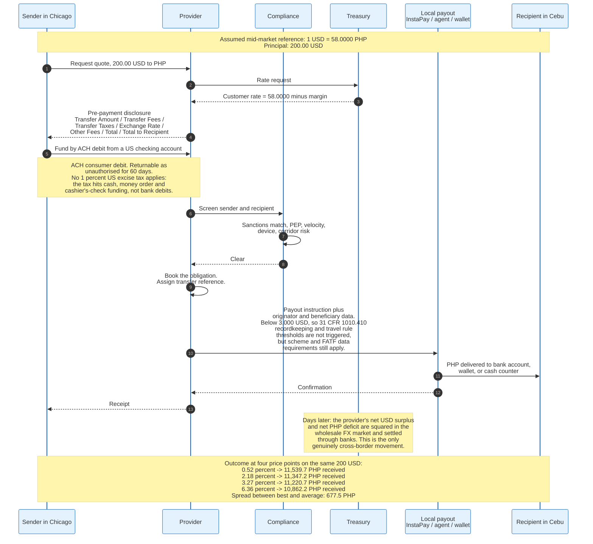

### 12.1 The Four Price Points

Applying each blended cost to the same 200 dollars and the same assumed reference rate produces the following. Total cost is the World Bank definition: fee plus exchange-rate margin as a percentage of the amount sent.

| Model | Blended total cost | Cost in USD | Value converted | PHP received at 58.0000 |
|-------|-------------------|-------------|-----------------|-------------------------|
| **Netted local payout** (Wise FY2026 take rate) | 0.52% | 1.04 | 198.96 | **11,539.7** |
| **Digital prefunded** (Remitly 2025 blended) | 2.18% | 4.36 | 195.64 | **11,347.2** |
| **Agent network** (Western Union 2025, revenue over cross-border principal) | 3.27% | 6.54 | 193.46 | **11,220.7** |
| **Global average, all providers** (RPW Q3 2025) | 6.36% | 12.72 | 187.28 | **10,862.2** |
| **Bank** (RPW Q3 2025 bank average) | ~15% | ~30.00 | ~170.00 | **~9,860** |

The recipient's difference between the cheapest and the average model is 677.5 pesos on a 200 dollar transfer. Against the bank average it is roughly 1,680 pesos, or 14.5 percent of the amount sent, because 200 dollars is 11,600 pesos at the assumed reference rate and 1,679.7 divided by 11,600 is 14.48 percent. A household receiving twelve such transfers a year keeps roughly 8,100 pesos more by switching from the average provider to the cheapest, and roughly 20,200 pesos more by switching from a bank.

### 12.2 Where Each Provider's 200 Dollars Actually Goes

Decomposing the cost shows why the numbers differ, and it is not processing.

**Wise, 1.04 dollars.** Banking and customer-related fees dominate. Wise's half-year cost of sales was 173.7 million pounds on 749.5 million pounds of underlying income, of which 141.9 million pounds was fees paid to banks and payment schemes. On a transfer collected through a scheme Wise joins directly and paid out through InstaPay, which Wise also joins directly, those fees are close to their floor. Net credit losses were 4.6 million pounds in the half, a small fraction of income.

**Remitly, 4.36 dollars.** Transaction expenses were 0.73 percent of send volume in 2025, so roughly 1.46 dollars of the 4.36 goes to the disbursement partner, the payment processor, and transaction losses. The remaining 2.90 dollars covers marketing at 21 percent of revenue, technology, support, and margin. Remitly's price is not high because its plumbing is expensive. It is high because acquiring a customer costs money and the partner network takes a cut.

**Western Union, 6.54 dollars.** Agent commission runs to roughly 1.42 percent of principal on the company's disclosed figures, which is about 2.85 dollars on a 200 dollar transfer. On the average transaction the same ratio gives about 5.35 dollars against 12.27 dollars of revenue. Both framings put commission at 44 percent of revenue, because both derive from the same two disclosed totals. Compliance, technology, and brand costs sit on top of that, and the remainder is operating margin. Distribution is the largest single line either way.

**The global average, 12.72 dollars.** This blends corridors with one provider, cash payout on both ends, and illiquid currencies. It is not a price any specific provider charges; it is what the market delivers when averaged over 367 corridors.

### 12.3 What Changes if the Sender Pays Cash

Funding method changes the tax, the risk, and the price, all at once.

If the same sender walks into a storefront in Chicago and pays 200 dollars in cash on or after 1 January 2026, a 1 percent United States excise tax applies. The tax was enacted in the One Big Beautiful Bill Act, signed 4 July 2025, and applies to remittance transfers where the sender provides cash, a money order, a cashier's check, or a similar physical instrument. Transfers funded from an account at a financial institution, or by a US-issued debit or credit card, are exempt.

The sender is liable for the tax, but the provider must collect it, deposit it semimonthly, and report it quarterly on IRS Form 720. If the provider fails to collect it, the tax becomes the provider's liability. The first semimonthly deposits were due 29 January 2026, and the IRS issued Notice 2025-55 in October 2025 providing limited penalty relief for deposit failures during the first three quarters of 2026.

On 200 dollars the tax is 2.00 dollars. Against a 6.54 dollar agent-network cost that is a 31 percent increase in the price of the cash channel, applied to precisely the customers least likely to have a bank account. The policy design pushes cash senders towards bank-funded digital channels, which is either the intent or a side effect depending on which official statement is read.

### 12.4 The Timeline

Three clocks run at different speeds, and only one of them is visible to the customer.

The customer clock: quote to payout, measured in seconds to minutes on a modern digital corridor. Wise reports 75 percent of payments completing in under 20 seconds in the fourth quarter of FY2026.

The funding clock: the sender's ACH debit settles the next banking day and can be returned as unauthorised for 60 days.

The settlement clock: the provider's net position in each currency is squared in the wholesale market on its own schedule, typically daily, and the payout partner is settled per its contract, which may be same-day or several days later.

The product is fast because the provider absorbs the difference between the first clock and the other two. That absorption is the risk, and the price of the risk is in the fee.

---

## 13. Settlement, Liquidity, and Prefunding

Every remittance model pays the recipient out of money that is already in the destination country. That sentence is the whole of settlement design, and the models differ only in whose money it is and how it gets there.

```mermaid
%%{init: {'theme': 'base', 'themeVariables': {'primaryColor': '#e3f2fd', 'primaryBorderColor': '#1565c0', 'lineColor': '#37474f'}}}%%

flowchart TB
    subgraph M1["Model 1 - Correspondent nostro"]
        direction TB
        A1["The bank holds foreign currency<br/>in an account at a bank abroad"]
        A2["Payout draws down the nostro"]
        A3["Replenished by buying the<br/>currency and wiring it in"]
        A4["Cost: idle balances in every<br/>currency you pay in, sized for<br/>peak, earning little"]
    end

    subgraph M2["Model 2 - Operator settles with agents"]
        direction TB
        B1["Paying agent advances its own<br/>cash to the recipient first"]
        B2["Operator reimburses the agent<br/>through a master agent, mostly<br/>in USD, MXN or EUR"]
        B3["Sending agent holds collected<br/>cash for up to a week before<br/>the operator receives it"]
        B4["Cost: credit risk in both<br/>directions plus permissible<br/>investment requirements.<br/>WU settlement assets 3,449.1 m USD<br/>at 31 Dec 2025"]
    end

    subgraph M3["Model 3 - Prefunded partner accounts"]
        direction TB
        C1["Provider deposits money at each<br/>disbursement partner in advance"]
        C2["Payout debits the prefunded<br/>balance instantly"]
        C3["Topped up on a schedule and<br/>on threshold triggers"]
        C4["Cost: idle balances plus<br/>partner credit risk.<br/>Remitly 441.3 m USD at 31 Dec 2025,<br/>about 2.1 days of send volume"]
    end

    subgraph M4["Model 4 - Own balances plus direct scheme access"]
        direction TB
        D1["Provider holds its own balance<br/>in each currency and is a member<br/>of that country's payment scheme"]
        D2["Payout is a domestic instant<br/>payment made by the provider"]
        D3["Net position squared in the<br/>wholesale FX market"]
        D4["Cost: capital, licences,<br/>settlement account balances,<br/>scheme membership obligations"]
    end

    subgraph M5["Model 5 - Stablecoin as the transport"]
        direction TB
        E1["Value moves as a token,<br/>24/7, minutes, no nostro"]
        E2["But an off-ramp partner still<br/>needs local currency in country"]
        E3["The prefunding moves from the<br/>sender's side to the off-ramp's side.<br/>It does not disappear."]
    end

    Constraint["The invariant across all five:<br/><br/>Someone holds local currency in the<br/>destination country before the payment<br/>is made. The models differ in WHO,<br/>HOW MUCH, and HOW OFTEN it is<br/>replenished. None of them eliminates<br/>the requirement, because a recipient<br/>can only be paid in money that is<br/>already there."]

    M1 --> Constraint
    M2 --> Constraint
    M3 --> Constraint
    M4 --> Constraint
    M5 --> Constraint

    style M1 fill:#e3f2fd,stroke:#1565c0,stroke-width:2px
    style M2 fill:#fff3e0,stroke:#e65100,stroke-width:2px
    style M3 fill:#e8f5e9,stroke:#2e7d32,stroke-width:2px
    style M4 fill:#f3e5f5,stroke:#4a148c,stroke-width:2px
    style M5 fill:#fff9c4,stroke:#f57f17,stroke-width:2px
    style Constraint fill:#fce4ec,stroke:#880e4f,stroke-width:3px
```

### 13.1 The Invariant

A recipient can only be paid in money that is already in their country. Every model obeys this and none escapes it.

The consequence is that every cross-border payment business is, underneath the product, a treasury operation holding balances it would rather not hold. The design question is only how large those balances must be, and the answer is set by the volatility of net flows rather than by their size. A provider whose inflows and outflows in a currency are balanced needs almost nothing. A provider whose flows run one way needs to fund the whole gross amount.

Remittance flows run one way by definition. That is the structural liquidity problem of the industry.

### 13.2 The Five Models

**Correspondent nostro.** The bank holds foreign currency at a foreign bank. Payouts draw the balance down; the bank buys currency and wires it in to replenish. The balance is sized for peak demand and earns whatever the foreign bank pays, which is usually little. The aggregate figure is not published anywhere authoritative, and the numbers circulating in industry commentary are not traceable to a primary source. What is documented is that maintaining these accounts is expensive enough that banks have exited 20 percent of their correspondent relationships since 2011.

**Operator settlement with agents.** The cash network inverts the problem: the agent supplies the liquidity. Western Union's paying agents advance their own cash and claim reimbursement; its sending agents hold collected cash for up to a week. The operator's balance sheet carries the consequence as settlement assets of 3,449.1 million dollars at 31 December 2025, matching settlement obligations exactly, and comprising 402.0 million dollars of cash, 1,602.1 million dollars of net agent receivables, and 1,445.0 million dollars of investment securities held to satisfy state permissible-investment rules.

**Prefunded partner accounts.** The digital operator deposits money at each disbursement partner ahead of demand. Remitly held 441.3 million dollars of disbursement prefunding at 31 December 2025, about 2.1 days of send volume. The company explicitly notes that the balance rises before weekends and holidays, because payouts continue while funding rails close.

**Own balances plus direct scheme access.** The provider becomes a member of the destination country's payment system and holds its own balance there, often in a central bank settlement account. Wise does this in eight countries or currency areas. This is the most capital-intensive model to establish and the cheapest to run, because it removes the intermediary and the intermediary's margin from every transaction thereafter.

**Stablecoin transport.** A token moves value between the provider and an off-ramp partner in minutes, at any hour, without a nostro account. What it does not do is remove the requirement for local currency: the off-ramp partner must hold pesos, naira, or rupees to hand over. The prefunding moves down the chain rather than disappearing, which is the single most over-claimed point in this part of the market.

### 13.3 The Weekend Problem

Remittance volume peaks exactly when the funding markets that replenish liquidity are closed.

Migrant workers are paid on Fridays and send on Fridays and Saturdays. Domestic instant schemes run continuously. Wholesale FX and the correspondent banking system run on business days. A provider therefore accumulates a net position over a weekend that it cannot square until Monday, and must hold enough destination-currency liquidity to keep paying out for two or three days without replenishment.

Two techniques manage it. Buffers are sized from historical peak weekend outflow at a high percentile plus a margin, which means holding materially more than the average weekend requires. And threshold-triggered top-ups move funds automatically when a balance crosses a floor, during whatever hours the relevant rail is open.

The cost is the carry on the buffer. It scales with volatility rather than with volume, which is why a provider entering a new corridor faces a liquidity cost far out of proportion to the revenue that corridor initially produces. Corridor economics are worst at launch and this is the mechanical reason.

### 13.4 Who Bears the Credit Risk

At every settlement boundary someone is exposed to someone, and the exposures are asymmetric in ways that are not obvious.

The operator is exposed to its sending agents for cash collected and not yet remitted. Western Union's allowance for credit losses on agent receivables was 17.9 million dollars at 31 December 2025, with 36.5 million dollars written off during the year against 15.1 million dollars of recoveries. On 107.4 billion dollars of principal, those are small numbers, which is the point: a diverse agent base is itself a risk control, and Western Union says so.

The paying agent is exposed to the operator for cash it has already advanced. That exposure is why agent contracts carry settlement terms, guarantees, and in some markets collateral.

The digital provider is exposed to the sender for the window between payout and funding finality, and to the disbursement partner for the prefunded balance. Remitly names the second risk explicitly, warning that the financial institutions holding prefunding accounts for its disbursement partners could fail, causing loss of prefunded balances.

The customer is exposed to the provider, and this is where regulation intervenes. US state permissible-investment rules, UK and EU safeguarding rules, and mobile money trust-account requirements all exist to make the customer's claim survive the provider's failure.

---

## 14. Licensing as a Money Transmitter Across Jurisdictions

Licensing is the largest fixed cost in cross-border remittance and the reason the industry has five global players rather than five hundred. A firm must be authorised in every jurisdiction where it takes money and, usually, in every jurisdiction where it pays it out.

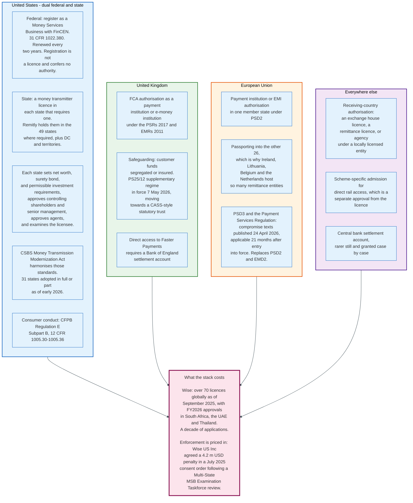

### 14.1 The United States Requires Two Things, and One of Them Is Fifty Things

A US remittance business needs a federal registration and a state licence, and only the second is an authorisation.

Registration with FinCEN as a Money Services Business, under 31 CFR 1022.380, is a filing. It creates Bank Secrecy Act obligations and confers no permission to operate. The permission comes from the states.

Almost all states license money transmission. Remitly's disclosure is representative: registered as an MSB with FinCEN, and licensed as a money transmitter or its equivalent in the 49 states where such licences are required, plus the District of Columbia and various US territories.

Each state sets its own requirements, and Western Union's description of what those cover is the fullest public summary: the amount and composition of eligible assets a licensee must hold against outstanding settlement obligations, government approval of controlling shareholders and senior management, regulatory approval of agents and in some cases their locations, consumer disclosures, periodic reporting, and minimum net worth. The composition requirement is specific: Western Union's investment securities held for this purpose must carry ratings of A- or better from a major rating agency.

Shareholding matters too. Any person intending to acquire 10 percent or more of the total equity interest in Western Union may be required to obtain prior regulatory approval, or to rebut the presumption of control. A remittance licence therefore constrains the company's cap table, which is unusual outside banking.

### 14.2 The Modernization Act Is Making Fifty Regimes Into One

The Conference of State Bank Supervisors' Money Transmission Modernization Act is a model law that harmonises capital, surety bond, and permissible investment requirements across states.

As of early 2026, 31 states have enacted it in full or in part. CSBS states that money transmitters licensed in at least one state that has adopted the MTMA collectively account for 99 percent of reported money transmission activity, which means the harmonisation is already binding on the firms that matter even where adoption is incomplete.

Multi-state supervision has followed. The Multi-State MSB Examination Taskforce conducts coordinated examinations so a national licensee faces one review rather than fifty. That coordination cuts both ways: a single finding produces a single multi-state resolution. Wise US Inc was examined by the taskforce between July 2022 and September 2023 and agreed to pay a 4.2 million dollar penalty as part of a consent order in July 2025.

### 14.3 The United Kingdom and the European Union

Both regimes authorise the firm rather than the transaction, and both are rewriting how customer money must be held.

In the United Kingdom, a remittance business is authorised by the Financial Conduct Authority as a payment institution or an electronic money institution. The defining obligation is safeguarding: customer funds must be segregated from the firm's own money or covered by insurance or a guarantee. The FCA consulted on reform in CP24/20 in September 2024 and published PS25/12, with a supplementary interim regime coming into force on 7 May 2026 that tightens record keeping, reconciliation, reporting and monitoring. The end-state design replaces the safeguarding provisions of the Payment Services Regulations and Electronic Money Regulations with a CASS-style regime under which safeguarded funds are held on statutory trust for consumers.

In the European Union, authorisation as a payment institution or EMI in one member state passports across the rest, which is why so many remittance groups hold their European licence in Ireland, Belgium, Lithuania or the Netherlands. Western Union runs the majority of its EU business through Western Union Payment Services Ireland Limited, regulated by the Central Bank of Ireland under PSD2.

PSD2 is being replaced. The Council of the EU published final compromise texts for a third Payment Services Directive and a directly applicable Payment Services Regulation on 24 April 2026, following political agreement in November 2025. The Regulation applies 21 months after entry into force and carries the currency-conversion disclosure, fraud liability, and strong customer authentication rules that most affect this industry.

### 14.4 The Receiving End

Sending-side licences do not authorise paying out, and receiving-country rules are where corridors are actually shaped.

Every country regulates inbound remittance in some form, and Western Union catalogues the range: limits on what types of entity may offer money transfer services, agent registration requirements, limits on the principal that can be sent into or out of a country, limits on the number of transfers a consumer may send or receive, controls on exchange rates, and in certain countries a requirement to maintain sufficient cash or other funds locally to satisfy payout obligations.

India illustrates the shape. Inbound personal remittance runs through two Reserve Bank of India schemes. The Money Transfer Service Scheme permits cash payout but caps individual transfers at 2,500 dollars with a maximum of 30 remittances per beneficiary per year, and limits cash payment to 50,000 rupees with larger amounts paid by cheque, demand draft, or account credit. The Rupee Drawing Arrangement carries no per-transaction cap for personal transfers but requires credit to the beneficiary's bank account, with no cash payout permitted.

Those two rulebooks decide which providers can serve which Indian recipients. No amount of sending-side engineering changes them.

### 14.5 Scheme Access Is a Separate Approval

Holding a licence does not admit a firm to a payment system, and the second approval is harder than the first.

Direct participation in a domestic instant scheme requires the scheme's own admission process, technical certification, operational resilience evidence, prefunding or collateral, and usually a settlement account at the central bank. Central banks have only recently begun opening those accounts to non-banks.

The milestones are recent and specific. Wise became a direct participant in UK Faster Payments with a Bank of England settlement account, the first non-bank to join Japan's Zengin system through its new API method and the first Funds Transfer Service Provider to settle directly with the Bank of Japan, and holds a settlement account with the Bangko Sentral ng Pilipinas settling through PhilPaSSplus. Eight direct connections as of FY2026, built one regulator at a time.

That is the real barrier to entry in this industry, and it is not technology, capital, or product.

---

## 15. AML and Sanctions Screening on Small-Value Flows

Anti-money-laundering compliance is a fixed cost per transaction applied to a product whose average transaction is under 400 dollars. That arithmetic, more than any other, determines which corridors have providers.

```mermaid
%%{init: {'theme': 'base', 'themeVariables': {'primaryColor': '#e3f2fd', 'primaryBorderColor': '#1565c0', 'lineColor': '#37474f'}}}%%

flowchart TB
    Txn["Inbound transfer request<br/>average principal under 400 USD"]

    subgraph KYC["Customer due diligence"]
        K1["Identify and verify the sender.<br/>For a nonbank in the US, 31 CFR<br/>1010.410(e)(2) requires identity<br/>verification and recording of the<br/>ID type and number, plus a TIN,<br/>alien ID or passport number,<br/>for transmittors who are not<br/>established customers, at 3,000 USD<br/>or more."]
        K2["Beneficial ownership for<br/>non-individual senders"]
        K3["Enhanced diligence for<br/>high-risk corridors and PEPs"]
    end

    subgraph Screen["Sanctions screening"]
        S1["Match sender and recipient names<br/>against OFAC SDN, UN, EU, UK<br/>and local lists. The SDN list runs to<br/>the low tens of thousands of entries;<br/>OFAC publishes no headline count."]
        S2["Fuzzy matching across<br/>transliterations, patronymics,<br/>and name-order conventions"]
        S3["The structural problem:<br/>common Arabic, Slavic and Hispanic<br/>names generate list matches at a<br/>rate that makes manual review<br/>uneconomic on a 200 USD transfer"]
    end

    subgraph Travel["Payment transparency"]
        T1["FATF Recommendation 16.<br/>Revised 18 June 2025. Threshold<br/>remains USD/EUR 1,000, set in 2012<br/>when FATF cut it from 3,000.<br/>Implementation expected by end-2030."]
        T2["US: 31 CFR 1010.410(f) requires<br/>the transmittal order at 3,000 USD<br/>or more to carry the transmittor's<br/>name, address and account number,<br/>the amount, the execution date,<br/>the recipient institution, the<br/>recipient's details as received,<br/>and the sending institution's<br/>name or identifier."]
        T3["Recordkeeping under 1010.410(e):<br/>five-year retention"]
    end

    subgraph Monitor["Monitoring and reporting"]
        M1["Structuring detection:<br/>many small transfers below a<br/>threshold, many senders to one<br/>recipient, one sender to many"]
        M2["SAR: 31 CFR 1022.320 requires a<br/>money services business to file at<br/>2,000 USD or more, within 30<br/>calendar days of initial detection.<br/>Five-year record retention.<br/>Disclosure is prohibited."]
        M3["CTR at 10,000 USD in currency"]
        M4["Cross-border wire records over<br/>10,000 USD under 1010.410(b) and (c)"]
    end

    Outcome1["Clear: proceed to payout"]
    Outcome2["Hold for review:<br/>cost of review exceeds<br/>revenue on the transfer"]
    Outcome3["Decline, and in aggregate,<br/>exit the corridor"]

    Consequence["Where the corridor closes,<br/>the flow does not.<br/>It moves to informal value transfer,<br/>which is cheaper, faster, and<br/>invisible to the supervisor.<br/>De-risking removes the view,<br/>not the money."]

    Txn --> KYC --> Screen --> Travel --> Monitor
    Monitor --> Outcome1
    Monitor --> Outcome2
    Monitor --> Outcome3
    Outcome3 --> Consequence

    style KYC fill:#e3f2fd,stroke:#1565c0,stroke-width:2px
    style Screen fill:#fff3e0,stroke:#e65100,stroke-width:3px
    style Travel fill:#f3e5f5,stroke:#4a148c,stroke-width:2px
    style Monitor fill:#e8f5e9,stroke:#2e7d32,stroke-width:2px
    style Consequence fill:#fce4ec,stroke:#880e4f,stroke-width:3px
```

### 15.1 The Obligations, With Their Thresholds

US obligations on a nonbank money transmitter are precise, and the thresholds have not moved in decades.

**Recordkeeping, 3,000 dollars.** 31 CFR 1010.410(e) applies to each agent, agency, branch or office located in the United States of a financial institution other than a bank, for a transmittal of funds of 3,000 dollars or more. The transmittor's financial institution must obtain and retain the transmittor's name and address, the amount, the execution date, any payment instructions, the identity of the recipient's financial institution, as many of the recipient's name, address, account number and other identifier as were received, and any form completed or signed by the person placing the order.

**Identity verification for non-established customers.** Where the transmittor is not an established customer and the order is placed in person, the institution must verify identity before acceptance and record the name and address, the type of identification reviewed and its number, and the person's taxpayer identification number or, failing that, alien identification or passport number and country of issuance, or a notation that none exists. Where the order is not placed in person, equivalent information plus a record of the payment method.

**The travel rule, 3,000 dollars.** 31 CFR 1010.410(f) requires the transmittor's financial institution to include in the transmittal order, at the time it is sent, the transmittor's name and account number, the transmittor's address, the amount, the execution date, the identity of the recipient's financial institution, as many of the recipient's name, address, account number and other identifier as were received, and either the name and address or numerical identifier of the transmittor's own institution. An intermediary must pass on what it received.

**Suspicious activity reports, 2,000 dollars.** 31 CFR 1022.320 requires a money services business to file a SAR where a transaction involves or aggregates funds or assets of at least 2,000 dollars and the business knows, suspects, or has reason to suspect it involves illegal proceeds, is designed to evade Bank Secrecy Act requirements including by structuring, serves no apparent lawful purpose, or facilitates criminal activity. Filing is due no later than 30 calendar days after initial detection. Records are retained five years. Disclosure of a SAR, or of information revealing its existence, is prohibited.

**Currency transaction reports, 10,000 dollars.** Cash transactions above that threshold are reported. Separately, 31 CFR 1010.410(b) and (c) require records of instructions regarding transfers of more than 10,000 dollars to or from a person, account or place outside the United States.

**International standard.** FATF Recommendation 16 sets the global payment transparency requirement. The FATF adopted revisions on 18 June 2025, clarifying responsibilities along the payment chain, creating obligations to obtain and transmit beneficiary information, and imposing new duties on beneficiary institutions to use that information. Countries are expected to complete implementation by the end of 2030. The threshold remains USD or EUR 1,000, set by the 2012 Recommendations when FATF cut it from the USD or EUR 3,000 that Special Recommendation VII had allowed. US consumer prices have risen roughly 40 percent since 2012, so inflation has taken roughly 30 percent off the real value of what remains. FATF has already cut this threshold once, by two thirds.

### 15.2 Why Screening Small Values Is Structurally Hard

The economics are simple and brutal: the review costs more than the transaction earns.

A 200 dollar transfer generates between 1.04 dollars and roughly 30 dollars of revenue depending on the provider, on the five price points in section 12.1. A sanctions alert requiring a human analyst to read the name, check the list entry, examine the date of birth and nationality if available, and record a disposition costs more than that in most labour markets. A provider whose alert rate on a corridor is a few percent of transactions is running that corridor at a loss on compliance alone.

The alert rate is driven by name matching, not by criminality. The SDN list runs to the low tens of thousands of entries; OFAC publishes the list itself but not a headline count, and figures circulating in commentary differ by thousands depending on whether they count entries, individuals and entities separately, aliases, or the whole Consolidated Sanctions List. Screening engines must match against transliteration variants, patronymic conventions, and inconsistent name ordering. Common names in Arabic, Slavic and Hispanic naming systems produce matches at a rate that is high relative to the true-positive rate. Published false-positive rates are vendor claims rather than measured industry statistics, so the honest statement is that the ratio is widely reported as high and is not independently measured.

Three responses are in use. Tighter matching thresholds reduce alerts and increase the risk of a miss. Automated disposition using date of birth, nationality and identity document data clears the obvious non-matches without a human. And customer-level screening, rerunning the whole customer base daily against updated lists rather than screening every transaction, reduces the per-transaction burden. The European Union adopted the third approach for instant euro payments in Regulation 2024/886, and the design generalises.

### 15.3 Structuring Is the Native Attack

The one typology that specifically targets remittance is many small transfers rather than a few large ones, which is exactly what legitimate remittance looks like.

A migrant sending 300 dollars home twice a month, from a cash counter, to a family member with a common name, in a high-risk jurisdiction, is indistinguishable on the face of it from a smurfing operation. Distinguishing them requires history, network analysis across senders and recipients, and behaviour over time rather than transaction-level rules.

This is where the industry's structure works against it. A customer using four providers presents four partial views and no complete one. Information sharing between money transmitters is limited by privacy law, competition law, and the SAR confidentiality rules themselves, which prohibit disclosing the existence of a report.

### 15.4 De-risking, and Where the Money Goes

The rational response to an unprofitable compliance burden is to exit the corridor, and the aggregate of those exits is the de-risking phenomenon.

The BIS documents the pattern: banks withdrew more from countries where governance and controls on illicit financing were poor. The paper names the consequence directly. Where banks stop providing the payment services users depend on, those users may resort to less regulated or unregulated channels, shifting payments outside the supervised system.

Informal value transfer systems, including hawala and similar arrangements, operate on the same principle as every model in this document: local collection, local payout, and periodic net settlement between operators. They are cheaper because they carry no licensing, screening, or reporting cost, and faster because they carry no compliance latency. They are also invisible.

The policy conclusion the data supports is uncomfortable. Making a corridor harder to serve legally does not reduce the flow through it. It reduces the share of the flow the supervisor can see.

---

## 16. Fraud, Consumer Protection, and Operational Risk

Remittance fraud is mostly authorised. The sender pushes the money, having been deceived, and the payment system performs correctly throughout.

### 16.1 The Threat Model

Five attack patterns account for most losses, and only one of them involves compromising a system.

**Authorised push payment scams.** The sender is persuaded to send. Romance fraud, fake emergencies involving a relative, advance-fee schemes, fake job offers requiring a processing payment, and fraudulent goods. Remittance is attractive to this class of fraud precisely because payout is fast, often in cash, and irreversible once collected.

**Account takeover on the send side.** Credentials are stolen and transfers sent as the customer. The window between compromise and irrecoverable loss is minutes on an instant corridor.

**Funding fraud.** The transfer is funded with a stolen card or an ACH debit on an account the sender does not control. The recipient collects, and the chargeback or return arrives days later. This is a credit loss to the provider, not to the customer, and it is the main component of the transaction-loss provisions inside Remitly's 549.5 million dollar transaction expense line.

**Agent-side fraud.** A sending agent enters transactions without collecting funds, or a paying agent pays a colluding party. Western Union's agent receivable write-offs, 36.5 million dollars in 2025, include losses of this type alongside ordinary insolvency.

**Mule networks on the receive side.** Recipients recruited to collect and forward funds, often across several hops and jurisdictions. Cash payout makes the trail end at the counter.

### 16.2 What the Rules Give the Consumer

US consumer protection for remittance is unusually detailed for a payment product, and it is about disclosure and cancellation rather than about loss.

Regulation E Subpart B gives the sender a right to cancel. 12 CFR 1005.34(a) requires the provider to honour any oral or written cancellation request received no later than 30 minutes after the sender makes payment, provided the request identifies the sender and the transfer and the funds have not been picked up or deposited. The refund must be the total amount provided by the sender, including fees and, where not prohibited by law, taxes, within three business days.

The disclosure regime at 12 CFR 1005.31 requires the pre-payment statement of amount, fees, taxes, exchange rate and amount received described in section 10, plus a receipt after payment, and a statement of the sender's cancellation and error-resolution rights.

Error resolution under 12 CFR 1005.33 obliges the provider to investigate and remedy specified errors, including the wrong amount received, a failure to make funds available by the disclosed date, and the recipient not receiving the money at all.

What none of this does is reimburse a sender who was deceived. A remittance the customer authorised is not an error. There is no chargeback, no scheme recall right comparable to a card dispute, and no mandatory reimbursement regime of the kind the United Kingdom imposed on domestic Faster Payments in October 2024. Cross-border scam losses fall on the sender.

### 16.3 Why a Cross-border Reimbursement Regime Is Hard

Domestic instant payment regulators have concluded that liability allocation is the most effective fraud control available. It does not transplant across borders easily, for three reasons.

The sending and receiving institutions are supervised by different authorities with no shared rulebook and no mechanism to allocate loss between them. The receiving institution, which sees the mule pattern most clearly, is outside the sending regulator's jurisdiction. And the payout may be cash to a person who was never onboarded by anyone, in which case there is no receiving institution to hold accountable.

The result is that the control that works domestically is unavailable internationally, and the controls that remain are all send-side: warnings, limits, cooling-off periods on new recipients, and refusal.

### 16.4 Operational and Concentration Risk

Two operational exposures are specific to this industry and neither is a technology failure.

**Corridor concentration.** Revenue is concentrated in a small number of corridors and is exposed to political and migration shocks in each. Western Union's 2025 results show the mechanism: a reduction in transactions originating from Iraq reduced total company revenue by 3 percent, and Latin America revenue fell 11 percent on declines in United States to Mexico and intra-United States transactions attributed partly to evolving migration patterns. A remittance business is a leveraged bet on migration policy.

**Enforcement exposure.** Supervisory action is a recurring cost rather than a tail risk. Wise US Inc agreed a 4.2 million dollar penalty in a July 2025 consent order following a Multi-State MSB Examination Taskforce review conducted between July 2022 and September 2023. Western Union disclosed an ongoing AUSTRAC audit of Western Union Financial Services (Australia) in its 2025 annual report, stating it cannot predict the outcome or estimate any possible loss.

The industry prices this the way an insurer prices claims: as an expected cost of operating a licensed network across two hundred jurisdictions, not as an anomaly.

---

## 17. Stablecoins and Instant-Rail Competition

Two different technologies are attacking cross-border remittance from opposite directions. Instant domestic rails attack the last mile. Stablecoins attack the middle. Neither has yet displaced the incumbent model, and the reasons are instructive.

```mermaid
%%{init: {'theme': 'base', 'themeVariables': {'primaryColor': '#e3f2fd', 'primaryBorderColor': '#1565c0', 'lineColor': '#37474f'}}}%%

flowchart TB
    subgraph Trad["Traditional path"]
        T1["Sender funds in USD"]
        T2["Correspondent chain<br/>or prefunded partner"]
        T3["FX at the conversion point"]
        T4["Local payout"]
        T5["Elapsed: minutes to days.<br/>Cost: 2 to 15 percent.<br/>Prefunding: held by the<br/>provider in every currency."]
    end

    subgraph Stable["Stablecoin path"]
        S1["On-ramp<br/>USD to a dollar token.<br/>Costs a spread and a fee."]
        S2["Transfer on chain<br/>seconds, 24/7, cost measured<br/>in cents at the network level"]
        S3["Off-ramp partner<br/>token to local currency"]
        S4["Local payout, usually into<br/>the same domestic instant<br/>scheme the traditional path uses"]
        S5["The prefunding did not vanish.<br/>The off-ramp holds local currency<br/>instead of the sender's provider."]
    end

    subgraph Rails["Instant-rail path"]
        R1["Domestic instant scheme<br/>at each end, linked bilaterally<br/>or through a hub"]
        R2["UPI-PayNow, live 21 Feb 2023.<br/>INR 60,000 daily cap.<br/>P2P only, for maintenance of<br/>relatives abroad and gifts."]
        R3["Nexus Global Payments,<br/>incorporated 2025 by the central<br/>banks of India, Malaysia, the<br/>Philippines, Singapore and Thailand.<br/>One connection per scheme<br/>instead of n-squared links."]
        R4["Still unsolved: sanctions screening<br/>in seconds against different lists,<br/>whose consumer rules apply,<br/>who carries FX risk between legs,<br/>destination liquidity at 3am"]
    end

    subgraph Reg["The regulatory frame"]
        G1["GENIUS Act, PL 119-27,<br/>signed 18 July 2025.<br/>Issuance limited to permitted<br/>payment stablecoin issuers.<br/>At least 1 USD of permitted<br/>reserves per 1 USD issued:<br/>currency, insured deposits,<br/>short-dated T-bills, repo,<br/>government money market funds.<br/>Effective the earlier of<br/>18 Jan 2027 or 120 days after<br/>final implementing rules."]
        G2["A stablecoin does not replace<br/>a money transmitter licence.<br/>The on-ramp and off-ramp are<br/>regulated activities in every<br/>jurisdiction that matters."]
    end

    Live["What is actually live<br/><br/>MoneyGram Access, since 2022:<br/>cash in and cash out for Stellar<br/>USDC at MoneyGram counters.<br/><br/>MGUSD on Stellar, 2 June 2026,<br/>issued by Bridge, M0 mint and burn,<br/>Fireblocks wallet infrastructure.<br/>Launched in the US first; the<br/>~500,000-location network is the<br/>intended, not the current, footprint.<br/><br/>The cash-out network is the asset.<br/>The token is the transport."]

    Trad --> Stable
    Stable --> Reg
    Rails --> Reg
    Reg --> Live

    style Trad fill:#eceff1,stroke:#37474f,stroke-width:2px
    style Stable fill:#fff9c4,stroke:#f57f17,stroke-width:3px
    style Rails fill:#e3f2fd,stroke:#1565c0,stroke-width:2px
    style Reg fill:#f3e5f5,stroke:#4a148c,stroke-width:2px
    style Live fill:#e8f5e9,stroke:#2e7d32,stroke-width:3px
```

### 17.1 What a Stablecoin Actually Removes

A dollar-denominated token moves value between two parties in minutes, at any hour, without a correspondent bank. That removes one leg of the chain and nothing else.

The sender still has to convert dollars into tokens, which costs a spread and a fee at the on-ramp. The recipient still has to receive local currency, which means an off-ramp partner converts tokens into pesos or naira and pays out through the local scheme or an agent. That partner must hold local currency in advance, exactly as a traditional disbursement partner does.

The prefunding requirement therefore moves down the chain rather than disappearing. What genuinely improves is the speed and hours of the middle leg, and the elimination of a nostro account that the sending provider would otherwise fund and maintain. In corridors where correspondent access is scarce, that is a material improvement. In corridors with a competitive digital market and a modern domestic rail, it is a marginal one.

### 17.2 The Regulatory Position

The United States created a payment stablecoin regime in 2025 and it is prescriptive about reserves.

The GENIUS Act, Public Law 119-27, was signed on 18 July 2025. It limits issuance of payment stablecoins to permitted payment stablecoin issuers, which are federally or state-qualified entities, and requires them to hold at least one dollar of permitted reserves for each dollar of stablecoin issued. Permitted reserves are coins and currency, deposits at insured banks and credit unions, short-dated Treasury bills, repurchase and reverse repurchase agreements backed by Treasury bills, and government money market funds. The Act takes effect on the earlier of 18 January 2027, being 18 months after enactment, or 120 days after the primary federal payment stablecoin regulators issue final implementing rules.

In the European Union, the Markets in Crypto-Assets Regulation already governs asset-referenced and e-money tokens, and issuers serving EU customers must comply with its reserve, redemption and disclosure requirements.

What neither regime does is remove the money transmission licence. A firm converting a customer's dollars into tokens and tokens into pesos is transmitting money in both jurisdictions and must be licensed in both. The compliance stack in section 14 applies unchanged.

### 17.3 What Is Actually Live

MoneyGram's June 2026 launch is the clearest statement of where an incumbent thinks the technology fits, and it is the second step rather than the first.

MoneyGram has run a cash on-ramp and off-ramp for Stellar-based USDC since 2022, under the MoneyGram Access brand, announced with the Stellar Development Foundation in October 2021. A user hands cash to an agent and receives tokens, or hands back tokens and receives cash. MoneyGram does not publish volume for that product, so its scale is not known. What it establishes is that MoneyGram was renting its counters to a token four years before it issued one.

MGUSD makes MoneyGram the owner of the token as well as the counter. MoneyGram launched MGUSD, a dollar-denominated stablecoin on the Stellar network, on 2 June 2026. Bridge, a Stripe company, acts as the regulated issuer. M0 provides the smart-contract infrastructure through which tokens are minted and burned. Fireblocks provides the institutional wallet infrastructure. The token is embedded in the MoneyGram app through a self-custodial wallet, giving customers a dollar-denominated balance that can be held, moved internationally, and converted into local currency. The launch is United States only, with international rollout stated as a plan rather than a date. The 60 million customers and nearly 500,000 locations are MoneyGram's existing network, not the token's current reach.

Read the structure carefully. The scarce asset in that arrangement is the cash-out network, and the incumbent owns it. The token is the transport. A stablecoin issuer without 500,000 places to hand over cash has solved the easy half of the problem.

In the United States to Mexico corridor, Bitso reported processing 6.5 billion dollars of crypto-rail remittance in 2024, described as roughly 10 percent of that corridor. Felix Pago operates a WhatsApp-initiated flow from the United States to Latin America that converts to stablecoin and pays out through Mexico's SPEI instant scheme. These are real volumes in the largest corridor in the world, and they are competitive precisely where the traditional path is already cheapest, which suggests the driver is user experience rather than settlement cost.

### 17.4 The Measurement Problem

Stablecoin volume statistics are the least reliable numbers in this document, and the reason is worth stating.

Gross on-chain transfer volume for 2025 is reported in the tens of trillions of dollars. Estimates of the subset representing genuine real-economy payments, after stripping exchange transfers, automated market-making, and wallet-to-wallet movements by the same owner, range from roughly 350 billion to 400 billion dollars for the same year, across different methodologies from different analytics firms.

That is a spread of two orders of magnitude between the headline and the adjusted figure, and there is no agreed standard for the adjustment. Any comparison of stablecoin payment volume to the 685 billion dollar remittance flow to low- and middle-income countries depends entirely on which denominator is used, and the honest position is that the payment share is growing quickly from a small base and is not precisely measured.

### 17.5 Instant Rails and Interlinking

The other attack comes from linking the domestic instant schemes that already exist at each end.

UPI-PayNow, launched 21 February 2023 by the Reserve Bank of India and the Monetary Authority of Singapore, links India's Unified Payments Interface to Singapore's PayNow. Transfers are capped at 60,000 rupees a day, roughly 1,000 Singapore dollars, and are limited to person-to-person remittances for maintenance of relatives abroad and gifts. Participants on the Indian side include the State Bank of India, ICICI Bank, Axis Bank, DBS India, Indian Bank and Indian Overseas Bank; on the Singapore side, DBS and Liquid Group, the latter being the first non-bank participant.

The design problem with bilateral links is that n countries need n-squared of them. Nexus Global Payments, incorporated in 2025 by the central banks of India, Malaysia, the Philippines, Singapore and Thailand after originating as a Bank for International Settlements Innovation Hub blueprint, is the attempt at a hub: each domestic scheme connects once, to Nexus, which standardises addressing, ISO 20022 mapping, foreign exchange provider selection, and the rulebook.

What remains unsolved on either design is not the plumbing. It is sanctions screening within seconds against different lists in different alphabets, deciding whose consumer protection rules govern a scam that crosses a border, allocating foreign exchange risk in the seconds between the two domestic legs, data residency law governing directory lookups, and holding destination-currency liquidity at three in the morning local time.

Those are the same five problems every model in this document has. Linking two fast domestic systems does not solve them; it makes them happen faster.

---

## 18. Comparisons - Which Model Wins Which Corridor

### 18.1 The Comparison Table

| Dimension | Correspondent bank | Wise | Western Union / MoneyGram | Remitly / Zepz | Mobile money | Stablecoin rail |
|-----------|-------------------|------|---------------------------|----------------|--------------|-----------------|
| **Blended price** | ~15% on a 200 USD basket (RPW bank average, Q3 2025) | 0.52% take rate (FY2026) | 3.27% of cross-border principal (WU, 2025; revenue base includes intra-US transfers) | 2.18% take rate (Remitly, 2025) | Varies; SSA remains the dearest region | On-ramp plus off-ramp spread, not benchmarked |
| **Payout reach** | Any bank account, via correspondents | Bank accounts in supported currencies | ~360,000 active WU locations; ~500,000 MoneyGram | 5.4 bn accounts and wallets, ~490,000 cash points | Wallets, then agents for cash-out | Wherever an off-ramp exists |
| **Speed** | 90% reach the beneficiary bank in an hour; 80% of elapsed time is the last mile | 75% of Q4 FY2026 payments under 20 seconds | Minutes for cash pickup | Minutes on the instant tier | Seconds to the wallet | Minutes on chain, then local payout |
| **Who prefunds** | The bank, in nostro accounts | Wise, in its own balances | The agent, both ends | Remitly, at partners | The operator's trust account | The off-ramp partner |
| **Pricing model** | Fee plus wide FX margin plus deductions | Mid-market rate plus explicit fee | Fee plus FX margin, varying by channel | Fee plus FX margin, tiered by speed | Fee plus FX margin plus cash-out fee | Spread at each ramp |
| **Serves the unbanked** | No | No | Yes | Through partners | Yes, this is its purpose | Only through an off-ramp with cash |
| **Regulatory footprint** | Banking licence | 70+ licences, 8 direct scheme memberships | Licences plus an approved agent network in 200+ countries | MSB plus 49 state licences plus partner licences | E-money licence plus trust account | Money transmission at both ramps plus GENIUS or MiCA at issuance |
| **Structural weakness** | Retreating; 20% fewer correspondents 2011-2018 | No cash payout; limited to bank-rail corridors | Agent commission is ~1.4% of principal, permanently | Rents its network; the same partners serve competitors | Agent liquidity in rural areas | Prefunding moves to the off-ramp; not eliminated |

### 18.2 When Each Model Wins

**Use a netted local-payout provider** where both ends are bank accounts in currencies with modern domestic rails and the provider holds direct scheme access. This is where the 0.52 percent price is achievable, and it is the fastest and cheapest option available to anyone in those corridors.

**Use a digital prefunded provider** where the recipient needs a wallet or cash, the corridor is competitive, and the sender wants delivery in minutes. This is the largest addressable segment of consumer remittance and the one most actively contested.

**Use an agent network** where the sender has no bank account, the recipient has no bank account, or the corridor has no digital alternative. That is a shrinking share of volume and a persistent one, and it is priced accordingly.

**Use mobile money on the receive side** wherever it exists, because it converts a cash-payout problem into a wallet-credit problem and moves the cost from the operator to the recipient's choice about when to cash out.

**Use a correspondent bank** for large values, unusual currencies, and corridors nobody has built a product for. It is expensive per transaction and indifferent to size, which inverts the calculus above a certain amount.

**Use a stablecoin rail** where correspondent access is genuinely scarce or where the sender is already comfortable holding tokens. As a settlement technology it is real; as a consumer product it still ends in the same last mile.

### 18.3 Why the Global Average Barely Moves

The industry has produced a provider charging 0.52 percent and a measured global average of 6.36 percent, and the gap is not a mystery.

The cheap providers serve the corridors that were already cheap. Wise's price advantage is concentrated in bank-to-bank transfers between countries with instant schemes and liquid currencies. Those corridors already had competition and already priced near cost.

The expensive corridors, where the average is dragged upward, share a set of features: cash payout at one or both ends, few competing providers, an illiquid currency, and often a correspondent relationship that has been withdrawn. Each of those features raises cost through a different mechanism, and none of them responds to better payment software.

The World Bank's own data show this most clearly in one finding: digital remittance costs into Sub-Saharan Africa are below the global average, while overall costs into Sub-Saharan Africa are the highest in the world. The technology is present and cheap. The mix is not.

Closing the gap therefore requires changing the mix, which means building payout infrastructure, restoring correspondent access, and increasing competition in thin corridors. Those are development and regulatory projects, and their timescales are decades rather than release cycles.

---

## 19. Modern Developments

### 19.1 What Changed Between 2023 and 2026

- **21 February 2023**: UPI-PayNow links India and Singapore, the first live consumer-scale link between two national instant schemes.
- **1 June 2023**: Madison Dearborn Partners completes its acquisition of MoneyGram at 11.00 dollars per share, valuing the company at roughly 1.8 billion dollars and removing the industry's second-largest agent network from public reporting.
- **18 June 2025**: FATF adopts revisions to Recommendation 16, adding beneficiary-information obligations and duties on beneficiary institutions, with implementation expected by the end of 2030.
- **4 July 2025**: The One Big Beautiful Bill Act creates a 1 percent United States excise tax on remittance transfers funded with cash, money orders, cashier's checks or similar instruments, effective 1 January 2026.
- **18 July 2025**: The GENIUS Act creates a federal payment stablecoin regime with a full one-for-one reserve requirement.
- **September 2025**: Swift publishes Spotlight on Speed, showing 90 percent of cross-border payments reach the beneficiary bank within an hour and roughly 80 percent of elapsed time is spent in the last mile.
- **9 October 2025**: The Financial Stability Board publishes the five-year consolidated progress report on the G20 Roadmap, stating that global targets are unlikely to be met on the 2027 timetable.
- **22 November 2025**: Swift retires MT messages for cross-border payments under CBPR+. `pacs.008` and `pacs.009` become the standard.
- **1 January 2026**: The US remittance excise tax takes effect. First semimonthly deposits due 29 January 2026 on Form 720.
- **24 April 2026**: The Council of the EU publishes final compromise texts for PSD3 and the Payment Services Regulation, applicable 21 months after entry into force.
- **7 May 2026**: The FCA's supplementary safeguarding regime for UK payments and e-money firms comes into force under PS25/12.
- **11 May 2026**: Wise's scheme of arrangement becomes effective and Wise debuts a US primary listing on Nasdaq as Wise Group plc, retaining a secondary London listing and moving its presentation currency to US dollars from FY2026.
- **2 June 2026**: MoneyGram launches MGUSD on Stellar, issued by Bridge, distributed through its app across a network of roughly 500,000 retail locations.
- **FY2026 (year to 31 March 2026)**: Wise reaches 243.5 billion dollars of cross-border volume at a 0.52 percent take rate, goes live with direct connections in Brazil and Japan, and becomes the first non-bank to settle with the Bank of Japan.

### 19.2 The Take Rate Compression Is Structural

Every publicly reported price in this industry fell during 2025 and 2026, and the mechanism is the same in each case.

Wise's cross-border take rate went from 0.58 percent to 0.52 percent in FY2026 and from 0.67 percent to 0.52 percent across nine quarters, a deliberate reinvestment of cost savings into price. Remitly's implied take rate fell from 2.31 percent to 2.18 percent as volume grew 37 percent against revenue growth of 29 percent. Western Union's Consumer Money Transfer revenue fell 8 percent while cross-border principal rose from 102.9 billion to 107.4 billion dollars, which is price compression arriving whether the company chose it or not.

The reason is that the marginal cost of a digital transfer is falling faster than the price, so any provider with a cost advantage can convert it into share. Direct scheme membership, aggregator competition, and instant domestic rails all push in the same direction.

What compression does not reach is the segment of the market where cash and thin competition set the price. Two markets are diverging inside one industry.

### 19.3 The Balance Sheet Becomes the Business

The clearest strategic shift in the sector is that transfer fees are becoming a smaller part of the revenue of the firms that charge the least.

Wise reports that nearly half of FY2026 net revenue came from sources other than cross-border transfers, principally net interest income on customer balances and card revenues. Customer holdings reached 39 billion dollars, up 40 percent, and card spend 43.6 billion dollars, up 37 percent. Remitly has moved in the same direction, describing itself as evolving from a remittance company into a diversified cross-border financial services provider.

The logic is straightforward. A customer who sends money monthly can be sold a balance, a card, and a payment account, and those products monetise at rates a transfer fee cannot. It also means the price of the transfer can keep falling, funded by the products around it, which is a problem for any competitor whose only product is the transfer.

### 19.4 Where This Is Heading

Four directions are visible and reasonably safe to state.

**Price compression continues at the top of the market and stalls at the bottom.** The corridors with competition and modern rails converge towards cost. The corridors with cash payout and thin provider counts do not, and the global average moves slowly because it is a mix.

**Direct scheme access spreads.** Central banks are opening settlement accounts to non-banks, and each opening removes a correspondent from a set of corridors. Japan's decision to open Zengin to non-bank participants with direct Bank of Japan settlement is the template, and it is explicitly framed as a G20 cross-border payments commitment.

**Stablecoins settle between institutions before they reach consumers.** The visible consumer products are real but small. The structural use is a regulated provider replacing a nostro account with a token balance, which is invisible to the customer and shows up as a lower cost of sales.

**Compliance cost stays the binding constraint on corridor coverage.** The FATF revisions raise the data burden. Sanctions lists keep growing. Nothing in the current policy direction lowers the fixed cost per transaction, which means thin corridors keep losing providers, and the informal sector keeps absorbing what the formal one declines.

---

## 20. Appendix

### 20.1 Key Terminology

| Term | Meaning |
|------|---------|
| **Agent** | A third party that accepts or disburses funds on a remittance provider's behalf. Under 12 CFR 1005.30(a) an agent, authorised delegate or affiliate acting for a provider. |
| **Agent float** | Cash and e-value an agent holds to serve customers. A cash-out agent needs cash; a cash-in agent needs e-float. Running out of either stops the agent trading. |
| **Aggregator** | A wholesale payout network selling one integration in exchange for many local endpoints. Thunes, TerraPay, Onafriq, Dandelion, Nium. |
| **CBPR+** | Cross-Border Payments and Reporting Plus. The Swift programme that migrated cross-border payment messaging to ISO 20022. MT retirement took effect 22 November 2025. |
| **Corridor** | The pairing of a send country with a receive country. Remitly reports more than 5,300; the World Bank benchmark covers 367. |
| **Correspondent bank** | A bank holding an account for another bank so the second can settle in the first's currency and jurisdiction. |
| **Disbursement prefunding** | Money a provider deposits with a payout partner in advance so payouts can execute instantly. Remitly held 441.3 m USD at 31 December 2025. |
| **E-money** | Electronic value issued against fiat held in a trust or escrow account, redeemable at par. The legal basis for mobile money. |
| **FATF Recommendation 16** | The international payment transparency standard requiring originator and beneficiary information to travel with a transfer. Revised 18 June 2025; threshold USD/EUR 1,000, set in 2012, down from the USD/EUR 3,000 permitted under Special Recommendation VII. |
| **GENIUS Act** | Public Law 119-27, signed 18 July 2025. Creates the US payment stablecoin regime with a one-for-one permitted reserve requirement. |
| **Master agent** | An agent outside the United States that recruits and manages subagents, which contract with the master agent rather than with the operator. |
| **Mid-market rate** | The midpoint between the interbank bid and offer for a currency pair. The reference against which every exchange-rate margin is measured. |
| **MSB** | Money Services Business. A US federal category registered with FinCEN under 31 CFR 1022.380. Registration is not a licence. |
| **MTCN** | Money Transfer Control Number. The reference a Western Union sender must communicate to the recipient to obtain a cash payout. |
| **MTMA** | Money Transmission Modernization Act. The CSBS model law harmonising state money transmitter requirements; 31 states adopted in full or part by early 2026. |
| **MTSS** | Money Transfer Service Scheme. India's inbound personal remittance channel permitting cash payout, capped at USD 2,500 per transfer and 30 transfers per beneficiary per year. |
| **Nostro / vostro** | The same account seen from two sides. A bank's foreign-currency account abroad is its nostro; the bank keeping it calls it a vostro. |
| **`pacs.008`** | The ISO 20022 FI-to-FI customer credit transfer. Replaced MT103 for Swift cross-border payments on 22 November 2025. |
| **`pacs.009`** | The ISO 20022 financial institution credit transfer. Replaced MT202. |
| **Permissible investments** | Assets a US state licensee must hold against outstanding settlement obligations. Western Union's must be rated A- or better. |
| **RDA** | Rupee Drawing Arrangement. India's bank-to-bank inbound remittance channel. No per-transaction cap on personal transfers, but no cash payout. |
| **Remittance transfer** | Under 12 CFR 1005.30(e), the electronic transfer of funds requested by a sender to a designated recipient in a foreign country, regardless of whether the sender holds an account with the provider. |
| **RPW** | Remittance Prices Worldwide. The World Bank's quarterly benchmark. Total cost equals fee plus exchange-rate margin on a 200 USD transfer. |
| **Safeguarding** | The UK and EU requirement to segregate or insure customer funds held by a payment or e-money institution. |
| **SDG 10.c** | The UN target to reduce the global average remittance cost below 3 percent by 2030 and eliminate corridors above 5 percent. |
| **Settlement assets and obligations** | A money transmitter's paired balance sheet lines: funds received or receivable from agents, and amounts payable to recipients and agents. Western Union's were 3,449.1 m USD each at 31 December 2025. |
| **Take rate** | Revenue divided by volume. Wise reported 0.52 percent cross-border in FY2026; Remitly's implied rate was 2.18 percent in 2025. |
| **Travel rule** | 31 CFR 1010.410(f) in the US: the requirement to include specified originator and beneficiary data in any transmittal order of 3,000 USD or more. |
| **UETR** | Unique End-to-end Transaction Reference. A UUID that follows a payment along the correspondent chain. |

### 20.2 Architecture Diagrams

| Diagram | Source | Description |
|---------|--------|-------------|
| Evolution Timeline | [`diagrams/evolution-timeline.mmd`](diagrams/evolution-timeline.mmd) | From the telegraph in 1871 to stablecoin issuance and remittance taxes in 2026 |
| Remittance Anatomy | [`diagrams/remittance-anatomy.mmd`](diagrams/remittance-anatomy.mmd) | The four legs of every remittance and where the cost actually lands |
| Participants | [`diagrams/participants.mmd`](diagrams/participants.mmd) | Every actor from sender to recipient, including the aggregator layer |
| Primary Flow | [`diagrams/primary-flow.mmd`](diagrams/primary-flow.mmd) | The nine-step sequence with disclosure, screening, payout, and the settlement that follows later |
| Correspondent Banking Chain | [`diagrams/correspondent-banking-chain.mmd`](diagrams/correspondent-banking-chain.mmd) | Nostro and vostro accounts, Swift messaging, and why no value crosses a border |
| Wise Netting | [`diagrams/wise-netting.mmd`](diagrams/wise-netting.mmd) | Currency pools, direct scheme membership, daily netting, and the residual position that still moves |
| Agent Network and Float | [`diagrams/agent-network-float.mmd`](diagrams/agent-network-float.mmd) | The MTCN flow, who extends credit to whom, and the settlement balance sheet |
| Remitly Prefunding | [`diagrams/remitly-prefunding.mmd`](diagrams/remitly-prefunding.mmd) | Digital origination, prefunded partner payout, and the exposure window |
| Mobile Money Corridor | [`diagrams/mobile-money-corridor.mmd`](diagrams/mobile-money-corridor.mmd) | Trust account, e-money ledger, agent liquidity, and commission economics |
| Price Anatomy | [`diagrams/price-anatomy.mmd`](diagrams/price-anatomy.mmd) | Explicit fee, exchange-rate margin, invisible deductions, and how each model prices |
| Corridor Economics | [`diagrams/corridor-economics.mmd`](diagrams/corridor-economics.mmd) | The benchmarks, the six drivers of corridor price, and the resulting regional spread |
| Worked Example | [`diagrams/worked-example.mmd`](diagrams/worked-example.mmd) | 200 dollars from Chicago to Cebu at four price points |
| Liquidity and Prefunding | [`diagrams/liquidity-prefunding.mmd`](diagrams/liquidity-prefunding.mmd) | Five settlement models and the invariant none of them escapes |
| Licensing Stack | [`diagrams/licensing-stack.mmd`](diagrams/licensing-stack.mmd) | US federal and state, UK, EU, and receiving-country authorisation |
| AML Screening | [`diagrams/aml-screening.mmd`](diagrams/aml-screening.mmd) | Diligence, screening, travel rule, monitoring, and where de-risking sends the money |
| Stablecoin Corridor | [`diagrams/stablecoin-corridor.mmd`](diagrams/stablecoin-corridor.mmd) | Traditional, stablecoin and instant-rail paths against the regulatory frame |

### 20.3 Provider Reference Table

| Provider | Ownership | Model | Latest reported volume | Latest reported revenue | Price to customer | Network |
|----------|-----------|-------|------------------------|-------------------------|-------------------|---------|
| **Wise** | Listed, Nasdaq (primary since 11 May 2026) and London (secondary); Wise Group plc | Netted local payout, direct scheme access | 243.5 bn USD cross-border, FY2026 | 2.5 bn USD net revenue | 0.52% take rate | 8 direct scheme connections, 70+ licences |
| **Western Union** | Listed, NYSE | Agent network plus digital | 107.4 bn USD consumer principal, 2025 | 4,050.7 m USD total; 3,507.4 m consumer money transfer | 3.27% of principal | ~360,000 active locations, 200+ countries |
| **MoneyGram** | Private, Madison Dearborn since 1 June 2023 | Agent network plus digital plus stablecoin | Not published | Not published | Not published | ~500,000 locations, 200+ countries |
| **Remitly** | Listed, Nasdaq | Digital origination, prefunded partner payout | 74.9 bn USD send volume, 2025 | 1,635.1 m USD | 2.18% | 5.4 bn accounts and wallets, ~490,000 cash points, 5,300+ corridors |
| **Zepz** (WorldRemit, Sendwave) | Private | Digital, mobile-money focused | Not fully published | Not verified against a filing cited in section 20.5; Zepz Group Limited files accounts at Companies House in pounds | Not published | Mobile money and bank payout across Africa and Asia |
| **Euronet money transfer** (Ria, Xe, Dandelion) | Listed, Nasdaq | Agent network plus wholesale payout network | Not separately published | Money Transfer segment revenue is disclosed in Euronet's Form 10-K; not verified here, so no figure is quoted | Not published | Ria retail plus Dandelion as a wholesale network |
| **M-Pesa** (Safaricom, Vodacom) | Listed operators; Safaricom is a Vodacom associate, not a subsidiary | Mobile money, receive side | 525.6 bn USD transaction value, FY2026, Vodacom group financial services rather than M-Pesa alone | Not separately published | Tariffed per transaction band | ~500,000 agents; 103 m group financial services customers, including South African and Egyptian products |

### 20.4 Key Regulatory Thresholds

| Threshold | Rule | What it triggers |
|-----------|------|------------------|
| **15 USD** | 12 CFR 1005.30(e)(2)(i) | Transfers at or below are excluded from the US remittance transfer rule |
| **500 transfers per year** | 12 CFR 1005.30(f)(2) | Safe harbour: a provider below this in both the previous and current calendar year is not in the normal course of business |
| **30 minutes** | 12 CFR 1005.34(a) | Sender's right to cancel after payment, if funds are not yet collected |
| **3 business days** | 12 CFR 1005.34(b) | Deadline to refund a cancelled transfer, including fees and taxes |
| **1,000 USD or EUR** | FATF Recommendation 16 | Full originator and beneficiary information required. Set in 2012, down from USD/EUR 3,000 under Special Recommendation VII. |
| **2,000 USD** | 31 CFR 1022.320(a)(2) | MSB suspicious activity report threshold. 30 calendar days to file. |
| **2,500 USD** | RBI Money Transfer Service Scheme | Per-transfer cap on inbound personal remittance to India through MTSS |
| **3,000 USD** | 31 CFR 1010.410(e) and (f) | Nonbank recordkeeping, identity verification for non-established customers, and travel rule |
| **5,000 USD** | 31 CFR 1022.320(a)(3) | SAR threshold for money order and traveller's cheque issuers reviewing clearance records |
| **10,000 USD** | 31 CFR 1010.311; 1010.410(b), (c) | Currency transaction report; records of instructions for transfers to or from outside the US |
| **50,000 INR** | RBI MTSS | Maximum cash payout; larger amounts by cheque, draft, or account credit |
| **60,000 INR per day** | RBI and MAS, UPI-PayNow | Cap on the India-Singapore instant remittance link |
| **1 percent** | One Big Beautiful Bill Act, from 1 Jan 2026 | US excise tax on remittance transfers funded with cash, money orders or cashier's checks |
| **3 percent** | SDG 10.c and the G20 Roadmap | Target global average remittance cost by 2030. Measured at 6.36 percent in Q3 2025. |
| **5 percent** | SDG 10.c | Target ceiling for every individual corridor. Thirteen corridors exceeded 20 percent in Q3 2025. |

### 20.5 Primary Sources

| Source | What it establishes |
|--------|---------------------|
| World Bank, Remittance Prices Worldwide, Q3 2025 (September 2025 report) | Global average cost 6.36 percent; provider and instrument breakdowns; corridor coverage |
| Western Union, Form 10-K for the year ended 31 December 2025 | Agent network size, settlement assets and obligations, agent commission share of cost of services, revenue and principal, licensing description |
| Remitly Global, Form 10-K for the year ended 31 December 2025 | Send volume, revenue, transaction expenses, disbursement prefunding, network reach, licensing footprint |
| Wise plc, H1 FY2026 results (6 November 2025); Wise Group plc, FY2026 results (26 June 2026) | Take rate, cost of sales composition, volume, licences, direct scheme connections, speed |
| BIS Quarterly Review, March 2020, Rice, von Peter and Boar | Correspondent decline: 20 percent fewer active correspondents 2011-2018, corridors from 10,800 to 9,800 |
| BIS Bulletin No 87, 30 May 2024 | The mechanism of correspondent banking and the statement that settlement occurs only in one jurisdiction |
| GSMA, State of the Industry Report on Mobile Money 2026 | Registered and active accounts, transaction value, mobile-money remittance volume |
| Swift, Spotlight on Speed, September 2025 | 90 percent of payments reach the beneficiary bank within an hour; 80 percent of elapsed time is the last mile |
| FSB, G20 Roadmap consolidated progress report, 9 October 2025 | Targets unlikely to be met on the 2027 timetable |
| 31 CFR Parts 1010 and 1022 | US recordkeeping, travel rule, SAR and registration obligations |
| 12 CFR Part 1005 Subpart B | US remittance disclosure, cancellation, and error resolution |
| Public Law 119-27 (GENIUS Act), 18 July 2025 | US payment stablecoin regime and reserve requirements |
| FATF, Recommendation 16 update, 18 June 2025 | Revised payment transparency standard and implementation timetable |

---

## 21. Key Takeaways

**1. No remittance model moves money across a border, and the ones that advertise this are describing the category rather than a difference.** The BIS states it plainly for correspondent banking: settlement occurs in one jurisdiction, and the two legs are joined by a balance-sheet obligation. Wise, Western Union, mobile money and stablecoin corridors all obey the same rule. What differs is the number of intermediaries between the legs and who takes a margin.

**2. The price is fee plus exchange-rate margin, and the margin is usually the larger half.** The World Bank measures both because measuring fees alone ranks providers wrongly. A zero-fee transfer with a 4 percent rate margin costs four times a 1 percent transfer with a stated fee.

**3. Distribution is the cost, not processing.** Western Union's agent commissions ran to roughly 1.53 billion dollars in 2025, about 5.35 dollars per consumer transaction against 12.27 dollars of revenue per transaction. Wise's entire take rate is 0.52 percent, or 1.95 dollars on the same indicative average principal. A digital provider is not better at moving money. It has no agents to pay.

**4. Someone always prefunds the destination country, and no technology removes the requirement.** A recipient can only be paid in money already there. Correspondent nostros, agent tills, Remitly's 441.3 million dollars of disbursement prefunding, Wise's own currency balances, and a stablecoin off-ramp's local float are five answers to one constraint.

**5. Speed is a credit product.** A transfer that arrives in minutes arrives before the sender's funding is final. The provider is an unsecured lender for the gap, and the premium on the instant tier prices that exposure rather than any processing difference.

**6. Licensing, not technology, is the barrier to entry.** Wise holds over 70 licences and eight direct scheme memberships built over a decade. Remitly holds money transmitter licences in the 49 US states requiring them plus DC and territories, on top of a FinCEN registration that confers no authority by itself. That stack is why the industry has a handful of global players.

**7. Compliance is a fixed cost applied to a small-value product, and that arithmetic closes corridors.** A sanctions review costs more than a 200 dollar transfer earns. Banks cut 20 percent of their correspondent relationships between 2011 and 2018, concentrated in exactly the jurisdictions with weak governance and heavy remittance dependence. The flows did not stop; they left the supervised system.

**8. The last mile is the delay, not the network.** Swift measures 90 percent of cross-border payments reaching the beneficiary bank within an hour, with roughly 80 percent of total elapsed time spent after the payment leaves its network. Faster messaging cannot fix a beneficiary-side processing queue.

**9. The cheap providers serve the corridors that were already cheap.** The global average sits at 6.36 percent while a listed provider reports a 0.52 percent take rate, and the two numbers sit on different bases: 0.52 percent is blended over transfers of every size, while 6.36 percent is the measured cost of a fixed 200 dollar transfer, which fixed fee components push higher. The rest of the gap is that the cheap provider operates bank-to-bank between countries with modern rails. Digital remittance costs into Sub-Saharan Africa are below the global average; overall costs into Sub-Saharan Africa are the highest in the world. The problem is the mix, and the mix is a payout infrastructure problem.

**10. The transfer fee is becoming a loss leader for the balance sheet.** Nearly half of Wise's FY2026 net revenue came from interest on 39 billion dollars of customer holdings and from 43.6 billion dollars of card spend rather than from transfers. That funds a take rate that fell from 0.67 percent to 0.52 percent across nine quarters, and it is unanswerable by a competitor whose only product is the transfer.

**11. Stablecoins move the prefunding rather than eliminating it, and the scarce asset is still the cash-out network.** MoneyGram issues MGUSD and distributes it across roughly 500,000 retail locations, which is the correct reading of where the value sits. The token is transport. The counter where someone hands over pesos is the business.

**12. The policy targets will be missed and the benchmark is still working.** Sustainable Development Goal 10.c calls for 3 percent by 2030 and the measurement stands at 6.36 percent. The FSB said in October 2025 that the targets are unlikely to be met on the 2027 timetable. What the benchmark has achieved is making the exchange-rate margin visible, which is the precondition for competing on it, and every disclosure rule since has copied that definition.

---

*Figures in this document are drawn from company filings, central bank and standard-setter publications, and regulatory text, and reflect data available as of August 2026. Company volumes and take rates move quarterly. Regulatory thresholds move rarely and are cited to the rule. The worked example in section 12 uses a stated assumed reference exchange rate and disclosed blended economics; it is an illustration of price structure, not a quotation.*
