# Elasticsearch and Lucene: Complete Technical Deep Dive

---

## Table of Contents

1. [History and Overview](#1-history-and-overview)
2. [What Elasticsearch and Lucene Are, and What They Are Not](#2-what-elasticsearch-and-lucene-are-and-what-they-are-not)
3. [The Pieces That Make Up a Cluster](#3-the-pieces-that-make-up-a-cluster)
4. [The Inverted Index, Built by Hand](#4-the-inverted-index-built-by-hand)
5. [The Term Dictionary and Postings Lists on Disk](#5-the-term-dictionary-and-postings-lists-on-disk)
6. [The Analysis Chain, and Why Both Sides Must Agree](#6-the-analysis-chain-and-why-both-sides-must-agree)
7. [Segments, Merges, and Deletes as Tombstones](#7-segments-merges-and-deletes-as-tombstones)
8. [Near-Real-Time Search: Refresh, Flush, and the Translog](#8-near-real-time-search-refresh-flush-and-the-translog)
9. [Scoring: TF-IDF, BM25, and a Computed Example](#9-scoring-tf-idf-bm25-and-a-computed-example)
10. [The Query DSL: Query Context, Filter Context, and Caching](#10-the-query-dsl-query-context-filter-context-and-caching)
11. [Doc Values, Aggregations, and Columnar Storage](#11-doc-values-aggregations-and-columnar-storage)
12. [Shards, Replicas, and Routing](#12-shards-replicas-and-routing)
13. [The Coordinating Node: Scatter-Gather and Deep Pagination](#13-the-coordinating-node-scatter-gather-and-deep-pagination)
14. [Cluster State, Master Election, and Coordination](#14-cluster-state-master-election-and-coordination)
15. [Index Lifecycle Management and Data Tiers](#15-index-lifecycle-management-and-data-tiers)
16. [Vector Search, kNN, and Hybrid Ranking](#16-vector-search-knn-and-hybrid-ranking)
17. [One Query, End to End](#17-one-query-end-to-end)
18. [Economics: What It Costs to Run and Who Pays](#18-economics-what-it-costs-to-run-and-who-pays)
19. [Security and Risk](#19-security-and-risk)
20. [Licensing, Governance, and the OpenSearch Fork](#20-licensing-governance-and-the-opensearch-fork)
21. [Comparisons and Alternatives](#21-comparisons-and-alternatives)
22. [Modern Developments](#22-modern-developments)
23. [Appendix](#23-appendix)
24. [Key Takeaways](#24-key-takeaways)

---

## 1. History and Overview

Elasticsearch is a distribution layer wrapped around a library, and almost every property people attribute to Elasticsearch is really a property of Apache Lucene. Lucene decides what an index is, how terms are encoded, how relevance is scored, and what a segment file looks like. Elasticsearch decides how many copies of that index exist, on which machines, and how a JSON request finds them.

Separating the two explains most confusions in the ecosystem. Lucene is the engine. Elasticsearch is the car.


### 1.1 Lucene: One Person, Five Search Engines

Doug Cutting wrote Lucene in 1999, and it was his fifth search engine. He had built search at Xerox PARC, at Apple, and at Excite before writing a Java library whose only job was to invert text and score matches. He named it after his wife's middle name, which is also his wife's maternal grandmother's first name.

Lucene reached the Apache Software Foundation as part of the Jakarta project in September 2001 and became a top-level Apache project in February 2005. Solr, a search server built on top of Lucene and donated to Apache in 2006, was merged into the Lucene project in March 2010 and split out again in March 2021.

The design decision that made Lucene last is that a Lucene index is a set of immutable files. Nothing is edited in place. Every mechanism in this document, from near-real-time search to merge policy to deletes, exists because of that one commitment.

### 1.2 Elasticsearch: The Distribution Layer

Shay Banon wrote Compass in 2004, an object-to-search mapper over Lucene, and concluded that a distributed rewrite was needed rather than another abstraction. He released the first version of Elasticsearch in February 2010.

The value added was not search quality, which came from Lucene. It was three things Lucene deliberately does not do:

- **Sharding.** Split one logical index across many Lucene indices on many machines.
- **Replication.** Keep synchronous copies and fail over automatically.
- **A JSON API over HTTP.** No Java, no JVM in the client, no compile step.

Elasticsearch BV was founded in 2012, renamed Elastic in March 2015 after acquiring Found, and listed on the NYSE on 5 October 2018. Fiscal 2026 revenue reached 1.739 billion US dollars, up 17.3% on fiscal 2025.

### 1.3 The Version Landmarks That Matter

Each mechanism in this document carries a version stamp, and the stamp dictates what a given production cluster can and cannot do.

| Version | Released | Mechanism introduced |
|---------|----------|----------------------|
| Lucene 4.0 | Oct 2012 | Pluggable codecs, doc values, BlockTree terms dictionary |
| Lucene 6.0 | Apr 2016 | BM25 replaces TF-IDF as the default similarity; BKD points |
| Elasticsearch 5.0 | Oct 2016 | Lucene 6, BM25 by default, `keyword` and `text` replace `string` |
| Lucene 7.0 | Sep 2017 | Query normalisation and the coordination factor removed from scoring |
| Elasticsearch 6.0 | Nov 2017 | Sequence numbers and primary terms; one mapping type per index |
| Lucene 8.0 | Mar 2019 | Block-max WAND, impacts written into the postings file |
| Elasticsearch 7.0 | Apr 2019 | Zen2 coordination; split-brain by misconfiguration eliminated |
| Lucene 9.0 | Dec 2021 | HNSW vector index in core |
| Elasticsearch 8.0 | Feb 2022 | Security on by default; soft deletes mandatory; kNN vector search |
| Elasticsearch 8.4 | Aug 2022 | kNN moves into the main `_search` API |
| Lucene 10.0 | Oct 2024 | JDK 21 baseline, vectorised scoring via the Panama API |
| Elasticsearch 8.16 | Nov 2024 | AGPL v3 added as a third licence |
| Elasticsearch 9.0 | 15 Apr 2025 | Lucene 10; `logsdb` index mode generally available |
| Lucene 10.3 | 13 Sep 2025 | Term index switches from an FST to a specialised trie |
| Lucene 10.4 | 25 Feb 2026 | Postings block size doubles from 128 to 256 integers |
| Elasticsearch 9.5 | 4 Aug 2026 | Batched execution in the query phase |

As of 31 August 2026 the current releases are Apache Lucene 10.5.1 (12 August 2026), Elasticsearch 9.5.2 (20 August 2026), and OpenSearch 3.8.0 (5 August 2026). Elasticsearch 9.6.0 on the main branch bundles Lucene 10.5.1 and JDK 26.

### 1.4 Scale Today

Two products now ship the same engine, and one of them is a fork of the other. Elastic reported 1.739 billion US dollars of fiscal 2026 revenue, up 17.3% on fiscal 2025, built on a Lucene codebase that costs nothing. OpenSearch passed two billion cumulative downloads by July 2026 and is developed across more than 90 repositories by hundreds of contributors from more than 400 contributing organisations, under the Linux Foundation.

The number that matters operationally is different. A single Lucene index, which is exactly one Elasticsearch shard, holds at most 2,147,483,519 documents, because `IndexWriter.MAX_DOCS` is `Integer.MAX_VALUE - 128` and doc IDs are signed 32-bit integers. Every sizing decision in Section 12 descends from that one constant.

---

## 2. What Elasticsearch and Lucene Are, and What They Are Not

### 2.1 The Precise Definition

**Lucene is a Java library that maintains an inverted index over immutable files and scores queries against it.** It has no server, no network protocol, no user accounts, and no notion of a cluster. It exposes an `IndexWriter` that adds documents and an `IndexSearcher` that reads a fixed snapshot of them.

**Elasticsearch is a distributed document store that shards a Lucene index across nodes and exposes it over JSON and HTTP.** It adds cluster membership, a replication protocol, a query language, aggregations, and a lifecycle for indices. It delegates every question about what an index actually contains to Lucene.

The simplest accurate mental model: an Elasticsearch index is a logical name for N Lucene indices, each called a shard, each of which is a directory of immutable files.

### 2.2 What They Are Not

**An inverted index is not a hash map from words to documents.** It is a sorted structure, and the sort order is what makes it useful. Because terms are stored in lexicographic byte order, Lucene can answer prefix queries, range queries, wildcard queries, and fuzzy queries by walking a contiguous region of the dictionary. A hash map answers exact lookups and nothing else. The sort order also lets postings lists be intersected in a single linear pass with no random access, which is what makes a five-term conjunction cost roughly the same as a two-term one.

**Elasticsearch is not a relational database and should not be the system of record.** There are no multi-document transactions, no foreign keys, and no joins in the SQL sense. A refresh makes writes visible but does not make them durable; durability comes from the translog fsync on every request, and a flush only moves that durability from the translog into a Lucene commit. The `_source` field stores the original JSON so documents can be reindexed, but Elastic's own guidance is to keep an upstream copy of the data. Most production incidents involving lost data in Elasticsearch involve treating it as primary storage.

**A `text` field is not stored the way it looks.** Indexing the string `Quick brown foxes` into a `text` field stores the analysed terms `quick`, `brown`, `fox` in the inverted index and the original string in `_source`. Searching for `Quick brown foxes` as a phrase works. Sorting on that field does not, unless doc values or a `keyword` sub-field exist, because there is no single value to sort on.

**A refresh is not a commit.** A refresh writes a segment into the OS page cache and reopens the reader. Nothing has been fsynced. Durability comes from the transaction log, which is fsynced on every request by default, and from the periodic Lucene commit. Conflating the two is the most common source of surprise about what survives a power cut.

**A shard is not a partition that can be resized freely.** The number of primary shards enters the routing hash as a modulus. Changing it changes where every document belongs. Elasticsearch offers `_split` and `_shrink`, and both rewrite data.

**Scores are not comparable across queries, indices, or even shards.** BM25 uses the document frequency and document count of the shard the term was found in. The same document, in the same index, can score differently depending on how the index is sharded. Absolute score values carry no meaning outside a single result set.

### 2.3 The Fundamental Trade

Every design decision in Lucene trades between three things: write throughput, search latency, and freshness. Immutable segments give fast search and cheap concurrency, because a reader never locks and never sees a half-written structure. They cost write amplification, because a change means a new segment plus an eventual merge that rewrites everything. They also cost freshness, because a document is invisible until a segment containing it is opened.

Refresh interval is the dial. One second is the default, five seconds on Elastic Cloud Serverless, and thirty seconds is the standard recommendation for logging workloads. Longer refreshes mean fewer, larger segments, less merge pressure, higher indexing throughput, and staler search. Shorter refreshes mean the opposite.

Nobody escapes the trade. They only choose a point on it.

---

## 3. The Pieces That Make Up a Cluster

### 3.1 Node Roles

A node is one JVM process. What it does is determined by the roles assigned to it, and in production those roles are separated so that one failure mode cannot take out another.

| Role | What it does | Holds shard data? | Typical count |
|------|--------------|-------------------|---------------|
| **master-eligible** | Votes in elections, may hold the cluster state and publish changes | No, in dedicated form | 3, always odd |
| **data_content** | Holds non-time-series indices such as a product catalogue | Yes | Sized by data |
| **data_hot** | Holds indices being actively written; NVMe storage | Yes | Sized by ingest |
| **data_warm** | Holds recent read-mostly indices on cheaper disk | Yes | Sized by retention |
| **data_cold** | Holds fully mounted searchable snapshots | Yes, cached | Sized by retention |
| **data_frozen** | Holds partially mounted searchable snapshots | Cache only | Small |
| **ingest** | Runs ingest pipelines before indexing | No | Often co-located |
| **ml** | Runs machine learning jobs and inference | No | Sized by models |
| **transform** | Runs continuous transforms | No | Small |
| **remote_cluster_client** | Connects to remote clusters for cross-cluster search | No | Often co-located |
| **coordinating only** | A node with all roles removed; routes and merges requests | No | Optional |

Every node can act as a coordinating node for a request it receives. A "coordinating only" node is one that does nothing else.

### 3.2 The Two Roles Whose Failure Modes Differ

**The master node does not touch queries and is still the single point of cluster-wide stalling.** It holds the authoritative cluster state, which includes every index's settings and mappings, the routing table naming which shard copy sits on which node, ILM policies, ingest pipelines, and index templates. Every change to any of these goes through the elected master, is versioned, and is published to every node. A cluster with 30,000 indices and a large mapping has a cluster state measured in tens of megabytes, and publishing it becomes the bottleneck for shard allocation, index creation, and node joins. Elastic's guidance is fewer than 3,000 indices per gigabyte of master heap.

**The data node is where every cost lives.** Disk, page cache, merge I/O, and query CPU all land here. A data node's practical shard ceiling is 1,000 non-frozen shards, enforced by `cluster.max_shards_per_node`, and 3,000 shards on a dedicated frozen node.

### 3.3 The Client Layer

Elasticsearch's HTTP API is the interface, and clients are thin. The official clients exist for Java, Python, JavaScript, Go, .NET, Ruby, PHP, Rust, and Perl, and they mostly serialise JSON and handle connection pooling and sniffing. Since the 7.13 client releases, Elastic's clients check the server's product header and refuse to talk to OpenSearch. OpenSearch publishes its own client set, forked at the same point.

Between the client and the cluster sits an optional but common layer: an ingest pipeline. A pipeline is a named list of processors, stored in the cluster state, applied on an ingest node before the document reaches its primary shard. Processors do grok parsing, geo-IP lookup, field renaming, date parsing, and inference calls to a deployed model. Pipelines run before routing, so a processor that changes the routing field changes which shard the document lands on.

---

## 4. The Inverted Index, Built by Hand

An inverted index maps each term to the sorted list of documents containing it, and building one by hand takes five documents and about ten minutes. The forward direction, document to its words, is what a document store holds. Inverting it, word to its documents, is the entire trick.

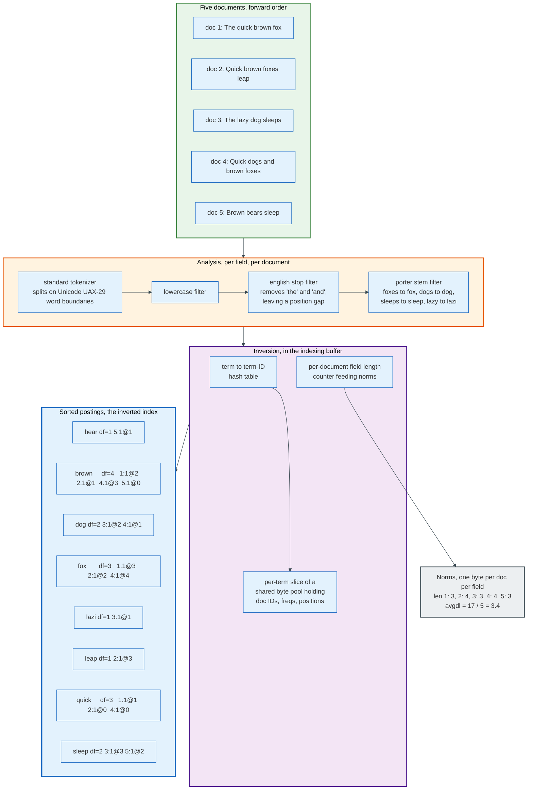
### 4.1 The Corpus

Five documents go into an index called `docs`, in a field called `body`, mapped as `text` with an analyser of standard tokenizer, lowercase filter, English stop filter, and Porter stemmer.

```
doc 1: The quick brown fox
doc 2: Quick brown foxes leap
doc 3: The lazy dog sleeps
doc 4: Quick dogs and brown foxes
doc 5: Brown bears sleep
```

### 4.2 Analysis, Token by Token

The standard tokenizer splits on Unicode UAX-29 word boundaries. The lowercase filter folds case. The stop filter drops `the` and `and` but leaves a position gap where they were, so a phrase query knows a word was removed. The stemmer maps `foxes` to `fox`, `dogs` to `dog`, `sleeps` to `sleep`, and `lazy` to `lazi`, which is what the Porter algorithm produces and is not a spelling error.

| Doc | Raw | Terms with positions |
|-----|-----|----------------------|
| 1 | The quick brown fox | `quick`@1 `brown`@2 `fox`@3 |
| 2 | Quick brown foxes leap | `quick`@0 `brown`@1 `fox`@2 `leap`@3 |
| 3 | The lazy dog sleeps | `lazi`@1 `dog`@2 `sleep`@3 |
| 4 | Quick dogs and brown foxes | `quick`@0 `dog`@1 `brown`@3 `fox`@4 |
| 5 | Brown bears sleep | `brown`@0 `bear`@1 `sleep`@2 |

Field lengths, counted in tokens that survive analysis, are 3, 4, 3, 4, and 3. The average field length is 17 divided by 5, or 3.4. Both numbers matter in Section 9.

### 4.3 The Inversion

Sorting every (term, doc, position) triple by term, then by doc ID, produces the index. Written in the notation `docID:freq@positions`:

| Term | docFreq | totalTermFreq | Postings |
|------|---------|---------------|----------|
| `bear` | 1 | 1 | `5:1@1` |
| `brown` | 4 | 4 | `1:1@2` `2:1@1` `4:1@3` `5:1@0` |
| `dog` | 2 | 2 | `3:1@2` `4:1@1` |
| `fox` | 3 | 3 | `1:1@3` `2:1@2` `4:1@4` |
| `lazi` | 1 | 1 | `3:1@1` |
| `leap` | 1 | 1 | `2:1@3` |
| `quick` | 3 | 3 | `1:1@1` `2:1@0` `4:1@0` |
| `sleep` | 2 | 2 | `3:1@3` `5:1@2` |

That table is the whole data structure. Everything Lucene does at query time is a walk over some subset of those rows.

### 4.4 What the Structure Buys

**A conjunction is a merge, not a scan.** The query `brown AND fox` advances two sorted iterators in lockstep. Start both at their first doc. `brown` is at 1, `fox` is at 1: a match. Advance both. `brown` is at 2, `fox` is at 2: a match. Advance. `brown` is at 4, `fox` is at 4: a match. Advance. `brown` is at 5, `fox` is exhausted: stop. Three matches, from seven postings entries read, with no document ever loaded: four from `brown`, three from `fox`. The cost is proportional to the shorter list, not to the corpus.

**A prefix query is a range scan.** `bro*` seeks to the first term at or after `bro` and reads forward while the prefix holds. Terms are stored in byte-lexicographic order precisely so that this works. A hash map cannot do it at all.

**A phrase query needs positions and nothing else.** `"brown fox"` intersects the doc lists as above, then, for each surviving document, checks whether a position of `fox` equals a position of `brown` plus one. Doc 1 has `brown`@2 and `fox`@3: a match. Doc 2 has `brown`@1 and `fox`@2: a match. Doc 4 has `brown`@3 and `fox`@4: a match. This is why positions cost disk space and why `index_options: docs` on a field silently disables phrase matching.

**A `must_not` clause is a set difference over the same iterators.** No inversion of the corpus is required, because the excluded list is already sorted.

### 4.5 What the Structure Cannot Do

The inverted index answers "which documents contain this term" and cannot answer "what value does this document hold for this field" without scanning every term. That second question is what sorting, aggregating, and scripting all ask, and it is why doc values exist. Section 11 covers the transpose.

The index also does not store the original text. Reconstructing a document requires the stored fields, which live in a separate row-oriented file. Search and retrieval use two different structures over the same data.

---

## 5. The Term Dictionary and Postings Lists on Disk

The logical table in Section 4.3 becomes roughly a dozen files per segment, and the split between them follows one rule: put data that queries read together in the same file, and data most queries never read in a different one.

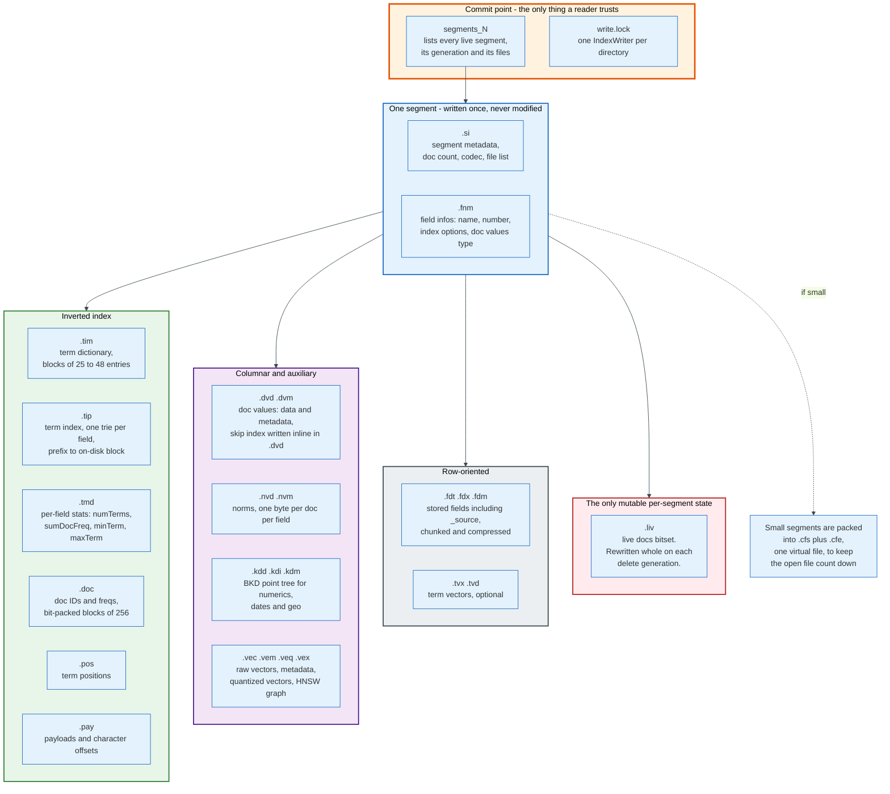
### 5.1 The File Set

The table below is the file layout of the Lucene 10.4 codec, the current format as of Lucene 10.5.1.

| Extension | Name | Contents |
|-----------|------|----------|
| `segments_N` | Segments file | The commit point: which segments are live and which files each owns |
| `write.lock` | Lock file | Prevents a second `IndexWriter` on the same directory |
| `.si` | Segment info | Per-segment metadata: doc count, codec, diagnostics, file list |
| `.cfs`, `.cfe` | Compound file | Small segments packed into one virtual file plus its entry table |
| `.fnm` | Field infos | Field number, name, index options, doc values type, vector config |
| `.fdt`, `.fdx`, `.fdm` | Stored fields | The `_source` and any `store: true` field, chunked and compressed |
| `.tim` | Term dictionary | Terms, `docFreq`, `totalTermFreq`, and pointers into the postings |
| `.tip` | Term index | One trie per field mapping a prefix to the block that holds it |
| `.tmd` | Term metadata | Per-field statistics: `numTerms`, `sumDocFreq`, `minTerm`, `maxTerm` |
| `.doc` | Frequencies | Doc IDs and term frequencies, bit-packed |
| `.pos` | Positions | Term positions within each document |
| `.pay` | Payloads | Payloads and character offsets |
| `.nvd`, `.nvm` | Norms | One byte per document per field, encoding field length |
| `.dvd`, `.dvm` | Doc values | Columnar per-document values and their metadata; the optional skip index is written inline in `.dvd` |
| `.tvx`, `.tvd` | Term vectors | Optional per-document mini inverted index, for highlighting |
| `.liv` | Live docs | The bitset of documents not deleted |
| `.kdd`, `.kdi`, `.kdm` | Point values | BKD tree for numerics, dates, IP addresses, and geo shapes |
| `.vec`, `.vem`, `.veq`, `.vex` | Vector values | Raw vectors, metadata, quantized vectors, HNSW graph |

Everything except `segments_N`, `write.lock`, and `.liv` is written once and never touched again.

### 5.2 The Term Dictionary: BlockTree

Lucene does not store one entry per term at the top level. It groups terms that share a prefix into blocks holding 25 to 48 entries by default, set by `DEFAULT_MIN_BLOCK_SIZE = 25` and `DEFAULT_MAX_BLOCK_SIZE = 48`. A block whose prefix would attract more than 48 terms is subdivided into floor blocks, and the index records the leading byte of each sub-block.

Within a block, each entry stores only the suffix after the shared prefix, its `docFreq`, its `totalTermFreq`, and the postings metadata. `totalTermFreq` is written as the difference from `docFreq`, which is zero for the common case of a term appearing once per document.

The `.tip` file holds the index into those blocks. Through Lucene 10.2 this was a finite state transducer, an automaton that maps a byte sequence to an output. Lucene 10.3, released 13 September 2025, replaced it with a purpose-built trie under GITHUB#14333. The trie stores nodes depth-first, each node holding its output and its children's labels and file pointers, with per-node strategies for encoding the children depending on how the labels are distributed. Both structures do the same job: map a term prefix to a file pointer in `.tim`, and prove that a term cannot exist without touching the disk at all.

That last property is what makes a term lookup cheap. A miss costs an in-memory traversal. A hit costs one seek and one block read.

### 5.3 The Postings List: Blocks of 256

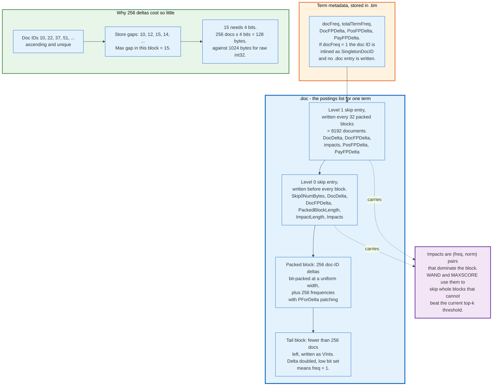
The postings for a term are a strictly ascending list of doc IDs. Lucene never stores them raw.

**Delta encoding first.** Doc IDs 10, 22, 37, 51, 66 become gaps 10, 12, 15, 14, 15. Gaps are small even when doc IDs are large.

**Then frame of reference bit packing.** A block of 256 gaps is scanned for its maximum. If the maximum is 15, four bits suffice for every value, and the block is written as 256 four-bit values in 128 bytes. The same 256 doc IDs stored as raw 32-bit integers would occupy 1,024 bytes. The compression ratio is a direct function of posting density: a term in 1% of a large index has larger gaps and needs more bits per value.

**Frequencies get PForDelta patching.** Term frequencies are usually 1 or 2 with a rare outlier of 400. Bit-packing to the maximum would waste nine bits on every entry. PForDelta picks a bit width that covers most values and stores the exceptions separately.

The block size doubled from 128 to 256 integers in Lucene 10.4, released 25 February 2026. Larger blocks reduce the variance in bit widths and improve bulk decode throughput at the cost of decoding more values than a query may need.

**The tail is written as variable-length integers.** After the last full block, whatever remains is VInt-encoded. When frequencies are indexed, the doc delta is doubled before writing: an odd value means the frequency is 1 and is not written, an even value means a frequency VInt follows. That one bit saves a byte on the majority of postings.

### 5.4 Skip Data and Impacts

A postings list of ten million entries cannot be scanned to answer a conjunction with a rare term. Lucene writes two levels of skip data.

**Level 0** precedes every 256-document block and carries `Skip0NumBytes`, the doc ID delta to the end of the block, the file pointer delta, the packed block length, the impacts, and the position and payload file pointers.

**Level 1** is written every 32 blocks, that is, every 8,192 documents, and carries the same fields plus a byte count that allows the whole level-1 record to be skipped without decoding. `LEVEL1_FACTOR = 32` and `LEVEL1_NUM_DOCS = 8192` in `Lucene104PostingsFormat`.

Advancing to doc 900,000 therefore reads level-1 entries until the right 8,192-document window is found, then level-0 entries until the right 256-document block is found, then decodes one block. Three levels of granularity, two of them nearly free.

**Impacts are the reason top-k search is fast.** Each skip entry stores the (frequency, norm) pairs that dominate the block, meaning no other document in the block can score higher than the best of those pairs implies. A top-k collector that already holds ten documents scoring at least 4.7 can compute the maximum possible score of an entire block from its impacts and, if that maximum is below 4.7, skip 256 documents without decoding them. This is block-max WAND, added in Lucene 8.0, and it is why `size: 10` is orders of magnitude cheaper than `track_total_hits: true` on a large index.

The corollary is worth stating plainly. Asking Elasticsearch for an exact hit count defeats the optimisation and forces a full evaluation of every matching document. `track_total_hits` defaults to 10,000 for exactly this reason: past that number, the response reports `"relation": "gte"` rather than an exact figure.

### 5.5 Stored Fields: The Other Half

Retrieval uses a separate, row-oriented path. The `_source` JSON and any `store: true` field go into `.fdt` in compressed chunks, with `.fdx` holding the index into those chunks.

Lucene's `BEST_SPEED` mode writes chunks of 81,920 bytes capped at 1,024 documents, compressed with LZ4 using a preset dictionary of ten 8kB sub-blocks. `BEST_COMPRESSION` writes chunks of 491,520 bytes capped at 4,096 documents using DEFLATE over ten 48kB sub-blocks.

Elasticsearch substitutes its own Zstandard implementation. `index.codec: default` uses Zstd level 1 with 14kB blocks and 128 documents per chunk. `index.codec: best_compression` uses Zstd level 3 with 240kB blocks and 2,048 documents per chunk. The trade is the usual one: `best_compression` typically halves stored-field size and roughly doubles the CPU cost of fetching a document.

Chunking has a consequence people meet in production. Fetching one document decompresses the whole chunk it lives in. A query returning 1,000 documents scattered across 1,000 chunks does 1,000 decompressions. This is why the fetch phase, not the query phase, dominates the latency of large `size` values.

---

## 6. The Analysis Chain, and Why Both Sides Must Agree

Analysis converts a string into a stream of terms, and it runs twice: once per document at index time, once per query string at search time. Matching is byte-for-byte equality between the two outputs. There is no reconciliation step, no fuzzy fallback, and no error when the two sides disagree.

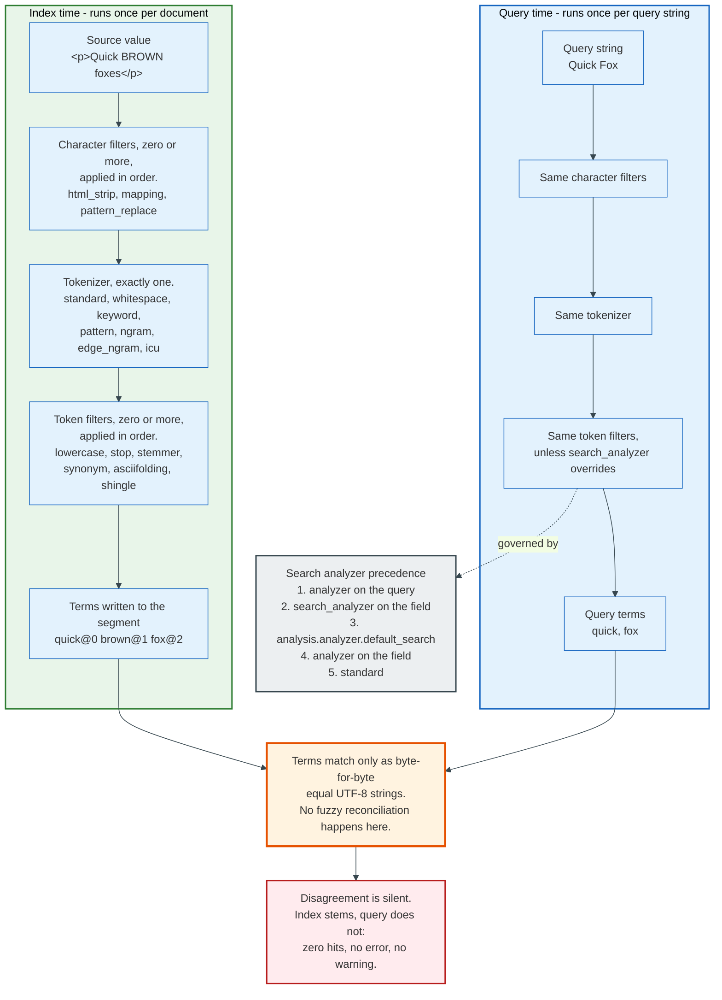
### 6.1 The Three Stages

An analyser has exactly three kinds of component, and the counts are fixed by the API.

**Character filters, zero or more, applied in order.** They operate on the raw character stream before tokenisation. `html_strip` removes markup. `mapping` substitutes character sequences, which is how a search for `C++` is made to work by mapping `+` to a letter. `pattern_replace` applies a regular expression. Character filters can change the length of the text, and Lucene tracks the offset correction so highlighting still points at the right characters in the original.

**A tokenizer, exactly one.** It splits the character stream into tokens and records each token's position and its start and end character offsets. `standard` implements the Unicode UAX-29 word-boundary algorithm. `whitespace` splits on whitespace only. `keyword` emits the entire input as one token, which is the analyser that does nothing. `ngram` and `edge_ngram` emit substrings. `pattern` splits on a regular expression. The ICU and language-specific tokenizers handle scripts where whitespace is not a word boundary, which includes Chinese, Japanese, Korean, and Thai.

**Token filters, zero or more, applied in order.** They add, remove, or rewrite tokens. `lowercase` folds case. `stop` removes function words. `porter_stem`, `kstem`, and the `snowball` family reduce inflected forms. `synonym` and `synonym_graph` insert alternative tokens at the same position. `asciifolding` strips diacritics. `shingle` produces word n-grams. `ngram` produces character n-grams. A token filter may not change a token's character offsets, which is why highlighting survives stemming.

### 6.2 The Agreement Requirement

The two sides must produce the same term for the same word, and the failure when they do not is silent.

Index `Quick brown foxes` with `standard` plus `lowercase` plus `porter_stem` and the index holds `quick`, `brown`, `fox`. Query `foxes` with the same analyser and the query becomes `fox`: a match. Query `foxes` with `standard` plus `lowercase` only and the query stays `foxes`: zero hits, HTTP 200, empty result array, no warning anywhere.

This is the single most common cause of "Elasticsearch is not finding my documents", and the diagnostic is always the same API:

```json
POST /products/_analyze
{ "field": "description", "text": "Quick brown foxes" }
```

The response lists every token with its position, start offset, end offset, and type. Running it against the field, then against the query string with the search analyser, shows the mismatch in one call.

### 6.3 When They Should Differ, Deliberately

Two cases justify separate analysers, and both share a shape: the index side expands, the query side does not.

**Edge n-grams for search-as-you-type.** Index `Apple` with an `edge_ngram` filter and the index holds `a`, `ap`, `app`, `appl`, `apple`. A user typing `appl` should match. If the query is analysed the same way, `appl` becomes `a`, `ap`, `app`, `appl`, and the `a` token alone matches every word beginning with a. Setting `search_analyzer` to a plain lowercase analyser keeps the query as a single token and restores the intended behaviour.

**Synonym expansion at query time.** Expanding synonyms at index time bakes the synonym list into the segments, so changing the list requires reindexing, and the expanded terms distort `docFreq` and therefore IDF. Expanding at query time keeps statistics clean and makes the list editable, at the cost of a larger query. `synonym_graph` handles multi-word synonyms correctly by producing a token graph rather than a flat stream.

### 6.4 Which Analyser Runs at Search Time

Elasticsearch resolves the search analyser in a fixed order, and knowing it prevents a class of debugging session:

1. An `analyzer` parameter on the query itself.
2. `search_analyzer` on the field mapping.
3. `index.analysis.analyzer.default_search` in the index settings.
4. `analyzer` on the field mapping, which itself falls back to `index.analysis.analyzer.default`.
5. The `standard` analyser.

The order at step 3 catches people out. An index-wide `default_search` outranks the field's own `analyzer`, so setting a per-field `analyzer` does not override a cluster-wide search default. Index time uses the shorter chain: the field's `analyzer`, then `index.analysis.analyzer.default`, then `standard`.

Analysers are part of the index settings, which live in the cluster state. Changing an analyser on an existing field is not allowed, because the terms already written cannot be re-derived. Changing `search_analyzer` alone is allowed, because it affects only the query side.

### 6.5 Normalizers and the `keyword` Field

A `keyword` field is not analysed. The whole string becomes one term, byte for byte. This is what makes it sortable, aggregatable, and suitable for exact filters such as status codes, tenant IDs, and tags.

A normalizer is the restricted analyser available to `keyword` fields: character filters and token filters that produce exactly one token, and no tokenizer. `lowercase` plus `asciifolding` as a normalizer gives case-insensitive and accent-insensitive exact matching without splitting the value.

The standard production mapping puts both on the same source field:

```json
"title": {
  "type": "text",
  "analyzer": "english",
  "fields": {
    "raw": { "type": "keyword", "ignore_above": 256 }
  }
}
```

`title` matches full-text queries. `title.raw` sorts and aggregates. `ignore_above: 256` silently skips indexing values longer than 256 characters into the keyword sub-field, which prevents a stray 40kB string from becoming a single 40kB term.

---

## 7. Segments, Merges, and Deletes as Tombstones

A Lucene index is a set of segments, and a segment is a complete, self-contained, immutable inverted index over a subset of the documents. Nothing in a segment is ever modified after it is written. Every property of the system follows from that.

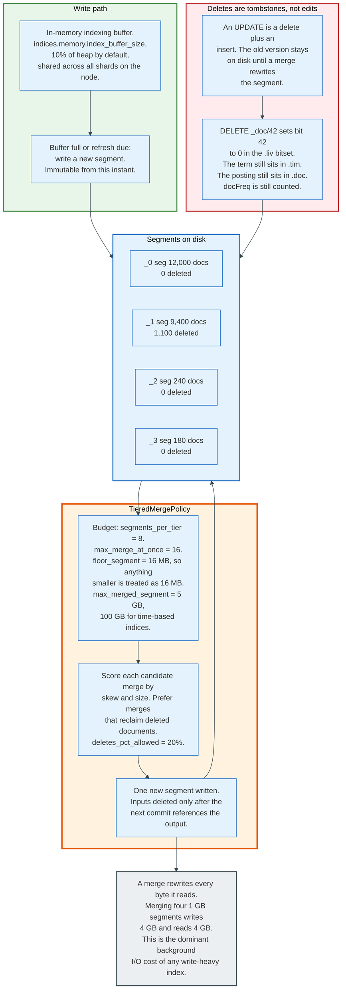
### 7.1 Why Immutability

Immutable files buy four things at once.

**No locking on read.** A searcher holds a fixed list of segment files. Writers create new files. No reader ever waits for a writer, and no reader ever sees a partially written structure.

**Aggressive caching.** A segment file's bytes never change, so anything derived from them stays valid for the life of the segment: the OS page cache, the filter bitsets in the node query cache, the global ordinals used by aggregations. Cache invalidation becomes a question of which segments still exist, not of which bytes changed.

**Compression that would be impossible otherwise.** Bit-packing a block of 256 deltas at a uniform width requires knowing the maximum in advance. Prefix-compressing a block of terms requires knowing the block's contents. Neither survives in-place updates.

**Cheap crash consistency.** A commit is the atomic write of one `segments_N` file naming the segments that are live. A crash halfway through writing a segment leaves orphaned files that no commit references, and they are simply deleted.

The cost is write amplification, paid in the merge.

### 7.2 Deletes Are Tombstones

Deleting a document does not remove anything. It clears one bit.

Each segment carries a `.liv` file holding a bitset with one bit per document. A live document has its bit set. `DELETE /orders/_doc/42` resolves the document to a segment and a doc ID, then clears the bit in a new generation of the `.liv` file. The old `.liv` is deleted at the next commit. Section 7.2.1 covers that resolution step, which is where the real work sits.

What remains untouched:

- The term entries in `.tim`, including their `docFreq`.
- The postings entries in `.doc`, `.pos`, and `.pay`.
- The stored fields in `.fdt`.
- The doc values in `.dvd`.

The consequences are visible from the API. `docFreq` still counts deleted documents, so IDF is computed over a document count that includes them, and scores drift on a shard with many deletes. Disk usage does not drop after a bulk delete. And `_count` is correct only because Lucene checks the live-docs bitset on every hit, which costs a bit test per candidate document.

An update is a delete plus an insert. Elasticsearch has no in-place update path. `POST /orders/_update/42` fetches `_source`, applies the change, indexes a new document with an incremented `_version`, and tombstones the old one. Two copies exist on disk until a merge removes one.

Since Elasticsearch 8.0, soft deletes are mandatory. A soft-deleted document is marked in a `__soft_deletes` field and retained beyond the tombstone so that a replica that fell behind can be brought up to date by replaying operations rather than copying the whole shard. `index.soft_deletes.retention_lease.period` defaults to 12 hours and controls how long that history is kept.

### 7.2.1 How an `_id` Finds Its Segment

Every index, update, and delete resolves the `_id` to a segment and an internal doc ID first, and that lookup is a two-stage path rather than a single index read. Stage one is the `LiveVersionMap`, an in-memory hash map per shard from `_id` to a `VersionValue` holding version, sequence number, and primary term. It covers operations accepted since the last refresh, which is exactly the window in which no segment contains them. Stage two is `VersionsAndSeqNoResolver`, which walks the segments of the current searcher newest first and does a term lookup in the `_id` postings, stopping at the first hit because a later segment's copy supersedes every earlier one.

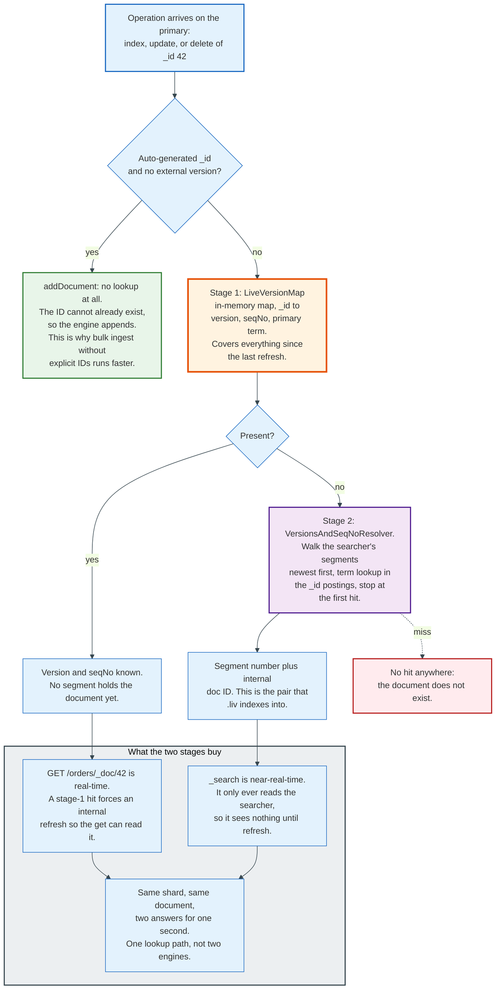
That map is why `GET /orders/_doc/42` returns a document that no search can yet see. A get-by-id is real-time: a hit in the `LiveVersionMap` tells the engine the document exists but has not been written into a segment, so the engine forces an internal refresh of that shard and reads it back. A `_search` never consults the map. It reads whatever searcher the last refresh opened, and nothing else. The difference between real-time get and near-real-time search is one lookup path, not one storage engine.

The map is also the reason indexing cost depends on whether the client supplies an `_id`. With an auto-generated ID and no external version, `InternalEngine` calls Lucene's `addDocument` and skips resolution entirely, because a freshly minted UUID cannot collide. With a client-supplied ID it calls `updateDocument`, which means a map probe and, on a miss, a term lookup per segment. On a shard with 30 segments, that is up to 30 seeks into 30 term dictionaries for every single write. Auto-generated IDs are the cheapest ingest path Elasticsearch offers.

`LiveVersionMap` holds two maps, current and old, and swaps them at refresh. The old map stays readable until the refresh completes so that concurrent lookups never see a gap between "not in the map any more" and "in a segment now". Its size is charged to the parent circuit breaker, which is why an indexing burst against a shard with a long refresh interval can trip a breaker on memory that holds no documents, only IDs and version numbers.

### 7.3 The Merge Policy

Merging reads several segments and writes one, dropping tombstoned documents in the process. It is the only mechanism that reclaims space.

Lucene's `TieredMergePolicy` is the default, and its parameters are precise:

| Parameter | Lucene default | Elasticsearch default |
|-----------|----------------|-----------------------|
| `maxMergedSegmentMB` | 5,120 (5 GB) | 5 GB, 100 GB for time-based indices |
| `floorSegmentMB` | 16 | 16 MB |
| `segmentsPerTier` | 8.0 | 8.0 |
| `maxMergeAtOnce` | 10 | 16 |
| `deletesPctAllowed` | 20.0 | 20.0 |
| `forceMergeDeletesPctAllowed` | 10.0 | 10.0 |
| `targetSearchConcurrency` | 1 | Set from node processors |

The policy works on a budget. It sorts segments by size, treats anything below the floor size as if it were the floor size, and computes how many segments the index is allowed to have given `segmentsPerTier`. If there are more, it scores every candidate group of up to `maxMergeAtOnce` segments, favouring groups that are similar in size and that reclaim deleted documents, and picks the best. Segments above `maxMergedSegmentMB` are excluded from natural merges entirely, which is why a mature index accumulates several 5 GB segments that never merge again.

`deletesPctAllowed` is the release valve. When more than 20% of an index's documents are deleted, the policy starts selecting merges specifically to reclaim them, even when the size distribution does not call for a merge.

Elasticsearch controls concurrency separately. `index.merge.scheduler.max_thread_count` defaults to half the JVM's visible processors with a minimum of 1, and `max_merge_count` to that plus 5. When pending merges exceed `max_merge_count`, indexing threads are throttled, which surfaces as a sudden drop in ingest rate with no error.

### 7.4 Force Merge, and When Not To

`POST /index/_forcemerge?max_num_segments=1` merges an index down to one segment. It reclaims every tombstone, gives the smallest possible index, and makes queries fastest.

It is also a full rewrite of the shard, single-threaded per shard, that ignores `maxMergedSegmentMB`. On a 50 GB shard it reads 50 GB and writes 50 GB. Run against an index that is still being written to, it produces one enormous segment that the merge policy will then never touch again, so subsequent deletes in that segment are never reclaimed.

The rule that follows is narrow and firm. Force merge only read-only indices, and only once they will receive no further writes. In an ILM policy this is a warm-phase action, never a hot-phase one.

---

## 8. Near-Real-Time Search: Refresh, Flush, and the Translog

Elasticsearch is near-real-time, not real-time, and the gap has a precise definition: a document is durable before it is searchable. Those are two different events driven by two different mechanisms, and conflating them causes both data-loss surprises and staleness surprises.

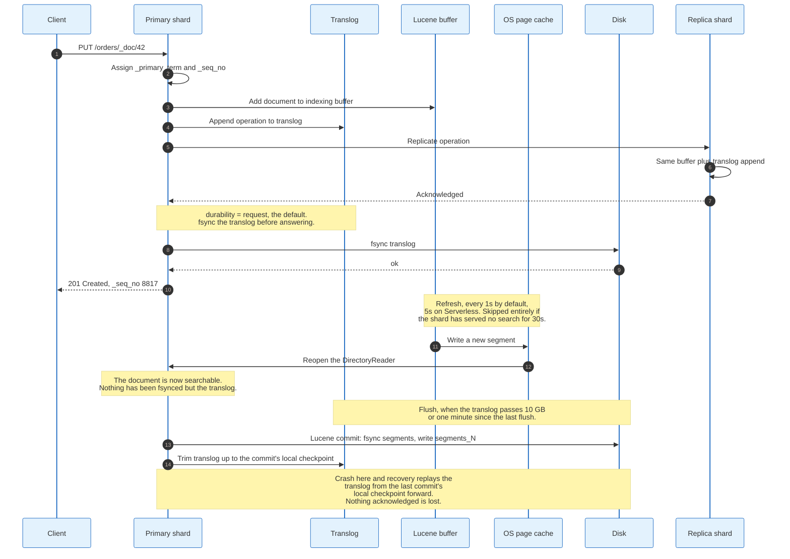
### 8.1 The Write Path, Step by Step

**Step 1: routing.** The coordinating node computes the target shard from the document ID or routing value and forwards the request to the primary shard's node.

**Step 2: sequence numbering.** The primary assigns the operation a `_seq_no`, a monotonically increasing counter per shard, and stamps it with the current `_primary_term`, which increments every time a new primary is promoted. The pair totally orders every operation on the shard and is what makes replica recovery and cross-cluster replication possible.

**Step 3: the Lucene buffer.** The document is analysed and added to the in-memory indexing buffer. `indices.memory.index_buffer_size` defaults to 10% of the JVM heap and is shared across every shard on the node.

**Step 4: the translog append.** The operation is appended to the shard's transaction log as a serialised record. The translog is the durability mechanism, and it is separate from Lucene entirely.

**Step 5: replication.** The primary forwards the operation to every shard in the in-sync copy set. Elasticsearch follows the primary-backup model described in Microsoft Research's PacificA paper. Replicas apply the same operation to their own buffer and translog and acknowledge.

**Step 6: fsync and acknowledge.** With `index.translog.durability: request`, the default, the primary and every replica fsync their translog before the primary answers the client. The response carries the `_seq_no` and `_primary_term`.

At this point the document is durable on the primary and every in-sync replica. It is not searchable anywhere.

### 8.2 Refresh Makes It Searchable

A refresh writes the contents of the indexing buffer into a new segment and reopens the `DirectoryReader` so searches see it.

`index.refresh_interval` defaults to `1s` on the Elastic Stack and `5s` on Elastic Cloud Serverless. That is why "near real time" means "about one second" in every Elasticsearch document ever written.

The segment is written to the filesystem, which means it lands in the OS page cache. **No fsync happens.** A refresh is not a durability event. If the machine loses power one millisecond after a refresh, the segment is gone and the translog is what brings the data back.

Elasticsearch skips refreshes it does not need. `index.search.idle.after` defaults to 30 seconds: a shard that has served no search request for 30 seconds stops refreshing on a timer and refreshes only when a search arrives. On a cluster with thousands of rarely queried indices this removes an enormous amount of pointless segment creation. It also means the first search after a quiet period pays a refresh in its own latency.

Three ways to force the issue exist, and their costs differ by orders of magnitude:

| Option | Effect | Cost |
|--------|--------|------|
| `?refresh=true` | Refresh the whole shard now | Creates a small segment, adds merge pressure |
| `?refresh=wait_for` | Block until the next scheduled refresh | Up to `refresh_interval` of latency, no extra segment |
| `?refresh=false` | Default. Do nothing | None |

`?refresh=true` in a bulk-indexing loop is the most reliable way to destroy indexing throughput, because it produces one tiny segment per request and the merge policy then spends the cluster's I/O budget consolidating them.

### 8.3 Flush Makes It Committed

A flush performs a Lucene commit: fsync every segment file, write a new `segments_N`, and then trim the translog up to the commit's local checkpoint.

Elasticsearch flushes when either threshold is crossed:

- `index.translog.flush_threshold_size`, default 10 GB, which bounds how much translog a recovery would have to replay.
- `index.translog.flush_threshold_age`, default 1 minute, which bounds how long a replay would take.

A flush also happens after a large merge and can be triggered manually with `POST /index/_flush`, though manual flushing is almost never useful.

### 8.4 The Translog, Precisely

The translog is a per-shard append-only file that holds every operation not yet in a Lucene commit. Recovery replays it forward from the last commit's local checkpoint.

| Setting | Default | Meaning |
|---------|---------|---------|
| `index.translog.durability` | `request` | fsync and commit after every request |
| `index.translog.sync_interval` | `5s` | With `async`, how often to fsync |
| `index.translog.flush_threshold_size` | `10gb` | Translog size that triggers a Lucene commit |
| `index.translog.flush_threshold_age` | `1m` | Time since last flush that triggers a commit |

Switching to `index.translog.durability: async` is the single largest indexing-throughput lever in Elasticsearch and the single largest durability sacrifice. Under `async`, up to `sync_interval` worth of acknowledged writes are lost on power failure. For application data this is unacceptable. For metrics and logs that are replayable from Kafka or from an agent's own disk buffer, it is often correct, and it commonly buys 20% to 40% more throughput on write-heavy clusters. The number varies with hardware and is not a published constant.

### 8.5 The Three-Event Timeline

The sequence that makes this concrete, for a document indexed at t=0 with defaults:

| Time | Event | State |
|------|-------|-------|
| t=0ms | Client sends `PUT /orders/_doc/42` | Nothing |
| t=3ms | Buffer + translog append on primary and replicas, all fsynced | **Durable. Not searchable.** |
| t=3ms | `201 Created` returned | Client believes it is done |
| t=3ms | `GET /orders/_doc/42` hits the `LiveVersionMap` | **Retrievable by ID. Not searchable.** |
| t=0 to 1000ms | Waiting for the refresh timer | Still not searchable |
| t=1000ms | Refresh: segment written to page cache, reader reopened | **Searchable. Not committed.** |
| t up to 60s | Waiting for a flush trigger | Recovery would replay the translog |
| t=60s | Flush: fsync segments, write `segments_N`, trim translog | **Committed.** |

Nothing is lost at any point in that timeline, because the translog covers the gap. What changes is how much work a restart has to do, and which API can see the document. Get-by-id sees it at t=3ms. Search sees it at t=1000ms.

---

## 9. Scoring: TF-IDF, BM25, and a Computed Example

Relevance in Lucene is arithmetic over three numbers per term per document: how often the term appears in this document, how many documents contain it, and how long the field is. Everything else is a choice of formula over those three.

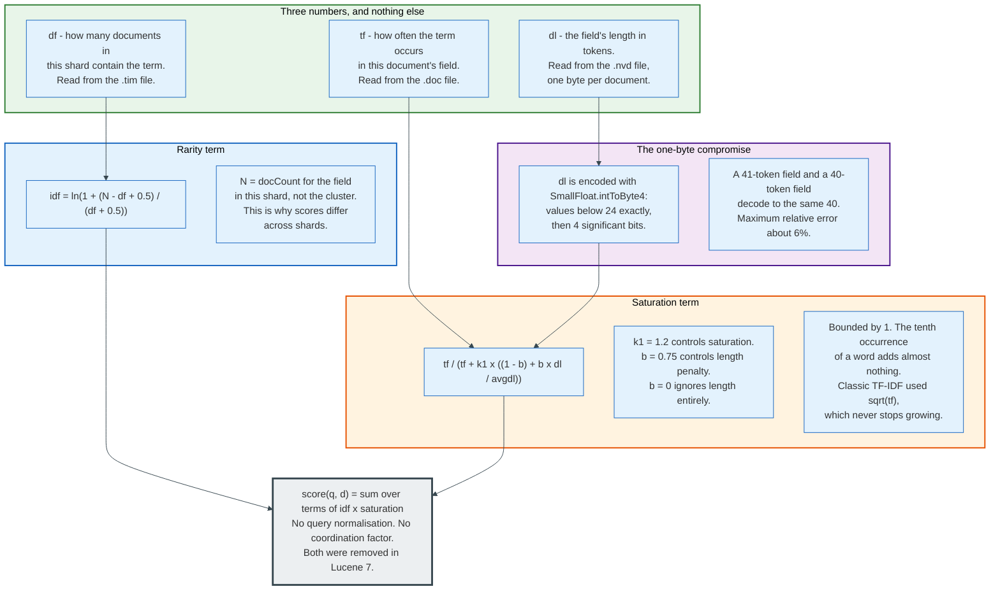
### 9.1 The Classic Formula and Its Defect

Lucene's original similarity, now called `ClassicSimilarity`, computed:

```
score(q, d) = sum over terms t of:
    sqrt(tf(t, d))                      term frequency
  * (1 + ln((N + 1) / (df(t) + 1)))^2   inverse document frequency, squared
  * (1 / sqrt(length(d)))               length normalisation
```

Two defects show up immediately.

**Term frequency never saturates.** A square root grows without bound. A document containing `mortgage` a hundred times scores ten times a document containing it once, on that term. In practice, a document that mentions a word a hundred times is not a hundred times more about it, and the formula is exploitable by keyword stuffing.

**Length normalisation is not tunable.** `1/sqrt(length)` is a fixed curve. Whether a longer document is genuinely less relevant depends on the corpus. A field holding product titles and a field holding legal opinions want different answers.

### 9.2 BM25

Okapi BM25 fixes both by introducing two parameters. Lucene's `BM25Similarity` implements:

```
idf(t)      = ln(1 + (N - df(t) + 0.5) / (df(t) + 0.5))

score(q, d) = sum over terms t of:
    idf(t) * tf(t, d) / (tf(t, d) + k1 * ((1 - b) + b * dl(d) / avgdl))
```

with `k1 = 1.2` and `b = 0.75` by default. `N` is the number of documents in the shard that have a value for this field. `dl` is the field's length in tokens and `avgdl` is the mean of that over the shard.

`k1` controls saturation. The term contribution approaches `idf(t)` as `tf` grows and can never exceed it, so the marginal value of each repetition falls. `b` controls the length penalty: at `b = 0` field length is ignored entirely, at `b = 1` the penalty is fully proportional.

The saturation curve, for a field of exactly average length so the denominator's length factor is 1:

| tf | BM25 factor `tf/(tf+1.2)` | Classic factor `sqrt(tf)` |
|----|---------------------------|---------------------------|
| 1 | 0.4545 | 1.000 |
| 2 | 0.6250 | 1.414 |
| 5 | 0.8065 | 2.236 |
| 10 | 0.8929 | 3.162 |
| 100 | 0.9881 | 10.000 |
| infinity | 1.0000 | unbounded |

A hundredfold repetition earns 2.2 times the first occurrence under BM25 and ten times it under classic TF-IDF. That gap is the entire reason for the change.

Lucene 6.0 made BM25 the default in April 2016, and Elasticsearch 5.0 inherited it in October 2016. Lucene 7.0 removed the query normalisation factor and the coordination factor from scoring, on the grounds that neither affects the ranking within a single query. Lucene's `BM25Scorer` also drops the `(k1 + 1)` numerator found in the published formula, because it is a constant multiplier that cannot change the order of results.

### 9.3 The Norm: One Byte for the Field Length

Field length is stored as one byte per document per field, in `.nvd`. Lucene encodes it with `SmallFloat.intToByte4`, which reserves the first 24 values for exact encoding and uses a four-significant-bit floating format above that.

`NUM_FREE_VALUES` is 24, computed as `255 - longToInt4(Integer.MAX_VALUE)`, and the consequence is measurable. Field lengths of 0 through 23 round-trip exactly. Above that, four significant bits survive, so a 41-token field and a 40-token field both decode to 40. Maximum relative error is roughly 6%.

This is why `_explain` sometimes reports a length that is not the counted length, and why the difference between a 200-word and a 205-word document is invisible to the scorer. It also explains why norms cost one byte per document per field rather than four, which on a billion-document index with twenty text fields is 20 GB rather than 80 GB.

Setting `norms: false` on a field removes the byte and disables length normalisation for it. That is correct for short `keyword`-like text where every value is roughly the same length, and wrong almost everywhere else.

### 9.4 The Worked Example

Take the five-document index from Section 4, in a single shard, and run the query `body: "brown fox"` as a `match` query, which becomes a disjunction of two term queries.

**Corpus statistics.** `N = 5`. `avgdl = 17 / 5 = 3.4`. Field lengths: doc 1 = 3, doc 2 = 4, doc 3 = 3, doc 4 = 4, doc 5 = 3.

**Step 1: IDF per term.**

```
brown:  df = 4
        idf = ln(1 + (5 - 4 + 0.5) / (4 + 0.5))
            = ln(1 + 1.5 / 4.5) = ln(1.33333) = 0.28768

fox:    df = 3
        idf = ln(1 + (5 - 3 + 0.5) / (3 + 0.5))
            = ln(1 + 2.5 / 3.5) = ln(1.71429) = 0.53900
```

`fox` is rarer, so it is worth 1.87 times what `brown` is worth. That ratio is the whole contribution of IDF.

**Step 2: the length factor per document.**

```
norm(dl) = k1 * ((1 - b) + b * dl / avgdl)
         = 1.2 * (0.25 + 0.75 * dl / 3.4)

dl = 3:  1.2 * (0.25 + 0.66176) = 1.2 * 0.91176 = 1.09412
dl = 4:  1.2 * (0.25 + 0.88235) = 1.2 * 1.13235 = 1.35882
```

**Step 3: the saturation factor.** Every `tf` here is 1, so the factor is `1 / (1 + norm)`:

```
dl = 3:  1 / 2.09412 = 0.47753
dl = 4:  1 / 2.35882 = 0.42394
```

**Step 4: multiply and sum.**

| Doc | dl | `brown` contribution | `fox` contribution | Total `_score` |
|-----|----|----------------------|--------------------|----------------|
| 1 | 3 | 0.28768 x 0.47753 = 0.13737 | 0.53900 x 0.47753 = 0.25738 | **0.39475** |
| 2 | 4 | 0.28768 x 0.42394 = 0.12195 | 0.53900 x 0.42394 = 0.22850 | **0.35045** |
| 4 | 4 | 0.28768 x 0.42394 = 0.12195 | 0.53900 x 0.42394 = 0.22850 | **0.35045** |
| 5 | 3 | 0.28768 x 0.47753 = 0.13737 | no match | **0.13737** |
| 3 | 3 | no match | no match | no hit |

Final ranking: doc 1, then docs 2 and 4 tied, then doc 5. Doc 1 wins over doc 2 for one reason only: both match both terms with the same frequency, and doc 1 is three tokens long against doc 2's four. The length penalty, not the content, breaks the tie.

`GET /docs/_explain/1` with the same query returns exactly this arithmetic, with each factor labelled. The path takes an index name and a document ID, not a field name. `_explain` is the correct debugging tool for every relevance question, and it is under-used.

### 9.5 Why the Same Document Scores Differently on Different Shards

`N` and `df` in the formula above are shard-local. Lucene has no idea that other shards exist.

Split the same five documents across two shards, with docs 1, 3, and 5 on shard A and docs 2 and 4 on shard B. On shard A, `brown` has `df = 2` out of `N = 3`, giving `idf = ln(1 + 1.5/2.5) = 0.47000`. On shard B, `brown` has `df = 2` out of `N = 2`, giving `idf = ln(1 + 0.5/2.5) = 0.18232`. The same term is worth 2.6 times as much on one shard as on the other.

With realistic corpus sizes the distributions converge and the effect disappears. With small indices, or with skewed custom routing, it does not. Two remedies exist:

- `?search_type=dfs_query_then_fetch` runs a preliminary round that gathers global term statistics from every shard, then scores with them. It costs one extra network round trip per query.
- Use one primary shard for small indices. Below roughly 20 GB there is rarely a reason to do otherwise.

---

## 10. The Query DSL: Query Context, Filter Context, and Caching

The Query DSL is a JSON tree that Elasticsearch compiles into a Lucene `Query` object graph. The single most consequential distinction in it is not the query type. It is whether a clause runs in query context or filter context.

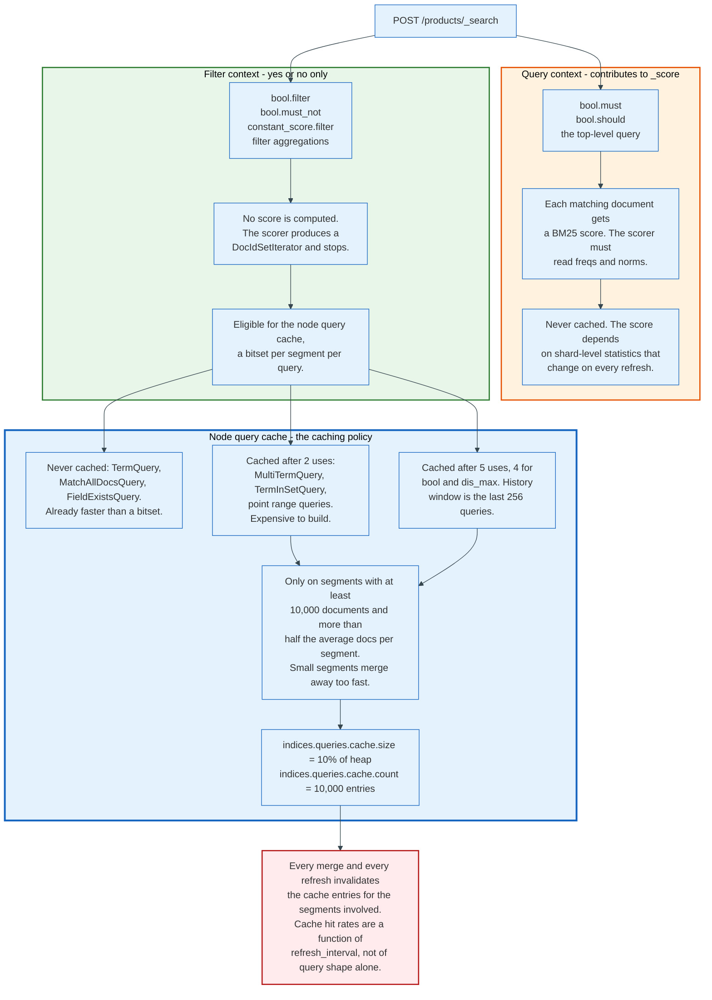
### 10.1 The Two Contexts

**Query context asks "how well does this match?"** The clause contributes to `_score`. The scorer must read term frequencies from `.doc` and norms from `.nvd` for every candidate document, and run the BM25 arithmetic from Section 9. Clauses in `query`, in `bool.must`, and in `bool.should` run in query context.

**Filter context asks "does this match, yes or no?"** No score is computed. The clause produces a document ID iterator and stops. Clauses in `bool.filter`, `bool.must_not`, `constant_score.filter`, and inside filter aggregations run in filter context.

A representative production query separates the two deliberately:

```json
{
  "query": {
    "bool": {
      "must": [
        { "match": { "title": "wireless headphones" } }
      ],
      "filter": [
        { "term":  { "status": "published" } },
        { "range": { "price": { "gte": 50, "lte": 300 } } },
        { "terms": { "category_id": [17, 22, 45] } }
      ],
      "must_not": [
        { "term": { "discontinued": true } }
      ]
    }
  }
}
```

Only the `match` clause affects ranking. The other four narrow the candidate set. Moving any of them into `must` would compute a BM25 score for `status: published`, which carries no information because every result has it, and would make the clause ineligible for caching.

### 10.2 The Node Query Cache

Filter clauses are eligible for the node-level query cache, which stores, per segment per query, a bitset of matching document IDs.

Elasticsearch sizes it with two settings:

- `indices.queries.cache.size`, default 10% of the JVM heap.
- `indices.queries.cache.count`, default 10,000 entries.

Lucene's `UsageTrackingQueryCachingPolicy` decides what enters the cache, and the rules are specific:

| Query type | Cached after | Rationale |
|------------|--------------|-----------|
| `TermQuery` | Never | A term postings scan is already faster than a bitset |
| `MatchAllDocsQuery` | Never | Its iterator beats any bitset |
| `FieldExistsQuery` | Never | Already backed by a fast structure |
| `MultiTermQuery`, `TermInSetQuery`, point range queries | 2 uses | Expensive to build the iterator in the first place |
| `BooleanQuery`, `DisjunctionMaxQuery` | 4 uses | Cached earlier than their parts, to avoid caching both |
| Everything else | 5 uses | Default threshold |

The policy tracks the last 256 queries in a frequency ring buffer, so "used five times" means five times within that window.

`LRUQueryCache` adds a segment-level condition. A query is cached on a segment only if that segment holds at least 10,000 documents **and** more than half the average documents per segment in the index. Both conditions exist because caching a bitset for a 200-document segment that will be merged away in thirty seconds is pure waste.

Every refresh and every merge produces new segments, and cache entries are keyed by segment. A cluster with a one-second refresh interval throws away a portion of its query cache every second. Raising `refresh_interval` therefore improves cache hit rates as a side effect, which is a second reason logging clusters set it to 30 seconds.

### 10.3 The Other Caches

Three caches sit at different levels and are frequently confused.

| Cache | Scope | Key | Invalidated by | Default size |
|-------|-------|-----|----------------|--------------|
| **Node query cache** | Node | Query + segment | Segment change | 10% of heap |
| **Shard request cache** | Shard | Whole request body + shard | Refresh | 1% of heap |
| **Fielddata cache** | Node | Field | Segment change | Unbounded by default |

The **shard request cache** caches the entire response of a search whose `size` is 0, which in practice means aggregation-only requests such as those a Kibana dashboard issues. It is invalidated on every refresh of the shard, which is why dashboards over a 1-second-refresh index never hit it and dashboards over a rolled-over, read-only index always do. It ignores requests containing `now` without rounding, because the key would never repeat; `now/1h` rounds the timestamp and restores cacheability.

The **fielddata cache** holds the on-heap inverted structure built for `text` fields when `fielddata: true` is set. It has caused more `OutOfMemoryError` incidents in Elasticsearch than any other single feature, and it defaults to off on `text` fields for that reason.

### 10.4 The Query Types Worth Knowing Precisely

| Query | Analysed? | Scores? | Typical use |
|-------|-----------|---------|-------------|
| `match` | Yes | Yes | Full text over one field |
| `match_phrase` | Yes | Yes | Ordered adjacency, needs positions |
| `multi_match` | Yes | Yes | Same text across several fields with `best_fields`, `most_fields`, or `cross_fields` |
| `term` | **No** | Yes | Exact value on a `keyword` field |
| `terms` | No | Yes | Set membership, up to 65,536 values by default |
| `range` | No | Yes | Backed by the BKD point tree, not the inverted index |
| `prefix`, `wildcard`, `regexp`, `fuzzy` | No | Yes | Term-dictionary range scans, expensive on high-cardinality fields |
| `bool` | Depends | Depends | Composition; `filter` and `must_not` are the filter-context slots |
| `function_score` | Depends | Yes | Score rewriting with decay functions and field values |
| `knn` | No | Yes | Approximate vector retrieval, Section 16 |

The trap in that table is `term` on a `text` field. `{"term": {"title": "Quick Brown"}}` looks for the literal term `Quick Brown` in an index that contains `quick` and `brown`. It returns zero hits and no error. Use `term` on `keyword` fields and `match` on `text` fields, without exception.

`indices.query.bool.max_clause_count` was deprecated in 8.0.0 and now has no effect. Elasticsearch derives the leaf-clause ceiling itself, from a heuristic over JVM heap size and search thread pool size, with a floor of 1,024; Elastic's own worked example puts a node with 30 GB of RAM and 48 CPUs near 27,000. More heap raises the ceiling, more search threads lower it. A `terms` query with 100,000 values, or a `prefix` query that expands to 50,000 terms, still hits it.

---

## 11. Doc Values, Aggregations, and Columnar Storage

The inverted index answers the wrong question for aggregation. Aggregating asks, for each of the documents that matched, what value does it hold in this field. The inverted index would answer that by scanning every term and testing membership, which costs O(distinct terms), not O(matching documents). Lucene solves it by writing the same data twice, transposed.

```mermaid
%%{init: {'theme': 'base', 'themeVariables': {'primaryColor': '#e3f2fd', 'primaryBorderColor': '#1565c0', 'lineColor': '#37474f'}}}%%

flowchart TB
    subgraph Problem["The problem the inverted index cannot solve"]
        P1["Inverted index answers:<br/>which documents contain 'blue'?"]
        P2["Aggregation asks the opposite:<br/>for these 40,000 documents,<br/>what colour is each one?"]
        P3["Walking the term dictionary to<br/>answer that is O(terms), not O(docs).<br/>Wrong data structure."]
    end

    subgraph DV["Doc values - the same data, transposed"]
        D1["Written at index time into<br/>.dvd data and .dvm metadata,<br/>one column per field per segment.<br/>Skip index interleaved into .dvd."]
        D2["NUMERIC: delta, table, GCD,<br/>monotonic or constant compression,<br/>bit-packed in blocks of 16,384."]
        D3["SORTED / SORTED_SET:<br/>terms deduplicated into an ordinal<br/>table, LZ4 blocks of 64 terms,<br/>reverse index every 1,024."]
        D4["Documents without a value are<br/>skipped with a SPARSE, DENSE or ALL<br/>strategy per 65,536-doc block."]
    end

    subgraph Aggs["What aggregations actually do"]
        A1["terms agg on a keyword field<br/>reads ordinals, not strings"]
        A2["Global ordinals map per-segment<br/>ordinals to a shard-wide space.<br/>Built lazily on first use,<br/>thrown away on refresh."]
        A3["Counting is then an increment<br/>into an array indexed by ordinal.<br/>No string comparison happens."]
    end

    subgraph Cost["What it costs"]
        C1["Disk: a second copy of every<br/>aggregatable field."]
        C2["Off-heap: doc values are mmapped,<br/>so the OS page cache pays,<br/>not the JVM heap."]
        C3["Turn it off with doc_values: false<br/>and the field can be searched<br/>but never sorted, aggregated<br/>or used in a script."]
    end

    FD["fielddata: true on a text field<br/>rebuilds the same structure on the heap<br/>at query time. It is the historical<br/>cause of most OutOfMemoryErrors<br/>in Elasticsearch and stays off by default."]

    Problem --> DV
    DV --> Aggs
    Aggs --> Cost
    Cost --> FD

    style Problem fill:#ffebee,stroke:#b71c1c,stroke-width:2px
    style DV fill:#e3f2fd,stroke:#1565c0,stroke-width:3px
    style Aggs fill:#e8f5e9,stroke:#2e7d32,stroke-width:2px
    style Cost fill:#fff3e0,stroke:#e65100,stroke-width:2px
    style FD fill:#eceff1,stroke:#37474f,stroke-width:2px
```
### 11.1 What Doc Values Are

Doc values are a column-oriented copy of a field's values, written at index time into `.dvd`, with metadata in `.dvm` and a skip index interleaved into `.dvd` itself. One column per field per segment, ordered by document ID. `Lucene90DocValuesConsumer.writeSkipIndex` emits that skipper inline; it has no file extension of its own.

They are on by default for every field type except `text` and `annotated_text`. `text` fields have no single value to store, which is exactly why they cannot be sorted or aggregated without a `keyword` sub-field.

Lucene defines five doc values types:

| Type | Holds | Used by |
|------|-------|---------|
| `NUMERIC` | One number per document | `long`, `double`, `date`, `boolean` |
| `SORTED_NUMERIC` | Several numbers per document | Numeric arrays |
| `BINARY` | One opaque byte string | Custom, `ip` before ordinal encoding |
| `SORTED` | One term, stored as an ordinal into a dictionary | Single-valued `keyword` |
| `SORTED_SET` | Several terms as ordinals | Multi-valued `keyword` |

### 11.2 How They Are Encoded

`Lucene90DocValuesFormat` picks a strategy per column based on what the data looks like.

**Numeric columns** get one of five encodings. Delta compression stores each value as an offset from the column minimum, bit-packed. Table compression applies when fewer than 256 distinct values exist and writes an ordinal into a lookup table instead. GCD compression divides out a common factor, which is why millisecond timestamps that are all multiples of 1,000 compress well. Monotonic compression stores the deviation from an expected linear progression, which is how file offsets are stored. Constant compression writes nothing per document when only one value exists. Values are split into blocks of 16,384 with a jump table for O(1) block access.

**Sorted and sorted-set columns** deduplicate terms into an ordinal table. Terms are stored prefix-compressed in LZ4 blocks of 64, with a reverse index every 1,024 terms for binary search. Each document then stores an integer ordinal, bit-packed with the numeric strategies above. A `status` field with three distinct values costs 2 bits per document, not the length of the string.

**Documents missing a value** are handled per block of 65,536 document IDs sharing the same upper 16 bits. `SPARSE` stores the lower 16 bits as shorts when a block has at most 4,095 documents with values. `DENSE` stores a bitset with a rank table every 512 documents. `ALL` stores nothing when the block is full, which is the fastest case and is why index sorting, which clusters documents with the same field present, improves aggregation speed.

### 11.3 Global Ordinals

A `terms` aggregation on a `keyword` field never compares strings. It compares integers.

Within one segment, ordinals are dense and start at 0. Across segments they disagree: `london` might be ordinal 4 in one segment and ordinal 91 in another. A shard-level aggregation therefore needs a mapping from each segment's ordinals into a shard-wide space. That mapping is the global ordinals structure.

It is built lazily on the first aggregation that needs it, held on the JVM heap, and thrown away whenever the segment set changes, which means on every refresh. On a high-cardinality field with a one-second refresh, the first aggregation after each refresh pays the rebuild.

`eager_global_ordinals: true` in the field mapping moves the cost into the refresh itself. The refresh becomes slower and the aggregation becomes predictable. That is the right trade for a dashboard field and the wrong trade for a field aggregated once a day.

### 11.4 Aggregation Accuracy, and Why It Is Not Exact

A `terms` aggregation asking for the top 10 values across 6 shards is not guaranteed to be correct, and the response says so.

Each shard computes its own top values and returns them. A value ranked 11th on every shard, and therefore returned by none, could still have the largest total. To reduce the risk, each shard returns more than requested: `shard_size` defaults to `size * 1.5 + 10`, so a request for the top 10 collects the top 25 from each shard.

The response carries two fields that quantify the remaining risk:

- `doc_count_error_upper_bound`: the largest count that a term missing from the result could have.
- `sum_other_doc_count`: how many documents fell into terms outside the returned buckets.

A non-zero `doc_count_error_upper_bound` means the result is approximate. Raising `shard_size` shrinks it and costs memory on the coordinating node. Only a single-shard index gives an exact answer with no further work.

Other aggregations trade accuracy explicitly. `cardinality` uses HyperLogLog++ and is exact only below `precision_threshold`, which defaults to 3,000 and is capped at 40,000. Above the threshold it reports an estimate with a typical relative error under 1%, using a fixed amount of memory that does not grow with cardinality. `percentiles` uses a t-digest, which is accurate at the tails and approximate in the middle by design.

### 11.5 The Cost

Doc values are a second copy of every aggregatable field. On a logging index where most fields are aggregated, they routinely account for 30% to 50% of the on-disk size. That is not a published constant; it depends entirely on field types and cardinality.

They are memory-mapped rather than loaded onto the heap, so their working set is paid for out of the OS page cache. This is the single strongest argument for leaving at least half of a data node's RAM unallocated to the JVM, and for the standard advice to cap heap at 31 GB so compressed ordinary object pointers stay enabled.

Turning them off with `doc_values: false` saves the space and permanently removes the ability to sort, aggregate, or script on that field. It is a mapping-time decision that requires a reindex to reverse.

---

## 12. Shards, Replicas, and Routing

A shard is one Lucene index. An Elasticsearch index is a fixed number of primary shards plus a configurable number of replicas of each. Where a document lands is decided by arithmetic, not by a lookup table, and that decision is irreversible without rewriting the index.

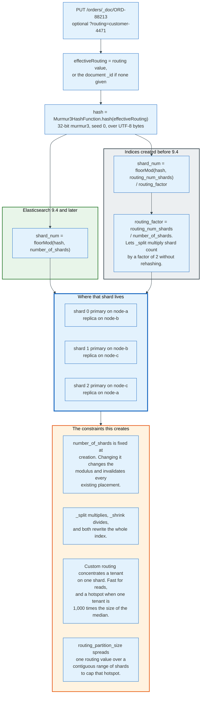
### 12.1 The Routing Formula

Every document has an effective routing value: the custom `routing` parameter if one is supplied, otherwise the document `_id`. That string is hashed with Murmur3.

For indices created in Elasticsearch 9.4 and later:

```
shard_num = Math.floorMod(Murmur3HashFunction.hash(effectiveRouting), number_of_shards)
```

For older indices, a level of indirection exists so that `_split` can work:

```
shard_num = Math.floorMod(Murmur3HashFunction.hash(effectiveRouting), routing_num_shards)
            / routing_factor

routing_factor = routing_num_shards / number_of_shards
```

`routing_num_shards` is fixed at index creation and is a multiple of `number_of_shards`, chosen so the index can be split by factors of 2 up to 1,024 shards without rehashing a single document. `index.number_of_routing_shards` is deprecated and has no effect on routing for indices created in 9.4.0 and later, which use `hash(_routing) % number_of_shards` directly.

### 12.2 Why the Shard Count Is Effectively Permanent

`number_of_shards` is the modulus. Change it and every document's target changes. The three escape hatches all move data:

| Operation | Effect | Constraint |
|-----------|--------|------------|
| `_split` | Multiply shard count | Source must be read-only; new count must be a multiple that fits `routing_num_shards` |
| `_shrink` | Divide shard count | Source must be read-only and all primaries on one node; new count must divide the old |
| `_reindex` | Anything | Full re-read and re-write of every document |

Elasticsearch's own sizing guidance is unambiguous: aim for shards between 10 GB and 50 GB, keep fewer than 200 million documents per shard, and stay below 1,000 non-frozen shards per node. `cluster.max_shards_per_node` enforces the last of these and refuses index creation past it.

Over-sharding is the more common mistake. Each shard is a Lucene index with its own segments, its own merge threads, its own translog, its own file handles, and its own entry in the cluster state. A 10 GB dataset in 50 shards runs slower than the same data in 2 shards, because every query fans out to 50 places and each one pays a fixed per-shard overhead.

### 12.3 Replicas

`number_of_replicas` defaults to 1 and is changeable at any time, because a replica is a copy rather than a partition. Replicas serve two purposes: they survive a node loss, and they add read throughput because any copy can answer a search.

Replication is synchronous. The primary does not acknowledge a write until every shard in the in-sync copy set has applied it. The in-sync set is maintained by the master. If a replica fails to apply an operation, the primary asks the master to remove it from the set before acknowledging, so a slow replica degrades write latency and a dead one does not.

`wait_for_active_shards` on a write request controls how many copies must be available before the operation is attempted. It defaults to 1, meaning only the primary, and can be raised to `all` for stricter guarantees at the cost of availability.

Sequence numbers make recovery cheap. Each shard tracks a local checkpoint, the highest `_seq_no` below which every operation has been processed, and a global checkpoint, the minimum local checkpoint across the in-sync set. A replica that reconnects sends its local checkpoint and receives only the operations after it, replayed from the primary's soft-delete history, provided the retention lease has not expired. Past that window it falls back to a full file-based copy.

### 12.4 Custom Routing and Its Hazard

Supplying `?routing=customer-4471` on both index and search sends every document for that customer to a single shard and lets a search touch one shard instead of all of them. On a multi-tenant index with thousands of tenants this converts a fan-out into a point query.

The hazard is distribution. Routing is a hash, and a hash distributes uniformly only if the inputs are uniform in weight. One tenant holding 40% of the documents puts 40% of the index on one shard. The shard grows past the size guidance, its merges take longer, and its node becomes the cluster's slowest.

`index.routing_partition_size`, which defaults to 1 and can only be set at index creation, spreads one routing value across a contiguous range of shards:

```
shard_num = (hash(routing) + floorMod(hash(_id), routing_partition_size)) mod number_of_shards
```

A partition size of 4 spreads a tenant across 4 shards, so a search for that tenant queries 4 shards rather than 1 or all. It is the correct answer when tenant sizes span three orders of magnitude, which they usually do.

---

## 13. The Coordinating Node: Scatter-Gather and Deep Pagination

Any node that receives a search request becomes its coordinating node. It does not necessarily hold any of the data. Its job is to work out which shards are involved, ask one copy of each, merge the answers, and fetch the documents that survived.

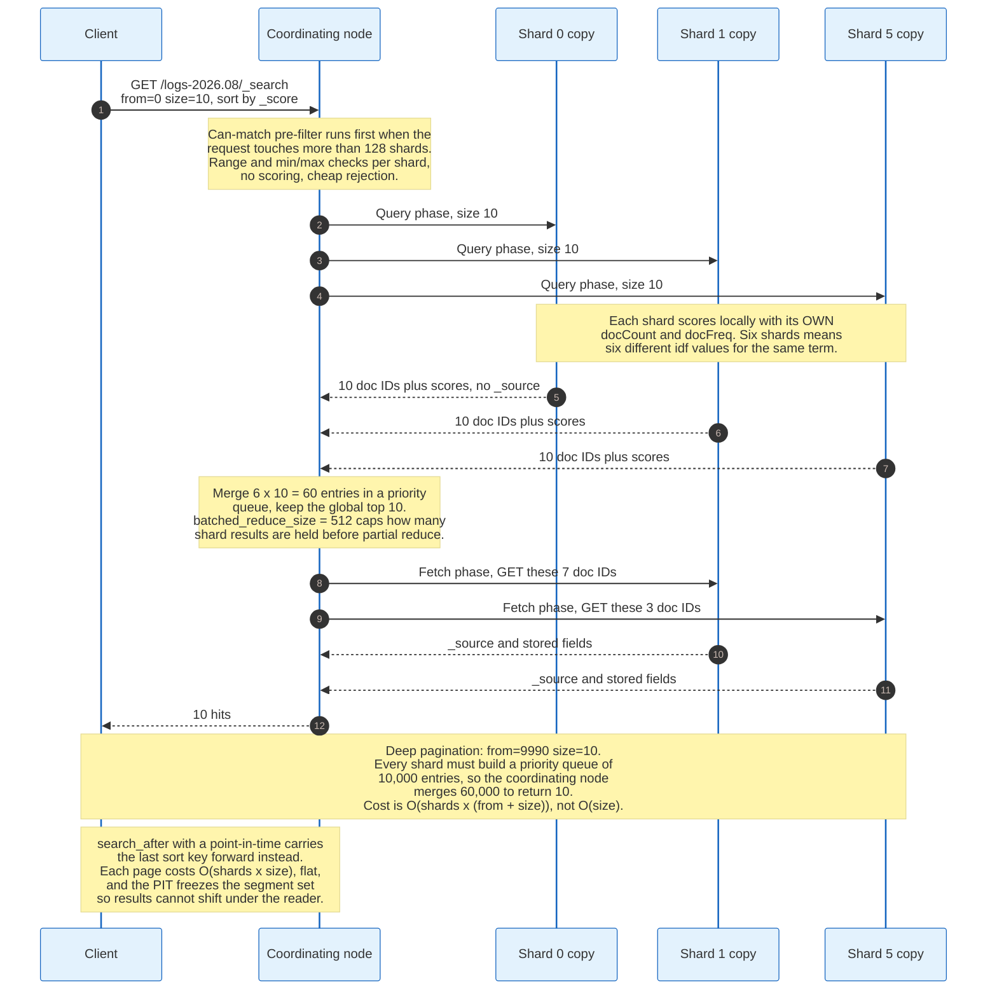
### 13.1 Query Then Fetch

The default `search_type` is `query_then_fetch`, and it runs in two round trips for a reason.

**The pre-filter phase runs first when the request touches more than `pre_filter_shard_size` shards, which defaults to 128.** Each candidate shard is asked a cheap question: could any document here possibly match? A range query on `@timestamp` against a shard whose minimum and maximum timestamps fall outside the range is rejected without opening a single postings list. On a time-series cluster with 500 daily indices this eliminates most shards before any real work happens.

**The query phase.** The coordinating node sends the query to one copy of each surviving shard. Each shard executes the query locally, collects the top `from + size` document IDs with their sort values, and returns only the IDs and sort values. No `_source` is read. Adaptive replica selection picks which copy to ask, scoring each eligible node by prior response time from this coordinating node, prior search execution time, and current search thread pool queue depth.

**The reduce.** The coordinating node merges the per-shard result lists into a single priority queue and keeps the global top `size`. `batched_reduce_size`, default 512, caps how many shard results are held before a partial reduce runs, which bounds coordinating-node memory on very wide fan-outs. Elasticsearch 9.5 added batched execution in the query phase, which pipelines this further.

**The fetch phase.** The coordinating node now knows exactly which documents it needs and from which shards. It issues a multi-get to those shards, which read `_source` and any stored or derived fields, run highlighters, and return the documents.

`max_concurrent_shard_requests` defaults to 5 and limits how many shards one search hits at a time per node, which stops a single wide query from saturating the search thread pool.

### 13.2 Why Two Phases

A single-phase design would have every shard return full documents. With 20 shards and `size: 100`, that is 2,000 documents transferred, decompressed, and then 1,900 of them thrown away. Two phases move 2,000 tuples of (doc ID, score) and then exactly 100 documents.

The cost is a second round trip, which shows up as latency on small, fast queries. `search_type=dfs_query_then_fetch` adds a third round trip before both, to collect global term statistics and remove the per-shard IDF skew from Section 9.5.

### 13.3 Deep Pagination, and the Arithmetic That Breaks It

`from` and `size` behave the way an SQL `OFFSET` and `LIMIT` behave, and they break for the same reason plus one more.

Asking for `from: 9990, size: 10` on a 6-shard index means each shard must build a priority queue of 10,000 entries, because it cannot know which of its documents will survive the global merge. The coordinating node then merges 60,000 entries to return 10.

```
cost = number_of_shards x (from + size)
```

| Page | from | Per-shard queue | Coordinating merge, 6 shards |
|------|------|-----------------|------------------------------|
| 1 | 0 | 10 | 60 |
| 10 | 90 | 100 | 600 |
| 100 | 990 | 1,000 | 6,000 |
| 1,000 | 9,990 | 10,000 | 60,000 |
| 10,000 | 99,990 | 100,000 | 600,000 |

`index.max_result_window` defaults to 10,000 and rejects requests past that point. The setting exists to stop a single request from producing an OutOfMemoryError on the coordinating node. Raising it moves the failure rather than removing it.

The second problem is correctness. Between page 3 and page 4, a refresh can add and remove documents, so a document can appear on both pages or on neither. `from`/`size` provides no consistency guarantee across requests.

### 13.4 `search_after` and Point in Time

`search_after` replaces the offset with a cursor. The client sends the sort values of the last hit of the previous page, and each shard seeks directly past them.

```json
{
  "size": 10,
  "query": { "match": { "body": "brown fox" } },
  "sort": [ { "@timestamp": "desc" }, { "_shard_doc": "asc" } ],
  "search_after": [ 1756598400000, 4 ],
  "pit": { "id": "46ToAwMDaWR5BXV1aWQy...", "keep_alive": "5m" }
}
```

Each page now costs `number_of_shards x size`, flat, regardless of depth. Page 1,000 costs what page 1 costs.

A point in time freezes the segment set. `POST /index/_pit?keep_alive=5m` returns an ID that pins the exact Lucene readers open at that instant, so no refresh can change the result set mid-pagination. It also supplies `_shard_doc` as an implicit, guaranteed-unique tiebreaker, without which two documents with identical sort values could be skipped or repeated.

The cost of a PIT is real: pinned segments cannot be merged away, so a long-lived PIT holds disk space and file handles. `keep_alive` should be the time to fetch the next page, not the time to fetch every page.

The scroll API predates both and is no longer recommended for user-facing pagination. It holds a fixed snapshot and a server-side cursor, which makes it stateful, expensive, and unable to jump. It remains appropriate for offline bulk export where a single sequential pass over everything is the goal, and `_reindex`, `_update_by_query`, and `_delete_by_query` still use it internally.

### 13.5 The Deep Pagination Question Nobody Asks

There is a design point behind the arithmetic. No user reads page 1,000. Deep pagination requests come from three places: an export job, a crawler, and a UI that renders a page-number bar computed from the total hit count.

Each has a correct answer that is not deep pagination. Exports use `search_after` with a PIT, or a `_reindex` to a new index. Crawlers use `search_after` sorted on an immutable field. Page-number bars either become an infinite scroll, or accept that page 500 is unreachable, which is what every large search engine does.

---

## 14. Cluster State, Master Election, and Coordination

The cluster state is one versioned object describing everything the cluster knows about itself, and exactly one node at a time is allowed to change it. That constraint is what makes an Elasticsearch cluster consistent about metadata while remaining eventually consistent about data.

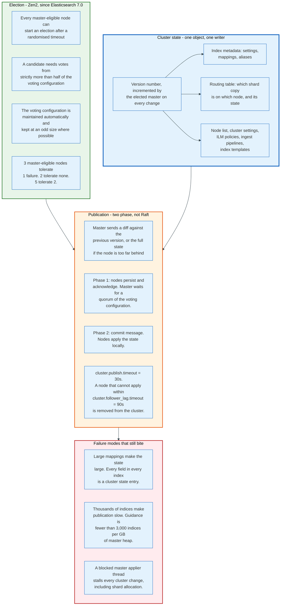
### 14.1 What Is in the Cluster State

- The list of nodes and their roles and attributes.
- Per-index metadata: settings, mappings, aliases, and the index's creation version.
- The routing table: for every shard, which node holds which copy and whether it is started, initialising, relocating, or unassigned.
- Cluster-wide settings, ILM policies, index templates, ingest pipelines, snapshot repositories, and stored scripts.
- A monotonic version number.

Every field of every mapping of every index is an entry. This is why mapping explosion is a cluster-stability problem and not merely a memory problem: `index.mapping.total_fields.limit` defaults to 1,000 fields per index precisely to bound it, and dynamic mapping on unstructured JSON is the usual way clusters exceed it.

### 14.2 Election

Elasticsearch replaced the original Zen discovery with Zen2 in version 7.0, released April 2019. The change removed `discovery.zen.minimum_master_nodes`, a setting whose misconfiguration was the standard cause of split-brain, and replaced it with an automatically maintained voting configuration.

The voting configuration is the set of master-eligible nodes whose votes count. A decision requires strictly more than half of them. Elasticsearch adjusts the set as nodes join and leave, keeping it at an odd size where possible so that a quorum is unambiguous.

The fault-tolerance arithmetic is fixed:

| Master-eligible nodes | Quorum | Tolerated simultaneous failures |
|-----------------------|--------|---------------------------------|
| 1 | 1 | 0 |
| 2 | 2 | 0 |
| 3 | 2 | 1 |
| 4 | 3 | 1 |
| 5 | 3 | 2 |
| 7 | 4 | 3 |

Two master-eligible nodes are strictly worse than one for availability and no better for durability. Three is the standard answer, five for very large clusters, and never an even number.

An election starts when a master-eligible node has not heard from a master within its timeout. It waits a randomised interval, requests votes, and becomes master when it holds a quorum. Collisions cause the round to fail and are retried with exponential backoff, so an election normally resolves within a few seconds.

### 14.3 Publication

Cluster state changes are published in two phases, which resembles Raft without being Raft.

**Phase one.** The master computes the new state, serialises a diff against the previous version, and sends it to every node. A node too far behind receives the full state instead. Each node persists the state and acknowledges. The master waits for acknowledgements from a quorum of the voting configuration.

**Phase two.** The master sends a commit message. Every node applies the state locally, which is when shard allocation decisions actually take effect on the node holding the shard.

Two timeouts govern the process:

- `cluster.publish.timeout`, default 30 seconds, is how long the master waits for the publication to complete before giving up and standing down.
- `cluster.follower_lag.timeout`, default 90 seconds, is how long a node may lag before the master removes it from the cluster.

A node that cannot apply cluster state changes fast enough is therefore ejected, which is the correct behaviour: a node with a stale routing table would serve searches against shards it no longer owns.

### 14.4 The Failure Modes That Persist

**Large cluster states make everything slow.** Publication sits in the path of index creation, shard allocation, node join, and ILM transitions. A 100 MB cluster state on a cluster with 50 nodes means 5 GB of network traffic per full publication, which is why diffs exist and why a node rejoining after a long absence is expensive.

**The cluster state applier is single-threaded per node.** A slow listener, most often one that touches disk, blocks every subsequent state application on that node. `GET /_cluster/pending_tasks` shows the queue.

**Master eligibility and data roles should not share a node in production.** A data node under garbage-collection pressure that also holds the master role will drop out of the cluster during a long pause, triggering an election and a wave of shard reallocation, which increases load, which triggers more pauses.

**Split brain is not possible by misconfiguration since 7.0, but network partitions still cost availability.** A minority partition has no quorum, cannot elect a master, and refuses writes to primaries it holds. That is the correct answer and it is still an outage for clients talking to that side.

---

## 15. Index Lifecycle Management and Data Tiers

Time-series data has a property that makes it cheap to store correctly: its access pattern is a decaying function of age, and its age is known. Index Lifecycle Management is the machinery that exploits it.

```mermaid
%%{init: {'theme': 'base', 'themeVariables': {'primaryColor': '#e3f2fd', 'primaryBorderColor': '#1565c0', 'lineColor': '#37474f'}}}%%

flowchart LR
    subgraph Hot["Hot phase"]
        H1["Writes land here.<br/>NVMe, most CPU, 1+ replica."]
        H2["rollover: max_primary_shard_size 50gb,<br/>max_age 30d, max_docs"]
        H3["Actions: rollover, set_priority,<br/>forcemerge, shrink, downsample,<br/>readonly, searchable_snapshot"]
    end

    subgraph Warm["Warm phase"]
        W1["Read-mostly. Cheaper disk,<br/>fewer CPUs, replicas retained."]
        W2["Actions: allocate, migrate, shrink,<br/>forcemerge, readonly, downsample,<br/>set_priority"]
        W3["forcemerge to 1 segment here,<br/>never in hot. It rewrites the<br/>whole shard."]
    end

    subgraph Cold["Cold phase"]
        C1["Fully mounted searchable snapshot.<br/>Index data lives in object storage,<br/>a full local copy is cached."]
        C2["Replicas can drop to 0.<br/>Recovery comes from the snapshot,<br/>which halves storage."]
    end

    subgraph Frozen["Frozen phase"]
        F1["Partially mounted searchable snapshot.<br/>Only the blocks a query touches<br/>are fetched from object storage."]
        F2["Shared cache on local disk,<br/>sized as a fraction of the node.<br/>3,000 frozen shards per node<br/>against 1,000 non-frozen."]
        F3["Seconds to minutes per query.<br/>Storage cost approaches the price<br/>of S3."]
    end

    Del["Delete phase<br/>wait_for_snapshot, then delete"]

    Rules["min_age is measured from rollover,<br/>not from index creation.<br/>All actions in a phase must finish<br/>before the next phase starts.<br/>ILM polls every 10 minutes by default."]

    Hot -->|min_age 7d| Warm -->|min_age 30d| Cold -->|min_age 90d| Frozen -->|min_age 365d| Del
    Hot -.governed by.-> Rules

    style Hot fill:#ffebee,stroke:#b71c1c,stroke-width:3px
    style Warm fill:#fff3e0,stroke:#e65100,stroke-width:2px
    style Cold fill:#e3f2fd,stroke:#1565c0,stroke-width:2px
    style Frozen fill:#e8f5e9,stroke:#2e7d32,stroke-width:2px
    style Rules fill:#eceff1,stroke:#37474f,stroke-width:2px
```
### 15.1 The Phases

An ILM policy defines up to five phases, entered in order, each with a `min_age` and a set of actions.

| Phase | Purpose | Actions available |
|-------|---------|-------------------|
| **hot** | Actively written and queried | `rollover`, `set_priority`, `unfollow`, `readonly`, `shrink`, `forcemerge`, `downsample`, `searchable_snapshot` |
| **warm** | No longer written, still queried | `set_priority`, `unfollow`, `readonly`, `allocate`, `migrate`, `shrink`, `forcemerge`, `downsample` |
| **cold** | Rarely queried, slower is acceptable | `set_priority`, `unfollow`, `readonly`, `searchable_snapshot`, `allocate`, `migrate`, `downsample` |
| **frozen** | Almost never queried | `unfollow`, `searchable_snapshot` |
| **delete** | Gone | `wait_for_snapshot`, `delete` |

`min_age` is measured from the rollover time when the index has rolled over, and from index creation when it has not. This distinction matters: an index that took seven days to fill has been alive for seven days longer than its data suggests, and ILM handles it correctly only because rollover resets the clock.

ILM runs on a timer, `indices.lifecycle.poll_interval`, which defaults to 10 minutes. All actions in a phase must complete before the next phase begins.

### 15.2 Rollover

Rollover is the mechanism that turns an infinite stream into a series of finite indices. A data stream writes to a backing index through an alias. When any of the configured conditions is met, a new backing index is created and the write alias moves to it.

```json
"rollover": {
  "max_primary_shard_size": "50gb",
  "max_age": "30d",
  "max_primary_shard_docs": 200000000
}
```

`max_primary_shard_size` is the condition that matters, because it directly targets the 10 GB to 50 GB shard sizing guidance regardless of ingest rate. Using `max_age` alone produces 2 GB shards on a quiet day and 400 GB shards on a busy one.

### 15.3 The Tiers and Searchable Snapshots

Data tiers are node roles that ILM's `migrate` action targets automatically.

**Hot** holds indices being written. Fast NVMe, the most CPU, at least one replica.

**Warm** holds read-mostly indices on cheaper storage, with replicas retained. This is where `forcemerge` belongs, because the index is now read-only.

**Cold** holds fully mounted searchable snapshots. The index data lives in an object store such as S3, and a complete local copy is cached on the node. Because the snapshot is the durable copy, the local replica count can drop to zero: recovery reads from the object store rather than from a peer. That single change halves the storage bill for the tier.

**Frozen** holds partially mounted searchable snapshots. Nothing is cached in full. A shared local cache holds only the blocks that queries actually touch, fetched from object storage on demand. A frozen node can address 3,000 shards against a non-frozen node's 1,000, and its storage cost approaches the price of object storage itself. Queries take seconds to minutes rather than milliseconds.

**Delete** removes the index, optionally after confirming a snapshot exists.

### 15.4 Downsampling

`downsample` replaces a time-series index with one holding pre-aggregated buckets at a coarser interval. Ten-second metrics become one-hour buckets carrying min, max, sum, and value count per time series. The reduction is proportional to the interval ratio, so ten-second data downsampled to one hour is 360 times smaller, minus the per-bucket overhead.

Downsampling is lossy and irreversible, which makes the ILM ordering the important part: downsample in the warm or cold phase, after the data's high-resolution value has expired, and never in hot.

### 15.5 A Realistic Policy

```json
{
  "policy": {
    "phases": {
      "hot":    { "actions": { "rollover": { "max_primary_shard_size": "50gb", "max_age": "1d" },
                               "set_priority": { "priority": 100 } } },
      "warm":   { "min_age": "2d",
                  "actions": { "forcemerge": { "max_num_segments": 1 },
                               "shrink": { "number_of_shards": 1 },
                               "set_priority": { "priority": 50 } } },
      "cold":   { "min_age": "30d",
                  "actions": { "searchable_snapshot": { "snapshot_repository": "s3-repo" },
                               "set_priority": { "priority": 0 } } },
      "frozen": { "min_age": "90d",
                  "actions": { "searchable_snapshot": { "snapshot_repository": "s3-repo" } } },
      "delete": { "min_age": "395d", "actions": { "delete": {} } }
    }
  }
}
```

The economics of that policy are the point. Days 0 to 2 sit on NVMe with replicas. Days 2 to 30 sit on cheaper disk, force-merged to one segment. Days 30 to 90 sit in S3 with a full local cache and no replica. Days 90 to 395 sit in S3 with only a partial cache. The last 305 days of a 395-day retention requirement cost close to the price of S3, and they are still searchable.

---

## 16. Vector Search, kNN, and Hybrid Ranking

Vector search answers a different question from the inverted index, and the two are complementary rather than competing. Lexical retrieval finds documents containing the query's terms. Vector retrieval finds documents whose embedding is near the query's embedding, which matches paraphrase and misses exact identifiers.

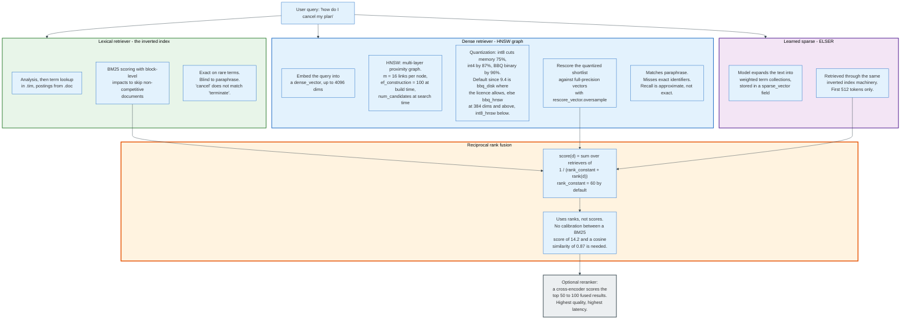
### 16.1 The Field Type

A `dense_vector` field holds a fixed-length array of numbers, up to 4,096 dimensions.

| Parameter | Options | Notes |
|-----------|---------|-------|
| `element_type` | `float` (4 bytes/dim, default), `bfloat16` (2 bytes), `byte` (1 byte), `bit` (1 bit) | `bit` requires dimensions divisible by 8 |
| `similarity` | `cosine`, `dot_product`, `l2_norm`, `max_inner_product` | Determines the score transform |
| `index` | `true` (default) | `false` stores the vector without an HNSW graph, for exact scoring only |
| `index_options.type` | `hnsw`, `int8_hnsw`, `int4_hnsw`, `bbq_hnsw`, `bbq_disk`, and `flat` variants | Determines quantization |
| `index_options.m` | 16 by default | Links per node in the HNSW graph |
| `index_options.ef_construction` | 100 by default | Candidate list size during graph construction |

Similarity is converted to a positive score so it can be blended with other clauses:

| Similarity | Score |
|------------|-------|
| `cosine` | `(1 + cosine(q, v)) / 2` |
| `dot_product`, float | `(1 + dot_product(q, v)) / 2` |
| `l2_norm` | `1 / (1 + l2_norm(q, v)^2)` |
| `max_inner_product` | `mip + 1` when non-negative, `1 / (1 - mip)` when negative |

`cosine` normalises vectors at index time, which means the stored vector is not the vector that was sent. `dot_product` requires the client to normalise them and is faster because it skips the magnitude computation.

### 16.2 HNSW

Hierarchical Navigable Small World is a multi-layer proximity graph. Each vector is a node. Each node links to roughly `m` neighbours on the bottom layer, and to progressively fewer nodes on higher, sparser layers. Search enters at the top layer, greedily walks toward the query, drops a layer, and repeats.

Two knobs control the accuracy-latency trade:

- `ef_construction`, at index time, is how many candidates the builder considers when choosing a node's neighbours. Higher means a better graph, slower indexing, and no runtime cost.
- `num_candidates`, at search time, is how many nodes the search keeps in its candidate list per shard. Higher means better recall and higher latency. It must be at least `k`.

kNN in Elasticsearch is approximate. Recall is a tuned quantity, not a guarantee. `num_candidates` of 100 for `k = 10` is a common starting point, and measuring recall against an exact `script_score` baseline on a sample is the only way to know what a given setting delivers.

Filtered kNN applies the filter **during** the graph walk rather than after it. Post-filtering would return fewer than `k` results whenever the filter is selective. Elasticsearch's implementation keeps expanding the search until `k` matching documents are found, which means a highly selective filter makes the graph walk more expensive, not less.

### 16.3 Quantization

A million 1,024-dimension float vectors occupy 4 GB before any graph overhead, and HNSW performs acceptably only when the vectors are in memory. Quantization is how that number comes down.

| Type | Bits per dimension | Memory reduction | Notes |
|------|--------------------|------------------|-------|
| `hnsw` | 32 | none | Raw floats |
| `int8_hnsw` | 8 | 75% | Scalar quantization |
| `int4_hnsw` | 4 | 87% | Requires an even number of dimensions |
| `bbq_hnsw` | ~1 | 96% | Better Binary Quantization, requires more than 64 dimensions |
| `bbq_disk` | ~1 | 96% | Graph on disk, clustered layout, Enterprise licence |

Quantization loses precision, and the recovery mechanism is rescoring. `rescore_vector.oversample` retrieves more candidates than requested from the quantized index, then rescores that shortlist against the full-precision vectors, which are still on disk. An oversample of 3.0 fetches 3k candidates and returns the best k. The result is close to full-precision recall at a fraction of the memory.

Defaults have moved quickly. Elasticsearch 9.0 defaulted float vectors to `int8_hnsw`. Elasticsearch 9.1 made the default depend on dimension count: `int8_hnsw` below 384 dimensions, `bbq_hnsw` at 384 and above. Elasticsearch 9.4 made `bbq_disk` the default for float and bfloat16 vectors where the licence permits. Byte and bit vectors are never quantized further.

### 16.4 Learned Sparse Retrieval

ELSER, the Elastic Learned Sparse EncodeR, sits between the two approaches. It expands a passage into a weighted collection of terms that the model has learned co-occur with it, rather than into a dense vector. Those terms are stored in a `sparse_vector` field and retrieved through the same inverted-index machinery as ordinary text.

The expansion terms are not synonyms. They are learned associations, so a passage about cancelling a subscription may expand to include `terminate`, `refund`, and `billing` with different weights. Retrieval then matches semantically while running entirely on the lexical engine. ELSER encodes only the first 512 tokens of a field, which makes chunking a prerequisite for long documents.

`semantic_text` is the field type that automates the whole chain: it chunks the input, calls the configured inference endpoint, stores the resulting vectors, and rewrites queries against it into the right retrieval form. It removed most of the boilerplate that semantic search required before Elasticsearch 8.15.

### 16.5 Hybrid Ranking with Reciprocal Rank Fusion

Combining a BM25 score of 14.2 with a cosine similarity of 0.87 requires knowing what those numbers mean relative to each other, and nobody does. Reciprocal rank fusion sidesteps the problem by discarding the scores and keeping only the ranks.

```
score(d) = sum over retrievers r of  1 / (rank_constant + rank_r(d))
```

`rank_constant` defaults to 60. A document ranked 1st by one retriever and absent from the other scores `1/61 = 0.01639`. A document ranked 3rd by both scores `2/63 = 0.03175` and wins. The constant controls how much weight lower ranks carry: a larger constant flattens the curve and lets deep results influence the fusion more.

RRF is expressed through the retriever syntax:

```json
{
  "retriever": {
    "rrf": {
      "retrievers": [
        { "standard": { "query": { "match": { "body": "cancel my plan" } } } },
        { "knn": { "field": "body_vector", "query_vector_builder": {
            "text_embedding": { "model_id": "my-model", "model_text": "cancel my plan" } },
            "k": 50, "num_candidates": 100 } }
      ],
      "rank_constant": 60,
      "rank_window_size": 100
    }
  },
  "size": 10
}
```

`rank_window_size` is how many results each retriever contributes to the fusion, and it defaults to the request's `size`. Setting it larger than `size` is almost always right, because a document that a retriever ranks 40th cannot be fused into the top 10 if only the top 10 were collected.

A reranker can sit on top. A cross-encoder scores the query and each candidate document jointly rather than separately, which is far more accurate and far more expensive, so it is applied to the top 50 to 100 fused results rather than to the corpus.

---

## 17. One Query, End to End

The mechanisms above compose. This section carries one request through all of them with concrete values.

**The setup.** An index `products` with 6 primary shards and 1 replica, holding 12 million documents across 6 nodes. Mapping: `title` as `text` with the `english` analyser and a `title.raw` keyword sub-field, `status` as `keyword`, `price` as `scaled_float`, `category_id` as `integer`, `description_vector` as a 768-dimension `dense_vector` with `bbq_hnsw`.

**The request.**

```json
GET /products/_search
{
  "size": 10,
  "query": {
    "bool": {
      "must":   [ { "match": { "title": "wireless noise cancelling headphones" } } ],
      "filter": [ { "term":  { "status": "published" } },
                  { "range": { "price": { "gte": 5000, "lte": 30000 } } } ]
    }
  },
  "aggs": { "by_category": { "terms": { "field": "category_id", "size": 10 } } }
}
```

**Step 1: coordination.** Node D receives the request over HTTP and becomes the coordinating node. It resolves `products` to 6 shards and picks one copy of each using adaptive replica selection. Six shards is below `pre_filter_shard_size` of 128, so no pre-filter round runs.

**Step 2: analysis of the query string.** The `english` analyser is resolved through the precedence chain in Section 6.4. `wireless noise cancelling headphones` becomes four terms: `wireless`, `nois`, `cancel`, `headphon`. The Porter stemmer is why the last three do not look like English.

**Step 3: query rewriting.** The `match` clause becomes a `BooleanQuery` of four `TermQuery` clauses with `should` semantics and a default `minimum_should_match` of 1. The `term` filter on `status` becomes a `TermQuery` in filter context. The `range` on `price` becomes a `PointRangeQuery` against the BKD tree in `.kdd`, not against the inverted index.

**Step 4: per-shard execution.** On each shard, the filter clauses run first and produce a bitset. `status: published` matches 11.2 of 12 million documents, so the caching policy declines to cache it: a `TermQuery` is never cached. The `price` range is a point query, which is costly to build and therefore cached after two uses on segments holding at least 10,000 documents.

The four term queries then look up their terms. `headphon` is found via the `.tip` trie, one seek into `.tim`, one block read of up to 48 entries. Its postings in `.doc` are walked in 256-document blocks, skipping whole blocks whose level-0 impacts prove they cannot beat the current 10th-best score. `wireless` has a `docFreq` of 90,000 on this shard out of 2 million documents, giving an IDF of `ln(1 + (2000000 - 90000 + 0.5)/(90000 + 0.5)) = 3.10`. `headphon` at `docFreq` 41,000 gives `ln(1 + 1959000.5/41000.5) = 3.89` and therefore counts more.

**Step 5: aggregation on the same pass.** The `terms` aggregation on `category_id` reads doc values from `.dvd`, not the inverted index. Because `size` is 10, `shard_size` defaults to `10 * 1.5 + 10 = 25`, so each shard returns its top 25 categories.

**Step 6: the shard result.** Each shard returns 10 tuples of (doc ID, `_score`, sort value) plus its 25 aggregation buckets. No `_source` has been read on any shard.

**Step 7: reduce.** Node D merges 60 hit tuples into a priority queue and keeps the top 10. It merges 150 aggregation buckets into 10, computing `doc_count_error_upper_bound` from the smallest count each shard reported. If that number is non-zero, the category counts are approximate and the response says so.

**Step 8: fetch.** The top 10 documents happen to live on 4 of the 6 shards. Node D issues a multi-get to those 4. Each reads the containing chunk from `.fdt`, decompresses it with Zstandard, extracts the requested documents, and returns their `_source`.

**Step 9: response.** Node D assembles the JSON and returns it. Total round trips: two, plus one HTTP response.

**What the timings usually look like.** On this shape of index and a warm page cache, the query phase runs in single-digit milliseconds per shard, the reduce is sub-millisecond, and the fetch phase is often the largest single component because it does the only decompression in the request. Raising `size` from 10 to 1,000 typically multiplies fetch time by far more than 100, because 1,000 documents are scattered across many more chunks. Those relationships hold generally; the absolute numbers depend entirely on hardware and are not published constants.

---

## 18. Economics: What It Costs to Run and Who Pays

The software is free and the machines are not. Every cost in an Elasticsearch deployment traces back to one of three resources: RAM for the page cache, disk for the segments, and CPU for merges and queries.

### 18.1 The Cost Structure of a Cluster

**RAM dominates.** Lucene reads its files through memory-mapped I/O, so every doc values lookup, postings read, and HNSW graph traversal is a page-cache hit or a disk read. The standard configuration gives the JVM heap no more than 50% of a node's RAM and caps it at 31 GB so that compressed ordinary object pointers remain enabled. The other half exists for the page cache, and it is not spare capacity.

**Disk is the second cost, and the index is larger than the data.** A JSON document indexed with default settings occupies roughly the size of its `_source` after Zstandard compression, plus the inverted index, plus doc values for every aggregatable field, plus norms, plus points for every numeric field. The total commonly runs between 0.5x and 1.5x the raw JSON size depending on how much of it is indexed, and `logsdb` mode reduces it further. Elastic's own benchmark reports up to 60% smaller storage for log data in `logsdb` mode, with a 10% to 20% indexing throughput cost.

**CPU is spent mostly on merges, not on queries, in write-heavy clusters.** Merging four 1 GB segments reads 4 GB and writes 4 GB. On a cluster ingesting continuously, background merge I/O routinely exceeds foreground query I/O.

**Vectors invert the ratios.** A million 1,024-dimension float vectors are 4 GB of raw data that HNSW wants resident. Quantization is not an optimisation in that setting; it is what makes the workload affordable.

### 18.2 Elastic's Pricing

Elastic sells three things, and the licence tier gates features rather than capacity.

**Elastic Cloud Hosted** is resource-based: instance size and zone count set the rate, and the tier multiplies it. Published entry rates, for a production configuration with 120 GB of storage across 2 zones, are 99 US dollars a month for Standard, 114 for Gold, 131 for Platinum, and 184 for Enterprise. Features gate on tier: searchable snapshots and the frozen tier require Enterprise, machine learning and cross-cluster replication require Platinum.

**Elastic Cloud Serverless** is usage-based and separates the resources that scale differently:

| Unit | Price | What it covers |
|------|-------|----------------|
| Ingest VCU-hour | from 0.14 USD | Indexing and transformation |
| Search VCU-hour | from 0.09 USD | Query execution |
| Machine Learning VCU-hour | from 0.07 USD | Inference and ML jobs |
| Search AI Lake storage | from 0.047 USD per GB-month | Retained data |
| Egress | from 0.05 USD per GB | Data leaving the region |

Elastic also meters model inference separately: the Elastic Managed LLM at 4.50 US dollars per million input tokens and 21 US dollars per million output tokens, and the Elastic Inference Service from 0.08 US dollars per million tokens.

**Self-managed** licensing is per node and per gigabyte of RAM, with the same tier structure. The basic tier is free and includes security, index lifecycle management, and vector search, which is a materially different bundle from what was free before 2019.

Elastic's fiscal 2026 revenue was 1.739 billion US dollars, growing 17.3% over fiscal 2025's 1.483 billion. The revenue comes overwhelmingly from the managed cloud and from subscriptions to features that sit outside the AGPL-licensed core.

### 18.3 Amazon's Pricing

Amazon OpenSearch Service prices instances by the hour plus storage separately. Representative on-demand rates in US East, North Virginia, as published on the AWS pricing page:

| Item | Price |
|------|-------|
| `c6g.large.search` | 0.113 USD per hour |
| `r6g.xlarge.search` | 0.335 USD per hour |
| `or1.xlarge.search` | 0.418 USD per hour |
| `or2.2xlarge.search` | 0.80 USD per hour |
| EBS gp3 storage | 0.122 USD per GB-month |
| EBS gp2 storage | 0.135 USD per GB-month |
| UltraWarm and Cold managed storage | 0.024 USD per GB-month |
| OpenSearch Serverless | 0.24 USD per OCU-hour |

The five-fold gap between EBS at 0.122 and managed warm storage at 0.024 US dollars per GB-month is the entire economic argument for tiering, and it is the same argument that Elastic's searchable snapshots make. Object storage costs roughly a fifth of block storage, and most data older than a month is queried rarely enough that the latency penalty does not matter.

### 18.4 The Arithmetic That Decides a Deployment

Two calculations settle most capacity questions.

**Shard count.** Total data volume divided by a target shard size of 30 GB, rounded up, gives the primary shard count. Multiply by `1 + number_of_replicas` for the total. Divide by 1,000 to get the minimum node count from the shard limit alone, then check against the RAM and disk figures, which usually bind first.

**Retention cost.** A cluster retaining 395 days of logs at 100 GB a day holds 39.5 TB before replicas. Kept entirely on hot NVMe with one replica, that is 79 TB of the most expensive storage available. Under the ILM policy in Section 15.5, the first 2 days are 200 GB of hot storage with replicas, the next 28 days are 2.8 TB of warm, and the remaining 365 days are 36.5 TB of object storage with no replica. The difference between those two bills is roughly an order of magnitude, and it is entirely a configuration choice.

---

## 19. Security and Risk

Elasticsearch's security history has one shape: a fast, developer-friendly default that assumed a trusted network, followed by a decade of closing that assumption. The remaining risks are mostly operational rather than cryptographic.

### 19.1 The Threat Model

**Unauthenticated network exposure.** For most of its history Elasticsearch shipped with no authentication in the free tier. An HTTP endpoint on port 9200 with no credentials exposes every document, every mapping, and the cluster settings API. Scanning the public internet for open 9200 ports has been a standard reconnaissance technique since 2015, and campaigns that mass-delete the contents of exposed clusters have run repeatedly, most visibly in 2017 and 2020.

**Script execution.** Two remote code execution vulnerabilities defined the early era. CVE-2014-3120, published 28 July 2014 with a CVSS v2 base score of 6.8, describes how "the default configuration in Elasticsearch before 1.2 enables dynamic scripting, which allows remote attackers to execute arbitrary MVEL expressions and Java code via the source parameter to `_search`". CVE-2015-1427, published 17 February 2015 with a base score of 7.5, describes how "the Groovy scripting engine in Elasticsearch before 1.3.8 and 1.4.x before 1.4.3 allows remote attackers to bypass the sandbox protection mechanism and execute arbitrary shell commands via a crafted script". The response was to disable dynamic scripting by default, abandon the sandbox model, and eventually replace both engines with Painless, a language designed with no capability to reach the filesystem, the network, or arbitrary Java classes.

**Query-shaped denial of service.** A search API that accepts arbitrary structure is a resource-consumption surface. A deeply nested `bool` query, a `terms` query with 100,000 values, a wildcard on a high-cardinality field, an aggregation with a huge `size`, or a `from` of 10,000 each cost far more than the request that carries them. The mitigations are limits rather than detection: `indices.query.bool.max_clause_count`, `index.max_terms_count`, `index.max_result_window`, `search.max_buckets`, and the circuit breakers.

**Supply chain.** Elasticsearch runs on the JVM and inherits its dependency surface. Log4Shell, CVE-2021-44228 in December 2021, is the reference case: Elasticsearch bundled Log4j 2 for logging and Elastic shipped patched 6.8.21 and 7.16.1 releases within days. The exposure was reduced by the Java Security Manager policy Elasticsearch already ran under, which is one of the few cases where that much-maligned mechanism paid for itself.

### 19.2 The Defences

**Circuit breakers** are the mechanism that turns an OutOfMemoryError into an HTTP 429. Each tracks memory attributable to a category and rejects requests that would push it past a limit.

| Breaker | Default limit | Guards against |
|---------|---------------|----------------|
| Parent | 70% of heap (95% with the real-memory breaker) | Total across all breakers |
| Field data | 40% of heap | Loading a high-cardinality `text` field into memory |
| Request | 60% of heap | Aggregation buckets and other per-request structures |
| In-flight requests | 100% of heap | Uncompressed bytes of concurrent requests |
| Accounting | 100% of heap | Structures held after a request ends, such as segment memory |

A breaker trip is a correct outcome. A node that answers 429 stays in the cluster; a node that runs out of heap leaves it, triggers reallocation, and increases load everywhere else.

**Authentication and authorisation** became free in versions 6.8.0 and 7.1.0 in May 2019, and became mandatory in 8.0 in February 2022. A fresh 8.x or 9.x cluster generates TLS certificates and an elastic superuser password on first start and refuses to start in production mode without them. Role-based access control operates at cluster, index, document, and field granularity: a role can grant read access to an index while excluding specific fields and while applying a query filter that limits which documents are visible.

**Bootstrap checks** run when a node binds to a non-loopback address and refuse startup if the configuration is unsafe. They cover heap sizing, file descriptor limits, memory locking, the maximum map count, and the discovery configuration. They exist because every one of those settings, left at an OS default, has caused production outages.

**Audit logging** records authentication successes and failures, access grants and denials, and connection events, and is available from the Platinum tier upward.

### 19.3 The Operational Risks That Remain

**Mapping explosion.** Dynamic mapping on unstructured JSON creates one field per distinct key. A log line with a per-request UUID as a key adds a field per request. `index.mapping.total_fields.limit` defaults to 1,000 and is the only thing standing between that pattern and a cluster state large enough to make publication time out. The fixes are `dynamic: strict`, `dynamic: false`, or a `flattened` field type, which stores an entire JSON object as a single field.

**Split brain is no longer possible by misconfiguration, but data loss during a partition is.** A primary that keeps accepting writes while separated from the master will be demoted when the partition heals, and operations it accepted after separation but never replicated are discarded. Sequence numbers make the discard detectable rather than silent, which is the improvement 6.0 delivered.

**Snapshot repositories are the actual durability boundary.** Replicas protect against node loss. They do not protect against a `DELETE /*` executed by a human, a bad mapping template, or a corrupted merge. `action.destructive_requires_name` defaults to `true` and blocks wildcard deletes, which is a small guard against a large class of incidents.

---

## 20. Licensing, Governance, and the OpenSearch Fork

The Elasticsearch fork is the clearest case study in what happens when a hyperscaler and an open-source vendor build the same managed service on the same permissively licensed code.

```mermaid
%%{init: {'theme': 'base', 'themeVariables': {'primaryColor': '#e3f2fd', 'primaryBorderColor': '#1565c0', 'lineColor': '#37474f'}}}%%

flowchart TB
    subgraph Cause["What triggered it"]
        CA["2015-2020: AWS sells a managed<br/>Elasticsearch service. Elastic sells<br/>a managed Elasticsearch service.<br/>The code is Apache 2.0."]
        CB["Sept 2019: AWS launches Open<br/>Distro for Elasticsearch, an<br/>Apache 2.0 distribution with its<br/>own security and alerting plugins"]
        CC["Jan 2021: Elastic relicenses<br/>Elasticsearch and Kibana to<br/>SSPL plus Elastic License 2.0.<br/>Neither is OSI-approved."]
    end

    subgraph Fork["The split"]
        FA["12 Apr 2021: AWS announces<br/>OpenSearch, forked from<br/>Elasticsearch 7.10.2,<br/>Apache 2.0"]
        FB["12 Jul 2021: OpenSearch 1.0 GA<br/>26 May 2022: OpenSearch 2.0<br/>6 May 2025: OpenSearch 3.0"]
        FC["16 Sept 2024: AWS transfers the<br/>project to the OpenSearch Software<br/>Foundation under the Linux Foundation"]
    end

    subgraph Diverge["Where the codebases diverged"]
        DA["Names: _xpack becomes _plugins.<br/>Security, alerting, anomaly detection<br/>ship free rather than under a<br/>commercial licence."]
        DB["Vectors: OpenSearch keeps FAISS and<br/>Lucene engines side by side, plus<br/>experimental GPU index building.<br/>Elasticsearch is Lucene-only."]
        DC["Query languages: Elasticsearch adds<br/>the ES-QL piped language. OpenSearch<br/>adds PPL and SQL."]
        DD["Storage: OpenSearch adds remote-backed<br/>segment replication to object storage.<br/>Elasticsearch adds stateless Serverless."]
    end

    subgraph Now["Where it stands, August 2026"]
        NA["29 Aug 2024: Elastic adds AGPL v3<br/>as a third option from 8.16,<br/>calling the fork settled"]
        NB["Elasticsearch 9.5.2 on Lucene 10.5.1.<br/>OpenSearch 3.8.0 on Lucene 10."]
        NC["Clients are not interchangeable<br/>above 7.10. Elastic's own clients<br/>refuse to talk to OpenSearch."]
        ND["Both remain Lucene downstreams.<br/>Every index-format improvement<br/>reaches both."]
    end

    CA --> CB --> CC --> FA --> FB --> FC
    FC --> Diverge
    Diverge --> Now

    style Cause fill:#ffebee,stroke:#b71c1c,stroke-width:2px
    style Fork fill:#fff3e0,stroke:#e65100,stroke-width:3px
    style Diverge fill:#e3f2fd,stroke:#1565c0,stroke-width:2px
    style Now fill:#e8f5e9,stroke:#2e7d32,stroke-width:2px
```
### 20.1 What Caused It

From 2015 Amazon Web Services sold a managed Elasticsearch service. So did Elastic. Both were selling operations around a codebase licensed under Apache 2.0, which permits exactly that. Elastic's differentiation was X-Pack, the commercial feature set covering security, alerting, machine learning, and monitoring, whose source was published in 2018 under the Elastic License but was not open source.

In September 2019 AWS launched Open Distro for Elasticsearch, an Apache 2.0 distribution bundling its own security, alerting, and anomaly detection plugins. That removed Elastic's differentiation and set up the next move.

Elastic announced the relicensing on 14 January 2021 and shipped it in Elasticsearch and Kibana 7.11 on 10 February 2021, moving from Apache 2.0 to a dual licence of the Server Side Public License and the Elastic License 2.0. The announcement post named the pair as SSPL and "the Elastic License"; Elastic License 2.0 itself arrived with 7.11. Neither is approved by the Open Source Initiative. The SSPL extends the AGPL's copyleft to the entire service stack around the software, which makes offering it as a managed service commercially impractical for anyone unwilling to open source their control plane.

### 20.2 The Fork

On 12 April 2021 AWS announced OpenSearch, forked from Elasticsearch 7.10.2, the last Apache 2.0 release. OpenSearch 1.0 reached general availability on 12 July 2021, 2.0 on 26 May 2022, and 3.0 on 6 May 2025.

On 16 September 2024 AWS transferred the project to the OpenSearch Software Foundation, an open technical project inside the Linux Foundation, with AWS, SAP, and Uber as founding premier members. IBM has since joined them, making four premier members alongside fifteen general members including Aiven, ByteDance, Canonical, DigitalOcean, NetApp, and CERN. That transfer answered the governance objection: OpenSearch is no longer a single vendor's fork.

On 29 August 2024 Shay Banon announced that Elastic would add the GNU Affero General Public License version 3 as a third licence option alongside SSPL and Elastic License 2.0, arriving in Elasticsearch 8.16.0. His stated reasoning was that the 2021 change had worked: "3 years later, Amazon is fully invested in their fork, the market confusion has been (mostly) resolved, and our partnership with AWS is stronger than ever."

Elasticsearch is therefore open source again by OSI's definition, under a licence that AWS's own service could not readily use, and the fork is permanent.

### 20.3 Where the Code Diverged

| Area | Elasticsearch 9.5 | OpenSearch 3.8 |
|------|-------------------|----------------|
| Licence | AGPL v3, SSPL, or Elastic License 2.0 | Apache 2.0 |
| Governance | Elastic N.V. | OpenSearch Software Foundation, Linux Foundation |
| Lucene | 10.5.1 | 10.x |
| API namespace | `_xpack`, `_security`, `_ilm` | `_plugins/_security`, `_plugins/_ism` |
| Security | Free tier and above, on by default | Included, Apache 2.0 |
| Lifecycle | ILM plus data streams | ISM, Index State Management |
| Vector engines | Lucene HNSW only | Lucene HNSW, FAISS, and formerly nmslib |
| Vector acceleration | CPU with SIMD via the Panama API | Adds experimental GPU index building |
| Query languages | Query DSL, ES-QL, SQL, EQL | Query DSL, PPL, SQL |
| Object storage | Searchable snapshots, stateless Serverless | Remote-backed storage with segment replication |
| Extra plugins | Commercial tiers | Alerting, anomaly detection, k-NN, ML Commons, all Apache 2.0 |

Both remain downstream of Apache Lucene, which is the important structural fact. Every improvement to the index format, the postings encoding, the merge policy, and the HNSW implementation reaches both projects. The fork is about who owns the distribution layer, not about who owns the search engine.

OpenSearch 3.0 claims more than 9.5 times the query performance of OpenSearch 1.3 across key query types and roughly 20% over 2.19, with experimental GPU-accelerated vector index building reported at 9.3 times the indexing speed of the CPU path.

### 20.4 The Practical Consequence for Users

Clients are not interchangeable above version 7.10. Elastic's official clients from the 7.13 releases onward check a product header and refuse to talk to OpenSearch. OpenSearch publishes its own client set. Code written against the 7.10 API works against both; code using anything newer does not.

The migration path in either direction is a reindex, not an upgrade. Snapshot formats diverged after the fork point, so a snapshot taken by one cannot generally be restored by the other above 7.10.

---

## 21. Comparisons and Alternatives

### 21.1 Against Other Search Engines

| System | Built on | Distribution model | Best at | Weakest at |
|--------|----------|--------------------|---------|------------|
| **Elasticsearch** | Lucene | Native cluster, JSON API | General-purpose search, observability, hybrid retrieval | Cost at scale, operational complexity |
| **OpenSearch** | Lucene | Same design, forked | The same workloads under Apache 2.0 | Feature lag on the newest Elastic work |
| **Apache Solr** | Lucene | SolrCloud, ZooKeeper for coordination | Faceted enterprise search, mature schema control | Smaller ecosystem, fewer managed offerings |
| **Vespa** | Own engine | Native cluster | Serving-time ranking with ML models, very large corpora | Steeper learning curve, smaller community |
| **Typesense, Meilisearch** | Own engines | Single binary | Instant search, developer ergonomics | Analytics, very large datasets |
| **Splunk** | Proprietary | Proprietary | Log analytics with a mature query language | Licence cost, closed format |
| **ClickHouse** | Own engine | Native cluster | Analytical queries over huge tables, log storage | Full-text relevance ranking |
| **Postgres full text** | Postgres | Whatever Postgres does | Search inside an existing transactional database | Relevance quality, scale, analysis flexibility |

The comparison that matters most in 2026 is against ClickHouse for observability. A log platform mostly runs filtered aggregations over structured fields with a timestamp, which is a columnar analytics workload rather than a relevance workload. ClickHouse does that with less storage and less CPU. Elasticsearch's answer has been `logsdb` mode, synthetic `_source`, and downsampling, which close much of the gap without changing the architecture. Where full-text relevance ranking genuinely matters, the inverted index still has no columnar substitute.

### 21.2 Against Vector Databases

| System | Lexical search | Vector search | Filtering | Operational shape |
|--------|----------------|---------------|-----------|-------------------|
| **Elasticsearch** | Native BM25 | HNSW with int8, int4, BBQ | Filter applied during graph traversal | One cluster for both |
| **OpenSearch** | Native BM25 | HNSW via Lucene or FAISS | Same | One cluster for both |
| **Pinecone, Weaviate, Qdrant, Milvus** | Limited or bolt-on | Purpose-built, often faster per vector | Varies | A second system to run |
| **pgvector** | Postgres full text | HNSW and IVFFlat in Postgres | SQL `WHERE` | No new system |

The trade is not about which does approximate nearest neighbour faster. It is about whether the workload needs lexical and vector retrieval fused, and whether an organisation wants to operate one system or two. Hybrid retrieval with RRF, filters applied inside the graph walk, and the fact that the filter is expressed in the same query language as the vector search are the reasons a search engine keeps winning this comparison for retrieval-augmented generation workloads.

### 21.3 When Not to Use Elasticsearch

**As the system of record.** No transactions, no referential integrity, and a documented preference that the source data live elsewhere.

**For exact-count analytics over huge tables.** `terms` aggregations are approximate across shards by construction, and `cardinality` is an estimate above the precision threshold. A columnar database gives exact answers for less money.

**For a small dataset with a search box.** A 200,000-row product catalogue in Postgres with a `tsvector` index and a GIN index will answer in single-digit milliseconds and requires no new cluster.

**For key-value lookups.** Elasticsearch will serve them, and a key-value store will serve them for an order of magnitude less.

---

## 22. Modern Developments

### 22.1 Storage Efficiency Became the Priority

The dominant engineering theme since 2024 is making the same data cost less.

**`logsdb` index mode** became generally available in Elasticsearch 9.0. It applies synthetic `_source`, which reconstructs the original document from doc values instead of storing a compressed copy, along with index sorting by host and timestamp so that similar documents sit adjacent and compress together. Elastic's benchmark reports up to 60% smaller storage for log data at a 10% to 20% indexing throughput cost.

**Zstandard replaced DEFLATE** for stored fields in Elasticsearch's own codec. `default` is Zstd level 1 with 14kB blocks; `best_compression` is Zstd level 3 with 240kB blocks.

**Postings blocks doubled** from 128 to 256 integers in Lucene 10.4, released 25 February 2026, trading a small amount of decode waste for better bulk throughput and lower bit-width variance.

**The term index became a trie.** Lucene 10.3, released 13 September 2025, replaced the FST that had backed the `.tip` file since Lucene 4 with a purpose-built trie under GITHUB#14333, with per-node encoding strategies chosen by the distribution of child labels.

### 22.2 Vectors Got Cheap

Binary quantization went from research to default in under two years. `bbq_hnsw` cuts vector memory by 96% and, with `rescore_vector.oversample` restoring precision on a shortlist, delivers recall close to full-precision search. Elasticsearch 9.1 made it the default at 384 dimensions and above; 9.4 made `bbq_disk`, which keeps the graph on disk with a clustered layout, the default where the licence allows.

`bfloat16` arrived as an element type, halving raw vector storage before any quantization. `semantic_text` collapsed chunking, inference, storage, and query rewriting into a single field type. The retriever syntax made RRF and reranking first-class parts of the query rather than bolt-ons.

### 22.3 Query Languages and Serverless

**ES-QL**, Elastic's piped query language, became generally available in 8.14 and now covers aggregation, enrichment, and lookup joins. It runs on a compute engine separate from the classic search path and is the direction of travel for analytics.

**Elastic Cloud Serverless** separates compute from storage entirely. Indices live in object storage, stateless nodes pull what they need, and the refresh interval defaults to 5 seconds rather than 1. Billing moves to VCU-hours by workload type. It is the same architectural move that Snowflake made for warehouses and that OpenSearch made with remote-backed storage.

**Resharding in place** is in development for the stateless architecture behind Elastic Cloud Serverless, not shipped. Pull requests carrying it were still landing against the 9.6 milestone through August 2026. There is no `_reshard` endpoint in the indices API, which lists `_clone`, `_shrink`, and `_split` and nothing else, and Elastic's own index-basics page still reads "The number of primary shards is fixed at index creation." The self-managed shard count remains a modulus chosen once.

### 22.4 Lucene's Direction

Lucene 10 requires JDK 21 and uses the Panama Vector API for SIMD-accelerated scoring and distance computation, which is where much of the vector-search speedup came from. Lucene 10.5, released 25 June 2026, added an experimental columnar batch indexing API and further bulk-scoring improvements.

The pattern across releases is consistent: the index format keeps getting denser, the scoring path keeps getting more vectorised, and the interesting work happens at the codec layer rather than in new query types.

---

## 23. Appendix

### 23.1 Diagram Index

| Diagram | Source | Description |
|---------|--------|-------------|
| Evolution timeline | [`diagrams/evolution-timeline.mmd`](diagrams/evolution-timeline.mmd) | Lucene, Elasticsearch, and OpenSearch from 1999 to 2026 |
| Inverted index build | [`diagrams/inverted-index-build.mmd`](diagrams/inverted-index-build.mmd) | Five documents through analysis to sorted postings |
| Index file layout | [`diagrams/index-file-layout.mmd`](diagrams/index-file-layout.mmd) | Every file extension in a Lucene segment and what it holds |
| Postings block encoding | [`diagrams/postings-block-encoding.mmd`](diagrams/postings-block-encoding.mmd) | Blocks of 256, two skip levels, and impacts |
| Analysis chain | [`diagrams/analysis-chain.mmd`](diagrams/analysis-chain.mmd) | Character filters, tokenizer, token filters, both sides |
| Segment lifecycle | [`diagrams/segment-lifecycle.mmd`](diagrams/segment-lifecycle.mmd) | Buffer to segment to merge, and deletes as tombstones |
| Refresh, flush, translog | [`diagrams/refresh-flush-translog.mmd`](diagrams/refresh-flush-translog.mmd) | The three events that make a write durable and visible |
| BM25 scoring | [`diagrams/bm25-scoring.mmd`](diagrams/bm25-scoring.mmd) | The three inputs and the two factors of the formula |
| Query and filter context | [`diagrams/query-filter-context.mmd`](diagrams/query-filter-context.mmd) | Scoring versus matching, and the caching policy |
| Doc values and aggregations | [`diagrams/doc-values-columnar.mmd`](diagrams/doc-values-columnar.mmd) | The columnar transpose and global ordinals |
| Shard routing | [`diagrams/shard-routing.mmd`](diagrams/shard-routing.mmd) | The Murmur3 routing formula, old and new |
| Scatter-gather | [`diagrams/scatter-gather.mmd`](diagrams/scatter-gather.mmd) | Query-then-fetch and the deep pagination cost |
| Cluster coordination | [`diagrams/cluster-coordination.mmd`](diagrams/cluster-coordination.mmd) | Cluster state, Zen2 election, two-phase publication |
| ILM and data tiers | [`diagrams/ilm-data-tiers.mmd`](diagrams/ilm-data-tiers.mmd) | Hot, warm, cold, frozen, delete, and searchable snapshots |
| Vector and hybrid search | [`diagrams/vector-search-hybrid.mmd`](diagrams/vector-search-hybrid.mmd) | HNSW, quantization, ELSER, and reciprocal rank fusion |
| The OpenSearch fork | [`diagrams/opensearch-fork.mmd`](diagrams/opensearch-fork.mmd) | Cause, split, divergence, and where it stands |

### 23.2 Key Terminology

| Term | Meaning |
|------|---------|
| **Analyser** | A chain of zero or more character filters, exactly one tokenizer, and zero or more token filters |
| **BKD tree** | The block k-d tree that indexes numerics, dates, IPs, and geo shapes, in `.kdd`, `.kdi`, and `.kdm` |
| **Block-max WAND** | A top-k algorithm that skips postings blocks whose maximum possible score cannot reach the current threshold |
| **BlockTree** | Lucene's term dictionary: blocks of 25 to 48 terms in `.tim`, indexed by a trie in `.tip` |
| **Circuit breaker** | A memory accountant that rejects a request rather than allowing an OutOfMemoryError |
| **Cluster state** | The versioned object describing nodes, indices, mappings, and shard placement; published by the elected master |
| **Codec** | The pluggable set of formats that decide how a segment's files are written |
| **Coordinating node** | Whichever node receives a request and is responsible for the scatter and the gather |
| **Doc values** | The column-oriented copy of a field's values, in `.dvd`, used for sorting, aggregating, and scripting |
| **Flush** | A Lucene commit: fsync the segments, write `segments_N`, trim the translog |
| **Global ordinals** | A shard-wide mapping of per-segment term ordinals, built lazily and discarded on refresh |
| **HNSW** | Hierarchical Navigable Small World, the multi-layer proximity graph behind approximate vector search |
| **Impacts** | The dominating (frequency, norm) pairs stored in skip data so a block's maximum score is known without decoding it |
| **In-sync copies** | The set of shard copies guaranteed to hold every acknowledged operation; maintained by the master |
| **Live docs** | The per-segment bitset in `.liv` marking which documents are not deleted |
| **Norm** | One byte per document per field encoding the field's length, used by BM25's length normalisation |
| **Point in time** | A pinned set of Lucene readers that keeps a result set stable across paginated requests |
| **Postings list** | The sorted list of document IDs, frequencies, and positions for one term |
| **Primary term** | A counter that increments on every primary promotion; combined with `_seq_no` to order operations |
| **Refresh** | Writing the indexing buffer into a new segment and reopening the reader, making writes searchable |
| **Routing** | The Murmur3 hash of the `_id` or the custom routing value, reduced modulo the shard count |
| **RRF** | Reciprocal rank fusion: combine result lists by rank rather than by score |
| **Segment** | A complete, immutable, self-contained Lucene index over a subset of documents |
| **Shard** | One Lucene index; an Elasticsearch index is N primary shards plus replicas |
| **Soft delete** | A retained tombstone that lets a lagging replica catch up by replaying operations rather than copying files |
| **Translog** | The per-shard append-only durability log covering everything not yet in a Lucene commit |
| **Trie index** | The structure that replaced the FST in `.tip` in Lucene 10.3 |

### 23.3 Reference Tables

**Defaults most often wrong out of the box**

| Setting | Default | Typical production value |
|---------|---------|--------------------------|
| `index.refresh_interval` | `1s` | `30s` for logs, `1s` for user-facing search |
| `index.translog.durability` | `request` | `request`, unless the source is replayable |
| `index.number_of_shards` | 1 | Data volume divided by 30 GB |
| `index.number_of_replicas` | 1 | 1, or 0 in cold with searchable snapshots |
| `index.max_result_window` | 10,000 | Leave it; use `search_after` |
| `index.mapping.total_fields.limit` | 1,000 | Leave it; fix the mapping |
| `index.codec` | `default` | `best_compression` for warm and cold |
| `indices.queries.cache.size` | 10% of heap | 10% |
| `indices.requests.cache.size` | 1% of heap | 2% on aggregation-heavy clusters |
| JVM heap | 1 GB | 50% of RAM, capped at 31 GB |
| `indices.memory.index_buffer_size` | 10% of heap | 10% to 20% on write-heavy nodes |
| `cluster.max_shards_per_node` | 1,000 | 1,000; more means the shards are too small |

**Structural constants**

| Constant | Value | Source |
|----------|-------|--------|
| `IndexWriter.MAX_DOCS` | 2,147,483,519 | `IndexWriter.java` |
| Postings `BLOCK_SIZE` | 256 integers, 128 before Lucene 10.4 | `lucene104/ForUtil.java` |
| `LEVEL1_FACTOR` | 32 blocks | `Lucene104PostingsFormat.java` |
| `LEVEL1_NUM_DOCS` | 8,192 documents | `Lucene104PostingsFormat.java` |
| `DEFAULT_MIN_BLOCK_SIZE` | 25 terms | `Lucene103BlockTreeTermsWriter.java` |
| `DEFAULT_MAX_BLOCK_SIZE` | 48 terms | `Lucene103BlockTreeTermsWriter.java` |
| Norm exact-encoding range | 0 to 23 | `SmallFloat.NUM_FREE_VALUES` |
| Doc values numeric block | 16,384 values | `Lucene90DocValuesFormat.java` |
| Doc values terms dict block | 64 terms, LZ4 | `Lucene90DocValuesFormat.java` |
| Doc values reverse index interval | 1,024 terms | `Lucene90DocValuesFormat.java` |
| Doc values skip index interval | 4,096, up to 4 levels | `Lucene90DocValuesFormat.java` |
| Stored fields chunk, BEST_SPEED | 81,920 bytes, 1,024 docs | `Lucene90StoredFieldsFormat.java` |
| Stored fields chunk, BEST_COMPRESSION | 491,520 bytes, 4,096 docs | `Lucene90StoredFieldsFormat.java` |
| Query cache minimum segment size | 10,000 docs and above half the mean | `LRUQueryCache.java` |
| Caching policy history window | 256 queries | `UsageTrackingQueryCachingPolicy.java` |
| BM25 `k1`, `b` | 1.2, 0.75 | `BM25Similarity.java` |
| Terms agg `shard_size` | `size * 1.5 + 10` | `BucketUtils.java` |
| `pre_filter_shard_size` | 128 | `SearchRequest.java` |
| `batched_reduce_size` | 512 | `SearchRequest.java` |
| `max_concurrent_shard_requests` | 5 | `SearchRequest.java` |
| `cluster.publish.timeout` | 30 seconds | `Coordinator.java` |
| `cluster.follower_lag.timeout` | 90 seconds | `LagDetector.java` |
| HNSW `m`, `ef_construction` | 16, 100 | `dense_vector` mapping |
| `dense_vector` maximum dims | 4,096 | `dense_vector` mapping |
| RRF `rank_constant` | 60 | RRF reference |

**Diagnostic API calls**

```
GET  /_cluster/health?level=indices
GET  /_cat/indices?v&s=store.size:desc
GET  /_cat/shards?v&s=store:desc
GET  /_cat/nodes?v&h=name,heap.percent,ram.percent,cpu,load_1m,disk.used_percent
GET  /_cluster/pending_tasks
GET  /_nodes/stats/indices/segments,merges,refresh,flush,translog,query_cache,request_cache
GET  /_nodes/stats/breaker
GET  /index/_stats/segments,docs,store
GET  /index/_segments
POST /index/_analyze              -- confirm index-time and query-time tokens agree
GET  /index/_explain/<id>         -- the full BM25 arithmetic for one document
GET  /index/_search?profile=true  -- per-query, per-shard, per-collector timings
GET  /_tasks?actions=*search&detailed
GET  /_cat/thread_pool/search,write?v&h=node_name,name,active,queue,rejected
GET  /index/_disk_usage?run_expensive_tasks=true
```

### 23.4 Primary Sources

- Apache Lucene 10.5.1 javadoc: [Lucene 10.4 file formats](https://lucene.apache.org/core/10_5_1/core/org/apache/lucene/codecs/lucene104/package-summary.html), [`Lucene104PostingsFormat`](https://lucene.apache.org/core/10_5_1/core/org/apache/lucene/codecs/lucene104/Lucene104PostingsFormat.html), [`BM25Similarity`](https://lucene.apache.org/core/10_5_1/core/org/apache/lucene/search/similarities/BM25Similarity.html)
- Apache Lucene source: `Lucene103BlockTreeTermsWriter.java`, `Lucene104PostingsFormat.java`, `lucene104/ForUtil.java`, `Lucene90DocValuesFormat.java`, `Lucene90StoredFieldsFormat.java`, `TieredMergePolicy.java`, `LRUQueryCache.java`, `UsageTrackingQueryCachingPolicy.java`, `SmallFloat.java`, `IndexWriter.java`
- Apache Lucene [release news and dates](https://lucene.apache.org/core/corenews.html) and `lucene/CHANGES.txt`
- Elasticsearch source: `IndexSettings.java`, `MergePolicyConfig.java`, `IndexRouting.java`, `RoutingFunction.java`, `IndicesQueryCache.java`, `IndicesRequestCache.java`, `SearchRequest.java`, `SearchModule.java`, `Coordinator.java`, `LagDetector.java`, `BucketUtils.java`, `CodecService.java`, `Zstd814StoredFieldsFormat.java`
- Elastic documentation: [translog settings](https://www.elastic.co/docs/reference/elasticsearch/index-settings/translog), [merge settings](https://www.elastic.co/docs/reference/elasticsearch/index-settings/merge), [index modules](https://www.elastic.co/docs/reference/elasticsearch/index-settings/index-modules), [query and filter context](https://www.elastic.co/docs/reference/query-languages/query-dsl/query-filter-context), [paginate search results](https://www.elastic.co/docs/reference/elasticsearch/rest-apis/paginate-search-results), [reciprocal rank fusion](https://www.elastic.co/docs/reference/elasticsearch/rest-apis/reciprocal-rank-fusion), [dense vector field type](https://www.elastic.co/docs/reference/elasticsearch/mapping-reference/dense-vector), [kNN search](https://www.elastic.co/docs/solutions/search/vector/knn), [quorum-based decision making](https://www.elastic.co/docs/deploy-manage/distributed-architecture/discovery-cluster-formation/modules-discovery-quorums), [reading and writing documents](https://www.elastic.co/docs/deploy-manage/distributed-architecture/reading-and-writing-documents), [index lifecycle](https://www.elastic.co/docs/manage-data/lifecycle/index-lifecycle-management/index-lifecycle), [data tiers](https://www.elastic.co/docs/manage-data/lifecycle/data-tiers), [size your shards](https://www.elastic.co/docs/deploy-manage/production-guidance/optimize-performance/size-shards), [ELSER](https://www.elastic.co/docs/explore-analyze/machine-learning/nlp/ml-nlp-elser), [logsdb index mode](https://www.elastic.co/docs/manage-data/data-store/data-streams/logs-data-stream)
- Shay Banon, ["Elasticsearch is Open Source, Again"](https://www.elastic.co/blog/elasticsearch-is-open-source-again), 29 August 2024
- [OpenSearch release history](https://opensearch.org/releases/) and ["Unveiling OpenSearch 3.0"](https://opensearch.org/blog/unveiling-opensearch-3-0/)
- NVD: [CVE-2014-3120](https://nvd.nist.gov/vuln/detail/CVE-2014-3120), [CVE-2015-1427](https://nvd.nist.gov/vuln/detail/CVE-2015-1427)
- Pricing: [Elastic Cloud Serverless](https://www.elastic.co/pricing/serverless-search), [Elastic Cloud Hosted](https://www.elastic.co/pricing/cloud-hosted), [Amazon OpenSearch Service](https://aws.amazon.com/opensearch-service/pricing/)
- Stephen Robertson and Hugo Zaragoza, "The Probabilistic Relevance Framework: BM25 and Beyond", 2009
- Yu. A. Malkov and D. A. Yashunin, "Efficient and robust approximate nearest neighbor search using Hierarchical Navigable Small World graphs", 2016
- Gordon Cormack, Charles Clarke, and Stefan Buettcher, "Reciprocal Rank Fusion outperforms Condorcet and individual Rank Learning Methods", SIGIR 2009
- Jun Rao, Eugene Shekita, and Sandeep Tata, "Using Paxos to Build a Scalable, Consistent, and Highly Available Datastore" and Microsoft Research's "PacificA: Replication in Log-Based Distributed Storage Systems", 2008

---

## 24. Key Takeaways

**Elasticsearch is a distribution layer and Lucene is the search engine.** Every question about index format, scoring, analysis, or segment behaviour is a Lucene question. Every question about shards, replicas, cluster state, or the JSON API is an Elasticsearch question. Answering the first kind by reading Elasticsearch documentation is how people end up with wrong mental models.

**Immutability explains everything downstream.** Segments are never modified, so deletes are bits in a `.liv` bitset, updates are delete-plus-insert, space is reclaimed only by merges, caches are keyed by segment, and search never blocks on a writer. One design commitment produces the entire behaviour set.

**A refresh is not a commit and durability is not visibility.** A write is durable after the translog fsync, typically within milliseconds. It is searchable after the next refresh, typically within one second. Those are different events with different mechanisms, and the translog covers the gap between them.

**BM25 is `idf * tf/(tf + k1*((1-b) + b*dl/avgdl))` and nothing more.** Three inputs per term per document, two tunable constants, a document frequency that is shard-local, and a field length compressed into one byte that is exact only below 24 tokens. Every relevance question resolves to `_explain`.

**Filter context is not a style preference.** A clause in `bool.filter` skips scoring and becomes eligible for a segment-level bitset cache after two to five uses. A clause in `bool.must` does neither. Moving `status: published` from `must` to `filter` is one of the largest single-line performance changes available.

**Doc values are the reason aggregations work at all.** The inverted index cannot answer "what value does this document hold", so Lucene writes a columnar copy of every aggregatable field. Aggregations then compare integer ordinals rather than strings, off the heap, at the cost of a second copy on disk.

**Aggregation results are approximate by construction.** `terms` returns each shard's local top `size * 1.5 + 10` and reports `doc_count_error_upper_bound`. `cardinality` is exact only below a 3,000-document precision threshold. Only a single-shard index gives exact answers for free.

**The shard count is a modulus, not a tuning knob.** `floorMod(murmur3(routing), number_of_shards)` decides where a document lives. Changing the count changes the answer for every document, which is why `_split` and `_shrink` both rewrite data. Aim for 10 GB to 50 GB per shard and fewer than 1,000 shards per node.

**Deep pagination costs `shards x (from + size)` and there is no way around the arithmetic.** `search_after` with a point in time costs `shards x size` per page regardless of depth, and the PIT is what stops results shifting under the reader. `index.max_result_window` of 10,000 exists to make the failure loud rather than fatal.

**Three master-eligible nodes, never two, never four.** A quorum is strictly more than half the voting configuration. Two nodes tolerate zero failures, exactly as one does, while doubling the chance that a failure occurs.

**Tiering is the whole storage economy.** Object storage costs roughly a fifth of block storage, and a searchable snapshot in the cold tier can drop its replica because the snapshot is the durable copy. A 395-day retention policy spends most of its bill on the first 30 days if it is configured correctly, and spends it evenly if it is not.

**Vector search is approximate, and quantization is what makes it affordable.** HNSW recall is a tuned quantity controlled by `num_candidates`, not a guarantee. BBQ binary quantization cuts vector memory by 96%, and `rescore_vector.oversample` restores precision on a shortlist. Since Elasticsearch 9.1 it is the default at 384 dimensions and above.

**Hybrid retrieval works because RRF ignores scores.** Combining a BM25 score with a cosine similarity requires a calibration nobody has. Combining rank 3 with rank 7 requires nothing. `1/(60 + rank)` summed across retrievers is the whole algorithm.

**The fork is permanent and both sides still ship Lucene.** Elasticsearch is AGPL v3 again since 8.16, OpenSearch is Apache 2.0 under the Linux Foundation, the clients refuse to talk to each other above 7.10, and every improvement to the index format reaches both. The split was about who sells the managed service, not about who writes the search engine.
